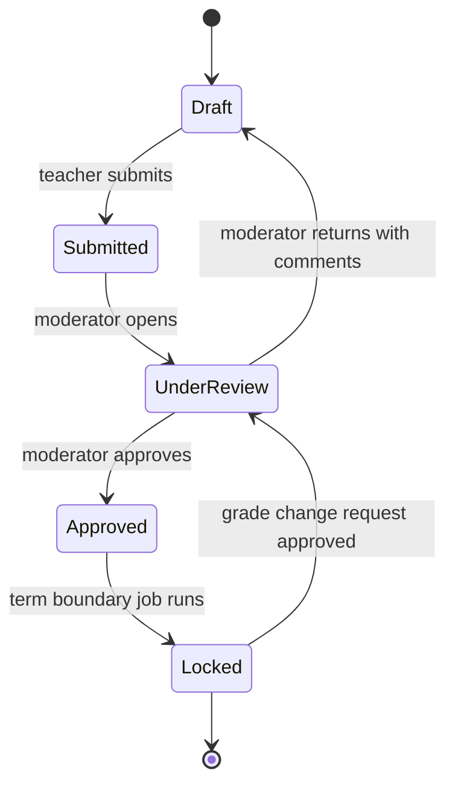

# Mermaid conventions

A diagram earns its place by showing something a table cannot. If the diagram is a list with boxes around it, write the table instead.

## Type by purpose

| Purpose | Type |
|---|---|
| System context and containers | `C4Context`, `C4Container` |
| Service topology, messaging topology, decision trees | `flowchart` |
| Workflow or aggregate lifecycle | `stateDiagram-v2` |
| Saga, request and reply, authentication flow | `sequenceDiagram` |
| Entities and relationships | `erDiagram` |
| Phase dependencies and critical path | `flowchart` with ranks, or `gantt` for dates |

The kit lint rejects a Mermaid block whose first non-comment line is not one of the known types. Never open a block with a bare node line.

## Rules

- **Direction.** `flowchart LR` for pipelines and topology, `flowchart TD` for decisions. Keep one direction per document.
- **Labels are nouns for nodes and verbs for edges.** `Attendance API -->|publishes attendance.student.absent.v1| Notification Worker`.
- **Name things exactly as the canonical registry names them.** A diagram that says "Notifications" when the service is `Notification` is a defect the lint cannot catch.
- **One concern per diagram.** Split rather than crowd. Twelve nodes is a lot; twenty is unreadable.
- **No colors carrying meaning.** They disappear in print and fail contrast. Use labels and grouping.
- **Every state machine has a terminal state and every transition has a trigger.**

## Worked example

Every transition names who or what triggers it, and `Locked` has a documented way out, because in a real school it always needs one.