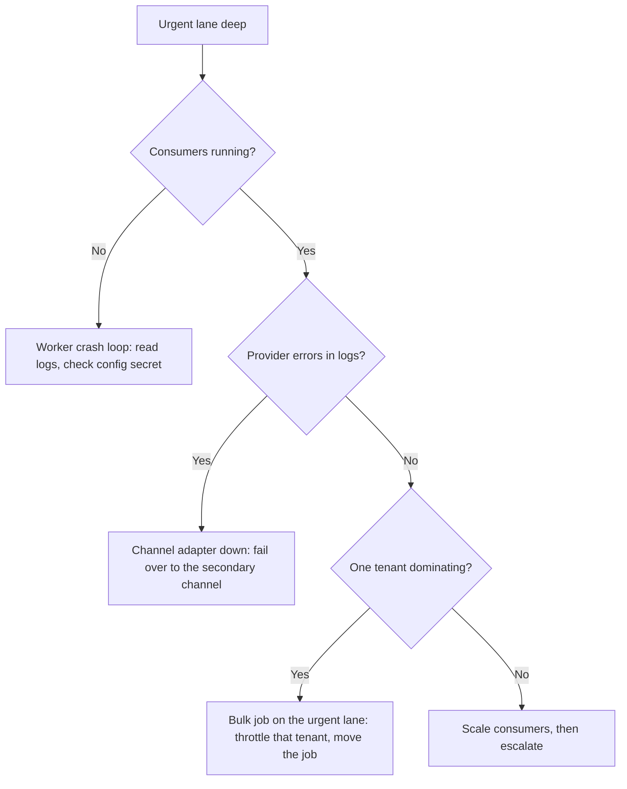

# Runbooks

Write for a person who is on call, did not build the service, and has three minutes of patience. Everything else is documentation, not a runbook. Service levels and error budgets are in `docs/brief/01-master-brief.md` Section 31.

## Rules

- **State the alert in product terms.** Not "queue depth above 5000" but "absence alerts to parents are more than ten minutes late". The responder needs to know what a parent is experiencing.
- **Commands are copy-and-paste ready**, with the expected healthy output beside each one. Give the Windows PowerShell form and the bash form wherever they differ.
- **Three checks maximum before the first decision.** A runbook that starts with ten checks will be skipped.
- **Mark every mitigation reversible or not**, with its blast radius.
- **Write the "never do this" list.** It is the most valuable section, and it is the one people remember.
- **Escalate on a clock**, to a named role, with a stated handover.
- **Close with what should have caught this**: the missing monitor, the missing test.

## Worked example: `NotificationLaneBacklog`

**What it means.** Urgent notifications (absence alerts, emergency broadcasts) have been queued for more than ten minutes. Parents of absent children have not been told. This is silent: nothing is visibly broken in the product.

**First checks**

| Check | PowerShell | bash | Healthy |
|---|---|---|---|
| Lane depth | `kubectl exec deploy/rabbitmq -- rabbitmqctl list_queues name messages` | same command | urgent lane under 100 |
| Consumers alive | `kubectl get pods -l app=notification-worker` | same command | all `Running`, restarts stable |
| Provider reachable | `kubectl logs deploy/notification-worker --tail=50` | same command | no repeated provider timeouts |

**Never do this**

- Never replay the dead-letter queue for notifications. Parents receive duplicates of alerts about their children, some of them hours stale, and there is no way to take them back.
- Never raise the prefetch limit to drain faster. It removes the tenant fairness that is probably the cause.
- Never disable the alert to stop the paging.

**Escalate** after 20 minutes without recovery, to the on-call platform engineer, with the lane depths, the dominant tenant, and the actions already taken.
