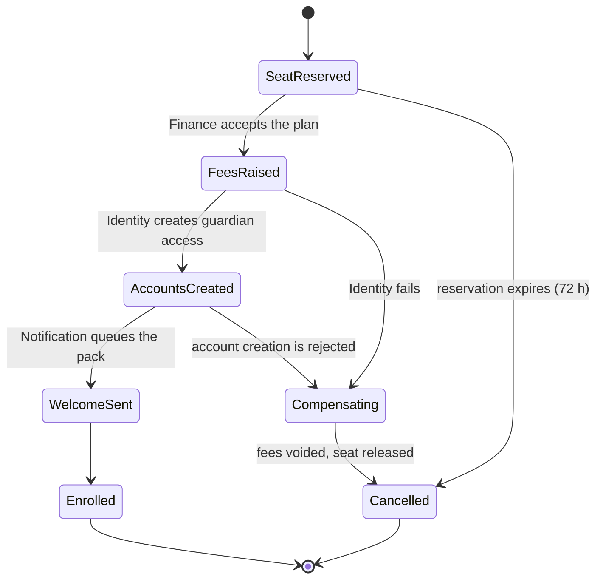

# Saga design

A saga is a process that spans services and can fail halfway. The design question is not the happy path; it is **what you do with the half that already happened.**

## Rules

1. **Every step has a compensation, or the step goes last.** Steps that cannot be undone (an email to a parent, a payment capture, a generated certificate) are ordered after every step that can.
2. **Every saga has a timeout and a terminal state.** A saga that can sit in `AwaitingPayment` forever is an operational incident waiting for a quiet Friday.
3. **Compensation is idempotent too.** It will run twice.
4. **Compensation is not a rollback.** You cannot un-send a message; you send a correction, and the design says so plainly.
5. **State lives in the orchestrator's own database**, in the same transaction as its outbox.
6. **Every terminal state is reachable and observable.** A failed saga raises an operator-visible event, not a log line.

## Worked example: enrollment

| Step | Forward | Compensation | Idempotency key |
|---|---|---|---|
| Reserve seat | `school.seat.reserve` | Release seat | application id |
| Raise fees | `finance.feeplan.create` | Void the plan with reason `enrollment-cancelled` | application id |
| Create accounts | `identity.guardian.provision` | Deactivate, never delete: the audit trail must survive | guardian id plus application id |
| Send welcome pack | `notification.welcome.send` | None. It is last precisely because it cannot be undone | application id |

Timeouts: 72 hours on `SeatReserved`, 15 minutes on each service step, then `Compensating`.

Write the test that fails the third step and asserts that the seat is free, the fee plan is voided, the guardian account is deactivated rather than deleted, and **no welcome message was sent**.