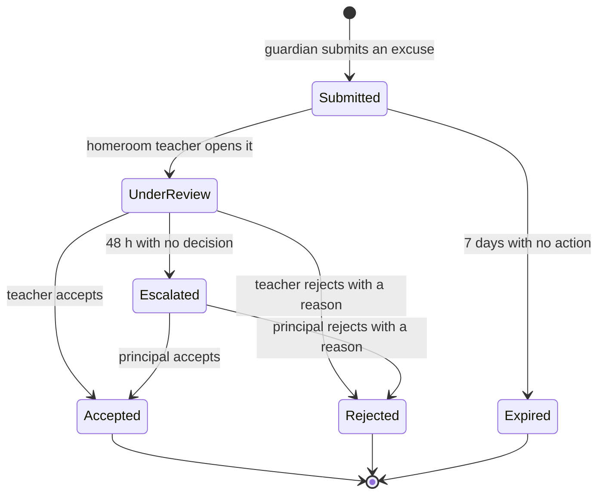

# Workflow state machines

A workflow is finished when someone can implement it without asking who may do what, and when an operator can tell which state a stuck item is in.

## Required shape

`WF-<AREA>-<NN>`, written into `docs/brief/02-appendices/appendix-r-workflow-catalog.md`, then:

1. A Mermaid `stateDiagram-v2` with a start, a terminal state, and **no state you cannot leave**.
2. A transition table: from, to, trigger, **who may**, validations, side effects (events published, notifications sent, audit entry), and the test case identifier.
3. Timeouts and escalations, with what happens when nobody acts.
4. The reversal path: how a mistake gets undone, and who may undo it.
5. The concurrency rule: what happens when two people act at once.

## Rules

- **Every transition names a role from the permission catalog.** "The school" is not a role.
- **Every state a human waits in has a timeout.** Schools have holidays; an approval queued on 20 June will sit until September unless the design says otherwise.
- **Every terminal state is reachable from every state**, directly or through cancellation. Support must always be able to end an item.
- **Side effects are listed per transition, not per workflow.** That is what makes the test table writable.

## Worked example

**WF-ATT-03. Absence excuse.**

| From | To | Trigger | Who may | Validation | Side effects | Test |
|---|---|---|---|---|---|---|
| Submitted | UnderReview | Open | `attendance.excuse.review` | Attendance record exists and is not locked | Audit entry | TC-ATT-031 |
| UnderReview | Accepted | Accept | `attendance.excuse.review` | Within the excuse window | `attendance.excuse.accepted.v1`; mark becomes excused; guardian notified | TC-ATT-032 |
| UnderReview | Rejected | Reject | `attendance.excuse.review` | Reason is required, minimum 10 characters | `attendance.excuse.rejected.v1`; guardian notified with the reason | TC-ATT-033 |
| UnderReview | Escalated | 48 h timer | System | Working days only, holidays excluded | Principal notified | TC-ATT-034 |
| Submitted | Expired | 7 day timer | System | Working days only | Guardian notified once | TC-ATT-035 |

Concurrency: the first decision wins; the second returns `ATTENDANCE_EXCUSE_ALREADY_DECIDED` and shows who decided.

Reversal: an accepted excuse is reversed only through a grade-change-style request, because the attendance record may already be in a submitted regulatory report.