# Appendix R. Workflow Catalog

> Part of `docs/brief/02-appendices/`. Normative. Read with the master brief and the reference architecture.

Every business process in this product is a **state machine**, never a screen flow. A workflow names the one service that owns its state, the roles allowed to drive each transition, the guard that must hold before the transition fires, the integration events it publishes, and the test cases that prove it. Nothing moves because a button exists; it moves because a guard passed and a permission was held, and the move is written to the audit trail with the actor, the tenant, and the before and after state. Transitions that cross a service boundary are sagas: each step publishes an event, each consumer is idempotent, and each step declares the compensating step that undoes it when a later step fails. A saga that fails halfway compensates and leaves nothing half-applied, and the administrator sees exactly which step stopped and why. Timeouts are first-class: a state that can wait names the waiting period, the reminder ladder, and the escalation target, so no request sits forever on an absent approver. Tenancy is a guard like any other — a transition whose subject belongs to another tenant is refused before any check on permission. The 18 workflows named in master brief Section 14 are all here, expanded, alongside the joining, lifecycle, finance, care, and platform-operations machines that Section 11 and Section 15 imply.

---

## R.1 Index

| ID | Workflow | Owning service | Tier | Mobile | Offline |
|---|---|---|---|---|---|
| WF-IDN-01 | Invitation or join-code joining | Identity | 1 | yes | no |
| WF-IDN-02 | Parent self-registration and child linking | Identity | 1 | yes | no |
| WF-IDN-03 | Duplicate account merge | Identity | 1 | no | no |
| WF-IDN-04 | Delegation during absence | Identity | 1 | yes | no |
| WF-IDN-05 | Role change with four-eyes approval | Identity | 1 | yes | no |
| WF-IDN-06 | Offboarding and access revocation | Identity | 1 | no | no |
| WF-SEC-01 | Access review campaign | Identity | 1 | no | no |
| WF-SEC-02 | Break-glass access | Identity | 1 | no | no |
| WF-SEC-03 | Consented impersonation | Identity | 1 | no | no |
| WF-PLT-01 | Tenant signup to live | Platform | 1 | no | no |
| WF-PLT-02 | Trial conversion and plan change | Platform | 1 | no | no |
| WF-PLT-03 | Suspension, export, and deletion | Platform | 1 | no | no |
| WF-SCH-01 | Transfer or withdrawal with clearance | School | 1 | no | no |
| WF-SCH-02 | End of year close and rollover | School | 1 | no | no |
| WF-SCH-03 | Year archival and reopen | School | 1 | no | no |
| WF-SCH-04 | Mid-year campus transfer | School | 1 | no | no |
| WF-ADM-01 | Inquiry to enrollment | Admissions | 1 | yes | no |
| WF-ADM-02 | Re-enrollment with fee settlement check | Admissions | 1 | yes | no |
| WF-ACA-01 | Assignment lifecycle | Academics | 1 | yes | yes |
| WF-ASM-01 | Exam to report card | Assessment | 1 | yes | yes |
| WF-ASM-02 | Grade appeal and post-lock change | Assessment | 1 | yes | no |
| WF-ASM-03 | Exam paper setting, review, and printing | Assessment | 1 | no | no |
| WF-ATT-01 | Daily attendance to intervention | Attendance | 1 | yes | yes |
| WF-ATT-02 | Early dismissal and gate pickup | Attendance | 1 | yes | no |
| WF-FIN-01 | Fee plan to collection and escalation | Finance | 1 | yes | no |
| WF-FIN-02 | Invoice reversal, credit note, and refund | Finance | 1 | no | no |
| WF-FIN-03 | Cheque receipt and bounce | Finance | 1 | no | no |
| WF-FIN-04 | Scholarship award | Finance | 1 | yes | no |
| WF-FIN-05 | Payer change to sponsor | Finance | 1 | yes | no |
| WF-FIN-06 | Cashier day close | Finance | 1 | no | no |
| WF-RQS-01 | Service request lifecycle | Requests | 1 | yes | no |
| WF-BEH-01 | Incident to intervention | Behavior | 1 | yes | no |
| WF-WEL-01 | Accommodation plan to exam sitting | Wellbeing | 2 | no | no |
| WF-WEL-02 | Clinic visit to sent home | Wellbeing | 2 | yes | no |
| WF-WEL-03 | Medication authorization and administration | Wellbeing | 2 | yes | no |
| WF-WEL-04 | Safeguarding concern escalation | Wellbeing | 2 | yes | no |
| WF-WEL-05 | Daily wellbeing check-in escalation | Wellbeing | 2 | yes | yes |
| WF-HR-01 | Staff leave to substitution | Hr | 2 | yes | no |
| WF-HR-02 | Staff hiring to onboarding | Hr | 2 | no | no |
| WF-HR-03 | Teaching licence expiry compliance | Hr | 2 | no | no |
| WF-HR-04 | Payroll input cycle | Hr | 2 | no | no |
| WF-OPS-01 | Purchase requisition to asset | Operations | 2 | yes | no |
| WF-OPS-02 | Library lending and fines | Operations | 2 | yes | yes |
| WF-OPS-03 | Transport subscription change | Operations | 2 | yes | no |
| WF-OPS-04 | Facility booking approval | Operations | 2 | yes | no |
| WF-OPS-05 | Safety incident and drill logging | Operations | 2 | yes | yes |
| WF-PRV-01 | Data subject access request | Platform | 1 | no | no |
| WF-PRV-02 | Sensitive export approval | Documents | 1 | no | no |
| WF-DATA-01 | Legacy import with dry run and rollback | Documents | 1 | no | no |
| WF-INF-01 | On-premises upgrade with rollback | Platform | 1 | no | no |
| WF-INF-02 | Release rollout with canary and rollback | Platform | 1 | no | no |
| WF-INF-03 | Restore and failover drill | Platform | 1 | no | no |

Fifty-two workflows across seventeen area codes. Tier follows the owning service in Appendix L: a Tier 2 workflow may be deferred with its service, and a Tier 1 workflow may not.

---

## R.2 Identity, joining, and access

### WF-IDN-01 Invitation or join-code joining

**Owner:** Identity · **Trigger:** An administrator sends an invitation, or a person enters a school join code · **Actors:** School administrator, Invitee, Approver · **Tier:** 1 · **Mobile:** yes · **Offline:** no

Both ways into a school end at the same place: a verified person holding exactly one role with one data scope. Keeping them in one machine means the approval, the scope check, and the audit entry cannot differ between the two doors.

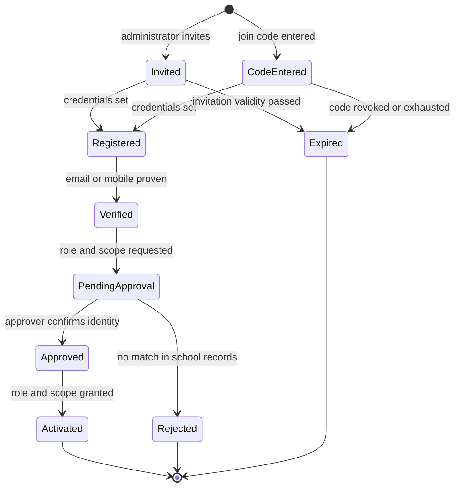
```mermaid
stateDiagram-v2
    [*] --> Invited: administrator invites
    [*] --> CodeEntered: join code entered
    Invited --> Registered: credentials set
    CodeEntered --> Registered: credentials set
    Registered --> Verified: email or mobile proven
    Verified --> PendingApproval: role and scope requested
    PendingApproval --> Approved: approver confirms identity
    PendingApproval --> Rejected: no match in school records
    Approved --> Activated: role and scope granted
    Activated --> [*]
    Rejected --> [*]
    Invited --> Expired: invitation validity passed
    CodeEntered --> Expired: code revoked or exhausted
    Expired --> [*]
```

**Side effects:** `identity.user.invited.v1`, `identity.join-request.submitted.v1`, `identity.join-request.approved.v1`, `identity.user.registered.v1`, `identity.user.activated.v1`, `identity.audit.recorded.v1`. Welcome notification with the guided tour link; audit entry naming the approver and the granted scope.

**Timeouts and escalation:** Invitation expires after 14 days with one reminder at day 7. A join request untouched for 48 hours escalates to the school administrator group; at 7 days it moves to Expired.

**Compensation:** If the scope grant fails after approval, the account stays in Approved with no session, the grant is retried, and the approver is notified. No partially privileged account is ever activated.

| Transition | Guard | Expected result | Test |
|---|---|---|---|
| Invited to Registered | Token unused, unexpired, bound to this tenant | Account created, no permissions yet | TC-IDN-001 |
| CodeEntered to Registered | Code active and seat quota not exhausted | Join request queued for approval | TC-IDN-002 |
| Verified to PendingApproval | Contact channel proven in the same session | Request visible only to approvers of that campus | TC-IDN-003 |
| PendingApproval to Approved | Approver holds `identity.join-requests.approve` in the same tenant | Role and scope granted, activation event published | TC-IDN-004 |
| PendingApproval to Approved | Approver belongs to another tenant | Refused before the permission check, attempt audited | TC-IDN-005 |
| Invited to Expired | Clock past validity | Token rejected, no account created | TC-IDN-006 |

### WF-IDN-02 Parent self-registration and child linking

**Owner:** Identity · **Trigger:** A parent registers on the public sign-up page and claims one or more children · **Actors:** Parent, Registrar, School administrator · **Tier:** 1 · **Mobile:** yes · **Offline:** no

A self-registered parent must never see a child until a person at the school has matched the claim against the student record. The account exists first and sees nothing; each child link is approved on its own.

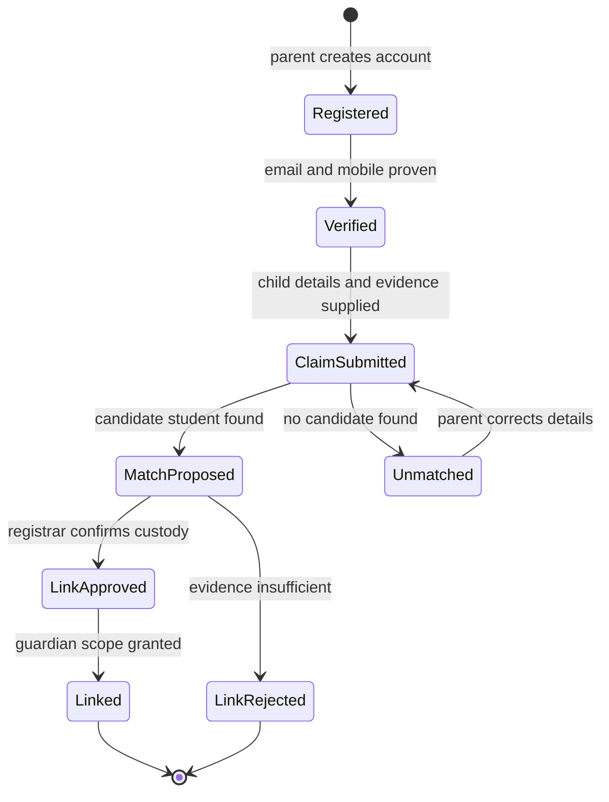
```mermaid
stateDiagram-v2
    [*] --> Registered: parent creates account
    Registered --> Verified: email and mobile proven
    Verified --> ClaimSubmitted: child details and evidence supplied
    ClaimSubmitted --> MatchProposed: candidate student found
    ClaimSubmitted --> Unmatched: no candidate found
    Unmatched --> ClaimSubmitted: parent corrects details
    MatchProposed --> LinkApproved: registrar confirms custody
    MatchProposed --> LinkRejected: evidence insufficient
    LinkApproved --> Linked: guardian scope granted
    Linked --> [*]
    LinkRejected --> [*]
```

**Side effects:** `identity.user.registered.v1`, `identity.guardian-link.created.v1`, `school.guardian.updated.v1`, `identity.audit.recorded.v1`. Registrar task created in the Requests inbox; the parent is notified on every decision.

**Timeouts and escalation:** A claim in MatchProposed for 3 working days reminds the registrar; at 10 days it escalates to the school administrator. An unmatched claim is cleared after 30 days.

**Compensation:** If the scope grant fails, the link returns to LinkApproved and is retried. A link created against the wrong student is revoked, which removes the scope and publishes the revocation so caches and the Student 360 view drop it.

| Transition | Guard | Expected result | Test |
|---|---|---|---|
| Registered to Verified | Both channels proven and no account exists for the same identity | Account usable with zero children visible | TC-IDN-011 |
| Verified to ClaimSubmitted | At most five open claims per account | Claim queued with evidence attached | TC-IDN-012 |
| ClaimSubmitted to MatchProposed | Candidate sits in the registrar tenant and campus scope | Candidate shown with masked identifiers | TC-IDN-013 |
| MatchProposed to LinkApproved | Registrar holds `school.guardians.link` and custody allows access | Guardian scope granted and event published | TC-IDN-014 |
| MatchProposed to LinkApproved | A court order restricts this guardian | Transition refused and the safeguarding note surfaced | TC-IDN-015 |
| Linked to Linked | Second claim for a sibling | Second child added without a second account | TC-IDN-016 |

### WF-IDN-03 Duplicate account merge

**Owner:** Identity · **Trigger:** The data quality centre or an administrator flags two accounts as the same person · **Actors:** School administrator, Platform operator · **Tier:** 1 · **Mobile:** no · **Offline:** no

The same person joins twice through different doors and both accounts accumulate real history. The merge must be reversible until it is confirmed, and it must never move data across a tenant boundary.

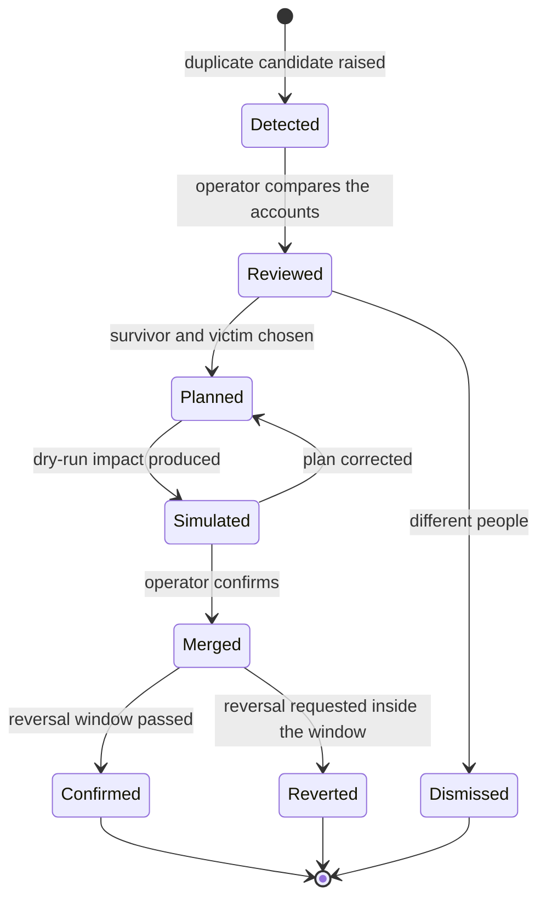
```mermaid
stateDiagram-v2
    [*] --> Detected: duplicate candidate raised
    Detected --> Reviewed: operator compares the accounts
    Reviewed --> Dismissed: different people
    Reviewed --> Planned: survivor and victim chosen
    Planned --> Simulated: dry-run impact produced
    Simulated --> Merged: operator confirms
    Simulated --> Planned: plan corrected
    Merged --> Confirmed: reversal window passed
    Merged --> Reverted: reversal requested inside the window
    Confirmed --> [*]
    Reverted --> [*]
    Dismissed --> [*]
```

**Side effects:** `identity.user.deactivated.v1`, `identity.permissions.changed.v1`, `identity.guardian-link.created.v1` for each link moved to the survivor, `identity.audit.recorded.v1` with before and after values for every moved link. Both addresses are notified on the surviving account.

**Timeouts and escalation:** The reversal window is 14 days. A candidate left in Detected for 30 days is dismissed automatically and re-raised only on new evidence.

**Compensation:** The merge writes a reversal journal before it moves anything. Reverted replays that journal to restore both accounts, their roles, and their guardian links exactly as they were.

| Transition | Guard | Expected result | Test |
|---|---|---|---|
| Reviewed to Planned | Both accounts in the same tenant | Survivor and victim recorded with reasons | TC-IDN-021 |
| Reviewed to Planned | Accounts in different tenants | Refused, no merge plan created | TC-IDN-022 |
| Planned to Simulated | Operator holds `identity.users.merge` | Impact report lists roles, links, and open requests | TC-IDN-023 |
| Simulated to Merged | Reversal journal written and checksummed | Victim deactivated, links moved, sessions revoked | TC-IDN-024 |
| Merged to Reverted | Inside the reversal window | Both accounts restored, journal marked consumed | TC-IDN-025 |
| Merged to Confirmed | Window passed with no reversal | Journal sealed, merge permanent | TC-IDN-026 |

### WF-IDN-04 Delegation during absence

**Owner:** Identity · **Trigger:** An approver delegates their approvals for a dated period, or approved leave starts · **Actors:** Approver, Delegate, School administrator · **Tier:** 1 · **Mobile:** yes · **Offline:** no

Requests must not stall because an approver is away. A delegation is time-boxed, visible to everyone who sees the request, and never widens the permissions the delegate holds in their own right.

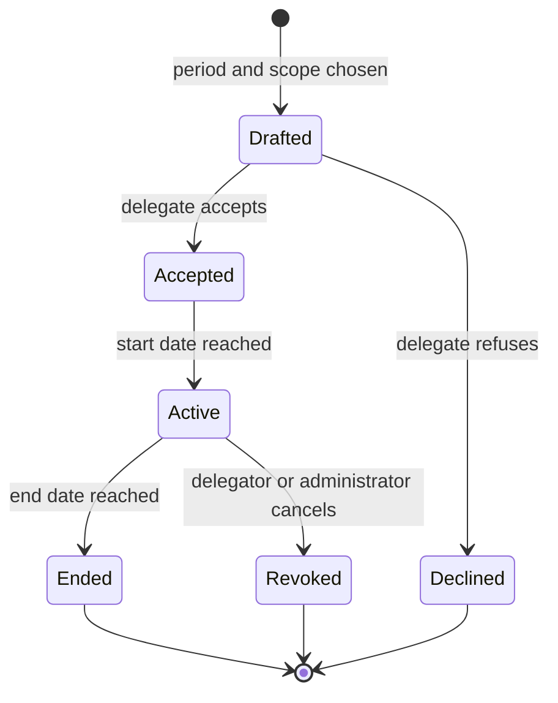
```mermaid
stateDiagram-v2
    [*] --> Drafted: period and scope chosen
    Drafted --> Accepted: delegate accepts
    Drafted --> Declined: delegate refuses
    Accepted --> Active: start date reached
    Active --> Ended: end date reached
    Active --> Revoked: delegator or administrator cancels
    Ended --> [*]
    Revoked --> [*]
    Declined --> [*]
```

**Side effects:** `identity.delegation.started.v1`, `identity.delegation.ended.v1`, `requests.request.reassigned.v1` for items already waiting, and `identity.audit.recorded.v1` on every decision taken under delegation, recording both the delegate and the delegator.

**Timeouts and escalation:** A delegation not accepted before its start date lapses and the approvals escalate to the line manager instead. Maximum delegation length is 90 days.

**Compensation:** Revoking an active delegation returns every still-open request to the original approver and leaves closed decisions untouched, because a decision already taken is history rather than state.

| Transition | Guard | Expected result | Test |
|---|---|---|---|
| Drafted to Accepted | Delegate is active, in the same tenant, and not offboarded | Delegation armed and both parties notified | TC-IDN-031 |
| Accepted to Active | Start date reached and the delegator still holds the right | Waiting approvals appear in the delegate inbox | TC-IDN-032 |
| Active to Active | Delegate approves a delegated request type | Audit records delegate and delegator on one entry | TC-IDN-033 |
| Active to Active | Delegate attempts a type outside the delegation | Refused with no widening of permission | TC-IDN-034 |
| Active to Revoked | Administrator cancels | Open items return to the approver within one refresh | TC-IDN-035 |
| Accepted to Ended | Delegator offboarded during the period | Delegation ends at once and items escalate | TC-IDN-036 |

### WF-IDN-05 Role change with four-eyes approval

**Owner:** Identity · **Trigger:** Someone requests a new role or a wider data scope for a user · **Actors:** Requester, Second approver, Security administrator · **Tier:** 1 · **Mobile:** yes · **Offline:** no

High-risk permissions are the ones that read children data in bulk or move money. Master brief Section 14 requires two different people for those, and propagation must be live rather than waiting for the next login.

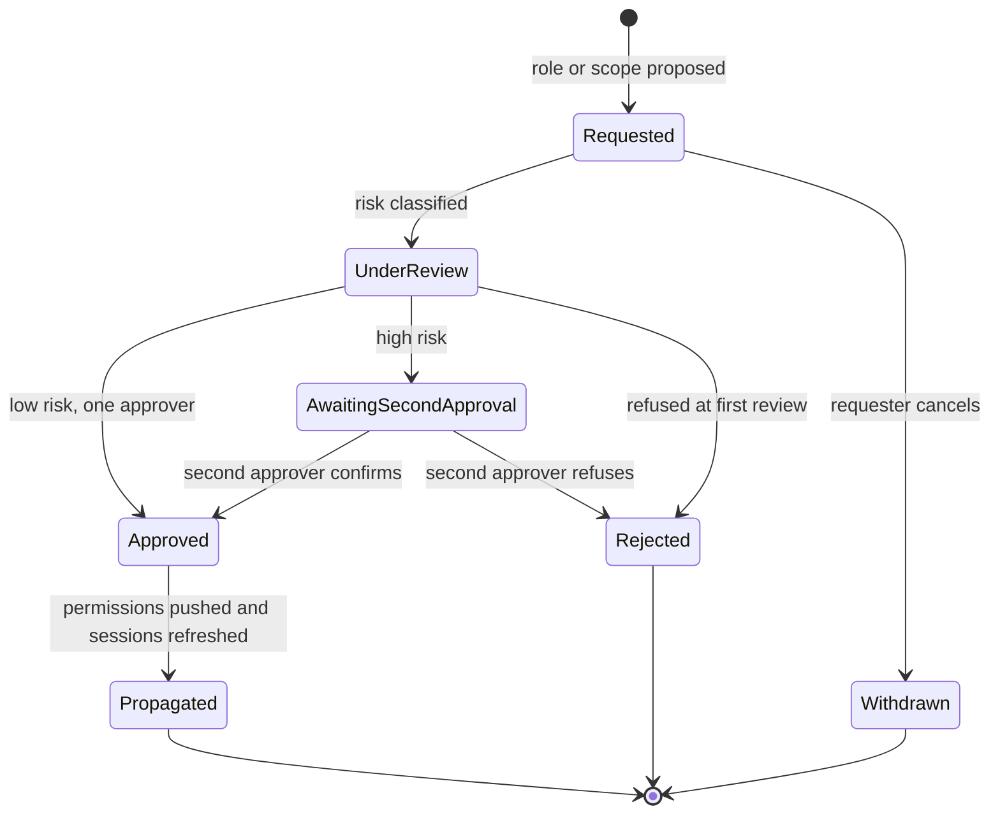
```mermaid
stateDiagram-v2
    [*] --> Requested: role or scope proposed
    Requested --> UnderReview: risk classified
    UnderReview --> Approved: low risk, one approver
    UnderReview --> AwaitingSecondApproval: high risk
    AwaitingSecondApproval --> Approved: second approver confirms
    AwaitingSecondApproval --> Rejected: second approver refuses
    UnderReview --> Rejected: refused at first review
    Approved --> Propagated: permissions pushed and sessions refreshed
    Requested --> Withdrawn: requester cancels
    Propagated --> [*]
    Rejected --> [*]
    Withdrawn --> [*]
```

**Side effects:** `identity.role.changed.v1`, `identity.permissions.changed.v1`, `identity.audit.recorded.v1` carrying the old and new permission sets and both approver identities. The affected user is notified and open sessions receive a permission refresh.

**Timeouts and escalation:** AwaitingSecondApproval reminds at 24 hours and escalates to the security administrator at 72 hours. A request untouched for 14 days expires.

**Compensation:** If propagation fails partway, the grant is rolled back to the previous permission set and the request returns to Approved for retry, so a user never holds half of a high-risk role.

| Transition | Guard | Expected result | Test |
|---|---|---|---|
| Requested to AwaitingSecondApproval | Requested permission is on the high-risk list | A single approval cannot complete the change | TC-IDN-041 |
| AwaitingSecondApproval to Approved | Second approver differs from requester and first approver | Change accepted with both identities audited | TC-IDN-042 |
| AwaitingSecondApproval to Approved | Second approver is the requester | Refused with a four-eyes violation error | TC-IDN-043 |
| Approved to Propagated | Target user in the same tenant | Open sessions see new permissions without re-login | TC-IDN-044 |
| UnderReview to Rejected | Approver refuses with a reason | Reason stored and shown to the requester | TC-IDN-045 |
| Requested to Withdrawn | Requester cancels before any approval | No permission change, audit entry written | TC-IDN-046 |

### WF-IDN-06 Offboarding and access revocation

**Owner:** Identity · **Trigger:** A staff member leaves, a contract ends, or an administrator offboards an account · **Actors:** School administrator, Hr officer, Receiving staff · **Tier:** 1 · **Mobile:** no · **Offline:** no

Access stops first and the handover follows. History is kept in full; only the ability to act is removed.

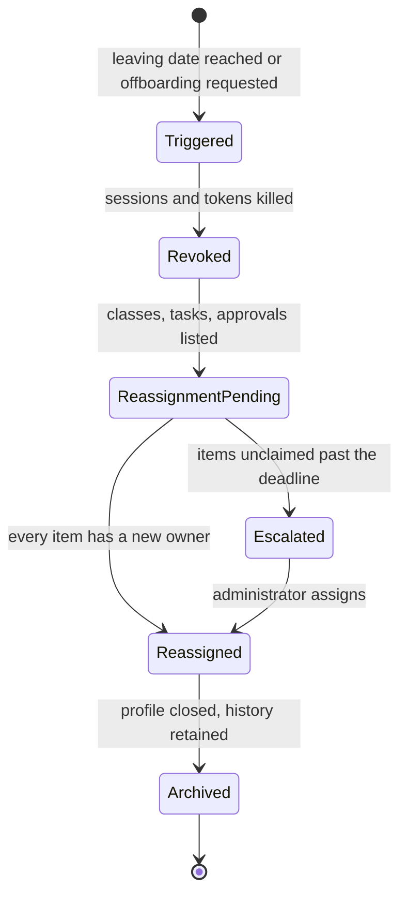
```mermaid
stateDiagram-v2
    [*] --> Triggered: leaving date reached or offboarding requested
    Triggered --> Revoked: sessions and tokens killed
    Revoked --> ReassignmentPending: classes, tasks, approvals listed
    ReassignmentPending --> Reassigned: every item has a new owner
    ReassignmentPending --> Escalated: items unclaimed past the deadline
    Escalated --> Reassigned: administrator assigns
    Reassigned --> Archived: profile closed, history retained
    Archived --> [*]
```

**Side effects:** `identity.user.deactivated.v1`, `school.staff.left.v1`, `academics.teaching-assignment.changed.v1`, `requests.request.reassigned.v1`, `scheduling.substitution.assigned.v1`, `identity.audit.recorded.v1`. Receiving staff are notified per item.

**Timeouts and escalation:** Reassignment must complete within 5 working days. Unclaimed items escalate daily to the principal until assigned.

**Compensation:** Revocation is never undone by this workflow. A wrongly offboarded account is restored by a separately audited reinstatement that re-grants the previous role and replays the reassignments in reverse.

| Transition | Guard | Expected result | Test |
|---|---|---|---|
| Triggered to Revoked | Account belongs to this tenant | Sessions, refresh tokens, and devices invalidated | TC-IDN-051 |
| Revoked to ReassignmentPending | Leaver holds classes, tasks, or pending approvals | Complete inventory produced, nothing silently dropped | TC-IDN-052 |
| ReassignmentPending to Reassigned | Every item has a named active receiver | Timetable and approvals updated, receivers notified | TC-IDN-053 |
| ReassignmentPending to Escalated | Deadline passed with items open | Principal receives the outstanding list | TC-IDN-054 |
| Reassigned to Archived | No open items remain | Profile read-only, grade and attendance history intact | TC-IDN-055 |
| Revoked to Revoked | Leaver presents a cached token | Request refused at the gateway | TC-IDN-056 |

### WF-SEC-01 Access review campaign

**Owner:** Identity · **Trigger:** A scheduled review period opens, or a security administrator starts an ad-hoc campaign · **Actors:** Security administrator, Reviewers · **Tier:** 1 · **Mobile:** no · **Offline:** no

Permissions drift. A campaign asks each reviewer to confirm or remove the access their people hold, and anything not confirmed by the deadline is removed rather than kept.

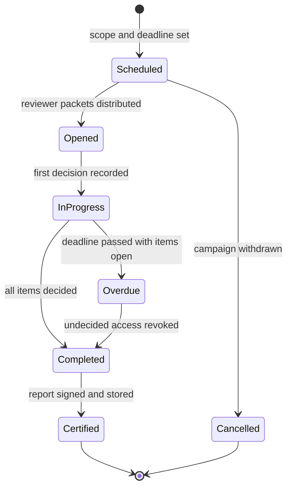
```mermaid
stateDiagram-v2
    [*] --> Scheduled: scope and deadline set
    Scheduled --> Opened: reviewer packets distributed
    Opened --> InProgress: first decision recorded
    InProgress --> Completed: all items decided
    InProgress --> Overdue: deadline passed with items open
    Overdue --> Completed: undecided access revoked
    Completed --> Certified: report signed and stored
    Scheduled --> Cancelled: campaign withdrawn
    Certified --> [*]
    Cancelled --> [*]
```

**Side effects:** `identity.access-review.due.v1` to each reviewer when the campaign opens, `identity.permissions.changed.v1` per revocation, `documents.document.generated.v1` for the certification report, `identity.audit.recorded.v1` per decision and for the opening and the certification of the campaign.

**Timeouts and escalation:** Reviewers are reminded at the halfway point and 48 hours before the deadline. Overdue packets escalate to the security administrator, who may extend once by 7 days.

**Compensation:** A revocation made in error is restored through WF-IDN-05, so the restoration carries its own approval and audit instead of silently reversing a campaign decision.

| Transition | Guard | Expected result | Test |
|---|---|---|---|
| Scheduled to Opened | Every in-scope user has a named reviewer | Packets delivered with none orphaned | TC-SEC-001 |
| Opened to InProgress | Reviewer holds `identity.access-reviews.certify` for that scope | Decision recorded with reviewer identity | TC-SEC-002 |
| InProgress to Overdue | Deadline passed with undecided items | Escalation raised, items marked for revocation | TC-SEC-003 |
| Overdue to Completed | Automatic revocation policy enabled | Undecided access removed and users notified | TC-SEC-004 |
| Completed to Certified | Report generated and its hash stored | Immutable evidence available for inspection | TC-SEC-005 |
| Opened to Opened | Reviewer opens a packet from another tenant | Refused and the attempt audited | TC-SEC-006 |

### WF-SEC-02 Break-glass access

**Owner:** Identity · **Trigger:** A platform operator needs elevated access during an incident and normal approval is unavailable · **Actors:** Platform operator, Security administrator · **Tier:** 1 · **Mobile:** no · **Offline:** no

Emergency access exists because incidents happen at three in the morning. It is short, loud, and reviewed afterwards without exception.

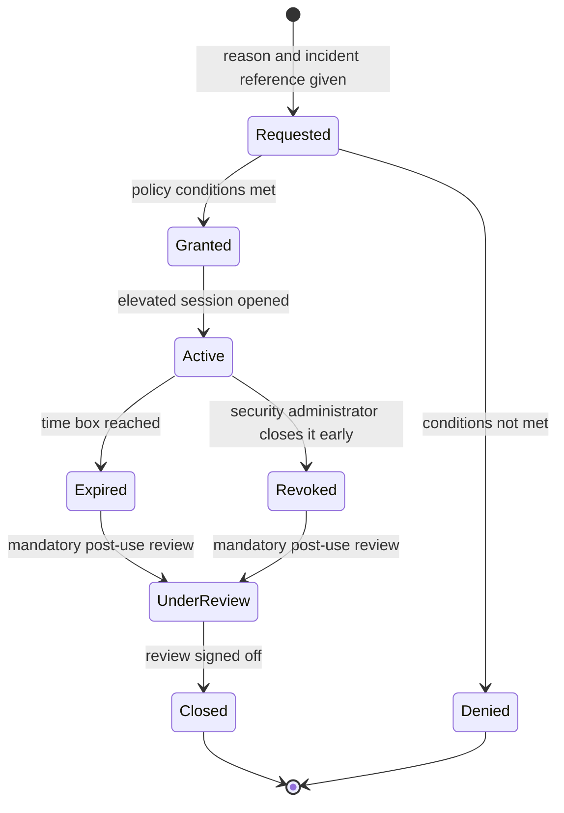
```mermaid
stateDiagram-v2
    [*] --> Requested: reason and incident reference given
    Requested --> Granted: policy conditions met
    Requested --> Denied: conditions not met
    Granted --> Active: elevated session opened
    Active --> Expired: time box reached
    Active --> Revoked: security administrator closes it early
    Expired --> UnderReview: mandatory post-use review
    Revoked --> UnderReview: mandatory post-use review
    UnderReview --> Closed: review signed off
    Closed --> [*]
    Denied --> [*]
```

**Side effects:** `identity.break-glass.granted.v1`, `identity.break-glass.used.v1` for each record opened under the grant, `identity.audit.recorded.v1` for the expiry and the revocation, each acting service's `<service>.audit.recorded.v1` for every action inside the elevated session, `notification.notification.requested.v1` to the security administrator group and the tenant owner at the moment of grant.

**Timeouts and escalation:** The time box is 60 minutes and cannot be extended; a second grant needs a new request. The post-use review must be signed within 2 working days or the normal access of that operator is suspended.

**Compensation:** Expiry is automatic and unconditional. Any change made during the session is listed in the review packet and reversed individually when the review rejects it.

| Transition | Guard | Expected result | Test |
|---|---|---|---|
| Requested to Granted | Incident reference valid and operator not already elevated | Session opened with a hard 60-minute expiry | TC-SEC-011 |
| Requested to Denied | No incident reference supplied | Refused, attempt audited and alerted | TC-SEC-012 |
| Active to Active | Operator reads student records | Every read written to the audit trail individually | TC-SEC-013 |
| Active to Expired | Time box reached | Session terminated mid-request with no grace period | TC-SEC-014 |
| Expired to UnderReview | Session contained any write action | Review packet built with before and after values | TC-SEC-015 |
| UnderReview to Closed | Review signed by someone other than the operator | Case closed and evidence retained | TC-SEC-016 |

### WF-SEC-03 Consented impersonation

**Owner:** Identity · **Trigger:** A support agent asks to view the product as a named user to reproduce a problem · **Actors:** Support agent, Consenting user, Security administrator · **Tier:** 1 · **Mobile:** no · **Offline:** no

Support sometimes has to see what the user sees. It happens only with explicit consent, never for a student account, and every screen is banner-marked and audited.

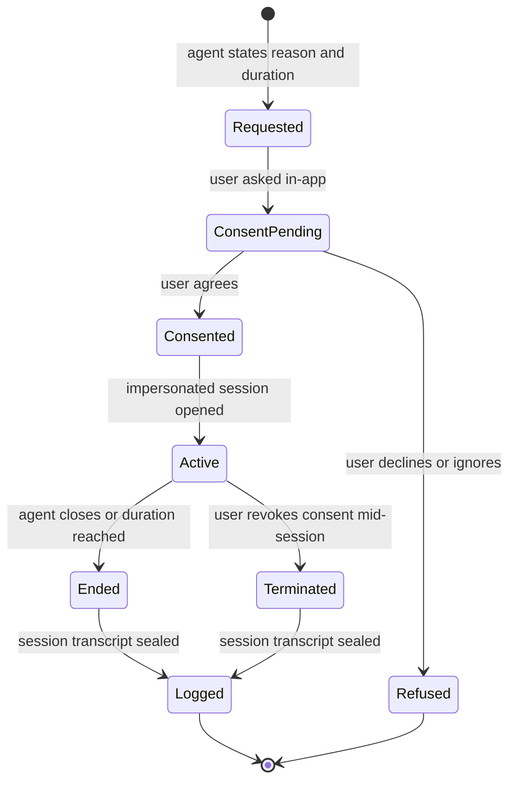
```mermaid
stateDiagram-v2
    [*] --> Requested: agent states reason and duration
    Requested --> ConsentPending: user asked in-app
    ConsentPending --> Consented: user agrees
    ConsentPending --> Refused: user declines or ignores
    Consented --> Active: impersonated session opened
    Active --> Ended: agent closes or duration reached
    Active --> Terminated: user revokes consent mid-session
    Ended --> Logged: session transcript sealed
    Terminated --> Logged: session transcript sealed
    Logged --> [*]
    Refused --> [*]
```

**Side effects:** `identity.impersonation.started.v1`, `identity.audit.recorded.v1` for the end of the session, each acting service's `<service>.audit.recorded.v1` naming both the agent and the impersonated user on every action. The impersonated user receives a summary notification when the session ends.

**Timeouts and escalation:** Consent requests lapse after 15 minutes. Sessions are capped at 30 minutes. Three refusals from the same agent in one day raise an alert to the security administrator.

**Compensation:** Writes are blocked by default. If a write scope was consented to and the session ends badly, the changed records are listed in the closing summary and restored from the audited before values on request.

| Transition | Guard | Expected result | Test |
|---|---|---|---|
| Requested to ConsentPending | Target is not a student account | Consent prompt shown to the target user | TC-SEC-021 |
| Requested to Refused | Target is a student account | Refused outright with no prompt shown | TC-SEC-022 |
| ConsentPending to Consented | User accepts within 15 minutes | Session opens with a persistent banner | TC-SEC-023 |
| Active to Active | Agent attempts a write without consented write scope | Refused and the attempt audited | TC-SEC-024 |
| Active to Terminated | User revokes consent | Session ends within five seconds | TC-SEC-025 |
| Ended to Logged | Session closed | Transcript sealed and the user notified | TC-SEC-026 |

---

## R.3 Tenant and platform lifecycle

### WF-PLT-01 Tenant signup to live

**Owner:** Platform · **Trigger:** A school signs up, or a platform operator provisions a tenant · **Actors:** Tenant owner, Platform operator · **Tier:** 1 · **Mobile:** no · **Offline:** no

Provisioning touches every service, so it is a saga with a compensating step for each stage. A tenant is live only when the owner can sign in, the school profile exists, and the seeded administrator has been replaced.

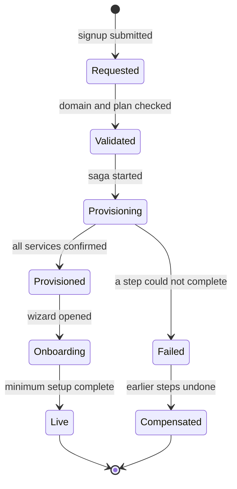
```mermaid
stateDiagram-v2
    [*] --> Requested: signup submitted
    Requested --> Validated: domain and plan checked
    Validated --> Provisioning: saga started
    Provisioning --> Provisioned: all services confirmed
    Provisioning --> Failed: a step could not complete
    Failed --> Compensated: earlier steps undone
    Provisioned --> Onboarding: wizard opened
    Onboarding --> Live: minimum setup complete
    Live --> [*]
    Compensated --> [*]
```

**Side effects:** `platform.tenant.provisioning-requested.v1`, `platform.tenant.provisioned.v1`, `identity.user.invited.v1` for the owner, `school.academic-year.opened.v1`, `notification.notification.requested.v1` for the welcome pack, `platform.audit.recorded.v1`.

**Timeouts and escalation:** Each saga step has a 60-second timeout with three retries. A saga in Provisioning beyond 10 minutes alerts the platform operator. Onboarding untouched for 14 days sends the owner a nudge.

**Compensation:** Every step registers its reverse: schema drop, exchange removal, owner invitation revocation, branding deletion. Compensated leaves no orphan database, queue, or identity record, and the failure reason is shown to the operator verbatim.

| Transition | Guard | Expected result | Test |
|---|---|---|---|
| Requested to Validated | Subdomain free and plan exists | Tenant record created in Requested state only | TC-PLT-001 |
| Validated to Provisioning | Operator or signup token authorised | Saga started with a correlation identifier | TC-PLT-002 |
| Provisioning to Provisioned | Every service acknowledged its step | Owner invitation sent, tenant marked provisioned | TC-PLT-003 |
| Provisioning to Failed | One service times out after retries | Saga halts, no further steps attempted | TC-PLT-004 |
| Failed to Compensated | Reverse steps succeed | No schema, queue, or user left behind | TC-PLT-005 |
| Onboarding to Live | Academic year, campus, and owner account present | Tenant opened to all users, seeded password forced to change | TC-PLT-006 |

### WF-PLT-02 Trial conversion and plan change

**Owner:** Platform · **Trigger:** A trial nears its end, or a tenant asks to move between plans · **Actors:** Tenant owner, Platform operator · **Tier:** 1 · **Mobile:** no · **Offline:** no

Trial conversion and plan change are the same machine: a proposed subscription state, a limit check, and an applied change that turns modules on or off. Downgrades are the dangerous direction and are guarded by usage.

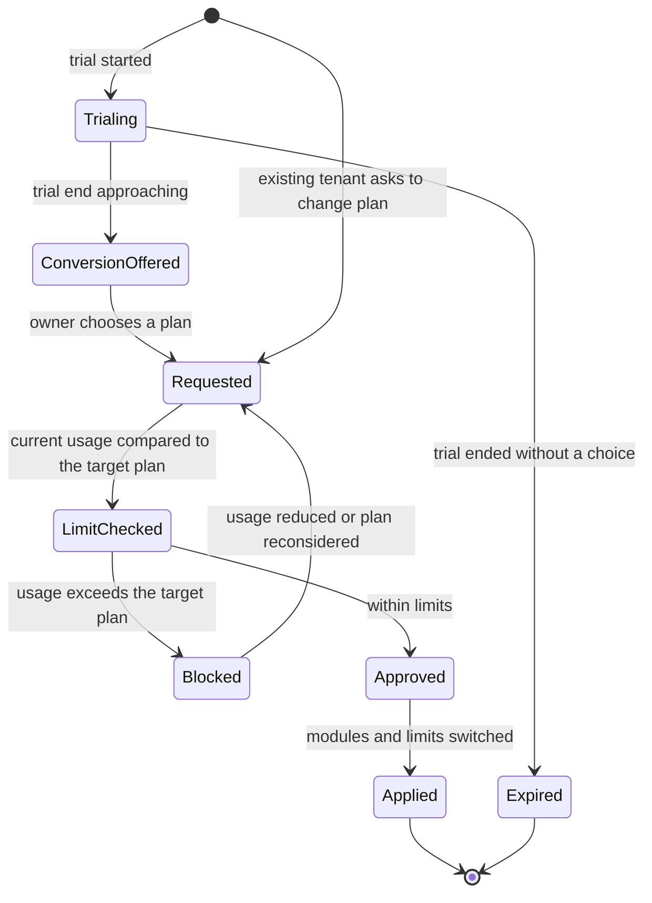
```mermaid
stateDiagram-v2
    [*] --> Trialing: trial started
    Trialing --> ConversionOffered: trial end approaching
    ConversionOffered --> Requested: owner chooses a plan
    Trialing --> Expired: trial ended without a choice
    [*] --> Requested: existing tenant asks to change plan
    Requested --> LimitChecked: current usage compared to the target plan
    LimitChecked --> Blocked: usage exceeds the target plan
    Blocked --> Requested: usage reduced or plan reconsidered
    LimitChecked --> Approved: within limits
    Approved --> Applied: modules and limits switched
    Applied --> [*]
    Expired --> [*]
```

**Side effects:** `platform.plan.changed.v1`, `platform.feature-flag.changed.v1`, `platform.usage.recorded.v1`, `finance.invoice.issued.v1` for the first paid period, `notification.notification.requested.v1` to the owner, `platform.audit.recorded.v1`.

**Timeouts and escalation:** Conversion is offered 14, 7, and 1 day before trial end. An expired trial becomes read-only for 30 days and then follows WF-PLT-03. A plan change left in Blocked for 30 days is cancelled.

**Compensation:** If module switching fails after the invoice is issued, the plan reverts to the previous one and the invoice is reversed through WF-FIN-02, so a tenant is never billed for a plan it did not receive.

| Transition | Guard | Expected result | Test |
|---|---|---|---|
| Trialing to Expired | Trial end reached with no plan chosen | Tenant read-only, data retained and exportable | TC-PLT-011 |
| Requested to LimitChecked | Owner holds `platform.subscriptions.change-plan` | Usage snapshot taken against the target plan | TC-PLT-012 |
| LimitChecked to Blocked | Student count above the target plan limit | Change refused with the exact overage shown | TC-PLT-013 |
| LimitChecked to Approved | All counters within the target plan | Change scheduled for the next billing boundary | TC-PLT-014 |
| Approved to Applied | Billing confirmed | Modules toggled, feature flags published, caches invalidated | TC-PLT-015 |
| Applied to Applied | Downgrade removes a module with live data | Data retained read-only, screens hidden rather than deleted | TC-PLT-016 |

### WF-PLT-03 Suspension, export, and deletion

**Owner:** Platform · **Trigger:** Non-payment, a policy breach, or a tenant request for full deletion · **Actors:** Platform operator, Tenant owner, Data protection officer · **Tier:** 1 · **Mobile:** no · **Offline:** no

Ending a tenancy is the most destructive thing the platform can do, so it walks down a ladder with a stop at every rung. Deletion is only ever reached after a successful export and an explicit, signed confirmation.

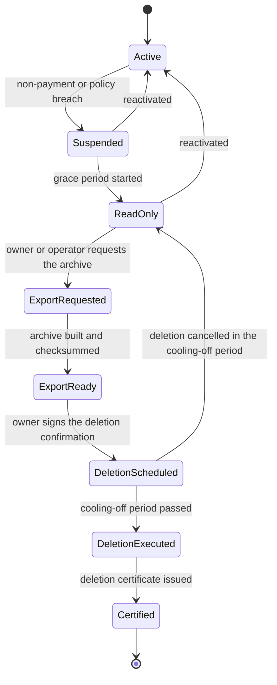
```mermaid
stateDiagram-v2
    [*] --> Active
    Active --> Suspended: non-payment or policy breach
    Suspended --> Active: reactivated
    Suspended --> ReadOnly: grace period started
    ReadOnly --> Active: reactivated
    ReadOnly --> ExportRequested: owner or operator requests the archive
    ExportRequested --> ExportReady: archive built and checksummed
    ExportReady --> DeletionScheduled: owner signs the deletion confirmation
    DeletionScheduled --> DeletionExecuted: cooling-off period passed
    DeletionScheduled --> ReadOnly: deletion cancelled in the cooling-off period
    DeletionExecuted --> Certified: deletion certificate issued
    Certified --> [*]
```

**Side effects:** `platform.tenant.suspended.v1`, `platform.tenant.reactivated.v1`, `platform.tenant.deletion-requested.v1`, `platform.tenant.deleted.v1`, `documents.export.completed.v1`, `documents.document.generated.v1` for the deletion certificate, `platform.audit.recorded.v1` at every rung.

**Timeouts and escalation:** Suspension gives 14 days before read-only. Read-only lasts 60 days. The export archive is downloadable for 30 days. The deletion cooling-off period is 30 days with a daily reminder to the owner.

**Compensation:** Every step above DeletionExecuted is reversible by reactivation. DeletionExecuted is not reversible, which is why it is gated by a verified export, a signed confirmation, and a cooling-off period; the certificate records scope, time, and the operator who executed it.

| Transition | Guard | Expected result | Test |
|---|---|---|---|
| Active to Suspended | Overdue balance past the policy threshold | Sign-in blocked for all roles except the owner | TC-PLT-021 |
| Suspended to ReadOnly | Grace period passed | All writes refused, reads and exports still allowed | TC-PLT-022 |
| ExportRequested to ExportReady | Archive complete and checksum verified | Owner receives a time-limited download link | TC-PLT-023 |
| ExportReady to DeletionScheduled | Signed confirmation from the tenant owner | Deletion scheduled, countdown visible to the owner | TC-PLT-024 |
| DeletionScheduled to ReadOnly | Cancellation inside the cooling-off period | Nothing deleted, tenant stays read-only | TC-PLT-025 |
| DeletionExecuted to Certified | All service schemas and files removed | Certificate issued with scope, timestamp, and operator | TC-PLT-026 |

---

## R.4 School year and student lifecycle

### WF-SCH-01 Transfer or withdrawal with clearance

**Owner:** School · **Trigger:** A guardian requests withdrawal or transfer out, or the school initiates one · **Actors:** Guardian, Registrar, Finance officer, Librarian · **Tier:** 1 · **Mobile:** no · **Offline:** no

A student leaves only after every department has signed off. Clearance is parallel, so no department blocks another, and the leaving documents are produced from cleared data rather than from a promise.

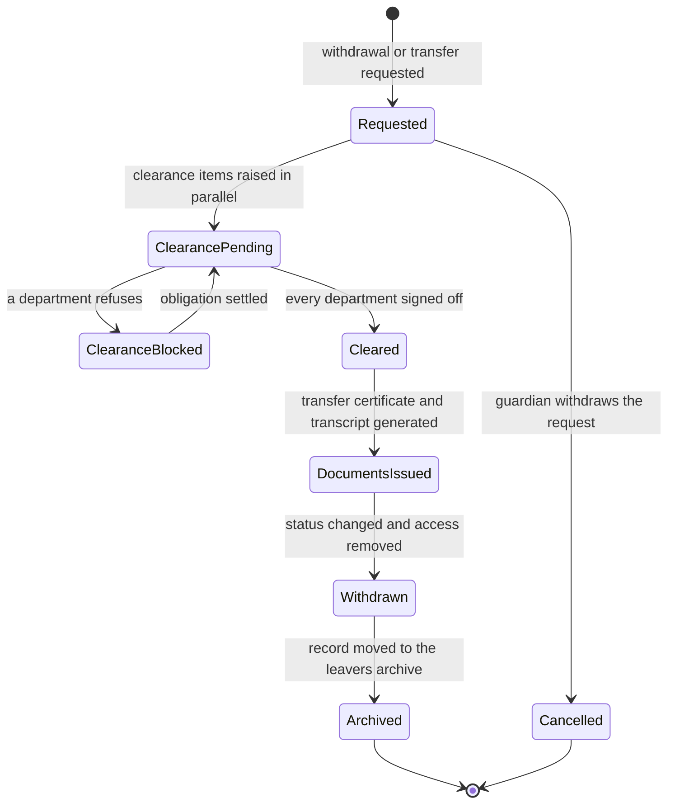
```mermaid
stateDiagram-v2
    [*] --> Requested: withdrawal or transfer requested
    Requested --> ClearancePending: clearance items raised in parallel
    ClearancePending --> ClearanceBlocked: a department refuses
    ClearanceBlocked --> ClearancePending: obligation settled
    ClearancePending --> Cleared: every department signed off
    Cleared --> DocumentsIssued: transfer certificate and transcript generated
    DocumentsIssued --> Withdrawn: status changed and access removed
    Withdrawn --> Archived: record moved to the leavers archive
    Requested --> Cancelled: guardian withdraws the request
    Archived --> [*]
    Cancelled --> [*]
```

**Side effects:** `school.student.status-changed.v1`, `finance.account.cleared.v1`, `operations.audit.recorded.v1` for each library loan returned or charged, `documents.document.generation-requested.v1`, `documents.document.generated.v1`, `identity.user.deactivated.v1` for the student account, `school.audit.recorded.v1`.

**Timeouts and escalation:** Each clearance item has a 3 working day target. An item open for 10 days escalates to the principal. A request left in ClearanceBlocked for 60 days is cancelled and must be raised again.

**Compensation:** If document generation fails after clearance, the student stays Cleared and is not withdrawn, so access and the timetable remain valid until the papers exist. A withdrawal reversed within the same term restores the enrollment and reissues the section placement.

| Transition | Guard | Expected result | Test |
|---|---|---|---|
| Requested to ClearancePending | Requester is a linked guardian or a registrar | Clearance items raised for finance, library, and assets | TC-SCH-001 |
| ClearancePending to ClearanceBlocked | Outstanding balance or unreturned item exists | Block shown with the exact amount or item | TC-SCH-002 |
| ClearancePending to Cleared | All departments signed off | Leaving documents queued for generation | TC-SCH-003 |
| Cleared to DocumentsIssued | Transcript data complete for every enrolled term | Documents carry a QR verification code | TC-SCH-004 |
| DocumentsIssued to Withdrawn | Registrar confirms the leaving date | Access revoked, seat released, history retained | TC-SCH-005 |
| Withdrawn to Archived | Retention policy applied | Record read-only and excluded from active rosters | TC-SCH-006 |

### WF-SCH-02 End of year close and rollover

**Owner:** School · **Trigger:** The registrar starts the end-of-year close for an academic year · **Actors:** Registrar, Principal, Assessment officer · **Tier:** 1 · **Mobile:** no · **Offline:** no

One machine finalises results, decides promotion, retention, or graduation for every student, and rolls the structure forward. It runs as a batch that can be paused and resumed without producing a half-promoted cohort.

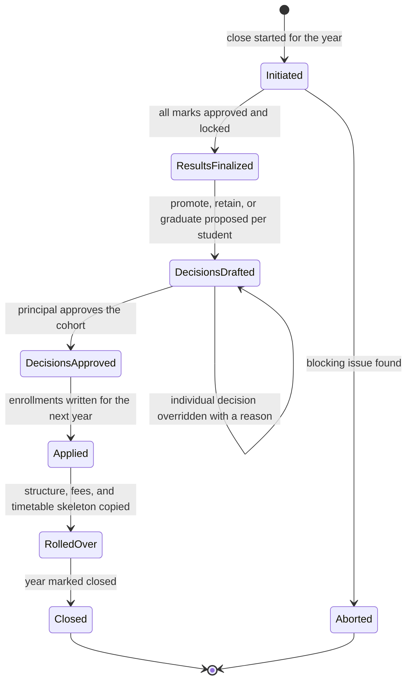
```mermaid
stateDiagram-v2
    [*] --> Initiated: close started for the year
    Initiated --> ResultsFinalized: all marks approved and locked
    ResultsFinalized --> DecisionsDrafted: promote, retain, or graduate proposed per student
    DecisionsDrafted --> DecisionsApproved: principal approves the cohort
    DecisionsDrafted --> DecisionsDrafted: individual decision overridden with a reason
    DecisionsApproved --> Applied: enrollments written for the next year
    Applied --> RolledOver: structure, fees, and timetable skeleton copied
    RolledOver --> Closed: year marked closed
    Initiated --> Aborted: blocking issue found
    Closed --> [*]
    Aborted --> [*]
```

**Side effects:** `assessment.grades.locked.v1`, `school.student.promoted.v1` per student, `school.student.status-changed.v1` for graduates and leavers, `school.academic-year.closed.v1`, `school.academic-year.opened.v1` for the next year, `finance.fee-plan.assigned.v1`, `scheduling.timetable.published.v1` for the skeleton, `school.audit.recorded.v1`.

**Timeouts and escalation:** The batch checkpoints every 200 students. A batch stalled for 15 minutes alerts the registrar. Decisions left undrafted 14 days after results are finalised escalate to the principal.

**Compensation:** Applied is written inside one transaction per student with an idempotency key, so a crash mid-batch resumes from the last checkpoint. Aborted rolls back the enrollments already written for the next year and leaves the closing year untouched.

| Transition | Guard | Expected result | Test |
|---|---|---|---|
| Initiated to ResultsFinalized | Every subject in every section has approved marks | Grades locked, late entry refused | TC-SCH-011 |
| ResultsFinalized to DecisionsDrafted | Promotion rules configured for each stage | Every student carries a proposed decision with its reason | TC-SCH-012 |
| DecisionsDrafted to DecisionsDrafted | Principal overrides a retention | Override stored with the reason and the approver | TC-SCH-013 |
| DecisionsApproved to Applied | Next-year sections exist with capacity | Students enrolled, graduates given alumni status | TC-SCH-014 |
| Applied to Applied | Worker crashes after 300 of 800 students | Resume continues at 301 with no duplicate enrollment | TC-SCH-015 |
| Applied to RolledOver | Fee structures and period grids exist for the new year | Skeleton timetable and fee plans created, not published | TC-SCH-016 |

### WF-SCH-03 Year archival and reopen

**Owner:** School · **Trigger:** A closed academic year reaches its archival date, or a correction is needed in an archived year · **Actors:** Registrar, Principal, Platform operator · **Tier:** 1 · **Mobile:** no · **Offline:** no

Historical reports must stay reproducible after structures change, so an archived year is frozen as read-only rather than deleted. Reopening is possible, narrow, and always time-boxed.

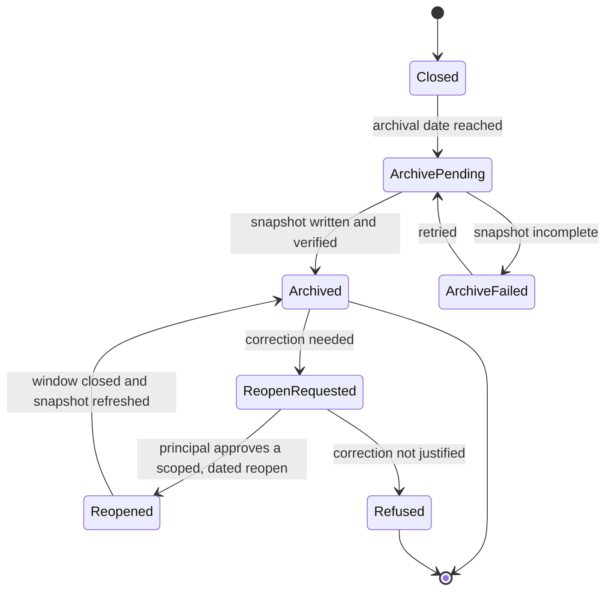
```mermaid
stateDiagram-v2
    [*] --> Closed
    Closed --> ArchivePending: archival date reached
    ArchivePending --> Archived: snapshot written and verified
    ArchivePending --> ArchiveFailed: snapshot incomplete
    ArchiveFailed --> ArchivePending: retried
    Archived --> ReopenRequested: correction needed
    ReopenRequested --> Reopened: principal approves a scoped, dated reopen
    ReopenRequested --> Refused: correction not justified
    Reopened --> Archived: window closed and snapshot refreshed
    Archived --> [*]
    Refused --> [*]
```

**Side effects:** `school.audit.recorded.v1` for the archival and for every reopen, naming the scope and the window; `reporting.audit.recorded.v1` for the sealed year snapshot, which Reporting takes on `school.academic-year.closed.v1`.

**Timeouts and escalation:** A reopen window is at most 5 working days and closes automatically. A failed archive retries three times and then alerts the platform operator.

**Compensation:** The pre-reopen snapshot is kept until the refreshed snapshot verifies, so a bad correction is rolled back to the sealed version and the reports produced in between are marked superseded rather than deleted.

| Transition | Guard | Expected result | Test |
|---|---|---|---|
| Closed to ArchivePending | Year closed and no open grade appeals | Snapshot job queued | TC-SCH-021 |
| ArchivePending to Archived | Row counts and checksums match the live data | Year frozen, all writes refused | TC-SCH-022 |
| Archived to Archived | Teacher attempts a mark edit | Refused with a year-archived error | TC-SCH-023 |
| ReopenRequested to Reopened | Principal approves with a scope and an end date | Only the named scope becomes writable | TC-SCH-024 |
| Reopened to Archived | Window end reached | Writes refused again, snapshot refreshed | TC-SCH-025 |
| Archived to Archived | Historical report rerun after the structure changed | Same numbers as the original run | TC-SCH-026 |

### WF-SCH-04 Mid-year campus transfer

**Owner:** School · **Trigger:** A guardian or registrar moves a student to another campus of the same tenant mid-term · **Actors:** Guardian, Registrar, Finance officer · **Tier:** 1 · **Mobile:** no · **Offline:** no

The student stays in the same tenant, so nothing is copied across a boundary; the section, timetable, transport, and fee plan change while attendance and grade history stay attached to the campus where they happened.

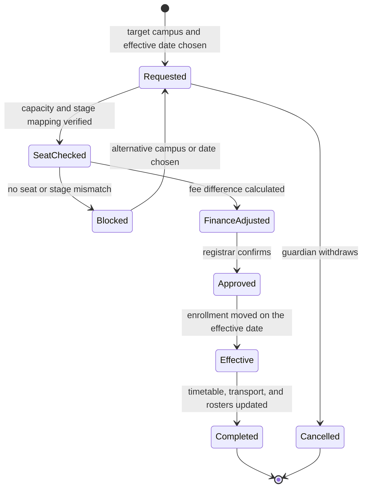
```mermaid
stateDiagram-v2
    [*] --> Requested: target campus and effective date chosen
    Requested --> SeatChecked: capacity and stage mapping verified
    SeatChecked --> Blocked: no seat or stage mismatch
    Blocked --> Requested: alternative campus or date chosen
    SeatChecked --> FinanceAdjusted: fee difference calculated
    FinanceAdjusted --> Approved: registrar confirms
    Approved --> Effective: enrollment moved on the effective date
    Effective --> Completed: timetable, transport, and rosters updated
    Requested --> Cancelled: guardian withdraws
    Completed --> [*]
    Cancelled --> [*]
```

**Side effects:** `school.student.section-changed.v1`, `school.student.status-changed.v1`, `finance.invoice.issued.v1` or `finance.credit-note.issued.v1` for the pro-rata difference, `scheduling.timetable.changed.v1`, `operations.transport.subscription-changed.v1`, `attendance.attendance.marked.v1` unaffected for past dates, `school.audit.recorded.v1`.

**Timeouts and escalation:** An approved transfer not effective within 30 days lapses. A blocked request reminds the registrar weekly for 4 weeks.

**Compensation:** If the fee adjustment fails after the move, the enrollment stays in Effective and the finance step is retried, because the child is physically at the new campus and the roster must be right; the finance exception appears in the day-close report.

| Transition | Guard | Expected result | Test |
|---|---|---|---|
| Requested to SeatChecked | Target campus is in the same tenant | Capacity and stage mapping evaluated | TC-SCH-031 |
| SeatChecked to Blocked | Target section at capacity | Refused with the waiting position shown | TC-SCH-032 |
| SeatChecked to FinanceAdjusted | Fee structures differ between campuses | Pro-rata difference calculated to the effective date | TC-SCH-033 |
| Approved to Effective | Effective date reached | New timetable active, old rosters closed at that date | TC-SCH-034 |
| Effective to Completed | Attendance already recorded at the old campus | Past attendance stays with the old campus in reports | TC-SCH-035 |
| Effective to Completed | Student had a transport subscription | Route change requested and the driver notified | TC-SCH-036 |

---

## R.5 Admissions and coursework

### WF-ADM-01 Inquiry to enrollment

**Owner:** Admissions · **Trigger:** A parent submits an inquiry or an online application · **Actors:** Parent, Admissions officer, Assessor, Registrar · **Tier:** 1 · **Mobile:** yes · **Offline:** no

This is the front door of the product. The pipeline is configurable per school, but the terminal states and the handover to enrollment are fixed so that an accepted child always ends with accounts, a section, and a welcome pack.

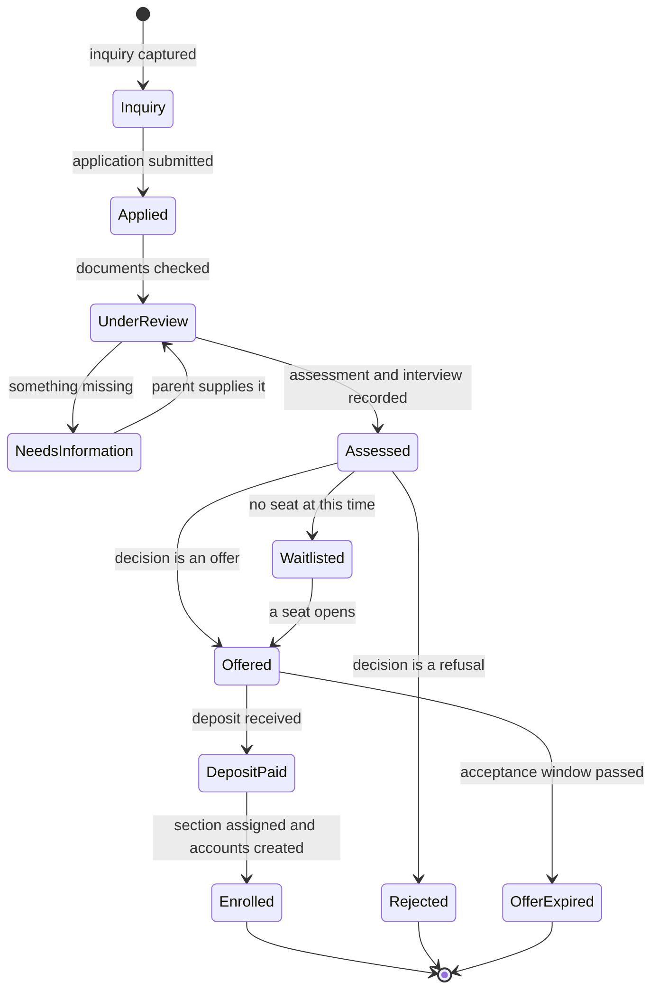
```mermaid
stateDiagram-v2
    [*] --> Inquiry: inquiry captured
    Inquiry --> Applied: application submitted
    Applied --> UnderReview: documents checked
    UnderReview --> NeedsInformation: something missing
    NeedsInformation --> UnderReview: parent supplies it
    UnderReview --> Assessed: assessment and interview recorded
    Assessed --> Offered: decision is an offer
    Assessed --> Rejected: decision is a refusal
    Assessed --> Waitlisted: no seat at this time
    Waitlisted --> Offered: a seat opens
    Offered --> DepositPaid: deposit received
    Offered --> OfferExpired: acceptance window passed
    DepositPaid --> Enrolled: section assigned and accounts created
    Enrolled --> [*]
    Rejected --> [*]
    OfferExpired --> [*]
```

**Side effects:** `admissions.inquiry.created.v1`, `admissions.application.submitted.v1`, `admissions.application.stage-changed.v1`, `admissions.offer.made.v1`, `admissions.offer.accepted.v1`, `admissions.offer.expired.v1`, `school.student.enrolled.v1`, `finance.fee-plan.assigned.v1`, `identity.user.invited.v1` for guardians, `documents.document.generated.v1` for the offer letter, `notification.notification.requested.v1` for the welcome pack.

**Timeouts and escalation:** An offer expires 14 days after issue with reminders at day 7 and day 12. An application in NeedsInformation for 21 days is withdrawn. A waitlisted application is reconfirmed with the parent every 30 days.

**Compensation:** Enrollment is a saga across School, Identity, and Finance. If account creation or fee assignment fails, the enrollment is rolled back to DepositPaid, the seat is held rather than released, and the admissions officer sees the failed step by name.

| Transition | Guard | Expected result | Test |
|---|---|---|---|
| Applied to UnderReview | All required documents attached and virus-scanned | Application enters the configured review pipeline | TC-ADM-001 |
| UnderReview to Assessed | Assessment and interview outcomes recorded | Decision screen unlocked for the officer | TC-ADM-002 |
| Assessed to Offered | Seat available in the requested grade level | Offer letter generated with an expiry date | TC-ADM-003 |
| Offered to OfferExpired | Acceptance window passed | Seat released to the next waitlisted applicant | TC-ADM-004 |
| DepositPaid to Enrolled | Deposit matched to the application and section has capacity | Student, guardian accounts, and fee plan created together | TC-ADM-005 |
| DepositPaid to Enrolled | Identity step fails | Saga compensates, seat held, officer sees the failed step | TC-ADM-006 |

### WF-ADM-02 Re-enrollment with fee settlement check

**Owner:** Admissions · **Trigger:** The re-enrollment campaign opens for the next academic year · **Actors:** Guardian, Admissions officer, Finance officer · **Tier:** 1 · **Mobile:** yes · **Offline:** no

Every family is invited, confirms or declines, and the seat is reserved only when the account is settled. An outstanding balance does not reject the family; it holds the seat until finance clears it or the policy releases it.

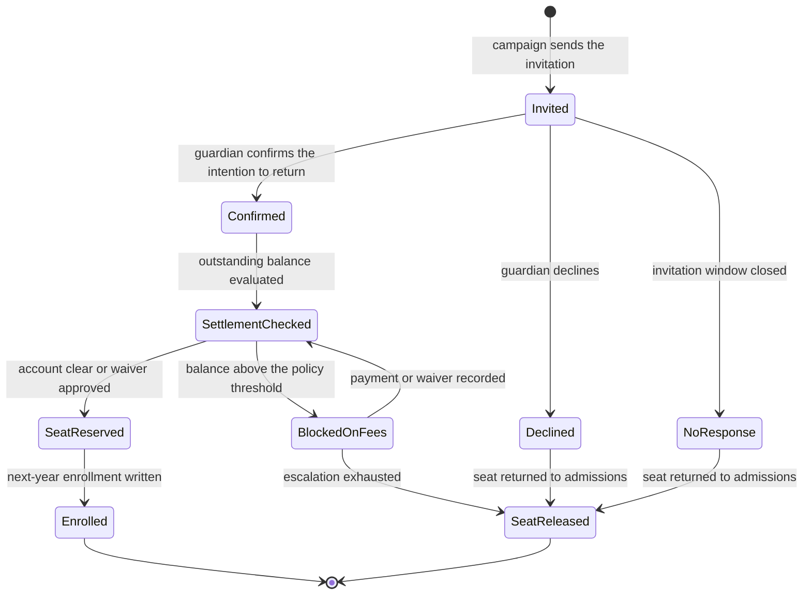
```mermaid
stateDiagram-v2
    [*] --> Invited: campaign sends the invitation
    Invited --> Confirmed: guardian confirms the intention to return
    Invited --> Declined: guardian declines
    Invited --> NoResponse: invitation window closed
    Confirmed --> SettlementChecked: outstanding balance evaluated
    SettlementChecked --> BlockedOnFees: balance above the policy threshold
    BlockedOnFees --> SettlementChecked: payment or waiver recorded
    BlockedOnFees --> SeatReleased: escalation exhausted
    SettlementChecked --> SeatReserved: account clear or waiver approved
    SeatReserved --> Enrolled: next-year enrollment written
    Declined --> SeatReleased: seat returned to admissions
    NoResponse --> SeatReleased: seat returned to admissions
    Enrolled --> [*]
    SeatReleased --> [*]
```

**Side effects:** `admissions.re-enrollment.confirmed.v1`, `admissions.re-enrollment.declined.v1`, `finance.account.restricted.v1` and `finance.account.cleared.v1`, `school.student.enrolled.v1`, `notification.notification.requested.v1` for each reminder, `admissions.audit.recorded.v1` for every waiver.

**Timeouts and escalation:** The invitation window is 21 days with reminders at day 7 and day 14. BlockedOnFees escalates to the finance manager at 14 days and to the principal at 30 days, after which the seat is released.

**Compensation:** If the next-year enrollment fails after the seat is reserved, the reservation is kept and retried rather than released, because releasing a paid family seat is far worse than a delayed enrollment record.

| Transition | Guard | Expected result | Test |
|---|---|---|---|
| Invited to Confirmed | Responder is a linked guardian with parental access | Intention recorded and the seat provisionally held | TC-ADM-011 |
| Confirmed to BlockedOnFees | Outstanding balance above the policy threshold | Seat held, family shown the exact amount and the deadline | TC-ADM-012 |
| BlockedOnFees to SettlementChecked | Payment received or a waiver approved by the finance manager | Block cleared and the waiver audited | TC-ADM-013 |
| SettlementChecked to SeatReserved | Account clear and next-year grade level exists | Seat reserved against the next-year section plan | TC-ADM-014 |
| NoResponse to SeatReleased | Window closed with no reply after both reminders | Seat returned to admissions, family notified | TC-ADM-015 |
| SeatReserved to Enrolled | Next-year sections published | Enrollment written and the fee plan assigned | TC-ADM-016 |

### WF-ACA-01 Assignment lifecycle

**Owner:** Academics · **Trigger:** A teacher creates an assignment for a section or group · **Actors:** Teacher, Student, Guardian · **Tier:** 1 · **Mobile:** yes · **Offline:** yes

Coursework is the most-used teacher screen after attendance. The machine has to behave predictably when a submission arrives late, when a student resubmits, and when the teacher grades offline on a phone.

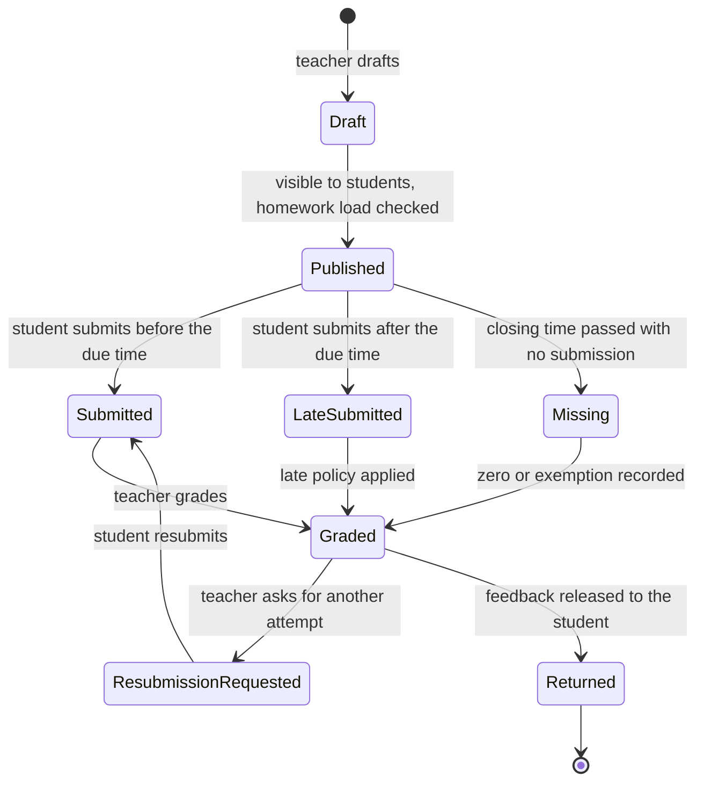
```mermaid
stateDiagram-v2
    [*] --> Draft: teacher drafts
    Draft --> Published: visible to students, homework load checked
    Published --> Submitted: student submits before the due time
    Published --> LateSubmitted: student submits after the due time
    Published --> Missing: closing time passed with no submission
    Submitted --> Graded: teacher grades
    LateSubmitted --> Graded: late policy applied
    Missing --> Graded: zero or exemption recorded
    Graded --> ResubmissionRequested: teacher asks for another attempt
    ResubmissionRequested --> Submitted: student resubmits
    Graded --> Returned: feedback released to the student
    Returned --> [*]
```

**Side effects:** `academics.assignment.published.v1`, `academics.submission.received.v1`, `academics.submission.graded.v1`, `notification.notification.requested.v1` to students and guardians on publish and on return, `reporting.early-warning.flag-raised.v1` when missing work crosses the threshold.

**Timeouts and escalation:** A reminder goes out 24 hours before the due time. Submissions close at the configured closing time. Ungraded submissions older than 10 working days appear on the teacher Today dashboard and escalate to the head of department at 15 days.

**Compensation:** Offline grading is queued locally with the version the device held. On sync, a grade that lost to a newer server value is shown as a conflict for the teacher to resolve; nothing is silently overwritten in either direction.

| Transition | Guard | Expected result | Test |
|---|---|---|---|
| Draft to Published | Homework load for that day under the section limit | Published, students and guardians notified | TC-ACA-001 |
| Draft to Published | Load limit already reached for that day | Warning shown and an override reason required | TC-ACA-002 |
| Published to LateSubmitted | Submission after due time but before closing | Accepted and flagged late, penalty applied by policy | TC-ACA-003 |
| Published to Missing | Closing time passed with no submission | Marked missing and counted toward the early-warning signal | TC-ACA-004 |
| Submitted to Graded | Teacher holds a teaching assignment for that section | Grade written to the gradebook with the rubric breakdown | TC-ACA-005 |
| Submitted to Graded | Offline grade syncs after a newer server grade | Conflict raised, teacher chooses, no silent overwrite | TC-ACA-006 |

---

## R.6 Assessment and attendance

### WF-ASM-01 Exam to report card

**Owner:** Assessment · **Trigger:** The assessment officer schedules an exam period for a term · **Actors:** Assessment officer, Teacher, Head of department, Principal · **Tier:** 1 · **Mobile:** yes · **Offline:** yes

This is the longest chain in the product and the one parents judge the school by. Marks are validated before moderation, moderation before approval, approval before locking, and only locked marks are ever printed.

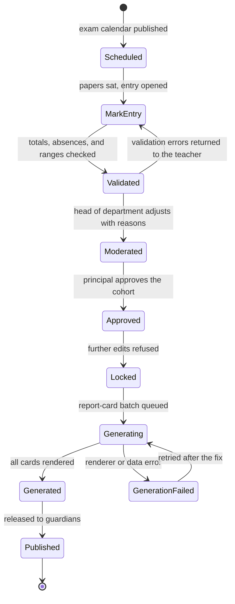
```mermaid
stateDiagram-v2
    [*] --> Scheduled: exam calendar published
    Scheduled --> MarkEntry: papers sat, entry opened
    MarkEntry --> Validated: totals, absences, and ranges checked
    Validated --> MarkEntry: validation errors returned to the teacher
    Validated --> Moderated: head of department adjusts with reasons
    Moderated --> Approved: principal approves the cohort
    Approved --> Locked: further edits refused
    Locked --> Generating: report-card batch queued
    Generating --> Generated: all cards rendered
    Generating --> GenerationFailed: renderer or data error
    GenerationFailed --> Generating: retried after the fix
    Generated --> Published: released to guardians
    Published --> [*]
```

**Side effects:** `assessment.marks.entered.v1`, `assessment.marks.approved.v1`, `assessment.grades.locked.v1`, `assessment.report-cards.generation-requested.v1`, `assessment.report-card.generated.v1`, `assessment.report-cards.published.v1`, `documents.document.generated.v1` for each PDF with its QR verification code, `notification.notification.requested.v1` to guardians on publish.

**Timeouts and escalation:** Mark entry closes on the published deadline; sections still incomplete escalate daily to the head of department and at 3 days to the principal. A generation batch with no progress for 10 minutes alerts the assessment officer.

**Compensation:** Generation is idempotent per student and checkpointed, so a worker crash resumes rather than restarts. If publishing fails partway, the already-delivered cards stay delivered and the rest are retried; a card later corrected is reissued as a new version with the previous version retained.

| Transition | Guard | Expected result | Test |
|---|---|---|---|
| MarkEntry to Validated | Every enrolled student has a mark, an absence, or an exemption | Entry accepted for moderation | TC-ASM-001 |
| MarkEntry to Validated | A mark exceeds the maximum for the component | Rejected at entry with the offending cell highlighted | TC-ASM-002 |
| Validated to Moderated | Moderator holds `assessment.marks.moderate` for the subject | Adjustment stored with the original value and the reason | TC-ASM-003 |
| Approved to Locked | Principal approval recorded for the cohort | Further edits refused, grade change workflow offered instead | TC-ASM-004 |
| Locked to Generated | 800 cards queued in one batch | All rendered inside the batch budget with progress shown | TC-ASM-005 |
| Generating to Generating | Worker crashes after 500 cards | Resume produces the remaining 300 with no duplicates | TC-ASM-006 |

### WF-ASM-02 Grade appeal and post-lock change

**Owner:** Assessment · **Trigger:** A guardian or student appeals a published grade, or a teacher finds an error after locking · **Actors:** Guardian, Student, Teacher, Head of department, Principal · **Tier:** 1 · **Mobile:** yes · **Offline:** no

Locked grades are trustworthy only if changing them is hard and visible. Every post-lock change carries a reason, two signatures, and a reissued report card that supersedes rather than replaces the original.

```mermaid
stateDiagram-v2
    [*] --> Submitted: appeal or correction raised
    Submitted --> UnderReview: original script and marks retrieved
    UnderReview --> NeedsInformation: evidence missing
    NeedsInformation --> UnderReview: evidence supplied
    UnderReview --> Upheld: original mark is correct
    UnderReview --> ChangeProposed: error confirmed
    ChangeProposed --> ChangeApproved: principal countersigns
    ChangeProposed --> ChangeRejected: principal refuses
    ChangeApproved --> Applied: mark updated under the lock
    Applied --> Reissued: superseding report card generated
    Reissued --> [*]
    Upheld --> [*]
    ChangeRejected --> [*]
```

**Side effects:** `requests.request.submitted.v1`, `assessment.grade-change.approved.v1`, `assessment.report-card.generated.v1` for the superseding version, `documents.certificate.revoked.v1` for the superseded card, `assessment.audit.recorded.v1` with the old mark, the new mark, the reason, and both signatories.

**Timeouts and escalation:** Appeals are accepted for 10 working days after publication. A review open for 5 working days reminds the head of department; at 10 days it escalates to the principal. NeedsInformation lapses after 7 days.

**Compensation:** If reissue fails after the mark is applied, the grade stays changed and the reissue is retried, with the affected card flagged as pending reissue so no stale card is presented as current.

| Transition | Guard | Expected result | Test |
|---|---|---|---|
| Submitted to UnderReview | Appeal raised inside the appeal window by a linked guardian | Review task created for the subject department | TC-ASM-011 |
| Submitted to Submitted | Appeal raised after the window closed | Refused with the window dates shown | TC-ASM-012 |
| ChangeProposed to ChangeApproved | Principal differs from the proposing teacher | Change accepted with both identities recorded | TC-ASM-013 |
| ChangeApproved to Applied | Academic year not archived | Mark updated under lock, recalculation triggered | TC-ASM-014 |
| Applied to Reissued | Superseding card rendered | Previous version retained and marked superseded | TC-ASM-015 |
| Applied to Applied | Change affects the GPA and ranking | Both recalculated and republished for that cohort | TC-ASM-016 |

### WF-ASM-03 Exam paper setting, review, and printing

**Owner:** Assessment · **Trigger:** An exam is scheduled and a paper setter is assigned · **Actors:** Paper setter, Reviewer, Exams officer, Print operator · **Tier:** 1 · **Mobile:** no · **Offline:** no

An unset or leaked paper cancels an exam. The paper is confidential until it is sat, so the machine controls who may open it at each state and counts every printed copy.

```mermaid
stateDiagram-v2
    [*] --> Assigned: setter named with a deadline
    Assigned --> Drafted: paper and marking scheme uploaded
    Drafted --> UnderReview: reviewer opens the sealed draft
    UnderReview --> RevisionRequested: reviewer returns comments
    RevisionRequested --> Drafted: setter revises
    UnderReview --> Approved: reviewer signs off
    Approved --> PrintRequested: exams officer requests copies
    PrintRequested --> Printed: copies produced and counted
    Printed --> Sealed: packets sealed and stored
    Sealed --> Released: released to invigilators on exam day
    Released --> [*]
    Assigned --> Reassigned: setter unavailable
    Reassigned --> Assigned: new setter named
```

**Side effects:** `assessment.exam-paper.approved.v1`, `assessment.exam-paper.released.v1`, `documents.document.generation-requested.v1` for the print packet, `assessment.audit.recorded.v1` for every open, download, and print with the actor and the copy count, `notification.notification.requested.v1` to the exams officer on each state change.

**Timeouts and escalation:** The setting deadline is 15 working days before the exam. A draft not reviewed within 3 working days escalates to the exams officer. A paper not approved 5 working days before the exam escalates to the principal.

**Compensation:** A paper found compromised at any state moves to Reassigned and a new paper is set; printed copies of the compromised paper are recorded as destroyed with a witnessed count, and the destruction is audited.

| Transition | Guard | Expected result | Test |
|---|---|---|---|
| Assigned to Drafted | Setter is the named teacher for that subject | Paper stored encrypted, visible only to setter and reviewer | TC-ASM-021 |
| Drafted to UnderReview | Reviewer is not the setter | Reviewer access granted and the open audited | TC-ASM-022 |
| UnderReview to Approved | Marking scheme present and total matches the blueprint | Paper sealed against further edits | TC-ASM-023 |
| Approved to PrintRequested | Requester holds `assessment.exams.print-paper` | Copy count fixed to the registered candidates plus spares | TC-ASM-024 |
| Printed to Released | Exam day reached and invigilator identified | Packet released, any extra open attempt refused | TC-ASM-025 |
| UnderReview to UnderReview | A teacher without the reviewer role opens the paper | Refused, attempt audited and alerted | TC-ASM-026 |

### WF-ATT-01 Daily attendance to intervention

**Owner:** Attendance · **Trigger:** A period or a school day opens for marking · **Actors:** Teacher, Guardian, Attendance officer, Counsellor · **Tier:** 1 · **Mobile:** yes · **Offline:** yes

Sixty-second attendance is a signature feature, so the happy path must be trivial and everything else must be automatic: the alert, the excuse, the threshold, and the intervention that follows.

```mermaid
stateDiagram-v2
    [*] --> Open: session opened for marking
    Open --> Marked: teacher submits the register
    Open --> NotMarked: grace period passed
    NotMarked --> Marked: late marking with a reason
    Marked --> AbsenceAlerted: absentees notified to guardians
    AbsenceAlerted --> ExcuseSubmitted: guardian submits an excuse
    ExcuseSubmitted --> ExcuseApproved: attendance officer approves
    ExcuseSubmitted --> ExcuseRejected: evidence insufficient
    ExcuseApproved --> Excused: record changed to excused
    Marked --> ThresholdReached: absence rate crossed the policy limit
    ThresholdReached --> InterventionOpened: owner and plan assigned
    InterventionOpened --> InterventionClosed: outcome recorded
    Excused --> [*]
    ExcuseRejected --> [*]
    InterventionClosed --> [*]
```

**Side effects:** `attendance.attendance.marked.v1`, `attendance.student.absent.v1`, `attendance.attendance.not-marked.v1`, `attendance.excuse.approved.v1`, `attendance.threshold.reached.v1`, `wellbeing.intervention.opened.v1`, `notification.notification.requested.v1` for the guardian alert, `reporting.early-warning.flag-raised.v1`.

**Timeouts and escalation:** The absence alert fires 30 minutes after the register closes. An unmarked register escalates to the head of year after 60 minutes and to the principal at end of day. An excuse must be submitted within 3 working days.

**Compensation:** Offline registers carry a device clock and a sequence number. On sync, a register that conflicts with a server register is presented as a conflict; a late excuse approval rewrites the day and republishes the corrected counts, and any alert already sent is followed by a correction notice.

| Transition | Guard | Expected result | Test |
|---|---|---|---|
| Open to Marked | Teacher holds a teaching assignment for that session | Register saved, absent students queued for alerting | TC-ATT-001 |
| Open to NotMarked | Grace period passed with no submission | Escalation raised, session still markable with a reason | TC-ATT-002 |
| Marked to AbsenceAlerted | Guardian has a verified channel and quiet hours allow it | Alert delivered or deferred, never silently dropped | TC-ATT-003 |
| ExcuseSubmitted to ExcuseApproved | Submitted within the excuse window by a linked guardian | Day changed to excused, counters recalculated | TC-ATT-004 |
| Marked to ThresholdReached | Absence rate crosses the configured limit | Flag raised with the reasons that produced it | TC-ATT-005 |
| Marked to Marked | Offline register syncs after a server register exists | Conflict shown to the teacher, no silent overwrite | TC-ATT-006 |

### WF-ATT-02 Early dismissal and gate pickup

**Owner:** Attendance · **Trigger:** A guardian requests early dismissal, or a pickup begins at the gate · **Actors:** Guardian, Homeroom teacher, Principal, Gate officer · **Tier:** 1 · **Mobile:** yes · **Offline:** no

Handing a child to the wrong adult is the failure this product cannot have. The gate pass is single-use, time-boxed, and verified against the authorized pickup list at the moment of handover.

```mermaid
stateDiagram-v2
    [*] --> Requested: guardian requests early dismissal
    Requested --> UnderReview: homeroom teacher reviews
    UnderReview --> Approved: reason accepted
    UnderReview --> Rejected: reason not accepted
    Approved --> PassIssued: one-time QR or PIN generated
    PassIssued --> Verified: gate officer matches the collector
    PassIssued --> PassExpired: window passed unused
    Verified --> Released: child handed over and logged
    Released --> [*]
    Rejected --> [*]
    PassExpired --> [*]
```

**Side effects:** `requests.request.approved.v1`, `attendance.gate-pass.issued.v1`, `attendance.gate-pass.used.v1`, `attendance.attendance.marked.v1` for the early-leave record, `notification.notification.requested.v1` to the guardian and the homeroom teacher, `attendance.audit.recorded.v1` with the collector identity and the handover time.

**Timeouts and escalation:** A request must be raised at least 30 minutes before the dismissal time. The pass is valid for 60 minutes around the approved time. An unreviewed request escalates to the principal after 15 minutes.

**Compensation:** A pass that fails verification is never partially used: it stays issued until it expires, and the gate officer records the refusal with a reason. Releasing a child without a verified pass is not a transition the system offers; it is an incident recorded through WF-OPS-05.

| Transition | Guard | Expected result | Test |
|---|---|---|---|
| Requested to UnderReview | Requester is a linked guardian with pickup rights | Review task raised for the homeroom teacher | TC-ATT-011 |
| UnderReview to Approved | Requested time inside school hours and not during an exam | Pass generation queued | TC-ATT-012 |
| Approved to PassIssued | Named collector is on the authorized pickup list | One-time code issued with a photo of the collector | TC-ATT-013 |
| PassIssued to Verified | Code unused and inside the validity window | Collector photo and identity shown to the gate officer | TC-ATT-014 |
| PassIssued to PassIssued | Same code presented a second time | Refused as already used, attempt logged | TC-ATT-015 |
| Verified to Released | Gate officer confirms the handover | Early-leave attendance written, guardian notified | TC-ATT-016 |

---

## R.7 Finance

### WF-FIN-01 Fee plan to collection and escalation

**Owner:** Finance · **Trigger:** A fee plan is assigned and the invoice run for a period is started · **Actors:** Finance officer, Guardian, Cashier, Principal · **Tier:** 1 · **Mobile:** yes · **Offline:** no

Fees fund the school, so the chain from plan to receipt must be exact and the escalation must be policy-driven rather than personal. Service restrictions are the last rung and never touch safeguarding or attendance.

```mermaid
stateDiagram-v2
    [*] --> PlanAssigned: fee plan attached to the student
    PlanAssigned --> InvoiceRunQueued: period invoice run requested
    InvoiceRunQueued --> Issued: invoices generated and numbered
    Issued --> PartiallyPaid: payment less than the balance
    PartiallyPaid --> Paid: balance cleared
    Issued --> Paid: paid in full
    Issued --> Overdue: due date passed
    PartiallyPaid --> Overdue: due date passed with a balance
    Overdue --> Reminded: reminder ladder running
    Reminded --> Paid: payment received
    Reminded --> Restricted: ladder exhausted, policy restriction applied
    Restricted --> Paid: payment received
    Paid --> Receipted: receipt issued
    Receipted --> [*]
```

**Side effects:** `finance.fee-plan.assigned.v1`, `finance.invoice-run.requested.v1`, `finance.invoice.issued.v1`, `finance.payment.received.v1`, `finance.payment.failed.v1`, `finance.invoice.overdue.v1`, `finance.account.restricted.v1`, `finance.account.cleared.v1`, `documents.document.generated.v1` for invoices and receipts, `notification.notification.requested.v1` for each reminder rung.

**Timeouts and escalation:** The reminder ladder is day 1, day 7, day 14, and day 21 after the due date, each on the guardian preferred channel. Restriction is applied at day 30 only when the principal has enabled it for that policy.

**Compensation:** An invoice run is idempotent per student and period; a crash mid-run resumes without double-invoicing. A failed online payment leaves the invoice untouched and is logged; a payment captured against the wrong invoice is corrected through WF-FIN-02 rather than by editing the receipt.

| Transition | Guard | Expected result | Test |
|---|---|---|---|
| InvoiceRunQueued to Issued | 5,000 students in one run inside the batch budget | All invoices numbered in sequence with no gap | TC-FIN-001 |
| InvoiceRunQueued to Issued | Run repeated for the same period | No duplicate invoice produced | TC-FIN-002 |
| Issued to PartiallyPaid | Payment less than the balance and above the minimum | Balance recalculated, receipt issued for the part paid | TC-FIN-003 |
| Overdue to Reminded | Guardian has a verified channel and quiet hours allow it | Reminder delivered and logged on the ladder | TC-FIN-004 |
| Reminded to Restricted | Ladder exhausted and the policy enables restriction | Restriction applied to the named services only | TC-FIN-005 |
| Restricted to Restricted | Attendance or safeguarding screen requested | Never restricted, access always allowed | TC-FIN-006 |

### WF-FIN-02 Invoice reversal, credit note, and refund

**Owner:** Finance · **Trigger:** An invoice is issued in error, a service is not delivered, or a family requests money back · **Actors:** Finance officer, Finance manager, Guardian · **Tier:** 1 · **Mobile:** no · **Offline:** no

Money already invoiced is never edited. It is reversed with a credit note, and only a credit balance can become a refund, which needs its own approval and a matched payment instrument.

```mermaid
stateDiagram-v2
    [*] --> ReversalRequested: reason and lines selected
    ReversalRequested --> UnderReview: finance manager reviews
    UnderReview --> Rejected: reason not accepted
    UnderReview --> CreditNoteIssued: reversal approved and numbered
    CreditNoteIssued --> CreditApplied: credit offset against an open invoice
    CreditNoteIssued --> RefundRequested: family asks for the money back
    RefundRequested --> RefundApproved: finance manager approves
    RefundRequested --> RefundRejected: balance or policy does not allow it
    RefundApproved --> RefundPaid: payment sent to the original instrument
    RefundPaid --> Settled: receipt and statement updated
    CreditApplied --> Settled: statement updated
    Settled --> [*]
    Rejected --> [*]
    RefundRejected --> [*]
```

**Side effects:** `finance.credit-note.issued.v1`, `finance.refund.processed.v1`, `finance.account.cleared.v1` when the balance reaches zero, `documents.document.generated.v1` for the credit note and the refund advice, `notification.notification.requested.v1` to the guardian, `finance.audit.recorded.v1` with the original invoice, the reason, and the approver.

**Timeouts and escalation:** A reversal request untouched for 3 working days escalates to the finance manager and at 7 days to the principal. An approved refund not paid within 10 working days is flagged on the finance dashboard.

**Compensation:** If the outbound payment fails, the refund returns to RefundApproved with the failure reason and the credit balance is restored, so the family is never left with neither the money nor the credit.

| Transition | Guard | Expected result | Test |
|---|---|---|---|
| ReversalRequested to CreditNoteIssued | Original invoice exists and is not already fully reversed | Credit note numbered in its own sequence | TC-FIN-011 |
| ReversalRequested to ReversalRequested | Invoice belongs to a closed and archived year | Refused, correction handled in the current year | TC-FIN-012 |
| CreditNoteIssued to CreditApplied | An open invoice exists for the same payer | Credit offset and the statement updated | TC-FIN-013 |
| RefundRequested to RefundApproved | Approver differs from the requester and the amount is within limit | Refund authorised with both identities audited | TC-FIN-014 |
| RefundApproved to RefundPaid | Destination matches the original payment instrument | Refund sent, advice document generated | TC-FIN-015 |
| RefundApproved to RefundApproved | Outbound payment fails at the provider | Credit balance restored, reason shown, retry offered | TC-FIN-016 |

### WF-FIN-03 Cheque receipt and bounce

**Owner:** Finance · **Trigger:** A cashier receives a post-dated or current cheque from a payer · **Actors:** Cashier, Finance officer, Guardian · **Tier:** 1 · **Mobile:** no · **Offline:** no

A cheque is a promise, not a payment. It is held, banked, and only cleared funds settle an invoice; a bounce restores the debt and adds the bank charge as a new line.

```mermaid
stateDiagram-v2
    [*] --> Received: cheque logged with number and date
    Received --> Held: post-dated, waiting for the due date
    Held --> Deposited: presented to the bank
    Received --> Deposited: presented to the bank
    Deposited --> Cleared: bank confirms funds
    Deposited --> Bounced: bank returns the cheque
    Cleared --> Settled: invoice marked paid, receipt issued
    Bounced --> DebtRestored: invoice reopened and charge added
    DebtRestored --> Replaced: payer provides another instrument
    DebtRestored --> Escalated: no replacement inside the deadline
    Settled --> [*]
    Replaced --> [*]
    Escalated --> [*]
```

**Side effects:** `finance.payment.received.v1` only on clearance, `finance.payment.failed.v1` on bounce, `finance.invoice.overdue.v1` when the restored debt is already past due, `documents.document.generated.v1` for the provisional acknowledgement and the final receipt, `notification.notification.requested.v1` to the payer at receipt, clearance, and bounce.

**Timeouts and escalation:** A held cheque is presented on its due date automatically. A deposited cheque with no bank answer after 7 working days is flagged. After a bounce the payer has 5 working days to replace it before escalation to the finance manager.

**Compensation:** Settlement happens only on Cleared, so a bounce never has to undo a receipt. If a receipt was issued early by operator error, it is reversed through WF-FIN-02 and the correction is audited.

| Transition | Guard | Expected result | Test |
|---|---|---|---|
| Received to Held | Cheque date is in the future | Provisional acknowledgement issued, invoice still open | TC-FIN-021 |
| Held to Deposited | Due date reached | Presented, status visible on the account | TC-FIN-022 |
| Deposited to Cleared | Bank confirms funds | Invoice settled and the final receipt issued | TC-FIN-023 |
| Deposited to Bounced | Bank returns the cheque | Debt restored with the configured bank charge added | TC-FIN-024 |
| Bounced to Escalated | Replacement deadline passed | Finance manager notified, ladder resumes from the rung reached | TC-FIN-025 |
| Received to Received | Duplicate cheque number for the same bank | Refused as a duplicate entry | TC-FIN-026 |

### WF-FIN-04 Scholarship award

**Owner:** Finance · **Trigger:** A family applies for financial aid, or the school nominates a student · **Actors:** Guardian, Finance officer, Scholarship committee, Principal · **Tier:** 1 · **Mobile:** yes · **Offline:** no

An award changes what a family owes, so it is decided by a committee, applied to future installments only, and reviewed each year rather than granted forever.

```mermaid
stateDiagram-v2
    [*] --> Applied: application or nomination submitted
    Applied --> EvidencePending: supporting documents requested
    EvidencePending --> UnderReview: documents received and verified
    Applied --> UnderReview: nomination needs no evidence
    UnderReview --> CommitteeScheduled: shortlisted
    UnderReview --> Declined: criteria not met
    CommitteeScheduled --> Awarded: committee approves an amount and a period
    CommitteeScheduled --> Declined: committee refuses
    Awarded --> DiscountAttached: discount attached to the fee plan
    DiscountAttached --> Active: future installments recalculated
    Active --> Renewed: annual review approves continuation
    Active --> Ended: period ended or conditions not met
    Renewed --> Active
    Ended --> [*]
    Declined --> [*]
```

**Side effects:** `finance.scholarship.awarded.v1`, `finance.fee-plan.assigned.v1` for the recalculated plan, `finance.invoice.issued.v1` for reissued future installments, `documents.document.generated.v1` for the award letter, `notification.notification.requested.v1` to the family, `finance.audit.recorded.v1` with the committee decision and the amount.

**Timeouts and escalation:** EvidencePending lapses after 21 days. The committee must decide within 30 days of shortlisting. The annual review opens 60 days before the award period ends.

**Compensation:** If plan recalculation fails after the award, the award stays in Awarded and is retried; already issued invoices are never silently rewritten, they are reversed through WF-FIN-02 and reissued.

| Transition | Guard | Expected result | Test |
|---|---|---|---|
| Applied to EvidencePending | Scheme requires means evidence | Document checklist sent, application paused | TC-FIN-031 |
| UnderReview to CommitteeScheduled | Applicant meets the published criteria | Case packet built with identifiers masked for the committee | TC-FIN-032 |
| CommitteeScheduled to Awarded | Quorum reached and amount within the scheme budget | Award recorded with amount, period, and conditions | TC-FIN-033 |
| Awarded to Active | Only future installments remain unissued | Future installments recalculated, past invoices untouched | TC-FIN-034 |
| Active to Ended | Attendance or conduct condition breached | Award ended from the next installment, family notified | TC-FIN-035 |
| Active to Renewed | Annual review approved before the period end | Discount continues with no gap in the plan | TC-FIN-036 |

### WF-FIN-05 Payer change to sponsor

**Owner:** Finance · **Trigger:** A family asks for a company, embassy, or sponsor to be billed instead of the guardian · **Actors:** Guardian, Sponsor contact, Finance officer · **Tier:** 1 · **Mobile:** yes · **Offline:** no

The payer is not always a guardian. The sponsor must confirm in writing before any invoice is addressed to them, and the guardian stays liable for anything the sponsor declines.

```mermaid
stateDiagram-v2
    [*] --> Requested: sponsor details and coverage proposed
    Requested --> SponsorVerified: sponsor record and tax details checked
    SponsorVerified --> ConfirmationPending: undertaking letter sent to the sponsor
    ConfirmationPending --> Confirmed: signed undertaking received
    ConfirmationPending --> Declined: sponsor refuses or does not reply
    Confirmed --> Effective: future invoices addressed to the sponsor
    Effective --> Ended: coverage period ended or withdrawn
    Ended --> Reverted: billing returns to the guardian
    Declined --> Reverted: billing stays with the guardian
    Reverted --> [*]
```

**Side effects:** `finance.payer.changed.v1`, `finance.invoice.issued.v1` for reissued future invoices, `documents.document.generated.v1` for the undertaking letter and the sponsor statement, `notification.notification.requested.v1` to the guardian and the sponsor contact, `finance.audit.recorded.v1` recording who is liable from which date.

**Timeouts and escalation:** The sponsor has 14 days to return the undertaking, with a reminder at day 7. A sponsor invoice unpaid at day 30 escalates to the finance manager and the guardian is informed that liability may revert.

**Compensation:** If the sponsor declines after invoices were addressed to them, those invoices are reversed through WF-FIN-02 and reissued to the guardian with the original due dates preserved, so no family loses its payment window.

| Transition | Guard | Expected result | Test |
|---|---|---|---|
| Requested to SponsorVerified | Sponsor exists in the tenant with valid tax details | Sponsor linked, coverage percentage recorded | TC-FIN-041 |
| ConfirmationPending to Confirmed | Signed undertaking uploaded and virus-scanned | Sponsor becomes the payer from the effective date | TC-FIN-042 |
| ConfirmationPending to Declined | No reply inside the window | Billing stays with the guardian, family notified | TC-FIN-043 |
| Confirmed to Effective | Only unissued invoices are in scope | Future invoices addressed to the sponsor, past ones untouched | TC-FIN-044 |
| Effective to Ended | Coverage period ended | Next invoice returns to the guardian automatically | TC-FIN-045 |
| Effective to Effective | Sponsor covers part of the fee | Invoice split between sponsor and guardian lines | TC-FIN-046 |

### WF-FIN-06 Cashier day close

**Owner:** Finance · **Trigger:** A cashier ends a shift, or the finance officer closes the day · **Actors:** Cashier, Finance officer · **Tier:** 1 · **Mobile:** no · **Offline:** no

Cash that is not counted and signed the same day is cash that goes missing. The close reconciles every instrument, and a discrepancy blocks the close rather than being absorbed.

```mermaid
stateDiagram-v2
    [*] --> Opened: shift started with a float
    Opened --> Counting: cashier submits the count
    Counting --> Reconciled: counted total matches the system total
    Counting --> Discrepant: totals differ
    Discrepant --> Counting: recount submitted
    Discrepant --> Escalated: discrepancy above the tolerance
    Escalated --> Reconciled: finance officer accepts with a reason
    Reconciled --> Deposited: banking slip recorded
    Deposited --> Closed: day close signed and report generated
    Closed --> [*]
```

**Side effects:** `finance.cash-session.closed.v1`, `finance.deposit.recorded.v1`, `documents.document.generated.v1` for the day-close report, `notification.notification.requested.v1` to the finance officer on escalation, `finance.audit.recorded.v1` with the counted and expected totals and the signing cashier.

**Timeouts and escalation:** A session open past midnight is force-closed as Discrepant and escalated. An escalation untouched for 1 working day alerts the principal.

**Compensation:** A close cannot be reversed. A correction after Closed is a new adjusting entry in the next session, referencing the closed session, so the signed report remains the record of what was counted on the day.

| Transition | Guard | Expected result | Test |
|---|---|---|---|
| Opened to Counting | Cashier owns the session | Count entered per instrument, not as one total | TC-FIN-051 |
| Counting to Reconciled | Counted equals expected within the tolerance | Session ready for banking | TC-FIN-052 |
| Counting to Discrepant | Counted differs beyond the tolerance | Close blocked, recount required | TC-FIN-053 |
| Discrepant to Escalated | Second count still outside the tolerance | Finance officer notified with both counts | TC-FIN-054 |
| Reconciled to Deposited | Banking slip reference supplied | Deposit recorded against the session | TC-FIN-055 |
| Closed to Closed | Cashier attempts to edit a closed session | Refused, adjustment offered in the next session | TC-FIN-056 |

---

## R.8 Requests, behavior, and care

### WF-RQS-01 Service request lifecycle

**Owner:** Requests · **Trigger:** Anyone submits a request from the configured catalog · **Actors:** Requester, Assignee, Approvers · **Tier:** 1 · **Mobile:** yes · **Offline:** no

This is the one engine behind every form in the school, described in master brief Section 11. Its states are fixed; only the chain, the fee, the document, and the effect on approval are configured per request type.

```mermaid
stateDiagram-v2
    [*] --> Draft: requester starts the form
    Draft --> Submitted: required fields and attachments complete
    Submitted --> UnderReview: routed to the first approver
    UnderReview --> NeedsInformation: approver asks the requester
    NeedsInformation --> UnderReview: requester answers
    UnderReview --> Approved: chain completed
    UnderReview --> Rejected: any approver refuses
    Approved --> InProgress: effect saga started
    InProgress --> Completed: effect applied and document delivered
    InProgress --> EffectFailed: a step could not complete
    EffectFailed --> InProgress: retried after the fix
    Draft --> Cancelled: requester abandons
    Submitted --> Withdrawn: requester withdraws before a decision
    Submitted --> Expired: SLA and escalations exhausted
    Completed --> [*]
    Rejected --> [*]
    Cancelled --> [*]
    Withdrawn --> [*]
    Expired --> [*]
```

**Side effects:** `requests.request.submitted.v1`, `requests.request.needs-info.v1`, `requests.request.approved.v1`, `requests.request.rejected.v1`, `requests.request.completed.v1`, `requests.request.sla-breached.v1`, plus the effect events of the target service, `documents.document.generated.v1` for the output document, `notification.notification.requested.v1` at every state change, `requests.audit.recorded.v1` per transition.

**Timeouts and escalation:** Each request type carries an SLA target. Reminders fire at half the SLA, escalation to the approver manager at the SLA, and to the principal at twice the SLA. NeedsInformation pauses the SLA clock and lapses after 14 days.

**Compensation:** The effect is a saga per request type. If a step fails, the earlier steps are compensated, the request returns to EffectFailed with the failing step named, and nothing is left half-applied. A request fee is captured on submission and reversed through WF-FIN-02 when the request is rejected.

| Transition | Guard | Expected result | Test |
|---|---|---|---|
| Draft to Submitted | Requester role allowed by the request type and fee paid if required | Request numbered and routed by the assignment rule | TC-RQS-001 |
| UnderReview to Approved | Every step of the chain satisfied in the configured order | Effect saga started with a correlation identifier | TC-RQS-002 |
| UnderReview to UnderReview | Approver leaves the school mid-chain | Item reassigned by delegation or escalation, never orphaned | TC-RQS-003 |
| InProgress to EffectFailed | Target service refuses the effect | Earlier steps compensated, failing step named to the requester | TC-RQS-004 |
| Submitted to Expired | SLA and both escalations exhausted | Request expired, requester told why, analytics updated | TC-RQS-005 |
| Completed to Completed | Requester submits a satisfaction rating | Rating stored against the request type for analytics | TC-RQS-006 |

### WF-BEH-01 Incident to intervention

**Owner:** Behavior · **Trigger:** A staff member records a behavior incident · **Actors:** Teacher, Head of year, Counsellor, Guardian · **Tier:** 1 · **Mobile:** yes · **Offline:** no

Recording an incident has to be fast, but what follows has to be fair: a graded action, a parent conversation, and a plan with an owner and a review date rather than a note that nobody reads.

```mermaid
stateDiagram-v2
    [*] --> Recorded: incident captured with category and severity
    Recorded --> UnderReview: head of year reviews
    UnderReview --> Dismissed: no case to answer
    UnderReview --> ActionDecided: sanction or support chosen
    ActionDecided --> GuardianNotified: parent informed
    GuardianNotified --> PlanOpened: behavior plan created with an owner
    ActionDecided --> Closed: single action, no plan needed
    PlanOpened --> FollowUpDue: review date reached
    FollowUpDue --> PlanOpened: plan continues with a new review date
    FollowUpDue --> Closed: outcome recorded
    Closed --> [*]
    Dismissed --> [*]
```

**Side effects:** `behavior.incident.recorded.v1`, `behavior.points.awarded.v1` where the scheme applies, `wellbeing.intervention.opened.v1` and `wellbeing.intervention.closed.v1`, `notification.notification.requested.v1` to the guardian, `reporting.early-warning.flag-raised.v1` when the incident pattern crosses the threshold, `behavior.audit.recorded.v1`.

**Timeouts and escalation:** Review within 1 working day for high severity and 3 for others. Guardian notification must be sent within 24 hours of the action decision. A follow-up overdue by 5 working days escalates to the principal.

**Compensation:** An incident overturned on review moves to Dismissed, any points awarded are reversed with a reason, the guardian receives a correction notice, and the early-warning signal is recalculated so the student is not penalised by a withdrawn record.

| Transition | Guard | Expected result | Test |
|---|---|---|---|
| Recorded to UnderReview | Recorder taught or supervised the student that day | Case routed to the head of year for that section | TC-BEH-001 |
| UnderReview to ActionDecided | Action within the recorder authority level | Sanction or support recorded with its category | TC-BEH-002 |
| ActionDecided to GuardianNotified | Guardian has a verified channel | Notification sent in the guardian preferred language | TC-BEH-003 |
| GuardianNotified to PlanOpened | Severity or repetition meets the plan threshold | Plan created with a named owner and a review date | TC-BEH-004 |
| UnderReview to Dismissed | Evidence does not support the record | Points reversed, correction sent, signal recalculated | TC-BEH-005 |
| FollowUpDue to Closed | Outcome and evidence recorded | Intervention closed, timeline entry visible on Student 360 | TC-BEH-006 |

### WF-WEL-01 Accommodation plan to exam sitting

**Owner:** Wellbeing · **Trigger:** A learning support assessment recommends accommodations for a student · **Actors:** Learning support coordinator, Guardian, Exams officer, Invigilator · **Tier:** 2 · **Mobile:** no · **Offline:** no

An accommodation that never reaches the exam hall is worthless. The plan is agreed once and then flows automatically into every exam sitting, seating plan, and invigilator instruction until it is reviewed.

```mermaid
stateDiagram-v2
    [*] --> Assessed: need identified and evidenced
    Assessed --> PlanDrafted: accommodations proposed
    PlanDrafted --> ConsentPending: guardian consent requested
    ConsentPending --> PlanAgreed: guardian consents
    ConsentPending --> PlanDeclined: guardian declines
    PlanAgreed --> Published: accommodations released to exams and teaching
    Published --> AppliedToSitting: sitting arrangements generated per exam
    AppliedToSitting --> Delivered: invigilator confirms the arrangement was provided
    Published --> UnderReview: review date reached
    UnderReview --> PlanDrafted: plan revised
    UnderReview --> Ended: need no longer present
    Delivered --> [*]
    Ended --> [*]
    PlanDeclined --> [*]
```

**Side effects:** `scheduling.room-booking.approved.v1` for separate rooms, `notification.notification.requested.v1` to the guardian and the exams officer, `wellbeing.audit.recorded.v1` for the plan publication, for each application to a sitting (the arrangement reaches Assessment as a flag and codes through the Requests exam-accommodation effect), and for every access to the plan, which is confidential and visible only on a need-to-know basis.

**Timeouts and escalation:** Consent is chased at 7 and 14 days. Arrangements must exist 5 working days before each exam; a missing arrangement escalates to the exams officer daily and to the principal at 2 days before.

**Compensation:** If an arrangement cannot be provided on the day, the sitting is recorded as unaccommodated, the exam result is flagged for review, and a grade appeal under WF-ASM-02 is opened automatically for that student.

| Transition | Guard | Expected result | Test |
|---|---|---|---|
| PlanDrafted to ConsentPending | Guardian holds parental access and is not restricted | Consent request sent with the accommodation list | TC-WEL-001 |
| ConsentPending to PlanAgreed | Consent recorded with a timestamp | Plan published to exams and teaching staff only | TC-WEL-002 |
| Published to AppliedToSitting | Exam scheduled for a subject in the plan | Extra time, room, and reader applied to that sitting | TC-WEL-003 |
| AppliedToSitting to Delivered | Invigilator confirms on the seating sheet | Delivery recorded against the sitting | TC-WEL-004 |
| AppliedToSitting to AppliedToSitting | Arrangement not provided on the day | Result flagged and an appeal opened automatically | TC-WEL-005 |
| Published to Published | A teacher outside the need-to-know list opens the plan | Refused and the attempt audited | TC-WEL-006 |

### WF-WEL-02 Clinic visit to sent home

**Owner:** Wellbeing · **Trigger:** A student arrives at the clinic · **Actors:** Nurse, Teacher, Guardian, Gate officer · **Tier:** 2 · **Mobile:** yes · **Offline:** no

A sick child must be seen, recorded, and either returned to class or collected by an authorized adult. Sending a child home reuses the gate-pass machine so the handover is verified the same way as any other pickup.

```mermaid
stateDiagram-v2
    [*] --> Arrived: student presented at the clinic
    Arrived --> Assessed: nurse records symptoms and observations
    Assessed --> Treated: first aid or medication given
    Assessed --> ReturnedToClass: fit to continue
    Treated --> ReturnedToClass: recovered
    Treated --> SendHomeRecommended: not fit to continue
    SendHomeRecommended --> GuardianContacted: guardian reached
    GuardianContacted --> CollectionArranged: guardian or authorized adult coming
    CollectionArranged --> Released: gate pass verified at handover
    SendHomeRecommended --> EmergencyEscalated: urgent medical need
    EmergencyEscalated --> Released: ambulance or guardian collection
    Released --> [*]
    ReturnedToClass --> [*]
```

**Side effects:** `wellbeing.clinic-visit.recorded.v1`, `attendance.gate-pass.issued.v1` and `attendance.gate-pass.used.v1` for the collection, `attendance.attendance.marked.v1` for the early leave, `notification.notification.requested.v1` to the guardian and the homeroom teacher, `wellbeing.audit.recorded.v1` for every read of the medical note.

**Timeouts and escalation:** A guardian not reached within 15 minutes escalates to the second contact and then to the emergency contact. A student waiting for collection for 60 minutes escalates to the head of year.

**Compensation:** If the gate handover fails verification, the child returns to the clinic and stays on school premises; the visit remains open and the guardian is contacted again. A child is never released on a failed verification.

| Transition | Guard | Expected result | Test |
|---|---|---|---|
| Arrived to Assessed | Nurse holds `wellbeing.clinic-visits.create` | Visit opened with allergies and conditions shown | TC-WEL-011 |
| Assessed to Treated | Treatment is within the standing first-aid protocol | Treatment recorded with time and dose | TC-WEL-012 |
| SendHomeRecommended to GuardianContacted | At least one verified contact exists | Guardian reached and the decision logged | TC-WEL-013 |
| GuardianContacted to GuardianContacted | No contact reached in 15 minutes | Escalation to the next contact on the list | TC-WEL-014 |
| CollectionArranged to Released | Collector on the authorized pickup list and pass verified | Early leave recorded, visit closed | TC-WEL-015 |
| CollectionArranged to CollectionArranged | Collector fails verification | Child stays on site, visit stays open, guardian re-contacted | TC-WEL-016 |

### WF-WEL-03 Medication authorization and administration

**Owner:** Wellbeing · **Trigger:** A guardian requests that the school administer a medication · **Actors:** Guardian, Nurse, Principal · **Tier:** 2 · **Mobile:** yes · **Offline:** no

Giving a child medicine needs written authority, a named drug, an exact dose, and a signed record of every administration. Authority expires; it is never open-ended.

```mermaid
stateDiagram-v2
    [*] --> Requested: guardian submits drug, dose, and schedule
    Requested --> EvidencePending: prescription or letter required
    EvidencePending --> UnderReview: evidence supplied
    UnderReview --> Authorized: nurse and principal approve
    UnderReview --> Refused: outside school policy
    Authorized --> Scheduled: dose times placed on the clinic list
    Scheduled --> Administered: dose given and signed
    Scheduled --> Missed: dose time passed without administration
    Missed --> Scheduled: next dose due
    Administered --> Scheduled: next dose due
    Authorized --> Expired: authorization period ended
    Expired --> [*]
    Refused --> [*]
```

**Side effects:** `wellbeing.medication.administered.v1`, `notification.notification.requested.v1` to the guardian on every administration and every missed dose, `documents.document.generated.v1` for the signed administration record, `wellbeing.audit.recorded.v1` for the authorization, every administration, and every missed dose.

**Timeouts and escalation:** Authorization lasts at most one term and must be renewed. A missed dose alerts the nurse immediately and the guardian within 15 minutes; two missed doses escalate to the principal.

**Compensation:** Administration is recorded at the moment it happens and cannot be backdated. A record entered in error is corrected by a superseding entry that keeps the original visible, because a medication log is evidence rather than a working note.

| Transition | Guard | Expected result | Test |
|---|---|---|---|
| Requested to EvidencePending | Medication is prescription-only | Evidence checklist sent, no administration possible yet | TC-WEL-021 |
| UnderReview to Authorized | Nurse and principal both approve within policy | Dose schedule created for the authorized period only | TC-WEL-022 |
| Scheduled to Administered | Nurse signs with the student identity confirmed | Dose logged with time, amount, and signer | TC-WEL-023 |
| Scheduled to Missed | Dose window passed with no signature | Guardian and nurse alerted, reason required | TC-WEL-024 |
| Authorized to Expired | Period end reached | Further administration refused until renewal | TC-WEL-025 |
| Administered to Administered | Attempt to edit a past administration | Refused, superseding entry offered instead | TC-WEL-026 |

### WF-WEL-04 Safeguarding concern escalation

**Owner:** Wellbeing · **Trigger:** Anyone raises a concern about a child, named or anonymous · **Actors:** Reporter, Designated safeguarding lead, Principal, External agency · **Tier:** 2 · **Mobile:** yes · **Offline:** no

This is the most sensitive workflow in the product. Both a named staff report and an anonymous report enter the same machine, are visible only to the designated leads, and are never deletable.

```mermaid
stateDiagram-v2
    [*] --> Reported: concern raised by a named reporter
    [*] --> ReportedAnonymously: concern raised without identity
    Reported --> Triaged: designated lead assesses risk
    ReportedAnonymously --> Triaged: designated lead assesses risk
    Triaged --> Monitored: low risk, watch and record
    Triaged --> Investigated: school action required
    Triaged --> Referred: threshold for an external agency met
    Monitored --> Investigated: pattern emerges
    Investigated --> Referred: threshold met during investigation
    Investigated --> ActionTaken: internal action completed
    Referred --> AgencyResponded: agency outcome recorded
    AgencyResponded --> ActionTaken: follow-up completed
    ActionTaken --> Closed: lead closes with an outcome
    Closed --> [*]
```

**Side effects:** `wellbeing.safeguarding.concern-raised.v1` carrying no reporter identity for the anonymous path, `wellbeing.referral.created.v1`, `wellbeing.intervention.opened.v1`, `notification.notification.requested.v1` to the designated leads only, `wellbeing.audit.recorded.v1` for every read and every state change.

**Timeouts and escalation:** Triage within 1 hour for high risk and 1 working day otherwise. An untriaged concern escalates to the principal and the deputy lead automatically. A monitored concern is reviewed every 14 days.

**Compensation:** Nothing in this workflow is reversible or deletable, including a concern later found unsubstantiated, which is closed with that outcome and retained under the safeguarding retention policy. Access is need-to-know at every state and is not granted by role alone.

| Transition | Guard | Expected result | Test |
|---|---|---|---|
| Reported to Triaged | Only designated leads can open the concern | Ordinary staff and administrators see nothing | TC-WEL-031 |
| ReportedAnonymously to Triaged | No reporter identity stored anywhere | Concern triaged with the same priority as a named one | TC-WEL-032 |
| Triaged to Referred | External threshold met per the configured framework | Referral pack generated, agency contact recorded | TC-WEL-033 |
| Reported to Reported | Untriaged past the high-risk deadline | Automatic escalation to principal and deputy lead | TC-WEL-034 |
| Closed to Closed | Anyone attempts to delete the concern | Refused, no deletion path exists in any role | TC-WEL-035 |
| Investigated to Investigated | A staff member named in the concern opens it | Refused and the attempt alerted to the lead | TC-WEL-036 |

### WF-WEL-05 Daily wellbeing check-in escalation

**Owner:** Wellbeing · **Trigger:** A student completes, or fails to complete, the daily wellbeing check-in · **Actors:** Student, Homeroom teacher, Counsellor · **Tier:** 2 · **Mobile:** yes · **Offline:** yes

A one-tap mood check-in is only useful if a low answer reaches a person the same day. The machine escalates on the answer, on a pattern, and on silence.

```mermaid
stateDiagram-v2
    [*] --> Prompted: check-in offered for the day
    Prompted --> Answered: student answers
    Prompted --> Skipped: window closed with no answer
    Answered --> Normal: answer inside the normal band
    Answered --> Flagged: answer below the concern threshold
    Skipped --> Flagged: repeated silence over the pattern window
    Flagged --> TeacherNotified: homeroom teacher alerted
    TeacherNotified --> CounsellorReferred: teacher escalates or the pattern persists
    TeacherNotified --> Resolved: teacher records a conversation and an outcome
    CounsellorReferred --> Resolved: counsellor records an outcome
    Flagged --> UrgentEscalated: answer indicates immediate risk
    UrgentEscalated --> CounsellorReferred: same-day contact made
    Normal --> [*]
    Resolved --> [*]
```

**Side effects:** `wellbeing.referral.created.v1`, `notification.notification.requested.v1` to the homeroom teacher and the counsellor, `reporting.early-warning.flag-raised.v1` when the pattern joins other signals, `wellbeing.audit.recorded.v1` for every flag raised and every read of a check-in answer.

**Timeouts and escalation:** A flagged check-in unacknowledged for 2 hours escalates to the counsellor. An urgent answer pages the counsellor immediately and the principal after 30 minutes. Three skipped days in a fortnight raise a flag.

**Compensation:** Offline answers sync with their original timestamp and are evaluated on arrival, so a late sync still raises the flag and the escalation clock starts from the sync time rather than being lost.

| Transition | Guard | Expected result | Test |
|---|---|---|---|
| Prompted to Answered | Student is enrolled and the check-in is enabled for the stage | Answer stored, visible only to pastoral staff | TC-WEL-041 |
| Answered to Flagged | Answer below the configured concern threshold | Homeroom teacher alerted within the same lesson | TC-WEL-042 |
| Answered to UrgentEscalated | Answer indicates immediate risk | Counsellor paged at once, safeguarding workflow offered | TC-WEL-043 |
| Skipped to Flagged | Three skipped days inside the pattern window | Flag raised with the silence pattern as the stated reason | TC-WEL-044 |
| Flagged to Flagged | Unacknowledged for two hours | Escalated to the counsellor automatically | TC-WEL-045 |
| Answered to Answered | Offline answer syncs the next morning | Original timestamp kept, flag still raised | TC-WEL-046 |

---

## R.9 Human resources

### WF-HR-01 Staff leave to substitution

**Owner:** Hr · **Trigger:** A staff member requests leave, or reports absence on the day · **Actors:** Teacher, Line manager, Timetable officer, Substitute · **Tier:** 2 · **Mobile:** yes · **Offline:** no

Approved leave must not leave a class unsupervised. Approval and substitution are one chain, and the timetable change reaches the students, the substitute, and the attendance register on the same morning.

```mermaid
stateDiagram-v2
    [*] --> Requested: leave dates and type submitted
    Requested --> UnderReview: balance and conflicts checked
    UnderReview --> Approved: line manager approves
    UnderReview --> Rejected: refused with a reason
    Approved --> SubstitutionNeeded: affected periods listed
    SubstitutionNeeded --> SubstituteProposed: ranked suggestions produced
    SubstituteProposed --> SubstituteAssigned: substitute accepts or is assigned
    SubstituteProposed --> Uncovered: no substitute available
    Uncovered --> SubstituteAssigned: manager assigns with an override
    SubstituteAssigned --> TimetablePublished: change published to all affected users
    TimetablePublished --> Completed: leave period ended
    Approved --> Cancelled: leave cancelled before it starts
    Completed --> [*]
    Rejected --> [*]
    Cancelled --> [*]
```

**Side effects:** `hr.leave.approved.v1`, `hr.leave.cancelled.v1`, `scheduling.substitution.assigned.v1`, `scheduling.timetable.changed.v1`, `academics.teaching-assignment.changed.v1`, `identity.delegation.started.v1` when the leaver is also an approver, `notification.notification.requested.v1` to the substitute, the students, and the guardians.

**Timeouts and escalation:** Planned leave must be requested 5 working days ahead; same-day absence skips review and goes straight to SubstitutionNeeded. An unreviewed request reminds at 24 hours and escalates at 48. Uncovered periods escalate to the principal within 30 minutes on the day.

**Compensation:** Cancelling approved leave releases the substitutions and restores the original timetable; periods already taught by the substitute stay attributed to the substitute, because the register is a record of what happened.

| Transition | Guard | Expected result | Test |
|---|---|---|---|
| Requested to UnderReview | Leave balance covers the request for that leave type | Conflicts with exams and duties listed for the manager | TC-HR-001 |
| UnderReview to Approved | Manager holds `hr.leave.approve` for that reporting line | Leave booked and affected periods computed | TC-HR-002 |
| SubstitutionNeeded to SubstituteProposed | Candidates ranked by availability, subject, and workload | Top suggestions shown with the fairness reasons | TC-HR-003 |
| SubstituteProposed to Uncovered | No candidate free for a period | Principal alerted with the uncovered period named | TC-HR-004 |
| SubstituteAssigned to TimetablePublished | Change published before the period starts | Substitute, students, and guardians all notified | TC-HR-005 |
| Approved to Cancelled | Cancelled before the leave starts | Substitutions released, original timetable restored | TC-HR-006 |

### WF-HR-02 Staff hiring to onboarding

**Owner:** Hr · **Trigger:** A vacancy is opened for an approved position · **Actors:** Hr officer, Hiring manager, Candidate, Principal · **Tier:** 2 · **Mobile:** no · **Offline:** no

Hiring ends where identity begins. The workflow is complete only when the new staff member has an account, a contract, a checklist, and a timetable, not when the offer is signed.

```mermaid
stateDiagram-v2
    [*] --> VacancyOpened: position and budget approved
    VacancyOpened --> Applications: candidates applied
    Applications --> Shortlisted: screening complete
    Shortlisted --> Interviewed: interviews recorded
    Interviewed --> Rejected: not selected
    Interviewed --> ChecksPending: preferred candidate chosen
    ChecksPending --> Offered: background and reference checks cleared
    ChecksPending --> Rejected: checks not cleared
    Offered --> OfferAccepted: candidate accepts
    Offered --> OfferDeclined: candidate declines
    OfferAccepted --> Contracted: contract signed and filed
    Contracted --> Onboarded: account, checklist, and timetable in place
    Onboarded --> [*]
    Rejected --> [*]
    OfferDeclined --> [*]
```

**Side effects:** `hr.staff.hired.v1`, `school.staff.created.v1`, `identity.user.invited.v1`, `academics.teaching-assignment.changed.v1`, `documents.document.generated.v1` for the offer and the contract, `notification.notification.requested.v1` for each onboarding checklist item, `hr.audit.recorded.v1` for every check result.

**Timeouts and escalation:** An offer expires after 7 days. Background checks outstanding 14 days before the start date escalate to the principal. Onboarding checklist items overdue by 3 working days escalate to the hr officer.

**Compensation:** If account creation fails after the contract is filed, the hire stays in Contracted and the identity step is retried; no staff record is published to the timetable until an account exists, so a class is never assigned to a person who cannot sign in.

| Transition | Guard | Expected result | Test |
|---|---|---|---|
| VacancyOpened to Applications | Position approved and within the staffing budget | Applications accepted with documents scanned | TC-HR-011 |
| Interviewed to ChecksPending | Panel scores recorded by at least two interviewers | Preferred candidate recorded with the panel evidence | TC-HR-012 |
| ChecksPending to Offered | All mandatory child-safeguarding checks cleared | Offer generated with the start date and terms | TC-HR-013 |
| ChecksPending to Rejected | A mandatory check fails | Offer blocked, outcome audited, candidate informed | TC-HR-014 |
| OfferAccepted to Contracted | Signed contract uploaded and virus-scanned | Staff record created in the School service | TC-HR-015 |
| Contracted to Onboarded | Account created and the checklist complete | Teaching assignments become effective from the start date | TC-HR-016 |

### WF-HR-03 Teaching licence expiry compliance

**Owner:** Hr · **Trigger:** A staff document with an expiry date approaches its expiry · **Actors:** Hr officer, Staff member, Principal · **Tier:** 2 · **Mobile:** no · **Offline:** no

A teacher without a valid licence cannot be timetabled in most jurisdictions. The machine warns early, escalates, and finally removes the teaching assignment rather than letting an expired credential go unnoticed.

```mermaid
stateDiagram-v2
    [*] --> Valid: document recorded with an expiry date
    Valid --> ExpiringSoon: warning window reached
    ExpiringSoon --> RenewalSubmitted: staff member uploads the renewal
    RenewalSubmitted --> Verified: hr officer verifies the document
    Verified --> Valid: new expiry recorded
    RenewalSubmitted --> RejectedDocument: document invalid or unreadable
    RejectedDocument --> RenewalSubmitted: corrected upload
    ExpiringSoon --> Expired: expiry date passed with no renewal
    Expired --> Suspended: teaching assignments withdrawn
    Suspended --> RenewalSubmitted: renewal finally supplied
    Valid --> [*]
```

**Side effects:** `hr.staff-document.expiring.v1` at each warning threshold, `academics.teaching-assignment.changed.v1` on suspension, `scheduling.substitution.assigned.v1` for the affected periods, `notification.notification.requested.v1` to the staff member, the hr officer, and the principal, `hr.audit.recorded.v1` for the expiry, the suspension, and the restoration.

**Timeouts and escalation:** Warnings at 90, 60, 30, and 7 days before expiry. From the expiry date the principal is alerted daily. Suspension of teaching assignments happens at expiry plus the configured grace period, which may be zero.

**Compensation:** Suspension is reversed the moment a valid document is verified: assignments are restored from the stored pre-suspension state and the substitutions raised for the gap are released.

| Transition | Guard | Expected result | Test |
|---|---|---|---|
| Valid to ExpiringSoon | Warning window reached | Staff member and hr officer notified with the exact date | TC-HR-021 |
| RenewalSubmitted to Verified | Document readable, in date, and matching the staff identity | New expiry recorded, warnings cleared | TC-HR-022 |
| ExpiringSoon to Expired | Expiry date passed with no verified renewal | Compliance dashboard shows the staff member as expired | TC-HR-023 |
| Expired to Suspended | Grace period exhausted | Teaching assignments withdrawn, substitutions raised | TC-HR-024 |
| Suspended to Verified | Valid renewal supplied | Assignments restored exactly as they were, substitutions released | TC-HR-025 |
| Suspended to Suspended | Timetable officer tries to assign a class | Refused with an expired-credential error | TC-HR-026 |

### WF-HR-04 Payroll input cycle

**Owner:** Hr · **Trigger:** The payroll period opens for a month · **Actors:** Hr officer, Line manager, Finance officer · **Tier:** 2 · **Mobile:** no · **Offline:** no

Nibras does not run payroll; it produces the inputs that payroll consumes. Those inputs must be complete, approved, and frozen, because a correction after export is expensive everywhere.

```mermaid
stateDiagram-v2
    [*] --> Opened: period opened for input
    Opened --> Collecting: attendance, overtime, leave, and allowances gathered
    Collecting --> ExceptionsRaised: missing or contradictory inputs found
    ExceptionsRaised --> Collecting: exceptions resolved
    Collecting --> ManagerApproved: line managers sign their teams
    ManagerApproved --> FinanceApproved: finance officer signs the totals
    FinanceApproved --> Frozen: period locked against further input
    Frozen --> Exported: file produced for the payroll system
    Exported --> Closed: export acknowledged
    Opened --> Cancelled: period reopened for a correction before approval
    Closed --> [*]
    Cancelled --> [*]
```

**Side effects:** `hr.payroll.inputs-ready.v1` when the inputs are assembled, `documents.export.completed.v1`, `notification.notification.requested.v1` to each line manager with their outstanding items, `hr.audit.recorded.v1` for the freeze and the export, with both approver identities and the input totals.

**Timeouts and escalation:** Input closes on the published cut-off date. Managers are reminded 3 days and 1 day before. Unapproved teams at the cut-off escalate to the principal, and their inputs are frozen as collected with the exception noted.

**Compensation:** A correction after Frozen is never applied to the frozen period. It becomes an adjustment line in the next period that references the original, so the exported file and the frozen record always agree.

| Transition | Guard | Expected result | Test |
|---|---|---|---|
| Opened to Collecting | Staff attendance and leave records exist for the period | Inputs assembled per staff member with their sources | TC-HR-031 |
| Collecting to ExceptionsRaised | Overtime claimed on an approved leave day | Exception raised naming both records | TC-HR-032 |
| Collecting to ManagerApproved | Manager approves only their own reporting line | Partial approval recorded, other teams unaffected | TC-HR-033 |
| ManagerApproved to FinanceApproved | Finance officer differs from the hr officer who collected | Totals signed with both identities audited | TC-HR-034 |
| FinanceApproved to Frozen | All exceptions resolved or explicitly accepted | Period locked, further input refused | TC-HR-035 |
| Frozen to Frozen | Correction submitted after freezing | Refused, adjustment offered in the next period | TC-HR-036 |

---

## R.10 Operations, privacy, and platform engineering

### WF-OPS-01 Purchase requisition to asset

**Owner:** Operations · **Trigger:** A staff member raises a requisition for goods or equipment · **Actors:** Requester, Budget holder, Principal, Store keeper · **Tier:** 2 · **Mobile:** yes · **Offline:** no

Buying something ends in the asset register, not in the approval inbox. The budget is checked before approval, and the goods are only accepted against the order that was actually approved.

```mermaid
stateDiagram-v2
    [*] --> Drafted: items, quantities, and justification entered
    Drafted --> Submitted: requester submits
    Submitted --> BudgetChecked: budget line and remaining balance evaluated
    BudgetChecked --> Blocked: insufficient budget
    Blocked --> Submitted: amount reduced or budget reallocated
    BudgetChecked --> UnderApproval: within budget
    UnderApproval --> Approved: approval chain completed
    UnderApproval --> Rejected: refused with a reason
    Approved --> Ordered: purchase order issued to the supplier
    Ordered --> Received: goods received and checked
    Ordered --> PartiallyReceived: some lines outstanding
    PartiallyReceived --> Received: remaining lines delivered
    Received --> AssetRegistered: capital items tagged and registered
    Received --> Closed: consumables issued to the store
    AssetRegistered --> Closed: requisition closed
    Closed --> [*]
    Rejected --> [*]
```

**Side effects:** `operations.audit.recorded.v1` for the requisition approval, the purchase order, the goods receipt, and the asset registration, `finance.invoice.issued.v1` for the supplier invoice match, `documents.document.generated.v1` for the purchase order, `notification.notification.requested.v1` at each approval step.

**Timeouts and escalation:** Approvals follow the request SLA ladder. An order with no delivery after the promised date reminds the store keeper weekly and escalates to the principal at 30 days.

**Compensation:** If asset registration fails after receipt, the goods stay Received and registration is retried; an order cancelled after issue is closed with a cancellation note to the supplier and the budget commitment is released.

| Transition | Guard | Expected result | Test |
|---|---|---|---|
| Submitted to BudgetChecked | Budget line exists for the current financial period | Remaining balance evaluated against the requested total | TC-OPS-001 |
| BudgetChecked to Blocked | Requested total exceeds the remaining balance | Refused with the shortfall shown, no approval routed | TC-OPS-002 |
| UnderApproval to Approved | Amount above the delegated limit reaches the principal | Higher approver required by the conditional routing rule | TC-OPS-003 |
| Ordered to PartiallyReceived | Delivered quantity less than ordered | Outstanding lines tracked, invoice matched to received only | TC-OPS-004 |
| Received to AssetRegistered | Item value above the capitalisation threshold | Asset tagged, location and custodian recorded | TC-OPS-005 |
| Ordered to Ordered | Goods delivered that were never ordered | Receipt refused against this order | TC-OPS-006 |

### WF-OPS-02 Library lending and fines

**Owner:** Operations · **Trigger:** A borrower presents an item at the library desk · **Actors:** Librarian, Student, Staff member, Guardian · **Tier:** 2 · **Mobile:** yes · **Offline:** yes

Lending is high-volume and must work when the network does not. Fines are charged to the finance account rather than collected at the desk, so the clearance workflow can see them.

```mermaid
stateDiagram-v2
    [*] --> Available: item on the shelf
    Available --> Reserved: borrower places a hold
    Reserved --> Available: hold expired
    Available --> Loaned: item issued to a borrower
    Reserved --> Loaned: held item collected
    Loaned --> Returned: item checked back in
    Loaned --> Renewed: renewal allowed and requested
    Renewed --> Returned: item checked back in
    Loaned --> Overdue: due date passed
    Overdue --> Returned: item returned late, fine raised
    Overdue --> Lost: declared lost after the policy period
    Returned --> Available: item back on the shelf
    Lost --> Replaced: replacement charge settled
    Replaced --> [*]
```

**Side effects:** `operations.library.loan-recorded.v1`, `operations.library.loan-overdue.v1`, `finance.invoice.issued.v1` for fines and replacement charges, `notification.notification.requested.v1` to the borrower and the guardian for a student, `operations.audit.recorded.v1` for every return and every item declared lost.

**Timeouts and escalation:** Holds expire after 3 days. Overdue reminders at 1, 7, and 14 days. An item overdue by 30 days is declared lost and charged at the replacement value.

**Compensation:** Offline issues and returns are queued with their timestamps and replayed in order. A return recorded offline after a fine was raised online cancels the fine automatically, because the item was in fact returned on the earlier date.

| Transition | Guard | Expected result | Test |
|---|---|---|---|
| Available to Loaned | Borrower under the loan limit and with no blocking fine | Loan created with the due date from the borrower category | TC-OPS-011 |
| Available to Loaned | Borrower already at the loan limit | Refused with the current loans listed | TC-OPS-012 |
| Loaned to Renewed | No hold on the item and the renewal limit not reached | Due date extended, borrower notified | TC-OPS-013 |
| Overdue to Returned | Item returned after the due date | Fine raised on the finance account, not at the desk | TC-OPS-014 |
| Overdue to Lost | Overdue past the policy period | Replacement charge raised, item removed from the shelf list | TC-OPS-015 |
| Loaned to Returned | Offline return syncs after an online fine was raised | Fine cancelled automatically with the earlier timestamp | TC-OPS-016 |

### WF-OPS-03 Transport subscription change

**Owner:** Operations · **Trigger:** A family subscribes, cancels, or changes a route or stop · **Actors:** Guardian, Transport officer, Driver, Finance officer · **Tier:** 2 · **Mobile:** yes · **Offline:** no

Changing a bus stop changes who is expected where, so the driver manifest, the boarding register, and the fee must all move together on the effective date and not before.

```mermaid
stateDiagram-v2
    [*] --> Requested: route, stop, and effective date chosen
    Requested --> CapacityChecked: seat availability on the route evaluated
    CapacityChecked --> Waitlisted: route full
    Waitlisted --> CapacityChecked: a seat is released
    CapacityChecked --> FeeCalculated: pro-rata charge or credit computed
    FeeCalculated --> Approved: transport officer approves
    Approved --> Scheduled: change queued for the effective date
    Scheduled --> Effective: manifest and fee applied
    Effective --> Completed: driver and guardian confirmed
    Requested --> Cancelled: family withdraws
    Completed --> [*]
    Cancelled --> [*]
```

**Side effects:** `operations.transport.subscription-changed.v1`, `finance.invoice.issued.v1` or `finance.credit-note.issued.v1` for the pro-rata difference, `notification.notification.requested.v1` to the guardian and the driver, `operations.audit.recorded.v1` for the subscription change and the route manifest update.

**Timeouts and escalation:** Changes requested less than 2 working days before the effective date are refused and offered the next available date. A waitlisted request is reconfirmed with the family every 14 days.

**Compensation:** If the manifest update fails on the effective date, the change is rolled back to Scheduled and the old stop remains active, because a child waiting at a stop that no driver expects is the failure this workflow exists to prevent.

| Transition | Guard | Expected result | Test |
|---|---|---|---|
| Requested to CapacityChecked | Requested stop exists on the requested route | Seat availability evaluated for the effective date | TC-OPS-021 |
| CapacityChecked to Waitlisted | Route at vehicle capacity | Family waitlisted with the position shown | TC-OPS-022 |
| CapacityChecked to FeeCalculated | Change mid-term | Pro-rata charge or credit computed to the day | TC-OPS-023 |
| Scheduled to Effective | Effective date reached | Manifest, boarding register, and fee all change together | TC-OPS-024 |
| Scheduled to Scheduled | Manifest update fails | Change rolled back, old stop stays active, officer alerted | TC-OPS-025 |
| Effective to Completed | Driver acknowledges the new manifest | Guardian notified with the new stop and pickup time | TC-OPS-026 |

### WF-OPS-04 Facility booking approval

**Owner:** Operations · **Trigger:** A staff member requests a room, hall, or facility for a date and time · **Actors:** Requester, Facility owner, Timetable officer · **Tier:** 2 · **Mobile:** yes · **Offline:** no

Rooms are contended and the timetable has first claim. A booking is provisional until the clash check passes, and a curriculum need always wins against an event booking.

```mermaid
stateDiagram-v2
    [*] --> Requested: facility, date, and purpose submitted
    Requested --> ClashChecked: timetable and existing bookings compared
    ClashChecked --> Conflicted: clash with a lesson or a booking
    Conflicted --> Requested: alternative slot chosen
    ClashChecked --> PendingApproval: slot free
    PendingApproval --> Approved: facility owner approves
    PendingApproval --> Rejected: refused with a reason
    Approved --> Confirmed: setup and equipment arranged
    Confirmed --> Held: event took place
    Confirmed --> Preempted: curriculum need claims the room
    Preempted --> Requested: alternative offered to the requester
    Held --> [*]
    Rejected --> [*]
```

**Side effects:** `scheduling.room-booking.approved.v1`, `operations.facility.ticket-raised.v1` when setup is needed, `notification.notification.requested.v1` to the requester and the facilities team, `operations.audit.recorded.v1` for the booking confirmation and for every preemption with its reason.

**Timeouts and escalation:** Approval is expected within 2 working days; at 3 days the request escalates to the facilities manager. A confirmed booking is reminded to the requester 24 hours before.

**Compensation:** Preemption always offers an alternative slot before it takes effect, releases any equipment reservation, and notifies everyone who had been invited, so nobody arrives at a room that was taken away silently.

| Transition | Guard | Expected result | Test |
|---|---|---|---|
| Requested to ClashChecked | Facility exists on the requested campus | Timetable and bookings compared for the exact slot | TC-OPS-031 |
| ClashChecked to Conflicted | A lesson occupies the room | Refused with the clashing lesson named | TC-OPS-032 |
| PendingApproval to Approved | Approver owns that facility | Booking approved and the calendar entry created | TC-OPS-033 |
| Approved to Confirmed | Requested equipment available | Setup ticket raised for the facilities team | TC-OPS-034 |
| Confirmed to Preempted | Timetable change needs the room for a lesson | Alternative offered first, attendees notified | TC-OPS-035 |
| Confirmed to Held | Event date reached | Booking closed, facility released for the next slot | TC-OPS-036 |

### WF-OPS-05 Safety incident and drill logging

**Owner:** Operations · **Trigger:** A safety incident occurs, or a scheduled evacuation drill is run · **Actors:** Staff member, Safety officer, Principal · **Tier:** 2 · **Mobile:** yes · **Offline:** yes

Inspectors ask for evidence that drills happened and that incidents were followed up. Both share one machine because both end in a signed record with actions and a completion date.

```mermaid
stateDiagram-v2
    [*] --> Logged: incident recorded
    [*] --> DrillScheduled: drill planned
    DrillScheduled --> DrillExecuted: drill run and timings captured
    DrillExecuted --> Logged: drill outcome logged as a record
    Logged --> UnderReview: safety officer reviews
    UnderReview --> ActionsRaised: corrective actions assigned
    UnderReview --> Closed: no action required
    ActionsRaised --> ActionsInProgress: owners working the actions
    ActionsInProgress --> Verified: safety officer verifies completion
    ActionsInProgress --> Overdue: action past its due date
    Overdue --> ActionsInProgress: action completed late
    Verified --> Closed: record signed and filed
    Closed --> [*]
```

**Side effects:** `documents.document.generated.v1` for the signed drill or incident report, `notification.notification.requested.v1` to action owners, `operations.audit.recorded.v1` for every incident logged, drill executed, and corrective action raised.

**Timeouts and escalation:** Review within 1 working day for a high-severity incident. Corrective actions carry their own due dates; overdue actions escalate to the principal weekly. Drills that miss the scheduled frequency raise a compliance warning.

**Compensation:** Offline logs sync with the original time and location. A record cannot be deleted; a record entered in error is closed with that outcome so the inspection evidence stays complete and honest.

| Transition | Guard | Expected result | Test |
|---|---|---|---|
| Logged to UnderReview | Record has a category, a location, and a time | Safety officer sees it on the Today dashboard | TC-OPS-041 |
| DrillScheduled to DrillExecuted | Drill run inside the scheduled window | Evacuation timings and headcount captured per campus | TC-OPS-042 |
| UnderReview to ActionsRaised | Severity meets the action threshold | Actions assigned with owners and due dates | TC-OPS-043 |
| ActionsInProgress to Overdue | Action past its due date | Principal notified, compliance dashboard updated | TC-OPS-044 |
| Verified to Closed | Every action verified with evidence | Signed report filed in the evidence folder | TC-OPS-045 |
| Logged to Logged | Offline record syncs a day later | Original time and location preserved | TC-OPS-046 |

### WF-PRV-01 Data subject access request

**Owner:** Platform · **Trigger:** A parent, student, or staff member asks for a copy of their data, or for its deletion · **Actors:** Data subject, Data protection officer, Platform operator · **Tier:** 1 · **Mobile:** no · **Offline:** no

The right of access is worth nothing if the answer is late or partial. The request fans out to every service that holds data about the subject, and the package is checked by a person before it leaves.

```mermaid
stateDiagram-v2
    [*] --> Received: request submitted with a subject identity
    Received --> IdentityVerified: requester proven to be the subject or their guardian
    Received --> Refused: identity not proven
    IdentityVerified --> Collecting: every service queried for the subject
    Collecting --> Assembled: responses complete
    Collecting --> PartiallyCollected: a service did not answer
    PartiallyCollected --> Collecting: retried after the service returned
    Assembled --> UnderReview: officer redacts third-party data
    UnderReview --> Delivered: package released to the subject
    Delivered --> Closed: receipt acknowledged
    Closed --> [*]
    Refused --> [*]
```

**Side effects:** `documents.export.completed.v1`, `documents.document.generated.v1` for the cover letter and the data map, `notification.notification.requested.v1` to the subject at receipt and delivery, `platform.audit.recorded.v1` for receipt, completion, every service queried, and every redaction.

**Timeouts and escalation:** The statutory answer window is 30 days; internal targets are collection by day 7 and review by day 20. A service that has not answered by day 10 escalates to the platform operator.

**Compensation:** A package is never delivered from a partial collection. If a service is unreachable, the request stays in PartiallyCollected with the missing service named, and the subject is told of the delay rather than sent an incomplete answer.

| Transition | Guard | Expected result | Test |
|---|---|---|---|
| Received to IdentityVerified | Requester is the subject, or a guardian with parental access | Request accepted and the fan-out started | TC-PRV-001 |
| Received to Refused | Identity cannot be proven | Refused with the reason, attempt audited | TC-PRV-002 |
| Collecting to PartiallyCollected | One service does not answer in time | Missing service named, no partial package built | TC-PRV-003 |
| Assembled to UnderReview | Package contains another child data | Third-party data redacted before release | TC-PRV-004 |
| UnderReview to Delivered | Officer signs the package off | Time-limited download link sent to the verified channel | TC-PRV-005 |
| Delivered to Delivered | Subject requests deletion instead of a copy | Retention rules applied, safeguarding records retained | TC-PRV-006 |

### WF-PRV-02 Sensitive export approval

**Owner:** Documents · **Trigger:** A user requests an export that includes sensitive or bulk personal data · **Actors:** Requester, Data protection officer, Platform operator · **Tier:** 1 · **Mobile:** no · **Offline:** no

Bulk exports are how children data leaves a school. Every sensitive export is approved by a second person, watermarked, time-limited, and logged with what it actually contained.

```mermaid
stateDiagram-v2
    [*] --> Requested: columns, filters, and purpose stated
    Requested --> Classified: sensitivity and row count evaluated
    Classified --> AutoApproved: below the sensitivity threshold
    Classified --> PendingApproval: sensitive or bulk
    PendingApproval --> Approved: data protection officer approves
    PendingApproval --> Rejected: purpose insufficient
    AutoApproved --> Generating: export job queued
    Approved --> Generating: export job queued
    Generating --> Ready: file produced and watermarked
    Ready --> Downloaded: requester downloads inside the window
    Ready --> LinkExpired: window passed unused
    Downloaded --> Closed: manifest sealed
    Closed --> [*]
    Rejected --> [*]
    LinkExpired --> [*]
```

**Side effects:** `documents.export.completed.v1`, `documents.audit.recorded.v1` for every transition, recording the exact columns, filters, row count, and purpose, `notification.notification.requested.v1` to the data protection officer on approval and on download.

**Timeouts and escalation:** Approval is expected within 2 working days and escalates to the principal at 5. The download link lives for 48 hours and allows a single download. An export left in Ready past the window expires and must be requested again.

**Compensation:** A generated file that is never downloaded is deleted at expiry along with its temporary storage. An export approved in error is revoked, which invalidates the link immediately even if generation already finished.

| Transition | Guard | Expected result | Test |
|---|---|---|---|
| Requested to Classified | Requester holds the export permission for those entities | Sensitivity and row count computed from the actual query | TC-PRV-011 |
| Classified to AutoApproved | Row count and sensitivity below the threshold | Export proceeds without a second person | TC-PRV-012 |
| Classified to PendingApproval | Export includes medical, safeguarding, or bulk identifiers | Approval required before any file is produced | TC-PRV-013 |
| Approved to Generating | Approver differs from the requester | Job queued with the approval recorded on the manifest | TC-PRV-014 |
| Ready to Downloaded | Inside the window and by the requester only | File served once, watermarked with the requester identity | TC-PRV-015 |
| Ready to LinkExpired | Window passed | Link dead and the temporary file deleted | TC-PRV-016 |

### WF-DATA-01 Legacy import with dry run and rollback

**Owner:** Documents · **Trigger:** A school uploads legacy data during onboarding or a bulk change · **Actors:** School administrator, Platform operator · **Tier:** 1 · **Mobile:** no · **Offline:** no

Going live in a day depends on importing messy data safely. Nothing is written until a dry run has shown exactly what would change, and every committed import can be rolled back as a unit.

```mermaid
stateDiagram-v2
    [*] --> Uploaded: file received and virus-scanned
    Uploaded --> Parsed: format and headers recognised
    Parsed --> Validated: rules, duplicates, and references checked
    Validated --> ErrorsReported: blocking errors found
    ErrorsReported --> Uploaded: corrected file re-uploaded
    Validated --> DryRunReady: preview of inserts, updates, and skips produced
    DryRunReady --> Committing: administrator confirms
    Committing --> Committed: all batches written
    Committing --> CommitFailed: a batch failed
    CommitFailed --> RolledBack: import reversed as a unit
    Committed --> RolledBack: rollback requested inside the window
    Committed --> Sealed: rollback window passed
    Sealed --> [*]
    RolledBack --> [*]
```

**Side effects:** `documents.import.completed.v1` on commit, and again with zero rows succeeded on rollback, plus the domain events of each created entity, `documents.document.generated.v1` for the error report and the dry-run preview, `documents.audit.recorded.v1` for every transition, with the import identifier stamped on every row it created.

**Timeouts and escalation:** A dry run older than 24 hours must be regenerated before commit, because the underlying data may have moved. The rollback window is 7 days. A commit with no progress for 10 minutes alerts the platform operator.

**Compensation:** Every row written carries the import identifier, so rollback deletes exactly what the import created and restores exactly what it updated from the stored before values. Rows touched by a user after the import are reported as conflicts and left alone rather than overwritten.

| Transition | Guard | Expected result | Test |
|---|---|---|---|
| Uploaded to Parsed | File matches a known template version | Columns mapped, unknown columns reported | TC-DATA-001 |
| Parsed to ErrorsReported | A required field is empty or a reference is missing | Row-level error report produced, nothing written | TC-DATA-002 |
| Validated to DryRunReady | 10,000 rows evaluated inside the budget | Preview shows inserts, updates, and skips per entity | TC-DATA-003 |
| DryRunReady to Committing | Dry run less than 24 hours old | Batched commit started with an import identifier | TC-DATA-004 |
| Committing to CommitFailed | A batch fails mid-import | Import reversed as a unit, no partial data remains | TC-DATA-005 |
| Committed to RolledBack | Rollback requested inside the window | Created rows removed, updated rows restored, conflicts reported | TC-DATA-006 |

### WF-INF-01 On-premises upgrade with rollback

**Owner:** Platform · **Trigger:** A self-hosted school schedules an upgrade to a new release · **Actors:** Platform operator, School administrator · **Tier:** 1 · **Mobile:** no · **Offline:** no

A school running its own installation has no operations team. The upgrade must take its own backup, verify it, apply migrations, and roll back on its own when a check fails.

```mermaid
stateDiagram-v2
    [*] --> Scheduled: window agreed with the school
    Scheduled --> PreChecked: version path, disk, and health verified
    PreChecked --> Aborted: a pre-check failed
    PreChecked --> BackedUp: database and file backup taken and verified
    BackedUp --> Maintenance: read-only banner shown to users
    Maintenance --> Migrating: schema migrations applied
    Migrating --> Verifying: smoke checks run
    Verifying --> Completed: all checks passed
    Verifying --> RollingBack: a check failed
    Migrating --> RollingBack: a migration failed
    RollingBack --> RolledBack: previous version and backup restored
    Completed --> [*]
    RolledBack --> [*]
    Aborted --> [*]
```

**Side effects:** `platform.upgrade.started.v1`, `notification.notification.requested.v1` to the school administrator at start, completion, and rollback, `platform.audit.recorded.v1` for the backup verification, the completion, and the rollback, with the version pair and the duration.

**Timeouts and escalation:** The maintenance window is agreed in advance; exceeding it by 30 minutes triggers automatic rollback. Smoke checks must pass within 10 minutes of migration completing.

**Compensation:** Rollback restores the verified backup and the previous images together, never one without the other. A migration that cannot be reversed is refused at the pre-check stage, so the workflow never enters a state it cannot leave.

| Transition | Guard | Expected result | Test |
|---|---|---|---|
| Scheduled to PreChecked | Current version is on the supported upgrade path | Disk, health, and version checks all recorded | TC-INF-001 |
| PreChecked to Aborted | An irreversible migration is in the release | Upgrade refused before any change, operator told why | TC-INF-002 |
| PreChecked to BackedUp | Backup completes and its restore test passes | Upgrade allowed to proceed only after verification | TC-INF-003 |
| Migrating to RollingBack | A migration fails | Rollback starts automatically without operator input | TC-INF-004 |
| Verifying to Completed | Every smoke check passes | Maintenance banner cleared, users resume writing | TC-INF-005 |
| RollingBack to RolledBack | Backup restored and previous images running | Data identical to the pre-upgrade verification | TC-INF-006 |

### WF-INF-02 Release rollout with canary and rollback

**Owner:** Platform · **Trigger:** A release passes the pipeline and is promoted to production · **Actors:** Platform operator, Release manager · **Tier:** 1 · **Mobile:** no · **Offline:** no

A contract change deployed to one service before its consumers are ready is the failure this machine exists to catch. The canary carries real traffic and the error budget decides whether the rollout continues.

```mermaid
stateDiagram-v2
    [*] --> Promoted: artifact promoted to production
    Promoted --> CanaryDeployed: small traffic share on the new version
    CanaryDeployed --> Observed: metrics and errors compared with the baseline
    Observed --> Progressing: within the error budget
    Observed --> RollingBack: budget breached
    Progressing --> FullyDeployed: all instances on the new version
    FullyDeployed --> Stabilised: soak period passed
    FullyDeployed --> RollingBack: post-rollout regression detected
    RollingBack --> RolledBack: previous version restored everywhere
    Stabilised --> [*]
    RolledBack --> [*]
```

**Side effects:** `platform.feature-flag.changed.v1` for flags enabled with the release, `notification.notification.requested.v1` to the operations channel at each stage, `platform.audit.recorded.v1` for the deployment and any rollback, with the version, the traffic share, and the decision metrics.

**Timeouts and escalation:** The canary observes for 15 minutes minimum. A rollout stuck in Progressing for 60 minutes alerts the release manager. Rollback must complete within 10 minutes or it is escalated as an incident.

**Compensation:** Message contracts are additive, so a rolled-back service still understands messages produced by the newer one. Database migrations are expand and contract, so the previous version runs unchanged against the migrated schema.

| Transition | Guard | Expected result | Test |
|---|---|---|---|
| Promoted to CanaryDeployed | Contract compatibility check passed against live consumers | Canary receives the configured traffic share only | TC-INF-011 |
| Observed to RollingBack | Error rate or latency outside the budget | Rollback starts automatically, alert raised | TC-INF-012 |
| Observed to Progressing | Metrics within the budget for the full window | Traffic share increased on the configured schedule | TC-INF-013 |
| Progressing to FullyDeployed | All instances healthy after the final step | Old version drained rather than killed | TC-INF-014 |
| FullyDeployed to RollingBack | Regression found during the soak period | Previous version restored, messages still consumable | TC-INF-015 |
| CanaryDeployed to CanaryDeployed | New service version consumes an old message shape | Message handled, no poison queue entry | TC-INF-016 |

### WF-INF-03 Restore and failover drill

**Owner:** Platform · **Trigger:** A scheduled resilience drill, or a real disaster that requires failover · **Actors:** Platform operator, Release manager, Tenant owner · **Tier:** 1 · **Mobile:** no · **Offline:** no

A backup that has never been restored is a hope, not a backup. The same machine runs the rehearsal and the real event, with a drill flag deciding whether production traffic actually moves.

```mermaid
stateDiagram-v2
    [*] --> Scheduled: drill planned with a scope and a target
    [*] --> Declared: real disaster declared
    Scheduled --> Prepared: isolated target environment ready
    Declared --> Prepared: standby environment confirmed healthy
    Prepared --> Restoring: backup restored into the target
    Restoring --> Verifying: integrity and row counts checked
    Verifying --> Failed: verification did not pass
    Failed --> Restoring: retried from an earlier backup
    Verifying --> Verified: data proven complete
    Verified --> TrafficSwitched: real failover only, traffic moved
    Verified --> Reported: drill only, findings recorded
    TrafficSwitched --> Reported: service confirmed on the standby
    Reported --> Closed: objectives compared and actions raised
    Closed --> [*]
```

**Side effects:** `documents.document.generated.v1` for the drill report with the measured recovery time and recovery point, `notification.notification.requested.v1` to tenant owners on a real failover, `platform.audit.recorded.v1` for the backup verification, the drill result, and any failover.

**Timeouts and escalation:** Drills run at least quarterly; a missed drill raises a compliance warning. A restore that has not verified within the recovery time objective escalates to the release manager and, for a real event, to the tenant owners with a status page update.

**Compensation:** A drill never touches production: the target is isolated and traffic is switched only when the real-event flag is set. A failed verification stops the machine before any traffic moves, and the previous production environment is left running untouched.

| Transition | Guard | Expected result | Test |
|---|---|---|---|
| Scheduled to Prepared | Target environment isolated from production | Drill cannot reach production endpoints | TC-INF-021 |
| Prepared to Restoring | Chosen backup is inside the retention window | Restore starts with the backup timestamp recorded | TC-INF-022 |
| Restoring to Verifying | Restore completed | Row counts and checksums compared per service database | TC-INF-023 |
| Verifying to Failed | Integrity check does not pass | No traffic moved, earlier backup tried | TC-INF-024 |
| Verified to TrafficSwitched | Real-event flag set and verification passed | Traffic moved, tenants notified, status page updated | TC-INF-025 |
| Reported to Closed | Measured recovery time and recovery point recorded | Gaps against the objectives raised as actions | TC-INF-026 |
