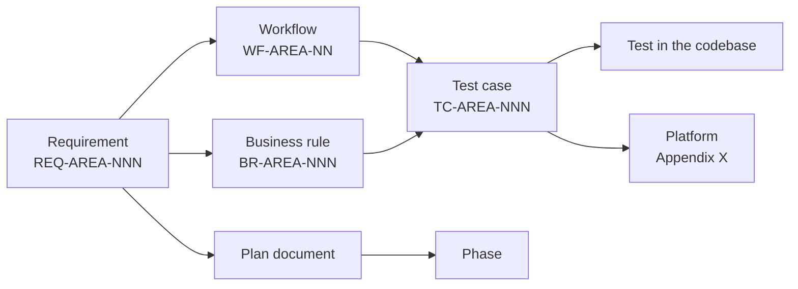

# Appendix V. Coverage Matrix and Test Case Format

> Part of `docs/brief/02-appendices/`. Normative. Read with the master brief and the reference architecture.

Master brief Section 24 states the coverage matrix as a contract. This appendix is the working version: the exact format of a test case, how identifiers link, and what must be true before anything is called done.

---

## V.1 The chain that must never break



`docs/plan/20-traceability-matrix.md` holds this chain with one row per requirement and these columns: **Requirement, Summary, Tier, Service, Workflow, Rule, Plan document, Phase, Test case, Platform, Status**. A row with an empty Test case column is an unfinished requirement, whatever the code says. `tools/kit-lint` and `/lint-plan` both refuse a traceability matrix with a gap.

---

## V.2 Test case format

Every test case is written the same way, whether it becomes an xUnit test, a Playwright script, a Flutter test or a manual acceptance step.

```
### TC-ATT-003 Exception-only register pre-fills from gate and leave

**Covers:** REQ-ATT-014, WF-ATT-01, BR-ATT-002
**Level:** integration
**Platform:** Linux runner
**Automated:** yes, `AttendanceRegisterTests.PreFill_GateAndApprovedLeave_MarksExceptionsOnly`

**Given** section 4B has 25 students, 3 scanned at the gate at 07:40, and 2 with leave approved for today,
**When** the teacher opens the register at 08:05,
**Then** 3 are pre-filled present, 2 are pre-filled excused, 20 await confirmation,
**And** confirming the remainder writes one session with 25 records and publishes exactly one `attendance.attendance.marked.v1`.
```

**Rules for the format.** One behaviour per case. Concrete numbers, never "some" or "several". The `Covers` line is what makes the traceability matrix generatable rather than hand-maintained. `Level` is one of unit, integration, contract, end-to-end, manual. `Platform` is `any` unless the case exists because of an operating system or device difference, in which case it names the runner from Appendix X.

---

## V.3 The coverage matrix

| Artefact | Proof | Level | Where it runs | Gate |
|---|---|---|---|---|
| Requirement | At least one `TC-` in the format above | integration or end-to-end | service or end-to-end suite | No requirement ships without one |
| Business rule | Table-driven unit test built from the rule's worked examples | unit | service unit tests | Every `Given` in Appendix S becomes a row |
| Business rule, arithmetic | Property-based test over the rule's domain | unit | service unit tests | Money, dates and weighted averages |
| Business rule, rule-heavy domain | Mutation score at least 80% on that class | unit | mutation job | Grading, fees, promotion, permissions |
| Workflow | One test per transition, per failure, per compensation | integration | Testcontainers | Appendix R's test tables are the list |
| Saga | Plus a timeout test and a mid-flight failure test | integration | Testcontainers | Every saga in the reference architecture |
| Endpoint, authorization | Generated from Appendix B: every role can do exactly what the catalog says and nothing more | integration | `PermissionMatrix.Tests` | Generated, so it cannot fall behind |
| Endpoint, tenancy | Generated: every endpoint and consumer attacked with another tenant's identifiers | integration | `TenantIsolation.Tests` | One failure blocks the release |
| Endpoint, contract | Problem Details shape, pagination envelope, error code from Appendix K | contract | service tests | |
| Endpoint, performance | Query budget assertion through the command-counting interceptor | integration | service tests | Over 10 commands needs an ADR |
| Event | Schema contract test both sides | contract | `Contracts.Tests` with PactNet | |
| Event, idempotency | Deliver twice, assert one effect | integration | Testcontainers | Every consumer |
| Event, ordering | Out-of-order delivery for one partition key, assert the final state | integration | Testcontainers | Only where a partition key is set |
| Cache entry | Invalidation driven by the real event; tenant-key isolation; behaviour with Redis down | integration | Testcontainers | Every entry in a service's caching table |
| Hot query | `EXPLAIN (ANALYZE, BUFFERS)` evidence committed under `docs/perf/`, plus the budget assertion | integration | Testcontainers at demo scale | Before a service is declared done |
| Web screen | Playwright happy path, axe-core, snapshots in light, dark, left-to-right, right-to-left, a story per state | end-to-end | web pipeline | All seven states: loading, empty, error, offline, processing, no permission, populated |
| Mobile screen | Widget test, golden in both directions, offline sync test where it applies | unit and integration | mobile pipeline | |
| Generated document | Snapshot in English and Arabic against committed baselines | integration | Documents tests | Shaping, not just text |
| Migration | SQL linter, plus the previous image running against the new schema | integration | pipeline | Expand and contract |
| Signature feature | Its row in Appendix O, run on the demo tenant | end-to-end | release gate | Sixty seconds or it is not signature |
| Platform-specific behaviour | The case runs on that runner or device, per Appendix X | varies | per the matrix | Path, culture, line ending, device |
| Runbook | Executed in a game day within ninety days of being written | manual | operations calendar | An unexercised runbook is fiction |
| Plan document | Scorecard at 4 or better on every axis, clean `kit-lint` | review | `/score-plan`, `/lint-plan` | Per group |

---

## V.4 Quality gates per phase

A phase ends when all of these are true and evidenced, not asserted.

| Gate | Evidence |
|---|---|
| All tests green | Pipeline run identifier and the summary |
| Coverage thresholds met | 90% domain, 80% application, per service |
| Mutation score met on rule-heavy classes | Report per class |
| Zero high or critical vulnerabilities | Scanner output, or an accepted risk with an owner and a date |
| Licence scan clean | Inventory diff and the allow-list |
| Accessibility clean | axe-core output plus the manual pass note |
| Performance budgets met | Baseline comparison, no regression over 10% |
| Tenant isolation suite green | Count of endpoints and consumers attacked |
| Traceability updated | No requirement without a test case |
| Documentation and project memory updated | `PROJECT_STATE.md` and `TRACEABILITY.md` diffs |
| Demo script passes | The Appendix O run, with the date and who ran it |

---

## V.5 Test data tiers

| Tier | Size | Used by |
|---|---|---|
| Demo | 2 tenants, 600 students, 60 staff, one prior year, current year mid-term | Unit, integration, end-to-end, the demo script |
| Load | 50 tenants, 50,000 students | The load scenarios in Appendix N, the generated suites at size |
| Scale | 500 tenants, 500,000 students | The scale targets in master brief Section 21, run before general availability |

Demo data is deterministic from a fixed seed, so a failure reproduces. Load and scale data are generated from the same builders with a different seed and a different volume, so a rule proven at demo scale is exercised with the same shapes at size.

---

## V.6 What "verified" means in this project

Master brief Section 26 forbids claiming something works without running it. In practice:

| Claim | What must accompany it |
|---|---|
| "The tests pass" | The command that ran and its summary output |
| "The budget is met" | The measured number and the budget |
| "It works offline" | The scenario run with the network disabled, and what was queued |
| "It works in Arabic" | The screenshot or snapshot, right to left |
| "It restores" | The drill date, the elapsed time per step, and who ran it |
| "It is done" | Every row of the coverage matrix that applies to it, satisfied |

Anything without its evidence is labelled unverified, in the same sentence, every time.
