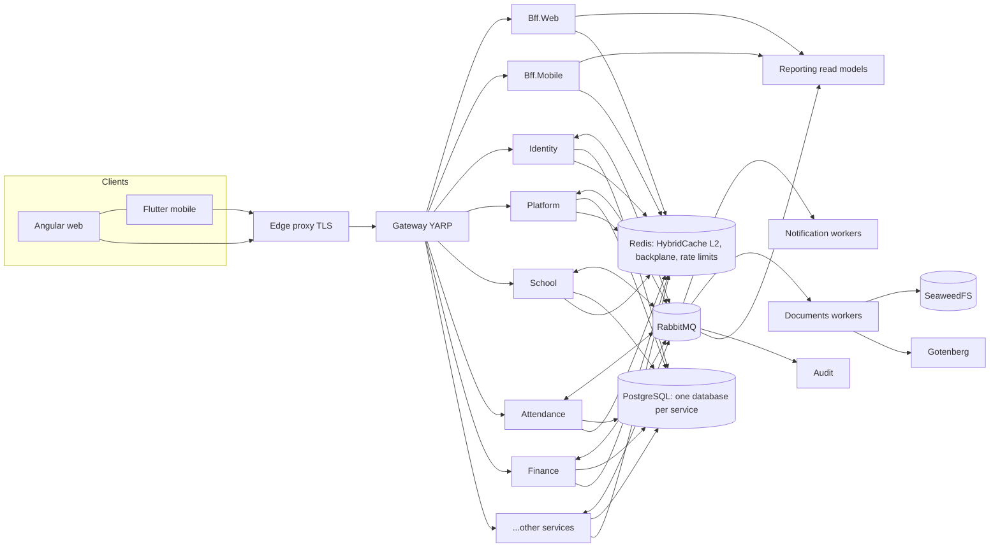
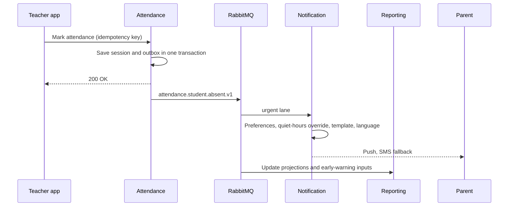
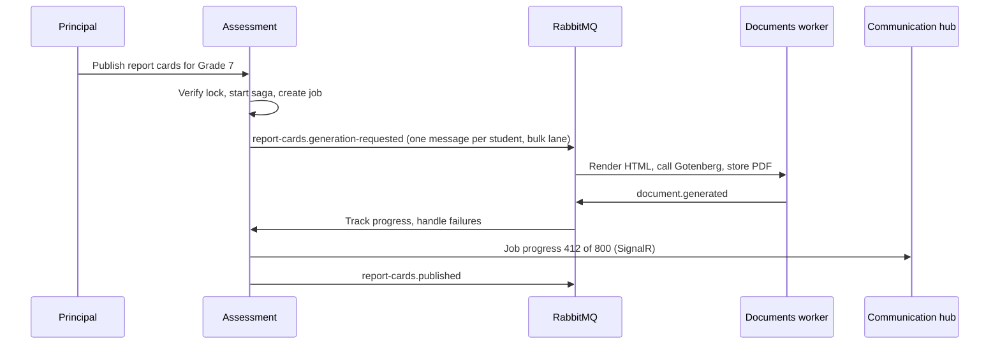

# Nibras Reference Architecture (v9.5)

**Status: normative baseline.** This file fixes the shape of the solution so that the plan and the code are consistent from the first day. You may improve on it, but every deviation needs an Architecture Decision Record that states what changed and why. Read it together with Sections 7, 8, and 19 of the master brief.

**Contents**

1. Repository structure
2. Anatomy of a service
3. Building blocks and contracts
4. Web structure (Angular)
5. Mobile structure (Flutter)
6. Deployment structure
7. Naming conventions
8. Service specification sheets
9. Reference diagrams
10. Event dependency matrix
11. Continuous integration and delivery
12. Secrets, keys, and rotation
13. Backup, restore, and disaster recovery
14. Tenant isolation model and tier migration
15. Environments
16. Pinned technology versions
17. Platform support matrix

---

## 1. Repository Structure

```
nibras/
├── CLAUDE.md
├── README.md
├── Directory.Build.props            shared compiler settings, analyzers, nullable, warnings as errors
├── Directory.Packages.props         central package versions (pinned)
├── .editorconfig  .gitignore  global.json
├── Nibras.sln
├── .claude/                         commands, agents, rules, settings
├── docs/
│   ├── brief/                       the three normative brief files
│   ├── plan/                        the approved plan (see PLAN_SPEC.md)
│   ├── project/                     PROJECT_STATE, TRACEABILITY, BACKLOG, RISKS, OPEN_QUESTIONS, DECISIONS/
│   ├── architecture/                C4 diagrams, context map, threat model
│   ├── api/                         aggregated OpenAPI, error code catalog
│   ├── messages/                    message catalog, topology
│   ├── runbooks/                    one per alert and per operational procedure
│   └── user-guides/                 en/ and ar/
├── src/
│   ├── AppHost/                     Aspire orchestration (development only)
│   ├── ServiceDefaults/             OpenTelemetry, health checks, resilience, service discovery defaults
│   ├── BuildingBlocks/              technical libraries only (Section 3)
│   ├── Contracts/                   versioned integration events and gRPC protos, one project per service
│   ├── Gateway/                     YARP
│   ├── Bff.Web/  Bff.Mobile/
│   ├── Services/
│   │   ├── Identity/  Platform/  School/  Admissions/  Academics/  Assessment/
│   │   ├── Scheduling/  Attendance/  Finance/  Communication/  Notification/
│   │   ├── Requests/  Documents/  Wellbeing/  Behavior/  Hr/  Operations/
│   │   └── Reporting/  Ai/  Audit/
│   ├── Web/                         Angular workspace (Section 4)
│   └── Mobile/                      Flutter app (Section 5)
├── tests/
│   ├── Architecture.Tests/          NetArchTest rules for every service
│   ├── Contracts.Tests/             Pact and message schema tests
│   ├── TenantIsolation.Tests/       generated attack suite
│   ├── PermissionMatrix.Tests/      generated from the permission catalog
│   ├── EndToEnd/                    Playwright
│   └── Load/                        k6 scenarios
├── deploy/                          compose, helm, opentofu, gitops (Section 6)
└── tools/
    ├── templates/service/           `dotnet new nibrassvc`
    ├── seed/                        demo and test data seeders
    ├── license-scan/                NuGet, npm, and pub scanners with the allow-list
    └── scripts/
```

> **Note on Assessment and Behavior.** The master brief lists Assessment inside Academics and Behavior inside Student Wellbeing. This baseline separates them because they differ in load profile (mark entry peaks, report card batches) and in sensitivity (behavior is visible to parents; wellbeing is not). Decision 8 in the master brief lets you merge them for the first release.

---

## 2. Anatomy of a Service

Every service has the same shape. Learn one, read all. Example: Attendance.

```
src/Services/Attendance/
├── README.md                                purpose, owned data, API, events, how to run, runbook links
├── Nibras.Attendance.Domain/
│   ├── Sessions/                            aggregate: AttendanceSession, AttendanceRecord, AttendanceCode
│   │   ├── AttendanceSession.cs             behavior and invariants live here
│   │   ├── Events/AttendanceMarked.cs       domain events
│   │   └── Rules/LockWindowRule.cs
│   ├── Excuses/  Thresholds/
│   └── Shared/                              value objects, errors (error codes), domain services
├── Nibras.Attendance.Application/
│   ├── Features/                            vertical slices: one folder per use case
│   │   ├── MarkAttendance/
│   │   │   ├── MarkAttendanceCommand.cs
│   │   │   ├── MarkAttendanceHandler.cs
│   │   │   ├── MarkAttendanceValidator.cs
│   │   │   └── MarkAttendanceEndpoint.cs    thin endpoint mapped from the Api project
│   │   ├── SubmitExcuse/  ApproveExcuse/  GetSectionRegister/  GetStudentSummary/
│   ├── Consumers/                           integration event handlers (idempotent)
│   │   ├── StudentEnrolledConsumer.cs       keeps the local student reference copy
│   │   └── LeaveRequestApprovedConsumer.cs
│   ├── Sagas/                               only where a process spans services
│   ├── ReadModels/                          query projections and DTOs (AsNoTracking, Select to DTO, keyset paging)
│   ├── Caching/AttendanceCacheKeys.cs       keys, tags, TTL policy, and the events that invalidate them
│   ├── Abstractions/                        ports: IAttendanceRepository, IClock, IStudentDirectory
│   └── Permissions/AttendancePermissions.cs constants that match the permission catalog
├── Nibras.Attendance.Infrastructure/
│   ├── Persistence/
│   │   ├── AttendanceDbContext.cs           pooled, named query filters, audit columns, concurrency
│   │   ├── CompiledQueries/                 EF.CompileAsyncQuery for the hottest reads
│   │   ├── CompiledModel/                   generated compiled model
│   │   ├── Configurations/  Migrations/  Repositories/
│   │   └── RowLevelSecurity/policies.sql
│   ├── Messaging/                           Wolverine and RabbitMQ topology for this service
│   ├── Grpc/                                clients for the rare synchronous query
│   └── DependencyInjection.cs
├── Nibras.Attendance.Api/
│   ├── Program.cs                           composition root, no logic
│   ├── Endpoints/                           endpoint registration by feature group
│   ├── Grpc/                                gRPC services this service exposes
│   ├── appsettings*.json  Dockerfile
├── Nibras.Attendance.Worker/                       only if the service has background consumers or jobs
│   ├── Program.cs  Dockerfile
│   └── Jobs/UnmarkedClassReminderJob.cs     Quartz.NET jobs
└── tests/
    ├── Nibras.Attendance.UnitTests/                domain and handlers
    ├── Nibras.Attendance.IntegrationTests/         Testcontainers: PostgreSQL, RabbitMQ, Redis
    └── Nibras.Attendance.ContractTests/            API and message contracts
```

**Dependency rule:** Domain depends on nothing. Application depends on Domain and BuildingBlocks abstractions. Infrastructure depends on Application. Api and Worker depend on all and only compose. Enforced by `tests/Architecture.Tests`.

**Every service ships with:** a caching table (what is cached, key, tags, lifetimes, invalidating events); a hot-query list with indexes and `EXPLAIN` evidence; query budgets enforced in integration tests; health, readiness, and startup probes; OpenAPI document; permission constants; error code list; message contracts; seed data; a Dockerfile per executable; a Helm chart; dashboards and alerts; a README; and an entry in `docs/plan/06-services/`.

---

## 3. Building Blocks and Contracts

```
src/BuildingBlocks/
├── Nibras.BuildingBlocks.Domain/           Entity, AggregateRoot, ValueObject, DomainEvent, Result, Error
├── Nibras.BuildingBlocks.Application/      pipeline behaviors: validation, authorization, tenant, transaction, audit, logging
├── Nibras.BuildingBlocks.Tenancy/          tenant resolution, context, EF filters, RLS session variable, cache key prefixing
├── Nibras.BuildingBlocks.Authorization/    permission cache, policy provider, data scope evaluator, permission version check
├── Nibras.BuildingBlocks.Messaging/        envelope, outbox and inbox wiring, topology conventions, retry and dead-letter policy
├── Nibras.BuildingBlocks.Caching/       HybridCache wrapper: automatic tenant prefix and tags, key builder, TTL policy with jitter,
│                                        event-driven invalidation helpers, circuit breaker, metrics
├── Nibras.BuildingBlocks.Persistence/      pooled base DbContext, named Tenant and SoftDelete filters, audit columns, UUID v7, xmin concurrency,
│                                        snake_case naming, keyset pagination, bulk COPY helper, slow-query and command-count interceptors
├── Nibras.BuildingBlocks.Web/              Problem Details, error codes, versioning, idempotency keys, ETag, rate limiting
├── Nibras.BuildingBlocks.Observability/    correlation, tenant enrichment, metrics conventions
├── Nibras.BuildingBlocks.Localization/     culture handling, bilingual value object, Arabic normalization
├── Nibras.BuildingBlocks.Files/            IFileStorage, signed URLs, scan status
├── Nibras.BuildingBlocks.Jobs/             long-running job contract with progress and cancellation
└── Nibras.BuildingBlocks.Testing/          builders, Testcontainers fixtures, fake clock, tenant fixtures

src/Contracts/
├── Nibras.Contracts.Identity/  Nibras.Contracts.School/  Nibras.Contracts.Attendance/  ...   one per publishing service
│   ├── Events/V1/StudentAbsent.cs
│   └── Grpc/attendance.proto
└── Nibras.Contracts.Shared/                MessageEnvelope, common identifiers
```

**Rule:** no business logic in either folder. A contract is only data. Breaking a contract means publishing `V2` beside `V1`.

---

## 4. Web Structure (Angular)

```
src/Web/
├── angular.json  package.json  tsconfig.base.json
├── apps/
│   ├── school/                      all tenant workspaces, lazy loaded by role area
│   └── platform-console/            SaaS operator console, separate host and build
├── libs/
│   ├── ui/                          design system: tokens, theme, components, motion utilities, Storybook
│   ├── core/                        auth, tenant, permissions directive and guard, http interceptors,
│   │                                error handling, i18n, RTL, realtime (SignalR), offline banner, command palette
│   ├── data-access/                 generated API clients (one per service), SignalStore stores
│   ├── shared/                      table, filters, saved views, form kit, file upload, bulk actions, import wizard
│   └── features/
│       ├── admin/                   users, roles-permissions, join-requests, settings, audit, jobs, failed-messages
│       ├── requests/                request center, approvals inbox, request type designer
│       ├── students/  admissions/  academics/  assessment/  timetable/  attendance/  safety/
│       ├── finance/  communication/  behavior/  wellbeing/  hr/  operations/  reports/
│       └── workspaces/              teacher, homeroom, student, parent, registrar, accountant, principal
└── e2e/                             Playwright
```

**Feature library shape:** `feature-name/` contains `pages/`, `components/`, `state/`, `routes.ts`, and `index.ts`. Pages are smart, components are presentational, state is a SignalStore, and nothing imports from another feature except through `shared` or `data-access`.

---

## 5. Mobile Structure (Flutter)

```
src/Mobile/
├── pubspec.yaml  analysis_options.yaml
├── flavors/                         default, plus one folder per white-label school (name, icon, colors, endpoints)
├── lib/
│   ├── app/                         bootstrap, router (go_router), theme from shared tokens, localization, flavors
│   ├── core/
│   │   ├── network/                 Dio, interceptors (auth, tenant, retry), generated clients
│   │   ├── auth/                    login, tokens, biometric unlock, session
│   │   ├── offline/                 Drift database, outbox queue, sync engine, conflict rules
│   │   ├── notifications/           push, channels, deep links, actionable notifications
│   │   ├── permissions/             permission cache and guards
│   │   └── design/                  widgets, motion, tokens
│   ├── features/
│   │   ├── home/                    role-specific home
│   │   ├── attendance/  timetable/  coursework/  grades/  messages/  announcements/
│   │   ├── requests/  approvals/  fees/  children/  safety/  daily_sheet/  clinic/
│   │   └── modes/                   gate, bus_attendant, nurse, kiosk
│   │       each feature: data/ (repositories, dto, local), domain/ (entities, use cases), presentation/ (screens, widgets, state)
│   └── main_<flavor>.dart
├── test/  integration_test/  goldens/ (ltr and rtl)
```

---

## 6. Deployment Structure

```
deploy/
├── compose/
│   ├── docker-compose.yml           infrastructure: postgres, pgbouncer, rabbitmq, redis-cache, redis-state, seaweedfs, gotenberg, mailpit, clamav
│   ├── docker-compose.services.yml  every service and worker
│   ├── docker-compose.observability.yml
│   └── profiles: dev, single-server, ai
├── helm/
│   ├── charts/<service>/            one chart per service: deployment, service, hpa, keda scaledobject, pdb, networkpolicy
│   ├── charts/infrastructure/       operators and dependencies
│   └── umbrella/                    values-dev.yaml, values-staging.yaml, values-prod.yaml
├── opentofu/                        networks, clusters, databases, storage, dns
└── gitops/                          Argo CD or Flux applications per environment
```

---

## 7. Naming Conventions

| Thing | Convention | Example |
|---|---|---|
| Service name | PascalCase singular domain noun | `Attendance` |
| Projects and root namespaces | `Nibras.<Service>.<Layer>` | `Nibras.Attendance.Application` |
| Building blocks and contracts | `Nibras.BuildingBlocks.<Name>`, `Nibras.Contracts.<Service>` | `Nibras.BuildingBlocks.Tenancy` |
| Container image | `nibras/<service>-<kind>` | `nibras/attendance-api`, `nibras/attendance-worker` |
| Database | `nibras_<service>` | `nibras_attendance` |
| Database user | `svc_<service>` | `svc_attendance` |
| Tables and columns | snake_case plural tables | `attendance_records.tenant_id` |
| Exchange | `nibras.<service>` (topic) | `nibras.attendance` |
| Routing key | `<service>.<entity>.<event>.v<n>` | `attendance.student.absent.v1` |
| Queue | `<consumer>.<purpose>` | `notification.absence-alerts` |
| Dead-letter and parking | `<queue>.dlq`, `<queue>.parking` | `notification.absence-alerts.dlq` |
| Urgent lane | suffix `.urgent` | `notification.push.urgent` |
| gRPC package | `nibras.<service>.v<n>` | `nibras.school.v1` |
| REST base path | `/api/v<n>/<service>/<resource>` | `/api/v1/attendance/sessions` |
| Permission | `<service>.<resource>.<action>` | `attendance.student-attendance.mark` |
| Error code | `<SERVICE>_<MEANING>` | `ATTENDANCE_SESSION_LOCKED` |
| Requirement ID | `REQ-<AREA>-<NNN>` | `REQ-ATT-014` |
| Mobile application ID | `<reversed confirmed domain>.nibras`, flavors add a suffix | set when the domain is confirmed |
| Web packages | `@nibras/<lib>` | `@nibras/ui`, `@nibras/core` |
| Metrics and log fields | prefix `nibras_`, field `nibras.tenant_id` | `nibras_attendance_sessions_marked_total` |
| Kubernetes namespace | `nibras-<env>` | `nibras-prod` |
| Cache key | `nibras:{tenant}:{service}:{entity}:{id}:v{n}` | `nibras:7f3a:scheduling:timetable:sec-4b:v2` |
| Cache tag | `<entity>:{id}` plus automatic `tenant:{id}` | `section:4b`, `student:91c2` |
| Redis deployments | `redis-cache` (LFU eviction), `redis-state` (no eviction) | |
| Configuration keys | `Section:Key`, environment variables with `__` | `Seed__AdminPassword` |

---

## 8. Service Specification Sheets

Each sheet is a starting point. The plan must complete every field, add the full API and entity lists, and justify the boundary.

**Legend.** *Sync deps* lists gRPC queries this service may make (maximum one hop). *Local copies* lists reference data replicated through events. *Profile* describes load and scaling.

### 8.0 Cross-service facts, in one table

These four columns used to be missing from most sheets, which meant the replication map and the service levels existed nowhere. They are defined here once. A sheet below adds detail; it never contradicts this table.

| Service | Sync deps (gRPC, max one hop) | Local copies kept from events | Service level class (master brief Section 31) | Highest data class it holds (Appendix J) |
|---|---|---|---|---|
| Gateway | none | none | Gateway class | none |
| Bff.Web, Bff.Mobile | none as gRPC; reads services over HTTP and Reporting read models. Bff.Web also submits assist jobs to Ai over REST and serves Ai's three internal routes (below) | none | Gateway class | passes through, stores nothing |
| Identity | Platform (`Settings`, `Retention.ListActiveHolds`, `Tenants.Checksum`); School (staff checksum, and the guardian eligibility check before a guardian link is approved) | tenant status from Platform | Gateway class | sensitive (credentials, tokens) |
| Platform | Identity (`ApiKeyAdministration`, `PermissionLookup.GetRoleRisk`); School (student and staff directory, for OneRoster copies); job only: every data-owning service's `Usage.Recount` | usage counters from every service | Gateway class | confidential |
| School | none | none. School is the source | Read-heavy | confidential; custody and medical summary are sensitive |
| Admissions | School (student and staff directory) | sections, grade levels, fee plan names | Read-heavy | confidential |
| Academics | School (student and staff directory); Scheduling (`Timetables`: entries of a published version, and the nightly checksum) | students, sections, staff, timetable | Read-heavy | internal; submissions are confidential |
| Assessment | School (student directory) | students, sections, staff, grading periods | Write-heavy | confidential |
| Scheduling | School (staff, structure and student directory: rooms, calendar days, sections, exam-seating candidates); job only: Academics `TeachingAssignments.Checksum`, Hr `Leave.Checksum` | staff, sections, rooms, terms | Read-heavy | internal |
| Attendance | School (student directory); Scheduling (`Timetables`: the campus day and a published version); job only: Hr `Leave.Checksum` | students, sections, timetable of the day, staff | Write-heavy | confidential |
| Finance | School (student directory) | students, guardians, payers, sections | Write-heavy | confidential; payment references are sensitive |
| Communication | Identity (permission check for a message policy) | students, staff, guardians, sections | Read-heavy | confidential; flagged content is sensitive |
| Notification | none | user channel preferences, quiet hours, language | Notification class | confidential |
| Requests | none | students, staff, approvers, request-type definitions | Read-heavy | confidential |
| Documents | none | template definitions, tenant branding | Read-heavy | confidential; generated certificates are confidential |
| Behavior | School (student directory) | students, sections, staff | Read-heavy | confidential |
| Reporting | none | projections of everything it consumes | Read-heavy, freshness 60 s | confidential; excludes Wellbeing by design |
| Audit | none | none | Read-heavy | sensitive (it records who saw what) |
| Wellbeing | School (student directory) | students, guardians, sections | Read-heavy | **isolation level S** |
| Hr | School (staff directory) | staff, campuses, departments | Read-heavy | sensitive (salary, contracts) |
| Operations | School (student and staff directory); job only: Scheduling `Timetables.Checksum` | students, staff, sections, routes | Read-heavy | confidential |
| Ai | none as gRPC; reads through Bff.Web's three internal routes over REST, from its jobs only (below) | embeddings with tenant and scope tags | Read-heavy | inherits the class of each indexed source |

**Calls every service makes, not repeated per row.** Through the building blocks, every service calls Platform `Tenants.GetTenantContext`, `Settings.GetSettings` and `Retention.ListActiveHolds`, and Identity `PermissionLookup.GetEffectivePermissions`, each on a cache miss with a 2-second deadline and the cached value as the fallback, and every service holding a copy calls the owner's `Checksum` and `ListSnapshotPage` for the nightly reconciliation. Communication additionally calls Identity `PermissionLookup.CheckPermission` for a message policy.

**Job only.** A call marked *job only* runs in a scheduled or queued job, never inside a request, so it adds no hop to any request chain.

**The one-hop rule, stated once.** No service makes a synchronous call from inside a handler that is itself serving a synchronous call; a call either answers from the callee's own data or fails to the caller's fallback. The gRPC architecture test (`GrpcHopRules`) enforces it for every row above.

**Ai over REST, through Bff.Web.** Bff.Web reaches Ai's API over REST, and every model call answers 202 with an assist job, so no user request waits on a model. Ai's jobs call three Bff.Web internal routes: `GET /bff/web/v1/internal/ai/sources/{sourceEntity}?cursor=` (the source feed, under the Ai service credential limited per source entity), `POST /bff/web/v1/internal/ai/sources/authorize` (the source re-check) and `POST /bff/web/v1/internal/ai/tools/{toolName}` (read-only tools), the last two under the caller's token. Each is one hop from Ai's job, Bff.Web answers it by reading the owning service's API, which answers from its own data, and none of them is made inside a request Ai is serving.

**The rule behind the middle column.** A local copy is slim, read-only, rebuilt from events, and never the source of a decision the owning service should make. Every one of them is reconciled nightly against its source, as master brief Section 19 requires under *Data integrity and reconciliation*. A service that needs a field not in its copy asks over gRPC or subscribes to a new event; it never reaches into another database.


### 8.1 Gateway
- **Purpose:** single public entry point. **Tier:** 1. **Data:** none (Redis for rate limits).
- **Does:** TLS termination behind the edge proxy, routing, token validation, tenant resolution (domain, subdomain, header), rate limiting per tenant and user, request size limits, CORS, security headers, aggregated OpenAPI, maintenance mode.
- **Profile:** stateless, scale on requests per second.

### 8.2 Bff.Web and Bff.Mobile
- **Purpose:** screen-shaped aggregation. **Tier:** 1. **Data:** none, short-lived Redis cache.
- **Does:** role home payloads, Student 360 composition from Reporting, navigation and permission bootstrap, mobile sync endpoints (delta since token), mobile remote configuration and version policy.
- **Rule:** no business rules, no writes that bypass the owning service.

### 8.3 Identity
- **Purpose:** who you are and what you may do. **Tier:** 1. **DB:** `nibras_identity`.
- **Aggregates:** User, Role, RoleAssignment, Delegation, Invitation, JoinRequest, Session, ApiKey, AccessReview.
- **API groups:** auth (OpenIddict), users, roles, permissions, invitations, join-requests, sessions, api-keys, access-reviews, security-policy.
- **Publishes:** `user.*`, `join-request.*`, `role.changed`, `permissions.changed`, `login.new-device`. **Consumes:** `tenant.provisioned`, `student.enrolled`, `staff.created`, `staff.left`, `offer.accepted`.
- **Special:** seeded super administrator with the Section 10.2 safeguards; permission version and Redis permission cache; break-glass CLI.
- **Profile:** login peak at the start of the day; token validation is local in every service.

### 8.4 Platform
- **Purpose:** tenants, plans, configuration. **Tier:** 1. **DB:** `nibras_platform`.
- **Aggregates:** Tenant, Domain, Plan, Subscription, FeatureFlag, Branding, UsageRecord, TenantInvoice, SupportTicket, Setting, CustomFieldDefinition, Terminology.
- **Publishes:** `tenant.*`, `plan.changed`, `feature-flag.changed`, `settings.changed`. **Consumes:** `usage.recorded` from all services.
- **Sagas:** tenant provisioning, tenant deletion. **Profile:** low traffic, read-heavy and cached everywhere.

### 8.5 School (SIS)
- **Purpose:** the source of truth for structure and people. **Tier:** 1. **DB:** `nibras_school`.
- **Aggregates:** Campus, Room, AcademicYear, Term, GradeLevel, Section, Subject, Department, House, Student, Guardian, StudentGuardian, Enrollment, StatusChange, StaffMember.
- **Publishes:** `student.*`, `guardian.updated`, `staff.*`, `section.*`, `academic-year.*`, `term.started`. **Consumes:** `offer.accepted`, `request.approved` (record updates, withdrawal), `staff.hired`.
- **Sagas:** year-end rollover, withdrawal clearance (with Finance, Operations, Documents). **gRPC exposed:** student and staff directory lookups.
- **Profile:** most-replicated data in the system; every other service keeps a slim local copy.

### 8.6 Admissions
- **Tier:** 1. **DB:** `nibras_admissions`. **Aggregates:** Inquiry, Application, Assessment, Interview, Offer, WaitingListEntry, ReEnrollmentCampaign.
- **Publishes:** `inquiry.created`, `application.*`, `offer.*`, `re-enrollment.*`. **Consumes:** `section.created`, `payment.received` (deposit), `invoice.overdue` (re-enrollment block).
- **Sagas:** offer accepted to enrolled. **Profile:** seasonal peak; public application form needs bot protection and OTP.

### 8.7 Academics
- **Tier:** 1. **DB:** `nibras_academics`. **Aggregates:** TeachingAssignment, StudentGroup, CurriculumUnit, LessonPlan, Assignment, Rubric, Submission, Resource, Question, Quiz, Attempt.
- **Publishes:** `teaching-assignment.changed`, `assignment.published`, `submission.*`, `lesson-plan.submitted`. **Consumes:** `student.*`, `section.*`, `staff.*`, `timetable.published`.
- **Local copies:** students, sections, staff. **Profile:** evening submission peak; files go through Documents.

### 8.8 Assessment
- **Tier:** 1. **DB:** `nibras_assessment`. **Aggregates:** AssessmentStructure, Mark, GradeScheme (versioned), ModerationRecord, TermResult, ReportCard (versioned), Transcript, GradeChangeRequest.
- **Publishes:** `marks.*`, `grades.locked`, `report-cards.*`, `grade-change.approved`. **Consumes:** `submission.graded`, `teaching-assignment.changed`, `student.section-changed`, `document.generated`, `account.restricted`.
- **Worker:** result calculation and report card batch orchestration. **Profile:** heavy write bursts at the end of each grading period; calculations must be reproducible.

### 8.9 Scheduling
- **Tier:** 1. **DB:** `nibras_scheduling`. **Aggregates:** BellSchedule, Constraint, TimetableVersion, TimetableEntry, Substitution, CalendarEvent, RoomBooking, ExamSession, SeatingPlan.
- **Publishes:** `timetable.*`, `substitution.assigned`, `event.published`, `room-booking.approved`. **Consumes:** `teaching-assignment.changed`, `leave.approved`, `staff.left`, `term.started`.
- **Worker:** `Scheduling.Worker` runs the OR-Tools solver as a cancellable job with progress. **Profile:** CPU-heavy worker, scaled by queue depth; read-heavy timetable queries cached.

### 8.10 Attendance (includes Safety)
- **Tier:** 1. **DB:** `nibras_attendance`. **Aggregates:** AttendanceSession, Excuse, ThresholdRule, PickupPerson, GatePass, Visitor, EmergencyBroadcast.
- **Publishes:** `attendance.*`, `student.absent`, `threshold.reached`, `gate-pass.*`, `emergency.*`. **Consumes:** `timetable.published`, `student.*`, `request.approved` (leave, early dismissal, pickup change), `leave.approved`.
- **Profile:** the sharpest peak in the system (first period). Partition records by tenant and month. Offline mobile sync with conflict rules.

### 8.11 Finance
- **Tier:** 1. **DB:** `nibras_finance`. **Aggregates:** FeeItem, FeeStructure, FeePlan, Invoice, Payment, Refund, CreditNote, Discount, Scholarship, Payer, CashierShift, Series.
- **Publishes:** `invoice.*`, `payment.*`, `refund.processed`, `account.restricted`, `account.cleared`. **Consumes:** `student.enrolled`, `student.status-changed`, `request.approved` (plan, discount, refund), `offer.accepted`.
- **Worker:** invoice runs, reminder ladder, statements. **Rules:** immutable posted documents, gapless series, decimal money, idempotent payment callbacks.

### 8.12 Communication
- **Tier:** 1. **DB:** `nibras_communication`. **Aggregates:** Announcement, Audience, Acknowledgment, Conversation, Message, MessagingPolicy, MeetingSlot, Booking, Survey.
- **Hosts:** SignalR hubs (Redis backplane) for messaging, notifications, job progress, and live permission refresh.
- **Publishes:** `announcement.published`, `message.*`, `meeting.booked`, `acknowledgment.recorded`. **Consumes:** `student.*`, `staff.*`, `permissions.changed`.

### 8.13 Notification
- **Tier:** 1. **DB:** `nibras_notification`. **Aggregates:** Template, Preference, NotificationRequest, Delivery, Digest.
- **Consumes:** almost every business event (see Appendix C). **Publishes:** `notification.delivered`, `notification.failed`.
- **Workers:** one per channel (email, push, SMS), separate urgent and bulk lanes, digest builder. **Profile:** highest message volume; scale by queue depth; per-tenant fairness.

### 8.14 Requests
- **Tier:** 1. **DB:** `nibras_requests`. **Aggregates:** RequestType (versioned), FormDefinition, ApprovalChain, Request, ApprovalDecision, SlaPolicy, EffectDefinition.
- **Publishes:** `request.*`. **Consumes:** results of effects from owning services, `staff.left` (reassign approvals), `role.changed`.
- **Sagas:** request fulfilment, which calls the owning service's effect through a command message and waits for the outcome.

### 8.15 Documents
- **Tier:** 1. **DB:** `nibras_documents` plus object storage. **Aggregates:** StoredFile, DocumentTemplate, GeneratedDocument, Certificate, VerificationToken, ImportJob, ExportJob.
- **Publishes:** `document.generated`, `import.completed`, `export.completed`, `file.scan-failed`. **Consumes:** `*.generation-requested`, `request.approved` (certificates).
- **Workers:** PDF through Gotenberg, imports, exports, ClamAV scanning, OCR. **Public endpoint:** QR verification page.

### 8.16 Behavior
- **Tier:** 1. **DB:** `nibras_behavior`. **Aggregates:** Category, Incident, PointEntry, Award, Badge.
- **Publishes:** `incident.recorded`, `points.awarded`, `badge.awarded`. **Consumes:** `student.*`.

### 8.17 Wellbeing
- **Tier:** 2. **DB:** `nibras_wellbeing`, separate credentials, encrypted columns. **Aggregates:** ClinicVisit, MedicationLog, CounselingCase, SafeguardingConcern, EducationPlan, Intervention.
- **Publishes:** minimal events without clinical detail. **Consumes:** `early-warning.flag-raised`, `student.*`. **Rule:** excluded from general search and from Student 360 without explicit permission; every read is logged.

### 8.18 Hr
- **Tier:** 2. **DB:** `nibras_hr`. **Aggregates:** StaffFile, Contract, LeaveRequest, LeaveBalance, PayrollInput, Payslip, Appraisal, Observation, Vacancy.
- **Publishes:** `leave.*`, `staff.hired`, `document.expiring`. **Consumes:** `request.approved` (leave and HR requests), `staff.*`.

### 8.19 Operations
- **Tier:** 2. **DB:** `nibras_operations` with a schema per sub-domain (library, transport, inventory, facilities, frontdesk, activities) so that a later split is mechanical.

### 8.20 Reporting
- **Tier:** 1. **DB:** `nibras_reporting` (read models, read replica friendly). **Owns no source data.**
- **Consumes:** events from every service into projections. **Provides:** dashboards, Student 360 read model, report builder, data quality rules, early-warning models (ML.NET). **Publishes:** `early-warning.*`, `data-quality.issue-detected`.
- **Rule:** projections are rebuildable from events or from service snapshots; include a rebuild command.

### 8.21 Ai
- **Tier:** 2. **DB:** `nibras_ai` with pgvector. **Does:** model gateway (Ollama or vLLM by default), embeddings, retrieval filtered by the caller's data scope, drafting, natural-language query, assistant. **Rule:** off by default per tenant; tools limited to the caller's permissions.

### 8.22 Audit
- **Tier:** 1. **DB:** `nibras_audit`, append-only, hash-chained, partitioned by month. **Consumes:** `audit.recorded` from every service. **Provides:** search, export, integrity verification.

---

## 9. Reference Diagrams

The plan must include these diagrams, refined and completed.

### 9.1 Runtime topology



### 9.2 Absence alert (asynchronous flow)



### 9.3 Report card batch (long-running job with a saga)



### 9.4 Diagrams the plan must add

C4 context and container diagrams; bounded-context map; one entity-relationship diagram per service; RabbitMQ exchange, queue, and binding topology; state machines for every workflow in Section 14 of the master brief; saga diagrams with compensations; deployment diagrams for the three deployment modes; the authentication and permission-refresh flow; the mobile offline sync flow.

---

## 10. Event Dependency Matrix

Every service that owns data publishes something, and this table is generated from the sheets above rather than maintained beside them. Earlier versions listed twelve publishers and twelve consumers, which silently contradicted a dozen "Consumes" lines; the omissions were Communication, Notification, Reporting, Behavior, Wellbeing, Operations, Ai and Audit as publishers, and Admissions, Hr, Communication, Behavior, Wellbeing, Platform, Operations and Ai as consumers.

Read a row as "when this service publishes, these services care".

| Publisher | Consumers | Representative events |
|---|---|---|
| **Platform** | every service | `platform.tenant.provisioned.v1`, `platform.plan.changed.v1`, `platform.feature-flag.changed.v1`, `platform.settings.changed.v1`, `platform.terminology.changed.v1` |
| **Identity** | Requests, Communication, Notification, Reporting, Audit, and every service through the permission cache | `identity.user.activated.v1`, `identity.role.changed.v1`, `identity.permissions.changed.v1`, `identity.login.new-device.v1` |
| **School** | Academics, Assessment, Scheduling, Attendance, Finance, Communication, Requests, Behavior, Wellbeing, Hr, Operations, Admissions, Identity, Notification, Reporting, Audit | `school.student.enrolled.v1`, `school.student.status-changed.v1`, `school.section.created.v1`, `school.staff.left.v1`, `school.academic-year.closed.v1` |
| **Admissions** | School, Identity, Finance, Documents, Notification, Reporting, Audit | `admissions.offer.accepted.v1`, `admissions.application.stage-changed.v1`, `admissions.re-enrollment.confirmed.v1` |
| **Academics** | Assessment, Reporting, Notification, Ai, Audit | `academics.assignment.published.v1`, `academics.submission.graded.v1`, `academics.homework-load.exceeded.v1` |
| **Assessment** | School, Documents, Communication, Notification, Reporting, Audit | `assessment.marks.approved.v1`, `assessment.grades.locked.v1`, `assessment.report-cards.published.v1`, `assessment.marks.overdue.v1` |
| **Scheduling** | Academics, Attendance, Hr, Operations, Notification, Reporting, Audit | `scheduling.timetable.published.v1`, `scheduling.substitution.assigned.v1`, `scheduling.room-booking.approved.v1` |
| **Attendance** | Finance, Wellbeing, Requests, Notification, Reporting, Audit | `attendance.student.absent.v1`, `attendance.threshold.reached.v1`, `attendance.gate-pass.used.v1`, `attendance.emergency.broadcast-started.v1` |
| **Finance** | Admissions, Assessment, Documents, Operations, Notification, Reporting, Audit | `finance.invoice.issued.v1`, `finance.payment.received.v1`, `finance.invoice.overdue.v1`, `finance.account.restricted.v1`, `finance.cheque.bounced.v1` |
| **Communication** | Notification, Wellbeing, Reporting, Audit | `communication.announcement.published.v1`, `communication.message.reported.v1`, `communication.acknowledgment.overdue.v1` |
| **Notification** | Platform, Reporting, Audit | `notification.notification.delivered.v1`, `notification.notification.failed.v1` |
| **Requests** | School, Academics, Assessment, Scheduling, Attendance, Finance, Documents, Hr, Operations, Wellbeing, Notification, Reporting, Audit | `requests.request.approved.v1`, `requests.request.sla-breached.v1`, `requests.task.assigned.v1` |
| **Documents** | Assessment, Finance, Requests, School, Notification, Reporting, Audit | `documents.document.generated.v1`, `documents.certificate.revoked.v1`, `documents.import.completed.v1`, `documents.file.scan-failed.v1` |
| **Behavior** | Wellbeing, Reporting, Notification, Audit | `behavior.incident.recorded.v1`, `behavior.points.awarded.v1`, `behavior.badge.awarded.v1` |
| **Reporting** | Wellbeing, Notification, Platform, Audit | `reporting.early-warning.flag-raised.v1`, `reporting.data-quality.issue-detected.v1` |
| **Audit** | Platform, Notification | `audit.integrity-check.failed.v1` |
| **Wellbeing** | Reporting, Notification, Audit | `wellbeing.referral.created.v1`, `wellbeing.intervention.opened.v1`, `wellbeing.clinic-visit.recorded.v1` (identifiers and a category code only, never clinical detail) |
| **Hr** | Identity, School, Scheduling, Attendance, Finance, Notification, Reporting, Audit | `hr.leave.approved.v1`, `hr.staff.hired.v1`, `hr.staff-document.expiring.v1` |
| **Operations** | Finance, Attendance, Notification, Reporting, Audit | `operations.transport.boarding-recorded.v1`, `operations.transport.vehicle-delayed.v1`, `operations.library.loan-overdue.v1`, `operations.facility.ticket-raised.v1` |
| **Ai** | Platform (usage), Audit | `ai.usage.recorded.v1`, `ai.index.rebuild-completed.v1` |

**Cross-cutting events** are published by every service under its own prefix and are not repeated per row: `<service>.usage.recorded.v1` consumed by Platform, and `<service>.audit.recorded.v1` consumed by Audit. Consumers bind with a wildcard.

**Cycles, and the one that is allowed.** School publishes to Requests and Requests publishes to School; Finance and Admissions likewise. These are not boundary defects. Requests is a **saga command channel**: it sends a command to the owning service and waits for that service's outcome event. The rule that keeps it safe is that Requests never decides the effect, it only orchestrates it, and every effect is idempotent. Any other cycle discovered while writing the plan is a boundary defect and must be resolved before the plan is approved, not documented as a quirk.

**Ordering.** Events that must be processed in order for one subject carry a `partitionKey` in the envelope, and their consumer queues use a consistent-hash exchange or a single active consumer. The subjects that need it are: a student (enrollment, section change, status), an invoice (issue, payment, reversal), a mark set (entered, approved, locked), and a timetable version. Appendix E records the partition key per event.

---

## 11. Continuous Integration and Delivery

Earlier versions of this document fixed the shape of the source tree and left out the build entirely, which meant the pipeline existed only as a sentence in the master brief. This is the shape of the build.

```
.github/workflows/                 # or .woodpecker/ with the same stages
├── ci-service.yml                 # reusable: one service, triggered by path filter
├── ci-web.yml                     # Angular workspace: lint, unit, build, budgets, Playwright, axe
├── ci-mobile.yml                  # Flutter: analyze, test, goldens LTR and RTL, Android build
├── ci-mobile-ios.yml              # macOS runner only, path-filtered to src/Mobile/**
├── ci-kit.yml                     # kit-lint and its own tests, on ubuntu-latest and windows-latest
├── dev-smoke.yml                  # one-command local start, on ubuntu-latest and windows-latest
├── license-scan.yml               # NuGet, npm, pub, plus asset licences
├── security-scan.yml              # Trivy, Gitleaks, OWASP ZAP against the preview environment
├── migrate.yml                    # builds migration bundles, runs them as a job before rollout
├── release.yml                    # semantic version per service, SBOM, cosign signature, changelog
└── preview-env.yml                # create on pull request, destroy on merge
```

**Stages of `ci-service.yml`, in order.** Restore with a lock file; build with warnings as errors; unit tests; architecture tests; format check; integration tests with Testcontainers; contract tests; the generated permission and tenant-isolation suites; query-budget assertions; licence scan; dependency and container vulnerability scan; secret scan; publish the image; publish the SBOM; sign the image.

**Path filters** mean a change inside one service builds one service. A change under `src/BuildingBlocks/` or `src/Contracts/` builds everything that depends on it, which is why those two directories have the architect as owner.

**Migrations and rollout, in this order.** Build a migration bundle. Run it as a job. Wait for it to succeed. Roll out the new image. Only after every replica reports the new version does the contract step of a expand-migrate-contract change run, as a separate job in a later release. **Rollback means redeploying the previous image**; the schema is never rolled back, which is exactly why every migration must leave the previous image able to run.

**Promotion.** An image built once is promoted by tag through test, staging and production. Nothing is rebuilt for production, because a rebuilt artefact is a different artefact.

**Supply chain.** Every image carries a CycloneDX SBOM and a cosign signature. The cluster admission controller refuses an unsigned image. Target level: SLSA build level 2 at launch. Dependencies update through grouped weekly pull requests, with security updates opened immediately and a 48-hour service level for anything rated critical.

---

## 12. Secrets, Keys, and Rotation

```
deploy/secrets/
├── README.md                      # this section, plus who holds the break-glass envelope
├── external-secrets/              # ExternalSecret manifests, one per service, no values
└── bootstrap/                     # first-run generation scripts, never committed output
```

| Secret | Scope | Store | Rotation | Notes |
|---|---|---|---|---|
| Database password | per service, user `svc_<service>` | OpenBao at scale, Docker secrets on a single server | 90 days | Rotation is a rolling restart, never an outage |
| RabbitMQ user | per service | as above | 90 days | Permissions limited to that service's exchange and queues |
| Redis ACL user | per service | as above | 90 days | Restricted to that service's key prefix |
| OpenIddict signing key | platform | as above | 180 days, with an overlap window | Old key stays published for validation until every token minted with it has expired |
| OpenIddict encryption key | platform | as above | 180 days | Same overlap rule |
| Column encryption data keys | per tenant for Wellbeing, per deployment elsewhere | wrapped by a key-encryption key held in OpenBao | yearly, or immediately on suspicion | Envelope encryption: rotating the key-encryption key does not rewrite the data |
| Webhook signing secret | per endpoint | Platform database, encrypted | on demand, with an overlap window | The school can rotate it from the console |
| Provider keys (SMS, payment, push, AI) | per tenant or per deployment | as above | per provider policy | Each sits behind an adapter, so rotation touches one place |
| Break-glass super-administrator recovery | platform | offline, sealed, two-person | on use | Using it raises a Sev1 and writes an audit entry |

**Rules.** No secret is ever in the repository, in an image, in a log, or in a client bundle. A secret is read at startup and on a refresh signal, never baked in. Rotation is a routine exercise with a runbook, performed at least once before launch so that nobody discovers at 2am that it does not work. A compromised secret is rotated first and investigated second.

---

## 13. Backup, Restore, and Disaster Recovery

The master brief commits to a recovery point objective of 15 minutes, a recovery time objective of 4 hours, and restoring a single tenant without affecting others. None of that had a design. This is it.

**What is backed up, and how.**

| Asset | Method | Frequency | Retention |
|---|---|---|---|
| Each PostgreSQL database | pgBackRest, full weekly, incremental daily, continuous write-ahead log archiving to object storage | continuous | 35 days point-in-time plus 12 monthly fulls |
| Object storage (documents, media) | SeaweedFS replication across volumes, plus a nightly copy to a separate bucket with versioning | nightly | 35 days |
| RabbitMQ | definitions export (exchanges, queues, bindings, policies) | on change and daily | 35 days |
| `redis-state` | append-only file snapshot | hourly | 7 days |
| `redis-cache` | not backed up, by design | n/a | n/a |
| Kubernetes and Helm state | Git, through GitOps | on change | history |
| Secrets | OpenBao's own snapshot, encrypted, stored separately from the database backups | daily | 35 days |

All backups are encrypted, and the encryption key is **not** stored in the same system as the backup.

**Restoring one tenant without touching the others.** This is the hard case, and it is a procedure rather than a button:

1. Freeze the tenant: Platform sets it read-only and the Gateway returns a maintenance response for it, so no new writes race the restore.
2. Restore the affected databases to a **scratch instance** at the chosen point in time.
3. Export that tenant's rows from each affected service's scratch database, ordered by dependency, filtered on `tenant_id`.
4. Reconcile: compare row counts and checksums against what the live system holds, and produce a difference report for the school to approve.
5. Apply into the live databases inside a transaction per service, with the outbox suppressed so that restoring history does not re-fire notifications to parents.
6. Rebuild derived state: replay Reporting projections for that tenant, and invalidate every cache entry tagged with it.
7. Unfreeze, and write the audit entry that records who restored what, to when, and who approved it.

Steps 3 to 6 are scripted in `tools/restore-tenant/`, and the script is exercised in the quarterly drill, not written during the incident.

**Disaster recovery.** A region loss is declared by the architect or the product owner. Recovery is: restore the newest full plus write-ahead logs into the standby region, restore object storage from the off-region copy, re-import RabbitMQ definitions, point DNS, and accept that in-flight messages between the last write-ahead log segment and the failure are lost, which is what the 15-minute recovery point objective means in practice. Drills run quarterly, with the result recorded in `docs/runbooks/` including how long each step actually took.

**Single-server mode is honest about this.** One machine has no high availability. Its backups go to a second disk and an off-site target, and the recovery plan is restore-from-backup with the school told in writing what that means for its recovery objectives.

---

## 14. Tenant Isolation Model and Tier Migration

**Three tiers, one codebase.**

| Tier | What it is | Who gets it | How the code differs |
|---|---|---|---|
| Shared | Every tenant in the same database per service, isolated by `tenant_id`, EF Core filters and row-level security | default | no difference |
| Dedicated database | One tenant's own database per service, same schema | a plan option, or a regulator's requirement | Platform resolves a different connection string; nothing else changes |
| Dedicated deployment | The whole umbrella chart in its own namespace or cluster | on-premises and private cloud | a different values file |

The code is identical in all three because tenancy is enforced in the same building block regardless. That is the property that makes the tiers commercially useful rather than three products.

**The row-level security contract.**

```sql
-- Every table in every service, created by the service's migration.
ALTER TABLE attendance_records ENABLE ROW LEVEL SECURITY;
ALTER TABLE attendance_records FORCE ROW LEVEL SECURITY;

CREATE POLICY tenant_isolation ON attendance_records
  USING (tenant_id = current_setting('app.tenant_id')::uuid);
```

The policy is a plain equality so it stays index-friendly, and every multi-tenant index starts with `tenant_id`. With PgBouncer in transaction pooling mode the variable is set with `SET LOCAL` **inside** each transaction, never per session, because a pooled connection is handed to the next tenant. An integration test proves that a connection returned to the pool cannot read the previous tenant's rows; that test is the reason this design is trustworthy rather than merely intended.

**Moving a tenant between tiers**, shared to dedicated, without a long outage:

1. Provision the empty dedicated databases and run migrations.
2. Copy the tenant's rows with `COPY`, service by service, while the tenant keeps working.
3. Re-copy the delta captured from the change feed, then set the tenant read-only for a short window.
4. Copy the final delta, switch the connection string in Platform, invalidate the tenant's caches, and verify with the reconciliation report.
5. Unfreeze, and keep the old rows for the cooling-off period before deleting them.

The reverse direction uses the same steps and is no harder, which is what keeps the commercial promise reversible.

---

## 15. Environments

| Environment | Data | Created by | Lives for | Purpose |
|---|---|---|---|---|
| Development | seeded demo tenants | the developer | a session | `aspire run` or the compose dev profile |
| Preview | seeded demo tenants | pipeline, per pull request | until merge | Reviewers click instead of imagining |
| Test | demo plus generated load data | pipeline | permanent | Where the generated isolation and permission suites run at size |
| Staging | production-like, anonymized nightly | pipeline | permanent | Rehearsal for release, restore drills, performance baselines |
| Production | live | pipeline with approval | permanent | The real thing |

**Anonymization** for staging replaces names, contact details, national identifiers and free text with generated equivalents in both scripts, re-keys payment references, and **does not copy uploaded media at all**. It runs as a job in the staging pipeline, and the job fails closed: if any table is not covered by a rule, nothing is copied.

---

## 16. Pinned Technology Versions

Exact versions live in `Directory.Packages.props`, `package.json` and `pubspec.yaml`. This table pins the **major** version the architecture assumes, so a reader knows what the design was written against. Changing a major here needs an ADR, because these are the ones with architectural consequences.

| Concern | Major assumed | Architectural consequence if it changes |
|---|---|---|
| .NET | 10 (LTS) | Named query filters, `HybridCache`, compiled models. See the fallback list in master brief Section 19 |
| EF Core | 10 | As above |
| PostgreSQL | 16 or later | Row-level security behaviour, partitioning, `pgvector` |
| RabbitMQ | 4 | Quorum queues, consistent-hash exchange plug-in |
| Redis | 8 (AGPLv3 option) or Valkey 9.1 (current 9.1.2) | Licence position in Section 6.4 of the master brief. Redis is never pinned below 8.0, because 7.4 and earlier have no AGPLv3 option and their licence is not allowed |
| Angular | latest stable at project start | `animate.enter` and `animate.leave`, View Transitions, zoneless |
| Flutter | latest stable at project start | Desktop targets for kiosk modes, impeller rendering |
| Node (tooling only) | 22 LTS or later | The kit's own scripts and the web build |
| Kubernetes | 1.29 or later | KEDA, admission policy |
| OpenTelemetry | 1.x | Correlation propagation through gRPC and RabbitMQ headers |

---

## 17. Platform Support Matrix

The product runs on Linux servers, is developed on Windows, Linux and macOS, and is used on Android, iOS, mobile web and desktop kiosks. Each row names how it is proven, because a support claim with no test is a wish. Appendix X carries the full test matrix.

| Surface | Supported | Proven by |
|---|---|---|
| Developer workstation | Windows 11 with PowerShell 7 or Git Bash; Ubuntu 22.04 or later; macOS 14 or later | The `dev-smoke` job runs the one-command start on a Windows runner and a Linux runner |
| Container runtime for developers | Docker Engine under WSL2, or Podman, on Windows; Docker Engine or Podman on Linux and macOS | Testcontainers configuration documented for both; Docker Desktop is not required and stays outside the licence policy |
| Servers | Linux only: Debian or Ubuntu, and the Red Hat family | All images are Linux. There is no Windows Server target |
| On-premises on a Windows host | Supported as a **Linux virtual machine appliance** (Hyper-V or VMware) built from `deploy/onprem/` | Appliance build and upgrade exercised in the release pipeline and in the quarterly drill |
| Browsers | Chrome, Edge, Firefox and Safari, last two major versions; Samsung Internet | Playwright runs the suite on Chromium, Firefox and WebKit, in light, dark, left-to-right and right-to-left |
| Screen readers | NVDA and Narrator on Windows, VoiceOver on macOS and iOS, TalkBack on Android | axe-core in the pipeline, plus a manual pass per release |
| Mobile application | Android 8 and later, with and without Google services; iOS 15 and later | Golden tests in both directions; a device pass on a low-end Android, an iPhone SE, an iPad, and one device without Google services |
| Mobile web | Parent, student, teacher and principal workspaces, installable as a progressive web application | Playwright at 360 by 800 and 768 by 1024, with mobile performance budgets |
| Desktop kiosk | Flutter Windows and Linux builds for gate, front desk and clinic modes (Tier 2) | Golden tests on both, with Arabic shaping verified on each |
| Tablets | Android tablets and iPad for kiosk, bus attendant and nurse modes | Layout tests at 768 and 1024 |

**Repository hygiene that makes a mixed-operating-system team possible.** `.gitattributes` normalises line endings (`* text=auto eol=lf`, `*.ps1 text eol=crlf`) and marks binary assets. `.editorconfig` sets `end_of_line = lf`. No two paths may differ only by case, and no repository-relative path may exceed 200 characters; `kit-lint` enforces both, because the first breaks a Linux checkout of a Windows commit and the second breaks a Windows checkout entirely. Every tool ships a `.ps1` and a `.sh` wrapper over one Node implementation, so a command in a document works for everyone without being written twice.
