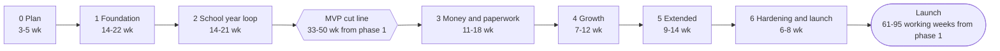

# 00. Executive Summary

**Group** A, updated last as PLAN_SPEC requires ("F: 22 to 33, 34, then update 00") · **Requirement areas covered** none of its own; it quotes documents 03, 05, 15, 17, 18, 28, 29, 30 and 34 · **Last updated** 2026-09-26 by the plan build

## Purpose

This is the one document the product owner reads to decide whether to approve the plan and start phase 1. It says what is being built and for whom, how it is deployed, how many applications it is, what each phase delivers and how long it takes, which ten risks matter most, and which decisions only the product owner can take. It contains no figure of its own: every number is quoted from the document that owns it, and that document is named beside it. When a number here and its owning document disagree, the owning document is right and this one is the defect.

## Scope

| In scope | Out of scope | Where the out-of-scope item lives |
|---|---|---|
| What Nibras is, who it serves, and how it will be judged | The requirements themselves | `03-requirements-catalog.md` |
| The three deployment modes and the application count | Topology, pipelines and runbooks | `04-architecture-overview.md`, `15-deployment-and-operations.md` |
| The phase roadmap on one page, with the MVP cut line | Capabilities and slices | `17-roadmap.md`, `34-work-breakdown.md` |
| The top ten risks | The full register, its scales and owners | `18-risk-register.md` |
| The decisions needed from the product owner, in the order to take them | The full question list and every decision record | `01-questions-and-assumptions.md`, `docs/project/OPEN_QUESTIONS.md`, `29-adr-index.md` |
| The scorecard verdict | Scores, evidence and gaps per group | `30-plan-scorecard.md` |

## Content

### 1. What is being built, and for whom

Nibras (نبراس) is a multi-tenant school management platform for K-12 schools, nursery and kindergarten included, built "for the entire school lifecycle" (master brief Section 4) in English and Arabic with full right-to-left from the first screen. It is designed for a region where, in the brief's words, "schools have unreliable connectivity at times; many parents use low-cost Android phones; many users prefer Arabic; administrators are not technical; data is imported from Excel or a legacy system on day one" (master brief Section 5). The first target countries are Saudi Arabia, the United Arab Emirates and Jordan, the default of Open Question 3.

It serves the eleven personas of master brief Section 5: the school owner or director, principal, academic coordinator, teacher, homeroom teacher, registrar, accountant, parent, student, nurse or counselor, and the platform operator who runs many schools.

Three tests define success (master brief Section 4):

| Test | What it means |
|---|---|
| The demo test | A school owner watching a 15-minute demo understands the value and sees things competitors do not have. Appendix O scripts the fifteen minutes; `32-product-differentiation-and-demo.md` maps them to phases and to the 43 signature features of Appendix W |
| The Monday-morning test | A teacher with 30 students and five minutes can do what they need on a phone, without training. The target is attendance for a class in under 60 seconds |
| The audit test | Any sensitive action can be traced, any number on a report can be explained, and no school can ever see another school's data. Cross-tenant incidents: zero, enforced by a tenant-isolation suite that blocks the release on a single failure |

How it is built: ASP.NET Core on .NET 10, Angular on the web, Flutter on mobile, PostgreSQL with EF Core, Redis and RabbitMQ; open source only, under the licence policy of master brief Section 6. Each service owns its database, publishes events through an outbox, and makes at most one synchronous hop (master brief Sections 7 and 8). The data subjects are children, so the privacy and safeguarding rules of master brief Section 20 override convenience: wellbeing data never leaves its service, never reaches a device and never enters a cache.

**How much is specified.** `03-requirements-catalog.md` holds **860 requirements**: 758 Tier 1, 94 Tier 2 and 8 Tier 3. `34-work-breakdown.md` builds them in **79 capabilities, 724 slices and 1,721 slice-days**, with **858** requirements built by at least one slice; the other two are Tier 3 and are explained there, not built. Every business rule, workflow and test case has one identifier and one definition, and the kit lint checks the whole plan with 35 rules on every change.

### 2. The three deployment modes

Master brief Section 7.7 defines them; `15-deployment-and-operations.md` fixes what is inside each, and `28-capacity-and-cost-model.md` sizes and prices them.

| Mode | What it is | Who runs it | Cost per 1,000 students, steady state (document 28, part 4.5) |
|---|---|---|---|
| **Developer** | `aspire run` starts every service and dependency with one command and opens the dashboard with logs, traces and metrics; a Docker Compose `dev` profile is the alternative | An engineer on Windows, Linux or macOS (`33-platform-support-and-dev-environments.md`) | not applicable |
| **Single server** | A Docker Compose profile that runs every service on one machine, "for a single small school or an on-premises install. A small school must not need a Kubernetes cluster." Servers are Linux only; a school with a Windows host runs the Linux virtual machine appliance for Hyper-V or VMware built from `deploy/onprem/` (ADR-0016, Proposed) | One school, often without a platform engineer | USD 195.07 in the worked example of 600 students; the host is 94% of it |
| **Scale** | Kubernetes with Helm, rolling or blue-green releases, migrations as jobs, per-service pipelines, and image, dependency and licence scans on every build | The platform operator, for many schools in one region | USD 113.72 in the worked example of 50,000 students; about USD 50.50 as the scale-tier indication at 500,000 |

Document 28's conclusion for the price list: "a single server costs roughly twice as much per student as a shared region, so the on-premises price is set by the host band, not by the per-student rate." Every figure above is a starting value that the phase 6 load tests replace with a measurement.

### 3. What gets deployed

Appendix L is the registry and owns these counts: **20 data-owning services, 16 Tier 1 and 4 Tier 2. With Gateway and the two backends-for-frontends, 23 deployable applications, plus 7 worker images.**

| Kind | Applications |
|---|---|
| Tier 1 data-owning services (16) | Identity, Platform, School, Admissions, Academics, Assessment, Scheduling, Attendance, Finance, Communication, Notification, Requests, Documents, Behavior, Reporting, Audit |
| Tier 2 data-owning services (4) | Wellbeing, Hr, Operations, Ai |
| Edge and composition (3, no data) | Gateway, Bff.Web, Bff.Mobile |
| Worker images (7) | `Notification.Worker`, `Documents.Worker`, `Scheduling.Worker`, `Assessment.Worker`, `Finance.Worker`, `Reporting.Projections`, `Ai.Worker` |

Each data-owning service has its own database `nibras_<service>` and its own exchange `nibras.<service>`; `05-service-catalog.md` gives each one's responsibility and build phase, and `06-services/` holds one buildable sheet per application. Whether any services start merged to lighten operations is Open Question 7 (default: separate, as Appendix L defines them), the action behind RISK-33 below.

### 4. The roadmap on one page

Quoted from `17-roadmap.md` Section 1. Every range is derived from the slices of document 34 by `tools/plan-build/schedule-34.mjs` for five to eight builders (master brief Section 29), counted in working weeks; it is an estimate with its uncertainty stated, not a commitment.

| Phase | Goal | Services | Range | Capabilities | Demo at the end, in short |
|---|---|---|---|---|---|
| **0 Plan** | The documents in `docs/plan/`, approved group by group | none | 3 to 5 weeks | none | The plan, scored at 4 or better on every axis |
| **1 Foundation** | Everything every later service stands on | Gateway, Bff.Web, Identity, Platform, Notification, Audit, and the Documents rendering pipeline | 14 to 22 weeks | 19 | A tenant is provisioned live, its administrator signs in with a second factor, a notification arrives, the audit entry is visible |
| **2 School year loop** | A class is taught, attended, graded and reported, in both languages, on web and phone | School, Scheduling, Attendance, Academics, Assessment, Bff.Mobile | 14 to 21 weeks | 19 | Every Appendix O minute whose phase is 2 or earlier, the rest by their stated substitutions. **The MVP cut line** |
| **3 Money and paperwork** | A fee is invoiced, chased and paid; a request is approved and takes effect; a certificate verifies | Finance, Requests, Communication, Documents | 11 to 18 weeks | 14 | Minute 10 as scripted, so act two runs as written |
| **4 Growth** | An applicant becomes a student; dashboards answer Appendix D; mobile reaches parity | Admissions, Behavior, Reporting | 7 to 12 weeks | 9 | Fourteen of the fifteen minutes as scripted on a fresh tenant with one-click reset |
| **5 Extended** | Wellbeing, human resources, operations and assistance, each to the definition of done | Wellbeing, Hr, Operations, Ai | 9 to 14 weeks | 12 | All fifteen minutes run as written for the first time |
| **6 Hardening and launch** | Evidence that every gate in master brief Section 24 holds at scale | all | 6 to 8 weeks | 6 | Restore drill, penetration-test close-out, and the scale-tier load run, each with its record |

**To launch.** "Total from start of phase 1 to launch: 61 to 95 weeks", which with the calendar allowance for Ramadan, the Eid and national holidays and annual leave "is about 71 to 110 calendar weeks, and the honest reading is 'about twenty months, plus or minus five': the low end needs eight engineers building from the first week, the high end is five" (document 17 Section 1).

**The MVP.** "The first paying school needs **phases 1 and 2 complete**, plus from phase 3 only what term one uses: CAP-RQS-01 limited to the attendance and document request types, CAP-COM-01 and CAP-COM-02, and CAP-DOC-02. That is **42 capabilities, 954 slice-days, and 33 to 50 weeks from the start of phase 1** ... about eleven months to the first paying school" (document 17 Section 5). Outside the MVP: Finance, Admissions, Behavior, the Reporting dashboards, and the four Tier 2 services. "A school that needs Finance in term one is a phase 3 customer, and saying so in the first meeting is cheaper than saying it in month nine."

### 5. The top ten risks

Quoted from `18-risk-register.md` Section 5, ranked by score (likelihood × impact on 1 to 5 scales), with the one action that most reduces each. Thirty more risks score 12 or more (RISK-48 at 15, the rest at 12) and keep their mitigations in the register.

| Rank | Id | Score | Risk | The one action, in short | Owner role | By |
|---|---|---|---|---|---|---|
| 1 | RISK-47 | 20 | The Wellbeing check-in answer waits in the device outbox | Decide Open Question 29; the recommended answer is an online-only check-in | Product owner | Before the first WF-WEL-05 slice, Phase 4 exit at the latest |
| 2 | RISK-01 | 16 | Single product owner as approval bottleneck | Delegate architecture, technology and dependency decisions to the architect in writing, with a five-working-day review window per group | Product owner | Group E approval |
| 3 | RISK-52 | 16 | The active-student billing count is defined twice | Decide Open Question 30 and land the ADR that corrects BR-FIN-017 | Product owner | Group B approval, before any metering slice |
| 4 | RISK-02 | 16 | Scope creep from Appendix A breadth | Decide ADR-0024: accept the requirements built ahead of their tier, and take the Move rows out of phases 1 to 4 | Product owner | Group E approval |
| 5 | RISK-33 | 16 | Twenty services overwhelm operations | Decide the merge option (Open Question 7) with a named split date, and require a runbook per alert before a service is done | Architect | Phase 1 exit |
| 6 | RISK-09 | 16 | Offline sync conflicts nobody can explain | Ship the eight Appendix M.5 tests and the banner rule with the first offline register; zero silent resolutions as a Phase 2 gate | Mobile engineer | Phase 2 exit |
| 7 | RISK-14 | 15 | PgBouncer transaction pooling leaks a tenant or breaks prepared statements | Run every service's integration suite through PgBouncer in transaction mode from the template's first commit | Architect | Phase 1, first capability |
| 8 | RISK-54 | 15 | A child reaches the wrong adult where a safeguarding control rests on a person, school-entered data or detection after the fact | Name the seven residuals to the first pilot school at onboarding; custody orders entered before any guardian is linked | Product owner | Phase 2, before the first school's dismissal goes live |
| 9 | RISK-60 | 15 | A malicious file is served to a child's family | Build the scan before any download as the only path to open an uploaded file, in the same capability as the first upload | Platform engineering | Phase 3, first upload slice |
| 10 | RISK-61 | 15 | An insider exports children's data in bulk | Build the export approval, watermark and principal report in the same capability as the first export | Product owner | Phase 3, first export slice |

Six of the ten are owned by the product owner, and four of those six are closed by a decision rather than by engineering. That is the case for the decisions workshop in Section 6.

### 6. Decisions needed from the product owner

Nothing here blocks phase 1 from starting: every question has a default in force, stated in `01-questions-and-assumptions.md` and `docs/project/OPEN_QUESTIONS.md`, and silence accepts it. They are ordered by what it costs to be wrong and how soon the first slice depends on the answer. L, I and Score are quoted from document 01.

| Order | Decision | Default in force | Why now | L | I | Score | Register |
|---|---|---|---|---|---|---|---|
| 1 | **Open Question 29**: may a student's level S check-in answer wait in the device's encrypted outbox, or must the check-in be online only? | The encrypted outbox SL-WEL-619 builds, which contradicts the rule that wellbeing data never reaches a device until decided. Recommended answer: online only | The highest-scoring risk in the register. Privacy officer first, then the product owner | 4 | 5 | 20 | RISK-47 |
| 2 | **Open Question 30**: which count bills a tenant, students enrolled on the billing date prorated by day, or any student enrolled for one day of the month? | Enrolled on the billing date, prorated by day (master brief Section 36, REQ-PLT-009) | Due before SL-PLT-010 starts in phase 1 | 4 | 4 | 16 | RISK-52 |
| 3 | **Open Question 27**: absence alert within 30 seconds of the mark, or 30 minutes after the register closes? | Within 30 seconds, as REQ-ATT-017 requires | Before the first phase 2 attendance slice | 3 | 3 | 9 | RISK-41 |
| 4 | **Open Question 28**: do the read-only public API, the OneRoster export and iCal move into Tier 1? | They stay where the roadmap builds them: iCal in phase 2, the public API and OneRoster in phase 3 | Before the MVP cut line is confirmed; document 02 found a public API in six of ten competitors | 3 | 3 | 9 | RISK-42 |
| 5 | **Open Question 3**: target countries for the first customers | Saudi Arabia, United Arab Emirates, Jordan | Sets tax, e-invoicing plug-ins, regulatory reports and data residency | 2 | 3 | 6 | RISK-23 |
| 6 | **Open Question 14**: a Mac build host, or hosted macOS runner minutes? | Hosted runner minutes, budgeted in master brief Section 30 | iOS cannot be built without one | 3 | 4 | 12 | RISK-04 |
| 7 | **Open Question 24**: team size and shape | Master brief Section 29: five to eight engineers building slices | Every phase range in Section 4 assumes it; `schedule-34.mjs` recomputes them for any other team | 3 | 3 | 9 | RISK-06, RISK-35 |
| 8 | **Open Question 26**: does any first customer require a formal certification such as SOC 2 or 1EdTech? | No. Compatibility yes, certification only when someone pays for it | Budget and timeline, both material if wrong | 2 | 3 | 6 | none |
| 9 | **Open Question 31**: does Appendix B gain a kindergarten daily-sheet resource, and Appendix C a daily-sheet row, so that feature 19 (REQ-ACA-028) can ship? | Yes, under an ADR with a brief version bump; until then the daily sheet is specified in full but names no permission and is not deployed | Reserve step R-08 and CAP-ACA-03 wait on it; both move to phase 5 if it has not landed by phase 2 | 3 | 3 | 9 | none |
| 10 | **The twenty-four Proposed decision records**, ADR-0001 to ADR-0018 and ADR-0020 to ADR-0025 | The plan and the first slices build on each record as written; each names its alternatives and a revisit trigger | ADR-0024 is the action for RISK-02 (rank 4). The weekly decision review of master brief Section 29 has not yet met; RISK-44 asks for the records Phase 1 builds on to be confirmed first | | | | RISK-44 |

The Proposed records, as indexed in `29-adr-index.md`; ADR-0019 alone is Accepted (2026-09-22):

| Record | Decision |
|---|---|
| ADR-0001 | Target .NET 10 (LTS) instead of .NET 8 |
| ADR-0002 | Fix the service catalog at twenty services, with Assessment and Behavior separate |
| ADR-0003 | The seeded administrator is the platform super administrator only |
| ADR-0004 | Use Wolverine for the mediator, transport, outbox and sagas |
| ADR-0005 | Run Redis as unmodified standalone infrastructure under AGPL, with Valkey as a drop-in fallback |
| ADR-0006 | All caching goes through HybridCache behind Nibras.BuildingBlocks.Caching |
| ADR-0007 | Generate PDFs with Gotenberg, from HTML |
| ADR-0008 | Use ASP.NET Core Identity with OpenIddict rather than Keycloak |
| ADR-0009 | Platform owns settings, terminology and custom-field definitions; services own the values |
| ADR-0010 | Rollback means redeploying the previous image; the schema is never rolled back |
| ADR-0011 | A school group is one tenant with several campuses |
| ADR-0012 | The public API, webhooks and standards belong to the Platform service; Requests owns tasks |
| ADR-0013 | Split the appendices into one file per appendix |
| ADR-0014 | Every requirement, rule and workflow is proven by an identified test case |
| ADR-0015 | Every intelligent feature declares an assist rung and an autonomy level, and explains itself |
| ADR-0016 | Servers are Linux only; a Windows host is served by a virtual machine appliance |
| ADR-0017 | Kit tooling is one Node implementation with PowerShell and bash wrappers |
| ADR-0018 | Work is broken down into slices of one to three days |
| ADR-0020 | Every test case is defined in exactly one document |
| ADR-0021 | Every verification claim names a check that runs |
| ADR-0022 | Every open point is scored, and the serious ones are register risks |
| ADR-0023 | Every signature feature runs its own demo test in the release gate |
| ADR-0024 | Some Tier 2 requirements are built before Tier 1 is complete |
| ADR-0025 | Master brief Section 28's ranges are re-derived after remediation round 5 (brief v9.5) |

**The suggested route:** one decisions workshop of about an hour (the first remediation theme of document 30), taking questions 29 and 30 first, then 27, 28, 3, 14, 24, 26 and 31, then ADR-0024 and the records phase 1 builds on; each answer is written into `OPEN_QUESTIONS.md` and, where it changes the brief, into an ADR with its version bump.

### 7. The scorecard verdict

`30-plan-scorecard.md` records the adversarial review of the plan on seven axes (Completeness, Consistency, Feasibility, Risk honesty, Testability, Distinctiveness, Portability), group by group, with every score backed by a quoted line. A group is approved when every axis scores 4 or better and no blocking gap remains.

**Verdict after round 5 (2026-09-26): all six groups, A to F, are approved, each at 4 on every axis.** Document 30 says: "every group is approved at 4 or better on every axis. The plan is ready for the product owner's approval, subject to the decisions listed in document 00."

It took five rounds. Round 1 (2026-09-22) approved no group. Round 3 approved A, B and D. Round 4 approved E. Round 5 approved C, after document 11 bound every notification and document-generation sender, and F, after the LTI 1.3 launch moved from phase 2 to phase 4 beside the registration it needs. Every score was set by an independent reviewer quoting the documents, and document 30 keeps every round so no score can quietly improve.

Approval is not perfection. Every group still lists non-blocking gaps in document 30 Section 5, each sized in minutes or hours. The most material is in Group F: LTI Assignment and Grade Services is in scope in `23-integrations-and-public-api.md` but no slice builds it, so the grade-return part of REQ-ACA-030's acceptance cannot pass until a slice is added in phase 4. None of the remaining gaps changes a phase range or the MVP.

## Requirements covered

| Requirement ID | What it means here | Acceptance criterion | Test case ID |
|---|---|---|---|
| None | This document summarises; it owns no requirement. Each requirement is covered by the document that states it, as `20-traceability-matrix.md` shows | Every number here matches its owning document | none |

## Decisions in force

| Decision | Source (ADR or open question) | Default if unanswered | Impact if wrong |
|---|---|---|---|
| Twenty data-owning services, deployed separately | ADR-0002, Open Question 7 | Separate, as Appendix L defines them | More to operate in phase 1 (RISK-33); merging is a build-time choice that changes no names |
| Linux servers, with a virtual machine appliance for Windows hosts | ADR-0016 | As recorded | An on-premises school on Windows Server needs the appliance, not a native install |
| Both SaaS and on-premises | Open Question 2 | Both | Whether the appliance is built in phase 6 or phase 2 |
| First countries | Open Question 3 | Saudi Arabia, United Arab Emirates, Jordan | Tax, e-invoicing and residency work changes |
| Team shape | Open Question 24 | Five to eight builders | Every range in Section 4 is recomputed |

## Dependencies on other documents

| This document assumes | Stated in | Checked on |
|---|---|---|
| 860 requirements, 758 Tier 1, 94 Tier 2, 8 Tier 3 | `03-requirements-catalog.md`, counts table | 2026-09-26 |
| 20 data-owning services, 23 deployable applications, 7 worker images | Appendix L, L.1 | 2026-09-26 |
| The three deployment modes | Master brief Section 7.7; `15-deployment-and-operations.md` | 2026-09-26 |
| Phase ranges, the 61 to 95 week total and the MVP cut line | `17-roadmap.md` Sections 1 and 5 | 2026-09-26 |
| The top ten risks | `18-risk-register.md` Section 5 | 2026-09-26 |
| Cost per 1,000 students by mode | `28-capacity-and-cost-model.md` part 4.5 | 2026-09-26 |
| Proposed and Accepted records | `29-adr-index.md` | 2026-09-26 |
| 79 capabilities, 724 slices, 1,721 slice-days, 858 requirements built | `34-work-breakdown.md` | 2026-09-26 |
| The scorecard verdict | `30-plan-scorecard.md` | 2026-09-26 |

## Open points

| Question | Default | Owner | Impact if the default is wrong | L | I | Score | In the register |
|---|---|---|---|---|---|---|---|
| Open Question 29: device outbox or online-only wellbeing check-in | The encrypted outbox, until decided; online only recommended | Privacy officer, then the product owner | A level S answer rests on a shared or lost device | 4 | 5 | 20 | RISK-47 |
| Open Question 30: which count bills a tenant | Enrolled on the billing date, prorated by day | Product owner | Schools invoiced on a figure other than their contract's | 4 | 4 | 16 | RISK-52 |
| Whether the twenty-four Proposed records are confirmed as written | The plan builds on each as written | Product owner, at the weekly decision review | Phase 1 slices rework what a changed record touches | 3 | 4 | 12 | RISK-44 |
| Whether the summary drifts from its owning documents after a change | Regenerated and re-checked in the same change as any document it quotes, per the "Counts are quoted" rule | Plan owner | A reader decides on a stale number | 2 | 3 | 6 | none |

## Review record

| Date | Reviewer | Verdict | Blocking items |
|---|---|---|---|
| 2026-09-26 | Plan build | Written after the round-4 scorecard, every figure quoted from its owning document | none |

## How this document is verified

| Claim | Check |
|---|---|
| Every identifier cited exists in its catalog | kit-lint R19 and R22 |
| Every section and appendix reference resolves | kit-lint R01 and R02 |
| The open points are scored and the serious ones registered | kit-lint R33 |
| Every quoted number matches its owning document | The plan review of `REVIEW_GUIDE.md`, comparing each row of "Dependencies on other documents" with its source |
