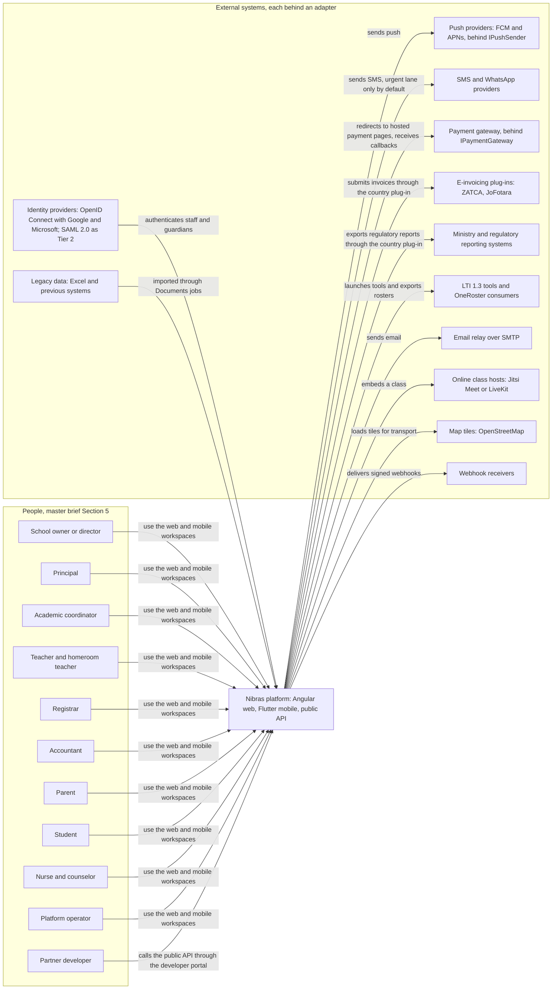
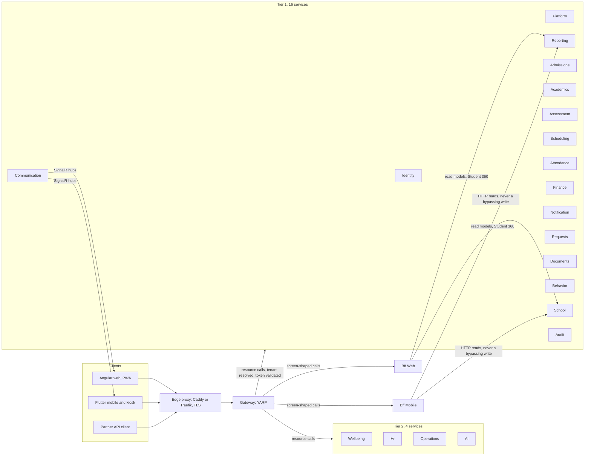
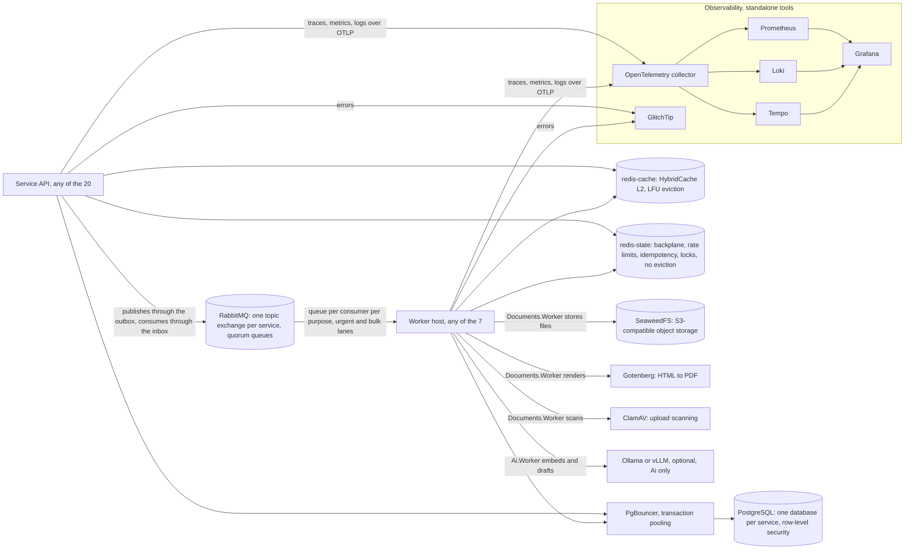
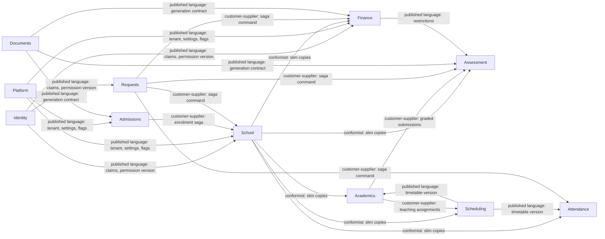
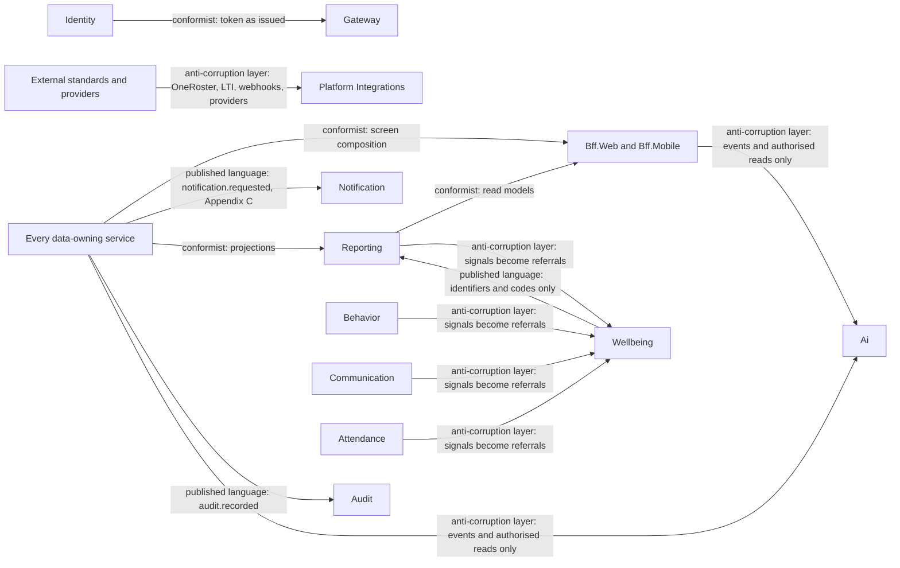
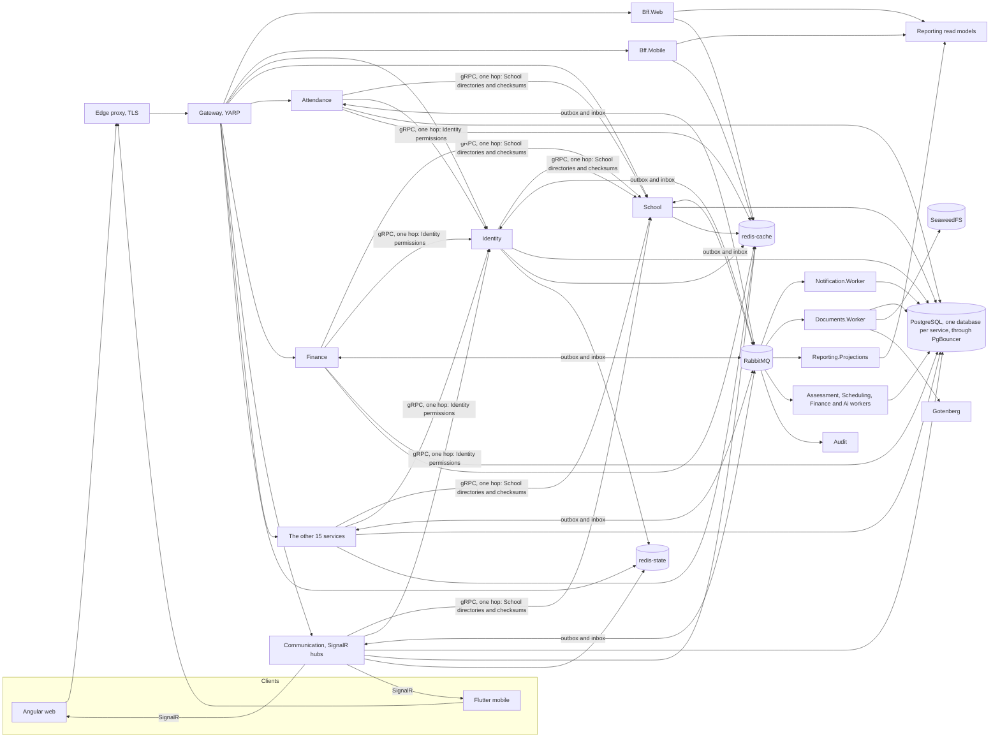
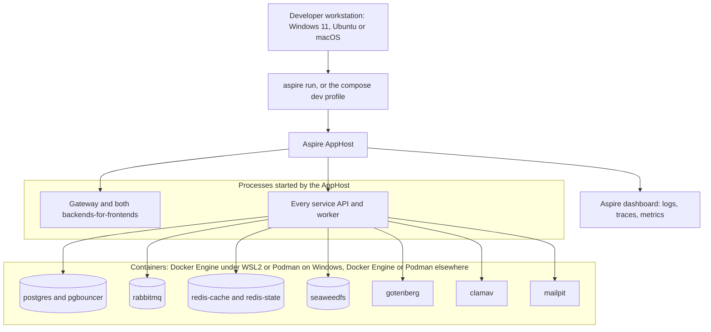
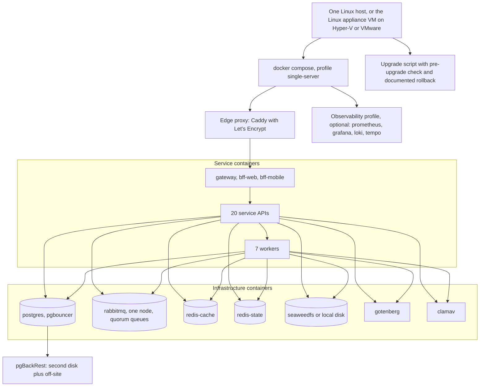
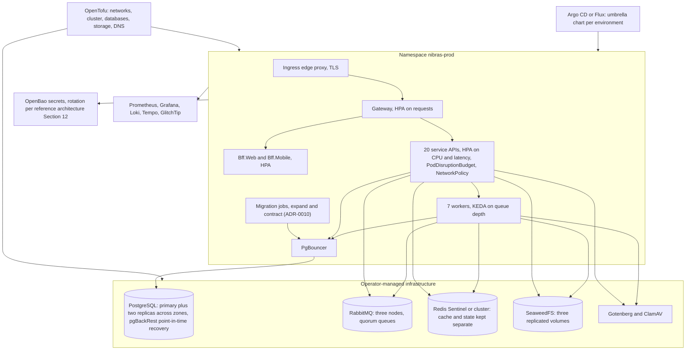

# 04. Architecture Overview

> Plan document 04 of 34. Group B. This document is the map: what surrounds the platform, what runs inside it, how the bounded contexts relate, how it is deployed in each of the three modes, what it is built from, and which decisions shaped it. Names come from Appendix L, the diagrams refine reference architecture Section 9, and the numbers come from master brief Sections 19, 21 and 31. The service-by-service detail is in `05-service-catalog.md` and `06-services/`.

**One sentence.** Nibras is a bilingual, multi-tenant school platform built as twenty data-owning services behind one Gateway and two backends-for-frontends, integrating through RabbitMQ events with at most one synchronous hop, each service owning one PostgreSQL database, deployable from one laptop command to a Kubernetes cluster with the same code and the same tenancy rules.

---

## 1. System context

The personas are those of master brief Section 5. Every external system sits behind an adapter interface so that a school can refuse a sub-processor by disabling the feature that uses it (master brief Sections 6.3 and 33).

| External system | Adapter interface | Owning service | Default implementation | Cost note (master brief Section 6.3) |
|---|---|---|---|---|
| Push providers | `IPushSender` | Notification | Firebase Cloud Messaging, Apple Push Notification service | Free of charge, not open source; the one accepted exception |
| Devices without Google services | the `IPushSender` fallback path | Notification | no external provider: the in-app real-time channel while the app is open, plus email and, for urgent messages only, SMS (master brief Section 37). Proved in the pipeline by `TC-NOT-610` (Notification sheet: in-app while open, urgent to SMS and email) and `TC-MOB-988` (document 20: the supported set includes devices without Google services), then on a real device by the per-release device pass on one device without Google services (`16-test-strategy.md` device-pass lane, `33-platform-support-and-dev-environments.md` §7) | None beyond the SMS carrier charge; the fallback uses the product's own channels |
| Huawei push (AppGallery devices) | `IPushSender` | Notification | Tier 2 plug-in (REQ-MOB-039). Master brief Section 37 builds it when the device share justifies it (Open Question 17), but `34-work-breakdown.md` SL-NOT-002 builds the Huawei adapter in phase 1 today; ADR-0024 (Proposed) lists that row as a Move, and the adapter stays in phase 1 until the product owner decides the record | Free of charge, not open source |
| SMS and WhatsApp | channel adapter | Notification | none; email and push fallback | Charged per message by carriers; SMS stays optional |
| Payment gateway | `IPaymentGateway` | Finance | manual and bank transfer | Charged per transaction; card data never touches Nibras (Section 36) |
| E-invoicing | country plug-in | Finance | interface only in Tier 1; ZATCA and JoFotara implementations per target country | Regional plug-in (Section 17) |
| Identity providers | OpenID Connect adapter; SAML 2.0 and SCIM as Tier 2 protocol adapters | Identity | Google and Microsoft in phase 1 (Section 35) | ADR-0008 |
| Ministry systems | country plug-in | Platform (Integrations) with the owning service's export | interface only | Regional plug-in (Section 17) |
| LTI 1.3 tools, OneRoster consumers | standards adapters | Platform (Integrations) | OneRoster 1.2 export and LTI 1.3 platform role in phase 4 (Section 35) | 1EdTech certification is a commercial decision (Section 30) |
| Email relay | MailKit | Notification | Mailpit in development | Delivery at scale is an operating cost |
| Online classes | embed | Academics | Jitsi Meet or LiveKit | none |
| Map tiles | Leaflet and `flutter_map` | Operations | OpenStreetMap | none |
| Legacy data | import job group | Documents | Excel and CSV mapping templates | none |
| Webhook receivers | outgoing webhook contract (Section 35) | Platform (Integrations) | signed POST with retry ladder | none |

---

## 2. Containers

Two views, because one diagram with every service and every piece of infrastructure passes forty nodes. The first shows the request path and the twenty services grouped by tier; the second shows what any service and any worker talks to.

### 2.1 Request path and services by tier

### 2.2 What a service and a worker talk to

| Container | Kind | One per | Notes |
|---|---|---|---|
| Edge proxy | Caddy or Traefik | deployment | TLS with Let's Encrypt, static assets with hashed names and long cache lifetimes, HTTP/2 and HTTP/3 |
| Gateway | YARP | deployment, 3 replicas | Token validation, tenant resolution from domain, subdomain or header, per-source and per-tenant limits, maintenance mode |
| Bff.Web, Bff.Mobile | ASP.NET Core | deployment | No business rules, no database; short-lived Redis cache |
| Service API | ASP.NET Core, Clean Architecture | service, 20 | Its own database, migrations, Dockerfile, OpenAPI, contracts, health probes |
| Worker host | .NET generic host | 7 workers | Same codebase as its service, separate image, scaled by KEDA |
| RabbitMQ | broker | deployment | Exchange `nibras.<service>`, routing key `<service>.<entity>.<event>.v<n>`, dead-letter and parking per consumer |
| PostgreSQL | database | one database per service, 20 | `svc_<service>` user, row-level security forced on every table, monthly partitions for attendance, notifications, messages and audit |
| PgBouncer | pooler | deployment | Transaction pooling; the tenant variable is set with `SET LOCAL` inside each transaction (reference architecture Section 14) |
| redis-cache, redis-state | Redis 8 or Valkey | deployment, two roles | Never mixed, so a cache flood cannot evict a lock (master brief Section 19) |
| SeaweedFS | object storage | deployment | Behind `IFileStorage`; local disk for small installs |
| Gotenberg | renderer | deployment | Bundled Inter, IBM Plex Sans Arabic and Noto Naskh fallback (ADR-0007) |
| ClamAV | scanner | deployment | Standalone GPLv2 container, socket protocol only (master brief Section 6.4) |
| Ollama or vLLM | model server | optional | Off by default; the product is complete without it |
| Observability | OpenTelemetry, Prometheus, Grafana, Loki, Tempo, GlitchTip | deployment | Correlation id from the Gateway through gRPC and RabbitMQ headers to the last consumer |

---

## 3. Bounded-context map

The relationship type on each edge uses the four names the task set fixes. *Published language* means the downstream depends on a versioned contract (`Nibras.Contracts.<Service>`) and nothing else. *Conformist* means the downstream keeps a slim copy in the upstream's shape without translating it. *Customer-supplier* means the downstream negotiates the contract, which is how sagas and command channels behave. *Anti-corruption layer* means the downstream translates before it stores, and never lets the upstream's model in.

### 3.1 Relationships, in full

| Upstream | Downstream | Relationship | Contract |
|---|---|---|---|
| Identity | every service | Published language | Token claims (user, tenant, roles, permission version); `identity.permissions.changed.v1` invalidates the permission cache |
| Platform | every service | Published language | `platform.*` tenant lifecycle, plan, flags, settings, terminology; custom-field definitions (ADR-0009) |
| School | Academics, Assessment, Scheduling, Attendance, Finance, Communication, Requests, Behavior, Wellbeing, Hr, Operations, Admissions | Conformist | `school.*` events and the `nibras.school.v1` gRPC directory; each keeps the slim copy listed in reference architecture Section 8.0 |
| School | Admissions | Customer-supplier | The "offer accepted to enrolled" saga: Admissions is the customer, School supplies the enrolment |
| Academics | Assessment | Customer-supplier | `academics.submission.graded.v1`, `academics.teaching-assignment.changed.v1`; Assessment negotiates what a graded submission carries |
| Academics | Scheduling | Customer-supplier | Teaching assignments as solver constraints |
| Scheduling | Attendance, Academics, Operations | Published language | `scheduling.timetable.published.v1` with a timetable version as the partition key |
| Requests | School, Academics, Assessment, Scheduling, Attendance, Finance, Documents, Hr, Operations, Wellbeing | Customer-supplier | The saga command channel: Requests is the customer of each owning service's effect definition; the owning service supplies the effect and decides nothing less |
| Documents | Assessment, Finance, Admissions, Requests, School, Behavior | Published language | `documents.document.generation-requested.v1` in, `documents.document.generated.v1` out; templates and verification codes |
| Finance | Assessment, Documents, Admissions, Operations | Published language | `finance.account.restricted.v1`, `finance.payment.received.v1`, `finance.invoice.issued.v1` |
| Admissions, Operations, Hr | Finance | Customer-supplier | They request charges (deposits, fines, activity fees, payroll inputs); Finance supplies the posted document |
| Hr | School, Scheduling, Attendance | Customer-supplier | `hr.staff.hired.v1`, `hr.leave.approved.v1`; School and Scheduling supply the record and the cover |
| every service | Notification | Published language | `notification.notification.requested.v1` plus the template catalog in Appendix C; Notification never sees a message body it did not template |
| every service | Reporting | Conformist | Projections conform to each publisher's event shape and are rebuildable from them |
| every service | Audit | Published language | `<service>.audit.recorded.v1` envelope with before and after values |
| Attendance, Behavior, Communication, Reporting | Wellbeing | Anti-corruption layer | Signals (`attendance.threshold.reached.v1`, `behavior.incident.recorded.v1`, `communication.message.reported.v1`, `reporting.early-warning.flag-raised.v1`) become referrals; no clinical content enters from outside, and only identifiers and codes leave |
| every service, the backends-for-frontends | Ai | Anti-corruption layer | Indexes only from events and authorised BFF reads; every embedding carries tenant, data scope and source version; never reads a database (master brief Section 25) |
| Identity | Gateway | Conformist | The Gateway validates tokens exactly as Identity issues them and adds nothing |
| every service, Reporting | Bff.Web, Bff.Mobile | Conformist | The backends-for-frontends compose service APIs and read models into screen shapes without owning a model |
| External standards (OneRoster, LTI, QTI, Open Badges, CASE) | Platform, Academics, Behavior | Anti-corruption layer | Each standard is mapped at the edge by its owning service (ADR-0012); the internal model never adopts the standard's shape |
| External providers (push, SMS, payment, e-invoicing, identity) | Notification, Finance, Identity | Anti-corruption layer | Adapter interfaces of master brief Section 6.3; one adapter replaced per licence or provider change |

### 3.2 Core and academic contexts

### 3.3 Supporting, sensitive and edge contexts

---

## 4. Runtime topology

Reference architecture Section 9.1, refined with canonical names and the two Redis roles.

The diagram draws the two synchronous callees that are separate nodes. Platform, Scheduling, Academics and Hr are also called over gRPC and sit inside "the other 15 services", so their edges are internal to that node. Reference architecture Section 8.0 is the complete synchronous list; document 05 reproduces it per service, and the table below quotes the rules that govern each path.

| Path | Route | Rule that governs it |
|---|---|---|
| Request | client, edge proxy, Gateway, service or backend-for-frontend | The Gateway resolves the tenant; a request without a tenant is rejected except on platform endpoints (master brief Section 7.4) |
| Screen composition | Gateway, Bff.Web or Bff.Mobile, several services over HTTP and the Reporting read models | Cross-service screens are served by the backends-for-frontends or Reporting, never by the browser calling ten services (Section 7.3) |
| Synchronous query | service, gRPC, the callee named in reference architecture Section 8.0 | The callees are Platform, Identity, School, Scheduling, Academics and Hr, and Platform's metering job additionally calls every data-owning service's `Usage.Recount`; Section 8.0 took this form in brief v9.1 under ADR-0019 (Accepted). At most one hop, with timeouts, retries with jitter, circuit breaker and a cached fallback (Section 7.3) |
| The one-hop rule | the callee answers from its own data, or the caller falls back | Quoted from reference architecture Section 8.0: "No service makes a synchronous call from inside a handler that is itself serving a synchronous call." The runtime proof is `TC-API-072` (document 22): the outbound interceptor refuses a second gRPC call opened while serving one, whichever layer opens it. The `GrpcHopRules` architecture test is the static half (`TC-TST-740` and `TC-TST-742`, document 07): it keeps gRPC clients out of `.Api` and `.Application` and limits each service's clients to its Section 8.0 callees, but it cannot follow a nested call made through an Application port that an Infrastructure client implements, which is why the interceptor test is the proof; a call marked *job only* in Section 8.0 runs in a scheduled or queued job and adds no hop to any request chain |
| Assist request | Bff.Web, REST, Ai; then Ai's job, REST, a Bff.Web internal route, the owning service | Ai makes no gRPC call. Bff.Web submits assist jobs over REST and every model call answers 202, so no user request waits on a model; Ai's jobs read back through Bff.Web's three internal routes, one hop each (reference architecture Section 8.0, added in v9.1 under ADR-0019) |
| Event | service outbox, RabbitMQ exchange, consumer inbox | At-least-once delivery; every handler safe to run twice; ordered per subject through a `partitionKey` (Section 8) |
| Job | API creates the job record, publishes to the bulk lane, worker runs it, progress over SignalR, result record with output | Long jobs report progress, can be cancelled, and leave an error report (Section 8, item 10) |
| Real time | Communication hubs on the `redis-state` backplane | Messaging, notifications, job progress and live permission refresh; no logout needed after a role change (Section 7.5) |
| File | Documents API, signed URL of 5 minutes, SeaweedFS | Files are scanned by ClamAV before any other job touches them and served only through short-lived signed URLs (Section 20) |

---

## 5. Deployment modes

Master brief Section 7.7 defines three modes and Section 34 gives each its high-availability posture. The code is identical in all three; only the values differ.

| Mode | Started by | PostgreSQL | RabbitMQ | Redis | Storage | Availability posture | Who it is for |
|---|---|---|---|---|---|---|---|
| Developer | `aspire run` or the compose dev profile | one container | one container | one of each role | local disk | none; it is a laptop | Every developer, on Windows 11, Ubuntu 22.04 or later, or macOS 14 or later |
| Single server | the compose `single-server` profile on one Linux host, or the virtual machine appliance on a Windows host (ADR-0016) | one instance, local backups to a second disk and off-site | one node, quorum queues still enabled | `redis-cache` and `redis-state` as separate containers | local disk | Restore from backup is the recovery plan, and the school is told so in writing | A single small school or an on-premises install; no Kubernetes cluster required |
| Scale | Kubernetes with the umbrella Helm chart, Argo CD or Flux, OpenTofu for the infrastructure | operator-managed, one primary and two replicas across zones, synchronous to one | three nodes, quorum queues | Sentinel or cluster, the two roles kept separate | replicated across three volumes | Zone loss survivable; region loss is a disaster-recovery event | The SaaS deployment and large private clouds |

### 5.1 Developer

Seeded demo tenants, the `dev-smoke` job proving the one-command start on `ubuntu-latest`, `windows-latest` and `macos-latest` (the three developer systems of REQ-PLAT-001; `07-solution-structure.md` part 1), and Docker Desktop not required (reference architecture Section 17).

### 5.2 Single server

The appliance is built from `deploy/onprem/` and carries the compose bundle, a backup volume and the upgrade script; native Windows Server hosting is not supported and the sales material says so (ADR-0016).

### 5.3 Scale

Rolling or blue-green releases, migrations as jobs, per-service pipelines triggered by path filters, and image, dependency and licence scans on every build (master brief Section 7.7). Calendar-aware scaling warms caches and scales up before first period in each tenant's own time zone (Section 34).

---

## 6. Tenant isolation tiers

Reference architecture Section 14: three tiers, one codebase, because tenancy is enforced in the same building block regardless of tier.

| Tier | What it is | Who gets it | How the code differs | What the plan adds |
|---|---|---|---|---|
| Shared | Every tenant in the same database per service, isolated by `tenant_id`, EF Core named filters and forced row-level security | default | no difference | The pooled-connection test: a connection returned to PgBouncer cannot read the previous tenant's rows, because the variable is set with `SET LOCAL` inside each transaction |
| Dedicated database | One tenant's own database per service, same schema | a plan option, or a regulator's requirement | Platform resolves a different connection string; nothing else changes | Migration between tiers in five steps: provision and migrate, `COPY` per service while the tenant keeps working, re-copy the delta and freeze briefly, final delta and switch the connection string with cache invalidation, unfreeze and keep the old rows for the cooling-off period |
| Dedicated deployment | The whole umbrella chart in its own namespace or cluster | on-premises and private cloud | a different values file | The single-server mode and the appliance are this tier at its smallest |

Two rules that hold in every tier: a school group is one tenant with several campuses, so no cross-tenant query exists anywhere (ADR-0011); and a tenant is pinned to a region at provisioning, so its data and its backups never leave that region (master brief Section 34).

---

## 7. Technology list

Every row is marked "verified from Section 6.2; exact versions pinned in document 19". Section 6.2 records licences at the level of the product family; document 19 verifies the licence of the exact version installed, from the source, and marks anything it cannot verify as unverified. A row whose licence cell is blank in Section 6.2 is marked unverified here rather than guessed.

| Concern | Technology | Licence (Section 6.2) | Verification |
|---|---|---|---|
| Runtime | .NET 10 (LTS), ASP.NET Core, EF Core 10 with Npgsql | MIT / PostgreSQL | verified from Section 6.2; exact versions pinned in document 19 |
| Database | PostgreSQL 16 or later with `pgvector`, `pg_trgm`, full-text search | PostgreSQL | verified from Section 6.2; exact versions pinned in document 19 |
| Bulk operations | Npgsql binary COPY, EF Core `ExecuteUpdate` and `ExecuteDelete` | part of the rows above | verified from Section 6.2; exact versions pinned in document 19 |
| Message broker | RabbitMQ 4 | MPL-2.0 | verified from Section 6.2; exact versions pinned in document 19 |
| Mediator, bus, outbox, sagas | Wolverine (ADR-0004) | MIT | verified from Section 6.2; exact versions pinned in document 19 |
| Object mapping | Mapperly, or explicit manual mapping | Apache-2.0 | verified from Section 6.2; exact versions pinned in document 19 |
| Validation | FluentValidation | Apache-2.0 | verified from Section 6.2; exact versions pinned in document 19 |
| Authentication | ASP.NET Core Identity with OpenIddict (ADR-0008); Keycloak as the SSO-heavy alternative | Apache-2.0 | verified from Section 6.2; exact versions pinned in document 19 |
| Cache, backplane, limits, locks | Redis 8 standalone under AGPLv3 (ADR-0005), StackExchange.Redis, `HybridCache` (ADR-0006); Valkey as fallback | AGPLv3 standalone / MIT | verified from Section 6.2; exact versions pinned in document 19 |
| File storage | SeaweedFS behind `IFileStorage`; local disk for small installs | Apache-2.0 | verified from Section 6.2; exact versions pinned in document 19 |
| Scheduled jobs | Quartz.NET, clustered, PostgreSQL job store | Apache-2.0 | verified from Section 6.2; exact versions pinned in document 19 |
| Real time | ASP.NET Core SignalR | MIT | verified from Section 6.2; exact versions pinned in document 19 |
| PDF | Gotenberg (ADR-0007); PDFsharp or MigraDoc for simple documents | MIT | verified from Section 6.2; exact versions pinned in document 19 |
| Excel and CSV | ClosedXML, CsvHelper | MIT / Apache-2.0 | verified from Section 6.2; exact versions pinned in document 19 |
| Image processing | SkiaSharp or Magick.NET | MIT / Apache-2.0 | verified from Section 6.2; exact versions pinned in document 19 |
| QR and barcodes | QRCoder, ZXing.Net | MIT / Apache-2.0 | verified from Section 6.2; exact versions pinned in document 19 |
| Multi-tenancy | Finbuckle.MultiTenant, EF Core global query filters, PostgreSQL row-level security | Apache-2.0 | verified from Section 6.2; exact versions pinned in document 19 |
| Resilience | Microsoft.Extensions.Resilience | MIT | verified from Section 6.2; exact versions pinned in document 19 |
| Feature flags | Microsoft.FeatureManagement | MIT | verified from Section 6.2; exact versions pinned in document 19 |
| API documentation | Microsoft.AspNetCore.OpenApi with Scalar UI | MIT | verified from Section 6.2; exact versions pinned in document 19 |
| API gateway | YARP | MIT | verified from Section 6.2; exact versions pinned in document 19 |
| Edge proxy and TLS | Caddy or Traefik with Let's Encrypt | Apache-2.0 / MIT | verified from Section 6.2; exact versions pinned in document 19 |
| Internal synchronous calls | gRPC (`Grpc.AspNetCore`), Microsoft.Extensions.ServiceDiscovery | Apache-2.0 / MIT | verified from Section 6.2; exact versions pinned in document 19 |
| Local orchestration | Aspire (AppHost, service defaults, dashboard) | MIT | verified from Section 6.2; exact versions pinned in document 19 |
| Autoscaling | Kubernetes HPA plus KEDA | Apache-2.0 | verified from Section 6.2; exact versions pinned in document 19 |
| Packaging | Helm, one chart per service plus an umbrella chart | Apache-2.0 | verified from Section 6.2; exact versions pinned in document 19 |
| Infrastructure as code and GitOps | OpenTofu, Ansible (GPL tool, build time only), Argo CD or Flux | MPL-2.0 / GPL tool / Apache-2.0 | verified from Section 6.2; exact versions pinned in document 19 |
| Supply chain | CycloneDX SBOM, cosign, Renovate (AGPL tool, CI only) | Apache-2.0 / AGPL tool | verified from Section 6.2; exact versions pinned in document 19 |
| Accessibility and visual tests | axe-core, Playwright snapshots | MPL-2.0 / Apache-2.0 | verified from Section 6.2; exact versions pinned in document 19 |
| Mutation testing | Stryker.NET | Apache-2.0 | verified from Section 6.2; exact versions pinned in document 19 |
| Error tracking | GlitchTip, self-hosted | MIT | verified from Section 6.2; exact versions pinned in document 19 |
| Product analytics, staff usage only | Matomo or PostHog, self-hosted | unverified: Section 6.2 requires the licence of the edition used to be verified | unverified until document 19 |
| Connection pooling | PgBouncer | ISC | verified from Section 6.2; exact versions pinned in document 19 |
| Contract testing | PactNet | MIT | verified from Section 6.2; exact versions pinned in document 19 |
| Service mesh | none at the start; Istio or Cilium only if proven necessary | Apache-2.0 | verified from Section 6.2; exact versions pinned in document 19 |
| Email | MailKit; Mailpit for development | MIT | verified from Section 6.2; exact versions pinned in document 19 |
| Search | PostgreSQL full-text search with Arabic normalization; Meilisearch only if proven necessary | unverified: Section 6.2 gives no licence for Meilisearch | unverified until document 19 |
| Timetable solver | Google OR-Tools, CP-SAT, official .NET bindings | Apache-2.0 | verified from Section 6.2; exact versions pinned in document 19 |
| Predictive models | ML.NET | MIT | verified from Section 6.2; exact versions pinned in document 19 |
| Generative AI | Microsoft.Extensions.AI, Ollama or vLLM, Semantic Kernel if needed, `pgvector` | MIT / Apache-2.0 | verified from Section 6.2; exact versions pinned in document 19 |
| OCR | Tesseract, Arabic and English | Apache-2.0 | verified from Section 6.2; exact versions pinned in document 19 |
| Online classes | Jitsi Meet embed or LiveKit | Apache-2.0 | verified from Section 6.2; exact versions pinned in document 19 |
| Maps | OpenStreetMap, Leaflet, `flutter_map` | BSD / ODbL | verified from Section 6.2; exact versions pinned in document 19 |
| Logging | Serilog to console and OpenTelemetry | Apache-2.0 | verified from Section 6.2; exact versions pinned in document 19 |
| Observability | OpenTelemetry, Prometheus, Grafana, Loki, Tempo or Jaeger, as standalone tools | Apache-2.0 / AGPL tools | verified from Section 6.2; exact versions pinned in document 19 |
| Upload scanning | ClamAV, standalone container | GPLv2 standalone (Section 6.4) | verified from Section 6.2; exact versions pinned in document 19 |
| Secrets | OpenBao, or Kubernetes and Docker secrets | MPL-2.0 | verified from Section 6.2; exact versions pinned in document 19 |
| Backups | pgBackRest with point-in-time recovery | MIT | verified from Section 6.2; exact versions pinned in document 19 |
| Optional BI | Apache Superset | Apache-2.0 | verified from Section 6.2; exact versions pinned in document 19 |
| Containers | Docker Engine or Podman | Apache-2.0 | verified from Section 6.2; exact versions pinned in document 19 |
| CI, CD and security scanning | GitHub Actions free tier or Forgejo with Woodpecker; Trivy, Gitleaks, OWASP ZAP, SonarQube Community | unverified: Section 6.2 lists no licence for this row | unverified until document 19 |
| Web | Angular latest stable at project start, zoneless, signals, standalone; Angular Material and CDK; native CSS animations with `animate.enter` and `animate.leave` plus View Transitions; Tailwind CSS; NgRx SignalStore; Transloco; Apache ECharts via `ngx-echarts`; Tiptap or Quill; generated OpenAPI client; Playwright | MIT | verified from Section 6.2; exact versions pinned in document 19 |
| Mobile | Flutter latest stable at project start; Riverpod or `flutter_bloc`; `go_router`; Dio; Drift; `flutter_secure_storage`; `local_auth`; `fl_chart`; `mobile_scanner`; `flutter_map`; `flutter_animate`; `lottie` | BSD / MIT | verified from Section 6.2; exact versions pinned in document 19 |
| Fonts and icons | Inter, IBM Plex Sans Arabic; Lucide or Material Symbols | SIL Open Font License; ISC / Apache-2.0 | verified from Section 6.2; exact versions pinned in document 19 |
| Testing | xUnit, NSubstitute, Shouldly or AwesomeAssertions, Bogus, Testcontainers, BenchmarkDotNet, NetArchTest, Playwright, k6 | as listed per package in document 19 | verified from Section 6.2; exact versions pinned in document 19 |
| Tooling | Node 22 LTS or later, one implementation with `.ps1` and `.sh` wrappers (ADR-0017) | MIT | verified from Section 6.2; exact versions pinned in document 19 |

**Explicitly excluded** by Section 6.2, so that nobody adds them by habit: MassTransit v9 and later, MediatR current versions, NServiceBus, AutoMapper current versions, Duende IdentityServer, MinIO, QuestPDF, iText, EPPlus, ImageSharp v3 and later, FluentAssertions v8 and later, Terraform, HashiCorp Vault, Seq, Docker Desktop, AG Grid Enterprise, FullCalendar premium plug-ins, Syncfusion in any form, and any hard dependency on a paid AI API.

---

## 8. Key decisions

Every architecture-shaping decision has an ADR in `docs/project/DECISIONS/`, and so does every decision about how the plan itself is built and proven. At the date of this document ADR-0019 is Accepted by the product owner (2026-09-22) and every other record below is Proposed, awaiting product owner confirmation; `29-adr-index.md` tracks the status of each, and the plan is written as though each Proposed record were accepted (Open points).

| ADR | Decision | Alternatives considered | Why the alternative lost |
|---|---|---|---|
| ADR-0001 | .NET 10 (LTS) rather than .NET 8 | .NET 8, with the fallback list in master brief Section 19 | Support for .NET 8 ends on 10 November 2026; a product holding children's data should not start on a runtime about to lose security patches (Section 3) |
| ADR-0002 | Twenty data-owning services, Assessment separate from Academics and Behavior separate from Wellbeing | Keep the estimate and let the catalog drift; merge the two pairs permanently; split Operations into six | Drift produced three different counts; the merges couple two scaling profiles and two sensitivity models; six sub-domains that deploy together are one service with six schemas |
| ADR-0003 | The seeded administrator is the platform super administrator only | A seeded account per tenant | A known credential per tenant is a standing credential-stuffing target and erases the invitation trail |
| ADR-0004 | Wolverine for mediator, transport, outbox and sagas, behind `Nibras.BuildingBlocks.Messaging` | Rebus plus a hand-written outbox; `RabbitMQ.Client` with a thin in-house bus | More code to own, and the outbox and saga machinery would be ours to get right |
| ADR-0005 | Redis 8 as unmodified standalone infrastructure under AGPLv3, Valkey as the drop-in fallback | Valkey as the default; avoid Redis entirely | Valkey is equally acceptable and kept ready; avoiding Redis would need a different answer for cache, backplane, limits and idempotency each |
| ADR-0006 | All caching through `HybridCache` behind `Nibras.BuildingBlocks.Caching`, tenant on every key and tag | Direct StackExchange.Redis calls per service; `IDistributedCache` only | Twenty chances to forget the tenant prefix; no stampede protection or tag invalidation for the morning peak |
| ADR-0007 | PDFs rendered from HTML by Gotenberg, fonts bundled, bilingual snapshot tests | A .NET PDF library; a self-operated headless browser | Licence and weaker Arabic shaping; Gotenberg is the maintained headless browser already |
| ADR-0008 | ASP.NET Core Identity with OpenIddict, in-process in Identity | Keycloak | A second user store to reconcile, and join and delegation flows would straddle two systems; Keycloak stays the recommended enterprise option |
| ADR-0009 | Platform owns settings, terminology and custom-field definitions; each service owns the values on its entities | School owns everything; each service owns its own definitions | Settings apply to every service; an administrator would configure the same terminology in twenty places |
| ADR-0010 | Rollback means redeploying the previous image; the schema is never rolled back; migrations are expand and contract | Down migrations; blue-green with two schemas | A down migration destroys data written since the deployment; two schemas cost more than the change sizes justify |
| ADR-0011 | A school group is one tenant with several campuses | Several tenants with a group layer | Every query would need a second scope above the tenant and the isolation guarantee would become conditional |
| ADR-0012 | Public API, webhooks and standards live in Platform as the Integrations capability; Requests owns the `Task` aggregate | A separate Integrations service | It would own no data beyond keys and endpoints, and Section 7.1 requires a written reason for a new service |
| ADR-0013 | Appendices split into one file each | Keep one file; split by theme | Unreadable and unmergeable at the v9 size; every existing reference is by letter |
| ADR-0014 | Every requirement, rule and workflow is proven by an identified test case (`TC-<AREA>-<NNN>`) | Rely on coverage percentages | Coverage measures lines executed, not behaviour proven |
| ADR-0015 | Every intelligent feature declares an assist rung and an autonomy level, and explains itself through the Because panel | One combined score; no explanation requirement | A combined score hides a simple rule acting by itself; master brief Section 4 makes explainability a product test |
| ADR-0016 | Servers are Linux only; a Windows host runs the Linux virtual machine appliance | Support Windows Server natively; refuse Windows-host customers | The dependency set makes native Windows unsupportable; the appliance costs little and opens a real segment |
| ADR-0017 | Kit tooling is one Node implementation with PowerShell and bash wrappers | Write each script twice; require WSL on Windows | Two implementations drift; WSL is an unreasonable requirement for a kit whose job is to be read |
| ADR-0018 | Work is broken into phases, capabilities of one to three weeks and slices of one to three days, split by use case and never by layer | Story points and velocity; stop at capability level; a four-level hierarchy with epics; a tracker outside the repository | Points become a false absolute once divided by velocity; stopping at capabilities invites layer-splitting and loses the requirement-to-slice check; a tracker cannot be linted against the plan's identifiers |
| ADR-0019 | **Accepted.** The brief is corrected to v9.1 from the defects the plan found. For this document the change that matters is reference architecture Section 8.0: it now lists the synchronous query calls the sheets need within the one-hop rule, names `GrpcHopRules`, and routes Ai through Bff.Web's three internal routes, which Section 4's path table quotes | Leave the brief at v9 and let the plan carry the workarounds; correct each appendix under its own ADR | Every workaround is a place where plan and source disagree; a dozen piecemeal version bumps, when defects in one appendix depend on another |
| ADR-0020 | Every test case is defined in exactly one document and cited everywhere else; kit-lint R20 enforces it | A hand-typed central list; let restatements stand; renumber Appendix R instead of W | A fourth copy that drifts; no lint can compare meaning; Appendix R's identifiers are cited far more widely |
| ADR-0021 | Every verification claim names a kit-lint rule that checks it, a named review step (who, what, when), or a product artefact built by a named slice | Delete the unverifiable rows; restate every mechanical claim as a review step; build every candidate rule | The claims are true requirements and the defect was the missing check; a review step is skipped under pressure; some checks need judgement a lint would fake |
| ADR-0022 | Every open point is scored L × I on document 18's scales, and one scoring 12 or more names a RISK | Move every open point into the register; score in words; a likelihood column without the register link | A register of several hundred rows buries the twelve that matter; two scales drift; the defect was the missing connection as much as the number |
| ADR-0023 | Every signature feature is shown by an Appendix O step that runs its own Appendix W demo test, and the release gate runs every step; kit-lint R34 enforces it | Point Appendix W's Demo column at whatever test a step already runs; give every feature its own minute | The feature's own moment would go unmeasured; the demo is fifteen minutes by design, with a reserve bank for swaps |
| ADR-0024 | Every Tier 2 or Tier 3 requirement a phase 1 to 4 slice builds is listed with its reason (Demo, Shared, Locality or Move), and `17-roadmap.md` carries the same list; kit-lint R35 enforces it. For this document it places the Huawei `IPushSender` adapter (REQ-MOB-039, SL-NOT-002) in phase 1 as a Move row, and the SAML and SCIM adapters (REQ-IDN-010, SL-IDN-011) in phase 1 as a Shared row | Move every Tier 2 and Tier 3 requirement out of phases 1 to 4; keep everything where it is and record nothing; re-tier the Demo requirements to Tier 1 in document 03 | Moving all of them breaks the Appendix O phase demos and the demo gate of ADR-0023 and reopens finished Tier 1 slices; recording nothing is the defect the scorecard found; re-tiering is a brief change the product owner may still prefer |
| ADR-0025 | Master brief Section 28's phase ranges are re-derived by `schedule-34.mjs` after remediation round 5 (brief v9.5), counting the conditional e-invoicing plug-in slices SL-FIN-448 to SL-FIN-452 in phase 3 | Keep the old ranges until phase 0 closes; absorb the new slices into the overhead factor | The brief says the ranges are derived, never adjusted by hand; absorbing the slices would hide the e-invoicing work that Open Question 3 makes conditional |
| ADR-0026 | Appendix N names the backend-for-frontend routes document 22 defines: N-05 exercises `GET /bff/mobile/v1/home/principal` and N-08 `POST /bff/mobile/v1/sync/batch` (brief v9.6). For this document it changes no container or path; it keeps the brief's load scenarios and the plan on one backend-for-frontend route prefix | Change document 22 to `/bff-mobile/` | Documents 08, 09, 22 and both BFF sheets already agree on `/bff/<client>/v1/`, which carries the version in the path as every other route of document 22 does |

Decisions this document relies on that have no ADR yet: the two additional cycle classes in `05-service-catalog.md` Section 5 (the job reply channel and the orchestrator sagas outside Requests), and the phase placement of Ai, which follows master brief Section 27 decision 6. Each is an open point below with its default in force and the role that records it.

---

## 9. The assist ladder

Every automated or suggested behaviour in Nibras declares an assist rung, which says what technology it needs, and an autonomy level, which says how far it acts alone, and the two are independent (master brief Section 25, ADR-0015). Rung 1 is deterministic rules and smart defaults, always on, owing the rule identifier and its inputs; rung 2 is a classical ML.NET model on ordinary hardware, on by tenant choice, owing its contributing factors and weights; rung 3 is a local open-weight language model, off by default and needing a capable machine, owing its sources and a human review step; rung 4 is an external provider behind an adapter, off by default, never required, needing explicit per-tenant consent, and owing everything rung 3 owes plus what left the school's infrastructure. Autonomy runs from 1, surfaces, through 2, suggests, and 3, drafts, to 4, acts, and autonomy 4 is never permitted over a grade, a payment or a message to a family. The product is complete and sellable at rung 1; a feature above it falls back downward to a rung 1 experience and never sideways to an error or a silent wrong answer; every automated decision a person can see shows its reasons, its rung and an override in the Because panel; every rung above 1 has a per-tenant, per-feature off switch; retrieval filters by the caller's data scope before it ranks; and the Ai service never reads another service's database, indexing only from events and authorised reads through the backends-for-frontends, which is what lets it be a Tier 2 service that the rest of the platform never depends on. The per-feature rung assignment is in Appendix W, whose register carries a Rung column but no fallback column. The per-feature rung 1 fallback is specified in document 25, section 2: the "Fallback to rung 1" column of its tables 2.1 (every signature feature with an automated or suggested behaviour) and 2.2 (the Appendix A AI capabilities) states, for each feature above rung 1, what the person sees when every rung above 1 is off or unavailable; the other Appendix W rows are rung 1 already and need none. Document 25 holds the full design. For the 43 signature features, the moment, rung, autonomy level, the requirements and slices that build each one, its Appendix O step and its demo test are held once, in the "Signature feature trace" table of `32-product-differentiation-and-demo.md`; this document cites a feature by its Appendix W number only and does not copy that trace, and kit-lint rule R34 proves every feature's demo step runs its own demo test (ADR-0023).

---

## 10. Quality attributes

Numbers are quoted from master brief Sections 19 (performance budgets), 21 (non-functional requirements) and 31 (service levels). A change that breaks a budget fails the pipeline, and raising a budget needs an ADR (Section 19).

The **Test case** column cites, with its owner, the identified test that proves each target. Most are the acceptance test document 20 assigns to the requirement in document 03 that states the target (a derived 950-range identifier, owned by that requirement); none is defined here.

| Attribute | Target | Source | Proven by | Test case |
|---|---|---|---|---|
| Availability, Gateway, Identity, Platform | 99.9% monthly; about 43 minutes of error budget | Section 31 | Per-service SLO dashboard and alert; the pipeline fails a release that regresses it; half the budget spent freezes non-essential change | `TC-INF-112` (document 15); `TC-INF-970` (document 20, REQ-INF-020) |
| Availability, every other service class | 99.9% | Section 31 | As above | `TC-INF-112` (document 15) |
| Latency, token validation at the edge | p95 under 150 ms | Section 31 | k6 scenario in Appendix N | `TC-GW-009` (Gateway sheet) |
| Latency, read-heavy services from cache | p95 under 80 ms at the service | Sections 19 and 31 | k6, plus the command-counting interceptor in integration tests | `TC-PERF-951` (document 20, REQ-PERF-001) |
| Latency, read-heavy services from the database | p95 under 250 ms | Sections 19 and 31 | k6 | `TC-PERF-952` (document 20, REQ-PERF-002) |
| Latency, write-heavy services | p95 under 500 ms | Sections 19 and 31 | k6 | `TC-ATT-344` (Attendance sheet, REQ-PERF-003) |
| Freshness, Reporting read models | within 60 seconds of the event | Section 31 | Projection lag metric and alert | `TC-DATA-011` (Reporting sheet) |
| Notification dispatch | urgent within 30 seconds of the event; bulk within 15 minutes | Section 31 | Queue-age metric per lane | `TC-NOT-615` (Notification sheet) |
| Worker recovery | queue depth back to baseline within 10 minutes of a burst | Section 31 | KEDA scaling test in the Appendix N scenarios | `TC-INF-971` (document 20, REQ-INF-021) |
| Database commands per request | 5 or fewer typical; above 10 needs an ADR | Section 19 | Command-counting interceptor fails the test | `TC-PERF-954` (document 20, REQ-PERF-004) |
| Single SQL command | p95 under 50 ms on demo-scale data; none above 200 ms without an ADR | Section 19 | Slow-query interceptor | `TC-PERF-955` (document 20, REQ-PERF-005) |
| Cache hit ratio, reference data, settings, permissions | 95% or higher during school hours | Section 19 | Redis hit-ratio dashboard; a falling ratio is an alert | `TC-PERF-956` (document 20, REQ-PERF-006) |
| Web vitals on a mid-range phone | LCP under 2.5 s, INP under 200 ms, CLS under 0.1 | Section 19 | Playwright with mobile budgets | `TC-PERF-957` (document 20, REQ-PERF-007) |
| Mobile | cold start under 3 s, 60 frames per second on a mid-range Android device | Section 19 | Device pass per release | `TC-PERF-959` (document 20, REQ-PERF-009) |
| Teacher marks attendance for one class | under 60 seconds end to end including network | Section 19 | Appendix Q acceptance script and the Appendix O demo | `TC-ATT-202` (document 08, REQ-ATT-004) |
| Scale | 500 schools, 500,000 students, 20,000 concurrent users; the 8:00 a.m. attendance peak; 800 report cards in under 10 minutes; a 10,000-row import in under 5 minutes | Section 21 | Appendix N load scenarios in phase 6 | `TC-PERF-960` (document 20, REQ-PERF-010); `TC-DOC-350` and `TC-DOC-351` (Documents sheet, N-02 and N-04) |
| Recovery | RPO 15 minutes or better, RTO 4 hours or better; point-in-time recovery | Section 21 | Quarterly restore drill (reference architecture Section 13) | `TC-INF-026` (Appendix R, REQ-INF-027) |
| Security | OWASP ASVS 5.0 Level 2 and MASVS 2; 2FA; lockout; rate limiting; CSP; ClamAV on uploads; column encryption for sensitive fields | Sections 20 and 21 | Generated permission and isolation suites; independent penetration test before general availability | `TC-SEC-951` (document 20, REQ-SEC-001); `TC-SEC-968` (document 20, REQ-SEC-018) |
| Privacy | minimization, consent records, access logs for sensitive records, retention jobs, export and erasure, data residency per tenant | Section 21, Appendix J | Retention job reports in the Data Quality Center; the guardian transparency panel | `TC-PRV-971` (document 20, REQ-PRV-021); `TC-AUD-002` (Appendix W, feature 31) |
| Auditability | who, what, when, where, before and after, append-only, hash-chained | Section 21 | Nightly integrity verification publishing `audit.integrity-check.failed.v1` on failure | `TC-AUD-951` (document 20, REQ-AUD-001); `TC-AUD-901` (Audit sheet, REQ-AUD-004) |
| Accessibility | WCAG 2.2 AA on web and mobile | Section 21 | axe-core in CI; manual pass per release with TalkBack, VoiceOver, NVDA and Narrator | `TC-UX-963` (document 20, REQ-UX-013) |
| Severity response | Sev1 acknowledged in 15 minutes and mitigated in 4 hours; Sev2 in 30 minutes and 1 business day | Section 31 | Incident drill in phase 6; a cross-tenant exposure is always Sev1 | `TC-INF-972` (document 20, REQ-INF-022) |
| Maintainability | a new developer productive within two days | Section 21 | The `dev-smoke` job on `ubuntu-latest`, `windows-latest` and `macos-latest`, and the onboarding checklist in document 33 | `TC-INF-951` (document 20, REQ-INF-001); `TC-PLAT-951` (document 20, REQ-PLAT-001) |

---

## Open points

| Question | Default | Owner | Impact if the default is wrong | L | I | Score | In the register |
|---|---|---|---|---|---|---|---|
| The job reply channel (a render or generation request in, a generated outcome back) is a second cycle exemption beside the Requests saga channel, used by Documents with Assessment, Finance, Requests and Admissions. Brief fact or ADR? | In force as `05-service-catalog.md` Section 5.1 rows 9 to 12 classify it, under the same safety rule as the Requests exemption: command in, outcome out, callee decides nothing, effect idempotent. Reference architecture Section 9.3 draws it as the reference pattern | Architect, who records it as an ADR | If the review treats it as a boundary defect, the report-card, invoice and certificate renders need another shape, and Documents plus four callers change in Phases 1 to 3 | 2 | 3 | 6 | none |
| Sagas orchestrated by a service other than Requests (Hr hires, Operations charges, Identity joins). Brief fact or ADR? | In force as `05-service-catalog.md` Section 5.1 rows 6 to 8 classify them: the Requests exemption applied with a different orchestrator, under its three conditions, and document 13 draws each with its compensation | Architect, who records it as an ADR | The Identity join saga is Phase 1 work; if the class is refused, joining moves behind Requests and the Phase 1 critical path through Identity lengthens | 2 | 3 | 6 | RISK-07 |
| Phase placement of the Ai service | Phase 5 for the service; rungs 1 and 2 ship inside their owning services earlier and rung 3 is off by default, per Open Question 5 and ADR-0015 | Product owner, through Open Question 5; the architect records the answer in `17-roadmap.md` | Only the Ai service moves between Phase 5 and Phase 6, because every feature above rung 1 names its rung 1 fallback in the "Fallback to rung 1" column of `25-ai-and-assist-ladder.md` section 2 | 3 | 2 | 6 | RISK-39 |
| Twenty-five of the twenty-six ADRs in Section 8 (ADR-0001 to ADR-0018 and ADR-0020 to ADR-0026) are Proposed, not Accepted; only ADR-0019 is Accepted, as `29-adr-index.md` counts them | The plan is written as though each Proposed record were accepted; `29-adr-index.md` tracks the status of each. ADR-0024 and ADR-0025 decide scheduling rather than architecture and are listed because Section 8 covers every decision about how the plan itself is built, as ADR-0018 is | Product owner, at the group reviews; the architect updates each record's status | A rejected ADR reopens its section here and every document that cites it; ADR-0001, ADR-0004 and ADR-0008 reach furthest in the architecture, and ADR-0020 to ADR-0023 in how the plan proves itself | 2 | 3 | 6 | RISK-01, RISK-44 |
| Three technology rows in Section 7 (product analytics, Meilisearch, the CI and scanning set) carry no licence in master brief Section 6.2 | Marked unverified here and verified from the source in document 19; none is linked into a service, and Meilisearch is used only if proven necessary | Architect, through document 19 | A row turns out to carry a licence outside the allow-list and its replacement is chosen late | 2 | 2 | 4 | RISK-26 |

> L and I are the likelihood that the default is wrong and the impact if it is, on the 1 to 5 scales of `18-risk-register.md` Section 1. Score is L x I. A point that scores 12 or more names its RISK identifier in document 18; below that, the identifier is written if one covers it, or `none`. Kit-lint rules R24 and R33 check all of it (ADR-0022).

---

## How this document is verified

| Claim | Proof |
|---|---|
| Every name in every diagram is a canonical name from Appendix L | Review step: `plan-consistency-checker` reads every node label and edge label in each diagram against the Appendix L service, worker and exchange names, at the Group B review and on every change to this document or Appendix L. `kit-lint` rule R31 fails on any backticked database or service-led image name not registered in Appendix L; the diagrams carry none today, so the rule guards additions only |
| Every Mermaid block opens with a known diagram type and stays under forty nodes | `kit-lint` rule R17 for the diagram type. The node count is a review step: `architecture-reviewer` counts the nodes of every diagram, starting with the two container views, which are the largest, at the Group B review and on every change to a diagram here |
| The context diagram's external systems each map to an adapter interface | Review step: `plan-consistency-checker` maps every external system in the Section 1 table to the adapter interface document 23 names for it and to its adapter package in document 19, and returns a system with no interface, at the Group B review and on every change to Section 1, document 23 or document 19 |
| The bounded-context relationships match the dependency matrix | Review step: `plan-consistency-checker` maps every Section 3 edge to a row of `05-service-catalog.md` Section 3 or Section 5 and returns an edge with no row, at the Group B review and on every change to 04 or 05 |
| The runtime topology refines reference architecture Section 9.1 without contradicting it | Review step: `architecture-reviewer` diffs the Section 4 diagram and path table against reference architecture Sections 8.0 and 9.1 node by node and edge by edge, at the Group B review and on every change to Section 4 or to either reference section; document 15 draws the same topology per environment |
| The three deployment modes agree with master brief Sections 7.7 and 34 and reference architecture Section 6 | Review step: `architecture-reviewer` compares the Section 5 table with those three sections, and `portability-reviewer` compares the developer row with Appendix X and the `dev-smoke` runner list (`ubuntu-latest`, `windows-latest`, `macos-latest`) in `07-solution-structure.md` part 1, at the Group B review and on every change to Section 5, document 15's compose profiles or the umbrella chart |
| The isolation tiers and the migration steps match reference architecture Section 14 | Review step: `security-auditor` compares Section 6 with reference architecture Section 14 at the Group B review and on every change to either. The shared tier is proven by `TC-DATA-643` (document 10), the pooled-connection isolation test, and the move between tiers by `TC-DATA-010` (document 10), the tier-migration drill |
| Every licence in Section 7 is what Section 6.2 states, and every unverified row is marked | Review step: `license-auditor` compares each Section 7 row with master brief Section 6.2 and with document 19's verified rows, at the Group B review and on every change to Section 7 or document 19. In the product, the licence scan built by SL-SEC-001 fails a pull request that adds a disallowed licence |
| Every ADR in Section 8 exists with its status and the alternatives stated, and Section 8 covers ADR-0001 to ADR-0026 | `kit-lint` rule R22 fails on an ADR number cited here with no record in `docs/project/DECISIONS/`, and checks that `29-adr-index.md` indexes every record once with the status the record carries. That Section 8 lists every record from ADR-0001 to ADR-0026, marks ADR-0019 Accepted and states each record's alternatives is a review step: `architecture-reviewer` lists `docs/project/DECISIONS/` against the Section 8 rows and the open point that counts the Proposed records, and reads the "Alternatives considered" section of each, at the Group B review and whenever an ADR is added or changes status |
| Every number in Section 10 is a quotation from Sections 19, 21 or 31 | Review step: `performance-reviewer` diffs each Target cell against master brief Sections 19, 21 and 31, at the Group B review and on every change to Section 10 or to those sections. Each row's Test case cell cites the identified test that proves it, with its owner; `kit-lint` rule R20 fails if any of them is defined nowhere |
| The assist ladder paragraph agrees with master brief Section 25 and ADR-0015, and signature features are cited, not traced here | Review step: `architecture-reviewer` reads Section 9 against master brief Section 25 and ADR-0015, at the Group B review and on every change to Section 9, Section 25 or ADR-0015. The per-feature trace is document 32's "Signature feature trace"; `kit-lint` rule R34 proves every feature's demo step runs its own demo test |
