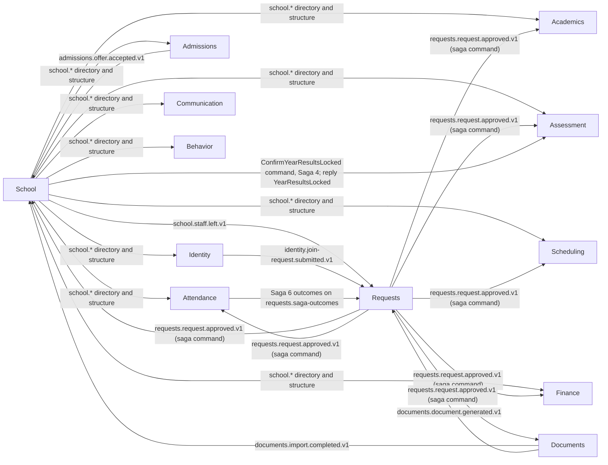
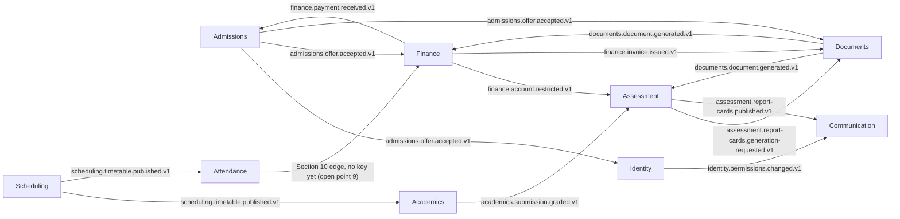
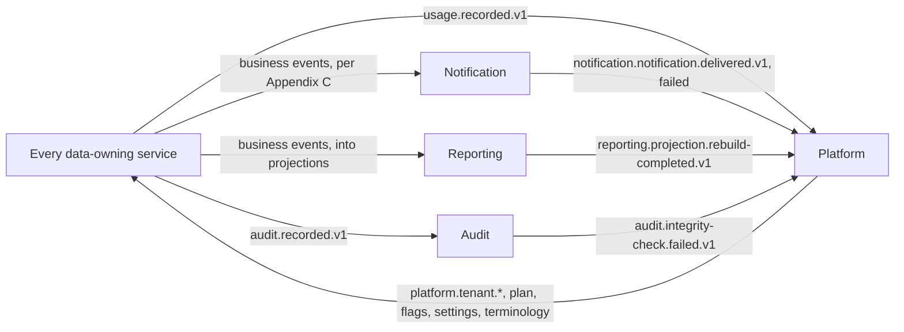

# 05. Service Catalog

> Plan document 05 of 34. Group B. Source of every name and count: Appendix L. Source of every event: Appendix E. Source of the synchronous dependencies, local copies and service classes: reference architecture Section 8.0. Source of the dependency matrix: reference architecture Section 10. This document quotes those sources; it does not restate them.

**Counts, quoted from Appendix L.** "20 data-owning services; 16 Tier 1 and 4 Tier 2. With Gateway and the two backends-for-frontends, 23 deployable applications, plus 7 worker images." The first-release merge option "runs 14 services". No other number of services appears in this plan, and where one does, Appendix L wins and the other document is a defect.

**How to read the table.** One row per deployable application from Appendix L. *Why the boundary exists* names exactly one of the four reasons master brief Section 7.1 accepts for a service: independent scaling, independent release, a different security level, or a different team. *Publishes* and *Consumes* list the three to five events that define the service's place in the system; the complete lists are in Appendix E and are reproduced per service in `06-services/<service>.md`. *Synchronous dependencies* is the gRPC column of reference architecture Section 8.0, maximum one hop, less the calls every service makes, which are stated once below the table. *Sensitivity* is the highest data class the service holds, from Appendix J. *Build phase* is from master brief Section 28.

---

## 1. The catalog

| Service | Tier | Purpose | Why the boundary exists | Database | Executables | Publishes | Consumes | Synchronous dependencies | Scaling profile | Sensitivity (Appendix J) | Build phase (Section 28) |
|---|---|---|---|---|---|---|---|---|---|---|---|
| **Gateway** | 1 | The single public entry point: routing, token validation, tenant resolution, per-tenant and per-user rate limiting, request limits, CORS, security headers, aggregated OpenAPI, maintenance mode. | Security level: one enforcement point for token validation, tenant resolution and traffic limits, kept stateless so nothing behind it trusts the network. | none; `redis-state` for rate-limit counters | `nibras/gateway` (api) | none | none | none | Stateless, scaled on requests per second; 3 replicas as the Section 34 starting point | none | 1 |
| **Bff.Web** | 1 | Screen-shaped aggregation for the Angular workspaces: role home payloads, Student 360 composition from Reporting, navigation and permission bootstrap. | Release: screen shapes change at the web release cadence and carry no business rules, so they must not force a service release. | none; short-lived Redis cache | `nibras/bff-web` (api) | none | none | none as gRPC; reads services over HTTP and the Reporting read models. Bff.Web also submits assist jobs to Ai over REST and serves Ai's three internal routes (the note below the table) | Stateless, scaled on requests per second; role-home payloads cached 15 s L1 and 60 s L2 | passes through, stores nothing | 1 |
| **Bff.Mobile** | 1 | Screen-shaped aggregation for Flutter: mobile sync endpoints (delta since token), remote configuration and version policy. | Release: delta sync and the version policy move with app-store releases, on a different cadence from the web. | none; short-lived Redis cache | `nibras/bff-mobile` (api) | none | none | none as gRPC; reads services over HTTP and the Reporting read models | Stateless; the morning sync burst follows the attendance peak | passes through, stores nothing | 2 |
| **Identity** | 1 | Who you are and what you may do: users, OpenIddict token server, 2FA and passkeys, SSO, sessions and devices, roles, permissions, data scopes, invitations, join requests, delegation, access reviews, API keys. | Security level: credential and token material lives in one service with its own database role and its own threat model. | `nibras_identity` | `nibras/identity-api` | `identity.user.activated.v1`, `identity.role.changed.v1`, `identity.permissions.changed.v1`, `identity.login.new-device.v1`, `identity.join-request.approved.v1` | `platform.tenant.provisioned.v1`, `school.staff.created.v1`, `school.staff.left.v1`, `admissions.offer.accepted.v1`, `hr.staff.hired.v1` | School (staff checksum, and the guardian eligibility check before a guardian link is approved). Section 8.0's Identity row also names Platform `Settings`, `Retention.ListActiveHolds` and `Tenants.Checksum`; those are the universal calls in the note below the table (settings, holds, and the reconciliation checksum of Identity's tenant-status copy) and are not repeated here | Login peak at the start of the day; token validation is local in every service; effective permissions cached in Redis keyed by permission version | sensitive (credentials, tokens) | 1 |
| **Platform** | 1 | Tenants, plans, subscriptions, limits, usage metering, feature flags, branding, domains, tenant settings, terminology, custom-field definitions, provisioning, support desk, and the Integrations capability (API keys, webhooks, OneRoster, LTI, developer portal). | Team: the platform operator's console and the commercial model change independently of any school-facing feature. | `nibras_platform` | `nibras/platform-api` | `platform.tenant.provisioned.v1`, `platform.plan.changed.v1`, `platform.feature-flag.changed.v1`, `platform.settings.changed.v1`, `platform.terminology.changed.v1` | `<service>.usage.recorded.v1` from every service, `notification.notification.delivered.v1`, `notification.notification.failed.v1`, `reporting.projection.rebuild-completed.v1`, `audit.integrity-check.failed.v1` | Identity (`ApiKeyAdministration`, `PermissionLookup.GetRoleRisk`); School (student and staff directory, for OneRoster copies); job only: every data-owning service's `Usage.Recount` | Low traffic, read-heavy and cached everywhere; administrative rather than transactional load | confidential | 1 |
| **School** | 1 | The source of truth for structure and people: campuses, academic years, terms, grade levels, sections, subjects, students, guardians, enrollment, staff profiles, promotion, alumni. | Release: the most-replicated data in the system changes at its own cadence, and every other service keeps a slim copy of it rather than a dependency on its release. | `nibras_school` | `nibras/school-api` | `school.student.enrolled.v1`, `school.student.status-changed.v1`, `school.section.created.v1`, `school.staff.left.v1`, `school.academic-year.closed.v1` | `admissions.offer.accepted.v1`, `admissions.re-enrollment.confirmed.v1`, `requests.request.approved.v1`, `hr.staff.hired.v1`, `identity.join-request.approved.v1` | none; exposes the student and staff directory over gRPC (`nibras.school.v1`) | Read-heavy; reference data cached 5 min L1 and 6 h L2, directory entries 30 s and 15 min | confidential; custody and medical summary are sensitive | 2 |
| **Admissions** | 1 | Inquiries, CRM pipeline, applications, assessments, interviews, offers, waiting lists, re-enrollment. | Scaling: a seasonal peak and a public application form with bot protection and OTP, unlike the steady internal load of School. | `nibras_admissions` | `nibras/admissions-api` | `admissions.offer.accepted.v1`, `admissions.application.stage-changed.v1`, `admissions.re-enrollment.confirmed.v1`, `admissions.offer.made.v1` | `school.section.created.v1`, `finance.payment.received.v1`, `finance.invoice.overdue.v1`, `documents.document.generated.v1` | School (student and staff directory) | Read-heavy with a seasonal peak; the public endpoint is rate-limited per source address at the Gateway | confidential | 4 |
| **Academics** | 1 | Curricula, lesson plans, coursework, assignments, submissions, resources, question bank, quizzes, QTI import and export. | Scaling: an evening submission peak with file traffic through Documents, distinct from the end-of-period write bursts of Assessment. | `nibras_academics` | `nibras/academics-api` | `academics.assignment.published.v1`, `academics.submission.graded.v1`, `academics.teaching-assignment.changed.v1`, `academics.homework-load.exceeded.v1` | `school.student.enrolled.v1`, `school.section.created.v1`, `school.staff.created.v1`, `scheduling.timetable.published.v1`, `requests.request.approved.v1` | School (student and staff directory); Scheduling (`Timetables`: entries of a published version, and the nightly checksum) | Read-heavy; evening submission peak | internal; submissions are confidential | 2 |
| **Assessment** | 1 | Assessment structures, gradebook, versioned grading schemes, moderation, term results, versioned report cards, transcripts, grade-change requests. | Scaling: mark entry and report-card batches are the sharpest write burst in the product and need their own worker (ADR-0002). | `nibras_assessment` | `nibras/assessment-api`, `nibras/assessment-worker` | `assessment.marks.approved.v1`, `assessment.grades.locked.v1`, `assessment.report-cards.published.v1`, `assessment.marks.overdue.v1`, `assessment.grade-change.approved.v1` | `academics.submission.graded.v1`, `academics.teaching-assignment.changed.v1`, `school.student.section-changed.v1`, `documents.document.generated.v1`, `finance.account.restricted.v1` | School (student directory) | Write-heavy bursts at the end of each grading period; the worker scales on queue depth; calculations are reproducible | confidential | 2 |
| **Scheduling** | 1 | Periods, bell schedules, rooms, timetable versions, the OR-Tools solver, substitutions, calendar events, room booking, exam sessions, iCal feeds. | Scaling: the CP-SAT solve is a CPU-heavy cancellable job scaled by queue depth, while timetable reads are cached and read-heavy. | `nibras_scheduling` | `nibras/scheduling-api`, `nibras/scheduling-worker` | `scheduling.timetable.published.v1`, `scheduling.substitution.assigned.v1`, `scheduling.room-booking.approved.v1`, `scheduling.event.published.v1` | `academics.teaching-assignment.changed.v1`, `hr.leave.approved.v1`, `school.staff.left.v1`, `school.term.started.v1`, `communication.meeting.booked.v1` | School (staff, structure and student directory: rooms, calendar days, sections, exam-seating candidates); job only: Academics `TeachingAssignments.Checksum`, Hr `Leave.Checksum` | Read-heavy API; CPU-heavy worker on queue depth; the published timetable is cached 5 min L1 and 12 h L2 | internal | 2 |
| **Attendance** | 1 | Student and staff attendance, excuses, thresholds, pickup persons, gate passes, dismissal, visitors, emergency broadcast and reunification (Safety lives here). | Scaling: the sharpest peak in the system at first period, with offline mobile sync and monthly partitions from day one. | `nibras_attendance` | `nibras/attendance-api` | `attendance.student.absent.v1`, `attendance.threshold.reached.v1`, `attendance.attendance.marked.v1`, `attendance.gate-pass.used.v1`, `attendance.emergency.broadcast-started.v1` | `scheduling.timetable.published.v1`, `school.student.enrolled.v1`, `requests.request.approved.v1`, `hr.leave.approved.v1`, `operations.transport.boarding-recorded.v1` | School (student directory); Scheduling (`Timetables`: the campus day and a published version); job only: Hr `Leave.Checksum` | Write-heavy; 4 replicas at the morning peak and 2 otherwise (Section 34); partitioned by tenant and month | confidential; medical excuse detail, gate-pass material and visitor identity references are sensitive | 2 |
| **Finance** | 1 | Fee structures, plans, invoices, payments, refunds, credit notes, discounts, scholarships, statements, cashier day-close, accounting export. | Security level: immutable posted documents, gapless series and payment references need their own database role and audit posture. | `nibras_finance` | `nibras/finance-api`, `nibras/finance-worker` | `finance.invoice.issued.v1`, `finance.payment.received.v1`, `finance.invoice.overdue.v1`, `finance.account.restricted.v1`, `finance.cheque.bounced.v1` | `school.student.enrolled.v1`, `school.student.status-changed.v1`, `requests.request.approved.v1`, `admissions.offer.accepted.v1`, `hr.payroll.inputs-ready.v1` | School (student directory) | Write-heavy; invoice runs and the reminder ladder run in the worker; balances are read from the database with at most seconds of L1 | confidential; payment references are sensitive | 3 |
| **Communication** | 1 | Announcements, news feed, messaging, meetings, surveys, policy acknowledgment, and the SignalR hubs for messaging, notifications, job progress and live permission refresh. | Scaling: long-lived SignalR connections on a Redis backplane scale on connection count, not on requests. | `nibras_communication` | `nibras/communication-api` | `communication.announcement.published.v1`, `communication.message.reported.v1`, `communication.acknowledgment.overdue.v1`, `communication.meeting.booked.v1` | `school.student.enrolled.v1`, `school.staff.created.v1`, `identity.permissions.changed.v1`, `assessment.report-cards.published.v1`, `attendance.emergency.broadcast-started.v1` | Identity (permission check for a message policy) | Read-heavy; scaled on concurrent connections; backplane on `redis-state` | confidential; flagged content is sensitive | 3 |
| **Notification** | 1 | Channels, templates, preferences, quiet hours, digests, delivery log, channel workers, delivery of the unified inbox. | Scaling: the highest message volume in the system, with urgent and bulk lanes scaled independently on queue depth. | `nibras_notification` | `nibras/notification-api`, `nibras/notification-worker` | `notification.notification.delivered.v1`, `notification.notification.failed.v1`, `notification.channel.suppressed.v1` | `attendance.student.absent.v1`, `finance.invoice.issued.v1`, `requests.request.approved.v1`, `communication.announcement.published.v1`, `platform.limit.approaching.v1`, and almost every other event, per Appendix C | none | Notification class; workers scaled by KEDA between 2 and 20 on queue depth (Section 34); per-tenant fairness | confidential | 1 |
| **Requests** | 1 | Request Center, approval engine, form builder, SLA and escalation, and the `Task` aggregate behind personal and assigned to-dos. | Release: request types, forms and approval chains change per school without releasing the services whose effects they orchestrate. | `nibras_requests` | `nibras/requests-api` | `requests.request.approved.v1`, `requests.request.sla-breached.v1`, `requests.task.assigned.v1`, `requests.request.submitted.v1` | outcome events of each effect from its owning service, `school.staff.left.v1`, `identity.role.changed.v1`, `identity.delegation.started.v1`, `identity.join-request.submitted.v1` | none | Read-heavy; saga state persisted per request | confidential | 3 |
| **Documents** | 1 | File storage, document templates, PDF generation through Gotenberg, certificates, QR verification, import and export jobs, virus scanning, OCR. | Scaling: rendering, scanning, OCR and imports are IO- and CPU-heavy jobs over object storage, scaled by queue depth apart from any API. | `nibras_documents` plus SeaweedFS | `nibras/documents-api`, `nibras/documents-worker` | `documents.document.generated.v1`, `documents.import.completed.v1`, `documents.export.completed.v1`, `documents.file.scan-failed.v1`, `documents.certificate.revoked.v1` | `documents.document.generation-requested.v1`, `assessment.report-cards.generation-requested.v1`, `finance.invoice.issued.v1`, `admissions.application.submitted.v1`, `requests.request.approved.v1` | none | Read-heavy API; worker on queue depth; the public QR verification page is output-cached 5 min | confidential; file bytes carry the class of the owning record | 3; the PDF pipeline is built in 1 (Section 28 critical path) |
| **Behavior** | 1 | Behavior categories, incidents, points, houses, awards, badges, Open Badges export. | Security level: behavior records are parent-visible while Wellbeing records are not, so the two need different sensitivity models (ADR-0002). | `nibras_behavior` | `nibras/behavior-api` | `behavior.incident.recorded.v1`, `behavior.points.awarded.v1`, `behavior.badge.awarded.v1`, `behavior.consequence.assigned.v1` | `school.student.enrolled.v1`, `school.student.section-changed.v1`, `school.student.status-changed.v1`, `platform.settings.changed.v1` | School (student directory) | Read-heavy | confidential; restricted narratives are logged on every read | 4 |
| **Reporting** | 1 | Read models built from events, dashboards, the Student 360 read model, report builder, data quality center, early-warning models (ML.NET). Owns no source data. | Scaling: read-heavy, rebuildable, read-replica-friendly projections kept apart from every transactional store. | `nibras_reporting` | `nibras/reporting-api`, `nibras/reporting-projections` | `reporting.early-warning.flag-raised.v1`, `reporting.data-quality.issue-detected.v1`, `reporting.projection.rebuild-completed.v1` | events from every service into projections; the highest-volume feeds are `attendance.attendance.marked.v1`, `assessment.marks.approved.v1`, `finance.invoice.issued.v1`, `school.student.enrolled.v1` | none | Read-heavy; freshness within 60 s; 2 projection replicas as the Section 34 starting point | confidential; excludes Wellbeing rows by design | 4 |
| **Audit** | 1 | Append-only, hash-chained audit store fed by every service, with search, export and integrity verification. | Security level: evidence must live outside the services it describes, append-only, under its own database role. | `nibras_audit` | `nibras/audit-api` | `audit.integrity-check.failed.v1`, `audit.retention.partition-detached.v1` | `<service>.audit.recorded.v1` from every service, `identity.login.new-device.v1`, `documents.sensitive-export.performed.v1`, `assessment.grade-change.approved.v1`, `finance.day.closed.v1` | none | Read-heavy for search, append-only writes; partitioned by month | sensitive (it records who saw what) | 1 |
| **Wellbeing** | 2 | Health clinic, counseling, special needs, interventions, safeguarding. | Security level: isolation level S, with its own database, database role and encryption key, and every read logged. | `nibras_wellbeing`, separate credentials, encrypted columns | `nibras/wellbeing-api` | `wellbeing.referral.created.v1`, `wellbeing.intervention.opened.v1`, `wellbeing.clinic-visit.recorded.v1`, `wellbeing.safeguarding.concern-raised.v1` (identifiers and category codes only) | `reporting.early-warning.flag-raised.v1`, `attendance.threshold.reached.v1`, `behavior.incident.recorded.v1`, `communication.message.reported.v1`, `identity.break-glass.used.v1` | School (student directory) | Read-heavy; never cached, never projected | isolation level S | 5 |
| **Hr** | 2 | Contracts, leave, staff evaluation, payroll inputs, recruitment, professional development. | Security level: salary, contracts and bank details are sensitive employment data with their own access-review cycle. | `nibras_hr` | `nibras/hr-api` | `hr.leave.approved.v1`, `hr.staff.hired.v1`, `hr.staff-document.expiring.v1`, `hr.payroll.inputs-ready.v1` | `requests.request.approved.v1`, `school.staff.created.v1`, `school.staff.left.v1`, `scheduling.substitution.assigned.v1` | School (staff directory) | Read-heavy | sensitive (salary, contracts) | 5 |
| **Operations** | 2 | Library, transport, inventory, facilities, front desk, activities; one schema per sub-domain. | Release: six Tier 2 sub-domains that deploy together today, each in its own schema so that a later split is mechanical (ADR-0002). | `nibras_operations`, schema per sub-domain | `nibras/operations-api` | `operations.transport.boarding-recorded.v1`, `operations.transport.vehicle-delayed.v1`, `operations.library.loan-overdue.v1`, `operations.facility.ticket-raised.v1` | `school.student.enrolled.v1`, `scheduling.timetable.published.v1`, `scheduling.room-booking.approved.v1`, `finance.payment.received.v1`, `requests.request.approved.v1` | School (student and staff directory); job only: Scheduling `Timetables.Checksum` | Read-heavy; vehicle location cached under a 30 s key | confidential | 5 |
| **Ai** | 2 | Model gateway (Ollama or vLLM), embeddings in pgvector, retrieval filtered by the caller's data scope, drafting, natural-language query, assistant. Off by default per tenant. | Scaling: needs capable hardware that the rest of the platform must never depend on, and it is off by default. | `nibras_ai` with pgvector | `nibras/ai-api`, `nibras/ai-worker` | `ai.usage.recorded.v1`, `ai.index.rebuild-completed.v1`, `ai.suggestion.rejected.v1` | `school.student.status-changed.v1` (purge on withdrawal), the change events of indexed sources (Academics, per reference architecture Section 10), `platform.feature-flag.changed.v1`, `platform.tenant.deletion-requested.v1` | none as gRPC; reads through Bff.Web's three internal routes over REST, from its jobs only (the note below the table) | Read-heavy; the worker scales on queue depth and is bounded by model hardware | inherits the class of each indexed source | 5, subject to Section 27 decision 6; rung 1 and 2 features ship inside their owning services earlier |

**Two cross-cutting events are not repeated per row.** Every data-owning service publishes `<service>.usage.recorded.v1`, consumed by Platform, and `<service>.audit.recorded.v1`, consumed by Audit (Appendix E). Gateway and the backends-for-frontends own no data and publish nothing, which is why their event cells say none.

**The synchronous calls every service makes are not repeated per row.** Quoted from reference architecture Section 8.0: "Through the building blocks, every service calls Platform `Tenants.GetTenantContext`, `Settings.GetSettings` and `Retention.ListActiveHolds`, and Identity `PermissionLookup.GetEffectivePermissions`, each on a cache miss with a 2-second deadline and the cached value as the fallback, and every service holding a copy calls the owner's `Checksum` and `ListSnapshotPage` for the nightly reconciliation. Communication additionally calls Identity `PermissionLookup.CheckPermission` for a message policy." The column above therefore lists what a service calls **beyond** these.

**Job only, and the one-hop rule.** Also quoted from Section 8.0: "A call marked *job only* runs in a scheduled or queued job, never inside a request, so it adds no hop to any request chain." And: "No service makes a synchronous call from inside a handler that is itself serving a synchronous call; a call either answers from the callee's own data or fails to the caller's fallback. The gRPC architecture test (`GrpcHopRules`) enforces it for every row above."

**Ai over REST, through Bff.Web.** Section 8.0 again: Bff.Web reaches Ai's API over REST, every model call answers 202 with an assist job, and Ai's jobs call three Bff.Web internal routes: `GET /bff/web/v1/internal/ai/sources/{sourceEntity}?cursor=` (the source feed, under the Ai service credential limited per source entity), `POST /bff/web/v1/internal/ai/sources/authorize` (the source re-check) and `POST /bff/web/v1/internal/ai/tools/{toolName}` (read-only tools), the last two under the caller's token. Each is one hop from Ai's job, and none is made inside a request Ai is serving.

**Local reference copies** are listed per service in reference architecture Section 8.0 and are not repeated here. The rule is quoted once: a copy is slim, read-only, rebuilt from events, reconciled nightly against its source, and never the basis of a decision the owning service should make.

---

## 2. Worker hosts

Appendix L names seven worker hosts. Each runs inside its owning service, shares its database and contracts, and deploys as a separate image so that KEDA can scale it on queue depth independently of the API (master brief Section 8, item 9).

| Worker | Owning service | Image (Appendix L) | Job groups | Lanes | Scaled by |
|---|---|---|---|---|---|
| `Notification.Worker` | Notification | `nibras/notification-worker` | One consumer per channel (email, push, SMS), digest builder | urgent and bulk, separate queues | KEDA on queue depth, between 2 and 20 (Section 34); per-tenant concurrency limits |
| `Documents.Worker` | Documents | `nibras/documents-worker` | PDF through Gotenberg, imports, exports, ClamAV scanning, OCR | bulk; scans run ahead of any other job on the same file | KEDA on queue depth |
| `Scheduling.Worker` | Scheduling | `nibras/scheduling-worker` | OR-Tools CP-SAT solve as a cancellable job with progress | bulk | KEDA on queue depth; CPU-bound, one solve per replica |
| `Assessment.Worker` | Assessment | `nibras/assessment-worker` | Result calculation, report-card batch orchestration (reference architecture Section 9.3) | bulk | KEDA on queue depth |
| `Finance.Worker` | Finance | `nibras/finance-worker` | Invoice runs, reminder ladder, statements | bulk | KEDA on queue depth |
| `Reporting.Projections` | Reporting | `nibras/reporting-projections` | Projections from every exchange, the rebuild command, early-warning scoring | ordered per partition key through a consistent-hash exchange | 2 replicas as the Section 34 starting point; KEDA on consumer lag |
| `Ai.Worker` | Ai | `nibras/ai-worker` | Embedding and index rebuild, drafting and summarising jobs | bulk | KEDA on queue depth, bounded by available model hardware |

There is no standalone `Imports.Worker`: importing is a job group inside `Documents.Worker` because it shares the same storage, scanning and error-report machinery (Appendix L).

---

## 3. Event dependency matrix

Reproduced from reference architecture Section 10, publisher by publisher. Read a row as "when this service publishes, these services care". The representative events per row are in Section 10 and the complete list per publisher is in Appendix E; neither is copied here so that there is one place to change them.

| Publisher | Consumers |
|---|---|
| **Platform** | every service |
| **Identity** | Requests, Communication, Notification, Reporting, Audit, and every service through the permission cache |
| **School** | Academics, Assessment, Scheduling, Attendance, Finance, Communication, Requests, Behavior, Wellbeing, Hr, Operations, Admissions, Identity, Notification, Reporting, Audit |
| **Admissions** | School, Identity, Finance, Documents, Notification, Reporting, Audit |
| **Academics** | Assessment, Reporting, Notification, Ai, Audit |
| **Assessment** | School, Documents, Communication, Notification, Reporting, Audit |
| **Scheduling** | Academics, Attendance, Hr, Operations, Notification, Reporting, Audit |
| **Attendance** | Finance, Wellbeing, Requests, Notification, Reporting, Audit |
| **Finance** | Admissions, Assessment, Documents, Operations, Notification, Reporting, Audit |
| **Communication** | Notification, Wellbeing, Reporting, Audit |
| **Notification** | Platform, Reporting, Audit |
| **Requests** | School, Academics, Assessment, Scheduling, Attendance, Finance, Documents, Hr, Operations, Wellbeing, Notification, Reporting, Audit |
| **Documents** | Assessment, Finance, Requests, School, Notification, Reporting, Audit |
| **Behavior** | Wellbeing, Reporting, Notification, Audit |
| **Reporting** | Wellbeing, Notification, Platform, Audit |
| **Audit** | Platform, Notification |
| **Wellbeing** | Reporting, Notification, Audit |
| **Hr** | Identity, School, Scheduling, Attendance, Finance, Notification, Reporting, Audit |
| **Operations** | Finance, Attendance, Notification, Reporting, Audit |
| **Ai** | Platform (usage), Audit |

**Section 10 edges that Appendix E does not route.** Attendance to Finance and Attendance to Requests appear in the matrix, but no `attendance.*` row in Appendix E names Finance or Requests as a consumer. Document 11 closes the Attendance to Requests edge: the `requests.saga-outcomes` queue binds the Saga 6 outcome events Attendance publishes (`attendance.excuse.approved.v1`, `attendance.attendance.marked.v1`, `attendance.gate-pass.issued.v1`), so the edge is the return half of the saga command channel (Section 5.1 row 2, open point 9). The Attendance to Finance edge has no key yet and stays in the matrix with no binding until document 11 names one (a late-fee or fine input) or removes it (open point 9). Assessment to School, the third Section 10 edge Appendix E does not route, carries no event binding at all: School's Saga 4 asks Assessment with the `ConfirmYearResultsLocked` command and reads the reply (Section 5.1 row 13, open point 8).

**Consumer edges that Appendix E adds beyond Section 10.** Appendix E is the complete catalog and Section 10 is a summary of it, so these edges are real and the cycle check below includes them: Identity to School (`identity.user.registered.v1`, `identity.join-request.approved.v1`, `identity.guardian-link.created.v1`), Identity to Finance and Wellbeing (`identity.guardian-link.created.v1`, `identity.break-glass.used.v1`), Assessment to Academics (`assessment.grades.locked.v1`), Scheduling to Communication and Communication to Scheduling (`scheduling.event.published.v1`, `communication.meeting.booked.v1`), Operations to Requests (`operations.frontdesk.complaint-received.v1`), Documents to whichever service requested a document (`documents.document.generated.v1`). Document 11 carries the merged matrix with partition keys; this table stays as Section 10 wrote it so that a reviewer can diff the two.

---

## 4. Publisher-to-consumer edges, Tier 1

The sixteen Tier 1 services and the edges between them from the matrix above. Four services receive events from everyone and are drawn once, in the third diagram, so that the first two stay readable. Direction is publisher to consumer.

### 4.1 The two hubs: School as the source, Requests as the saga channel

### 4.2 The remaining pairwise edges

### 4.3 The four universal edges

---

## 5. Cycle check

Reference architecture Section 10 permits one kind of cycle, the saga command channel through Requests, names Finance and Admissions as allowed "likewise", and says that any other cycle found while writing the plan is a boundary defect to resolve, not a quirk to document. This section is that check, run over the matrix in Section 3 plus the Appendix E additions, for every elementary cycle of length two and three, with the four universal services (Platform, Notification, Reporting, Audit) checked separately because every service both feeds them and hears from them.

**Method.** The matrix was loaded as a directed graph and searched for elementary cycles up to length three. Every length-three cycle found is composed of edges that already appear in a length-two cycle below, so the two-node table is the complete list of distinct cycles to judge.

### 5.1 Cycles between data-owning services

| # | Cycle | Events in each direction | Classification | Permitted saga-command exemption? |
|---|---|---|---|---|
| 1 | Requests and School | `requests.request.approved.v1` (record update, withdrawal); `school.staff.left.v1` (reassign approvals) | Saga command channel: Requests sends the command and waits for School's outcome; Requests never decides the effect | **Yes**, the exemption as Section 10 words it |
| 2 | Requests and Attendance | `requests.request.approved.v1` (leave, early dismissal, pickup change); the Saga 6 outcomes `attendance.excuse.approved.v1`, `attendance.attendance.marked.v1` and `attendance.gate-pass.issued.v1`, which document 11 binds on `requests.saga-outcomes` although Appendix E lists no Requests consumer for them | Saga command channel: Requests sends the effect and waits for Attendance's outcome | **Yes** in both directions; the return direction is the outcome half of the exemption, closed by document 11 (open point 9) |
| 3 | Requests and Operations (Appendix E) | `requests.request.approved.v1`; `operations.frontdesk.complaint-received.v1` | Saga command channel, the complaint opens a request | **Yes** |
| 4 | Admissions and School | `admissions.offer.accepted.v1`; `school.section.created.v1` | The "offer accepted to enrolled" saga (reference architecture Section 8.6): Admissions orchestrates, School's enrolment is the outcome | **Yes**, named as allowed in Section 10 |
| 5 | Admissions and Finance | `admissions.offer.accepted.v1`, `admissions.offer.made.v1`; `finance.payment.received.v1` (deposit), `finance.invoice.overdue.v1` (re-enrollment block) | The same Admissions saga waiting on the deposit outcome; the overdue event is a policy input, not a command | **Yes**, named as allowed in Section 10 |
| 6 | Hr and School | `hr.staff.hired.v1`; `school.staff.created.v1`, `school.staff.left.v1` | Hiring saga: Hr orchestrates, School's staff record is the outcome. Hr's consumer of `school.staff.created.v1` must be a no-op for a staff member Hr itself hired, or the pair ping-pongs | Same rule, different orchestrator; the idempotency requirement is the condition. Default in force; Section 7 open point 1, owned by the architect |
| 7 | Finance and Operations | `operations.library.loan-overdue.v1`, `operations.transport.subscription-changed.v1`, `operations.activity.enrollment-confirmed.v1`; `finance.payment.received.v1` | Charge-and-outcome: Operations asks Finance to charge, Finance reports payment; Finance never decides the charge, Operations never decides the payment | Same rule, different orchestrator. Default in force; Section 7 open point 2, owned by the architect |
| 8 | Identity and School (Appendix E) | `identity.user.registered.v1`, `identity.join-request.approved.v1`, `identity.guardian-link.created.v1`; `school.staff.created.v1`, `school.staff.left.v1` | The join saga of master brief Section 10.4: Identity orchestrates joining, School links the person to a record. School's consumer of `identity.join-request.approved.v1` and Identity's consumer of `school.staff.created.v1` must each be idempotent on the same person | Same rule, Identity as orchestrator; document 13 draws it. Default in force; Section 7 open point 3, owned by the architect |
| 9 | Documents and Assessment | `assessment.report-cards.generation-requested.v1`; `documents.document.generated.v1` | Job reply channel, drawn as the reference pattern in reference architecture Section 9.3: a render request in, a generated outcome back, Documents decides nothing about the content | **Not** the Requests exemption; the plan records it as a second named exemption with the same safety rule (command in, outcome out, callee decides nothing, effect idempotent) |
| 10 | Documents and Finance | `finance.invoice.issued.v1`, `finance.invoice-run.requested.v1`, `finance.refund.processed.v1`; `documents.document.generated.v1` | Job reply channel | As row 9 |
| 11 | Documents and Requests | `requests.request.approved.v1` (certificates); `documents.document.generated.v1` | Job reply channel inside a saga command | As row 9 |
| 12 | Documents and Admissions (Appendix E) | `admissions.application.submitted.v1`, `admissions.offer.made.v1`; `documents.document.generated.v1` | Job reply channel | As row 9 |
| 13 | Assessment and School | School to Assessment: `school.student.section-changed.v1`, `school.term.started.v1`, and Saga 4's `ConfirmYearResultsLocked` command; Assessment to School: the reply `YearResultsLocked` or `YearResultsNotLocked` (document 11, commands table). School binds no `assessment.*` event: Section 10 lists School as a consumer of Assessment, Appendix E does not, and the Section 10 edge is carried by the reply | Saga command channel with School as orchestrator: the year-end rollover (Saga 4) asks Assessment whether every grading period is locked and aborts on a `NotLocked` reply; Assessment decides nothing about the rollover | Same rule as rows 6 to 8, School as orchestrator; no Appendix E change is needed. Default in force; Section 7 open point 8, owned by the architect, as `06-services/school.md` open point 12 records |
| 14 | Assessment and Academics (Appendix E) | `assessment.grades.locked.v1`; `academics.submission.graded.v1`, `academics.teaching-assignment.changed.v1` | Lock broadcast: Academics freezes coursework edits for the locked period and makes no decision about Assessment's data | **No**. Classified as a broadcast, the same class as Platform's settings events: a consumer of a lock event changes only its own editability. Default in force; Section 7 open point 4, owned by the architect |
| 15 | Hr and Scheduling | `hr.leave.approved.v1`, `hr.leave.cancelled.v1`; `scheduling.substitution.assigned.v1` | Reference chain: leave causes a cover need, the assigned cover is recorded against Hr's hours. Neither side commands the other | **No**. Classified as a reference-copy feed pair. Default in force; Section 7 open point 5, owned by the architect |
| 16 | Scheduling and Communication (Appendix E) | `scheduling.event.published.v1`; `communication.meeting.booked.v1` | Reference chain: a booking becomes a calendar entry, an event becomes an announcement | **No**. Classified as a reference-copy feed pair. Default in force; Section 7 open point 6, owned by the architect |
| 17 | Academics and Scheduling | `academics.teaching-assignment.changed.v1`; `scheduling.timetable.published.v1` | Mutual reference replication: Academics says who teaches what, Scheduling says when; both are local copies per reference architecture Section 8.0 | **No**. Classified as a reference-copy feed pair. Default in force; Section 7 open point 7, owned by the architect |

**Length-three cycles found** (all composed of the edges above): Admissions, School, Finance; Assessment, School, Finance; Assessment, School, Requests; Assessment, Documents, Finance; Assessment, Documents, Requests; Attendance, Finance, Operations; Attendance, Requests, Scheduling; Hr, School, Scheduling; Hr, School, Requests; Documents, Requests, Finance; Documents, School, Finance; Identity, Requests, School; and with Appendix E, Admissions, Identity, School and Hr, Identity, School. None introduces an edge that the table does not already judge.

### 5.2 Cycles with the four universal services

| Cycle | Direction one | Direction two | Classification |
|---|---|---|---|
| Platform and every service | tenant lifecycle, plan, flag, settings and terminology broadcasts | `<service>.usage.recorded.v1` metering | Broadcast and telemetry; Section 10 already treats usage as cross-cutting |
| Platform and Notification, Reporting, Audit, Ai | the same broadcasts | delivery outcomes, projection rebuild completions, integrity failures, AI usage | Telemetry to the platform console, not a command; the plan extends the cross-cutting classification to these four |
| Notification and Reporting, Audit | `notification.notification.delivered.v1`, `failed` into projections and evidence | business events that Notification fans out | Universal sink in both directions; no decision flows around the loop |
| Reporting and Wellbeing | `reporting.early-warning.flag-raised.v1` (a rung 2 suggestion) | identifiers and category codes only, never rows | Signal in, counts out; Appendix J requires that Reporting never holds a Wellbeing row, which is what keeps this loop safe |

### 5.3 Verdict

- Rows 1 to 5 are the exemption Section 10 grants, exactly as it grants it.
- Rows 6 to 8 and row 13 are the same rule applied where a service other than Requests orchestrates a saga (Hr hires, Operations charges, Identity joins, School rolls the year over). They are safe under the same three conditions the Requests exemption relies on: the orchestrator never decides the effect, every effect is idempotent, and the consumer of the outcome is a no-op for an outcome it caused. Document 13 draws each one with its compensation.
- Rows 9 to 12 are the job reply channel of reference architecture Section 9.3, a second exemption the plan names explicitly rather than smuggling under the first.
- Rows 14 to 17 are broadcasts and reference-copy feeds with no decision on the loop. None is a boundary defect in the sense Section 10 means, and none is a saga; each is recorded here so that a reviewer challenges a stated classification instead of discovering the cycle later. The eight classifications in rows 6 to 8, 13 and 14 to 17 are defaults in force, each an open point in Section 7 (points 1 to 8) with the architect as owner. None needs an Appendix E change: row 13 rests on a command and its reply, not on an event binding.
- No cycle involves a synchronous call. The synchronous graph is the gRPC column of reference architecture Section 8.0: the callees are Platform, Identity, School, Scheduling, Academics and Hr, plus every data-owning service's `Usage.Recount` for Platform's metering job. It is not a tree of depth one — Identity and Platform call each other's and School's queries, and Academics, Attendance and Operations call Scheduling — but no request chain grows, because Section 8.0's one-hop rule forbids a synchronous call from inside a handler that is itself serving one, and every call marked *job only* runs outside a request. Master brief Section 7.3 is satisfied by that rule, not by the shape of the graph, and `GrpcHopRules` is the test that proves it.

---

## 6. First-release merge option

Quoted from Appendix L: "A smaller first release may merge Assessment into Academics and Behavior into Wellbeing, and defer Hr, Operations, and Ai. That release runs 14 services. Merging is a build-time choice only: the permission namespaces, routing keys, and database names in this appendix do not change, so splitting later is a deployment change and not a rewrite. Merging requires an ADR that records the date the split is expected."

| Under the option | Services | What changes | What does not change |
|---|---|---|---|
| Merged: Assessment into Academics | one deployable hosting both bounded contexts | one image, one process, one pipeline | `nibras_assessment` and `nibras_academics` stay separate databases; `assessment.*` and `academics.*` routing keys, permissions and exchanges stay as Appendix L names them |
| Merged: Behavior into Wellbeing | one deployable hosting both bounded contexts | one image, one process, one pipeline | `nibras_behavior` and `nibras_wellbeing` stay separate; Behavior data stays parent-visible and Wellbeing data stays at isolation level S, because the tenancy and classification blocks enforce that per context, not per process |
| Deferred: Hr, Operations, Ai | not deployed | their consumers bind to nothing and their events are never published | their names, namespaces and keys are reserved in Appendix L, so consumers written against them need no change when they arrive |

**The plan's recommendation.** Do not take the option unless the first customer's phase 2 date requires it. ADR-0002 records why Assessment and Behavior are separate (a different scaling profile and a different sensitivity model), and both reasons apply on day one of a real school year: the first report-card batch is the first write burst, and the first behavior incident is the first parent-visible record. The option exists to protect a date, not to simplify the design, and taking it needs the ADR that Appendix L requires, with the split date written in.

---

## 7. Open points

Points 1 to 7 are the cycle classifications that Section 5.1 used to defer to the Group B review, and point 8 is row 13's. Each now has an owner and a default in force, which is the classification Section 5.1 states; the architect records the two new cycle classes (orchestrators other than Requests, and the job reply channel) in the ADRs that `04-architecture-overview.md` Open points names.

| # | Question | Default | Owner | Impact if the default is wrong | L | I | Score | In the register |
|---|---|---|---|---|---|---|---|---|
| 1 | Is the Hr and School cycle (row 6) a saga with Hr as orchestrator? | Yes: the Requests exemption with Hr as orchestrator, on condition that Hr's consumer of `school.staff.created.v1` is a no-op for a staff member Hr itself hired | Architect | Hiring moves behind Requests, or the pair ping-pongs if the no-op condition is missed; Hr is Phase 5, so the change lands inside that phase | 2 | 2 | 4 | none |
| 2 | Is the Finance and Operations cycle (row 7) a charge-and-outcome saga with Operations as orchestrator? | Yes: Operations asks Finance to charge and Finance reports the payment; neither decides the other's effect | Architect | Library, transport and activity charges need a different shape; Operations is Phase 5 and Finance's charge interface changes inside it | 2 | 2 | 4 | none |
| 3 | Is the Identity and School cycle (row 8) the join saga of master brief Section 10.4 with Identity as orchestrator? | Yes, with both consumers idempotent on the same person, as document 13 draws it | Architect | Joining is Phase 1 work on the critical path through Identity and School; a refused class moves the saga behind Requests and lengthens Phase 1 | 2 | 3 | 6 | RISK-07 |
| 4 | Is the Assessment and Academics cycle (row 14) a lock broadcast? | Yes: Academics freezes its own coursework edits for the locked period and decides nothing about Assessment's data | Architect | Academics would need a command and a reply for grade locking, a change inside Phase 2 | 2 | 2 | 4 | none |
| 5 | Is the Hr and Scheduling cycle (row 15) a reference-copy feed pair? | Yes: leave causes a cover need and the assigned cover is recorded against Hr's hours; neither side commands the other | Architect | Substitution becomes a saga with compensation, inside Phase 5 | 2 | 2 | 4 | RISK-15 |
| 6 | Is the Scheduling and Communication cycle (row 16) a reference-copy feed pair? | Yes: a booking becomes a calendar entry and an event becomes an announcement | Architect | Meeting booking needs a confirmation step across two services, inside Phase 2 | 1 | 2 | 2 | RISK-15 |
| 7 | Is the Academics and Scheduling cycle (row 17) mutual reference replication? | Yes: Academics says who teaches what, Scheduling says when, and each keeps a local copy under reference architecture Section 8.0 | Architect | Teaching assignments and the published timetable disagree with no owner of the conflict, inside Phase 2 | 2 | 2 | 4 | RISK-15 |
| 8 | Does School consume `assessment.grades.locked.v1` (row 13)? | No binding: Saga 4 checks the lock with the `ConfirmYearResultsLocked` command, as `06-services/school.md` open point 12 records and Section 5.1 row 13 classifies | Architect | Rollover runs on unlocked grades if the command is skipped; the fix is a binding and an Appendix E change under an ADR | 2 | 3 | 6 | none |
| 9 | Which key carries the Attendance to Finance edge in Section 3? | None yet: the edge stays in the matrix with no binding until document 11 names a key (a late-fee or fine input) or removes it. The Attendance to Requests edge is closed by the `requests.saga-outcomes` queue in document 11 | Architect | A fee that depends on attendance has no input and is entered by hand | 2 | 1 | 2 | none |
| 10 | Which services start merged? | Separate, as Appendix L defines them; the 14-service option in Section 6 needs its own ADR with the split date. Open Question 7 | Architect | A small team runs twenty services, or a merge taken late costs a deployment change in Phase 2 | 2 | 3 | 6 | RISK-06, RISK-33 |

> L and I are the likelihood that the default is wrong and the impact if it is, on the 1 to 5 scales of `18-risk-register.md` Section 1. Score is L x I. A point that scores 12 or more names its RISK identifier in document 18; below that, the identifier is written if one covers it, or `none`. Kit-lint rules R24 and R33 check all of it (ADR-0022).

---

## How this document is verified

| Claim | Proof |
|---|---|
| Every service name, tier, database, exchange and image matches Appendix L | `kit-lint` rule R31 fails on any name in the Database column, and any backticked service-led database or image name in this document, that Appendix L does not register. Service names, tiers and exchange names are a review step: `plan-consistency-checker` diffs Section 1 against the Appendix L table row by row, at the Group B review and on every change to this document or Appendix L |
| Every event in the Publishes and Consumes columns exists in Appendix E under that publisher | `kit-lint` rule R19 fails on any routing key in this document that is absent from Appendix E and is not a command or reply document 11 names; rule R27 fails on a key in a Publishes cell whose exchange is not the publishing service's own. That each consumed key sits in Appendix E under the publisher this document implies is a review step: `messaging-reviewer` reads the Consumes column against Appendix E, at the Group B review and on every change to this document or Appendix E |
| The synchronous dependency column equals the gRPC column of reference architecture Section 8.0, less the universal calls stated once below the table | Review step: `architecture-reviewer` diffs the column against Section 8.0 row by row, at the Group B review and on every change to this document or Section 8.0. In the product, `TC-TST-742` (document 07, `GrpcHopRules.GrpcClients_MatchSection80`) fails a service whose Infrastructure references a gRPC client for a callee Section 8.0 does not give it, and `TC-TST-740` (document 07) fails a nested synchronous call; SL-TST-003 builds both |
| Section 3 reproduces reference architecture Section 10 without omission or addition | Review step: `plan-consistency-checker` diffs Section 3 against reference architecture Section 10 publisher row by publisher row and returns any omission or addition, at the Group B review and on every change to this document or the reference architecture |
| The cycle list in Section 5 is complete for length two and three | Review step: `messaging-reviewer` re-runs the search for cycles of length two and three over document 11's merged matrix and returns this document until every cycle found is classified in Section 5, at the Group C review and on every change to document 11's matrix or to this document's Publishes and Consumes columns. `kit-lint` does not search for cycles |
| Every worker in Section 2 is one of the seven in Appendix L and no other worker is named anywhere in the plan | `kit-lint` rule R31 fails on any backticked service-led image name in a plan document that Appendix L does not register, which covers the image column of Section 2. A worker named without its image, by host name alone, is a review step: `plan-consistency-checker` searches the plan for `.Worker` and `.Projections` host names and compares them with the seven in Appendix L, at the Group B review and on every change to this document |
| The counts are quoted, never restated | Review step: `plan-consistency-checker` searches this document for a number of services, workers or deployables outside the Appendix L quotation and compares any it finds with Appendix L, at the Group B review and on every change to this document or Appendix L |
| Each "why the boundary exists" cell names exactly one of the four reasons in master brief Section 7.1 | Review step: `architecture-reviewer` reads every cell of that column against the four reasons in master brief Section 7.1 and returns a cell naming none or two, at the Group B review and on every change to that column |
| The cycle classifications and open points 8 and 9 agree with document 11's bindings and command replies | Review step: `messaging-reviewer` compares Section 3's note on unrouted edges, diagrams 4.1 and 4.2, Section 5.1 rows 2 and 13 and open points 8 and 9 with document 11's `requests.saga-outcomes` bindings and its commands table, at the Group C review and on every change to those parts of document 11 or to this document |
| The build phase column agrees with master brief Section 28 and with document 17 | Review step: `plan-consistency-checker` compares the build phase per service with master brief Section 28 and with the capability phases in `17-roadmap.md` Section 4, at the Group E review and on every change to 05 or 17 |
