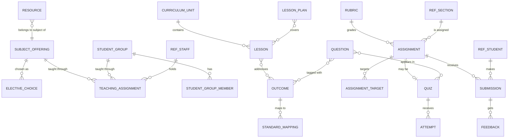

# Academics

> Service sheet, plan document 06, Group C. Names from Appendix L; events from Appendix E; permissions from Appendix B; error codes from Appendix K. This sheet adds detail to reference architecture section 8.7 and never contradicts its table 8.0 except where an open point says so.

Academics owns what is taught and the coursework around it: subjects per grade with their weekly load and prerequisites, teaching assignments (who teaches which section or group), student groups across sections, the curriculum of units, lessons and outcomes, lesson plans with coordinator review and syllabus coverage, assignments with rubrics and the homework-load ceiling, submissions and their grading, feedback and return, the shared resource library, and, in Tier 2, the question bank with QTI 3, online quizzes, item analysis, CASE standards and LTI launches. It is the most-used teacher surface after attendance, with an evening submission peak whose files travel through Documents. Assessment owns the gradebook: a graded submission reaches it through `academics.submission.graded.v1`.

| Fact | Value (quoted from `05-service-catalog.md` and Appendix L) |
|---|---|
| Canonical name, long name | Academics, Academics and Coursework |
| Tier | 1 (the Tier 2 rows of document 03 are marked where they appear) |
| AREA code | `ACA` |
| Database | `nibras_academics`, schema `academics`, roles `svc_academics` and `mig_academics` |
| Exchange | `nibras.academics` |
| Images | `nibras/academics-api` |
| Worker | none; Quartz.NET and long-running jobs run in the Api host (Appendix L lists no academics-worker image) |
| gRPC package | `nibras.academics.v1` in `Nibras.Contracts.Academics/Grpc/academics.proto` (reconciliation only) |
| Build phase (master brief Section 28) | 2 |
| Service level class (master brief Section 31) | Read-heavy |
| Sensitivity (Appendix J) | internal; submissions are confidential |
| Why the boundary exists | Scaling: an evening submission peak with file traffic through Documents, distinct from the end-of-period write bursts of Assessment |

---

## 1. Responsibilities

| Owns | Detail |
|---|---|
| Subject offerings | Subject per grade with weekly periods, credit or weight, language of instruction, elective group, prerequisites (REQ-ACA-001); elective choices checked against prerequisites |
| Teaching assignments | Teacher to subject and section or group, co-teaching, effective-dated history, teacher load view (REQ-ACA-002, REQ-ACA-004); the source of the `own-sections` scope for coursework (REQ-ACA-003) |
| Student groups | Groups across sections: language levels, electives, support (REQ-ACA-005) |
| Curriculum | Units, lessons, learning outcomes, resources per subject and grade (REQ-ACA-006); CASE standards mapping (Tier 2, REQ-ACA-007) |
| Lesson plans | Templates, weekly plans, coordinator review, syllabus coverage against the plan (REQ-ACA-008, REQ-ACA-009) |
| Assignments | Instructions, attachments, rubric, maximum mark, weight, due and closing time, targets (sections, groups, students), late and resubmission policy, homework minutes (REQ-ACA-010, REQ-ACA-014) |
| Homework load | Load per section per day against the ceiling; publishing above it needs an override reason (REQ-ACA-011, REQ-ACA-012) |
| Submissions and grading | File, text, link or phone photo; late flag and penalty; missing at closing; rubric grading, inline comments, return; offline grading with conflict detection (REQ-ACA-013 to REQ-ACA-021) |
| Resource library | Per subject and grade, shared within a department (REQ-ACA-022) |
| Question bank, quizzes, attempts, item analysis | Tier 2 (REQ-ACA-023 to REQ-ACA-026) |
| QTI 3 import and export | Appendix L.5 |
| LTI 1.3 launches from assignments and resources | Tier 2 (REQ-ACA-030); tool registration belongs to Platform |
| WF-ACA-01 | The assignment lifecycle state machine |

## 2. Not responsible for

| Not owned here | Owner | Why the line sits there |
|---|---|---|
| The subject catalog entry, sections, students, staff profiles, departments | School | Academics keeps slim copies (section 9) |
| The timetable and bell schedule | Scheduling | Academics copies the published timetable to anchor coursework to lessons |
| Marks, grade schemes, term results, report cards, the gradebook | Assessment | `academics.submission.graded.v1` flows into the gradebook (REQ-ACA-018) |
| Files: upload, virus scan, storage, signed URLs | Documents, through `Nibras.BuildingBlocks.Files` | Academics stores file references and scan status only |
| Notifications to students and guardians | Notification | Triggered by Academics events and the `RequestNotification` command |
| Early-warning flags from missing work | Reporting | REQ-ACA-016 counts toward Reporting's signal |
| LTI tool registration, OneRoster | Platform | Appendix L.5 |
| Online class video and its attendance record | Jitsi or LiveKit for video; Attendance for attendance | Tier 2, open point 4 |
| Exam papers and exam timetable | Assessment and Scheduling | Appendix B `assessment.exams.*`, `scheduling.exam-timetable.*` |
| Dashboards (teacher Today, coordinator views) | Bff.Web over Reporting read models | REQ-DATA-023 |

## 3. Requirements covered

| Range or identifier | What it binds here |
|---|---|
| REQ-ACA-001 to REQ-ACA-030 | Every Academics row of `03-requirements-catalog.md`; Tier 2: REQ-ACA-007, REQ-ACA-017, REQ-ACA-019, REQ-ACA-023 to REQ-ACA-028, REQ-ACA-030 |
| REQ-SEC-003, REQ-SEC-005 | `own-sections` from teaching assignments; `self` and `own-children` for students and guardians; isolation suite |
| REQ-PERF-014, REQ-PERF-016, REQ-PERF-017 | Keyset lists; streamed exports; binary COPY for QTI imports |
| REQ-DATA-013, REQ-DATA-014 | Submissions list-partitioned by academic year; answers and feedback in side tables |
| REQ-DATA-018, REQ-DATA-019 | Copies from School and Scheduling, reconciled nightly |
| REQ-MSG-004, REQ-MSG-012 | Idempotent consumers; ordered per `studentId`, `sectionId`, `staffId` |
| REQ-INT-016 | LTI 1.3 and QTI 3 in their phases |
| Appendix M offline rules | Offline grading conflicts resolved by the teacher (REQ-ACA-021) |

---

## 4. Aggregates and entities

**Common columns** on every table, stood for by `(common)`: `tenant_id` uuid not null (first in every index, row-level security `tenant_isolation`), `id` uuid v7, `created_at`/`created_by` not null, `updated_at`/`updated_by` null, `deleted_at`/`deleted_by` null behind the named `SoftDelete` filter, and `xmin` as the concurrency token on every aggregate root.

### 4.1 `SubjectOffering` and `ElectiveChoice`

| Entity | Field | Type | Null | Notes |
|---|---|---|---|---|
| SubjectOffering | (common), `academic_year_id`, `grade_level_id`, `subject_id` | uuid | no | Subject ids are School's catalog |
| SubjectOffering | `weekly_periods` | int | no | |
| SubjectOffering | `credit`, `weight` | numeric(5,2) | yes | |
| SubjectOffering | `language_of_instruction` | text | no | ar, en or other ISO code |
| SubjectOffering | `elective_group_code` | text | yes | Null means compulsory |
| SubjectOffering | `prerequisite_subject_ids` | uuid[] | no | |
| ElectiveChoice | (common), `student_id`, `subject_offering_id`, `chosen_by` | uuid | no | |

Invariants: one offering per `(academic_year_id, grade_level_id, subject_id)`; a choice is refused with `ACADEMICS_VALIDATION_FAILED` naming the prerequisite when the student has no prior-year enrolment in an offering of each prerequisite subject (REQ-ACA-001, open point 5); a student holds at most one choice per elective group.

### 4.2 `TeachingAssignment`

| Field | Type | Null | Notes |
|---|---|---|---|
| (common), `academic_year_id`, `staff_id`, `subject_id` | uuid | no | |
| `section_id`, `student_group_id` | uuid | one of them | Section or group, never both |
| `role` | enum | no | lead, co-teacher |
| `effective_on`, `ended_on` | date | no, yes | History is kept by ending and creating rows, never updating the teacher in place (REQ-ACA-004) |
| `periods_per_week` | int | no | Copied from the offering, adjustable per assignment |

Invariants: at most one live lead per `(section or group, subject)` at any date; a change mid-term ends the old row the day before the new `effective_on`, so past grading keeps the original teacher; every create, change or end publishes `academics.teaching-assignment.changed.v1`; a teacher acting on a section without a live assignment is refused with `ACADEMICS_TEACHING_ASSIGNMENT_MISSING` (REQ-ACA-003).

### 4.3 `StudentGroup`

| Field | Type | Null | Notes |
|---|---|---|---|
| (common), `academic_year_id`, `campus_id` | uuid | no | |
| `code`, `name_en`, `name_ar` | text | no | |
| `kind` | enum | no | language-level, elective, support |
| `members` | child rows `student_group_members` (`student_id`, `joined_on`, `left_on`) | | From several sections (REQ-ACA-005) |

Invariants: a member is an enrolled student in the same academic year and campus (checked against `ref_student`); a withdrawn student leaves every group on the status-change effective date.

### 4.4 Curriculum: `CurriculumUnit`, `Lesson`, `Outcome`, `StandardMapping`

| Entity | Field | Type | Null | Notes |
|---|---|---|---|---|
| CurriculumUnit | (common), `subject_id`, `grade_level_id`, `sequence` | uuid, int | no | |
| CurriculumUnit | `title_en`, `title_ar` | text | no | |
| CurriculumUnit | `status` | enum | no | draft, published |
| Lesson | (common), `unit_id`, `sequence`, `title_en`, `title_ar`, `planned_week` | uuid, int, text, int | no | Planned week drives coverage |
| Outcome | (common), `subject_id`, `grade_level_id`, `code`, `statement_en`, `statement_ar` | | no | |
| LessonOutcome | `lesson_id`, `outcome_id` | uuid | no | |
| StandardMapping | (common), `outcome_id`, `case_item_uri`, `case_framework_id` | uuid, text | no | Tier 2; an unresolvable URI is `ACADEMICS_CURRICULUM_STANDARD_UNKNOWN` |

Invariants: lesson sequences within a unit are gap-free; an outcome referenced by a lesson plan or a question cannot be deleted, only retired.

### 4.5 `LessonPlan`

| Field | Type | Null | Notes |
|---|---|---|---|
| (common), `staff_id`, `section_id` or `student_group_id`, `subject_id`, `department_id` | uuid | partly | Department from `ref_staff` for the review queue |
| `week_of` | date | no | The Sunday or Monday of the tenant's work week |
| `template_code` | text | no | |
| `body` | side table `lesson_plan_bodies` (jsonb) | no | Kept off the hot table (REQ-DATA-014) |
| `lesson_ids`, `outcome_ids` | uuid[] | no | Coverage inputs |
| `delivered_lesson_ids` | uuid[] | no | Marked by the teacher after teaching |
| `status` | enum | no | draft, submitted, approved, returned |
| `reviewer_id`, `reviewed_at`, `review_comment` | uuid, timestamptz, text | yes | |

Invariants: one plan per `(staff_id, section or group, subject_id, week_of)`; `approved` and `returned` require a reviewer who is not the author; sharing a plan to students or to a substitute before approval, where the tenant requires review, is refused with `ACADEMICS_LESSON_PLAN_NOT_REVIEWED`.

### 4.6 `Assignment` and `Rubric`

| Entity | Field | Type | Null | Notes |
|---|---|---|---|---|
| Assignment | (common), `academic_year_id`, `subject_id`, `staff_id` | uuid | no | |
| Assignment | `section_id` | uuid | yes | Primary section for indexing; targets hold the full audience |
| Assignment | `targets` | child rows `assignment_targets` (`kind` section, group or student, `target_id`) | no | |
| Assignment | `title_en`, `title_ar` | text | partly | |
| Assignment | `instructions` | side table `assignment_texts` | no | |
| Assignment | `attachment_file_ids` | uuid[] | no | Documents file references |
| Assignment | `rubric_id` | uuid | yes | |
| Assignment | `max_mark`, `weight` | numeric(6,2) | no | |
| Assignment | `due_at`, `closes_at` | timestamptz | no | `closes_at >= due_at` |
| Assignment | `late_policy` | jsonb | no | Penalty per day or flat, cap |
| Assignment | `resubmission_allowed`, `max_attempts` | bool, int | no | |
| Assignment | `estimated_minutes` | int | no | Homework-load input |
| Assignment | `status` | enum | no | Draft, Published, Closed, Archived (assignment-level states of WF-ACA-01) |
| Assignment | `published_at`, `load_override_reason` | timestamptz, text | yes | |
| Assignment | `grading_locked_at` | timestamptz | yes | Set from `assessment.grades.locked.v1` |
| Rubric | (common), `owner_staff_id`, `title_en`, `title_ar` | uuid, text | no | |
| Rubric | `criteria` | child rows `rubric_criteria` (`sequence`, `title`, `levels` jsonb with points) | | |

Invariants: an assignment is published only by a teacher with a live teaching assignment for every target section or group; publishing when the section's minutes for the due date would exceed the ceiling requires `load_override_reason` and then publishes both `academics.assignment.published.v1` and `academics.homework-load.exceeded.v1` (TC-ACA-001, TC-ACA-002); a published assignment's `max_mark` and rubric cannot change once any submission is graded; `extend-due-date` moves `due_at` and `closes_at` forward only.

### 4.7 `Submission`, `Feedback`

| Entity | Field | Type | Null | Class | Notes |
|---|---|---|---|---|---|
| Submission | (common), `academic_year_id`, `assignment_id`, `student_id` | uuid | no | Internal | List-partitioned by `academic_year_id` (doc 21 section 3.5) |
| Submission | `status` | enum `AssignmentLifecycleStatus` | no | Internal | Pending, Submitted, LateSubmitted, Missing, Graded, ResubmissionRequested, Returned |
| Submission | `attempt` | int | no | Internal | |
| Submission | `content_kind` | enum | yes | Internal | file, text, link, photo |
| Submission | `content` | side table `submission_contents` (text, link, `file_ids`, `sizes`) | yes | Confidential | |
| Submission | `submitted_at`, `late`, `late_penalty` | timestamptz, bool, numeric | yes | Internal | Server receipt time is authoritative |
| Submission | `mark`, `rubric_scores` | numeric(6,2), jsonb | yes | Confidential | |
| Submission | `graded_by`, `graded_at`, `grading_started_at` | uuid, timestamptz | yes | Internal | `grading_started_at` blocks resubmission |
| Submission | `exempt`, `exempt_reason` | bool, text | yes | Internal | `Missing → Graded` by exemption |
| Submission | `returned_at` | timestamptz | yes | Internal | |
| Submission | `device_version` | bigint | yes | Internal | Version the offline device held (Appendix M) |
| Feedback | (common), `submission_id`, `author_id` | uuid | no | Confidential | |
| Feedback | `kind` | enum | no | | overall, inline, audio (Tier 2) |
| Feedback | `body`, `anchor`, `audio_file_id` | text, jsonb, uuid | yes | Confidential | |

Invariants: one submission row per `(assignment_id, student_id)` with attempts counted on it; a submission after `closes_at` is refused with `ACADEMICS_SUBMISSION_WINDOW_CLOSED` unless a teacher records `accept-late`; a submission between `due_at` and `closes_at` is `LateSubmitted` with the penalty computed at grading (REQ-ACA-015); a resubmission after `grading_started_at` is refused with `ACADEMICS_RESUBMISSION_NOT_ALLOWED` unless the teacher requested it (REQ-ACA-014); total attachment size above the tenant limit is refused with `ACADEMICS_SUBMISSION_TOO_LARGE`; a grade whose `If-Match` version is older than the server version is a conflict for the teacher to resolve and never overwrites (REQ-ACA-021); after `grading_locked_at` a grade change is refused with `ACADEMICS_GRADING_PERIOD_LOCKED` and routed to Assessment's grade-change workflow (WF-ASM-02); a submitted answer is immutable (T-ACA-02).

### 4.8 `Resource`

| Field | Type | Null | Notes |
|---|---|---|---|
| (common), `subject_id`, `grade_level_id`, `department_id`, `owner_staff_id` | uuid | partly | |
| `title_en`, `title_ar`, `kind` | text, enum | no | file, link, video, lti-tool |
| `file_id`, `url`, `lti_link_id` | uuid, text, uuid | yes | |
| `audience` | enum | no | private, section, department |
| `section_ids` | uuid[] | no | When the audience is section |

Invariants: the audience is enforced as a query predicate, never a client flag (T-ACA-05); a department resource is visible to teachers of that department only (REQ-ACA-022).

### 4.9 Tier 2: `Question`, `Quiz`, `Attempt`, `LtiLaunch`

| Entity | Field | Type | Null | Notes |
|---|---|---|---|---|
| Question | (common), `subject_id`, `grade_level_id`, `type` | uuid, enum | no | multiple-choice, true-false, matching, ordering, fill-in, short-answer, essay |
| Question | `body`, `answer_key` | side table `question_bodies` (jsonb) | no | Answer key never cached, never sent before release |
| Question | `outcome_ids`, `difficulty`, `tags` | uuid[], int, text[] | no | At least one outcome tag (REQ-ACA-023) |
| Question | `qti_identifier` | text | yes | Round-trip identity (REQ-ACA-026) |
| Quiz | (common), `assignment_id` | uuid | no | A quiz is an assignment with questions |
| Quiz | `question_ids`, `randomize`, `time_limit_minutes`, `attempts_allowed`, `starts_at` | | no | |
| Quiz | `results_released_at`, `status` | timestamptz, enum | yes, no | draft, published, live, closed |
| Attempt | (common), `quiz_id`, `student_id`, `started_at`, `submitted_at` | | partly | One open attempt per student (`ux_attempts_open`) |
| Attempt | `answers` | side table `attempt_answers` (jsonb per question, `auto_score`, `manual_score`, `graded_by`) | | Autosaved with `ExecuteUpdateAsync` |
| LtiLaunch | (common), `lti_link_id`, `user_id`, `context_id`, `launched_at`, `grade_returned` | | | Tool registration lives in Platform |

Invariants: editing a quiz whose `starts_at` has passed with any attempt started is refused with `ACADEMICS_ONLINE_EXAM_ALREADY_STARTED`; objective items are auto-graded on submit and the rest enter the manual queue (REQ-ACA-024); a QTI package that fails schema validation is refused whole with `ACADEMICS_QTI_IMPORT_INVALID` listing item references, and external entities are disabled in the parser (T-ACA-03).

### 4.10 Reference copies

`ref_student`, `ref_student_section_history`, `ref_section`, `ref_term`, `ref_academic_year`, `ref_staff`, `ref_timetable_version`, `ref_timetable_entry`, each with `tenant_id`, `source_version` and `reconciled_at` (section 9).



---

## 5. REST API

Base path `/api/v1/academics`. Conventions from `22-api-conventions-and-error-catalog.md`: keyset lists with `pageSize` default 50 and maximum 200, `If-Match` on updates (stale tag 409 `ACADEMICS_CONCURRENCY_CONFLICT`), `Idempotency-Key` on creates and required on jobs, jobs answer 202 with `Location: /api/v1/academics/jobs/{jobId}`. The eight Appendix K.1 codes apply with the `ACADEMICS_` prefix. Data scopes: teachers `own-sections` (resolved from live teaching assignments), homeroom teachers `own-homeroom`, heads of department `department`, students `self`, guardians `own-children`.

### 5.1 Subject offerings and electives

| Method | Path | Permission | Request | Response | Errors | Idempotent |
|---|---|---|---|---|---|---|
| GET | `/subject-offerings` | `academics.curriculum.view` | filter `academicYearId`, `gradeLevelId` | `SubjectOfferingDto[]` | none | safe |
| POST | `/subject-offerings` | `academics.curriculum.create` | `CreateSubjectOfferingRequest` | 201 | `ACADEMICS_VALIDATION_FAILED` (duplicate, prerequisite cycle) | `Idempotency-Key` |
| PUT | `/subject-offerings/{id}` | `academics.curriculum.edit` | `UpdateSubjectOfferingRequest` | 200 | `ACADEMICS_CONCURRENCY_CONFLICT` | `If-Match` |
| DELETE | `/subject-offerings/{id}` | `academics.curriculum.delete` | none | 204 when unused | `ACADEMICS_VALIDATION_FAILED` (in use) | by id |
| GET | `/elective-choices` | `academics.teaching-assignments.view` | filter `studentId`, `electiveGroupCode` | `ElectiveChoiceDto[]` | none | safe |
| POST | `/elective-choices` | `academics.teaching-assignments.edit` | `RecordElectiveChoiceRequest` | 201 | `ACADEMICS_VALIDATION_FAILED` naming the missing prerequisite | `Idempotency-Key`; natural key `(studentId, electiveGroupCode, year)` |
| DELETE | `/elective-choices/{id}` | `academics.teaching-assignments.edit` | none | 204 | `ACADEMICS_NOT_FOUND` | by id |

### 5.2 Teaching assignments and student groups

| Method | Path | Permission | Request | Response | Errors | Idempotent |
|---|---|---|---|---|---|---|
| GET | `/teaching-assignments` | `academics.teaching-assignments.view` | filter `staffId`, `sectionId`, `studentGroupId`, `academicYearId`, `includeHistory` | `TeachingAssignmentDto[]` (hot query 1) | none | safe; compiled |
| POST | `/teaching-assignments` | `academics.teaching-assignments.create` | `CreateTeachingAssignmentRequest` | 201; publishes `academics.teaching-assignment.changed.v1` | `ACADEMICS_VALIDATION_FAILED` (second lead) | `Idempotency-Key` |
| PUT | `/teaching-assignments/{id}` | `academics.teaching-assignments.edit` | `ChangeTeachingAssignmentRequest` (new teacher, effectiveOn) | 200; old row ended, new row created, event published (REQ-ACA-004) | `ACADEMICS_CONCURRENCY_CONFLICT` | `If-Match` |
| DELETE | `/teaching-assignments/{id}` | `academics.teaching-assignments.delete` | `EndTeachingAssignmentRequest` (endedOn) | 204; event published | `ACADEMICS_NOT_FOUND` | by id |
| GET | `/teacher-load` | `academics.teaching-assignments.view` | `staffId`, `academicYearId` | `TeacherLoadDto` (periods, co-teaching) | none | safe |
| GET | `/student-groups` | `academics.student-groups.view` | filter `academicYearId`, `kind` | `StudentGroupDto[]` | none | safe |
| POST | `/student-groups` | `academics.student-groups.create` | `CreateStudentGroupRequest` | 201 | `ACADEMICS_VALIDATION_FAILED` | `Idempotency-Key` |
| PUT | `/student-groups/{id}` | `academics.student-groups.edit` | `UpdateStudentGroupRequest` | 200 | `ACADEMICS_CONCURRENCY_CONFLICT` | `If-Match` |
| PUT | `/student-groups/{id}/members` | `academics.student-groups.edit` | `SetGroupMembersRequest` (up to 500 student ids) | 200 | `ACADEMICS_VALIDATION_FAILED` (not enrolled in year and campus) | `If-Match` |
| DELETE | `/student-groups/{id}` | `academics.student-groups.delete` | none | 204 | `ACADEMICS_VALIDATION_FAILED` (targeted by assignments) | by id |

Student groups are their own Appendix B resource, `academics.student-groups` with view, create, edit and delete, added under ADR-0019. Elective choices still have none and stay under `academics.teaching-assignments.*` (open point 1).

### 5.3 Curriculum

| Method | Path | Permission | Request | Response | Errors | Idempotent |
|---|---|---|---|---|---|---|
| GET | `/curriculum-units` | `academics.curriculum.view` | `subjectId`, `gradeLevelId` | `CurriculumUnitDto[]` with lessons | none | safe; cached |
| POST | `/curriculum-units` | `academics.curriculum.create` | `CreateUnitRequest` | 201 | `ACADEMICS_VALIDATION_FAILED` | `Idempotency-Key` |
| PUT | `/curriculum-units/{id}` | `academics.curriculum.edit` | `UpdateUnitRequest` (with lessons and publish flag) | 200; evicts the curriculum key | `ACADEMICS_CONCURRENCY_CONFLICT` | `If-Match` |
| DELETE | `/curriculum-units/{id}` | `academics.curriculum.delete` | none | 204 | `ACADEMICS_VALIDATION_FAILED` (in use) | by id |
| GET | `/outcomes` | `academics.curriculum.view` | `subjectId`, `gradeLevelId` | `OutcomeDto[]` | none | safe |
| POST | `/outcomes` | `academics.curriculum.create` | `CreateOutcomeRequest` | 201 | `ACADEMICS_VALIDATION_FAILED` | `Idempotency-Key` |
| PUT | `/outcomes/{id}` | `academics.curriculum.edit` | `UpdateOutcomeRequest` | 200 | `ACADEMICS_CONCURRENCY_CONFLICT` | `If-Match` |
| POST | `/outcomes/{id}/standard-mappings` | `academics.curriculum.map-standards` | `MapStandardRequest` (CASE item URI) | 201 (Tier 2) | `ACADEMICS_CURRICULUM_STANDARD_UNKNOWN` | `Idempotency-Key` |
| POST | `/standards/imports` | `academics.curriculum.map-standards` | `ImportCaseFrameworkRequest` (package file id) | 202 job (Tier 2, REQ-ACA-007) | `ACADEMICS_VALIDATION_FAILED` | `Idempotency-Key` required |

### 5.4 Lesson plans and coverage

| Method | Path | Permission | Request | Response | Errors | Idempotent |
|---|---|---|---|---|---|---|
| GET | `/lesson-plans` | `academics.lesson-plans.view` | `staffId`, `departmentId`, `weekOf`, `status` | keyset `LessonPlanDto` (hot query 6) | none | safe |
| GET | `/lesson-plans/{id}` | `academics.lesson-plans.view` | none | `LessonPlanDto` | `ACADEMICS_NOT_FOUND` | safe |
| POST | `/lesson-plans` | `academics.lesson-plans.create` | `CreateLessonPlanRequest` | 201 draft | `ACADEMICS_TEACHING_ASSIGNMENT_MISSING` | `Idempotency-Key`; natural key the plan's week tuple |
| PUT | `/lesson-plans/{id}` | `academics.lesson-plans.edit` | `UpdateLessonPlanRequest` (including delivered lessons) | 200 | `ACADEMICS_CONCURRENCY_CONFLICT` | `If-Match` |
| DELETE | `/lesson-plans/{id}` | `academics.lesson-plans.delete` | none | 204 for drafts | `ACADEMICS_VALIDATION_FAILED` | by id |
| POST | `/lesson-plans/{id}/submit` | `academics.lesson-plans.edit` | none | 200; publishes `academics.lesson-plan.submitted.v1` | `ACADEMICS_VALIDATION_FAILED` | state check |
| POST | `/lesson-plans/{id}/approve` | `academics.lesson-plans.approve` | `ReviewDecisionRequest` (comment) | 200 | `ACADEMICS_PERMISSION_DENIED` (own plan) | state check |
| POST | `/lesson-plans/{id}/return` | `academics.lesson-plans.review` | `ReviewDecisionRequest` (comment required) | 200 | `ACADEMICS_VALIDATION_FAILED` | state check |
| POST | `/lesson-plans/{id}/share` | `academics.lesson-plans.edit` | `ShareLessonPlanRequest` (to section or substitution) | 200 | `ACADEMICS_LESSON_PLAN_NOT_REVIEWED` | state check |
| GET | `/weekly-plans` | `academics.lesson-plans.view` | `staffId`, `weekOf` | `WeeklyPlanDto` rolled up | none | safe |
| GET | `/syllabus-coverage` | `academics.curriculum.view` | `sectionId`, `subjectId` | `CoverageDto` planned against delivered | none | safe |

### 5.5 Assignments, rubrics, homework load

| Method | Path | Permission | Request | Response | Errors | Idempotent |
|---|---|---|---|---|---|---|
| GET | `/assignments` | `academics.assignments.view` | `sectionId`, `studentGroupId`, `from`, `to`, `status` | keyset `AssignmentListItemDto` (hot query 2) | none | safe; compiled |
| GET | `/assignments/{id}` | `academics.assignments.view` | none | `AssignmentDto` | `ACADEMICS_NOT_FOUND` | safe |
| POST | `/assignments` | `academics.assignments.create` | `CreateAssignmentRequest` | 201 draft | `ACADEMICS_TEACHING_ASSIGNMENT_MISSING`, `ACADEMICS_VALIDATION_FAILED` | `Idempotency-Key` |
| PUT | `/assignments/{id}` | `academics.assignments.edit` | `UpdateAssignmentRequest` | 200 | `ACADEMICS_CONCURRENCY_CONFLICT`, `ACADEMICS_VALIDATION_FAILED` (mark change after grading) | `If-Match` |
| DELETE | `/assignments/{id}` | `academics.assignments.delete` | none | 204 for drafts; archive otherwise | `ACADEMICS_VALIDATION_FAILED` | by id |
| POST | `/assignments/{id}/publish` | `academics.assignments.publish` | `PublishAssignmentRequest` (loadOverrideReason) | 200; publishes `academics.assignment.published.v1`, and `academics.homework-load.exceeded.v1` when overridden | `ACADEMICS_HOMEWORK_LOAD_EXCEEDED` (with the day's load, TC-ACA-002), `ACADEMICS_TEACHING_ASSIGNMENT_MISSING` | `Idempotency-Key`; state check |
| POST | `/assignments/{id}/extend-due-date` | `academics.assignments.extend-due-date` | `ExtendDueDateRequest` (dueAt, closesAt, studentIds) | 200 | `ACADEMICS_VALIDATION_FAILED` (earlier date) | `If-Match` |
| GET | `/homework-load` | `academics.assignments.view` | `sectionId`, `from`, `to` | `HomeworkLoadDto[]` per day with the ceiling (hot query 5) | none | safe; cached |
| GET | `/students/{id}/work` | `academics.assignments.view` (scope `self`, `own-children`) | `from`, `to` | upcoming and overdue work (hot query 4) | `ACADEMICS_NOT_FOUND` | safe; compiled |
| GET | `/rubrics` | `academics.rubrics.view` | `ownerStaffId` | `RubricDto[]` | none | safe |
| POST | `/rubrics` | `academics.rubrics.create` | `CreateRubricRequest` | 201 | `ACADEMICS_VALIDATION_FAILED` | `Idempotency-Key` |
| PUT | `/rubrics/{id}` | `academics.rubrics.edit` | `UpdateRubricRequest` | 200 | `ACADEMICS_VALIDATION_FAILED` (used by a graded assignment) | `If-Match` |
| DELETE | `/rubrics/{id}` | `academics.rubrics.delete` | none | 204 when unused | `ACADEMICS_VALIDATION_FAILED` (used by a graded assignment) | by id |

Rubrics are their own Appendix B resource, `academics.rubrics` with view, create, edit and delete, added under ADR-0019.

### 5.6 Submissions and grading (WF-ACA-01)

| Method | Path | Permission | Request | Response | Errors | Idempotent |
|---|---|---|---|---|---|---|
| GET | `/assignments/{id}/submissions` | `academics.submissions.view` | none | grading grid (hot query 3) | `ACADEMICS_TEACHING_ASSIGNMENT_MISSING` | safe; compiled |
| GET | `/submissions/{id}` | `academics.submissions.view` (scope `self` for students, T-ACA-01) | none | `SubmissionDto` with feedback once returned | `ACADEMICS_NOT_FOUND` | safe |
| GET | `/submissions/{id}/download-urls` | `academics.submissions.view` | none | signed URLs bound to the caller, 5 minutes | `ACADEMICS_NOT_FOUND` (file not clean) | safe |
| POST | `/assignments/{id}/submissions` | `academics.submissions.edit` (scope `self`) | `SubmitWorkRequest` (kind, text, link, fileIds with sizes) | 200; `Submitted` or `LateSubmitted`; publishes `academics.submission.received.v1` | `ACADEMICS_SUBMISSION_WINDOW_CLOSED`, `ACADEMICS_SUBMISSION_TOO_LARGE`, `ACADEMICS_RESUBMISSION_NOT_ALLOWED` | `Idempotency-Key` (the mobile outbox key) |
| POST | `/submissions/{id}/grade` | `academics.submissions.grade` | `GradeSubmissionRequest` (mark, rubric scores, feedback, audio file id) with `If-Match` of the device version | 200 `Graded`; publishes `academics.submission.graded.v1` | `ACADEMICS_CONCURRENCY_CONFLICT` with the server value (REQ-ACA-021, TC-ACA-006), `ACADEMICS_TEACHING_ASSIGNMENT_MISSING`, `ACADEMICS_GRADING_PERIOD_LOCKED`, `ACADEMICS_VALIDATION_FAILED` (above max mark) | `If-Match` |
| POST | `/submissions/grades/bulk` | `academics.submissions.grade` | up to 500 grades from the mobile outbox, mode `independent` | per-item results with conflicts | per item as above | `Idempotency-Key` required |
| POST | `/submissions/{id}/request-resubmission` | `academics.submissions.grade` | `RequestResubmissionRequest` (comment) | 200 `ResubmissionRequested` | `ACADEMICS_VALIDATION_FAILED` (attempts exhausted) | state check |
| POST | `/submissions/{id}/return` | `academics.submissions.return` | none | 200 `Returned`; feedback released | `ACADEMICS_VALIDATION_FAILED` (not graded) | state check |
| POST | `/submissions/{id}/accept-late` | `academics.submissions.accept-late` | `AcceptLateRequest` (reason) | 200; the student may submit after closing | `ACADEMICS_VALIDATION_FAILED` | state check |
| POST | `/submissions/{id}/exempt` | `academics.submissions.grade` | `ExemptRequest` (reason) | 200; `Missing → Graded` as exempt | `ACADEMICS_VALIDATION_FAILED` | state check |
| GET | `/assignments/{id}/similarity` | `academics.submissions.grade` | none | similarity notes between text submissions (Tier 2, REQ-ACA-017) | `ACADEMICS_NOT_FOUND` | safe |

### 5.7 Resources

| Method | Path | Permission | Request | Response | Errors | Idempotent |
|---|---|---|---|---|---|---|
| GET | `/resources` | `academics.resources.view` | `subjectId`, `gradeLevelId`, `audience` | keyset `ResourceDto` filtered by audience predicate | none | safe |
| POST | `/resources` | `academics.resources.create` | `CreateResourceRequest` | 201 | `ACADEMICS_VALIDATION_FAILED` | `Idempotency-Key` |
| PUT | `/resources/{id}` | `academics.resources.edit` | `UpdateResourceRequest` | 200 | `ACADEMICS_CONCURRENCY_CONFLICT` | `If-Match` |
| DELETE | `/resources/{id}` | `academics.resources.delete` | none | 204 | `ACADEMICS_NOT_FOUND` | by id |

### 5.8 Question bank, quizzes, attempts, LTI (Tier 2)

| Method | Path | Permission | Request | Response | Errors | Idempotent |
|---|---|---|---|---|---|---|
| GET | `/questions` | `academics.question-bank.view` | `subjectId`, `outcomeId`, `type`, `difficulty` | keyset `QuestionDto` without answer keys | none | safe |
| POST | `/questions` | `academics.question-bank.create` | `CreateQuestionRequest` | 201 | `ACADEMICS_VALIDATION_FAILED` (no outcome tag) | `Idempotency-Key` |
| PUT | `/questions/{id}` | `academics.question-bank.edit` | `UpdateQuestionRequest` | 200 | `ACADEMICS_CONCURRENCY_CONFLICT` | `If-Match` |
| DELETE | `/questions/{id}` | `academics.question-bank.delete` | none | 204 | `ACADEMICS_VALIDATION_FAILED` (in a live quiz) | by id |
| GET | `/questions/export` | `academics.question-bank.export` | filters | streamed CSV | none | safe |
| POST | `/questions/qti-imports` | `academics.question-bank.import-qti` | `ImportQtiRequest` (package file id) | 202 job | `ACADEMICS_QTI_IMPORT_INVALID` | `Idempotency-Key` required |
| POST | `/questions/qti-exports` | `academics.question-bank.export-qti` | `ExportQtiRequest` (question ids or filter) | 202 job with a package file | `ACADEMICS_VALIDATION_FAILED` | `Idempotency-Key` required |
| GET | `/quizzes` | `academics.quizzes.view` | `sectionId` | `QuizDto[]` | none | safe |
| POST | `/quizzes` | `academics.quizzes.create` | `CreateQuizRequest` (assignment, questions, settings) | 201 | `ACADEMICS_VALIDATION_FAILED` | `Idempotency-Key` |
| PUT | `/quizzes/{id}` | `academics.quizzes.edit` | `UpdateQuizRequest` | 200 | `ACADEMICS_ONLINE_EXAM_ALREADY_STARTED` | `If-Match` |
| DELETE | `/quizzes/{id}` | `academics.quizzes.delete` | none | 204 before start | `ACADEMICS_ONLINE_EXAM_ALREADY_STARTED` | by id |
| POST | `/quizzes/{id}/publish` | `academics.quizzes.publish` | none | 200; publishes the underlying assignment | `ACADEMICS_HOMEWORK_LOAD_EXCEEDED` | state check |
| POST | `/quizzes/{id}/release-results` | `academics.quizzes.release-results` | none | 200; answer keys and scores visible | `ACADEMICS_VALIDATION_FAILED` (manual queue not empty) | state check |
| GET | `/quizzes/{id}/item-analysis` | `academics.quizzes.view` | none | difficulty and discrimination per question (REQ-ACA-025) | `ACADEMICS_NOT_FOUND` | safe |
| GET | `/quizzes/{id}/grading-queue` | `academics.submissions.grade` | keyset | manual items | none | safe |
| POST | `/attempt-answers/{id}/grade` | `academics.submissions.grade` | `GradeAnswerRequest` | 200 | `ACADEMICS_CONCURRENCY_CONFLICT` | `If-Match` |
| POST | `/quizzes/{id}/attempts` | `academics.submissions.edit` (scope `self`) | none | 201 attempt with randomized order | `ACADEMICS_SUBMISSION_WINDOW_CLOSED`, `ACADEMICS_RESUBMISSION_NOT_ALLOWED` (attempts exhausted) | `Idempotency-Key`; one open attempt |
| PUT | `/attempts/{id}/answers` | `academics.submissions.edit` (scope `self`) | `SaveAnswerRequest` | 204 autosave (hot query 7) | `ACADEMICS_SUBMISSION_WINDOW_CLOSED` (time limit) | `If-Match` |
| POST | `/attempts/{id}/submit` | `academics.submissions.edit` (scope `self`) | none | 200; objective items scored | `ACADEMICS_SUBMISSION_WINDOW_CLOSED` | state check |
| POST | `/lti-launches` | `academics.assignments.view` or `academics.resources.view` | `LtiLaunchRequest` (link id, assignment or resource) | 200 launch payload with course and user context (REQ-ACA-030) | `ACADEMICS_NOT_FOUND` | `Idempotency-Key` |

### 5.9 Jobs

| Method | Path | Permission | Request | Response | Errors | Idempotent |
|---|---|---|---|---|---|---|
| GET | `/jobs/{id}` | the starting permission, or `platform.jobs.view` | none | `Job` resource | `ACADEMICS_NOT_FOUND` | safe |
| POST | `/jobs/{id}/cancel` | the starter, or `platform.jobs.cancel` | none | 202 | `ACADEMICS_VALIDATION_FAILED` (terminal) | state check |

---

## 6. gRPC

### 6.1 Exposed: `nibras.academics.v1`

Reference architecture table 8.0 lists no service that calls Academics synchronously. `10-data-architecture.md` section 6 has Assessment and Scheduling reconcile their teaching-assignment copies "nightly against School and Academics", which needs a checksum; nothing else is exposed.

| Service | Method | Returns | Deadline | Callers |
|---|---|---|---|---|
| `TeachingAssignments` | `Checksum(as_of)` | `md5` over `(id, updated_at)` of live and ended assignments | 30 s | Assessment, Scheduling (nightly only) |
| `TeachingAssignments` | `ListSnapshotPage(page_token)` | staff, section or group, subject, effective and ended dates; 1,000 per page | 5 s per page | same |

### 6.2 Consumed

| Target | Method | Why | Deadline | Fallback |
|---|---|---|---|---|
| School `StudentDirectory` | `GetStudent`, `ListStudentsBySection` | A student referenced before its enrolled event arrived (`10-data-architecture.md` rule 4) | 2 s, 5 s | Local copy; the handler answers `ACADEMICS_DEPENDENCY_UNAVAILABLE` only when the copy is missing too |
| School `StaffDirectory`, `StructureDirectory` | `GetStaff`, `GetSection` | Names absent from the School events | 2 s | Show identifiers; refetch next read |
| School `ReferenceReconciliation` | `Checksum`, `ListSnapshotPage` | Nightly | 30 s, 5 s | Retry next night |
| Scheduling `Timetables` | `GetVersion`, `Checksum` | Entries of a published version, and nightly reconciliation (`10-data-architecture.md` section 6); table 8.0 (v9.1) lists this call on the Academics row | 5 s per page, 30 s | Keep the previous version's entries; coursework is not blocked |

---

## 7. Events published and consumed

### 7.1 Published on `nibras.academics`

Payload fields are owned by Appendix E, Academics section; cited, not restated.

| Routing key | Partition key | Published when, by which handler | Consumers |
|---|---|---|---|
| `academics.teaching-assignment.changed.v1` | `staffId` | Create, change or end of a teaching assignment | Assessment, Scheduling, Identity |
| `academics.assignment.published.v1` | `sectionId` | `PublishAssignmentHandler`, one per target section (a group target publishes once per member section) | Notification, Reporting |
| `academics.submission.received.v1` | `assignmentId` | `SubmitWorkHandler` on `Submitted` or `LateSubmitted` | Reporting |
| `academics.submission.missing.v1` | `assignmentId` | `AssignmentClosingJob`, one per submission moved to `Missing` | Reporting |
| `academics.submission.graded.v1` | `assignmentId` | `GradeSubmissionHandler`, bulk grade, quiz auto-grade on release | Assessment, Notification, Reporting |
| `academics.lesson-plan.submitted.v1` | `staffId` | `SubmitLessonPlanHandler` | Notification, Reporting, Ai |
| `academics.homework-load.exceeded.v1` | `sectionId` | `PublishAssignmentHandler` when published with an override reason | Notification, Reporting |
| `academics.syllabus-coverage.behind.v1` | `sectionId` | `SyllabusCoverageCheckJob` | Notification, Reporting |
| `academics.usage.recorded.v1` | `tenantId` | Hourly: submissions, storage referenced | Platform |
| `academics.audit.recorded.v1` | `tenantId` | Every write and every transition of WF-ACA-01 | Audit |

Commands sent on `nibras.academics`: `RequestNotification` (`notification.commands.request-notification.v1`) for the assignment due reminder and the ungraded escalation, which is how the Appendix E jobs-table entry "Assignment due reminder → `notification.notification.requested.v1`" is realised (`11-messaging-architecture.md` section 2.4).

### 7.2 Consumed

Queues from `11-messaging-architecture.md` section 2.5 (Academics table).

| Routing key | Queue | Handler | What it changes |
|---|---|---|---|
| The doc 11 section 2.3 set | `academics.tenant-lifecycle` | `TenantLifecycleConsumer` | Tenant rows, read-only, settings (homework ceiling), custom fields |
| `school.academic-year.opened.v1` | `academics.reference-copies` | `AcademicYearOpenedConsumer` | `ref_academic_year`; creates the next `submissions` list partition |
| `school.academic-year.closed.v1` | `academics.reference-copies` | `AcademicYearClosedConsumer` | Year read-only for coursework; open submissions close |
| `school.term.started.v1` | `academics.reference-copies` | `TermStartedConsumer` | `ref_term` |
| `school.section.created.v1`, `school.section.changed.v1` | `academics.reference-copies` | `SectionConsumer` | `ref_section` |
| `school.student.enrolled.v1` | `academics.reference-copies` | `StudentEnrolledConsumer` | `ref_student` and a history row |
| `school.student.section-changed.v1` | `academics.reference-copies` | `StudentSectionChangedConsumer` | Moves the student; open work of the old section stays with the old section; new section's future work becomes visible |
| `school.student.status-changed.v1` | `academics.reference-copies` | `StudentStatusChangedConsumer` | Retires the student from groups and future targets on leaving statuses |
| `school.student.promoted.v1` | `academics.reference-copies` | `StudentPromotedConsumer` | History row for prerequisites |
| `school.student.profile-updated.v1` | `academics.reference-copies` | `StudentProfileUpdatedConsumer` | Refetches names when `changedFields` includes a name part |
| `school.staff.created.v1`, `school.staff.left.v1` | `academics.reference-copies` | `StaffConsumer` | `ref_staff`; a left teacher's live assignments are flagged for reassignment, never ended automatically |
| `scheduling.timetable.published.v1`, `scheduling.timetable.changed.v1` | `academics.reference-copies` | `TimetableConsumer` | Fetches entries over `Timetables.GetVersion` into `ref_timetable_entry` |
| `assessment.grades.locked.v1` | `academics.events` | `GradesLockedConsumer` | Sets `grading_locked_at` on assignments whose due date falls in the locked grading period for the listed sections |
| `academics.commands.#` from Platform | `academics.commands` | one handler per command | The platform command set of doc 11 section 2.4 |

---

## 8. Sagas and workflows

| Workflow | Role | Design |
|---|---|---|
| WF-ACA-01 Assignment lifecycle | Owner, single-service (`13-workflows-and-sagas.md` section 1: "Single") | State type `AssignmentLifecycleStatus`, feature folder `Application/Features/AssignmentLifecycle/` (document 31). Assignment-level states Draft and Published live on `Assignment.status`; per-student states from Submitted onward live on `Submission.status`. Transitions: Draft→Published (load check), Published→Submitted, Published→LateSubmitted, Published→Missing (closing job), Submitted/LateSubmitted/Missing→Graded, Graded→ResubmissionRequested→Submitted, Graded→Returned. Timeouts: reminder the evening before the due date, closing at `closes_at`, ungraded after 10 working days on the teacher's Today list and escalated to the head of department at 15. Compensation: offline grade conflicts resolved by the teacher, never silently |
| WF-HR-01 Staff leave to substitution | Participant | `academics.teaching-assignment.changed.v1` is listed by Appendix R as a side effect when cover becomes a longer reassignment; the lesson plan share of section 5.4 gives the substitute notes |
| WF-HR-02, WF-HR-03 | Participant | A new or unlicensed teacher's assignments are created or flagged by the coordinator |
| WF-IDN-06 Offboarding | Participant | Live assignments of a left teacher are flagged for reassignment |
| WF-ASM-01 Exam to report card | Upstream | Graded submissions feed the gradebook; `assessment.grades.locked.v1` closes coursework grading |

Every transition runs through the transition pipeline of `13-workflows-and-sagas.md` section 5.1 and writes `academics.audit.recorded.v1`. Academics orchestrates no saga.

---

## 9. Local reference copies

In schema `academics`, named `ref_<entity>`, with `tenant_id`, `source_version`, `reconciled_at`; events apply only when newer than `source_version`. Fields are those of `10-data-architecture.md` section 6, Academics rows.

| Copy | Source events | Fields kept | Reconciliation |
|---|---|---|---|
| `ref_student` | `school.student.enrolled.v1`, `school.student.section-changed.v1`, `school.student.status-changed.v1`, `school.student.promoted.v1`, `school.student.profile-updated.v1` | `student_id`, `student_number`, `name_en`, `name_ar`, `section_id`, `campus_id`, `grade_level_id`, `status`, `enrolled_on` | Nightly against School `ReferenceReconciliation.Checksum(student)` |
| `ref_student_section_history` | the same events | `student_id`, `academic_year_id`, `section_id`, `grade_level_id`, `from`, `to` | Rebuilt from `ref_student` events; checked with it |
| `ref_section`, `ref_term`, `ref_academic_year` | `school.section.created.v1`, `school.section.changed.v1`, `school.term.started.v1`, `school.academic-year.opened.v1`, `school.academic-year.closed.v1` | `section_id`, `grade_level_id`, `campus_id`, `capacity`; `term_id`, dates; `academic_year_id`, `status` | Nightly against School |
| `ref_staff` | `school.staff.created.v1`, `school.staff.left.v1` | `staff_id`, `employee_number`, `department_id`, `campus_ids`, `active`, names fetched over gRPC | Nightly against School |
| `ref_timetable_version`, `ref_timetable_entry` | `scheduling.timetable.published.v1`, `scheduling.timetable.changed.v1` plus `Timetables.GetVersion` | version id, `effective_from`; entries section, subject, staff, day, period | Nightly against Scheduling `Timetables.Checksum` |

`ReferenceCopyReconciliationJob` runs nightly, repairs by snapshot replay and raises `reporting.data-quality.issue-detected.v1` with `ruleCode = reference-copy-mismatch`.

---

## 10. Background jobs

All run in the Api host through Quartz.NET and `Nibras.BuildingBlocks.Jobs`, per-tenant concurrency of one per job type.

| Job | Schedule or trigger | What it does | Publishes | Progress |
|---|---|---|---|---|
| `AssignmentDueReminderJob` | Daily 18:00 in each campus time zone (Appendix E jobs table: "daily, evening before") | Students with work due tomorrow and, for young grades, their guardians (REQ-ACA-029) | `RequestNotification` → `notification.notification.requested.v1`, digest-eligible | Short |
| `AssignmentClosingJob` | Every 5 minutes | Moves `Pending` submissions past `closes_at` to `Missing` (TC-ACA-004) | `academics.submission.missing.v1` per submission, and `academics.audit.recorded.v1` per transition | Short |
| `UngradedEscalationJob` | Daily 07:00 campus time | Flags submissions ungraded for 10 working days on the Today list; escalates at 15 working days to the head of department | `RequestNotification` | Short |
| `SyllabusCoverageCheckJob` | Weekly, last working day 16:00 campus time | Compares planned and delivered lessons per section and subject (REQ-ACA-009) | `academics.syllabus-coverage.behind.v1` | Short |
| `QtiImportJob` | `POST /questions/qti-imports` | Validates the QTI 3 package, then binary COPY into staging and merge | none | Long: items done of total, error report, cancellable |
| `QtiExportJob` | `POST /questions/qti-exports` | Builds the package and stores it through Documents | none | Long: items |
| `CaseStandardsImportJob` | `POST /standards/imports` (Tier 2) | Imports the CASE framework | none | Long |
| `ItemAnalysisJob` | Quiz close (Tier 2) | Difficulty and discrimination indices | none | Long: questions |
| `TimetableFetchJob` | `TimetableConsumer` | Pages `Timetables.GetVersion` into the copy | none | Long: pages |
| `SubmissionPartitionJob` | `AcademicYearOpenedConsumer` | Creates the list partition for the new year and its indexes | none | Short |
| `ReferenceCopyReconciliationJob` | Nightly, staggered 01:00 to 04:00 tenant time | Section 9 | `reporting.data-quality.issue-detected.v1` on mismatch | Long: per copy |
| `UsageFlushJob` | Hourly | Usage meters | `academics.usage.recorded.v1` | Short |

---

## 11. Permissions, notifications, settings, error codes

**Permissions (Appendix B, Academics).** Appendix I group G07 "Academics and coursework": principal, vice principal and coordinator full; heads of department department-scoped; teachers own-sections; students self; guardians own-children view.

| Permission | Default holders | Scope |
|---|---|---|
| `academics.curriculum.view`, `.create`, `.edit`, `.delete`, `academics.curriculum.map-standards` | Coordinator, head of department | department |
| `academics.teaching-assignments.view`, `.create`, `.edit`, `.delete` | Coordinator, principal; teachers view | campus, own-sections |
| `academics.student-groups.view`, `.create`, `.edit`, `.delete` | Coordinator, principal; teachers view | campus, own-sections |
| `academics.rubrics.view`, `.create`, `.edit`, `.delete` | Teachers, heads of department | own-sections, department |
| `academics.lesson-plans.view`, `.create`, `.edit`, `.delete` | Teachers | own-sections |
| `academics.lesson-plans.review`, `academics.lesson-plans.approve` | Head of department, coordinator | department |
| `academics.assignments.view`, `.create`, `.edit`, `.delete`, `academics.assignments.publish`, `academics.assignments.extend-due-date` | Teachers; students and guardians view | own-sections, self, own-children |
| `academics.submissions.view`, `.edit` | Teachers view; students edit their own | own-sections, self |
| `academics.submissions.grade`, `academics.submissions.return`, `academics.submissions.accept-late` | Teachers | own-sections |
| `academics.question-bank.view`, `.create`, `.edit`, `.delete`, `.export`, `academics.question-bank.import-qti`, `academics.question-bank.export-qti` | Teachers, heads of department | department |
| `academics.quizzes.view`, `.create`, `.edit`, `.delete`, `academics.quizzes.publish`, `academics.quizzes.release-results` | Teachers; students view | own-sections, self |
| `academics.resources.view`, `.create`, `.edit`, `.delete` | Teachers | department, own-sections |

**Notifications (Appendix C) triggered by Academics.**

| Appendix C row | Trigger | Recipients | Urgency, channels |
|---|---|---|---|
| Assignment published | `academics.assignment.published.v1` | Students, guardians of young grades | D, push |
| Assignment due tomorrow | job: assignment due reminder | Students, guardians of young grades | D, push |
| Assignment graded with feedback | `academics.submission.graded.v1` | Student, guardians | D, push |
| Homework load ceiling exceeded | `academics.homework-load.exceeded.v1` | Teacher, coordinator | N, in-app |
| Syllabus coverage behind plan | `academics.syllabus-coverage.behind.v1` | Teacher, coordinator | N, in-app |

**Settings (Appendix G) read by Academics.**

| Category | Keys | Default | Used by |
|---|---|---|---|
| Academic | homework ceiling, comment length, publish windows | tenant values | Load check, feedback validation |
| General | languages, time zone, work week, calendars | tenant values | Due times, working-day counts, week of a plan |
| AI | enabled features | off | Drafting feedback through Ai, never here |
| Academics-owned configuration, not Appendix G | submission size limit per tenant (default 25 MB), young-grade threshold for guardian copies (default grade 4), lesson-plan review required (default yes) | as stated | Section 4 of this sheet |

**Error codes (Appendix K, Academics).**

| Code | HTTP | Raised by |
|---|---|---|
| `ACADEMICS_SUBMISSION_WINDOW_CLOSED` | 409 | Submission or attempt after closing or time limit |
| `ACADEMICS_SUBMISSION_TOO_LARGE` | 413 | Attachments above the tenant limit |
| `ACADEMICS_TEACHING_ASSIGNMENT_MISSING` | 403 | Teacher acting on a section or group not assigned |
| `ACADEMICS_HOMEWORK_LOAD_EXCEEDED` | 409 | Publish above the ceiling without an override reason |
| `ACADEMICS_LESSON_PLAN_NOT_REVIEWED` | 409 | Sharing a plan before review |
| `ACADEMICS_QTI_IMPORT_INVALID` | 400 | QTI 3 schema failure |
| `ACADEMICS_ONLINE_EXAM_ALREADY_STARTED` | 409 | Edit to a live quiz |
| `ACADEMICS_CURRICULUM_STANDARD_UNKNOWN` | 400 | Unresolvable CASE reference |
| `ACADEMICS_RESUBMISSION_NOT_ALLOWED` | 409 | Resubmission after grading started, or attempts exhausted |
| `ACADEMICS_GRADING_PERIOD_LOCKED` | 409 | Grading or a mark change in a grading period that Assessment has locked; the response names the WF-ASM-02 appeal path |
| `ACADEMICS_VALIDATION_FAILED`, `ACADEMICS_PERMISSION_DENIED`, `ACADEMICS_TENANT_MISMATCH`, `ACADEMICS_NOT_FOUND`, `ACADEMICS_CONCURRENCY_CONFLICT`, `ACADEMICS_IDEMPOTENCY_REPLAY`, `ACADEMICS_RATE_LIMITED`, `ACADEMICS_DEPENDENCY_UNAVAILABLE` | K.1 | Every endpoint; `ACADEMICS_CONCURRENCY_CONFLICT` is also the offline grade conflict |

---

## 12. Caching and hot queries

The caching map is `21-performance-engineering.md` section 1.5 (teaching assignments per staff member, curriculum per subject and grade, upcoming assignments per section, homework load per section and day, reference copies) and the hot queries are section 3.5 (seven queries, `ix_teaching_assignments_staff` to `ux_attempts_open`, submissions list-partitioned by academic year). Additions:

| Addition | Detail |
|---|---|
| Scope resolution for `own-sections` | The set of section and group ids a teacher holds is read from the `academics:teaching:{staffId}:v1` entry, so every coursework authorization check is a cache read; invalidated by `academics.teaching-assignment.changed.v1` |
| Answer keys and attempts | Never cached (doc 21 section 1.5 "never cached"); quiz delivery reads questions without keys from the database |
| Additional hot query 8: pending submissions at closing | `submissions` by `(tenant_id, status) WHERE status = 'pending'` joined to `assignments` on `closes_at <= now()`, index `ix_submissions_tenant_pending` on `(tenant_id, assignment_id) WHERE status = 'pending'`; up to 500 per run; `ExecuteUpdateAsync` in 2 commands |
| Additional hot query 9: work due tomorrow per campus (reminder job) | `assignments` by `(tenant_id, due_at)` published, `ix_assignments_tenant_due` on `(tenant_id, due_at, id) WHERE published_at IS NOT NULL`; about 30 per campus; 2 commands |

---

## 13. Security

The threat table is `12-security-privacy-safety.md` section 2.5 (T-ACA-01 to T-ACA-05, tests `TC-SEC-150` to `TC-SEC-154`); REQ-ACA-003 is proven by `TC-SEC-201`.

| Data class (Appendix J) | Held here | Handling |
|---|---|---|
| Internal | Curriculum, assignments, resources, teaching assignments, student names in copies | Cacheable with the tenant in the key |
| Confidential | Submissions (content, files), marks and rubric scores before release to Assessment, feedback, quiz answers, answer keys | Never in an event beyond the Appendix E identifiers and mark; signed URLs bound to the caller for 5 minutes; submission files scanned before they are served |

**Never cached, logged or sent to a device:** submission content and feedback text (except to the student's and teacher's own devices within their scope), quiz answer keys before results are released, attempt contents in progress. Offline grades on a teacher's device are encrypted in the device store, purged on sign-out and on permission loss (`12-security-privacy-safety.md` section 6.2). A student's view never contains another student's submission (T-ACA-01).

---

## 14. Folder and file tree

Follows the Attendance anatomy of `07-solution-structure.md` part 3. Academics has no worker image, so jobs sit in `Api/Jobs/`; it exposes one reconciliation gRPC service, so `Api/Grpc/` exists; it orchestrates no saga, so `Application/Sagas/` is absent.

```text
src/Services/Academics/                                                  Academics and Coursework: offerings, teaching assignments, curriculum, plans, assignments, submissions
├── README.md                                                            purpose, owned data, API, events, how to run, runbook links
├── Nibras.Academics.Domain/                                             aggregates, invariants; references Nibras.BuildingBlocks.Domain and Nibras.Contracts.Academics only
│   ├── Offerings/                                                       subject offerings and electives
│   │   ├── SubjectOffering.cs                                           weekly periods, weight, language, prerequisites
│   │   └── ElectiveChoice.cs                                            prerequisite-checked choice
│   ├── TeachingAssignments/                                             aggregate TeachingAssignment
│   │   ├── TeachingAssignment.cs                                        effective-dated assignment with history
│   │   └── TeacherLoad.cs                                               load view value object
│   ├── StudentGroups/                                                   aggregate StudentGroup
│   │   ├── StudentGroup.cs                                              cross-section group
│   │   └── StudentGroupMember.cs                                        membership with dates
│   ├── Curriculum/                                                      units, lessons, outcomes, standards
│   │   ├── CurriculumUnit.cs                                            unit with lessons
│   │   ├── Lesson.cs                                                    lesson with planned week
│   │   ├── Outcome.cs                                                   learning outcome
│   │   └── StandardMapping.cs                                           CASE mapping, Tier 2
│   ├── LessonPlans/                                                     aggregate LessonPlan
│   │   ├── LessonPlan.cs                                                weekly plan with review
│   │   ├── LessonPlanStatus.cs                                          draft, submitted, approved, returned
│   │   └── SyllabusCoverage.cs                                          planned against delivered
│   ├── Assignments/                                                     aggregate Assignment and WF-ACA-01
│   │   ├── Assignment.cs                                                targets, dates, policies, publish
│   │   ├── AssignmentTarget.cs                                          section, group or student target
│   │   ├── AssignmentLifecycleStatus.cs                                 WF-ACA-01 state enum named by document 31
│   │   ├── AssignmentLifecycleTransitions.cs                            WF-ACA-01 transition table
│   │   ├── Rubric.cs                                                    criteria and levels
│   │   ├── LatePolicy.cs                                                penalty value object
│   │   └── HomeworkLoad.cs                                              minutes per section and day against the ceiling
│   ├── Submissions/                                                     aggregate Submission
│   │   ├── Submission.cs                                                attempts, lateness, grading, offline version
│   │   ├── SubmissionContent.cs                                         file, text, link, photo
│   │   └── Feedback.cs                                                  overall, inline, audio
│   ├── Resources/                                                       aggregate Resource
│   │   └── Resource.cs                                                  audience-scoped library item
│   ├── Quizzes/                                                         Tier 2 question bank and quizzes
│   │   ├── Question.cs                                                  typed question with tags
│   │   ├── Quiz.cs                                                      settings over an assignment
│   │   ├── Attempt.cs                                                   one open attempt per student
│   │   └── ItemAnalysis.cs                                              difficulty and discrimination
│   ├── Lti/                                                             Tier 2 launches
│   │   └── LtiLaunch.cs                                                 launch record and grade return
│   ├── References/                                                      slim copies rebuilt from events
│   │   ├── StudentReference.cs                                          student with section and status
│   │   ├── StudentSectionHistory.cs                                     past sections for prerequisites
│   │   ├── SectionReference.cs                                          section with grade and campus
│   │   ├── TermReference.cs                                             term and academic year
│   │   ├── StaffReference.cs                                            staff with department
│   │   └── TimetableReference.cs                                        published version and entries
│   ├── Events/                                                          domain events mapped to integration events
│   │   ├── TeachingAssignmentChanged.cs                                 becomes academics.teaching-assignment.changed.v1
│   │   ├── AssignmentPublished.cs                                       becomes academics.assignment.published.v1
│   │   ├── SubmissionReceived.cs                                        becomes academics.submission.received.v1
│   │   ├── SubmissionGraded.cs                                          becomes academics.submission.graded.v1
│   │   ├── LessonPlanSubmitted.cs                                       becomes academics.lesson-plan.submitted.v1
│   │   ├── HomeworkLoadExceeded.cs                                      becomes academics.homework-load.exceeded.v1
│   │   └── SyllabusCoverageBehind.cs                                    becomes academics.syllabus-coverage.behind.v1
│   └── Shared/                                                          shared value objects and errors
│       ├── AcademicsErrors.cs                                           one Error per ACADEMICS_* code
│       ├── Mark.cs                                                      mark against a maximum
│       └── FileReference.cs                                             file id, size and scan status from the Files block
├── Nibras.Academics.Application/                                        use cases, consumers, read models
│   ├── Features/                                                        one folder per use case, four files each
│   │   ├── ManageSubjectOfferings/                                      offerings and electives
│   │   │   ├── ManageSubjectOfferingsRequests.cs                        offering and elective choice records
│   │   │   ├── ManageSubjectOfferingsHandler.cs                         prerequisite check against section history
│   │   │   ├── ManageSubjectOfferingsValidator.cs                       duplicates and cycles
│   │   │   └── ManageSubjectOfferingsEndpoint.cs                        /subject-offerings and /elective-choices routes
│   │   ├── ManageTeachingAssignments/                                   assignments and load
│   │   │   ├── ManageTeachingAssignmentsRequests.cs                     list, create, change, end, load records
│   │   │   ├── ManageTeachingAssignmentsHandler.cs                      ends and creates rows, publishes the event
│   │   │   ├── ManageTeachingAssignmentsValidator.cs                    one lead per subject and target
│   │   │   └── ManageTeachingAssignmentsEndpoint.cs                     /teaching-assignments and /teacher-load routes
│   │   ├── ManageStudentGroups/                                         groups and members
│   │   │   ├── ManageStudentGroupsRequests.cs                           group and member records
│   │   │   ├── ManageStudentGroupsHandler.cs                            membership against the student copy
│   │   │   ├── ManageStudentGroupsValidator.cs                          year and campus match
│   │   │   └── ManageStudentGroupsEndpoint.cs                           /student-groups routes
│   │   ├── ManageCurriculum/                                            units, lessons, outcomes, standards
│   │   │   ├── ManageCurriculumRequests.cs                              unit, outcome, mapping, import records
│   │   │   ├── ManageCurriculumHandler.cs                               cache eviction by key, CASE import job start
│   │   │   ├── ManageCurriculumValidator.cs                             sequences and references
│   │   │   └── ManageCurriculumEndpoint.cs                              /curriculum-units, /outcomes, /standards routes
│   │   ├── ManageLessonPlans/                                           plans, review, share, coverage
│   │   │   ├── ManageLessonPlansRequests.cs                             plan, submit, approve, return, share, weekly, coverage records
│   │   │   ├── ManageLessonPlansHandler.cs                              review state and coverage computation
│   │   │   ├── ManageLessonPlansValidator.cs                            reviewer is not the author
│   │   │   └── ManageLessonPlansEndpoint.cs                             /lesson-plans, /weekly-plans, /syllabus-coverage routes
│   │   ├── AssignmentLifecycle/                                         WF-ACA-01: create, edit, publish, extend, work views
│   │   │   ├── AssignmentLifecycleRequests.cs                           assignment, publish, extend, load, student work records
│   │   │   ├── AssignmentLifecycleHandler.cs                            load check, override, outbox
│   │   │   ├── AssignmentLifecycleValidator.cs                          teaching assignment per target, dates
│   │   │   └── AssignmentLifecycleEndpoint.cs                           /assignments, /homework-load, /students/{id}/work routes
│   │   ├── ManageRubrics/                                               rubrics
│   │   │   ├── ManageRubricsRequests.cs                                 list, create, update records
│   │   │   ├── ManageRubricsHandler.cs                                  refuses change once graded
│   │   │   ├── ManageRubricsValidator.cs                                criteria and levels
│   │   │   └── ManageRubricsEndpoint.cs                                 /rubrics routes
│   │   ├── SubmitWork/                                                  student submission
│   │   │   ├── SubmitWorkCommand.cs                                     kind, content, files, idempotency key
│   │   │   ├── SubmitWorkHandler.cs                                     window, lateness, resubmission, outbox
│   │   │   ├── SubmitWorkValidator.cs                                   size limit, file scan state
│   │   │   └── SubmitWorkEndpoint.cs                                    POST /assignments/{id}/submissions
│   │   ├── GradeSubmission/                                             grading, bulk offline sync, resubmission, return, accept-late, exempt, similarity
│   │   │   ├── GradeSubmissionRequests.cs                               grade, bulk, request resubmission, return, accept late, exempt records
│   │   │   ├── GradeSubmissionHandler.cs                                If-Match conflict detection, outbox
│   │   │   ├── GradeSubmissionValidator.cs                              max mark, rubric, grading lock
│   │   │   └── GradeSubmissionEndpoint.cs                               /submissions routes and the grid read
│   │   ├── ManageResources/                                             resource library
│   │   │   ├── ManageResourcesRequests.cs                               list, create, update, delete records
│   │   │   ├── ManageResourcesHandler.cs                                audience predicate
│   │   │   ├── ManageResourcesValidator.cs                              audience consistency
│   │   │   └── ManageResourcesEndpoint.cs                               /resources routes
│   │   ├── ManageQuestionBank/                                          questions, export, QTI
│   │   │   ├── ManageQuestionBankRequests.cs                            question, export, QTI import and export records
│   │   │   ├── ManageQuestionBankHandler.cs                             QTI job starts, streamed export
│   │   │   ├── ManageQuestionBankValidator.cs                           outcome tag required
│   │   │   └── ManageQuestionBankEndpoint.cs                            /questions routes
│   │   ├── ManageQuizzes/                                               quizzes, publish, results, analysis, grading queue
│   │   │   ├── ManageQuizzesRequests.cs                                 quiz, publish, release, analysis, queue, answer grade records
│   │   │   ├── ManageQuizzesHandler.cs                                  live-quiz guard, auto-grading
│   │   │   ├── ManageQuizzesValidator.cs                                settings ranges
│   │   │   └── ManageQuizzesEndpoint.cs                                 /quizzes and /attempt-answers routes
│   │   ├── TakeQuiz/                                                    student attempts
│   │   │   ├── TakeQuizRequests.cs                                      start, save answer, submit records
│   │   │   ├── TakeQuizHandler.cs                                       one open attempt, ExecuteUpdate autosave
│   │   │   ├── TakeQuizValidator.cs                                     time limit and attempts
│   │   │   └── TakeQuizEndpoint.cs                                      /quizzes/{id}/attempts and /attempts routes
│   │   ├── LaunchLtiTool/                                               Tier 2 LTI launch
│   │   │   ├── LaunchLtiToolCommand.cs                                  link and context
│   │   │   ├── LaunchLtiToolHandler.cs                                  builds the launch with course and user context
│   │   │   ├── LaunchLtiToolValidator.cs                                link registered by Platform
│   │   │   └── LaunchLtiToolEndpoint.cs                                 POST /lti-launches
│   │   └── GetJob/                                                      job resource and cancel
│   │       ├── GetJobRequests.cs                                        get and cancel records
│   │       ├── GetJobHandler.cs                                         reads IJobStore
│   │       ├── GetJobValidator.cs                                       starter or platform permission
│   │       └── GetJobEndpoint.cs                                        /jobs routes
│   ├── Consumers/                                                       integration event handlers, idempotent through the inbox
│   │   ├── TenantLifecycleConsumer.cs                                   tenant rows and settings
│   │   ├── AcademicYearOpenedConsumer.cs                                school.academic-year.opened.v1 and the new partition
│   │   ├── AcademicYearClosedConsumer.cs                                school.academic-year.closed.v1
│   │   ├── TermStartedConsumer.cs                                       school.term.started.v1
│   │   ├── SectionConsumer.cs                                           school.section.created.v1 and changed
│   │   ├── StudentEnrolledConsumer.cs                                   school.student.enrolled.v1
│   │   ├── StudentSectionChangedConsumer.cs                             school.student.section-changed.v1
│   │   ├── StudentStatusChangedConsumer.cs                              school.student.status-changed.v1
│   │   ├── StudentPromotedConsumer.cs                                   school.student.promoted.v1
│   │   ├── StudentProfileUpdatedConsumer.cs                             school.student.profile-updated.v1
│   │   ├── StaffConsumer.cs                                             school.staff.created.v1 and left
│   │   ├── TimetableConsumer.cs                                         scheduling.timetable.published.v1 and changed
│   │   └── GradesLockedConsumer.cs                                      assessment.grades.locked.v1
│   ├── ReadModels/                                                      DTOs and keyset queries
│   │   ├── GradingGridRow.cs                                            one student in the grid
│   │   ├── StudentWorkItem.cs                                           upcoming and overdue work
│   │   ├── AssignmentListItem.cs                                        list row
│   │   └── CourseworkQueries.cs                                         query builders
│   ├── Grpc/                                                            read logic behind the reconciliation service
│   │   └── TeachingAssignmentChecksumQueries.cs                         checksum and snapshot pages
│   ├── Caching/                                                         keys and invalidating events
│   │   └── AcademicsCacheKeys.cs                                        matches 21-performance-engineering.md section 1.5
│   ├── Abstractions/                                                    ports
│   │   ├── IAcademicsRepository.cs                                      aggregate persistence
│   │   ├── IAcademicsReadContext.cs                                     AsNoTracking sources
│   │   ├── ISchoolDirectory.cs                                          School gRPC lookups
│   │   └── ITimetableSource.cs                                          Scheduling gRPC pages
│   ├── Permissions/                                                     constants matching Appendix B
│   │   └── AcademicsPermissions.cs                                      every academics.* permission
│   └── DependencyInjection.cs                                           AddAcademicsApplication()
├── Nibras.Academics.Infrastructure/                                     adapters
│   ├── Persistence/                                                     EF Core 10 against nibras_academics as svc_academics
│   │   ├── AcademicsDbContext.cs                                        pooled, named filters, xmin, SET LOCAL app.tenant_id
│   │   ├── CompiledQueries/                                             the hottest reads
│   │   │   ├── TeachingAssignmentsQuery.cs                              hot query 1
│   │   │   ├── SectionAssignmentsQuery.cs                               hot query 2
│   │   │   ├── SubmissionGridQuery.cs                                   hot query 3
│   │   │   ├── StudentWorkQuery.cs                                      hot query 4
│   │   │   └── HomeworkLoadQuery.cs                                     hot query 5
│   │   ├── CompiledModel/                                               generated compiled model
│   │   ├── Configurations/                                              one configuration per aggregate, tenant_id first
│   │   │   ├── OfferingConfigurations.cs                                subject_offerings, elective_choices
│   │   │   ├── TeachingAssignmentConfiguration.cs                       teaching_assignments
│   │   │   ├── StudentGroupConfigurations.cs                            student_groups, student_group_members
│   │   │   ├── CurriculumConfigurations.cs                              curriculum_units, lessons, outcomes, lesson_outcomes, standard_mappings
│   │   │   ├── LessonPlanConfigurations.cs                              lesson_plans, lesson_plan_bodies
│   │   │   ├── AssignmentConfigurations.cs                              assignments, assignment_targets, assignment_texts, rubrics, rubric_criteria
│   │   │   ├── SubmissionConfigurations.cs                              submissions list-partitioned by year, submission_contents, feedback
│   │   │   ├── ResourceConfiguration.cs                                 resources
│   │   │   ├── QuizConfigurations.cs                                    questions, question_bodies, quizzes, attempts, attempt_answers, lti_launches
│   │   │   └── ReferenceConfigurations.cs                               every ref_ table
│   │   ├── Migrations/                                                  expand-and-contract
│   │   │   ├── 20260901000000_Initial.cs                                first schema, first partition, row-level security
│   │   │   └── AcademicsDbContextModelSnapshot.cs                       model snapshot
│   │   ├── Repositories/                                                port implementations
│   │   │   ├── AcademicsRepository.cs                                   aggregate persistence
│   │   │   └── AcademicsReadContext.cs                                  AsNoTracking sets
│   │   ├── RowLevelSecurity/                                            second barrier
│   │   │   └── policies.sql                                             tenant_isolation per table and partition
│   │   └── Partitioning/                                                yearly list partitions
│   │       └── submissions_partitions.sql                               create statement run by SubmissionPartitionJob
│   ├── Qti/                                                             QTI 3 parsing and writing
│   │   ├── QtiPackageReader.cs                                          schema validation with external entities disabled
│   │   └── QtiPackageWriter.cs                                          export package builder
│   ├── Messaging/                                                       topology
│   │   ├── AcademicsTopology.cs                                         exchange nibras.academics and queues
│   │   └── IntegrationEventMapper.cs                                    domain events to V1 records
│   ├── Grpc/                                                            clients for the one hop
│   │   ├── SchoolDirectoryClient.cs                                     student, staff, structure lookups with fallback
│   │   └── TimetablesClient.cs                                          Scheduling version pages and checksum
│   ├── Reconciliation/                                                  nightly copy check
│   │   └── ReferenceCopyReconciler.cs                                   compare, replay, raise a data-quality issue
│   └── DependencyInjection.cs                                           AddAcademicsInfrastructure()
├── Nibras.Academics.Api/                                                HTTP and gRPC host, image nibras/academics-api
│   ├── Program.cs                                                       composition root
│   ├── Endpoints/                                                       endpoint registration by group
│   │   ├── StructureEndpoints.cs                                        offerings, teaching assignments, groups
│   │   ├── CurriculumEndpoints.cs                                       curriculum and lesson plans
│   │   ├── CourseworkEndpoints.cs                                       assignments, rubrics, submissions, resources
│   │   ├── AssessmentItemEndpoints.cs                                   questions, quizzes, attempts, LTI
│   │   └── JobEndpoints.cs                                              jobs
│   ├── Grpc/                                                            exposed gRPC service
│   │   └── TeachingAssignmentsService.cs                                nibras.academics.v1 reconciliation
│   ├── Jobs/                                                            Quartz.NET jobs, hosted here because Appendix L lists no academics-worker image
│   │   ├── AssignmentDueReminderJob.cs                                  evening reminder
│   │   ├── AssignmentClosingJob.cs                                      Published to Missing
│   │   ├── UngradedEscalationJob.cs                                     10 and 15 working days
│   │   ├── SyllabusCoverageCheckJob.cs                                  weekly coverage
│   │   ├── QtiImportJob.cs                                              QTI import with progress
│   │   ├── QtiExportJob.cs                                              QTI export with progress
│   │   ├── CaseStandardsImportJob.cs                                    Tier 2 CASE import
│   │   ├── ItemAnalysisJob.cs                                           Tier 2 item analysis
│   │   ├── TimetableFetchJob.cs                                         timetable copy pages
│   │   ├── SubmissionPartitionJob.cs                                    yearly partition
│   │   ├── ReferenceCopyReconciliationJob.cs                            nightly reconciliation
│   │   └── UsageFlushJob.cs                                             usage meters
│   ├── appsettings.json                                                 non-secret defaults
│   ├── appsettings.Development.json                                     development values
│   └── Dockerfile                                                       Debian aspnet image, non-root, ICU and tzdata
└── tests/                                                               the service's own suites
    ├── Nibras.Academics.UnitTests/                                      no containers
    │   ├── Domain/                                                      aggregates and the WF-ACA-01 transition table
    │   ├── Features/                                                    handler tests with fakes
    │   └── Consumers/                                                   deliver-twice and ordering
    ├── Nibras.Academics.IntegrationTests/                               Testcontainers: PostgreSQL, RabbitMQ, Redis
    │   ├── Fixtures/                                                    AcademicsWebAppFactory, two tenants
    │   ├── Endpoints/                                                   each endpoint on the real stack
    │   ├── Workflows/                                                   AssignmentLifecycleWorkflowTests, one per Appendix R row
    │   ├── Grpc/                                                        reconciliation service and client fallbacks
    │   ├── Persistence/                                                 row-level security, partitions, query budgets
    │   ├── Messaging/                                                   outbox and inbox
    │   └── Jobs/                                                        reminder and closing across three time zones
    └── Nibras.Academics.ContractTests/                                  API, message and gRPC contracts
        ├── Provider/                                                    Pact provider verification
        ├── Messages/                                                    schema tests for every V1 record
        └── Grpc/                                                        pacts from Assessment and Scheduling
```

---

## 15. Test plan

Existing identifiers are reused; new ones are minted from `TC-ACA-401` upward.

| Test case | Proves | Level |
|---|---|---|
| TC-ACA-001 to TC-ACA-006 | Every WF-ACA-01 row of Appendix R: publish under the limit, override above it, late submission, missing at closing, grading by an assigned teacher, offline grade conflict | Integration, `AssignmentLifecycleWorkflowTests` |
| TC-ACA-201 | Homework load view with the ceiling (REQ-ACA-011) | End-to-end |
| TC-ACA-202 | Grading grid by keyboard alone with immediate saves (REQ-ACA-020) | End-to-end, accessibility |
| TC-ACA-601, TC-ACA-602 | Submit a file from the phone; resubmission refused after grading starts (Appendix Q) | End-to-end, mobile |
| TC-ACA-602 | Given a submission the teacher has started grading, when the student resubmits from the phone, then the resubmission is refused with 409 `ACADEMICS_RESUBMISSION_NOT_ALLOWED`, the message shows the grading state, and the stored submission and its attempt count are unchanged (REQ-ACA-014, WF-ACA-01) | End-to-end, mobile |
| TC-SEC-150 to TC-SEC-154, TC-SEC-201 | T-ACA-01 to T-ACA-05; a teacher acts only on assigned sections | Security suite |
| TC-ACA-401 | A prerequisite-less elective choice is refused naming the prerequisite (REQ-ACA-001) | Integration |
| TC-ACA-402 | A teaching assignment changed on 15 February leaves 2 history rows and past grades keep the original teacher (REQ-ACA-004) | Integration |
| TC-ACA-403 | Two concurrent leads for one section and subject: exactly one succeeds | Integration |
| TC-ACA-404 | A group assignment reaches all members from 3 sections and no one else (REQ-ACA-005) | Integration |
| TC-ACA-405 | Lesson plan review: the author cannot approve their own plan; sharing before approval is refused (REQ-ACA-008) | Integration |
| TC-ACA-406 | Coverage behind plan publishes `academics.syllabus-coverage.behind.v1` once per week and section (REQ-ACA-009) | Integration |
| TC-ACA-407 | A submission after closing is refused; after `accept-late` it is accepted and flagged | Integration |
| TC-ACA-408 | Attachments above the tenant limit are refused with 413 | Integration |
| TC-ACA-409 | Bulk offline grades: independent mode returns per-item conflicts and applies the rest | Integration |
| TC-ACA-410 | Grading after `assessment.grades.locked.v1` is refused for the locked period | Integration |
| TC-ACA-411 | Department resources invisible to another department (REQ-ACA-022) | Integration |
| TC-ACA-412 | Seven question types save with an outcome tag each (REQ-ACA-023) | Integration, Tier 2 |
| TC-ACA-413 | A 20-question quiz auto-grades 18 items and queues 2 essays (REQ-ACA-024) | Integration, Tier 2 |
| TC-ACA-414 | 50 QTI items round-trip with types intact; an invalid package is refused whole (REQ-ACA-026) | Integration, Tier 2 |
| TC-ACA-415 | Editing a live quiz is refused with `ACADEMICS_ONLINE_EXAM_ALREADY_STARTED` | Integration, Tier 2 |
| TC-ACA-416 | The evening reminder reaches students and young-grade guardians once, across three time zones (REQ-ACA-029) | Integration |
| TC-ACA-417 | Permission matrix for every endpoint of section 5 | Generated, `PermissionMatrix.Tests` |
| TC-ACA-418 | Tenant isolation for every endpoint, the gRPC service and every consumer | Generated, `TenantIsolation.Tests` |
| TC-ACA-419 | Deliver-twice for every consumer of section 7.2 | Integration |
| TC-ACA-420 | Every published V1 record matches Appendix E and its partition key | Contract |
| TC-ACA-421 | Query budgets for hot queries 1 to 9 | `QueryBudget.Tests` |
| TC-ACA-422 | Reconciliation repairs a corrupted `ref_student` row and raises one issue; the teaching-assignment checksum matches after a replay | Integration |
| TC-ACA-423 | A student section change keeps old-section work with the old section and shows new-section work from the effective date | Integration |

---

## 16. Scaling, partitioning and risks

| Concern | Design | Trigger to revisit |
|---|---|---|
| Profile | Read-heavy by day, write peak 19:00 to 23:00 for submissions; 2 to 8 replicas on CPU and requests | Submit p95 above 500 ms in the evening peak |
| Partitioning | `submissions` list-partitioned by academic year; about 1.5 million rows a year at a 20,000-student tenant stay in one partition with index-bounded reads | A partition above 20 million rows |
| Files | Uploads go straight to Documents; Academics handles only references, so the API does not carry file bytes | Documents upload p95 above 20 seconds for 5 MB |
| Jobs | Reminder and closing jobs are per tenant and short; QTI jobs are bounded by the per-tenant concurrency limit | QTI import above 10 minutes for 1,000 items |

| Risk | Likelihood | Impact | Mitigation | Owner |
|---|---|---|---|---|
| Evening submission peak exhausts the connection pool | med | high | Writes are 3 commands; PgBouncer sized from the load test; attachments bypass the API | Academics team |
| Offline grades silently overwrite newer grades | low | high | `If-Match` on every grade and the conflict path (TC-ACA-006, TC-ACA-409) | Academics and mobile teams |
| Scope drift: a teacher keeps access after reassignment | med | med | Scope read from the cache entry invalidated by the teaching-assignment event; TC-SEC-201 | Academics team |
| Weekly periods maintained twice (here and in Scheduling) | high | med | Open point 2 of the Scheduling sheet; propose `periodsPerWeek` on the teaching-assignment event | Architect |
| Missing-work signal never reaches Reporting | low | med | `academics.submission.missing.v1` (Appendix E, ADR-0019), published per submission by `AssignmentClosingJob` | Architect |

---

## Decisions in force

| Decision | Source | Default if unanswered | Impact if wrong |
|---|---|---|---|
| Jobs run in the Api host | Appendix L lists no academics-worker image | As stated | A worker image moves `Api/Jobs/` to `Nibras.Academics.Worker` |
| WF-ACA-01 splits into assignment-level and per-student states on two aggregates, one enum | Document 31 names one state type; Appendix R's machine mixes both levels | As stated | One aggregate per student-assignment pair would multiply rows without adding safety |
| Student groups use `academics.student-groups.*` and rubrics `academics.rubrics.*`; elective choices still use `academics.teaching-assignments.*` | Appendix B (ADR-0019) has the first two and no resource for electives | As stated (open point 1) | Elective choice editing cannot be delegated separately |
| Academics exposes gRPC for reconciliation only | `10-data-architecture.md` section 6 | As stated | Without it, Assessment and Scheduling cannot reconcile teaching assignments |

## Dependencies on other documents

| This document assumes | Stated in | Checked on |
|---|---|---|
| Names, database, image | Appendix L | every lint run |
| Event keys and payloads | Appendix E | every lint run |
| Queues and bindings | `11-messaging-architecture.md` section 2.5 | Group C review |
| Copies and reconciliation | `10-data-architecture.md` section 6 | Group C review |
| Caching and hot queries | `21-performance-engineering.md` sections 1.5 and 3.5 | Group C review |
| Threat table | `12-security-privacy-safety.md` section 2.5 | Group D review |
| WF-ACA-01 state type and folder | `31-business-rules-and-workflows.md` | Group F review |
| Offline conflict rules | Appendix M | Group D review |
| School directory and Scheduling timetables | `06-services/school.md` section 6.1, `06-services/scheduling.md` section 6.1 | Group C review |

## Open points

| # | Question | Default | Owner | Impact if the default is wrong | L | I | Score | In the register |
|---|---|---|---|---|---|---|---|---|
| 1 | Closed by ADR-0019 for student groups and rubrics: Appendix B now carries `academics.student-groups` and `academics.rubrics`, each with view, create, edit and delete, and sections 5.2 and 5.5 use them. Still open for elective choices, the kindergarten daily sheet (REQ-ACA-028) and online classes (REQ-ACA-027) | Elective choices stay under `academics.teaching-assignments.*`; the two Tier 2 features get no endpoint until Appendix B defines their permissions. No open question owns this; the change list records it as outside the logged defects, for a later ADR | Product owner, Appendix B amendment | Two Tier 2 features cannot ship without the amendment | 2 | 2 | 4 | none |
| 2 | Closed by ADR-0019. Appendix E now carries `academics.submission.missing.v1`, the name this sheet proposed, with Reporting as its consumer, and its jobs table lists `AssignmentClosingJob` (Academics, every 5 minutes) as the publisher | Section 10's `AssignmentClosingJob` publishes one event per submission it moves to `Missing`; the derive-from-absence workaround is withdrawn | Closed | None; early warning no longer counts a late-but-accepted submission as missing | 1 | 1 | 1 | none |
| 3 | Closed by ADR-0019. Reference architecture table 8.0 (v9.1) adds Scheduling `Timetables` (published version entries, nightly checksum) to the Academics row, and states the one-hop rule and the meaning of "job only" in the same section | Section 6.2 stands as written | Closed | None; the timetable copy is allowed by the table it is read against | 1 | 1 | 1 | none |
| 4 | Online classes (REQ-ACA-027) capture attendance, which Attendance owns, but no event or command carries participation to Attendance | Deferred with the Tier 2 feature; propose a command to Attendance | Architect | None until Tier 2 | 2 | 1 | 2 | none |
| 5 | REQ-ACA-001 prerequisites are checked against prior enrolment in an offering, not against a passing result, because results live in Assessment | Enrolment-based check | Product owner | A student who failed the prerequisite could still choose the elective | 3 | 2 | 6 | none |
| 6 | Closed by ADR-0019. Appendix K.6 now defines `ACADEMICS_GRADING_PERIOD_LOCKED` (409), the name this sheet proposed | Section 5.6 raises it on grading into a locked period and the response names the WF-ASM-02 appeal path; the `ACADEMICS_VALIDATION_FAILED` workaround is withdrawn | Closed | None; clients get the appeal path instead of a validation message | 1 | 1 | 1 | none |
| 7 | `05-service-catalog.md` lists `requests.request.approved.v1` as consumed by Academics, but no request-type effect in `13-workflows-and-sagas.md` section 4 targets Academics and document 11 binds none | Not bound | Architect | None; the catalog row is corrected | 1 | 1 | 1 | none |
| 8 | Appendix J has no retention row for submissions and coursework files | Files follow the academic-record clock (10 years after leaving, REQ-PRV-003) until Appendix J gains a row | Product owner with privacy counsel | Storage cost, or a retention period longer than a regulator expects | 3 | 3 | 9 | RISK-23 |

## Review record

| Date | Reviewer | Outcome |
|---|---|---|
| 2026-09-21 | drafted | awaiting Group C review |

## How this document is verified

| Claim | Proof | Where it runs |
|---|---|---|
| Every routing key exists in Appendix E or is a command or reply document 11 names | kit-lint R19 (every back-quoted routing key is in Appendix E or document 11) and R27 (every key document 11 uses is in Appendix E or is a command or reply it names); TC-ACA-420 in the contract suite once code exists | Lint; contract suite |
| Every permission and error code is catalogued | kit-lint R19 (permission strings in Permission columns against Appendix B; every back-quoted service-prefixed error code in Appendix K or ending in a K.1 suffix); `plan-consistency-checker` checks the permission strings in prose and other columns against Appendix B at the Group C review and on every change to this sheet; TC-ACA-417 | Lint; review; generated suite |
| Every WF-ACA-01 transition has a test | kit-lint R32 (every test case in the WF-ACA-01 entry of Appendix R, TC-ACA-001 to TC-ACA-006, is cited in section 15, ranges expanded) and R20 (each is defined in exactly one document); R25 keeps WF-ACA-01 assigned once in document 13, whose owner column R32 reads | Lint; integration suite |
| Offline grades never overwrite silently | TC-ACA-006, TC-ACA-409 | Integration suite |
| Consumers are idempotent | TC-ACA-419 | Integration suite |
| The tree matches the anatomy | `plan-consistency-checker` compares the section 14 tree with the projects document 07 §2.4 lists for Academics and the template folders of document 07 §9, at the Group C review and on every change to this sheet or document 07; kit-lint R18 (every tree entry has a purpose comment); once code exists `EveryServiceHas_TheAnatomy` (`TC-TST-124`), planned in document 07 §10.3 under `tests/Architecture.Tests/` and built with the SL-TST-003 architecture test pack | Review; lint; architecture tests |
| Budgets hold | TC-ACA-421 with `EXPLAIN (ANALYZE, BUFFERS)` under `docs/perf/academics/` | Pipeline |
