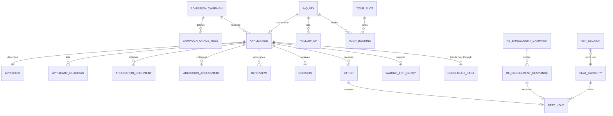

# Admissions

> Service sheet, plan document 06, Group C. Names from Appendix L; events from Appendix E; permissions from Appendix B; error codes from Appendix K; rules from Appendix S. This sheet adds detail to reference architecture section 8.6 and never contradicts its table 8.0 except where an open point says so.

Admissions is the front door of the product. It captures inquiries from every source, books tours and open days, runs the online application with save and resume behind OTP and bot protection, checks age eligibility and required documents, drives the pipeline through assessment, interview and committee decision, issues offers with deposits and expiry, keeps ranked waiting lists and seat capacity per grade and campus, and hands an accepted child to School, Finance, Identity and Documents through the enrolment saga (Saga 3). Once a year it runs the re-enrolment campaign with its fee settlement check. Its load is seasonal: a public surge in the application window (Appendix N scenario N-10) and quiet months between.

| Fact | Value (quoted from `05-service-catalog.md` and Appendix L) |
|---|---|
| Canonical name, long name | Admissions, Admissions |
| Tier | 1 |
| AREA code | `ADM` |
| Database | `nibras_admissions`, schema `admissions`, roles `svc_admissions` and `mig_admissions` |
| Exchange | `nibras.admissions` |
| Images | `nibras/admissions-api` |
| Worker | none; Quartz.NET jobs run in the Api host (Appendix L lists no admissions-worker image) |
| gRPC | exposes none; calls the School directory |
| Build phase (master brief Section 28) | 4 |
| Service level class (master brief Section 31) | Read-heavy, with a seasonal peak |
| Sensitivity (Appendix J) | confidential |
| Why the boundary exists | Scaling: a seasonal peak and a public application form with bot protection and OTP, unlike the steady internal load of School |

---

## 1. Responsibilities

| Owns | Detail |
|---|---|
| Inquiries | Web form, walk-in, phone, campaign source; lead stages; follow-ups (REQ-ADM-001) |
| Tours and open days | Slots with capacity and bookings (REQ-ADM-002) |
| Admission campaigns | Window per academic year and campus, the dynamic form per grade, age cut-offs, required documents per grade and nationality group, offer validity, application fee amount |
| Applications | Save and resume, dynamic form, documents, eligibility, completion timestamp, priority band, duplicate flag, pipeline stage (REQ-ADM-003 to REQ-ADM-007, REQ-ADM-015, REQ-ADM-019) |
| Assessments, interviews, decisions | Slots, evaluator forms, scores, committee decision (REQ-ADM-007) |
| Offers | Conditional offers, waived documents, deposit, expiry and extension, single-use acceptance token (REQ-ADM-008 to REQ-ADM-010) |
| Seat capacity and waiting lists | Capacity per grade and campus with the override, ranking with sibling and staff-child priority, automatic promotion (REQ-ADM-011 to REQ-ADM-014) |
| Enrolment handover | Saga 3: student, guardian accounts, fee plan, letter and welcome pack created together, compensating on failure (REQ-ADM-016 to REQ-ADM-018) |
| Re-enrolment | Campaign, confirmation, seat hold, block on balance, not-returning reasons (REQ-ADM-020 to REQ-ADM-023) |
| Two workflows | WF-ADM-01 inquiry to enrolment, WF-ADM-02 re-enrolment with fee settlement check |
| Six rules | BR-ADM-001 to BR-ADM-006 |

## 2. Not responsible for

| Not owned here | Owner | Why the line sits there |
|---|---|---|
| The student and guardian records, the student number, section placement | School | Saga 3 step 2 `EnrolStudent`; Admissions holds applicant data only until enrolment |
| Merging two student records | School | BR-ADM-006 edge case: merging never happens inside Admissions |
| Invoices, deposits, application fees, fee plans, balances, refunds of deposits | Finance | Finance consumes `admissions.offer.made.v1` and `admissions.offer.accepted.v1`; BR-ADM-004 edge case: a deposit on an expired offer becomes unapplied credit under BR-FIN-009 |
| Guardian accounts and invitations | Identity | Saga 3 step 4 |
| Offer letters, enrolment letters, document storage and virus scanning | Documents | Documents consumes `admissions.offer.made.v1` and `admissions.application.submitted.v1` |
| Messages to families | Notification | Appendix C rows and the `RequestNotification` command |
| Transport subscription for a new student | Operations | REQ-ADM-018 raises a request; Operations owns the subscription (open point 8) |
| Funnel, conversion and retention analytics; the registrar home | Reporting, Bff.Web | REQ-ADM-024, REQ-ADM-025 |
| The unified task inbox | Requests | Admissions follow-ups are pipeline items, not Requests tasks (open point 7) |
| Bot protection at the edge, per-address rate limits | Gateway | T-ADM-01; Admissions adds the proof-of-work check behind a tenant setting |

## 3. Requirements covered

| Range or identifier | What it binds here |
|---|---|
| REQ-ADM-001 to REQ-ADM-026 | Every Admissions row of `03-requirements-catalog.md`; REQ-ADM-024 and REQ-ADM-025 are served by Reporting and Bff.Web from Admissions events |
| REQ-L10N-009, REQ-L10N-010 | Arabic normalization for duplicate detection (BR-ADM-006); Hijri date of birth converted to Gregorian (BR-ADM-001) |
| REQ-DATA-021, REQ-DATA-022 | Saga 3 with persisted state, timeouts, compensation and an honest processing state |
| REQ-PERF-026 and the N-10 scenario of Appendix N | Public surge: submit p95 under 500 ms, 5 MB upload scanned under 20 s |
| REQ-SEC-005, REQ-SEC-016 | Isolation suite; per-user and per-endpoint limits in addition to the Gateway's anonymous limits |
| REQ-PRV-013, REQ-PRV-015 | Consent text version captured on the application; privacy notice on the public form |
| REQ-API-016 | `Idempotency-Key` on every public submit and on offer acceptance |

---

## 4. Aggregates and entities

**Common columns** on every table, stood for by `(common)`: `tenant_id` uuid not null (first in every index, row-level security `tenant_isolation`), `id` uuid v7, `created_at`/`created_by` not null (`created_by` is the applicant session id on public writes), `updated_at`/`updated_by` null, `deleted_at`/`deleted_by` null behind the named `SoftDelete` filter, and `xmin` as the concurrency token on every aggregate root.

### 4.1 `AdmissionCampaign`

| Field | Type | Null | Notes |
|---|---|---|---|
| (common), `academic_year_id`, `campus_id` | uuid | no | The target year (School's id, from the copy) |
| `name_en`, `name_ar` | text | no | |
| `opens_at`, `closes_at` | timestamptz | no | Outside the window: `ADMISSIONS_WINDOW_CLOSED` |
| `grade_rules` | child rows `campaign_grade_rules` (`grade_level_id`, `cut_off_date`, `min_age`, `max_age`, `form_definition_id`, `required_documents` text[], `application_fee` money) | | BR-ADM-001 and BR-ADM-002 parameters |
| `nationality_document_rules` | child rows (`nationality_group`, `required_documents`) | | BR-ADM-002 union |
| `offer_validity_days` | int | no | Default 14 (BR-ADM-004) |
| `proof_of_work_required` | bool | no | Tenant bot-protection switch (T-ADM-01) |
| `status` | enum | no | draft, open, closed |

Invariants: two open campaigns for one campus and year never overlap in time; a grade rule's `min_age <= max_age`; changing a rule never re-evaluates applications already `UnderReview` except through an explicit re-check.

### 4.2 `Inquiry`, `FollowUp`, `TourSlot`, `TourBooking`

| Entity | Field | Type | Null | Class | Notes |
|---|---|---|---|---|---|
| Inquiry | (common), `campus_id`, `grade_level_id` | uuid | no, yes | Internal | |
| Inquiry | `source` | enum | no | Internal | web-form, walk-in, phone, campaign, referral |
| Inquiry | `campaign_tag` | text | yes | Internal | "spring-2026" |
| Inquiry | `contact_name`, `contact_phone_e164`, `contact_email` | text | partly | Confidential | |
| Inquiry | `child_name`, `child_date_of_birth` | text, date | yes | Confidential | Carried forward on conversion (REQ-ADM-019) |
| Inquiry | `stage` | enum | no | Internal | new, contacted, tour-booked, toured, converted, lost |
| Inquiry | `lost_reason_code` | text | yes | Internal | |
| Inquiry | `application_id` | uuid | yes | Internal | Set on conversion |
| FollowUp | (common), `inquiry_id` or `application_id`, `assignee_id`, `due_at`, `done_at`, `note` | | partly | Internal | Pipeline item on the registrar home |
| TourSlot | (common), `campus_id`, `kind` (tour, open-day), `starts_at`, `capacity` | | no | Internal | |
| TourBooking | (common), `tour_slot_id`, `inquiry_id`, `party_size`, `status` | | no | Internal | Waiting list when full (REQ-ADM-002) |

Invariants: a new inquiry gets one follow-up assigned to the campus registrar (REQ-ADM-001); bookings of a slot never exceed its capacity, the next one becomes a waiting booking; a converted inquiry is read-only.

### 4.3 `Application` (aggregate root) with applicant, guardians and documents

| Entity | Field | Type | Null | Class | Notes |
|---|---|---|---|---|---|
| Application | (common), `campaign_id`, `campus_id`, `grade_level_id` | uuid | no | Internal | |
| Application | `reference` | text | no | Internal | Human reference shown to the family |
| Application | `stage` | enum `InquiryToEnrollmentStatus` | no | Internal | Inquiry, Applied, UnderReview, NeedsInformation, Assessed, Offered, Waitlisted, Rejected, DepositPaid, Enrolled, OfferExpired, Withdrawn, Declined (the last two are open point 3) |
| Application | `fee_status` | enum | no | Internal | not-required, pending, paid, waived |
| Application | `form_step`, `form_data` | int, side table `application_form_data` (jsonb) | no | Confidential | Save and resume (REQ-ADM-003) |
| Application | `completed_at` | timestamptz | yes | Internal | When the application became complete including documents; the ranking timestamp (BR-ADM-005) |
| Application | `priority_band` | enum | no | Internal | staff-child, sibling, general |
| Application | `sibling_student_id`, `staff_parent_id` | uuid | yes | Internal | Verified through the School directory |
| Application | `assessment_score` | numeric(5,2) | yes | Confidential | Tie-break |
| Application | `duplicate_flag`, `duplicate_of_id`, `duplicate_resolution`, `resolved_by`, `resolved_at` | bool, uuid, text, uuid, timestamptz | partly | Internal | BR-ADM-006 |
| Application | `age_override_reason`, `age_override_by` | text, uuid | yes | Internal | BR-ADM-001 edge case |
| Application | `consent_text_version` | text | no | Internal | Privacy notice accepted (REQ-PRV-013) |
| Application | `source_inquiry_id`, `student_id` | uuid | yes | Internal | `student_id` set by Saga 3 step 2 |
| Applicant | `application_id`, `given_names_en`, `family_name_en`, `given_names_ar`, `father_name_ar`, `grandfather_name_ar`, `family_name_ar`, `search_normalized` | text | partly | Internal | Normalized under BR-L10N-001 |
| Applicant | `date_of_birth`, `gender`, `nationality_code`, `nationality_group`, `previous_school` | | no, no, no, no, yes | Confidential | |
| Applicant | `national_id_encrypted`, `national_id_hmac` | bytea | yes | Sensitive | Column-encrypted; the HMAC under the tenant matching key feeds duplicate detection (open point 5) |
| ApplicantGuardian | `application_id`, `relationship`, names, `mobile_e164`, `email`, `is_primary`, `is_payer` | | partly | Confidential | Handed to School in `EnrolStudent` |
| ApplicationDocument | (common), `application_id`, `document_type`, `file_id`, `scan_status`, `expires_on`, `waived_by_offer_id` | | partly | Confidential | Counts as missing when expired or not clean (BR-ADM-002) |

Invariants: an application moves only through `InquiryToEnrollmentTransitions.cs` and each move publishes `admissions.application.stage-changed.v1`; submission is refused with `ADMISSIONS_DOCUMENT_MISSING` naming each missing or expired document of the union set (BR-ADM-002); a child outside the grade's age range is refused unless an override reason is recorded (BR-ADM-001); `completed_at` is set once, when the last required document is clean; a flagged duplicate cannot enter Saga 3 until resolved with a reason (BR-ADM-006); `Applied → UnderReview` requires every document attached and clean (TC-ADM-001); `Assessed` requires the assessment and interview outcomes, otherwise a decision is refused with `ADMISSIONS_ASSESSMENT_NOT_SCHEDULED`; a public write inside a closed window is refused with `ADMISSIONS_WINDOW_CLOSED`.

### 4.4 `AdmissionAssessment`, `Interview`, `Decision`

| Entity | Field | Type | Null | Notes |
|---|---|---|---|---|
| AssessmentSlot | (common), `campus_id`, `kind` (assessment, interview), `starts_at`, `capacity`, `evaluator_ids` | | no | |
| AdmissionAssessment | (common), `application_id`, `slot_id`, `status` (scheduled, completed, no-show), `evaluator_id`, `form_results` jsonb, `score` | | partly | Evaluator form results are Confidential |
| Interview | (common), `application_id`, `slot_id`, `status`, `interviewer_ids`, `notes` (side table), `recommendation` | | partly | Notes never cached (doc 21 section 1.4) |
| Decision | (common), `application_id`, `outcome` (offer, conditional-offer, reject, waitlist), `conditions`, `decided_by`, `committee_member_ids`, `decided_at` | | partly | One live decision per application |

Invariants: a slot's bookings never exceed its capacity; a decision requires every assessment and interview in `completed` (TC-ADM-002); the decider holds `admissions.applications.decide`.

### 4.5 `Offer`

| Field | Type | Null | Notes |
|---|---|---|---|
| (common), `application_id`, `campus_id`, `grade_level_id` | uuid | no | |
| `section_id` | uuid | yes | Proposed section from the copy; School confirms placement |
| `conditional`, `conditions`, `waived_documents` | bool, text, text[] | no, yes, no | A waiver expires with the offer (BR-ADM-002 edge case) |
| `deposit` | money (`amount` numeric(12,2), `currency`) | no | Zero allowed |
| `fee_plan_code` | text | yes | Carried in `admissions.offer.accepted.v1` |
| `issued_at`, `expires_at` | timestamptz | no | End of the last validity day in the campus time zone (BR-ADM-004) |
| `extensions` | child rows (`new_expires_at`, `approved_by`, `reason`) | | |
| `status` | enum | no | open, accepted, deposit-paid, declined, expired, withdrawn |
| `acceptance_token_hash` | bytea | no | Single-use (T-ADM-03) |
| `accepted_at`, `accepted_by_contact` | timestamptz, text | yes | |
| `capacity_override_reason`, `capacity_override_by` | text, uuid | yes | BR-ADM-003 |
| `letter_document_id` | uuid | yes | From `documents.document.generated.v1` |

Invariants: an offer is created only inside the capacity transaction of section 4.6; acceptance after `expires_at` is refused with `ADMISSIONS_OFFER_EXPIRED` even if the expiry job has not run (BR-ADM-004); the token accepts once; an extension moves `expires_at` forward only and keeps the seat held; declining, expiring or withdrawing releases the seat and consults the waiting list in the same transaction (BR-ADM-003, BR-ADM-005).

### 4.6 `SeatCapacity`, `SeatHold`, `WaitingListEntry`

| Entity | Field | Type | Null | Notes |
|---|---|---|---|---|
| SeatCapacity | (common), `academic_year_id`, `campus_id`, `grade_level_id` | uuid | no | Unique `ux_seat_capacity` (doc 21 section 3.4) |
| SeatCapacity | `planned_capacity` | int | no | Sum of the next-year section capacities from the copy, or set by the registrar |
| SeatCapacity | `enrolled_count`, `enrolled_count_at` | int, timestamptz | no | From School `StructureDirectory.GetSeatUsage` |
| SeatCapacity | `override_count` | int | no | Headcount recorded above capacity |
| SeatHold | (common), `seat_capacity_id`, `application_id` or `student_id`, `kind` (offer, deposit, re-enrolment), `released_at` | | partly | Held seats count against capacity |
| WaitingListEntry | (common), `application_id`, `campus_id`, `grade_level_id`, `priority_band`, `completed_at`, `assessment_score`, `rank`, `status` (waiting, offered, left, reinstated), `reconfirmed_at` | | partly | Rank order per BR-ADM-005 |

Invariants: `enrolled_count + open offers + held seats <= planned_capacity + override_count`, checked under `SELECT ... FOR UPDATE` on the capacity row, so 20 concurrent enrolments for the last seat produce exactly 1 success (REQ-ADM-014, BR-ADM-003); an override records the reason and the resulting headcount in the audit trail; waiting-list rank is a gap-free sequence recomputed in the same transaction as any change; an applicant who loses a priority band is re-ranked from that date and notified.

### 4.7 `ReEnrollmentCampaign`, `ReEnrollmentResponse`

| Entity | Field | Type | Null | Notes |
|---|---|---|---|---|
| ReEnrollmentCampaign | (common), `from_academic_year_id`, `to_academic_year_id`, `campus_id` | uuid | no | |
| ReEnrollmentCampaign | `opens_at`, `closes_at` | timestamptz | no | Default 21-day window |
| ReEnrollmentCampaign | `reminder_days` | int[] | no | Default 7 and 14 |
| ReEnrollmentCampaign | `status` | enum | no | draft, open, closed |
| ReEnrollmentResponse | (common), `campaign_id`, `student_id`, `guardian_user_id` | uuid | no, no, yes | One per student per campaign |
| ReEnrollmentResponse | `status` | enum `ReEnrollmentWithFeeSettlementCheckStatus` | no | Invited, Confirmed, Declined, NoResponse, SettlementChecked, BlockedOnFees, SeatReserved, SeatReleased, Enrolled |
| ReEnrollmentResponse | `decline_reason_code` | text | yes | Not-returning reason (REQ-ADM-023) |
| ReEnrollmentResponse | `blocked_since`, `escalated_to`, `waiver_by`, `waiver_reason` | | yes | |
| ReEnrollmentResponse | `request_id` | uuid | yes | Saga 6 idempotency for `ConfirmReEnrollment` |

Invariants: only a linked guardian with parental access may confirm (TC-ADM-011); `BlockedOnFees` holds the seat and never rejects the family; a waiver is recorded with the finance manager's identity and audited (TC-ADM-013); `NoResponse` after both reminders releases the seat (TC-ADM-015); a failed next-year enrolment keeps the reservation (Appendix R compensation).

### 4.8 `EnrolmentSaga` state (Saga 3)

| Field | Type | Notes |
|---|---|---|
| `saga_id`, `application_id`, `offer_id`, `tenant_id` | uuid | |
| `state` | enum `Nibras.Admissions.Domain.Applications.EnrolmentSagaState` | SeatConfirmed, StudentEnrolled, FeePlanAssigned, GuardiansLinked, LetterGenerated, Enrolled, WelcomeSent, TimedOut, Compensating, Compensated, Stuck |
| `current_step`, `attempts` | int | |
| `student_id`, `fee_plan_code`, `guardian_user_ids`, `document_id` | uuid, text, uuid[], uuid | Filled per step |
| `failed_step`, `failure_message` | text | Shown to the officer by name |
| `deadline_at` | timestamptz | Start plus 24 hours |
| `compensation_journal` | jsonb | Reverse steps sent and acknowledged |
| `xmin` | xid | Concurrency |

### 4.9 Reference copies and public sessions

`ref_section`, `ref_grade_level` (section 9) and `public_sessions` (`id`, `tenant_id`, `contact_hash`, `verified_at`, `expires_at`, `application_ids`): an OTP-verified applicant session, 7-day sliding life, the only identity an anonymous applicant has. OTP codes live in `redis-state` under `state:otp:{tenant}:{purpose}:{subjectHash}` with an attempt counter, at most 10 minutes (`21-performance-engineering.md` section 2.2).



---

## 5. REST API

Base path `/api/v1/admissions`. Conventions from `22-api-conventions-and-error-catalog.md`: keyset lists, `If-Match` on updates (stale tag 409 `ADMISSIONS_CONCURRENCY_CONFLICT`), `Idempotency-Key` on creates and required on every public submit and on acceptance. The eight Appendix K.1 codes apply with the `ADMISSIONS_` prefix. Public routes are anonymous at the Gateway, rate-limited per source address, and carry the applicant session token after OTP verification; they never accept a staff token's permissions in place of the session.

### 5.1 Public: inquiry, OTP, application, tours, offer response

| Method | Path | Permission | Request | Response | Errors | Idempotent |
|---|---|---|---|---|---|---|
| GET | `/public/campaigns/{campaignId}/form` | anonymous | `gradeLevelId` | form definition, required documents, fee (cached) | `ADMISSIONS_WINDOW_CLOSED`, `ADMISSIONS_NOT_FOUND` | safe; output cache |
| POST | `/public/inquiries` | anonymous with proof-of-work when the campaign requires it | `SubmitInquiryRequest` | 201; publishes `admissions.inquiry.created.v1` | `ADMISSIONS_VALIDATION_FAILED`, `ADMISSIONS_RATE_LIMITED` | `Idempotency-Key` required |
| POST | `/public/otp-challenges` | anonymous | `OtpChallengeRequest` (phone or email) | 202; code sent through Notification | `ADMISSIONS_RATE_LIMITED` | `Idempotency-Key` required |
| POST | `/public/otp-verifications` | anonymous | `OtpVerifyRequest` (code) | 200 with the applicant session token | `ADMISSIONS_VALIDATION_FAILED` (wrong or expired code, attempts counted) | state check |
| POST | `/public/applications` | applicant session | `StartApplicationRequest` (campaign, grade, consent version) | 201 draft at step 1 | `ADMISSIONS_WINDOW_CLOSED`, `ADMISSIONS_VALIDATION_FAILED` (age, BR-ADM-001) | `Idempotency-Key` required |
| GET | `/public/applications/{id}` | applicant session (own only) | none | the application with stage and missing documents | `ADMISSIONS_NOT_FOUND` | safe |
| PUT | `/public/applications/{id}` | applicant session | `SaveApplicationStepRequest` (step, data) | 200; save and resume (REQ-ADM-003) | `ADMISSIONS_WINDOW_CLOSED`, `ADMISSIONS_CONCURRENCY_CONFLICT` | `If-Match` |
| POST | `/public/applications/{id}/documents` | applicant session | `AttachDocumentRequest` (type, fileId from the Documents upload) | 201 with scan status | `ADMISSIONS_VALIDATION_FAILED` | `Idempotency-Key` |
| POST | `/public/applications/{id}/submit` | applicant session | none | 200 `Applied`; publishes `admissions.application.submitted.v1` and `admissions.application.stage-changed.v1` | `ADMISSIONS_DOCUMENT_MISSING`, `ADMISSIONS_WINDOW_CLOSED`, `ADMISSIONS_DUPLICATE_APPLICANT` (flag only, submission still accepted) | `Idempotency-Key` required |
| GET | `/public/tour-slots` | anonymous | `campusId`, `kind` | open slots with remaining places | none | safe; output cache 60 s |
| POST | `/public/tour-bookings` | anonymous with proof-of-work | `BookTourRequest` (slot, contact, party size) | 201 booked or waiting | `ADMISSIONS_VALIDATION_FAILED` | `Idempotency-Key` required |
| POST | `/public/offers/{token}/accept` | the offer token (single use) | `AcceptOfferRequest` | 200; deposit instructions, or `DepositPaid` and Saga 3 when the deposit is zero | `ADMISSIONS_OFFER_EXPIRED`, `ADMISSIONS_NOT_FOUND` (used or unknown token) | `Idempotency-Key` required |
| POST | `/public/offers/{token}/decline` | the offer token | `DeclineOfferRequest` (reason) | 200; seat released, waiting list advanced | `ADMISSIONS_OFFER_EXPIRED` | `Idempotency-Key` required |

### 5.2 Campaigns and configuration

| Method | Path | Permission | Request | Response | Errors | Idempotent |
|---|---|---|---|---|---|---|
| GET | `/campaigns` | `admissions.campaigns.view` | `academicYearId`, `campusId` | `CampaignDto[]` | none | safe |
| POST | `/campaigns` | `admissions.campaigns.create` | `CreateCampaignRequest` (window, grade rules, document rules, validity, fee) | 201 draft | `ADMISSIONS_VALIDATION_FAILED` (overlap, age range) | `Idempotency-Key` |
| PUT | `/campaigns/{id}` | `admissions.campaigns.edit` | `UpdateCampaignRequest` | 200; evicts the form keys | `ADMISSIONS_CONCURRENCY_CONFLICT` | `If-Match` |
| DELETE | `/campaigns/{id}` | `admissions.campaigns.delete` | none | 204 for a draft with no application | `ADMISSIONS_VALIDATION_FAILED` | by id |
| POST | `/campaigns/{id}/open` | `admissions.campaigns.open` | none | 200 | `ADMISSIONS_VALIDATION_FAILED` (no grade rules) | state check |
| POST | `/campaigns/{id}/close` | `admissions.campaigns.close` | none | 200 | none | state check |

Campaigns are their own Appendix B resource, `admissions.campaigns` with view, create, edit, delete and the special actions `open` and `close`, added under ADR-0019, so campaign configuration can be delegated apart from capacity.

### 5.3 Inquiries, follow-ups, tours

| Method | Path | Permission | Request | Response | Errors | Idempotent |
|---|---|---|---|---|---|---|
| GET | `/inquiries` | `admissions.inquiries.view` | `stage`, `source`, `campusId`, `q` | keyset `InquiryDto` | none | safe |
| GET | `/inquiries/{id}` | `admissions.inquiries.view` | none | `InquiryDto` with follow-ups and tours | `ADMISSIONS_NOT_FOUND` | safe |
| POST | `/inquiries` | `admissions.inquiries.create` | `CreateInquiryRequest` (walk-in, phone) | 201; publishes `admissions.inquiry.created.v1` | `ADMISSIONS_VALIDATION_FAILED` | `Idempotency-Key` |
| PATCH | `/inquiries/{id}` | `admissions.inquiries.edit` | `UpdateInquiryRequest` (stage, lost reason) | 200 | `ADMISSIONS_CONCURRENCY_CONFLICT` | `If-Match` |
| DELETE | `/inquiries/{id}` | `admissions.inquiries.delete` | none | 204 for unconverted inquiries | `ADMISSIONS_VALIDATION_FAILED` (converted) | by id |
| POST | `/inquiries/{id}/convert` | `admissions.inquiries.convert` | `ConvertInquiryRequest` (campaign, grade) | 201 application with every captured field (REQ-ADM-019) | `ADMISSIONS_WINDOW_CLOSED`, `ADMISSIONS_VALIDATION_FAILED` (age) | `Idempotency-Key`; one application per inquiry |
| GET | `/inquiries/export` | `admissions.inquiries.export` | filters | streamed CSV without contacts unless the column set allows | none | safe |
| POST | `/follow-ups` | `admissions.inquiries.edit` | `CreateFollowUpRequest` | 201 | `ADMISSIONS_VALIDATION_FAILED` | `Idempotency-Key` |
| POST | `/follow-ups/{id}/complete` | `admissions.inquiries.edit` | note | 200 | `ADMISSIONS_NOT_FOUND` | state check |
| GET | `/tour-slots` | `admissions.inquiries.view` | `campusId`, `from`, `to` | slots with bookings | none | safe |
| POST | `/tour-slots` | `admissions.inquiries.create` | `CreateTourSlotRequest` | 201 | `ADMISSIONS_VALIDATION_FAILED` | `Idempotency-Key` |
| PUT | `/tour-slots/{id}` | `admissions.inquiries.edit` | `UpdateTourSlotRequest` | 200; a capacity rise promotes waiting bookings | `ADMISSIONS_CONCURRENCY_CONFLICT` | `If-Match` |
| POST | `/tour-bookings/{id}/cancel` | `admissions.inquiries.edit` | reason | 200; the next waiting booking is promoted | `ADMISSIONS_NOT_FOUND` | state check |

### 5.4 Applications, assessments, interviews, decisions

| Method | Path | Permission | Request | Response | Errors | Idempotent |
|---|---|---|---|---|---|---|
| GET | `/applications` | `admissions.applications.view` | `campaignId`, `stage`, `gradeLevelId`, `q` | keyset board columns (hot queries 1 and 2) | none | safe |
| GET | `/applications/{id}` | `admissions.applications.view` | none | `ApplicationDto` with documents, scores, flags, saga strip | `ADMISSIONS_NOT_FOUND` | safe |
| POST | `/applications` | `admissions.applications.create` | `CreateApplicationRequest` (staff-entered) | 201 | `ADMISSIONS_WINDOW_CLOSED`, `ADMISSIONS_VALIDATION_FAILED` | `Idempotency-Key` |
| PATCH | `/applications/{id}` | `admissions.applications.edit` | `UpdateApplicationRequest` | 200; a grade change recomputes the required set | `ADMISSIONS_CONCURRENCY_CONFLICT` | `If-Match` |
| POST | `/applications/{id}/stage-transitions` | `admissions.applications.edit` | `MoveStageRequest` (to UnderReview, NeedsInformation with the question, Withdrawn) | 200; stage-changed event | `ADMISSIONS_APPLICATION_STAGE_INVALID`, `ADMISSIONS_DOCUMENT_MISSING` | state check |
| POST | `/applications/{id}/age-override` | `admissions.applications.override-age` | `AgeOverrideRequest` (reason) | 200 | `ADMISSIONS_VALIDATION_FAILED` (no reason) | state check |
| POST | `/applications/{id}/duplicate-resolution` | `admissions.applications.edit` | `ResolveDuplicateRequest` (not-duplicate or duplicate, reason) | 200 | `ADMISSIONS_VALIDATION_FAILED` | state check |
| POST | `/applications/{id}/scores` | `admissions.applications.score` | `ScoreApplicationRequest` | 200 | `ADMISSIONS_APPLICATION_STAGE_INVALID` | `If-Match` |
| POST | `/applications/{id}/decision` | `admissions.applications.decide` | `DecideApplicationRequest` (offer, conditional-offer, reject, waitlist, conditions) | 200; `Assessed → Offered, Rejected or Waitlisted` | `ADMISSIONS_ASSESSMENT_NOT_SCHEDULED`, `ADMISSIONS_SEAT_UNAVAILABLE` (offer without a seat, waiting list offered), `ADMISSIONS_DUPLICATE_APPLICANT` | `Idempotency-Key`; state check |
| GET | `/applications/export` | `admissions.applications.export` | filters | streamed CSV | none | safe |
| GET | `/assessment-slots` | `admissions.assessments.view` | `campusId`, `kind` | slots with bookings | none | safe |
| POST | `/assessment-slots` | `admissions.assessments.create` | `CreateAssessmentSlotRequest` | 201 | `ADMISSIONS_VALIDATION_FAILED` | `Idempotency-Key` |
| PUT | `/assessment-slots/{id}` | `admissions.assessments.edit` | `UpdateAssessmentSlotRequest` | 200 | `ADMISSIONS_CONCURRENCY_CONFLICT` | `If-Match` |
| POST | `/applications/{id}/assessments` | `admissions.assessments.schedule` | `ScheduleAssessmentRequest` (slot) | 201 | `ADMISSIONS_VALIDATION_FAILED` (slot full) | `Idempotency-Key` |
| POST | `/admission-assessments/{id}/evaluation` | `admissions.assessments.evaluate` | `EvaluateAssessmentRequest` (form results, score, no-show) | 200 | `ADMISSIONS_APPLICATION_STAGE_INVALID` | `If-Match` |
| POST | `/applications/{id}/interviews` | `admissions.assessments.schedule` | `ScheduleInterviewRequest` | 201 | `ADMISSIONS_VALIDATION_FAILED` | `Idempotency-Key` |
| POST | `/interviews/{id}/evaluation` | `admissions.assessments.evaluate` | `EvaluateInterviewRequest` (notes, recommendation) | 200 | `ADMISSIONS_APPLICATION_STAGE_INVALID` | `If-Match` |

### 5.5 Offers, capacity, waiting list, enrolment

| Method | Path | Permission | Request | Response | Errors | Idempotent |
|---|---|---|---|---|---|---|
| GET | `/offers` | `admissions.offers.view` | `status`, `expiringWithinHours` | keyset `OfferDto` | none | safe |
| POST | `/applications/{id}/offers` | `admissions.offers.make`; above capacity also `admissions.capacity.override-capacity` with a reason | `MakeOfferRequest` (deposit, fee plan code, conditions, waived documents, override reason) | 201; publishes `admissions.offer.made.v1`; Documents renders the letter | `ADMISSIONS_CAPACITY_OVERRIDE_REQUIRED`, `ADMISSIONS_SEAT_UNAVAILABLE`, `ADMISSIONS_DUPLICATE_APPLICANT` | `Idempotency-Key`; capacity row lock |
| POST | `/offers/{id}/withdraw` | `admissions.offers.withdraw` | reason | 200; seat released | `ADMISSIONS_VALIDATION_FAILED` (deposit paid) | state check |
| POST | `/offers/{id}/extend` | `admissions.offers.extend-expiry` | `ExtendOfferRequest` (days, reason) | 200 new expiry | `ADMISSIONS_OFFER_EXPIRED` | `If-Match` |
| POST | `/offers/{id}/confirm-deposit` | `admissions.enrollment.enroll` | `ConfirmDepositRequest` (Finance receipt reference, reason) | 200 `DepositPaid`; Saga 3 starts; publishes `admissions.offer.accepted.v1` | `ADMISSIONS_OFFER_EXPIRED`, `ADMISSIONS_VALIDATION_FAILED` | `Idempotency-Key`; the manual repair path when `sourceRefs` cannot match a payment |
| GET | `/offers/export` | `admissions.offers.export` | filters | streamed CSV | none | safe |
| GET | `/seat-capacity` | `admissions.capacity.view` | `academicYearId`, `campusId` | capacity, enrolled, offers, holds per grade | none | safe; cached 30 s |
| PUT | `/seat-capacity/{id}` | `admissions.capacity.edit` | `SetPlannedCapacityRequest` | 200; waiting list consulted | `ADMISSIONS_CONCURRENCY_CONFLICT` | `If-Match` |
| GET | `/waiting-list` | `admissions.waiting-list.view` | `campusId`, `gradeLevelId` | ranked entries (hot query 3) | none | safe |
| PATCH | `/waiting-list/{id}` | `admissions.waiting-list.edit` | `UpdateWaitingEntryRequest` (reconfirmed, left, reinstated) | 200; re-rank | `ADMISSIONS_CONCURRENCY_CONFLICT` | `If-Match` |
| POST | `/waiting-list/{id}/promote` | `admissions.waiting-list.promote` | none | 201 offer for the entry | `ADMISSIONS_SEAT_UNAVAILABLE` | `Idempotency-Key` |
| POST | `/waiting-list/reorder` | `admissions.waiting-list.reorder` | `ReorderWaitingListRequest` (entry, new rank, reason) | 200; audit before and after (T-ADM-04) | `ADMISSIONS_VALIDATION_FAILED` (no reason) | `If-Match` |
| GET | `/enrolments/{applicationId}` | `admissions.enrollment.view` | none | Saga 3 state strip "Student, Fees, Guardians, Letter, Welcome" with the failed step | `ADMISSIONS_NOT_FOUND` | safe |
| POST | `/enrolments/{applicationId}/retry` | `admissions.enrollment.enroll` | none | 202; the failed step is re-sent | `ADMISSIONS_VALIDATION_FAILED` (not compensated) | state check |

### 5.6 Re-enrolment

| Method | Path | Permission | Request | Response | Errors | Idempotent |
|---|---|---|---|---|---|---|
| GET | `/re-enrollment-campaigns` | `admissions.re-enrollment.view` | `campusId` | campaigns with counts per state | none | safe |
| POST | `/re-enrollment-campaigns` | `admissions.re-enrollment.open-campaign` | `OpenReEnrollmentCampaignRequest` | 201; invitations created for every enrolled student in the campus, delivered through `RequestNotification` | `ADMISSIONS_VALIDATION_FAILED` | `Idempotency-Key` required |
| POST | `/re-enrollment-campaigns/{id}/close` | `admissions.re-enrollment.close-campaign` | none | 200; unanswered become `NoResponse` | `ADMISSIONS_VALIDATION_FAILED` | state check |
| GET | `/re-enrollment-campaigns/{id}/responses` | `admissions.re-enrollment.view` | `status` | keyset responses | none | safe |
| GET | `/re-enrollment-responses/mine` | `admissions.re-enrollment.view` (scope `own-children`) | none | the guardian's children and their state | none | safe |
| POST | `/re-enrollment-responses/{id}/confirm` | `admissions.re-enrollment.edit` (scope `own-children`) | none | 200; publishes `admissions.re-enrollment.confirmed.v1` (TC-ADM-011) | `ADMISSIONS_WINDOW_CLOSED`, `ADMISSIONS_REENROLLMENT_BLOCKED_BY_BALANCE` (shown with the Finance balance composed by Bff) | `Idempotency-Key` |
| POST | `/re-enrollment-responses/{id}/decline` | `admissions.re-enrollment.edit` (scope `own-children`) | `DeclineReEnrollmentRequest` (reason code) | 200; publishes `admissions.re-enrollment.declined.v1` | `ADMISSIONS_WINDOW_CLOSED` | `Idempotency-Key` |
| POST | `/re-enrollment-responses/{id}/waiver` | `admissions.re-enrollment.edit` | `WaiverRequest` (reason, finance approver) | 200 `BlockedOnFees → SettlementChecked` (TC-ADM-013) | `ADMISSIONS_VALIDATION_FAILED` | state check |
| GET | `/re-enrollment-campaigns/{id}/export` | `admissions.re-enrollment.export` | none | streamed CSV with reasons | none | safe |

### 5.7 Jobs

| Method | Path | Permission | Request | Response | Errors | Idempotent |
|---|---|---|---|---|---|---|
| GET | `/jobs/{id}` | the starting permission, or `platform.jobs.view` | none | `Job` resource | `ADMISSIONS_NOT_FOUND` | safe |
| POST | `/jobs/{id}/cancel` | the starter, or `platform.jobs.cancel` | none | 202 | `ADMISSIONS_VALIDATION_FAILED` | state check |

---

## 6. gRPC

### 6.1 Exposed

None. No service calls Admissions synchronously (reference architecture table 8.0).

### 6.2 Consumed: School `nibras.school.v1` (the one allowed hop)

| Method | Why | Deadline | Fallback |
|---|---|---|---|
| `StudentDirectory.GetStudentByNumber` | Verify a declared sibling for the sibling band (BR-ADM-005) | 2 s | Band stays general with a "verification pending" flag; re-checked nightly |
| `StudentDirectory.FindDuplicateCandidates` | BR-ADM-006 against enrolled students, with the identifier HMAC | 2 s | Flag "check pending"; the check runs again at conversion (BR-ADM-006 edge case) and conversion waits for it |
| `StaffDirectory.GetStaff` | Verify the staff-child band | 2 s | As for siblings |
| `StructureDirectory.ListGradeLevels`, `ListSections` | Grade-level copy (no event exists) and the next-year section plan | 5 s | Last snapshot |
| `StructureDirectory.GetSeatUsage` | `enrolled_count` for the capacity rule, read before the capacity transaction | 2 s | Last stored value if younger than 24 hours, otherwise refuse the offer with `ADMISSIONS_DEPENDENCY_UNAVAILABLE` |
| `ReferenceReconciliation.Checksum`, `ListSnapshotPage` | Nightly section-copy reconciliation | 30 s, 5 s | Retry next night |

---

## 7. Events published and consumed

### 7.1 Published on `nibras.admissions`

Payload fields are owned by Appendix E, Admissions section; cited, not restated.

| Routing key | Partition key | Published when, by which handler | Consumers |
|---|---|---|---|
| `admissions.inquiry.created.v1` | `inquiryId` | `SubmitInquiryHandler` (public), `CreateInquiryHandler` | Reporting, Notification |
| `admissions.application.submitted.v1` | `applicationId` | `SubmitApplicationHandler` | Documents, Notification, Reporting |
| `admissions.application.stage-changed.v1` | `applicationId` | Every transition of `InquiryToEnrollmentStatus`, including Saga 3 step 6 | Reporting, Notification |
| `admissions.offer.made.v1` | `applicationId` | `MakeOfferHandler`, waiting-list promotion | Finance, Documents, Notification, Reporting |
| `admissions.offer.accepted.v1` | `applicationId` | Deposit matched (`PaymentReceivedConsumer` or `ConfirmDepositHandler`) or zero-deposit acceptance, at the moment Saga 3 starts | School, Identity, Finance, Documents |
| `admissions.offer.expired.v1` | `applicationId` | `OfferExpiryJob` and the acceptance-time check | Notification, Reporting |
| `admissions.re-enrollment.confirmed.v1` | `studentId` | `ConfirmReEnrollmentHandler` and the Saga 6 `ConfirmReEnrollment` command | School, Finance, Reporting, Requests |
| `admissions.re-enrollment.declined.v1` | `studentId` | `DeclineReEnrollmentHandler` and the `DeclineReEnrollment` command | School, Finance, Reporting, Notification, Requests |
| `admissions.usage.recorded.v1` | `tenantId` | Hourly: applications, OTP sends | Platform |
| `admissions.audit.recorded.v1` | `tenantId` | Every write and transition, every override and waiver | Audit |

Commands sent on `nibras.admissions` by Saga 3: `EnrolStudent`, `WithdrawEnrolment` (School); `AssignFeePlan`, `VoidFeePlan` (Finance); `ProvisionGuardianAccess`, `RevokeGuardianAccess` (Identity); `GenerateDocument`, `RevokeDocument` (Documents); and `RequestNotification` for the welcome pack, OTP codes, offer reminders and re-enrolment invitations (`11-messaging-architecture.md` section 2.4). Appendix E also catalogues `RaiseApplicationFee` (`finance.commands.raise-application-fee.v1`, sent on `nibras.admissions`), which is how REQ-ADM-006 raises the application fee; document 11's command catalog still has to list it.

### 7.2 Consumed

Queues from `11-messaging-architecture.md` section 2.5 (Admissions table).

| Routing key | Queue | Handler | What it changes |
|---|---|---|---|
| The doc 11 section 2.3 set | `admissions.tenant-lifecycle` | `TenantLifecycleConsumer` | Tenant rows, read-only (public writes refused during suspension), settings, custom-field values on applications |
| `school.section.created.v1`, `school.section.changed.v1` | `admissions.reference-copies` | `SectionConsumer` | `ref_section`; recomputes `planned_capacity` for the section's grade and campus; a capacity rise consults the waiting list |
| `finance.payment.received.v1` | `admissions.events` | `PaymentReceivedConsumer` | Matches a deposit or application fee to its offer or application through the optional `sourceRefs` field of the payload; `Offered → DepositPaid`, starts Saga 3; `fee_status = paid` |
| `finance.invoice.overdue.v1` | `admissions.events` | `InvoiceOverdueConsumer` | For deposit and application-fee invoices Admissions knows, flags the offer or application on the registrar home; the payload's `studentId` is null for a pre-enrolment invoice |
| `finance.account.restricted.v1`, `finance.account.cleared.v1` | `admissions.events` | `AccountStandingConsumer` | WF-ADM-02: blocks or releases the re-enrolment confirmation (`ADMISSIONS_REENROLLMENT_BLOCKED_BY_BALANCE`) |
| `school.student.promoted.v1` | `admissions.reference-copies` | `StudentPromotedConsumer` | Records next-year enrolment so WF-ADM-02 can reach `Enrolled` |
| `requests.request.approved.v1` | `admissions.events` | `RequestApprovedConsumer` | "Approved, being applied" on a re-enrolment response |
| `school.student.enrolled.v1`, `school.student.status-changed.v1`, `finance.fee-plan.assigned.v1`, `finance.credit-note.issued.v1`, `identity.guardian-link.created.v1`, `identity.user.invited.v1`, `identity.user.deactivated.v1`, `documents.document.generated.v1`, `documents.certificate.revoked.v1` | `admissions.saga-outcomes` | `EnrolmentSagaOutcomeHandler`, `OfferLetterConsumer` | Saga 3 step outcomes and compensation acknowledgements; `documents.document.generated.v1` for the offer letter sets `letter_document_id` |
| `admissions.replies.#` from School, Finance, Identity, Documents | `admissions.replies` | `EnrolmentSaga` | `Failed` replies move the saga to `Compensating` |
| `admissions.commands.#` from Requests and Platform | `admissions.commands` | one handler per command | `ConfirmReEnrollment`, `DeclineReEnrollment`; the platform command set |

---

## 8. Sagas and workflows

| Workflow | Role | Design |
|---|---|---|
| WF-ADM-01 Inquiry to enrollment | Owner | State type `InquiryToEnrollmentStatus`, feature folder `Application/Features/InquiryToEnrollment/` (document 31). Every transition runs through the transition pipeline (`13-workflows-and-sagas.md` section 5.1). Timeouts: offer expires 14 days after issue with reminders at days 7 and 12; `NeedsInformation` for 21 days becomes `Withdrawn`; a waitlisted application is reconfirmed every 30 days. The last transition `DepositPaid → Enrolled` is **Saga 3**, orchestrated here |
| Saga 3 Enrolment from an accepted offer | Orchestrator | `13-workflows-and-sagas.md` section 3, Saga 3: handler `Nibras.Admissions.Application/Sagas/EnrolmentSaga/`, state enum `Nibras.Admissions.Domain.Applications.EnrolmentSagaState`, rules BR-ADM-003 and BR-FIN-001. Steps: seat hold confirmed; `EnrolStudent` (School); `AssignFeePlan` (Finance); `ProvisionGuardianAccess` (Identity); `GenerateDocument` (Documents); local `Enrolled`; welcome pack. Failure returns the application to `DepositPaid` with the seat **held** and the failed step named. Tests `EnrolmentSagaTests` |
| WF-ADM-02 Re-enrollment with fee settlement check | Owner, single-service choreography | State type `ReEnrollmentWithFeeSettlementCheckStatus`, feature folder `Application/Features/ReEnrollmentWithFeeSettlementCheck/`. Timeouts: 21-day window, reminders at days 7 and 14; `BlockedOnFees` escalates to the finance manager at 14 days and the principal at 30, then releases the seat. `SettlementChecked` reads the account standing from `finance.account.restricted.v1` and `finance.account.cleared.v1`, which Appendix E routes here. `SeatReserved → Enrolled` is recorded on `school.student.promoted.v1` when School's rollover writes the next-year enrolment |
| WF-RQS-01 Service request lifecycle | Effect owner | `ConfirmReEnrollment`, `DeclineReEnrollment` (doc 13 section 4) |
| WF-FIN-01 Fee plan to collection | Participant | `finance.invoice.overdue.v1` flags unpaid deposits |

---

## 9. Local reference copies

In schema `admissions`, `ref_<entity>` with `tenant_id`, `source_version`, `reconciled_at`.

| Copy | Source | Fields kept | Reconciliation |
|---|---|---|---|
| `ref_section` | `school.section.created.v1`, `school.section.changed.v1` | `section_id`, `grade_level_id`, `campus_id`, `capacity`, `academic_year_id` and `name` fetched over gRPC | Nightly against School `ReferenceReconciliation.Checksum(section)` |
| `ref_grade_level` | `school.grade-level.changed.v1`; `StructureDirectory.ListGradeLevels` at provisioning, on `platform.tenant.reactivated.v1` and nightly | `grade_level_id`, `name_en`, `name_ar`, `stage_id`, `sequence` | The change event keeps the copy current; the nightly snapshot repairs it |
| Fee plan names | Not copied: Admissions stores `fee_plan_code` only and the offer screen lists plans through Bff.Web from Finance's REST | none | none (open point 2) |

A missing section copy needed at offer time is fetched once over gRPC and reported as a data-quality issue.

---

## 10. Background jobs

All run in the Api host through Quartz.NET, per-tenant concurrency of one per job type.

| Job | Schedule | What it does | Publishes | Progress |
|---|---|---|---|---|
| `OfferExpiryJob` | Every 15 minutes | Expires open offers past `expires_at` (hot query 5), releases seats, promotes the top waiting entry in the same transaction (BR-ADM-004, BR-ADM-005) | `admissions.offer.expired.v1`, `admissions.offer.made.v1` for automatic offers | Short |
| `OfferReminderJob` | Daily 09:00 campus time | Day 7 and day 12 reminders on open offers | `RequestNotification` | Short |
| `NeedsInformationTimeoutJob` | Daily 02:00 tenant time | `NeedsInformation` for 21 days becomes `Withdrawn` | `admissions.application.stage-changed.v1` | Short |
| `WaitlistReconfirmationJob` | Daily 09:00 campus time | Asks waitlisted families to reconfirm every 30 days; no answer in 7 days marks the entry `left` and re-ranks | `RequestNotification` | Short |
| `ApplicationDocumentExpiryJob` | Daily 06:00 campus time | A document that expires after submission and before enrolment triggers a reminder (BR-ADM-002 edge case) | `RequestNotification` | Short |
| `FollowUpDueJob` | Daily 07:00 campus time | Follow-ups due today on the registrar home; overdue ones escalate after 2 days | `RequestNotification` | Short |
| `ReEnrollmentWindowJob` | Daily 08:00 campus time | Reminders at days 7 and 14; at window close `Invited → NoResponse → SeatReleased` (TC-ADM-015) | `RequestNotification`, `admissions.audit.recorded.v1` | Long: per response, progress reported |
| `BlockedOnFeesEscalationJob` | Daily 08:00 campus time | 14 days to the finance manager, 30 days to the principal, then `SeatReleased` | `RequestNotification` | Short |
| `SeatUsageRefreshJob` | Nightly 01:30 tenant time and on campaign open | `GetSeatUsage` for every grade and campus with an open campaign | none | Short |
| `GradeLevelSnapshotJob` | Nightly 01:00 tenant time | Replaces `ref_grade_level` | none | Short |
| `ReferenceCopyReconciliationJob` | Nightly, staggered 01:00 to 04:00 tenant time | Section 9 | `reporting.data-quality.issue-detected.v1` on mismatch | Short |
| `ApplicantRetentionJob` | Monthly 03:00 tenant time | Anonymizes rejected, withdrawn, expired and declined applications after the retention period and destroys identifiers (open point 9) | `admissions.audit.recorded.v1` | Long: per application |
| `PublicSessionCleanupJob` | Hourly | Deletes expired applicant sessions | none | Short |
| `UsageFlushJob` | Hourly | Usage meters | `admissions.usage.recorded.v1` | Short |

---

## 11. Permissions, notifications, settings, error codes

**Permissions (Appendix B, Admissions).** Appendix I group G06 "Admissions": principal, registrar and admissions officer full; school owner, coordinator and accountant view; parents scoped to their own children.

| Permission | Default holders | Scope |
|---|---|---|
| `admissions.inquiries.view`, `.create`, `.edit`, `.delete`, `.export`, `admissions.inquiries.convert` | Admissions officer, registrar | campus |
| `admissions.applications.view`, `.create`, `.edit`, `.export`, `admissions.applications.score` | Admissions officer, registrar | campus |
| `admissions.applications.decide` | Registrar, principal | campus |
| `admissions.applications.override-age` | Registrar, principal (elevated, reason required, BR-ADM-001); never the admissions officer | campus |
| `admissions.assessments.view`, `.create`, `.edit`, `admissions.assessments.schedule`, `admissions.assessments.evaluate` | Admissions officer; evaluators | campus |
| `admissions.offers.view`, `.create`, `.export`, `admissions.offers.make`, `admissions.offers.withdraw` | Registrar, principal | campus |
| `admissions.offers.extend-expiry` | Registrar (elevated, reason recorded) | campus |
| `admissions.waiting-list.view`, `.edit`, `admissions.waiting-list.promote` | Admissions officer, registrar | campus |
| `admissions.waiting-list.reorder` | Registrar (elevated, T-ADM-04) | campus |
| `admissions.campaigns.view`, `.create`, `.edit`, `.delete`, `admissions.campaigns.open`, `admissions.campaigns.close` | Registrar, principal; admissions officer view | campus |
| `admissions.capacity.view`, `.edit` | Registrar, principal | campus |
| `admissions.capacity.override-capacity` | Principal, registrar (elevated, T-ADM-05) | campus |
| `admissions.enrollment.view`, `admissions.enrollment.enroll` | Registrar | campus |
| `admissions.re-enrollment.view`, `.edit`, `.export`, `admissions.re-enrollment.open-campaign`, `admissions.re-enrollment.close-campaign` | Registrar; guardians view and edit their own children | campus, own-children |

**Notifications (Appendix C) triggered by Admissions.**

| Appendix C row | Trigger | Recipients | Urgency, channels |
|---|---|---|---|
| Application stage change, offer made, offer expiring | `admissions.application.stage-changed.v1`, `admissions.offer.made.v1`, `admissions.offer.expired.v1` | Applicant guardian, registrar | N, email, push |
| Re-enrollment opened, reminder | `admissions.re-enrollment.declined.v1`, job: `ReEnrollmentWindowJob` (Appendix E jobs table, daily 08:00 campus time) | Guardians | N, push, email |
| Welcome pack after enrolment | `RequestNotification` on the Saga 3 outcome | Guardians | N, email, push |
| One-time code or password reset link | `RequestNotification` from the public form | Applicant contact | U, never deduplicated |
| Offer reminders | `RequestNotification` command → `notification.notification.requested.v1` | Applicant guardian | No dedicated Appendix C row (open point 10) |

**Settings (Appendix G) read by Admissions.**

| Category | Keys | Default | Used by |
|---|---|---|---|
| General | calendars, time zone, languages | tenant values | BR-ADM-001 (Hijri date of birth), BR-ADM-004 (campus time zone), BR-ADM-006 (normalization) |
| Joining | approvers, invitation expiry | tenant values | Guardian invitation timing in Saga 3 step 4 (Identity reads them) |
| Finance | restriction rules | tenant values | WF-ADM-02 threshold, applied by Finance before it publishes `finance.account.restricted.v1` |
| Security | retention periods | master brief Section 32 | `ApplicantRetentionJob` |
| Admissions-owned configuration on the campaign, not Appendix G | window, grade rules, document rules, offer validity (14 days), application fee, proof-of-work switch | per campaign | Section 4.1 of this sheet |

**Error codes (Appendix K, Admissions).**

| Code | HTTP | Raised by |
|---|---|---|
| `ADMISSIONS_APPLICATION_STAGE_INVALID` | 409 | A stage move not in the transition table |
| `ADMISSIONS_DOCUMENT_MISSING` | 400 | Submission or review with a missing or expired document (BR-ADM-002) |
| `ADMISSIONS_OFFER_EXPIRED` | 409 | Acceptance, deposit confirmation or extension after expiry (BR-ADM-004) |
| `ADMISSIONS_SEAT_UNAVAILABLE` | 409 | No seat in the grade; waiting list offered |
| `ADMISSIONS_CAPACITY_OVERRIDE_REQUIRED` | 403 | Offer at capacity without the override permission (BR-ADM-003) |
| `ADMISSIONS_DUPLICATE_APPLICANT` | 409 | Offer or enrolment on an unresolved duplicate (BR-ADM-006) |
| `ADMISSIONS_ASSESSMENT_NOT_SCHEDULED` | 409 | Decision before the entrance assessment |
| `ADMISSIONS_REENROLLMENT_BLOCKED_BY_BALANCE` | 409 | Re-enrolment confirmation while the account is restricted |
| `ADMISSIONS_WINDOW_CLOSED` | 409 | Public write or re-enrolment response outside the window |
| `ADMISSIONS_VALIDATION_FAILED`, `ADMISSIONS_PERMISSION_DENIED`, `ADMISSIONS_TENANT_MISMATCH`, `ADMISSIONS_NOT_FOUND`, `ADMISSIONS_CONCURRENCY_CONFLICT`, `ADMISSIONS_IDEMPOTENCY_REPLAY`, `ADMISSIONS_RATE_LIMITED`, `ADMISSIONS_DEPENDENCY_UNAVAILABLE` | K.1 | Every endpoint |

---

## 12. Caching and hot queries

The caching map is `21-performance-engineering.md` section 1.4 (public form definition, seat availability painted on the public page, funnel counts, section copy) and the hot queries are section 3.4 (board view, applicant search, waiting list, the capacity row lock, offer expiry; indexes `ix_applications_tenant_campaign_stage` to `ix_offers_tenant_open_expiry`). Additions:

| Addition | Detail |
|---|---|
| The seat decision is never taken from cache | The cached seat count only paints the public page; `MakeOfferHandler` reads the capacity row under `FOR UPDATE` (doc 21 query 4, 4 commands, 20 ms) |
| Public submit path | `POST /public/applications/{id}/submit`: 1 read of the application with documents, 1 update, 1 outbox insert, 1 audit insert plus `set_config`: 5 commands, p95 under 500 ms at N-10 |
| OTP | `redis-state`, never `redis-cache`; attempt counter per subject hash |
| Additional hot query 6: re-enrolment responses by state | `re_enrollment_responses` by `(tenant_id, campaign_id, status)`, `ix_reenrollment_campaign_status`; up to 2,400 rows; keyset on `(student_id)`; 2 commands |
| Additional hot query 7: duplicate candidates among applicants | trigram on `applicants.search_normalized` plus equality on `date_of_birth` or `national_id_hmac`, `ix_applicants_search_trgm`, `ix_applicants_tenant_id_hmac`; under 10 rows; 2 commands |

---

## 13. Security

The threat table is `12-security-privacy-safety.md` section 2.4 (T-ADM-01 public form flood, T-ADM-02 malicious upload, T-ADM-03 offer token reuse, T-ADM-04 waiting-list tampering, T-ADM-05 capacity override; tests `TC-SEC-140`, `TC-SEC-240`, `TC-SEC-141`, `TC-SEC-142`, `TC-SEC-143`).

| Data class (Appendix J) | Held here | Handling |
|---|---|---|
| Internal | Stages, references, campaign rules, counts | Cacheable with the tenant in the key |
| Confidential | Applicant date of birth, nationality, contacts, form data, documents, evaluator forms, interview notes, scores | Never in an event beyond Appendix E identifiers; interview notes never cached; exports logged |
| Sensitive | Applicant national identifier | Column-encrypted; only its HMAC is compared; destroyed by `ApplicantRetentionJob` for applicants who never enrol and handed to School in `EnrolStudent` for those who do (open point 5) |

**Never cached, logged or sent to a device:** applicant identity document numbers and uploaded documents, deposit payment references, interview notes (doc 21 section 1.4), OTP codes in clear, offer tokens in clear (only hashes are stored). The public application runs in the browser without an account; nothing reaches the mobile device store until the family is enrolled and signs in through Identity. Every public route is rate-limited per source address at the Gateway and per session here.

---

## 14. Folder and file tree

Follows the Attendance anatomy of `07-solution-structure.md` part 3. Admissions has no worker image, so jobs sit in `Api/Jobs/`; it exposes no gRPC, so `Api/Grpc/` is absent; it orchestrates Saga 3, so `Application/Sagas/` exists.

```text
src/Services/Admissions/                                                 Admissions: inquiries, applications, offers, seats, waiting lists, enrolment saga, re-enrolment
├── README.md                                                            purpose, owned data, API, events, public-form runbook link
├── Nibras.Admissions.Domain/                                            aggregates, rules; references Nibras.BuildingBlocks.Domain and Nibras.Contracts.Admissions only
│   ├── Campaigns/                                                       aggregate AdmissionCampaign
│   │   ├── AdmissionCampaign.cs                                         window, rules, validity, fee
│   │   ├── CampaignGradeRule.cs                                         cut-off, ages, form, documents per grade
│   │   └── NationalityDocumentRule.cs                                   documents per nationality group
│   ├── Inquiries/                                                       aggregates Inquiry and tours
│   │   ├── Inquiry.cs                                                   source, stage, conversion
│   │   ├── FollowUp.cs                                                  pipeline item
│   │   ├── TourSlot.cs                                                  tour or open-day slot
│   │   └── TourBooking.cs                                               booking or waiting booking
│   ├── Applications/                                                    aggregate Application and Saga 3 state
│   │   ├── Application.cs                                               aggregate root with stage transitions
│   │   ├── Applicant.cs                                                 child details with encrypted identifier
│   │   ├── ApplicantGuardian.cs                                         contacts handed to School
│   │   ├── ApplicationDocument.cs                                       document with scan status and expiry
│   │   ├── InquiryToEnrollmentStatus.cs                                 WF-ADM-01 state enum named by document 31
│   │   ├── InquiryToEnrollmentTransitions.cs                            WF-ADM-01 transition table
│   │   ├── AdmissionAssessment.cs                                       entrance assessment result
│   │   ├── Interview.cs                                                 interview and recommendation
│   │   ├── Decision.cs                                                  committee decision
│   │   ├── EnrolmentSagaState.cs                                        Saga 3 state enum named by document 13
│   │   └── EnrolmentSaga.cs                                             saga state row
│   ├── Offers/                                                          aggregate Offer
│   │   ├── Offer.cs                                                     conditions, deposit, expiry, token
│   │   └── OfferExtension.cs                                            approved extension
│   ├── Seats/                                                           capacity and waiting list
│   │   ├── SeatCapacity.cs                                              capacity row with counts
│   │   ├── SeatHold.cs                                                  held seat
│   │   └── WaitingListEntry.cs                                          ranked entry
│   ├── ReEnrollment/                                                    re-enrolment
│   │   ├── ReEnrollmentCampaign.cs                                      campaign window and reminders
│   │   ├── ReEnrollmentResponse.cs                                      per-student response
│   │   ├── ReEnrollmentWithFeeSettlementCheckStatus.cs                  WF-ADM-02 state enum named by document 31
│   │   └── ReEnrollmentWithFeeSettlementCheckTransitions.cs             WF-ADM-02 transition table
│   ├── Rules/                                                           one class per BR identifier owned here
│   │   ├── AgeEligibilityRule.cs                                        BR-ADM-001 age eligibility by cut-off date
│   │   ├── RequiredDocumentRule.cs                                      BR-ADM-002 required documents by grade and nationality
│   │   ├── SeatCapacityRule.cs                                          BR-ADM-003 seat capacity and override
│   │   ├── OfferExpiryRule.cs                                           BR-ADM-004 offer expiry
│   │   ├── WaitingListRankingRule.cs                                    BR-ADM-005 waiting-list ranking with sibling priority
│   │   └── DuplicateApplicantRule.cs                                    BR-ADM-006 duplicate applicant detection
│   ├── References/                                                      slim copies
│   │   ├── SectionReference.cs                                          section with capacity
│   │   └── GradeLevelReference.cs                                       grade level snapshot
│   ├── Events/                                                          domain events mapped to integration events
│   │   ├── InquiryCreated.cs                                            becomes admissions.inquiry.created.v1
│   │   ├── ApplicationSubmitted.cs                                      becomes admissions.application.submitted.v1
│   │   ├── ApplicationStageChanged.cs                                   becomes admissions.application.stage-changed.v1
│   │   ├── OfferMade.cs                                                 becomes admissions.offer.made.v1
│   │   ├── OfferAccepted.cs                                             becomes admissions.offer.accepted.v1
│   │   ├── OfferExpired.cs                                              becomes admissions.offer.expired.v1
│   │   ├── ReEnrollmentConfirmed.cs                                     becomes admissions.re-enrollment.confirmed.v1
│   │   └── ReEnrollmentDeclined.cs                                      becomes admissions.re-enrollment.declined.v1
│   └── Shared/                                                          shared value objects and errors
│       ├── AdmissionsErrors.cs                                          one Error per ADMISSIONS_* code
│       ├── PriorityBand.cs                                              staff-child, sibling, general
│       └── Money.cs                                                     amount and currency, decimal only
├── Nibras.Admissions.Application/                                       use cases, consumers, the enrolment saga
│   ├── Features/                                                        one folder per use case, four files each
│   │   ├── PublicInquiry/                                               public inquiry and tour booking
│   │   │   ├── PublicInquiryRequests.cs                                 inquiry, tour slot list, tour booking records
│   │   │   ├── PublicInquiryHandler.cs                                  proof-of-work check, outbox
│   │   │   ├── PublicInquiryValidator.cs                                contact formats, E.164
│   │   │   └── PublicInquiryEndpoint.cs                                 /public/inquiries, /public/tour-slots, /public/tour-bookings
│   │   ├── ApplicantOtp/                                                OTP challenge and verification
│   │   │   ├── ApplicantOtpRequests.cs                                  challenge and verify records
│   │   │   ├── ApplicantOtpHandler.cs                                   redis-state codes, attempt counter, session issue
│   │   │   ├── ApplicantOtpValidator.cs                                 contact and code format
│   │   │   └── ApplicantOtpEndpoint.cs                                  /public/otp-challenges, /public/otp-verifications
│   │   ├── PublicApplication/                                           save and resume, documents, submit
│   │   │   ├── PublicApplicationRequests.cs                             start, get, save step, attach, submit, form records
│   │   │   ├── PublicApplicationHandler.cs                              rules BR-ADM-001, BR-ADM-002, BR-ADM-006 at submit
│   │   │   ├── PublicApplicationValidator.cs                            window, step data, consent version
│   │   │   └── PublicApplicationEndpoint.cs                             /public/campaigns and /public/applications routes
│   │   ├── RespondToOffer/                                              public accept and decline
│   │   │   ├── RespondToOfferRequests.cs                                accept and decline records
│   │   │   ├── RespondToOfferHandler.cs                                 single-use token, expiry check, seat release
│   │   │   ├── RespondToOfferValidator.cs                               token format
│   │   │   └── RespondToOfferEndpoint.cs                                /public/offers/{token} routes
│   │   ├── ManageCampaigns/                                             campaign configuration
│   │   │   ├── ManageCampaignsRequests.cs                               list, create, update, open, close records
│   │   │   ├── ManageCampaignsHandler.cs                                evicts form keys
│   │   │   ├── ManageCampaignsValidator.cs                              overlap and age ranges
│   │   │   └── ManageCampaignsEndpoint.cs                               /campaigns routes
│   │   ├── ManageInquiries/                                             staff inquiries, follow-ups, tours
│   │   │   ├── ManageInquiriesRequests.cs                               inquiry, convert, export, follow-up, tour slot records
│   │   │   ├── ManageInquiriesHandler.cs                                conversion carries every field
│   │   │   ├── ManageInquiriesValidator.cs                              stage moves and capacity
│   │   │   └── ManageInquiriesEndpoint.cs                               /inquiries, /follow-ups, /tour-slots, /tour-bookings routes
│   │   ├── InquiryToEnrollment/                                         WF-ADM-01 staff transitions
│   │   │   ├── InquiryToEnrollmentRequests.cs                           board, get, create, update, stage move, age override, duplicate, score, decision, export records
│   │   │   ├── InquiryToEnrollmentHandler.cs                            transition pipeline and stage events
│   │   │   ├── InquiryToEnrollmentValidator.cs                          guards per Appendix R row
│   │   │   └── InquiryToEnrollmentEndpoint.cs                           /applications routes
│   │   ├── ManageAssessments/                                           assessment slots, assessments, interviews
│   │   │   ├── ManageAssessmentsRequests.cs                             slot, schedule, evaluate records
│   │   │   ├── ManageAssessmentsHandler.cs                              slot capacity, outcome recording
│   │   │   ├── ManageAssessmentsValidator.cs                            evaluator and slot checks
│   │   │   └── ManageAssessmentsEndpoint.cs                             /assessment-slots, /admission-assessments, /interviews routes
│   │   ├── MakeOffer/                                                   offers, withdraw, extend, deposit confirmation
│   │   │   ├── MakeOfferRequests.cs                                     make, withdraw, extend, confirm deposit, list, export records
│   │   │   ├── MakeOfferHandler.cs                                      capacity row lock, override, outbox
│   │   │   ├── MakeOfferValidator.cs                                    override reason and permission
│   │   │   └── MakeOfferEndpoint.cs                                     /offers and /applications/{id}/offers routes
│   │   ├── ManageWaitingList/                                           capacity and waiting list
│   │   │   ├── ManageWaitingListRequests.cs                             capacity, list, update, promote, reorder records
│   │   │   ├── ManageWaitingListHandler.cs                              BR-ADM-005 ranking in the same transaction
│   │   │   ├── ManageWaitingListValidator.cs                            reorder reason
│   │   │   └── ManageWaitingListEndpoint.cs                             /seat-capacity and /waiting-list routes
│   │   ├── TrackEnrolment/                                              saga strip and retry
│   │   │   ├── TrackEnrolmentRequests.cs                                get and retry records
│   │   │   ├── TrackEnrolmentHandler.cs                                 re-sends the failed step
│   │   │   ├── TrackEnrolmentValidator.cs                               retry only after compensation
│   │   │   └── TrackEnrolmentEndpoint.cs                                /enrolments routes
│   │   ├── ReEnrollmentWithFeeSettlementCheck/                          WF-ADM-02
│   │   │   ├── ReEnrollmentWithFeeSettlementCheckRequests.cs            campaign, response, confirm, decline, waiver, export records and the Saga 6 commands
│   │   │   ├── ReEnrollmentWithFeeSettlementCheckHandler.cs             settlement check, seat hold, events
│   │   │   ├── ReEnrollmentWithFeeSettlementCheckValidator.cs           linked guardian, window
│   │   │   └── ReEnrollmentWithFeeSettlementCheckEndpoint.cs            /re-enrollment-campaigns and /re-enrollment-responses routes
│   │   └── GetJob/                                                      job resource and cancel
│   │       ├── GetJobRequests.cs                                        get and cancel records
│   │       ├── GetJobHandler.cs                                         reads IJobStore
│   │       ├── GetJobValidator.cs                                       starter or platform permission
│   │       └── GetJobEndpoint.cs                                        /jobs routes
│   ├── Consumers/                                                       integration event handlers, idempotent through the inbox
│   │   ├── TenantLifecycleConsumer.cs                                   tenant rows, suspension, settings
│   │   ├── SectionConsumer.cs                                           school.section.created.v1 and changed
│   │   ├── PaymentReceivedConsumer.cs                                   finance.payment.received.v1 deposit and fee matching
│   │   ├── InvoiceOverdueConsumer.cs                                    finance.invoice.overdue.v1 for known invoices
│   │   ├── RequestApprovedConsumer.cs                                   requests.request.approved.v1 processing badge
│   │   └── OfferLetterConsumer.cs                                       documents.document.generated.v1 for offer letters
│   ├── Sagas/                                                           process managers orchestrated here
│   │   └── EnrolmentSaga/                                               Saga 3
│   │       ├── EnrolmentSaga.cs                                         steps, timeouts, compensation, seat held on failure
│   │       └── EnrolmentSagaOutcomeHandler.cs                           the saga-outcomes and replies correlation
│   ├── ReadModels/                                                      DTOs and keyset queries
│   │   ├── BoardCard.cs                                                 application card per stage
│   │   ├── WaitingListRow.cs                                            ranked row
│   │   ├── SeatAvailability.cs                                          counts per grade
│   │   └── AdmissionsQueries.cs                                         query builders
│   ├── Caching/                                                         keys and invalidating events
│   │   └── AdmissionsCacheKeys.cs                                       matches 21-performance-engineering.md section 1.4
│   ├── Abstractions/                                                    ports
│   │   ├── IAdmissionsRepository.cs                                     aggregate persistence
│   │   ├── IAdmissionsReadContext.cs                                    AsNoTracking sources
│   │   ├── ISchoolDirectory.cs                                          School gRPC lookups
│   │   ├── IBotProtection.cs                                            proof-of-work verification port
│   │   └── IIdentifierMatcher.cs                                        HMAC under the tenant matching key
│   ├── Permissions/                                                     constants matching Appendix B
│   │   └── AdmissionsPermissions.cs                                     every admissions.* permission
│   └── DependencyInjection.cs                                           AddAdmissionsApplication()
├── Nibras.Admissions.Infrastructure/                                    adapters
│   ├── Persistence/                                                     EF Core 10 against nibras_admissions as svc_admissions
│   │   ├── AdmissionsDbContext.cs                                       pooled, named filters, xmin, SET LOCAL app.tenant_id
│   │   ├── CompiledQueries/                                             the hottest reads
│   │   │   ├── ApplicationBoardQuery.cs                                 hot query 1
│   │   │   └── WaitingListQuery.cs                                      hot query 3
│   │   ├── CompiledModel/                                               generated compiled model
│   │   ├── Configurations/                                              one configuration per aggregate, tenant_id first
│   │   │   ├── CampaignConfigurations.cs                                admission_campaigns, campaign_grade_rules, nationality_document_rules
│   │   │   ├── InquiryConfigurations.cs                                 inquiries, follow_ups, tour_slots, tour_bookings
│   │   │   ├── ApplicationConfigurations.cs                             applications, applicants, applicant_guardians, application_documents, application_form_data
│   │   │   ├── AssessmentConfigurations.cs                              assessment_slots, admission_assessments, interviews, decisions
│   │   │   ├── OfferConfigurations.cs                                   offers, offer_extensions
│   │   │   ├── SeatConfigurations.cs                                    seat_capacity, seat_holds, waiting_list_entries
│   │   │   ├── ReEnrollmentConfigurations.cs                            re_enrollment_campaigns, re_enrollment_responses
│   │   │   ├── SagaConfiguration.cs                                     enrolment_sagas
│   │   │   └── ReferenceConfigurations.cs                               ref_section, ref_grade_level, public_sessions
│   │   ├── Migrations/                                                  expand-and-contract
│   │   │   ├── 20260901000000_Initial.cs                                first schema with row-level security
│   │   │   └── AdmissionsDbContextModelSnapshot.cs                      model snapshot
│   │   ├── Repositories/                                                port implementations
│   │   │   ├── AdmissionsRepository.cs                                  aggregate persistence
│   │   │   └── AdmissionsReadContext.cs                                 AsNoTracking sets
│   │   └── RowLevelSecurity/                                            second barrier
│   │       └── policies.sql                                             tenant_isolation per table
│   ├── BotProtection/                                                   the adapter behind IBotProtection
│   │   └── ProofOfWorkVerifier.cs                                       verifies the client's proof-of-work token; a CAPTCHA provider plugs in behind a tenant setting
│   ├── Encryption/                                                      identifier handling
│   │   └── IdentifierMatcher.cs                                         column encryption and HMAC under the tenant matching key
│   ├── Messaging/                                                       topology
│   │   ├── AdmissionsTopology.cs                                        exchange nibras.admissions and the queues of doc 11
│   │   └── IntegrationEventMapper.cs                                    domain events to V1 records
│   ├── Grpc/                                                            the one hop
│   │   └── SchoolDirectoryClient.cs                                     student, staff, structure lookups with fallback
│   ├── Reconciliation/                                                  nightly copy check
│   │   └── ReferenceCopyReconciler.cs                                   compare, replay, raise a data-quality issue
│   └── DependencyInjection.cs                                           AddAdmissionsInfrastructure()
├── Nibras.Admissions.Api/                                               HTTP host, image nibras/admissions-api
│   ├── Program.cs                                                       composition root; anonymous public route group
│   ├── Endpoints/                                                       endpoint registration by group
│   │   ├── PublicEndpoints.cs                                           /public routes with per-session limits
│   │   ├── PipelineEndpoints.cs                                         campaigns, inquiries, applications, assessments
│   │   ├── OfferEndpoints.cs                                            offers, capacity, waiting list, enrolments
│   │   ├── ReEnrollmentEndpoints.cs                                     re-enrolment
│   │   └── JobEndpoints.cs                                              jobs
│   ├── Jobs/                                                            Quartz.NET jobs, hosted here because Appendix L lists no admissions-worker image
│   │   ├── OfferExpiryJob.cs                                            expiry and automatic promotion
│   │   ├── OfferReminderJob.cs                                          day 7 and day 12 reminders
│   │   ├── NeedsInformationTimeoutJob.cs                                21-day withdrawal
│   │   ├── WaitlistReconfirmationJob.cs                                 30-day reconfirmation
│   │   ├── ApplicationDocumentExpiryJob.cs                              document expiry reminders
│   │   ├── FollowUpDueJob.cs                                            follow-up reminders
│   │   ├── ReEnrollmentWindowJob.cs                                     reminders and window close
│   │   ├── BlockedOnFeesEscalationJob.cs                                14 and 30 day escalation
│   │   ├── SeatUsageRefreshJob.cs                                       enrolled counts from School
│   │   ├── GradeLevelSnapshotJob.cs                                     grade-level copy
│   │   ├── ReferenceCopyReconciliationJob.cs                            nightly reconciliation
│   │   ├── ApplicantRetentionJob.cs                                     anonymization of non-enrolled applicants
│   │   ├── PublicSessionCleanupJob.cs                                   expired sessions
│   │   └── UsageFlushJob.cs                                             usage meters
│   ├── appsettings.json                                                 non-secret defaults
│   ├── appsettings.Development.json                                     development values
│   └── Dockerfile                                                       Debian aspnet image, non-root, ICU and tzdata
└── tests/                                                               the service's own suites
    ├── Nibras.Admissions.UnitTests/                                     no containers
    │   ├── Domain/                                                      aggregates and both transition tables
    │   ├── Rules/                                                       the six BR-ADM test classes
    │   ├── Features/                                                    handler tests with fakes
    │   └── Consumers/                                                   deliver-twice
    ├── Nibras.Admissions.IntegrationTests/                              Testcontainers: PostgreSQL, RabbitMQ, Redis
    │   ├── Fixtures/                                                    AdmissionsWebAppFactory, two tenants, an open campaign
    │   ├── Endpoints/                                                   each endpoint on the real stack
    │   ├── Workflows/                                                   InquiryToEnrollmentWorkflowTests, ReEnrollmentWithFeeSettlementCheckWorkflowTests
    │   ├── Sagas/                                                       EnrolmentSagaTests
    │   ├── Persistence/                                                 row-level security, the capacity lock under concurrency, query budgets
    │   ├── Messaging/                                                   outbox and inbox
    │   └── Jobs/                                                        expiry across Riyadh, Amman and Dubai
    └── Nibras.Admissions.ContractTests/                                 API and message contracts
        ├── Provider/                                                    Pact provider verification, public and staff routes
        └── Messages/                                                    schema tests for every V1 record
```

---

## 15. Test plan

Existing identifiers are reused; new ones are minted from `TC-ADM-401` upward.

| Test case | Proves | Level |
|---|---|---|
| TC-ADM-001 to TC-ADM-006 | Every WF-ADM-01 row of Appendix R, including Saga 3 happy path and the Identity-step failure with the seat held | Integration, `InquiryToEnrollmentWorkflowTests`, `EnrolmentSagaTests` |
| TC-ADM-011 to TC-ADM-016 | Every WF-ADM-02 row of Appendix R | Integration, `ReEnrollmentWithFeeSettlementCheckWorkflowTests` |
| TC-ADM-301 to TC-ADM-305 | Registrar home, inquiry conversion without retyping, offer by email and push with the clock, capacity refused and overridden (Appendix Q) | End-to-end |
| TC-ADM-305 | Given a grade with every seat taken and the registrar's offer refused with `ADMISSIONS_CAPACITY_OVERRIDE_REQUIRED`, when a colleague holding `admissions.capacity.override-capacity` places the student with a reason, then the offer is made, `capacity_override_reason` and `capacity_override_by` are recorded, `override_count` rises by 1, and the enrolment completes; the same request without a reason is refused (REQ-ADM-013, BR-ADM-003) | End-to-end |
| TC-SEC-140 to TC-SEC-143, TC-SEC-240 | T-ADM-01 to T-ADM-05 | Security suite |
| TC-ADM-401 | `AgeEligibilityRulesTests` (BR-ADM-001): the three Appendix S examples, the 29 February edge and the Hijri input | Unit |
| TC-ADM-402 | `RequiredDocumentRulesTests` (BR-ADM-002): union of 4 documents, missing and expired documents named | Unit |
| TC-ADM-403 | `SeatCapacityRulesTests` (BR-ADM-003): 68 + 7 = 75 refused, 74 issued, override to 76 audited | Unit |
| TC-ADM-404 | `OfferExpiryRulesTests` (BR-ADM-004): 2026-11-17 23:59:59 Asia/Riyadh; acceptance at 00:05 refused; extension to 2026-11-24 | Unit |
| TC-ADM-405 | `WaitingListRankingRulesTests` (BR-ADM-005): band order, score tie-break, promotion moves everyone up one; property-based total order | Unit |
| TC-ADM-406 | `DuplicateApplicantRulesTests` (BR-ADM-006): Arabic normalization match, identifier-only match, twin resolution stored | Unit |
| TC-ADM-407 | 20 concurrent offers for the last seat: exactly 1 succeeds and 19 are refused (REQ-ADM-014) | Integration |
| TC-ADM-408 | Open day with 40 slots and 41 families: 40 booked, 1 waiting (REQ-ADM-002) | Integration |
| TC-ADM-409 | Save at step 3, resume 2 days later with every value intact (REQ-ADM-003) | Integration |
| TC-ADM-410 | A new inquiry gets 1 follow-up assigned to the registrar (REQ-ADM-001) | Integration |
| TC-ADM-411 | Offer token accepts once; a second use is `ADMISSIONS_NOT_FOUND` (T-ADM-03) | Integration |
| TC-ADM-412 | Deposit on an expired offer does not enrol and leaves Finance to hold the credit (BR-ADM-004 edge case) | Integration |
| TC-ADM-413 | A declined offer releases the seat and the waiting list promotes within 1 minute (REQ-ADM-011) | Integration |
| TC-ADM-414 | Saga 3: step 2 fails, nothing else is sent (`EnrolStudent_Fails_NothingElseSent`) | Integration |
| TC-ADM-415 | Saga 3: step 3 fails, enrolment withdrawn (`AssignFeePlan_Fails_EnrolmentWithdrawn`) | Integration |
| TC-ADM-416 | Saga 3: step 5 fails, steps 4 to 2 reversed, accounts deactivated not deleted (`GenerateLetter_Fails_AccountsDeactivatedNotDeleted`) | Integration |
| TC-ADM-417 | Saga 3: Finance silent 45 minutes, three retries then compensation (`AssignFeePlan_Timeout_Compensates`) | Integration |
| TC-ADM-418 | Saga 3: outcome delivered twice advances once (`OutcomeEvent_DeliveredTwice_SingleAdvance`) | Integration |
| TC-ADM-419 | Saga 3: Api killed after step 3 sends step 4 once (`WorkerKilledAfterStep3_Resumes_NoDuplicateInvite`) | Chaos |
| TC-ADM-420 | The public surge of N-10: submit p95 under 500 ms and a 5 MB upload scanned under 20 s (REQ-ADM-026) | Load |
| TC-ADM-421 | Public routes: 429 beyond the per-session limit; proof-of-work required when the campaign says so; closed window refused | Integration |
| TC-ADM-422 | Permission matrix for every staff endpoint of section 5 | Generated, `PermissionMatrix.Tests` |
| TC-ADM-423 | Tenant isolation for every endpoint, including public routes resolved by domain, and every consumer | Generated, `TenantIsolation.Tests` |
| TC-ADM-424 | Deliver-twice for every consumer and command of section 7.2 | Integration |
| TC-ADM-425 | Every published V1 record matches Appendix E and its partition key | Contract |
| TC-ADM-426 | Query budgets for hot queries 1 to 7 and the public submit path | `QueryBudget.Tests` |
| TC-ADM-427 | Twelve declined families with reasons appear grouped by category in the export (REQ-ADM-023) | Integration |
| TC-ADM-428 | The applicant identifier is stored encrypted, compared only by HMAC, and destroyed by the retention job | Integration |

---

## 16. Scaling, partitioning and risks

| Concern | Design | Trigger to revisit |
|---|---|---|
| Profile | Seasonal: near idle most of the year, a public surge in the application window; 2 replicas baseline, HPA to 10 on requests per second in the window (calendar-aware scaling, doc 21 section 9) | Submit p95 above 500 ms at N-10 |
| Public edge | Gateway per-address limits for anonymous routes; per-session limits here; the form definition from output cache | Proof-of-work failure ratio above 20 percent (a bot wave) |
| Partitioning | None; about 4,000 applications a season at a 20,000-student group | A tenant above 100,000 applications a year |
| Seat contention | One row lock per grade and campus, 4 commands inside the lock | Lock wait p95 above 50 ms |

| Risk | Likelihood | Impact | Mitigation | Owner |
|---|---|---|---|---|
| Deposit payments cannot be matched to offers | low | high | `sourceRefs` on `finance.payment.received.v1` (Appendix E, ADR-0019); `POST /offers/{id}/confirm-deposit` remains as the manual repair | Architect, Finance team |
| Oversubscription under concurrent offers | low | high | Row lock and TC-ADM-407 | Admissions team |
| A half-created student after a failed saga | low | high | Saga 3 compensation with the seat held, operator `Stuck` visibility, TC-ADM-414 to TC-ADM-419 | Admissions team |
| Bot floods exhaust SMS credits through OTP | med | med | OTP per contact and per address limits, proof-of-work, SMS credit check in Notification | Security reviewer |
| Re-enrolment block cannot read balances because Admissions holds no Finance data | low | med | `finance.account.restricted.v1` and `finance.account.cleared.v1` are bound (Appendix E, ADR-0019); amounts composed by Bff.Web from Finance | Architect |

---

## Decisions in force

| Decision | Source | Default if unanswered | Impact if wrong |
|---|---|---|---|
| Jobs run in the Api host | Appendix L lists no admissions-worker image | As stated | A worker image moves `Api/Jobs/` |
| Seat decisions read the database under a row lock, never the cache | BR-ADM-003 edge case, doc 21 section 1.4 | As stated | Double-booked seats |
| Offer letters are generated by Documents from `admissions.offer.made.v1`; the enrolment letter by the `GenerateDocument` command | Appendix E consumers, Saga 3 step 5 | As stated | A second letter path |
| Campaign configuration uses `admissions.campaigns.*`, with `open` and `close` as special actions | Appendix B (ADR-0019) | As stated | Campaign configuration can be delegated apart from capacity |
| No fee-plan copy; the code travels, names come from Finance through Bff.Web | Reference architecture table 8.0 allows only the School hop | As stated (open point 2) | Offers show codes if Bff.Web cannot reach Finance |

## Dependencies on other documents

| This document assumes | Stated in | Checked on |
|---|---|---|
| Names, database, image | Appendix L | every lint run |
| Event keys and payloads | Appendix E | every lint run |
| Saga 3 design and tests | `13-workflows-and-sagas.md` section 3 | Group D review |
| Queues, commands, starred bindings | `11-messaging-architecture.md` sections 2.4 to 2.6 | Group C review |
| Caching and hot queries | `21-performance-engineering.md` sections 1.4 and 3.4 | Group C review |
| Threat table | `12-security-privacy-safety.md` section 2.4 | Group D review |
| State types and folders | `31-business-rules-and-workflows.md` | Group F review |
| School directory methods | `06-services/school.md` section 6.1 | Group C review |
| Load scenario N-10 | Appendix N | Group E review |

## Open points

| # | Question | Default | Owner | Impact if the default is wrong |
|---|---|---|---|---|
| 1 | Closed by ADR-0019. Appendix B now carries `admissions.campaigns` (view, create, edit, delete, plus `open` and `close`) and the `override-age` action on `admissions.applications` (elevated, reason required, BR-ADM-001). Appendix I gives the admissions officer G06 without `override-age` and adds it to that role's must-not list | Sections 5.2 and 5.4 use the new names; the `admissions.capacity.*` and `admissions.applications.decide` mappings are withdrawn | Closed | None; an inspector sees the override under its own permission |
| 2 | `10-data-architecture.md` section 6 copies fee-plan names from Finance by gRPC, which table 8.0 does not allow | No copy; codes only; names through Bff.Web | Architect | Doc 10 row is corrected |
| 3 | Appendix R's WF-ADM-01 diagram has no `Withdrawn` or `Declined` state, yet its timeouts withdraw applications and BR-ADM-003 releases seats on decline | Both states added to `InquiryToEnrollmentStatus` as terminal; Appendix R amended | Architect | Transition tests for those paths have no Appendix R identifier |
| 4 | Closed by ADR-0019. Appendix E adds the optional `sourceRefs` field to `finance.payment.received.v1`, with a paragraph defining it, and catalogues the `RaiseApplicationFee` command (`finance.commands.raise-application-fee.v1`, sent on `nibras.admissions`) for REQ-ADM-006 | Section 7.2 matches deposits through `sourceRefs`; `POST /offers/{id}/confirm-deposit` stays as the manual repair path, not as the normal one. Document 11's command catalog still has to list the command, which the change list records as plan-side work outside the brief | Document 11 owner | Deposit matching is automatic; a missing doc 11 entry only delays the command binding |
| 5 | BR-ADM-006 compares national identifiers with enrolled students, but no identifier may cross a contract; Appendix J.3 does not list Admissions as holding a sensitive field | HMAC under a per-tenant matching key shared by School and Admissions only; Appendix J.3 gains the Admissions row | Security reviewer | Identifier matching falls back to name and date of birth |
| 6 | Closed by ADR-0019. Appendix E now names Admissions as a consumer of `finance.account.restricted.v1`, `finance.account.cleared.v1` and `school.student.promoted.v1`, and `finance.invoice.overdue.v1` now carries `studentId`, null for a pre-enrolment invoice | Section 7.2 binds all three as ordinary consumers; the starred-binding workaround is withdrawn | Closed | None; the WF-ADM-02 block and the `Enrolled` transition are automated |
| 7 | REQ-ADM-001 expects a follow-up "task", while ADR-0012 gives `Task` to Requests and no command creates one from Admissions | Admissions follow-ups are pipeline items on the registrar home | Product owner | Follow-ups do not appear in the unified inbox |
| 8 | REQ-ADM-018 expects a transport subscription request at enrolment, but no Saga 3 step or event reaches Operations | Out of Saga 3; the family raises the transport request through Requests after enrolment | Product owner | One extra step for families who want transport |
| 9 | Appendix J has no retention row for applicants who never enrol | Anonymize 2 years after the campaign closes, identifiers destroyed at once | Product owner with privacy counsel | Retention longer or shorter than local law requires |
| 10 | Closed by ADR-0019 for three of the four: Appendix C now has "Welcome pack after enrolment", "One-time code or password reset link" (urgent, never deduplicated, covering the Admissions public-form OTP) and the re-enrolment row, whose trigger job is now Admissions' `ReEnrollmentWindowJob` rather than the Finance reminder ladder. Still open: the offer reminder has no row of its own | The offer reminder keeps its Notification template and its `RequestNotification` command. No open question owns it; the change list records it as outside the logged rows | Product owner, Appendix C owner | kit-lint R12 cannot check the offer reminder |
| 11 | `05-service-catalog.md` lists `documents.document.generated.v1` among Admissions' consumed events, and doc 11 binds it in `admissions.saga-outcomes` only | One binding serves both the offer letter and Saga 3 step 5 | Architect | None |

## Review record

| Date | Reviewer | Outcome |
|---|---|---|
| 2026-09-21 | drafted | awaiting Group C review |

## How this document is verified

| Claim | Proof | Where it runs |
|---|---|---|
| Every routing key exists in Appendix E | kit-lint R07 and `/lint-plan`; TC-ADM-425 | Lint; contract suite |
| Every permission and error code is catalogued | `/lint-plan`; TC-ADM-422 | Lint; generated suite |
| Every rule has its test class | TC-ADM-401 to TC-ADM-406 against document 31 | `/lint-plan`; unit suite |
| Every Appendix R transition of WF-ADM-01 and WF-ADM-02 has a test | TC-ADM-001 to TC-ADM-006, TC-ADM-011 to TC-ADM-016 | `/lint-plan`; integration suite |
| Saga 3 compensates, holds the seat, and survives a killed Api | TC-ADM-006, TC-ADM-414 to TC-ADM-419 | Integration and chaos suites |
| Capacity is never oversubscribed | TC-ADM-407 | Integration suite |
| The tree matches the anatomy | `EveryServiceHas_TheAnatomy` (`TC-TST-124`), R18 | Architecture tests; lint |
| The public surge holds | TC-ADM-420 on scenario N-10 | Load suite, before each release |
