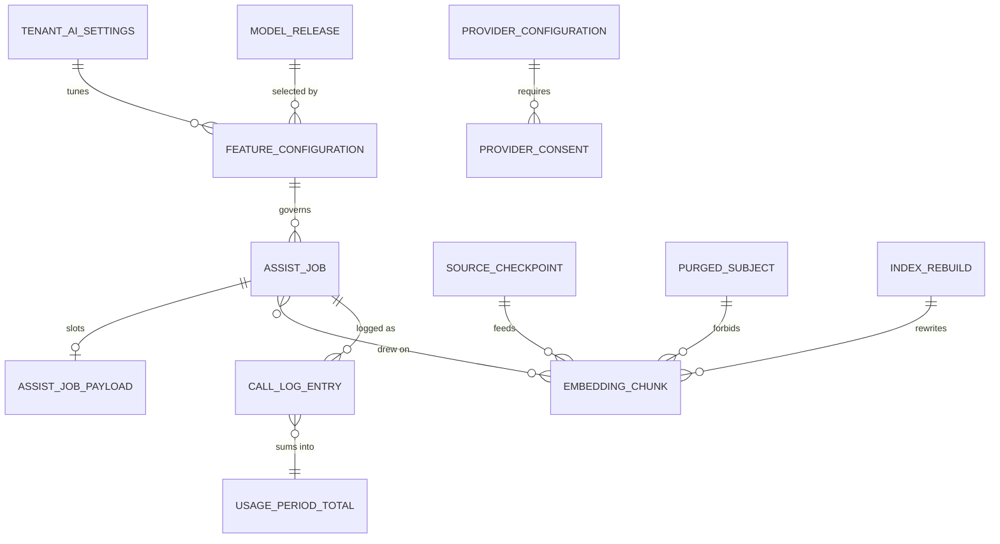
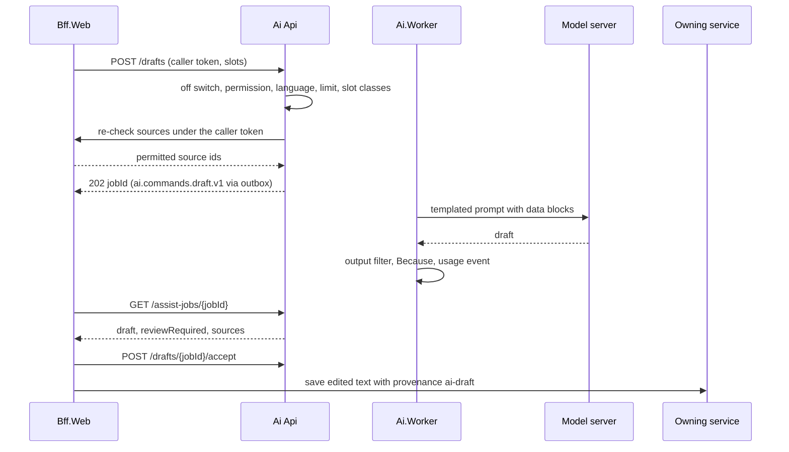

# Ai

> Service sheet, plan document 06, Group C. Names from Appendix L; events from Appendix E; permissions from Appendix B; error codes from Appendix K; settings categories from Appendix G. This sheet adds detail to reference architecture sheet 8.21 and never contradicts its table 8.0. The assist ladder, the per-feature rung and autonomy table, the gateway contract, the guardrails, the evaluation harness and the pgvector index design are owned by `25-ai-and-assist-ladder.md` and are cited by section, not restated. The AREA code is `AI`; the error prefix is `AI_` (Appendix K.21).

Ai is the one place in Nibras where a language model runs. It owns the model gateway (`IAssistGateway` over `Microsoft.Extensions.AI`, Ollama by default, vLLM at scale, one external adapter at rung 4), the embedding index in pgvector, retrieval that filters by the caller's data scope before it ranks, the prompt templates, the output checks, the rung 4 provider configuration and its tenant consent record, and the usage log that meters every call. It stores no draft: a draft is shown to the person who asked for it and lives on only if that person saves it in the owning service (Assessment, Communication, Academics). It never reads another service's database; its index is built from integration events and from reads authorized through the backends-for-frontends, and every chunk carries the tenant, the data scope and the source version of its record (master brief Section 25). It is off by default per tenant and per feature, and the product is complete without it (ADR-0015).

| Fact | Value (quoted from `05-service-catalog.md` and Appendix L) |
|---|---|
| Canonical name, long name | Ai, AI Assist |
| Tier | 2 |
| AREA code | `AI` |
| Database | `nibras_ai` with pgvector; schemas `ai` (assist jobs, configuration, usage, reference copies) and `ai_index` (chunks, checkpoints, rebuilds); application role `svc_ai`, migration role `mig_ai` |
| Exchange | `nibras.ai` |
| Images | `nibras/ai-api`, `nibras/ai-worker` |
| Worker | `Ai.Worker`: embedding, index rebuild and drafting jobs on `ai-worker.embeddings.bulk` and `ai-worker.drafts`, scaled from 0 by KEDA on queue depth and bounded by model hardware (`11-messaging-architecture.md` section 7) |
| gRPC package | `nibras.ai.v1` in `Nibras.Contracts.Ai/Grpc/ai.proto`, `Usage.Recount` only (section 6) |
| Build phase (master brief Section 28) | 5, subject to Section 27 decision 6; rung 1 and 2 features ship inside their owning services earlier (open question 5 of `01-questions-and-assumptions.md`) |
| Service level class (master brief Section 31) | Read-heavy |
| Sensitivity (Appendix J) | Inherits the class of each indexed source, never above Confidential; Sensitive and level S are never indexed |
| Synchronous dependency | none (table 8.0); reads through the backends-for-frontends only |
| Reached by | Bff.Web in-cluster; the Gateway never routes `/api/v1/ai/` from outside (`06-services/gateway.md`, `07-solution-structure.md` §2.4) |
| Why the boundary exists | Scaling: needs capable hardware that the rest of the platform must never depend on, and it is off by default |
| First-release option | Deferred under the Appendix L merge option; its keys and namespaces stay reserved, so consumers bind to nothing until it is deployed |

---

## 1. Responsibilities

| Owns | Detail |
|---|---|
| Model gateway | `AssistGateway`: the off switch, the permission check, the language check, the usage limit, the rung ceiling, the rung 4 consent gate, prompt assembly from a versioned template, the adapter call, output checks, the Because explanation and the metering event, in that order (`25-ai-and-assist-ladder.md` §3.1, §3.2); REQ-AI-001, REQ-AI-002, REQ-AI-008 |
| Feature registry | The `FeatureDescriptor` of every feature code of document 25 §2.3 with its rung ceiling, autonomy and `Touches` set; a call with an undeclared code is refused (document 25 §1.4) |
| Drafting | Report comments, messages and announcements, quiz questions and translations at autonomy 3, returned with `reviewRequired: true`; the acceptance and dismissal of a draft are recorded here (REQ-AI-007, REQ-AI-011, REQ-AI-012, REQ-AI-018) |
| Answering | The help assistant, the term summary, the constraint explanation phrasing and the morning brief phrasing at autonomy 1, each with sources (REQ-AI-013, REQ-AI-015, REQ-AI-016) |
| Query planning | Natural language to a `QueryPlan` over the list endpoints the caller may call; the plan is executed by Bff.Web under the caller's token, never by Ai (REQ-AI-014) |
| The embedding index | `ai_index.embedding_chunk` and its checkpoints, re-index on change, purge on withdrawal, rebuild on a model change, the 30-day retention of a disabled feature's chunks (document 25 §4; REQ-AI-005) |
| Retrieval | Scope resolution from the token, filter, rank, cut, per-source re-check, attach (document 25 §4.4; REQ-AI-006) |
| Guardrails | Data-block templates, the injection detector, read-only tools built per request from the caller's token, the slot classifier that refuses Sensitive and level S, the output filter (document 25 §5.1; REQ-AI-009) |
| Rung 4 provider configuration and consent | One provider per tenant, its region and field groups, the tenant-level consent record in the rung 4 category of `12-security-privacy-safety.md` §10.1, withdrawal on the next call (document 25 §3.3; REQ-AI-003) |
| Usage and review log | `ai.call_log` for 90 days with no prompt or output text, period totals per feature, `ai.usage.recorded.v1` once per call (document 25 §10; REQ-AI-010) |
| Model catalog | The model tags and template versions the deployment ships, each with its evaluation harness result; a tenant may select only a passing one (document 25 §6.3) |

## 2. Not responsible for

| Does not own | Owner | Why the line sits there |
|---|---|---|
| Storing a draft, a comment, a message or a question | Assessment, Communication, Academics | Ai returns the draft and forgets it within 15 minutes; the owning service stores it with provenance `ai-draft` and refuses to publish it unreviewed (REQ-ASM-025, TC-AI-201) |
| Executing a natural-language query | Bff.Web, through the owning services' list endpoints | The plan runs under the caller's token, so the owning service authorizes every row (document 25 §2.2) |
| Rung 2 models: early warning, anomaly hints, mastery next step, workload balance | Reporting, Assessment, Hr | ML.NET models load in their owning services and never pass through the language-model gateway (document 25 §3.1) |
| Bias monitoring and the disparity report | Reporting | Document 25 §5.3; Reporting owns the flags it monitors |
| Because panel storage of an override (`OverrideRecord`) | The service that produced the result | Document 25 §7; Ai records only the dismissal of its own drafts |
| The AI settings group (enabled features, provider choice, usage limits, review requirements) | Platform (ADR-0009) | Platform stores every Appendix G group; Ai keeps a copy from `platform.settings.changed.v1` |
| Plan limits, billing and the usage console | Platform | Platform consumes `ai.usage.recorded.v1` on `platform.usage` (`06-services/platform.md` §4.6, §5.4) |
| OCR-assisted data entry of Appendix A24 | Documents | REQ-DOC-009: Tesseract OCR lives in `Documents.Worker` |
| Machine translation for Communication's own translate action | Communication | Communication's translate endpoint is separate and returns `COMMUNICATION_TRANSLATION_UNAVAILABLE` without a provider (`06-services/communication.md` open point 6); Ai's `translation` feature is a drafting aid |
| Search over keywords and trigrams (rung 1 of the command palette) | Bff.Web and the owning services | Feature #11 is complete at rung 1 without Ai |
| Delivering any message, including the administrator alert on a blocked injection | Notification | Ai sends `RequestNotification` (open point 5) |
| Consent texts and their versions | Platform | `12-security-privacy-safety.md` §10.1; Ai stores the tenant's decision against a text version |
| The model servers themselves (Ollama, vLLM) | Deployment | Separate workloads in the `ai` compose profile and the Helm chart; Ai holds only clients (`15-deployment-and-operations.md`) |
| Wellbeing records, message bodies and any Sensitive or level S field | Wellbeing, Communication and their owners | Never indexed, never slotted (document 25 §4.2; BR-WEL-003) |

---

## 3. Requirements covered

| Range or identifier | What it binds here |
|---|---|
| REQ-AI-001 to REQ-AI-019 | Every row of the AI area in `03-requirements-catalog.md`; all Tier 2. REQ-AI-017 and REQ-AI-019 are rung 2 and bind Ai only through the Because contract and the metering event; their models live in Reporting |
| CAP-AI-01, CAP-AI-02 | The roadmap capabilities (`17-roadmap.md`) |
| REQ-ASM-025 | An AI-drafted comment is never published unreviewed; Ai sets `reviewRequired`, Assessment enforces it |
| REQ-RPT-011 | The Because panel on every automated result; Ai fills `BecauseExplanation` for rungs 3 and 4 |
| REQ-PLT-011, REQ-PLT-032 | Plan limits on AI usage; Ai degrades at its own limit and Platform enforces the plan quota |
| REQ-INT-019 | Graceful degradation when the AI provider is down |
| REQ-SEC-003, REQ-SEC-004, REQ-SEC-005, REQ-SEC-006, REQ-SEC-013, REQ-SEC-016 | Object-level authorization through the source re-check, the generated permission and tenant-isolation suites, no unnamed filter bypass, per-user rate limits on the assist endpoints |
| REQ-PRV-001, REQ-PRV-002 | Every column classified; the call log and the index purge are retention jobs |
| REQ-PERF-004, REQ-PERF-014, REQ-PERF-018, REQ-PERF-019, REQ-PERF-023 | Five-command handlers, keyset lists, `xmin`, caching only through the building block, nothing Sensitive cached |
| REQ-DATA-003, REQ-DATA-028 | Row-level security; per-tenant job concurrency for rebuilds and drafts |
| REQ-MSG-003, REQ-MSG-004, REQ-MSG-017, REQ-MSG-019 | Outbox, inbox, the `Ai.Worker` host, long jobs with progress and cancel |
| REQ-API-014, REQ-API-016, REQ-API-018 | `If-Match` on configuration, `Idempotency-Key` on submissions, 202 jobs for every model call |
| REQ-L10N-001, REQ-L10N-009 | Arabic and English only; Arabic folding (BR-L10N-001) on the lexical leg of ranking |

---

## 4. Aggregates and entities

**Common columns.** Every table below carries these unless its section says otherwise; the row `(common)` stands for them.

| Field | Type | Null | Notes |
|---|---|---|---|
| `tenant_id` | uuid | no | First column of every key and btree index; row-level security `tenant_isolation` with `WITH CHECK` (`10-data-architecture.md` §2.4) |
| `id` | uuid | no | UUID v7 |
| `created_at`, `created_by` | timestamptz, uuid | no, yes | Audit interceptor; `created_by` null for a job or consumer |
| `updated_at`, `updated_by` | timestamptz, uuid | no, yes | Audit interceptor |
| `deleted_at`, `deleted_by` | timestamptz, uuid | yes | Soft delete only on configuration rows; **never** on index, job or log rows, which are hard-deleted so a purge is real |
| `xmin` | xid (system column) | no | Optimistic concurrency token on every aggregate root |
| classification | attribute, not a column | | `[DataClass]` per column group; Ai holds no Sensitive column and no level S column (Appendix J; `12-security-privacy-safety.md` §6.2) |

Bilingual text is `LocalizedText` from `Nibras.BuildingBlocks.Localization`. Instants are `timestamptz` in UTC. Feature codes are the fourteen of document 25 §2.3, held as `text` and checked against `FeatureRegistry`. `07-solution-structure.md` §2.4 summarises the Domain as `IndexScope`, `Embedding`, `AssistSession`, `UsageRecord`; this sheet names them `ScopeTags`, `IndexedChunk`, `AssistJob`, `CallLogEntry`.

### 4.1 `IndexedChunk` (`ai_index.embedding_chunk`)

The columns, indexes and comments are document 25 §4.1 and are binding; they are listed here without their comments.

| Field | Type | Null | Notes |
|---|---|---|---|
| `id`, `tenant_id` | uuid, uuid | no | No audit user columns and no soft delete: chunks are written by the worker and replaced or deleted whole |
| `source_service`, `source_entity`, `source_id`, `source_version`, `chunk_no` | text, text, uuid, bigint, smallint | no | Unique `(tenant_id, source_service, source_entity, source_id, chunk_no)` |
| `language` | char(2) | no | `ar` or `en` |
| `data_class` | text | no | `public`, `internal` or `confidential` only; a check constraint refuses anything else |
| `scope_campus_id`, `scope_section_ids`, `scope_student_ids` | uuid, uuid[], uuid[] | campus nullable | `ScopeTags` value object |
| `required_permission` | text | no | An Appendix B permission string from the permission registry |
| `content_folded` | text | no | Chunk text after `nibras_ar_fold`; at most 400 tokens with a 40-token overlap |
| `embedding`, `embedding_model` | vector(1024), text | no | |
| `indexed_at`, `purge_after` | timestamptz | no, yes | |
| (partitioning) | | | Hash by `tenant_id` into 8 partitions (`10-data-architecture.md` §5); the HNSW index is per partition |

Invariants: a chunk is written only when its `source_version` is greater than the stored one for the same key, so a replay never regresses the index (TC-AI-606); `data_class` is never Sensitive or S and a source whose class is above Confidential is refused before embedding (`AI_SENSITIVE_CONTEXT_REFUSED`, TC-PRV-044); no chunk is written whose `scope_student_ids` meets a live `PurgedSubject` row (TC-AI-605); every chunk of one source is replaced in one transaction, never partly; `required_permission` exists in the registry; outside a running rebuild every chunk of a tenant carries the tenant's current `embedding_model`.

### 4.2 `SourceCheckpoint` (`ai_index.source_checkpoint`)

| Field | Type | Null | Notes |
|---|---|---|---|
| `tenant_id`, `source_service`, `source_entity` | uuid, text, text | no | Primary key, per document 25 §4.1 |
| `last_event_at` | timestamptz | no | `occurredAt` of the last applied change |
| `last_full_read` | timestamptz | yes | Completion of the last authorized bulk read |
| `feed_cursor` | text | yes | Opaque cursor returned by the Bff.Web source feed (section 9) |
| `records_indexed`, `last_error_code`, `paused` | int, text, boolean | no, yes, no | Health shown on `GET /index/status`; `paused` while the feature that uses the stream is off |

Invariants: `last_event_at` never moves backwards; a stream whose feature codes are all disabled is `paused` and fetches nothing.

### 4.3 `PurgedSubject` (`ai_index.purged_subjects`)

| Field | Type | Null | Notes |
|---|---|---|---|
| `tenant_id`, `student_id` | uuid, uuid | no | Unique per tenant |
| `to_status`, `effective_on`, `purged_at`, `chunks_deleted` | text, date, timestamptz, int | no | From `school.student.status-changed.v1` |
| `reinstated_at` | timestamptz | yes | Set when a later status change returns the student to `enrolled`; indexing resumes on the next sync |

Invariants: a row exists for every student whose latest status is `withdrawn`, `transferred`, `never-attended`, `graduated` or `alumni`; its chunks are deleted in the consumer's transaction (REQ-AI-005, TC-SEC-325); the row holds no name and no text.

### 4.4 `IndexRebuild` (`ai_index.index_rebuilds`)

| Field | Type | Null | Notes |
|---|---|---|---|
| (common) | | | |
| `scope_kind`, `source_entity`, `feature_code` | text enum (`tenant`, `source-entity`, `feature`), text, text | kind no, others yes | What is rebuilt |
| `reason` | text enum (`model-changed`, `requested`, `provisioning`, `feature-enabled`, `reconciliation`, `tier-migration`) | no | |
| `embedding_model` | text | no | The model the new chunks carry |
| `status` | text enum (`queued`, `running`, `completed`, `failed`, `cancelled`) | no | |
| `job_id` | uuid | no | The `Nibras.BuildingBlocks.Jobs` resource |
| `documents_total`, `documents_done`, `chunks_written` | int | no | Progress |
| `started_at`, `completed_at` | timestamptz | yes | `duration` on the event is their difference |

Invariants: at most one `queued` or `running` rebuild per tenant; old-model chunks are served until the new set is complete and are deleted in the completing transaction (blue-green by `embedding_model`); `completed` publishes `ai.index.rebuild-completed.v1` exactly once; a cancelled or failed rebuild leaves the previous chunks untouched.

### 4.5 `AssistJob` (`ai.assist_jobs`) with `AssistJobPayload`

| Field | Type | Null | Notes |
|---|---|---|---|
| (common) | | | |
| `feature_code`, `operation` | text, text enum (`draft`, `ask`, `plan-query`, `translate`) | no | Operation maps to the four methods of `IAssistGateway` |
| `requested_by` | uuid | no | The only user who may read the result |
| `language` | char(2) | no | `ar` or `en`; anything else is refused before the row exists |
| `rung_ceiling`, `rung_used`, `autonomy` | smallint | no, yes, no | From the descriptor and the tenant configuration; `rung_used` 1, 3 or 4 |
| `status` | text enum (`queued`, `running`, `succeeded`, `degraded`, `refused`, `failed`, `cancelled`) | no | |
| `outcome_code` | text | yes | `AI_OUTPUT_REQUIRES_REVIEW` on every draft; the refusal or degradation code otherwise |
| `review_required` | boolean | no | Set by the gateway from the autonomy, never from model output (document 25 §5.2 PI-10) |
| `source_chunk_ids` | uuid[] | no | Chunks that survived the re-check at submission |
| `idempotency_key` | text | yes | Unique per `(tenant_id, requested_by)` for 24 hours |
| `correlation_id` | uuid | no | |
| `result_json` | jsonb | yes | `AssistOutcome<T>` including `BecauseExplanation`; Confidential; deleted on first read or 15 minutes after completion |
| `accepted_by`, `accepted_at`, `edit_ratio` | uuid, timestamptz, numeric(4,3) | yes | Acceptance of a draft; `edit_ratio` is the normalised edit distance reported by the client, no text |
| `dismissed_by`, `dismissed_at`, `dismiss_reason_code` | uuid, timestamptz, text | yes | Dismissal; publishes `ai.suggestion.rejected.v1` |
| payload: `job_id`, `input_slots` | uuid, jsonb | no | `assist_job_payloads`; the template slots, Confidential, deleted when the job leaves `running` |

Invariants: `rung_used ≤ rung_ceiling`; `rung_used = 4` only if an active `ProviderConsent` exists at submission and again at execution; a job whose descriptor has autonomy 4 and `Touches` a grade, a payment or a family message cannot be created (TC-SEC-324); every `draft` and `translate` job has `review_required = true`; `result_json` is readable only by `requested_by` and is null after the first read or after 15 minutes; a slot tagged Sensitive or S is refused before the row is written (`AI_SENSITIVE_CONTEXT_REFUSED`); acceptance and dismissal are mutually exclusive and each happens at most once.

### 4.6 `FeatureConfiguration` (`ai.feature_configurations`)

| Field | Type | Null | Notes |
|---|---|---|---|
| (common) | | | |
| `feature_code` | text | no | Unique per tenant |
| `template_version` | text | no | A version shipped in `Templates/` that passed the harness |
| `chat_model_tag` | text | yes | Null for rung 2 codes; must be a passing `ModelRelease` |
| `rung_ceiling` | smallint | no | May only lower the descriptor's ceiling |
| `prefer_external` | boolean | no | True sends the feature to the rung 4 adapter when consent exists |

Invariants: `rung_ceiling` never exceeds the descriptor; `prefer_external` is refused for a feature whose descriptor ceiling is below 3 (REQ-AI-003); a template or model without a passing harness record is refused (`AI_VALIDATION_FAILED`). Whether a feature is enabled is not here: it is the Appendix G AI "enabled features" value in `ref_ai_settings`.

### 4.7 `ProviderConfiguration` (`ai.provider_configurations`) and `ProviderConsent` (`ai.provider_consents`)

| Field | Type | Null | Notes |
|---|---|---|---|
| (common) | | | |
| provider: `provider_code`, `region`, `endpoint_url`, `credential_ref`, `allowed_feature_codes`, `allowed_field_groups`, `status`, `enabled_at`, `disabled_at` | text, text, text, text, text[], text[], text enum (`draft`, `active`, `disabled`), timestamptz, timestamptz | dates nullable | One row per tenant; `credential_ref` is an OpenBao path, never the key (`12-security-privacy-safety.md` provider keys row) |
| consent: `provider_code`, `region`, `field_groups`, `consent_text_version`, `decision`, `decided_by`, `decided_at`, `withdrawn_by`, `withdrawn_at` | text, text, text[], text, text enum (`granted`, `withdrawn`), uuid, timestamptz, uuid, timestamptz | withdrawal nullable | Append-only; kept for the life of the record plus 7 years (Appendix J consent row) |

Invariants: `active` requires a `granted` consent naming the same provider, region and a superset of the field groups (TC-SEC-323); `allowed_feature_codes` holds only codes whose descriptor ceiling is 3 or more; a withdrawal is a new state on the consent, never a delete, and the gateway refuses rung 4 from the next call; field groups never include a Sensitive or S group; changing the provider or region requires a new consent.

### 4.8 `CallLogEntry` (`ai.call_log`) and `UsagePeriodTotal` (`ai.usage_period_totals`)

| Field | Type | Null | Notes |
|---|---|---|---|
| log: `tenant_id`, `id`, `at`, `feature_code`, `rung`, `caller_user_id`, `job_id`, `source_ids`, `latency_ms`, `outcome`, `outcome_code`, `tokens_in`, `tokens_out`, `model_tag`, `template_version`, `provider_code`, `left_infrastructure` | uuid, uuid, timestamptz, text, smallint, uuid, uuid, uuid[], int, text enum (`ok`, `degraded`, `refused`, `injection-blocked`, `output-filtered`, `failed`), text, int, int, text, text, text, text[] | job, provider, left nullable | Append-only; no audit user columns; partitioned by month, dropped after 90 days (document 25 §10); **no prompt, output or chunk text** |
| total: `tenant_id`, `feature_code`, `period_start`, `tokens_in`, `tokens_out`, `calls`, `degraded_calls` | uuid, text, date, bigint, bigint, int, int | no | Unique `ux_usage_period_totals`; the row each call updates (document 21 §3.20 query 3) |

Invariants: one log row and one `ai.usage.recorded.v1` per gateway call, in the same transaction (TC-AI-609); the monthly total equals the sum of the month's log rows (checked by `Usage.Recount`, TC-AI-635); `caller_user_id` is kept for review but never leaves the service in an event (document 25 §10 payload rule).

### 4.9 `ModelRelease` (`ai.model_releases`, deployment-scoped)

| Field | Type | Null | Notes |
|---|---|---|---|
| `model_tag`, `kind`, `server`, `harness_run_id`, `passed`, `scores`, `released_at` | text, text enum (`chat`, `embedding`), text enum (`ollama`, `vllm`, `external`), text, boolean, jsonb (per feature code and language), timestamptz | no | Loaded from the release artefact of the `ai-eval` stage; the one table without `tenant_id`, readable by every tenant, writable only by `mig_ai` |

Invariants: a `passed = false` release cannot be selected; a new tag or template version is a release and reruns the harness (document 25 §6.3).

### 4.10 Reference copies

`ref_ai_settings` (per tenant: enabled feature codes, provider choice, usage limit per feature per month, review requirements, `source_version`, `reconciled_at`), `ref_settings` (*General*: languages, default language, time zone), `ref_tenant_state` (status, plan code, the `ai` feature flags). Section 9 says how they stay current.



---

## 5. REST API

All paths are under `/api/v1/ai/`, reached only by Bff.Web inside the cluster with the caller's token forwarded; the Gateway refuses the prefix from outside. Every endpoint may also return the eight K.1 codes with the `AI_` prefix; the Errors column names the Ai codes and the K.1 codes with a specific meaning. Lists use keyset pagination with a page cap of 100.

**The degradation rule** (document 25 §1.4, §8). An assist endpoint never answers a model, limit or consent problem with an HTTP error. When the feature is on but the model is down, its circuit is open, the usage limit is reached or rung 4 consent is withdrawn, the endpoint answers **200** with an `AssistOutcome` at rung 1 (the template, the comment bank reference, or a blank field with guidance), `degraded: true` and `degradedReason` set to `AI_MODEL_UNAVAILABLE`, `AI_USAGE_LIMIT_REACHED` or `AI_DISABLED_FOR_TENANT`. HTTP errors are reserved for the caller's own request: validation, permission, a feature switched off (`AI_DISABLED_FOR_TENANT`, 403, so the client hides the entry point), a language other than Arabic or English, and a Sensitive or out-of-scope subject. The 402 of `AI_USAGE_LIMIT_REACHED` in Appendix K.21 is therefore never sent by an assist endpoint (open point 3).

**Why model calls are jobs.** Rung 3 drafting runs at p95 up to 8 seconds (document 25 §6.2), so every model call answers **202** with the assist job (REQ-API-018). Drafts and translations run on `Ai.Worker`; asks and query plans run as in-process jobs in the Api host because their read tools execute under the caller's token, which is held in memory for the life of the job and never persisted (decision 4). Bff.Web may hold the request up to its own deadline and return the finished result in the same response.

### 5.1 Assist

| Method | Path | Permission | Request | Response | Errors | Idempotent |
|---|---|---|---|---|---|---|
| POST | `/api/v1/ai/drafts` | `ai.drafting.use` | `AssistRequest` (`featureCode` one of `report-comment-draft`, `message-draft`, `quiz-suggestion`; `inputs` as template slots; `language`; `correlationId`) | 202 `{ jobId, location }`; or 200 degraded `AssistOutcome<Draft>` at rung 1 | `AI_DISABLED_FOR_TENANT`, `AI_LANGUAGE_UNSUPPORTED`, `AI_SENSITIVE_CONTEXT_REFUSED` (a slot tagged Sensitive or S), `AI_SCOPE_VIOLATION_BLOCKED` (a subject outside the caller's scope), `AI_VALIDATION_FAILED` (unknown feature code, missing slot, slot over its length) | by `Idempotency-Key` |
| POST | `/api/v1/ai/translations` | `ai.drafting.use` | `AssistRequest` with `featureCode = translation`, `inputs.text`, `inputs.targetLanguage` | 202 job; or 200 degraded (the bilingual editor with guidance) | `AI_DISABLED_FOR_TENANT`, `AI_LANGUAGE_UNSUPPORTED`, `AI_VALIDATION_FAILED` (text over 4,000 characters) | by `Idempotency-Key` |
| POST | `/api/v1/ai/asks` | `ai.assistant.use` | `AssistRequest` with `featureCode` one of `help-assistant`, `term-summary`, `constraint-explanation`, `morning-brief-phrasing` | 202 job; 200 immediately on a help-assistant cache hit or when degraded | `AI_DISABLED_FOR_TENANT`, `AI_LANGUAGE_UNSUPPORTED`, `AI_SENSITIVE_CONTEXT_REFUSED` (a term summary that would need level S), `AI_SCOPE_VIOLATION_BLOCKED` (a student outside scope) | by `Idempotency-Key` |
| POST | `/api/v1/ai/query-plans` | `ai.assistant.use` | `AssistRequest` with `featureCode` one of `nl-query`, `nl-search`; `inputs.question` | 202 job whose result is a `QueryPlan` over permitted list endpoints; the plan is never broader than the caller's scope | `AI_DISABLED_FOR_TENANT`, `AI_LANGUAGE_UNSUPPORTED`; a plan narrowed to scope carries `AI_SCOPE_VIOLATION_BLOCKED` in its warnings, not as an HTTP error | by `Idempotency-Key` |
| GET | `/api/v1/ai/assist-jobs/{jobId}` | `ai.drafting.view` for draft and translate jobs, `ai.assistant.view` for ask and plan jobs; the requester only | none | `{ status, outcome }` with `AssistOutcome<T>` once; drafts carry `AI_OUTPUT_REQUIRES_REVIEW` and `reviewRequired: true`; a refused job carries `AI_PROMPT_INJECTION_BLOCKED` or `AI_EXPLANATION_REQUIRED` | `AI_NOT_FOUND` for another user, after the first read, or after 15 minutes | yes; the second read returns `AI_NOT_FOUND` |
| POST | `/api/v1/ai/assist-jobs/{jobId}/cancel` | the requester, with the permission that created it | `{}` | `cancelled`; an in-flight model call completes and its result is discarded | `AI_VALIDATION_FAILED` (terminal job) | yes |
| POST | `/api/v1/ai/drafts/{jobId}/accept` | `ai.drafting.accept-draft` | `{ editRatio, targetService, targetId }` | 200 `{ provenance: ai-draft, acceptedBy, acceptedAt }`; `ai.audit.recorded.v1`; the owning service stores the edited text (REQ-AI-011, TC-AI-201) | `AI_PERMISSION_DENIED` (without `accept-draft`), `AI_VALIDATION_FAILED` (already dismissed or accepted) | yes, by `jobId` |
| POST | `/api/v1/ai/drafts/{jobId}/dismiss` | `ai.drafting.use` | `{ reasonCode }` from the dismissal dialog | 204; `ai.suggestion.rejected.v1` once | `AI_VALIDATION_FAILED` (already accepted) | yes, by `jobId` |
| GET | `/api/v1/ai/features` | `ai.assistant.view` | none | Per feature code: enabled, rung ceiling, autonomy, current rung available (model healthy, limit left, consent), the fallback the client shows; Bff.Web uses it to hide entry points | none specific | yes |

### 5.2 Configuration and consent

| Method | Path | Permission | Request | Response | Errors | Idempotent |
|---|---|---|---|---|---|---|
| GET | `/api/v1/ai/configuration` | `ai.configuration.view` | none | Feature configurations joined with the Appendix G AI values from `ref_ai_settings`, the provider status and the consent state | none specific | yes |
| PUT | `/api/v1/ai/configuration/features/{featureCode}` | `ai.configuration.configure` | `{ templateVersion, chatModelTag, rungCeiling, preferExternal }` | `FeatureConfigurationDto`; `ai.audit.recorded.v1` | `AI_VALIDATION_FAILED` (no passing harness record, ceiling above the descriptor, `preferExternal` on a rung 1 or 2 code), `AI_CONCURRENCY_CONFLICT` | with `If-Match` |
| GET | `/api/v1/ai/models` | `ai.configuration.view` | `kind` | Model releases with harness scores per feature and language | none specific | yes |
| GET | `/api/v1/ai/configuration/provider` | `ai.configuration.view` | none | Provider code, region, field groups, allowed feature codes, status; never the credential | `AI_NOT_FOUND` (none configured) | yes |
| PUT | `/api/v1/ai/configuration/provider` | `ai.configuration.set-provider` (elevated, reason recorded) | `{ providerCode, region, endpointUrl, credentialRef, allowedFeatureCodes, allowedFieldGroups, reason }` | provider in `draft`, or `active` when a matching consent exists | `AI_VALIDATION_FAILED` (a Sensitive field group, a rung 1 or 2 feature code), `AI_CONCURRENCY_CONFLICT` | with `If-Match` |
| POST | `/api/v1/ai/configuration/provider/disable` | `ai.configuration.set-provider` | `{ reason }` | `disabled`; the next call falls to rung 3 or rung 1 | `AI_NOT_FOUND` | `Idempotency-Key` required |
| POST | `/api/v1/ai/configuration/provider/consents` | `ai.configuration.set-provider` | `{ providerCode, region, fieldGroups, consentTextVersion }` | 201 `granted`; activates a matching `draft` provider; audited (T-AI-04) | `AI_VALIDATION_FAILED` (unknown text version, Sensitive field group) | by `Idempotency-Key` |
| POST | `/api/v1/ai/configuration/provider/consents/{id}/withdraw` | `ai.configuration.set-provider` | `{ reason }` | `withdrawn`; the provider becomes `disabled` in the same transaction | `AI_VALIDATION_FAILED` (already withdrawn) | `Idempotency-Key` required |

### 5.3 Index

| Method | Path | Permission | Request | Response | Errors | Idempotent |
|---|---|---|---|---|---|---|
| GET | `/api/v1/ai/index/status` | `ai.configuration.view` | none | Per source stream: chunks, last event, last full read, paused, last error; current embedding model; running rebuild | none specific | yes |
| POST | `/api/v1/ai/index/rebuilds` | `ai.configuration.edit` | `{ scopeKind, sourceEntity, featureCode, reason }` | 202 job; `ai.commands.rebuild-index.v1`; `ai.index.rebuild-completed.v1` on completion | `AI_VALIDATION_FAILED` (a rebuild already running), `AI_DISABLED_FOR_TENANT` | by `Idempotency-Key` |
| GET | `/api/v1/ai/index/rebuilds/{id}` | `ai.configuration.view` | none | `IndexRebuildDto` with progress | `AI_NOT_FOUND` | yes |

### 5.4 Usage

| Method | Path | Permission | Request | Response | Errors | Idempotent |
|---|---|---|---|---|---|---|
| GET | `/api/v1/ai/usage` | `ai.usage.view` | `periodStart` | Per feature: calls, tokens, degraded calls, limit and remaining from `ref_ai_settings` | none specific | yes |
| GET | `/api/v1/ai/usage/calls` | `ai.usage.view` | `featureCode`, `from`, `to`, `outcome`, `callerUserId` | Call log rows keyset on `(at, id)`; no text | `AI_VALIDATION_FAILED` (window over 31 days) | yes |
| POST | `/api/v1/ai/usage/export` | `ai.usage.export` | `{ from, to, format }` | 202 job; CSV through the Files building block; Confidential class, logged on export (Appendix J.1) | `AI_VALIDATION_FAILED` (window over 90 days) | by `Idempotency-Key` |

### 5.5 Jobs

| Method | Path | Permission | Request | Response | Errors | Idempotent |
|---|---|---|---|---|---|---|
| GET | `/api/v1/ai/jobs/{jobId}` | `platform.jobs.view`, or the starter | none | Job resource with progress for rebuilds and usage exports | `AI_NOT_FOUND` | yes |
| POST | `/api/v1/ai/jobs/{jobId}/cancel` | `platform.jobs.cancel`, or the starter | `{}` | `cancelRequested` | `AI_VALIDATION_FAILED` for a terminal job | yes |

Rate limits (REQ-SEC-016): 20 assist submissions per user per minute and 300 per tenant per minute, `AI_RATE_LIMITED` with `Retry-After`; these sit under the plan quota Platform enforces.

---

## 6. gRPC

**Consumed: none.** Table 8.0 gives Ai no synchronous dependency. Its only outbound calls are HTTP to Bff.Web's internal routes (the source feed, the source re-check and the read tools, section 9 and open point 1) and to the model servers; neither is a service-to-service gRPC hop.

| Outbound call | Purpose | Deadline | Fallback |
|---|---|---|---|
| Local model server (Ollama or vLLM) through `IChatClient` | Rung 3 generation | 15 s, no retry (document 25 §8) | Rung 1 outcome |
| External provider through `ExternalProviderChatClient` | Rung 4 generation | 20 s, one retry | Rung 3 if a local model is configured, else rung 1 |
| Embedding server through `IEmbeddingGenerator` | Embeddings for indexing and for the question | 5 s per batch of 32 chunks; 1 s for a question | Indexing retries on the bulk lane; a question falls back to lexical ranking only |
| Bff.Web source re-check | Re-authorize the sources of up to 8 chunks under the caller's token (document 25 §4.4 step 5) | 800 ms | A chunk not confirmed is dropped; no chunk survives means a rung 1 outcome |
| Bff.Web read tools | A read-only list or get the model requested, under the caller's token | 2 s per call, at most 3 calls per job | The tool result is empty and the answer says so |
| Bff.Web source feed | Changed records since a cursor, under the Ai service credential limited per source entity | 10 s per page of 200 | The stream keeps its cursor and retries on the next run |

**Exposed: `nibras.ai.v1`**, never on a request path.

| Service | Method | Returns | Deadline | Callers | Budget |
|---|---|---|---|---|---|
| `Usage` | `Recount(meter, period_start, period_end)` | Calls and tokens per feature from `ai.call_log` for the period | 30 s | Platform `UsageRecountJob` (`06-services/platform.md`, BR-PLT-005) | 2 commands |

`IAssistGateway` is a C# contract in `Nibras.Contracts.Ai`; Bff.Web calls it through a typed HTTP client over section 5, not over gRPC (decision 3).

---

## 7. Events published and consumed

Payload fields are owned by Appendix E and are not restated here.

### 7.1 Published on `nibras.ai`

| Routing key | Raised by | Partition key | Consumers (Appendix E) |
|---|---|---|---|
| `ai.usage.recorded.v1` | Every gateway call at rung 3 or 4, and every degraded call, in the call's transaction (document 25 §10) | `tenantId` | Platform |
| `ai.index.rebuild-completed.v1` | `IndexRebuild` reaching `completed` | `tenantId` | Platform, Reporting |
| `ai.suggestion.rejected.v1` | `POST /drafts/{jobId}/dismiss`, and a draft whose job was cancelled after completion | `tenantId` | Reporting |
| `ai.audit.recorded.v1` | Configuration and provider changes, consent grant and withdrawal, draft acceptance, rebuild requests, usage exports, every `AI_PROMPT_INJECTION_BLOCKED` and `AI_SCOPE_VIOLATION_BLOCKED` | `tenantId` | Audit |

Worker jobs Ai sends to itself on `nibras.ai` (document 11 §2.4, §2.5): `ai.commands.index-source.v1` and `ai.commands.rebuild-index.v1` into `ai-worker.embeddings.bulk`, and `ai.commands.draft.v1` into `ai-worker.drafts` for draft and translate jobs. Commands and replies Ai sends to others: `RequestNotification` (`notification.commands.request-notification.v1`) for the administrator alert on a blocked injection (open point 5), and the tenant-lifecycle replies to Platform. The cross-cutting `<service>.usage.recorded.v1` is `ai.usage.recorded.v1` itself; Ai publishes no second meter.

### 7.2 Consumed

| Routing key or command | Queue | Handler | What it changes |
|---|---|---|---|
| `platform.tenant.provisioning-requested.v1` | `ai.tenant-lifecycle` | `TenantLifecycleConsumer` | Creates the tenant's `feature_configurations` at the shipped template versions, `ref_ai_settings` with every feature off, the help-corpus checkpoints; replies `TenantProvisioned` |
| `platform.tenant.suspended.v1`, `platform.tenant.reactivated.v1` | `ai.tenant-lifecycle` | `TenantLifecycleConsumer` | Suspended: every assist call answers `AI_DISABLED_FOR_TENANT`, streams pause; reactivated: resume |
| `platform.tenant.deletion-requested.v1` | `ai.tenant-lifecycle` | `TenantLifecycleConsumer` | Stops indexing and assist for the tenant at once; data waits for `DeleteTenantData` |
| `platform.tenant.deleted.v1` | `ai.tenant-lifecycle` | `TenantLifecycleConsumer` | Deletes every row of the tenant in every table (document 25 §4.3, TC-PLT-026) |
| `platform.plan.changed.v1` | `ai.tenant-lifecycle` | `TenantLifecycleConsumer` | Evicts the configuration entry so the next call reads the plan's AI allowance |
| `platform.feature-flag.changed.v1` | `ai.tenant-lifecycle` | `TenantLifecycleConsumer` | A feature turned on unpauses its streams and queues a `feature-enabled` rebuild for them; turned off pauses them and sets `purge_after = now + 30 days` on chunks only that feature uses (document 25 §4.3) |
| `platform.settings.changed.v1` | `ai.tenant-lifecycle` | `SettingsChangedConsumer` | `ref_ai_settings` for scope `ai` (enabled features, provider choice, usage limits, review requirements); `ref_settings` for *General*; evicts `nibras:{tenant}:ai:config:current:v1` |
| `platform.terminology.changed.v1`, `platform.custom-field.changed.v1` | `ai.tenant-lifecycle` | `TenantLifecycleConsumer` | Terminology: evicts the prompt template cache so templates render the tenant's labels; custom fields: nothing, because custom-field values are not indexed |
| `identity.role.changed.v1`, `identity.permissions.changed.v1` | `ai.tenant-lifecycle` | `PermissionsChangedConsumer` | Evicts the user's retrieval entries by tag `user`; nothing in the index (document 25 §4.3, TC-SEC-321) |
| `reporting.data-quality.issue-detected.v1` | `ai.tenant-lifecycle` | `DataQualityIssueConsumer` | Acts only on `ruleCode = reference-copy-mismatch` for an Ai stream: resets the stream's cursor and queues a `reconciliation` rebuild of that source entity |
| `school.student.status-changed.v1` | `ai.events` | `StudentStatusChangedConsumer` | `toStatus` of `withdrawn`, `transferred`, `never-attended`, `graduated` or `alumni`: deletes every chunk whose `scope_student_ids` contains the student and writes `PurgedSubject`, in the consumer's transaction (REQ-AI-005, TC-SEC-325); back to `enrolled`: sets `reinstated_at` |
| `DeprovisionTenant`, `DeleteTenantData`, `ProvisionDedicatedDatabase`, `DropDedicatedDatabase`, `CopyTenantRows`, `ReconcileTenantCopy`, `PurgeSourceRows`, `ReplayParkedMessages`, `DiscardParkedMessages` from `nibras.platform` | `ai.commands` | `TenantLifecycleCommandHandler` | Sagas 1, 2 and 10; long commands start a job and acknowledge at once. `CopyTenantRows` copies configuration, consent and the call log but not the index, which is rebuilt at the target with reason `tier-migration`, as it is after a single-tenant restore (`10-data-architecture.md` §9.1 row 18) |
| `ai.commands.index-source.v1` | `ai-worker.embeddings.bulk` (worker) | `IndexSourceHandler` | Reads one source record through the Bff.Web feed, chunks, embeds, replaces its chunks if the version is newer |
| `ai.commands.rebuild-index.v1` | `ai-worker.embeddings.bulk` (worker) | `RebuildIndexHandler` | Runs an `IndexRebuild` with progress, then swaps model generations |
| `ai.commands.draft.v1` | `ai-worker.drafts` (worker) | `DraftHandler` | Runs a draft or translate `AssistJob` through the gateway pipeline and writes its result |

Ai does not bind the change events of indexed sources (`communication.announcement.published.v1`, `assessment.report-cards.published.v1`, `academics.lesson-plan.submitted.v1`, `attendance.attendance.marked.v1`, `behavior.incident.recorded.v1`) nor `school.student.section-changed.v1`; document 11 open point 7 keeps indexing on the Bff.Web read path, and `IndexSyncJob` picks up changes and re-tags by pulling the feed (open point 2).

---

## 8. Sagas and workflows

Ai orchestrates no saga (document 13 section 1: exactly ten sagas) and owns no workflow: Appendix R has no `WF-AI-…` entry and document 31 names no Ai state type. The assist job's status is an operational lifecycle, not a business workflow, and is enforced by the `AssistJob` aggregate.

| WF or saga | Role | Kind (document 13) | State type (document 31) | Feature folder | What Ai does |
|---|---|---|---|---|---|
| Saga 1 Tenant provisioning | Participant | Saga step | none here | `Application/Features/TenantLifecycle/` | Creates tenant rows; compensation `DeprovisionTenant` deletes them |
| Saga 2 Tenant deletion | Participant | Saga step | none here | `Application/Features/TenantLifecycle/` | `DeleteTenantData` deletes every row and replies with row counts per table |
| Saga 10 Tier migration | Participant | Saga step | none here | `Application/Features/TenantLifecycle/` | Copies configuration, consent and log; rebuilds the index at the target instead of copying it |
| WF-PLT-03 Suspension, export, and deletion | Touched | Single | none here | `Application/Consumers/TenantLifecycleConsumer.cs` | Reacts to suspension and deletion as section 7.2 states |
| WF-PRV-01 Data subject access request | Touched | Single | none here | none | Ai holds no subject-level record a guardian can request beyond `PurgedSubject` and call-log source ids; a request is answered with "no stored AI content" plus the call-log rows naming the student's sources, exported by `ExportUsage` |

**The draft path**, which is the shape of every rung 3 feature:



---

## 9. Local reference copies

| Copy | Source | Fields kept | Reconciliation | Staleness tolerated |
|---|---|---|---|---|
| `ai_index.embedding_chunk` | The Bff.Web source feed per stream, pulled by `IndexSyncJob`; help articles from the release artefact | Document 25 §4.1 | Nightly `IndexReconciliationJob`: per stream, count and maximum `source_version` against the feed's summary; a mismatch resets the cursor and queues a `reconciliation` rebuild of the entity | 15 minutes for Internal and Confidential sources; one release for help articles |
| Purge state (`purged_subjects`) | `school.student.status-changed.v1` | student, status, dates | Not reconciled; the event is the trigger and the chunk write refuses purged students | Seconds; 60 s is the REQ-AI-005 bound |
| `ref_ai_settings`, `ref_settings` | `platform.settings.changed.v1` | Appendix G AI and *General* values | Nightly against Platform | Minutes |
| `ref_tenant_state` | tenant-lifecycle keys and `platform.feature-flag.changed.v1` | status, plan code, flags | Nightly against Platform | Minutes |

The source streams and what each carries (document 25 §4.2): help articles (Public), announcements (Internal), report-card comments and marks summaries (Confidential), lesson plans (Internal), weekly attendance summaries per student (Internal), behavior categories without restricted narratives (Confidential). Message bodies, Wellbeing and every Sensitive or level S field are never requested from the feed; the Ai service credential grants no read of them (T-AI-03). Every copy row carries `source_version` and applies a change only when it is newer (`10-data-architecture.md` §6 rules 2 and 3).

---

## 10. Background jobs

Scheduled jobs run in the Api host under Quartz.NET, because `Ai.Worker` scales to zero and a trigger on a stopped replica would never fire; they queue work that wakes the worker. Queue handlers run in the worker. Every job iterates tenants with the tenant variable set per iteration and skips a tenant whose AI features are all off; Quartz clustering runs each trigger on one replica.

| Job | Host | Schedule | What it does | Publishes | Progress |
|---|---|---|---|---|---|
| `IndexSyncJob` | Api | Every 15 minutes, 06:00 to 20:00 tenant time zone; hourly outside | Per unpaused stream, pulls changed records since the cursor from the Bff.Web feed and queues one `ai.commands.index-source.v1` per record; scope changes re-tag without re-embedding | `ai.commands.index-source.v1` | none |
| `HelpCorpusLoadJob` | Api | At start-up when the shipped corpus version differs, and at provisioning | Queues the help articles and the administrator manual for the tenant | `ai.commands.index-source.v1` | "Help corpus: 120 of 480 articles" |
| `IndexPurgeJob` (`ai-index-purge`) | Api | Nightly 01:30 band time zone | Deletes chunks at or past `purge_after`, chunks of a feature off for 30 days, chunks of an embedding model no longer current outside a rebuild | `ai.audit.recorded.v1` with counts | none |
| `AssistResultSweepJob` | Api | Every 5 minutes | Nulls `result_json` older than 15 minutes, deletes payloads of terminal jobs, deletes jobs older than 24 hours | none | none |
| `ModelHealthProbeJob` | Api | Every 30 s | Probes the chat and embedding endpoints; writes the circuit state to `redis-state` so the gateway degrades in under 50 ms without a call | `ai.audit.recorded.v1` on a state change | none |
| `IndexReconciliationJob` | Api | Nightly 02:00 band time zone | Section 9 | `reporting.data-quality.issue-detected.v1` on a mismatch (Appendix E jobs table) | none |
| `PartitionMaintenanceJob` | Api | Nightly | Creates next month's `call_log` partition and drops partitions older than 90 days | none | none |
| `InvariantAuditJob` | Api | Nightly 03:00 band time zone | 1 percent sample: period totals against the log, chunk models against the tenant's model, no chunk for a purged student | a finding on a mismatch | none |
| `IndexSourceHandler` | Worker | On `ai.commands.index-source.v1` | Read, fold, chunk, classify, embed, replace | none | none |
| `RebuildIndexHandler` | Worker | On `ai.commands.rebuild-index.v1` | Pages the feed for the scope, embeds with the new model, swaps generations | `ai.index.rebuild-completed.v1` | "Re-indexing: 1,240 of 3,900 records"; cancellable, checkpointed per page |
| `DraftHandler` | Worker | On `ai.commands.draft.v1` | Prompt assembly, model call with the fallback chain, output filter, Because, usage | `ai.usage.recorded.v1`, `ai.audit.recorded.v1` on a block | Job status only |
| `UsageExportJob` | Api | On `POST /usage/export` | Streams the call log window to CSV | `ai.audit.recorded.v1` | "Exporting: 40,000 of 90,000 rows" |

Per-tenant concurrency (REQ-DATA-028): 1 rebuild and 4 draft jobs per tenant at a time; excess drafts wait on the queue, and a tenant's rebuild never takes both worker replicas.

---

## 11. Permissions, notifications, settings, error codes

### 11.1 Permissions (Appendix B, Ai)

| Permission | Default holders (Appendix I) | Scope and risk |
|---|---|---|
| `ai.assistant.view`, `ai.assistant.use` | Staff roles whose tenant enables an assistant feature; guardians and students hold neither | the caller's own scope is applied to retrieval; normal |
| `ai.drafting.view`, `ai.drafting.use` | Teachers, heads of department, communication officers | normal |
| `ai.drafting.accept-draft` | The same roles; the person who accepts is recorded | normal; required by Assessment and Communication before an `ai-draft` body is published |
| `ai.configuration.view`, `ai.configuration.edit`, `ai.configuration.configure` | School administrator | `all-tenant`; normal |
| `ai.configuration.set-provider` | School administrator | `all-tenant`; elevated, reason recorded (T-AI-04) |
| `ai.usage.view`, `ai.usage.export` | School administrator, principal | `all-tenant`; normal |
| `platform.jobs.view`, `platform.jobs.cancel` | as Appendix B | job endpoints |

Appendix I grants no `ai.*` permission in any template today; the defaults above are this sheet's proposal (open point 6).

### 11.2 Notifications (Appendix C)

Appendix C has no row that Ai triggers. The administrator alert that Appendix K.21 requires for `AI_PROMPT_INJECTION_BLOCKED` goes through `RequestNotification` once a day per tenant as a digest of blocked attempts, never with the planted text (open point 5). Rebuild completion is shown on the Platform console from `ai.index.rebuild-completed.v1`, not notified.

### 11.3 Settings (Appendix G, owned by Platform)

| Setting | Category | Default | Used by |
|---|---|---|---|
| Enabled features | AI | every feature code off | The off switch in `AssistGateway`, `GET /features`, stream pausing |
| Provider | AI | local | Whether rung 4 is selectable at all; the connection and consent are Ai's (section 4.7) |
| Usage limits | AI | per plan, per feature per month | The limit gate; `AI_USAGE_LIMIT_REACHED` degradation |
| Review requirements | AI | review required for every draft | `review_required` can only be true; the setting chooses whether acceptance needs an edit (`editRatio > 0`) for report comments |
| Languages, default language, time zone | General | tenant values | `AI_LANGUAGE_UNSUPPORTED` for anything but `ar` and `en`; job windows |
| Retention periods | Security | as Appendix J | `purge_after` from the source's retention row |
| Comment length | Academic | as Appendix G | Slot length and the output check for `report-comment-draft` |

Template version and model tag per feature have no Appendix G key and live in `feature_configurations` under `ai.configuration.configure` (open point 4).

### 11.4 Error codes (Appendix K.21)

| Code | HTTP | Raised where |
|---|---|---|
| `AI_DISABLED_FOR_TENANT` | 403 | Any assist endpoint when the feature code is off or the tenant is suspended; carried as `degradedReason` in `GET /features` |
| `AI_USAGE_LIMIT_REACHED` | 200 degraded on assist endpoints | As `degradedReason` of a rung 1 outcome (section 5 degradation rule) |
| `AI_MODEL_UNAVAILABLE` | 200 degraded on assist endpoints | As `degradedReason` when the circuit is open or the model times out; never an HTTP error (REQ-AI-008) |
| `AI_OUTPUT_REQUIRES_REVIEW` | 200 | Every draft and translation result |
| `AI_PROMPT_INJECTION_BLOCKED` | 422 as the job's outcome | Detector verdict; output discarded, attempt audited, administrator digest |
| `AI_SCOPE_VIOLATION_BLOCKED` | 403, or a warning on a narrowed plan | A named subject outside scope; a chunk refused by the re-check is dropped and logged with this code |
| `AI_SENSITIVE_CONTEXT_REFUSED` | 403 | A slot or source tagged Sensitive or S, before prompt assembly |
| `AI_LANGUAGE_UNSUPPORTED` | 422 | A language other than `ar` or `en`, before any work |
| `AI_EXPLANATION_REQUIRED` | 422 as the job's outcome | A result without sources or reasons is discarded and the job degrades to rung 1 |
| `AI_VALIDATION_FAILED` and the other seven K.1 codes | as K.1 | Problem-details middleware; `AI_NOT_FOUND` also for a result already read |

---

## 12. Caching and hot queries

The caching map is `21-performance-engineering.md` §1.20 and the hot queries are its §3.20; both are binding, with the table and index names of document 25 §4.1 in place of document 21's `embeddings` and `scope_code` (open point 7). This sheet adds:

| Data | Key | Tags | L1 | L2 | Invalidated by | Never cached |
|---|---|---|---|---|---|---|
| Help-assistant answer for a normalised question | `nibras:{tenant}:ai:help-answer:{language}:{corpusVersion}:{questionHash}:v1` | `tenant` | 5 min | 24 h ± 10% | Corpus version in the key; template publish handler evicts by tag | Any answer that drew on a non-help source; such answers are not cacheable by construction |
| Effective features for the bootstrap | `nibras:{tenant}:ai:features:v1` | `tenant` | 15 s | 60 s ± 10% | `platform.feature-flag.changed.v1`, `platform.settings.changed.v1`, a model circuit state change, `ai.usage.recorded.v1` crossing the limit | Nothing; it holds flags and rungs |

The retrieval entry of document 21 §1.20 holds chunk ids and scores only, never chunk text, so its 5-minute L2 does not breach the 60-second rule for Confidential values (`12-security-privacy-safety.md` §6.2). The model circuit state and the per-feature call counter are in `redis-state`, not the cache.

| Query | Handler | Index | Rows demo / load | Pagination | Budget |
|---|---|---|---|---|---|
| Source ids of one student's chunks for a purge | `StudentStatusChangedConsumer` | `ix_chunk_students` GIN on `scope_student_ids`, then `DELETE … WHERE tenant_id = @t AND scope_student_ids @> ARRAY[@s]` | 40 / 400 | none | 3 commands including inbox and `purged_subjects`, 30 ms |
| Assist job result for its requester | `GetAssistJobQuery` | primary key `(tenant_id, id)` and `requested_by` check; `ExecuteUpdate` nulls the result in the same transaction | 1 / 1 | none | 2 commands, 5 ms |
| Call log window | `ListCallLogQuery` | `ix_call_log_at (tenant_id, at DESC, id)` on the month partitions | 50 / 100 | keyset on `(at, id)` | 1 command, 15 ms |
| Usage summary of a period | `GetUsageSummaryQuery` | `ux_usage_period_totals` | 14 / 14 | none | 1 command, 3 ms |
| Stream health | `GetIndexStatusQuery` | `source_checkpoint` primary key plus a grouped count on `ix_chunk_scope` per stream from a nightly-refreshed `chunk_counts` row | 7 / 7 | none | 2 commands, 10 ms |

Never cached in Ai, restated from document 21 and Appendix J.4: model output containing student data, draft text, prompt text, chunk text, conversation transcripts, provider credentials.

---

## 13. Security

The threat table is `12-security-privacy-safety.md` §2.20, T-AI-01 to T-AI-06, with tests TC-SEC-320 to TC-SEC-325; abuse case A-12 names the Ai assistant as one of the five doors to level S (TC-SEC-322). The guardrails are document 25 §5; the injection fixtures PI-01 to PI-14 are the body of TC-SEC-320.

| Data class (Appendix J) | Held in | Handling |
|---|---|---|
| Confidential: report-card comment and marks summary chunks, behavior category chunks, assist payloads and results, consent records, the call log | `embedding_chunk`, `assist_job_payloads`, `assist_jobs.result_json`, `provider_consents`, `call_log` | Row-level security; payloads deleted at job end and results within 15 minutes; chunks retrieved only inside the caller's scope and re-checked; the call log holds ids and counts, never text |
| Internal: announcement, lesson plan and attendance summary chunks, configuration, usage totals | `embedding_chunk`, configuration tables | Tenant key in every cache entry |
| Public: help articles | `embedding_chunk` with `data_class = public` | One copy per tenant so the tenant filter still applies |
| Sensitive and S | nowhere | Refused at the feed, at the classifier and at prompt assembly (`AI_SENSITIVE_CONTEXT_REFUSED`, TC-PRV-044) |

| Never | What |
|---|---|
| Cached | Model output, draft text, prompt text, chunk text, provider credentials (document 21 §1.20) |
| Logged | Prompt, output, chunk text, slot values, the planted text of an injection; logs carry job ids, feature codes, chunk ids and error codes only (TC-PRV-041) |
| Sent to a device | Nothing Ai stores reaches a device; drafts are shown in the web client and saved by the owning service |
| Sent in an event | Prompt, output, student id, user id (document 25 §10 payload rule; Appendix E) |
| Sent to the external provider | Any field group outside the consented list, any Sensitive or S field, any rung 1 or 2 feature's input; what was sent is listed in `LeftInfrastructure` |
| Held with write rights elsewhere | Ai's service credential reads the source feed only; every tool runs under the caller's token and no tool maps to a non-GET operation |

Controls specific to Ai: the `svc_ai` role has `CONNECT` on `nibras_ai` only, proven by TC-AI-604 (REQ-AI-004); the HNSW index runs with iterative scan so a filtered search stays complete (document 25 §4.4); Unicode NFKC and a control-character filter run before embedding and before prompt assembly (PI-03); retrieved text sits in labelled data blocks and a tool call requested from inside one is ignored; `reviewRequired` and the rung are set by the gateway, never by model output; the model servers sit on a network policy that allows traffic only from `ai-api` and `ai-worker`; the external adapter's egress is allow-listed to the configured endpoint.

---

## 14. Folder and file tree

Follows the Attendance anatomy of `07-solution-structure.md` part 3. Ai has a worker image, so `Nibras.Ai.Worker/` exists and holds the queue handlers; its scheduled jobs sit in `Api/Jobs/` because the worker scales to zero. Ai orchestrates no saga, so `Application/Sagas/` is absent; it exposes `Usage.Recount`, so `Api/Grpc/` exists; it consumes no gRPC, so `Infrastructure/Grpc/` is absent and its HTTP client to Bff.Web sits in `Infrastructure/Sources/`. Ai has no Appendix S rule and no Appendix R workflow, so there is no `Rules/` folder and no workflow feature folder; invariants live on the aggregates and the guardrails in `Application/Assist/`. Every leaf feature folder holds four files: records, handler, validator, endpoint.

```text
src/Services/Ai/                                                                AI Assist: model gateway, embedding index, retrieval, drafting, usage
├── README.md                                                                   purpose, off-by-default rule, owned data, API, events, how to run with the ai compose profile, runbook links
├── Nibras.Ai.Domain/                                                           aggregates and invariants; references Nibras.BuildingBlocks.Domain and Nibras.Contracts.Ai only
│   ├── Index/                                                                  aggregates IndexedChunk, SourceCheckpoint, PurgedSubject, IndexRebuild
│   │   ├── IndexedChunk.cs                                                     one chunk; newer-version-only replacement, class ceiling Confidential
│   │   ├── ScopeTags.cs                                                        campus, section ids, student ids, required permission
│   │   ├── DataClass.cs                                                        public, internal, confidential; Sensitive and S are unrepresentable
│   │   ├── SourceCheckpoint.cs                                                 cursor, watermark, paused flag per stream
│   │   ├── SourceStream.cs                                                     the six source entities of document 25 §4.2 and their feature codes
│   │   ├── PurgedSubject.cs                                                    a student whose chunks may not exist
│   │   ├── IndexRebuild.cs                                                     scope, reason, model, progress, blue-green swap
│   │   ├── IndexRebuildStatus.cs                                               queued, running, completed, failed, cancelled
│   │   └── Events/                                                             domain events of the index
│   │       └── IndexRebuildCompleted.cs                                        becomes ai.index.rebuild-completed.v1
│   ├── Assist/                                                                 aggregate AssistJob
│   │   ├── AssistJob.cs                                                        lifecycle, rung ceiling, review flag, read-once result
│   │   ├── AssistJobPayload.cs                                                 template slots, deleted when the job ends
│   │   ├── AssistJobStatus.cs                                                  queued, running, succeeded, degraded, refused, failed, cancelled
│   │   ├── AssistOperation.cs                                                  draft, ask, plan-query, translate
│   │   └── Events/                                                             domain events of assist
│   │       ├── DraftDismissed.cs                                               becomes ai.suggestion.rejected.v1
│   │       └── DraftAccepted.cs                                                becomes an ai.audit.recorded.v1 entry
│   ├── Configuration/                                                          aggregates FeatureConfiguration, ProviderConfiguration, ProviderConsent, ModelRelease
│   │   ├── FeatureConfiguration.cs                                             template version, model tag, lowered ceiling, prefer-external
│   │   ├── ProviderConfiguration.cs                                            one rung 4 provider, region, field groups, status
│   │   ├── ProviderConsent.cs                                                  append-only tenant consent against a text version
│   │   └── ModelRelease.cs                                                     model tag with its harness result
│   ├── Usage/                                                                  call log and period totals
│   │   ├── CallLogEntry.cs                                                     one gateway call, no text
│   │   ├── UsagePeriodTotal.cs                                                 tokens and calls per feature per month
│   │   └── Events/                                                             domain events of usage
│   │       └── UsageRecorded.cs                                                becomes ai.usage.recorded.v1
│   ├── References/                                                             slim read-only copies rebuilt from events, reconciled nightly
│   │   ├── AiSettings.cs                                                       the Appendix G AI group values
│   │   ├── GeneralSettings.cs                                                  languages, default language, time zone
│   │   └── TenantStateReference.cs                                             status, plan code, flags
│   └── Shared/                                                                 value objects and errors used by more than one aggregate
│       ├── Rung.cs                                                             1 to 4 with the fallback order
│       ├── Autonomy.cs                                                         1 Surfaces to 4 Acts
│       ├── FeatureCode.cs                                                      the fourteen codes of document 25 §2.3
│       └── AiErrors.cs                                                         one Error per AI_* code in Nibras.Contracts.Ai
├── Nibras.Ai.Application/                                                      use cases, the gateway pipeline, retrieval, consumers, read models
│   ├── Assist/                                                                 the model gateway of document 25 §3
│   │   ├── AssistGateway.cs                                                    IAssistGateway: the ordered checks, adapter call, output checks, metering
│   │   ├── FeatureRegistry.cs                                                  FeatureDescriptor per code; refuses autonomy 4 over grades, payments, family messages
│   │   ├── FallbackPolicy.cs                                                   rung 4 to 3 to 1 with the document 25 §8 timeouts
│   │   ├── ConsentGate.cs                                                      rung 4 only with an active consent, checked at submit and at run
│   │   ├── UsageGate.cs                                                        per-feature monthly limit from redis-state
│   │   ├── SlotClassifier.cs                                                   refuses Sensitive and S slots before assembly
│   │   ├── PromptAssembler.cs                                                  template plus labelled data blocks, context caps, system message first
│   │   ├── TemplateStore.cs                                                    resolves the pinned template version per feature and language
│   │   ├── InjectionDetector.cs                                                bilingual detector over retrieved text and inputs
│   │   ├── OutputFilter.cs                                                     names outside the source set, identity number patterns, foreign links
│   │   ├── ToolCatalog.cs                                                      read-only GET tools built per request from the caller's permissions
│   │   ├── BecauseBuilder.cs                                                   BecauseExplanation from the sources, never from a second model call
│   │   └── UsageMeter.cs                                                       call log row, period total and ai.usage.recorded.v1 in one transaction
│   ├── Retrieval/                                                              filter, then rank (document 25 §4.4)
│   │   ├── ScopeResolver.cs                                                    tenant, permissions and data scope from the token (BR-IDN-002)
│   │   ├── ChunkRetriever.cs                                                   filtered vector search with iterative scan, top 8, 3 per source
│   │   ├── HybridRanker.cs                                                     cosine blended with trigram similarity on folded text (BR-L10N-001)
│   │   ├── SourceReauthorizer.cs                                               batch re-check through Bff.Web; logs AI_SCOPE_VIOLATION_BLOCKED on a drop
│   │   └── Chunker.cs                                                          NFKC, control-character strip, 400-token chunks with overlap
│   ├── Templates/                                                              versioned prompt templates shipped with the release; a change reruns the harness
│   │   ├── report-comment-draft.ar.txt                                         Arabic report comment from marks and attendance slots
│   │   ├── report-comment-draft.en.txt                                         English report comment
│   │   ├── message-draft.ar.txt                                                Arabic message or announcement from bullets
│   │   ├── message-draft.en.txt                                                English message or announcement
│   │   ├── translation.ar.txt                                                  English to Arabic with the glossary of document 24 §1.5
│   │   ├── translation.en.txt                                                  Arabic to English with the glossary
│   │   ├── term-summary.ar.txt                                                 Arabic term summary with a statement per source
│   │   ├── term-summary.en.txt                                                 English term summary
│   │   ├── nl-query.ar.txt                                                     Arabic question to QueryPlan
│   │   ├── nl-query.en.txt                                                     English question to QueryPlan
│   │   ├── nl-search.ar.txt                                                    Arabic command-palette question to QueryPlan
│   │   ├── nl-search.en.txt                                                    English command-palette question
│   │   ├── help-assistant.ar.txt                                               Arabic how-to answer citing the manual
│   │   ├── help-assistant.en.txt                                               English how-to answer
│   │   ├── constraint-explanation.ar.txt                                       Arabic phrasing of a BR-SCD rule and its inputs
│   │   ├── constraint-explanation.en.txt                                       English phrasing
│   │   ├── morning-brief-phrasing.ar.txt                                       Arabic phrasing of assembled brief cards
│   │   ├── morning-brief-phrasing.en.txt                                       English phrasing
│   │   ├── quiz-suggestion.ar.txt                                              Arabic questions per lesson-plan outcome
│   │   └── quiz-suggestion.en.txt                                              English questions per outcome
│   ├── Features/                                                               vertical slices
│   │   ├── SubmitDraft/                                                        POST /drafts
│   │   │   ├── SubmitDraftCommand.cs                                           AssistRequest for a drafting feature code
│   │   │   ├── SubmitDraftHandler.cs                                           gateway checks, retrieval and re-check, job row, ai.commands.draft.v1
│   │   │   ├── SubmitDraftValidator.cs                                         feature code is a drafting code, slots complete, language ar or en
│   │   │   └── SubmitDraftEndpoint.cs                                          POST /api/v1/ai/drafts, ai.drafting.use, 202
│   │   ├── SubmitTranslation/                                                  POST /translations
│   │   │   ├── SubmitTranslationCommand.cs                                     text and target language
│   │   │   ├── SubmitTranslationHandler.cs                                     job row and ai.commands.draft.v1
│   │   │   ├── SubmitTranslationValidator.cs                                   text at most 4,000 characters
│   │   │   └── SubmitTranslationEndpoint.cs                                    POST /api/v1/ai/translations, ai.drafting.use
│   │   ├── SubmitAsk/                                                          POST /asks
│   │   │   ├── SubmitAskCommand.cs                                             help, term summary, constraint explanation, brief phrasing
│   │   │   ├── SubmitAskHandler.cs                                             in-process job under the caller's token; help cache first
│   │   │   ├── SubmitAskValidator.cs                                           subject in scope, no level S requirement
│   │   │   └── SubmitAskEndpoint.cs                                            POST /api/v1/ai/asks, ai.assistant.use
│   │   ├── SubmitQueryPlan/                                                    POST /query-plans
│   │   │   ├── SubmitQueryPlanCommand.cs                                       question and feature code
│   │   │   ├── SubmitQueryPlanHandler.cs                                       plan over permitted list endpoints, narrowed to scope
│   │   │   ├── SubmitQueryPlanValidator.cs                                     question length, feature code
│   │   │   └── SubmitQueryPlanEndpoint.cs                                      POST /api/v1/ai/query-plans, ai.assistant.use
│   │   ├── AssistJobs/                                                         read once and cancel
│   │   │   ├── AssistJobsRequests.cs                                           get and cancel records
│   │   │   ├── AssistJobsHandler.cs                                            requester only; nulls the result on read
│   │   │   ├── AssistJobsValidator.cs                                          permission by operation
│   │   │   └── AssistJobsEndpoint.cs                                           GET /assist-jobs/{jobId}, POST /assist-jobs/{jobId}/cancel
│   │   ├── AcceptDraft/                                                        POST /drafts/{jobId}/accept
│   │   │   ├── AcceptDraftCommand.cs                                           edit ratio, target service and id
│   │   │   ├── AcceptDraftHandler.cs                                           records acceptance, audits, returns provenance
│   │   │   ├── AcceptDraftValidator.cs                                         job is a draft, not dismissed, caller is requester
│   │   │   └── AcceptDraftEndpoint.cs                                          ai.drafting.accept-draft
│   │   ├── DismissDraft/                                                       POST /drafts/{jobId}/dismiss
│   │   │   ├── DismissDraftCommand.cs                                          reason code
│   │   │   ├── DismissDraftHandler.cs                                          publishes ai.suggestion.rejected.v1 once
│   │   │   ├── DismissDraftValidator.cs                                        reason code from the dialog list
│   │   │   └── DismissDraftEndpoint.cs                                         ai.drafting.use
│   │   ├── EffectiveFeatures/                                                  GET /features
│   │   │   ├── EffectiveFeaturesQuery.cs                                       none
│   │   │   ├── EffectiveFeaturesHandler.cs                                     settings, circuit state, limit and consent per code; cached 15 s
│   │   │   ├── EffectiveFeaturesValidator.cs                                   none beyond the permission
│   │   │   └── EffectiveFeaturesEndpoint.cs                                    ai.assistant.view
│   │   ├── FeatureConfiguration/                                               GET /configuration, PUT /configuration/features/{featureCode}
│   │   │   ├── FeatureConfigurationRequests.cs                                 get and put records
│   │   │   ├── FeatureConfigurationHandler.cs                                  audits; evicts the configuration entry
│   │   │   ├── FeatureConfigurationValidator.cs                                passing harness record, ceiling not raised
│   │   │   └── FeatureConfigurationEndpoint.cs                                 ai.configuration.view, ai.configuration.configure
│   │   ├── ModelCatalog/                                                       GET /models
│   │   │   ├── ModelCatalogQuery.cs                                            kind filter
│   │   │   ├── ModelCatalogHandler.cs                                          releases with harness scores
│   │   │   ├── ModelCatalogValidator.cs                                        kind chat or embedding
│   │   │   └── ModelCatalogEndpoint.cs                                         ai.configuration.view
│   │   ├── ProviderConfiguration/                                              GET, PUT /configuration/provider and /disable
│   │   │   ├── ProviderConfigurationRequests.cs                                get, put, disable records
│   │   │   ├── ProviderConfigurationHandler.cs                                 activates only with a matching consent; audits with reason
│   │   │   ├── ProviderConfigurationValidator.cs                               no Sensitive field group, rung 3 codes only, OpenBao reference form
│   │   │   └── ProviderConfigurationEndpoint.cs                                ai.configuration.view, ai.configuration.set-provider
│   │   ├── ProviderConsent/                                                    POST /configuration/provider/consents and /withdraw
│   │   │   ├── ProviderConsentRequests.cs                                      grant and withdraw records
│   │   │   ├── ProviderConsentHandler.cs                                       append-only; withdrawal disables the provider in the same transaction
│   │   │   ├── ProviderConsentValidator.cs                                     known consent text version
│   │   │   └── ProviderConsentEndpoint.cs                                      ai.configuration.set-provider
│   │   ├── IndexStatus/                                                        GET /index/status
│   │   │   ├── IndexStatusQuery.cs                                             none
│   │   │   ├── IndexStatusHandler.cs                                           checkpoints and chunk counts per stream
│   │   │   ├── IndexStatusValidator.cs                                         none beyond the permission
│   │   │   └── IndexStatusEndpoint.cs                                          ai.configuration.view
│   │   ├── IndexRebuilds/                                                      POST /index/rebuilds, GET /index/rebuilds/{id}
│   │   │   ├── IndexRebuildsRequests.cs                                        request and get records
│   │   │   ├── IndexRebuildsHandler.cs                                         one running rebuild per tenant; ai.commands.rebuild-index.v1
│   │   │   ├── IndexRebuildsValidator.cs                                       scope kind and its key
│   │   │   └── IndexRebuildsEndpoint.cs                                        ai.configuration.edit, ai.configuration.view
│   │   ├── IndexSource/                                                        worker command ai.commands.index-source.v1
│   │   │   ├── IndexSourceCommand.cs                                           tenant, stream, source id, version
│   │   │   ├── IndexSourceCommandHandler.cs                                    read, chunk, classify, embed, replace if newer
│   │   │   ├── IndexSourceValidator.cs                                         sender is nibras.ai; stream unpaused; student not purged
│   │   │   └── IndexSourceEndpoint.cs                                          none over HTTP; worker route only
│   │   ├── RebuildIndex/                                                       worker command ai.commands.rebuild-index.v1
│   │   │   ├── RebuildIndexCommand.cs                                          rebuild id
│   │   │   ├── RebuildIndexCommandHandler.cs                                   paged feed, progress, generation swap
│   │   │   ├── RebuildIndexValidator.cs                                        rebuild queued and owned by the tenant
│   │   │   └── RebuildIndexEndpoint.cs                                         none over HTTP; worker route only
│   │   ├── GenerateDraft/                                                      worker command ai.commands.draft.v1
│   │   │   ├── GenerateDraftCommand.cs                                         job id
│   │   │   ├── GenerateDraftCommandHandler.cs                                  gateway pipeline for draft and translate jobs
│   │   │   ├── GenerateDraftValidator.cs                                       job queued, payload present
│   │   │   └── GenerateDraftEndpoint.cs                                        none over HTTP; worker route only
│   │   ├── UsageSummary/                                                       GET /usage
│   │   │   ├── UsageSummaryQuery.cs                                            period start
│   │   │   ├── UsageSummaryHandler.cs                                          totals against limits
│   │   │   ├── UsageSummaryValidator.cs                                        period is a month start
│   │   │   └── UsageSummaryEndpoint.cs                                         ai.usage.view
│   │   ├── CallLog/                                                            GET /usage/calls
│   │   │   ├── CallLogQuery.cs                                                 filters and keyset cursor
│   │   │   ├── CallLogHandler.cs                                               ids and counts only
│   │   │   ├── CallLogValidator.cs                                             window at most 31 days
│   │   │   └── CallLogEndpoint.cs                                              ai.usage.view
│   │   ├── ExportUsage/                                                        POST /usage/export
│   │   │   ├── ExportUsageCommand.cs                                           window and format
│   │   │   ├── ExportUsageHandler.cs                                           starts UsageExportJob
│   │   │   ├── ExportUsageValidator.cs                                         window at most 90 days
│   │   │   └── ExportUsageEndpoint.cs                                          ai.usage.export, 202
│   │   ├── TenantLifecycle/                                                    Saga 1, 2, 10 commands every service handles
│   │   │   ├── TenantLifecycleCommands.cs                                      provision, deprovision, delete data, dedicated database, copy, reconcile, purge, parked-message records
│   │   │   ├── TenantLifecycleHandler.cs                                       long commands start a job; the index is rebuilt, not copied
│   │   │   ├── TenantLifecycleValidator.cs                                     sender allowed for the command
│   │   │   └── TenantLifecycleEndpoint.cs                                      none over HTTP; command route only
│   │   └── Jobs/                                                               job resource and cancel
│   │       ├── JobsRequests.cs                                                 get and cancel records
│   │       ├── JobsHandler.cs                                                  reads IJobStore
│   │       ├── JobsValidator.cs                                                starter or platform.jobs.view
│   │       └── JobsEndpoint.cs                                                 /jobs routes
│   ├── Consumers/                                                              integration event handlers, idempotent through the inbox
│   │   ├── TenantLifecycleConsumer.cs                                          platform tenant, plan, feature-flag, terminology and custom-field keys
│   │   ├── SettingsChangedConsumer.cs                                          platform.settings.changed.v1 for AI and General
│   │   ├── PermissionsChangedConsumer.cs                                       identity.role.changed.v1 and identity.permissions.changed.v1 evict retrieval entries
│   │   ├── DataQualityIssueConsumer.cs                                         reporting.data-quality.issue-detected.v1 for Ai streams
│   │   └── StudentStatusChangedConsumer.cs                                     school.student.status-changed.v1 purges a leaver's chunks
│   ├── ReadModels/                                                             AsNoTracking projections and DTOs
│   │   ├── AssistOutcomeDto.cs                                                 AssistOutcome with Because, read once
│   │   ├── EffectiveFeatureRow.cs                                              one feature code with its available rung
│   │   ├── StreamStatusRow.cs                                                  one source stream's health
│   │   ├── CallLogRow.cs                                                       one call, no text
│   │   └── AiQueries.cs                                                        keyset queries over IAiReadContext
│   ├── Caching/                                                                what this service caches and what invalidates it
│   │   └── AiCacheKeys.cs                                                      keys of document 21 §1.20 and section 12
│   ├── Abstractions/                                                           ports Infrastructure implements
│   │   ├── IAiRepository.cs                                                    load and save aggregates
│   │   ├── IAiReadContext.cs                                                   AsNoTracking sources
│   │   ├── IChunkStore.cs                                                      filtered vector search and whole-source replacement
│   │   ├── IChatClientFactory.cs                                               IChatClient per rung and tenant configuration
│   │   ├── IEmbeddingClient.cs                                                 IEmbeddingGenerator over the configured embedding model
│   │   ├── ISourceGateway.cs                                                   Bff.Web feed, re-check and read tools
│   │   ├── IProviderCredentialStore.cs                                         OpenBao lookup of the rung 4 key by reference
│   │   └── IModelCircuit.cs                                                    circuit state in redis-state
│   ├── Permissions/                                                            constants that match Appendix B
│   │   └── AiPermissions.cs                                                    every ai.* permission, one constant each
│   └── DependencyInjection.cs                                                  AddAiApplication(): gateway, registry, handlers, validators, consumers, cache policies
├── Nibras.Ai.Infrastructure/                                                   adapters: PostgreSQL with pgvector, RabbitMQ, model clients, Bff.Web client
│   ├── Persistence/                                                            EF Core 10 against nibras_ai as svc_ai
│   │   ├── AiDbContext.cs                                                      pooled, Tenant and SoftDelete filters, audit columns, xmin, SET LOCAL app.tenant_id
│   │   ├── CompiledQueries/                                                    EF.CompileAsyncQuery for the hottest reads
│   │   │   ├── GetAiConfigQuery.cs                                             document 21 §3.20 query 2
│   │   │   └── UsageTotalsQuery.cs                                             the period totals of GET /usage
│   │   ├── CompiledModel/                                                      generated compiled model
│   │   ├── Configurations/                                                     one IEntityTypeConfiguration per aggregate, tenant_id first
│   │   │   ├── IndexConfigurations.cs                                          embedding_chunk with the vector column, source_checkpoint, purged_subjects, index_rebuilds
│   │   │   ├── AssistJobConfigurations.cs                                      assist_jobs, assist_job_payloads
│   │   │   ├── ConfigurationConfigurations.cs                                  feature_configurations, provider_configurations, provider_consents, model_releases
│   │   │   ├── UsageConfigurations.cs                                          call_log month partitions, usage_period_totals
│   │   │   └── ReferenceConfigurations.cs                                      ref_ai_settings, ref_settings, ref_tenant_state
│   │   ├── Migrations/                                                         expand-and-contract migrations, never run at startup
│   │   │   ├── 20270501000000_Initial.cs                                       CREATE EXTENSION vector, both schemas, row-level security, the first partitions
│   │   │   └── AiDbContextModelSnapshot.cs                                     EF Core model snapshot
│   │   ├── Repositories/                                                       implementations of the Application ports
│   │   │   ├── AiRepository.cs                                                 aggregate persistence
│   │   │   ├── AiReadContext.cs                                                AsNoTracking sets
│   │   │   └── ChunkStore.cs                                                   SQL for the filtered HNSW search with iterative scan and ef_search 64
│   │   ├── RowLevelSecurity/                                                   the second barrier
│   │   │   └── policies.sql                                                    ENABLE and FORCE ROW LEVEL SECURITY plus tenant_isolation per table; read-only policy on model_releases
│   │   └── Partitioning/                                                       hash and monthly partitions
│   │       ├── embedding_chunk_partitions.sql                                  8 hash partitions by tenant_id, HNSW index per partition
│   │       └── call_log_partitions.sql                                         create-ahead and drop statements run by PartitionMaintenanceJob
│   ├── Models/                                                                 Microsoft.Extensions.AI adapters
│   │   ├── OllamaChatClientFactory.cs                                          default rung 3 client
│   │   ├── VllmChatClientFactory.cs                                            scale mode through the OpenAI-compatible endpoint
│   │   ├── ExternalProviderChatClient.cs                                       rung 4 adapter behind the consent gate, egress to one endpoint
│   │   ├── EmbeddingClient.cs                                                  1,024-dimension multilingual embeddings in batches of 32
│   │   ├── TelemetryMiddleware.cs                                              latency and token counts per call, no text
│   │   └── ModelCircuit.cs                                                     circuit state read and written in redis-state
│   ├── Sources/                                                                the Bff.Web read path
│   │   ├── BffWebSourceClient.cs                                               feed pages, source re-check, read tools; deadlines of section 6
│   │   └── ServiceCredentialHandler.cs                                         client-credential token limited per source entity for the feed
│   ├── Secrets/                                                                provider credentials
│   │   └── ProviderCredentialStore.cs                                          OpenBao read by reference, never cached
│   ├── Messaging/                                                              Wolverine and RabbitMQ topology
│   │   ├── AiTopology.cs                                                       exchange nibras.ai; queues ai.tenant-lifecycle, ai.commands, ai.events, ai-worker.embeddings.bulk, ai-worker.drafts
│   │   └── IntegrationEventMapper.cs                                           domain events to Nibras.Contracts.Ai V1 records
│   ├── Reconciliation/                                                         nightly index checks
│   │   └── IndexReconciler.cs                                                  per-stream count and version against the feed summary
│   └── DependencyInjection.cs                                                  AddAiInfrastructure(): DbContext, repositories, model clients, source client, topology
├── Nibras.Ai.Api/                                                              HTTP and gRPC host, image nibras/ai-api
│   ├── Program.cs                                                              composition root: ServiceDefaults, Application, Infrastructure, endpoints, gRPC, Quartz, in-process jobs
│   ├── Endpoints/                                                              endpoint registration by feature group
│   │   ├── AssistEndpoints.cs                                                  drafts, translations, asks, query plans, assist jobs, features
│   │   ├── ConfigurationEndpoints.cs                                           configuration, models, provider, consents
│   │   ├── IndexEndpoints.cs                                                   index status and rebuilds
│   │   ├── UsageEndpoints.cs                                                   usage, calls, export
│   │   └── JobEndpoints.cs                                                     jobs
│   ├── Grpc/                                                                   gRPC services this service exposes
│   │   ├── UsageService.cs                                                     Usage.Recount for Platform
│   │   └── AiGrpcRegistration.cs                                               maps the service with the tenant and deadline interceptors
│   ├── Jobs/                                                                   Quartz.NET jobs, here because the worker scales to zero
│   │   ├── IndexSyncJob.cs                                                     pulls the Bff.Web feed, queues index-source commands
│   │   ├── HelpCorpusLoadJob.cs                                                help articles per tenant on a new corpus version
│   │   ├── IndexPurgeJob.cs                                                    ai-index-purge: purge_after, disabled features, stale models
│   │   ├── AssistResultSweepJob.cs                                             15-minute result lifetime
│   │   ├── ModelHealthProbeJob.cs                                              30-second probe and circuit state
│   │   ├── IndexReconciliationJob.cs                                           nightly per-stream checks
│   │   ├── PartitionMaintenanceJob.cs                                          call_log month partitions, 90-day drop
│   │   ├── InvariantAuditJob.cs                                                nightly sample of totals, models and purges
│   │   └── UsageExportJob.cs                                                   CSV export with progress
│   ├── appsettings.json                                                        non-secret defaults, model endpoints by name
│   ├── appsettings.Development.json                                            Aspire and compose development values for the ai profile
│   └── Dockerfile                                                              Debian-based aspnet image, non-root, read-only root filesystem, ICU and tzdata, TZ=UTC
├── Nibras.Ai.Worker/                                                           worker host, image nibras/ai-worker
│   ├── Nibras.Ai.Worker.csproj                                                 project file
│   ├── Program.cs                                                              composition root: ServiceDefaults, Application, Infrastructure, the two worker queues, no Quartz
│   ├── JobHandlers/                                                            handlers of the worker queues
│   │   ├── IndexSourceHandler.cs                                               ai-worker.embeddings.bulk: ai.commands.index-source.v1
│   │   ├── RebuildIndexHandler.cs                                              ai-worker.embeddings.bulk: ai.commands.rebuild-index.v1, checkpointed per page
│   │   └── DraftHandler.cs                                                     ai-worker.drafts: ai.commands.draft.v1
│   ├── appsettings.json                                                        non-secret defaults, model and embedding endpoints
│   └── Dockerfile                                                              same base as the Api; no inbound HTTP besides probes
└── tests/                                                                      the service's own suites
    ├── Nibras.Ai.UnitTests/                                                    domain and handlers, no containers, no model
    │   ├── Domain/                                                             aggregates and invariants of section 4
    │   ├── Assist/                                                             FeatureRegistryTests, SlotClassifierTests, OutputFilterTests, GatewayLanguageTests, BecauseContractTests, ToolCatalogTests
    │   ├── Retrieval/                                                          ChunkerTests, HybridRankerTests, ScopeResolverTests
    │   ├── Features/                                                           handler tests with a scripted fake IChatClient
    │   └── Consumers/                                                          deliver-twice and ordering per consumer
    ├── Nibras.Ai.IntegrationTests/                                             Testcontainers: PostgreSQL with pgvector, RabbitMQ, Redis; a stub model server
    │   ├── Fixtures/                                                           AiWebAppFactory, two seeded tenants, a fake Bff.Web feed and re-check
    │   ├── Endpoints/                                                          every endpoint, asserting data and the Appendix K code
    │   ├── Retrieval/                                                          FilterBeforeRankTests, ScopeRetagTests, SourceReauthorizationTests
    │   ├── Index/                                                              IndexRebuildTests, IndexRetentionTests, PurgeOnWithdrawalTests
    │   ├── Persistence/                                                        row-level security, svc_ai cannot reach another database
    │   ├── Messaging/                                                          outbox, inbox, worker commands delivered twice
    │   ├── Jobs/                                                               sync windows and purge across Riyadh, Amman and Dubai
    │   └── Perf/                                                               query budgets and EXPLAIN captures written to docs/perf/ai/
    └── Nibras.Ai.ContractTests/                                                API, message and gRPC contracts
        ├── Provider/                                                           Pact provider verification of the OpenAPI document for Bff.Web
        ├── Messages/                                                           schema tests for every V1 event and worker command Ai sends
        └── Grpc/                                                               Usage pact from Platform
```

The evaluation harness and the injection fixtures of document 25 §5.2 and §6 live outside the service tree, beside the cross-service suites of `07-solution-structure.md` part 4:

```text
tests/Ai/                                                                       model-quality suites that need the pinned local model of the ai compose profile
├── Evaluation/                                                                 golden sets and scorers of document 25 §6.1
│   ├── GoldenSets/                                                             one folder per feature code and language, demo tenant data only
│   ├── Scorers/                                                                rubric, chrF with glossary hit rate, exact filter match, citation match
│   ├── Thresholds.json                                                         the release thresholds of document 25 §6.2
│   └── Nibras.Ai.Evaluation.csproj                                             runs in the ai-eval pipeline stage, stores results as a release artefact
└── Injection/                                                                  PI-01 to PI-14 in both languages, the body of TC-SEC-320
    ├── Fixtures/                                                               planted records per case
    └── Nibras.Ai.Injection.csproj                                              asserts no out-of-scope tool call, no followed instruction, no leaked data
```

---

## 15. Test plan

Existing identifiers are reused; new ones are minted from `TC-AI-601` upward, a range no other document uses (only TC-AI-201 exists elsewhere). Ai has no Appendix R workflow and no Appendix S rule, so there are no transition tests and no rule test classes of its own; it applies BR-IDN-002, BR-WEL-003, BR-PLT-005 and BR-L10N-001, whose test classes live with their owners and are exercised here through the cases below.

| Test case | Proves | Level |
|---|---|---|
| TC-AI-201 | An AI draft is never published unreviewed (with TC-ASM-327 in Assessment) | Integration across Ai and Assessment |
| TC-SEC-320 to TC-SEC-325 | T-AI-01 to T-AI-06: injection, scope, level S, rung 4 consent, review before a family, purge on withdrawal | Security suite; TC-SEC-320 is the fourteen fixtures of `tests/Ai/Injection/` |
| TC-PRV-044 | The index refuses Sensitive and S | Integration |
| TC-PRV-041 | The log scrubber corpus finds no prompt, output or chunk text in Ai logs | Integration |
| TC-PLT-026 | `platform.tenant.deleted.v1` deletes every Ai row of the tenant | Integration |
| TC-SEC-055, TC-SEC-056, TC-SEC-057 | Generated permission-matrix, tenant-isolation and response-shape suites over every endpoint of section 5 | Generated |
| TC-TST-201, TC-TST-202, TC-TST-203 | Endpoint contracts, cache entries, deliver-twice for every consumer and worker command | Generated |
| TC-AI-601 | With every feature code off, every assist endpoint answers `AI_DISABLED_FOR_TENANT` and the Appendix Q UAT steps not marked AI pass (REQ-AI-001) | End-to-end |
| TC-AI-602 | With no provider configured, a comment draft makes exactly one outbound call, to the local model endpoint (REQ-AI-002) | Integration with egress capture |
| TC-AI-603 | With consent withdrawn, the next draft runs locally and its Because panel lists nothing in `LeftInfrastructure` (REQ-AI-003) | Integration |
| TC-AI-604 | The `svc_ai` role is refused a connection to each of the other nineteen `nibras_*` databases (REQ-AI-004) | Integration, `Persistence/` |
| TC-AI-605 | A student withdrawn through `school.student.status-changed.v1` has 0 chunks within 60 seconds; a second delivery changes nothing; an index-source command naming the student afterwards writes nothing (REQ-AI-005) | Integration, `Index/` |
| TC-AI-606 | Index-source commands for versions 5, 3, 4 of one record leave version 5 | Integration |
| TC-AI-607 | A teacher with own-sections scope asking about absent students gets only their sections' students; the plan shows the scope predicate applied before the distance sort; a tenant where 0.1 percent of rows are permitted still returns 8 chunks (REQ-AI-006) | Integration, `Retrieval/` |
| TC-AI-608 | With the model endpoint stopped, a comment draft returns 200 at rung 1 with the comment bank reference, `degraded: true` and no error (REQ-AI-008) | Integration |
| TC-AI-609 | 50 drafts write 50 call-log rows with feature, user and token counts and no text, and 50 `ai.usage.recorded.v1` (REQ-AI-010) | Integration |
| TC-AI-610 | A draft accepted after editing is stored edited by Assessment and the acceptance is audited (REQ-AI-011) | End-to-end |
| TC-AI-611 | An Arabic announcement drafted from 3 bullets names the 3 inputs as sources and requires the edit-or-send step (REQ-AI-012) | Integration |
| TC-AI-612 | A term summary for a homeroom teacher without wellbeing permission holds attendance, marks and behavior and 0 wellbeing facts; a summary for a student outside scope returns `AI_SCOPE_VIOLATION_BLOCKED` (REQ-AI-013) | Integration |
| TC-AI-613 | "Students absent more than five days this month in grade 7" from a Grade 7 coordinator yields a plan whose result equals the report builder's for the same filter (REQ-AI-014) | End-to-end |
| TC-AI-614 | "How do I lock attendance" cites the administrator manual section and contains no tenant data (REQ-AI-015) | Integration |
| TC-AI-615 | A slot blocked by a room-type constraint is explained naming BR-SCD-001 and the room type (REQ-AI-016) | Integration |
| TC-AI-616 | A lesson plan with 3 outcomes yields at least 1 draft question per outcome (REQ-AI-018) | Integration |
| TC-AI-617 | An assist result is readable once by its requester; a second read, another user in the tenant and a read after 15 minutes all return `AI_NOT_FOUND` | Integration |
| TC-AI-618 | At the usage limit a draft returns 200 degraded with `AI_USAGE_LIMIT_REACHED`; 20 concurrent calls at limit minus 1 admit exactly 1 | Integration |
| TC-AI-619 | A request with `language = fr` returns `AI_LANGUAGE_UNSUPPORTED` and the model is not called | Unit, `GatewayLanguageTests` |
| TC-AI-620 | A slot tagged Sensitive returns `AI_SENSITIVE_CONTEXT_REFUSED` before prompt assembly | Unit, `SlotClassifierTests` |
| TC-AI-621 | A draft naming a student outside the source set, carrying an identity number pattern, or a link not in the sources is discarded and the job degrades to rung 1 | Unit, `OutputFilterTests` |
| TC-AI-622 | An embedding model change rebuilds the tenant: old chunks serve until the new set completes, one `ai.index.rebuild-completed.v1` is published, and a cancel mid-way leaves the old set intact | Integration, `IndexRebuildTests` |
| TC-AI-623 | A feature switched off keeps its chunks 30 days and the purge job deletes them on day 31; switched back on at day 10 reuses them | Integration, `IndexRetentionTests` |
| TC-AI-624 | `DeleteTenantData` delivered twice deletes once and replies `TenantDataDeleted` with the same row counts | Integration, `Messaging/` |
| TC-AI-625 | A provider cannot become `active` without a matching consent; a rung 1 or 2 feature code on the provider is refused; both changes write `ai.audit.recorded.v1` with the reason | Integration |
| TC-AI-626 | A dismissal publishes one `ai.suggestion.rejected.v1`, and a second dismissal publishes none | Integration |
| TC-AI-627 | Accepting without `ai.drafting.accept-draft` returns `AI_PERMISSION_DENIED`; with it, one audit entry is written | Integration |
| TC-AI-628 | A help-assistant answer is cached under the corpus version; an answer that drew on a tenant source is never cached | Integration |
| TC-AI-629 | The sync job never requests message bodies, Wellbeing or a Sensitive field, and its credential is refused if it tries | Integration with the Bff.Web fake |
| TC-AI-630 | A chunk whose source the re-check refuses is dropped, `AI_SCOPE_VIOLATION_BLOCKED` is logged, and the answer cites only the survivors | Integration, `SourceReauthorizationTests` |
| TC-AI-631 | Every tool the catalog can offer maps to a GET operation the caller holds | Unit, `ToolCatalogTests` |
| TC-AI-632 | A descriptor at autonomy 4 whose `Touches` includes a grade, a payment or a family message fails registry construction (with TC-SEC-324) | Unit, `FeatureRegistryTests` |
| TC-AI-633 | Every consumer and worker command delivered twice applies once: status change, tenant lifecycle, index-source, rebuild, draft | Integration, `Messaging/` |
| TC-AI-634 | An ask job's caller token is never written to the database, the broker or a log; an Api restart mid-job leaves it `failed` with `AI_DEPENDENCY_UNAVAILABLE` | Integration |
| TC-AI-635 | `Usage.Recount` for a month equals the sum of that month's call-log rows | Integration, `ContractTests/Grpc` |
| TC-AI-636 | A student's section change reaches the index through the sync as a re-tag with no re-embedding | Integration, `ScopeRetagTests` |
| TC-AI-637 | With the circuit open, a draft degrades in under 50 ms and makes no model call | Integration |
| TC-AI-638 | Every golden set of document 25 §6.1 meets the §6.2 thresholds in both languages, with Arabic within 5 points of English | `ai-eval` pipeline stage |

Query budgets are the `TC-PERF-2NN` rows generated from document 21 §3.20 and section 12 of this sheet.

---

## 16. Scaling, partitioning and risks

| Concern | Design | Trigger to revisit |
|---|---|---|
| Profile | Read-heavy and idle most of the day; bursts at report-card season (comment drafts) and at morning brief phrasing | Draft p95 above 8 s on the reference hardware (document 25 §6.2) |
| Api replicas | 2 minimum, 4 maximum on CPU and request rate; Quartz clustering runs each trigger once | In-process ask jobs queued longer than 5 s |
| Worker replicas | `ai-worker` 0 to 4 by KEDA on `ai-worker.embeddings.bulk` (50 per replica) and `ai-worker.drafts` (2 per replica), cooldown 900 s (document 11 §7) | Draft queue wait above 10 s during report-card season |
| Model hardware | Document 25 §9: one 16 GB GPU per single-server school; two 48 GB vLLM nodes for about 500 schools in scale mode; the pool scales to zero outside school hours | A tenant's drafts degrading to rung 1 on more than 5 percent of calls |
| Partitions | `embedding_chunk` hash by tenant into 8 partitions with an HNSW index each; `call_log` monthly, dropped at 90 days | A tenant whose filtered scan reads more than 10 times k candidates at the N-07 scale run (document 21 §3.20) |
| Fairness | 1 rebuild and 4 drafts per tenant at a time (REQ-DATA-028) | A tenant waiting more than 30 s behind another |

| Risk | Likelihood | Impact | Mitigation | Owner |
|---|---|---|---|---|
| Retrieval returns a row outside the caller's scope | med | high | Filter before rank, per-source re-check, generated isolation suite; TC-AI-607, TC-AI-630, TC-SEC-321 | Ai lead |
| A planted instruction makes the assistant act | high | high | Data blocks, no write tools, tools under the caller's token, fourteen fixtures in both languages; TC-SEC-320 | Security reviewer |
| A withdrawn student's content remains retrievable | med | high | Purge in the consumer's transaction, `PurgedSubject` guard on writes, nightly audit; TC-AI-605 | Ai lead |
| Student data leaves the school without consent | low | high | Rung 4 off by default, consent gate at submit and run, egress allow-list; TC-SEC-323, TC-AI-602 | Product owner |
| A model outage turns into errors or timeouts across screens | med | med | Circuit state from the probe, 15 s cap, rung 1 fallback, never an error; TC-AI-608, TC-AI-637 | Ai lead |
| Arabic quality regresses behind English | med | med | Release blocked on the parity threshold; human raters per release; TC-AI-638 | Ai lead with the Arabic reviewer |
| The index drifts from its sources because Ai binds no change events | med | med | 15-minute sync, nightly reconciliation, rebuild on mismatch; open point 2 | Architect |

---

## Decisions in force

| Decision | Source | Default if unanswered | Impact if wrong |
|---|---|---|---|
| Ai is reached only by Bff.Web inside the cluster; the Gateway never routes `/api/v1/ai/` | `06-services/gateway.md`; `07-solution-structure.md` §2.4 | As stated | Exposing Ai would let a client bypass the backends-for-frontends' scope handling |
| The index follows document 25 §4.1 (`ai_index.embedding_chunk` with array scope tags), hash-partitioned as document 10 §5 states | Document 25 owns the index design | As stated; document 21 §3.20 names are read as aliases (open point 7) | Two table shapes would reach the migration |
| `IAssistGateway` is a contract in `Nibras.Contracts.Ai` implemented over REST for Bff.Web, not a gRPC service | Table 8.0 names no synchronous dependency on Ai; `06-services/bff-web.md` reads services over HTTP | As stated (open point 1) | A gRPC surface would add a proto and a second transport to secure |
| Asks and query plans run as in-process jobs in the Api host with the caller's token in memory; drafts and translations run on `Ai.Worker` | REQ-API-018; document 25 §5.1 tools under the caller's token; document 11 §2.5 queues | As stated | Running asks on the worker would require persisting a token or giving Ai a credential that reads on anyone's behalf |
| Model, limit and consent conditions degrade to a 200 rung 1 outcome rather than an HTTP error | Master brief Section 25 "fall back downward"; document 25 §1.4 | As stated (open point 3) | Clients would show error toasts where the rule requires a template |
| Scheduled jobs run in the Api host; the worker holds only queue handlers | Document 11 §7: `ai-worker` minimum 0 | As stated | A Quartz trigger on a stopped worker never fires |
| A draft result lives at most 15 minutes and is read once | Document 21 §1.20 "a draft is shown once"; document 25 §3.2 "never persisted by Ai" | 15 minutes | A longer life turns the job table into a store of generated student text |
| Purge on every status that leaves the active population, not only `withdrawn` | REQ-AI-005; Appendix J.5 rule 2 | `withdrawn`, `transferred`, `never-attended`, `graduated`, `alumni` | Graduates' comments would stay retrievable with no feature needing them |

## Dependencies on other documents

| This document assumes | Stated in | Checked on |
|---|---|---|
| Names, database, exchange, images | Appendix L | every lint run |
| Event keys, payloads and partition keys | Appendix E | every lint run |
| Permission strings | Appendix B | `/lint-plan` |
| Error codes | Appendix K.21 | `/lint-plan` |
| Rungs, autonomy, feature codes, gateway contract, index, guardrails, harness, Because contract, fallback, hardware, metering | `25-ai-and-assist-ladder.md` §1 to §10 | Group F review |
| Queues, worker commands, KEDA bounds, the unbound source events | `11-messaging-architecture.md` §2.3 to §2.6, §7, open point 7 | Group C review |
| Database, role, partitions, reference copy row | `10-data-architecture.md` §1, §5, §6 | Group C review |
| Caching map and hot queries | `21-performance-engineering.md` §1.20, §3.20 | Group C review |
| Threat table, abuse case A-12, class handling, consent category | `12-security-privacy-safety.md` §2.20, §2.22, §6.2, §10.1 | Group D review |
| Bff.Web as the only caller and the read path | `06-services/bff-web.md` | Group C review |
| Usage consumption and recount | `06-services/platform.md` | Group C review |
| Drafts stored with provenance by their owners | `06-services/assessment.md`, `06-services/communication.md`, `06-services/academics.md` | Group C review |

## Open points

| # | Question | Default | Owner | Impact if the default is wrong |
|---|---|---|---|---|
| 1 | Document 25 §3.1 says callers reach `IAssistGateway` over gRPC and §4.4 step 5 re-checks each source through the owning service's gRPC check, while table 8.0 gives Ai no synchronous dependency and `06-services/bff-web.md` lists no internal routes for Ai (source feed, source re-check, read tools) | REST from Bff.Web to Ai; Ai calls three proposed Bff.Web internal routes: `GET /bff/web/v1/internal/ai/sources/{sourceEntity}?cursor=` (service credential), `POST /bff/web/v1/internal/ai/sources/authorize` and `POST /bff/web/v1/internal/ai/tools/{toolName}` (caller's token); proposed for the Bff.Web sheet and a document 25 amendment | Architect, Bff.Web owner | Without the routes Ai cannot index, re-check or run tools, and every rung 3 feature degrades to rung 1 |
| 2 | Master brief Section 25 says "a change event re-indexes the record", but Appendix E lists Ai as a consumer only of `school.student.status-changed.v1`; `school.student.section-changed.v1` and the source change events of document 25 §4.2 are not bound (document 11 open point 7) | Pull-based `IndexSyncJob` every 15 minutes with nightly reconciliation; propose adding Ai to the consumer column of the six source keys and of `school.student.section-changed.v1`, with an `ai.index-sources.bulk` queue | Product owner, Appendix E amendment | Index staleness of up to 15 minutes, and up to a day for a missed change until reconciliation |
| 3 | Appendix K.21 gives `AI_USAGE_LIMIT_REACHED` HTTP 402 and `AI_DISABLED_FOR_TENANT` a hard 403, while document 25 §8 degrades both to rung 1 | Disabled feature: 403 so the client hides the entry point; limit reached: 200 degraded carrying the code; propose K.21 describe the code as a degradation reason on assist endpoints | Product owner | Clients written to K.21 would show an upgrade error where the rule requires a template |
| 4 | Appendix G's AI group has no key for the template version, the model tag or the rung 4 field groups per feature | Stored in Ai's `feature_configurations` and `provider_configurations` under `ai.configuration.configure` and `ai.configuration.set-provider`; propose the keys for Appendix G so Platform owns them (ADR-0009) | Product owner | Two places hold AI configuration until the keys exist |
| 5 | Appendix K.21 says a blocked injection notifies the administrator, but Appendix C has no Ai row and document 11 §2.4 does not list `nibras.ai` among the senders of `RequestNotification` | A daily digest through `RequestNotification` once the binding is added; propose an Appendix C row "AI injection attempts blocked" and the `nibras.ai` binding into `notification.commands` | Document 11 owner, product owner | The administrator learns of attempts only from the audit viewer |
| 6 | Appendix I grants no `ai.*` permission in any role template | Section 11.1 defaults, proposed for Appendix I; until then the school administrator grants them | Product owner | Every AI feature is invisible after enablement until someone grants the permissions |
| 7 | Document 21 §1.20 and §3.20 and document 10 §5 name the table `ai.embeddings` with `scope_code`, `source_type` and index `ix_embeddings_hnsw`, while document 25 §4.1 names `ai_index.embedding_chunk` with array scope tags and `ix_chunk_*` | Document 25 wins as owner of the index design; document 21's query rows apply to the document 25 names; propose aligning documents 10 and 21 | Architect | Budget tests generated from document 21 would target a table that does not exist |
| 8 | Document 25 §3.1 and §7 have rung 2 models in Reporting, Assessment and Hr emit `ai.usage.recorded.v1` and `ai.suggestion.rejected.v1`, but document 11 §1.4 lets a service publish only on its own exchange | Ai publishes both keys for rungs 3 and 4 only; rung 2 metering is each owner's `<service>.usage.recorded.v1` with meter `ai-rung2`, and a rung 2 override stays in the owner's `OverrideRecord`; propose Appendix E carry Reporting as a publisher of an override event | Architect, Reporting owner | Reporting's rejection counts for rung 2 have no event until the amendment |
| 9 | Appendix F lists no Ai entity | Section 4 of this sheet is the entity list; propose an Appendix F Ai section | Architect | The entity catalog under-counts by eleven tables |
| 10 | Which open-weight chat and embedding models are pinned for Arabic | As document 25 open point 2: the best scorer on the golden sets among licence-compatible models at the Ai phase, recorded by ADR | Ai service owner | A weaker Arabic model ships |

## Review record

| Date | Reviewer | Outcome |
|---|---|---|
| 2026-09-22 | drafted | awaiting Group C review |

## How this document is verified

| Claim | Proof | Where it runs |
|---|---|---|
| Every routing key here exists in Appendix E or document 11 | kit-lint R07 and R19; publisher contract tests | Lint; pipeline |
| Every permission string exists in Appendix B | kit-lint R19; `PermissionMatrix.Tests` (TC-SEC-055) | Lint; every pull request |
| Every error code exists in Appendix K | kit-lint R19; endpoint contract tests (TC-TST-201) | Lint; pipeline |
| Every feature is off by default and the product works with all off | TC-AI-601 | Every pull request touching Ai or a feature above rung 1 |
| Filter before rank and no cross-scope retrieval | TC-AI-607, TC-AI-630, TC-SEC-321 | Every pull request touching Ai |
| Withdrawal purges the index | TC-AI-605, TC-SEC-325 | Every pull request touching Ai |
| Every consumer and worker command is idempotent | TC-AI-624, TC-AI-633, TC-TST-203 | Integration suite |
| Quality holds in both languages | TC-AI-638 and TC-SEC-320 in the `ai-eval` stage | Nightly and every release candidate |
| The tree matches the service template anatomy | TC-TST-124 and kit-lint R18 | Architecture tests; lint |
| Budgets hold | `TC-PERF-2NN` rows with evidence under `docs/perf/ai/` | Pipeline |
