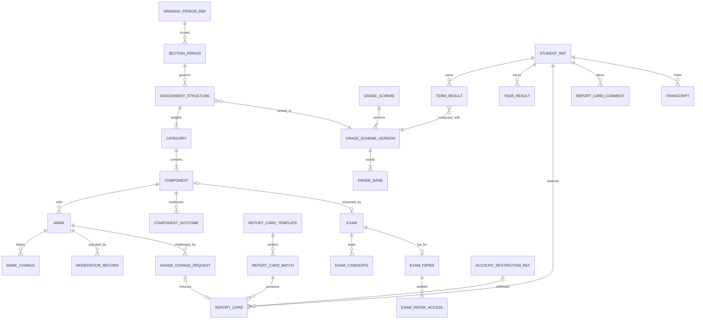
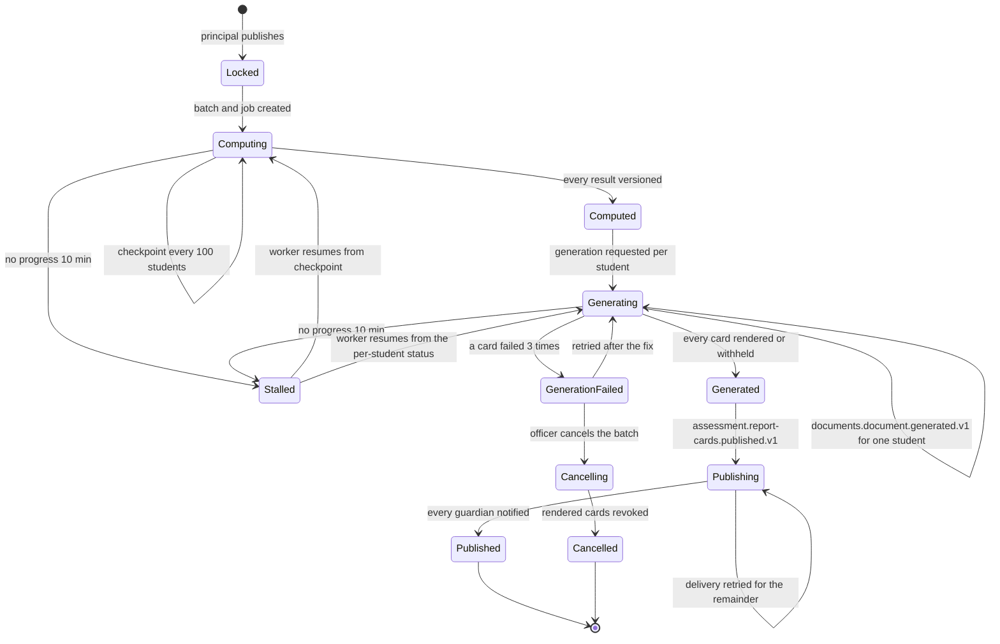
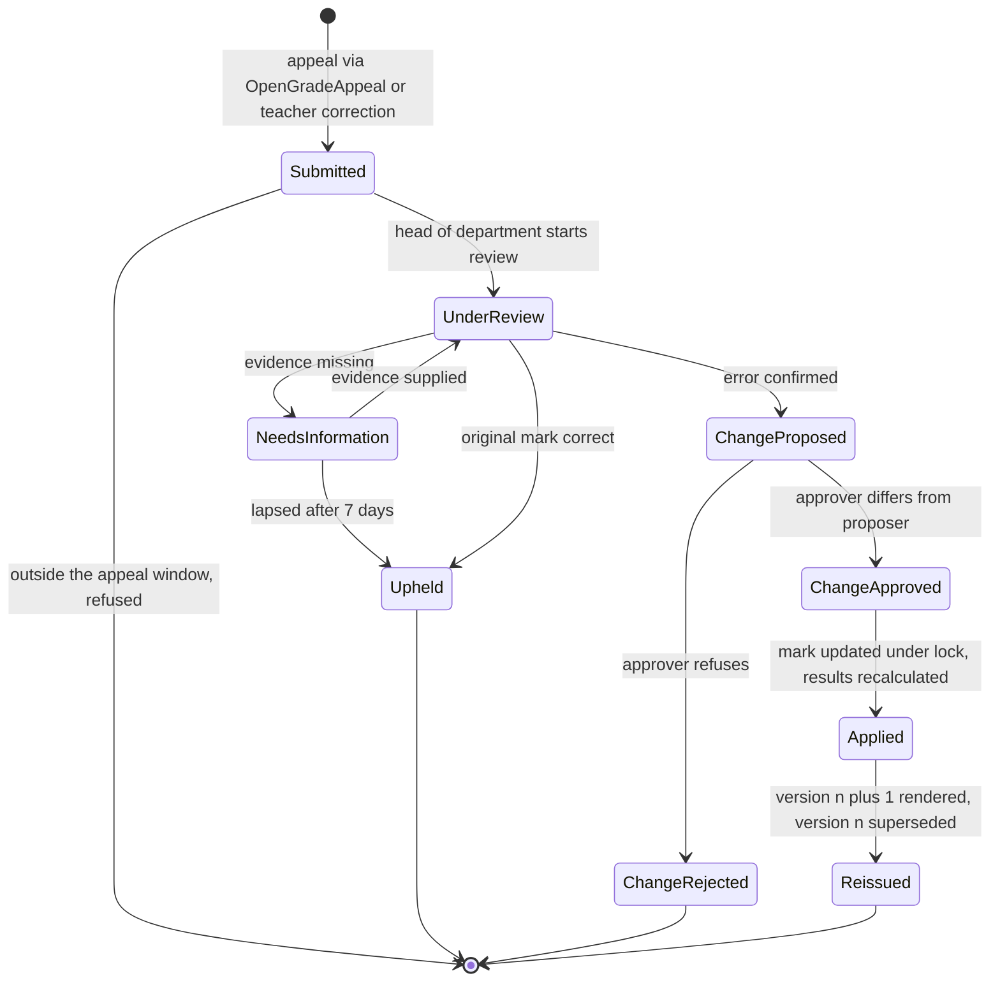

# Assessment

Assessment and Reporting turns marks into results a school can defend. It owns the assessment structure of every subject and grading period, the mark-entry grid and its change history, versioned grading schemes, moderation, approval, publishing and locking, the result calculations of Appendix S (weighted averages, re-weighting, drop-lowest, best-of, rounding, letter bands, GPA, rank, promotion, honors), the versioned report cards produced by the report-card batch saga, transcripts, the grade-appeal and post-lock change workflow, and the exam-paper workflow. Its calculations are the largest mutation-testing target in the product (`31-business-rules-and-workflows.md` §6: all fourteen BR-ASM rules at 80 percent or better), because a surviving mutant here is a wrong grade on a child's record. Every figure it publishes is reproducible from stored inputs and the scheme version that produced it.

**Group** C · **Requirement areas covered** ASM, with PERF, SEC, PRV, L10N rows that bind this service · **Last updated** 2026-09-21 by the planning session

| Fact | Value | Source |
|---|---|---|
| Service (Appendix L) | **Assessment**, long name "Assessment and Reporting" | Appendix L.1 |
| Tier | 1 | Appendix L.1, `05-service-catalog.md` |
| AREA code | `ASM` | Appendix L.1 |
| Database, schema, user | `nibras_assessment`, schema `assessment`, application user `svc_assessment`, migration owner `mig_assessment`; `SERIALIZABLE` for the grade-lock transaction | Appendix L.1, `10-data-architecture.md` part 1 |
| Exchange | `nibras.assessment` (topic) | Appendix L.1 |
| Images | `nibras/assessment-api`, `nibras/assessment-worker` | Appendix L.1 |
| Worker | `Assessment.Worker`: result calculation and report-card batch orchestration, KEDA on queue depth, bulk lane | Appendix L.1, `05-service-catalog.md` part 2 |
| Why the boundary exists | "Scaling: mark entry and report-card batches are the sharpest write burst in the product and need their own worker (ADR-0002)." | `05-service-catalog.md` |
| Synchronous dependencies | School (student directory), gRPC, one hop | Reference architecture Section 8, table 8.0 |
| Service level class | Write-heavy (master brief Section 31) | Reference architecture Section 8, table 8.0 |
| Scaling profile | "Write-heavy bursts at the end of each grading period; the worker scales on queue depth; calculations are reproducible" | `05-service-catalog.md` |
| Build phase | 2 (master brief Section 28) | `05-service-catalog.md` |
| Sensitivity | confidential | `05-service-catalog.md`, Appendix J.2 (mark, report card, transcript) |
| First-release merge option | May be hosted inside Academics under an ADR; database, exchange, routing keys and permissions unchanged | Appendix L.1, `05-service-catalog.md` part 6 |

**Signature features.** Assessment owns Appendix W feature 6, Report Card Studio with QR verification (demo test `TC-ASM-810` (Appendix W)), and feature 42, mastery and next step (Tier 2; `TC-ASM-811` (Appendix W)). It also serves feature 12, offline-first mobile (mark drafts entered offline sync through Bff.Mobile and land on the grid, section 4.3). The requirements, capabilities, slices, Appendix O step and demo test of each feature are traced once, in `32-product-differentiation-and-demo.md` under "Signature feature trace"; this sheet does not repeat them.

---

## 1. Responsibilities and non-responsibilities

### Responsibilities

| Owns | Detail |
|---|---|
| Assessment structures | Per subject, section and grading period: categories with weights totalling 100, components with maximum marks, mandatory and droppable flags, drop-lowest, best-of, due dates, entry deadlines (REQ-ASM-001, REQ-ASM-002) |
| Grading schemes | Percentage, letter, GPA, descriptive, standards-based, pass or fail, effort and conduct; every scheme versioned and immutable once published; assignment of schemes to stages (REQ-ASM-003, REQ-ASM-004) |
| Mark entry | The grid with keyboard navigation and paste, absent, exempt and incomplete codes, comments, change history; offline drafts replayed from the device; the import of graded coursework from Academics (REQ-ASM-005 to REQ-ASM-008); scores an external LTI tool posts, received from Platform as the `RecordToolScore` command and held as marks awaiting the teacher (REQ-ACA-030, REQ-INT-016, SL-ASM-400, phase 4) |
| Moderation, approval, publishing, locking | Adjustments stored with the original value and reason, approval by someone other than the entering teacher, publish windows per audience, the lock, unlock under high-risk permission (REQ-ASM-013 to REQ-ASM-015) |
| Result calculation | BR-ASM-001 to BR-ASM-013 in `Assessment.Worker`, reproducible from stored inputs and the scheme version, term and year results, rank, promotion eligibility, honors (REQ-ASM-020 to REQ-ASM-023) |
| Report cards | Report Card Studio templates, the comment bank, teacher and AI-drafted comments in review, the report-card batch saga (Saga 7), versioned and immutable cards, withholding under a finance restriction, parent acknowledgment (REQ-ASM-024 to REQ-ASM-029, REQ-ASM-035) |
| Transcripts | Cross-year transcripts from locked results with a verification code (REQ-ASM-030) |
| Grade appeals and post-lock changes | WF-ASM-02 with the appeal window, two signatures, application under the lock, recalculation and reissue (REQ-ASM-016 to REQ-ASM-019) |
| Exams (assessment side) | The exam record linked to a component, candidates with accommodations applied per sitting, admit cards, invigilators, makeup sittings, and the exam-paper workflow WF-ASM-03 (REQ-ASM-009 to REQ-ASM-012) |
| Analysis | Distribution, subject and teacher comparison, cohort trends, item analysis; predicted grades for internal use only; the standards heatmap (REQ-ASM-031 to REQ-ASM-033) |
| Overdue marks | The daily job that publishes `assessment.marks.overdue.v1` and escalates (REQ-ASM-034) |

### Not responsible for

| Does not own | Owner instead | Why the line is here |
|---|---|---|
| Students, sections, grade levels, grading periods, terms, the academic year and its rollover | School | Assessment keeps reference copies; School's Saga 4 asks Assessment for locks and promotion decisions and applies them itself |
| Assignments, submissions, rubrics, quizzes, teaching assignments | Academics | A graded submission arrives as `academics.submission.graded.v1` and becomes a mark; Academics freezes coursework on `assessment.grades.locked.v1` |
| The exam timetable, exam sessions, rooms and the seating-plan generator | Scheduling (`ExamSession`, `SeatingPlan`) | Assessment consumes `scheduling.exam-timetable.published.v1` and records candidate-level accommodations and seat overrides only |
| PDF rendering, QR verification codes, the public verification page, file storage | Documents | Assessment requests renders and stores `documentId` and `verificationCode` |
| Delivering notifications | Notification | Assessment publishes the Appendix C trigger events |
| The appeal request form, the approval inbox and task routing | Requests (ADR-0012) | Guardian appeals enter through Saga 6's `OpenGradeAppeal`; Assessment drives WF-ASM-02 from `Submitted` |
| Finance restrictions and their policy | Finance | Assessment only withholds a card while `finance.account.restricted.v1` names report cards |
| Special-needs plans and accommodations as decided | Wellbeing (WF-WEL-01) | Assessment applies the accommodation per sitting on `ApplyExamAccommodation` |
| AI drafting models | Ai | Assessment stores the draft as unreviewed and never publishes it unreviewed (REQ-ASM-025) |
| Dashboards across services, Student 360, early-warning | Reporting, Bff.Web, Bff.Mobile | Assessment serves its own result analysis |
| Grading-scheme settings definitions, rounding and publish-window settings | Platform (ADR-0009) | Assessment reads Academic settings and owns the scheme versions themselves |

---

## 2. Requirements covered

| Range or identifier | What it binds here |
|---|---|
| REQ-ASM-001 to REQ-ASM-036 | Every ASM row of `03-requirements-catalog.md`: 31 Tier 1, 5 Tier 2 (REQ-ASM-010 to REQ-ASM-012, REQ-ASM-031, REQ-ASM-033) |
| REQ-PERF-024 | The grid reads one covering index and writes back in batches, no cache |
| REQ-PERF-003, REQ-PERF-010 | Mark writes p95 under 500 ms, also while an 800-card batch runs (N-02) |
| REQ-SEC-003 to REQ-SEC-006 | Object-level authorization, generated permission and isolation suites, Appendix B permissions only |
| REQ-DATA-002, REQ-DATA-003 | `svc_assessment` without `BYPASSRLS`, filter plus row-level security |
| REQ-L10N-005, REQ-L10N-007, REQ-L10N-008 | Bilingual report cards and comments as `LocalizedText`, numerals per tenant, numbers left to right inside Arabic text |
| REQ-L10N-010 | Deadlines and windows in the campus time zone |
| REQ-MOB-007 | Mark drafts work offline and replay once |

---

## 3. Aggregates and entities

Every tenant-owned table carries the base columns of `10-data-architecture.md` part 4, listed once here: `id uuid not null` (UUID v7), `tenant_id uuid not null`, `created_at timestamptz not null`, `created_by uuid null`, `updated_at timestamptz not null`, `updated_by uuid null`, `deleted_at timestamptz null`, `deleted_by uuid null`, and `xmin` as the concurrency token on every aggregate root. Primary keys are `(tenant_id, id)`, with the partition key added on partitioned tables. Bilingual text is the `LocalizedText` value object (`<field>_en`, `<field>_ar`). Scores are `numeric`, never `float`; percentages are held unrounded at `numeric(12,6)` and rounded once, at publication (BR-ASM-008).

### 3.1 AssessmentStructure (aggregate root)

**`assessment_structures`**: `section_id uuid`, `subject_id uuid`, `grading_period_id uuid`, `academic_year_id uuid`, `scheme_id uuid`, `scheme_version int` (pinned on publish), `status smallint` (`Draft`, `Published`, `Locked`), `published_at timestamptz null`, `published_by uuid null`. Unique `(tenant_id, section_id, subject_id, grading_period_id) WHERE deleted_at IS NULL`.

**`assessment_categories`**: `structure_id uuid`, `name LocalizedText`, `weight numeric(5,2)`, `drop_lowest smallint not null default 0`, `best_of smallint null`, `sort_order smallint`.

**`components`**: `structure_id uuid`, `category_id uuid`, `section_id uuid`, `department_id uuid`, `name LocalizedText`, `max_mark numeric(9,2)` (> 0), `mandatory boolean`, `droppable boolean`, `due_on date`, `entry_due_at timestamptz`, `source_assignment_id uuid null` (Academics assignment whose grades import here), `exam_id uuid null`, `state smallint` (`Open`, `Entered`, `Validated`, `Moderated`), `submitted_for_approval_at timestamptz null`.

**`component_outcomes`** (child of `AssessmentStructure`; the evidence link of Appendix W feature 42, REQ-ASM-033, SL-ASM-219). One row says that a component's marks are evidence for one learning outcome. Academics owns `Outcome` and, in Tier 2, its `StandardMapping` to a CASE standard (Appendix F; `06-services/academics.md` §4.4). Assessment keeps the outcome id only and never reads `nibras_academics`.

| Field | Type | Null | Notes |
|---|---|---|---|
| `component_id` | uuid | no | The component whose marks count as evidence |
| `outcome_id` | uuid | no | The Academics `Outcome` id, as the structure editor chose it from the Academics outcome list for the structure's subject and grade level. It is a reference by id, not a foreign key |
| `section_id`, `subject_id` | uuid | no | Copied from the structure so that the section heatmap reads one index without joining the structure |
| `weight` | numeric(5,2) | no | Default 1.00, range 0.01 to 1.00. The share of the component's marks that counts for this outcome when the component also serves other outcomes |
| `sort_order` | smallint | no | Column order of the heatmap, following the editor's order |

Unique `(tenant_id, component_id, outcome_id) WHERE deleted_at IS NULL`. Index `ix_component_outcomes_section (tenant_id, section_id, subject_id, outcome_id) INCLUDE (component_id, weight) WHERE deleted_at IS NULL`.

**Invariants**

1. Category weights of a published structure total exactly 100.00 (BR-ASM-001).
2. A mandatory component is never droppable (BR-ASM-003).
3. `best_of`, when set, is at least 1; `drop_lowest` is less than the number of droppable components.
4. A structure cannot change weights, add or remove components after its section and grading period are `Locked`; the attempt fails with `ASSESSMENT_MARKS_LOCKED`.
5. A structure with marks cannot be deleted; its components can be retired only while no mark exists.
6. `scheme_version` is pinned at publish and never changes for that structure; a recalculation with any other version fails with `ASSESSMENT_SCHEME_VERSION_MISMATCH`.
7. A component links to at most 12 outcomes, each once. The links change with the structure, through the same `If-Match` edit, and are frozen with the structure once its section period is `Locked` (`ASSESSMENT_MARKS_LOCKED`). A link never changes a mark or a result: `component_outcomes` is read only by the mastery computation of section 4.5.
8. A component with no link is valid. It counts toward results as before and adds nothing to the heatmap.

### 3.2 SectionPeriod (aggregate root: the WF-ASM-01 state of one section in one grading period)

**`section_periods`**: `section_id uuid`, `grading_period_id uuid`, `academic_year_id uuid`, `status smallint` (`ExamToReportCardStatus`: `Scheduled`, `MarkEntry`, `Validated`, `Moderated`, `Approved`, `Locked`, `Generating`, `Generated`, `GenerationFailed`, `Published`), `approved_by uuid null`, `approved_at timestamptz null`, `locked_by uuid null`, `locked_at timestamptz null`, `unlocked_reason_code text(32) null`, `publish_windows` in side table `publish_windows` (`audience smallint`, `opens_at`, `closes_at`), `current_batch_id uuid null`. Unique `(tenant_id, section_id, grading_period_id)`.

**Invariants**

1. `Validated` requires every enrolled student to hold a mark, an absence or an exemption for every component (REQ-ASM-008, TC-ASM-001).
2. `Approved` requires every component `Moderated` (`ASSESSMENT_MODERATION_REQUIRED`) and an approver who entered none of the marks (REQ-ASM-014).
3. Publishing requires every approver in the chain to have signed (`ASSESSMENT_APPROVAL_CHAIN_INCOMPLETE`).
4. `Locked` is written in a `SERIALIZABLE` transaction that also refuses any concurrent mark write, and publishes `assessment.grades.locked.v1` once per lock.
5. After `Locked`, any mark write fails with `ASSESSMENT_MARKS_LOCKED`; only WF-ASM-02 changes a mark (BR-ASM-014).
6. Unlock requires `assessment.marks.unlock` (high) and a reason, and is refused once a report card of the period is published.

### 3.3 Mark (aggregate root per cell)

**`marks`**, list-partitioned by `academic_year_id`; the grid table, no `jsonb`, no unbounded text.

| Field | Type | Null | Notes |
|---|---|---|---|
| `academic_year_id` | uuid | no | Partition key |
| `section_id`, `component_id`, `student_id` | uuid | no | Unique cell: `ux_marks_cell` |
| `raw_score` | numeric(9,2) | yes | Null when a code is set |
| `code` | smallint | yes | `absent`, `exempt`, `incomplete` (BR-ASM-007) |
| `makeup_score` | numeric(9,2) | yes | Replaces an absent zero when entered |
| `state` | smallint | no | `Draft`, `Entered`, `Moderated`, `Approved`, `Locked` |
| `scheme_version` | int | no | Copied from the structure |
| `entered_by` | uuid | no | For the self-approval check |
| `source` | smallint | no | grid, paste, submission import, offline replay, grade change, tool score |
| `source_tool_id` | uuid | yes | The Platform LTI tool whose score the cell holds, set only when `source` is tool score; the grid shows the tool's name from it |
| `source_score_id` | uuid | yes | The Platform `LtiScore` id carried as `sagaId` by `RecordToolScore`; unique per tenant where not null, so a replayed command writes nothing |
| `comment_id` | uuid | yes | Pointer to `mark_comments` (side table, Confidential) |
| `client_token` | uuid | yes | Offline draft key; replay returns the first result |

**`mark_changes`**, list-partitioned by `academic_year_id`: `mark_id uuid`, `from_score`, `to_score`, `from_code`, `to_code`, `changed_by`, `via smallint` (entry, moderation, grade change, import, offline replay), `reason_code text(32) null`, `grade_change_request_id uuid null`, `occurred_at`, `received_at`. Append-only.

**`moderation_records`**: `component_id uuid`, `mark_id uuid`, `student_id uuid`, `original_score numeric(9,2)`, `adjusted_score numeric(9,2)`, `reason_code text(32)`, `reason_text_id uuid null`, `moderated_by uuid`, `moderated_at timestamptz`. Append-only.

**Invariants**

1. `raw_score` is between 0 and the component's `max_mark` inclusive, otherwise `ASSESSMENT_MARK_OUT_OF_RANGE` naming the cell (TC-ASM-002).
2. Exactly one of `raw_score` or `code` is set once the mark leaves `Draft`.
3. Every change writes one `mark_changes` row with both values; nothing is overwritten silently.
4. A moderation adjustment keeps the original value and a reason in `moderation_records` (REQ-ASM-013, TC-ASM-003).
5. An offline draft for an unapproved component is accepted (device wins); for an approved or locked component it is refused and returned as a proposed grade change (Appendix M.3).
6. The same `client_token` replayed returns the first result and writes nothing.
7. A tool score (`RecordToolScore`, SL-ASM-400) lands in the component whose `source_assignment_id` is the command's `assignmentId`, scaled to `max_mark` as `SubmissionGradedConsumer` scales a graded submission, as a `Draft` mark with `source` tool score and `entered_by` the teacher of the launch; it counts only when the teacher keeps or changes it and submits the component, so no tool ever moves a mark past `Draft` or publishes one. It is applied only while the component is `Open` or `Entered` and the section period is in `MarkEntry`; otherwise it is refused with `ASSESSMENT_MARKS_LOCKED` and reported back to Platform. It replaces only a `Draft` cell that holds the same tool's earlier score with an older timestamp; a value the teacher entered is kept, and the tool score is recorded in `mark_changes` only (TC-ASM-338, TC-ASM-339).

### 3.4 GradeScheme (aggregate root, versioned)

**`grade_schemes`**: `name LocalizedText`, `kind smallint` (percentage, letter, GPA, descriptive, standards-based, pass or fail, effort, conduct), `current_version int`, `status smallint` (`Active`, `Retired`).

**`grade_scheme_versions`**: `scheme_id uuid`, `version int`, `rounding_decimals smallint` (0 to 4), `rounding_mode smallint` (half away from zero by default), `pass_mark numeric(5,2) null`, `published_at timestamptz`, `published_by uuid`. Unique `(tenant_id, scheme_id, version)`. Immutable after publish.

**`grade_bands`**: `scheme_version_id uuid`, `lower_inclusive numeric(6,2)`, `upper_exclusive numeric(6,2)`, `code text(8)`, `label LocalizedText`, `gpa_points numeric(4,2) null`, `proficiency_level smallint null`, `sort_order smallint`.

**`grade_scheme_assignments`**: `scheme_id uuid`, `stage_id uuid null`, `grade_level_id uuid null`, `subject_id uuid null`, `effective_from date`.

**Invariants**

1. A published version never changes; an edit publishes version n + 1 (`assessment.schemes.version`).
2. Bands are half-open, ordered descending, cover 0 to 100 with no gap and no overlap, and the top band is closed at 100 (BR-ASM-009).
3. GPA points come from the band, never from the percentage (BR-ASM-010).
4. Every stored result names the scheme and version that produced it; recomputing with another version fails with `ASSESSMENT_SCHEME_VERSION_MISMATCH`.

### 3.5 Results

**`term_results`**, list-partitioned by `academic_year_id`: `student_id uuid`, `section_id uuid`, `subject_id uuid`, `grading_period_id uuid`, `academic_year_id uuid`, `batch_id uuid null`, `result_version int`, `raw_percentage numeric(12,6) null`, `final_mark numeric(7,2) null`, `grade_code text(8) null`, `gpa_points numeric(4,2) null`, `status smallint` (`Computed`, `Incomplete`, `NotYetAssessed`), `scheme_id uuid`, `scheme_version int`, `inputs_hash bytea` (SHA-256 of the ordered inputs), `rank_in_section int null`, `rank_in_grade int null`, `computed_at timestamptz`, `locked_at timestamptz null`, `superseded_by uuid null`. Unique `(tenant_id, academic_year_id, student_id, subject_id, grading_period_id, result_version)`.

**`year_results`**: `student_id uuid`, `academic_year_id uuid`, `result_version int`, `average numeric(12,6)`, `cumulative_gpa numeric(4,2) null`, `promotion_outcome smallint` (promote, retain, graduate, not-evaluated), `promotion_reasons text(128)` (reason codes), `honors_band_code text(16) null`, `published_at timestamptz null`.

**`predicted_grades`** (Tier 2, internal): `student_id`, `subject_id`, `grading_period_id`, `band_code`, `model_version`, `computed_at`. Never returned on a family-facing route (REQ-ASM-031).

**Invariants**

1. A result is a pure function of stored marks, the structure and the pinned scheme version; recomputing yields an equal `inputs_hash` and equal figures (REQ-ASM-023).
2. Rounding happens exactly once, at `final_mark`; `raw_percentage` is never rounded (BR-ASM-008).
3. An empty category is removed and the rest re-weighted to 100 (BR-ASM-002); every category empty gives `NotYetAssessed` with no percentage.
4. A missing mandatory mark gives `Incomplete`: no percentage, grade or points, and exclusion from the term average and rank (BR-ASM-005).
5. Late joiners are excluded from components due strictly before enrolment (BR-ASM-006).
6. Rank uses the unrounded total with standard competition ranking (BR-ASM-011); it is always stored and shown only where the rank visibility setting permits.
7. A new result version never deletes the previous one; `superseded_by` links them.

### 3.6 Report cards

**`report_card_templates`**: `name LocalizedText`, `stage_scope uuid[]`, `languages text(8)[]`, `version int`, `status smallint` (`Draft`, `Validated`, `Active`, `Retired`), `validated_at timestamptz null`; body in side table `report_card_template_bodies` (`template_id`, `body jsonb`) because large `jsonb` stays off hot tables.

**`comment_bank_entries`**: `code text(32)`, `text LocalizedText`, `category text(32)`, `active boolean`.

**`report_card_comments`**: `student_id`, `grading_period_id`, `subject_id null`, `author_id`, `text_id uuid` (side table `comment_texts`), `source smallint` (teacher, bank, AI draft), `state smallint` (`Draft`, `Reviewed`), `reviewed_by uuid null`, `reviewed_at timestamptz null`.

**`report_card_batches`** (saga state of Saga 7): `grading_period_id uuid`, `section_ids uuid[]`, `template_id uuid`, `languages text(8)[]`, `state smallint` (`ReportCardBatchState`), `students_total int`, `computed_count int`, `generated_count int`, `withheld_count int`, `failed_count int`, `compute_checkpoint uuid null`, `published_version_number int null`, `job_id uuid`, `started_by uuid`, `stalled_since timestamptz null`. Unique running batch per `(tenant_id, grading_period_id, section_id)` enforced by `ux_report_card_batches_running`.

**`report_cards`** (ReportCard, root, versioned; the per-student status of the batch): `student_id uuid`, `grading_period_id uuid`, `batch_id uuid`, `version_number int`, `status smallint` (`Pending`, `Computed`, `Requested`, `Generated`, `Withheld`, `Failed`, `Published`, `Superseded`, `PendingReissue`), `document_id uuid null`, `verification_code text(64) null`, `attempts smallint`, `last_error_code text(64) null`, `published_at timestamptz null`, `superseded_by uuid null`, `acknowledged_at timestamptz null`, `acknowledged_by uuid null`. Unique `(tenant_id, student_id, grading_period_id, version_number)`.

**`transcripts`**: `student_id uuid`, `academic_year_ids uuid[]`, `inputs_hash bytea`, `document_id uuid null`, `verification_code text(64) null`, `request_id uuid null`, `status smallint` (`Requested`, `Issued`, `Revoked`), `issued_at timestamptz null`.

**Invariants**

1. A batch starts only when every section in scope is `Locked`; a second batch for the same scope while one runs fails with `ASSESSMENT_REPORT_CARD_BATCH_RUNNING`.
2. A template with an unresolved placeholder cannot be used, `ASSESSMENT_REPORT_CARD_TEMPLATE_INVALID`.
3. A published card is immutable; a correction is version n + 1 and version n becomes `Superseded`, still retrievable (BR-ASM-014, REQ-ASM-028).
4. At most one `documentId` per `(batchId, studentId, templateId, language)`; a duplicate `documents.document.generated.v1` changes nothing (TC-ASM-006).
5. A card for a student whose account is restricted for report cards is `Withheld` and released on `finance.account.cleared.v1`.
6. An AI-drafted comment in `Draft` is never rendered (REQ-ASM-025).
7. A transcript is issued only from locked results and only when a recomputation reproduces them; otherwise `ASSESSMENT_TRANSCRIPT_NOT_REPRODUCIBLE` and a data-quality issue.

### 3.7 GradeChangeRequest (aggregate root, WF-ASM-02)

**`grade_change_requests`**: `kind smallint` (appeal, correction), `student_id uuid`, `component_id uuid`, `mark_id uuid`, `grading_period_id uuid`, `status smallint` (`GradeAppealAndPostLockChangeStatus`: `Submitted`, `UnderReview`, `NeedsInformation`, `Upheld`, `ChangeProposed`, `ChangeApproved`, `ChangeRejected`, `Applied`, `Reissued`), `raised_by uuid`, `request_id uuid null` (Saga 6), `window_ends_on date`, `from_score numeric(9,2) null`, `proposed_score numeric(9,2) null`, `reason_code text(32)`, `rationale_id uuid null` (side table, never cached), `proposed_by uuid null`, `approved_by uuid null`, `decided_at timestamptz null`, `applied_at timestamptz null`, `needs_info_until timestamptz null`, `reissued_report_card_id uuid null`.

**Invariants**

1. An appeal outside 10 working days after publication is refused with the window dates (TC-ASM-012).
2. Only a linked guardian or the student raises an appeal; a teacher raises a correction.
3. The approver differs from the proposer (TC-ASM-013) and holds `assessment.marks.change-after-lock`.
4. `Applied` changes the mark under the lock, writes `mark_changes` with the request id, recalculates the affected results, and publishes `assessment.grade-change.approved.v1` once.
5. A change affecting GPA or rank recalculates and republishes both for the cohort (TC-ASM-016).
6. Reissue failure leaves the change applied and the card `PendingReissue`; no stale card is shown as current.
7. A change is refused once the academic year is archived.

### 3.8 Exams and exam papers

**`exams`**: `exam_session_id uuid` (Scheduling), `component_id uuid`, `subject_id uuid`, `grade_level_id uuid`, `sitting_at timestamptz`, `makeup_of uuid null`, `status smallint` (`Planned`, `Sat`, `Cancelled`).

**`exam_candidates`**: `exam_id uuid`, `student_id uuid`, `accommodation_codes text(64) null`, `accommodation_plan_id uuid null`, `accommodation_request_id uuid null`, `seat_override text(16) null`, `admit_card_document_id uuid null`, `sitting_state smallint` (expected, sat, absent, unaccommodated). Unique `(tenant_id, exam_id, student_id)`.

**`exam_invigilators`**: `exam_id uuid`, `staff_id uuid`.

**`exam_papers`** (ExamPaper, root, WF-ASM-03): `exam_id uuid`, `setter_id uuid`, `reviewer_id uuid null`, `status smallint` (`ExamPaperSettingReviewAndPrintingStatus`: `Assigned`, `Drafted`, `UnderReview`, `RevisionRequested`, `Approved`, `PrintRequested`, `Printed`, `Sealed`, `Released`, `Reassigned`), `paper_file_id uuid null`, `marking_scheme_file_id uuid null`, `blueprint_total numeric(9,2)`, `deadline_on date`, `copy_count int null`, `printed_count int null`, `sealed_at timestamptz null`, `released_at timestamptz null`, `released_to uuid null`, `compromised boolean`.

**`exam_paper_access_log`**: `paper_id uuid`, `actor_id uuid`, `action smallint` (open, download, print, refused), `copy_count int null`, `at timestamptz`. Append-only.

**Invariants**

1. Only the named setter drafts; the reviewer is never the setter (TC-ASM-021, TC-ASM-022).
2. The paper file is visible only to setter and reviewer until `Released`; any other open is refused, audited and alerted (TC-ASM-026).
3. Approval requires a marking scheme whose total equals the blueprint (TC-ASM-023).
4. The copy count is fixed to registered candidates plus the configured spares (TC-ASM-024).
5. An accommodation is applied per sitting from `ApplyExamAccommodation` and removed only before the sitting.

### 3.9 Reference copies (read-only)

`student_refs`, `section_refs`, `staff_refs`, `teaching_assignment_refs`, `grading_period_refs`, `term_refs`, `account_restriction_refs`, `exam_session_refs`: section 8. They carry `tenant_id`, `source_version` and `reconciled_at`, no `xmin`.

There is no copy of Academics outcomes or standard mappings. Appendix E has no Academics curriculum event to keep such a copy current, so `component_outcomes` holds only the outcome id. The outcome's code, statement and CASE standard are shown by the client from Academics' own `GET /api/v1/academics/outcomes` (open point 8).



---

## 4. REST API

Paths follow `22-api-conventions-and-error-catalog.md` §1. Every endpoint also returns the eight Appendix K.1 codes with the `ASSESSMENT_` prefix; the Errors column lists the service-specific codes and any K.1 code raised for a domain reason. "Key" means the `Idempotency-Key` header of document 22 §5. Every write is audited through `assessment.audit.recorded.v1`. Lists use keyset pagination, page cap 200, unless stated.

### 4.1 Structures

| Method | Path | Permission | Request | Response | Errors | Idempotent |
|---|---|---|---|---|---|---|
| GET | `/api/v1/assessment/structures?sectionId=&gradingPeriodId=` | `assessment.structures.view` | query | `AssessmentStructure` with categories and components | none beyond K.1 | Safe; `ETag` |
| POST | `/api/v1/assessment/structures` | `assessment.structures.create` | `StructureModel`: section, subject, period, scheme, categories, components, each component with its `outcomes[]` of `{ outcomeId, weight }` (section 3.1 `component_outcomes`) | 201 `Draft` | `ASSESSMENT_VALIDATION_FAILED` (weights not 100, mandatory droppable) | Key optional |
| PUT | `/api/v1/assessment/structures/{id}` | `assessment.structures.edit` | `StructureModel`, `If-Match` | 200 | `ASSESSMENT_MARKS_LOCKED`, `ASSESSMENT_CONCURRENCY_CONFLICT` | Yes, by `If-Match` |
| POST | `/api/v1/assessment/structures/{id}/publish` | `assessment.structures.edit` | `{}` | 200 `Published`, scheme version pinned | `ASSESSMENT_VALIDATION_FAILED` | Yes, state-guarded |
| POST | `/api/v1/assessment/structures/{id}/copy` | `assessment.structures.create` | `{ targetSectionIds[] }` | 200 per-target results | per target: `ASSESSMENT_MARKS_LOCKED` | Yes, Key required |
| DELETE | `/api/v1/assessment/structures/{id}` | `assessment.structures.delete` | `If-Match` | 204 | `ASSESSMENT_VALIDATION_FAILED` (marks exist) | Yes |

### 4.2 Grading schemes

| Method | Path | Permission | Request | Response | Errors | Idempotent |
|---|---|---|---|---|---|---|
| GET | `/api/v1/assessment/grade-schemes` | `assessment.schemes.view` | none | `GradeScheme[]` with current version | none beyond K.1 | Safe |
| GET | `/api/v1/assessment/grade-schemes/{id}/versions/{version}` | `assessment.schemes.view` | none | Version with bands; immutable, cacheable | none beyond K.1 | Safe; `ETag` |
| POST | `/api/v1/assessment/grade-schemes` | `assessment.schemes.create` | `GradeSchemeModel` with a draft version | 201 | `ASSESSMENT_VALIDATION_FAILED` (band gap or overlap) | Key optional |
| PUT | `/api/v1/assessment/grade-schemes/{id}/draft` | `assessment.schemes.edit` | draft bands, rounding, pass mark | 200 | `ASSESSMENT_VALIDATION_FAILED` | Yes, by `If-Match` |
| POST | `/api/v1/assessment/grade-schemes/{id}/versions` | `assessment.schemes.version` | `{ reasonCode }` | 201 version n + 1 | `ASSESSMENT_VALIDATION_FAILED` | Yes, Key required |
| PUT | `/api/v1/assessment/grade-schemes/{id}/assignments` | `assessment.schemes.edit` | stage, grade-level and subject assignments with `effectiveFrom` | 200 | `ASSESSMENT_VALIDATION_FAILED` | Yes, by `If-Match` |

### 4.3 Marks

| Method | Path | Permission | Request | Response | Errors | Idempotent |
|---|---|---|---|---|---|---|
| GET | `/api/v1/assessment/sections/{sectionId}/components/{componentId}/marks` | `assessment.marks.view` (own-sections for teachers) | none | `MarkGrid`: roster rows with score, code, state, row version, and the source, naming the LTI tool for a tool score awaiting the teacher (SL-ASM-400) | none beyond K.1 | Safe; never cached (REQ-ASM-007) |
| PUT | `/api/v1/assessment/sections/{sectionId}/components/{componentId}/marks` | `assessment.marks.enter` (own-sections) | `EnterMarksRequest`: changed cells with row versions, pasted blocks allowed | 200 per-cell results | per cell: `ASSESSMENT_MARK_OUT_OF_RANGE`, `ASSESSMENT_MARKS_LOCKED`, `ASSESSMENT_CONCURRENCY_CONFLICT` | Yes, Key required |
| POST | `/api/v1/assessment/marks/sync` | `assessment.marks.enter` | Up to 500 queued drafts with `idempotencyKey`, `occurredAt`, `entityVersion` (via Bff.Mobile) | 200 per-action results: accepted, returned-as-grade-change | per action: `ASSESSMENT_MARKS_LOCKED`, `ASSESSMENT_MARK_OUT_OF_RANGE` | Yes, per action key |
| POST | `/api/v1/assessment/sections/{sectionId}/components/{componentId}/submit` | `assessment.marks.enter` | `{}` | 200 component `Validated`; publishes `assessment.marks.entered.v1` | `ASSESSMENT_MARK_GRID_INCOMPLETE` listing students without a mark, absence or exemption | Yes, state-guarded |
| GET | `/api/v1/assessment/marks/{id}/history` | `assessment.marks.view` | none | Change history with both values | none beyond K.1 | Safe |
| GET | `/api/v1/assessment/sections/{sectionId}/mark-status?gradingPeriodId=` | `assessment.marks.view` | query | Entry state per component, overdue flags | none beyond K.1 | Safe |
| GET | `/api/v1/assessment/marks/export?gradingPeriodId=&sectionId=` | `assessment.marks.export` | query | Streamed CSV; audited | none beyond K.1 | Safe |

### 4.4 Moderation, approval, publishing, locking

| Method | Path | Permission | Request | Response | Errors | Idempotent |
|---|---|---|---|---|---|---|
| GET | `/api/v1/assessment/moderation-queue?departmentId=` | `assessment.marks.moderate` | query, cursor on `(submitted_for_approval_at, id)` | Components awaiting moderation with distribution | none beyond K.1 | Safe |
| POST | `/api/v1/assessment/components/{id}/moderation` | `assessment.marks.moderate` (department) | `{ adjustments[] (studentId, adjustedScore, reasonCode), release }` | 200 component `Moderated`; publishes `assessment.marks.awaiting-approval.v1` | `ASSESSMENT_MARK_OUT_OF_RANGE`, `ASSESSMENT_MARKS_LOCKED` | Yes, Key required |
| POST | `/api/v1/assessment/grading-periods/{id}/approve` | `assessment.marks.approve` | `{ sectionIds[] }` | 200 `Approved`; publishes `assessment.marks.approved.v1` per component | `ASSESSMENT_MODERATION_REQUIRED`, `ASSESSMENT_PERMISSION_DENIED` (self-approval, REQ-ASM-014) | Yes, state-guarded |
| PUT | `/api/v1/assessment/grading-periods/{id}/publish-windows` | `assessment.marks.publish` | windows per audience | 200 | `ASSESSMENT_APPROVAL_CHAIN_INCOMPLETE` | Yes, by `If-Match` |
| POST | `/api/v1/assessment/grading-periods/{id}/lock` | `assessment.marks.lock` | `{ sectionIds[] }` | 200 `Locked`; publishes `assessment.grades.locked.v1` | `ASSESSMENT_APPROVAL_CHAIN_INCOMPLETE` | Yes, state-guarded |
| POST | `/api/v1/assessment/grading-periods/{id}/unlock` | `assessment.marks.unlock` (high) | `{ sectionIds[], reasonCode }` | 200 back to `Approved` | `ASSESSMENT_POST_LOCK_CHANGE_REFUSED` (a card already published) | Yes, state-guarded |

### 4.5 Results and analysis

| Method | Path | Permission | Request | Response | Errors | Idempotent |
|---|---|---|---|---|---|---|
| GET | `/api/v1/assessment/students/{id}/term-results?gradingPeriodId=` | `assessment.marks.view` (self, own-children, own-sections) | query | Published results with mark, comment, rubric reference, scheme and version (REQ-ASM-036); never predicted grades | none beyond K.1 | Safe; `ETag` |
| GET | `/api/v1/assessment/sections/{id}/results?gradingPeriodId=` | `assessment.marks.view` (own-sections, campus) | query | Results with rank where visible | none beyond K.1 | Safe |
| POST | `/api/v1/assessment/grading-periods/{id}/results/recalculate` | `assessment.marks.approve` | `{ sectionIds[] }` | 202 job (document 22 §6) | `ASSESSMENT_SCHEME_VERSION_MISMATCH` | Yes, Key required |
| GET | `/api/v1/assessment/year-results?academicYearId=&sectionId=` | `assessment.marks.view` | query | Year averages, promotion outcome with reasons, honors band | none beyond K.1 | Safe |
| GET | `/api/v1/assessment/analysis?gradingPeriodId=&subjectId=&kind=` | `assessment.marks.view` (department, campus) | `kind` = distribution, subject, teacher, cohort, item | Aggregates; groups under 10 students suppressed | none beyond K.1 | Safe |
| GET | `/api/v1/assessment/students/{id}/standards-heatmap?subjectId=&gradingPeriodId=` | `assessment.marks.view` (own-sections, department, campus; refused for self and own-children) | query; `subjectId` required, `gradingPeriodId` optional (the whole academic year to date when absent) | One student's row of the mastery computation below: a cell per linked outcome with `percent`, `level`, `evidenceCount`, and `nextStep` at rung 2 or `null` with `suggestion: "off"` (Tier 2) | `ASSESSMENT_PERMISSION_DENIED` for family callers, `ASSESSMENT_VALIDATION_FAILED` (`subjectId` missing, or a grading period outside the student's year) | Safe; not cached (section 11) |
| GET | `/api/v1/assessment/sections/{id}/standards-heatmap?subjectId=&gradingPeriodId=&after=&limit=` | `assessment.marks.view` (own-sections, department, campus; refused for self and own-children) | query; `subjectId` required, `gradingPeriodId` optional; keyset on `studentId` with `after`, `limit` default 50 and cap 200 | The class heatmap of feature 42. `outcomes[]` (`outcomeId`, `sortOrder`, `componentCount`) in the editor's order. `classCells[]` per outcome over the whole section (`studentsAssessed`, `meanPercent`, `levelCounts[]`). `students[]` for the page, bounded to the students with an interval in the section (`student_section_intervals`), each with `studentId`, `nameEn`, `nameAr` from `student_refs` and one cell per outcome. `nextStep` for the class at rung 2 or `null` with `suggestion: "off"`. Also `asOf` and `nextCursor` (Tier 2) | `ASSESSMENT_NOT_FOUND` (section not in `section_refs`), `ASSESSMENT_PERMISSION_DENIED` (family caller, or a section outside the caller's scope), `ASSESSMENT_VALIDATION_FAILED` (`subjectId` missing, `limit` above 200, or a grading period outside the section's year) | Safe; not cached (section 11) |

**Mastery computation (feature 42, REQ-ASM-033, SL-ASM-219).** `GetStandardsHeatmapHandler` computes the heatmap on read, per student and per outcome, from rows Assessment owns. It writes nothing and publishes nothing.

1. **Evidence.** A mark counts when its component has a `component_outcomes` row for the outcome, belongs to the section and subject asked for, and falls in the asked grading period, or anywhere in the academic year to date when no period is given. The mark must be in `Entered`, `Moderated`, `Approved` or `Locked`. A `Draft` never counts, so an unsubmitted tool score (section 3.3 invariant 7) or offline draft moves no cell. The score used is `makeup_score` when set, otherwise `raw_score` as moderated. A mark coded `exempt`, or coded `absent` with no makeup, is not evidence for the outcome. It is left out of both sides and counted in the cell's `missingCount`. This departs from BR-ASM-007, where an absence counts zero toward the term result, because an absence says nothing about what the student has mastered.
2. **Percentage.** A student's cell is `percent = Σ(score × weight) ÷ Σ(max_mark × weight) × 100` over that evidence. It is held unrounded at `numeric(12,6)` and shown rounded to whole numbers. `evidenceCount` is the number of marks counted. A cell with no evidence is `notAssessed`, with no percentage and no level.
3. **Level.** The level is the `proficiency_level` of the band that contains the percentage. The bands come from the latest published version of the standards-based scheme that `grade_scheme_assignments` gives the section's grade level and subject. The lookup is the half-open lookup of BR-ASM-009 (`LetterGradeBoundaryRule`). When no standards-based scheme is assigned, `level` is `null` and the cell shows the percentage alone.
4. **Class cell.** For each outcome, `studentsAssessed` counts the section's students with evidence. `meanPercent` is the mean of their unrounded percentages. `levelCounts[]` counts those students per level. The class cells are computed over the whole section, whatever page of students is returned.
5. **Next step (rung 2, autonomy 2 "Suggests").** This runs only when the tenant has turned rung 2 on (Platform feature flags, section 6.2 `PlatformContextConsumer`). `NextStepRanker`, an ML.NET linear model with its `model_version` pinned like `predicted_grades`, ranks the outcomes. For the class, the inputs per outcome are the share of students below level 2 (below 50 percent when there are no levels), `meanPercent`, the change in `meanPercent` since the previous grading period, `evidenceCount`, and the days since the latest evidence. For one student, the inputs are the same features taken from that student's cells. The output is at most three outcome ids with each factor's contribution, and the Because panel shows those contributions. When rung 2 is off or the model cannot be loaded, `nextStep` is `null` and `suggestion` is `"off"`. The heatmap itself does not change. That is the raw heatmap Appendix W feature 42 degrades to. The suggestion never changes a mark, a result or a plan.
6. **Labels.** The response carries outcome ids, not outcome text. The client resolves each id's code, statement and CASE standard through Academics' `GET /api/v1/academics/outcomes?subjectId=&gradeLevelId=` (`academics.curriculum.view`, which teachers hold for their own sections under Appendix I G07). An id that Academics no longer lists is shown as a retired outcome (open point 8).

Tests: `TC-ASM-340` to `TC-ASM-344` (section 14). The Appendix W demo test `TC-ASM-811` runs the class view end to end.
| GET | `/api/v1/assessment/students/{id}/predicted-grades` | `assessment.marks.view` (staff scopes only; refused for self and own-children) | none | Internal bands (Tier 2) | `ASSESSMENT_PERMISSION_DENIED` for family callers | Safe |

### 4.6 Report cards

| Method | Path | Permission | Request | Response | Errors | Idempotent |
|---|---|---|---|---|---|---|
| GET | `/api/v1/assessment/report-card-templates` | `assessment.report-cards.view` | none | Templates with versions | none beyond K.1 | Safe |
| POST | `/api/v1/assessment/report-card-templates` | `assessment.report-cards.design-template` | template model | 201 `Draft` | `ASSESSMENT_REPORT_CARD_TEMPLATE_INVALID` | Key optional |
| PUT | `/api/v1/assessment/report-card-templates/{id}` | `assessment.report-cards.design-template` | template model, `If-Match` | 200 | `ASSESSMENT_REPORT_CARD_TEMPLATE_INVALID`, `ASSESSMENT_CONCURRENCY_CONFLICT` | Yes, by `If-Match` |
| POST | `/api/v1/assessment/report-card-templates/{id}/validate` | `assessment.report-cards.design-template` | sample student id | 200 `Validated` or the unresolved placeholders | `ASSESSMENT_REPORT_CARD_TEMPLATE_INVALID` | Safe |
| GET | `/api/v1/assessment/comment-bank` | `assessment.report-cards.view` | none | Bank entries | none beyond K.1 | Safe |
| POST | `/api/v1/assessment/comment-bank` | `assessment.report-cards.design-template` | entry | 201 | none beyond K.1 | Key optional |
| GET | `/api/v1/assessment/report-cards/comments?gradingPeriodId=&sectionId=` | `assessment.report-cards.view` | query | Comments with state and source; AI drafts marked | none beyond K.1 | Safe |
| PUT | `/api/v1/assessment/report-cards/comments/{studentId}` | `assessment.marks.enter` (own-sections) | `{ gradingPeriodId, subjectId, text, source }` | 200 `Draft` | `ASSESSMENT_MARKS_LOCKED` | Yes, by `If-Match` |
| POST | `/api/v1/assessment/report-cards/comments/{id}/review` | `assessment.marks.enter` (own-sections) | `{ text }` | 200 `Reviewed` (REQ-ASM-025) | none beyond K.1 | Yes, state-guarded |
| POST | `/api/v1/assessment/report-cards/batches` | `assessment.report-cards.generate` | `{ gradingPeriodId, sectionIds[], templateId, languages[] }` | 202 job; Saga 7 starts | `ASSESSMENT_REPORT_CARD_BATCH_RUNNING`, `ASSESSMENT_APPROVAL_CHAIN_INCOMPLETE` (a section not locked), `ASSESSMENT_REPORT_CARD_TEMPLATE_INVALID` | Yes, Key required |
| GET | `/api/v1/assessment/report-cards/batches/{id}` | `assessment.report-cards.view` | none | Batch state, counts, failed students with renderer codes | none beyond K.1 | Safe |
| POST | `/api/v1/assessment/report-cards/batches/{id}/retry-failed` | `assessment.report-cards.generate` | `{}` | 202 | `ASSESSMENT_CONCURRENCY_CONFLICT` | Yes, state-guarded |
| POST | `/api/v1/assessment/report-cards/batches/{id}/cancel` | `assessment.report-cards.generate` | `{ reasonCode }` | 202 `Cancelling` | `ASSESSMENT_CONCURRENCY_CONFLICT` (already publishing) | Yes, state-guarded |
| POST | `/api/v1/assessment/report-cards/batches/{id}/publish` | `assessment.report-cards.publish` | `{ audiences[] }` | 202 `Publishing`; publishes `assessment.report-cards.published.v1` | `ASSESSMENT_APPROVAL_CHAIN_INCOMPLETE` | Yes, state-guarded |
| GET | `/api/v1/assessment/students/{id}/report-cards` | `assessment.report-cards.view` (self, own-children) | none | Versions with status and verification code | none beyond K.1 | Safe |
| GET | `/api/v1/assessment/report-cards/{id}/document` | `assessment.report-cards.view` | none | 5-minute signed URL bound to the caller, from Documents | `ASSESSMENT_NOT_FOUND` for a withheld card | Safe; `no-store` |
| POST | `/api/v1/assessment/report-cards/{id}/acknowledge` | `assessment.report-cards.view` (own-children) | `{}` | 200 with the acknowledgment time | none beyond K.1 | Yes, first acknowledgment wins |
| POST | `/api/v1/assessment/report-cards/{id}/reissue` | `assessment.report-cards.reissue` (elevated) | `{ reasonCode }` | 202 version n + 1 | `ASSESSMENT_REPORT_CARD_BATCH_RUNNING` | Yes, Key required |
| GET | `/api/v1/assessment/report-cards/export?gradingPeriodId=` | `assessment.report-cards.export` | query | Streamed CSV of card status; audited | none beyond K.1 | Safe |

### 4.7 Transcripts

| Method | Path | Permission | Request | Response | Errors | Idempotent |
|---|---|---|---|---|---|---|
| GET | `/api/v1/assessment/students/{id}/transcript` | `assessment.transcripts.view` | none | Year blocks with cumulative result | none beyond K.1 | Safe |
| POST | `/api/v1/assessment/students/{id}/transcripts` | `assessment.transcripts.issue` | `{ languages[] }` | 202; render requested from Documents | `ASSESSMENT_TRANSCRIPT_NOT_REPRODUCIBLE` | Yes, Key required |
| GET | `/api/v1/assessment/transcripts/export?academicYearId=` | `assessment.transcripts.export` | query | Streamed CSV; audited | none beyond K.1 | Safe |

### 4.8 Grade changes and appeals

| Method | Path | Permission | Request | Response | Errors | Idempotent |
|---|---|---|---|---|---|---|
| POST | `/api/v1/assessment/grade-changes` | `assessment.grade-changes.create` | `{ kind, studentId, componentId, reasonCode, rationale, proposedScore }` | 201 `Submitted` | `ASSESSMENT_APPEAL_WINDOW_CLOSED` (`params.windowEndsOn`) | Yes, Key required |
| GET | `/api/v1/assessment/grade-changes?status=&departmentId=` | `assessment.grade-changes.view` | query, cursor | Requests without rationale text | none beyond K.1 | Safe |
| GET | `/api/v1/assessment/grade-changes/{id}` | `assessment.grade-changes.view` | none | Request with rationale (access logged) | none beyond K.1 | Safe |
| POST | `/api/v1/assessment/grade-changes/{id}/start-review` | `assessment.marks.moderate` (department) | `{}` | 200 `UnderReview` with the original marks retrieved | `ASSESSMENT_CONCURRENCY_CONFLICT` | Yes, state-guarded |
| POST | `/api/v1/assessment/grade-changes/{id}/request-information` | `assessment.marks.moderate` | `{ question }` | 200 `NeedsInformation` | `ASSESSMENT_CONCURRENCY_CONFLICT` | Yes, state-guarded |
| POST | `/api/v1/assessment/grade-changes/{id}/supply-information` | `assessment.grade-changes.create` | `{ evidenceFileId, note }` | 200 `UnderReview` | `ASSESSMENT_CONCURRENCY_CONFLICT` | Yes, state-guarded |
| POST | `/api/v1/assessment/grade-changes/{id}/uphold` | `assessment.marks.moderate` | `{ reasonCode }` | 200 `Upheld` | `ASSESSMENT_CONCURRENCY_CONFLICT` | Yes, state-guarded |
| POST | `/api/v1/assessment/grade-changes/{id}/propose` | `assessment.marks.moderate` | `{ proposedScore, reasonCode }` | 200 `ChangeProposed` | `ASSESSMENT_MARK_OUT_OF_RANGE` | Yes, state-guarded |
| POST | `/api/v1/assessment/grade-changes/{id}/approve` | `assessment.grade-changes.approve` plus `assessment.marks.change-after-lock` | `{}` | 200 `Applied`; publishes `assessment.grade-change.approved.v1`; reissue queued | `ASSESSMENT_POST_LOCK_CHANGE_REFUSED` (without the high-risk permission), `ASSESSMENT_PERMISSION_DENIED` (approver is the proposer) | Yes, first decision wins |
| POST | `/api/v1/assessment/grade-changes/{id}/reject` | `assessment.grade-changes.reject` | `{ reasonCode }` | 200 `ChangeRejected` | `ASSESSMENT_CONCURRENCY_CONFLICT` | Yes, first decision wins |

A direct write to a locked mark from the grid returns `ASSESSMENT_POST_LOCK_CHANGE_REFUSED` when the caller lacks `assessment.marks.change-after-lock` and `ASSESSMENT_MARKS_LOCKED` otherwise, and the response offers this route (REQ-ASM-016, TC-ASM-101).

### 4.9 Exams and exam papers

| Method | Path | Permission | Request | Response | Errors | Idempotent |
|---|---|---|---|---|---|---|
| GET | `/api/v1/assessment/exams?examSessionId=` | `assessment.exams.view` | query | Exams with candidate counts | none beyond K.1 | Safe |
| POST | `/api/v1/assessment/exams` | `assessment.exams.create` | exam session, component, grade level | 201 | none beyond K.1 | Key optional |
| PUT | `/api/v1/assessment/exams/{id}` | `assessment.exams.edit` | model, `If-Match` | 200 | `ASSESSMENT_CONCURRENCY_CONFLICT` | Yes, by `If-Match` |
| DELETE | `/api/v1/assessment/exams/{id}` | `assessment.exams.delete` | none | 204 (`Cancelled`) | none beyond K.1 | Yes |
| POST | `/api/v1/assessment/exams/{id}/makeup` | `assessment.exams.create` | `{ studentIds[], sittingAt }` | 201 makeup exam | none beyond K.1 | Key optional |
| PUT | `/api/v1/assessment/exams/{id}/invigilators` | `assessment.exams.assign-invigilators` | staff ids | 200 | none beyond K.1 | Yes |
| PUT | `/api/v1/assessment/exams/{id}/candidates/{studentId}/seat` | `assessment.exams.seat` | `{ seatOverride }` | 200 | none beyond K.1 | Yes |
| POST | `/api/v1/assessment/exams/{id}/admit-cards` | `assessment.exams.edit` | `{ languages[] }` | 202; one render per candidate through Documents | none beyond K.1 | Yes, Key required |
| POST | `/api/v1/assessment/exams/{id}/paper/assign` | `assessment.exams.edit` | `{ setterId, deadlineOn }` | 200 `Assigned` or `Reassigned` | none beyond K.1 | Yes, state-guarded |
| PUT | `/api/v1/assessment/exams/{id}/paper` | `assessment.exams.edit` (the named setter only) | `{ paperFileId, markingSchemeFileId }` | 200 `Drafted` | `ASSESSMENT_PERMISSION_DENIED` | Yes, by `If-Match` |
| GET | `/api/v1/assessment/exams/{id}/paper` | `assessment.exams.view` (setter or reviewer until release) | none | Short-lived link; every open logged | `ASSESSMENT_PERMISSION_DENIED` (audited and alerted, TC-ASM-026) | Safe; `no-store` |
| POST | `/api/v1/assessment/exams/{id}/paper/review` | `assessment.exams.approve-paper` | `{ decision: open \| revise \| approve, comments }` | 200 `UnderReview`, `RevisionRequested` or `Approved`; on `Approved` publishes `assessment.exam-paper.approved.v1` | `ASSESSMENT_PERMISSION_DENIED` (reviewer is the setter), `ASSESSMENT_VALIDATION_FAILED` (scheme total differs) | Yes, state-guarded |
| POST | `/api/v1/assessment/exams/{id}/paper/print-request` | `assessment.exams.print-paper` | `{ spares }` | 200 `PrintRequested` with the fixed copy count | none beyond K.1 | Yes, state-guarded |
| POST | `/api/v1/assessment/exams/{id}/paper/printed` | `assessment.exams.edit` | `{ printedCount }` | 200 `Printed` | `ASSESSMENT_VALIDATION_FAILED` (count differs) | Yes, state-guarded |
| POST | `/api/v1/assessment/exams/{id}/paper/seal` | `assessment.exams.edit` | `{}` | 200 `Sealed` | none beyond K.1 | Yes, state-guarded |
| POST | `/api/v1/assessment/exams/{id}/paper/release` | `assessment.exams.edit` | `{ invigilatorId }` | 200 `Released` on exam day; publishes `assessment.exam-paper.released.v1` | `ASSESSMENT_VALIDATION_FAILED` (before exam day) | Yes, state-guarded |

**Endpoint count: 80** across 9 resource groups. Commands from other services' sagas are messages, listed in section 6.

---

## 5. gRPC

| Direction | Contract | Method | Purpose | Deadline | Fallback |
|---|---|---|---|---|---|
| Exposed | none | none | No service names Assessment as a synchronous dependency; School's Saga 4 and 5 use commands (`ConfirmYearResultsLocked`, `ComputePromotionDecisions`, `IssueTranscript`) | not applicable | not applicable |
| Consumed | `nibras.school.v1` `StudentDirectory` | `GetStudent`, `ListStudentsBySection` | Roster gaps before the copy catches up; enrolment date for BR-ASM-006 | 2 s, 5 s page | Local `StudentReference`; a missing enrolment date blocks the result as `Incomplete` rather than guessing |
| Consumed | `nibras.school.v1` `StructureDirectory` | `ListGradingPeriods(term_id)` | Grading periods on `school.term.started.v1` and on `school.grading-period.changed.v1`, for fields the event does not carry (`10-data-architecture.md` part 6) | 5 s | Previous copy; a missing period blocks structure publication |
| Consumed | `nibras.school.v1` `Directory` | `StudentChecksum`, `SectionChecksum`, `StaffChecksum` | Nightly reconciliation | 30 s | Next night, then a data-quality issue |

---

## 6. Events published and consumed

Payload fields are owned by Appendix E.

### 6.1 Published (exchange `nibras.assessment`)

| Routing key | Partition key | Raised by | Consumers (Appendix E) |
|---|---|---|---|
| `assessment.marks.entered.v1` | `componentId` | Component submit (`MarkEntry → Validated`) | Reporting |
| `assessment.marks.approved.v1` | `componentId` | Approval per component | Reporting, Notification |
| `assessment.marks.overdue.v1` | `sectionId` | `MarksOverdueCheckJob` | Notification, Reporting |
| `assessment.marks.awaiting-approval.v1` | `sectionId` | Moderation release | Notification |
| `assessment.grades.locked.v1` | `gradingPeriodId` | Lock | Academics, Documents, Reporting |
| `assessment.report-cards.generation-requested.v1` | `studentId` | Saga 7 step 4, one per student and language; also reissue | Documents |
| `assessment.report-cards.published.v1` | `gradingPeriodId` | Saga 7 step 5 and each reissue | Communication, Notification, Reporting, Ai |
| `assessment.report-card.generated.v1` | `studentId` | One per card rendered, on the Documents outcome of Saga 7 step 4 | Reporting |
| `assessment.grade-change.approved.v1` | `studentId` | WF-ASM-02 `ChangeApproved → Applied` | Documents, Notification, Audit, Requests |
| `assessment.exam-paper.approved.v1` | `examId` | WF-ASM-03 `UnderReview → Approved`; the payload never carries paper content | Notification, Reporting |
| `assessment.exam-paper.released.v1` | `examId` | WF-ASM-03 `Sealed → Released` on exam day; the payload never carries paper content | Notification, Reporting |
| `assessment.audit.recorded.v1` | `tenantId` | Every write, transition and sensitive read | Audit |
| `assessment.usage.recorded.v1` | `tenantId` | Daily meter of cards rendered and marks entered | Platform |

Internal: `assessment.commands.compute-results.v1` on `nibras.assessment`, consumed by `assessment-worker.results.bulk` (document 11); private to this service.

### 6.2 Consumed

Queues from `11-messaging-architecture.md`: `assessment.reference-copies`, `assessment.events`, `assessment.commands` (Api host), `assessment-worker.results.bulk`, `assessment-worker.report-cards.bulk` (worker).

| Routing key or command | Queue | Handler | What it changes | Idempotent on |
|---|---|---|---|---|
| `school.academic-year.opened.v1`, `school.academic-year.closed.v1` | reference-copies | `AcademicYearConsumer` | Creates the next `marks`, `mark_changes`, `term_results` list partitions; closing archives the year | `academicYearId` |
| `school.term.started.v1` | reference-copies | `TermStartedConsumer` | `TermReference`; fetches the term's grading periods | `termId` |
| `school.section.created.v1`, `school.section.changed.v1` | reference-copies | `SectionConsumer` | `SectionReference` | `sectionId` plus `occurredAt` |
| `school.student.enrolled.v1` | reference-copies | `StudentEnrolledConsumer` | `StudentReference` with enrolment date (BR-ASM-006) | `studentId` |
| `school.student.section-changed.v1` | reference-copies | `StudentSectionChangedConsumer` | Membership interval; results already locked stay in the old section | `studentId` plus `effectiveOn` |
| `school.student.status-changed.v1` | reference-copies | `StudentStatusChangedConsumer` | Retires the reference; withdrawn students leave open grids | `studentId` plus `effectiveOn` |
| `school.student.promoted.v1` | reference-copies | `StudentPromotedConsumer` | Updates grade level for next-year structures | `studentId` |
| `school.student.profile-updated.v1` | reference-copies | `StudentProfileUpdatedConsumer` | Names on the copy | `studentId` plus `occurredAt` |
| `academics.teaching-assignment.changed.v1` | reference-copies | `TeachingAssignmentChangedConsumer` | `TeachingAssignmentReference`: who may enter marks for which section and subject | `staffId`, `sectionId`, `subjectId`, `effectiveOn` |
| `finance.account.restricted.v1`, `finance.account.cleared.v1` | reference-copies | `AccountRestrictionConsumer` | `AccountRestrictionReference`; clearing releases withheld cards (Saga 7 step 3) | `studentId` plus `occurredAt` |
| `academics.submission.graded.v1` | events | `SubmissionGradedConsumer` | Imports the grade into the component linked to the assignment, scaled to `max_mark`, unless the component is locked | `submissionId` |
| `scheduling.exam-timetable.published.v1` | events | `ExamTimetablePublishedConsumer` | `ExamSessionReference`; creates `Planned` exams for linked components | `examSessionId` |
| `requests.request.approved.v1` | events | `RequestApprovedConsumer` | Acknowledges and discards: Assessment effects arrive as commands (Open point 6) | `requestId` |
| `documents.document.generated.v1` | report-cards.bulk (worker) | `DocumentGeneratedConsumer` | Per-student card `Generated` with `documentId` and `verificationCode`; transcript and admit card completion | `(jobId)` and `(batchId, studentId, language)` |
| `assessment.commands.compute-results.v1` | results.bulk (worker) | `ComputeResultsHandler` | Computes results in batches of 100 with a checkpoint | `(batchId, sectionId)` |
| `ConfirmYearResultsLocked` | commands | `ConfirmYearResultsLockedHandler` | Replies `YearResultsLocked` or `YearResultsNotLocked` (Saga 4 step 1) | `(sagaId, stepKey)` |
| `ComputePromotionDecisions` | commands | `ComputePromotionDecisionsHandler` | Computes BR-ASM-012 per student, replies `PromotionDecisionsComputed` (Saga 4 step 2) | `(sagaId, stepKey)` |
| `IssueTranscript` | commands | `IssueTranscriptHandler` | Issues the transcript, replies `TranscriptIssued` (Saga 5 step 3, Saga 6) | `(sagaId, stepKey)` |
| `OpenGradeAppeal` | commands | `OpenGradeAppealHandler` | Creates the appeal in `Submitted` from the request (WF-ASM-02 as an effect) | `requestId` |
| `ApplyExamAccommodation`, `RemoveExamAccommodation` | commands | `ExamAccommodationHandler` | Sets or clears the candidate's accommodation for the sitting; replies `EffectApplied` | `requestId` |
| `RecordToolScore` (`assessment.commands.record-tool-score.v1`, from `nibras.platform`, no saga; document 11 §2.4) | commands | `RecordToolScoreHandler` | Writes the LTI tool's score as a `Draft` mark awaiting the teacher, scaled to `max_mark`, with the tool as its source (section 3.3 invariant 7); never publishes it; replies `ToolScoreRecorded`, or `ToolScoreFailed` with `ASSESSMENT_MARKS_LOCKED` for a locked or submitted component (SL-ASM-400) | `sagaId`, the Platform `LtiScore` id, stored as `marks.source_score_id`; inbox by message id |
| `platform.tenant.*`, `platform.settings.changed.v1`, `platform.plan.changed.v1`, `platform.feature-flag.changed.v1`, `platform.terminology.changed.v1` | reference-copies | Tenant lifecycle and platform context consumers | Provisioning, suspension, deletion, cache eviction when `scope = academic` | `tenantId` plus `occurredAt` |
| `identity.role.changed.v1`, `identity.permissions.changed.v1` | reference-copies | building-block permission cache | Evicts the permission cache | `permissionVersion` |

---

## 7. Sagas and workflows

| WF or saga | Role | Kind (document 13) | What Assessment implements | State type |
|---|---|---|---|---|
| WF-ASM-01 Exam to report card | Owner; orchestrator of **Saga 7** from `Locked` | Saga 7 from Locked onward | `Scheduled` to `Locked` on `section_periods`; `Generating` to `Published` in `ReportCardBatchSaga` | `ExamToReportCardStatus` (Domain `SectionPeriods/`); saga state `ReportCardBatchState` (Domain `ReportCards/`) |
| WF-ASM-02 Grade appeal and post-lock change | Owner | Effect (appeals from Saga 6; corrections raised directly) | Every state on `grade_change_requests` | `GradeAppealAndPostLockChangeStatus` (Domain `GradeChanges/`) |
| WF-ASM-03 Exam paper setting, review, and printing | Owner | Single | Every state on `exam_papers` | `ExamPaperSettingReviewAndPrintingStatus` (Domain `Exams/`) |
| Saga 4 Year-end rollover (WF-SCH-02) | Participant, steps 1 and 2 | Saga | `ConfirmYearResultsLocked`, `ComputePromotionDecisions` (BR-ASM-012, BR-ASM-013) | none local |
| Saga 5 Withdrawal clearance (WF-SCH-01) | Participant, step 3 | Saga | `IssueTranscript` | none local |
| Saga 6 Request fulfilment (WF-RQS-01) | Participant | Saga | `OpenGradeAppeal`, `IssueTranscript`, `ApplyExamAccommodation`, `RemoveExamAccommodation` | none local |
| WF-WEL-01 Education plan | Participant | Effect | Applies the accommodation to the sitting | none local |
| Sagas 1, 2 and 10 | Participant | Saga | Tenant lifecycle commands | none local |

**Saga 7** is designed in `13-workflows-and-sagas.md` §3 (steps, compensations, persisted state, idempotency, process monitor, tests) and is not repeated, except its state diagram below. What this sheet fixes for it: the handler lives in `Nibras.Assessment.Application/Sagas/ReportCardBatchSaga/` and runs in `Assessment.Worker`; per-student status is the `report_cards` row rather than a `jsonb` map, so the batch status query of `21-performance-engineering.md` §3.6 query 5 reads an index; progress is written to the job resource of document 22 §6 at most once per second and read by Bff.Web for the principal's batch screen.

Because Assessment orchestrates Saga 7, its states are drawn here too, copied without change from document 13, which stays the source; a change there is copied here in the same pull request. Both ends (`Published` and `Cancelled`) reach the terminal state and every transition carries its label.



The WF-ASM-02 machine that follows is this sheet's own drawing of the grade-appeal workflow, with the timeouts of Appendix R.

**WF-ASM-01 transitions and where they run.** `Scheduled → MarkEntry`: `ExamTimetablePublishedConsumer` or structure publish. `MarkEntry → Validated`: `SubmitComponent`. `Validated → MarkEntry`: validation errors returned. `Validated → Moderated`: `ModerateComponent`. `Moderated → Approved`: `ApproveGradingPeriod`. `Approved → Locked`: `LockGradingPeriod`. `Locked → Generating → Generated → Published`, `GenerationFailed`: Saga 7.



Timeouts per Appendix R: a review open 5 working days reminds the head of department and escalates at 10 to the principal (`GradeChangeEscalationJob`); `NeedsInformation` lapses after 7 days. Every transition runs through the transition pipeline of `13-workflows-and-sagas.md` §5.1 and writes `assessment.audit.recorded.v1` with before and after marks and both signatories.

---

## 8. Local reference copies

| Copy | Table | Kept current by | Fields | Reconciled | Staleness tolerated |
|---|---|---|---|---|---|
| Student | `student_refs`, `student_section_intervals` | `school.student.enrolled.v1`, `school.student.section-changed.v1`, `school.student.status-changed.v1`, `school.student.promoted.v1`, `school.student.profile-updated.v1` | `student_id`, `student_number`, `name_en`, `name_ar`, `section_id`, `grade_level_id`, `campus_id`, `status`, `enrolled_on` | Nightly 02:00 band time, `Directory/StudentChecksum` | Seconds; the grid asks `StudentDirectory` for a missing student |
| Section, term, academic year | `section_refs`, `term_refs` | `school.section.created.v1`, `school.section.changed.v1`, `school.term.started.v1`, `school.academic-year.*` | as School publishes | Nightly, `Directory/SectionChecksum` | Minutes |
| Grading period | `grading_period_refs` | `school.grading-period.changed.v1`; fetched over gRPC when `school.term.started.v1` arrives and for fields the event does not carry | `grading_period_id`, `term_id`, `starts_on`, `ends_on`, `lock_at` | Nightly against School | Seconds for a change, the gRPC fetch otherwise |
| Staff and teaching assignments | `staff_refs`, `teaching_assignment_refs` | `academics.teaching-assignment.changed.v1`; staff names through `StaffDirectory` | `staff_id`, `section_id`, `subject_id`, `effective_on` | Nightly against School and Academics | Minutes |
| Finance restriction | `account_restriction_refs` | `finance.account.restricted.v1`, `finance.account.cleared.v1` | `student_id`, `restrictions`, `policy_id`, `cleared_at` | Not reconciled; each restriction event carries the full state | Seconds; a card is withheld until the clear arrives |
| Exam sessions | `exam_session_refs` | `scheduling.exam-timetable.published.v1` | `exam_session_id`, `grade_level_ids`, `starts_on` | Not reconciled; republished on change | Minutes |

The nightly `ReferenceCopyReconciliationJob` compares checksums, replays on a difference and raises `reporting.data-quality.issue-detected.v1` on an unexplained one (Appendix E job table).

---

## 9. Background jobs

`Assessment.Worker` hosts the bulk consumers and the Quartz.NET jobs below, one tenant per iteration with the tenant variable set.

| Job | Schedule | What it does | Publishes | Progress and failure |
|---|---|---|---|---|
| Report-card batch (Saga 7) | On `POST /report-cards/batches` | Compute, withhold, request renders, count outcomes, publish | `assessment.report-cards.generation-requested.v1`, `assessment.report-cards.published.v1` | Job resource with `done` and `total` at most once per second; "no progress 10 minutes" moves to `Stalled` and alerts the officer |
| `ComputeResultsHandler` | On `assessment.commands.compute-results.v1` | BR-ASM-001 to BR-ASM-013 per section in batches of 100 with a checkpoint | none; results are rows | Checkpoint on the batch row; resume from it |
| `MarksOverdueCheckJob` | Daily 07:00 band time | Components past `entry_due_at` with incomplete marks: teacher on day 1, coordinator on day 3; head of department daily and principal at 3 days for incomplete sections (Appendix R WF-ASM-01) | `assessment.marks.overdue.v1` | Count per tenant |
| `ReproducibilityCheckJob` | Weekly, Sunday 03:00 | 1 percent sample of locked results of closed years recomputed with the stored scheme version (`21-performance-engineering.md` §11) | `reporting.data-quality.issue-detected.v1` on any difference | Sev3 finding with both numbers |
| `InvariantAuditJob` | Nightly 01:00 band time | 1 percent sample of structures and results reloaded through the domain | `reporting.data-quality.issue-detected.v1` on a failure | Counts per tenant |
| `ReferenceCopyReconciliationJob` | Nightly 02:00 band time | Section 8 | `reporting.data-quality.issue-detected.v1` | Per tenant |
| `GradeChangeEscalationJob` | Hourly | WF-ASM-02 reminders at 5 and escalation at 10 working days; `NeedsInformation` lapse at 7 days; appeal window closure | `assessment.audit.recorded.v1` | Idempotent by state and timestamps |
| `ExamPaperDeadlineJob` | Daily 07:00 band time | WF-ASM-03: setting deadline 15 working days before the exam, review within 3 days, approval 5 days before | `assessment.audit.recorded.v1` | Idempotent |
| `PublishWindowJob` | Every 5 minutes | Opens and closes publish windows per audience | none | Idempotent |
| `PartitionMaintenanceJob` | On `school.academic-year.opened.v1` and yearly check | Creates list partitions for the new year; archives closed years read-only | `assessment.audit.recorded.v1` | Partition expectation check |
| `LeaverRetentionJob` | Monthly | Academic record 10 years after leaving: anonymize per `10-data-architecture.md` part 8 | `assessment.audit.recorded.v1` | Reports to the Data Quality Center |
| `AssessmentUsageMeterJob` | Daily 23:30 band time | Cards rendered and marks entered | `assessment.usage.recorded.v1` | none |

---

## 10. Permissions, notifications, settings, error codes

### 10.1 Permissions (Appendix B)

| Permission | Risk | Default holders (Appendix I) | Scope used |
|---|---|---|---|
| `assessment.structures.view`, `.create`, `.edit`, `.delete` | normal | G08 view (Teacher), Academic Coordinator, Head of Department (department) | own-sections, department, all-tenant |
| `assessment.schemes.view`, `.create`, `.edit` | normal | Academic Coordinator, Principal | all-tenant |
| `assessment.schemes.version` | elevated | Principal | all-tenant |
| `assessment.marks.view` | normal | G08; Student (self), Parent (own children) for published results | self, own-children, own-sections, department, campus |
| `assessment.marks.enter` | normal | G08: Teacher, Homeroom Teacher | own-sections |
| `assessment.marks.moderate` | high group | G09: Head of Department (moderate only), Academic Coordinator | department |
| `assessment.marks.approve`, `.publish`, `.lock` | high group | G09: Principal, Academic Coordinator; never the entering teacher | campus |
| `assessment.marks.unlock`, `.change-after-lock` | high | Principal, four-eyes grant | campus |
| `assessment.marks.export` | normal | Principal, Registrar | campus |
| `assessment.report-cards.view`, `.export` | normal | Teacher, Principal; Parent and Student for own cards | own-children, self, campus |
| `assessment.report-cards.design-template`, `.generate`, `.publish` | normal | Principal, Academic Coordinator | all-tenant |
| `assessment.report-cards.reissue` | elevated | Principal | campus |
| `assessment.transcripts.view`, `.export` | normal | Registrar, Principal | campus |
| `assessment.transcripts.issue` | elevated | Registrar | campus |
| `assessment.grade-changes.view`, `.create` | normal | Teacher (correction), Parent and Student (appeal) | own-sections, own-children, self |
| `assessment.grade-changes.approve`, `.reject` | elevated | Principal | campus |
| `assessment.exams.view`, `.create`, `.edit`, `.delete`, `.seat`, `.assign-invigilators` | normal | Academic Coordinator, exams officer role | campus |
| `assessment.exams.approve-paper` | elevated | Reviewer named per paper, Academic Coordinator | department |
| `assessment.exams.print-paper` | elevated | Academic Coordinator (G09); grantable to a print-only role without `approve-paper` | department, campus |

### 10.2 Notifications triggered (Appendix C)

| Notification | Trigger | Recipients | Urgency |
|---|---|---|---|
| Marks overdue for entry | `assessment.marks.overdue.v1` | Teacher, then coordinator | N |
| Marks awaiting moderation or approval | `assessment.marks.awaiting-approval.v1` | Approver | N |
| Report card published | `assessment.report-cards.published.v1` | Guardians, student | N |
| Grade change decided | `assessment.grade-change.approved.v1` | Approver, requester | N |

### 10.3 Settings read (Appendix G, Academic; defined in Platform)

| Setting (Appendix G) | Type | Default | Inferred from |
|---|---|---|---|
| Academic → grading schemes | scheme per stage | percentage for grades 1 to 12, descriptive for kindergarten | REQ-ASM-004 |
| Academic → rounding | decimals, mode | 2, half away from zero | BR-ASM-008; REQ-ASM-021 |
| Academic → pass marks | overall and per subject | 50.00 | country template of the tenant |
| Academic → promotion rules | subjects-below-pass maximum, attendance floor, honors bands, disqualifying conduct flag | 2 subjects, 90 percent, bands from the country template | BR-ASM-012, BR-ASM-013 |
| Academic → rank visibility | off, staff only, families | staff only | BR-ASM-011 |
| Academic → publish windows | window per audience, appeal window in working days | staff first, guardians 2 days later; appeal 10 working days | Appendix R WF-ASM-02 |
| Academic → comment length | characters per comment | 600 | Report Card Studio layout |

### 10.4 Error codes (Appendix K.7, plus K.1 with the `ASSESSMENT_` prefix)

| Code | HTTP | Raised by |
|---|---|---|
| `ASSESSMENT_MARKS_LOCKED` | 409 | Mark write, structure edit, comment edit after lock |
| `ASSESSMENT_MARK_OUT_OF_RANGE` | 400 | Mark write, moderation, proposal |
| `ASSESSMENT_MODERATION_REQUIRED` | 409 | Approval before moderation |
| `ASSESSMENT_APPROVAL_CHAIN_INCOMPLETE` | 409 | Publish, lock, batch start |
| `ASSESSMENT_SCHEME_VERSION_MISMATCH` | 409 | Recalculation |
| `ASSESSMENT_REPORT_CARD_BATCH_RUNNING` | 409 | Batch start, reissue |
| `ASSESSMENT_REPORT_CARD_TEMPLATE_INVALID` | 400 | Template save, validate, batch start |
| `ASSESSMENT_POST_LOCK_CHANGE_REFUSED` | 403 | Locked-mark write or grade-change approval without the high-risk permission; unlock after publication |
| `ASSESSMENT_APPEAL_WINDOW_CLOSED` | 409, parent-safe | A grade change or appeal raised after the appeal window; `params.windowEndsOn` carries the date |
| `ASSESSMENT_MARK_GRID_INCOMPLETE` | 400 | Component submit with students who have no mark, absence or exemption; `params` lists them |
| `ASSESSMENT_TRANSCRIPT_NOT_REPRODUCIBLE` | 500 | Transcript issue, reproducibility job |
| `ASSESSMENT_VALIDATION_FAILED`, `ASSESSMENT_PERMISSION_DENIED`, `ASSESSMENT_TENANT_MISMATCH`, `ASSESSMENT_NOT_FOUND`, `ASSESSMENT_CONCURRENCY_CONFLICT`, `ASSESSMENT_IDEMPOTENCY_REPLAY`, `ASSESSMENT_RATE_LIMITED`, `ASSESSMENT_DEPENDENCY_UNAVAILABLE` | per K.1 | Shared problem-details middleware |

---

## 11. Caching and hot queries

The caching table is `21-performance-engineering.md` §1.6 and the hot queries with their indexes are §3.6; the batch budget is scenario N-02 (800 cards in under 10 minutes while mark entry stays under 500 ms p95). Neither is repeated. Additions:

| Addition | Key or index | Rows, budget | Invalidated by | Why document 21 lacks it |
|---|---|---|---|---|
| Report-card template body | `nibras:{tenant}:assessment:template:{templateId}:{version}:v1`, tag `tenant`, 5 min / 6 h | 1 | Immutable per version; a new version is a new key | Read once per batch step 4 fan-out |
| Grade-change queue | `ix_grade_change_requests_status (tenant_id, status, department_id, created_at, id) WHERE deleted_at IS NULL` | under 50, keyset, 2 commands, p95 15 ms | not cached (rationale never cached) | Not a burst query |
| One student's report-card versions | `ix_report_cards_student (tenant_id, student_id, grading_period_id, version_number DESC)` | under 20, 1 command, p95 10 ms | not cached; the PDF link is signed per request | Guardian path |
| Mark draft sync | `ux_marks_cell` plus an inbox lookup per action | at most 500 actions, 3 commands per 100 actions | not cached | Mobile replay path |
| Exam paper access check | `ix_exam_papers_exam (tenant_id, exam_id)` | 1, 1 command, p95 5 ms | not cached (every open is logged) | Security path |
| Section standards heatmap (feature 42, section 4.5) | `ix_component_outcomes_section (tenant_id, section_id, subject_id, outcome_id) INCLUDE (component_id, weight)`, then `ux_marks_cell` for those components, aggregated in one grouped query per request; the page of students is keyset on `student_id` | At most 200 students and 60 linked outcomes a page; 2 commands (the links, then the grouped marks joined to `student_refs`), p95 80 ms; the ranker adds under 10 ms in process | not cached: it reads `Entered` marks while entry is still open, and marks being entered are never cached (below). A teacher's next open must show the mark saved a moment ago | New in remediation round 7; document 21 §3.6 has no feature 42 query yet |

Never cached, restated because it binds the code: marks while they are being entered, moderation notes, grade-change rationale, exam paper files and links, predicted grades, report-card PDFs (a signed URL per request).

---

## 12. Security

The threat table is `12-security-privacy-safety.md` §2.6 (T-ASM-01 to T-ASM-06; tests `TC-ASM-013`, `TC-SEC-160` to `TC-SEC-164`, `TC-SEC-201`).

| Data class (Appendix J) | Held here | Handling |
|---|---|---|
| Confidential | Marks (raw score, scheme version, entered-by, moderation state), report cards (grades, comments, attendance summary, PDF reference), transcripts, grade-change rationale, exam papers before the sitting | Row-level security; access logged on export and on every post-lock change; exam paper opens logged per user before the sitting date |
| Internal | Structures, schemes, comment bank | Tenant-keyed cache |

| Never | What |
|---|---|
| Cached | Draft marks, moderation notes, grade-change rationale, exam papers, predicted grades, report-card bodies (only the rendered PDF through a 5-minute signed URL bound to the caller) |
| Logged | Mark values in a message body, comment text, rationale text; identifiers only with a correlation id |
| Sent to a device | Predicted grades, another student's results or rank (rank only where the setting allows and only one's own), exam papers, moderation notes |

Separation of duties is enforced in the domain, not only in the permission matrix: the approver of a section's marks must not appear in `marks.entered_by` for that section (REQ-ASM-014), and a grade-change approver must differ from the proposer (TC-ASM-013). The lock transaction runs at `SERIALIZABLE` so a late mark cannot slip under a lock (`10-data-architecture.md` part 1).

---

## 13. Folder and file tree

Follows the Attendance anatomy of `07-solution-structure.md` part 3, with the `Worker/` project Appendix L gives this service and the `Sagas/` folder that Saga 7 needs. Feature folders hold the four-file slice (`Command` or `Query`, `Handler`, `Validator`, `Endpoint`).

```text
src/Services/Assessment/                                          Assessment and Reporting: structures, marks, schemes, results, report cards, transcripts, appeals, exam papers
├── README.md                                                     purpose, owned data, API, events, how to run, runbook links
├── Nibras.Assessment.Domain/                                     aggregates, invariants, rules, domain events; references Nibras.BuildingBlocks.Domain and Nibras.Contracts.Assessment only
│   ├── Nibras.Assessment.Domain.csproj                           project file
│   ├── Structures/                                               aggregate: AssessmentStructure, Category, Component
│   │   ├── AssessmentStructure.cs                                aggregate root: weights total 100, pinned scheme version, lock guard
│   │   ├── Category.cs                                           weight, drop-lowest, best-of
│   │   ├── Component.cs                                          maximum mark, mandatory, droppable, due date, entry state
│   │   ├── ComponentOutcome.cs                                   evidence link to an Academics outcome id with weight; at most 12 per component, frozen at lock
│   │   └── Events/                                               domain events raised by the aggregate
│   │       └── ComponentSubmitted.cs                             becomes assessment.marks.entered.v1
│   ├── SectionPeriods/                                           aggregate: the WF-ASM-01 state of one section in one grading period
│   │   ├── SectionPeriod.cs                                      aggregate root: validate, moderate, approve, lock, unlock with separation of duties
│   │   ├── ExamToReportCardStatus.cs                             WF-ASM-01 state enum named by document 31
│   │   ├── ExamToReportCardTransitions.cs                        the allowed transition table
│   │   ├── PublishWindow.cs                                      value object: audience, opens, closes
│   │   └── Events/                                               domain events
│   │       ├── MarksApproved.cs                                  becomes assessment.marks.approved.v1
│   │       ├── MarksAwaitingApproval.cs                          becomes assessment.marks.awaiting-approval.v1
│   │       └── GradesLocked.cs                                   becomes assessment.grades.locked.v1
│   ├── Marks/                                                    aggregate: Mark per cell with history and moderation
│   │   ├── Mark.cs                                               aggregate root: range, code, makeup, state, offline draft rule
│   │   ├── MarkCode.cs                                           value object: absent, exempt, incomplete
│   │   ├── MarkChange.cs                                         append-only history row
│   │   └── ModerationRecord.cs                                   adjustment with original value and reason
│   ├── Schemes/                                                  aggregate: GradeScheme with immutable versions
│   │   ├── GradeScheme.cs                                        aggregate root: draft, publish version n plus 1, retire
│   │   ├── GradeSchemeVersion.cs                                 immutable bands, rounding, pass mark
│   │   ├── GradeBand.cs                                          value object: half-open band with code, label and GPA points
│   │   └── SchemeAssignment.cs                                   scheme per stage, grade level or subject from a date
│   ├── Results/                                                  result calculation domain
│   │   ├── TermResult.cs                                         versioned result with inputs hash and pinned scheme version
│   │   ├── YearResult.cs                                         year average, cumulative GPA, promotion outcome and reasons, honors band
│   │   ├── ResultCalculator.cs                                   domain service composing the rules in the order Appendix S states them
│   │   ├── CalculationInputs.cs                                  value object: ordered inputs and their SHA-256 hash for reproducibility
│   │   ├── PredictedGrade.cs                                     Tier 2 internal band, never family-facing
│   │   └── MasteryCalculator.cs                                  feature 42: evidence, weighted percentage, level through the BR-ASM-009 lookup, class cells (section 4.5)
│   ├── ReportCards/                                              aggregates: ReportCardTemplate, ReportCard, the batch saga state
│   │   ├── ReportCardTemplate.cs                                 template with placeholders validated against the data model
│   │   ├── ReportCard.cs                                         versioned card: immutable once published, superseded by n plus 1
│   │   ├── ReportCardBatch.cs                                    Saga 7 state row: counts, checkpoint, job id
│   │   ├── ReportCardBatchState.cs                               saga state enum named by document 13
│   │   ├── ReportCardComment.cs                                  teacher, bank or AI-draft comment with review state
│   │   ├── CommentBankEntry.cs                                   reusable bilingual comment
│   │   └── Events/                                               domain events
│   │       ├── ReportCardGenerationRequested.cs                  becomes assessment.report-cards.generation-requested.v1
│   │       └── ReportCardsPublished.cs                           becomes assessment.report-cards.published.v1
│   ├── Transcripts/                                              aggregate: Transcript
│   │   └── Transcript.cs                                         cross-year transcript from locked, reproducible results
│   ├── GradeChanges/                                             aggregate: GradeChangeRequest (WF-ASM-02)
│   │   ├── GradeChangeRequest.cs                                 aggregate root: appeal window, two signatures, apply under lock
│   │   ├── GradeAppealAndPostLockChangeStatus.cs                 WF-ASM-02 state enum named by document 31
│   │   ├── GradeAppealAndPostLockChangeTransitions.cs            the allowed transition table
│   │   └── Events/                                               domain events
│   │       └── GradeChangeApproved.cs                            becomes assessment.grade-change.approved.v1
│   ├── Exams/                                                    aggregates: Exam and ExamPaper (WF-ASM-03)
│   │   ├── Exam.cs                                               exam linked to a component and an exam session, makeup link
│   │   ├── ExamCandidate.cs                                      candidate with accommodations per sitting and seat override
│   │   ├── ExamPaper.cs                                          aggregate root: setter, reviewer, copy count, seal, release
│   │   ├── ExamPaperSettingReviewAndPrintingStatus.cs            WF-ASM-03 state enum named by document 31
│   │   └── ExamPaperSettingReviewAndPrintingTransitions.cs       the allowed transition table
│   ├── Rules/                                                    one class per BR-ASM identifier, named after its Appendix S test class (document 31 §2)
│   │   ├── WeightedCategoryAverageRule.cs                        BR-ASM-001 sum of category percentage times weight
│   │   ├── CategoryReweightRule.cs                               BR-ASM-002 empty category removed, weights re-normalized
│   │   ├── DropLowestRule.cs                                     BR-ASM-003 drop N lowest droppable after exemptions
│   │   ├── BestOfNRule.cs                                        BR-ASM-004 best N counted components
│   │   ├── MandatoryComponentRule.cs                             BR-ASM-005 missing mandatory gives Incomplete
│   │   ├── LateJoinerReweightRule.cs                             BR-ASM-006 components due before enrolment excluded
│   │   ├── AbsentAndExemptComponentRule.cs                       BR-ASM-007 absent counts zero, exempt leaves both sides
│   │   ├── GradeRoundingRule.cs                                  BR-ASM-008 round once, half away from zero
│   │   ├── LetterGradeBoundaryRule.cs                            BR-ASM-009 half-open bands from the rounded percentage
│   │   ├── GpaConversionRule.cs                                  BR-ASM-010 points from the band, credit-weighted mean
│   │   ├── RankRule.cs                                           BR-ASM-011 standard competition ranking on the unrounded total
│   │   ├── PromotionEligibilityRule.cs                           BR-ASM-012 average, subjects below pass, attendance floor
│   │   ├── HonorsThresholdRule.cs                                BR-ASM-013 bands after publication, conduct disqualification
│   │   └── GradeChangeAfterLockRule.cs                           BR-ASM-014 change only through an approved request, version n plus 1
│   ├── References/                                               slim read-only copies rebuilt from events, reconciled nightly
│   │   ├── StudentReference.cs                                   id, number, names, section, grade level, enrolment date, status
│   │   ├── SectionReference.cs                                   id, grade level, campus
│   │   ├── StaffReference.cs                                     id and names
│   │   ├── TeachingAssignmentReference.cs                        who teaches which section and subject from a date
│   │   ├── GradingPeriodReference.cs                             period bounds and lock date
│   │   ├── TermReference.cs                                      term and year bounds
│   │   ├── AccountRestrictionReference.cs                        finance restriction naming report cards
│   │   └── ExamSessionReference.cs                               exam session from scheduling.exam-timetable.published.v1
│   └── Shared/                                                   value objects, errors and domain services used by more than one aggregate
│       ├── AssessmentErrors.cs                                   one Error per ASSESSMENT_* code in Nibras.Contracts.Assessment
│       ├── Score.cs                                              value object: decimal score within a maximum
│       └── Percentage.cs                                         value object: unrounded percentage, rounded only by GradeRoundingRule
├── Nibras.Assessment.Application/                                use cases, consumers, saga, read models
│   ├── Nibras.Assessment.Application.csproj                      project file
│   ├── Features/                                                 vertical slices, one folder per use case
│   │   ├── ManageStructures/                                     create, edit, publish, copy, delete structures
│   │   │   ├── ManageStructureCommand.cs                         record: operation and structure model
│   │   │   ├── ManageStructureHandler.cs                         weights and lock guards, pins the scheme version on publish
│   │   │   ├── ManageStructureValidator.cs                       weights total 100, mandatory never droppable
│   │   │   └── ManageStructureEndpoint.cs                        /api/v1/assessment/structures routes
│   │   ├── GetStructure/                                         structure for a section and period
│   │   │   ├── GetStructureQuery.cs                              record: section id, grading period id
│   │   │   ├── GetStructureHandler.cs                            served from the structure cache entry
│   │   │   ├── GetStructureValidator.cs                          ids present
│   │   │   └── GetStructureEndpoint.cs                           GET /api/v1/assessment/structures
│   │   ├── ManageGradeSchemes/                                   schemes, drafts, versions, assignments
│   │   │   ├── ManageGradeSchemeCommand.cs                       record: operation and scheme model
│   │   │   ├── ManageGradeSchemeHandler.cs                       publishes version n plus 1, never edits a published version
│   │   │   ├── ManageGradeSchemeValidator.cs                     bands cover 0 to 100 without gap or overlap
│   │   │   └── ManageGradeSchemeEndpoint.cs                      /api/v1/assessment/grade-schemes routes
│   │   ├── GetMarkGrid/                                          the grid read from one covering index, never cached
│   │   │   ├── GetMarkGridQuery.cs                               record: section id, component id
│   │   │   ├── GetMarkGridHandler.cs                             compiled query on ix_marks_grid merged with the roster copy; budget 2 commands
│   │   │   ├── GetMarkGridValidator.cs                           caller teaches the section and subject on the date
│   │   │   └── GetMarkGridEndpoint.cs                            GET /api/v1/assessment/sections/{sectionId}/components/{componentId}/marks
│   │   ├── EnterMarks/                                           batch write from the grid at keyboard speed
│   │   │   ├── EnterMarksCommand.cs                              record: changed cells with row versions, idempotency key
│   │   │   ├── EnterMarksHandler.cs                              ExecuteUpdate per changed row set with xmin check, history rows; budget 3 commands
│   │   │   ├── EnterMarksValidator.cs                            range per cell, one value or one code
│   │   │   └── EnterMarksEndpoint.cs                             PUT /api/v1/assessment/sections/{sectionId}/components/{componentId}/marks
│   │   ├── SyncMarkDrafts/                                       offline draft replay with the Appendix M mark rules
│   │   │   ├── SyncMarkDraftsCommand.cs                          record: up to 500 draft actions
│   │   │   ├── SyncMarkDraftsHandler.cs                          device wins while unapproved; approved or locked returns a proposed grade change
│   │   │   ├── SyncMarkDraftsValidator.cs                        payload limits, occurredAt not ahead of the server
│   │   │   └── SyncMarkDraftsEndpoint.cs                         POST /api/v1/assessment/marks/sync
│   │   ├── SubmitComponent/                                      MarkEntry to Validated
│   │   │   ├── SubmitComponentCommand.cs                         record: section id, component id
│   │   │   ├── SubmitComponentHandler.cs                         every enrolled student has a value; publishes assessment.marks.entered.v1
│   │   │   ├── SubmitComponentValidator.cs                       component open
│   │   │   └── SubmitComponentEndpoint.cs                        POST .../components/{componentId}/submit
│   │   ├── GetMarkHistory/                                       change history of one mark
│   │   │   ├── GetMarkHistoryQuery.cs                            record: mark id
│   │   │   ├── GetMarkHistoryHandler.cs                          history with both values and who
│   │   │   ├── GetMarkHistoryValidator.cs                        mark in scope
│   │   │   └── GetMarkHistoryEndpoint.cs                         GET /api/v1/assessment/marks/{id}/history
│   │   ├── GetMarkStatus/                                        entry and overdue state per section, and the export
│   │   │   ├── GetMarkStatusQuery.cs                             record: section id, grading period id, or export filters
│   │   │   ├── GetMarkStatusHandler.cs                           served from the mark-status cache entry; export streamed
│   │   │   ├── GetMarkStatusValidator.cs                         scope
│   │   │   └── GetMarkStatusEndpoint.cs                          GET .../mark-status and GET /api/v1/assessment/marks/export
│   │   ├── ModerateComponent/                                    Validated to Moderated
│   │   │   ├── ModerateComponentCommand.cs                       record: adjustments with reasons, release flag
│   │   │   ├── ModerateComponentHandler.cs                       stores original and adjusted values; publishes assessment.marks.awaiting-approval.v1
│   │   │   ├── ModerateComponentValidator.cs                     reason per adjustment, range
│   │   │   └── ModerateComponentEndpoint.cs                      GET /moderation-queue and POST /components/{id}/moderation
│   │   ├── ApproveGradingPeriod/                                 Moderated to Approved
│   │   │   ├── ApproveGradingPeriodCommand.cs                    record: grading period id, section ids
│   │   │   ├── ApproveGradingPeriodHandler.cs                    separation of duties, publishes assessment.marks.approved.v1 per component
│   │   │   ├── ApproveGradingPeriodValidator.cs                  every component moderated
│   │   │   └── ApproveGradingPeriodEndpoint.cs                   POST /api/v1/assessment/grading-periods/{id}/approve
│   │   ├── PublishAndLock/                                       publish windows, lock and unlock
│   │   │   ├── PublishAndLockCommand.cs                          record: operation, sections, windows, reason
│   │   │   ├── PublishAndLockHandler.cs                          SERIALIZABLE lock; publishes assessment.grades.locked.v1
│   │   │   ├── PublishAndLockValidator.cs                        approval chain complete; unlock refused after publication
│   │   │   └── PublishAndLockEndpoint.cs                         PUT /publish-windows, POST /lock and /unlock
│   │   ├── GetResults/                                           student and section results, year results
│   │   │   ├── GetResultsQuery.cs                                record: student or section, period or year
│   │   │   ├── GetResultsHandler.cs                              published only for families, rank per visibility, never predicted grades
│   │   │   ├── GetResultsValidator.cs                            scope
│   │   │   └── GetResultsEndpoint.cs                             GET /students/{id}/term-results, /sections/{id}/results, /year-results
│   │   ├── RecalculateResults/                                   recalculation job
│   │   │   ├── RecalculateResultsCommand.cs                      record: grading period, sections
│   │   │   ├── RecalculateResultsHandler.cs                      publishes assessment.commands.compute-results.v1, returns the job
│   │   │   ├── RecalculateResultsValidator.cs                    pinned scheme version
│   │   │   └── RecalculateResultsEndpoint.cs                     POST /api/v1/assessment/grading-periods/{id}/results/recalculate
│   │   ├── GetResultAnalysis/                                    distribution, comparisons, cohort, item analysis, predicted
│   │   │   ├── GetResultAnalysisQuery.cs                         record: kind and filters
│   │   │   ├── GetResultAnalysisHandler.cs                       aggregates with suppression under 10 students
│   │   │   ├── GetResultAnalysisValidator.cs                     staff scopes only for predicted grades
│   │   │   └── GetResultAnalysisEndpoint.cs                      GET /analysis, /students/{id}/predicted-grades
│   │   ├── GetStandardsHeatmap/                                  feature 42 mastery and next step, per student and per class (SL-ASM-219)
│   │   │   ├── GetStandardsHeatmapQuery.cs                       record: student or section id, subject id, optional grading period, keyset cursor and limit
│   │   │   ├── GetStandardsHeatmapHandler.cs                     links, grouped evidence, MasteryCalculator, then INextStepRanker when rung 2 is on
│   │   │   ├── GetStandardsHeatmapValidator.cs                   subject required, limit at most 200, staff scopes only
│   │   │   └── GetStandardsHeatmapEndpoint.cs                    GET /students/{id}/standards-heatmap and /sections/{id}/standards-heatmap
│   │   ├── ManageReportCardTemplates/                            templates, validation, comment bank
│   │   │   ├── ManageReportCardTemplateCommand.cs                record: operation and template or bank entry
│   │   │   ├── ManageReportCardTemplateHandler.cs                placeholder resolution against a sample student
│   │   │   ├── ManageReportCardTemplateValidator.cs              languages, sections, placeholders
│   │   │   └── ManageReportCardTemplateEndpoint.cs               /report-card-templates and /comment-bank routes
│   │   ├── ManageReportCardComments/                             teacher and AI-drafted comments with review
│   │   │   ├── ManageReportCardCommentCommand.cs                 record: student, period, subject, text, source, or review
│   │   │   ├── ManageReportCardCommentHandler.cs                 AI drafts stay Draft until a teacher reviews
│   │   │   ├── ManageReportCardCommentValidator.cs               comment length setting
│   │   │   └── ManageReportCardCommentEndpoint.cs                /report-cards/comments routes
│   │   ├── StartReportCardBatch/                                 starts Saga 7
│   │   │   ├── StartReportCardBatchCommand.cs                    record: period, sections, template, languages, idempotency key
│   │   │   ├── StartReportCardBatchHandler.cs                    verifies locks, creates batch and job, starts the saga
│   │   │   ├── StartReportCardBatchValidator.cs                  no running batch, template validated
│   │   │   └── StartReportCardBatchEndpoint.cs                   POST /api/v1/assessment/report-cards/batches
│   │   ├── ManageReportCardBatch/                                status, retry, cancel, publish
│   │   │   ├── ManageReportCardBatchCommand.cs                   record: batch id and action
│   │   │   ├── ManageReportCardBatchHandler.cs                   forwards to the saga; status from the batch row and report_cards index
│   │   │   ├── ManageReportCardBatchValidator.cs                 action allowed in the saga state
│   │   │   └── ManageReportCardBatchEndpoint.cs                  GET /batches/{id}, POST /retry-failed, /cancel, /publish
│   │   ├── GetReportCards/                                       versions, signed document link, acknowledgment, reissue, export
│   │   │   ├── GetReportCardsQuery.cs                            record: student or card id, or export filters
│   │   │   ├── GetReportCardsHandler.cs                          signed URL from Documents per request; withheld cards hidden
│   │   │   ├── GetReportCardsValidator.cs                        scope
│   │   │   └── ReportCardEndpoints.cs                            GET /students/{id}/report-cards, /report-cards/{id}/document, /export; POST /acknowledge, /reissue
│   │   ├── IssueTranscript/                                      transcript view and issue
│   │   │   ├── IssueTranscriptCommand.cs                         record: student, languages, request id
│   │   │   ├── IssueTranscriptHandler.cs                         reproducibility check then render request; also the Saga 5 and 6 command handler
│   │   │   ├── IssueTranscriptValidator.cs                       locked results exist
│   │   │   └── IssueTranscriptEndpoint.cs                        GET and POST /students/{id}/transcript(s), GET /transcripts/export
│   │   ├── ManageGradeChanges/                                   WF-ASM-02 transitions
│   │   │   ├── ManageGradeChangeCommand.cs                       record: request id and transition with its data
│   │   │   ├── ManageGradeChangeHandler.cs                       window, signatures, apply under lock, recalculation, reissue
│   │   │   ├── ManageGradeChangeValidator.cs                     transition allowed from the current state
│   │   │   └── ManageGradeChangeEndpoint.cs                      /api/v1/assessment/grade-changes routes
│   │   ├── ManageExams/                                          exams, candidates, invigilators, seats, admit cards, makeups
│   │   │   ├── ManageExamCommand.cs                              record: operation and exam model
│   │   │   ├── ManageExamHandler.cs                              links components to exam sessions, requests admit-card renders
│   │   │   ├── ManageExamValidator.cs                            exam session exists in the copy
│   │   │   └── ManageExamEndpoint.cs                             /api/v1/assessment/exams routes except /paper
│   │   ├── ManageExamPaper/                                      WF-ASM-03 transitions
│   │   │   ├── ManageExamPaperCommand.cs                         record: exam id and transition with its data
│   │   │   ├── ManageExamPaperHandler.cs                         setter and reviewer checks, access log, copy count, seal, release
│   │   │   ├── ManageExamPaperValidator.cs                       marking scheme total equals the blueprint
│   │   │   └── ManageExamPaperEndpoint.cs                        /api/v1/assessment/exams/{id}/paper routes
│   │   ├── SagaCommands/                                         command handlers for other services' sagas
│   │   │   ├── ConfirmYearResultsLockedHandler.cs                Saga 4 step 1 reply
│   │   │   ├── ComputePromotionDecisionsHandler.cs               Saga 4 step 2, BR-ASM-012 and BR-ASM-013
│   │   │   ├── OpenGradeAppealHandler.cs                         Saga 6 effect: appeal in Submitted
│   │   │   └── ExamAccommodationHandler.cs                       Saga 6 effects: apply and remove an accommodation
│   │   ├── ToolScores/                                           LTI tool scores from Platform, phase 4 (SL-ASM-400)
│   │   │   ├── RecordToolScoreHandler.cs                         RecordToolScore on assessment.commands: Draft mark with the tool as source, reply to Platform
│   │   │   └── ToolScoreScaling.cs                               scoreGiven over scoreMaximum scaled to max_mark, the SubmissionGradedConsumer rule
│   │   └── TenantLifecycle/                                      Saga 1, 2 and 10 command handlers
│   │       ├── ProvisionTenantHandler.cs                         seeds default schemes from the country template, replies TenantProvisioned
│   │       ├── DeleteTenantDataHandler.cs                        deletes the tenant's rows per partition, replies with counts
│   │       └── TierMigrationHandlers.cs                          dedicated database, copy, reconcile, purge replies
│   ├── Sagas/                                                    process managers this service orchestrates
│   │   └── ReportCardBatchSaga/                                  Saga 7, document 13 §3
│   │       ├── ReportCardBatchSaga.cs                            the Wolverine saga: steps 1 to 5, stall detection, cancel and compensation
│   │       ├── ReportCardBatchSteps.cs                           step keys and timeouts
│   │       └── ReportCardBatchProgress.cs                        writes job progress at most once per second
│   ├── Consumers/                                                integration event handlers, each idempotent through the inbox
│   │   ├── AcademicYearConsumer.cs                               school.academic-year.opened.v1 and closed.v1
│   │   ├── TermStartedConsumer.cs                                school.term.started.v1 and the grading-period fetch
│   │   ├── SectionConsumer.cs                                    school.section.created.v1 and changed.v1
│   │   ├── StudentEnrolledConsumer.cs                            school.student.enrolled.v1
│   │   ├── StudentSectionChangedConsumer.cs                      school.student.section-changed.v1
│   │   ├── StudentStatusChangedConsumer.cs                       school.student.status-changed.v1
│   │   ├── StudentPromotedConsumer.cs                            school.student.promoted.v1
│   │   ├── StudentProfileUpdatedConsumer.cs                      school.student.profile-updated.v1
│   │   ├── TeachingAssignmentChangedConsumer.cs                  academics.teaching-assignment.changed.v1
│   │   ├── AccountRestrictionConsumer.cs                         finance.account.restricted.v1 and cleared.v1
│   │   ├── SubmissionGradedConsumer.cs                           academics.submission.graded.v1 imports the grade
│   │   ├── ExamTimetablePublishedConsumer.cs                     scheduling.exam-timetable.published.v1
│   │   ├── RequestApprovedConsumer.cs                            requests.request.approved.v1, acknowledged and discarded
│   │   ├── DocumentGeneratedConsumer.cs                          documents.document.generated.v1 per card, transcript and admit card
│   │   ├── ComputeResultsHandler.cs                              assessment.commands.compute-results.v1 in the worker
│   │   ├── TenantLifecycleConsumers.cs                           platform.tenant.* events
│   │   └── PlatformContextConsumer.cs                            settings, plan, feature-flag and terminology changes
│   ├── ReadModels/                                               AsNoTracking projections and DTOs
│   │   ├── MarkGridRow.cs                                        one row of the grid
│   │   ├── TermResultView.cs                                     published result with scheme explanation
│   │   ├── BatchStatusView.cs                                    batch counts and failed students
│   │   └── ResultQueries.cs                                      keyset queries over IAssessmentReadContext
│   ├── Caching/                                                  what this service caches and what invalidates it
│   │   └── AssessmentCacheKeys.cs                                keys, tags and invalidating events matching document 21 §1.6 and section 11
│   ├── Abstractions/                                             ports Infrastructure implements
│   │   ├── IAssessmentRepository.cs                              load and save aggregates
│   │   ├── IAssessmentReadContext.cs                             AsNoTracking sources
│   │   ├── IStudentDirectory.cs                                  School over gRPC with a cached fallback
│   │   ├── IGradingPeriodDirectory.cs                            School grading-period lookup
│   │   ├── IDocumentLinks.cs                                     signed links from Documents for cards, transcripts and papers
│   │   └── INextStepRanker.cs                                    rung 2 next-step ranking; returns nothing when rung 2 is off or the model is missing
│   ├── Permissions/                                              constants that match Appendix B
│   │   └── AssessmentPermissions.cs                              every assessment.* permission, one constant each
│   └── DependencyInjection.cs                                    AddAssessmentApplication(): handlers, validators, consumers, saga
├── Nibras.Assessment.Infrastructure/                             adapters: PostgreSQL, RabbitMQ, gRPC clients, reconciliation
│   ├── Nibras.Assessment.Infrastructure.csproj                   project file
│   ├── Persistence/                                              EF Core 10 against nibras_assessment as svc_assessment
│   │   ├── AssessmentDbContext.cs                                pooled, named Tenant and SoftDelete filters, audit columns, xmin, SET LOCAL app.tenant_id
│   │   ├── CompiledQueries/                                      EF.CompileAsyncQuery for the hottest reads
│   │   │   ├── MarkGridQuery.cs                                  document 21 §3.6 query 1
│   │   │   ├── StudentTermResultQuery.cs                         query 3
│   │   │   └── SectionStandardsHeatmapQuery.cs                   feature 42 grouped evidence query of section 11
│   │   ├── CompiledModel/                                        generated compiled model
│   │   ├── Configurations/                                       one configuration per aggregate and reference, tenant_id first in every index
│   │   │   ├── StructureConfigurations.cs                        assessment_structures, assessment_categories, components, component_outcomes
│   │   │   ├── SectionPeriodConfiguration.cs                     section_periods, publish_windows
│   │   │   ├── MarkConfigurations.cs                             marks list-partitioned by academic year, mark_changes, moderation_records, mark_comments
│   │   │   ├── SchemeConfigurations.cs                           grade_schemes, grade_scheme_versions, grade_bands, grade_scheme_assignments
│   │   │   ├── ResultConfigurations.cs                           term_results, year_results, predicted_grades
│   │   │   ├── ReportCardConfigurations.cs                       templates and bodies, comments, comment bank, batches, report_cards
│   │   │   ├── TranscriptConfiguration.cs                        transcripts
│   │   │   ├── GradeChangeConfiguration.cs                       grade_change_requests and rationale side table
│   │   │   ├── ExamConfigurations.cs                             exams, exam_candidates, exam_invigilators, exam_papers, exam_paper_access_log
│   │   │   └── ReferenceConfigurations.cs                        every reference table
│   │   ├── Migrations/                                           expand-and-contract migrations, bundled by migrate.yml
│   │   │   ├── 20260901000000_Initial.cs                         first schema, row-level security, the first year partitions
│   │   │   └── AssessmentDbContextModelSnapshot.cs               EF Core model snapshot
│   │   ├── Repositories/                                         implementations of the Application ports
│   │   │   ├── AssessmentRepository.cs                           aggregate persistence
│   │   │   └── AssessmentReadContext.cs                          AsNoTracking sets
│   │   ├── RowLevelSecurity/                                     the second barrier
│   │   │   └── policies.sql                                      ENABLE and FORCE ROW LEVEL SECURITY plus tenant_isolation per table
│   │   └── Partitioning/                                         list partitions by academic year
│   │       └── marks_partitions.sql                              create and archive statements for marks, mark_changes, term_results
│   ├── Messaging/                                                Wolverine and RabbitMQ topology
│   │   ├── AssessmentTopology.cs                                 exchange nibras.assessment, the five queues of document 11 with .dlq and .parking
│   │   └── IntegrationEventMapper.cs                             domain events to Nibras.Contracts.Assessment V1 records through the outbox
│   ├── Grpc/                                                     clients for the rare synchronous query
│   │   ├── SchoolDirectoryClient.cs                              StudentDirectory with retry, breaker and cached fallback
│   │   └── GradingPeriodClient.cs                                grading-period lookup on term start
│   ├── Documents/                                                HTTP adapter to Documents
│   │   └── DocumentLinkClient.cs                                 5-minute signed links bound to the caller
│   ├── Reconciliation/                                           nightly reference-copy checksum
│   │   └── ReferenceCopyReconciler.cs                            compares, repairs by replay, raises a data-quality issue
│   ├── Models/                                                   rung 2 classical models run in process
│   │   └── NextStepRanker.cs                                     ML.NET linear model behind INextStepRanker, pinned model_version, factor contributions for the Because panel
│   └── DependencyInjection.cs                                    AddAssessmentInfrastructure()
├── Nibras.Assessment.Api/                                        the HTTP host, image nibras/assessment-api
│   ├── Nibras.Assessment.Api.csproj                              project file
│   ├── Program.cs                                                composition root, no logic
│   ├── Endpoints/                                                endpoint registration by feature group
│   │   ├── StructureEndpoints.cs                                 /api/v1/assessment/structures and /grade-schemes
│   │   ├── MarkEndpoints.cs                                      /sections/{id}/components/{id}/marks, /marks, /moderation-queue, /components
│   │   ├── GradingPeriodEndpoints.cs                             /grading-periods/{id}/approve, publish-windows, lock, unlock, results
│   │   ├── ResultEndpoints.cs                                    /students/{id}/term-results, /sections/{id}/results, /year-results, /analysis, both /standards-heatmap routes
│   │   ├── ReportCardEndpoints.cs                                /report-card-templates, /comment-bank, /report-cards
│   │   ├── TranscriptEndpoints.cs                                /students/{id}/transcript(s), /transcripts
│   │   ├── GradeChangeEndpoints.cs                               /grade-changes
│   │   └── ExamEndpoints.cs                                      /exams and /exams/{id}/paper
│   ├── Grpc/                                                     gRPC services this service exposes; none in v1, so the template does not create this folder here
│   ├── appsettings.json                                          non-secret defaults
│   ├── appsettings.Development.json                              Aspire and compose development values
│   └── Dockerfile                                                Debian-based aspnet image, non-root, read-only root filesystem, ICU and tzdata, TZ=UTC
├── Nibras.Assessment.Worker/                                     result calculation and report-card batch orchestration, image nibras/assessment-worker
│   ├── Nibras.Assessment.Worker.csproj                           project file
│   ├── Program.cs                                                composition root: bulk consumers, the saga, Quartz.NET jobs
│   ├── Jobs/                                                     Quartz.NET jobs
│   │   ├── MarksOverdueCheckJob.cs                               daily; publishes assessment.marks.overdue.v1
│   │   ├── ReproducibilityCheckJob.cs                            weekly recomputation sample
│   │   ├── InvariantAuditJob.cs                                  nightly domain sample
│   │   ├── ReferenceCopyReconciliationJob.cs                     nightly reconciliation trigger
│   │   ├── GradeChangeEscalationJob.cs                           WF-ASM-02 reminders, escalation, lapse
│   │   ├── ExamPaperDeadlineJob.cs                               WF-ASM-03 deadlines
│   │   ├── PublishWindowJob.cs                                   opens and closes publish windows
│   │   ├── PartitionMaintenanceJob.cs                            year list partitions and archive
│   │   ├── LeaverRetentionJob.cs                                 10-year academic record anonymization
│   │   └── AssessmentUsageMeterJob.cs                            daily assessment.usage.recorded.v1
│   ├── appsettings.json                                          non-secret defaults, bulk-lane prefetch
│   └── Dockerfile                                                same base as the Api, scaled by KEDA on queue depth
└── tests/                                                        the service's own suites
    ├── Nibras.Assessment.UnitTests/                              domain and handlers, no containers
    │   ├── Nibras.Assessment.UnitTests.csproj                    references Domain and Application only
    │   ├── Domain/                                               one class per aggregate and per BR-ASM rule, table-driven from Appendix S
    │   │   ├── WeightedCategoryAverageRulesTests.cs              BR-ASM-001 rows and properties
    │   │   ├── CategoryReweightRulesTests.cs                     BR-ASM-002
    │   │   ├── DropLowestRulesTests.cs                           BR-ASM-003
    │   │   ├── BestOfNRulesTests.cs                              BR-ASM-004
    │   │   ├── MandatoryComponentRulesTests.cs                   BR-ASM-005
    │   │   ├── LateJoinerReweightRulesTests.cs                   BR-ASM-006
    │   │   ├── AbsentAndExemptComponentRulesTests.cs             BR-ASM-007
    │   │   ├── GradeRoundingRulesTests.cs                        BR-ASM-008, including idempotent rounding
    │   │   ├── LetterGradeBoundaryRulesTests.cs                  BR-ASM-009
    │   │   ├── GpaConversionRulesTests.cs                        BR-ASM-010
    │   │   ├── RankRulesTests.cs                                 BR-ASM-011
    │   │   ├── PromotionEligibilityRulesTests.cs                 BR-ASM-012
    │   │   ├── HonorsThresholdRulesTests.cs                      BR-ASM-013
    │   │   ├── GradeChangeAfterLockRulesTests.cs                 BR-ASM-014
    │   │   ├── ResultCalculatorTests.cs                          composition order and inputs hash stability
│   │   ├── MasteryCalculatorTests.cs                         TC-ASM-340 evidence, weights, exempt and absent, level lookup
    │   │   ├── SectionPeriodTests.cs                             separation of duties, lock and unlock guards
    │   │   └── ExamPaperTests.cs                                 setter and reviewer rules, copy count
    │   ├── Features/                                             handler tests with fakes for the ports
    │   │   ├── EnterMarksHandlerTests.cs                         one batched update per save
    │   │   └── SyncMarkDraftsHandlerTests.cs                     device wins while unapproved, otherwise a proposal
    │   ├── Consumers/                                            idempotency and reference-copy tests
    │   │   └── ReferenceCopyConsumerTests.cs                     every reference consumer delivered twice writes once
    │   └── stryker-config.json                                   mutation testing on Domain/Rules at 80 percent (document 31 §6)
    ├── Nibras.Assessment.IntegrationTests/                       Testcontainers: PostgreSQL, RabbitMQ, Redis
    │   ├── Nibras.Assessment.IntegrationTests.csproj             references Api, Worker and the Testing block
    │   ├── Fixtures/                                             AssessmentWebAppFactory and worker host, two seeded tenants
    │   ├── Endpoints/                                            each endpoint against the real stack
│   │   └── StandardsHeatmapEndpointTests.cs                  TC-ASM-341 to TC-ASM-344, the student and class heatmap values
    │   ├── Persistence/                                          row-level security, SERIALIZABLE lock race, query budgets
    │   ├── Messaging/                                            outbox publish, inbox deduplication, consumer replay
    │   ├── Workflows/                                            one class per Appendix R workflow
    │   │   ├── ExamToReportCardWorkflowTests.cs                  TC-ASM-001 to TC-ASM-006
    │   │   ├── GradeAppealAndPostLockChangeWorkflowTests.cs      TC-ASM-011 to TC-ASM-016
    │   │   └── ExamPaperSettingReviewAndPrintingWorkflowTests.cs  TC-ASM-021 to TC-ASM-026
    │   ├── Sagas/                                                saga tests of document 13
    │   │   └── ReportCardBatchSagaTests.cs                       every Saga 7 scenario including WorkerKilledMidBatch_Resumes_NoDuplicates
    │   ├── Cache/                                                invalidation by the real event for every §1.6 entry
    │   ├── Offline/                                              the Appendix M mark rows
    │   └── Perf/                                                 EXPLAIN captures for §3.6 queries, committed under docs/perf/assessment/
    └── Nibras.Assessment.ContractTests/                          API and message contracts
        ├── Nibras.Assessment.ContractTests.csproj                references PactNet and the contracts
        ├── Provider/                                             Pact provider verification for Bff.Web and Bff.Mobile
        ├── Consumer/                                             School directory gRPC consumer pact
        └── Messages/                                             schema tests for every V1 record in Nibras.Contracts.Assessment
```

---

## 14. Test plan

Existing identifiers are reused; new ones are minted upward from `TC-ASM-301` in the 301 to 350 block, a range no document in the kit uses (searched on 2026-09-21).

| Test case | Level | What it proves |
|---|---|---|
| `TC-ASM-001` (Appendix R) | Workflow | `MarkEntry → Validated` only when every student has a mark, absence or exemption |
| `TC-ASM-002` (Appendix R) | Workflow | Mark above the maximum refused with the cell highlighted |
| `TC-ASM-003` (Appendix R) | Workflow | `Validated → Moderated` stores the original and the reason |
| `TC-ASM-004` (Appendix R) | Workflow | `Approved → Locked`: edits refused, grade change offered |
| `TC-ASM-005` (Appendix R) | Saga, load | 800 cards inside the batch budget with progress (N-02) |
| `TC-ASM-006` (Appendix R) | Saga, chaos | Worker crash after 500 cards resumes with no duplicates |
| `TC-ASM-011` (Appendix R) | Workflow | Appeal inside the window creates the review |
| `TC-ASM-012` (Appendix R) | Workflow | Appeal after the window refused with the dates |
| `TC-ASM-013` (Appendix R) | Workflow, security | Approver differs from the proposer (T-ASM-01) |
| `TC-ASM-014` (Appendix R) | Workflow | Change applied under lock and recalculated |
| `TC-ASM-015` (Appendix R) | Workflow | Superseding card rendered, previous retained |
| `TC-ASM-016` (Appendix R) | Workflow | GPA and rank recalculated and republished |
| TC-ASM-021 to TC-ASM-026 | Workflow | WF-ASM-03 rows: encrypted draft, reviewer not setter, blueprint total, copy count, release, refused open audited |
| TC-ASM-101 | UAT | Locked mark change refused with `ASSESSMENT_POST_LOCK_CHANGE_REFUSED` and the appeal offered |
| TC-ASM-201 | UAT, security | A teacher cannot approve their own marks |
| TC-ASM-601 | UAT | Student reads feedback with mark, comment, rubric and scheme |
| TC-ASM-301 | Unit, property, mutation | `WeightedCategoryAverageRulesTests` (BR-ASM-001) |
| TC-ASM-302 | Unit, property, mutation | `CategoryReweightRulesTests` (BR-ASM-002) |
| TC-ASM-303 | Unit, property, mutation | `DropLowestRulesTests` (BR-ASM-003) |
| TC-ASM-304 | Unit, property, mutation | `BestOfNRulesTests` (BR-ASM-004) |
| TC-ASM-305 | Unit, property, mutation | `MandatoryComponentRulesTests` (BR-ASM-005) |
| TC-ASM-306 | Unit, property, mutation | `LateJoinerReweightRulesTests` (BR-ASM-006) |
| TC-ASM-307 | Unit, property, mutation | `AbsentAndExemptComponentRulesTests` (BR-ASM-007) |
| TC-ASM-308 | Unit, property, mutation | `GradeRoundingRulesTests` (BR-ASM-008): 84.995 reads 85.00, raw kept |
| TC-ASM-309 | Unit, property, mutation | `LetterGradeBoundaryRulesTests` (BR-ASM-009) |
| TC-ASM-310 | Unit, property, mutation | `GpaConversionRulesTests` (BR-ASM-010) |
| TC-ASM-311 | Unit, property, mutation | `RankRulesTests` (BR-ASM-011): ties at 91.50 share rank 1, next is 3 |
| TC-ASM-312 | Unit, property, mutation | `PromotionEligibilityRulesTests` (BR-ASM-012) with reasons |
| TC-ASM-313 | Unit, property, mutation | `HonorsThresholdRulesTests` (BR-ASM-013) |
| TC-ASM-314 | Unit, mutation | `GradeChangeAfterLockRulesTests` (BR-ASM-014) |
| TC-ASM-315 | Pipeline | Stryker.NET mutation score at or above 80 percent on every class of `Domain/Rules/` |
| TC-ASM-316 | Integration | Reproducibility: a 2024-25 card recomputed after a 2025-26 scheme change equals the original (REQ-ASM-023) |
| TC-ASM-317 | Integration | Kindergarten descriptive and grade-10 percentage cards each use their own scheme (REQ-ASM-004) |
| TC-ASM-318 | Integration | Two teachers on two devices see each other's saves with no stale read and no Redis key for draft marks (REQ-ASM-007) |
| TC-ASM-319 | Integration | Grid save of 25 marks issues one batched update, p95 under 500 ms during an N-02 batch (REQ-PERF-024) |
| TC-ASM-320 | Integration | `PermissionMatrix` twins for every endpoint and role; denied responses leak no record |
| TC-ASM-321 | Integration | `TenantIsolation` attacks on every endpoint, consumer and command |
| TC-ASM-322 | Integration | Query budgets of document 21 §3.6 queries 1 to 8 and the section 11 additions |
| TC-ASM-323 | Integration | Every consumer and command delivered twice changes state once |
| TC-ASM-324 | Integration | SERIALIZABLE lock: a mark committed concurrently with the lock is either before it or refused |
| TC-ASM-325 | Integration | Restricted account: card withheld, released on `finance.account.cleared.v1` |
| TC-ASM-326 | Integration | Template with an unresolved placeholder refused |
| TC-ASM-327 | Integration | Unreviewed AI draft never rendered (with TC-AI-201) |
| TC-ASM-328 | Integration | Published card QR verifies and parent acknowledgment records the time (REQ-ASM-029) |
| TC-ASM-329 | Integration | Transcript of 3 years with a verifying code; a planted mismatch gives `ASSESSMENT_TRANSCRIPT_NOT_REPRODUCIBLE` |
| TC-ASM-330 | Integration | Predicted grades absent from every family-facing response (REQ-ASM-031) |
| TC-ASM-331 | Integration | Overdue job notifies the teacher on day 1 and the coordinator on day 3 (REQ-ASM-034) |
| TC-ASM-332 | Integration | Publish fans out once to 25 students and their guardians (REQ-ASM-035) |
| TC-ASM-333 | Integration | Offline draft for an approved component returns a proposed grade change, not an overwrite |
| TC-ASM-334 | Integration | `ConfirmYearResultsLocked` and `ComputePromotionDecisions` replies for Saga 4, twice each |
| TC-ASM-335 | Integration | Graded submission imports once into the linked component and never into a locked one |
| TC-ASM-336 | Contract | Every V1 record matches its schema; no rationale or comment text in a payload |
| TC-ASM-337 | Contract | Provider pacts for Bff.Web and Bff.Mobile |
| TC-ASM-338 | Integration | `RecordToolScore` delivered twice with the same `sagaId` (and once more redelivered by the broker with a new message id) leaves exactly one `Draft` mark with the tool as its source, one `mark_changes` row and one `ToolScoreRecorded` reply; nothing is published until the teacher submits the component (SL-ASM-400, with `TC-INT-036` of document 23) |
| TC-ASM-339 | Integration | `RecordToolScore` for a component in a `Locked` section period, delivered twice, writes no mark and sends one `ToolScoreFailed` with `ASSESSMENT_MARKS_LOCKED`; a tool score for a cell the teacher already entered keeps the teacher's value and records the score in the history only |
| TC-ASM-340 | Unit | `MasteryCalculator` worked example. Component A (max 20) is linked to outcome O1 at weight 1.00, and the student scores 15. Component B (max 10) is linked to O1 at 0.50 and O2 at 1.00, and the student scores 4. Component C, linked to O1, is coded `exempt`. Result: O1 `percent` 68.000000 (17 of 25), level 2 on bands 0-50, 50-70, 70-85, 85-100, `evidenceCount` 2, `missingCount` 1. O2 `percent` 40.000000, level 1. A `Draft` mark in A changes nothing. With no standards-based scheme assigned, `level` is `null` and the percentages are the same (feature 42, REQ-ASM-033) |
| TC-ASM-341 | Integration | `GET /students/{id}/standards-heatmap` returns the TC-ASM-340 cells for the seeded student. A `RecordToolScore` `Draft` in component A leaves the response byte-identical. After the teacher submits A with 18, O1 reads 80.000000 ((18 + 4 × 0.50) ÷ (20 + 10 × 0.50) = 20 of 25) at level 3 (SL-ASM-219, the per-student view) |
| TC-ASM-342 | Integration | `GET /sections/{id}/standards-heatmap` on a four-student section with O1 at 68, 90, 45 and one student with no evidence returns `studentsAssessed` 3, `meanPercent` 67.666667 and `levelCounts` [1, 1, 0, 1] for levels 1 to 4. The fourth student is `notAssessed`. A student whose section interval ended before the request is not in `students[]`. With `limit` 2, the first page holds 2 students and a `nextCursor`, the second page the other 2, and `classCells` are equal on both pages (SL-ASM-219, the per-class view; the class view `TC-ASM-811` (Appendix W) demonstrates) |
| TC-ASM-343 | Integration | With rung 2 off, or with the model file missing, both routes return `nextStep: null` and `suggestion: "off"`, and cells equal to those of the rung-on response. With rung 2 on, the fixture returns at most 3 outcome ids with O2 first and a contribution for each of the five factors of section 4.5 step 5 |
| TC-ASM-344 | Integration, security | A parent (own-children) and a student (self) get `ASSESSMENT_PERMISSION_DENIED` on both routes. A teacher of another section gets the same code on the section route. Tenant B's section id gives `ASSESSMENT_NOT_FOUND`. `limit` 201 gives `ASSESSMENT_VALIDATION_FAILED`. The section route issues 2 commands (the query budget of section 11) |
| TC-ASM-345 | Web end to end | The mark grid in Arabic right-to-left shows a tool-score `Draft` cell whose source is a tool named in Latin script ("GeoGebra 6") and a second tool named in Arabic. Each name sits in its own `nbBidiIsolate` span (`14-design-system-and-ux.md` Section 5). The Latin name keeps its internal order and does not pull the score or the "awaiting the teacher" badge out of place. The cell's accessible name reads the tool name, the score and the Draft state in that order. It runs in the four theme and direction combinations on Chromium, Firefox and WebKit (SL-ASM-400, phase 4) |
| TC-SEC-160 to TC-SEC-164, TC-SEC-201 | Security | T-ASM-01 to T-ASM-06 |
| `TC-WEL-003` (Appendix R) | Integration | Accommodation applied per sitting (REQ-ASM-009) |
| TC-ASM-760 | Unit, property | Every Appendix S example of the fourteen BR-ASM rule classes gives the same result, to the last stored digit, with the process culture set to `ar-SA`, `en-US` and `de-DE` in turn; 84.995 still reads 85.00 under each (BR-ASM-008, REQ-PLAT-019) |
| TC-ASM-761 | Integration | A report card rendered for a tenant whose numeral setting is Arabic-Indic shows marks, averages and GPA in Arabic-Indic digits in the Arabic version and in Latin digits in the English version, while the stored results, the inputs hash and the QR verification payload stay in invariant form (REQ-DOC-007) |

### 14.1 Platform notes

| Concern | What holds here | Proof | Runner |
|---|---|---|---|
| Runners | Assessment is not one of the three projects Appendix X puts on Windows (`BuildingBlocks`, `Documents`, `Localization`), so its unit, mutation, integration, contract, load and generated suites run on `ubuntu-latest` in `ci-service.yml` (document 33 part 4). The one-command start that brings the Api and the worker up on a developer machine is proven by the `dev-smoke` job on `ubuntu-latest`, `windows-latest` and `macos-latest` | `ci-service.yml`, `dev-smoke.yml` | ubuntu; `dev-smoke` on ubuntu, windows and macos |
| Culture | Every calculation runs in `decimal` with the invariant culture; the tenant's numerals are applied only when a figure is displayed or rendered | TC-ASM-760, TC-ASM-761; `TC-PLAT-004` to `TC-PLAT-006` (document 33), the culture, calendar and time-zone test inside the built image | Linux; the image test runs on Linux only |
| Right-to-left output | Report cards and transcripts are rendered by Documents from Assessment's merge values, in both languages with Arabic shaping; the mark grid is right-to-left in the web client | `TC-TST-208` (document 16), the bilingual PDF baselines with the shaping canaries, compared byte for byte between the Linux and Windows runs of Documents (`TC-PLAT-003` (document 33)); TC-ASM-101 and the other web end-to-end specs run in all four theme and direction combinations (document 33 part 2) | Linux; the PDF comparison on Linux and Windows |
| Arabic search and collation | Assessment runs no free-text name search; a list sorted by name follows the API convention of `22-api-conventions-and-error-catalog.md` §3.3, the database collation of the caller's language (`ar-x-icu` or `en-x-icu`) | The culture test inside the built image, which checks the collations exist, `TC-PLAT-004` (document 33) | Linux |
| Devices without Google services | A published report card is announced through Notification, which reaches such a device in-app while the app is open and by email; the card itself opens from the Bff.Mobile document link without any Google service | `TC-NOT-610` (Notification sheet); `TC-MOB-988` (document 20), the no-Google device-pass test of document 33 part 7 | Device pass, per release |
| LTI tool scores in the grid (phase 4, SL-ASM-400 with Platform's SL-INT-412) | A tool score lands as a `Draft` cell whose source is the tool. The grid shows `LtiTool.name`, a single string in whatever script the administrator typed, so it is never translated and is always wrapped in the `nbBidiIsolate` span. A Latin tool name inside the Arabic grid keeps its order and leaves the score and the Draft badge at their logical places. The score arrives as a decimal and is scaled to `max_mark` with the invariant culture (`ToolScoreScaling`), so a host culture with a comma decimal separator changes nothing | `TC-ASM-345` (the right-to-left tool name); `TC-ASM-338` and `TC-ASM-339` with `TC-INT-036` (document 23) for the path itself; `TC-ASM-760` for culture-invariant scaling | `ci-web.yml` Playwright on Chromium, Firefox and WebKit in the four theme and direction combinations, on `ubuntu-latest`; the integration tests in `ci-service.yml` on `ubuntu-latest` (Assessment is not one of Appendix X's Windows projects) |

---

## 15. Scaling, partitioning and risks

| Concern | Design | Trigger to revisit |
|---|---|---|
| Api replicas | 2 at peak (`21-performance-engineering.md` §5), HPA on CPU and p95 | Grid save p95 above 400 ms during N-02 |
| Worker replicas | 2 at peak, KEDA on `assessment-worker.results.bulk` and `.report-cards.bulk` depth, per-tenant fairness on the bulk lane | N-06 shows one tenant's batch delaying another's by more than 2 minutes |
| Partitions | `marks`, `mark_changes`, `term_results` list-partitioned by `academic_year_id`; a closed year archives as a unit | A 20,000-student tenant's year partition above 5 million marks |
| Batch throughput | 100 students per compute checkpoint; one render request per student and language on the bulk lane; Documents keys renders idempotently | 800 cards above 8 minutes in N-02 |
| Pool | `default_pool_size` 16, reserve 4, `max_db_connections` 24 | Pool waits during N-02 |

Risks are scored on the scales of `18-risk-register.md` part 1, translated as that part translates words: likelihood low 2, medium 3, high 4; impact low 2, medium 3, high 4, critical 5. **In the register** names the RISK that carries the row, or says the row is not yet there. The last row takes the register's own score for RISK-45, which is higher than this sheet's earlier "medium, medium".

| Risk | L | I | Score | Mitigation | Owner | In the register |
|---|---|---|---|---|---|---|
| A wrong grade published | 2 | 4 | 8 | Fourteen rule classes under property tests and 80 percent mutation score, reproducibility job, inputs hash on every result | Assessment lead | none |
| A grade changed after lock without trace | 2 | 4 | 8 | `SERIALIZABLE` lock, BR-ASM-014, two signatures, audit with both values (T-ASM-01) | Security owner | none |
| Report-card batch starves mark entry | 3 | 3 | 9 | Bulk lane, separate worker, N-02 gate on grid p95 | Performance owner | none |
| Duplicate or missing cards after a crash | 3 | 4 | 12 | Per-student idempotency keys, checkpoint, TC-ASM-006 | Assessment lead | RISK-57 |
| Exam paper leak | 2 | 4 | 8 | Per-user access log, setter and reviewer only, sealed state, short-lived links (T-ASM-06) | Exams officer | none |
| Promotion computed without attendance data | 4 | 3 | 12 | Open point 3: the attendance condition reports "not evaluated" rather than passing silently | Architect | RISK-45 |

---

## Decisions in force

| Decision | Source | Default if unanswered | Impact if wrong |
|---|---|---|---|
| Per-student batch status lives in `report_cards` rows, not a `jsonb` map on the saga | REQ-DATA-014; `21-performance-engineering.md` §3.6 query 5 | As stated | Document 13's persisted-state list is read as the logical shape |
| Scheduling owns exam sessions and seating plans; Assessment owns exams as assessed components, candidates, accommodations and papers | Reference architecture Section 8 sheets 8.8 and 8.9 | As stated | `assessment.exams.seat` records only the per-candidate override |
| Scheduled jobs run in `Assessment.Worker`, not the Api | Appendix L worker image; `21-performance-engineering.md` §11 | As stated | Moving a job is a registration change |
| Grade appeals from guardians enter through Saga 6; teacher corrections are raised directly | `13-workflows-and-sagas.md` §4 | As stated | A direct guardian route would bypass the Request Center's SLA |
| Results are never cached before approval; the grid reads one covering index | Master brief Section 19; REQ-ASM-007 | As stated | A draft cache would show stale marks across devices |

## Dependencies on other documents

| This document assumes | Stated in | Checked on |
|---|---|---|
| Service facts and the merge option | Appendix L, `05-service-catalog.md` | every lint run |
| The anatomy | `07-solution-structure.md` part 3 | Group C review |
| Routing keys, partition keys, payloads, queues | Appendix E, `11-messaging-architecture.md` | every lint run |
| Saga 7 and the saga steps Assessment serves | `13-workflows-and-sagas.md` §3 and §4 | Group D review |
| Rules, workflows, state types, mutation targets | Appendix R, Appendix S, `31-business-rules-and-workflows.md` | Group C review |
| Caching, hot queries, pool sizes, integrity jobs | `21-performance-engineering.md` §1.6, §3.6, §5, §11 | Group C review |
| Partitioning and retention | `10-data-architecture.md` parts 1, 5, 6, 8 | Group C review |
| Threats and data handling | `12-security-privacy-safety.md` §2.6 and §6 | Group D review |
| Web and mobile screens that call these endpoints | `08-web-structure.md`, `09-mobile-structure.md`, `06-services/bff-web.md`, `06-services/bff-mobile.md` | Group D review |

## Open points

| Question | Default | Owner | Impact if the default is wrong | L | I | Score | In the register |
|---|---|---|---|---|---|---|---|
| 1. Closed by ADR-0019. Appendix E now carries `assessment.report-card.generated.v1` (consumer Reporting) and `assessment.exam-paper.approved.v1` and `assessment.exam-paper.released.v1` (consumers Notification and Reporting, partition key `examId`, payload never carrying paper content). Appendix E also states that there is no shared audit routing key and that an audit entry named in Appendix R is the publishing service's own `<service>.audit.recorded.v1`, so WF-ASM-01 to WF-ASM-03 now name `assessment.audit.recorded.v1` and `audit.action.recorded.v1` is gone | Section 6.1 publishes all three keys; `documents.document.generated.v1` stays the Documents outcome and `assessment.audit.recorded.v1` still records every transition | Closed | None | 1 | 1 | 1 | none |
| 2. Closed by ADR-0019. Appendix E now carries `school.grading-period.changed.v1` with Assessment as its consumer, the name this sheet and the School sheet both proposed, and the School sheet's section 6.1 names `StructureDirectory.ListGradingPeriods(term_id)` for the first load | Section 5 consumes the event and calls `ListGradingPeriods` only for a field the event does not carry | Closed | None; structures can be published as soon as the period changes | 1 | 1 | 1 | none |
| 3. BR-ASM-012 needs the year attendance percentage and BR-ASM-013 a conduct flag; report cards carry attendance and behavior sections; no Attendance or Behavior event reaches Assessment and table 8.0 allows no gRPC to them | The attendance condition and conduct flag are reported "not evaluated" and the card sections render "not available" until an ADR adds either a summary event consumed by Assessment or a read of the Reporting `student_360` model | Architect | Promotion proposals need manual review for the attendance condition, and every report card ships without its attendance and conduct sections | 4 | 3 | 12 | RISK-45 |
| 4. Closed by ADR-0019 for two of the three: Appendix K.7 now defines `ASSESSMENT_APPEAL_WINDOW_CLOSED` (409, parent-safe) and `ASSESSMENT_MARK_GRID_INCOMPLETE` (400). Still open: an exam-paper open refused has no code of its own | Both codes are raised in section 4.3 and section 4.8; a refused paper open stays `ASSESSMENT_PERMISSION_DENIED`, audited and alerted, which is the right shape for a refusal nobody should see the detail of. No open question owns the third; it was not in the defect log | Appendix K owner | None for the first two; a refused paper open reads as a generic permission refusal | 2 | 1 | 2 | none |
| 5. Closed by ADR-0019, but not with this sheet's default. Appendix B kept its existing `assessment.exams` resource and gained a `print-paper` action beside `approve-paper`, rather than a new `assessment.exam-paper` resource, and Appendix R WF-ASM-03 now guards `Approved → PrintRequested` with `assessment.exams.print-paper` | The print-request endpoint of section 4.9 checks `assessment.exams.print-paper`; the `approve-paper` workaround is withdrawn. Appendix I gives the Academic Coordinator G09 including `print-paper` | Closed | None; a print-only role can now be granted separately | 1 | 1 | 1 | none |
| 6. Document 11 binds `requests.request.approved.v1` to `assessment.events`, but every Assessment effect arrives as a command | The consumer acknowledges and discards | Messaging owner | Unbinding removes a queue with no behaviour | 1 | 1 | 1 | none |
| 7. Appendix B puts `seat` under `assessment.exams` while Scheduling owns `SeatingPlan` | Per-candidate seat override only (Decisions in force) | Architect | A full seating generator here would duplicate Scheduling's | 2 | 2 | 4 | none |
| 8. Feature 42 (the class view that `08-web-structure.md` §7.10 hands to this sheet). The data path is now specified: `component_outcomes` (section 3.1), the mastery computation and `GET /sections/{id}/standards-heatmap` (section 4.5), the section 11 query, and `TC-ASM-340` to `TC-ASM-344`. Two things stay open. Appendix E has no Academics curriculum event, so Assessment cannot keep a copy of outcome codes, statements or CASE mappings. And the mastery rule has no Appendix S identifier of its own | The response carries outcome ids, and the web resolves them with one call to Academics' `GET /api/v1/academics/outcomes`, which is the second call Section 9 of document 08 allows. An outcome Academics retires is shown as retired. The rule is implemented as `MasteryCalculator`, which reuses the BR-ASM-009 lookup and is tested by `TC-ASM-340`, until an ADR adds a BR and, if wanted, an `academics.outcome.changed.v1` event for a copy | Assessment lead, with the Academics lead for the event | A teacher without `academics.curriculum.view` sees outcome ids without labels. An outcome Academics deletes outright leaves an unlabeled column. The rule has a test but no business-rule identifier to trace | 2 | 2 | 4 | none |

## Review record

| Date | Reviewer | Outcome |
|---|---|---|
| 2026-09-21 | drafted | awaiting Group C review |
| 2026-09-26 | Round-4 scorecard, Group C, then remediation round 5 | The no-Google row of the platform notes cites `TC-MOB-988` (document 20), the no-Google device-pass test, instead of the font-shaping test `TC-PLAT-009`. Awaiting Group C re-review |
| 2026-09-26 | Round-5 scorecard, remediation round 6 | SL-ASM-400: the `RecordToolScore` command consumer on `assessment.commands` (`RecordToolScoreHandler`, idempotent on the Platform score id kept as `marks.source_score_id`), the tool score landing as a `Draft` mark awaiting the teacher (section 3.3 invariant 7, `source_tool_id`), `GetMarkGrid` naming the tool, and the deliver-twice tests `TC-ASM-338` and `TC-ASM-339`. Awaiting the round 6 score |
| 2026-09-26 | Round-6 scorecard, remediation round 7 | Feature 42 data path (REQ-ASM-033, SL-ASM-219). Added `component_outcomes`, which links a component to an Academics outcome id with a weight (section 3.1 invariants 7 and 8), and `StructureModel` now carries it. This sheet's section 4.5 adds the mastery computation (evidence, weighted percentage, level through the BR-ASM-009 lookup, class cells, and the rung 2 `NextStepRanker` with its inputs and its raw-heatmap fallback), and adds `GET /api/v1/assessment/sections/{id}/standards-heatmap` (keyset, bounded to the section, not cached) with the student route restated. Also new: the section 11 hot-query row, the folder-tree entries, and `TC-ASM-340` to `TC-ASM-344`, which assert heatmap values for student and class, with `TC-ASM-811` as the demo test. Open point 8 holds the missing outcome event and the missing BR identifier. The platform-notes row for the LTI tool-score path is new, with `TC-ASM-345` for the right-to-left tool name. Awaiting the round 7 score |

## How this document is verified

| Claim | Proof | Where it runs |
|---|---|---|
| Every routing key exists in Appendix E or is a command or reply document 11 names | `tools/kit-lint` rules R19 (every back-quoted routing key is in Appendix E or document 11) and R27 (every key document 11 uses is in Appendix E or is a command or reply it names) | Lint |
| Every permission and error code exists in Appendices B and K | `tools/kit-lint` rule R19 (permission strings in Permission columns against Appendix B; every back-quoted service-prefixed error code in Appendix K or ending in a K.1 suffix); `plan-consistency-checker` checks the permission strings in prose and other columns against Appendix B at the Group C review and on every change to this sheet; generated permission and validation tests assert exact codes (TC-ASM-320) | Lint, review, pipeline |
| Every BR-ASM rule has its test class and the mutation gate | `test-strategist` compares section 14 rows TC-ASM-301 to TC-ASM-315 with document 31 §2 and §6 at the Group C review and on every change to this sheet or document 31; kit-lint R09 (each Appendix S rule has three examples and a class ending in `Tests`); Stryker.NET in the pipeline once code exists (TC-ASM-315) | Review, lint, pipeline |
| Every Appendix R transition has a test | `tools/kit-lint` rule R32 (every test case in the WF-ASM-01 to WF-ASM-03 entries of Appendix R is cited in section 14, ranges expanded) and R20 (each is defined in exactly one document) | Lint, pipeline |
| Saga 7 matches document 13 | `plan-consistency-checker` compares the Saga 7 diagram of section 7 with document 13's line by line, and `test-strategist` compares the `ReportCardBatchSagaTests` scenarios of section 14 with document 13's Saga 7 test table at the Group C review and on every change to either; kit-lint R29 checks document 13's Saga 7 diagram has a terminal state and labelled transitions | Review, lint; integration suite once code exists |
| Calculations are reproducible | `ReproducibilityCheckJob` weekly and TC-ASM-316 | Worker, integration suite |
| The tree follows document 07's anatomy and every entry has a comment | `plan-consistency-checker` compares the section 13 tree with document 07 part 3 at the Group C review and on every change to this sheet or document 07; `tools/kit-lint` rule R18 | Review, lint |
| Every platform note names a runner that really runs its proof | `portability-reviewer` compares section 14.1 with the runner matrix of `33-platform-support-and-dev-environments.md` part 4, and `rtl-localization-reviewer` checks its culture and right-to-left rows against `24-localization-and-calendars.md`, at the Group C review and on every change to this sheet or to document 33 | Review |
| The signature features named under the facts table are Appendix W's | `plan-consistency-checker` compares them with Appendix W and with the "Signature feature trace" of document 32 at the Group C review and on every change to either; kit-lint R20 (each cited demo test is defined in exactly one document) | Review; lint |
