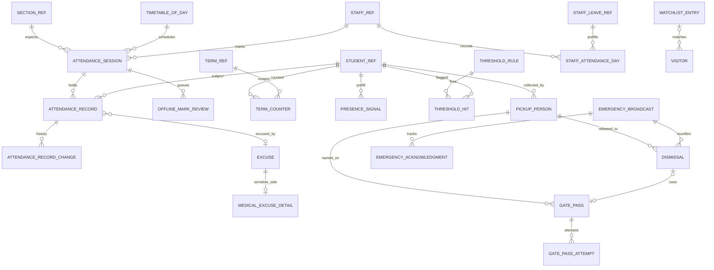
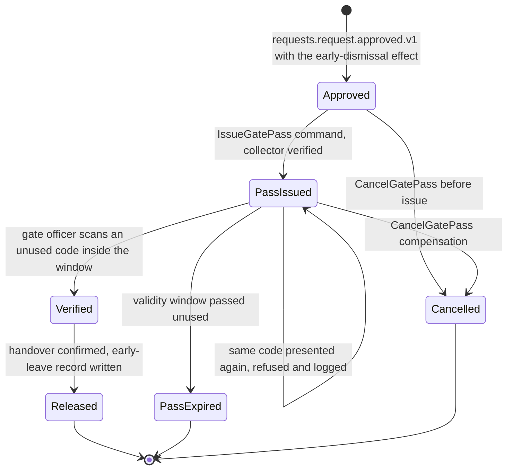

# Attendance

Attendance and Safety records who was where and who took them home. It owns student and staff attendance for every session, the excuses that change a mark, the thresholds that turn a pattern into a flag, and the whole Safety module: authorised pickup persons, one-time gate passes, early dismissal and the late-pickup log, visitors with a watchlist, and emergency broadcast with acknowledgement tracking, roll call by location and reunification. It carries the sharpest write peak in the product (the first period), the offline conflict rules of Appendix M for attendance, roll call and gate-pass verification, and the one failure the product can never have: a child released to the wrong adult. This sheet is the reference sheet; `07-solution-structure.md` part 3 expands this service to file level and section 14 below matches it entry for entry, adding only what the requirements need beyond it.

**Group** C · **Requirement areas covered** ATT, with PRV, PERF, MOB, DATA, SEC rows that bind this service · **Last updated** 2026-09-21 by the planning session

| Fact | Value | Source |
|---|---|---|
| Service (Appendix L) | **Attendance**, long name "Attendance and Safety" | Appendix L.1 |
| Tier | 1 | Appendix L.1, `05-service-catalog.md` |
| AREA code | `ATT` | Appendix L.1 |
| Database, schema, user | `nibras_attendance`, schema `attendance`, application user `svc_attendance`, migration owner `mig_attendance` | Appendix L.1, `10-data-architecture.md` |
| Exchange | `nibras.attendance` (topic) | Appendix L.1 |
| Images | `nibras/attendance-api` | Appendix L.1 |
| Worker | none. Appendix L lists no attendance-worker image, so the Quartz.NET jobs run in the Api host | `07-solution-structure.md` part 3 |
| Why the boundary exists | "Scaling: the sharpest peak in the system at first period, with offline mobile sync and monthly partitions from day one." | `05-service-catalog.md` |
| Synchronous dependencies | School (student directory), gRPC, one hop | Reference architecture Section 8, table 8.0 |
| Service level class | Write-heavy (master brief Section 31) | Reference architecture Section 8, table 8.0 |
| Scaling profile | "Write-heavy; 4 replicas at the morning peak and 2 otherwise (Section 34); partitioned by tenant and month" | `05-service-catalog.md` |
| Build phase | 2 (master brief Section 28) | `05-service-catalog.md` |
| Sensitivity | "confidential; medical excuse detail, gate-pass material and visitor identity references are sensitive" | `05-service-catalog.md`, Appendix J.3 |

---

## 1. Responsibilities and non-responsibilities

### Responsibilities

| Owns | Detail |
|---|---|
| Attendance sessions and records | Daily or per-period sessions per section and school day, one record per student per session, the change history of every record, the daily status derived from periods (BR-ATT-001) |
| Attendance codes in use | Applies the tenant's code list (present, absent, late, excused, medical, school activity, remote, plus custom codes) read from Platform settings |
| Lock window and late edits | The lock window per session (BR-ATT-002), edit-after-lock with reason, late-entry edits with reason before lock (REQ-ATT-011) |
| Pre-fill of the register | Gate and kiosk scans, device adapter scans, bus boarding and approved leave become presence signals that pre-fill the register (BR-ATT-003, REQ-ATT-005, REQ-ATT-012) |
| Offline sync for attendance | The server side of Appendix M for attendance records, emergency acknowledgements, roll call and gate-pass verification; the pending edit-after-lock and conflict review queue (BR-ATT-010) |
| Excuses | Submission with evidence reference, the excuse window, approval and rejection, the automatic code change (REQ-ATT-014 to REQ-ATT-016); medical excuse detail in an encrypted side table |
| Thresholds and counters | Threshold rules, the per-term counters, late conversion and accumulation, consecutive and cumulative ladders, the threshold hits with their reasons (BR-ATT-004 to BR-ATT-007) |
| Percentages | Attendance percentage with the enrolled-days denominator (BR-ATT-008) and the section-move split (BR-ATT-009) |
| Staff attendance | Daily status and late arrival per staff member, pre-filled from approved leave (REQ-ATT-023) |
| Unmarked-class reminder | The per-period cut-off check that publishes `attendance.attendance.not-marked.v1` (BR-ATT-011) |
| Safety: pickup persons | The authorised collectors per student with photo reference and verification state (REQ-ATT-024) |
| Safety: gate passes and dismissal | One-time QR or PIN passes, offline-verifiable signed payloads, single use, revocation; early dismissal from `Approved` to `Released`; the late-pickup log (REQ-ATT-025 to REQ-ATT-031) |
| Safety: visitors | Check-in and check-out, badge data, watchlist matching and the hold instruction (REQ-ATT-030) |
| Safety: emergency | Broadcast, acknowledgements, roll call by location, reunification with verified pickup, drill log (REQ-ATT-032 to REQ-ATT-034) |
| Operational attendance reports | Daily register, percentage by student, section and grade, chronic absence, weekday patterns, regulatory formats (REQ-ATT-035), served from this service's own tables |
| Integrity jobs | The attendance-against-timetable check (REQ-ATT-036), the nightly reference-copy reconciliation, the counter invariant audit, partition maintenance and the retention jobs for visitors and gate passes |

### Not responsible for

| Does not own | Owner instead | Why the line is here |
|---|---|---|
| The student record, enrollment, section membership, guardians, custody text and the medical summary | School | Attendance keeps a slim reference copy and asks School's directory over gRPC for the pickup-eligibility flag; it never stores custody text |
| The timetable, bell schedule, periods, session cancellation and substitution | Scheduling | Attendance expects sessions from `TimetableOfDay`; a cancelled period arrives as `scheduling.timetable.changed.v1` |
| Delivering any message to a guardian, teacher or principal, quiet hours, fallbacks | Notification | Attendance publishes events; delivery is Notification's decision (BR-ATT-011, BR-NOT-001) |
| Leave, early-dismissal and pickup-change requests, their approval chain, the teacher's task inbox | Requests (ADR-0012) | Attendance receives effect commands from Saga 6 and never runs an approval chain |
| Interventions, counselling, clinic visits, the send-home decision | Wellbeing | Attendance publishes `attendance.threshold.reached.v1`; the intervention is Wellbeing's |
| Evidence file bytes, virus scan, signed download URLs, printed badges and legal-notice PDFs | Documents | Attendance stores a `FileReference` and a scan status only |
| Principal dashboards, early-warning models, Student 360 composition, cross-service analytics | Reporting (read models), Bff.Web and Bff.Mobile (composition) | Attendance serves its own operational reports; cross-service facts are projections elsewhere |
| Staff leave records and balances | Hr | Attendance keeps a copy of approved leave for the day |
| Bus routes, boarding events, front-desk calls, deliveries, complaints, lost and found | Operations | Attendance consumes boarding as a pre-fill signal; the front desk's other work is `operations.frontdesk.*` |
| Attendance code definitions, lock window, cut-offs, safety settings | Platform (ADR-0009) | Settings are defined and edited in Platform; Attendance reads them and reacts to `platform.settings.changed.v1` |
| Permission grants and the permission version | Identity | Attendance evaluates permissions from the token and the permission cache |
| The audit store and the access log | Audit | Attendance emits `attendance.audit.recorded.v1` for every write and every sensitive read |
| Real-time hubs | Communication (SignalR hosts) | The roll-call view polls this service; see Decisions in force |

---

## 2. Requirements covered

| Range or identifier | What it binds here |
|---|---|
| REQ-ATT-001 to REQ-ATT-038 | Every ATT row in `03-requirements-catalog.md`: 37 Tier 1, 1 Tier 2 (REQ-ATT-013, third-party device adapters) |
| REQ-PRV-004 | Records retained 7 years, deleted by detaching partitions |
| REQ-MOB-017 | Two devices on one session merge per student by last `receivedAt` |
| REQ-MOB-007, REQ-MOB-010 | Attendance, gate scanning and roll call work offline; every offline action carries a UUID v7 idempotency key and replays once |
| REQ-PERF-003, REQ-PERF-010 | Mark writes p95 under 500 ms at the Appendix N attendance peak, at 20,000 concurrent users |
| REQ-PERF-015 | The register and the timetable of the day are served by compiled queries |
| REQ-PERF-026 | Marking keeps working with Redis down |
| REQ-DATA-002, REQ-DATA-003 | `svc_attendance` owns no tables and has no `BYPASSRLS`; tenancy by filter plus row-level security |
| REQ-DATA-013, REQ-DATA-014 | Monthly partitions three months ahead; no `jsonb` or unbounded text on `attendance_records` |
| REQ-SEC-003 to REQ-SEC-006 | Object-level authorization per record, generated permission and isolation suites, every endpoint declares an Appendix B permission |
| REQ-SEC-009 | Medical excuse detail and visitor identity references encrypted at rest |
| REQ-API-003 | `attendanceDate` as `YYYY-MM-DD`, instants in UTC with `Z` |
| REQ-L10N-005, REQ-L10N-009, REQ-L10N-010, REQ-L10N-011 | Names as `LocalizedText`, Arabic-normalized search on pickup persons and visitors, campus time zone and work week in every window and counter |
| REQ-INF-015, REQ-INF-016 | Horizontal scaling from 2 toward 4 replicas, calendar-aware scale-up before first period |

---

## 3. Aggregates and entities

Every tenant-owned table carries the base columns of `10-data-architecture.md` part 4, which are listed once here and not repeated per table: `id uuid not null` (UUID v7 from `IIdGenerator`), `tenant_id uuid not null` (first column of every index, bound by the row-level security policy), `created_at timestamptz not null`, `created_by uuid null`, `updated_at timestamptz not null`, `updated_by uuid null`, `deleted_at timestamptz null`, `deleted_by uuid null`, and `xmin` mapped as the optimistic concurrency token on every aggregate root. Primary keys are `(tenant_id, id)`; on a partitioned table the partition key is added to the primary key and to every unique index, as PostgreSQL requires. Bilingual names use the `LocalizedText` value object from `Nibras.BuildingBlocks.Localization`, stored as `<field>_en`, `<field>_ar` and, where searchable, `<field>_ar_search`.

### 3.1 AttendanceSession (aggregate root) and its entities

**`attendance_sessions`**, range-partitioned by month on `session_date`.

| Field | Type | Null | Notes |
|---|---|---|---|
| `section_id` | uuid | no | From `SectionReference`; no foreign key across services |
| `campus_id` | uuid | no | Drives the time zone and the calendar |
| `session_date` | date | no | School day in the campus time zone; partition key |
| `period_id` | uuid | yes | Null in daily mode (BR-ATT-001) |
| `mode` | smallint | no | `daily` or `period`, frozen at creation (a mid-year switch never recomputes history) |
| `timetable_entry_id` | uuid | yes | The `TimetableOfDay` entry that expected this session; null for an unscheduled daily session |
| `staff_id` | uuid | no | Expected marker; replaced by the cover teacher on `scheduling.substitution.assigned.v1` |
| `starts_at`, `ends_at` | timestamptz | no | From the bell schedule copy; the lock window runs from `ends_at` (BR-ATT-002) |
| `time_zone` | text | no | IANA zone of the campus, stored beside the date |
| `lock_at` | timestamptz | no | `ends_at` plus the lock window at creation; recomputed only when the setting changes before `lock_at` |
| `status` | smallint | no | `DailyAttendanceToInterventionStatus` subset for a session: `Open`, `NotMarked`, `Marked`, plus `Cancelled` |
| `marked_at`, `marked_by` | timestamptz, uuid | yes | First complete register |
| `reminder_sent_at` | timestamptz | yes | BR-ATT-011 sends exactly one reminder |
| `present_count`, `absent_count`, `late_count` | smallint | no | Maintained in the mark transaction; the payload of `attendance.attendance.marked.v1` |

**`attendance_records`**, range-partitioned by month on `session_date`; the hot table, no `jsonb` and no unbounded text (REQ-DATA-014).

| Field | Type | Null | Notes |
|---|---|---|---|
| `session_id` | uuid | no | Parent session |
| `session_date` | date | no | Partition key, copied from the session |
| `student_id` | uuid | no | Unique with the session: `ux_attendance_records_session_student` |
| `status_code` | text(16) | no | An `AttendanceCode` value from the tenant's code list |
| `minutes_late` | smallint | yes | With `arrived_at`; BR-ATT-004 keeps the arrival time on a converted record |
| `arrived_at` | timestamptz | yes | From the teacher, a presence signal or a late-arrival effect |
| `source` | smallint | no | `MarkSource`: teacher, gate, bus, kiosk, device, offline replay, effect |
| `excuse_id` | uuid | yes | Set by an approved excuse or leave effect |
| `followup_status` | smallint | yes | Per-absence part of `DailyAttendanceToInterventionStatus`: `AbsenceAlerted`, `ExcuseSubmitted`, `ExcuseApproved`, `ExcuseRejected`, `Excused` |
| `device_occurred_at` | timestamptz | yes | Device clock for an offline mark, display only (Appendix M.2) |
| `received_at` | timestamptz | no | Server arrival; orders two devices (Appendix M.3) |
| `client_token` | uuid | yes | Idempotency key of the mark; unique per `(tenant_id, session_date, session_id, student_id, client_token)` |

**`attendance_record_changes`**, range-partitioned by month on `session_date`: `record_id uuid`, `session_date date`, `student_id uuid`, `from_code text(16)`, `to_code text(16)`, `changed_by uuid null`, `changed_via smallint` (edit, edit-after-lock, offline replay, effect, restore), `reason_code text(32) null`, `reason_text_id uuid null` (pointer to `change_reasons`, the side table that holds free text), `request_id uuid null`, `occurred_at timestamptz`, `received_at timestamptz`. Append-only; no update, no soft delete.

**`term_counters`** (performance summary, `21-performance-engineering.md` §3.8): `student_id uuid`, `term_id uuid`, `academic_year_id uuid`, `absent_count int`, `unexcused_absent_count int`, `late_count int`, `excused_count int`, `consecutive_run int`, `derived_absences int`, `last_absence_on date null`. Unique `(tenant_id, student_id, term_id)`.

**`offline_mark_reviews`**: `session_id uuid`, `session_date date`, `student_id uuid`, `kind smallint` (`EditAfterLock`, `OfflineConflict`), `device_code text(16)`, `server_code text(16)`, `device_occurred_at timestamptz`, `received_at timestamptz`, `marked_by uuid`, `status smallint` (`Pending`, `Submitted`, `Applied`, `Refused`, `Dismissed`), `submitted_at timestamptz null`, `decided_by uuid null`, `decided_at timestamptz null`, `client_token uuid`.

**`presence_signals`**: `student_id uuid`, `signal_date date`, `source smallint` (gate, kiosk, NFC, device adapter, bus), `device_id text(64) null`, `route_id uuid null`, `direction smallint null`, `observed_at timestamptz`, `external_ref text(64) null`. Unique `(tenant_id, student_id, source, observed_at)`; rows older than 7 days are deleted by `PresenceSignalCleanupJob`.

**`change_reasons`**: `text text` side table for free-text reasons (edit-after-lock, late edits), Confidential, kept off the hot tables.

**Invariants (AttendanceSession)**

1. A session has at most one record per student; a second mark for the same student updates that record and appends one `attendance_record_changes` row.
2. A record's student belongs to the section on `session_date` per `StudentReference` history; otherwise the mark fails with `ATTENDANCE_STUDENT_NOT_IN_SECTION` (BR-ATT-009).
3. A human write after `lock_at` without `attendance.student-attendance.edit-after-lock` and a reason fails with `ATTENDANCE_SESSION_LOCKED`; an effect command (BR-ATT-003) is not a human write and is accepted.
4. A mark for a session that is `Cancelled` or absent from `TimetableOfDay` fails with `ATTENDANCE_SESSION_NOT_SCHEDULED`.
5. In daily mode no period record exists; in period mode the daily status is derived and never written by hand (BR-ATT-001).
6. A late record whose arrival is at or after start plus the cut-off is stored as absent with `arrived_at` kept (BR-ATT-004).
7. Every change to a record's code writes exactly one change row with both values; the previous value is never lost.
8. `present_count + absent_count + late_count` plus the other codes equals the number of records once `status = Marked`.
9. An offline mark whose `device_occurred_at` is inside the lock window is accepted even after the window (BR-ATT-010); one whose server value was written after `device_occurred_at` becomes an `OfflineConflict` review and changes nothing.
10. A replay of the same `client_token` returns the first result and changes nothing (`ATTENDANCE_DUPLICATE_MARK`, 200).
11. `term_counters` equals the aggregate of its source records at every commit; the nightly invariant audit proves it.

### 3.2 Excuse (aggregate root)

**`excuses`**

| Field | Type | Null | Notes |
|---|---|---|---|
| `student_id` | uuid | no | |
| `from_date`, `to_date` | date | no | Campus school days; `to_date >= from_date` |
| `period_ids` | uuid[] | yes | Partial-day excuse in period mode |
| `code` | text(16) | no | An excused-family code from the tenant list |
| `reason_category` | text(32) | no | Controlled list; the only reason field allowed in Student 360 (Appendix J) |
| `reason_text_id` | uuid | yes | Pointer to `change_reasons`; Confidential |
| `evidence_file_id` | uuid | yes | `ExcuseEvidence`: a Documents `FileReference` |
| `evidence_scan_status` | smallint | yes | From the Files block; an unscanned file cannot be approved |
| `status` | smallint | no | `Submitted`, `Approved`, `Rejected`, `Withdrawn` |
| `source` | smallint | no | guardian, staff, request effect (`ApplyExcusedLeave`) |
| `request_id` | uuid | yes | Set when the excuse comes from Saga 6; unique per tenant |
| `submitted_by`, `submitted_at` | uuid, timestamptz | no | |
| `decided_by`, `decided_at` | uuid, timestamptz | yes | First decision wins |
| `decision_reason_code` | text(32) | yes | Required on reject |
| `client_token` | uuid | yes | Offline submission key; duplicates within 5 minutes for the same student and dates collapse (Appendix M.3) |

**`medical_excuse_details`**, range-partitioned by month on `created_at`, column-encrypted, Sensitive: `excuse_id uuid`, `detail_ciphertext bytea`, `key_id text`. It is read only through the Appendix B action `attendance.excuses.view-medical-detail` (high risk, every read logged), which Appendix I grants to the nurse under a four-eyes grant and denies to the homeroom teacher and the principal.

**Invariants (Excuse)**

1. An excuse submitted more than the configured window after the absence fails with `ATTENDANCE_EXCUSE_WINDOW_PASSED` (default 3 working days of the campus work week, Appendix R WF-ATT-01).
2. An excuse type configured as needing evidence and submitted without `evidence_file_id` fails with `ATTENDANCE_EXCUSE_EVIDENCE_REQUIRED`.
3. Only a guardian linked to the student with rights, or staff with `attendance.excuses.create` in scope, may submit.
4. A decided excuse never changes decision; a second decision fails with `ATTENDANCE_CONCURRENCY_CONFLICT` naming the first decider.
5. Approval sets the excused code on every record in the range, overwriting absent and late, never present (BR-ATT-003), recalculates `term_counters`, and publishes `attendance.excuse.approved.v1` once.
6. A cancelled leave restores previous marks from history, never sets present (BR-ATT-003 edge case).

### 3.3 ThresholdRule (aggregate root) and ThresholdHit

**`threshold_rules`**: `kind smallint` (`consecutive`, `cumulative`, `late-accumulation`), `count int` (> 0), `rung int` (order within a cumulative ladder), `window smallint` (`academic-year`, `grading-period`), `escalate_to text(32)` (role code: guardian, homeroom teacher, counselor, principal), `legal_notice_template_code text(32) null`, `campus_id uuid null` (null means tenant-wide), `counts_derived_absences boolean`, `active boolean`, `name LocalizedText`.

**`threshold_hits`**: `student_id uuid`, `rule_id uuid`, `rung int`, `academic_year_id uuid`, `run_started_on date null`, `count_at_fire int`, `fired_at timestamptz`, `reasons text(256)` (codes of the records that produced it, never free text), `correction_note_code text(32) null`, `status smallint` (`ThresholdReached`, `InterventionOpened`, `InterventionClosed`, `Corrected`). Unique `(tenant_id, student_id, rule_id, rung, academic_year_id, run_started_on)`.

**Invariants**

1. Two active cumulative rules in one ladder never share a `count`; rungs are strictly increasing.
2. Each cumulative rung fires once per student per academic year; a higher rung never re-fires a lower one (BR-ATT-007).
3. A consecutive run counts unexcused absent school days, skips non-school days and resets on any other mark; it fires once per run (BR-ATT-006).
4. A correction that lowers a count never deletes a hit; it sets `Corrected` with a note code and publishes nothing new.
5. Late accumulation adds `floor(lates / N)` derived absences per grading period and never changes a record (BR-ATT-005).

### 3.4 StaffAttendanceDay (aggregate root)

**`staff_attendance_days`**, range-partitioned by month on `attendance_date` (Appendix J: "7 years, delete by partition"): `staff_id uuid`, `campus_id uuid`, `attendance_date date`, `status_code text(16)`, `minutes_late smallint null`, `arrived_at timestamptz null`, `source smallint` (manual, leave copy, kiosk), `leave_id uuid null`, `lock_at timestamptz`. Unique `(tenant_id, attendance_date, staff_id)`.

**Invariants.** A day covered by approved leave reads `on-leave` and accepts no late arrival (REQ-ATT-023); a cancelled leave restores the previous value; edits after `lock_at` need `attendance.staff-attendance.edit-after-lock` and a reason.

### 3.5 Safety aggregates

**`pickup_persons`** (PickupPerson, root)

| Field | Type | Null | Notes |
|---|---|---|---|
| `student_id` | uuid | no | |
| `name` | LocalizedText | no | Arabic-normalized search column |
| `relationship_code` | text(32) | no | |
| `guardian_id` | uuid | yes | Set when the collector is a guardian from School |
| `photo_file_id` | uuid | yes | Required before `Verified` when the tenant's pickup verification method is photo |
| `phone_e164` | text(16) | yes | Confidential |
| `identity_ref_ciphertext` | bytea | yes | Encrypted identity document reference |
| `verification_state` | smallint | no | `Unverified`, `Verified`, `Suspended` |
| `verified_by`, `verified_at` | uuid, timestamptz | yes | |
| `valid_until` | date | yes | Temporary collector |
| `source_request_id` | uuid | yes | Set by `UpdateAuthorizedPickups`; the before-values are kept in the audit event for compensation |

**`gate_passes`** (GatePass, root), range-partitioned by month on `created_at`: `student_id uuid`, `pickup_person_id uuid`, `dismissal_id uuid null`, `kind smallint` (QR, PIN), `code_hash bytea` (SHA-256 of the derived code), `signing_key_id text(32)`, `valid_from timestamptz`, `valid_until timestamptz`, `status smallint` (`Issued`, `Used`, `Expired`, `Revoked`), `issued_by uuid null`, `request_id uuid null`, `used_at timestamptz null`, `verified_by uuid null`, `verified_offline boolean`, `revoked_at timestamptz null`, `revoked_by uuid null`, `revoke_reason_code text(32) null`.

**`gate_pass_attempts`**: `gate_pass_id uuid null`, `code_hash bytea`, `attempted_at timestamptz`, `received_at timestamptz`, `verifier_id uuid`, `outcome smallint` (accepted, already used, expired, revoked, unknown, collector mismatch), `device_id text(64) null`. Append-only.

**`dismissals`** (Dismissal, root; one row per release): `student_id uuid`, `kind smallint` (`early`, `regular`, `late-pickup`, `reunification`), `request_id uuid null`, `approved_time timestamptz null`, `status smallint` (`EarlyDismissalAndGatePickupStatus`: `Approved`, `PassIssued`, `Verified`, `Released`, `PassExpired`, `Cancelled`), `gate_pass_id uuid null`, `broadcast_id uuid null`, `released_to uuid null` (pickup person), `released_by uuid null`, `released_at timestamptz null`, `scheduled_dismissal_at timestamptz null`, `minutes_after_dismissal int null`.

**`visitors`** (Visitor, root): `campus_id uuid`, `name LocalizedText`, `identity_ref_ciphertext bytea null`, `host_staff_id uuid null`, `purpose_code text(32)`, `photo_file_id uuid null`, `badge_number text(16)`, `checked_in_at timestamptz`, `checked_out_at timestamptz null`, `watchlist_hit boolean`, `watchlist_entry_id uuid null`, `hold_instruction_code text(32) null`, `status smallint` (`CheckedIn`, `Held`, `CheckedOut`).

**`watchlist_entries`**: `name LocalizedText`, `identity_ref_hash bytea null`, `instruction_code text(32)`, `reason_code text(32)` (never returned to a caller without `manage-watchlist`), `added_by uuid`, `active boolean`.

**`emergency_broadcasts`** (EmergencyBroadcast, root): `campus_id uuid`, `kind text(32)` (fire, lockdown, evacuation, weather, drill), `is_drill boolean`, `template_code text(32)`, `audience smallint`, `status smallint` (`Active`, `RollCallComplete`, `Reunifying`, `Closed`), `started_by uuid`, `started_at timestamptz`, `step_up_verified_at timestamptz`, `closed_at timestamptz null`, `accounted_count int`, `missing_count int`.

**`emergency_acknowledgments`**, range-partitioned by month on `created_at`: `broadcast_id uuid`, `recipient_kind smallint` (staff, student, visitor), `subject_id uuid`, `name_sort text(128)`, `location_code text(32) null`, `status smallint` (`Unaccounted`, `Accounted`, `Missing`), `acknowledged_at timestamptz null` (earliest `occurredAt` wins), `received_at timestamptz null`, `reported_by uuid null`, `client_token uuid null`.

**Invariants (Safety)**

1. A pickup person is never created for a guardian that School's directory flags as restricted from pickup (REQ-ATT-024); the check runs on create and again at every verification.
2. A pass is issued only for a collector on the student's list in state `Verified` (TC-ATT-013); otherwise `ATTENDANCE_PICKUP_PERSON_NOT_AUTHORIZED`.
3. A pass is used at most once; the first verification to reach the server wins, later ones are logged in `gate_pass_attempts` and refused with `ATTENDANCE_GATE_PASS_INVALID` carrying the first use time (Appendix M.3).
4. A pass used outside `valid_from` to `valid_until` is refused; an expired pass never becomes usable.
5. The code itself is never stored; only its hash and the key id. The QR or PIN is re-derived from the signing key for the guardian's view (section 13).
6. A child is never released without either a used pass or a verified collector match; there is no transition to `Released` otherwise (WF-ATT-02).
7. A visitor matching an active watchlist entry is stored as `Held`, publishes `attendance.visitor.checked-in.v1` with `watchlistHit = true`, and the front desk sees the instruction, never the reason.
8. An emergency broadcast requires `attendance.safety.emergency.broadcast` with a second-factor step-up in the last 5 minutes, limited to campus scope; otherwise `ATTENDANCE_BROADCAST_NOT_PERMITTED`.
9. One acknowledgement row per `(broadcast_id, subject_id)`; duplicates collapse on the earliest `occurredAt` and never double-count (REQ-ATT-034).
10. A reunification release requires a verified collector for that student, exactly as a gate release.

### 3.6 Reference copies (read-only)

`student_refs`, `section_refs`, `staff_refs`, `timetable_of_day`, `term_refs`, `staff_leave_refs`: described in section 9. They carry `tenant_id`, `source_version timestamptz` and `reconciled_at timestamptz`, no audit columns beyond `updated_at`, no soft delete (a retired row keeps `status`), and no `xmin` token because only consumers write them.



---

## 4. REST API

Paths follow `22-api-conventions-and-error-catalog.md` §1 and the endpoint files of `07-solution-structure.md` part 3. Every endpoint also returns the eight cross-cutting codes of Appendix K.1 with the `ATTENDANCE_` prefix (`ATTENDANCE_VALIDATION_FAILED`, `ATTENDANCE_PERMISSION_DENIED`, `ATTENDANCE_TENANT_MISMATCH`, `ATTENDANCE_NOT_FOUND`, `ATTENDANCE_CONCURRENCY_CONFLICT`, `ATTENDANCE_IDEMPOTENCY_REPLAY`, `ATTENDANCE_RATE_LIMITED`, `ATTENDANCE_DEPENDENCY_UNAVAILABLE`); the Errors column lists the service-specific codes and any cross-cutting code the endpoint raises for a domain reason. "Key" in the Idempotent column means the `Idempotency-Key` header of `22-api-conventions-and-error-catalog.md` §5 (24 hours, fingerprinted). Every write is audited through `attendance.audit.recorded.v1`. Lists use keyset pagination with a page cap of 200 unless stated.

### 4.1 Sessions and marking (`SessionEndpoints.cs`)

| Method | Path | Permission | Request | Response | Errors | Idempotent |
|---|---|---|---|---|---|---|
| GET | `/api/v1/attendance/sessions?date=&staffId=` | `attendance.student-attendance.view` | query; `staffId` defaults to the caller | `TeacherSessionRow[]` (session, section, period, times, status, lock time) | none beyond K.1 | Safe; `ETag` |
| GET | `/api/v1/attendance/sections/{id}/attendance?date=&periodId=` | `attendance.student-attendance.view` (own-sections for teachers) | query | `SectionRegister`: session header, `SectionRegisterRow[]` pre-filled from signals, leave and excuses, lock notice | `ATTENDANCE_SESSION_NOT_SCHEDULED` | Safe; `ETag` |
| POST | `/api/v1/attendance/sections/{id}/attendance` | `attendance.student-attendance.mark` | `MarkAttendanceRequest`: date, periodId, `marks[]` (studentId, code, arrivedAt), `occurredAt` | 202 `MarkAttendanceResult` (session id, per-student outcome, counts) | `ATTENDANCE_SESSION_LOCKED`, `ATTENDANCE_SESSION_NOT_SCHEDULED`, `ATTENDANCE_STUDENT_NOT_IN_SECTION`, `ATTENDANCE_DUPLICATE_MARK` (200) | Yes, by session id plus client token (Key required) |
| POST | `/api/v1/attendance/sessions/{id}/edit-after-lock` | `attendance.student-attendance.edit-after-lock` | `EditAfterLockRequest`: `changes[]` (studentId, code), `reasonCode`, `reasonText` | 200 updated register rows | `ATTENDANCE_STUDENT_NOT_IN_SECTION`, `ATTENDANCE_CONCURRENCY_CONFLICT` | Yes, Key required; `If-Match` on the session |
| POST | `/api/v1/attendance/sessions/bulk` | `attendance.student-attendance.bulk-mark` | Bulk envelope (§7 of document 22), up to 500 items, each a session with marks | 200 per-item results | per item: `ATTENDANCE_SESSION_LOCKED`, `ATTENDANCE_SESSION_NOT_SCHEDULED`, `ATTENDANCE_STUDENT_NOT_IN_SECTION` | Yes, Key required on the request |
| GET | `/api/v1/attendance/sessions/unmarked?campusId=&date=` | `attendance.student-attendance.view` (campus) | query | `UnmarkedSessionRow[]`: section, period, teacher, minutes past cut-off | none beyond K.1 | Safe |
| POST | `/api/v1/attendance/sessions/{id}/nudge` | `attendance.student-attendance.nudge` (campus) | `{}` | 202; republishes `attendance.attendance.not-marked.v1` with `escalateTo` = the teacher | `ATTENDANCE_RATE_LIMITED` (one nudge per session per 10 minutes) | Yes, per session per 10-minute window |
| POST | `/api/v1/attendance/sessions/sync` | `attendance.student-attendance.mark` | `SyncOfflineMarksRequest`: up to 500 actions or 5 MB, each with `idempotencyKey`, `occurredAt`, `entityVersion`, `sessionRef`, marks | 200 per-action results: `accepted`, `merged`, `review-created`, `rejected` with Appendix K code | per action: `ATTENDANCE_DUPLICATE_MARK` (200), `ATTENDANCE_OFFLINE_CONFLICT`, `ATTENDANCE_SESSION_NOT_SCHEDULED`, `ATTENDANCE_STUDENT_NOT_IN_SECTION` | Yes, per action key (Appendix M.2) |
| GET | `/api/v1/attendance/sessions/changes?checkpoint=&limit=` | `attendance.student-attendance.view` | checkpoint from the previous page (Bff.Mobile wraps it in the delta token) | `AttendanceChangesPage`: upserted sessions and records in the caller's scope, discarded values, `nextCheckpoint`, `hasMore`; at most 500 changes and 256 KB | `ATTENDANCE_VALIDATION_FAILED` on an unknown or expired checkpoint | Safe |

### 4.2 Students (`StudentEndpoints.cs`, extension of document 07)

| Method | Path | Permission | Request | Response | Errors | Idempotent |
|---|---|---|---|---|---|---|
| GET | `/api/v1/attendance/students/{id}/summary?termId=` | `attendance.student-attendance.view` (own-children, own-homeroom, campus) | query | `StudentAttendanceSummary`: counts by code, raw lates and derived absences separately, percentage (BR-ATT-008), current run, last absence | none beyond K.1 | Safe; `ETag` |
| GET | `/api/v1/attendance/students/{id}/records?from=&to=&exceptionsOnly=` | `attendance.student-attendance.view` | query, cursor | Keyset page of records (timeline, REQ-ATT-037) | none beyond K.1 | Safe |
| GET | `/api/v1/attendance/students/{id}/threshold-hits` | `attendance.thresholds.view` | none | `ThresholdHitRow[]` with rule, rung, count and reason codes | none beyond K.1 | Safe |

### 4.3 Offline review queue (`ReviewEndpoints.cs`, extension)

| Method | Path | Permission | Request | Response | Errors | Idempotent |
|---|---|---|---|---|---|---|
| GET | `/api/v1/attendance/offline-reviews?status=&mine=` | `attendance.student-attendance.view` | query | `OfflineMarkReviewRow[]` with both values and times | none beyond K.1 | Safe |
| POST | `/api/v1/attendance/offline-reviews/{id}/submit` | `attendance.student-attendance.mark` | `{ reasonCode }` | 200 review in `Submitted`; publishes `attendance.mark-review.requested.v1` | `ATTENDANCE_CONCURRENCY_CONFLICT` | Yes, state-guarded (a second submit is a no-op) |
| POST | `/api/v1/attendance/offline-reviews/{id}/resolve` | `attendance.student-attendance.mark` before lock; `attendance.student-attendance.edit-after-lock` after | `{ keep: device \| server }` | 200 resolved review and record | `ATTENDANCE_SESSION_LOCKED`, `ATTENDANCE_CONCURRENCY_CONFLICT` | Yes, first decision wins |
| POST | `/api/v1/attendance/offline-reviews/{id}/apply` | `attendance.student-attendance.edit-after-lock` | `{ decision: apply \| refuse, reasonCode }` | 200 review `Applied` or `Refused`; publishes `attendance.mark-review.resolved.v1` | `ATTENDANCE_CONCURRENCY_CONFLICT` | Yes, first decision wins |

### 4.4 Check-ins and presence signals (`CheckInEndpoints.cs`, extension)

| Method | Path | Permission | Request | Response | Errors | Idempotent |
|---|---|---|---|---|---|---|
| POST | `/api/v1/attendance/check-ins` | `attendance.student-attendance.mark` (kiosk or gate device account, campus) | `{ studentId or cardToken, source, observedAt, deviceId }` | 202 signal accepted, pre-fill applied if a session is open | `ATTENDANCE_STUDENT_NOT_IN_SECTION` | Yes; a scan for the same student and source within 1 minute is ignored |
| POST | `/api/v1/attendance/check-ins/bulk` | `attendance.student-attendance.bulk-mark` | Bulk envelope, up to 500 scans from a device adapter (REQ-ATT-013, Tier 2) | 200 per-item results | per item as above | Yes, Key required |

### 4.5 Staff attendance (`StaffAttendanceEndpoints.cs`, extension)

| Method | Path | Permission | Request | Response | Errors | Idempotent |
|---|---|---|---|---|---|---|
| GET | `/api/v1/attendance/staff-attendance?campusId=&date=` | `attendance.staff-attendance.view` | query | Staff register with leave pre-fill | none beyond K.1 | Safe |
| POST | `/api/v1/attendance/staff-attendance` | `attendance.staff-attendance.mark` | `{ date, entries[] (staffId, code, arrivedAt) }` | 200 register rows | `ATTENDANCE_SESSION_LOCKED` | Yes, Key required |
| POST | `/api/v1/attendance/staff-attendance/{id}/edit-after-lock` | `attendance.staff-attendance.edit-after-lock` | `{ code, reasonCode, reasonText }` | 200 row | `ATTENDANCE_CONCURRENCY_CONFLICT` | Yes, Key required |
| GET | `/api/v1/attendance/staff-attendance/export?from=&to=` | `attendance.staff-attendance.export` | query, `format=csv` | Streamed CSV; audited export | none beyond K.1 | Safe |

### 4.6 Reports (`ReportEndpoints.cs`, extension)

| Method | Path | Permission | Request | Response | Errors | Idempotent |
|---|---|---|---|---|---|---|
| GET | `/api/v1/attendance/reports/daily-register?campusId=&date=` | `attendance.student-attendance.view` | query | Register per section and period | none beyond K.1 | Safe |
| GET | `/api/v1/attendance/reports/percentages?groupBy=student\|section\|grade&termId=` | `attendance.student-attendance.view` | query, cursor | Percentages from `term_counters` and the enrolled-days denominator | none beyond K.1 | Safe |
| GET | `/api/v1/attendance/reports/chronic-absence?termId=&thresholdPercent=` | `attendance.student-attendance.view` | query | Students above the threshold with percentage | none beyond K.1 | Safe |
| GET | `/api/v1/attendance/reports/weekday-patterns?termId=&sectionId=` | `attendance.student-attendance.view` | query | Absence rate by weekday | none beyond K.1 | Safe |
| GET | `/api/v1/attendance/reports/regulatory/{format}?termId=` | `attendance.student-attendance.export` | query | Streamed file in the named regulatory format; audited | `ATTENDANCE_VALIDATION_FAILED` for an unknown format | Safe |
| GET | `/api/v1/attendance/reports/{kind}/export` | `attendance.student-attendance.export` | query, `format=csv` | Streamed CSV of any report above; exports above the Documents threshold go through the Documents export job | none beyond K.1 | Safe |

### 4.7 Excuses (`ExcuseEndpoints.cs`)

| Method | Path | Permission | Request | Response | Errors | Idempotent |
|---|---|---|---|---|---|---|
| POST | `/api/v1/attendance/excuses` | `attendance.excuses.create` (own-children for guardians) | `SubmitExcuseRequest`: studentId, dates, periodIds, code, reasonCategory, reasonText, `evidenceFileId` | 201 `Excuse` | `ATTENDANCE_EXCUSE_EVIDENCE_REQUIRED`, `ATTENDANCE_EXCUSE_WINDOW_PASSED` | Yes, Key required; duplicate within 5 minutes collapses to the first |
| GET | `/api/v1/attendance/excuses?status=&sectionId=` | `attendance.excuses.view` | query, cursor | `ExcuseRow[]`: student, dates, code, reason category, evidence present, scan status | none beyond K.1 | Safe |
| GET | `/api/v1/attendance/excuses/{id}` | `attendance.excuses.view` | none | `Excuse` with a 5-minute evidence link issued by Documents; the medical detail only when the caller also holds `attendance.excuses.view-medical-detail`, and the read is logged | `ATTENDANCE_PERMISSION_DENIED` when the detail is requested without it | Safe |
| POST | `/api/v1/attendance/excuses/{id}/approve` | `attendance.excuses.approve` | `{ note }` | 200 `Excuse`; publishes `attendance.excuse.approved.v1` | `ATTENDANCE_CONCURRENCY_CONFLICT` (first decision wins), `ATTENDANCE_VALIDATION_FAILED` when the evidence scan is not clean | Yes, state-guarded |
| POST | `/api/v1/attendance/excuses/{id}/reject` | `attendance.excuses.reject` | `{ reasonCode }` | 200 `Excuse` | `ATTENDANCE_CONCURRENCY_CONFLICT` | Yes, state-guarded |

### 4.8 Thresholds (`ThresholdEndpoints.cs`)

| Method | Path | Permission | Request | Response | Errors | Idempotent |
|---|---|---|---|---|---|---|
| GET | `/api/v1/attendance/thresholds` | `attendance.thresholds.view` | none | `ThresholdRule[]` | none beyond K.1 | Safe |
| POST | `/api/v1/attendance/thresholds` | `attendance.thresholds.create` | `ThresholdRuleModel` | 201 | `ATTENDANCE_VALIDATION_FAILED` (duplicate rung count) | Key optional |
| PUT | `/api/v1/attendance/thresholds/{id}` | `attendance.thresholds.edit` | `ThresholdRuleModel`, `If-Match` | 200 | `ATTENDANCE_CONCURRENCY_CONFLICT` | Yes, by `If-Match` |
| DELETE | `/api/v1/attendance/thresholds/{id}` | `attendance.thresholds.delete` | `If-Match` | 204; soft delete, fired hits stay | `ATTENDANCE_CONCURRENCY_CONFLICT` | Yes |

### 4.9 Safety: pickup persons and dismissals (`SafetyEndpoints.cs`)

| Method | Path | Permission | Request | Response | Errors | Idempotent |
|---|---|---|---|---|---|---|
| GET | `/api/v1/attendance/safety/pickup-persons?studentId=` | `attendance.safety.pickup-persons.view` | query | `PickupPerson[]` with photo links and verification state | none beyond K.1 | Safe |
| POST | `/api/v1/attendance/safety/pickup-persons` | `attendance.safety.pickup-persons.create` | `PickupPersonModel` | 201 `Unverified` | `ATTENDANCE_PERMISSION_DENIED` (caller without pickup rights, T-ATT-02), `ATTENDANCE_PICKUP_PERSON_NOT_AUTHORIZED` (restricted guardian) | Key optional |
| PATCH | `/api/v1/attendance/safety/pickup-persons/{id}` | `attendance.safety.pickup-persons.edit` | partial model, `If-Match` | 200 | `ATTENDANCE_CONCURRENCY_CONFLICT` | Yes, by `If-Match` |
| DELETE | `/api/v1/attendance/safety/pickup-persons/{id}` | `attendance.safety.pickup-persons.delete` | `If-Match` | 204; live passes naming the person are revoked in the same transaction | `ATTENDANCE_CONCURRENCY_CONFLICT` | Yes |
| POST | `/api/v1/attendance/safety/pickup-persons/{id}/verify` | `attendance.safety.pickup-persons.verify` | `{ method, photoFileId }` | 200 `Verified` | `ATTENDANCE_PICKUP_PERSON_NOT_AUTHORIZED` | Yes, state-guarded |
| POST | `/api/v1/attendance/safety/pickup-persons/verify-collector` | `attendance.safety.pickup-persons.verify` | `{ studentId, pickupPersonId or search }` | 200 match with photo, or refusal with the hold instruction | `ATTENDANCE_PICKUP_PERSON_NOT_AUTHORIZED` | Safe (no state change) |
| GET | `/api/v1/attendance/safety/dismissals?date=&kind=` | `attendance.safety.pickup-persons.view` | query, cursor | `DismissalRow[]`; the late-pickup log (REQ-ATT-031) | none beyond K.1 | Safe |
| POST | `/api/v1/attendance/safety/dismissals` | `attendance.safety.pickup-persons.verify` | `{ studentId, pickupPersonId, kind: regular \| late-pickup }` | 201 `Dismissal`; publishes `attendance.dismissal.processed.v1` | `ATTENDANCE_PICKUP_PERSON_NOT_AUTHORIZED` | Yes, Key required |
| POST | `/api/v1/attendance/safety/dismissals/{id}/release` | `attendance.safety.gate-passes.verify` | `{ confirmedCollectorId }` | 200 `Released`; writes the early-leave record, publishes `attendance.dismissal.processed.v1` and `attendance.attendance.marked.v1` | `ATTENDANCE_PICKUP_PERSON_NOT_AUTHORIZED`, `ATTENDANCE_CONCURRENCY_CONFLICT` | Yes, state-guarded |

### 4.10 Safety: gate passes (`SafetyEndpoints.cs`)

| Method | Path | Permission | Request | Response | Errors | Idempotent |
|---|---|---|---|---|---|---|
| POST | `/api/v1/attendance/safety/gate-passes` | `attendance.safety.gate-passes.issue` | `IssueGatePassRequest`: studentId, pickupPersonId, validFrom, validUntil, kind | 201 `GatePass` with the derived QR payload or PIN, shown once to the issuer | `ATTENDANCE_PICKUP_PERSON_NOT_AUTHORIZED` | Yes, Key required (document 22 §5) |
| GET | `/api/v1/attendance/safety/gate-passes?campusId=&date=&status=` | `attendance.safety.gate-passes.view` | query | Expected pickups with collector photo and window | none beyond K.1 | Safe |
| GET | `/api/v1/attendance/safety/gate-passes/{id}` | `attendance.safety.gate-passes.view` (own-children for guardians) | none | `GatePass` with the QR payload re-derived for the requesting guardian or issuer; never cached | none beyond K.1 | Safe; `Cache-Control: no-store` |
| POST | `/api/v1/attendance/safety/gate-passes/verify` | `attendance.safety.gate-passes.verify` | `{ code, occurredAt, verifiedOffline, deviceId }` | 200 collector photo and identity; pass `Used` | `ATTENDANCE_GATE_PASS_INVALID` with the first use time when already used | Yes: first verification wins, a replay of the same attempt key returns the first result |
| POST | `/api/v1/attendance/safety/gate-passes/{id}/revoke` | `attendance.safety.gate-passes.revoke` | `{ reasonCode }` | 200 `Revoked` | `ATTENDANCE_GATE_PASS_INVALID` when already used | Yes, state-guarded |
| GET | `/api/v1/attendance/safety/gate-passes/keys` | `attendance.safety.gate-passes.verify` | none | The tenant's verification public keys with validity windows (the device `gate_keys` group) | none beyond K.1 | Safe; `ETag` |

### 4.11 Safety: visitors and watchlist (`SafetyEndpoints.cs`)

| Method | Path | Permission | Request | Response | Errors | Idempotent |
|---|---|---|---|---|---|---|
| POST | `/api/v1/attendance/safety/visitors/check-in` | `attendance.safety.visitors.check-in` | `CheckInVisitorRequest`: name, identity reference, host, purpose, photoFileId | 201 `Visitor` with badge data, or `Held` with the hold instruction | none beyond K.1 | Yes, Key required |
| POST | `/api/v1/attendance/safety/visitors/{id}/check-out` | `attendance.safety.visitors.check-out` | `{}` | 200 | `ATTENDANCE_CONCURRENCY_CONFLICT` | Yes, state-guarded |
| GET | `/api/v1/attendance/safety/visitors?campusId=&date=&status=` | `attendance.safety.visitors.view` | query, cursor | `VisitorRow[]` without identity references | none beyond K.1 | Safe |
| GET | `/api/v1/attendance/safety/visitors/{id}` | `attendance.safety.visitors.view` | none | `Visitor`; badge data for printing through Documents | none beyond K.1 | Safe |
| POST | `/api/v1/attendance/safety/visitors` | `attendance.safety.visitors.create` | pre-registration of an expected visitor | 201 | none beyond K.1 | Key optional |
| PATCH | `/api/v1/attendance/safety/visitors/{id}` | `attendance.safety.visitors.edit` | partial model, `If-Match` | 200 | `ATTENDANCE_CONCURRENCY_CONFLICT` | Yes, by `If-Match` |
| GET | `/api/v1/attendance/safety/visitors/export?from=&to=` | `attendance.safety.visitors.export` | query | Streamed CSV without identity references; audited | none beyond K.1 | Safe |
| GET | `/api/v1/attendance/safety/watchlist` | `attendance.safety.visitors.manage-watchlist` | none | `WatchlistEntry[]` with reasons | none beyond K.1 | Safe |
| POST | `/api/v1/attendance/safety/watchlist` | `attendance.safety.visitors.manage-watchlist` | `WatchlistEntryModel` | 201 | none beyond K.1 | Key optional |
| DELETE | `/api/v1/attendance/safety/watchlist/{id}` | `attendance.safety.visitors.manage-watchlist` | none | 204 soft delete | none beyond K.1 | Yes |

### 4.12 Safety: emergency (`SafetyEndpoints.cs`)

| Method | Path | Permission | Request | Response | Errors | Idempotent |
|---|---|---|---|---|---|---|
| POST | `/api/v1/attendance/safety/emergency/broadcasts` | `attendance.safety.emergency.broadcast` (campus, step-up) | `StartBroadcastRequest`: campusId, kind, isDrill, templateCode, audience | 201 `EmergencyBroadcast`; publishes `attendance.emergency.broadcast-started.v1` and seeds `Unaccounted` rows | `ATTENDANCE_BROADCAST_NOT_PERMITTED` | Yes, Key required; one active broadcast per campus |
| GET | `/api/v1/attendance/safety/emergency/broadcasts/{id}` | `attendance.safety.emergency.view` | none | Broadcast with accounted and missing counts | none beyond K.1 | Safe |
| POST | `/api/v1/attendance/safety/emergency/broadcasts/{id}/acknowledgments` | `attendance.safety.emergency.view` | `{ location, occurredAt, clientToken }` for the caller | 200; publishes `attendance.emergency.acknowledged.v1` | none beyond K.1 | Yes; earliest `occurredAt` wins (Appendix M.3) |
| GET | `/api/v1/attendance/safety/emergency/broadcasts/{id}/roll-call?status=&location=` | `attendance.safety.emergency.view` | query, cursor on `(name_sort, id)`, page cap 100 | Unaccounted first, then by location | none beyond K.1 | Safe; `ETag`, polled every 2 s |
| POST | `/api/v1/attendance/safety/emergency/broadcasts/{id}/roll-call` | `attendance.safety.emergency.run-roll-call` | `{ entries[] (subjectId, status, location, occurredAt, clientToken) }` | 200 per-entry results | none beyond K.1 | Yes, per client token; duplicates collapse |
| POST | `/api/v1/attendance/safety/emergency/broadcasts/{id}/roll-call/complete` | `attendance.safety.emergency.run-roll-call` | `{}` | 200; publishes `attendance.roll-call.completed.v1` | `ATTENDANCE_CONCURRENCY_CONFLICT` | Yes, state-guarded |
| POST | `/api/v1/attendance/safety/emergency/broadcasts/{id}/reunifications` | `attendance.safety.emergency.reunify` | `{ studentId, pickupPersonId, assemblyPoint }` | 201 `Dismissal` of kind reunification; publishes `attendance.dismissal.processed.v1` | `ATTENDANCE_PICKUP_PERSON_NOT_AUTHORIZED` | Yes, Key required |
| POST | `/api/v1/attendance/safety/emergency/broadcasts/{id}/close` | `attendance.safety.emergency.broadcast` | `{ outcomeCode }` | 200 `Closed`; drill log entry when `isDrill` | `ATTENDANCE_CONCURRENCY_CONFLICT` | Yes, state-guarded |

**Endpoint count: 70** across 12 endpoint groups. Effect commands from the Requests saga are messages, not endpoints; they are in section 6.

---

## 5. gRPC

| Direction | Contract | Method | Purpose | Deadline | Fallback |
|---|---|---|---|---|---|
| Exposed | none | none | No service names Attendance as a synchronous dependency (reference architecture Section 8, table 8.0), so `Api/Grpc/` is not generated | not applicable | not applicable |
| Consumed | `nibras.school.v1` `StudentDirectory` | `GetStudent`, `ListStudentsBySection` | Roster gaps before the reference copy has caught up, the pickup-eligibility flag of a guardian (Open point 2) | 2 s lookup, 5 s page (document 22 §10.2) | Local `StudentReference`; the pickup-eligibility check refuses rather than falls back (never release on stale custody) |
| Consumed | `nibras.school.v1` `Directory` | `StudentChecksum`, `SectionChecksum`, `StaffChecksum` | Nightly reference-copy reconciliation | 30 s | Job retries next night and raises a data-quality issue after two misses |
| Consumed | `nibras.scheduling.v1` `Timetables` | `GetVersion` and its checksum | Fetch timetable entries on `scheduling.timetable.published.v1`; nightly check (`10-data-architecture.md` part 6). Table 8.0 (v9.1) lists this call on the Attendance row | 5 s page, 30 s checksum | Keep the previous `TimetableOfDay` |
| Consumed | `nibras.hr.v1` `Leave` | `Checksum` | Nightly reconciliation of the staff-leave copy; table 8.0 (v9.1) lists it job only | 30 s | Next night |

Every call carries the metadata of document 22 §10.3 and runs through `SchoolDirectoryClient` (retry with jitter, circuit breaker, cached fallback). No call is made from inside an inbound gRPC call, so the one-hop rule holds.

---

## 6. Events published and consumed

Payload fields are owned by Appendix E and are not restated. Partition keys are Appendix E's.

### 6.1 Published (exchange `nibras.attendance`)

| Routing key | Partition key | Raised by | Consumers (Appendix E) |
|---|---|---|---|
| `attendance.attendance.marked.v1` | `sectionId` | MarkAttendance, BulkMarkAttendance, SyncOfflineMarks, EditAfterLock, dismissal release (early leave), `RecordLateArrival`, `RestorePreviousMarks` | Reporting, Requests, Ai |
| `attendance.student.absent.v1` | `studentId` | Each absent record in a mark transaction, one per student | Notification, Wellbeing, Reporting |
| `attendance.excuse.approved.v1` | `studentId` | ApproveExcuse, `ApplyExcusedLeave` | Reporting, Notification, Requests |
| `attendance.threshold.reached.v1` | `studentId` | Threshold evaluation in the mark transaction and ThresholdEvaluationJob | Wellbeing, Notification, Reporting |
| `attendance.attendance.not-marked.v1` | `sectionId` | UnmarkedClassReminderJob, nudge | Notification, Reporting |
| `attendance.dismissal.processed.v1` | `studentId` | Dismissal release, late pickup, reunification | Notification, Reporting, Wellbeing |
| `attendance.gate-pass.issued.v1` | `studentId` | IssueGatePass endpoint and `IssueGatePass` command | Notification, Requests |
| `attendance.mark-review.requested.v1` | `studentId` | A mark review is raised: `POST /offline-reviews/{id}/submit` (section 4.3), which is the pending edit-after-lock request of Appendix M.3 | Requests |
| `attendance.mark-review.resolved.v1` | `studentId` | `POST /offline-reviews/{id}/apply`, on `Applied` or `Refused` | Requests |
| `attendance.gate-pass.used.v1` | `studentId` | Gate-pass verification | Notification, Audit |
| `attendance.visitor.checked-in.v1` | `campusId` | Visitor check-in | Notification, Reporting |
| `attendance.emergency.broadcast-started.v1` | `campusId` | Start broadcast | Notification, Communication, Reporting |
| `attendance.emergency.acknowledged.v1` | `campusId` | Acknowledgement accepted (first per subject) | Reporting |
| `attendance.roll-call.completed.v1` | `campusId` | Roll call completed | Notification, Reporting |
| `attendance.audit.recorded.v1` | `tenantId` | Every write, every transition, every sensitive read | Audit |
| `attendance.usage.recorded.v1` | `tenantId` | Daily meter of marks, passes and visitors | Platform |

Every publication goes through the outbox in the same transaction as the state change. One integration event per item, never per batch (document 22 §7).

### 6.2 Consumed

Queues are the three of `11-messaging-architecture.md` for Attendance: `attendance.reference-copies`, `attendance.events`, `attendance.commands`. Every handler is idempotent through the inbox keyed on `messageId`, and on the subject key named below.

| Routing key or command | Queue | Handler | What it changes | Idempotent on |
|---|---|---|---|---|
| `school.academic-year.opened.v1`, `school.academic-year.closed.v1` | reference-copies | `AcademicYearConsumer` | Opens or closes the year for counters; closing freezes cumulative ladders | `academicYearId` |
| `school.term.started.v1` | reference-copies | `TermStartedConsumer` | Creates `TermReference`, opens the term's marking calendar, resets late accumulation (BR-ATT-005) | `termId` |
| `school.section.created.v1` | reference-copies | `SectionCreatedConsumer` | Creates `SectionReference` | `sectionId` |
| `school.section.changed.v1` | reference-copies | `SectionChangedConsumer` | Updates `SectionReference` | `sectionId` plus `occurredAt` |
| `school.student.enrolled.v1` | reference-copies | `StudentEnrolledConsumer` | Creates `StudentReference` with enrolment date for the denominator | `studentId` |
| `school.student.section-changed.v1` | reference-copies | `StudentSectionChangedConsumer` | Adds a membership interval from `effectiveOn`; never rewrites records (BR-ATT-009) | `studentId` plus `effectiveOn` |
| `school.student.status-changed.v1` | reference-copies | `StudentStatusChangedConsumer` | Retires the reference, freezes the percentage at withdrawal, revokes live gate passes | `studentId` plus `effectiveOn` |
| `school.student.profile-updated.v1` | reference-copies | `StudentProfileUpdatedConsumer` | Refreshes names and photo reference through `StudentDirectory` when a copied field changed | `studentId` plus `occurredAt` |
| `scheduling.timetable.published.v1`, `scheduling.timetable.changed.v1` | reference-copies | `TimetablePublishedConsumer` | Rebuilds `TimetableOfDay` from `effectiveFrom`; cancelled entries mark sessions `Cancelled`; recorded attendance never changes (BR-SCD-006) | `timetableVersionId` plus `changedEntryIds` |
| `scheduling.substitution.assigned.v1` | reference-copies | `SubstitutionAssignedConsumer` | Changes `staff_id` on the affected sessions; the cover teacher receives the reminder (BR-ATT-011) | `substitutionId` |
| `hr.leave.approved.v1`, `hr.leave.cancelled.v1` | reference-copies | `LeaveApprovedConsumer` | Updates `StaffLeaveReference`; pre-fills or restores `staff_attendance_days` | `leaveId` |
| `wellbeing.intervention.opened.v1` | events | `InterventionOpenedConsumer` | Sets `InterventionOpened` on the threshold hit named by `sourceRuleId`; an event without `sourceRuleId` is discarded | `interventionId` |
| `wellbeing.intervention.closed.v1` | events | `InterventionClosedConsumer` | Sets `InterventionClosed` for `studentId`; carries no clinical field | `interventionId` |
| `wellbeing.clinic-visit.collection-arranged.v1` | events | `CollectionArrangedConsumer` | Raises the send-home gate pass for the student, with no reason stored | `clinicVisitId` |
| `operations.transport.boarding-recorded.v1` | events | `TransportBoardingRecordedConsumer` | Writes a `presence_signals` row that pre-fills bus presence | `studentId` plus `at` |
| `requests.request.approved.v1` | events | `RequestApprovedConsumer` | For the early-dismissal effect only: creates the `Dismissal` in `Approved`; other effects wait for their command | `requestId` |
| `ApplyExcusedLeave` | commands | `ApplyExcusedLeaveHandler` | Creates an approved excuse from the request, sets excused codes past the lock (BR-ATT-003) | `(sagaId, stepKey)` and `requestId` |
| `RecordLateArrival` | commands | `RecordLateArrivalHandler` | Sets late with arrival time, converts under BR-ATT-004 | `(sagaId, stepKey)` |
| `IssueGatePass` | commands | `IssueGatePassCommandHandler` | Issues the pass, moves the dismissal to `PassIssued` | `(sagaId, stepKey)` |
| `CancelGatePass` | commands | `CancelGatePassHandler` | Revokes an unused pass; a used pass replies `EffectFailed` | `gatePassId` |
| `UpdateAuthorizedPickups` | commands | `UpdateAuthorizedPickupsHandler` | Replaces the collector list; replies `EffectApplied` | `(sagaId, stepKey)` |
| `RestorePreviousMarks` | commands | `RestorePreviousMarksHandler` | Restores records changed under `requestId` from history, never to present | `requestId` |
| `platform.tenant.provisioning-requested.v1` | reference-copies | `TenantProvisioningConsumer` | Seeds threshold defaults and partitions; replies `TenantProvisioned` (Saga 1) | `tenantId` |
| `platform.tenant.suspended.v1`, `platform.tenant.reactivated.v1` | reference-copies | `TenantStatusConsumer` | Refuses or reopens writes (BR-PLT-002) | `tenantId` plus `occurredAt` |
| `platform.tenant.deletion-requested.v1`, `platform.tenant.deleted.v1` | reference-copies | `TenantDeletionConsumer` | Records the cooling-off; `DeleteTenantData` removes rows (Saga 2) | `tenantId` |
| `platform.settings.changed.v1` | reference-copies | `SettingsChangedConsumer` | Evicts the rules cache when `scope = attendance` or `safety`; reloads the tenant connection on `scope = isolation` | `tenantId` plus `occurredAt` |
| `platform.plan.changed.v1`, `platform.feature-flag.changed.v1`, `platform.terminology.changed.v1` | reference-copies | `PlatformContextConsumer` | Evicts the tenant context entries | `tenantId` plus `occurredAt` |
| `identity.role.changed.v1`, `identity.permissions.changed.v1` | reference-copies | building-block permission cache | Evicts the permission cache | `permissionVersion` |

The Saga 1, 2 and 10 commands of `13-workflows-and-sagas.md` (`ProvisionTenant`, `DeprovisionTenant`, `DeleteTenantData`, `ProvisionDedicatedDatabase`, `CopyTenantRows`, `ReconcileTenantCopy`, `DropDedicatedDatabase`, `PurgeSourceRows`) are handled by `Features/TenantLifecycle/` and reply on `requests.replies`-style reply routing to Platform, as every data-owning service does.

---

## 7. Sagas and workflows

Attendance orchestrates no saga (`07-solution-structure.md` part 3; master brief Section 7.3 lists the sagas), so `Application/Sagas/` is not generated. It owns two workflows and takes part in five sagas and workflows owned elsewhere. State types are fixed by `31-business-rules-and-workflows.md` section 3; saga designs are in `13-workflows-and-sagas.md` and are not repeated.

| WF or saga | Role | Kind (document 13) | What Attendance implements | State type |
|---|---|---|---|---|
| WF-ATT-01 Daily attendance to intervention | Owner | Single | Session states `Open`, `NotMarked`, `Marked`; record follow-up states `AbsenceAlerted` to `Excused`; `ThresholdReached` on `threshold_hits` | `DailyAttendanceToInterventionStatus` in `Nibras.Attendance.Domain/Sessions/` |
| WF-ATT-02 Early dismissal and gate pickup | Owner of `Approved` onward | Effect | `Requested` and `UnderReview` live in the Requests request (WF-RQS-01); Attendance holds `Approved`, `PassIssued`, `Verified`, `Released`, `PassExpired` on `dismissals` | `EarlyDismissalAndGatePickupStatus` in `Nibras.Attendance.Domain/Safety/` |
| Saga 6 Request fulfilment (WF-RQS-01) | Participant | Saga | The six commands of section 6.2 with their compensations (document 13 section 4) | none local; per-step inbox |
| WF-SCH-04 Mid-year campus transfer | Participant | Single | Reacts to `school.student.section-changed.v1`; split by date (BR-ATT-009) | none local |
| WF-HR-01 Staff leave to substitution | Participant | Effect | Consumes `hr.leave.*` and `scheduling.substitution.assigned.v1` | none local |
| WF-WEL-02 Clinic visit to sent home | Participant | Single | A gate pass for the sent-home student, raised on `wellbeing.clinic-visit.collection-arranged.v1`, which carries no clinical field | none local |
| Sagas 1, 2 and 10 | Participant | Saga | Tenant lifecycle commands | none local |

**WF-ATT-01 transitions and where they run.** `Open → Marked`: `MarkAttendanceHandler`. `Open → NotMarked`: `UnmarkedClassReminderJob` at start plus the grace period. `NotMarked → Marked`: `MarkAttendanceHandler` with a reason. `Marked → AbsenceAlerted`: set on the record when `attendance.student.absent.v1` is committed to the outbox; delivery is Notification's (Open point 5). `AbsenceAlerted → ExcuseSubmitted`: `SubmitExcuseHandler`. `ExcuseSubmitted → ExcuseApproved → Excused`: `ApproveExcuseHandler` in one transaction. `ExcuseSubmitted → ExcuseRejected`: `RejectExcuseHandler`. `Marked → ThresholdReached`: `ThresholdEvaluator` inside the mark transaction. `ThresholdReached → InterventionOpened → InterventionClosed`: Wellbeing owns the decision; Attendance sets the two states from `wellbeing.intervention.opened.v1` and `wellbeing.intervention.closed.v1`, which Appendix E routes here under ADR-0019. Neither payload carries a category, symptom or reason, and an intervention event without `sourceRuleId` is discarded because it did not come from an attendance threshold. `Marked → Marked` offline conflict: `SyncOfflineMarksHandler` with `OfflineConflictRule`.

**WF-ATT-02 as Attendance implements it**



`Cancelled` is Attendance's name for a compensated dismissal (Saga 6 `CancelGatePass`); it is not a WF-ATT-02 state in Appendix R and is listed in Open point 7.

Every transition runs through the transition pipeline of `13-workflows-and-sagas.md` §5.1: validate state, check permission, apply, write `attendance.audit.recorded.v1`, publish through the outbox, one transaction. Concurrent transitions resolve first-wins with `ATTENDANCE_CONCURRENCY_CONFLICT` naming the first actor.

---

## 8. Local reference copies

| Copy | Table | Kept current by | Fields | Reconciled | Staleness tolerated |
|---|---|---|---|---|---|
| Student | `student_refs` plus `student_section_intervals` | `school.student.enrolled.v1`, `school.student.section-changed.v1`, `school.student.status-changed.v1`, `school.student.profile-updated.v1` | `student_id`, `student_number`, `name_en`, `name_ar`, `section_id`, `campus_id`, `status`, `photo_file_id`, `enrolled_on`, `withdrawn_on` | Nightly 02:00 band time, `Directory/StudentChecksum` | Seconds; a mark for a student not yet in the copy asks `StudentDirectory` once |
| Section and term | `section_refs`, `term_refs` | `school.section.created.v1`, `school.section.changed.v1`, `school.term.started.v1`, `school.academic-year.*` | section: `grade_level_id`, `campus_id`, `name`; term: `starts_on`, `ends_on`, `academic_year_id` | Nightly, `Directory/SectionChecksum` | Minutes |
| Timetable of the day | `timetable_of_day` | `scheduling.timetable.published.v1`, `scheduling.timetable.changed.v1`, `scheduling.substitution.assigned.v1`; entries fetched over `Timetables/GetVersion` on publish | `timetable_version_id`, `entry_id`, `section_id`, `period_id`, `staff_id`, `room_id`, `day_of_week`, `starts_at`, `ends_at`, `effective_from`, `cancelled` | Nightly against Scheduling; `AttendanceAgainstTimetableJob` is the second check | Minutes; a publish rebuilds from `effectiveFrom` only |
| Staff | `staff_refs` | Staff ids arrive with timetable entries; names through `StaffDirectory` on first sight, because Appendix E routes no `school.staff.*` event to Attendance (Open point 1) | `staff_id`, `name_en`, `name_ar`, `campus_ids` | Nightly, `Directory/StaffChecksum` | Hours |
| Approved staff leave | `staff_leave_refs` | `hr.leave.approved.v1`, `hr.leave.cancelled.v1` | `leave_id`, `staff_id`, `from_date`, `to_date`, `leave_type_code`, `cancelled` | Nightly against `nibras.hr.v1` `Leave/Checksum` | Minutes |
| Transport boarding | `presence_signals` | `operations.transport.boarding-recorded.v1` | `student_id`, `route_id`, `direction`, `at` | Not reconciled; expires after 7 days | Not applicable |

The nightly `ReferenceCopyReconciliationJob` (section 9) calls `ReferenceCopyReconciler`: compare checksums per tenant, replay from the source through the snapshot method on a difference, then raise a data-quality finding through `reporting.data-quality.issue-detected.v1` when the difference is unexplained (Appendix E job table). A copy is never the source of a decision School should make: the pickup-eligibility flag is always read live.

---

## 9. Background jobs

All jobs are Quartz.NET jobs in the Api host, registered through `Nibras.BuildingBlocks.Jobs`, one tenant per iteration with the tenant variable set, clustered so each fires once per schedule across replicas.

| Job | Schedule | What it does | Publishes | Progress and failure |
|---|---|---|---|---|
| `UnmarkedClassReminderJob` | Every 5 minutes during the band's school day; fires per session at start plus the grace period in the campus time zone | Finds `Open` sessions past the grace period with an incomplete register, sets `NotMarked`, sends one reminder per session, then escalation to the head of year at 60 minutes and the principal at day end (Appendix R WF-ATT-01) | `attendance.attendance.not-marked.v1` | Metric `nibras_attendance_unmarked_sessions`; idempotent by `reminder_sent_at` |
| `ThresholdEvaluationJob` | Nightly 00:30 band time | Re-evaluates ladders after back-dated corrections and derived absences; the in-transaction evaluator covers the live path | `attendance.threshold.reached.v1` | Per-tenant count; a failure retries the tenant next run |
| `AttendanceAgainstTimetableJob` | Daily at the band's latest dismissal plus 60 minutes | Anti-join of expected sessions against `attendance_sessions` in both directions (REQ-ATT-036); `21-performance-engineering.md` §11 calls it `AttendanceTimetableReconciliationJob` | `reporting.data-quality.issue-detected.v1` per orphan set | Findings listed per section and period |
| `PartitionMaintenanceJob` | Monthly, first Sunday 02:00 deployment time | Creates partitions three months ahead for `attendance_records`, `attendance_sessions`, `attendance_record_changes`, `gate_passes`, `emergency_acknowledgments`, `medical_excuse_details`, `staff_attendance_days`; detaches months older than 7 years under legal-hold checks (`10-data-architecture.md` part 5) | none; `attendance.audit.recorded.v1` | Resumes a `DETACH PENDING` with `FINALIZE` (TC-PERF-023) |
| `ReferenceCopyReconciliationJob` | Nightly 02:00 band time | Section 8 | `reporting.data-quality.issue-detected.v1` on a mismatch | Job progress per tenant |
| `InvariantAuditJob` | Nightly 01:00 band time | 1 percent sample of sessions reloaded through the domain; `term_counters` recomputed from records and repaired | `reporting.data-quality.issue-detected.v1` on a repair | Counts per tenant |
| `GatePassExpiryJob` | Every minute | Moves `Issued` passes past `valid_until` to `Expired` and their dismissals to `PassExpired` | `attendance.audit.recorded.v1` | Idempotent by status |
| `PresenceSignalCleanupJob` | Daily 03:00 band time | Deletes presence signals older than 7 days | none | Row counts |
| `VisitorRetentionJob` | Monthly | Deletes visitor rows older than 2 years with their encrypted identity reference (`10-data-architecture.md` part 8) | `attendance.audit.recorded.v1` | Reports to the Data Quality Center |
| `LeaverRetentionJob` | Monthly | Deletes gate-pass rows of students who left more than a year ago | `attendance.audit.recorded.v1` | Reports to the Data Quality Center |
| `AttendanceUsageMeterJob` | Daily 23:30 band time | Counts marks, passes and visitors for the plan meter | `attendance.usage.recorded.v1` | none |

No job here runs long enough to need the job resource of document 22 §6.

---

## 10. Permissions, notifications, settings, error codes

### 10.1 Permissions (Appendix B)

| Permission | Risk | Default holders (Appendix I groups) | Scope used |
|---|---|---|---|
| `attendance.student-attendance.view` | normal | G11: Teacher, Homeroom Teacher; Principal, Vice Principal; Student and Parent for self and own children | own-sections, own-homeroom, own-children, self, campus |
| `attendance.student-attendance.mark` | normal | G11 | own-sections |
| `attendance.student-attendance.bulk-mark` | normal | Principal, Vice Principal, Registrar | campus |
| `attendance.student-attendance.edit-after-lock` | elevated | G12: Principal, Vice Principal, Homeroom Teacher (own homeroom); never Teacher | own-homeroom, campus |
| `attendance.student-attendance.nudge` | normal | Principal, Vice Principal, Academic Coordinator | campus |
| `attendance.student-attendance.export` | normal | Principal, Registrar | campus |
| `attendance.staff-attendance.view`, `.mark`, `.export` | normal | Principal, Vice Principal, HR Officer | campus |
| `attendance.staff-attendance.edit-after-lock` | elevated | Principal | campus |
| `attendance.excuses.view`, `attendance.excuses.create` | normal | Parent (own children), Homeroom Teacher, Principal | own-children, own-homeroom |
| `attendance.excuses.approve`, `attendance.excuses.reject` | normal | G12: Homeroom Teacher, Principal, Vice Principal | own-homeroom, campus |
| `attendance.excuses.view-medical-detail` | high, every read logged | Nurse only, four-eyes grant (G20, online only under Appendix M); must-not for the Homeroom Teacher and the Principal | campus |
| `attendance.thresholds.view`, `.create`, `.edit`, `.delete` | normal | G12 (`edit`), Principal | all-tenant |
| `attendance.safety.pickup-persons.view`, `.create`, `.edit`, `.delete`, `.verify` | elevated | G13: Receptionist / Security, Principal; Parent for `view` and `create` (own children) | campus, own-children |
| `attendance.safety.gate-passes.view`, `.issue`, `.verify`, `.revoke` | elevated | G13; Parent for `view` (own children) | campus, own-children |
| `attendance.safety.visitors.view`, `.create`, `.edit`, `.export`, `.check-in`, `.check-out` | normal to elevated | G13 | campus |
| `attendance.safety.visitors.manage-watchlist` | high | Principal only, four-eyes grant | campus |
| `attendance.safety.emergency.view`, `.run-roll-call`, `.reunify` | high | G13, Principal, every staff member for `view` during an active broadcast | campus |
| `attendance.safety.emergency.broadcast` | high | Principal, Receptionist / Security; step-up required | campus |

### 10.2 Notifications triggered (Appendix C)

| Notification | Trigger | Recipients | Urgency |
|---|---|---|---|
| Emergency broadcast | `attendance.emergency.broadcast-started.v1` | Selected audience | U |
| Emergency acknowledgement missing | `attendance.roll-call.completed.v1` | Incident controller | U |
| Student marked absent | `attendance.student.absent.v1` | Guardians | U |
| Student late or early dismissal processed | `attendance.dismissal.processed.v1` | Guardians | N |
| Gate pass issued or used | `attendance.gate-pass.issued.v1`, `attendance.gate-pass.used.v1` | Guardians, requester | U |
| Visitor on the watchlist checked in | `attendance.visitor.checked-in.v1` | Security, principal | U |
| Class attendance not marked by cut-off | `attendance.attendance.not-marked.v1` | Teacher, then coordinator | N |
| Attendance threshold reached | `attendance.threshold.reached.v1` | Guardians, homeroom teacher, counselor | N |
| Excuse approved | `attendance.excuse.approved.v1` | Guardians | N |

### 10.3 Settings read (Appendix G; defined and edited in Platform)

| Setting (Appendix G) | Type | Default | Inferred from |
|---|---|---|---|
| Attendance → mode | enum daily or period | period for a school with a published period timetable, daily otherwise | whether the tenant's bell schedule has periods |
| Attendance → codes | list of code, label as `LocalizedText`, counts-as | present, absent, late, excused, medical, school activity, remote | Appendix A10 |
| Attendance → cut-off times | minutes: grace for the reminder, late-to-absent cut-off | 30 min grace (BR-ATT-011); 20 min late-to-absent (BR-ATT-004 example) | Appendix S worked examples |
| Attendance → lock window | hours from session end | 48 h | BR-ATT-002 worked example |
| Attendance → thresholds and ladder | rules, late accumulation N, derived absences count toward the ladder | consecutive 3, ladder 5, 10, 15, N = 3, off | BR-ATT-005 to BR-ATT-007 examples |
| Attendance → excuse rules | window in working days, evidence-required types, excused-counts-present | 3 working days, medical requires evidence, on | Appendix R WF-ATT-01, BR-ATT-008 |
| Safety → gate pass validity | minutes around the approved time | 60 | Appendix R WF-ATT-02 |
| Safety → pickup verification method | photo, identity document, PIN | photo | REQ-ATT-024 |
| Safety → visitor policy | photo required, identity required, badge layout | photo and identity required | REQ-ATT-030 |
| Safety → emergency templates | template codes per kind | fire, lockdown, evacuation, drill | Appendix A10 |

### 10.4 Error codes (Appendix K.9, plus K.1 with the `ATTENDANCE_` prefix)

| Code | HTTP | Raised by |
|---|---|---|
| `ATTENDANCE_SESSION_LOCKED` | 409 | `LockWindowRule` on mark, staff mark, resolve |
| `ATTENDANCE_SESSION_NOT_SCHEDULED` | 409 | Mark and sync for a cancelled or unexpected session |
| `ATTENDANCE_DUPLICATE_MARK` | 200 | `DuplicateMarkRule` on an offline or double replay |
| `ATTENDANCE_OFFLINE_CONFLICT` | 409 | `OfflineConflictRule`, `OfflineAttendanceSyncRule` |
| `ATTENDANCE_STUDENT_NOT_IN_SECTION` | 400 | Mark, sync, check-in against section membership on the date |
| `ATTENDANCE_EXCUSE_EVIDENCE_REQUIRED` | 400 | `EvidenceRequiredRule` |
| `ATTENDANCE_EXCUSE_WINDOW_PASSED` | 409 | `ExcuseWindowRule` |
| `ATTENDANCE_GATE_PASS_INVALID` | 403 | `GatePass` verification and revoke |
| `ATTENDANCE_PICKUP_PERSON_NOT_AUTHORIZED` | 403 | `PickupAuthorizationRule` at issue, release, reunification, collector check |
| `ATTENDANCE_BROADCAST_NOT_PERMITTED` | 403 | `BroadcastPermissionRule` |
| `ATTENDANCE_VALIDATION_FAILED`, `ATTENDANCE_PERMISSION_DENIED`, `ATTENDANCE_TENANT_MISMATCH`, `ATTENDANCE_NOT_FOUND`, `ATTENDANCE_CONCURRENCY_CONFLICT`, `ATTENDANCE_IDEMPOTENCY_REPLAY`, `ATTENDANCE_RATE_LIMITED`, `ATTENDANCE_DEPENDENCY_UNAVAILABLE` | per K.1 | Shared problem-details middleware |

---

## 11. Caching and hot queries

The caching table is `21-performance-engineering.md` §1.8 and the hot-query table with its indexes is §3.8; neither is repeated. The pre-peak warm-up of the teacher "today" entries and the timetable copy is §9 row 4 (`WarmAttendanceDayHandler`); the integrity jobs are §11; partition pruning and detach tests are §4. What this sheet adds:

| Addition | Key or index | L1 / L2 | Invalidated by | Why document 21 lacks it |
|---|---|---|---|---|
| Gate-pass verification public keys (Public class) | `nibras:{tenant}:attendance:gate-keys:current:v1`, tags `tenant` | 5 min / 24 h ± 10% | Key rotation handler evicts tag `tenant` | Added by the offline verification design in section 4.10 |
| Excuse review queue | `ix_excuses_status_student (tenant_id, status, from_date, id) WHERE deleted_at IS NULL`; keyset, page 50; 2 commands, p95 15 ms | not cached (Confidential reason category) | not applicable | Not a first-period query |
| Pickup persons of one student at the gate | `ix_pickup_persons_student (tenant_id, student_id) WHERE deleted_at IS NULL`; under 10 rows; 1 command, p95 5 ms | not cached, so a deletion is refused immediately | not applicable | Safety read, never cached by rule |
| Visitors on campus today | `ix_visitors_campus_day (tenant_id, campus_id, checked_in_at) WHERE checked_out_at IS NULL`; under 100 rows; 1 command, p95 10 ms | not cached (Appendix J: visitor not cacheable) | not applicable | Front-desk screen |
| Attendance delta page for Bff.Mobile | `ix_attendance_records_changes (tenant_id, updated_at, id)` on the current and previous month partitions; at most 500 rows; 2 commands, p95 30 ms | not cached | not applicable | The mobile sync path |
| Watchlist match at check-in | `ix_watchlist_name_search (tenant_id, name_ar_search) WHERE active`, plus `identity_ref_hash` equality; 1 command, p95 10 ms | not cached | not applicable | Safety read |

Never cached, restated from §1.8 because it binds the code: medical excuse detail, gate-pass QR or PIN material, visitor identity references, roll-call unaccounted names, pickup persons, the watchlist.

---

## 12. Security

The threat table is `12-security-privacy-safety.md` §2.8 (T-ATT-01 to T-ATT-06, tests `TC-ATT-015`, `TC-SEC-180` to `TC-SEC-184`); common controls are that document's §2 preamble.

| Data class (Appendix J) | Held here | Handling |
|---|---|---|
| Internal | Status per session, minutes late, marked-by | Tenant-keyed cache allowed, invalidated by `attendance.attendance.marked.v1` |
| Confidential | Excuse reason and evidence reference, gate-pass validity window and issuer, emergency roll call and reunification, staff attendance, pickup persons, visitors | Row-level security, per-user cache keys of at most 60 s where cached at all, access logged on export |
| Sensitive | Medical excuse detail; gate-pass QR or PIN material (hashed); visitor identity references (encrypted) | Column encryption or hashing; never cached, never logged, never in an event payload, never sent to a device |

| Never | What |
|---|---|
| Cached | Medical excuse detail, gate-pass code material, visitor identity references, the unaccounted names of a roll call, pickup persons, watchlist entries and reasons |
| Logged | Any Sensitive value or its record id in a message body (a correlation id instead); excuse free text; watchlist reasons; collector identity numbers |
| Sent to a device | Medical excuse detail, watchlist entries or reasons, visitor identity references, and another family's pickup list on a personal device; a school gate-mode device holds its campus's authorised pickup list with photos (`09-mobile-structure.md` §2.7) and the verification public keys, never a signing key and never a pass code other than a guardian's own pass. An offline visitor check-in is matched against the watchlist on the server at sync (`06-services/bff-mobile.md` Open point 4) |

Gate-pass code material is derived, not stored: the QR payload is a deterministic Ed25519 signature over pass id, student id, collector id and validity window with the tenant's gate key (the key lives in the secret store, `12-security-privacy-safety.md` §9), and the PIN is an HMAC of the pass id truncated to the tenant's PIN length. The server stores only `SHA-256(code)` for single-use lookup, so a database read never yields a usable pass, and the guardian's view re-derives the code on request with `Cache-Control: no-store`. Emergency broadcast requires a second-factor step-up within 5 minutes (T-ATT-04). The pickup-eligibility check reads School live and refuses on failure: a stale custody answer is never used to release a child.

---

## 13. Folder and file tree

Document 07 part 3 is reproduced entry for entry; entries marked "(extension)" are added because a requirement, a rule, a workflow or document 21 needs them. Feature folders hold the four-file slice of document 07 (`Command` or `Query`, `Handler`, `Validator`, `Endpoint`); the folders document 07 already groups (`ManageThresholds`, `IssueGatePass`, `CheckInVisitor`, `StartEmergencyBroadcast`) keep their names and hold one command, handler and validator per verb with one endpoint file.

```text
src/Services/Attendance/                                          Attendance and Safety: sessions, excuses, thresholds, pickup, gate passes, visitors, emergencies
├── README.md                                                     purpose, owned data, API, events, how to run, runbook links
├── Nibras.Attendance.Domain/                                     aggregates, invariants, rules, domain events; references Nibras.BuildingBlocks.Domain and Nibras.Contracts.Attendance only
│   ├── Nibras.Attendance.Domain.csproj                           (extension) project file; references only the Domain block and the contracts
│   ├── Sessions/                                                 aggregate: AttendanceSession, AttendanceRecord, AttendanceCode
│   │   ├── AttendanceSession.cs                                  aggregate root; behaviour and invariants live here, one method per BR-ATT rule it enforces
│   │   ├── AttendanceRecord.cs                                   one student in one session; the entity partitioned by tenant and month
│   │   ├── AttendanceCode.cs                                     value object: present, absent, late, excused, plus the tenant's custom codes from Appendix G settings
│   │   ├── AttendanceRecordChange.cs                             (extension) append-only history row holding both values, who, when, via
│   │   ├── TermCounter.cs                                        (extension) per-student per-term counts kept in the mark transaction (document 21 §3.8)
│   │   ├── OfflineMarkReview.cs                                  (extension) pending edit-after-lock and offline-conflict item (BR-ATT-010, Appendix M.3)
│   │   ├── PresenceSignal.cs                                     (extension) gate, kiosk, device and bus signal that pre-fills the register
│   │   ├── DailyAttendanceToInterventionStatus.cs                (extension) WF-ATT-01 state enum named by document 31
│   │   ├── DailyAttendanceToInterventionTransitions.cs           (extension) the allowed transition table checked by every trigger method
│   │   ├── Events/                                               domain events raised by the aggregate; Application maps them to integration events
│   │   │   ├── AttendanceMarked.cs                               raised once per session mark; becomes attendance.attendance.marked.v1
│   │   │   ├── StudentMarkedAbsent.cs                            raised per absent record; becomes attendance.student.absent.v1
│   │   │   └── SessionNotMarked.cs                               (extension) raised by the reminder transition; becomes attendance.attendance.not-marked.v1
│   │   └── Rules/                                                named rule classes, one per BR-ATT identifier in Appendix S
│   │       ├── LockWindowRule.cs                                 marking after the cut-off needs edit-after-lock; error ATTENDANCE_SESSION_LOCKED
│   │       ├── DuplicateMarkRule.cs                              an offline replay of the same mark is a success; error ATTENDANCE_DUPLICATE_MARK carries 200
│   │       ├── OfflineConflictRule.cs                            two devices, two values: server receivedAt orders them (Appendix M); error ATTENDANCE_OFFLINE_CONFLICT
│   │       ├── AttendanceDerivationRule.cs                       (extension) BR-ATT-001 daily status from period marks
│   │       ├── LateToAbsentRule.cs                               (extension) BR-ATT-004 late at or after the cut-off becomes absent, arrival kept
│   │       ├── AttendancePercentageRule.cs                       (extension) BR-ATT-008 present-equivalent over enrolled school days
│   │       ├── SectionMoveAttendanceRule.cs                      (extension) BR-ATT-009 attribution by membership on the date
│   │       ├── OfflineAttendanceSyncRule.cs                      (extension) BR-ATT-010 capture time inside the window accepted, later server write wins
│   │       └── UnmarkedClassReminderRule.cs                      (extension) BR-ATT-011 one reminder, not for cancelled sessions or complete registers
│   ├── Excuses/                                                  aggregate: Excuse with evidence, window and approval
│   │   ├── Excuse.cs                                             aggregate root: student, dates, code, evidence, decision
│   │   ├── ExcuseEvidence.cs                                     value object: FileReference plus scan status from the Files block
│   │   ├── MedicalExcuseDetail.cs                                (extension) encrypted side entity, Sensitive, never projected
│   │   └── Rules/                                                the excuse rules
│   │       ├── ExcuseWindowRule.cs                               days allowed after the absence; error ATTENDANCE_EXCUSE_WINDOW_PASSED
│   │       ├── EvidenceRequiredRule.cs                           excuse types that need a document; error ATTENDANCE_EXCUSE_EVIDENCE_REQUIRED
│   │       └── ApprovedLeaveExcuseRule.cs                        (extension) BR-ATT-003 overwrite absent and late, never present, past the lock
│   ├── Thresholds/                                               aggregate: ThresholdRule and its evaluation
│   │   ├── ThresholdRule.cs                                      aggregate root: kind, count, window, escalation target
│   │   ├── ThresholdEvaluator.cs                                 domain service that decides when attendance.threshold.reached.v1 fires
│   │   ├── ThresholdHit.cs                                       (extension) one fired rung or run, with reason codes and correction state
│   │   └── Rules/                                                (extension) the threshold rules
│   │       ├── LateAccumulationRule.cs                           (extension) BR-ATT-005 every N lates adds one derived absence
│   │       ├── ConsecutiveAbsenceRule.cs                         (extension) BR-ATT-006 run of unexcused absent school days
│   │       └── CumulativeAbsenceLadderRule.cs                    (extension) BR-ATT-007 each rung once per student per year
│   ├── StaffAttendance/                                          (extension) aggregate: StaffAttendanceDay (REQ-ATT-023)
│   │   └── StaffAttendanceDay.cs                                 (extension) daily status, late arrival, leave pre-fill, lock
│   ├── Safety/                                                   aggregates: PickupPerson, GatePass, Visitor, EmergencyBroadcast
│   │   ├── PickupPerson.cs                                       authorised collectors per student with verification state
│   │   ├── GatePass.cs                                           QR or PIN pass: validity window, single use; error ATTENDANCE_GATE_PASS_INVALID
│   │   ├── Visitor.cs                                            check-in, check-out, watch-list hit
│   │   ├── EmergencyBroadcast.cs                                 broadcast, acknowledgements, roll call, reunification
│   │   ├── GatePassAttempt.cs                                    (extension) append-only log of every presentation and refusal
│   │   ├── GatePassCode.cs                                       (extension) value object: derives the QR signature or PIN and its hash, never persisted in clear
│   │   ├── Dismissal.cs                                          (extension) aggregate root for early, regular, late-pickup and reunification releases
│   │   ├── EarlyDismissalAndGatePickupStatus.cs                  (extension) WF-ATT-02 state enum named by document 31
│   │   ├── EarlyDismissalAndGatePickupTransitions.cs             (extension) the allowed transition table
│   │   ├── WatchlistEntry.cs                                     (extension) watchlist row; the reason is visible only with manage-watchlist
│   │   ├── EmergencyAcknowledgment.cs                            (extension) one row per broadcast and subject, earliest occurredAt wins
│   │   └── Rules/                                                the safety rules
│   │       ├── PickupAuthorizationRule.cs                        never release a child to an unlisted person; error ATTENDANCE_PICKUP_PERSON_NOT_AUTHORIZED
│   │       └── BroadcastPermissionRule.cs                        broadcast needs the high-risk permission; error ATTENDANCE_BROADCAST_NOT_PERMITTED
│   ├── References/                                               slim read-only copies rebuilt from events, reconciled nightly (reference architecture Section 8)
│   │   ├── StudentReference.cs                                   id, student number, names in both languages, section, status
│   │   ├── SectionReference.cs                                   id, grade level, campus
│   │   ├── StaffReference.cs                                     id, names, who may mark which section today
│   │   ├── TimetableOfDay.cs                                     the day's expected sessions per section from scheduling.timetable.published.v1
│   │   ├── TermReference.cs                                      (extension) term and academic-year bounds from school.term.started.v1
│   │   └── StaffLeaveReference.cs                                (extension) approved staff leave from hr.leave.approved.v1
│   └── Shared/                                                   value objects, errors and domain services used by more than one aggregate
│       ├── AttendanceErrors.cs                                   one Error per ATTENDANCE_* code in Nibras.Contracts.Attendance
│       ├── SchoolDay.cs                                          value object: date in the campus time zone plus period id
│       └── MarkSource.cs                                         value object: teacher, gate, bus, kiosk, offline replay
├── Nibras.Attendance.Application/                                use cases, consumers, read models; references Domain, the building-block abstractions and the contracts it consumes
│   ├── Nibras.Attendance.Application.csproj                      (extension) project file
│   ├── Features/                                                 vertical slices: one folder per use case, four files each
│   │   ├── MarkAttendance/                                       the worked feature: a teacher marks a class
│   │   │   ├── MarkAttendanceCommand.cs                          record: section id, school day, marks, client idempotency token, occurredAt from the device
│   │   │   ├── MarkAttendanceHandler.cs                          loads the session, applies the rules, saves, writes the outbox in the same transaction; budget 3 commands
│   │   │   ├── MarkAttendanceValidator.cs                        FluentValidation: roster membership, code validity, payload size, one mark per student
│   │   │   └── MarkAttendanceEndpoint.cs                         POST /api/v1/attendance/sections/{id}/attendance, permission attendance.student-attendance.mark, 202 Accepted, idempotent by session id plus client token
│   │   ├── EditAfterLock/                                        elevated correction after the cut-off, permission attendance.student-attendance.edit-after-lock
│   │   │   ├── EditAfterLockCommand.cs                           record: session id, changes, reason code and text, If-Match version
│   │   │   ├── EditAfterLockHandler.cs                           writes changes with history rows, recalculates counters, re-evaluates thresholds
│   │   │   ├── EditAfterLockValidator.cs                         reason required, codes valid, students on the roster of the date
│   │   │   └── EditAfterLockEndpoint.cs                          POST /api/v1/attendance/sessions/{id}/edit-after-lock
│   │   ├── BulkMarkAttendance/                                   whole-section bulk endpoint with per-item results, permission attendance.student-attendance.bulk-mark
│   │   │   ├── BulkMarkAttendanceCommand.cs                      record: up to 500 session items with client references
│   │   │   ├── BulkMarkAttendanceHandler.cs                      independent or all-or-nothing per document 22 §7; one event per item
│   │   │   ├── BulkMarkAttendanceValidator.cs                    500-item cap, unique client references
│   │   │   └── BulkMarkAttendanceEndpoint.cs                     POST /api/v1/attendance/sessions/bulk
│   │   ├── SubmitExcuse/                                         parent or student submits an excuse with evidence
│   │   │   ├── SubmitExcuseCommand.cs                            record: student, dates, periods, code, reason, evidence file id, client token
│   │   │   ├── SubmitExcuseHandler.cs                            applies window and evidence rules, collapses 5-minute duplicates, moves records to ExcuseSubmitted
│   │   │   ├── SubmitExcuseValidator.cs                          date range, guardian link, attachment reference shape
│   │   │   └── SubmitExcuseEndpoint.cs                           POST /api/v1/attendance/excuses
│   │   ├── ApproveExcuse/                                        approver decision; publishes attendance.excuse.approved.v1
│   │   │   ├── ApproveExcuseCommand.cs                           record: excuse id, note
│   │   │   ├── ApproveExcuseHandler.cs                           first decision wins, excused codes applied, counters and thresholds recomputed
│   │   │   ├── ApproveExcuseValidator.cs                         evidence scan clean when evidence is present
│   │   │   └── ApproveExcuseEndpoint.cs                          POST /api/v1/attendance/excuses/{id}/approve
│   │   ├── RejectExcuse/                                         (extension) approver refuses an excuse with a reason code
│   │   │   ├── RejectExcuseCommand.cs                            (extension) record: excuse id, reason code
│   │   │   ├── RejectExcuseHandler.cs                            (extension) first decision wins; records move to ExcuseRejected
│   │   │   ├── RejectExcuseValidator.cs                          (extension) reason code from the tenant list
│   │   │   └── RejectExcuseEndpoint.cs                           (extension) POST /api/v1/attendance/excuses/{id}/reject
│   │   ├── ReviewExcuses/                                        (extension) excuse queue and detail for the approver
│   │   │   ├── ReviewExcusesQuery.cs                             (extension) filters, cursor, or one excuse id
│   │   │   ├── ReviewExcusesHandler.cs                           (extension) AsNoTracking projection; evidence link from Documents, no medical detail
│   │   │   ├── ReviewExcusesValidator.cs                         (extension) filter grammar and page size
│   │   │   └── ReviewExcusesEndpoint.cs                          (extension) GET /api/v1/attendance/excuses and /excuses/{id}
│   │   ├── GetSectionRegister/                                   the register a teacher opens: the hottest read, served by a compiled query
│   │   │   ├── GetSectionRegisterQuery.cs                        record: section id, date, period id
│   │   │   ├── GetSectionRegisterHandler.cs                      compiled query merged with the roster copy and the pre-fill signals; budget 2 commands
│   │   │   ├── GetSectionRegisterValidator.cs                    date inside the term, period in the bell schedule
│   │   │   └── GetSectionRegisterEndpoint.cs                     GET /api/v1/attendance/sections/{id}/attendance
│   │   ├── GetTeacherSessionsToday/                              (extension) the teacher's sessions of the day (document 21 §3.8 query 1)
│   │   │   ├── GetTeacherSessionsTodayQuery.cs                   (extension) record: staff id, date
│   │   │   ├── GetTeacherSessionsTodayHandler.cs                 (extension) served from the warmed "today" cache entry, compiled query behind it
│   │   │   ├── GetTeacherSessionsTodayValidator.cs               (extension) staff id is the caller unless the scope allows otherwise
│   │   │   └── GetTeacherSessionsTodayEndpoint.cs                (extension) GET /api/v1/attendance/sessions
│   │   ├── GetUnmarkedSessions/                                  (extension) principal card and drill-down (REQ-ATT-038)
│   │   │   ├── GetUnmarkedSessionsQuery.cs                       (extension) record: campus id, date
│   │   │   ├── GetUnmarkedSessionsHandler.cs                     (extension) partial index on unmarked sessions
│   │   │   ├── GetUnmarkedSessionsValidator.cs                   (extension) campus in the caller's scope
│   │   │   └── GetUnmarkedSessionsEndpoint.cs                    (extension) GET /api/v1/attendance/sessions/unmarked
│   │   ├── NudgeTeacher/                                         (extension) principal's nudge action
│   │   │   ├── NudgeTeacherCommand.cs                            (extension) record: session id
│   │   │   ├── NudgeTeacherHandler.cs                            (extension) republishes attendance.attendance.not-marked.v1 to the teacher, one per 10 minutes
│   │   │   ├── NudgeTeacherValidator.cs                          (extension) session is NotMarked or Open past the grace period
│   │   │   └── NudgeTeacherEndpoint.cs                           (extension) POST /api/v1/attendance/sessions/{id}/nudge
│   │   ├── GetAttendanceChanges/                                 (extension) delta page that Bff.Mobile wraps in the delta token
│   │   │   ├── GetAttendanceChangesQuery.cs                      (extension) record: checkpoint, limit
│   │   │   ├── GetAttendanceChangesHandler.cs                    (extension) sessions and records in scope changed after the checkpoint, discarded values included
│   │   │   ├── GetAttendanceChangesValidator.cs                  (extension) checkpoint format and age
│   │   │   └── GetAttendanceChangesEndpoint.cs                   (extension) GET /api/v1/attendance/sessions/changes
│   │   ├── GetStudentSummary/                                    counts and streaks for the Student 360 card
│   │   │   ├── GetStudentSummaryQuery.cs                         record: student id, term id
│   │   │   ├── GetStudentSummaryHandler.cs                       reads term_counters and applies AttendancePercentageRule
│   │   │   ├── GetStudentSummaryValidator.cs                     student in the caller's scope
│   │   │   └── GetStudentSummaryEndpoint.cs                      GET /api/v1/attendance/students/{id}/summary
│   │   ├── GetStudentRecords/                                    (extension) per-student timeline (REQ-ATT-037)
│   │   │   ├── GetStudentRecordsQuery.cs                         (extension) record: student id, range, exceptions only, cursor
│   │   │   ├── GetStudentRecordsHandler.cs                       (extension) keyset over the month partitions of the range
│   │   │   ├── GetStudentRecordsValidator.cs                     (extension) range at most one academic year
│   │   │   └── GetStudentRecordsEndpoint.cs                      (extension) GET /api/v1/attendance/students/{id}/records
│   │   ├── GetThresholdHits/                                     (extension) flags with the reasons that produced them
│   │   │   ├── GetThresholdHitsQuery.cs                          (extension) record: student id
│   │   │   ├── GetThresholdHitsHandler.cs                        (extension) hits with rule, rung and reason codes
│   │   │   ├── GetThresholdHitsValidator.cs                      (extension) student in scope
│   │   │   └── GetThresholdHitsEndpoint.cs                       (extension) GET /api/v1/attendance/students/{id}/threshold-hits
│   │   ├── ManageThresholds/                                     create, edit, delete threshold rules
│   │   │   ├── CreateThresholdRuleCommand.cs                     record: kind, count, rung, window, escalation, template code
│   │   │   ├── CreateThresholdRuleHandler.cs                     rung uniqueness, evicts the rules cache
│   │   │   ├── CreateThresholdRuleValidator.cs                   count above zero, ladder strictly increasing
│   │   │   ├── EditThresholdRuleCommand.cs                       record: rule id, model, If-Match version
│   │   │   ├── EditThresholdRuleHandler.cs                       applies forward only; fired hits untouched
│   │   │   ├── EditThresholdRuleValidator.cs                     same checks as create
│   │   │   ├── DeleteThresholdRuleCommand.cs                     record: rule id, If-Match version
│   │   │   ├── DeleteThresholdRuleHandler.cs                     soft delete, hits kept
│   │   │   ├── DeleteThresholdRuleValidator.cs                   rule exists and is not already deleted
│   │   │   ├── ListThresholdRulesQuery.cs                        record: none
│   │   │   ├── ListThresholdRulesHandler.cs                      served from the rules cache entry
│   │   │   └── ThresholdEndpoints.cs                             GET, POST /api/v1/attendance/thresholds and PUT, DELETE /thresholds/{id}
│   │   ├── MarkStaffAttendance/                                  (extension) staff register and marking (REQ-ATT-023)
│   │   │   ├── MarkStaffAttendanceCommand.cs                     (extension) record: date, entries
│   │   │   ├── MarkStaffAttendanceHandler.cs                     (extension) leave-covered days refused as on-leave, lock applied
│   │   │   ├── MarkStaffAttendanceValidator.cs                   (extension) staff on the campus, codes valid
│   │   │   └── MarkStaffAttendanceEndpoint.cs                    (extension) GET and POST /api/v1/attendance/staff-attendance, POST /{id}/edit-after-lock, GET /export
│   │   ├── GetAttendanceReports/                                 (extension) operational reports (REQ-ATT-035)
│   │   │   ├── GetAttendanceReportQuery.cs                       (extension) record: kind, filters, format, cursor
│   │   │   ├── GetAttendanceReportHandler.cs                     (extension) reads counters and the replica-safe report queries; streams CSV
│   │   │   ├── GetAttendanceReportValidator.cs                   (extension) known kind and regulatory format, range limits
│   │   │   └── GetAttendanceReportEndpoint.cs                    (extension) GET /api/v1/attendance/reports/...
│   │   ├── ReviewOfflineMarks/                                   (extension) the pending edit-after-lock and conflict queue
│   │   │   ├── ReviewOfflineMarksCommand.cs                      (extension) record: review id, action submit, resolve or apply, choice, reason
│   │   │   ├── ReviewOfflineMarksHandler.cs                      (extension) first decision wins; resolve before lock by the teacher, apply after lock by the elevated holder
│   │   │   ├── ReviewOfflineMarksValidator.cs                    (extension) action allowed from the current review state
│   │   │   └── ReviewOfflineMarksEndpoint.cs                     (extension) GET /api/v1/attendance/offline-reviews and POST /{id}/submit, /resolve, /apply
│   │   ├── RecordCheckIn/                                        (extension) QR, NFC, kiosk and device adapter scans (REQ-ATT-012, REQ-ATT-013)
│   │   │   ├── RecordCheckInCommand.cs                           (extension) record: student or card token, source, observedAt, device id
│   │   │   ├── RecordCheckInHandler.cs                           (extension) one-minute duplicate suppression, pre-fill of an open session
│   │   │   ├── RecordCheckInValidator.cs                         (extension) device bound to the campus
│   │   │   └── RecordCheckInEndpoint.cs                          (extension) POST /api/v1/attendance/check-ins and /check-ins/bulk
│   │   ├── ManagePickupPersons/                                  (extension) the authorised collector list (REQ-ATT-024)
│   │   │   ├── ManagePickupPersonCommand.cs                      (extension) record: create, edit, delete or verify with the model
│   │   │   ├── ManagePickupPersonHandler.cs                      (extension) live pickup-eligibility check with School, revokes passes of a deleted person
│   │   │   ├── ManagePickupPersonValidator.cs                    (extension) photo required by the verification method, E.164 phone
│   │   │   └── ManagePickupPersonEndpoint.cs                     (extension) GET, POST /api/v1/attendance/safety/pickup-persons, PATCH, DELETE /{id}, POST /{id}/verify
│   │   ├── IssueGatePass/                                        issue, verify and revoke gate passes
│   │   │   ├── IssueGatePassCommand.cs                           record: student, collector, window, kind, idempotency key
│   │   │   ├── IssueGatePassHandler.cs                           collector verified and listed, code derived and hashed, publishes attendance.gate-pass.issued.v1
│   │   │   ├── IssueGatePassValidator.cs                         window inside the configured validity
│   │   │   ├── VerifyGatePassCommand.cs                          record: code, occurredAt, offline flag, device id
│   │   │   ├── VerifyGatePassHandler.cs                          compiled lookup by code hash, first verification wins, attempt logged, publishes attendance.gate-pass.used.v1
│   │   │   ├── VerifyGatePassValidator.cs                        code format, occurredAt not in the future of the server
│   │   │   ├── RevokeGatePassCommand.cs                          record: pass id, reason code
│   │   │   ├── RevokeGatePassHandler.cs                          unused passes only; the pass leaves the live index at once
│   │   │   ├── RevokeGatePassValidator.cs                        reason code present
│   │   │   ├── GetGatePassesQuery.cs                             (extension) list for the gate, one pass for the guardian, the public keys
│   │   │   ├── GetGatePassesHandler.cs                           (extension) re-derives the guardian's own code on request, no-store
│   │   │   └── GatePassEndpoints.cs                              POST /api/v1/attendance/safety/gate-passes, /verify, /{id}/revoke; GET list, /{id}, /keys
│   │   ├── VerifyPickupPerson/                                   gate verification of a collector against the authorised list
│   │   │   ├── VerifyPickupPersonQuery.cs                        record: student id, collector id or search text
│   │   │   ├── VerifyPickupPersonHandler.cs                      match with photo or refusal with the hold instruction; never a release by itself
│   │   │   ├── VerifyPickupPersonValidator.cs                    Arabic-normalized search text length
│   │   │   └── VerifyPickupPersonEndpoint.cs                     POST /api/v1/attendance/safety/pickup-persons/verify-collector
│   │   ├── RecordDismissal/                                      (extension) releases, early-leave record and the late-pickup log (REQ-ATT-028, REQ-ATT-031)
│   │   │   ├── RecordDismissalCommand.cs                         (extension) record: student, collector, kind, or dismissal id to release
│   │   │   ├── RecordDismissalHandler.cs                         (extension) Verified to Released, early-leave mark, minutes after dismissal, publishes attendance.dismissal.processed.v1
│   │   │   ├── RecordDismissalValidator.cs                       (extension) a used pass or a verified collector is present
│   │   │   └── RecordDismissalEndpoint.cs                        (extension) GET, POST /api/v1/attendance/safety/dismissals, POST /{id}/release
│   │   ├── CheckInVisitor/                                       front-desk check-in and check-out with the watch-list
│   │   │   ├── CheckInVisitorCommand.cs                          record: name, identity reference, host, purpose, photo
│   │   │   ├── CheckInVisitorHandler.cs                          watchlist match by normalized name and identity hash, Held on a hit, publishes attendance.visitor.checked-in.v1
│   │   │   ├── CheckInVisitorValidator.cs                        visitor policy fields required
│   │   │   ├── CheckOutVisitorCommand.cs                         record: visitor id
│   │   │   ├── CheckOutVisitorHandler.cs                         sets checked_out_at
│   │   │   ├── CheckOutVisitorValidator.cs                       visitor currently checked in
│   │   │   ├── ManageWatchlistCommand.cs                         (extension) record: add or remove an entry
│   │   │   ├── ManageWatchlistHandler.cs                         (extension) high-risk permission, audited
│   │   │   ├── ManageWatchlistValidator.cs                       (extension) instruction code present
│   │   │   ├── GetVisitorsQuery.cs                               (extension) list, one visitor, export
│   │   │   ├── GetVisitorsHandler.cs                             (extension) never returns identity references
│   │   │   └── VisitorEndpoints.cs                               /api/v1/attendance/safety/visitors and /safety/watchlist routes
│   │   ├── StartEmergencyBroadcast/                              broadcast, acknowledgements, roll call and reunification
│   │   │   ├── StartEmergencyBroadcastCommand.cs                 record: campus, kind, drill flag, template, audience
│   │   │   ├── StartEmergencyBroadcastHandler.cs                 step-up check, seeds Unaccounted rows, publishes attendance.emergency.broadcast-started.v1
│   │   │   ├── StartEmergencyBroadcastValidator.cs               one active broadcast per campus
│   │   │   ├── AcknowledgeBroadcastCommand.cs                    record: broadcast id, location, occurredAt, client token
│   │   │   ├── AcknowledgeBroadcastHandler.cs                    earliest occurredAt wins, publishes attendance.emergency.acknowledged.v1 once per subject
│   │   │   ├── AcknowledgeBroadcastValidator.cs                  broadcast active
│   │   │   ├── RunRollCallCommand.cs                             record: entries by location, or complete
│   │   │   ├── RunRollCallHandler.cs                             collapses duplicates, publishes attendance.roll-call.completed.v1 on completion
│   │   │   ├── RunRollCallValidator.cs                           entries at most 500
│   │   │   ├── ReunifyStudentCommand.cs                          record: student, collector, assembly point
│   │   │   ├── ReunifyStudentHandler.cs                          same authorization as a gate release, writes a reunification dismissal
│   │   │   ├── ReunifyStudentValidator.cs                        collector verified
│   │   │   ├── GetRollCallQuery.cs                               (extension) broadcast and unaccounted-first keyset list
│   │   │   ├── GetRollCallHandler.cs                             (extension) counts from the 2-second cache entry, names from the database
│   │   │   └── EmergencyEndpoints.cs                             /api/v1/attendance/safety/emergency/broadcasts routes
│   │   ├── SyncOfflineMarks/                                     replays the mobile outbox with the conflict rules of Appendix M
│   │   │   ├── SyncOfflineMarksCommand.cs                        record: up to 500 actions, each with key, occurredAt, entity version
│   │   │   ├── SyncOfflineMarksHandler.cs                        per-student merge, lock-window rule, review creation, per-action results
│   │   │   ├── SyncOfflineMarksValidator.cs                      5 MB and 500-action limits, occurredAt not ahead of the server
│   │   │   └── SyncOfflineMarksEndpoint.cs                       POST /api/v1/attendance/sessions/sync
│   │   ├── RequestEffects/                                       (extension) Saga 6 effect command handlers (document 13 section 4)
│   │   │   ├── ApplyExcusedLeaveHandler.cs                       (extension) approved leave becomes an approved excuse, BR-ATT-003
│   │   │   ├── RecordLateArrivalHandler.cs                       (extension) late with arrival time, BR-ATT-004
│   │   │   ├── IssueGatePassCommandHandler.cs                    (extension) issues the pass for an approved early dismissal
│   │   │   ├── CancelGatePassHandler.cs                          (extension) revokes an unused pass; used passes reply EffectFailed
│   │   │   ├── UpdateAuthorizedPickupsHandler.cs                 (extension) replaces the collector list, replies EffectApplied
│   │   │   └── RestorePreviousMarksHandler.cs                    (extension) compensation: marks restored from history, never to present
│   │   └── TenantLifecycle/                                      (extension) Saga 1, 2 and 10 command handlers every data-owning service carries
│   │       ├── ProvisionTenantHandler.cs                         (extension) seeds defaults and partitions, replies TenantProvisioned
│   │       ├── DeleteTenantDataHandler.cs                        (extension) deletes the tenant's rows per partition, replies with row counts
│   │       └── TierMigrationHandlers.cs                          (extension) dedicated database, copy, reconcile, purge replies
│   ├── Consumers/                                                integration event handlers, each idempotent through the inbox
│   │   ├── StudentEnrolledConsumer.cs                            school.student.enrolled.v1 creates the StudentReference
│   │   ├── StudentSectionChangedConsumer.cs                      school.student.section-changed.v1 moves the reference between sections
│   │   ├── StudentStatusChangedConsumer.cs                       school.student.status-changed.v1 retires the reference
│   │   ├── StudentProfileUpdatedConsumer.cs                      (extension) school.student.profile-updated.v1 refreshes names and photo
│   │   ├── SectionCreatedConsumer.cs                             school.section.created.v1 creates the SectionReference
│   │   ├── SectionChangedConsumer.cs                             (extension) school.section.changed.v1 updates the SectionReference
│   │   ├── AcademicYearConsumer.cs                               (extension) school.academic-year.opened.v1 and closed.v1 open and freeze the year
│   │   ├── TermStartedConsumer.cs                                school.term.started.v1 opens the term's marking calendar
│   │   ├── TimetablePublishedConsumer.cs                         scheduling.timetable.published.v1 and scheduling.timetable.changed.v1 rebuild TimetableOfDay
│   │   ├── SubstitutionAssignedConsumer.cs                       scheduling.substitution.assigned.v1 changes who may mark the period
│   │   ├── LeaveApprovedConsumer.cs                              hr.leave.approved.v1 and hr.leave.cancelled.v1 pre-fill staff absence
│   │   ├── RequestApprovedConsumer.cs                            requests.request.approved.v1 dispatches the leave, early dismissal and pickup change effects
│   │   ├── TransportBoardingRecordedConsumer.cs                  operations.transport.boarding-recorded.v1 pre-fills bus presence
│   │   ├── TenantProvisioningConsumer.cs                         (extension) platform.tenant.provisioning-requested.v1
│   │   ├── TenantStatusConsumer.cs                               (extension) platform.tenant.suspended.v1 and reactivated.v1 refuse and reopen writes
│   │   ├── TenantDeletionConsumer.cs                             (extension) platform.tenant.deletion-requested.v1 and deleted.v1
│   │   ├── SettingsChangedConsumer.cs                            (extension) platform.settings.changed.v1 evicts rules and reloads isolation
│   │   └── PlatformContextConsumer.cs                            (extension) plan, feature-flag and terminology changes evict the tenant context
│   ├── Sagas/                                                    where a process manager goes when one spans services; Attendance owns none (master brief Section 7.3 lists the sagas), so the template does not create this folder here
│   ├── ReadModels/                                               query projections and DTOs: AsNoTracking, Select to DTO, keyset paging
│   │   ├── SectionRegisterRow.cs                                 one row of the register grid, pre-filled from gate, bus and approved leave
│   │   ├── StudentAttendanceSummary.cs                           counts, streaks, last absence for one student
│   │   ├── UnmarkedSessionRow.cs                                 the reminder job's read shape
│   │   ├── TeacherSessionRow.cs                                  (extension) one session of the teacher's day
│   │   ├── AttendanceChangesPage.cs                              (extension) delta page shape for Bff.Mobile
│   │   ├── RollCallRow.cs                                        (extension) one subject in the roll call, unaccounted first
│   │   └── RegisterQueries.cs                                    keyset queries over IAttendanceReadContext, page size capped at 200
│   ├── Caching/                                                  what this service caches and what invalidates it
│   │   └── AttendanceCacheKeys.cs                                keys, tags, TTL policy and invalidating events, matching the caching table in 06-services/attendance.md
│   ├── Abstractions/                                             the ports Infrastructure implements
│   │   ├── IAttendanceRepository.cs                              load and save aggregates
│   │   ├── IAttendanceReadContext.cs                             AsNoTracking IQueryable sources for the read models
│   │   ├── IStudentDirectory.cs                                  the one synchronous lookup: School over gRPC with a cached fallback; the clock port comes from the Domain block
│   │   ├── IGatePassSigner.cs                                    (extension) derives QR signatures and PINs from the tenant gate key
│   │   └── IEvidenceLinks.cs                                     (extension) asks Documents for a 5-minute evidence link
│   ├── Permissions/                                              constants that match Appendix B
│   │   └── AttendancePermissions.cs                              attendance.student-attendance.mark, attendance.excuses.approve, attendance.safety.emergency.broadcast and every other permission, one constant each
│   └── DependencyInjection.cs                                    AddAttendanceApplication(): handlers, validators, consumers, cache policies
├── Nibras.Attendance.Infrastructure/                             adapters: PostgreSQL, RabbitMQ, gRPC clients, reconciliation
│   ├── Nibras.Attendance.Infrastructure.csproj                   (extension) project file
│   ├── Persistence/                                              EF Core 10 against nibras_attendance as user svc_attendance
│   │   ├── AttendanceDbContext.cs                                pooled, named Tenant and SoftDelete filters, audit columns, xmin concurrency, SET LOCAL app.tenant_id per transaction
│   │   ├── CompiledQueries/                                      EF.CompileAsyncQuery for the hottest reads
│   │   │   ├── SectionRegisterQuery.cs                           the register for one section and day
│   │   │   ├── TimetableOfDayQuery.cs                            expected sessions for one teacher today
│   │   │   ├── StudentAttendanceQuery.cs                         (extension) one student's range, document 21 §3.8 query 4
│   │   │   ├── TermCounterQuery.cs                               (extension) one counter row for the threshold rule, query 6
│   │   │   └── GatePassByCodeQuery.cs                            (extension) live pass by code hash, query 7
│   │   ├── CompiledModel/                                        generated compiled model, regenerated by tools/scripts/migrate-bundle.mjs
│   │   ├── Configurations/                                       one IEntityTypeConfiguration per aggregate and reference, tenant_id first in every index
│   │   │   ├── AttendanceSessionConfiguration.cs                 table attendance_sessions
│   │   │   ├── AttendanceRecordConfiguration.cs                  table attendance_records, partitioned by tenant and month, partial index on deleted_at IS NULL
│   │   │   ├── AttendanceRecordChangeConfiguration.cs            (extension) table attendance_record_changes and change_reasons
│   │   │   ├── TermCounterConfiguration.cs                       (extension) table term_counters
│   │   │   ├── OfflineMarkReviewConfiguration.cs                 (extension) tables offline_mark_reviews and presence_signals
│   │   │   ├── ExcuseConfiguration.cs                            table excuses
│   │   │   ├── MedicalExcuseDetailConfiguration.cs               (extension) table medical_excuse_details, encrypted column, Sensitive classification
│   │   │   ├── ThresholdRuleConfiguration.cs                     table threshold_rules
│   │   │   ├── ThresholdHitConfiguration.cs                      (extension) table threshold_hits
│   │   │   ├── StaffAttendanceDayConfiguration.cs                (extension) table staff_attendance_days
│   │   │   ├── SafetyConfigurations.cs                           pickup_persons, gate_passes, visitors, emergency_broadcasts
│   │   │   ├── SafetyLogConfigurations.cs                        (extension) gate_pass_attempts, dismissals, watchlist_entries, emergency_acknowledgments
│   │   │   └── ReferenceConfigurations.cs                        student_refs, section_refs, staff_refs, timetable_of_day
│   │   ├── Migrations/                                           expand-and-contract migrations, bundled by migrate.yml, never run at startup
│   │   │   ├── 20260901000000_Initial.cs                         the first schema, with row-level security and the first partitions
│   │   │   └── AttendanceDbContextModelSnapshot.cs               EF Core model snapshot
│   │   ├── Repositories/                                         implementations of the Application ports
│   │   │   ├── AttendanceRepository.cs                           aggregate persistence
│   │   │   └── AttendanceReadContext.cs                          exposes the AsNoTracking sets
│   │   ├── RowLevelSecurity/                                     the second barrier, applied by the Initial migration and by every migration that adds a table
│   │   │   └── policies.sql                                      ENABLE and FORCE ROW LEVEL SECURITY plus the tenant_isolation policy per table (reference architecture Section 14)
│   │   └── Partitioning/                                         monthly partitions for attendance_records and their detach schedule
│   │       └── attendance_records_partitions.sql                 create-ahead and detach statements run by PartitionMaintenanceJob
│   ├── Messaging/                                                Wolverine and RabbitMQ topology for this service
│   │   ├── AttendanceTopology.cs                                 exchange nibras.attendance, queues attendance.<purpose> with .dlq and .parking, partition keys from Appendix E
│   │   └── IntegrationEventMapper.cs                             domain events to Nibras.Contracts.Attendance V1 records, written through the outbox
│   ├── Grpc/                                                     clients for the rare synchronous query
│   │   ├── SchoolDirectoryClient.cs                              IStudentDirectory over nibras.school.v1: timeout, retry with jitter, circuit breaker, cached fallback
│   │   ├── SchedulingTimetableClient.cs                          (extension) Timetables/GetVersion on publish and the nightly checksum
│   │   └── HrLeaveChecksumClient.cs                              (extension) Leave/Checksum for the nightly reconciliation
│   ├── Security/                                                 (extension) key material adapters
│   │   └── GatePassSigner.cs                                     (extension) Ed25519 and HMAC derivation with the tenant gate key from the secret store
│   ├── Documents/                                                (extension) HTTP adapter to Documents
│   │   └── EvidenceLinkClient.cs                                 (extension) requests 5-minute signed links for evidence and photos
│   ├── Reconciliation/                                           nightly checksum of the reference copies against School (master brief Section 19)
│   │   └── ReferenceCopyReconciler.cs                            compares, repairs by replay, raises a data-quality issue on an unexplained difference
│   └── DependencyInjection.cs                                    AddAttendanceInfrastructure(): pooled DbContext, repositories, topology, gRPC channel
├── Nibras.Attendance.Api/                                        the HTTP host, image nibras/attendance-api
│   ├── Nibras.Attendance.Api.csproj                              (extension) project file
│   ├── Program.cs                                                composition root, no logic: ServiceDefaults, Application, Infrastructure, endpoints, probes
│   ├── Endpoints/                                                endpoint registration by feature group
│   │   ├── SessionEndpoints.cs                                   /api/v1/attendance/sections/{id}/attendance and /api/v1/attendance/sessions
│   │   ├── ExcuseEndpoints.cs                                    /api/v1/attendance/excuses
│   │   ├── ThresholdEndpoints.cs                                 /api/v1/attendance/thresholds
│   │   ├── SafetyEndpoints.cs                                    /api/v1/attendance/safety/pickup-persons, gate-passes, visitors, emergency
│   │   ├── StudentEndpoints.cs                                   (extension) /api/v1/attendance/students/{id}/summary, records, threshold-hits
│   │   ├── ReviewEndpoints.cs                                    (extension) /api/v1/attendance/offline-reviews
│   │   ├── CheckInEndpoints.cs                                   (extension) /api/v1/attendance/check-ins
│   │   ├── StaffAttendanceEndpoints.cs                           (extension) /api/v1/attendance/staff-attendance
│   │   └── ReportEndpoints.cs                                    (extension) /api/v1/attendance/reports
│   ├── Grpc/                                                     gRPC services this service exposes; none in v1 because no service names Attendance as a synchronous dependency (reference architecture Section 8), so the template does not create this folder here
│   ├── Jobs/                                                     Quartz.NET jobs, hosted here because Appendix L lists no attendance-worker image
│   │   ├── UnmarkedClassReminderJob.cs                           per period cut-off, per campus time zone; publishes attendance.attendance.not-marked.v1
│   │   ├── ThresholdEvaluationJob.cs                             nightly threshold pass; publishes attendance.threshold.reached.v1
│   │   ├── AttendanceAgainstTimetableJob.cs                      the daily orphan check in both directions (master brief Section 19)
│   │   ├── PartitionMaintenanceJob.cs                            creates next month's partition and detaches per Appendix J
│   │   ├── ReferenceCopyReconciliationJob.cs                     (extension) nightly trigger of ReferenceCopyReconciler per tenant
│   │   ├── InvariantAuditJob.cs                                  (extension) nightly sample and term_counters repair (document 21 §11)
│   │   ├── GatePassExpiryJob.cs                                  (extension) expires unused passes and their dismissals
│   │   ├── PresenceSignalCleanupJob.cs                           (extension) deletes pre-fill signals older than 7 days
│   │   ├── VisitorRetentionJob.cs                                (extension) 2-year visitor deletion (document 10 part 8)
│   │   ├── LeaverRetentionJob.cs                                 (extension) gate passes of leavers after 1 year
│   │   └── AttendanceUsageMeterJob.cs                            (extension) daily attendance.usage.recorded.v1
│   ├── appsettings.json                                          non-secret defaults; every secret arrives from the environment (reference architecture Section 12)
│   ├── appsettings.Development.json                              Aspire and compose development values
│   └── Dockerfile                                                Debian-based aspnet image, non-root, read-only root filesystem, ICU and tzdata present, TZ=UTC
└── tests/                                                        the service's own suites; the cross-service suites are under /tests
    ├── Nibras.Attendance.UnitTests/                              domain and handlers, no containers
    │   ├── Nibras.Attendance.UnitTests.csproj                    (extension) references Domain and Application only
    │   ├── Domain/                                               one test class per aggregate and per BR-ATT rule, table-driven from the worked examples in Appendix S
    │   │   ├── AttendanceDerivationRulesTests.cs                 (extension) BR-ATT-001
    │   │   ├── AttendanceLockWindowRulesTests.cs                 (extension) BR-ATT-002 against LockWindowRule, Riyadh and Dubai boundaries
    │   │   ├── ApprovedLeaveExcuseRulesTests.cs                  (extension) BR-ATT-003
    │   │   ├── LateToAbsentRulesTests.cs                         (extension) BR-ATT-004
    │   │   ├── LateAccumulationRulesTests.cs                     (extension) BR-ATT-005
    │   │   ├── ConsecutiveAbsenceRulesTests.cs                   (extension) BR-ATT-006
    │   │   ├── CumulativeAbsenceLadderRulesTests.cs              (extension) BR-ATT-007
    │   │   ├── AttendancePercentageRulesTests.cs                 (extension) BR-ATT-008 rows plus the property that the value stays within 0 and 100
    │   │   ├── SectionMoveAttendanceRulesTests.cs                (extension) BR-ATT-009
    │   │   ├── OfflineAttendanceSyncRulesTests.cs                (extension) BR-ATT-010
    │   │   ├── UnmarkedClassReminderRulesTests.cs                (extension) BR-ATT-011
    │   │   ├── AttendanceSessionTests.cs                         (extension) session invariants 1 to 11
    │   │   ├── ExcuseTests.cs                                    (extension) excuse invariants
    │   │   ├── GatePassTests.cs                                  (extension) single use, window, derived code never stored
    │   │   └── EmergencyBroadcastTests.cs                        (extension) acknowledgement collapse and roll-call counts
    │   ├── Features/                                             handler tests with fakes for the ports
    │   │   ├── MarkAttendanceHandlerTests.cs                     (extension) one marked event and one absent event per absentee
    │   │   ├── SyncOfflineMarksHandlerTests.cs                   (extension) per-student merge and review creation
    │   │   └── RequestEffectHandlersTests.cs                     (extension) each effect and its compensation twice
    │   └── Consumers/                                            idempotency and reference-copy tests
    │       └── ReferenceCopyConsumerTests.cs                     (extension) every reference consumer delivered twice writes one row
    ├── Nibras.Attendance.IntegrationTests/                       Testcontainers: PostgreSQL, RabbitMQ, Redis
    │   ├── Nibras.Attendance.IntegrationTests.csproj             (extension) references Api and the Testing block
    │   ├── Fixtures/                                             AttendanceWebAppFactory over the Testing block fixtures, two seeded tenants
    │   ├── Endpoints/                                            each endpoint against the real stack, asserting the data and not the status code
    │   ├── Persistence/                                          row-level security, pooled-connection isolation, query budgets with the command counter
    │   ├── Messaging/                                            outbox publish, inbox deduplication, consumer replay
    │   ├── Jobs/                                                 the reminder cut-off across Riyadh, Amman and Dubai
    │   ├── Workflows/                                            (extension) one class per Appendix R workflow (document 13 §5.2)
    │   │   ├── DailyAttendanceToInterventionWorkflowTests.cs     (extension) TC-ATT-001 to TC-ATT-006 plus failure paths
    │   │   └── EarlyDismissalAndGatePickupWorkflowTests.cs       (extension) TC-ATT-011 to TC-ATT-016 plus compensation
    │   ├── Cache/                                                (extension) invalidation by the real event for every §1.8 entry, Redis down
    │   ├── Offline/                                              (extension) the eight Appendix M.5 tests for attendance
    │   └── Perf/                                                 (extension) EXPLAIN captures for the hot queries, committed under docs/perf/attendance/
    └── Nibras.Attendance.ContractTests/                          API and message contracts
        ├── Nibras.Attendance.ContractTests.csproj                (extension) references PactNet and the contracts
        ├── Provider/                                             Pact provider verification of the OpenAPI document
        ├── Consumer/                                             (extension) School directory, Scheduling and Hr gRPC consumer pacts
        └── Messages/                                             schema tests for every V1 record in Nibras.Contracts.Attendance, publisher side
```

---

## 14. Test plan

Existing identifiers are reused; new ones are minted upward from `TC-ATT-301` in the 301 to 360 block, a range no document in the kit uses (checked with a search of `docs/` on 2026-09-21).

| Test case | Level | What it proves |
|---|---|---|
| `TC-ATT-001` (Appendix R) | Workflow | `Open → Marked`: a teacher holding the assignment saves the register; absentees queued for alerting |
| `TC-ATT-002` (Appendix R) | Workflow, job | `Open → NotMarked`: grace passed, escalation raised, still markable with a reason (BR-ATT-011) |
| `TC-ATT-003` (Appendix R) | Workflow, end to end | `Marked → AbsenceAlerted` and the pre-filled register from gate and leave; alert enqueued within 30 s |
| `TC-ATT-004` (Appendix R) | Workflow | `ExcuseSubmitted → ExcuseApproved`: day excused, counters recalculated |
| `TC-ATT-005` (Appendix R) | Workflow | `Marked → ThresholdReached`: flag raised with its reasons |
| `TC-ATT-006` (Appendix R) | Workflow | `Marked → Marked` offline conflict: both values shown, no silent overwrite |
| `TC-ATT-011` (Appendix R) | Workflow (with the Requests stub) | `Requested → UnderReview`: review task raised for the homeroom teacher |
| `TC-ATT-012` (Appendix R) | Workflow | `UnderReview → Approved`: dismissal created in `Approved` from `requests.request.approved.v1` |
| `TC-ATT-013` (Appendix R) | Workflow | `Approved → PassIssued`: collector on the list, code issued with photo |
| `TC-ATT-014` (Appendix R) | Workflow | `PassIssued → Verified`: unused code inside the window shows photo and identity |
| `TC-ATT-015` (Appendix R) | Workflow, security | `PassIssued → PassIssued`: second presentation refused and logged (T-ATT-01) |
| `TC-ATT-016` (Appendix R) | Workflow | `Verified → Released`: early-leave attendance written, guardian notified |
| TC-ATT-101, TC-ATT-102 | UAT | Principal unmarked drill-down with nudge; emergency mode drill |
| `TC-ATT-201`, `TC-ATT-202`, `TC-ATT-205`, `TC-ATT-206` (document 08) | UAT, end to end | All-present marking, 60-second class, timeline, excuse review with closed medical detail (Appendix Q) |
| TC-ATT-203 | UAT, end to end | Given a teacher whose device is in airplane mode, when they mark the second class of the day, then marking works with a clear offline badge and a visible queue count, and after reconnecting each mark syncs to the server exactly once (REQ-ATT-006, WF-ATT-01) |
| TC-ATT-204 | UAT, end to end | Given a colleague who marked one of the same students differently from another device, when the teacher's device syncs, then both values are shown with their times and the teacher chooses, and nothing is resolved silently (REQ-ATT-007, WF-ATT-01) |
| TC-ATT-207 | UAT, end to end | Given a homeroom teacher reviewing a submitted excuse, when they approve it, then the register updates to excused, the guardian is notified, and the audit entry names the approving teacher (REQ-ATT-016, WF-ATT-01) |
| TC-ATT-501 | UAT | Parent sees the one-time QR with its window |
| TC-ATT-301 | Unit | `AttendanceDerivationRulesTests`: every BR-ATT-001 example and edge case |
| TC-ATT-302 | Unit | `AttendanceLockWindowRulesTests`: BR-ATT-002 at 09:39 and 09:41, Riyadh and Dubai |
| TC-ATT-303 | Unit | `ApprovedLeaveExcuseRulesTests`: BR-ATT-003, including the restore on cancellation |
| TC-ATT-304 | Unit | `LateToAbsentRulesTests`: BR-ATT-004 at 08:04 and 08:05 |
| TC-ATT-305 | Unit | `LateAccumulationRulesTests`: BR-ATT-005 7 lates give 2 |
| TC-ATT-306 | Unit | `ConsecutiveAbsenceRulesTests`: BR-ATT-006 across a weekend |
| TC-ATT-307 | Unit | `CumulativeAbsenceLadderRulesTests`: BR-ATT-007 jump from 14 to 16 fires only 15 |
| TC-ATT-308 | Unit, property | `AttendancePercentageRulesTests`: BR-ATT-008 95.00, 91.67, 97.14; value within 0 and 100 |
| TC-ATT-309 | Unit | `SectionMoveAttendanceRulesTests`: BR-ATT-009 split on 2027-01-11 |
| TC-ATT-310 | Unit | `OfflineAttendanceSyncRulesTests`: BR-ATT-010 accept, conflict, not scheduled |
| TC-ATT-311 | Unit | `UnmarkedClassReminderRulesTests`: BR-ATT-011 incomplete register, cancelled session, substitute |
| TC-ATT-312 | Integration | `PermissionMatrix` twins for every endpoint in section 4 and every role of Appendix I; denied responses leak no record |
| TC-ATT-313 | Integration | `TenantIsolation` attack on every endpoint, consumer and command with another tenant's identifiers; row-level security with the EF filter removed |
| TC-ATT-314 | Integration | Teacher outside `own-sections` refused on another section's register (with TC-SEC-201) |
| TC-ATT-315 | Integration, perf | Query budgets of document 21 §3.8 queries 1 to 8 with the command counter and plan capture |
| TC-ATT-316 | Integration, perf | The section 11 additions within budget |
| TC-ATT-317 | Integration | Every consumer in section 6.2 delivered twice changes state once |
| TC-ATT-318 | Integration | Every effect command and `RestorePreviousMarks` delivered twice applies once; compensation twice is a no-op |
| TC-ATT-319 | Integration | Mark a batch of 25: one `attendance.attendance.marked.v1`, one `attendance.student.absent.v1` per absentee, all through the outbox |
| TC-ATT-320 | Integration | Idempotency-Key replay returns the first response; fingerprint mismatch returns `ATTENDANCE_VALIDATION_FAILED` |
| TC-ATT-321 | Integration | Excuse window and evidence errors with the exact codes |
| TC-ATT-322 | Integration | Approve and reject race: second decision gets `ATTENDANCE_CONCURRENCY_CONFLICT` naming the first |
| TC-ATT-323 | Integration | Restricted guardian never listed and never issued a pass (REQ-ATT-024) |
| TC-ATT-324 | Integration | Offline gate verification from the signed payload; first to reach the server wins (REQ-ATT-026) |
| TC-ATT-325 | Integration, security | Database dump of `gate_passes` yields no usable code; guardian view is `no-store` |
| TC-ATT-326 | Integration | Watchlist hit holds the visitor, publishes with `watchlistHit`, front desk never sees the reason |
| TC-ATT-327 | Integration | Broadcast without step-up refused with `ATTENDANCE_BROADCAST_NOT_PERMITTED` |
| TC-ATT-328 | Integration | 200 recipients, 150 acknowledge: unaccounted list shows 50 within 5 s (REQ-ATT-033) |
| TC-ATT-329 | Integration | Two acknowledgements at 10:02:14 and 10:02:51 collapse to one at 10:02:14 (REQ-ATT-034) |
| TC-ATT-330 | Integration | Reunification refuses an unverified collector |
| TC-ATT-331 | Integration | Late-pickup log shows 45 minutes and the collector (REQ-ATT-031) |
| TC-ATT-332 | Integration | Staff day on approved leave reads on-leave with no late arrival (REQ-ATT-023) |
| TC-ATT-333 | Integration | QR scan at 07:40 pre-fills present with the time; a duplicate within 1 minute ignored (REQ-ATT-012, REQ-ATT-013) |
| TC-ATT-334 | Integration, job | Timetable change orphaning 2 sessions produces 2 findings the same day (REQ-ATT-036) |
| TC-ATT-335 | Integration, job | Partition created three months ahead; 7-year detach under a legal hold skipped (REQ-PRV-004, with TC-DATA-641) |
| TC-ATT-336 | Integration | Redis stopped for 2 minutes: marking succeeds and the breaker closes afterwards (REQ-PERF-026) |
| TC-ATT-337 | Integration | Cache invalidation by the real event for every §1.8 entry |
| TC-ATT-338 | Integration | Reference-copy reconciliation repairs a planted difference and raises one finding |
| TC-ATT-339 | Integration | Delta page limits of 500 changes and 256 KB; an expired checkpoint is refused |
| TC-ATT-340 | Contract | Every V1 record in `Nibras.Contracts.Attendance` matches its committed schema; no Sensitive field in any payload |
| TC-ATT-341 | Contract | Pact provider verification for Bff.Web and Bff.Mobile |
| TC-ATT-342 | Integration | Attendance reports: chronic absence at 10 percent lists every student above it (REQ-ATT-035) |
| TC-ATT-343 | Integration | Late edit before lock requires a reason and keeps both values (REQ-ATT-011) |
| TC-ATT-344 | Integration | Mark writes p95 under 500 ms in the N-01 shape on the load tier (REQ-PERF-003) |
| TC-MOB-701 to TC-MOB-710 | Integration (Offline folder) | The Appendix M.5 tests on the attendance entity group |
| TC-SEC-180 to TC-SEC-184 | Security | T-ATT-02 to T-ATT-06 |
| TC-PERF-021 to TC-PERF-023 | Load, nightly | Detach under traffic, plans after detach, interrupted detach |

---

## 15. Scaling, partitioning and risks

| Concern | Design | Trigger to revisit |
|---|---|---|
| Replicas | 2 outside the peak, 4 from the band's pre-peak window through first period (master brief Section 34), HPA on CPU and p95 latency | p95 of mark writes above 400 ms at 4 replicas in N-01 |
| Partitions | Monthly range on `session_date` for sessions, records and changes; on `created_at` for passes, acknowledgements and medical detail; 84 partitions at retention with planning under 2 ms | A 20,000-student tenant's hot partition in N-01 (`10-data-architecture.md` open point 2) |
| Write path | Five commands for a batch of 25, append-mostly UUID v7, no read-before-write on records | Command count above 5 in `TC-ATT-315` |
| Messaging | Absence events on Notification's urgent lane; Reporting through the hash exchange; one outbox row per absentee | Outbox lag above 5 s at 08:00 |
| Warm-up | Teacher "today" entries and timetable copy warmed before first period per band | Hit ratio under 95 percent in the five minutes after first period |

| Risk | Likelihood | Impact | Mitigation | Owner |
|---|---|---|---|---|
| A child released to an unauthorised adult | low | critical | Single-use derived codes, live pickup-eligibility check that refuses on failure, no `Released` transition without a used pass or verified match, TC-ATT-013 to TC-ATT-016, TC-ATT-323 | Attendance lead |
| Silent loss of an offline register | med | high | Appendix M per-student merge, review queue that never expires silently, banner rule, TC-ATT-006, TC-MOB-701 to TC-MOB-710 | Attendance lead with mobile lead |
| First-period saturation | med | high | Warm-up, compiled queries, term counters, 4 replicas, N-01 gate | Performance owner |
| Reference copy drift makes a teacher see the wrong roster | med | med | Nightly reconciliation, gRPC fallback for a missing student, `ATTENDANCE_STUDENT_NOT_IN_SECTION` with roster refresh | Attendance lead |
| False emergency broadcast | low | high | High-risk permission with step-up and campus scope, drill flag, audit | Security owner |
| Threshold double-fire after a correction | med | med | Unique hit key per rung and run, corrections never re-fire, TC-ATT-307 | Attendance lead |
| Gate key compromise | low | critical | Key in the secret store, rotation with overlap published through `/gate-passes/keys`, short validity windows | Security owner |

---

## Decisions in force

| Decision | Source | Default if unanswered | Impact if wrong |
|---|---|---|---|
| Document 07's file and folder names win where documents 16, 21 and 31 name the same thing differently (`LockWindowRule`, `AttendanceAgainstTimetableJob`, flat feature folders for workflow transitions) | Brief to this sheet; document 07 is the reference | As stated; the other names are recorded as aliases | A rename in one pull request with the architecture test updated |
| Rule classes not named in document 07 take document 31's names and live in the aggregate's `Rules/` folder | `31-business-rules-and-workflows.md` §2 | As stated | Namespace differs from document 31's flat `Domain.Rules`; the architecture test checks the `BR-` comment, not the namespace |
| WF-ATT-01 and WF-ATT-02 transitions run in the listed feature folders rather than in a `DailyAttendanceToIntervention/` folder | Document 07 part 3 against document 31 §3 | As stated | Moving the handlers is mechanical |
| Effects arrive as the six Saga 6 commands; `RequestApprovedConsumer` acts only on the early-dismissal effect | Documents 11 and 13 | As stated | If `requests.request.approved.v1` alone were the channel, compensation could not be commanded |
| Gate-pass codes are derived and hashed, never stored | Appendix J (hashed at rest) with REQ-ATT-029 (guardian sees the QR) | As stated | Storing the code would make a database read a usable pass |
| The roll-call view polls every 2 s with `ETag` | REQ-ATT-033 under 5 s; no Attendance event reaches a hub | As stated | A SignalR group would need Communication to consume `attendance.emergency.acknowledged.v1` |
| Settings defaults are the Appendix S and R worked-example values | Appendix G lists names only | As stated in section 10.3 | Tenants change them in Platform |

## Dependencies on other documents

| This document assumes | Stated in | Checked on |
|---|---|---|
| Service facts, counts and names | Appendix L, `05-service-catalog.md` | every lint run |
| The file-level anatomy | `07-solution-structure.md` part 3 | Group C review |
| Routing keys, partition keys and payloads | Appendix E, `11-messaging-architecture.md` queues for Attendance | every lint run |
| Permissions and default holders | Appendix B, Appendix I | Group C review |
| Workflows, rules, state types and rule classes | Appendix R, Appendix S, `31-business-rules-and-workflows.md` | Group C review |
| Saga participation and effect commands | `13-workflows-and-sagas.md` sections 3 and 4 | Group D review |
| Caching table, hot queries, integrity jobs, partition tests | `21-performance-engineering.md` §1.8, §3.8, §4, §9, §11 | Group C review |
| Partitioning, reference copies and retention jobs | `10-data-architecture.md` parts 5, 6, 8 | Group C review |
| Threat table and classification handling | `12-security-privacy-safety.md` §2.8 and §6 | Group D review |
| Mobile sync contract and entity groups | `09-mobile-structure.md` part 3, `06-services/bff-mobile.md` | Group D review |

## Open points

| Question | Default | Owner | Impact if the default is wrong |
|---|---|---|---|
| 1. Closed by ADR-0019 for the gRPC half: table 8.0 (v9.1) now gives the Attendance row Scheduling `Timetables` (campus day, published version) and, job only, Hr `Leave.Checksum`, and defines "job only" and the one-hop rule in the same section. Still open: Appendix E routes no `school.staff.*` event to Attendance, so staff names arrive only by gRPC | Staff names through `StaffDirectory` on first sight, as section 8 states. No open question owns this; it was not in the defect log and needs its own Appendix E amendment | Architect, Appendix E owner | A staff rename shows late in the register until the name is re-fetched |
| 2. `school.proto` must expose a pickup-eligibility flag per guardian without custody text | `StudentDirectory.GetStudent` returns `guardians[].pickup_allowed` | School lead | Without it REQ-ATT-024 cannot be enforced server-side |
| 3. Closed by ADR-0019. Appendix E now routes three Wellbeing events to Attendance: `wellbeing.intervention.opened.v1` with the optional `sourceRuleId`, `wellbeing.intervention.closed.v1` with `studentId` added so the payload matches its partition key, and the new `wellbeing.clinic-visit.collection-arranged.v1`. Appendix E states that all three carry no category, symptom or reason, and that Attendance discards an intervention event with no `sourceRuleId` | Section 6.2 binds the three consumers and section 7 drives `InterventionOpened`, `InterventionClosed` and the WF-WEL-02 send-home pass from them; the Reporting workaround is withdrawn | Closed | None; the clinical fields stay in Wellbeing as Section 20 requires |
| 4. Closed by ADR-0019. Appendix B adds `attendance.excuses.view-medical-detail` (high risk, every read logged) and raises the `attendance.excuses` row to high risk; Appendix B rule 5 lists it among the read-logged actions. Appendix I gives it to the nurse under a four-eyes grant, online only under Appendix M, and adds it to the must-not list of the homeroom teacher and the principal | `GET /excuses/{id}` returns the detail only to a holder and logs the read; the "no endpoint in v1" workaround is withdrawn | Closed | None; the clinic-side reader now has a named permission |
| 5. Still open, and deliberately not decided by ADR-0019: Open Question 27 owns it. Appendix R says the absence alert fires 30 minutes after the register closes; REQ-ATT-017 and Appendix C say urgent within 30 seconds of the mark | Publish at mark (REQ-ATT-017); Notification owns any deferral | Product owner (Open Question 27) | Guardians alerted 30 minutes later than the requirement states; WF-ATT-01 and the notification lane change with the answer |
| 6. Closed by ADR-0019. Appendix B adds the `nudge` action to `attendance.student-attendance`, the name this sheet proposed | `POST /sessions/{id}/nudge` checks `attendance.student-attendance.nudge` in campus scope and keeps the one-per-10-minutes rate limit; the `.view` workaround is withdrawn | Closed | None |
| 7. Half closed by ADR-0019: Appendix E states that `<service>.audit.recorded.v1` is the only audit form and Appendix R's side effects were changed to the owning service's key throughout, so WF-ATT-02 now names `attendance.audit.recorded.v1`. Still open: `Cancelled` for a compensated dismissal is not a WF-ATT-02 state in Appendix R | Keep `Cancelled` as this sheet's state for the Saga 6 `CancelGatePass` compensation. No open question owns it; it was not in the defect log | Appendix R owner | Transition tests for the compensated path have no Appendix R identifier |
| 8. Closed by ADR-0019. Appendix E defines a mark review and adds `attendance.mark-review.requested.v1` and `attendance.mark-review.resolved.v1`, both consumed by Requests | They are published in section 4.3 on submit and on apply, so the pending edit-after-lock request reaches the unified inbox as Appendix M.3 says; the review queue stays served here as well | Closed | None |
| 9. Staff attendance partitions are not listed in `10-data-architecture.md` part 5 | Monthly on `attendance_date`, per Appendix J "delete by partition" | Data architect | A non-partitioned table would need a delete job instead |
| 10. Document 16's test tree names `LockWindowRulesTests` and folders `Rules/`, `Aggregates/`, `Handlers/` | Appendix S test class names and document 07 folders, extended as section 13 shows | Test lead | Document 16 is corrected in its Group E review |

## Review record

| Date | Reviewer | Outcome |
|---|---|---|
| 2026-09-21 | drafted | awaiting Group C review |

## How this document is verified

| Claim | Proof | Where it runs |
|---|---|---|
| Every routing key here exists in Appendix E or is a command or reply document 11 names | `tools/kit-lint` rules R19 (every back-quoted routing key is in Appendix E or document 11) and R27 (every key document 11 uses is in Appendix E or is a command or reply it names) | Lint |
| Every permission string exists in Appendix B | `tools/kit-lint` rule R19 (permission strings in Permission columns); `plan-consistency-checker` checks the permission strings in prose and other columns against Appendix B at the Group C review and on every change to this sheet; the generated permission-matrix suite once code exists (TC-ATT-312) | Lint, review, pipeline |
| Every error code exists in Appendix K | `tools/kit-lint` rule R19 (every back-quoted service-prefixed error code is in Appendix K or ends in a K.1 suffix); generated authorization and validation tests assert the exact code | Lint, pipeline |
| The tree matches document 07 part 3 entry for entry | Diff of the two trees ignoring "(extension)" rows at Group C review; the service-template smoke test once code exists | Review, `ci-kit.yml` |
| Every Appendix R transition and every BR-ATT rule has a test | Section 14 against Appendix R and document 31 §2; `tools/kit-lint` rule R32 for the transitions (every test case in the WF-ATT-01 and WF-ATT-02 entries of Appendix R is cited in section 14, ranges expanded); `[TestCase]` attributes compared once code exists | Review, lint, pipeline |
| The query budgets hold | `TC-ATT-315`, `TC-ATT-316` with the command counter and plan capture | Integration suite |
| Every consumer is idempotent | `TC-ATT-317`, `TC-ATT-318` | Integration suite |
| Every tree entry has a purpose comment and every Mermaid block declares its type | `tools/kit-lint` rules R17 and R18 | Lint |
