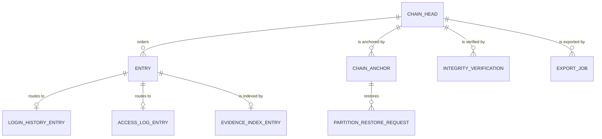

# Audit

> Service sheet, plan document 06. Group C. It refines reference architecture Section 8.22 and the Audit row of `05-service-catalog.md`; names come from Appendix L, permissions from Appendix B, events from Appendix E, error codes from Appendix K. Where this sheet adds something the brief does not state, the addition is listed under Decisions in force or Open points.

**Group** C · **Requirement areas covered** AUD (all 9 rows), plus the audit rows of PRV and SEC · **Last updated** 2026-09-21 by the platform plan

Audit is the evidence of record. Every data-owning service emits `<service>.audit.recorded.v1` through its outbox for every write, every workflow transition, every sign-in and every read of a sensitive record; Audit appends each one to a per-tenant hash chain in an append-only store, partitioned by month and kept for 7 years before detaching to cold storage with its chain anchor. It serves the audit viewer with before and after values, the login history, the access log of sensitive reads, the guardian transparency panel's access facts, the evidence registers a principal reviews, the high-risk export, and integrity verification that proves nothing was edited or removed. It holds no business data of its own and decides nothing any other service should decide: it only makes the product able to answer "who did what, when, from where, and why" for any record (master brief Section 4.1, the audit test).

| Fact | Value | Source |
|---|---|---|
| Tier | 1 | Appendix L |
| AREA code | `AUD` | Appendix L |
| Long name | Audit | Appendix L |
| Database | `nibras_audit`, user `svc_audit` with `INSERT` and `SELECT` only on entry tables; append-only and hash-chained; partitioned by month | Appendix L, `10-data-architecture.md` §1 and §5 |
| Exchange | `nibras.audit` | Appendix L |
| Images | `nibras/audit-api` | Appendix L |
| Worker | none; the ingestion consumer and the Quartz.NET jobs run in the Api host | Appendix L |
| Build phase | 1 | `05-service-catalog.md` |
| Service level class | Read-heavy for search, append-only writes | Reference architecture Section 8.0, `05-service-catalog.md` |
| Sensitivity | Sensitive (it records who saw what); before and after values of sensitive changes are encrypted | `05-service-catalog.md`, Appendix J.3 |
| Synchronous dependencies | Platform `Settings.GetSettings` and `Retention.ListActiveHolds`, from its jobs only, under Section 8.0's "Calls every service makes" | Reference architecture Section 8.0 |
| Local copies | none; the audit log is the copy of record | Reference architecture Section 8.0, Appendix J.3 |
| Scaling profile | Second-largest writer after Notification: about 40,000 entries per 1,000-student tenant per month, 20 million a month at the scale tier | `21-performance-engineering.md` §3.16 |
| Why the boundary exists | Security level: evidence must live outside the services it describes, append-only, under its own database role | `05-service-catalog.md` |

---

## 2. Responsibilities

| Audit owns | Detail |
|---|---|
| The audit store | `AuditEntry` per tenant hash chain: `entry_hash = SHA-256(previous_hash ‖ canonical entry)`; contiguous `chain_seq`; append-only by database role (REQ-AUD-001) |
| Ingestion | The wildcard consumer of `<service>.audit.recorded.v1` from all twenty exchanges, batched per tenant, idempotent on `messageId` |
| Evidence registers | Entries indexed from the specific events Appendix E sends to Audit: sensitive exports, break-glass use, grade changes after approval, cashier day close, gate-pass use, reported messages, exports, scan failures, invitations, new-device logins, tenant deletion |
| Login history | Sign-in success and failure entries routed from `identity.audit.recorded.v1` into `login_history`, 7 years (REQ-AUD-005) |
| Access log | Reads of sensitive records (`school.custody`, `school.medical-summary`, every `wellbeing.*`, `audit.access-log`, `communication.messages` under oversight) routed into `access_log_entries` (REQ-AUD-006, Appendix B rule 5) |
| Search and viewer | By subject, by actor, by action, by service, always inside a date range; before and after values shown to callers who hold the source field's permission |
| Guardian transparency facts | Which roles read a child's sensitive records and when (REQ-AUD-007); the panel composes this with consents from School and retention clocks from Platform |
| Export | High-risk export with a reason, reported to the principal (T-AUD-03, REQ-AUD-003) |
| Integrity | Nightly verification per tenant and month, on-demand verification, chain anchors across partition boundaries, `audit.integrity-check.failed.v1` (REQ-AUD-004) |
| Retention | Detaching monthly partitions older than 7 years to cold storage with a partition hash, honouring legal holds, and restore requests with a lead time (REQ-PRV-010) |
| Restore splice | Appending entries a restore recovered, behind a chain anchor entry, never overwriting (`10-data-architecture.md` §9.1) |

### Not responsible for

| Audit does not own | Owner | How Audit relates to it |
|---|---|---|
| Deciding what is audited and emitting it | Every service, through the transition pipeline of `Nibras.BuildingBlocks.Application` and its outbox | Consumes; a lost event is the producer's defect (T-AUD-02) |
| Sign-in, sessions, the short-lived login working set | Identity | Keeps the 7-year history from Identity's audit events |
| The sensitive records themselves | School, Wellbeing, Communication | Records only that a read happened, by whom, under which role and reason |
| Consents and retention schedules shown in the transparency panel | School (consent decisions), Platform (texts and schedule) | Supplies the access facts; Bff.Web composes the panel |
| Actor display names | Identity | Stores actor ids; the viewer resolves names through Bff.Web and shows `AUDIT_ACTOR_UNRESOLVED` with the retained id when an actor is gone |
| Legal holds and the retention schedule | Platform | Asks `Retention.ListActiveHolds` before any detach |
| Tenant deletion orchestration | Platform (Saga 2) | Detaches the tenant's partitions on `DetachTenantAuditPartition`; never deletes tenant evidence through `DeleteTenantData` |
| Sensitive export approval workflow for other data | Documents (WF-PRV-02) | Records the `documents.sensitive-export.performed.v1` evidence |
| Access review campaigns | Identity (WF-SEC-01) | Shows overdue campaigns found in Identity's audit entries as `AUDIT_ACCESS_REVIEW_OVERDUE` |
| Reporting projections of audit volume | Reporting | Reporting never projects before and after values (Appendix J.4) |

---

## 3. Requirements covered

| Range or identifier | What it binds here |
|---|---|
| REQ-AUD-001 to REQ-AUD-009 | Append-only chain, before and after values, viewer and export, integrity verification, login history, access log, guardian transparency, one entry per workflow transition, the audit test |
| REQ-PRV-010 | 7-year retention by partition detach with the chain still verifying across the boundary |
| REQ-PRV-012 | Legal holds suspend detach |
| REQ-SEC-013 | Every tenant-filter bypass anywhere is an entry here |
| REQ-PERF-023 | Audit before and after values are never cached (Appendix J.4) |
| REQ-L10N-008 | Timestamps shown in the tenant time zone, digits by the numeral setting, entries stored in UTC |

---

## 4. Aggregates and entities

### 4.1 Base columns

Entry tables are append-only: they carry `id` (uuid v7), `tenant_id`, `created_at` (the ingestion instant) and no `updated_*`, no `deleted_*` and no `xmin`-based updates, because nothing is ever updated. Mutable operational tables (chain heads, verifications, exports, restore requests) carry the full base columns of `10-data-architecture.md` §4 including `xmin`. Every table carries `tenant_id` first in every index and the `tenant_isolation` policy.

### 4.2 Aggregate: AuditChain (ChainHead, AuditEntry, ChainAnchor)

| Entity | Field | Type | Null | Notes |
|---|---|---|---|---|
| ChainHead | `tenant_id` | uuid | no | One row per tenant; locked `FOR UPDATE` once per batch |
| ChainHead | `last_seq`, `last_hash` | bigint, bytea | no | Head of the chain |
| ChainHead | `state` | text enum `active`, `exports-frozen`, `detached` | no | `exports-frozen` while a verification failure is open |
| AuditEntry | `chain_seq` | bigint | no | Contiguous per tenant; `ux_audit_entries_chain` |
| AuditEntry | `occurred_at` | timestamptz | no | From the envelope; the partition key |
| AuditEntry | `message_id`, `correlation_id`, `causation_id` | uuid | causation yes | `message_id` unique per tenant: ingestion is idempotent |
| AuditEntry | `service` | text | no | Publisher from the routing key prefix, which the broker guarantees (`11-messaging-architecture.md` §1.4) |
| AuditEntry | `kind` | text enum `change`, `transition`, `read`, `sign-in`, `evidence`, `anchor` | no | Routes login history and the access log |
| AuditEntry | `action` | text | no | From the payload, for example `attendance.mark`, `saga.stuck`, `tenant-filter-bypassed` |
| AuditEntry | `subject_type`, `subject_id` | text, uuid | subject_id yes | Payload `resourceType`, `resourceId` |
| AuditEntry | `actor_user_id`, `actor_kind` | uuid, text | actor yes | `user`, `service`, `job`, `api-key`, `impersonation`, `delegation`; null actor with the causation chain for jobs and sagas |
| AuditEntry | `on_behalf_of_user_id` | uuid | yes | Delegator or impersonated user, so both identities stand on one entry |
| AuditEntry | `reason` | text | yes | Required for `elevated` and `high` actions and for break-glass |
| AuditEntry | `ip_hash` | text | yes | Never the address in clear |
| AuditEntry | `before`, `after` | bytea | yes | Canonical JSON; ciphertext under the tenant's audit data key when the source field is Sensitive (Decisions in force) |
| AuditEntry | `source_class` | text enum `internal`, `confidential`, `sensitive`, `s` | no | Highest Appendix J class touched; drives masking on read |
| AuditEntry | `previous_hash`, `entry_hash` | bytea | no | SHA-256 |
| ChainAnchor | `partition`, `first_seq`, `last_seq`, `first_previous_hash`, `last_hash`, `partition_sha256`, `detached_at`, `cold_location` | | detached yes | `audit_chain_anchors`; lets verification cross a month and a detach |

Invariants:

1. No `UPDATE` or `DELETE` on `audit_entries`, `login_history` or `access_log_entries` is possible as `svc_audit`; any attempt is `AUDIT_IMMUTABLE_RECORD` (T-AUD-01).
2. For every tenant, `chain_seq` has no gap and `entry_hash(n) = SHA-256(entry_hash(n-1) ‖ canonical(n))`; a verification that finds otherwise raises `audit.integrity-check.failed.v1` and freezes exports with `AUDIT_CHAIN_BROKEN`.
3. The same `message_id` is appended at most once; a redelivered batch appends nothing.
4. A `before` or `after` value from a Sensitive field is stored only as ciphertext and is shown only to a caller who holds the source field's permission (for example `school.custody.view`); every other caller sees the field name and "changed".
5. An `anchor` entry is written at every month boundary, every detach and every restore splice, so verification never needs a partition that is no longer hot.
6. Entries of a tenant are never deleted by any job; after 7 years their partition is detached to cold storage with its hash, which is the only way an entry leaves the hot store.

### 4.3 Entities routed from entries: LoginHistoryEntry, AccessLogEntry, EvidenceIndexEntry

| Entity | Field | Type | Null | Notes |
|---|---|---|---|---|
| LoginHistoryEntry | `user_id`, `person_id`, `occurred_at`, `outcome` (`succeeded`, `failed`, `locked`), `method`, `device_label`, `ip_prefix`, `is_new_device`, `chain_seq` | | user yes on failure | `login_history`, partitioned by month; references its chain entry |
| AccessLogEntry | `subject_type`, `subject_id`, `record_type`, `reader_user_id`, `reader_role`, `purpose`, `is_break_glass`, `service`, `occurred_at`, `chain_seq` | | no | `access_log_entries`, partitioned by month; a Wellbeing subject keeps only the record type (T-AUD-04) |
| EvidenceIndexEntry | `register` (`sensitive-exports`, `break-glass`, `grade-changes`, `day-closes`, `gate-passes`, `reported-messages`, `exports`, `scan-failures`, `invitations`, `new-devices`, `tenant-deletions`), `subject_id`, `occurred_at`, `chain_seq` | | no | A register row points at the chain entry that holds the event's facts |

Invariants: every routed row points at an existing chain entry of the same tenant; a register row is written in the same transaction as its chain entry.

### 4.4 Operational aggregates: IntegrityVerification, AuditExport, PartitionRestoreRequest

| Entity | Field | Type | Null | Notes |
|---|---|---|---|---|
| IntegrityVerification | `scope` (`nightly`, `on-demand`, `restore`), `from_seq`, `to_seq`, `month`, `started_at`, `finished_at`, `result` (`verified`, `broken`), `first_broken_seq`, `job_id`, `requested_by` | | several yes | One row per run |
| AuditExport | `requested_by`, `reason`, `filter` jsonb, `row_count`, `file_ref`, `watermark`, `state` (`queued`, `running`, `succeeded`, `failed`, `cancelled`), `principal_notified_at` | | several yes | Export file through `Nibras.BuildingBlocks.Files` under Audit's prefix; kept 7 days |
| PartitionRestoreRequest | `partition`, `requested_by`, `reason`, `state` (`requested`, `restoring`, `verifying`, `available`, `expired`), `available_until` | | several yes | Restored partitions attach read-only and are re-verified before use (T-AUD-05) |

Invariants: an export never runs while the chain head is `exports-frozen`; an export without `audit.entries.export` is refused with `AUDIT_EXPORT_APPROVAL_REQUIRED` and routes to an approver; a restored partition is searchable only after its hash matches the anchor.

### 4.5 Entity relationship diagram



---

## 5. REST API

Conventions from `22-api-conventions-and-error-catalog.md`. There is no route that creates, edits or deletes an entry: entries arrive only through the consumer, and the Gateway answers any other verb on an entry path with 405. Every search, entry read, access-log read and export is itself written to the chain as a `read` entry in the same transaction; if that write fails, the read fails with `AUDIT_WRITE_FAILED` (Appendix J rule 8).

**Every row may also return** `AUDIT_VALIDATION_FAILED`, `AUDIT_PERMISSION_DENIED`, `AUDIT_TENANT_MISMATCH`, `AUDIT_NOT_FOUND`, `AUDIT_RATE_LIMITED` and `AUDIT_DEPENDENCY_UNAVAILABLE`. List routes use the `sensitive` service rate-limit policy (20 per minute) and keyset pagination capped at 100.

| Method | Path | Permission | Request | Response | Errors | Idempotent |
|---|---|---|---|---|---|---|
| GET | `/api/v1/audit/entries` | `audit.entries.view` | required `from` and `to` (default last 90 days), filters `service`, `action`, `actorUserId`, `subjectType`, `subjectId`, `kind`, `reasonPresent`, cursor | `AuditEntrySummary[]` without before and after values | `AUDIT_QUERY_RANGE_TOO_WIDE` beyond 13 monthly partitions, `AUDIT_PARTITION_ARCHIVED` for a range in cold storage, `AUDIT_WRITE_FAILED` | safe |
| GET | `/api/v1/audit/entries/{entryId}` | `audit.entries.view` | none | `AuditEntryDetail` with before and after; Sensitive values decrypted only for holders of the source permission | `AUDIT_ACTOR_UNRESOLVED` (422) when the actor no longer exists, with the retained id, `AUDIT_WRITE_FAILED` | safe |
| GET | `/api/v1/audit/subjects/{subjectType}/{subjectId}/entries` | `audit.entries.view` | `from`, `to`, cursor | the record's history, newest first ("who touched this student") | same as the search | safe |
| GET | `/api/v1/audit/actors/{userId}/entries` | `audit.entries.view` | `from`, `to`, cursor | what one user did | same | safe |
| GET | `/api/v1/audit/registers/{register}` | `audit.entries.view` | `from`, `to`, cursor | evidence register rows (section 4.3) | `AUDIT_QUERY_RANGE_TOO_WIDE` | safe |
| GET | `/api/v1/audit/oversight/summary` | `audit.entries.view` | period | principal oversight: sensitive exports, break-glass uses, grade changes after lock, reported messages, overdue access reviews | `AUDIT_ACCESS_REVIEW_OVERDUE` (200, informational item) | safe |
| POST | `/api/v1/audit/exports` | `audit.entries.export` | filter, format (`csv`, `json`), reason | 202 job; principal notified | `AUDIT_EXPORT_APPROVAL_REQUIRED` without the permission, `AUDIT_REASON_REQUIRED`, `AUDIT_CHAIN_BROKEN` while exports are frozen | `Idempotency-Key` required |
| GET | `/api/v1/audit/exports/{exportId}` | `audit.entries.export` | none | export job with a 5-minute signed file link when succeeded | none | safe |
| GET | `/api/v1/audit/login-history` | `audit.login-history.view` | `from`, `to`, `userId`, `outcome`, cursor | `LoginHistoryRow[]` | `AUDIT_QUERY_RANGE_TOO_WIDE` | safe |
| GET | `/api/v1/audit/users/{userId}/login-history` | `audit.login-history.view` | cursor | one user's sign-ins with device and method (REQ-AUD-005) | none | safe |
| GET | `/api/v1/audit/me/login-history` | Self | cursor | the caller's own sign-ins | none | safe |
| POST | `/api/v1/audit/login-history/exports` | `audit.login-history.export` | filter, reason | 202 job | `AUDIT_REASON_REQUIRED` | `Idempotency-Key` required |
| GET | `/api/v1/audit/access-log` | `audit.access-log.view` | `reason` (required), `from`, `to`, `subjectType`, `readerUserId`, cursor | `AccessLogRow[]`; Wellbeing subjects by record type only | `AUDIT_REASON_REQUIRED` | safe |
| GET | `/api/v1/audit/access-log/subjects/{subjectType}/{subjectId}` | `audit.access-log.view` | `reason` (required), cursor | who read this record, under which role and purpose | `AUDIT_REASON_REQUIRED` | safe |
| GET | `/api/v1/audit/transparency/students/{studentId}` | `audit.access-transparency.view` at `own-children` scope for guardians | cursor | reader roles and times per record category, never reader names, never Wellbeing content (REQ-AUD-007, TC-AUD-002) | none | safe |
| GET | `/api/v1/audit/integrity` | `audit.integrity.view` | none | per month: last verification, result, anchors, head state | none | safe |
| POST | `/api/v1/audit/integrity/verifications` | `audit.integrity.verify` | month or sequence range | 202 job | none | `Idempotency-Key` required |
| GET | `/api/v1/audit/integrity/verifications/{verificationId}` | `audit.integrity.view` | none | result with the first broken sequence when broken | `AUDIT_CHAIN_BROKEN` in the result body, never as a failed request | safe |
| GET | `/api/v1/audit/partitions` | `audit.integrity.view` | none | hot and cold partitions with row counts and hashes | none | safe |
| POST | `/api/v1/audit/partitions/{partition}/restore-requests` | `audit.entries.export` | reason | 202 with the lead time; the partition attaches read-only after re-verification | `AUDIT_REASON_REQUIRED` | `Idempotency-Key` required |
| GET | `/health/live`, `/health/ready`, `/health/startup` | none, cluster network only | none | 200 or 503; `ready` fails when ingestion lag exceeds 5 minutes | none | safe |

---

## 6. gRPC

| Direction | Service and method | Purpose | Deadline | Fallback |
|---|---|---|---|---|
| Exposed | `nibras.audit.v1.Usage.Recount` | Platform's monthly re-sum of Audit's storage meter (`10-data-architecture.md` §6) | 30 s | Platform retries next day |
| Consumed | Platform `Retention.ListActiveHolds` | Before a partition detach or a tenant partition detach | 5 s | Skip the detach and retry next run |
| Consumed | Platform `Settings.GetSettings` (scope `security`, key retention periods) | Country or contract override of the 7-year default | 2 s | Last value for 60 s, then the Appendix J default |

Audit exposes no query gRPC to other services: no service may read the audit log synchronously, which keeps evidence outside every service's request path.

---

## 7. Events published and consumed

### 7.1 Published on `nibras.audit`

| Routing key | Partition key | Published when | Consumers (Appendix E) |
|---|---|---|---|
| `audit.integrity-check.failed.v1` | `tenantId` | A verification finds a broken link or a gap | Platform, Notification |
| `audit.retention.partition-detached.v1` | `tenantId` | A partition detaches to cold storage, including Saga 2 step 8 | Platform |
| `audit.usage.recorded.v1` | `tenantId` | Daily storage meter per tenant, and the `api-calls` batches of the Web block | Platform |

Audit does not publish `audit.audit.recorded.v1`: reads of the audit log are appended to the chain in-process, in the same transaction as the read (Decisions in force).

### 7.2 Consumed

| Routing key | Queue | Handler | What it changes | Ordering |
|---|---|---|---|---|
| `<service>.audit.recorded.v1` from all twenty exchanges | `audit.entries` sharded by `tenantId` through `nibras.audit.entries.hash` | `AuditRecordedConsumer` | Appends a batch of up to 50 entries of one tenant: inbox insert, chain head `FOR UPDATE`, entries with `previous_hash`, head update; routes `sign-in` entries to `login_history` and `read` entries to `access_log_entries` (`21-performance-engineering.md` §3.16 query 1) | `tenantId`, single active consumer per shard |
| `identity.login.new-device.v1` | `audit.evidence` | `EvidenceConsumer` | Chain entry of kind `evidence`, register `new-devices`, and `is_new_device` on the matching login row | `userId` |
| `identity.user.invited.v1` | same | `EvidenceConsumer` | Register `invitations` | `userId` |
| `identity.break-glass.used.v1` | same | `EvidenceConsumer` | Register `break-glass` | `userId` |
| `documents.sensitive-export.performed.v1` | same | `EvidenceConsumer` | Register `sensitive-exports` with the watermark | `jobId` |
| `documents.export.completed.v1` | same | `EvidenceConsumer` | Register `exports` | `jobId` |
| `documents.file.scan-failed.v1` | same | `EvidenceConsumer` | Register `scan-failures` | `fileId` |
| `assessment.grade-change.approved.v1` | same | `EvidenceConsumer` | Register `grade-changes` with from and to marks and the approver | `studentId` |
| `finance.day.closed.v1` | same | `EvidenceConsumer` | Register `day-closes` with declared, counted and difference | `campusId` |
| `attendance.gate-pass.used.v1` | same | `EvidenceConsumer` | Register `gate-passes` | `studentId` |
| `communication.message.reported.v1` | same | `EvidenceConsumer` | Register `reported-messages` | `threadId` |
| `platform.tenant.deleted.v1` | `audit.tenant-lifecycle` | `TenantDeletedConsumer` | Register `tenant-deletions`; head state `detached` once Saga 2 step 8 completed | `tenantId` |
| `platform.tenant.provisioning-requested.v1` | same | `TenantProvisioningRequestedConsumer` | Creates the chain head with a genesis anchor; replies `TenantProvisioned` | `tenantId` |
| `platform.tenant.provisioned.v1`, `platform.tenant.suspended.v1`, `platform.tenant.reactivated.v1`, `platform.tenant.deletion-requested.v1`, `platform.plan.changed.v1`, `platform.feature-flag.changed.v1`, `platform.terminology.changed.v1`, `platform.custom-field.changed.v1` | same | `TenantLifecycleConsumer` | Records the fact as an `evidence` entry; ingestion never stops for a suspended or read-only tenant, because evidence is not tenant data a school writes (BR-PLT-002 exemption) | `tenantId` |
| `platform.settings.changed.v1` | same | `SettingsChangedConsumer` | For `scope = retention`: evicts the retention period read by the detach job | `tenantId` |
| `identity.role.changed.v1`, `identity.permissions.changed.v1` | same | `PermissionsChangedConsumer` | Evicts cached permission sets through the authorization block | `tenantId` |
| `reporting.data-quality.issue-detected.v1` | same | `DataQualityIssueConsumer` | Ignored unless `entityType` is an audit entity (none today); bound because every service binds it (`11-messaging-architecture.md` §2.3) | `tenantId` |

Commands received on `audit.commands`: `DetachTenantAuditPartition` (Saga 2 step 8), `DeprovisionTenant` (Saga 1 compensation: drops the chain head and genesis only), `ProvisionDedicatedDatabase`, `DropDedicatedDatabase`, `CopyTenantRows`, `ReconcileTenantCopy`, `PurgeSourceRows` (Saga 10, the chain is copied byte for byte and re-verified before the switch), `ReplayParkedMessages`, `DiscardParkedMessages`. Audit is excluded from `DeleteTenantData` (`11-messaging-architecture.md` §2.4).

---

## 8. Sagas and workflows

Audit owns no workflow and orchestrates no saga. It takes part in Saga 1 (step 2 tenant rows), Saga 2 (step 8 `DetachTenantAuditPartition`, forward only, retried until confirmed and the certificate withheld until then) and Saga 10 (all copy steps). Every transition of every workflow in Appendix R lands here as one entry (REQ-AUD-008, `13-workflows-and-sagas.md` §5.1), including `saga.stuck` entries that the operator alert rule reads.

---

## 9. Local reference copies

None, by design: the audit log is the copy of record and Appendix J.3 allows no copy of its before and after values anywhere. Actor names are resolved at display time through Bff.Web.

---

## 10. Background jobs

| Job | Schedule | What it does | Publishes | Progress |
|---|---|---|---|---|
| `IntegrityVerificationJob` | nightly 02:30 UTC; the previous day for every tenant, plus one full month per tenant in rotation (`21-performance-engineering.md` §3.16 query 6) | Streams entries by `chain_seq` in chunks of 5,000, recomputes hashes, checks anchors | `audit.integrity-check.failed.v1` on failure | job resource: chunks done of total |
| `PartitionMaintenanceJob` | monthly, first day | Creates the next three partitions of the three entry tables; for months older than the retention period and without an active hold, exports to cold storage, records the anchor and hash, detaches | `audit.retention.partition-detached.v1` | job resource per partition |
| `AuditExportJob` | on demand | Writes the filtered entries with a watermark through the Files block; notifies the principal | `RequestNotification` | job resource: rows done of total |
| `PartitionRestoreJob` | on demand | Restores a cold partition read-only, re-verifies against its anchor, expires it after 14 days | none | job resource |
| `IngestionLagWatchJob` | every minute | Compares the newest `occurred_at` per shard with the clock; flips readiness and alerts above 5 minutes | none | none |
| `UsageMeterJob` | daily 00:20 per tenant time zone | Storage bytes per tenant | `audit.usage.recorded.v1` | none |

---

## 11. Permissions, notifications, settings, error codes

### 11.1 Permissions (Appendix B, Audit section)

| Permission | Risk | Used by |
|---|---|---|
| `audit.entries.view` | high group G24 | search, entry detail, subject and actor histories, registers, oversight summary |
| `audit.entries.export` | high, reason required | exports, partition restore |
| `audit.login-history.view`, `audit.login-history.export` | elevated | login history routes |
| `audit.access-log.view` | high, every read logged | access log routes |
| `audit.access-transparency.view` | normal, `own-children` or `self` scope only | the guardian transparency route: roles and times, never reader names |
| `audit.integrity.view`, `audit.integrity.verify` | elevated | integrity, verifications, partitions |

### 11.2 Notifications (Appendix C rows triggered by Audit)

| Notification | Trigger | Recipients | Urgency, channels |
|---|---|---|---|
| Audit integrity check failed | `audit.integrity-check.failed.v1` (job: audit integrity verification) | Platform operators, security administrator | U; email, push |
| Audit export performed | `notification.notification.requested.v1` (`RequestNotification` from Audit when `AuditExportJob` completes) | Principal | N; email |

The principal's notice of an audit export (T-AUD-03) is the second row: Appendix C now carries it, so the `RequestNotification` this sheet already sends is a catalogued row rather than an internal template.

### 11.3 Settings (Appendix G)

| Group → setting | Scope | Default | Used by |
|---|---|---|---|
| Security → retention periods | tenant | Audit entries and login history 7 years (Appendix J) | `PartitionMaintenanceJob` |
| Security → export approval rules | tenant | Audit export always needs `audit.entries.export` and a reason | `AuditExportJob` |
| General → time zone, numerals | tenant | from provisioning | Display of entries |

### 11.4 Error codes (Appendix K)

| Code | HTTP | Raised here when |
|---|---|---|
| `AUDIT_WRITE_FAILED` | 500 | The in-process read entry or an ingestion batch cannot be written; the read fails |
| `AUDIT_CHAIN_BROKEN` | 500 | Exports frozen after a failed verification; reported in a verification result |
| `AUDIT_EXPORT_APPROVAL_REQUIRED` | 403 | Export without `audit.entries.export` |
| `AUDIT_QUERY_RANGE_TOO_WIDE` | 413 | A search spans more than 13 monthly partitions |
| `AUDIT_PARTITION_ARCHIVED` | 409 | The range is in cold storage; offers the restore request |
| `AUDIT_REASON_REQUIRED` | 400 | Access-log read, export or restore without a reason |
| `AUDIT_ACTOR_UNRESOLVED` | 422 | The entry's actor no longer exists; the retained id is shown |
| `AUDIT_IMMUTABLE_RECORD` | 409 | Any attempt to change or remove an entry |
| `AUDIT_ACCESS_REVIEW_OVERDUE` | 200 | Informational item in the oversight summary |
| `AUDIT_` plus the eight K.1 suffixes | per K.1 | Generated by the shared middleware |

---

## 12. Caching and hot queries

Audit caches nothing: `21-performance-engineering.md` §1.16 is binding, and `TC-PERF-016` proves Audit writes zero cache keys. The hot queries, indexes and growth figures are §3.16 and are not restated. Service-specific additions:

| Query | Index | Rows | Pagination | Budget |
|---|---|---|---|---|
| Evidence register page | `ix_evidence_index_register` on `(tenant_id, register, occurred_at DESC, id)` per month partition | 50 | keyset on `(occurred_at, id)` | 2 commands, p95 under 25 ms |
| Guardian transparency for one student | `ix_access_log_entries_subject` (§3.16 query 5), grouped by record category and reader role | 5 to 20 | keyset | 3 commands including the in-process read entry, p95 under 30 ms |
| Chain head lock for a batch | primary key of `chain_heads` | 1 | none | 1 command per batch of 50 |

---

## 13. Security

The threat table is `12-security-privacy-safety.md` §2.16 (T-AUD-01 to T-AUD-05); the access-logging rule is Appendix J rule 8; the key inventory row for column encryption keys is §9.

| Data class (Appendix J) | Held here |
|---|---|
| Sensitive | Before and after values of sensitive fields (ciphertext), the access log of Wellbeing and custody reads |
| Confidential | Every other entry, login history, evidence registers |

| Never | What |
|---|---|
| Cached | Any entry, login row, access-log row or before and after value (Appendix J.4) |
| Logged | Before and after values, reasons, subject ids of sensitive records; the application log carries `chain_seq` and `message_id` only |
| Sent to a device | Before and after values of Sensitive fields to a caller without the source permission; reader names on the guardian transparency panel; any Wellbeing content |
| Projected | Nothing reaches Reporting except counts per day and service |

Additional controls: `svc_audit` has no `UPDATE`, `DELETE` or `TRUNCATE` on entry tables and cannot `DETACH` without the maintenance role used only by `PartitionMaintenanceJob`; cold partitions are written with object lock for the retention period; the audit data key per tenant is wrapped by the service key and rotated yearly without rewriting rows (Appendix J rule 7).

---

## 14. Folder and file tree

```text
src/Services/Audit/                                         Audit: the append-only, hash-chained evidence store with search, export and integrity verification
├── README.md                                               purpose, owned data, API, events, how to run, runbook links (audit-integrity-failed, audit-partition-restore)
├── Nibras.Audit.Domain/                                    the chain, routing and verification rules; references Nibras.BuildingBlocks.Domain and Nibras.Contracts.Audit only
│   ├── Chain/                                              aggregate AuditChain: head, entries and anchors of one tenant
│   │   ├── ChainHead.cs                                    aggregate root: last sequence, last hash, state active, exports-frozen or detached
│   │   ├── AuditEntry.cs                                   one immutable entry with its kind, subject, actor, reason, values and hashes
│   │   ├── EntryKind.cs                                    enum change, transition, read, sign-in, evidence, anchor
│   │   ├── ChainAnchor.cs                                  boundary record for a month, a detach or a restore splice
│   │   ├── CanonicalEntry.cs                               value object: the exact byte form that is hashed
│   │   ├── ChainHasher.cs                                  domain service: SHA-256 of previous hash and canonical entry
│   │   ├── SourceClass.cs                                  value object: highest Appendix J class touched, drives masking
│   │   └── Rules/                                          invariants of the chain
│   │       ├── AppendOnlyRule.cs                           no change or removal of an entry; AUDIT_IMMUTABLE_RECORD
│   │       ├── ContiguousSequenceRule.cs                   no gap in chain_seq per tenant
│   │       └── ValueMaskingRule.cs                         Sensitive values shown only to holders of the source permission
│   ├── Routing/                                            routed rows that point back at chain entries
│   │   ├── LoginHistoryEntry.cs                            sign-in row with outcome, method, device and new-device flag
│   │   ├── AccessLogEntry.cs                               read of a sensitive record with reader role and purpose; Wellbeing by record type only
│   │   ├── EvidenceIndexEntry.cs                           register row for the events Appendix E sends to Audit
│   │   └── Register.cs                                     enum of the evidence registers of section 4.3
│   ├── Operations/                                         operational aggregates
│   │   ├── IntegrityVerification.cs                        aggregate root: scope, range, result, first broken sequence
│   │   ├── AuditExport.cs                                  aggregate root: requester, reason, filter, watermark, state
│   │   ├── PartitionRestoreRequest.cs                      aggregate root: partition, reason, availability window
│   │   └── RetentionPolicy.cs                              value object: period from the setting with the Appendix J default of 7 years
│   └── Shared/                                             errors used by more than one aggregate
│       └── AuditErrors.cs                                  one Error per AUDIT_* code in Nibras.Contracts.Audit
├── Nibras.Audit.Application/                               ingestion, search, export, verification; references Domain, building-block abstractions and the contracts it consumes
│   ├── Features/                                           vertical slices, one folder per endpoint of section 5
│   │   ├── Entries/                                        search and read the chain
│   │   │   ├── SearchEntries/                              search inside a date range
│   │   │   │   ├── SearchEntriesQuery.cs                   immutable query record: route and filter parameters only
│   │   │   │   ├── SearchEntriesHandler.cs                 keyset over the month partitions; writes the read entry in the same transaction
│   │   │   │   ├── SearchEntriesValidator.cs               FluentValidation rules the pipeline runs before the handler; failures become _VALIDATION_FAILED with a field list
│   │   │   │   └── SearchEntriesEndpoint.cs                GET /api/v1/audit/entries, audit.entries.view
│   │   │   ├── GetEntry/                                   one entry with before and after
│   │   │   │   ├── GetEntryQuery.cs                        immutable query record: route and filter parameters only
│   │   │   │   ├── GetEntryHandler.cs                      ValueMaskingRule; decrypts only for the source permission
│   │   │   │   ├── GetEntryValidator.cs                    FluentValidation rules the pipeline runs before the handler; failures become _VALIDATION_FAILED with a field list
│   │   │   │   └── GetEntryEndpoint.cs                     GET /api/v1/audit/entries/{entryId}, audit.entries.view
│   │   │   ├── GetSubjectHistory/                          who touched this record
│   │   │   │   ├── GetSubjectHistoryQuery.cs               immutable query record: route and filter parameters only
│   │   │   │   ├── GetSubjectHistoryHandler.cs             ix_audit_entries_subject
│   │   │   │   ├── GetSubjectHistoryValidator.cs           FluentValidation rules the pipeline runs before the handler; failures become _VALIDATION_FAILED with a field list
│   │   │   │   └── GetSubjectHistoryEndpoint.cs            GET /api/v1/audit/subjects/{subjectType}/{subjectId}/entries, audit.entries.view
│   │   │   ├── GetActorHistory/                            what did this user do
│   │   │   │   ├── GetActorHistoryQuery.cs                 immutable query record: route and filter parameters only
│   │   │   │   ├── GetActorHistoryHandler.cs               ix_audit_entries_actor
│   │   │   │   ├── GetActorHistoryValidator.cs             FluentValidation rules the pipeline runs before the handler; failures become _VALIDATION_FAILED with a field list
│   │   │   │   └── GetActorHistoryEndpoint.cs              GET /api/v1/audit/actors/{userId}/entries, audit.entries.view
│   │   │   ├── ListRegister/                               evidence register
│   │   │   │   ├── ListRegisterQuery.cs                    immutable query record: route and filter parameters only
│   │   │   │   ├── ListRegisterHandler.cs                  ix_evidence_index_register
│   │   │   │   ├── ListRegisterValidator.cs                FluentValidation rules the pipeline runs before the handler; failures become _VALIDATION_FAILED with a field list
│   │   │   │   └── ListRegisterEndpoint.cs                 GET /api/v1/audit/registers/{register}, audit.entries.view
│   │   │   └── GetOversightSummary/                        principal oversight
│   │   │       ├── GetOversightSummaryQuery.cs             immutable query record: route and filter parameters only
│   │   │       ├── GetOversightSummaryHandler.cs           registers plus overdue access reviews as an informational code
│   │   │       ├── GetOversightSummaryValidator.cs         FluentValidation rules the pipeline runs before the handler; failures become _VALIDATION_FAILED with a field list
│   │   │       └── GetOversightSummaryEndpoint.cs          GET /api/v1/audit/oversight/summary, audit.entries.view
│   │   ├── Exports/                                        high-risk export
│   │   │   ├── StartAuditExport/                           export with a reason
│   │   │   │   ├── StartAuditExportCommand.cs              immutable command record: the only input type of the use case
│   │   │   │   ├── StartAuditExportHandler.cs              refused while exports are frozen; job with watermark; principal notified
│   │   │   │   ├── StartAuditExportValidator.cs            FluentValidation rules the pipeline runs before the handler; failures become _VALIDATION_FAILED with a field list
│   │   │   │   └── StartAuditExportEndpoint.cs             POST /api/v1/audit/exports, audit.entries.export, Idempotency-Key required
│   │   │   └── GetAuditExport/                             export job and file link
│   │   │       ├── GetAuditExportQuery.cs                  immutable query record: route and filter parameters only
│   │   │       ├── GetAuditExportHandler.cs                5-minute signed link
│   │   │       ├── GetAuditExportValidator.cs              FluentValidation rules the pipeline runs before the handler; failures become _VALIDATION_FAILED with a field list
│   │   │       └── GetAuditExportEndpoint.cs               GET /api/v1/audit/exports/{exportId}, audit.entries.export
│   │   ├── LoginHistory/                                   7-year sign-in history
│   │   │   ├── ListLoginHistory/                           sign-ins in a range
│   │   │   │   ├── ListLoginHistoryQuery.cs                immutable query record: route and filter parameters only
│   │   │   │   ├── ListLoginHistoryHandler.cs              keyset over login_history
│   │   │   │   ├── ListLoginHistoryValidator.cs            FluentValidation rules the pipeline runs before the handler; failures become _VALIDATION_FAILED with a field list
│   │   │   │   └── ListLoginHistoryEndpoint.cs             GET /api/v1/audit/login-history, audit.login-history.view
│   │   │   ├── GetUserLoginHistory/                        one user's sign-ins
│   │   │   │   ├── GetUserLoginHistoryQuery.cs             immutable query record: route and filter parameters only
│   │   │   │   ├── GetUserLoginHistoryHandler.cs           ix_login_history_user
│   │   │   │   ├── GetUserLoginHistoryValidator.cs         FluentValidation rules the pipeline runs before the handler; failures become _VALIDATION_FAILED with a field list
│   │   │   │   └── GetUserLoginHistoryEndpoint.cs          GET /api/v1/audit/users/{userId}/login-history, audit.login-history.view
│   │   │   ├── GetMyLoginHistory/                          own sign-ins
│   │   │   │   ├── GetMyLoginHistoryQuery.cs               immutable query record: route and filter parameters only
│   │   │   │   ├── GetMyLoginHistoryHandler.cs             the caller's rows only
│   │   │   │   ├── GetMyLoginHistoryValidator.cs           FluentValidation rules the pipeline runs before the handler; failures become _VALIDATION_FAILED with a field list
│   │   │   │   └── GetMyLoginHistoryEndpoint.cs            GET /api/v1/audit/me/login-history, self
│   │   │   └── ExportLoginHistory/                         export with a reason
│   │   │       ├── ExportLoginHistoryCommand.cs            immutable command record: the only input type of the use case
│   │   │       ├── ExportLoginHistoryHandler.cs            job through the Files block
│   │   │       ├── ExportLoginHistoryValidator.cs          FluentValidation rules the pipeline runs before the handler; failures become _VALIDATION_FAILED with a field list
│   │   │       └── ExportLoginHistoryEndpoint.cs           POST /api/v1/audit/login-history/exports, audit.login-history.export, Idempotency-Key required
│   │   ├── AccessLog/                                      reads of sensitive records
│   │   │   ├── ListAccessLog/                              access log with a reason
│   │   │   │   ├── ListAccessLogQuery.cs                   immutable query record: route and filter parameters only
│   │   │   │   ├── ListAccessLogHandler.cs                 reason required; the read is itself logged
│   │   │   │   ├── ListAccessLogValidator.cs               FluentValidation rules the pipeline runs before the handler; failures become _VALIDATION_FAILED with a field list
│   │   │   │   └── ListAccessLogEndpoint.cs                GET /api/v1/audit/access-log, audit.access-log.view
│   │   │   ├── GetSubjectAccessLog/                        who read this record
│   │   │   │   ├── GetSubjectAccessLogQuery.cs             immutable query record: route and filter parameters only
│   │   │   │   ├── GetSubjectAccessLogHandler.cs           reason required
│   │   │   │   ├── GetSubjectAccessLogValidator.cs         FluentValidation rules the pipeline runs before the handler; failures become _VALIDATION_FAILED with a field list
│   │   │   │   └── GetSubjectAccessLogEndpoint.cs          GET /api/v1/audit/access-log/subjects/{subjectType}/{subjectId}, audit.access-log.view
│   │   │   └── GetGuardianTransparency/                    reader roles and times for a child
│   │   │       ├── GetGuardianTransparencyQuery.cs         immutable query record: route and filter parameters only
│   │   │       ├── GetGuardianTransparencyHandler.cs       grouped by category and role, no names
│   │   │       ├── GetGuardianTransparencyValidator.cs     FluentValidation rules the pipeline runs before the handler; failures become _VALIDATION_FAILED with a field list
│   │   │       └── GetGuardianTransparencyEndpoint.cs      GET /api/v1/audit/transparency/students/{studentId}, audit.access-transparency.view at own-children
│   │   ├── Integrity/                                      verification and partitions
│   │   │   ├── GetIntegrityStatus/                         per-month status
│   │   │   │   ├── GetIntegrityStatusQuery.cs              immutable query record: route and filter parameters only
│   │   │   │   ├── GetIntegrityStatusHandler.cs            last verification, anchors, head state
│   │   │   │   ├── GetIntegrityStatusValidator.cs          FluentValidation rules the pipeline runs before the handler; failures become _VALIDATION_FAILED with a field list
│   │   │   │   └── GetIntegrityStatusEndpoint.cs           GET /api/v1/audit/integrity, audit.integrity.view
│   │   │   ├── StartIntegrityVerification/                 on-demand verification
│   │   │   │   ├── StartIntegrityVerificationCommand.cs    immutable command record: the only input type of the use case
│   │   │   │   ├── StartIntegrityVerificationHandler.cs    job over a month or a range
│   │   │   │   ├── StartIntegrityVerificationValidator.cs  FluentValidation rules the pipeline runs before the handler; failures become _VALIDATION_FAILED with a field list
│   │   │   │   └── StartIntegrityVerificationEndpoint.cs   POST /api/v1/audit/integrity/verifications, audit.integrity.verify, Idempotency-Key required
│   │   │   ├── GetIntegrityVerification/                   verification result
│   │   │   │   ├── GetIntegrityVerificationQuery.cs        immutable query record: route and filter parameters only
│   │   │   │   ├── GetIntegrityVerificationHandler.cs      first broken sequence when broken
│   │   │   │   ├── GetIntegrityVerificationValidator.cs    FluentValidation rules the pipeline runs before the handler; failures become _VALIDATION_FAILED with a field list
│   │   │   │   └── GetIntegrityVerificationEndpoint.cs     GET /api/v1/audit/integrity/verifications/{verificationId}, audit.integrity.view
│   │   │   ├── ListPartitions/                             hot and cold partitions
│   │   │   │   ├── ListPartitionsQuery.cs                  immutable query record: route and filter parameters only
│   │   │   │   ├── ListPartitionsHandler.cs                row counts and hashes
│   │   │   │   ├── ListPartitionsValidator.cs              FluentValidation rules the pipeline runs before the handler; failures become _VALIDATION_FAILED with a field list
│   │   │   │   └── ListPartitionsEndpoint.cs               GET /api/v1/audit/partitions, audit.integrity.view
│   │   │   └── RequestPartitionRestore/                    restore a cold partition
│   │   │       ├── RequestPartitionRestoreCommand.cs       immutable command record: the only input type of the use case
│   │   │       ├── RequestPartitionRestoreHandler.cs       lead time; re-verified before use
│   │   │       ├── RequestPartitionRestoreValidator.cs     FluentValidation rules the pipeline runs before the handler; failures become _VALIDATION_FAILED with a field list
│   │   │       └── RequestPartitionRestoreEndpoint.cs      POST /api/v1/audit/partitions/{partition}/restore-requests, audit.entries.export, Idempotency-Key required
│   │   ├── Ingestion/                                      entries arriving from every service, no HTTP
│   │   │   ├── AppendAuditBatch/                           a batch of <service>.audit.recorded.v1
│   │   │   │   ├── AppendAuditBatchCommand.cs              immutable command record raised by a job, a consumer or a saga step, never by HTTP
│   │   │   │   ├── AppendAuditBatchHandler.cs              head lock, hash, append, route sign-in and read entries, update head; one transaction per 50 entries of one tenant
│   │   │   │   └── AppendAuditBatchValidator.cs            FluentValidation guard on the internal command, so a malformed message fails loudly
│   │   │   └── AppendEvidence/                             an event Appendix E sends to Audit
│   │   │       ├── AppendEvidenceCommand.cs                immutable command record raised by a job, a consumer or a saga step, never by HTTP
│   │   │       ├── AppendEvidenceHandler.cs                chain entry of kind evidence plus its register row
│   │   │       └── AppendEvidenceValidator.cs              FluentValidation guard on the internal command, so a malformed message fails loudly
│   │   └── TenantLifecycle/                                commands from Platform's sagas
│   │       ├── CreateChainHead/                            Saga 1 step 2, platform.tenant.provisioning-requested.v1
│   │       │   ├── CreateChainHeadCommand.cs               immutable command record raised by a job, a consumer or a saga step, never by HTTP
│   │       │   ├── CreateChainHeadHandler.cs               genesis anchor and head; replies TenantProvisioned
│   │       │   └── CreateChainHeadValidator.cs             FluentValidation guard on the internal command, so a malformed message fails loudly
│   │       ├── DeprovisionChainHead/                       Saga 1 compensation
│   │       │   ├── DeprovisionChainHeadCommand.cs          immutable command record raised by a job, a consumer or a saga step, never by HTTP
│   │       │   ├── DeprovisionChainHeadHandler.cs          drops the head and genesis; replies TenantDeprovisioned
│   │       │   └── DeprovisionChainHeadValidator.cs        FluentValidation guard on the internal command, so a malformed message fails loudly
│   │       ├── DetachTenantAuditPartition/                 Saga 2 step 8
│   │       │   ├── DetachTenantAuditPartitionCommand.cs    immutable command record raised by a job, a consumer or a saga step, never by HTTP
│   │       │   ├── DetachTenantAuditPartitionHandler.cs    hold check, export to cold storage, anchor, detach, audit.retention.partition-detached.v1
│   │       │   └── DetachTenantAuditPartitionValidator.cs  FluentValidation guard on the internal command, so a malformed message fails loudly
│   │       ├── CopyTenantChain/                            Saga 10 steps 1 to 8
│   │       │   ├── CopyTenantChainCommand.cs               immutable command record raised by a job, a consumer or a saga step, never by HTTP
│   │       │   ├── CopyTenantChainHandler.cs               copies byte for byte, re-verifies the chain on the target before the switch
│   │       │   └── CopyTenantChainValidator.cs             FluentValidation guard on the internal command, so a malformed message fails loudly
│   │       └── ReplayParkedMessages/                       failed-message console, also DiscardParkedMessages
│   │           ├── ReplayParkedMessagesCommand.cs          immutable command record raised by a job, a consumer or a saga step, never by HTTP
│   │           ├── ReplayParkedMessagesHandler.cs          moves parked messages back or discards with a reason
│   │           └── ReplayParkedMessagesValidator.cs        FluentValidation guard on the internal command, so a malformed message fails loudly
│   ├── Consumers/                                          integration event handlers, idempotent through the inbox, named after section 7.2
│   │   ├── AuditRecordedConsumer.cs                        <service>.audit.recorded.v1 from all twenty exchanges, batched per tenant
│   │   ├── EvidenceConsumer.cs                             the ten evidence events of section 7.2
│   │   ├── TenantDeletedConsumer.cs                        platform.tenant.deleted.v1 register and head state
│   │   ├── TenantProvisioningRequestedConsumer.cs          platform.tenant.provisioning-requested.v1 creates the head
│   │   ├── TenantLifecycleConsumer.cs                      the other platform.* broadcasts recorded as evidence
│   │   ├── SettingsChangedConsumer.cs                      platform.settings.changed.v1 for scope retention
│   │   ├── PermissionsChangedConsumer.cs                   identity.role.changed.v1 and identity.permissions.changed.v1
│   │   └── DataQualityIssueConsumer.cs                     reporting.data-quality.issue-detected.v1, ignored for non-audit entities
│   ├── Grpc/                                               application-side handler behind the gRPC service
│   │   └── UsageRecountHandler.cs                          recomputes the storage meter for Platform
│   ├── ReadModels/                                         query projections and DTOs: AsNoTracking, Select to DTO, keyset paging
│   │   ├── AuditEntrySummary.cs                            list row without values
│   │   ├── AuditEntryDetail.cs                             detail with masked or decrypted values
│   │   ├── AccessLogRow.cs                                 reader role, purpose and time
│   │   ├── TransparencyRow.cs                              category, role and time for the guardian panel
│   │   └── AuditQueries.cs                                 keyset queries over IAuditReadContext with the 13-partition cap
│   ├── Abstractions/                                       ports Infrastructure implements
│   │   ├── IAuditChainStore.cs                             head lock and batched append
│   │   ├── IAuditReadContext.cs                            AsNoTracking sources over the partitions
│   │   ├── IValueCipher.cs                                 decrypts Sensitive values with the tenant audit data key
│   │   ├── IColdStorage.cs                                 export and restore of partitions with object lock
│   │   ├── IRetentionClient.cs                             Platform Retention.ListActiveHolds and the retention setting
│   │   └── IExportFileWriter.cs                            export files through the Files block
│   ├── Permissions/                                        constants that match Appendix B
│   │   └── AuditPermissions.cs                             every audit.* permission as a constant
│   └── DependencyInjection.cs                              AddAuditApplication(): handlers, validators, consumers
├── Nibras.Audit.Infrastructure/                            adapters: PostgreSQL with the append-only role, RabbitMQ shards, cold storage, gRPC clients
│   ├── Persistence/                                        EF Core 10 against nibras_audit as user svc_audit
│   │   ├── AuditDbContext.cs                               pooled, named Tenant filter, SET LOCAL app.tenant_id per transaction, no SoftDelete filter on entry tables
│   │   ├── CompiledQueries/                                EF.CompileAsyncQuery for the hottest reads
│   │   │   ├── ChainHeadForUpdateQuery.cs                  the head lock of every batch
│   │   │   └── SubjectHistoryQuery.cs                      21-performance-engineering.md §3.16 query 2
│   │   ├── CompiledModel/                                  generated compiled model, regenerated by tools/scripts/migrate-bundle.mjs
│   │   ├── Configurations/                                 one IEntityTypeConfiguration per entity, tenant_id first in every index
│   │   │   ├── ChainConfigurations.cs                      chain_heads, audit_entries partitioned by month, audit_chain_anchors
│   │   │   ├── RoutingConfigurations.cs                    login_history and access_log_entries partitioned by month, evidence_index
│   │   │   └── OperationsConfigurations.cs                 integrity_verifications, audit_exports, partition_restore_requests
│   │   ├── Migrations/                                     expand-and-contract migrations, bundled by migrate.yml, never run at start-up
│   │   │   ├── 20260901000000_Initial.cs                   tables, first partitions, row-level security, and the grants that make entries append-only
│   │   │   └── AuditDbContextModelSnapshot.cs              EF Core model snapshot
│   │   ├── Repositories/                                   implementations of the Application ports
│   │   │   ├── AuditChainStore.cs                          batched insert with COPY for large batches, head update in the same transaction
│   │   │   └── AuditReadContext.cs                         AsNoTracking sets
│   │   ├── RowLevelSecurity/                               the second barrier
│   │   │   └── policies.sql                                ENABLE and FORCE ROW LEVEL SECURITY plus tenant_isolation per table
│   │   ├── Grants/                                         the append-only role
│   │   │   └── grants.sql                                  INSERT and SELECT only for svc_audit on entry tables; DETACH only for the maintenance role
│   │   └── Partitioning/                                   monthly partitions and cold storage
│   │       └── audit_partitions.sql                        create-ahead and detach statements run by PartitionMaintenanceJob
│   ├── Messaging/                                          Wolverine and RabbitMQ topology for this service
│   │   ├── AuditTopology.cs                                exchange nibras.audit; queues audit.entries sharded through nibras.audit.entries.hash, audit.evidence, audit.tenant-lifecycle, audit.commands with .dlq and .parking
│   │   └── IntegrationEventMapper.cs                       domain events to Nibras.Contracts.Audit V1 records through the outbox
│   ├── Crypto/                                             value decryption
│   │   └── TenantValueCipher.cs                            IValueCipher with the per-tenant audit data key wrapped by the service key
│   ├── ColdStorage/                                        partition archive
│   │   └── ObjectLockColdStorage.cs                        IColdStorage writing to the region's object store with object lock for the retention period
│   ├── Grpc/                                               clients for the rare synchronous query
│   │   └── RetentionClient.cs                              IRetentionClient over nibras.platform.v1 Retention and Settings
│   ├── Files/                                              export output
│   │   └── ExportFileWriter.cs                             IExportFileWriter through Nibras.BuildingBlocks.Files with a watermark
│   └── DependencyInjection.cs                              AddAuditInfrastructure(): context, stores, topology, cipher, cold storage, gRPC channel
├── Nibras.Audit.Api/                                       the HTTP and gRPC host, image nibras/audit-api
│   ├── Program.cs                                          composition root, no logic: ServiceDefaults, Application, Infrastructure, endpoints, gRPC, probes
│   ├── Endpoints/                                          endpoint registration by feature group
│   │   ├── EntryEndpoints.cs                               /api/v1/audit/entries, /subjects, /actors, /registers, /oversight
│   │   ├── ExportEndpoints.cs                              /api/v1/audit/exports and /login-history/exports
│   │   ├── LoginHistoryEndpoints.cs                        /api/v1/audit/login-history, /users/{userId}/login-history, /me/login-history
│   │   ├── AccessLogEndpoints.cs                           /api/v1/audit/access-log and /transparency
│   │   └── IntegrityEndpoints.cs                           /api/v1/audit/integrity and /partitions
│   ├── Grpc/                                               gRPC service exposed in package nibras.audit.v1
│   │   └── UsageService.cs                                 Recount of the storage meter for Platform
│   ├── Jobs/                                               Quartz.NET jobs, hosted here because Appendix L lists no audit-worker image
│   │   ├── IntegrityVerificationJob.cs                     nightly chain walk
│   │   ├── PartitionMaintenanceJob.cs                      partitions ahead, detach at the retention period with holds honoured
│   │   ├── AuditExportJob.cs                               export files
│   │   ├── PartitionRestoreJob.cs                          restore and re-verify cold partitions
│   │   ├── IngestionLagWatchJob.cs                         readiness and alert on lag
│   │   └── UsageMeterJob.cs                                daily storage meter
│   ├── appsettings.json                                    non-secret defaults; secrets arrive from the environment
│   ├── appsettings.Development.json                        Aspire and compose values
│   └── Dockerfile                                          Debian-based aspnet image, non-root, read-only root filesystem, ICU and tzdata present, TZ=UTC
└── tests/                                                  the service's own suites; cross-service suites are under /tests
    ├── Nibras.Audit.UnitTests/                             domain and handlers, no containers
    │   ├── Domain/                                         hashing, canonical form, sequence and masking rules
    │   ├── Features/                                       handler tests with fakes for the ports
    │   └── Consumers/                                      idempotency and routing tests
    ├── Nibras.Audit.IntegrationTests/                      Testcontainers: PostgreSQL through PgBouncer, RabbitMQ
    │   ├── Fixtures/                                       AuditWebAppFactory with two tenants and a producer fake emitting audit events
    │   ├── Endpoints/                                      each endpoint of section 5 against the real stack
    │   ├── Chain/                                          append-only grants, tamper detection, anchors across months and detaches, restore splice
    │   ├── Messaging/                                      shard ordering, batch redelivery, evidence dedup
    │   ├── Persistence/                                    row-level security, pooled connections, query budgets
    │   └── Jobs/                                           verification, detach with holds, restore with the fake clock
    └── Nibras.Audit.ContractTests/                         API and message contracts
        ├── Provider/                                       Pact provider verification of the OpenAPI document
        └── Messages/                                       schema tests for every V1 record in Nibras.Contracts.Audit, publisher side, and the consumer-side schema of <service>.audit.recorded.v1
```

---

## 15. Test plan

Audit owns no BR rule and no workflow. Its tests prove the chain, the routing, the read-is-a-write rule and the retention path.

| Test case | What it proves | Level |
|---|---|---|
| `TC-AUD-001` (Appendix W) | The audit test: any sensitive action in the Appendix T simulation can be traced and any number explained | End to end |
| `TC-AUD-002` (Appendix W) | Guardian transparency shows reader roles and times, no names, no Wellbeing content | End to end, Appendix O minute 11 |
| TC-AUD-901 | Integrity check verifies, and a deliberately tampered test row is reported as broken | UAT (Appendix Q) |
| `TC-SEC-270` (document 12) | An insider edit or delete is refused by the role and caught by the chain | Integration |
| `TC-SEC-271` (document 12) | A write whose audit event is lost fails a sensitive read in the same transaction | Integration |
| `TC-SEC-272` (document 12) | The access log shows Wellbeing subjects by existence and record type only | Integration |
| `TC-SEC-273` (document 12) | A detached partition altered in cold storage fails re-verification on restore | Integration |
| `TC-SEC-904` (document 12) | Audit export is refused without the high-risk permission and an approved reason | UAT |
| TC-WEL-703 | Every Wellbeing read writes an access-log entry | Integration with Wellbeing |
| `TC-PRV-068` (document 12) | Monthly detach of audit partitions to cold storage with a hash | Integration |
| `TC-PERF-016` (document 21) | Audit writes zero cache keys | Integration |
| TC-AUD-101 | A batch redelivered after a crash appends nothing and the chain has no gap | Integration |
| TC-AUD-102 | Two shards for two tenants append concurrently without contention; one tenant never blocks another | Integration |
| TC-AUD-103 | A Sensitive before value is ciphertext at rest and decrypted only for a caller holding the source permission | Integration |
| TC-AUD-104 | Every search and entry read appears in the chain as a `read` entry; a failed read-entry write fails the read with `AUDIT_WRITE_FAILED` | Integration |
| TC-AUD-105 | A search of 14 monthly partitions returns `AUDIT_QUERY_RANGE_TOO_WIDE`; a cold range returns `AUDIT_PARTITION_ARCHIVED` | Integration |
| TC-AUD-106 | Verification crosses a month boundary and a detach through the anchor | Integration |
| TC-AUD-107 | A legal hold stops the detach of the held tenant's partition and the job records the skip | Integration |
| TC-AUD-108 | `DetachTenantAuditPartition` delivered twice replies the earlier result | Integration |
| TC-AUD-109 | Sign-in entries land in login history with device and method; a new-device event marks the row | Integration |
| TC-AUD-110 | Every evidence consumer of section 7.2 delivered twice appends once | Integration, `TC-TST-203` generator |
| TC-AUD-111 | Ingestion continues for a suspended tenant | Integration |
| TC-AUD-112 | Exports are refused while the chain head is `exports-frozen` | Integration |
| TC-AUD-113 | A restore splice appends missing entries behind an anchor and the chain verifies | Restore drill `TC-DATA-020` |
| TC-AUD-114 | One entry per Appendix R transition across the year-in-the-life simulation (REQ-AUD-008) | Simulation |
| TC-AUD-115 | Query budgets of `21-performance-engineering.md` §3.16 and the three additional paths of section 12 | `QueryBudget.Tests` |
| TC-AUD-116 | Every endpoint in section 5 carries `x-nibras-permission` from Appendix B or the `self` marker | Contract |
| TC-SEC-055, TC-SEC-056 | Permission matrix and tenant-isolation attack suites over every Audit route and consumer | Generated suites |

---

## 16. Scaling, partitioning and risks

| Concern | Design | Trigger to revisit |
|---|---|---|
| Profile | Steady append load that follows the whole product's write volume, bursts after batch jobs (report cards, invoice runs); searches are rare and bounded by date range | Ingestion lag above 5 minutes |
| Replicas | 2 for the Api; ingestion concurrency equals the shard count (8 by default), each shard single active consumer, spread across replicas | Lag per shard above 60 s at the scale tier |
| Partitioning | `audit_entries`, `login_history`, `access_log_entries` by month on `occurred_at`; detach at 7 years (`10-data-architecture.md` §5) | Partition size above 100 GB |
| Batching | Up to 50 entries per tenant per transaction, one head lock per batch (`21-performance-engineering.md` §3.16) | Head lock wait above 20 ms p95 |

| Risk | Likelihood | Impact | Mitigation | Owner |
|---|---|---|---|---|
| An audit event lost between producer and store | med | high | Producer outbox, inbox dedup, lag alarm, `TC-SEC-271` | Architect |
| The chain corrupted by an insider or a bug | low | high | Append-only role, nightly verification, anchors, frozen exports on failure | Security lead |
| The access log reveals who is under safeguarding review | low | critical | `audit.access-log.view` high risk, reason required, Wellbeing by record type only | Safeguarding lead |
| Storage growth over 7 years | high | med | Monthly partitions, cold storage with object lock, restore on request | Platform operations |
| A slow tenant shard delays another tenant's evidence | med | med | Consistent-hash shards, per-tenant batches, lag per shard | Platform operations |

---

## Decisions in force

| Decision | Source | Default if unanswered | Impact if wrong |
|---|---|---|---|
| The producer encrypts before and after values of Sensitive fields with the tenant's audit data key before publishing `<service>.audit.recorded.v1`; Audit stores ciphertext | Appendix E payload rule forbids Sensitive fields on the wire; Appendix J.3 makes Audit the owner of sensitive before and after values | As stated, implemented once in `Nibras.BuildingBlocks.Application` | Clear-text values on the broker would break the Appendix E rule and every replay would expose them |
| Audit appends its own read entries in-process and does not publish `audit.audit.recorded.v1` | A service consuming its own audit events would loop; Appendix J rule 8 needs the read and its entry in one transaction | As stated | Publishing would add a round trip in which the read could succeed and its evidence be lost |
| Ingestion ignores read-only and suspension | Evidence is not school data; BR-PLT-002 guards what a school writes | As stated | Refusing ingestion would lose evidence of what happened during a suspension |
| Searches require a date range and stop at 13 monthly partitions | `21-performance-engineering.md` §3.16; `AUDIT_QUERY_RANGE_TOO_WIDE` | As stated | Unbounded searches would scan 7 years of partitions |
| Actor names are resolved at display time, never stored | Appendix E audit payload carries `actorId` only | As stated | Stored names would be personal data outside Identity's deletion path |

## Dependencies on other documents

| This sheet assumes | Stated in | Checked on |
|---|---|---|
| Names, database, exchange, image | Appendix L | every lint run |
| Audit permissions | Appendix B | every lint run |
| The cross-cutting audit event and the events naming Audit as consumer | Appendix E | every lint run |
| Error codes | Appendix K | the generated contract suite |
| Classes, retention, never-cached list, access-logging rule | Appendix J | Group C review |
| Partitioning, retention job, restore splice | `10-data-architecture.md` §5, §8, §9.1 | Group C review |
| Hot queries and indexes | `21-performance-engineering.md` §1.16, §3.16 | Group C review |
| Threats | `12-security-privacy-safety.md` §2.16 | Group D review |
| Queue naming and command catalog | `11-messaging-architecture.md` §1.2, §2.3, §2.4 | Group C review |

## Open points

**Closed by ADR-0019 (brief v9.1).** Four of the five points this sheet raised are answered by the brief. Appendix C now carries the row "Audit export performed" to the principal (normal, email), so section 11.2 lists it. Appendix B now carries `audit.access-transparency` (view, normal, own-children or self scope, roles and times, never reader names) and Appendix I gives it to the Parent / Guardian template, so the transparency route in section 5 declares it instead of the high-risk `audit.access-log.view`; `08-web-structure.md` has to follow. Appendix E now states that there is no shared audit routing key and that an audit entry named in Appendix R is the publishing service's own `<service>.audit.recorded.v1`, and Appendix R was rewritten to that form, so the form this sheet binds is the brief's. Reference architecture Section 8.0 now states under "Calls every service makes" that every service may read Platform `Settings.GetSettings` and `Retention.ListActiveHolds`, which is exactly what the detach job uses, so section 6 no longer adds anything to the table. The one point left is renumbered.

| # | Question | Default | Owner | Impact if the default is wrong | L | I | Score | In the register |
|---|---|---|---|---|---|---|---|---|
| 1 | Appendix J classifies the audit entry as Confidential while Appendix J.3 and `05-service-catalog.md` class Audit as Sensitive | Entries Confidential, sensitive before and after values Sensitive and encrypted; the service classed Sensitive | Data protection officer | None; the stricter handling already applies to the sensitive part | 2 | 1 | 2 | none |

## Review record

| Date | Reviewer | Outcome |
|---|---|---|
| 2026-09-21 | drafted | awaiting Group C review |

## How this document is verified

| Claim | Proof | Where it runs |
|---|---|---|
| Every permission, routing key and error code exists in its catalog | `tools/kit-lint` rule R19 (permission strings in Permission columns against Appendix B; every back-quoted routing key in Appendix E or document 11; every back-quoted service-prefixed error code in Appendix K or ending in a K.1 suffix) and rule R27 (every key document 11 uses is in Appendix E or is a command or reply it names); `plan-consistency-checker` checks the permission strings in prose and other columns against Appendix B at the Group C review and on every change to this sheet | Lint, review |
| Every tree entry has a purpose comment and every Mermaid block declares its type | `tools/kit-lint` rules R17 and R18 | Lint |
| Nothing can edit the log | `TC-SEC-270` and the role grants checked by the migration lint | Integration, pipeline |
| Every read of evidence is itself evidence | `TC-AUD-104` | Integration |
| The service can be built from this sheet | Group C review against the service-sheet skill | Review |
