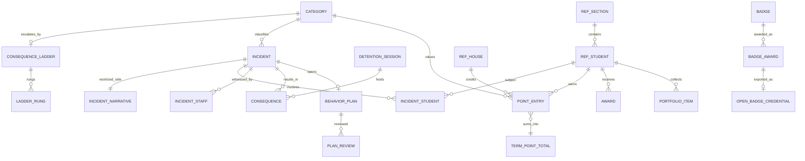
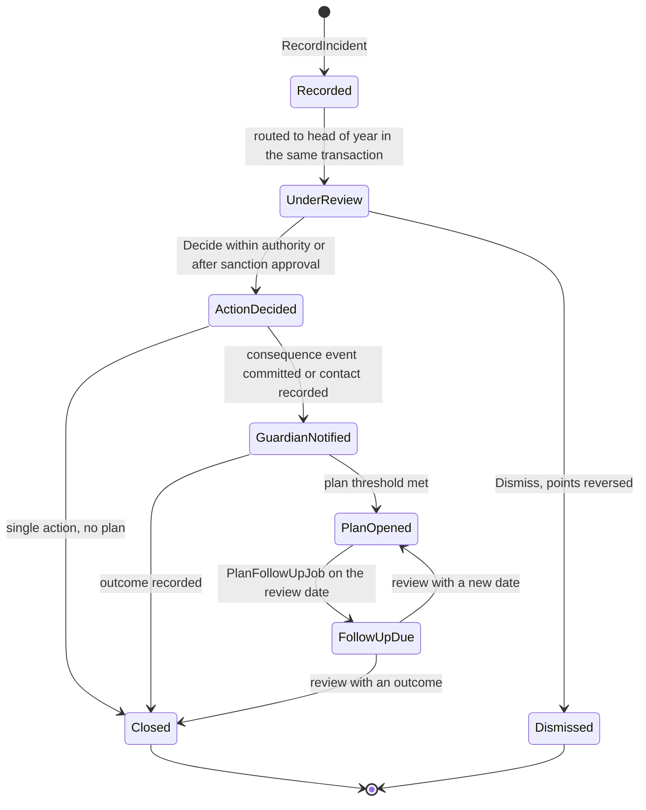

# Behavior

Behavior records what students do at school that the school wants to encourage or correct, and what follows. It owns the tenant's positive and negative categories with points and severity, incident reports with the students involved, the witnesses, the location and the action taken, the review that follows every incident (WF-BEH-01), the consequence ladder with its detention schedule, behavior contracts and plans with an owner and a review date, house and section points that two offline devices can both add to, badges with an Open Badges 3.0 export, awards and their certificates, the student portfolio, and behavior analytics. Behavior is **parent-visible**: a guardian sees their own child's incidents, consequences, points and badges as the tenant's category policy allows. Wellbeing is not: Behavior holds no clinic, counselling or safeguarding record, publishes a category code and a restricted flag rather than a narrative, and when an incident is attached to a safeguarding concern it shows nothing beyond the incident's existence. That line is the reason the two are separate services (ADR-0002).

**Group** C · **Requirement areas covered** BEH, with PRV, SEC, MOB and PERF rows that bind this service · **Last updated** 2026-09-21 by the planning session

| Fact | Value | Source |
|---|---|---|
| Service (Appendix L) | **Behavior**, long name "Behavior and Recognition" | Appendix L.1 |
| Tier | 1 | Appendix L.1, `05-service-catalog.md` |
| AREA code | `BEH` | Appendix L.1 |
| Database, schema, roles | `nibras_behavior`, schema `behavior`, application role `svc_behavior`, migration role `mig_behavior` | Appendix L.1, `10-data-architecture.md` part 1 |
| Exchange | `nibras.behavior` (topic) | Appendix L.1 |
| Images | `nibras/behavior-api` | Appendix L.1 |
| Worker | none. Appendix L lists no behavior-worker image, so the Quartz.NET jobs run in the Api host, as in Attendance | `07-solution-structure.md` part 3 |
| Why the boundary exists | "Security level: behavior records are parent-visible while Wellbeing records are not, so the two need different sensitivity models (ADR-0002)." | `05-service-catalog.md` |
| Synchronous dependencies | School (student directory), gRPC, one hop | Reference architecture Section 8, table 8.0 |
| Local copies | "students, sections, staff" | Reference architecture Section 8, table 8.0 |
| Service level class | Read-heavy (master brief Section 31) | Reference architecture Section 8, table 8.0 |
| Scaling profile | "Read-heavy" | `05-service-catalog.md` |
| Build phase | 4 (master brief Section 28) | `05-service-catalog.md` |
| Sensitivity | "confidential; restricted narratives are logged on every read" | `05-service-catalog.md`, Appendix J |
| First-release merge option | Behavior may be hosted inside Wellbeing's deployable; `nibras_behavior` stays separate and Behavior data stays parent-visible while Wellbeing stays at level S | Appendix L, `05-service-catalog.md` part 5 |

---

## 1. Responsibilities and non-responsibilities

### Responsibilities

| Owns | Detail |
|---|---|
| Categories | Positive and negative categories with points and severity levels, a default consequence ladder, a guardian-visibility policy and a restricted-by-default flag (REQ-BEH-001) |
| Incidents | Incident reports with involved students and their roles, staff and student witnesses, location, action taken, narrative in a restricted side table, follow-up (REQ-BEH-002); WF-BEH-01 from `Recorded` to `Closed` or `Dismissed` |
| Restricted visibility | Restricted incidents and every narrative read only under `behavior.incidents.view-restricted`, each read logged; the guardian projection that strips other students' identities (REQ-BEH-010, T-BEH-01, T-BEH-02) |
| Consequences and detentions | The consequence ladder per category group, sanction limits per role with vice-principal approval above them, the detention schedule with sessions, capacity and served or missed marking (REQ-BEH-003) |
| Behavior plans | Contracts and plans with goals, an owner, review dates and an outcome (REQ-BEH-004, WF-BEH-01 `PlanOpened` and `FollowUpDue`) |
| Points and houses | Point entries per student and house, additive across offline devices, term totals kept in the award transaction, the house and section leaderboard, individual ranking off by default (REQ-BEH-005, REQ-BEH-011) |
| Badges and awards | Badge catalog, awards, certificates requested from Documents, Open Badges 3.0 credentials signed with the tenant's issuer key (REQ-BEH-006, REQ-BEH-007) |
| Student portfolio | Achievements, badges, house points, certificates and selected work across years, exportable when the student leaves (REQ-BEH-008, Tier 2) |
| Behavior analytics | By student, class, time, location and category, served from Behavior's own tables and summaries (REQ-BEH-009) |
| Retention | Anonymization of incidents 3 years after leaving: narrative, witnesses and rationale set to null, category, date and points kept (REQ-PRV-005) |

### Not responsible for

| Does not own | Owner instead | Why the line is here |
|---|---|---|
| Counselling, clinic, safeguarding concerns, education plans, interventions | Wellbeing | Level S never enters `nibras_behavior`; Wellbeing hears `behavior.incident.recorded.v1` (category, severity, restricted flag) and decides whether to act |
| Whether an incident is part of a safeguarding case | Wellbeing (the safeguarding officer) | Behavior stores only a boolean link set by the officer and then shows existence only (`BEHAVIOR_INCIDENT_LINKED_TO_CONCERN`) |
| The student record, sections, houses, guardians and their rights | School | Behavior keeps a slim copy and asks School's directory over gRPC for a missing student |
| The timetable and who supervised whom | Scheduling | The recorder's authority is checked by data scope (Open point 6) |
| Delivering the guardian notice, quiet hours, channels | Notification | Behavior publishes events; delivery and the lock-screen wording are Notification's |
| The early-warning indicator and its flag | Reporting | Behavior's events are one of its inputs; `reporting.early-warning.flag-raised.v1` is Reporting's |
| Rendering certificates and the portfolio PDF, file bytes of evidence | Documents | Behavior sends `GenerateDocument` and stores the returned ids |
| Behavior category and policy settings as settings | Platform (ADR-0009) | Read from Platform settings (Open point 1) |
| Permission grants, the permission version | Identity | Behavior evaluates permissions from the token and the cache |
| The audit store and the access log | Audit | Behavior emits `behavior.audit.recorded.v1`, including every restricted read |
| Dashboards across services and Student 360 composition | Reporting and the backends-for-frontends | Behavior serves its own analytics; the principal's cross-service cards are Reporting's |

---

## 2. Requirements covered

| Range or identifier | What it binds here |
|---|---|
| REQ-BEH-001 to REQ-BEH-011 | Every BEH row in `03-requirements-catalog.md`: 9 Tier 1, 2 Tier 2 (REQ-BEH-006 Open Badges, REQ-BEH-008 portfolio) |
| REQ-PRV-005 | Incidents anonymized 3 years after the student leaves |
| REQ-MOB-007, REQ-MOB-010 | Points and incident capture queue offline with a UUID v7 idempotency key and replay once (Appendix M.1) |
| REQ-SEC-003 to REQ-SEC-006 | Object-level authorization per incident and per student, generated permission and isolation suites |
| REQ-DATA-002, REQ-DATA-003 | `svc_behavior` owns no tables and has no `BYPASSRLS` |
| REQ-PERF-015 | The leaderboard and the recognition summary are compiled queries |
| REQ-L10N-005, REQ-L10N-010 | Category, badge and consequence names as `LocalizedText`; review deadlines in the campus work week |

---

## 3. Aggregates and entities

Every tenant-owned table carries the base columns of `10-data-architecture.md` part 4, listed once: `id uuid not null` (UUID v7), `tenant_id uuid not null` (first column of every index, bound by row-level security), `created_at`, `created_by`, `updated_at`, `updated_by`, `deleted_at`, `deleted_by`, and `xmin` as the concurrency token on every aggregate root. Bilingual names use `LocalizedText` stored as `<field>_en`, `<field>_ar` and, where searchable, `<field>_ar_search`.

### 3.1 BehaviorCategory (aggregate root) with ConsequenceLadder

**`categories`**

| Field | Type | Null | Notes |
|---|---|---|---|
| `code` | text(32) | no | Unique per tenant; the `categoryCode` in every event |
| `name` | LocalizedText | no | |
| `polarity` | smallint | no | `Positive`, `Negative` |
| `points` | int | no | Positive for positive categories, negative or zero for negative ones |
| `severity` | smallint | no | `Low`, `Medium`, `High`, `Critical`; positive categories are `Low` |
| `ladder_id` | uuid | yes | Consequence ladder applied to repeats |
| `restricted_by_default` | boolean | no | New incidents in this category start restricted |
| `guardian_visibility` | smallint | no | `Always`, `AfterDecision`, `Never` (REQ-BEH-010: "parents see only what policy allows") |
| `requires_review` | boolean | no | Negative categories default to true; positive to false |
| `plan_threshold` | smallint | yes | Incidents in the ladder window after which a plan is required |
| `active` | boolean | no | |

**`consequence_ladders`**: `name LocalizedText`, `window smallint` (`Term`, `AcademicYear`, `Rolling30Days`). **`ladder_rungs`**: `ladder_id uuid`, `occurrence int` (the nth incident in the window), `consequence_code text(32)` (`detention`, `parent-meeting`, `internal-suspension`, `support-referral` and the tenant's own), `duration_minutes int null`, `notify_guardian boolean`, `min_authority smallint` (the role level that may decide it without approval).

**Invariants.** Codes are unique; a category in use is retired, never deleted. Rungs of a ladder have strictly increasing `occurrence`. A positive category cannot carry a consequence ladder.

### 3.2 Incident (aggregate root) with IncidentStudent, IncidentStaff, Consequence

**`incidents`**

| Field | Type | Null | Notes |
|---|---|---|---|
| `campus_id` | uuid | no | |
| `occurred_at` | timestamptz | no | Backdating limited by the window setting |
| `location_code` | text(32) | no | Tenant list (classroom, playground, bus, online, trip) |
| `category_id` | uuid | no | |
| `severity` | smallint | no | Defaults from the category, may be raised by the reviewer |
| `status` | smallint | no | `IncidentToInterventionStatus`: `Recorded`, `UnderReview`, `Dismissed`, `ActionDecided`, `GuardianNotified`, `PlanOpened`, `FollowUpDue`, `Closed` |
| `restricted` | boolean | no | From the category or set by the recorder or reviewer; widening needs `view-restricted` and a reason |
| `safeguarding_linked` | boolean | no | Set only by a holder of `behavior.incidents.view-restricted` on the safeguarding officer's request (Open point 3) |
| `action_taken_code` | text(32) | yes | Immediate action by the recorder |
| `recorded_by` | uuid | no | |
| `reviewer_id` | uuid | yes | Head of year of the first involved student's section, from the routing rule |
| `review_due_at` | timestamptz | yes | 1 working day for `High` and `Critical`, 3 otherwise (Appendix R) |
| `decided_by`, `decided_at` | uuid, timestamptz | yes | |
| `decision_code` | text(32) | yes | `sanction`, `support`, `no-action`, `dismiss` |
| `guardian_notified_at` | timestamptz | yes | |
| `guardian_deadline_at` | timestamptz | yes | Decision time plus 24 hours |
| `outcome_code` | text(32) | yes | On `Closed` |
| `client_token` | uuid | yes | Offline capture key (Appendix M) |

**`incident_narratives`** (side table, Confidential restricted, never cached): `incident_id uuid`, `narrative text` (at most 4,000 characters), `sanction_rationale text null`, `follow_up_note text null`. Read only under `behavior.incidents.view-restricted`; every read writes `behavior.audit.recorded.v1` in the read transaction (Appendix J rule 8).

**`incident_students`**: `incident_id uuid`, `student_id uuid`, `role_in_incident smallint` (`Involved`, `Affected`, `Witness`), `occurred_at timestamptz` (copied for the index), `point_entry_id uuid null`, `guardian_visible boolean` (computed from the category policy and the decision). Index `ix_incident_students_student`.

**`incident_staff`**: `incident_id uuid`, `staff_id uuid`, `role smallint` (`Recorder`, `Witness`, `Reviewer`, `Decider`).

**`consequences`**: `incident_id uuid`, `student_id uuid`, `consequence_code text(32)`, `scheduled_for date null`, `detention_session_id uuid null`, `duration_minutes int null`, `status smallint` (`PendingApproval`, `Scheduled`, `Served`, `Missed`, `Cancelled`), `approved_by uuid null`, `rung_occurrence int null`.

**`detention_sessions`**: `campus_id uuid`, `session_date date`, `starts_at time`, `ends_at time`, `room_id uuid null`, `supervisor_staff_id uuid`, `capacity int`, `status smallint`.

**Invariants (Incident)**

1. An incident has at least one student with role `Involved` or `Affected`; witnesses alone are not an incident.
2. A category missing for the incident type fails with `BEHAVIOR_CATEGORY_NOT_CONFIGURED`.
3. An `occurred_at` older than the backdating window fails with `BEHAVIOR_INCIDENT_WINDOW_PASSED` unless the caller holds `behavior.incidents.edit` with a reason (the override path).
4. A student outside the recorder's data scope fails with `BEHAVIOR_STUDENT_NOT_IN_SCOPE`.
5. A decision whose consequence is above the decider's authority creates the consequence in `PendingApproval` and answers `BEHAVIOR_SANCTION_REQUIRES_APPROVAL` (409) until a vice principal approves.
6. Dismissal reverses every point entry the incident created with a reason, cancels scheduled consequences, and publishes the reversing `behavior.points.awarded.v1` (Open point 4); the guardian receives a correction notice when they had been notified.
7. `Closed` requires an outcome code; a plan-carrying incident closes only when its plan closes.
8. The narrative is never in an event payload, a cache, a log line, an export without `view-restricted`, or the guardian's response.
9. A `safeguarding_linked` incident returns only its id, date and category to every reader without `view-restricted`, and to readers with it the error `BEHAVIOR_INCIDENT_LINKED_TO_CONCERN` for the narrative, routing them to the safeguarding officer (Appendix K.15).
10. Every transition runs through the transition pipeline (`13-workflows-and-sagas.md` §5.1); two concurrent decisions resolve first-wins with `BEHAVIOR_CONCURRENCY_CONFLICT` naming the first decider.

### 3.3 BehaviorPlan (aggregate root)

**`behavior_plans`**: `student_id uuid`, `incident_id uuid null`, `kind smallint` (`Contract`, `SupportPlan`), `goals LocalizedText[]` (at most 5), `owner_id uuid`, `review_date date`, `review_count int`, `status smallint` (`Open`, `FollowUpDue`, `Closed`), `outcome_code text(32) null`, `guardian_signed_at timestamptz null`.

**`plan_reviews`**: `plan_id uuid`, `reviewed_on date`, `reviewer_id uuid`, `progress_code text(32)`, `note_id uuid null` (pointer into `incident_narratives`-style side table `plan_notes`, restricted), `next_review_date date null`.

**Invariants.** A plan has exactly one owner and a review date in the future when opened. On its review date it moves to `FollowUpDue` and the owner is reminded; a review either sets a new future date (`FollowUpDue → Open`) or closes it with an outcome. A follow-up overdue by 5 working days escalates to the principal (Appendix R).

### 3.4 PointEntry and TermPointTotal

**`point_entries`**, list-partitioned by `academic_year_id` (`10-data-architecture.md` part 5): `academic_year_id uuid`, `term_id uuid`, `student_id uuid`, `house_id uuid null`, `section_id uuid`, `category_id uuid`, `points int`, `source smallint` (`Incident`, `Award`, `Manual`, `Reversal`), `incident_id uuid null`, `reverses_entry_id uuid null`, `reason_code text(32) null`, `awarded_by uuid`, `awarded_at timestamptz`, `device_occurred_at timestamptz null`, `client_token uuid null`. Append-only: a correction is a reversal entry, never an update. Unique `(tenant_id, academic_year_id, client_token)` where the token is set.

**`term_point_totals`** (summary kept in the award transaction, document 21 §3.14): `term_id uuid`, `scope_kind smallint` (`Student`, `House`, `Section`), `subject_id uuid`, `points int`. Unique `ux_term_point_totals_subject (tenant_id, term_id, scope_kind, subject_id)`.

**`daily_award_counters`**: `staff_id uuid`, `award_date date`, `points_awarded int`; the ceiling check for `BEHAVIOR_POINTS_LIMIT_EXCEEDED`.

**Invariants.**

1. Two offline awards with different tokens both apply, whatever their order (Appendix M: additive); the same token applies once.
2. `term_point_totals` equals the sum of its entries at every commit; the nightly invariant audit proves it.
3. A teacher's positive points above the daily ceiling fail with `BEHAVIOR_POINTS_LIMIT_EXCEEDED`, naming the remaining balance.
4. A revoke writes a reversal entry with a reason (T-BEH-03).
5. No endpoint returns an individual ranking unless the tenant enables it; house and section totals are always available (REQ-BEH-011).

### 3.5 Badge, BadgeAward and Award

**`badges`**: `code text(32)`, `name LocalizedText`, `description LocalizedText`, `criteria LocalizedText`, `image_file_id uuid`, `open_badge_enabled boolean`, `active boolean`.

**`badge_awards`**: `badge_id uuid`, `badge_code text(32)`, `student_id uuid`, `awarded_by uuid`, `awarded_at timestamptz`, `evidence_note text(512) null`, `open_badge_status smallint` (`NotRequested`, `Pending`, `Issued`, `Failed`), `open_badge_credential_id uuid null`, `recipient_hash bytea null` (salted hash of the student identifier; the credential never carries the name or an identifier in clear, T-BEH-04), `consent_checked_at timestamptz null`. Unique `(tenant_id, badge_id, student_id)` for one-time badges.

**`awards`**: `student_id uuid`, `award_code text(32)`, `term_id uuid`, `title LocalizedText`, `awarded_by uuid`, `generated_document_id uuid null` (the certificate from Documents), `certificate_status smallint` (`Requested`, `Generated`, `Failed`).

**`open_badge_credentials`**: `badge_award_id uuid`, `credential_json jsonb` (the signed Open Badges 3.0 credential), `issuer_key_id text(64)`, `issued_at timestamptz`, `revoked_at timestamptz null`.

**Invariants.** Awarding a badge the student already holds answers `BEHAVIOR_BADGE_ALREADY_AWARDED` (200) with the original date. An Open Badges issuance that fails keeps the award and shows a pending badge (`BEHAVIOR_OPEN_BADGE_ISSUANCE_FAILED`, 502 on the export call). A credential is issued only when the student's media and sharing consent is confirmed by School (Open point 7).

### 3.6 PortfolioItem (Tier 2)

**`portfolio_items`**: `student_id uuid`, `academic_year_id uuid`, `kind smallint` (`Badge`, `Award`, `Certificate`, `HousePoints`, `SelectedWork`), `source_id uuid`, `file_id uuid null` (selected work stored in Documents), `caption LocalizedText null`, `visible boolean`, `position int`. The portfolio export asks Documents for a compiled book (`06-services/documents.md`, school memory) with these items.

### 3.7 Reference copies (read-only)

`ref_students`, `ref_sections`, `ref_staff_users` and `ref_houses` are described in section 8. They carry `tenant_id`, `source_version` and `reconciled_at`, no audit columns beyond `updated_at`, no soft delete and no `xmin`.



---

## 4. REST API

Paths follow `22-api-conventions-and-error-catalog.md` §1. Every endpoint also returns the eight cross-cutting codes of Appendix K.1 with the `BEHAVIOR_` prefix (`BEHAVIOR_VALIDATION_FAILED`, `BEHAVIOR_PERMISSION_DENIED`, `BEHAVIOR_TENANT_MISMATCH`, `BEHAVIOR_NOT_FOUND`, `BEHAVIOR_CONCURRENCY_CONFLICT`, `BEHAVIOR_IDEMPOTENCY_REPLAY`, `BEHAVIOR_RATE_LIMITED`, `BEHAVIOR_DEPENDENCY_UNAVAILABLE`). "Key" means the `Idempotency-Key` header of document 22 §5. Every write is audited through `behavior.audit.recorded.v1`, and so is every read that returns a narrative. Lists use keyset pagination with a page cap of 200. **Guardian and student responses** are produced by the guardian projection: only incidents whose category policy allows it, only the child's own role, no other student's name or identifier, no narrative, no witness (T-BEH-02).

### 4.1 Categories and ladders (`CategoryEndpoints.cs`)

| Method | Path | Permission | Request | Response | Errors | Idempotent |
|---|---|---|---|---|---|---|
| GET | `/api/v1/behavior/categories?polarity=&active=` | `behavior.categories.view` | query | `Category[]` (from the §1.14 cache entry) | none beyond K.1 | Safe; `ETag` |
| POST | `/api/v1/behavior/categories` | `behavior.categories.create` | `CategoryModel` | 201 | `BEHAVIOR_VALIDATION_FAILED` (duplicate code, positive category with a ladder) | Key optional |
| PUT | `/api/v1/behavior/categories/{id}` | `behavior.categories.edit` | model, `If-Match` | 200; applies to new incidents only | `BEHAVIOR_CONCURRENCY_CONFLICT` | Yes, by `If-Match` |
| DELETE | `/api/v1/behavior/categories/{id}` | `behavior.categories.delete` | `If-Match` | 204; retired when in use | `BEHAVIOR_CONCURRENCY_CONFLICT` | Yes |
| GET | `/api/v1/behavior/consequence-ladders` | `behavior.categories.view` | none | Ladders with rungs | none beyond K.1 | Safe; `ETag` |
| PUT | `/api/v1/behavior/consequence-ladders/{id}` | `behavior.categories.edit` | ladder with rungs, `If-Match` | 200 | `BEHAVIOR_VALIDATION_FAILED` (rungs not increasing), `BEHAVIOR_CONCURRENCY_CONFLICT` | Yes, by `If-Match` |

### 4.2 Incidents and WF-BEH-01 (`IncidentEndpoints.cs`)

| Method | Path | Permission | Request | Response | Errors | Idempotent |
|---|---|---|---|---|---|---|
| POST | `/api/v1/behavior/incidents` | `behavior.incidents.create` | `RecordIncidentRequest`: `occurredAt`, `locationCode`, `categoryId`, `severity`, `students[]` (id, role), `staffWitnesses[]`, `actionTakenCode`, `narrative`, `restricted`, `clientToken` | 201 `Incident` in `UnderReview` (or `Closed` for a positive category with no review), routed to the reviewer; publishes `behavior.incident.recorded.v1` and, where the category carries points, `behavior.points.awarded.v1` per student | `BEHAVIOR_CATEGORY_NOT_CONFIGURED`, `BEHAVIOR_INCIDENT_WINDOW_PASSED`, `BEHAVIOR_STUDENT_NOT_IN_SCOPE` | Yes, Key or `clientToken`; a replay returns the first incident |
| POST | `/api/v1/behavior/incidents/sync` | `behavior.incidents.create` | up to 100 queued captures from the mobile outbox, each with `idempotencyKey` and `occurredAt` | 200 per-item results | per item as above | Yes, per item key (Appendix M) |
| GET | `/api/v1/behavior/incidents?campusId=&status=&categoryId=&from=&to=` | `behavior.incidents.view` | query, cursor on `(occurred_at, id)` | `IncidentRow[]` without narratives; restricted ones only for `view-restricted` holders (hot query 6 for the open caseload) | none beyond K.1 | Safe |
| GET | `/api/v1/behavior/incidents/{id}` | `behavior.incidents.view` | none | `Incident` with students, staff, consequences, plan; narrative omitted | `BEHAVIOR_INCIDENT_LINKED_TO_CONCERN` (403; existence only) | Safe |
| GET | `/api/v1/behavior/incidents/{id}/narrative` | `behavior.incidents.view-restricted` | none | Narrative, sanction rationale, follow-up note; the read is logged in the same transaction | `BEHAVIOR_RESTRICTED_NARRATIVE_DENIED`, `BEHAVIOR_INCIDENT_LINKED_TO_CONCERN` | Safe; `Cache-Control: no-store` |
| PATCH | `/api/v1/behavior/incidents/{id}` | `behavior.incidents.edit` | corrections before a decision; `restricted` widening needs `view-restricted` and a reason; `If-Match` | 200 | `BEHAVIOR_CONCURRENCY_CONFLICT`, `BEHAVIOR_INCIDENT_WINDOW_PASSED` | Yes, by `If-Match` |
| POST | `/api/v1/behavior/incidents/{id}/decide` | `behavior.incidents.assign-consequence` | `{ decisionCode, consequences[] (studentId, code, scheduledFor, detentionSessionId), severity }` | 200 `ActionDecided`; ladder applied; publishes `behavior.consequence.assigned.v1` per scheduled consequence | `BEHAVIOR_SANCTION_REQUIRES_APPROVAL` (409), `BEHAVIOR_CONCURRENCY_CONFLICT` | Yes, first decision wins |
| POST | `/api/v1/behavior/incidents/{id}/approve-sanction` | `behavior.incidents.assign-consequence` (vice principal authority) | `{ consequenceIds[], note }` | 200; consequences `Scheduled`; publishes `behavior.consequence.assigned.v1` | `BEHAVIOR_SANCTION_REQUIRES_APPROVAL` (approver's authority too low), `BEHAVIOR_CONCURRENCY_CONFLICT` | Yes, state-guarded |
| POST | `/api/v1/behavior/incidents/{id}/dismiss` | `behavior.incidents.assign-consequence` | `{ reasonCode, note }` | 200 `Dismissed`; points reversed, consequences cancelled, correction notice when the guardian had been told | `BEHAVIOR_CONCURRENCY_CONFLICT` | Yes, state-guarded |
| POST | `/api/v1/behavior/incidents/{id}/guardian-notified` | `behavior.incidents.edit` | `{ channel: automatic \| phone \| meeting, at }` | 200 `GuardianNotified`; the automatic path is set when the consequence event commits | `BEHAVIOR_CONCURRENCY_CONFLICT` | Yes, state-guarded |
| POST | `/api/v1/behavior/incidents/{id}/close` | `behavior.incidents.edit` | `{ outcomeCode }` | 200 `Closed` | `BEHAVIOR_VALIDATION_FAILED` (plan still open) | Yes, state-guarded |
| POST | `/api/v1/behavior/incidents/{id}/safeguarding-link` | `behavior.incidents.view-restricted` | `{ linked: true \| false, reasonCode }` | 200; from now on readers see existence only | none beyond K.1 | Yes |
| GET | `/api/v1/behavior/incidents/export?from=&to=&categoryId=` | `behavior.incidents.export` | query, `format=csv` | Streamed CSV of category, date, location, points, students by number; narratives only with `view-restricted`; audited export | none beyond K.1 | Safe |

### 4.3 Consequences, detentions and plans (`ConsequenceEndpoints.cs`, `PlanEndpoints.cs`)

| Method | Path | Permission | Request | Response | Errors | Idempotent |
|---|---|---|---|---|---|---|
| GET | `/api/v1/behavior/consequences?date=&status=&campusId=` | `behavior.incidents.view` | query, cursor | `ConsequenceRow[]`: the day's detentions and meetings | none beyond K.1 | Safe |
| POST | `/api/v1/behavior/consequences/{id}/record` | `behavior.incidents.assign-consequence` | `{ outcome: served \| missed \| cancelled, note }` | 200; a missed detention counts as a ladder occurrence | `BEHAVIOR_CONCURRENCY_CONFLICT` | Yes, state-guarded |
| GET | `/api/v1/behavior/detention-sessions?from=&to=&campusId=` | `behavior.incidents.view` | query | Sessions with capacity and attendees | none beyond K.1 | Safe |
| POST | `/api/v1/behavior/detention-sessions` | `behavior.incidents.assign-consequence` | `{ campusId, date, startsAt, endsAt, roomId, supervisorStaffId, capacity }` | 201 | `BEHAVIOR_VALIDATION_FAILED` | Key optional |
| POST | `/api/v1/behavior/plans` | `behavior.incidents.assign-consequence` | `{ studentId, incidentId, kind, goals, ownerId, reviewDate }` | 201 `Open`; incident moves to `PlanOpened` | `BEHAVIOR_STUDENT_NOT_IN_SCOPE` | Key optional |
| GET | `/api/v1/behavior/plans?ownerId=&status=&studentId=` | `behavior.incidents.view` | query, cursor | `PlanRow[]` with next review date | none beyond K.1 | Safe |
| GET | `/api/v1/behavior/plans/{id}` | `behavior.incidents.view` | none | `BehaviorPlan` with reviews; notes only with `view-restricted` | none beyond K.1 | Safe |
| POST | `/api/v1/behavior/plans/{id}/reviews` | `behavior.incidents.edit` (owner) | `{ progressCode, note, nextReviewDate or outcomeCode }` | 200 `Open` with a new date, or `Closed` | `BEHAVIOR_CONCURRENCY_CONFLICT` | Yes, one review per plan per day |

### 4.4 Points, houses and leaderboards (`PointEndpoints.cs`)

| Method | Path | Permission | Request | Response | Errors | Idempotent |
|---|---|---|---|---|---|---|
| POST | `/api/v1/behavior/points` | `behavior.points.award` | `{ studentIds[] or sectionId, categoryId, points, reasonCode, occurredAt, clientToken }` | 201 entries; totals updated in the same transaction; one `behavior.points.awarded.v1` per student (hot query 3) | `BEHAVIOR_POINTS_LIMIT_EXCEEDED`, `BEHAVIOR_STUDENT_NOT_IN_SCOPE`, `BEHAVIOR_CATEGORY_NOT_CONFIGURED` | Yes, by `clientToken` per student |
| POST | `/api/v1/behavior/points/sync` | `behavior.points.award` | up to 200 queued awards, each with its key | 200 per-item results; additive merge (Appendix M) | per item as above | Yes, per item key |
| POST | `/api/v1/behavior/points/{entryId}/revoke` | `behavior.points.revoke` | `{ reasonCode, note }` | 201 reversal entry; publishes `behavior.points.awarded.v1` with the negative amount (Open point 4) | `BEHAVIOR_CONCURRENCY_CONFLICT` (already reversed) | Yes, once per entry |
| GET | `/api/v1/behavior/points?studentId=&termId=` | `behavior.points.view` | query, cursor | Entries with reasons | none beyond K.1 | Safe |
| GET | `/api/v1/behavior/leaderboards?termId=&scope=house\|section\|individual` | `behavior.points.view` | query | Totals in order (hot query 4); `individual` only when the tenant enables it | `BEHAVIOR_PERMISSION_DENIED` (individual ranking disabled) | Safe; `ETag` |

### 4.5 Badges, awards and the portfolio (`RecognitionEndpoints.cs`)

| Method | Path | Permission | Request | Response | Errors | Idempotent |
|---|---|---|---|---|---|---|
| GET | `/api/v1/behavior/badges` | `behavior.badges.view` | none | `Badge[]` (§1.14 cache entry) | none beyond K.1 | Safe; `ETag` |
| POST | `/api/v1/behavior/badges` | `behavior.badges.create` | `BadgeModel` with image file id | 201 | `BEHAVIOR_VALIDATION_FAILED` | Key optional |
| PUT | `/api/v1/behavior/badges/{id}` | `behavior.badges.edit` | model, `If-Match` | 200 | `BEHAVIOR_CONCURRENCY_CONFLICT` | Yes, by `If-Match` |
| POST | `/api/v1/behavior/badges/{id}/awards` | `behavior.badges.award` | `{ studentIds[], evidenceNote }` | 201 awards; publishes `behavior.badge.awarded.v1` per student | `BEHAVIOR_BADGE_ALREADY_AWARDED` (200), `BEHAVIOR_STUDENT_NOT_IN_SCOPE` | Yes, by `(badge, student)` |
| POST | `/api/v1/behavior/badge-awards/{id}/open-badge` | `behavior.badges.export-open-badge` | none | 200 the signed Open Badges 3.0 credential (JSON), hashed recipient | `BEHAVIOR_OPEN_BADGE_ISSUANCE_FAILED` (502), `BEHAVIOR_VALIDATION_FAILED` (consent missing) | Yes; the same credential is returned once issued |
| POST | `/api/v1/behavior/awards` | `behavior.badges.award` | `{ studentIds[], awardCode, termId, title }` | 201; `GenerateDocument` per student for the certificate (REQ-BEH-007) | `BEHAVIOR_STUDENT_NOT_IN_SCOPE` | Yes, Key required |
| GET | `/api/v1/behavior/students/{id}/recognition` | `behavior.points.view` (`own-children`, `self` for families) | none | Points this term, house, badges, awards (hot query 5) | none beyond K.1 | Safe; `ETag` |
| GET | `/api/v1/behavior/students/{id}/portfolio` | `behavior.badges.view` (`own-children`, `self`) | none | Portfolio items across years (Tier 2, TC-BEH-601) | none beyond K.1 | Safe |
| PUT | `/api/v1/behavior/students/{id}/portfolio` | `behavior.badges.edit` (staff) or the student for `visible` and `position` of own items (Open point 5) | items order and visibility, selected-work file ids | 200 | `BEHAVIOR_CONCURRENCY_CONFLICT` | Yes, by `If-Match` |
| POST | `/api/v1/behavior/students/{id}/portfolio/export` | `behavior.badges.view` (`own-children`, `self`); Open point 5 | `{ format: pdf \| zip }` | 202; Documents compiles the book | none beyond K.1 | Yes, Key required |

### 4.6 Students and analytics (`StudentEndpoints.cs`, `AnalyticsEndpoints.cs`)

| Method | Path | Permission | Request | Response | Errors | Idempotent |
|---|---|---|---|---|---|---|
| GET | `/api/v1/behavior/students/{id}/incidents?cursor=` | `behavior.incidents.view` | cursor on `(occurred_at, incident_id)` | Incidents for one student (hot query 2); guardian projection for families; restricted ones only for `view-restricted` holders, each such read logged | none beyond K.1 | Safe |
| GET | `/api/v1/behavior/analytics?groupBy=student\|section\|time\|location\|category&from=&to=&campusId=` | `behavior.incidents.view` | query | Counts and points by the grouping; breakdowns under 10 students are shown to staff only, never exported to families (REQ-BEH-009) | none beyond K.1 | Safe |
| GET | `/api/v1/behavior/analytics/export` | `behavior.incidents.export` | same query, `format=csv` | Streamed CSV; audited | none beyond K.1 | Safe |

**Endpoint count: 45** across 6 endpoint groups.

---

## 5. gRPC

| Direction | Contract | Method | Purpose | Deadline | Fallback |
|---|---|---|---|---|---|
| Exposed | `nibras.behavior.v1` `Reconciliation` | `Snapshot(projection_kind, page_token)` | Reporting rebuild of `student_360` and the timeline (`10-data-architecture.md` part 7.1): incident ids, category, date, points, restricted flag; never a narrative | 5 s per page | Reporting retries; not on any request path |
| Consumed | `nibras.school.v1` `StudentDirectory` | `GetStudent`, `ListStudentsBySection` | A student missing from the copy when an incident or award names them; the house list at provisioning (Open point 2) | 2 s lookup, 5 s page | Local copy; an unknown student is refused with `BEHAVIOR_STUDENT_NOT_IN_SCOPE` rather than recorded blind |
| Consumed | `nibras.school.v1` `Directory` | `StudentChecksum`, `SectionChecksum` | Nightly reconciliation of the copies | 30 s | Next night; data-quality finding after two misses |

Every call carries the metadata of document 22 §10.3 through `SchoolDirectoryClient`. No call is made from inside an inbound gRPC call, so the one-hop rule holds.

---

## 6. Events published and consumed

Payload fields are owned by Appendix E and are not restated. Partition keys are Appendix E's.

### 6.1 Published (exchange `nibras.behavior`)

| Routing key | Partition key | Raised by | Consumers (Appendix E) |
|---|---|---|---|
| `behavior.incident.recorded.v1` | `studentId` | `RecordIncidentHandler`, `SyncIncidentsHandler`; one per incident, `studentIds` listing the involved students; `restricted` carried; no narrative | Wellbeing, Notification, Reporting, Ai (which skips a restricted incident under `25-ai-and-assist-ladder.md` section 4.2) |
| `behavior.points.awarded.v1` | `studentId` | `AwardPointsHandler`, incident points, `RevokePointsHandler` and dismissal (negative amount, Open point 4); one per student | Notification, Reporting |
| `behavior.badge.awarded.v1` | `studentId` | `AwardBadgeHandler`, once per `(badge, student)` | Notification, Documents, Reporting |
| `behavior.consequence.assigned.v1` | `studentId` | `DecideIncidentHandler` and `ApproveSanctionHandler` when a consequence becomes `Scheduled` | Notification, Reporting |
| `behavior.audit.recorded.v1` | `tenantId` | Every write, every transition, every narrative read, every restricted-flag change | Audit |
| `behavior.usage.recorded.v1` | `tenantId` | `BehaviorUsageMeterJob`: incidents, point entries, badges | Platform |

Behavior sends `GenerateDocument` to Documents for award certificates and portfolio books (Open point 8) and `RequestNotification` to Notification for the reviewer's task, the plan review reminder and the correction notice after a dismissal, which Appendix C does not list (Open point 9).

### 6.2 Consumed

Queues are those of `11-messaging-architecture.md` §2.5 and §2.3 for Behavior: `behavior.reference-copies`, `behavior.tenant-lifecycle`, `behavior.commands`. Every handler is idempotent through the inbox keyed on `messageId` and on the subject key below.

| Routing key or command | Queue | Handler | What it changes | Idempotent on |
|---|---|---|---|---|
| `school.student.enrolled.v1` | `behavior.reference-copies` | `StudentEnrolledConsumer` | Creates `ref_students` with section, campus, house | `studentId` |
| `school.student.section-changed.v1` | `behavior.reference-copies` | `StudentSectionChangedConsumer` | Moves the student; future points count to the new section, past entries keep theirs | `studentId` plus `effectiveOn` |
| `school.student.status-changed.v1` | `behavior.reference-copies` | `StudentStatusChangedConsumer` | Retires the reference; sets `left_on` that starts the 3-year anonymization clock and offers the portfolio export | `studentId` plus `effectiveOn` |
| `school.student.profile-updated.v1` | `behavior.reference-copies` | `StudentProfileUpdatedConsumer` | Refreshes names, house and photo through `StudentDirectory` when a copied field changed | `studentId` plus `occurredAt` |
| `school.section.created.v1`, `school.section.changed.v1` | `behavior.reference-copies` | `SectionConsumer` | Creates or updates `ref_sections`, including the head of year used by review routing | `sectionId` plus `occurredAt` |
| `identity.user.activated.v1`, `identity.user.deactivated.v1` | `behavior.reference-copies` | `UserConsumer` | Staff users who can record, review and own plans; a deactivated reviewer's open reviews are rerouted | `userId` plus `occurredAt` |
| `platform.tenant.provisioning-requested.v1` | `behavior.tenant-lifecycle` | `TenantProvisioningConsumer` | Seeds default categories, a ladder and badges by school type; replies `TenantProvisioned` | `tenantId` |
| `platform.tenant.suspended.v1`, `platform.tenant.reactivated.v1`, `platform.tenant.deletion-requested.v1`, `platform.tenant.deleted.v1` | `behavior.tenant-lifecycle` | `TenantStatusConsumer`, `TenantDeletionConsumer` | Read-only mode; deletion bookkeeping | `tenantId` plus `occurredAt` |
| `platform.settings.changed.v1` | `behavior.tenant-lifecycle` | `SettingsChangedConsumer` | Evicts the policy cache when `scope = behavior` (Open point 1) | `tenantId` plus `occurredAt` |
| `platform.plan.changed.v1`, `platform.feature-flag.changed.v1`, `platform.terminology.changed.v1`, `platform.custom-field.changed.v1` | `behavior.tenant-lifecycle` | `PlatformContextConsumer` | Tenant context, the Open Badges and portfolio flags | `tenantId` plus `occurredAt` |
| `identity.role.changed.v1`, `identity.permissions.changed.v1` | `behavior.tenant-lifecycle` | building-block permission cache | Evicts the permission cache | `permissionVersion` |
| `reporting.data-quality.issue-detected.v1` | `behavior.tenant-lifecycle` | `DataQualityIssueConsumer` | Acts only on Behavior entity types (for example a category with no points) | `ruleCode` plus `occurredAt` |
| `DeprovisionTenant`, `DeleteTenantData` and the Saga 10 commands | `behavior.commands` | `Features/TenantLifecycle/` | Tenant lifecycle | `(sagaId, stepKey)` |

---

## 7. Sagas and workflows

Behavior orchestrates no saga, so `Application/Sagas/` is not generated. It owns one workflow and takes part in others. State types are fixed by `31-business-rules-and-workflows.md` section 3 (Behavior: 0 rules, 1 workflow, phase 4).

| WF or saga | Role | What Behavior implements | State type |
|---|---|---|---|
| WF-BEH-01 Incident to intervention | Owner | Every transition below | `IncidentToInterventionStatus` in `Nibras.Behavior.Domain/Incidents/` |
| WF-ATT-01 Daily attendance to intervention | none directly | Behavior's events feed Reporting's early-warning inputs | none local |
| Sagas 1, 2 and 10 | Participant | Tenant lifecycle commands | none local |

**WF-BEH-01 transitions and where they run.** `Recorded`: `RecordIncidentHandler`. `Recorded → UnderReview`: same handler, in the same transaction, after `ReviewRoutingRule` names the head of year of the first involved student's section (TC-BEH-001); a positive category with `requires_review = false` goes straight to `Closed`. `UnderReview → ActionDecided`: `DecideIncidentHandler` (TC-BEH-002). `UnderReview → Dismissed`: `DismissIncidentHandler` with reversal and correction (TC-BEH-005). `ActionDecided → GuardianNotified`: set when `behavior.consequence.assigned.v1` commits for a visible consequence, or by `GuardianNotifiedHandler` for a phone call or meeting (TC-BEH-003). `ActionDecided → Closed`: `CloseIncidentHandler` for a single action with no plan. `GuardianNotified → PlanOpened`: `OpenPlanHandler` when severity or repetition meets the category's `plan_threshold` (TC-BEH-004). `PlanOpened → FollowUpDue`: `PlanFollowUpJob` on the review date. `FollowUpDue → PlanOpened`: `RecordPlanReviewHandler` with a new date. `FollowUpDue → Closed`: `RecordPlanReviewHandler` with an outcome (TC-BEH-006).



`GuardianNotified → Closed` is added so that an incident whose decided action is complete and needs no plan can end after the guardian is told; Appendix R reaches `Closed` only from `ActionDecided` and `FollowUpDue` (Open point 10). **Timeouts** (Appendix R): review within 1 working day for high severity and 3 otherwise (`IncidentReviewEscalationJob`); guardian notice within 24 hours of the decision (`GuardianNoticeDeadlineJob`); a follow-up overdue by 5 working days escalates to the principal (`PlanFollowUpJob`). **Wellbeing's part.** Appendix R lists `wellbeing.intervention.opened.v1` among the side effects; Behavior does not publish it. Wellbeing consumes `behavior.incident.recorded.v1` and opens an intervention if its own rules say so; Behavior never learns the result, which is the level-S line.

---

## 8. Local reference copies

| Copy | Table | Kept current by | Fields | Reconciled | Staleness tolerated |
|---|---|---|---|---|---|
| Student | `ref_students` | `school.student.enrolled.v1`, `school.student.section-changed.v1`, `school.student.status-changed.v1`, `school.student.profile-updated.v1` | `student_id`, `student_number`, `name_en`, `name_ar`, `section_id`, `campus_id`, `house_id`, `status`, `left_on`, `photo_file_id` | Nightly 02:00 band time against `Directory/StudentChecksum` | Seconds; a missing student is fetched once through `StudentDirectory` |
| Section | `ref_sections` | `school.section.created.v1`, `school.section.changed.v1` | `section_id`, `grade_level_id`, `campus_id`, `homeroom_teacher_id`, `head_of_year_id` | Nightly against `Directory/SectionChecksum` | Minutes |
| Staff user | `ref_staff_users` | `identity.user.activated.v1`, `identity.user.deactivated.v1` | `user_id`, `roles`, `scope`, `preferred_language`, `active` | Nightly against `nibras.identity.v1` `Users/Checksum` | Minutes |
| House | `ref_houses` | No House event exists in Appendix E; fetched through `StudentDirectory` at provisioning and nightly (Open point 2) | `house_id`, `name_en`, `name_ar`, `campus_id`, `colour` | Nightly snapshot replaces the copy | Hours |

`ReferenceCopyReconciliationJob` compares checksums per tenant, replays from School's snapshot on a difference and raises `reporting.data-quality.issue-detected.v1` with `ruleCode = reference-copy-mismatch` on an unexplained one (Appendix E jobs table; Reporting's Open point 5 on how the finding travels).

---

## 9. Background jobs

Quartz.NET jobs in the Api host (Appendix L lists no behavior-worker image), clustered, one tenant per iteration with the tenant variable set.

| Job | Schedule | What it does | Publishes | Progress and failure |
|---|---|---|---|---|
| `IncidentReviewEscalationJob` | Hourly during the campus working day | Incidents in `UnderReview` past `review_due_at` (1 working day high, 3 others) escalate to the vice principal | `RequestNotification` (Open point 9) | Idempotent per incident and rung |
| `GuardianNoticeDeadlineJob` | Hourly | `ActionDecided` incidents with a guardian-visible consequence past 24 hours without `GuardianNotified` alert the decider and the head of year | `RequestNotification` | Idempotent per incident |
| `PlanFollowUpJob` | Daily 07:00 campus time zone | Plans whose review date is today move to `FollowUpDue` and remind the owner; overdue by 5 working days escalates to the principal (REQ-BEH-004) | `RequestNotification`; `behavior.audit.recorded.v1` per transition | Count per tenant |
| `DetentionOutcomeJob` | Daily at campus dismissal plus 90 minutes | Scheduled consequences of the day not recorded become `Missed` and count as a ladder occurrence | `behavior.consequence.assigned.v1` when the ladder schedules the next rung | Count per campus |
| `OpenBadgeIssuanceRetryJob` | Every 15 minutes | Retries `Pending` and `Failed` issuances with backoff, up to 24 hours | none | Metric of pending credentials |
| `LeaverAnonymizationJob` | Monthly | Students who left more than 3 years ago: narrative, witnesses, rationale, plan notes set to null; category, date and points kept (REQ-PRV-005, `10-data-architecture.md` part 8); honours legal holds | `behavior.audit.recorded.v1` | Reports to the Data Quality Center |
| `ReferenceCopyReconciliationJob` | Nightly 02:00 band time | Section 8 | `reporting.data-quality.issue-detected.v1` on a mismatch | Per tenant |
| `InvariantAuditJob` | Nightly 01:00 band time | `term_point_totals` recomputed from `point_entries` for a 1 percent sample of students and every house; repaired on a difference | `reporting.data-quality.issue-detected.v1` on a repair | Counts per tenant |
| `PartitionMaintenanceJob` | Yearly on 1 June, and at provisioning | Creates the next academic year's `point_entries` partition; archives a year partition read-only once every student in it has passed the clock | none | Resumable |
| `BehaviorUsageMeterJob` | Daily 23:30 band time | Incidents, entries, badges | `behavior.usage.recorded.v1` | none |

No job here runs long enough to need the job resource of document 22 §6; the portfolio export runs in Documents.

---

## 10. Permissions, notifications, settings, error codes

### 10.1 Permissions (Appendix B)

| Permission | Risk | Default holders (Appendix I) | Scope used |
|---|---|---|---|
| `behavior.categories.view`, `.create`, `.edit`, `.delete` | normal | Principal, Vice Principal (`edit`); every staff member `view` | all-tenant |
| `behavior.incidents.view` | normal | G19: Teacher (own sections), Homeroom Teacher, Counselor, Principal; Parent for own children through the guardian projection | own-sections, own-homeroom, own-children, self, campus |
| `behavior.incidents.create`, `.edit`, `.export` | normal | G19 (`create`); Head of Department, Vice Principal, Principal (`edit`, `export`) | own-sections, campus |
| `behavior.incidents.view-restricted` | elevated, every use logged | G19 for Counselor, Vice Principal, Principal, Safeguarding Officer; never Receptionist / Security (Appendix I) | campus |
| `behavior.incidents.assign-consequence` | normal, with an authority level per role | Head of year, Vice Principal, Principal | own-homeroom, campus |
| `behavior.points.view`, `behavior.points.create`, `behavior.points.award` | normal | G19 (`award`); Parent and Student `view` for self and own children | own-sections, own-children, self |
| `behavior.points.revoke` | normal, reason required | Vice Principal, Principal, the awarding teacher within 24 hours | own-sections, campus |
| `behavior.badges.view`, `.create`, `.edit`, `.award` | normal | G19 (`award`); Parent and Student `view` | campus, own-children, self |
| `behavior.badges.export-open-badge` | normal | Principal, Registrar; Student for own badges when consented | campus, self |

### 10.2 Notifications triggered (Appendix C)

| Notification | Trigger | Recipients | Urgency |
|---|---|---|---|
| Behavior incident, per policy | `behavior.incident.recorded.v1` | Guardians, homeroom teacher | N |
| Consequence assigned | `behavior.consequence.assigned.v1` | Guardians, student | N |
| Badge, award, or house points | `behavior.points.awarded.v1`, `behavior.badge.awarded.v1` | Student, guardians | D |

Notification applies the category's guardian-visibility policy through the event's `restricted` flag and category code; a restricted incident produces no guardian message, and no message names another child (T-BEH-02).

### 10.3 Settings read (Appendix G; defined and edited in Platform)

Appendix G has no Behavior category (Open point 1). Until it does, the values below are Platform settings under `scope = behavior` with these defaults.

| Setting | Type | Default | Inferred from |
|---|---|---|---|
| Backdating window | days | 7 | `BEHAVIOR_INCIDENT_WINDOW_PASSED` exists; default is this sheet's |
| Daily positive points ceiling per teacher | points | 100 | `BEHAVIOR_POINTS_LIMIT_EXCEEDED` exists |
| Individual leaderboard | boolean | off | REQ-BEH-011 |
| Review deadlines | working days by severity | 1 for high and critical, 3 otherwise | Appendix R WF-BEH-01 |
| Guardian notice deadline | hours | 24 | Appendix R WF-BEH-01 |
| Sanction authority per role | consequence codes per role | teacher: none; head of year: detention, parent meeting; vice principal: internal suspension | Appendix K `BEHAVIOR_SANCTION_REQUIRES_APPROVAL` |
| Open Badges issuing | boolean, issuer name | off (Tier 2) | REQ-BEH-006 |
| General → work week, time zone, languages (Appendix G) | as General | country defaults | Country |

### 10.4 Error codes (Appendix K.15, plus K.1 with the `BEHAVIOR_` prefix)

| Code | HTTP | Raised by |
|---|---|---|
| `BEHAVIOR_CATEGORY_NOT_CONFIGURED` | 400 | Record incident, award points |
| `BEHAVIOR_INCIDENT_WINDOW_PASSED` | 409 | Record and edit beyond the backdating window |
| `BEHAVIOR_RESTRICTED_NARRATIVE_DENIED` | 403 | Narrative read without `view-restricted` |
| `BEHAVIOR_POINTS_LIMIT_EXCEEDED` | 409 | Award above the teacher's daily ceiling |
| `BEHAVIOR_BADGE_ALREADY_AWARDED` | 200 | Second award of a one-time badge |
| `BEHAVIOR_SANCTION_REQUIRES_APPROVAL` | 409 | Decision above the decider's authority |
| `BEHAVIOR_STUDENT_NOT_IN_SCOPE` | 403 | Any write naming a student outside the actor's scope |
| `BEHAVIOR_OPEN_BADGE_ISSUANCE_FAILED` | 502 | Open Badges export when signing or the backpack fails |
| `BEHAVIOR_INCIDENT_LINKED_TO_CONCERN` | 403 | Any read of a safeguarding-linked incident beyond existence |
| `BEHAVIOR_VALIDATION_FAILED`, `BEHAVIOR_PERMISSION_DENIED`, `BEHAVIOR_TENANT_MISMATCH`, `BEHAVIOR_NOT_FOUND`, `BEHAVIOR_CONCURRENCY_CONFLICT`, `BEHAVIOR_IDEMPOTENCY_REPLAY`, `BEHAVIOR_RATE_LIMITED`, `BEHAVIOR_DEPENDENCY_UNAVAILABLE` | per K.1 | Shared problem-details middleware |

---

## 11. Caching and hot queries

The caching table is `21-performance-engineering.md` §1.14 and the hot-query table with its indexes is §3.14; neither is repeated. What this sheet adds:

| Addition | Key or index | L1 / L2 | Invalidated by | Why document 21 lacks it |
|---|---|---|---|---|
| Behavior policy settings | `nibras:{tenant}:behavior:policy:current:v1`, tags `tenant` | 5 min / 6 h ± 10% | `platform.settings.changed.v1` with `scope = behavior` | Open point 1 |
| Consequence ladders | `nibras:{tenant}:behavior:ladders:current:v1`, tags `tenant` | 5 min / 6 h ± 10% | Ladder write handler evicts by key | Added with REQ-BEH-003 |
| Reviewer queue | `ix_incidents_reviewer_due (tenant_id, reviewer_id, review_due_at) WHERE status = UnderReview`; under 30 rows; 2 commands, p95 10 ms | not cached | not applicable | Head-of-year screen |
| Plans due | `ix_behavior_plans_review (tenant_id, review_date, id) WHERE status IN (Open, FollowUpDue)`; 1 command, p95 5 ms | not cached | not applicable | Job query |
| Day's consequences | `ix_consequences_day (tenant_id, scheduled_for, status)`; under 50 rows; 1 command | not cached | not applicable | Detention list |
| Daily award counter | `ux_daily_award_counters (tenant_id, staff_id, award_date)`; 1 command in the award transaction | not cached (must be exact) | not applicable | Ceiling check |
| Analytics by grouping | `ix_incidents_campus_time (tenant_id, campus_id, occurred_at) INCLUDE (category_id, location_code, severity)`; 2 commands, p95 60 ms for a term | not cached | not applicable | REQ-BEH-009 |

Never cached, restated from §1.14 because it binds the code: incident narratives, witnesses, sanction rationale, plan notes, incident lists for a student.

---

## 12. Security

The threat table is `12-security-privacy-safety.md` §2.14 (T-BEH-01 to T-BEH-04, tests `TC-SEC-250` to `TC-SEC-252`, `TC-BEH-005`); common controls are that document's §2 preamble.

| Data class (Appendix J) | Held here | Handling |
|---|---|---|
| Internal | Recognition: badges, house points, certificates | Tenant-keyed cache (§1.14) |
| Confidential | Incident category, date, location, points; consequences; plans; analytics | Row-level security; guardian projection; access logged on export |
| Confidential, restricted | Narrative, witnesses, sanction rationale, plan notes | Side tables, `view-restricted` only, every read logged in the read transaction, never cached |
| Sensitive, S | none | Nothing from Wellbeing is stored; a safeguarding link is a boolean |

| Never | What |
|---|---|
| Cached | Narratives, witnesses, sanction rationale, plan notes, a student's incident list |
| Logged | Narrative text, witness names, the identity of an affected student in a message body (a correlation id instead) |
| Sent to a device | Another student's name or identifier in a family's view; any narrative to a guardian or student; witness lists; restricted incidents to anyone without `view-restricted` |
| In an event payload | Narrative, witnesses, rationale; `behavior.incident.recorded.v1` carries category, severity, the involved student ids and `restricted` only |

**The parent-visible line.** A guardian sees, for their own child only: incidents whose category policy allows it (after the decision when the policy is `AfterDecision`), the category name, date, location, points and consequence, and never the narrative, the other students or the witnesses. **The Wellbeing line.** Behavior never stores, displays or infers a counselling, clinic or safeguarding fact; `safeguarding_linked` is a boolean set on request and makes the incident existence-only for everyone without `view-restricted`.

---

## 13. Folder and file tree

Document 07 part 3's anatomy, entry for entry; no Worker project because Appendix L lists only `nibras/behavior-api`, so the jobs live in the Api host as in Attendance.

```text
src/Services/Behavior/                                                Behavior and Recognition: categories, incidents, consequences, plans, points, badges, portfolio
├── README.md                                                         purpose, owned data, API, events, how to run, runbook links
├── Nibras.Behavior.Domain/                                           aggregates, invariants, state enum; references Nibras.BuildingBlocks.Domain and Nibras.Contracts.Behavior only
│   ├── Nibras.Behavior.Domain.csproj                                 project file
│   ├── Categories/                                                   aggregate: BehaviorCategory with its ladder
│   │   ├── BehaviorCategory.cs                                       aggregate root; polarity, points, severity, visibility policy
│   │   ├── ConsequenceLadder.cs                                      rungs by occurrence in a window
│   │   ├── LadderRung.cs                                             consequence code, duration, authority level
│   │   └── GuardianVisibility.cs                                     Always, AfterDecision, Never
│   ├── Incidents/                                                    aggregate: Incident (WF-BEH-01)
│   │   ├── Incident.cs                                               aggregate root; invariants 1 to 10, one method per trigger
│   │   ├── IncidentNarrative.cs                                      restricted side entity, never projected
│   │   ├── IncidentStudent.cs                                        student and role in the incident
│   │   ├── IncidentStaff.cs                                          recorder, witness, reviewer, decider
│   │   ├── Consequence.cs                                            pending approval, scheduled, served, missed, cancelled
│   │   ├── DetentionSession.cs                                       date, room, supervisor, capacity
│   │   ├── IncidentToInterventionStatus.cs                           WF-BEH-01 state enum named by document 31
│   │   ├── IncidentToInterventionTransitions.cs                      allowed transition table
│   │   ├── Rules/                                                    domain rules used by the aggregate
│   │   │   ├── ReviewRoutingRule.cs                                  head of year of the first involved student's section
│   │   │   ├── BackdatingWindowRule.cs                               BEHAVIOR_INCIDENT_WINDOW_PASSED
│   │   │   ├── SanctionAuthorityRule.cs                              BEHAVIOR_SANCTION_REQUIRES_APPROVAL
│   │   │   ├── ConsequenceLadderRule.cs                              nth occurrence in the window picks the rung
│   │   │   ├── PlanThresholdRule.cs                                  severity or repetition requires a plan
│   │   │   └── GuardianProjectionRule.cs                             what a family may see of an incident
│   │   └── Events/                                                   domain events
│   │       ├── IncidentRecorded.cs                                   becomes behavior.incident.recorded.v1
│   │       └── ConsequenceAssigned.cs                                becomes behavior.consequence.assigned.v1
│   ├── Plans/                                                        aggregate: BehaviorPlan
│   │   ├── BehaviorPlan.cs                                           aggregate root; owner, goals, review date
│   │   └── PlanReview.cs                                             progress, next date or outcome
│   ├── Points/                                                       point entries and totals
│   │   ├── PointEntry.cs                                             append-only entry, reversals as entries
│   │   ├── TermPointTotal.cs                                         summary kept in the award transaction
│   │   ├── DailyAwardCounter.cs                                      ceiling per teacher per day
│   │   ├── Rules/                                                    points rules
│   │   │   ├── PointsCeilingRule.cs                                  BEHAVIOR_POINTS_LIMIT_EXCEEDED
│   │   │   └── AdditiveOfflineMergeRule.cs                           two devices both apply (Appendix M)
│   │   └── Events/                                                   domain events
│   │       └── PointsAwarded.cs                                      becomes behavior.points.awarded.v1
│   ├── Recognition/                                                  badges, awards, portfolio
│   │   ├── Badge.cs                                                  badge catalog entry
│   │   ├── BadgeAward.cs                                             one award, Open Badges status
│   │   ├── OpenBadgeCredential.cs                                    signed credential with hashed recipient
│   │   ├── Award.cs                                                  term award with its certificate
│   │   ├── PortfolioItem.cs                                          item across years (Tier 2)
│   │   └── Events/                                                   domain events
│   │       └── BadgeAwarded.cs                                       becomes behavior.badge.awarded.v1
│   ├── References/                                                   read-only copies
│   │   ├── StudentReference.cs                                       id, number, names, section, house, status, left on
│   │   ├── SectionReference.cs                                       grade level, campus, homeroom teacher, head of year
│   │   ├── StaffUserReference.cs                                     roles and scope
│   │   └── HouseReference.cs                                         house names and campus
│   └── Shared/                                                       errors and value objects
│       ├── BehaviorErrors.cs                                         one Error per BEHAVIOR_* code in Nibras.Contracts.Behavior
│       └── Severity.cs                                               Low, Medium, High, Critical
├── Nibras.Behavior.Application/                                      use cases, consumers, read models
│   ├── Nibras.Behavior.Application.csproj                            project file
│   ├── Features/                                                     vertical slices, one folder per use case
│   │   ├── ManageCategories/                                         categories and ladders
│   │   │   ├── SaveCategoryCommand.cs                                record: model, If-Match
│   │   │   ├── SaveCategoryHandler.cs                                unique code, retire when in use, evicts the cache
│   │   │   ├── SaveCategoryValidator.cs                              points sign matches polarity
│   │   │   ├── SaveLadderHandler.cs                                  rungs strictly increasing
│   │   │   ├── ListCategoriesQuery.cs                                record: polarity, active
│   │   │   └── CategoryEndpoints.cs                                  /api/v1/behavior/categories and /consequence-ladders
│   │   ├── IncidentToIntervention/                                   WF-BEH-01 transitions
│   │   │   ├── RecordIncidentCommand.cs                              record: students, witnesses, category, narrative, client token
│   │   │   ├── RecordIncidentHandler.cs                              scope and window rules, route to reviewer, points, outbox; budget 4 commands
│   │   │   ├── RecordIncidentValidator.cs                            at least one involved student, narrative length
│   │   │   ├── SyncIncidentsHandler.cs                               queued captures replayed once per key
│   │   │   ├── EditIncidentHandler.cs                                corrections before decision, restricted widening with reason
│   │   │   ├── DecideIncidentCommand.cs                              record: decision, consequences, severity
│   │   │   ├── DecideIncidentHandler.cs                              ladder, authority, first decision wins
│   │   │   ├── DecideIncidentValidator.cs                            consequence codes known, sessions have capacity
│   │   │   ├── ApproveSanctionHandler.cs                             vice principal approval
│   │   │   ├── DismissIncidentHandler.cs                             reversal entries, consequences cancelled, correction notice
│   │   │   ├── GuardianNotifiedHandler.cs                            manual contact record
│   │   │   ├── CloseIncidentHandler.cs                               outcome required, plan closed first
│   │   │   ├── SafeguardingLinkHandler.cs                            sets or clears the existence-only flag
│   │   │   └── IncidentEndpoints.cs                                  /api/v1/behavior/incidents routes
│   │   ├── ReadIncidents/                                            incident lists, detail, narrative, export
│   │   │   ├── ListIncidentsQuery.cs                                 record: filters, cursor
│   │   │   ├── ListIncidentsHandler.cs                               hot query 6; restricted filtered by permission
│   │   │   ├── GetIncidentHandler.cs                                 detail without narrative; linked incidents existence-only
│   │   │   ├── GetNarrativeHandler.cs                                view-restricted, read logged in the same transaction
│   │   │   ├── ExportIncidentsHandler.cs                             streamed CSV, audited
│   │   │   ├── ReadIncidentsValidator.cs                             filter grammar and scope
│   │   │   └── ReadIncidentsEndpoint.cs                              GET /incidents, /incidents/{id}, /{id}/narrative, /export
│   │   ├── ManageConsequences/                                       consequences and detention sessions
│   │   │   ├── RecordConsequenceOutcomeHandler.cs                    served, missed, cancelled; missed counts on the ladder
│   │   │   ├── CreateDetentionSessionHandler.cs                      session with capacity
│   │   │   ├── ConsequenceValidator.cs                               outcome allowed from the state
│   │   │   ├── ListConsequencesQuery.cs                              day's consequences and sessions
│   │   │   └── ConsequenceEndpoints.cs                               /api/v1/behavior/consequences and /detention-sessions
│   │   ├── ManagePlans/                                              behavior plans and reviews
│   │   │   ├── OpenPlanCommand.cs                                    record: student, incident, kind, goals, owner, review date
│   │   │   ├── OpenPlanHandler.cs                                    moves the incident to PlanOpened
│   │   │   ├── RecordPlanReviewHandler.cs                            new date or outcome
│   │   │   ├── PlanValidator.cs                                      owner in scope, review date in the future
│   │   │   ├── ListPlansQuery.cs                                     owner, status, student
│   │   │   └── PlanEndpoints.cs                                      /api/v1/behavior/plans routes
│   │   ├── AwardPoints/                                              points, sync, revoke
│   │   │   ├── AwardPointsCommand.cs                                 record: students or section, category, points, client token
│   │   │   ├── AwardPointsHandler.cs                                 hot query 3: batched entries, totals, outbox; 4 commands
│   │   │   ├── AwardPointsValidator.cs                               ceiling, scope, category
│   │   │   ├── SyncPointsHandler.cs                                  additive replay per key
│   │   │   ├── RevokePointsHandler.cs                                reversal entry with reason
│   │   │   └── PointEndpoints.cs                                     /api/v1/behavior/points routes
│   │   ├── GetLeaderboard/                                           house, section and optional individual totals
│   │   │   ├── GetLeaderboardQuery.cs                                record: term, scope
│   │   │   ├── GetLeaderboardHandler.cs                              hot query 4 from the cache entry
│   │   │   ├── GetLeaderboardValidator.cs                            individual scope only when enabled
│   │   │   └── GetLeaderboardEndpoint.cs                             GET /api/v1/behavior/leaderboards
│   │   ├── ManageBadges/                                             badges, awards, Open Badges
│   │   │   ├── SaveBadgeHandler.cs                                   catalog writes, evicts the cache
│   │   │   ├── AwardBadgeCommand.cs                                  record: badge, students, evidence
│   │   │   ├── AwardBadgeHandler.cs                                  once per student, publishes behavior.badge.awarded.v1
│   │   │   ├── IssueOpenBadgeHandler.cs                              signs the credential with the tenant issuer key
│   │   │   ├── GrantAwardHandler.cs                                  award and GenerateDocument for the certificate
│   │   │   ├── BadgeValidator.cs                                     image file clean, consent for issuance
│   │   │   └── RecognitionEndpoints.cs                               /badges, /badge-awards, /awards routes
│   │   ├── StudentRecognition/                                       recognition summary and portfolio
│   │   │   ├── GetRecognitionQuery.cs                                record: student id
│   │   │   ├── GetRecognitionHandler.cs                              hot query 5
│   │   │   ├── SavePortfolioHandler.cs                               item order and visibility
│   │   │   ├── ExportPortfolioHandler.cs                             asks Documents to compile the book
│   │   │   ├── StudentRecognitionValidator.cs                        student in scope
│   │   │   └── StudentRecognitionEndpoints.cs                        /students/{id}/recognition and /portfolio routes
│   │   ├── StudentIncidents/                                         one student's incidents
│   │   │   ├── GetStudentIncidentsQuery.cs                           record: student id, cursor
│   │   │   ├── GetStudentIncidentsHandler.cs                         hot query 2; guardian projection for families
│   │   │   ├── GetStudentIncidentsValidator.cs                       student in scope
│   │   │   └── GetStudentIncidentsEndpoint.cs                        GET /api/v1/behavior/students/{id}/incidents
│   │   ├── Analytics/                                                behavior analytics
│   │   │   ├── GetAnalyticsQuery.cs                                  record: grouping, range, campus
│   │   │   ├── GetAnalyticsHandler.cs                                set-based aggregates over incidents and entries
│   │   │   ├── GetAnalyticsValidator.cs                              range at most one academic year
│   │   │   └── AnalyticsEndpoints.cs                                 GET /analytics and /analytics/export
│   │   └── TenantLifecycle/                                          Saga 1, 2 and 10 handlers
│   │       ├── ProvisionTenantHandler.cs                             seeds defaults by school type, replies TenantProvisioned
│   │       ├── DeleteTenantDataHandler.cs                            deletes rows per table, replies with counts
│   │       └── TierMigrationHandlers.cs                              dedicated database, copy, reconcile, purge replies
│   ├── Consumers/                                                    integration event handlers, idempotent through the inbox
│   │   ├── StudentEnrolledConsumer.cs                                school.student.enrolled.v1
│   │   ├── StudentSectionChangedConsumer.cs                          school.student.section-changed.v1
│   │   ├── StudentStatusChangedConsumer.cs                           school.student.status-changed.v1 starts the retention clock
│   │   ├── StudentProfileUpdatedConsumer.cs                          school.student.profile-updated.v1
│   │   ├── SectionConsumer.cs                                        school.section.created.v1 and changed.v1
│   │   ├── UserConsumer.cs                                           identity.user.activated.v1 and deactivated.v1, reroutes reviews
│   │   ├── TenantProvisioningConsumer.cs                             platform.tenant.provisioning-requested.v1
│   │   ├── TenantStatusConsumer.cs                                   suspension and reactivation
│   │   ├── TenantDeletionConsumer.cs                                 deletion requested and deleted
│   │   ├── SettingsChangedConsumer.cs                                platform.settings.changed.v1 for scope behavior
│   │   ├── PlatformContextConsumer.cs                                plan, flags, terminology, custom fields
│   │   └── DataQualityIssueConsumer.cs                               reporting.data-quality.issue-detected.v1 for Behavior types
│   ├── Sagas/                                                        where a process manager goes; Behavior owns none, so the template does not create this folder here
│   ├── ReadModels/                                                   response shapes
│   │   ├── IncidentRow.cs                                            list row without narrative
│   │   ├── GuardianIncidentView.cs                                   what a family sees
│   │   ├── RecognitionSummary.cs                                     points, house, badges, awards
│   │   ├── LeaderboardRow.cs                                         totals in order
│   │   └── BehaviorQueries.cs                                        keyset queries over IBehaviorReadContext
│   ├── Caching/                                                      what Behavior caches and what invalidates it
│   │   └── BehaviorCacheKeys.cs                                      keys, tags, lifetimes and invalidating events of document 21 §1.14 and section 11
│   ├── Abstractions/                                                 ports
│   │   ├── IBehaviorRepository.cs                                    aggregates
│   │   ├── IBehaviorReadContext.cs                                   AsNoTracking sources
│   │   ├── IStudentDirectory.cs                                      School over gRPC with the local copy as fallback
│   │   ├── IOpenBadgeSigner.cs                                       signs Open Badges 3.0 credentials
│   │   └── IDocumentRequests.cs                                      GenerateDocument for certificates and portfolio books
│   ├── Permissions/                                                  constants matching Appendix B
│   │   └── BehaviorPermissions.cs                                    behavior.incidents.view-restricted, behavior.points.award and every other, one constant each
│   └── DependencyInjection.cs                                        AddBehaviorApplication(): handlers, validators, consumers, cache policies
├── Nibras.Behavior.Infrastructure/                                   PostgreSQL, messaging, School directory client, signing
│   ├── Nibras.Behavior.Infrastructure.csproj                         project file
│   ├── Persistence/                                                  EF Core 10 against nibras_behavior as svc_behavior
│   │   ├── BehaviorDbContext.cs                                      pooled, Tenant and SoftDelete filters, audit columns, xmin, SET LOCAL app.tenant_id
│   │   ├── CompiledQueries/                                          EF.CompileAsyncQuery for the hottest reads
│   │   │   ├── LeaderboardQuery.cs                                   hot query 4
│   │   │   └── RecognitionSummaryQuery.cs                            hot query 5
│   │   ├── CompiledModel/                                            generated compiled model
│   │   ├── Configurations/                                           one configuration per aggregate, tenant_id first in every index
│   │   │   ├── CategoryConfiguration.cs                              categories, consequence_ladders, ladder_rungs
│   │   │   ├── IncidentConfiguration.cs                              incidents, incident_students, incident_staff
│   │   │   ├── IncidentNarrativeConfiguration.cs                     incident_narratives and plan_notes, restricted classification
│   │   │   ├── ConsequenceConfiguration.cs                           consequences, detention_sessions
│   │   │   ├── PlanConfiguration.cs                                  behavior_plans, plan_reviews
│   │   │   ├── PointConfiguration.cs                                 point_entries (list partition), term_point_totals, daily_award_counters
│   │   │   ├── RecognitionConfiguration.cs                           badges, badge_awards, open_badge_credentials, awards, portfolio_items
│   │   │   └── ReferenceConfigurations.cs                            ref_students, ref_sections, ref_staff_users, ref_houses
│   │   ├── Migrations/                                               expand-and-contract migrations, never at startup
│   │   │   ├── 20260901000000_Initial.cs                             first schema with row-level security and the first year partition
│   │   │   └── BehaviorDbContextModelSnapshot.cs                     EF Core model snapshot
│   │   ├── Repositories/                                             implementations of the ports
│   │   │   ├── BehaviorRepository.cs                                 aggregate persistence
│   │   │   └── BehaviorReadContext.cs                                AsNoTracking sets
│   │   ├── RowLevelSecurity/                                         the second barrier
│   │   │   └── policies.sql                                          ENABLE and FORCE ROW LEVEL SECURITY per table
│   │   └── Partitioning/                                             point_entries by academic year
│   │       └── point_entries_partitions.sql                          create for the next year, archive a closed year
│   ├── Messaging/                                                    topology
│   │   ├── BehaviorTopology.cs                                       nibras.behavior, the three queues with .dlq and .parking
│   │   └── IntegrationEventMapper.cs                                 domain events to Nibras.Contracts.Behavior V1 records through the outbox
│   ├── Grpc/                                                         the one synchronous client
│   │   └── SchoolDirectoryClient.cs                                  StudentDirectory with timeout, retry, breaker, copy fallback
│   ├── Security/                                                     signing
│   │   └── OpenBadgeSigner.cs                                        Ed25519 data-integrity proof with the tenant issuer key from the secret store
│   ├── Documents/                                                    command adapter
│   │   └── DocumentRequestPublisher.cs                               GenerateDocument on nibras.behavior (Open point 8)
│   ├── Reconciliation/                                               nightly checks
│   │   └── ReferenceCopyReconciler.cs                                copies against School and Identity
│   └── DependencyInjection.cs                                        AddBehaviorInfrastructure(): DbContext, repositories, topology, gRPC channel
├── Nibras.Behavior.Api/                                              HTTP host, image nibras/behavior-api
│   ├── Nibras.Behavior.Api.csproj                                    project file
│   ├── Program.cs                                                    composition root: ServiceDefaults, Application, Infrastructure, endpoints, Quartz, probes
│   ├── Endpoints/                                                    endpoint registration by group
│   │   ├── CategoryEndpoints.cs                                      /api/v1/behavior/categories, /consequence-ladders
│   │   ├── IncidentEndpoints.cs                                      /api/v1/behavior/incidents
│   │   ├── ConsequenceEndpoints.cs                                   /api/v1/behavior/consequences, /detention-sessions
│   │   ├── PlanEndpoints.cs                                          /api/v1/behavior/plans
│   │   ├── PointEndpoints.cs                                         /api/v1/behavior/points, /leaderboards
│   │   ├── RecognitionEndpoints.cs                                   /api/v1/behavior/badges, /badge-awards, /awards
│   │   ├── StudentEndpoints.cs                                       /api/v1/behavior/students/{id}/...
│   │   └── AnalyticsEndpoints.cs                                     /api/v1/behavior/analytics
│   ├── Grpc/                                                         gRPC services exposed to jobs only
│   │   └── ReconciliationService.cs                                  Snapshot for the Reporting rebuild; no narrative
│   ├── Jobs/                                                         Quartz.NET jobs, hosted here because Appendix L lists no behavior-worker image
│   │   ├── IncidentReviewEscalationJob.cs                            review deadlines by severity
│   │   ├── GuardianNoticeDeadlineJob.cs                              24-hour guardian notice
│   │   ├── PlanFollowUpJob.cs                                        review dates and 5-day escalation
│   │   ├── DetentionOutcomeJob.cs                                    unrecorded detentions become missed
│   │   ├── OpenBadgeIssuanceRetryJob.cs                              pending credentials
│   │   ├── LeaverAnonymizationJob.cs                                 3 years after leaving
│   │   ├── ReferenceCopyReconciliationJob.cs                         nightly copies
│   │   ├── InvariantAuditJob.cs                                      totals against entries
│   │   ├── PartitionMaintenanceJob.cs                                next year's partition
│   │   └── BehaviorUsageMeterJob.cs                                  daily behavior.usage.recorded.v1
│   ├── appsettings.json                                              non-secret defaults
│   ├── appsettings.Development.json                                  Aspire and compose values
│   └── Dockerfile                                                    Debian-based aspnet image, non-root, read-only root filesystem
└── tests/                                                            the service's own suites
    ├── Nibras.Behavior.UnitTests/                                    domain and handlers, no containers
    │   ├── Nibras.Behavior.UnitTests.csproj                          references Domain and Application only
    │   ├── Domain/                                                   one class per aggregate
    │   │   ├── IncidentTests.cs                                      invariants 1 to 10 and every transition guard
    │   │   ├── ConsequenceLadderTests.cs                             rung selection by occurrence and window
    │   │   ├── GuardianProjectionTests.cs                            no other student, no narrative, policy respected
    │   │   ├── PointEntryTests.cs                                    additive merge, reversal, ceiling
    │   │   └── BehaviorPlanTests.cs                                  review dates and outcomes
    │   ├── Features/                                                 handler tests with fakes
    │   │   └── RecordIncidentHandlerTests.cs                         one incident event, points per student, routing
    │   └── Consumers/                                                idempotency
    │       └── ReferenceCopyConsumerTests.cs                         every consumer delivered twice writes once
    ├── Nibras.Behavior.IntegrationTests/                             Testcontainers: PostgreSQL, RabbitMQ, Redis
    │   ├── Nibras.Behavior.IntegrationTests.csproj                   references Api and the Testing block
    │   ├── Fixtures/                                                 BehaviorWebAppFactory, two seeded tenants
    │   ├── Endpoints/                                                every endpoint against the real stack
    │   ├── Persistence/                                              row-level security, isolation, query budgets
    │   ├── Messaging/                                                outbox, inbox, replay
    │   ├── Workflows/                                                one class per Appendix R workflow
    │   │   └── IncidentToInterventionWorkflowTests.cs                TC-BEH-001 to TC-BEH-006 plus failure paths
    │   ├── Offline/                                                  Appendix M tests for points and incident capture
    │   ├── Cache/                                                    invalidation by the real event for every §1.14 entry
    │   └── Perf/                                                     plan captures, committed under docs/perf/behavior/
    └── Nibras.Behavior.ContractTests/                                API and message contracts
        ├── Nibras.Behavior.ContractTests.csproj                      references PactNet and the contracts
        ├── Provider/                                                 Pact provider verification of the OpenAPI document
        ├── Consumer/                                                 School directory pact
        └── Messages/                                                 schema tests for every V1 record; no narrative field in any payload
```

---

## 14. Test plan

Existing identifiers are reused; new ones are minted from `TC-BEH-310` upward (310 to 360 reserved), a range no document in the kit uses (checked with a search of `docs/` and `.claude/` on 2026-09-21: existing BEH identifiers are 001 to 006 and 601).

| Test case | Level | What it proves |
|---|---|---|
| `TC-BEH-001` (Appendix R) | Workflow | `Recorded → UnderReview`: recorder in scope, case routed to the head of year for that section |
| `TC-BEH-002` (Appendix R) | Workflow | `UnderReview → ActionDecided`: action within the decider's authority recorded with its category |
| `TC-BEH-003` (Appendix R) | Workflow | `ActionDecided → GuardianNotified`: notice in the guardian's preferred language |
| `TC-BEH-004` (Appendix R) | Workflow | `GuardianNotified → PlanOpened`: plan with a named owner and a review date |
| `TC-BEH-005` (Appendix R) | Workflow, security | `UnderReview → Dismissed`: points reversed, correction sent, signal recalculated (T-BEH-03) |
| `TC-BEH-006` (Appendix R) | Workflow | `FollowUpDue → Closed`: outcome recorded, timeline entry visible on Student 360 |
| TC-BEH-601 | UAT | Badges, house points and selected work across years on the portfolio page |
| TC-SEC-250 to TC-SEC-252 | Security | T-BEH-01, T-BEH-02, T-BEH-04 |
| TC-BEH-310 | Integration | "Helping others" +5 and "late to class" -2 each recorded once give a balance of +3 (REQ-BEH-001) |
| TC-BEH-311 | Integration | An incident with 2 students and 1 witness stores all 3 with roles and publishes one `behavior.incident.recorded.v1` (REQ-BEH-002) |
| TC-BEH-312 | Integration | The 3rd low-severity incident in the window schedules a detention and publishes `behavior.consequence.assigned.v1` (REQ-BEH-003) |
| TC-BEH-313 | Integration, job | A plan with a review date in 14 days becomes `FollowUpDue` on the date and reminds the owner; 5 working days overdue escalates (REQ-BEH-004) |
| TC-BEH-314 | Integration | +5 from device A and +3 from device B offline for the same student both apply: balance rises by 8; the same key twice applies once (REQ-BEH-005, Appendix M) |
| TC-BEH-315 | Integration | An awarded badge exports as an Open Badges 3.0 credential that validates and names the school as issuer, with a hashed recipient (REQ-BEH-006, T-BEH-04) |
| TC-BEH-316 | Integration | A term award requests a certificate through `GenerateDocument` and stores the document id with its QR code (REQ-BEH-007) |
| TC-BEH-317 | Integration | 40 incidents in a term analysed by location sum to 40 (REQ-BEH-009) |
| TC-BEH-318 | Integration | A restricted incident is absent for a teacher without `view-restricted`; a parent sees only policy-visible incidents (REQ-BEH-010) |
| TC-BEH-319 | Integration | Individual leaderboard disabled: house totals show and no individual ranking is returned (REQ-BEH-011) |
| TC-BEH-320 | Integration | Every narrative read writes one `behavior.audit.recorded.v1` in the read transaction; a failing audit write fails the read |
| TC-BEH-321 | Integration | A guardian's response for an incident involving two children names only their own child (T-BEH-02, with TC-SEC-251) |
| TC-BEH-322 | Integration | A safeguarding-linked incident returns existence only and `BEHAVIOR_INCIDENT_LINKED_TO_CONCERN` for the narrative |
| TC-BEH-323 | Integration | `behavior.incident.recorded.v1` payload carries no narrative, witness or rationale field (contract) |
| TC-BEH-324 | Integration | Incident backdated beyond the window fails with `BEHAVIOR_INCIDENT_WINDOW_PASSED` |
| TC-BEH-325 | Integration | Points above the teacher's daily ceiling fail with `BEHAVIOR_POINTS_LIMIT_EXCEEDED` and name the remaining balance |
| TC-BEH-326 | Integration | A sanction above the head of year's authority stays `PendingApproval` with `BEHAVIOR_SANCTION_REQUIRES_APPROVAL` until a vice principal approves |
| TC-BEH-327 | Integration | A student outside the recorder's scope fails with `BEHAVIOR_STUDENT_NOT_IN_SCOPE` |
| TC-BEH-328 | Integration | Second award of a one-time badge returns `BEHAVIOR_BADGE_ALREADY_AWARDED` with the original date |
| TC-BEH-329 | Integration | Open Badges signing failure keeps the award, shows pending, and the retry job issues it later |
| TC-BEH-330 | Integration | Two reviewers decide at once: the second gets `BEHAVIOR_CONCURRENCY_CONFLICT` naming the first |
| TC-BEH-331 | Integration, job | Review deadline passes (1 working day for high severity across a weekend of the campus work week) and escalates once |
| TC-BEH-332 | Integration, job | Guardian notice 24 hours after decision alerts the decider once |
| TC-BEH-333 | Integration, job | A student who left 3 years and 1 day ago has narrative, witnesses and rationale nulled; category, date and points remain (REQ-PRV-005) |
| TC-BEH-334 | Integration | `term_point_totals` equals the sum of entries after 1,000 random awards and reversals; the invariant job repairs a planted drift |
| TC-BEH-335 | Integration | `PermissionMatrix` twins for every endpoint in section 4 and every role of Appendix I |
| TC-BEH-336 | Integration | `TenantIsolation` attack on every endpoint, consumer and command; row-level security with the filter removed |
| TC-BEH-337 | Integration, perf | Query budgets of document 21 §3.14 queries 1 to 6 with the command counter |
| TC-BEH-338 | Integration, perf | The section 11 additions within budget |
| TC-BEH-339 | Integration | Every consumer in section 6.2 delivered twice changes state once |
| TC-BEH-340 | Integration | Cache invalidation by the real event for every §1.14 entry |
| TC-BEH-341 | Integration | Reference-copy reconciliation repairs a planted difference and raises one finding |
| TC-BEH-342 | Contract | Every V1 record in `Nibras.Contracts.Behavior` matches its schema; Pact provider verification for Bff.Web and Bff.Mobile |
| TC-BEH-343 | Integration | Dismissing an incident after the guardian was notified sends a correction and publishes the negative points entry once |
| TC-BEH-344 | Integration | Portfolio export when the student leaves produces one book through Documents with every visible item (REQ-BEH-008) |

---

## 15. Scaling, partitioning and risks

| Concern | Design | Trigger to revisit |
|---|---|---|
| Replicas | 2, HPA on requests per second; no peak of its own | p95 of incident record above 300 ms |
| Partitions | `point_entries` list-partitioned by academic year, about 150 entries per student a year; no hot query reads it (document 21 §3.14) | A single year partition above 50 million rows |
| Write path | Section award of 25 students in 4 commands through the summary table | Command count above 4 in TC-BEH-337 |
| Jobs in the Api host | Clustered Quartz; all jobs are short | A job above 60 s per tenant |
| First-release merge | Can be hosted in Wellbeing's deployable with its own database and classification (Appendix L) | The merge ADR |

| Risk | Likelihood | Impact | Mitigation | Owner |
|---|---|---|---|---|
| A parent sees another child's name in an incident | med | critical | Guardian projection rule, `own-children` scope, TC-BEH-321, TC-SEC-251 | Behavior lead |
| A restricted narrative read without a trace | med | high | Side table, `view-restricted`, read logged in the same transaction, TC-BEH-320 | Security owner |
| Behavior used as a back door to safeguarding information | low | critical | No level-S data, existence-only for linked incidents, no narrative in events, TC-BEH-322, TC-BEH-323 | Security owner |
| Points used to punish without a record | low | low | Reversal entries with reasons, dismissal path, TC-BEH-005 | Behavior lead |
| Public ranking harms students | med | med | Individual leaderboard off by default, TC-BEH-319 | Product owner |
| Offline double award | med | low | Per-key idempotency, additive merge, TC-BEH-314 | Behavior lead with mobile lead |

---

## Decisions in force

| Decision | Source | Default if unanswered | Impact if wrong |
|---|---|---|---|
| Behavior is parent-visible through a category policy and a guardian projection; Wellbeing data never enters Behavior | ADR-0002, `05-service-catalog.md`, Appendix J | As stated | Merging the sensitivity models would put level S at parent-visible risk |
| The narrative, witnesses and rationale live in a restricted side table, never on the incident row | Appendix J restricted row; document 21 §1.14 never-cached list | As stated | A narrative on the hot row would leak into lists and caches |
| `Recorded → UnderReview` happens in the recording transaction | Appendix R guard "case routed to the head of year" | As stated | A separate claim step would add a queue nobody owns |
| Point corrections are reversal entries published as negative `behavior.points.awarded.v1` | Append-only entries; no reversal key in Appendix E | As stated, Open point 4 | A dedicated key would replace it |
| Offline capture of incidents and points is allowed; transitions are online only | Appendix M.1 ("Yes, queued") against Appendix R WF-BEH-01 ("Offline: no") | As stated, Open point 11 | Capture offline would be refused |
| Jobs run in the Api host | Appendix L lists no behavior-worker image | As stated | A worker needs an Appendix L change |

## Dependencies on other documents

| This document assumes | Stated in | Checked on |
|---|---|---|
| Service facts, counts, merge option | Appendix L, `05-service-catalog.md` | every lint run |
| The anatomy | `07-solution-structure.md` part 3 | Group C review |
| Routing keys, partition keys, payloads | Appendix E; `11-messaging-architecture.md` §2.3 and §2.5 for Behavior | every lint run |
| Permissions and default holders | Appendix B, Appendix I | Group C review |
| WF-BEH-01 and its state type | Appendix R, `31-business-rules-and-workflows.md` §3 | Group C review |
| Caching table and hot queries | `21-performance-engineering.md` §1.14, §3.14 | Group C review |
| Partitioning, copies, retention | `10-data-architecture.md` parts 5, 6, 8 | Group C review |
| Threat table | `12-security-privacy-safety.md` §2.14 | Group D review |
| Offline rules | Appendix M | Group D review |

## Open points

| Question | Default | Owner | Impact if the default is wrong | L | I | Score | In the register |
|---|---|---|---|---|---|---|---|
| 1. Appendix G has no Behavior category (backdating window, points ceiling, leaderboard, review deadlines, sanction authority, Open Badges) | Platform settings under `scope = behavior` with the defaults in section 10.3; Appendix G gains a Behavior row under a version bump | Appendix G owner | Values would be hard-coded until then | 3 | 2 | 6 | none |
| 2. Houses are School's (Appendix F) but no House event exists in Appendix E | Houses fetched through `StudentDirectory` at provisioning and nightly; the student copy carries `house_id` from the student events | School lead, Appendix E owner | A house rename appears the next morning | 2 | 1 | 2 | none |
| 3. Nothing tells Behavior that an incident is part of a safeguarding case, yet Appendix K has `BEHAVIOR_INCIDENT_LINKED_TO_CONCERN` | The safeguarding officer, who holds `view-restricted`, sets the link in Behavior; no Wellbeing identifier is stored | Safeguarding lead | A Wellbeing command would automate it but carries a level-S fact across the boundary | 2 | 2 | 4 | none |
| 4. Appendix E has no key for a points reversal or an incident dismissal | Reversal published as `behavior.points.awarded.v1` with a negative amount and `categoryCode = reversal`; dismissal only in `behavior.audit.recorded.v1` | Appendix E owner | Reporting cannot recalculate the early-warning signal on a dismissal (Appendix R compensation) until a `behavior.incident.dismissed.v1` exists | 4 | 2 | 8 | none |
| 5. Still open. ADR-0019 considered `behavior.badges.export` and did not apply it: the change list records it among the gaps named only in sheet open points and not in the defect log, left for a later ADR. Appendix B is unchanged for Behavior | Portfolio export under `behavior.badges.view` in `self` and `own-children`; students reorder their own items under the same. No open question owns it | Appendix B owner, later ADR | An export cannot be withheld from a reader who may view the portfolio | 2 | 2 | 4 | none |
| 6. WF-BEH-01's guard "recorder taught or supervised the student that day" needs the timetable and duty rota, which Behavior does not copy | The recorder's data scope is the guard (`BEHAVIOR_STUDENT_NOT_IN_SCOPE`) | Architect | A timetable copy from Scheduling would tighten it | 3 | 2 | 6 | none |
| 7. Open Badges issuance needs the student's sharing consent, which School owns | School's consent flag is read through `StudentDirectory` at issuance | School lead | Without it no credential leaves the tenant | 2 | 2 | 4 | none |
| 8. Behavior sends `GenerateDocument`, but `documents.commands` does not bind `nibras.behavior` and `documents.document.generated.v1` does not name Behavior | Add both under document 11 (`06-services/documents.md` Open point 7) | Document 11 owner | Award certificates cannot be requested | 2 | 2 | 4 | none |
| 9. Appendix C has no row for the reviewer task, the plan review reminder, the escalations or the dismissal correction | `RequestNotification` with Behavior template codes | Appendix C owner | Catalogued rows would move them to event triggers | 2 | 1 | 2 | none |
| 10. Appendix R has no `GuardianNotified → Closed` transition, yet a decided single action with a notified guardian must end | Add it; Appendix R gains the row | Appendix R owner | Incidents would wait in `GuardianNotified` forever | 2 | 2 | 4 | none |
| 11. Appendix M.1 queues behaviour incidents offline while Appendix R marks WF-BEH-01 "Offline: no" | Capture offline, transitions online | Appendix M and R owners | Offline capture refused | 2 | 2 | 4 | none |
| 12. `TC-BEH-001` is both the WF-BEH-01 `Recorded → UnderReview` test (Appendix R) and the portfolio feature test (Appendix W, REQ-BEH-008) | This sheet uses TC-BEH-001 for the transition and TC-BEH-601 and TC-BEH-344 for the portfolio | Appendix W owner | A renumbered register row | 1 | 1 | 1 | none |

## Review record

| Date | Reviewer | Outcome |
|---|---|---|
| 2026-09-21 | drafted | awaiting Group C review |

## How this document is verified

| Claim | Proof | Where it runs |
|---|---|---|
| Every routing key here exists in Appendix E or is a command or reply document 11 names | `tools/kit-lint` rules R19 (every back-quoted routing key is in Appendix E or document 11) and R27 (every key document 11 uses is in Appendix E or is a command or reply it names) | Lint |
| Every permission and error code exists in Appendices B and K | `tools/kit-lint` rule R19 (permission strings in Permission columns against Appendix B; every back-quoted service-prefixed error code in Appendix K or ending in a K.1 suffix); `plan-consistency-checker` checks the permission strings in prose and other columns against Appendix B at the Group C review and on every change to this sheet; TC-BEH-335 | Lint, review, pipeline |
| Every Appendix R transition of WF-BEH-01 has a test | Section 14 against Appendix R; `tools/kit-lint` rule R32 (every test case in the WF-BEH-01 entry of Appendix R is cited in section 14, ranges expanded); `[TestCase]` attributes once code exists | Review, lint, pipeline |
| The parent-visible and Wellbeing lines hold | TC-BEH-318, TC-BEH-321 to TC-BEH-323, TC-SEC-250, TC-SEC-251 | Integration and security suites |
| The query budgets hold | TC-BEH-337, TC-BEH-338 | Integration suite |
| Every consumer is idempotent | TC-BEH-339 | Integration suite |
| The tree follows document 07's anatomy | Group C review; TC-TST-124 once code exists | Review, `ci-service.yml` |
| Every tree entry has a purpose comment and every Mermaid block declares its type | `tools/kit-lint` rules R17 and R18 | Lint |
