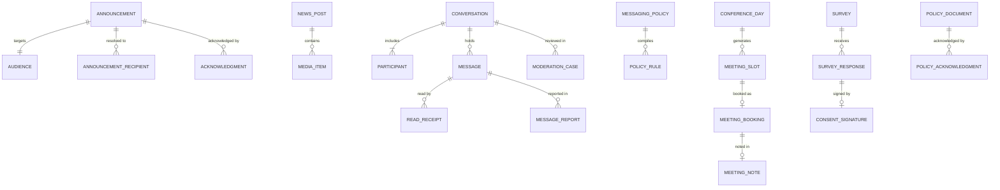
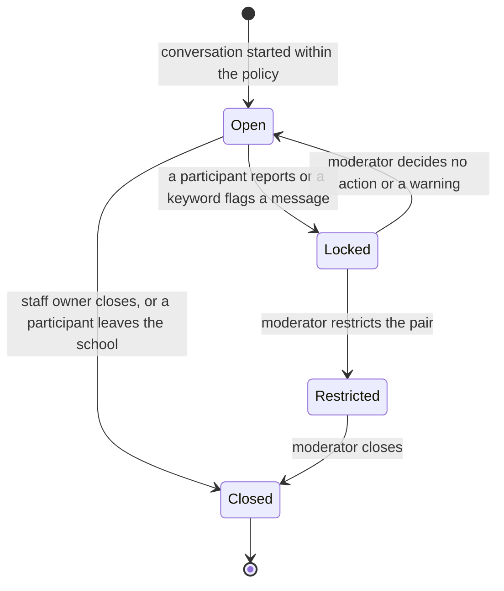

# Communication

> Service sheet, plan document 06, Group C. Names from Appendix L; events from Appendix E; permissions from Appendix B; error codes from Appendix K; settings categories from Appendix G. This sheet adds detail to reference architecture section 8.12 and never contradicts its table 8.0.

Communication is how the school talks with its families and staff, and how that talk stays safe for children. It owns announcements with an audience builder and required acknowledgment, the news feed and media gallery with photo consent enforced at publishing, one-to-one and group messaging under a per-school policy of who may message whom and when (student-to-student off by default), office hours with auto-reply, report and block, moderation, transparent keyword flagging, safeguarding oversight and export under logged access, anonymous concern reporting, parent-teacher meetings and conference days, surveys and consent forms, and policy acknowledgment. It also hosts the SignalR hubs for messaging, notifications, job progress and live permission refresh, on a Redis backplane (reference architecture section 8.12).

| Fact | Value (quoted from `05-service-catalog.md` and Appendix L) |
|---|---|
| Canonical name, long name | Communication, Communication |
| Tier | 1 (surveys, consent forms and policy acknowledgment are Tier 2, REQ-COM-015 and REQ-COM-016) |
| AREA code | `COM` |
| Database | `nibras_communication`, schema `communication`, application role `svc_communication`, migration role `mig_communication` |
| Exchange | `nibras.communication` |
| Images | `nibras/communication-api` |
| Worker | none; Quartz.NET jobs and long-running jobs run in the Api host under `Nibras.BuildingBlocks.Jobs` (Appendix L lists no communication-worker image) |
| Real-time | SignalR hubs `/hubs/messaging`, `/hubs/notifications`, `/hubs/jobs`, `/hubs/session` with the backplane on `redis-state` |
| gRPC package | `nibras.communication.v1`, reconciliation methods only (section 6) |
| Build phase (master brief Section 28) | 3 |
| Service level class (master brief Section 31) | Read-heavy |
| Sensitivity (Appendix J) | confidential; flagged content is sensitive |
| Synchronous dependency | Identity (permission check for a message policy) |
| Why the boundary exists | Scaling: long-lived SignalR connections on a Redis backplane scale on connection count, not on requests |

---

## 1. Responsibilities

| Owns | Detail |
|---|---|
| Announcements | Audience builder over roles, grades, sections, groups and individuals resolved server-side with a previewed count; scheduling and expiry; scanned attachments; required acknowledgment and the chase; translation on demand; read analytics (REQ-COM-001 to REQ-COM-003) |
| News feed and media gallery | Posts and albums with photo consent enforced at publishing: a tagged student without consent blocks publishing (REQ-COM-004) |
| Messaging | One-to-one and group conversations, attachments scanned before release, read receipts showing the earliest read, search with Arabic normalization, translation with the original one tap away, offline send queued on the device (REQ-COM-005, REQ-COM-011, REQ-COM-013) |
| Messaging policy | Who may message whom and during which hours, student-to-student off by default, office hours with auto-reply, the recipient's quiet hours (REQ-COM-006, REQ-COM-007) |
| Safety | Report and block in every conversation, thread lock pending review, moderation queue, optional transparent keyword flagging disclosed in the policy, oversight reads with a reason and every read logged, safeguarding export under the high-risk permission (REQ-COM-008 to REQ-COM-012) |
| Anonymous concern reporting | A report that reaches the safeguarding officer as urgent within 15 minutes with no reporter identity stored (REQ-COM-017, master brief Section 38) |
| Meetings | Slots, single bookings and conference days with bulk slots, online or in person, reminders, notes and follow-ups, booking on behalf (REQ-COM-014) |
| Surveys and consent forms | Surveys, polls and consent forms with an OTP-confirmed, audited e-signature, using published form snapshots from Requests (REQ-COM-015, Tier 2) |
| Policy acknowledgment | Versioned policies and handbooks acknowledged with a recorded signature, and the chase (REQ-COM-016, Tier 2) |
| Real-time hubs | Messaging, the in-app notification stream Notification publishes, long-job progress relayed from every service, and live permission, settings and terminology refresh (document 08 section 3.3, document 11 section 10) |

## 2. Not responsible for

| Does not own | Owner | Why the line sits there |
|---|---|---|
| Delivering push, email and SMS, quiet-hours holding for those channels, digests | Notification | Communication publishes `communication.*` triggers; Notification holds a template reference, never a body (Appendix J.3) |
| The inbox rows, unread counts and snooze | Notification | Communication's hub only carries the stream Notification writes to `redis-state` |
| Who holds a permission or a scope | Identity | Checked over `PermissionLookup.CheckPermission` for a message policy (the one synchronous dependency) |
| The safeguarding case, its triage and its record | Wellbeing (WF-WEL-04) | Communication raises the report or concern event; Wellbeing opens and owns the case |
| The emergency broadcast, its acknowledgments and roll call | Attendance | Communication shows a real-time banner to connected clients of the campus and records nothing |
| Students, guardians, staff, sections and the media-consent decision | School | Slim copies; consent is read at publishing (open point 2) |
| Form definitions | Requests | Surveys and consent forms store a published snapshot |
| Stored file bytes, virus scanning and signed download URLs | Documents | Attachments are file references with a scan status from the Files building block |
| Tenant settings: messaging policy defaults, office hours defaults, moderation, translation, acknowledgment reminders | Platform (ADR-0009) | Read from `platform.settings.changed.v1`; the compiled `MessagingPolicy` is Communication's enforcement form |
| Calendar entries for booked meetings | Scheduling | Scheduling consumes `communication.meeting.booked.v1` |
| Engagement dashboards | Reporting | Reporting projects `engagement_facts` from Communication's events |

---

## 3. Requirements covered

| Range or identifier | What it binds here |
|---|---|
| REQ-COM-001 to REQ-COM-017 | Every row of the COM area; REQ-COM-015 and REQ-COM-016 are Tier 2 |
| REQ-PRV-008 | Messages and announcements retained 2 years, flagged content under the wellbeing rule |
| REQ-DATA-013 | `messages` partitioned by month |
| REQ-MOB-007 | Messages work offline through the device outbox (Appendix M: append-only, never a conflict) |
| REQ-MOB-019 | Actionable notifications for reply and acknowledge |
| REQ-MSG-019 | Long jobs report progress over SignalR |
| REQ-L10N-007 | Bidirectional text in messages and announcements |
| REQ-SEC-016 | Per-user and per-endpoint rate limits on send and report |

---

## 4. Aggregates and entities

**Common columns.** Every table below carries these; `(common)` stands for them.

| Field | Type | Null | Notes |
|---|---|---|---|
| `tenant_id` | uuid | no | First column of every key and index; row-level security `tenant_isolation` |
| `id` | uuid | no | UUID v7 |
| `created_at`, `created_by` | timestamptz, uuid | no, yes | Audit interceptor |
| `updated_at`, `updated_by` | timestamptz, uuid | no, yes | Audit interceptor |
| `deleted_at`, `deleted_by` | timestamptz, uuid | yes | Soft delete; a message is never soft-deleted by its sender once a report exists on its thread |
| `xmin` | xid | no | Concurrency token on every aggregate root |

Bilingual labels are `LocalizedText`; message and announcement bodies are written in one language by their author and carry a `language` column.

### 4.1 `Announcement` with `Audience`, `AnnouncementRecipient`, `Acknowledgment`

| Field | Type | Null | Notes |
|---|---|---|---|
| (common) | | | |
| `title`, `body`, `language` | text, text, text | no | Body in the side table `announcement_bodies`; Internal unless flagged |
| `urgent` | boolean | no | Marks the Appendix C row as U; allowed only for holders of `communication.announcements.publish` with the principal's approval setting |
| `requires_acknowledgment`, `acknowledgment_due_at` | boolean, timestamptz | no, yes | `communication.announcements.require-acknowledgment` |
| `status` | text enum | no | `draft`, `scheduled`, `published`, `withdrawn`, `expired` |
| `publish_at`, `published_at`, `expires_at` | timestamptz | yes | |
| `attachment_file_ids` | uuid[] | yes | Released only when every file is scan-clean |
| `safeguarding_flag` | boolean | no | A flagged body is never cached and follows the wellbeing retention rule |
| audience: `announcement_id`, `kind`, `role_codes`, `grade_level_ids`, `section_ids`, `group_ids`, `user_ids`, `include_guardians`, `resolved_count`, `audience_hash` | uuid, text enum, text[], uuid[], uuid[], uuid[], uuid[], boolean, int, text | arrays nullable | `audiences`; resolved at publish, hashed for the cache key |
| recipient: `announcement_id`, `user_id`, `published_at`, `read_at`, `acknowledged_at`, `requires_acknowledgment` | uuid, uuid, timestamptz, timestamptz, timestamptz, boolean | read, acknowledged nullable | `announcement_recipients`, one row per recipient (document 21 section 3.10 queries 4 and 5) |
| acknowledgment: `announcement_id`, `user_id`, `at`, `channel` | uuid, uuid, timestamptz, text | no | `acknowledgments`; unique per announcement and user |

Invariants: an audience that resolves to no one refuses publishing (`COMMUNICATION_AUDIENCE_EMPTY`); the audience is resolved on the server from the reference copies and previewed with a count before publishing (T-COM-05); a second acknowledgment is a success with no second row (`COMMUNICATION_ACKNOWLEDGMENT_ALREADY_RECORDED`); a published announcement's body is edited only by withdrawing and republishing, so acknowledgments always refer to the text acknowledged.

### 4.2 `NewsPost` and `MediaItem`

| Field | Type | Null | Notes |
|---|---|---|---|
| (common) | | | |
| post: `title_en`, `title_ar`, `body`, `language`, `status`, `published_at`, `audience_scope`, `campus_ids` | text, text, text, text, text enum (`draft`, `published`, `withdrawn`), timestamptz, text enum (`school`, `campus`, `grade`), uuid[] | publish fields nullable | `news_posts` |
| media: `post_id`, `file_id`, `kind`, `tagged_student_ids`, `consent_checked_at`, `scan_status` | uuid, uuid, text enum (`photo`, `video`), uuid[], timestamptz, text enum | tags nullable | `media_items` |

Invariants: publishing is refused while any tagged student lacks media consent in the reference copy or the copy is older than the student's last profile update (TC-COM-001, REQ-COM-004); an untagged photo of a student is the author's responsibility and the publishing screen asks for tags before publishing.

### 4.3 `Conversation` with `Participant`, `Message`, `ReadReceipt`, `Block`, `MessageReport`

| Field | Type | Null | Notes |
|---|---|---|---|
| (common) | | | |
| conversation: `kind`, `title`, `status`, `locked_reason`, `locked_at`, `subject_student_id` | text enum (`direct`, `group`), text, text enum (`open`, `closed`, `locked`), text, timestamptz, uuid | title, lock, subject nullable | `conversations` |
| participant: `conversation_id`, `user_id`, `role_code`, `joined_at`, `left_at`, `last_message_at`, `unread_count`, `muted` | uuid, uuid, text, timestamptz, timestamptz, timestamptz, int, boolean | `left_at` nullable | `conversation_participants` (document 21 query 1) |
| message: `conversation_id`, `sent_at`, `sender_user_id`, `body`, `language`, `attachment_file_ids`, `status`, `safeguarding_flag`, `flag_source`, `client_message_id`, `held_until` | uuid, timestamptz, uuid, text, text, uuid[], text enum (`held-scan`, `held-quiet-hours`, `sent`, `withdrawn`), boolean, text enum (`report`, `keyword`, `moderator`), text, timestamptz | attachments, flag source, `held_until` nullable | `messages`, range-partitioned by month on `sent_at`; `ux_messages_client (tenant_id, conversation_id, client_message_id)` makes an offline replay idempotent |
| read receipt: `message_id`, `user_id`, `first_read_at` | uuid, uuid, timestamptz | no | `read_receipts`; the first read across devices wins (REQ-COM-013) |
| block: `blocker_user_id`, `blocked_user_id`, `reason` | uuid, uuid, text | reason nullable | `blocks` |
| report: `message_id`, `conversation_id`, `reported_by`, `reason_code`, `status`, `reviewed_by`, `reviewed_at`, `outcome` | uuid, uuid, uuid, text, text enum (`open`, `reviewed`), uuid, timestamptz, text enum (`no-action`, `warning`, `restricted`, `referred`) | review fields nullable | `message_reports`; `reported_by` is null for a keyword flag |

Invariants: a message is sent only when the compiled policy allows the pair and the time (`COMMUNICATION_RECIPIENT_NOT_ALLOWED`, T-COM-01), with student-to-student refused unless the tenant enabled it (TC-COM-601); a message with an attachment stays `held-scan` until every file is clean, and a rejected file holds it for the sender with `COMMUNICATION_ATTACHMENT_REJECTED`; a non-urgent message inside the recipient's quiet hours is refused with `COMMUNICATION_QUIET_HOURS` and offered for scheduling to the next allowed time; a reply to a closed conversation is `COMMUNICATION_THREAD_CLOSED`; a reported conversation locks at once for every participant, shows only the neutral notice (`COMMUNICATION_MESSAGE_REPORTED_LOCK`, 423) and cannot be edited or deleted until reviewed (T-COM-04); a blocked user cannot start or continue a direct conversation with the blocker; a flagged body is never cached and follows the wellbeing retention rule.

### 4.4 `MessagingPolicy` and `OfficeHours`

| Field | Type | Null | Notes |
|---|---|---|---|
| (common) | | | |
| policy: `version`, `rules`, `student_to_student_enabled`, `default_window_from`, `default_window_to`, `oversight_enabled`, `keyword_flagging_enabled`, `keyword_list_hash`, `disclosure_text_en`, `disclosure_text_ar`, `compiled_at` | int, child rows `policy_rules` (`from_role`, `to_role`, `relation`, `allowed`, `window`), boolean, time, time, boolean, boolean, text, text, text, timestamptz | window, keyword hash nullable | `messaging_policies`; compiled from *Communication → messaging policy, moderation* settings on `platform.settings.changed.v1` |
| office hours: `staff_user_id`, `weekly_windows`, `auto_reply_en`, `auto_reply_ar`, `away_from`, `away_to` | uuid, jsonb, text, text, date, date | away fields nullable | `office_hours` |

Invariants: a relation rule (`teacher-of-student`, `homeroom-of-student`, `guardian-of-student`, `any-staff`) is evaluated from the reference copies, and a rule that needs a permission is checked with Identity at send time and never assumed on failure; keyword flagging is on only when the disclosure text is published in the policy page (REQ-COM-010); the policy page always states whether oversight and flagging are on.

### 4.5 `ModerationCase` and `SafeguardingExport`

| Field | Type | Null | Notes |
|---|---|---|---|
| (common) | | | |
| case: `conversation_id`, `opened_by`, `reason`, `status`, `assigned_to`, `closed_at`, `outcome` | uuid, uuid, text enum (`report`, `keyword`, `oversight`), text enum (`open`, `closed`), uuid, timestamptz, text | close fields nullable | `moderation_cases` |
| oversight read: `conversation_id`, `reader_user_id`, `reason`, `at` | uuid, uuid, text, timestamptz | no | not a table: every oversight read writes `communication.audit.recorded.v1` in the same transaction; a failed audit write fails the read (Appendix J rule 8) |
| export: `requested_by`, `student_id`, `conversation_ids`, `reason`, `job_id`, `file_id`, `watermark`, `expires_at` | uuid, uuid, uuid[], text, uuid, uuid, text, timestamptz | file nullable | `safeguarding_exports`; one access-log entry per thread (REQ-COM-012) |

Invariants: an oversight read without a reason is refused (`COMMUNICATION_OVERSIGHT_REASON_REQUIRED`, T-COM-02); an export runs only under `communication.messages.export-for-safeguarding` and its file link lives 5 minutes per download.

### 4.6 `AnonymousConcern`

| Field | Type | Null | Notes |
|---|---|---|---|
| (common, with `created_by` always null) | | | |
| `campus_id`, `category`, `body`, `submitted_at`, `status`, `referred_at` | uuid, text, text, timestamptz, text enum (`received`, `referred`), timestamptz | `referred_at` nullable | `anonymous_concerns`; Sensitive, column-encrypted, never cached |

Invariants: no column, log line, trace attribute or event carries the reporter's identity, device or address (REQ-COM-017); abuse is limited by a salted hash kept only in `redis-state` for 24 hours; the event carries `concernId`, `campusId`, `category` and `submittedAt` only.

### 4.7 `MeetingSlot`, `Booking`, `ConferenceDay`, `MeetingNote`

| Field | Type | Null | Notes |
|---|---|---|---|
| (common) | | | |
| slot: `staff_id`, `starts_at`, `ends_at`, `mode`, `location_en`, `location_ar`, `online_link`, `status`, `conference_day_id` | uuid, timestamptz, timestamptz, text enum (`in-person`, `online`), text, text, text, text enum (`open`, `booked`, `cancelled`), uuid | location, link, conference nullable | `meeting_slots` (document 21 query 6) |
| booking: `slot_id`, `guardian_id`, `student_id`, `booked_by`, `request_id`, `status`, `reminder_sent_at` | uuid, uuid, uuid, uuid, uuid, text enum (`booked`, `changed`, `cancelled`, `held`), timestamptz | `request_id`, reminder nullable | `meeting_bookings`; unique live booking per slot |
| conference day: `date`, `campus_id`, `slot_minutes`, `from`, `to`, `staff_ids` | date, uuid, smallint, time, time, uuid[] | no | `conference_days`; generates bulk slots |
| note: `booking_id`, `author_staff_id`, `body`, `follow_ups` | uuid, uuid, text, jsonb | follow-ups nullable | `meeting_notes`; visible to the staff member and those with `communication.meetings.view` in scope |

Invariants: a slot has at most one live booking, so the second guardian booking the same slot is refused (REQ-COM-014: a booked slot disappears for others); a change or cancellation publishes `communication.meeting.changed.v1` with the previous start; a booking created by the Saga 6 `BookMeeting` command is keyed on `requestId`.

### 4.8 `Survey`, `SurveyResponse`, `ConsentSignature`, `PolicyDocument`, `PolicyAcknowledgment` (Tier 2)

| Field | Type | Null | Notes |
|---|---|---|---|
| (common) | | | |
| survey: `kind`, `title_en`, `title_ar`, `form_snapshot`, `audience_id`, `status`, `opens_at`, `closes_at`, `anonymous` | text enum (`survey`, `poll`, `consent`), text, text, jsonb side table, uuid, text enum, timestamptz, timestamptz, boolean | no | `surveys`; `form_snapshot` is the published form version from Requests |
| response: `survey_id`, `respondent_user_id`, `student_id`, `answers`, `submitted_at` | uuid, uuid, uuid, jsonb, timestamptz | respondent null when anonymous | `survey_responses`, never cached |
| signature: `response_id`, `form_version`, `otp_verified_at`, `signer_user_id`, `decision` | uuid, int, timestamptz, uuid, text enum (`consent`, `decline`) | no | `consent_signatures` (REQ-COM-015) |
| policy: `code`, `title_en`, `title_ar`, `version`, `file_id`, `audience_id`, `status`, `due_at` | text, text, text, int, uuid, uuid, text enum, timestamptz | `due_at` nullable | `policy_documents` |
| acknowledgment: `policy_id`, `version`, `user_id`, `signed_at`, `signature_method` | uuid, int, uuid, timestamptz, text enum (`tap`, `otp`) | no | `policy_acknowledgments` (REQ-COM-016) |

Invariants: a consent signature records the OTP time, the form version and the signer (REQ-COM-015); a policy acknowledgment refers to one version, and a new version requires a new acknowledgment.

### 4.9 Reference copies

`ref_students` (`student_id`, `names`, `section_id`, `grade_level_id`, `campus_id`, `status`, `media_consent`, `profile_version`), `ref_guardian_links` (`guardian_user_id`, `student_id`, `relationship`, `rights`, `restricted`), `ref_staff` (`staff_id`, `user_id`, `names`, `department_id`, `campus_ids`, `active`), `ref_sections` (`section_id`, `grade_level_id`, `campus_id`, `homeroom_staff_id`), `ref_teaching` (staff to section, open point 3), `ref_tenant_state`, `ref_settings`; each with `source_version` and `reconciled_at`.



---

## 5. REST API and hubs

All REST paths are under `/api/v1/communication/`. Every endpoint may also return the K.1 codes with the `COMMUNICATION_` prefix. Guardians and students act in `self` or `own-children` scope; staff in their scope.

### 5.1 Announcements

| Method | Path | Permission | Request | Response | Errors | Idempotent |
|---|---|---|---|---|---|---|
| GET | `/api/v1/communication/announcements/mine` | `communication.announcements.view` | filter `unacknowledged` | `Page<MyAnnouncementDto>` keyset on `(publishedAt, id)` (document 21 query 4) | none specific | yes |
| GET | `/api/v1/communication/announcements` | `communication.announcements.view` | filter `status`, `author` in staff scope | `Page<AnnouncementDto>` | none specific | yes |
| POST | `/api/v1/communication/announcements` | `communication.announcements.create` | `CreateAnnouncementRequest` (title, body, language, audience, attachments, schedule, expiry, urgent) | 201 draft | `COMMUNICATION_VALIDATION_FAILED` | by `Idempotency-Key` |
| GET | `/api/v1/communication/announcements/{id}` | `communication.announcements.view` | none | `AnnouncementDto` with body | `COMMUNICATION_NOT_FOUND` | yes |
| PATCH | `/api/v1/communication/announcements/{id}` | `communication.announcements.edit` | draft or scheduled only | `AnnouncementDto` | `COMMUNICATION_VALIDATION_FAILED` once published | with `If-Match` |
| POST | `/api/v1/communication/announcements/preview-audience` | `communication.announcements.create` | audience | resolved count and a sample of names (T-COM-05) | `COMMUNICATION_AUDIENCE_EMPTY` | yes |
| POST | `/api/v1/communication/announcements/{id}/publish` | `communication.announcements.publish` | `{ publishAt }` optional | `published` or `scheduled`; `communication.announcement.published.v1` | `COMMUNICATION_AUDIENCE_EMPTY`, `COMMUNICATION_ATTACHMENT_REJECTED` | by `Idempotency-Key` |
| POST | `/api/v1/communication/announcements/{id}/require-acknowledgment` | `communication.announcements.require-acknowledgment` | `{ dueAt }` | acknowledgment required (REQ-COM-002) | `COMMUNICATION_VALIDATION_FAILED` after publishing | with `If-Match` |
| POST | `/api/v1/communication/announcements/{id}/withdraw` | `communication.announcements.edit` | `{ reason }` | `withdrawn` | none specific | with `If-Match` |
| DELETE | `/api/v1/communication/announcements/{id}` | `communication.announcements.delete` | draft only | 204 | `COMMUNICATION_VALIDATION_FAILED` for a published one | yes |
| POST | `/api/v1/communication/announcements/{id}/acknowledgments` | `communication.announcements.view` | `{}` by the recipient | 201 or 200 with `COMMUNICATION_ACKNOWLEDGMENT_ALREADY_RECORDED`; `communication.acknowledgment.recorded.v1` | `COMMUNICATION_NOT_FOUND` for a non-recipient | yes |
| POST | `/api/v1/communication/announcements/{id}/read` | `communication.announcements.view` | `{}` | 204; read time stored once | none | yes |
| GET | `/api/v1/communication/announcements/{id}/analytics` | `communication.announcements.edit` | none | recipients, read, acknowledged, pending names; delivery per channel comes from Notification (REQ-COM-003) | `COMMUNICATION_NOT_FOUND` | yes |
| POST | `/api/v1/communication/announcements/{id}/translation` | `communication.announcements.view` | `{ targetLanguage }` | translated title and body, original kept (REQ-COM-011) | `COMMUNICATION_TRANSLATION_UNAVAILABLE` | yes |

### 5.2 News feed and media

| Method | Path | Permission | Request | Response | Errors | Idempotent |
|---|---|---|---|---|---|---|
| GET | `/api/v1/communication/news` | `communication.news.view` | filter `campusId` | `Page<NewsPostDto>` | none specific | yes |
| POST | `/api/v1/communication/news` | `communication.news.create` | post with media and tags | 201 draft | `COMMUNICATION_ATTACHMENT_REJECTED` | by `Idempotency-Key` |
| PATCH | `/api/v1/communication/news/{id}` | `communication.news.edit` | merge patch | `NewsPostDto` | `COMMUNICATION_CONCURRENCY_CONFLICT` | with `If-Match` |
| POST | `/api/v1/communication/news/{id}/publish` | `communication.news.publish` | `{}` | published | `COMMUNICATION_VALIDATION_FAILED` naming each tagged student without media consent (TC-COM-001) | by `Idempotency-Key` |
| DELETE | `/api/v1/communication/news/{id}` | `communication.news.delete` | none | 204, withdrawn from the feed | none specific | yes |

### 5.3 Messaging

| Method | Path | Permission | Request | Response | Errors | Idempotent |
|---|---|---|---|---|---|---|
| GET | `/api/v1/communication/conversations` | `communication.messages.view` | none | `Page<ConversationDto>` with unread counts, keyset on `(lastMessageAt, conversationId)`, page cap 50 (query 1) | none specific | yes |
| POST | `/api/v1/communication/conversations` | `communication.messages.create` | `{ participantUserIds, subjectStudentId, firstMessage }` | 201 conversation | `COMMUNICATION_RECIPIENT_NOT_ALLOWED` naming whom the sender may message, `COMMUNICATION_DEPENDENCY_UNAVAILABLE` when Identity cannot answer | `Idempotency-Key` required |
| GET | `/api/v1/communication/conversations/{id}/messages` | `communication.messages.view` | keyset on `(sentAt, id)`, page cap 50 (query 2) | `Page<MessageDto>` | `COMMUNICATION_MESSAGE_REPORTED_LOCK` while locked | yes |
| POST | `/api/v1/communication/conversations/{id}/messages` | `communication.messages.create` | `{ body, language, attachmentFileIds, clientMessageId, sendAfter }` | 201 `sent` or `held-scan`; `communication.message.sent.v1` once released; auto-reply outside office hours | `COMMUNICATION_RECIPIENT_NOT_ALLOWED`, `COMMUNICATION_QUIET_HOURS`, `COMMUNICATION_ATTACHMENT_REJECTED`, `COMMUNICATION_THREAD_CLOSED`, `COMMUNICATION_MESSAGE_REPORTED_LOCK` | `Idempotency-Key` required; `clientMessageId` dedupes the offline replay |
| POST | `/api/v1/communication/messages/{id}/read` | `communication.messages.view` | `{ readAt }` from the device | 204; first read wins (REQ-COM-013) | none | yes |
| POST | `/api/v1/communication/messages/{id}/translation` | `communication.messages.view` | `{ targetLanguage }` | translation with the original one tap away | `COMMUNICATION_TRANSLATION_UNAVAILABLE` | yes |
| GET | `/api/v1/communication/messages/search` | `communication.messages.view` | `q` normalized for Arabic, own conversations only | `Page<MessageHitDto>` | none specific | yes |
| POST | `/api/v1/communication/conversations/{id}/close` | `communication.messages.create` | `{}` by the staff owner | `closed` | none specific | with `If-Match` |
| POST | `/api/v1/communication/messages/{id}/reports` | `communication.messages.create` | `{ reasonCode, note }` | 201; thread locked; `communication.message.reported.v1` (TC-COM-602) | `COMMUNICATION_RATE_LIMITED` | `Idempotency-Key` required |
| POST | `/api/v1/communication/blocks` | `communication.messages.create` | `{ blockedUserId, reason }` | 201 | none specific | yes |
| DELETE | `/api/v1/communication/blocks/{id}` | `communication.messages.create` | none | 204 | none | yes |
| GET | `/api/v1/communication/office-hours/me` | `communication.messages.create` | none | windows, auto-reply, away dates | none | yes |
| PUT | `/api/v1/communication/office-hours/me` | `communication.messages.create` | windows, auto-reply in both languages, away dates | saved (REQ-COM-007) | `COMMUNICATION_VALIDATION_FAILED` | with `If-Match` |
| GET | `/api/v1/communication/messaging-policy` | `communication.messages.view` | none | the compiled policy and its disclosure text in the reader's language | none | yes |

### 5.4 Safety: moderation, oversight, safeguarding export, anonymous concerns

| Method | Path | Permission | Request | Response | Errors | Idempotent |
|---|---|---|---|---|---|---|
| GET | `/api/v1/communication/moderation-cases` | `communication.messages.moderate` | filter `status`, `reason` | `Page<ModerationCaseDto>` without bodies | none specific | yes |
| GET | `/api/v1/communication/moderation-cases/{id}/messages` | `communication.messages.moderate` | `reason` required | messages of the reported thread; every read logged | `COMMUNICATION_OVERSIGHT_REASON_REQUIRED` | yes |
| POST | `/api/v1/communication/moderation-cases/{id}/decision` | `communication.messages.moderate` | `{ outcome, note }` | case closed; thread unlocked or restricted; referral to Wellbeing stays with Wellbeing's case | `COMMUNICATION_CONCURRENCY_CONFLICT` | with `If-Match` |
| GET | `/api/v1/communication/oversight/conversations` | `communication.messages.oversee-messages` | filter `studentId`, `staffUserId`, `reason` required | conversation list; the read is logged | `COMMUNICATION_OVERSIGHT_REASON_REQUIRED` | yes |
| GET | `/api/v1/communication/oversight/conversations/{id}/messages` | `communication.messages.oversee-messages` | `reason` required | messages; one access-log entry per read (T-COM-02) | `COMMUNICATION_OVERSIGHT_REASON_REQUIRED` | yes |
| POST | `/api/v1/communication/safeguarding-exports` | `communication.messages.export-for-safeguarding` | `{ studentId, conversationIds, reason }` | 202 job; one access-log entry per thread (REQ-COM-012) | `COMMUNICATION_OVERSIGHT_REASON_REQUIRED` | by `Idempotency-Key` |
| GET | `/api/v1/communication/safeguarding-exports/{id}` | `communication.messages.export-for-safeguarding` | none | job result and a 5-minute signed link | `COMMUNICATION_NOT_FOUND` | yes |
| POST | `/api/v1/communication/anonymous-concerns` | `communication.concerns.create`, which never records the reporter, so the caller's identity is discarded before persistence | `{ campusId, category, body }` | 202; `communication.concern.reported-anonymously.v1` (REQ-COM-017) | `COMMUNICATION_RATE_LIMITED` | yes, by a client token held only in `redis-state` for 24 hours |
| GET | `/api/v1/communication/anonymous-concerns/{id}` | `communication.concerns.view` | `reason` required | the concern body for the safeguarding officer; read logged | `COMMUNICATION_OVERSIGHT_REASON_REQUIRED` | yes |

### 5.5 Meetings

| Method | Path | Permission | Request | Response | Errors | Idempotent |
|---|---|---|---|---|---|---|
| GET | `/api/v1/communication/meeting-slots` | `communication.meetings.view` | `staffId`, `date` | slots with booking state (query 6) | none specific | yes |
| POST | `/api/v1/communication/meeting-slots` | `communication.meetings.open-slots` | slots for the caller or for staff in scope | 201 slots | `COMMUNICATION_VALIDATION_FAILED` (overlap) | by `Idempotency-Key` |
| POST | `/api/v1/communication/conference-days` | `communication.meetings.open-slots` | `{ date, campusId, staffIds, from, to, slotMinutes }` | 202 job generating bulk slots: 8 teachers, 10-minute slots from 15:00 to 18:00 give 144 slots (REQ-COM-014) | `COMMUNICATION_VALIDATION_FAILED` | by `Idempotency-Key` |
| POST | `/api/v1/communication/meeting-bookings` | `communication.meetings.create` | `{ slotId, studentId }` by a guardian | 201; `communication.meeting.booked.v1` | `COMMUNICATION_CONCURRENCY_CONFLICT` when the slot was just taken | `Idempotency-Key` required |
| POST | `/api/v1/communication/meeting-bookings/on-behalf` | `communication.meetings.book-on-behalf` | `{ slotId, guardianId, studentId }` | 201 | `COMMUNICATION_CONCURRENCY_CONFLICT` | `Idempotency-Key` required |
| PATCH | `/api/v1/communication/meeting-bookings/{id}` | `communication.meetings.edit` | `{ slotId, reason }` to move | booking moved; `communication.meeting.changed.v1` | `COMMUNICATION_CONCURRENCY_CONFLICT` | with `If-Match` |
| DELETE | `/api/v1/communication/meeting-bookings/{id}` | `communication.meetings.delete` | `{ reason }` | 204; `communication.meeting.changed.v1` | none specific | yes |
| PUT | `/api/v1/communication/meeting-bookings/{id}/note` | `communication.meetings.edit` | `{ body, followUps }` by the staff member | note saved | none specific | with `If-Match` |

### 5.6 Surveys, consent forms and policies (Tier 2)

| Method | Path | Permission | Request | Response | Errors | Idempotent |
|---|---|---|---|---|---|---|
| GET | `/api/v1/communication/surveys` | `communication.surveys.view` | filter `kind`, `status` | `Page<SurveyDto>` | none specific | yes |
| POST | `/api/v1/communication/surveys` | `communication.surveys.create` | kind, titles, published form snapshot, audience, window, anonymous | 201 draft | `COMMUNICATION_AUDIENCE_EMPTY` | by `Idempotency-Key` |
| PATCH | `/api/v1/communication/surveys/{id}` | `communication.surveys.edit` | draft only | `SurveyDto` | `COMMUNICATION_VALIDATION_FAILED` once published | with `If-Match` |
| POST | `/api/v1/communication/surveys/{id}/publish` | `communication.surveys.publish` | `{}` | published | `COMMUNICATION_AUDIENCE_EMPTY` | by `Idempotency-Key` |
| POST | `/api/v1/communication/surveys/{id}/close` | `communication.surveys.close` | `{}` | closed | none specific | yes |
| DELETE | `/api/v1/communication/surveys/{id}` | `communication.surveys.delete` | draft only | 204 | none specific | yes |
| POST | `/api/v1/communication/surveys/{id}/responses` | `communication.surveys.view` | answers; for consent, an OTP verified through the Identity one-time-code flow | 201; signature recorded with OTP time, form version and signer (REQ-COM-015) | `COMMUNICATION_VALIDATION_FAILED` (window closed, OTP invalid) | `Idempotency-Key` required |
| POST | `/api/v1/communication/surveys/{id}/export` | `communication.surveys.export` | format | 202 job | none specific | by `Idempotency-Key` |
| GET | `/api/v1/communication/policies` | `communication.policies.view` | none | policies with my acknowledgment state | none | yes |
| POST | `/api/v1/communication/policies` | `communication.policies.create` | code, titles, file, audience, due | 201 draft | `COMMUNICATION_ATTACHMENT_REJECTED` | by `Idempotency-Key` |
| PATCH | `/api/v1/communication/policies/{id}` | `communication.policies.edit` | new version draft | `PolicyDto` | none specific | with `If-Match` |
| POST | `/api/v1/communication/policies/{id}/publish` | `communication.policies.publish` | `{}` | version published; acknowledgments reset for the new version | `COMMUNICATION_AUDIENCE_EMPTY` | by `Idempotency-Key` |
| POST | `/api/v1/communication/policies/{id}/acknowledgments` | `communication.policies.view` | `{ signatureMethod }` | 201 or 200 already recorded (TC-COM-002) | `COMMUNICATION_ACKNOWLEDGMENT_ALREADY_RECORDED` | yes |
| POST | `/api/v1/communication/policies/{id}/chase` | `communication.policies.chase-acknowledgment` | `{}` | reminders to those who have not acknowledged | none specific | by `Idempotency-Key` |

### 5.7 Jobs

| Method | Path | Permission | Request | Response | Errors | Idempotent |
|---|---|---|---|---|---|---|
| GET | `/api/v1/communication/jobs/{jobId}` | `platform.jobs.view`, or the starter | none | job resource | `COMMUNICATION_NOT_FOUND` | yes |
| POST | `/api/v1/communication/jobs/{jobId}/cancel` | `platform.jobs.cancel`, or the starter | `{}` | job with `cancelRequested` | `COMMUNICATION_VALIDATION_FAILED` for a terminal job | yes |

### 5.8 SignalR hubs

Every hub authenticates the access token on connect through the Gateway, binds the connection to its tenant and user, and re-validates the permission version on every `permissions.changed` it relays (TC-SEC-053). Groups are named with the full tenant UUID. The backplane is `redis-state`; Communication scales on concurrent connections, not requests.

| Hub | Groups | Server-to-client messages | Source |
|---|---|---|---|
| `/hubs/messaging` | `tenant:{tenantId}:user:{userId}`, `tenant:{tenantId}:conversation:{id}` | `message.received`, `message.read`, `conversation.locked`, `typing` | Communication's own writes, after commit |
| `/hubs/notifications` | `tenant:{tenantId}:user:{userId}` | `inbox.item`, `inbox.counts` | Notification publishes on `redis-state`; the relay checks the tenant before sending |
| `/hubs/jobs` | `tenant:{tenantId}:job:{jobId}` | `job.progress`, `job.finished`, `job.failed` | `JobProgressRelay` on `nibras:jobs:progress:{tenant}` (document 11 section 10); a client joins only for its own job or with `platform.jobs.view` |
| `/hubs/session` | `tenant:{tenantId}:user:{userId}`, `tenant:{tenantId}` | `permissions.changed`, `platform.settings.changed`, `platform.terminology.changed`, `emergency.banner` | `communication.tenant-lifecycle` for permission, settings and terminology events (document 08 section 3.2); `communication.events.urgent` for the emergency banner of a campus |

---

## 6. gRPC

### 6.1 Consumed

| Target | Method | Why | Deadline | Fallback |
|---|---|---|---|---|
| Identity `PermissionLookup` | `CheckPermission(user, permission, anchor)` | A policy rule that depends on a permission for an anchor (for example a counselor messaging a student on their caseload) at send time (T-COM-01) | 2 s | Refuse the send with `COMMUNICATION_DEPENDENCY_UNAVAILABLE`; never assume allowed |
| School `ReferenceReconciliation` | `Checksum`, `ListSnapshotPage` | Nightly reconciliation of the student, guardian-link, staff and section copies; refresh of a student's media consent after a profile update | 30 s, 5 s per page | Retry next night; publishing with a stale consent copy is refused |
| Identity `Users` | `Checksum`, `Snapshot` | Nightly reconciliation of user activity for participants | 30 s | Retry next night |
| Platform `Settings` | `GetSettings` (scope `communication`) | The settings client of the building blocks on a cold start | 2 s | Last value in L1 for 60 s, then the catalog default |

### 6.2 Exposed: `nibras.communication.v1`

Reconciliation only (`10-data-architecture.md` sections 6 and 7.3); never on a request path; never returns a body.

| Service | Method | Returns | Deadline | Callers | Budget |
|---|---|---|---|---|---|
| `Usage` | `Recount(meter, period_start, period_end)` | messages sent and announcements published | 30 s | Platform | 2 commands |
| `Reconciliation` | `Snapshot(projection_kind, page_token)` | engagement facts: announcement, audience size, reads, acknowledgments, message counts by role pair | 5 s per page | Reporting rebuild of `engagement_facts` | 1 command per page |

---

## 7. Events published and consumed

### 7.1 Published on `nibras.communication`

| Routing key | Raised by | Partition key | Consumers (Appendix E) |
|---|---|---|---|
| `communication.announcement.published.v1` | Publish, including a scheduled publish reaching its time | `tenantId` | Notification, Reporting, Ai |
| `communication.acknowledgment.recorded.v1` | First acknowledgment of a recipient | `announcementId` | Reporting |
| `communication.acknowledgment.overdue.v1` | Acknowledgment chase job, per pending recipient | `announcementId` | Notification |
| `communication.message.sent.v1` | A message released to recipients | `threadId` | Reporting |
| `communication.message.reported.v1` | A participant's report; a keyword flag with `reportedBy` null and reason `keyword` | `threadId` | Wellbeing, Notification, Audit |
| `communication.meeting.booked.v1` | Booking created, including by the Saga 6 `BookMeeting` command | `staffId` | Notification, Scheduling, Requests |
| `communication.meeting.changed.v1` | Booking moved or cancelled, including `CancelMeeting` | `staffId` | Notification, Requests |
| `communication.concern.reported-anonymously.v1` | Anonymous concern received | `campusId` | Wellbeing, Notification |
| `communication.usage.recorded.v1` | Monthly messages and announcements | `tenantId` | Platform |
| `communication.audit.recorded.v1` | Every oversight read, moderation decision, safeguarding export per thread, publish, withdraw, policy change | `tenantId` | Audit |

### 7.2 Consumed

Queues are document 11 section 2.5's Communication table plus the two common queues of its section 2.3.

| Routing key | Queue | Handler | What it changes |
|---|---|---|---|
| The section 2.3 tenant-lifecycle set, including `identity.role.changed.v1` and `identity.permissions.changed.v1` in order per tenant | `communication.tenant-lifecycle` | `TenantLifecycleConsumer`, `PermissionRefreshRelay` | Tenant rows, read-only mode; policy recompiled on `platform.settings.changed.v1`; `permissions.changed` pushed to affected connections, a lower `permissionVersion` than one already pushed is dropped (document 11 section 2.5); settings and terminology pushed on `/hubs/session` |
| `school.student.enrolled.v1`, `school.student.status-changed.v1`, `school.student.profile-updated.v1` | `communication.reference-copies` | `StudentReferenceConsumer` | `ref_students`; a profile update marks media consent for refresh; a withdrawn student leaves audiences |
| `school.guardian.updated.v1`, `identity.guardian-link.created.v1` | `communication.reference-copies` | `GuardianLinkConsumer` | `ref_guardian_links`; a restriction removes that guardian from the student's audiences and conversations |
| `school.staff.created.v1`, `school.staff.changed.v1`, `school.staff.left.v1`, `school.section.created.v1`, `school.section.changed.v1` | `communication.reference-copies` | `StaffReferenceConsumer`, `SectionReferenceConsumer` | `ref_staff`, `ref_sections`; the staff keys carry `namesEnAr` and the section keys `nameEn` and `nameAr`, so the audience builder needs no name lookup; a leaver's open conversations close and their slots are cancelled with notice |
| `assessment.report-cards.published.v1` | `communication.events` | `ReportCardsPublishedConsumer` | A feed item for the grading period's guardians linking to the report card, keyed on `gradingPeriodId` |
| `scheduling.event.published.v1` | `communication.events` | `SchoolEventPublishedConsumer` | A news-feed item for the school event, keyed on the event |
| `requests.request.approved.v1` | `communication.events` | `RequestApprovedConsumer` | Shows "approved, being applied" beside a meeting request |
| `attendance.emergency.broadcast-started.v1` | `communication.events.urgent` | `EmergencyBannerConsumer` | Pushes `emergency.banner` to connected clients of the campus; records nothing |
| `identity.impersonation.started.v1` | `communication.events.urgent` | `ImpersonationBannerConsumer` | Pushes the web shell's impersonation banner to the target user's connected clients until the event's `until`; records nothing. Appendix E has no ended key, so the banner clears at `until` or when the shell's session ends |
| `communication.commands.book-meeting.v1` and `communication.commands.cancel-meeting.v1` (`BookMeeting`, `CancelMeeting`) on `nibras.requests` | `communication.commands` | `MeetingEffectHandler` | Saga 6 effect keyed on `requestId`; outcome `communication.meeting.booked.v1` or `communication.meeting.changed.v1` |
| tenant-lifecycle commands on `nibras.platform` | `communication.commands` | `TenantLifecycleCommandHandler` | Provision, delete tenant data, tier migration |

---

## 8. Sagas and workflows

Communication owns no workflow in Appendix R and orchestrates no saga (document 31 section 1).

| WF or saga | Role | What Communication does |
|---|---|---|
| Saga 6 (WF-RQS-01), meeting request types | Effect owner | `BookMeeting` and `CancelMeeting`, idempotent on `requestId` (document 13 section 4) |
| WF-WEL-04 Safeguarding concern escalation | Source | `communication.message.reported.v1` and `communication.concern.reported-anonymously.v1` reach Wellbeing, which owns the case |
| WF-IDN-05 Role change with four-eyes approval | Touched | Live permission refresh through `/hubs/session` with no sign-out |
| WF-ASM-01 Exam to report card | Touched | Report-card feed item for guardians |
| Saga 1, 2, 10 | Participant | Tenant rows, deletion, dedicated-database copy |

The only lifecycle Communication enforces as a state machine is the conversation lock:



---

## 9. Local reference copies

| Copy | Source events | Fields kept | Reconciliation | Staleness tolerated |
|---|---|---|---|---|
| `ref_students` | `school.student.enrolled.v1`, `school.student.status-changed.v1`, `school.student.profile-updated.v1` | names, section, grade, campus, status, media consent, profile version | Nightly against School `Checksum` for `student`; immediate snapshot fetch after a profile update | Minutes; publishing waits for a fresh consent |
| `ref_guardian_links` | `school.guardian.updated.v1`, `identity.guardian-link.created.v1` | guardian user, student, relationship, rights, restricted | Nightly against School `Checksum` for `guardian-link` | Minutes; a restriction is applied on the event |
| `ref_staff`, `ref_sections` | `school.staff.created.v1`, `school.staff.changed.v1`, `school.staff.left.v1`, `school.section.created.v1`, `school.section.changed.v1` | names, department, campuses, section name, grade, campus, homeroom | Nightly against School | Minutes |
| `ref_teaching` | open point 3 | staff to section | Nightly | Hours |
| `ref_tenant_state`, `ref_settings` | tenant-lifecycle keys | status, flags, the *Communication* settings | Nightly against Platform | Minutes |

---

## 10. Background jobs

All run in the Api host under Quartz.NET.

| Job | Schedule | What it does | Publishes | Progress |
|---|---|---|---|---|
| `ScheduledPublishJob` | Every minute | Publishes scheduled announcements, news and surveys at their time | `communication.announcement.published.v1` | none |
| `AcknowledgmentChaseJob` | Daily after 10:00 tenant time zone | Pending recipients past `acknowledgment_due_at`, then the owner (Appendix E jobs table) | `communication.acknowledgment.overdue.v1` per recipient | none |
| `AnnouncementExpiryJob` | Hourly | Moves expired announcements out of feeds | none | none |
| `ScheduledMessageReleaseJob` | Every minute | Releases messages held for quiet hours or `sendAfter` | `communication.message.sent.v1` | none |
| `MeetingReminderJob` | Every 15 minutes | Reminders 24 hours and 1 hour before a booking | `RequestNotification` (open point 5) | none |
| `ConferenceDaySlotJob` | On request | Generates bulk slots | none | "Creating slots: 96 of 144" |
| `PolicyChaseJob` | Daily, Tier 2 | Reminders for unacknowledged policies | `RequestNotification` | none |
| `SurveyCloseJob` | Every 15 minutes, Tier 2 | Closes surveys at `closes_at` | none | none |
| `SafeguardingExportJob` | On request | Builds the watermarked export, one access-log entry per thread | `communication.audit.recorded.v1` | "Exporting threads: 3 of 12" |
| `PartitionMaintenanceJob` | Monthly | Creates `messages` partitions three months ahead; months older than 2 years detach, flagged rows first moved to `messages_held` (`10-data-architecture.md` section 5) | a finding on an unexpected partition | none |
| `AnnouncementRetentionJob` | Monthly | Deletes announcements and news older than 2 years except flagged bodies under legal hold | none | none |
| `UsageRecordJob` | Monthly, day 1 | Messages and announcements | `communication.usage.recorded.v1` | none |
| `ReferenceCopyReconciliationJob` | Nightly 02:00 band time zone | Section 9 | `reporting.data-quality.issue-detected.v1` on a mismatch | none |

---

## 11. Permissions, notifications, settings, error codes

### 11.1 Permissions (Appendix B, Communication; group G16 in Appendix I)

| Permission | Default holders | Scope and risk |
|---|---|---|
| `communication.announcements.view`, `.create`, `.edit`, `.delete`, `.publish`, `.require-acknowledgment` | Principal and Vice Principal F; teachers in own sections; every role views what reaches them | normal |
| `communication.news.view`, `.create`, `.edit`, `.delete`, `.publish` | Principal, Vice Principal, a communications role cloned from them | normal |
| `communication.messages.view`, `.create` | Every role in `self`, subject to the policy | normal |
| `communication.messages.moderate` | Safeguarding Officer, Principal | elevated in practice; reads logged |
| `communication.messages.oversee-messages` | Safeguarding Officer (four-eyes grant) | high; reason required; every read logged |
| `communication.messages.export-for-safeguarding` | Safeguarding Officer (four-eyes grant) | high |
| `communication.concerns.create` | Every tenant role template, in `self` (Appendix I rule 8) | normal; the reporter is never recorded |
| `communication.concerns.view` | Safeguarding Officer only; the Principal is explicitly must-not | high; reason required; every read logged |
| `communication.meetings.view`, `.create`, `.edit`, `.delete`, `.open-slots`, `.book-on-behalf` | Teachers open slots; guardians create; Registrar books on behalf | normal |
| `communication.surveys.view`, `.create`, `.edit`, `.delete`, `.export`, `.publish`, `.close` | Principal, Vice Principal | normal |
| `communication.policies.view`, `.create`, `.edit`, `.publish`, `.chase-acknowledgment` | Principal | normal |
| `platform.jobs.view`, `platform.jobs.cancel` | as Appendix B | job endpoints |

### 11.2 Notifications (Appendix C rows Communication triggers)

| Appendix C row | Trigger | Recipients | Urgency and default channels |
|---|---|---|---|
| Announcement published | `communication.announcement.published.v1` | Audience | N, or U when marked urgent; push, in-app, email |
| Acknowledgment overdue | `communication.acknowledgment.overdue.v1` (job: acknowledgment chase) | Person, then owner | N; push, email |
| New message | `communication.message.sent.v1` | Recipient | N; push |
| Message reported | `communication.message.reported.v1` | Safeguarding officer | U; push, email |
| Anonymous concern reported | `communication.concern.reported-anonymously.v1` | Safeguarding officer | U; push, email |
| Meeting booked | `communication.meeting.booked.v1` | Participants | N; push, email, calendar invite |
| Meeting changed or reminder | `communication.meeting.changed.v1` | Participants | N; push, email |

Appendix C deduplicates on the same template, recipient and subject within five minutes (BR-NOT-004); the reported-message and anonymous-concern rows are urgent and are never deduplicated.

### 11.3 Settings (Appendix G, owned by Platform)

| Setting | Category | Default | Used by |
|---|---|---|---|
| Messaging policy | Communication | staff to guardians of their students and to their students during 07:00 to 20:00; guardians to their children's staff; student-to-student off; oversight on | `MessagingPolicy` compilation |
| Office hours | Communication | 07:00 to 15:00 on work days | auto-reply |
| Moderation | Communication | report and block on; keyword flagging off | keyword flag, moderation queue |
| Translation | Communication | off until a provider is configured | translation endpoints (open point 6) |
| Acknowledgment reminders | Communication | daily after the due date, owner after 3 reminders | `AcknowledgmentChaseJob` |
| Quiet hours default | Notifications | 21:00 to 07:00 | `COMMUNICATION_QUIET_HOURS` for non-urgent messages |
| Retention periods | Security | 2 years | partition and retention jobs |

### 11.4 Error codes (Appendix K.11)

| Code | HTTP | Raised where |
|---|---|---|
| `COMMUNICATION_RECIPIENT_NOT_ALLOWED` | 403 | The policy forbids the pair or the time |
| `COMMUNICATION_QUIET_HOURS` | 409 | Non-urgent message inside the recipient's quiet hours; scheduling offered |
| `COMMUNICATION_ATTACHMENT_REJECTED` | 400 | Type, size or scan verdict |
| `COMMUNICATION_THREAD_CLOSED` | 409 | Reply to a closed conversation |
| `COMMUNICATION_MESSAGE_REPORTED_LOCK` | 423 | The conversation is locked pending review |
| `COMMUNICATION_TRANSLATION_UNAVAILABLE` | 503 | Translation provider down or not configured |
| `COMMUNICATION_ACKNOWLEDGMENT_ALREADY_RECORDED` | 200 | Second acknowledgment |
| `COMMUNICATION_AUDIENCE_EMPTY` | 400 | Audience resolves to no one |
| `COMMUNICATION_OVERSIGHT_REASON_REQUIRED` | 400 | Oversight, moderation or export read without a reason |
| `COMMUNICATION_VALIDATION_FAILED` and the other seven K.1 codes | as K.1 | Problem-details middleware |

---

## 12. Caching and hot queries

The caching map is `21-performance-engineering.md` section 1.10 and the hot queries are its section 3.10; both are binding. This sheet adds:

| Data | Key | Tags | L1 | L2 | Invalidated by | Never cached |
|---|---|---|---|---|---|---|
| Recipient copy for audience resolution (section members and their guardians) | `nibras:{tenant}:communication:section-members:{sectionId}:v1` | `tenant`, `section` | 30 s | 15 min ± 10% | `school.student.enrolled.v1`, `school.student.status-changed.v1`, `school.guardian.updated.v1`, `identity.guardian-link.created.v1`, `school.section.changed.v1` | Restricted guardians are excluded before the value is written |
| Office hours of one staff member | `nibras:{tenant}:communication:office-hours:{staffUserId}:v1` | `tenant`, `user` | 60 s | 1 h ± 10% | Office-hours write handler evicts by key | Nothing |

| Query | Handler | Index | Rows demo / load | Pagination | Budget |
|---|---|---|---|---|---|
| Messages held for release | `ScheduledMessageReleaseJob` | `ix_messages_held (tenant_id, held_until) WHERE status = 'held-quiet-hours'`, current month partition | 5 / 200 at 07:00 | keyset on `(held_until, id)`, page 500 | 2 commands per page |
| Moderation queue | `ListModerationCasesQuery` | `ix_moderation_cases_open (tenant_id, status, created_at) WHERE status = 'open'` | 0 / 5 | keyset | 2 commands, 10 ms |
| Message search in own conversations | `SearchMessagesQuery` | `ix_messages_search_trgm` GIN on the normalized body with `pg_trgm`, joined to the caller's participant rows | 20 / 20 | keyset, page 20 | 3 commands, 80 ms |
| Media consent for tagged students | `PublishNewsHandler` | primary key of `ref_students` | up to 40 | none | 1 command |

Never cached, restated from document 21: message bodies and attachments, flagged bodies, survey responses; this sheet adds anonymous concerns and moderation notes.

---

## 13. Security

The threat table is `12-security-privacy-safety.md` section 2.10, T-COM-01 to T-COM-05, with tests TC-SEC-210 to TC-SEC-213 and TC-SEC-240.

| Data class (Appendix J) | Held in | Handling |
|---|---|---|
| Confidential: thread participants, subject, sent time, read receipt | `conversations`, `conversation_participants`, `read_receipts` | Row-level security; existence only in Student 360; access logged on oversight read |
| Confidential: message body and attachments | `messages` | Never cached; every oversight read logged; 2 years then deleted |
| Sensitive (flagged): a body with a safeguarding flag | `messages`, `messages_held` | Column-encrypted under the per-tenant key for flagged bodies (`10-data-architecture.md` section 1); wellbeing retention rule; never cached, never projected |
| Sensitive: anonymous concern body | `anonymous_concerns` | Column-encrypted; no reporter identity anywhere |
| Internal: announcement title, body, audience, acknowledgment state | `announcements` and children | Cacheable with the audience key unless flagged |

| Never | What |
|---|---|
| Cached | Message bodies and attachments, flagged content, survey responses, anonymous concerns, moderation notes |
| Logged | Message, announcement and concern bodies; the anonymous reporter's user id, which the handler clears from the logging scope before the first log call |
| Sent to Notification | Any body; Notification receives the Appendix E payload and renders its own template |
| Sent to a device cache | Bodies older than 30 days (Appendix M offline window), flagged content, oversight results, the concern inbox |
| Sent to a restricted guardian | Anything about the student the restriction covers; audiences and conversations drop the guardian on the event |

Hub controls: token checked on connect and on every permission change; a connection joins only groups of its own tenant; the job relay checks the job's tenant equals the group's tenant (document 11 section 10).

---

## 14. Folder and file tree

Follows the Attendance anatomy of `07-solution-structure.md` part 3. Communication has no worker image, so jobs sit in `Api/Jobs/`; it orchestrates no saga, so `Application/Sagas/` is absent; it exposes reconciliation gRPC, so `Api/Grpc/` exists; it hosts the hubs, so `Api/Hubs/` exists. Every feature folder holds four files. Communication owns no business rule in Appendix S, so `Domain/Rules/` holds the policy rules this sheet names, without BR identifiers.

```text
src/Services/Communication/                                                   Communication: announcements, news, messaging, safety, meetings, surveys, policies, hubs
├── README.md                                                                 purpose, owned data, API, hubs, events, how to run, runbook links
├── Nibras.Communication.Domain/                                              aggregates, invariants, domain events; references Nibras.BuildingBlocks.Domain and Nibras.Contracts.Communication only
│   ├── Announcements/                                                        aggregate Announcement
│   │   ├── Announcement.cs                                                   draft, schedule, publish, withdraw, expire
│   │   ├── Audience.cs                                                       roles, grades, sections, groups, individuals, guardians flag
│   │   ├── AnnouncementRecipient.cs                                          resolved recipient with read and acknowledgment
│   │   ├── Acknowledgment.cs                                                 one per recipient
│   │   └── Events/                                                           domain events
│   │       ├── AnnouncementPublished.cs                                      becomes communication.announcement.published.v1
│   │       └── AcknowledgmentRecorded.cs                                     becomes communication.acknowledgment.recorded.v1
│   ├── News/                                                                 aggregate NewsPost
│   │   ├── NewsPost.cs                                                       post with campus scope
│   │   └── MediaItem.cs                                                      photo or video with tagged students and consent check time
│   ├── Conversations/                                                        aggregate Conversation
│   │   ├── Conversation.cs                                                   open, locked, restricted, closed
│   │   ├── ConversationState.cs                                              the lock state machine of section 8
│   │   ├── Participant.cs                                                    member with unread count and mute
│   │   ├── Message.cs                                                        body, language, attachments, hold, flag, client id
│   │   ├── ReadReceipt.cs                                                    first read across devices
│   │   ├── Block.cs                                                          blocker and blocked
│   │   ├── MessageReport.cs                                                  participant report or keyword flag
│   │   └── Events/                                                           domain events
│   │       ├── MessageSent.cs                                                becomes communication.message.sent.v1
│   │       └── MessageReported.cs                                            becomes communication.message.reported.v1
│   ├── Policy/                                                               aggregates MessagingPolicy and OfficeHours
│   │   ├── MessagingPolicy.cs                                                compiled rules, windows, oversight and flagging switches, disclosure
│   │   ├── PolicyRule.cs                                                     role pair, relation, window, allowed
│   │   └── OfficeHours.cs                                                    weekly windows, auto-reply, away dates
│   ├── Safety/                                                               aggregates ModerationCase, SafeguardingExport, AnonymousConcern
│   │   ├── ModerationCase.cs                                                 report, keyword or oversight case with outcome
│   │   ├── SafeguardingExport.cs                                             reason, threads, watermark, file
│   │   └── AnonymousConcern.cs                                               campus, category, encrypted body, no reporter
│   ├── Meetings/                                                             aggregates MeetingSlot and ConferenceDay
│   │   ├── MeetingSlot.cs                                                    one live booking at most
│   │   ├── MeetingBooking.cs                                                 guardian, student, request id, reminder state
│   │   ├── ConferenceDay.cs                                                  bulk slot generator
│   │   └── MeetingNote.cs                                                    note and follow-ups
│   ├── Surveys/                                                              Tier 2 aggregates Survey and PolicyDocument
│   │   ├── Survey.cs                                                         survey, poll or consent with a form snapshot
│   │   ├── SurveyResponse.cs                                                 answers, anonymous when configured
│   │   ├── ConsentSignature.cs                                               OTP time, form version, signer
│   │   ├── PolicyDocument.cs                                                 versioned handbook or policy
│   │   └── PolicyAcknowledgment.cs                                           one per user and version
│   ├── Rules/                                                                policy rules named by this sheet; no BR identifiers exist for Communication
│   │   ├── MessagingPolicyRule.cs                                            pair, relation, window and student-to-student check
│   │   ├── QuietHoursMessageRule.cs                                          non-urgent message inside the recipient's quiet hours
│   │   ├── MediaConsentRule.cs                                               tagged students need consent and a fresh copy
│   │   └── KeywordFlagRule.cs                                                transparent keyword match, only when disclosed
│   ├── References/                                                           slim read-only copies rebuilt from events, reconciled nightly
│   │   ├── StudentReference.cs                                               names, section, campus, status, media consent
│   │   ├── GuardianLinkReference.cs                                          guardian user, student, rights, restricted
│   │   ├── StaffReference.cs                                                 names, department, campuses, active
│   │   ├── SectionReference.cs                                               grade, campus, homeroom
│   │   ├── TenantStateReference.cs                                           status and flags
│   │   └── CommunicationSettings.cs                                          the Appendix G values Communication reads
│   └── Shared/                                                               values and errors shared by aggregates
│       ├── ContentFlag.cs                                                    safeguarding flag and its source
│       └── CommunicationErrors.cs                                            one Error per COMMUNICATION_* code
├── Nibras.Communication.Application/                                         use cases, consumers, read models, hub relays
│   ├── Features/                                                             vertical slices: one folder per use case, four files each
│   │   ├── ManageAnnouncements/                                              list, mine, create, get, patch, delete, withdraw, preview audience
│   │   │   ├── ManageAnnouncementsRequests.cs                                announcement records
│   │   │   ├── ManageAnnouncementsHandler.cs                                 server-side audience resolution with count
│   │   │   ├── ManageAnnouncementsValidator.cs                               audience not empty, attachments scanned
│   │   │   └── ManageAnnouncementsEndpoint.cs                                /announcements routes except publish and acknowledgment
│   │   ├── PublishAnnouncement/                                              publish and require acknowledgment
│   │   │   ├── PublishAnnouncementRequests.cs                                publish and require-acknowledgment records
│   │   │   ├── PublishAnnouncementHandler.cs                                 writes recipients by binary COPY for large audiences, outbox event
│   │   │   ├── PublishAnnouncementValidator.cs                               urgent only with the approval setting
│   │   │   └── PublishAnnouncementEndpoint.cs                                /announcements/{id}/publish, require-acknowledgment
│   │   ├── AcknowledgeAnnouncement/                                          acknowledgment and read
│   │   │   ├── AcknowledgeAnnouncementRequests.cs                            acknowledge and read records
│   │   │   ├── AcknowledgeAnnouncementHandler.cs                             second acknowledgment is a success
│   │   │   ├── AcknowledgeAnnouncementValidator.cs                           caller is a recipient
│   │   │   └── AcknowledgeAnnouncementEndpoint.cs                            /announcements/{id}/acknowledgments, read
│   │   ├── AnnouncementAnalytics/                                            read and acknowledgment figures
│   │   │   ├── AnnouncementAnalyticsQuery.cs                                 announcement id
│   │   │   ├── AnnouncementAnalyticsHandler.cs                               counts from recipients; pending names
│   │   │   ├── AnnouncementAnalyticsValidator.cs                             owner or editor
│   │   │   └── AnnouncementAnalyticsEndpoint.cs                              GET /announcements/{id}/analytics
│   │   ├── Translate/                                                        announcement and message translation
│   │   │   ├── TranslateRequests.cs                                          announcement and message records
│   │   │   ├── TranslateHandler.cs                                           provider through ITranslationProvider; original kept
│   │   │   ├── TranslateValidator.cs                                         target language supported
│   │   │   └── TranslateEndpoint.cs                                          /announcements/{id}/translation, /messages/{id}/translation
│   │   ├── ManageNews/                                                       news posts and media
│   │   │   ├── ManageNewsRequests.cs                                         list, create, patch, publish, delete records
│   │   │   ├── ManageNewsHandler.cs                                          media consent checked at publish
│   │   │   ├── ManageNewsValidator.cs                                        tags present for photos with students
│   │   │   └── ManageNewsEndpoint.cs                                         /news routes
│   │   ├── StartConversation/                                                new direct or group conversation
│   │   │   ├── StartConversationCommand.cs                                   participants, subject student, first message
│   │   │   ├── StartConversationHandler.cs                                   policy check, Identity check when a rule needs it
│   │   │   ├── StartConversationValidator.cs                                 no blocked pair
│   │   │   └── StartConversationEndpoint.cs                                  POST /conversations, GET /conversations
│   │   ├── SendMessage/                                                      the worked messaging feature
│   │   │   ├── SendMessageCommand.cs                                         conversation, body, language, attachments, client id, send-after
│   │   │   ├── SendMessageHandler.cs                                         policy, quiet hours, scan hold, keyword flag, insert, participant counters, outbox; budget 4 commands
│   │   │   ├── SendMessageValidator.cs                                       body length, attachment count, thread state
│   │   │   └── SendMessageEndpoint.cs                                        POST /conversations/{id}/messages, idempotent by client id
│   │   ├── ReadMessages/                                                     message pages, read receipts, search, close
│   │   │   ├── ReadMessagesRequests.cs                                       list, read, search, close records
│   │   │   ├── ReadMessagesHandler.cs                                        compiled pages; first read wins
│   │   │   ├── ReadMessagesValidator.cs                                      participant only
│   │   │   └── ReadMessagesEndpoint.cs                                       /conversations/{id}/messages GET, /messages/{id}/read, /messages/search, /close
│   │   ├── ReportAndBlock/                                                   report a message, block and unblock
│   │   │   ├── ReportAndBlockRequests.cs                                     report, block, unblock records
│   │   │   ├── ReportAndBlockHandler.cs                                      locks the thread and publishes the report
│   │   │   ├── ReportAndBlockValidator.cs                                    rate limit per reporter
│   │   │   └── ReportAndBlockEndpoint.cs                                     /messages/{id}/reports, /blocks
│   │   ├── OfficeHoursAndPolicy/                                             own office hours and the policy page
│   │   │   ├── OfficeHoursAndPolicyRequests.cs                               get and put office hours, get policy records
│   │   │   ├── OfficeHoursAndPolicyHandler.cs                                auto-reply text in both languages
│   │   │   ├── OfficeHoursAndPolicyValidator.cs                              windows valid
│   │   │   └── OfficeHoursAndPolicyEndpoint.cs                               /office-hours/me, /messaging-policy
│   │   ├── Moderate/                                                         moderation queue and decisions
│   │   │   ├── ModerateRequests.cs                                           list, read, decide records
│   │   │   ├── ModerateHandler.cs                                            every read logged in the same transaction
│   │   │   ├── ModerateValidator.cs                                          reason required
│   │   │   └── ModerateEndpoint.cs                                           /moderation-cases routes
│   │   ├── OverseeMessages/                                                  oversight reads
│   │   │   ├── OverseeMessagesQuery.cs                                       filters and reason
│   │   │   ├── OverseeMessagesHandler.cs                                     access log per read; fails if the audit write fails
│   │   │   ├── OverseeMessagesValidator.cs                                   reason present
│   │   │   └── OverseeMessagesEndpoint.cs                                    /oversight routes
│   │   ├── SafeguardingExport/                                               high-risk export
│   │   │   ├── SafeguardingExportRequests.cs                                 start and get records
│   │   │   ├── SafeguardingExportHandler.cs                                  starts SafeguardingExportJob
│   │   │   ├── SafeguardingExportValidator.cs                                reason present, threads in scope
│   │   │   └── SafeguardingExportEndpoint.cs                                 /safeguarding-exports routes
│   │   ├── ReportConcernAnonymously/                                         anonymous concern
│   │   │   ├── ReportConcernAnonymouslyCommand.cs                            campus, category, body
│   │   │   ├── ReportConcernAnonymouslyHandler.cs                            clears the caller from scope before persisting; outbox event
│   │   │   ├── ReportConcernAnonymouslyValidator.cs                          rate limit by a salted 24-hour hash in redis-state
│   │   │   └── ReportConcernAnonymouslyEndpoint.cs                           /anonymous-concerns routes
│   │   ├── ManageMeetingSlots/                                               slots and conference days
│   │   │   ├── ManageMeetingSlotsRequests.cs                                 list, open, conference-day records
│   │   │   ├── ManageMeetingSlotsHandler.cs                                  bulk generation as a job
│   │   │   ├── ManageMeetingSlotsValidator.cs                                no overlapping slots
│   │   │   └── ManageMeetingSlotsEndpoint.cs                                 /meeting-slots, /conference-days
│   │   ├── BookMeeting/                                                      bookings, moves, cancellations, notes
│   │   │   ├── BookMeetingRequests.cs                                        book, book on behalf, move, cancel, note records
│   │   │   ├── BookMeetingHandler.cs                                         one live booking per slot under xmin
│   │   │   ├── BookMeetingValidator.cs                                       guardian of the student
│   │   │   └── BookMeetingEndpoint.cs                                        /meeting-bookings routes
│   │   ├── MeetingEffect/                                                    Saga 6 BookMeeting and CancelMeeting
│   │   │   ├── MeetingEffectCommands.cs                                      BookMeeting and CancelMeeting records from Nibras.Contracts.Communication
│   │   │   ├── MeetingEffectHandler.cs                                       keyed on requestId
│   │   │   ├── MeetingEffectValidator.cs                                     slot free, sender is Requests
│   │   │   └── MeetingEffectEndpoint.cs                                      none over HTTP; command route only
│   │   ├── ManageSurveys/                                                    Tier 2 surveys, polls and consent forms
│   │   │   ├── ManageSurveysRequests.cs                                      survey and response records
│   │   │   ├── ManageSurveysHandler.cs                                       consent signature with OTP time and form version
│   │   │   ├── ManageSurveysValidator.cs                                     window open, OTP verified
│   │   │   └── ManageSurveysEndpoint.cs                                      /surveys routes
│   │   ├── ManagePolicies/                                                   Tier 2 policies and acknowledgments
│   │   │   ├── ManagePoliciesRequests.cs                                     policy, acknowledgment, chase records
│   │   │   ├── ManagePoliciesHandler.cs                                      new version resets acknowledgments
│   │   │   ├── ManagePoliciesValidator.cs                                    file scanned
│   │   │   └── ManagePoliciesEndpoint.cs                                     /policies routes
│   │   ├── TenantLifecycle/                                                  Saga 1, 2, 10 commands
│   │   │   ├── TenantLifecycleCommands.cs                                    provision, deprovision, delete data, dedicated database, copy, reconcile, purge, parked-message records
│   │   │   ├── TenantLifecycleHandler.cs                                     long commands start a job
│   │   │   ├── TenantLifecycleValidator.cs                                   sender allowed
│   │   │   └── TenantLifecycleEndpoint.cs                                    none over HTTP; command route only
│   │   └── Jobs/                                                             job resource and cancel
│   │       ├── JobsRequests.cs                                               get and cancel records
│   │       ├── JobsHandler.cs                                                reads IJobStore
│   │       ├── JobsValidator.cs                                              starter or platform.jobs.view
│   │       └── JobsEndpoint.cs                                               /jobs routes
│   ├── Consumers/                                                            integration event handlers, idempotent through the inbox
│   │   ├── TenantLifecycleConsumer.cs                                        the tenant-lifecycle set and the policy recompilation
│   │   ├── StudentReferenceConsumer.cs                                       school.student.enrolled.v1, status-changed.v1, profile-updated.v1
│   │   ├── GuardianLinkConsumer.cs                                           school.guardian.updated.v1 and identity.guardian-link.created.v1
│   │   ├── StaffReferenceConsumer.cs                                         school.staff.created.v1, .changed.v1 and .left.v1
│   │   ├── SectionReferenceConsumer.cs                                       school.section.created.v1 and school.section.changed.v1
│   │   ├── ReportCardsPublishedConsumer.cs                                   assessment.report-cards.published.v1 feed item
│   │   ├── SchoolEventPublishedConsumer.cs                                   scheduling.event.published.v1 feed item
│   │   ├── RequestApprovedConsumer.cs                                        requests.request.approved.v1 status display
│   │   ├── EmergencyBannerConsumer.cs                                        attendance.emergency.broadcast-started.v1 on the urgent queue
│   │   └── ImpersonationBannerConsumer.cs                                    identity.impersonation.started.v1 on the urgent queue, banner until `until`
│   ├── Realtime/                                                             relays that feed the hubs
│   │   ├── PermissionRefreshRelay.cs                                         permissions.changed to affected connections, version-ordered
│   │   ├── SessionEventsRelay.cs                                             settings and terminology changes to tenant groups
│   │   ├── NotificationStreamRelay.cs                                        Notification's redis-state stream to user groups
│   │   ├── JobProgressRelay.cs                                               nibras:jobs:progress:{tenant} to job groups after the tenant check
│   │   └── MessagingBroadcaster.cs                                           message, read and lock events after commit
│   ├── ReadModels/                                                           AsNoTracking projections and DTOs
│   │   ├── ConversationRow.cs                                                inbox row with unread count
│   │   ├── MessageRow.cs                                                     page row
│   │   ├── MyAnnouncementRow.cs                                              feed row with acknowledgment state
│   │   └── CommunicationQueries.cs                                           keyset queries over ICommunicationReadContext
│   ├── Caching/                                                              what this service caches and what invalidates it
│   │   └── CommunicationCacheKeys.cs                                         keys of document 21 section 1.10 and section 12
│   ├── Abstractions/                                                         ports Infrastructure implements
│   │   ├── ICommunicationRepository.cs                                       load and save aggregates
│   │   ├── ICommunicationReadContext.cs                                      AsNoTracking sources
│   │   ├── IPermissionChecker.cs                                             Identity CheckPermission with refuse-on-failure
│   │   ├── ITranslationProvider.cs                                           configured machine translation
│   │   ├── IFileScanStatus.cs                                                scan verdicts from the Files building block
│   │   └── IFieldEncryptor.cs                                                flagged bodies and concerns under the per-tenant key
│   ├── Permissions/                                                          constants that match Appendix B
│   │   └── CommunicationPermissions.cs                                       every communication.* permission, one constant each
│   └── DependencyInjection.cs                                                AddCommunicationApplication(): handlers, validators, consumers, relays, cache policies
├── Nibras.Communication.Infrastructure/                                      adapters: PostgreSQL, RabbitMQ, SignalR backplane, gRPC
│   ├── Persistence/                                                          EF Core 10 against nibras_communication as svc_communication
│   │   ├── CommunicationDbContext.cs                                         pooled, Tenant and SoftDelete filters, audit columns, xmin, SET LOCAL app.tenant_id
│   │   ├── CompiledQueries/                                                  EF.CompileAsyncQuery for the hottest reads
│   │   │   ├── ConversationListQuery.cs                                      document 21 section 3.10 query 1
│   │   │   ├── MessagePageQuery.cs                                           query 2
│   │   │   └── MyAnnouncementsQuery.cs                                       query 4
│   │   ├── CompiledModel/                                                    generated compiled model
│   │   ├── Configurations/                                                   one IEntityTypeConfiguration per aggregate, tenant_id first
│   │   │   ├── AnnouncementConfigurations.cs                                 announcements, bodies, audiences, recipients, acknowledgments
│   │   │   ├── NewsConfigurations.cs                                         news_posts, media_items
│   │   │   ├── ConversationConfigurations.cs                                 conversations, participants, messages partitioned by month, receipts, blocks, reports
│   │   │   ├── PolicyConfigurations.cs                                       messaging_policies, policy_rules, office_hours
│   │   │   ├── SafetyConfigurations.cs                                       moderation_cases, safeguarding_exports, anonymous_concerns, messages_held
│   │   │   ├── MeetingConfigurations.cs                                      meeting_slots, meeting_bookings, conference_days, meeting_notes
│   │   │   ├── SurveyConfigurations.cs                                       surveys, responses, signatures, policy documents and acknowledgments
│   │   │   └── ReferenceConfigurations.cs                                    ref_students, ref_guardian_links, ref_staff, ref_sections, ref_teaching, ref_tenant_state, ref_settings
│   │   ├── Migrations/                                                       expand-and-contract migrations, never run at startup
│   │   │   ├── 20261101000000_Initial.cs                                     first schema with row-level security, pg_trgm and the first partitions
│   │   │   └── CommunicationDbContextModelSnapshot.cs                        EF Core model snapshot
│   │   ├── Repositories/                                                     implementations of the Application ports
│   │   │   ├── CommunicationRepository.cs                                    aggregate persistence
│   │   │   ├── CommunicationReadContext.cs                                   AsNoTracking sets
│   │   │   └── RecipientCopyWriter.cs                                        binary COPY of announcement recipients
│   │   ├── RowLevelSecurity/                                                 the second barrier
│   │   │   └── policies.sql                                                  ENABLE and FORCE ROW LEVEL SECURITY plus tenant_isolation per table
│   │   └── Partitioning/                                                     monthly messages partitions
│   │       └── messages_partitions.sql                                       create-ahead, move of flagged rows to messages_held, detach and drop
│   ├── Encryption/                                                           flagged bodies and concerns
│   │   └── FieldEncryptor.cs                                                 per-tenant key for flagged content
│   ├── Hubs/                                                                 SignalR infrastructure
│   │   ├── RedisBackplane.cs                                                 backplane on redis-state with the tenant in every channel
│   │   └── HubConnectionAuthorizer.cs                                        token on connect, permission version revalidation
│   ├── Translation/                                                          translation adapter
│   │   └── ConfiguredTranslationProvider.cs                                  provider from Integrations settings; unavailable until configured
│   ├── Messaging/                                                            Wolverine and RabbitMQ topology
│   │   ├── CommunicationTopology.cs                                          exchange nibras.communication; queues of document 11 section 2.5
│   │   └── IntegrationEventMapper.cs                                         domain events to Nibras.Contracts.Communication V1 records
│   ├── Grpc/                                                                 clients and exposed services
│   │   ├── IdentityPermissionClient.cs                                       PermissionLookup.CheckPermission, 2 s, refuse on failure
│   │   ├── UsageService.cs                                                   Usage.Recount
│   │   └── ReconciliationService.cs                                          Snapshot for the Reporting rebuild
│   ├── Reconciliation/                                                       nightly reference-copy checks
│   │   └── ReferenceCopyReconciler.cs                                        School and Identity checksums, consent refresh
│   └── DependencyInjection.cs                                                AddCommunicationInfrastructure(): DbContext, backplane, topology, gRPC
├── Nibras.Communication.Api/                                                 HTTP, SignalR and gRPC host, image nibras/communication-api
│   ├── Program.cs                                                            composition root: ServiceDefaults, Application, Infrastructure, endpoints, hubs, gRPC, jobs
│   ├── Endpoints/                                                            endpoint registration by feature group
│   │   ├── AnnouncementEndpoints.cs                                          announcements
│   │   ├── NewsEndpoints.cs                                                  news
│   │   ├── MessagingEndpoints.cs                                             conversations, messages, blocks, office hours, policy
│   │   ├── SafetyEndpoints.cs                                                moderation, oversight, exports, anonymous concerns
│   │   ├── MeetingEndpoints.cs                                               slots, conference days, bookings
│   │   ├── SurveyEndpoints.cs                                                surveys and policies
│   │   └── JobEndpoints.cs                                                   jobs
│   ├── Hubs/                                                                 SignalR hubs
│   │   ├── MessagingHub.cs                                                   /hubs/messaging
│   │   ├── NotificationsHub.cs                                               /hubs/notifications
│   │   ├── JobsHub.cs                                                        /hubs/jobs
│   │   └── SessionHub.cs                                                     /hubs/session: permissions, settings, terminology, emergency banner
│   ├── Grpc/                                                                 gRPC service registration
│   │   └── CommunicationGrpcRegistration.cs                                  maps Usage and Reconciliation with the tenant and deadline interceptors
│   ├── Jobs/                                                                 Quartz.NET jobs, hosted here because Appendix L lists no communication-worker image
│   │   ├── ScheduledPublishJob.cs                                            every minute
│   │   ├── AcknowledgmentChaseJob.cs                                         daily; communication.acknowledgment.overdue.v1
│   │   ├── AnnouncementExpiryJob.cs                                          hourly
│   │   ├── ScheduledMessageReleaseJob.cs                                     every minute
│   │   ├── MeetingReminderJob.cs                                             every 15 minutes
│   │   ├── ConferenceDaySlotJob.cs                                           on request with progress
│   │   ├── PolicyChaseJob.cs                                                 daily, Tier 2
│   │   ├── SurveyCloseJob.cs                                                 every 15 minutes, Tier 2
│   │   ├── SafeguardingExportJob.cs                                          on request with progress
│   │   ├── PartitionMaintenanceJob.cs                                        monthly messages partitions
│   │   ├── AnnouncementRetentionJob.cs                                       monthly 2-year retention
│   │   ├── UsageRecordJob.cs                                                 monthly communication.usage.recorded.v1
│   │   └── ReferenceCopyReconciliationJob.cs                                 nightly checksums
│   ├── appsettings.json                                                      non-secret defaults
│   ├── appsettings.Development.json                                          Aspire and compose development values
│   └── Dockerfile                                                            Debian-based aspnet image, non-root, read-only root filesystem, ICU and tzdata, TZ=UTC
└── tests/                                                                    the service's own suites
    ├── Nibras.Communication.UnitTests/                                       domain and handlers, no containers
    │   ├── Domain/                                                           aggregates, the lock machine, policy rules
    │   ├── Features/                                                         handler tests with fakes
    │   └── Consumers/                                                        deliver-twice per consumer
    ├── Nibras.Communication.IntegrationTests/                                Testcontainers: PostgreSQL, RabbitMQ, Redis
    │   ├── Fixtures/                                                         CommunicationWebAppFactory, two tenants, fake Identity permission service
    │   ├── Endpoints/                                                        every endpoint, asserting data and the Appendix K code
    │   ├── Hubs/                                                             hub auth, tenant groups, permission refresh ordering, job relay tenant check
    │   ├── Safety/                                                           report lock, oversight logging, export access log, anonymous concern leaves no identity
    │   ├── Persistence/                                                      row-level security, flagged encryption, partition detach with messages_held
    │   ├── Messaging/                                                        outbox, inbox, BookMeeting idempotency
    │   ├── Jobs/                                                             chase, reminders and releases across Riyadh, Amman and Dubai
    │   └── Perf/                                                             query budgets and EXPLAIN captures written to docs/perf/communication/
    └── Nibras.Communication.ContractTests/                                   API, message, hub and gRPC contracts
        ├── Provider/                                                         Pact provider verification of the OpenAPI document
        ├── Messages/                                                         schema tests for every V1 record
        ├── Hubs/                                                             hub message shapes consumed by LongJobStore and PermissionStore
        └── Grpc/                                                             Usage and Reconciliation pacts from Platform and Reporting
```

---

## 15. Test plan

Existing identifiers are reused; new ones are minted from `TC-COM-701` upward, a range no other document uses.

| Test case | Proves | Level |
|---|---|---|
| `TC-COM-001` (Appendix W) | Tagging a student without media consent blocks publishing (Appendix W, REQ-COM-004) | Integration |
| `TC-COM-002` (Appendix W) | A policy is published, acknowledged with a recorded signature, and the unacknowledged are chased (REQ-COM-016) | Integration |
| TC-COM-201 | A teacher reads a parent message and replies; the receipt shows and quiet hours are respected (Appendix Q) | End-to-end |
| TC-COM-601 | A student messaging another student is blocked by default with a plain explanation (Appendix Q, REQ-COM-006) | End-to-end |
| TC-COM-602 | A reported message reaches the safeguarding officer and the thread locks (Appendix Q, REQ-COM-008) | End-to-end |
| TC-L10N-501 | Message translation with the original one tap away (REQ-COM-011) | End-to-end |
| TC-SEC-210 to TC-SEC-213, TC-SEC-240 | T-COM-01 to T-COM-05 controls | Security suite |
| `TC-SEC-053` (document 12) | Hub token on connect and revalidation on permission version | Security suite |
| TC-SEC-055, TC-SEC-056 | Generated permission-matrix and tenant-isolation suites, including hub group joins | Generated |
| TC-TST-202, TC-TST-203 | Cache-entry tests; deliver-twice for every consumer | Generated |
| TC-COM-701 | An announcement for Grade 5 sections A and B scheduled for 07:00 reaches only those families after 07:00 (REQ-COM-001) | Integration |
| TC-COM-702 | 100 recipients, 30 unacknowledged after 3 days: 30 overdue events and the owner sees 30 names (REQ-COM-002) | Integration, `Jobs/` |
| TC-COM-703 | Analytics for an announcement to 200 people show read counts here and delivery per channel from Notification (REQ-COM-003) | Integration |
| TC-COM-704 | A group of 12 parents and 1 teacher: 12 recipients receive the message and `communication.message.sent.v1` is published once (REQ-COM-005) | Integration |
| TC-COM-705 | A message outside office hours returns the auto-reply; a non-urgent message in the recipient's quiet hours returns `COMMUNICATION_QUIET_HOURS` and can be scheduled (REQ-COM-007) | Integration |
| TC-COM-706 | An attachment failing the scan holds the message, tells the sender and `documents.file.scan-failed.v1` is observed (REQ-COM-009) | Integration |
| TC-COM-707 | With flagging on and 5 keywords, a matching message reaches the officer within 15 minutes and the policy page states flagging is on (REQ-COM-010) | Integration |
| TC-COM-708 | A safeguarding export of one student's threads writes 1 access-log entry per thread (REQ-COM-012) | Integration, `Safety/` |
| TC-COM-709 | A message read on 2 devices at 09:01 and 09:03 shows 09:01 (REQ-COM-013) | Integration |
| TC-COM-710 | A conference day of 8 teachers and 10-minute slots from 15:00 to 18:00 creates 144 slots, and a booked slot disappears for others (REQ-COM-014) | Integration |
| TC-COM-711 | A trip consent signed with the OTP records the OTP time, form version and parent (REQ-COM-015) | Integration |
| TC-COM-712 | An anonymous report at 10:00 publishes `communication.concern.reported-anonymously.v1`, the officer is notified by 10:15, and no table, log or trace holds the reporter (REQ-COM-017) | Integration, `Safety/` |
| TC-COM-713 | An oversight read without a reason is refused; with a reason, one audit entry per read is written, and a failed audit write fails the read | Integration |
| TC-COM-714 | A reported thread cannot be edited or deleted until reviewed (T-COM-04) | Integration |
| TC-COM-715 | A restricted guardian is removed from the student's audiences and conversations on the event | Integration |
| TC-COM-716 | `BookMeeting` delivered twice books once; `CancelMeeting` publishes `communication.meeting.changed.v1` (Saga 6) | Integration, `Messaging/` |
| TC-COM-717 | A lower `permissionVersion` than one already pushed is dropped by the permission relay | Integration, `Hubs/` |
| TC-COM-718 | A job progress update for tenant A never reaches a connection of tenant B | Integration, `Hubs/` |
| TC-COM-719 | A policy rule that needs Identity's check refuses the send when Identity is unavailable | Integration |
| TC-COM-720 | A flagged message older than 2 years is moved to `messages_held` before its partition is dropped (REQ-PRV-008) | Integration, `Persistence/` |
| TC-COM-721 | An offline message replayed with the same `clientMessageId` is stored once | Integration |

Query budgets are the `TC-PERF-1NN` rows generated from document 21 section 3.10 and section 12 of this sheet.

---

## 16. Scaling, partitioning and risks

| Concern | Design | Trigger to revisit |
|---|---|---|
| Profile | Read-heavy REST; long-lived SignalR connections; bursts at dismissal and on school-wide announcements | Connection count per replica above 5,000 |
| Replicas | 2 minimum, 10 maximum, scaled on concurrent connections and CPU; sticky sessions not required with the backplane | Backplane latency above 100 ms p95 |
| Partitions | `messages` by month on `sent_at`, detached at 2 years with flagged rows moved first | Planning time above 2 ms |
| Large audiences | Recipients written by binary `COPY`; fan-out to Notification is one event | Publish of a 3,000-recipient announcement above 2 s |

| Risk | Likelihood | Impact | Mitigation | Owner |
|---|---|---|---|---|
| An adult contacts a student outside policy | med | critical | Compiled policy, Identity check refusing on failure, student-to-student off; TC-COM-601, TC-COM-719 | Safeguarding lead |
| Oversight abused to read private conversations | low | high | High-risk grant with four-eyes, reason required, every read logged; TC-COM-713 | Security reviewer |
| An anonymous reporter is re-identified | low | critical | No identity persisted, 24-hour salted hash in `redis-state` only; TC-COM-712 | Security reviewer |
| A photo of a child without consent is published | med | high | Consent checked at publish with a fresh copy; TC-COM-001 | Product owner |
| A hub leaks another tenant's events | low | critical | Tenant in every group and channel; relay tenant check; TC-COM-718 | Tech lead |
| Backplane outage stops real-time delivery | med | med | Clients poll on reconnect; messages and inbox are durable in the database | Operations |

---

## Decisions in force

| Decision | Source | Default if unanswered | Impact if wrong |
|---|---|---|---|
| Communication jobs run in the Api host | Appendix L lists no communication-worker image | As stated | A worker image under an ADR |
| The messaging policy's values are Platform settings; the compiled `MessagingPolicy` is Communication's enforcement form | ADR-0009; Appendix F | As stated | Two owners of one policy |
| A keyword flag is published as `communication.message.reported.v1` with a null reporter and reason `keyword` | Appendix E has no flag event | As stated | Wellbeing and Notification need no second binding |
| Permission and settings refresh ride `communication.tenant-lifecycle` | Document 11 section 2.5 | As stated; document 08's `communication.permission-refresh` queue name is aligned to it | None |
| The roll-call view is not a hub group; the emergency banner is | `06-services/attendance.md` decisions | As stated | None |
| Anonymous concerns run under `communication.concerns.create` and `.view`, not under the messaging permissions | Appendix B (v9.1); ADR-0019 | As stated | A guardian without messaging rights could not report |

## Dependencies on other documents

| This document assumes | Stated in | Checked on |
|---|---|---|
| Names, database, exchange, image | Appendix L | every lint run |
| Event keys, payloads and partition keys | Appendix E | every lint run |
| Permission strings | Appendix B | `/lint-plan` |
| Error codes | Appendix K.11 | `/lint-plan` |
| Queues and the permission refresh route | `11-messaging-architecture.md` sections 2.5 and 10 | Group C review |
| Hub client events and stores | `08-web-structure.md` sections 3.2 and 3.3 | Group D review |
| Job progress and hub contract | `22-api-conventions-and-error-catalog.md` section 6.3 | Group F review |
| Partitions and retention | `10-data-architecture.md` sections 1, 5, 8 | Group C review |
| Caching map and hot queries | `21-performance-engineering.md` sections 1.10 and 3.10 | Group C review |
| Threat table | `12-security-privacy-safety.md` section 2.10 | Group D review |
| Identity's `CheckPermission` | `06-services/identity.md` section 6.1 | Group C review |

## Open points

| # | Question | Default | Owner | Impact if the default is wrong |
|---|---|---|---|---|
| 1 | Appendix E has no event for a news post, survey or policy publication, a moderation decision or a keyword flag | Catalogued events only; publications write `communication.audit.recorded.v1`, which ADR-0019 confirms as the only audit form; a keyword flag reuses `communication.message.reported.v1` | Architect, Appendix E amendment | Still open. ADR-0019 added no Communication event, so Reporting still cannot count surveys or policies as events |
| 2 | Media consent lives in School and `school.student.profile-updated.v1` carries only changed field names | Communication's student copy keeps `media_consent`, refreshed by an immediate snapshot fetch when a profile update arrives; publishing waits for the refresh | Architect, with the School owner | A consent withdrawn minutes before publishing is honoured only after the fetch |
| 3 | The relation rule "teacher of the student" needs teaching assignments, which Academics owns and Appendix E routes only to Assessment, Scheduling and Identity | Bind `academics.teaching-assignment.changed.v1` into `communication.reference-copies` as a starred binding; until then the rule uses the section homeroom and Identity's scope check | Architect | Still open. ADR-0019 added Communication to `school.section.created.v1` and the staff keys but not to the teaching-assignment key, so subject teachers still cannot message guardians until the binding exists |
| 4 | Appendix B has no permission for anonymous concern reporting | `communication.concerns.create` guards the report and never records the reporter; `communication.concerns.view` guards the safeguarding officer's read, with a reason and an access-log entry | Product owner | Resolved 2026-09-22 (ADR-0019): Appendix B carries `communication.concerns` with `create` and the high-risk `view`, Appendix B rule 5 logs every `concerns.view` read, Appendix I rule 8 gives `communication.concerns.create` to every tenant template, and only the Safeguarding Officer holds `view`, with the Principal listed as must-not |
| 5 | Appendix C maps meeting reminders to `communication.meeting.changed.v1`, which is a change event, and has no rows for the policy chase, survey invitations or auto-replies | Reminders and chases use `RequestNotification`; auto-replies are messages | Product owner | Still open. ADR-0019 added thirteen Appendix C rows, none of them Communication's, so kit-lint R12 still cannot check these messages |
| 6 | No machine-translation provider is licensed in the approved stack, and Ai is reached only through the backends-for-frontends | Translation is off until a provider is configured under *Integrations*; the endpoints return `COMMUNICATION_TRANSLATION_UNAVAILABLE` | Product owner, with the licence review | REQ-COM-011 and TC-L10N-501 cannot pass until a provider is chosen |
| 7 | `communication.message.reported.v1` payload lacks the conversation's student subject, which Wellbeing needs to open a case | Wellbeing receives `messageId` and asks the safeguarding officer to link the student in its own case screen | Architect, with Wellbeing | One manual step per case |

## Review record

| Date | Reviewer | Outcome |
|---|---|---|
| 2026-09-22 | drafted | awaiting Group C review |

## How this document is verified

| Claim | Proof | Where it runs |
|---|---|---|
| Every routing key here exists in Appendix E or is a command or reply document 11 names | kit-lint R19 (every back-quoted routing key is in Appendix E or document 11) and R27 (every key document 11 uses is in Appendix E or is a command or reply it names) | Lint |
| Every permission and error code exists in Appendices B and K | kit-lint R19 (permission strings in Permission columns against Appendix B; every back-quoted service-prefixed error code in Appendix K or ending in a K.1 suffix); `plan-consistency-checker` checks the permission strings in prose and other columns against Appendix B at the Group C review and on every change to this sheet; TC-SEC-055; TC-TST-201 | Lint; review; pipeline |
| Child-safety controls hold | TC-COM-601, TC-COM-602, TC-COM-712, TC-COM-713, TC-COM-714, TC-COM-715 | Integration and end-to-end suites |
| Hubs never cross tenants | TC-COM-718, TC-SEC-053, TC-SEC-056 | Integration and generated suites |
| Every consumer and the meeting effect are idempotent | TC-TST-203, TC-COM-716, TC-COM-721 | Integration suite |
| The tree matches the service template anatomy | `plan-consistency-checker` compares the section 14 tree with the projects document 07 §2.4 lists for Communication and the template folders of document 07 §9, at the Group C review and on every change to this sheet or document 07; kit-lint R18 (every tree entry has a purpose comment); once code exists `EveryServiceHas_TheAnatomy` (TC-TST-124), planned in document 07 §10.3 under `tests/Architecture.Tests/` and built with the SL-TST-003 architecture test pack | Review; lint; architecture tests |
| Budgets hold | `TC-PERF-1NN` rows with evidence under `docs/perf/communication/` | Pipeline |
