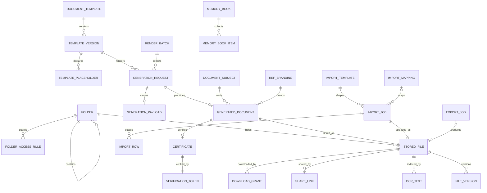
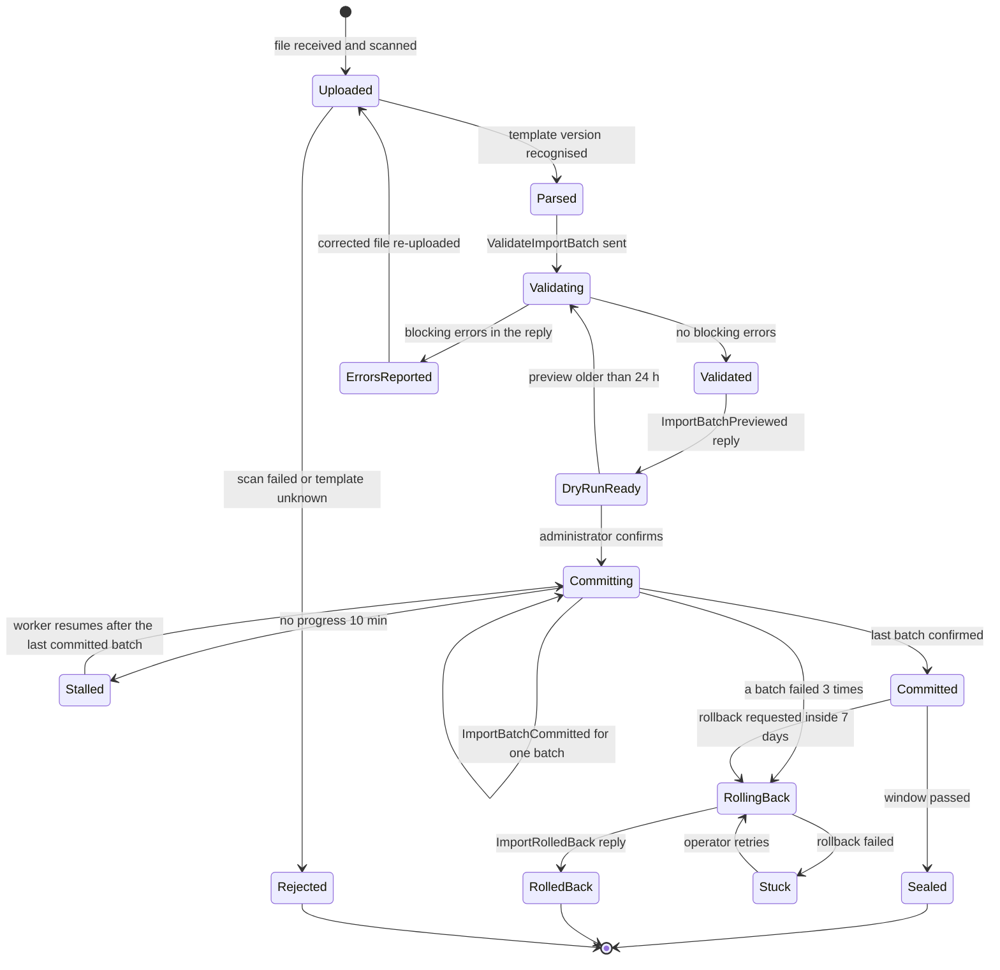
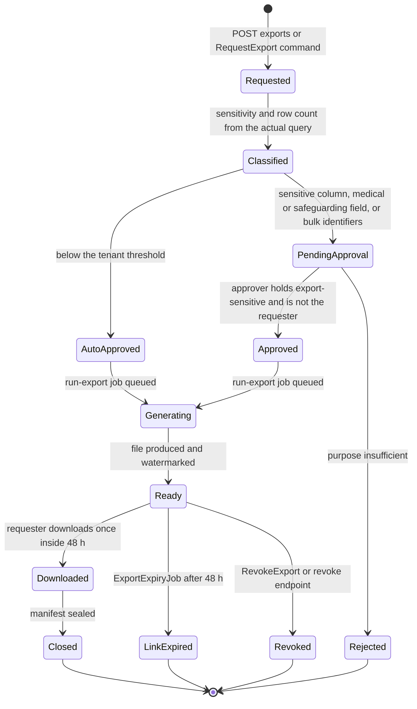

# Documents

Documents keeps every file the product holds and makes every official paper the school issues. It owns file storage behind `IFileStorage` (SeaweedFS by default, local disk for the single-server profile), upload validation, virus scanning with ClamAV and the quarantine a flagged file never leaves, short-lived signed download URLs, central storage with folders, tags, versions, access rules, expiry and retention, OCR text search, the bilingual template designer, PDF rendering through Gotenberg with the bundled Arabic fonts, certificates with a public QR verification page and revocation, batch layouts such as ID cards, and the two bulk data doors of the product: the import center with its dry run and rollback (WF-DATA-01, Saga 9) and the export center with its sensitive-export approval (WF-PRV-02). Documents decides nothing about the content it renders or the rows it imports: the requesting service supplies the values of a document, and the target service validates and writes the rows of an import. Its worker runs PDF rendering, imports, exports, scanning and OCR as five separate job groups. `26-migration-and-onboarding-toolkit.md` plans the migration toolkit as a whole; the import machinery this service runs, the legacy mapping adapters and the reconciliation reports are specified here in full, and document 26 cites them.

**Group** C · **Requirement areas covered** DOC, with PRV, DATA, PERF, SEC, L10N, TST and PLAT rows that bind this service · **Last updated** 2026-09-21 by the planning session

| Fact | Value | Source |
|---|---|---|
| Service (Appendix L) | **Documents** | Appendix L.1 |
| Tier | 1 | Appendix L.1, `05-service-catalog.md` |
| AREA code | `DOC` | Appendix L.1 |
| Database, schema, roles | `nibras_documents`, schema `documents`, application role `svc_documents`, migration role `mig_documents`; object storage bucket per deployment with a tenant prefix | Appendix L.1, `10-data-architecture.md` part 1 |
| Exchange | `nibras.documents` (topic) | Appendix L.1 |
| Images | `nibras/documents-api`, `nibras/documents-worker` | Appendix L.1 |
| Worker | `Documents.Worker`: "PDF through Gotenberg, imports, exports, ClamAV scanning, OCR"; lane bulk, "scans run ahead of any other job on the same file"; scaled by KEDA on queue depth. There is no standalone `Imports.Worker` | `05-service-catalog.md` part 2, Appendix L |
| Why the boundary exists | "Scaling: rendering, scanning, OCR and imports are IO- and CPU-heavy jobs over object storage, scaled by queue depth apart from any API." | `05-service-catalog.md` |
| Synchronous dependencies | none | Reference architecture Section 8, table 8.0 |
| Local copies | "template definitions, tenant branding" | Reference architecture Section 8, table 8.0 |
| Service level class | Read-heavy (master brief Section 31) | Reference architecture Section 8, table 8.0 |
| Scaling profile | "Read-heavy API; worker on queue depth; the public QR verification page is output-cached 5 min" | `05-service-catalog.md` |
| Build phase | "3; the PDF pipeline is built in 1 (Section 28 critical path)" | `05-service-catalog.md` |
| Sensitivity | "confidential; file bytes carry the class of the owning record" | `05-service-catalog.md`, Appendix J.3 |

**Signature features.** Documents owns Appendix W feature 9, go live in a day: import with dry run and rollback (demo test `TC-DOC-001` (Appendix W)), and feature 36, school memory: portfolio and yearbook (Tier 2; `TC-DOC-801` (Appendix W)). It also renders and verifies the report cards of feature 6, Report Card Studio with QR verification, whose public verification is Appendix O minute 9 (TC-DOC-002, section 14). The requirements, capabilities, slices, Appendix O step and demo test of each feature are traced once, in `32-product-differentiation-and-demo.md` under "Signature feature trace"; this sheet does not repeat them.

---

## 1. Responsibilities and non-responsibilities

### Responsibilities

| Owns | Detail |
|---|---|
| File storage | Every uploaded or generated file: metadata in `stored_files`, bytes in object storage through `IFileStorage` (S3-compatible API; SeaweedFS in the scale profile, local disk in the single-server profile, REQ-DOC-001), stored outside the web root |
| Upload validation and scanning | Extension and magic-number allow-list, size limit per owner type, SHA-256, ClamAV scan in `Documents.Worker` before any download is possible, quarantine of a flagged file, `documents.file.scan-failed.v1` (REQ-DOC-002, T-DOC-01) |
| Signed URLs | 5-minute download URLs bound to the user, the tenant and the file, with `Content-Disposition: attachment` and a safe file name (Appendix J, REQ-DOC-002) |
| Central document storage | Folders, tags, versions, access rules per folder, expiry dates and expiry reminders, retention rules that follow the owning record, legal-hold awareness (REQ-DOC-008) |
| OCR | Tesseract text extraction in Arabic and English, the full-text search index, and OCR-assisted field capture with a confidence floor (REQ-DOC-009, Tier 2) |
| Templates | The template designer: versioned templates in both languages with merge fields, conditional blocks, signatures and stamps, a placeholder catalog with the permission each field needs, the global template library copied into each tenant at provisioning (REQ-DOC-003, Saga 1 step 5) |
| Rendering | HTML to PDF through Gotenberg with Inter, IBM Plex Sans Arabic and a Noto Naskh fallback bundled with the renderer; right-to-left layout, Arabic shaping and the tenant's numeral setting (REQ-DOC-007, REQ-TST-015) |
| Generated documents | One `GeneratedDocument` per rendered output, owned by a subject (student, staff member, invoice, application, request), superseded rather than overwritten |
| Certificates and verification | Certificates with a QR code that opens the public verification page, revocation, reissue, and the certificate register (REQ-DOC-004 to REQ-DOC-006) |
| Batch layouts | Several subjects compiled into one printable PDF in a chosen layout, such as 120 ID cards on A4 sheets (REQ-DOC-010) |
| Import center | Import templates per entity type, legacy mapping adapters, staging, parsing, the orchestration of validation, dry run, batched commit and rollback against the target service, error reports by row and column, reconciliation reports, repeatable dry runs (REQ-DOC-011 to REQ-DOC-013, REQ-DOC-016, REQ-PLAT-020); Saga 9 orchestrator |
| Export center | Export requests with classification, WF-PRV-02 approval for sensitive or bulk exports, watermarking with the requester's identity, single-download links with a 48-hour window, the export manifest, rate limiting and the principal's report (REQ-DOC-014) |
| Long-running jobs | The job resource of `22-api-conventions-and-error-catalog.md` §6 for renders, imports, exports, OCR and batches, with SignalR progress, cancellation and a result record (REQ-DOC-015) |
| School memory | Portfolio and yearbook assembly from consented media, achievements and comments, exportable when the student leaves (REQ-DOC-017, Tier 2) |
| Tenant files lifecycle | The tenant export archive (Saga 2 step 2), deletion of the tenant's object prefix (Saga 2 step 7), the deletion certificate (Saga 2 step 9) |

### Not responsible for

| Does not own | Owner instead | Why the line is here |
|---|---|---|
| The content of a document: grades, balances, attendance summaries, the words of a letter | The requesting service (Assessment, Finance, School, Admissions, Requests, Platform, Hr, Behavior, Operations, Scheduling) | The requester resolves the merge values under its own rules and sends them with `GenerateDocument`; Documents lays them out. A figure on a PDF is explained by the service that computed it (REQ-RPT-010) |
| Deciding whether a document may be issued (fee restriction, clearance, approval) | Finance for restrictions, School for clearance, Requests for approvals | Documents records a restriction it hears about (`finance.account.restricted.v1`) only to refuse a render that the requester flagged as restrictable |
| Validating and writing imported rows | The target service: School for students, guardians and enrolments, Hr for staff, Finance for opening balances | Only the target knows its rules; Saga 9 sends `ValidateImportBatch`, `DryRunImportBatch`, `CommitImportBatch` and `RollbackImport` to it (`13-workflows-and-sagas.md` Saga 9) |
| Report-card calculation and the batch orchestration of Saga 7 | Assessment (`Assessment.Worker`) | Documents renders one card per `assessment.report-cards.generation-requested.v1` and replies with `documents.document.generated.v1` |
| Transcripts as academic records | Assessment (`IssueTranscript`) | Assessment is the requester of the transcript render |
| Student documents with expiry (passport, residence permit) as student data, and their expiry job | School (`school.student-document.expiring.v1`) | School owns the student record and its expiry clock; Documents stores the file bytes |
| Staff documents with expiry and their expiry job | Hr (`hr.staff-document.expiring.v1`) | As above for staff |
| Tenant branding (logo, colours, school names) | Platform (`platform.settings.changed.v1` with `scope = branding`) | Documents keeps a read-only copy for rendering |
| Retention periods, export approval rules, languages, numerals, calendars | Platform settings (ADR-0009) | Documents reads Appendix G values and reacts to `platform.settings.changed.v1` |
| Data subject access requests as a workflow | Platform (WF-PRV-01) | Documents builds the export and the cover letter on command |
| The Data Quality Center, dashboards, report-builder exports above 500 rows as a query | Reporting | Reporting streams the result through a Documents export job; Documents writes the file |
| Delivery of any notification | Notification | Documents publishes events or sends `RequestNotification` |
| Permission grants, the permission version, the four-eyes grant of `documents.exports.export-sensitive` | Identity | Documents evaluates permissions from the token and the permission cache |
| The audit store, the access log and its search | Audit | Documents emits `documents.audit.recorded.v1` for every write, every download of a sensitive owner's file and every transition |
| Job progress hubs | Communication (SignalR hosts) | Documents writes progress to `redis-state`; the `/hubs/jobs` hub reads it (`22-api-conventions-and-error-catalog.md` §6.3) |
| Open Badges 3.0 credentials | Behavior | Documents may render a badge certificate on command; the credential is Behavior's |
| Wellbeing documents of any kind | Wellbeing | No level-S record is rendered or stored here; see section 12. Whether referral packs and signed medication records are rendered here is not settled: an ADR with the privacy officer decides, and until then this sheet and the Wellbeing sheet's open point 11 carry the same interim default, that nothing level S is rendered here (open point 13, RISK-48) |

---

## 2. Requirements covered

| Range or identifier | What it binds here |
|---|---|
| REQ-DOC-001 to REQ-DOC-017 | Every DOC row in `03-requirements-catalog.md`: 15 Tier 1, 2 Tier 2 (REQ-DOC-009 OCR, REQ-DOC-017 school memory) |
| REQ-TST-015 | Every generated PDF has an English and an Arabic snapshot compared against committed baselines with a shaping check (TC-TST-208) |
| REQ-PLAT-020 | Imports normalize Arabic-Indic digits before validation (TC-PLAT-008) |
| REQ-SEC-003 to REQ-SEC-006 | Object-level authorization per file and per generated document, generated permission and isolation suites, every endpoint declares an Appendix B permission except the two public routes |
| REQ-SEC-009 | A sensitive owner's file is encrypted with the per-tenant key in object storage |
| REQ-DATA-002, REQ-DATA-003 | `svc_documents` owns no tables and has no `BYPASSRLS`; tenancy by filter plus row-level security |
| REQ-PERF-015 | Metadata by id and the public verification probe are compiled queries |
| REQ-API-003 | Dates as `YYYY-MM-DD`, instants in UTC with `Z` |
| REQ-L10N-005, REQ-L10N-009 | Template and folder names as `LocalizedText`; Arabic-normalized search over file names, tags and OCR text |

---

## 3. Aggregates and entities

Every tenant-owned table carries the base columns of `10-data-architecture.md` part 4, listed once: `id uuid not null` (UUID v7 from `IIdGenerator`), `tenant_id uuid not null` (first column of every index and bound by the row-level security policy), `created_at timestamptz not null`, `created_by uuid null`, `updated_at timestamptz not null`, `updated_by uuid null`, `deleted_at timestamptz null`, `deleted_by uuid null`, and `xmin` mapped as the optimistic concurrency token on every aggregate root. Primary keys are `(tenant_id, id)`. Bilingual names use `LocalizedText` from `Nibras.BuildingBlocks.Localization`, stored as `<field>_en`, `<field>_ar` and, where searchable, `<field>_ar_search`. Every column carries its Appendix J class through the `[DataClass]` attribute (Appendix J rule 1).

### 3.1 StoredFile (aggregate root) with FileVersion, OcrText and ShareLink

**`stored_files`**

| Field | Type | Null | Notes |
|---|---|---|---|
| `owner_service` | text(24) | no | Lower-case service name from Appendix L that owns the record the file belongs to |
| `owner_type` | text(48) | no | For example `student`, `excuse`, `application`, `staff-file`, `generated-document`, `import`, `export`, `folder` |
| `owner_id` | uuid | yes | Null only for a file in a central-storage folder |
| `owner_class` | smallint | no | Appendix J level of the owning record: Internal, Confidential, Sensitive; decides encryption, share-link and download logging |
| `folder_id` | uuid | yes | Central storage folder |
| `file_name` | text(255) | no | Original name, sanitized; the download name is derived again at download |
| `content_type` | text(128) | no | From magic-number detection, never from the client header |
| `extension` | text(16) | no | Must be in the owner type's allow-list |
| `size_bytes` | bigint | no | At or under the owner type's limit |
| `sha256` | bytea | no | Content hash; a re-upload of identical bytes by the same owner returns the first file |
| `storage_provider` | smallint | no | `SeaweedFs`, `LocalDisk` |
| `storage_key` | text(256) | no | `{tenantId}/{ownerService}/{yyyy}/{mm}/{fileId}`; never user-controlled |
| `key_id` | text(64) | yes | Per-tenant data key id when `owner_class = Sensitive` |
| `scan_status` | smallint | no | `Pending`, `Clean`, `Infected`, `ScanFailed`; only `Clean` is downloadable |
| `scan_verdict` | text(128) | yes | ClamAV signature name when infected |
| `scanned_at` | timestamptz | yes | |
| `quarantined` | boolean | no | True for `Infected` and for a scan that parked; a quarantined file is never released |
| `version_no` | int | no | Starts at 1 |
| `current_version_id` | uuid | yes | Latest `file_versions` row |
| `tags` | text[] | no | Up to 20 tags, each at most 32 characters |
| `expires_on` | date | yes | Document expiry in the campus calendar; drives the reminder job |
| `retention_rule_code` | text(32) | no | `follows-owner` by default; folder rules may set a fixed period |
| `ocr_status` | smallint | no | `NotRequested`, `Queued`, `Done`, `Failed`, `LowConfidence` |
| `uploaded_by` | uuid | no | |
| `client_token` | uuid | yes | Upload idempotency key |

**`file_versions`**: `file_id uuid`, `version_no int`, `storage_key text(256)`, `sha256 bytea`, `size_bytes bigint`, `scan_status smallint`, `uploaded_by uuid`, `uploaded_at timestamptz`, `change_note text(256) null`. Unique `(tenant_id, file_id, version_no)`. Append-only.

**`ocr_texts`**: `file_id uuid`, `version_no int`, `language text(8)` (`ara`, `eng`, `ara+eng`), `text text` (Internal unless the owner is Confidential, in which case it inherits the owner class), `search_vector tsvector`, `mean_confidence numeric(5,2)`, `proposed_fields jsonb null` (field key, value, confidence, bounding box), `extracted_at timestamptz`. The search vector uses the Arabic normalization of `24-localization-and-calendars.md`.

**`share_links`**: `file_id uuid`, `token_hash bytea` (SHA-256 of the 32-byte random token), `expires_at timestamptz`, `max_downloads int`, `download_count int`, `revoked_at timestamptz null`, `revoked_by uuid null`, `reason text(256)` (required: `share-link` is elevated).

**`download_grants`**: `file_id uuid`, `user_id uuid`, `token_hash bytea`, `expires_at timestamptz`, `single_use boolean`, `used_at timestamptz null`, `purpose smallint` (`Download`, `ExportDownload`, `EvidenceLink`). A signed URL for an ordinary file is stateless (HMAC over tenant, file, version, user and expiry); a row here exists only for single-use downloads (exports) and for the audited download of a Sensitive owner's file. Swept hourly by `TokenSweepJob`.

**Invariants (StoredFile)**

1. A file whose extension or detected content type is outside the owner type's allow-list is refused with `DOCUMENTS_FILE_TYPE_NOT_ALLOWED`; nothing reaches object storage.
2. A file over the owner type's size limit is refused with `DOCUMENTS_VALIDATION_FAILED` (`params.maxBytes`).
3. No download URL is issued while `scan_status <> Clean`; an infected file answers `DOCUMENTS_VIRUS_DETECTED` and its bytes are deleted from the live bucket within the scan transaction's follow-up, keeping only the quarantine copy for 7 days for forensic review.
4. `quarantined = true` never changes back to false.
5. A signed URL older than 5 minutes, or presented by another user or in another tenant, is refused with `DOCUMENTS_SIGNED_URL_EXPIRED`.
6. A share link is refused for a file whose `owner_class` is Sensitive, and for Confidential owners unless the folder's access rule allows external sharing (T-DOC-03).
7. A new version never overwrites the bytes of an older one; `file_versions` keeps every version until the retention rule removes the whole file.
8. A file of a Sensitive owner is encrypted with the per-tenant data key before it reaches object storage; `key_id` is not null for it.
9. A file under a legal hold (`retention_holds`) is never purged, whatever its rule.
10. Two uploads with the same `client_token` return the first file; two uploads with the same `sha256` for the same owner return the first file with `200`.

### 3.2 Folder (aggregate root) with FolderAccessRule

**`folders`**: `parent_id uuid null`, `name LocalizedText`, `path text(1024)` (materialized path of ids for subtree queries), `owner_service text(24)` (`documents` for central storage), `retention_rule_code text(32)`, `default_owner_class smallint`, `allow_external_share boolean`. Unique `(tenant_id, parent_id, name_en)` and `(tenant_id, parent_id, name_ar)`.

**`folder_access_rules`**: `folder_id uuid`, `role_code text(48) null`, `user_id uuid null`, `access smallint` (`View`, `Contribute`), `scope text(24)` (an Appendix B data scope), `inherited boolean`. Exactly one of `role_code` and `user_id` is set.

**Invariants.** A folder with files or subfolders cannot be deleted. A user sees a file in a folder only when a rule on the folder or an ancestor grants the user's role or the user `View` (REQ-DOC-008: a document with an HR-only rule is absent for a teacher). A rule change is audited with before and after.

### 3.3 DocumentTemplate (aggregate root) with TemplateVersion and TemplatePlaceholder

**`document_templates`**

| Field | Type | Null | Notes |
|---|---|---|---|
| `code` | text(48) | no | Stable code used by requesters in `GenerateDocument`, for example `transfer-certificate`, `report-card-primary`, `invoice`, `deletion-certificate`; unique per tenant |
| `name` | LocalizedText | no | Designer display name |
| `kind` | smallint | no | `Certificate`, `Letter`, `ReportCard`, `Transcript`, `Invoice`, `Receipt`, `Statement`, `IdCard`, `Report`, `ErrorReport`, `Manifest` |
| `owner_service` | text(24) | no | The service expected to request it; a request from another service is refused |
| `status` | smallint | no | `Draft`, `Published`, `Retired` |
| `current_version_id` | uuid | yes | Latest published version |
| `library_source_id` | uuid | yes | Global library template it was copied from at provisioning |
| `languages` | text(8)[] | no | Subset of `en`, `ar`; at least one |
| `issues_certificate` | boolean | no | True when every output carries a QR verification code |
| `restrictable` | boolean | no | True when a Finance restriction may block issue (report cards, transcripts, certificates, per the tenant's restriction rules) |
| `batch_layout_code` | text(32) | yes | For ID cards and labels: cards per sheet, bleed, margins |

**`template_versions`**: `template_id uuid`, `version_no int`, `body_html_en text null`, `body_html_ar text null`, `stylesheet text`, `page_size text(8)` (`A4`, `A5`, `Letter`, `CR80`), `orientation smallint`, `signature_file_id uuid null`, `stamp_file_id uuid null`, `sample_data jsonb`, `published_at timestamptz null`, `published_by uuid null`, `checksum bytea`. Unique `(tenant_id, template_id, version_no)`. Immutable once published; the template cache entry is keyed by version (`21-performance-engineering.md` §1.13).

**`template_placeholders`**: `template_version_id uuid`, `key text(64)` (for example `student.name`, `term.average`), `required boolean`, `data_class smallint` (Appendix J level of the source field), `permission text(96) null` (the Appendix B permission a requesting user must hold for the field to be merged, T-DOC-06), `format smallint` (text, date in the tenant calendar, number with the tenant numerals, money, image), `condition_group text(32) null` (conditional block the field belongs to).

**Invariants (DocumentTemplate)**

1. A published version never changes; an edit creates a new draft version.
2. Publishing requires every placeholder used in the body to exist in `template_placeholders` and every required placeholder to resolve against `sample_data`; otherwise `DOCUMENTS_TEMPLATE_PLACEHOLDER_UNRESOLVED` lists them.
3. A template whose `languages` contains `ar` has `body_html_ar` with `dir="rtl"` on the root element; the publish validator checks it.
4. The body may reference images only by `file_id` of a clean file of the same tenant; no external URL is allowed, because the renderer has no network (T-DOC-07).
5. A conditional block renders only when its condition evaluates true against the supplied values (REQ-DOC-003: a scholarship block is absent for a non-holder).
6. A retired template refuses new generation requests with `DOCUMENTS_VALIDATION_FAILED` (`params.templateRetired`); documents already generated from it are untouched.

### 3.4 GenerationRequest (aggregate root) and GeneratedDocument

**`generation_requests`**: `template_id uuid`, `template_version_id uuid`, `subject_type text(48)`, `subject_id uuid`, `language text(8)`, `requester_service text(24)`, `requested_by uuid null`, `saga_id uuid null`, `step_key text(64) null`, `request_id uuid null` (Requests request), `batch_id uuid null`, `status smallint` (`Pending`, `Rendering`, `Succeeded`, `Failed`, `Cancelled`), `attempts smallint`, `last_error_code text(64) null`, `generated_document_id uuid null`, `dedupe_key text(160)`. Unique `(tenant_id, dedupe_key)` where the key is `(requester_service, saga_id, step_key)` for a saga command, `(batch_id, subject_id, template_id, language)` for a batch (Saga 7 idempotency), and the `Idempotency-Key` for an endpoint call. Index `ix_generation_requests_pending`.

**`generation_payloads`**: `generation_request_id uuid`, `values_ciphertext bytea` (the merge values as JSON, encrypted with the per-tenant key because they may be Confidential), `key_id text(64)`. Deleted when the request reaches a terminal state; never cached, never logged.

**`generated_documents`**

| Field | Type | Null | Notes |
|---|---|---|---|
| `owner_type`, `owner_id` | text(48), uuid | no | The subject the document belongs to |
| `owner_service` | text(24) | no | Requesting service |
| `kind` | smallint | no | From the template |
| `template_version_id` | uuid | no | Reproducibility: the exact version used |
| `language` | text(8) | no | `en` or `ar`; a bilingual document is one file with language `ar+en` |
| `file_id` | uuid | no | The rendered PDF in `stored_files` |
| `page_count` | smallint | no | |
| `values_checksum` | bytea | no | SHA-256 of the merge values, so a regeneration with identical values is detectable |
| `supersedes_id` | uuid | yes | The document this one replaces (reissue, grade change) |
| `status` | smallint | no | `Current`, `Superseded`, `Withdrawn` |
| `generated_at` | timestamptz | no | |
| `generation_request_id` | uuid | no | |

**`render_batches`**: `kind smallint` (`IdCards`, `Labels`, `ReportCardPrintPack`), `layout_code text(32)`, `expected_count int`, `rendered_count int`, `failed_count int`, `combined_file_id uuid null`, `status smallint` (`Collecting`, `Compiling`, `Ready`, `Failed`), `requested_by uuid`.

**`document_subjects`** (the `documents.subjects` registry of `11-messaging-architecture.md` §2.5): `subject_type text(48)`, `subject_id uuid`, `restricted boolean`, `restriction_policy_id uuid null`, `required_document_types text(48)[] null` (from `admissions.application.submitted.v1`), `last_event_at timestamptz`. Unique `(tenant_id, subject_type, subject_id)`.

**Invariants (Generation)**

1. One `generation_requests` row per `dedupe_key`; a repeated command or event re-publishes `documents.document.generated.v1` with the existing `documentId` and renders nothing (Saga 7 idempotency, `13-workflows-and-sagas.md`).
2. A request from a service that is not the template's `owner_service` fails with `DOCUMENTS_PERMISSION_DENIED`.
3. A placeholder whose `permission` the `requestedBy` user does not hold, or a required placeholder with no value, fails the request with `DOCUMENTS_TEMPLATE_PLACEHOLDER_UNRESOLVED`, listing the keys and never the values (T-DOC-06).
4. A `restrictable` template for a subject with `restricted = true` fails with `DOCUMENTS_PERMISSION_DENIED` (`params.restricted`) unless the command carries `restrictionOverride` from the requester, which decided it.
5. A render that exceeds 30 s or 512 MB in the renderer fails and retries up to 3 times, then `Failed` with the error; it never blocks another tenant's renders (T-DOC-07).
6. A superseding document sets the old one to `Superseded` and, when the old one issued a certificate, revokes that certificate in the same transaction.
7. `generation_payloads` never outlives its request.

### 3.5 Certificate (aggregate root) with VerificationToken

**`certificates`**: `generated_document_id uuid`, `holder_type text(24)` (`student`, `staff`, `guardian`, `tenant`), `holder_id uuid`, `certificate_type text(48)` (template code), `issued_on date`, `public_title LocalizedText` (what the verification page shows as the document title), `public_holder_name LocalizedText null` (shown only when the template's public-field policy includes it), `public_fields jsonb` (the fields the school chose to expose, from the template's public-field policy; never an identity number), `status smallint` (`Issued`, `Revoked`, `Superseded`), `revoked_at timestamptz null`, `revoked_by uuid null`, `revoke_reason_code text(32) null`, `superseded_by uuid null`.

**`verification_tokens`**: `certificate_id uuid`, `code_hash bytea` (SHA-256 of the 16-character Crockford base32 code), `code_prefix text(4)` (display aid only), `revoked_at timestamptz null`. Unique index `ux_verification_tokens_code (tenant_id, code_hash) INCLUDE (certificate_id, revoked_at)` (`21-performance-engineering.md` §3.13).

**Invariants (Certificate)**

1. Every output of a template with `issues_certificate = true` has exactly one certificate and one verification token, created in the render transaction; `documents.document.generated.v1` carries the `verificationCode`.
2. The code is 80 bits of randomness; the database stores only its hash, so a table read never yields a working code.
3. Revocation sets `status = Revoked`, `revoked_at` on both rows, publishes `documents.certificate.revoked.v1` once, and evicts the public output-cache entry by code hash; the page then answers `DOCUMENTS_CERTIFICATE_REVOKED` (410) with the revocation date and the issuing school (REQ-DOC-006, T-DOC-08).
4. A revoked certificate never returns to `Issued`; a correction is a reissue that supersedes it.
5. The verification response contains only `public_title`, `public_holder_name` when the policy allows, `issued_on`, `status`, the school name from the branding copy and `public_fields`; no identifier of the holder (REQ-DOC-005).

### 3.6 ImportJob (aggregate root, Saga 9 state) with ImportRow, ImportTemplate and ImportMapping

**`import_jobs`** (the persisted saga state of `13-workflows-and-sagas.md` Saga 9, plus what the import screens need)

| Field | Type | Null | Notes |
|---|---|---|---|
| `target_service` | text(24) | no | `school`, `hr`, `finance` |
| `entity_type` | text(48) | no | For example `students`, `guardians`, `enrolments`, `staff`, `opening-balances` |
| `template_version` | text(16) | no | Import template version the file was matched to |
| `mapping_id` | uuid | yes | Legacy mapping used, when the file is a legacy export |
| `file_id` | uuid | no | The uploaded sheet |
| `state` | smallint | no | `ImportState`: `Uploaded`, `Parsed`, `Rejected`, `Validating`, `Validated`, `ErrorsReported`, `DryRunReady`, `Committing`, `Stalled`, `Committed`, `RollingBack`, `RolledBack`, `Stuck`, `Sealed`, `Cancelled` |
| `status` | smallint | no | `LegacyImportWithDryRunAndRollbackStatus`, the Appendix R view of `state` (section 7) |
| `row_count` | int | yes | After parse |
| `error_row_count` | int | yes | After validation |
| `batches` | jsonb | yes | `batchNo → {status, attempts, committedAt, lastError}`; bounded at 20 entries per 10,000 rows |
| `preview` | jsonb | yes | Counts of inserts, updates and skips per entity |
| `preview_generated_at` | timestamptz | yes | A commit with a preview older than 24 h re-validates first |
| `confirmed_by`, `confirmed_at` | uuid, timestamptz | yes | |
| `rollback_window_ends_at` | timestamptz | yes | Commit time plus 7 days |
| `error_report_id` | uuid | yes | Generated document of the error report |
| `reconciliation_report_id` | uuid | yes | Generated document of the reconciliation report |
| `conflicts` | jsonb | yes | Rows left alone on rollback, with the user who changed them |
| `dry_run_count` | smallint | no | Repeatable dry runs are counted (REQ-DOC-016) |
| `row_limit` | int | no | The tenant's plan limit at upload |

**`import_rows`**, list-partitioned by `import_job_id`, one partition created per job and dropped when the job is sealed or rolled back (`10-data-architecture.md` part 1): `import_job_id uuid`, `row_number int`, `raw jsonb` (normalized cell values, Arabic-Indic digits converted, REQ-PLAT-020), `mapped jsonb`, `error_code text(64) null`, `error_column text(64) null`, `error_params jsonb null`, `duplicate_of uuid null` (existing record named by the target), `batch_no smallint null`, `outcome smallint null` (`Insert`, `Update`, `Skip`). Index `ix_import_rows_errors`.

**`import_templates`**: `entity_type text(48)`, `target_service text(24)`, `version text(16)`, `columns jsonb` (column key, header in both languages, required, format, reference kind), `max_rows int`, `status smallint`. Global rows (`tenant_id` of the platform tenant) are readable by every tenant through a security-definer view; tenant rows override.

**`import_mappings`**: `name LocalizedText`, `adapter_code text(32)` (section 7, legacy adapters), `entity_type text(48)`, `column_map jsonb` (source header to template column), `value_maps jsonb` (for example legacy grade codes to grade level ids), `version int`, `last_used_at timestamptz null`.

**Invariants (ImportJob)**

1. A file that fails the scan or matches no template version goes to `Rejected`; nothing is parsed.
2. A sheet with more rows than `row_limit` is refused at parse with `DOCUMENTS_IMPORT_ROW_LIMIT_EXCEEDED` (413), naming the limit.
3. Nothing is written to the target service before `DryRunReady` and an explicit confirmation by a holder of `documents.imports.commit` (REQ-DOC-012).
4. A commit whose preview is older than 24 h moves back to `Validating` instead of committing (WF-DATA-01 timeout).
5. A validation with blocking errors ends in `ErrorsReported` and answers `DOCUMENTS_IMPORT_VALIDATION_FAILED` (422) on commit; the error report lists every failing row with its row number and column.
6. Every committed row carries `importId`; a batch that fails three times moves the job to `RollingBack`, and a caller reading it meanwhile gets `DOCUMENTS_IMPORT_ROLLBACK_REQUIRED` (409) with what was applied.
7. Rollback is accepted only inside the 7-day window and only once; rows a user changed after the import are reported as conflicts and left alone.
8. Two dry runs of the same file and mapping against unchanged target data produce identical previews and reconciliation reports (REQ-DOC-016).
9. One active import per `(tenant_id, target_service, entity_type)`; a second is refused with `DOCUMENTS_CONCURRENCY_CONFLICT` carrying `params.runningJobId`.

### 3.7 ExportJob (aggregate root, WF-PRV-02 state)

**`export_jobs`**

| Field | Type | Null | Notes |
|---|---|---|---|
| `source_service` | text(24) | no | Service whose data is exported (Documents calls no one: the source streams rows to the job, section 5) |
| `entity_type` | text(48) | no | |
| `columns` | text(64)[] | no | Exact columns requested |
| `filters` | jsonb | no | In the filter grammar of `22-api-conventions-and-error-catalog.md` §3 |
| `purpose` | text(512) | no | Required; shown to the approver and sealed into the manifest |
| `format` | smallint | no | `Csv`, `Xlsx`, `Pdf`, `Zip` |
| `sensitivity` | smallint | yes | Highest Appendix J class among the columns, set at classification |
| `row_count` | int | yes | From the actual query at classification |
| `status` | smallint | no | `SensitiveExportApprovalStatus`: `Requested`, `Classified`, `AutoApproved`, `PendingApproval`, `Approved`, `Rejected`, `Generating`, `Ready`, `Downloaded`, `LinkExpired`, `Closed`, plus `Revoked` (Open point 3) |
| `requested_by` | uuid | no | |
| `approver_id`, `decided_at` | uuid, timestamptz | yes | Approver differs from the requester |
| `decision_reason` | text(512) | yes | Required on reject |
| `watermark_text` | text(256) | yes | Requester name, user id, timestamp, tenant; embedded in every page or sheet |
| `file_id` | uuid | yes | The generated file |
| `link_expires_at` | timestamptz | yes | 48 h after `Ready` |
| `downloaded_at` | timestamptz | yes | Single download |
| `manifest` | jsonb | yes | Columns, filters, row count, purpose, approver, file checksum; sealed at `Closed` |
| `request_id`, `saga_id`, `step_key` | uuid, uuid, text(64) | yes | Set when the export came from Saga 6 (`RequestExport`) or Saga 2 (`ExportTenant`) |

**Invariants (ExportJob)**

1. Classification computes `sensitivity` and `row_count` from the actual query, never from the request's claim (TC-PRV-011).
2. An export containing a Sensitive column, a medical or safeguarding field, or more identifiers than the tenant's bulk threshold (Security → export approval rules) goes to `PendingApproval`; no file is produced before approval (TC-PRV-013).
3. The approver holds `documents.exports.export-sensitive` and is not the requester; self-approval fails with `DOCUMENTS_PERMISSION_DENIED` (TC-PRV-014).
4. A download of a sensitive export before approval, or by anyone but the requester, fails with `DOCUMENTS_SENSITIVE_EXPORT_APPROVAL_REQUIRED` or `DOCUMENTS_PERMISSION_DENIED`.
5. The file is served once, inside 48 h, watermarked with the requester identity (TC-PRV-015); after the window the link is dead and the file deleted (TC-PRV-016).
6. A revoked export's link dies immediately, even when the file exists (`RevokeExport`, `13-workflows-and-sagas.md` section 4).
7. Every sensitive export publishes `documents.sensitive-export.performed.v1` once, on download, with the watermark reference; every export publishes `documents.export.completed.v1` once, at `Ready`.
8. More than the tenant's limit of sensitive exports per requester per day fails with `DOCUMENTS_RATE_LIMITED` (REQ-DOC-014).

### 3.8 MemoryBook (aggregate root, Tier 2)

**`memory_books`**: `kind smallint` (`Portfolio`, `Yearbook`), `subject_type text(24)` (`student` or `section`), `subject_id uuid`, `academic_year_ids uuid[]`, `status smallint` (`Collecting`, `Compiled`, `Exported`), `item_count int`, `compiled_file_id uuid null`, `requested_by uuid`. **`memory_book_items`**: `memory_book_id uuid`, `file_id uuid null`, `generated_document_id uuid null`, `caption LocalizedText null`, `source_service text(24)`, `consent_checked_at timestamptz`, `position int`.

**Invariants.** An item whose media consent is not confirmed by the requesting service at compile time is excluded and listed; a compiled book is regenerated, never edited (REQ-DOC-017).

### 3.9 Reference copies (read-only)

`ref_branding` (tenant branding) and `ref_tenant_state` (tenant status, plan limits including the import row limit, flags) are described in section 9. They carry `tenant_id`, `source_version timestamptz` and `reconciled_at timestamptz`, no soft delete and no `xmin`, because only consumers write them.



---

## 4. REST API

Paths follow `22-api-conventions-and-error-catalog.md` §1. Every endpoint also returns the eight cross-cutting codes of Appendix K.1 with the `DOCUMENTS_` prefix (`DOCUMENTS_VALIDATION_FAILED`, `DOCUMENTS_PERMISSION_DENIED`, `DOCUMENTS_TENANT_MISMATCH`, `DOCUMENTS_NOT_FOUND`, `DOCUMENTS_CONCURRENCY_CONFLICT`, `DOCUMENTS_IDEMPOTENCY_REPLAY`, `DOCUMENTS_RATE_LIMITED`, `DOCUMENTS_DEPENDENCY_UNAVAILABLE`); the Errors column lists the Appendix K.14 codes and any cross-cutting code raised for a domain reason. "Key" means the `Idempotency-Key` header of document 22 §5. Long operations answer `202` with the job resource of document 22 §6 and `Location: /api/v1/documents/jobs/{jobId}`. Every write is audited through `documents.audit.recorded.v1`. Lists use keyset pagination with a page cap of 200. Guardians and students reach only their own children's or their own generated documents (`own-children`, `self`).

### 4.1 Files (`FileEndpoints.cs`)

| Method | Path | Permission | Request | Response | Errors | Idempotent |
|---|---|---|---|---|---|---|
| POST | `/api/v1/documents/files` | `documents.files.create` | multipart: file, `ownerService`, `ownerType`, `ownerId` or `folderId`, `tags`, `expiresOn`, `clientToken` | 202 `StoredFile` in `Pending` scan; a `documents.commands.scan-file.v1` job is queued | `DOCUMENTS_FILE_TYPE_NOT_ALLOWED`, `DOCUMENTS_VALIDATION_FAILED` (size) | Yes, Key required; same `clientToken` or same bytes for the same owner returns the first file |
| GET | `/api/v1/documents/files?folderId=&ownerType=&ownerId=&tag=&q=` | `documents.files.view` | query, cursor | `FileRow[]`: name, type, size, owner, scan status, version, expiry; filtered by folder access rules | none beyond K.1 | Safe; `ETag` |
| GET | `/api/v1/documents/files/{id}` | `documents.files.view` | none | `StoredFile` metadata with versions count | none beyond K.1 | Safe; `ETag` |
| PATCH | `/api/v1/documents/files/{id}` | `documents.files.create` (uploader or folder `Contribute`); see Open point 5 | name, tags, `expiresOn`, `folderId`, `If-Match` | 200 `StoredFile` | `DOCUMENTS_CONCURRENCY_CONFLICT` | Yes, by `If-Match` |
| DELETE | `/api/v1/documents/files/{id}` | `documents.files.delete` | `If-Match` | 204; soft delete, bytes purged by `DocumentRetentionJob` after the recycle window unless held | `DOCUMENTS_CONCURRENCY_CONFLICT` | Yes |
| POST | `/api/v1/documents/files/{id}/versions` | `documents.files.create` | multipart file, `changeNote` | 202 new version in `Pending` scan | `DOCUMENTS_FILE_TYPE_NOT_ALLOWED`, `DOCUMENTS_VALIDATION_FAILED` | Yes, Key required |
| GET | `/api/v1/documents/files/{id}/versions` | `documents.files.view` | none | `FileVersionRow[]` | none beyond K.1 | Safe |
| POST | `/api/v1/documents/files/{id}/download-url` | `documents.files.download` | `{ versionNo }` | 200 `{ url, expiresAt }` valid 5 minutes, bound to caller and tenant | `DOCUMENTS_VIRUS_DETECTED` (quarantined), `DOCUMENTS_VALIDATION_FAILED` (`params.scanPending`) | Safe to repeat; each call issues a new URL |
| GET | `/api/v1/documents/files/content/{token}` | `documents.files.download` (carried by the token; the caller's session must match its user) | none | 200 bytes, `Content-Disposition: attachment; filename*=`, `X-Content-Type-Options: nosniff`, `Cache-Control: no-store` | `DOCUMENTS_SIGNED_URL_EXPIRED` | Safe |
| POST | `/api/v1/documents/files/{id}/share-links` | `documents.files.share-link` | `{ expiresAt, maxDownloads, reason }` | 201 `ShareLink` with the URL shown once | `DOCUMENTS_PERMISSION_DENIED` (Sensitive owner or folder forbids external sharing, T-DOC-03) | Key optional |
| DELETE | `/api/v1/documents/share-links/{id}` | `documents.files.share-link` | none | 204; link dead at once | none beyond K.1 | Yes |
| GET | `/api/v1/documents/shared/{token}` | none: public route, Gateway source-address rate limit | none | 200 bytes with attachment disposition, or 410 when revoked or expired | `DOCUMENTS_SIGNED_URL_EXPIRED` | Safe; counts toward `maxDownloads` |
| POST | `/api/v1/documents/files/export` | `documents.files.export` | `{ folderId or fileIds, format: zip }` | 202 job; the archive is an export job (section 4.9) | `DOCUMENTS_SENSITIVE_EXPORT_APPROVAL_REQUIRED` when a Sensitive owner's file is included | Yes, Key required |

### 4.2 Folders (`FolderEndpoints.cs`)

| Method | Path | Permission | Request | Response | Errors | Idempotent |
|---|---|---|---|---|---|---|
| GET | `/api/v1/documents/folders?parentId=` | `documents.files.view` | query | `FolderRow[]` the caller may see | none beyond K.1 | Safe; `ETag` |
| POST | `/api/v1/documents/folders` | `documents.files.create` | `{ parentId, name: LocalizedText, retentionRuleCode, defaultOwnerClass }` | 201 `Folder` | `DOCUMENTS_VALIDATION_FAILED` (duplicate name) | Key optional |
| PUT | `/api/v1/documents/folders/{id}` | `documents.files.create` for name and retention; `documents.files.share-link` for access rules and external sharing (Open point 5) | `FolderModel` with `accessRules[]`, `If-Match` | 200 `Folder` | `DOCUMENTS_CONCURRENCY_CONFLICT` | Yes, by `If-Match` |
| DELETE | `/api/v1/documents/folders/{id}` | `documents.files.delete` | `If-Match` | 204 | `DOCUMENTS_VALIDATION_FAILED` (`params.notEmpty`) | Yes |

### 4.3 Search and OCR (`OcrEndpoints.cs`, Tier 2)

| Method | Path | Permission | Request | Response | Errors | Idempotent |
|---|---|---|---|---|---|---|
| GET | `/api/v1/documents/files/search?q=&folderId=` | `documents.files.view` | Arabic-normalized `q`, cursor | `FileSearchHit[]` with a highlighted snippet, only files the caller may see | none beyond K.1 | Safe |
| POST | `/api/v1/documents/files/{id}/ocr` | `documents.files.create` | `{ languages, captureProfile }` (for example `birth-certificate`) | 202 job on `documents-worker.ocr.bulk` | `DOCUMENTS_VALIDATION_FAILED` (`params.scanPending`) | Yes, Key required; one OCR per file version |
| GET | `/api/v1/documents/files/{id}/ocr` | `documents.files.view` | none | `OcrResult`: text, `proposedFields[]` with confidence; `DOCUMENTS_OCR_CONFIDENCE_LOW` (200) marks fields below the floor for human confirmation | `DOCUMENTS_OCR_CONFIDENCE_LOW` | Safe |

### 4.4 Templates (`TemplateEndpoints.cs`)

| Method | Path | Permission | Request | Response | Errors | Idempotent |
|---|---|---|---|---|---|---|
| GET | `/api/v1/documents/templates?kind=&status=` | `documents.templates.view` | query | `TemplateRow[]` | none beyond K.1 | Safe; `ETag` |
| GET | `/api/v1/documents/templates/{id}` | `documents.templates.view` | none | `DocumentTemplate` with versions and the draft | none beyond K.1 | Safe; `ETag` |
| GET | `/api/v1/documents/templates/{id}/placeholders` | `documents.templates.view` | none | The placeholder catalog with required flag, data class and permission | none beyond K.1 | Safe |
| POST | `/api/v1/documents/templates` | `documents.templates.create` | `{ code, name, kind, ownerService, languages, fromLibraryId }` | 201 template with a draft version | `DOCUMENTS_VALIDATION_FAILED` (duplicate code) | Key optional |
| PUT | `/api/v1/documents/templates/{id}/draft` | `documents.templates.edit` | `TemplateDraftModel`: bodies, stylesheet, page, placeholders, signature and stamp file ids, sample data; `If-Match` | 200 draft | `DOCUMENTS_CONCURRENCY_CONFLICT`, `DOCUMENTS_VALIDATION_FAILED` (external URL, missing `dir="rtl"`) | Yes, by `If-Match` |
| POST | `/api/v1/documents/templates/{id}/preview` | `documents.templates.view` | `{ language, values }` (sample data when absent) | 200 PDF stream, rendered synchronously within 10 s, watermarked "PREVIEW" | `DOCUMENTS_TEMPLATE_PLACEHOLDER_UNRESOLVED` | Safe |
| POST | `/api/v1/documents/templates/{id}/publish` | `documents.templates.publish` | `If-Match` | 200 published version; evicts the `:current` pointer | `DOCUMENTS_TEMPLATE_PLACEHOLDER_UNRESOLVED`, `DOCUMENTS_CONCURRENCY_CONFLICT` | Yes, state-guarded |
| POST | `/api/v1/documents/templates/{id}/retire` | `documents.templates.edit` | `{ reason }` | 200 `Retired` | `DOCUMENTS_CONCURRENCY_CONFLICT` | Yes, state-guarded |
| DELETE | `/api/v1/documents/templates/{id}` | `documents.templates.delete` | `If-Match` | 204; only a template never published | `DOCUMENTS_VALIDATION_FAILED` (`params.published`) | Yes |

### 4.5 Generation and batches (`GenerationEndpoints.cs`)

| Method | Path | Permission | Request | Response | Errors | Idempotent |
|---|---|---|---|---|---|---|
| POST | `/api/v1/documents/generated-documents` | `documents.certificates.generate` | `GenerateDocumentRequest`: `templateCode`, `subjectType`, `subjectId`, `language`, `values` (letters typed by staff; values the caller supplies and may see) | 202 job; `documents.document.generated.v1` on success | `DOCUMENTS_TEMPLATE_PLACEHOLDER_UNRESOLVED`, `DOCUMENTS_PERMISSION_DENIED` (restricted subject) | Yes, Key required |
| GET | `/api/v1/documents/generated-documents?ownerType=&ownerId=&kind=` | `documents.files.view` (`own-children`, `self` for families) | query, cursor on `(generated_at, id)` | `GeneratedDocumentRow[]` (hot query 3) | none beyond K.1 | Safe; `ETag` |
| GET | `/api/v1/documents/generated-documents/{id}` | `documents.files.view` | none | `GeneratedDocument` with template version, language, certificate status | none beyond K.1 | Safe |
| POST | `/api/v1/documents/generated-documents/{id}/download-url` | `documents.files.download` | none | 200 5-minute URL | `DOCUMENTS_PERMISSION_DENIED` (restricted and not yet released to the family) | Safe to repeat |
| POST | `/api/v1/documents/render-batches` | `documents.certificates.generate` | `{ templateCode, layoutCode, subjects[] (type, id, values) }` up to 2,000 | 202 job; one combined PDF (REQ-DOC-010) | `DOCUMENTS_TEMPLATE_PLACEHOLDER_UNRESOLVED` per item | Yes, Key required |
| GET | `/api/v1/documents/render-batches/{id}` | `documents.certificates.view` | none | `RenderBatch` with counts and the combined file | none beyond K.1 | Safe |

### 4.6 Certificates (`CertificateEndpoints.cs`)

| Method | Path | Permission | Request | Response | Errors | Idempotent |
|---|---|---|---|---|---|---|
| GET | `/api/v1/documents/certificates?holderId=&type=&status=` | `documents.certificates.view` | query, cursor | `CertificateRow[]` (the register) | none beyond K.1 | Safe |
| GET | `/api/v1/documents/certificates/{id}` | `documents.certificates.view` | none | `Certificate` with public fields and history | none beyond K.1 | Safe |
| POST | `/api/v1/documents/certificates/{id}/revoke` | `documents.certificates.revoke` | `{ reasonCode, note }` | 200 `Revoked`; publishes `documents.certificate.revoked.v1`; evicts the verification cache | `DOCUMENTS_CONCURRENCY_CONFLICT` (already revoked, naming who) | Yes, state-guarded |
| POST | `/api/v1/documents/certificates/{id}/reissue` | `documents.certificates.generate` | `{ values, reasonCode }` | 202 job; the new certificate supersedes the old, which is revoked | `DOCUMENTS_TEMPLATE_PLACEHOLDER_UNRESOLVED` | Yes, Key required |
| GET | `/api/v1/documents/certificates/export?from=&to=&type=` | `documents.certificates.export` | query, `format=csv` | Streamed CSV of the register without holder identifiers beyond name; audited | none beyond K.1 | Safe |

### 4.7 Public verification (`VerificationEndpoints.cs`)

| Method | Path | Permission | Request | Response | Errors | Idempotent |
|---|---|---|---|---|---|---|
| GET | `/api/v1/documents/verify/{code}` | none: public, tenant from the host name (Gateway), source-address rate limit | none | 200 `VerificationResult` (public fields only); `Cache-Control: public, max-age=300`; output-cached 5 min under `nibras:public:documents:verify:{codeHash}:v1` | `DOCUMENTS_CERTIFICATE_REVOKED` (410), `DOCUMENTS_NOT_FOUND` | Safe |
| GET | `/v/{code}` | none: public HTML page served by the Documents Api through the Gateway, in the tenant's default language with a language switch | none | 200 HTML page in both languages, right to left for Arabic, rendered from the JSON above | as above, rendered as a page | Safe |

### 4.8 Imports and legacy mappings (`ImportEndpoints.cs`, `MappingEndpoints.cs`)

| Method | Path | Permission | Request | Response | Errors | Idempotent |
|---|---|---|---|---|---|---|
| GET | `/api/v1/documents/import-templates` | `documents.imports.view` | none | Entity types with target service, template version, column list | none beyond K.1 | Safe; `ETag` |
| GET | `/api/v1/documents/import-templates/{entityType}/file?language=` | `documents.imports.view` | query | `.xlsx` template with headers in the chosen language, data validation lists and an instructions sheet (ClosedXML) | none beyond K.1 | Safe |
| POST | `/api/v1/documents/imports` | `documents.imports.create` | multipart: file (`.xlsx`, `.csv`), `entityType`, `mappingId` | 202 job; state `Uploaded`; parse and scan queued | `DOCUMENTS_FILE_TYPE_NOT_ALLOWED`, `DOCUMENTS_IMPORT_ROW_LIMIT_EXCEEDED`, `DOCUMENTS_CONCURRENCY_CONFLICT` (one active import per entity type) | Yes, Key required |
| GET | `/api/v1/documents/imports?state=` | `documents.imports.view` | query, cursor | `ImportJobRow[]` | none beyond K.1 | Safe |
| GET | `/api/v1/documents/imports/{id}` | `documents.imports.view` | none | `ImportJob`: state, Appendix R status, counts, batch progress, rollback countdown | none beyond K.1 | Safe; `ETag` |
| POST | `/api/v1/documents/imports/{id}/dry-run` | `documents.imports.dry-run` | `{}` | 202; `Validating` then `DryRunReady` or `ErrorsReported` (repeatable, counted) | `DOCUMENTS_CONCURRENCY_CONFLICT` (a commit is running) | Yes, Key required |
| GET | `/api/v1/documents/imports/{id}/preview` | `documents.imports.view` | none | Inserts, updates and skips per entity, the duplicates with the existing record named (REQ-DOC-013) | `DOCUMENTS_VALIDATION_FAILED` (`params.previewExpired`) | Safe |
| GET | `/api/v1/documents/imports/{id}/errors?cursor=` | `documents.imports.view` | cursor on `row_number` | `ImportErrorRow[]`: row, column, code, parameters (hot query 5) | none beyond K.1 | Safe |
| POST | `/api/v1/documents/imports/{id}/error-report` | `documents.imports.view` | `{ format: xlsx \| csv }` | 200 5-minute URL of the error report (the uploaded sheet with an error column per row) | none beyond K.1 | Safe to repeat |
| POST | `/api/v1/documents/imports/{id}/commit` | `documents.imports.commit` | `If-Match` on the job | 202; `Committing`, batches of 500 | `DOCUMENTS_IMPORT_VALIDATION_FAILED` (blocking errors), `DOCUMENTS_VALIDATION_FAILED` (`params.previewExpired`, re-validation started), `DOCUMENTS_CONCURRENCY_CONFLICT` | Yes, Key required; state-guarded |
| POST | `/api/v1/documents/imports/{id}/rollback` | `documents.imports.rollback` | `{ reason }` | 202; `RollingBack` | `DOCUMENTS_VALIDATION_FAILED` (`params.windowClosed`), `DOCUMENTS_CONCURRENCY_CONFLICT` | Yes, Key required; once per import |
| POST | `/api/v1/documents/imports/{id}/cancel` | `documents.imports.create` | `{}` | 200 `Cancelled`; only before `Committing` | `DOCUMENTS_CONCURRENCY_CONFLICT` | Yes, state-guarded |
| GET | `/api/v1/documents/imports/{id}/reconciliation-report` | `documents.imports.view` | query `format` | 200 5-minute URL: source row counts, mapped counts, target counts by entity, checksums, unmatched rows | none beyond K.1 | Safe |
| GET | `/api/v1/documents/import-adapters` | `documents.imports.view` | none | Supported legacy formats (section 7, adapters) | none beyond K.1 | Safe; `ETag` |
| GET | `/api/v1/documents/import-mappings?entityType=` | `documents.imports.view` | query | `ImportMappingRow[]` | none beyond K.1 | Safe |
| POST | `/api/v1/documents/import-mappings` | `documents.imports.create` | `ImportMappingModel`: adapter, entity type, column map, value maps | 201 | `DOCUMENTS_VALIDATION_FAILED` | Key optional |
| PUT | `/api/v1/documents/import-mappings/{id}` | `documents.imports.create` (Open point 5) | `ImportMappingModel`, `If-Match` | 200; version incremented | `DOCUMENTS_CONCURRENCY_CONFLICT` | Yes, by `If-Match` |

### 4.9 Exports (`ExportEndpoints.cs`)

| Method | Path | Permission | Request | Response | Errors | Idempotent |
|---|---|---|---|---|---|---|
| POST | `/api/v1/documents/exports` | `documents.exports.create` | `ExportRequest`: `sourceService`, `entityType`, `columns`, `filters`, `purpose`, `format` | 202 job in `Requested`; classification runs, then `AutoApproved` and `Generating`, or `PendingApproval` | `DOCUMENTS_RATE_LIMITED` (sensitive exports per day), `DOCUMENTS_VALIDATION_FAILED` (purpose missing, unknown column) | Yes, Key required |
| GET | `/api/v1/documents/exports?status=&mine=` | `documents.exports.view` | query, cursor | `ExportRow[]`; approvers see `PendingApproval` in scope | none beyond K.1 | Safe |
| GET | `/api/v1/documents/exports/{id}` | `documents.exports.view` | none | `ExportJob` with classification, approver, link window | none beyond K.1 | Safe |
| POST | `/api/v1/documents/exports/{id}/approve` | `documents.exports.export-sensitive` | `{ note }` | 200 `Approved` then `Generating` | `DOCUMENTS_PERMISSION_DENIED` (self-approval), `DOCUMENTS_CONCURRENCY_CONFLICT` (first decision wins) | Yes, state-guarded |
| POST | `/api/v1/documents/exports/{id}/reject` | `documents.exports.export-sensitive` | `{ reason }` | 200 `Rejected` | `DOCUMENTS_CONCURRENCY_CONFLICT` | Yes, state-guarded |
| POST | `/api/v1/documents/exports/{id}/download-url` | `documents.exports.view` (requester only) | none | 200 single-use URL valid 5 minutes inside the 48-hour window | `DOCUMENTS_SENSITIVE_EXPORT_APPROVAL_REQUIRED`, `DOCUMENTS_SIGNED_URL_EXPIRED`, `DOCUMENTS_PERMISSION_DENIED` (not the requester) | No: the first use closes the export |
| POST | `/api/v1/documents/exports/{id}/revoke` | `documents.exports.export-sensitive` | `{ reason }` | 200 `Revoked`; link dead, file deleted | `DOCUMENTS_CONCURRENCY_CONFLICT` (already downloaded) | Yes, state-guarded |
| GET | `/api/v1/documents/exports/{id}/manifest` | `documents.exports.view` | none | Sealed manifest: columns, filters, row count, purpose, approver, file checksum | none beyond K.1 | Safe |

### 4.10 Jobs and school memory (`JobEndpoints.cs`, `MemoryBookEndpoints.cs`)

| Method | Path | Permission | Request | Response | Errors | Idempotent |
|---|---|---|---|---|---|---|
| GET | `/api/v1/documents/jobs/{id}` | the job type's view permission (`documents.imports.view`, `documents.exports.view`, `documents.certificates.view`, `documents.files.view`) or `platform.jobs.view` | none | Job resource of document 22 §6.2 | none beyond K.1 | Safe; `Retry-After` 2 s queued, 5 s running |
| GET | `/api/v1/documents/jobs/{id}/items?cursor=` | as above | cursor | Per-item results | none beyond K.1 | Safe |
| POST | `/api/v1/documents/jobs/{id}/cancel` | the job type's create permission (owner) or `platform.jobs.cancel` | `{}` | 202 `cancelRequested`; ends `cancelled`, no partial file offered (REQ-DOC-015) | `DOCUMENTS_CONCURRENCY_CONFLICT` (terminal) | Yes |
| POST | `/api/v1/documents/memory-books` | `documents.certificates.generate` | `{ kind, subjectType, subjectId, academicYearIds, items[] }` | 202 job; compiled book (Tier 2) | `DOCUMENTS_VALIDATION_FAILED` (consent missing lists the items) | Yes, Key required |
| GET | `/api/v1/documents/memory-books/{id}` | `documents.certificates.view` | none | `MemoryBook` with items and exclusions | none beyond K.1 | Safe |
| POST | `/api/v1/documents/memory-books/{id}/export` | `documents.files.export` | `{ format: pdf \| zip }` | 202 export job | none beyond K.1 | Yes, Key required |

**Endpoint count: 73** across 10 endpoint groups (two of them public and unauthenticated by design: the verification pair and the share-link download). Saga commands (`GenerateDocument`, `RevokeDocument`, `RequestExport`, `RevokeExport`, `ApplyTenantBranding`, `DeleteTenantBranding`, `ExportTenant`, `DeleteTenantFiles`) are messages, not endpoints; they are in section 6.

**How an export gets its rows without a synchronous call.** Documents has no gRPC dependency (table 8.0). An export of another service's data is driven by that service: the Bff or the source service's own export endpoint calls `POST /exports` with the classification inputs, and the source service streams the rows into the job through its own worker job (`<source>.commands.stream-export-rows.v1` is not catalogued; see Open point 2). Until that contract exists, the default is that a source service writes its export rows as a CSV into Documents through `POST /files` with `ownerType = export` and `ownerId = exportId`, and the export job watermarks, classifies and serves that file.

---

## 5. gRPC

| Direction | Contract | Method | Purpose | Deadline | Fallback |
|---|---|---|---|---|---|
| Exposed | `nibras.documents.v1` `Reconciliation` | `Snapshot(projection_kind, page_token)` | Reporting rebuild of `operations_facts` (`10-data-architecture.md` part 7: "Operations, Attendance, Documents `Snapshot`"): import and export outcomes, counts only | 5 s per page | Caller retries the page; not on any request path |
| Exposed | `nibras.documents.v1` `Usage` | `Recount(period)` | Platform's monthly usage re-sum (`10-data-architecture.md` part 6: storage bytes, pages rendered, imports) | 30 s | Platform retries next month; BR-PLT-005 is Platform's |
| Consumed | `nibras.platform.v1` `Settings` | `BrandingChecksum` and its snapshot | Nightly reconciliation of `ref_branding` (`10-data-architecture.md` part 6) | 30 s | Keep the current copy; raise a data-quality finding after two misses (Open point 1) |

No request path in Documents makes a synchronous call. Table 8.0 gives Documents no synchronous dependency, and the only consumed method runs in a nightly job, outside any request. The exposed methods are read by jobs, never by a user request, so they add no hop to anyone's request chain.

---

## 6. Events published and consumed

Payload fields are owned by Appendix E and are not restated. Partition keys are Appendix E's.

### 6.1 Published (exchange `nibras.documents`)

| Routing key | Partition key | Raised by | Consumers (Appendix E, resolved by document 11 §2.2) |
|---|---|---|---|
| `documents.document.generation-requested.v1` | `subjectId` | `GenerateDocumentHandler`, `RequestGenerationHandler`, `RenderBatchHandler`: one per accepted generation request, after the dedupe check | `Documents.Worker` (`documents-worker.render.bulk`) |
| `documents.document.generated.v1` | `subjectId` | `RenderDocumentHandler` in the worker, once per request; also re-published unchanged on a duplicate request | the requesting service (Platform, Admissions, School, Assessment, Finance, Requests, Hr, Behavior; document 11 §2.2), Notification |
| `documents.certificate.revoked.v1` | `subjectId` | `RevokeCertificateHandler`, `RevokeDocumentHandler`, supersession on reissue | Notification, Reporting, Admissions, School, Requests; Saga 3, 5 and 6 compensations |
| `documents.import.completed.v1` | `jobId` | `LegacyImportSaga` at `Committed` or `RolledBack` (a second event with `succeeded = 0` on rollback, Saga 9 step 5) | the target service (School, Hr, Finance), Notification, Reporting |
| `documents.export.completed.v1` | `jobId` | `RunExportHandler` at `Ready`; `ExportTenantHandler` for Saga 2 | Notification, Audit, Platform, Requests, Reporting |
| `documents.sensitive-export.performed.v1` | `jobId` | `IssueExportDownloadHandler` on the first and only download of a sensitive export | Notification, Audit |
| `documents.file.scan-failed.v1` | `fileId` | `ScanFileHandler` on an infected verdict or a parked scan | Notification, Audit |
| `documents.audit.recorded.v1` | `tenantId` | Every write, every transition of WF-DATA-01 and WF-PRV-02, every download of a Sensitive owner's file, every certificate revocation, every template publish | Audit |
| `documents.usage.recorded.v1` | `tenantId` | `DocumentsUsageMeterJob`: storage bytes, pages rendered, import rows, OCR pages | Platform |

**Worker job keys** (internal to the service, `11-messaging-architecture.md` §2.4), published by the Api on `nibras.documents`: `documents.commands.scan-file.v1`, `documents.commands.parse-import-file.v1`, `documents.commands.commit-import-batch.v1`, `documents.commands.run-export.v1`, `documents.commands.run-ocr.v1`.

**Commands Documents sends** (Saga 9, on `nibras.documents`): `ValidateImportBatch`, `DryRunImportBatch`, `CommitImportBatch`, `RollbackImport` to School, Hr or Finance (`<target>.commands.<command-kebab>.v1`). **Replies Documents sends**: `TenantBrandingApplied` to Platform (Saga 1 step 5), `TenantFilesDeleted` (Saga 2 step 7), `ExportRevoked` to Requests (Saga 6), and the lifecycle replies every data-owning service sends (`TenantProvisioned`, `TenantDeprovisioned`, `TenantDataDeleted`, the Saga 10 replies). `RequestNotification` goes to Notification for the four messages Appendix C does not cover (Open point 4).

Every publication goes through the outbox in the same transaction as the state change. One event per item, never per batch.

### 6.2 Consumed

Queues are those of `11-messaging-architecture.md` §2.5 for Documents. Every handler is idempotent through the inbox keyed on `messageId`, and on the subject key named below.

| Routing key or command | Queue | Handler | What it changes | Idempotent on |
|---|---|---|---|---|
| `platform.tenant.provisioning-requested.v1` | `documents.tenant-lifecycle` | `TenantProvisioningConsumer` | Creates the tenant's bucket prefix and default folders; replies `TenantProvisioned` (Saga 1 step 2) | `tenantId` |
| `platform.tenant.provisioned.v1` | `documents.tenant-lifecycle` | `TenantProvisionedConsumer` | Seeds `ref_branding` from the event's tenant and a Platform snapshot on the nightly path | `tenantId` |
| `platform.tenant.suspended.v1`, `platform.tenant.reactivated.v1` | `documents.tenant-lifecycle` | `TenantStatusConsumer` | Refuses or reopens writes (BR-PLT-002); downloads and verification stay available while read-only | `tenantId` plus `occurredAt` |
| `platform.tenant.deletion-requested.v1`, `platform.tenant.deleted.v1` | `documents.tenant-lifecycle` | `TenantDeletionConsumer` | Records the cooling-off; deletion runs from `DeleteTenantFiles` and `DeleteTenantData` | `tenantId` |
| `platform.plan.changed.v1`, `platform.feature-flag.changed.v1`, `platform.terminology.changed.v1` | `documents.tenant-lifecycle` | `PlatformContextConsumer` | Updates `ref_tenant_state` (import row limit, OCR flag); evicts tenant context | `tenantId` plus `occurredAt` |
| `platform.settings.changed.v1` | `documents.tenant-lifecycle` | `SettingsChangedConsumer` | `scope = branding`: refreshes `ref_branding` and evicts the branding entry; `scope = security`: reloads export approval rules and retention periods | `tenantId` plus `occurredAt` |
| `platform.custom-field.changed.v1` | `documents.tenant-lifecycle` | `CustomFieldChangedConsumer` | Adds or retires the placeholder key `custom.<entityType>.<fieldKey>` in the placeholder catalog | `tenantId`, `fieldKey` |
| `identity.role.changed.v1`, `identity.permissions.changed.v1` | `documents.tenant-lifecycle` | building-block permission cache | Evicts the permission cache | `permissionVersion` |
| `reporting.data-quality.issue-detected.v1` | `documents.tenant-lifecycle` | `DataQualityIssueConsumer` | Ignored unless `entityType` is a Documents type (for example `stored-file-orphan`); then flags the file for the orphan scan | `ruleCode` plus `occurredAt` |
| `finance.account.restricted.v1`, `finance.account.cleared.v1` | `documents.reference-copies` | `AccountRestrictionConsumer` | Sets or clears `document_subjects.restricted` for the student | `studentId` plus `occurredAt` |
| `admissions.application.submitted.v1` | `documents.subjects` | `ApplicationSubmittedConsumer` | Registers the application subject with `requiredDocuments` so the uploads can be counted against it | `applicationId` |
| `admissions.offer.made.v1`, `admissions.offer.accepted.v1` | `documents.subjects` | `OfferSubjectConsumer` | Registers or updates the applicant subject; renders nothing (Open point 6) | `applicationId` plus `occurredAt` |
| `assessment.grades.locked.v1` | `documents.subjects` | `GradesLockedConsumer` | Marks the sections' students as report-card subjects for the grading period | `gradingPeriodId` |
| `assessment.grade-change.approved.v1` | `documents.subjects` | `GradeChangeApprovedConsumer` | Marks the student's current report card for supersession; the superseding render arrives from Assessment | `studentId` plus `componentId` |
| `finance.invoice-run.requested.v1` | `documents.subjects` | `InvoiceRunRequestedConsumer` | Opens a render batch counter with `expectedCount` for the run | `runId` |
| `finance.invoice.issued.v1` | `documents.subjects.bulk` | `InvoiceIssuedConsumer` | Registers the invoice subject; the PDF comes from Saga 8's `GenerateDocument` only | `invoiceId` |
| `finance.refund.processed.v1`, `finance.credit-note.issued.v1` | `documents.subjects` | `FinanceCorrectionConsumer` | Registers the correction subject and links it to the invoice subject | `refundId`, `creditNoteId` |
| `behavior.badge.awarded.v1` | `documents.subjects` | `BadgeAwardedConsumer` | Registers the award subject for a later certificate | `studentId` plus `badgeCode` |
| `requests.request.approved.v1` | `documents.subjects` | `RequestApprovedConsumer` | Shows "approved, being generated" beside a subject whose type names a template; the render waits for `GenerateDocument` | `requestId` |
| `assessment.report-cards.generation-requested.v1` | `documents-worker.render.bulk` | `ReportCardRenderHandler` | One render per student and language, keyed on `(batchId, studentId, templateId, language)` (Saga 7 step 4) | dedupe key |
| `documents.document.generation-requested.v1` | `documents-worker.render.bulk` | `RenderDocumentHandler` | Renders, stores, issues the certificate, publishes `documents.document.generated.v1` | `generationRequestId` |
| `documents.commands.scan-file.v1` | `documents-worker.scan` | `ScanFileHandler` | ClamAV verdict; `Clean`, or `Infected` plus quarantine and `documents.file.scan-failed.v1` | `fileId` plus `versionNo` |
| `documents.commands.parse-import-file.v1`, `documents.commands.commit-import-batch.v1` | `documents-worker.import.bulk` | `ParseImportFileHandler`, `CommitImportBatchJobHandler` | Streams the sheet into `import_rows`; drives Saga 9 steps 2 to 4 | `jobId` plus `batchNo` |
| `documents.commands.run-export.v1` | `documents-worker.export.bulk` | `RunExportHandler` | Builds, watermarks and stores the file; `Ready` | `jobId` |
| `documents.commands.run-ocr.v1` | `documents-worker.ocr.bulk` | `RunOcrHandler` | Tesseract text and proposed fields | `fileId` plus `versionNo` |
| `GenerateDocument`, `RevokeDocument` | `documents.commands` | `GenerateDocumentHandler`, `RevokeDocumentHandler` | Accepts a generation request with its values; revokes a certificate as compensation | `(sagaId, stepKey)` |
| `RequestExport`, `RevokeExport` | `documents.commands` | `RequestExportHandler`, `RevokeExportHandler` | Opens an export under WF-PRV-02; kills its link | `(sagaId, stepKey)`, `requestId` |
| `ApplyTenantBranding`, `DeleteTenantBranding` | `documents.commands` | `TenantBrandingHandlers` | Copies the global template library and the branding into the tenant; removes them as compensation | `(sagaId, stepKey)` |
| `ExportTenant`, `DeleteTenantFiles` | `documents.commands` | `ExportTenantHandler`, `DeleteTenantFilesHandler` | Builds the full export with its manifest (BR-PLT-006 is Platform's rule); deletes the tenant prefix and keeps the export archive until its link expires | `(sagaId, stepKey)` |
| `ImportBatchValidated`, `ImportBatchPreviewed`, `ImportBatchCommitted`, `ImportRolledBack` and their `Failed` forms | `documents.replies` | `LegacyImportSaga` | Saga 9 transitions | `(sagaId, stepKey)`; ignored when the step is terminal |

The Saga 1, 2 and 10 commands common to every data-owning service (`DeprovisionTenant`, `DeleteTenantData`, `ProvisionDedicatedDatabase`, `CopyTenantRows`, `ReconcileTenantCopy`, `DropDedicatedDatabase`, `PurgeSourceRows`) and the parking-lot commands (`ReplayParkedMessages`, `DiscardParkedMessages`) are handled by `Features/TenantLifecycle/`, as in every service.

---

## 7. Sagas and workflows

State types are fixed by `31-business-rules-and-workflows.md` section 3; saga designs are in `13-workflows-and-sagas.md` and are not repeated, except the Saga 9 state diagram, copied below because Documents orchestrates it. Documents owns no business rule in Appendix S (document 31 section 1: 0 rules, 2 workflows).

| WF or saga | Role | Kind (document 13) | What Documents implements | State type |
|---|---|---|---|---|
| WF-DATA-01 Legacy import with dry run and rollback | Owner, orchestrator of **Saga 9** | Saga | `LegacyImportSaga` in `Application/Sagas/LegacyImportSaga/`, the transition commands in `Features/LegacyImportWithDryRunAndRollback/` | `ImportState` (saga, document 13) projected to `LegacyImportWithDryRunAndRollbackStatus` (Appendix R, document 31), both in `Nibras.Documents.Domain/Imports/` |
| WF-PRV-02 Sensitive export approval | Owner | Effect (entered from Saga 6 `RequestExport` or from `POST /exports`) | Transitions in `Features/SensitiveExportApproval/` | `SensitiveExportApprovalStatus` in `Nibras.Documents.Domain/Exports/` |
| Saga 1 Tenant provisioning (WF-PLT-01) | Participant, step 5 | Saga | `ApplyTenantBranding`, compensation `DeleteTenantBranding` | none local |
| Saga 2 Tenant deletion (WF-PLT-03) | Participant, steps 2, 7, 9 | Saga | `ExportTenant`, `DeleteTenantFiles`, `GenerateDocument` for the deletion certificate | none local |
| Sagas 3, 5, 6, 7, 8 | Participant | Saga | `GenerateDocument` with compensation `RevokeDocument`; Saga 7 through the generation-requested event; Saga 6 `RequestExport` and `RevokeExport` | none local; per-step inbox |
| WF-PRV-01 Data subject access request | Participant | Single, fan-out | The subject's export package and the cover letter through `ExportTenant`-style scoped export and `GenerateDocument` | none local |
| WF-SEC-01, WF-ASM-02, WF-ASM-03, WF-FIN-02 to WF-FIN-06, WF-WEL-03, WF-HR-02, WF-HR-04, WF-OPS-01, WF-OPS-05, WF-INF-03 | Participant | as document 13 section 1 | Renders the document each names in its side effects | none local |
| Sagas 1, 2 and 10 lifecycle commands | Participant | Saga | Tenant lifecycle handlers | none local |

**WF-DATA-01 transitions and where they run.** `Uploaded → Parsed`: `ParseImportFileHandler` (worker) after the scan is clean and the template version is recognised. `Parsed → ErrorsReported` and `Validated → DryRunReady`: `LegacyImportSaga` on the target's `ImportBatchValidated` and `ImportBatchPreviewed` replies. `DryRunReady → Committing`: `CommitImportHandler` (endpoint), guard preview under 24 h. `Committing → Committed`: saga on the last `ImportBatchCommitted`. `Committing → CommitFailed → RolledBack`: saga after a batch fails three times, `RollbackImport` sent. `Committed → RolledBack`: `RollbackImportHandler` inside the 7-day window. `Committed → Sealed`: `ImportSealJob`. The Appendix R status is a projection of `ImportState`: `Validating` shows as `Parsed`, `Stalled` as `Committing`, `RollingBack` as `CommitFailed` when the rollback follows a failure and as `Committed` otherwise, `Rejected` and `Cancelled` as terminal states Appendix R does not name (Open point 3).

**Saga 9 as document 13 draws it.** Documents orchestrates Saga 9, so its states are drawn here too, copied without change from `13-workflows-and-sagas.md` section 3, which stays the source; a change there is copied here in the same pull request. Every end (`Sealed`, `RolledBack`, `Rejected`) reaches the terminal state and every transition carries its label; `Stuck` waits for the operator.



**WF-PRV-02 as Documents implements it**



`Revoked` is Documents' name for Appendix R's "approved in error is revoked" compensation; it is not a WF-PRV-02 state in Appendix R and is listed in Open point 3. Approval waits have a timeout: `ExportApprovalEscalationJob` reminds the data protection officer at 2 working days and escalates to the principal at 5 (Appendix R timeouts).

**Legacy mapping adapters and reconciliation (the migration toolkit, REQ-DOC-016).** `26-migration-and-onboarding-toolkit.md` plans the toolkit as a whole; the machinery the Documents service itself runs is fixed here:

| Piece | Design |
|---|---|
| Staging area | `import_rows` partition per job; the raw sheet stays in object storage under the job's prefix until sealing |
| Adapters | `CsvAdapter` (CsvHelper, any delimiter, UTF-8 and Windows-1256 detected), `XlsxAdapter` (ClosedXML, first sheet or named sheet), and a legacy profile per common export: a profile is a named `import_mappings` row shipped in the global library with header synonyms in Arabic and English, date formats (Hijri and Gregorian, `24-localization-and-calendars.md`), and value maps for grade and gender codes |
| Normalization before validation | Arabic-Indic and Eastern Arabic-Indic digits to ASCII, Arabic letter normalization for matching (not for storage), trimming, date parsing with an explicit culture (REQ-PLAT-020, `.claude/rules/portability.md`) |
| Mapping | Source header to template column, value maps, constant columns; the mapping is versioned and every job records the version it used |
| Repeatable dry run | A dry run is a pure function of (file checksum, mapping version, template version, target data version); the reconciliation report states all four so that two runs can be compared |
| Reconciliation report | Per entity: source rows, mapped rows, rows with errors, inserts, updates, skips, duplicates found, and after commit the target's own count with a checksum over `(importId, rowNumber)` returned in `ImportBatchCommitted` |
| Duplicate detection | The target's `ValidateImportBatch` checks national identity numbers, student numbers and name plus date of birth; the reply names the existing record (REQ-DOC-013) |
| Rollback proof | N-04 requires the prior state restored "proven by a checksum": the target returns a checksum of the affected rows before commit and after rollback, and the reconciliation report compares them |

---

## 8. Local reference copies

| Copy | Table | Kept current by | Fields | Reconciled | Staleness tolerated |
|---|---|---|---|---|---|
| Tenant branding | `ref_branding` | `platform.tenant.provisioned.v1`, `platform.settings.changed.v1` with `scope = branding` | `logo_file_id`, `colors`, `school_name_en`, `school_name_ar`, `footer_text`, `stamp_file_id` | Nightly 03:00 band time against `nibras.platform.v1` `Settings/BrandingChecksum` | Minutes; a render uses the version current when it starts and records it |
| Tenant state and limits | `ref_tenant_state` | `platform.tenant.suspended.v1`, `platform.tenant.reactivated.v1`, `platform.tenant.deleted.v1`, `platform.plan.changed.v1`, `platform.feature-flag.changed.v1` | `status`, `read_only_from`, `plan_code`, `limits` (import row limit, storage quota), `flags` (OCR, school memory) | Nightly against Platform | Seconds for status, minutes for limits |
| Document subjects | `document_subjects` | The `documents.subjects` and `documents.reference-copies` bindings of section 6.2 | Subject type and id, restriction flag, required document types | Not reconciled against a source: a missing subject is registered on first `GenerateDocument`, and the restriction flag is always re-sent by the requester on a restrictable render | Not applicable |
| Template definitions | `document_templates`, `template_versions` | Owned here; the global library is copied at provisioning by `ApplyTenantBranding` | as section 3.3 | Not a copy after provisioning | Not applicable |

`ReferenceCopyReconciliationJob` compares checksums per tenant, replays from Platform's snapshot on a difference and raises `reporting.data-quality.issue-detected.v1` with `ruleCode = reference-copy-mismatch` when the difference is unexplained (Appendix E jobs table).

---

## 9. Background jobs

Quartz.NET jobs run in `Documents.Worker` (`Worker/Jobs/`), registered through `Nibras.BuildingBlocks.Jobs`, clustered so each fires once per schedule across replicas, one tenant per iteration with the tenant variable set. Queue-driven job groups (render, scan, import, export, OCR) are the handlers of section 6.2 and report progress through the job resource.

| Job | Schedule | What it does | Publishes | Progress and failure |
|---|---|---|---|---|
| `ScanRetryJob` | Every 5 minutes | Re-queues files in `Pending` scan for more than 10 minutes; a file whose scan parked stays quarantined (document 11 §2.5) | `documents.commands.scan-file.v1` | Metric `nibras_documents_scan_pending_seconds`; alert at 15 minutes |
| `ImportStallWatchdogJob` | Every minute | Moves a `Committing` import with no batch progress for 10 minutes to `Stalled`, resumes after the last committed batch, alerts the platform operator | `documents.audit.recorded.v1` with action `saga.stuck` when resumption fails | Per job |
| `ImportPreviewExpiryJob` | Hourly | Marks previews older than 24 hours stale so the next commit re-validates | none | Count per tenant |
| `ImportSealJob` | Hourly | Seals `Committed` imports past the 7-day window and drops their `import_rows` partition | `documents.audit.recorded.v1` | Count per tenant |
| `ExportExpiryJob` | Every 15 minutes | Moves `Ready` exports past 48 hours to `LinkExpired` and deletes the file | `documents.audit.recorded.v1` | Idempotent by status |
| `ExportApprovalEscalationJob` | Hourly, working hours in the tenant time zone and work week | Reminds the approver at 2 working days, escalates to the principal at 5 | `RequestNotification` command (Open point 4) | Idempotent by `(exportId, rung)` |
| `TokenSweepJob` | Hourly | Deletes expired share links and download grants (`10-data-architecture.md` part 8) | none | Row counts |
| `FileExpiryReminderJob` | Daily 07:00 tenant time zone | Central-storage files whose `expires_on` falls within the folder's reminder window (REQ-DOC-008) | `RequestNotification` command (Open point 4) | Count per tenant |
| `OrphanFileScanJob` | Nightly 02:30 band time | Metadata against objects in both directions for the tenant prefix; deletes objects with no row after 24 h, and files whose owning record is gone after the owner's tombstone (`10-data-architecture.md` parts 8 and 9) | `reporting.data-quality.issue-detected.v1` on an unexplained difference | Per tenant, resumable by prefix cursor |
| `DocumentRetentionJob` | Monthly | Purges soft-deleted files past the recycle window, quarantine copies past 7 days and folder-rule expiries; honours `retention_holds` | `documents.audit.recorded.v1` | Reports to the Data Quality Center |
| `ReferenceCopyReconciliationJob` | Nightly 03:00 band time | Section 8 | `reporting.data-quality.issue-detected.v1` on a mismatch | Per tenant |
| `PartitionMaintenanceJob` | Daily for the outbox, weekly for the inbox | Creates and drops the messaging partitions; `import_rows` partitions are created per job and dropped by `ImportSealJob` | none | Row counts |
| `DocumentsUsageMeterJob` | Daily 23:30 band time | Storage bytes, pages rendered, import rows, OCR pages | `documents.usage.recorded.v1` | none |

**Long jobs and their progress** (document 22 §6, SignalR `/hubs/jobs`, at most one update per second):

| Job group | Unit of progress | Example message key | Cancellable |
|---|---|---|---|
| Render batch | documents rendered of expected | `jobs.documents.rendering` ("Rendering 312 of 800") | Yes, between documents; rendered ones stay |
| Import parse and validation | rows | `jobs.documents.importValidating` | Yes, before `Committing` |
| Import commit | batches of 500 | `jobs.documents.importCommitting` ("Committing batch 14 of 20") | No; rollback is the undo |
| Export | rows written | `jobs.documents.exporting` | Yes; no partial file is offered (REQ-DOC-015) |
| OCR | pages | `jobs.documents.ocr` | Yes |
| Tenant export (Saga 2) | services and rows | `jobs.documents.tenantExport` | No; the saga owns cancellation |

---

## 10. Permissions, notifications, settings, error codes

### 10.1 Permissions (Appendix B)

| Permission | Risk | Default holders (Appendix I) | Scope used |
|---|---|---|---|
| `documents.files.view`, `documents.files.create` | normal | Every staff role in its own scope; Parent and Student for their own documents | all-tenant, campus, own-sections, own-children, self; narrowed by folder access rules |
| `documents.files.delete` | normal | Registrar, Principal, uploader for own uploads | campus |
| `documents.files.export` | normal | G18 holders | campus |
| `documents.files.download` | elevated when the owner is Sensitive | Every role that may view the owning record | as view |
| `documents.files.share-link` | elevated | Principal, Registrar | campus |
| `documents.templates.view`, `.create`, `.edit`, `.delete`, `.publish` | normal | G18 (`edit`), Principal, Registrar | all-tenant |
| `documents.certificates.view`, `.create`, `.export`, `.generate` | normal | G18 (`generate`), Registrar, Principal; Parent for `view` of own children's | campus, own-children |
| `documents.certificates.revoke` | elevated | Registrar, Principal | campus |
| `documents.imports.view`, `.create`, `.dry-run` | normal | School Administrator / Principal, Registrar | all-tenant |
| `documents.imports.commit`, `.rollback` | elevated | G18 (`commit`), School Administrator / Principal | all-tenant |
| `documents.exports.view`, `.create` | normal | G18 (`create`) | per the source entity's scope |
| `documents.exports.export-sensitive` | high (four-eyes grant, reason, watermark, principal notified) | Data protection officer; never the Registrar without approval (Appendix I) | all-tenant |

### 10.2 Notifications triggered (Appendix C)

| Notification | Trigger | Recipients | Urgency |
|---|---|---|---|
| Sensitive export performed | `documents.sensitive-export.performed.v1` | Principal, security administrator | N |
| Upload failed a virus scan | `documents.file.scan-failed.v1` | Uploader, IT support | N |
| Import or export finished | `documents.import.completed.v1`, `documents.export.completed.v1` | Initiator; administrator on failure | N |
| Document generated | `documents.document.generated.v1` | Requester | N |
| Certificate revoked | `documents.certificate.revoked.v1` | Holder, registrar | N |

### 10.3 Settings read (Appendix G; defined and edited in Platform)

| Setting (Appendix G) | Type | Default | Inferred from |
|---|---|---|---|
| General → languages, default language, numerals | list, enum | Arabic and English; default language from the country; Arabic-Indic numerals off for documents unless the country default says otherwise | Country and school type at signup |
| General → calendars, time zone, work week | enum, IANA zone, days | Gregorian with Hijri shown on certificates where the country default adds it; campus zone; Sunday to Thursday or Monday to Friday by country | Country |
| General → branding and theme | reference to Platform branding | Platform's branding copy | Signup form |
| Security → export approval rules | row threshold for bulk, classes that always need approval, sensitive exports per requester per day | 500 identifiers or any Sensitive column needs approval; 5 sensitive exports per day | Appendix R WF-PRV-02 guard; Appendix J |
| Security → retention periods | per data type | Appendix J values | Appendix J |
| AI → enabled features | flags | OCR-assisted data entry off until enabled (Tier 2) | Appendix A24 |
| Integrations → device adapters | not read | none | none |

### 10.4 Error codes (Appendix K.14, plus K.1 with the `DOCUMENTS_` prefix)

| Code | HTTP | Raised by |
|---|---|---|
| `DOCUMENTS_FILE_TYPE_NOT_ALLOWED` | 400 | `FileTypePolicy` on upload, version upload, import upload |
| `DOCUMENTS_VIRUS_DETECTED` | 422 | Download-URL issue for a quarantined file; the scan handler records it |
| `DOCUMENTS_IMPORT_VALIDATION_FAILED` | 422 | Commit with blocking errors in the dry run |
| `DOCUMENTS_IMPORT_ROLLBACK_REQUIRED` | 409 | Reads and commands on an import whose commit failed partway, until the rollback completes |
| `DOCUMENTS_IMPORT_ROW_LIMIT_EXCEEDED` | 413 | Parse against the tenant's row limit |
| `DOCUMENTS_TEMPLATE_PLACEHOLDER_UNRESOLVED` | 400 | Publish, preview, generation, batch items |
| `DOCUMENTS_CERTIFICATE_REVOKED` | 410 | Public verification of a revoked certificate |
| `DOCUMENTS_SENSITIVE_EXPORT_APPROVAL_REQUIRED` | 403 | Download of an unapproved sensitive export; a folder export containing a Sensitive owner's file |
| `DOCUMENTS_SIGNED_URL_EXPIRED` | 403 | Signed URL, share link or export link past its life, or presented by another user |
| `DOCUMENTS_OCR_CONFIDENCE_LOW` | 200 | OCR result below the confidence floor |
| `DOCUMENTS_VALIDATION_FAILED`, `DOCUMENTS_PERMISSION_DENIED`, `DOCUMENTS_TENANT_MISMATCH`, `DOCUMENTS_NOT_FOUND`, `DOCUMENTS_CONCURRENCY_CONFLICT`, `DOCUMENTS_IDEMPOTENCY_REPLAY`, `DOCUMENTS_RATE_LIMITED`, `DOCUMENTS_DEPENDENCY_UNAVAILABLE` | per K.1 | Shared problem-details middleware |

---

## 11. Caching and hot queries

The caching table is `21-performance-engineering.md` §1.13 and the hot-query table with its indexes is §3.13; neither is repeated. What this sheet adds:

| Addition | Key or index | L1 / L2 | Invalidated by | Why document 21 lacks it |
|---|---|---|---|---|
| Placeholder catalog of a published template version | `nibras:{tenant}:documents:placeholders:{templateVersionId}:v1`, tags `tenant` | 5 min / 6 h ± 10% | Immutable per version | Added by the permission-aware merge of T-DOC-06 |
| Import template list (global plus tenant overrides) | `nibras:{tenant}:documents:import-templates:current:v1`, tags `tenant` | 5 min / 6 h ± 10% | Import template write handler evicts by key; deployment of a new global version evicts tag `tenant` for all | Import center screen |
| Folder tree with access rules for a user | not cached: access rules change who sees what | not applicable | not applicable | Stale access would show an HR-only document to a teacher |
| Files in a folder | `ix_stored_files_folder (tenant_id, folder_id, created_at DESC, id) WHERE deleted_at IS NULL`; keyset, page 50; 2 commands, p95 15 ms | not cached | not applicable | Central storage screen |
| OCR full-text search | `ix_ocr_texts_search USING gin (search_vector)` plus `(tenant_id)` filter; top 50; 2 commands, p95 60 ms | not cached | not applicable | Tier 2 search |
| Pending scans for the watchdog | `ix_stored_files_scan_pending (tenant_id, created_at) WHERE scan_status = 0`; 1 command, p95 5 ms | not cached | not applicable | Job query |
| Exports awaiting approval | `ix_export_jobs_pending (tenant_id, status, created_at) WHERE status = PendingApproval`; 1 command, p95 5 ms | not cached | not applicable | Approver queue |

Never cached, restated from §1.13 because it binds the code: file bytes, signed URLs and download tokens, import staging rows, generation payloads (merge values), sensitive-export watermark keys and files, generated documents whose owner is Sensitive, OCR text of a Confidential or Sensitive owner.

---

## 12. Security

The threat table is `12-security-privacy-safety.md` §2.13 (T-DOC-01 to T-DOC-08, tests `TC-SEC-240` to `TC-SEC-245`, `TC-PRV-014`, `TC-PRV-015`, `TC-DATA-004`, `TC-DATA-006`); common controls are that document's §2 preamble.

| Data class (Appendix J) | Held here | Handling |
|---|---|---|
| Public | The verification result's public fields and the school name | Output-cached 5 minutes, shared key, no tenant identifier in the URL beyond the host |
| Internal | File metadata (name, type, size, owner, scan verdict), template definitions | Tenant-keyed cache allowed (§1.13) |
| Confidential | Generated documents (report cards, certificates, invoices), import rows, export files, OCR text of Confidential owners, merge values | Row-level security; merge values encrypted at rest and deleted after render; access logged on export |
| Class of the owning record | File bytes in object storage | Encrypted at rest always; Sensitive owners with the per-tenant data key; served only through a 5-minute signed URL; download of a Sensitive owner's file logged in the same transaction |

| Never | What |
|---|---|
| Cached | File bytes, signed URLs, share and download tokens, merge values, import staging rows, export files and watermark keys, OCR text of non-Internal owners |
| Logged | File names of Sensitive owners, merge values, OCR text, import cell values (the row number and column instead), share-link tokens, verification codes (the prefix instead) |
| Sent to a device | Anything but a guardian's or student's own generated documents through a 5-minute URL; no import, export or central-storage folder reaches the mobile cache; no Wellbeing document exists here at all |

Controls specific to Documents: the renderer (Gotenberg) runs with no network egress, a 30-second and 512 MB budget per job and fonts baked into the image, so a template cannot fetch a remote resource (T-DOC-07); uploads are detected by magic number and re-named on download; ClamAV runs in its own container reached over its socket protocol (master brief Section 6.4); a quarantined file is never released by any role; the verification code is random, hashed at rest and rate-limited at the Gateway per source address; share links are refused for Sensitive owners; the watermark on a sensitive export names the requester on every page or sheet; the sensitive-export approver cannot be the requester.

---

## 13. Folder and file tree

Document 07 part 3 is reproduced in shape; entries follow the Attendance anatomy entry for entry, with a `Worker` project because Appendix L lists `nibras/documents-worker`. Feature folders hold the four-file slice (`Command` or `Query`, `Handler`, `Validator`, `Endpoint`); a folder that groups several verbs holds one command, handler and validator per verb and one endpoints file.

```text
src/Services/Documents/                                               Documents: files, scanning, templates, rendering, certificates, imports, exports, OCR
├── README.md                                                         purpose, owned data, API, events, how to run, runbook links
├── Nibras.Documents.Domain/                                          aggregates, invariants, state enums; references Nibras.BuildingBlocks.Domain and Nibras.Contracts.Documents only
│   ├── Nibras.Documents.Domain.csproj                                project file; references only the Domain block and the contracts
│   ├── Files/                                                        aggregate: StoredFile with versions, OCR text, share links
│   │   ├── StoredFile.cs                                             aggregate root; scan state, quarantine, versions, invariants 1 to 10
│   │   ├── FileVersion.cs                                            append-only version row
│   │   ├── OcrText.cs                                                extracted text and proposed fields per version
│   │   ├── ShareLink.cs                                              elevated external link with expiry and download cap
│   │   ├── DownloadGrant.cs                                          single-use and audited download grant
│   │   ├── ScanStatus.cs                                             Pending, Clean, Infected, ScanFailed
│   │   ├── OwnerClass.cs                                             Appendix J level of the owning record
│   │   ├── FileTypePolicy.cs                                         allow-list and size limit per owner type; DOCUMENTS_FILE_TYPE_NOT_ALLOWED
│   │   └── Events/                                                   domain events mapped to integration events by Application
│   │       ├── FileScanFailed.cs                                     becomes documents.file.scan-failed.v1
│   │       └── FileUploaded.cs                                       raises the scan job
│   ├── Folders/                                                      aggregate: Folder with access rules
│   │   ├── Folder.cs                                                 aggregate root; empty-only delete, retention rule
│   │   └── FolderAccessRule.cs                                       role or user, View or Contribute, scope
│   ├── Templates/                                                    aggregate: DocumentTemplate with versions and placeholders
│   │   ├── DocumentTemplate.cs                                       aggregate root; publish, retire, owner service
│   │   ├── TemplateVersion.cs                                        immutable once published
│   │   ├── TemplatePlaceholder.cs                                    key, required, data class, permission, format
│   │   ├── TemplateKind.cs                                           Certificate, Letter, ReportCard, Invoice, IdCard and the rest
│   │   └── PlaceholderResolution.cs                                  domain service: required, permitted, conditional blocks; DOCUMENTS_TEMPLATE_PLACEHOLDER_UNRESOLVED
│   ├── Generation/                                                   aggregates: GenerationRequest, GeneratedDocument, RenderBatch
│   │   ├── GenerationRequest.cs                                      aggregate root; dedupe key, attempts, terminal states
│   │   ├── GeneratedDocument.cs                                      aggregate root; current, superseded, withdrawn
│   │   ├── RenderBatch.cs                                            aggregate root; collecting, compiling, ready
│   │   ├── DocumentSubject.cs                                        subject registry row with the restriction flag
│   │   └── Events/                                                   generation events
│   │       ├── GenerationRequested.cs                                becomes documents.document.generation-requested.v1
│   │       └── DocumentGenerated.cs                                  becomes documents.document.generated.v1
│   ├── Certificates/                                                 aggregate: Certificate with its verification token
│   │   ├── Certificate.cs                                            aggregate root; issue, revoke, supersede
│   │   ├── VerificationToken.cs                                      hashed code, never stored in clear
│   │   ├── VerificationCode.cs                                       value object: 80-bit Crockford base32 code and its hash
│   │   └── Events/                                                   certificate events
│   │       └── CertificateRevoked.cs                                 becomes documents.certificate.revoked.v1
│   ├── Imports/                                                      aggregate: ImportJob (Saga 9 state) with rows, templates, mappings
│   │   ├── ImportJob.cs                                              aggregate root; invariants 1 to 9
│   │   ├── ImportRow.cs                                              staged row with error and outcome
│   │   ├── ImportTemplate.cs                                         columns per entity type and version
│   │   ├── ImportMapping.cs                                          legacy adapter, column map, value maps, version
│   │   ├── ImportState.cs                                            saga state enum named by document 13
│   │   ├── ImportTransitions.cs                                      allowed saga transitions
│   │   ├── LegacyImportWithDryRunAndRollbackStatus.cs                WF-DATA-01 state enum named by document 31, projected from ImportState
│   │   └── Events/                                                   import events
│   │       └── ImportCompleted.cs                                    becomes documents.import.completed.v1
│   ├── Exports/                                                      aggregate: ExportJob (WF-PRV-02)
│   │   ├── ExportJob.cs                                              aggregate root; classification, approval, single download
│   │   ├── SensitiveExportApprovalStatus.cs                          WF-PRV-02 state enum named by document 31
│   │   ├── SensitiveExportApprovalTransitions.cs                     allowed transition table
│   │   ├── ExportClassification.cs                                   domain service: highest class, row count, threshold
│   │   ├── Watermark.cs                                              value object: requester, user id, time, tenant
│   │   └── Events/                                                   export events
│   │       ├── ExportCompleted.cs                                    becomes documents.export.completed.v1
│   │       └── SensitiveExportPerformed.cs                           becomes documents.sensitive-export.performed.v1
│   ├── MemoryBooks/                                                  aggregate: MemoryBook (Tier 2)
│   │   ├── MemoryBook.cs                                             aggregate root; consent-checked items
│   │   └── MemoryBookItem.cs                                         file or generated document with caption
│   ├── References/                                                   read-only copies, reconciled nightly
│   │   ├── BrandingReference.cs                                      logo, colours, school names, footer, stamp
│   │   └── TenantStateReference.cs                                   status, plan limits, flags
│   └── Shared/                                                       value objects and errors used across aggregates
│       ├── DocumentsErrors.cs                                        one Error per DOCUMENTS_* code in Nibras.Contracts.Documents
│       ├── SubjectRef.cs                                             subject type and id
│       └── StorageKey.cs                                             value object: tenant-prefixed object key, never user-controlled
├── Nibras.Documents.Application/                                     use cases, consumers, saga, read models
│   ├── Nibras.Documents.Application.csproj                           project file
│   ├── Features/                                                     vertical slices, one folder per use case
│   │   ├── UploadFile/                                               upload, version upload, metadata edit, delete
│   │   │   ├── UploadFileCommand.cs                                  record: owner, folder, tags, expiry, client token, stream
│   │   │   ├── UploadFileHandler.cs                                  type policy, hash, store, queue scan; budget 3 commands
│   │   │   ├── UploadFileValidator.cs                                owner type known, size, tag limits
│   │   │   ├── UploadFileVersionCommand.cs                           record: file id, stream, change note
│   │   │   ├── UploadFileVersionHandler.cs                           new version, scan queued, current pointer moves after Clean
│   │   │   ├── UpdateFileMetadataCommand.cs                          record: name, tags, expiry, folder, If-Match
│   │   │   ├── UpdateFileMetadataHandler.cs                          uploader or Contribute rule only
│   │   │   ├── DeleteFileCommand.cs                                  record: file id, If-Match
│   │   │   ├── DeleteFileHandler.cs                                  soft delete; purge later
│   │   │   └── FileEndpoints.cs                                      POST, GET /api/v1/documents/files, GET, PATCH, DELETE /files/{id}, /versions
│   │   ├── ListFiles/                                                file lists and metadata
│   │   │   ├── ListFilesQuery.cs                                     record: folder, owner, tag, q, cursor
│   │   │   ├── ListFilesHandler.cs                                   access-rule filter, keyset
│   │   │   ├── ListFilesValidator.cs                                 filter grammar, page size
│   │   │   └── ListFilesEndpoint.cs                                  GET /api/v1/documents/files and /files/{id}
│   │   ├── IssueDownloadUrl/                                         signed URLs and content delivery
│   │   │   ├── IssueDownloadUrlCommand.cs                            record: file id, version
│   │   │   ├── IssueDownloadUrlHandler.cs                            clean only, 5-minute HMAC URL, audited for Sensitive owners
│   │   │   ├── IssueDownloadUrlValidator.cs                          version exists
│   │   │   └── IssueDownloadUrlEndpoint.cs                           POST /files/{id}/download-url and GET /files/content/{token}
│   │   ├── ManageShareLinks/                                         elevated external sharing
│   │   │   ├── CreateShareLinkCommand.cs                             record: file id, expiry, cap, reason
│   │   │   ├── CreateShareLinkHandler.cs                             refused for Sensitive owners and closed folders
│   │   │   ├── CreateShareLinkValidator.cs                           reason required, expiry at most 30 days
│   │   │   ├── RevokeShareLinkHandler.cs                             link dead at once
│   │   │   ├── OpenSharedFileHandler.cs                              public download, cap counted
│   │   │   └── ShareLinkEndpoints.cs                                 POST /files/{id}/share-links, DELETE /share-links/{id}, GET /shared/{token}
│   │   ├── ManageFolders/                                            folder tree and access rules
│   │   │   ├── CreateFolderCommand.cs                                record: parent, name, retention, default class
│   │   │   ├── CreateFolderHandler.cs                                unique name per parent
│   │   │   ├── CreateFolderValidator.cs                              both names present
│   │   │   ├── UpdateFolderCommand.cs                                record: model with access rules, If-Match
│   │   │   ├── UpdateFolderHandler.cs                                access-rule change needs share-link, audited with before and after
│   │   │   ├── DeleteFolderHandler.cs                                empty only
│   │   │   ├── ListFoldersQuery.cs                                   record: parent id
│   │   │   └── FolderEndpoints.cs                                    GET, POST /api/v1/documents/folders, PUT, DELETE /folders/{id}
│   │   ├── ExportFiles/                                              folder or selection archive
│   │   │   ├── ExportFilesCommand.cs                                 record: folder or file ids
│   │   │   ├── ExportFilesHandler.cs                                 opens an export job; Sensitive owners need approval
│   │   │   ├── ExportFilesValidator.cs                               at most 5,000 files
│   │   │   └── ExportFilesEndpoint.cs                                POST /api/v1/documents/files/export
│   │   ├── SearchAndOcr/                                             OCR and full-text search (Tier 2)
│   │   │   ├── RequestOcrCommand.cs                                  record: file id, languages, capture profile
│   │   │   ├── RequestOcrHandler.cs                                  queues documents.commands.run-ocr.v1 once per version
│   │   │   ├── SearchFilesQuery.cs                                   record: normalized q, folder, cursor
│   │   │   ├── SearchFilesHandler.cs                                 GIN search filtered by access rules
│   │   │   ├── GetOcrResultQuery.cs                                  record: file id
│   │   │   ├── OcrValidator.cs                                       file clean, flag enabled
│   │   │   └── OcrEndpoints.cs                                       GET /files/search, POST and GET /files/{id}/ocr
│   │   ├── ManageTemplates/                                          designer: create, draft, preview, publish, retire, delete
│   │   │   ├── CreateTemplateCommand.cs                              record: code, name, kind, owner, languages, library source
│   │   │   ├── CreateTemplateHandler.cs                              unique code, draft version 1
│   │   │   ├── SaveTemplateDraftCommand.cs                           record: bodies, stylesheet, placeholders, If-Match
│   │   │   ├── SaveTemplateDraftHandler.cs                           no external URL, rtl root for Arabic
│   │   │   ├── PreviewTemplateHandler.cs                             synchronous render with sample values, PREVIEW watermark
│   │   │   ├── PublishTemplateHandler.cs                             placeholder check, version frozen, cache pointer evicted
│   │   │   ├── RetireTemplateHandler.cs                              refuses new requests
│   │   │   ├── DeleteTemplateHandler.cs                              never-published only
│   │   │   ├── TemplateValidator.cs                                  shared checks for create and draft
│   │   │   ├── ListTemplatesQuery.cs                                 record: kind, status
│   │   │   └── TemplateEndpoints.cs                                  /api/v1/documents/templates routes
│   │   ├── GenerateDocument/                                         on-demand generation from staff
│   │   │   ├── GenerateDocumentCommand.cs                            record: template code, subject, language, values
│   │   │   ├── GenerateDocumentHandler.cs                            placeholder resolution, restriction check, request row, generation-requested event
│   │   │   ├── GenerateDocumentValidator.cs                          template published, language supported
│   │   │   └── GenerateDocumentEndpoint.cs                           POST /api/v1/documents/generated-documents
│   │   ├── ListGeneratedDocuments/                                   an owner's documents
│   │   │   ├── ListGeneratedDocumentsQuery.cs                        record: owner, kind, cursor
│   │   │   ├── ListGeneratedDocumentsHandler.cs                      hot query 3, keyset
│   │   │   ├── ListGeneratedDocumentsValidator.cs                    owner in scope
│   │   │   └── ListGeneratedDocumentsEndpoint.cs                     GET /generated-documents, /{id}, POST /{id}/download-url
│   │   ├── RenderBatches/                                            batch layouts such as ID cards (REQ-DOC-010)
│   │   │   ├── CreateRenderBatchCommand.cs                           record: template, layout, subjects with values
│   │   │   ├── CreateRenderBatchHandler.cs                           one request per subject, one combined PDF at the end
│   │   │   ├── CreateRenderBatchValidator.cs                         at most 2,000 subjects, layout known
│   │   │   └── RenderBatchEndpoints.cs                               POST /render-batches, GET /render-batches/{id}
│   │   ├── ManageCertificates/                                       register, revoke, reissue, export
│   │   │   ├── RevokeCertificateCommand.cs                           record: certificate id, reason code
│   │   │   ├── RevokeCertificateHandler.cs                           revokes token, publishes documents.certificate.revoked.v1, evicts the public entry
│   │   │   ├── ReissueCertificateCommand.cs                          record: certificate id, values, reason
│   │   │   ├── ReissueCertificateHandler.cs                          new render, old one superseded and revoked
│   │   │   ├── CertificateValidator.cs                               reason code from the tenant list
│   │   │   ├── ListCertificatesQuery.cs                              record: holder, type, status, cursor
│   │   │   └── CertificateEndpoints.cs                               /api/v1/documents/certificates routes
│   │   ├── VerifyCertificate/                                        the public verification page
│   │   │   ├── VerifyCertificateQuery.cs                             record: code
│   │   │   ├── VerifyCertificateHandler.cs                           hash lookup, public fields only, output cache 5 minutes
│   │   │   ├── VerifyCertificateValidator.cs                         code format, 16 characters
│   │   │   └── VerifyCertificateEndpoint.cs                          GET /api/v1/documents/verify/{code} and GET /v/{code}
│   │   ├── LegacyImportWithDryRunAndRollback/                        WF-DATA-01 transitions started by a person
│   │   │   ├── StartImportCommand.cs                                 record: file, entity type, mapping id
│   │   │   ├── StartImportHandler.cs                                 one active import per entity type, parse job queued
│   │   │   ├── StartImportValidator.cs                               template exists, adapter known
│   │   │   ├── RunDryRunHandler.cs                                   re-validates, preview regenerated, count incremented
│   │   │   ├── CommitImportHandler.cs                                preview under 24 h, confirmation recorded
│   │   │   ├── RollbackImportHandler.cs                              inside 7 days, once
│   │   │   ├── CancelImportHandler.cs                                before Committing only
│   │   │   ├── ImportQueries.cs                                      job, preview, errors, reports
│   │   │   └── ImportEndpoints.cs                                    /api/v1/documents/imports and /import-templates routes
│   │   ├── ManageImportMappings/                                     legacy adapters and mappings
│   │   │   ├── SaveImportMappingCommand.cs                           record: adapter, entity type, maps, If-Match
│   │   │   ├── SaveImportMappingHandler.cs                           version incremented on change
│   │   │   ├── SaveImportMappingValidator.cs                         every required template column mapped or constant
│   │   │   ├── ListImportAdaptersQuery.cs                            record: none
│   │   │   └── MappingEndpoints.cs                                   /import-mappings and /import-adapters routes
│   │   ├── SensitiveExportApproval/                                  WF-PRV-02 transitions
│   │   │   ├── RequestExportCommand.cs                               record: source, entity, columns, filters, purpose, format
│   │   │   ├── RequestExportHandler.cs                               classification, auto-approve or pending, rate limit
│   │   │   ├── RequestExportValidator.cs                             purpose present, columns known
│   │   │   ├── ApproveExportHandler.cs                               approver not the requester, first decision wins
│   │   │   ├── RejectExportHandler.cs                                reason required
│   │   │   ├── IssueExportDownloadHandler.cs                         single use inside 48 h, publishes documents.sensitive-export.performed.v1
│   │   │   ├── RevokeExportHandler.cs                                link dead, file deleted; also the RevokeExport command
│   │   │   ├── ExportQueries.cs                                      list, one export, manifest
│   │   │   └── ExportEndpoints.cs                                    /api/v1/documents/exports routes
│   │   ├── Jobs/                                                     the job resource of document 22 §6
│   │   │   ├── GetJobQuery.cs                                        record: job id
│   │   │   ├── GetJobHandler.cs                                      job state from the table and progress from redis-state
│   │   │   ├── CancelJobHandler.cs                                   sets cancelRequested
│   │   │   └── JobEndpoints.cs                                       GET /jobs/{id}, /jobs/{id}/items, POST /jobs/{id}/cancel
│   │   ├── MemoryBooks/                                              school memory (Tier 2)
│   │   │   ├── CreateMemoryBookCommand.cs                            record: kind, subject, years, items
│   │   │   ├── CreateMemoryBookHandler.cs                            consent-checked items, compile job
│   │   │   ├── CreateMemoryBookValidator.cs                          flag enabled, items at most 500
│   │   │   └── MemoryBookEndpoints.cs                                POST /memory-books, GET /{id}, POST /{id}/export
│   │   ├── RequestEffects/                                           Saga commands Documents receives
│   │   │   ├── GenerateDocumentCommandHandler.cs                     GenerateDocument from Sagas 2, 3, 5, 6, 8 and School, Hr, Behavior, Operations, Scheduling
│   │   │   ├── RevokeDocumentHandler.cs                              compensation: revoke the certificate
│   │   │   ├── RequestExportCommandHandler.cs                        RequestExport from Saga 6
│   │   │   ├── RevokeExportCommandHandler.cs                         RevokeExport, replies ExportRevoked
│   │   │   ├── ApplyTenantBrandingHandler.cs                         Saga 1 step 5, replies TenantBrandingApplied
│   │   │   ├── DeleteTenantBrandingHandler.cs                        Saga 1 compensation
│   │   │   ├── ExportTenantHandler.cs                                Saga 2 step 2, full export with manifest
│   │   │   └── DeleteTenantFilesHandler.cs                           Saga 2 step 7, replies TenantFilesDeleted
│   │   └── TenantLifecycle/                                          Saga 1, 2 and 10 handlers every data-owning service carries
│   │       ├── ProvisionTenantHandler.cs                             bucket prefix, default folders, replies TenantProvisioned
│   │       ├── DeleteTenantDataHandler.cs                            deletes rows per table, replies with counts
│   │       └── TierMigrationHandlers.cs                              dedicated database, copy, reconcile, purge replies
│   ├── Consumers/                                                    integration event handlers, idempotent through the inbox
│   │   ├── TenantProvisioningConsumer.cs                             platform.tenant.provisioning-requested.v1
│   │   ├── TenantProvisionedConsumer.cs                              platform.tenant.provisioned.v1 seeds the branding copy
│   │   ├── TenantStatusConsumer.cs                                   platform.tenant.suspended.v1 and reactivated.v1
│   │   ├── TenantDeletionConsumer.cs                                 platform.tenant.deletion-requested.v1 and deleted.v1
│   │   ├── PlatformContextConsumer.cs                                plan, feature-flag and terminology changes
│   │   ├── SettingsChangedConsumer.cs                                platform.settings.changed.v1 for branding and security scopes
│   │   ├── CustomFieldChangedConsumer.cs                             platform.custom-field.changed.v1 adds placeholder keys
│   │   ├── DataQualityIssueConsumer.cs                               reporting.data-quality.issue-detected.v1 for Documents entity types
│   │   ├── AccountRestrictionConsumer.cs                             finance.account.restricted.v1 and cleared.v1
│   │   ├── ApplicationSubmittedConsumer.cs                           admissions.application.submitted.v1 registers required documents
│   │   ├── OfferSubjectConsumer.cs                                   admissions.offer.made.v1 and accepted.v1
│   │   ├── GradesLockedConsumer.cs                                   assessment.grades.locked.v1
│   │   ├── GradeChangeApprovedConsumer.cs                            assessment.grade-change.approved.v1 marks supersession
│   │   ├── InvoiceRunRequestedConsumer.cs                            finance.invoice-run.requested.v1 opens a batch counter
│   │   ├── InvoiceIssuedConsumer.cs                                  finance.invoice.issued.v1 registers the subject
│   │   ├── FinanceCorrectionConsumer.cs                              finance.refund.processed.v1 and credit-note.issued.v1
│   │   ├── BadgeAwardedConsumer.cs                                   behavior.badge.awarded.v1
│   │   └── RequestApprovedConsumer.cs                                requests.request.approved.v1 shows the pending document
│   ├── Sagas/                                                        process managers this service orchestrates
│   │   └── LegacyImportSaga/                                         Saga 9 (WF-DATA-01), document 13
│   │       ├── LegacyImportSaga.cs                                   state machine over ImportState; sends Validate, DryRun, Commit, Rollback
│   │       ├── LegacyImportSagaReplies.cs                            handlers of ImportBatchValidated, Previewed, Committed, RolledBack and Failed forms
│   │       └── ImportStateProjection.cs                              maps ImportState to the Appendix R status
│   ├── ReadModels/                                                   AsNoTracking projections and DTOs
│   │   ├── FileRow.cs                                                list row of a file
│   │   ├── GeneratedDocumentRow.cs                                   owner's document row
│   │   ├── CertificateRow.cs                                         register row
│   │   ├── VerificationResult.cs                                     public fields only
│   │   ├── ImportJobView.cs                                          state, status, counts, countdown
│   │   ├── ImportErrorRow.cs                                         row, column, code, parameters
│   │   ├── ExportRow.cs                                              export list row
│   │   └── DocumentQueries.cs                                        keyset queries over IDocumentsReadContext
│   ├── Caching/                                                      what Documents caches and what invalidates it
│   │   └── DocumentsCacheKeys.cs                                     keys, tags, lifetimes and invalidating events of document 21 §1.13 and section 11
│   ├── Abstractions/                                                 ports Infrastructure implements
│   │   ├── IDocumentsRepository.cs                                   load and save aggregates
│   │   ├── IDocumentsReadContext.cs                                  AsNoTracking query sources
│   │   ├── IFileStorage.cs                                           put, get, delete, list by prefix over the S3-compatible API
│   │   ├── IVirusScanner.cs                                          scan a stream, return a verdict
│   │   ├── IPdfRenderer.cs                                           HTML and assets to PDF with a time and memory budget
│   │   ├── IOcrEngine.cs                                             text and fields from an image or PDF
│   │   ├── ISpreadsheetReader.cs                                     streamed rows from xlsx or csv
│   │   ├── ISpreadsheetWriter.cs                                     templates, error reports, exports
│   │   ├── IUrlSigner.cs                                             HMAC signed URLs and tokens
│   │   └── IJobProgress.cs                                           progress writes to redis-state
│   ├── Permissions/                                                  constants matching Appendix B
│   │   └── DocumentsPermissions.cs                                   documents.files.download, documents.imports.commit, documents.exports.export-sensitive and every other, one constant each
│   └── DependencyInjection.cs                                        AddDocumentsApplication(): handlers, validators, consumers, saga, cache policies
├── Nibras.Documents.Infrastructure/                                  adapters: PostgreSQL, object storage, Gotenberg, ClamAV, Tesseract, spreadsheets, messaging
│   ├── Nibras.Documents.Infrastructure.csproj                        project file
│   ├── Persistence/                                                  EF Core 10 against nibras_documents as svc_documents
│   │   ├── DocumentsDbContext.cs                                     pooled, Tenant and SoftDelete filters, audit columns, xmin, SET LOCAL app.tenant_id
│   │   ├── CompiledQueries/                                          EF.CompileAsyncQuery for the hottest reads
│   │   │   ├── FileMetadataQuery.cs                                  hot query 1
│   │   │   └── VerificationTokenQuery.cs                             hot query 2, the public probe
│   │   ├── CompiledModel/                                            generated compiled model, regenerated by tools/scripts/migrate-bundle.mjs
│   │   ├── Configurations/                                           one IEntityTypeConfiguration per aggregate, tenant_id first in every index
│   │   │   ├── StoredFileConfiguration.cs                            stored_files, file_versions, ocr_texts, share_links, download_grants
│   │   │   ├── FolderConfiguration.cs                                folders and folder_access_rules
│   │   │   ├── TemplateConfiguration.cs                              document_templates, template_versions, template_placeholders
│   │   │   ├── GenerationConfiguration.cs                            generation_requests, generation_payloads (encrypted), render_batches
│   │   │   ├── GeneratedDocumentConfiguration.cs                     generated_documents and document_subjects
│   │   │   ├── CertificateConfiguration.cs                           certificates and verification_tokens
│   │   │   ├── ImportConfiguration.cs                                import_jobs, import_rows, import_templates, import_mappings
│   │   │   ├── ExportConfiguration.cs                                export_jobs
│   │   │   ├── MemoryBookConfiguration.cs                            memory_books and items
│   │   │   └── ReferenceConfigurations.cs                            ref_branding, ref_tenant_state
│   │   ├── Migrations/                                               expand-and-contract migrations, never run at startup
│   │   │   ├── 20260901000000_Initial.cs                             first schema with row-level security
│   │   │   └── DocumentsDbContextModelSnapshot.cs                    EF Core model snapshot
│   │   ├── Repositories/                                             implementations of the ports
│   │   │   ├── DocumentsRepository.cs                                aggregate persistence
│   │   │   └── DocumentsReadContext.cs                               AsNoTracking sets
│   │   ├── RowLevelSecurity/                                         the second barrier
│   │   │   └── policies.sql                                          ENABLE and FORCE ROW LEVEL SECURITY with tenant_isolation per table
│   │   └── Partitioning/                                             import_rows list partitions
│   │       └── import_rows_partitions.sql                            create per job, detach and drop on seal or rollback
│   ├── Storage/                                                      IFileStorage implementations
│   │   ├── SeaweedFsFileStorage.cs                                   S3-compatible client against SeaweedFS, server-side encryption
│   │   ├── LocalDiskFileStorage.cs                                   single-server profile, path under the data root, never the web root
│   │   └── TenantKeyEncryptor.cs                                     per-tenant data key for Sensitive owners' bytes
│   ├── Scanning/                                                     ClamAV adapter
│   │   └── ClamAvScanner.cs                                          INSTREAM over the clamd socket protocol, timeout 60 s
│   ├── Rendering/                                                    Gotenberg adapter and HTML assembly
│   │   ├── GotenbergRenderer.cs                                      Chromium route, 30 s and 512 MB budget, no network
│   │   ├── HtmlAssembler.cs                                          merges values, conditional blocks, numerals and calendar per tenant
│   │   ├── PdfCompiler.cs                                            combines batch pages into one PDF with PDFsharp
│   │   └── QrCodeWriter.cs                                           QR image for the verification URL
│   ├── Fonts/                                                        fonts bundled with the renderer (REQ-DOC-007)
│   │   ├── Inter/                                                    Inter font files and licence
│   │   ├── IBMPlexSansArabic/                                        IBM Plex Sans Arabic font files and licence
│   │   └── NotoNaskhArabic/                                          Noto Naskh fallback font files and licence
│   ├── Ocr/                                                          Tesseract adapter
│   │   └── TesseractOcrEngine.cs                                     ara and eng models, confidence per field
│   ├── Spreadsheets/                                                 ClosedXML and CsvHelper adapters
│   │   ├── XlsxAdapter.cs                                            streamed reading and writing
│   │   ├── CsvAdapter.cs                                             delimiter and encoding detection
│   │   ├── LegacyProfiles.cs                                         header synonyms and value maps for known legacy exports
│   │   └── DigitNormalizer.cs                                        Arabic-Indic digits to ASCII before validation (REQ-PLAT-020)
│   ├── Security/                                                     signing adapters
│   │   └── HmacUrlSigner.cs                                          signed URL and token HMAC with the key from the secret store
│   ├── Messaging/                                                    Wolverine and RabbitMQ topology
│   │   ├── DocumentsTopology.cs                                      exchange nibras.documents, the eleven queues of document 11 §2.5 with .dlq and .parking
│   │   └── IntegrationEventMapper.cs                                 domain events to Nibras.Contracts.Documents V1 records through the outbox
│   ├── Grpc/                                                         the one consumed client
│   │   └── PlatformBrandingClient.cs                                 Settings/BrandingChecksum for the nightly reconciliation
│   ├── Caching/                                                      progress store adapter
│   │   └── RedisJobProgress.cs                                       IJobProgress over redis-state, coalesced to one write per second
│   ├── Reconciliation/                                               nightly checks
│   │   ├── ReferenceCopyReconciler.cs                                branding copy against Platform
│   │   └── OrphanObjectScanner.cs                                    metadata against objects in both directions
│   └── DependencyInjection.cs                                        AddDocumentsInfrastructure(): DbContext, storage, renderer, scanner, OCR, topology
├── Nibras.Documents.Api/                                             HTTP host, image nibras/documents-api
│   ├── Nibras.Documents.Api.csproj                                   project file
│   ├── Program.cs                                                    composition root: ServiceDefaults, Application, Infrastructure, endpoints, output cache, probes
│   ├── Endpoints/                                                    endpoint registration by group
│   │   ├── FileEndpoints.cs                                          /api/v1/documents/files, /share-links, /shared
│   │   ├── FolderEndpoints.cs                                        /api/v1/documents/folders
│   │   ├── OcrEndpoints.cs                                           /api/v1/documents/files/search and /ocr
│   │   ├── TemplateEndpoints.cs                                      /api/v1/documents/templates
│   │   ├── GenerationEndpoints.cs                                    /api/v1/documents/generated-documents and /render-batches
│   │   ├── CertificateEndpoints.cs                                   /api/v1/documents/certificates
│   │   ├── VerificationEndpoints.cs                                  /api/v1/documents/verify and /v, anonymous, output-cached
│   │   ├── ImportEndpoints.cs                                        /api/v1/documents/imports and /import-templates
│   │   ├── MappingEndpoints.cs                                       /api/v1/documents/import-mappings and /import-adapters
│   │   ├── ExportEndpoints.cs                                        /api/v1/documents/exports
│   │   ├── JobEndpoints.cs                                           /api/v1/documents/jobs
│   │   └── MemoryBookEndpoints.cs                                    /api/v1/documents/memory-books
│   ├── Grpc/                                                         gRPC services exposed to jobs only
│   │   ├── ReconciliationService.cs                                  Snapshot for the Reporting rebuild
│   │   └── UsageService.cs                                           Recount for Platform
│   ├── Public/                                                       the verification page assets
│   │   ├── VerificationPage.cshtml                                   bilingual page, rtl for Arabic, no script from another origin
│   │   └── verification.css                                          page styles using the design tokens
│   ├── appsettings.json                                              non-secret defaults
│   ├── appsettings.Development.json                                  Aspire and compose values
│   └── Dockerfile                                                    Debian-based aspnet image, non-root, read-only root filesystem, ICU and tzdata
├── Nibras.Documents.Worker/                                          worker host, image nibras/documents-worker
│   ├── Nibras.Documents.Worker.csproj                                project file
│   ├── Program.cs                                                    composition root: ServiceDefaults, Application, Infrastructure, Quartz, the five worker queues
│   ├── Jobs/                                                         Quartz.NET jobs of section 9
│   │   ├── ScanRetryJob.cs                                           re-queues stuck scans every 5 minutes
│   │   ├── ImportStallWatchdogJob.cs                                 Committing with no progress for 10 minutes
│   │   ├── ImportPreviewExpiryJob.cs                                 previews older than 24 hours
│   │   ├── ImportSealJob.cs                                          seals after 7 days, drops the partition
│   │   ├── ExportExpiryJob.cs                                        48-hour link window
│   │   ├── ExportApprovalEscalationJob.cs                            2 and 5 working days
│   │   ├── TokenSweepJob.cs                                          expired links and grants
│   │   ├── FileExpiryReminderJob.cs                                  central-storage expiry reminders
│   │   ├── OrphanFileScanJob.cs                                      metadata and objects in both directions
│   │   ├── DocumentRetentionJob.cs                                   purges past retention, honours holds
│   │   ├── ReferenceCopyReconciliationJob.cs                         nightly branding checksum
│   │   ├── PartitionMaintenanceJob.cs                                messaging partitions
│   │   └── DocumentsUsageMeterJob.cs                                 daily documents.usage.recorded.v1
│   ├── JobHandlers/                                                  handlers of the worker queues
│   │   ├── RenderDocumentHandler.cs                                  documents-worker.render.bulk: generation-requested events
│   │   ├── ReportCardRenderHandler.cs                                documents-worker.render.bulk: assessment.report-cards.generation-requested.v1
│   │   ├── CompileRenderBatchHandler.cs                              combines a batch into one PDF
│   │   ├── ScanFileHandler.cs                                        documents-worker.scan
│   │   ├── ParseImportFileHandler.cs                                 documents-worker.import.bulk: parse and stage
│   │   ├── CommitImportBatchJobHandler.cs                            documents-worker.import.bulk: drives CommitImportBatch
│   │   ├── RunExportHandler.cs                                       documents-worker.export.bulk
│   │   └── RunOcrHandler.cs                                          documents-worker.ocr.bulk
│   ├── appsettings.json                                              non-secret defaults, renderer and scanner endpoints
│   └── Dockerfile                                                    same base as the Api; fonts copied in; no inbound HTTP besides probes
└── tests/                                                            the service's own suites
    ├── Nibras.Documents.UnitTests/                                   domain and handlers, no containers
    │   ├── Nibras.Documents.UnitTests.csproj                         references Domain and Application only
    │   ├── Domain/                                                   one class per aggregate
    │   │   ├── StoredFileTests.cs                                    invariants 1 to 10
    │   │   ├── DocumentTemplateTests.cs                              publish, immutability, rtl, conditional blocks
    │   │   ├── PlaceholderResolutionTests.cs                         required, permitted, forbidden placeholders
    │   │   ├── CertificateTests.cs                                   code never stored, revoke once, supersede
    │   │   ├── ImportJobTests.cs                                     invariants 1 to 9 and the status projection
    │   │   └── ExportJobTests.cs                                     classification, self-approval, single download
    │   ├── Features/                                                 handler tests with fakes for the ports
    │   │   ├── GenerateDocumentHandlerTests.cs                       dedupe and restriction
    │   │   └── RequestEffectHandlersTests.cs                         each command and its compensation twice
    │   ├── Sagas/                                                    saga transitions with a fake clock
    │   │   └── LegacyImportSagaUnitTests.cs                          every ImportState transition
    │   └── Consumers/                                                idempotency
    │       └── ConsumerIdempotencyTests.cs                           every consumer delivered twice writes once
    ├── Nibras.Documents.IntegrationTests/                            Testcontainers: PostgreSQL, RabbitMQ, Redis, SeaweedFS, Gotenberg, ClamAV
    │   ├── Nibras.Documents.IntegrationTests.csproj                  references Api, Worker and the Testing block
    │   ├── Fixtures/                                                 DocumentsWebAppFactory, two seeded tenants, EICAR sample
    │   ├── Endpoints/                                                every endpoint against the real stack
    │   ├── Persistence/                                              row-level security, pooled-connection isolation, query budgets
    │   ├── Messaging/                                                outbox, inbox, consumer replay
    │   ├── Workflows/                                                one class per Appendix R workflow
    │   │   ├── SensitiveExportApprovalWorkflowTests.cs               TC-PRV-011 to TC-PRV-016
    │   │   └── LegacyImportWithDryRunAndRollbackWorkflowTests.cs     TC-DATA-001 to TC-DATA-006
    │   ├── Sagas/                                                    saga classes of document 13
    │   │   └── LegacyImportSagaTests.cs                              scenarios of Saga 9 including the worker kill
    │   ├── Rendering/                                                PDF snapshots in English and Arabic against committed baselines (TC-TST-208)
    │   ├── Cache/                                                    invalidation by the real event for every §1.13 entry
    │   └── Perf/                                                     plan captures for the hot queries, committed under docs/perf/documents/
    └── Nibras.Documents.ContractTests/                               API and message contracts
        ├── Nibras.Documents.ContractTests.csproj                     references PactNet and the contracts
        ├── Provider/                                                 Pact provider verification of the OpenAPI document
        ├── Consumer/                                                 School, Hr and Finance import command pacts; Platform branding checksum
        └── Messages/                                                 schema tests for every V1 record in Nibras.Contracts.Documents
```

---

## 14. Test plan

Existing identifiers are reused; new ones are minted upward from `TC-DOC-310` in the 310 to 360 block, a range no document in the kit uses (checked with a search of `docs/` and `.claude/` on 2026-09-21: only `TC-DOC-001`, `TC-DOC-002`, `TC-DOC-301` and `TC-DOC-302` exist).

| Test case | Level | What it proves |
|---|---|---|
| `TC-DATA-001` (Appendix R) | Workflow | `Uploaded → Parsed`: known template, columns mapped, unknown columns reported |
| `TC-DATA-002` (Appendix R) | Workflow | `Parsed → ErrorsReported`: required field empty, row-level report, nothing written |
| `TC-DATA-003` (Appendix R) | Workflow, perf | `Validated → DryRunReady`: 10,000 rows inside the budget |
| `TC-DATA-004` (Appendix R) | Workflow | `DryRunReady → Committing`: preview under 24 h, batched commit with an import identifier |
| `TC-DATA-005` (Appendix R) | Workflow, chaos | `Committing → CommitFailed`: import reversed as a unit, no partial data |
| `TC-DATA-006` (Appendix R) | Workflow | `Committed → RolledBack`: created rows removed, updated rows restored, conflicts reported |
| TC-DATA-301 to TC-DATA-303 | UAT | Dry run from the Excel template, commit in under 5 minutes, exact rollback (Appendix Q) |
| `TC-PRV-011` (Appendix R) | Workflow | `Requested → Classified`: sensitivity and row count from the actual query |
| `TC-PRV-012` (Appendix R) | Workflow | `Classified → AutoApproved` below the threshold |
| `TC-PRV-013` (Appendix R) | Workflow | `Classified → PendingApproval` for medical, safeguarding or bulk identifiers |
| `TC-PRV-014` (Appendix R) | Workflow, security | `Approved → Generating` only when the approver differs from the requester (T-DOC-04) |
| `TC-PRV-015` (Appendix R) | Workflow, security | `Ready → Downloaded` once, watermarked with the requester |
| `TC-PRV-016` (Appendix R) | Workflow | `Ready → LinkExpired`: link dead, temporary file deleted |
| TC-PRV-301 | UAT | Export with national identity numbers needs approval and a reason, is watermarked, notifies the principal |
| `TC-DOC-001` (Appendix W) | Feature register | Go live in a day: import with dry run and rollback |
| TC-DOC-002 | Demo, end to end | Appendix O minute 9: the QR code on a printed report card opens the public verification page, which confirms the card in both languages without a login; a revoked certificate scanned next is refused with its revocation date (feature 6; the meaning Appendix W keeps for this identifier) |
| `TC-DOC-801` (Appendix W) | Feature register | School memory: portfolio and yearbook (Tier 2, feature 36), built from consented media only |
| TC-DOC-301 | UAT | Birth certificate upload scanned and accepted; missing-document count drops |
| TC-DOC-302 | UAT | Public verification page confirms a certificate without personal data beyond the school's choice |
| TC-L10N-301 | UAT | Arabic transfer certificate renders right to left with a resolving QR code |
| `TC-TST-208` (document 16) | Integration | English and Arabic PDF snapshots match the committed baselines with the shaping check |
| `TC-PLAT-008` (document 33) | Integration | Arabic-Indic digits normalized before import validation |
| TC-SEC-240 to TC-SEC-245 | Security | T-DOC-01, T-DOC-02, T-DOC-03, T-DOC-06, T-DOC-07, T-DOC-08 |
| TC-DOC-310 | Integration | EICAR upload rejected, file quarantined, `documents.file.scan-failed.v1` published, download URL refused with `DOCUMENTS_VIRUS_DETECTED` (REQ-DOC-002) |
| TC-DOC-311 | Integration | Signed URL used after 5 minutes, by another user or in another tenant returns `DOCUMENTS_SIGNED_URL_EXPIRED` |
| TC-DOC-312 | Integration | Single-server profile writes to local disk and scale profile to SeaweedFS with the same API (REQ-DOC-001) |
| TC-DOC-313 | Integration | A polyglot file with an allowed extension and a disallowed magic number is refused with `DOCUMENTS_FILE_TYPE_NOT_ALLOWED` |
| TC-DOC-314 | Integration | A Sensitive owner's file is encrypted with the tenant key in object storage and its download is audited in the same transaction |
| TC-DOC-315 | Integration | HR-only folder rule hides the document from a teacher's list and search (REQ-DOC-008) |
| TC-DOC-316 | Integration | New version keeps the previous bytes and the version list shows both |
| TC-DOC-317 | Unit | Conditional scholarship block absent for a non-holder (REQ-DOC-003) |
| TC-DOC-318 | Integration | Publish refuses an unresolved required placeholder with `DOCUMENTS_TEMPLATE_PLACEHOLDER_UNRESOLVED` listing keys only |
| TC-DOC-319 | Integration | A placeholder the requesting user may not see fails the render (T-DOC-06, with TC-SEC-243) |
| TC-DOC-320 | Integration | `GenerateDocument` delivered twice renders once and re-publishes the same `documentId` |
| TC-DOC-321 | Integration | `assessment.report-cards.generation-requested.v1` delivered twice renders once per `(batchId, studentId, templateId, language)` |
| TC-DOC-322 | Integration | Revocation publishes `documents.certificate.revoked.v1`, evicts the output-cache entry, and the page answers 410 with the date (REQ-DOC-006) |
| TC-DOC-323 | Integration | Verification response contains no holder identifier beyond the public-field policy (REQ-DOC-005) |
| TC-DOC-324 | Integration | 120 ID cards compile into one PDF in the chosen layout (REQ-DOC-010) |
| TC-DOC-325 | Integration | Restrictable template for a restricted subject is refused without the requester's override |
| TC-DOC-326 | Integration | Renderer with a template referencing an external URL fails validation; a runaway template stops at 30 s (T-DOC-07) |
| TC-DOC-327 | Integration | Import of 100 students with 3 matching national ids flags 3 duplicates naming the existing records (REQ-DOC-013) |
| TC-DOC-328 | Integration | Sheet above the row limit refused with `DOCUMENTS_IMPORT_ROW_LIMIT_EXCEEDED` |
| TC-DOC-329 | Integration | Commit with a preview older than 24 h re-validates instead of committing |
| TC-DOC-330 | Integration | Three dry runs of the same legacy file and mapping produce identical reconciliation reports and change no live data (REQ-DOC-016) |
| TC-DOC-331 | Integration | Rollback outside 7 days refused; rollback twice is a no-op |
| TC-DOC-332 | Integration, chaos | `Documents.Worker` killed after batch 7 of 20 resumes 8 to 20 once with an exact row count (`WorkerKilledMidCommit_Resumes_ExactRowCount`) |
| TC-DOC-333 | Integration | Export of 5,000 rows cancelled at 60 percent ends `cancelled`, offers no file, progress stream ends within 5 s (REQ-DOC-015) |
| TC-DOC-334 | Integration | Sensitive exports above the daily limit refused with `DOCUMENTS_RATE_LIMITED` |
| TC-DOC-335 | Integration | `RevokeExport` kills a `Ready` link at once and replies `ExportRevoked`; twice is a no-op |
| TC-DOC-336 | Integration | Approve and reject race: the second decision gets `DOCUMENTS_CONCURRENCY_CONFLICT` naming the first |
| TC-DOC-337 | Integration | Share link refused for a Sensitive owner (T-DOC-03, with TC-SEC-242) |
| TC-DOC-338 | Integration | OCR of a scanned Arabic birth certificate proposes name and date and makes the text searchable; low confidence returns `DOCUMENTS_OCR_CONFIDENCE_LOW` (REQ-DOC-009) |
| TC-DOC-339 | Integration | `PermissionMatrix` twins for every endpoint in section 4 and every role of Appendix I; the two public routes need no token and leak nothing else |
| TC-DOC-340 | Integration | `TenantIsolation` attack on every endpoint, consumer, command and object key with another tenant's identifiers; row-level security with the EF filter removed |
| TC-DOC-341 | Integration, perf | Query budgets of document 21 §3.13 queries 1 to 6 with the command counter and plan capture |
| TC-DOC-342 | Integration, perf | The section 11 additions within budget |
| TC-DOC-343 | Integration | Every consumer in section 6.2 delivered twice changes state once |
| TC-DOC-344 | Integration | Every Saga command and compensation (`GenerateDocument`, `RevokeDocument`, `RequestExport`, `RevokeExport`, `ApplyTenantBranding`, `DeleteTenantBranding`, `ExportTenant`, `DeleteTenantFiles`) delivered twice applies once |
| TC-DOC-345 | Integration | Cache invalidation by the real event for every §1.13 entry, and the public verification entry by revocation |
| TC-DOC-346 | Integration | Orphan scan finds a planted object without a row and a row without an object, repairs and raises one finding |
| TC-DOC-347 | Integration | Branding reconciliation repairs a planted difference |
| TC-DOC-348 | Contract | Every V1 record in `Nibras.Contracts.Documents` matches its committed schema; no file bytes, merge values or verification codes in any payload except `verificationCode` on `documents.document.generated.v1` |
| TC-DOC-349 | Contract | Pact provider verification for Bff.Web and Bff.Mobile; consumer pacts for the import commands with School, Hr and Finance |
| TC-DOC-350 | Load | N-02: 800 report cards rendered inside the 10-minute batch with no duplicates on a worker restart |
| TC-DOC-351 | Load | N-04: 10,000 rows validated and committed in under 5 minutes, dry run under 2 minutes, other tenants degrade at most 10 percent |
| TC-DOC-352 | Integration | Tenant suspended: uploads refused, downloads and verification still served |
| TC-DOC-353 | Integration | Legal hold keeps a file past its retention; the job reports it skipped |
| TC-DOC-760 | Integration | A CSV import saved on Windows in Windows-1256 with carriage returns, whose mapping declares `dd/MM/yyyy` dates, Hijri dates of birth and decimals written with the Arabic decimal separator, gives the same dry-run report on the Linux runner and on the Windows runner, and the same again with the process culture set to `ar-SA`, `en-US` and `de-DE` in turn: the mapping's declared culture decides, never the machine's (REQ-PLAT-019, REQ-PLAT-020) |
| TC-DOC-761 | Integration | A bilingual template whose Arabic body mixes Arabic text, Latin names and numbers renders the Arabic version right to left with the numbers in the tenant's numeral setting and the Latin runs isolated, and the English version left to right; both PDFs match their committed baselines byte for byte on the Linux and Windows runs (REQ-DOC-007) |

### 14.1 Platform notes

| Concern | What holds here | Proof | Runner |
|---|---|---|---|
| Runners | Documents is one of the three projects Appendix X runs on Windows as well as Linux, because path composition, culture-sensitive parsing and line endings live here: its unit and integration suites run on `ubuntu-latest` and `windows-latest` in `ci-service.yml`, and the pipeline compares generated PDF baselines byte for byte between the two runs; the contract, load, generated and image suites run on `ubuntu-latest` only (document 33 part 4). The one-command start that brings the Api, the worker, Gotenberg, ClamAV and object storage up on a developer machine is proven by the `dev-smoke` job on `ubuntu-latest`, `windows-latest` and `macos-latest` | `ci-service.yml`, `dev-smoke.yml`; `TC-PLAT-003` (document 33), the byte-for-byte comparison | ubuntu and windows; `dev-smoke` on ubuntu, windows and macos |
| Culture, calendars and file formats | Imports normalize Arabic-Indic digits before validation, parse dates and numbers with the mapping's declared culture, and accept Hijri and Gregorian dates; storage paths are composed with the path API and object keys never carry a machine separator | TC-DOC-760; `TC-PLAT-008` (document 33), Arabic-Indic digits in an Excel file; `TC-PLAT-007` (document 33), culture-sensitive decimals; `TC-PLAT-004` to `TC-PLAT-006` (document 33), the culture, calendar and time-zone test inside the built image | Linux and Windows; the image test on Linux only |
| Right-to-left output | Every generated PDF has an English and an Arabic version with Arabic shaping, the bundled fonts and the tenant's numerals; the public verification page is bilingual | `TC-TST-208` (document 16), the bilingual baselines with the shaping canaries; TC-DOC-761; TC-L10N-301 (Arabic transfer certificate); TC-DOC-002 (the verification page in both languages) | Linux and Windows for the baselines; Linux for the end-to-end |
| Arabic search and collation | Central-storage search and OCR text use the fold of `24-localization-and-calendars.md` §3 with `pg_trgm`, as `10-data-architecture.md` names for Documents | TC-DOC-338 (Arabic OCR searchable); `TC-L10N-310` (document 24), Arabic trigrams inside the database image | Linux |
| Devices without Google services | Downloads are 5-minute signed links opened through Bff.Mobile and uploads are resumable through it, so nothing needs Google services; a "document ready" notice reaches such a device in-app while the app is open and by email | `TC-NOT-610` (Notification sheet); `TC-MOB-988` (document 20), the no-Google device-pass test of document 33 part 7 | Device pass, per release |

---

## 15. Scaling, partitioning and risks

| Concern | Design | Trigger to revisit |
|---|---|---|
| Api replicas | 2, stateless, HPA on requests per second; the verification page is output-cached so a viral QR code costs one query per 5 minutes per code | p95 of metadata reads above 50 ms |
| Worker replicas | KEDA on queue depth per queue: render 2 to 10, scan 1 to 4 (scans ahead of other jobs on the same file), import 1 to 4, export 1 to 4, OCR 0 to 2 | N-02 or N-04 missing its threshold |
| Renderer | Gotenberg as a separate deployment, 2 to 8 replicas, one Chromium per replica, 30 s and 512 MB per job | Render p95 above 3 s per page |
| Scanner | ClamAV deployment with signature updates through `freshclam` hourly; the scan queue prefetch is 4 | Scan wait above 10 minutes |
| Tenant fairness | Render picks with `FOR UPDATE SKIP LOCKED LIMIT 20` per tenant (hot query 6) and the fairness rules of `11-messaging-architecture.md` §5 | N-06 noisy-neighbour failure |
| Partitions | `import_rows` list partition per job, dropped on seal; no other table grows beyond millions: generated documents about 6 per student a year | `generated_documents` above 50 million rows in the scale tier |
| Object storage | SeaweedFS with replication across volumes, a nightly copy to a versioned bucket (`10-data-architecture.md` part 9) | Storage per tenant above the plan quota |

Risks are scored on the scales of `18-risk-register.md` part 1, translated as that part translates words: likelihood low 2, medium 3, high 4; impact low 2, medium 3, high 4, critical 5. **In the register** names the RISK that carries the row, or says the row is not yet there.

| Risk | L | I | Score | Mitigation | Owner | In the register |
|---|---|---|---|---|---|---|
| A malicious file served to a child's family | 3 | 5 | 15 | Magic-number allow-list, scan before any download, quarantine never released, attachment disposition, TC-DOC-310, TC-DOC-313 | Documents lead | RISK-60 |
| Mass export of children's data by an insider | 3 | 5 | 15 | WF-PRV-02 with an approver who is not the requester, watermark, single download, principal notified, daily limit, TC-PRV-013 to TC-PRV-016 | Security owner | RISK-61 |
| A bad import overwrites guardians for a whole school | 3 | 4 | 12 | Dry run required and fresh, elevated commit, 7-day rollback with conflicts reported, reconciliation checksum, TC-DATA-004 to TC-DATA-006 | Documents lead with the School lead | RISK-57 |
| Arabic shaping regression on report cards | 3 | 4 | 12 | Fonts in the image, snapshot baselines in both languages (TC-TST-208), renderer version pinned | Documents lead | RISK-08 |
| Report-card batch misses the term deadline | 3 | 4 | 12 | Render lane scaled on depth, tenant-fair picks, N-02 gate | Performance owner | RISK-55 |
| Revoked certificate still verifies from a cache | 2 | 3 | 6 | Revocation evicts the output cache by code hash in the same handler, TC-DOC-322 | Documents lead | none |
| Merge values leak through logs or caches | 2 | 4 | 8 | Encrypted payload table deleted after render, `NoPiiLogging` analyzer, never cached, TC-DOC-348 | Security owner | RISK-48 for Wellbeing merge values (open point 13) |

---

## Decisions in force

| Decision | Source | Default if unanswered | Impact if wrong |
|---|---|---|---|
| The requester supplies the merge values with `GenerateDocument`; Documents never queries another service for content | Table 8.0 gives Documents no synchronous dependency; document 13 job reply channel rule (callee decides nothing) | As stated; values travel encrypted and are deleted after render | If Documents had to fetch values, it would need gRPC to every requester and the one-hop table would change |
| `documents.subjects` registers subjects and never renders; rendering starts only from `GenerateDocument` or a generation-requested event | `11-messaging-architecture.md` §2.5 | As stated | Two paths to one PDF, duplicate invoices and offer letters |
| Saga 9 state is `ImportState` (document 13) and the Appendix R status `LegacyImportWithDryRunAndRollbackStatus` (document 31) is its projection; both enums live in `Domain/Imports/` | Documents 13 and 31 name different types for the same workflow | As stated | One enum could be dropped in a mechanical change |
| WF-PRV-02 transitions live in `Features/SensitiveExportApproval/` and WF-DATA-01 person-started transitions in `Features/LegacyImportWithDryRunAndRollback/`, with the saga in `Sagas/LegacyImportSaga/` | Document 31 feature folders, document 13 saga folder | As stated | Moving handlers is mechanical |
| The public verification route is `/v/{code}` for the page and `/api/v1/documents/verify/{code}` for the data, output-cached 5 minutes | `05-service-catalog.md`, document 21 §1.13, document 22 `Cache-Control` rule | As stated | A different path only changes the QR payload of new documents |
| Signed URLs are stateless HMAC tokens except single-use and Sensitive-owner downloads, which have a grant row | Appendix J 5-minute rule; `10-data-architecture.md` `TokenSweepJob` | As stated | A row per URL would add a write to every download |
| The import machinery, adapters and reconciliation reports the Documents service runs are specified here; `26-migration-and-onboarding-toolkit.md` plans the toolkit around them | Brief to this sheet; document 26 | As stated | Document 26 cites this section rather than restating it |
| Settings defaults are the Appendix R and J values | Appendix G lists names only | As stated in section 10.3 | Tenants change them in Platform |

## Dependencies on other documents

| This document assumes | Stated in | Checked on |
|---|---|---|
| Service facts, counts and names | Appendix L, `05-service-catalog.md` | every lint run |
| The file-level anatomy | `07-solution-structure.md` part 3 | Group C review |
| Routing keys, partition keys, payloads | Appendix E; `11-messaging-architecture.md` §2.4 and §2.5 for Documents | every lint run |
| Permissions and default holders | Appendix B, Appendix I | Group C review |
| Workflows, state types, saga design | Appendix R WF-DATA-01 and WF-PRV-02, `31-business-rules-and-workflows.md` §3, `13-workflows-and-sagas.md` Saga 9 and section 4 | Group C review |
| Caching table, hot queries, fairness | `21-performance-engineering.md` §1.13, §3.13 | Group C review |
| Database, partitions, replication map, retention | `10-data-architecture.md` parts 1, 5, 6, 8, 9 | Group C review |
| Threat table | `12-security-privacy-safety.md` §2.13 | Group D review |
| Job contract and signed URL headers | `22-api-conventions-and-error-catalog.md` §5, §6 | Group D review |
| Import commands implemented by the targets | `06-services/school.md`, `hr.md`, `finance.md` | Group C review |

## Open points

**What ADR-0019 settled, and what it left.** Appendix R now records every WF-PRV-02 and WF-DATA-01 transition as `documents.audit.recorded.v1` and treats a rollback as a second `documents.import.completed.v1` with zero rows succeeded, which is what point 3 proposed; Appendix E added Platform, Requests and Reporting to `documents.export.completed.v1` and Admissions, School and Requests to `documents.certificate.revoked.v1`, and named Documents a consumer of `platform.tenant.provisioned.v1` for the branding copy, which section 6.2 already binds. The brief deliberately left three things: the nightly `Settings/BrandingChecksum` call still has no row in reference architecture Section 8.0, the four notification rows of point 4 were not added to Appendix C, and `documents.files.edit` and `documents.imports.edit` were not added to Appendix B. Those points stay open and say so; no point is renumbered.

| Question | Default | Owner | Impact if the default is wrong | L | I | Score | In the register |
|---|---|---|---|---|---|---|---|
| 1. Table 8.0's "Calls every service makes" now covers Platform `Settings.GetSettings` and `Retention.ListActiveHolds`, but not the nightly `Settings/BrandingChecksum` reconciliation of `10-data-architecture.md` part 6; ADR-0019 deliberately left the Documents branding row out of Section 8.0 | Keep the nightly call as a job-only read outside any request path and add it to table 8.0 under a later ADR | Architect | Without the ADR the one-hop table and this sheet disagree; the alternative is a full snapshot event from Platform | 2 | 1 | 2 | none |
| 2. No command exists for a source service to stream its rows into an export job, and Documents may not call the source | The source service uploads its rows as a file (`POST /files`, `ownerType = export`) and Documents classifies, watermarks and serves it; a `<source>.commands.stream-export-rows.v1` contract is proposed for document 11 | Architect, document 11 owner | Classification from a file is weaker than from the query; TC-PRV-011 would then test the file's columns | 3 | 3 | 9 | none |
| 3. Appendix R now names only catalogued keys, and `documents.audit.recorded.v1` for every transition, so the event half of this point is closed. Appendix R still has no `Revoked` state in WF-PRV-02 and no `Rejected` or `Cancelled` state in WF-DATA-01 | Keep the three extra states here, with the Appendix R status as a projection of `ImportState` (section 5) | Appendix R owner | A version bump of Appendix R adds the states and the projection becomes an identity | 2 | 1 | 2 | none |
| 4. Appendix C gained thirteen rows under ADR-0019 but none for export approval reminders, the approval request to the data protection officer, central-storage expiry reminders or a stalled import, and Appendix E has no event for them | Send `RequestNotification` (`notification.commands.request-notification.v1`) with a Documents template code | Appendix C owner | Four catalogued rows would move these to event triggers | 2 | 1 | 2 | none |
| 5. Appendix B still gives `documents.files` no `edit` action and `documents.imports` no mapping action, yet files are renamed and re-tagged, folder access rules change and mappings are edited; ADR-0019 considered the pair and left it to a later ADR | Metadata edits and mapping edits under the resource's `create`; folder access-rule changes under `documents.files.share-link` (elevated) | Appendix B owner | A `documents.files.edit` and `documents.imports.edit` pair would replace these | 3 | 2 | 6 | none |
| 6. The Admissions sheet says offer letters are generated from `admissions.offer.made.v1`; document 11 says `documents.subjects` never renders | Offer letters come from Admissions' `GenerateDocument`; the consumer only registers the subject | Admissions lead, document 11 owner | Admissions sends one more command; no letter is lost | 1 | 1 | 1 | none |
| 7. Closed 2026-09-26. Behavior awards certificates (REQ-BEH-007), and Hr, Operations and Scheduling render documents too, but `documents.commands` bound only the six saga senders | Document 11 §2.4 and §2.5 now bind `nibras.hr`, `nibras.behavior`, `nibras.operations` and `nibras.scheduling` on `documents.commands`, and `documents.document.generated.v1` on `hr.events` and `behavior.events`. Wellbeing stays unbound until open point 13 is decided | Closed | None left: payslips, contracts, purchase orders, award certificates and timetable PDFs can be requested | 1 | 1 | 1 | none |
| 8. `assessment.report-cards.generation-requested.v1` carries identifiers only, so Documents has no merge values for a card | Assessment adds an optional `mergeValues` field (adding an optional field is not breaking under Appendix E versioning) | Assessment lead, Appendix E owner | Report cards could not render without a synchronous read | 2 | 3 | 6 | none |
| 9. REQ-DOC-002's acceptance says a signed URL fails after 15 minutes; Appendix J and Appendix K say 5 | 5 minutes | Product owner | Longer links widen T-DOC-02 | 1 | 2 | 2 | none |
| 10. Closed by ADR-0019. Appendix O referenced `TC-DOC-002` for the QR verification demo while Appendix W used it for school memory; Appendix W now gives feature 36 the demo test `TC-DOC-801` and says `TC-DOC-002` keeps its Appendix O meaning (minute 9) | Section 14 defines `TC-DOC-002` as the minute 9 verification demo, cites `TC-DOC-801` (Appendix W) for school memory, and keeps `TC-DOC-302` for the Appendix Q verification step. Documents 03 and 20 still map REQ-DOC-017 to `TC-DOC-002`; their owners correct it | Closed | None in this sheet; until documents 03 and 20 follow, REQ-DOC-017 points at the wrong demo | 1 | 1 | 1 | none |
| 11. Public uploads from the admissions form (REQ-DOC-009 example) arrive before any account exists | Admissions issues a short-lived upload token after OTP and proxies the upload to `POST /files` with its service identity | Admissions lead | A public upload endpoint here would need its own bot protection | 2 | 2 | 4 | none |
| 12. School memory needs the media consent flag, which School owns | The requesting service confirms consent per item at compile time; Documents stores `consent_checked_at` | School lead | A consent copy here would duplicate a Confidential field | 2 | 3 | 6 | none |
| 13. Should Documents render referral packs and signed medication administration records under a Sensitive owner class, as the Wellbeing sheet once proposed, although this sheet renders and stores no Wellbeing document (sections 1 and 12)? Not settled: an ADR with the privacy officer decides the render path | Documents refuses to render level S Wellbeing content, and `documents.commands` is not bound for `nibras.wellbeing` (document 11 §2.5), until the ADR exists. The Wellbeing sheet's open point 11 carries the same interim default and leaves its `DocumentRequestPublisher` unwired; if it chooses Documents, the render runs under the controls RISK-48 lists (Sensitive owner class, per-tenant encryption, no share link, no OCR, no search index, merge values deleted after render and never logged) and sections 1, 12 and open point 7 change with it | Architect, privacy officer | Level S merge values pass through Documents for the length of a render and could persist in its queue, temporary files, logs or output; or, if a renderer inside Wellbeing is chosen, Wellbeing needs its own renderer | 3 | 5 | 15 | RISK-48 |

## Review record

| Date | Reviewer | Outcome |
|---|---|---|
| 2026-09-21 | drafted | awaiting Group C review |

## How this document is verified

| Claim | Proof | Where it runs |
|---|---|---|
| Every routing key here exists in Appendix E or is a command or reply document 11 names | `tools/kit-lint` rules R19 (every back-quoted routing key is in Appendix E or document 11) and R27 (every key document 11 uses is in Appendix E or is a command or reply it names) | Lint |
| Every permission string exists in Appendix B | `tools/kit-lint` rule R19 (permission strings in Permission columns); `plan-consistency-checker` checks the permission strings in prose and other columns against Appendix B at the Group C review and on every change to this sheet; TC-DOC-339 once code exists | Lint, review, pipeline |
| Every error code exists in Appendix K | `tools/kit-lint` rule R19 (every back-quoted service-prefixed error code is in Appendix K or ends in a K.1 suffix); generated tests assert the exact code | Lint, pipeline |
| The tree follows document 07's anatomy with a Worker project | `plan-consistency-checker` compares the section 13 tree with `07-solution-structure.md` part 3 at the Group C review and on every change to this sheet or document 07; once code exists `EveryServiceHas_TheAnatomy` (`TC-TST-124`), built with the SL-TST-003 architecture test pack | Review, `ci-service.yml` |
| Every Appendix R transition of WF-DATA-01 and WF-PRV-02 has a test | `tools/kit-lint` rule R32 (every test case in the WF-DATA-01 and WF-PRV-02 entries of Appendix R is cited in section 14, ranges expanded) and R20 (each is defined in exactly one document); `[TestCase]` attributes compared once code exists | Lint, pipeline |
| The Saga 9 diagram of section 7 is document 13's, with a terminal state and a label on every transition | kit-lint R29 checks both properties on document 13's copy, the source; `plan-consistency-checker` compares this copy with it line by line at the Group C review and on every change to either | Lint; review |
| Every platform note names a runner that really runs its proof | `portability-reviewer` compares section 14.1 with the runner matrix of `33-platform-support-and-dev-environments.md` part 4, and `rtl-localization-reviewer` checks its culture, import and right-to-left rows against `24-localization-and-calendars.md`, at the Group C review and on every change to this sheet or to document 33 | Review |
| The signature features named under the facts table are Appendix W's, and `TC-DOC-002` keeps its Appendix O meaning | `plan-consistency-checker` compares them with Appendix W, Appendix O minute 9 and the "Signature feature trace" of document 32 at the Group C review and on every change to any of them; kit-lint R20 (each identifier defined in exactly one document) and R34 (each feature's demo step runs its demo test) | Review; lint |
| The query budgets hold | TC-DOC-341, TC-DOC-342 with the command counter and plan capture | Integration suite |
| Every consumer and command is idempotent | TC-DOC-343, TC-DOC-344 | Integration suite |
| PDFs render correctly in both languages | TC-TST-208 snapshot baselines, compared between the Linux and Windows runs (TC-PLAT-003), and TC-DOC-761 | Integration suite on both runners |
| Every tree entry has a purpose comment and every Mermaid block declares its type | `tools/kit-lint` rules R17 and R18 | Lint |
