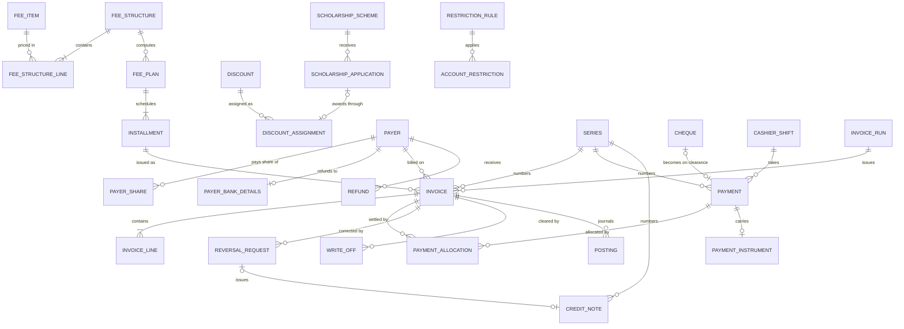
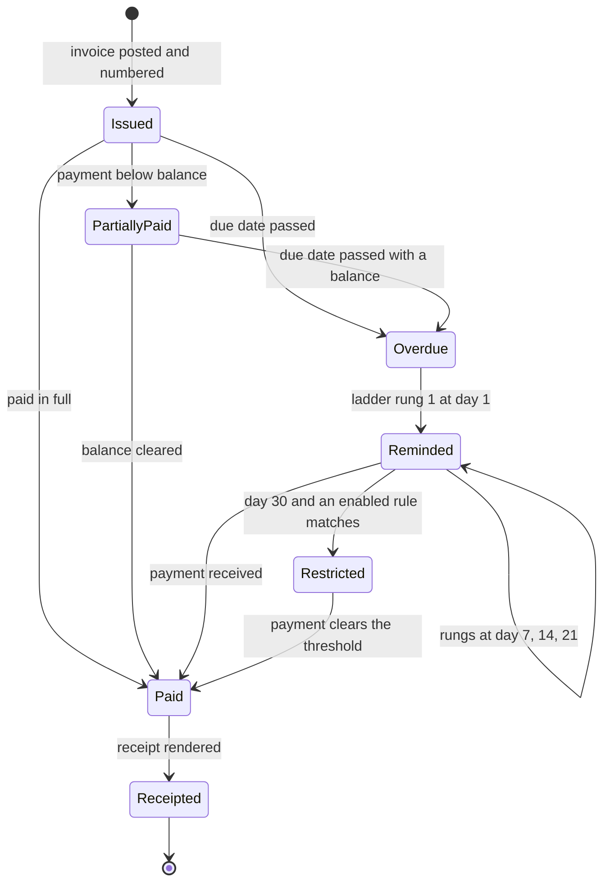

# Finance

> Service sheet, plan document 06, Group C. Names from Appendix L; events from Appendix E; permissions from Appendix B; error codes from Appendix K; settings categories from Appendix G. This sheet adds detail to reference architecture section 8.11 and never contradicts its table 8.0.

Finance is the school's fee ledger: what each student is charged, who pays it, what has been paid, and every correction, all as immutable posted documents in gapless numbered series. It turns fee structures into per-student plans and installments, runs bulk invoice runs, takes payments by every instrument including cheques and an online gateway it never exposes card data to, allocates them by rule, drives the reminder ladder and the audited service restrictions, closes the cashier day to 0.00, and exports the month to accounting and e-invoicing. It holds more business rules than any other service (twenty of the ninety-five in `31-business-rules-and-workflows.md`) and six workflows, so the sheet specifies each money path to the column and the transaction.

| Fact | Value (quoted from `05-service-catalog.md` and Appendix L) |
|---|---|
| Canonical name, long name | Finance, Finance |
| Tier | 1 |
| AREA code | `FIN` |
| Database | `nibras_finance`, schema `finance`, application role `svc_finance`, migration role `mig_finance` |
| Exchange | `nibras.finance` |
| Images | `nibras/finance-api`, `nibras/finance-worker` |
| Worker | `Finance.Worker`: invoice runs, reminder ladder, statements (`05-service-catalog.md` section 2); bulk lane, KEDA on queue depth, 1 to 6 replicas (`11-messaging-architecture.md` section 7) |
| gRPC package | `nibras.finance.v1` in `Nibras.Contracts.Finance/Grpc/finance.proto` (section 6) |
| Build phase (master brief Section 28) | 3 |
| Service level class (master brief Section 31) | Write-heavy |
| Sensitivity (Appendix J) | confidential; payment references are sensitive |
| Synchronous dependency | School (student directory), at most one hop |
| Why the boundary exists | Security level: immutable posted documents, gapless series and payment references need their own database role and audit posture |

---

## 1. Responsibilities

| Owns | Detail |
|---|---|
| Fee catalog | Fee items (tuition, registration, books, uniform, transport, activities, after-school, other) with tax rate and the inclusive or exclusive flag per item; fee structures per academic year, grade level, student category and campus (REQ-FIN-001) |
| Fee plans and installments | One active plan per student and academic year, its installment schedule and due dates (BR-FIN-001), pro-rata for late joiners and leavers by day or month (BR-FIN-002, BR-FIN-003), mid-year change regenerating unissued installments only (REQ-FIN-011) |
| Discounts and scholarships | Discount definitions and assignments with the stacking order (BR-FIN-004), sibling eligibility (BR-FIN-005), scholarship schemes with a budget cap (BR-FIN-006) and the award workflow WF-FIN-04 |
| Payers | Guardians, split payers by percentage (BR-FIN-019), companies and sponsors with their own statements; the payer change workflow WF-FIN-05 |
| Numbering series | The gapless counter per tenant, campus and series for invoices, receipts, credit notes, refunds and write-offs (BR-FIN-013), and the number on every posted document |
| Invoices | Draft, post and number invoices; ad-hoc charges and credits (REQ-FIN-007); request fees, Operations charges, late fees and bounce fees as invoices with a named source |
| Invoice runs | The bulk run with preview, approval and posting, orchestrated as Saga 8 in `Finance.Worker` (WF-FIN-01, `13-workflows-and-sagas.md`) |
| Payments | Cash, card terminal, bank transfer, cheque and the online gateway adapter; partial payments; allocation by the configured order (BR-FIN-008); overpayment only as credit (BR-FIN-009); idempotent callbacks (REQ-FIN-038); the daily gateway settlement reconciliation (REQ-FIN-039) |
| Cheques | Receipt, hold to due date, deposit, clearance, bounce with debt restored and bank charge (WF-FIN-03, BR-FIN-015) |
| Corrections | Reversal requests, credit notes, refunds to the original instrument, write-offs, chargebacks; never an edit of a posted document (WF-FIN-02, BR-FIN-010, BR-FIN-014, REQ-FIN-040) |
| Postings and balances | The append-only posting journal written in every posting transaction, the per-student balance row and the per-payer credit on account; statements of account and payment links per payer (REQ-FIN-025) |
| Collection and escalation | The overdue transition, the reminder ladder at day 1, 7, 14 and 21, late fee accrual with a cap (BR-FIN-007), and restrictions applied only by an explicit audited rule (BR-FIN-016) |
| Cashier | Shifts with a float, counts per instrument, discrepancy escalation, deposit slips and the signed day close (WF-FIN-06, REQ-FIN-028 to REQ-FIN-030) |
| Finance clearance | The finance item of the withdrawal clearance (Saga 5 step 1) |
| Reports and exports | Collections, aging, outstanding by grade, discounts granted, revenue forecast, cash flow, tax, defaulters (REQ-FIN-031); the accounting export and the e-invoicing plug-in interface (REQ-FIN-032) |
| Active-student count | The monthly count defined by BR-FIN-017, published to Platform as `finance.usage.recorded.v1` |
| Rule classes | The twenty rule classes of `31-business-rules-and-workflows.md` section 2 owned by Finance, including BR-L10N-004 (amounts in words) |

## 2. Not responsible for

| Does not own | Owner | Why the line sits there |
|---|---|---|
| The student record, enrolment status, grade level and section | School | Finance keeps a slim reference copy (section 9) and never decides a status |
| Guardian identity, contact details and the custody rights on the link | School; the verified guardian-to-child link is Identity's | Contact details are fetched live over `GuardianDirectory.GetGuardianContact` for a receipt and never copied (`10-data-architecture.md` section 6) |
| Card numbers, card security codes, the payment page | The payment provider, reached through hosted fields or a redirect | Master brief Section 36: card data never touches Nibras |
| Payment provider credentials and the tenant's choice of provider | Platform (Integrations capability, Appendix G *Integrations → payment*) as settings; the secrets live in OpenBao | Finance owns only the adapter behind `IPaymentGateway` |
| Tenant settings: tax, numbering formats, late fee rules, allocation order, restriction rules, currency and decimals | Platform (ADR-0009) | Finance reads them from its settings copy kept by `platform.settings.changed.v1` |
| PDF rendering of invoices, receipts, statements, credit notes, refund advice, award and undertaking letters | Documents | Finance sends `GenerateDocument` and stores the returned `documentId` |
| Sending any message to a payer or staff member | Notification | Finance publishes the Appendix C trigger events and, for workflow messages without a catalogued event, the `RequestNotification` command |
| The approval chain of a parent's installment plan, discount, refund or payer change request | Requests | Requests runs the chain and the Saga 6 effect command; Finance applies the effect and decides nothing about routing |
| Holding a report card, blocking re-enrolment or an activity place | Assessment, Admissions, Operations | Finance publishes `finance.account.restricted.v1` and `finance.account.cleared.v1`; the restricted service consumes them (BR-FIN-016 edge case) |
| Transport routes, library loans, activity places and the amount they charge | Operations | Operations decides the charge; Finance posts it from the event and never recomputes it |
| Payroll, salaries and payslips | Hr | Finance registers the payroll period for the accounting export pack; no amount crosses (Appendix J) |
| The platform's own invoices to a school, subscriptions and plan limits | Platform (`TenantInvoice`, `Subscription`) | Finance supplies the active-student count only; BR-FIN-018 ownership is open point 3 |
| A general ledger, chart of accounts screens, expenses and budgets | Optional Ledger service (Tier 3, Appendix L.5); expenses and budgets are Tier 2 | REQ-FIN-034: served by the accounting export; budgets are open point 5 |
| Read models, dashboards and the aging projection used by Student 360 | Reporting | Reporting projects `finance_balance_facts` from Finance's events (balance figures only, Appendix J.3) |
| The audit store | Audit | Finance emits `finance.audit.recorded.v1` through the outbox for every transition and every sensitive read |

---

## 3. Requirements covered

| Range or identifier | What it binds here |
|---|---|
| REQ-FIN-001 to REQ-FIN-043 | Every row of the FIN area in `03-requirements-catalog.md`; REQ-FIN-033 (Tier 2 budgets) and REQ-FIN-034 (Tier 3 ledger) are bounded by open point 5 and section 2 |
| REQ-PLT-009, REQ-PLT-010 | Platform rows whose rules BR-FIN-017 and BR-FIN-018 are assigned to Finance by document 31 (open point 3) |
| REQ-RQS-014 | The request fee posted by `PostRequestFee` (Saga 6 step 1) |
| REQ-SEC-010 | `svc_finance` with no `BYPASSRLS`, its own RabbitMQ and Redis ACL users |
| REQ-PRV-007 | Financial documents retained 10 years, then archived read-only (`FinanceArchiveJob`) |
| REQ-PERF-018, REQ-PERF-023, REQ-PERF-027, REQ-PERF-028 | `xmin` on every aggregate; balances read from the database with at most 5 s of L1 and payment data never cached; the Finance Redis ACL user; the gapless number never relies on a Redis lock |
| REQ-L10N-012 | Several currencies with per-currency decimals, tax per fee item, amounts in words in both languages |
| REQ-API-005, REQ-API-016 | Money as a decimal string plus ISO 4217 code; `Idempotency-Key` for 24 hours, 7 days for payment callbacks |
| REQ-MOB-008 | Payments never available offline |
| REQ-INT-019 | Graceful degradation when the payment provider is down |
| REQ-DATA-009, REQ-DATA-020, REQ-DATA-028 | Cross-service references as plain `uuid`; invariants enforced in the domain; per-tenant job concurrency |
| REQ-MSG-011, REQ-MSG-017 | Tenant fairness on invoice runs; heavy work in `Finance.Worker` |
| REQ-TST-004, REQ-TST-008 | Money rule tests under `ar-SA`, `en-US`, `de-DE`; Stryker.NET on every Finance rule class |

---

## 4. Aggregates and entities

**Common columns.** Every table below carries these; the row `(common)` in each table stands for them.

| Field | Type | Null | Notes |
|---|---|---|---|
| `tenant_id` | uuid | no | First column of the primary key and of every index; row-level security policy `tenant_isolation` with `WITH CHECK` (`10-data-architecture.md` section 2.4) |
| `id` | uuid | no | UUID v7 from `IIdGenerator` |
| `created_at`, `created_by` | timestamptz, uuid | no, yes | Audit interceptor; `created_by` null when a consumer or job wrote the row |
| `updated_at`, `updated_by` | timestamptz, uuid | no, yes | Audit interceptor |
| `deleted_at`, `deleted_by` | timestamptz, uuid | yes | Soft delete behind the named `SoftDelete` filter. On every posted-document table a check constraint `ck_<table>_posted_not_deleted` allows `deleted_at` only while `status = 'draft'` (BR-FIN-014) |
| `xmin` | xid (system column) | no | Optimistic concurrency token on every aggregate root (REQ-PERF-018) |
| classification | attribute, not a column | | `[DataClass]` per column group from Appendix J; the migration lint refuses an unclassified column |

**Money.** `Money` is a value object of `decimal Amount` and `Currency Code`, stored as `numeric(18,4)` plus `char(3)` (`10-data-architecture.md` section 4). `Currency` carries its minor-unit scale from configuration: **SAR 2, AED 2, JOD 3** (BR-FIN-011). A stored amount always sits at its currency's scale; rounding is half away from zero and happens once, when a computed amount becomes a document line, never before (BR-FIN-011). Two amounts of different currencies cannot be added: the operator throws, and the API maps the attempt to `FINANCE_CURRENCY_MISMATCH`. On the wire money is `{ "amount": "333.334", "currency": "JOD" }` (REQ-API-005); in gRPC it is `nibras.shared.Money`. A database check `amount = round(amount, 3)` is the floor under the domain rule; the per-currency scale is proved by `CurrencyRoundingRulesTests`. Bilingual text is the `LocalizedText` value object from `Nibras.BuildingBlocks.Localization`, stored as `<name>_en` and `<name>_ar`.

### 4.1 `FeeItem`

| Field | Type | Null | Notes |
|---|---|---|---|
| (common) | | | |
| `code` | text | no | Unique per tenant among live rows (`ux_fee_items_code_live`) |
| `name_en`, `name_ar` | text | no | `LocalizedText` |
| `category` | text enum | no | `tuition`, `registration`, `books`, `uniform`, `transport`, `activities`, `after-school`, `other` (Appendix A15) |
| `default_price` | numeric(18,4) + `currency` char(3) | no | `Money` |
| `tax_rate` | numeric(6,5) | no | 0 to 1; `0.15000` for 15 percent |
| `tax_inclusive` | boolean | no | BR-FIN-012 |
| `tax_exempt` | boolean | no | Exempt implies `tax_rate = 0` |
| `account_code` | text | yes | Mapping for the accounting export (REQ-FIN-032) |
| `active` | boolean | no | An inactive item cannot enter a new structure |

Invariants: `code` unique among live items; `tax_exempt ⇒ tax_rate = 0`; `0 ≤ tax_rate ≤ 1`; an item referenced by a posted invoice line cannot be deleted, only deactivated, because the line copies its flag and rate at posting (BR-FIN-012 edge case) and the item row is still the source of `account_code`.

### 4.2 `FeeStructure` with `FeeStructureLine`

| Field | Type | Null | Notes |
|---|---|---|---|
| (common) | | | |
| `academic_year_id`, `grade_level_id`, `campus_id` | uuid | no, no, yes | School identifiers, no foreign key (REQ-DATA-009); null campus means every campus |
| `student_category` | text | no | Tenant code list (for example `standard`, `staff-child`, `national`) |
| `currency` | char(3) | no | Every line carries it |
| `version` | int | no | Starts at 1; a published structure is changed only by publishing version n+1 |
| `status` | text enum | no | `draft`, `published`, `archived` |
| `schedules` | child rows `fee_structure_schedules` (`code`, `installment_count`, `due_dates date[]`, `weights numeric[]`) | | Installment schedules offered with this structure (BR-FIN-001) |
| lines: `fee_item_id`, `amount`, `mandatory`, `line_no` | uuid, numeric(18,4), boolean, smallint | no | `fee_structure_lines` |

Invariants: at most one published version per `(academic_year_id, grade_level_id, student_category, campus_id)`; every line's currency equals the structure's; a published version is immutable; a schedule's weights sum to exactly 1 and its due dates ascend.

### 4.3 `FeePlan` with `Installment`

| Field | Type | Null | Notes |
|---|---|---|---|
| (common) | | | |
| `student_id`, `academic_year_id` | uuid | no | Unique among live plans with `status = 'active'` (`ux_fee_plans_student_year_active`): the idempotency key of Saga 3 step 3 |
| `fee_structure_id`, `structure_version` | uuid, int | no | The version the plan was computed from, so a closed year is reproducible (document 21 section 11, historical reproducibility) |
| `plan_code`, `schedule_code` | text | no | `plan_code` is what Admissions copies as the fee plan name |
| `currency` | char(3) | no | |
| `total` | numeric(18,4) | no | Sum of installments after discounts |
| `status` | text enum | no | `active`, `voided`, `superseded` |
| `source` | text enum | no | `enrolment-saga`, `rollover-saga`, `request-effect`, `manual`, `import` |
| `source_reference` | text | yes | `applicationId`, `rolloverId`, `requestId` or `importId` |
| `pro_rata_mode` | text enum | no | `by-day` or `by-month`, copied from *Finance → pro-rata mode* at assignment (default by day) |
| installments: `seq_no`, `period_start`, `period_end`, `due_date`, `gross`, `discount_total`, `net`, `status`, `invoice_id` | smallint, date, date, date, numeric, numeric, numeric, `FeePlanToCollectionAndEscalationStatus`, uuid | no except `invoice_id` | `installments`; the state enum of WF-FIN-01 starts here at `PlanAssigned` |

Invariants: exactly one active plan per student and year; installments sum to `total` exactly, the last installment taking the rounding remainder (BR-FIN-001); an installment with an `invoice_id` is never regenerated, re-priced or deleted (REQ-FIN-011); a plan change regenerates only installments in `PlanAssigned`; pro-rata applies only to the installments whose period contains the join or leave date (BR-FIN-002, BR-FIN-003).

### 4.4 `Discount` and `DiscountAssignment`

| Field | Type | Null | Notes |
|---|---|---|---|
| (common) | | | |
| `code`, `name_en`, `name_ar` | text | no | |
| `kind` | text enum | no | `sibling`, `staff-child`, `early-payment`, `scholarship`, `ad-hoc` |
| `method` | text enum | no | `percent` or `fixed` |
| `value` | numeric(18,4) | no | Percent as 0 to 1, or an amount with `currency` |
| `stacking_order` | smallint | no | Order of application under BR-FIN-004 |
| `approval_limit` | numeric(18,4) | yes | Above it, `finance.discounts.approve-above-limit` is required |
| assignment: `student_id`, `discount_id`, `valid_from`, `valid_to`, `status`, `approved_by`, `request_id` | uuid, uuid, date, date, text enum (`pending-approval`, `active`, `ended`), uuid, uuid | `valid_to`, `approved_by`, `request_id` nullable | `discount_assignments`; `request_id` set when Saga 6 attached it |

Invariants: discounts apply in ascending `stacking_order`, each on the net left by the previous (BR-FIN-004: 10 percent then 5 percent on 10,000.00 SAR is 8,550.00); sibling eligibility is decided by BR-FIN-005 from the guardian links in the reference copy; an assignment whose computed value exceeds `approval_limit` stays `pending-approval` and changes no installment; an assignment changes only installments in `PlanAssigned` (REQ-FIN-005).

### 4.5 `ScholarshipScheme` and `ScholarshipApplication`

| Field | Type | Null | Notes |
|---|---|---|---|
| (common) | | | |
| scheme: `code`, `name_en`, `name_ar`, `budget`, `committee_quorum`, `criteria_en`, `criteria_ar`, `requires_evidence`, `academic_year_id` | text, text, text, Money, smallint, text, text, boolean, uuid | no | `scholarship_schemes` |
| application: `scheme_id`, `student_id`, `origin`, `status`, `masked_reference` | uuid, uuid, text enum (`application`, `nomination`, `request-effect`), `ScholarshipAwardStatus`, text | no | `masked_reference` is what the committee sees (TC-FIN-032) |
| `evidence_file_ids` | uuid[] | yes | Documents file references; scan status must be clean before `UnderReview` |
| `requested_amount`, `awarded_amount` | numeric(18,4) | yes | |
| `award_from`, `award_to` | date | yes | Award period |
| `conditions` | child rows `scholarship_conditions` (`kind` attendance or conduct, `threshold`) | | Breach ends the award (TC-FIN-035) |
| `discount_assignment_id` | uuid | yes | The discount that carries the award into the plan |
| `due_at` | timestamptz | yes | Timer of the current state: evidence 21 days, committee 30 days, review 60 days before `award_to` |
| `request_id` | uuid | yes | Set when entered from Saga 6 at `Awarded` |

Invariants: the sum of `awarded_amount` over live awards of a scheme never exceeds its budget (BR-FIN-006); `Awarded` requires the scheme's quorum of committee decisions; an award recalculates only future unissued installments and never a posted invoice (REQ-FIN-005); the committee packet contains `masked_reference` and never the student's name or number.

### 4.6 `Payer`, `PayerShare`, `PayerBankDetails`, `PayerChange`

| Field | Type | Null | Notes |
|---|---|---|---|
| (common) | | | |
| payer: `kind`, `guardian_id`, `display_name_en`, `display_name_ar`, `tax_number`, `preferred_language`, `statement_contact_ref` | text enum (`guardian`, `company`, `sponsor`), uuid, text, text, text, text, text | `guardian_id`, `tax_number`, `statement_contact_ref` nullable | `payers`; a guardian payer holds no contact detail, a company or sponsor holds a contact reference only |
| share: `student_id`, `payer_id`, `percentage`, `payer_order`, `effective_from`, `effective_to` | uuid, uuid, numeric(5,2), smallint, date, date | `effective_to` nullable | `payer_shares`; BR-FIN-019 |
| bank details: `payer_id`, `iban_ciphertext`, `iban_hash`, `bank_name`, `key_id` | uuid, bytea, bytea, text, text | no | `payer_bank_details`, Sensitive side table, column-encrypted with the service key (per deployment, `10-data-architecture.md` section 1); every read writes an access-log audit entry in the same transaction (Appendix J rule 8) |
| payer change: `student_id`, `sponsor_payer_id`, `coverage_percent`, `effective_from`, `effective_to`, `undertaking_file_id`, `status`, `due_at`, `request_id` | uuid, uuid, numeric(5,2), date, date, uuid, `PayerChangeToSponsorStatus`, timestamptz, uuid | `effective_to`, `undertaking_file_id`, `due_at`, `request_id` nullable | `payer_changes`, WF-FIN-05 |

Invariants: for every student and every date, live shares total exactly 100.00 (BR-FIN-019; 60 plus 45 is refused); a guardian payer exists only while the guardian link carries the `pays` right in the reference copy; each payer receives their own invoice and statement, and a payment by one payer never settles another payer's invoice; a sponsor becomes payer only after `Confirmed` with a clean-scanned undertaking and only for unissued invoices (TC-FIN-044).

### 4.7 `Series`

| Field | Type | Null | Notes |
|---|---|---|---|
| (common) | | | |
| `campus_id` | uuid | no | BR-FIN-013: the counter is per tenant, per campus and per series |
| `document_kind` | text enum | no | `invoice`, `receipt`, `credit-note`, `refund`, `write-off` |
| `code` | text | no | For example `INV-2026`, `RCT-2027`, `CRN-2026`; unique per `(tenant_id, campus_id, code)` (`ux_series_campus_code`) |
| `series_year` | smallint | no | The year in the code; the year boundary follows the tenant time zone |
| `format` | text | no | Display template from *Finance → numbering series*, for example `{code}-{n:0000}` or, with several campuses, `{code}-{campus}-{n:0000}` |
| `currency` | char(3) | no | Every document in the series carries it; a payment in another currency is `FINANCE_CURRENCY_MISMATCH` (BR-FIN-011) |
| `next_number` | bigint | no | The next number to issue; starts at 1 |
| `status` | text enum | no | `open` or `closed`; a closed series refuses every post and keeps its last issued number for ever |

Invariants: `next_number` changes only inside a posting transaction that holds the series row lock (section 4.19); the issued numbers of a series are exactly `1 .. next_number - 1` with no gap and no duplicate; a draft never shows a number; a series is never deleted or renumbered (runbook `invoice-series-anomaly.md` in document 15: freeze, never renumber).

### 4.8 `Invoice` with `InvoiceLine`

| Field | Type | Null | Notes |
|---|---|---|---|
| (common) | | | |
| `academic_year_id` | uuid | no | List-partition key of `invoices` (`10-data-architecture.md` section 5) |
| `campus_id`, `series_id` | uuid | no | |
| `number` | bigint | yes | Null while `draft`; assigned in the posting transaction |
| `display_number` | text | yes | `format` applied to `number`, for example `INV-2026-0418` |
| `student_id`, `payer_id` | uuid | no | One invoice per payer when shares split a charge (BR-FIN-019) |
| `fee_plan_id`, `installment_id`, `invoice_run_id` | uuid | yes | Set for run-generated invoices; `ux_invoices_installment_payer` on `(tenant_id, academic_year_id, installment_id, payer_id)` makes a repeated run a no-op (TC-FIN-002) |
| `source` | text enum | no | `invoice-run`, `ad-hoc`, `request-fee`, `offer-deposit`, `operations-charge`, `late-fee`, `bounce-fee`, `opening-balance` |
| `source_reference` | text | yes | `requestId`, `applicationId`, `loanId:daysOverdue`, `activityId`, `chequeId`, `importId`; `ux_invoices_source_reference` on `(tenant_id, academic_year_id, source, source_reference, payer_id)` makes every event- and command-created invoice idempotent |
| `issued_at`, `due_date` | timestamptz, date | yes, no | `issued_at` set at posting |
| `currency`, `subtotal`, `discount_total`, `tax_total`, `total` | char(3), numeric(18,4) | no | `total` is the sum of the stored lines (BR-FIN-011 edge case) |
| `balance` | numeric(18,4) | no | Derived: total minus allocations, applied credit notes and write-offs; updated in the same transaction as each of them |
| `status` | text enum | no | `draft`, `posted`, `cancelled-draft`; posting is one-way |
| `collection_status` | `FeePlanToCollectionAndEscalationStatus` | yes | `Issued`, `PartiallyPaid`, `Paid`, `Overdue`, `Reminded`, `Restricted`, `Receipted` (WF-FIN-01) |
| `reminder_step` | smallint | no | 0 to 4, the last ladder rung sent |
| `late_fee_accrued` | numeric(18,4) | no | Running total against the BR-FIN-007 cap |
| `document_id` | uuid | yes | The rendered PDF from Documents |
| `posted_at`, `posted_by` | timestamptz, uuid | yes | |
| lines: `line_no`, `fee_item_id`, `description_en`, `description_ar`, `quantity`, `unit_price`, `discount_amount`, `net`, `tax_rate`, `tax_inclusive`, `tax_amount`, `gross`, `account_code` | smallint, uuid, text, text, numeric(9,3), numeric(18,4), numeric(18,4), numeric(18,4), numeric(6,5), boolean, numeric(18,4), numeric(18,4), text | `fee_item_id`, `account_code` nullable | `invoice_lines`; the rate and flag are values copied at posting, never references (BR-FIN-012) |

Invariants: a posted invoice's lines, payer, student, currency, number and totals never change (BR-FIN-014, `FINANCE_INVOICE_ALREADY_POSTED`); `total = Σ line.gross`; discounts precede tax on each line (BR-FIN-012 edge case); `0 ≤ balance ≤ total`; a number is assigned exactly once, at posting, from the invoice's series; `collection_status` moves only along the transitions of WF-FIN-01; an attendance, safeguarding, emergency-contact or presence service is never a restriction target (BR-FIN-016).

### 4.9 `InvoiceRun` (Saga 8 state)

| Field | Type | Null | Notes |
|---|---|---|---|
| (common) | | | |
| `period_id`, `academic_year_id` | uuid | no | The installment period the run issues |
| `scope` | jsonb in the side table `invoice_run_scopes` | no | Grade levels, sections, campuses or student list |
| `state` | `InvoiceRunState` | no | Enum named by document 13: `Queued`, `Issuing`, `Stalled`, `Issued`, `Rendering`, `RenderFailed`, `Rendered`, `Notifying`, `Closed`, `Cancelling`, `Reversed`; plus `Preview` before the post is approved |
| `preview_summary` | child rows `invoice_run_preview_lines` (grade level, count, total) | | The approval screen of Appendix A15 |
| `expected_count`, `issued_count`, `rendered_count`, `notified_count` | int | no | Progress |
| `checkpoint_student_number` | text | yes | Last student posted, ordered by student number |
| `total_amount`, `currency` | numeric(18,4), char(3) | no | Running total |
| `requested_by`, `approved_by` | uuid | no, yes | Preview requester and poster; the poster needs `finance.invoices.post` |
| `job_id` | uuid | no | `Nibras.BuildingBlocks.Jobs` job, progress over the hub |

Invariants: one non-terminal run per `(tenant_id, period_id, scope hash)` (`FINANCE_INVOICE_RUN_IN_PROGRESS`); an issued invoice is never deleted, and cancelling after issue reverses each by credit note; the run is idempotent per student and period (TC-FIN-002).

### 4.10 `Payment` with `PaymentAllocation`, `PaymentInstrument`, `PaymentCallback`, `PaymentAttempt`, `HeldPayment`

| Field | Type | Null | Notes |
|---|---|---|---|
| (common) | | | |
| payment: `received_at` | timestamptz | no | Range-partition key of `payments` by month |
| `campus_id`, `series_id`, `number`, `display_number` | uuid, uuid, bigint, text | no | Receipt series; numbered in the posting transaction |
| `payer_id` | uuid | no | |
| `method` | text enum | no | `cash`, `card-terminal`, `bank-transfer`, `cheque`, `online` |
| `amount`, `currency` | numeric(18,4), char(3) | no | |
| `status` | text enum | no | `posted`, `reversed`; a reversal is a separate negative receipt linked by `reverses_payment_id` |
| `reverses_payment_id` | uuid | yes | Set on a reversal receipt (cheque bounced after clearance, chargeback settlement) |
| `cashier_shift_id` | uuid | yes | Null for online payments |
| `cheque_id`, `attempt_id` | uuid | yes | |
| `idempotency_key` | text | no | Client key, or the provider's event id for callbacks |
| `business_date` | date | no | Campus-local date the payment counts for; must be an open day (`FINANCE_DAY_ALREADY_CLOSED`) |
| `document_id` | uuid | yes | Receipt PDF with QR and amount in words (REQ-FIN-024, BR-L10N-004) |
| allocation: `payment_id`, `invoice_id`, `amount`, `allocated_at`, `rule` | uuid, uuid, numeric(18,4), timestamptz, text enum (`auto-oldest-due`, `auto-configured`, `manual`) | no | `payment_allocations` |
| instrument: `payment_id`, `gateway_reference_ciphertext`, `gateway_reference_hash`, `card_brand`, `last_four`, `iban_ciphertext`, `key_id` | uuid, bytea, bytea, text, char(4), bytea, text | brand, last four, IBAN nullable | `payment_instruments`, Sensitive side table, column-encrypted, every read logged; the full card number, expiry and security code have no column anywhere (REQ-FIN-037) |
| callback: `provider`, `provider_event_id`, `gateway_reference_hash`, `payload_sha256`, `signature_valid`, `status`, `payment_id`, `received_at` | text, text, bytea, bytea, boolean, text enum (`accepted`, `duplicate`, `rejected`), uuid, timestamptz | `payment_id` nullable | `payment_callbacks`; `ux_payment_callbacks_reference (tenant_id, provider, gateway_reference_hash)`; the raw body is never stored, only its hash |
| attempt: `payer_id`, `invoice_ids`, `amount`, `provider`, `provider_session_ref_hash`, `status`, `reason_code` | uuid, uuid[], Money, text, bytea, text enum (`started`, `succeeded`, `failed`, `expired`), text | `reason_code` nullable | `payment_attempts`; `attemptId` of `finance.payment.failed.v1` |
| held: `student_id`, `payment_id`, `reason`, `released_at` | uuid, uuid, text enum (`student-unknown`), timestamptz | `released_at` nullable | `held_payments`, REQ-FIN-043 |

Invariants: `Σ allocations ≤ amount`, and the remainder exists only as a `payer_credits` row that the payer asked for (BR-FIN-009, `FINANCE_PAYMENT_EXCEEDS_BALANCE` otherwise); an allocation never crosses currency or payer; allocation follows *Finance → allocation order* (BR-FIN-008, default oldest due first); a callback with a known `gateway_reference_hash` returns the first result and creates nothing (REQ-FIN-038); a posted payment is never edited, only reversed by a linked negative receipt; a payment for a student absent from the reference copy is held, then allocated once when the copy arrives (REQ-FIN-043).

### 4.11 `Cheque`

| Field | Type | Null | Notes |
|---|---|---|---|
| (common) | | | |
| `payer_id`, `bank_code`, `cheque_number`, `cheque_date`, `amount`, `currency` | uuid, text, text, date, numeric(18,4), char(3) | no | `ux_cheques_bank_number (tenant_id, bank_code, cheque_number)` refuses a duplicate (TC-FIN-026) |
| `status` | `ChequeReceiptAndBounceStatus` | no | WF-FIN-03 |
| `received_in_shift_id` | uuid | no | |
| `intended_invoice_ids` | uuid[] | no | Allocation target on clearance |
| `acknowledgement_document_id` | uuid | yes | Provisional acknowledgement, not a receipt |
| `deposited_at`, `cleared_at`, `bounced_at`, `bank_advice_date` | timestamptz, date | yes | The bounce reversal is dated on `bank_advice_date` (BR-FIN-015) |
| `payment_id` | uuid | yes | Created only on `Cleared` |
| `bounce_fee_invoice_id`, `replacement_payment_id` | uuid | yes | |
| `due_at` | timestamptz | yes | Presentation date, 7 working days no-answer flag, 5 working days replacement deadline |

Invariants: settlement happens only at `Cleared`; a cheque bounces at most once (`FINANCE_CHEQUE_ALREADY_BOUNCED`); a bounce before clearance leaves the invoices open and posts the bounce fee once per payer, not per student; a bounce advised after clearance posts a reversal receipt of the full amount and reopens every settled invoice (BR-FIN-015 first example); a held cheque is presented automatically on its date.

### 4.12 `ReversalRequest`, `CreditNote`, `Refund`, `WriteOff`

| Field | Type | Null | Notes |
|---|---|---|---|
| (common) | | | |
| reversal request: `invoice_id`, `line_nos`, `reason_code`, `reason_text`, `requested_by`, `reviewed_by`, `status`, `credit_note_id`, `due_at` | uuid, smallint[], text, text, uuid, uuid, `InvoiceReversalCreditNoteAndRefundStatus`, uuid, timestamptz | reviewer, credit note, `due_at` nullable | `reversal_requests`, WF-FIN-02 |
| credit note: `series_id`, `number`, `display_number`, `invoice_id`, `payer_id`, `amount`, `currency`, `reason_code`, `origin`, `applied_to_invoice_id`, `document_id` | uuid, bigint, text, uuid, uuid, numeric, char(3), text, text enum (`reversal`, `chargeback`, `run-cancelled`, `request-fee-reversed`, `plan-correction`), uuid, uuid | applied, document nullable | `credit_notes`; own gapless series (TC-FIN-011) |
| refund: `series_id`, `number`, `payer_id`, `source`, `amount`, `currency`, `original_payment_id`, `destination`, `requested_by`, `approved_by`, `status`, `failure_reason`, `provider_reference_hash`, `request_id` | uuid, bigint, uuid, text enum (`credit`, `payment`), numeric, char(3), uuid, text enum (`original-card`, `original-transfer`, `cash`), uuid, uuid, `InvoiceReversalCreditNoteAndRefundStatus`, text, bytea, uuid | number until paid, approver, failure, provider, request nullable | `refunds`; BR-FIN-010 |
| write-off: `series_id`, `number`, `invoice_id`, `amount`, `reason_text`, `requested_by`, `approved_by`, `status` | uuid, bigint, uuid, numeric, text, uuid, uuid, text enum (`pending-approval`, `posted`, `rejected`) | number, approver nullable | `write_offs`, REQ-FIN-019 |

Invariants: a credit note never exceeds the invoice's unreversed amount and references exactly one original (TC-FIN-011); an invoice in an archived year is not reversible there and the correction posts in the current year (TC-FIN-012, `FINANCE_VALIDATION_FAILED` with field `academicYearId`); a refund's approver differs from its requester and the amount is within the approver's limit (TC-FIN-014, `FINANCE_REFUND_APPROVAL_REQUIRED`); a refund draws only on an existing credit balance or an identified payment (BR-FIN-010) and pays only to the original instrument (TC-FIN-015); a failed outbound refund restores the credit balance and returns to `RefundApproved` (TC-FIN-016); a write-off's approver differs from its requester and it never exceeds the balance (`FINANCE_WRITE_OFF_APPROVAL_REQUIRED`).

### 4.13 `Posting`, `AccountBalance`, `PayerCredit`

| Field | Type | Null | Notes |
|---|---|---|---|
| posting: `document_kind`, `document_id`, `series_id`, `campus_id`, `posted_on`, `amount`, `currency`, `student_id`, `payer_id`, `account_code` | text enum, uuid, uuid, uuid, date, numeric (signed), char(3), uuid, uuid, text | `student_id`, `account_code` nullable | `postings`, append-only journal; `svc_finance` holds `INSERT, SELECT` only on it, so an update or delete fails at the database; carries `tenant_id`, `id`, `created_at`, `created_by` and no update or soft-delete columns |
| balance: `student_id`, `payer_id`, `balance`, `currency`, `updated_at` | uuid, uuid, numeric, char(3), timestamptz | no | `account_balances`, one row per student and payer, maintained in every posting transaction by `ExecuteUpdateAsync` (document 21 section 3.9 query 3) |
| credit: `payer_id`, `amount`, `currency`, `source_document_id` | uuid, numeric, char(3), uuid | no | `payer_credits`, credit on account |

Invariants: every posted document writes exactly its postings in the same transaction; per tenant, series and day, `Σ postings = invoices − payments − credit notes − write-offs` (REQ-FIN-030, the daily balance of master brief Section 19); `account_balances` equals the sum of its postings, recomputed nightly by `InvariantAuditJob` (document 21 section 11).

### 4.14 `CashierShift` with `ShiftCount`, and `DayClose`

| Field | Type | Null | Notes |
|---|---|---|---|
| (common) | | | |
| shift: `campus_id`, `cashier_user_id`, `business_date`, `opened_at`, `float_amount`, `currency`, `status`, `recount_count`, `accepted_reason`, `accepted_by`, `deposit_slip_reference`, `closed_at`, `signed_by`, `report_document_id` | uuid, uuid, date, timestamptz, numeric, char(3), `CashierDayCloseStatus`, smallint, text, uuid, text, timestamptz, uuid, uuid | reason, accepter, slip, close fields nullable | `cashier_shifts`, WF-FIN-06 |
| count: `shift_id`, `instrument`, `expected`, `counted`, `difference` | uuid, text enum (`cash`, `card-terminal`, `bank-transfer`, `cheque`), numeric, numeric, numeric | no | `shift_counts`, one row per instrument (TC-FIN-051) |
| day close: `campus_id`, `business_date`, `status`, `balance_difference`, `closed_by`, `closed_at`, `report_document_id` | uuid, date, text enum (`open`, `closed`), numeric, uuid, timestamptz, uuid | close fields nullable | `day_closes`, unique per campus and date |

Invariants: one open shift per cashier and campus; a count is entered per instrument, never as one total; the close is blocked while any difference exceeds the tolerance and has not been accepted with a reason (`FINANCE_DAY_CLOSE_OUT_OF_BALANCE`); a closed shift and a closed day are immutable, and a correction is an adjusting entry in the next session referencing the closed one (TC-FIN-056); no posting may carry a `business_date` of a closed day (`FINANCE_DAY_ALREADY_CLOSED`).

### 4.15 `RestrictionRule`, `AccountRestriction`, `RestrictionExemption`

| Field | Type | Null | Notes |
|---|---|---|---|
| (common) | | | |
| rule: `name_en`, `name_ar`, `restricted_services`, `overdue_threshold`, `currency`, `overdue_days`, `enabled`, `enabled_by` | text, text, text[] from the closed list `report-card`, `transcript`, `re-enrollment`, `activity-enrollment`, `document-issue`, numeric, char(3), int, boolean, uuid | `enabled_by` nullable | `restriction_rules`; mirrors *Finance → restriction rules*; enabling needs the principal (Appendix R WF-FIN-01) |
| restriction: `student_id`, `rule_id`, `restrictions`, `applied_at`, `applied_by`, `lifted_at`, `lifted_by`, `lift_reason` | uuid, uuid, text[], timestamptz, uuid, timestamptz, uuid, text | lift fields nullable | `account_restrictions`; `appliedBy` null when the job applied it |
| exemption: `student_id`, `kind`, `recorded_by`, `valid_to` | uuid, text enum (`hardship`, `sponsor-pending`, `principal-override`), uuid, date | `valid_to` nullable | `restriction_exemptions` |

Invariants: a restriction applies only when every condition of one named rule matches in full and no exemption exists (BR-FIN-016); the closed service list has no entry for attendance, safeguarding, emergency contacts or presence at school, so those can never be restricted (TC-FIN-006); a payment that clears the threshold lifts the restriction in the same transaction as the payment and publishes `finance.account.cleared.v1`, never by a nightly job.

### 4.16 `ClearanceItem`

| Field | Type | Null | Notes |
|---|---|---|---|
| (common) | | | |
| `student_id`, `saga_id`, `status`, `outstanding`, `currency`, `raised_at`, `resolved_at` | uuid, uuid, text enum (`raised`, `blocked`, `cleared`, `cancelled`), numeric, char(3), timestamptz, timestamptz | `resolved_at` nullable | `clearance_items`; Saga 5 step 1, keyed on `(saga_id, step_key)` |

Invariants: `cleared` only when every balance of the student across payers is 0.00; `blocked` replies carry the exact amount.

### 4.17 `ReminderEntry`, `StatementRun`, `AccountingExport`, `EInvoicingSubmission`, `GatewaySettlement`

| Field | Type | Null | Notes |
|---|---|---|---|
| (common) | | | |
| reminder: `invoice_id`, `step`, `sent_at`, `notification_id` | uuid, smallint, timestamptz, uuid | no | `reminder_entries`; unique per invoice and step, so a rerun of the ladder sends nothing twice |
| statement run: `scope`, `period_from`, `period_to`, `job_id`, `document_ids` | jsonb side table, date, date, uuid, uuid[] | no | `statement_runs` |
| accounting export: `period`, `format`, `job_id`, `document_id`, `posting_count` | char(7), text, uuid, uuid, int | `document_id` nullable | `accounting_exports`; every posting of the period appears once |
| e-invoicing submission: `document_kind`, `document_id`, `plugin_code`, `status`, `submitted_at`, `external_reference` | text, uuid, text, text enum (`pending`, `accepted`, `rejected`), timestamptz, text | submission fields nullable | `einvoicing_submissions`; unique per document and plug-in, so the plug-in receives each posted document once (REQ-FIN-032) |
| settlement: `provider`, `settlement_date`, `gateway_reference_hash`, `amount`, `currency`, `matched_payment_id`, `difference_kind` | text, date, bytea, numeric, char(3), uuid, text enum (`matched`, `missing-payment`, `missing-settlement`, `amount-differs`) | `matched_payment_id`, `difference_kind` nullable | `gateway_settlements`, REQ-FIN-039 |

### 4.18 Reference copies (read-only, section 9)

`ref_students` (`student_id`, `student_number`, `name_en`, `name_ar`, `section_id`, `grade_level_id`, `campus_id`, `status`, `fee_plan_code`, `source_version`, `reconciled_at`), `ref_student_status_periods` (`student_id`, `status`, `from_date`, `to_date`) for BR-FIN-017, `ref_guardian_links` (`guardian_id`, `student_ids`, `name_en`, `name_ar`, `preferred_language`, `contact_order`, `pays`), `ref_admitted_applicants` (`application_id`, `student_id`, `guardian_ids`, `academic_year_id`), `ref_tenant_state` and `ref_settings` (the Finance, General, Requests and Integrations categories of Appendix G). Every copy carries `tenant_id`, `source_version` and `reconciled_at` and no Sensitive field.

### 4.19 How a number is allocated

Gapless numbering is the one place where a design choice decides whether a regulator can walk the series (BR-FIN-013). The number is allocated **inside the posting transaction under a row lock on the series row**, at the default `READ COMMITTED` isolation:

```sql
-- One posting transaction; EF Core issues these through ISeriesAllocator in Nibras.Finance.Infrastructure/Persistence/Numbering.
BEGIN;
SELECT set_config('app.tenant_id', @tenant, true);                        -- the tenant barrier of 10-data-architecture.md section 2.4
SET LOCAL lock_timeout = '5s';                                             -- a caller waits at most 5 s behind another poster on the same series
SELECT id, next_number, status, currency
  FROM finance.series
 WHERE tenant_id = @tenant AND campus_id = @campus AND code = @code
   FOR UPDATE;                                                             -- serialises every poster of this one series; other series and campuses are untouched
-- domain rules run; the document takes number = next_number (or next_number .. next_number + n - 1 for an invoice-run chunk of n)
INSERT INTO finance.invoices (...);                                        -- document, lines, postings, balance update, outbox row
UPDATE finance.series SET next_number = next_number + @n
 WHERE tenant_id = @tenant AND id = @seriesId;
COMMIT;                                                                    -- the lock is released; a ROLLBACK anywhere above consumes no number
```

| Question | Answer |
|---|---|
| Why not a PostgreSQL sequence | A sequence is non-transactional: a rolled-back post burns a value and leaves a gap, which BR-FIN-013 forbids |
| Why not a Redis lock | REQ-PERF-028: a Redis lock is never a correctness guarantee; the row lock is |
| Why not `SERIALIZABLE`, as `10-data-architecture.md` section 1 and document 21 section 3.9 query 4 write | The single-row lock already serialises allocators of one series, and it does so without serialization failures to retry. Both documents are aligned to this mechanism (open point 1); the guarantee they state does not change |
| Two series in one transaction | A bounce posts a reversal receipt (`RCT`) and a bounce-fee invoice (`INV`); a transaction that needs two series locks them in ascending `code` order, so two such transactions cannot deadlock |
| Lock wait exceeded | `lock_timeout` raises 55P03; the handler returns `FINANCE_CONCURRENCY_CONFLICT` with `Retry-After: 1` and nothing is written |
| Throughput | An invoice-run chunk of 100 holds the lock for about 40 ms (document 21 section 3.9 query 4), so 5,000 invoices need 50 lock holds and fit N-03's 6 minutes; cashier receipts post into `RCT`, a different row, and never wait behind a run |
| Year boundary | `SeriesYearRolloverJob` creates the next year's rows before 00:00 in the tenant time zone and closes the old ones after; the first receipt of 2027 is `RCT-2027-0001` and `RCT-2026` stays at its last number (BR-FIN-013 third example) |
| Proof | `GaplessNumberingRulesTests` property test over 10,000 randomized concurrent posts; TC-FIN-601 with 50 concurrent receipts; TC-FIN-001 at 5,000 invoices; `KilledBeforeCommit_NoGap` in `InvoiceRunSagaTests` |



---

## 5. REST API

All paths are under `/api/v1/finance/` behind the Gateway. Every endpoint declares its Appendix B permission and data scope; guardians reach invoices, payments and statements through `own-children` scope on the same endpoints. Every endpoint may also return the K.1 cross-cutting codes with the `FINANCE_` prefix (`FINANCE_VALIDATION_FAILED`, `FINANCE_PERMISSION_DENIED`, `FINANCE_TENANT_MISMATCH`, `FINANCE_NOT_FOUND`, `FINANCE_CONCURRENCY_CONFLICT`, `FINANCE_IDEMPOTENCY_REPLAY`, `FINANCE_RATE_LIMITED`, `FINANCE_DEPENDENCY_UNAVAILABLE`); the Errors column names the service codes and the K.1 codes that carry a specific meaning there. Lists use the keyset envelope of document 22 section 2 with a page cap of 100. Every `POST` that creates money is `Idempotency-Key: required` (document 22 section 5); `PATCH` and state-changing item actions take `If-Match`.

### 5.1 Fee items and structures

| Method | Path | Permission | Request | Response | Errors | Idempotent |
|---|---|---|---|---|---|---|
| GET | `/api/v1/finance/fee-items` | `finance.fee-items.view` | filter `category`, `active` | `Page<FeeItemDto>` | none specific | yes |
| POST | `/api/v1/finance/fee-items` | `finance.fee-items.create` | `CreateFeeItemRequest` (code, name `LocalizedText`, category, default price `Money`, tax rate, inclusive, exempt, account code) | 201 `FeeItemDto` | `FINANCE_VALIDATION_FAILED` (duplicate code, exempt with a rate) | by `Idempotency-Key` |
| GET | `/api/v1/finance/fee-items/{id}` | `finance.fee-items.view` | none | `FeeItemDto` | `FINANCE_NOT_FOUND` | yes |
| PATCH | `/api/v1/finance/fee-items/{id}` | `finance.fee-items.edit` | merge patch; price and tax changes apply to future lines only | `FeeItemDto` | `FINANCE_CONCURRENCY_CONFLICT` | with `If-Match` |
| DELETE | `/api/v1/finance/fee-items/{id}` | `finance.fee-items.delete` | none | 204 | `FINANCE_VALIDATION_FAILED` when a posted line references it (deactivate instead) | yes |
| GET | `/api/v1/finance/fee-structures` | `finance.structures.view` | filter `academicYearId`, `gradeLevelId`, `campusId`, `status` | `Page<FeeStructureDto>` | none specific | yes |
| POST | `/api/v1/finance/fee-structures` | `finance.structures.create` | `CreateFeeStructureRequest` (year, grade, category, campus, currency, lines, schedules) | 201 `FeeStructureDto` in `draft` | `FINANCE_VALIDATION_FAILED`, `FINANCE_CURRENCY_MISMATCH` | by `Idempotency-Key` |
| GET | `/api/v1/finance/fee-structures/{id}` | `finance.structures.view` | none | `FeeStructureDto` with lines and schedules | `FINANCE_NOT_FOUND` | yes |
| PATCH | `/api/v1/finance/fee-structures/{id}` | `finance.structures.edit` | draft only | `FeeStructureDto` | `FINANCE_VALIDATION_FAILED` on a published version | with `If-Match` |
| POST | `/api/v1/finance/fee-structures/{id}/publish` | `finance.structures.edit` | `{}` | `FeeStructureDto` version n, previous archived | `FINANCE_VALIDATION_FAILED` (weights not summing to 1) | with `If-Match` |
| POST | `/api/v1/finance/fee-structures/{id}/new-version` | `finance.structures.edit` | `{}` | 201 draft copy as version n+1 | none specific | by `Idempotency-Key` |
| DELETE | `/api/v1/finance/fee-structures/{id}` | `finance.structures.delete` | draft only | 204 | `FINANCE_VALIDATION_FAILED` on a published version | yes |

### 5.2 Fee plans, discounts and scholarships

| Method | Path | Permission | Request | Response | Errors | Idempotent |
|---|---|---|---|---|---|---|
| GET | `/api/v1/finance/fee-plans` | `finance.plans.view` | filter `studentId`, `academicYearId`, `status` | `Page<FeePlanDto>` | none specific | yes |
| GET | `/api/v1/finance/fee-plans/{id}` | `finance.plans.view` | none | `FeePlanDto` with installments and their collection status | `FINANCE_NOT_FOUND` | yes |
| POST | `/api/v1/finance/fee-plans` | `finance.plans.create` | `CreateFeePlanRequest` (student, year, structure, schedule, pro-rata start date) for one student | 201 `FeePlanDto` | `FINANCE_VALIDATION_FAILED` (an active plan exists), `FINANCE_CURRENCY_MISMATCH` | by `Idempotency-Key`; natural key student and year |
| POST | `/api/v1/finance/fee-plans/bulk` | `finance.plans.assign` | bulk envelope of document 22 section 7 (student, structure, schedule), at most 500 | per-item results | per item | by `Idempotency-Key` |
| PATCH | `/api/v1/finance/fee-plans/{id}` | `finance.plans.edit` | schedule of unissued installments | `FeePlanDto` | `FINANCE_INVOICE_ALREADY_POSTED` for an issued installment | with `If-Match` |
| POST | `/api/v1/finance/fee-plans/{id}/change-mid-year` | `finance.plans.change-mid-year` | `ChangePlanRequest` (new structure or schedule, effective date, reason) | `FeePlanDto`; installments in `PlanAssigned` regenerated, issued ones untouched (REQ-FIN-011) | `FINANCE_INVOICE_ALREADY_POSTED` never raised: issued installments are skipped and listed | by `Idempotency-Key` |
| GET | `/api/v1/finance/discounts` | `finance.discounts.view` | filter `kind` | `Page<DiscountDto>` | none specific | yes |
| POST | `/api/v1/finance/discounts` | `finance.discounts.create` | `CreateDiscountRequest` | 201 `DiscountDto` | `FINANCE_VALIDATION_FAILED` | by `Idempotency-Key` |
| PATCH | `/api/v1/finance/discounts/{id}` | `finance.discounts.edit` | merge patch; affects future computations only | `DiscountDto` | `FINANCE_CONCURRENCY_CONFLICT` | with `If-Match` |
| DELETE | `/api/v1/finance/discounts/{id}` | `finance.discounts.delete` | none | 204; active assignments keep their stored values | none specific | yes |
| POST | `/api/v1/finance/discount-assignments` | `finance.discounts.create` | `AssignDiscountRequest` (student, discount, period) | 201 `DiscountAssignmentDto`, `active` or `pending-approval` | `FINANCE_VALIDATION_FAILED` (BR-FIN-005 sibling not eligible) | by `Idempotency-Key` |
| POST | `/api/v1/finance/discount-assignments/{id}/approve` | `finance.discounts.approve-above-limit` | `{ reason }` | `DiscountAssignmentDto` active; future installments recalculated | `FINANCE_PERMISSION_DENIED` when the approver is the requester | with `If-Match` |
| POST | `/api/v1/finance/discount-assignments/{id}/end` | `finance.discounts.edit` | `{ endDate, reason }` | `DiscountAssignmentDto` ended | none specific | with `If-Match` |
| GET | `/api/v1/finance/scholarship-schemes` | `finance.scholarships.view` | none | `Page<ScholarshipSchemeDto>` with budget used | none specific | yes |
| POST | `/api/v1/finance/scholarship-schemes` | `finance.scholarships.create` | `CreateSchemeRequest` | 201 `ScholarshipSchemeDto` | `FINANCE_VALIDATION_FAILED` | by `Idempotency-Key` |
| PATCH | `/api/v1/finance/scholarship-schemes/{id}` | `finance.scholarships.edit` | merge patch; budget cannot drop below awarded | `ScholarshipSchemeDto` | `FINANCE_VALIDATION_FAILED` | with `If-Match` |
| GET | `/api/v1/finance/scholarship-applications` | `finance.scholarships.view` | filter `status`, `schemeId` | `Page<ScholarshipApplicationDto>` | none specific | yes |
| POST | `/api/v1/finance/scholarship-applications` | `finance.scholarships.create` | `CreateApplicationRequest` (scheme, student, origin application or nomination, requested amount) | 201, `Applied` | `FINANCE_VALIDATION_FAILED` | by `Idempotency-Key` |
| POST | `/api/v1/finance/scholarship-applications/{id}/request-evidence` | `finance.scholarships.edit` | `{ checklist }` | `EvidencePending` (TC-FIN-031) | `FINANCE_CONCURRENCY_CONFLICT` | with `If-Match` |
| POST | `/api/v1/finance/scholarship-applications/{id}/verify-evidence` | `finance.scholarships.edit` | `{ fileIds }` | `UnderReview` | `FINANCE_VALIDATION_FAILED` while a file is not scan-clean | with `If-Match` |
| POST | `/api/v1/finance/scholarship-applications/{id}/shortlist` | `finance.scholarships.edit` | `{ committeeDate }` | `CommitteeScheduled`, packet built with masked identifiers (TC-FIN-032) | `FINANCE_VALIDATION_FAILED` (criteria not met) | with `If-Match` |
| GET | `/api/v1/finance/scholarship-applications/{id}/committee-packet` | `finance.scholarships.view` | none | masked packet | `FINANCE_NOT_FOUND` | yes |
| POST | `/api/v1/finance/scholarship-applications/{id}/decline` | `finance.scholarships.edit` | `{ reason }` | `Declined` | none specific | with `If-Match` |
| POST | `/api/v1/finance/scholarship-applications/{id}/award` | `finance.scholarships.award` | `{ amount, from, to, conditions, committeeVotes }` | `Awarded` then `DiscountAttached` then `Active` (TC-FIN-033, TC-FIN-034) | `FINANCE_VALIDATION_FAILED` (quorum, budget cap BR-FIN-006) | with `If-Match` |
| POST | `/api/v1/finance/scholarship-applications/{id}/renew` | `finance.scholarships.award` | `{ to }` | `Renewed` then `Active` (TC-FIN-036) | `FINANCE_VALIDATION_FAILED` | with `If-Match` |
| POST | `/api/v1/finance/scholarship-applications/{id}/end` | `finance.scholarships.edit` | `{ reason, fromInstallment }` | `Ended`; ends from the next installment (TC-FIN-035) | none specific | with `If-Match` |

### 5.3 Payers and payer changes

Appendix B has no `finance.payers` resource; payers are managed under `finance.plans.*` because the payer split is part of a student's plan (open point 2).

| Method | Path | Permission | Request | Response | Errors | Idempotent |
|---|---|---|---|---|---|---|
| GET | `/api/v1/finance/payers` | `finance.plans.view` | filter `kind`, `q` | `Page<PayerDto>` | none specific | yes |
| POST | `/api/v1/finance/payers` | `finance.plans.create` | `CreatePayerRequest` (company or sponsor, names `LocalizedText`, tax number, contact reference) | 201 `PayerDto` | `FINANCE_VALIDATION_FAILED` | by `Idempotency-Key` |
| PATCH | `/api/v1/finance/payers/{id}` | `finance.plans.edit` | merge patch | `PayerDto` | `FINANCE_CONCURRENCY_CONFLICT` | with `If-Match` |
| PUT | `/api/v1/finance/payers/{id}/bank-details` | `finance.plans.edit` | `{ iban, bankName }` | 204; stored encrypted, access-logged | `FINANCE_VALIDATION_FAILED` (IBAN checksum) | yes |
| GET | `/api/v1/finance/payers/{id}/bank-details` | `finance.refunds.approve` | `{ reason }` as query | masked IBAN (last 4) for the refund screen | `FINANCE_PERMISSION_DENIED` | yes; every call audited (T-FIN-05) |
| GET | `/api/v1/finance/students/{studentId}/payer-shares` | `finance.plans.view` | none | `PayerShareDto[]` | `FINANCE_NOT_FOUND` | yes |
| PUT | `/api/v1/finance/students/{studentId}/payer-shares` | `finance.plans.edit` | `{ shares[], effectiveFrom }` | `PayerShareDto[]`; future charges only | `FINANCE_VALIDATION_FAILED` (total ≠ 100, BR-FIN-019) | with `If-Match` |
| GET | `/api/v1/finance/payer-changes` | `finance.plans.view` | filter `status` | `Page<PayerChangeDto>` | none specific | yes |
| POST | `/api/v1/finance/payer-changes` | `finance.plans.edit` | `RequestPayerChangeRequest` (student, sponsor, coverage, effective dates) | 201, `Requested` | `FINANCE_VALIDATION_FAILED` | by `Idempotency-Key` |
| POST | `/api/v1/finance/payer-changes/{id}/verify-sponsor` | `finance.plans.edit` | `{}` | `SponsorVerified` (TC-FIN-041) | `FINANCE_VALIDATION_FAILED` (tax details missing) | with `If-Match` |
| POST | `/api/v1/finance/payer-changes/{id}/send-undertaking` | `finance.plans.edit` | `{ templateId }` | `ConfirmationPending`, 14-day timer | `FINANCE_DEPENDENCY_UNAVAILABLE` (Documents down) | with `If-Match` |
| POST | `/api/v1/finance/payer-changes/{id}/confirm` | `finance.plans.edit` | `{ undertakingFileId }` | `Confirmed` then `Effective` (TC-FIN-042, TC-FIN-044) | `FINANCE_VALIDATION_FAILED` while the file is not scan-clean | with `If-Match` |
| POST | `/api/v1/finance/payer-changes/{id}/decline` | `finance.plans.edit` | `{ reason }` | `Declined` then `Reverted` (TC-FIN-043) | none specific | with `If-Match` |
| POST | `/api/v1/finance/payer-changes/{id}/end` | `finance.plans.edit` | `{ endDate }` | `Ended` then `Reverted` (TC-FIN-045) | none specific | with `If-Match` |

### 5.4 Invoices and invoice runs

| Method | Path | Permission | Request | Response | Errors | Idempotent |
|---|---|---|---|---|---|---|
| GET | `/api/v1/finance/invoices` | `finance.invoices.view` | filter `payerId`, `studentId`, `status`, `collectionStatus`, `dueBefore`, `academicYearId` | `Page<InvoiceSummaryDto>` keyset on `(issuedAt, id)` | none specific | yes |
| GET | `/api/v1/finance/invoices/{id}` | `finance.invoices.view` | none | `InvoiceDto` with lines, allocations, credit notes, write-offs | `FINANCE_NOT_FOUND` (also for another family's invoice, T-FIN-06) | yes |
| POST | `/api/v1/finance/invoices` | `finance.invoices.create` | `CreateInvoiceRequest` (student, payer or shares, lines, due date, source `ad-hoc`, reason) | 201 draft `InvoiceDto`, no number | `FINANCE_CURRENCY_MISMATCH`, `FINANCE_VALIDATION_FAILED` | by `Idempotency-Key` |
| PATCH | `/api/v1/finance/invoices/{id}` | `finance.invoices.create` | merge patch on a draft | `InvoiceDto` | `FINANCE_INVOICE_ALREADY_POSTED` | with `If-Match` |
| DELETE | `/api/v1/finance/invoices/{id}` | `finance.invoices.create` | draft only | 204, `cancelled-draft` | `FINANCE_INVOICE_ALREADY_POSTED` | yes |
| POST | `/api/v1/finance/invoices/{id}/post` | `finance.invoices.post` | `{}` | `InvoiceDto` posted and numbered; `finance.invoice.issued.v1` | `FINANCE_INVOICE_ALREADY_POSTED`, `FINANCE_DAY_ALREADY_CLOSED`, `FINANCE_CONCURRENCY_CONFLICT` (series lock timeout) | by `Idempotency-Key` |
| GET | `/api/v1/finance/invoices/{id}/document` | `finance.invoices.view` | none | 303 to a 5-minute signed Documents URL | `FINANCE_NOT_FOUND` while rendering | yes |
| POST | `/api/v1/finance/invoices/export` | `finance.invoices.export` | filter as the list, `format` | 202 job; bulk exports route through WF-PRV-02 (T-FIN-08) | none specific | by `Idempotency-Key` |
| POST | `/api/v1/finance/invoice-runs/preview` | `finance.invoices.run-batch` | `PreviewRunRequest` (period, scope) | 202 job; run in `Preview` with counts and totals per grade | `FINANCE_INVOICE_RUN_IN_PROGRESS` | by `Idempotency-Key` |
| POST | `/api/v1/finance/invoice-runs/{id}/post` | `finance.invoices.post` | `{}` | 202; `Queued` then `Issuing`, `finance.invoice-run.requested.v1` | `FINANCE_INVOICE_RUN_IN_PROGRESS`, `FINANCE_VALIDATION_FAILED` (preview older than 24 h) | by `Idempotency-Key` |
| GET | `/api/v1/finance/invoice-runs` | `finance.invoices.view` | filter `state`, `periodId` | `Page<InvoiceRunDto>` | none specific | yes |
| GET | `/api/v1/finance/invoice-runs/{id}` | `finance.invoices.view` | none | `InvoiceRunDto` with progress | `FINANCE_NOT_FOUND` | yes |
| POST | `/api/v1/finance/invoice-runs/{id}/pause` | `finance.invoices.run-batch` | `{}` | run paused at the next chunk | none specific | yes |
| POST | `/api/v1/finance/invoice-runs/{id}/resume` | `finance.invoices.run-batch` | `{}` | run resumed from checkpoint | none specific | yes |
| POST | `/api/v1/finance/invoice-runs/{id}/cancel` | `finance.invoices.run-batch` | `{ reason }` | `Cancelling` then `Reversed`: credit note per issued invoice | none specific | yes |
| GET | `/api/v1/finance/series` | `finance.invoices.view` | filter `campusId`, `documentKind` | `SeriesDto[]` with status and last issued number | none specific | yes |

### 5.5 Payments, callbacks and cheques

| Method | Path | Permission | Request | Response | Errors | Idempotent |
|---|---|---|---|---|---|---|
| GET | `/api/v1/finance/payments` | `finance.payments.view` | filter `payerId`, `method`, `from`, `to`, `shiftId` | `Page<PaymentSummaryDto>` | none specific | yes |
| GET | `/api/v1/finance/payments/{id}` | `finance.payments.view` | none | `PaymentDto` with allocations; brand and last four only to holders of `finance.payments.view` in `all-tenant` or `campus` scope | `FINANCE_NOT_FOUND` | yes |
| POST | `/api/v1/finance/payments` | `finance.payments.record` | `RecordPaymentRequest` (payer, amount `Money`, method, invoices or auto, business date, excess-as-credit flag) | 201 `PaymentDto`, receipt numbered | `FINANCE_PAYMENT_EXCEEDS_BALANCE`, `FINANCE_CURRENCY_MISMATCH`, `FINANCE_DAY_ALREADY_CLOSED`, `FINANCE_CONCURRENCY_CONFLICT` | `Idempotency-Key` required |
| POST | `/api/v1/finance/payments/{id}/allocate` | `finance.payments.allocate` | `{ allocations[] }` of unallocated remainder or credit | `PaymentDto` | `FINANCE_PAYMENT_EXCEEDS_BALANCE`, `FINANCE_CURRENCY_MISMATCH` | `Idempotency-Key` required |
| POST | `/api/v1/finance/payments/{id}/chargebacks` | `finance.credit-notes.issue` | `{ amount, providerCaseRef, reason }` | 201 credit note; payment unchanged (REQ-FIN-040) | `FINANCE_VALIDATION_FAILED` | `Idempotency-Key` required |
| POST | `/api/v1/finance/payments/export` | `finance.payments.export` | filter, format | 202 job | none specific | by `Idempotency-Key` |
| POST | `/api/v1/finance/payment-intents` | `finance.payments.create` | `{ invoiceIds, amount }` for the caller's children | 201 `{ attemptId, redirectUrl or hostedFieldsSession }` | `FINANCE_VALIDATION_FAILED`, `FINANCE_DEPENDENCY_UNAVAILABLE` (provider down, REQ-INT-019) | `Idempotency-Key` required |
| POST | `/api/v1/finance/payment-callbacks/{provider}` | none: provider signature verified by the adapter; amount and reference re-read from the provider before allocation (T-FIN-03) | provider payload | 200 with the first result on a replay | `FINANCE_GATEWAY_DECLINED` recorded on the attempt, `FINANCE_VALIDATION_FAILED` (bad signature, 400) | by provider event id, 7 days (REQ-API-016) |
| POST | `/api/v1/finance/payers/{id}/payment-links` | `finance.payments.create` | `{ invoiceIds, expiresAt }` | 201 `{ url }` with a hashed single-use token | `FINANCE_VALIDATION_FAILED` | by `Idempotency-Key` |
| GET | `/api/v1/finance/payment-links/{token}` | none: the token is the credential, single payer, expiry, rate-limited per source address at the Gateway | none | 303 to the provider's hosted page | `FINANCE_NOT_FOUND` for an expired or used token | yes |
| GET | `/api/v1/finance/held-payments` | `finance.payments.view` | none | `HeldPaymentDto[]` (REQ-FIN-043) | none specific | yes |
| GET | `/api/v1/finance/gateway-reconciliations` | `finance.reports.view` | `date` | differences by document (REQ-FIN-039) | none specific | yes |
| GET | `/api/v1/finance/cheques` | `finance.payments.view` | filter `status`, `dueBefore` | `Page<ChequeDto>` | none specific | yes |
| POST | `/api/v1/finance/cheques` | `finance.payments.record` | `ReceiveChequeRequest` (payer, bank, number, date, amount, invoices) | 201 `Received` or `Held` with acknowledgement (TC-FIN-021) | `FINANCE_VALIDATION_FAILED` (duplicate number, TC-FIN-026), `FINANCE_CURRENCY_MISMATCH` | `Idempotency-Key` required |
| POST | `/api/v1/finance/cheques/{id}/deposit` | `finance.payments.record` | `{ depositSlipRef }` | `Deposited` (TC-FIN-022) | `FINANCE_CONCURRENCY_CONFLICT` | with `If-Match` |
| POST | `/api/v1/finance/cheques/{id}/clear` | `finance.payments.record` | `{ bankAdviceDate }` | `Cleared` then `Settled`, receipt issued (TC-FIN-023) | `FINANCE_DAY_ALREADY_CLOSED` | `Idempotency-Key` required |
| POST | `/api/v1/finance/cheques/{id}/bounce` | `finance.payments.mark-bounced` | `{ bankAdviceDate, reasonCode }` | `Bounced` then `DebtRestored`, bounce fee posted (TC-FIN-024) | `FINANCE_CHEQUE_ALREADY_BOUNCED` | `Idempotency-Key` required |
| POST | `/api/v1/finance/cheques/{id}/replace` | `finance.payments.record` | `{ paymentId }` of the replacement | `Replaced` | `FINANCE_VALIDATION_FAILED` | with `If-Match` |

### 5.6 Corrections: reversals, credit notes, refunds, write-offs

| Method | Path | Permission | Request | Response | Errors | Idempotent |
|---|---|---|---|---|---|---|
| GET | `/api/v1/finance/reversal-requests` | `finance.credit-notes.view` | filter `status` | `Page<ReversalRequestDto>` | none specific | yes |
| POST | `/api/v1/finance/reversal-requests` | `finance.credit-notes.create` | `{ invoiceId, lineNos, reasonCode, reasonText }` | 201, `ReversalRequested` | `FINANCE_VALIDATION_FAILED` (archived year TC-FIN-012, already fully reversed) | `Idempotency-Key` required |
| POST | `/api/v1/finance/reversal-requests/{id}/review` | `finance.invoices.reverse` | `{}` | `UnderReview` | `FINANCE_CONCURRENCY_CONFLICT` | with `If-Match` |
| POST | `/api/v1/finance/reversal-requests/{id}/approve` | `finance.invoices.reverse` | `{ note }` | `CreditNoteIssued`, credit note numbered (TC-FIN-011) | `FINANCE_PERMISSION_DENIED` for the requester, `FINANCE_DAY_ALREADY_CLOSED` | `Idempotency-Key` required |
| POST | `/api/v1/finance/reversal-requests/{id}/reject` | `finance.invoices.reverse` | `{ reason }` | `Rejected` | none specific | with `If-Match` |
| GET | `/api/v1/finance/credit-notes` | `finance.credit-notes.view` | filter `payerId`, `invoiceId` | `Page<CreditNoteDto>` | none specific | yes |
| POST | `/api/v1/finance/credit-notes` | `finance.credit-notes.issue` | `{ invoiceId, amount, reasonCode }` direct issue (goodwill, service not delivered) | 201 posted credit note | `FINANCE_VALIDATION_FAILED` (above unreversed amount) | `Idempotency-Key` required |
| POST | `/api/v1/finance/credit-notes/{id}/apply` | `finance.payments.allocate` | `{ invoiceId }` open invoice of the same payer | `CreditApplied` then `Settled` (TC-FIN-013) | `FINANCE_CURRENCY_MISMATCH`, `FINANCE_VALIDATION_FAILED` (other payer) | `Idempotency-Key` required |
| GET | `/api/v1/finance/refunds` | `finance.refunds.view` | filter `status` | `Page<RefundDto>` | none specific | yes |
| POST | `/api/v1/finance/refunds` | `finance.refunds.create` | `{ payerId, amount, source, originalPaymentId }` | 201, `RefundRequested` | `FINANCE_VALIDATION_FAILED` (above credit balance, BR-FIN-010) | `Idempotency-Key` required |
| POST | `/api/v1/finance/refunds/{id}/approve` | `finance.refunds.approve` | `{ note }` | `RefundApproved`, payout started (TC-FIN-014, TC-FIN-408) | `FINANCE_REFUND_APPROVAL_REQUIRED` (self-approval or above limit) | `Idempotency-Key` required |
| POST | `/api/v1/finance/refunds/{id}/reject` | `finance.refunds.approve` | `{ reason }` | `RefundRejected` | none specific | with `If-Match` |
| POST | `/api/v1/finance/refunds/{id}/retry` | `finance.refunds.approve` | `{}` | payout retried after a failure (TC-FIN-016) | `FINANCE_GATEWAY_DECLINED`, `FINANCE_DEPENDENCY_UNAVAILABLE` | `Idempotency-Key` required |
| POST | `/api/v1/finance/refunds/{id}/withdraw` | `finance.refunds.create` | `{}` before approval | `RefundRejected` with reason withdrawn | `FINANCE_VALIDATION_FAILED` after approval | with `If-Match` |
| GET | `/api/v1/finance/write-offs` | `finance.write-offs.view` | filter `status` | `Page<WriteOffDto>` | none specific | yes |
| POST | `/api/v1/finance/write-offs` | `finance.write-offs.create` | `{ invoiceId, amount, reason }` | 201, `pending-approval` | `FINANCE_VALIDATION_FAILED` (above balance) | `Idempotency-Key` required |
| POST | `/api/v1/finance/write-offs/{id}/approve` | `finance.write-offs.approve` | `{ note }` | posted, numbered, invoice balance reduced (REQ-FIN-019) | `FINANCE_WRITE_OFF_APPROVAL_REQUIRED` (self-approval) | `Idempotency-Key` required |
| POST | `/api/v1/finance/write-offs/{id}/reject` | `finance.write-offs.approve` | `{ reason }` | `rejected` | none specific | with `If-Match` |

### 5.7 Restrictions

| Method | Path | Permission | Request | Response | Errors | Idempotent |
|---|---|---|---|---|---|---|
| GET | `/api/v1/finance/restriction-rules` | `finance.restrictions.view` | none | `RestrictionRuleDto[]` | none specific | yes |
| PUT | `/api/v1/finance/restriction-rules/{id}` | `finance.restrictions.edit` | rule body; attendance and safeguarding are not in the service list | `RestrictionRuleDto` | `FINANCE_VALIDATION_FAILED` (unknown service) | with `If-Match` |
| GET | `/api/v1/finance/account-restrictions` | `finance.restrictions.view` | filter `studentId`, `active` | `Page<AccountRestrictionDto>` | none specific | yes |
| POST | `/api/v1/finance/account-restrictions` | `finance.restrictions.apply` | `{ studentId, ruleId }`; evaluated in full against BR-FIN-016 | 201; `finance.account.restricted.v1` | `FINANCE_VALIDATION_FAILED` (rule does not match, exemption present) | `Idempotency-Key` required |
| POST | `/api/v1/finance/account-restrictions/{id}/lift` | `finance.restrictions.lift` | `{ reason }` | lifted; `finance.account.cleared.v1` | none specific | with `If-Match` |
| POST | `/api/v1/finance/restriction-exemptions` | `finance.restrictions.edit` | `{ studentId, kind, validTo }` | 201; an active restriction is lifted | none specific | `Idempotency-Key` required |

### 5.8 Cashier

| Method | Path | Permission | Request | Response | Errors | Idempotent |
|---|---|---|---|---|---|---|
| POST | `/api/v1/finance/cashier-shifts` | `finance.cashier.open-shift` | `{ campusId, float }` | 201, `Opened` | `FINANCE_VALIDATION_FAILED` (a shift is open), `FINANCE_DAY_ALREADY_CLOSED` | `Idempotency-Key` required |
| GET | `/api/v1/finance/cashier-shifts/{id}` | `finance.cashier.view` | none | `CashierShiftDto` with payments taken (document 21 section 3.9 query 8) | `FINANCE_NOT_FOUND` | yes |
| GET | `/api/v1/finance/cashier-shifts` | `finance.cashier.view` | filter `campusId`, `businessDate`, `status` | `Page<CashierShiftDto>` | none specific | yes |
| POST | `/api/v1/finance/cashier-shifts/{id}/counts` | `finance.cashier.open-shift` | `{ counts[] per instrument }` | `Counting` then `Reconciled` or `Discrepant` (TC-FIN-051 to TC-FIN-053) | `FINANCE_VALIDATION_FAILED` (single total) | with `If-Match` |
| POST | `/api/v1/finance/cashier-shifts/{id}/accept-discrepancy` | `finance.cashier.close-day` | `{ reason }` | `Reconciled` from `Escalated` | `FINANCE_PERMISSION_DENIED` for the shift's own cashier | with `If-Match` |
| POST | `/api/v1/finance/cashier-shifts/{id}/deposit` | `finance.cashier.open-shift` | `{ depositSlipReference }` | `Deposited` (TC-FIN-055) | `FINANCE_VALIDATION_FAILED` | with `If-Match` |
| POST | `/api/v1/finance/cashier-shifts/{id}/close` | `finance.cashier.close-day` | `{}` | `Closed`, report rendered | `FINANCE_DAY_CLOSE_OUT_OF_BALANCE` | with `If-Match` |
| POST | `/api/v1/finance/day-closes` | `finance.cashier.close-day` | `{ campusId, businessDate }` | `DayCloseDto`, `finance.day.closed.v1` (TC-FIN-410) | `FINANCE_DAY_CLOSE_OUT_OF_BALANCE` listing the documents (TC-FIN-409), `FINANCE_DAY_ALREADY_CLOSED` | `Idempotency-Key` required |
| GET | `/api/v1/finance/day-closes` | `finance.cashier.view` | filter `campusId`, `from`, `to` | `Page<DayCloseDto>` | none specific | yes |

### 5.9 Accounts, statements, reports and exports

| Method | Path | Permission | Request | Response | Errors | Idempotent |
|---|---|---|---|---|---|---|
| GET | `/api/v1/finance/students/{studentId}/account` | `finance.invoices.view` | none | balance per payer and the last 20 statement lines | `FINANCE_NOT_FOUND` | yes |
| GET | `/api/v1/finance/payers/{id}/statement` | `finance.invoices.view` | `from`, `to`, `language` | statement lines with originals, reversals and replacements side by side (BR-FIN-014 edge case) | `FINANCE_NOT_FOUND` | yes |
| POST | `/api/v1/finance/payers/{id}/statement/document` | `finance.invoices.view` | `{ from, to, language }` | 202 job, PDF through Documents | none specific | by `Idempotency-Key` |
| POST | `/api/v1/finance/statement-runs` | `finance.reports.export` | `{ scope, from, to }` | 202 job on `finance-worker.statements.bulk` | none specific | by `Idempotency-Key` |
| GET | `/api/v1/finance/reports/{reportCode}` | `finance.reports.view` | `reportCode` one of `collections`, `aging`, `outstanding-by-grade`, `discounts-granted`, `revenue-forecast`, `cash-flow`, `tax`, `defaulters`; filters | report rows | `FINANCE_VALIDATION_FAILED` (unknown code) | yes |
| POST | `/api/v1/finance/reports/{reportCode}/exports` | `finance.reports.export` | filters, format | 202 job; totals equal the screen (TC-FIN-411) | none specific | by `Idempotency-Key` |
| GET | `/api/v1/finance/dashboards/accountant` | `finance.reports.view` | none | payments to reconcile, refunds to approve, cheques due, today's ladder (TC-FIN-401) | none specific | yes |
| POST | `/api/v1/finance/accounting-exports` | `finance.reports.export` | `{ period, format }` | 202 job; every posting of the period once | `FINANCE_VALIDATION_FAILED` (period not closed) | by `Idempotency-Key` |
| GET | `/api/v1/finance/accounting-exports/{id}` | `finance.reports.view` | none | export record and file link | `FINANCE_NOT_FOUND` | yes |
| GET | `/api/v1/finance/clearance-items` | `finance.invoices.view` | filter `status` | `ClearanceItemDto[]` with outstanding amounts | none specific | yes |

### 5.10 Jobs

| Method | Path | Permission | Request | Response | Errors | Idempotent |
|---|---|---|---|---|---|---|
| GET | `/api/v1/finance/jobs/{jobId}` | `platform.jobs.view`, or the job's starter | none | job resource of document 22 section 6.2 | `FINANCE_NOT_FOUND` | yes |
| GET | `/api/v1/finance/jobs/{jobId}/items` | `platform.jobs.view`, or the starter | keyset | per-item results | `FINANCE_NOT_FOUND` | yes |
| POST | `/api/v1/finance/jobs/{jobId}/cancel` | `platform.jobs.cancel`, or the starter | `{}` | job with `cancelRequested` | `FINANCE_VALIDATION_FAILED` for a terminal job | yes |

---

## 6. gRPC

### 6.1 Consumed

| Target | Method | Why | Deadline | Fallback |
|---|---|---|---|---|
| School `StudentDirectory` | `GetStudent`, `ListStudents` | A reference copy is missing when a handler needs it (`10-data-architecture.md` section 6 rule 4); the student is fetched, written to `ref_students` and a data-quality issue is raised | 2 s | The local copy; a payment whose student is still unknown is held (REQ-FIN-043) |
| School `GuardianDirectory` | `GetGuardianContact` | The payer's name, language and contact for a receipt or statement address block; never copied | 2 s | The receipt renders without the contact block and delivery goes through Notification's own preference data |
| School `ReferenceReconciliation` | `Checksum`, `ListSnapshotPage` | Nightly reconciliation of `ref_students` and `ref_guardian_links` | 30 s, 5 s per page | Retried next night; the mismatch is reported |
| Platform `Settings` | `GetSettings` (scopes `finance`, `general`, `requests`, `integrations`) | The settings client of the building blocks on a cold start or a value missing from `ref_settings`; `platform.settings.changed.v1` keeps the copy current (`06-services/platform.md` section 6) | 2 s | Last value in L1 for 60 s, then the Appendix G catalog default |

### 6.2 Exposed: `nibras.finance.v1`

Reference architecture table 8.0 names no service with Finance as a request-path dependency; the three methods below exist only for reconciliation and rebuilds that `10-data-architecture.md` sections 6 and 7.3 already require (open point 7). Every method is idempotent, carries `nibras-tenant-id`, and never returns a Sensitive field.

| Service | Method | Returns | Deadline | Callers | Budget |
|---|---|---|---|---|---|
| `FeePlanCatalog` | `ListFeePlanNames(academic_year_id, page_token)` | plan code, name `LocalizedText`, grade level id | 5 s | Admissions (fee plan names copy, seeded at provisioning and on reactivation) | 2 commands |
| `FeePlanCatalog` | `Checksum(academic_year_id)` | `md5` over `(plan_code, updated_at)` | 30 s | Admissions nightly reconciliation | 1 command |
| `Usage` | `Recount(meter, period_start, period_end)` | quantity for `active-students` under BR-FIN-017 | 30 s | Platform monthly re-sum (BR-PLT-005) | 2 commands |
| `Reconciliation` | `Snapshot(projection_kind, page_token)` | balance facts: invoice id, student id, totals, balance, status; no payer bank or gateway data | 5 s per page | Reporting rebuild of `finance_balance_facts` | 1 command per page |

---

## 7. Events published and consumed

Payload fields are owned by Appendix E and are not restated. Partition keys are quoted from it.

### 7.1 Published on `nibras.finance`

| Routing key | Raised by | Partition key | Consumers (Appendix E) |
|---|---|---|---|
| `finance.fee-plan.assigned.v1` | Plan assigned, changed, regenerated or recalculated by a discount or award | `studentId` | Reporting; Admissions and School as saga outcomes (document 11 section 2.6) |
| `finance.invoice-run.requested.v1` | Run approved and queued | `tenantId` | Documents, Reporting |
| `finance.invoice.issued.v1` | Every posted invoice, including request fees, charges, late and bounce fees | `invoiceId` | Documents, Notification, Reporting; Requests as a Saga 6 outcome |
| `finance.payment.received.v1` | Every posted receipt, and cheque clearance | `invoiceId` | Admissions, Operations, Notification, Reporting |
| `finance.payment.failed.v1` | Online attempt failed or declined; cheque bounced before clearance | `invoiceId` | Notification |
| `finance.cheque.bounced.v1` | Bounce recorded | `invoiceId` | Notification, Reporting |
| `finance.refund.processed.v1` | Refund paid | `invoiceId` | Notification, Documents, Reporting; Requests as a Saga 6 outcome |
| `finance.credit-note.issued.v1` | Every posted credit note | `invoiceId` | Documents, Reporting; Admissions and Requests as saga outcomes |
| `finance.invoice.overdue.v1` | Each ladder rung | `invoiceId` | Admissions, Notification, Reporting |
| `finance.account.restricted.v1` | Restriction applied | `studentId` | Assessment, Documents, Notification |
| `finance.account.cleared.v1` | Restriction lifted, or balance reaches 0.00; the Saga 5 clearance outcome | `studentId` | Assessment, Documents, Notification; School as a saga outcome |
| `finance.day.closed.v1` | Balanced day close | `campusId` | Reporting, Audit |
| `finance.usage.recorded.v1` | Monthly active-student count (BR-FIN-017), meter `active-students` | `tenantId` | Platform |
| `finance.audit.recorded.v1` | Every workflow transition, every approval, every access-logged read of a Sensitive column | `tenantId` | Audit |

Commands and replies Finance sends, on `nibras.finance` (document 11 section 2.4): `GenerateDocument` to Documents (invoices, receipts, credit notes, refund advice, statements, award and undertaking letters, day-close report), `RequestNotification` to Notification (workflow messages without a catalogued trigger), and the replies `FeePlanVoided`, `FeePlansVoided`, `ClearanceBlocked`, `ClearanceItemCancelled`, `EffectApplied` or `EffectFailed`, `ImportBatchValidated`, `ImportBatchPreviewed`, `ImportBatchCommitted`, `ImportRolledBack`, `TenantProvisioned`, `TenantDeprovisioned`, `TenantDataDeleted` and the tier-migration replies. Worker jobs `finance.commands.run-invoice-batch.v1`, `finance.commands.run-reminder-ladder.v1` and `finance.commands.generate-statements.v1` are internal to the service.

### 7.2 Consumed

Queues are those of document 11 section 2.5 for Finance plus the two common queues of its section 2.3. Every handler is idempotent through the inbox and applies a reference event only when its `occurredAt` is later than the copy's `source_version`.

| Routing key | Queue | Handler | What it changes |
|---|---|---|---|
| `platform.tenant.provisioning-requested.v1` | `finance.tenant-lifecycle` | `TenantLifecycleConsumer` | Creates the tenant's series rows for each campus and year, default restriction rules disabled; replies `TenantProvisioned` |
| `platform.tenant.suspended.v1`, `platform.tenant.reactivated.v1` | `finance.tenant-lifecycle` | `TenantLifecycleConsumer` | Read-only mode (BR-PLT-002): every post refuses; the reminder ladder pauses; reactivation re-seeds Admissions' fee plan name copy through `FeePlanCatalog` |
| `platform.tenant.deletion-requested.v1`, `platform.tenant.deleted.v1` | `finance.tenant-lifecycle` | `TenantLifecycleConsumer` | Stops jobs for the tenant; data deletion itself runs on `DeleteTenantData` |
| `platform.plan.changed.v1`, `platform.feature-flag.changed.v1` | `finance.tenant-lifecycle` | `TenantLifecycleConsumer` | `ref_tenant_state` limits and flags (e-invoicing plug-in enablement) |
| `platform.settings.changed.v1` | `finance.tenant-lifecycle` | `SettingsChangedConsumer` | `ref_settings` for Finance, General, Requests and Integrations; evicts the restriction-rule and fee-plan cache tags |
| `platform.terminology.changed.v1`, `platform.custom-field.changed.v1` | `finance.tenant-lifecycle` | `TenantLifecycleConsumer` | Template labels; custom-field values on Finance entities |
| `identity.role.changed.v1`, `identity.permissions.changed.v1` | `finance.tenant-lifecycle` | `PermissionCacheConsumer` | Evicts the permission cache entries of affected users |
| `reporting.data-quality.issue-detected.v1` | `finance.tenant-lifecycle` | `DataQualityIssueConsumer` | Acts only on Finance `entityType` rows (for example a payer with no reachable contact) by flagging the account on the accountant home |
| `school.academic-year.opened.v1` | `finance.reference-copies` | `AcademicYearOpenedConsumer` | Opens structures for the year; creates `INV`, `CRN`, `WOF` series rows where the series year follows the academic year |
| `school.academic-year.closed.v1` | `finance.reference-copies` | `AcademicYearClosedConsumer` | Marks the year's invoice partition for archive under `FinanceArchiveJob`; new reversals route to the current year (TC-FIN-012) |
| `school.term.started.v1` | `finance.reference-copies` | `TermStartedConsumer` | Marks the term's installment periods ready for an invoice run on the accountant home |
| `school.student.enrolled.v1` | `finance.reference-copies` | `StudentEnrolledConsumer` | Creates `ref_students`; releases and allocates held payments once (REQ-FIN-043); pro-rata start date for a mid-year joiner |
| `school.student.status-changed.v1` | `finance.reference-copies` | `StudentStatusChangedConsumer` | Status and `ref_student_status_periods` (BR-FIN-017); a leaver's unissued installments are pro-rated (BR-FIN-002 or BR-FIN-003) and the rest cancelled |
| `school.student.promoted.v1` | `finance.reference-copies` | `StudentPromotedConsumer` | Grade level in the copy; next-year plan comes from Saga 4's command, not from this event |
| `school.student.profile-updated.v1` | `finance.reference-copies` | `StudentProfileUpdatedConsumer` | Names in the copy |
| `school.guardian.updated.v1`, `identity.guardian-link.created.v1` | `finance.reference-copies` | `GuardianLinkConsumer` | `ref_guardian_links` and the `pays` flag; creates the guardian payer and a 100 percent share when a student has none |
| `admissions.offer.accepted.v1` | `finance.reference-copies` | `OfferAcceptedConsumer` | `ref_admitted_applicants`, so a deposit or first payment for the admitted child is held rather than lost before the student exists |
| `admissions.re-enrollment.confirmed.v1`, `admissions.re-enrollment.declined.v1` | `finance.reference-copies` | `ReEnrollmentConsumer` | Next-year plan eligibility; a decline cancels next-year installments still in `PlanAssigned` |
| `admissions.offer.made.v1` | `finance.events` | `OfferMadeConsumer` | Posts the offer deposit invoice to the applicant guardian payer when the offer carries a deposit, keyed on `applicationId` |
| `hr.payroll.inputs-ready.v1` | `finance.events` | `PayrollInputsReadyConsumer` | Registers the payroll period in the accounting export checklist; no amount is received or stored |
| `operations.transport.subscription-changed.v1` | `finance.events` | `TransportSubscriptionChangedConsumer` | Adjusts the transport line of installments still in `PlanAssigned` from `effectiveFrom`, pro-rated |
| `operations.library.loan-overdue.v1` | `finance.events` | `LibraryFineConsumer` | Posts the increment between `fineAmount` and the fine already charged for the loan, keyed on `loanId:daysOverdue` |
| `operations.activity.enrollment-confirmed.v1` | `finance.events` | `ActivityFeeConsumer` | Posts the activity fee, keyed on `activityId` and student |
| `documents.import.completed.v1` | `finance.events` | `ImportCompletedConsumer` | Seals opening balances of a Finance import after the rollback window |
| `requests.request.approved.v1` | `finance.events` | `RequestApprovedConsumer` | Shows "approved, being applied" on the student account; the effect runs on the command |
| `documents.document.generated.v1` | `finance.saga-outcomes.bulk` | `DocumentGeneratedConsumer` | Stores `documentId` on the document it rendered; advances Saga 8 `Rendering`; releases the render admission window |
| commands on `finance.commands` | `finance.commands` | one handler per command (section 8) | Saga 1, 2, 3, 4, 5, 6, 9 and 10 steps addressed to Finance |

---

## 8. Sagas and workflows

State types and feature folders are fixed by `31-business-rules-and-workflows.md` section 3; saga designs are in `13-workflows-and-sagas.md` and are not repeated.

| WF or saga | Role | Kind (document 13) | State type | Feature folder | What Finance does |
|---|---|---|---|---|---|
| WF-FIN-01 Fee plan to collection and escalation | Owner | Single; **Saga 8** for the invoice run | `FeePlanToCollectionAndEscalationStatus`; Saga 8 `InvoiceRunState` | `Application/Features/FeePlanToCollectionAndEscalation/`; `Application/Sagas/InvoiceRunSaga/` | Plan, run, issue, collect, remind, restrict, receipt; ladder day 1, 7, 14, 21, restriction at day 30 only when enabled |
| WF-FIN-02 Invoice reversal, credit note, and refund | Owner | Effect | `InvoiceReversalCreditNoteAndRefundStatus` | `Application/Features/InvoiceReversalCreditNoteAndRefund/` | Reversal review 3 working days then finance manager, 7 then principal; approved refund unpaid 10 working days flagged |
| WF-FIN-03 Cheque receipt and bounce | Owner | Single | `ChequeReceiptAndBounceStatus` | `Application/Features/ChequeReceiptAndBounce/` | Presentation on due date, 7 working days no-answer flag, 5 working days replacement then escalation |
| WF-FIN-04 Scholarship award | Owner | Effect | `ScholarshipAwardStatus` | `Application/Features/ScholarshipAward/` | Evidence lapses at 21 days, committee within 30 days, review opens 60 days before period end |
| WF-FIN-05 Payer change to sponsor | Owner | Effect | `PayerChangeToSponsorStatus` | `Application/Features/PayerChangeToSponsor/` | Undertaking within 14 days with a day-7 reminder; sponsor invoice unpaid at day 30 escalates |
| WF-FIN-06 Cashier day close | Owner | Single | `CashierDayCloseStatus` | `Application/Features/CashierDayClose/` | Session open past midnight force-closed as `Discrepant`; escalation untouched for 1 working day alerts the principal |
| Saga 3 (WF-ADM-01) | Participant, step 3 | Saga | none here | `Features/AssignFeePlan/` | `AssignFeePlan` and `VoidFeePlan`; keyed on `(studentId, academicYearId)`; an issued installment is reversed by credit note, never deleted |
| Saga 4 (WF-SCH-02) | Participant, step 6 | Saga | none here | `Features/AssignNextYearFeePlans/` | `AssignNextYearFeePlans` and `VoidFeePlans(rolloverId)` |
| Saga 5 (WF-SCH-01) | Participant, step 1 | Saga | none here | `Features/FinanceClearance/` | `RaiseClearanceItem`, `CancelClearanceItem`; outcome `finance.account.cleared.v1` or reply `ClearanceBlocked` with the exact amount |
| Saga 6 (WF-RQS-01) | Participant, step 1 and effects | Saga | none here | `Features/RequestFee/`, `Features/RequestEffects/` | `PostRequestFee` and `ReverseRequestFee`; `RegenerateInstallments`, `AttachDiscount`, `DetachDiscount`, `RequestRefund`, `WithdrawRefundRequest`, `ChangePayer`, `RevertPayer`, each keyed on `requestId` |
| Saga 9 (WF-DATA-01) | Target service for balances | Saga | none here | `Features/ImportBatch/` | `ValidateImportBatch`, `DryRunImportBatch`, `CommitImportBatch` (opening balances as `opening-balance` invoices), `RollbackImport` (a committed opening balance is reversed by credit note inside the 7-day window, never deleted) |
| Saga 1, 2, 10 | Participant | Saga | none here | `Features/TenantLifecycle/` | Provision, delete tenant data, dedicated-database copy and purge |
| WF-ADM-02, WF-ASM-01, WF-SCH-04, WF-OPS-01, WF-OPS-02, WF-OPS-03, WF-HR-04, WF-PLT-02 | Touched | Single or effect (document 13 section 1) | none here | consumers in section 7.2 | Overdue input to re-enrolment; restriction input to report cards; campus transfer re-issues unissued installments under the new campus series; charges from Operations; payroll period registration; active-student count to Platform |



The diagram is the per-invoice slice of WF-FIN-01 that section 10's jobs drive; Appendix R holds the full machine including `PlanAssigned` and `InvoiceRunQueued`.

---

## 9. Local reference copies

| Copy | Source events | Fields kept | Reconciliation | Staleness tolerated |
|---|---|---|---|---|
| `ref_students`, `ref_student_status_periods` | `school.student.enrolled.v1`, `school.student.status-changed.v1`, `school.student.promoted.v1`, `school.student.profile-updated.v1`, `admissions.offer.accepted.v1`, `admissions.re-enrollment.confirmed.v1`, `admissions.re-enrollment.declined.v1` | as `10-data-architecture.md` section 6, plus the status periods | Nightly 02:00 in the band's time zone, `ReferenceCopyReconciliationJob` against School `ReferenceReconciliation.Checksum` for `student`; a mismatch replays from `ListSnapshotPage` and raises `reporting.data-quality.issue-detected.v1` | Minutes; a payment for an unseen student is held, never refused |
| `ref_guardian_links` | `school.guardian.updated.v1`, `identity.guardian-link.created.v1` | ids, names, language, contact order, `pays`; never contact details | Nightly against School `Checksum` for `guardian-link` | Minutes; a new payer is created on the first event |
| `ref_admitted_applicants` | `admissions.offer.accepted.v1` | application, guardians, year | Dropped when the student's enrolment arrives; nightly purge of entries older than 90 days | Hours |
| `ref_tenant_state`, `ref_settings` | `platform.*` keys of the tenant-lifecycle queue | status, read-only date, limits, flags; the Appendix G categories Finance reads | Nightly against Platform | Seconds to minutes; a settings change applies to documents posted after it |

---

## 10. Background jobs

Quartz.NET triggers run in `Finance.Worker`; each trigger publishes the worker command for one tenant at a time, and the worker queues of document 11 section 2.5 carry the work. "Tenant time zone" means the campus time zone where a campus is involved.

| Job | Schedule | What it does | Publishes | Progress |
|---|---|---|---|---|
| `InvoiceRunChunkHandler` (Saga 8 step 2) | On `finance.commands.run-invoice-batch.v1`, one message per slice of 200 students, two slices in flight per run (document 11 section 5) | Posts invoices in chunks of 100 under one series lock each, checkpoint per student | `finance.invoice.issued.v1` per invoice | Job progress "Issuing invoices: 3,240 of 5,000" with the last number allocated |
| `ReminderLadderJob` | Daily after 10:00 tenant time zone (document 11 section 5, off-peak) | Moves due invoices to `Overdue`; sends the rung due at day 1, 7, 14 or 21 once per invoice (`reminder_entries`); accrues late fees under BR-FIN-007 up to the cap | `finance.invoice.overdue.v1` per rung; `finance.invoice.issued.v1` for a late-fee charge | Result record per tenant: counts per rung |
| `RestrictionEvaluationJob` | Daily after the ladder | Applies a restriction at day 30 when an enabled rule matches in full and no exemption exists | `finance.account.restricted.v1` | Counts |
| `ChequePresentationJob` | Daily 07:00 tenant time zone | `Held → Deposited` on the due date; flags `Deposited` without an answer after 7 working days; `DebtRestored → Escalated` after 5 working days | `finance.audit.recorded.v1`; `RequestNotification` to the finance manager | none, short |
| `WorkflowTimeoutJob` | Hourly | The timers of WF-FIN-02, WF-FIN-04 and WF-FIN-05 listed in section 8 | `finance.audit.recorded.v1`; `RequestNotification` for escalations | none, short |
| `CashierShiftForceCloseJob` | 00:05 campus time zone | Force-closes a shift still open as `Discrepant` and escalates | `finance.audit.recorded.v1`; `RequestNotification` | none |
| `DayCloseReminderJob` | 23:00 campus time zone | Triggers the finance daily balance for a campus whose day is not closed (document 21 section 11) | `finance.day.closed.v1` when balanced; otherwise a data-quality finding | none |
| `GatewaySettlementReconciliationJob` | Daily 04:00 tenant time zone | Pulls the provider settlement file through `IPaymentGateway`, matches by reference hash, records differences (REQ-FIN-039) | `reporting.data-quality.issue-detected.v1` is Reporting's; Finance raises the accountant-home item and `finance.audit.recorded.v1` | Result record |
| `StatementJob` | Monthly on day 1 after 10:00, and on demand | Generates statements per payer on `finance-worker.statements.bulk` | `GenerateDocument` per payer | "Statements: 412 of 800" |
| `ActiveStudentCountJob` | Monthly, day 1, 02:00 tenant time zone | Counts students enrolled at least one day in the month from `ref_student_status_periods` (BR-FIN-017) | `finance.usage.recorded.v1` | none |
| `SeriesYearRolloverJob` | Daily 23:30 tenant time zone, acting on 31 December | Creates next year's series rows and closes the old ones after midnight | `finance.audit.recorded.v1` | none |
| `ReferenceCopyReconciliationJob` | Nightly 02:00 band time zone | Section 9 | `reporting.data-quality.issue-detected.v1` on a mismatch (Appendix E jobs table) | none |
| `InvariantAuditJob` | Nightly 01:00 band time zone | 1 percent sample of aggregates and every `account_balances` row recomputed from postings (document 21 section 11) | a finding on a difference | none |
| `ReproducibilityCheckJob` | Weekly, Sunday 03:00 | Recomputes 1 percent of posted invoices of closed years from the stored structure version | a Sev3 finding on a difference | none |
| `FinanceArchiveJob` | Yearly after the year close | Moves the 10-year-old year partition to the archive database read-only; deletes gateway references and IBANs of that year first (`10-data-architecture.md` section 8) | `finance.audit.recorded.v1` | Job progress per partition |
| `PartitionMaintenanceJob` | Monthly | Creates `payments` partitions three months ahead; never detaches inside 10 years | a finding on an unexpected partition | none |
| `AccountingExportJob` | On request | Writes the period's postings with account codes; hands posted documents to the enabled e-invoicing plug-in once each | `GenerateDocument` for the file | "Exporting postings: n of m" |

---

## 11. Permissions, notifications, settings, error codes

### 11.1 Permissions (Appendix B, Finance)

| Permission | Default holders (Appendix I groups) | Scope and risk |
|---|---|---|
| `finance.fee-items.view`, `.create`, `.edit`, `.delete` | Accountant (G14, F) | `all-tenant`; normal |
| `finance.structures.view`, `.create`, `.edit`, `.delete` | Accountant | `all-tenant` or `campus`; normal |
| `finance.plans.view`, `.create`, `.edit`, `.assign`, `.change-mid-year` | Accountant; Registrar and Admissions Officer view | `campus`; `change-mid-year` elevated |
| `finance.invoices.view`, `.create`, `.export`, `.run-batch`, `.post`, `.reverse` | Accountant; Parent / Guardian and Student view in `own-children` and `self`; School Owner and Principal view | `post` elevated, `reverse` high |
| `finance.payments.view`, `.create`, `.export`, `.record`, `.allocate`, `.mark-bounced` | Accountant; Parent / Guardian `create` for online payment in `own-children` | elevated |
| `finance.refunds.view`, `.create`, `.approve` | Accountant creates; `approve` through G15 with four-eyes | `approve` high |
| `finance.credit-notes.view`, `.create`, `.issue` | Accountant | `issue` elevated |
| `finance.write-offs.view`, `.create`, `.approve` | Accountant creates; `approve` G15 | `approve` high |
| `finance.discounts.view`, `.create`, `.edit`, `.delete`, `.approve-above-limit` | Accountant; `approve-above-limit` G15 | elevated |
| `finance.scholarships.view`, `.create`, `.edit`, `.award` | Accountant; committee members hold `view` and `award` by delegation | `award` elevated |
| `finance.restrictions.view`, `.edit`, `.apply`, `.lift` | Accountant; Principal enables rules | `apply`, `lift` elevated |
| `finance.cashier.view`, `.open-shift`, `.close-day` | Accountant; a cashier role is a clone of Accountant with `open-shift` only (Appendix I rule 1) | elevated |
| `finance.reports.view`, `.export` | Accountant, Principal, School Owner | normal; bulk export through WF-PRV-02 |
| `platform.jobs.view`, `platform.jobs.cancel` | as Appendix B | job endpoints only |

### 11.2 Notifications (Appendix C rows Finance triggers)

| Appendix C row | Trigger | Recipients | Urgency and default channels |
|---|---|---|---|
| Invoice issued | `finance.invoice.issued.v1` | Payer | N; email, push |
| Payment due, overdue ladder | `finance.invoice.overdue.v1` (job: reminder ladder) | Payer | N; push, email, SMS optional |
| Payment received | `finance.payment.received.v1` | Payer | N; push, email with receipt |
| Payment failed | `finance.payment.failed.v1` | Payer | N; push, email |
| Refund processed | `finance.refund.processed.v1` | Payer | N; push, email |
| Cheque bounced | `finance.cheque.bounced.v1` | Accountant, payer | N; in-app, email |
| Account restricted or cleared | `finance.account.restricted.v1`, `finance.account.cleared.v1` | Payer, registrar | N; email, in-app |
| Cashier day close out of balance | `finance.day.closed.v1` | Accountant, principal | N; email |

Workflow messages with no Appendix C row (reversal escalation, scholarship evidence request and award letter, sponsor undertaking and reminder, shift escalation) go through the `RequestNotification` command with templates in Notification; the rows are proposed for Appendix C (open point 6).

### 11.3 Settings (Appendix G, owned by Platform, read from `ref_settings`)

| Setting | Category | Default | Used by |
|---|---|---|---|
| Tax | Finance | none; per fee item | BR-FIN-012 |
| Numbering series | Finance | `{code}-{n:0000}`, campus token when a tenant has more than one campus | This sheet, section 4.19 |
| Late fee rules | Finance | none | BR-FIN-007, BR-FIN-015 |
| Discount rules | Finance | none | BR-FIN-004 to BR-FIN-006 |
| Allocation order | Finance | oldest due first | BR-FIN-008, BR-FIN-009 |
| Payment methods | Finance | cash, card terminal, bank transfer | BR-FIN-010, BR-FIN-015 |
| Restriction rules | Finance | none enabled | BR-FIN-016 |
| Receipt layout | Finance | bilingual, QR, amount in words | BR-L10N-004 |
| Pro-rata mode | Finance | by day | BR-FIN-002, BR-FIN-003 |
| Rounding mode and decimals per currency | Finance | half-up, 2 decimals; SAR 2, AED 2, JOD 3 by BR-FIN-011 | BR-FIN-011 (open point 4) |
| Currency, time zone, work week | General | tenant values | Series currency, jobs, working-day timers |
| Fees | Requests | none | `PostRequestFee` amount |
| Payment, e-invoicing | Integrations | none | `IPaymentGateway`, `IEInvoicingPlugin` |
| Export approval rules, retention periods | Security | as Appendix G | WF-PRV-02 for bulk exports; `FinanceArchiveJob` |

### 11.4 Error codes (Appendix K)

| Code | HTTP | Raised where |
|---|---|---|
| `FINANCE_INVOICE_ALREADY_POSTED` | 409 | Any edit of a posted invoice; installment regeneration of an issued installment |
| `FINANCE_PAYMENT_EXCEEDS_BALANCE` | 400 | Recording or allocating above the outstanding amount without the credit flag |
| `FINANCE_CURRENCY_MISMATCH` | 400 | Payment, allocation, credit application or structure line in a currency other than the series |
| `FINANCE_DAY_ALREADY_CLOSED` | 409 | Any posting dated into a closed cashier day |
| `FINANCE_DAY_CLOSE_OUT_OF_BALANCE` | 409 | Shift close or day close with an unaccepted difference |
| `FINANCE_REFUND_APPROVAL_REQUIRED` | 403 | Refund approval by the requester or above the approver's limit |
| `FINANCE_WRITE_OFF_APPROVAL_REQUIRED` | 403 | Write-off approval by the requester |
| `FINANCE_CHEQUE_ALREADY_BOUNCED` | 409 | Second bounce of one cheque |
| `FINANCE_GATEWAY_DECLINED` | 402 | Provider declined the card; refund payout declined |
| `FINANCE_INVOICE_RUN_IN_PROGRESS` | 409 | Second run for the same period and scope |
| `FINANCE_VALIDATION_FAILED` and the other seven K.1 codes | as K.1 | Generated by the problem-details middleware |

---

## 12. Caching and hot queries

The caching map is `21-performance-engineering.md` section 1.9 and the hot queries are its section 3.9; both are binding and not repeated. This sheet adds:

| Data | Key | Tags | L1 | L2 | Invalidated by | Never cached |
|---|---|---|---|---|---|---|
| Enabled restriction rules | `nibras:{tenant}:finance:restriction-rules:current:v1` | `tenant` | 60 s | 1 h ± 10% | Rule write handler evicts by key; `platform.settings.changed.v1` | Exemptions and the students they name |
| Settings copy for Finance categories | `nibras:{tenant}:finance:settings:current:v1` | `tenant` | 60 s | 1 h ± 10% | `platform.settings.changed.v1` | Integration secrets, which are never in settings |

| Query | Handler | Index | Rows demo / load | Pagination | Budget |
|---|---|---|---|---|---|
| Cheques due for presentation or overdue for an answer | `ChequePresentationJob` | `ix_cheques_due (tenant_id, status, cheque_date) WHERE status IN ('held', 'deposited', 'debt-restored')` | 2 / 30 per tenant | keyset on `(cheque_date, id)` | 2 commands per page, 10 ms |
| Statement lines for one payer and period | `GetPayerStatementQuery` | `ix_postings_payer_posted (tenant_id, payer_id, posted_on, id) INCLUDE (document_kind, document_id, amount)` | 40 / 120 | keyset on `(posted_on, id)`, page 100 | 2 commands, 15 ms, compiled |
| Unmatched settlements of one day | `GatewaySettlementReconciliationJob` | `ux_gateway_settlements_reference (tenant_id, provider, gateway_reference_hash)` joined to `ux_payment_callbacks_reference` | 50 / 400 per tenant | none, bounded by a day | 3 commands, 30 ms |
| Series row lock for posting | `ISeriesAllocator` | `ux_series_campus_code (tenant_id, campus_id, code) INCLUDE (next_number, status, currency)` replaces document 21's `ux_series_code` (open point 1) | 1 / 1 | none | 1 command inside the posting budget |

Two service-specific rules the caching map implies: the "series next-number preview" entry of document 21 section 1.9 feeds only the invoice-run process monitor ("last number allocated") and never a draft invoice screen, because BR-FIN-013 forbids showing a number before posting; and any figure that decides whether a payment is accepted is read inside the posting transaction, never from L1.

---

## 13. Security

The threat table is `12-security-privacy-safety.md` section 2.9, T-FIN-01 to T-FIN-08, with tests TC-FIN-011, TC-SEC-190 to TC-SEC-195, TC-FIN-014 and TC-PRV-013.

| Data class (Appendix J) | Held in | Handling |
|---|---|---|
| Confidential: invoice number, series, lines, totals, currency | `invoices`, `invoice_lines`, `credit_notes`, `write_offs`, `postings` | Row-level security; per-payer cache key; access logged on export |
| Confidential: payment amount, method, receipt number, cashier, day-close batch | `payments`, `payment_allocations`, `cashier_shifts` | Not cached; logged on export |
| Confidential: discount and scholarship percentage, sponsor, approval chain | `discount_assignments`, `scholarship_applications`, `payer_changes` | Not cached; logged on approval and export; committee sees masked identifiers |
| Sensitive: gateway reference, card brand, last four digits, payer IBAN | `payment_instruments`, `payer_bank_details` | Column-encrypted, never cached, every read logged in the same transaction; excluded from every event, gRPC response, projection and export except the refund payout call to the provider |

| Never | What |
|---|---|
| Stored | A full card number, expiry, security code or the provider's raw callback body (hash only); card entry happens on the provider's hosted fields or redirect page (REQ-FIN-037) |
| Cached | Gateway references, card scheme, last four, IBANs, cashier declared totals before close, any amount that decides acceptance of a payment (document 21 section 1.9) |
| Logged | Gateway references, IBANs, card data, callback bodies, provider keys; the log scrubber denies their shapes and the `PaymentInstrument` type has no `ToString` that prints a value |
| Sent to a device | IBAN, gateway reference; last four appears only inside the rendered receipt document, never in a list payload or the mobile cache; payments are never available offline (REQ-MOB-008) |

Controls specific to Finance beyond the table: the callback endpoint verifies the provider signature and re-reads amount and status from the provider before allocation (T-FIN-03); `postings` is insert-only for `svc_finance`; four-eyes is enforced both by the high-risk grant (Appendix B rule 2) and by the domain check that approver differs from requester; a restriction can never target attendance, safeguarding, emergency contacts or presence.

---

## 14. Folder and file tree

Follows the Attendance anatomy of `07-solution-structure.md` part 3. Finance has a worker image, so its Quartz.NET triggers and worker-queue handlers live in `Nibras.Finance.Worker`; it orchestrates Saga 8, so `Application/Sagas/` exists; it exposes gRPC for reconciliation, so `Api/Grpc/` exists. Rule classes sit in one `Rules/` folder because document 31 fixes their namespace as `Nibras.Finance.Domain.Rules`. Every feature folder holds exactly four files: the command or query records, the handler, the validator and the endpoint (document 07 part 3); a folder that carries several related endpoints names its records file `<Feature>Requests.cs`.

```text
src/Services/Finance/                                                         Finance: fees, plans, invoices, payments, corrections, cashier, collection
├── README.md                                                                 purpose, owned data, API, events, numbering design, how to run, runbook links
├── Nibras.Finance.Domain/                                                    aggregates, invariants, rules, domain events; references Nibras.BuildingBlocks.Domain and Nibras.Contracts.Finance only
│   ├── FeeCatalog/                                                           aggregates FeeItem and FeeStructure
│   │   ├── FeeItem.cs                                                        item with tax rate and inclusive flag
│   │   ├── FeeItemCategory.cs                                                closed list of Appendix A15 categories
│   │   ├── FeeStructure.cs                                                   versioned structure per year, grade, category, campus
│   │   ├── FeeStructureLine.cs                                               item and amount inside a structure
│   │   └── InstallmentSchedule.cs                                            installment count, due dates and weights
│   ├── FeePlans/                                                             aggregate FeePlan and the WF-FIN-01 state machine
│   │   ├── FeePlan.cs                                                        one active plan per student and year
│   │   ├── Installment.cs                                                    period, due date, net, collection status, invoice link
│   │   ├── FeePlanToCollectionAndEscalationStatus.cs                         WF-FIN-01 state enum named by document 31
│   │   ├── FeePlanToCollectionAndEscalationTransitions.cs                    WF-FIN-01 transition table
│   │   └── Events/                                                           domain events of the plan
│   │       └── FeePlanAssigned.cs                                            becomes finance.fee-plan.assigned.v1
│   ├── Discounts/                                                            aggregate Discount
│   │   ├── Discount.cs                                                       definition with stacking order and approval limit
│   │   └── DiscountAssignment.cs                                             student, period, approval state
│   ├── Scholarships/                                                         aggregates ScholarshipScheme and ScholarshipApplication
│   │   ├── ScholarshipScheme.cs                                              budget, quorum, criteria
│   │   ├── ScholarshipApplication.cs                                         evidence, committee, award, conditions
│   │   ├── ScholarshipCondition.cs                                           attendance or conduct condition
│   │   ├── ScholarshipAwardStatus.cs                                         WF-FIN-04 state enum
│   │   └── ScholarshipAwardTransitions.cs                                    WF-FIN-04 transition table
│   ├── Payers/                                                               aggregates Payer and PayerChange
│   │   ├── Payer.cs                                                          guardian, company or sponsor
│   │   ├── PayerShare.cs                                                     percentage share per student with effective dates
│   │   ├── PayerBankDetails.cs                                               encrypted IBAN holder, never printable
│   │   ├── PayerChange.cs                                                    sponsor coverage request and undertaking
│   │   ├── PayerChangeToSponsorStatus.cs                                     WF-FIN-05 state enum
│   │   └── PayerChangeToSponsorTransitions.cs                                WF-FIN-05 transition table
│   ├── Numbering/                                                            aggregate Series
│   │   ├── Series.cs                                                         gapless counter per tenant, campus and code
│   │   ├── DocumentKind.cs                                                   invoice, receipt, credit note, refund, write-off
│   │   └── DocumentNumber.cs                                                 value object: series code, number, display form
│   ├── Invoices/                                                             aggregate Invoice
│   │   ├── Invoice.cs                                                        draft, post, balance, collection status; immutable once posted
│   │   ├── InvoiceLine.cs                                                    line with copied tax rate and flag
│   │   ├── InvoiceSource.cs                                                  run, ad hoc, request fee, deposit, charge, late fee, bounce fee, opening balance
│   │   └── Events/                                                           domain events of the invoice
│   │       ├── InvoiceIssued.cs                                              becomes finance.invoice.issued.v1
│   │       └── InvoiceOverdue.cs                                             becomes finance.invoice.overdue.v1
│   ├── InvoiceRuns/                                                          Saga 8 state
│   │   ├── InvoiceRun.cs                                                     scope, counts, checkpoint, totals
│   │   └── InvoiceRunState.cs                                                saga state enum named by document 13
│   ├── Payments/                                                             aggregate Payment and its idempotency records
│   │   ├── Payment.cs                                                        receipt with allocations; reversal only by a linked negative receipt
│   │   ├── PaymentAllocation.cs                                              amount settled on one invoice
│   │   ├── PaymentInstrument.cs                                              encrypted gateway reference, brand, last four
│   │   ├── PaymentCallback.cs                                                provider event record keyed by reference hash
│   │   ├── PaymentAttempt.cs                                                 online attempt for finance.payment.failed.v1
│   │   ├── HeldPayment.cs                                                    payment waiting for an unknown student
│   │   ├── GatewaySettlement.cs                                              settlement line and its match
│   │   └── Events/                                                           domain events of payments
│   │       ├── PaymentReceived.cs                                            becomes finance.payment.received.v1
│   │       └── PaymentFailed.cs                                              becomes finance.payment.failed.v1
│   ├── Cheques/                                                              aggregate Cheque
│   │   ├── Cheque.cs                                                         hold, deposit, clear, bounce, replace
│   │   ├── ChequeReceiptAndBounceStatus.cs                                   WF-FIN-03 state enum
│   │   └── ChequeReceiptAndBounceTransitions.cs                              WF-FIN-03 transition table
│   ├── Corrections/                                                          aggregates ReversalRequest, CreditNote, Refund, WriteOff
│   │   ├── ReversalRequest.cs                                                reason, lines, review
│   │   ├── CreditNote.cs                                                     reversing document in its own series
│   │   ├── Refund.cs                                                         payout to the original instrument
│   │   ├── WriteOff.cs                                                       approved write-off document
│   │   ├── InvoiceReversalCreditNoteAndRefundStatus.cs                       WF-FIN-02 state enum
│   │   └── InvoiceReversalCreditNoteAndRefundTransitions.cs                  WF-FIN-02 transition table
│   ├── Ledger/                                                               postings and derived balances
│   │   ├── Posting.cs                                                        append-only journal row
│   │   ├── AccountBalance.cs                                                 balance per student and payer
│   │   └── PayerCredit.cs                                                    credit on account
│   ├── Cashier/                                                              aggregates CashierShift and DayClose
│   │   ├── CashierShift.cs                                                   float, counts, escalation, deposit, signature
│   │   ├── ShiftCount.cs                                                     expected and counted per instrument
│   │   ├── DayClose.cs                                                       campus day with its balance difference
│   │   ├── CashierDayCloseStatus.cs                                          WF-FIN-06 state enum
│   │   └── CashierDayCloseTransitions.cs                                     WF-FIN-06 transition table
│   ├── Restrictions/                                                         aggregates RestrictionRule and AccountRestriction
│   │   ├── RestrictionRule.cs                                                threshold, days, restricted services
│   │   ├── RestrictableService.cs                                            closed list with no attendance or safeguarding entry
│   │   ├── AccountRestriction.cs                                             applied and lifted with actors
│   │   └── RestrictionExemption.cs                                           hardship or override flag
│   ├── Clearance/                                                            Saga 5 participant state
│   │   └── ClearanceItem.cs                                                  raised, blocked with amount, cleared, cancelled
│   ├── Reminders/                                                            the ladder
│   │   ├── ReminderLadder.cs                                                 rungs at day 1, 7, 14, 21 and the day-30 restriction point
│   │   └── ReminderEntry.cs                                                  one rung sent for one invoice
│   ├── Rules/                                                                one class per BR identifier, namespace Nibras.Finance.Domain.Rules (document 31)
│   │   ├── InstallmentGenerationRule.cs                                      BR-FIN-001
│   │   ├── ProRataByDaysRule.cs                                              BR-FIN-002
│   │   ├── ProRataByMonthsRule.cs                                            BR-FIN-003
│   │   ├── DiscountStackingRule.cs                                           BR-FIN-004
│   │   ├── SiblingDiscountRule.cs                                            BR-FIN-005
│   │   ├── ScholarshipCapRule.cs                                             BR-FIN-006
│   │   ├── LateFeeAccrualRule.cs                                             BR-FIN-007
│   │   ├── PaymentAllocationRule.cs                                          BR-FIN-008
│   │   ├── OverpaymentCreditRule.cs                                          BR-FIN-009
│   │   ├── RefundSourceRule.cs                                               BR-FIN-010
│   │   ├── CurrencyRoundingRule.cs                                           BR-FIN-011
│   │   ├── TaxInclusiveExclusiveRule.cs                                      BR-FIN-012
│   │   ├── GaplessNumberingRule.cs                                           BR-FIN-013, the domain half of section 4.19
│   │   ├── PostedDocumentImmutabilityRule.cs                                 BR-FIN-014
│   │   ├── ChequeBounceRule.cs                                               BR-FIN-015
│   │   ├── ServiceRestrictionRule.cs                                         BR-FIN-016
│   │   ├── ActiveStudentCountRule.cs                                         BR-FIN-017
│   │   ├── PlanChangeProrationRule.cs                                        BR-FIN-018 (open point 3)
│   │   ├── SplitPayerRule.cs                                                 BR-FIN-019
│   │   └── AmountInWordsRule.cs                                              BR-L10N-004, Arabic and English
│   ├── References/                                                           slim read-only copies rebuilt from events, reconciled nightly
│   │   ├── StudentReference.cs                                               id, number, names, section, grade, campus, status, plan code
│   │   ├── StudentStatusPeriod.cs                                            status intervals for BR-FIN-017
│   │   ├── GuardianLinkReference.cs                                          guardian, children, language, pays flag
│   │   ├── AdmittedApplicantReference.cs                                     accepted offer waiting for enrolment
│   │   ├── TenantStateReference.cs                                           status, read-only date, limits, flags
│   │   └── FinanceSettings.cs                                                the Appendix G values Finance reads
│   └── Shared/                                                               value objects and errors used by more than one aggregate
│       ├── Money.cs                                                          decimal amount and currency; no cross-currency arithmetic
│       ├── Currency.cs                                                       ISO 4217 code with minor-unit scale from configuration
│       ├── BusinessDate.cs                                                   campus-local date with its time zone
│       └── FinanceErrors.cs                                                  one Error per FINANCE_* code in Nibras.Contracts.Finance
├── Nibras.Finance.Application/                                               use cases, consumers, saga, read models; references Domain, building-block abstractions and consumed contracts
│   ├── Features/                                                             vertical slices: one folder per use case, four files each
│   │   ├── ManageFeeItems/                                                   /fee-items list, get, create, patch, delete
│   │   │   ├── ManageFeeItemsRequests.cs                                     list, get, create, update, delete records
│   │   │   ├── ManageFeeItemsHandler.cs                                      AsNoTracking reads; delete refused when a posted line refers to it
│   │   │   ├── ManageFeeItemsValidator.cs                                    code, rate range, exempt with zero rate
│   │   │   └── ManageFeeItemsEndpoint.cs                                     finance.fee-items.* routes
│   │   ├── ManageFeeStructures/                                              /fee-structures including publish and new-version
│   │   │   ├── ManageFeeStructuresRequests.cs                                list, get, create, update, publish, new version, delete records
│   │   │   ├── ManageFeeStructuresHandler.cs                                 one published version per key
│   │   │   ├── ManageFeeStructuresValidator.cs                               currency per line, weights sum to 1
│   │   │   └── ManageFeeStructuresEndpoint.cs                                finance.structures.* routes
│   │   ├── FeePlanToCollectionAndEscalation/                                 WF-FIN-01, one sub-folder per transition command (document 31)
│   │   │   ├── AssignFeePlan/                                                PlanAssigned: create, bulk assign, patch schedule
│   │   │   │   ├── AssignFeePlanCommand.cs                                   student, year, structure, schedule, start date
│   │   │   │   ├── AssignFeePlanHandler.cs                                   BR-FIN-001 to BR-FIN-006; keyed on student and year
│   │   │   │   ├── AssignFeePlanValidator.cs                                 one active plan, currency
│   │   │   │   └── AssignFeePlanEndpoint.cs                                  POST /fee-plans, /fee-plans/bulk, PATCH /fee-plans/{id}
│   │   │   ├── ChangePlanMidYear/                                            regenerate unissued installments only
│   │   │   │   ├── ChangePlanMidYearCommand.cs                               plan, new structure or schedule, effective date
│   │   │   │   ├── ChangePlanMidYearHandler.cs                               skips issued installments and lists them
│   │   │   │   ├── ChangePlanMidYearValidator.cs                             effective date inside the year
│   │   │   │   └── ChangePlanMidYearEndpoint.cs                              POST /fee-plans/{id}/change-mid-year
│   │   │   ├── PreviewInvoiceRun/                                            InvoiceRunQueued preparation
│   │   │   │   ├── PreviewInvoiceRunCommand.cs                               period and scope
│   │   │   │   ├── PreviewInvoiceRunHandler.cs                               computes counts and totals without numbering
│   │   │   │   ├── PreviewInvoiceRunValidator.cs                             no other live run for the scope
│   │   │   │   └── PreviewInvoiceRunEndpoint.cs                              POST /invoice-runs/preview
│   │   │   ├── PostInvoiceRun/                                               InvoiceRunQueued: starts Saga 8
│   │   │   │   ├── PostInvoiceRunCommand.cs                                  run id
│   │   │   │   ├── PostInvoiceRunHandler.cs                                  publishes finance.invoice-run.requested.v1 and the first slices
│   │   │   │   ├── PostInvoiceRunValidator.cs                                preview fresh, poster holds finance.invoices.post
│   │   │   │   └── PostInvoiceRunEndpoint.cs                                 POST /invoice-runs/{id}/post
│   │   │   ├── ControlInvoiceRun/                                            pause, resume, cancel, list, get
│   │   │   │   ├── ControlInvoiceRunRequests.cs                              pause, resume, cancel, list, get records
│   │   │   │   ├── ControlInvoiceRunHandler.cs                               cancel reverses issued invoices by credit note
│   │   │   │   ├── ControlInvoiceRunValidator.cs                             state allows the action
│   │   │   │   └── ControlInvoiceRunEndpoint.cs                              /invoice-runs routes
│   │   │   ├── ManageInvoices/                                               ad hoc draft invoices, list, get, document link, export
│   │   │   │   ├── ManageInvoicesRequests.cs                                 list, get, create, update, delete draft, export records
│   │   │   │   ├── ManageInvoicesHandler.cs                                  compiled payer list; draft-only writes
│   │   │   │   ├── ManageInvoicesValidator.cs                                lines, currency, shares
│   │   │   │   └── ManageInvoicesEndpoint.cs                                 /invoices routes except post
│   │   │   ├── PostInvoice/                                                  Issued for a single invoice
│   │   │   │   ├── PostInvoiceCommand.cs                                     invoice id
│   │   │   │   ├── PostInvoiceHandler.cs                                     series lock, number, postings, balance, outbox in one transaction
│   │   │   │   ├── PostInvoiceValidator.cs                                   draft, open day, open series
│   │   │   │   └── PostInvoiceEndpoint.cs                                    POST /invoices/{id}/post
│   │   │   ├── RecordPayment/                                                PartiallyPaid or Paid, receipt numbered
│   │   │   │   ├── RecordPaymentCommand.cs                                   payer, money, method, targets, business date, idempotency key
│   │   │   │   ├── RecordPaymentHandler.cs                                   BR-FIN-008, BR-FIN-009; lifts restrictions that clear
│   │   │   │   ├── RecordPaymentValidator.cs                                 currency, balance, open day
│   │   │   │   └── RecordPaymentEndpoint.cs                                  POST /payments, GET /payments, GET /payments/{id}, export
│   │   │   ├── AllocatePayment/                                              manual allocation and credit application
│   │   │   │   ├── AllocatePaymentCommand.cs                                 payment or credit, targets
│   │   │   │   ├── AllocatePaymentHandler.cs                                 same payer and currency only
│   │   │   │   ├── AllocatePaymentValidator.cs                               remainder available
│   │   │   │   └── AllocatePaymentEndpoint.cs                                POST /payments/{id}/allocate
│   │   │   ├── StartOnlinePayment/                                           parent pays in one flow; payment links
│   │   │   │   ├── StartOnlinePaymentRequests.cs                             payment intent, create link, open link records
│   │   │   │   ├── StartOnlinePaymentHandler.cs                              provider session through IPaymentGateway; no card data
│   │   │   │   ├── StartOnlinePaymentValidator.cs                            own-children invoices, open balance
│   │   │   │   └── StartOnlinePaymentEndpoint.cs                             /payment-intents, /payers/{id}/payment-links, /payment-links/{token}
│   │   │   ├── ReceivePaymentCallback/                                       provider callback, idempotent 7 days
│   │   │   │   ├── ReceivePaymentCallbackCommand.cs                          provider, event id, signature, payload hash
│   │   │   │   ├── ReceivePaymentCallbackHandler.cs                          insert-on-conflict gate, re-read from provider, allocate or hold
│   │   │   │   ├── ReceivePaymentCallbackValidator.cs                        signature verified by the adapter
│   │   │   │   └── ReceivePaymentCallbackEndpoint.cs                         POST /payment-callbacks/{provider}
│   │   │   ├── ApplyRestriction/                                             Restricted by a manual apply or a rule
│   │   │   │   ├── ApplyRestrictionRequests.cs                               rules, apply, list, exemptions records
│   │   │   │   ├── ApplyRestrictionHandler.cs                                BR-FIN-016 in full; publishes finance.account.restricted.v1
│   │   │   │   ├── ApplyRestrictionValidator.cs                              closed service list, exemption check
│   │   │   │   └── ApplyRestrictionEndpoint.cs                               /restriction-rules, /account-restrictions, /restriction-exemptions
│   │   │   └── LiftRestriction/                                              restriction lifted manually
│   │   │       ├── LiftRestrictionCommand.cs                                 restriction id, reason
│   │   │       ├── LiftRestrictionHandler.cs                                 publishes finance.account.cleared.v1
│   │   │       ├── LiftRestrictionValidator.cs                               active restriction
│   │   │       └── LiftRestrictionEndpoint.cs                                POST /account-restrictions/{id}/lift
│   │   ├── InvoiceReversalCreditNoteAndRefund/                               WF-FIN-02 transition commands
│   │   │   ├── RequestReversal/                                              ReversalRequested
│   │   │   │   ├── RequestReversalCommand.cs                                 invoice, lines, reason
│   │   │   │   ├── RequestReversalHandler.cs                                 archived-year rule, 3-day timer
│   │   │   │   ├── RequestReversalValidator.cs                               not already fully reversed
│   │   │   │   └── RequestReversalEndpoint.cs                                POST /reversal-requests and list
│   │   │   ├── DecideReversal/                                               UnderReview, CreditNoteIssued, Rejected
│   │   │   │   ├── DecideReversalRequests.cs                                 review, approve, reject records
│   │   │   │   ├── DecideReversalHandler.cs                                  credit note in its own series; first decision wins
│   │   │   │   ├── DecideReversalValidator.cs                                decider differs from requester
│   │   │   │   └── DecideReversalEndpoint.cs                                 /reversal-requests/{id}/review, approve, reject
│   │   │   ├── IssueCreditNote/                                              direct credit note and chargeback
│   │   │   │   ├── IssueCreditNoteRequests.cs                                credit note, chargeback, list records
│   │   │   │   ├── IssueCreditNoteHandler.cs                                 REQ-FIN-040; original payment unchanged
│   │   │   │   ├── IssueCreditNoteValidator.cs                               within unreversed amount
│   │   │   │   └── IssueCreditNoteEndpoint.cs                                /credit-notes, /payments/{id}/chargebacks
│   │   │   ├── ApplyCredit/                                                  CreditApplied then Settled
│   │   │   │   ├── ApplyCreditCommand.cs                                     credit note, target invoice
│   │   │   │   ├── ApplyCreditHandler.cs                                     statement updated
│   │   │   │   ├── ApplyCreditValidator.cs                                   same payer and currency
│   │   │   │   └── ApplyCreditEndpoint.cs                                    POST /credit-notes/{id}/apply
│   │   │   ├── RequestRefund/                                                RefundRequested and withdraw
│   │   │   │   ├── RequestRefundRequests.cs                                  create, withdraw, list records
│   │   │   │   ├── RequestRefundHandler.cs                                   BR-FIN-010 source check
│   │   │   │   ├── RequestRefundValidator.cs                                 within credit balance
│   │   │   │   └── RequestRefundEndpoint.cs                                  /refunds, /refunds/{id}/withdraw
│   │   │   ├── DecideRefund/                                                 RefundApproved, RefundRejected, RefundPaid, retry
│   │   │   │   ├── DecideRefundRequests.cs                                   approve, reject, retry records
│   │   │   │   ├── DecideRefundHandler.cs                                    payout to the original instrument; failure restores credit
│   │   │   │   ├── DecideRefundValidator.cs                                  approver differs, within limit
│   │   │   │   └── DecideRefundEndpoint.cs                                   /refunds/{id}/approve, reject, retry
│   │   │   └── ManageWriteOffs/                                              write-off request and approval
│   │   │       ├── ManageWriteOffsRequests.cs                                create, approve, reject, list records
│   │   │       ├── ManageWriteOffsHandler.cs                                 own series, postings, balance
│   │   │       ├── ManageWriteOffsValidator.cs                               approver differs, within balance
│   │   │       └── ManageWriteOffsEndpoint.cs                                /write-offs routes
│   │   ├── ChequeReceiptAndBounce/                                           WF-FIN-03 transition commands
│   │   │   ├── ReceiveCheque/                                                Received or Held
│   │   │   │   ├── ReceiveChequeCommand.cs                                   payer, bank, number, date, amount, invoices
│   │   │   │   ├── ReceiveChequeHandler.cs                                   provisional acknowledgement, invoice stays open
│   │   │   │   ├── ReceiveChequeValidator.cs                                 duplicate number per bank refused
│   │   │   │   └── ReceiveChequeEndpoint.cs                                  POST /cheques and list
│   │   │   ├── DepositCheque/                                                Deposited
│   │   │   │   ├── DepositChequeCommand.cs                                   cheque, slip reference
│   │   │   │   ├── DepositChequeHandler.cs                                   7-working-day answer timer
│   │   │   │   ├── DepositChequeValidator.cs                                 held past its date or received current
│   │   │   │   └── DepositChequeEndpoint.cs                                  POST /cheques/{id}/deposit
│   │   │   ├── ClearCheque/                                                  Cleared then Settled
│   │   │   │   ├── ClearChequeCommand.cs                                     cheque, bank advice date
│   │   │   │   ├── ClearChequeHandler.cs                                     creates the payment and the final receipt
│   │   │   │   ├── ClearChequeValidator.cs                                   deposited
│   │   │   │   └── ClearChequeEndpoint.cs                                    POST /cheques/{id}/clear
│   │   │   ├── BounceCheque/                                                 Bounced then DebtRestored
│   │   │   │   ├── BounceChequeCommand.cs                                    cheque, advice date, reason
│   │   │   │   ├── BounceChequeHandler.cs                                    BR-FIN-015; locks RCT then INV series in code order
│   │   │   │   ├── BounceChequeValidator.cs                                  not already bounced
│   │   │   │   └── BounceChequeEndpoint.cs                                   POST /cheques/{id}/bounce
│   │   │   └── ReplaceCheque/                                                Replaced
│   │   │       ├── ReplaceChequeCommand.cs                                   cheque, replacement payment
│   │   │       ├── ReplaceChequeHandler.cs                                   ladder resumes where it stood if not replaced
│   │   │       ├── ReplaceChequeValidator.cs                                 debt restored state
│   │   │       └── ReplaceChequeEndpoint.cs                                  POST /cheques/{id}/replace
│   │   ├── ScholarshipAward/                                                 WF-FIN-04 transition commands
│   │   │   ├── ManageSchemes/                                                schemes list, create, patch
│   │   │   │   ├── ManageSchemesRequests.cs                                  list, create, update records
│   │   │   │   ├── ManageSchemesHandler.cs                                   budget never below awarded
│   │   │   │   ├── ManageSchemesValidator.cs                                 quorum, budget currency
│   │   │   │   └── ManageSchemesEndpoint.cs                                  /scholarship-schemes routes
│   │   │   ├── ApplyForScholarship/                                          Applied
│   │   │   │   ├── ApplyForScholarshipCommand.cs                             scheme, student, origin, amount
│   │   │   │   ├── ApplyForScholarshipHandler.cs                             masked reference minted
│   │   │   │   ├── ApplyForScholarshipValidator.cs                           scheme open for the year
│   │   │   │   └── ApplyForScholarshipEndpoint.cs                            POST /scholarship-applications and list
│   │   │   ├── ReviewApplication/                                            EvidencePending, UnderReview, CommitteeScheduled, Declined
│   │   │   │   ├── ReviewApplicationRequests.cs                              request evidence, verify, shortlist, decline, packet records
│   │   │   │   ├── ReviewApplicationHandler.cs                               21-day and 30-day timers; masked packet
│   │   │   │   ├── ReviewApplicationValidator.cs                             scan-clean evidence, criteria
│   │   │   │   └── ReviewApplicationEndpoint.cs                              /scholarship-applications/{id}/request-evidence, verify-evidence, shortlist, decline, committee-packet
│   │   │   ├── AwardScholarship/                                             Awarded, DiscountAttached, Active
│   │   │   │   ├── AwardScholarshipCommand.cs                                amount, period, conditions, votes
│   │   │   │   ├── AwardScholarshipHandler.cs                                BR-FIN-006 cap; future installments recalculated
│   │   │   │   ├── AwardScholarshipValidator.cs                              quorum reached
│   │   │   │   └── AwardScholarshipEndpoint.cs                               POST /scholarship-applications/{id}/award
│   │   │   └── RenewOrEndScholarship/                                        Renewed or Ended
│   │   │       ├── RenewOrEndScholarshipRequests.cs                          renew, end records
│   │   │       ├── RenewOrEndScholarshipHandler.cs                           no gap on renewal; ends from the next installment
│   │   │       ├── RenewOrEndScholarshipValidator.cs                         active award
│   │   │       └── RenewOrEndScholarshipEndpoint.cs                          /scholarship-applications/{id}/renew, end
│   │   ├── PayerChangeToSponsor/                                             WF-FIN-05 transition commands
│   │   │   ├── ManagePayers/                                                 payers, shares, bank details
│   │   │   │   ├── ManagePayersRequests.cs                                   list, create, update, shares, bank details records
│   │   │   │   ├── ManagePayersHandler.cs                                    BR-FIN-019; bank details encrypted and access-logged
│   │   │   │   ├── ManagePayersValidator.cs                                  shares total 100, IBAN checksum
│   │   │   │   └── ManagePayersEndpoint.cs                                   /payers, /students/{id}/payer-shares, /payers/{id}/bank-details
│   │   │   ├── RequestPayerChange/                                           Requested
│   │   │   │   ├── RequestPayerChangeCommand.cs                              student, sponsor, coverage, dates
│   │   │   │   ├── RequestPayerChangeHandler.cs                              records the proposal
│   │   │   │   ├── RequestPayerChangeValidator.cs                            sponsor exists in the tenant
│   │   │   │   └── RequestPayerChangeEndpoint.cs                             POST /payer-changes and list
│   │   │   ├── ConfirmSponsor/                                               SponsorVerified, ConfirmationPending, Confirmed, Effective
│   │   │   │   ├── ConfirmSponsorRequests.cs                                 verify, send undertaking, confirm records
│   │   │   │   ├── ConfirmSponsorHandler.cs                                  14-day timer, unissued invoices only
│   │   │   │   ├── ConfirmSponsorValidator.cs                                tax details, scan-clean undertaking
│   │   │   │   └── ConfirmSponsorEndpoint.cs                                 /payer-changes/{id}/verify-sponsor, send-undertaking, confirm
│   │   │   └── EndSponsorCoverage/                                           Declined, Ended, Reverted
│   │   │       ├── EndSponsorCoverageRequests.cs                             decline, end records
│   │   │       ├── EndSponsorCoverageHandler.cs                              sponsor invoices reversed and reissued with original due dates
│   │   │       ├── EndSponsorCoverageValidator.cs                            state allows it
│   │   │       └── EndSponsorCoverageEndpoint.cs                             /payer-changes/{id}/decline, end
│   │   ├── CashierDayClose/                                                  WF-FIN-06 transition commands
│   │   │   ├── OpenShift/                                                    Opened
│   │   │   │   ├── OpenShiftCommand.cs                                       campus, float
│   │   │   │   ├── OpenShiftHandler.cs                                       one open shift per cashier
│   │   │   │   ├── OpenShiftValidator.cs                                     day open
│   │   │   │   └── OpenShiftEndpoint.cs                                      POST /cashier-shifts, list, get
│   │   │   ├── CountShift/                                                   Counting, Reconciled, Discrepant, Escalated
│   │   │   │   ├── CountShiftCommand.cs                                      counts per instrument
│   │   │   │   ├── CountShiftHandler.cs                                      tolerance check; second failure escalates
│   │   │   │   ├── CountShiftValidator.cs                                    per instrument, cashier owns the shift
│   │   │   │   └── CountShiftEndpoint.cs                                     POST /cashier-shifts/{id}/counts
│   │   │   ├── AcceptDiscrepancy/                                            Escalated to Reconciled
│   │   │   │   ├── AcceptDiscrepancyCommand.cs                               shift, reason
│   │   │   │   ├── AcceptDiscrepancyHandler.cs                               audited with both counts
│   │   │   │   ├── AcceptDiscrepancyValidator.cs                             accepter is not the cashier
│   │   │   │   └── AcceptDiscrepancyEndpoint.cs                              POST /cashier-shifts/{id}/accept-discrepancy
│   │   │   ├── DepositAndCloseShift/                                         Deposited, Closed
│   │   │   │   ├── DepositAndCloseShiftRequests.cs                           deposit, close records
│   │   │   │   ├── DepositAndCloseShiftHandler.cs                            signed report through GenerateDocument
│   │   │   │   ├── DepositAndCloseShiftValidator.cs                          slip reference present
│   │   │   │   └── DepositAndCloseShiftEndpoint.cs                           /cashier-shifts/{id}/deposit, close
│   │   │   └── CloseDay/                                                     campus day close and the daily balance
│   │   │       ├── CloseDayCommand.cs                                        campus, business date
│   │   │       ├── CloseDayHandler.cs                                        document 21 section 3.9 query 7; publishes finance.day.closed.v1
│   │   │       ├── CloseDayValidator.cs                                      every shift closed
│   │   │       └── CloseDayEndpoint.cs                                       POST /day-closes, GET /day-closes
│   │   ├── ManageDiscounts/                                                  definitions and assignments
│   │   │   ├── ManageDiscountsRequests.cs                                    list, create, update, delete, assign, approve, end records
│   │   │   ├── ManageDiscountsHandler.cs                                     BR-FIN-004, BR-FIN-005; above-limit stays pending
│   │   │   ├── ManageDiscountsValidator.cs                                   approver differs from requester
│   │   │   └── ManageDiscountsEndpoint.cs                                    /discounts, /discount-assignments routes
│   │   ├── Accounts/                                                         student account, statements, clearance list
│   │   │   ├── AccountsRequests.cs                                           account, statement, statement document, statement run, clearance records
│   │   │   ├── AccountsHandler.cs                                            compiled statement query; originals and reversals side by side
│   │   │   ├── AccountsValidator.cs                                          period bounds, language
│   │   │   └── AccountsEndpoint.cs                                           /students/{id}/account, /payers/{id}/statement, /statement-runs, /clearance-items
│   │   ├── Reports/                                                          the eight reports, exports, accountant home, reconciliation view
│   │   │   ├── ReportsRequests.cs                                            report, export, dashboard, reconciliation records
│   │   │   ├── ReportsHandler.cs                                             read models on the replica where lag allows
│   │   │   ├── ReportsValidator.cs                                           known report code, filters
│   │   │   └── ReportsEndpoint.cs                                            /reports, /dashboards/accountant, /gateway-reconciliations, /held-payments, /series
│   │   ├── AccountingExport/                                                 period export and e-invoicing hand-off
│   │   │   ├── AccountingExportRequests.cs                                   start, get records
│   │   │   ├── AccountingExportHandler.cs                                    every posting once with account code
│   │   │   ├── AccountingExportValidator.cs                                  closed period
│   │   │   └── AccountingExportEndpoint.cs                                   /accounting-exports routes
│   │   ├── AssignFeePlan/                                                    Saga 3 step 3 command and its compensation
│   │   │   ├── AssignFeePlanSagaCommands.cs                                  AssignFeePlan and VoidFeePlan records from Nibras.Contracts.Finance
│   │   │   ├── AssignFeePlanSagaHandler.cs                                   keyed on (studentId, academicYearId); void reverses issued installments by credit note
│   │   │   ├── AssignFeePlanSagaValidator.cs                                 structure exists for the grade
│   │   │   └── AssignFeePlanSagaEndpoint.cs                                  none over HTTP; command route only
│   │   ├── AssignNextYearFeePlans/                                           Saga 4 step 6
│   │   │   ├── AssignNextYearFeePlansCommand.cs                              AssignNextYearFeePlans and VoidFeePlans records
│   │   │   ├── AssignNextYearFeePlansHandler.cs                              batch per 200 students with checkpoint
│   │   │   ├── AssignNextYearFeePlansValidator.cs                            next-year structures published
│   │   │   └── AssignNextYearFeePlansEndpoint.cs                             none over HTTP; command route only
│   │   ├── FinanceClearance/                                                 Saga 5 step 1
│   │   │   ├── FinanceClearanceCommand.cs                                    RaiseClearanceItem and CancelClearanceItem records
│   │   │   ├── FinanceClearanceHandler.cs                                    clears on zero balance or replies ClearanceBlocked
│   │   │   ├── FinanceClearanceValidator.cs                                  student known
│   │   │   └── FinanceClearanceEndpoint.cs                                   none over HTTP; command route only
│   │   ├── RequestFee/                                                       Saga 6 step 1
│   │   │   ├── RequestFeeCommand.cs                                          PostRequestFee and ReverseRequestFee records
│   │   │   ├── RequestFeeHandler.cs                                          keyed on (requestId, feeCode); reversal by credit note
│   │   │   ├── RequestFeeValidator.cs                                        fee amount from Requests → fees
│   │   │   └── RequestFeeEndpoint.cs                                         none over HTTP; command route only
│   │   ├── RequestEffects/                                                   Saga 6 Finance effects
│   │   │   ├── RequestEffectsCommands.cs                                     RegenerateInstallments, AttachDiscount, DetachDiscount, RequestRefund, WithdrawRefundRequest, ChangePayer, RevertPayer
│   │   │   ├── RequestEffectsHandler.cs                                      keyed on requestId; enters WF-FIN-02, WF-FIN-04 or WF-FIN-05 at the documented state
│   │   │   ├── RequestEffectsValidator.cs                                    effect allowed for the subject
│   │   │   └── RequestEffectsEndpoint.cs                                     none over HTTP; command route only
│   │   ├── ImportBatch/                                                      Saga 9 target-service steps for opening balances
│   │   │   ├── ImportBatchCommands.cs                                        validate, dry run, commit, rollback records
│   │   │   ├── ImportBatchHandler.cs                                         binary COPY into staging; commit posts opening-balance invoices
│   │   │   ├── ImportBatchValidator.cs                                       student known, currency, no duplicate balance
│   │   │   └── ImportBatchEndpoint.cs                                        none over HTTP; command route only
│   │   ├── TenantLifecycle/                                                  Saga 1, 2, 10 commands every service handles
│   │   │   ├── TenantLifecycleCommands.cs                                    provision, deprovision, delete data, dedicated database, copy, reconcile, purge, parked-message records
│   │   │   ├── TenantLifecycleHandler.cs                                     long commands start a job and acknowledge at once
│   │   │   ├── TenantLifecycleValidator.cs                                   sender is the orchestrator the command allows
│   │   │   └── TenantLifecycleEndpoint.cs                                    none over HTTP; command route only
│   │   └── Jobs/                                                             job resource, items and cancel
│   │       ├── JobsRequests.cs                                               get, items, cancel records
│   │       ├── JobsHandler.cs                                                reads IJobStore
│   │       ├── JobsValidator.cs                                              starter or platform.jobs.view
│   │       └── JobsEndpoint.cs                                               /jobs routes
│   ├── Consumers/                                                            integration event handlers, idempotent through the inbox
│   │   ├── TenantLifecycleConsumer.cs                                        platform tenant, plan, flag, terminology and custom-field keys
│   │   ├── SettingsChangedConsumer.cs                                        platform.settings.changed.v1 into ref_settings
│   │   ├── PermissionCacheConsumer.cs                                        identity.role.changed.v1 and identity.permissions.changed.v1
│   │   ├── DataQualityIssueConsumer.cs                                       reporting.data-quality.issue-detected.v1 for Finance entity types
│   │   ├── AcademicYearOpenedConsumer.cs                                     school.academic-year.opened.v1
│   │   ├── AcademicYearClosedConsumer.cs                                     school.academic-year.closed.v1
│   │   ├── TermStartedConsumer.cs                                            school.term.started.v1
│   │   ├── StudentEnrolledConsumer.cs                                        school.student.enrolled.v1; releases held payments
│   │   ├── StudentStatusChangedConsumer.cs                                   school.student.status-changed.v1; leaver pro-rata
│   │   ├── StudentPromotedConsumer.cs                                        school.student.promoted.v1
│   │   ├── StudentProfileUpdatedConsumer.cs                                  school.student.profile-updated.v1
│   │   ├── GuardianLinkConsumer.cs                                           school.guardian.updated.v1 and identity.guardian-link.created.v1
│   │   ├── OfferAcceptedConsumer.cs                                          admissions.offer.accepted.v1
│   │   ├── ReEnrollmentConsumer.cs                                           admissions.re-enrollment.confirmed.v1 and declined.v1
│   │   ├── OfferMadeConsumer.cs                                              admissions.offer.made.v1 deposit invoice
│   │   ├── PayrollInputsReadyConsumer.cs                                     hr.payroll.inputs-ready.v1
│   │   ├── TransportSubscriptionChangedConsumer.cs                           operations.transport.subscription-changed.v1
│   │   ├── LibraryFineConsumer.cs                                            operations.library.loan-overdue.v1
│   │   ├── ActivityFeeConsumer.cs                                            operations.activity.enrollment-confirmed.v1
│   │   ├── ImportCompletedConsumer.cs                                        documents.import.completed.v1
│   │   ├── RequestApprovedConsumer.cs                                        requests.request.approved.v1 status display
│   │   └── DocumentGeneratedConsumer.cs                                      documents.document.generated.v1 on the bulk saga-outcomes queue
│   ├── Sagas/                                                                process managers orchestrated by Finance
│   │   └── InvoiceRunSaga/                                                   Saga 8, document 13
│   │       ├── InvoiceRunSaga.cs                                             state transitions, admission window of two slices
│   │       ├── InvoiceRunSagaData.cs                                         persisted state: counts, checkpoint, invoices map
│   │       ├── InvoiceRunChunkHandler.cs                                     posts 100 invoices per series lock, checkpoint per student
│   │       └── InvoiceRunTimeouts.cs                                         10-minute stall alert and render retries
│   ├── ReadModels/                                                           query projections and DTOs: AsNoTracking, Select to DTO, keyset paging
│   │   ├── InvoiceSummaryRow.cs                                              payer list row
│   │   ├── StatementLine.cs                                                  original, reversal and replacement lines
│   │   ├── AccountantHomeCard.cs                                             REQ-FIN-042 card shape
│   │   ├── ReportRows.cs                                                     the eight report row shapes
│   │   └── FinanceQueries.cs                                                 keyset queries over IFinanceReadContext
│   ├── Caching/                                                              what this service caches and what invalidates it
│   │   └── FinanceCacheKeys.cs                                               keys, tags and invalidating events of document 21 section 1.9 and section 12
│   ├── Abstractions/                                                         ports Infrastructure implements
│   │   ├── IFinanceRepository.cs                                             load and save aggregates
│   │   ├── IFinanceReadContext.cs                                            AsNoTracking sources for read models
│   │   ├── ISeriesAllocator.cs                                               allocate n numbers inside the current transaction
│   │   ├── IPaymentGateway.cs                                                hosted session, callback verification, status re-read, refund payout, settlement file
│   │   ├── IEInvoicingPlugin.cs                                              receives each posted document once
│   │   ├── IStudentDirectory.cs                                              School gRPC with the local-copy fallback
│   │   ├── IGuardianContactDirectory.cs                                      School GuardianDirectory, never cached
│   │   └── IFieldEncryptor.cs                                                column encryption for the Sensitive side tables
│   ├── Permissions/                                                          constants that match Appendix B
│   │   └── FinancePermissions.cs                                             every finance.* permission of section 11.1, one constant each
│   └── DependencyInjection.cs                                                AddFinanceApplication(): handlers, validators, consumers, saga, cache policies
├── Nibras.Finance.Infrastructure/                                            adapters: PostgreSQL, RabbitMQ, gRPC, payment providers, reconciliation
│   ├── Persistence/                                                          EF Core 10 against nibras_finance as svc_finance
│   │   ├── FinanceDbContext.cs                                               pooled, Tenant and SoftDelete filters, audit columns, xmin, SET LOCAL app.tenant_id
│   │   ├── Numbering/                                                        the section 4.19 mechanism
│   │   │   └── SeriesAllocator.cs                                            SELECT ... FOR UPDATE on the series row, lock_timeout 5 s, code-ordered multi-series locks
│   │   ├── CompiledQueries/                                                  EF.CompileAsyncQuery for the hottest reads
│   │   │   ├── PayerInvoicesQuery.cs                                         document 21 section 3.9 query 1
│   │   │   ├── InvoiceDetailQuery.cs                                         query 2 as three projections
│   │   │   ├── StudentBalanceQuery.cs                                        query 3
│   │   │   └── PayerStatementQuery.cs                                        section 12 statement query
│   │   ├── CompiledModel/                                                    generated compiled model, regenerated by tools/scripts/migrate-bundle.mjs
│   │   ├── Configurations/                                                   one IEntityTypeConfiguration per aggregate, tenant_id first in every index
│   │   │   ├── FeeCatalogConfigurations.cs                                   fee_items, fee_structures, fee_structure_lines, fee_structure_schedules
│   │   │   ├── FeePlanConfigurations.cs                                      fee_plans, installments
│   │   │   ├── DiscountConfigurations.cs                                     discounts, discount_assignments, scholarship tables
│   │   │   ├── PayerConfigurations.cs                                        payers, payer_shares, payer_bank_details, payer_changes
│   │   │   ├── SeriesConfiguration.cs                                        series with ux_series_campus_code
│   │   │   ├── InvoiceConfigurations.cs                                      invoices list-partitioned by academic year, invoice_lines, invoice_runs
│   │   │   ├── PaymentConfigurations.cs                                      payments range-partitioned by month, allocations, instruments, callbacks, attempts, held
│   │   │   ├── ChequeConfiguration.cs                                        cheques with ux_cheques_bank_number
│   │   │   ├── CorrectionConfigurations.cs                                   reversal_requests, credit_notes, refunds, write_offs
│   │   │   ├── LedgerConfigurations.cs                                       postings insert-only, account_balances, payer_credits
│   │   │   ├── CashierConfigurations.cs                                      cashier_shifts, shift_counts, day_closes
│   │   │   ├── RestrictionConfigurations.cs                                  restriction rules, restrictions, exemptions
│   │   │   ├── OperationalConfigurations.cs                                  clearance items, reminders, statement runs, exports, e-invoicing, settlements
│   │   │   └── ReferenceConfigurations.cs                                    ref_students, ref_student_status_periods, ref_guardian_links, ref_admitted_applicants, ref_tenant_state, ref_settings
│   │   ├── Migrations/                                                       expand-and-contract migrations, bundled by migrate.yml, never run at startup
│   │   │   ├── 20261101000000_Initial.cs                                     first schema with row-level security, the postings grant and the first partitions
│   │   │   └── FinanceDbContextModelSnapshot.cs                              EF Core model snapshot
│   │   ├── Repositories/                                                     implementations of the Application ports
│   │   │   ├── FinanceRepository.cs                                          aggregate persistence
│   │   │   └── FinanceReadContext.cs                                         AsNoTracking sets
│   │   ├── RowLevelSecurity/                                                 the second barrier
│   │   │   ├── policies.sql                                                  ENABLE and FORCE ROW LEVEL SECURITY plus tenant_isolation per table
│   │   │   └── postings_grants.sql                                           REVOKE UPDATE, DELETE ON finance.postings FROM svc_finance
│   │   └── Partitioning/                                                     monthly payments partitions and yearly invoice list partitions
│   │       └── finance_partitions.sql                                        create-ahead statements run by PartitionMaintenanceJob and the year-open consumer
│   ├── Encryption/                                                           application-side column encryption
│   │   └── FieldEncryptor.cs                                                 service key from OpenBao wraps the data key; hash for lookups
│   ├── Payments/                                                             provider adapters behind IPaymentGateway
│   │   ├── PaymentGatewayRouter.cs                                           picks the tenant's configured provider
│   │   ├── HostedPaymentAdapterBase.cs                                       hosted fields or redirect, signature check, status re-read
│   │   └── SettlementFileReader.cs                                           parses provider settlement files for the reconciliation job
│   ├── EInvoicing/                                                           plug-in host for REQ-FIN-032
│   │   └── EInvoicingPluginHost.cs                                           loads certified plug-ins such as ZATCA or JoFotara; one submission per document
│   ├── Messaging/                                                            Wolverine and RabbitMQ topology
│   │   ├── FinanceTopology.cs                                                exchange nibras.finance; queues of document 11 section 2.5 for Finance
│   │   └── IntegrationEventMapper.cs                                         domain events to Nibras.Contracts.Finance V1 records through the outbox
│   ├── Grpc/                                                                 clients and the exposed service implementations
│   │   ├── SchoolDirectoryClient.cs                                          StudentDirectory and GuardianDirectory: deadline, retry, breaker, fallback
│   │   ├── FeePlanCatalogService.cs                                          FeePlanCatalog methods
│   │   ├── UsageService.cs                                                   Usage.Recount under BR-FIN-017
│   │   └── ReconciliationService.cs                                          Snapshot for the Reporting rebuild
│   ├── Reconciliation/                                                       nightly reference-copy checks
│   │   └── ReferenceCopyReconciler.cs                                        compares checksums, repairs by replay, raises a finding
│   └── DependencyInjection.cs                                                AddFinanceInfrastructure(): DbContext, allocator, adapters, topology, gRPC
├── Nibras.Finance.Api/                                                       HTTP and gRPC host, image nibras/finance-api
│   ├── Program.cs                                                            composition root: ServiceDefaults, Application, Infrastructure, endpoints, gRPC, probes
│   ├── Endpoints/                                                            endpoint registration by feature group
│   │   ├── CatalogEndpoints.cs                                               fee items, structures, plans, discounts, scholarships
│   │   ├── PayerEndpoints.cs                                                 payers, shares, bank details, payer changes
│   │   ├── InvoiceEndpoints.cs                                               invoices, invoice runs, series
│   │   ├── PaymentEndpoints.cs                                               payments, intents, callbacks, links, cheques, held payments
│   │   ├── CorrectionEndpoints.cs                                            reversal requests, credit notes, refunds, write-offs
│   │   ├── RestrictionEndpoints.cs                                           restriction rules, restrictions, exemptions
│   │   ├── CashierEndpoints.cs                                               shifts and day closes
│   │   ├── AccountEndpoints.cs                                               accounts, statements, reports, exports, dashboards, clearance
│   │   └── JobEndpoints.cs                                                   jobs
│   ├── Grpc/                                                                 gRPC service registration
│   │   └── FinanceGrpcRegistration.cs                                        maps FeePlanCatalog, Usage and Reconciliation with the tenant and deadline interceptors
│   ├── appsettings.json                                                      non-secret defaults; secrets from the environment
│   ├── appsettings.Development.json                                          Aspire and compose development values
│   └── Dockerfile                                                            Debian-based aspnet image, non-root, read-only root filesystem, ICU and tzdata, TZ=UTC
├── Nibras.Finance.Worker/                                                    worker host, image nibras/finance-worker
│   ├── Program.cs                                                            composition root: ServiceDefaults, Application, Infrastructure, Quartz, worker queues
│   ├── Jobs/                                                                 Quartz.NET triggers; each publishes per-tenant work or runs a short scan
│   │   ├── ReminderLadderJob.cs                                              daily after 10:00 tenant time zone; publishes finance.commands.run-reminder-ladder.v1
│   │   ├── RestrictionEvaluationJob.cs                                       daily after the ladder
│   │   ├── ChequePresentationJob.cs                                          daily presentation and answer timers
│   │   ├── WorkflowTimeoutJob.cs                                             hourly WF-FIN-02, WF-FIN-04, WF-FIN-05 timers
│   │   ├── CashierShiftForceCloseJob.cs                                      00:05 campus time zone
│   │   ├── DayCloseReminderJob.cs                                            23:00 campus time zone daily balance
│   │   ├── GatewaySettlementReconciliationJob.cs                             daily 04:00 settlement match
│   │   ├── StatementJob.cs                                                   monthly; publishes finance.commands.generate-statements.v1
│   │   ├── ActiveStudentCountJob.cs                                          monthly finance.usage.recorded.v1
│   │   ├── SeriesYearRolloverJob.cs                                          year boundary series rows
│   │   ├── ReferenceCopyReconciliationJob.cs                                 nightly checksum against School
│   │   ├── InvariantAuditJob.cs                                              nightly sample and balance recompute
│   │   ├── ReproducibilityCheckJob.cs                                        weekly closed-year recompute
│   │   ├── FinanceArchiveJob.cs                                              yearly archive of 10-year-old partitions
│   │   └── PartitionMaintenanceJob.cs                                        monthly create-ahead
│   ├── JobHandlers/                                                          handlers of the three worker queues
│   │   ├── RunInvoiceBatchHandler.cs                                         finance-worker.invoice-runs.bulk: delegates to InvoiceRunChunkHandler
│   │   ├── RunReminderLadderHandler.cs                                       finance-worker.reminders.bulk: rungs, late fees, overdue transitions
│   │   └── GenerateStatementsHandler.cs                                      finance-worker.statements.bulk: GenerateDocument per payer under the admission window
│   ├── appsettings.json                                                      non-secret defaults
│   └── Dockerfile                                                            same base as the Api image; no inbound HTTP besides probes
└── tests/                                                                    the service's own suites; cross-service suites are under /tests
    ├── Nibras.Finance.UnitTests/                                             domain and handlers, no containers
    │   ├── Domain/                                                           one class per aggregate: invariants of section 4
    │   ├── Rules/                                                            the twenty rule test classes of document 31, table-driven and property-based, under ar-SA, en-US and de-DE
    │   ├── Features/                                                         handler tests with fakes for the ports
    │   ├── Sagas/                                                            InvoiceRunSaga transitions with a fake clock
    │   └── Consumers/                                                        deliver-twice and out-of-order tests per consumer
    ├── Nibras.Finance.IntegrationTests/                                      Testcontainers: PostgreSQL, RabbitMQ, Redis
    │   ├── Fixtures/                                                         FinanceWebAppFactory over the Testing fixtures, two seeded tenants, fake payment provider
    │   ├── Endpoints/                                                        every endpoint against the real stack, asserting data and the Appendix K code
    │   ├── Workflows/                                                        FeePlanToCollectionAndEscalationWorkflowTests and the five other WF-FIN classes
    │   ├── Sagas/                                                            InvoiceRunSagaTests including WorkerKilledMidRun_Resumes_NoGapNoDuplicate
    │   ├── Numbering/                                                        concurrency tests of section 4.19: 50 concurrent receipts, killed before commit, two-series lock order
    │   ├── Persistence/                                                      row-level security, postings insert-only, pooled-connection isolation, encryption at rest
    │   ├── Messaging/                                                        outbox publish, inbox deduplication, consumer replay, command idempotency
    │   ├── Jobs/                                                             ladder and cut-offs across Riyadh, Amman and Dubai; year rollover of series
    │   └── Perf/                                                             query budgets and EXPLAIN captures written to docs/perf/finance/
    └── Nibras.Finance.ContractTests/                                         API, message and gRPC contracts
        ├── Provider/                                                         Pact provider verification of the OpenAPI document
        ├── Messages/                                                         schema tests for every V1 record in Nibras.Contracts.Finance
        └── Grpc/                                                             FeePlanCatalog, Usage and Reconciliation pacts from Admissions, Platform and Reporting
```

---

## 15. Test plan

Existing identifiers are reused; new ones are minted from `TC-FIN-601` upward, a range no other document uses.

| Test case | Proves | Level |
|---|---|---|
| TC-FIN-001 to TC-FIN-006 | Every WF-FIN-01 transition in Appendix R: 5,000 invoices gapless, repeated run no duplicate, partial payment, reminder under quiet hours, restriction to named services only, attendance and safeguarding never restricted | Integration, `FeePlanToCollectionAndEscalationWorkflowTests`, `InvoiceRunSagaTests` |
| TC-FIN-011 to TC-FIN-016 | Every WF-FIN-02 transition: credit note in own series, archived year refused, credit applied, approver differs, refund to original instrument, failed payout restores credit | Integration, `InvoiceReversalCreditNoteAndRefundWorkflowTests` |
| TC-FIN-021 to TC-FIN-026 | Every WF-FIN-03 transition including the duplicate cheque refusal | Integration, `ChequeReceiptAndBounceWorkflowTests` |
| TC-FIN-031 to TC-FIN-036 | Every WF-FIN-04 transition including the masked committee packet | Integration, `ScholarshipAwardWorkflowTests` |
| TC-FIN-041 to TC-FIN-046 | Every WF-FIN-05 transition including the split sponsor and guardian invoice | Integration, `PayerChangeToSponsorWorkflowTests` |
| TC-FIN-051 to TC-FIN-056 | Every WF-FIN-06 transition including the refused edit of a closed session | Integration, `CashierDayCloseWorkflowTests` |
| TC-FIN-401 to TC-FIN-411 | Appendix Q accountant script: home, batch, cash payment, overpayment refused, currency mismatch, bounce, refund held, refund approved, discrepancy blocked, balanced close, aging export | End-to-end |
| TC-FIN-501 | Appendix Q parent pays 450.00 AED in one flow and receives the receipt | End-to-end |
| TC-SEC-190 to TC-SEC-195, TC-PRV-013 | T-FIN-01 to T-FIN-08 controls | Security suite |
| TC-SEC-055, TC-SEC-056 | Generated permission-matrix and tenant-isolation suites over every endpoint of section 5 and every gRPC method of section 6.2 | Generated, nightly |
| TC-TST-202, TC-TST-203 | Generated cache-entry tests for the rows of document 21 section 1.9 and section 12; deliver-twice and out-of-order for every consumer of section 7.2 | Generated |
| TC-FIN-601 | 50 concurrent receipt posts yield 50 consecutive numbers with 0 gaps and 0 duplicates (REQ-FIN-036) | Integration, `Numbering/` |
| TC-FIN-602 | A post that fails validation after the series row was locked leaves `next_number` unchanged | Integration |
| TC-FIN-603 | A bounce that posts into `RCT` and `INV` in parallel with a cashier receipt and an ad hoc invoice never deadlocks (code-ordered locks) | Integration |
| TC-FIN-604 | A poster waiting over 5 s on a series lock receives `FINANCE_CONCURRENCY_CONFLICT` and nothing is written | Integration |
| TC-FIN-605 | The first receipt after the year boundary in Amman is `RCT-2027-0001` and `RCT-2026` refuses posts | Integration, `Jobs/` |
| TC-FIN-606 | A draft invoice response never contains a number (BR-FIN-013 edge case) | Integration |
| TC-FIN-607 | JOD amounts store and serialize at 3 decimals, SAR and AED at 2, across API, gRPC and PDF payload (BR-FIN-011) | Integration |
| TC-FIN-608 | An update or delete on `finance.postings` by `svc_finance` fails at the database | Integration, `Persistence/` |
| TC-FIN-609 | A deleted-at write on a posted invoice fails the `ck_invoices_posted_not_deleted` constraint | Integration |
| TC-FIN-610 | A callback delivered twice creates 1 payment and the second returns the first result (REQ-FIN-038) | Integration |
| TC-FIN-611 | A forged callback with a bad signature is refused and a callback whose re-read amount differs is not allocated | Integration |
| TC-FIN-612 | No column in `nibras_finance` holds more than the last four digits of a card (REQ-FIN-037), checked by a schema scan | Integration |
| TC-FIN-613 | 100 settlements against 99 payments report 1 difference naming the document (REQ-FIN-039) | Integration |
| TC-FIN-614 | A chargeback of 450.00 AED posts a credit note and leaves the original payment unchanged (REQ-FIN-040) | Integration |
| TC-FIN-615 | A payment arriving 10 s before the student's enrolment event is applied once and nothing is dead-lettered (REQ-FIN-043) | Integration, `Messaging/` |
| TC-FIN-616 | Day close with 40 invoices, 25 payments, 2 credit notes, 1 write-off balances to 0.00; a non-zero difference names the documents (REQ-FIN-030) | Integration |
| TC-FIN-617 | A mid-year plan change with 2 of 4 installments issued regenerates only 3 and 4 (REQ-FIN-011) | Integration |
| TC-FIN-618 | A 300.00 SAR write-off approved by a second person posts its own document and the balance reads 0.00 (REQ-FIN-019) | Integration |
| TC-FIN-619 | A 150.00 SAR ad hoc trip charge adds 1 statement line and raises the balance by 150.00 (REQ-FIN-007) | Integration |
| TC-FIN-620 | With the ZATCA plug-in enabled each posted invoice is submitted once and the month's export contains every posting (REQ-FIN-032) | Integration |
| TC-FIN-621 | The October active-student count follows BR-FIN-017's three examples and `Usage.Recount` returns the same figure | Integration |
| TC-FIN-622 | `PostRequestFee` delivered twice posts one invoice; `ReverseRequestFee` posts a credit note and is a no-op when no fee exists | Integration, `Messaging/` |
| TC-FIN-623 | `AssignFeePlan` delivered twice keeps one active plan; `VoidFeePlan` after issue reverses by credit note | Integration |
| TC-FIN-624 | `RaiseClearanceItem` replies `ClearanceBlocked` with the exact outstanding amount, then publishes `finance.account.cleared.v1` after payment | Integration |
| TC-FIN-625 | `RollbackImport` inside the window reverses committed opening balances by credit note and deletes nothing | Integration |
| TC-FIN-626 | A payment that clears the restriction threshold lifts it in the same transaction and publishes `finance.account.cleared.v1` (BR-FIN-016 edge case) | Integration |
| TC-FIN-627 | A library fine rising from 2.000 to 3.500 JOD over two events posts 2.000 then 1.500 and a replay of either posts nothing | Integration |
| TC-FIN-628 | Reading payer bank details writes an access-log audit entry in the same transaction and fails the read when the audit write fails (Appendix J rule 8) | Integration |
| TC-FIN-629 | No Finance event payload, gRPC response or cache value contains a gateway reference, IBAN or card digit (schema and cache scan) | Contract |
| TC-FIN-630 | Every Finance rule class of document 31 runs its Appendix S examples under `ar-SA`, `en-US` and `de-DE` with identical results (REQ-TST-004) | Unit, `Rules/` |
| TC-FIN-631 | Stryker.NET mutation score of 80 percent or better on the twenty rule classes (REQ-TST-008) | Nightly |
| TC-FIN-632 | Parent A requesting parent B's invoice id receives `FINANCE_NOT_FOUND` with no hint of the record (T-FIN-06) | Integration |
| TC-FIN-633 | Reminder ladder rerun on the same day sends no rung twice; late fee stops at the BR-FIN-007 cap after 8 weeks | Integration, `Jobs/` |

Rule test classes, one per rule, each carrying its Appendix S examples as theory rows: `InstallmentGenerationRulesTests`, `ProRataByDaysRulesTests`, `ProRataByMonthsRulesTests`, `DiscountStackingRulesTests`, `SiblingDiscountRulesTests`, `ScholarshipCapRulesTests`, `LateFeeAccrualRulesTests`, `PaymentAllocationRulesTests`, `OverpaymentCreditRulesTests`, `RefundSourceRulesTests`, `CurrencyRoundingRulesTests`, `TaxInclusiveExclusiveRulesTests`, `GaplessNumberingRulesTests`, `PostedDocumentImmutabilityRulesTests`, `ChequeBounceRulesTests`, `ServiceRestrictionRulesTests`, `ActiveStudentCountRulesTests`, `PlanChangeProrationRulesTests`, `SplitPayerRulesTests`, `AmountInWordsRulesTests`. Query budgets are the `TC-PERF-1NN` rows that `QueryBudget.Tests` generates from document 21 section 3.9 and section 12 of this sheet.

---

## 16. Scaling, partitioning and risks

| Concern | Design | Trigger to revisit |
|---|---|---|
| Profile | Write-heavy with a monthly spike at invoice-run time and a daily spike after the reminder ladder; service level 99.9 percent, p95 under 500 ms for writes (document 15) | p95 write above 400 ms for a week |
| Api replicas | 2 minimum, 6 maximum on CPU and request rate | Callback bursts at month start above 50 per second per replica |
| Worker replicas | 1 to 6 by KEDA on `finance-worker.invoice-runs.bulk` (4), `.reminders.bulk` (10), `.statements.bulk` (4) (document 11 section 7) | N-03 above 6 minutes for 5,000 invoices |
| Partitions | `payments` range by month on `received_at`; `invoices` list by `academic_year_id`; never detached inside 10 years (`10-data-architecture.md` section 5) | Planning time above 2 ms for a hot query |
| Series contention | One row lock per series per posting; runs and cashier desks use different series | Lock waits above 100 ms at p95 on one series |
| Tenant fairness | Two slices of 200 students in flight per run; per-tenant gate 1 of prefetch 2 | A small tenant's run waiting more than one window |

| Risk | Likelihood | Impact | Mitigation | Owner |
|---|---|---|---|---|
| A gap or duplicate in a series under concurrency or a crash | low | high: a regulator rejects the series | The section 4.19 row lock inside the posting transaction; property test over 10,000 posts; TC-FIN-601 to TC-FIN-605; runbook "freeze, never renumber" | Finance lead |
| Rounding difference between lines and totals, or JOD handled at 2 decimals | med | high | `Currency` scale from configuration, rounding once at line creation, total as sum of stored lines; TC-FIN-607, TC-FIN-630 | Finance lead |
| A forged or replayed provider callback marks an invoice paid | med | high | Signature check, re-read from provider, unique reference hash; TC-FIN-610, TC-FIN-611 | Security reviewer |
| Card or bank data leaks through a log, cache, event or export | low | high | No card column exists; encrypted side tables; scrubber; TC-FIN-612, TC-FIN-628, TC-FIN-629 | Security reviewer |
| A restriction blocks a child's safety or attendance | low | critical | Closed restrictable-service list without those entries; TC-FIN-006 | Product owner |
| Invoice run for a 20,000-student tenant starves smaller tenants | med | med | Admission window and gate of document 11 section 5; off-peak ladder and statements | Tech lead |
| Payment for an unseen student is lost or dead-lettered | med | high | `held_payments` and the release on enrolment; TC-FIN-615 | Finance lead |
| Reminder spam after a ladder rerun or a replay | low | med | `reminder_entries` unique per invoice and step; Notification deduplication | Finance lead |

---

## Decisions in force

| Decision | Source | Default if unanswered | Impact if wrong |
|---|---|---|---|
| Gapless numbers are allocated by `SELECT ... FOR UPDATE` on the series row inside the `READ COMMITTED` posting transaction | BR-FIN-013; REQ-PERF-028; section 4.19 | As stated | If `SERIALIZABLE` were kept, posts would need a serialization-failure retry loop; the no-gap guarantee is the same |
| The series counter is per tenant, campus and series code, and the year is part of the code | BR-FIN-013 edge case and third example | As stated | A tenant-wide counter would block campuses behind each other |
| Money is `numeric(18,4)` plus currency with the stored value at the currency scale: SAR 2, AED 2, JOD 3; rounding half away from zero at line creation | BR-FIN-011; `10-data-architecture.md` section 4 | As stated | A single scale would misprice every JOD invoice |
| Posted documents are immutable; status and balance are derived fields updated in the posting transactions of payments, credits and write-offs | BR-FIN-014 | As stated | Editing a posted document would break the statement and the audit trail |
| `postings` is insert-only for `svc_finance` | REQ-FIN-030; master brief Section 19 daily balance | As stated | Without the grant, the daily balance could be made to agree by editing |
| Card entry never reaches Nibras: hosted fields or redirect only | Master brief Section 36; REQ-FIN-037 | As stated | Any other design pulls the platform into full card-industry scope |
| Finance jobs run in `Finance.Worker`; reference-copy, saga and command consumers stay in the Api host | Appendix L; document 11 section 1.2 | As stated | None |
| Payers are managed under `finance.plans.*` until Appendix B gains a payer resource | Appendix B | Open point 2 | A cashier could not correct a payer without plan rights |

## Dependencies on other documents

| This document assumes | Stated in | Checked on |
|---|---|---|
| Names, database, exchange, images | Appendix L | every lint run |
| Event keys, payloads and partition keys | Appendix E | every lint run |
| Permission strings | Appendix B | `/lint-plan` |
| Error codes | Appendix K | `/lint-plan` |
| Rules, test classes, state types and feature folders | `31-business-rules-and-workflows.md` | Group F review |
| Workflow states, guards and test identifiers | Appendix R | Group D review |
| Saga 3, 4, 5, 6, 8, 9 and the effects table | `13-workflows-and-sagas.md` | Group D review |
| Queues, commands, replies, lanes, fairness and worker scaling | `11-messaging-architecture.md` sections 1.2, 2.4, 2.5, 5, 7 | Group C review |
| Transaction isolation, partitions, reference copies, retention | `10-data-architecture.md` sections 1, 5, 6, 8 | Group C review |
| Caching map, hot queries and data integrity jobs | `21-performance-engineering.md` sections 1.9, 3.9, 11 | Group C review |
| Threat table | `12-security-privacy-safety.md` section 2.9 | Group D review |
| School's directory methods | `06-services/school.md` section 6.1 | Group C review |
| Money on the wire, idempotency, jobs, bulk envelope | `22-api-conventions-and-error-catalog.md` sections 1, 5, 6, 7, 10 | Group F review |

## Open points

| # | Question | Default | Owner | Impact if the default is wrong |
|---|---|---|---|---|
| 1 | `10-data-architecture.md` section 1 says `SERIALIZABLE` on number allocation and cites BR-FIN-014; document 21 section 3.9 query 4 uses `UPDATE series ... RETURNING` under `SERIALIZABLE` with index `ux_series_code (tenant_id, code)` | This sheet's row lock under `READ COMMITTED` with `ux_series_campus_code`; both documents are aligned in their next revision and doc 10's citation becomes BR-FIN-013 | Data architect | Resolved 2026-09-22: documents 10 and 21 now describe the row lock and cite this section |
| 2 | Appendix B has no `finance.payers` resource and no read permission for bank details | Payers under `finance.plans.*`; bank-detail read under `finance.refunds.approve`; propose `finance.payers` with `view`, `create`, `edit` and `view-bank-details` (high) under an ADR | Product owner, Appendix B amendment | Payer maintenance needs plan rights; a cashier cannot fix a payer name |
| 3 | BR-FIN-017 and BR-FIN-018 are SaaS-billing rules assigned to Finance by document 31, while REQ-PLT-009 and REQ-PLT-010 are Platform's; REQ-PLT-009 ("counted on the billing date, prorated by day") contradicts BR-FIN-017 ("enrolled at least one day in the month") | Finance computes BR-FIN-017 and publishes `finance.usage.recorded.v1`; `PlanChangeProrationRule` is built and tested in Finance but has no Finance caller; propose moving BR-FIN-018 to Platform by ADR, and reconciling REQ-PLT-009 with BR-FIN-017 | Product owner, with the architect | Platform bills on a different active-student figure than the contract states |
| 4 | Appendix G's rounding default ("half-up, 2 decimals") does not say JOD is 3 decimals, and BR-FIN-011 says half away from zero | Per-currency scale from BR-FIN-011 overrides the generic default; half away from zero and half-up agree on positive amounts and this sheet uses half away from zero for credit notes | Product owner | A JOD tenant configured from the generic default would round to 2 decimals |
| 5 | REQ-FIN-033 expenses and budgets (Tier 2, WF-OPS-01) have no Finance entity or permission in Appendices B and F | Not built in the Tier 1 service; a `Budget` aggregate and `finance.budgets` permission arrive with the Tier 2 phase under an ADR | Product owner | WF-OPS-01's budget check has no owner until then |
| 6 | Appendix R names events Appendix E lacks: `finance.scholarship.awarded.v1` (WF-FIN-04), `finance.payer.changed.v1` (WF-FIN-05), `finance.cash-session.closed.v1` and `finance.deposit.recorded.v1` (WF-FIN-06), and `audit.action.recorded.v1` everywhere | This sheet publishes only catalogued keys: awards through `finance.fee-plan.assigned.v1` plus `finance.audit.recorded.v1`; payer change through `finance.audit.recorded.v1` and the `EffectApplied` reply; day close through `finance.day.closed.v1`; audit through `finance.audit.recorded.v1`. Workflow messages without an Appendix C row use `RequestNotification` | Architect, Appendix R and E amendment | Reporting cannot count awards or sponsor changes as events until catalogued |
| 7 | Reference architecture table 8.0 lists no service with Finance as a synchronous dependency, but `10-data-architecture.md` sections 6 and 7.3 require Admissions, Platform and Reporting to call Finance for fee-plan names, usage recount and snapshots | `nibras.finance.v1` exposes only those reconciliation methods; they are off the request path and not a "sync dep" in the table's sense | Architect | If the table is read strictly, the three callers need events instead (`finance.fee-plan.changed` proposed in doc 10 open point 1) |
| 8 | WF-FIN-03 settles only on `Cleared` while BR-FIN-015 reverses "the cheque's payment" | Both paths exist: a bounce before clearance restores nothing and charges the fee; a bounce advised after clearance posts a reversal receipt and reopens the invoices | Product owner | If only one path is wanted, one handler branch is removed |
| 9 | `21-performance-engineering.md` section 3.9 writes money as `numeric(19,4)` while doc 10 section 4 writes `numeric(18,4)` | `numeric(18,4)` per doc 10 | Data architect | None at school scale; the documents disagree until aligned |
| 10 | Document 08 names a `communication.permission-refresh` queue while document 11 routes the permission events through `<service>.tenant-lifecycle` | Finance binds the permission keys on `finance.tenant-lifecycle` as document 11 states | Architect | None for Finance |

## Review record

| Date | Reviewer | Outcome |
|---|---|---|
| 2026-09-21 | drafted | awaiting Group C review |

## How this document is verified

| Claim | Proof | Where it runs |
|---|---|---|
| Every routing key here exists in Appendix E | kit-lint R07 and `/lint-plan`; publisher contract tests in `Nibras.Finance.ContractTests/Messages` | Lint; pipeline |
| Every permission string exists in Appendix B | `/lint-plan` permission check; `PermissionMatrix.Tests` (TC-SEC-055) | Lint; every pull request |
| Every error code exists in Appendix K | `/lint-plan` error-code check; endpoint contract tests (TC-TST-201) | Lint; pipeline |
| Every Appendix R transition of WF-FIN-01 to WF-FIN-06 has a test | `/lint-plan` compares section 15 with Appendix R; `[TestCase]` attributes once code exists | Lint; integration suites |
| Every Finance rule of document 31 has its named test class and examples | Architecture test on `BR-` comments; `/simulate-year` | Pipeline |
| The series is gapless under concurrency and crashes | TC-FIN-001, TC-FIN-601 to TC-FIN-605, `GaplessNumberingRulesTests` property test, `KilledBeforeCommit_NoGap` | Integration suite; N-03 load run |
| No card or bank data leaves its side tables | TC-FIN-612, TC-FIN-628, TC-FIN-629, TC-SEC-193 | Integration and contract suites |
| Every consumer and command is idempotent | TC-TST-203, TC-FIN-610, TC-FIN-615, TC-FIN-622, TC-FIN-623 | Integration suite |
| The tree matches the service template anatomy | `EveryServiceHas_TheAnatomy` (TC-TST-124) and kit-lint R18 | Architecture tests; lint |
| Budgets hold | `TC-PERF-1NN` rows with committed `EXPLAIN (ANALYZE, BUFFERS)` evidence under `docs/perf/finance/` | Pipeline |
