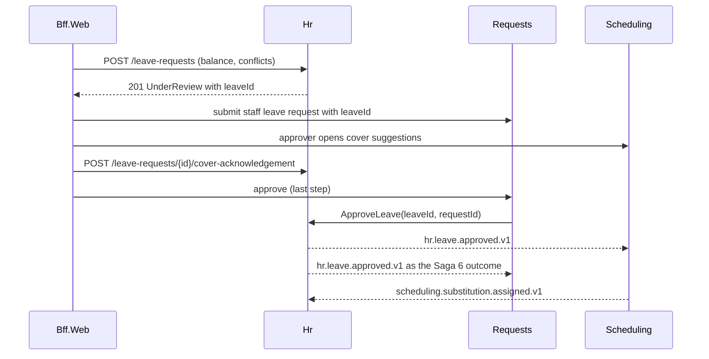
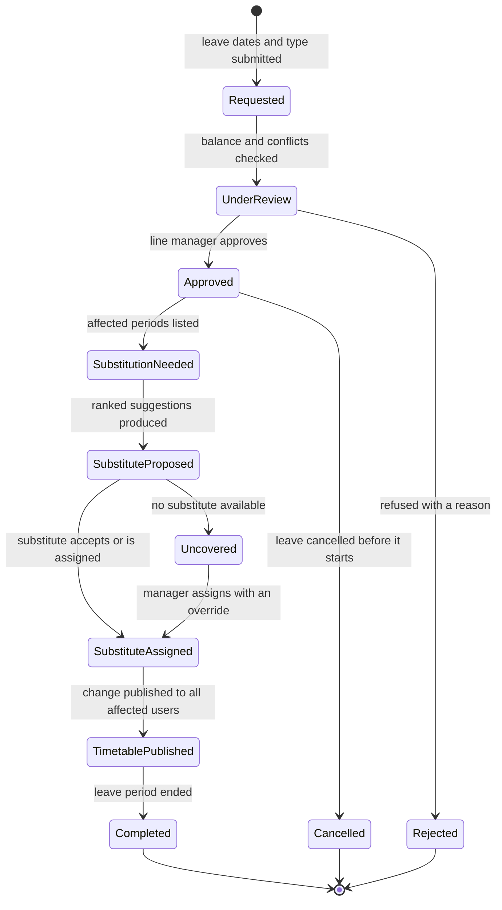
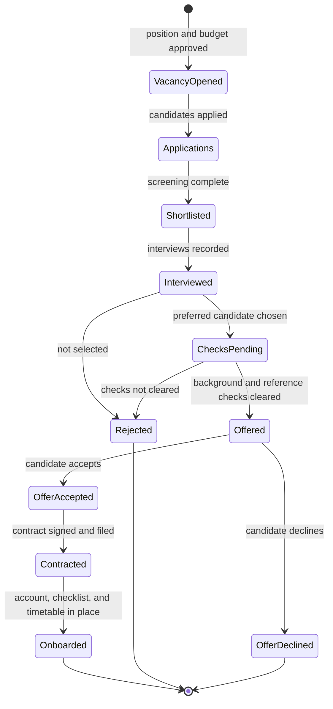
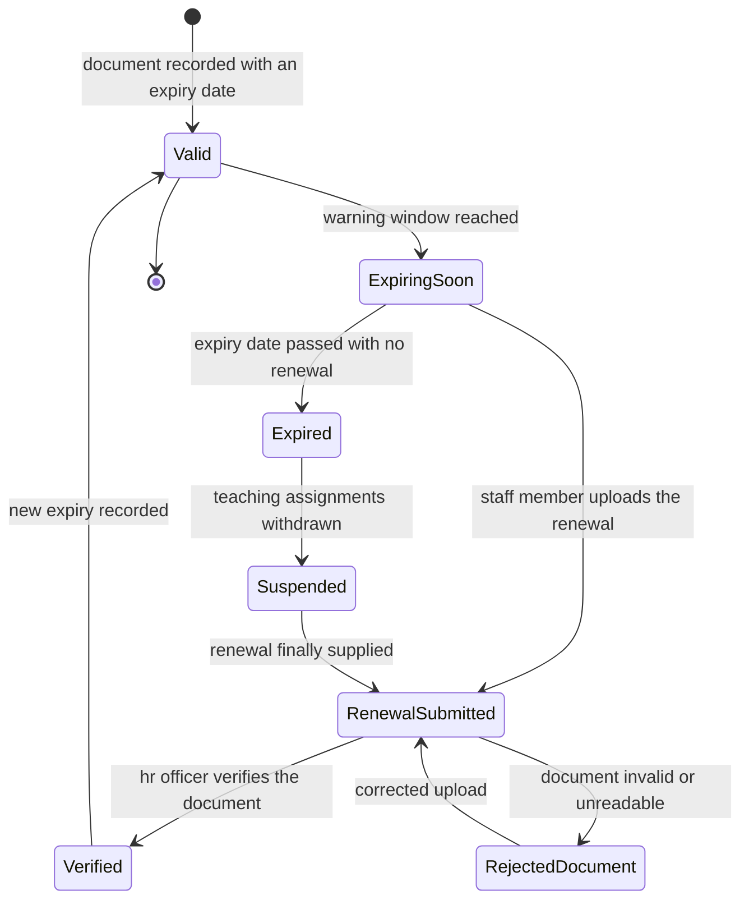
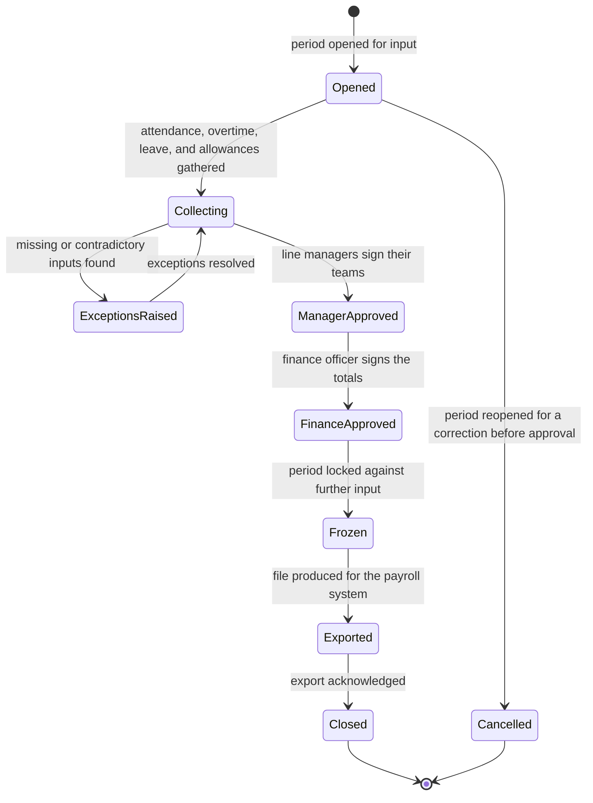

# Hr

> Service sheet, plan document 06, Group C. Names from Appendix L; events from Appendix E; permissions from Appendix B; error codes from Appendix K; settings categories from Appendix G. This sheet adds detail to reference architecture sheet 8.18 and never contradicts its table 8.0. The AREA code is `HR`; the error prefix is `HR_` (Appendix K.19).

Hr is the employment record of the school. It owns the staff file with its documents, qualifications, teaching licence and professional development hours; contracts and their pay terms; leave types, balances, accrual and carry-over; the leave request and its hand-off to Scheduling for cover (WF-HR-01); overtime and advances; the payroll input cycle with a pluggable calculation interface, payslips and the bank file (WF-HR-04); appraisals and classroom observations; recruitment from vacancy to onboarding (WF-HR-02); licence expiry compliance (WF-HR-03); and offboarding clearance. Salary, allowances, bank accounts and payslip lines are Sensitive (Appendix J) and are read only under `hr.payroll.view-salary`, a `high` permission. Nibras does not run payroll tax: it produces complete, approved, frozen inputs and a bank file (master brief Section 5).

| Fact | Value (quoted from `05-service-catalog.md` and Appendix L) |
|---|---|
| Canonical name, long name | Hr, Human Resources |
| Tier | 2 |
| AREA code | `HR` |
| Database | `nibras_hr`, schema `hr`, application role `svc_hr`, migration role `mig_hr` |
| Exchange | `nibras.hr` |
| Images | `nibras/hr-api` |
| Worker | none; Quartz.NET jobs and long-running jobs run in the Api host under `Nibras.BuildingBlocks.Jobs` (Appendix L lists no hr-worker image) |
| gRPC package | `nibras.hr.v1` in `Nibras.Contracts.Hr/Grpc/hr.proto`, reconciliation methods only (section 6) |
| Build phase (master brief Section 28) | 5 |
| Service level class (master brief Section 31) | Read-heavy |
| Sensitivity (Appendix J) | sensitive (salary, contracts) |
| Synchronous dependency | School (staff directory), reference architecture table 8.0 |
| Why the boundary exists | Security level: salary, contracts and bank details are sensitive employment data with their own access-review cycle |
| First-release option | Deferred under the Appendix L merge option; its keys and namespaces stay reserved, so consumers bind to nothing until it is deployed |

**Signature features.** Hr owns Appendix W feature 43 (workload balance for staff), at rung 2 degrading to load totals. The rung 2 strain model runs in Hr, next to the leave and cover data it reads, and SL-HR-616 builds it in the `Workload` feature (section 5.9). The cover suggestions and duty rosters behind it belong to Scheduling and Requests, and the teaching-load and grading-turnaround inputs are open point 7. Its rung, autonomy, requirements, capabilities, slices, Appendix O step and demo test are in the "Signature feature trace" of `32-product-differentiation-and-demo.md`; this sheet does not copy them.

**Last updated** 2026-09-26 by the round-3 remediation (workflow diagrams, platform notes, signature features, risk scale, closed open points)

---

## 1. Responsibilities

| Owns | Detail |
|---|---|
| Staff file | Position, grade, teaching flag, line manager, employment status, probation, emergency contact, qualifications, teaching licence and professional development hours (REQ-HR-002); the HR view of a staff member whose identity record School owns |
| Staff documents with expiry | Residency, licence, medical, visa and certificate documents with expiry dates, verification and the WF-HR-03 machine; the weekly expiry scan of Appendix E (REQ-HR-002, REQ-HR-003) |
| Contracts and pay terms | Contract versions with four-eyes approval (T-HR-03); pay terms (basic salary, allowances, deductions) and the bank account, encrypted and read only under `hr.payroll.view-salary` (REQ-HR-009) |
| Leave | Leave types (annual, sick, emergency, maternity, paternity, unpaid, pilgrimage, study, hourly permission, remote-work day), balances, monthly accrual, carry-over, the leave calendar, the leave request and WF-HR-01 up to `Approved` and from `TimetablePublished` to `Completed` (REQ-HR-004, REQ-HR-005) |
| Time records for pay | Overtime entries and hourly permissions that feed payroll inputs (REQ-HR-006) |
| Payroll inputs | Salary components, advances and loans, the payroll period and WF-HR-04, exceptions, team and finance sign-off, freeze, payslips through the `IPayrollCalculator` port, the bank file through the `IBankFileFormat` port, next-period adjustments (REQ-HR-007, REQ-HR-008) |
| Appraisals | Cycles, goals, self-review, 360 feedback, classroom observations against a rubric, improvement plans, finalization (REQ-HR-010) |
| Recruitment and onboarding | Vacancies, applications, shortlists, interviews with panel scores, background and safeguarding checks, offers, the signed contract, the onboarding checklist and WF-HR-02 (REQ-HR-001) |
| Offboarding | Resignation or end of contract, the offboarding checklist and clearance, final-period payroll flags (REQ-HR-011) |
| HR home | Leave to approve, documents expiring, probation ending, vacancies (TC-HR-801) |
| Workload balance (Appendix W feature 43) | The workload view per department, and the rung 2 strain suggestion at autonomy 2. It is an ML.NET model whose factors and weights are shown in the Because panel, and a person can override it with a reason. It falls back to cover and leave totals at rung 1 when the model or the tenant's `workload-balance` feature is off, and says so. It uses staff data only and never profiles a student (REQ-HR-012, SL-HR-616; inputs in open point 7) |

## 2. Not responsible for

| Does not own | Owner | Why the line sits there |
|---|---|---|
| The staff member's identity record, employee number, department and campus placement | School | School is the source (table 8.0); Hr creates a staff record by publishing `hr.staff.hired.v1`, and School's `StaffHiredConsumer` writes it keyed on the Hr `staffId` |
| The account, roles and data scopes of a staff member, and access revocation at offboarding | Identity | Identity invites from `hr.staff.hired.v1` and runs WF-IDN-06 from `school.staff.left.v1` |
| Substitution suggestions, cover assignment, the timetable change and the uncovered-period alert | Scheduling | Scheduling owns the substitution half of WF-HR-01 (`SubstitutionNeeded` to `TimetablePublished`, TC-HR-003 to TC-HR-006) and reacts to `hr.leave.approved.v1` |
| Daily staff attendance and lateness | Attendance | REQ-ATT-023; Attendance pre-fills it from `hr.leave.approved.v1`. Hr reads nothing from it today (open point 3) |
| Teaching assignments | Academics | A suspended licence becomes a task for the coordinator; Hr cannot change an assignment (open point 5) |
| The approval chain, SLA and inbox of a leave or HR request | Requests | Requests runs WF-RQS-01 and Saga 6; the only Hr effect commands are `ApproveLeave` and `CancelLeave` |
| Tax calculation and the payroll run itself | the school's payroll system | Master brief Section 5; Hr hands over frozen inputs and a bank file through pluggable ports |
| Accounting of payroll | Finance | Finance registers the period from `hr.payroll.inputs-ready.v1`; no amount crosses (Appendix J.3) |
| Rendering offer letters, contracts, payslips and service certificates as PDF | Documents | Hr resolves the merge values and sends `GenerateDocument` (Documents sheet, section 2) |
| Delivering any message | Notification | Hr publishes the catalogued events and sends `RequestNotification` for messages without a catalogued trigger |
| Settings storage | Platform (ADR-0009) | Hr reads *General* and *Security* from its settings copy; Hr policies without an Appendix G category are open point 1 |
| Teaching periods and grading turnaround, the figures beside cover in the workload view | Scheduling and Academics (teaching periods), Assessment (grading turnaround) | Hr owns the workload view and its strain model (section 1) but copies neither figure today (open point 7) |
| Duty rosters | Requests | REQ-RQS-019 |

---

## 3. Requirements covered

| Range or identifier | What it binds here |
|---|---|
| REQ-HR-001 to REQ-HR-012 | Every row of the HR area in `03-requirements-catalog.md`; all Tier 2 |
| REQ-SEC-003, REQ-SEC-004, REQ-SEC-005, REQ-SEC-006 | Object-level authorization with the `self`, `department` and `campus` scopes; the generated permission and tenant-isolation suites |
| REQ-SEC-009, REQ-SEC-013 | Salary, allowances, bank accounts and payslip lines encrypted at rest; no unnamed filter bypass |
| REQ-PRV-001, REQ-PRV-002 | Every column classified; staff records retained 10 years after leaving by a job |
| REQ-PERF-004, REQ-PERF-014, REQ-PERF-016, REQ-PERF-018, REQ-PERF-019, REQ-PERF-023 | Five-command handlers, keyset lists, streamed payroll reads, `xmin`, caching only through the building block, and salary never cached |
| REQ-DATA-003, REQ-DATA-013, REQ-DATA-018, REQ-DATA-019 | Row-level security; `payslip_lines` partitioned by payroll period; slim School copies reconciled nightly |
| REQ-MSG-003, REQ-MSG-004, REQ-MSG-019 | Outbox, inbox, and long jobs with progress and cancel |
| REQ-API-014, REQ-API-016, REQ-API-018 | `If-Match` on updates, `Idempotency-Key` on transitions, 202 jobs for payroll collection, payslips and the bank file |
| REQ-L10N-005, REQ-L10N-010, REQ-L10N-011, REQ-L10N-012 | Bilingual names on letters and certificates; Hijri display on service certificates (TC-L10N-801); the work week for leave day counting; money with configurable decimals |
| REQ-MOB-008 | Leave approvals are never offline |

---

## 4. Aggregates and entities

**Common columns.** Every table below carries these; the row `(common)` stands for them.

| Field | Type | Null | Notes |
|---|---|---|---|
| `tenant_id` | uuid | no | First column of every key and index; row-level security `tenant_isolation` with `WITH CHECK` |
| `id` | uuid | no | UUID v7 |
| `created_at`, `created_by` | timestamptz, uuid | no, yes | Audit interceptor |
| `updated_at`, `updated_by` | timestamptz, uuid | no, yes | Audit interceptor |
| `deleted_at`, `deleted_by` | timestamptz, uuid | yes | Soft delete behind the `SoftDelete` filter; a posted payslip, a frozen period and an approved contract are never soft-deleted |
| `xmin` | xid (system column) | no | Optimistic concurrency token on every aggregate root |
| classification | attribute, not a column | | `[DataClass]` per column group; Sensitive groups sit in side tables named `*_sensitive` and are column-encrypted by the tenancy building block with the per-deployment key (`10-data-architecture.md` section 1) |

Bilingual text is the `LocalizedText` value object from `Nibras.BuildingBlocks.Localization`, stored as `<name>_en` and `<name>_ar`. Money is `Money` (decimal string plus ISO 4217 currency on the wire). Dates are `date`; instants are `timestamptz` in UTC. A staff member is identified by `staff_id`, the same UUID School uses; Hr mints it at hire and School keys its record on it (School sheet, section 4).

### 4.1 `StaffFile` with `Qualification`, `ProfessionalDevelopmentRecord`

| Field | Type | Null | Notes |
|---|---|---|---|
| (common) | | | |
| `staff_id` | uuid | no | Unique per tenant; the aggregate key used by every other Hr table |
| `user_id` | uuid | yes | From the access token's staff link when the staff member first signs in to Hr; resolves `self` scope |
| `position_title_en`, `position_title_ar` | text | no | `LocalizedText`; Confidential |
| `grade_code` | text | yes | Pay grade; Confidential |
| `is_teaching` | boolean | no | Drives the cover gate of WF-HR-01 and the licence rule of WF-HR-03 |
| `line_manager_staff_id` | uuid | yes | Reporting line; the scope anchor for team sign-off |
| `department_id`, `primary_campus_id` | uuid | yes, no | Copied from `ref_staff` for scoping; School is the source |
| `employment_status` | text enum | no | `onboarding`, `active`, `on-notice`, `left` |
| `started_on`, `probation_ends_on`, `left_on` | date | no, yes, yes | |
| `pd_hours_target` | numeric(6,2) | yes | Annual professional development target |
| qualification: `staff_id`, `kind`, `title_en`, `title_ar`, `institution`, `awarded_on`, `file_id` | uuid, text enum (`degree`, `diploma`, `certificate`, `licence`), text, text, text, date, uuid | file nullable | `qualifications` |
| pd record: `staff_id`, `title_en`, `title_ar`, `provider`, `hours`, `completed_on`, `file_id`, `verified_by` | uuid, text, text, text, numeric(6,2), date, uuid, uuid | file, verifier nullable | `pd_records` |

Invariants: one staff file per `staff_id`; `left_on` is set if and only if `employment_status = left`; `probation_ends_on` is on or after `started_on`; a staff member cannot be their own line manager and the manager chain has no cycle; `pd_records.hours` is greater than 0 and at most 200.

### 4.2 `StaffDocument` (WF-HR-03)

| Field | Type | Null | Notes |
|---|---|---|---|
| (common) | | | |
| `staff_id` | uuid | no | |
| `document_type_code` | text | no | `teaching-licence`, `residency`, `visa`, `medical`, `safeguarding-check`, `passport`, `other`; the tenant's list lives in `hr_policies` |
| `document_number` | text | yes | Confidential; never cached, never logged (document 21 section 1.18) |
| `issued_on`, `expires_on` | date | yes, no | |
| `file_id` | uuid | no | Files building block reference, scan status carried |
| `status` | `TeachingLicenceExpiryComplianceStatus` | no | WF-HR-03 enum named by document 31: `Valid`, `ExpiringSoon`, `RenewalSubmitted`, `Verified`, `RejectedDocument`, `Expired`, `Suspended` |
| `last_warning_days` | smallint | yes | 90, 60, 30 or 7: the last warning threshold that fired, so each fires once |
| `suspends_teaching` | boolean | no | True for `teaching-licence` where the country requires one |
| `grace_days` | smallint | no | From `hr_policies`; may be 0 |
| `renewal_file_id`, `renewal_expires_on`, `verified_by`, `rejected_reason` | uuid, date, uuid, text | yes | |
| `pre_suspension_snapshot` | jsonb side table `document_suspensions` | yes | Periods and sections the coordinator must restore (Appendix R compensation) |

Invariants: transitions follow WF-HR-03 only (`HR_VALIDATION_FAILED` otherwise); a renewal is verified only by a user other than the staff member who uploaded it; `Verified` requires `renewal_expires_on > today`; `Suspended` is reachable only when `suspends_teaching`; a document with a pending virus scan cannot be verified.

### 4.3 `Contract` with `PayTerms`, `PayComponentLine`, `BankAccount`

| Field | Type | Null | Notes |
|---|---|---|---|
| (common) | | | |
| `staff_id`, `version` | uuid, int | no | Unique `(tenant_id, staff_id, version)` |
| `contract_type` | text enum | no | `permanent`, `fixed-term`, `part-time`, `hourly` |
| `job_title_en`, `job_title_ar`, `grade_code`, `weekly_hours` | text, text, text, numeric(5,2) | no | Confidential |
| `starts_on`, `ends_on` | date | no, yes | |
| `status` | text enum | no | `draft`, `pending-approval`, `approved`, `active`, `ended`, `superseded` |
| `drafted_by`, `approved_by`, `approved_at` | uuid, uuid, timestamptz | no, yes, yes | Four-eyes: approver differs from drafter and subject (T-HR-03) |
| `document_id` | uuid | yes | Rendered contract from Documents |
| `signed_file_id` | uuid | yes | Signed copy, virus-scanned |
| pay terms: `contract_id`, `currency`, `basic_salary_ciphertext`, `pay_frequency` | uuid, char(3), bytea, text enum (`monthly`) | no | `contract_pay_terms_sensitive`; Sensitive |
| component line: `contract_id`, `component_code`, `amount_ciphertext`, `percent_of_basic` | uuid, text, bytea, numeric(6,3) | one of amount or percent | `contract_pay_components_sensitive`; Sensitive |
| bank account: `staff_id`, `iban_ciphertext`, `bank_code`, `account_name_ciphertext`, `verified_at` | uuid, bytea, text, bytea, timestamptz | verified nullable | `staff_bank_accounts_sensitive`; Sensitive, one active per staff member |

Invariants: one `active` contract per staff member at a time and a new version supersedes the previous on its start date; `approved` requires an approver holding `hr.contracts.approve` who is neither the drafter nor the subject; pay terms and components change only on a `draft` version; `active` requires every document marked required for the position to be unexpired (`HR_DOCUMENT_EXPIRING_BLOCK`); a percentage component references an earning component, never itself.

### 4.4 `LeaveType`, `LeaveBalance` with `LeaveBalanceEntry`

| Field | Type | Null | Notes |
|---|---|---|---|
| (common) | | | |
| type: `code`, `name_en`, `name_ar`, `unit`, `paid`, `accrual_kind`, `annual_entitlement`, `accrual_per_month`, `carry_over_max`, `carry_over_expires_months`, `notice_working_days`, `requires_document_after_days`, `counts_non_working_days`, `eligibility`, `active` | text, text, text, text enum (`days`, `hours`), boolean, text enum (`upfront`, `monthly`, `none`), numeric(6,2), numeric(6,3), numeric(6,2), smallint, smallint, smallint, boolean, jsonb (contract types, minimum service months), boolean | carry-over fields nullable | `leave_types`; seeded with the master brief Section 11.2 staff leave list; notice default 5 working days (Appendix R) |
| balance: `staff_id`, `leave_type_code`, `leave_year`, `entitled_days`, `carried_days`, `taken_days`, `pending_days`, `adjusted_days` | uuid, text, smallint, numeric(6,2) × 5 | no | `leave_balances`, unique `ux_leave_balances_staff_year` (document 21 section 3.18) |
| entry: `balance_id`, `kind`, `days`, `leave_request_id`, `reason`, `entered_by`, `occurred_on` | uuid, text enum (`accrual`, `carry-over`, `carry-over-expiry`, `reserve`, `release`, `take`, `adjust`), numeric(6,2), uuid, text, uuid, date | request, reason nullable | `leave_balance_entries`; the ledger the balance is the sum of |

Invariants: `remaining = entitled + carried + adjusted - taken - pending` and is never negative for a paid type; the balance equals the sum of its ledger entries (checked by `InvariantAuditJob`); an `adjust` entry carries a reason and an actor holding `hr.leave.adjust-balance` (T-HR-04); carry-over never exceeds `carry_over_max`; `hours` types convert to days by the contract's daily hours.

### 4.5 `LeaveRequest` (WF-HR-01)

| Field | Type | Null | Notes |
|---|---|---|---|
| (common) | | | |
| `staff_id`, `leave_type_code` | uuid, text | no | |
| `from_date`, `to_date`, `from_time`, `to_time` | date, date, time, time | times nullable | Times only for `hours` types |
| `working_days` | numeric(6,2) | no | Counted on the tenant work week and campus holidays |
| `status` | `StaffLeaveToSubstitutionStatus` | no | WF-HR-01 enum named by document 31: `Requested`, `UnderReview`, `Approved`, `Rejected`, `SubstitutionNeeded`, `SubstituteProposed`, `SubstituteAssigned`, `Uncovered`, `TimetablePublished`, `Completed`, `Cancelled` |
| `booking_state` | text enum | no | `pending`, `approved`, `released`; the column the partial indexes of document 21 section 3.18 read |
| `source` | text enum | no | `requests` (effect of a Requests request), `direct` (Hr approval screen), `same-day` (absence reported on the day) |
| `request_id` | uuid | yes | The Requests request when `source = requests` |
| `short_notice` | boolean | no | Fewer than `notice_working_days` before `from_date`; shown to the approver |
| `unpaid_split_days` | numeric(6,2) | no default 0 | Days the staff member accepted as unpaid when the balance fell short (TC-HR-803) |
| `cover_acknowledged_by`, `cover_acknowledged_at`, `cover_mode` | uuid, timestamptz, text enum (`suggestions-reviewed`, `assigned`, `not-teaching`) | yes | The cover gate of REQ-HR-005 |
| `decided_by`, `decided_at`, `decision_reason` | uuid, timestamptz, text | yes | |
| `cancelled_at`, `cancel_reason` | timestamptz, text | yes | |
| `document_file_id` | uuid | yes | Sick note when the type requires one |
| substitution: `leave_request_id`, `substitution_id`, `cover_staff_id`, `date`, `period_ids`, `received_at` | uuid, uuid, uuid, date, uuid[], timestamptz | no | `leave_substitutions`, from `scheduling.substitution.assigned.v1`; cover counts for workload |

Invariants: transitions follow WF-HR-01 (`HR_VALIDATION_FAILED` for a transition outside the table); no two `pending` or `approved` requests of one staff member overlap (`HR_LEAVE_OVERLAPS_EXISTING`); `Requested → UnderReview` reserves the days, and refusal of a paid type beyond the remaining balance returns `HR_LEAVE_BALANCE_INSUFFICIENT` with the unpaid split offered; `UnderReview → Approved` for a teaching staff member requires a cover acknowledgement (`HR_SUBSTITUTION_NOT_ARRANGED`); the approver is neither the requester nor outside their `hr.leave.approve` scope; a staff member whose contract has lapsed cannot request leave (`HR_CONTRACT_EXPIRED`); `Cancelled` is reachable only before `from_date` and releases the reservation; first decision wins and the second receives `HR_CONCURRENCY_CONFLICT` naming the first decider.

### 4.6 `OvertimeEntry` and `Advance`

| Field | Type | Null | Notes |
|---|---|---|---|
| (common) | | | |
| overtime: `staff_id`, `work_date`, `hours`, `rate_code`, `source`, `request_id`, `approved_by`, `approved_at`, `payroll_period_id` | uuid, date, numeric(5,2), text, text enum (`requests`, `manual`), uuid, uuid, timestamptz, uuid | request, approval, period nullable | `overtime_entries`; Confidential |
| advance: `staff_id`, `kind`, `principal_ciphertext`, `currency`, `installment_count`, `installments_remaining`, `first_period_id`, `status`, `request_id` | uuid, text enum (`advance`, `loan`), bytea, char(3), smallint, smallint, uuid, text enum (`active`, `settled`, `written-off`), uuid | request nullable | `advances_sensitive`; Sensitive |

Invariants: overtime on a date covered by an approved leave raises a payroll exception naming both records (TC-HR-032); an overtime entry is attached to exactly one payroll period once collected; an advance's remaining installments never go below 0.

### 4.7 `SalaryComponent`, `PayrollPeriod` (WF-HR-04) with `PayrollInput`, `PayrollException`, `TeamSignOff`, `PayrollAdjustment`, `BankFileExport`

| Field | Type | Null | Notes |
|---|---|---|---|
| (common) | | | |
| component: `code`, `name_en`, `name_ar`, `kind`, `basis`, `taxable`, `active` | text, text, text, text enum (`earning`, `deduction`), text enum (`fixed`, `percent-of-basic`, `per-hour`, `per-day`), boolean, boolean | no | `salary_components` |
| period: `period_month`, `starts_on`, `ends_on`, `input_cut_off_on`, `status`, `currency` | date, date, date, date, `PayrollInputCycleStatus`, char(3) | no | `payroll_periods`, unique per month; enum named by document 31: `Opened`, `Collecting`, `ExceptionsRaised`, `ManagerApproved`, `FinanceApproved`, `Frozen`, `Exported`, `Closed`, `Cancelled` |
| period sign-off: `collected_by`, `finance_approved_by`, `finance_approved_at`, `frozen_at`, `exported_at`, `export_acknowledged_at`, `staff_count` | uuid, uuid, timestamptz, timestamptz, timestamptz, timestamptz, int | yes | `finance_approved_by` differs from `collected_by` (TC-HR-034) |
| input: `period_id`, `staff_id`, `component_code`, `quantity`, `amount_ciphertext`, `source_kind`, `source_id` | uuid, uuid, text, numeric(8,2), bytea, text enum (`contract`, `leave`, `overtime`, `advance`, `adjustment`, `manual`), uuid | source id nullable for manual | `payroll_inputs_sensitive`; amounts Sensitive, quantities Confidential |
| exception: `period_id`, `staff_id`, `kind`, `first_source_id`, `second_source_id`, `status`, `resolution`, `resolved_by` | uuid, uuid, text enum (`overtime-on-leave`, `missing-contract`, `missing-bank-account`, `leave-pending-in-period`, `negative-net`), uuid, uuid, text enum (`open`, `resolved`, `accepted`), text, uuid | second source, resolution nullable | `payroll_exceptions` |
| team sign-off: `period_id`, `manager_staff_id`, `signed_by`, `signed_at`, `escalated_at` | uuid, uuid, uuid, timestamptz, timestamptz | escalated nullable | `payroll_team_signoffs` (TC-HR-033) |
| adjustment: `period_id`, `staff_id`, `original_period_id`, `original_input_id`, `component_code`, `amount_ciphertext`, `reason` | uuid, uuid, uuid, uuid, text, bytea, text | no | `payroll_adjustments_sensitive`; the only way to correct a frozen period (TC-HR-036) |
| bank file: `period_id`, `format_code`, `file_id`, `row_count`, `total_ciphertext`, `generated_by`, `reason` | uuid, text, uuid, int, bytea, uuid, text | no | `bank_file_exports`; the file is Sensitive class in object storage |

Invariants: transitions follow WF-HR-04; after `Frozen` no input, exception or adjustment of that period changes (`HR_PAYROLL_PERIOD_LOCKED`), and a correction becomes a `payroll_adjustments` row in the next open period that references the original; `ManagerApproved` requires a sign-off for every manager with staff in the period or an escalation recorded at the cut-off; `Frozen` requires every exception `resolved` or `accepted`; one bank file per period unless the previous one is revoked with a reason.

### 4.8 `Payslip` with `PayslipLine`

| Field | Type | Null | Notes |
|---|---|---|---|
| (common) | | | |
| payslip: `period_id`, `staff_id`, `calculator_code`, `calculator_version`, `gross_ciphertext`, `deductions_ciphertext`, `net_ciphertext`, `currency`, `document_id`, `published_at` | uuid, uuid, text, text, bytea × 3, char(3), uuid, timestamptz | document, published nullable | `payslips_sensitive` |
| line: `payroll_period_id`, `payslip_id`, `staff_id`, `component_code`, `quantity`, `amount_ciphertext`, `seq` | uuid, uuid, uuid, text, numeric(8,2), bytea, smallint | no | `payslip_lines`, list-partitioned by `payroll_period_id` (`10-data-architecture.md` section 5); index `ix_payslip_lines_period_staff` |

Invariants: payslips exist only for a `Frozen`, `Exported` or `Closed` period; `net = gross - deductions` to the currency's decimals with rounding once, at the payslip total; the calculator code and version are recorded so a payslip can be recomputed identically; every read of a payslip writes `hr.audit.recorded.v1` in the same transaction (document 21 section 3.18 query 5).

### 4.9 `AppraisalCycle`, `Appraisal` with `Goal`, `FeedbackResponse`, `ImprovementPlan`; `ObservationRubric`, `Observation`

| Field | Type | Null | Notes |
|---|---|---|---|
| (common) | | | |
| cycle: `name_en`, `name_ar`, `opens_on`, `closes_on`, `status`, `rubric_id` | text, text, date, date, text enum (`draft`, `open`, `closed`), uuid | rubric nullable | `appraisal_cycles` |
| appraisal: `cycle_id`, `staff_id`, `appraiser_staff_id`, `status`, `self_review`, `appraiser_summary`, `outcome_code`, `finalized_by`, `finalized_at` | uuid, uuid, uuid, text enum (`goals-set`, `self-review`, `in-review`, `finalized`), text side table, text side table, text, uuid, timestamptz | reviews, outcome nullable | `appraisals`; narrative in `appraisal_narratives`, Confidential, never cached |
| goal: `appraisal_id`, `title`, `measure`, `weight_percent`, `rating` | uuid, text, text, smallint, smallint | rating nullable | `appraisal_goals` |
| feedback: `appraisal_id`, `respondent_user_id_hash`, `relationship`, `ratings`, `comment` | uuid, bytea, text enum (`peer`, `report`, `manager`), jsonb, text | comment nullable | `feedback_responses`; the respondent is stored as a keyed hash; results show only when 3 or more responses exist |
| rubric: `name_en`, `name_ar`, `criteria` | text, text, jsonb (key, labels, 1 to 5 descriptors) | no | `observation_rubrics`, versioned; immutable once used |
| observation: `staff_id`, `observer_staff_id`, `section_id`, `observed_at`, `rubric_id`, `rubric_version`, `scores`, `strengths`, `next_steps`, `appraisal_id`, `shared_at` | uuid, uuid, uuid, timestamptz, uuid, int, jsonb, text, text, uuid, timestamptz | appraisal, shared nullable | `observations` |
| plan: `appraisal_id`, `objectives`, `support`, `review_on`, `status` | uuid, jsonb, text, date, text enum (`open`, `met`, `not-met`) | no | `improvement_plans` |

Invariants: goal weights of one appraisal sum to 100; an appraisal changes only while its cycle is `open` (`HR_APPRAISAL_CYCLE_CLOSED`); an observation scores every rubric criterion 1 to 5 and the observer is not the observed; `finalized` requires a self-review or a recorded waiver, and publishes `hr.appraisal.completed.v1` once.

### 4.10 `Vacancy` (WF-HR-02) with `Application`, `Interview`, `CheckResult`, `Offer`, `OnboardingChecklist`

| Field | Type | Null | Notes |
|---|---|---|---|
| (common) | | | |
| vacancy: `title_en`, `title_ar`, `department_id`, `campus_id`, `is_teaching`, `contract_type`, `budget_line`, `budget_approved_by`, `status`, `published_at`, `closes_on`, `hiring_manager_staff_id`, `preferred_application_id`, `hired_staff_id` | text, text, uuid, uuid, boolean, text, text, uuid, `StaffHiringToOnboardingStatus`, timestamptz, date, uuid, uuid, uuid | publish, preferred, hired nullable | `vacancies`; enum named by document 31: `VacancyOpened`, `Applications`, `Shortlisted`, `Interviewed`, `ChecksPending`, `Offered`, `OfferAccepted`, `OfferDeclined`, `Contracted`, `Onboarded`, `Rejected` |
| application: `vacancy_id`, `candidate_name_en`, `candidate_name_ar`, `email_hash`, `email_ciphertext`, `phone_ciphertext`, `cv_file_id`, `stage`, `source` | uuid, text, text, bytea, bytea, bytea, uuid, text enum (`applied`, `shortlisted`, `interviewed`, `preferred`, `not-selected`, `withdrawn`), text enum (`careers-page`, `manual`, `referral`) | phone nullable | `applications`; Confidential, contact encrypted |
| interview: `application_id`, `interviewer_staff_id`, `held_at`, `scores`, `recommendation` | uuid, uuid, timestamptz, jsonb, text enum (`hire`, `hold`, `reject`) | no | `interviews`; two or more interviewers before `ChecksPending` (TC-HR-012) |
| check: `application_id`, `check_kind`, `mandatory`, `result`, `evidence_file_id`, `recorded_by` | uuid, text enum (`safeguarding`, `criminal-record`, `reference`, `qualification`, `right-to-work`), boolean, text enum (`pending`, `cleared`, `failed`), uuid, uuid | evidence nullable | `check_results` |
| offer: `application_id`, `starts_on`, `terms_summary`, `document_id`, `expires_at`, `response`, `responded_at` | uuid, date, jsonb (no salary), uuid, timestamptz, text enum (`pending`, `accepted`, `declined`, `expired`), timestamptz | no | `offers`; the salary offered is in `offer_pay_sensitive` |
| checklist: `staff_id`, `kind`, `items` child rows `key`, `label_en`, `label_ar`, `owner_role`, `due_on`, `done_by`, `done_at` | uuid, text enum (`onboarding`, `offboarding`), text, text, text, text, date, uuid, timestamptz | done nullable | `checklists`, `checklist_items` |

Invariants: `VacancyOpened → Applications` requires an approved budget line (TC-HR-011); `ChecksPending → Offered` requires every mandatory check `cleared` and a failed mandatory check moves the vacancy to `Rejected` for that candidate with the outcome audited (TC-HR-013, TC-HR-014); an offer expires 7 days after it is made; `OfferAccepted → Contracted` requires the signed contract uploaded with a clean scan and an approved contract version; `Contracted` publishes `hr.staff.hired.v1` exactly once, keyed on the minted `staff_id`; `Onboarded` requires every onboarding item done, including `account-active` (open point 4).

### 4.11 `OffboardingCase`

| Field | Type | Null | Notes |
|---|---|---|---|
| (common) | | | |
| `staff_id`, `reason`, `notice_given_on`, `last_working_day`, `status`, `checklist_id`, `request_id`, `final_period_id` | uuid, text enum (`resignation`, `end-of-contract`, `termination`, `retirement`), date, date, text enum (`open`, `cleared`, `closed`), uuid, uuid, uuid | request, final period nullable | `offboarding_cases` |

Invariants: one open case per staff member; `cleared` requires every checklist item done (TC for REQ-HR-011); `closed` follows `school.staff.left.v1` for the same staff member; the final payroll period flags pro-rata and leave encashment inputs.

### 4.12 Reference copies, policies and import rows

`ref_staff` (`staff_id`, `employee_number`, `name_en`, `name_ar`, `department_id`, `campus_ids`, `last_working_day`, `source_version`, `reconciled_at`), `ref_campuses` and `ref_departments` (`id`, `name_en`, `name_ar`), `ref_tenant_state`, `ref_settings`; `hr_policies` (one row per tenant: document types and which suspend teaching, warning thresholds 90, 60, 30 and 7 days, licence grace days, leave year start month, payroll cut-off day, bank file format code, calculator code, required documents per position); `import_rows` (`import_id`, `row_number`, `entity_type`, `written_id`, `before_values`) for Saga 9.

```mermaid
erDiagram
    STAFF_FILE ||--o{ QUALIFICATION : holds
    STAFF_FILE ||--o{ STAFF_DOCUMENT : files
    STAFF_FILE ||--o{ CONTRACT : "employed under"
    CONTRACT ||--o| PAY_TERMS : "pays by"
    CONTRACT ||--o{ PAY_COMPONENT_LINE : itemises
    STAFF_FILE ||--o| BANK_ACCOUNT : "paid into"
    LEAVE_TYPE ||--o{ LEAVE_BALANCE : "accrues as"
    STAFF_FILE ||--o{ LEAVE_BALANCE : holds
    LEAVE_BALANCE ||--o{ LEAVE_BALANCE_ENTRY : ledger
    STAFF_FILE ||--o{ LEAVE_REQUEST : requests
    LEAVE_REQUEST ||--o{ LEAVE_SUBSTITUTION : "covered by"
    STAFF_FILE ||--o{ OVERTIME_ENTRY : works
    STAFF_FILE ||--o{ ADVANCE : borrows
    PAYROLL_PERIOD ||--o{ PAYROLL_INPUT : collects
    PAYROLL_PERIOD ||--o{ PAYROLL_EXCEPTION : raises
    PAYROLL_PERIOD ||--o{ PAYSLIP : produces
    PAYSLIP ||--|{ PAYSLIP_LINE : itemises
    PAYROLL_PERIOD ||--o| BANK_FILE_EXPORT : exports
    APPRAISAL_CYCLE ||--o{ APPRAISAL : runs
    APPRAISAL ||--o{ OBSERVATION : evidences
    VACANCY ||--o{ APPLICATION : receives
    APPLICATION ||--o{ INTERVIEW : assessed
    APPLICATION ||--o| OFFER : "offered"
    STAFF_FILE ||--o{ CHECKLIST : "on and off boarding"
```



---

## 5. REST API

All paths are under `/api/v1/hr/`. Every endpoint may also return the K.1 codes with the `HR_` prefix; the Errors column names the service codes and the K.1 codes with a specific meaning. Lists use keyset pagination with a page cap of 100. A staff member reaches their own file, leave, payslips and appraisals through `self` scope on the same endpoints; a line manager through `department` scope for their reports. **Salary rule:** a response that can carry pay terms, payroll amounts, a payslip or a bank account omits those members entirely unless the caller holds `hr.payroll.view-salary` (REQ-HR-009, TC-SEC-801, TC-SEC-057); an endpoint whose whole purpose is salary returns `HR_SALARY_ACCESS_DENIED` without it. Leave approvals are online-only (REQ-MOB-008).

### 5.1 Staff files, documents, qualifications, development

| Method | Path | Permission | Request | Response | Errors | Idempotent |
|---|---|---|---|---|---|---|
| GET | `/api/v1/hr/staff-files` | `hr.staff-files.view` | filter `status`, `departmentId`, `campusId`, `isTeaching`, `q` | `Page<StaffFileSummaryDto>` keyset on `(nameSort, id)` | none specific | yes |
| GET | `/api/v1/hr/staff-files/{staffId}` | `hr.staff-files.view` | none | `StaffFileDto`; no salary members | `HR_NOT_FOUND` | yes |
| POST | `/api/v1/hr/staff-files` | `hr.staff-files.create` | `CreateStaffFileRequest` for a staff member School already holds | 201 `StaffFileDto` | `HR_VALIDATION_FAILED` (no School record) | by `Idempotency-Key` |
| PATCH | `/api/v1/hr/staff-files/{staffId}` | `hr.staff-files.edit` | position, grade, teaching flag, line manager, probation, PD target | `StaffFileDto` | `HR_VALIDATION_FAILED` (manager cycle), `HR_CONCURRENCY_CONFLICT` | with `If-Match` |
| POST | `/api/v1/hr/staff-files/export` | `hr.staff-files.export` | filter, columns, format | 202 job; Sensitive columns refused unless routed through WF-PRV-02 (T-HR-02) | `HR_PERMISSION_DENIED` for a Sensitive column | by `Idempotency-Key` |
| GET | `/api/v1/hr/staff-files/{staffId}/teaching-eligibility` | `hr.staff-files.view` | none | `{ eligible: true }` | `HR_LICENCE_EXPIRED` for a `Suspended` licence, `HR_CONTRACT_EXPIRED` | yes |
| GET | `/api/v1/hr/staff-files/{staffId}/documents` | `hr.staff-files.view` | none | `StaffDocumentDto[]` with WF-HR-03 state | `HR_NOT_FOUND` | yes |
| POST | `/api/v1/hr/staff-files/{staffId}/documents` | `hr.staff-files.edit` | type, number, issued, expires, file id | 201 in `Valid` | `HR_VALIDATION_FAILED` (expiry in the past) | by `Idempotency-Key` |
| POST | `/api/v1/hr/staff-documents/{id}/renewal` | `hr.staff-files.edit` | `{ fileId, expiresOn }` | `RenewalSubmitted` | `HR_VALIDATION_FAILED` (transition) | `Idempotency-Key` required |
| POST | `/api/v1/hr/staff-documents/{id}/verify` | `hr.staff-files.edit` | `{}` | `Verified` then `Valid`; a suspension is lifted (TC-HR-022, TC-HR-025) | `HR_VALIDATION_FAILED` (scan pending, verifier is the uploader) | `Idempotency-Key` required |
| POST | `/api/v1/hr/staff-documents/{id}/reject` | `hr.staff-files.edit` | `{ reason }` | `RejectedDocument` | `HR_VALIDATION_FAILED` | `Idempotency-Key` required |
| GET | `/api/v1/hr/staff-documents/expiring` | `hr.staff-files.view` | `withinDays` default 60 | owners, types, dates and an upload action per row (TC-HR-807) | none specific | yes |
| GET | `/api/v1/hr/compliance` | `hr.staff-files.view` | `campusId` | licence compliance board: expiring, expired, suspended (TC-HR-023) | none specific | yes |
| GET, POST | `/api/v1/hr/staff-files/{staffId}/qualifications` | `hr.staff-files.view`, `hr.staff-files.edit` | qualification | list; 201 | `HR_VALIDATION_FAILED` | POST by `Idempotency-Key` |
| GET, POST | `/api/v1/hr/staff-files/{staffId}/pd-records` | `hr.staff-files.view`, `hr.staff-files.edit` | title, provider, hours, date, file | list with hours against target; 201 | `HR_VALIDATION_FAILED` (hours out of range) | POST by `Idempotency-Key` |
| GET | `/api/v1/hr/home` | `hr.staff-files.view` | `campusId` | counts and top rows: leave to approve, documents expiring, probation ending in 30 days, open vacancies (TC-HR-801) | none specific | yes |

### 5.2 Contracts and pay terms

| Method | Path | Permission | Request | Response | Errors | Idempotent |
|---|---|---|---|---|---|---|
| GET | `/api/v1/hr/staff-files/{staffId}/contracts` | `hr.contracts.view` | none | versions; pay members only with `view-salary` | `HR_NOT_FOUND` | yes |
| POST | `/api/v1/hr/staff-files/{staffId}/contracts` | `hr.contracts.create` | type, title, grade, hours, start, end | 201 `draft` version | `HR_VALIDATION_FAILED` (overlaps the active version without superseding) | by `Idempotency-Key` |
| PATCH | `/api/v1/hr/contracts/{id}` | `hr.contracts.edit` | draft fields | `ContractDto` | `HR_VALIDATION_FAILED` (not a draft), `HR_CONCURRENCY_CONFLICT` | with `If-Match` |
| PUT | `/api/v1/hr/contracts/{id}/pay-terms` | `hr.contracts.edit` and `hr.payroll.view-salary` | basic salary, currency, component lines | pay terms; read audited | `HR_SALARY_ACCESS_DENIED`, `HR_VALIDATION_FAILED` (not a draft) | with `If-Match` |
| GET | `/api/v1/hr/contracts/{id}/pay-terms` | `hr.payroll.view-salary` | none | pay terms; every read writes `hr.audit.recorded.v1` (T-HR-01) | `HR_SALARY_ACCESS_DENIED` | yes |
| POST | `/api/v1/hr/contracts/{id}/submit` | `hr.contracts.edit` | `{}` | `pending-approval` | `HR_VALIDATION_FAILED` | `Idempotency-Key` required |
| POST | `/api/v1/hr/contracts/{id}/approve` | `hr.contracts.approve` | `{ decision: approve or return, reason }` | `approved`, or back to `draft` with the reason | `HR_PERMISSION_DENIED` for the drafter or the subject (TC-SEC-292), `HR_DOCUMENT_EXPIRING_BLOCK` | `Idempotency-Key` required |
| POST | `/api/v1/hr/contracts/{id}/document` | `hr.contracts.edit` | `{ language }` | 202; `GenerateDocument` with the contract template | none specific | by `Idempotency-Key` |
| POST | `/api/v1/hr/contracts/{id}/signed-copy` | `hr.contracts.edit` | `{ fileId }` | stored after a clean scan | `HR_VALIDATION_FAILED` (scan pending or rejected) | `Idempotency-Key` required |
| POST | `/api/v1/hr/contracts/{id}/end` | `hr.contracts.approve` | `{ endsOn, reason }` | `ended` on the date | `HR_VALIDATION_FAILED` | `Idempotency-Key` required |
| GET | `/api/v1/hr/staff-files/{staffId}/bank-account` | `hr.payroll.view-salary` | none | masked IBAN plus bank; full value never returned | `HR_SALARY_ACCESS_DENIED` | yes |
| PUT | `/api/v1/hr/staff-files/{staffId}/bank-account` | `hr.staff-files.edit` and `hr.payroll.view-salary` | IBAN, bank code, account name | stored encrypted; `verified_at` cleared until verified | `HR_SALARY_ACCESS_DENIED`, `HR_VALIDATION_FAILED` (IBAN check digits) | with `If-Match` |

### 5.3 Leave types, balances and the calendar

| Method | Path | Permission | Request | Response | Errors | Idempotent |
|---|---|---|---|---|---|---|
| GET | `/api/v1/hr/leave-types` | `hr.leave.view` | none | `LeaveTypeDto[]` | none specific | yes |
| POST | `/api/v1/hr/leave-types` | `hr.leave.edit` | code, names, unit, paid, accrual, entitlement, carry-over, notice, document rule, eligibility | 201 | `HR_VALIDATION_FAILED` (duplicate code) | by `Idempotency-Key` |
| PATCH | `/api/v1/hr/leave-types/{code}` | `hr.leave.edit` | as above; `active = false` retires the type | `LeaveTypeDto`; future accruals follow the new rule | `HR_CONCURRENCY_CONFLICT` | with `If-Match` |
| GET | `/api/v1/hr/leave-balances` | `hr.leave.view` | `staffId` (defaults to self), `leaveYear` | balances per type with ledger totals (document 21 section 3.18 query 1) | `HR_NOT_FOUND` | yes |
| GET | `/api/v1/hr/leave-balances/{staffId}/{leaveTypeCode}/entries` | `hr.leave.view` | `leaveYear` | ledger entries keyset on `(occurredOn, id)` | `HR_NOT_FOUND` | yes |
| POST | `/api/v1/hr/leave-balances/{staffId}/{leaveTypeCode}/adjustments` | `hr.leave.adjust-balance` | `{ days, reason, leaveYear }`; reason required | ledger `adjust` entry (T-HR-04) | `HR_VALIDATION_FAILED` (no reason, negative result on a paid type) | `Idempotency-Key` required |
| GET | `/api/v1/hr/leave-calendar` | `hr.leave.view` | `from`, `to`, `departmentId`, `campusId` | approved and pending leave in scope: names, dates, type; reasons never shown | none specific | yes |
| GET | `/api/v1/hr/staff-on-leave` | `hr.leave.view` | `date`, `campusId` | staff on approved leave that day (document 21 section 3.18 query 3) | none specific | yes |

### 5.4 Leave requests (WF-HR-01)

| Method | Path | Permission | Request | Response | Errors | Idempotent |
|---|---|---|---|---|---|---|
| POST | `/api/v1/hr/leave-requests` | `hr.leave.create` | `{ staffId (self by default), leaveTypeCode, fromDate, toDate, fromTime, toTime, acceptUnpaidSplit, documentFileId, requestId }` | 201 in `UnderReview` after the balance and conflict check; the conflicts with exams and duties returned for the approver (TC-HR-001); `requestId` links a Requests request | `HR_LEAVE_BALANCE_INSUFFICIENT` with the balance and the unpaid option (TC-HR-803), `HR_LEAVE_OVERLAPS_EXISTING`, `HR_CONTRACT_EXPIRED` | by `Idempotency-Key` |
| POST | `/api/v1/hr/leave-requests/same-day` | `hr.leave.create` | `{ staffId, leaveTypeCode, date, fromTime }` | 201; `Requested → Approved → SubstitutionNeeded` in one transaction; `hr.leave.approved.v1` | `HR_LEAVE_OVERLAPS_EXISTING` | `Idempotency-Key` required |
| GET | `/api/v1/hr/leave-requests` | `hr.leave.view` | filter `mine`, `toApprove`, `status`, `from`, `to` | `Page<LeaveRequestSummaryDto>` keyset on `(fromDate, id)` | none specific | yes |
| GET | `/api/v1/hr/leave-requests/{id}` | `hr.leave.view` | none | `LeaveRequestDto` with substitutions received | `HR_NOT_FOUND` | yes |
| POST | `/api/v1/hr/leave-requests/{id}/cover-acknowledgement` | `hr.leave.approve` | `{ mode: suggestions-reviewed or assigned, substitutionIds }` | acknowledgement recorded; the web shows Scheduling's suggestions first (REQ-HR-005, TC-HR-802) | `HR_VALIDATION_FAILED` (not `UnderReview`) | `Idempotency-Key` required |
| POST | `/api/v1/hr/leave-requests/{id}/approve` | `hr.leave.approve` | `{ reason }` | `Approved`, then `SubstitutionNeeded` for teaching staff; `hr.leave.approved.v1` (TC-HR-002) | `HR_SUBSTITUTION_NOT_ARRANGED`, `HR_LEAVE_BALANCE_INSUFFICIENT` (re-checked), `HR_PERMISSION_DENIED` (own request or out of scope), `HR_CONCURRENCY_CONFLICT` (already decided, names the decider) | `Idempotency-Key` required |
| POST | `/api/v1/hr/leave-requests/{id}/reject` | `hr.leave.reject` | `{ reason }` required | `Rejected`; reservation released | `HR_VALIDATION_FAILED` (no reason), `HR_CONCURRENCY_CONFLICT` | `Idempotency-Key` required |
| POST | `/api/v1/hr/leave-requests/{id}/cancel` | `hr.leave.edit` | `{ reason }` | `Cancelled` before the start; `hr.leave.cancelled.v1` when it had been approved (TC-HR-006) | `HR_VALIDATION_FAILED` (already started) | `Idempotency-Key` required |

`ApproveLeave(leaveId, requestId)` and `CancelLeave(leaveId, requestId)` arrive as commands from Saga 6 on `hr.commands`, not over HTTP (section 7.2).

### 5.5 Overtime and advances

| Method | Path | Permission | Request | Response | Errors | Idempotent |
|---|---|---|---|---|---|---|
| GET | `/api/v1/hr/overtime` | `hr.payroll.view` | `staffId`, `from`, `to` | entries with the monthly total (REQ-HR-006) | none specific | yes |
| POST | `/api/v1/hr/overtime` | `hr.payroll.edit` | `{ staffId, workDate, hours, rateCode }` | 201 `manual` entry | `HR_PAYROLL_PERIOD_LOCKED` when the month is frozen | by `Idempotency-Key` |
| POST | `/api/v1/hr/overtime/{id}/approve` | `hr.payroll.prepare-inputs` | `{}` | approved | `HR_PERMISSION_DENIED` (own entry) | `Idempotency-Key` required |
| GET | `/api/v1/hr/advances` | `hr.payroll.view-salary` | `staffId`, `status` | advances and loans with remaining installments | `HR_SALARY_ACCESS_DENIED` | yes |
| POST | `/api/v1/hr/advances` | `hr.payroll.edit` and `hr.payroll.view-salary` | `{ staffId, kind, principal, installments, firstPeriodId, requestId }` | 201 | `HR_SALARY_ACCESS_DENIED`, `HR_VALIDATION_FAILED` | by `Idempotency-Key` |

### 5.6 Payroll (WF-HR-04)

| Method | Path | Permission | Request | Response | Errors | Idempotent |
|---|---|---|---|---|---|---|
| GET, POST | `/api/v1/hr/salary-components` | `hr.payroll.view`, `hr.payroll.edit` | component definition | list; 201 | `HR_VALIDATION_FAILED` (duplicate code) | POST by `Idempotency-Key` |
| PATCH | `/api/v1/hr/salary-components/{code}` | `hr.payroll.edit` | names, basis, taxable, active | component | `HR_CONCURRENCY_CONFLICT` | with `If-Match` |
| GET | `/api/v1/hr/payroll-periods` | `hr.payroll.view` | `year` | periods with state and counts; no amounts | none specific | yes |
| POST | `/api/v1/hr/payroll-periods` | `hr.payroll.prepare-inputs` | `{ month, inputCutOffOn }` | 201 in `Opened` | `HR_VALIDATION_FAILED` (month exists) | by `Idempotency-Key` |
| GET | `/api/v1/hr/payroll-periods/{id}` | `hr.payroll.view` | none | state, exceptions, sign-offs; totals only with `view-salary` | `HR_NOT_FOUND` | yes |
| POST | `/api/v1/hr/payroll-periods/{id}/collect` | `hr.payroll.prepare-inputs` | `{}` | 202 job `PreparePayrollInputsJob`; `Collecting`, or `ExceptionsRaised`; `hr.payroll.inputs-ready.v1` when assembled (TC-HR-031, TC-HR-805) | `HR_PAYROLL_PERIOD_LOCKED`, `HR_VALIDATION_FAILED` (leave pending in the period) | `Idempotency-Key` required |
| GET | `/api/v1/hr/payroll-periods/{id}/inputs` | `hr.payroll.view-salary` | `staffId`, `managerStaffId` | inputs per staff member with sources | `HR_SALARY_ACCESS_DENIED` | yes |
| POST | `/api/v1/hr/payroll-periods/{id}/inputs` | `hr.payroll.prepare-inputs` and `hr.payroll.view-salary` | manual input line | 201 | `HR_PAYROLL_PERIOD_LOCKED` with the next-period adjustment offered (TC-HR-806) | by `Idempotency-Key` |
| POST | `/api/v1/hr/payroll-exceptions/{id}/resolve` | `hr.payroll.prepare-inputs` | `{ resolution: resolved or accepted, note }` | exception closed; `ExceptionsRaised → Collecting` when none remain | `HR_PAYROLL_PERIOD_LOCKED` | `Idempotency-Key` required |
| POST | `/api/v1/hr/payroll-periods/{id}/team-signoffs` | `hr.payroll.prepare-inputs` | `{ managerStaffId }`; the caller's own reporting line only | sign-off; `ManagerApproved` when the last team signs (TC-HR-033) | `HR_PERMISSION_DENIED` (another manager's line) | `Idempotency-Key` required |
| POST | `/api/v1/hr/payroll-periods/{id}/finance-approval` | `hr.payroll.export` | `{}` | `FinanceApproved`; both identities and the totals audited (TC-HR-034) | `HR_PERMISSION_DENIED` (caller collected the inputs) | `Idempotency-Key` required |
| POST | `/api/v1/hr/payroll-periods/{id}/freeze` | `hr.payroll.prepare-inputs` | `{}` | `Frozen` (TC-HR-035) | `HR_VALIDATION_FAILED` (open exceptions) | `Idempotency-Key` required |
| POST | `/api/v1/hr/payroll-periods/{id}/cancel` | `hr.payroll.prepare-inputs` | `{ reason }` | `Cancelled` from `Opened` only | `HR_PAYROLL_PERIOD_LOCKED` | `Idempotency-Key` required |
| POST | `/api/v1/hr/payroll-periods/{id}/adjustments` | `hr.payroll.prepare-inputs` and `hr.payroll.view-salary` | `{ staffId, originalInputId, componentCode, amount, reason }` against a frozen period | 201 in the next open period (TC-HR-036) | `HR_VALIDATION_FAILED` (no open next period) | by `Idempotency-Key` |
| POST | `/api/v1/hr/payroll-periods/{id}/payslips` | `hr.payroll.generate-payslips` | `{ language, publish }` | 202 job `GeneratePayslipsJob` | `HR_VALIDATION_FAILED` (not frozen) | by `Idempotency-Key` |
| POST | `/api/v1/hr/payroll-periods/{id}/bank-file` | `hr.payroll.export` and `hr.payroll.view-salary` | `{ formatCode, reason }` | 202 job `BankFileExportJob`; `Exported`; a 5-minute signed download | `HR_SALARY_ACCESS_DENIED`, `HR_VALIDATION_FAILED` (not frozen, missing bank accounts) | by `Idempotency-Key` |
| POST | `/api/v1/hr/payroll-periods/{id}/export-acknowledgement` | `hr.payroll.export` | `{ reference }` | `Closed` | `HR_VALIDATION_FAILED` | `Idempotency-Key` required |
| GET | `/api/v1/hr/payslips` | `hr.payroll.view-salary` | `staffId` (self by default), `year` | payslip summaries | `HR_SALARY_ACCESS_DENIED` | yes |
| GET | `/api/v1/hr/payslips/{id}` | `hr.payroll.view-salary` | none | payslip with lines; every read audited (document 21 section 3.18 query 5) | `HR_SALARY_ACCESS_DENIED`, `HR_NOT_FOUND` | yes |

A staff member reads their own payslips under `hr.payroll.view-salary` granted in `self` scope, which the Appendix I templates do not yet grant (open point 8).

### 5.7 Appraisals and observations

| Method | Path | Permission | Request | Response | Errors | Idempotent |
|---|---|---|---|---|---|---|
| GET, POST | `/api/v1/hr/appraisal-cycles` | `hr.appraisals.view`, `hr.appraisals.create` | name, dates, rubric | list; 201 | `HR_VALIDATION_FAILED` | POST by `Idempotency-Key` |
| POST | `/api/v1/hr/appraisal-cycles/{id}/open`, `/close` | `hr.appraisals.edit` | `{}` | cycle opened with one appraisal per eligible staff member; or closed | `HR_VALIDATION_FAILED` | `Idempotency-Key` required |
| GET | `/api/v1/hr/appraisals` | `hr.appraisals.view` | `cycleId`, `staffId`, `status` | keyset list | none specific | yes |
| GET | `/api/v1/hr/appraisals/{id}` | `hr.appraisals.view` | none | appraisal with goals, observations, feedback summary | `HR_NOT_FOUND` | yes |
| PUT | `/api/v1/hr/appraisals/{id}/goals` | `hr.appraisals.edit` | goals with weights | goals | `HR_APPRAISAL_CYCLE_CLOSED`, `HR_VALIDATION_FAILED` (weights not 100) | with `If-Match` |
| PUT | `/api/v1/hr/appraisals/{id}/self-review` | `hr.appraisals.edit` in `self` scope | text and goal self-ratings | saved | `HR_APPRAISAL_CYCLE_CLOSED` | with `If-Match` |
| POST | `/api/v1/hr/appraisals/{id}/feedback-requests` | `hr.appraisals.edit` | respondents | 202; respondents notified | `HR_APPRAISAL_CYCLE_CLOSED` | by `Idempotency-Key` |
| POST | `/api/v1/hr/appraisals/{id}/feedback` | `hr.appraisals.create` | ratings, comment; respondent must be invited | stored under a keyed hash | `HR_APPRAISAL_CYCLE_CLOSED`, `HR_PERMISSION_DENIED` (not invited) | by `Idempotency-Key` |
| GET, POST | `/api/v1/hr/observation-rubrics` | `hr.appraisals.view`, `hr.appraisals.edit` | criteria with descriptors | list; 201 new version | `HR_VALIDATION_FAILED` | POST by `Idempotency-Key` |
| POST | `/api/v1/hr/observations` | `hr.appraisals.observe` | `{ staffId, sectionId, observedAt, rubricId, scores, strengths, nextSteps }` | 201; shared with the observed teacher | `HR_VALIDATION_FAILED` (missing criterion, observer is the observed) | by `Idempotency-Key` |
| GET | `/api/v1/hr/observations` | `hr.appraisals.view` | `staffId`, `cycleId` | observations | none specific | yes |
| PUT | `/api/v1/hr/appraisals/{id}/improvement-plan` | `hr.appraisals.edit` | objectives, support, review date | plan | `HR_APPRAISAL_CYCLE_CLOSED` | with `If-Match` |
| POST | `/api/v1/hr/appraisals/{id}/finalize` | `hr.appraisals.finalize` | `{ outcomeCode, summary }` | `finalized`; `hr.appraisal.completed.v1` | `HR_APPRAISAL_CYCLE_CLOSED`, `HR_VALIDATION_FAILED` (no self-review or waiver) | `Idempotency-Key` required |

### 5.8 Recruitment and onboarding (WF-HR-02)

| Method | Path | Permission | Request | Response | Errors | Idempotent |
|---|---|---|---|---|---|---|
| GET | `/api/v1/hr/vacancies` | `hr.vacancies.view` | `status`, `campusId` | keyset list with pipeline counts | none specific | yes |
| POST | `/api/v1/hr/vacancies` | `hr.vacancies.create` | title, department, campus, teaching, contract type, budget line, closing date, hiring manager | 201 in `VacancyOpened` | `HR_VALIDATION_FAILED` | by `Idempotency-Key` |
| GET | `/api/v1/hr/vacancies/{id}` | `hr.vacancies.view` | none | vacancy with applications | `HR_NOT_FOUND` | yes |
| PATCH | `/api/v1/hr/vacancies/{id}` | `hr.vacancies.edit` | editable fields before `Offered` | vacancy | `HR_CONCURRENCY_CONFLICT` | with `If-Match` |
| DELETE | `/api/v1/hr/vacancies/{id}` | `hr.vacancies.delete` | a vacancy with no application | 204 | `HR_VALIDATION_FAILED` | yes |
| POST | `/api/v1/hr/vacancies/{id}/publish` | `hr.vacancies.publish` | `{}` | published; `VacancyOpened → Applications` when the budget line is approved (TC-HR-011) | `HR_VALIDATION_FAILED` (budget not approved) | `Idempotency-Key` required |
| POST | `/api/v1/hr/public/vacancies/{id}/applications` | none: published vacancy, rate-limited per source address at the Gateway and per email | `{ names, email, phone, cvFileId }` | 202 received; CV scanned | `HR_NOT_FOUND` (not published) | yes, one application per email and vacancy |
| POST | `/api/v1/hr/vacancies/{id}/applications` | `hr.vacancies.edit` | manual or referral application | 201 | `HR_VALIDATION_FAILED` | by `Idempotency-Key` |
| POST | `/api/v1/hr/vacancies/{id}/shortlist` | `hr.vacancies.edit` | `{ applicationIds }` | `Shortlisted` | `HR_VALIDATION_FAILED` | `Idempotency-Key` required |
| POST | `/api/v1/hr/applications/{id}/interviews` | `hr.vacancies.edit` | interviewer, time, scores, recommendation | 201; `Interviewed` when the first score lands | `HR_VALIDATION_FAILED` | by `Idempotency-Key` |
| POST | `/api/v1/hr/vacancies/{id}/preferred-candidate` | `hr.vacancies.edit` | `{ applicationId }` | `ChecksPending` with the panel evidence (TC-HR-012) | `HR_VALIDATION_FAILED` (fewer than two interviewers) | `Idempotency-Key` required |
| POST | `/api/v1/hr/applications/{id}/checks` | `hr.vacancies.edit` | `{ checkKind, result, evidenceFileId }` | check recorded; a failed mandatory check moves to `Rejected` (TC-HR-014) | `HR_VALIDATION_FAILED` | by `Idempotency-Key` |
| POST | `/api/v1/hr/vacancies/{id}/offer` | `hr.vacancies.make-offer` and `hr.payroll.view-salary` | start date, terms, offered pay | `Offered`; offer letter through `GenerateDocument`; expires in 7 days (TC-HR-013) | `HR_VALIDATION_FAILED` (a mandatory check not cleared) | `Idempotency-Key` required |
| POST | `/api/v1/hr/offers/{id}/response` | `hr.vacancies.make-offer` | `{ accepted, respondedAt }` recorded by the officer | `OfferAccepted` with a draft contract created, or `OfferDeclined` | `HR_VALIDATION_FAILED` (expired) | `Idempotency-Key` required |
| POST | `/api/v1/hr/vacancies/{id}/contracted` | `hr.contracts.approve` | `{ contractId }` with a signed, scanned copy | `Contracted`; `staff_id` minted; `hr.staff.hired.v1`; onboarding checklist created (TC-HR-015) | `HR_VALIDATION_FAILED` (unsigned, unapproved) | `Idempotency-Key` required |
| GET | `/api/v1/hr/checklists/{id}` | `hr.staff-files.view` | none | items with owners and due dates | `HR_NOT_FOUND` | yes |
| POST | `/api/v1/hr/checklists/{id}/items/{key}/complete` | `hr.staff-files.edit` | `{ note }` | item done; the last onboarding item moves the vacancy to `Onboarded` (TC-HR-016) | `HR_VALIDATION_FAILED` | `Idempotency-Key` required |

### 5.9 Offboarding, workload, jobs

| Method | Path | Permission | Request | Response | Errors | Idempotent |
|---|---|---|---|---|---|---|
| POST | `/api/v1/hr/offboarding-cases` | `hr.staff-files.edit` | `{ staffId, reason, noticeGivenOn, lastWorkingDay }` | 201 with the offboarding checklist and the final-period flags | `HR_VALIDATION_FAILED` (open case exists) | by `Idempotency-Key` |
| GET | `/api/v1/hr/offboarding-cases/{id}` | `hr.staff-files.view` | none | case with checklist and clearance items | `HR_NOT_FOUND` | yes |
| POST | `/api/v1/hr/offboarding-cases/{id}/clear` | `hr.staff-files.edit` | `{}` | `cleared` (REQ-HR-011) | `HR_VALIDATION_FAILED` (open items) | `Idempotency-Key` required |
| GET | `/api/v1/hr/workload` | `hr.staff-files.view` | `departmentId`, `from`, `to` | Cover given and received per staff member, cover against the BR-SCD-005 fairness score, and leave taken. When the tenant's `workload-balance` feature and the model are on, each row also carries the rung 2 strain suggestion (`assistRung = 2`) with its factors and weights for the Because panel. Otherwise the rows carry the load totals only, with `assistRung = 1` and the reason (REQ-HR-012, SL-HR-616) | none specific | yes |
| POST | `/api/v1/hr/workload/{staffId}/override` | `hr.staff-files.edit` | `{ reason, markedWrong }` | 200; the override and its reason are kept beside the suggestion, and `markedWrong` queues the model for review (document 25 §1.3, rung 2) | `HR_VALIDATION_FAILED` (no reason) | by `Idempotency-Key` |
| GET | `/api/v1/hr/jobs/{jobId}` | `platform.jobs.view`, or the starter | none | job resource with progress | `HR_NOT_FOUND` | yes |
| POST | `/api/v1/hr/jobs/{jobId}/cancel` | `platform.jobs.cancel`, or the starter | `{}` | `cancelRequested` | `HR_VALIDATION_FAILED` for a terminal job | yes |

---

## 6. gRPC

**Consumed: `nibras.school.v1`** (the one synchronous dependency of table 8.0), through `SchoolDirectoryClient` with a 2 s deadline, retry with jitter on idempotent reads, a circuit breaker, and the local copy as the fallback.

| Service | Method | Purpose | Deadline | Fallback |
|---|---|---|---|---|
| `StaffDirectory` | `GetStaff`, `ListStaff` | Fill a missing `ref_staff` row (`10-data-architecture.md` section 6 rule 4) and report the gap | 2 s | Use the copy; the handler proceeds with the ids it has and the reconciliation job repairs |
| `StructureDirectory` | `ListCampuses`, `ListDepartments` | Snapshot at provisioning and when `school.staff.created.v1` names an unknown department | 5 s | Keep the previous snapshot |
| `ReferenceReconciliation` | `Checksum`, `ListSnapshotPage` | Nightly reconciliation of `ref_staff` | 30 s, 5 s per page | Next night |

**Exposed: `nibras.hr.v1`**, reconciliation and rebuild only; never on a request path.

| Service | Method | Returns | Deadline | Callers | Budget |
|---|---|---|---|---|---|
| `Leave` | `Checksum(as_of)` | `md5` over `(leave_id, updated_at)` of approved and cancelled leave | 30 s | Scheduling, Attendance (`10-data-architecture.md` section 6) | 1 command |
| `Leave` | `ListSnapshotPage(page_token)` | `leave_id`, `staff_id`, `from_date`, `to_date`, `leave_type_code`, `cancelled`; 1,000 per page | 5 s per page | Scheduling, Attendance on repair | 1 command per page |
| `Usage` | `Recount(meter, period_start, period_end)` | active staff files in the period | 30 s | Platform monthly re-sum | 2 commands |
| `Reconciliation` | `Snapshot(projection_kind, page_token)` | appraisal completions, leave counts and headcount per department; never salary, reasons or narrative | 5 s per page | Reporting rebuild of `staffing_facts` (`10-data-architecture.md` section 7.1) | 1 command per page |

---

## 7. Events published and consumed

Payload fields are owned by Appendix E and are not restated here.

### 7.1 Published on `nibras.hr`

| Routing key | Raised by | Partition key | Consumers (Appendix E) |
|---|---|---|---|
| `hr.staff.hired.v1` | Vacancy `OfferAccepted → Contracted` | `staffId` | Identity, School, Notification |
| `hr.leave.approved.v1` | Leave `UnderReview → Approved` (direct or `ApproveLeave`) and a same-day absence | `staffId` | Scheduling, Attendance, Notification, Requests |
| `hr.leave.cancelled.v1` | Leave `Approved` or later `→ Cancelled` (direct or `CancelLeave`) | `staffId` | Scheduling, Attendance, Notification, Requests |
| `hr.leave-balance.low.v1` | `LeaveBalanceCheckJob` | `staffId` | Notification |
| `hr.staff-document.expiring.v1` | `StaffDocumentExpiryJob` at each warning threshold | `staffId` | Notification, Requests |
| `hr.payroll.inputs-ready.v1` | `PreparePayrollInputsJob` when inputs are assembled | `tenantId` | Finance, Notification |
| `hr.appraisal.completed.v1` | Appraisal finalized | `staffId` | Reporting, Notification |
| `hr.usage.recorded.v1` | `UsageRecordJob`, monthly active staff files | `tenantId` | Platform |
| `hr.audit.recorded.v1` | Every transition, every salary, pay-term, bank-account and payslip read, every balance adjustment and every export | `tenantId` | Audit |

Commands and replies Hr sends on `nibras.hr` (document 11 section 2.4): `GenerateDocument` to Documents (offer letter, contract, payslip, service certificate), `RequestNotification` to Notification (manager reminders, principal escalations, onboarding items, offer expiry, feedback requests), the reply `EffectFailed` to Requests when `ApproveLeave` is refused, the Saga 9 replies `ImportBatchValidated`, `ImportBatchPreviewed`, `ImportBatchCommitted`, `ImportRolledBack` to Documents, and the tenant-lifecycle replies to Platform. Document 11 §2.5 binds `nibras.hr` into `documents.commands` and into `notification.commands` (open point 2 keeps only the Appendix C rows).

### 7.2 Consumed

| Routing key or command | Queue | Handler | What it changes |
|---|---|---|---|
| `platform.tenant.provisioning-requested.v1` | `hr.tenant-lifecycle` | `TenantLifecycleConsumer` | Creates tenant rows, `hr_policies` defaults, the seeded leave types and salary components, the campus and department snapshot; replies `TenantProvisioned` |
| `platform.tenant.suspended.v1`, `platform.tenant.reactivated.v1`, `platform.tenant.deletion-requested.v1`, `platform.tenant.deleted.v1`, `platform.plan.changed.v1`, `platform.feature-flag.changed.v1`, `platform.terminology.changed.v1`, `platform.custom-field.changed.v1` | `hr.tenant-lifecycle` | `TenantLifecycleConsumer` | Read-only mode, pauses jobs while suspended, flags, labels, custom-field values on the staff file |
| `platform.settings.changed.v1` | `hr.tenant-lifecycle` | `SettingsChangedConsumer` | `ref_settings` for *General* (work week, time zone, currency, calendars) and *Security* (retention periods, export approval rules); working-day counts of open leave recomputed |
| `identity.role.changed.v1`, `identity.permissions.changed.v1` | `hr.tenant-lifecycle` | `PermissionsChangedConsumer` | Evicts per-user cache entries; nothing else, since authorization is evaluated per call |
| `reporting.data-quality.issue-detected.v1` | `hr.tenant-lifecycle` | `DataQualityIssueConsumer` | Acts only on Hr entity types, for example a staff file with no active contract |
| `school.staff.created.v1` | `hr.reference-copies` | `StaffCreatedConsumer` | Upserts `ref_staff`; creates a `StaffFile` shell for a staff member Hr did not hire; a no-op on the file for a staff member Hr hired (the ping-pong guard of `05-service-catalog.md` row 6), where it only ticks the `staff-record-created` onboarding item; unknown `departmentId` triggers the structure snapshot |
| `school.department.changed.v1` | `hr.reference-copies` | `DepartmentChangedConsumer` | `ref_departments` names and the removal of a department that no longer exists; a staff file keeps its `department_id` until School moves it |
| `school.staff.left.v1` | `hr.reference-copies` | `StaffLeftConsumer` | `ref_staff.last_working_day`; opens an offboarding case if none exists, ends the active contract on the date, flags the final payroll period, closes an open case |
| `scheduling.substitution.assigned.v1` | `hr.reference-copies` | `SubstitutionAssignedConsumer` | Adds a `leave_substitutions` row to the approved leave covering `absentStaffId` on `date`; moves the leave `SubstitutionNeeded → SubstituteAssigned → TimetablePublished` (Scheduling publishes the timetable change in the same transaction, document 13 section 4); cover counts for workload |
| `requests.request.approved.v1` | `hr.events` | `RequestApprovedConsumer` | Acts on HR request types without an effect command, by `typeCode`: overtime creates a `requests` overtime entry, hourly permission and remote-work day create an approved leave of that type, salary advance creates an advance in `active`, training records a planned PD entry, resignation opens an offboarding case, document update opens a renewal; keyed on `requestId`, so a replay creates nothing |
| `documents.import.completed.v1` | `hr.events` | `ImportCompletedConsumer` | Clears `import_rows` staging for a committed or rolled-back staff import; re-runs the balance invariant for imported balances |
| `documents.document.generated.v1` | `hr.events` (document 11 §2.5) | `DocumentGeneratedConsumer` | Stores `documentId` on the offer, contract, payslip or certificate it was requested for |
| `ApproveLeave` on `hr.commands` from `nibras.requests` | `hr.commands` | `ApproveLeaveCommandHandler` | `UnderReview → Approved` with the balance re-checked; publishes `hr.leave.approved.v1` as the Saga 6 outcome; a refusal replies `EffectFailed` with `HR_LEAVE_BALANCE_INSUFFICIENT` or `HR_SUBSTITUTION_NOT_ARRANGED`; idempotent on `(sagaId, stepKey)` |
| `CancelLeave` on `hr.commands` from `nibras.requests` | `hr.commands` | `CancelLeaveCommandHandler` | Saga 6 compensation: `→ Cancelled`, `hr.leave.cancelled.v1`; a second delivery is a no-op |
| `ValidateImportBatch`, `DryRunImportBatch`, `CommitImportBatch`, `RollbackImport` from `nibras.documents` | `hr.commands` | `ImportBatchCommandHandler` | Saga 9 steps 2 to 4 for staff files, contracts without pay terms, leave balances; commit keyed on `(importId, rowNumber)` |
| `DeprovisionTenant`, `DeleteTenantData`, dedicated-database, copy, reconcile, purge and parked-message commands from `nibras.platform` | `hr.commands` | `TenantLifecycleCommandHandler` | Sagas 1, 2 and 10 steps; long commands start a job and acknowledge at once |

---

## 8. Sagas and workflows

Hr orchestrates no saga (document 13 section 1: exactly ten sagas). Every Hr workflow is a state machine in `Nibras.Hr.Domain` driven through the transition pipeline, which validates the state, checks the permission, writes `hr.audit.recorded.v1` and publishes through the outbox in one transaction (document 13 section 5.1). The transition tables are Appendix R's; the four state machines are copied after the sequence diagram below, as Appendix R stands on 2026-09-26, so the workflows can be built from this sheet.

| WF or saga | Role | Kind (document 13) | State type (document 31) | Feature folder | What Hr does |
|---|---|---|---|---|---|
| WF-HR-01 Staff leave to substitution | Owner | Effect | `StaffLeaveToSubstitutionStatus` | `Application/Features/StaffLeaveToSubstitution/` | `Requested → UnderReview` with balance and conflicts (TC-HR-001); the cover gate and `UnderReview → Approved` (TC-HR-002); `Approved → Cancelled` (TC-HR-006); observes `SubstituteAssigned` and `TimetablePublished` from `scheduling.substitution.assigned.v1`; `TimetablePublished → Completed` by `LeaveCompletionJob`. `SubstituteProposed` and `Uncovered` are Scheduling's (TC-HR-003, TC-HR-004) and are not observable in Hr (open point 6) |
| WF-HR-02 Staff hiring to onboarding | Owner | Single | `StaffHiringToOnboardingStatus` | `Application/Features/StaffHiringToOnboarding/` | Every transition; School and Identity react to `hr.staff.hired.v1`; the identity step is an outbox retry of their consumers, not a saga |
| WF-HR-03 Teaching licence expiry compliance | Owner | Single | `TeachingLicenceExpiryComplianceStatus` | `Application/Features/TeachingLicenceExpiryCompliance/` | Timer transitions in `LicenceComplianceJob`; human transitions over REST; suspension becomes a coordinator task through `hr.staff-document.expiring.v1` and the eligibility check (open point 5) |
| WF-HR-04 Payroll input cycle | Owner | Single | `PayrollInputCycleStatus` | `Application/Features/PayrollInputCycle/` | Every transition; Finance reacts to `hr.payroll.inputs-ready.v1` |
| WF-RQS-01 and Saga 6 | Effect owner | Saga step | none here | `Application/Features/StaffLeaveToSubstitution/ApproveLeaveEffect/` | `ApproveLeave` and `CancelLeave`; the outcome is the catalogued event |
| Saga 9 Legacy import | Target service | Saga step | none here | `Application/Features/ImportBatches/` | Validate, dry run, commit in batches of 500, roll back |
| WF-IDN-06 Offboarding and access revocation | Touched | Single | none here | `Application/Consumers/StaffLeftConsumer.cs` | Hr's offboarding case closes when School records the departure; Identity revokes access |
| Saga 1, 2, 10 | Participant | Saga | none here | `Application/Features/TenantLifecycle/` | Provision, delete tenant data, tier migration |

**The leave path through Requests**, which is the default for tenants that enable the staff leave request type:



A rejected, withdrawn or expired Requests request leaves the Hr leave in `UnderReview`, because Hr does not bind `requests.request.rejected.v1`; `PendingLeaveExpiryJob` moves such a leave to `Rejected` with reason `not-decided` when its `from_date` passes and releases the reservation (open point 6). **Timeouts** from Appendix R: an unreviewed leave reminds the approver at 24 hours and escalates at 48 (`LeaveReviewReminderJob`); payroll managers are reminded 3 days and 1 day before the cut-off and unsigned teams escalate to the principal at the cut-off (`PayrollCutOffJob`); an offer expires after 7 days (`OfferExpiryJob`); background checks outstanding 14 days before the start date escalate to the principal and onboarding items overdue by 3 working days escalate to the HR officer (`OnboardingEscalationJob`); a licence warns at 90, 60, 30 and 7 days and alerts the principal daily from expiry (`LicenceComplianceJob`).

**The four Hr state machines**, copied from Appendix R. Appendix R is binding and R29 checks it; a difference between a diagram here and its twin there is a defect in this sheet. Each state is a member of the state type named in the table above.

WF-HR-01 Staff leave to substitution (`SubstituteProposed`, `Uncovered` and `SubstituteAssigned` are driven by Scheduling):



WF-HR-02 Staff hiring to onboarding:



WF-HR-03 Teaching licence expiry compliance:



WF-HR-04 Payroll input cycle:



---

## 9. Local reference copies

| Copy | Source events | Fields kept | Reconciliation | Staleness tolerated |
|---|---|---|---|---|
| `ref_staff` | `school.staff.created.v1`, `school.staff.left.v1` | id, employee number, names, department, campuses, last working day | Nightly 02:00 band time zone against School `ReferenceReconciliation.Checksum` for `staff`; replay from `ListSnapshotPage` | Minutes |
| `ref_campuses`, `ref_departments` | `school.department.changed.v1` for departments; gRPC `StructureDirectory` at provisioning, for campuses and on an unknown `departmentId` | id, names | Nightly snapshot replaces the copy (`10-data-architecture.md` open point 1) | One day |
| `leave_substitutions` | `scheduling.substitution.assigned.v1` | substitution, cover staff, date, periods | Not reconciled; cover counts are informational and a missed event is visible on the leave | Minutes |
| `ref_tenant_state`, `ref_settings` | tenant-lifecycle keys | status, flags, *General* and *Security* values | Nightly against Platform | Minutes |

Every copy carries `source_version` and `reconciled_at` and applies an event only when its `occurredAt` is later than `source_version` (`10-data-architecture.md` section 6 rules 2 and 3).

---

## 10. Background jobs

All run in the Api host under Quartz.NET, per tenant, with the tenant variable set per iteration and Quartz clustering so one replica runs each trigger.

| Job | Schedule | What it does | Publishes | Progress |
|---|---|---|---|---|
| `StaffDocumentExpiryJob` | Daily 06:00 tenant time zone (Appendix E lists the scan as weekly; open point 9) | Documents crossing 90, 60, 30 or 7 days: `Valid → ExpiringSoon` and one warning per threshold (TC-HR-021) | `hr.staff-document.expiring.v1` | none |
| `LicenceComplianceJob` | Daily 06:15 tenant time zone | `ExpiringSoon → Expired` at the date (TC-HR-023), `Expired → Suspended` after the grace days (TC-HR-024), daily principal alert while expired | `hr.audit.recorded.v1`; `RequestNotification` | none |
| `LeaveAccrualJob` | Monthly, day 1, 01:30 tenant time zone | `accrual` ledger entries per eligible staff member and monthly type | `hr.audit.recorded.v1` | "Accruing leave: 120 of 180 staff" |
| `LeaveCarryOverJob` | At the leave-year start from `hr_policies` | Carries over up to the maximum, expires old carry-over | `hr.audit.recorded.v1` | "Carrying over: n of m" |
| `LeaveBalanceCheckJob` | Monthly, day 2 (Appendix E) | Balances below the policy threshold | `hr.leave-balance.low.v1` | none |
| `LeaveReviewReminderJob` | Hourly | 24-hour reminder and 48-hour escalation for `UnderReview` leave | `RequestNotification` | none |
| `PendingLeaveExpiryJob` | Daily 00:30 tenant time zone | `UnderReview` leave past its start date → `Rejected` (`not-decided`), reservation released | `hr.audit.recorded.v1` | none |
| `LeaveCompletionJob` | Daily 00:45 tenant time zone | Approved leave past `to_date` → `Completed`; the reservation becomes `take` | `hr.audit.recorded.v1` | none |
| `PayrollPeriodOpenJob` | Monthly, day 1 | Opens the next period with the policy cut-off day | `hr.audit.recorded.v1` | none |
| `PreparePayrollInputsJob` | On `POST /payroll-periods/{id}/collect` | Streams staff files, contracts, leave taken, overtime, advances and adjustments (document 21 section 3.18 query 4); raises exceptions | `hr.payroll.inputs-ready.v1` | "Collecting inputs: 60 of 100 staff" |
| `PayrollCutOffJob` | Daily 08:00 tenant time zone | Reminders 3 days and 1 day before the cut-off; escalation and freeze-as-collected with the exception noted at the cut-off | `RequestNotification` | none |
| `GeneratePayslipsJob` | On `POST /payroll-periods/{id}/payslips` | Runs `IPayrollCalculator` per staff member; writes payslips and lines; one `GenerateDocument` per payslip when PDFs are requested | `GenerateDocument` | "Payslips: 45 of 100" |
| `BankFileExportJob` | On `POST /payroll-periods/{id}/bank-file` | Runs `IBankFileFormat`; stores the file through the Files building block as Sensitive | `hr.audit.recorded.v1` | "Bank file: 100 of 100 rows" |
| `OfferExpiryJob` | Hourly | Offers past 7 days → `expired`; vacancy back to `Interviewed` | `RequestNotification` | none |
| `OnboardingEscalationJob` | Daily 07:00 tenant time zone | Background checks 14 days before start, overdue onboarding items | `RequestNotification` | none |
| `ProbationReminderJob` | Daily 07:00 tenant time zone | Probation ending in 30 and 7 days to the line manager | `RequestNotification` | none |
| `UsageRecordJob` | Monthly, day 1 | Active staff files last month | `hr.usage.recorded.v1` | none |
| `ReferenceCopyReconciliationJob` | Nightly 02:00 band time zone | Section 9 | `reporting.data-quality.issue-detected.v1` on a mismatch | none |
| `InvariantAuditJob` | Nightly 01:00 band time zone | 1 percent sample of balances (ledger sum), contracts and periods reloaded through the domain | a finding | none |
| `PartitionMaintenanceJob` | On period open and nightly | Creates the `payslip_lines` partition for a new period | a finding on an unexpected partition | none |
| `StaffLeaverRetentionJob` | Monthly (`10-data-architecture.md` section 8) | Salary and bank rows of staff 10 years after leaving deleted and contract dates anonymized; applicants not hired deleted after the retention period in *Security → retention periods* | `hr.audit.recorded.v1` | none |

---

## 11. Permissions, notifications, settings, error codes

### 11.1 Permissions (Appendix B, Hr)

| Permission | Default holders (Appendix I, group G21) | Scope and risk |
|---|---|---|
| `hr.staff-files.view`, `.create`, `.edit`, `.export` | HR Officer (F); Principal, Vice Principal, School Owner (V) | `campus`; `self` for a staff member's own file; elevated |
| `hr.contracts.view`, `.create`, `.edit` | HR Officer | `campus`; high through `approve` |
| `hr.contracts.approve` | Principal by delegation from G21, never the drafter (T-HR-03) | high, four-eyes to grant |
| `hr.leave.view`, `.create`, `.edit` | Every staff member in `self`; HR Officer in `campus` | normal |
| `hr.leave.approve`, `.reject` | HR Officer; line managers in `department` | elevated |
| `hr.leave.adjust-balance` | HR Officer | elevated, reason recorded (T-HR-04) |
| `hr.payroll.view`, `.edit`, `.prepare-inputs`, `.generate-payslips`, `.export` | HR Officer | `all-tenant`; high |
| `hr.payroll.view-salary` | HR Officer through G21's high grant; never Principal, Vice Principal or Accountant (Appendix I) | high, four-eyes, time-limited, reviewed each access-review campaign, every read logged (T-HR-01) |
| `hr.appraisals.view`, `.create`, `.edit` | HR Officer; appraisers in `department`; staff in `self` | elevated |
| `hr.appraisals.observe`, `.finalize` | HR Officer, Heads of Department in `department`, Principal | elevated |
| `hr.vacancies.view`, `.create`, `.edit`, `.delete`, `.publish`, `.make-offer` | HR Officer | elevated |
| `platform.jobs.view`, `platform.jobs.cancel` | as Appendix B | job endpoints |

### 11.2 Notifications (Appendix C rows Hr triggers)

| Appendix C row | Trigger | Recipients | Urgency and default channels |
|---|---|---|---|
| Staff document expiring | `hr.staff-document.expiring.v1` (job: document expiry scan) | Staff member, HR officer | D; email, in-app |
| Leave decided | `hr.leave.approved.v1`, `hr.leave.cancelled.v1` | Staff member | N; push |
| Leave balance low | `hr.leave-balance.low.v1` (job: leave balance check) | Staff member | N; in-app |
| Payroll inputs ready | `hr.payroll.inputs-ready.v1` | Accountant | N; email |

Appendix C deduplicates on the same template, recipient and subject within five minutes (BR-NOT-004); none of the four Hr rows is urgent, so all four are deduplicated on that window.

Leave rejection, leave review reminders and escalations, the principal's licence alert, payroll cut-off reminders, offer and onboarding messages, probation reminders and 360 feedback requests have no Appendix C row and go through `RequestNotification` on `nibras.hr`, which document 11 §2.5 binds into `notification.commands` (open point 2). No notification carries a salary, a balance amount of money, or a document number (document 12 section 6.2).

### 11.3 Settings (Appendix G, owned by Platform)

| Setting | Category | Default | Used by |
|---|---|---|---|
| Work week, time zone, calendars | General | tenant values | Working-day counts of leave, job schedules, Hijri display |
| Currency, numerals | General | tenant values | Payroll periods, payslips |
| Retention periods | Security | as Appendix J: staff contract 10 years after leaving | `StaffLeaverRetentionJob` |
| Export approval rules | Security | as Appendix G | `staff-files/export` routes Sensitive columns through WF-PRV-02 |
| High-risk grant approval window | Security | 72 hours | Grants of `hr.payroll.view-salary` and `hr.contracts.approve` in Identity |
| Enabled types, approval chains | Requests | the Section 11.2 staff leave and HR types | Which leave reaches Hr as an effect |

Hr policy values with no Appendix G category (document types, warning thresholds, grace days, leave year start, notice days, payroll cut-off day, calculator and bank file format) are stored in `hr_policies` until Appendix G gains an *HR* category (open point 1).

### 11.4 Error codes (Appendix K.19)

| Code | HTTP | Raised where |
|---|---|---|
| `HR_LEAVE_BALANCE_INSUFFICIENT` | 409 | Leave request, direct approval and `ApproveLeave` when the paid balance is short |
| `HR_LEAVE_OVERLAPS_EXISTING` | 409 | Leave request overlapping a pending or approved leave |
| `HR_SUBSTITUTION_NOT_ARRANGED` | 409 | Approval of a teaching staff member's leave without the cover acknowledgement |
| `HR_CONTRACT_EXPIRED` | 403 | Leave request or eligibility check for a staff member with a lapsed contract |
| `HR_LICENCE_EXPIRED` | 403 | Teaching eligibility check for a `Suspended` licence (TC-HR-026 at the Bff.Web edge) |
| `HR_SALARY_ACCESS_DENIED` | 403 | Any salary, pay-term, bank-account, advance or payslip endpoint without `hr.payroll.view-salary` |
| `HR_PAYROLL_PERIOD_LOCKED` | 409 | Any input, exception, overtime or adjustment change on a frozen period |
| `HR_APPRAISAL_CYCLE_CLOSED` | 409 | Any appraisal edit after the cycle closed |
| `HR_DOCUMENT_EXPIRING_BLOCK` | 409 | Contract approval or activation with a required document past its expiry |
| `HR_VALIDATION_FAILED` and the other seven K.1 codes | as K.1 | Problem-details middleware; `HR_CONCURRENCY_CONFLICT` also names the first decider of a leave |

---

## 12. Caching and hot queries

The caching map is `21-performance-engineering.md` section 1.18 and the hot queries are its section 3.18; both are binding. This sheet adds:

| Data | Key | Tags | L1 | L2 | Invalidated by | Never cached |
|---|---|---|---|---|---|---|
| Salary component and rubric definitions | `nibras:{tenant}:hr:definitions:current:v1` | `tenant` | 5 min | 6 h ± 10% | Component and rubric write handlers evict by key | Nothing; definitions hold no amounts |
| HR home counts per campus | `nibras:{tenant}:hr:home:{campusId}:v1` | `tenant`, `campus` | 15 s | 60 s ± 10% | `hr.leave.approved.v1`, `hr.leave.cancelled.v1`, `hr.staff-document.expiring.v1`, leave request and vacancy write handlers evict by tag `campus` | Names of staff on sick leave beyond the count |

| Query | Handler | Index | Rows demo / load | Pagination | Budget |
|---|---|---|---|---|---|
| Leave awaiting my decision | `ListLeaveRequestsQuery` (`toApprove`) | `ix_leave_requests_review (tenant_id, status, from_date, id) INCLUDE (staff_id, leave_type_code) WHERE status = 'UnderReview' AND deleted_at IS NULL`, filtered by the caller's department scope | 3 / 12 | keyset on `(from_date, id)` | 2 commands, 10 ms |
| Open vacancies with pipeline counts | `ListVacanciesQuery` | `ix_vacancies_open (tenant_id, status, closes_on) WHERE status NOT IN ('Onboarded', 'Rejected', 'OfferDeclined')` plus a grouped count on `ix_applications_vacancy_stage (tenant_id, vacancy_id, stage)` | 2 / 8 | keyset on `(closes_on, id)` | 2 commands, 15 ms |
| Payroll inputs of a period for one team | `ListPeriodInputsQuery` | `ix_payroll_inputs_period_staff (tenant_id, period_id, staff_id)` joined to `staff_files` by line manager | 15 / 40 | keyset on `(staff_id, id)` | 3 commands including the audit row, 20 ms |
| Documents to verify | `ListDocumentsToVerifyQuery` | `ix_staff_documents_renewal (tenant_id, status) WHERE status = 'RenewalSubmitted'` | 1 / 5 | none | 2 commands, 5 ms |

Never cached in Hr, restated from document 21 and Appendix J.4: salary, allowances, bank accounts, payslip lines, advances, offered pay, contract documents, appraisal narrative, 360 comments, document numbers.

---

## 13. Security

The threat table is `12-security-privacy-safety.md` section 2.18, T-HR-01 to T-HR-04, with tests TC-SEC-801, TC-SEC-290, TC-SEC-291, TC-SEC-292 and TC-SEC-293; TC-SEC-802 proves HR holds no student permission.

| Data class (Appendix J) | Held in | Handling |
|---|---|---|
| Sensitive: salary, allowances, bank account, payslip lines, advances, offered pay | `*_sensitive` tables | Column-encrypted with the per-deployment key; read only under `hr.payroll.view-salary`; every read writes `hr.audit.recorded.v1` in the same transaction; absent from every response without the permission; exported only through `BankFileExportJob` or WF-PRV-02 |
| Confidential: contract terms other than pay, staff documents, staff attendance-derived inputs, appraisals, observations, applications | `contracts`, `staff_documents`, `appraisals`, `observations`, `applications` | Row-level security; per-user cache keys of at most 60 s where cached at all; appraisal narrative and 360 comments never cached |
| Internal: leave types, salary component names, rubrics | definition tables | Cacheable with the tenant key |

| Never | What |
|---|---|
| Cached | Every Sensitive group above, contract documents, appraisal narrative, document numbers (document 21 section 1.18) |
| Logged | Amounts, IBANs, document numbers, appraisal text, candidate contact details; logs carry ids and codes only |
| Sent to a device | Payslips, pay terms, bank accounts and appraisal narrative are never stored in the mobile database; leave balances and requests may be cached for the user's own scope, encrypted |
| Sent in an event | Any amount of money, any reason text of sick leave, any document number; `hr.leave.cancelled.v1` carries only the reason code (Appendix E payload rule) |
| Sent to Reporting | Headcount and absence aggregates only (Appendix J.3) |

Controls specific to Hr: the contract approver must differ from the drafter and the subject; the finance approver of a period must differ from the collector; the bank file download is a single-use 5-minute signed URL recorded with the reason; a staff member never sees another staff member's leave reason, only names and dates on the calendar; the public application endpoint accepts only published vacancies, is rate-limited at the Gateway and per email, and scans every CV before any person can open it.

---

## 14. Folder and file tree

Follows the Attendance anatomy of `07-solution-structure.md` part 3. Hr has no worker image, so jobs sit in `Api/Jobs/`; it orchestrates no saga, so `Application/Sagas/` is absent; it exposes reconciliation gRPC, so `Api/Grpc/` exists. Hr has no business rule in Appendix S (document 31 section 1), so there is no `Rules/` folder; invariants live on the aggregates. Workflow feature folders hold one sub-folder per transition command (document 31 section 3); every leaf feature folder holds four files: records, handler, validator, endpoint.

```text
src/Services/Hr/                                                              Human Resources: staff files, contracts, leave, payroll inputs, appraisals, recruitment
├── README.md                                                                 purpose, owned data, salary rule, API, events, how to run, runbook links
├── Nibras.Hr.Domain/                                                         aggregates, invariants, domain events; references Nibras.BuildingBlocks.Domain and Nibras.Contracts.Hr only
│   ├── StaffFiles/                                                           aggregate StaffFile
│   │   ├── StaffFile.cs                                                      position, teaching flag, manager chain, employment status
│   │   ├── Qualification.cs                                                  degree, diploma, certificate, licence
│   │   ├── ProfessionalDevelopmentRecord.cs                                  PD hours against the target
│   │   └── EmploymentStatus.cs                                               onboarding, active, on-notice, left
│   ├── Documents/                                                            aggregate StaffDocument and the WF-HR-03 machine
│   │   ├── StaffDocument.cs                                                  expiry, renewal, verification, suspension snapshot
│   │   ├── TeachingLicenceExpiryComplianceStatus.cs                          WF-HR-03 state enum named by document 31
│   │   ├── TeachingLicenceExpiryComplianceTransitions.cs                     WF-HR-03 transition table
│   │   └── Events/                                                           domain events of the document
│   │       └── DocumentWarningThresholdCrossed.cs                            becomes hr.staff-document.expiring.v1
│   ├── Contracts/                                                            aggregate Contract
│   │   ├── Contract.cs                                                       versions, four-eyes approval, supersession
│   │   ├── PayTerms.cs                                                       basic salary and currency, encrypted
│   │   ├── PayComponentLine.cs                                               fixed amount or percent of basic
│   │   └── BankAccount.cs                                                    IBAN with check-digit validation, encrypted
│   ├── Leave/                                                                aggregates LeaveType, LeaveBalance, LeaveRequest and the WF-HR-01 machine
│   │   ├── LeaveType.cs                                                      unit, accrual, carry-over, notice, eligibility
│   │   ├── LeaveBalance.cs                                                   balance as the sum of its ledger
│   │   ├── LeaveBalanceEntry.cs                                              accrual, carry-over, reserve, release, take, adjust
│   │   ├── LeaveRequest.cs                                                   transitions, cover gate, booking state
│   │   ├── LeaveSubstitution.cs                                              cover received from Scheduling
│   │   ├── WorkingDayCounter.cs                                              days between dates on the work week and holidays
│   │   ├── StaffLeaveToSubstitutionStatus.cs                                 WF-HR-01 state enum named by document 31
│   │   ├── StaffLeaveToSubstitutionTransitions.cs                            WF-HR-01 transition table
│   │   └── Events/                                                           domain events of leave
│   │       ├── LeaveApproved.cs                                              becomes hr.leave.approved.v1
│   │       ├── LeaveCancelled.cs                                             becomes hr.leave.cancelled.v1
│   │       └── LeaveBalanceLow.cs                                            becomes hr.leave-balance.low.v1
│   ├── TimeRecords/                                                          overtime and advances
│   │   ├── OvertimeEntry.cs                                                  hours per date and rate
│   │   └── Advance.cs                                                        advance or loan with installments
│   ├── Payroll/                                                              aggregates SalaryComponent, PayrollPeriod, Payslip and the WF-HR-04 machine
│   │   ├── SalaryComponent.cs                                                earning or deduction with a basis
│   │   ├── PayrollPeriod.cs                                                  cut-off, sign-offs, freeze, export
│   │   ├── PayrollInput.cs                                                   one line with its source
│   │   ├── PayrollException.cs                                               overtime on leave, missing contract, missing bank account
│   │   ├── TeamSignOff.cs                                                    manager sign-off per reporting line
│   │   ├── PayrollAdjustment.cs                                              next-period correction referencing the original
│   │   ├── Payslip.cs                                                        gross, deductions, net, calculator version
│   │   ├── PayslipLine.cs                                                    one component on a payslip
│   │   ├── BankFileExport.cs                                                 format, row count, reason
│   │   ├── IPayrollCalculator.cs                                             pluggable calculation port (master brief Section 5)
│   │   ├── ComponentSumCalculator.cs                                         default calculator: components, advances, adjustments, no tax
│   │   ├── PayrollInputCycleStatus.cs                                        WF-HR-04 state enum named by document 31
│   │   ├── PayrollInputCycleTransitions.cs                                   WF-HR-04 transition table
│   │   └── Events/                                                           domain events of payroll
│   │       └── PayrollInputsReady.cs                                         becomes hr.payroll.inputs-ready.v1
│   ├── Appraisals/                                                           aggregates AppraisalCycle, Appraisal, ObservationRubric, Observation
│   │   ├── AppraisalCycle.cs                                                 open and closed window
│   │   ├── Appraisal.cs                                                      goals, self-review, finalization
│   │   ├── Goal.cs                                                           weighted goal with rating
│   │   ├── FeedbackResponse.cs                                               360 response under a keyed hash
│   │   ├── ImprovementPlan.cs                                                objectives and review date
│   │   ├── ObservationRubric.cs                                              versioned criteria, immutable once used
│   │   ├── Observation.cs                                                    scores per criterion, strengths, next steps
│   │   └── Events/                                                           domain events of appraisals
│   │       └── AppraisalCompleted.cs                                         becomes hr.appraisal.completed.v1
│   ├── Recruitment/                                                          aggregate Vacancy and the WF-HR-02 machine
│   │   ├── Vacancy.cs                                                        budget line, pipeline, preferred candidate
│   │   ├── Application.cs                                                    candidate with encrypted contact
│   │   ├── Interview.cs                                                      panel scores and recommendation
│   │   ├── CheckResult.cs                                                    mandatory safeguarding and reference checks
│   │   ├── Offer.cs                                                          terms, expiry, response
│   │   ├── StaffHiringToOnboardingStatus.cs                                  WF-HR-02 state enum named by document 31
│   │   ├── StaffHiringToOnboardingTransitions.cs                             WF-HR-02 transition table
│   │   └── Events/                                                           domain events of hiring
│   │       └── StaffHired.cs                                                 becomes hr.staff.hired.v1
│   ├── Checklists/                                                           onboarding and offboarding checklists
│   │   ├── Checklist.cs                                                      items with owners and due dates
│   │   ├── ChecklistItem.cs                                                  one step, done by and when
│   │   └── OffboardingCase.cs                                                reason, last working day, clearance
│   ├── References/                                                           slim read-only copies rebuilt from events, reconciled nightly
│   │   ├── StaffReference.cs                                                 id, number, names, department, campuses
│   │   ├── StructureReference.cs                                             campuses and departments
│   │   ├── TenantStateReference.cs                                           status and flags
│   │   ├── HrSettings.cs                                                     the Appendix G General and Security values
│   │   └── HrPolicy.cs                                                       Hr policy values without an Appendix G category
│   └── Shared/                                                               value objects and errors used by more than one aggregate
│       ├── StaffId.cs                                                        the School staff id Hr mints at hire
│       ├── EncryptedMoney.cs                                                 Money wrapped for column encryption
│       └── HrErrors.cs                                                       one Error per HR_* code in Nibras.Contracts.Hr
├── Nibras.Hr.Application/                                                    use cases, consumers, read models
│   ├── Features/                                                             vertical slices
│   │   ├── ManageStaffFiles/                                                 /staff-files list, get, create, patch
│   │   │   ├── ManageStaffFilesRequests.cs                                   list, get, create, update records
│   │   │   ├── ManageStaffFilesHandler.cs                                    manager-cycle check, salary members never projected
│   │   │   ├── ManageStaffFilesValidator.cs                                  School record exists in ref_staff
│   │   │   └── ManageStaffFilesEndpoint.cs                                   hr.staff-files.* routes
│   │   ├── ExportStaffFiles/                                                 /staff-files/export
│   │   │   ├── ExportStaffFilesCommand.cs                                    filter, columns, format
│   │   │   ├── ExportStaffFilesHandler.cs                                    streams rows; Sensitive columns only through WF-PRV-02
│   │   │   ├── ExportStaffFilesValidator.cs                                  column list against classifications
│   │   │   └── ExportStaffFilesEndpoint.cs                                   POST /staff-files/export
│   │   ├── TeachingEligibility/                                              the check Bff.Web makes before an assignment
│   │   │   ├── TeachingEligibilityQuery.cs                                   staff id
│   │   │   ├── TeachingEligibilityHandler.cs                                 licence state and contract validity
│   │   │   ├── TeachingEligibilityValidator.cs                               staff id present
│   │   │   └── TeachingEligibilityEndpoint.cs                                GET /staff-files/{staffId}/teaching-eligibility
│   │   ├── QualificationsAndDevelopment/                                     qualifications and PD records
│   │   │   ├── QualificationsAndDevelopmentRequests.cs                       list and add records
│   │   │   ├── QualificationsAndDevelopmentHandler.cs                        hours against the target
│   │   │   ├── QualificationsAndDevelopmentValidator.cs                      hours 0 to 200, file scanned
│   │   │   └── QualificationsAndDevelopmentEndpoint.cs                       /qualifications and /pd-records routes
│   │   ├── TeachingLicenceExpiryCompliance/                                  WF-HR-03, one sub-folder per human transition
│   │   │   ├── RecordStaffDocument/                                          document recorded in Valid
│   │   │   │   ├── RecordStaffDocumentCommand.cs                             type, number, dates, file
│   │   │   │   ├── RecordStaffDocumentHandler.cs                             sets suspends_teaching and grace from policy
│   │   │   │   ├── RecordStaffDocumentValidator.cs                           expiry in the future, file clean
│   │   │   │   └── RecordStaffDocumentEndpoint.cs                            POST /staff-files/{staffId}/documents
│   │   │   ├── SubmitRenewal/                                                ExpiringSoon, RejectedDocument or Suspended to RenewalSubmitted
│   │   │   │   ├── SubmitRenewalCommand.cs                                   file and new expiry
│   │   │   │   ├── SubmitRenewalHandler.cs                                   stores the renewal, notifies the HR officer
│   │   │   │   ├── SubmitRenewalValidator.cs                                 state allows a renewal
│   │   │   │   └── SubmitRenewalEndpoint.cs                                  POST /staff-documents/{id}/renewal
│   │   │   ├── VerifyRenewal/                                                RenewalSubmitted to Verified to Valid
│   │   │   │   ├── VerifyRenewalCommand.cs                                   document id
│   │   │   │   ├── VerifyRenewalHandler.cs                                   lifts a suspension, clears warnings
│   │   │   │   ├── VerifyRenewalValidator.cs                                 verifier is not the uploader, scan clean
│   │   │   │   └── VerifyRenewalEndpoint.cs                                  POST /staff-documents/{id}/verify
│   │   │   ├── RejectRenewal/                                                RenewalSubmitted to RejectedDocument
│   │   │   │   ├── RejectRenewalCommand.cs                                   reason
│   │   │   │   ├── RejectRenewalHandler.cs                                   notifies the staff member
│   │   │   │   ├── RejectRenewalValidator.cs                                 reason present
│   │   │   │   └── RejectRenewalEndpoint.cs                                  POST /staff-documents/{id}/reject
│   │   │   └── DocumentViews/                                                list, expiring report, compliance board
│   │   │       ├── DocumentViewsRequests.cs                                  query records
│   │   │       ├── DocumentViewsHandler.cs                                   keyset on expires_on
│   │   │       ├── DocumentViewsValidator.cs                                 window at most 365 days
│   │   │       └── DocumentViewsEndpoint.cs                                  GET documents, /staff-documents/expiring, /compliance
│   │   ├── ManageContracts/                                                  contract drafts, submit, document, signed copy
│   │   │   ├── ManageContractsRequests.cs                                    list, create, update, submit, document, signed-copy records
│   │   │   ├── ManageContractsHandler.cs                                     supersession on the start date
│   │   │   ├── ManageContractsValidator.cs                                   one active version, draft-only edits
│   │   │   └── ManageContractsEndpoint.cs                                    hr.contracts.* routes except approve and end
│   │   ├── ApproveContract/                                                  four-eyes approval and ending
│   │   │   ├── ApproveContractRequests.cs                                    approve, return and end records
│   │   │   ├── ApproveContractHandler.cs                                     required documents unexpired
│   │   │   ├── ApproveContractValidator.cs                                   approver is neither drafter nor subject
│   │   │   └── ApproveContractEndpoint.cs                                    POST /contracts/{id}/approve, /end
│   │   ├── PayTerms/                                                         salary, components and bank account
│   │   │   ├── PayTermsRequests.cs                                           get and put pay terms and bank account records
│   │   │   ├── PayTermsHandler.cs                                            encrypts, audits every read in the same transaction
│   │   │   ├── PayTermsValidator.cs                                          view-salary held, IBAN check digits
│   │   │   └── PayTermsEndpoint.cs                                           /pay-terms and /bank-account routes
│   │   ├── ManageLeaveTypes/                                                 /leave-types
│   │   │   ├── ManageLeaveTypesRequests.cs                                   list, create, update records
│   │   │   ├── ManageLeaveTypesHandler.cs                                    retire instead of delete
│   │   │   ├── ManageLeaveTypesValidator.cs                                  accrual and carry-over consistency
│   │   │   └── ManageLeaveTypesEndpoint.cs                                   hr.leave routes for types
│   │   ├── LeaveBalances/                                                    balances, ledger, adjustments
│   │   │   ├── LeaveBalancesRequests.cs                                      get, entries, adjust records
│   │   │   ├── LeaveBalancesHandler.cs                                       compiled balance query; adjust entry with reason
│   │   │   ├── LeaveBalancesValidator.cs                                     reason required, no negative paid balance
│   │   │   └── LeaveBalancesEndpoint.cs                                      /leave-balances routes
│   │   ├── LeaveCalendar/                                                    calendar and staff on leave
│   │   │   ├── LeaveCalendarQuery.cs                                         window, department, campus
│   │   │   ├── LeaveCalendarHandler.cs                                       names and dates only
│   │   │   ├── LeaveCalendarValidator.cs                                     window at most 92 days
│   │   │   └── LeaveCalendarEndpoint.cs                                      GET /leave-calendar, /staff-on-leave
│   │   ├── StaffLeaveToSubstitution/                                         WF-HR-01, one sub-folder per transition command
│   │   │   ├── RequestLeave/                                                 Requested to UnderReview
│   │   │   │   ├── RequestLeaveCommand.cs                                    staff, type, dates, unpaid split, request id
│   │   │   │   ├── RequestLeaveHandler.cs                                    reserves days, lists exam and duty conflicts
│   │   │   │   ├── RequestLeaveValidator.cs                                  balance, overlap, contract valid, notice flag
│   │   │   │   └── RequestLeaveEndpoint.cs                                   POST /leave-requests
│   │   │   ├── ReportSameDayAbsence/                                         Requested to Approved to SubstitutionNeeded
│   │   │   │   ├── ReportSameDayAbsenceCommand.cs                            staff, type, date, from time
│   │   │   │   ├── ReportSameDayAbsenceHandler.cs                            skips review as Appendix R states
│   │   │   │   ├── ReportSameDayAbsenceValidator.cs                          date is today in the campus time zone
│   │   │   │   └── ReportSameDayAbsenceEndpoint.cs                           POST /leave-requests/same-day
│   │   │   ├── AcknowledgeCover/                                             the cover gate of REQ-HR-005
│   │   │   │   ├── AcknowledgeCoverCommand.cs                                mode and substitution ids
│   │   │   │   ├── AcknowledgeCoverHandler.cs                                records who reviewed cover and when
│   │   │   │   ├── AcknowledgeCoverValidator.cs                              leave in UnderReview
│   │   │   │   └── AcknowledgeCoverEndpoint.cs                               POST /leave-requests/{id}/cover-acknowledgement
│   │   │   ├── DecideLeave/                                                  UnderReview to Approved or Rejected
│   │   │   │   ├── DecideLeaveRequests.cs                                    approve and reject records
│   │   │   │   ├── DecideLeaveHandler.cs                                     first decision wins; SubstitutionNeeded for teaching staff
│   │   │   │   ├── DecideLeaveValidator.cs                                   scope, not own request, cover acknowledged, reason on reject
│   │   │   │   └── DecideLeaveEndpoint.cs                                    POST /leave-requests/{id}/approve, /reject
│   │   │   ├── ApproveLeaveEffect/                                           Saga 6 effect command
│   │   │   │   ├── ApproveLeaveEffectCommand.cs                              maps Nibras.Contracts.Hr ApproveLeave
│   │   │   │   ├── ApproveLeaveEffectHandler.cs                              approves or replies EffectFailed with the HR code
│   │   │   │   ├── ApproveLeaveEffectValidator.cs                            sender is nibras.requests
│   │   │   │   └── ApproveLeaveEffectEndpoint.cs                             none over HTTP; command route only
│   │   │   ├── CancelLeave/                                                  Approved or UnderReview to Cancelled, direct or CancelLeave
│   │   │   │   ├── CancelLeaveCommand.cs                                     leave id, reason, saga ids when compensating
│   │   │   │   ├── CancelLeaveHandler.cs                                     releases the reservation; publishes when it had been approved
│   │   │   │   ├── CancelLeaveValidator.cs                                   before from_date
│   │   │   │   └── CancelLeaveEndpoint.cs                                    POST /leave-requests/{id}/cancel and the command route
│   │   │   └── LeaveRequestViews/                                            list and detail
│   │   │       ├── LeaveRequestViewsRequests.cs                              query records
│   │   │       ├── LeaveRequestViewsHandler.cs                               toApprove filtered by the caller's scope
│   │   │       ├── LeaveRequestViewsValidator.cs                             filters
│   │   │       └── LeaveRequestViewsEndpoint.cs                              GET /leave-requests, /leave-requests/{id}
│   │   ├── OvertimeEntries/                                                  /overtime
│   │   │   ├── OvertimeEntriesRequests.cs                                    list, create, approve records
│   │   │   ├── OvertimeEntriesHandler.cs                                     monthly totals
│   │   │   ├── OvertimeEntriesValidator.cs                                   period not frozen, approver not the worker
│   │   │   └── OvertimeEntriesEndpoint.cs                                    /overtime routes
│   │   ├── AdvancesAndLoans/                                                 /advances
│   │   │   ├── AdvancesAndLoansRequests.cs                                   list and create records
│   │   │   ├── AdvancesAndLoansHandler.cs                                    installment schedule
│   │   │   ├── AdvancesAndLoansValidator.cs                                  view-salary held, installments at least 1
│   │   │   └── AdvancesAndLoansEndpoint.cs                                   /advances routes
│   │   ├── SalaryComponents/                                                 /salary-components
│   │   │   ├── SalaryComponentsRequests.cs                                   list, create, update records
│   │   │   ├── SalaryComponentsHandler.cs                                    evicts the definitions entry
│   │   │   ├── SalaryComponentsValidator.cs                                  unique code, basis valid
│   │   │   └── SalaryComponentsEndpoint.cs                                   /salary-components routes
│   │   ├── PayrollInputCycle/                                                WF-HR-04, one sub-folder per transition command
│   │   │   ├── OpenPayrollPeriod/                                            Opened
│   │   │   │   ├── OpenPayrollPeriodCommand.cs                               month and cut-off
│   │   │   │   ├── OpenPayrollPeriodHandler.cs                               creates the payslip_lines partition
│   │   │   │   ├── OpenPayrollPeriodValidator.cs                             one period per month
│   │   │   │   └── OpenPayrollPeriodEndpoint.cs                              POST /payroll-periods
│   │   │   ├── CollectInputs/                                                Opened to Collecting or ExceptionsRaised
│   │   │   │   ├── CollectInputsCommand.cs                                   period id
│   │   │   │   ├── CollectInputsHandler.cs                                   starts PreparePayrollInputsJob
│   │   │   │   ├── CollectInputsValidator.cs                                 no leave pending inside the period
│   │   │   │   └── CollectInputsEndpoint.cs                                  POST /payroll-periods/{id}/collect
│   │   │   ├── RecordManualInput/                                            manual line while Collecting
│   │   │   │   ├── RecordManualInputCommand.cs                               staff, component, quantity, amount
│   │   │   │   ├── RecordManualInputHandler.cs                               encrypts the amount
│   │   │   │   ├── RecordManualInputValidator.cs                             period not frozen
│   │   │   │   └── RecordManualInputEndpoint.cs                              POST /payroll-periods/{id}/inputs
│   │   │   ├── ResolveException/                                             ExceptionsRaised to Collecting
│   │   │   │   ├── ResolveExceptionCommand.cs                                resolved or accepted, note
│   │   │   │   ├── ResolveExceptionHandler.cs                                returns to Collecting when none remain
│   │   │   │   ├── ResolveExceptionValidator.cs                              note required when accepted
│   │   │   │   └── ResolveExceptionEndpoint.cs                               POST /payroll-exceptions/{id}/resolve
│   │   │   ├── SignTeamInputs/                                               Collecting to ManagerApproved
│   │   │   │   ├── SignTeamInputsCommand.cs                                  manager staff id
│   │   │   │   ├── SignTeamInputsHandler.cs                                  partial sign-off recorded
│   │   │   │   ├── SignTeamInputsValidator.cs                                caller's own reporting line only
│   │   │   │   └── SignTeamInputsEndpoint.cs                                 POST /payroll-periods/{id}/team-signoffs
│   │   │   ├── ApproveTotals/                                                ManagerApproved to FinanceApproved
│   │   │   │   ├── ApproveTotalsCommand.cs                                   period id
│   │   │   │   ├── ApproveTotalsHandler.cs                                   audits both identities and totals
│   │   │   │   ├── ApproveTotalsValidator.cs                                 signer is not the collector
│   │   │   │   └── ApproveTotalsEndpoint.cs                                  POST /payroll-periods/{id}/finance-approval
│   │   │   ├── FreezePeriod/                                                 FinanceApproved to Frozen
│   │   │   │   ├── FreezePeriodCommand.cs                                    period id
│   │   │   │   ├── FreezePeriodHandler.cs                                    locks the period against input
│   │   │   │   ├── FreezePeriodValidator.cs                                  every exception resolved or accepted
│   │   │   │   └── FreezePeriodEndpoint.cs                                   POST /payroll-periods/{id}/freeze
│   │   │   ├── ExportBankFile/                                               Frozen to Exported
│   │   │   │   ├── ExportBankFileCommand.cs                                  format and reason
│   │   │   │   ├── ExportBankFileHandler.cs                                  starts BankFileExportJob
│   │   │   │   ├── ExportBankFileValidator.cs                                every staff member has a verified account
│   │   │   │   └── ExportBankFileEndpoint.cs                                 POST /payroll-periods/{id}/bank-file
│   │   │   ├── AcknowledgeExport/                                            Exported to Closed
│   │   │   │   ├── AcknowledgeExportCommand.cs                               payroll system reference
│   │   │   │   ├── AcknowledgeExportHandler.cs                               closes the period
│   │   │   │   ├── AcknowledgeExportValidator.cs                             period Exported
│   │   │   │   └── AcknowledgeExportEndpoint.cs                              POST /payroll-periods/{id}/export-acknowledgement
│   │   │   ├── CancelPeriod/                                                 Opened to Cancelled
│   │   │   │   ├── CancelPeriodCommand.cs                                    reason
│   │   │   │   ├── CancelPeriodHandler.cs                                    period reopened for correction
│   │   │   │   ├── CancelPeriodValidator.cs                                  state Opened
│   │   │   │   └── CancelPeriodEndpoint.cs                                   POST /payroll-periods/{id}/cancel
│   │   │   ├── RecordAdjustment/                                             Frozen to Frozen: adjustment in the next period
│   │   │   │   ├── RecordAdjustmentCommand.cs                                original input, amount, reason
│   │   │   │   ├── RecordAdjustmentHandler.cs                                writes into the next open period
│   │   │   │   ├── RecordAdjustmentValidator.cs                              next period exists and is open
│   │   │   │   └── RecordAdjustmentEndpoint.cs                               POST /payroll-periods/{id}/adjustments
│   │   │   └── PayrollViews/                                                 periods and inputs
│   │   │       ├── PayrollViewsRequests.cs                                   list, get, inputs records
│   │   │       ├── PayrollViewsHandler.cs                                    totals only with view-salary
│   │   │       ├── PayrollViewsValidator.cs                                  filters
│   │   │       └── PayrollViewsEndpoint.cs                                   GET /payroll-periods, /{id}, /{id}/inputs
│   │   ├── Payslips/                                                         generate and read
│   │   │   ├── PayslipsRequests.cs                                           generate, list, get records
│   │   │   ├── PayslipsHandler.cs                                            starts GeneratePayslipsJob; audits every read
│   │   │   ├── PayslipsValidator.cs                                          period frozen, view-salary held
│   │   │   └── PayslipsEndpoint.cs                                           /payroll-periods/{id}/payslips, /payslips routes
│   │   ├── AppraisalCycles/                                                  cycles
│   │   │   ├── AppraisalCyclesRequests.cs                                    list, create, open, close records
│   │   │   ├── AppraisalCyclesHandler.cs                                     one appraisal per eligible staff member on open
│   │   │   ├── AppraisalCyclesValidator.cs                                   dates ordered
│   │   │   └── AppraisalCyclesEndpoint.cs                                    /appraisal-cycles routes
│   │   ├── Appraisals/                                                       goals, self-review, feedback, improvement plan
│   │   │   ├── AppraisalsRequests.cs                                         list, get, goals, self-review, feedback, plan records
│   │   │   ├── AppraisalsHandler.cs                                          feedback shown only from 3 responses
│   │   │   ├── AppraisalsValidator.cs                                        weights sum to 100, cycle open
│   │   │   └── AppraisalsEndpoint.cs                                         /appraisals routes except finalize
│   │   ├── RecordObservation/                                                classroom observations and rubrics
│   │   │   ├── RecordObservationRequests.cs                                  observation and rubric records
│   │   │   ├── RecordObservationHandler.cs                                   shares with the observed teacher
│   │   │   ├── RecordObservationValidator.cs                                 every criterion scored 1 to 5
│   │   │   └── RecordObservationEndpoint.cs                                  /observations, /observation-rubrics routes
│   │   ├── FinalizeAppraisal/                                                finalize and publish
│   │   │   ├── FinalizeAppraisalCommand.cs                                   outcome and summary
│   │   │   ├── FinalizeAppraisalHandler.cs                                   publishes hr.appraisal.completed.v1 once
│   │   │   ├── FinalizeAppraisalValidator.cs                                 self-review or waiver present
│   │   │   └── FinalizeAppraisalEndpoint.cs                                  POST /appraisals/{id}/finalize
│   │   ├── StaffHiringToOnboarding/                                          WF-HR-02, one sub-folder per transition command
│   │   │   ├── OpenVacancy/                                                  VacancyOpened
│   │   │   │   ├── OpenVacancyCommand.cs                                     position, budget line, hiring manager
│   │   │   │   ├── OpenVacancyHandler.cs                                     creates the vacancy
│   │   │   │   ├── OpenVacancyValidator.cs                                   department and campus known
│   │   │   │   └── OpenVacancyEndpoint.cs                                    POST /vacancies
│   │   │   ├── PublishVacancy/                                               VacancyOpened to Applications
│   │   │   │   ├── PublishVacancyCommand.cs                                  vacancy id
│   │   │   │   ├── PublishVacancyHandler.cs                                  opens the careers-page listing
│   │   │   │   ├── PublishVacancyValidator.cs                                budget line approved
│   │   │   │   └── PublishVacancyEndpoint.cs                                 POST /vacancies/{id}/publish
│   │   │   ├── ReceiveApplication/                                           careers page and manual entry
│   │   │   │   ├── ReceiveApplicationRequests.cs                             public and manual records
│   │   │   │   ├── ReceiveApplicationHandler.cs                              encrypts contact, one per email and vacancy
│   │   │   │   ├── ReceiveApplicationValidator.cs                            vacancy published, CV scanned
│   │   │   │   └── ReceiveApplicationEndpoint.cs                             /public/vacancies/{id}/applications and /vacancies/{id}/applications
│   │   │   ├── ShortlistApplicants/                                          Applications to Shortlisted
│   │   │   │   ├── ShortlistApplicantsCommand.cs                             application ids
│   │   │   │   ├── ShortlistApplicantsHandler.cs                             stage changes
│   │   │   │   ├── ShortlistApplicantsValidator.cs                           applications belong to the vacancy
│   │   │   │   └── ShortlistApplicantsEndpoint.cs                            POST /vacancies/{id}/shortlist
│   │   │   ├── RecordInterview/                                              Shortlisted to Interviewed
│   │   │   │   ├── RecordInterviewCommand.cs                                 interviewer, time, scores
│   │   │   │   ├── RecordInterviewHandler.cs                                 panel evidence
│   │   │   │   ├── RecordInterviewValidator.cs                               interviewer is staff, scores complete
│   │   │   │   └── RecordInterviewEndpoint.cs                                POST /applications/{id}/interviews
│   │   │   ├── ChoosePreferredCandidate/                                     Interviewed to ChecksPending
│   │   │   │   ├── ChoosePreferredCandidateCommand.cs                        application id
│   │   │   │   ├── ChoosePreferredCandidateHandler.cs                        records the preferred candidate
│   │   │   │   ├── ChoosePreferredCandidateValidator.cs                      two or more interviewers scored
│   │   │   │   └── ChoosePreferredCandidateEndpoint.cs                       POST /vacancies/{id}/preferred-candidate
│   │   │   ├── RecordCheckResult/                                            ChecksPending to Offered-ready or Rejected
│   │   │   │   ├── RecordCheckResultCommand.cs                               kind, result, evidence
│   │   │   │   ├── RecordCheckResultHandler.cs                               failed mandatory check rejects and audits
│   │   │   │   ├── RecordCheckResultValidator.cs                             evidence for a cleared safeguarding check
│   │   │   │   └── RecordCheckResultEndpoint.cs                              POST /applications/{id}/checks
│   │   │   ├── MakeOffer/                                                    ChecksPending to Offered
│   │   │   │   ├── MakeOfferCommand.cs                                       start date, terms, offered pay
│   │   │   │   ├── MakeOfferHandler.cs                                       offer letter through GenerateDocument, 7-day expiry
│   │   │   │   ├── MakeOfferValidator.cs                                     every mandatory check cleared
│   │   │   │   └── MakeOfferEndpoint.cs                                      POST /vacancies/{id}/offer
│   │   │   ├── RecordOfferResponse/                                          Offered to OfferAccepted or OfferDeclined
│   │   │   │   ├── RecordOfferResponseCommand.cs                             accepted flag and time
│   │   │   │   ├── RecordOfferResponseHandler.cs                             creates the draft contract on acceptance
│   │   │   │   ├── RecordOfferResponseValidator.cs                           offer not expired
│   │   │   │   └── RecordOfferResponseEndpoint.cs                            POST /offers/{id}/response
│   │   │   ├── FileSignedContract/                                           OfferAccepted to Contracted
│   │   │   │   ├── FileSignedContractCommand.cs                              contract id
│   │   │   │   ├── FileSignedContractHandler.cs                              mints staff_id, publishes hr.staff.hired.v1, creates the checklist
│   │   │   │   ├── FileSignedContractValidator.cs                            contract approved, signed copy clean
│   │   │   │   └── FileSignedContractEndpoint.cs                             POST /vacancies/{id}/contracted
│   │   │   ├── CompleteOnboardingItem/                                       Contracted to Onboarded
│   │   │   │   ├── CompleteOnboardingItemCommand.cs                          checklist and item key
│   │   │   │   ├── CompleteOnboardingItemHandler.cs                          last item moves the vacancy to Onboarded
│   │   │   │   ├── CompleteOnboardingItemValidator.cs                        caller holds the item's owner role
│   │   │   │   └── CompleteOnboardingItemEndpoint.cs                         /checklists routes
│   │   │   └── VacancyViews/                                                 list, get, patch, delete
│   │   │       ├── VacancyViewsRequests.cs                                   query, update and delete records
│   │   │       ├── VacancyViewsHandler.cs                                    pipeline counts
│   │   │       ├── VacancyViewsValidator.cs                                  delete only without applications
│   │   │       └── VacancyViewsEndpoint.cs                                   GET, PATCH, DELETE /vacancies routes
│   │   ├── Offboarding/                                                      offboarding cases and clearance
│   │   │   ├── OffboardingRequests.cs                                        open, get, clear records
│   │   │   ├── OffboardingHandler.cs                                         checklist and final-period flags
│   │   │   ├── OffboardingValidator.cs                                       one open case per staff member
│   │   │   └── OffboardingEndpoint.cs                                        /offboarding-cases routes
│   │   ├── HrHome/                                                           the HR officer's Today
│   │   │   ├── HrHomeQuery.cs                                                campus
│   │   │   ├── HrHomeHandler.cs                                              cached counts and top rows
│   │   │   ├── HrHomeValidator.cs                                            campus in scope
│   │   │   └── HrHomeEndpoint.cs                                             GET /home
│   │   ├── Workload/                                                         feature 43: cover and leave totals and the rung 2 strain suggestion (SL-HR-616)
│   │   │   ├── WorkloadQuery.cs                                              department and window; override with reason
│   │   │   ├── WorkloadHandler.cs                                            aggregates leave_substitutions and leave taken, then asks the scorer
│   │   │   ├── WorkloadStrainScorer.cs                                       ML.NET strain model with per-factor contributions; totals at rung 1 when off or unavailable
│   │   │   ├── WorkloadValidator.cs                                          window at most one term; an override needs a reason
│   │   │   └── WorkloadEndpoint.cs                                           GET /workload and POST /workload/{staffId}/override
│   │   ├── ImportBatches/                                                    Saga 9 target commands
│   │   │   ├── ImportBatchesCommands.cs                                      validate, dry run, commit, rollback records
│   │   │   ├── ImportBatchesHandler.cs                                       import_rows keyed on importId and rowNumber
│   │   │   ├── ImportBatchesValidator.cs                                     sender is nibras.documents
│   │   │   └── ImportBatchesEndpoint.cs                                      none over HTTP; command route only
│   │   ├── TenantLifecycle/                                                  Saga 1, 2, 10 commands every service handles
│   │   │   ├── TenantLifecycleCommands.cs                                    provision, deprovision, delete data, dedicated database, copy, reconcile, purge, parked-message records
│   │   │   ├── TenantLifecycleHandler.cs                                     long commands start a job and acknowledge at once
│   │   │   ├── TenantLifecycleValidator.cs                                   sender allowed for the command
│   │   │   └── TenantLifecycleEndpoint.cs                                    none over HTTP; command route only
│   │   └── Jobs/                                                             job resource and cancel
│   │       ├── JobsRequests.cs                                               get and cancel records
│   │       ├── JobsHandler.cs                                                reads IJobStore
│   │       ├── JobsValidator.cs                                              starter or platform.jobs.view
│   │       └── JobsEndpoint.cs                                               /jobs routes
│   ├── Consumers/                                                            integration event handlers, idempotent through the inbox
│   │   ├── TenantLifecycleConsumer.cs                                        platform tenant, plan, flag, terminology and custom-field keys
│   │   ├── SettingsChangedConsumer.cs                                        platform.settings.changed.v1
│   │   ├── PermissionsChangedConsumer.cs                                     identity.role.changed.v1 and identity.permissions.changed.v1
│   │   ├── DataQualityIssueConsumer.cs                                       reporting.data-quality.issue-detected.v1
│   │   ├── StaffCreatedConsumer.cs                                           school.staff.created.v1; no-op for an Hr hire
│   │   ├── StaffLeftConsumer.cs                                              school.staff.left.v1; offboarding and contract end
│   │   ├── DepartmentChangedConsumer.cs                                      school.department.changed.v1 into ref_departments
│   │   ├── SubstitutionAssignedConsumer.cs                                   scheduling.substitution.assigned.v1
│   │   ├── RequestApprovedConsumer.cs                                        requests.request.approved.v1 for HR types without a command
│   │   ├── ImportCompletedConsumer.cs                                        documents.import.completed.v1
│   │   └── DocumentGeneratedConsumer.cs                                      documents.document.generated.v1 from hr.events
│   ├── ReadModels/                                                           AsNoTracking projections and DTOs
│   │   ├── StaffFileSummaryRow.cs                                            list row without salary
│   │   ├── LeaveRequestRow.cs                                                list row with booking state
│   │   ├── BalanceRow.cs                                                     balance per type
│   │   ├── PayrollPeriodRow.cs                                               state and counts, no amounts
│   │   ├── HrHomeCounts.cs                                                   the Today card counts
│   │   └── HrQueries.cs                                                      keyset queries over IHrReadContext
│   ├── Caching/                                                              what this service caches and what invalidates it
│   │   └── HrCacheKeys.cs                                                    keys of document 21 section 1.18 and section 12
│   ├── Abstractions/                                                         ports Infrastructure implements
│   │   ├── IHrRepository.cs                                                  load and save aggregates
│   │   ├── IHrReadContext.cs                                                 AsNoTracking sources
│   │   ├── IStaffDirectory.cs                                                School over gRPC with the copy as fallback
│   │   ├── IFieldEncryptor.cs                                                Sensitive column encryption
│   │   ├── IBankFileFormat.cs                                                pluggable bank file writer
│   │   └── ISalaryReadAudit.cs                                               writes the audit row of a salary read in the same transaction
│   ├── Permissions/                                                          constants that match Appendix B
│   │   └── HrPermissions.cs                                                  every hr.* permission, one constant each
│   └── DependencyInjection.cs                                                AddHrApplication(): handlers, validators, consumers, calculators, cache policies
├── Nibras.Hr.Infrastructure/                                                 adapters: PostgreSQL, RabbitMQ, gRPC, encryption, bank file formats
│   ├── Persistence/                                                          EF Core 10 against nibras_hr as svc_hr
│   │   ├── HrDbContext.cs                                                    pooled, Tenant and SoftDelete filters, audit columns, xmin, SET LOCAL app.tenant_id
│   │   ├── CompiledQueries/                                                  EF.CompileAsyncQuery for the hottest reads
│   │   │   ├── LeaveBalanceQuery.cs                                          document 21 section 3.18 query 1
│   │   │   └── HrHomeCountsQuery.cs                                          the Today counts on a cache miss
│   │   ├── CompiledModel/                                                    generated compiled model
│   │   ├── Configurations/                                                   one IEntityTypeConfiguration per aggregate, tenant_id first
│   │   │   ├── StaffFileConfigurations.cs                                    staff_files, qualifications, pd_records
│   │   │   ├── StaffDocumentConfiguration.cs                                 staff_documents, document_suspensions
│   │   │   ├── ContractConfigurations.cs                                     contracts and the sensitive pay and bank tables
│   │   │   ├── LeaveConfigurations.cs                                        leave_types, leave_balances, leave_balance_entries, leave_requests, leave_substitutions
│   │   │   ├── TimeRecordConfigurations.cs                                   overtime_entries, advances_sensitive
│   │   │   ├── PayrollConfigurations.cs                                      salary_components, payroll_periods, inputs, exceptions, sign-offs, adjustments, bank_file_exports
│   │   │   ├── PayslipConfigurations.cs                                      payslips_sensitive, payslip_lines list-partitioned by period
│   │   │   ├── AppraisalConfigurations.cs                                    cycles, appraisals, narratives, goals, feedback, rubrics, observations, plans
│   │   │   ├── RecruitmentConfigurations.cs                                  vacancies, applications, interviews, check_results, offers, offer_pay_sensitive
│   │   │   ├── ChecklistConfigurations.cs                                    checklists, checklist_items, offboarding_cases
│   │   │   └── ReferenceConfigurations.cs                                    ref_staff, ref_campuses, ref_departments, ref_tenant_state, ref_settings, hr_policies, import_rows
│   │   ├── Migrations/                                                       expand-and-contract migrations, never run at startup
│   │   │   ├── 20270301000000_Initial.cs                                     first schema with row-level security and pg_trgm for staff search
│   │   │   └── HrDbContextModelSnapshot.cs                                   EF Core model snapshot
│   │   ├── Repositories/                                                     implementations of the Application ports
│   │   │   ├── HrRepository.cs                                               aggregate persistence
│   │   │   ├── HrReadContext.cs                                              AsNoTracking sets
│   │   │   └── SalaryReadAudit.cs                                            audit outbox row in the reading transaction
│   │   ├── RowLevelSecurity/                                                 the second barrier
│   │   │   └── policies.sql                                                  ENABLE and FORCE ROW LEVEL SECURITY plus tenant_isolation per table
│   │   └── Partitioning/                                                     list partitions per payroll period
│   │       └── payslip_lines_partitions.sql                                  create statement run by PartitionMaintenanceJob
│   ├── Encryption/                                                           Sensitive columns
│   │   └── FieldEncryptor.cs                                                 per-deployment service key from OpenBao wraps the data key
│   ├── BankFiles/                                                            IBankFileFormat adapters
│   │   ├── CsvBankFileFormat.cs                                              generic CSV with a control total
│   │   └── Pain001BankFileFormat.cs                                          ISO 20022 pain.001 credit transfer file
│   ├── Messaging/                                                            Wolverine and RabbitMQ topology
│   │   ├── HrTopology.cs                                                     exchange nibras.hr; queues of document 11 section 2.5
│   │   └── IntegrationEventMapper.cs                                         domain events to Nibras.Contracts.Hr V1 records
│   ├── Grpc/                                                                 clients for the one synchronous dependency
│   │   └── SchoolDirectoryClient.cs                                          IStaffDirectory over nibras.school.v1 with deadline, retry, breaker, copy fallback
│   ├── Reconciliation/                                                       nightly reference-copy checks
│   │   └── ReferenceCopyReconciler.cs                                        School checksum, repair by replay
│   └── DependencyInjection.cs                                                AddHrInfrastructure(): DbContext, repositories, encryption, topology, gRPC
├── Nibras.Hr.Api/                                                            HTTP and gRPC host, image nibras/hr-api
│   ├── Program.cs                                                            composition root: ServiceDefaults, Application, Infrastructure, endpoints, gRPC, jobs
│   ├── Endpoints/                                                            endpoint registration by feature group
│   │   ├── StaffFileEndpoints.cs                                             staff files, documents, qualifications, home, workload
│   │   ├── ContractEndpoints.cs                                              contracts, pay terms, bank accounts
│   │   ├── LeaveEndpoints.cs                                                 leave types, balances, calendar, requests
│   │   ├── PayrollEndpoints.cs                                               overtime, advances, components, periods, payslips
│   │   ├── AppraisalEndpoints.cs                                             cycles, appraisals, observations
│   │   ├── RecruitmentEndpoints.cs                                           vacancies, applications, offers, checklists, offboarding
│   │   ├── PublicRecruitmentEndpoints.cs                                     careers-page application with its own rate-limit policy
│   │   └── JobEndpoints.cs                                                   jobs
│   ├── Grpc/                                                                 gRPC services this service exposes
│   │   ├── LeaveReconciliationService.cs                                     Leave.Checksum and Leave.ListSnapshotPage
│   │   ├── UsageService.cs                                                   Usage.Recount
│   │   ├── ReconciliationService.cs                                          Snapshot for the Reporting staffing_facts rebuild
│   │   └── HrGrpcRegistration.cs                                             maps the services with the tenant and deadline interceptors
│   ├── Jobs/                                                                 Quartz.NET jobs, hosted here because Appendix L lists no hr-worker image
│   │   ├── StaffDocumentExpiryJob.cs                                         daily threshold warnings
│   │   ├── LicenceComplianceJob.cs                                           expiry, suspension, principal alert
│   │   ├── LeaveAccrualJob.cs                                                monthly accrual with progress
│   │   ├── LeaveCarryOverJob.cs                                              leave-year boundary
│   │   ├── LeaveBalanceCheckJob.cs                                           monthly hr.leave-balance.low.v1
│   │   ├── LeaveReviewReminderJob.cs                                         24-hour reminder, 48-hour escalation
│   │   ├── PendingLeaveExpiryJob.cs                                          undecided leave past its start
│   │   ├── LeaveCompletionJob.cs                                             TimetablePublished to Completed
│   │   ├── PayrollPeriodOpenJob.cs                                           monthly period open
│   │   ├── PreparePayrollInputsJob.cs                                        streamed collection with progress
│   │   ├── PayrollCutOffJob.cs                                               reminders and cut-off escalation
│   │   ├── GeneratePayslipsJob.cs                                            calculator run with progress
│   │   ├── BankFileExportJob.cs                                              bank file with progress
│   │   ├── OfferExpiryJob.cs                                                 7-day offers
│   │   ├── OnboardingEscalationJob.cs                                        checks and overdue items
│   │   ├── ProbationReminderJob.cs                                           30 and 7 days
│   │   ├── UsageRecordJob.cs                                                 monthly hr.usage.recorded.v1
│   │   ├── ReferenceCopyReconciliationJob.cs                                 nightly checksums
│   │   ├── InvariantAuditJob.cs                                              nightly ledger and contract sample
│   │   ├── PartitionMaintenanceJob.cs                                        payslip_lines partitions
│   │   └── StaffLeaverRetentionJob.cs                                        10 years after leaving; applicants not hired
│   ├── appsettings.json                                                      non-secret defaults
│   ├── appsettings.Development.json                                          Aspire and compose development values
│   └── Dockerfile                                                            Debian-based aspnet image, non-root, read-only root filesystem, ICU and tzdata, TZ=UTC
└── tests/                                                                    the service's own suites
    ├── Nibras.Hr.UnitTests/                                                  domain and handlers, no containers
    │   ├── Domain/                                                           aggregates and invariants of section 4, including the ledger sum
    │   ├── Payroll/                                                          ComponentSumCalculator and the bank file formats with golden files
    │   ├── Features/                                                         handler tests with fakes
    │   └── Consumers/                                                        deliver-twice and ordering per consumer
    ├── Nibras.Hr.IntegrationTests/                                           Testcontainers: PostgreSQL, RabbitMQ, Redis
    │   ├── Fixtures/                                                         HrWebAppFactory, two seeded tenants, fake Requests and School on the bus
    │   ├── Endpoints/                                                        every endpoint, asserting data and the Appendix K code
    │   ├── Workflows/                                                        StaffLeaveToSubstitution, StaffHiringToOnboarding, TeachingLicenceExpiryCompliance, PayrollInputCycle WorkflowTests
    │   ├── Persistence/                                                      row-level security, encryption at rest, salary-read audit in the same transaction
    │   ├── Messaging/                                                        outbox, inbox, ApproveLeave and CancelLeave idempotency, import commands
    │   ├── Jobs/                                                             accrual, expiry thresholds and cut-off across Riyadh, Amman and Dubai
    │   └── Perf/                                                             query budgets and EXPLAIN captures written to docs/perf/hr/
    └── Nibras.Hr.ContractTests/                                              API, message and gRPC contracts
        ├── Provider/                                                         Pact provider verification of the OpenAPI document
        ├── Messages/                                                         schema tests for every V1 event and every command and reply Hr sends
        └── Grpc/                                                             Leave pacts from Scheduling and Attendance; Usage pact from Platform
```

---

## 15. Test plan

Existing identifiers are reused; new ones are minted from `TC-HR-601` upward, a range no other document uses.

| Test case | Proves | Level |
|---|---|---|
| TC-HR-001, TC-HR-002, TC-HR-006 | WF-HR-01 transitions Hr owns: balance and conflicts, approval by a scoped manager, cancellation releasing covers | Integration, `StaffLeaveToSubstitutionWorkflowTests` |
| TC-HR-003 to TC-HR-005 | WF-HR-01 transitions Scheduling owns; Hr asserts only that `hr.leave.approved.v1` was published once and the substitution arrived on the leave | Integration, Scheduling suite; Hr consumer test |
| TC-HR-011 to TC-HR-016 | Every WF-HR-02 transition in Appendix R | Integration, `StaffHiringToOnboardingWorkflowTests` |
| TC-HR-021 to TC-HR-025 | Every WF-HR-03 transition in Appendix R | Integration, `TeachingLicenceExpiryComplianceWorkflowTests` |
| `TC-HR-026` (Appendix R) | A suspended teacher's eligibility check returns `HR_LICENCE_EXPIRED`, which Bff.Web shows before an assignment | Integration, Hr and Bff.Web |
| TC-HR-031 to TC-HR-036 | Every WF-HR-04 transition in Appendix R | Integration, `PayrollInputCycleWorkflowTests` |
| TC-HR-801 to TC-HR-807 | The HR officer UAT script (Appendix Q.9) | End-to-end |
| TC-HR-803 | Given a teacher with 2 days of annual leave remaining, when the HR officer tries to approve a 3-day request, then approval is refused with `HR_LEAVE_BALANCE_INSUFFICIENT`, the 2-day balance is shown, and 1 unpaid day is offered, recorded in `unpaid_split_days` only when accepted (REQ-HR-004, WF-HR-01) | End-to-end |
| TC-HR-806 | Given a payroll period that has locked, when the HR officer adds or changes an input line for that period, then it is refused with `HR_PAYROLL_PERIOD_LOCKED`, the locked inputs are unchanged, and an adjustment in the next period is offered (REQ-HR-008, WF-HR-04) | End-to-end |
| TC-SEC-801, TC-SEC-802, TC-SEC-290 to TC-SEC-293 | The salary section is absent without the permission; HR holds no student permission; T-HR-01 to T-HR-04 | Security suite |
| TC-SEC-055, TC-SEC-056, TC-SEC-057 | Generated permission-matrix, tenant-isolation and response-shape suites over every endpoint of section 5 | Generated |
| TC-TST-201, TC-TST-202, TC-TST-203 | Endpoint contracts, cache entries, deliver-twice for every consumer and command handler | Generated |
| TC-L10N-801 | An Arabic service certificate with Hijri and Gregorian dates | End-to-end |
| TC-HR-601 | A 3-day annual leave with 2 days remaining is refused with `HR_LEAVE_BALANCE_INSUFFICIENT`, and accepted with 1 unpaid day when `acceptUnpaidSplit` is set (REQ-HR-004) | Integration |
| TC-HR-602 | Monthly accrual of 2.5 days for 12 months equals 30 days, and carry-over caps at the policy maximum of 10 | Integration, `Jobs/` |
| TC-HR-603 | A balance always equals the sum of its ledger entries after accrual, reserve, release, take and adjust in any order | Unit, property-based |
| TC-HR-604 | Approving a teacher's leave without the cover acknowledgement returns `HR_SUBSTITUTION_NOT_ARRANGED`, and succeeds after it (REQ-HR-005) | Integration |
| TC-HR-605 | `ApproveLeave` delivered twice approves once and publishes one `hr.leave.approved.v1`; `CancelLeave` delivered twice publishes one `hr.leave.cancelled.v1` | Integration, `Messaging/` |
| TC-HR-606 | `ApproveLeave` for a balance drained since submission replies `EffectFailed` with `HR_LEAVE_BALANCE_INSUFFICIENT` and publishes nothing | Integration |
| TC-HR-607 | Two managers approving one leave at once: the first wins, the second receives `HR_CONCURRENCY_CONFLICT` naming the first | Integration |
| TC-HR-608 | A same-day absence publishes `hr.leave.approved.v1` within one transaction and skips review | Integration |
| TC-HR-609 | An undecided leave linked to a rejected Requests request moves to `Rejected` the morning its start passes and releases 3 reserved days | Integration, `Jobs/` |
| TC-HR-610 | 2 hours of approved overtime appear as 2 hours in the month and in the period's inputs (REQ-HR-006) | Integration |
| TC-HR-611 | Overtime on an approved leave day raises one exception naming both records | Integration |
| TC-HR-612 | Every salary, pay-term, bank-account and payslip read writes exactly one `hr.audit.recorded.v1` in the same transaction; a rolled-back read writes none | Integration, `Persistence/` |
| TC-HR-613 | Salary columns are ciphertext in PostgreSQL and in a backup dump | Integration, `Persistence/` |
| TC-HR-614 | A contract approved by its drafter or by its subject is refused; a third person approves it | Integration |
| TC-HR-615 | `ComponentSumCalculator` produces a payslip identical to its golden file for 5 staff profiles, and a recomputation with the recorded version matches to the last decimal | Unit |
| TC-HR-616 | The pain.001 and CSV bank files for a 100-staff period carry 100 rows and a control total equal to the sum of nets | Unit, golden files |
| TC-HR-617 | `school.staff.created.v1` for a staff member Hr hired changes no staff file and ticks one onboarding item; for another staff member it creates a shell file | Integration |
| TC-HR-618 | `school.staff.left.v1` opens an offboarding case, ends the contract on the last working day, and a second delivery changes nothing | Integration |
| TC-HR-619 | An observation scored on a 5-criterion rubric and finalized shows the 5 scores and the observer (REQ-HR-010) | Integration |
| TC-HR-620 | 360 feedback with 2 responses shows nothing; with 3 it shows the aggregate and no respondent | Integration |
| TC-HR-621 | A resignation effective Thursday clears with 0 open items when the checklist completes (REQ-HR-011) | Integration |
| TC-HR-622 | Each warning threshold (90, 60, 30, 7 days) publishes `hr.staff-document.expiring.v1` exactly once across daily runs | Integration, `Jobs/` |
| TC-HR-623 | A Sensitive column in a staff export without WF-PRV-02 is refused | Integration |
| TC-HR-624 | Every terminal state of the four Hr workflows is reachable from every non-terminal state (document 13 section 5.2) | Unit, generated |
| TC-HR-625 | Import of 500 staff rows commits once when `CommitImportBatch` is delivered twice, and rollback restores the before-values | Integration, `Messaging/` |
| TC-HR-626 | The public application endpoint refuses an unpublished vacancy and a second application from the same email | Integration |

Hr has no Appendix S rule, so no rule test class exists (document 31 section 1). Query budgets are the `TC-PERF-2NN` rows generated from document 21 section 3.18 and section 12 of this sheet.

### 15.1 Platform notes

What this service does on each operating system, runtime and device class, and the runner that proves it (Appendix X.2, `33-platform-support-and-dev-environments.md`). Hr's own suites run where Appendix X.2 puts every service: the Linux runner. The Windows runner covers `BuildingBlocks`, `Documents` and `Localization`, which hold Hr's money and culture handling and render its letters and payslips.

| Concern | What Hr does | Proven by | Runner |
|---|---|---|---|
| Unit, integration, architecture, generated and query-budget suites | Run as Appendix X.2 lists them for every service | This section's tests | `ubuntu-latest` |
| One-command local start | The Api host and its Quartz.NET jobs start under `aspire run` or the compose `dev` profile and report ready | The `dev-smoke` job | `ubuntu-latest`, `windows-latest` and `macos-latest` |
| Culture-invariant parsing and generated files | Salary components, leave days and overtime hours are parsed and stored with the invariant culture; the bank files (CSV and pain.001) are written with the invariant culture and UTF-8, and never take the decimal separator or line ending from the host | `TC-PLAT-007` (document 33) under `ar-SA`, `en-US` and `de-DE`; TC-HR-615 and TC-HR-616 byte-for-byte against golden files | `ubuntu-latest`, `windows-latest` for the shared money handling |
| Time zones, work week and Hijri | Accrual, the licence scan, the cut-off and every reminder run in the tenant's IANA time zone and work week; the service certificate prints Hijri and Gregorian dates | TC-HR-602, TC-HR-622; `TC-PLAT-005` and `TC-PLAT-006` (document 33) inside the built image | `ubuntu-latest` |
| Arabic search and collation | Staff search uses `pg_trgm` over the BR-L10N-001 fold, the same fold as every other service | `TC-L10N-310` (document 24) inside the database image | `ubuntu-latest` |
| Right to left | Letters, contracts and payslips are rendered by Documents in both directions, with the numerals the tenant chose | TC-L10N-801 (defined in this sheet); `TC-L10N-301` (Documents sheet) for Documents' renderer | `ubuntu-latest` |
| Mobile without Google services | A teacher requests leave and reads a leave decision on the phone; decisions reach a device without Google services in-app while the app is open, and by email; no salary or payslip is stored on any device (section 13) | `TC-NOT-610` (Notification sheet); `TC-MOB-988` (document 20), the no-Google device-pass test of document 33 part 7 | the device pass |

---

## 16. Scaling, partitioning and risks

| Concern | Design | Trigger to revisit |
|---|---|---|
| Profile | Read-heavy and small: staff are about a tenth of students; bursts at month start (accrual, payroll collection) and at payroll cut-off | p95 read above 200 ms |
| Replicas | 2 minimum, 4 maximum on CPU and request rate; jobs run on one replica by Quartz clustering | Payroll collection longer than 10 minutes for the largest tenant |
| Partitions | `payslip_lines` list by payroll period; nothing else, because 1,800 staff and 22,000 payslip lines a month for the largest group stay small (document 21 section 3.18) | A tenant above 5,000 staff |
| Jobs | Payroll jobs stream per tenant under the per-tenant job concurrency limit of REQ-DATA-028 | Job queue wait above 5 minutes |

Scored on the scales of `18-risk-register.md` Section 1 (L likelihood, I impact, 1 to 5; Score is L x I); a row at 12 or more names the register risk that carries it.

| Risk | L | I | Score | Mitigation | Owner | In the register |
|---|---|---|---|---|---|---|
| Salary disclosed to a principal or in a log | 2 | 4 | 8 | Permission-gated members, encryption, read audit, log scrubber, TC-SEC-801, TC-HR-612, the generated response-shape suite TC-SEC-057 | Security reviewer | none |
| A frozen period silently changed, so money is wrong for staff | 2 | 4 | 8 | `HR_PAYROLL_PERIOD_LOCKED`, adjustment in the next period, TC-HR-036 | Hr lead | none |
| Leave approved without cover, a class unsupervised | 2 | 4 | 8 | Cover gate, Scheduling's uncovered alert within 30 minutes, TC-HR-604 | Hr lead with Scheduling | none |
| Hire and School staff record ping-pong | 2 | 2 | 4 | `StaffCreatedConsumer` is a no-op for an Hr-minted `staff_id`; TC-HR-617 | Hr lead | none |
| An expired licence goes unnoticed because Academics hears nothing | 3 | 3 | 9 | Daily principal alert, coordinator task, eligibility check at the Bff.Web edge; open point 5 | Product owner | none |
| Balance drift between ledger and totals | 2 | 2 | 4 | Balance as a ledger sum, nightly invariant audit, TC-HR-603 | Hr lead | none |

---

## Decisions in force

| Decision | Source | Default if unanswered | Impact if wrong |
|---|---|---|---|
| Hr jobs run in the Api host | Appendix L lists no hr-worker image | As stated | A worker image under an ADR moves `Api/Jobs/` |
| Hr mints `staff_id` at hire and School keys its record on it | School sheet section 4; `05-service-catalog.md` cycle row 6 | As stated | A School-minted id would need Hr to wait for `school.staff.created.v1` before publishing anything else |
| Salary data lives in `*_sensitive` side tables encrypted with the per-deployment key | Appendix J; `10-data-architecture.md` section 1 | As stated | A per-tenant key would need the Wellbeing key design |
| The leave record is created in Hr before the Requests request is submitted, and Saga 6 approves it through `ApproveLeave` | Document 13 section 4 (`ApproveLeave(leaveId, requestId)`) | As stated | A Requests-first flow would need Hr to create the leave on the effect and could not reserve days at submission |
| The cover gate applies to teaching staff only and records an acknowledgement rather than an assignment | REQ-HR-005, `HR_SUBSTITUTION_NOT_ARRANGED` | As stated | Requiring an assignment would block approval when Scheduling has no candidate |
| Payroll tax is out of scope; `IPayrollCalculator` and `IBankFileFormat` are the extension points | Master brief Section 5 | `ComponentSumCalculator`, CSV and pain.001 | Country calculators arrive as adapters without a schema change |
| The finance approval of WF-HR-04 uses `hr.payroll.export` | Appendix B has no payroll approve action | Open point 8 | The Accountant role would need an Hr grant it does not have today |

## Dependencies on other documents

| This document assumes | Stated in | Checked on |
|---|---|---|
| Names, database, exchange, image | Appendix L | every lint run |
| Event keys, payloads and partition keys | Appendix E | every lint run |
| Permission strings | Appendix B | every lint run (kit-lint R19, Permission columns); the Group C review for prose |
| Error codes | Appendix K.19 | every lint run (kit-lint R19) |
| State types and feature folders | `31-business-rules-and-workflows.md` section 3 | Group F review |
| WF-HR-01 to WF-HR-04 states and test rows | Appendix R | Group D review |
| The `ApproveLeave` and `CancelLeave` effect row and Saga 9 | `13-workflows-and-sagas.md` sections 3 and 4 | Group D review |
| Queues, commands and replies | `11-messaging-architecture.md` sections 2.3 to 2.5 | Group C review |
| Reference copies, partitions, classes | `10-data-architecture.md` sections 1, 5 and 6 | Group C review |
| Caching map and hot queries | `21-performance-engineering.md` sections 1.18 and 3.18 | Group C review |
| Threat table | `12-security-privacy-safety.md` section 2.18 | Group D review |
| The School staff directory and the substitution half of WF-HR-01 | School and Scheduling sheets | Group C review |

## Open points

**Closed since the draft.** Point 10 is closed and leaves the table; its number stays free so the others keep theirs. ADR-0019 corrected Appendix R to catalogued names (WF-HR-04 names `hr.payroll.inputs-ready.v1` and `hr.audit.recorded.v1`, WF-HR-01 and WF-IDN-04 name `identity.delegation.started.v1`, and the audit entry is always the publishing service's own `<service>.audit.recorded.v1`), and Appendix W now gives feature 43 its own demo test, `TC-HR-810`, so `TC-HR-001` keeps only its Appendix R meaning. Point 5 keeps only the suspension and restoration event: Appendix R WF-HR-03 now names `hr.staff-document.expiring.v1`, which Appendix E has.

| # | Question | Default | Owner | Impact if the default is wrong | L | I | Score | In the register |
|---|---|---|---|---|---|---|---|---|
| 1 | Appendix G has no *HR* category for document types, warning thresholds, licence grace days, leave year start, notice days, payroll cut-off day, calculator and bank file format | Stored in Hr's `hr_policies` and edited under `hr.staff-files.edit` and `hr.payroll.edit`; propose an *HR* category in Appendix G so Platform owns them (ADR-0009) | Product owner | Still open. ADR-0019 touched only the Finance, Joining and AI groups of Appendix G, so two places hold tenant configuration until the category exists | 3 | 2 | 6 | RISK-43 |
| 2 | The binding halves are closed 2026-09-26: document 11 §2.4 and §2.5 bind `nibras.hr` into `documents.commands` and `notification.commands`, and `documents.document.generated.v1` into `hr.events`, so letters, contracts, payslips and certificates render and the Hr messages are delivered. Still open: several Hr messages have no Appendix C row (leave rejected, review reminders, licence principal alert, cut-off reminders, offer and onboarding messages, probation, feedback requests) | Send the uncatalogued messages through `RequestNotification` with Hr template codes; propose Appendix C rows | Appendix C owner, product owner | ADR-0019 added no Hr row to Appendix C, so these messages have no catalogued urgency or channel and a tenant cannot see them in the notification catalogue; they are still sent, and the HR home still lists leave to approve, expiring documents, probation endings and vacancies (section 1) | 3 | 2 | 6 | RISK-43 |
| 3 | WF-HR-04 `Opened → Collecting` needs staff attendance, which Attendance owns and publishes no event for | Collection uses Hr's leave, overtime and contracts; lateness deductions are entered as manual inputs; propose an Attendance staff-attendance monthly summary event | Architect with Attendance | Lateness deductions are keyed by hand | 3 | 2 | 6 | none |
| 4 | WF-HR-02 `Contracted → Onboarded` needs "account created", but Hr binds no Identity event | The `account-active` onboarding item is completed by the HR officer from the account status Bff.Web shows; propose binding `identity.user.activated.v1` into `hr.reference-copies` | Architect | Onboarding completes on a human confirmation | 2 | 1 | 2 | none |
| 5 | WF-HR-03 `Expired → Suspended` withdraws teaching assignments, but no catalogued Hr event for the suspension or the restoration reaches Academics or Scheduling (the expiring key is settled, see above) | Hr publishes `hr.staff-document.expiring.v1` at each threshold, Requests turns it into a coordinator task, and Bff.Web checks teaching eligibility before an assignment; a suspension and restoration event stays proposed | Product owner, Appendix E amendment | Partly resolved 2026-09-22 (ADR-0019): Appendix R WF-HR-03 now names `hr.staff-document.expiring.v1` at each warning threshold and records the expiry, the suspension and the restoration as `hr.audit.recorded.v1`. No key was added for suspension or restoration, so Academics and Scheduling still learn of it only through people and the edge check | 3 | 3 | 9 | none |
| 6 | Hr does not bind `requests.request.rejected.v1`, and `SubstituteProposed` and `Uncovered` of WF-HR-01 produce no event Hr can observe | Undecided leave expires at its start date; Hr shows cover state from the substitutions it receives; `requests.request.rejected.v1` into `hr.events` and a Scheduling uncovered-period event stay proposed | Architect | Still open. ADR-0019 added Scheduling's `UncoveredPeriodEscalationJob` to Appendix E's job table and an Appendix C row for the uncovered period, but no event key and no Hr consumer, so a rejected request's reservation is still held until the start date | 3 | 2 | 6 | none |
| 7 | Hr owns feature 43 and its rung 2 strain model (section 1, section 5.9; SL-HR-616 builds it in Hr, next to the leave and cover data). REQ-HR-012 and SL-HR-616 also show teaching load and grading turnaround, but Hr copies neither. Teaching periods live in Scheduling and Academics, and grading turnaround in Assessment | The strain model's inputs are the ones Hr holds: cover given and received, cover against the BR-SCD-005 fairness score, and leave taken. Teaching load and grading turnaround are not model inputs, and the workload view says so, until a source is agreed. The proposal is to bind `academics.teaching-assignment.changed.v1` into `hr.reference-copies`, carrying the `periodsPerWeek` field that the Academics sheet's risk table already proposes for that event. Grading turnaround stays with the Reporting indicator on the teacher and principal homes | Architect | A teacher overloaded by teaching periods, with no cover or leave, is not flagged by the model until the teaching-load source exists | 3 | 2 | 6 | none |
| 8 | Appendix B has no payroll approval action, and Appendix I grants the Accountant no Hr permission nor a staff member `self` scope on `hr.payroll.view-salary` for their own payslips | Finance approval under `hr.payroll.export`; own payslips under `hr.payroll.view-salary` in `self` scope, proposed for the staff templates | Product owner | Still open. ADR-0019's change list records the payroll approval action among the gaps it deliberately left for a later ADR, and Appendix I still lists `hr.payroll.view-salary` as a must-not for the Accountant, so staff cannot read their own payslips until a template grants it | 3 | 3 | 9 | RISK-43 |
| 9 | Appendix E lists the Hr document expiry scan as weekly; Appendix R needs warnings at exact thresholds and a daily principal alert | Daily scan that publishes only on a threshold crossing | Product owner | Still open. ADR-0019 added ten rows to Appendix E's job table and did not change the Hr expiry scan's weekly cadence, so a weekly scan would still deliver the 7-day warning up to 6 days late | 2 | 2 | 4 | RISK-43 |
| 11 | Whether the bank file counts as a sensitive export under WF-PRV-02 | The two-person sign-off of WF-HR-04 stands in for the WF-PRV-02 second approval; the download is audited with a reason | Security reviewer | A WF-PRV-02 route adds a Documents approval step to every payroll month | 3 | 2 | 6 | none |

> Scored on the scales of `18-risk-register.md` Section 1: L is the likelihood the default is wrong, I the impact if it is, Score is L x I. A point that scores 12 or more names its RISK identifier in document 18; below that, the identifier if one covers it, or `none`. Kit-lint rules R24 and R33 (ADR-0022).

## Review record

| Date | Reviewer | Outcome |
|---|---|---|
| 2026-09-22 | drafted | awaiting Group C review |
| 2026-09-26 | round-3 remediation of the round-2 Group C scorecard | WF-HR-01 to WF-HR-04 state diagrams added to section 8; platform notes (section 15.1); signature features; risk table on document 18's scale; open point 10 closed and point 5 narrowed. Awaiting Group C re-review |
| 2026-09-26 | Round-4 scorecard, Group C, then remediation round 5 | Round 4 changed this sheet (feature 43's rung 2 model in section 1, open point 2 re-scored 5 x 2) without adding a row; this row records it. Round 5: sections 7.1 and 11 and open point 2 (re-scored 3 x 2, Appendix C rows only) agree with the document 11 §2.4 and §2.5 `notification.commands` binding of `nibras.hr`. Awaiting Group C re-review |

## How this document is verified

| Claim | Proof | Where it runs |
|---|---|---|
| Every routing key here exists in Appendix E or is a command or reply document 11 names | kit-lint R19 (every back-quoted routing key is in Appendix E or document 11) and R27 (every key document 11 uses is in Appendix E or is a command or reply it names); publisher contract tests | Lint; pipeline |
| Every permission string exists in Appendix B | kit-lint R19 (permission strings in Permission columns); `plan-consistency-checker` checks the permission strings in prose and other columns against Appendix B at the Group C review and on every change to this sheet; `PermissionMatrix.Tests` (TC-SEC-055) | Lint; review; every pull request |
| Every error code exists in Appendix K | kit-lint R19 (every back-quoted service-prefixed error code is in Appendix K or ends in a K.1 suffix); endpoint contract tests (TC-TST-201) | Lint; pipeline |
| Every WF-HR row in Appendix R has a test | kit-lint R32 (every test case in the WF-HR-01 to WF-HR-04 entries of Appendix R is cited in section 15, ranges expanded) and R20 (each is defined in exactly one document); R25 keeps each workflow assigned once in document 13, whose owner column R32 reads | Lint; integration suite |
| No salary member leaves the service without the permission | TC-SEC-801, TC-SEC-057 response-shape snapshots, TC-HR-612 | Security suite |
| Every effect command and consumer is idempotent | TC-HR-605, TC-HR-617, TC-HR-618, TC-HR-625, TC-TST-203 | Integration suite |
| The tree matches the service template anatomy | `plan-consistency-checker` compares the section 14 tree with the projects document 07 §2.4 lists for Hr and the template folders of document 07 §9, at the Group C review and on every change to this sheet or document 07; kit-lint R18 (every tree entry has a purpose comment); once code exists `EveryServiceHas_TheAnatomy` (TC-TST-124), planned in document 07 §10.3 under `tests/Architecture.Tests/` and built with the SL-TST-003 architecture test pack | Review; lint; architecture tests |
| Budgets hold | `TC-PERF-2NN` rows with evidence under `docs/perf/hr/` | Pipeline |
| The four state diagrams of section 8 equal their twins in Appendix R | R17 checks each block is a known Mermaid type; the `plan-consistency-checker` agent compares each block line by line with Appendix R at the Group C review and on every brief version bump, and a difference is fixed here | Lint; Group C review |
| Every open point and risk row is scored on document 18's scale, and a score of 12 or more names a register risk that exists | kit-lint R33 and R24 | Lint |
| Platform notes name a runner for every claim | The `portability-reviewer` agent reads section 15.1 against Appendix X.2 and document 33 at the Group C review | Group C review |
