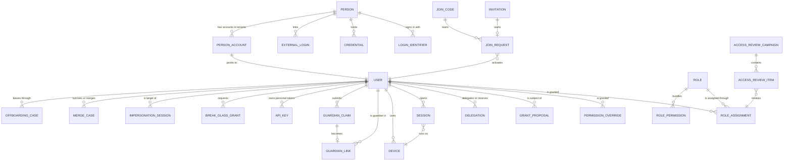

# Identity

> Service sheet, plan document 06. Group C. It refines reference architecture Section 8.3 and the Identity row of `05-service-catalog.md`; names come from Appendix L, permissions from Appendix B, events from Appendix E, error codes from Appendix K, workflows from Appendix R and rules from Appendix S. Where this sheet adds something the brief does not state, the addition is listed under Decisions in force or Open points.

**Group** C · **Requirement areas covered** IDN (all 47 rows), plus the credential rows of INT and the authorization rows of SEC · **Last updated** 2026-09-21 by the platform plan

Identity answers two questions for every request in the product: who is this, and what may they do here. It owns the people who can sign in (staff, guardians, students, platform operators and the seeded super administrator), every credential they hold, the OpenIddict token server that turns those credentials into small tokens, and the authorization model that every other service enforces locally: roles as bundles of Appendix B permissions, one data scope per grant, per-user overrides, time-boxed delegation, four-eyes approval for high-risk grants, access reviews, break-glass and consented impersonation. It also owns every way a person joins a school (invitation, join code, parent self-registration, bulk import, SSO just in time, from Admissions and from Hr) and every way they leave (offboarding with immediate revocation). It is the only issuer of credentials in the system, including tenant API keys and personal access tokens (`23-integrations-and-public-api.md` §2.2).

| Fact | Value | Source |
|---|---|---|
| Tier | 1 | Appendix L |
| AREA code | `IDN` | Appendix L |
| Long name | Identity and Access | Appendix L |
| Database | `nibras_identity`, user `svc_identity`, schemas `identity` (tenant-owned) and `identity_registry` (platform-scoped, see Decisions in force) | Appendix L, `10-data-architecture.md` §1 |
| Exchange | `nibras.identity` | Appendix L |
| Images | `nibras/identity-api` | Appendix L |
| Worker | none. Quartz.NET jobs run in the Api host, as for Attendance in `07-solution-structure.md` part 3 | Appendix L |
| Build phase | 1 | `05-service-catalog.md`, master brief Section 28 |
| Service level class | Gateway class: 99.9% monthly availability, p95 under 150 ms for token validation at the edge | Reference architecture Section 8.0, master brief Section 31 |
| Sensitivity | Sensitive (credentials, second-factor secrets, tokens, API keys) | `05-service-catalog.md`, Appendix J.3 |
| Synchronous dependencies | Platform `Settings`, `Retention.ListActiveHolds` and `Tenants.Checksum`; School's staff checksum and guardian eligibility check, each query-only (section 6) | Reference architecture Section 8.0 |
| Local copies | Tenant status from Platform (Section 8.0); staff directory and teaching assignments (this sheet, section 9) | Reference architecture Section 8.0, `10-data-architecture.md` §6 |
| Scaling profile | Login peak at the start of the school day; token validation is local in every service; effective permissions cached in Redis keyed by permission version | `05-service-catalog.md` |
| Why the boundary exists | Security level: credential and token material lives in one service with its own database role and its own threat model | `05-service-catalog.md` |

---

## 2. Responsibilities

| Identity owns | Detail |
|---|---|
| People who can sign in | `Person` (one human, one credential set, platform-scoped) and `User` (that person's account inside one tenant), BR-IDN-007 |
| Credentials | Passwords (Argon2id, history of 5), TOTP, passkeys, recovery codes, one-time codes for parents, external logins (Google and Microsoft through OpenID Connect in phase 1; SAML 2.0 and SCIM as Tier 2 adapters) |
| Token server | OpenIddict: authorization code with PKCE, refresh with rotation and reuse detection, client credentials for services, token exchange for API keys; access tokens of 15 minutes carrying user, tenant, roles and permission version only |
| Sessions and devices | Session list, remote sign-out, new-device detection and alert, lockout, per-account and per-address sign-in limits |
| The seeded super administrator | Every safeguard of master brief Section 10.2, the start-up seed guard and the break-glass recovery command |
| Roles and permissions | Role templates from Appendix I (locked, clonable), custom roles, role versions and history, the Appendix B catalog with bilingual descriptions and dependencies, per-user overrides, the role switcher |
| Data scopes | One scope per grant from the Appendix B list, evaluated in the BR-IDN-002 order; the anchors each scope needs (campus ids, department ids, own sections from the teaching-assignment copy, own children from guardian links) |
| Permission version | Per user and tenant (BR-IDN-008); the source of `identity.permissions.changed.v1` and of every permission cache invalidation |
| Effective permission service | The gRPC `PermissionLookup` that every service's authorization block calls on a cache miss, the "why can this person see this" explainer and the "view as role" preview |
| Four-eyes grants | WF-IDN-05 and BR-IDN-004 for every `high` permission |
| Delegation | WF-IDN-04 and BR-IDN-003 |
| Joining | Invitations, join codes and QR, join requests (WF-IDN-01), parent self-registration and guardian claims (WF-IDN-02), bulk account creation with dry run, SSO just in time with email-domain rules, accounts from Admissions (Saga 3) and from Hr |
| Guardian links | The link between a guardian account and a student id, with relationship and rights; the event `identity.guardian-link.created.v1` |
| Leaving | Offboarding with immediate revocation and a reassignment inventory (WF-IDN-06); duplicate account merge with a reversal journal (WF-IDN-03) |
| Access reviews | WF-SEC-01 campaigns, packets, decisions, certification |
| Emergency and support access | Break-glass for platform operators (WF-SEC-02), consented impersonation (WF-SEC-03, BR-IDN-009) |
| API credentials | The `ApiKey` aggregate for both tenant API keys and personal access tokens: prefix, key id, hash, scopes, expiry, state, permission version, last used (`23-integrations-and-public-api.md` §2.2) |
| Service accounts | The OpenIddict client registry for the twenty services, Gateway and the backends-for-frontends, with the scope list each may request |

### Not responsible for

| Identity does not own | Owner | How Identity relates to it |
|---|---|---|
| Student, guardian and staff records, custody and court orders | School | Identity links a user to a `studentId` or `staffId` and keeps only the slim staff copy of section 9; it asks School whether a guardian may be linked and never holds custody text |
| Staff contracts, hiring, leave | Hr | Consumes `hr.staff.hired.v1` to invite the new starter |
| Tenant settings values, including the Security and Joining groups of Appendix G | Platform (ADR-0009) | Reads them through the Platform settings entry and `platform.settings.changed.v1`; Platform checks `identity.security-policy.edit` for the Security group |
| Tenant lifecycle, plans, feature flags | Platform | Consumes the lifecycle events; answers the provisioning, deletion and tier-migration commands |
| The Integrations console, tenant key policy, quotas, webhooks, developer portal | Platform (Appendix L.5) | Platform calls Identity's `ApiKeyAdministration` gRPC; the secret material never leaves Identity |
| Support tickets and the support console | Platform | The impersonation workflow runs here; the ticket id is a reference |
| Login history kept for 7 years, the audit viewer, the access log | Audit | Identity emits `identity.audit.recorded.v1` for every sign-in and every change; Audit stores and serves the history |
| Delivery of invitations, codes and alerts by email, SMS and push | Notification | Identity publishes the event or the `RequestNotification` command; it never talks to a provider |
| Tasks and approvals that a leaver owns | Requests | Requests reassigns on `identity.user.deactivated.v1` with `reassignTo` |
| Teaching assignments | Academics | Identity keeps a copy for the `own-sections` anchor only |
| The permission check inside another service | That service, through `Nibras.BuildingBlocks.Authorization` | Identity supplies the effective set; enforcement, predicates and row-level security stay in the service (BR-IDN-002) |
| Wellbeing break-glass for tenant staff | Wellbeing (BR-WEL-002) | Identity owns only the platform operator path of WF-SEC-02; both publish `identity.break-glass.used.v1` naming the resource |
| Token validation at the edge, rate limiting, tenant resolution | Gateway | Identity publishes the signing keys; the Gateway validates locally |
| The permission refresh pushed to open clients | Communication (SignalR hub) | Communication consumes `identity.permissions.changed.v1` |

---

## 3. Requirements covered

| Range or identifier | What it binds here |
|---|---|
| REQ-IDN-001 to REQ-IDN-021 | Sign-in, tokens, second factors, passkeys, OTP, SSO, password policy, lockout, new-device alert, sessions, the seeded administrator and break-glass recovery |
| REQ-IDN-022 to REQ-IDN-032 | Invitations, join codes, join requests, parent self-registration, cross-tenant parents, bulk accounts, merge, offboarding |
| REQ-IDN-033 to REQ-IDN-047 | Roles, templates, matrix, scopes, overrides, delegation, four-eyes, live propagation, access reviews, preview and explainer, role switcher, impersonation, personal tokens, service accounts, security policy |
| REQ-INT-004, REQ-INT-005 | Personal access tokens and instant revocation through the permission version |
| REQ-SEC-003, REQ-SEC-004, REQ-SEC-006, REQ-SEC-007 | Object-level authorization, server-side enforcement, declared permissions, no wildcard |
| REQ-SEC-014, REQ-SEC-015, REQ-SEC-016, REQ-SEC-019 | Platform staff hold no tenant data permissions, impersonation consent, per-user rate limits, the default-password secret scan |
| REQ-PERF-006, REQ-PERF-015, REQ-PERF-021, REQ-PERF-023, REQ-PERF-030 | Permission cache hit ratio, compiled permission lookup, broadcast invalidation, never-cached credential material, the permission-evaluation benchmark |
| REQ-AUD-005, REQ-AUD-008 | Sign-in events and workflow transitions feed Audit |
| REQ-L10N-008 and the bilingual acceptance of REQ-IDN-035 | Arabic and English permission descriptions, Arabic search normalization in the matrix (BR-L10N-001 through `Nibras.BuildingBlocks.Localization`) |

---

## 4. Aggregates and entities

### 4.1 Base columns

Every table in the `identity` schema carries the base columns generated by `Nibras.BuildingBlocks.Persistence` (`10-data-architecture.md` §4). They are not repeated in the entity tables below.

| Column | Type | Null | Notes |
|---|---|---|---|
| `id` | uuid v7 | no | From `IIdGenerator`; primary key `(tenant_id, id)` |
| `tenant_id` | uuid v7 | no | First column of every index; bound by the `tenant_isolation` policy |
| `created_at`, `created_by` | timestamptz, uuid | no, yes | Injected clock; `created_by` null when a job, consumer or saga wrote the row |
| `updated_at`, `updated_by` | timestamptz, uuid | no, yes | Audit interceptor |
| `deleted_at`, `deleted_by` | timestamptz, uuid | yes, yes | Soft delete; partial indexes `WHERE deleted_at IS NULL` |
| `xmin` | xid (system) | no | Optimistic concurrency token on every aggregate root; conflict is `IDENTITY_CONCURRENCY_CONFLICT` |

Tables in `identity_registry` carry `id`, `created_at`, `updated_at` and `xmin` but no `tenant_id` and no soft delete (Decisions in force). Append-only tables (`login_events`, `merge_journal_entries`, `role_versions`) carry no `updated_*` and no `deleted_*`.

### 4.2 Registry aggregate: Person (schema `identity_registry`)

**Person** is one human with one credential set, reachable from several tenant accounts (BR-IDN-007).

| Entity | Field | Type | Null | Notes |
|---|---|---|---|---|
| Person | `status` | text enum `active`, `locked`, `disabled` | no | `disabled` only when the last linked account is deleted |
| Person | `locked_until` | timestamptz | yes | Lockout under the Security → password policy |
| Person | `failed_sign_ins` | int | no | Reset on success; per-address counters live in `redis-state` |
| Person | `preferred_language` | text `ar`, `en` | no | Default from the first tenant's default language |
| Person | `must_change_password` | bool | no | True for the seeded administrator and after an administrator reset |
| Person | `seeded_credential` | bool | no | True while the seeded password is unchanged (master brief Section 10.2) |
| LoginIdentifier | `person_id` | uuid | no | |
| LoginIdentifier | `kind` | text enum `email`, `phone` | no | Usernames are per tenant and live on `User` |
| LoginIdentifier | `normalized_value` | text | no | Lower-cased email or E.164 phone; unique among verified rows |
| LoginIdentifier | `verified_at` | timestamptz | yes | Unverified identifiers never sign in |
| Credential | `person_id` | uuid | no | |
| Credential | `kind` | text enum `password`, `totp`, `passkey`, `recovery-codes` | no | |
| Credential | `material` | bytea | no | Argon2id hash for a password; column-encrypted secret for TOTP; public key and credential id for a passkey; salted hashes for recovery codes. Never logged, never cached (Appendix J.4) |
| Credential | `parameters` | jsonb | no | Algorithm parameters, TOTP period, passkey sign count |
| Credential | `label` | text | yes | "Work laptop" for a passkey |
| Credential | `last_used_at`, `replaced_at` | timestamptz | yes | |
| PasswordHistory | `person_id`, `hash`, `created_at` | uuid, bytea, timestamptz | no | Last 5 kept by `CredentialHistoryJob` |
| ExternalLogin | `provider`, `subject`, `person_id`, `email_at_link` | text, text, uuid, text | no | Unique `(provider, subject)` |
| PersonAccount | `person_id`, `tenant_id`, `user_id`, `status` | uuid, uuid, uuid, text | no | The tenant chooser shown only after credentials verify (BR-IDN-007) |
| ServiceClient | `client_id`, `kind` (`service`, `gateway`, `bff`), `allowed_scopes` text[], `secret_ref` | text | no | Registry of OpenIddict applications; secrets in OpenBao, only the reference here |

Invariants:

1. A person has at most one active `password` credential; setting a new one moves the old hash to `PasswordHistory` in the same transaction.
2. A new password equal to any of the last 5 hashes, to a breached-list entry, or, for the seeded account, to the documented default is refused with `IDENTITY_VALIDATION_FAILED` (`params.reason` `passwordReused`, `passwordBreached`, `seededDefaultRefused`).
3. A `verified_at` null identifier can never authenticate.
4. A person with `status = locked` and `locked_until` in the future is refused with `IDENTITY_ACCOUNT_LOCKED`, the seeded administrator included (REQ-IDN-012).
5. The list of tenants for a person is returned only after the credential check succeeds (BR-IDN-007 edge case, `TC-SEC-034`).
6. Deleting the account in one tenant never deletes the person; the person is disabled only when its last `PersonAccount` goes.

### 4.3 Aggregate: User (schema `identity`)

| Entity | Field | Type | Null | Notes |
|---|---|---|---|---|
| User | `person_id` | uuid | no | Registry link |
| User | `username` | text | yes | Unique per tenant; username policy from Security → login methods |
| User | `normalized_email`, `normalized_phone` | text | yes | Denormalized from the verified identifiers for the tenant-domain sign-in index (`21-performance-engineering.md` §3.1 query 2) |
| User | `name_en`, `name_ar` | text | no | Bilingual value object |
| User | `kind` | text enum `staff`, `guardian`, `student`, `platform-operator` | no | A person holding two kinds in one tenant has two role assignments on one user, not two users |
| User | `staff_id`, `student_id` | uuid | yes | References to School; no foreign key |
| User | `status` | text enum `invited`, `pending-approval`, `active`, `suspended`, `offboarding`, `deactivated`, `merged` | no | |
| User | `permission_version` | bigint | no | BR-IDN-008; incremented by every grant, revocation, scope change, delegation start and end |
| User | `is_super_administrator` | bool | no | Derived from holding the platform Super Administrator role; indexed for BR-IDN-005 |
| User | `last_sign_in_at` | timestamptz | yes | |
| User | `custom_fields` | jsonb (side table `user_custom_field_values`) | yes | Values for Platform-defined fields of entity type `user` (Appendix L.5) |
| RoleAssignment | `user_id`, `role_id` | uuid | no | |
| RoleAssignment | `scope_kind` | text enum `all-tenant`, `campus`, `stage`, `department`, `own-sections`, `own-homeroom`, `own-children`, `self` | no | Exactly one per grant (Appendix B) |
| RoleAssignment | `scope_anchor_ids` | uuid[] | no | Campus, stage or department ids; empty for scopes resolved from anchors (`own-*`, `self`) |
| RoleAssignment | `valid_from`, `valid_to` | timestamptz | no, yes | `valid_to` required for a `high` grant unless made permanent by an audited choice |
| RoleAssignment | `granted_via` | text enum `direct`, `join-method`, `grant-proposal`, `template-seed`, `effect` | no | |
| RoleAssignment | `source_id` | uuid | yes | Join code, invitation, proposal or request id |
| PermissionOverride | `user_id`, `permission`, `scope_kind`, `scope_anchor_ids`, `valid_to`, `reason` | uuid, text, text, uuid[], timestamptz, text | `valid_to` yes | A grant on top of roles (REQ-IDN-037); no deny overrides |

Invariants:

1. Every `permission` string exists in the Appendix B catalog loaded at start-up; an unknown string fails validation (REQ-SEC-006).
2. A role assignment or override carrying any `high` permission cannot be written directly; it is created only by an approved `GrantProposal` (BR-IDN-004); a direct attempt returns `IDENTITY_FOUR_EYES_REQUIRED` with the created proposal id.
3. Removing the super administrator role from, suspending, deactivating or deleting the last active super administrator of a tenant is refused with `IDENTITY_LAST_SUPER_ADMIN`, in the same transaction, so two concurrent removals cannot both pass (BR-IDN-005).
4. Every change to assignments, overrides, guardian links or delegations of a user increments `permission_version` in the same transaction as the change and writes the outbox row for `identity.permissions.changed.v1`.
5. A user in `offboarding`, `deactivated` or `merged` status has no live session and no live refresh token family; the transition revokes them in the same transaction (TC-IDN-051).
6. A platform-operator user holds no permission outside `platform.*`, `identity.*` for the platform tenant and `audit.integrity.*` (REQ-SEC-014).

### 4.4 Aggregate: Role

| Entity | Field | Type | Null | Notes |
|---|---|---|---|---|
| Role | `code` | text | no | Unique per tenant; template codes from Appendix I |
| Role | `name_en`, `name_ar`, `description_en`, `description_ar` | text | no | |
| Role | `is_system` | bool | no | Appendix I templates: locked, clonable |
| Role | `parent_role_id`, `cloned_from_release` | uuid, text | yes | Recorded on a clone (Appendix I.5 rule 1) |
| Role | `current_version` | int | no | Incremented per save |
| Role | `highest_risk` | text enum `normal`, `elevated`, `high` | no | Computed on save; used by BR-IDN-006 and the access-review scope |
| RolePermission | `role_id`, `permission`, `default_scope_kind` | uuid, text, text | no | |
| RoleVersion | `role_id`, `version`, `permissions` jsonb, `changed_by`, `changed_at`, `reason` | | no | Append-only history for "compare" and "change history" (REQ-IDN-042) |

Invariants:

1. A role whose permission set lacks a declared dependency is refused and the missing permission is named (BR-IDN-001); dependencies resolve transitively and a cycle fails start-up.
2. A system role cannot be edited or deleted; cloning it creates an editable role with the same set and records the parent and release (REQ-IDN-034).
3. A role holding an action permission with no data scope cannot be saved (BR-IDN-002 edge case).
4. Deleting a role with live assignments is refused; archiving is allowed (Appendix A2 rule).
5. There is no permission that means "all permissions" (Appendix B rule 6).

### 4.5 Aggregate: GrantProposal (WF-IDN-05)

| Field | Type | Null | Notes |
|---|---|---|---|
| `subject_user_id` | uuid | no | |
| `kind` | text enum `role-assignment`, `scope-change`, `override` | no | |
| `payload` | jsonb | no | Role id or permission, scope kind and anchors, `valid_to` |
| `risk` | text enum `normal`, `elevated`, `high` | no | Highest risk inside the payload |
| `state` | `RoleChangeWithFourEyesApprovalStatus` | no | `Requested`, `UnderReview`, `AwaitingSecondApproval`, `Approved`, `Propagated`, `Rejected`, `Withdrawn`, `Expired` |
| `requested_by`, `first_approver_id`, `second_approver_id` | uuid | first two no | |
| `reason`, `rejection_reason` | text | yes | Reason required for `elevated` and `high` |
| `expires_at` | timestamptz | no | Now plus Security → high-risk grant approval window (default 72 hours) |
| `make_permanent` | bool | no | Audited explicit choice (Appendix B rule 2) |
| `source_request_id` | uuid | yes | Set when Saga 6 sent `ProposeRoleChange` |

Invariants: the second approver differs from the requester, the first approver and the subject (`IDENTITY_SELF_APPROVAL_REFUSED`, TC-IDN-043); a proposal confers nothing before `Approved`; an expired proposal confers nothing and is recorded; propagation failure rolls back to the previous set (Appendix R compensation).

### 4.6 Aggregate: Delegation (WF-IDN-04)

| Field | Type | Null | Notes |
|---|---|---|---|
| `from_user_id`, `to_user_id` | uuid | no | Same tenant |
| `permissions` | text[] | no | Subset of the delegator's live set; approval permissions and request-type approval rights |
| `request_type_codes` | text[] | yes | Narrows approval rights to named request types |
| `starts_at`, `ends_at` | timestamptz | no | Interpreted in the campus time zone (BR-IDN-003) |
| `state` | `DelegationDuringAbsenceStatus` | no | `Drafted`, `Accepted`, `Declined`, `Active`, `Ended`, `Revoked` |
| `created_via` | text enum `self`, `administrator`, `leave` | no | |

Invariants: `ends_at - starts_at` does not exceed Security → delegation maximum duration (default 30 days); a delegated permission is never re-delegated; a use outside the window or beyond the delegator's live set fails with `IDENTITY_DELEGATION_EXPIRED` or `IDENTITY_PERMISSION_DENIED`; start and end each bump the delegate's permission version.

### 4.7 Aggregates of joining: Invitation, JoinCode, JoinRequest (WF-IDN-01)

| Entity | Field | Type | Null | Notes |
|---|---|---|---|---|
| Invitation | `contact_kind`, `contact_encrypted` | text, bytea | no | Email or phone, column-encrypted; hashed lookup column `contact_hash` |
| Invitation | `token_hash` | bytea | no | The link token is never stored (Appendix J token row) |
| Invitation | `role_id`, `scope_kind`, `scope_anchor_ids`, `campus_id` | | no | Pre-assigned grant |
| Invitation | `source` | text enum `administrator`, `tenant-owner`, `hr`, `admissions`, `bulk`, `staff-created` | no | |
| Invitation | `state` | text enum `pending`, `accepted`, `revoked`, `expired` | no | |
| Invitation | `expires_at`, `reminded_at`, `sent_count` | timestamptz, timestamptz, int | reminded yes | Expiry from Joining → invitation expiry |
| JoinCode | `audience` | text enum `staff`, `parents`, `students` | no | |
| JoinCode | `code_hash`, `display_prefix` | bytea, text | no | Full code shown once at creation and in the QR |
| JoinCode | `campus_id`, `default_role_id`, `approver_role_id` | uuid | approver yes | BR-IDN-006 |
| JoinCode | `max_uses`, `uses`, `expires_at`, `state` | int, int, timestamptz, text | max_uses yes | |
| JoinRequest | `user_id`, `join_method`, `join_code_id`, `invitation_id` | | codes yes | |
| JoinRequest | `requested_role_id`, `scope_kind`, `scope_anchor_ids` | | no | |
| JoinRequest | `state` | `InvitationOrJoinCodeJoiningStatus` | no | `Invited`, `CodeEntered`, `Registered`, `Verified`, `PendingApproval`, `Approved`, `Rejected`, `Activated`, `Expired` |
| JoinRequest | `submitted_at`, `escalated_at`, `decided_by`, `decision_reason` | | decision yes | |

Invariants: an invitation token is single use, bound to its tenant, unexpired and unrevoked (TC-IDN-001, TC-IDN-006); a join code's default role holds no `high` permission and a person joining receives exactly that role at that campus (BR-IDN-006); a code past `max_uses` or `expires_at` creates nothing (`IDENTITY_JOIN_CODE_INVALID`); approval requires `identity.join-requests.approve` in the same tenant, checked after the tenant check (TC-IDN-005); two joins by the same verified contact produce one user with two assignments.

### 4.8 Aggregates of guardians: GuardianClaim (WF-IDN-02) and GuardianLink

| Entity | Field | Type | Null | Notes |
|---|---|---|---|---|
| GuardianClaim | `user_id` | uuid | no | The registered parent |
| GuardianClaim | `student_code_hash`, `verification_detail_hash` | bytea | no | Student code plus one verification detail (master brief Section 10.4); never stored in clear |
| GuardianClaim | `evidence_file_id` | uuid | yes | Documents file reference, scanned by the Files block |
| GuardianClaim | `candidate_student_id` | uuid | yes | Set in `MatchProposed` |
| GuardianClaim | `state` | `ParentSelfRegistrationAndChildLinkingStatus` | no | `Registered`, `Verified`, `ClaimSubmitted`, `MatchProposed`, `Unmatched`, `LinkApproved`, `LinkRejected`, `Linked` |
| GuardianClaim | `eligibility_code` | text | yes | Reason code from School's eligibility check; never custody text |
| GuardianLink | `guardian_user_id`, `student_id` | uuid | no | Unique while active |
| GuardianLink | `relationship` | text | no | From School's relationship list |
| GuardianLink | `rights` | text[] | no | `view`, `receive-messages`, `pick-up`, `pay`, `consent` |
| GuardianLink | `state`, `revoked_reason` | text | reason yes | `active`, `revoked` |

Invariants: a verified parent sees zero children until a link is approved (TC-IDN-011); at most five open claims per account (TC-IDN-012); a link is created only when School's eligibility check answers `allowed` (TC-IDN-015); a second child adds a link to the same user, never a second account (TC-IDN-016); a link revocation bumps the guardian's permission version so the `own-children` anchor shrinks everywhere.

### 4.9 Aggregates of sessions and credentials for APIs: Session, Device, ApiKey

| Entity | Field | Type | Null | Notes |
|---|---|---|---|---|
| Session | `user_id`, `person_id`, `device_id` | uuid | device yes | |
| Session | `token_family_id` | uuid | no | The refresh-token family; handles live in `redis-state` under `state:token:` |
| Session | `auth_methods` | text[] | no | `password`, `totp`, `passkey`, `otp`, `sso`, `recovery-code` |
| Session | `role_context_id` | uuid | yes | The active role chosen in the switcher (REQ-IDN-043) |
| Session | `impersonation_id` | uuid | yes | Set for an impersonated session |
| Session | `ip_hash`, `last_seen_at`, `revoked_at`, `revoke_reason` | | revoke yes | |
| Device | `user_id`, `fingerprint_hash`, `label`, `platform`, `first_seen_at`, `last_seen_at` | | no | New fingerprint raises `identity.login.new-device.v1` |
| LoginEvent | `person_id`, `user_id`, `occurred_at`, `outcome`, `method`, `ip_hash`, `device_id`, `failure_reason` | | user yes | Partitioned by month; short-lived working set for lockout and new-device logic; the 7-year history is Audit's |
| ApiKey | `kind` | text enum `tenant-key`, `personal-token` | no | `23-integrations-and-public-api.md` §2.1 |
| ApiKey | `key_id` | char(16) Crockford base32 | no | Unique |
| ApiKey | `environment` | text enum `live`, `test` | no | `test` only on a sandbox tenant |
| ApiKey | `secret_hash` | bytea | no | `HMAC-SHA256(pepper, secret)`; constant-time compare |
| ApiKey | `owner_user_id` | uuid | yes | Personal tokens only |
| ApiKey | `name`, `scopes` text[], `scope_kind`, `campus_id` | | campus yes | Scopes are Appendix B names (§2.4 of document 23) |
| ApiKey | `expires_at` | timestamptz | no | Tenant key default 90, maximum 365 days; personal default 30, maximum 90 |
| ApiKey | `rate_limit_per_minute`, `daily_cap` | int | cap yes | |
| ApiKey | `state`, `permission_version`, `revealed_at`, `last_used_at`, `last_used_ip_hash`, `revoked_at` | | several yes | `revealed_at` enforces reveal-once |

Invariants: a key never has a null `expires_at`; a tenant key holds no `high`, `wellbeing.*`, `identity.*`, `platform.api-keys.*`, `platform.integrations.*` or `audit.*` scope; a personal token's effective set is the intersection of its scopes and the owner's live set; revocation increments `permission_version` and publishes `identity.permissions.changed.v1` with the key id (document 23 §2.6); deactivating a user revokes every personal token in the same transaction; at most 50 tenant keys per tenant and 5 personal tokens per user.

### 4.10 Aggregates of oversight: AccessReviewCampaign, BreakGlassGrant, ImpersonationSession

| Entity | Field | Type | Null | Notes |
|---|---|---|---|---|
| AccessReviewCampaign | `name`, `scope` jsonb, `deadline_at`, `auto_revoke`, `extended_once` | | no | Scope: roles, groups with `high` inside (Appendix I.3), campuses |
| AccessReviewCampaign | `state` | `AccessReviewCampaignStatus` | no | `Scheduled`, `Opened`, `InProgress`, `Overdue`, `Completed`, `Certified`, `Cancelled` |
| AccessReviewCampaign | `report_file_id`, `report_sha256` | uuid, text | yes | Certification report from Documents |
| AccessReviewItem | `campaign_id`, `reviewer_id`, `subject_user_id`, `assignment_id`, `decision`, `decided_at`, `reason` | | decision yes | `certify`, `revoke`, `undecided` |
| BreakGlassGrant | `operator_user_id`, `incident_reference`, `reason` | uuid, text, text | no | |
| BreakGlassGrant | `state` | `BreakGlassAccessStatus` | no | `Requested`, `Granted`, `Denied`, `Active`, `Expired`, `Revoked`, `UnderReview`, `Closed` |
| BreakGlassGrant | `granted_at`, `expires_at`, `review_due_at`, `reviewed_by` | | review yes | Hard 60-minute box; review within 2 working days |
| ImpersonationSession | `agent_user_id`, `target_user_id`, `ticket_id`, `reason`, `requested_minutes`, `write_scope_requested` | | ticket yes | |
| ImpersonationSession | `state` | `ConsentedImpersonationStatus` | no | `Requested`, `ConsentPending`, `Consented`, `Refused`, `Active`, `Ended`, `Terminated`, `Logged` |
| ImpersonationSession | `consent_expires_at`, `consented_at`, `started_at`, `ends_at`, `transcript_sha256` | | several yes | Consent lapses at 15 minutes; session capped at 30 minutes |

Invariants: an access-review packet for a user of another tenant is refused (TC-SEC-006); undecided items at the deadline are revoked when `auto_revoke` is on (TC-SEC-004); a break-glass request without an incident reference is denied and alerted (TC-SEC-012); a second grant for an operator already elevated is refused; impersonation of a student account is refused with no prompt (TC-SEC-022); an impersonation token never carries a `wellbeing.*` permission; a write during impersonation without consented write scope is refused and audited (TC-SEC-024).

### 4.11 Aggregates of change: MergeCase (WF-IDN-03) and OffboardingCase (WF-IDN-06)

| Entity | Field | Type | Null | Notes |
|---|---|---|---|---|
| MergeCase | `survivor_user_id`, `victim_user_id` | uuid | no until `Planned` | Same tenant only (TC-IDN-022) |
| MergeCase | `state` | `DuplicateAccountMergeStatus` | no | `Detected`, `Reviewed`, `Dismissed`, `Planned`, `Simulated`, `Merged`, `Confirmed`, `Reverted` |
| MergeCase | `detected_by` | text | no | `data-quality-rule` or `administrator` |
| MergeCase | `impact_report` | jsonb | yes | Roles, links, sessions and open requests affected |
| MergeCase | `journal_checksum`, `reversal_ends_at` | text, timestamptz | yes | 14-day window |
| MergeJournalEntry | `merge_case_id`, `seq`, `operation`, `before` jsonb, `after` jsonb | | no | Append-only; written before anything moves |
| OffboardingCase | `user_id`, `trigger`, `last_working_day`, `deadline_at`, `reassign_to_default` | | reassign yes | `trigger`: `staff-left`, `administrator`, `contract-end` |
| OffboardingCase | `state` | `OffboardingAndAccessRevocationStatus` | no | `Triggered`, `Revoked`, `ReassignmentPending`, `Reassigned`, `Escalated`, `Archived` |
| OffboardingItem | `case_id`, `kind`, `reference_id`, `owning_service`, `new_owner_user_id`, `state` | | owner yes | Kinds: `teaching-assignment`, `delegation`, `grant-proposal`, `access-review-packet`, `join-code-approver` |

Invariants: a merge writes and checksums its journal before any move (TC-IDN-024); a revert replays the journal exactly and marks it consumed (TC-IDN-025); an offboarding revocation is never undone by the workflow, only by an audited reinstatement; the inventory lists every item and drops none (TC-IDN-052).

### 4.12 Entity relationship diagram



---

## 5. REST API

Conventions from `22-api-conventions-and-error-catalog.md`: keyset lists (§2.1), `ETag` and `If-Match` on single-resource writes (§4), `Idempotency-Key` where the column says so (§5), 202 plus a job for long operations (§6), per-item results on bulk (§7), Problem Details (§8). Service rate-limit policies (§9.1): `auth` (10 per 5 minutes) on every anonymous sign-in, code and registration route; `sensitive` on reveal and explainer routes; `read` and `write` elsewhere.

**Every row may also return** `IDENTITY_VALIDATION_FAILED`, `IDENTITY_PERMISSION_DENIED`, `IDENTITY_TENANT_MISMATCH`, `IDENTITY_NOT_FOUND`, `IDENTITY_RATE_LIMITED` and `IDENTITY_DEPENDENCY_UNAVAILABLE`; single-resource writes also return `IDENTITY_CONCURRENCY_CONFLICT`, and a write on a suspended tenant returns `PLATFORM_TENANT_SUSPENDED` (BR-PLT-002). The Errors column lists what is specific to the row. **"Self"** in the permission column means an authenticated caller acting on their own account under the `self` data scope; such routes declare no Appendix B permission (Decisions in force).

### 5.1 OpenID Connect and sign-in

| Method | Path | Permission | Request | Response | Errors | Idempotent |
|---|---|---|---|---|---|---|
| GET | `/.well-known/openid-configuration` | none (public) | none | discovery document | none | safe |
| GET | `/.well-known/jwks` | none (public) | none | signing key set, current and overlapping keys | none | safe |
| GET | `/connect/authorize` | none; renders the hosted sign-in page | `client_id`, `redirect_uri`, `code_challenge`, `state`, `ui_locales` | 302 to the sign-in page or the redirect with a code | `IDENTITY_VALIDATION_FAILED` | safe |
| POST | `/connect/token` | none; client authentication per grant | `grant_type` `authorization_code`, `refresh_token`, `client_credentials` (services; also a tenant key id and secret for OneRoster clients, document 23 §6.2), or the token-exchange grant for API credentials (Gateway client only) | access token 15 min, refresh token 30 days, or internal token 5 min | `IDENTITY_CREDENTIALS_INVALID`, `IDENTITY_REFRESH_TOKEN_REUSED`, `IDENTITY_TOKEN_EXPIRED`, `IDENTITY_TENANT_MISMATCH` | refresh: single use by design |
| POST | `/connect/revoke` | none; client authentication | `token`, `token_type_hint` | 200 | none | yes |
| POST | `/connect/logout` | authenticated | `id_token_hint`, `post_logout_redirect_uri` | 302; session and family revoked | none | yes |
| GET | `/connect/userinfo` | authenticated | none | `sub`, names, language, tenant | `IDENTITY_TOKEN_EXPIRED` | safe |
| POST | `/api/v1/identity/auth/sign-in` | none, `auth` policy | `SignInRequest` (username, email or phone, password, device fingerprint) | `SignInResult` (next step: tenant choice, second factor, password change, or completed) | `IDENTITY_CREDENTIALS_INVALID`, `IDENTITY_ACCOUNT_LOCKED`, `IDENTITY_TWO_FACTOR_REQUIRED` | no |
| POST | `/api/v1/identity/auth/second-factor` | none, `auth` policy, bound to the sign-in transaction | `SecondFactorRequest` (TOTP code, recovery code, or passkey assertion) | `SignInResult` | `IDENTITY_CREDENTIALS_INVALID`, `IDENTITY_ACCOUNT_LOCKED` | no; a TOTP code is single use per window (T-IDN-02) |
| POST | `/api/v1/identity/auth/passkey-assertion-options` | none, `auth` policy | `PasskeyOptionsRequest` | WebAuthn assertion options with challenge | none | no |
| POST | `/api/v1/identity/auth/one-time-codes` | none, `auth` policy | `OneTimeCodeRequest` (verified phone, purpose `sign-in`) | 202; code sent through Notification | `IDENTITY_VALIDATION_FAILED` (`params.reason = "otpNotEnabled"`) | no; one live code per purpose |
| POST | `/api/v1/identity/auth/one-time-codes/verification` | none, `auth` policy | `VerifyOneTimeCodeRequest` | `SignInResult` | `IDENTITY_CREDENTIALS_INVALID` | single use |
| GET | `/api/v1/identity/auth/tenants` | sign-in transaction only | none | `SelectableTenant[]` (id, name, logo file id) | `IDENTITY_CREDENTIALS_INVALID` when the transaction is not yet verified | safe |
| POST | `/api/v1/identity/auth/tenant-selection` | sign-in transaction only | `SelectTenantRequest` | `SignInResult` | `IDENTITY_TENANT_MISMATCH`, `PLATFORM_TENANT_SUSPENDED` for a non-owner when the suspension reason is `policy-breach` (WF-PLT-03); a non-payment suspension is read-only and sign-in stays open (BR-PLT-002) | no |
| GET | `/api/v1/identity/auth/external/{provider}` | none | `returnUrl` | 302 to Google or Microsoft | `IDENTITY_VALIDATION_FAILED` (`providerDisabled`) | safe |
| GET | `/api/v1/identity/auth/external/{provider}/callback` | none | provider response | `SignInResult`; just-in-time account with the domain's default role, optionally pending approval (REQ-IDN-009) | `IDENTITY_CREDENTIALS_INVALID`, `IDENTITY_VALIDATION_FAILED` (`domainNotAllowed`) | natural: keyed on `(provider, subject)` |
| POST | `/api/v1/identity/auth/password-reset-requests` | none, `auth` policy | `PasswordResetRequest` (email or phone) | 202 always, whether or not the account exists | none | no |
| POST | `/api/v1/identity/auth/password-resets` | none, `auth` policy | `ResetPasswordRequest` (token, new password) | 204; every session of the person revoked | `IDENTITY_VALIDATION_FAILED` (`tokenExpired`, `passwordBreached`, `passwordReused`) | single-use token |

### 5.2 The signed-in user (`/me`)

| Method | Path | Permission | Request | Response | Errors | Idempotent |
|---|---|---|---|---|---|---|
| GET | `/api/v1/identity/me` | Self | none | `MeResponse` (names, language, kind, roles, active role context, second-factor state, `mustChangePassword`) | none | safe |
| PATCH | `/api/v1/identity/me` | Self | `UpdateMeRequest` (preferred language, display name) | `MeResponse` | none | `If-Match` |
| POST | `/api/v1/identity/me/password` | Self | `ChangePasswordRequest` (current, new) | 204; other sessions revoked | `IDENTITY_CREDENTIALS_INVALID`, `IDENTITY_VALIDATION_FAILED` (`seededDefaultRefused`, `passwordReused`, `passwordBreached`) | no |
| POST | `/api/v1/identity/me/second-factors/totp` | Self | none | `TotpEnrolmentResponse` (secret shown once as a QR payload) | `IDENTITY_VALIDATION_FAILED` (`alreadyEnrolled`) | no |
| POST | `/api/v1/identity/me/second-factors/totp/confirmation` | Self | `ConfirmTotpRequest` (code) | 204 plus 10 recovery codes shown once | `IDENTITY_CREDENTIALS_INVALID` | no |
| DELETE | `/api/v1/identity/me/second-factors/totp` | Self, recent re-authentication | none | 204 | `IDENTITY_TWO_FACTOR_REQUIRED` when the role enforces a second factor (REQ-IDN-007) | yes |
| POST | `/api/v1/identity/me/recovery-codes` | Self, recent re-authentication | none | 10 new codes shown once; previous set invalidated | none | no |
| GET | `/api/v1/identity/me/passkeys` | Self | none | `PasskeySummary[]` | none | safe |
| POST | `/api/v1/identity/me/passkeys/registration-options` | Self | `PasskeyRegistrationOptionsRequest` | WebAuthn creation options | none | no |
| POST | `/api/v1/identity/me/passkeys` | Self | `RegisterPasskeyRequest` (attestation, label) | `PasskeySummary` | `IDENTITY_VALIDATION_FAILED` (`attestationInvalid`) | no |
| DELETE | `/api/v1/identity/me/passkeys/{passkeyId}` | Self, recent re-authentication | none | 204 | none | yes |
| GET | `/api/v1/identity/me/sessions` | Self | keyset cursor | `SessionSummary[]` | none | safe |
| DELETE | `/api/v1/identity/me/sessions/{sessionId}` | Self | none | 204; next request on that session is 401 (REQ-IDN-014) | none | yes |
| GET | `/api/v1/identity/me/devices` | Self | none | `DeviceSummary[]` | none | safe |
| DELETE | `/api/v1/identity/me/devices/{deviceId}` | Self | none | 204; sessions on that device revoked | none | yes |
| GET | `/api/v1/identity/me/tenants` | Self | none | `SelectableTenant[]` | none | safe |
| POST | `/api/v1/identity/me/tenant-switch` | Self | `SwitchTenantRequest` | new token pair for the other tenant; the current token is not widened (BR-IDN-007) | `IDENTITY_TENANT_MISMATCH` | no |
| POST | `/api/v1/identity/me/role-context` | Self | `SwitchRoleContextRequest` (role assignment id) | new access token narrowed to that role (REQ-IDN-043) | `IDENTITY_VALIDATION_FAILED` (`notYourRole`) | yes, same context twice returns the same claims |
| GET | `/api/v1/identity/me/effective-permissions` | Self | none | `EffectivePermissionSet` for the active context | none | safe |
| POST | `/api/v1/identity/me/external-logins` | Self | `LinkExternalLoginRequest` (provider result) | `ExternalLoginSummary` | `IDENTITY_VALIDATION_FAILED` (`alreadyLinkedElsewhere`) | natural on `(provider, subject)` |
| DELETE | `/api/v1/identity/me/external-logins/{externalLoginId}` | Self | none | 204 | `IDENTITY_VALIDATION_FAILED` (`lastSignInMethod`) | yes |
| GET | `/api/v1/identity/me/personal-tokens` | `identity.api-keys.view` | none | `ApiKeySummary[]` (prefix, scopes, expiry, last used; never the secret) | none | safe |
| POST | `/api/v1/identity/me/personal-tokens` | `identity.api-keys.create` | `CreatePersonalTokenRequest` (name, scopes, expiry) | `CreatedApiKey` with the secret once | `IDENTITY_VALIDATION_FAILED` (`scopeNotHeld`, `expiryTooLong`, `tokenLimitReached`) | `Idempotency-Key` required, so a retry never mints two secrets |
| DELETE | `/api/v1/identity/me/personal-tokens/{keyId}` | `identity.api-keys.delete` | none | 204; revocation propagated within 5 s | none | yes |
| GET | `/api/v1/identity/me/delegations` | Self | none | delegations given and received | none | safe |

### 5.3 Users

| Method | Path | Permission | Request | Response | Errors | Idempotent |
|---|---|---|---|---|---|---|
| GET | `/api/v1/identity/users` | `identity.users.view` | filter (`status`, `kind`, `roleCode`, `campusId`), `q` with Arabic normalization, sort, cursor | `UserListItem[]` keyset | none | safe |
| GET | `/api/v1/identity/users/{userId}` | `identity.users.view` | none | `UserDetail` with assignments, overrides, links | none | safe, `ETag` |
| POST | `/api/v1/identity/users` | `identity.users.create` | `CreateUserRequest` (names, contact, kind, role and scope, send activation) | 201 `UserDetail` | `IDENTITY_FOUR_EYES_REQUIRED` when the role is high risk | `Idempotency-Key` optional; natural on verified contact |
| PATCH | `/api/v1/identity/users/{userId}` | `identity.users.edit` | merge patch of names, username, custom fields | `UserDetail` | none | `If-Match` |
| DELETE | `/api/v1/identity/users/{userId}` | `identity.users.delete` | none | 204; only for users never activated (`invited`, `pending-approval`); an active user leaves through offboarding | `IDENTITY_LAST_SUPER_ADMIN`, `IDENTITY_VALIDATION_FAILED` (`useOffboarding`) | yes |
| POST | `/api/v1/identity/users/bulk` | `identity.users.create` | `BulkCreateUsersRequest` (rows, `dryRun`) | per-item results; activation links on commit (REQ-IDN-030) | per item | `Idempotency-Key` required |
| POST | `/api/v1/identity/users/exports` | `identity.users.export` | `ExportUsersRequest` (filter, columns, format) | 202 job | none | `Idempotency-Key` required |
| POST | `/api/v1/identity/users/{userId}/invite` | `identity.users.invite` | `InviteExistingUserRequest` (channel) | 202; invitation created for an account created without credentials | `IDENTITY_VALIDATION_FAILED` (`alreadyActive`) | natural: one pending invitation per user |
| POST | `/api/v1/identity/users/{userId}/activate` | `identity.users.activate` | `{}` or reason | `UserDetail` | none | yes |
| POST | `/api/v1/identity/users/{userId}/suspend` | `identity.users.suspend` | `SuspendUserRequest` (reason) | `UserDetail`; sessions revoked | `IDENTITY_LAST_SUPER_ADMIN` | yes |
| POST | `/api/v1/identity/users/{userId}/reset-password` | `identity.users.reset-password` | `ResetUserPasswordRequest` (delivery channel) | 202; one-time reset link sent, `must_change_password` set | none | no |
| POST | `/api/v1/identity/users/{userId}/force-signout` | `identity.users.force-signout` | reason | 204; every session and token family revoked within 5 s | none | yes |
| GET | `/api/v1/identity/users/{userId}/sessions` | `identity.sessions.view` | cursor | `SessionSummary[]` | none | safe |
| DELETE | `/api/v1/identity/users/{userId}/sessions/{sessionId}` | `identity.sessions.revoke` | reason | 204 | none | yes |
| GET | `/api/v1/identity/users/{userId}/devices` | `identity.sessions.view` | none | `DeviceSummary[]` | none | safe |
| POST | `/api/v1/identity/users/{userId}/role-assignments` | `identity.roles.assign-role` | `AssignRoleRequest` (role, scope, anchors, `validTo`) | 201 assignment, or 202 with a grant proposal for `high` | `IDENTITY_FOUR_EYES_REQUIRED`, `IDENTITY_VALIDATION_FAILED` (`scopeRequired`, `dependencyMissing`) | `Idempotency-Key` optional |
| DELETE | `/api/v1/identity/users/{userId}/role-assignments/{assignmentId}` | `identity.roles.assign-role` | reason | 204 | `IDENTITY_LAST_SUPER_ADMIN` | yes |
| POST | `/api/v1/identity/users/{userId}/permission-overrides` | `identity.roles.assign-role` | `AddOverrideRequest` (permission, scope, `validTo`, reason) | 201, or 202 with a proposal for `high` | `IDENTITY_FOUR_EYES_REQUIRED` | `Idempotency-Key` optional |
| DELETE | `/api/v1/identity/users/{userId}/permission-overrides/{overrideId}` | `identity.roles.assign-role` | reason | 204 | none | yes |
| GET | `/api/v1/identity/users/{userId}/effective-permissions` | `identity.permissions.view` | `roleContextId` optional | `EffectivePermissionSet` | none | safe |
| GET | `/api/v1/identity/users/{userId}/effective-permissions/explanation` | `identity.permissions.explain-effective` | `permission`, optional `resourceType` and `resourceId` | `PermissionExplanation`: the role, override or delegation that grants it, the scope, and the stage of BR-IDN-002 that would refuse it | none | safe |
| GET | `/api/v1/identity/users/{userId}/guardian-links` | `identity.users.view` | none | `GuardianLinkSummary[]` | none | safe |
| DELETE | `/api/v1/identity/users/{userId}/guardian-links/{linkId}` | `school.guardians.unlink` | reason | 204; permission version bumped (`12-security-privacy-safety.md` §10.2) | none | yes |
| GET | `/api/v1/identity/personal-tokens` | `identity.api-keys.view` | filter by owner, cursor | `ApiKeySummary[]` for every user in scope | none | safe |
| DELETE | `/api/v1/identity/personal-tokens/{keyId}` | `identity.api-keys.delete` | reason | 204 | none | yes |

### 5.4 Roles and the permission catalog

| Method | Path | Permission | Request | Response | Errors | Idempotent |
|---|---|---|---|---|---|---|
| GET | `/api/v1/identity/permissions` | `identity.permissions.view` | `q` (both languages, normalized), `service`, `risk` | `PermissionCatalogEntry[]`: name, titles and descriptions in both languages, risk, scopes, dependencies | none | safe, `ETag` per release |
| GET | `/api/v1/identity/roles` | `identity.roles.view` | filter `isSystem`, cursor | `RoleSummary[]` | none | safe |
| GET | `/api/v1/identity/roles/{roleId}` | `identity.roles.view` | none | `RoleDetail` with the matrix | none | safe, `ETag` |
| POST | `/api/v1/identity/roles` | `identity.roles.create` | `CreateRoleRequest` | 201 `RoleDetail` | `IDENTITY_VALIDATION_FAILED` (`dependencyMissing`, `scopeRequired`) | `Idempotency-Key` optional |
| PATCH | `/api/v1/identity/roles/{roleId}` | `identity.roles.edit` | permission toggles in bulk, names | `RoleDetail`; version bumped, holders' permission versions bumped | `IDENTITY_VALIDATION_FAILED` (`systemRoleLocked`, `dependencyMissing`), `IDENTITY_FOUR_EYES_REQUIRED` when a `high` permission is added | `If-Match` |
| DELETE | `/api/v1/identity/roles/{roleId}` | `identity.roles.delete` | none | 204 | `IDENTITY_VALIDATION_FAILED` (`systemRoleLocked`, `roleInUse`) | yes |
| POST | `/api/v1/identity/roles/{roleId}/clone` | `identity.roles.clone` | `CloneRoleRequest` (code, names) | 201 `RoleDetail` with parent and release | none | `Idempotency-Key` optional |
| GET | `/api/v1/identity/roles/{roleId}/versions` | `identity.roles.view` | cursor | `RoleVersion[]` | none | safe |
| GET | `/api/v1/identity/roles/comparison` | `identity.roles.view` | `left`, `right` role ids | `RoleComparison` | none | safe |
| GET | `/api/v1/identity/roles/{roleId}/preview` | `identity.roles.view` | none | the effective set a holder would get, for "view as role" | none | safe |

### 5.5 Four-eyes grants (WF-IDN-05)

| Method | Path | Permission | Request | Response | Errors | Idempotent |
|---|---|---|---|---|---|---|
| GET | `/api/v1/identity/grant-proposals` | `identity.roles.view` | filter `state`, `risk`, cursor | `GrantProposalSummary[]` | none | safe |
| GET | `/api/v1/identity/grant-proposals/{proposalId}` | `identity.roles.view` | none | `GrantProposalDetail` | none | safe |
| POST | `/api/v1/identity/grant-proposals` | `identity.roles.assign-role` | `ProposeGrantRequest` (subject, role or permission, scope, `validTo`, `makePermanent`, reason) | 201 in `Requested` | none | `Idempotency-Key` required |
| POST | `/api/v1/identity/grant-proposals/{proposalId}/approve` | `identity.roles.assign-role`; `identity.roles.grant-high-risk` for a `high` proposal | reason | proposal in `Approved` or `AwaitingSecondApproval` | `IDENTITY_SELF_APPROVAL_REFUSED`, `IDENTITY_FOUR_EYES_REQUIRED` | natural: first decision wins, the second gets `IDENTITY_CONCURRENCY_CONFLICT` naming the decider |
| POST | `/api/v1/identity/grant-proposals/{proposalId}/reject` | `identity.roles.assign-role` | reason (required) | proposal in `Rejected` (TC-IDN-045) | none | natural |
| POST | `/api/v1/identity/grant-proposals/{proposalId}/withdraw` | Self as requester | none | proposal in `Withdrawn` (TC-IDN-046) | `IDENTITY_VALIDATION_FAILED` (`alreadyDecided`) | yes |

### 5.6 Delegation (WF-IDN-04)

| Method | Path | Permission | Request | Response | Errors | Idempotent |
|---|---|---|---|---|---|---|
| GET | `/api/v1/identity/delegations` | `identity.delegation.view` | filter `state`, `fromUserId`, `toUserId` | `DelegationSummary[]` | none | safe |
| POST | `/api/v1/identity/delegations` | `identity.delegation.delegate` for one's own rights; `identity.delegation.create` on behalf of another user | `CreateDelegationRequest` (delegate, permissions or request types, window) | 201 in `Drafted` | `IDENTITY_VALIDATION_FAILED` (`windowTooLong`, `notDelegable`, `delegateInactive`) | `Idempotency-Key` optional |
| POST | `/api/v1/identity/delegations/{delegationId}/accept` | Self as delegate | none | `Accepted` (TC-IDN-031) | none | yes |
| POST | `/api/v1/identity/delegations/{delegationId}/decline` | Self as delegate | reason | `Declined` | none | yes |
| POST | `/api/v1/identity/delegations/{delegationId}/revoke` | `identity.delegation.delete`, or Self as delegator | reason | `Revoked`; open items return (TC-IDN-035) | none | yes |

### 5.7 Invitations, join codes and join requests (WF-IDN-01)

| Method | Path | Permission | Request | Response | Errors | Idempotent |
|---|---|---|---|---|---|---|
| GET | `/api/v1/identity/invitations` | `identity.invitations.view` | filter `state`, `source`, cursor | `InvitationSummary[]` (contact masked) | none | safe |
| POST | `/api/v1/identity/invitations` | `identity.invitations.create` | `CreateInvitationRequest` (email or phone, role, scope, campus) | 201 in `pending`; `identity.user.invited.v1` | `IDENTITY_FOUR_EYES_REQUIRED` for a `high` role | `Idempotency-Key` required; natural on `(tenant, contact, role)` while pending |
| POST | `/api/v1/identity/invitations/{invitationId}/resend` | `identity.invitations.resend` | channel | 202 | `IDENTITY_VALIDATION_FAILED` (`notPending`) | no; limited to 3 per day |
| POST | `/api/v1/identity/invitations/{invitationId}/revoke` | `identity.invitations.revoke` | reason | `revoked` | none | yes |
| DELETE | `/api/v1/identity/invitations/{invitationId}` | `identity.invitations.delete` | none | 204, only when not pending | none | yes |
| GET | `/api/v1/identity/public/invitations/{token}` | none, `auth` policy | none | `InvitationPreview` (school name, role title, masked contact) | `IDENTITY_INVITATION_EXPIRED` for a link past its validity, revoked or already accepted | safe |
| POST | `/api/v1/identity/public/invitations/{token}/acceptance` | none, `auth` policy | `AcceptInvitationRequest` (password or passkey, names, contact proof) | `SignInResult`; user `Registered` then `Verified` | `IDENTITY_INVITATION_EXPIRED`, `IDENTITY_VALIDATION_FAILED` (`passwordBreached`) | single-use token |
| GET | `/api/v1/identity/join-codes` | `identity.join-codes.view` | filter `audience`, `state` | `JoinCodeSummary[]` | none | safe |
| POST | `/api/v1/identity/join-codes` | `identity.join-codes.create` | `CreateJoinCodeRequest` (audience, campus, default role, approver, max uses, expiry) | 201 with the full code once | `IDENTITY_VALIDATION_FAILED` (`defaultRoleHighRisk`, BR-IDN-006) | `Idempotency-Key` optional |
| POST | `/api/v1/identity/join-codes/{joinCodeId}/revoke` | `identity.join-codes.revoke` | reason | `revoked` | none | yes |
| GET | `/api/v1/identity/join-codes/{joinCodeId}/qr` | `identity.join-codes.view` | `size` | PNG of the join URL | none | safe |
| POST | `/api/v1/identity/public/join-registrations` | none, `auth` policy | `RegisterWithCodeRequest` (code, names, contact, credential) | 202; join request in `CodeEntered` then `Registered` | `IDENTITY_JOIN_CODE_INVALID` | natural on verified contact |
| POST | `/api/v1/identity/public/contact-verifications` | none, `auth` policy | `VerifyContactRequest` (join request id, one-time code) | `Verified`, then `PendingApproval` | `IDENTITY_CREDENTIALS_INVALID` | single-use code |
| GET | `/api/v1/identity/join-requests` | `identity.join-requests.view` | filter `state`, campus, cursor | `JoinRequestSummary[]` (only approvers of that campus see them, TC-IDN-003) | none | safe |
| GET | `/api/v1/identity/join-requests/{joinRequestId}` | `identity.join-requests.view` | none | `JoinRequestDetail` | none | safe |
| POST | `/api/v1/identity/join-requests/{joinRequestId}/approve` | `identity.join-requests.approve` | role and scope confirmation | `Approved` then `Activated`; `identity.join-request.approved.v1` | `IDENTITY_TENANT_MISMATCH` before the permission check (TC-IDN-005) | natural, first decision wins |
| POST | `/api/v1/identity/join-requests/{joinRequestId}/reject` | `identity.join-requests.reject` | reason (required) | `Rejected` | none | natural |

### 5.8 Guardian claims and links (WF-IDN-02)

| Method | Path | Permission | Request | Response | Errors | Idempotent |
|---|---|---|---|---|---|---|
| POST | `/api/v1/identity/public/parent-registrations` | none, `auth` policy | `RegisterParentRequest` (names, email, mobile, credential) | 202; user `Registered`, verification codes sent to both channels | `IDENTITY_VALIDATION_FAILED` (`accountExists` returned only after proof of the channel) | natural on verified contact |
| POST | `/api/v1/identity/me/guardian-claims` | Self (guardian kind) | `SubmitClaimRequest` (student code, verification detail, evidence file id) | 201 in `ClaimSubmitted` | `IDENTITY_VALIDATION_FAILED` (`tooManyOpenClaims`), `IDENTITY_GUARDIAN_LINK_UNVERIFIED` when the account is not yet `Verified` | `Idempotency-Key` required |
| GET | `/api/v1/identity/me/guardian-claims` | Self | none | `GuardianClaimSummary[]` | none | safe |
| PATCH | `/api/v1/identity/me/guardian-claims/{claimId}` | Self | corrected details, allowed in `Unmatched` only | `ClaimSubmitted` again | `IDENTITY_VALIDATION_FAILED` (`notCorrectable`) | `If-Match` |
| GET | `/api/v1/identity/guardian-claims` | `school.guardians.view` | filter `state`, campus, cursor | `GuardianClaimReviewItem[]` with masked identifiers (TC-IDN-013) | none | safe |
| POST | `/api/v1/identity/guardian-claims/{claimId}/approve` | `school.guardians.link` | relationship, rights | `LinkApproved`, then `Linked`; `identity.guardian-link.created.v1` | `IDENTITY_GUARDIAN_LINK_UNVERIFIED` when School's eligibility check refuses (court order, TC-IDN-015) | natural, first decision wins |
| POST | `/api/v1/identity/guardian-claims/{claimId}/reject` | `school.guardians.link` | reason code | `LinkRejected` | none | natural |

### 5.9 Merge and offboarding (WF-IDN-03, WF-IDN-06)

| Method | Path | Permission | Request | Response | Errors | Idempotent |
|---|---|---|---|---|---|---|
| GET | `/api/v1/identity/merge-cases` | `identity.users.view` | filter `state` | `MergeCaseSummary[]` | none | safe |
| POST | `/api/v1/identity/merge-cases` | `identity.users.merge` | two user ids and evidence | 201 in `Detected` | `IDENTITY_TENANT_MISMATCH` for accounts in two tenants (TC-IDN-022) | natural on the unordered pair |
| POST | `/api/v1/identity/merge-cases/{caseId}/dismiss` | `identity.users.merge` | reason | `Dismissed` | none | yes |
| POST | `/api/v1/identity/merge-cases/{caseId}/plan` | `identity.users.merge` | survivor, victim, reasons | `Planned` (TC-IDN-021) | none | `If-Match` |
| POST | `/api/v1/identity/merge-cases/{caseId}/simulation` | `identity.users.merge` | none | `Simulated` with the impact report (TC-IDN-023) | none | yes, re-simulation replaces the report |
| POST | `/api/v1/identity/merge-cases/{caseId}/execution` | `identity.users.merge` | confirmation | `Merged`; victim deactivated, links moved, sessions revoked (TC-IDN-024) | `IDENTITY_LAST_SUPER_ADMIN` when the victim is the last one | `Idempotency-Key` required |
| POST | `/api/v1/identity/merge-cases/{caseId}/reversal` | `identity.users.merge` | reason | `Reverted` inside 14 days (TC-IDN-025) | `IDENTITY_VALIDATION_FAILED` (`reversalWindowPassed`) | `Idempotency-Key` required |
| GET | `/api/v1/identity/offboarding-cases` | `identity.users.view` | filter `state` | `OffboardingCaseSummary[]` | none | safe |
| GET | `/api/v1/identity/offboarding-cases/{caseId}` | `identity.users.view` | none | case with inventory | none | safe |
| POST | `/api/v1/identity/offboarding-cases` | `identity.users.delete` | user, last working day, default receiver | 201 in `Triggered`, then `Revoked` at once | `IDENTITY_LAST_SUPER_ADMIN` | natural: one open case per user |
| POST | `/api/v1/identity/offboarding-cases/{caseId}/items/{itemId}/assignment` | `identity.users.edit` | receiver user id | item assigned; case `Reassigned` when none remain | `IDENTITY_VALIDATION_FAILED` (`receiverInactive`) | yes |
| POST | `/api/v1/identity/offboarding-cases/{caseId}/archive` | `identity.users.edit` | none | `Archived` (TC-IDN-055) | `IDENTITY_VALIDATION_FAILED` (`itemsOpen`) | yes |
| POST | `/api/v1/identity/offboarding-cases/{caseId}/reinstatement` | `identity.users.activate` | reason | user `active` with the previous role; a separate audit entry | none | `Idempotency-Key` required |

### 5.10 Access reviews (WF-SEC-01)

| Method | Path | Permission | Request | Response | Errors | Idempotent |
|---|---|---|---|---|---|---|
| GET | `/api/v1/identity/access-reviews` | `identity.access-reviews.view` | filter `state` | `AccessReviewSummary[]` | none | safe |
| GET | `/api/v1/identity/access-reviews/{campaignId}` | `identity.access-reviews.view` | none | campaign with progress | none | safe |
| POST | `/api/v1/identity/access-reviews` | `identity.access-reviews.create` | scope, deadline, `autoRevoke`, reviewers rule | 201 in `Scheduled` | none | `Idempotency-Key` optional |
| POST | `/api/v1/identity/access-reviews/{campaignId}/open` | `identity.access-reviews.create` | none | `Opened` once every user has a reviewer (TC-SEC-001) | `IDENTITY_VALIDATION_FAILED` (`orphanedItems`) | yes |
| POST | `/api/v1/identity/access-reviews/{campaignId}/cancel` | `identity.access-reviews.create` | reason | `Cancelled`, only from `Scheduled` | none | yes |
| GET | `/api/v1/identity/access-reviews/{campaignId}/items` | `identity.access-reviews.view`, own packet only unless `all-tenant` | cursor | `AccessReviewItem[]` | `IDENTITY_TENANT_MISMATCH` (TC-SEC-006) | safe |
| POST | `/api/v1/identity/access-reviews/{campaignId}/items/{itemId}/certify` | `identity.access-reviews.certify` | note | item `certify` | none | natural, first decision wins |
| POST | `/api/v1/identity/access-reviews/{campaignId}/items/{itemId}/revoke` | `identity.access-reviews.revoke-access` | reason | item `revoke`; assignment ends, version bumped | `IDENTITY_LAST_SUPER_ADMIN` | natural |
| POST | `/api/v1/identity/access-reviews/{campaignId}/extension` | `identity.access-reviews.create` | 1 to 7 days | deadline moved once | `IDENTITY_VALIDATION_FAILED` (`alreadyExtended`) | yes |
| POST | `/api/v1/identity/access-reviews/{campaignId}/certification` | `identity.access-reviews.certify` | none | `Certified`; report generated and its hash stored (TC-SEC-005) | `IDENTITY_VALIDATION_FAILED` (`notCompleted`) | yes |

### 5.11 Break-glass and impersonation (WF-SEC-02, WF-SEC-03)

| Method | Path | Permission | Request | Response | Errors | Idempotent |
|---|---|---|---|---|---|---|
| POST | `/api/v1/identity/break-glass-grants` | `identity.break-glass.use` | incident reference, reason | `Granted` with a 60-minute elevated token, or `Denied` | `IDENTITY_VALIDATION_FAILED` (`incidentReferenceRequired`, `alreadyElevated`) | `Idempotency-Key` required |
| GET | `/api/v1/identity/break-glass-grants` | `identity.security-policy.view` | filter `state` | `BreakGlassGrantSummary[]` | none | safe |
| POST | `/api/v1/identity/break-glass-grants/{grantId}/revoke` | `identity.security-policy.edit` | reason | `Revoked` then `UnderReview` | none | yes |
| POST | `/api/v1/identity/break-glass-grants/{grantId}/review` | `identity.security-policy.edit`, reviewer not the operator | findings, reversals requested | `Closed` (TC-SEC-016) | `IDENTITY_SELF_APPROVAL_REFUSED` | yes |
| POST | `/api/v1/identity/impersonations` | `platform.support.impersonate` | target user, ticket id, reason, minutes, write scope requested | 201 in `ConsentPending`, or `Refused` for a student account | `PLATFORM_IMPERSONATION_NOT_CONSENTED` when the tenant has disabled support access | `Idempotency-Key` required |
| GET | `/api/v1/identity/impersonations/{impersonationId}` | `platform.support.view`, or Self as target | none | `ImpersonationDetail` | none | safe |
| POST | `/api/v1/identity/impersonations/{impersonationId}/consent` | Self as target | write scope accepted or not | `Consented`, then `Active` with a token capped at 30 minutes and no `wellbeing.*` | `IDENTITY_VALIDATION_FAILED` (`consentLapsed`) | yes |
| POST | `/api/v1/identity/impersonations/{impersonationId}/decline` | Self as target | none | `Refused` | none | yes |
| POST | `/api/v1/identity/impersonations/{impersonationId}/consent-revocation` | Self as target | none | `Terminated` within 5 s (TC-SEC-025) | none | yes |
| POST | `/api/v1/identity/impersonations/{impersonationId}/end` | `platform.support.impersonate` | none | `Ended`, then `Logged` with the transcript sealed | none | yes |
| GET | `/api/v1/identity/impersonations/{impersonationId}/transcript` | `platform.support.view`, or Self as target | none | actions taken, with before values for any write | none | safe |

### 5.12 Security policy, SSO connections and SCIM

| Method | Path | Permission | Request | Response | Errors | Idempotent |
|---|---|---|---|---|---|---|
| GET | `/api/v1/identity/security-policy/effective` | `identity.security-policy.view` | none | the effective Security group values from Platform plus findings: roles without enforced second factor, seeded credentials still in use, lockout counts | none | safe |
| GET | `/api/v1/identity/sso-connections` | `identity.security-policy.view` | none | `SsoConnection[]` (Tier 2 SAML; OIDC providers are settings) | none | safe |
| POST | `/api/v1/identity/sso-connections` | `identity.security-policy.edit` | SAML metadata, attribute mapping, domain | 201 | `IDENTITY_VALIDATION_FAILED` (`metadataInvalid`) | `Idempotency-Key` optional |
| PATCH | `/api/v1/identity/sso-connections/{connectionId}` | `identity.security-policy.edit` | merge patch | `SsoConnection` | none | `If-Match` |
| DELETE | `/api/v1/identity/sso-connections/{connectionId}` | `identity.security-policy.edit` | none | 204 | `IDENTITY_VALIDATION_FAILED` (`lastSignInMethodForUsers`) | yes |
| GET | `/api/v1/identity/saml/metadata` | none (public, on the tenant domain), Tier 2 | none | SAML service-provider metadata for the tenant | none | safe |
| POST | `/api/v1/identity/saml/assertion-consumer` | none, `auth` policy, Tier 2 | signed SAML response | `SignInResult`; the assertion becomes the same `ExternalLoginResult` as OpenID Connect (document 23 §7.1) | `IDENTITY_CREDENTIALS_INVALID` for an unsigned, expired, wrong-audience or replayed assertion | assertion id kept in `redis-state` for its lifetime |
| GET, POST, PATCH, DELETE | `/api/v1/identity/scim/v2/Users`, `/api/v1/identity/scim/v2/Users/{id}` | A tenant API key holding the SCIM scope set of `23-integrations-and-public-api.md` §7.2 (Tier 2) | SCIM 2.0 user resource | SCIM 2.0 responses | SCIM error schema mapped from `IDENTITY_*` | PUT and PATCH by `If-Match` |
| GET, POST, PATCH, DELETE | `/api/v1/identity/scim/v2/Groups`, `/api/v1/identity/scim/v2/Groups/{id}` | same | SCIM 2.0 group mapped to a role | SCIM 2.0 | same | same |

### 5.13 Health

| Method | Path | Permission | Request | Response | Errors | Idempotent |
|---|---|---|---|---|---|---|
| GET | `/health/live`, `/health/ready`, `/health/startup` | none, cluster network only | none | 200 or 503; `startup` fails while the seed guard refuses the configuration | none | safe |

---

## 6. gRPC

Package `nibras.identity.v1` in `Nibras.Contracts.Identity/Grpc/identity.proto`, conventions from `22-api-conventions-and-error-catalog.md` §10. Every method is called with a client-credentials service token whose scope names the method group; Identity refuses any other caller.

### 6.1 Exposed

| Service and method | Callers | Purpose | Deadline | Caller's fallback |
|---|---|---|---|---|
| `PermissionLookup.GetEffectivePermissions` | `Nibras.BuildingBlocks.Authorization` in every service, on a cache miss or a stale version | The effective set of one principal (user, key or impersonation) at its current permission version, with scope kinds and anchors | 2 s | Last known set from L1 for at most 60 s, then refuse (`22-api-conventions-and-error-catalog.md` §10.2) |
| `PermissionLookup.CheckPermission` | Communication (message policy, reference architecture Section 8.0) | Whether a user holds one permission for one anchor | 2 s | Refuse the send; never assume allowed |
| `PermissionLookup.GetRoleRisk` | Platform, the settings validator for the Joining group (BR-IDN-006) | Highest risk inside a role | 2 s | Refuse the setting change |
| `Users.Checksum` | Every service holding a user copy (`10-data-architecture.md` §6) | Checksum over `(user_id, version)` for one tenant | 30 s | Retry next night; raise a data-quality issue after two misses |
| `Users.Snapshot` | Same | Page of user rows to repair a copy | 5 s per page | Retry |
| `Usage.Recount` | Platform, monthly (`10-data-architecture.md` §6, BR-PLT-005) | Recomputes Identity's meters (`accounts-active`, `api-calls`) for a tenant and period from its own data | 30 s | Platform retries next day |
| `ApiKeyAdministration.CreateTenantKey`, `ListTenantKeys`, `UpdateTenantKey`, `RevealTenantKeyOnce`, `RevokeTenantKey` | Platform only (`23-integrations-and-public-api.md` §2.2) | Tenant API key lifecycle; the secret leaves Identity only in the one reveal | 2 s, create 5 s | None: the console shows the error; nothing is retried automatically for create and reveal |

### 6.2 Consumed

| Target and method | Why | Deadline | Fallback |
|---|---|---|---|
| Platform `nibras.platform.v1.Settings.GetSettings` (scopes `security`, `joining`) through the settings client of the building blocks | Password policy, second factor per role, session timeout, login methods, SSO domain rules, IP allowlist, grant window, delegation maximum, joining defaults | 2 s | Last value in L1 for 60 s; with none, the strictest built-in defaults (second factor required for administrative roles, 12-character passwords) |
| Platform `nibras.platform.v1.Retention.ListActiveHolds` | Before `LoginEventPartitionJob` detaches and before `DeleteTenantData` runs | 5 s | Skip and retry next run; nothing is deleted without an answer |
| Platform `nibras.platform.v1.Tenants.Checksum` | Nightly reconciliation of the tenant status copy | 30 s | Retry next night |
| School `nibras.school.v1` staff checksum (`Directory/StaffChecksum`) | Nightly reconciliation of the staff copy | 30 s | Retry next night |
| School `nibras.school.v1` guardian eligibility check | Before a guardian link is approved: is this guardian barred by custody for this student; returns `allowed` or a reason code, never custody text | 2 s | Refuse the approval with `IDENTITY_DEPENDENCY_UNAVAILABLE`; never link on a failed check |

None of these calls is made from inside a gRPC handler of Identity, so the one-hop rule holds (`GrpcHopRules`).

---

## 7. Events published and consumed

Payload fields are owned by Appendix E and are not restated. Every event leaves through the outbox in the transaction that made the change.

### 7.1 Published on `nibras.identity`

| Routing key | Partition key (Appendix E) | Published when | Consumers (Appendix E) |
|---|---|---|---|
| `identity.user.invited.v1` | `userId` | An invitation is created or resent; also the outcome of Saga 1 step 3 | Notification, Audit, Platform, Admissions |
| `identity.user.registered.v1` | `userId` | A person registers through a link, a code, the parent page, SSO or bulk | School, Notification, Reporting |
| `identity.join-request.submitted.v1` | `userId` | A join request reaches `PendingApproval` | Notification, Requests |
| `identity.join-request.approved.v1` | `userId` | `PendingApproval` to `Approved` | School, Notification |
| `identity.user.activated.v1` | `userId` | A user becomes `active` (join, reinstatement, activation) | every service holding a user copy, Notification |
| `identity.user.deactivated.v1` | `userId` | Offboarding revocation, merge of the victim, student deactivation in Saga 5, guardian revocation in Saga 3 compensation | every service holding a user copy, Requests, School, Admissions |
| `identity.role.changed.v1` | `tenantId` | A role's permission set changes | every service, Communication |
| `identity.permissions.changed.v1` | `tenantId` | Any permission version bump: assignment, override, scope, delegation start or end, guardian link, key revocation, access-review revocation; `affectedUserIds` or `all` when more than 500 users are affected | every service, Communication |
| `identity.delegation.started.v1` | `userId` | `Accepted` to `Active` | Requests, Notification |
| `identity.delegation.ended.v1` | `userId` | `Active` to `Ended` or `Revoked` | Requests, Notification |
| `identity.login.new-device.v1` | `userId` | A session is created from an unseen device fingerprint, and on a password or second-factor change | Notification, Audit |
| `identity.guardian-link.created.v1` | `studentId` | `LinkApproved` to `Linked`, and Saga 3 step 4 | School, Communication, Finance, Notification, Wellbeing, Admissions |
| `identity.access-review.due.v1` | `tenantId` | A campaign opens, at the halfway reminder, 48 hours before and at the deadline | Notification, Requests |
| `identity.break-glass.granted.v1` | `userId` | A break-glass grant is approved and issued (WF-SEC-02) | Notification, Audit, Wellbeing |
| `identity.break-glass.used.v1` | `userId` | Each record opened under a live grant (WF-SEC-02) | Notification, Audit, Wellbeing |
| `identity.impersonation.started.v1` | `userId` | A consented support session starts (WF-SEC-03); Communication's hub raises the web shell banner from it | Notification, Audit, Communication |
| `identity.contact-point.verified.v1` | `userId` | A person verifies an email address or a mobile number | Notification |
| `identity.contact-point.removed.v1` | `userId` | A verified address is removed or replaced | Notification |
| `identity.usage.recorded.v1` | `tenantId` | Per-minute `api-calls` batches from the Web block and a daily `accounts-active` meter | Platform |
| `identity.audit.recorded.v1` | `tenantId` | Every write, every workflow transition, every sign-in success and failure (`action` `sign-in.*`, routed by Audit into login history), every explainer read | Audit |

Saga replies (`TenantProvisioned`, `TenantDeprovisioned`, `InvitationRevoked`, `TenantAccessRevoked`, `TenantDataDeleted`, `DedicatedDatabaseReady`, `DedicatedDatabaseDropped`, `TenantRowsCopied`, `TenantCopyReconciled`, `SourceRowsPurged`, `ParkedMessagesReplayed`, `ParkedMessagesDiscarded`) are private to the saga and follow the reply grammar of `11-messaging-architecture.md` §2.4; they are not integration events.

### 7.2 Consumed

Queues follow `11-messaging-architecture.md` §1.2. Every handler is idempotent through the inbox on `messageId`; handlers that change a copy apply an event only when its `occurredAt` is later than `source_version`.

| Routing key | Queue | Handler | What it changes | Ordering |
|---|---|---|---|---|
| `platform.tenant.provisioning-requested.v1` | `identity.tenant-lifecycle` | `TenantProvisioningRequestedConsumer` | Creates the tenant's system roles from Appendix I, the default join-method policy rows and the `ref_tenant_status` row; replies `TenantProvisioned` (Saga 1 step 2) | `tenantId`, single active consumer |
| `platform.tenant.provisioned.v1` | same | `TenantProvisionedConsumer` | `ref_tenant_status` to `active` | same |
| `platform.tenant.suspended.v1` | same | `TenantSuspendedConsumer` | Status `suspended` with `read_only_from` and the reason; sign-in limited to the owner only for `policy-breach`, otherwise read-only with sign-in open; key write scopes stop (document 23 §1) | same |
| `platform.tenant.reactivated.v1` | same | `TenantReactivatedConsumer` | Status `active`; connection override cache evicted after a tier migration | same |
| `platform.tenant.deletion-requested.v1` | same | `TenantDeletionRequestedConsumer` | Status `pending-deletion` with `cooling_off_ends_at`; new invitations refused | same |
| `platform.tenant.deleted.v1` | same | `TenantDeletedConsumer` | Status `deleted`; verifies `DeleteTenantData` ran; the person rows of people with no remaining account are disabled | same |
| `platform.plan.changed.v1` | same | `PlanChangedConsumer` | Entitlements that gate SSO connections and key counts; evicts the tenant context | same |
| `platform.feature-flag.changed.v1` | same | `FeatureFlagChangedConsumer` | Evicts tenant context; OTP login and passkeys respect their flags | same |
| `platform.settings.changed.v1` | same | `SettingsChangedConsumer` | For scopes `security` and `joining`: evicts `security-policy`, re-evaluates second-factor enforcement per role on next sign-in, re-checks join codes against new defaults (existing grants unchanged, BR-IDN-006 edge case) | same |
| `platform.terminology.changed.v1` | same | `TerminologyChangedConsumer` | Evicts the role and permission display cache that carries terminology-bound labels | same |
| `platform.custom-field.changed.v1` | same | `CustomFieldChangedConsumer` | Refreshes validation for `entityType = user`; ignores every other entity type | same |
| `reporting.data-quality.issue-detected.v1` | same | `DataQualityIssueConsumer` | For `ruleCode` of duplicate people: opens a `MergeCase` in `Detected` (WF-IDN-03 trigger); reference-copy mismatches schedule a replay | same |
| `school.staff.created.v1` | `identity.reference-copies` | `StaffCreatedConsumer` | Upserts `ref_staff`; creates an invitation with source `staff-created` when Hr is not deployed for the tenant and no account exists | `staffId`, single active consumer |
| `school.staff.left.v1` | same | `StaffLeftConsumer` | Updates `ref_staff`; opens an `OffboardingCase` with trigger `staff-left` and `reassignTo` as the default receiver (WF-IDN-06) | same |
| `hr.staff.hired.v1` | same | `StaffHiredConsumer` | Creates an invitation with the hired role and campuses, keyed on `staffId` so a replay creates nothing | same |
| `academics.teaching-assignment.changed.v1` | same | `TeachingAssignmentChangedConsumer` | Upserts `ref_teaching_assignment`; bumps the teacher's permission version so the `own-sections` anchor refreshes | `staffId` |
| `admissions.offer.accepted.v1` | same | `OfferAcceptedConsumer` | Records `ref_expected_application` so that the later `ProvisionGuardianAccess` command for that application is accepted and any other is refused | `applicationId` |
| `requests.request.approved.v1` | `identity.request-effects` | `RequestApprovedConsumer` | For effect `role-change`: marks the subject "approved, being applied"; the change itself arrives as `ProposeRoleChange` (`11-messaging-architecture.md` §2.2) | `requestId` |

Commands received on `identity.commands` (`11-messaging-architecture.md` §2.4), each idempotent on `(sagaId, stepKey)`:

| Command | Sent on | Saga and step (`13-workflows-and-sagas.md`) | Outcome |
|---|---|---|---|
| `InviteTenantOwner`, `RevokeInvitation` | `nibras.platform` | 1, step 3 and its compensation | `identity.user.invited.v1`; reply `InvitationRevoked` |
| `DeprovisionTenant` | `nibras.platform` | 1, compensation of step 2 | reply `TenantDeprovisioned` |
| `RevokeTenantAccess` | `nibras.platform` | 2, step 5 | reply `TenantAccessRevoked` |
| `DeleteTenantData` | `nibras.platform` | 2, step 6 | reply `TenantDataDeleted` with row counts per table; also disables registry persons left with no account |
| `ProvisionDedicatedDatabase`, `DropDedicatedDatabase`, `CopyTenantRows`, `ReconcileTenantCopy`, `PurgeSourceRows` | `nibras.platform` | 10, steps 1, 2, 3, 5, 8 | the replies of `11-messaging-architecture.md` §2.4; `identity_registry` is never copied or purged |
| `ReplayParkedMessages`, `DiscardParkedMessages` | `nibras.platform` | failed-message console | replies |
| `ProvisionGuardianAccess`, `RevokeGuardianAccess` | `nibras.admissions` | 3, step 4 and its compensation | `identity.guardian-link.created.v1`, `identity.user.invited.v1`; `identity.user.deactivated.v1` |
| `DeactivateStudentAccount` | `nibras.school` | 5, step 6 | `identity.user.deactivated.v1` |
| `ProposeRoleChange`, `RevertRoleChange` | `nibras.requests` | 6, effect "access or role request" | `identity.role.changed.v1`, `identity.permissions.changed.v1` |

---

## 8. Sagas and workflows

Identity orchestrates no saga (`13-workflows-and-sagas.md` §1). It owns nine workflows and takes part in five sagas.

| Workflow | Kind | State type (`31-business-rules-and-workflows.md` §3) | Feature folder | Transition tests |
|---|---|---|---|---|
| WF-IDN-01 Invitation or join-code joining | Single | `InvitationOrJoinCodeJoiningStatus` | `Application/Features/InvitationOrJoinCodeJoining/` | TC-IDN-001 to TC-IDN-006 |
| WF-IDN-02 Parent self-registration and child linking | Single | `ParentSelfRegistrationAndChildLinkingStatus` | `Application/Features/ParentSelfRegistrationAndChildLinking/` | TC-IDN-011 to TC-IDN-016 |
| WF-IDN-03 Duplicate account merge | Single | `DuplicateAccountMergeStatus` | `Application/Features/DuplicateAccountMerge/` | TC-IDN-021 to TC-IDN-026 |
| WF-IDN-04 Delegation during absence | Single | `DelegationDuringAbsenceStatus` | `Application/Features/DelegationDuringAbsence/` | TC-IDN-031 to TC-IDN-036 |
| WF-IDN-05 Role change with four-eyes approval | Effect | `RoleChangeWithFourEyesApprovalStatus` | `Application/Features/RoleChangeWithFourEyesApproval/` | TC-IDN-041 to TC-IDN-046 |
| WF-IDN-06 Offboarding and access revocation | Single | `OffboardingAndAccessRevocationStatus` | `Application/Features/OffboardingAndAccessRevocation/` | TC-IDN-051 to TC-IDN-056 |
| WF-SEC-01 Access review campaign | Single | `AccessReviewCampaignStatus` | `Application/Features/AccessReviewCampaign/` | TC-SEC-001 to TC-SEC-006 |
| WF-SEC-02 Break-glass access | Single | `BreakGlassAccessStatus` | `Application/Features/BreakGlassAccess/` | TC-SEC-011 to TC-SEC-016 |
| WF-SEC-03 Consented impersonation | Single | `ConsentedImpersonationStatus` | `Application/Features/ConsentedImpersonation/` | TC-SEC-021 to TC-SEC-026 |

| Saga (`13-workflows-and-sagas.md` §3) | Identity's steps | Compensation Identity runs |
|---|---|---|
| Saga 1 Tenant provisioning (WF-PLT-01) | Step 2 tenant rows; step 3 owner invitation keyed on `(tenantId, ownerEmail)` | `DeprovisionTenant`; `RevokeInvitation` kills the token before any welcome is sent |
| Saga 2 Tenant deletion (WF-PLT-03) | Step 5 revoke every session and sign-in; step 6 delete tenant data | none, forward only |
| Saga 3 Enrolment from an accepted offer (WF-ADM-01) | Step 4 guardian accounts and links, keyed on `(guardianUserId, studentId)` | `RevokeGuardianAccess`: links removed, new accounts deactivated |
| Saga 5 Withdrawal clearance (WF-SCH-01) | Step 6 deactivate the student account; guardians keep other children | Reinstatement is a separately audited action |
| Saga 6 Request fulfilment (WF-RQS-01) | Effect "access or role request": `ProposeRoleChange` enters WF-IDN-05 | `RevertRoleChange` to the previous set |
| Saga 10 Tier migration | Steps 1, 2, 3, 5, 8 for the `identity` schema | `DropDedicatedDatabase` |

Every transition runs through the transition pipeline of `Nibras.BuildingBlocks.Application` and writes `identity.audit.recorded.v1` (`13-workflows-and-sagas.md` §5.1). Timeouts and escalations from Appendix R are the jobs of section 10.

---

## 9. Local reference copies

| Copy (`ref_` table) | Source events | Fields kept | Reconciliation |
|---|---|---|---|
| `ref_tenant_status` | `platform.tenant.provisioned.v1`, `platform.tenant.suspended.v1`, `platform.tenant.reactivated.v1`, `platform.tenant.deletion-requested.v1`, `platform.tenant.deleted.v1` | `tenant_id`, `status`, `read_only_from`, `cooling_off_ends_at`, `source_version`, `reconciled_at` | Nightly against Platform `Tenants.Checksum` (`10-data-architecture.md` §6) |
| `ref_staff` | `school.staff.created.v1`, `school.staff.left.v1`, `hr.staff.hired.v1` | `staff_id`, `employee_number`, `department_id`, `campus_ids`, `last_working_day` | Nightly against School `Directory/StaffChecksum` |
| `ref_teaching_assignment` | `academics.teaching-assignment.changed.v1` | `staff_id`, `section_id`, `subject_id`, `effective_on` | Nightly; owner method is Open point 2 |
| `ref_expected_application` | `admissions.offer.accepted.v1` | `application_id`, `offer_id`, `section_id`, `expires_at` (offer plus 90 days) | None needed: a guard, not a copy of truth; expired rows purged by `TokenSweepJob` |

A copy is never the basis of a decision the owning service should make: Identity uses `ref_staff` for department and campus anchors, never to decide employment; it uses `ref_teaching_assignment` only to publish section anchors, never to decide who teaches what.

---

## 10. Background jobs

Quartz.NET in the Api host, clustered on PostgreSQL so one instance runs each firing. Per-tenant jobs iterate tenants one at a time and set the tenant accessor per iteration (`10-data-architecture.md` §2.2); "per tenant time zone" means the job fires hourly and processes the tenants whose local clock has reached the stated time.

| Job | Schedule | What it does | Publishes | Progress |
|---|---|---|---|---|
| `TokenSweepJob` | hourly | Deletes expired invitations, reset tokens, expired `ref_expected_application` rows; `redis-state` entries expire on their own (`10-data-architecture.md` §8) | `identity.audit.recorded.v1` count summary | none; bounded batches of 5,000 |
| `CredentialHistoryJob` | daily 02:00 UTC | Deletes password history beyond the fifth entry | none | none |
| `LoginEventPartitionJob` | monthly, first day | Creates the next three `login_events` partitions and detaches those older than 90 days (Open point 3) | `identity.audit.recorded.v1` | none |
| `JoiningTimeoutsJob` | every 15 minutes | Invitation reminder at day 7 and expiry at day 14 (Joining → invitation expiry); join requests escalate at 48 hours and expire at 7 days (WF-IDN-01) | `identity.audit.recorded.v1`; `RequestNotification` for reminders | none |
| `GuardianClaimTimeoutsJob` | daily 07:00 per tenant time zone | `MatchProposed` reminder at 3 working days, escalation at 10; `Unmatched` cleared after 30 days | same | none |
| `DelegationWindowJob` | every minute | Activates delegations at `starts_at`, ends them at `ends_at`, lapses unaccepted ones at the start date and escalates to the line manager | `identity.delegation.started.v1`, `identity.delegation.ended.v1`, `identity.permissions.changed.v1` | none |
| `GrantProposalTimeoutsJob` | every 15 minutes | `AwaitingSecondApproval` reminder at 24 hours, escalation to the security administrator at the grant window, expiry at 14 days untouched | `identity.audit.recorded.v1` | none |
| `AccessReviewSchedulerJob` | daily 06:00 per tenant time zone | Opens scheduled campaigns; reminders at half-time and 48 hours before; moves overdue campaigns and auto-revokes undecided items | `identity.access-review.due.v1`, `identity.permissions.changed.v1` | Job resource with `done`/`total` items when revoking more than 100 |
| `BreakGlassExpiryJob` | every minute | Expires grants at 60 minutes with no grace; suspends the normal access of an operator whose review is 2 working days late | `identity.permissions.changed.v1` | none |
| `ImpersonationExpiryJob` | every minute | Lapses consent at 15 minutes, ends sessions at 30 minutes, raises the alert on three refusals in one day | `identity.audit.recorded.v1` | none |
| `MergeWindowJob` | daily 03:00 UTC | Confirms merges after 14 days and seals the journal; dismisses `Detected` cases older than 30 days | `identity.audit.recorded.v1` | none |
| `OffboardingDeadlineJob` | daily 08:00 per tenant time zone | Escalates cases with open items after 5 working days, daily until assigned | `RequestNotification` to the principal | none |
| `ApiKeyUsageFlushJob` | every minute | Writes `last_used_at` and the address hash at most once per key per minute, off the request path | none | none |
| `PermissionWarmupJob` | 30 minutes before the tenant's school-day start from General → work week, 06:30 local when unset, the same instant as Platform's `PrePeakWarmupJob` (REQ-PERF-025) | Loads effective sets of staff active in the last 7 days into L2 | none | none |
| `ReferenceCopyReconciliationJob` | nightly 01:30 per tenant time zone | Checksums the three copies of section 9 against their owners and replays on mismatch | `reporting.data-quality.issue-detected.v1` is raised through Reporting's rule; Identity records the mismatch in `identity.audit.recorded.v1` | Job resource per tenant |
| `UsageMeterJob` | daily 00:15 per tenant time zone | Counts active accounts per kind for the day (BR-PLT-005) | `identity.usage.recorded.v1` | none |

Start-up hosted services (not jobs): `SeedGuard` refuses start when `Seed:AdminPassword` equals the documented default outside Development (REQ-IDN-018); `SuperAdministratorSeeder` creates the `admin` account once in the platform tenant and never resets it; `PermissionCatalogLoader` loads Appendix B from the generated catalog resource and fails start on a dependency cycle (BR-IDN-001).

The break-glass recovery command `nibras-identity recover-super-admin --incident <ref>` runs the same Api image with a verb, needs server access, clears the lockout, prints a one-time password once, writes the audit entry and raises a Sev1 (`12-security-privacy-safety.md` §8 item 8).

---

## 11. Permissions, notifications, settings, error codes

### 11.1 Permissions (Appendix B, Identity section, plus the three used from other namespaces)

| Permission | Risk | Used by |
|---|---|---|
| `identity.users.view`, `.create`, `.edit`, `.delete`, `.export` | normal | 5.3, 5.9 |
| `identity.users.invite`, `.activate`, `.suspend`, `.reset-password`, `.force-signout` | normal to elevated | 5.3, 5.9 |
| `identity.users.merge` | elevated | 5.9 |
| `identity.roles.view`, `.create`, `.edit`, `.delete`, `.clone`, `.assign-role` | normal | 5.3, 5.4, 5.5 |
| `identity.roles.grant-high-risk` | high | 5.5, second approval of a `high` proposal |
| `identity.permissions.view`, `.explain-effective` | normal | 5.3, 5.4 |
| `identity.invitations.view`, `.create`, `.delete`, `.resend`, `.revoke` | normal | 5.7 invitations |
| `identity.join-codes.view`, `.create`, `.delete`, `.rotate`, `.revoke` | normal | 5.7 join codes and their QR |
| `identity.join-requests.view`, `.approve`, `.reject` | normal | 5.7 |
| `identity.sessions.view`, `.revoke` | elevated | 5.3 |
| `identity.api-keys.view`, `.create`, `.delete` | elevated | 5.2, 5.3 |
| `identity.access-reviews.view`, `.create`, `.certify`, `.revoke-access` | elevated | 5.10 |
| `identity.security-policy.view`, `.edit` | high | 5.11, 5.12; Platform checks `.edit` for the Security settings group |
| `identity.delegation.view`, `.create`, `.delete`, `.delegate` | elevated | 5.6 |
| `identity.break-glass.use` | high | 5.11 |
| `platform.support.impersonate`, `platform.support.view` | high, normal | 5.11 |
| `school.guardians.view`, `school.guardians.link`, `school.guardians.unlink` | elevated | 5.3, 5.8 |

### 11.2 Notifications (Appendix C rows triggered by Identity)

| Notification | Trigger | Recipients | Urgency, channels |
|---|---|---|---|
| Join request pending | `identity.join-request.submitted.v1` | Approver | N; in-app, push |
| Join request approved | `identity.join-request.approved.v1` | Applicant | N; email, push |
| Role or permission changed | `identity.role.changed.v1`, `identity.permissions.changed.v1` | User, security administrator | N; in-app, email |
| New device login, password or 2FA changed | `identity.login.new-device.v1` | User | U; email, push |
| Break-glass access used | `identity.break-glass.used.v1` | Principal, security administrator | U; push, email |
| Access review due | `identity.access-review.due.v1` | Reviewer | N; email, in-app |
| Invitation sent | `identity.user.invited.v1` | Invitee, on the contact the invitation names | N; email or SMS, as the invitation names; the message states the 14-day expiry |
| Invitation reminder at day 7 | `RequestNotification` from `JoiningTimeoutsJob` at day 7 of the 14-day validity | Invitee who has not accepted | N; email or SMS, as the invitation names |
| One-time code or password reset link | `RequestNotification` from Identity for sign-in, verification and reset | The person verifying | U, never deduplicated or digested; SMS or email as the person chose, never push |

The last three rows are Appendix C rows: the invitation, its day-7 reminder and the one-time code and reset link are catalogued, with the templates owned by Notification. Identity still sends the reminder and the code through `RequestNotification`, because neither has an event of its own.

### 11.3 Settings (Appendix G, values owned by Platform)

| Group → setting | Scope | Default | Used by |
|---|---|---|---|
| Security → password policy | tenant | 12 characters, breached-list check, history 5, lockout after 10 failures in 5 minutes | Credential rules, lockout |
| Security → 2FA requirement per role | tenant, role | required for administrator, principal, accountant, platform roles | Sign-in, REQ-IDN-007 |
| Security → session timeout | tenant, role | 30 minutes idle for staff on web; refresh 30 days on mobile | Sessions, BR-IDN-009 parameter |
| Security → login methods | tenant | username, email, phone; OTP for parents off | Sign-in, BR-IDN-007 parameter |
| Security → SSO providers and domain rules | tenant | none | External sign-in, just-in-time role |
| Security → IP allowlist | tenant, role | empty | Administrative routes (REQ-IDN-047) |
| Security → high-risk grant approval window | tenant | 72 hours | BR-IDN-004 |
| Security → delegation maximum duration | tenant | 30 days | BR-IDN-003 |
| Security → retention periods | tenant | Appendix J values | Token and history jobs |
| Joining → enabled methods, join codes, default roles, approvers, invitation expiry | tenant, campus | invitations on; codes off; invitation expiry 14 days with a reminder to the invitee at day 7 (Appendix G) | WF-IDN-01, BR-IDN-006 |
| General → time zone, default language | tenant, campus | from provisioning | Delegation window, job firing, invitation language |
| Integrations → API keys, SSO | tenant | keys per plan | Key limits, SSO connections |

### 11.4 Error codes (Appendix K)

| Code | HTTP | Raised here when |
|---|---|---|
| `IDENTITY_CREDENTIALS_INVALID` | 401 | Wrong password, code, assertion or one-time code; one generic message |
| `IDENTITY_ACCOUNT_LOCKED` | 423 | Lockout reached |
| `IDENTITY_TWO_FACTOR_REQUIRED` | 401 | Password accepted and a second factor is enforced. In Production the seeded account receives a token restricted to the `/api/v1/identity/me` routes until the password is changed and a second factor enrolled; the Gateway refuses every other route with `GATEWAY_PERMISSION_DENIED` (`12-security-privacy-safety.md` §8 item 3) |
| `IDENTITY_TOKEN_EXPIRED` | 401 | Access token past 15 minutes |
| `IDENTITY_REFRESH_TOKEN_REUSED` | 401 | Rotated refresh handle presented again; the family is revoked |
| `IDENTITY_PERMISSION_VERSION_STALE` | 409 | Raised inside the authorization block and by `PermissionLookup` when the presented version is behind |
| `IDENTITY_JOIN_CODE_INVALID` | 400 | Unknown, expired or used join code |
| `IDENTITY_INVITATION_EXPIRED` | 410 | An invitation link past its 14-day validity, revoked or already accepted; the response names the school and offers to ask for a new invitation, never the invited contact |
| `IDENTITY_TOKEN_INVALID` | 401 | A token that is malformed, whose signature does not verify, or that was issued for another tenant or audience; the Gateway raises the same code at the edge |
| `IDENTITY_GUARDIAN_LINK_UNVERIFIED` | 403 | Claim on an unverified account; School's eligibility refused |
| `IDENTITY_FOUR_EYES_REQUIRED` | 409 | A direct `high` grant; the response names the proposal |
| `IDENTITY_SELF_APPROVAL_REFUSED` | 403 | Requester, first approver or subject approving; break-glass review by the operator |
| `IDENTITY_DELEGATION_EXPIRED` | 403 | A permission carried only by a delegation outside its window |
| `IDENTITY_LAST_SUPER_ADMIN` | 409 | BR-IDN-005 |
| `IDENTITY_` plus the eight K.1 suffixes | per K.1 | Generated by the shared middleware |
| `PLATFORM_TENANT_SUSPENDED` | 403 | A write, or a non-owner sign-in, on a suspended tenant |
| `PLATFORM_IMPERSONATION_NOT_CONSENTED` | 403 | BR-IDN-009 third example |

---

## 12. Caching and hot queries

The caching map is `21-performance-engineering.md` §1.1 and the hot queries with their indexes are §3.1; both are binding and are not restated. Service-specific additions:

| Data | Key | Tags | L1 | L2 | Invalidated by | Never cached |
|---|---|---|---|---|---|---|
| Permission catalog with bilingual descriptions (platform-scoped, per release) | `nibras:platform:identity:permission-catalog:{release}:v1` | none | 10 min | 24 h ± 10% | A new release key; the catalog is immutable within a release | nothing |
| Join-method defaults per campus | `nibras:{tenant}:identity:join-defaults:{campusId}:v1` | `tenant`, `campus` | 60 s | 1 h ± 10% | `platform.settings.changed.v1` with `scope = joining`; join-code write handlers | code values and hashes |

Never cached in Identity, in addition to §1.1: invitation and reset tokens, join-code values, guardian-claim verification details, the explainer output (every call is an audited read), impersonation tokens beyond the session record, School's eligibility answers.

Additional hot paths, budgets asserted by `QueryBudget.Tests`:

| Query | Index | Rows | Pagination | Budget |
|---|---|---|---|---|
| Person by verified identifier for the tenant chooser | `ux_login_identifiers_kind_value` on `(kind, normalized_value) WHERE verified_at IS NOT NULL` | 1 | none | 2 commands, p95 under 10 ms |
| Active super administrators in a tenant, `FOR UPDATE` (BR-IDN-005) | `ix_users_tenant_super_admin_live` on `(tenant_id) WHERE is_super_administrator AND status = 'active' AND deleted_at IS NULL` | 1 to 3 | none | 1 command inside the write transaction |
| Tenant key by `key_id` for the Gateway exchange | `ux_api_keys_key_id` | 1 | none | 2 commands, p95 under 10 ms; the Gateway holds the result 60 s |
| Holders of a role for a version bump | `ix_role_assignments_tenant_role_live` on `(tenant_id, role_id) WHERE deleted_at IS NULL` | up to 2,000 | none; one `ExecuteUpdate` | 2 commands |

---

## 13. Security

The threat table is `12-security-privacy-safety.md` §2.1 (T-IDN-01 to T-IDN-08); the authentication flows are §3.1 to §3.6; the seeded-administrator safeguards are §8 with their tests; the key inventory is §9 (OpenIddict signing and encryption keys, service client secrets, break-glass recovery).

| Data class (Appendix J) | Held here |
|---|---|
| Sensitive | Password hashes and history, TOTP secrets, recovery codes, passkey material, refresh handles, API key hashes |
| Confidential | Invitation and join-code hashes, invitation contacts (encrypted), login events, sessions and devices, guardian claims, impersonation transcripts |
| Internal | Roles, the permission catalog, role assignments, join-code metadata |

| Never | What |
|---|---|
| Cached | Everything in the Sensitive row, invitation and reset tokens, the explainer output |
| Logged | Passwords, codes, secrets, tokens, the seeded password, the `Authorization` header, the full contact of an invitation; the log scrubber in Observability masks the fields by name and `TC-SEC-365` asserts on captured output |
| Sent to a device | Any credential material other than the device's own refresh token, which the app keeps in the platform secure store; a tenant key secret beyond the single reveal; the list of tenants before the credential check |
| Placed in a token | Permissions, scopes of a person, names of other tenants; tokens carry user, tenant, roles and permission version only (REQ-IDN-002) |

Additional controls specific to this service: Argon2id parameters pinned per deployment and re-hashed on sign-in when raised; constant-time comparison with a dummy hash for unknown key ids (document 23 §2.3); the `auth` rate-limit policy on every anonymous route plus per-person lockout; `identity_registry` reachable only through `IdentityRegistryDbContext`, whose use outside the sign-in, credential and chooser features fails an architecture test.

---

## 14. Folder and file tree

`WF` folders follow `31-business-rules-and-workflows.md` §3: one folder per workflow, one sub-folder per transition command. Every other use case is one folder named after its endpoint in section 5.

```text
src/Services/Identity/                                                Identity and Access: people, credentials, tokens, roles, scopes, joining, leaving, oversight
├── README.md                                                         purpose, owned data, API, events, how to run, runbook links (super-admin-recovery, rotate-token-signing-key)
├── Nibras.Identity.Domain/                                           aggregates, invariants, rules, state enums, domain events; references Nibras.BuildingBlocks.Domain and Nibras.Contracts.Identity only
│   ├── Persons/                                                      registry aggregate: Person with identifiers and credentials (platform-scoped, BR-IDN-007)
│   │   ├── Person.cs                                                 aggregate root: status, lockout, seeded-credential flag, the tenant accounts it reaches
│   │   ├── LoginIdentifier.cs                                        verified email or phone, normalized; unverified identifiers never authenticate
│   │   ├── Credential.cs                                             password, TOTP, passkey or recovery-code set; material is opaque to the domain
│   │   ├── PasswordHistory.cs                                        last five hashes for the reuse check
│   │   ├── ExternalLogin.cs                                          provider and subject for Google, Microsoft or a SAML connection
│   │   ├── PersonAccount.cs                                          one row per tenant account, the source of the chooser shown after credentials verify
│   │   ├── Events/                                                   domain events of the registry
│   │   │   ├── PersonLockedOut.cs                                    raised on lockout; becomes an audit entry
│   │   │   └── CredentialChanged.cs                                  raised on password or second-factor change; becomes identity.login.new-device.v1 per Appendix C row
│   │   └── Rules/                                                    rule classes, one per BR identifier
│   │       ├── CrossTenantLinkingRule.cs                             BR-IDN-007: one credential set, one tenant per token, chooser only after the credential check
│   │       └── PasswordPolicyRule.cs                                 length, breached list, history of five, seeded default refused; parameters from Security → password policy
│   ├── Users/                                                        aggregate: User with role assignments, overrides and the permission version
│   │   ├── User.cs                                                   aggregate root: kind, status, permission version, super-administrator flag; one method per trigger
│   │   ├── UserStatus.cs                                             enum invited, pending-approval, active, suspended, offboarding, deactivated, merged
│   │   ├── RoleAssignment.cs                                         one role with exactly one data scope, anchors and a validity window
│   │   ├── PermissionOverride.cs                                     per-user grant on top of roles (REQ-IDN-037); no deny overrides
│   │   ├── DataScope.cs                                              value object: scope kind from Appendix B plus anchor ids
│   │   ├── PermissionVersion.cs                                      value object: monotonic per user and tenant; any backwards value forces a re-read
│   │   ├── Events/                                                   domain events mapped to Appendix E keys by the Application layer
│   │   │   ├── UserActivated.cs                                      becomes identity.user.activated.v1
│   │   │   ├── UserDeactivated.cs                                    becomes identity.user.deactivated.v1 with reassignTo
│   │   │   └── PermissionsChanged.cs                                 becomes identity.permissions.changed.v1 with the affected user ids
│   │   └── Rules/                                                    the user rules
│   │       ├── LastSuperAdminRule.cs                                 BR-IDN-005: refuse removing the last active super administrator; IDENTITY_LAST_SUPER_ADMIN
│   │       └── PermissionVersionRule.cs                              BR-IDN-008: every grant, revocation, scope or delegation change bumps the version
│   ├── Roles/                                                        aggregate: Role with its permission set and version history
│   │   ├── Role.cs                                                   aggregate root: system or custom, parent and release on a clone, highest risk computed on save
│   │   ├── RolePermission.cs                                         one Appendix B permission with its default scope kind
│   │   ├── RoleVersion.cs                                            append-only snapshot for compare and change history
│   │   ├── PermissionCatalog.cs                                      the Appendix B catalog as a domain service: risk, scopes, dependencies, bilingual texts
│   │   └── Rules/                                                    the role rules
│   │       ├── PermissionDependencyRule.cs                           BR-IDN-001: dependencies resolved transitively, cycles fail start-up
│   │       └── DataScopeEvaluationRule.cs                            BR-IDN-002: tenant, campus, role scope, then row-level security; empty scope means no rows
│   ├── Grants/                                                       aggregate: GrantProposal for WF-IDN-05
│   │   ├── GrantProposal.cs                                          aggregate root: payload, risk, approvers, expiry, make-permanent choice
│   │   ├── RoleChangeWithFourEyesApprovalStatus.cs                   state enum of WF-IDN-05
│   │   ├── RoleChangeWithFourEyesApprovalTransitions.cs              allowed transitions table checked by every trigger method
│   │   └── Rules/                                                    the grant rule
│   │       └── HighRiskGrantRule.cs                                  BR-IDN-004: second approver differs from requester, first approver and subject; IDENTITY_SELF_APPROVAL_REFUSED
│   ├── Delegations/                                                  aggregate: Delegation for WF-IDN-04
│   │   ├── Delegation.cs                                             aggregate root: permissions or request types, window in the campus time zone
│   │   ├── DelegationDuringAbsenceStatus.cs                          state enum of WF-IDN-04
│   │   ├── DelegationDuringAbsenceTransitions.cs                     allowed transitions table
│   │   └── Rules/                                                    the delegation rule
│   │       └── DelegationWindowRule.cs                               BR-IDN-003: only inside the window, never beyond the delegator's live set, never re-delegated
│   ├── Joining/                                                      aggregates: Invitation, JoinCode, JoinRequest for WF-IDN-01
│   │   ├── Invitation.cs                                             aggregate root: hashed token, encrypted contact, pre-assigned grant, expiry
│   │   ├── JoinCode.cs                                               aggregate root: audience, campus, default role, approver, use limit
│   │   ├── JoinRequest.cs                                            aggregate root of the joining state machine
│   │   ├── InvitationOrJoinCodeJoiningStatus.cs                      state enum of WF-IDN-01
│   │   ├── InvitationOrJoinCodeJoiningTransitions.cs                 allowed transitions table
│   │   └── Rules/                                                    the joining rule
│   │       └── JoinMethodDefaultRoleRule.cs                          BR-IDN-006: exactly the method's default role at its campus; never a high-risk role
│   ├── Guardians/                                                    aggregates: GuardianClaim for WF-IDN-02 and GuardianLink
│   │   ├── GuardianClaim.cs                                          aggregate root: hashed student code and detail, evidence, candidate, eligibility code
│   │   ├── GuardianLink.cs                                           aggregate root: guardian user, student id, relationship, rights, state
│   │   ├── ParentSelfRegistrationAndChildLinkingStatus.cs            state enum of WF-IDN-02
│   │   └── ParentSelfRegistrationAndChildLinkingTransitions.cs       allowed transitions table
│   ├── Sessions/                                                     aggregates: Session and Device, plus the login event record
│   │   ├── Session.cs                                                aggregate root: token family, methods, role context, impersonation link, revocation
│   │   ├── Device.cs                                                 fingerprint hash, label, platform, first and last seen
│   │   ├── LoginEvent.cs                                             short-lived sign-in record for lockout and new-device logic
│   │   └── RefreshTokenFamily.cs                                     value object: family id, current handle hash, rotation and reuse detection
│   ├── ApiKeys/                                                      aggregate: ApiKey for tenant keys and personal tokens
│   │   ├── ApiKey.cs                                                 aggregate root: kind, key id, secret hash, scopes, expiry, state, permission version
│   │   └── ApiKeyScopePolicy.cs                                      domain service: never grantable scopes, tier write rule, intersection with the owner's set
│   ├── AccessReviews/                                                aggregate: AccessReviewCampaign for WF-SEC-01
│   │   ├── AccessReviewCampaign.cs                                   aggregate root: scope, deadline, auto-revoke, extension once
│   │   ├── AccessReviewItem.cs                                       one assignment under review with its decision
│   │   ├── AccessReviewCampaignStatus.cs                             state enum of WF-SEC-01
│   │   └── AccessReviewCampaignTransitions.cs                        allowed transitions table
│   ├── BreakGlass/                                                   aggregate: BreakGlassGrant for WF-SEC-02
│   │   ├── BreakGlassGrant.cs                                        aggregate root: incident reference, hard 60-minute box, review deadline
│   │   ├── BreakGlassAccessStatus.cs                                 state enum of WF-SEC-02
│   │   └── BreakGlassAccessTransitions.cs                            allowed transitions table
│   ├── Impersonation/                                                aggregate: ImpersonationSession for WF-SEC-03
│   │   ├── ImpersonationSession.cs                                   aggregate root: agent, target, ticket, consent, cap, transcript hash
│   │   ├── ConsentedImpersonationStatus.cs                           state enum of WF-SEC-03
│   │   ├── ConsentedImpersonationTransitions.cs                      allowed transitions table
│   │   └── Rules/                                                    the impersonation rule
│   │       └── ImpersonationRule.cs                                  BR-IDN-009: consent, time box, banner, never a student, never wellbeing.*
│   ├── Merges/                                                       aggregate: MergeCase for WF-IDN-03
│   │   ├── MergeCase.cs                                              aggregate root: survivor, victim, impact report, reversal window
│   │   ├── MergeJournalEntry.cs                                      append-only before and after of each move
│   │   ├── DuplicateAccountMergeStatus.cs                            state enum of WF-IDN-03
│   │   └── DuplicateAccountMergeTransitions.cs                       allowed transitions table
│   ├── Offboarding/                                                  aggregate: OffboardingCase for WF-IDN-06
│   │   ├── OffboardingCase.cs                                        aggregate root: trigger, deadline, default receiver
│   │   ├── OffboardingItem.cs                                        one owned thing to hand over, with its owning service
│   │   ├── OffboardingAndAccessRevocationStatus.cs                   state enum of WF-IDN-06
│   │   └── OffboardingAndAccessRevocationTransitions.cs              allowed transitions table
│   ├── References/                                                   slim read-only copies rebuilt from events and reconciled nightly
│   │   ├── TenantStatusReference.cs                                  status, read-only from, cooling-off end
│   │   ├── StaffReference.cs                                         staff id, employee number, department, campuses, last working day
│   │   ├── TeachingAssignmentReference.cs                            staff, section, subject, effective date; source of the own-sections anchor
│   │   └── ExpectedApplicationReference.cs                           accepted offers that may send ProvisionGuardianAccess
│   └── Shared/                                                       value objects and errors used by more than one aggregate
│       ├── IdentityErrors.cs                                         one Error per IDENTITY_* code in Nibras.Contracts.Identity
│       ├── ContactPoint.cs                                           value object: email or E.164 phone, normalized
│       └── EffectivePermissionSet.cs                                 value object: permissions with scope kinds and anchors at one version
├── Nibras.Identity.Application/                                      use cases, consumers, read models; references Domain, building-block abstractions and the contracts it consumes
│   ├── Features/                                                     vertical slices; workflow folders hold one sub-folder per transition command
│   │   ├── Authentication/                                           OpenID Connect endpoints and the hosted sign-in steps (section 5.1)
│   │   │   ├── ConnectAuthorize/                                     interactive authorization request with PKCE
│   │   │   │   ├── ConnectAuthorizeQuery.cs                          immutable query record: route and filter parameters only
│   │   │   │   ├── ConnectAuthorizeHandler.cs                        validates client and redirect URI, starts a sign-in transaction in redis-state
│   │   │   │   ├── ConnectAuthorizeValidator.cs                      FluentValidation rules the pipeline runs before the handler; failures become _VALIDATION_FAILED with a field list
│   │   │   │   └── ConnectAuthorizeEndpoint.cs                       GET /connect/authorize, anonymous, renders the hosted sign-in page
│   │   │   ├── ExchangeToken/                                        every token grant, including the API credential exchange for the Gateway client
│   │   │   │   ├── ExchangeTokenCommand.cs                           immutable command record: the only input type of the use case
│   │   │   │   ├── ExchangeTokenHandler.cs                           OpenIddict handler: code, refresh with rotation and reuse revocation, client credentials, token exchange for keys
│   │   │   │   ├── ExchangeTokenValidator.cs                         FluentValidation rules the pipeline runs before the handler; failures become _VALIDATION_FAILED with a field list
│   │   │   │   └── ExchangeTokenEndpoint.cs                          POST /connect/token, client authentication per grant
│   │   │   ├── RevokeToken/                                          RFC 7009 revocation
│   │   │   │   ├── RevokeTokenCommand.cs                             immutable command record: the only input type of the use case
│   │   │   │   ├── RevokeTokenHandler.cs                             revokes a refresh family or an internal key token
│   │   │   │   ├── RevokeTokenValidator.cs                           FluentValidation rules the pipeline runs before the handler; failures become _VALIDATION_FAILED with a field list
│   │   │   │   └── RevokeTokenEndpoint.cs                            POST /connect/revoke, client authentication
│   │   │   ├── EndSession/                                           sign-out
│   │   │   │   ├── EndSessionCommand.cs                              immutable command record: the only input type of the use case
│   │   │   │   ├── EndSessionHandler.cs                              revokes the session and its refresh family
│   │   │   │   ├── EndSessionValidator.cs                            FluentValidation rules the pipeline runs before the handler; failures become _VALIDATION_FAILED with a field list
│   │   │   │   └── EndSessionEndpoint.cs                             POST /connect/logout, authenticated
│   │   │   ├── GetUserInfo/                                          standard user info
│   │   │   │   ├── GetUserInfoQuery.cs                               immutable query record: route and filter parameters only
│   │   │   │   ├── GetUserInfoHandler.cs                             returns subject, names, language and tenant only
│   │   │   │   ├── GetUserInfoValidator.cs                           FluentValidation rules the pipeline runs before the handler; failures become _VALIDATION_FAILED with a field list
│   │   │   │   └── GetUserInfoEndpoint.cs                            GET /connect/userinfo, authenticated
│   │   │   ├── PublishDiscovery/                                     discovery document and signing keys
│   │   │   │   ├── PublishDiscoveryQuery.cs                          immutable query record: route and filter parameters only
│   │   │   │   ├── PublishDiscoveryHandler.cs                        serves current and overlapping keys from the key store
│   │   │   │   ├── PublishDiscoveryValidator.cs                      FluentValidation rules the pipeline runs before the handler; failures become _VALIDATION_FAILED with a field list
│   │   │   │   └── PublishDiscoveryEndpoint.cs                       GET /.well-known/openid-configuration and /.well-known/jwks, public
│   │   │   ├── SignIn/                                               first factor by username, email or phone
│   │   │   │   ├── SignInCommand.cs                                  immutable command record: the only input type of the use case
│   │   │   │   ├── SignInHandler.cs                                  verifies Argon2id hash, lockout, breached flag; decides the next step
│   │   │   │   ├── SignInValidator.cs                                FluentValidation rules the pipeline runs before the handler; failures become _VALIDATION_FAILED with a field list
│   │   │   │   └── SignInEndpoint.cs                                 POST /api/v1/identity/auth/sign-in, anonymous, auth rate policy
│   │   │   ├── VerifySecondFactor/                                   transition TOTP, recovery code or passkey assertion
│   │   │   │   ├── VerifySecondFactorCommand.cs                      immutable command record: the only input type of the use case
│   │   │   │   ├── VerifySecondFactorHandler.cs                      single-use window check; completes or asks for a tenant
│   │   │   │   ├── VerifySecondFactorValidator.cs                    FluentValidation rules the pipeline runs before the handler; failures become _VALIDATION_FAILED with a field list
│   │   │   │   └── VerifySecondFactorEndpoint.cs                     POST /api/v1/identity/auth/second-factor, sign-in transaction
│   │   │   ├── GetPasskeyAssertionOptions/                           WebAuthn challenge for passkey sign-in
│   │   │   │   ├── GetPasskeyAssertionOptionsCommand.cs              immutable command record: the only input type of the use case
│   │   │   │   ├── GetPasskeyAssertionOptionsHandler.cs              stores the challenge in redis-state for 5 minutes
│   │   │   │   ├── GetPasskeyAssertionOptionsValidator.cs            FluentValidation rules the pipeline runs before the handler; failures become _VALIDATION_FAILED with a field list
│   │   │   │   └── GetPasskeyAssertionOptionsEndpoint.cs             POST /api/v1/identity/auth/passkey-assertion-options, anonymous
│   │   │   ├── RequestOneTimeCode/                                   parent one-time code
│   │   │   │   ├── RequestOneTimeCodeCommand.cs                      immutable command record: the only input type of the use case
│   │   │   │   ├── RequestOneTimeCodeHandler.cs                      hashes the code under state:otp and sends RequestNotification
│   │   │   │   ├── RequestOneTimeCodeValidator.cs                    FluentValidation rules the pipeline runs before the handler; failures become _VALIDATION_FAILED with a field list
│   │   │   │   └── RequestOneTimeCodeEndpoint.cs                     POST /api/v1/identity/auth/one-time-codes, anonymous, auth rate policy
│   │   │   ├── VerifyOneTimeCode/                                    parent one-time code check
│   │   │   │   ├── VerifyOneTimeCodeCommand.cs                       immutable command record: the only input type of the use case
│   │   │   │   ├── VerifyOneTimeCodeHandler.cs                       attempt counter, single use, 10-minute life
│   │   │   │   ├── VerifyOneTimeCodeValidator.cs                     FluentValidation rules the pipeline runs before the handler; failures become _VALIDATION_FAILED with a field list
│   │   │   │   └── VerifyOneTimeCodeEndpoint.cs                      POST /api/v1/identity/auth/one-time-codes/verification, anonymous
│   │   │   ├── ListSelectableTenants/                                tenant chooser after credentials
│   │   │   │   ├── ListSelectableTenantsQuery.cs                     immutable query record: route and filter parameters only
│   │   │   │   ├── ListSelectableTenantsHandler.cs                   reads PersonAccount rows only once the credential check passed
│   │   │   │   ├── ListSelectableTenantsValidator.cs                 FluentValidation rules the pipeline runs before the handler; failures become _VALIDATION_FAILED with a field list
│   │   │   │   └── ListSelectableTenantsEndpoint.cs                  GET /api/v1/identity/auth/tenants, verified sign-in transaction
│   │   │   ├── SelectTenant/                                         tenant choice for the new token
│   │   │   │   ├── SelectTenantCommand.cs                            immutable command record: the only input type of the use case
│   │   │   │   ├── SelectTenantHandler.cs                            checks the tenant status copy; blocks non-owners only when the suspension reason is policy-breach
│   │   │   │   ├── SelectTenantValidator.cs                          FluentValidation rules the pipeline runs before the handler; failures become _VALIDATION_FAILED with a field list
│   │   │   │   └── SelectTenantEndpoint.cs                           POST /api/v1/identity/auth/tenant-selection, verified sign-in transaction
│   │   │   ├── StartExternalSignIn/                                  transition Google or Microsoft challenge
│   │   │   │   ├── StartExternalSignInQuery.cs                       immutable query record: route and filter parameters only
│   │   │   │   ├── StartExternalSignInHandler.cs                     builds the provider request from Security → SSO providers
│   │   │   │   ├── StartExternalSignInValidator.cs                   FluentValidation rules the pipeline runs before the handler; failures become _VALIDATION_FAILED with a field list
│   │   │   │   └── StartExternalSignInEndpoint.cs                    GET /api/v1/identity/auth/external/{provider}, anonymous
│   │   │   ├── CompleteExternalSignIn/                               provider callback and just-in-time account
│   │   │   │   ├── CompleteExternalSignInCommand.cs                  immutable command record: the only input type of the use case
│   │   │   │   ├── CompleteExternalSignInHandler.cs                  matches (provider, subject); applies email-domain rules and default role
│   │   │   │   ├── CompleteExternalSignInValidator.cs                FluentValidation rules the pipeline runs before the handler; failures become _VALIDATION_FAILED with a field list
│   │   │   │   └── CompleteExternalSignInEndpoint.cs                 GET /api/v1/identity/auth/external/{provider}/callback, anonymous
│   │   │   ├── GetSamlMetadata/                                      SAML service-provider metadata, Tier 2
│   │   │   │   ├── GetSamlMetadataQuery.cs                           immutable query record: route and filter parameters only
│   │   │   │   ├── GetSamlMetadataHandler.cs                         entity id, certificates, assertion consumer URL of the tenant
│   │   │   │   ├── GetSamlMetadataValidator.cs                       FluentValidation rules the pipeline runs before the handler; failures become _VALIDATION_FAILED with a field list
│   │   │   │   └── GetSamlMetadataEndpoint.cs                        GET /api/v1/identity/saml/metadata, public on the tenant domain
│   │   │   ├── ConsumeSamlAssertion/                                 SAML response from the identity provider, Tier 2
│   │   │   │   ├── ConsumeSamlAssertionCommand.cs                    immutable command record: the only input type of the use case
│   │   │   │   ├── ConsumeSamlAssertionHandler.cs                    validates signature, time window, audience and replay, then joins the external-login pipeline
│   │   │   │   ├── ConsumeSamlAssertionValidator.cs                  FluentValidation rules the pipeline runs before the handler; failures become _VALIDATION_FAILED with a field list
│   │   │   │   └── ConsumeSamlAssertionEndpoint.cs                   POST /api/v1/identity/saml/assertion-consumer, anonymous, auth rate policy
│   │   │   ├── RequestPasswordReset/                                 forgotten password
│   │   │   │   ├── RequestPasswordResetCommand.cs                    immutable command record: the only input type of the use case
│   │   │   │   ├── RequestPasswordResetHandler.cs                    always 202; sends a single-use link through RequestNotification
│   │   │   │   ├── RequestPasswordResetValidator.cs                  FluentValidation rules the pipeline runs before the handler; failures become _VALIDATION_FAILED with a field list
│   │   │   │   └── RequestPasswordResetEndpoint.cs                   POST /api/v1/identity/auth/password-reset-requests, anonymous, auth rate policy
│   │   │   └── ResetPassword/                                        new password from a reset link
│   │   │       ├── ResetPasswordCommand.cs                           immutable command record: the only input type of the use case
│   │   │       ├── ResetPasswordHandler.cs                           applies the password rule, revokes every session of the person
│   │   │       ├── ResetPasswordValidator.cs                         FluentValidation rules the pipeline runs before the handler; failures become _VALIDATION_FAILED with a field list
│   │   │       └── ResetPasswordEndpoint.cs                          POST /api/v1/identity/auth/password-resets, anonymous
│   │   ├── Me/                                                       the signed-in user's own account (section 5.2)
│   │   │   ├── GetMe/                                                own profile and security state
│   │   │   │   ├── GetMeQuery.cs                                     immutable query record: route and filter parameters only
│   │   │   │   ├── GetMeHandler.cs                                   AsNoTracking projection of User and Person
│   │   │   │   ├── GetMeValidator.cs                                 FluentValidation rules the pipeline runs before the handler; failures become _VALIDATION_FAILED with a field list
│   │   │   │   └── GetMeEndpoint.cs                                  GET /api/v1/identity/me, self
│   │   │   ├── UpdateMe/                                             language and display name
│   │   │   │   ├── UpdateMeCommand.cs                                immutable command record: the only input type of the use case
│   │   │   │   ├── UpdateMeHandler.cs                                updates the user and the person language
│   │   │   │   ├── UpdateMeValidator.cs                              FluentValidation rules the pipeline runs before the handler; failures become _VALIDATION_FAILED with a field list
│   │   │   │   └── UpdateMeEndpoint.cs                               PATCH /api/v1/identity/me, self, If-Match
│   │   │   ├── ChangePassword/                                       own password change, forced for the seeded account
│   │   │   │   ├── ChangePasswordCommand.cs                          immutable command record: the only input type of the use case
│   │   │   │   ├── ChangePasswordHandler.cs                          PasswordPolicyRule, clears must-change and seeded flags, revokes other sessions
│   │   │   │   ├── ChangePasswordValidator.cs                        FluentValidation rules the pipeline runs before the handler; failures become _VALIDATION_FAILED with a field list
│   │   │   │   └── ChangePasswordEndpoint.cs                         POST /api/v1/identity/me/password, self
│   │   │   ├── EnrolTotp/                                            start TOTP enrolment
│   │   │   │   ├── EnrolTotpCommand.cs                               immutable command record: the only input type of the use case
│   │   │   │   ├── EnrolTotpHandler.cs                               creates an unconfirmed encrypted secret
│   │   │   │   ├── EnrolTotpValidator.cs                             FluentValidation rules the pipeline runs before the handler; failures become _VALIDATION_FAILED with a field list
│   │   │   │   └── EnrolTotpEndpoint.cs                              POST /api/v1/identity/me/second-factors/totp, self
│   │   │   ├── ConfirmTotp/                                          confirm TOTP with a code
│   │   │   │   ├── ConfirmTotpCommand.cs                             immutable command record: the only input type of the use case
│   │   │   │   ├── ConfirmTotpHandler.cs                             activates the secret and issues ten recovery codes once
│   │   │   │   ├── ConfirmTotpValidator.cs                           FluentValidation rules the pipeline runs before the handler; failures become _VALIDATION_FAILED with a field list
│   │   │   │   └── ConfirmTotpEndpoint.cs                            POST /api/v1/identity/me/second-factors/totp/confirmation, self
│   │   │   ├── RemoveTotp/                                           remove TOTP
│   │   │   │   ├── RemoveTotpCommand.cs                              immutable command record: the only input type of the use case
│   │   │   │   ├── RemoveTotpHandler.cs                              refused when the role enforces a second factor
│   │   │   │   ├── RemoveTotpValidator.cs                            FluentValidation rules the pipeline runs before the handler; failures become _VALIDATION_FAILED with a field list
│   │   │   │   └── RemoveTotpEndpoint.cs                             DELETE /api/v1/identity/me/second-factors/totp, self, recent re-authentication
│   │   │   ├── RegenerateRecoveryCodes/                              new recovery codes
│   │   │   │   ├── RegenerateRecoveryCodesCommand.cs                 immutable command record: the only input type of the use case
│   │   │   │   ├── RegenerateRecoveryCodesHandler.cs                 replaces the set and shows it once
│   │   │   │   ├── RegenerateRecoveryCodesValidator.cs               FluentValidation rules the pipeline runs before the handler; failures become _VALIDATION_FAILED with a field list
│   │   │   │   └── RegenerateRecoveryCodesEndpoint.cs                POST /api/v1/identity/me/recovery-codes, self, recent re-authentication
│   │   │   ├── ListPasskeys/                                         registered passkeys
│   │   │   │   ├── ListPasskeysQuery.cs                              immutable query record: route and filter parameters only
│   │   │   │   ├── ListPasskeysHandler.cs                            labels and last use only
│   │   │   │   ├── ListPasskeysValidator.cs                          FluentValidation rules the pipeline runs before the handler; failures become _VALIDATION_FAILED with a field list
│   │   │   │   └── ListPasskeysEndpoint.cs                           GET /api/v1/identity/me/passkeys, self
│   │   │   ├── GetPasskeyRegistrationOptions/                        WebAuthn creation options
│   │   │   │   ├── GetPasskeyRegistrationOptionsCommand.cs           immutable command record: the only input type of the use case
│   │   │   │   ├── GetPasskeyRegistrationOptionsHandler.cs           stores the challenge in redis-state
│   │   │   │   ├── GetPasskeyRegistrationOptionsValidator.cs         FluentValidation rules the pipeline runs before the handler; failures become _VALIDATION_FAILED with a field list
│   │   │   │   └── GetPasskeyRegistrationOptionsEndpoint.cs          POST /api/v1/identity/me/passkeys/registration-options, self
│   │   │   ├── RegisterPasskey/                                      register a passkey
│   │   │   │   ├── RegisterPasskeyCommand.cs                         immutable command record: the only input type of the use case
│   │   │   │   ├── RegisterPasskeyHandler.cs                         verifies attestation, stores public key and credential id
│   │   │   │   ├── RegisterPasskeyValidator.cs                       FluentValidation rules the pipeline runs before the handler; failures become _VALIDATION_FAILED with a field list
│   │   │   │   └── RegisterPasskeyEndpoint.cs                        POST /api/v1/identity/me/passkeys, self
│   │   │   ├── RemovePasskey/                                        remove a passkey
│   │   │   │   ├── RemovePasskeyCommand.cs                           immutable command record: the only input type of the use case
│   │   │   │   ├── RemovePasskeyHandler.cs                           refused when it is the last sign-in method
│   │   │   │   ├── RemovePasskeyValidator.cs                         FluentValidation rules the pipeline runs before the handler; failures become _VALIDATION_FAILED with a field list
│   │   │   │   └── RemovePasskeyEndpoint.cs                          DELETE /api/v1/identity/me/passkeys/{passkeyId}, self, recent re-authentication
│   │   │   ├── ListMySessions/                                       own sessions
│   │   │   │   ├── ListMySessionsQuery.cs                            immutable query record: route and filter parameters only
│   │   │   │   ├── ListMySessionsHandler.cs                          keyset over ix_sessions_tenant_user_active
│   │   │   │   ├── ListMySessionsValidator.cs                        FluentValidation rules the pipeline runs before the handler; failures become _VALIDATION_FAILED with a field list
│   │   │   │   └── ListMySessionsEndpoint.cs                         GET /api/v1/identity/me/sessions, self
│   │   │   ├── RevokeMySession/                                      sign out one session remotely
│   │   │   │   ├── RevokeMySessionCommand.cs                         immutable command record: the only input type of the use case
│   │   │   │   ├── RevokeMySessionHandler.cs                         revokes the session and its refresh family
│   │   │   │   ├── RevokeMySessionValidator.cs                       FluentValidation rules the pipeline runs before the handler; failures become _VALIDATION_FAILED with a field list
│   │   │   │   └── RevokeMySessionEndpoint.cs                        DELETE /api/v1/identity/me/sessions/{sessionId}, self
│   │   │   ├── ListMyDevices/                                        own devices
│   │   │   │   ├── ListMyDevicesQuery.cs                             immutable query record: route and filter parameters only
│   │   │   │   ├── ListMyDevicesHandler.cs                           labels, platform, last seen
│   │   │   │   ├── ListMyDevicesValidator.cs                         FluentValidation rules the pipeline runs before the handler; failures become _VALIDATION_FAILED with a field list
│   │   │   │   └── ListMyDevicesEndpoint.cs                          GET /api/v1/identity/me/devices, self
│   │   │   ├── ForgetMyDevice/                                       forget a device
│   │   │   │   ├── ForgetMyDeviceCommand.cs                          immutable command record: the only input type of the use case
│   │   │   │   ├── ForgetMyDeviceHandler.cs                          revokes every session on the device
│   │   │   │   ├── ForgetMyDeviceValidator.cs                        FluentValidation rules the pipeline runs before the handler; failures become _VALIDATION_FAILED with a field list
│   │   │   │   └── ForgetMyDeviceEndpoint.cs                         DELETE /api/v1/identity/me/devices/{deviceId}, self
│   │   │   ├── ListMyTenants/                                        tenants of the signed-in person
│   │   │   │   ├── ListMyTenantsQuery.cs                             immutable query record: route and filter parameters only
│   │   │   │   ├── ListMyTenantsHandler.cs                           PersonAccount rows of the current person
│   │   │   │   ├── ListMyTenantsValidator.cs                         FluentValidation rules the pipeline runs before the handler; failures become _VALIDATION_FAILED with a field list
│   │   │   │   └── ListMyTenantsEndpoint.cs                          GET /api/v1/identity/me/tenants, self
│   │   │   ├── SwitchTenant/                                         move to another tenant
│   │   │   │   ├── SwitchTenantCommand.cs                            immutable command record: the only input type of the use case
│   │   │   │   ├── SwitchTenantHandler.cs                            issues a new token pair; the current token is never widened
│   │   │   │   ├── SwitchTenantValidator.cs                          FluentValidation rules the pipeline runs before the handler; failures become _VALIDATION_FAILED with a field list
│   │   │   │   └── SwitchTenantEndpoint.cs                           POST /api/v1/identity/me/tenant-switch, self
│   │   │   ├── SwitchRoleContext/                                    role switcher
│   │   │   │   ├── SwitchRoleContextCommand.cs                       immutable command record: the only input type of the use case
│   │   │   │   ├── SwitchRoleContextHandler.cs                       stores the context on the session and issues a narrowed access token
│   │   │   │   ├── SwitchRoleContextValidator.cs                     FluentValidation rules the pipeline runs before the handler; failures become _VALIDATION_FAILED with a field list
│   │   │   │   └── SwitchRoleContextEndpoint.cs                      POST /api/v1/identity/me/role-context, self
│   │   │   ├── GetMyEffectivePermissions/                            bootstrap for navigation and guards
│   │   │   │   ├── GetMyEffectivePermissionsQuery.cs                 immutable query record: route and filter parameters only
│   │   │   │   ├── GetMyEffectivePermissionsHandler.cs               compiled permission query at the current version
│   │   │   │   ├── GetMyEffectivePermissionsValidator.cs             FluentValidation rules the pipeline runs before the handler; failures become _VALIDATION_FAILED with a field list
│   │   │   │   └── GetMyEffectivePermissionsEndpoint.cs              GET /api/v1/identity/me/effective-permissions, self
│   │   │   ├── LinkExternalLogin/                                    link Google or Microsoft
│   │   │   │   ├── LinkExternalLoginCommand.cs                       immutable command record: the only input type of the use case
│   │   │   │   ├── LinkExternalLoginHandler.cs                       refused when the subject is linked to another person
│   │   │   │   ├── LinkExternalLoginValidator.cs                     FluentValidation rules the pipeline runs before the handler; failures become _VALIDATION_FAILED with a field list
│   │   │   │   └── LinkExternalLoginEndpoint.cs                      POST /api/v1/identity/me/external-logins, self
│   │   │   ├── UnlinkExternalLogin/                                  unlink a provider
│   │   │   │   ├── UnlinkExternalLoginCommand.cs                     immutable command record: the only input type of the use case
│   │   │   │   ├── UnlinkExternalLoginHandler.cs                     refused when it is the last sign-in method
│   │   │   │   ├── UnlinkExternalLoginValidator.cs                   FluentValidation rules the pipeline runs before the handler; failures become _VALIDATION_FAILED with a field list
│   │   │   │   └── UnlinkExternalLoginEndpoint.cs                    DELETE /api/v1/identity/me/external-logins/{externalLoginId}, self
│   │   │   ├── ListPersonalTokens/                                   own personal access tokens
│   │   │   │   ├── ListPersonalTokensQuery.cs                        immutable query record: route and filter parameters only
│   │   │   │   ├── ListPersonalTokensHandler.cs                      prefix, scopes, expiry, last used; never the secret
│   │   │   │   ├── ListPersonalTokensValidator.cs                    FluentValidation rules the pipeline runs before the handler; failures become _VALIDATION_FAILED with a field list
│   │   │   │   └── ListPersonalTokensEndpoint.cs                     GET /api/v1/identity/me/personal-tokens, identity.api-keys.view
│   │   │   ├── CreatePersonalToken/                                  mint a personal access token
│   │   │   │   ├── CreatePersonalTokenCommand.cs                     immutable command record: the only input type of the use case
│   │   │   │   ├── CreatePersonalTokenHandler.cs                     ApiKeyScopePolicy; HMAC of the secret stored; secret returned once
│   │   │   │   ├── CreatePersonalTokenValidator.cs                   FluentValidation rules the pipeline runs before the handler; failures become _VALIDATION_FAILED with a field list
│   │   │   │   └── CreatePersonalTokenEndpoint.cs                    POST /api/v1/identity/me/personal-tokens, identity.api-keys.create, Idempotency-Key required
│   │   │   ├── RevokePersonalToken/                                  revoke own token
│   │   │   │   ├── RevokePersonalTokenCommand.cs                     immutable command record: the only input type of the use case
│   │   │   │   ├── RevokePersonalTokenHandler.cs                     bumps the key principal's version and publishes identity.permissions.changed.v1
│   │   │   │   ├── RevokePersonalTokenValidator.cs                   FluentValidation rules the pipeline runs before the handler; failures become _VALIDATION_FAILED with a field list
│   │   │   │   └── RevokePersonalTokenEndpoint.cs                    DELETE /api/v1/identity/me/personal-tokens/{keyId}, identity.api-keys.delete
│   │   │   └── ListMyDelegations/                                    delegations given and received
│   │   │       ├── ListMyDelegationsQuery.cs                         immutable query record: route and filter parameters only
│   │   │       ├── ListMyDelegationsHandler.cs                       both directions in one projection
│   │   │       ├── ListMyDelegationsValidator.cs                     FluentValidation rules the pipeline runs before the handler; failures become _VALIDATION_FAILED with a field list
│   │   │       └── ListMyDelegationsEndpoint.cs                      GET /api/v1/identity/me/delegations, self
│   │   ├── Users/                                                    administration of accounts (section 5.3)
│   │   │   ├── ListUsers/                                            user list with saved views
│   │   │   │   ├── ListUsersQuery.cs                                 immutable query record: route and filter parameters only
│   │   │   │   ├── ListUsersHandler.cs                               keyset, Arabic-normalized search, scope predicate on campus
│   │   │   │   ├── ListUsersValidator.cs                             FluentValidation rules the pipeline runs before the handler; failures become _VALIDATION_FAILED with a field list
│   │   │   │   └── ListUsersEndpoint.cs                              GET /api/v1/identity/users, identity.users.view
│   │   │   ├── GetUser/                                              user detail
│   │   │   │   ├── GetUserQuery.cs                                   immutable query record: route and filter parameters only
│   │   │   │   ├── GetUserHandler.cs                                 assignments, overrides and links in one projection
│   │   │   │   ├── GetUserValidator.cs                               FluentValidation rules the pipeline runs before the handler; failures become _VALIDATION_FAILED with a field list
│   │   │   │   └── GetUserEndpoint.cs                                GET /api/v1/identity/users/{userId}, identity.users.view
│   │   │   ├── CreateUser/                                           create an account
│   │   │   │   ├── CreateUserCommand.cs                              immutable command record: the only input type of the use case
│   │   │   │   ├── CreateUserHandler.cs                              natural key on verified contact; high-risk role goes to a proposal
│   │   │   │   ├── CreateUserValidator.cs                            FluentValidation rules the pipeline runs before the handler; failures become _VALIDATION_FAILED with a field list
│   │   │   │   └── CreateUserEndpoint.cs                             POST /api/v1/identity/users, identity.users.create
│   │   │   ├── UpdateUser/                                           edit names, username, custom fields
│   │   │   │   ├── UpdateUserCommand.cs                              immutable command record: the only input type of the use case
│   │   │   │   ├── UpdateUserHandler.cs                              merge patch; custom-field values validated against Platform definitions
│   │   │   │   ├── UpdateUserValidator.cs                            FluentValidation rules the pipeline runs before the handler; failures become _VALIDATION_FAILED with a field list
│   │   │   │   └── UpdateUserEndpoint.cs                             PATCH /api/v1/identity/users/{userId}, identity.users.edit, If-Match
│   │   │   ├── DeleteUser/                                           delete a never-activated account
│   │   │   │   ├── DeleteUserCommand.cs                              immutable command record: the only input type of the use case
│   │   │   │   ├── DeleteUserHandler.cs                              refuses active users and points to offboarding; LastSuperAdminRule
│   │   │   │   ├── DeleteUserValidator.cs                            FluentValidation rules the pipeline runs before the handler; failures become _VALIDATION_FAILED with a field list
│   │   │   │   └── DeleteUserEndpoint.cs                             DELETE /api/v1/identity/users/{userId}, identity.users.delete
│   │   │   ├── BulkCreateUsers/                                      bulk accounts with dry run
│   │   │   │   ├── BulkCreateUsersCommand.cs                         immutable command record: the only input type of the use case
│   │   │   │   ├── BulkCreateUsersHandler.cs                         per-item results; binary COPY on commit; activation links through RequestNotification
│   │   │   │   ├── BulkCreateUsersValidator.cs                       FluentValidation rules the pipeline runs before the handler; failures become _VALIDATION_FAILED with a field list
│   │   │   │   └── BulkCreateUsersEndpoint.cs                        POST /api/v1/identity/users/bulk, identity.users.create, Idempotency-Key required
│   │   │   ├── ExportUsers/                                          export the user list
│   │   │   │   ├── ExportUsersCommand.cs                             immutable command record: the only input type of the use case
│   │   │   │   ├── ExportUsersHandler.cs                             job under Nibras.BuildingBlocks.Jobs writing a file through the Files block
│   │   │   │   ├── ExportUsersValidator.cs                           FluentValidation rules the pipeline runs before the handler; failures become _VALIDATION_FAILED with a field list
│   │   │   │   └── ExportUsersEndpoint.cs                            POST /api/v1/identity/users/exports, identity.users.export, 202 job
│   │   │   ├── InviteExistingUser/                                   send credentials setup to an existing account
│   │   │   │   ├── InviteExistingUserCommand.cs                      immutable command record: the only input type of the use case
│   │   │   │   ├── InviteExistingUserHandler.cs                      one pending invitation per user
│   │   │   │   ├── InviteExistingUserValidator.cs                    FluentValidation rules the pipeline runs before the handler; failures become _VALIDATION_FAILED with a field list
│   │   │   │   └── InviteExistingUserEndpoint.cs                     POST /api/v1/identity/users/{userId}/invite, identity.users.invite
│   │   │   ├── ActivateUser/                                         activate an account
│   │   │   │   ├── ActivateUserCommand.cs                            immutable command record: the only input type of the use case
│   │   │   │   ├── ActivateUserHandler.cs                            publishes identity.user.activated.v1
│   │   │   │   ├── ActivateUserValidator.cs                          FluentValidation rules the pipeline runs before the handler; failures become _VALIDATION_FAILED with a field list
│   │   │   │   └── ActivateUserEndpoint.cs                           POST /api/v1/identity/users/{userId}/activate, identity.users.activate
│   │   │   ├── SuspendUser/                                          suspend an account
│   │   │   │   ├── SuspendUserCommand.cs                             immutable command record: the only input type of the use case
│   │   │   │   ├── SuspendUserHandler.cs                             LastSuperAdminRule; revokes sessions; bumps the version
│   │   │   │   ├── SuspendUserValidator.cs                           FluentValidation rules the pipeline runs before the handler; failures become _VALIDATION_FAILED with a field list
│   │   │   │   └── SuspendUserEndpoint.cs                            POST /api/v1/identity/users/{userId}/suspend, identity.users.suspend
│   │   │   ├── ResetUserPassword/                                    administrator reset
│   │   │   │   ├── ResetUserPasswordCommand.cs                       immutable command record: the only input type of the use case
│   │   │   │   ├── ResetUserPasswordHandler.cs                       single-use link, must-change flag set
│   │   │   │   ├── ResetUserPasswordValidator.cs                     FluentValidation rules the pipeline runs before the handler; failures become _VALIDATION_FAILED with a field list
│   │   │   │   └── ResetUserPasswordEndpoint.cs                      POST /api/v1/identity/users/{userId}/reset-password, identity.users.reset-password
│   │   │   ├── ForceSignOut/                                         revoke every session of a user
│   │   │   │   ├── ForceSignOutCommand.cs                            immutable command record: the only input type of the use case
│   │   │   │   ├── ForceSignOutHandler.cs                            revokes families in redis-state and sessions in one transaction
│   │   │   │   ├── ForceSignOutValidator.cs                          FluentValidation rules the pipeline runs before the handler; failures become _VALIDATION_FAILED with a field list
│   │   │   │   └── ForceSignOutEndpoint.cs                           POST /api/v1/identity/users/{userId}/force-signout, identity.users.force-signout
│   │   │   ├── ListUserSessions/                                     sessions of a user
│   │   │   │   ├── ListUserSessionsQuery.cs                          immutable query record: route and filter parameters only
│   │   │   │   ├── ListUserSessionsHandler.cs                        keyset
│   │   │   │   ├── ListUserSessionsValidator.cs                      FluentValidation rules the pipeline runs before the handler; failures become _VALIDATION_FAILED with a field list
│   │   │   │   └── ListUserSessionsEndpoint.cs                       GET /api/v1/identity/users/{userId}/sessions, identity.sessions.view
│   │   │   ├── RevokeUserSession/                                    revoke one session of a user
│   │   │   │   ├── RevokeUserSessionCommand.cs                       immutable command record: the only input type of the use case
│   │   │   │   ├── RevokeUserSessionHandler.cs                       reason recorded
│   │   │   │   ├── RevokeUserSessionValidator.cs                     FluentValidation rules the pipeline runs before the handler; failures become _VALIDATION_FAILED with a field list
│   │   │   │   └── RevokeUserSessionEndpoint.cs                      DELETE /api/v1/identity/users/{userId}/sessions/{sessionId}, identity.sessions.revoke
│   │   │   ├── ListUserDevices/                                      devices of a user
│   │   │   │   ├── ListUserDevicesQuery.cs                           immutable query record: route and filter parameters only
│   │   │   │   ├── ListUserDevicesHandler.cs                         labels and last seen
│   │   │   │   ├── ListUserDevicesValidator.cs                       FluentValidation rules the pipeline runs before the handler; failures become _VALIDATION_FAILED with a field list
│   │   │   │   └── ListUserDevicesEndpoint.cs                        GET /api/v1/identity/users/{userId}/devices, identity.sessions.view
│   │   │   ├── AssignRole/                                           grant a role with one scope
│   │   │   │   ├── AssignRoleCommand.cs                              immutable command record: the only input type of the use case
│   │   │   │   ├── AssignRoleHandler.cs                              PermissionDependencyRule, HighRiskGrantRule creates a proposal, version bump
│   │   │   │   ├── AssignRoleValidator.cs                            FluentValidation rules the pipeline runs before the handler; failures become _VALIDATION_FAILED with a field list
│   │   │   │   └── AssignRoleEndpoint.cs                             POST /api/v1/identity/users/{userId}/role-assignments, identity.roles.assign-role
│   │   │   ├── RemoveRoleAssignment/                                 remove a role
│   │   │   │   ├── RemoveRoleAssignmentCommand.cs                    immutable command record: the only input type of the use case
│   │   │   │   ├── RemoveRoleAssignmentHandler.cs                    LastSuperAdminRule, version bump
│   │   │   │   ├── RemoveRoleAssignmentValidator.cs                  FluentValidation rules the pipeline runs before the handler; failures become _VALIDATION_FAILED with a field list
│   │   │   │   └── RemoveRoleAssignmentEndpoint.cs                   DELETE /api/v1/identity/users/{userId}/role-assignments/{assignmentId}, identity.roles.assign-role
│   │   │   ├── AddPermissionOverride/                                per-user grant
│   │   │   │   ├── AddPermissionOverrideCommand.cs                   immutable command record: the only input type of the use case
│   │   │   │   ├── AddPermissionOverrideHandler.cs                   same guards as a role assignment
│   │   │   │   ├── AddPermissionOverrideValidator.cs                 FluentValidation rules the pipeline runs before the handler; failures become _VALIDATION_FAILED with a field list
│   │   │   │   └── AddPermissionOverrideEndpoint.cs                  POST /api/v1/identity/users/{userId}/permission-overrides, identity.roles.assign-role
│   │   │   ├── RemovePermissionOverride/                             remove a per-user grant
│   │   │   │   ├── RemovePermissionOverrideCommand.cs                immutable command record: the only input type of the use case
│   │   │   │   ├── RemovePermissionOverrideHandler.cs                version bump
│   │   │   │   ├── RemovePermissionOverrideValidator.cs              FluentValidation rules the pipeline runs before the handler; failures become _VALIDATION_FAILED with a field list
│   │   │   │   └── RemovePermissionOverrideEndpoint.cs               DELETE /api/v1/identity/users/{userId}/permission-overrides/{overrideId}, identity.roles.assign-role
│   │   │   ├── GetEffectivePermissions/                              effective set of a user
│   │   │   │   ├── GetEffectivePermissionsQuery.cs                   immutable query record: route and filter parameters only
│   │   │   │   ├── GetEffectivePermissionsHandler.cs                 same compiled query as the gRPC lookup
│   │   │   │   ├── GetEffectivePermissionsValidator.cs               FluentValidation rules the pipeline runs before the handler; failures become _VALIDATION_FAILED with a field list
│   │   │   │   └── GetEffectivePermissionsEndpoint.cs                GET /api/v1/identity/users/{userId}/effective-permissions, identity.permissions.view
│   │   │   ├── ExplainEffectivePermission/                           why can this person see this
│   │   │   │   ├── ExplainEffectivePermissionQuery.cs                immutable query record: route and filter parameters only
│   │   │   │   ├── ExplainEffectivePermissionHandler.cs              walks roles, overrides, delegations and the BR-IDN-002 stages; writes an audit entry
│   │   │   │   ├── ExplainEffectivePermissionValidator.cs            FluentValidation rules the pipeline runs before the handler; failures become _VALIDATION_FAILED with a field list
│   │   │   │   └── ExplainEffectivePermissionEndpoint.cs             GET /api/v1/identity/users/{userId}/effective-permissions/explanation, identity.permissions.explain-effective
│   │   │   ├── ListGuardianLinks/                                    children linked to a guardian
│   │   │   │   ├── ListGuardianLinksQuery.cs                         immutable query record: route and filter parameters only
│   │   │   │   ├── ListGuardianLinksHandler.cs                       active and revoked links
│   │   │   │   ├── ListGuardianLinksValidator.cs                     FluentValidation rules the pipeline runs before the handler; failures become _VALIDATION_FAILED with a field list
│   │   │   │   └── ListGuardianLinksEndpoint.cs                      GET /api/v1/identity/users/{userId}/guardian-links, identity.users.view
│   │   │   ├── RevokeGuardianLink/                                   remove a guardian link
│   │   │   │   ├── RevokeGuardianLinkCommand.cs                      immutable command record: the only input type of the use case
│   │   │   │   ├── RevokeGuardianLinkHandler.cs                      version bump; the own-children anchor shrinks everywhere
│   │   │   │   ├── RevokeGuardianLinkValidator.cs                    FluentValidation rules the pipeline runs before the handler; failures become _VALIDATION_FAILED with a field list
│   │   │   │   └── RevokeGuardianLinkEndpoint.cs                     DELETE /api/v1/identity/users/{userId}/guardian-links/{linkId}, school.guardians.unlink
│   │   │   ├── ListPersonalTokensForAdministrators/                  every personal token in scope
│   │   │   │   ├── ListPersonalTokensForAdministratorsQuery.cs       immutable query record: route and filter parameters only
│   │   │   │   ├── ListPersonalTokensForAdministratorsHandler.cs     filter by owner, never the secret
│   │   │   │   ├── ListPersonalTokensForAdministratorsValidator.cs   FluentValidation rules the pipeline runs before the handler; failures become _VALIDATION_FAILED with a field list
│   │   │   │   └── ListPersonalTokensForAdministratorsEndpoint.cs    GET /api/v1/identity/personal-tokens, identity.api-keys.view
│   │   │   └── RevokePersonalTokenForAdministrators/                 revoke anyone's personal token
│   │   │       ├── RevokePersonalTokenForAdministratorsCommand.cs    immutable command record: the only input type of the use case
│   │   │       ├── RevokePersonalTokenForAdministratorsHandler.cs    reason recorded, version bump
│   │   │       ├── RevokePersonalTokenForAdministratorsValidator.cs  FluentValidation rules the pipeline runs before the handler; failures become _VALIDATION_FAILED with a field list
│   │   │       └── RevokePersonalTokenForAdministratorsEndpoint.cs   DELETE /api/v1/identity/personal-tokens/{keyId}, identity.api-keys.delete
│   │   ├── Roles/                                                    roles and the permission catalog (section 5.4)
│   │   │   ├── ListPermissionCatalog/                                the Appendix B catalog in both languages
│   │   │   │   ├── ListPermissionCatalogQuery.cs                     immutable query record: route and filter parameters only
│   │   │   │   ├── ListPermissionCatalogHandler.cs                   served from the platform-scoped catalog cache
│   │   │   │   ├── ListPermissionCatalogValidator.cs                 FluentValidation rules the pipeline runs before the handler; failures become _VALIDATION_FAILED with a field list
│   │   │   │   └── ListPermissionCatalogEndpoint.cs                  GET /api/v1/identity/permissions, identity.permissions.view
│   │   │   ├── ListRoles/                                            role list
│   │   │   │   ├── ListRolesQuery.cs                                 immutable query record: route and filter parameters only
│   │   │   │   ├── ListRolesHandler.cs                               system and custom roles
│   │   │   │   ├── ListRolesValidator.cs                             FluentValidation rules the pipeline runs before the handler; failures become _VALIDATION_FAILED with a field list
│   │   │   │   └── ListRolesEndpoint.cs                              GET /api/v1/identity/roles, identity.roles.view
│   │   │   ├── GetRole/                                              role with its matrix
│   │   │   │   ├── GetRoleQuery.cs                                   immutable query record: route and filter parameters only
│   │   │   │   ├── GetRoleHandler.cs                                 role and permissions in one projection
│   │   │   │   ├── GetRoleValidator.cs                               FluentValidation rules the pipeline runs before the handler; failures become _VALIDATION_FAILED with a field list
│   │   │   │   └── GetRoleEndpoint.cs                                GET /api/v1/identity/roles/{roleId}, identity.roles.view
│   │   │   ├── CreateRole/                                           custom role
│   │   │   │   ├── CreateRoleCommand.cs                              immutable command record: the only input type of the use case
│   │   │   │   ├── CreateRoleHandler.cs                              PermissionDependencyRule and the scope-required check
│   │   │   │   ├── CreateRoleValidator.cs                            FluentValidation rules the pipeline runs before the handler; failures become _VALIDATION_FAILED with a field list
│   │   │   │   └── CreateRoleEndpoint.cs                             POST /api/v1/identity/roles, identity.roles.create
│   │   │   ├── UpdateRole/                                           edit a custom role
│   │   │   │   ├── UpdateRoleCommand.cs                              immutable command record: the only input type of the use case
│   │   │   │   ├── UpdateRoleHandler.cs                              writes a RoleVersion, bumps holders with one ExecuteUpdate, publishes identity.role.changed.v1
│   │   │   │   ├── UpdateRoleValidator.cs                            FluentValidation rules the pipeline runs before the handler; failures become _VALIDATION_FAILED with a field list
│   │   │   │   └── UpdateRoleEndpoint.cs                             PATCH /api/v1/identity/roles/{roleId}, identity.roles.edit, If-Match
│   │   │   ├── DeleteRole/                                           delete an unused custom role
│   │   │   │   ├── DeleteRoleCommand.cs                              immutable command record: the only input type of the use case
│   │   │   │   ├── DeleteRoleHandler.cs                              refuses system roles and roles in use
│   │   │   │   ├── DeleteRoleValidator.cs                            FluentValidation rules the pipeline runs before the handler; failures become _VALIDATION_FAILED with a field list
│   │   │   │   └── DeleteRoleEndpoint.cs                             DELETE /api/v1/identity/roles/{roleId}, identity.roles.delete
│   │   │   ├── CloneRole/                                            clone a template
│   │   │   │   ├── CloneRoleCommand.cs                               immutable command record: the only input type of the use case
│   │   │   │   ├── CloneRoleHandler.cs                               records parent role and release
│   │   │   │   ├── CloneRoleValidator.cs                             FluentValidation rules the pipeline runs before the handler; failures become _VALIDATION_FAILED with a field list
│   │   │   │   └── CloneRoleEndpoint.cs                              POST /api/v1/identity/roles/{roleId}/clone, identity.roles.clone
│   │   │   ├── ListRoleVersions/                                     role change history
│   │   │   │   ├── ListRoleVersionsQuery.cs                          immutable query record: route and filter parameters only
│   │   │   │   ├── ListRoleVersionsHandler.cs                        append-only versions, keyset
│   │   │   │   ├── ListRoleVersionsValidator.cs                      FluentValidation rules the pipeline runs before the handler; failures become _VALIDATION_FAILED with a field list
│   │   │   │   └── ListRoleVersionsEndpoint.cs                       GET /api/v1/identity/roles/{roleId}/versions, identity.roles.view
│   │   │   ├── CompareRoles/                                         two roles side by side
│   │   │   │   ├── CompareRolesQuery.cs                              immutable query record: route and filter parameters only
│   │   │   │   ├── CompareRolesHandler.cs                            set difference with risk per permission
│   │   │   │   ├── CompareRolesValidator.cs                          FluentValidation rules the pipeline runs before the handler; failures become _VALIDATION_FAILED with a field list
│   │   │   │   └── CompareRolesEndpoint.cs                           GET /api/v1/identity/roles/comparison, identity.roles.view
│   │   │   └── PreviewRole/                                          view as role
│   │   │       ├── PreviewRoleQuery.cs                               immutable query record: route and filter parameters only
│   │   │       ├── PreviewRoleHandler.cs                             computes the effective set a holder would receive
│   │   │       ├── PreviewRoleValidator.cs                           FluentValidation rules the pipeline runs before the handler; failures become _VALIDATION_FAILED with a field list
│   │   │       └── PreviewRoleEndpoint.cs                            GET /api/v1/identity/roles/{roleId}/preview, identity.roles.view
│   │   ├── RoleChangeWithFourEyesApproval/                           WF-IDN-05, state RoleChangeWithFourEyesApprovalStatus (section 5.5)
│   │   │   ├── ProposeGrant/                                         transition Requested
│   │   │   │   ├── ProposeGrantCommand.cs                            immutable command record: the only input type of the use case
│   │   │   │   ├── ProposeGrantHandler.cs                            classifies risk and moves to UnderReview or AwaitingSecondApproval
│   │   │   │   ├── ProposeGrantValidator.cs                          FluentValidation rules the pipeline runs before the handler; failures become _VALIDATION_FAILED with a field list
│   │   │   │   └── ProposeGrantEndpoint.cs                           POST /api/v1/identity/grant-proposals, identity.roles.assign-role, Idempotency-Key required
│   │   │   ├── ListGrantProposals/                                   proposal queue
│   │   │   │   ├── ListGrantProposalsQuery.cs                        immutable query record: route and filter parameters only
│   │   │   │   ├── ListGrantProposalsHandler.cs                      filter by state and risk
│   │   │   │   ├── ListGrantProposalsValidator.cs                    FluentValidation rules the pipeline runs before the handler; failures become _VALIDATION_FAILED with a field list
│   │   │   │   └── ListGrantProposalsEndpoint.cs                     GET /api/v1/identity/grant-proposals, identity.roles.view
│   │   │   ├── GetGrantProposal/                                     one proposal
│   │   │   │   ├── GetGrantProposalQuery.cs                          immutable query record: route and filter parameters only
│   │   │   │   ├── GetGrantProposalHandler.cs                        payload, approvers, expiry
│   │   │   │   ├── GetGrantProposalValidator.cs                      FluentValidation rules the pipeline runs before the handler; failures become _VALIDATION_FAILED with a field list
│   │   │   │   └── GetGrantProposalEndpoint.cs                       GET /api/v1/identity/grant-proposals/{proposalId}, identity.roles.view
│   │   │   ├── ApproveGrant/                                         transition UnderReview or AwaitingSecondApproval to Approved
│   │   │   │   ├── ApproveGrantCommand.cs                            immutable command record: the only input type of the use case
│   │   │   │   ├── ApproveGrantHandler.cs                            HighRiskGrantRule; first decision wins
│   │   │   │   ├── ApproveGrantValidator.cs                          FluentValidation rules the pipeline runs before the handler; failures become _VALIDATION_FAILED with a field list
│   │   │   │   └── ApproveGrantEndpoint.cs                           POST /api/v1/identity/grant-proposals/{proposalId}/approve, identity.roles.assign-role or identity.roles.grant-high-risk
│   │   │   ├── RejectGrant/                                          to Rejected with a reason
│   │   │   │   ├── RejectGrantCommand.cs                             immutable command record: the only input type of the use case
│   │   │   │   ├── RejectGrantHandler.cs                             reason stored and shown to the requester
│   │   │   │   ├── RejectGrantValidator.cs                           FluentValidation rules the pipeline runs before the handler; failures become _VALIDATION_FAILED with a field list
│   │   │   │   └── RejectGrantEndpoint.cs                            POST /api/v1/identity/grant-proposals/{proposalId}/reject, identity.roles.assign-role
│   │   │   ├── WithdrawGrant/                                        transition Requested to Withdrawn
│   │   │   │   ├── WithdrawGrantCommand.cs                           immutable command record: the only input type of the use case
│   │   │   │   ├── WithdrawGrantHandler.cs                           no permission change, audit entry
│   │   │   │   ├── WithdrawGrantValidator.cs                         FluentValidation rules the pipeline runs before the handler; failures become _VALIDATION_FAILED with a field list
│   │   │   │   └── WithdrawGrantEndpoint.cs                          POST /api/v1/identity/grant-proposals/{proposalId}/withdraw, self as requester
│   │   │   ├── PropagateGrant/                                       transition Approved to Propagated
│   │   │   │   ├── PropagateGrantCommand.cs                          immutable command record raised by a job, a consumer or a saga step, never by HTTP
│   │   │   │   ├── PropagateGrantHandler.cs                          writes the assignment, bumps the version, publishes both identity events; rolls back to the previous set on failure
│   │   │   │   └── PropagateGrantValidator.cs                        FluentValidation guard on the internal command, so a malformed message fails loudly
│   │   │   ├── ExpireGrantProposals/                                 reminders, escalation and expiry
│   │   │   │   ├── ExpireGrantProposalsCommand.cs                    immutable command record raised by a job, a consumer or a saga step, never by HTTP
│   │   │   │   ├── ExpireGrantProposalsHandler.cs                    GrantProposalTimeoutsJob drives the timeouts of Appendix R
│   │   │   │   └── ExpireGrantProposalsValidator.cs                  FluentValidation guard on the internal command, so a malformed message fails loudly
│   │   │   ├── ApplyRoleChangeEffect/                                Saga 6 ProposeRoleChange
│   │   │   │   ├── ApplyRoleChangeEffectCommand.cs                   immutable command record raised by a job, a consumer or a saga step, never by HTTP
│   │   │   │   ├── ApplyRoleChangeEffectHandler.cs                   enters the workflow with the request id as source
│   │   │   │   └── ApplyRoleChangeEffectValidator.cs                 FluentValidation guard on the internal command, so a malformed message fails loudly
│   │   │   └── RevertRoleChangeEffect/                               Saga 6 RevertRoleChange
│   │   │       ├── RevertRoleChangeEffectCommand.cs                  immutable command record raised by a job, a consumer or a saga step, never by HTTP
│   │   │       ├── RevertRoleChangeEffectHandler.cs                  restores the previous permission set and bumps the version
│   │   │       └── RevertRoleChangeEffectValidator.cs                FluentValidation guard on the internal command, so a malformed message fails loudly
│   │   ├── DelegationDuringAbsence/                                  WF-IDN-04, state DelegationDuringAbsenceStatus (section 5.6)
│   │   │   ├── CreateDelegation/                                     transition Drafted
│   │   │   │   ├── CreateDelegationCommand.cs                        immutable command record: the only input type of the use case
│   │   │   │   ├── CreateDelegationHandler.cs                        DelegationWindowRule and the maximum duration setting
│   │   │   │   ├── CreateDelegationValidator.cs                      FluentValidation rules the pipeline runs before the handler; failures become _VALIDATION_FAILED with a field list
│   │   │   │   └── CreateDelegationEndpoint.cs                       POST /api/v1/identity/delegations, identity.delegation.delegate or identity.delegation.create
│   │   │   ├── ListDelegations/                                      delegations in scope
│   │   │   │   ├── ListDelegationsQuery.cs                           immutable query record: route and filter parameters only
│   │   │   │   ├── ListDelegationsHandler.cs                         filter by state and party
│   │   │   │   ├── ListDelegationsValidator.cs                       FluentValidation rules the pipeline runs before the handler; failures become _VALIDATION_FAILED with a field list
│   │   │   │   └── ListDelegationsEndpoint.cs                        GET /api/v1/identity/delegations, identity.delegation.view
│   │   │   ├── AcceptDelegation/                                     transition Drafted to Accepted
│   │   │   │   ├── AcceptDelegationCommand.cs                        immutable command record: the only input type of the use case
│   │   │   │   ├── AcceptDelegationHandler.cs                        delegate must be active and in the same tenant
│   │   │   │   ├── AcceptDelegationValidator.cs                      FluentValidation rules the pipeline runs before the handler; failures become _VALIDATION_FAILED with a field list
│   │   │   │   └── AcceptDelegationEndpoint.cs                       POST /api/v1/identity/delegations/{delegationId}/accept, self as delegate
│   │   │   ├── DeclineDelegation/                                    transition Drafted to Declined
│   │   │   │   ├── DeclineDelegationCommand.cs                       immutable command record: the only input type of the use case
│   │   │   │   ├── DeclineDelegationHandler.cs                       reason stored
│   │   │   │   ├── DeclineDelegationValidator.cs                     FluentValidation rules the pipeline runs before the handler; failures become _VALIDATION_FAILED with a field list
│   │   │   │   └── DeclineDelegationEndpoint.cs                      POST /api/v1/identity/delegations/{delegationId}/decline, self as delegate
│   │   │   ├── RevokeDelegation/                                     transition Active to Revoked
│   │   │   │   ├── RevokeDelegationCommand.cs                        immutable command record: the only input type of the use case
│   │   │   │   ├── RevokeDelegationHandler.cs                        version bump; open items return to the delegator
│   │   │   │   ├── RevokeDelegationValidator.cs                      FluentValidation rules the pipeline runs before the handler; failures become _VALIDATION_FAILED with a field list
│   │   │   │   └── RevokeDelegationEndpoint.cs                       POST /api/v1/identity/delegations/{delegationId}/revoke, identity.delegation.delete or self as delegator
│   │   │   ├── ActivateDelegation/                                   transition Accepted to Active
│   │   │   │   ├── ActivateDelegationCommand.cs                      immutable command record raised by a job, a consumer or a saga step, never by HTTP
│   │   │   │   ├── ActivateDelegationHandler.cs                      DelegationWindowJob at starts_at; publishes identity.delegation.started.v1
│   │   │   │   └── ActivateDelegationValidator.cs                    FluentValidation guard on the internal command, so a malformed message fails loudly
│   │   │   └── EndDelegation/                                        transition Active to Ended
│   │   │       ├── EndDelegationCommand.cs                           immutable command record raised by a job, a consumer or a saga step, never by HTTP
│   │   │       ├── EndDelegationHandler.cs                           DelegationWindowJob at ends_at, or the delegator's offboarding; publishes identity.delegation.ended.v1
│   │   │       └── EndDelegationValidator.cs                         FluentValidation guard on the internal command, so a malformed message fails loudly
│   │   ├── InvitationOrJoinCodeJoining/                              WF-IDN-01, state InvitationOrJoinCodeJoiningStatus (section 5.7)
│   │   │   ├── CreateInvitation/                                     transition Invited
│   │   │   │   ├── CreateInvitationCommand.cs                        immutable command record: the only input type of the use case
│   │   │   │   ├── CreateInvitationHandler.cs                        hashes the token, encrypts the contact, publishes identity.user.invited.v1
│   │   │   │   ├── CreateInvitationValidator.cs                      FluentValidation rules the pipeline runs before the handler; failures become _VALIDATION_FAILED with a field list
│   │   │   │   └── CreateInvitationEndpoint.cs                       POST /api/v1/identity/invitations, identity.invitations.create, Idempotency-Key required
│   │   │   ├── ListInvitations/                                      invitation list
│   │   │   │   ├── ListInvitationsQuery.cs                           immutable query record: route and filter parameters only
│   │   │   │   ├── ListInvitationsHandler.cs                         contacts masked
│   │   │   │   ├── ListInvitationsValidator.cs                       FluentValidation rules the pipeline runs before the handler; failures become _VALIDATION_FAILED with a field list
│   │   │   │   └── ListInvitationsEndpoint.cs                        GET /api/v1/identity/invitations, identity.invitations.view
│   │   │   ├── ResendInvitation/                                     resend a pending invitation
│   │   │   │   ├── ResendInvitationCommand.cs                        immutable command record: the only input type of the use case
│   │   │   │   ├── ResendInvitationHandler.cs                        three per day
│   │   │   │   ├── ResendInvitationValidator.cs                      FluentValidation rules the pipeline runs before the handler; failures become _VALIDATION_FAILED with a field list
│   │   │   │   └── ResendInvitationEndpoint.cs                       POST /api/v1/identity/invitations/{invitationId}/resend, identity.invitations.resend
│   │   │   ├── RevokeInvitation/                                     revoke
│   │   │   │   ├── RevokeInvitationCommand.cs                        immutable command record: the only input type of the use case
│   │   │   │   ├── RevokeInvitationHandler.cs                        token dead at once
│   │   │   │   ├── RevokeInvitationValidator.cs                      FluentValidation rules the pipeline runs before the handler; failures become _VALIDATION_FAILED with a field list
│   │   │   │   └── RevokeInvitationEndpoint.cs                       POST /api/v1/identity/invitations/{invitationId}/revoke, identity.invitations.revoke
│   │   │   ├── DeleteInvitation/                                     delete a finished invitation
│   │   │   │   ├── DeleteInvitationCommand.cs                        immutable command record: the only input type of the use case
│   │   │   │   ├── DeleteInvitationHandler.cs                        refused while pending
│   │   │   │   ├── DeleteInvitationValidator.cs                      FluentValidation rules the pipeline runs before the handler; failures become _VALIDATION_FAILED with a field list
│   │   │   │   └── DeleteInvitationEndpoint.cs                       DELETE /api/v1/identity/invitations/{invitationId}, identity.invitations.delete
│   │   │   ├── GetInvitationPreview/                                 link landing page
│   │   │   │   ├── GetInvitationPreviewQuery.cs                      immutable query record: route and filter parameters only
│   │   │   │   ├── GetInvitationPreviewHandler.cs                    school name, role title, masked contact
│   │   │   │   ├── GetInvitationPreviewValidator.cs                  FluentValidation rules the pipeline runs before the handler; failures become _VALIDATION_FAILED with a field list
│   │   │   │   └── GetInvitationPreviewEndpoint.cs                   GET /api/v1/identity/public/invitations/{token}, anonymous, auth rate policy
│   │   │   ├── AcceptInvitation/                                     transition Invited to Registered to Verified
│   │   │   │   ├── AcceptInvitationCommand.cs                        immutable command record: the only input type of the use case
│   │   │   │   ├── AcceptInvitationHandler.cs                        creates person and user, sets the credential, proves the contact in the same session
│   │   │   │   ├── AcceptInvitationValidator.cs                      FluentValidation rules the pipeline runs before the handler; failures become _VALIDATION_FAILED with a field list
│   │   │   │   └── AcceptInvitationEndpoint.cs                       POST /api/v1/identity/public/invitations/{token}/acceptance, anonymous
│   │   │   ├── CreateJoinCode/                                       publish a join code
│   │   │   │   ├── CreateJoinCodeCommand.cs                          immutable command record: the only input type of the use case
│   │   │   │   ├── CreateJoinCodeHandler.cs                          JoinMethodDefaultRoleRule; code shown once
│   │   │   │   ├── CreateJoinCodeValidator.cs                        FluentValidation rules the pipeline runs before the handler; failures become _VALIDATION_FAILED with a field list
│   │   │   │   └── CreateJoinCodeEndpoint.cs                         POST /api/v1/identity/join-codes, identity.join-codes.create
│   │   │   ├── ListJoinCodes/                                        join codes
│   │   │   │   ├── ListJoinCodesQuery.cs                             immutable query record: route and filter parameters only
│   │   │   │   ├── ListJoinCodesHandler.cs                           uses and expiry
│   │   │   │   ├── ListJoinCodesValidator.cs                         FluentValidation rules the pipeline runs before the handler; failures become _VALIDATION_FAILED with a field list
│   │   │   │   └── ListJoinCodesEndpoint.cs                          GET /api/v1/identity/join-codes, identity.join-codes.view
│   │   │   ├── RevokeJoinCode/                                       revoke a code
│   │   │   │   ├── RevokeJoinCodeCommand.cs                          immutable command record: the only input type of the use case
│   │   │   │   ├── RevokeJoinCodeHandler.cs                          further registrations refused
│   │   │   │   ├── RevokeJoinCodeValidator.cs                        FluentValidation rules the pipeline runs before the handler; failures become _VALIDATION_FAILED with a field list
│   │   │   │   └── RevokeJoinCodeEndpoint.cs                         POST /api/v1/identity/join-codes/{joinCodeId}/revoke, identity.join-codes.revoke
│   │   │   ├── GetJoinCodeQr/                                        QR image
│   │   │   │   ├── GetJoinCodeQrQuery.cs                             immutable query record: route and filter parameters only
│   │   │   │   ├── GetJoinCodeQrHandler.cs                           PNG of the join URL
│   │   │   │   ├── GetJoinCodeQrValidator.cs                         FluentValidation rules the pipeline runs before the handler; failures become _VALIDATION_FAILED with a field list
│   │   │   │   └── GetJoinCodeQrEndpoint.cs                          GET /api/v1/identity/join-codes/{joinCodeId}/qr, identity.join-codes.view
│   │   │   ├── RegisterWithJoinCode/                                 transition CodeEntered to Registered
│   │   │   │   ├── RegisterWithJoinCodeCommand.cs                    immutable command record: the only input type of the use case
│   │   │   │   ├── RegisterWithJoinCodeHandler.cs                    seat quota check, one user per verified contact
│   │   │   │   ├── RegisterWithJoinCodeValidator.cs                  FluentValidation rules the pipeline runs before the handler; failures become _VALIDATION_FAILED with a field list
│   │   │   │   └── RegisterWithJoinCodeEndpoint.cs                   POST /api/v1/identity/public/join-registrations, anonymous, auth rate policy
│   │   │   ├── VerifyContact/                                        transition Registered to Verified to PendingApproval
│   │   │   │   ├── VerifyContactCommand.cs                           immutable command record: the only input type of the use case
│   │   │   │   ├── VerifyContactHandler.cs                           one-time code check; publishes identity.join-request.submitted.v1
│   │   │   │   ├── VerifyContactValidator.cs                         FluentValidation rules the pipeline runs before the handler; failures become _VALIDATION_FAILED with a field list
│   │   │   │   └── VerifyContactEndpoint.cs                          POST /api/v1/identity/public/contact-verifications, anonymous
│   │   │   ├── ListJoinRequests/                                     approver queue
│   │   │   │   ├── ListJoinRequestsQuery.cs                          immutable query record: route and filter parameters only
│   │   │   │   ├── ListJoinRequestsHandler.cs                        keyset over ix_join_requests_tenant_status, campus-scoped
│   │   │   │   ├── ListJoinRequestsValidator.cs                      FluentValidation rules the pipeline runs before the handler; failures become _VALIDATION_FAILED with a field list
│   │   │   │   └── ListJoinRequestsEndpoint.cs                       GET /api/v1/identity/join-requests, identity.join-requests.view
│   │   │   ├── GetJoinRequest/                                       one join request
│   │   │   │   ├── GetJoinRequestQuery.cs                            immutable query record: route and filter parameters only
│   │   │   │   ├── GetJoinRequestHandler.cs                          applicant, method, requested grant
│   │   │   │   ├── GetJoinRequestValidator.cs                        FluentValidation rules the pipeline runs before the handler; failures become _VALIDATION_FAILED with a field list
│   │   │   │   └── GetJoinRequestEndpoint.cs                         GET /api/v1/identity/join-requests/{joinRequestId}, identity.join-requests.view
│   │   │   ├── ApproveJoinRequest/                                   transition PendingApproval to Approved to Activated
│   │   │   │   ├── ApproveJoinRequestCommand.cs                      immutable command record: the only input type of the use case
│   │   │   │   ├── ApproveJoinRequestHandler.cs                      tenant check first; grant, activation, identity.join-request.approved.v1
│   │   │   │   ├── ApproveJoinRequestValidator.cs                    FluentValidation rules the pipeline runs before the handler; failures become _VALIDATION_FAILED with a field list
│   │   │   │   └── ApproveJoinRequestEndpoint.cs                     POST /api/v1/identity/join-requests/{joinRequestId}/approve, identity.join-requests.approve
│   │   │   ├── RejectJoinRequest/                                    transition PendingApproval to Rejected
│   │   │   │   ├── RejectJoinRequestCommand.cs                       immutable command record: the only input type of the use case
│   │   │   │   ├── RejectJoinRequestHandler.cs                       reason required
│   │   │   │   ├── RejectJoinRequestValidator.cs                     FluentValidation rules the pipeline runs before the handler; failures become _VALIDATION_FAILED with a field list
│   │   │   │   └── RejectJoinRequestEndpoint.cs                      POST /api/v1/identity/join-requests/{joinRequestId}/reject, identity.join-requests.reject
│   │   │   ├── ExpireJoining/                                        transition Invited or CodeEntered to Expired, and escalations
│   │   │   │   ├── ExpireJoiningCommand.cs                           immutable command record raised by a job, a consumer or a saga step, never by HTTP
│   │   │   │   ├── ExpireJoiningHandler.cs                           JoiningTimeoutsJob applies the Appendix R timeouts
│   │   │   │   └── ExpireJoiningValidator.cs                         FluentValidation guard on the internal command, so a malformed message fails loudly
│   │   │   ├── InviteTenantOwner/                                    Saga 1 step 3 and its compensation RevokeInvitation
│   │   │   │   ├── InviteTenantOwnerCommand.cs                       immutable command record raised by a job, a consumer or a saga step, never by HTTP
│   │   │   │   ├── InviteTenantOwnerHandler.cs                       keyed on (tenantId, ownerEmail); replies InvitationRevoked on compensation
│   │   │   │   └── InviteTenantOwnerValidator.cs                     FluentValidation guard on the internal command, so a malformed message fails loudly
│   │   │   └── InviteHiredStaff/                                     hr.staff.hired.v1 and school.staff.created.v1
│   │   │       ├── InviteHiredStaffCommand.cs                        immutable command record raised by a job, a consumer or a saga step, never by HTTP
│   │   │       ├── InviteHiredStaffHandler.cs                        creates the invitation keyed on staffId
│   │   │       └── InviteHiredStaffValidator.cs                      FluentValidation guard on the internal command, so a malformed message fails loudly
│   │   ├── ParentSelfRegistrationAndChildLinking/                    WF-IDN-02, state ParentSelfRegistrationAndChildLinkingStatus (section 5.8)
│   │   │   ├── RegisterParent/                                       transition Registered
│   │   │   │   ├── RegisterParentCommand.cs                          immutable command record: the only input type of the use case
│   │   │   │   ├── RegisterParentHandler.cs                          creates the person and a guardian user with zero children
│   │   │   │   ├── RegisterParentValidator.cs                        FluentValidation rules the pipeline runs before the handler; failures become _VALIDATION_FAILED with a field list
│   │   │   │   └── RegisterParentEndpoint.cs                         POST /api/v1/identity/public/parent-registrations, anonymous, auth rate policy
│   │   │   ├── SubmitGuardianClaim/                                  transition Verified to ClaimSubmitted
│   │   │   │   ├── SubmitGuardianClaimCommand.cs                     immutable command record: the only input type of the use case
│   │   │   │   ├── SubmitGuardianClaimHandler.cs                     five open claims at most; evidence scanned by the Files block
│   │   │   │   ├── SubmitGuardianClaimValidator.cs                   FluentValidation rules the pipeline runs before the handler; failures become _VALIDATION_FAILED with a field list
│   │   │   │   └── SubmitGuardianClaimEndpoint.cs                    POST /api/v1/identity/me/guardian-claims, self, Idempotency-Key required
│   │   │   ├── ListMyGuardianClaims/                                 own claims
│   │   │   │   ├── ListMyGuardianClaimsQuery.cs                      immutable query record: route and filter parameters only
│   │   │   │   ├── ListMyGuardianClaimsHandler.cs                    state and next step
│   │   │   │   ├── ListMyGuardianClaimsValidator.cs                  FluentValidation rules the pipeline runs before the handler; failures become _VALIDATION_FAILED with a field list
│   │   │   │   └── ListMyGuardianClaimsEndpoint.cs                   GET /api/v1/identity/me/guardian-claims, self
│   │   │   ├── CorrectGuardianClaim/                                 transition Unmatched to ClaimSubmitted
│   │   │   │   ├── CorrectGuardianClaimCommand.cs                    immutable command record: the only input type of the use case
│   │   │   │   ├── CorrectGuardianClaimHandler.cs                    only from Unmatched
│   │   │   │   ├── CorrectGuardianClaimValidator.cs                  FluentValidation rules the pipeline runs before the handler; failures become _VALIDATION_FAILED with a field list
│   │   │   │   └── CorrectGuardianClaimEndpoint.cs                   PATCH /api/v1/identity/me/guardian-claims/{claimId}, self, If-Match
│   │   │   ├── ListGuardianClaims/                                   registrar queue
│   │   │   │   ├── ListGuardianClaimsQuery.cs                        immutable query record: route and filter parameters only
│   │   │   │   ├── ListGuardianClaimsHandler.cs                      masked identifiers, campus scope
│   │   │   │   ├── ListGuardianClaimsValidator.cs                    FluentValidation rules the pipeline runs before the handler; failures become _VALIDATION_FAILED with a field list
│   │   │   │   └── ListGuardianClaimsEndpoint.cs                     GET /api/v1/identity/guardian-claims, school.guardians.view
│   │   │   ├── ApproveGuardianClaim/                                 transition MatchProposed to LinkApproved to Linked
│   │   │   │   ├── ApproveGuardianClaimCommand.cs                    immutable command record: the only input type of the use case
│   │   │   │   ├── ApproveGuardianClaimHandler.cs                    School eligibility check with no fallback; publishes identity.guardian-link.created.v1
│   │   │   │   ├── ApproveGuardianClaimValidator.cs                  FluentValidation rules the pipeline runs before the handler; failures become _VALIDATION_FAILED with a field list
│   │   │   │   └── ApproveGuardianClaimEndpoint.cs                   POST /api/v1/identity/guardian-claims/{claimId}/approve, school.guardians.link
│   │   │   ├── RejectGuardianClaim/                                  transition MatchProposed to LinkRejected
│   │   │   │   ├── RejectGuardianClaimCommand.cs                     immutable command record: the only input type of the use case
│   │   │   │   ├── RejectGuardianClaimHandler.cs                     reason code, parent notified
│   │   │   │   ├── RejectGuardianClaimValidator.cs                   FluentValidation rules the pipeline runs before the handler; failures become _VALIDATION_FAILED with a field list
│   │   │   │   └── RejectGuardianClaimEndpoint.cs                    POST /api/v1/identity/guardian-claims/{claimId}/reject, school.guardians.link
│   │   │   ├── ProposeGuardianMatch/                                 transition ClaimSubmitted to MatchProposed or Unmatched
│   │   │   │   ├── ProposeGuardianMatchCommand.cs                    immutable command record raised by a job, a consumer or a saga step, never by HTTP
│   │   │   │   ├── ProposeGuardianMatchHandler.cs                    matches the hashed student code against the student number hash supplied by School's eligibility call
│   │   │   │   └── ProposeGuardianMatchValidator.cs                  FluentValidation guard on the internal command, so a malformed message fails loudly
│   │   │   ├── ExpireGuardianClaims/                                 reminders, escalation, clearing unmatched claims
│   │   │   │   ├── ExpireGuardianClaimsCommand.cs                    immutable command record raised by a job, a consumer or a saga step, never by HTTP
│   │   │   │   ├── ExpireGuardianClaimsHandler.cs                    GuardianClaimTimeoutsJob
│   │   │   │   └── ExpireGuardianClaimsValidator.cs                  FluentValidation guard on the internal command, so a malformed message fails loudly
│   │   │   ├── ProvisionGuardianAccess/                              Saga 3 step 4
│   │   │   │   ├── ProvisionGuardianAccessCommand.cs                 immutable command record raised by a job, a consumer or a saga step, never by HTTP
│   │   │   │   ├── ProvisionGuardianAccessHandler.cs                 accounts and links keyed on (guardianUserId, studentId); refused for an unexpected application
│   │   │   │   └── ProvisionGuardianAccessValidator.cs               FluentValidation guard on the internal command, so a malformed message fails loudly
│   │   │   └── RevokeGuardianAccess/                                 Saga 3 compensation
│   │   │       ├── RevokeGuardianAccessCommand.cs                    immutable command record raised by a job, a consumer or a saga step, never by HTTP
│   │   │       ├── RevokeGuardianAccessHandler.cs                    removes links, deactivates accounts created by the step
│   │   │       └── RevokeGuardianAccessValidator.cs                  FluentValidation guard on the internal command, so a malformed message fails loudly
│   │   ├── DuplicateAccountMerge/                                    WF-IDN-03, state DuplicateAccountMergeStatus (section 5.9)
│   │   │   ├── ListMergeCases/                                       merge queue
│   │   │   │   ├── ListMergeCasesQuery.cs                            immutable query record: route and filter parameters only
│   │   │   │   ├── ListMergeCasesHandler.cs                          filter by state
│   │   │   │   ├── ListMergeCasesValidator.cs                        FluentValidation rules the pipeline runs before the handler; failures become _VALIDATION_FAILED with a field list
│   │   │   │   └── ListMergeCasesEndpoint.cs                         GET /api/v1/identity/merge-cases, identity.users.view
│   │   │   ├── OpenMergeCase/                                        transition Detected
│   │   │   │   ├── OpenMergeCaseCommand.cs                           immutable command record: the only input type of the use case
│   │   │   │   ├── OpenMergeCaseHandler.cs                           refuses two tenants; natural key on the pair
│   │   │   │   ├── OpenMergeCaseValidator.cs                         FluentValidation rules the pipeline runs before the handler; failures become _VALIDATION_FAILED with a field list
│   │   │   │   └── OpenMergeCaseEndpoint.cs                          POST /api/v1/identity/merge-cases, identity.users.merge
│   │   │   ├── DismissMergeCase/                                     transition Reviewed to Dismissed
│   │   │   │   ├── DismissMergeCaseCommand.cs                        immutable command record: the only input type of the use case
│   │   │   │   ├── DismissMergeCaseHandler.cs                        reason stored
│   │   │   │   ├── DismissMergeCaseValidator.cs                      FluentValidation rules the pipeline runs before the handler; failures become _VALIDATION_FAILED with a field list
│   │   │   │   └── DismissMergeCaseEndpoint.cs                       POST /api/v1/identity/merge-cases/{caseId}/dismiss, identity.users.merge
│   │   │   ├── PlanMerge/                                            transition Reviewed to Planned
│   │   │   │   ├── PlanMergeCommand.cs                               immutable command record: the only input type of the use case
│   │   │   │   ├── PlanMergeHandler.cs                               survivor and victim with reasons
│   │   │   │   ├── PlanMergeValidator.cs                             FluentValidation rules the pipeline runs before the handler; failures become _VALIDATION_FAILED with a field list
│   │   │   │   └── PlanMergeEndpoint.cs                              POST /api/v1/identity/merge-cases/{caseId}/plan, identity.users.merge, If-Match
│   │   │   ├── SimulateMerge/                                        transition Planned to Simulated
│   │   │   │   ├── SimulateMergeCommand.cs                           immutable command record: the only input type of the use case
│   │   │   │   ├── SimulateMergeHandler.cs                           dry-run impact report
│   │   │   │   ├── SimulateMergeValidator.cs                         FluentValidation rules the pipeline runs before the handler; failures become _VALIDATION_FAILED with a field list
│   │   │   │   └── SimulateMergeEndpoint.cs                          POST /api/v1/identity/merge-cases/{caseId}/simulation, identity.users.merge
│   │   │   ├── ExecuteMerge/                                         transition Simulated to Merged
│   │   │   │   ├── ExecuteMergeCommand.cs                            immutable command record: the only input type of the use case
│   │   │   │   ├── ExecuteMergeHandler.cs                            writes and checksums the journal, then moves links and roles, deactivates the victim
│   │   │   │   ├── ExecuteMergeValidator.cs                          FluentValidation rules the pipeline runs before the handler; failures become _VALIDATION_FAILED with a field list
│   │   │   │   └── ExecuteMergeEndpoint.cs                           POST /api/v1/identity/merge-cases/{caseId}/execution, identity.users.merge, Idempotency-Key required
│   │   │   ├── RevertMerge/                                          transition Merged to Reverted
│   │   │   │   ├── RevertMergeCommand.cs                             immutable command record: the only input type of the use case
│   │   │   │   ├── RevertMergeHandler.cs                             replays the journal inside 14 days
│   │   │   │   ├── RevertMergeValidator.cs                           FluentValidation rules the pipeline runs before the handler; failures become _VALIDATION_FAILED with a field list
│   │   │   │   └── RevertMergeEndpoint.cs                            POST /api/v1/identity/merge-cases/{caseId}/reversal, identity.users.merge, Idempotency-Key required
│   │   │   ├── ConfirmMerges/                                        transition Merged to Confirmed, Detected to Dismissed after 30 days
│   │   │   │   ├── ConfirmMergesCommand.cs                           immutable command record raised by a job, a consumer or a saga step, never by HTTP
│   │   │   │   ├── ConfirmMergesHandler.cs                           MergeWindowJob seals journals
│   │   │   │   └── ConfirmMergesValidator.cs                         FluentValidation guard on the internal command, so a malformed message fails loudly
│   │   │   └── RaiseMergeCandidate/                                  reporting.data-quality.issue-detected.v1 for duplicate people
│   │   │       ├── RaiseMergeCandidateCommand.cs                     immutable command record raised by a job, a consumer or a saga step, never by HTTP
│   │   │       ├── RaiseMergeCandidateHandler.cs                     opens a case in Detected
│   │   │       └── RaiseMergeCandidateValidator.cs                   FluentValidation guard on the internal command, so a malformed message fails loudly
│   │   ├── OffboardingAndAccessRevocation/                           WF-IDN-06, state OffboardingAndAccessRevocationStatus (section 5.9)
│   │   │   ├── StartOffboarding/                                     transition Triggered to Revoked
│   │   │   │   ├── StartOffboardingCommand.cs                        immutable command record: the only input type of the use case
│   │   │   │   ├── StartOffboardingHandler.cs                        revokes sessions, tokens and personal tokens in one transaction; builds the inventory
│   │   │   │   ├── StartOffboardingValidator.cs                      FluentValidation rules the pipeline runs before the handler; failures become _VALIDATION_FAILED with a field list
│   │   │   │   └── StartOffboardingEndpoint.cs                       POST /api/v1/identity/offboarding-cases, identity.users.delete
│   │   │   ├── ListOffboardingCases/                                 open cases
│   │   │   │   ├── ListOffboardingCasesQuery.cs                      immutable query record: route and filter parameters only
│   │   │   │   ├── ListOffboardingCasesHandler.cs                    filter by state
│   │   │   │   ├── ListOffboardingCasesValidator.cs                  FluentValidation rules the pipeline runs before the handler; failures become _VALIDATION_FAILED with a field list
│   │   │   │   └── ListOffboardingCasesEndpoint.cs                   GET /api/v1/identity/offboarding-cases, identity.users.view
│   │   │   ├── GetOffboardingCase/                                   case with inventory
│   │   │   │   ├── GetOffboardingCaseQuery.cs                        immutable query record: route and filter parameters only
│   │   │   │   ├── GetOffboardingCaseHandler.cs                      items by owning service
│   │   │   │   ├── GetOffboardingCaseValidator.cs                    FluentValidation rules the pipeline runs before the handler; failures become _VALIDATION_FAILED with a field list
│   │   │   │   └── GetOffboardingCaseEndpoint.cs                     GET /api/v1/identity/offboarding-cases/{caseId}, identity.users.view
│   │   │   ├── AssignOffboardingItem/                                transition ReassignmentPending to Reassigned
│   │   │   │   ├── AssignOffboardingItemCommand.cs                   immutable command record: the only input type of the use case
│   │   │   │   ├── AssignOffboardingItemHandler.cs                   receiver must be active
│   │   │   │   ├── AssignOffboardingItemValidator.cs                 FluentValidation rules the pipeline runs before the handler; failures become _VALIDATION_FAILED with a field list
│   │   │   │   └── AssignOffboardingItemEndpoint.cs                  POST /api/v1/identity/offboarding-cases/{caseId}/items/{itemId}/assignment, identity.users.edit
│   │   │   ├── ArchiveOffboardingCase/                               transition Reassigned to Archived
│   │   │   │   ├── ArchiveOffboardingCaseCommand.cs                  immutable command record: the only input type of the use case
│   │   │   │   ├── ArchiveOffboardingCaseHandler.cs                  profile read-only, history intact
│   │   │   │   ├── ArchiveOffboardingCaseValidator.cs                FluentValidation rules the pipeline runs before the handler; failures become _VALIDATION_FAILED with a field list
│   │   │   │   └── ArchiveOffboardingCaseEndpoint.cs                 POST /api/v1/identity/offboarding-cases/{caseId}/archive, identity.users.edit
│   │   │   ├── ReinstateUser/                                        audited reinstatement
│   │   │   │   ├── ReinstateUserCommand.cs                           immutable command record: the only input type of the use case
│   │   │   │   ├── ReinstateUserHandler.cs                           re-grants the previous role and publishes identity.user.activated.v1
│   │   │   │   ├── ReinstateUserValidator.cs                         FluentValidation rules the pipeline runs before the handler; failures become _VALIDATION_FAILED with a field list
│   │   │   │   └── ReinstateUserEndpoint.cs                          POST /api/v1/identity/offboarding-cases/{caseId}/reinstatement, identity.users.activate, Idempotency-Key required
│   │   │   ├── StartOffboardingFromStaffLeft/                        school.staff.left.v1
│   │   │   │   ├── StartOffboardingFromStaffLeftCommand.cs           immutable command record raised by a job, a consumer or a saga step, never by HTTP
│   │   │   │   ├── StartOffboardingFromStaffLeftHandler.cs           opens the case with the event's reassignTo
│   │   │   │   └── StartOffboardingFromStaffLeftValidator.cs         FluentValidation guard on the internal command, so a malformed message fails loudly
│   │   │   ├── EscalateOffboarding/                                  transition ReassignmentPending to Escalated
│   │   │   │   ├── EscalateOffboardingCommand.cs                     immutable command record raised by a job, a consumer or a saga step, never by HTTP
│   │   │   │   ├── EscalateOffboardingHandler.cs                     OffboardingDeadlineJob after 5 working days
│   │   │   │   └── EscalateOffboardingValidator.cs                   FluentValidation guard on the internal command, so a malformed message fails loudly
│   │   │   └── DeactivateStudentAccount/                             Saga 5 step 6
│   │   │       ├── DeactivateStudentAccountCommand.cs                immutable command record raised by a job, a consumer or a saga step, never by HTTP
│   │   │       ├── DeactivateStudentAccountHandler.cs                deactivates the student account, guardians keep other children
│   │   │       └── DeactivateStudentAccountValidator.cs              FluentValidation guard on the internal command, so a malformed message fails loudly
│   │   ├── AccessReviewCampaign/                                     WF-SEC-01, state AccessReviewCampaignStatus (section 5.10)
│   │   │   ├── CreateAccessReview/                                   transition Scheduled
│   │   │   │   ├── CreateAccessReviewCommand.cs                      immutable command record: the only input type of the use case
│   │   │   │   ├── CreateAccessReviewHandler.cs                      scope, deadline, auto-revoke
│   │   │   │   ├── CreateAccessReviewValidator.cs                    FluentValidation rules the pipeline runs before the handler; failures become _VALIDATION_FAILED with a field list
│   │   │   │   └── CreateAccessReviewEndpoint.cs                     POST /api/v1/identity/access-reviews, identity.access-reviews.create
│   │   │   ├── ListAccessReviews/                                    campaigns
│   │   │   │   ├── ListAccessReviewsQuery.cs                         immutable query record: route and filter parameters only
│   │   │   │   ├── ListAccessReviewsHandler.cs                       progress per campaign
│   │   │   │   ├── ListAccessReviewsValidator.cs                     FluentValidation rules the pipeline runs before the handler; failures become _VALIDATION_FAILED with a field list
│   │   │   │   └── ListAccessReviewsEndpoint.cs                      GET /api/v1/identity/access-reviews, identity.access-reviews.view
│   │   │   ├── GetAccessReview/                                      one campaign
│   │   │   │   ├── GetAccessReviewQuery.cs                           immutable query record: route and filter parameters only
│   │   │   │   ├── GetAccessReviewHandler.cs                         counts by decision
│   │   │   │   ├── GetAccessReviewValidator.cs                       FluentValidation rules the pipeline runs before the handler; failures become _VALIDATION_FAILED with a field list
│   │   │   │   └── GetAccessReviewEndpoint.cs                        GET /api/v1/identity/access-reviews/{campaignId}, identity.access-reviews.view
│   │   │   ├── OpenAccessReview/                                     transition Scheduled to Opened
│   │   │   │   ├── OpenAccessReviewCommand.cs                        immutable command record: the only input type of the use case
│   │   │   │   ├── OpenAccessReviewHandler.cs                        refused while any user has no reviewer; publishes identity.access-review.due.v1
│   │   │   │   ├── OpenAccessReviewValidator.cs                      FluentValidation rules the pipeline runs before the handler; failures become _VALIDATION_FAILED with a field list
│   │   │   │   └── OpenAccessReviewEndpoint.cs                       POST /api/v1/identity/access-reviews/{campaignId}/open, identity.access-reviews.create
│   │   │   ├── CancelAccessReview/                                   transition Scheduled to Cancelled
│   │   │   │   ├── CancelAccessReviewCommand.cs                      immutable command record: the only input type of the use case
│   │   │   │   ├── CancelAccessReviewHandler.cs                      only before opening
│   │   │   │   ├── CancelAccessReviewValidator.cs                    FluentValidation rules the pipeline runs before the handler; failures become _VALIDATION_FAILED with a field list
│   │   │   │   └── CancelAccessReviewEndpoint.cs                     POST /api/v1/identity/access-reviews/{campaignId}/cancel, identity.access-reviews.create
│   │   │   ├── ListReviewItems/                                      a reviewer's packet
│   │   │   │   ├── ListReviewItemsQuery.cs                           immutable query record: route and filter parameters only
│   │   │   │   ├── ListReviewItemsHandler.cs                         own packet unless all-tenant scope
│   │   │   │   ├── ListReviewItemsValidator.cs                       FluentValidation rules the pipeline runs before the handler; failures become _VALIDATION_FAILED with a field list
│   │   │   │   └── ListReviewItemsEndpoint.cs                        GET /api/v1/identity/access-reviews/{campaignId}/items, identity.access-reviews.view
│   │   │   ├── CertifyReviewItem/                                    transition Opened or InProgress, decision certify
│   │   │   │   ├── CertifyReviewItemCommand.cs                       immutable command record: the only input type of the use case
│   │   │   │   ├── CertifyReviewItemHandler.cs                       first decision wins
│   │   │   │   ├── CertifyReviewItemValidator.cs                     FluentValidation rules the pipeline runs before the handler; failures become _VALIDATION_FAILED with a field list
│   │   │   │   └── CertifyReviewItemEndpoint.cs                      POST /api/v1/identity/access-reviews/{campaignId}/items/{itemId}/certify, identity.access-reviews.certify
│   │   │   ├── RevokeReviewItem/                                     decision revoke
│   │   │   │   ├── RevokeReviewItemCommand.cs                        immutable command record: the only input type of the use case
│   │   │   │   ├── RevokeReviewItemHandler.cs                        ends the assignment, bumps the version
│   │   │   │   ├── RevokeReviewItemValidator.cs                      FluentValidation rules the pipeline runs before the handler; failures become _VALIDATION_FAILED with a field list
│   │   │   │   └── RevokeReviewItemEndpoint.cs                       POST /api/v1/identity/access-reviews/{campaignId}/items/{itemId}/revoke, identity.access-reviews.revoke-access
│   │   │   ├── ExtendAccessReview/                                   Overdue extension once
│   │   │   │   ├── ExtendAccessReviewCommand.cs                      immutable command record: the only input type of the use case
│   │   │   │   ├── ExtendAccessReviewHandler.cs                      at most 7 days, once
│   │   │   │   ├── ExtendAccessReviewValidator.cs                    FluentValidation rules the pipeline runs before the handler; failures become _VALIDATION_FAILED with a field list
│   │   │   │   └── ExtendAccessReviewEndpoint.cs                     POST /api/v1/identity/access-reviews/{campaignId}/extension, identity.access-reviews.create
│   │   │   ├── CertifyAccessReview/                                  transition Completed to Certified
│   │   │   │   ├── CertifyAccessReviewCommand.cs                     immutable command record: the only input type of the use case
│   │   │   │   ├── CertifyAccessReviewHandler.cs                     requests the report from Documents and stores its hash
│   │   │   │   ├── CertifyAccessReviewValidator.cs                   FluentValidation rules the pipeline runs before the handler; failures become _VALIDATION_FAILED with a field list
│   │   │   │   └── CertifyAccessReviewEndpoint.cs                    POST /api/v1/identity/access-reviews/{campaignId}/certification, identity.access-reviews.certify
│   │   │   ├── OpenScheduledAccessReviews/                           scheduled campaigns and reminders
│   │   │   │   ├── OpenScheduledAccessReviewsCommand.cs              immutable command record raised by a job, a consumer or a saga step, never by HTTP
│   │   │   │   ├── OpenScheduledAccessReviewsHandler.cs              AccessReviewSchedulerJob
│   │   │   │   └── OpenScheduledAccessReviewsValidator.cs            FluentValidation guard on the internal command, so a malformed message fails loudly
│   │   │   └── CloseOverdueAccessReviews/                            transition InProgress to Overdue to Completed
│   │   │       ├── CloseOverdueAccessReviewsCommand.cs               immutable command record raised by a job, a consumer or a saga step, never by HTTP
│   │   │       ├── CloseOverdueAccessReviewsHandler.cs               auto-revokes undecided items when enabled
│   │   │       └── CloseOverdueAccessReviewsValidator.cs             FluentValidation guard on the internal command, so a malformed message fails loudly
│   │   ├── BreakGlassAccess/                                         WF-SEC-02, state BreakGlassAccessStatus (section 5.11)
│   │   │   ├── RequestBreakGlass/                                    transition Requested to Granted or Denied
│   │   │   │   ├── RequestBreakGlassCommand.cs                       immutable command record: the only input type of the use case
│   │   │   │   ├── RequestBreakGlassHandler.cs                       incident reference required; publishes identity.break-glass.used.v1
│   │   │   │   ├── RequestBreakGlassValidator.cs                     FluentValidation rules the pipeline runs before the handler; failures become _VALIDATION_FAILED with a field list
│   │   │   │   └── RequestBreakGlassEndpoint.cs                      POST /api/v1/identity/break-glass-grants, identity.break-glass.use, Idempotency-Key required
│   │   │   ├── ListBreakGlassGrants/                                 grants and reviews
│   │   │   │   ├── ListBreakGlassGrantsQuery.cs                      immutable query record: route and filter parameters only
│   │   │   │   ├── ListBreakGlassGrantsHandler.cs                    filter by state
│   │   │   │   ├── ListBreakGlassGrantsValidator.cs                  FluentValidation rules the pipeline runs before the handler; failures become _VALIDATION_FAILED with a field list
│   │   │   │   └── ListBreakGlassGrantsEndpoint.cs                   GET /api/v1/identity/break-glass-grants, identity.security-policy.view
│   │   │   ├── RevokeBreakGlass/                                     transition Active to Revoked
│   │   │   │   ├── RevokeBreakGlassCommand.cs                        immutable command record: the only input type of the use case
│   │   │   │   ├── RevokeBreakGlassHandler.cs                        token dead at once
│   │   │   │   ├── RevokeBreakGlassValidator.cs                      FluentValidation rules the pipeline runs before the handler; failures become _VALIDATION_FAILED with a field list
│   │   │   │   └── RevokeBreakGlassEndpoint.cs                       POST /api/v1/identity/break-glass-grants/{grantId}/revoke, identity.security-policy.edit
│   │   │   ├── SignOffBreakGlassReview/                              transition UnderReview to Closed
│   │   │   │   ├── SignOffBreakGlassReviewCommand.cs                 immutable command record: the only input type of the use case
│   │   │   │   ├── SignOffBreakGlassReviewHandler.cs                 reviewer differs from the operator
│   │   │   │   ├── SignOffBreakGlassReviewValidator.cs               FluentValidation rules the pipeline runs before the handler; failures become _VALIDATION_FAILED with a field list
│   │   │   │   └── SignOffBreakGlassReviewEndpoint.cs                POST /api/v1/identity/break-glass-grants/{grantId}/review, identity.security-policy.edit
│   │   │   ├── ExpireBreakGlass/                                     transition Active to Expired to UnderReview
│   │   │   │   ├── ExpireBreakGlassCommand.cs                        immutable command record raised by a job, a consumer or a saga step, never by HTTP
│   │   │   │   ├── ExpireBreakGlassHandler.cs                        BreakGlassExpiryJob; late reviews suspend the operator's normal access
│   │   │   │   └── ExpireBreakGlassValidator.cs                      FluentValidation guard on the internal command, so a malformed message fails loudly
│   │   │   └── RecoverSuperAdministrator/                            CLI recover-super-admin
│   │   │       ├── RecoverSuperAdministratorCommand.cs               immutable command record raised by a job, a consumer or a saga step, never by HTTP
│   │   │       ├── RecoverSuperAdministratorHandler.cs               clears lockout, prints a one-time password once, audits, raises a Sev1
│   │   │       └── RecoverSuperAdministratorValidator.cs             FluentValidation guard on the internal command, so a malformed message fails loudly
│   │   ├── ConsentedImpersonation/                                   WF-SEC-03, state ConsentedImpersonationStatus (section 5.11)
│   │   │   ├── RequestImpersonation/                                 transition Requested to ConsentPending or Refused
│   │   │   │   ├── RequestImpersonationCommand.cs                    immutable command record: the only input type of the use case
│   │   │   │   ├── RequestImpersonationHandler.cs                    ImpersonationRule; students refused without a prompt
│   │   │   │   ├── RequestImpersonationValidator.cs                  FluentValidation rules the pipeline runs before the handler; failures become _VALIDATION_FAILED with a field list
│   │   │   │   └── RequestImpersonationEndpoint.cs                   POST /api/v1/identity/impersonations, platform.support.impersonate, Idempotency-Key required
│   │   │   ├── GetImpersonation/                                     one session
│   │   │   │   ├── GetImpersonationQuery.cs                          immutable query record: route and filter parameters only
│   │   │   │   ├── GetImpersonationHandler.cs                        state and timers
│   │   │   │   ├── GetImpersonationValidator.cs                      FluentValidation rules the pipeline runs before the handler; failures become _VALIDATION_FAILED with a field list
│   │   │   │   └── GetImpersonationEndpoint.cs                       GET /api/v1/identity/impersonations/{impersonationId}, platform.support.view or self as target
│   │   │   ├── ConsentToImpersonation/                               transition ConsentPending to Consented to Active
│   │   │   │   ├── ConsentToImpersonationCommand.cs                  immutable command record: the only input type of the use case
│   │   │   │   ├── ConsentToImpersonationHandler.cs                  issues a capped token with no wellbeing.* and the banner claim
│   │   │   │   ├── ConsentToImpersonationValidator.cs                FluentValidation rules the pipeline runs before the handler; failures become _VALIDATION_FAILED with a field list
│   │   │   │   └── ConsentToImpersonationEndpoint.cs                 POST /api/v1/identity/impersonations/{impersonationId}/consent, self as target
│   │   │   ├── DeclineImpersonation/                                 transition ConsentPending to Refused
│   │   │   │   ├── DeclineImpersonationCommand.cs                    immutable command record: the only input type of the use case
│   │   │   │   ├── DeclineImpersonationHandler.cs                    three refusals a day alert the security administrator
│   │   │   │   ├── DeclineImpersonationValidator.cs                  FluentValidation rules the pipeline runs before the handler; failures become _VALIDATION_FAILED with a field list
│   │   │   │   └── DeclineImpersonationEndpoint.cs                   POST /api/v1/identity/impersonations/{impersonationId}/decline, self as target
│   │   │   ├── RevokeImpersonationConsent/                           transition Active to Terminated
│   │   │   │   ├── RevokeImpersonationConsentCommand.cs              immutable command record: the only input type of the use case
│   │   │   │   ├── RevokeImpersonationConsentHandler.cs              session ends within 5 seconds
│   │   │   │   ├── RevokeImpersonationConsentValidator.cs            FluentValidation rules the pipeline runs before the handler; failures become _VALIDATION_FAILED with a field list
│   │   │   │   └── RevokeImpersonationConsentEndpoint.cs             POST /api/v1/identity/impersonations/{impersonationId}/consent-revocation, self as target
│   │   │   ├── EndImpersonation/                                     transition Active to Ended to Logged
│   │   │   │   ├── EndImpersonationCommand.cs                        immutable command record: the only input type of the use case
│   │   │   │   ├── EndImpersonationHandler.cs                        seals the transcript and notifies the user
│   │   │   │   ├── EndImpersonationValidator.cs                      FluentValidation rules the pipeline runs before the handler; failures become _VALIDATION_FAILED with a field list
│   │   │   │   └── EndImpersonationEndpoint.cs                       POST /api/v1/identity/impersonations/{impersonationId}/end, platform.support.impersonate
│   │   │   ├── GetImpersonationTranscript/                           what was viewed and changed
│   │   │   │   ├── GetImpersonationTranscriptQuery.cs                immutable query record: route and filter parameters only
│   │   │   │   ├── GetImpersonationTranscriptHandler.cs              before values for any write
│   │   │   │   ├── GetImpersonationTranscriptValidator.cs            FluentValidation rules the pipeline runs before the handler; failures become _VALIDATION_FAILED with a field list
│   │   │   │   └── GetImpersonationTranscriptEndpoint.cs             GET /api/v1/identity/impersonations/{impersonationId}/transcript, platform.support.view or self as target
│   │   │   └── ExpireImpersonations/                                 consent lapse and session cap
│   │   │       ├── ExpireImpersonationsCommand.cs                    immutable command record raised by a job, a consumer or a saga step, never by HTTP
│   │   │       ├── ExpireImpersonationsHandler.cs                    ImpersonationExpiryJob
│   │   │       └── ExpireImpersonationsValidator.cs                  FluentValidation guard on the internal command, so a malformed message fails loudly
│   │   ├── SecurityPolicy/                                           effective policy, SSO connections and SCIM (section 5.12)
│   │   │   ├── GetEffectiveSecurityPolicy/                           effective policy with findings
│   │   │   │   ├── GetEffectiveSecurityPolicyQuery.cs                immutable query record: route and filter parameters only
│   │   │   │   ├── GetEffectiveSecurityPolicyHandler.cs              reads Platform settings through the settings client and adds findings
│   │   │   │   ├── GetEffectiveSecurityPolicyValidator.cs            FluentValidation rules the pipeline runs before the handler; failures become _VALIDATION_FAILED with a field list
│   │   │   │   └── GetEffectiveSecurityPolicyEndpoint.cs             GET /api/v1/identity/security-policy/effective, identity.security-policy.view
│   │   │   ├── ListSsoConnections/                                   SAML connections, Tier 2
│   │   │   │   ├── ListSsoConnectionsQuery.cs                        immutable query record: route and filter parameters only
│   │   │   │   ├── ListSsoConnectionsHandler.cs                      metadata summary
│   │   │   │   ├── ListSsoConnectionsValidator.cs                    FluentValidation rules the pipeline runs before the handler; failures become _VALIDATION_FAILED with a field list
│   │   │   │   └── ListSsoConnectionsEndpoint.cs                     GET /api/v1/identity/sso-connections, identity.security-policy.view
│   │   │   ├── CreateSsoConnection/                                  add a SAML connection, Tier 2
│   │   │   │   ├── CreateSsoConnectionCommand.cs                     immutable command record: the only input type of the use case
│   │   │   │   ├── CreateSsoConnectionHandler.cs                     validates metadata and domain
│   │   │   │   ├── CreateSsoConnectionValidator.cs                   FluentValidation rules the pipeline runs before the handler; failures become _VALIDATION_FAILED with a field list
│   │   │   │   └── CreateSsoConnectionEndpoint.cs                    POST /api/v1/identity/sso-connections, identity.security-policy.edit
│   │   │   ├── UpdateSsoConnection/                                  edit a SAML connection, Tier 2
│   │   │   │   ├── UpdateSsoConnectionCommand.cs                     immutable command record: the only input type of the use case
│   │   │   │   ├── UpdateSsoConnectionHandler.cs                     attribute mapping
│   │   │   │   ├── UpdateSsoConnectionValidator.cs                   FluentValidation rules the pipeline runs before the handler; failures become _VALIDATION_FAILED with a field list
│   │   │   │   └── UpdateSsoConnectionEndpoint.cs                    PATCH /api/v1/identity/sso-connections/{connectionId}, identity.security-policy.edit, If-Match
│   │   │   ├── DeleteSsoConnection/                                  remove a SAML connection, Tier 2
│   │   │   │   ├── DeleteSsoConnectionCommand.cs                     immutable command record: the only input type of the use case
│   │   │   │   ├── DeleteSsoConnectionHandler.cs                     refused while users depend on it alone
│   │   │   │   ├── DeleteSsoConnectionValidator.cs                   FluentValidation rules the pipeline runs before the handler; failures become _VALIDATION_FAILED with a field list
│   │   │   │   └── DeleteSsoConnectionEndpoint.cs                    DELETE /api/v1/identity/sso-connections/{connectionId}, identity.security-policy.edit
│   │   │   ├── ScimUsers/                                            SCIM 2.0 users, Tier 2
│   │   │   │   ├── ScimUsersCommand.cs                               immutable command record: the only input type of the use case
│   │   │   │   ├── ScimUsersHandler.cs                               maps SCIM users to the same person and user as SAML sign-in
│   │   │   │   ├── ScimUsersValidator.cs                             FluentValidation rules the pipeline runs before the handler; failures become _VALIDATION_FAILED with a field list
│   │   │   │   └── ScimUsersEndpoint.cs                              GET, POST, PATCH, DELETE /api/v1/identity/scim/v2/Users, tenant key with the SCIM scope set
│   │   │   └── ScimGroups/                                           SCIM 2.0 groups, Tier 2
│   │   │       ├── ScimGroupsCommand.cs                              immutable command record: the only input type of the use case
│   │   │       ├── ScimGroupsHandler.cs                              maps groups to role assignments through a grant proposal when high risk
│   │   │       ├── ScimGroupsValidator.cs                            FluentValidation rules the pipeline runs before the handler; failures become _VALIDATION_FAILED with a field list
│   │   │       └── ScimGroupsEndpoint.cs                             GET, POST, PATCH, DELETE /api/v1/identity/scim/v2/Groups, tenant key with the SCIM scope set
│   │   └── TenantLifecycle/                                          commands from Platform's sagas and the failed-message console, no HTTP
│   │       ├── ProvisionTenant/                                      Saga 1 step 2, platform.tenant.provisioning-requested.v1
│   │       │   ├── ProvisionTenantCommand.cs                         immutable command record raised by a job, a consumer or a saga step, never by HTTP
│   │       │   ├── ProvisionTenantHandler.cs                         creates system roles from Appendix I and replies TenantProvisioned; create-if-absent
│   │       │   └── ProvisionTenantValidator.cs                       FluentValidation guard on the internal command, so a malformed message fails loudly
│   │       ├── DeprovisionTenant/                                    Saga 1 compensation
│   │       │   ├── DeprovisionTenantCommand.cs                       immutable command record raised by a job, a consumer or a saga step, never by HTTP
│   │       │   ├── DeprovisionTenantHandler.cs                       drops the tenant's rows and replies TenantDeprovisioned
│   │       │   └── DeprovisionTenantValidator.cs                     FluentValidation guard on the internal command, so a malformed message fails loudly
│   │       ├── RevokeTenantAccess/                                   Saga 2 step 5
│   │       │   ├── RevokeTenantAccessCommand.cs                      immutable command record raised by a job, a consumer or a saga step, never by HTTP
│   │       │   ├── RevokeTenantAccessHandler.cs                      revokes every session, family and key of the tenant; replies TenantAccessRevoked
│   │       │   └── RevokeTenantAccessValidator.cs                    FluentValidation guard on the internal command, so a malformed message fails loudly
│   │       ├── DeleteTenantData/                                     Saga 2 step 6
│   │       │   ├── DeleteTenantDataCommand.cs                        immutable command record raised by a job, a consumer or a saga step, never by HTTP
│   │       │   ├── DeleteTenantDataHandler.cs                        deletes by tenant_id per table, stores counts in tenant_deletions, replies TenantDataDeleted
│   │       │   └── DeleteTenantDataValidator.cs                      FluentValidation guard on the internal command, so a malformed message fails loudly
│   │       ├── ProvisionDedicatedDatabase/                           Saga 10 step 1 and DropDedicatedDatabase
│   │       │   ├── ProvisionDedicatedDatabaseCommand.cs              immutable command record raised by a job, a consumer or a saga step, never by HTTP
│   │       │   ├── ProvisionDedicatedDatabaseHandler.cs              creates or drops the dedicated identity database in the pinned region
│   │       │   └── ProvisionDedicatedDatabaseValidator.cs            FluentValidation guard on the internal command, so a malformed message fails loudly
│   │       ├── CopyTenantRows/                                       Saga 10 steps 2, 3 and 5
│   │       │   ├── CopyTenantRowsCommand.cs                          immutable command record raised by a job, a consumer or a saga step, never by HTTP
│   │       │   ├── CopyTenantRowsHandler.cs                          COPY by phase from the change-feed checkpoint; identity_registry is excluded
│   │       │   └── CopyTenantRowsValidator.cs                        FluentValidation guard on the internal command, so a malformed message fails loudly
│   │       ├── ReconcileTenantCopy/                                  Saga 10 step 5
│   │       │   ├── ReconcileTenantCopyCommand.cs                     immutable command record raised by a job, a consumer or a saga step, never by HTTP
│   │       │   ├── ReconcileTenantCopyHandler.cs                     checksum of source and target, replies TenantCopyReconciled
│   │       │   └── ReconcileTenantCopyValidator.cs                   FluentValidation guard on the internal command, so a malformed message fails loudly
│   │       ├── PurgeSourceRows/                                      Saga 10 step 8
│   │       │   ├── PurgeSourceRowsCommand.cs                         immutable command record raised by a job, a consumer or a saga step, never by HTTP
│   │       │   ├── PurgeSourceRowsHandler.cs                         purges the source rows after cooling-off, replies SourceRowsPurged
│   │       │   └── PurgeSourceRowsValidator.cs                       FluentValidation guard on the internal command, so a malformed message fails loudly
│   │       └── ReplayParkedMessages/                                 failed-message console, also DiscardParkedMessages
│   │           ├── ReplayParkedMessagesCommand.cs                    immutable command record raised by a job, a consumer or a saga step, never by HTTP
│   │           ├── ReplayParkedMessagesHandler.cs                    moves parked messages back to their queue or discards them with a reason
│   │           └── ReplayParkedMessagesValidator.cs                  FluentValidation guard on the internal command, so a malformed message fails loudly
│   ├── Consumers/                                                    integration event handlers, idempotent through the inbox, named after section 7.2
│   │   ├── TenantProvisioningRequestedConsumer.cs                    platform.tenant.provisioning-requested.v1 runs ProvisionTenant
│   │   ├── TenantProvisionedConsumer.cs                              platform.tenant.provisioned.v1 marks the tenant active
│   │   ├── TenantSuspendedConsumer.cs                                platform.tenant.suspended.v1 limits sign-in and key write scopes
│   │   ├── TenantReactivatedConsumer.cs                              platform.tenant.reactivated.v1 restores the tenant and evicts the connection override
│   │   ├── TenantDeletionRequestedConsumer.cs                        platform.tenant.deletion-requested.v1 records the cooling-off end
│   │   ├── TenantDeletedConsumer.cs                                  platform.tenant.deleted.v1 verifies deletion and disables orphaned persons
│   │   ├── PlanChangedConsumer.cs                                    platform.plan.changed.v1 refreshes entitlements for SSO and key counts
│   │   ├── FeatureFlagChangedConsumer.cs                             platform.feature-flag.changed.v1 evicts the tenant context
│   │   ├── SettingsChangedConsumer.cs                                platform.settings.changed.v1 for scopes security and joining
│   │   ├── TerminologyChangedConsumer.cs                             platform.terminology.changed.v1 evicts terminology-bound labels
│   │   ├── CustomFieldChangedConsumer.cs                             platform.custom-field.changed.v1 for entityType user only
│   │   ├── DataQualityIssueConsumer.cs                               reporting.data-quality.issue-detected.v1 raises merge candidates and copy replays
│   │   ├── StaffCreatedConsumer.cs                                   school.staff.created.v1 upserts ref_staff and invites when Hr is absent
│   │   ├── StaffLeftConsumer.cs                                      school.staff.left.v1 starts offboarding
│   │   ├── StaffHiredConsumer.cs                                     hr.staff.hired.v1 invites the new starter
│   │   ├── TeachingAssignmentChangedConsumer.cs                      academics.teaching-assignment.changed.v1 refreshes the own-sections anchor
│   │   ├── OfferAcceptedConsumer.cs                                  admissions.offer.accepted.v1 records the expected application
│   │   └── RequestApprovedConsumer.cs                                requests.request.approved.v1 shows the role-change effect as being applied
│   ├── Grpc/                                                         application-side handlers behind the gRPC services of the Api host
│   │   ├── GetEffectivePermissionsHandler.cs                         compiled query at the current version, assembles anchors
│   │   ├── CheckPermissionHandler.cs                                 one permission for one anchor, for Communication
│   │   ├── GetRoleRiskHandler.cs                                     highest risk inside a role, for Platform's settings validator
│   │   ├── UsersChecksumHandler.cs                                   checksum and snapshot pages for user copies
│   │   ├── ApiKeyAdministrationHandlers.cs                           create, list, update, reveal once and revoke tenant keys for Platform
│   │   └── UsageRecountHandler.cs                                    recomputes accounts-active and api-calls for one tenant and period
│   ├── ReadModels/                                                   query projections and DTOs: AsNoTracking, Select to DTO, keyset paging
│   │   ├── UserListItem.cs                                           one row of the user list
│   │   ├── SessionSummary.cs                                         one session with device label and methods
│   │   ├── EffectivePermissionSetDto.cs                              the wire shape of the effective set
│   │   ├── PermissionExplanation.cs                                  grant source, scope and refusing stage
│   │   └── IdentityQueries.cs                                        keyset queries over IIdentityReadContext, page size capped at 100
│   ├── Caching/                                                      what this service caches and what invalidates it
│   │   └── IdentityCacheKeys.cs                                      keys, tags, lifetimes and invalidating events of 21-performance-engineering.md §1.1 and section 12
│   ├── Abstractions/                                                 ports Infrastructure implements
│   │   ├── IIdentityRepository.cs                                    load and save tenant aggregates
│   │   ├── IIdentityRegistry.cs                                      persons, identifiers, credentials; used only by the sign-in, credential and chooser features
│   │   ├── IIdentityReadContext.cs                                   AsNoTracking sources for read models
│   │   ├── IPasswordHasher.cs                                        Argon2id with pinned parameters and rehash on raise
│   │   ├── IBreachedPasswordList.cs                                  offline breached-password lookup
│   │   ├── ITotpVerifier.cs                                          TOTP code check with single-use windows
│   │   ├── IPasskeyVerifier.cs                                       WebAuthn attestation and assertion checks
│   │   ├── IRefreshTokenStore.cs                                     refresh handle families in redis-state
│   │   ├── IOneTimeCodeStore.cs                                      hashed one-time codes with attempt counters in redis-state
│   │   ├── ISchoolDirectory.cs                                       School staff checksum and guardian eligibility over gRPC
│   │   ├── IPlatformSettingsClient.cs                                Platform Settings.GetSettings and Tenants.Checksum over gRPC through the settings client
│   │   └── INotificationRequester.cs                                 sends RequestNotification through the outbox
│   ├── Permissions/                                                  constants that match Appendix B
│   │   └── IdentityPermissions.cs                                    every identity.* permission as a constant, plus the platform.support and school.guardians strings this service declares
│   └── DependencyInjection.cs                                        AddIdentityApplication(): handlers, validators, consumers, cache policies
├── Nibras.Identity.Infrastructure/                                   adapters: PostgreSQL, OpenIddict, Redis state, RabbitMQ, gRPC clients, seeding, CLI
│   ├── Persistence/                                                  EF Core 10 against nibras_identity as user svc_identity
│   │   ├── IdentityDbContext.cs                                      pooled, named Tenant and SoftDelete filters, audit columns, xmin, SET LOCAL app.tenant_id per transaction
│   │   ├── IdentityRegistryDbContext.cs                              the platform-scoped context for identity_registry; no tenant filter, restricted by architecture test
│   │   ├── CompiledQueries/                                          EF.CompileAsyncQuery for the hottest reads
│   │   │   ├── EffectivePermissionsQuery.cs                          21-performance-engineering.md §3.1 query 1
│   │   │   ├── UserForSignInQuery.cs                                 §3.1 query 2 with the credential join through person_id
│   │   │   ├── DelegationsActiveQuery.cs                             §3.1 query 5
│   │   │   └── ApiKeyByKeyIdQuery.cs                                 the Gateway exchange lookup of section 12
│   │   ├── CompiledModel/                                            generated compiled model, regenerated by tools/scripts/migrate-bundle.mjs
│   │   ├── Configurations/                                           one IEntityTypeConfiguration per aggregate and reference, tenant_id first in every index
│   │   │   ├── UserConfiguration.cs                                  users, role_assignments, permission_overrides, user_custom_field_values
│   │   │   ├── RoleConfiguration.cs                                  roles, role_permissions, role_versions
│   │   │   ├── GrantProposalConfiguration.cs                         grant_proposals
│   │   │   ├── DelegationConfiguration.cs                            delegations
│   │   │   ├── JoiningConfigurations.cs                              invitations, join_codes, join_requests
│   │   │   ├── GuardianConfigurations.cs                             guardian_claims, guardian_links
│   │   │   ├── SessionConfigurations.cs                              sessions, devices, login_events partitioned by month
│   │   │   ├── ApiKeyConfiguration.cs                                api_keys with ux_api_keys_key_id
│   │   │   ├── OversightConfigurations.cs                            access_review_campaigns, access_review_items, break_glass_grants, impersonation_sessions
│   │   │   ├── ChangeConfigurations.cs                               merge_cases, merge_journal_entries, offboarding_cases, offboarding_items
│   │   │   ├── ReferenceConfigurations.cs                            ref_tenant_status, ref_staff, ref_teaching_assignment, ref_expected_application
│   │   │   └── RegistryConfigurations.cs                             identity_registry persons, login_identifiers, credentials, password_history, external_logins, person_accounts, service_clients
│   │   ├── Migrations/                                               expand-and-contract migrations, bundled by migrate.yml, never run at start-up
│   │   │   ├── 20260901000000_Initial.cs                             both schemas, row-level security on identity, the first login_events partitions
│   │   │   ├── IdentityDbContextModelSnapshot.cs                     EF Core model snapshot for the tenant schema
│   │   │   └── IdentityRegistryDbContextModelSnapshot.cs             model snapshot for the registry schema
│   │   ├── Repositories/                                             implementations of the Application ports
│   │   │   ├── IdentityRepository.cs                                 aggregate persistence
│   │   │   ├── IdentityRegistry.cs                                   registry persistence
│   │   │   └── IdentityReadContext.cs                                AsNoTracking sets
│   │   ├── RowLevelSecurity/                                         the second barrier for the identity schema
│   │   │   └── policies.sql                                          ENABLE and FORCE ROW LEVEL SECURITY plus tenant_isolation per identity table; identity_registry has none by design
│   │   └── Partitioning/                                             monthly partitions for login_events
│   │       └── login_events_partitions.sql                           create-ahead and detach statements run by LoginEventPartitionJob
│   ├── Tokens/                                                       OpenIddict server integration
│   │   ├── OpenIddictServerSetup.cs                                  flows, lifetimes (15 minutes, 30 days, 5 minutes internal), claims limited to user, tenant, roles, permission version
│   │   ├── ApiCredentialExchangeHandler.cs                           token-exchange grant for the Gateway client: key id lookup, constant-time HMAC check, internal token of 5 minutes
│   │   └── SigningKeyProvider.cs                                     reads signing and encryption keys from the secret store with an overlap window
│   ├── Security/                                                     credential adapters
│   │   ├── Argon2PasswordHasher.cs                                   IPasswordHasher with pinned parameters and a bounded hashing pool
│   │   ├── BreachedPasswordList.cs                                   offline list loaded at start-up, refreshed with each release
│   │   ├── TotpVerifier.cs                                           RFC 6238 check with the used-window record in redis-state
│   │   ├── PasskeyVerifier.cs                                        WebAuthn verification of attestation and assertion
│   │   ├── RedisRefreshTokenStore.cs                                 families under state:token with the token lifetime as expiry
│   │   ├── RedisOneTimeCodeStore.cs                                  codes under state:otp with attempt counters
│   │   └── LogScrubbing.cs                                           field names masked before any log line leaves the process
│   ├── Messaging/                                                    Wolverine and RabbitMQ topology for this service
│   │   ├── IdentityTopology.cs                                       exchange nibras.identity; queues identity.tenant-lifecycle, identity.reference-copies, identity.request-effects, identity.commands with .dlq and .parking
│   │   └── IntegrationEventMapper.cs                                 domain events to Nibras.Contracts.Identity V1 records through the outbox
│   ├── Grpc/                                                         clients for the rare synchronous query
│   │   ├── SchoolDirectoryClient.cs                                  ISchoolDirectory over nibras.school.v1: deadline, retry with jitter, circuit breaker, no fallback for eligibility
│   │   └── PlatformSettingsClient.cs                                 IPlatformSettingsClient over nibras.platform.v1 with the last-known fallback
│   ├── Reconciliation/                                               nightly checksum of the reference copies
│   │   └── ReferenceCopyReconciler.cs                                compares, repairs by replay, records unexplained differences
│   ├── Seeding/                                                      the seeded super administrator of master brief Section 10.2
│   │   ├── SeedGuard.cs                                              refuses start-up when Seed:AdminPassword equals the documented default outside Development
│   │   ├── SuperAdministratorSeeder.cs                               idempotent: creates admin in the platform tenant once, never resets, sets must-change and seeded flags
│   │   ├── RoleTemplateSeeder.cs                                     system roles from Appendix I per tenant, used by ProvisionTenant
│   │   └── PermissionCatalogLoader.cs                                loads the generated Appendix B catalog and fails on a dependency cycle
│   ├── Cli/                                                          verbs run with the same image and server access
│   │   └── RecoverSuperAdministratorCommand.cs                       recover-super-admin --incident: clears lockout, prints a one-time password once, audits, raises a Sev1
│   └── DependencyInjection.cs                                        AddIdentityInfrastructure(): contexts, repositories, OpenIddict, Redis state, topology, gRPC channels
├── Nibras.Identity.Api/                                              the HTTP and gRPC host, image nibras/identity-api
│   ├── Program.cs                                                    composition root, no logic; dispatches the recover-super-admin verb to the CLI command
│   ├── Endpoints/                                                    endpoint registration by feature group
│   │   ├── AuthenticationEndpoints.cs                                /connect/*, /.well-known/* and /api/v1/identity/auth
│   │   ├── MeEndpoints.cs                                            /api/v1/identity/me
│   │   ├── UserEndpoints.cs                                          /api/v1/identity/users and /api/v1/identity/personal-tokens
│   │   ├── RoleEndpoints.cs                                          /api/v1/identity/roles, /permissions and /grant-proposals
│   │   ├── DelegationEndpoints.cs                                    /api/v1/identity/delegations
│   │   ├── JoiningEndpoints.cs                                       /api/v1/identity/invitations, /join-codes, /join-requests and /public
│   │   ├── GuardianEndpoints.cs                                      /api/v1/identity/guardian-claims and /me/guardian-claims
│   │   ├── ChangeEndpoints.cs                                        /api/v1/identity/merge-cases and /offboarding-cases
│   │   ├── OversightEndpoints.cs                                     /api/v1/identity/access-reviews, /break-glass-grants, /impersonations
│   │   └── SecurityPolicyEndpoints.cs                                /api/v1/identity/security-policy, /sso-connections, /saml and /scim/v2
│   ├── Grpc/                                                         gRPC services exposed in package nibras.identity.v1
│   │   ├── PermissionLookupService.cs                                GetEffectivePermissions, CheckPermission, GetRoleRisk; deadline 2 s
│   │   ├── UsersService.cs                                           Checksum and Snapshot for user copies
│   │   ├── ApiKeyAdministrationService.cs                            tenant key lifecycle, Platform's client only
│   │   └── UsageService.cs                                           Recount of Identity's meters for Platform's monthly reconciliation
│   ├── Jobs/                                                         Quartz.NET jobs, hosted here because Appendix L lists no identity-worker image
│   │   ├── TokenSweepJob.cs                                          hourly expiry of tokens, invitations and expected applications
│   │   ├── CredentialHistoryJob.cs                                   daily trim of password history to five
│   │   ├── LoginEventPartitionJob.cs                                 monthly partitions for login_events
│   │   ├── JoiningTimeoutsJob.cs                                     WF-IDN-01 reminders, escalation and expiry
│   │   ├── GuardianClaimTimeoutsJob.cs                               WF-IDN-02 reminders, escalation and clearing
│   │   ├── DelegationWindowJob.cs                                    WF-IDN-04 activation and end
│   │   ├── GrantProposalTimeoutsJob.cs                               WF-IDN-05 reminders, escalation and expiry
│   │   ├── AccessReviewSchedulerJob.cs                               WF-SEC-01 opening, reminders, overdue handling
│   │   ├── BreakGlassExpiryJob.cs                                    WF-SEC-02 hard expiry and late-review suspension
│   │   ├── ImpersonationExpiryJob.cs                                 WF-SEC-03 consent lapse and session cap
│   │   ├── MergeWindowJob.cs                                         WF-IDN-03 confirmation and dismissal
│   │   ├── OffboardingDeadlineJob.cs                                 WF-IDN-06 escalation
│   │   ├── ApiKeyUsageFlushJob.cs                                    last-used writes once per key per minute
│   │   ├── PermissionWarmupJob.cs                                    pre-peak load of active staff permission sets
│   │   ├── ReferenceCopyReconciliationJob.cs                         nightly checksums of the copies
│   │   └── UsageMeterJob.cs                                          daily accounts-active meter
│   ├── HostedServices/                                               start-up services that are not scheduled jobs
│   │   └── SeedHostedService.cs                                      runs SeedGuard then SuperAdministratorSeeder before readiness
│   ├── appsettings.json                                              non-secret defaults; Seed:AdminUsername and Seed:AdminPassword arrive from the environment outside Development
│   ├── appsettings.Development.json                                  Aspire and compose values, including the documented demo defaults
│   └── Dockerfile                                                    Debian-based aspnet image, non-root, read-only root filesystem, ICU and tzdata present, TZ=UTC
└── tests/                                                            the service's own suites; cross-service suites are under /tests
    ├── Nibras.Identity.UnitTests/                                    domain and handlers, no containers
    │   ├── Domain/                                                   one class per aggregate and the nine BR-IDN rule test classes, table-driven from Appendix S
    │   ├── Features/                                                 handler tests with fakes for the ports
    │   └── Consumers/                                                idempotency and reference-copy tests
    ├── Nibras.Identity.IntegrationTests/                             Testcontainers: PostgreSQL through PgBouncer, RabbitMQ, redis-cache, redis-state
    │   ├── Fixtures/                                                 IdentityWebAppFactory over the Testing block fixtures, two seeded tenants and one platform tenant
    │   ├── Endpoints/                                                each endpoint of section 5 against the real stack, asserting data and codes
    │   ├── Workflows/                                                one class per workflow with one test per Appendix R row, named From_Trigger_To with the TC identifier
    │   ├── Sagas/                                                    the Identity steps of Sagas 1, 2, 3, 5, 6 and 10 with deliver-twice tests
    │   ├── Persistence/                                              row-level security, registry isolation, pooled connections, query budgets with the command counter
    │   ├── Messaging/                                                outbox publish, inbox deduplication, consumer replay, source_version ordering
    │   ├── Jobs/                                                     timeouts across Riyadh, Amman and Dubai with the fake clock
    │   └── Security/                                                 seeded-administrator safeguards, lockout, log scrubbing, constant-time key checks
    └── Nibras.Identity.ContractTests/                                API, gRPC and message contracts
        ├── Provider/                                                 Pact provider verification of the OpenAPI document
        ├── Grpc/                                                     buf breaking check fixtures and caller-scope refusal tests for identity.proto
        └── Messages/                                                 schema tests for every V1 record in Nibras.Contracts.Identity, publisher side
```

---

## 15. Test plan

Rule test classes (`31-business-rules-and-workflows.md` §2, table-driven from Appendix S, all under Stryker mutation testing at 80%): `PermissionDependencyRulesTests` (BR-IDN-001), `DataScopeEvaluationRulesTests` (BR-IDN-002), `DelegationWindowRulesTests` (BR-IDN-003), `HighRiskGrantRulesTests` (BR-IDN-004), `LastSuperAdminRulesTests` (BR-IDN-005), `JoinMethodDefaultRoleRulesTests` (BR-IDN-006), `CrossTenantLinkingRulesTests` (BR-IDN-007), `PermissionVersionRulesTests` (BR-IDN-008), `ImpersonationRulesTests` (BR-IDN-009).

| Test case | What it proves | Level |
|---|---|---|
| TC-IDN-001 to TC-IDN-006 | Every transition of WF-IDN-01 in Appendix R | Integration, `InvitationOrJoinCodeJoiningWorkflowTests` |
| TC-IDN-011 to TC-IDN-016 | WF-IDN-02 transitions, court-order refusal, sibling without a second account | Integration |
| TC-IDN-021 to TC-IDN-026 | WF-IDN-03 transitions, journal before move, exact reversal | Integration |
| TC-IDN-031 to TC-IDN-036 | WF-IDN-04 transitions, no widening, offboarded delegator ends delegation | Integration |
| TC-IDN-041 to TC-IDN-046 | WF-IDN-05 transitions, self-approval refused, live propagation | Integration |
| TC-IDN-051 to TC-IDN-056 | WF-IDN-06 transitions, cached token refused at the Gateway | Integration and end to end |
| TC-SEC-001 to TC-SEC-006 | WF-SEC-01 transitions | Integration |
| TC-SEC-011 to TC-SEC-016 | WF-SEC-02 transitions, hard expiry, review by another person | Integration |
| TC-SEC-021 to TC-SEC-026 | WF-SEC-03 transitions, student refusal, termination within 5 s | Integration |
| TC-SEC-031 to TC-SEC-038 | Sign-in, lockout, TOTP single use, passkey, tenant list after credentials, new-device alert, refresh rotation and reuse, current permission version on refresh | Integration |
| TC-SEC-040, TC-SEC-047 | A service token outside its registered scope is refused; revocation effective within 5 s on web and mobile | Integration, end to end |
| TC-SEC-055, TC-SEC-056, TC-SEC-059 | Generated permission matrix and tenant-isolation attack suites over every Identity endpoint, gRPC method and consumer; pooled connection | Generated suites |
| TC-SEC-110, TC-SEC-111, TC-SEC-112 | T-IDN-01, T-IDN-02, T-IDN-08 | Integration |
| TC-SEC-360 to TC-SEC-367 | The seeded-administrator safeguards 1 to 9 of `12-security-privacy-safety.md` §8 | Integration, pipeline secret scan |
| TC-SEC-901, TC-SEC-902, TC-SEC-903 | Platform staff hold no tenant data; impersonation blocked without consent; banner and audit | UAT (Appendix Q) |
| TC-PERF-001, TC-PERF-002 | Permission and deactivation invalidation reach every instance within 2 s | Integration |
| TC-IDN-101 | `DeleteUser` on an active user is refused and points to offboarding; on an invited user soft-deletes | Integration |
| TC-IDN-102 | A just-in-time SSO account for an allowed domain gets the domain's default role and, when configured, lands pending approval | Integration |
| TC-IDN-103 | A disallowed email domain is refused with `domainNotAllowed` and creates nothing | Integration |
| TC-IDN-104 | Parent OTP sign-in: one live code per purpose, single use, 10-minute life, disabled when the setting is off | Integration |
| TC-IDN-105 | Password reset request answers 202 identically for unknown and known contacts (no enumeration) | Integration |
| TC-IDN-106 | Personal token effective set is the intersection with the owner's live set; a role reduction removes the permission on the next exchange (REQ-IDN-045) | Integration |
| TC-IDN-107 | Personal token creation with the same `Idempotency-Key` twice mints one secret | Integration |
| TC-IDN-108 | `ApiKeyAdministration` refuses a caller other than Platform's client | Contract |
| TC-IDN-109 | Bulk account dry run reports row errors and creates nothing; commit sends activation links (REQ-IDN-030) | Integration |
| TC-IDN-110 | Role switcher narrows the token to one role and the next request sees only that role's data (REQ-IDN-043) | Integration |
| TC-IDN-111 | The explainer names the grant source and the refusing stage of BR-IDN-002 and writes an audit entry per call | Integration |
| TC-IDN-112 | Editing a system role is refused; cloning records parent and release (REQ-IDN-034) | Integration |
| TC-IDN-113 | Permission catalog search in Arabic with and without diacritics returns the same rows (REQ-IDN-035) | Integration |
| TC-IDN-114 | IP allowlist: the Gateway refuses an administrative route from an unlisted address, the attempt is audited, and the effective-policy view lists the allowlist (REQ-IDN-047) | Integration with the Gateway |
| TC-IDN-115 | `ProvisionGuardianAccess` for an application never seen in `admissions.offer.accepted.v1` is refused | Integration |
| TC-IDN-116 | Guardian eligibility unavailable: approval refused with `IDENTITY_DEPENDENCY_UNAVAILABLE`, no link written | Integration |
| TC-IDN-117 | Every consumer of section 7.2 delivered twice changes nothing the second time | Integration, `TC-TST-203` generator |
| TC-IDN-118 | Every command of section 7.2 delivered twice replies the stored outcome and changes nothing | Integration |
| TC-IDN-119 | An event older than `source_version` does not regress a copy | Integration |
| TC-IDN-120 | Query budgets of `21-performance-engineering.md` §3.1 rows 1 to 6 and the four additional paths of section 12 | `QueryBudget.Tests` |
| TC-IDN-121 | Tenant chooser, tenant switch and a token for tenant A refused for tenant B data (BR-IDN-007) | Integration |
| TC-IDN-122 | `DeleteTenantData` removes every `identity` row of the tenant, leaves `identity_registry` persons with other accounts intact and disables the rest | Integration |
| TC-IDN-123 | `SeedGuard` fails start-up in Staging with the documented default configured and leaves the database untouched | Integration |
| TC-IDN-124 | Reference-copy reconciliation repairs a missing staff row and records the mismatch | Integration |
| TC-IDN-125 | Every endpoint in section 5 has an OpenAPI operation with `x-nibras-permission` from Appendix B or the documented `self` marker | Contract, `TC-TST-201` generator |

---

## 16. Scaling, partitioning and risks

| Concern | Design | Trigger to revisit |
|---|---|---|
| Profile | Short, CPU-bound bursts from Argon2id at the start of the school day; everything else is small reads served from cache | Sign-in p95 above 400 ms in Appendix N first-period scenario |
| Replicas | 2 at night; the calendar-aware KEDA cron raises the minimum to 4 for each time-zone band's first period (`15-deployment-and-operations.md`, calendar-aware scaling); HPA on CPU above 60% | CPU saturation before the band minimum |
| Argon2id cost | Memory and iterations tuned so one hash takes about 50 ms on the reference node; a separate bounded pool so hashing cannot starve token and gRPC handlers | Pool queue time above 100 ms |
| Partitioning | `login_events` by month; everything else stays small per tenant (`21-performance-engineering.md` §3.1 growth note) | `role_assignments` above 1 million rows per tenant |
| Messaging | Standard lane for lifecycle and copies; `identity.permissions.changed.v1` consumers elsewhere read it on their urgent lane (`11-messaging-architecture.md` §1.3) | End-to-end revocation above 5 s |
| Tier migration | `identity` schema moves with the tenant; `identity_registry` stays shared because a person spans tenants | A regulator requiring the credential store per tenant |

| Risk | Likelihood | Impact | Mitigation | Owner |
|---|---|---|---|---|
| A stale permission set is honoured after revocation | med | high | Version in the token and the cache key, broadcast L1 eviction, `TC-SEC-038`, `TC-SEC-047` | Identity lead |
| Credential stuffing against parent accounts at scale | high | high | `auth` policy, lockout, breached list, new-device alert, passkeys offered | Security lead |
| The seeded administrator shipped with the default password | low | critical | `SeedGuard`, Production block until changed and 2FA enrolled, secret scan | Identity lead |
| The platform-scoped registry becomes a cross-tenant leak path | low | critical | Dedicated context, architecture test, isolation suite extended to the chooser, no tenant data in the registry | Architect |
| Identity unavailable at first period | low | high | Token validation is local everywhere; refresh is the only hard dependency; 4 replicas at peak; last-known permission sets for 60 s | Platform operations |
| A guardian linked against a court order | low | critical | School eligibility check with no fallback, reviewer sees the safeguarding note through School, `TC-IDN-015` | Safeguarding lead |

---

## Decisions in force

| Decision | Source | Default if unanswered | Impact if wrong |
|---|---|---|---|
| Credentials belong to a platform-scoped `Person` in an `identity_registry` schema with no `tenant_id`; tenant accounts are `User` rows | BR-IDN-007 needs one credential set across tenants; `10-data-architecture.md` §2.1 names only Platform's registry as an exception | As stated, pending ADR | Per-tenant credentials would break the one-parent-many-schools promise and force a second password per school |
| Self-service routes (`/me`, consent, withdrawal) declare the `self` scope and no Appendix B permission | Appendix B has no self-service permission; `22-api-conventions-and-error-catalog.md` §1.2 requires a declared permission | As stated; the generated suite treats `self` as allowed for every authenticated caller on their own subject only | If Appendix B gains an `identity.me.*` resource, the routes declare it; no behaviour changes |
| SCIM authenticates with a tenant API key holding the SCIM scope set, the one exception to the `identity.*` rule for keys, and provisions staff only | `23-integrations-and-public-api.md` §7.2 | As stated | A separate SCIM credential would need its own revocation path outside the permission version |
| Join codes use the `identity.join-codes.*` permissions | Appendix B gained the `identity.join-codes` resource (view, create, delete, `rotate`, `revoke`) under ADR-0019 | As stated | The joining screen checks two resources, invitations and join codes, which is what Appendix B now defines |
| `DELETE /users/{id}` is limited to never-activated accounts; an active user leaves through WF-IDN-06 | Appendix R WF-IDN-06: history kept, only the ability to act removed | As stated | A plain delete would lose the reassignment inventory |
| The Security and Joining setting values live in Platform (ADR-0009); Platform checks `identity.security-policy.edit` for the Security group and calls `PermissionLookup.GetRoleRisk` to validate join defaults | Appendix L.5, `21-performance-engineering.md` §1.1 row "security policy" | As stated | Moving the values into Identity would duplicate the settings audit trail |
| The impersonation workflow runs in Identity, with the Platform support console calling Identity's routes | `31-business-rules-and-workflows.md` assigns WF-SEC-03 to Identity; `12-security-privacy-safety.md` §3.6 draws Platform in front | As stated | Running it in Platform would need a synchronous token-issuing call from Platform to Identity |
| Login history of 7 years is Audit's; Identity keeps `login_events` only as a short working set | Appendix F lists `LoginEvent` under Audit; `10-data-architecture.md` §1 partitions `login_events` in Identity | 90 days in Identity | A longer window only costs storage |
| Offboarding starts from `POST /offboarding-cases` or from `school.staff.left.v1`; reassignment of tasks and approvals is done by Requests on `identity.user.deactivated.v1`, and of teaching assignments by Academics | Appendix R WF-IDN-06, Appendix E consumers | As stated | Identity would otherwise need write access to other services' data |
| On deactivation, force sign-out, offboarding revocation and tenant access revocation Identity writes a revoked-subject mark `state:revoked:{tenant}:{userId}` in `redis-state` with the 15-minute access-token lifetime as expiry; the Gateway refuses a token whose subject carries the mark (TC-IDN-056) | Appendix R WF-IDN-06 "request refused at the gateway"; access tokens are validated locally | As stated; the prefix is Open point 9 | Without it a leaver keeps a valid access token for up to 15 minutes |
| Identity does not publish `identity.audit.recorded.v1` for reads of its own non-sensitive lists; it does for every explainer call, every credential change and every sign-in | Appendix J rule 8 applies to sensitive reads only | As stated | Auditing every list read would multiply the audit volume without evidential value |

## Dependencies on other documents

| This sheet assumes | Stated in | Checked on |
|---|---|---|
| Names, database, exchange, image, AREA | Appendix L | every lint run |
| Permission strings and risk levels | Appendix B | every lint run and the generated matrix suite |
| Routing keys, partition keys, payloads | Appendix E | every lint run |
| Error codes | Appendix K | the generated contract suite |
| Workflow states, guards and transition tests | Appendix R, `31-business-rules-and-workflows.md` §3 | Group D review |
| Rules and their test classes | Appendix S, `31-business-rules-and-workflows.md` §2 | Group F review |
| Saga steps and commands | `13-workflows-and-sagas.md` §3, `11-messaging-architecture.md` §2.4 | Group D review |
| Caching map and hot queries | `21-performance-engineering.md` §1.1, §3.1 | Group C review |
| Threats, flows, seeded-administrator tests | `12-security-privacy-safety.md` §2.1, §3, §8 | Group D review |
| API key and personal token rules | `23-integrations-and-public-api.md` §2 | Group D review |
| Table conventions, copies, retention jobs | `10-data-architecture.md` §4, §6, §8 | Group C review |

## Open points

**Closed by ADR-0019 (brief v9.1).** Four points are answered by the brief and two are narrowed. Appendix C now carries "Invitation sent" with its 14-day expiry, "Invitation reminder at day 7" and "One-time code or password reset link" (urgent, never deduplicated), so section 11.2 lists them. Reference architecture Section 8.0 now gives Identity Platform `Settings`, `Retention.ListActiveHolds` and `Tenants.Checksum`, and School's staff checksum and guardian eligibility check, which is exactly what section 6 describes, so the facts table states them as the brief's. Appendix R now cites Appendix B's own permission names, `identity.join-requests.approve`, `identity.access-reviews.certify` and `school.guardians.link`, the strings this sheet already used. The product owner settled invitation validity at 14 days with a reminder at day 7: Appendix G, Appendix J and master brief Section 10.4 all say 14 days, so section 11.3's default, `JoiningTimeoutsJob` and the new Appendix C rows do too, and Appendix R WF-IDN-01 needed no change. Appendix B also gained the `identity.join-codes` resource, so sections 5.7 and 11.1, the folder tree and Decisions in force use `identity.join-codes.*` instead of borrowing `identity.invitations.*`. Points 1 and 4 below are what is left of the event and error-code points; the rest are renumbered.

| # | Question | Default | Owner | Impact if the default is wrong | L | I | Score | In the register |
|---|---|---|---|---|---|---|---|---|
| 1 | Appendix E now carries `identity.break-glass.granted.v1`, `identity.impersonation.started.v1` and the two contact-point events, and Appendix R records the other transitions as `identity.audit.recorded.v1`. It still has no key for the end of an impersonation session or the expiry of a break-glass grant | Publish the catalogued keys; the end of a session, the expiry of a grant and the opening and certification of an access review are `identity.audit.recorded.v1` | Architect, ADR on Appendix E | The web shell banner is raised by `identity.impersonation.started.v1` but cannot be cleared by an event, so the shell polls the session to end it | 2 | 1 | 2 | RISK-43 |
| 2 | Academics exposes no checksum method for teaching assignments, so the `ref_teaching_assignment` copy has no owner to reconcile against | Nightly replay request through the data-quality rule; mismatches raised, not repaired | Academics sheet owner | Section anchors could drift for up to a day after a lost event | 3 | 2 | 6 | RISK-15 |
| 3 | Retention of Identity's `login_events` is not in `10-data-architecture.md` §8 | 90 days, then detach and drop | Data architect | Longer only costs storage | 2 | 1 | 2 | none |
| 4 | Appendix K now has `IDENTITY_INVITATION_EXPIRED` for the invitation link and `IDENTITY_TOKEN_INVALID` for a foreign token; it still has no code for a password policy violation, an IP allowlist refusal or a disallowed SSO domain | `IDENTITY_VALIDATION_FAILED` with `params.reason` for policy and SSO domain, `GATEWAY_PERMISSION_DENIED` with `params.reason = "ipNotAllowed"`, enforced at the Gateway | Architect, ADR on Appendix K | Clients map on `params.reason` until codes exist | 2 | 1 | 2 | RISK-43 |
| 5 | The SAML 2.0 library is not chosen; document 23 §7.1 defers the choice to the Tier 2 slice | Chosen and pinned in `19-dependency-and-license-inventory.md` when the slice starts, from the licence allow-list | Tech lead | Tier 2 only; no phase 1 impact | 2 | 3 | 6 | none |
| 6 | BR-IDN-009 examples use a 60-minute impersonation window, Appendix R WF-SEC-03 caps sessions at 30 minutes | 30 minutes | Security lead | A longer default widens the exposure window | 1 | 2 | 2 | none |
| 7 | Appendix A3 lists service accounts; Appendix B has no permission to manage them | The registry is deployment configuration, changed by pull request, not a tenant screen | Architect | None for tenants | 2 | 1 | 2 | none |
| 8 | The `own-homeroom` anchor needs the homeroom teacher of a section, which no Appendix E payload carries | Each consuming service resolves `own-homeroom` from its own section copy; Identity passes only the scope kind | School and Academics sheet owners | A homeroom teacher change is seen per service rather than once | 2 | 2 | 4 | RISK-15 |
| 9 | `21-performance-engineering.md` §2.2 does not list a `state:revoked:` prefix, and §2.3 gives `svc_gateway` no read on it | Add the prefix with Identity as writer and the Gateway as reader | Architect, update to document 21 | Without it the leaver rule of WF-IDN-06 holds only after the 15-minute token lifetime | 2 | 3 | 6 | none |
| 10 | Decisions in force states the platform-scoped `identity_registry` schema, with no `tenant_id` and outside row-level security, "as stated, pending ADR"; no ADR in `docs/project/DECISIONS/` records it yet | One credential set per person across tenants in `identity_registry`, reached only through its dedicated context, with the tenant-isolation suite extended to the tenant chooser (section 16) | Architect, ADR | A registry that holds tenant data, or a context reachable from tenant code, is a cross-tenant path; per-tenant credentials instead would break the one-parent-many-schools promise | 2 | 5 | 10 | RISK-20 |

> Scored on the scales of `18-risk-register.md` Section 1: L is the likelihood the default is wrong, I the impact if it is, Score is L x I. A point that scores 12 or more names its RISK identifier in document 18; below that, the identifier if one covers it, or `none`. Kit-lint rules R24 and R33 (ADR-0022).

## Review record

| Date | Reviewer | Outcome |
|---|---|---|
| 2026-09-21 | drafted | awaiting Group C review |

## How this document is verified

| Claim | Proof | Where it runs |
|---|---|---|
| Every permission string in this sheet exists in Appendix B | kit-lint R19 checks every back-quoted `<service>.<resource>.<action>` string in a table column headed Permission against Appendix B; permission strings written in prose are compared with Appendix B by `plan-consistency-checker` at the Group C review and on every change to this sheet | Lint; review |
| Every routing key in sections 7 and 11 exists in Appendix E, or is a command or reply document 11 names | kit-lint R19 checks every back-quoted routing key here against Appendix E and document 11, and R27 checks that every key document 11 uses is in Appendix E or is a command or reply it names | Lint |
| Every error code exists in Appendix K | `/lint-plan` code check | Lint |
| Every WF, BR and TC identifier reused here exists, where this sheet says it does | kit-lint R19 checks every WF against Appendix R and every BR against Appendix S; R20 checks every TC cited is defined in exactly one document; that it is defined in the document this sheet names is compared by `plan-consistency-checker` at the Group C review and on every change to this sheet | Lint; review |
| Every tree entry has a purpose comment and every Mermaid block declares its type | `tools/kit-lint` rules R17 and R18 | Lint |
| The endpoint table matches the built service | `TC-IDN-125` compares the OpenAPI document with section 5 once code exists | Pipeline, phase 1 |
| The caching and budgets hold | `TC-PERF-001`, `TC-PERF-002`, `TC-IDN-120` | Integration suites |
| The service can be built from this sheet | Group C review against the service-sheet skill's finished-when test | Review |
