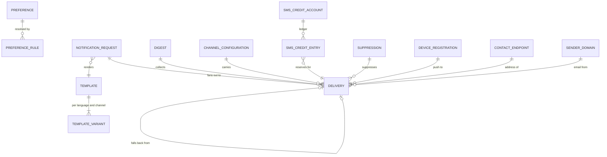
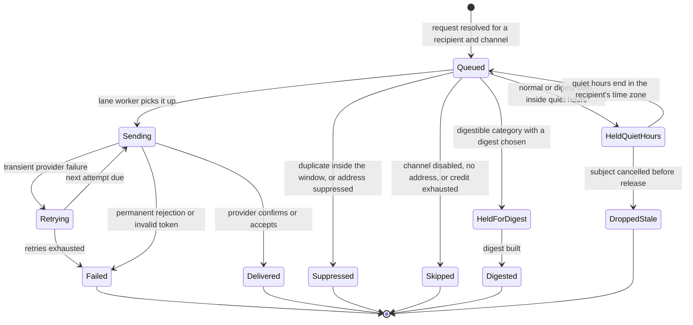

# Notification

> Service sheet, plan document 06, Group C. Names from Appendix L; events from Appendix E; permissions from Appendix B; error codes from Appendix K; settings categories from Appendix G. This sheet adds detail to reference architecture section 8.13 and never contradicts its table 8.0. The queues, lanes and worker scaling are already fixed by `11-messaging-architecture.md`; this sheet cites them and adds what happens inside each handler.

Notification turns business events into messages people actually receive, and does it calmly: one urgent absence alert within 30 seconds, one digest instead of twelve homework pings, nothing at 23:00 unless it is an emergency. It owns channels (in-app, email, push, the SMS adapter and the Tier 3 WhatsApp adapter), templates per event, language and channel, preferences per user, child, category and channel, quiet hours, digests, deduplication, the SMS credit check, the channel fallback order of Appendix C, the urgent, standard and bulk lanes, the delivery log with bounce and complaint handling, per-tenant sender domains, and the delivery of the unified inbox whose tasks Requests owns (Appendix L.5). It is the highest-volume service in the product (reference architecture section 8.13) and it decides nothing about the business facts it announces.

| Fact | Value (quoted from `05-service-catalog.md` and Appendix L) |
|---|---|
| Canonical name, long name | Notification, Notification |
| Tier | 1 |
| AREA code | `NOT` |
| Database | `nibras_notification`, schema `notification`, application role `svc_notification`, migration role `mig_notification` |
| Exchange | `nibras.notification`, plus the headers exchange `nibras.notification.lanes` (document 11 section 1.1) |
| Images | `nibras/notification-api`, `nibras/notification-worker` |
| Worker | `Notification.Worker`: one consumer per channel (email, push, SMS), digest builder; deployments `notification-worker-urgent` and `notification-worker-bulk`, KEDA between 2 and 20 each (document 11 section 7) |
| gRPC package | `nibras.notification.v1`, reconciliation methods only (section 6) |
| Build phase (master brief Section 28) | 1 |
| Service level class (master brief Section 31) | Notification class: urgent dispatched within 30 s of the event, bulk within 15 minutes |
| Sensitivity (Appendix J) | confidential |
| Synchronous dependency | none (reference architecture table 8.0) |
| Why the boundary exists | Scaling: the highest message volume in the system, with urgent and bulk lanes scaled independently on queue depth |

---

## 1. Responsibilities

| Owns | Detail |
|---|---|
| Channels | In-app, email, push through `IPushSender` (Firebase Cloud Messaging and the Apple Push Notification service; Huawei as a Tier 2 adapter), the SMS adapter, the WhatsApp adapter (Tier 3); per-tenant operational switches and provider bindings (REQ-NOT-001 to REQ-NOT-003, REQ-MOB-039) |
| Templates | Per event, language and channel, with variables, Arabic plural categories (BR-L10N-005), preview, tenant branding in email, urgency class fixed per template (REQ-NOT-004) |
| Preferences | Per user, per child, per category and per channel, resolved most specific first (BR-NOT-006); quiet hours per user in the user's time zone (BR-NOT-001); digest cadence per category (REQ-NOT-005, REQ-MOB-021) |
| The Appendix C matrix | One handler per trigger family implementing every row: trigger, recipients, urgency, default channels (REQ-NOT-016) |
| Dispatch | Recipient resolution, deduplication within the window (BR-NOT-004), digest holding (BR-NOT-003), quiet-hours holding and release, lane selection, per-tenant fairness and send-rate buckets (document 11 section 5) |
| Fallback and credits | The channel fallback order (BR-NOT-002) and the Appendix C fallback and credit table; the SMS credit check before every paid send (BR-NOT-005); the urgent overdraft buffer |
| Delivery log | One delivery row per recipient and channel attempt, retries, bounces, complaints, suppressions, delivery receipts, resend (REQ-NOT-012, REQ-NOT-018) |
| Deliverability | Per-tenant sending subdomain with SPF, DKIM and DMARC records generated at provisioning and verified before the first send, platform-domain fallback with the school's display name; bounce and complaint processing; unsubscribe route that never disables urgent mail (REQ-NOT-017, REQ-NOT-018, master brief Section 38) |
| Devices and contact endpoints | Push registrations per installation, the Google-services flag, and the delivery addresses Notification sends to (open point 1) |
| Unified inbox delivery | The in-app feed of notifications, approvals, mentions and task items with filters, mark-read, mark-all-read and snooze; unread counts per category for badges (REQ-NOT-015, REQ-MOB-020) |
| Rule classes | BR-NOT-001 to BR-NOT-006 and BR-L10N-005 (document 31 section 2) |

## 2. Not responsible for

| Does not own | Owner | Why the line sits there |
|---|---|---|
| The fact being announced: the absence, the invoice, the approval | The publishing service | Notification never decides whether an event should have happened; it only decides how the recipient hears about it |
| Tasks, approvals and their state | Requests (ADR-0012) | The inbox shows task items from `requests.task.assigned.v1`; completing one is a call to Requests |
| Message threads, announcement bodies and acknowledgments | Communication | Notification holds a template reference and never the body (Appendix J.3) |
| Emergency broadcast content, acknowledgments and roll call | Attendance | Notification fans the broadcast out on the urgent lane; the one-tap acknowledgment is recorded by Attendance |
| Users, roles, scopes and verified identities | Identity | Notification keeps a user copy for language, roles and activity |
| Guardian links and custody restrictions | School and Identity | Notification keeps a recipient-link copy and never sends to a restricted guardian (open point 3) |
| Settings storage: channel availability, quiet-hours default, digest schedule, SMS credit limits | Platform (ADR-0009) | Read from `platform.settings.changed.v1`; Notification's operational switch can only narrow what the setting allows |
| SMS credit purchase and the overage invoice | Platform (plans, limits, tenant invoices) | Notification counts segments and publishes `notification.usage.recorded.v1` |
| Real-time presence and the SignalR hubs | Communication | In-app delivery to an open client goes through Communication's hub; the inbox row is Notification's |
| Webhook delivery to third parties | Platform (Integrations) | Outgoing webhooks are not notifications |
| Engagement analytics | Reporting | Reporting projects `notification.notification.delivered.v1` and `notification.notification.failed.v1` |

---

## 3. Requirements covered

| Range or identifier | What it binds here |
|---|---|
| REQ-NOT-001 to REQ-NOT-019 | Every row of the NOT area; REQ-NOT-002 (WhatsApp) is Tier 3 |
| REQ-MOB-018, REQ-MOB-019, REQ-MOB-020, REQ-MOB-021, REQ-MOB-023, REQ-MOB-026, REQ-MOB-039, REQ-MOB-043 | Five push categories as Android channels and iOS categories with deep links; actionable notifications that never approve; server-side badge counts; quiet hours per child in the app; no sensitive lock-screen text; token unregistered at sign-out; Huawei adapter; silent push for sync |
| REQ-PRV-009 | Delivery log retained 90 days |
| REQ-DATA-013 | `notification_requests` and `deliveries` partitioned by month |
| REQ-MSG-010, REQ-MSG-011, REQ-MSG-018 | Urgent and bulk lanes on separate replicas; tenant fairness; KEDA on queue depth |
| REQ-INF-021 | Queue depth back to baseline within 10 minutes of a burst |
| REQ-INT-018, REQ-INT-019 | Providers behind interfaces; push and email still deliver when SMS is down |
| REQ-L10N-007 | Bidirectional text in notifications, numbers left to right inside Arabic |
| REQ-COM-007, REQ-COM-017 | Quiet hours respected for messages; the anonymous concern reaches the officer as urgent |

---

## 4. Aggregates and entities

**Common columns.** Every tenant-owned table carries these; `(common)` stands for them. `notification_requests` and `deliveries` are range-partitioned by month on `created_at` and detached after 90 days (`10-data-architecture.md` section 5); the partition key is part of their primary key.

| Field | Type | Null | Notes |
|---|---|---|---|
| `tenant_id` | uuid | no | First column of every key and index; row-level security `tenant_isolation` |
| `id` | uuid | no | UUID v7 |
| `created_at`, `created_by` | timestamptz, uuid | no, yes | `created_by` null for consumer-written rows |
| `updated_at`, `updated_by` | timestamptz, uuid | no, yes | |
| `deleted_at`, `deleted_by` | timestamptz, uuid | yes | Soft delete on templates, preferences and devices; delivery rows are never soft-deleted, only dropped with their partition |
| `xmin` | xid | no | Concurrency token on every aggregate root |

Bilingual text is `LocalizedText`; a template body is per language, not a `LocalizedText` pair, because each language has its own plural forms and length.

### 4.1 `Template` with `TemplateVariant`

| Field | Type | Null | Notes |
|---|---|---|---|
| (common) | | | |
| `code` | text | no | For example `attendance.student-absent`; unique per tenant among live rows; platform library templates have `tenant_id` of the platform scope and are copied into the tenant at provisioning |
| `trigger` | text | no | The Appendix E routing key or the job name from Appendix C |
| `category` | text enum | no | `urgent`, `academic`, `finance`, `requests`, `messages` (REQ-MOB-018) |
| `urgency` | text enum | no | `U`, `N`, `D` from Appendix C; fixed per template, never per message (BR-NOT-001 edge case) |
| `default_channels` | text[] | no | From Appendix C |
| `fan_out` | boolean | no | True for templates that must reach every channel (emergency broadcast); false means fallback order (BR-NOT-002 edge case) |
| `dedup_window_minutes` | smallint | no | Default 5 (Appendix C); 0 for urgent templates, which are never deduplicated |
| `subject_key_expr` | text | no | Payload path that identifies the subject for deduplication, for example `assignmentId` |
| `stale_check` | text | yes | Payload path checked at release, so a held item whose subject was cancelled is dropped |
| `status`, `version` | text enum (`draft`, `published`), int | no | |
| variant: `template_id`, `language`, `channel`, `subject`, `body`, `plural_forms`, `deep_link`, `lock_screen_text` | uuid, text (`ar`, `en`), text enum, text, text, jsonb, text, text | subject, deep link nullable | `template_variants`; `lock_screen_text` is a neutral category line, never a mark, a clinic reason or a name (T-NOT-01, REQ-MOB-023) |

Invariants: an Arabic variant defines the six plural categories and an English variant defines one and other for every counted variable, or publishing fails naming the missing categories (BR-L10N-005); every variable in a body exists in the trigger's Appendix E payload or in the resolved recipient context; a template whose trigger payload carries a Sensitive field cannot exist, because no such payload exists (Appendix E payload rule); urgent templates have `dedup_window_minutes = 0`.

### 4.2 `Preference`

| Field | Type | Null | Notes |
|---|---|---|---|
| (common) | | | |
| `user_id` | uuid | no | One preference aggregate per user |
| `language` | text | no | Seeded from `identity.user.activated.v1` `preferredLanguage` |
| `time_zone` | text | no | IANA name; quiet hours are evaluated in it (BR-NOT-001 third example) |
| `quiet_from`, `quiet_to` | time | yes | Spans midnight in the normal case; null means the tenant default |
| rules: `student_id`, `category`, `channel`, `enabled`, `digest_cadence` | uuid, text enum, text enum, boolean, text enum (`none`, `daily`, `weekly`) | `student_id`, `category`, `digest_cadence` nullable | `preference_rules`; the three personal levels of BR-NOT-006 are rows with or without `student_id` and `category` |

Invariants: in-app cannot be disabled at any level, so there is always one delivery target (BR-NOT-006 edge case); a rule for a channel the tenant disabled is kept but has no effect, and the response explains which setting won (`NOTIFICATION_PREFERENCE_CONFLICT`); preferences are resolved per notification and never cached per user as a resolved answer.

### 4.3 `NotificationRequest`

| Field | Type | Null | Notes |
|---|---|---|---|
| (common) | | | |
| `source_message_id` | uuid | no | The envelope `messageId` of the triggering event or command; `ix_notification_requests_source` (document 21) |
| `source_key` | text | no | Routing key or command name |
| `template_code`, `template_version` | text, int | no | |
| `urgency`, `lane` | text enum | no | Lane from urgency and, for bulk jobs, from the publisher (document 11 section 1.3) |
| `subject_key` | text | yes | Deduplication subject |
| `recipient_count` | int | no | After resolution |
| `payload_ref` | jsonb in side table `notification_request_params` | no | Template parameters only: identifiers, names already in the payload, counts; never a body from another service |
| `status` | text enum | no | `resolving`, `dispatched`, `completed` |

Invariants: one request per `(source_message_id, template_code)` (idempotent consumption beyond the inbox); a request never carries a Sensitive value; the lane is decided once, here, and every delivery inherits it.

### 4.4 `Delivery`

| Field | Type | Null | Notes |
|---|---|---|---|
| (common) | | | |
| `request_id` | uuid | no | |
| `recipient_user_id` | uuid | yes | Null for a one-time address (an invitation or an OTP to a person with no account yet) |
| `address_hash` | bytea | yes | Hash of the email or phone used; the address itself is never stored here (T-NOT-02) |
| `channel` | text enum | no | `in_app`, `email`, `push`, `sms`, `whatsapp` |
| `lane`, `urgency` | text enum | no | |
| `status` | text enum | no | `queued`, `held-quiet-hours`, `held-for-digest`, `sending`, `sent`, `delivered`, `retrying`, `failed`, `suppressed`, `skipped`, `digested`, `dropped-stale` |
| `fallback_of` | uuid | yes | The delivery this one falls back from |
| `attempts`, `next_attempt_at`, `release_at` | smallint, timestamptz, timestamptz | no, yes, yes | `release_at` for quiet hours or the digest window |
| `provider`, `provider_message_id` | text | yes | |
| `reason_code` | text | yes | Appendix K code on failure or suppression, for example `NOTIFICATION_SMS_CREDITS_EXHAUSTED` |
| `sms_segments` | smallint | yes | Counted on the rendered text including the sender prefix (BR-NOT-005) |
| `duplicate_count` | smallint | no | Running count of suppressed duplicates shown in the in-app item (BR-NOT-004) |
| `category`, `template_code`, `deep_link` | text | no, no, yes | For the inbox and filters |
| `read_at`, `snoozed_until` | timestamptz | yes | In-app only |

Invariants: a channel is attempted only when the tenant allows it, the recipient's resolved preference enables it and an address exists (BR-NOT-002); fallback stops at the first delivered channel except for fan-out templates; an SMS is attempted only after the credit reservation succeeded, and a provider rejection releases the reservation (BR-NOT-005); an urgent delivery is never held for quiet hours or a digest, and never deduplicated; a normal or digest delivery created inside the recipient's quiet hours is held to `release_at` in the recipient's time zone (BR-NOT-001).

### 4.5 `Digest`

| Field | Type | Null | Notes |
|---|---|---|---|
| (common) | | | |
| `user_id`, `student_id`, `cadence`, `window_start`, `window_end`, `item_count`, `part`, `parts`, `delivery_id` | uuid, uuid, text enum, timestamptz, timestamptz, int, smallint, smallint, uuid | `student_id` nullable | `digests`; per child when the preference is per child (REQ-NOT-008) |

Invariants: an empty digest is never sent; a digest over the channel size limit is split and each part says which part it is; an item arriving after the digest was built joins the next window (`NOTIFICATION_DIGEST_WINDOW_MISSED`).

### 4.6 `ChannelConfiguration`, `SenderDomain`, `SmsCreditAccount`, `Suppression`

| Field | Type | Null | Notes |
|---|---|---|---|
| (common) | | | |
| channel: `channel`, `provider_code`, `operational_enabled`, `disabled_reason`, `fallback_order` | text enum, text, boolean, text, smallint | reason nullable | `channel_configurations`; provider secrets live in OpenBao, never here |
| sender domain: `subdomain`, `spf_record`, `dkim_selector`, `dkim_public_key`, `dmarc_record`, `status`, `verified_at`, `display_name_en`, `display_name_ar` | text, text, text, text, text, text enum (`pending`, `verified`, `failed`), timestamptz, text, text | `verified_at` nullable | `sender_domains`; the DKIM private key is in OpenBao (REQ-NOT-017) |
| credit account: `allowance`, `consumed`, `reserved`, `overdraft_buffer`, `period_start`, `period_end`, `low_alert_sent_at` | int, int, int, int, date, date, timestamptz | alert nullable | `sms_credit_accounts`; allowance from the plan limits in `platform.plan.changed.v1` and *Notifications → SMS credit limits* |
| credit ledger: `account_id`, `delivery_id`, `kind`, `segments` | uuid, uuid, text enum (`reserve`, `consume`, `release`, `overdraft`), smallint | no | `sms_credit_entries`, append-only |
| suppression: `address_hash`, `channel`, `reason`, `permanent`, `source` | bytea, text enum, text enum (`hard-bounce`, `complaint`, `unsubscribe`, `invalid-token`), boolean, text | no | `suppressions`; raises `notification.channel.suppressed.v1` |

Invariants: a channel is usable only when both the Platform setting and the operational switch allow it; `consumed + reserved ≤ allowance + overdraft_buffer`, and only urgent sends may use the overdraft (BR-NOT-005 edge case); a hard-bounced address receives neither urgent nor normal email until corrected; a complaint suppresses non-urgent email permanently and urgent email still sends (Appendix C); an unsubscribe never suppresses urgent school communication (master brief Section 38).

### 4.7 `DeviceRegistration` and `ContactEndpoint`

| Field | Type | Null | Notes |
|---|---|---|---|
| (common) | | | |
| device: `user_id`, `installation_id`, `platform`, `push_provider`, `token_ciphertext`, `token_hash`, `has_google_services`, `app_version`, `last_seen_at` | uuid, text, text enum (`android`, `ios`, `huawei`, `web`), text, bytea, bytea, boolean, text, timestamptz | no | `device_registrations`; unique per `(tenant_id, installation_id)`; a token reported invalid is deleted (`NOTIFICATION_DEVICE_TOKEN_INVALID`) |
| endpoint: `user_id`, `channel`, `address_ciphertext`, `address_hash`, `verified_at`, `source` | uuid, text enum (`email`, `sms`, `whatsapp`), bytea, bytea, timestamptz, text enum (`identity-proof`, `invitation`) | no | `contact_endpoints`; Confidential, column-encrypted, never cached (document 21 section 1.11) |

Invariants: sign-out or loss of permission unregisters the installation's token (REQ-MOB-026); an address is used only after verification by Identity's contact proof, except the invitation address, which is used once for the invitation itself.

### 4.8 Reference copies

`ref_users` (`user_id`, `roles`, `scope`, `preferred_language`, `active`), `ref_recipient_links` (`guardian_user_id`, `student_id`, `relationship`, `rights`, `suspended`), `ref_students` and `ref_staff` for role-relative recipients (open point 2), `ref_tenant_state`, `ref_settings`; each carries `source_version` and `reconciled_at`.





A `Failed` or `Skipped` delivery of a fallback template creates the next channel's delivery as a new row (document 11 section 2.5: fallback is a new channel command, not a retry).

---

## 5. REST API

All paths are under `/api/v1/notification/`. Every endpoint may also return the K.1 codes with the `NOTIFICATION_` prefix. Self-service endpoints act on the caller's own data in `self` scope; Appendix I grants no `notification.*` permission to any role template, so this sheet's default is that every role template holds `notification.preferences.view` and `notification.preferences.edit` in `self` scope (open point 4).

### 5.1 Templates

| Method | Path | Permission | Request | Response | Errors | Idempotent |
|---|---|---|---|---|---|---|
| GET | `/api/v1/notification/templates` | `notification.templates.view` | filter `category`, `trigger`, `status` | `Page<TemplateDto>` | none specific | yes |
| POST | `/api/v1/notification/templates` | `notification.templates.create` | `CreateTemplateRequest` (code, trigger, category, urgency, default channels, variants) | 201 draft | `NOTIFICATION_VALIDATION_FAILED` (unknown trigger, unknown variable) | by `Idempotency-Key` |
| GET | `/api/v1/notification/templates/{id}` | `notification.templates.view` | none | `TemplateDto` with variants | `NOTIFICATION_TEMPLATE_NOT_FOUND` | yes |
| PATCH | `/api/v1/notification/templates/{id}` | `notification.templates.edit` | variants, channels, dedup window; urgency changes need re-approval | `TemplateDto` draft | `NOTIFICATION_VALIDATION_FAILED` | with `If-Match` |
| POST | `/api/v1/notification/templates/{id}/publish` | `notification.templates.publish` | `{}` | version n published | `NOTIFICATION_VALIDATION_FAILED` naming missing plural categories (BR-L10N-005) | by `Idempotency-Key` |
| POST | `/api/v1/notification/templates/{id}/preview` | `notification.templates.view` | `{ language, channel, sampleParams }` | rendered subject, body, lock-screen line, branding | `NOTIFICATION_TEMPLATE_NOT_FOUND` | yes |
| POST | `/api/v1/notification/templates/{id}/send-test` | `notification.templates.send-test` | `{ channel }` to the caller's own endpoint | 202 | `NOTIFICATION_NO_REACHABLE_CHANNEL`, `NOTIFICATION_CHANNEL_DISABLED` | by `Idempotency-Key` |
| DELETE | `/api/v1/notification/templates/{id}` | `notification.templates.delete` | tenant copy only; the platform library template remains | 204 | `NOTIFICATION_VALIDATION_FAILED` for a template whose trigger has no other template | yes |

### 5.2 Preferences, devices and contact endpoints

| Method | Path | Permission | Request | Response | Errors | Idempotent |
|---|---|---|---|---|---|---|
| GET | `/api/v1/notification/preferences/me` | `notification.preferences.view` | none | language, time zone, quiet hours, rules per child, category and channel, and the effective result per category | none specific | yes |
| PUT | `/api/v1/notification/preferences/me` | `notification.preferences.edit` | full preference document | saved; policy conflicts listed | `NOTIFICATION_PREFERENCE_CONFLICT` (200 body lists which setting won), `NOTIFICATION_VALIDATION_FAILED` (in-app disabled) | with `If-Match` |
| GET | `/api/v1/notification/preferences/users/{userId}` | `notification.preferences.view` | none, in `campus` or `all-tenant` scope for support staff | same shape | `NOTIFICATION_NOT_FOUND` | yes |
| PUT | `/api/v1/notification/devices/me/{installationId}` | `notification.preferences.edit` | `{ platform, pushProvider, token, hasGoogleServices, appVersion }` | 204 | `NOTIFICATION_VALIDATION_FAILED` | yes, by installation |
| DELETE | `/api/v1/notification/devices/me/{installationId}` | `notification.preferences.edit` | none | 204 (REQ-MOB-026) | none | yes |
| PUT | `/api/v1/notification/contact-endpoints/me` | `notification.preferences.edit` | `{ channel, contactProof }` signed by Identity for the verified address | 204; the address is stored encrypted | `NOTIFICATION_VALIDATION_FAILED` (proof invalid or expired) | yes |

### 5.3 Inbox

| Method | Path | Permission | Request | Response | Errors | Idempotent |
|---|---|---|---|---|---|---|
| GET | `/api/v1/notification/inbox` | `notification.preferences.view` | filter `category`, `unread`, `kind` (notification, approval, mention, task) | `Page<InboxItemDto>` keyset on `(createdAt, id)`, page cap 50 (document 21 section 3.11 query 4) | none specific | yes |
| GET | `/api/v1/notification/inbox/unread-counts` | `notification.preferences.view` | none | count per category for badges (REQ-MOB-020) | none specific | yes |
| POST | `/api/v1/notification/inbox/{id}/read` | `notification.preferences.edit` | `{}` | 204 | `NOTIFICATION_NOT_FOUND` | yes |
| POST | `/api/v1/notification/inbox/read-all` | `notification.preferences.edit` | `{ category }` optional | 204 | none | yes |
| POST | `/api/v1/notification/inbox/{id}/snooze` | `notification.preferences.edit` | `{ until }` | 204 | `NOTIFICATION_VALIDATION_FAILED` (urgent items cannot be snoozed) | yes |

Task items in the inbox carry the Requests deep link; completing one is `POST /api/v1/requests/tasks/{id}/complete`. The emergency item carries Attendance's acknowledgment route; the one tap is recorded by Attendance (REQ-NOT-007).

### 5.4 Delivery log and suppressions

| Method | Path | Permission | Request | Response | Errors | Idempotent |
|---|---|---|---|---|---|---|
| GET | `/api/v1/notification/deliveries` | `notification.delivery-log.view` | filter `recipientUserId`, `channel`, `status`, `templateCode`, `from`, `to` (within 90 days) | `Page<DeliveryDto>`: recipient reference, never the address or body | none specific | yes |
| GET | `/api/v1/notification/deliveries/{id}` | `notification.delivery-log.view` | none | attempts, fallbacks, reason codes | `NOTIFICATION_NOT_FOUND` | yes |
| POST | `/api/v1/notification/deliveries/{id}/resend` | `notification.delivery-log.resend` | `{ reason }` | 202 new delivery; rate-limited per recipient and audited (T-NOT-04) | `NOTIFICATION_RATE_LIMITED`, `NOTIFICATION_NO_REACHABLE_CHANNEL` | by `Idempotency-Key` |
| GET | `/api/v1/notification/notification-requests/{id}/status` | `notification.delivery-log.view` | none | counts by channel and status for the sender view (document 21 section 3.11 query 8) | `NOTIFICATION_NOT_FOUND` | yes |
| GET | `/api/v1/notification/notification-requests` | `notification.delivery-log.view` | `sourceMessageId` (the envelope id of the triggering event, for example an announcement's `communication.announcement.published.v1`) | the matching request ids with the same counts, so the sender's analytics screen can join delivery to read figures (REQ-COM-003) | none specific | yes |
| POST | `/api/v1/notification/deliveries/export` | `notification.delivery-log.export` | filters | 202 job | none specific | by `Idempotency-Key` |
| GET | `/api/v1/notification/suppressions` | `notification.delivery-log.view` | filter `channel`, `reason` | `Page<SuppressionDto>` with a masked address | none specific | yes |
| DELETE | `/api/v1/notification/suppressions/{id}` | `notification.channels.edit` | `{ reason }` after the address was corrected | 204; `notification.channel.suppressed.v1` with `permanent = false` | `NOTIFICATION_VALIDATION_FAILED` for a complaint suppression | yes |

### 5.5 Channels, sender domains, SMS credits and provider callbacks

| Method | Path | Permission | Request | Response | Errors | Idempotent |
|---|---|---|---|---|---|---|
| GET | `/api/v1/notification/channels` | `notification.channels.view` | none | channels with setting state, operational switch, provider, health | none specific | yes |
| PATCH | `/api/v1/notification/channels/{channel}` | `notification.channels.edit` | provider binding, fallback order | `ChannelDto` | `NOTIFICATION_VALIDATION_FAILED` | with `If-Match` |
| POST | `/api/v1/notification/channels/{channel}/enable` | `notification.channels.enable` | `{}` | enabled where the setting allows | `NOTIFICATION_PREFERENCE_CONFLICT` when the tenant setting disallows it | yes |
| POST | `/api/v1/notification/channels/{channel}/disable` | `notification.channels.disable` | `{ reason }` | disabled; fallback takes over | none specific | yes |
| GET | `/api/v1/notification/sender-domains` | `notification.channels.view` | none | DNS records to publish and verification state | none specific | yes |
| POST | `/api/v1/notification/sender-domains/{id}/verify` | `notification.channels.edit` | `{}` | verified or the failing record named | `NOTIFICATION_VALIDATION_FAILED` | yes |
| GET | `/api/v1/notification/sms-credits` | `notification.channels.view` | none | allowance, consumed, reserved, overdraft used, period | none specific | yes |
| POST | `/api/v1/notification/provider-callbacks/{provider}` | none: provider signature verified by the adapter | delivery receipt, bounce or complaint | 200 | `NOTIFICATION_VALIDATION_FAILED` (bad signature) | by provider event id |

### 5.6 Jobs

| Method | Path | Permission | Request | Response | Errors | Idempotent |
|---|---|---|---|---|---|---|
| GET | `/api/v1/notification/jobs/{jobId}` | `platform.jobs.view`, or the starter | none | job resource | `NOTIFICATION_NOT_FOUND` | yes |
| POST | `/api/v1/notification/jobs/{jobId}/cancel` | `platform.jobs.cancel`, or the starter | `{}` | job with `cancelRequested` | `NOTIFICATION_VALIDATION_FAILED` for a terminal job | yes |

---

## 6. gRPC

**Consumed.** None on a request path (reference architecture table 8.0); contact data never comes over a synchronous call (open point 1). Off the request path: Identity `Users.Checksum` and `Users.Snapshot` and School `ReferenceReconciliation.Checksum` and `ListSnapshotPage` for the nightly reconciliation and the suspended-link check (30 s, 5 s per page), and Platform `Settings.GetSettings` from the settings client of the building blocks on a cold start (2 s; last value in L1 for 60 s, then the catalog default).

**Exposed: `nibras.notification.v1`**, reconciliation only (`10-data-architecture.md` sections 6 and 7.3).

| Service | Method | Returns | Deadline | Callers | Budget |
|---|---|---|---|---|---|
| `Usage` | `Recount(meter, period_start, period_end)` | SMS segments and emails sent in the period | 30 s | Platform monthly re-sum; SMS overage invoicing | 2 commands |
| `Reconciliation` | `Snapshot(projection_kind, page_token)` | delivery facts: request, template, channel, status, time; never an address or a body | 5 s per page | Reporting rebuild of `engagement_facts` | 1 command per page |

---

## 7. Events published and consumed

### 7.1 Published on `nibras.notification`

| Routing key | Raised by | Partition key | Consumers (Appendix E) |
|---|---|---|---|
| `notification.notification.requested.v1` | The Api host after resolution, with header `x-nibras-lane` and `x-nibras-channel = dispatch`; also on behalf of a `RequestNotification` command | `userId` | Notification workers through `nibras.notification.lanes` |
| `notification.notification.delivered.v1` | A delivery reaches `Delivered` | `userId` | Platform, Reporting |
| `notification.notification.failed.v1` | A delivery reaches `Failed`, and the repeated-failure threshold (20 consecutive push failures per tenant, REQ-NOT-012) | `userId` | Platform, Reporting, Notification (operator alert on the urgent queue) |
| `notification.channel.suppressed.v1` | Hard bounce, complaint, unsubscribe, invalid token, and a lifted suppression | `userId` | Reporting |
| `notification.usage.recorded.v1` | Monthly SMS segments and emails | `tenantId` | Platform |
| `notification.audit.recorded.v1` | Template publish, channel switch, resend, suppression lift, preference change by support staff | `tenantId` | Audit |

Internal worker commands on `nibras.notification`, routed through `nibras.notification.lanes` (document 11 sections 1.1 and 2.5): `notification.commands.send-push.v1`, `notification.commands.send-email.v1`, `notification.commands.send-sms.v1`, `notification.commands.build-digest.v1`.

### 7.2 Consumed

Queues are document 11 section 2.5's Notification table: `notification.tenant-lifecycle`, `notification.reference-copies`, `notification.events.urgent`, `notification.events`, `notification.events.bulk`, `notification.commands`, and the worker queues. Inbound events are split by the Appendix C urgency column; every key in the urgent and standard lists of document 11 is bound exactly as written there and is not repeated here row by row.

| Routing keys | Queue | Handler | What it changes |
|---|---|---|---|
| The section 2.3 tenant-lifecycle set of document 11, plus `platform.tenant.provisioned.v1` | `notification.tenant-lifecycle` | `TenantLifecycleConsumer` | Provisioning copies the template library, creates the sender subdomain records and the credit account; suspension pauses non-urgent sends; `platform.settings.changed.v1` updates channel availability, quiet-hours default, digest schedule and SMS limits; `platform.plan.changed.v1` updates the credit allowance; `reporting.data-quality.issue-detected.v1` notifies the data owner |
| `identity.user.activated.v1`, `school.guardian.updated.v1`, `identity.guardian-link.created.v1` | `notification.reference-copies` | `UserCopyConsumer`, `RecipientLinkConsumer` | `ref_users`, preference seed with language; `ref_recipient_links`; a guardian update naming the link or restriction suspends that link until reconciled (open point 3) |
| The urgent keys: `attendance.emergency.broadcast-started.v1`, `attendance.roll-call.completed.v1`, `attendance.student.absent.v1`, `attendance.gate-pass.issued.v1`, `attendance.gate-pass.used.v1`, `attendance.visitor.checked-in.v1`, `wellbeing.clinic-visit.recorded.v1`, `wellbeing.medication.administered.v1`, `wellbeing.safeguarding.concern-raised.v1`, `communication.concern.reported-anonymously.v1`, `communication.message.reported.v1`, `scheduling.substitution.assigned.v1`, `identity.user.invited.v1`, `identity.login.new-device.v1`, `identity.break-glass.used.v1`, `audit.integrity-check.failed.v1`, `notification.notification.failed.v1` | `notification.events.urgent` | one consumer per publishing service (section 14) | Resolves recipients, bypasses quiet hours, digests and deduplication; emergency fan-out through the staged `COPY` of document 21 section 3.11 query 7 |
| The standard keys of document 11's `notification.events` row (every other Appendix C trigger from Platform, Identity, School, Admissions, Academics, Assessment, Scheduling, Attendance, Finance, Communication, Requests, Documents, Behavior, Reporting, Wellbeing, Hr and Operations) | `notification.events` | one consumer per publishing service | Resolves recipients, applies preferences, quiet hours, digests and deduplication |
| `finance.invoice.issued.v1`, `finance.invoice.overdue.v1`, `documents.document.generated.v1` | `notification.events.bulk` | `FinanceBulkConsumer`, `DocumentGeneratedConsumer` | Bulk-lane requests with the admission window of 2,000 in flight per tenant |
| `notification.commands.request-notification.v1` (`RequestNotification`) on `nibras.admissions`, `nibras.school`, `nibras.finance`, `nibras.requests`, `nibras.academics` and the other senders | `notification.commands` | `RequestNotificationHandler` | Messages without a catalogued trigger (codes, invitations, workflow escalations, saga closing notices); the command carries a template code, recipients as user ids, a recipient rule or a one-time address, and parameters |
| `notification.notification.requested.v1`, the three send commands and `notification.commands.build-digest.v1` | the `notification-worker.*` queues | `DispatchHandler`, `PushSender`, `EmailSender`, `SmsSender`, `DigestBuilderHandler` | Dispatch writes deliveries and publishes one channel command per recipient and channel on the same lane; channel handlers call providers and record outcomes |

**Appendix C coverage.** Every row of Appendix C maps to one template code and one handler method; `AppendixCMatrixTests` (TC-NOT-601) reads Appendix C and asserts a subscribed handler and a published template for each trigger (REQ-NOT-016). The six rows of the fallback and credit table are the fallback and credit tests TC-NOT-605 to TC-NOT-610.

---

## 8. Sagas and workflows

Notification owns no workflow in Appendix R and orchestrates no saga (document 31 section 1: 7 rules, 0 workflows). It is the last, irreversible step of Sagas 1, 2, 3, 5, 6 and 8 and the delivery end of every workflow side effect that names `notification.notification.requested.v1` in Appendix R.

| Saga or workflow | Role | What Notification guarantees |
|---|---|---|
| Sagas 1, 2, 3, 5, 6, 8 (document 13) | Last step, no compensation | `RequestNotification` is idempotent on the command's `messageId` and the derived `notificationId`; a replay sends nothing twice; the step is ordered last because a message cannot be unsent |
| Saga 8 step 4 | Bulk lane, honours quiet hours (BR-NOT-001) | Deferred, never dropped (TC-FIN-004) |
| Every WF with an Appendix C trigger | Delivery | The Appendix C urgency, recipients and channels; the fallback and credit table |
| Saga 1, 2, 10 | Participant | Tenant rows, template library copy, sender domain; deletion drops delivery partitions of the tenant |

---

## 9. Local reference copies

| Copy | Source events | Fields kept | Reconciliation | Staleness tolerated |
|---|---|---|---|---|
| `ref_users` | `identity.user.activated.v1`; `identity.role.changed.v1` and `identity.permissions.changed.v1` from the tenant-lifecycle queue | user, roles, scope, language, active | Nightly against Identity `nibras.identity.v1.Users/Checksum` | Minutes |
| `ref_recipient_links` | `identity.guardian-link.created.v1`, `school.guardian.updated.v1` | guardian user, student, relationship, rights, suspended | Nightly against School `ReferenceReconciliation.Checksum` for `guardian-link`; an immediate snapshot fetch for a suspended link | Minutes; a link in doubt is suspended, never assumed |
| `ref_students`, `ref_staff` | open point 2 | student section and campus; staff department and campuses | Nightly against School | Minutes |
| Preferences | owned by Notification, seeded from `identity.user.activated.v1` | not a copy | none (`10-data-architecture.md` section 6) | not applicable |

---

## 10. Background jobs

Triggers run in `Notification.Worker` except where noted; long work runs on the worker queues.

| Job | Schedule | What it does | Publishes | Progress |
|---|---|---|---|---|
| `QuietHoursReleaseJob` | Every minute | Deliveries in `held-quiet-hours` whose `release_at` passed in the recipient's time zone return to `queued`; stale subjects are dropped (BR-NOT-001 edge case) | channel commands on the original lane | none |
| `DigestSchedulerJob` | Every 15 minutes | Users whose digest is due per *Notifications → digest schedule* in their time zone | `notification.commands.build-digest.v1` per user (document 21 section 3.11 query 6) | none |
| `RetryDueDeliveriesJob` | Every 30 seconds | Deliveries in `retrying` due now, republished to their lane with the fairness cap (query 3) | channel commands | none |
| `DeliveryFailureMonitorJob` | Every minute | Consecutive failure counts per tenant and channel; at 20 publishes the failure and opens the provider breaker | `notification.notification.failed.v1` | none |
| `SenderDomainVerificationJob` | Hourly until verified, then daily | DNS lookup of SPF, DKIM and DMARC; switches the sender from the platform domain to the school subdomain on success (REQ-NOT-017) | `notification.audit.recorded.v1` | none |
| `SmsCreditPeriodJob` | Daily 00:10 tenant time zone | Opens the new credit period from the plan allowance; sends the low-credit alert once per period at the threshold | `RequestNotification` to the finance administrator (BR-NOT-005) | none |
| `DeviceTokenCleanupJob` | Weekly | Deletes registrations unseen for 180 days | none | none |
| `UsageRecordJob` | Monthly, day 1 | SMS segments and emails of the month | `notification.usage.recorded.v1` | none |
| `PartitionMaintenanceJob` | Weekly | Creates `notification_requests` and `deliveries` partitions three months ahead; detaches and drops months older than 90 days (Appendix J: delete, no cold copy) | a finding on an unexpected partition | none |
| `ReferenceCopyReconciliationJob` | Nightly 02:00 band time zone | Section 9 | `reporting.data-quality.issue-detected.v1` on a mismatch | none |
| `InvariantAuditJob` | Nightly 01:00 band time zone | Credit ledger sums against the account; a 1 percent sample of preferences and templates reloaded through the domain | a finding | none |
| `EmergencyFanOutJob` | On an emergency trigger, in the Api host | Stages 3,200 recipients across four channels by `COPY` (N-09) | `notification.notification.requested.v1` on the urgent lane | "Emergency delivery: sent 2,900 of 3,200" to the incident controller |

---

## 11. Permissions, notifications, settings, error codes

### 11.1 Permissions (Appendix B, Notification)

| Permission | Default holders | Scope |
|---|---|---|
| `notification.templates.view`, `.create`, `.edit`, `.delete`, `.send-test`, `.publish` | Principal and a communications officer cloned from Vice Principal; Platform Administrator for the library | `all-tenant` |
| `notification.preferences.view`, `.edit` | Every role in `self` (open point 4); support staff in `campus` | `self` or `campus` |
| `notification.delivery-log.view`, `.export`, `.resend` | IT Support, Principal | `all-tenant`; resend rate-limited |
| `notification.channels.view`, `.edit`, `.enable`, `.disable` | Principal, IT Support | `all-tenant` |
| `platform.jobs.view`, `platform.jobs.cancel` | as Appendix B | job endpoints |

### 11.2 Notifications Notification itself triggers (Appendix C)

| Appendix C row | Trigger | Recipients | Urgency and default channels |
|---|---|---|---|
| Notification delivery failing repeatedly | `notification.notification.failed.v1` | Platform operators | U; email, push |
| Daily or weekly digest | job: digest builder inside Notification | Guardians, students, staff | D; push, email |

Every other Appendix C row is triggered by its publisher and delivered here; the low-credit alert, the sender-domain verification result and the test send have no Appendix C row and use internal templates (open point 5).

### 11.3 Settings (Appendix G, *Notifications* category unless stated)

| Setting | Default | Used by |
|---|---|---|
| Channel availability | in-app, email, push on; SMS on when a provider is bound; WhatsApp off | BR-NOT-002, BR-NOT-006 |
| Quiet hours default | 21:00 to 07:00 in the user's time zone | BR-NOT-001 |
| Digest schedule | daily 17:00, weekly Thursday 17:00 | BR-NOT-003 |
| SMS credit limits | plan allowance, overdraft buffer 5 percent for urgent only | BR-NOT-005 |
| Templates | the platform library | BR-NOT-004 window, BR-L10N-005 |
| Languages, time zone (General) | tenant values | default language and time zone for users without a preference |
| SMS, email and push providers (Integrations) | none | channel adapters |
| Retention periods (Security) | 90 days for the delivery log | `PartitionMaintenanceJob` |

### 11.4 Error codes (Appendix K.12)

| Code | HTTP | Raised where |
|---|---|---|
| `NOTIFICATION_TEMPLATE_NOT_FOUND` | 404 | Template or language variant missing; falls back to the default language and raises a defect |
| `NOTIFICATION_CHANNEL_DISABLED` | 409 | Recipient disabled the channel; next channel in the ladder |
| `NOTIFICATION_NO_REACHABLE_CHANNEL` | 422 | No channel remains; surfaces in the Data Quality Center as a missing contact |
| `NOTIFICATION_DEVICE_TOKEN_INVALID` | 410 | Push token gone; registration deleted |
| `NOTIFICATION_PROVIDER_REJECTED` | 502 | Provider rejected the payload; next provider in the lane |
| `NOTIFICATION_SMS_CREDITS_EXHAUSTED` | 402 | Credit does not cover the segments; fall back, alert the administrator |
| `NOTIFICATION_URGENT_OVERRIDE_REFUSED` | 403 | A non-urgent template or a `RequestNotification` tried to break quiet hours |
| `NOTIFICATION_DIGEST_WINDOW_MISSED` | 200 | Item arrived after the digest was built; carried to the next |
| `NOTIFICATION_PREFERENCE_CONFLICT` | 409 | A preference contradicts a school policy; the policy wins and the response says which |
| `NOTIFICATION_VALIDATION_FAILED` and the other seven K.1 codes | as K.1 | Problem-details middleware |

---

## 12. Caching and hot queries

The caching map is `21-performance-engineering.md` section 1.11 and the hot queries are its section 3.11; both are binding. Per-tenant fairness counters, lane depths, send-rate buckets `nibras:{tenant}:notification:send-rate:{channel}:v1` and the credit reservation counter live in `redis-state` (document 11 section 5). This sheet adds:

| Data | Key | Tags | L1 | L2 | Invalidated by | Never cached |
|---|---|---|---|---|---|---|
| Recipient links of one student (guardian user ids and rights) | `nibras:{tenant}:notification:recipients:{studentId}:v1` | `tenant`, `student` | 30 s | 15 min ± 10% | `identity.guardian-link.created.v1`, `school.guardian.updated.v1` | Contact addresses, which are read from `contact_endpoints` per send |
| Channel availability and operational switches | `nibras:{tenant}:notification:channels:current:v1` | `tenant` | 30 s | 10 min ± 10% | Channel write handlers; `platform.settings.changed.v1` | Provider credentials |

| Query | Handler | Index | Rows demo / load | Pagination | Budget |
|---|---|---|---|---|---|
| Held deliveries due for release | `QuietHoursReleaseJob` | `ix_deliveries_release_due (tenant_id, release_at, id) WHERE status = 'held-quiet-hours'`, current and previous month partitions | 50 / 2,000 per tenant at 07:00 | keyset on `(release_at, id)`, page 1,000 | 2 commands per page, 20 ms |
| Deduplication probe | `DispatchHandler` | `ix_deliveries_dedup (tenant_id, recipient_user_id, template_code, subject_key, created_at DESC) WHERE urgency <> 'U'` inside the current partition | 0 or 1 | none | inside query 1's four commands |
| Contact endpoint for a recipient and channel | channel senders | `ux_contact_endpoints_user_channel (tenant_id, user_id, channel)` | 1 | none | 1 command, 2 ms |

Never cached, restated from document 21: rendered bodies, push tokens, phone numbers and email addresses, delivery logs.

---

## 13. Security

The threat table is `12-security-privacy-safety.md` section 2.11, T-NOT-01 to T-NOT-04, with tests TC-SEC-220 to TC-SEC-223.

| Data class (Appendix J) | Held in | Handling |
|---|---|---|
| Internal: delivery log (channel, template, recipient reference, status) | `deliveries`, `notification_requests` | 90 days, dropped with the partition; no body and no clear address |
| Confidential: contact addresses, push tokens | `contact_endpoints`, `device_registrations` | Column-encrypted with the service key, hashed for lookup, never cached, never logged |
| Confidential: template parameters | `notification_request_params` | Identifiers and names already present in the Appendix E payload; never a Sensitive value, because no payload carries one |

| Never | What |
|---|---|
| Stored | A message body from another service (announcement or message text), a clinic reason, a mark, a counselling note; the rendered body is produced at send time and not persisted |
| Cached | Rendered bodies, addresses, tokens, delivery logs |
| Logged | Addresses, tokens, provider keys, OTP codes and one-time addresses in `RequestNotification`; the scrubber denies their shapes (T-NOT-03) |
| Sent to a lock screen | Anything but the template's neutral `lock_screen_text` (T-NOT-01, REQ-MOB-023) |
| Sent to a restricted guardian | Anything about the student the restriction covers; a link in doubt is suspended until reconciled |

---

## 14. Folder and file tree

Follows the Attendance anatomy of `07-solution-structure.md` part 3. Notification has a worker image, so channel handlers, the digest builder and the Quartz triggers live in `Nibras.Notification.Worker`; the Api host keeps the inbound event consumers, commands and dispatch resolution (document 11 section 1.2). It orchestrates no saga, so `Application/Sagas/` is absent; it exposes reconciliation gRPC, so `Api/Grpc/` exists. Every feature folder holds four files.

```text
src/Services/Notification/                                                    Notification: channels, templates, preferences, dispatch, fallback, delivery log, inbox
├── README.md                                                                 purpose, owned data, API, Appendix C coverage, lanes, how to run, runbook links
├── Nibras.Notification.Domain/                                               aggregates, invariants, rules; references Nibras.BuildingBlocks.Domain and Nibras.Contracts.Notification only
│   ├── Templates/                                                            aggregate Template
│   │   ├── Template.cs                                                       trigger, category, urgency, channels, fan-out, dedup window
│   │   ├── TemplateVariant.cs                                                language and channel body with plural forms and lock-screen line
│   │   ├── PluralForms.cs                                                    six Arabic categories, two English categories
│   │   └── TemplateRenderer.cs                                               variables, plural selection, bidirectional isolation of numbers
│   ├── Preferences/                                                          aggregate Preference
│   │   ├── Preference.cs                                                     language, time zone, quiet hours
│   │   ├── PreferenceRule.cs                                                 child, category, channel, digest cadence
│   │   └── QuietHours.cs                                                     window that spans midnight, evaluated in a named time zone
│   ├── Requests/                                                             aggregate NotificationRequest
│   │   ├── NotificationRequest.cs                                            source message, template, lane, subject key
│   │   ├── Recipient.cs                                                      user id, one-time address, or rule result
│   │   ├── RecipientRule.cs                                                  guardians of a student, a role in a scope, named users
│   │   └── Lane.cs                                                           urgent, standard, bulk
│   ├── Deliveries/                                                           aggregate Delivery
│   │   ├── Delivery.cs                                                       state machine of section 4
│   │   ├── DeliveryStatus.cs                                                 the delivery states
│   │   ├── Channel.cs                                                        in-app, email, push, SMS, WhatsApp
│   │   └── SmsSegmentCounter.cs                                              GSM-7 and UCS-2 segment counts including the sender prefix
│   ├── Digests/                                                              aggregate Digest
│   │   ├── Digest.cs                                                         window, items, parts
│   │   └── DigestComposer.cs                                                 groups items per child and category, splits by size
│   ├── Channels/                                                             aggregates ChannelConfiguration, SenderDomain, Suppression
│   │   ├── ChannelConfiguration.cs                                           provider binding and operational switch
│   │   ├── SenderDomain.cs                                                   SPF, DKIM, DMARC records and verification
│   │   └── Suppression.cs                                                    hard bounce, complaint, unsubscribe, invalid token
│   ├── Credits/                                                              aggregate SmsCreditAccount
│   │   ├── SmsCreditAccount.cs                                               allowance, consumed, reserved, overdraft
│   │   └── SmsCreditEntry.cs                                                 reserve, consume, release, overdraft
│   ├── Devices/                                                              aggregates DeviceRegistration and ContactEndpoint
│   │   ├── DeviceRegistration.cs                                             installation, platform, encrypted token, Google-services flag
│   │   └── ContactEndpoint.cs                                                verified encrypted address
│   ├── Rules/                                                                one class per BR identifier, namespace Nibras.Notification.Domain.Rules
│   │   ├── QuietHoursRule.cs                                                 BR-NOT-001
│   │   ├── ChannelFallbackRule.cs                                            BR-NOT-002
│   │   ├── DigestEligibilityRule.cs                                          BR-NOT-003
│   │   ├── NotificationDeduplicationRule.cs                                  BR-NOT-004
│   │   ├── SmsCreditRule.cs                                                  BR-NOT-005
│   │   ├── PreferenceResolutionRule.cs                                       BR-NOT-006
│   │   └── ArabicPluralRule.cs                                               BR-L10N-005
│   ├── References/                                                           slim read-only copies rebuilt from events, reconciled nightly
│   │   ├── UserReference.cs                                                  roles, scope, language, active
│   │   ├── RecipientLinkReference.cs                                         guardian user to student with rights and suspension
│   │   ├── StudentReference.cs                                               section and campus for role-relative recipients
│   │   ├── StaffReference.cs                                                 department and campuses
│   │   ├── TenantStateReference.cs                                           status, plan limits, flags
│   │   └── NotificationSettings.cs                                           the Appendix G values Notification reads
│   └── Shared/                                                               values and errors shared by aggregates
│       ├── Urgency.cs                                                        U, N, D from Appendix C
│       ├── Category.cs                                                       urgent, academic, finance, requests, messages
│       └── NotificationErrors.cs                                             one Error per NOTIFICATION_* code
├── Nibras.Notification.Application/                                          use cases, consumers, dispatch, read models
│   ├── Features/                                                             vertical slices: one folder per use case, four files each
│   │   ├── ManageTemplates/                                                  /templates list, get, create, patch, delete
│   │   │   ├── ManageTemplatesRequests.cs                                    template records
│   │   │   ├── ManageTemplatesHandler.cs                                     draft edits; library copy protected
│   │   │   ├── ManageTemplatesValidator.cs                                   trigger exists in Appendix E or the jobs table, variables known
│   │   │   └── ManageTemplatesEndpoint.cs                                    notification.templates.* routes except publish and test
│   │   ├── PublishTemplate/                                                  publish with plural validation
│   │   │   ├── PublishTemplateCommand.cs                                     template id
│   │   │   ├── PublishTemplateHandler.cs                                     evicts the template tag
│   │   │   ├── PublishTemplateValidator.cs                                   BR-L10N-005 categories present
│   │   │   └── PublishTemplateEndpoint.cs                                    POST /templates/{id}/publish
│   │   ├── PreviewAndTestTemplate/                                           preview and send-test
│   │   │   ├── PreviewAndTestTemplateRequests.cs                             preview and test records
│   │   │   ├── PreviewAndTestTemplateHandler.cs                              renders with branding; test to the caller only
│   │   │   ├── PreviewAndTestTemplateValidator.cs                            language and channel exist
│   │   │   └── PreviewAndTestTemplateEndpoint.cs                             /templates/{id}/preview, send-test
│   │   ├── ManagePreferences/                                                /preferences/me and support view
│   │   │   ├── ManagePreferencesRequests.cs                                  get and put records
│   │   │   ├── ManagePreferencesHandler.cs                                   explains which setting won
│   │   │   ├── ManagePreferencesValidator.cs                                 in-app never disabled, valid time zone
│   │   │   └── ManagePreferencesEndpoint.cs                                  /preferences routes
│   │   ├── RegisterDevice/                                                   push registration and removal
│   │   │   ├── RegisterDeviceRequests.cs                                     put and delete records
│   │   │   ├── RegisterDeviceHandler.cs                                      token encrypted, one row per installation
│   │   │   ├── RegisterDeviceValidator.cs                                    platform and provider consistent
│   │   │   └── RegisterDeviceEndpoint.cs                                     /devices/me/{installationId}
│   │   ├── RegisterContactEndpoint/                                          verified address from an Identity proof
│   │   │   ├── RegisterContactEndpointCommand.cs                             channel and proof
│   │   │   ├── RegisterContactEndpointHandler.cs                             verifies the signature locally, stores encrypted
│   │   │   ├── RegisterContactEndpointValidator.cs                           proof unexpired and for this user
│   │   │   └── RegisterContactEndpointEndpoint.cs                            PUT /contact-endpoints/me
│   │   ├── Inbox/                                                            feed, counts, read, read-all, snooze
│   │   │   ├── InboxRequests.cs                                              inbox records
│   │   │   ├── InboxHandler.cs                                               compiled inbox and unread queries
│   │   │   ├── InboxValidator.cs                                             urgent items not snoozable
│   │   │   └── InboxEndpoint.cs                                              /inbox routes
│   │   ├── DeliveryLog/                                                      deliveries, request status, export, resend
│   │   │   ├── DeliveryLogRequests.cs                                        query, export and resend records
│   │   │   ├── DeliveryLogHandler.cs                                         never returns an address or a body
│   │   │   ├── DeliveryLogValidator.cs                                       90-day window, resend rate limit
│   │   │   └── DeliveryLogEndpoint.cs                                        /deliveries, /notification-requests/{id}/status
│   │   ├── ManageSuppressions/                                               list and lift
│   │   │   ├── ManageSuppressionsRequests.cs                                 list and delete records
│   │   │   ├── ManageSuppressionsHandler.cs                                  lifting a bounce publishes notification.channel.suppressed.v1
│   │   │   ├── ManageSuppressionsValidator.cs                                complaints cannot be lifted
│   │   │   └── ManageSuppressionsEndpoint.cs                                 /suppressions routes
│   │   ├── ManageChannels/                                                   channels, sender domains, credits
│   │   │   ├── ManageChannelsRequests.cs                                     channel, domain and credit records
│   │   │   ├── ManageChannelsHandler.cs                                      operational switch within the setting
│   │   │   ├── ManageChannelsValidator.cs                                    provider bound before enable
│   │   │   └── ManageChannelsEndpoint.cs                                     /channels, /sender-domains, /sms-credits
│   │   ├── ReceiveProviderCallback/                                          receipts, bounces, complaints
│   │   │   ├── ReceiveProviderCallbackCommand.cs                             provider, event id, kind
│   │   │   ├── ReceiveProviderCallbackHandler.cs                             updates the delivery; creates suppressions
│   │   │   ├── ReceiveProviderCallbackValidator.cs                           signature verified by the adapter
│   │   │   └── ReceiveProviderCallbackEndpoint.cs                            POST /provider-callbacks/{provider}
│   │   ├── RequestNotification/                                              the command other services send
│   │   │   ├── RequestNotificationCommand.cs                                 template, recipients or rule or one-time address, parameters, urgency ceiling
│   │   │   ├── RequestNotificationHandler.cs                                 idempotent on messageId; urgency only from the template
│   │   │   ├── RequestNotificationValidator.cs                               template exists; urgent override refused
│   │   │   └── RequestNotificationEndpoint.cs                                none over HTTP; command route only
│   │   ├── TenantLifecycle/                                                  Saga 1, 2, 10 commands
│   │   │   ├── TenantLifecycleCommands.cs                                    provision, deprovision, delete data, dedicated database, copy, reconcile, purge, parked-message records
│   │   │   ├── TenantLifecycleHandler.cs                                     library copy, sender domain, credit account; long commands start a job
│   │   │   ├── TenantLifecycleValidator.cs                                   sender allowed
│   │   │   └── TenantLifecycleEndpoint.cs                                    none over HTTP; command route only
│   │   └── Jobs/                                                             job resource and cancel
│   │       ├── JobsRequests.cs                                               get and cancel records
│   │       ├── JobsHandler.cs                                                reads IJobStore
│   │       ├── JobsValidator.cs                                              starter or platform.jobs.view
│   │       └── JobsEndpoint.cs                                               /jobs routes
│   ├── Dispatch/                                                             the pipeline every consumer calls
│   │   ├── NotificationPipeline.cs                                           resolve, dedup, preferences, quiet hours, digest, lane, deliveries, outbox
│   │   ├── RecipientResolver.cs                                              guardians of a student, roles in scope, named users; restricted links excluded
│   │   ├── LaneSelector.cs                                                   Appendix C urgency to lane; bulk publishers to the bulk lane
│   │   ├── AdmissionWindow.cs                                                2,000 in flight per tenant on the bulk lane
│   │   └── AppendixCMatrix.cs                                                trigger to template code, recipients and channels, generated from Appendix C
│   ├── Consumers/                                                            integration event handlers, idempotent through the inbox, one per publisher
│   │   ├── TenantLifecycleConsumer.cs                                        the tenant-lifecycle set and platform.tenant.provisioned.v1
│   │   ├── UserCopyConsumer.cs                                               identity.user.activated.v1
│   │   ├── RecipientLinkConsumer.cs                                          identity.guardian-link.created.v1 and school.guardian.updated.v1
│   │   ├── PlatformEventsConsumer.cs                                         platform limit, trial, invoice and webhook keys
│   │   ├── IdentityEventsConsumer.cs                                         invitations, registrations, join requests, delegations, access reviews, new device, break-glass
│   │   ├── SchoolEventsConsumer.cs                                           student document expiry
│   │   ├── AdmissionsEventsConsumer.cs                                       inquiry, application, offer, re-enrolment keys
│   │   ├── AcademicsEventsConsumer.cs                                        assignments, submissions, lesson plans, homework load, syllabus
│   │   ├── AssessmentEventsConsumer.cs                                       marks, report cards, grade changes
│   │   ├── SchedulingEventsConsumer.cs                                       timetables, substitutions, events, bookings, exam timetables
│   │   ├── AttendanceEventsConsumer.cs                                       absence, excuses, thresholds, dismissal, gate passes, visitors, emergency, roll call
│   │   ├── FinanceEventsConsumer.cs                                          payments, cheques, refunds, restrictions
│   │   ├── FinanceBulkConsumer.cs                                            invoices issued and overdue on the bulk queue
│   │   ├── CommunicationEventsConsumer.cs                                    announcements, acknowledgments, meetings, reported messages, anonymous concerns
│   │   ├── RequestsEventsConsumer.cs                                         request states, SLA breaches, task assigned
│   │   ├── DocumentsEventsConsumer.cs                                        revocations, imports, exports, sensitive exports, scan failures
│   │   ├── DocumentGeneratedConsumer.cs                                      documents.document.generated.v1 on the bulk queue
│   │   ├── BehaviorEventsConsumer.cs                                         incidents, consequences, points, badges
│   │   ├── ReportingEventsConsumer.cs                                        early-warning flags and data-quality issues
│   │   ├── AuditEventsConsumer.cs                                            integrity-check failures
│   │   ├── WellbeingEventsConsumer.cs                                        clinic, medication, safeguarding, referrals, interventions; category codes only
│   │   ├── HrEventsConsumer.cs                                               hires, leave, balance, documents, payroll, appraisal
│   │   ├── OperationsEventsConsumer.cs                                       transport, library, facilities, stock, complaints, activities
│   │   └── DeliveryFailureConsumer.cs                                        notification.notification.failed.v1 to platform operators
│   ├── ReadModels/                                                           AsNoTracking projections and DTOs
│   │   ├── InboxItem.cs                                                      in-app row with category, deep link, duplicate count
│   │   ├── DeliveryRow.cs                                                    delivery log row without address
│   │   └── NotificationQueries.cs                                            keyset queries over INotificationReadContext
│   ├── Caching/                                                              what this service caches and what invalidates it
│   │   └── NotificationCacheKeys.cs                                          keys of document 21 section 1.11 and section 12
│   ├── Abstractions/                                                         ports Infrastructure and Worker implement
│   │   ├── INotificationRepository.cs                                        load and save aggregates
│   │   ├── INotificationReadContext.cs                                       AsNoTracking sources
│   │   ├── IPushSender.cs                                                    the only way to reach FCM, APNs or Huawei (REQ-NOT-003)
│   │   ├── IEmailSender.cs                                                   SMTP or provider API with DKIM signing
│   │   ├── ISmsSender.cs                                                     SMS adapter
│   │   ├── IWhatsAppSender.cs                                                Tier 3 adapter
│   │   ├── IRealtimeInboxPublisher.cs                                        pushes new in-app items to Communication's hub through redis-state
│   │   ├── ISendRateLimiter.cs                                               token buckets in redis-state
│   │   └── IFieldEncryptor.cs                                                addresses and tokens
│   ├── Permissions/                                                          constants that match Appendix B
│   │   └── NotificationPermissions.cs                                        every notification.* permission, one constant each
│   └── DependencyInjection.cs                                                AddNotificationApplication(): pipeline, consumers, handlers, cache policies
├── Nibras.Notification.Infrastructure/                                       adapters: PostgreSQL, RabbitMQ, providers, gRPC
│   ├── Persistence/                                                          EF Core 10 against nibras_notification as svc_notification
│   │   ├── NotificationDbContext.cs                                          pooled, Tenant and SoftDelete filters, audit columns, xmin, SET LOCAL app.tenant_id
│   │   ├── CompiledQueries/                                                  EF.CompileAsyncQuery for the hottest reads
│   │   │   ├── InboxPageQuery.cs                                             document 21 section 3.11 query 4
│   │   │   ├── UnreadCountQuery.cs                                           query 5
│   │   │   └── DeliveryByKeyQuery.cs                                         query 2 primary-key probe
│   │   ├── CompiledModel/                                                    generated compiled model
│   │   ├── Configurations/                                                   one IEntityTypeConfiguration per aggregate, tenant_id first
│   │   │   ├── TemplateConfigurations.cs                                     templates, template_variants
│   │   │   ├── PreferenceConfigurations.cs                                   preferences, preference_rules
│   │   │   ├── RequestConfigurations.cs                                      notification_requests partitioned by month, params side table
│   │   │   ├── DeliveryConfiguration.cs                                      deliveries partitioned by month with the partial indexes
│   │   │   ├── DigestConfiguration.cs                                        digests
│   │   │   ├── ChannelConfigurations.cs                                      channel_configurations, sender_domains, suppressions
│   │   │   ├── CreditConfigurations.cs                                       sms_credit_accounts, sms_credit_entries append-only
│   │   │   ├── DeviceConfigurations.cs                                       device_registrations, contact_endpoints
│   │   │   └── ReferenceConfigurations.cs                                    ref_users, ref_recipient_links, ref_students, ref_staff, ref_tenant_state, ref_settings
│   │   ├── Migrations/                                                       expand-and-contract migrations, never run at startup
│   │   │   ├── 20260601000000_Initial.cs                                     first schema with row-level security and three months of partitions
│   │   │   └── NotificationDbContextModelSnapshot.cs                         EF Core model snapshot
│   │   ├── Repositories/                                                     implementations of the Application ports
│   │   │   ├── NotificationRepository.cs                                     aggregate persistence
│   │   │   ├── NotificationReadContext.cs                                    AsNoTracking sets
│   │   │   └── EmergencyFanOutWriter.cs                                      binary COPY into staging, then INSERT ... SELECT into the partition and the outbox
│   │   ├── RowLevelSecurity/                                                 the second barrier
│   │   │   └── policies.sql                                                  ENABLE and FORCE ROW LEVEL SECURITY plus tenant_isolation per table
│   │   └── Partitioning/                                                     monthly partitions and the 90-day detach
│   │       └── notification_partitions.sql                                   create-ahead, detach and drop statements
│   ├── Encryption/                                                           addresses and tokens
│   │   └── FieldEncryptor.cs                                                 service key from OpenBao wraps the data key
│   ├── Providers/                                                            channel adapters behind the ports
│   │   ├── Push/                                                             push adapters
│   │   │   ├── FcmPushSender.cs                                              Firebase Cloud Messaging
│   │   │   ├── ApnsPushSender.cs                                             Apple Push Notification service
│   │   │   └── HuaweiPushSender.cs                                           Tier 2 adapter, off until enabled
│   │   ├── Email/                                                            email adapters
│   │   │   ├── SmtpEmailSender.cs                                            SMTP with per-tenant DKIM signing
│   │   │   └── BounceParser.cs                                               provider bounce and complaint formats
│   │   ├── Sms/                                                              SMS adapters
│   │   │   ├── SmsGatewayAdapter.cs                                          configured regional provider with delivery receipts
│   │   │   └── SmsProviderFailover.cs                                        next provider in the lane on rejection
│   │   ├── WhatsApp/                                                         Tier 3
│   │   │   └── WhatsAppSender.cs                                             business API adapter, off by default
│   │   └── Dns/                                                              deliverability
│   │       └── SenderDomainVerifier.cs                                       SPF, DKIM and DMARC lookups
│   ├── Realtime/                                                             in-app delivery to open clients
│   │   └── RedisInboxPublisher.cs                                            publishes new items on redis-state for Communication's hub
│   ├── RateLimiting/                                                         per-tenant send buckets
│   │   └── RedisSendRateLimiter.cs                                           push 6,000, email 3,000, SMS 600 per tenant per minute
│   ├── Messaging/                                                            Wolverine and RabbitMQ topology
│   │   ├── NotificationTopology.cs                                           nibras.notification, nibras.notification.lanes, the queues of document 11 section 2.5
│   │   └── IntegrationEventMapper.cs                                         domain events to Nibras.Contracts.Notification V1 records
│   ├── Grpc/                                                                 exposed reconciliation services
│   │   ├── UsageService.cs                                                   Usage.Recount
│   │   └── ReconciliationService.cs                                          Snapshot for the Reporting rebuild
│   ├── Reconciliation/                                                       nightly reference-copy checks
│   │   └── ReferenceCopyReconciler.cs                                        Identity and School checksums, repair by replay
│   └── DependencyInjection.cs                                                AddNotificationInfrastructure(): DbContext, providers, topology, gRPC
├── Nibras.Notification.Api/                                                  HTTP and gRPC host, image nibras/notification-api
│   ├── Program.cs                                                            composition root: ServiceDefaults, Application, Infrastructure, endpoints, gRPC, inbound consumers
│   ├── Endpoints/                                                            endpoint registration by feature group
│   │   ├── TemplateEndpoints.cs                                              templates
│   │   ├── PreferenceEndpoints.cs                                            preferences, devices, contact endpoints
│   │   ├── InboxEndpoints.cs                                                 inbox
│   │   ├── DeliveryEndpoints.cs                                              delivery log, suppressions, request status
│   │   ├── ChannelEndpoints.cs                                               channels, sender domains, credits, provider callbacks
│   │   └── JobEndpoints.cs                                                   jobs
│   ├── Grpc/                                                                 gRPC service registration
│   │   └── NotificationGrpcRegistration.cs                                   maps Usage and Reconciliation with the tenant and deadline interceptors
│   ├── appsettings.json                                                      non-secret defaults
│   ├── appsettings.Development.json                                          Mailpit and fake push and SMS providers for development
│   └── Dockerfile                                                            Debian-based aspnet image, non-root, read-only root filesystem, ICU and tzdata, TZ=UTC
├── Nibras.Notification.Worker/                                               worker host, image nibras/notification-worker, two deployments
│   ├── Program.cs                                                            composition root; the queue list comes from the deployment so urgent replicas bind urgent queues only
│   ├── Lanes/                                                                handlers of the worker queues
│   │   ├── DispatchHandler.cs                                                notification-worker.dispatch queues: deliveries and channel commands
│   │   ├── PushHandler.cs                                                    notification-worker.push queues
│   │   ├── EmailHandler.cs                                                   notification-worker.email queues
│   │   ├── SmsHandler.cs                                                     notification-worker.sms queues with the credit reservation
│   │   ├── DigestBuilderHandler.cs                                           notification-worker.digests.bulk
│   │   └── FallbackCoordinator.cs                                            creates the next channel's delivery after a failure or skip
│   ├── Jobs/                                                                 Quartz.NET triggers
│   │   ├── QuietHoursReleaseJob.cs                                           every minute
│   │   ├── DigestSchedulerJob.cs                                             every 15 minutes
│   │   ├── RetryDueDeliveriesJob.cs                                          every 30 seconds
│   │   ├── DeliveryFailureMonitorJob.cs                                      every minute, the 20-failure threshold
│   │   ├── SenderDomainVerificationJob.cs                                    hourly until verified
│   │   ├── SmsCreditPeriodJob.cs                                             daily credit period and low-credit alert
│   │   ├── DeviceTokenCleanupJob.cs                                          weekly
│   │   ├── UsageRecordJob.cs                                                 monthly notification.usage.recorded.v1
│   │   ├── PartitionMaintenanceJob.cs                                        weekly create-ahead and 90-day detach
│   │   ├── ReferenceCopyReconciliationJob.cs                                 nightly checksums
│   │   └── InvariantAuditJob.cs                                              nightly credit ledger and sample checks
│   ├── appsettings.json                                                      non-secret defaults
│   └── Dockerfile                                                            same base image; probes only
└── tests/                                                                    the service's own suites
    ├── Nibras.Notification.UnitTests/                                        domain and handlers, no containers
    │   ├── Domain/                                                           aggregates, the delivery state machine, segment counting
    │   ├── Rules/                                                            the seven rule test classes, table-driven from Appendix S
    │   ├── Features/                                                         handler tests with fake providers
    │   └── Consumers/                                                        deliver-twice per consumer and the Appendix C matrix mapping
    ├── Nibras.Notification.IntegrationTests/                                 Testcontainers: PostgreSQL, RabbitMQ, Redis, Mailpit
    │   ├── Fixtures/                                                         NotificationWebAppFactory, two tenants, fake push and SMS providers
    │   ├── Endpoints/                                                        every endpoint, asserting data and the Appendix K code
    │   ├── Matrix/                                                           AppendixCMatrixTests: every row triggers a delivery in the test tenant
    │   ├── Lanes/                                                            urgent never waits behind bulk; fallback as a new command; fairness
    │   ├── Persistence/                                                      row-level security, encryption at rest, partition detach
    │   ├── Messaging/                                                        outbox, inbox, lane headers, parking lot
    │   ├── Jobs/                                                             quiet hours and digests across Riyadh, Amman and Dubai
    │   └── Perf/                                                             query budgets and EXPLAIN captures written to docs/perf/notification/
    └── Nibras.Notification.ContractTests/                                    API, message and gRPC contracts
        ├── Provider/                                                         Pact provider verification of the OpenAPI document
        ├── Messages/                                                         schema tests for every V1 record and the RequestNotification command
        └── Grpc/                                                             Usage and Reconciliation pacts from Platform and Reporting
```

---

## 15. Test plan

Existing identifiers are reused; new ones are minted from `TC-NOT-601` upward, a range no other document uses.

| Test case | Proves | Level |
|---|---|---|
| TC-NOT-001 | "One calm message, not twelve": digest-eligible items batched per child (Appendix W, REQ-NOT-008) | Integration |
| TC-NOT-501 | A normal test inside quiet hours 21:00 to 06:30 arrives after 06:30 (Appendix Q, REQ-NOT-006) | End-to-end |
| TC-NOT-502 | An emergency broadcast breaks through quiet hours and is acknowledged in one tap (Appendix Q, REQ-NOT-007) | End-to-end |
| TC-SEC-220 to TC-SEC-223 | T-NOT-01 to T-NOT-04 controls | Security suite |
| TC-SEC-055, TC-SEC-056 | Generated permission-matrix and tenant-isolation suites over every endpoint | Generated |
| TC-TST-202, TC-TST-203 | Cache-entry tests; deliver-twice for every consumer registration | Generated |
| TC-NOT-601 | Every Appendix C trigger has a subscribed handler and a published template, and each row produces a delivery in the test tenant (REQ-NOT-016) | Integration, `Matrix/` |
| TC-NOT-602 | A normal notification writes one delivery-log row per channel, each naming the message id (REQ-NOT-001) | Integration |
| TC-NOT-603 | Only the two `IPushSender` adapter classes reference the provider SDK namespaces (REQ-NOT-003) | Architecture test |
| TC-NOT-604 | The Arabic absent-student template with 3 absences uses the correct plural and the email carries the school logo (REQ-NOT-004) | Integration |
| TC-NOT-605 | Push fails or no device: email is attempted; for urgent, then SMS; all attempts logged (Appendix C fallback row 1, REQ-NOT-010) | Integration |
| TC-NOT-606 | SMS credits at 0: the urgent SMS sends into the overdraft with an overage warning; the normal one goes to email and in-app (row 2, REQ-NOT-011) | Integration |
| TC-NOT-607 | Recipient in quiet hours: urgent delivers, normal and digest queue until the window opens, evaluated in the recipient's time zone (row 3) | Integration, `Jobs/` |
| TC-NOT-608 | A hard-bounced address receives neither urgent nor normal email and a data-quality issue is raised; push still reaches the guardian (row 4, REQ-NOT-018) | Integration |
| TC-NOT-609 | A complaint suppresses non-urgent email permanently while urgent email still delivers (row 5) | Integration |
| TC-NOT-610 | A device without Google services receives push in-app while open; urgent falls back to SMS and email (row 6, REQ-NOT-019) | Integration |
| TC-NOT-611 | A parent who disabled email for finance on child A only receives an email for child B's invoice and none for child A's (REQ-NOT-005) | Integration |
| TC-NOT-612 | Three identical assignment-published events within 2 minutes deliver once with a duplicate count of 3 (REQ-NOT-009) | Integration |
| TC-NOT-613 | 20 consecutive push failures for one tenant publish `notification.notification.failed.v1` and alert operators (REQ-NOT-012) | Integration |
| TC-NOT-614 | With a 10,000-message digest run in progress, an emergency broadcast's first delivery is dispatched within 30 seconds (REQ-NOT-013) | Integration, `Lanes/` |
| TC-NOT-615 | Under the Appendix N morning peak, p95 urgent dispatch is under 30 s and bulk under 15 minutes (REQ-NOT-014) | Load, N-09 |
| TC-NOT-616 | 3 notifications, 2 approvals and 1 task list 6 inbox items and the approvals filter shows 2 (REQ-NOT-015) | Integration |
| TC-NOT-617 | Before DNS verification email is sent from the platform domain with the school's name; after verification from the school subdomain (REQ-NOT-017) | Integration |
| TC-NOT-618 | A 75-character Arabic SMS counts as 2 segments and consumes 2 credits; a provider rejection releases the reservation (BR-NOT-005) | Unit and integration |
| TC-NOT-619 | A held homework item whose assignment was cancelled before 07:00 is dropped at release (BR-NOT-001 edge case) | Integration |
| TC-NOT-620 | A `RequestNotification` for a non-urgent template during quiet hours is not broken through (`NOTIFICATION_URGENT_OVERRIDE_REFUSED` recorded) | Integration |
| TC-NOT-621 | A guardian whose link was restricted receives nothing about that student from the moment the update is consumed | Integration |
| TC-NOT-622 | Sign-out unregisters the installation's push token (REQ-MOB-026) | Integration |
| TC-NOT-623 | No lock-screen text contains a mark, a clinic reason or a name; every template's `lock_screen_text` passes the neutral-category check (REQ-MOB-023) | Contract |
| TC-NOT-624 | The delivery log never returns an address or a body, and no log line contains an address, token or code | Integration |
| TC-NOT-625 | A partition older than 90 days is detached and dropped; a delivery-log row 91 days old is gone (REQ-PRV-009) | Integration, `Persistence/` |
| TC-NOT-626 | Tenant A's bulk dispatch of 5,000 cannot delay tenant B's first bulk delivery beyond one admission window (REQ-MSG-011) | Integration, `Lanes/` |
| TC-NOT-627 | A `RequestNotification` delivered twice sends once (document 13 sagas' last step) | Integration, `Messaging/` |

Rule test classes: `QuietHoursRulesTests`, `ChannelFallbackRulesTests`, `DigestEligibilityRulesTests`, `NotificationDeduplicationRulesTests`, `SmsCreditRulesTests`, `PreferenceResolutionRulesTests`, `ArabicPluralRulesTests`. Query budgets are the `TC-PERF-2NN` rows generated from document 21 section 3.11 and section 12 of this sheet.

---

## 16. Scaling, partitioning and risks

| Concern | Design | Trigger to revisit |
|---|---|---|
| Profile | Highest message volume; the 07:30 to 09:00 absence wave, the 17:00 digest wave, invoice-run and report-card bursts on the bulk lane | p95 urgent dispatch above 20 s |
| Api replicas | 2 minimum, 8 maximum on CPU and the inbound urgent queue depth | `notification.events.urgent` depth above 500 for a minute |
| Worker replicas | `notification-worker-urgent` and `notification-worker-bulk`, each 2 to 20 by KEDA; urgent replicas read urgent queues only (document 11 section 7) | Bulk backlog above 15 minutes |
| Partitions | `notification_requests` and `deliveries` by month on `created_at`, four live partitions at 90 days | Planning time above 2 ms |
| Dispatcher | One outbox dispatcher leader per service (document 11 open point 5) | Oldest pending outbox row above 5 s at the peak |
| Provider limits | Send-rate buckets per tenant and channel; provider failover on rejection | Provider throttling responses above 1 percent |

| Risk | Likelihood | Impact | Mitigation | Owner |
|---|---|---|---|---|
| An urgent alert waits behind bulk traffic | low | critical | Separate queues, replicas and dead-letter paths; TC-NOT-614, TC-NOT-615 | Notification lead |
| A lock-screen preview discloses a child's health or marks | low | critical | Neutral lock-screen text per template, contract check; TC-NOT-623 | Security reviewer |
| A restricted guardian is notified about a child | low | critical | Suspend-on-doubt link copy, immediate reconciliation; TC-NOT-621 | Product owner |
| SMS costs run away or an urgent message is blocked by credit | med | high | Reservation ledger, overdraft for urgent only, low-credit alert; TC-NOT-606, TC-NOT-618 | Notification lead |
| Email lands in spam or bounces silently | med | med | Per-tenant subdomain with SPF, DKIM, DMARC; bounce and complaint processing; TC-NOT-617, TC-NOT-608 | Operations |
| Parents muted by too many messages | med | med | Digests, deduplication, quiet hours; TC-NOT-001, TC-NOT-612 | Product owner |
| Contact addresses unavailable for a recipient | med | high | Open point 1; `NOTIFICATION_NO_REACHABLE_CHANNEL` raised to the Data Quality Center; in-app always delivered | Architect |

---

## Decisions in force

| Decision | Source | Default if unanswered | Impact if wrong |
|---|---|---|---|
| The lanes, queues, headers exchange and worker scaling of document 11 are used exactly as written | `11-messaging-architecture.md` sections 1.3, 2.5, 5, 7 | As stated | None |
| Urgency is a property of the template, never of the message | BR-NOT-001 edge case | As stated | A sender could break quiet hours at will |
| Deduplication window default 5 minutes per Appendix C, configurable per template (BR-NOT-004's example uses 10) | Appendix C; BR-NOT-004 | 5 minutes | A longer default hides legitimate updates |
| Fallback is a new channel delivery and command, never a retry of the failed one | Document 11 section 2.5 | As stated | A slow SMS provider would block push |
| Rendered bodies are not persisted; the delivery row holds template code, parameters reference and outcome | Appendix J.3 | As stated | The log would become a copy of every message |
| A channel is usable only when both the Platform setting and Notification's operational switch allow it | ADR-0009; Appendix B `notification.channels.*` | As stated | Two owners of one switch |
| In-app delivery to open clients rides Communication's hub through `redis-state`; the inbox row is Notification's | Reference architecture section 8.12; REQ-NOT-015 | As stated | A second SignalR host would split presence |

## Dependencies on other documents

| This document assumes | Stated in | Checked on |
|---|---|---|
| Names, database, exchange, images | Appendix L | every lint run |
| Every trigger, recipient, urgency and channel | Appendix C | kit-lint R12; TC-NOT-601 |
| Event keys, payloads and partition keys | Appendix E | every lint run |
| Permission strings | Appendix B | `/lint-plan` |
| Error codes | Appendix K.12 | `/lint-plan` |
| Rules and test classes | `31-business-rules-and-workflows.md` | Group F review |
| Queues, lanes, fairness numbers, worker scaling, `RequestNotification` | `11-messaging-architecture.md` sections 1, 2.4, 2.5, 5, 7 | Group C review |
| Partitions and retention | `10-data-architecture.md` sections 5 and 8 | Group C review |
| Caching map and hot queries | `21-performance-engineering.md` sections 1.11 and 3.11 | Group C review |
| Threat table | `12-security-privacy-safety.md` section 2.11 | Group D review |

## Open points

| # | Question | Default | Owner | Impact if the default is wrong |
|---|---|---|---|---|
| 1 | Appendix E carries no contact address for a user (only `identity.user.invited.v1` carries one, for the invitation), and table 8.0 gives Notification no synchronous dependency, yet email and SMS need addresses | Addresses are Notification-owned `contact_endpoints`, written by the client with a short-lived contact proof signed by Identity when the person verifies an address (`PUT /contact-endpoints/me`), validated locally against Identity's published keys; the invitation address is used once for the invitation; propose an Identity event or command that carries verified endpoints | Architect, with the Identity owner | Guardians who never open the app cannot receive email or SMS until they verify an address |
| 2 | Role-relative recipients in Appendix C (homeroom teacher, coordinator, counselor, registrar, principal) need student-to-section and staff data that document 11's Notification bindings do not carry | Bind `school.student.enrolled.v1`, `school.student.section-changed.v1`, `school.staff.created.v1` and `school.staff.left.v1` into `notification.reference-copies` as starred bindings under document 11 section 2.6, and resolve roles from `ref_users` scopes | Architect, Appendix E amendment | Role-relative rows of Appendix C resolve to no recipient until bound |
| 3 | `school.guardian.updated.v1` carries only changed field names, so a custody restriction cannot be read from the event | A change naming the link or the restriction suspends that guardian's link for the listed students and triggers an immediate snapshot fetch from School; the link resumes only when the snapshot confirms it | Product owner, with the School owner | A legitimate guardian misses alerts for the minutes the fetch takes |
| 4 | Appendix I grants no `notification.*` permission to any role, yet every user edits their own preferences and reads their inbox, and Appendix B has no inbox permission | Every role template holds `notification.preferences.view` and `.edit` in `self` scope, and the inbox endpoints declare them | Product owner, Appendix I amendment | The generated permission matrix denies every user their own inbox |
| 5 | No Appendix C row exists for the low-credit alert, sender-domain verification, test sends, OTPs, invitations and the workflow messages other services send through `RequestNotification` | Internal templates in the platform library; rows proposed for Appendix C | Product owner | kit-lint R12 cannot check these messages |
| 6 | BR-NOT-005 sends the low-credit alert to "the finance administrator", a role Appendix I does not define | Sent to holders of `notification.channels.edit` and to the Accountant role | Product owner | The alert reaches IT rather than the budget owner |
| 7 | The Appendix C fallback table says push falls back to email and only urgent falls back to SMS, while BR-NOT-002's example falls through to SMS for any message | Appendix C governs: non-urgent never falls back to SMS unless the template's default channels include SMS | Product owner | SMS spend on non-urgent messages |

## Review record

| Date | Reviewer | Outcome |
|---|---|---|
| 2026-09-21 | drafted | awaiting Group C review |

## How this document is verified

| Claim | Proof | Where it runs |
|---|---|---|
| Every Appendix C row is implemented with its trigger, recipients, urgency and channels | TC-NOT-601 reads Appendix C; kit-lint R12 checks every row names a trigger | Integration suite; lint |
| Every routing key here exists in Appendix E | kit-lint R07 and `/lint-plan` | Lint |
| Every permission and error code exists in Appendices B and K | `/lint-plan`; TC-SEC-055; TC-TST-201 | Lint; pipeline |
| Urgent traffic never waits behind bulk | TC-NOT-614, TC-NOT-615, `MessagingConventions.UrgentHostsBindOnlyUrgentQueues` | Integration, load and architecture tests |
| The fallback and credit table holds | TC-NOT-605 to TC-NOT-610 | Integration suite |
| Every rule has its named test class and examples | Architecture test on `BR-` comments; `/simulate-year` | Pipeline |
| Nothing sensitive leaves in a preview, log or response | TC-NOT-623, TC-NOT-624, TC-SEC-220 to TC-SEC-222 | Contract and integration suites |
| The tree matches the service template anatomy | TC-TST-124 and kit-lint R18 | Architecture tests; lint |
| Budgets hold | `TC-PERF-2NN` rows with evidence under `docs/perf/notification/` | Pipeline |
