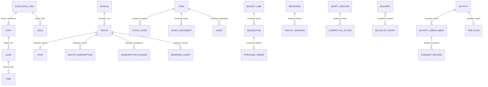
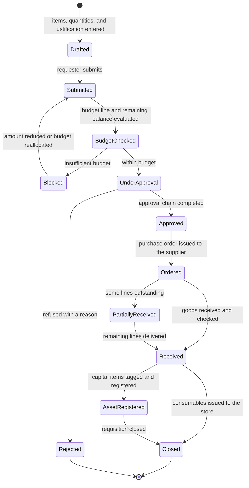
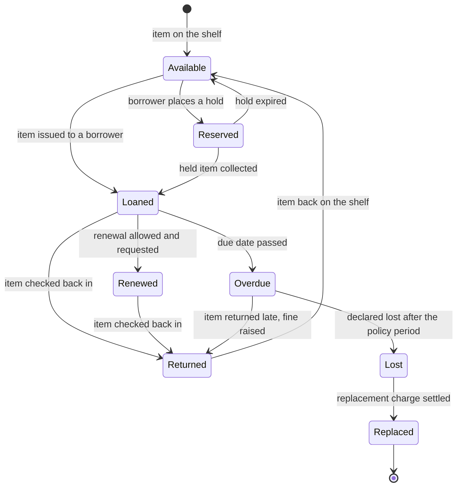
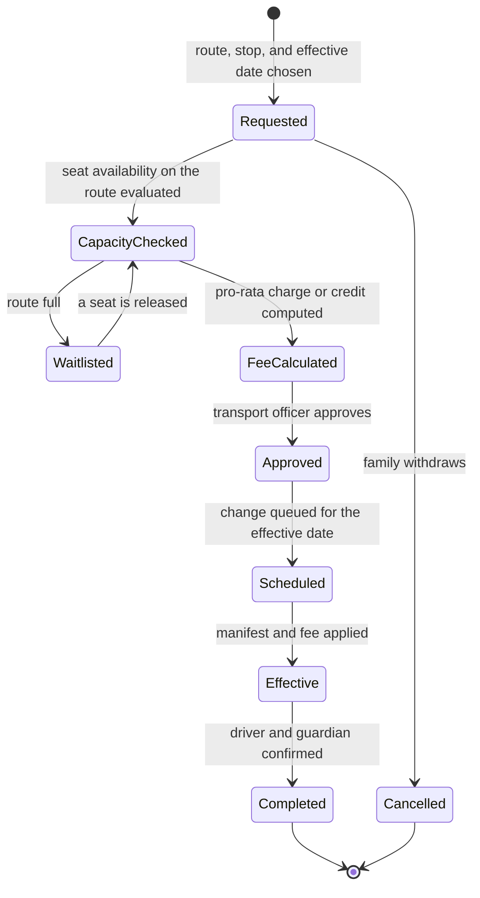
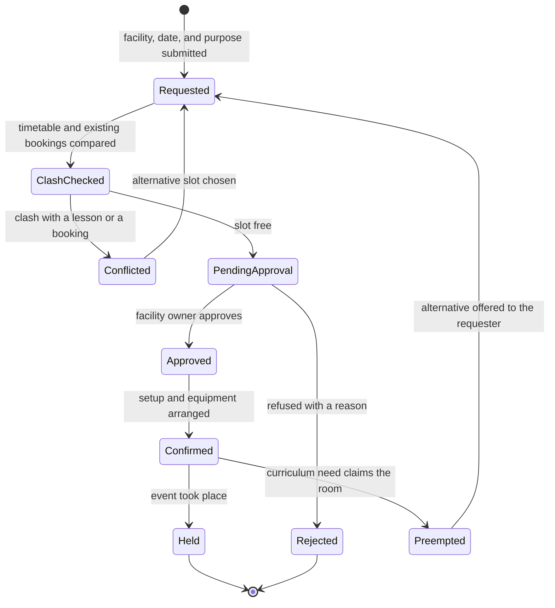
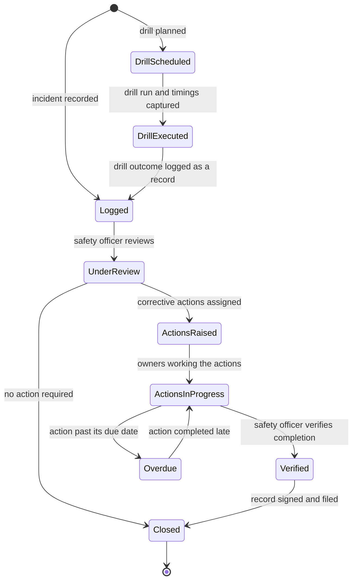

# Operations

> Service sheet, plan document 06, Group C. Names from Appendix L; events from Appendix E; permissions from Appendix B; error codes from Appendix K; settings categories from Appendix G. This sheet adds detail to reference architecture sheet 8.19 and never contradicts its table 8.0. The AREA code is `OPS`; the error prefix is `OPERATIONS_` (Appendix K.20).

Operations runs the school's physical and extracurricular life: the library, transport, inventory with assets and procurement, facilities with bookings, maintenance and safety records, the front desk, and activities, trips and programmes. It is **one service with one PostgreSQL schema per sub-domain** (`library`, `transport`, `inventory`, `facilities`, `frontdesk`, `activities`), with the Tier 3 `cafeteria` and `boarding` schemas reserved as extension points, so that splitting a sub-domain into its own service later is a mechanical move of a schema, a namespace, a feature folder and a DbContext rather than a rewrite (ADR-0002, REQ-OPS-001). Every design choice below that looks like extra ceremony (a DbContext per schema, events named by sub-domain, paths with a sub-domain segment) exists to keep that split mechanical.

| Fact | Value (quoted from `05-service-catalog.md` and Appendix L) |
|---|---|
| Canonical name, long name | Operations, Operations |
| Tier | 2; cafeteria, boarding and live vehicle tracking are Tier 3 (Appendix L.5) |
| AREA code | `OPS` |
| Database | `nibras_operations`, schema per sub-domain; application role `svc_operations`, migration role `mig_operations` |
| Exchange | `nibras.operations` |
| Images | `nibras/operations-api` |
| Worker | none; Quartz.NET jobs and long-running jobs run in the Api host under `Nibras.BuildingBlocks.Jobs` (Appendix L lists no operations-worker image) |
| gRPC package | `nibras.operations.v1` in `Nibras.Contracts.Operations/Grpc/operations.proto`, reconciliation methods only (section 6) |
| Build phase (master brief Section 28) | 5 |
| Service level class (master brief Section 31) | Read-heavy; vehicle location cached under a 30 s key |
| Sensitivity (Appendix J) | confidential |
| Synchronous dependency | School (student and staff directory); Scheduling `Timetables.Checksum` job only, reference architecture table 8.0 |
| Why the boundary exists | Release: six Tier 2 sub-domains that deploy together today, each in its own schema so that a later split is mechanical (ADR-0002) |
| First-release option | Deferred under the Appendix L merge option; its keys and namespaces stay reserved |

**Signature features.** Operations owns Appendix W feature 33 (campus digital twin), composed by Bff.Web (`GET /bff/web/v1/campus/digital-twin`, SL-OPS-624) from Operations' floor plans and tickets, Scheduling's room availability and Attendance roll-call counts (open point 10). Its rung, autonomy, requirements, capabilities, slices, Appendix O step and demo test are in the "Signature feature trace" of `32-product-differentiation-and-demo.md`; this sheet does not copy them.

**Last updated** 2026-09-26 by the round-3 remediation (workflow diagrams, platform notes, signature features, risk scale, closed open points)

---

## 1. Responsibilities

| Sub-domain and schema | Owns |
|---|---|
| Library, `library` | Catalogue with ISBN lookup, copies and barcodes, lending, holds, renewals, fines, lost items, inventory audit, reading history; WF-OPS-02 (REQ-OPS-002) |
| Transport, `transport` | Vehicles, drivers and attendants with document expiry, routes and stops on OpenStreetMap, student assignment, subscription changes (WF-OPS-03), boarding in attendant mode, delay notices, the transport charge decision; live vehicle tracking as a Tier 3 flag (REQ-OPS-003 to REQ-OPS-006) |
| Inventory, `inventory` | Stores, items, stock levels and movements, issue to staff and classes, reorder levels, stock-takes; the fixed asset register with tagging, assignment and the depreciation export; budget lines, purchase requisitions, orders and receipts (WF-OPS-01); uniform and book sales with parent pre-orders and point of sale (REQ-OPS-007 to REQ-OPS-009, REQ-OPS-017) |
| Facilities, `facilities` | Non-room resources and floor plans; facility booking set-up and preemption (WF-OPS-04); maintenance tickets with assignment, SLA and cost; safety incidents and drills (WF-OPS-05); the campus digital twin's floor plans and ticket overlay (REQ-OPS-010, REQ-OPS-016, REQ-OPS-018) |
| Front desk, `frontdesk` | Call log, deliveries with the supplier and courier blocklist, complaints and suggestions intake with SLA, lost and found (REQ-OPS-011) |
| Activities, `activities` | Clubs, teams, after-school and summer programmes with capacity and fees, registration, session attendance, trips with risk assessment, consent and participant lists, competitions and awards (REQ-OPS-012, REQ-OPS-013) |
| Shared, `operations` | Reference copies, the outbox and inbox, policies, job state: the only tables every sub-domain reads |
| Reserved, `cafeteria` and `boarding` | Extension points only, Tier 3 (REQ-OPS-014, REQ-OPS-015); no table is created in v1 |

## 2. Not responsible for

| Does not own | Owner | Why the line sits there |
|---|---|---|
| Visitor check-in, badges and the safeguarding watchlist | Attendance | Appendix F lists Visitor under Attendance and Safety (REQ-ATT-030); the front desk screen composes both through Bff.Web (open point 3) |
| Room records, the timetable and room-booking approval with the clash check | School (rooms), Scheduling (bookings) | Scheduling approves a room booking and publishes `scheduling.room-booking.approved.v1`; Operations takes WF-OPS-04 from `Approved` onward and owns non-room resources end to end |
| Posting, collecting and refunding a charge | Finance | Operations decides the charge (a fine, a transport fee, an activity fee) and publishes it; Finance posts it and never recomputes it (Finance sheet, section 2) |
| The approval chain of a requisition, a transport change or a booking request | Requests | Saga 6 sends `ApproveRequisition` and `ApplyTransportSubscriptionChange`; Operations never routes approvals itself |
| The complaint's case handling after intake | Requests | `operations.frontdesk.complaint-received.v1` opens a request of the seeded complaint type (Requests sheet, section 7.2) |
| Student bus presence in the attendance register | Attendance | Attendance pre-fills from `operations.transport.boarding-recorded.v1` |
| Medical flags carried on a trip | Wellbeing | Read live for permitted staff by Bff.Web, never copied into Operations (T-OPS-03) |
| Kindergarten daily sheets | Academics | REQ-ACA-028; document 21 section 1.19 lists them under Operations by mistake (open point 9) |
| Rendering purchase orders, drill reports and participant lists as PDF | Documents | Operations sends the merge values with `GenerateDocument` |
| Delivering any message | Notification | Operations publishes the catalogued events and sends `RequestNotification` otherwise |
| Settings storage | Platform (ADR-0009) | Operations reads *General* and *Security*; sub-domain policies without an Appendix G category are open point 1 |
| Dashboards across sub-domains | Reporting | `operations_facts` projection (`10-data-architecture.md` section 7.1) |

---

## 3. Requirements covered

| Range or identifier | What it binds here |
|---|---|
| REQ-OPS-001 to REQ-OPS-018 | Every row of the OPS area in `03-requirements-catalog.md`; REQ-OPS-006, REQ-OPS-014 and REQ-OPS-015 are Tier 3 and are designed here as extension points |
| REQ-PRV-020 | Location is tracked for vehicles and never for children (T-OPS-01) |
| REQ-SEC-003, REQ-SEC-004, REQ-SEC-005 | Object-level authorization with `self`, `own-children` and route scopes; generated permission and tenant-isolation suites |
| REQ-PERF-004, REQ-PERF-014, REQ-PERF-018, REQ-PERF-019 | Five-command handlers, keyset lists, `xmin`, caching only through the building block |
| REQ-DATA-001, REQ-DATA-003, REQ-DATA-009, REQ-DATA-018 | One database, one schema per sub-domain, no foreign key across schemas, slim School copies |
| REQ-MOB-002, REQ-MOB-007, REQ-MOB-010 | Bus attendant mode; offline library circulation and boarding with idempotent replay |
| REQ-MSG-003, REQ-MSG-004, REQ-MSG-012 | Outbox, inbox, per-student ordering of boarding events |
| REQ-L10N-009, REQ-L10N-012 | Arabic-normalized catalogue search; fines and fees with configurable decimals |
| REQ-API-016, REQ-API-017 | `Idempotency-Key` on circulation and boarding; bulk issue and boarding with per-item results |

---

## 4. Aggregates and entities

**Common columns.** Every table below carries these; the row `(common)` stands for them.

| Field | Type | Null | Notes |
|---|---|---|---|
| `tenant_id` | uuid | no | First column of every key and index; row-level security `tenant_isolation` with `WITH CHECK` in every schema |
| `id` | uuid | no | UUID v7 |
| `created_at`, `created_by` | timestamptz, uuid | no, yes | Audit interceptor |
| `updated_at`, `updated_by` | timestamptz, uuid | no, yes | Audit interceptor |
| `deleted_at`, `deleted_by` | timestamptz, uuid | yes | Soft delete behind the `SoftDelete` filter; a posted movement, a boarding event, a safety record and a loan are never soft-deleted |
| `xmin` | xid (system column) | no | Optimistic concurrency token on every aggregate root |
| classification | attribute, not a column | | `[DataClass]` per column group |

Bilingual text is the `LocalizedText` value object from `Nibras.BuildingBlocks.Localization`, stored as `<name>_en` and `<name>_ar`. Money is `Money`. A reference to another schema's entity is a plain `uuid` with no foreign key (REQ-OPS-001), exactly as a reference to another service's entity is (REQ-DATA-009).

### 4.0 The schema boundary and what moves in a split

| Schema | Aggregates | Tables | Publishes | Consumes or handles | Moves with it in a split |
|---|---|---|---|---|---|
| `library` | CatalogueItem, Copy (WF-OPS-02), Loan, Hold, Fine, LibraryStockTake | `catalogue_items`, `copies`, `borrower_categories`, `loans`, `holds`, `fines`, `library_stock_takes`, `library_stock_take_scans` | `operations.library.loan-recorded.v1`, `operations.library.loan-overdue.v1` | `RaiseClearanceItem` (library part), student and staff copies | The eight tables, `Nibras.Operations.Domain.Library`, `Features/Library/`, `LibraryDbContext`, `LibraryEndpoints.cs`, `LoanOverdueJob`, `HoldExpiryJob`, its copies of students and staff, a new outbox and inbox |
| `transport` | Vehicle, CrewMember, Route with Stop, RouteSubscription, SubscriptionChange (WF-OPS-03), BoardingEvent, DelayNotice, VehicleLocation (Tier 3) | `vehicles`, `vehicle_documents`, `crew_members`, `crew_documents`, `routes`, `stops`, `route_subscriptions`, `subscription_changes`, `waitlist_entries`, `boarding_events` (monthly partitions), `delay_notices`, `vehicle_locations` (daily partitions) | `operations.transport.boarding-recorded.v1`, `operations.transport.vehicle-delayed.v1`, `operations.transport.subscription-changed.v1` | `ApplyTransportSubscriptionChange`, `RevertTransportSubscription`, student copies | The twelve tables and their partition scripts, `Nibras.Operations.Domain.Transport`, `Features/Transport/`, `TransportDbContext`, `TransportEndpoints.cs`, `SubscriptionEffectiveJob`, `WaitlistReconfirmJob`, `TransportDocumentExpiryJob`, the vehicle-location partition job |
| `inventory` | Store, Item, StockLevel, StockMovement, InventoryStockTake, Asset with AssetAssignment, BudgetLine, Requisition (WF-OPS-01), PurchaseOrder, GoodsReceipt, Supplier, SaleOrder | `stores`, `items`, `stock_levels`, `stock_movements`, `inventory_stock_takes`, `inventory_stock_take_lines`, `assets`, `asset_assignments`, `budget_lines`, `requisitions`, `requisition_lines`, `purchase_orders`, `purchase_order_lines`, `goods_receipts`, `goods_receipt_lines`, `supplier_invoices`, `suppliers`, `sale_orders`, `sale_order_lines` | `operations.inventory.stock-low.v1` | `ApproveRequisition`, `CancelRequisition`, `RaiseClearanceItem` (assets part), uniform and book orders from `requests.request.approved.v1` | The nineteen tables, `Nibras.Operations.Domain.Inventory`, `Features/Inventory/`, `InventoryDbContext`, `InventoryEndpoints.cs`, `StockLowCheckJob`, `OrderDeliveryReminderJob`, `DepreciationExportJob` |
| `facilities` | Resource, FloorPlan, FacilityBooking (WF-OPS-04), MaintenanceTicket, SafetyRecord (WF-OPS-05) with CorrectiveAction, DrillSchedule | `resources`, `floor_plans`, `room_positions`, `facility_bookings`, `booking_equipment`, `maintenance_tickets`, `ticket_costs`, `safety_records`, `corrective_actions`, `drill_schedules` | `operations.facility.ticket-raised.v1`, `operations.facility.ticket-closed.v1` | `scheduling.room-booking.approved.v1`, `scheduling.timetable.published.v1`, maintenance tickets from `requests.request.approved.v1` | The ten tables, `Nibras.Operations.Domain.Facilities`, `Features/Facilities/`, `FacilitiesDbContext`, `FacilitiesEndpoints.cs`, `TicketSlaJob`, the booking and safety jobs, the room-booking and timetable copies |
| `frontdesk` | CallLog, Delivery, Complaint, LostFoundItem, BlocklistEntry | `call_logs`, `deliveries`, `complaints`, `lost_found_items`, `blocklist_entries` | `operations.frontdesk.complaint-received.v1` | staff copies | The five tables, `Nibras.Operations.Domain.FrontDesk`, `Features/FrontDesk/`, `FrontDeskDbContext`, `FrontDeskEndpoints.cs` |
| `activities` | Activity, ActivityEnrollment, ActivitySession with attendance, TripPlan with RiskAssessment, ConsentRecord, Award | `activities`, `activity_enrollments`, `activity_sessions`, `session_attendance`, `trip_plans`, `risk_assessments`, `consent_records`, `awards` | `operations.activity.enrollment-confirmed.v1` | `finance.payment.received.v1`, club enrollment and trip consent from `requests.request.approved.v1`, student copies | The eight tables, `Nibras.Operations.Domain.Activities`, `Features/Activities/`, `ActivitiesDbContext`, `ActivitiesEndpoints.cs`, `ActivityReminderJob` |
| `operations` (shared) | References, policies, messaging | `ref_students`, `ref_staff`, `ref_users`, `ref_sections`, `ref_timetable`, `ref_room_bookings`, `ref_tenant_state`, `ref_settings`, `ops_policies`, `outbox_messages`, `inbox_messages`, `job_runs` | `operations.usage.recorded.v1`, `operations.audit.recorded.v1` | Tenant lifecycle, reference-copy events | Copied, not moved: each split service receives its own copies of the reference tables it maps, an empty outbox and inbox, and the policies of its sub-domain |
| `cafeteria` (Tier 3) | Wallet, Purchase, SpendingLimit | reserved | none in Appendix E | none | Designed when the Tier 3 slice starts; the allergy check reads Wellbeing live and never copies (REQ-OPS-014) |
| `boarding` (Tier 3) | BoardingRoom, BedAllocation, NightRegister | reserved | none in Appendix E | none | Designed when the Tier 3 slice starts (REQ-OPS-015) |

**Split procedure, stated once.** `pg_dump --schema=<schema>` of the tables above into the new `nibras_<service>` database; the sub-domain's Domain namespace, feature folder, DbContext, endpoints file and jobs move into a new solution folder unchanged; the Gateway routes `/api/v1/operations/<subdomain>/` to the new host; the routing keys keep the `operations.<entity>.` prefix until a `v2` under the new service's prefix is published alongside (Appendix E versioning); permissions keep the `operations.<resource>.` namespace until an Appendix B amendment. Nothing in one schema reads another schema's table, so no query changes.

### 4.1 Library: `CatalogueItem`, `Copy` (WF-OPS-02), `Loan`, `Hold`, `Fine`

| Field | Type | Null | Notes |
|---|---|---|---|
| (common) | | | |
| catalogue item: `title_en`, `title_ar`, `authors`, `isbn`, `publisher`, `language`, `subjects`, `search_normalized`, `title_sort` | text, text, text[], text, text, text, text[], text, text | isbn, publisher nullable | `catalogue_items`; `search_normalized` is the alef, hamza, ta marbuta and diacritic normalized form (REQ-L10N-009); Internal |
| copy: `catalogue_item_id`, `barcode`, `location`, `condition`, `replacement_value`, `currency`, `status` | uuid, text, text, text enum (`good`, `worn`, `damaged`), numeric(12,3), char(3), `LibraryLendingAndFinesStatus` | no | `copies`; enum named by document 31: `Available`, `Reserved`, `Loaned`, `Renewed`, `Returned`, `Overdue`, `Lost`, `Replaced` |
| borrower category: `code`, `borrower_kind`, `loan_limit`, `loan_days`, `renewal_limit`, `fine_per_day`, `fine_cap` | text, text enum (`student`, `staff`), smallint, smallint, smallint, numeric(8,3), numeric(10,3) | no | `borrower_categories` |
| loan: `copy_id`, `borrower_id`, `borrower_kind`, `issued_at`, `due_on`, `renew_count`, `returned_at`, `device_occurred_at`, `received_at`, `issued_by` | uuid, uuid, text enum, timestamptz, date, smallint, timestamptz, timestamptz, timestamptz, uuid | returned nullable | `loans`; the reading history is the borrower's loans |
| hold: `catalogue_item_id`, `borrower_id`, `placed_at`, `ready_copy_id`, `expires_at`, `status` | uuid, uuid, timestamptz, uuid, timestamptz, text enum (`waiting`, `ready`, `collected`, `expired`, `cancelled`) | ready fields nullable | `holds` |
| fine: `loan_id`, `borrower_id`, `kind`, `amount`, `currency`, `days_overdue`, `status`, `waived_by`, `waive_reason` | uuid, uuid, text enum (`overdue`, `replacement`), numeric(10,3), char(3), smallint, text enum (`charged`, `settled`, `waived`, `cancelled`), uuid, text | waive fields nullable | `fines`; the amount Finance posts from `operations.library.loan-overdue.v1` |

Invariants: one open loan per copy (`OPERATIONS_ITEM_ALREADY_ON_LOAN`); a borrower's open loans never exceed the category limit (`OPERATIONS_BORROWER_LIMIT_REACHED`, TC-OPS-012); a borrower with a `charged` fine above the policy threshold cannot borrow (`OPERATIONS_FINE_OUTSTANDING`); a renewal needs no waiting hold and a count under the limit (TC-OPS-013); a copy overdue past the lost-after days becomes `Lost` with a replacement fine (TC-OPS-015); an offline return whose `device_occurred_at` precedes the fine's creation cancels the fine (TC-OPS-016); a waiver carries a reason and an actor holding `operations.library.waive-fine` (T-OPS-04).

### 4.2 Transport: `Vehicle`, `CrewMember`, `Route` with `Stop`, `RouteSubscription`, `SubscriptionChange` (WF-OPS-03), `BoardingEvent`, `VehicleLocation`

| Field | Type | Null | Notes |
|---|---|---|---|
| (common) | | | |
| vehicle: `campus_id`, `plate`, `seats`, `kind`, `active` | uuid, text, smallint, text enum (`bus`, `van`, `car`), boolean | no | `vehicles` |
| vehicle and crew document: `owner_id`, `document_type_code`, `expires_on`, `file_id` | uuid, text, date, uuid | no | `vehicle_documents`, `crew_documents` |
| crew member: `staff_id`, `external_name_en`, `external_name_ar`, `role`, `identity_ref_ciphertext`, `phone_ciphertext`, `user_id` | uuid, text, text, text enum (`driver`, `attendant`), bytea, bytea, uuid | staff or external name; user nullable | `crew_members`; identity reference encrypted per deployment (`10-data-architecture.md` section 1) |
| route: `campus_id`, `code`, `name_en`, `name_ar`, `direction`, `vehicle_id`, `driver_id`, `attendant_id`, `fee_code`, `active` | uuid, text, text, text, text enum (`morning`, `afternoon`), uuid, uuid, uuid, text, boolean | fee nullable | `routes` |
| stop: `route_id`, `seq`, `name_en`, `name_ar`, `latitude`, `longitude`, `planned_time` | uuid, smallint, text, text, numeric(9,6), numeric(9,6), time | no | `stops`; coordinates of the stop, never of a home |
| subscription: `student_id`, `route_id`, `stop_id`, `direction`, `valid_from`, `valid_to`, `seat_no` | uuid, uuid, uuid, text enum, date, date, smallint | `valid_to`, seat nullable | `route_subscriptions`; index `ix_route_subscriptions_route_active` (document 21 section 3.19) |
| change: `student_id`, `kind`, `from_route_id`, `from_stop_id`, `to_route_id`, `to_stop_id`, `effective_from`, `status`, `prorata_amount`, `currency`, `request_id`, `waitlist_position`, `approved_by`, `applied_at`, `driver_acknowledged_at` | uuid, text enum (`subscribe`, `cancel`, `change`, `temporary`), uuid × 4, date, `TransportSubscriptionChangeStatus`, numeric(10,3), char(3), uuid, smallint, uuid, timestamptz, timestamptz | from and to fields per kind; others nullable | `subscription_changes`; enum named by document 31: `Requested`, `CapacityChecked`, `Waitlisted`, `FeeCalculated`, `Approved`, `Scheduled`, `Effective`, `Completed`, `Cancelled` |
| boarding event: `route_id`, `stop_id`, `student_id`, `kind`, `direction`, `boarded_at`, `device_occurred_at`, `received_at`, `recorded_by` | uuid, uuid, uuid, text enum (`boarded`, `alighted`, `no-show`), text enum, timestamptz, timestamptz, timestamptz, uuid | stop nullable for no-show | `boarding_events`, range-partitioned by month on `boarded_at` |
| delay notice: `route_id`, `delay_minutes`, `reason_code`, `estimated_arrival`, `issued_by` | uuid, smallint, text, timestamptz, uuid | no | `delay_notices` |
| vehicle location (Tier 3): `route_id`, `vehicle_id`, `latitude`, `longitude`, `speed_kmh`, `recorded_at` | uuid, uuid, numeric(9,6), numeric(9,6), numeric(5,1), timestamptz | no | `vehicle_locations`, range-partitioned by day, 90-day retention; no student column exists, by design (T-OPS-01) |

Invariants: a route's active subscriptions per direction never exceed the vehicle's seats (`OPERATIONS_ROUTE_CAPACITY_EXCEEDED`, TC-OPS-022); a subscription's stop belongs to its route (`OPERATIONS_STOP_NOT_ON_ROUTE`, TC-OPS-021); a student holds at most one active subscription per direction on a date; a change requested fewer than 2 working days before its effective date is refused and the next available date offered; `Scheduled → Effective` moves the manifest and the fee together, and a failure leaves the change `Scheduled` with the old stop active (TC-OPS-024, TC-OPS-025); a boarding event names a student subscribed to that route on that date or is refused as `no-subscription`; no table in `transport` stores a location against a student.

### 4.3 Inventory: `Item`, `StockLevel`, `StockMovement`, `Asset`, `BudgetLine`, `Requisition` (WF-OPS-01), `PurchaseOrder`, `GoodsReceipt`, `SaleOrder`

| Field | Type | Null | Notes |
|---|---|---|---|
| (common) | | | |
| store: `campus_id`, `name_en`, `name_ar`, `keeper_staff_id` | uuid, text, text, uuid | no | `stores` |
| item: `sku`, `name_en`, `name_ar`, `unit`, `capital`, `cost_price`, `sale_price`, `currency`, `category` | text, text, text, text, boolean, numeric(12,3), numeric(12,3), char(3), text enum (`consumable`, `equipment`, `uniform`, `book`, `furniture`, `it`) | sale price nullable | `items`; cost price Confidential, per-user only |
| stock level: `store_id`, `item_id`, `quantity_on_hand`, `quantity_reserved`, `reorder_level` | uuid, uuid, numeric(12,2) × 3 | no | `stock_levels`; `ix_stock_levels_low` (document 21 section 3.19) |
| movement: `store_id`, `item_id`, `kind`, `quantity`, `unit_cost`, `reference_kind`, `reference_id`, `to_staff_id`, `to_section_id`, `posted_at` | uuid, uuid, text enum (`receipt`, `issue`, `transfer-in`, `transfer-out`, `adjustment`, `sale`, `return`), numeric(12,2), numeric(12,3), text, uuid, uuid, uuid, timestamptz | recipients nullable | `stock_movements`; append-only |
| asset: `tag`, `item_id`, `description`, `acquired_on`, `cost`, `currency`, `depreciation_method`, `useful_life_months`, `room_id`, `status` | text, uuid, text, date, numeric(12,3), char(3), text enum (`straight-line`, `declining-balance`), smallint, uuid, text enum (`in-service`, `in-repair`, `disposed`) | room nullable | `assets` |
| assignment: `asset_id`, `holder_kind`, `holder_id`, `from_date`, `to_date` | uuid, text enum (`staff`, `student`, `room`), uuid, date, date | `to_date` nullable | `asset_assignments` |
| budget line: `code`, `name_en`, `name_ar`, `financial_period`, `amount`, `committed`, `spent`, `currency`, `holder_staff_id` | text, text, text, text, numeric(14,3) × 3, char(3), uuid | no | `budget_lines` |
| requisition: `requester_staff_id`, `budget_line_id`, `justification`, `total`, `currency`, `status`, `request_id`, `shortfall` | uuid, uuid, text, numeric(14,3), char(3), `PurchaseRequisitionToAssetStatus`, uuid, numeric(14,3) | request, shortfall nullable | `requisitions` with `requisition_lines` (`item_id`, `description`, `quantity`, `unit_estimate`); enum named by document 31: `Drafted`, `Submitted`, `BudgetChecked`, `Blocked`, `UnderApproval`, `Approved`, `Rejected`, `Ordered`, `PartiallyReceived`, `Received`, `AssetRegistered`, `Closed` |
| order and receipt: `requisition_id`, `supplier_id`, `po_number`, `promised_on`, `document_id`; receipt lines `po_line_id`, `quantity_received`, `received_at` | uuid, uuid, text, date, uuid; uuid, numeric(12,2), timestamptz | document nullable | `purchase_orders`, `purchase_order_lines`, `goods_receipts`, `goods_receipt_lines`, `supplier_invoices` (matched to received lines only) |
| supplier: `name`, `contact_ciphertext`, `blocklisted`, `blocklist_reason` | text, bytea, boolean, text | reason nullable | `suppliers` |
| sale order: `kind`, `student_id`, `guardian_user_id`, `request_id`, `status`, `total`, `currency`, `paid_by` | text enum (`pre-order`, `point-of-sale`), uuid, uuid, uuid, text enum (`reserved`, `ready`, `collected`, `cancelled`), numeric(12,3), char(3), text enum (`request-fee`, `cash-desk`) | student, guardian, request nullable | `sale_orders`, `sale_order_lines` |

Invariants: stock on hand never goes below zero (`OPERATIONS_STOCK_INSUFFICIENT`); crossing the reorder level downward publishes `operations.inventory.stock-low.v1` once per crossing (REQ-OPS-007); an asset has at most one open assignment (`OPERATIONS_ASSET_ALREADY_ASSIGNED`); a requisition over the remaining budget is `Blocked` with the shortfall and routes no approval (TC-OPS-002); approval commits the budget and cancellation before `Ordered` releases it; a receipt line never exceeds its order line and goods never ordered are refused (TC-OPS-006); a received capital item above the policy threshold becomes an asset with tag, location and custodian (TC-OPS-005); a pre-order reserves stock and a sale posts an issue movement (REQ-OPS-009).

### 4.4 Facilities: `Resource`, `FloorPlan`, `FacilityBooking` (WF-OPS-04), `MaintenanceTicket`, `SafetyRecord` (WF-OPS-05)

| Field | Type | Null | Notes |
|---|---|---|---|
| (common) | | | |
| resource: `campus_id`, `kind`, `name_en`, `name_ar`, `owner_staff_id`, `quantity` | uuid, text enum (`equipment`, `outdoor-space`, `vehicle-for-trips`, `hall-equipment`), text, text, uuid, smallint | no | `resources`; rooms stay School's |
| floor plan: `campus_id`, `building_id`, `floor`, `image_file_id`; room position `room_id`, `polygon` | uuid, uuid, smallint, uuid; uuid, jsonb (GeoJSON polygon in plan coordinates) | no | `floor_plans`, `room_positions`; the digital twin's geometry |
| booking: `target_kind`, `room_booking_id`, `room_id`, `resource_id`, `from`, `to`, `purpose`, `requester_staff_id`, `status`, `setup_ticket_id`, `preempted_reason`, `alternative_offered` | text enum (`room`, `resource`), uuid, uuid, uuid, timestamptz, timestamptz, text, uuid, `FacilityBookingApprovalStatus`, uuid, text, jsonb | room or resource fields per kind | `facility_bookings` with `booking_equipment`; enum named by document 31: `Requested`, `ClashChecked`, `Conflicted`, `PendingApproval`, `Approved`, `Rejected`, `Confirmed`, `Held`, `Preempted` |
| ticket: `campus_id`, `room_id`, `asset_id`, `category`, `priority`, `description`, `raised_by`, `raised_at`, `assignee_staff_id`, `sla_due_at`, `breached_at`, `status`, `request_id` | uuid, uuid, uuid, text, text enum (`low`, `normal`, `high`, `urgent`), text, uuid, timestamptz, uuid, timestamptz, timestamptz, text enum (`open`, `assigned`, `resolved`, `closed`), uuid | room, asset, assignee, breach, request nullable | `maintenance_tickets` with `ticket_costs` (`amount`, `currency`, `source` labour or parts, `movement_id`); `ix_tickets_campus_open` |
| safety record: `kind`, `campus_id`, `category`, `severity`, `location`, `occurred_at`, `device_occurred_at`, `description`, `drill_schedule_id`, `evacuation_seconds`, `headcount`, `status`, `reviewed_by`, `closed_outcome`, `document_id` | text enum (`incident`, `drill`), uuid, text, text enum (`low`, `medium`, `high`), text, timestamptz, timestamptz, text, uuid, int, int, `SafetyIncidentAndDrillLoggingStatus`, uuid, text enum (`completed`, `no-action`, `entered-in-error`), uuid | drill fields for drills only | `safety_records`; enum named by document 31: `DrillScheduled`, `DrillExecuted`, `Logged`, `UnderReview`, `ActionsRaised`, `ActionsInProgress`, `Overdue`, `Verified`, `Closed` |
| action: `safety_record_id`, `description`, `owner_staff_id`, `due_on`, `completed_at`, `evidence_file_id`, `verified_by` | uuid, text, uuid, date, timestamptz, uuid, uuid | completion fields nullable | `corrective_actions` |
| drill schedule: `campus_id`, `drill_kind`, `frequency_days`, `next_due_on` | uuid, text, smallint, date | no | `drill_schedules` |

Invariants: a resource booking overlapping another approved booking of the same resource is refused (`OPERATIONS_FACILITY_BOOKING_CONFLICT`); a room booking enters Operations only from `scheduling.room-booking.approved.v1` in `Approved`; `Confirmed → Preempted` records an alternative offered before it takes effect (TC-OPS-035); a ticket's SLA due time comes from its category and priority and a breach is flagged once (REQ-OPS-010); a safety record is never deleted, and a record entered in error closes with that outcome (Appendix R compensation); `Verified → Closed` requires every action verified with evidence (TC-OPS-045); an offline record keeps its original time and location (TC-OPS-046).

### 4.5 Front desk: `CallLog`, `Delivery`, `Complaint`, `LostFoundItem`, `BlocklistEntry`

| Field | Type | Null | Notes |
|---|---|---|---|
| (common) | | | |
| call: `campus_id`, `caller_name`, `caller_phone_ciphertext`, `about`, `for_staff_id`, `message`, `taken_by` | uuid, text, bytea, text, uuid, text, uuid | staff nullable | `call_logs`; Confidential |
| delivery: `campus_id`, `courier`, `supplier_id`, `recipient_staff_id`, `reference`, `received_at`, `collected_at`, `held` | uuid, text, uuid, uuid, text, timestamptz, timestamptz, boolean | collected nullable | `deliveries` |
| complaint: `campus_id`, `kind`, `category_code`, `channel`, `complainant_name`, `complainant_contact_ciphertext`, `subject_student_id`, `summary`, `sla_due_at`, `status`, `resolution`, `request_id` | uuid, text enum (`complaint`, `suggestion`), text, text enum (`walk-in`, `phone`, `email`, `form`), text, bytea, uuid, text, timestamptz, text enum (`received`, `routed`, `resolved`), text, uuid | student, resolution, request nullable | `complaints` |
| lost and found: `campus_id`, `description`, `found_at`, `location`, `photo_file_id`, `claimed_by`, `claimed_at`, `disposed_at` | uuid, text, timestamptz, text, uuid, text, timestamptz, timestamptz | claim, disposal nullable | `lost_found_items` |
| blocklist: `kind`, `name`, `supplier_id`, `reason` | text enum (`courier`, `supplier`, `contractor`), text, uuid, text | supplier nullable | `blocklist_entries`; the reason is never shown at the desk |

Invariants: a complaint's `sla_due_at` comes from its category policy and is published once in `operations.frontdesk.complaint-received.v1`; a delivery from a blocklisted courier or supplier is held with `OPERATIONS_VISITOR_BLOCKLISTED` and security alerted, the desk seeing the instruction and never the reason; lost-and-found items unclaimed after the policy period are marked disposed, never deleted within the period.

### 4.6 Activities: `Activity`, `ActivityEnrollment`, `ActivitySession`, `TripPlan`, `ConsentRecord`, `Award`

| Field | Type | Null | Notes |
|---|---|---|---|
| (common) | | | |
| activity: `kind`, `name_en`, `name_ar`, `term_id`, `campus_id`, `supervisor_staff_id`, `capacity`, `fee_amount`, `currency`, `grade_level_ids`, `schedule`, `status` | text enum (`club`, `team`, `after-school`, `summer-programme`, `trip`, `competition`), text, text, uuid, uuid, uuid, smallint, numeric(10,3), char(3), uuid[], jsonb, text enum (`draft`, `open`, `closed`, `completed`) | fee nullable | `activities` |
| enrollment: `activity_id`, `student_id`, `place_status`, `consent_state`, `payment_state`, `waitlist_position`, `request_id`, `confirmed_at` | uuid, uuid, text enum (`waitlisted`, `offered`, `confirmed`, `withdrawn`), text enum (`not-required`, `pending`, `given`, `refused`), text enum (`not-required`, `invoiced`, `paid`), smallint, uuid, timestamptz | nullable per state | `activity_enrollments` |
| session and attendance: `activity_id`, `starts_at`, `ends_at`; `session_id`, `student_id`, `status` | uuid, timestamptz, timestamptz; uuid, uuid, text enum (`present`, `absent`, `excused`) | no | `activity_sessions`, `session_attendance` |
| trip plan: `activity_id`, `destination`, `departs_at`, `returns_at`, `transport_resource_id`, `staff_ratio`, `risk_assessment_status`, `approved_by` | uuid, text, timestamptz, timestamptz, uuid, text, text enum (`draft`, `approved`), uuid | resource, approver nullable | `trip_plans` with `risk_assessments` (`hazard`, `likelihood`, `severity`, `control`) |
| consent: `enrollment_id`, `consent_text_version`, `decision`, `decided_by`, `decided_at`, `source` | uuid, text, text enum (`given`, `refused`), uuid, timestamptz, text enum (`request`, `paper`) | no | `consent_records` |
| award: `activity_id`, `student_id`, `title_en`, `title_ar`, `placing`, `awarded_on` | uuid, uuid, text, text, smallint, date | placing nullable | `awards` |

Invariants: confirmed places never exceed capacity and the next waitlisted student is offered a released place; a place is `confirmed` only with consent given where required, and confirmation publishes `operations.activity.enrollment-confirmed.v1` once, which Finance posts as the fee (REQ-OPS-013); a trip departs only with an approved risk assessment; the participant list shows confirmed and pending with the missing item named (REQ-OPS-012); no medical flag is stored on an enrollment, a trip or a roster (T-OPS-03).

### 4.7 Shared schema `operations`

`ref_students` (`student_id`, `student_number`, `name_en`, `name_ar`, `section_id`, `campus_id`, `status`), `ref_sections` (`section_id`, `grade_level_id`, `campus_id`), `ref_users` (`user_id`, `roles`, `scope`, `active`), `ref_staff` (`staff_id`, `user_id`, `name_en`, `name_ar`, `campus_ids`, `active`), `ref_timetable` (`timetable_version_id`, `campus_id`, `effective_from`), `ref_room_bookings` (`booking_id`, `room_id`, `from`, `to`, `booked_by`), `ref_tenant_state`, `ref_settings`; every copy carries `source_version` and `reconciled_at`. `ops_policies` holds one row per sub-domain and tenant (loan limits and days, fine per day and cap, hold days, lost-after days, transport notice days and reconfirm interval, capitalisation threshold, ticket SLA matrix, drill frequencies, complaint SLA per category, lost-and-found retention). `outbox_messages`, `inbox_messages` and `job_runs` follow document 11.



Relationships in the diagram never cross a schema except through a plain `uuid` (for example a ticket's `asset_id` or a booking's `transport_resource_id`), which is why no edge joins two sub-domains.

---

## 5. REST API

All paths are under `/api/v1/operations/<subdomain>/`, so that the Gateway can route one sub-domain to a split service without a client change. Every endpoint may also return the K.1 codes with the `OPERATIONS_` prefix. Lists use keyset pagination with a page cap of 100 unless stated. Guardians and students reach their own loans, subscriptions, pre-orders and activity places through `own-children` or `self` scope on the same endpoints (Appendix I: G22 `S` for students and guardians).

### 5.1 Library

| Method | Path | Permission | Request | Response | Errors | Idempotent |
|---|---|---|---|---|---|---|
| GET | `/api/v1/operations/library/catalogue` | `operations.library.view` | `q` (Arabic and Latin, normalized), `subject`, `language` | `Page<CatalogueItemDto>` keyset on `(titleSort, id)`, page cap 50 (document 21 section 3.19 query 4) | none specific | yes |
| POST | `/api/v1/operations/library/catalogue` | `operations.library.create` | item fields, or `{ isbn }` for a lookup through `IIsbnLookup` | 201 | `OPERATIONS_VALIDATION_FAILED` (duplicate ISBN) | by `Idempotency-Key` |
| GET | `/api/v1/operations/library/catalogue/isbn/{isbn}` | `operations.library.create` | none | bibliographic suggestion from the lookup adapter, or empty when it is off | `OPERATIONS_DEPENDENCY_UNAVAILABLE` | yes |
| PATCH, DELETE | `/api/v1/operations/library/catalogue/{id}` | `operations.library.edit`, `operations.library.delete` | item fields; delete with no copies | item; 204 | `OPERATIONS_CONCURRENCY_CONFLICT`, `OPERATIONS_VALIDATION_FAILED` | with `If-Match`; yes |
| POST | `/api/v1/operations/library/copies` | `operations.library.create` | `{ catalogueItemId, barcodes[], location, replacementValue }` | 201 copies in `Available` | `OPERATIONS_VALIDATION_FAILED` (duplicate barcode) | by `Idempotency-Key` |
| PATCH, DELETE | `/api/v1/operations/library/copies/{id}` | `operations.library.edit`, `operations.library.delete` | location, condition; delete never-lent copy | copy; 204 | `OPERATIONS_VALIDATION_FAILED` | with `If-Match`; yes |
| POST | `/api/v1/operations/library/loans` | `operations.library.issue` | `{ barcode, borrowerId, occurredAt }` from the desk or an offline queue | 201 `Loaned` with the due date from the borrower category (TC-OPS-011); `operations.library.loan-recorded.v1` | `OPERATIONS_ITEM_ALREADY_ON_LOAN`, `OPERATIONS_BORROWER_LIMIT_REACHED` (TC-OPS-012), `OPERATIONS_FINE_OUTSTANDING` | `Idempotency-Key` required; offline replay returns the first result |
| POST | `/api/v1/operations/library/loans/bulk` | `operations.library.issue` | bulk envelope, `independent`, at most 500 issues or returns | per-item results (class sets) | per item | `Idempotency-Key` required |
| POST | `/api/v1/operations/library/loans/{id}/return` | `operations.library.receive` | `{ occurredAt, condition }` | `Returned` then `Available`; a late return raises a fine (TC-OPS-014); an earlier offline timestamp cancels a fine (TC-OPS-016) | `OPERATIONS_VALIDATION_FAILED` (already returned) | `Idempotency-Key` required |
| POST | `/api/v1/operations/library/loans/{id}/renew` | `operations.library.issue` | `{}` | `Renewed` with the new due date (TC-OPS-013) | `OPERATIONS_VALIDATION_FAILED` (hold waiting, renewal limit) | `Idempotency-Key` required |
| POST | `/api/v1/operations/library/loans/{id}/lost` | `operations.library.edit` | `{ reason }` | `Lost`; replacement fine (TC-OPS-015) | `OPERATIONS_VALIDATION_FAILED` | `Idempotency-Key` required |
| GET | `/api/v1/operations/library/loans` | `operations.library.view` | `borrowerId` (self or own children by default), `open`, `overdue` | loans; the reading history is `open = false` | none specific | yes |
| POST | `/api/v1/operations/library/holds` | `operations.library.create` | `{ catalogueItemId, borrowerId }` | 201 `waiting`; `Reserved` when a copy is set aside | `OPERATIONS_VALIDATION_FAILED` (hold exists) | by `Idempotency-Key` |
| POST | `/api/v1/operations/library/holds/{id}/cancel` | `operations.library.edit` | `{}` | `cancelled` | none specific | yes |
| GET | `/api/v1/operations/library/fines` | `operations.library.view` | `borrowerId`, `status` | fines | none specific | yes |
| POST | `/api/v1/operations/library/fines/{id}/waive` | `operations.library.waive-fine` | `{ reason }` required | `waived`; `operations.audit.recorded.v1` (T-OPS-04) | `OPERATIONS_VALIDATION_FAILED` (no reason, own relative flagged) | `Idempotency-Key` required |
| POST | `/api/v1/operations/library/fines/{id}/settle` | `operations.library.edit` | `{ receiptReference }` | `settled` (open point 5) | `OPERATIONS_VALIDATION_FAILED` | `Idempotency-Key` required |
| POST | `/api/v1/operations/library/stock-takes` | `operations.library.edit` | `{ location }` | 201 open stock-take | none specific | by `Idempotency-Key` |
| POST | `/api/v1/operations/library/stock-takes/{id}/scans` | `operations.library.edit` | `{ barcodes[] }`, at most 500, offline-capable | scanned, missing, misplaced counts | none specific | `Idempotency-Key` required |
| POST | `/api/v1/operations/library/stock-takes/{id}/close` | `operations.library.edit` | `{}` | report; missing copies flagged | none specific | `Idempotency-Key` required |
| POST | `/api/v1/operations/library/export` | `operations.library.export` | filter, format | 202 job | none specific | by `Idempotency-Key` |

### 5.2 Transport

| Method | Path | Permission | Request | Response | Errors | Idempotent |
|---|---|---|---|---|---|---|
| GET, POST | `/api/v1/operations/transport/vehicles` | `operations.transport.view`, `operations.transport.create` | plate, seats, kind, campus | list; 201 | `OPERATIONS_VALIDATION_FAILED` | POST by `Idempotency-Key` |
| PATCH, DELETE | `/api/v1/operations/transport/vehicles/{id}` | `operations.transport.edit`, `operations.transport.delete` | fields; delete an unassigned vehicle | vehicle; 204 | `OPERATIONS_VALIDATION_FAILED` | with `If-Match`; yes |
| GET, POST | `/api/v1/operations/transport/crew` | `operations.transport.view`, `operations.transport.create` | staff id or external name, role, identity reference | list without identity references; 201 | `OPERATIONS_VALIDATION_FAILED` | POST by `Idempotency-Key` |
| POST | `/api/v1/operations/transport/documents` | `operations.transport.edit` | `{ ownerKind, ownerId, documentTypeCode, expiresOn, fileId }` | vehicle or crew document | `OPERATIONS_VALIDATION_FAILED` | by `Idempotency-Key` |
| GET, POST | `/api/v1/operations/transport/routes` | `operations.transport.view`, `operations.transport.create` | route with vehicle, crew, fee code | list; 201 | `OPERATIONS_VALIDATION_FAILED` | POST by `Idempotency-Key` |
| PUT | `/api/v1/operations/transport/routes/{id}/stops` | `operations.transport.edit` | ordered stops with coordinates and planned times | stops | `OPERATIONS_VALIDATION_FAILED` (a removed stop with subscribers) | with `If-Match` |
| DELETE | `/api/v1/operations/transport/routes/{id}` | `operations.transport.delete` | route with no active subscription | 204 | `OPERATIONS_VALIDATION_FAILED` | yes |
| GET | `/api/v1/operations/transport/routes/{id}/roster` | `operations.transport.view` (route scope for an attendant) | `date` | stops in order with the students per stop (document 21 section 3.19 query 1) | `OPERATIONS_NOT_FOUND` | yes |
| POST | `/api/v1/operations/transport/subscriptions` | `operations.transport.assign-student` | `{ studentId, routeId, stopId, direction, validFrom }` by the transport officer | 201; `operations.transport.subscription-changed.v1` (REQ-OPS-003) | `OPERATIONS_ROUTE_CAPACITY_EXCEEDED`, `OPERATIONS_STOP_NOT_ON_ROUTE` | by `Idempotency-Key` |
| POST | `/api/v1/operations/transport/subscription-changes` | `operations.transport.create` (`own-children` for a guardian) | `{ studentId, kind, toRouteId, toStopId, effectiveFrom, requestId }` | 201 `Requested → CapacityChecked → FeeCalculated`, or `Waitlisted` with the position (TC-OPS-021 to TC-OPS-023) | `OPERATIONS_STOP_NOT_ON_ROUTE`, `OPERATIONS_VALIDATION_FAILED` (under 2 working days, next date offered) | by `Idempotency-Key` |
| GET | `/api/v1/operations/transport/subscription-changes/{id}` | `operations.transport.view` | none | change with state and pro-rata figure | `OPERATIONS_NOT_FOUND` | yes |
| POST | `/api/v1/operations/transport/subscription-changes/{id}/approve` | `operations.transport.assign-student` | `{}` for a tenant without the Requests transport type | `Approved → Scheduled`; `operations.transport.subscription-changed.v1` | `OPERATIONS_ROUTE_CAPACITY_EXCEEDED` (re-checked) | `Idempotency-Key` required |
| POST | `/api/v1/operations/transport/subscription-changes/{id}/cancel` | `operations.transport.edit` | `{ reason }` | `Cancelled` before `Scheduled` | `OPERATIONS_VALIDATION_FAILED` | `Idempotency-Key` required |
| POST | `/api/v1/operations/transport/subscription-changes/{id}/driver-acknowledgement` | `operations.transport.record-boarding` | `{}` from the driver's device | `Effective → Completed`; guardian told the new stop and time (TC-OPS-026) | `OPERATIONS_VALIDATION_FAILED` | `Idempotency-Key` required |
| POST | `/api/v1/operations/transport/boarding-events` | `operations.transport.record-boarding` | `{ routeId, stopId, studentId, kind, occurredAt }` from attendant mode or the offline queue | 202; `operations.transport.boarding-recorded.v1` (REQ-OPS-004) | `OPERATIONS_VALIDATION_FAILED` (not subscribed) | `Idempotency-Key` required |
| POST | `/api/v1/operations/transport/boarding-events/bulk` | `operations.transport.record-boarding` | at most 500 events, `independent` | per-item results | per item | `Idempotency-Key` required |
| POST | `/api/v1/operations/transport/routes/{id}/delays` | `operations.transport.notify-delay` | `{ delayMinutes, reasonCode, estimatedArrival }` | 201; `operations.transport.vehicle-delayed.v1` | `OPERATIONS_VALIDATION_FAILED` | by `Idempotency-Key` |
| POST | `/api/v1/operations/transport/vehicles/{id}/locations` | `operations.transport.record-boarding` on the vehicle's device session; Tier 3 flag | `{ latitude, longitude, speed, recordedAt }` every 10 s | 202; written through to the 30 s cache entry (document 21 section 3.19 query 2) | `OPERATIONS_VALIDATION_FAILED` (flag off) | yes, by `(vehicleId, recordedAt)` |
| GET | `/api/v1/operations/transport/routes/{id}/vehicle-location` | `operations.transport.view` (`own-children` sees only the child's route) | none | last known vehicle position; never a child's (T-OPS-01) | `OPERATIONS_NOT_FOUND` | yes |
| POST | `/api/v1/operations/transport/export` | `operations.transport.export` | filter, format | 202 job; identity references excluded | none specific | by `Idempotency-Key` |

### 5.3 Inventory, assets, procurement and sales

| Method | Path | Permission | Request | Response | Errors | Idempotent |
|---|---|---|---|---|---|---|
| GET, POST | `/api/v1/operations/inventory/stores` | `operations.inventory.view`, `operations.inventory.create` | name, campus, keeper | list; 201 | `OPERATIONS_VALIDATION_FAILED` | POST by `Idempotency-Key` |
| GET, POST | `/api/v1/operations/inventory/items` | `operations.inventory.view`, `operations.inventory.create` | sku, names, unit, category, capital flag, prices, reorder levels | list; cost price only for `operations.inventory.edit` holders; 201 | `OPERATIONS_VALIDATION_FAILED` | POST by `Idempotency-Key` |
| PATCH, DELETE | `/api/v1/operations/inventory/items/{id}` | `operations.inventory.edit`, `operations.inventory.delete` | fields; delete an item with no movement | item; 204 | `OPERATIONS_CONCURRENCY_CONFLICT` | with `If-Match`; yes |
| GET | `/api/v1/operations/inventory/stock` | `operations.inventory.view` | `storeId`, `belowReorder` | stock levels | none specific | yes |
| POST | `/api/v1/operations/inventory/receipts` | `operations.inventory.receive` | `{ storeId, purchaseOrderId, lines }` | goods receipt; `Ordered → PartiallyReceived` or `Received` (TC-OPS-004) | `OPERATIONS_VALIDATION_FAILED` (goods never ordered, TC-OPS-006) | `Idempotency-Key` required |
| POST | `/api/v1/operations/inventory/issues` | `operations.inventory.issue` | `{ storeId, itemId, quantity, toStaffId or toSectionId }` | issue movement; `operations.inventory.stock-low.v1` on the crossing | `OPERATIONS_STOCK_INSUFFICIENT` | `Idempotency-Key` required |
| POST | `/api/v1/operations/inventory/transfers` | `operations.inventory.issue` | `{ fromStoreId, toStoreId, itemId, quantity }` | two movements | `OPERATIONS_STOCK_INSUFFICIENT` | `Idempotency-Key` required |
| POST | `/api/v1/operations/inventory/stock-takes` | `operations.inventory.stock-take` | `{ storeId }` | 201 open count | none specific | by `Idempotency-Key` |
| POST | `/api/v1/operations/inventory/stock-takes/{id}/lines` | `operations.inventory.stock-take` | counted quantities, at most 500 | variances | none specific | `Idempotency-Key` required |
| POST | `/api/v1/operations/inventory/stock-takes/{id}/post` | `operations.inventory.stock-take` | `{ reason }` | adjustment movements for the variances | `OPERATIONS_VALIDATION_FAILED` | `Idempotency-Key` required |
| GET, POST | `/api/v1/operations/inventory/assets` | `operations.inventory.view`, `operations.inventory.create` | tag, item, cost, depreciation, room | list; 201 | `OPERATIONS_VALIDATION_FAILED` (duplicate tag) | POST by `Idempotency-Key` |
| POST | `/api/v1/operations/inventory/assets/{id}/assignments` | `operations.inventory.issue` | `{ holderKind, holderId, fromDate }` | assignment | `OPERATIONS_ASSET_ALREADY_ASSIGNED` | `Idempotency-Key` required |
| POST | `/api/v1/operations/inventory/assets/{id}/return` | `operations.inventory.receive` | `{ toDate, condition }` | assignment closed | `OPERATIONS_VALIDATION_FAILED` | `Idempotency-Key` required |
| POST | `/api/v1/operations/inventory/assets/depreciation-export` | `operations.inventory.export` | `{ asOf, format }` | 202 job; one row per asset with cost, date and method (REQ-OPS-008) | none specific | by `Idempotency-Key` |
| GET, POST | `/api/v1/operations/inventory/budget-lines` | `operations.inventory.view`, `operations.inventory.edit` | code, period, amount, holder | lines with committed and spent; 201 | `OPERATIONS_VALIDATION_FAILED` | POST by `Idempotency-Key` |
| POST | `/api/v1/operations/inventory/requisitions` | `operations.inventory.create` | `{ budgetLineId, justification, lines, requestId }` | 201 `Drafted` | `OPERATIONS_VALIDATION_FAILED` | by `Idempotency-Key` |
| POST | `/api/v1/operations/inventory/requisitions/{id}/submit` | `operations.inventory.create` | `{}` | `Submitted → BudgetChecked → UnderApproval`, or `Blocked` with the shortfall (TC-OPS-001, TC-OPS-002) | `OPERATIONS_VALIDATION_FAILED` (no budget line for the period) | `Idempotency-Key` required |
| GET | `/api/v1/operations/inventory/requisitions` | `operations.inventory.view` | `status`, `mine` | keyset list | none specific | yes |
| POST | `/api/v1/operations/inventory/requisitions/{id}/order` | `operations.inventory.edit` | `{ supplierId, promisedOn }` | `Ordered`; purchase order through `GenerateDocument`, `subjectId` the `purchase_orders.id` | `OPERATIONS_VALIDATION_FAILED` (not approved), `OPERATIONS_VISITOR_BLOCKLISTED` (blocklisted supplier) | `Idempotency-Key` required |
| POST | `/api/v1/operations/inventory/requisitions/{id}/register-assets` | `operations.inventory.create` | tags, rooms, custodians for capital lines | `AssetRegistered` (TC-OPS-005) | `OPERATIONS_VALIDATION_FAILED` | `Idempotency-Key` required |
| POST | `/api/v1/operations/inventory/requisitions/{id}/close` | `operations.inventory.edit` | `{}` | `Closed`; consumables issued to the store | `OPERATIONS_VALIDATION_FAILED` | `Idempotency-Key` required |
| POST | `/api/v1/operations/inventory/supplier-invoices` | `operations.inventory.receive` | `{ purchaseOrderId, lines, amount }` | invoice matched to received quantities only (TC-OPS-004) | `OPERATIONS_VALIDATION_FAILED` (above received) | by `Idempotency-Key` |
| GET, POST | `/api/v1/operations/inventory/suppliers` | `operations.inventory.view`, `operations.inventory.edit` | name, contact, blocklist flag with reason | list without contact; 201 | `OPERATIONS_VALIDATION_FAILED` | POST by `Idempotency-Key` |
| POST | `/api/v1/operations/inventory/sales` | `operations.inventory.issue` | point of sale: lines, payment reference from the cash desk | sale posted as issue movements (REQ-OPS-009) | `OPERATIONS_STOCK_INSUFFICIENT` | `Idempotency-Key` required |
| GET | `/api/v1/operations/inventory/pre-orders` | `operations.inventory.view` (`own-children` for a guardian) | `status` | pre-orders | none specific | yes |
| POST | `/api/v1/operations/inventory/pre-orders/{id}/collect` | `operations.inventory.issue` | `{}` | `collected`; reservation becomes an issue | `OPERATIONS_STOCK_INSUFFICIENT` | `Idempotency-Key` required |
| POST | `/api/v1/operations/inventory/export` | `operations.inventory.export` | filter, format | 202 job; cost prices only for `operations.inventory.edit` holders | none specific | by `Idempotency-Key` |

### 5.4 Facilities, maintenance and safety

| Method | Path | Permission | Request | Response | Errors | Idempotent |
|---|---|---|---|---|---|---|
| GET, POST | `/api/v1/operations/facilities/resources` | `operations.facilities.view`, `operations.facilities.create` | kind, names, owner, quantity | list; 201 | `OPERATIONS_VALIDATION_FAILED` | POST by `Idempotency-Key` |
| POST | `/api/v1/operations/facilities/bookings` | `operations.facilities.create` | resource booking: `{ resourceId, from, to, purpose, equipment }` | 201 `Requested → ClashChecked → PendingApproval`, or `Conflicted` (TC-OPS-031, TC-OPS-032) | `OPERATIONS_FACILITY_BOOKING_CONFLICT` with the next free slot | by `Idempotency-Key` |
| GET | `/api/v1/operations/facilities/bookings` | `operations.facilities.view` | `campusId`, `from`, `to`, `status` | room and resource bookings in Operations' view | none specific | yes |
| POST | `/api/v1/operations/facilities/bookings/{id}/approve` | `operations.facilities.approve` | `{ decision: approve or reject, reason }`; resource owner only | `Approved` or `Rejected` (TC-OPS-033) | `OPERATIONS_PERMISSION_DENIED` (not the owner) | `Idempotency-Key` required |
| POST | `/api/v1/operations/facilities/bookings/{id}/confirm` | `operations.facilities.edit` | `{ equipment }` | `Confirmed`; set-up ticket raised (TC-OPS-034) | `OPERATIONS_FACILITY_BOOKING_CONFLICT` (equipment taken) | `Idempotency-Key` required |
| POST | `/api/v1/operations/facilities/bookings/{id}/preempt` | `operations.facilities.approve` | `{ reason, alternative }` required | `Preempted`; alternative offered first, attendees notified (TC-OPS-035) | `OPERATIONS_VALIDATION_FAILED` (no alternative) | `Idempotency-Key` required |
| GET, POST | `/api/v1/operations/facilities/tickets` | `operations.facilities.view`, `operations.facilities.create` | `{ campusId, roomId, assetId, category, priority, description }` | queue keyset on `(raisedAt, id)` (document 21 section 3.19 query 6); 201 with the SLA due time; `operations.facility.ticket-raised.v1` | `OPERATIONS_VALIDATION_FAILED` | POST by `Idempotency-Key` |
| POST | `/api/v1/operations/facilities/tickets/{id}/assign` | `operations.facilities.edit` | `{ assigneeStaffId }` | `assigned` | `OPERATIONS_VALIDATION_FAILED` | `Idempotency-Key` required |
| POST | `/api/v1/operations/facilities/tickets/{id}/costs` | `operations.facilities.edit` | `{ amount, source, movementId }` | cost line | `OPERATIONS_VALIDATION_FAILED` | by `Idempotency-Key` |
| POST | `/api/v1/operations/facilities/tickets/{id}/close` | `operations.facilities.close-ticket` | `{ resolution }` | `closed`; `operations.facility.ticket-closed.v1` with the total cost | `OPERATIONS_VALIDATION_FAILED` | `Idempotency-Key` required |
| GET | `/api/v1/operations/facilities/floor-plans` | `operations.facilities.view` | `campusId` | plans, room polygons and open tickets per room: the geometry and overlay of the digital twin (REQ-OPS-016) | none specific | yes |
| PUT | `/api/v1/operations/facilities/floor-plans/{id}` | `operations.facilities.edit` | image and room polygons | plan | `OPERATIONS_VALIDATION_FAILED` | with `If-Match` |
| POST | `/api/v1/operations/facilities/safety-records` | `operations.facilities.create` | incident: `{ campusId, category, severity, location, occurredAt, description }`; offline-capable | 201 `Logged`; original time and place kept (TC-OPS-046) | `OPERATIONS_VALIDATION_FAILED` (no category, location or time) | `Idempotency-Key` required |
| POST | `/api/v1/operations/facilities/drills/{scheduleId}/executions` | `operations.facilities.create` | `{ executedAt, evacuationSeconds, headcount }` | `DrillScheduled → DrillExecuted → Logged` (TC-OPS-042) | `OPERATIONS_VALIDATION_FAILED` (outside the window) | `Idempotency-Key` required |
| POST | `/api/v1/operations/facilities/safety-records/{id}/review` | `operations.facilities.approve` | `{ outcome: actions or no-action, actions[] }` | `UnderReview → ActionsRaised` or `Closed` (TC-OPS-041, TC-OPS-043) | `OPERATIONS_VALIDATION_FAILED` | `Idempotency-Key` required |
| POST | `/api/v1/operations/facilities/corrective-actions/{id}/complete` | `operations.facilities.edit` | `{ evidenceFileId }` | action completed; `Overdue → ActionsInProgress` when late | `OPERATIONS_VALIDATION_FAILED` | `Idempotency-Key` required |
| POST | `/api/v1/operations/facilities/safety-records/{id}/verify` | `operations.facilities.approve` | `{}` | `Verified → Closed`; signed report through `GenerateDocument`, `subjectId` the `safety_records.id` (TC-OPS-045) | `OPERATIONS_VALIDATION_FAILED` (action without evidence) | `Idempotency-Key` required |
| GET, PUT | `/api/v1/operations/facilities/drill-schedules` | `operations.facilities.view`, `operations.facilities.edit` | frequency per campus and kind | schedules with compliance state | `OPERATIONS_VALIDATION_FAILED` | PUT with `If-Match` |

### 5.5 Front desk

| Method | Path | Permission | Request | Response | Errors | Idempotent |
|---|---|---|---|---|---|---|
| GET, POST | `/api/v1/operations/frontdesk/calls` | `operations.frontdesk.view`, `operations.frontdesk.create` | caller, about, message, for staff | log; 201 | `OPERATIONS_VALIDATION_FAILED` | POST by `Idempotency-Key` |
| POST | `/api/v1/operations/frontdesk/deliveries` | `operations.frontdesk.check-in` | `{ courier, supplierId, recipientStaffId, reference }` | 201 received; held when blocklisted | `OPERATIONS_VISITOR_BLOCKLISTED` (hold at the desk, no detail on screen) | `Idempotency-Key` required |
| POST | `/api/v1/operations/frontdesk/deliveries/{id}/collect` | `operations.frontdesk.edit` | `{}` | collected | `OPERATIONS_VALIDATION_FAILED` | `Idempotency-Key` required |
| POST | `/api/v1/operations/frontdesk/complaints` | `operations.frontdesk.create` | `{ campusId, kind, categoryCode, channel, complainant, subjectStudentId, summary }` | 201 with `slaDueAt`; `operations.frontdesk.complaint-received.v1`, which opens the Requests case (REQ-OPS-011) | `OPERATIONS_VALIDATION_FAILED` | by `Idempotency-Key` |
| GET | `/api/v1/operations/frontdesk/complaints` | `operations.frontdesk.view` | `status`, `from` | desk log with the linked request | none specific | yes |
| POST | `/api/v1/operations/frontdesk/complaints/{id}/resolve` | `operations.frontdesk.resolve-complaint` | `{ resolution }` | desk record `resolved` for a complaint settled at first contact (open point 4) | `OPERATIONS_VALIDATION_FAILED` | `Idempotency-Key` required |
| GET, POST | `/api/v1/operations/frontdesk/lost-found` | `operations.frontdesk.view`, `operations.frontdesk.create` | description, location, photo | list; 201 | `OPERATIONS_VALIDATION_FAILED` | POST by `Idempotency-Key` |
| POST | `/api/v1/operations/frontdesk/lost-found/{id}/claim` | `operations.frontdesk.edit` | `{ claimedBy }` | claimed | `OPERATIONS_VALIDATION_FAILED` | `Idempotency-Key` required |
| GET, POST, DELETE | `/api/v1/operations/frontdesk/blocklist` | `operations.frontdesk.edit` | entry with reason | entries with reasons for the editor only; 201; 204 | `OPERATIONS_VALIDATION_FAILED` | POST by `Idempotency-Key` |
| POST | `/api/v1/operations/frontdesk/export` | `operations.frontdesk.export` | filter, format | 202 job; contact details excluded | none specific | by `Idempotency-Key` |

### 5.6 Activities, trips and programmes

| Method | Path | Permission | Request | Response | Errors | Idempotent |
|---|---|---|---|---|---|---|
| GET, POST | `/api/v1/operations/activities/activities` | `operations.activities.view`, `operations.activities.create` | kind, names, term, capacity, fee, grade levels, schedule | catalogue per term (document 21 section 1.19 entry); 201 | `OPERATIONS_VALIDATION_FAILED` | POST by `Idempotency-Key` |
| PATCH, DELETE | `/api/v1/operations/activities/activities/{id}` | `operations.activities.edit`, `operations.activities.delete` | fields; delete a draft | activity; 204 | `OPERATIONS_CONCURRENCY_CONFLICT` | with `If-Match`; yes |
| POST | `/api/v1/operations/activities/activities/{id}/enrollments` | `operations.activities.enroll` (`own-children` for a guardian) | `{ studentId, requestId }` | 201 `offered`, `waitlisted`, or `confirmed` when no consent is needed; `operations.activity.enrollment-confirmed.v1` on confirmation | `OPERATIONS_VALIDATION_FAILED` (grade not eligible) | by `Idempotency-Key` |
| POST | `/api/v1/operations/activities/enrollments/{id}/consent` | `operations.activities.collect-consent` | `{ decision, consentTextVersion, source }` | consent recorded; confirmation when the place is held | `OPERATIONS_VALIDATION_FAILED` | `Idempotency-Key` required |
| POST | `/api/v1/operations/activities/enrollments/{id}/withdraw` | `operations.activities.edit` | `{ reason }` | `withdrawn`; next waitlisted offered | none specific | `Idempotency-Key` required |
| GET | `/api/v1/operations/activities/activities/{id}/participants` | `operations.activities.view` | none | confirmed and pending with the missing item named (REQ-OPS-012); never a medical flag | `OPERATIONS_NOT_FOUND` | yes |
| POST | `/api/v1/operations/activities/activities/{id}/sessions` | `operations.activities.edit` | sessions | sessions | `OPERATIONS_VALIDATION_FAILED` | by `Idempotency-Key` |
| PUT | `/api/v1/operations/activities/sessions/{id}/attendance` | `operations.activities.edit` | statuses per student; offline-capable | saved | `OPERATIONS_VALIDATION_FAILED` | `Idempotency-Key` required |
| PUT | `/api/v1/operations/activities/activities/{id}/trip-plan` | `operations.activities.edit` | destination, times, transport resource, ratio, risk rows | plan | `OPERATIONS_VALIDATION_FAILED` | with `If-Match` |
| POST | `/api/v1/operations/activities/activities/{id}/trip-plan/approve` | `operations.activities.edit` held by a different person than the author | `{}` | risk assessment `approved` | `OPERATIONS_PERMISSION_DENIED` (author) | `Idempotency-Key` required |
| POST | `/api/v1/operations/activities/activities/{id}/awards` | `operations.activities.edit` | student, title, placing | 201 | `OPERATIONS_VALIDATION_FAILED` | by `Idempotency-Key` |
| POST | `/api/v1/operations/activities/activities/{id}/participant-list` | `operations.activities.view` | `{ language }` | 202; `GenerateDocument` | none specific | by `Idempotency-Key` |

### 5.7 Jobs

| Method | Path | Permission | Request | Response | Errors | Idempotent |
|---|---|---|---|---|---|---|
| GET | `/api/v1/operations/jobs/{jobId}` | `platform.jobs.view`, or the starter | none | job resource with progress | `OPERATIONS_NOT_FOUND` | yes |
| POST | `/api/v1/operations/jobs/{jobId}/cancel` | `platform.jobs.cancel`, or the starter | `{}` | `cancelRequested` | `OPERATIONS_VALIDATION_FAILED` for a terminal job | yes |

---

## 6. gRPC

**Consumed.** `nibras.school.v1`, the one synchronous dependency of table 8.0, through `SchoolDirectoryClient` with a 2 s deadline, retry with jitter, a circuit breaker and the local copy as fallback: `StudentDirectory.GetStudent` and `ListStudents` for a missing student copy, `StaffDirectory.ListStaff` for staff names that `identity.user.*` events do not carry, `ReferenceReconciliation.Checksum` and `ListSnapshotPage` (30 s, 5 s per page) for the nightly reconciliation. `nibras.scheduling.v1` `Timetables.Checksum` (30 s) for the nightly reconciliation of the room-booking copy, off the request path; table 8.0 (v9.1) lists it as job only beside School.

**Exposed: `nibras.operations.v1`**, reconciliation and rebuild only.

| Service | Method | Returns | Deadline | Callers | Budget |
|---|---|---|---|---|---|
| `Reconciliation` | `Snapshot(projection_kind, page_token)` | loans, boarding counts, tickets, stock-low crossings, complaints and enrollments per campus for `operations_facts`; never identity references or contact details | 5 s per page | Reporting rebuild (`10-data-architecture.md` section 7.1) | 1 command per page |
| `Usage` | `Recount(meter, period_start, period_end)` | loans, boarding events and tickets in the period | 30 s | Platform monthly re-sum | 2 commands |

---

## 7. Events published and consumed

Payload fields are owned by Appendix E and are not restated here. Appendix E states the naming rule this sheet relies on: "Operations publishes under one prefix with the sub-domain as the entity, which is how a later split into separate services stays mechanical."

### 7.1 Published on `nibras.operations`

| Routing key | Schema | Raised by | Partition key | Consumers (Appendix E) |
|---|---|---|---|---|
| `operations.transport.boarding-recorded.v1` | `transport` | Each boarded or alighted event | `studentId` | Attendance, Notification, Reporting |
| `operations.transport.vehicle-delayed.v1` | `transport` | A delay notice | `routeId` | Notification |
| `operations.transport.subscription-changed.v1` | `transport` | A direct assignment, and a change `Approved → Scheduled` (the Saga 6 outcome of `ApplyTransportSubscriptionChange`) | `studentId` | Finance, Notification, Requests |
| `operations.library.loan-recorded.v1` | `library` | A loan issued | `studentId` | Reporting |
| `operations.library.loan-overdue.v1` | `library` | `LoanOverdueJob` at 1, 7 and 14 days, and at the lost declaration with the replacement fine | `studentId` | Finance, Notification |
| `operations.facility.ticket-raised.v1` | `facilities` | A ticket raised | `campusId` | Notification, Reporting |
| `operations.facility.ticket-closed.v1` | `facilities` | A ticket closed | `campusId` | Reporting |
| `operations.inventory.stock-low.v1` | `inventory` | A movement crossing the reorder level downward | `campusId` | Notification |
| `operations.frontdesk.complaint-received.v1` | `frontdesk` | A complaint or suggestion logged | `campusId` | Requests, Notification |
| `operations.activity.enrollment-confirmed.v1` | `activities` | A place confirmed | `studentId` | Finance, Notification |
| `operations.usage.recorded.v1` | `operations` | `UsageRecordJob` monthly | `tenantId` | Platform |
| `operations.audit.recorded.v1` | every schema | Every transition, waiver, blocklist change, preemption, export, identity-reference read | `tenantId` | Audit |

Commands and replies Operations sends on `nibras.operations`: `GenerateDocument` to Documents (purchase orders, drill and incident reports, participant lists), `RequestNotification` to Notification (hold ready, delivery arrived, booking reminders and escalations, overdue safety actions, waitlist reconfirmation, crew document expiry), the reply `EffectApplied` or `EffectFailed` to Requests for `ApproveRequisition`, `CancelRequisition` and a refused `ApplyTransportSubscriptionChange`, the Saga 5 replies `ClearanceSignedOff`, `ClearanceBlocked` and `ClearanceItemCancelled` to School, and the tenant-lifecycle replies to Platform. Document 11 §2.5 binds `nibras.operations` into `documents.commands` and into `notification.commands`. Operations keeps the returned document id on purchase orders and safety records (sections 4.3 and 4.4), so document 11 §2.5 binds `documents.document.generated.v1` on `operations.events` for it (section 7.2). The `subjectId` of a `GenerateDocument` Operations sends is the row the document is for: the `purchase_orders.id` for a purchase order (`IssueOrderHandler`), the `safety_records.id` for a drill or incident report (`VerifyAndCloseHandler`); a participant list carries the activity id and the depreciation file the job id, and neither keeps a document id. The reply carries the same `subjectId`, which is how the consumer finds the row to update.

### 7.2 Consumed

| Routing key or command | Queue | Handler | What it changes |
|---|---|---|---|
| `platform.tenant.provisioning-requested.v1` | `operations.tenant-lifecycle` | `TenantLifecycleConsumer` | Creates tenant rows and default `ops_policies` in every schema; replies `TenantProvisioned` |
| `platform.tenant.suspended.v1`, `platform.tenant.reactivated.v1`, `platform.tenant.deletion-requested.v1`, `platform.tenant.deleted.v1`, `platform.plan.changed.v1`, `platform.feature-flag.changed.v1`, `platform.terminology.changed.v1`, `platform.custom-field.changed.v1` | `operations.tenant-lifecycle` | `TenantLifecycleConsumer` | Read-only mode; the live-tracking and cafeteria flags; labels; custom-field values |
| `platform.settings.changed.v1` | `operations.tenant-lifecycle` | `SettingsChangedConsumer` | `ref_settings` for *General* and *Security* |
| `identity.role.changed.v1`, `identity.permissions.changed.v1` | `operations.tenant-lifecycle` | `PermissionsChangedConsumer` | Evicts per-user cache entries |
| `reporting.data-quality.issue-detected.v1` | `operations.tenant-lifecycle` | `DataQualityIssueConsumer` | Acts only on Operations entity types, for example a route with no attendant |
| `school.student.enrolled.v1`, `school.student.section-changed.v1` | `operations.reference-copies` | `StudentReferenceConsumer` | `ref_students` |
| `school.student.status-changed.v1` | `operations.reference-copies` | `StudentStatusChangedConsumer` | `ref_students.status`; a withdrawn student's transport subscriptions end on `effectiveOn`, holds and activity places are released, open loans stay for clearance; evicts the route roster entry |
| `school.section.created.v1`, `school.section.changed.v1` | `operations.reference-copies` | `SectionReferenceConsumer` | `ref_sections` (binding added by document 11 section 2.6) |
| `identity.user.activated.v1`, `identity.user.deactivated.v1` | `operations.reference-copies` | `UserReferenceConsumer` | `ref_users`; a deactivated attendant's device session is refused on reconnect (T-OPS-02) |
| `scheduling.timetable.published.v1` | `operations.reference-copies` | `TimetablePublishedConsumer` | `ref_timetable` version pointer for the digital twin |
| `scheduling.room-booking.approved.v1` | `operations.reference-copies` | `RoomBookingApprovedConsumer` | `ref_room_bookings`; creates a `FacilityBooking` of kind `room` in `Approved`, keyed on `bookingId` (WF-OPS-04) |
| `finance.payment.received.v1` | `operations.events` | `PaymentReceivedConsumer` | Records `invoiceIds` paid; marks an activity enrollment or a fine paid only where Operations holds the invoice id (open point 5) |
| `requests.request.approved.v1` | `operations.events` | `RequestApprovedConsumer` | By `typeCode`, for types without an effect command: uniform or book order reserves stock as a pre-order, club or activity enrollment enrols, trip consent records consent, maintenance ticket raises a ticket, locker assigns an asset; keyed on `requestId` |
| `documents.document.generated.v1` | `operations.events` (document 11 §2.5) | `DocumentGeneratedConsumer` | Finds the row by the payload's `subjectId`, which is the `purchase_orders.id` or `safety_records.id` the `GenerateDocument` carried (section 7.1), and writes `documentId` into its `document_id` (TC-OPS-624); a reply for a participant list or the depreciation file, which keep no id, changes nothing, and a `subjectId` Operations does not own is ignored (TC-OPS-624); a second delivery changes nothing (TC-OPS-625); keyed on `documentId` |
| `ApplyTransportSubscriptionChange`, `RevertTransportSubscription` from `nibras.requests` | `operations.commands` | `TransportEffectCommandHandler` | `FeeCalculated → Approved → Scheduled` and publishes the outcome; revert while `Scheduled` keeps the old stop active; idempotent on `(sagaId, stepKey)` |
| `ApproveRequisition`, `CancelRequisition` from `nibras.requests` | `operations.commands` | `RequisitionEffectCommandHandler` | `UnderApproval → Approved` with the budget committed and reply `EffectApplied`; cancel before `Ordered` releases the commitment |
| `RaiseClearanceItem`, `CancelClearanceItem` from `nibras.school` | `operations.commands` | `ClearanceCommandHandler` | Saga 5 step 2: open loans, charged fines, assigned assets and activity equipment for the student; replies `ClearanceSignedOff` or `ClearanceBlocked` with the items, and signs off later when the last item clears; keyed on `(studentId, sagaId)` |
| Tenant lifecycle, dedicated-database, copy, reconcile, purge and parked-message commands from `nibras.platform` | `operations.commands` | `TenantLifecycleCommandHandler` | Sagas 1, 2 and 10, per schema |

---

## 8. Sagas and workflows

Operations orchestrates no saga. Every workflow is a state machine in `Nibras.Operations.Domain.<SubDomain>` driven through the transition pipeline (document 13 section 5.1). The transition tables are Appendix R's; the five state machines are copied at the end of this section, as Appendix R stands on 2026-09-26, so the workflows can be built from this sheet.

| WF or saga | Schema | Role | Kind (document 13) | State type (document 31) | Feature folder | What Operations does |
|---|---|---|---|---|---|---|
| WF-OPS-01 Purchase requisition to asset | `inventory` | Owner | Effect | `PurchaseRequisitionToAssetStatus` | `Application/Features/Inventory/PurchaseRequisitionToAsset/` | Budget check before routing; approval through Requests and `ApproveRequisition`; order, receipt, asset registration, close; order reminders weekly and escalation at 30 days |
| WF-OPS-02 Library lending and fines | `library` | Owner | Single | `LibraryLendingAndFinesStatus` | `Application/Features/Library/LibraryLendingAndFines/` | Circulation online and offline; fines charged to Finance through `operations.library.loan-overdue.v1`; holds expire after 3 days; lost at 30 days overdue |
| WF-OPS-03 Transport subscription change | `transport` | Owner | Effect | `TransportSubscriptionChangeStatus` | `Application/Features/Transport/TransportSubscriptionChange/` | Capacity and fee before approval; effect command; manifest and fee move together on the effective date; waitlist reconfirmed every 14 days |
| WF-OPS-04 Facility booking approval | `facilities` | Owner | Effect | `FacilityBookingApprovalStatus` | `Application/Features/Facilities/FacilityBookingApproval/` | Rooms enter at `Approved` from Scheduling; resources run the whole machine here; set-up, preemption with an alternative, reminders at 24 hours, escalation at 3 working days |
| WF-OPS-05 Safety incident and drill logging | `facilities` | Owner | Single | `SafetyIncidentAndDrillLoggingStatus` | `Application/Features/Facilities/SafetyIncidentAndDrillLogging/` | Offline logging, review within 1 working day for high severity, action escalation weekly, drill frequency warnings |
| Saga 5 Withdrawal clearance | `library`, `inventory`, `activities` | Participant, step 2 | Saga | none here | `Application/Features/Clearance/` | The library and assets clearance item |
| WF-RQS-01 and Saga 6 | `transport`, `inventory` | Effect owner | Saga step | none here | the two effect folders | `ApplyTransportSubscriptionChange`, `RevertTransportSubscription`, `ApproveRequisition`, `CancelRequisition` |
| WF-SCH-04 Mid-year campus transfer | `transport` | Touched | Single | none here | `StudentReferenceConsumer` | A section change to another campus ends the old campus subscription on the effective date and tells the transport officer |
| Saga 1, 2, 10 | every schema | Participant | Saga | none here | `Application/Features/TenantLifecycle/` | Provision, delete tenant data, tier migration |

**Effect timing for a transport change.** The outcome event of Saga 6 is `operations.transport.subscription-changed.v1`, published at `Approved → Scheduled` with `effectiveFrom`, not on the effective date, so the Saga 6 step completes within its 15-minute timeout and Finance pro-rates from the effective date it is given. `SubscriptionEffectiveJob` applies the manifest on the day; a failure there rolls the change back to `Scheduled` with the old stop active and alerts the officer (TC-OPS-025), which is the Appendix R compensation, and needs no second event because the payload already carried the effective date.

**The five Operations state machines**, copied from Appendix R. Appendix R is binding and R29 checks it; a difference between a diagram here and its twin there is a defect in this sheet. Each state is a member of the state type named in the table above.

WF-OPS-01 Purchase requisition to asset (`inventory`):



WF-OPS-02 Library lending and fines (`library`):



WF-OPS-03 Transport subscription change (`transport`):



WF-OPS-04 Facility booking approval (`facilities`; rooms enter at `Approved` from Scheduling):



WF-OPS-05 Safety incident and drill logging (`facilities`):



---

## 9. Local reference copies

| Copy | Source events | Fields kept | Reconciliation | Staleness tolerated |
|---|---|---|---|---|
| `ref_students` | `school.student.enrolled.v1`, `school.student.section-changed.v1`, `school.student.status-changed.v1` | id, number, names, section, campus, status | Nightly 02:00 band time zone against School `ReferenceReconciliation.Checksum` for `student`; replay from `ListSnapshotPage` | Minutes |
| `ref_sections` | `school.section.created.v1`, `school.section.changed.v1` | id, grade level, campus | Nightly against School for `section` | Minutes |
| `ref_users` | `identity.user.activated.v1`, `identity.user.deactivated.v1` | user, roles, scope, active | Nightly against Identity `nibras.identity.v1.Users/Checksum` | Seconds for deactivation, because an attendant who left must not record boarding |
| `ref_staff` | none carries names; filled from School `StaffDirectory.ListStaff` on first use | staff id, user id, names, campuses, active | Nightly against School for `staff` | One day for names |
| `ref_timetable` | `scheduling.timetable.published.v1` | version, campus, effective from | Nightly against Scheduling `Timetables.Checksum` | Minutes |
| `ref_room_bookings` | `scheduling.room-booking.approved.v1` | booking, room, from, to, booked by | Nightly against Scheduling `Timetables.Checksum` for approved room bookings | Minutes |
| `ref_tenant_state`, `ref_settings` | tenant-lifecycle keys | status, flags, *General* and *Security* | Nightly against Platform | Minutes |

After a split, each new service keeps only the copies its schema's handlers map: library, activities and transport keep `ref_students`; transport and frontdesk keep `ref_users` and `ref_staff`; facilities keeps `ref_timetable` and `ref_room_bookings`.

---

## 10. Background jobs

All run in the Api host under Quartz.NET, per tenant, with Quartz clustering. Each job belongs to one schema, which is where it moves in a split.

| Job | Schema | Schedule | What it does | Publishes | Progress |
|---|---|---|---|---|---|
| `LoanOverdueJob` | `library` | Daily 06:00 tenant time zone (Appendix E: library overdue scan) | Loans past due: `Loaned → Overdue`, fines accrue by the daily amount up to the cap, reminders at 1, 7 and 14 days, `Lost` at 30 days (document 21 section 3.19 query 5) | `operations.library.loan-overdue.v1` | none |
| `HoldExpiryJob` | `library` | Hourly | Holds ready for 3 days → `expired`, copy back to `Available` or the next hold | `RequestNotification` | none |
| `SubscriptionEffectiveJob` | `transport` | Daily 00:15 campus time zone | `Scheduled → Effective` on the effective date: subscription rows, roster cache eviction; rollback to `Scheduled` on failure | `operations.audit.recorded.v1`; `RequestNotification` to the driver | none |
| `WaitlistReconfirmJob` | `transport` | Daily | Waitlisted changes older than 14 days since the last confirmation | `RequestNotification` | none |
| `TransportDocumentExpiryJob` | `transport` | Weekly | Vehicle and crew documents within 60 days of expiry | `RequestNotification` to the transport coordinator | none |
| `VehicleLocationPartitionJob` | `transport` | Daily 01:00 deployment time | Creates tomorrow's `vehicle_locations` partition and drops partitions older than 90 days (`10-data-architecture.md` section 5) | a finding if a partition is missing | none |
| `BoardingPartitionJob` | `transport` | Monthly | Creates the next three `boarding_events` partitions; detaches those whose every subscription passed the retention clock | a finding | none |
| `SubscriptionRetentionJob` | `transport` | Monthly | Subscriptions ended more than 2 years ago deleted (`10-data-architecture.md` section 8) | `operations.audit.recorded.v1` | none |
| `StockLowCheckJob` | `inventory` | Daily 05:00 tenant time zone | Safety net for a crossing whose event was not raised (document 21 section 3.19 query 7) | `operations.inventory.stock-low.v1` only when not raised for the crossing | none |
| `OrderDeliveryReminderJob` | `inventory` | Weekly | Orders past their promised date; escalation to the principal at 30 days | `RequestNotification` | none |
| `DepreciationExportJob` | `inventory` | On request | One row per asset with cost, date, method and book value | `GenerateDocument` for the file | "Assets: 400 of 1,200" |
| `TicketSlaJob` | `facilities` | Every 15 minutes | Tickets past their SLA due time flagged breached once; requester and maintenance lead told | `RequestNotification` | none |
| `BookingReminderJob` | `facilities` | Hourly | Confirmed bookings 24 hours ahead; approvals pending 2 working days reminded and 3 escalated to the facilities manager; bookings past their end → `Held` | `RequestNotification` | none |
| `SafetyFollowUpJob` | `facilities` | Daily 07:00 tenant time zone | High-severity records unreviewed after 1 working day; actions past due → `Overdue`; weekly principal digest of overdue actions; drill frequency warnings | `RequestNotification` | none |
| `LostFoundDisposalJob` | `frontdesk` | Weekly | Unclaimed items past the policy period marked disposed | `operations.audit.recorded.v1` | none |
| `ActivityReminderJob` | `activities` | Daily | Consent pending 3 days before a trip; place offers expiring; risk assessment missing 7 days before departure | `RequestNotification` | none |
| `LeaverRetentionJob` | `library`, `activities` | Monthly | Loans 2 years and activity records 3 years after leaving deleted (`10-data-architecture.md` section 8) | `operations.audit.recorded.v1` | none |
| `UsageRecordJob` | `operations` | Monthly, day 1 | Loans, boarding events and tickets last month | `operations.usage.recorded.v1` | none |
| `ReferenceCopyReconciliationJob` | `operations` | Nightly 02:00 band time zone | Section 9 | `reporting.data-quality.issue-detected.v1` on a mismatch | none |
| `InvariantAuditJob` | every schema | Nightly 01:00 band time zone | 1 percent sample: stock equals the sum of movements, route occupancy under seats, one open loan per copy | a finding | none |

---

## 11. Permissions, notifications, settings, error codes

### 11.1 Permissions (Appendix B, Operations)

| Permission | Schema | Default holders (Appendix I, group G22) | Scope and risk |
|---|---|---|---|
| `operations.library.view`, `.create`, `.edit`, `.delete`, `.export`, `.issue`, `.receive` | `library` | Librarian (F); students and guardians `S` for their own loans and holds; Principal (V) | Library catalogue and loans; normal |
| `operations.library.waive-fine` | `library` | Librarian | elevated, reason required (T-OPS-04) |
| `operations.transport.view`, `.create`, `.edit`, `.delete`, `.export`, `.assign-student`, `.notify-delay` | `transport` | Transport Coordinator (F); guardians `S` for their children's routes and change requests | Routes, stops, subscribers |
| `operations.transport.record-boarding` | `transport` | Transport Coordinator; attendants and drivers through the device session, scoped to their route (Bff.Mobile open point 5) | route |
| `operations.inventory.view`, `.create`, `.edit`, `.delete`, `.export`, `.issue`, `.receive`, `.stock-take` | `inventory` | Store Keeper (F); guardians `S` for their pre-orders | Inventory and assets |
| `operations.facilities.view`, `.create`, `.edit`, `.approve`, `.close-ticket` | `facilities` | Principal, Vice Principal (V); facilities team and resource owners | campus |
| `operations.frontdesk.view`, `.create`, `.edit`, `.export`, `.check-in`, `.resolve-complaint` | `frontdesk` | Receptionist / Security (`S`), Principal (V) | campus |
| `operations.activities.view`, `.create`, `.edit`, `.delete`, `.enroll`, `.collect-consent` | `activities` | Activity supervisors; guardians `S` to enrol their children | campus; own children |
| `platform.jobs.view`, `platform.jobs.cancel` | all | as Appendix B | job endpoints |

### 11.2 Notifications (Appendix C rows Operations triggers)

| Appendix C row | Trigger | Recipients | Urgency and default channels |
|---|---|---|---|
| Bus delayed, child boarded or dropped | `operations.transport.vehicle-delayed.v1`, `operations.transport.boarding-recorded.v1` | Guardians | N; push |
| Library item overdue | `operations.library.loan-overdue.v1` (job: library overdue scan) | Borrower, guardians | D; push |
| Facility ticket raised | `operations.facility.ticket-raised.v1` | Maintenance, requester | N; in-app |
| Stock low | `operations.inventory.stock-low.v1` | Store keeper | D; in-app |
| Complaint received | `operations.frontdesk.complaint-received.v1` | Front desk, principal | N; in-app, email |

Appendix C deduplicates on the same template, recipient and subject within five minutes (BR-NOT-004); none of the five Operations rows is urgent, so all five are deduplicated on that window.

Hold ready, delivery arrived, booking reminders and escalations, ticket SLA breach, safety action overdue, drill warning, waitlist reconfirmation, subscription effective, activity place offered and consent chase have no Appendix C row and go through `RequestNotification` on `nibras.operations`, which document 11 §2.5 binds into `notification.commands` (open point 2 keeps only the Appendix C rows). A notification names the bus and the stop, never a child's location.

### 11.3 Settings (Appendix G, owned by Platform)

| Setting | Category | Default | Used by |
|---|---|---|---|
| Work week, time zone, calendars | General | tenant values | Notice days, job schedules, SLA working hours |
| Currency, numerals | General | tenant values | Fines, fees, sales |
| Retention periods | Security | as Appendix J | Retention jobs of section 10 |
| Export approval rules | Security | as Appendix G | Exports route bulk personal data through WF-PRV-02 |
| Enabled types, approval chains, fees | Requests | the Section 11.2 transport, resources and other types | Which Operations work arrives as an effect or as an approved request |
| Feature toggles | Mobile | tenant values | Bus attendant mode availability |

Sub-domain policies without an Appendix G category are held in `ops_policies` (section 4.7) until Appendix G gains an *Operations* category (open point 1).

### 11.4 Error codes (Appendix K.20)

| Code | HTTP | Raised where |
|---|---|---|
| `OPERATIONS_ITEM_ALREADY_ON_LOAN` | 409 | Issue of a copy with an open loan; the hold queue offered |
| `OPERATIONS_BORROWER_LIMIT_REACHED` | 409 | Issue beyond the category limit |
| `OPERATIONS_FINE_OUTSTANDING` | 409 | Issue to a borrower with a charged fine above the threshold |
| `OPERATIONS_ROUTE_CAPACITY_EXCEEDED` | 409 | Assignment or change beyond the vehicle's seats |
| `OPERATIONS_STOP_NOT_ON_ROUTE` | 400 | Assignment or change to a stop the route does not serve |
| `OPERATIONS_STOCK_INSUFFICIENT` | 409 | Issue, transfer, sale or pre-order collection beyond stock on hand |
| `OPERATIONS_ASSET_ALREADY_ASSIGNED` | 409 | A second open assignment of one asset |
| `OPERATIONS_FACILITY_BOOKING_CONFLICT` | 409 | A resource booked in that slot, or its equipment already taken |
| `OPERATIONS_VISITOR_BLOCKLISTED` | 403 | A delivery or an order involving a blocklisted courier, supplier or contractor (open point 3) |
| `OPERATIONS_VALIDATION_FAILED` and the other seven K.1 codes | as K.1 | Problem-details middleware |

---

## 12. Caching and hot queries

The caching map is `21-performance-engineering.md` section 1.19 and the hot queries are its section 3.19; both are binding. This sheet adds:

| Data | Key | Tags | L1 | L2 | Invalidated by | Never cached |
|---|---|---|---|---|---|---|
| Floor plans with room polygons per campus | `nibras:{tenant}:operations:floor-plans:{campusId}:v1` | `tenant`, `campus` | 5 min | 6 h ± 10% | Floor-plan write handler evicts by key | Nothing |
| Borrower categories and library policy | `nibras:{tenant}:operations:library-policy:current:v1` | `tenant` | 5 min | 6 h ± 10% | Policy write handler evicts by key; `platform.settings.changed.v1` | Nothing |

| Query | Handler | Index | Rows demo / load | Pagination | Budget |
|---|---|---|---|---|---|
| A borrower's open loans and charged fines at the issue desk | `IssueLoanHandler` | `ix_loans_borrower_open (tenant_id, borrower_id) WHERE returned_at IS NULL`; `ix_fines_borrower_charged (tenant_id, borrower_id) WHERE status = 'charged'` | 0 to 5 | none | inside the issue handler's 4 commands, 10 ms |
| Route occupancy per direction for the capacity check | `CheckCapacityHandler` | `ix_route_subscriptions_route_active` of document 21 | 40 / 45 | none | 2 commands, 10 ms |
| Open requisitions by state for the store keeper | `ListRequisitionsQuery` | `ix_requisitions_status (tenant_id, status, created_at, id) WHERE status NOT IN ('Closed', 'Rejected')` | 5 / 20 | keyset on `(created_at, id)` | 2 commands, 10 ms |
| Safety records needing review or with overdue actions | `ListSafetyQueueQuery` | `ix_safety_records_open (tenant_id, campus_id, status, occurred_at) WHERE status NOT IN ('Closed')` | 3 / 10 | keyset on `(occurred_at, id)` | 2 commands, 10 ms |
| Activity participants with consent and payment state | `ListParticipantsQuery` | `ix_activity_enrollments_activity (tenant_id, activity_id, place_status)` | 25 / 40 | none, bounded by capacity | 2 commands, 10 ms |

Never cached in Operations, restated from document 21 and Appendix J: visitor-like identity references of crew and couriers, complainant contact details, inventory cost prices beyond a per-user entry, boarding events per child beyond the roster, and anything a medical flag touches.

---

## 13. Security

The threat table is `12-security-privacy-safety.md` section 2.19, T-OPS-01 to T-OPS-05, with tests TC-SEC-310, TC-SEC-311, TC-IDN-051, TC-SEC-312, TC-SEC-313 and TC-PRV-046.

| Data class (Appendix J) | Held in | Handling |
|---|---|---|
| Confidential: transport subscriptions and boarding events, activity participants and consent, complaints, call logs, crew identity references (encrypted), inventory cost prices | `transport`, `activities`, `frontdesk`, `inventory` | Row-level security; per-user cache keys of at most 60 s where cached at all; identity references and contact details column-encrypted per deployment and never returned in lists or exports |
| Internal: catalogue, library loans, vehicle location, tickets, stock | `library`, `transport.vehicle_locations`, `facilities`, `inventory` | Cacheable with the tenant key; vehicle location 30 s |
| Sensitive or level S | none | Operations holds no Sensitive field; the trip medical flag is read live from Wellbeing by Bff.Web for permitted staff and never enters Operations (T-OPS-03) |

| Never | What |
|---|---|
| Stored | A location against a student, a home address or a pickup coordinate (T-OPS-01, REQ-PRV-020) |
| Cached | Identity references, contact details, medical flags |
| Logged | Identity references, contact details, complaint text, blocklist reasons; logs carry ids and codes only |
| Sent to a device | Crew identity references; the attendant's roster carries names, stop and thumbnail only, and is purged on sign-out |
| Sent in an event | A coordinate, a contact detail, a complaint text; payloads follow Appendix E |

Controls specific to Operations: the attendant device session is bound to the account and refused after WF-IDN-06 revokes it, and queued boarding events from a revoked device are refused on reconnect (T-OPS-02); the parent sees the bus, never the child; a fine waiver carries a reason and flags a waiver for a borrower sharing the waiver's surname for review (T-OPS-04); the blocklist reason is visible only to its editors; exports exclude identity references and contact details.

---

## 14. Folder and file tree

Follows the Attendance anatomy of `07-solution-structure.md` part 3, with one namespace, one feature folder and one DbContext per schema, so that a split moves folders without editing them. Operations has no worker image, so jobs sit in `Api/Jobs/<SubDomain>/`; it orchestrates no saga, so `Application/Sagas/` is absent; it exposes reconciliation gRPC, so `Api/Grpc/` exists. Operations has no Appendix S rule (document 31 section 1), so there is no `Rules/` folder. Workflow feature folders hold one sub-folder per transition command (document 31 section 3); every leaf feature folder holds four files: records, handler, validator, endpoint. The Tier 3 `Cafeteria/` and `Boarding/` folders are listed as reserved extension points and are not created in v1.

```text
src/Services/Operations/                                                      Operations: library, transport, inventory, facilities, front desk, activities; one schema each
├── README.md                                                                 purpose, schema boundary table, split procedure, API, events, how to run
├── Nibras.Operations.Domain/                                                 aggregates and invariants, one namespace per schema; references Nibras.BuildingBlocks.Domain and Nibras.Contracts.Operations only
│   ├── Library/                                                              namespace Nibras.Operations.Domain.Library, schema library
│   │   ├── CatalogueItem.cs                                                  bibliographic record with normalized search text
│   │   ├── Copy.cs                                                           barcode, condition, circulation state
│   │   ├── BorrowerCategory.cs                                               limits, loan days, fine rate
│   │   ├── Loan.cs                                                           issue, renew, return with device and server times
│   │   ├── Hold.cs                                                           waiting, ready, expired
│   │   ├── Fine.cs                                                           overdue or replacement, waiver with reason
│   │   ├── LibraryStockTake.cs                                               shelf audit with scans
│   │   ├── LibraryLendingAndFinesStatus.cs                                   WF-OPS-02 state enum named by document 31
│   │   ├── LibraryLendingAndFinesTransitions.cs                              WF-OPS-02 transition table
│   │   └── Events/                                                           domain events of the library
│   │       ├── LoanRecorded.cs                                               becomes operations.library.loan-recorded.v1
│   │       └── LoanOverdue.cs                                                becomes operations.library.loan-overdue.v1
│   ├── Transport/                                                            namespace Nibras.Operations.Domain.Transport, schema transport
│   │   ├── Vehicle.cs                                                        seats and documents
│   │   ├── CrewMember.cs                                                     driver or attendant with encrypted identity reference
│   │   ├── Route.cs                                                          vehicle, crew, fee code, stops
│   │   ├── Stop.cs                                                           ordered stop with coordinates on OpenStreetMap
│   │   ├── RouteSubscription.cs                                              student, stop, direction, validity
│   │   ├── SubscriptionChange.cs                                             WF-OPS-03 aggregate with pro-rata figure
│   │   ├── BoardingEvent.cs                                                  boarded, alighted, no-show
│   │   ├── DelayNotice.cs                                                    delay minutes and reason code
│   │   ├── VehicleLocation.cs                                                Tier 3 position of a vehicle, never a child
│   │   ├── ProRataCalculator.cs                                              charge or credit to the day
│   │   ├── TransportSubscriptionChangeStatus.cs                              WF-OPS-03 state enum named by document 31
│   │   ├── TransportSubscriptionChangeTransitions.cs                         WF-OPS-03 transition table
│   │   └── Events/                                                           domain events of transport
│   │       ├── BoardingRecorded.cs                                           becomes operations.transport.boarding-recorded.v1
│   │       ├── VehicleDelayed.cs                                             becomes operations.transport.vehicle-delayed.v1
│   │       └── SubscriptionChanged.cs                                        becomes operations.transport.subscription-changed.v1
│   ├── Inventory/                                                            namespace Nibras.Operations.Domain.Inventory, schema inventory
│   │   ├── Store.cs                                                          campus store and keeper
│   │   ├── Item.cs                                                           sku, unit, capital flag, prices
│   │   ├── StockLevel.cs                                                     on hand, reserved, reorder level, crossing detection
│   │   ├── StockMovement.cs                                                  append-only movement
│   │   ├── InventoryStockTake.cs                                             count and variance posting
│   │   ├── Asset.cs                                                          tag, cost, depreciation method, room
│   │   ├── AssetAssignment.cs                                                one open holder at a time
│   │   ├── DepreciationSchedule.cs                                           straight-line and declining-balance book value
│   │   ├── BudgetLine.cs                                                     amount, committed, spent
│   │   ├── Requisition.cs                                                    WF-OPS-01 aggregate with lines
│   │   ├── PurchaseOrder.cs                                                  supplier, promised date, lines
│   │   ├── GoodsReceipt.cs                                                   received quantities against order lines
│   │   ├── SupplierInvoice.cs                                                matched to received lines only
│   │   ├── Supplier.cs                                                       contact encrypted, blocklist flag
│   │   ├── SaleOrder.cs                                                      pre-order or point of sale
│   │   ├── PurchaseRequisitionToAssetStatus.cs                               WF-OPS-01 state enum named by document 31
│   │   ├── PurchaseRequisitionToAssetTransitions.cs                          WF-OPS-01 transition table
│   │   └── Events/                                                           domain events of inventory
│   │       └── StockLow.cs                                                   becomes operations.inventory.stock-low.v1
│   ├── Facilities/                                                           namespace Nibras.Operations.Domain.Facilities, schema facilities
│   │   ├── Resource.cs                                                       non-room resource with an owner
│   │   ├── FloorPlan.cs                                                      plan image and room polygons
│   │   ├── FacilityBooking.cs                                                WF-OPS-04 aggregate for rooms and resources
│   │   ├── MaintenanceTicket.cs                                              priority, SLA, assignment, costs
│   │   ├── SafetyRecord.cs                                                   incident or drill with WF-OPS-05 state
│   │   ├── CorrectiveAction.cs                                               owner, due date, evidence
│   │   ├── DrillSchedule.cs                                                  frequency and next due date
│   │   ├── FacilityBookingApprovalStatus.cs                                  WF-OPS-04 state enum named by document 31
│   │   ├── FacilityBookingApprovalTransitions.cs                             WF-OPS-04 transition table
│   │   ├── SafetyIncidentAndDrillLoggingStatus.cs                            WF-OPS-05 state enum named by document 31
│   │   ├── SafetyIncidentAndDrillLoggingTransitions.cs                       WF-OPS-05 transition table
│   │   └── Events/                                                           domain events of facilities
│   │       ├── TicketRaised.cs                                               becomes operations.facility.ticket-raised.v1
│   │       └── TicketClosed.cs                                               becomes operations.facility.ticket-closed.v1
│   ├── FrontDesk/                                                            namespace Nibras.Operations.Domain.FrontDesk, schema frontdesk
│   │   ├── CallLog.cs                                                        message for a staff member
│   │   ├── Delivery.cs                                                       received, held, collected
│   │   ├── Complaint.cs                                                      intake with SLA due time
│   │   ├── LostFoundItem.cs                                                  found, claimed, disposed
│   │   ├── BlocklistEntry.cs                                                 courier, supplier or contractor with a hidden reason
│   │   └── Events/                                                           domain events of the front desk
│   │       └── ComplaintReceived.cs                                          becomes operations.frontdesk.complaint-received.v1
│   ├── Activities/                                                           namespace Nibras.Operations.Domain.Activities, schema activities
│   │   ├── Activity.cs                                                       club, team, programme, trip, competition
│   │   ├── ActivityEnrollment.cs                                             place, consent and payment states, waitlist
│   │   ├── ActivitySession.cs                                                meeting with attendance
│   │   ├── TripPlan.cs                                                       destination, ratio, transport resource
│   │   ├── RiskAssessment.cs                                                 hazards and controls, approved by another person
│   │   ├── ConsentRecord.cs                                                  versioned consent decision
│   │   ├── Award.cs                                                          competition result
│   │   └── Events/                                                           domain events of activities
│   │       └── EnrollmentConfirmed.cs                                        becomes operations.activity.enrollment-confirmed.v1
│   ├── Cafeteria/                                                            reserved Tier 3 extension point, schema cafeteria; not created in v1
│   ├── Boarding/                                                             reserved Tier 3 extension point, schema boarding; not created in v1
│   ├── References/                                                           slim read-only copies in schema operations, reconciled nightly
│   │   ├── StudentReference.cs                                               id, number, names, section, campus, status
│   │   ├── SectionReference.cs                                               grade level and campus
│   │   ├── UserReference.cs                                                  roles, scope, active
│   │   ├── StaffReference.cs                                                 names from the School directory
│   │   ├── TimetableReference.cs                                             version pointer
│   │   ├── RoomBookingReference.cs                                           approved room bookings
│   │   ├── TenantStateReference.cs                                           status and flags
│   │   ├── OperationsSettings.cs                                             the Appendix G General and Security values
│   │   └── OpsPolicy.cs                                                      per sub-domain policy values
│   └── Shared/                                                               value objects and errors used by more than one schema
│       ├── WorkingDayCalendar.cs                                             notice days and SLA hours on the campus week
│       └── OperationsErrors.cs                                               one Error per OPERATIONS_* code in Nibras.Contracts.Operations
├── Nibras.Operations.Application/                                            use cases grouped by schema so a split moves one folder
│   ├── Features/                                                             vertical slices
│   │   ├── Library/                                                          schema library
│   │   │   ├── ManageCatalogue/                                              catalogue and ISBN lookup
│   │   │   │   ├── ManageCatalogueRequests.cs                                list, create, update, delete, isbn records
│   │   │   │   ├── ManageCatalogueHandler.cs                                 normalized search text, trigram query
│   │   │   │   ├── ManageCatalogueValidator.cs                               ISBN check digit, duplicate
│   │   │   │   └── ManageCatalogueEndpoint.cs                                /library/catalogue routes
│   │   │   ├── ManageCopies/                                                 copies and barcodes
│   │   │   │   ├── ManageCopiesRequests.cs                                   create, update, delete records
│   │   │   │   ├── ManageCopiesHandler.cs                                    copies start Available
│   │   │   │   ├── ManageCopiesValidator.cs                                  unique barcodes
│   │   │   │   └── ManageCopiesEndpoint.cs                                   /library/copies routes
│   │   │   ├── LibraryLendingAndFines/                                       WF-OPS-02, one sub-folder per transition command
│   │   │   │   ├── IssueLoan/                                                Available or Reserved to Loaned
│   │   │   │   │   ├── IssueLoanRequests.cs                                  single and bulk records
│   │   │   │   │   ├── IssueLoanHandler.cs                                   due date from category; offline replay by idempotency key
│   │   │   │   │   ├── IssueLoanValidator.cs                                 limit, fine, open loan
│   │   │   │   │   └── IssueLoanEndpoint.cs                                  POST /library/loans, /library/loans/bulk
│   │   │   │   ├── ReturnLoan/                                               Loaned, Renewed or Overdue to Returned to Available
│   │   │   │   │   ├── ReturnLoanCommand.cs                                  occurredAt and condition
│   │   │   │   │   ├── ReturnLoanHandler.cs                                  fine on a late return; earlier offline return cancels a fine
│   │   │   │   │   ├── ReturnLoanValidator.cs                                open loan
│   │   │   │   │   └── ReturnLoanEndpoint.cs                                 POST /library/loans/{id}/return
│   │   │   │   ├── RenewLoan/                                                Loaned to Renewed
│   │   │   │   │   ├── RenewLoanCommand.cs                                   loan id
│   │   │   │   │   ├── RenewLoanHandler.cs                                   new due date, borrower notified
│   │   │   │   │   ├── RenewLoanValidator.cs                                 no waiting hold, under the renewal limit
│   │   │   │   │   └── RenewLoanEndpoint.cs                                  POST /library/loans/{id}/renew
│   │   │   │   ├── DeclareLost/                                              Overdue to Lost
│   │   │   │   │   ├── DeclareLostCommand.cs                                 reason
│   │   │   │   │   ├── DeclareLostHandler.cs                                 replacement fine, copy off the shelf list
│   │   │   │   │   ├── DeclareLostValidator.cs                               loan open
│   │   │   │   │   └── DeclareLostEndpoint.cs                                POST /library/loans/{id}/lost
│   │   │   │   ├── PlaceHold/                                                Available to Reserved
│   │   │   │   │   ├── PlaceHoldRequests.cs                                  place and cancel records
│   │   │   │   │   ├── PlaceHoldHandler.cs                                   sets aside the next returned copy
│   │   │   │   │   ├── PlaceHoldValidator.cs                                 one hold per borrower and item
│   │   │   │   │   └── PlaceHoldEndpoint.cs                                  /library/holds routes
│   │   │   │   └── ManageFines/                                              waive and settle
│   │   │   │       ├── ManageFinesRequests.cs                                list, waive, settle records
│   │   │   │       ├── ManageFinesHandler.cs                                 waiver audited with reason
│   │   │   │       ├── ManageFinesValidator.cs                               reason required
│   │   │   │       └── ManageFinesEndpoint.cs                                /library/fines routes
│   │   │   ├── LoanViews/                                                    loans and reading history
│   │   │   │   ├── LoanViewsQuery.cs                                         borrower, open, overdue
│   │   │   │   ├── LoanViewsHandler.cs                                       own children scope for guardians
│   │   │   │   ├── LoanViewsValidator.cs                                     filters
│   │   │   │   └── LoanViewsEndpoint.cs                                      GET /library/loans
│   │   │   ├── LibraryStockTakes/                                            shelf audit
│   │   │   │   ├── LibraryStockTakesRequests.cs                              open, scan, close records
│   │   │   │   ├── LibraryStockTakesHandler.cs                               missing and misplaced counts
│   │   │   │   ├── LibraryStockTakesValidator.cs                             at most 500 scans per call
│   │   │   │   └── LibraryStockTakesEndpoint.cs                              /library/stock-takes routes
│   │   │   └── ExportLibrary/                                                export job
│   │   │       ├── ExportLibraryCommand.cs                                   filter and format
│   │   │       ├── ExportLibraryHandler.cs                                   streamed rows
│   │   │       ├── ExportLibraryValidator.cs                                 format known
│   │   │       └── ExportLibraryEndpoint.cs                                  POST /library/export
│   │   ├── Transport/                                                        schema transport
│   │   │   ├── ManageFleet/                                                  vehicles, crew and documents
│   │   │   │   ├── ManageFleetRequests.cs                                    vehicle, crew and document records
│   │   │   │   ├── ManageFleetHandler.cs                                     identity references encrypted
│   │   │   │   ├── ManageFleetValidator.cs                                   seats positive, expiry in the future
│   │   │   │   └── ManageFleetEndpoint.cs                                    /transport/vehicles, /crew, /documents routes
│   │   │   ├── ManageRoutes/                                                 routes, stops, rosters
│   │   │   │   ├── ManageRoutesRequests.cs                                   route, stops and roster records
│   │   │   │   ├── ManageRoutesHandler.cs                                    compiled roster query
│   │   │   │   ├── ManageRoutesValidator.cs                                  no removed stop with subscribers
│   │   │   │   └── ManageRoutesEndpoint.cs                                   /transport/routes routes
│   │   │   ├── AssignStudent/                                                direct assignment by the officer
│   │   │   │   ├── AssignStudentCommand.cs                                   student, route, stop, direction
│   │   │   │   ├── AssignStudentHandler.cs                                   publishes subscription-changed
│   │   │   │   ├── AssignStudentValidator.cs                                 capacity and stop on route
│   │   │   │   └── AssignStudentEndpoint.cs                                  POST /transport/subscriptions
│   │   │   ├── TransportSubscriptionChange/                                  WF-OPS-03, one sub-folder per transition command
│   │   │   │   ├── RequestChange/                                            Requested to CapacityChecked to FeeCalculated or Waitlisted
│   │   │   │   │   ├── RequestChangeCommand.cs                               kind, route, stop, effective date, request id
│   │   │   │   │   ├── RequestChangeHandler.cs                               pro-rata to the day, waitlist position
│   │   │   │   │   ├── RequestChangeValidator.cs                             2 working days notice, stop on route
│   │   │   │   │   └── RequestChangeEndpoint.cs                              POST /transport/subscription-changes
│   │   │   │   ├── ApproveChange/                                            FeeCalculated to Approved to Scheduled
│   │   │   │   │   ├── ApproveChangeCommand.cs                               change id, saga ids when from Requests
│   │   │   │   │   ├── ApproveChangeHandler.cs                               publishes the Saga 6 outcome
│   │   │   │   │   ├── ApproveChangeValidator.cs                             capacity re-checked
│   │   │   │   │   └── ApproveChangeEndpoint.cs                              POST .../approve and the ApplyTransportSubscriptionChange route
│   │   │   │   ├── RevertChange/                                             Scheduled rollback, compensation
│   │   │   │   │   ├── RevertChangeCommand.cs                                request id
│   │   │   │   │   ├── RevertChangeHandler.cs                                old stop stays active
│   │   │   │   │   ├── RevertChangeValidator.cs                              state Scheduled
│   │   │   │   │   └── RevertChangeEndpoint.cs                               none over HTTP; RevertTransportSubscription route
│   │   │   │   ├── CancelChange/                                             Requested to Cancelled
│   │   │   │   │   ├── CancelChangeCommand.cs                                reason
│   │   │   │   │   ├── CancelChangeHandler.cs                                waitlist position released
│   │   │   │   │   ├── CancelChangeValidator.cs                              before Scheduled
│   │   │   │   │   └── CancelChangeEndpoint.cs                               POST .../cancel
│   │   │   │   └── AcknowledgeManifest/                                      Effective to Completed
│   │   │   │       ├── AcknowledgeManifestCommand.cs                         change id
│   │   │   │       ├── AcknowledgeManifestHandler.cs                         guardian told the new stop and time
│   │   │   │       ├── AcknowledgeManifestValidator.cs                       caller drives the route
│   │   │   │       └── AcknowledgeManifestEndpoint.cs                        POST .../driver-acknowledgement
│   │   │   ├── RecordBoarding/                                               attendant mode, online and offline
│   │   │   │   ├── RecordBoardingRequests.cs                                 single and bulk records
│   │   │   │   ├── RecordBoardingHandler.cs                                  append-only; one event per idempotency key
│   │   │   │   ├── RecordBoardingValidator.cs                                subscribed student, active device session
│   │   │   │   └── RecordBoardingEndpoint.cs                                 /transport/boarding-events routes
│   │   │   ├── NotifyDelay/                                                  delay notices
│   │   │   │   ├── NotifyDelayCommand.cs                                     minutes, reason, estimated arrival
│   │   │   │   ├── NotifyDelayHandler.cs                                     publishes vehicle-delayed
│   │   │   │   ├── NotifyDelayValidator.cs                                   minutes 1 to 240
│   │   │   │   └── NotifyDelayEndpoint.cs                                    POST /transport/routes/{id}/delays
│   │   │   ├── VehicleTracking/                                              Tier 3 location ingest and read
│   │   │   │   ├── VehicleTrackingRequests.cs                                ingest and last-known records
│   │   │   │   ├── VehicleTrackingHandler.cs                                 write-through to the 30 s entry
│   │   │   │   ├── VehicleTrackingValidator.cs                               flag on, device bound to the vehicle
│   │   │   │   └── VehicleTrackingEndpoint.cs                                /vehicles/{id}/locations, /routes/{id}/vehicle-location
│   │   │   └── ExportTransport/                                              export job
│   │   │       ├── ExportTransportCommand.cs                                 filter and format
│   │   │       ├── ExportTransportHandler.cs                                 identity references excluded
│   │   │       ├── ExportTransportValidator.cs                               format known
│   │   │       └── ExportTransportEndpoint.cs                                POST /transport/export
│   │   ├── Inventory/                                                        schema inventory
│   │   │   ├── ManageCatalogOfItems/                                         stores and items
│   │   │   │   ├── ManageCatalogOfItemsRequests.cs                           store and item records
│   │   │   │   ├── ManageCatalogOfItemsHandler.cs                            cost price only for editors
│   │   │   │   ├── ManageCatalogOfItemsValidator.cs                          unique sku
│   │   │   │   └── ManageCatalogOfItemsEndpoint.cs                           /inventory/stores, /items routes
│   │   │   ├── StockMovements/                                               receipts, issues, transfers, stock view
│   │   │   │   ├── StockMovementsRequests.cs                                 receipt, issue, transfer, stock records
│   │   │   │   ├── StockMovementsHandler.cs                                  movement and level in one transaction; stock-low on crossing
│   │   │   │   ├── StockMovementsValidator.cs                                quantity on hand
│   │   │   │   └── StockMovementsEndpoint.cs                                 /inventory/receipts, /issues, /transfers, /stock
│   │   │   ├── InventoryStockTakes/                                          counts and variance posting
│   │   │   │   ├── InventoryStockTakesRequests.cs                            open, lines, post records
│   │   │   │   ├── InventoryStockTakesHandler.cs                             adjustment movements with reason
│   │   │   │   ├── InventoryStockTakesValidator.cs                           at most 500 lines per call
│   │   │   │   └── InventoryStockTakesEndpoint.cs                            /inventory/stock-takes routes
│   │   │   ├── AssetRegister/                                                assets, assignments, depreciation export
│   │   │   │   ├── AssetRegisterRequests.cs                                  asset, assign, return, export records
│   │   │   │   ├── AssetRegisterHandler.cs                                   one open assignment; export job
│   │   │   │   ├── AssetRegisterValidator.cs                                 unique tag
│   │   │   │   └── AssetRegisterEndpoint.cs                                  /inventory/assets routes
│   │   │   ├── BudgetLines/                                                  budget lines
│   │   │   │   ├── BudgetLinesRequests.cs                                    list and create records
│   │   │   │   ├── BudgetLinesHandler.cs                                     committed and spent totals
│   │   │   │   ├── BudgetLinesValidator.cs                                   one line per code and period
│   │   │   │   └── BudgetLinesEndpoint.cs                                    /inventory/budget-lines routes
│   │   │   ├── PurchaseRequisitionToAsset/                                   WF-OPS-01, one sub-folder per transition command
│   │   │   │   ├── DraftRequisition/                                         Drafted
│   │   │   │   │   ├── DraftRequisitionCommand.cs                            budget line, lines, justification
│   │   │   │   │   ├── DraftRequisitionHandler.cs                            totals the lines
│   │   │   │   │   ├── DraftRequisitionValidator.cs                          at least one line
│   │   │   │   │   └── DraftRequisitionEndpoint.cs                           POST /inventory/requisitions
│   │   │   │   ├── SubmitRequisition/                                        Submitted to BudgetChecked to UnderApproval or Blocked
│   │   │   │   │   ├── SubmitRequisitionCommand.cs                           requisition id
│   │   │   │   │   ├── SubmitRequisitionHandler.cs                           remaining balance evaluated, shortfall shown
│   │   │   │   │   ├── SubmitRequisitionValidator.cs                         budget line exists for the period
│   │   │   │   │   └── SubmitRequisitionEndpoint.cs                          POST /inventory/requisitions/{id}/submit
│   │   │   │   ├── ApproveRequisitionEffect/                                 UnderApproval to Approved, Saga 6 effect
│   │   │   │   │   ├── ApproveRequisitionEffectCommands.cs                   ApproveRequisition and CancelRequisition records
│   │   │   │   │   ├── ApproveRequisitionEffectHandler.cs                    commits or releases the budget; replies EffectApplied
│   │   │   │   │   ├── ApproveRequisitionEffectValidator.cs                  sender is nibras.requests; cancel before Ordered
│   │   │   │   │   └── ApproveRequisitionEffectEndpoint.cs                   none over HTTP; command route only
│   │   │   │   ├── IssueOrder/                                               Approved to Ordered
│   │   │   │   │   ├── IssueOrderCommand.cs                                  supplier and promised date
│   │   │   │   │   ├── IssueOrderHandler.cs                                  purchase order through GenerateDocument
│   │   │   │   │   ├── IssueOrderValidator.cs                                supplier not blocklisted
│   │   │   │   │   └── IssueOrderEndpoint.cs                                 POST /inventory/requisitions/{id}/order
│   │   │   │   ├── ReceiveGoods/                                             Ordered to PartiallyReceived or Received
│   │   │   │   │   ├── ReceiveGoodsRequests.cs                               receipt and supplier invoice records
│   │   │   │   │   ├── ReceiveGoodsHandler.cs                                receipt lines, stock movements, invoice matched to received
│   │   │   │   │   ├── ReceiveGoodsValidator.cs                              never more than ordered, never unordered goods
│   │   │   │   │   └── ReceiveGoodsEndpoint.cs                               POST /inventory/receipts, /supplier-invoices
│   │   │   │   ├── RegisterAssets/                                           Received to AssetRegistered
│   │   │   │   │   ├── RegisterAssetsCommand.cs                              tags, rooms, custodians
│   │   │   │   │   ├── RegisterAssetsHandler.cs                              capital lines above the threshold become assets
│   │   │   │   │   ├── RegisterAssetsValidator.cs                            one tag per capital unit
│   │   │   │   │   └── RegisterAssetsEndpoint.cs                             POST /inventory/requisitions/{id}/register-assets
│   │   │   │   ├── CloseRequisition/                                         Received or AssetRegistered to Closed
│   │   │   │   │   ├── CloseRequisitionCommand.cs                            requisition id
│   │   │   │   │   ├── CloseRequisitionHandler.cs                            spent recorded on the budget line
│   │   │   │   │   ├── CloseRequisitionValidator.cs                          every line received or cancelled
│   │   │   │   │   └── CloseRequisitionEndpoint.cs                           POST /inventory/requisitions/{id}/close
│   │   │   │   └── RequisitionViews/                                         lists
│   │   │   │       ├── RequisitionViewsQuery.cs                              status and mine
│   │   │   │       ├── RequisitionViewsHandler.cs                            keyset list
│   │   │   │       ├── RequisitionViewsValidator.cs                          filters
│   │   │   │       └── RequisitionViewsEndpoint.cs                           GET /inventory/requisitions
│   │   │   ├── Suppliers/                                                    suppliers and blocklist flag
│   │   │   │   ├── SuppliersRequests.cs                                      list and create records
│   │   │   │   ├── SuppliersHandler.cs                                       contact encrypted
│   │   │   │   ├── SuppliersValidator.cs                                     reason when blocklisted
│   │   │   │   └── SuppliersEndpoint.cs                                      /inventory/suppliers routes
│   │   │   ├── Sales/                                                        point of sale and pre-orders
│   │   │   │   ├── SalesRequests.cs                                          sale, pre-order list, collect records
│   │   │   │   ├── SalesHandler.cs                                           reservation becomes an issue on collection
│   │   │   │   ├── SalesValidator.cs                                         stock on hand
│   │   │   │   └── SalesEndpoint.cs                                          /inventory/sales, /pre-orders routes
│   │   │   └── ExportInventory/                                              export job
│   │   │       ├── ExportInventoryCommand.cs                                 filter and format
│   │   │       ├── ExportInventoryHandler.cs                                 cost prices only for editors
│   │   │       ├── ExportInventoryValidator.cs                               format known
│   │   │       └── ExportInventoryEndpoint.cs                                POST /inventory/export
│   │   ├── Facilities/                                                       schema facilities
│   │   │   ├── ManageResources/                                              resources and floor plans
│   │   │   │   ├── ManageResourcesRequests.cs                                resource and floor-plan records
│   │   │   │   ├── ManageResourcesHandler.cs                                 evicts the floor-plan entry
│   │   │   │   ├── ManageResourcesValidator.cs                               polygons inside the plan bounds
│   │   │   │   └── ManageResourcesEndpoint.cs                                /facilities/resources, /floor-plans routes
│   │   │   ├── FacilityBookingApproval/                                      WF-OPS-04, one sub-folder per transition command
│   │   │   │   ├── RequestResourceBooking/                                   Requested to ClashChecked to PendingApproval or Conflicted
│   │   │   │   │   ├── RequestResourceBookingCommand.cs                      resource, slot, purpose, equipment
│   │   │   │   │   ├── RequestResourceBookingHandler.cs                      next free slot on a conflict
│   │   │   │   │   ├── RequestResourceBookingValidator.cs                    resource on the campus
│   │   │   │   │   └── RequestResourceBookingEndpoint.cs                     POST /facilities/bookings
│   │   │   │   ├── DecideBooking/                                            PendingApproval to Approved or Rejected
│   │   │   │   │   ├── DecideBookingCommand.cs                               decision and reason
│   │   │   │   │   ├── DecideBookingHandler.cs                               calendar entry for the requester
│   │   │   │   │   ├── DecideBookingValidator.cs                             caller owns the resource
│   │   │   │   │   └── DecideBookingEndpoint.cs                              POST /facilities/bookings/{id}/approve
│   │   │   │   ├── ConfirmBooking/                                           Approved to Confirmed
│   │   │   │   │   ├── ConfirmBookingCommand.cs                              equipment
│   │   │   │   │   ├── ConfirmBookingHandler.cs                              set-up ticket raised
│   │   │   │   │   ├── ConfirmBookingValidator.cs                            equipment free
│   │   │   │   │   └── ConfirmBookingEndpoint.cs                             POST /facilities/bookings/{id}/confirm
│   │   │   │   ├── PreemptBooking/                                           Confirmed to Preempted
│   │   │   │   │   ├── PreemptBookingCommand.cs                              reason and alternative
│   │   │   │   │   ├── PreemptBookingHandler.cs                              alternative first, attendees notified, equipment released
│   │   │   │   │   ├── PreemptBookingValidator.cs                            alternative present
│   │   │   │   │   └── PreemptBookingEndpoint.cs                             POST /facilities/bookings/{id}/preempt
│   │   │   │   └── BookingViews/                                             lists
│   │   │   │       ├── BookingViewsQuery.cs                                  campus, window, status
│   │   │   │       ├── BookingViewsHandler.cs                                room and resource bookings
│   │   │   │       ├── BookingViewsValidator.cs                              window at most 92 days
│   │   │   │       └── BookingViewsEndpoint.cs                               GET /facilities/bookings
│   │   │   ├── MaintenanceTickets/                                           raise, assign, cost, close
│   │   │   │   ├── MaintenanceTicketsRequests.cs                             list, raise, assign, cost, close records
│   │   │   │   ├── MaintenanceTicketsHandler.cs                              SLA due time from category and priority
│   │   │   │   ├── MaintenanceTicketsValidator.cs                            resolution on close
│   │   │   │   └── MaintenanceTicketsEndpoint.cs                             /facilities/tickets routes
│   │   │   └── SafetyIncidentAndDrillLogging/                                WF-OPS-05, one sub-folder per transition command
│   │   │       ├── LogSafetyRecord/                                          Logged
│   │   │       │   ├── LogSafetyRecordCommand.cs                             category, severity, location, time
│   │   │       │   ├── LogSafetyRecordHandler.cs                             keeps the device time and place
│   │   │       │   ├── LogSafetyRecordValidator.cs                           category, location and time present
│   │   │       │   └── LogSafetyRecordEndpoint.cs                            POST /facilities/safety-records
│   │   │       ├── ExecuteDrill/                                             DrillScheduled to DrillExecuted to Logged
│   │   │       │   ├── ExecuteDrillCommand.cs                                timings and headcount
│   │   │       │   ├── ExecuteDrillHandler.cs                                next due date moved
│   │   │       │   ├── ExecuteDrillValidator.cs                              inside the scheduled window
│   │   │       │   └── ExecuteDrillEndpoint.cs                               POST /facilities/drills/{scheduleId}/executions
│   │   │       ├── ReviewSafetyRecord/                                       UnderReview to ActionsRaised or Closed
│   │   │       │   ├── ReviewSafetyRecordCommand.cs                          outcome and actions
│   │   │       │   ├── ReviewSafetyRecordHandler.cs                          owners notified
│   │   │       │   ├── ReviewSafetyRecordValidator.cs                        actions have owners and due dates
│   │   │       │   └── ReviewSafetyRecordEndpoint.cs                         POST /facilities/safety-records/{id}/review
│   │   │       ├── CompleteAction/                                           ActionsInProgress or Overdue progress
│   │   │       │   ├── CompleteActionCommand.cs                              evidence file
│   │   │       │   ├── CompleteActionHandler.cs                              Overdue back to ActionsInProgress
│   │   │       │   ├── CompleteActionValidator.cs                            evidence scanned
│   │   │       │   └── CompleteActionEndpoint.cs                             POST /facilities/corrective-actions/{id}/complete
│   │   │       ├── VerifyAndClose/                                           Verified to Closed
│   │   │       │   ├── VerifyAndCloseCommand.cs                              record id
│   │   │       │   ├── VerifyAndCloseHandler.cs                              signed report through GenerateDocument
│   │   │       │   ├── VerifyAndCloseValidator.cs                            every action verified
│   │   │       │   └── VerifyAndCloseEndpoint.cs                             POST /facilities/safety-records/{id}/verify
│   │   │       └── DrillSchedules/                                           drill frequencies
│   │   │           ├── DrillSchedulesRequests.cs                             list and save records
│   │   │           ├── DrillSchedulesHandler.cs                              compliance state per campus
│   │   │           ├── DrillSchedulesValidator.cs                            frequency positive
│   │   │           └── DrillSchedulesEndpoint.cs                             /facilities/drill-schedules routes
│   │   ├── FrontDesk/                                                        schema frontdesk
│   │   │   ├── CallsAndDeliveries/                                           call log and deliveries
│   │   │   │   ├── CallsAndDeliveriesRequests.cs                             call, delivery, collect records
│   │   │   │   ├── CallsAndDeliveriesHandler.cs                              blocklist check holds a delivery
│   │   │   │   ├── CallsAndDeliveriesValidator.cs                            recipient known
│   │   │   │   └── CallsAndDeliveriesEndpoint.cs                             /frontdesk/calls, /deliveries routes
│   │   │   ├── Complaints/                                                   intake and first-contact resolution
│   │   │   │   ├── ComplaintsRequests.cs                                     log, list, resolve records
│   │   │   │   ├── ComplaintsHandler.cs                                      SLA due time, publishes complaint-received
│   │   │   │   ├── ComplaintsValidator.cs                                    category known
│   │   │   │   └── ComplaintsEndpoint.cs                                     /frontdesk/complaints routes
│   │   │   ├── LostAndFound/                                                 lost and found
│   │   │   │   ├── LostAndFoundRequests.cs                                   log, list, claim records
│   │   │   │   ├── LostAndFoundHandler.cs                                    claim recorded
│   │   │   │   ├── LostAndFoundValidator.cs                                  photo scanned
│   │   │   │   └── LostAndFoundEndpoint.cs                                   /frontdesk/lost-found routes
│   │   │   ├── Blocklist/                                                    blocklist entries
│   │   │   │   ├── BlocklistRequests.cs                                      list, add, remove records
│   │   │   │   ├── BlocklistHandler.cs                                       every change audited
│   │   │   │   ├── BlocklistValidator.cs                                     reason required
│   │   │   │   └── BlocklistEndpoint.cs                                      /frontdesk/blocklist routes
│   │   │   └── ExportFrontDesk/                                              export job
│   │   │       ├── ExportFrontDeskCommand.cs                                 filter and format
│   │   │       ├── ExportFrontDeskHandler.cs                                 contact details excluded
│   │   │       ├── ExportFrontDeskValidator.cs                               format known
│   │   │       └── ExportFrontDeskEndpoint.cs                                POST /frontdesk/export
│   │   ├── Activities/                                                       schema activities
│   │   │   ├── ManageActivities/                                             activities, sessions, awards
│   │   │   │   ├── ManageActivitiesRequests.cs                               activity, session, attendance, award records
│   │   │   │   ├── ManageActivitiesHandler.cs                                evicts the term catalogue entry
│   │   │   │   ├── ManageActivitiesValidator.cs                              capacity positive, grades known
│   │   │   │   └── ManageActivitiesEndpoint.cs                               /activities/activities, /sessions routes
│   │   │   ├── Enrollments/                                                  enrol, consent, withdraw, participants
│   │   │   │   ├── EnrollmentsRequests.cs                                    enrol, consent, withdraw, participants records
│   │   │   │   ├── EnrollmentsHandler.cs                                     waitlist offers; publishes enrollment-confirmed once
│   │   │   │   ├── EnrollmentsValidator.cs                                   grade eligible, consent version current
│   │   │   │   └── EnrollmentsEndpoint.cs                                    /activities/.../enrollments, /participants routes
│   │   │   └── TripPlans/                                                    trip plan and risk assessment
│   │   │       ├── TripPlansRequests.cs                                      save, approve, participant-list records
│   │   │       ├── TripPlansHandler.cs                                       participant list through GenerateDocument
│   │   │       ├── TripPlansValidator.cs                                     approver is not the author
│   │   │       └── TripPlansEndpoint.cs                                      /activities/.../trip-plan routes
│   │   ├── Clearance/                                                        Saga 5 step 2 across library, inventory and activities
│   │   │   ├── ClearanceCommands.cs                                          RaiseClearanceItem and CancelClearanceItem records
│   │   │   ├── ClearanceHandler.cs                                           gathers loans, fines, assets, equipment; signs off later
│   │   │   ├── ClearanceValidator.cs                                         sender is nibras.school
│   │   │   └── ClearanceEndpoint.cs                                          none over HTTP; command route only
│   │   ├── TenantLifecycle/                                                  Saga 1, 2, 10 commands every service handles
│   │   │   ├── TenantLifecycleCommands.cs                                    provision, deprovision, delete data, dedicated database, copy, reconcile, purge, parked-message records
│   │   │   ├── TenantLifecycleHandler.cs                                     runs per schema; long commands start a job
│   │   │   ├── TenantLifecycleValidator.cs                                   sender allowed for the command
│   │   │   └── TenantLifecycleEndpoint.cs                                    none over HTTP; command route only
│   │   └── Jobs/                                                             job resource and cancel
│   │       ├── JobsRequests.cs                                               get and cancel records
│   │       ├── JobsHandler.cs                                                reads IJobStore
│   │       ├── JobsValidator.cs                                              starter or platform.jobs.view
│   │       └── JobsEndpoint.cs                                               /jobs routes
│   ├── Consumers/                                                            integration event handlers, idempotent through the inbox
│   │   ├── TenantLifecycleConsumer.cs                                        platform tenant, plan, flag, terminology and custom-field keys
│   │   ├── SettingsChangedConsumer.cs                                        platform.settings.changed.v1
│   │   ├── PermissionsChangedConsumer.cs                                     identity.role.changed.v1 and identity.permissions.changed.v1
│   │   ├── DataQualityIssueConsumer.cs                                       reporting.data-quality.issue-detected.v1
│   │   ├── StudentReferenceConsumer.cs                                       school.student.enrolled.v1 and school.student.section-changed.v1
│   │   ├── StudentStatusChangedConsumer.cs                                   school.student.status-changed.v1; subscriptions, holds, places
│   │   ├── SectionReferenceConsumer.cs                                       school.section.created.v1 and school.section.changed.v1
│   │   ├── UserReferenceConsumer.cs                                          identity.user.activated.v1 and identity.user.deactivated.v1
│   │   ├── TimetablePublishedConsumer.cs                                     scheduling.timetable.published.v1
│   │   ├── RoomBookingApprovedConsumer.cs                                    scheduling.room-booking.approved.v1 creates the room FacilityBooking
│   │   ├── PaymentReceivedConsumer.cs                                        finance.payment.received.v1
│   │   ├── RequestApprovedConsumer.cs                                        requests.request.approved.v1 by type code
│   │   └── DocumentGeneratedConsumer.cs                                      documents.document.generated.v1 from operations.events; purchase order and safety record ids
│   ├── ReadModels/                                                           AsNoTracking projections and DTOs
│   │   ├── RouteRosterRow.cs                                                 stop, student, thumbnail
│   │   ├── LoanRow.cs                                                        loan with due date and fine
│   │   ├── TicketQueueRow.cs                                                 ticket with SLA state
│   │   ├── ParticipantRow.cs                                                 place, consent, payment, missing item
│   │   └── OperationsQueries.cs                                              keyset queries over the read contexts
│   ├── Caching/                                                              what this service caches and what invalidates it
│   │   └── OperationsCacheKeys.cs                                            keys of document 21 section 1.19 and section 12
│   ├── Abstractions/                                                         ports Infrastructure implements
│   │   ├── ISubDomainRepositories.cs                                         one repository interface per schema
│   │   ├── IOperationsReadContext.cs                                         AsNoTracking sources
│   │   ├── IStudentDirectory.cs                                              School over gRPC with the copy as fallback
│   │   ├── IIsbnLookup.cs                                                    optional bibliographic lookup
│   │   └── IFieldEncryptor.cs                                                identity references and contact details
│   ├── Permissions/                                                          constants that match Appendix B
│   │   └── OperationsPermissions.cs                                          every operations.* permission, one constant each
│   └── DependencyInjection.cs                                                AddOperationsApplication(): handlers, validators, consumers, cache policies
├── Nibras.Operations.Infrastructure/                                         adapters: PostgreSQL, RabbitMQ, gRPC, encryption, ISBN lookup
│   ├── Persistence/                                                          EF Core 10 against nibras_operations as svc_operations
│   │   ├── LibraryDbContext.cs                                               schema library plus the shared outbox, inbox and the copies it reads
│   │   ├── TransportDbContext.cs                                             schema transport plus shared tables it maps
│   │   ├── InventoryDbContext.cs                                             schema inventory plus shared tables it maps
│   │   ├── FacilitiesDbContext.cs                                            schema facilities plus shared tables it maps
│   │   ├── FrontDeskDbContext.cs                                             schema frontdesk plus shared tables it maps
│   │   ├── ActivitiesDbContext.cs                                            schema activities plus shared tables it maps
│   │   ├── SharedDbContext.cs                                                schema operations: copies, policies, job runs
│   │   ├── CompiledQueries/                                                  EF.CompileAsyncQuery for the hottest reads
│   │   │   ├── RouteRosterQuery.cs                                           document 21 section 3.19 query 1
│   │   │   └── BorrowerOpenLoansQuery.cs                                     the issue-desk probe of section 12
│   │   ├── CompiledModel/                                                    generated compiled models, one per DbContext
│   │   ├── Configurations/                                                   one IEntityTypeConfiguration per aggregate, tenant_id first, default schema per folder
│   │   │   ├── Library/                                                      catalogue_items, copies, borrower_categories, loans, holds, fines, stock takes
│   │   │   ├── Transport/                                                    vehicles, crew, routes, stops, subscriptions, changes, boarding, delays, locations
│   │   │   ├── Inventory/                                                    stores, items, stock, movements, assets, budget, requisitions, orders, receipts, suppliers, sales
│   │   │   ├── Facilities/                                                   resources, floor plans, bookings, tickets, safety records, actions, drills
│   │   │   ├── FrontDesk/                                                    call logs, deliveries, complaints, lost and found, blocklist
│   │   │   ├── Activities/                                                   activities, enrollments, sessions, trip plans, risk, consent, awards
│   │   │   └── Shared/                                                       reference copies, ops_policies, outbox, inbox, job runs
│   │   ├── Migrations/                                                       one migration history per DbContext, expand-and-contract, never run at startup
│   │   │   ├── Library/                                                      LibraryDbContext migrations and snapshot
│   │   │   ├── Transport/                                                    TransportDbContext migrations and snapshot
│   │   │   ├── Inventory/                                                    InventoryDbContext migrations and snapshot
│   │   │   ├── Facilities/                                                   FacilitiesDbContext migrations and snapshot
│   │   │   ├── FrontDesk/                                                    FrontDeskDbContext migrations and snapshot
│   │   │   ├── Activities/                                                   ActivitiesDbContext migrations and snapshot
│   │   │   └── Shared/                                                       SharedDbContext migrations and snapshot
│   │   ├── Repositories/                                                     implementations of the Application ports, one file per schema
│   │   │   ├── LibraryRepository.cs                                          library aggregates
│   │   │   ├── TransportRepository.cs                                        transport aggregates
│   │   │   ├── InventoryRepository.cs                                        inventory aggregates
│   │   │   ├── FacilitiesRepository.cs                                       facilities aggregates
│   │   │   ├── FrontDeskRepository.cs                                        front-desk aggregates
│   │   │   ├── ActivitiesRepository.cs                                       activities aggregates
│   │   │   └── OperationsReadContext.cs                                      AsNoTracking sets across the contexts
│   │   ├── RowLevelSecurity/                                                 the second barrier
│   │   │   └── policies.sql                                                  ENABLE and FORCE ROW LEVEL SECURITY plus tenant_isolation per table in every schema
│   │   └── Partitioning/                                                     transport partitions
│   │       ├── vehicle_locations_partitions.sql                              daily create-ahead and 90-day drop
│   │       └── boarding_events_partitions.sql                                monthly create-ahead and detach
│   ├── Encryption/                                                           identity references and contact details
│   │   └── FieldEncryptor.cs                                                 per-deployment service key from OpenBao wraps the data key
│   ├── Isbn/                                                                 IIsbnLookup adapter
│   │   └── OpenLibraryIsbnLookup.cs                                          optional HTTP lookup, off by default, sends only the ISBN
│   ├── Messaging/                                                            Wolverine and RabbitMQ topology
│   │   ├── OperationsTopology.cs                                             exchange nibras.operations; queues of document 11 section 2.5
│   │   └── IntegrationEventMapper.cs                                         domain events to Nibras.Contracts.Operations V1 records
│   ├── Grpc/                                                                 clients for the synchronous dependency and reconciliation
│   │   ├── SchoolDirectoryClient.cs                                          IStudentDirectory and staff names over nibras.school.v1
│   │   └── SchedulingChecksumClient.cs                                       nightly Timetables.Checksum only
│   ├── Reconciliation/                                                       nightly reference-copy checks
│   │   └── ReferenceCopyReconciler.cs                                        School, Identity and Scheduling checksums, repair by replay
│   └── DependencyInjection.cs                                                AddOperationsInfrastructure(): seven DbContexts, repositories, topology, gRPC
├── Nibras.Operations.Api/                                                    HTTP and gRPC host, image nibras/operations-api
│   ├── Program.cs                                                            composition root: ServiceDefaults, Application, Infrastructure, endpoints, gRPC, jobs
│   ├── Endpoints/                                                            endpoint registration, one file per schema
│   │   ├── LibraryEndpoints.cs                                               /api/v1/operations/library
│   │   ├── TransportEndpoints.cs                                             /api/v1/operations/transport
│   │   ├── InventoryEndpoints.cs                                             /api/v1/operations/inventory
│   │   ├── FacilitiesEndpoints.cs                                            /api/v1/operations/facilities
│   │   ├── FrontDeskEndpoints.cs                                             /api/v1/operations/frontdesk
│   │   ├── ActivitiesEndpoints.cs                                            /api/v1/operations/activities
│   │   └── JobEndpoints.cs                                                   /api/v1/operations/jobs
│   ├── Grpc/                                                                 gRPC services this service exposes
│   │   ├── ReconciliationService.cs                                          Snapshot for operations_facts
│   │   ├── UsageService.cs                                                   Usage.Recount
│   │   └── OperationsGrpcRegistration.cs                                     maps the services with the tenant and deadline interceptors
│   ├── Jobs/                                                                 Quartz.NET jobs grouped by schema; no operations-worker image in Appendix L
│   │   ├── Library/                                                          LoanOverdueJob, HoldExpiryJob
│   │   ├── Transport/                                                        SubscriptionEffectiveJob, WaitlistReconfirmJob, TransportDocumentExpiryJob, partition and retention jobs
│   │   ├── Inventory/                                                        StockLowCheckJob, OrderDeliveryReminderJob, DepreciationExportJob
│   │   ├── Facilities/                                                       TicketSlaJob, BookingReminderJob, SafetyFollowUpJob
│   │   ├── FrontDesk/                                                        LostFoundDisposalJob
│   │   ├── Activities/                                                       ActivityReminderJob
│   │   └── Shared/                                                           LeaverRetentionJob, UsageRecordJob, ReferenceCopyReconciliationJob, InvariantAuditJob
│   ├── appsettings.json                                                      non-secret defaults
│   ├── appsettings.Development.json                                          Aspire and compose development values
│   └── Dockerfile                                                            Debian-based aspnet image, non-root, read-only root filesystem, ICU and tzdata, TZ=UTC
└── tests/                                                                    the service's own suites, folders mirror the schemas
    ├── Nibras.Operations.UnitTests/                                          domain and handlers, no containers
    │   ├── Domain/                                                           one folder per schema: invariants of section 4
    │   ├── Features/                                                         handler tests with fakes
    │   └── Consumers/                                                        deliver-twice and ordering per consumer
    ├── Nibras.Operations.IntegrationTests/                                   Testcontainers: PostgreSQL, RabbitMQ, Redis
    │   ├── Fixtures/                                                         OperationsWebAppFactory, two seeded tenants, fake Requests, School and Scheduling on the bus
    │   ├── Endpoints/                                                        every endpoint, asserting data and the Appendix K code
    │   ├── Workflows/                                                        the five WF-OPS WorkflowTests classes, one test per Appendix R row
    │   ├── Persistence/                                                      row-level security per schema, no cross-schema foreign key, encryption
    │   ├── Messaging/                                                        outbox, inbox, effect commands, clearance commands
    │   ├── Offline/                                                          library circulation and boarding replays under Appendix M
    │   ├── Jobs/                                                             overdue, effective date and SLA across Riyadh, Amman and Dubai
    │   ├── Split/                                                            each DbContext migrates and runs its suite alone against an empty database
    │   └── Perf/                                                             query budgets and EXPLAIN captures written to docs/perf/operations/
    └── Nibras.Operations.ContractTests/                                      API, message and gRPC contracts
        ├── Provider/                                                         Pact provider verification of the OpenAPI document
        ├── Messages/                                                         schema tests for every V1 event, command and reply
        └── Grpc/                                                             Reconciliation pact from Reporting, Usage pact from Platform
```

---

## 15. Test plan

Existing identifiers are reused; new ones are minted from `TC-OPS-601` upward, a range no other document uses.

| Test case | Proves | Level |
|---|---|---|
| TC-OPS-001 to TC-OPS-006 | Every WF-OPS-01 transition in Appendix R | Integration, `PurchaseRequisitionToAssetWorkflowTests` |
| TC-OPS-011 to TC-OPS-016 | Every WF-OPS-02 transition in Appendix R, including the offline return that cancels a fine | Integration, `LibraryLendingAndFinesWorkflowTests` |
| TC-OPS-021 to TC-OPS-026 | Every WF-OPS-03 transition in Appendix R, including the effective-date rollback | Integration, `TransportSubscriptionChangeWorkflowTests` |
| TC-OPS-031 to TC-OPS-036 | Every WF-OPS-04 transition in Appendix R; rooms from `ClashChecked` to `Approved` are asserted in the Scheduling suite | Integration, `FacilityBookingApprovalWorkflowTests` |
| TC-OPS-041 to TC-OPS-046 | Every WF-OPS-05 transition in Appendix R | Integration, `SafetyIncidentAndDrillLoggingWorkflowTests` |
| `TC-OPS-810` (Appendix W) | Feature 33's demo test: the campus digital twin shows rooms with occupancy and tickets on a floor plan, rooms and never children (open point 10) | End-to-end |
| TC-SEC-310 to TC-SEC-313, TC-IDN-051, TC-PRV-046 | T-OPS-01 to T-OPS-05 | Security suite |
| TC-SEC-055, TC-SEC-056, TC-SEC-057 | Generated permission-matrix, tenant-isolation and response-shape suites over every endpoint of section 5 | Generated |
| TC-TST-201, TC-TST-202, TC-TST-203 | Endpoint contracts, cache entries, deliver-twice for every consumer and command handler | Generated |
| TC-OPS-601 | The `nibras_operations` database lists the six schemas and no foreign key crosses a schema (REQ-OPS-001) | Integration, `Persistence/` |
| TC-OPS-602 | Each of the six DbContexts migrates alone into an empty database and its feature suite passes there (the split rehearsal) | Integration, `Split/` |
| TC-OPS-603 | A loan due yesterday: the overdue scan publishes `operations.library.loan-overdue.v1` and the fine accrues by the daily amount (REQ-OPS-002) | Integration, `Jobs/` |
| TC-OPS-604 | A route with 12 stops: a student assigned to stop 7 appears at stop 7 on the attendant's roster (REQ-OPS-003) | Integration |
| TC-OPS-605 | A boarding recorded at 06:50 offline syncs, publishes `operations.transport.boarding-recorded.v1` once, and a second delivery changes nothing (REQ-OPS-004) | Integration, `Offline/` |
| TC-OPS-606 | `ApplyTransportSubscriptionChange` delivered twice schedules one change and publishes one event; `RevertTransportSubscription` twice is a no-op (REQ-OPS-005) | Integration, `Messaging/` |
| TC-OPS-607 | With tracking on, every stored and cached position names a vehicle and none names a student (REQ-OPS-006, REQ-PRV-020) | Integration |
| TC-OPS-608 | Reorder level 20, stock 20, an issue of 1 publishes `operations.inventory.stock-low.v1` exactly once; the nightly job raises nothing more (REQ-OPS-007) | Integration |
| TC-OPS-609 | 50 tagged assets export 50 rows with cost, date and method (REQ-OPS-008) | Integration |
| TC-OPS-610 | 30 uniforms in stock, 1 pre-ordered and 1 sold, stock reads 28 (REQ-OPS-009) | Integration |
| TC-OPS-611 | A ticket with a 2-day SLA unresolved after 2 days is flagged breached once and both parties notified (REQ-OPS-010) | Integration, `Jobs/` |
| TC-OPS-612 | A complaint logged publishes `operations.frontdesk.complaint-received.v1` with its SLA due time (REQ-OPS-011) | Integration |
| TC-OPS-613 | A trip of 25 with 20 having consent and payment lists 20 confirmed and 5 pending with the missing item named, and carries no medical flag (REQ-OPS-012, T-OPS-03) | Integration |
| TC-OPS-614 | A summer programme at 800.00 SAR publishes `operations.activity.enrollment-confirmed.v1` with 800.00 SAR once per student (REQ-OPS-013) | Integration |
| TC-OPS-615 | An approved order for 10 chairs received in full raises stock by 10 and closes the requisition (REQ-OPS-017) | Integration |
| TC-OPS-616 | A drill with 2 actions, 1 closed, shows 1 open action with its owner (REQ-OPS-018) | Integration |
| TC-OPS-617 | `RaiseClearanceItem` for a student with 1 open loan replies `ClearanceBlocked` naming the loan; the return later sends `ClearanceSignedOff` once | Integration, `Messaging/` |
| TC-OPS-618 | A withdrawn student's subscriptions end on the effective date and the route roster no longer lists them | Integration |
| TC-OPS-619 | A delivery from a blocklisted courier returns `OPERATIONS_VISITOR_BLOCKLISTED` and the response carries no reason | Integration |
| TC-OPS-620 | Two librarians issue the same copy at once: one loan, the second receives `OPERATIONS_ITEM_ALREADY_ON_LOAN` | Integration |
| TC-OPS-621 | A room booking approved in Scheduling creates exactly one `FacilityBooking` in `Approved`, also when the event is delivered twice | Integration |
| TC-OPS-622 | Every terminal state of the five Operations workflows is reachable from every non-terminal state (document 13 section 5.2) | Unit, generated |
| TC-OPS-623 | A stock level equals the sum of its movements after receipts, issues, transfers, sales and stock-take adjustments in any order | Unit, property-based |
| TC-OPS-624 | An issued purchase order and a verified safety record each send one `GenerateDocument` whose `subjectId` is the row's id; the matching `documents.document.generated.v1` writes `document_id` on that row only; a reply for a participant list, or with a `subjectId` that is no Operations row, is acknowledged and changes nothing | Integration, `Messaging/` |
| TC-OPS-625 | `DocumentGeneratedConsumer` delivered twice for one purchase order: `document_id` is written once, the inbox holds one entry and no second audit record is written | Integration, `Messaging/` |

Operations has no Appendix S rule, so no rule test class exists (document 31 section 1). Query budgets are the `TC-PERF-2NN` rows generated from document 21 section 3.19 and section 12 of this sheet.

### 15.1 Platform notes

What this service does on each operating system, runtime and device class, and the runner that proves it (Appendix X.2, `33-platform-support-and-dev-environments.md`). Operations' own suites run where Appendix X.2 puts every service: the Linux runner. The Windows runner covers `BuildingBlocks`, `Documents` and `Localization`, which hold its money and culture handling and render its purchase orders and reports.

| Concern | What Operations does | Proven by | Runner |
|---|---|---|---|
| Unit, integration, architecture, generated and query-budget suites, the split rehearsal | Run as Appendix X.2 lists them for every service; the six DbContexts migrate alone into an empty database | This section's tests; TC-OPS-602 | `ubuntu-latest` |
| One-command local start | The Api host with its six schemas and Quartz.NET jobs starts under `aspire run` or the compose `dev` profile and reports ready | The `dev-smoke` job | `ubuntu-latest`, `windows-latest` and `macos-latest` |
| Culture-invariant parsing | Fines, sale prices, programme fees and asset costs are parsed and stored with the invariant culture and the tenant currency's decimals (REQ-L10N-012) | `TC-PLAT-007` (document 33) under `ar-SA`, `en-US` and `de-DE`; TC-OPS-614 | `ubuntu-latest`, `windows-latest` for the shared money handling |
| Arabic search and collation | Catalogue search runs over `search_normalized` with the BR-L10N-001 fold and a trigram index; titles sort by `title_sort` per language | `TC-L10N-310` (document 24) inside the database image | `ubuntu-latest` |
| Offline devices and clocks | Circulation, stock-take scans, boarding and safety records replay by idempotency key with the device `occurredAt` kept beside the server `receivedAt` (open point 12) | TC-OPS-605, TC-OPS-016, TC-OPS-046; `TC-PLAT-012` (document 33) for the wrong-clock case | `ubuntu-latest`; the device pass |
| Time zones | The effective date of a transport change, the overdue scan and the drill frequency run in the campus's IANA time zone | `TC-PLAT-005` (document 33) inside the built image; TC-OPS-024, TC-OPS-603 | `ubuntu-latest` |
| Right to left | Purchase orders, drill and incident reports and the asset register are rendered by Documents in both directions | `TC-L10N-301` (Documents sheet) for Documents' renderer | `ubuntu-latest` |
| Mobile without Google services | Bus attendant mode on Android phones and tablets records boarding offline and needs no push; guardians' bus notices reach a device without Google services in-app while the app is open and by email | `TC-NOT-610` (Notification sheet); `TC-MOB-988` (document 20), the no-Google device-pass test of document 33 part 7 | the device pass |

---

## 16. Scaling, partitioning and risks

| Concern | Design | Trigger to revisit |
|---|---|---|
| Profile | Read-heavy with two write bursts: boarding in the morning and afternoon runs, and library circulation in class periods; vehicle location every 10 s per running vehicle when tracking is on | p95 write above 200 ms during a run window |
| Replicas | 2 minimum, 6 maximum on CPU and request rate; jobs on one replica by Quartz clustering | Boarding ingest lag above 30 s |
| Partitions | `transport.vehicle_locations` by day (about 2,500 rows per vehicle per school day, 90 days kept) and `transport.boarding_events` by month (`10-data-architecture.md` section 5); nothing else | A tenant above 200 vehicles |
| Split | A sub-domain splits when its load profile or release cadence diverges; the procedure is section 4.0 and TC-OPS-602 rehearses it on every build | Transport location ingest above 30 percent of the service's CPU |

Scored on the scales of `18-risk-register.md` Section 1 (L likelihood, I impact, 1 to 5; Score is L x I); a row at 12 or more names the register risk that carries it.

| Risk | L | I | Score | Mitigation | Owner | In the register |
|---|---|---|---|---|---|---|
| A child's location inferred from vehicle data | 2 | 5 | 10 | No student column near a location, parents see the bus only, 90-day retention; TC-SEC-310, TC-OPS-607 | Security reviewer | none |
| A child waiting at a stop no driver expects | 2 | 4 | 8 | Manifest and fee move together on the effective date, rollback keeps the old stop, driver acknowledgement; TC-OPS-024, TC-OPS-025 | Operations lead | none |
| A split turns into a rewrite because a query crossed schemas | 3 | 3 | 9 | No cross-schema foreign key, one DbContext per schema, the split rehearsal TC-OPS-602 | Architect | none |
| Fines and fees cannot be marked paid automatically | 4 | 1 | 4 | Librarian settlement from the receipt; open point 5 | Product owner | none |
| A revoked attendant device keeps recording boarding until it reconnects | 2 | 3 | 6 | Device session bound to the account, refusal on reconnect; TC-IDN-051, TC-SEC-311 | Operations lead | RISK-09 |
| Stock drift from offline or concurrent movements | 2 | 2 | 4 | Movements append-only, level updated in the same transaction with `xmin`, nightly invariant audit; TC-OPS-623 | Operations lead | none |

---

## Decisions in force

| Decision | Source | Default if unanswered | Impact if wrong |
|---|---|---|---|
| One service, one schema per sub-domain, one DbContext per schema, no cross-schema foreign key | Reference architecture sheet 8.19; ADR-0002; REQ-OPS-001 | As stated | A single DbContext would make a split a refactoring |
| Paths carry the sub-domain segment `/api/v1/operations/<subdomain>/` | This sheet, for Gateway routing after a split | As stated | Without it a split changes every client path |
| Visitors belong to Attendance; the front desk owns calls, deliveries, complaints intake and lost and found | Appendix F; Attendance sheet | Open point 3 | Two services would hold visitor identity |
| Room bookings are approved in Scheduling; Operations owns WF-OPS-04 from `Approved` and for non-room resources | Document 13 section 4 effect row; Scheduling sheet | As stated | Two clash checks for one room |
| The transport effect's outcome event is published at `Scheduled` with `effectiveFrom` | Saga 6 step timeout; Appendix E payload | As stated | Publishing on the effective date would time out Saga 6 for every future-dated change |
| Operations jobs run in the Api host | Appendix L lists no operations-worker image | As stated | A worker image under an ADR moves `Api/Jobs/` |
| Cafeteria and boarding schemas are reserved, not created | Appendix L.5; Tier 3 | As stated | Creating empty schemas early commits a design nobody has reviewed |
| Every transition Appendix E does not catalogue is recorded as `operations.audit.recorded.v1`; there is no shared audit key | Appendix E cross-cutting paragraph (v9.1); ADR-0019 | As stated | A shared key would make Audit a publisher's peer rather than a consumer |

## Dependencies on other documents

| This document assumes | Stated in | Checked on |
|---|---|---|
| Names, database, exchange, image | Appendix L | every lint run |
| Event keys, payloads and partition keys | Appendix E | every lint run |
| Permission strings | Appendix B | every lint run (kit-lint R19, Permission columns); the Group C review for prose |
| Error codes | Appendix K.20 | every lint run (kit-lint R19) |
| State types and feature folders | `31-business-rules-and-workflows.md` section 3 | Group F review |
| WF-OPS-01 to WF-OPS-05 states and test rows | Appendix R | Group D review |
| Effect rows, Saga 5 step 2 | `13-workflows-and-sagas.md` sections 3 and 4 | Group D review |
| Queues, commands and replies | `11-messaging-architecture.md` sections 2.3 to 2.6 | Group C review |
| Schemas, partitions, copies, retention | `10-data-architecture.md` sections 1, 5, 6 and 8 | Group C review |
| Caching map and hot queries | `21-performance-engineering.md` sections 1.19 and 3.19 | Group C review |
| Threat table | `12-security-privacy-safety.md` section 2.19 | Group D review |
| Room bookings, visitors, bus attendant mode | Scheduling, Attendance and Bff.Mobile sheets | Group C review |

## Open points

**Closed since the draft.** Points 6 and 8 are closed by ADR-0019 and leave the table; their numbers stay free so the others keep theirs. Point 6: Appendix R now cites only catalogued keys for WF-OPS-01 to WF-OPS-05 and records every other transition as `operations.audit.recorded.v1`. Point 8: reference architecture Section 8.0 lists Scheduling `Timetables.Checksum` as job only on the Operations row. Point 10 has lost its test-identifier half: Appendix W now gives feature 33 its own demo test, `TC-OPS-810`, so `TC-OPS-001` keeps only its Appendix R meaning.

| # | Question | Default | Owner | Impact if the default is wrong | L | I | Score | In the register |
|---|---|---|---|---|---|---|---|---|
| 1 | Appendix G has no *Operations* category for loan limits, fine rates, hold and lost periods, transport notice, capitalisation threshold, ticket SLAs, drill frequency, complaint SLAs and lost-and-found retention | Held in `ops_policies` per sub-domain; propose an Appendix G category so Platform owns them (ADR-0009) | Product owner | Still open. ADR-0019 touched only the Finance, Joining and AI groups of Appendix G, so two places hold tenant configuration | 3 | 2 | 6 | RISK-43 |
| 2 | The binding halves are closed 2026-09-26: document 11 §2.4 and §2.5 bind `nibras.operations` into `documents.commands` and `notification.commands`, and `documents.document.generated.v1` on `operations.events`, so purchase orders, drill and incident reports and participant lists render, their ids are stored (section 7.2), and the reminders and escalations are delivered. Still open: many Operations messages have no Appendix C row | Send the listed messages through `RequestNotification` with Operations template codes; propose Appendix C rows | Appendix C owner, product owner | ADR-0019 added no Operations row to Appendix C, so these messages have no catalogued urgency or channel and a tenant cannot see them in the notification catalogue; they are still sent with the urgency and channels section 11.2 gives them | 3 | 2 | 6 | RISK-43 |
| 3 | Appendix B `operations.frontdesk.check-in`, Appendix K `OPERATIONS_VISITOR_BLOCKLISTED`, T-OPS-05 and document 10's "visitor identity references" place visitors in Operations, while Appendix F and REQ-ATT-030 place them in Attendance | Attendance owns visitors; `check-in` covers deliveries and the blocklist covers couriers, suppliers and contractors; T-OPS-05's retention job is Attendance's `VisitorRetentionJob` | Architect | A visitor log in both services | 2 | 2 | 4 | RISK-43 |
| 4 | A complaint is logged at the desk and then owned by a Requests case, so two records exist | The desk record closes as `routed` once published; `resolve-complaint` is used only for complaints settled at first contact, which are still published so the Requests case records them | Product owner | Two statuses for one complaint | 2 | 1 | 2 | none |
| 5 | Operations cannot correlate `finance.payment.received.v1` (invoice ids) with the fine or enrollment that caused the invoice, and does not bind `finance.account.restricted.v1` | Fines settle by the librarian from the receipt; activity payment state is composed by Bff.Web from Finance; `finance.invoice.issued.v1` into `operations.events` stays proposed | Architect with Finance | Still open. ADR-0019 added the optional `sourceRefs` to `finance.payment.received.v1`, but its `kind` is `offer` or `application` only, so a loan fine or an activity place is still not correlatable and payment states stay manual | 4 | 2 | 8 | none |
| 7 | Appendix B has no permission for requisitions raised by teaching staff, safety records, sales, budget lines or the digital twin | Requisitions under `operations.inventory.create` proposed in `self` scope for staff templates; safety records under `operations.facilities.create` and `.approve`; sales under `operations.inventory.issue`; budget lines under `operations.inventory.edit` | Product owner | Still open. ADR-0019's change list names the Operations requisitions among the gaps it deliberately left for a later ADR, so a teacher still raises a requisition only through the Requests type | 3 | 2 | 6 | RISK-43 |
| 9 | Closed 2026-09-26. Document 21 listed kindergarten daily sheets under Operations; Academics owns them (REQ-ACA-028) | Document 21 section 1.5 now lists them under "Never cached in Academics" and section 3.5 gives their hot query | Closed | None | 1 | 1 | 1 | none |
| 10 | Feature 33's live occupancy needs timetable entries and roll call that Operations does not copy | The twin is composed by Bff.Web (`GET /bff/web/v1/campus/digital-twin`, built by SL-OPS-624). It reads Operations' floor plans and tickets, Scheduling's room availability, and Attendance roll-call counts from the daily register, as numbers per section and period only. Operations stores no occupancy, and no student identity reaches the map | Architect | If the roll-call read is slow or Attendance is down, the twin shows the timetabled room use without the present count and marks that region `partial` | 2 | 2 | 4 | none |
| 11 | Bff.Mobile sends bus boarding taps as attendance actions, while Appendix E and document 21 make Operations the recorder of boarding | Operations records boarding through `transport/boarding-events`; Attendance pre-fills from the event | Bff.Mobile owner | Bus presence recorded twice | 3 | 2 | 6 | none |
| 12 | Appendix M has no conflict rule for library circulation or boarding | Circulation replays in `receivedAt` order with the device `occurredAt` kept, a return before a fine cancels it (Appendix R WF-OPS-02 compensation); boarding is append-only | Product owner | Still open. The only Appendix M row ADR-0019 added is "Record a medication administration: No", so offline behaviour for circulation and boarding is specified only here | 3 | 2 | 6 | RISK-09 |

> Scored on the scales of `18-risk-register.md` Section 1: L is the likelihood the default is wrong, I the impact if it is, Score is L x I. A point that scores 12 or more names its RISK identifier in document 18; below that, the identifier if one covers it, or `none`. Kit-lint rules R24 and R33 (ADR-0022).

## Review record

| Date | Reviewer | Outcome |
|---|---|---|
| 2026-09-22 | drafted | awaiting Group C review |
| 2026-09-26 | round-3 remediation of the round-2 Group C scorecard | WF-OPS-01 to WF-OPS-05 state diagrams added to section 8; platform notes (section 15.1); signature features; feature 33's demo test cited as `TC-OPS-810`; risk table on document 18's scale; open points 6 and 8 closed and point 10 narrowed. Awaiting Group C re-review |
| 2026-09-26 | Round-4 scorecard, Group C, then remediation round 5 | `documents.document.generated.v1` consumer on `operations.events` added to section 7.2 and the tree, so the `document_id` of purchase orders and safety records has a handler; sections 7.1 and 11.2 and open point 2 (re-scored 3 x 2, Appendix C rows only) agree with the document 11 §2.4 and §2.5 bindings; open point 9 closed against document 21. Awaiting Group C re-review |
| 2026-09-26 | Round-5 scorecard, remediation round 6 | Sections 5.3, 5.4, 7.1 and 7.2 state that the `GenerateDocument` `subjectId` is the `purchase_orders.id` or `safety_records.id` and that `DocumentGeneratedConsumer` finds the row by it; section 15 defines TC-OPS-624 (id stored, participant list and unknown `subjectId` ignored) and TC-OPS-625 (deliver-twice), cited from section 7.2 and the verification table. Awaiting Group C re-review |

## How this document is verified

| Claim | Proof | Where it runs |
|---|---|---|
| Every routing key here exists in Appendix E, or is a command or reply document 11 names | kit-lint R19 checks every back-quoted routing key here against Appendix E and document 11, and R27 checks that every key document 11 uses is in Appendix E or is a command or reply it names; publisher contract tests once code exists | Lint; pipeline |
| Every permission string exists in Appendix B | kit-lint R19 checks every back-quoted permission in a column headed Permission against Appendix B; the `plan-consistency-checker` agent checks permissions named in prose at the Group C review; `PermissionMatrix.Tests` (TC-SEC-055) once code exists | Lint (`/lint-plan`); Group C review; every pull request |
| Every error code exists in Appendix K | kit-lint R19 checks every back-quoted `OPERATIONS_` code against Appendix K; endpoint contract tests (TC-TST-201) once code exists | Lint (`/lint-plan`); pipeline |
| The five state diagrams of section 8 equal their twins in Appendix R | R17 checks each block is a known Mermaid type; the `plan-consistency-checker` agent compares each block line by line with Appendix R at the Group C review and on every brief version bump, and a difference is fixed here | Lint; Group C review |
| Every open point and risk row is scored on document 18's scale, and a score of 12 or more names a register risk that exists | kit-lint R33 and R24 | Lint |
| Platform notes name a runner for every claim | The `portability-reviewer` agent reads section 15.1 against Appendix X.2 and document 33 at the Group C review | Group C review |
| Every test Appendix R gives WF-OPS-01 to WF-OPS-05 is cited in section 15 | kit-lint R32 fails this sheet when section 15 omits any TC identifier Appendix R lists under a workflow document 13 assigns to Operations | Lint |
| Every WF-OPS transition row in Appendix R has its own test | `test-strategist` compares each transition row of WF-OPS-01 to WF-OPS-05 with the test it names and with section 15 at the Group C review and on every change to this sheet or to Appendix R; the tests themselves run in the integration suite | Review; integration suite |
| A sub-domain can be split mechanically | TC-OPS-601 no cross-schema foreign key; TC-OPS-602 each DbContext alone | Integration suite, every build |
| No location is stored or sent against a child | TC-OPS-607, TC-SEC-310 | Integration and security suites |
| Every effect, clearance command and consumer is idempotent | TC-OPS-606, TC-OPS-617, TC-OPS-621, TC-OPS-625, TC-TST-203 | Integration suite |
| The tree matches the service template anatomy | kit-lint R18 fails any entry of the section 14 tree without a purpose comment; `plan-consistency-checker` compares the tree with document 07's service anatomy at the Group C review and on every change to this sheet or to document 07; once code exists, `EveryServiceHas_TheAnatomy` (TC-TST-124, planned in document 07 under `tests/Architecture.Tests/`, run on every pull request by SL-TST-001) fails the build on a drift | Lint; review; architecture tests |
| Budgets hold | `TC-PERF-2NN` rows with evidence under `docs/perf/operations/` | Pipeline |
