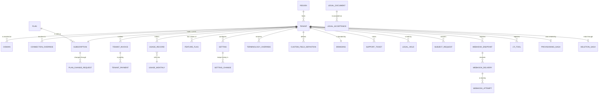
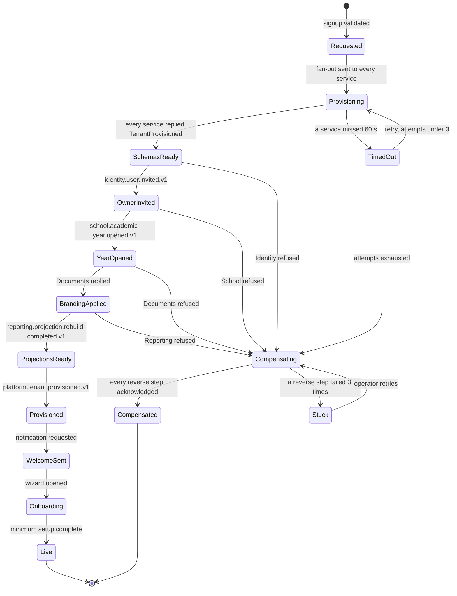
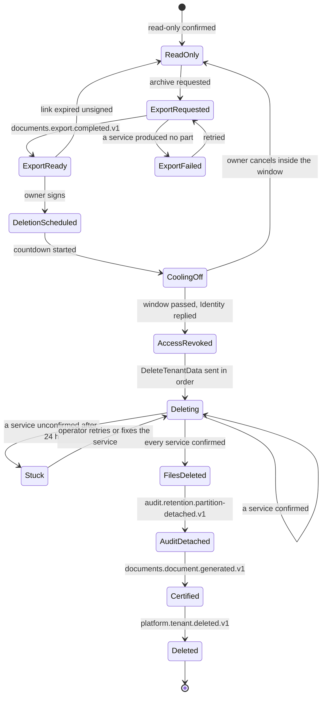
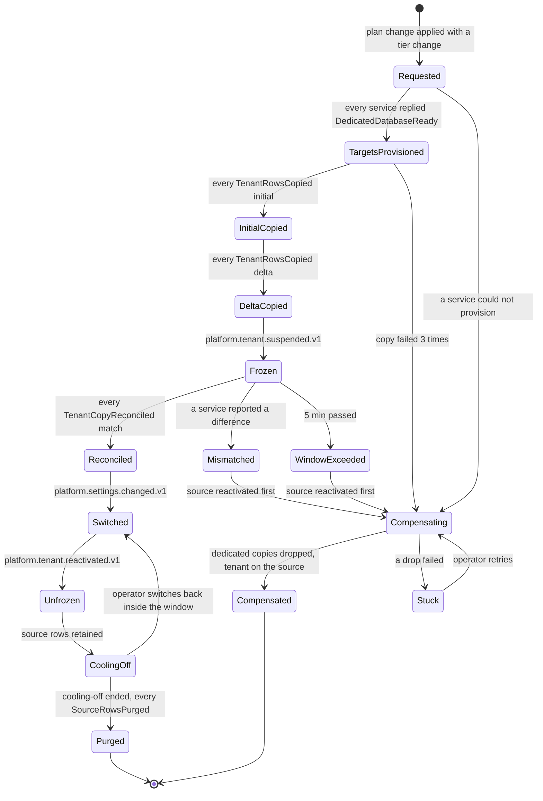

# Platform

> Service sheet, plan document 06. Group C. It refines reference architecture Section 8.4 and the Platform row of `05-service-catalog.md`; names come from Appendix L, permissions from Appendix B, events from Appendix E, error codes from Appendix K, workflows from Appendix R and rules from Appendix S. The Integrations capability is specified in `23-integrations-and-public-api.md`, which this sheet cites rather than restates. Where this sheet adds something the brief does not state, the addition is listed under Decisions in force or Open points.

**Group** C · **Requirement areas covered** PLT (all 39 rows), INT (the Platform rows), and the Platform rows of PRV, PERF, DATA, MSG and MOB · **Last updated** 2026-09-26 by the round-3 remediation (section numbering, saga diagrams, platform notes, signature features, risk scale, Open Questions 28 and 30)

Platform is the SaaS operator's service and the tenant's configuration service. On the operator side it owns tenants from signup to certified deletion, the region each tenant is pinned to, its isolation tier, its domains, the plans and subscriptions it pays for, the usage it consumes, the invoices the platform sends it, the support desk, announcements, release notes and the console that shows every saga, job and failed message. On the tenant side it owns every setting of Appendix G, terminology, custom-field definitions, feature flags and modules, branding and white-label, legal document acceptance, retention overrides, legal holds, subject access requests and the whole Integrations capability: tenant API key policy, outgoing webhooks, OneRoster, LTI, provider configuration for the plug-in kit and the developer portal with its sandbox tenants. Every other service reads Platform's answers through cached entries, a small gRPC surface and the `platform.*` broadcasts; none of them writes to it.

| Fact | Value | Source |
|---|---|---|
| Tier | 1 | Appendix L |
| AREA code | `PLT` | Appendix L |
| Long name | Tenant, Platform, and Integrations | Appendix L |
| Database | `nibras_platform`, user `svc_platform`, schemas `platform_registry` (platform-scoped) and `platform` (tenant-owned) | Appendix L, `10-data-architecture.md` §1 and §2.1 |
| Exchange | `nibras.platform` | Appendix L |
| Images | `nibras/platform-api` | Appendix L |
| Worker | none. Quartz.NET jobs and the webhook dispatcher run in the Api host (`23-integrations-and-public-api.md` §4.1, open point 4 there) | Appendix L |
| Build phase | 1; the Integrations capability arrives by phase: the public API, the iCal subscription URLs and OneRoster in 3 (CAP-INT-01, SL-INT-404 to SL-INT-410), LTI 1.3 in 4 (CAP-INT-02, SL-INT-411); the iCal feeds themselves are Scheduling's, phase 2. Whether the public API, OneRoster and iCal move into Tier 1 is Open Question 28, still open: the default in force is the phases above as Tier 2, RISK-42 (open point 10) | `05-service-catalog.md`, `17-roadmap.md` §4, `34-work-breakdown.md` |
| Service level class | Gateway class: 99.9% monthly availability | Reference architecture Section 8.0, master brief Section 31 |
| Sensitivity | Confidential; webhook signing secrets and provider keys encrypted per deployment | `05-service-catalog.md`, `10-data-architecture.md` §1 |
| Synchronous dependencies | Identity `ApiKeyAdministration` and `PermissionLookup.GetRoleRisk`; School's student and staff directory for OneRoster; from jobs only, every service's `Usage.Recount` (section 6) | Reference architecture Section 8.0 |
| Local copies | Usage counters from every service; OneRoster roster copies for tenants that enable OneRoster (phase 3, SL-INT-407) | Reference architecture Section 8.0, section 9 |
| Scaling profile | Low traffic, read-heavy and cached everywhere; administrative rather than transactional load; bursts on usage events and webhook fan-out | `05-service-catalog.md` |
| Why the boundary exists | Team: the platform operator's console and the commercial model change independently of any school-facing feature | `05-service-catalog.md` |

**Signature features.** Platform owns Appendix W features 10 (configurable without code), 15 (sales-ready demo mode with one-click reset), 16 (white-label mobile apps), 24 (open by default: API, webhooks, iCal, standards), 29 (smart defaults engine at onboarding), 37 (template exchange between schools), 38 (plug-in kit for regional integrations), 40 (self-healing operations) and 41 (configuration as code). Row 39, calendar-aware scaling, is also Platform's but is no longer a signature feature (ADR-0019); it is built as an engineering capability. Each feature's rung, autonomy, requirements, capabilities, slices, Appendix O step and demo test are in the "Signature feature trace" of `32-product-differentiation-and-demo.md`; this sheet does not copy them.

---

## 1. Responsibilities

| Platform owns | Detail |
|---|---|
| Tenant lifecycle | Signup and trial, provisioning saga with live progress (Saga 1, WF-PLT-01), onboarding, activation, suspension into read-only, reactivation, export, deletion with cooling-off and certificate (Saga 2, WF-PLT-03), demo and sandbox tenants |
| Residency and isolation | Region pinned at provisioning and immutable (BR-PLT-004); isolation tier per plan; tenant connection overrides for dedicated databases; tier migration (Saga 10) |
| Domains | Subdomains, custom domains with DNS verification and automatic TLS, tenant resolution by host for the Gateway |
| Commercial model | Plans priced per active student with tiers, add-on modules, limits, monthly and annual terms, coupons, currencies, trials and grace periods; subscriptions; plan change (WF-PLT-02); tenant invoices, payment records through the manual or gateway adapter, dunning at 7, 14 and 30 days (master brief Section 36) |
| Usage and limits | Consuming `<service>.usage.recorded.v1`, daily facts and monthly aggregates (BR-PLT-005), soft warning and hard block (BR-PLT-001), the third rate-limit layer in `redis-state` (REQ-PLT-032) |
| Feature flags and modules | Flags per tenant, per plan and by percentage rollout; modules on and off per tenant |
| Branding and white-label | Logo, colours, login page, email sender name, "Powered by" rules, mobile flavour configuration and the store-account record of REQ-MOB-041 |
| Settings | The Appendix G catalog: scope, default, validation, audit trail, bilingual descriptions; the smart defaults engine (REQ-PLT-003); configuration as code (REQ-PLT-027) |
| Terminology | Per-tenant overrides applied everywhere (REQ-PLT-026) |
| Custom-field definitions | Definitions per entity type; values stay with the owning service (Appendix L.5, ADR-0009) |
| Global template library | Curated packages of request types, report cards, certificates, notification templates and grading schemes that a tenant copies; template exchange between schools (Tier 2) |
| Operator communication | Platform announcements, maintenance windows and maintenance mode, release notes, the per-tenant "what changed" note, the in-app changelog |
| Customer success | Support desk with tiers, SLA timers, canned replies and escalation; help widget intake; bilingual knowledge base; CSAT and NPS; feature-request board; tenant health score and churn-risk flags |
| Legal and privacy administration | Versioned terms, privacy policy, data processing agreement and privacy notices with acceptance per tenant and per user; sub-processor list; DPIA template; privacy dashboard; retention schedule overrides; legal holds; subject access requests (WF-PRV-01) |
| Operations console | Platform sagas in the process monitor, Platform's own jobs, the failed-message console across services, the service health board, auto-replay of dead letters whose cause cleared |
| Release engineering records | The state of on-premises upgrades, canary rollouts and restore drills (WF-INF-01 to WF-INF-03) as reported by the pipeline and operators |
| Integrations capability | Tenant API key console and policy (secrets stay in Identity), webhooks end to end, OneRoster 1.2 provider, LTI 1.3 platform, provider configuration for the plug-in kit, developer portal data and sandbox tenants (`23-integrations-and-public-api.md`) |
| Localization rules assigned here | BR-L10N-001, BR-L10N-002 and BR-L10N-006 per `31-business-rules-and-workflows.md` §2 |

---

## 2. Not responsible for

| Platform does not own | Owner | How Platform relates to it |
|---|---|---|
| Users, credentials, roles, API key secrets and hashes | Identity | Calls `ApiKeyAdministration` for tenant keys; asks `PermissionLookup.GetRoleRisk` when validating Joining settings; invites the tenant owner through Saga 1 |
| Custom-field values, the records they sit on | Each owning service | Publishes `platform.custom-field.changed.v1`; the owner validates and stores values |
| The content of templates once copied into a tenant | Documents, Requests, Assessment, Notification | Serves the package; the owning service imports it and owns the copy |
| School fee invoices, payments from families | Finance | Tenant invoices here are the platform billing the school, never a school billing a family |
| Delivery of any email, SMS or push | Notification | Sends `RequestNotification` or publishes the events Appendix C names |
| The audit log and its viewer | Audit | Emits `platform.audit.recorded.v1`; consumes the integrity and partition events for the console |
| Records in the recycle bin and their restore | Each owning service, through `Nibras.BuildingBlocks.Persistence` | Owns the `platform.recycle-bin.*` namespace, the automatic purge policy and the console view composed by Bff.Web |
| Other services' jobs | Each service's `/jobs` resource (`22-api-conventions-and-error-catalog.md` §6) | The console lists them through Bff.Web; Platform stores only its own jobs |
| Running retention on other services' data | Each service's retention jobs (`10-data-architecture.md` §8) | Owns the schedule overrides and the legal holds they consult |
| Export archives and certificates as files | Documents | Commands `ExportTenant`, `GenerateDocument`, `DeleteTenantFiles` |
| iCal feed content and feed tokens | Scheduling | Shows the feed URL pattern in the Integrations console and the portal |
| Token validation, rate limits at the edge, maintenance response | Gateway | Supplies tenant resolution, maintenance state and the per-tenant bucket through cache entries |
| QTI, Open Badges, CASE | Academics, Behavior, Academics | Listed on the portal standards page only |
| Payment provider, SMS, e-invoicing, device plug-in execution | Finance, Notification, Attendance, Operations, Reporting (`23-integrations-and-public-api.md` §8.1) | Stores the per-tenant plug-in selection and encrypted configuration; never calls a provider for a school |

---

## 3. Requirements covered

| Range or identifier | What it binds here |
|---|---|
| REQ-PLT-001 to REQ-PLT-007 | Signup, provisioning saga, smart defaults, compensation, suspension, export at every state, deletion |
| REQ-PLT-008 to REQ-PLT-013 | Plans, active-student counting, upgrade and downgrade, limits, usage aggregation, tenant invoices and dunning |
| REQ-PLT-014 to REQ-PLT-023 | Feature flags, white-label, "Powered by", announcements, release notes, support desk, tiers, health score, template library, template exchange (Tier 2) |
| REQ-PLT-024 to REQ-PLT-039 | Settings catalog, custom fields, terminology, configuration as code, demo mode, the platform console, residency, isolation tiers, quotas, legal acceptance, customer success tooling, modules, jobs and failed messages, auto-replay, recycle bin, resellers (Tier 3) |
| REQ-INT-001 to REQ-INT-003, REQ-INT-008 to REQ-INT-017 | Open by default, tenant keys, reveal once, webhooks, standards by phase, the plug-in kit |
| REQ-PRV-002, REQ-PRV-012, REQ-PRV-014, REQ-PRV-017, REQ-PRV-018, REQ-PRV-021 | Retention overrides, legal hold, subject requests, DPIA, sub-processors, privacy dashboard |
| REQ-PERF-025 | Pre-peak warm-up per tenant time zone |
| REQ-DATA-027 | Tier migration and back without data loss |
| REQ-MSG-024 | A replayed failed message applies once |
| REQ-MOB-041 | White-label store accounts owned by the school and recorded here |
| REQ-SEC-013, REQ-SEC-014 | Audited filter bypass for operator code; platform staff hold no tenant data permissions |
| REQ-L10N-008 and BR-L10N-001, BR-L10N-002, BR-L10N-006 | Numeral setting, Arabic normalization in settings and catalog search, pinned culture |

---

## 4. Aggregates and entities

### 4.1 Base columns and the two schemas

Tables in `platform` carry the base columns of `10-data-architecture.md` §4 (`id` uuid v7, `tenant_id`, `created_at`, `created_by`, `updated_at`, `updated_by`, `deleted_at`, `deleted_by`, `xmin`) and the `tenant_isolation` row-level security policy. Tables in `platform_registry` are platform-scoped: they carry `id`, the audit columns, soft delete where stated and `xmin`, and where a row concerns one tenant it carries `tenant_id` as a plain subject column with no policy. Operator features that list across tenants (tenants, subscriptions, invoices, tickets, usage) run through `OperatorReadContext`, which sets `app.platform_operator = on` inside the transaction; the policy on every `platform` table accepts that flag, the handler requires a `platform.*` permission held in the platform tenant, and the bypass writes `platform.audit.recorded.v1` with `action = tenant-filter-bypassed` (REQ-SEC-013, `10-data-architecture.md` §2.2).

### 4.2 Registry aggregate: Tenant (schema `platform_registry`)

| Entity | Field | Type | Null | Notes |
|---|---|---|---|---|
| Tenant | `slug` | text | no | Subdomain label; unique; lower case |
| Tenant | `name_en`, `name_ar` | text | no | |
| Tenant | `status` | `TenantSignupToLiveStatus` then `SuspensionExportAndDeletionStatus` | no | `Requested`, `Validated`, `Provisioning`, `Provisioned`, `Failed`, `Compensated`, `Onboarding`, `Live`; then `Active`, `Suspended`, `ReadOnly`, `ExportRequested`, `ExportReady`, `DeletionScheduled`, `DeletionExecuted`, `Certified` |
| Tenant | `region_code` | text | no | Immutable after `Validated` (BR-PLT-004) |
| Tenant | `isolation_tier` | text enum `shared`, `dedicated-database`, `dedicated-deployment` | no | From the plan; changes only through Saga 10 |
| Tenant | `country_code`, `school_type`, `locale`, `time_zone` | text | no | Smart-defaults inputs |
| Tenant | `is_sandbox`, `is_demo` | bool | no | Sandbox: `test` keys only, fake providers (document 23 §3.2) |
| Tenant | `owner_contact_encrypted` | bytea | no | Owner email for the invitation, column-encrypted |
| Tenant | `support_tier` | text enum `standard`, `professional`, `enterprise` | no | From the plan (master brief Section 39) |
| Tenant | `read_only_from`, `suspension_reason` | timestamptz, text | yes | `non-payment`, `policy-breach`, `trial-expired`, `tier-migration`, `deletion-cooling-off` |
| Tenant | `cooling_off_ends_at`, `deletion_certificate_id` | timestamptz, uuid | yes | |
| Tenant | `last_api_call_at` | timestamptz | yes | Sandbox lifetime (90 days idle) |
| Tenant | `partner_id` | uuid | yes | Tier 3 reseller |
| Region | `code`, `name_en`, `name_ar`, `jurisdiction`, `storage_endpoint_ref` | text | no | A region is a whole deployment (master brief Section 34) |
| Domain | `tenant_id`, `host`, `kind` (`subdomain`, `custom`), `verification_token_hash`, `verified_at`, `tls_status`, `is_primary` | | verified yes | `ux_domains_host` only over verified, live hosts |
| TenantConnectionOverride | `tenant_id`, `service`, `connection_secret_ref`, `switched_at` | | switched yes | Reference into the secret store, never the string |
| Partner | `name`, `commission_rate`, `white_label` jsonb | | | Tier 3: modelled, no endpoints in v1 |

Invariants: a tenant's `region_code` never changes after validation, and a request to change it is refused with `PLATFORM_RESIDENCY_VIOLATION` (BR-PLT-004); `slug` and every verified `host` are unique across the platform; a host resolves only after `verified_at` is set; a tenant in `Provisioning` answers every tenant route with `PLATFORM_PROVISIONING_IN_PROGRESS`; one provisioning saga per tenant, ever (`SagaId = TenantId`); `DeletionExecuted` is reachable only from `DeletionScheduled` after `cooling_off_ends_at`, a verified export and a signed confirmation, and never while a legal hold names the tenant (T-PLT-02).

### 4.3 Registry aggregates: Plan and feature-flag definitions

| Entity | Field | Type | Null | Notes |
|---|---|---|---|---|
| Plan | `code`, `name_en`, `name_ar`, `status` | text | no | `draft`, `published`, `retired` |
| Plan | `pricing` | jsonb | no | Per active student, tiers, monthly and annual terms, currencies, amounts as decimal strings (BR-FIN-011) |
| Plan | `limits` | jsonb | no | Students, storage GiB, SMS credits, AI calls, jobs per hour, API calls per day, webhook deliveries per day, active keys, per-key rate limit (document 23 §2.5) |
| Plan | `soft_threshold_percent`, `grace_days` | int | no | BR-PLT-001 parameters (defaults 80 and 14) |
| Plan | `included_modules`, `add_on_modules` | text[] | no | |
| Plan | `isolation_tier`, `support_tier`, `powered_by_removable` | text, text, bool | no | |
| FeatureFlagDefinition | `flag`, `description_en`, `description_ar`, `default_enabled`, `plan_defaults` jsonb, `is_module` | | no | A module is a flag with `is_module = true` |

Invariants: a published plan's limits and pricing are immutable; a change is a new plan version, so a subscription always points at the terms it was sold; retiring a plan leaves existing subscriptions untouched.

### 4.4 Aggregate: Subscription with PlanChangeRequest (WF-PLT-02)

| Entity | Field | Type | Null | Notes |
|---|---|---|---|---|
| Subscription | `plan_code`, `plan_version`, `term` (`monthly`, `annual`), `currency` | | no | One `current` per tenant |
| Subscription | `status` | text enum `trialing`, `active`, `past-due`, `read-only`, `cancelled` | no | |
| Subscription | `trial_ends_at`, `valid_from`, `valid_to`, `next_billing_on` | | trial yes | |
| Subscription | `coupon_code`, `coupon_percent`, `coupon_ends_on` | | yes | |
| Subscription | `add_ons` | text[] | no | |
| PlanChangeRequest | `from_plan_code`, `to_plan_code`, `direction` (`upgrade`, `downgrade`, `conversion`) | | no | |
| PlanChangeRequest | `state` | `TrialConversionAndPlanChangeStatus` | no | `Trialing`, `ConversionOffered`, `Requested`, `LimitChecked`, `Blocked`, `Approved`, `Applied`, `Expired` |
| PlanChangeRequest | `usage_snapshot` | jsonb | yes | Counters compared with the target limits (TC-PLT-012) |
| PlanChangeRequest | `effective_at`, `blocked_reason`, `tier_migration_saga_id` | | yes | Upgrade immediate, downgrade at renewal (BR-FIN-018) |

Invariants: an upgrade applies at once and prorates by day; a downgrade applies at the next renewal and never deletes data, exceeded limits become warnings (REQ-PLT-010, TC-PLT-016); a change whose target isolation tier differs starts Saga 10; a request in `Blocked` for 30 days is cancelled; a tenant never holds two `current` subscriptions.

### 4.5 Aggregate: TenantInvoice

| Entity | Field | Type | Null | Notes |
|---|---|---|---|---|
| TenantInvoice | `number` | text | no | Gapless per seller country series |
| TenantInvoice | `period_start`, `period_end`, `issued_on`, `due_on` | date | no | |
| TenantInvoice | `active_student_count` | numeric(10,2) | no | REQ-PLT-009 and master brief Section 36: enrolled on the billing date, prorated by day from enrolment, counted for the month of leaving. This is the default in force of Open Question 30, which is still open; BR-FIN-017 (any student enrolled for at least one day of the month, no proration) and SL-PLT-010, which cites it, conflict with it until the question is decided (open point 9, RISK-52) |
| TenantInvoice | `subtotal`, `tax`, `total`, `currency` | numeric(18,4), char(3) | no | Tax follows the seller's country (master brief Section 36) |
| TenantInvoice | `status` | text enum `issued`, `partially-paid`, `paid`, `waived`, `void` | no | |
| TenantInvoiceLine | `invoice_id`, `kind` (`plan`, `add-on`, `overage`, `coupon`, `proration`), `quantity`, `unit_amount`, `amount` | | no | |
| TenantPayment | `invoice_id`, `method` (`manual`, `gateway`), `amount`, `received_at`, `gateway_reference_encrypted`, `idempotency_key` | | reference yes | Card data never stored |

Invariants: an issued invoice is immutable; a correction is a waiver (`platform.subscriptions.waive-charge`, reason required) or a credit line on the next invoice; a payment callback with a known idempotency key replays its first result; dunning reminders go at 7, 14 and 30 days past due and read-only begins at 30 days with export still available (REQ-PLT-013).

### 4.6 Aggregates of metering: UsageRecord, UsageMonthly, LimitState

| Entity | Field | Type | Null | Notes |
|---|---|---|---|---|
| UsageRecord | `meter`, `source_service`, `period_start`, `period_end`, `quantity`, `unit`, `message_id`, `superseded_by` | | superseded yes | Partitioned by month; one immutable fact per tenant, meter, service and day (BR-PLT-005) |
| UsageMonthly | `meter`, `period_start`, `quantity`, `aggregation` (`max`, `sum`) | | no | Maximum for headcount meters, sum for event meters |
| LimitState | `limit`, `used`, `allowed`, `soft_warned_at`, `hard_reached_at`, `grace_ends_at` | | several yes | One row per tenant and limit |

Invariants: a fact is never updated; a correction inserts a superseding fact and is audited; the same `message_id` twice changes nothing; reads, exports and reports are never blocked by a limit, only the action that would exceed it after the grace period (BR-PLT-001); every block is `PLATFORM_PLAN_LIMIT_REACHED` with 402, never 429.

### 4.7 Aggregates of configuration: Setting, TerminologyOverride, CustomFieldDefinition, FeatureFlag, Branding

| Entity | Field | Type | Null | Notes |
|---|---|---|---|---|
| Setting | `group`, `key`, `scope` (`platform`, `tenant`, `campus`, `role`, `user`), `scope_id`, `value` jsonb | | scope_id yes | `ix_settings_tenant_scope` covering (document 21 §3.2) |
| Setting | `locked_by` | text enum `none`, `plan`, `country-policy` | no | `PLATFORM_SETTING_LOCKED_BY_POLICY` when locked |
| SettingChange | `setting_id`, `before`, `after`, `changed_by`, `reason`, `changed_at` | | reason yes | Append-only history (REQ-PLT-024); reason required for the Security group and for reset-to-default |
| TerminologyOverride | `term_key`, `locale`, `value` | text | no | Keys from the terminology catalog (Grade or Year, Term or Semester, Section or Class, Guardian or Parent, and the rest) |
| CustomFieldDefinition | `entity_type`, `field_key`, `label_en`, `label_ar`, `data_type`, `required`, `options` jsonb, `validation` jsonb, `sort_order`, `visibility_permission`, `status` | | options yes | `status`: `active`, `retired`; the key is never reused |
| FeatureFlag | `flag`, `enabled`, `rollout_percent`, `source` (`plan`, `tenant`, `rollout`) | | percent yes | Per tenant; `ix_feature_flags_tenant` |
| Branding | `logo_file_id`, `colours` jsonb, `login_page` jsonb, `email_sender_name`, `powered_by_visible`, `draft` jsonb, `published_at` | | several yes | Draft and published versions |
| MobileFlavor | `bundle_ids`, `store_account_owner`, `certificate_owner`, `push_credential_owner`, `agreement_file_id`, `minimum_version` | | agreement yes | REQ-MOB-041 |

Invariants: a value is validated against its catalog type and allowed scopes before save; a change in the Security group requires `identity.security-policy.edit` and a reason (T-PLT-06); a Joining default role that holds a `high` permission is refused after `PermissionLookup.GetRoleRisk` (BR-IDN-006); a flag at a rollout percentage gives each tenant a stable answer, computed from a hash of flag and tenant id (REQ-PLT-014); a custom-field key is unique per entity type and a retired key is never reused; every save publishes the matching `platform.*.changed.v1` event in the same transaction.

### 4.8 Aggregates of customer success: SupportTicket, SatisfactionResponse, FeatureRequest, HealthScore

| Entity | Field | Type | Null | Notes |
|---|---|---|---|---|
| SupportTicket | `number`, `subject`, `severity` (`sev1` to `sev4`), `status`, `requester_user_id`, `assignee_id`, `tier`, `first_response_due_at`, `resolution_due_at`, `escalation_level` | | assignee yes | SLA from the tier table of master brief Section 39 |
| TicketMessage | `ticket_id`, `author_id`, `body`, `is_internal`, `attachment_file_ids` | | attachments yes | |
| CannedReply | `title_en`, `title_ar`, `body_en`, `body_ar` | | no | Platform tenant only |
| SatisfactionResponse | `kind` (`csat`, `nps`), `score`, `comment`, `ticket_id`, `user_id` | | ticket yes | |
| FeatureRequest | `title`, `description`, `status`, `vote_count` | | no | Registry; votes carry `tenant_id` and are shown to the operator only |
| HealthScore | `score`, `factors` jsonb, `churn_risk`, `computed_on` | | no | REQ-PLT-021 |

Invariants: an Enterprise ticket unanswered for one business hour escalates to the service owner, then architect, then product owner (REQ-PLT-020); a churn-risk flag opens a ticket naming the metric; ticket attachments go through the Files block scan before anyone opens them.

### 4.9 Aggregates of legal and privacy: LegalDocument, LegalAcceptance, RetentionOverride, LegalHold, SubjectRequest, DpiaRecord

| Entity | Field | Type | Null | Notes |
|---|---|---|---|---|
| LegalDocument | `kind` (`terms`, `privacy-policy`, `dpa`, `privacy-notice`, `consent-text`), `version`, `country_code`, `body_en`, `body_ar`, `published_at` | | country yes | Registry; privacy notices per country plug-in |
| LegalAcceptance | `document_id`, `version`, `user_id`, `accepted_at`, `ip_hash` | | user yes (tenant-level acceptance) | REQ-PLT-033 |
| RetentionOverride | `data_class`, `default_period`, `override_period`, `basis` (`country`, `contract`) | | no | REQ-PRV-002; the effective schedule feeds the guardian transparency panel |
| LegalHold | `subject_kind` (`student`, `case`, `tenant`), `subject_id`, `reason`, `placed_by`, `placed_at`, `released_at` | | released yes | Stored as `retention_holds`; consulted by every retention job and by backup expiry |
| SubjectRequest | `subject_user_id`, `subject_student_id`, `kind` (`access`, `deletion`), `requested_via`, `state`, `acknowledged_at`, `due_at`, `missing_services`, `export_job_id`, `redaction_notes`, `delivered_at` | | several yes | State `DataSubjectAccessRequestStatus`: `Received`, `IdentityVerified`, `Refused`, `Collecting`, `PartiallyCollected`, `Assembled`, `UnderReview`, `Delivered`, `Closed` |
| DpiaRecord | `answers` jsonb, `version`, `completed_at` | | completed yes | REQ-PRV-017 |

Invariants: a legal hold on a tenant blocks Saga 2 at `DeletionScheduled`; a subject request package is never delivered from a partial collection (TC-PRV-003); third-party child data is redacted before release (TC-PRV-004); acknowledgment within 5 working days and answer within 30 calendar days (REQ-PRV-014).

### 4.10 Aggregates of integrations: WebhookEndpoint, WebhookDelivery, ApiKeyPolicy, ProviderConfiguration, LtiTool, OneRosterSettings

| Entity | Field | Type | Null | Notes |
|---|---|---|---|---|
| WebhookEndpoint | `url`, `description_en`, `description_ar`, `campus_id`, `owner_user_id`, `state` | | campus yes | State per document 23 §4.7: `pendingVerification`, `active`, `failing`, `disabled`, `verificationFailed` |
| WebhookEndpoint | `failing_since`, `exhausted_count`, `last_success_at` | | yes | Disable rule: 72 hours without success or 1,000 exhausted |
| WebhookSubscription | `endpoint_id`, `routing_key` | | no | Exact keys from the eligibility table of document 23 §4.9 |
| WebhookSecret | `endpoint_id`, `secret_encrypted`, `created_at`, `retires_at` | | retires yes | At most two live during an overlap (document 23 §4.8) |
| WebhookDelivery | `endpoint_id`, `event_id`, `event_type`, `partition_key`, `occurred_at`, `body` bytea, `body_sha256`, `status`, `next_attempt_at`, `attempts` | | several yes | Body kept 30 days for replay; one row per event and endpoint |
| WebhookDeliveryAttempt | the fields of document 23 §4.6 | | | Partitioned by month, retained 30 days |
| ApiKeyPolicy | `allowed_scopes` text[], `max_active_keys`, `default_expiry_days`, `per_key_rate_limit`, `daily_cap` | | cap yes | Values bounded by the plan (document 23 §2.5) |
| ApiKeyUsage | `key_id`, `day`, `calls` | | no | Per-key metering from `api-calls` usage; deleted a year after revocation (`10-data-architecture.md` §8) |
| ProviderConfiguration | `kind` (`payment`, `sms`, `e-invoicing`, `ministry-export`, `push`, `device`), `plugin_id`, `plugin_version`, `configuration_encrypted`, `status` | | no | Selection and configuration of a certified plug-in (document 23 §8) |
| LtiTool | `name`, `client_id`, `launch_url`, `login_initiation_url`, `jwks_url`, `deep_linking_url`, `privacy` (`anonymous`, `name`, `name-and-email`), `placements` jsonb, `status` | | urls yes | Launch URL passes the same address guard as webhooks (TC-SEC-124) |
| OneRosterSettings | `enabled`, `client_key_ids` uuid[], `include_guardians`, `last_export_job_id` | | job yes | Phase 3 (SL-INT-407 to SL-INT-410) |

Invariants: a webhook URL is https, a public DNS name, port 443 or 8443, at most 2,048 characters, with no credentials and no personal data in the query (document 23 §4.2); an endpoint receives no event before its challenge passes; a subscription names only eligible keys and requires the owner to hold the mapped `view` permission with a matching scope; one rotation per endpoint at a time (`PLATFORM_CONCURRENCY_CONFLICT`); a delivery keeps its delivery id across retries and replays; a sandbox tenant's keys are `test` keys and its providers are fakes.

### 4.11 Registry aggregates of operations: sagas, release records, templates, announcements

| Entity | Field | Type | Null | Notes |
|---|---|---|---|---|
| TenantProvisioningSaga | persisted state of `13-workflows-and-sagas.md` Saga 1 | | | `TenantProvisioningState` |
| TenantDeletionSaga | persisted state of Saga 2 | | | `TenantDeletionState` |
| TierMigrationSaga | persisted state of Saga 10 | | | `TierMigrationState` |
| UpgradeRun | `tenant_id`, `from_version`, `to_version`, `window_start`, `window_end`, `state`, `backup_reference`, `checks` jsonb | | backup yes | `OnPremisesUpgradeWithRollbackStatus` |
| ReleaseRollout | `release`, `traffic_share`, `state`, `metrics` jsonb, `decided_by` | | decided yes | `ReleaseRolloutWithCanaryAndRollbackStatus` |
| RestoreDrill | `scope`, `is_real_event`, `backup_timestamp`, `state`, `measured_rto`, `measured_rpo`, `report_file_id` | | several yes | `RestoreAndFailoverDrillStatus` |
| GlobalTemplate | `kind` (`request-type`, `report-card`, `certificate`, `notification-template`, `grading-scheme`), `owning_service`, `version`, `package` jsonb, `attribution`, `status` | | attribution yes | Copy is an import by the owning service |
| Announcement | `title_en`, `title_ar`, `body_en`, `body_ar`, `audience` jsonb, `publish_at`, `expires_at` | | expires yes | |
| MaintenanceWindow | `scope` (`platform`, `tenant`), `tenant_id`, `starts_at`, `ends_at`, `message_key`, `state` | | tenant yes | Drives the Gateway maintenance response |
| ReleaseNote | `release`, `items` jsonb (module, audience, text in both languages), `published_at` | | published yes | Filtered per tenant by enabled modules (REQ-PLT-018) |
| FailedMessageIndex | `service`, `queue`, `message_id`, `routing_key`, `tenant_id`, `first_failed_at`, `last_error`, `cause_class` (`transient`, `permanent`), `state` | | tenant yes | An index over `.parking` queues, refreshed by the console user; the message itself stays in the broker |

### 4.12 Entity relationship diagram



---

## 5. REST API

Conventions from `22-api-conventions-and-error-catalog.md` §1 to §8. Routes whose subject is "the current tenant" use singular paths (`/subscription`, `/branding`) and resolve the tenant from the token; operator routes name the tenant (`/tenants/{tenantId}/…`) and require a `platform.*` permission held in the platform tenant.

**Every row may also return** `PLATFORM_VALIDATION_FAILED`, `PLATFORM_PERMISSION_DENIED`, `PLATFORM_TENANT_MISMATCH`, `PLATFORM_NOT_FOUND`, `PLATFORM_RATE_LIMITED` and `PLATFORM_DEPENDENCY_UNAVAILABLE`; single-resource writes also return `PLATFORM_CONCURRENCY_CONFLICT`; a tenant-data write on a suspended tenant returns `PLATFORM_TENANT_SUSPENDED` except the routes BR-PLT-002 keeps open (export, paying platform invoices, support tickets). **"Self"** means an authenticated caller acting on their own record; **"Pipeline"** means the release pipeline's client-credentials service token.

### 5.1 Signup, tenants and lifecycle

| Method | Path | Permission | Request | Response | Errors | Idempotent |
|---|---|---|---|---|---|---|
| POST | `/api/v1/platform/signups` | none, public, bot protection at the Gateway | `SignupRequest` (school name, country, school type, owner contact, plan, preferred slug, locale) | 202 with a signup token and `Location` of the progress resource | `PLATFORM_VALIDATION_FAILED` (`slugTaken`, `planUnknown`) | `Idempotency-Key` required |
| GET | `/api/v1/platform/signups/{signupToken}` | none, the signup token | none | provisioning progress: steps done of total, state, next action | `PLATFORM_PROVISIONING_IN_PROGRESS` never; progress is the body | safe |
| POST | `/api/v1/platform/smart-defaults/preview` | `platform.tenants.provision`, or the signup token | country, school type, locale | `InferredConfiguration`: work week, calendar, numerals, tax treatment, e-invoicing plug-in, terminology, bell schedule, request templates, role templates, each with its reason (REQ-PLT-003) | none | safe |
| GET | `/api/v1/platform/tenants` | `platform.tenants.view` | filter `status`, `plan`, `region`, `healthBelow`, `q`, cursor | `TenantListItem[]` | none | safe |
| GET | `/api/v1/platform/tenants/{tenantId}` | `platform.tenants.view` | none | `TenantDetail`: plan, limits, flags, usage, branding, lifecycle | none | safe, `ETag` |
| POST | `/api/v1/platform/tenants` | `platform.tenants.provision` | `ProvisionTenantRequest` (as signup plus region, isolation tier, demo data flag, corrected inferences) | 202; Saga 1 started; `Location` of the provisioning resource | `PLATFORM_VALIDATION_FAILED` (`slugTaken`, `regionUnknown`) | `Idempotency-Key` required |
| PATCH | `/api/v1/platform/tenants/{tenantId}` | `platform.tenants.edit` | merge patch of names, support tier override, owner contact | `TenantDetail` | `PLATFORM_RESIDENCY_VIOLATION` when `regionCode` is sent | `If-Match` |
| GET | `/api/v1/platform/tenants/{tenantId}/provisioning` | `platform.tenants.view` | none | Saga 1 state with the per-service grid and verbatim last errors | none | safe |
| POST | `/api/v1/platform/tenants/{tenantId}/provisioning/steps/{stepKey}/retry` | `platform.jobs.retry` | none | step re-sent | `PLATFORM_JOB_REPLAY_REFUSED` when the step is not in `TimedOut` or `Stuck` | yes |
| POST | `/api/v1/platform/tenants/{tenantId}/provisioning/compensation` | `platform.jobs.cancel` | reason | Saga 1 enters `Compensating` | `PLATFORM_JOB_REPLAY_REFUSED` after `Provisioned` | yes |
| POST | `/api/v1/platform/tenants/{tenantId}/onboarding/completion` | `platform.settings.edit` in the tenant | none | `Onboarding` to `Live` when academic year, campus and owner account exist (TC-PLT-006) | `PLATFORM_VALIDATION_FAILED` (`minimumSetupIncomplete`) | yes |
| POST | `/api/v1/platform/tenants/{tenantId}/suspend` | `platform.tenants.suspend` | reason (`non-payment`, `policy-breach`), note | `Suspended`; `platform.tenant.suspended.v1` | none | yes |
| POST | `/api/v1/platform/tenants/{tenantId}/reactivate` | `platform.tenants.reactivate` | reason | `Active`; `platform.tenant.reactivated.v1` | `PLATFORM_VALIDATION_FAILED` (`deletionExecuted`) | yes |
| POST | `/api/v1/platform/tenant/exports` | `platform.tenants.export` (high, reason required) in the tenant, or in the platform tenant with `tenantId` | reason | 202 job; the Documents export with a manifest (BR-PLT-006), never plan-gated | none | `Idempotency-Key` required |
| POST | `/api/v1/platform/tenants/{tenantId}/deletion-requests` | `platform.tenants.delete` | reason | 202; Saga 2 from `ReadOnly` to `ExportRequested` | `PLATFORM_VALIDATION_FAILED` (`legalHoldActive`) | `Idempotency-Key` required |
| GET | `/api/v1/platform/tenants/{tenantId}/deletion-requests/{requestId}` | `platform.tenants.view` | none | Saga 2 state, countdown, signer | none | safe |
| POST | `/api/v1/platform/tenants/{tenantId}/deletion-requests/{requestId}/confirmation` | `platform.tenants.delete`, signed by the tenant owner | owner's signed confirmation (re-authentication with second factor) | `DeletionScheduled`; `platform.tenant.deletion-requested.v1` (TC-PLT-024) | `PLATFORM_VALIDATION_FAILED` (`exportNotReady`, `notOwner`) | yes |
| POST | `/api/v1/platform/tenants/{tenantId}/deletion-requests/{requestId}/cancellation` | `platform.tenants.delete`, tenant owner | none | back to `ReadOnly`, nothing deleted (TC-PLT-025) | `PLATFORM_VALIDATION_FAILED` (`coolingOffEnded`) | yes |
| GET | `/api/v1/platform/tenants/{tenantId}/deletion-certificate` | `platform.tenants.view` | none | certificate metadata and the Documents file link | none | safe |
| GET | `/api/v1/platform/tenants/{tenantId}/tier-migrations/{sagaId}` | `platform.tenants.view` | none | Saga 10 grid with row counts and freeze timer | none | safe |
| POST | `/api/v1/platform/tenants/{tenantId}/tier-migrations/{sagaId}/switch-back` | `platform.tenants.edit` | reason | reverse switch inside cooling-off | `PLATFORM_JOB_REPLAY_REFUSED` after purge | `Idempotency-Key` required |
| POST | `/api/v1/platform/tenants/{tenantId}/tier-migrations/{sagaId}/purge` | `platform.tenants.delete` | reason | step 8 now | `PLATFORM_VALIDATION_FAILED` (`legalHoldActive`) | `Idempotency-Key` required |
| GET | `/api/v1/platform/tenants/{tenantId}/health` | `platform.tenants.view` | none | health score, factors, churn-risk flag | none | safe |
| GET | `/api/v1/platform/tenant-context` | authenticated | none | the caller's tenant: status, plan summary, flags, modules, terminology, branding summary, maintenance notice; the bootstrap Bff.Web and Bff.Mobile compose | none | safe, `ETag` |
| GET | `/api/v1/platform/tenant-resolution/{host}` | Gateway service token only | none | tenant id, status, maintenance state, rate-limit bucket size | `PLATFORM_NOT_FOUND` | safe |
| POST | `/api/v1/platform/demo/reset` | `platform.tenants.edit` on a demo tenant | none | 202 job restoring the Appendix H demo data in place (REQ-PLT-028) | `PLATFORM_VALIDATION_FAILED` (`notDemoTenant`) | `Idempotency-Key` required |
| POST | `/api/v1/platform/sandboxes` | `platform.integrations.create` | school or partner organisation | 202; Saga 1 with `isSandbox` on the small plan, halved rate limits (document 23 §3.2) | `PLATFORM_VALIDATION_FAILED` (`sandboxExists`) | `Idempotency-Key` required |
| POST | `/api/v1/platform/sandbox/reset` | `platform.integrations.edit` in a sandbox tenant | none | 202; seed restored, keys and endpoints kept; once per hour | `PLATFORM_RATE_LIMITED` | `Idempotency-Key` required |

### 5.2 Domains, branding and white-label

| Method | Path | Permission | Request | Response | Errors | Idempotent |
|---|---|---|---|---|---|---|
| GET | `/api/v1/platform/domains` | `platform.branding.view` | none | `DomainSummary[]` with verification and TLS state | none | safe |
| POST | `/api/v1/platform/domains` | `platform.branding.edit` | host | 201 with the DNS TXT record to create | `PLATFORM_VALIDATION_FAILED` (`hostTaken`, `hostInvalid`) | natural on host |
| POST | `/api/v1/platform/domains/{domainId}/verification` | `platform.branding.edit` | none | verified, certificate requested | `PLATFORM_VALIDATION_FAILED` (`dnsRecordMissing`) | yes |
| DELETE | `/api/v1/platform/domains/{domainId}` | `platform.branding.edit` | none | 204; resolution entry evicted | `PLATFORM_VALIDATION_FAILED` (`lastDomain`) | yes |
| GET | `/api/v1/platform/branding` | `platform.branding.view` | none | published and draft branding | none | safe, `ETag` |
| PUT | `/api/v1/platform/branding/draft` | `platform.branding.edit` | colours, logo file id, login page, sender name | draft with a contrast report | `PLATFORM_VALIDATION_FAILED` (`contrastBelowAA`), `PLATFORM_FEATURE_DISABLED` (`poweredByRemovalNotPurchased`) | `If-Match` |
| POST | `/api/v1/platform/branding/publish` | `platform.branding.publish` | none | published; `platform.settings.changed.v1` with `scope = branding` | none | yes |
| GET | `/api/v1/platform/mobile-flavor` | `platform.branding.view` | none | flavour values and store-ownership record | none | safe |
| PUT | `/api/v1/platform/mobile-flavor` | `platform.branding.edit` | bundle ids, owners, agreement file id, minimum version | flavour | `PLATFORM_FEATURE_DISABLED` when the plan has no white-label app | `If-Match` |

### 5.3 Plans, subscriptions, tenant invoices

| Method | Path | Permission | Request | Response | Errors | Idempotent |
|---|---|---|---|---|---|---|
| GET | `/api/v1/platform/plans` | `platform.plans.view` | filter `status` | `PlanSummary[]` | none | safe |
| GET | `/api/v1/platform/plans/{planCode}` | `platform.plans.view` | none | `PlanDetail` | none | safe |
| POST | `/api/v1/platform/plans` | `platform.plans.create` | pricing, limits, modules, tiers | 201 draft | none | `Idempotency-Key` optional |
| PATCH | `/api/v1/platform/plans/{planCode}` | `platform.plans.edit` | draft changes, or publish and retire | `PlanDetail`; a published plan changes only by a new version | `PLATFORM_VALIDATION_FAILED` (`publishedPlanImmutable`) | `If-Match` |
| POST | `/api/v1/platform/tenants/{tenantId}/plan-assignment` | `platform.plans.assign` | plan code, term, coupon, effective date | subscription; `platform.plan.changed.v1` | `PLATFORM_VALIDATION_FAILED` (`planNotPublished`) | `Idempotency-Key` required |
| GET | `/api/v1/platform/subscription` | `platform.subscriptions.view` | none | the tenant's current subscription, trial state and next billing date | none | safe |
| GET | `/api/v1/platform/tenants/{tenantId}/subscription` | `platform.subscriptions.view` | none | same, operator view | none | safe |
| PATCH | `/api/v1/platform/subscription` | `platform.subscriptions.edit` | term, add-ons, coupon code | subscription | `PLATFORM_VALIDATION_FAILED` (`couponInvalid`) | `If-Match` |
| POST | `/api/v1/platform/subscription/plan-change-requests` | `platform.subscriptions.change-plan` | target plan, term | 201 in `Requested`, then `LimitChecked` with the usage snapshot (TC-PLT-012) | `PLATFORM_PLAN_LIMIT_REACHED` for a blocked downgrade, naming the exact overage (TC-PLT-013) | `Idempotency-Key` required |
| GET | `/api/v1/platform/subscription/plan-change-requests/{requestId}` | `platform.subscriptions.view` | none | request state and effective date | none | safe |
| POST | `/api/v1/platform/subscription/plan-change-requests/{requestId}/withdrawal` | `platform.subscriptions.change-plan` | none | cancelled | `PLATFORM_VALIDATION_FAILED` (`alreadyApplied`) | yes |
| POST | `/api/v1/platform/subscription/conversion` | `platform.subscriptions.change-plan` | plan, term | trial converted: `ConversionOffered` to `Requested` | none | `Idempotency-Key` required |
| GET | `/api/v1/platform/tenant-invoices` | `platform.subscriptions.view` | filter `status`, cursor; operators across tenants | `TenantInvoiceSummary[]` | none | safe |
| GET | `/api/v1/platform/tenant-invoices/{invoiceId}` | `platform.subscriptions.view` | none | invoice with lines and payments; PDF link from Documents | none | safe |
| POST | `/api/v1/platform/tenant-invoices/{invoiceId}/payments` | `platform.subscriptions.edit` in the platform tenant | manual payment: amount, date, reference | payment recorded, status recomputed | none | `Idempotency-Key` required |
| POST | `/api/v1/platform/tenant-invoices/{invoiceId}/payment-sessions` | `platform.subscriptions.view` in the tenant | return URL | hosted payment session through the configured `IPaymentGateway` plug-in | `PLATFORM_DEPENDENCY_UNAVAILABLE` | `Idempotency-Key` required |
| POST | `/api/v1/platform/payment-callbacks/{provider}` | none; verified by the plug-in's signature check | raw provider callback | 200 | `PLATFORM_VALIDATION_FAILED` (`signatureInvalid`) | idempotent on the provider reference for 7 days |
| POST | `/api/v1/platform/tenant-invoices/{invoiceId}/waiver` | `platform.subscriptions.waive-charge` | amount or full, reason | invoice `waived` or credit line | none | `Idempotency-Key` required |

### 5.4 Usage and limits

| Method | Path | Permission | Request | Response | Errors | Idempotent |
|---|---|---|---|---|---|---|
| GET | `/api/v1/platform/usage` | `platform.subscriptions.view` | period | meters with used, allowed, percent, grace end | none | safe |
| GET | `/api/v1/platform/usage/{meter}/daily` | `platform.subscriptions.view` | from, to | daily facts, corrections marked | none | safe |
| GET | `/api/v1/platform/tenants/{tenantId}/usage` | `platform.subscriptions.view` | period | same, operator view | none | safe |
| GET | `/api/v1/platform/usage/api-keys` | `platform.api-keys.view` | period | calls per key per day | none | safe |

### 5.5 Feature flags and modules

| Method | Path | Permission | Request | Response | Errors | Idempotent |
|---|---|---|---|---|---|---|
| GET | `/api/v1/platform/feature-flags` | `platform.feature-flags.view` | `tenantId` optional for operators | flags with source and rollout | none | safe |
| PUT | `/api/v1/platform/feature-flags/{flag}` | `platform.feature-flags.edit` | scope (`plan`, `tenant`), target, enabled | flag; `platform.feature-flag.changed.v1` | none | yes |
| POST | `/api/v1/platform/feature-flags/{flag}/rollout` | `platform.feature-flags.rollout` | percent, staged schedule | rollout record; stable per tenant | `PLATFORM_VALIDATION_FAILED` (`percentOutOfRange`) | yes |
| GET | `/api/v1/platform/modules` | `platform.modules.view` | none | modules with included, add-on, enabled | none | safe |
| PUT | `/api/v1/platform/modules/{moduleCode}` | `platform.modules.enable` to turn one on, `platform.modules.disable` to turn it off (both elevated) | enabled | module state; `platform.feature-flag.changed.v1`; screens hidden and endpoints refused for the tenant (REQ-PLT-035) | `PLATFORM_FEATURE_DISABLED` when the plan lacks the module | yes |

### 5.6 Settings, terminology, custom fields, configuration as code

| Method | Path | Permission | Request | Response | Errors | Idempotent |
|---|---|---|---|---|---|---|
| GET | `/api/v1/platform/settings/catalog` | `platform.settings.view` | group | the Appendix G catalog with types, scopes, defaults, descriptions in both languages | none | safe, `ETag` per release |
| GET | `/api/v1/platform/settings/{group}` | `platform.settings.view`; `identity.security-policy.view` for `security` | level and target | effective values with their source level | none | safe, `ETag` |
| PATCH | `/api/v1/platform/settings/{group}` | `platform.settings.edit`; `identity.security-policy.edit` for `security` | values, level, target, reason | effective values; `platform.settings.changed.v1` with `scope` and `keys` | `PLATFORM_SETTING_LOCKED_BY_POLICY`, `PLATFORM_VALIDATION_FAILED` (`reasonRequired`, `defaultRoleHighRisk`) | `If-Match` |
| POST | `/api/v1/platform/settings/{group}/{key}/reset` | `platform.settings.reset-to-default` | reason | value back to default | `PLATFORM_SETTING_LOCKED_BY_POLICY` | yes |
| GET | `/api/v1/platform/settings/{group}/history` | `platform.settings.view` | key, cursor | `SettingChange[]` | none | safe |
| POST | `/api/v1/platform/smart-defaults/application` | `platform.settings.edit` | the reviewed inference | settings written with source `inferred` | none | `Idempotency-Key` required |
| GET | `/api/v1/platform/terminology` | `platform.terminology.view` | locale | the catalog with overrides | none | safe |
| PUT | `/api/v1/platform/terminology/{locale}` | `platform.terminology.edit` | overrides | overrides; `platform.terminology.changed.v1` | `PLATFORM_VALIDATION_FAILED` (`unknownTermKey`) | `If-Match` |
| GET | `/api/v1/platform/custom-fields` | `platform.custom-fields.view` | `entityType` | definitions | none | safe |
| POST | `/api/v1/platform/custom-fields` | `platform.custom-fields.create` | definition | 201; `platform.custom-field.changed.v1` (`changeType = added`) | `PLATFORM_VALIDATION_FAILED` (`keyTaken`, `keyRetired`) | `Idempotency-Key` optional |
| PATCH | `/api/v1/platform/custom-fields/{fieldId}` | `platform.custom-fields.edit` | labels, options, validation, order | definition; event with `changeType = changed` | `PLATFORM_VALIDATION_FAILED` (`typeChangeRefused`) | `If-Match` |
| DELETE | `/api/v1/platform/custom-fields/{fieldId}` | `platform.custom-fields.delete` | none | 204; retired; event with `changeType = retired`; values stay with their owners | none | yes |
| POST | `/api/v1/platform/configuration-exports` | `platform.settings.view` | sections | versioned JSON of settings, terminology, custom fields, flags and branding; Bff.Web adds the Identity and Requests sections | none | safe to repeat |
| POST | `/api/v1/platform/configuration-imports` | `platform.settings.edit` | bundle, `dryRun` | diff by key with conflicts | `PLATFORM_SETTING_LOCKED_BY_POLICY` per item | `Idempotency-Key` required |
| POST | `/api/v1/platform/configuration-imports/{importId}/application` | `platform.settings.edit` | none | applied; one `platform.settings.changed.v1` per scope | `PLATFORM_CONCURRENCY_CONFLICT` when a value changed since the diff | `Idempotency-Key` required |

### 5.7 Template library and exchange

| Method | Path | Permission | Request | Response | Errors | Idempotent |
|---|---|---|---|---|---|---|
| GET | `/api/v1/platform/template-library` | `platform.template-library.view` | kind, owning service, `q` | `GlobalTemplateSummary[]` | none | safe |
| GET | `/api/v1/platform/template-library/{templateId}/package` | `platform.template-library.view` | version | the versioned package the owning service imports | none | safe, `ETag` |
| POST | `/api/v1/platform/template-library` | `platform.template-library.create` in the platform tenant | package, attribution | 201 draft | `PLATFORM_VALIDATION_FAILED` (`packageSchemaInvalid`) | `Idempotency-Key` optional |
| POST | `/api/v1/platform/template-library/{templateId}/publish` | `platform.template-library.publish` in the platform tenant | none | published | none | yes |
| POST | `/api/v1/platform/template-exchange/submissions` | `platform.template-library.import`, Tier 2 | package from the tenant, attribution consent | 201 in review (TC-PLT-803 per Appendix W) | `PLATFORM_FEATURE_DISABLED` | `Idempotency-Key` required |
| POST | `/api/v1/platform/template-exchange/submissions/{submissionId}/review` | `platform.template-library.publish` in the platform tenant, Tier 2 | decision, note | accepted into the library or returned | none | yes |

### 5.8 Announcements, maintenance and release notes

| Method | Path | Permission | Request | Response | Errors | Idempotent |
|---|---|---|---|---|---|---|
| GET | `/api/v1/platform/announcements` | `platform.announcements.view` for management; authenticated for the published feed | audience | announcements | none | safe |
| POST | `/api/v1/platform/announcements` | `platform.announcements.create` | bilingual text, audience, window | 201 draft | none | `Idempotency-Key` optional |
| PATCH | `/api/v1/platform/announcements/{announcementId}` | `platform.announcements.edit` | changes | announcement | none | `If-Match` |
| DELETE | `/api/v1/platform/announcements/{announcementId}` | `platform.announcements.delete` | none | 204 | none | yes |
| POST | `/api/v1/platform/announcements/{announcementId}/publish` | `platform.announcements.publish` | none | published | none | yes |
| GET | `/api/v1/platform/maintenance-windows` | `platform.announcements.view` | scope | windows shown in each tenant's time zone (REQ-PLT-017) | none | safe |
| POST | `/api/v1/platform/maintenance-windows` | `platform.announcements.create` | scope, tenant, start, end, message key | 201 scheduled | none | `Idempotency-Key` optional |
| POST | `/api/v1/platform/maintenance-windows/{windowId}/activation` | `platform.announcements.publish` | none | maintenance mode on; Gateway answers 503 for the scope while health routes keep answering | none | yes |
| POST | `/api/v1/platform/maintenance-windows/{windowId}/end` | `platform.announcements.publish` | none | maintenance mode off | none | yes |
| GET | `/api/v1/platform/release-notes` | authenticated | release | the tenant's note, filtered to enabled modules (REQ-PLT-018) | none | safe |
| POST | `/api/v1/platform/release-notes` | `platform.announcements.create` | release, items with module and audience | 201 draft | none | `Idempotency-Key` optional |
| POST | `/api/v1/platform/release-notes/{noteId}/publish` | `platform.announcements.publish` | none | published; the in-app changelog updates | none | yes |

### 5.9 Support desk and customer success

| Method | Path | Permission | Request | Response | Errors | Idempotent |
|---|---|---|---|---|---|---|
| GET | `/api/v1/platform/support/tickets` | `platform.support.view` | filter `status`, `severity`, `tier`, `slaBreached`, cursor; operators across tenants | `TicketSummary[]` | none | safe |
| GET | `/api/v1/platform/support/tickets/{ticketId}` | `platform.support.view` | none | ticket with messages and SLA clock | none | safe |
| POST | `/api/v1/platform/support/tickets` | `platform.support.create` | subject, severity, body, attachments, screen context from the help widget | 201 with SLA targets | none | `Idempotency-Key` required |
| PATCH | `/api/v1/platform/support/tickets/{ticketId}` | `platform.support.edit` | status, assignee, severity | ticket | none | `If-Match` |
| POST | `/api/v1/platform/support/tickets/{ticketId}/messages` | `platform.support.create` | body, internal flag (operators only), attachments | message | none | `Idempotency-Key` required |
| POST | `/api/v1/platform/support/tickets/{ticketId}/escalation` | `platform.support.edit` | level, reason | escalated | none | yes |
| GET | `/api/v1/platform/support/canned-replies` | `platform.support.view` | none | canned replies in both languages | none | safe |
| POST | `/api/v1/platform/support/canned-replies` | `platform.support.edit` | reply | 201 | none | `Idempotency-Key` optional |
| POST | `/api/v1/platform/support/tickets/{ticketId}/satisfaction` | Self as requester | CSAT score, comment | recorded | none | natural, one per ticket |
| POST | `/api/v1/platform/nps-responses` | Self | score, comment | recorded | none | natural, one per user per survey wave |
| GET | `/api/v1/platform/help/articles` | authenticated | `q` (Arabic-normalized), locale, screen | knowledge-base articles | none | safe |
| POST | `/api/v1/platform/help/articles` | `platform.support.edit` in the platform tenant | bilingual article | 201 | none | `Idempotency-Key` optional |
| GET | `/api/v1/platform/feature-requests` | authenticated | sort by votes | requests; voters visible to operators only | none | safe |
| POST | `/api/v1/platform/feature-requests` | `platform.support.create` | title, description | 201 | none | `Idempotency-Key` optional |
| POST | `/api/v1/platform/feature-requests/{requestId}/votes` | `platform.support.create` | none | count incremented once per tenant | none | natural |
| GET | `/api/v1/platform/public/status` | none, public | none | current incidents, uptime, and each tier's support hours | none | safe, `public, max-age=60` |

### 5.10 Legal, privacy, retention and subject requests

| Method | Path | Permission | Request | Response | Errors | Idempotent |
|---|---|---|---|---|---|---|
| GET | `/api/v1/platform/legal-documents/current` | none, public | kind, country, locale | current versions | none | safe |
| POST | `/api/v1/platform/legal-documents` | `platform.settings.edit` in the platform tenant | kind, country, bilingual body | 201 draft | none | `Idempotency-Key` optional |
| POST | `/api/v1/platform/legal-documents/{documentId}/publish` | `platform.settings.edit` in the platform tenant | none | published; the next sign-in asks for acceptance once (REQ-PLT-033) | none | yes |
| POST | `/api/v1/platform/legal-acceptances` | Self; tenant-level acceptance needs `platform.settings.edit` | document id and version | acceptance recorded with timestamp | none | natural |
| GET | `/api/v1/platform/legal-acceptances` | `platform.settings.view` | document, cursor | acceptances | none | safe |
| GET | `/api/v1/platform/sub-processors` | `platform.settings.view` | none | processors by feature, what they process and where; disabled features omitted (REQ-PRV-018) | none | safe |
| GET | `/api/v1/platform/dpia` | `platform.retention.view` | none | DPIA answers | none | safe |
| PUT | `/api/v1/platform/dpia` | `platform.retention.edit` | answers | DPIA | none | `If-Match` |
| POST | `/api/v1/platform/dpia/export` | `platform.retention.view` | locale | 202; PDF through Documents | none | `Idempotency-Key` required |
| GET | `/api/v1/platform/privacy-dashboard` | `platform.retention.view` | period | consents, retention clocks, exports, erasures (REQ-PRV-021) | none | safe |
| GET | `/api/v1/platform/retention/schedule` | `platform.retention.view` | none | effective schedule: Appendix J defaults and overrides with basis | none | safe |
| PATCH | `/api/v1/platform/retention/schedule` | `platform.retention.edit` | overrides with basis | schedule; `platform.settings.changed.v1` with `scope = retention` | `PLATFORM_SETTING_LOCKED_BY_POLICY` below a country minimum | `If-Match` |
| GET | `/api/v1/platform/recycle-bin/policy` | `platform.recycle-bin.view` | none | automatic purge period per entity type | none | safe |
| PATCH | `/api/v1/platform/recycle-bin/policy` | `platform.settings.edit` | periods | policy | none | `If-Match` |
| GET | `/api/v1/platform/legal-holds` | `platform.retention.view` | filter | holds | none | safe |
| POST | `/api/v1/platform/legal-holds` | `platform.retention.place-legal-hold` | subject kind and id, reason | 201; both parties notified; the tenant's purge blocked | none | `Idempotency-Key` required |
| POST | `/api/v1/platform/legal-holds/{holdId}/release` | `platform.retention.place-legal-hold` | reason | released | none | yes |
| GET | `/api/v1/platform/subject-requests` | `platform.retention.view` | filter `state`, overdue | requests with statutory clock | none | safe |
| POST | `/api/v1/platform/subject-requests` | `platform.retention.edit`, or Self for one's own data from the profile | subject, kind, channel | 201 in `Received`; acknowledgment sent | none | `Idempotency-Key` required |
| POST | `/api/v1/platform/subject-requests/{requestId}/identity-verification` | `platform.retention.edit` | evidence | `IdentityVerified`, collection started (TC-PRV-001) | none | yes |
| POST | `/api/v1/platform/subject-requests/{requestId}/refusal` | `platform.retention.edit` | reason | `Refused` (TC-PRV-002) | none | yes |
| POST | `/api/v1/platform/subject-requests/{requestId}/review` | `platform.retention.edit` | redactions | `UnderReview` then ready (TC-PRV-004) | `PLATFORM_VALIDATION_FAILED` (`collectionIncomplete`) | `If-Match` |
| POST | `/api/v1/platform/subject-requests/{requestId}/delivery` | `platform.retention.edit`, reviewer not the collector | none | `Delivered`; time-limited link to the verified channel (TC-PRV-005) | none | yes |
| POST | `/api/v1/platform/subject-requests/{requestId}/closure` | `platform.retention.edit` | receipt | `Closed` | none | yes |

### 5.11 Operations console

| Method | Path | Permission | Request | Response | Errors | Idempotent |
|---|---|---|---|---|---|---|
| GET | `/api/v1/platform/jobs` | `platform.jobs.view` | filter `state`, `type` | Platform's own jobs (the long-running-operation contract) | none | safe |
| GET | `/api/v1/platform/jobs/{jobId}` | `platform.jobs.view`, or the requester | none | job resource | none | safe |
| POST | `/api/v1/platform/jobs/{jobId}/cancel` | `platform.jobs.cancel` | none | `cancelRequested` | none | yes |
| POST | `/api/v1/platform/jobs/{jobId}/replay` | `platform.jobs.replay` | reason | restarted from checkpoint | `PLATFORM_JOB_REPLAY_REFUSED` | `Idempotency-Key` required |
| GET | `/api/v1/platform/sagas` | `platform.jobs.view` | filter saga type, state, `stuck` first | process monitor rows of Sagas 1, 2 and 10 | none | safe |
| GET | `/api/v1/platform/sagas/{sagaId}` | `platform.jobs.view` | none | persisted state, grid, journal | none | safe |
| POST | `/api/v1/platform/sagas/{sagaId}/steps/{stepKey}/retry` | `platform.jobs.retry` | none | step re-sent | `PLATFORM_JOB_REPLAY_REFUSED` | yes |
| POST | `/api/v1/platform/sagas/{sagaId}/compensation` | `platform.jobs.cancel` | reason | compensation started, only before the irreversible half | `PLATFORM_JOB_REPLAY_REFUSED` | yes |
| GET | `/api/v1/platform/failed-messages` | `platform.failed-messages.view` | service, queue, tenant, cause, cursor | `FailedMessageSummary[]` across services | none | safe |
| GET | `/api/v1/platform/failed-messages/{indexId}` | `platform.failed-messages.view` | none | headers and payload; sensitive payload fields are never shown because Appendix E payloads carry none | none | safe |
| POST | `/api/v1/platform/failed-messages/replays` | `platform.failed-messages.replay` | selection, reason | 202; `ReplayParkedMessages` per service | `PLATFORM_JOB_REPLAY_REFUSED` for a permanent cause without override | `Idempotency-Key` required |
| POST | `/api/v1/platform/failed-messages/discards` | `platform.failed-messages.discard` | selection, reason | 202; `DiscardParkedMessages` | none | `Idempotency-Key` required |
| GET | `/api/v1/platform/health-board` | `platform.jobs.view` | none | per-service availability, error budget, queue depth, parking counts, alarms | none | safe |

### 5.12 Release engineering records (WF-INF-01 to WF-INF-03)

| Method | Path | Permission | Request | Response | Errors | Idempotent |
|---|---|---|---|---|---|---|
| GET | `/api/v1/platform/upgrade-runs` | `platform.jobs.view` | tenant, state | runs | none | safe |
| POST | `/api/v1/platform/upgrade-runs` | Pipeline, or `platform.tenants.edit` for scheduling with a school | tenant, versions, window | 201 `Scheduled` | none | `Idempotency-Key` required |
| POST | `/api/v1/platform/upgrade-runs/{runId}/transitions` | Pipeline | transition, evidence | new state, per the WF-INF-01 table | `PLATFORM_VALIDATION_FAILED` (`transitionNotAllowed`) | natural on `(runId, transition)` |
| GET | `/api/v1/platform/release-rollouts` | `platform.jobs.view` | release | rollouts | none | safe |
| POST | `/api/v1/platform/release-rollouts` | Pipeline | release, traffic plan | 201 `Promoted` | none | `Idempotency-Key` required |
| POST | `/api/v1/platform/release-rollouts/{rolloutId}/transitions` | Pipeline | transition, metrics | new state per WF-INF-02 | same | natural |
| GET | `/api/v1/platform/restore-drills` | `platform.jobs.view` | none | drills | none | safe |
| POST | `/api/v1/platform/restore-drills` | Pipeline, or `platform.tenants.edit` | scope, real-event flag | 201 `Scheduled` or `Declared` | none | `Idempotency-Key` required |
| POST | `/api/v1/platform/restore-drills/{drillId}/transitions` | Pipeline | transition, measured values | new state per WF-INF-03 | same | natural |

### 5.13 Integrations: tenant API keys, webhooks, OneRoster, LTI, providers

| Method | Path | Permission | Request | Response | Errors | Idempotent |
|---|---|---|---|---|---|---|
| GET | `/api/v1/platform/api-keys` | `platform.api-keys.view` | none | tenant keys through Identity `ListTenantKeys`: prefix, scopes, expiry, last used | `PLATFORM_DEPENDENCY_UNAVAILABLE` | safe |
| POST | `/api/v1/platform/api-keys` | `platform.api-keys.create` | name, scopes, data scope, expiry, per-key limit | 201 key without the secret; Identity `CreateTenantKey` | `PLATFORM_VALIDATION_FAILED` (`writeScopeNotInTier`, `scopeNotGrantable`, `keyLimitReached`) | `Idempotency-Key` required |
| POST | `/api/v1/platform/api-keys/{keyId}/reveal` | `platform.api-keys.reveal-once` | reason | the secret, once; Identity `RevealTenantKeyOnce` (T-PLT-03) | `PLATFORM_VALIDATION_FAILED` (`alreadyRevealed`) | no, single use by design |
| DELETE | `/api/v1/platform/api-keys/{keyId}` | `platform.api-keys.delete` | reason | 204; revocation propagated within 5 s | none | yes |
| GET | `/api/v1/platform/api-key-policy` | `platform.integrations.view` | none | allowed scopes, limits, expiry defaults | none | safe |
| PATCH | `/api/v1/platform/api-key-policy` | `platform.integrations.edit` | changes within plan bounds | policy | `PLATFORM_PLAN_LIMIT_REACHED` beyond the plan | `If-Match` |
| GET | `/api/v1/platform/webhook-event-types` | `platform.integrations.view` | none | the eligibility table with payload schema and required permission (document 23 §4.9) | none | safe, `ETag` per release |
| GET | `/api/v1/platform/webhook-endpoints` | `platform.integrations.view` | state | endpoints | none | safe |
| POST | `/api/v1/platform/webhook-endpoints` | `platform.integrations.create` | url, description, event types, campus | 201 in `pendingVerification` with the secret once; challenge scheduled | `PLATFORM_VALIDATION_FAILED` (`urlRefused`, `eventNotEligible`, `permissionNotHeld`) | `Idempotency-Key` required |
| GET | `/api/v1/platform/webhook-endpoints/{endpointId}` | `platform.integrations.view` | none | endpoint with state history | none | safe |
| PATCH | `/api/v1/platform/webhook-endpoints/{endpointId}` | `platform.integrations.edit` | description, event types, url (re-verification) | endpoint | same as create | `If-Match` |
| DELETE | `/api/v1/platform/webhook-endpoints/{endpointId}` | `platform.integrations.delete` | none | 204; pending deliveries skipped | none | yes |
| POST | `/api/v1/platform/webhook-endpoints/{endpointId}/verification` | `platform.integrations.edit` | none | challenge re-run | none | yes |
| POST | `/api/v1/platform/webhook-endpoints/{endpointId}/enable` | `platform.integrations.edit` | none | `pendingVerification` | none | yes |
| POST | `/api/v1/platform/webhook-endpoints/{endpointId}/disable` | `platform.integrations.edit` | reason | `disabled` | none | yes |
| POST | `/api/v1/platform/webhook-endpoints/{endpointId}/rotate-secret` | `platform.integrations.rotate-secret` | `overlapHours` 0 to 168, reason | new secret once | `PLATFORM_CONCURRENCY_CONFLICT` during an overlap | `Idempotency-Key` required |
| GET | `/api/v1/platform/webhook-endpoints/{endpointId}/deliveries` | `platform.integrations.view` | outcome, event type, cursor | delivery log (document 23 §4.6) | none | safe |
| GET | `/api/v1/platform/webhook-endpoints/{endpointId}/deliveries/{deliveryId}/attempts` | `platform.integrations.view` | none | attempts with status, latency and response excerpt | none | safe |
| POST | `/api/v1/platform/webhook-endpoints/{endpointId}/deliveries/{deliveryId}/replay` | `platform.integrations.replay-webhook` | reason | new attempt series, same delivery id | `PLATFORM_WEBHOOK_ENDPOINT_UNREACHABLE` when the endpoint is `disabled` | `Idempotency-Key` required |
| POST | `/api/v1/platform/webhook-endpoints/{endpointId}/replays` | `platform.integrations.replay-webhook` | since, outcomes (`exhausted`, `skipped`), reason | 202 job | same | `Idempotency-Key` required |
| POST | `/api/v1/platform/webhook-endpoints/{endpointId}/test-events` | `platform.integrations.edit` | routing key | one synthetic delivery marked `test` | none | no |
| GET | `/api/v1/platform/oneroster/settings` | `platform.integrations.view` | none | enablement, keys allowed, guardians included | none | safe |
| PATCH | `/api/v1/platform/oneroster/settings` | `platform.integrations.edit` | changes | settings; enabling starts the copy build | `PLATFORM_FEATURE_DISABLED` before phase 3 | `If-Match` |
| POST | `/api/v1/platform/oneroster/exports` | `platform.integrations.create` | academic session | 202 job producing the OneRoster CSV binding zip with `manifest.csv` | `PLATFORM_FEATURE_DISABLED` | `Idempotency-Key` required |
| GET | `/api/v1/platform/oneroster/ims/oneroster/rostering/v1p2/{collection}` | a tenant key token with the mapped `school.*.view` scope | OneRoster filter, sort, `limit`, `offset` | OneRoster 1.2 JSON for `orgs`, `schools`, `academicSessions`, `terms`, `courses`, `classes`, `users`, `students`, `teachers`, `enrollments` (document 23 §6.2) | `PLATFORM_PERMISSION_DENIED` | safe |
| GET | `/api/v1/platform/oneroster/ims/oneroster/rostering/v1p2/{collection}/{sourcedId}` | same | none | one OneRoster resource | `PLATFORM_NOT_FOUND` | safe |
| GET | `/api/v1/platform/lti/tools` | `platform.integrations.view` | none | registered tools | none | safe |
| POST | `/api/v1/platform/lti/tools` | `platform.integrations.create` | tool URLs, client id, placements, privacy | 201; URLs pass the address guard | `PLATFORM_VALIDATION_FAILED` (`urlRefused`) | `Idempotency-Key` required |
| PATCH | `/api/v1/platform/lti/tools/{toolId}` | `platform.integrations.edit` | changes | tool | same | `If-Match` |
| DELETE | `/api/v1/platform/lti/tools/{toolId}` | `platform.integrations.delete` | none | 204 | none | yes |
| POST | `/api/v1/platform/lti/launches` | authenticated, holding `academics.assignments.view` for the placement's section | placement, resource link | the OpenID Connect third-party login initiation to the tool | `PLATFORM_FEATURE_DISABLED` | no |
| GET | `/api/v1/platform/lti/authorizations` | none; the tool's authentication request with the Nibras session | `login_hint`, `lti_message_hint`, nonce | auto-posted signed `id_token` to the tool | `PLATFORM_VALIDATION_FAILED` (`nonceReplayed`) | single use |
| POST | `/api/v1/platform/lti/deep-linking-returns` | none; signed JWT from the tool | deep-linking response | content items returned to the teacher's picker | `PLATFORM_VALIDATION_FAILED` (`signatureInvalid`) | natural on JWT id |
| GET | `/api/v1/platform/lti/jwks` | none, public | none | the platform's LTI signing keys | none | safe |
| GET | `/api/v1/platform/providers` | `platform.integrations.view` | none | selected plug-ins per kind with status; secrets never returned | none | safe |
| PUT | `/api/v1/platform/providers/{kind}` | `platform.integrations.edit` | plug-in id and version, configuration | provider configuration validated by the plug-in's `ValidateConfigurationAsync` in the owning service's contract | `PLATFORM_VALIDATION_FAILED` (`pluginNotCertified`) | `If-Match` |
| POST | `/api/v1/platform/providers/{kind}/rotate-secret` | `platform.integrations.rotate-secret` | new secret, reason | rotated | none | `Idempotency-Key` required |
| GET | `/api/v1/platform/plugins` | `platform.integrations.view` | kind, country | certified plug-ins and versions (document 23 §8.3) | none | safe |

### 5.14 Health

| Method | Path | Permission | Request | Response | Errors | Idempotent |
|---|---|---|---|---|---|---|
| GET | `/health/live`, `/health/ready`, `/health/startup` | none, cluster network only | none | 200 or 503; `ready` includes the webhook dispatcher's heartbeat | none | safe |

---

## 6. gRPC

Package `nibras.platform.v1` in `Nibras.Contracts.Platform/Grpc/platform.proto`, conventions from `22-api-conventions-and-error-catalog.md` §10.

### 6.1 Exposed

| Service and method | Callers | Purpose | Deadline | Caller's fallback |
|---|---|---|---|---|
| `Tenants.GetTenantContext` | `Nibras.BuildingBlocks.Tenancy` in every service on a cache miss | status, read-only from, plan code, limits, flags, modules | 2 s | The local tenant-state copy (`10-data-architecture.md` §6) |
| `Tenants.GetConnectionOverride` | `ITenantConnectionResolver` in every service, dedicated-database tier only | the secret reference of the tenant's database for the calling service | 2 s | Last value in L1 for 60 s; a new connection with no value fails closed |
| `Tenants.Checksum`, `Tenants.Snapshot` | Every service's nightly reconciliation of its tenant-state copy, and Identity's `ref_tenant_status` | checksum over `(tenant_id, status, version)`, pages to repair | 30 s, 5 s per page | Retry next night |
| `Settings.GetSettings` | The settings client of the building blocks in every service | values of one scope at one level | 2 s | Last value in L1 for 60 s, then the catalog default |
| `Settings.GetTerminology` | Documents, Notification, the backends-for-frontends through HTTP instead | overrides for a locale | 2 s | Catalog terms |
| `Settings.GetCustomFieldDefinitions` | Every service that stores custom-field values | definitions for one entity type | 2 s | Last value; writes of custom values refused when none |
| `Retention.ListActiveHolds` | Every retention job and backup expiry | active holds for the tenant and subject kinds | 5 s | The job skips and retries next run; nothing is deleted without an answer |

### 6.2 Consumed

| Target and method | Why | Deadline | Fallback |
|---|---|---|---|
| Identity `ApiKeyAdministration.*` | Tenant key lifecycle; the secret material stays in Identity (document 23 §2.2) | 2 s, create 5 s | None; the console shows the error |
| Identity `PermissionLookup.GetRoleRisk` | Validate Joining default roles (BR-IDN-006) | 2 s | Refuse the setting change |
| Every data-owning service `Usage/Recount` | Monthly re-sum of usage facts (`10-data-architecture.md` §6, BR-PLT-005) | 30 s | Retry next day; mismatch reported, never auto-corrected without the recount |
| School `nibras.school.v1` student and staff directory | OneRoster copies: names and numbers that events do not carry (phase 3) | 5 s per page | The copy row stays pending; the OneRoster response omits it until filled |

None of these calls is made from inside a Platform gRPC handler, so the one-hop rule holds.

---

## 7. Events published and consumed

Payload fields are owned by Appendix E. Tenant lifecycle events are platform-scoped and carry the subject `tenantId`.

### 7.1 Published on `nibras.platform`

| Routing key | Partition key | Published when | Consumers (Appendix E) |
|---|---|---|---|
| `platform.tenant.provisioning-requested.v1` | `tenantId` | Saga 1 step 2 fan-out | every service |
| `platform.tenant.provisioned.v1` | `tenantId` | Saga 1 step 7 | Identity, School, Notification, Reporting, Documents |
| `platform.tenant.suspended.v1` | `tenantId` | Suspension for non-payment or policy, Saga 2 step 1, Saga 10 step 4, trial expiry | every service |
| `platform.tenant.reactivated.v1` | `tenantId` | Reactivation, cancellation inside cooling-off, Saga 10 step 7 | every service |
| `platform.tenant.deletion-requested.v1` | `tenantId` | Owner signs the deletion confirmation | every service |
| `platform.tenant.deleted.v1` | `tenantId` | Saga 2 step 10 | every service, Audit |
| `platform.plan.changed.v1` | `tenantId` | Plan assignment, change applied, trial conversion | every service |
| `platform.feature-flag.changed.v1` | `tenantId` | Flag or module change, rollout step | every service |
| `platform.settings.changed.v1` | `tenantId` | Any setting save or reset; branding publish (`scope = branding`); retention schedule (`scope = retention`); isolation switch (`scope = isolation`) | every service |
| `platform.terminology.changed.v1` | `tenantId` | Terminology save | every service, Web, Mobile |
| `platform.custom-field.changed.v1` | `tenantId` | Definition added, changed or retired | the owning service, Reporting |
| `platform.limit.approaching.v1` | `tenantId` | Soft threshold, 100%, 80% of the daily API quota | Notification |
| `platform.trial.ending.v1` | `tenantId` | 14, 7 and 1 days before trial end | Notification |
| `platform.invoice.due.v1` | `tenantId` | Invoice issued, and at 7, 14 and 30 days past due | Notification |
| `platform.webhook.delivery-failed.v1` | `tenantId` | Endpoint enters `failing`, at most once per endpoint per 24 hours | Notification |
| `platform.usage.recorded.v1` | `tenantId` | `api-calls` batches and daily webhook deliveries | Platform (its own consumer) |
| `platform.upgrade.started.v1` | `tenantId` | WF-INF-01 enters the upgrade window, carrying `readOnlyFrom` and `windowEndsAt` | Notification, Reporting |
| `platform.audit.recorded.v1` | `tenantId` | Every write, transition, operator bypass, reveal, replay; the completion, rollback, release, drill and failover steps of WF-INF-01 to WF-INF-03, which have no event key | Audit |

Commands sent (`11-messaging-architecture.md` §2.4), each carrying `sagaId` and `stepKey`: `DeprovisionTenant`, `DeleteTenantData`, `ProvisionDedicatedDatabase`, `DropDedicatedDatabase`, `CopyTenantRows`, `ReconcileTenantCopy`, `PurgeSourceRows`, `ReplayParkedMessages`, `DiscardParkedMessages` to every data-owning service; `InviteTenantOwner`, `RevokeInvitation`, `RevokeTenantAccess` to Identity; `OpenFirstAcademicYear` to School; `ApplyTenantBranding`, `DeleteTenantBranding`, `ExportTenant`, `DeleteTenantFiles`, `GenerateDocument` to Documents; `InitialiseProjections` to Reporting; `DetachTenantAuditPartition` to Audit; `RequestNotification` to Notification.

### 7.2 Consumed

Queues follow `11-messaging-architecture.md` §1.2. A key marked with an asterisk is a saga outcome that `13-workflows-and-sagas.md` requires and Appendix E's consumer column does not yet name (`11-messaging-architecture.md` §2.2).

| Routing key | Queue | Handler | What it changes | Ordering |
|---|---|---|---|---|
| `<service>.usage.recorded.v1` from every exchange, including `ai.usage.recorded.v1` | `platform.usage` | `UsageRecordedConsumer` | Inserts the daily fact once per `messageId` (BR-PLT-005), increments the quota counter in `redis-state`, evicts the meter's usage entry, re-evaluates `LimitState` | `tenantId`, consistent-hash shards |
| `identity.role.changed.v1`, `identity.permissions.changed.v1` | `platform.tenant-lifecycle` | `PermissionsChangedConsumer` | Evicts cached permission sets used by the webhook fan-out's owner check and the console | `tenantId` |
| `reporting.data-quality.issue-detected.v1` | same | `DataQualityIssueConsumer` | For `entityType` owned here (settings, custom fields): records the issue on the admin home; others ignored | `tenantId` |
| `notification.notification.delivered.v1`, `notification.notification.failed.v1` | `platform.telemetry` | `NotificationOutcomeConsumer` | Deliverability per tenant on the health board and in the health score | none |
| `audit.integrity-check.failed.v1` | same | `IntegrityCheckFailedConsumer` | Raises the console alarm, freezes audit exports in the console, opens a Sev1 ticket | none |
| `ai.index.rebuild-completed.v1` | same | `AiIndexRebuiltConsumer` | Shows completion on the console | none |
| `reporting.projection.rebuild-completed.v1` | `platform.saga-outcomes` | `ProjectionRebuildCompletedConsumer` | Saga 1 step 6 outcome; console completion for manual rebuilds | `tenantId` |
| `audit.retention.partition-detached.v1` | same | `AuditPartitionDetachedConsumer` | Saga 2 step 8 outcome; retention report row with the partition hash | `tenantId` |
| `identity.user.invited.v1` * | same | `OwnerInvitedConsumer` | Saga 1 step 3 outcome when the invitation matches the saga's owner | `userId` |
| `school.academic-year.opened.v1` * | same | `AcademicYearOpenedConsumer` | Saga 1 step 4 outcome | `tenantId` |
| `documents.export.completed.v1` * | same | `ExportCompletedConsumer` | Saga 2 step 2 outcome with the manifest; WF-PRV-01 `Collecting` to `Assembled`; standalone tenant export ready | `jobId` |
| `documents.document.generated.v1` | same | `DocumentGeneratedConsumer` | Saga 2 step 9 certificate; WF-PRV-01 cover letter; DPIA and invoice PDFs | `subjectId` |
| `requests.request.approved.v1` | `platform.request-effects` | `RequestApprovedConsumer` | For the data-deletion effect: shows "approved, being applied"; the effect arrives as `OpenSubjectRequest` | `requestId` |
| the 54 routing keys of the eligibility table in `23-integrations-and-public-api.md` §4.9 | `platform.webhook-fanout` | `WebhookFanOutConsumer` | One `WebhookDelivery` per active subscribed endpoint of the event's tenant whose owner still holds the mapped permission, in the inbox transaction | per `partitionKey` inside the dispatcher |
| `school.student.enrolled.v1`, `school.student.section-changed.v1`, `school.student.status-changed.v1`, `school.student.profile-updated.v1`, `school.section.created.v1`, `school.section.changed.v1`, `school.staff.created.v1`, `school.staff.left.v1`, `school.term.started.v1`, `school.academic-year.opened.v1`, `academics.teaching-assignment.changed.v1` | `platform.oneroster-copies` (phase 4, bound only while any tenant has OneRoster enabled; handlers ignore other tenants) | `OneRosterCopyConsumer` | Maintains the `ref_oneroster_*` tables of section 9 | `studentId`, `sectionId`, `staffId` per key |

Commands received on `platform.commands`: `OpenSubjectRequest` from `nibras.requests` (Saga 6, effect "data deletion (subject request)"), which starts WF-PRV-01 and replies `EffectApplied`. Saga replies arrive on `platform.replies` (`platform.replies.#` bound on every replier's exchange).

---

## 8. Sagas and workflows

Platform orchestrates three of the ten sagas and owns seven workflows.

| Workflow or saga | Kind | State type | Feature or saga folder | Tests |
|---|---|---|---|---|
| WF-PLT-01 Tenant signup to live | Saga 1 | `TenantSignupToLiveStatus`; saga `TenantProvisioningState` | `Application/Features/TenantSignupToLive/`, `Application/Sagas/TenantProvisioningSaga/` | TC-PLT-001 to TC-PLT-006, `TenantProvisioningSagaTests` |
| WF-PLT-02 Trial conversion and plan change | Single, starts Saga 10 on a tier change | `TrialConversionAndPlanChangeStatus` | `Application/Features/TrialConversionAndPlanChange/` | TC-PLT-011 to TC-PLT-016 |
| WF-PLT-03 Suspension, export, and deletion | Saga 2 | `SuspensionExportAndDeletionStatus`; saga `TenantDeletionState` | `Application/Features/SuspensionExportAndDeletion/`, `Application/Sagas/TenantDeletionSaga/` | TC-PLT-021 to TC-PLT-026, `TenantDeletionSagaTests` |
| Tier migration (no WF identifier) | Saga 10 | `TierMigrationState` | `Application/Sagas/TierMigrationSaga/` | `TierMigrationSagaTests`; `TC-DATA-010` (document 10); `TC-DATA-780` to `TC-DATA-788` (document 13) |
| WF-PRV-01 Data subject access request | Single, fan-out query | `DataSubjectAccessRequestStatus` | `Application/Features/DataSubjectAccessRequest/` | TC-PRV-001 to TC-PRV-006 |
| WF-INF-01 On-premises upgrade with rollback | Single | `OnPremisesUpgradeWithRollbackStatus` | `Application/Features/OnPremisesUpgradeWithRollback/` | TC-INF-001 to TC-INF-006 |
| WF-INF-02 Release rollout with canary and rollback | Single | `ReleaseRolloutWithCanaryAndRollbackStatus` | `Application/Features/ReleaseRolloutWithCanaryAndRollback/` | TC-INF-011 to TC-INF-016 |
| WF-INF-03 Restore and failover drill | Single | `RestoreAndFailoverDrillStatus` | `Application/Features/RestoreAndFailoverDrill/` | TC-INF-021 to TC-INF-026 |

The saga designs, steps, compensations, timeouts, persisted state, idempotency per step and process-monitor views are `13-workflows-and-sagas.md` Saga 1, Saga 2 and Saga 10 and are binding; saga enums live in `Nibras.Platform.Domain.Tenants` and handlers in `Nibras.Platform.Application/Sagas/`. Platform also takes part in Saga 6 as the effect owner of `OpenSubjectRequest`.

The three state machines Platform orchestrates follow, copied from `13-workflows-and-sagas.md` §3 as they stand on 2026-09-26 so the saga can be built from this sheet. Document 13 is binding: a difference between a diagram here and its twin there is a defect in this sheet, and each state is a member of the saga's state enum.

**Saga 1. Tenant provisioning (WF-PLT-01), `TenantProvisioningState`**



**Saga 2. Tenant deletion (WF-PLT-03), `TenantDeletionState`**



**Saga 10. Tier migration (entered from WF-PLT-02), `TierMigrationState`**



Saga 10's read-only window is under 5 minutes, the number `10-data-architecture.md` owns (REQ-DATA-027, `TC-DATA-010`), and the source rows are purged only when the cooling-off period has ended; no operator action purges early. The non-saga workflows of the table (WF-PLT-02, WF-PRV-01, WF-INF-01 to WF-INF-03) keep their state diagrams in Appendix R, which R29 checks.

---

## 9. Local reference copies

| Copy | Source events | Fields kept | Reconciliation |
|---|---|---|---|
| Usage facts (`usage_records`) | `<service>.usage.recorded.v1` | `meter`, `quantity`, `unit`, `period_start`, `period_end`, `source_service` | Monthly `UsageRecountJob` against each service's `Usage/Recount` (BR-PLT-005) |
| `ref_oneroster_student`, `ref_oneroster_staff`, `ref_oneroster_class`, `ref_oneroster_enrollment`, `ref_oneroster_session` (phase 3, tenants with OneRoster on) | the OneRoster row of section 7.2 | Identifiers, names in both languages, student and employee numbers, section, campus, grade level, term, status, `source_version`; never date of birth or any demographic (document 23 §6.2) | Nightly against School's directory checksums; enabled tenants only |

A copy is never the basis of a decision the owning service should make: Platform uses the OneRoster copies only to answer OneRoster requests and the LTI roster, never to decide enrolment.

---

## 10. Background jobs

Quartz.NET in the Api host, clustered on PostgreSQL; per-tenant jobs set the tenant accessor per iteration and skip tenants whose status is not active unless the job serves read-only or deletion states.

| Job | Schedule | What it does | Publishes | Progress |
|---|---|---|---|---|
| `PlanLimitAndTrialCheckJob` | daily 06:00 per tenant time zone (Appendix E jobs table) | Evaluates every `LimitState` against the plan (BR-PLT-001); trial reminders at 14, 7 and 1 days; moves an ended trial to read-only (WF-PLT-02 `Trialing` to `Expired`) | `platform.limit.approaching.v1`, `platform.trial.ending.v1`, `platform.tenant.suspended.v1` | none |
| `TenantBillingRunJob` | daily 02:00 per tenant time zone, acts on each tenant's billing date | Counts active students from the headcount facts by REQ-PLT-009 (the Open Question 30 default; BR-FIN-017 conflicts until decided, open point 9), prorates, applies coupons, issues the invoice | `platform.invoice.due.v1` | job resource per run |
| `DunningJob` | daily 07:00 per tenant time zone | Reminders at 7, 14 and 30 days past due; at 30 days suspends for non-payment into read-only | `platform.invoice.due.v1`, `platform.tenant.suspended.v1` | none |
| `UsageAggregationJob` | daily 00:30 per tenant time zone | Rolls daily facts into `usage_monthly`: maximum for headcount meters, sum for event meters | none | none |
| `UsageRecountJob` | monthly, second day, 03:00 UTC | Calls each service's `Usage/Recount` and supersedes differing facts with an audit entry (T-PLT-07) | `platform.audit.recorded.v1` | job resource: services done of total |
| `PrePeakWarmupJob` | 30 minutes before the tenant's school-day start from General → work week, 06:30 local when unset (REQ-PERF-025) | Warms settings, flags, plan, terminology, branding and tenant resolution entries; writes `state:warmup:{tenant}:{date}` | none | none |
| `HealthScoreJob` | daily 03:30 UTC | Computes adoption metrics from usage facts and delivery outcomes; flags churn risk and opens a ticket naming the metric (REQ-PLT-021) | `platform.audit.recorded.v1` | none |
| `SupportSlaJob` | every 5 minutes | Advances SLA clocks in business hours of the school's time zone and escalates support, service owner, architect, product owner | `RequestNotification` to the next level | none |
| `WebhookDispatcher` | continuous hosted service | Claims due deliveries with `FOR UPDATE SKIP LOCKED`, signs, sends, records attempts, schedules the next by §4.5 of document 23, at most 10 in flight per endpoint and one per partition key | `platform.usage.recorded.v1` (`webhook-deliveries`) | health check heartbeat |
| `WebhookChallengeJob` | every minute | Verification attempts at 0, 1 and 5 minutes; three failures set `verificationFailed` | none | none |
| `WebhookEndpointStateJob` | every 5 minutes | `failing` to `disabled` after 72 hours without success or 1,000 exhausted; ends rotation overlaps and destroys the old secret | `platform.webhook.delivery-failed.v1` on entering `failing` | none |
| `PartitionMaintenanceJob` | monthly, first day | Next three partitions of `usage_records` and `webhook_delivery_attempts`; drops attempt partitions after 30 days and delivery bodies with them; detaches usage partitions after aggregation | none | none |
| `ApiKeyExpiryReminderJob` | daily 08:00 per tenant time zone | Reminders at 14 and 3 days before a tenant key or personal token expires (document 23 §2.6) | `RequestNotification` | none |
| `ApiKeyRetentionJob` | monthly | Deletes per-key usage history a year after revocation (`10-data-architecture.md` §8) | none | none |
| `SandboxLifecycleJob` | daily 04:00 UTC | Notices at 60 and 83 days without an API call; at 90 days starts Saga 2 without cooling-off | `RequestNotification` | none |
| `SubjectRequestDeadlineJob` | daily 08:00 per tenant time zone | Collection target day 7, escalation day 10, review target day 20, statutory day 30 (WF-PRV-01) | `RequestNotification` | none |
| `DomainVerificationJob` | every 5 minutes | Checks DNS TXT records and certificate status for pending custom domains | none | none |
| `MaintenanceWindowJob` | every minute | Activates and ends maintenance windows at their boundaries; evicts the maintenance entries | none | none |
| `FailedMessageIndexJob` | every minute | Refreshes `FailedMessageIndex` from every `.parking` queue through the `nibras-console` broker user | none | none |
| `FailedMessageAutoReplayJob` | every 5 minutes | Replays parked messages classified transient whose target dependency is healthy again (REQ-PLT-037), inside the written replay policy of `11-messaging-architecture.md` section 4.4: never a permanent failure or a `.dlq` crash loop, each message at most three automatic replays, and never a message on any parent-facing queue listed in document 11 section 4.5 (every `notification-worker` queue, every `notification.events` queue, `notification.commands`, and any queue whose handler sends `RequestNotification`), which stays a console decision with a recorded reason. Each replay goes through the same `ReplayParkedMessages` command as a console replay, with the policy recorded as the actor and "transient cause cleared" as the reason (`TC-PLT-122`) | `ReplayParkedMessages` commands | none |
| `SagaDeadlineJob` | every minute | Alerts on sagas beyond their deadline and on `Stuck` sagas (`13-workflows-and-sagas.md` §2) | `platform.audit.recorded.v1` with `action = saga.stuck`, `RequestNotification` to the operator group | none |
| `DeletionCoolingOffReminderJob` | daily 09:00 per tenant time zone | Daily reminder to the owner through the 30-day cooling-off, with the cancel path and the export link | `RequestNotification` | none |
| `OneRosterReconciliationJob` | nightly 01:45 per tenant time zone, OneRoster tenants only | Checksums the roster copies against School and repairs by snapshot | none; mismatches recorded in `platform.audit.recorded.v1` | job resource |

---

## 11. Permissions, notifications, settings, error codes

### 11.1 Permissions (Appendix B, Platform section, plus the Identity pair this service checks)

| Permission | Risk | Used by |
|---|---|---|
| `platform.tenants.view`, `.create`, `.edit` | normal | 5.1, 5.12 |
| `platform.tenants.provision`, `.suspend`, `.reactivate` | elevated | 5.1 |
| `platform.tenants.delete` | high | 5.1, Saga 2 and Saga 10 purge |
| `platform.tenants.export` | high, reason required, never plan-gated | 5.1 tenant export (BR-PLT-006) |
| `platform.plans.view`, `.create`, `.edit`, `.assign` | normal | 5.3 |
| `platform.subscriptions.view`, `.edit`, `.change-plan` | normal | 5.3, 5.4 |
| `platform.subscriptions.waive-charge` | elevated | 5.3 |
| `platform.feature-flags.view`, `.edit`, `.rollout` | normal | 5.5 |
| `platform.branding.view`, `.edit`, `.publish` | normal | 5.2 |
| `platform.settings.view`, `.edit` | normal | 5.5, 5.6, 5.7, 5.10 |
| `platform.settings.reset-to-default` | elevated | 5.6 |
| `platform.terminology.view`, `.edit` | normal | 5.6 |
| `platform.custom-fields.view`, `.create`, `.edit`, `.delete` | normal | 5.6 |
| `platform.integrations.view`, `.create`, `.edit`, `.delete` | normal | 5.1, 5.13 |
| `platform.integrations.rotate-secret`, `.replay-webhook` | elevated | 5.13 |
| `platform.api-keys.view`, `.create`, `.delete` | elevated | 5.4, 5.13 |
| `platform.api-keys.reveal-once` | high | 5.13 |
| `platform.jobs.view`, `.cancel`, `.retry`, `.replay` | elevated | 5.1, 5.11, 5.12; `replay` on the job replay route |
| `platform.modules.view`, `.edit`, `.enable`, `.disable` | elevated for `enable` and `disable` | 5.5 modules |
| `platform.template-library.view`, `.create`, `.edit`, `.publish`, `.import` | normal | 5.7 library and template exchange |
| `platform.failed-messages.view`, `.replay`, `.discard` | elevated | 5.11 |
| `platform.recycle-bin.view`, `.restore`, `.purge` | high for purge | 5.10 here; `restore` and `purge` are declared by every owning service's recycle-bin routes |
| `platform.retention.view`, `.edit` | normal | 5.10 |
| `platform.retention.run-now`, `.place-legal-hold` | high | 5.10; `run-now` is declared by each service's retention job route |
| `platform.support.view`, `.create`, `.edit` | normal | 5.9 |
| `platform.support.impersonate` | high | declared by Identity's impersonation routes |
| `platform.announcements.view`, `.create`, `.edit`, `.delete`, `.publish` | normal | 5.8 |
| `identity.security-policy.view`, `identity.security-policy.edit` | high | 5.6 for the Security group |

### 11.2 Notifications (Appendix C rows triggered by Platform)

| Notification | Trigger | Recipients | Urgency, channels |
|---|---|---|---|
| Webhook endpoint failing | `platform.webhook.delivery-failed.v1` | School administrator, integration owner | N; email, in-app |
| Plan limit approaching, trial ending, tenant invoice due | `platform.limit.approaching.v1`, `platform.trial.ending.v1`, `platform.invoice.due.v1` (job: plan limit and trial check) | School administrator | N; email, in-app |
| Signup confirmed, tenant provisioned and welcome pack | `platform.tenant.provisioned.v1`; the signup confirmation as `RequestNotification` | Tenant owner, school administrator | N; email |
| Tenant deletion cooling-off reminder | `platform.tenant.deletion-requested.v1`, then `RequestNotification` from `DeletionCoolingOffReminderJob`, daily through the 30-day cooling-off | Tenant owner | N; email, in-app |
| API key expiring, sandbox inactive | `RequestNotification` from `ApiKeyExpiryReminderJob` (14 and 3 days) and `SandboxLifecycleJob` (60 and 83 days without a call) | Key owner, integration owner | N; email |
| Support ticket SLA escalated | `RequestNotification` from `SupportSlaJob` | Next support level, service owner | N; email, in-app |
| Data subject request acknowledged, deadline approaching | `RequestNotification` on receipt and from `SubjectRequestDeadlineJob` | Requester; data protection officer | N; email |

The five rows above are Appendix C rows. They still travel as `RequestNotification` commands, because none of them has an event key of its own; the catalogue now fixes their recipients, urgency and channels.

### 11.3 Settings (Appendix G; Platform stores every group)

| Group | Scope levels | Platform itself uses | Read elsewhere by |
|---|---|---|---|
| General: languages, default language, numerals, time zone, work week, calendars, currency, terminology overrides, branding and theme | tenant, campus, user | Job firing times, warm-up time, invoice currency, BR-L10N-002 | every service |
| Security: password policy, 2FA per role, session timeout, login methods, SSO, IP allowlist, export approval rules, retention periods, high-risk grant approval window, delegation maximum duration | tenant, role | Retention overrides, export approval rules for the tenant export | Identity, Documents, every retention job |
| Joining | tenant, campus | Validation through `GetRoleRisk` | Identity |
| Academic, Attendance, Finance, Communication, Notifications, Requests, Safety, AI | tenant, campus, role, user as the catalog states | none | their owning services |
| Integrations: API keys, webhooks, payment, SMS, e-invoicing, SSO, LTI tools, device adapters | tenant | Key policy, webhook limits, provider selection, LTI tools | Finance, Notification, Attendance, Operations, Identity |
| Mobile: minimum supported version, forced update, feature toggles, white-label flavour values | platform, tenant | Mobile flavour record | Bff.Mobile |

### 11.4 Error codes (Appendix K)

| Code | HTTP | Raised here when |
|---|---|---|
| `PLATFORM_TENANT_SUSPENDED` | 403 | A tenant-data write while read-only; every service raises it from its tenant-state copy |
| `PLATFORM_PLAN_LIMIT_REACHED` | 402 | A hard block after the grace period; a blocked downgrade; the daily API quota |
| `PLATFORM_FEATURE_DISABLED` | 403 | A flag or module off; a plan without white-label or the purchased removal |
| `PLATFORM_PROVISIONING_IN_PROGRESS` | 409 | Any tenant route while Saga 1 runs |
| `PLATFORM_IMPERSONATION_NOT_CONSENTED` | 403 | Raised by Identity's impersonation routes per BR-IDN-009 |
| `PLATFORM_SETTING_LOCKED_BY_POLICY` | 409 | A setting fixed by the plan or country policy; a retention override below a country minimum |
| `PLATFORM_WEBHOOK_ENDPOINT_UNREACHABLE` | 502 | Replay or test to a disabled or refused endpoint |
| `PLATFORM_JOB_REPLAY_REFUSED` | 409 | Job, saga step or parked message not in a replayable state |
| `PLATFORM_RESIDENCY_VIOLATION` | 403 | Region change, cross-region connection, restore target outside the region |
| `PLATFORM_` plus the eight K.1 suffixes | per K.1 | Generated by the shared middleware |

---

## 12. Caching and hot queries

The caching map is `21-performance-engineering.md` §1.2 and the hot queries with indexes are §3.2; both are binding. The Gateway's reads of Platform entries are §1.21. Service-specific additions:

| Data | Key | Tags | L1 | L2 | Invalidated by | Never cached |
|---|---|---|---|---|---|---|
| Maintenance state, platform-wide and per tenant | `nibras:platform:platform:maintenance:current:v1`, `nibras:{tenant}:platform:maintenance:current:v1` | `tenant` for the second | 10 s | 5 min ± 10% | `MaintenanceWindowJob` and the activation handlers evict and broadcast on `state:invalidate` | nothing |
| Plan catalog (platform-scoped) | `nibras:platform:platform:plans:published:v1` | none | 5 min | 6 h ± 10% | Plan publish and retire handlers | prices of draft plans |
| Webhook eligibility table (platform-scoped, per release) | `nibras:platform:platform:webhook-events:{release}:v1` | none | 10 min | 24 h ± 10% | A new release key | nothing |
| Active subscriptions per routing key for the fan-out | `nibras:{tenant}:platform:webhook-subscriptions:{routingKey}:v1` | `tenant` | 30 s | 10 min ± 10% | Endpoint create, edit, state change, delete handlers | endpoint secrets |
| Effective retention schedule | `nibras:{tenant}:platform:retention-schedule:current:v1` | `tenant` | 60 s | 1 h ± 10% | `platform.settings.changed.v1` with `scope = retention` | nothing |

Never cached in Platform, in addition to §1.2: webhook secrets, provider configuration, legal holds (every retention job asks live through `Retention.ListActiveHolds`), subject-request packages, tenant payment references, the OneRoster copies beyond the response output cache of 60 s per key and query.

Additional hot paths, budgets asserted by `QueryBudget.Tests`:

| Query | Index | Rows | Pagination | Budget |
|---|---|---|---|---|
| Due webhook deliveries | `ix_webhook_deliveries_due` on `(next_attempt_at) WHERE status IN ('pending','retrying')`, platform-wide claim with `SKIP LOCKED` | 100 per claim | batch | 2 commands per claim, p95 under 20 ms |
| Subscribed endpoints for one event | `ix_webhook_subscriptions_tenant_key` on `(tenant_id, routing_key)` | 0 to 5 | none | 1 command, served from the cache row above |
| Delivery log for one endpoint | `ix_webhook_delivery_attempts_endpoint` on `(tenant_id, endpoint_id, attempted_at DESC, id)` per month partition | 50 | keyset on `(attempted_at, id)` | 2 commands, p95 under 30 ms |
| Active legal holds for a tenant | `ix_retention_holds_tenant_live` on `(tenant_id, subject_kind) WHERE released_at IS NULL` | 0 to 10 | none | 1 command |
| Overdue subject requests | `ix_subject_requests_tenant_due` on `(tenant_id, due_at) WHERE state NOT IN ('Delivered','Closed','Refused')` | 0 to 5 | none | 1 command |

---

## 13. Security

The threat table is `12-security-privacy-safety.md` §2.2 (T-PLT-01 to T-PLT-08); the impersonation flow is §3.6 (run by Identity); privacy operations are §10; secrets are §9 (webhook signing secrets, provider keys, service client secret). Integrations threats and controls are `23-integrations-and-public-api.md` §2 and §4.

| Data class (Appendix J) | Held here |
|---|---|
| Sensitive | Webhook signing secrets and provider credentials, encrypted per deployment; tenant payment gateway references |
| Confidential | Tenant invoices and payments, support tickets and attachments, legal acceptances, subject requests and their packages, legal holds, DPIA answers, OneRoster copies (names and numbers only) |
| Internal | Plans, limits, usage counters, health scores, flags, settings, terminology, custom-field definitions (Appendix J tenant row) |

| Never | What |
|---|---|
| Cached | The Sensitive row, legal holds, subject-request packages |
| Logged | Webhook secrets and signatures, provider secrets, owner contacts in clear, payment references, delivery bodies (only their hash is logged) |
| Sent to a device | Any secret beyond a single reveal to the console; operator-only fields such as voters on the feature board, internal ticket notes and health factors of other tenants |
| Sent to a webhook receiver | Anything beyond the Appendix E payload; `userId` and `causationId` are dropped (document 23 §4.3) |

Additional controls specific to this service: the operator bypass of section 4.1 is audited per transaction; the signup route is behind the Gateway's bot protection and per-address limit; custom domains resolve only after DNS proof; the address guard pins the resolved address for every webhook attempt and LTI URL (T-PLT-05); plug-ins are selected only from the certified list.

---

## 14. Folder and file tree

Workflow folders follow `31-business-rules-and-workflows.md` §3 with one sub-folder per transition command; saga handlers are under `Sagas/` per `13-workflows-and-sagas.md` §2. Every other use case is one folder named after its endpoint in section 5.

```text
src/Services/Platform/                                      Tenant, Platform, and Integrations: tenants, plans, usage, configuration, support, privacy administration, integrations
├── README.md                                               purpose, owned data, API, events, how to run, runbook links (tenant-deletion, rotate-webhook-secret, rotate-provider-key)
├── Nibras.Platform.Domain/                                 aggregates, invariants, rules, state and saga enums; references Nibras.BuildingBlocks.Domain and Nibras.Contracts.Platform only
│   ├── Tenants/                                            registry aggregate Tenant with domains, connection overrides and the saga states
│   │   ├── Tenant.cs                                       aggregate root: slug, region, isolation tier, lifecycle status, suspension reason, cooling-off
│   │   ├── TenantSignupToLiveStatus.cs                     state enum of WF-PLT-01
│   │   ├── TenantSignupToLiveTransitions.cs                allowed transitions table of WF-PLT-01
│   │   ├── SuspensionExportAndDeletionStatus.cs            state enum of WF-PLT-03
│   │   ├── SuspensionExportAndDeletionTransitions.cs       allowed transitions table of WF-PLT-03
│   │   ├── TenantProvisioningState.cs                      Saga 1 state enum named in 13-workflows-and-sagas.md
│   │   ├── TenantDeletionState.cs                          Saga 2 state enum
│   │   ├── TierMigrationState.cs                           Saga 10 state enum
│   │   ├── Region.cs                                       a whole deployment with its jurisdiction
│   │   ├── Domain.cs                                       subdomain or custom host with verification and TLS state
│   │   ├── TenantConnectionOverride.cs                     secret reference per service for the dedicated-database tier
│   │   ├── Partner.cs                                      Tier 3 reseller, modelled only
│   │   ├── Events/                                         domain events mapped to platform.tenant.* keys
│   │   │   ├── TenantProvisioned.cs                        becomes platform.tenant.provisioned.v1
│   │   │   ├── TenantSuspended.cs                          becomes platform.tenant.suspended.v1 with the reason
│   │   │   ├── TenantReactivated.cs                        becomes platform.tenant.reactivated.v1
│   │   │   ├── TenantDeletionRequested.cs                  becomes platform.tenant.deletion-requested.v1
│   │   │   └── TenantDeleted.cs                            becomes platform.tenant.deleted.v1 with the certificate id
│   │   └── Rules/                                          rule classes, one per BR identifier
│   │       ├── DataResidencyRule.cs                        BR-PLT-004: region fixed at validation; PLATFORM_RESIDENCY_VIOLATION
│   │       ├── ReadOnlyModeRule.cs                         BR-PLT-002: sign-in, reads, exports and platform invoice payment allowed; every tenant-data write refused
│   │       ├── TenantDeletionCoolingOffRule.cs             BR-PLT-003: recoverable by the owner during cooling-off; certificate only when every service confirmed
│   │       └── TenantExportRule.cs                         BR-PLT-006: never plan-gated, manifest of every service, incomplete means no manifest
│   ├── Plans/                                              registry aggregate Plan and flag definitions
│   │   ├── Plan.cs                                         aggregate root: versioned pricing, limits, modules, tiers; published plans immutable
│   │   ├── PlanLimits.cs                                   value object: every meter of document 23 §2.5 and the plan limits
│   │   ├── Pricing.cs                                      value object: per active student, tiers, terms, currencies as decimal strings
│   │   └── FeatureFlagDefinition.cs                        flag with defaults per plan; a module is a flag
│   ├── Subscriptions/                                      aggregates Subscription and PlanChangeRequest
│   │   ├── Subscription.cs                                 aggregate root: current plan version, term, trial, coupon, add-ons
│   │   ├── PlanChangeRequest.cs                            aggregate root of WF-PLT-02 with the usage snapshot
│   │   ├── TrialConversionAndPlanChangeStatus.cs           state enum of WF-PLT-02
│   │   ├── TrialConversionAndPlanChangeTransitions.cs      allowed transitions table
│   │   └── Proration.cs                                    domain service: upgrade by day now, downgrade at renewal (BR-FIN-018 applied to platform billing)
│   ├── Billing/                                            aggregate TenantInvoice
│   │   ├── TenantInvoice.cs                                aggregate root: immutable once issued; waiver or credit line corrects
│   │   ├── TenantInvoiceLine.cs                            plan, add-on, overage, coupon, proration line
│   │   ├── TenantPayment.cs                                manual or gateway payment keyed by idempotency key
│   │   ├── ActiveStudentCount.cs                           domain service: REQ-PLT-009 counting on the billing date, prorated (Open Question 30 default)
│   │   └── DunningLadder.cs                                value object: 7, 14 and 30 days, read-only at 30
│   ├── Metering/                                           aggregates UsageRecord and LimitState
│   │   ├── UsageRecord.cs                                  immutable daily fact, superseded never updated
│   │   ├── UsageMonthly.cs                                 monthly aggregate by the plan's rule: maximum or sum
│   │   ├── LimitState.cs                                   aggregate root per tenant and limit: soft warning, 100%, grace end
│   │   └── Rules/                                          the metering rules
│   │       ├── PlanLimitRule.cs                            BR-PLT-001: warn at the threshold, warn at 100%, block only the exceeding action after grace
│   │       └── UsageMeteringRule.cs                        BR-PLT-005: one fact per day, maximum for headcount, sum for events, audited supersede
│   ├── Configuration/                                      aggregates Setting, TerminologyOverride, CustomFieldDefinition, FeatureFlag, Branding, MobileFlavor
│   │   ├── Setting.cs                                      aggregate root per group, key, scope and target with a lock source
│   │   ├── SettingChange.cs                                append-only history entry with before, after and reason
│   │   ├── SettingsCatalog.cs                              the Appendix G catalog as a domain service: types, scopes, defaults, bilingual descriptions
│   │   ├── SmartDefaultsEngine.cs                          domain service: inferences from country and school type with a reason per value (REQ-PLT-003)
│   │   ├── TerminologyOverride.cs                          term key, locale, value
│   │   ├── CustomFieldDefinition.cs                        aggregate root: entity type, key never reused, type, validation
│   │   ├── FeatureFlag.cs                                  per-tenant value with its source and rollout percent
│   │   ├── RolloutBucket.cs                                value object: stable hash of flag and tenant
│   │   ├── Branding.cs                                     aggregate root: draft and published, contrast check, powered-by rule
│   │   └── MobileFlavor.cs                                 store, certificate and push ownership record of REQ-MOB-041
│   ├── Library/                                            registry aggregates GlobalTemplate and TemplateExchangeSubmission
│   │   ├── GlobalTemplate.cs                               versioned package with owning service and attribution
│   │   └── TemplateExchangeSubmission.cs                   Tier 2 submission under review
│   ├── Communication/                                      registry aggregates Announcement, MaintenanceWindow, ReleaseNote
│   │   ├── Announcement.cs                                 bilingual announcement with audience and window
│   │   ├── MaintenanceWindow.cs                            scope, window, state; drives the Gateway maintenance response
│   │   └── ReleaseNote.cs                                  items by module and audience
│   ├── Support/                                            aggregates SupportTicket, CannedReply, SatisfactionResponse, FeatureRequest, HealthScore
│   │   ├── SupportTicket.cs                                aggregate root: severity, tier, SLA clocks, escalation level
│   │   ├── TicketMessage.cs                                public or internal message with scanned attachments
│   │   ├── SupportSla.cs                                   value object: tier table of master brief Section 39 in business hours
│   │   ├── CannedReply.cs                                  bilingual reply
│   │   ├── SatisfactionResponse.cs                         CSAT or NPS answer
│   │   ├── FeatureRequest.cs                               registry request with per-tenant votes
│   │   └── HealthScore.cs                                  score, factors, churn-risk flag
│   ├── Privacy/                                            aggregates LegalDocument, LegalAcceptance, RetentionOverride, LegalHold, SubjectRequest, DpiaRecord
│   │   ├── LegalDocument.cs                                versioned terms, policy, DPA, privacy notice or consent text
│   │   ├── LegalAcceptance.cs                              acceptance per tenant and per user
│   │   ├── RetentionOverride.cs                            override of an Appendix J period with its basis
│   │   ├── LegalHold.cs                                    aggregate root: subject, reason, placed and released
│   │   ├── SubjectRequest.cs                               aggregate root of WF-PRV-01 with the statutory clock
│   │   ├── DataSubjectAccessRequestStatus.cs               state enum of WF-PRV-01
│   │   ├── DataSubjectAccessRequestTransitions.cs          allowed transitions table
│   │   └── DpiaRecord.cs                                   DPIA answers and version
│   ├── Integrations/                                       aggregates of the Integrations capability
│   │   ├── WebhookEndpoint.cs                              aggregate root: URL rules, owner, campus filter, state machine of document 23 §4.7
│   │   ├── WebhookEndpointState.cs                         enum pendingVerification, active, failing, disabled, verificationFailed
│   │   ├── WebhookSubscription.cs                          one eligible routing key
│   │   ├── WebhookSecret.cs                                encrypted secret with retirement for the overlap
│   │   ├── WebhookDelivery.cs                              aggregate root per event and endpoint with retry schedule and ordering key
│   │   ├── WebhookDeliveryAttempt.cs                       one attempt with outcome, never the secret or signature
│   │   ├── RetrySchedule.cs                                value object: 0, 30 s, 2 min, 10 min, 60 min with the 0.8 to 1.2 jitter factor
│   │   ├── AddressGuard.cs                                 domain service: refused ranges, pinned resolution for webhooks and LTI URLs
│   │   ├── ApiKeyPolicy.cs                                 allowed scopes and limits within the plan
│   │   ├── ApiKeyUsage.cs                                  calls per key per day
│   │   ├── ProviderConfiguration.cs                        selected certified plug-in and encrypted configuration per kind
│   │   ├── LtiTool.cs                                      aggregate root: registration, placements, privacy setting
│   │   └── OneRosterSettings.cs                            enablement and allowed keys
│   ├── Operations/                                         registry aggregates of the console and release records
│   │   ├── FailedMessageIndex.cs                           index row over a parked message with its cause class
│   │   ├── UpgradeRun.cs                                   aggregate root of WF-INF-01
│   │   ├── OnPremisesUpgradeWithRollbackStatus.cs          state enum of WF-INF-01
│   │   ├── ReleaseRollout.cs                               aggregate root of WF-INF-02
│   │   ├── ReleaseRolloutWithCanaryAndRollbackStatus.cs    state enum of WF-INF-02
│   │   ├── RestoreDrill.cs                                 aggregate root of WF-INF-03
│   │   └── RestoreAndFailoverDrillStatus.cs                state enum of WF-INF-03
│   ├── Localization/                                       the localization rules assigned to Platform by document 31
│   │   └── Rules/                                          one class per BR-L10N identifier
│   │       ├── ArabicNormalizationRule.cs                  BR-L10N-001: alef forms, alef maqsura, ta marbuta, tatweel, diacritics; display value untouched
│   │       ├── NumeralRenderingRule.cs                     BR-L10N-002: stored Western digits, rendered per setting, identifiers never converted
│   │       └── CultureInvarianceRule.cs                    BR-L10N-006: invariant culture for stored values, request culture for display only
│   ├── References/                                         slim read-only copies for OneRoster, phase 3
│   │   ├── OneRosterStudentReference.cs                    student id, numbers, names in both languages, section, status
│   │   ├── OneRosterStaffReference.cs                      staff id, employee number, names, campuses
│   │   ├── OneRosterClassReference.cs                      section with grade level, campus and term
│   │   ├── OneRosterEnrollmentReference.cs                 student or teacher in a class with role and dates
│   │   └── OneRosterSessionReference.cs                    academic year and term
│   └── Shared/                                             errors and value objects used by several aggregates
│       ├── PlatformErrors.cs                               one Error per PLATFORM_* code in Nibras.Contracts.Platform
│       ├── Money.cs                                        decimal amount with currency, never binary floating point
│       └── LocalizedText.cs                                ar and en pair
├── Nibras.Platform.Application/                            use cases, sagas, consumers, read models; references Domain, building-block abstractions and the contracts it consumes
│   ├── Features/                                           vertical slices; workflow folders hold one sub-folder per transition command
│   │   ├── TenantSignupToLive/                             WF-PLT-01, state TenantSignupToLiveStatus (section 5.1)
│   │   │   ├── SubmitSignup/                               transition Requested to Validated
│   │   │   │   ├── SubmitSignupCommand.cs                  immutable command record: the only input type of the use case
│   │   │   │   ├── SubmitSignupHandler.cs                  slug and plan checks, region pinned, tenant row in Requested
│   │   │   │   ├── SubmitSignupValidator.cs                FluentValidation rules the pipeline runs before the handler; failures become _VALIDATION_FAILED with a field list
│   │   │   │   └── SubmitSignupEndpoint.cs                 POST /api/v1/platform/signups, public, bot protection, Idempotency-Key required
│   │   │   ├── GetSignupProgress/                          progress for the signup page
│   │   │   │   ├── GetSignupProgressQuery.cs               immutable query record: route and filter parameters only
│   │   │   │   ├── GetSignupProgressHandler.cs             reads the Saga 1 grid: services ready of total
│   │   │   │   ├── GetSignupProgressValidator.cs           FluentValidation rules the pipeline runs before the handler; failures become _VALIDATION_FAILED with a field list
│   │   │   │   └── GetSignupProgressEndpoint.cs            GET /api/v1/platform/signups/{signupToken}, signup token
│   │   │   ├── PreviewSmartDefaults/                       inferred configuration with reasons
│   │   │   │   ├── PreviewSmartDefaultsQuery.cs            immutable query record: route and filter parameters only
│   │   │   │   ├── PreviewSmartDefaultsHandler.cs          runs SmartDefaultsEngine without writing
│   │   │   │   ├── PreviewSmartDefaultsValidator.cs        FluentValidation rules the pipeline runs before the handler; failures become _VALIDATION_FAILED with a field list
│   │   │   │   └── PreviewSmartDefaultsEndpoint.cs         POST /api/v1/platform/smart-defaults/preview, platform.tenants.provision or signup token
│   │   │   ├── ProvisionTenant/                            transition Validated to Provisioning
│   │   │   │   ├── ProvisionTenantCommand.cs               immutable command record: the only input type of the use case
│   │   │   │   ├── ProvisionTenantHandler.cs               starts Saga 1 with the corrected inferences
│   │   │   │   ├── ProvisionTenantValidator.cs             FluentValidation rules the pipeline runs before the handler; failures become _VALIDATION_FAILED with a field list
│   │   │   │   └── ProvisionTenantEndpoint.cs              POST /api/v1/platform/tenants, platform.tenants.provision, Idempotency-Key required
│   │   │   ├── GetProvisioning/                            provisioning grid
│   │   │   │   ├── GetProvisioningQuery.cs                 immutable query record: route and filter parameters only
│   │   │   │   ├── GetProvisioningHandler.cs               persisted saga state with verbatim last errors
│   │   │   │   ├── GetProvisioningValidator.cs             FluentValidation rules the pipeline runs before the handler; failures become _VALIDATION_FAILED with a field list
│   │   │   │   └── GetProvisioningEndpoint.cs              GET /api/v1/platform/tenants/{tenantId}/provisioning, platform.tenants.view
│   │   │   ├── RetryProvisioningStep/                      retry a timed-out or stuck step
│   │   │   │   ├── RetryProvisioningStepCommand.cs         immutable command record: the only input type of the use case
│   │   │   │   ├── RetryProvisioningStepHandler.cs         re-sends the step command; refused in other states
│   │   │   │   ├── RetryProvisioningStepValidator.cs       FluentValidation rules the pipeline runs before the handler; failures become _VALIDATION_FAILED with a field list
│   │   │   │   └── RetryProvisioningStepEndpoint.cs        POST /api/v1/platform/tenants/{tenantId}/provisioning/steps/{stepKey}/retry, platform.jobs.retry
│   │   │   ├── CompensateProvisioning/                     transition Provisioning to Failed to Compensated
│   │   │   │   ├── CompensateProvisioningCommand.cs        immutable command record: the only input type of the use case
│   │   │   │   ├── CompensateProvisioningHandler.cs        compensates in reverse order
│   │   │   │   ├── CompensateProvisioningValidator.cs      FluentValidation rules the pipeline runs before the handler; failures become _VALIDATION_FAILED with a field list
│   │   │   │   └── CompensateProvisioningEndpoint.cs       POST /api/v1/platform/tenants/{tenantId}/provisioning/compensation, platform.jobs.cancel
│   │   │   └── CompleteOnboarding/                         transition Onboarding to Live
│   │   │       ├── CompleteOnboardingCommand.cs            immutable command record: the only input type of the use case
│   │   │       ├── CompleteOnboardingHandler.cs            checks academic year, campus and owner account
│   │   │       ├── CompleteOnboardingValidator.cs          FluentValidation rules the pipeline runs before the handler; failures become _VALIDATION_FAILED with a field list
│   │   │       └── CompleteOnboardingEndpoint.cs           POST /api/v1/platform/tenants/{tenantId}/onboarding/completion, platform.settings.edit
│   │   ├── Tenants/                                        operator tenant administration (section 5.1)
│   │   │   ├── ListTenants/                                tenant list
│   │   │   │   ├── ListTenantsQuery.cs                     immutable query record: route and filter parameters only
│   │   │   │   ├── ListTenantsHandler.cs                   OperatorReadContext, keyset, audited bypass
│   │   │   │   ├── ListTenantsValidator.cs                 FluentValidation rules the pipeline runs before the handler; failures become _VALIDATION_FAILED with a field list
│   │   │   │   └── ListTenantsEndpoint.cs                  GET /api/v1/platform/tenants, platform.tenants.view
│   │   │   ├── GetTenant/                                  tenant detail
│   │   │   │   ├── GetTenantQuery.cs                       immutable query record: route and filter parameters only
│   │   │   │   ├── GetTenantHandler.cs                     plan, limits, flags, usage, branding, lifecycle
│   │   │   │   ├── GetTenantValidator.cs                   FluentValidation rules the pipeline runs before the handler; failures become _VALIDATION_FAILED with a field list
│   │   │   │   └── GetTenantEndpoint.cs                    GET /api/v1/platform/tenants/{tenantId}, platform.tenants.view
│   │   │   ├── UpdateTenant/                               edit names, tier override, owner contact
│   │   │   │   ├── UpdateTenantCommand.cs                  immutable command record: the only input type of the use case
│   │   │   │   ├── UpdateTenantHandler.cs                  DataResidencyRule refuses region changes
│   │   │   │   ├── UpdateTenantValidator.cs                FluentValidation rules the pipeline runs before the handler; failures become _VALIDATION_FAILED with a field list
│   │   │   │   └── UpdateTenantEndpoint.cs                 PATCH /api/v1/platform/tenants/{tenantId}, platform.tenants.edit, If-Match
│   │   │   ├── GetTenantHealth/                            health score and factors
│   │   │   │   ├── GetTenantHealthQuery.cs                 immutable query record: route and filter parameters only
│   │   │   │   ├── GetTenantHealthHandler.cs               latest HealthScore row
│   │   │   │   ├── GetTenantHealthValidator.cs             FluentValidation rules the pipeline runs before the handler; failures become _VALIDATION_FAILED with a field list
│   │   │   │   └── GetTenantHealthEndpoint.cs              GET /api/v1/platform/tenants/{tenantId}/health, platform.tenants.view
│   │   │   ├── GetTenantContext/                           bootstrap for the backends-for-frontends
│   │   │   │   ├── GetTenantContextQuery.cs                immutable query record: route and filter parameters only
│   │   │   │   ├── GetTenantContextHandler.cs              cached tenant context with ETag
│   │   │   │   ├── GetTenantContextValidator.cs            FluentValidation rules the pipeline runs before the handler; failures become _VALIDATION_FAILED with a field list
│   │   │   │   └── GetTenantContextEndpoint.cs             GET /api/v1/platform/tenant-context, authenticated
│   │   │   ├── ResolveTenantByHost/                        Gateway tenant resolution on a cache miss
│   │   │   │   ├── ResolveTenantByHostQuery.cs             immutable query record: route and filter parameters only
│   │   │   │   ├── ResolveTenantByHostHandler.cs           compiled query on ux_domains_host; verified hosts only
│   │   │   │   ├── ResolveTenantByHostValidator.cs         FluentValidation rules the pipeline runs before the handler; failures become _VALIDATION_FAILED with a field list
│   │   │   │   └── ResolveTenantByHostEndpoint.cs          GET /api/v1/platform/tenant-resolution/{host}, Gateway service token
│   │   │   ├── ResetDemoTenant/                            one-click demo reset
│   │   │   │   ├── ResetDemoTenantCommand.cs               immutable command record: the only input type of the use case
│   │   │   │   ├── ResetDemoTenantHandler.cs               job restoring the Appendix H demo set
│   │   │   │   ├── ResetDemoTenantValidator.cs             FluentValidation rules the pipeline runs before the handler; failures become _VALIDATION_FAILED with a field list
│   │   │   │   └── ResetDemoTenantEndpoint.cs              POST /api/v1/platform/demo/reset, platform.tenants.edit, Idempotency-Key required
│   │   │   ├── CreateSandbox/                              sandbox tenant for a school or partner
│   │   │   │   ├── CreateSandboxCommand.cs                 immutable command record: the only input type of the use case
│   │   │   │   ├── CreateSandboxHandler.cs                 Saga 1 with isSandbox and halved limits
│   │   │   │   ├── CreateSandboxValidator.cs               FluentValidation rules the pipeline runs before the handler; failures become _VALIDATION_FAILED with a field list
│   │   │   │   └── CreateSandboxEndpoint.cs                POST /api/v1/platform/sandboxes, platform.integrations.create, Idempotency-Key required
│   │   │   └── ResetSandbox/                               sandbox seed restore
│   │   │       ├── ResetSandboxCommand.cs                  immutable command record: the only input type of the use case
│   │   │       ├── ResetSandboxHandler.cs                  once per hour; keys and endpoints kept
│   │   │       ├── ResetSandboxValidator.cs                FluentValidation rules the pipeline runs before the handler; failures become _VALIDATION_FAILED with a field list
│   │   │       └── ResetSandboxEndpoint.cs                 POST /api/v1/platform/sandbox/reset, platform.integrations.edit, Idempotency-Key required
│   │   ├── SuspensionExportAndDeletion/                    WF-PLT-03, state SuspensionExportAndDeletionStatus (section 5.1)
│   │   │   ├── SuspendTenant/                              transition Active to Suspended
│   │   │   │   ├── SuspendTenantCommand.cs                 immutable command record: the only input type of the use case
│   │   │   │   ├── SuspendTenantHandler.cs                 reason decides read-only or owner-only sign-in; publishes platform.tenant.suspended.v1
│   │   │   │   ├── SuspendTenantValidator.cs               FluentValidation rules the pipeline runs before the handler; failures become _VALIDATION_FAILED with a field list
│   │   │   │   └── SuspendTenantEndpoint.cs                POST /api/v1/platform/tenants/{tenantId}/suspend, platform.tenants.suspend
│   │   │   ├── ReactivateTenant/                           transition Suspended or ReadOnly to Active
│   │   │   │   ├── ReactivateTenantCommand.cs              immutable command record: the only input type of the use case
│   │   │   │   ├── ReactivateTenantHandler.cs              publishes platform.tenant.reactivated.v1
│   │   │   │   ├── ReactivateTenantValidator.cs            FluentValidation rules the pipeline runs before the handler; failures become _VALIDATION_FAILED with a field list
│   │   │   │   └── ReactivateTenantEndpoint.cs             POST /api/v1/platform/tenants/{tenantId}/reactivate, platform.tenants.reactivate
│   │   │   ├── RequestTenantExport/                        standalone export at any state
│   │   │   │   ├── RequestTenantExportCommand.cs           immutable command record: the only input type of the use case
│   │   │   │   ├── RequestTenantExportHandler.cs           sends ExportTenant; TenantExportRule
│   │   │   │   ├── RequestTenantExportValidator.cs         FluentValidation rules the pipeline runs before the handler; failures become _VALIDATION_FAILED with a field list
│   │   │   │   └── RequestTenantExportEndpoint.cs          POST /api/v1/platform/tenant/exports, platform.tenants.export, reason required, Idempotency-Key required
│   │   │   ├── RequestTenantDeletion/                      transition ReadOnly to ExportRequested
│   │   │   │   ├── RequestTenantDeletionCommand.cs         immutable command record: the only input type of the use case
│   │   │   │   ├── RequestTenantDeletionHandler.cs         refused under a legal hold; starts Saga 2
│   │   │   │   ├── RequestTenantDeletionValidator.cs       FluentValidation rules the pipeline runs before the handler; failures become _VALIDATION_FAILED with a field list
│   │   │   │   └── RequestTenantDeletionEndpoint.cs        POST /api/v1/platform/tenants/{tenantId}/deletion-requests, platform.tenants.delete, Idempotency-Key required
│   │   │   ├── GetTenantDeletion/                          deletion progress
│   │   │   │   ├── GetTenantDeletionQuery.cs               immutable query record: route and filter parameters only
│   │   │   │   ├── GetTenantDeletionHandler.cs             Saga 2 grid and countdown
│   │   │   │   ├── GetTenantDeletionValidator.cs           FluentValidation rules the pipeline runs before the handler; failures become _VALIDATION_FAILED with a field list
│   │   │   │   └── GetTenantDeletionEndpoint.cs            GET /api/v1/platform/tenants/{tenantId}/deletion-requests/{requestId}, platform.tenants.view
│   │   │   ├── ConfirmTenantDeletion/                      transition ExportReady to DeletionScheduled
│   │   │   │   ├── ConfirmTenantDeletionCommand.cs         immutable command record: the only input type of the use case
│   │   │   │   ├── ConfirmTenantDeletionHandler.cs         re-authenticated signature; publishes platform.tenant.deletion-requested.v1
│   │   │   │   ├── ConfirmTenantDeletionValidator.cs       FluentValidation rules the pipeline runs before the handler; failures become _VALIDATION_FAILED with a field list
│   │   │   │   └── ConfirmTenantDeletionEndpoint.cs        POST /api/v1/platform/tenants/{tenantId}/deletion-requests/{requestId}/confirmation, platform.tenants.delete by the owner
│   │   │   ├── CancelTenantDeletion/                       transition DeletionScheduled to ReadOnly
│   │   │   │   ├── CancelTenantDeletionCommand.cs          immutable command record: the only input type of the use case
│   │   │   │   ├── CancelTenantDeletionHandler.cs          TenantDeletionCoolingOffRule; nothing deleted
│   │   │   │   ├── CancelTenantDeletionValidator.cs        FluentValidation rules the pipeline runs before the handler; failures become _VALIDATION_FAILED with a field list
│   │   │   │   └── CancelTenantDeletionEndpoint.cs         POST /api/v1/platform/tenants/{tenantId}/deletion-requests/{requestId}/cancellation, platform.tenants.delete by the owner
│   │   │   └── GetDeletionCertificate/                     certificate metadata
│   │   │       ├── GetDeletionCertificateQuery.cs          immutable query record: route and filter parameters only
│   │   │       ├── GetDeletionCertificateHandler.cs        Documents file link
│   │   │       ├── GetDeletionCertificateValidator.cs      FluentValidation rules the pipeline runs before the handler; failures become _VALIDATION_FAILED with a field list
│   │   │       └── GetDeletionCertificateEndpoint.cs       GET /api/v1/platform/tenants/{tenantId}/deletion-certificate, platform.tenants.view
│   │   ├── TierMigration/                                  Saga 10 console actions (section 5.1)
│   │   │   ├── GetTierMigration/                           tier migration grid
│   │   │   │   ├── GetTierMigrationQuery.cs                immutable query record: route and filter parameters only
│   │   │   │   ├── GetTierMigrationHandler.cs              row counts, reconciliation, freeze timer
│   │   │   │   ├── GetTierMigrationValidator.cs            FluentValidation rules the pipeline runs before the handler; failures become _VALIDATION_FAILED with a field list
│   │   │   │   └── GetTierMigrationEndpoint.cs             GET /api/v1/platform/tenants/{tenantId}/tier-migrations/{sagaId}, platform.tenants.view
│   │   │   ├── SwitchBackTierMigration/                    switch back inside cooling-off
│   │   │   │   ├── SwitchBackTierMigrationCommand.cs       immutable command record: the only input type of the use case
│   │   │   │   ├── SwitchBackTierMigrationHandler.cs       starts the reverse saga
│   │   │   │   ├── SwitchBackTierMigrationValidator.cs     FluentValidation rules the pipeline runs before the handler; failures become _VALIDATION_FAILED with a field list
│   │   │   │   └── SwitchBackTierMigrationEndpoint.cs      POST /api/v1/platform/tenants/{tenantId}/tier-migrations/{sagaId}/switch-back, platform.tenants.edit, Idempotency-Key required
│   │   │   └── PurgeTierMigrationSource/                   purge source rows now
│   │   │       ├── PurgeTierMigrationSourceCommand.cs      immutable command record: the only input type of the use case
│   │   │       ├── PurgeTierMigrationSourceHandler.cs      hold check, then step 8
│   │   │       ├── PurgeTierMigrationSourceValidator.cs    FluentValidation rules the pipeline runs before the handler; failures become _VALIDATION_FAILED with a field list
│   │   │       └── PurgeTierMigrationSourceEndpoint.cs     POST /api/v1/platform/tenants/{tenantId}/tier-migrations/{sagaId}/purge, platform.tenants.delete, Idempotency-Key required
│   │   ├── Domains/                                        domains (section 5.2)
│   │   │   ├── ListDomains/                                domains with verification state
│   │   │   │   ├── ListDomainsQuery.cs                     immutable query record: route and filter parameters only
│   │   │   │   ├── ListDomainsHandler.cs                   registry rows of the tenant
│   │   │   │   ├── ListDomainsValidator.cs                 FluentValidation rules the pipeline runs before the handler; failures become _VALIDATION_FAILED with a field list
│   │   │   │   └── ListDomainsEndpoint.cs                  GET /api/v1/platform/domains, platform.branding.view
│   │   │   ├── AddDomain/                                  add a custom domain
│   │   │   │   ├── AddDomainCommand.cs                     immutable command record: the only input type of the use case
│   │   │   │   ├── AddDomainHandler.cs                     returns the DNS TXT record to create
│   │   │   │   ├── AddDomainValidator.cs                   FluentValidation rules the pipeline runs before the handler; failures become _VALIDATION_FAILED with a field list
│   │   │   │   └── AddDomainEndpoint.cs                    POST /api/v1/platform/domains, platform.branding.edit
│   │   │   ├── VerifyDomain/                               prove DNS and request TLS
│   │   │   │   ├── VerifyDomainCommand.cs                  immutable command record: the only input type of the use case
│   │   │   │   ├── VerifyDomainHandler.cs                  sets verified_at, evicts tenant-by-host
│   │   │   │   ├── VerifyDomainValidator.cs                FluentValidation rules the pipeline runs before the handler; failures become _VALIDATION_FAILED with a field list
│   │   │   │   └── VerifyDomainEndpoint.cs                 POST /api/v1/platform/domains/{domainId}/verification, platform.branding.edit
│   │   │   └── RemoveDomain/                               remove a domain
│   │   │       ├── RemoveDomainCommand.cs                  immutable command record: the only input type of the use case
│   │   │       ├── RemoveDomainHandler.cs                  refuses the last domain
│   │   │       ├── RemoveDomainValidator.cs                FluentValidation rules the pipeline runs before the handler; failures become _VALIDATION_FAILED with a field list
│   │   │       └── RemoveDomainEndpoint.cs                 DELETE /api/v1/platform/domains/{domainId}, platform.branding.edit
│   │   ├── Branding/                                       branding and white-label (section 5.2)
│   │   │   ├── GetBranding/                                published and draft branding
│   │   │   │   ├── GetBrandingQuery.cs                     immutable query record: route and filter parameters only
│   │   │   │   ├── GetBrandingHandler.cs                   ETag per version
│   │   │   │   ├── GetBrandingValidator.cs                 FluentValidation rules the pipeline runs before the handler; failures become _VALIDATION_FAILED with a field list
│   │   │   │   └── GetBrandingEndpoint.cs                  GET /api/v1/platform/branding, platform.branding.view
│   │   │   ├── SaveBrandingDraft/                          edit the draft with live preview
│   │   │   │   ├── SaveBrandingDraftCommand.cs             immutable command record: the only input type of the use case
│   │   │   │   ├── SaveBrandingDraftHandler.cs             contrast check, powered-by rule
│   │   │   │   ├── SaveBrandingDraftValidator.cs           FluentValidation rules the pipeline runs before the handler; failures become _VALIDATION_FAILED with a field list
│   │   │   │   └── SaveBrandingDraftEndpoint.cs            PUT /api/v1/platform/branding/draft, platform.branding.edit, If-Match
│   │   │   ├── PublishBranding/                            publish branding
│   │   │   │   ├── PublishBrandingCommand.cs               immutable command record: the only input type of the use case
│   │   │   │   ├── PublishBrandingHandler.cs               publishes platform.settings.changed.v1 with scope branding
│   │   │   │   ├── PublishBrandingValidator.cs             FluentValidation rules the pipeline runs before the handler; failures become _VALIDATION_FAILED with a field list
│   │   │   │   └── PublishBrandingEndpoint.cs              POST /api/v1/platform/branding/publish, platform.branding.publish
│   │   │   ├── GetMobileFlavor/                            white-label flavour record
│   │   │   │   ├── GetMobileFlavorQuery.cs                 immutable query record: route and filter parameters only
│   │   │   │   ├── GetMobileFlavorHandler.cs               ownership and minimum version
│   │   │   │   ├── GetMobileFlavorValidator.cs             FluentValidation rules the pipeline runs before the handler; failures become _VALIDATION_FAILED with a field list
│   │   │   │   └── GetMobileFlavorEndpoint.cs              GET /api/v1/platform/mobile-flavor, platform.branding.view
│   │   │   └── SaveMobileFlavor/                           edit the flavour record
│   │   │       ├── SaveMobileFlavorCommand.cs              immutable command record: the only input type of the use case
│   │   │       ├── SaveMobileFlavorHandler.cs              refused when the plan has no white-label app
│   │   │       ├── SaveMobileFlavorValidator.cs            FluentValidation rules the pipeline runs before the handler; failures become _VALIDATION_FAILED with a field list
│   │   │       └── SaveMobileFlavorEndpoint.cs             PUT /api/v1/platform/mobile-flavor, platform.branding.edit, If-Match
│   │   ├── Plans/                                          plan catalog (section 5.3)
│   │   │   ├── ListPlans/                                  plans
│   │   │   │   ├── ListPlansQuery.cs                       immutable query record: route and filter parameters only
│   │   │   │   ├── ListPlansHandler.cs                     published and draft
│   │   │   │   ├── ListPlansValidator.cs                   FluentValidation rules the pipeline runs before the handler; failures become _VALIDATION_FAILED with a field list
│   │   │   │   └── ListPlansEndpoint.cs                    GET /api/v1/platform/plans, platform.plans.view
│   │   │   ├── GetPlan/                                    one plan
│   │   │   │   ├── GetPlanQuery.cs                         immutable query record: route and filter parameters only
│   │   │   │   ├── GetPlanHandler.cs                       pricing and limits
│   │   │   │   ├── GetPlanValidator.cs                     FluentValidation rules the pipeline runs before the handler; failures become _VALIDATION_FAILED with a field list
│   │   │   │   └── GetPlanEndpoint.cs                      GET /api/v1/platform/plans/{planCode}, platform.plans.view
│   │   │   ├── CreatePlan/                                 draft plan
│   │   │   │   ├── CreatePlanCommand.cs                    immutable command record: the only input type of the use case
│   │   │   │   ├── CreatePlanHandler.cs                    pricing as decimal strings
│   │   │   │   ├── CreatePlanValidator.cs                  FluentValidation rules the pipeline runs before the handler; failures become _VALIDATION_FAILED with a field list
│   │   │   │   └── CreatePlanEndpoint.cs                   POST /api/v1/platform/plans, platform.plans.create
│   │   │   ├── UpdatePlan/                                 edit, publish or retire a plan
│   │   │   │   ├── UpdatePlanCommand.cs                    immutable command record: the only input type of the use case
│   │   │   │   ├── UpdatePlanHandler.cs                    published plans change only by a new version
│   │   │   │   ├── UpdatePlanValidator.cs                  FluentValidation rules the pipeline runs before the handler; failures become _VALIDATION_FAILED with a field list
│   │   │   │   └── UpdatePlanEndpoint.cs                   PATCH /api/v1/platform/plans/{planCode}, platform.plans.edit, If-Match
│   │   │   └── AssignPlan/                                 assign a plan to a tenant
│   │   │       ├── AssignPlanCommand.cs                    immutable command record: the only input type of the use case
│   │   │       ├── AssignPlanHandler.cs                    publishes platform.plan.changed.v1
│   │   │       ├── AssignPlanValidator.cs                  FluentValidation rules the pipeline runs before the handler; failures become _VALIDATION_FAILED with a field list
│   │   │       └── AssignPlanEndpoint.cs                   POST /api/v1/platform/tenants/{tenantId}/plan-assignment, platform.plans.assign, Idempotency-Key required
│   │   ├── TrialConversionAndPlanChange/                   WF-PLT-02, state TrialConversionAndPlanChangeStatus (section 5.3)
│   │   │   ├── GetSubscription/                            the tenant's subscription
│   │   │   │   ├── GetSubscriptionQuery.cs                 immutable query record: route and filter parameters only
│   │   │   │   ├── GetSubscriptionHandler.cs               current plan, trial, next billing
│   │   │   │   ├── GetSubscriptionValidator.cs             FluentValidation rules the pipeline runs before the handler; failures become _VALIDATION_FAILED with a field list
│   │   │   │   └── GetSubscriptionEndpoint.cs              GET /api/v1/platform/subscription, platform.subscriptions.view
│   │   │   ├── GetTenantSubscription/                      operator view of a subscription
│   │   │   │   ├── GetTenantSubscriptionQuery.cs           immutable query record: route and filter parameters only
│   │   │   │   ├── GetTenantSubscriptionHandler.cs         OperatorReadContext
│   │   │   │   ├── GetTenantSubscriptionValidator.cs       FluentValidation rules the pipeline runs before the handler; failures become _VALIDATION_FAILED with a field list
│   │   │   │   └── GetTenantSubscriptionEndpoint.cs        GET /api/v1/platform/tenants/{tenantId}/subscription, platform.subscriptions.view
│   │   │   ├── UpdateSubscription/                         term, add-ons, coupon
│   │   │   │   ├── UpdateSubscriptionCommand.cs            immutable command record: the only input type of the use case
│   │   │   │   ├── UpdateSubscriptionHandler.cs            coupon validation
│   │   │   │   ├── UpdateSubscriptionValidator.cs          FluentValidation rules the pipeline runs before the handler; failures become _VALIDATION_FAILED with a field list
│   │   │   │   └── UpdateSubscriptionEndpoint.cs           PATCH /api/v1/platform/subscription, platform.subscriptions.edit, If-Match
│   │   │   ├── RequestPlanChange/                          transition Requested to LimitChecked to Approved or Blocked
│   │   │   │   ├── RequestPlanChangeCommand.cs             immutable command record: the only input type of the use case
│   │   │   │   ├── RequestPlanChangeHandler.cs             usage snapshot against the target limits
│   │   │   │   ├── RequestPlanChangeValidator.cs           FluentValidation rules the pipeline runs before the handler; failures become _VALIDATION_FAILED with a field list
│   │   │   │   └── RequestPlanChangeEndpoint.cs            POST /api/v1/platform/subscription/plan-change-requests, platform.subscriptions.change-plan, Idempotency-Key required
│   │   │   ├── GetPlanChange/                              one plan change
│   │   │   │   ├── GetPlanChangeQuery.cs                   immutable query record: route and filter parameters only
│   │   │   │   ├── GetPlanChangeHandler.cs                 state and effective date
│   │   │   │   ├── GetPlanChangeValidator.cs               FluentValidation rules the pipeline runs before the handler; failures become _VALIDATION_FAILED with a field list
│   │   │   │   └── GetPlanChangeEndpoint.cs                GET /api/v1/platform/subscription/plan-change-requests/{requestId}, platform.subscriptions.view
│   │   │   ├── WithdrawPlanChange/                         cancel a pending change
│   │   │   │   ├── WithdrawPlanChangeCommand.cs            immutable command record: the only input type of the use case
│   │   │   │   ├── WithdrawPlanChangeHandler.cs            refused once applied
│   │   │   │   ├── WithdrawPlanChangeValidator.cs          FluentValidation rules the pipeline runs before the handler; failures become _VALIDATION_FAILED with a field list
│   │   │   │   └── WithdrawPlanChangeEndpoint.cs           POST /api/v1/platform/subscription/plan-change-requests/{requestId}/withdrawal, platform.subscriptions.change-plan
│   │   │   ├── ConvertTrial/                               transition ConversionOffered to Requested
│   │   │   │   ├── ConvertTrialCommand.cs                  immutable command record: the only input type of the use case
│   │   │   │   ├── ConvertTrialHandler.cs                  enters the same machine as a plan change
│   │   │   │   ├── ConvertTrialValidator.cs                FluentValidation rules the pipeline runs before the handler; failures become _VALIDATION_FAILED with a field list
│   │   │   │   └── ConvertTrialEndpoint.cs                 POST /api/v1/platform/subscription/conversion, platform.subscriptions.change-plan, Idempotency-Key required
│   │   │   ├── ApplyPlanChange/                            transition Approved to Applied
│   │   │   │   ├── ApplyPlanChangeCommand.cs               immutable command record raised by a job, a consumer or a saga step, never by HTTP
│   │   │   │   ├── ApplyPlanChangeHandler.cs               switches modules and limits, publishes platform.plan.changed.v1 and platform.feature-flag.changed.v1, starts Saga 10 on a tier change
│   │   │   │   └── ApplyPlanChangeValidator.cs             FluentValidation guard on the internal command, so a malformed message fails loudly
│   │   │   └── ExpireTrial/                                transition Trialing to Expired
│   │   │       ├── ExpireTrialCommand.cs                   immutable command record raised by a job, a consumer or a saga step, never by HTTP
│   │   │       ├── ExpireTrialHandler.cs                   PlanLimitAndTrialCheckJob sets read-only for 30 days
│   │   │       └── ExpireTrialValidator.cs                 FluentValidation guard on the internal command, so a malformed message fails loudly
│   │   ├── TenantInvoices/                                 platform billing (section 5.3)
│   │   │   ├── ListTenantInvoices/                         invoices
│   │   │   │   ├── ListTenantInvoicesQuery.cs              immutable query record: route and filter parameters only
│   │   │   │   ├── ListTenantInvoicesHandler.cs            tenant or operator view
│   │   │   │   ├── ListTenantInvoicesValidator.cs          FluentValidation rules the pipeline runs before the handler; failures become _VALIDATION_FAILED with a field list
│   │   │   │   └── ListTenantInvoicesEndpoint.cs           GET /api/v1/platform/tenant-invoices, platform.subscriptions.view
│   │   │   ├── GetTenantInvoice/                           one invoice
│   │   │   │   ├── GetTenantInvoiceQuery.cs                immutable query record: route and filter parameters only
│   │   │   │   ├── GetTenantInvoiceHandler.cs              lines, payments, PDF link
│   │   │   │   ├── GetTenantInvoiceValidator.cs            FluentValidation rules the pipeline runs before the handler; failures become _VALIDATION_FAILED with a field list
│   │   │   │   └── GetTenantInvoiceEndpoint.cs             GET /api/v1/platform/tenant-invoices/{invoiceId}, platform.subscriptions.view
│   │   │   ├── RecordTenantPayment/                        manual payment
│   │   │   │   ├── RecordTenantPaymentCommand.cs           immutable command record: the only input type of the use case
│   │   │   │   ├── RecordTenantPaymentHandler.cs           status recomputed, reactivation when settled
│   │   │   │   ├── RecordTenantPaymentValidator.cs         FluentValidation rules the pipeline runs before the handler; failures become _VALIDATION_FAILED with a field list
│   │   │   │   └── RecordTenantPaymentEndpoint.cs          POST /api/v1/platform/tenant-invoices/{invoiceId}/payments, platform.subscriptions.edit, Idempotency-Key required
│   │   │   ├── StartPaymentSession/                        pay online
│   │   │   │   ├── StartPaymentSessionCommand.cs           immutable command record: the only input type of the use case
│   │   │   │   ├── StartPaymentSessionHandler.cs           hosted session through the payment plug-in
│   │   │   │   ├── StartPaymentSessionValidator.cs         FluentValidation rules the pipeline runs before the handler; failures become _VALIDATION_FAILED with a field list
│   │   │   │   └── StartPaymentSessionEndpoint.cs          POST /api/v1/platform/tenant-invoices/{invoiceId}/payment-sessions, platform.subscriptions.view, Idempotency-Key required
│   │   │   ├── ReceivePaymentCallback/                     provider callback
│   │   │   │   ├── ReceivePaymentCallbackCommand.cs        immutable command record: the only input type of the use case
│   │   │   │   ├── ReceivePaymentCallbackHandler.cs        verified by the plug-in, idempotent for 7 days
│   │   │   │   ├── ReceivePaymentCallbackValidator.cs      FluentValidation rules the pipeline runs before the handler; failures become _VALIDATION_FAILED with a field list
│   │   │   │   └── ReceivePaymentCallbackEndpoint.cs       POST /api/v1/platform/payment-callbacks/{provider}, provider signature
│   │   │   ├── WaiveCharge/                                waive or credit
│   │   │   │   ├── WaiveChargeCommand.cs                   immutable command record: the only input type of the use case
│   │   │   │   ├── WaiveChargeHandler.cs                   reason required
│   │   │   │   ├── WaiveChargeValidator.cs                 FluentValidation rules the pipeline runs before the handler; failures become _VALIDATION_FAILED with a field list
│   │   │   │   └── WaiveChargeEndpoint.cs                  POST /api/v1/platform/tenant-invoices/{invoiceId}/waiver, platform.subscriptions.waive-charge, Idempotency-Key required
│   │   │   ├── IssueTenantInvoice/                         billing date
│   │   │   │   ├── IssueTenantInvoiceCommand.cs            immutable command record raised by a job, a consumer or a saga step, never by HTTP
│   │   │   │   ├── IssueTenantInvoiceHandler.cs            TenantBillingRunJob counts active students and issues the invoice
│   │   │   │   └── IssueTenantInvoiceValidator.cs          FluentValidation guard on the internal command, so a malformed message fails loudly
│   │   │   └── RunDunning/                                 7, 14 and 30 days past due
│   │   │       ├── RunDunningCommand.cs                    immutable command record raised by a job, a consumer or a saga step, never by HTTP
│   │   │       ├── RunDunningHandler.cs                    DunningJob reminds and suspends at 30 days
│   │   │       └── RunDunningValidator.cs                  FluentValidation guard on the internal command, so a malformed message fails loudly
│   │   ├── Usage/                                          usage and limits (section 5.4)
│   │   │   ├── GetUsage/                                   meters for a period
│   │   │   │   ├── GetUsageQuery.cs                        immutable query record: route and filter parameters only
│   │   │   │   ├── GetUsageHandler.cs                      usage_monthly plus live counters
│   │   │   │   ├── GetUsageValidator.cs                    FluentValidation rules the pipeline runs before the handler; failures become _VALIDATION_FAILED with a field list
│   │   │   │   └── GetUsageEndpoint.cs                     GET /api/v1/platform/usage, platform.subscriptions.view
│   │   │   ├── GetDailyUsage/                              daily facts of one meter
│   │   │   │   ├── GetDailyUsageQuery.cs                   immutable query record: route and filter parameters only
│   │   │   │   ├── GetDailyUsageHandler.cs                 corrections marked
│   │   │   │   ├── GetDailyUsageValidator.cs               FluentValidation rules the pipeline runs before the handler; failures become _VALIDATION_FAILED with a field list
│   │   │   │   └── GetDailyUsageEndpoint.cs                GET /api/v1/platform/usage/{meter}/daily, platform.subscriptions.view
│   │   │   ├── GetTenantUsage/                             operator usage view
│   │   │   │   ├── GetTenantUsageQuery.cs                  immutable query record: route and filter parameters only
│   │   │   │   ├── GetTenantUsageHandler.cs                OperatorReadContext
│   │   │   │   ├── GetTenantUsageValidator.cs              FluentValidation rules the pipeline runs before the handler; failures become _VALIDATION_FAILED with a field list
│   │   │   │   └── GetTenantUsageEndpoint.cs               GET /api/v1/platform/tenants/{tenantId}/usage, platform.subscriptions.view
│   │   │   ├── GetApiKeyUsage/                             calls per key
│   │   │   │   ├── GetApiKeyUsageQuery.cs                  immutable query record: route and filter parameters only
│   │   │   │   ├── GetApiKeyUsageHandler.cs                ApiKeyUsage rows
│   │   │   │   ├── GetApiKeyUsageValidator.cs              FluentValidation rules the pipeline runs before the handler; failures become _VALIDATION_FAILED with a field list
│   │   │   │   └── GetApiKeyUsageEndpoint.cs               GET /api/v1/platform/usage/api-keys, platform.api-keys.view
│   │   │   ├── RecordUsage/                                a usage event
│   │   │   │   ├── RecordUsageCommand.cs                   immutable command record raised by a job, a consumer or a saga step, never by HTTP
│   │   │   │   ├── RecordUsageHandler.cs                   UsageRecordedConsumer inserts the fact once and updates the quota counter
│   │   │   │   └── RecordUsageValidator.cs                 FluentValidation guard on the internal command, so a malformed message fails loudly
│   │   │   └── RecountUsage/                               monthly recount
│   │   │       ├── RecountUsageCommand.cs                  immutable command record raised by a job, a consumer or a saga step, never by HTTP
│   │   │       ├── RecountUsageHandler.cs                  UsageRecountJob supersedes differing facts with an audit entry
│   │   │       └── RecountUsageValidator.cs                FluentValidation guard on the internal command, so a malformed message fails loudly
│   │   ├── FeatureFlags/                                   flags and modules (section 5.5)
│   │   │   ├── ListFeatureFlags/                           flags
│   │   │   │   ├── ListFeatureFlagsQuery.cs                immutable query record: route and filter parameters only
│   │   │   │   ├── ListFeatureFlagsHandler.cs              source and rollout per flag
│   │   │   │   ├── ListFeatureFlagsValidator.cs            FluentValidation rules the pipeline runs before the handler; failures become _VALIDATION_FAILED with a field list
│   │   │   │   └── ListFeatureFlagsEndpoint.cs             GET /api/v1/platform/feature-flags, platform.feature-flags.view
│   │   │   ├── SetFeatureFlag/                             set a flag
│   │   │   │   ├── SetFeatureFlagCommand.cs                immutable command record: the only input type of the use case
│   │   │   │   ├── SetFeatureFlagHandler.cs                publishes platform.feature-flag.changed.v1
│   │   │   │   ├── SetFeatureFlagValidator.cs              FluentValidation rules the pipeline runs before the handler; failures become _VALIDATION_FAILED with a field list
│   │   │   │   └── SetFeatureFlagEndpoint.cs               PUT /api/v1/platform/feature-flags/{flag}, platform.feature-flags.edit
│   │   │   ├── RolloutFeatureFlag/                         percentage rollout
│   │   │   │   ├── RolloutFeatureFlagCommand.cs            immutable command record: the only input type of the use case
│   │   │   │   ├── RolloutFeatureFlagHandler.cs            stable bucket per tenant
│   │   │   │   ├── RolloutFeatureFlagValidator.cs          FluentValidation rules the pipeline runs before the handler; failures become _VALIDATION_FAILED with a field list
│   │   │   │   └── RolloutFeatureFlagEndpoint.cs           POST /api/v1/platform/feature-flags/{flag}/rollout, platform.feature-flags.rollout
│   │   │   ├── ListModules/                                modules
│   │   │   │   ├── ListModulesQuery.cs                     immutable query record: route and filter parameters only
│   │   │   │   ├── ListModulesHandler.cs                   included, add-on, enabled
│   │   │   │   ├── ListModulesValidator.cs                 FluentValidation rules the pipeline runs before the handler; failures become _VALIDATION_FAILED with a field list
│   │   │   │   └── ListModulesEndpoint.cs                  GET /api/v1/platform/modules, platform.modules.view
│   │   │   └── SetModule/                                  module on or off
│   │   │       ├── SetModuleCommand.cs                     immutable command record: the only input type of the use case
│   │   │       ├── SetModuleHandler.cs                     refused when the plan lacks it; publishes platform.feature-flag.changed.v1
│   │   │       ├── SetModuleValidator.cs                   FluentValidation rules the pipeline runs before the handler; failures become _VALIDATION_FAILED with a field list
│   │   │       └── SetModuleEndpoint.cs                    PUT /api/v1/platform/modules/{moduleCode}, platform.modules.enable or platform.modules.disable
│   │   ├── Settings/                                       settings catalog and values (section 5.6)
│   │   │   ├── GetSettingsCatalog/                         the Appendix G catalog
│   │   │   │   ├── GetSettingsCatalogQuery.cs              immutable query record: route and filter parameters only
│   │   │   │   ├── GetSettingsCatalogHandler.cs            bilingual, per release
│   │   │   │   ├── GetSettingsCatalogValidator.cs          FluentValidation rules the pipeline runs before the handler; failures become _VALIDATION_FAILED with a field list
│   │   │   │   └── GetSettingsCatalogEndpoint.cs           GET /api/v1/platform/settings/catalog, platform.settings.view
│   │   │   ├── GetSettings/                                effective values of a group
│   │   │   │   ├── GetSettingsQuery.cs                     immutable query record: route and filter parameters only
│   │   │   │   ├── GetSettingsHandler.cs                   source level per value
│   │   │   │   ├── GetSettingsValidator.cs                 FluentValidation rules the pipeline runs before the handler; failures become _VALIDATION_FAILED with a field list
│   │   │   │   └── GetSettingsEndpoint.cs                  GET /api/v1/platform/settings/{group}, platform.settings.view or identity.security-policy.view
│   │   │   ├── UpdateSettings/                             change values
│   │   │   │   ├── UpdateSettingsCommand.cs                immutable command record: the only input type of the use case
│   │   │   │   ├── UpdateSettingsHandler.cs                validation, lock check, GetRoleRisk for joining; publishes platform.settings.changed.v1
│   │   │   │   ├── UpdateSettingsValidator.cs              FluentValidation rules the pipeline runs before the handler; failures become _VALIDATION_FAILED with a field list
│   │   │   │   └── UpdateSettingsEndpoint.cs               PATCH /api/v1/platform/settings/{group}, platform.settings.edit or identity.security-policy.edit, If-Match
│   │   │   ├── ResetSetting/                               reset to default
│   │   │   │   ├── ResetSettingCommand.cs                  immutable command record: the only input type of the use case
│   │   │   │   ├── ResetSettingHandler.cs                  reason required
│   │   │   │   ├── ResetSettingValidator.cs                FluentValidation rules the pipeline runs before the handler; failures become _VALIDATION_FAILED with a field list
│   │   │   │   └── ResetSettingEndpoint.cs                 POST /api/v1/platform/settings/{group}/{key}/reset, platform.settings.reset-to-default
│   │   │   ├── GetSettingHistory/                          history of a setting
│   │   │   │   ├── GetSettingHistoryQuery.cs               immutable query record: route and filter parameters only
│   │   │   │   ├── GetSettingHistoryHandler.cs             SettingChange rows, keyset
│   │   │   │   ├── GetSettingHistoryValidator.cs           FluentValidation rules the pipeline runs before the handler; failures become _VALIDATION_FAILED with a field list
│   │   │   │   └── GetSettingHistoryEndpoint.cs            GET /api/v1/platform/settings/{group}/history, platform.settings.view
│   │   │   └── ApplySmartDefaults/                         write the reviewed inference
│   │   │       ├── ApplySmartDefaultsCommand.cs            immutable command record: the only input type of the use case
│   │   │       ├── ApplySmartDefaultsHandler.cs            settings saved with source inferred
│   │   │       ├── ApplySmartDefaultsValidator.cs          FluentValidation rules the pipeline runs before the handler; failures become _VALIDATION_FAILED with a field list
│   │   │       └── ApplySmartDefaultsEndpoint.cs           POST /api/v1/platform/smart-defaults/application, platform.settings.edit, Idempotency-Key required
│   │   ├── Terminology/                                    terminology (section 5.6)
│   │   │   ├── GetTerminology/                             catalog with overrides
│   │   │   │   ├── GetTerminologyQuery.cs                  immutable query record: route and filter parameters only
│   │   │   │   ├── GetTerminologyHandler.cs                per locale
│   │   │   │   ├── GetTerminologyValidator.cs              FluentValidation rules the pipeline runs before the handler; failures become _VALIDATION_FAILED with a field list
│   │   │   │   └── GetTerminologyEndpoint.cs               GET /api/v1/platform/terminology, platform.terminology.view
│   │   │   └── SaveTerminology/                            save overrides
│   │   │       ├── SaveTerminologyCommand.cs               immutable command record: the only input type of the use case
│   │   │       ├── SaveTerminologyHandler.cs               publishes platform.terminology.changed.v1
│   │   │       ├── SaveTerminologyValidator.cs             FluentValidation rules the pipeline runs before the handler; failures become _VALIDATION_FAILED with a field list
│   │   │       └── SaveTerminologyEndpoint.cs              PUT /api/v1/platform/terminology/{locale}, platform.terminology.edit, If-Match
│   │   ├── CustomFields/                                   custom-field definitions (section 5.6)
│   │   │   ├── ListCustomFields/                           definitions
│   │   │   │   ├── ListCustomFieldsQuery.cs                immutable query record: route and filter parameters only
│   │   │   │   ├── ListCustomFieldsHandler.cs              per entity type
│   │   │   │   ├── ListCustomFieldsValidator.cs            FluentValidation rules the pipeline runs before the handler; failures become _VALIDATION_FAILED with a field list
│   │   │   │   └── ListCustomFieldsEndpoint.cs             GET /api/v1/platform/custom-fields, platform.custom-fields.view
│   │   │   ├── CreateCustomField/                          add a definition
│   │   │   │   ├── CreateCustomFieldCommand.cs             immutable command record: the only input type of the use case
│   │   │   │   ├── CreateCustomFieldHandler.cs             key unique and never reused; publishes platform.custom-field.changed.v1
│   │   │   │   ├── CreateCustomFieldValidator.cs           FluentValidation rules the pipeline runs before the handler; failures become _VALIDATION_FAILED with a field list
│   │   │   │   └── CreateCustomFieldEndpoint.cs            POST /api/v1/platform/custom-fields, platform.custom-fields.create
│   │   │   ├── UpdateCustomField/                          edit a definition
│   │   │   │   ├── UpdateCustomFieldCommand.cs             immutable command record: the only input type of the use case
│   │   │   │   ├── UpdateCustomFieldHandler.cs             type change refused
│   │   │   │   ├── UpdateCustomFieldValidator.cs           FluentValidation rules the pipeline runs before the handler; failures become _VALIDATION_FAILED with a field list
│   │   │   │   └── UpdateCustomFieldEndpoint.cs            PATCH /api/v1/platform/custom-fields/{fieldId}, platform.custom-fields.edit, If-Match
│   │   │   └── RetireCustomField/                          retire a definition
│   │   │       ├── RetireCustomFieldCommand.cs             immutable command record: the only input type of the use case
│   │   │       ├── RetireCustomFieldHandler.cs             values stay with owners
│   │   │       ├── RetireCustomFieldValidator.cs           FluentValidation rules the pipeline runs before the handler; failures become _VALIDATION_FAILED with a field list
│   │   │       └── RetireCustomFieldEndpoint.cs            DELETE /api/v1/platform/custom-fields/{fieldId}, platform.custom-fields.delete
│   │   ├── ConfigurationAsCode/                            export, diff and import (section 5.6)
│   │   │   ├── ExportConfiguration/                        versioned JSON bundle
│   │   │   │   ├── ExportConfigurationCommand.cs           immutable command record: the only input type of the use case
│   │   │   │   ├── ExportConfigurationHandler.cs           Platform sections of the bundle
│   │   │   │   ├── ExportConfigurationValidator.cs         FluentValidation rules the pipeline runs before the handler; failures become _VALIDATION_FAILED with a field list
│   │   │   │   └── ExportConfigurationEndpoint.cs          POST /api/v1/platform/configuration-exports, platform.settings.view
│   │   │   ├── ImportConfiguration/                        dry-run diff
│   │   │   │   ├── ImportConfigurationCommand.cs           immutable command record: the only input type of the use case
│   │   │   │   ├── ImportConfigurationHandler.cs           diff by key with conflicts
│   │   │   │   ├── ImportConfigurationValidator.cs         FluentValidation rules the pipeline runs before the handler; failures become _VALIDATION_FAILED with a field list
│   │   │   │   └── ImportConfigurationEndpoint.cs          POST /api/v1/platform/configuration-imports, platform.settings.edit, Idempotency-Key required
│   │   │   └── ApplyConfigurationImport/                   apply a reviewed diff
│   │   │       ├── ApplyConfigurationImportCommand.cs      immutable command record: the only input type of the use case
│   │   │       ├── ApplyConfigurationImportHandler.cs      refused when a value changed since the diff
│   │   │       ├── ApplyConfigurationImportValidator.cs    FluentValidation rules the pipeline runs before the handler; failures become _VALIDATION_FAILED with a field list
│   │   │       └── ApplyConfigurationImportEndpoint.cs     POST /api/v1/platform/configuration-imports/{importId}/application, platform.settings.edit, Idempotency-Key required
│   │   ├── TemplateLibrary/                                global library and exchange (section 5.7)
│   │   │   ├── ListTemplateLibrary/                        library entries
│   │   │   │   ├── ListTemplateLibraryQuery.cs             immutable query record: route and filter parameters only
│   │   │   │   ├── ListTemplateLibraryHandler.cs           by kind and owning service
│   │   │   │   ├── ListTemplateLibraryValidator.cs         FluentValidation rules the pipeline runs before the handler; failures become _VALIDATION_FAILED with a field list
│   │   │   │   └── ListTemplateLibraryEndpoint.cs          GET /api/v1/platform/template-library, platform.template-library.view
│   │   │   ├── GetTemplatePackage/                         package for import
│   │   │   │   ├── GetTemplatePackageQuery.cs              immutable query record: route and filter parameters only
│   │   │   │   ├── GetTemplatePackageHandler.cs            versioned JSON with ETag
│   │   │   │   ├── GetTemplatePackageValidator.cs          FluentValidation rules the pipeline runs before the handler; failures become _VALIDATION_FAILED with a field list
│   │   │   │   └── GetTemplatePackageEndpoint.cs           GET /api/v1/platform/template-library/{templateId}/package, platform.template-library.view
│   │   │   ├── CreateLibraryTemplate/                      curate an entry
│   │   │   │   ├── CreateLibraryTemplateCommand.cs         immutable command record: the only input type of the use case
│   │   │   │   ├── CreateLibraryTemplateHandler.cs         package schema validation
│   │   │   │   ├── CreateLibraryTemplateValidator.cs       FluentValidation rules the pipeline runs before the handler; failures become _VALIDATION_FAILED with a field list
│   │   │   │   └── CreateLibraryTemplateEndpoint.cs        POST /api/v1/platform/template-library, platform.template-library.create in the platform tenant
│   │   │   ├── PublishLibraryTemplate/                     publish an entry
│   │   │   │   ├── PublishLibraryTemplateCommand.cs        immutable command record: the only input type of the use case
│   │   │   │   ├── PublishLibraryTemplateHandler.cs        visible to tenants
│   │   │   │   ├── PublishLibraryTemplateValidator.cs      FluentValidation rules the pipeline runs before the handler; failures become _VALIDATION_FAILED with a field list
│   │   │   │   └── PublishLibraryTemplateEndpoint.cs       POST /api/v1/platform/template-library/{templateId}/publish, platform.template-library.publish in the platform tenant
│   │   │   ├── SubmitToExchange/                           Tier 2 submission
│   │   │   │   ├── SubmitToExchangeCommand.cs              immutable command record: the only input type of the use case
│   │   │   │   ├── SubmitToExchangeHandler.cs              attribution consent required
│   │   │   │   ├── SubmitToExchangeValidator.cs            FluentValidation rules the pipeline runs before the handler; failures become _VALIDATION_FAILED with a field list
│   │   │   │   └── SubmitToExchangeEndpoint.cs             POST /api/v1/platform/template-exchange/submissions, platform.template-library.import
│   │   │   └── ReviewExchangeSubmission/                   Tier 2 review
│   │   │       ├── ReviewExchangeSubmissionCommand.cs      immutable command record: the only input type of the use case
│   │   │       ├── ReviewExchangeSubmissionHandler.cs      accept into the library or return
│   │   │       ├── ReviewExchangeSubmissionValidator.cs    FluentValidation rules the pipeline runs before the handler; failures become _VALIDATION_FAILED with a field list
│   │   │       └── ReviewExchangeSubmissionEndpoint.cs     POST /api/v1/platform/template-exchange/submissions/{submissionId}/review, platform.template-library.publish in the platform tenant
│   │   ├── Announcements/                                  announcements, maintenance, release notes (section 5.8)
│   │   │   ├── ListAnnouncements/                          announcements
│   │   │   │   ├── ListAnnouncementsQuery.cs               immutable query record: route and filter parameters only
│   │   │   │   ├── ListAnnouncementsHandler.cs             audience filter
│   │   │   │   ├── ListAnnouncementsValidator.cs           FluentValidation rules the pipeline runs before the handler; failures become _VALIDATION_FAILED with a field list
│   │   │   │   └── ListAnnouncementsEndpoint.cs            GET /api/v1/platform/announcements, platform.announcements.view or authenticated feed
│   │   │   ├── CreateAnnouncement/                         draft
│   │   │   │   ├── CreateAnnouncementCommand.cs            immutable command record: the only input type of the use case
│   │   │   │   ├── CreateAnnouncementHandler.cs            bilingual text
│   │   │   │   ├── CreateAnnouncementValidator.cs          FluentValidation rules the pipeline runs before the handler; failures become _VALIDATION_FAILED with a field list
│   │   │   │   └── CreateAnnouncementEndpoint.cs           POST /api/v1/platform/announcements, platform.announcements.create
│   │   │   ├── UpdateAnnouncement/                         edit
│   │   │   │   ├── UpdateAnnouncementCommand.cs            immutable command record: the only input type of the use case
│   │   │   │   ├── UpdateAnnouncementHandler.cs            draft or scheduled only
│   │   │   │   ├── UpdateAnnouncementValidator.cs          FluentValidation rules the pipeline runs before the handler; failures become _VALIDATION_FAILED with a field list
│   │   │   │   └── UpdateAnnouncementEndpoint.cs           PATCH /api/v1/platform/announcements/{announcementId}, platform.announcements.edit, If-Match
│   │   │   ├── DeleteAnnouncement/                         delete
│   │   │   │   ├── DeleteAnnouncementCommand.cs            immutable command record: the only input type of the use case
│   │   │   │   ├── DeleteAnnouncementHandler.cs            soft delete
│   │   │   │   ├── DeleteAnnouncementValidator.cs          FluentValidation rules the pipeline runs before the handler; failures become _VALIDATION_FAILED with a field list
│   │   │   │   └── DeleteAnnouncementEndpoint.cs           DELETE /api/v1/platform/announcements/{announcementId}, platform.announcements.delete
│   │   │   ├── PublishAnnouncement/                        publish
│   │   │   │   ├── PublishAnnouncementCommand.cs           immutable command record: the only input type of the use case
│   │   │   │   ├── PublishAnnouncementHandler.cs           visible in the window
│   │   │   │   ├── PublishAnnouncementValidator.cs         FluentValidation rules the pipeline runs before the handler; failures become _VALIDATION_FAILED with a field list
│   │   │   │   └── PublishAnnouncementEndpoint.cs          POST /api/v1/platform/announcements/{announcementId}/publish, platform.announcements.publish
│   │   │   ├── ListMaintenanceWindows/                     windows
│   │   │   │   ├── ListMaintenanceWindowsQuery.cs          immutable query record: route and filter parameters only
│   │   │   │   ├── ListMaintenanceWindowsHandler.cs        times in each tenant's zone
│   │   │   │   ├── ListMaintenanceWindowsValidator.cs      FluentValidation rules the pipeline runs before the handler; failures become _VALIDATION_FAILED with a field list
│   │   │   │   └── ListMaintenanceWindowsEndpoint.cs       GET /api/v1/platform/maintenance-windows, platform.announcements.view
│   │   │   ├── ScheduleMaintenanceWindow/                  schedule
│   │   │   │   ├── ScheduleMaintenanceWindowCommand.cs     immutable command record: the only input type of the use case
│   │   │   │   ├── ScheduleMaintenanceWindowHandler.cs     scope and window
│   │   │   │   ├── ScheduleMaintenanceWindowValidator.cs   FluentValidation rules the pipeline runs before the handler; failures become _VALIDATION_FAILED with a field list
│   │   │   │   └── ScheduleMaintenanceWindowEndpoint.cs    POST /api/v1/platform/maintenance-windows, platform.announcements.create
│   │   │   ├── ActivateMaintenance/                        maintenance mode on
│   │   │   │   ├── ActivateMaintenanceCommand.cs           immutable command record: the only input type of the use case
│   │   │   │   ├── ActivateMaintenanceHandler.cs           evicts and broadcasts the maintenance entry
│   │   │   │   ├── ActivateMaintenanceValidator.cs         FluentValidation rules the pipeline runs before the handler; failures become _VALIDATION_FAILED with a field list
│   │   │   │   └── ActivateMaintenanceEndpoint.cs          POST /api/v1/platform/maintenance-windows/{windowId}/activation, platform.announcements.publish
│   │   │   ├── EndMaintenance/                             maintenance mode off
│   │   │   │   ├── EndMaintenanceCommand.cs                immutable command record: the only input type of the use case
│   │   │   │   ├── EndMaintenanceHandler.cs                same eviction
│   │   │   │   ├── EndMaintenanceValidator.cs              FluentValidation rules the pipeline runs before the handler; failures become _VALIDATION_FAILED with a field list
│   │   │   │   └── EndMaintenanceEndpoint.cs               POST /api/v1/platform/maintenance-windows/{windowId}/end, platform.announcements.publish
│   │   │   ├── GetReleaseNote/                             the tenant's what-changed note
│   │   │   │   ├── GetReleaseNoteQuery.cs                  immutable query record: route and filter parameters only
│   │   │   │   ├── GetReleaseNoteHandler.cs                filtered by enabled modules
│   │   │   │   ├── GetReleaseNoteValidator.cs              FluentValidation rules the pipeline runs before the handler; failures become _VALIDATION_FAILED with a field list
│   │   │   │   └── GetReleaseNoteEndpoint.cs               GET /api/v1/platform/release-notes, authenticated
│   │   │   ├── CreateReleaseNote/                          draft a note
│   │   │   │   ├── CreateReleaseNoteCommand.cs             immutable command record: the only input type of the use case
│   │   │   │   ├── CreateReleaseNoteHandler.cs             items per module and audience
│   │   │   │   ├── CreateReleaseNoteValidator.cs           FluentValidation rules the pipeline runs before the handler; failures become _VALIDATION_FAILED with a field list
│   │   │   │   └── CreateReleaseNoteEndpoint.cs            POST /api/v1/platform/release-notes, platform.announcements.create
│   │   │   └── PublishReleaseNote/                         publish a note
│   │   │       ├── PublishReleaseNoteCommand.cs            immutable command record: the only input type of the use case
│   │   │       ├── PublishReleaseNoteHandler.cs            updates the in-app changelog
│   │   │       ├── PublishReleaseNoteValidator.cs          FluentValidation rules the pipeline runs before the handler; failures become _VALIDATION_FAILED with a field list
│   │   │       └── PublishReleaseNoteEndpoint.cs           POST /api/v1/platform/release-notes/{noteId}/publish, platform.announcements.publish
│   │   ├── Support/                                        support desk and customer success (section 5.9)
│   │   │   ├── ListTickets/                                ticket queue
│   │   │   │   ├── ListTicketsQuery.cs                     immutable query record: route and filter parameters only
│   │   │   │   ├── ListTicketsHandler.cs                   tenant or operator view, SLA breach filter
│   │   │   │   ├── ListTicketsValidator.cs                 FluentValidation rules the pipeline runs before the handler; failures become _VALIDATION_FAILED with a field list
│   │   │   │   └── ListTicketsEndpoint.cs                  GET /api/v1/platform/support/tickets, platform.support.view
│   │   │   ├── GetTicket/                                  one ticket
│   │   │   │   ├── GetTicketQuery.cs                       immutable query record: route and filter parameters only
│   │   │   │   ├── GetTicketHandler.cs                     messages and SLA clock
│   │   │   │   ├── GetTicketValidator.cs                   FluentValidation rules the pipeline runs before the handler; failures become _VALIDATION_FAILED with a field list
│   │   │   │   └── GetTicketEndpoint.cs                    GET /api/v1/platform/support/tickets/{ticketId}, platform.support.view
│   │   │   ├── CreateTicket/                               open a ticket
│   │   │   │   ├── CreateTicketCommand.cs                  immutable command record: the only input type of the use case
│   │   │   │   ├── CreateTicketHandler.cs                  SLA targets from the tier
│   │   │   │   ├── CreateTicketValidator.cs                FluentValidation rules the pipeline runs before the handler; failures become _VALIDATION_FAILED with a field list
│   │   │   │   └── CreateTicketEndpoint.cs                 POST /api/v1/platform/support/tickets, platform.support.create, Idempotency-Key required
│   │   │   ├── UpdateTicket/                               status, assignee, severity
│   │   │   │   ├── UpdateTicketCommand.cs                  immutable command record: the only input type of the use case
│   │   │   │   ├── UpdateTicketHandler.cs                  clock recomputed
│   │   │   │   ├── UpdateTicketValidator.cs                FluentValidation rules the pipeline runs before the handler; failures become _VALIDATION_FAILED with a field list
│   │   │   │   └── UpdateTicketEndpoint.cs                 PATCH /api/v1/platform/support/tickets/{ticketId}, platform.support.edit, If-Match
│   │   │   ├── AddTicketMessage/                           reply or internal note
│   │   │   │   ├── AddTicketMessageCommand.cs              immutable command record: the only input type of the use case
│   │   │   │   ├── AddTicketMessageHandler.cs              internal notes for operators only
│   │   │   │   ├── AddTicketMessageValidator.cs            FluentValidation rules the pipeline runs before the handler; failures become _VALIDATION_FAILED with a field list
│   │   │   │   └── AddTicketMessageEndpoint.cs             POST /api/v1/platform/support/tickets/{ticketId}/messages, platform.support.create, Idempotency-Key required
│   │   │   ├── EscalateTicket/                             escalate
│   │   │   │   ├── EscalateTicketCommand.cs                immutable command record: the only input type of the use case
│   │   │   │   ├── EscalateTicketHandler.cs                support, service owner, architect, product owner
│   │   │   │   ├── EscalateTicketValidator.cs              FluentValidation rules the pipeline runs before the handler; failures become _VALIDATION_FAILED with a field list
│   │   │   │   └── EscalateTicketEndpoint.cs               POST /api/v1/platform/support/tickets/{ticketId}/escalation, platform.support.edit
│   │   │   ├── ListCannedReplies/                          canned replies
│   │   │   │   ├── ListCannedRepliesQuery.cs               immutable query record: route and filter parameters only
│   │   │   │   ├── ListCannedRepliesHandler.cs             both languages
│   │   │   │   ├── ListCannedRepliesValidator.cs           FluentValidation rules the pipeline runs before the handler; failures become _VALIDATION_FAILED with a field list
│   │   │   │   └── ListCannedRepliesEndpoint.cs            GET /api/v1/platform/support/canned-replies, platform.support.view
│   │   │   ├── CreateCannedReply/                          add a canned reply
│   │   │   │   ├── CreateCannedReplyCommand.cs             immutable command record: the only input type of the use case
│   │   │   │   ├── CreateCannedReplyHandler.cs             platform tenant only
│   │   │   │   ├── CreateCannedReplyValidator.cs           FluentValidation rules the pipeline runs before the handler; failures become _VALIDATION_FAILED with a field list
│   │   │   │   └── CreateCannedReplyEndpoint.cs            POST /api/v1/platform/support/canned-replies, platform.support.edit
│   │   │   ├── RateTicket/                                 transition CSAT
│   │   │   │   ├── RateTicketCommand.cs                    immutable command record: the only input type of the use case
│   │   │   │   ├── RateTicketHandler.cs                    one per ticket
│   │   │   │   ├── RateTicketValidator.cs                  FluentValidation rules the pipeline runs before the handler; failures become _VALIDATION_FAILED with a field list
│   │   │   │   └── RateTicketEndpoint.cs                   POST /api/v1/platform/support/tickets/{ticketId}/satisfaction, self as requester
│   │   │   ├── SubmitNps/                                  transition NPS
│   │   │   │   ├── SubmitNpsCommand.cs                     immutable command record: the only input type of the use case
│   │   │   │   ├── SubmitNpsHandler.cs                     one per survey wave
│   │   │   │   ├── SubmitNpsValidator.cs                   FluentValidation rules the pipeline runs before the handler; failures become _VALIDATION_FAILED with a field list
│   │   │   │   └── SubmitNpsEndpoint.cs                    POST /api/v1/platform/nps-responses, self
│   │   │   ├── SearchHelpArticles/                         knowledge base
│   │   │   │   ├── SearchHelpArticlesQuery.cs              immutable query record: route and filter parameters only
│   │   │   │   ├── SearchHelpArticlesHandler.cs            Arabic-normalized search
│   │   │   │   ├── SearchHelpArticlesValidator.cs          FluentValidation rules the pipeline runs before the handler; failures become _VALIDATION_FAILED with a field list
│   │   │   │   └── SearchHelpArticlesEndpoint.cs           GET /api/v1/platform/help/articles, authenticated
│   │   │   ├── CreateHelpArticle/                          write an article
│   │   │   │   ├── CreateHelpArticleCommand.cs             immutable command record: the only input type of the use case
│   │   │   │   ├── CreateHelpArticleHandler.cs             bilingual
│   │   │   │   ├── CreateHelpArticleValidator.cs           FluentValidation rules the pipeline runs before the handler; failures become _VALIDATION_FAILED with a field list
│   │   │   │   └── CreateHelpArticleEndpoint.cs            POST /api/v1/platform/help/articles, platform.support.edit in the platform tenant
│   │   │   ├── ListFeatureRequests/                        feature board
│   │   │   │   ├── ListFeatureRequestsQuery.cs             immutable query record: route and filter parameters only
│   │   │   │   ├── ListFeatureRequestsHandler.cs           voters for operators only
│   │   │   │   ├── ListFeatureRequestsValidator.cs         FluentValidation rules the pipeline runs before the handler; failures become _VALIDATION_FAILED with a field list
│   │   │   │   └── ListFeatureRequestsEndpoint.cs          GET /api/v1/platform/feature-requests, authenticated
│   │   │   ├── CreateFeatureRequest/                       suggest a feature
│   │   │   │   ├── CreateFeatureRequestCommand.cs          immutable command record: the only input type of the use case
│   │   │   │   ├── CreateFeatureRequestHandler.cs          registry row
│   │   │   │   ├── CreateFeatureRequestValidator.cs        FluentValidation rules the pipeline runs before the handler; failures become _VALIDATION_FAILED with a field list
│   │   │   │   └── CreateFeatureRequestEndpoint.cs         POST /api/v1/platform/feature-requests, platform.support.create
│   │   │   ├── VoteFeatureRequest/                         vote
│   │   │   │   ├── VoteFeatureRequestCommand.cs            immutable command record: the only input type of the use case
│   │   │   │   ├── VoteFeatureRequestHandler.cs            once per tenant
│   │   │   │   ├── VoteFeatureRequestValidator.cs          FluentValidation rules the pipeline runs before the handler; failures become _VALIDATION_FAILED with a field list
│   │   │   │   └── VoteFeatureRequestEndpoint.cs           POST /api/v1/platform/feature-requests/{requestId}/votes, platform.support.create
│   │   │   └── GetPublicStatus/                            status page data
│   │   │       ├── GetPublicStatusQuery.cs                 immutable query record: route and filter parameters only
│   │   │       ├── GetPublicStatusHandler.cs               incidents, uptime, support hours per tier
│   │   │       ├── GetPublicStatusValidator.cs             FluentValidation rules the pipeline runs before the handler; failures become _VALIDATION_FAILED with a field list
│   │   │       └── GetPublicStatusEndpoint.cs              GET /api/v1/platform/public/status, public
│   │   ├── Legal/                                          legal documents and acceptance (section 5.10)
│   │   │   ├── GetCurrentLegalDocuments/                   current versions
│   │   │   │   ├── GetCurrentLegalDocumentsQuery.cs        immutable query record: route and filter parameters only
│   │   │   │   ├── GetCurrentLegalDocumentsHandler.cs      per kind, country and locale
│   │   │   │   ├── GetCurrentLegalDocumentsValidator.cs    FluentValidation rules the pipeline runs before the handler; failures become _VALIDATION_FAILED with a field list
│   │   │   │   └── GetCurrentLegalDocumentsEndpoint.cs     GET /api/v1/platform/legal-documents/current, public
│   │   │   ├── CreateLegalDocument/                        draft a version
│   │   │   │   ├── CreateLegalDocumentCommand.cs           immutable command record: the only input type of the use case
│   │   │   │   ├── CreateLegalDocumentHandler.cs           bilingual body
│   │   │   │   ├── CreateLegalDocumentValidator.cs         FluentValidation rules the pipeline runs before the handler; failures become _VALIDATION_FAILED with a field list
│   │   │   │   └── CreateLegalDocumentEndpoint.cs          POST /api/v1/platform/legal-documents, platform.settings.edit in the platform tenant
│   │   │   ├── PublishLegalDocument/                       publish a version
│   │   │   │   ├── PublishLegalDocumentCommand.cs          immutable command record: the only input type of the use case
│   │   │   │   ├── PublishLegalDocumentHandler.cs          next sign-in asks once
│   │   │   │   ├── PublishLegalDocumentValidator.cs        FluentValidation rules the pipeline runs before the handler; failures become _VALIDATION_FAILED with a field list
│   │   │   │   └── PublishLegalDocumentEndpoint.cs         POST /api/v1/platform/legal-documents/{documentId}/publish, platform.settings.edit in the platform tenant
│   │   │   ├── AcceptLegalDocument/                        record acceptance
│   │   │   │   ├── AcceptLegalDocumentCommand.cs           immutable command record: the only input type of the use case
│   │   │   │   ├── AcceptLegalDocumentHandler.cs           timestamp and address hash
│   │   │   │   ├── AcceptLegalDocumentValidator.cs         FluentValidation rules the pipeline runs before the handler; failures become _VALIDATION_FAILED with a field list
│   │   │   │   └── AcceptLegalDocumentEndpoint.cs          POST /api/v1/platform/legal-acceptances, self or platform.settings.edit for the tenant
│   │   │   ├── ListLegalAcceptances/                       acceptances
│   │   │   │   ├── ListLegalAcceptancesQuery.cs            immutable query record: route and filter parameters only
│   │   │   │   ├── ListLegalAcceptancesHandler.cs          keyset
│   │   │   │   ├── ListLegalAcceptancesValidator.cs        FluentValidation rules the pipeline runs before the handler; failures become _VALIDATION_FAILED with a field list
│   │   │   │   └── ListLegalAcceptancesEndpoint.cs         GET /api/v1/platform/legal-acceptances, platform.settings.view
│   │   │   └── ListSubProcessors/                          sub-processor list
│   │   │       ├── ListSubProcessorsQuery.cs               immutable query record: route and filter parameters only
│   │   │       ├── ListSubProcessorsHandler.cs             omits disabled features
│   │   │       ├── ListSubProcessorsValidator.cs           FluentValidation rules the pipeline runs before the handler; failures become _VALIDATION_FAILED with a field list
│   │   │       └── ListSubProcessorsEndpoint.cs            GET /api/v1/platform/sub-processors, platform.settings.view
│   │   ├── PrivacyAdministration/                          DPIA, dashboard, retention, holds, recycle-bin policy (section 5.10)
│   │   │   ├── GetDpia/                                    DPIA answers
│   │   │   │   ├── GetDpiaQuery.cs                         immutable query record: route and filter parameters only
│   │   │   │   ├── GetDpiaHandler.cs                       latest version
│   │   │   │   ├── GetDpiaValidator.cs                     FluentValidation rules the pipeline runs before the handler; failures become _VALIDATION_FAILED with a field list
│   │   │   │   └── GetDpiaEndpoint.cs                      GET /api/v1/platform/dpia, platform.retention.view
│   │   │   ├── SaveDpia/                                   edit DPIA
│   │   │   │   ├── SaveDpiaCommand.cs                      immutable command record: the only input type of the use case
│   │   │   │   ├── SaveDpiaHandler.cs                      version bumped
│   │   │   │   ├── SaveDpiaValidator.cs                    FluentValidation rules the pipeline runs before the handler; failures become _VALIDATION_FAILED with a field list
│   │   │   │   └── SaveDpiaEndpoint.cs                     PUT /api/v1/platform/dpia, platform.retention.edit, If-Match
│   │   │   ├── ExportDpia/                                 DPIA as PDF
│   │   │   │   ├── ExportDpiaCommand.cs                    immutable command record: the only input type of the use case
│   │   │   │   ├── ExportDpiaHandler.cs                    GenerateDocument in the tenant's language
│   │   │   │   ├── ExportDpiaValidator.cs                  FluentValidation rules the pipeline runs before the handler; failures become _VALIDATION_FAILED with a field list
│   │   │   │   └── ExportDpiaEndpoint.cs                   POST /api/v1/platform/dpia/export, platform.retention.view, Idempotency-Key required
│   │   │   ├── GetPrivacyDashboard/                        consents, clocks, exports, erasures
│   │   │   │   ├── GetPrivacyDashboardQuery.cs             immutable query record: route and filter parameters only
│   │   │   │   ├── GetPrivacyDashboardHandler.cs           composed from Platform rows and Audit counts through Bff.Web
│   │   │   │   ├── GetPrivacyDashboardValidator.cs         FluentValidation rules the pipeline runs before the handler; failures become _VALIDATION_FAILED with a field list
│   │   │   │   └── GetPrivacyDashboardEndpoint.cs          GET /api/v1/platform/privacy-dashboard, platform.retention.view
│   │   │   ├── GetRetentionSchedule/                       effective schedule
│   │   │   │   ├── GetRetentionScheduleQuery.cs            immutable query record: route and filter parameters only
│   │   │   │   ├── GetRetentionScheduleHandler.cs          Appendix J defaults with overrides
│   │   │   │   ├── GetRetentionScheduleValidator.cs        FluentValidation rules the pipeline runs before the handler; failures become _VALIDATION_FAILED with a field list
│   │   │   │   └── GetRetentionScheduleEndpoint.cs         GET /api/v1/platform/retention/schedule, platform.retention.view
│   │   │   ├── UpdateRetentionSchedule/                    override periods
│   │   │   │   ├── UpdateRetentionScheduleCommand.cs       immutable command record: the only input type of the use case
│   │   │   │   ├── UpdateRetentionScheduleHandler.cs       country minimum check; publishes platform.settings.changed.v1 with scope retention
│   │   │   │   ├── UpdateRetentionScheduleValidator.cs     FluentValidation rules the pipeline runs before the handler; failures become _VALIDATION_FAILED with a field list
│   │   │   │   └── UpdateRetentionScheduleEndpoint.cs      PATCH /api/v1/platform/retention/schedule, platform.retention.edit, If-Match
│   │   │   ├── GetRecycleBinPolicy/                        purge periods
│   │   │   │   ├── GetRecycleBinPolicyQuery.cs             immutable query record: route and filter parameters only
│   │   │   │   ├── GetRecycleBinPolicyHandler.cs           per entity type
│   │   │   │   ├── GetRecycleBinPolicyValidator.cs         FluentValidation rules the pipeline runs before the handler; failures become _VALIDATION_FAILED with a field list
│   │   │   │   └── GetRecycleBinPolicyEndpoint.cs          GET /api/v1/platform/recycle-bin/policy, platform.recycle-bin.view
│   │   │   ├── UpdateRecycleBinPolicy/                     edit purge periods
│   │   │   │   ├── UpdateRecycleBinPolicyCommand.cs        immutable command record: the only input type of the use case
│   │   │   │   ├── UpdateRecycleBinPolicyHandler.cs        read by every service's purge job
│   │   │   │   ├── UpdateRecycleBinPolicyValidator.cs      FluentValidation rules the pipeline runs before the handler; failures become _VALIDATION_FAILED with a field list
│   │   │   │   └── UpdateRecycleBinPolicyEndpoint.cs       PATCH /api/v1/platform/recycle-bin/policy, platform.settings.edit, If-Match
│   │   │   ├── ListLegalHolds/                             holds
│   │   │   │   ├── ListLegalHoldsQuery.cs                  immutable query record: route and filter parameters only
│   │   │   │   ├── ListLegalHoldsHandler.cs                active and released
│   │   │   │   ├── ListLegalHoldsValidator.cs              FluentValidation rules the pipeline runs before the handler; failures become _VALIDATION_FAILED with a field list
│   │   │   │   └── ListLegalHoldsEndpoint.cs               GET /api/v1/platform/legal-holds, platform.retention.view
│   │   │   ├── PlaceLegalHold/                             place a hold
│   │   │   │   ├── PlaceLegalHoldCommand.cs                immutable command record: the only input type of the use case
│   │   │   │   ├── PlaceLegalHoldHandler.cs                both parties notified; tenant purge blocked
│   │   │   │   ├── PlaceLegalHoldValidator.cs              FluentValidation rules the pipeline runs before the handler; failures become _VALIDATION_FAILED with a field list
│   │   │   │   └── PlaceLegalHoldEndpoint.cs               POST /api/v1/platform/legal-holds, platform.retention.place-legal-hold, Idempotency-Key required
│   │   │   └── ReleaseLegalHold/                           release a hold
│   │   │       ├── ReleaseLegalHoldCommand.cs              immutable command record: the only input type of the use case
│   │   │       ├── ReleaseLegalHoldHandler.cs              reason required
│   │   │       ├── ReleaseLegalHoldValidator.cs            FluentValidation rules the pipeline runs before the handler; failures become _VALIDATION_FAILED with a field list
│   │   │       └── ReleaseLegalHoldEndpoint.cs             POST /api/v1/platform/legal-holds/{holdId}/release, platform.retention.place-legal-hold
│   │   ├── DataSubjectAccessRequest/                       WF-PRV-01, state DataSubjectAccessRequestStatus (section 5.10)
│   │   │   ├── ListSubjectRequests/                        requests with statutory clock
│   │   │   │   ├── ListSubjectRequestsQuery.cs             immutable query record: route and filter parameters only
│   │   │   │   ├── ListSubjectRequestsHandler.cs           overdue first
│   │   │   │   ├── ListSubjectRequestsValidator.cs         FluentValidation rules the pipeline runs before the handler; failures become _VALIDATION_FAILED with a field list
│   │   │   │   └── ListSubjectRequestsEndpoint.cs          GET /api/v1/platform/subject-requests, platform.retention.view
│   │   │   ├── SubmitSubjectRequest/                       transition Received
│   │   │   │   ├── SubmitSubjectRequestCommand.cs          immutable command record: the only input type of the use case
│   │   │   │   ├── SubmitSubjectRequestHandler.cs          acknowledgment sent
│   │   │   │   ├── SubmitSubjectRequestValidator.cs        FluentValidation rules the pipeline runs before the handler; failures become _VALIDATION_FAILED with a field list
│   │   │   │   └── SubmitSubjectRequestEndpoint.cs         POST /api/v1/platform/subject-requests, platform.retention.edit or self, Idempotency-Key required
│   │   │   ├── VerifySubjectIdentity/                      transition Received to IdentityVerified to Collecting
│   │   │   │   ├── VerifySubjectIdentityCommand.cs         immutable command record: the only input type of the use case
│   │   │   │   ├── VerifySubjectIdentityHandler.cs         sends ExportTenant with the subject filter
│   │   │   │   ├── VerifySubjectIdentityValidator.cs       FluentValidation rules the pipeline runs before the handler; failures become _VALIDATION_FAILED with a field list
│   │   │   │   └── VerifySubjectIdentityEndpoint.cs        POST /api/v1/platform/subject-requests/{requestId}/identity-verification, platform.retention.edit
│   │   │   ├── RefuseSubjectRequest/                       transition Received to Refused
│   │   │   │   ├── RefuseSubjectRequestCommand.cs          immutable command record: the only input type of the use case
│   │   │   │   ├── RefuseSubjectRequestHandler.cs          reason stored, attempt audited
│   │   │   │   ├── RefuseSubjectRequestValidator.cs        FluentValidation rules the pipeline runs before the handler; failures become _VALIDATION_FAILED with a field list
│   │   │   │   └── RefuseSubjectRequestEndpoint.cs         POST /api/v1/platform/subject-requests/{requestId}/refusal, platform.retention.edit
│   │   │   ├── ReviewSubjectPackage/                       transition Assembled to UnderReview
│   │   │   │   ├── ReviewSubjectPackageCommand.cs          immutable command record: the only input type of the use case
│   │   │   │   ├── ReviewSubjectPackageHandler.cs          third-party data redacted
│   │   │   │   ├── ReviewSubjectPackageValidator.cs        FluentValidation rules the pipeline runs before the handler; failures become _VALIDATION_FAILED with a field list
│   │   │   │   └── ReviewSubjectPackageEndpoint.cs         POST /api/v1/platform/subject-requests/{requestId}/review, platform.retention.edit, If-Match
│   │   │   ├── DeliverSubjectPackage/                      transition UnderReview to Delivered
│   │   │   │   ├── DeliverSubjectPackageCommand.cs         immutable command record: the only input type of the use case
│   │   │   │   ├── DeliverSubjectPackageHandler.cs         reviewer not the collector; time-limited link
│   │   │   │   ├── DeliverSubjectPackageValidator.cs       FluentValidation rules the pipeline runs before the handler; failures become _VALIDATION_FAILED with a field list
│   │   │   │   └── DeliverSubjectPackageEndpoint.cs        POST /api/v1/platform/subject-requests/{requestId}/delivery, platform.retention.edit
│   │   │   ├── CloseSubjectRequest/                        transition Delivered to Closed
│   │   │   │   ├── CloseSubjectRequestCommand.cs           immutable command record: the only input type of the use case
│   │   │   │   ├── CloseSubjectRequestHandler.cs           receipt recorded
│   │   │   │   ├── CloseSubjectRequestValidator.cs         FluentValidation rules the pipeline runs before the handler; failures become _VALIDATION_FAILED with a field list
│   │   │   │   └── CloseSubjectRequestEndpoint.cs          POST /api/v1/platform/subject-requests/{requestId}/closure, platform.retention.edit
│   │   │   ├── MarkPartiallyCollected/                     transition Collecting to PartiallyCollected
│   │   │   │   ├── MarkPartiallyCollectedCommand.cs        immutable command record raised by a job, a consumer or a saga step, never by HTTP
│   │   │   │   ├── MarkPartiallyCollectedHandler.cs        names the missing service; never builds a partial package
│   │   │   │   └── MarkPartiallyCollectedValidator.cs      FluentValidation guard on the internal command, so a malformed message fails loudly
│   │   │   └── OpenSubjectRequestEffect/                   Saga 6 OpenSubjectRequest
│   │   │       ├── OpenSubjectRequestEffectCommand.cs      immutable command record raised by a job, a consumer or a saga step, never by HTTP
│   │   │       ├── OpenSubjectRequestEffectHandler.cs      starts WF-PRV-01 from an approved request and replies EffectApplied
│   │   │       └── OpenSubjectRequestEffectValidator.cs    FluentValidation guard on the internal command, so a malformed message fails loudly
│   │   ├── OperationsConsole/                              jobs, sagas, failed messages, health board (section 5.11)
│   │   │   ├── ListJobs/                                   Platform's jobs
│   │   │   │   ├── ListJobsQuery.cs                        immutable query record: route and filter parameters only
│   │   │   │   ├── ListJobsHandler.cs                      job resources
│   │   │   │   ├── ListJobsValidator.cs                    FluentValidation rules the pipeline runs before the handler; failures become _VALIDATION_FAILED with a field list
│   │   │   │   └── ListJobsEndpoint.cs                     GET /api/v1/platform/jobs, platform.jobs.view
│   │   │   ├── GetJob/                                     one job
│   │   │   │   ├── GetJobQuery.cs                          immutable query record: route and filter parameters only
│   │   │   │   ├── GetJobHandler.cs                        progress and result
│   │   │   │   ├── GetJobValidator.cs                      FluentValidation rules the pipeline runs before the handler; failures become _VALIDATION_FAILED with a field list
│   │   │   │   └── GetJobEndpoint.cs                       GET /api/v1/platform/jobs/{jobId}, platform.jobs.view or requester
│   │   │   ├── CancelJob/                                  cancel
│   │   │   │   ├── CancelJobCommand.cs                     immutable command record: the only input type of the use case
│   │   │   │   ├── CancelJobHandler.cs                     cancelRequested
│   │   │   │   ├── CancelJobValidator.cs                   FluentValidation rules the pipeline runs before the handler; failures become _VALIDATION_FAILED with a field list
│   │   │   │   └── CancelJobEndpoint.cs                    POST /api/v1/platform/jobs/{jobId}/cancel, platform.jobs.cancel
│   │   │   ├── ReplayJob/                                  replay from checkpoint
│   │   │   │   ├── ReplayJobCommand.cs                     immutable command record: the only input type of the use case
│   │   │   │   ├── ReplayJobHandler.cs                     PLATFORM_JOB_REPLAY_REFUSED outside failed
│   │   │   │   ├── ReplayJobValidator.cs                   FluentValidation rules the pipeline runs before the handler; failures become _VALIDATION_FAILED with a field list
│   │   │   │   └── ReplayJobEndpoint.cs                    POST /api/v1/platform/jobs/{jobId}/replay, platform.jobs.replay, Idempotency-Key required
│   │   │   ├── ListSagas/                                  process monitor
│   │   │   │   ├── ListSagasQuery.cs                       immutable query record: route and filter parameters only
│   │   │   │   ├── ListSagasHandler.cs                     stuck first
│   │   │   │   ├── ListSagasValidator.cs                   FluentValidation rules the pipeline runs before the handler; failures become _VALIDATION_FAILED with a field list
│   │   │   │   └── ListSagasEndpoint.cs                    GET /api/v1/platform/sagas, platform.jobs.view
│   │   │   ├── GetSaga/                                    one saga
│   │   │   │   ├── GetSagaQuery.cs                         immutable query record: route and filter parameters only
│   │   │   │   ├── GetSagaHandler.cs                       grid and journal
│   │   │   │   ├── GetSagaValidator.cs                     FluentValidation rules the pipeline runs before the handler; failures become _VALIDATION_FAILED with a field list
│   │   │   │   └── GetSagaEndpoint.cs                      GET /api/v1/platform/sagas/{sagaId}, platform.jobs.view
│   │   │   ├── RetrySagaStep/                              retry a step
│   │   │   │   ├── RetrySagaStepCommand.cs                 immutable command record: the only input type of the use case
│   │   │   │   ├── RetrySagaStepHandler.cs                 re-sends the step command
│   │   │   │   ├── RetrySagaStepValidator.cs               FluentValidation rules the pipeline runs before the handler; failures become _VALIDATION_FAILED with a field list
│   │   │   │   └── RetrySagaStepEndpoint.cs                POST /api/v1/platform/sagas/{sagaId}/steps/{stepKey}/retry, platform.jobs.retry
│   │   │   ├── CompensateSaga/                             compensate
│   │   │   │   ├── CompensateSagaCommand.cs                immutable command record: the only input type of the use case
│   │   │   │   ├── CompensateSagaHandler.cs                only before the irreversible half
│   │   │   │   ├── CompensateSagaValidator.cs              FluentValidation rules the pipeline runs before the handler; failures become _VALIDATION_FAILED with a field list
│   │   │   │   └── CompensateSagaEndpoint.cs               POST /api/v1/platform/sagas/{sagaId}/compensation, platform.jobs.cancel
│   │   │   ├── ListFailedMessages/                         parked messages across services
│   │   │   │   ├── ListFailedMessagesQuery.cs              immutable query record: route and filter parameters only
│   │   │   │   ├── ListFailedMessagesHandler.cs            FailedMessageIndex, keyset
│   │   │   │   ├── ListFailedMessagesValidator.cs          FluentValidation rules the pipeline runs before the handler; failures become _VALIDATION_FAILED with a field list
│   │   │   │   └── ListFailedMessagesEndpoint.cs           GET /api/v1/platform/failed-messages, platform.failed-messages.view
│   │   │   ├── GetFailedMessage/                           one parked message
│   │   │   │   ├── GetFailedMessageQuery.cs                immutable query record: route and filter parameters only
│   │   │   │   ├── GetFailedMessageHandler.cs              peeked through the console broker user
│   │   │   │   ├── GetFailedMessageValidator.cs            FluentValidation rules the pipeline runs before the handler; failures become _VALIDATION_FAILED with a field list
│   │   │   │   └── GetFailedMessageEndpoint.cs             GET /api/v1/platform/failed-messages/{indexId}, platform.failed-messages.view
│   │   │   ├── ReplayFailedMessages/                       replay a selection
│   │   │   │   ├── ReplayFailedMessagesCommand.cs          immutable command record: the only input type of the use case
│   │   │   │   ├── ReplayFailedMessagesHandler.cs          ReplayParkedMessages per service
│   │   │   │   ├── ReplayFailedMessagesValidator.cs        FluentValidation rules the pipeline runs before the handler; failures become _VALIDATION_FAILED with a field list
│   │   │   │   └── ReplayFailedMessagesEndpoint.cs         POST /api/v1/platform/failed-messages/replays, platform.failed-messages.replay, Idempotency-Key required
│   │   │   ├── DiscardFailedMessages/                      discard a selection
│   │   │   │   ├── DiscardFailedMessagesCommand.cs         immutable command record: the only input type of the use case
│   │   │   │   ├── DiscardFailedMessagesHandler.cs         DiscardParkedMessages with the reason
│   │   │   │   ├── DiscardFailedMessagesValidator.cs       FluentValidation rules the pipeline runs before the handler; failures become _VALIDATION_FAILED with a field list
│   │   │   │   └── DiscardFailedMessagesEndpoint.cs        POST /api/v1/platform/failed-messages/discards, platform.failed-messages.discard, Idempotency-Key required
│   │   │   └── GetHealthBoard/                             service health board
│   │   │       ├── GetHealthBoardQuery.cs                  immutable query record: route and filter parameters only
│   │   │       ├── GetHealthBoardHandler.cs                Prometheus and broker management reads with read-only credentials
│   │   │       ├── GetHealthBoardValidator.cs              FluentValidation rules the pipeline runs before the handler; failures become _VALIDATION_FAILED with a field list
│   │   │       └── GetHealthBoardEndpoint.cs               GET /api/v1/platform/health-board, platform.jobs.view
│   │   ├── OnPremisesUpgradeWithRollback/                  WF-INF-01, state OnPremisesUpgradeWithRollbackStatus (section 5.12)
│   │   │   ├── ListUpgradeRuns/                            upgrade runs
│   │   │   │   ├── ListUpgradeRunsQuery.cs                 immutable query record: route and filter parameters only
│   │   │   │   ├── ListUpgradeRunsHandler.cs               per tenant
│   │   │   │   ├── ListUpgradeRunsValidator.cs             FluentValidation rules the pipeline runs before the handler; failures become _VALIDATION_FAILED with a field list
│   │   │   │   └── ListUpgradeRunsEndpoint.cs              GET /api/v1/platform/upgrade-runs, platform.jobs.view
│   │   │   ├── ScheduleUpgradeRun/                         transition Scheduled
│   │   │   │   ├── ScheduleUpgradeRunCommand.cs            immutable command record: the only input type of the use case
│   │   │   │   ├── ScheduleUpgradeRunHandler.cs            window agreed with the school
│   │   │   │   ├── ScheduleUpgradeRunValidator.cs          FluentValidation rules the pipeline runs before the handler; failures become _VALIDATION_FAILED with a field list
│   │   │   │   └── ScheduleUpgradeRunEndpoint.cs           POST /api/v1/platform/upgrade-runs, pipeline or platform.tenants.edit, Idempotency-Key required
│   │   │   └── RecordUpgradeTransition/                    any WF-INF-01 transition
│   │   │       ├── RecordUpgradeTransitionCommand.cs       immutable command record: the only input type of the use case
│   │   │       ├── RecordUpgradeTransitionHandler.cs       transition table enforced; evidence stored
│   │   │       ├── RecordUpgradeTransitionValidator.cs     FluentValidation rules the pipeline runs before the handler; failures become _VALIDATION_FAILED with a field list
│   │   │       └── RecordUpgradeTransitionEndpoint.cs      POST /api/v1/platform/upgrade-runs/{runId}/transitions, pipeline
│   │   ├── ReleaseRolloutWithCanaryAndRollback/            WF-INF-02, state ReleaseRolloutWithCanaryAndRollbackStatus (section 5.12)
│   │   │   ├── ListReleaseRollouts/                        rollouts
│   │   │   │   ├── ListReleaseRolloutsQuery.cs             immutable query record: route and filter parameters only
│   │   │   │   ├── ListReleaseRolloutsHandler.cs           per release
│   │   │   │   ├── ListReleaseRolloutsValidator.cs         FluentValidation rules the pipeline runs before the handler; failures become _VALIDATION_FAILED with a field list
│   │   │   │   └── ListReleaseRolloutsEndpoint.cs          GET /api/v1/platform/release-rollouts, platform.jobs.view
│   │   │   ├── StartReleaseRollout/                        transition Promoted
│   │   │   │   ├── StartReleaseRolloutCommand.cs           immutable command record: the only input type of the use case
│   │   │   │   ├── StartReleaseRolloutHandler.cs           traffic plan recorded
│   │   │   │   ├── StartReleaseRolloutValidator.cs         FluentValidation rules the pipeline runs before the handler; failures become _VALIDATION_FAILED with a field list
│   │   │   │   └── StartReleaseRolloutEndpoint.cs          POST /api/v1/platform/release-rollouts, pipeline, Idempotency-Key required
│   │   │   └── RecordRolloutTransition/                    any WF-INF-02 transition
│   │   │       ├── RecordRolloutTransitionCommand.cs       immutable command record: the only input type of the use case
│   │   │       ├── RecordRolloutTransitionHandler.cs       metrics stored with the decision
│   │   │       ├── RecordRolloutTransitionValidator.cs     FluentValidation rules the pipeline runs before the handler; failures become _VALIDATION_FAILED with a field list
│   │   │       └── RecordRolloutTransitionEndpoint.cs      POST /api/v1/platform/release-rollouts/{rolloutId}/transitions, pipeline
│   │   ├── RestoreAndFailoverDrill/                        WF-INF-03, state RestoreAndFailoverDrillStatus (section 5.12)
│   │   │   ├── ListRestoreDrills/                          drills
│   │   │   │   ├── ListRestoreDrillsQuery.cs               immutable query record: route and filter parameters only
│   │   │   │   ├── ListRestoreDrillsHandler.cs             measured RTO and RPO
│   │   │   │   ├── ListRestoreDrillsValidator.cs           FluentValidation rules the pipeline runs before the handler; failures become _VALIDATION_FAILED with a field list
│   │   │   │   └── ListRestoreDrillsEndpoint.cs            GET /api/v1/platform/restore-drills, platform.jobs.view
│   │   │   ├── ScheduleRestoreDrill/                       transition Scheduled or Declared
│   │   │   │   ├── ScheduleRestoreDrillCommand.cs          immutable command record: the only input type of the use case
│   │   │   │   ├── ScheduleRestoreDrillHandler.cs          real-event flag recorded
│   │   │   │   ├── ScheduleRestoreDrillValidator.cs        FluentValidation rules the pipeline runs before the handler; failures become _VALIDATION_FAILED with a field list
│   │   │   │   └── ScheduleRestoreDrillEndpoint.cs         POST /api/v1/platform/restore-drills, pipeline or platform.tenants.edit, Idempotency-Key required
│   │   │   └── RecordDrillTransition/                      any WF-INF-03 transition
│   │   │       ├── RecordDrillTransitionCommand.cs         immutable command record: the only input type of the use case
│   │   │       ├── RecordDrillTransitionHandler.cs         report file linked at Reported
│   │   │       ├── RecordDrillTransitionValidator.cs       FluentValidation rules the pipeline runs before the handler; failures become _VALIDATION_FAILED with a field list
│   │   │       └── RecordDrillTransitionEndpoint.cs        POST /api/v1/platform/restore-drills/{drillId}/transitions, pipeline
│   │   ├── ApiKeys/                                        tenant API key console (section 5.13)
│   │   │   ├── ListTenantApiKeys/                          tenant keys
│   │   │   │   ├── ListTenantApiKeysQuery.cs               immutable query record: route and filter parameters only
│   │   │   │   ├── ListTenantApiKeysHandler.cs             Identity ListTenantKeys
│   │   │   │   ├── ListTenantApiKeysValidator.cs           FluentValidation rules the pipeline runs before the handler; failures become _VALIDATION_FAILED with a field list
│   │   │   │   └── ListTenantApiKeysEndpoint.cs            GET /api/v1/platform/api-keys, platform.api-keys.view
│   │   │   ├── CreateTenantApiKey/                         create a key
│   │   │   │   ├── CreateTenantApiKeyCommand.cs            immutable command record: the only input type of the use case
│   │   │   │   ├── CreateTenantApiKeyHandler.cs            policy check, then Identity CreateTenantKey
│   │   │   │   ├── CreateTenantApiKeyValidator.cs          FluentValidation rules the pipeline runs before the handler; failures become _VALIDATION_FAILED with a field list
│   │   │   │   └── CreateTenantApiKeyEndpoint.cs           POST /api/v1/platform/api-keys, platform.api-keys.create, Idempotency-Key required
│   │   │   ├── RevealTenantApiKey/                         reveal once
│   │   │   │   ├── RevealTenantApiKeyCommand.cs            immutable command record: the only input type of the use case
│   │   │   │   ├── RevealTenantApiKeyHandler.cs            Identity RevealTenantKeyOnce; audited
│   │   │   │   ├── RevealTenantApiKeyValidator.cs          FluentValidation rules the pipeline runs before the handler; failures become _VALIDATION_FAILED with a field list
│   │   │   │   └── RevealTenantApiKeyEndpoint.cs           POST /api/v1/platform/api-keys/{keyId}/reveal, platform.api-keys.reveal-once
│   │   │   ├── RevokeTenantApiKey/                         revoke
│   │   │   │   ├── RevokeTenantApiKeyCommand.cs            immutable command record: the only input type of the use case
│   │   │   │   ├── RevokeTenantApiKeyHandler.cs            Identity RevokeTenantKey
│   │   │   │   ├── RevokeTenantApiKeyValidator.cs          FluentValidation rules the pipeline runs before the handler; failures become _VALIDATION_FAILED with a field list
│   │   │   │   └── RevokeTenantApiKeyEndpoint.cs           DELETE /api/v1/platform/api-keys/{keyId}, platform.api-keys.delete
│   │   │   ├── GetApiKeyPolicy/                            key policy
│   │   │   │   ├── GetApiKeyPolicyQuery.cs                 immutable query record: route and filter parameters only
│   │   │   │   ├── GetApiKeyPolicyHandler.cs               within plan bounds
│   │   │   │   ├── GetApiKeyPolicyValidator.cs             FluentValidation rules the pipeline runs before the handler; failures become _VALIDATION_FAILED with a field list
│   │   │   │   └── GetApiKeyPolicyEndpoint.cs              GET /api/v1/platform/api-key-policy, platform.integrations.view
│   │   │   └── UpdateApiKeyPolicy/                         edit policy
│   │   │       ├── UpdateApiKeyPolicyCommand.cs            immutable command record: the only input type of the use case
│   │   │       ├── UpdateApiKeyPolicyHandler.cs            refused beyond the plan
│   │   │       ├── UpdateApiKeyPolicyValidator.cs          FluentValidation rules the pipeline runs before the handler; failures become _VALIDATION_FAILED with a field list
│   │   │       └── UpdateApiKeyPolicyEndpoint.cs           PATCH /api/v1/platform/api-key-policy, platform.integrations.edit, If-Match
│   │   ├── Webhooks/                                       outgoing webhooks (section 5.13, document 23 §4)
│   │   │   ├── ListWebhookEventTypes/                      eligibility table
│   │   │   │   ├── ListWebhookEventTypesQuery.cs           immutable query record: route and filter parameters only
│   │   │   │   ├── ListWebhookEventTypesHandler.cs         per release with schemas
│   │   │   │   ├── ListWebhookEventTypesValidator.cs       FluentValidation rules the pipeline runs before the handler; failures become _VALIDATION_FAILED with a field list
│   │   │   │   └── ListWebhookEventTypesEndpoint.cs        GET /api/v1/platform/webhook-event-types, platform.integrations.view
│   │   │   ├── ListWebhookEndpoints/                       endpoints
│   │   │   │   ├── ListWebhookEndpointsQuery.cs            immutable query record: route and filter parameters only
│   │   │   │   ├── ListWebhookEndpointsHandler.cs          by state
│   │   │   │   ├── ListWebhookEndpointsValidator.cs        FluentValidation rules the pipeline runs before the handler; failures become _VALIDATION_FAILED with a field list
│   │   │   │   └── ListWebhookEndpointsEndpoint.cs         GET /api/v1/platform/webhook-endpoints, platform.integrations.view
│   │   │   ├── RegisterWebhookEndpoint/                    register
│   │   │   │   ├── RegisterWebhookEndpointCommand.cs       immutable command record: the only input type of the use case
│   │   │   │   ├── RegisterWebhookEndpointHandler.cs       URL rules, address guard, secret once, challenge scheduled
│   │   │   │   ├── RegisterWebhookEndpointValidator.cs     FluentValidation rules the pipeline runs before the handler; failures become _VALIDATION_FAILED with a field list
│   │   │   │   └── RegisterWebhookEndpointEndpoint.cs      POST /api/v1/platform/webhook-endpoints, platform.integrations.create, Idempotency-Key required
│   │   │   ├── GetWebhookEndpoint/                         one endpoint
│   │   │   │   ├── GetWebhookEndpointQuery.cs              immutable query record: route and filter parameters only
│   │   │   │   ├── GetWebhookEndpointHandler.cs            state history
│   │   │   │   ├── GetWebhookEndpointValidator.cs          FluentValidation rules the pipeline runs before the handler; failures become _VALIDATION_FAILED with a field list
│   │   │   │   └── GetWebhookEndpointEndpoint.cs           GET /api/v1/platform/webhook-endpoints/{endpointId}, platform.integrations.view
│   │   │   ├── UpdateWebhookEndpoint/                      edit
│   │   │   │   ├── UpdateWebhookEndpointCommand.cs         immutable command record: the only input type of the use case
│   │   │   │   ├── UpdateWebhookEndpointHandler.cs         URL change re-verifies
│   │   │   │   ├── UpdateWebhookEndpointValidator.cs       FluentValidation rules the pipeline runs before the handler; failures become _VALIDATION_FAILED with a field list
│   │   │   │   └── UpdateWebhookEndpointEndpoint.cs        PATCH /api/v1/platform/webhook-endpoints/{endpointId}, platform.integrations.edit, If-Match
│   │   │   ├── DeleteWebhookEndpoint/                      delete
│   │   │   │   ├── DeleteWebhookEndpointCommand.cs         immutable command record: the only input type of the use case
│   │   │   │   ├── DeleteWebhookEndpointHandler.cs         pending deliveries skipped
│   │   │   │   ├── DeleteWebhookEndpointValidator.cs       FluentValidation rules the pipeline runs before the handler; failures become _VALIDATION_FAILED with a field list
│   │   │   │   └── DeleteWebhookEndpointEndpoint.cs        DELETE /api/v1/platform/webhook-endpoints/{endpointId}, platform.integrations.delete
│   │   │   ├── VerifyWebhookEndpoint/                      verify again
│   │   │   │   ├── VerifyWebhookEndpointCommand.cs         immutable command record: the only input type of the use case
│   │   │   │   ├── VerifyWebhookEndpointHandler.cs         challenge re-run
│   │   │   │   ├── VerifyWebhookEndpointValidator.cs       FluentValidation rules the pipeline runs before the handler; failures become _VALIDATION_FAILED with a field list
│   │   │   │   └── VerifyWebhookEndpointEndpoint.cs        POST /api/v1/platform/webhook-endpoints/{endpointId}/verification, platform.integrations.edit
│   │   │   ├── EnableWebhookEndpoint/                      disabled to pendingVerification
│   │   │   │   ├── EnableWebhookEndpointCommand.cs         immutable command record: the only input type of the use case
│   │   │   │   ├── EnableWebhookEndpointHandler.cs         challenge re-run
│   │   │   │   ├── EnableWebhookEndpointValidator.cs       FluentValidation rules the pipeline runs before the handler; failures become _VALIDATION_FAILED with a field list
│   │   │   │   └── EnableWebhookEndpointEndpoint.cs        POST /api/v1/platform/webhook-endpoints/{endpointId}/enable, platform.integrations.edit
│   │   │   ├── DisableWebhookEndpoint/                     to disabled
│   │   │   │   ├── DisableWebhookEndpointCommand.cs        immutable command record: the only input type of the use case
│   │   │   │   ├── DisableWebhookEndpointHandler.cs        pending deliveries skipped and kept 30 days
│   │   │   │   ├── DisableWebhookEndpointValidator.cs      FluentValidation rules the pipeline runs before the handler; failures become _VALIDATION_FAILED with a field list
│   │   │   │   └── DisableWebhookEndpointEndpoint.cs       POST /api/v1/platform/webhook-endpoints/{endpointId}/disable, platform.integrations.edit
│   │   │   ├── RotateWebhookSecret/                        rotate with overlap
│   │   │   │   ├── RotateWebhookSecretCommand.cs           immutable command record: the only input type of the use case
│   │   │   │   ├── RotateWebhookSecretHandler.cs           one rotation at a time
│   │   │   │   ├── RotateWebhookSecretValidator.cs         FluentValidation rules the pipeline runs before the handler; failures become _VALIDATION_FAILED with a field list
│   │   │   │   └── RotateWebhookSecretEndpoint.cs          POST /api/v1/platform/webhook-endpoints/{endpointId}/rotate-secret, platform.integrations.rotate-secret, Idempotency-Key required
│   │   │   ├── ListWebhookDeliveries/                      delivery log
│   │   │   │   ├── ListWebhookDeliveriesQuery.cs           immutable query record: route and filter parameters only
│   │   │   │   ├── ListWebhookDeliveriesHandler.cs         keyset over the month partitions
│   │   │   │   ├── ListWebhookDeliveriesValidator.cs       FluentValidation rules the pipeline runs before the handler; failures become _VALIDATION_FAILED with a field list
│   │   │   │   └── ListWebhookDeliveriesEndpoint.cs        GET /api/v1/platform/webhook-endpoints/{endpointId}/deliveries, platform.integrations.view
│   │   │   ├── ListDeliveryAttempts/                       attempts of a delivery
│   │   │   │   ├── ListDeliveryAttemptsQuery.cs            immutable query record: route and filter parameters only
│   │   │   │   ├── ListDeliveryAttemptsHandler.cs          status, latency, excerpt
│   │   │   │   ├── ListDeliveryAttemptsValidator.cs        FluentValidation rules the pipeline runs before the handler; failures become _VALIDATION_FAILED with a field list
│   │   │   │   └── ListDeliveryAttemptsEndpoint.cs         GET /api/v1/platform/webhook-endpoints/{endpointId}/deliveries/{deliveryId}/attempts, platform.integrations.view
│   │   │   ├── ReplayWebhookDelivery/                      replay one
│   │   │   │   ├── ReplayWebhookDeliveryCommand.cs         immutable command record: the only input type of the use case
│   │   │   │   ├── ReplayWebhookDeliveryHandler.cs         same delivery id, new attempt series
│   │   │   │   ├── ReplayWebhookDeliveryValidator.cs       FluentValidation rules the pipeline runs before the handler; failures become _VALIDATION_FAILED with a field list
│   │   │   │   └── ReplayWebhookDeliveryEndpoint.cs        POST /api/v1/platform/webhook-endpoints/{endpointId}/deliveries/{deliveryId}/replay, platform.integrations.replay-webhook, Idempotency-Key required
│   │   │   ├── ReplayWebhookDeliveries/                    replay since a time
│   │   │   │   ├── ReplayWebhookDeliveriesCommand.cs       immutable command record: the only input type of the use case
│   │   │   │   ├── ReplayWebhookDeliveriesHandler.cs       job over exhausted and skipped
│   │   │   │   ├── ReplayWebhookDeliveriesValidator.cs     FluentValidation rules the pipeline runs before the handler; failures become _VALIDATION_FAILED with a field list
│   │   │   │   └── ReplayWebhookDeliveriesEndpoint.cs      POST /api/v1/platform/webhook-endpoints/{endpointId}/replays, platform.integrations.replay-webhook, Idempotency-Key required
│   │   │   ├── SendWebhookTestEvent/                       synthetic event
│   │   │   │   ├── SendWebhookTestEventCommand.cs          immutable command record: the only input type of the use case
│   │   │   │   ├── SendWebhookTestEventHandler.cs          delivery type test
│   │   │   │   ├── SendWebhookTestEventValidator.cs        FluentValidation rules the pipeline runs before the handler; failures become _VALIDATION_FAILED with a field list
│   │   │   │   └── SendWebhookTestEventEndpoint.cs         POST /api/v1/platform/webhook-endpoints/{endpointId}/test-events, platform.integrations.edit
│   │   │   ├── FanOutWebhookEvent/                         an eligible event
│   │   │   │   ├── FanOutWebhookEventCommand.cs            immutable command record raised by a job, a consumer or a saga step, never by HTTP
│   │   │   │   ├── FanOutWebhookEventHandler.cs            WebhookFanOutConsumer writes one delivery per subscribed endpoint in the inbox transaction
│   │   │   │   └── FanOutWebhookEventValidator.cs          FluentValidation guard on the internal command, so a malformed message fails loudly
│   │   │   ├── DispatchWebhookDelivery/                    a due delivery
│   │   │   │   ├── DispatchWebhookDeliveryCommand.cs       immutable command record raised by a job, a consumer or a saga step, never by HTTP
│   │   │   │   ├── DispatchWebhookDeliveryHandler.cs       WebhookDispatcher signs timestamp.body, sends, classifies the outcome, schedules the next attempt
│   │   │   │   └── DispatchWebhookDeliveryValidator.cs     FluentValidation guard on the internal command, so a malformed message fails loudly
│   │   │   ├── ChallengeWebhookEndpoint/                   pendingVerification to active or verificationFailed
│   │   │   │   ├── ChallengeWebhookEndpointCommand.cs      immutable command record raised by a job, a consumer or a saga step, never by HTTP
│   │   │   │   ├── ChallengeWebhookEndpointHandler.cs      WebhookChallengeJob
│   │   │   │   └── ChallengeWebhookEndpointValidator.cs    FluentValidation guard on the internal command, so a malformed message fails loudly
│   │   │   └── UpdateWebhookEndpointState/                 active, failing and disabled rules
│   │   │       ├── UpdateWebhookEndpointStateCommand.cs    immutable command record raised by a job, a consumer or a saga step, never by HTTP
│   │   │       ├── UpdateWebhookEndpointStateHandler.cs    WebhookEndpointStateJob; publishes platform.webhook.delivery-failed.v1
│   │   │       └── UpdateWebhookEndpointStateValidator.cs  FluentValidation guard on the internal command, so a malformed message fails loudly
│   │   ├── OneRoster/                                      OneRoster 1.2 provider, phase 3 (section 5.13)
│   │   │   ├── GetOneRosterSettings/                       settings
│   │   │   │   ├── GetOneRosterSettingsQuery.cs            immutable query record: route and filter parameters only
│   │   │   │   ├── GetOneRosterSettingsHandler.cs          enablement and keys
│   │   │   │   ├── GetOneRosterSettingsValidator.cs        FluentValidation rules the pipeline runs before the handler; failures become _VALIDATION_FAILED with a field list
│   │   │   │   └── GetOneRosterSettingsEndpoint.cs         GET /api/v1/platform/oneroster/settings, platform.integrations.view
│   │   │   ├── UpdateOneRosterSettings/                    enable or change
│   │   │   │   ├── UpdateOneRosterSettingsCommand.cs       immutable command record: the only input type of the use case
│   │   │   │   ├── UpdateOneRosterSettingsHandler.cs       enabling starts the copy build
│   │   │   │   ├── UpdateOneRosterSettingsValidator.cs     FluentValidation rules the pipeline runs before the handler; failures become _VALIDATION_FAILED with a field list
│   │   │   │   └── UpdateOneRosterSettingsEndpoint.cs      PATCH /api/v1/platform/oneroster/settings, platform.integrations.edit, If-Match
│   │   │   ├── StartOneRosterExport/                       CSV bulk export
│   │   │   │   ├── StartOneRosterExportCommand.cs          immutable command record: the only input type of the use case
│   │   │   │   ├── StartOneRosterExportHandler.cs          job producing the zip with manifest.csv from the copies
│   │   │   │   ├── StartOneRosterExportValidator.cs        FluentValidation rules the pipeline runs before the handler; failures become _VALIDATION_FAILED with a field list
│   │   │   │   └── StartOneRosterExportEndpoint.cs         POST /api/v1/platform/oneroster/exports, platform.integrations.create, Idempotency-Key required
│   │   │   ├── ListOneRosterCollection/                    rostering collection
│   │   │   │   ├── ListOneRosterCollectionQuery.cs         immutable query record: route and filter parameters only
│   │   │   │   ├── ListOneRosterCollectionHandler.cs       OneRoster filter and paging mapped onto document 22 conventions
│   │   │   │   ├── ListOneRosterCollectionValidator.cs     FluentValidation rules the pipeline runs before the handler; failures become _VALIDATION_FAILED with a field list
│   │   │   │   └── ListOneRosterCollectionEndpoint.cs      GET /api/v1/platform/oneroster/ims/oneroster/rostering/v1p2/{collection}, tenant key token
│   │   │   ├── GetOneRosterResource/                       one rostering resource
│   │   │   │   ├── GetOneRosterResourceQuery.cs            immutable query record: route and filter parameters only
│   │   │   │   ├── GetOneRosterResourceHandler.cs          sourcedId equals the Nibras id
│   │   │   │   ├── GetOneRosterResourceValidator.cs        FluentValidation rules the pipeline runs before the handler; failures become _VALIDATION_FAILED with a field list
│   │   │   │   └── GetOneRosterResourceEndpoint.cs         GET /api/v1/platform/oneroster/ims/oneroster/rostering/v1p2/{collection}/{sourcedId}, tenant key token
│   │   │   └── MaintainOneRosterCopy/                      School and Academics events
│   │   │       ├── MaintainOneRosterCopyCommand.cs         immutable command record raised by a job, a consumer or a saga step, never by HTTP
│   │   │       ├── MaintainOneRosterCopyHandler.cs         OneRosterCopyConsumer fills names through the School directory when an event lacks them
│   │   │       └── MaintainOneRosterCopyValidator.cs       FluentValidation guard on the internal command, so a malformed message fails loudly
│   │   ├── Lti/                                            LTI 1.3 platform, phase 4 (section 5.13)
│   │   │   ├── ListLtiTools/                               tools
│   │   │   │   ├── ListLtiToolsQuery.cs                    immutable query record: route and filter parameters only
│   │   │   │   ├── ListLtiToolsHandler.cs                  registrations
│   │   │   │   ├── ListLtiToolsValidator.cs                FluentValidation rules the pipeline runs before the handler; failures become _VALIDATION_FAILED with a field list
│   │   │   │   └── ListLtiToolsEndpoint.cs                 GET /api/v1/platform/lti/tools, platform.integrations.view
│   │   │   ├── RegisterLtiTool/                            register a tool
│   │   │   │   ├── RegisterLtiToolCommand.cs               immutable command record: the only input type of the use case
│   │   │   │   ├── RegisterLtiToolHandler.cs               URLs through the address guard
│   │   │   │   ├── RegisterLtiToolValidator.cs             FluentValidation rules the pipeline runs before the handler; failures become _VALIDATION_FAILED with a field list
│   │   │   │   └── RegisterLtiToolEndpoint.cs              POST /api/v1/platform/lti/tools, platform.integrations.create, Idempotency-Key required
│   │   │   ├── UpdateLtiTool/                              edit a tool
│   │   │   │   ├── UpdateLtiToolCommand.cs                 immutable command record: the only input type of the use case
│   │   │   │   ├── UpdateLtiToolHandler.cs                 same guard
│   │   │   │   ├── UpdateLtiToolValidator.cs               FluentValidation rules the pipeline runs before the handler; failures become _VALIDATION_FAILED with a field list
│   │   │   │   └── UpdateLtiToolEndpoint.cs                PATCH /api/v1/platform/lti/tools/{toolId}, platform.integrations.edit, If-Match
│   │   │   ├── DeleteLtiTool/                              remove a tool
│   │   │   │   ├── DeleteLtiToolCommand.cs                 immutable command record: the only input type of the use case
│   │   │   │   ├── DeleteLtiToolHandler.cs                 placements removed
│   │   │   │   ├── DeleteLtiToolValidator.cs               FluentValidation rules the pipeline runs before the handler; failures become _VALIDATION_FAILED with a field list
│   │   │   │   └── DeleteLtiToolEndpoint.cs                DELETE /api/v1/platform/lti/tools/{toolId}, platform.integrations.delete
│   │   │   ├── StartLtiLaunch/                             third-party initiated login
│   │   │   │   ├── StartLtiLaunchCommand.cs                immutable command record: the only input type of the use case
│   │   │   │   ├── StartLtiLaunchHandler.cs                builds login_hint and lti_message_hint
│   │   │   │   ├── StartLtiLaunchValidator.cs              FluentValidation rules the pipeline runs before the handler; failures become _VALIDATION_FAILED with a field list
│   │   │   │   └── StartLtiLaunchEndpoint.cs               POST /api/v1/platform/lti/launches, authenticated with academics.assignments.view for the placement
│   │   │   ├── AuthorizeLtiLaunch/                         signed id_token to the tool
│   │   │   │   ├── AuthorizeLtiLaunchQuery.cs              immutable query record: route and filter parameters only
│   │   │   │   ├── AuthorizeLtiLaunchHandler.cs            nonce single use, privacy setting applied
│   │   │   │   ├── AuthorizeLtiLaunchValidator.cs          FluentValidation rules the pipeline runs before the handler; failures become _VALIDATION_FAILED with a field list
│   │   │   │   └── AuthorizeLtiLaunchEndpoint.cs           GET /api/v1/platform/lti/authorizations, tool authentication request
│   │   │   ├── ReceiveDeepLinkingReturn/                   deep-linking response
│   │   │   │   ├── ReceiveDeepLinkingReturnCommand.cs      immutable command record: the only input type of the use case
│   │   │   │   ├── ReceiveDeepLinkingReturnHandler.cs      content items back to the picker
│   │   │   │   ├── ReceiveDeepLinkingReturnValidator.cs    FluentValidation rules the pipeline runs before the handler; failures become _VALIDATION_FAILED with a field list
│   │   │   │   └── ReceiveDeepLinkingReturnEndpoint.cs     POST /api/v1/platform/lti/deep-linking-returns, signed tool JWT
│   │   │   └── GetLtiJwks/                                 LTI signing keys
│   │   │       ├── GetLtiJwksQuery.cs                      immutable query record: route and filter parameters only
│   │   │       ├── GetLtiJwksHandler.cs                    current and overlapping keys
│   │   │       ├── GetLtiJwksValidator.cs                  FluentValidation rules the pipeline runs before the handler; failures become _VALIDATION_FAILED with a field list
│   │   │       └── GetLtiJwksEndpoint.cs                   GET /api/v1/platform/lti/jwks, public
│   │   └── Providers/                                      plug-in selection and configuration (section 5.13)
│   │       ├── ListProviders/                              selected plug-ins
│   │       │   ├── ListProvidersQuery.cs                   immutable query record: route and filter parameters only
│   │       │   ├── ListProvidersHandler.cs                 secrets never returned
│   │       │   ├── ListProvidersValidator.cs               FluentValidation rules the pipeline runs before the handler; failures become _VALIDATION_FAILED with a field list
│   │       │   └── ListProvidersEndpoint.cs                GET /api/v1/platform/providers, platform.integrations.view
│   │       ├── ConfigureProvider/                          select and configure
│   │       │   ├── ConfigureProviderCommand.cs             immutable command record: the only input type of the use case
│   │       │   ├── ConfigureProviderHandler.cs             certified plug-ins only; configuration encrypted
│   │       │   ├── ConfigureProviderValidator.cs           FluentValidation rules the pipeline runs before the handler; failures become _VALIDATION_FAILED with a field list
│   │       │   └── ConfigureProviderEndpoint.cs            PUT /api/v1/platform/providers/{kind}, platform.integrations.edit, If-Match
│   │       ├── RotateProviderSecret/                       rotate a provider secret
│   │       │   ├── RotateProviderSecretCommand.cs          immutable command record: the only input type of the use case
│   │       │   ├── RotateProviderSecretHandler.cs          old secret destroyed after confirmation
│   │       │   ├── RotateProviderSecretValidator.cs        FluentValidation rules the pipeline runs before the handler; failures become _VALIDATION_FAILED with a field list
│   │       │   └── RotateProviderSecretEndpoint.cs         POST /api/v1/platform/providers/{kind}/rotate-secret, platform.integrations.rotate-secret, Idempotency-Key required
│   │       └── ListCertifiedPlugins/                       certified plug-ins
│   │           ├── ListCertifiedPluginsQuery.cs            immutable query record: route and filter parameters only
│   │           ├── ListCertifiedPluginsHandler.cs          by kind and country
│   │           ├── ListCertifiedPluginsValidator.cs        FluentValidation rules the pipeline runs before the handler; failures become _VALIDATION_FAILED with a field list
│   │           └── ListCertifiedPluginsEndpoint.cs         GET /api/v1/platform/plugins, platform.integrations.view
│   ├── Sagas/                                              process managers Platform orchestrates (13-workflows-and-sagas.md)
│   │   ├── TenantProvisioningSaga/                         Saga 1
│   │   │   ├── TenantProvisioningSaga.cs                   the orchestrator: steps 1 to 8, all-of fan-out, compensation journal
│   │   │   ├── TenantProvisioningSagaState.cs              persisted state with xmin, Steps map and deadline
│   │   │   └── TenantProvisioningTimeouts.cs               60 s per step, three retries, 10-minute saga deadline
│   │   ├── TenantDeletionSaga/                             Saga 2
│   │   │   ├── TenantDeletionSaga.cs                       reversible half, then forward-only deletion in dependency order
│   │   │   ├── TenantDeletionSagaState.cs                  persisted state with services map and certificate id
│   │   │   └── TenantDeletionTimeouts.cs                   24 h export, 30 min per service with unlimited retries, Stuck after 24 h
│   │   └── TierMigrationSaga/                              Saga 10
│   │       ├── TierMigrationSaga.cs                        provision, copy, delta, freeze, reconcile, switch, unfreeze, purge
│   │       ├── TierMigrationSagaState.cs                   persisted state with per-service counts and checkpoints
│   │       └── TierMigrationTimeouts.cs                    10 min provision, 6 h initial copy, 15-minute freeze budget
│   ├── Consumers/                                          integration event handlers, idempotent through the inbox, named after section 7.2
│   │   ├── UsageRecordedConsumer.cs                        <service>.usage.recorded.v1 from every exchange
│   │   ├── PermissionsChangedConsumer.cs                   identity.role.changed.v1 and identity.permissions.changed.v1
│   │   ├── DataQualityIssueConsumer.cs                     reporting.data-quality.issue-detected.v1 for entities owned here
│   │   ├── NotificationOutcomeConsumer.cs                  notification.notification.delivered.v1 and failed.v1 for deliverability
│   │   ├── IntegrityCheckFailedConsumer.cs                 audit.integrity-check.failed.v1 raises the alarm and a Sev1 ticket
│   │   ├── AiIndexRebuiltConsumer.cs                       ai.index.rebuild-completed.v1 for the console
│   │   ├── ProjectionRebuildCompletedConsumer.cs           reporting.projection.rebuild-completed.v1, Saga 1 step 6
│   │   ├── AuditPartitionDetachedConsumer.cs               audit.retention.partition-detached.v1, Saga 2 step 8
│   │   ├── OwnerInvitedConsumer.cs                         identity.user.invited.v1, Saga 1 step 3
│   │   ├── AcademicYearOpenedConsumer.cs                   school.academic-year.opened.v1, Saga 1 step 4
│   │   ├── ExportCompletedConsumer.cs                      documents.export.completed.v1 for Saga 2, WF-PRV-01 and tenant export
│   │   ├── DocumentGeneratedConsumer.cs                    documents.document.generated.v1 for certificates, letters and PDFs
│   │   ├── RequestApprovedConsumer.cs                      requests.request.approved.v1 for the subject-request effect
│   │   ├── WebhookFanOutConsumer.cs                        the 54 eligible keys of document 23 §4.9
│   │   └── OneRosterCopyConsumer.cs                        School and Academics events for the OneRoster copies
│   ├── Grpc/                                               application-side handlers behind the gRPC services of the Api host
│   │   ├── GetTenantContextHandler.cs                      status, plan, limits, flags and modules
│   │   ├── GetConnectionOverrideHandler.cs                 secret reference for the calling service
│   │   ├── TenantsChecksumHandler.cs                       checksum and snapshot for tenant-state copies
│   │   ├── GetSettingsHandler.cs                           values of one scope at one level
│   │   ├── GetTerminologyHandler.cs                        overrides for a locale
│   │   ├── GetCustomFieldDefinitionsHandler.cs             definitions for an entity type
│   │   └── ListActiveHoldsHandler.cs                       holds for retention jobs and backup expiry
│   ├── ReadModels/                                         query projections and DTOs: AsNoTracking, Select to DTO, keyset paging
│   │   ├── TenantListItem.cs                               operator list row
│   │   ├── TenantContextDto.cs                             bootstrap payload for the backends-for-frontends
│   │   ├── UsageMeterDto.cs                                meter with used, allowed and grace end
│   │   ├── DeliveryLogRow.cs                               one delivery attempt for the console
│   │   ├── OperatorReadContext.cs                          the audited cross-tenant read path of section 4.1
│   │   └── PlatformQueries.cs                              keyset queries over IPlatformReadContext, page size capped at 100
│   ├── Caching/                                            what this service caches and what invalidates it
│   │   └── PlatformCacheKeys.cs                            keys, tags, lifetimes and invalidating events of 21-performance-engineering.md §1.2 and section 12
│   ├── Abstractions/                                       ports Infrastructure implements
│   │   ├── IPlatformRepository.cs                          load and save aggregates of both schemas
│   │   ├── IPlatformReadContext.cs                         AsNoTracking sources for read models
│   │   ├── IIdentityApiKeyClient.cs                        Identity ApiKeyAdministration over gRPC
│   │   ├── IIdentityRoleRiskClient.cs                      Identity PermissionLookup.GetRoleRisk
│   │   ├── IUsageRecountClient.cs                          every service's Usage/Recount
│   │   ├── ISchoolDirectory.cs                             School directory for OneRoster names
│   │   ├── IDnsVerifier.cs                                 DNS TXT lookups for custom domains
│   │   ├── ICertificateIssuer.cs                           automatic TLS requests to cert-manager or the edge proxy
│   │   ├── IWebhookSender.cs                               HTTP sender with pinned resolution, timeouts and no redirects
│   │   ├── IBrokerParkingReader.cs                         reads .parking queues with the console broker user
│   │   ├── IHealthBoardSource.cs                           Prometheus and broker management reads
│   │   ├── IPaymentGatewayHost.cs                          the selected IPaymentGateway plug-in for platform invoices
│   │   └── ISecretStore.cs                                 encrypts and decrypts webhook secrets and provider configuration
│   ├── Permissions/                                        constants that match Appendix B
│   │   └── PlatformPermissions.cs                          every platform.* permission as a constant, plus the identity.security-policy pair
│   └── DependencyInjection.cs                              AddPlatformApplication(): handlers, validators, consumers, sagas, cache policies
├── Nibras.Platform.Infrastructure/                         adapters: PostgreSQL, RabbitMQ, gRPC clients, webhook dispatcher, DNS, broker console, plug-in host
│   ├── Persistence/                                        EF Core 10 against nibras_platform as user svc_platform
│   │   ├── PlatformDbContext.cs                            pooled, named Tenant and SoftDelete filters, audit columns, xmin, SET LOCAL app.tenant_id per transaction
│   │   ├── PlatformRegistryDbContext.cs                    platform_registry context with no tenant filter, restricted by architecture test
│   │   ├── CompiledQueries/                                EF.CompileAsyncQuery for the hottest reads
│   │   │   ├── ResolveTenantByHostQuery.cs                 21-performance-engineering.md §3.2 query 1
│   │   │   ├── GetSettingsQuery.cs                         §3.2 query 2
│   │   │   ├── GetTenantContextQuery.cs                    §3.2 query 3
│   │   │   └── DueWebhookDeliveriesQuery.cs                the dispatcher claim of section 12
│   │   ├── CompiledModel/                                  generated compiled model, regenerated by tools/scripts/migrate-bundle.mjs
│   │   ├── Configurations/                                 one IEntityTypeConfiguration per aggregate, tenant_id first in every tenant index
│   │   │   ├── RegistryConfigurations.cs                   tenants, regions, domains, plans, feature_flag_definitions, connection overrides, partners
│   │   │   ├── SagaStateConfigurations.cs                  tenant_provisioning_sagas, tenant_deletion_sagas, tier_migration_sagas
│   │   │   ├── SubscriptionConfigurations.cs               subscriptions, plan_change_requests
│   │   │   ├── BillingConfigurations.cs                    tenant_invoices, tenant_invoice_lines, tenant_payments
│   │   │   ├── MeteringConfigurations.cs                   usage_records partitioned by month, usage_monthly, limit_states, api_key_usage
│   │   │   ├── ConfigurationConfigurations.cs              settings, setting_changes, terminology_overrides, custom_field_definitions, feature_flags, branding, mobile_flavors
│   │   │   ├── LibraryConfigurations.cs                    global_templates, template_exchange_submissions
│   │   │   ├── CommunicationConfigurations.cs              announcements, maintenance_windows, release_notes
│   │   │   ├── SupportConfigurations.cs                    support_tickets, ticket_messages, canned_replies, satisfaction_responses, feature_requests, feature_request_votes, health_scores
│   │   │   ├── PrivacyConfigurations.cs                    legal_documents, legal_acceptances, retention_overrides, retention_holds, subject_requests, dpia_records
│   │   │   ├── IntegrationConfigurations.cs                webhook_endpoints, webhook_subscriptions, webhook_secrets, webhook_deliveries, webhook_delivery_attempts partitioned by month, api_key_policies, provider_configurations, lti_tools, oneroster_settings
│   │   │   ├── OperationsConfigurations.cs                 failed_message_index, upgrade_runs, release_rollouts, restore_drills
│   │   │   └── ReferenceConfigurations.cs                  ref_oneroster_student, ref_oneroster_staff, ref_oneroster_class, ref_oneroster_enrollment, ref_oneroster_session
│   │   ├── Migrations/                                     expand-and-contract migrations, bundled by migrate.yml, never run at start-up
│   │   │   ├── 20260901000000_Initial.cs                   both schemas, row-level security with the operator clause, first partitions
│   │   │   ├── PlatformDbContextModelSnapshot.cs           model snapshot for the tenant schema
│   │   │   └── PlatformRegistryDbContextModelSnapshot.cs   model snapshot for the registry schema
│   │   ├── Repositories/                                   implementations of the Application ports
│   │   │   ├── PlatformRepository.cs                       aggregate persistence
│   │   │   └── PlatformReadContext.cs                      AsNoTracking sets
│   │   ├── RowLevelSecurity/                               the second barrier for the platform schema
│   │   │   └── policies.sql                                ENABLE and FORCE ROW LEVEL SECURITY plus tenant_isolation with the audited operator clause per platform table
│   │   └── Partitioning/                                   monthly partitions
│   │       └── platform_partitions.sql                     create-ahead, detach and drop statements for usage_records and webhook_delivery_attempts
│   ├── Messaging/                                          Wolverine and RabbitMQ topology for this service
│   │   ├── PlatformTopology.cs                             exchange nibras.platform; queues platform.usage (sharded), platform.tenant-lifecycle, platform.telemetry, platform.saga-outcomes, platform.request-effects, platform.webhook-fanout, platform.oneroster-copies, platform.replies, platform.commands
│   │   ├── IntegrationEventMapper.cs                       domain events to Nibras.Contracts.Platform V1 records through the outbox
│   │   └── CommandPublisher.cs                             saga commands on nibras.platform with routing keys <target>.commands.<command>.v1
│   ├── Webhooks/                                           the delivery engine of document 23 §4
│   │   ├── WebhookDispatcherService.cs                     hosted background service: claim with SKIP LOCKED, sign once, send, record, schedule
│   │   ├── WebhookSigner.cs                                HMAC-SHA256 over timestamp.body, two signatures during overlap, test vector of TC-INT-012
│   │   ├── PinnedAddressHttpHandler.cs                     resolves once, refuses private and cluster ranges, pins the address for the attempt
│   │   └── DeliveryOutcomeClassifier.cs                    maps responses to succeeded, retryable, permanent, gone or refused address
│   ├── Grpc/                                               clients for the rare synchronous query
│   │   ├── IdentityApiKeyClient.cs                         IIdentityApiKeyClient over nibras.identity.v1 with Platform's client credentials
│   │   ├── IdentityRoleRiskClient.cs                       IIdentityRoleRiskClient over nibras.identity.v1
│   │   ├── UsageRecountClient.cs                           IUsageRecountClient to every service, 30 s deadline
│   │   └── SchoolDirectoryClient.cs                        ISchoolDirectory over nibras.school.v1 for OneRoster
│   ├── Domains/                                            custom domain adapters
│   │   ├── DnsVerifier.cs                                  IDnsVerifier with a resolver independent of the cluster DNS
│   │   └── CertificateIssuer.cs                            ICertificateIssuer for automatic TLS
│   ├── Console/                                            operator console adapters
│   │   ├── BrokerParkingReader.cs                          IBrokerParkingReader with the nibras-console broker user
│   │   └── HealthBoardSource.cs                            IHealthBoardSource over the Prometheus HTTP API and the broker management API, read-only
│   ├── Plugins/                                            plug-in host for platform billing
│   │   └── PaymentGatewayHost.cs                           resolves the selected IPaymentGateway plug-in and its fake in sandbox tenants
│   ├── Security/                                           secrets
│   │   └── SecretStore.cs                                  ISecretStore envelope encryption with the deployment key from OpenBao
│   └── DependencyInjection.cs                              AddPlatformInfrastructure(): contexts, repositories, topology, dispatcher, gRPC channels, adapters
├── Nibras.Platform.Api/                                    the HTTP and gRPC host, image nibras/platform-api
│   ├── Program.cs                                          composition root, no logic: ServiceDefaults, Application, Infrastructure, endpoints, gRPC, dispatcher, probes
│   ├── Endpoints/                                          endpoint registration by feature group
│   │   ├── TenantEndpoints.cs                              /api/v1/platform/signups, /smart-defaults, /tenants, /tenant, /tenant-context, /tenant-resolution, /demo, /sandboxes, /sandbox
│   │   ├── BrandingEndpoints.cs                            /api/v1/platform/domains, /branding, /mobile-flavor
│   │   ├── CommercialEndpoints.cs                          /api/v1/platform/plans, /subscription, /tenant-invoices, /payment-callbacks, /usage
│   │   ├── ConfigurationEndpoints.cs                       /api/v1/platform/feature-flags, /modules, /settings, /terminology, /custom-fields, /configuration-exports, /configuration-imports
│   │   ├── LibraryEndpoints.cs                             /api/v1/platform/template-library, /template-exchange
│   │   ├── CommunicationEndpoints.cs                       /api/v1/platform/announcements, /maintenance-windows, /release-notes
│   │   ├── SupportEndpoints.cs                             /api/v1/platform/support, /nps-responses, /help, /feature-requests, /public/status
│   │   ├── PrivacyEndpoints.cs                             /api/v1/platform/legal-documents, /legal-acceptances, /sub-processors, /dpia, /privacy-dashboard, /retention, /recycle-bin, /legal-holds, /subject-requests
│   │   ├── OperationsEndpoints.cs                          /api/v1/platform/jobs, /sagas, /failed-messages, /health-board, /upgrade-runs, /release-rollouts, /restore-drills
│   │   └── IntegrationEndpoints.cs                         /api/v1/platform/api-keys, /api-key-policy, /webhook-event-types, /webhook-endpoints, /oneroster, /lti, /providers, /plugins
│   ├── Grpc/                                               gRPC services exposed in package nibras.platform.v1
│   │   ├── TenantsService.cs                               GetTenantContext, GetConnectionOverride, Checksum, Snapshot
│   │   ├── SettingsService.cs                              GetSettings, GetTerminology, GetCustomFieldDefinitions
│   │   └── RetentionService.cs                             ListActiveHolds
│   ├── Jobs/                                               Quartz.NET jobs, hosted here because Appendix L lists no platform-worker image
│   │   ├── PlanLimitAndTrialCheckJob.cs                    daily limits and trial reminders
│   │   ├── TenantBillingRunJob.cs                          invoices on each billing date
│   │   ├── DunningJob.cs                                   7, 14, 30 days and read-only
│   │   ├── UsageAggregationJob.cs                          daily roll-up to usage_monthly
│   │   ├── UsageRecountJob.cs                              monthly recount through every service
│   │   ├── PrePeakWarmupJob.cs                             pre-peak cache warm-up per tenant time zone
│   │   ├── HealthScoreJob.cs                               adoption metrics and churn-risk flags
│   │   ├── SupportSlaJob.cs                                SLA clocks and escalation
│   │   ├── WebhookChallengeJob.cs                          verification attempts
│   │   ├── WebhookEndpointStateJob.cs                      failing and disabled rules, overlap ends
│   │   ├── PartitionMaintenanceJob.cs                      usage and attempt partitions
│   │   ├── ApiKeyExpiryReminderJob.cs                      14 and 3 days before key expiry
│   │   ├── ApiKeyRetentionJob.cs                           per-key usage history purge
│   │   ├── SandboxLifecycleJob.cs                          idle notices and deletion
│   │   ├── SubjectRequestDeadlineJob.cs                    WF-PRV-01 clocks
│   │   ├── DomainVerificationJob.cs                        DNS and certificate status
│   │   ├── MaintenanceWindowJob.cs                         window boundaries
│   │   ├── FailedMessageIndexJob.cs                        refresh of the parking index
│   │   ├── FailedMessageAutoReplayJob.cs                   transient replays after recovery
│   │   ├── SagaDeadlineJob.cs                              overdue and stuck saga alerts
│   │   ├── DeletionCoolingOffReminderJob.cs                daily owner reminder
│   │   └── OneRosterReconciliationJob.cs                   nightly roster copy checksums
│   ├── appsettings.json                                    non-secret defaults; secrets arrive from the environment
│   ├── appsettings.Development.json                        Aspire and compose values with fake providers
│   └── Dockerfile                                          Debian-based aspnet image, non-root, read-only root filesystem, ICU and tzdata present, TZ=UTC
└── tests/                                                  the service's own suites; cross-service suites are under /tests
    ├── Nibras.Platform.UnitTests/                          domain and handlers, no containers
    │   ├── Domain/                                         one class per aggregate and the nine rule test classes, table-driven from Appendix S, property-based for BR-PLT-005
    │   ├── Features/                                       handler tests with fakes for the ports
    │   ├── Webhooks/                                       signer test vectors, retry schedule and jitter bounds, outcome classification
    │   └── Consumers/                                      idempotency tests
    ├── Nibras.Platform.IntegrationTests/                   Testcontainers: PostgreSQL through PgBouncer, RabbitMQ, redis-cache, redis-state
    │   ├── Fixtures/                                       PlatformWebAppFactory with two tenants, the platform tenant, a receiver fake and fake providers
    │   ├── Endpoints/                                      each endpoint of section 5 against the real stack
    │   ├── Workflows/                                      one class per workflow with one test per Appendix R row, named From_Trigger_To with the TC identifier
    │   ├── Sagas/                                          TenantProvisioningSagaTests, TenantDeletionSagaTests, TierMigrationSagaTests with worker-kill and deliver-twice tests
    │   ├── Persistence/                                    row-level security, the audited operator clause, pooled connections, query budgets
    │   ├── Messaging/                                      outbox, inbox, usage deduplication, fan-out ordering
    │   └── Jobs/                                           billing, dunning, SLA and warm-up across Riyadh, Amman and Dubai with the fake clock
    └── Nibras.Platform.ContractTests/                      API, gRPC and message contracts
        ├── Provider/                                       Pact provider verification of the OpenAPI document
        ├── Grpc/                                           buf breaking check fixtures for platform.proto and caller-scope refusal tests
        ├── Messages/                                       schema tests for every V1 record in Nibras.Contracts.Platform, publisher side
        └── Standards/                                      OneRoster 1.2 schema validation and LTI 1.3 message validation fixtures
```

---

## 15. Test plan

Rule test classes (`31-business-rules-and-workflows.md` §2): `PlanLimitRulesTests` (BR-PLT-001), `ReadOnlyModeRulesTests` (BR-PLT-002), `TenantDeletionCoolingOffRulesTests` (BR-PLT-003), `DataResidencyRulesTests` (BR-PLT-004), `UsageMeteringRulesTests` (BR-PLT-005, with property-based invariants), `TenantExportRulesTests` (BR-PLT-006), `ArabicNormalizationRulesTests` (BR-L10N-001), `NumeralRenderingRulesTests` (BR-L10N-002), `CultureInvarianceRulesTests` (BR-L10N-006).

| Test case | What it proves | Level |
|---|---|---|
| TC-PLT-001 to TC-PLT-006 | Every transition of WF-PLT-01, and Saga 1 happy path, timeout and compensation per `13-workflows-and-sagas.md` | Integration, `TenantSignupToLiveWorkflowTests`, `TenantProvisioningSagaTests` |
| TC-PLT-011 to TC-PLT-016 | Every transition of WF-PLT-02 | Integration |
| TC-PLT-021 to TC-PLT-026 | Every transition of WF-PLT-03 and Saga 2 | Integration, `TenantDeletionSagaTests` |
| TC-PLT-901 to TC-PLT-904 | Operator console, smart defaults inference, provisioning end to end, suspension to read-only with export | UAT (Appendix Q) |
| TC-PRV-001 to TC-PRV-006 | Every transition of WF-PRV-01 | Integration |
| TC-PRV-901, TC-PRV-902 | Tenant deletion with certificate; legal hold blocks purge and notifies both parties | UAT, integration |
| TC-INF-001 to TC-INF-006, TC-INF-011 to TC-INF-016, TC-INF-021 to TC-INF-026 | Transitions of WF-INF-01, WF-INF-02, WF-INF-03 as recorded by the release records | Integration with the pipeline fake |
| `TC-DATA-010` (document 10) | Tier migration shared to dedicated and back, zero lost writes, window under 5 minutes | Load tier |
| `TC-PLT-780` to `TC-PLT-782` (document 13) | Saga 1 compensations when step 3, step 4, or step 5 or 6 fails | Integration, `TenantProvisioningSagaTests` |
| `TC-DATA-780` to `TC-DATA-788` (document 13) | Saga 10 scenarios: the happy path, each compensation, the 5-minute window exceeded, switch back, no purge before the cooling-off ends, a killed Api, a copy delivered twice | Integration, `TierMigrationSagaTests` |
| TC-MSG-901 | A replayed failed message applies once, a second replay changes nothing (REQ-MSG-024) | Integration |
| `TC-INT-660` (Gateway sheet) | Only tagged operations accept keys and tokens | Generated suite |
| TC-INT-005, TC-INT-006, TC-INT-007 | Revocation within 5 s across services; no secret stored or logged; daily API meter | Integration |
| TC-INT-010 to TC-INT-016 | Webhook challenge, replay window, signature vector, retry schedule, endpoint states, rotation overlap, eligibility | Integration |
| TC-INT-031, TC-INT-032 | OneRoster 1.2 schema validation (phase 3); LTI 1.3 launch (phase 4) | Integration |
| `TC-INT-002` (Appendix W) | Plug-in kit conformance with the sample | Pipeline |
| TC-SEC-120 to TC-SEC-125 | T-PLT-03 to T-PLT-08 controls | Integration |
| TC-SEC-055, TC-SEC-056 | Generated permission matrix and tenant-isolation attack suites over every Platform endpoint, gRPC method and consumer | Generated suites |
| `TC-PERF-003` (document 21) | Settings, flags, plan, terminology and branding invalidation per scope | Integration |
| `TC-PLT-801`, `TC-PLT-802`, `TC-PLT-803`, `TC-PLT-804` (Appendix W) | Demo reset, smart defaults, template exchange, configuration as code | End to end |
| TC-PLT-101 | Region change refused with `PLATFORM_RESIDENCY_VIOLATION`; every storage location of a tenant in its region (BR-PLT-004) | Integration |
| TC-PLT-102 | Upgrade prorates by day and applies at once; downgrade waits for renewal and deletes nothing (REQ-PLT-010) | Integration |
| TC-PLT-103 | Active-student billing count with a day-16 joiner counts 0.5; a leaver counts for the month (REQ-PLT-009, the Open Question 30 default; open point 9) | Unit and integration |
| TC-PLT-104 | Dunning reminders at 7, 14, 30 days and read-only at 30 with export still answering (REQ-PLT-013) | Integration with the fake clock |
| TC-PLT-105 | A flag at 20% rollout across 100 tenants gives 15 to 25 enabled and a stable answer per tenant (REQ-PLT-014) | Unit |
| TC-PLT-106 | Custom domain verified and resolving within 15 minutes with a valid certificate; unverified host never resolves (REQ-PLT-015) | Integration |
| TC-PLT-107 | "Powered by" hidden only when the plan allows and removal is purchased (REQ-PLT-016) | Integration |
| TC-PLT-108 | Release note excludes modules the tenant has off (REQ-PLT-018) | Integration |
| TC-PLT-109 | Ticket SLA and escalation chain per tier (REQ-PLT-019, REQ-PLT-020) | Integration with the fake clock |
| TC-PLT-110 | Health score drop opens a ticket naming the metric (REQ-PLT-021) | Integration |
| TC-PLT-111 | Setting change at campus scope records both values, scope and actor; Security group requires a reason (REQ-PLT-024) | Integration |
| TC-PLT-112 | Terminology override appears in a report card and a push notification with zero old terms (REQ-PLT-026) | End to end |
| TC-PLT-113 | Legal document version 3 requires one acceptance and records it (REQ-PLT-033) | Integration |
| TC-PLT-114 | Module off hides navigation and the module's endpoints refuse (REQ-PLT-035) | End to end |
| TC-PLT-115 | Quota breach returns 402 `PLATFORM_PLAN_LIMIT_REACHED` with usage and upgrade action, never 429 (REQ-PLT-032) | Integration |
| TC-PLT-116 | Usage event delivered twice counts once; a back-dated correction supersedes and is audited (BR-PLT-005) | Integration |
| TC-PLT-117 | Every consumer of section 7.2 delivered twice changes nothing the second time | Integration, `TC-TST-203` generator |
| TC-PLT-118 | Operator cross-tenant list writes one `tenant-filter-bypassed` audit entry and a tenant user cannot set the operator flag | Integration |
| TC-PLT-119 | `Tenants.GetConnectionOverride` returns a secret reference only and refuses a caller without the tenancy scope | Contract |
| TC-PLT-120 | Query budgets of `21-performance-engineering.md` §3.2 and the five additional paths of section 12 | `QueryBudget.Tests` |
| TC-PLT-121 | Maintenance window activation returns 503 for the tenant while health routes answer and other tenants are unaffected | Integration with the Gateway |
| TC-PLT-122 | Auto-replay re-sends a transient parked message once its dependency is healthy and never a permanent one, stops after three automatic replays, never replays a message parked on any parent-facing queue of document 11 section 4.5 (a transient message on `notification.commands` stays parked), and records the policy as the actor with reason "transient cause cleared" (REQ-PLT-037) | Integration |
| TC-PLT-123 | Sandbox: `live` key refused, fake providers wired, reset once per hour, deletion after 90 idle days | Integration |
| TC-PLT-124 | Payment callback received twice records one payment | Integration |
| TC-PLT-125 | Every endpoint in section 5 has an OpenAPI operation with `x-nibras-permission` from Appendix B, `Self` or `Pipeline` | Contract, `TC-TST-201` generator |

### 15.1 Platform notes

What this service does on each operating system, runtime and device class, and the runner that proves it (Appendix X.2, `33-platform-support-and-dev-environments.md`). Platform's own suites run where Appendix X.2 puts every service: the Linux runner. The Windows runner exists for the three projects where path, culture and line-ending defects live (`BuildingBlocks`, `Documents`, `Localization`); Platform uses the first and the third as libraries and sends its documents to the second.

| Concern | What Platform does | Proven by | Runner |
|---|---|---|---|
| Unit, integration, architecture, generated and query-budget suites | Run as Appendix X.2 lists them for every service | This section's tests | `ubuntu-latest` |
| One-command local start | The Api host and its Quartz.NET jobs start under `aspire run` or the compose `dev` profile and report ready through `healthcheck.sh` | The `dev-smoke` job | `ubuntu-latest`, `windows-latest` and `macos-latest` |
| Culture-invariant parsing | Plan prices and invoice amounts travel as decimal strings (BR-FIN-011) and are parsed with the invariant culture; the tenant's culture is used for display only (BR-L10N-006) | `CultureInvarianceRulesTests` under `ar-SA`, `en-US` and `de-DE`; `TC-PLAT-007` (document 33) | `ubuntu-latest`, `windows-latest` |
| Time zones | Billing, dunning, the pre-peak warm-up (REQ-PERF-025) and the maintenance window run in each tenant's IANA time zone, never the host's | `TC-PLAT-005` (document 33), inside the built image; TC-PLT-104 with the fake clock | `ubuntu-latest` |
| Arabic search and collation | Settings and catalog search fold Arabic through BR-L10N-001, with the same fold in C# and in the database | `ArabicNormalizationRulesTests`; `TC-L10N-310` (document 24) inside the database image | `ubuntu-latest` |
| Right to left | The operator console mirrors fully in Arabic; terminology overrides reach every surface in both languages; the deletion certificate and tenant invoice are rendered by Documents in both directions | `TC-L10N-901` (document 24), Playwright on Chromium, Firefox and WebKit; `TC-L10N-110` (document 24); `TC-L10N-301` (Documents sheet) for Documents' renderer | `ubuntu-latest` |
| Mobile without Google services | A white-label flavour record (REQ-MOB-041) carries the push strategy; the no-Google build variant links no Firebase artefact and falls back as `09-mobile-structure.md` §4.3 states | `TC-PLAT-014` (document 33) for the paired artefacts of each flavour; `TC-PLAT-009` (document 33) device pass, which includes one device without Google services | `ubuntu-latest`; the macOS runner of `ci-mobile-ios.yml` for the iOS twin; the device pass |

---

## 16. Scaling, partitioning and risks

| Concern | Design | Trigger to revisit |
|---|---|---|
| Profile | Administrative API load, cached reads everywhere; the heavy paths are the usage consumer and the webhook fan-out and dispatcher | Webhook dispatch lag above 60 s at p95 |
| Replicas | 2, HPA on CPU and on the dispatcher's due-delivery backlog; the dispatcher runs in every replica and shares work through `SKIP LOCKED` | Console latency degraded by dispatch load: move the dispatcher to its own image (document 23 open point 4, needs Appendix L) |
| Partitioning | `usage_records` and `webhook_delivery_attempts` by month; everything else small per tenant | `webhook_deliveries` above 10 million live rows |
| Messaging | `platform.usage` sharded by tenant through a consistent-hash exchange; `platform.webhook-fanout` on the bulk lane | Usage consumer lag above 5 minutes |
| Operator reads | Through `OperatorReadContext` on the read replica where staleness of seconds is acceptable | Console queries above 250 ms p95 |

Scored on the scales of `18-risk-register.md` Section 1 (L likelihood, I impact, 1 to 5; Score is L x I); a row at 12 or more names the register risk that carries it.

| Risk | L | I | Score | Mitigation | Owner | In the register |
|---|---|---|---|---|---|---|
| A provisioning or deletion saga stuck halfway, delaying one tenant's start or deletion | 3 | 3 | 9 | Persisted state, deadlines, `Stuck` visible first in the monitor, idempotent steps, worker-kill tests | Platform lead | none |
| A tenant deleted early or under a hold | 2 | 5 | 10 | Cooling-off, signed confirmation, verified export, hold check before `DeletionScheduled` and again before step 6 | Platform lead | none |
| Webhook secrets or provider keys leak | 2 | 4 | 8 | Encrypted per deployment, reveal once, rotation with overlap, never logged, `TC-SEC-121` | Security lead | none |
| Server-side request forgery through webhook or LTI URLs | 3 | 4 | 12 | Address guard with pinned resolution, refused ranges, `TC-SEC-124` | Security lead | RISK-21 |
| Usage or the active-student count is wrong, so revenue is lost or a school is invoiced or blocked on the wrong figure | 3 | 4 | 12 | Daily immutable facts, monthly recount, 402 only after grace, audit on correction; one count definition once Open Question 30 is decided | Product owner | RISK-52 |
| The operator bypass becomes a cross-tenant leak | 2 | 5 | 10 | Flag set only by operator features, platform-tenant permission required, audited per transaction, isolation suite covers it | Architect | RISK-20 |

---

## Decisions in force

| Decision | Source | Default if unanswered | Impact if wrong |
|---|---|---|---|
| Operator features read across tenants through an audited `app.platform_operator` flag accepted by the `platform` schema policy | REQ-SEC-013, `10-data-architecture.md` §2.2 | As stated, pending ADR | Without it every operator list would iterate tenants one query at a time |
| Tenant invoices are Platform's own billing; no Finance involvement | Master brief Sections 22 and 36; Appendix F lists `TenantInvoice` under Platform | As stated | Appendix R WF-PLT-02 names `finance.invoice.issued.v1` and WF-FIN-02 for tenant billing, which would mix school fees with platform billing (Open point 1) |
| Template copy is an import by the owning service from Platform's package, composed by Bff.Web | Appendix L.5 ownership; no command exists for it | As stated | A Platform-driven copy would need a command per owning service |
| The recycle bin lives in every owning service through the persistence building block; Platform owns the namespace, the purge policy and the composed view | `22-api-conventions-and-error-catalog.md` §1.2 (`DELETE` moves to the recycle bin) | As stated | Central storage of deleted rows would copy every service's data into Platform |
| Retention "run now" for another service calls that service's `/jobs` route, which declares `platform.retention.run-now` | `22-api-conventions-and-error-catalog.md` §6.1 | As stated | A command per service would need a catalog entry in document 11 |
| iCal feed tokens and feed content stay in Scheduling; Platform shows the URL pattern | Appendix L.5, `23-integrations-and-public-api.md` §6.1 | As stated | Storing feed tokens here would need a synchronous check from Scheduling |
| The pipeline reports WF-INF-01 to WF-INF-03 transitions with its own client credential | `31-business-rules-and-workflows.md` assigns the workflows to Platform | As stated | Without it the state machines would have no writer |
| Suspension for non-payment is read-only with sign-in allowed (master brief Section 36, BR-PLT-002); suspension for a policy breach limits sign-in to the owner (Appendix R WF-PLT-03 `Active` to `Suspended`) | Master brief Section 36, BR-PLT-002, Appendix R | As stated, `suspension_reason` decides | Blocking sign-in for non-payment would contradict the promise that data is never held hostage |
| OneRoster is served from slim copies inside Platform, filled from School and Academics events | Appendix L.5 makes Platform the owner; master brief Section 7.3 forbids reading another service's database | As stated for phase 3, where SL-INT-407 builds the copies | Serving it from Reporting would split one standard across two owners |

## Dependencies on other documents

| This sheet assumes | Stated in | Checked on |
|---|---|---|
| Names, database, exchange, image, AREA | Appendix L | every lint run |
| Permission strings and risk levels | Appendix B | every lint run and the generated matrix |
| Routing keys and payloads | Appendix E | every lint run |
| Error codes | Appendix K | the generated contract suite |
| Workflow states and transition tests | Appendix R, `31-business-rules-and-workflows.md` §3 | Group D review |
| Rules and test classes | Appendix S, `31-business-rules-and-workflows.md` §2 | Group F review |
| Saga designs 1, 2 and 10, commands and replies | `13-workflows-and-sagas.md` §3, `11-messaging-architecture.md` §2.4 | Group D review |
| Caching and hot queries | `21-performance-engineering.md` §1.2, §1.21, §3.2 | Group C review |
| Threats, privacy operations, secrets | `12-security-privacy-safety.md` §2.2, §9, §10 | Group D review |
| Integrations contract | `23-integrations-and-public-api.md` | Group D review |
| Table conventions, isolation tiers, retention jobs | `10-data-architecture.md` §2 to §8 | Group C review |
| Console screens and their permissions | `08-web-structure.md` | Group D review |

## Open points

**Closed by ADR-0019 (brief v9.1).** Five points are answered by the brief and one is narrowed. Appendix C now carries the five platform lifecycle rows: signup confirmed with the welcome pack, the deletion cooling-off reminder, API key expiry and sandbox notices, the support SLA escalation and the subject-request acknowledgment, so section 11.2 lists them with their urgency and channels. Appendix E now carries `platform.upgrade.started.v1` (consumers Notification and Reporting) and Appendix R records the other upgrade, release, drill and failover steps as `platform.audit.recorded.v1`, which is what section 7.1 publishes. Appendix R's WF-PLT-02 guard now reads `platform.subscriptions.change-plan`, the Appendix B string this sheet already used. The product owner settled the tenant-deletion cooling-off at **30 days** with the export available throughout, so `DeletionCoolingOffReminderJob` and the Appendix C row say 30 days and Appendix R agrees with REQ-PLT-007, BR-PLT-003 and Appendix J. Appendix B gained `platform.tenants.export` (high, reason required, never plan-gated), the `platform.modules` and `platform.template-library` resources and `platform.jobs.replay`, so sections 5.1, 5.5, 5.7, 5.11, 11.1 and the folder tree declare those instead of borrowing `platform.tenants.view`, `platform.settings.*` and `platform.jobs.retry`. Reference architecture Section 8.0 now lists Platform's calls, including Identity `ApiKeyAdministration` and `PermissionLookup.GetRoleRisk`, School's directory for OneRoster and the job-only `Usage.Recount` of every service. Point 1 is what is left of the tenant-billing point; the rest are renumbered.

**Closed since.** Point 2 (TC-PLT-002 to TC-PLT-005 meaning two things) is closed by ADR-0019 and ADR-0020: Appendix W's demo tests moved to TC-PLT-801 to TC-PLT-805, Appendix R keeps TC-PLT-001 to TC-PLT-006, and kit-lint R20 refuses a second definition. Its number is kept free so the other points keep theirs.

| # | Question | Default | Owner | Impact if the default is wrong | L | I | Score | In the register |
|---|---|---|---|---|---|---|---|---|
| 1 | Appendix R WF-PLT-02 still names `finance.invoice.issued.v1` and WF-FIN-02 for platform billing, although tenant invoices are Platform's own | Platform's own `TenantInvoice`; Finance is not involved in tenant billing | Architect, ADR on Appendix R | None at runtime; the appendix text mixes school fees with platform billing | 1 | 1 | 1 | RISK-43 |
| 3 | Subject-request collection needs a per-subject export; document 11 catalogs only the tenant-wide `ExportTenant` | `ExportTenant` with an additive optional `subjectId` filter, collected by Documents from each service | Documents sheet owner, document 11 | Without it WF-PRV-01 could only answer from a whole-tenant archive | 2 | 3 | 6 | none |
| 4 | LTI Assignment and Grade Services scores must land in Assessment and deep-linked items in Academics, but no command exists for either | Phase 4 ships launch, deep-linking return to the picker and the roster from Platform's copies; score passback waits for a catalogued command | Academics and Assessment sheet owners | Teachers enter tool scores by hand until the command exists | 3 | 2 | 6 | none |
| 5 | The webhook campus filter resolves events without a `campusId` "through Platform's slim reference copy" (document 23 §4.9), which reference architecture Section 8.0 does not list | Filter only on a payload `campusId`; events without one go to every subscribed endpoint of the tenant | Architect | A campus-scoped integrator receives other campuses' events that carry no campus | 3 | 4 | 12 | RISK-51 |
| 6 | The OneRoster `users` resource for guardians needs guardian names that no event Platform consumes carries | Guardians excluded until `school.guardian.updated.v1` is added to the OneRoster copy with a directory lookup | Product owner | Rostering tools that expect parent users see none | 3 | 2 | 6 | RISK-42 |
| 7 | Three localization rules (BR-L10N-001, BR-L10N-002, BR-L10N-006) are assigned to Platform's Domain while `Nibras.BuildingBlocks.Localization` implements the same technical behaviour for every service | Platform's rule classes are the tested reference; the building block runs the same Appendix S tables through a shared test data source | Architect | Two implementations can drift if the shared tables are not used | 2 | 2 | 4 | none |
| 8 | Decisions in force states the operator cross-tenant read through the audited `app.platform_operator` flag "as stated, pending ADR"; no ADR in `docs/project/DECISIONS/` records it yet | The flag is set only by operator features, needs a platform-tenant permission, is audited per transaction and is attacked by the isolation suite (section 16) | Architect, ADR | A flag set outside an operator feature reads every tenant's rows; without it every operator list iterates tenants one query at a time | 2 | 5 | 10 | RISK-20 |
| 9 | Open Question 30, still open: which count bills a tenant? | The default in force is the brief and REQ-PLT-009: students enrolled on the billing date, prorated by day, counted for the month of leaving; `ActiveStudentCount`, `TenantBillingRunJob` and TC-PLT-103 build it. BR-FIN-017 (any student enrolled for at least one day of the month, no proration) and SL-PLT-010, which cites BR-FIN-017, are in conflict with it until the product owner decides | Product owner, then an ADR with a brief change | A school is invoiced on a figure other than the one its contract states, or invoices are reissued after launch | 4 | 4 | 16 | RISK-52 |
| 10 | Open Question 28, still open: do a read-only public API, the OneRoster export and iCal move from Tier 2 into Tier 1? | The default in force is where document 17 builds them: iCal feeds in phase 2 (Scheduling), the public API, the iCal subscription URLs and OneRoster in phase 3 under CAP-INT-01, as Tier 2 | Product owner, then an ADR | A first customer needs the API or OneRoster before phase 3, and CAP-INT-01 moves into the MVP | 3 | 3 | 9 | RISK-42 |

> Scored on the scales of `18-risk-register.md` Section 1: L is the likelihood the default is wrong, I the impact if it is, Score is L x I. A point that scores 12 or more names its RISK identifier in document 18; below that, the identifier if one covers it, or `none`. Kit-lint rules R24 and R33 (ADR-0022).

## Review record

| Date | Reviewer | Outcome |
|---|---|---|
| 2026-09-21 | drafted | awaiting Group C review |
| 2026-09-26 | round-3 remediation of the round-2 Group C scorecard | Sections numbered from 1; Saga 1, 2 and 10 diagrams added to section 8; platform notes (section 15.1); signature features; risk table on document 18's scale; open point 2 closed; Open Questions 28 and 30 stated as open with their defaults; OneRoster moved to phase 3 as document 34 builds it. Awaiting Group C re-review |

## How this document is verified

| Claim | Proof | Where it runs |
|---|---|---|
| Every permission string exists in Appendix B | kit-lint R19 checks every back-quoted permission in a column headed Permission against Appendix B; permissions named in prose are checked by the `plan-consistency-checker` agent at the Group C review | Lint (`/lint-plan`); Group C review |
| Every routing key exists in Appendix E, or is a command or reply document 11 names | kit-lint R19 checks every back-quoted routing key here against Appendix E and document 11, and R27 checks that every key document 11 uses is in Appendix E or is a command or reply it names | Lint |
| Every error code exists in Appendix K | kit-lint R19 checks every back-quoted `PLATFORM_` code against Appendix K, suffixes of K.1 included | Lint (`/lint-plan`) |
| Every open point and risk row is scored on document 18's scale, and a score of 12 or more names a register risk that exists | kit-lint R33 (open points) and R24 (arithmetic and RISK identifiers, section 16 included) | Lint |
| Every WF, BR and TC identifier reused exists | kit-lint R19 checks every WF against Appendix R and every BR against Appendix S; R20 checks every TC cited is defined in exactly one document | Lint |
| Every tree entry has a purpose comment and every Mermaid block declares its type | `tools/kit-lint` rules R17 and R18 | Lint |
| The endpoint table matches the built service | `TC-PLT-125` once code exists | Pipeline, phase 1 |
| Sagas lose and duplicate nothing | The worker-kill and deliver-twice tests of `13-workflows-and-sagas.md` Sagas 1, 2 and 10 | Integration suites |
| The three saga diagrams of section 8 equal their twins in document 13 §3 | R17 checks that each block is a known Mermaid type; the equality is a review step: the `plan-consistency-checker` agent compares each block line by line with document 13 at the Group C review and on every change to document 13 §3, and a difference is fixed here | Lint; Group C review |
| Every Mermaid block declares a known type and every tree entry has a comment | kit-lint R17 and R18 | Lint |
| Platform notes name a runner for every claim | The `portability-reviewer` agent reads section 15.1 against Appendix X.2 and document 33 at the Group C review | Group C review |
| The service can be built from this sheet | Review step: the Group C reviewer walks the `service-sheet` skill checklist over this sheet at the Group C review and records the outcome in the Review record | Group C review |
