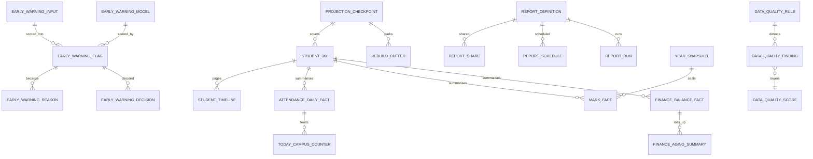
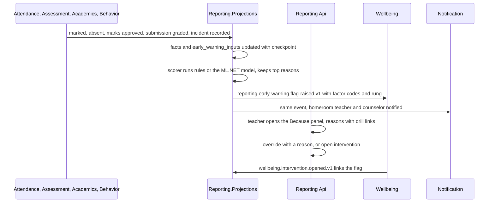

# Reporting

Reporting answers questions about the school without owning a single fact about it. It builds read models from the integration events of every other service, keeps a checkpoint per projection per tenant so that any read model can be rebuilt from its sources with one command, and serves from them the role dashboards of Appendix D, the Student 360 read model that the backends-for-frontends compose, the report library and the report builder with saved, shared and scheduled reports, the Data Quality Center with its rules, scores and fix actions, and the early-warning indicator that always says why a student was flagged in a Because panel and never shows a bare score. It reads from a streaming replica with lag awareness, falling back to the primary when replay lag passes 30 seconds. It holds no Wellbeing row: Wellbeing reaches it as identifiers and category codes that become counts, and even those counts are withheld from a Student 360 viewer who does not hold the explicit Wellbeing permission for that student.

**Group** C · **Requirement areas covered** RPT, with DATA, PERF, SEC, PRV and WEL rows that bind this service · **Last updated** 2026-09-21 by the planning session

| Fact | Value | Source |
|---|---|---|
| Service (Appendix L) | **Reporting**, long name "Reporting and Analytics" | Appendix L.1 |
| Tier | 1 | Appendix L.1, `05-service-catalog.md` |
| AREA code | `RPT` | Appendix L.1 |
| Database, schema, roles | `nibras_reporting`, schema `reporting`, application role `svc_reporting`, migration role `mig_reporting`; a streaming read replica in the scale mode reached through `Reporting:ReadReplica` | Appendix L.1, `10-data-architecture.md` parts 1 and 7.4 |
| Exchange | `nibras.reporting` (topic), plus the consistent-hash exchange `nibras.reporting-projections.projections.hash` for the projection shards | Appendix L.1, `11-messaging-architecture.md` §2.5 |
| Images | `nibras/reporting-api`, `nibras/reporting-projections` | Appendix L.1 |
| Worker | `Reporting.Projections`: "Projections from every exchange, the rebuild command, early-warning scoring"; ordered per partition key through a consistent-hash exchange; "2 replicas as the Section 34 starting point; KEDA on consumer lag". The one worker not named `.Worker` | `05-service-catalog.md` part 2, `07-solution-structure.md` |
| Why the boundary exists | "Scaling: read-heavy, rebuildable, read-replica-friendly projections kept apart from every transactional store." | `05-service-catalog.md` |
| Synchronous dependencies | none | Reference architecture Section 8, table 8.0 |
| Local copies | "projections of everything it consumes" | Reference architecture Section 8, table 8.0 |
| Service level class | "Read-heavy, freshness 60 s" (master brief Section 31) | Reference architecture Section 8, table 8.0 |
| Scaling profile | "Read-heavy; freshness within 60 s; 2 projection replicas as the Section 34 starting point" | `05-service-catalog.md` |
| Build phase | 4 (master brief Section 28) | `05-service-catalog.md` |
| Sensitivity | "confidential; excludes Wellbeing rows by design" | `05-service-catalog.md`, Appendix J.3 |

---

## 1. Responsibilities and non-responsibilities

### Responsibilities

| Owns | Detail |
|---|---|
| Projections | The projection catalog of `10-data-architecture.md` part 7.1 (`student_360`, `student_timeline`, `attendance_daily_facts`, `mark_facts`, `finance_balance_facts`, `admissions_funnel`, `engagement_facts`, `staffing_facts`, `operations_facts`, `early_warning_inputs`, `data_quality_findings`, `platform_health`) and the summaries document 21 adds (`today_campus_counters`, `finance_aging_summary`), each with a checkpoint row updated in the same transaction as the rows it covers (REQ-RPT-001, REQ-DATA-024) |
| Rebuild | The `nibras-reporting rebuild` command: snapshot from each source's `Snapshot` method, staging, swap, replay of buffered events, `reporting.projection.rebuild-completed.v1`; `--from-checkpoint` and `--dry-run` (REQ-DATA-025) |
| Freshness and replica routing | Lag per projection and tenant, the `asOf` on every response, replica reads with fallback to the primary above 30 s of replay lag, read-your-writes through `Nibras-Expect-Message` (REQ-DATA-026) |
| Role dashboards | The "Today" cards and key indicators of Appendix D for every role, each card answering one question and linking to one action (REQ-RPT-002, REQ-RPT-004, REQ-RPT-005); the morning brief per role (REQ-RPT-003) |
| Explain this number | Every figure drills to the records and the rule or scheme version that produced it; a figure without a drill-down is refused with `REPORTING_EXPLANATION_UNAVAILABLE` (REQ-RPT-010) |
| Student 360 read model | The header and the timeline per student, shaped per viewer, with Wellbeing counts present only for a viewer who holds the explicit Wellbeing permission (REQ-WEL-012, Appendix J) |
| Report library and builder | The minimum library of Appendix D, the builder over an allow-list of dimensions and measures, saved and shared reports, scheduled delivery, export to PDF, Excel and CSV through Documents (REQ-RPT-006) |
| Cohorts and group view | Cohort and trend analysis across years (REQ-RPT-012); the opt-in group view across the campuses of one tenant (REQ-RPT-013, Tier 3) |
| Regulatory reports and open data | Regulatory templates as plug-ins per country; the open data endpoint for the school's own BI tool with an API key (REQ-RPT-015) |
| Early warning | The indicator combining attendance, grades, behavior and missing work; the transparent rule set at rung 1 and the ML.NET model at rung 2 with degradation to rules; the Because panel with reasons, counterfactual and override; `reporting.early-warning.flag-raised.v1` and `flag-cleared.v1` (REQ-RPT-007, REQ-RPT-008, REQ-RPT-011) |
| Data Quality Center | Findings from every service's reconciliation jobs and from Reporting's own rules (missing guardian contacts, duplicate students, classes without teachers, unpublished grades), scores per domain, fix actions that deep-link to the owning service (REQ-RPT-014) |
| Governance records (Tier 2) | Self-evaluation against an inspection framework, evidence folders linked to live figures, the improvement plan, the policies library with versions, meetings with actions, the risk register, health and safety checks (REQ-RPT-016, REQ-RPT-017); see Open point 1 |
| Year snapshots | A sealed snapshot of the facts of a closed academic year, so a historical report reruns with the same numbers (WF-SCH-03, TC-SCH-026) |

"Owns no source data" is read here as: Reporting owns no fact about a student, a staff member, money or a school event. It does own its own configuration and decisions: report definitions, shares and schedules, dashboard preferences, data-quality resolutions, early-warning overrides with their reasons, model versions, year snapshots, and the Tier 2 governance records of Open point 1.

### Not responsible for

| Does not own | Owner instead | Why the line is here |
|---|---|---|
| Any source record: students, marks, attendance, invoices, incidents, requests | The owning service of each (School, Assessment, Attendance, Finance, Behavior, Requests and the rest) | A projection is a copy; a fix action links to the owner's screen and never writes back |
| Composing screens across services, including the Student 360 page | Bff.Web and Bff.Mobile | Reporting serves the Student 360 read model; the backend-for-frontend composes it with live calls where a screen needs them |
| Any Wellbeing record, note, reason or category detail beyond counts | Wellbeing | Isolation level S: "Reporting receives counts, never rows" (Appendix J.3) |
| Opening, running and closing an intervention | Wellbeing (WF-ATT-01 `InterventionOpened`, REQ-WEL-011) | Reporting raises the flag and records the decision; Wellbeing owns the intervention |
| Delivery of the flag, the finding or a scheduled report | Notification | Reporting publishes events or sends `RequestNotification` |
| Writing export files, signed URLs, watermarking, the sensitive-export approval | Documents (WF-PRV-02) | Reporting streams rows into a Documents export and never serves a file itself |
| The reconciliation of another service's reference copies | Each consuming service's `ReferenceCopyReconciliationJob` | Reporting records and shows the findings those jobs report |
| Tenant usage metering and billing | Platform | Reporting reports its own usage like every service |
| The audit log and its search | Audit | Reporting's own writes and sensitive reads are audited through `reporting.audit.recorded.v1` |
| Calculation of a grade, a balance or an attendance percentage | Assessment, Finance, Attendance | A figure is projected as the owner published it; "explain this number" drills to the owner's records and scheme version |
| Settings definitions and edits | Platform (ADR-0009) | Reporting reads Appendix G values and reacts to `platform.settings.changed.v1` |
| AI phrasing of the morning brief | Ai (rung 3) | Reporting assembles the facts of the brief; Ai may phrase them when the tenant enables it |

---

## 2. Requirements covered

| Range or identifier | What it binds here |
|---|---|
| REQ-RPT-001 to REQ-RPT-018 | Every RPT row in `03-requirements-catalog.md`: 15 Tier 1, 2 Tier 2 (REQ-RPT-016, REQ-RPT-017), 1 Tier 3 (REQ-RPT-013) |
| REQ-DATA-023 to REQ-DATA-026 | Dashboards read read models only; freshness within 60 s; rebuild reproduces row counts and checksums; replica with lag awareness |
| REQ-WEL-012 | Wellbeing never appears in Student 360 or any report without the specific permission, and the product does not confirm whether a case exists |
| REQ-WEL-014 | Wellbeing events carry no clinical detail; Reporting's contract test on the consumed payloads is the second check |
| REQ-WEL-011, REQ-RPT-009 | A flag opens an intervention in Wellbeing (TC-WEL-201) |
| REQ-DATA-002, REQ-DATA-003 | `svc_reporting` owns no tables and has no `BYPASSRLS`; tenancy by filter plus row-level security on every projection |
| REQ-PERF-015 | The Today card set, Student 360 and the aging summary are compiled queries |
| REQ-SEC-003 to REQ-SEC-006 | Object-level and scope checks before aggregation, generated permission and isolation suites |
| REQ-L10N-005, REQ-L10N-010 | Card titles and timeline summaries as `LocalizedText`; dates, week starts and the morning brief in the campus time zone and work week |

---

## 3. Aggregates and entities

Every tenant-owned table carries the base columns of `10-data-architecture.md` part 4, listed once: `id uuid not null` (UUID v7), `tenant_id uuid not null` (first column of every index, bound by row-level security), `created_at`, `created_by`, `updated_at`, `updated_by`, `deleted_at`, `deleted_by`, and `xmin` as the concurrency token on every aggregate root. **Projection tables are the exception**: they carry `tenant_id`, their own keys and `projected_at timestamptz`, no audit columns, no soft delete and no `xmin`, because only projection handlers write them, in the same transaction as their checkpoint, and a rebuild replaces them. Bilingual text uses `LocalizedText` stored as `<field>_en` and `<field>_ar`.

### 3.1 Projections (read models, rebuildable)

| Table | Key | Main columns | Partition | Source (part 7.1) |
|---|---|---|---|---|
| `student_360` | `(tenant_id, student_id)` | names `LocalizedText`, section, campus, grade level, status, photo file id, attendance percentage this term, absences, lates, threshold state, current average per subject (as published), last report card id, behavior points and badges, open incidents count, balance and restriction flag, open requests, `wellbeing_intervention_open_count int`, `wellbeing_referral_open_count int`, `wellbeing_intervention_ever boolean`, `as_of` | none | `school.student.*`, attendance, academics, assessment, behavior, finance, wellbeing keys |
| `student_timeline` | `(tenant_id, student_id, occurred_at, id)` | `kind text(32)`, `summary LocalizedText`, `source_service`, `source_id`, `drill_url` | monthly on `occurred_at` | Same, minus every `wellbeing.*` key: no Wellbeing entry is ever a timeline row |
| `attendance_daily_facts` | `(tenant_id, fact_date, section_id, student_id)` | present, absent, late, excused, `unmarked_sessions` | monthly on `fact_date` | attendance keys |
| `mark_facts` | `(tenant_id, component_id, student_id)` | mark, scheme version, state (entered, approved, locked) | monthly on the grading period's end date | assessment and academics keys |
| `finance_balance_facts` | `(tenant_id, invoice_id)` | student, payer, amount, paid, balance, due date, overdue days, status | monthly on `issued_on` | finance keys; balance figures only (Appendix J.3) |
| `finance_aging_summary` | `(tenant_id, campus_id, as_of_date, bucket)` | amount, invoice count | none | maintained by the `finance_balance_facts` handler |
| `admissions_funnel` | `(tenant_id, application_id)` | stage, entered stage at, grade level, source, outcome | none | admissions keys |
| `engagement_facts` | `(tenant_id, fact_date, kind, subject_id)` | counts of announcements, acknowledgments, messages, deliveries, failures, suppressions, requests, tasks, SLA breaches | monthly | communication, notification, requests keys |
| `staffing_facts` | `(tenant_id, fact_date, staff_id)` | lesson plans submitted, marks overdue, unmarked registers, substitutions covered, appraisal completed | monthly | academics, assessment, attendance, scheduling, hr keys |
| `operations_facts` | `(tenant_id, fact_date, campus_id, kind)` | counts of visitors, broadcasts, acknowledgments, roll calls, boardings, loans, tickets, imports, exports | monthly | operations, attendance safety, documents keys |
| `today_campus_counters` | `(tenant_id, campus_id, counter_date)` | unmarked sessions, staff absent, incidents today, visitors on site, approvals pending, overdue grading, at-risk count | none; rows older than 35 days deleted | maintained by the fact handlers |
| `early_warning_inputs` | `(tenant_id, student_id, term_id)` | attendance rate, trend of the last 10 lessons per subject, mark trend per subject, missing work count, behavior points and incidents this term, restriction flag; no Wellbeing input | none | derived from the facts above |
| `platform_health` | `(tenant_id, fact_date, kind)` | provisioning, registrations, delivery failures, AI usage and rejections, integrity failures | monthly | platform, identity, ai, audit keys |

**`projection_checkpoints`** is the table of `10-data-architecture.md` part 7.2, reproduced there and not repeated. **`rebuild_buffer`**: `tenant_id`, `projection text`, `message_id uuid`, `occurred_at timestamptz`, `routing_key text`, `payload jsonb`; events parked during a rebuild and replayed after the swap. **`inbox_messages`** is the building-block inbox.

**Invariants (projections)**

1. A projection row changes only in a transaction that also writes the inbox row and the checkpoint row; a crash leaves all three or none.
2. An event whose `occurredAt` is not later than the row's last applied `occurredAt` for the same subject changes nothing (reorder and replay safety).
3. No projection table has a column that holds a Sensitive value or any level-S value; a contract test fails the build when a consumed payload field classified Sensitive or S is mapped (REQ-WEL-014, T-RPT-02).
4. `student_timeline` never contains a row whose `source_service` is `wellbeing`.
5. The three Wellbeing columns of `student_360` are counts and a flag, never a category, a reason or a date.
6. A rebuild of a projection for a tenant reproduces the live row count and checksum, or `reporting.projection.rebuild-completed.v1` is not published and the rebuild job fails (TC-DATA-012).
7. Freshness is `now() - last_occurred_at` of the checkpoint; every read carries it as `asOf`.

### 3.2 ReportDefinition (aggregate root) with ReportShare and ReportSchedule

**`report_definitions`**: `name LocalizedText`, `owner_id uuid`, `kind smallint` (`Library`, `Custom`, `Regulatory`), `library_code text(48) null`, `plugin_code text(48) null`, `dimensions text(64)[]`, `measures text(64)[]`, `filters jsonb` (document 22 §3 grammar), `grouping text(64)[]`, `chart smallint null` (bar, line, stacked, table only), `scope_snapshot jsonb` (the author's scope when saved, re-evaluated at every run), `last_run_at timestamptz null`.

**`report_shares`**: `report_id uuid`, `shared_with_user_id uuid null`, `shared_with_role_code text(48) null`, `can_edit boolean`.

**`report_schedules`**: `report_id uuid`, `cron text(64)` in the tenant time zone, `time_zone text(64)`, `format smallint` (`Pdf`, `Xlsx`, `Csv`), `recipients uuid[]` (users only, never raw addresses), `next_run_at timestamptz`, `last_status smallint`, `active boolean`.

**`report_runs`**: `report_id uuid`, `schedule_id uuid null`, `started_at`, `finished_at`, `row_count int`, `export_job_id uuid null` (Documents job), `status smallint`, `error_code text(64) null`, `recipients_delivered uuid[]`, `recipients_dropped uuid[]` (lost permission since scheduling).

**Invariants (ReportDefinition)**

1. A dimension or measure outside the allow-list, or outside the author's scope, is refused with `REPORTING_FILTER_OUT_OF_SCOPE`; scope is applied before aggregation (T-RPT-01).
2. A breakdown cell that would describe fewer than 10 students is suppressed; a report whose every cell is suppressed fails with `REPORTING_AGGREGATE_TOO_SMALL` (Appendix J rule 2).
3. An interactive run returns at most 500 rows; more fails with `REPORTING_REPORT_TOO_LARGE` and offers the export.
4. A schedule inside the tenant's nightly rebuild window fails with `REPORTING_SCHEDULE_CONFLICT` naming the next free window.
5. Every scheduled run re-evaluates each recipient's permissions and scope; a recipient who lost them is dropped and recorded, never sent the file (T-RPT-03).
6. A report run against a data set with an open blocking data-quality finding fails with `REPORTING_DATA_QUALITY_BLOCK` listing the findings, unless the report is the Data Quality report itself.
7. Only `Pdf`, `Xlsx` and `Csv` exist; another format fails with `REPORTING_EXPORT_FORMAT_UNSUPPORTED`.

### 3.3 EarlyWarningFlag (aggregate root) with FlagReason and FlagDecision

**`early_warning_flags`**: `student_id uuid`, `campus_id uuid`, `section_id uuid`, `term_id uuid`, `indicator_code text(32)` (for example `academic-risk`, `attendance-risk`, `engagement-risk`), `subject_id uuid null`, `score numeric(5,4)` (stored for ordering, never displayed), `band smallint` (`Watch`, `Concern`, `Urgent`), `assist_rung smallint` (1 rules, 2 model), `model_version_id uuid null`, `rule_set_version int`, `raised_at timestamptz`, `cleared_at timestamptz null`, `clear_reason_code text(32) null`, `status smallint` (`Raised`, `InterventionRequested`, `InterventionOpened`, `Overridden`, `Cleared`), `counterfactual LocalizedText`.

**`early_warning_reasons`**: `flag_id uuid`, `rank smallint` (1 to 5), `factor_code text(48)` (for example `attendance.last10.below`, `marks.trend.down`, `coursework.missing`, `behavior.none-this-term`), `value_text LocalizedText` (the verifiable fact, for example "Missed 4 of the last 10 mathematics lessons"), `contribution numeric(6,4)`, `drill_url text(512)` (the records behind the fact), `source_service text(24)`.

**`early_warning_decisions`**: `flag_id uuid`, `kind smallint` (`Override`, `OpenIntervention`), `reason_code text(32)`, `reason_text text(1024)` (Confidential; shown to the next viewer), `decided_by uuid`, `decided_at timestamptz`.

**`early_warning_models`**: `model_kind smallint` (`Rules`, `MlNet`), `version int`, `trained_at timestamptz null`, `training_rows int null`, `feature_set text(64)[]`, `artifact bytea null` (the ML.NET model, a few kilobytes for a linear model), `metrics jsonb` (AUC, calibration), `active boolean`. **`early_warning_rules`**: `code text(32)`, `factor_code text(48)`, `operator smallint`, `threshold numeric`, `weight numeric`, `active boolean`, `version int`.

**Invariants (EarlyWarningFlag)**

1. A flag has between one and five reasons, each linking to records; a flag with no traceable reason is not raised (REQ-RPT-007).
2. Reasons are produced by the same computation as the score: for rules, the rules that fired; for the ML.NET linear model, the top feature contributions of that prediction. No separately generated explanation exists (because-panel skill).
3. The score is never returned by any endpoint; responses carry `band`, reasons and the counterfactual.
4. No reason, factor or input is drawn from a Wellbeing event or count (T-RPT-04); `early_warning_inputs` has no Wellbeing column.
5. When the active ML.NET model is missing or fails to load, scoring uses the rule set and marks `assist_rung = 1`, and the explain endpoint says so; no flag is withheld because the model is down (REQ-RPT-008; `REPORTING_EARLY_WARNING_MODEL_UNAVAILABLE` is logged, not surfaced as a failure of the flag).
6. An override requires a reason, records who and when, sets `Overridden`, and suppresses re-raising the same indicator for that student for 14 days unless the band rises.
7. One open flag per `(student_id, indicator_code, subject_id, term_id)`; a rescoring updates it, a clearing closes it and publishes `reporting.early-warning.flag-cleared.v1` once.
8. A flag is published once on raise with `factors` as factor codes only, never values that identify another student.

### 3.4 DataQualityFinding (aggregate root) with DataQualityRule and DataQualityScore

**`data_quality_findings`** (the projection of part 7.1, also written by Reporting's own rules): `rule_code text(48)`, `source_service text(24)`, `entity_type text(48)`, `affected_count int`, `severity smallint` (`Info`, `Warning`, `Blocking`), `sample_ids uuid[]` (at most 20), `fix_action_url text(512)` (the owner's screen), `status smallint` (`Open`, `Acknowledged`, `Resolved`, `AutoResolved`), `detected_at timestamptz`, `resolved_at timestamptz null`, `resolved_by uuid null`, `resolution_note text(512) null`, `last_seen_at timestamptz`.

**`data_quality_rules`**: `code text(48)`, `name LocalizedText`, `domain text(24)` (students, guardians, classes, grades, finance, reference copies), `kind smallint` (`Projection` query over read models, `External` finding reported by another service), `severity smallint`, `blocks_reports text(48)[]` (library codes it blocks), `active boolean`. **`data_quality_scores`**: `domain text(24)`, `score_date date`, `score numeric(5,2)` (share of records without an open finding), `open_findings int`.

**Invariants.** A finding is unique per `(tenant_id, rule_code, entity_type)` while open; a new detection updates `affected_count` and `last_seen_at`. A finding whose rule no longer detects anything moves to `AutoResolved`. A manual resolution requires `reporting.data-quality.resolve` and a note.

### 3.5 YearSnapshot and governance records

**`year_snapshots`**: `academic_year_id uuid`, `sealed_at timestamptz`, `fact_checksums jsonb` (per fact table and partition), `status smallint` (`Sealed`, `Refreshing`, `Superseded`), `superseded_by uuid null`. Fact partitions of a sealed year are attached read-only to the snapshot so a rerun reads the same rows (WF-SCH-03).

**Governance (Tier 2, Open point 1)**, schema `governance` in `nibras_reporting`: `inspection_frameworks` (code, name, criteria as a versioned tree), `self_evaluations` (framework version, criterion, judgement code, narrative `LocalizedText`, evidence links to report codes and file ids in Documents), `improvement_plans` and `improvement_actions` (owner, due date, KPI code, status), `policies` and `policy_versions` (title, file id, effective date, review date), `meetings` and `meeting_actions`, `risk_register_entries` (likelihood, impact, owner, mitigation), `safety_checks` (area, checked on, outcome). These are the only source records Reporting holds; they carry the full base columns, are excluded from the rebuild and are backed up like any service table.

### 3.6 Reference copies (read-only)

`ref_tenant_state` (status, plan, flags) and `ref_scopes` (section, campus, grade-level membership needed to apply data scopes before aggregation, maintained from `school.student.*` and `school.academic-year.closed.v1`) are described in section 8.



---

## 4. REST API

Paths follow `22-api-conventions-and-error-catalog.md` §1. Every endpoint also returns the eight cross-cutting codes of Appendix K.1 with the `REPORTING_` prefix (`REPORTING_VALIDATION_FAILED`, `REPORTING_PERMISSION_DENIED`, `REPORTING_TENANT_MISMATCH`, `REPORTING_NOT_FOUND`, `REPORTING_CONCURRENCY_CONFLICT`, `REPORTING_IDEMPOTENCY_REPLAY`, `REPORTING_RATE_LIMITED`, `REPORTING_DEPENDENCY_UNAVAILABLE`). **Every read** also carries `asOf` and may answer `REPORTING_PROJECTION_STALE` (200, with the data and the "as of" time) when the projection is behind its 60 s budget; that code is not repeated per row. Reads go to the replica unless section 11 says otherwise. Every write is audited through `reporting.audit.recorded.v1`. Lists use keyset pagination with a page cap of 200.

### 4.1 Dashboards and the morning brief (`DashboardEndpoints.cs`)

| Method | Path | Permission | Request | Response | Errors | Idempotent |
|---|---|---|---|---|---|---|
| GET | `/api/v1/reporting/dashboards/today?role=&campusId=` | `reporting.dashboards.view` | query; `role` defaults to the caller's primary role | `TodayCards`: one card per Appendix D "Today" question for the role, each with a value, a severity and one action link (hot query 1) | none beyond K.1 | Safe; `ETag` |
| GET | `/api/v1/reporting/dashboards/indicators?role=&campusId=&period=` | `reporting.dashboards.view` | query | `IndicatorSet`: the Appendix D key indicators for the role with trend and drill links | `REPORTING_FILTER_OUT_OF_SCOPE` | Safe; `ETag` |
| GET | `/api/v1/reporting/dashboards/morning-brief?date=` | `reporting.dashboards.view` | query; `date` defaults to today in the campus time zone | `MorningBrief`: the role's facts assembled by `MorningBriefJob`, with optional rung 3 phrasing marked as such (REQ-RPT-003) | none beyond K.1 | Safe |
| GET | `/api/v1/reporting/dashboards/homeroom/{sectionId}` | `reporting.dashboards.view` (`own-homeroom`) | none | `HomeroomCard`: absent today, excuses to review, flags for the class, birthdays (REQ-RPT-004) | none beyond K.1 | Safe; `ETag` |
| GET | `/api/v1/reporting/dashboards/figures/{figureCode}/explain?params=` | `reporting.dashboards.view` | figure code and the parameters of the figure | `FigureExplanation`: the records behind the figure (keyset), the rule or scheme version, the source service, a link to the owner's screen (REQ-RPT-010) | `REPORTING_EXPLANATION_UNAVAILABLE` | Safe |
| GET | `/api/v1/reporting/dashboards/cohorts?gradeLevelId=&fromYear=&toYear=&measure=` | `reporting.dashboards.view` | query | `CohortSeries` with the scheme version per year (REQ-RPT-012) | `REPORTING_AGGREGATE_TOO_SMALL` | Safe |
| GET | `/api/v1/reporting/dashboards/group?period=` | `reporting.dashboards.view` (`all-tenant`), tenant opted in | query | `GroupView`: enrolment, collections, attendance per campus, summed inside one tenant (REQ-RPT-013, Tier 3) | `REPORTING_PERMISSION_DENIED` (group view not enabled) | Safe |
| PUT | `/api/v1/reporting/dashboards/preferences` | `reporting.dashboards.view` | `{ cardOrder[], hiddenCards[] }` for the caller | 200 | none beyond K.1 | Yes, last write wins per user |

### 4.2 Student 360 (`Student360Endpoints.cs`)

| Method | Path | Permission | Request | Response | Errors | Idempotent |
|---|---|---|---|---|---|---|
| GET | `/api/v1/reporting/students/{id}/360` | `reporting.dashboards.view` in a scope that contains the student (`own-sections`, `own-homeroom`, `own-children`, `self`, `campus`) | none | `Student360Header` (hot query 2). The `wellbeing` block is **present only when the caller holds `wellbeing.interventions.view` for this student** (intervention count) and additionally `wellbeing.counseling-cases.view` (referral count); otherwise the block is absent, not empty and not marked hidden | none beyond K.1 | Safe; per-viewer `ETag` |
| GET | `/api/v1/reporting/students/{id}/timeline?cursor=&kind=` | as above | cursor on `(occurred_at, id)` | `TimelinePage`; never contains a Wellbeing entry | none beyond K.1 | Safe |
| GET | `/api/v1/reporting/students/{id}/figures/{figureCode}/explain` | as above | none | The records behind a Student 360 figure with the scheme version (TC-RPT-102) | `REPORTING_EXPLANATION_UNAVAILABLE` | Safe |

### 4.3 Report library and builder (`ReportEndpoints.cs`)

| Method | Path | Permission | Request | Response | Errors | Idempotent |
|---|---|---|---|---|---|---|
| GET | `/api/v1/reporting/reports/library` | `reporting.reports.view` | none | The minimum library of Appendix D, filtered to the reports the caller's scope can run | none beyond K.1 | Safe; `ETag` |
| GET | `/api/v1/reporting/reports/library/{reportCode}?params=` | `reporting.reports.view` | report parameters | Up to 500 rows of the library report | `REPORTING_REPORT_TOO_LARGE`, `REPORTING_AGGREGATE_TOO_SMALL`, `REPORTING_FILTER_OUT_OF_SCOPE`, `REPORTING_DATA_QUALITY_BLOCK` | Safe |
| GET | `/api/v1/reporting/reports/fields` | `reporting.reports.view` | none | The allow-listed dimensions and measures with scope tags and data class | none beyond K.1 | Safe; `ETag` |
| GET | `/api/v1/reporting/reports?mine=&sharedWithMe=` | `reporting.reports.view` | query, cursor | `ReportDefinitionRow[]` | none beyond K.1 | Safe |
| POST | `/api/v1/reporting/reports` | `reporting.reports.create` | `ReportDefinitionModel` | 201 | `REPORTING_FILTER_OUT_OF_SCOPE`, `REPORTING_VALIDATION_FAILED` | Key optional |
| GET | `/api/v1/reporting/reports/{id}` | `reporting.reports.view` (owner or shared) | none | `ReportDefinition` | none beyond K.1 | Safe; `ETag` |
| PUT | `/api/v1/reporting/reports/{id}` | `reporting.reports.edit` | model, `If-Match` | 200 | `REPORTING_FILTER_OUT_OF_SCOPE`, `REPORTING_CONCURRENCY_CONFLICT` | Yes, by `If-Match` |
| DELETE | `/api/v1/reporting/reports/{id}` | `reporting.reports.delete` | `If-Match` | 204; schedules stop | `REPORTING_CONCURRENCY_CONFLICT` | Yes |
| POST | `/api/v1/reporting/reports/{id}/preview` | `reporting.reports.view` | `{ parameters }` | First 500 rows and the chart series; generated SQL over fact tables only with `statement_timeout = 2s` (hot query 6) | `REPORTING_REPORT_TOO_LARGE`, `REPORTING_AGGREGATE_TOO_SMALL`, `REPORTING_FILTER_OUT_OF_SCOPE`, `REPORTING_DATA_QUALITY_BLOCK` | Safe |
| POST | `/api/v1/reporting/reports/{id}/export` | `reporting.reports.export` | `{ format, parameters }` | 202 job; rows streamed into a Documents export (WF-PRV-02 decides approval) | `REPORTING_EXPORT_FORMAT_UNSUPPORTED`, `REPORTING_DATA_QUALITY_BLOCK` | Yes, Key required |
| POST | `/api/v1/reporting/reports/{id}/shares` | `reporting.reports.share` | `{ userId or roleCode, canEdit }` | 201 `ReportShare` | `REPORTING_VALIDATION_FAILED` (recipient outside the tenant) | Key optional |
| DELETE | `/api/v1/reporting/reports/{id}/shares/{shareId}` | `reporting.reports.share` | none | 204 | none beyond K.1 | Yes |
| POST | `/api/v1/reporting/reports/{id}/schedules` | `reporting.reports.schedule` | `{ cron, format, recipients[] }` | 201 `ReportSchedule` with `nextRunAt` | `REPORTING_SCHEDULE_CONFLICT`, `REPORTING_EXPORT_FORMAT_UNSUPPORTED` | Key optional |
| PUT | `/api/v1/reporting/reports/{id}/schedules/{scheduleId}` | `reporting.reports.schedule` | schedule model, `If-Match` | 200 | `REPORTING_SCHEDULE_CONFLICT`, `REPORTING_CONCURRENCY_CONFLICT` | Yes, by `If-Match` |
| DELETE | `/api/v1/reporting/reports/{id}/schedules/{scheduleId}` | `reporting.reports.schedule` | none | 204 | none beyond K.1 | Yes |
| GET | `/api/v1/reporting/reports/{id}/runs?cursor=` | `reporting.reports.view` | cursor | `ReportRunRow[]` with delivered and dropped recipients | none beyond K.1 | Safe |
| GET | `/api/v1/reporting/reports/regulatory` | `reporting.reports.view` | none | Installed regulatory plug-ins for the tenant's country | none beyond K.1 | Safe |
| POST | `/api/v1/reporting/reports/regulatory/{pluginCode}/run` | `reporting.reports.export` | `{ period, parameters }` | 202 job; output in the plug-in's format through Documents | `REPORTING_DATA_QUALITY_BLOCK`, `REPORTING_EXPORT_FORMAT_UNSUPPORTED` | Yes, Key required |

### 4.4 Early warning (`EarlyWarningEndpoints.cs`)

| Method | Path | Permission | Request | Response | Errors | Idempotent |
|---|---|---|---|---|---|---|
| GET | `/api/v1/reporting/early-warning/flags?campusId=&sectionId=&band=` | `reporting.early-warning.view` | query, cursor on `(band, raised_at, student_id)` | `FlagRow[]`: student, indicator, band, top reason, rung, age (hot query 5); never a score | none beyond K.1 | Safe; `ETag` |
| GET | `/api/v1/reporting/early-warning/flags/{id}` | `reporting.early-warning.view` | none | `Flag` with status, decisions and the reasons' codes | none beyond K.1 | Safe |
| GET | `/api/v1/reporting/early-warning/flags/{id}/explain` | `reporting.early-warning.explain` | none | `BecausePanel`: verdict, one to five reasons each with a drill link, the counterfactual, the rung and model or rule version, what data was absent, previous decisions with their reasons (REQ-RPT-011, TC-RPT-202) | `REPORTING_EXPLANATION_UNAVAILABLE` | Safe |
| POST | `/api/v1/reporting/early-warning/flags/{id}/override` | `reporting.early-warning.open-intervention` (Open point 3) | `{ reasonCode, reasonText }` | 200 `Overridden`; the reason is shown to the next viewer | `REPORTING_VALIDATION_FAILED` (reason required), `REPORTING_CONCURRENCY_CONFLICT` | Yes, first decision wins |
| POST | `/api/v1/reporting/early-warning/flags/{id}/open-intervention` | `reporting.early-warning.open-intervention` | `{ ownerId, playbookCode }` | 200 `InterventionRequested` with a `wellbeingHandoff` link the caller's client follows to Wellbeing's create-intervention screen (Open point 4) | `REPORTING_CONCURRENCY_CONFLICT` | Yes, state-guarded |
| GET | `/api/v1/reporting/early-warning/model` | `reporting.early-warning.view` | none | Active rung, model version and metrics, rule set version and the rules in force, in plain language | `REPORTING_EARLY_WARNING_MODEL_UNAVAILABLE` (503) only when neither the model nor the rules can load | Safe |

### 4.5 Data Quality Center (`DataQualityEndpoints.cs`)

| Method | Path | Permission | Request | Response | Errors | Idempotent |
|---|---|---|---|---|---|---|
| GET | `/api/v1/reporting/data-quality/findings?status=&domain=&severity=` | `reporting.data-quality.view` | query, cursor on `(detected_at, id)` | `FindingRow[]` with fix-action links (hot query 8) | none beyond K.1 | Safe |
| GET | `/api/v1/reporting/data-quality/findings/{id}` | `reporting.data-quality.view` | none | `Finding` with sample record links and history | none beyond K.1 | Safe |
| POST | `/api/v1/reporting/data-quality/findings/{id}/acknowledge` | `reporting.data-quality.resolve` | `{ note }` | 200 `Acknowledged` | `REPORTING_CONCURRENCY_CONFLICT` | Yes, state-guarded |
| POST | `/api/v1/reporting/data-quality/findings/{id}/resolve` | `reporting.data-quality.resolve` | `{ note }` | 200 `Resolved`; the rule re-checks at its next run and reopens if still true | `REPORTING_CONCURRENCY_CONFLICT` | Yes, state-guarded |
| GET | `/api/v1/reporting/data-quality/scores?domain=` | `reporting.data-quality.view` | query | Score per domain with the 30-day trend | none beyond K.1 | Safe; `ETag` |
| GET | `/api/v1/reporting/data-quality/rules` | `reporting.data-quality.view` | none | `DataQualityRule[]` with severity and what each blocks | none beyond K.1 | Safe; `ETag` |
| POST | `/api/v1/reporting/data-quality/rules/run` | `reporting.data-quality.run-rules` | `{ ruleCodes[] or all }` | 202 job | `REPORTING_CONCURRENCY_CONFLICT` (a run is active) | Yes, Key required |

### 4.6 Projections, jobs and open data (`ProjectionEndpoints.cs`, `JobEndpoints.cs`, `OpenDataEndpoints.cs`)

| Method | Path | Permission | Request | Response | Errors | Idempotent |
|---|---|---|---|---|---|---|
| GET | `/api/v1/reporting/projections` | `reporting.projections.view` | none | Freshness per projection for the tenant (lag, last event, rebuilding flag) | none beyond K.1 | Safe |
| POST | `/api/v1/reporting/projections/{name}/rebuild` | `reporting.projections.rebuild` | `{ fromCheckpoint, dryRun }` | 202 job; tenant-fair queue (T-RPT-05) | `REPORTING_CONCURRENCY_CONFLICT` (rebuild running), `REPORTING_SCHEDULE_CONFLICT` (inside the peak window of the band) | Yes, Key required |
| GET | `/api/v1/reporting/jobs/{id}` | the starting permission or `platform.jobs.view` | none | Job resource of document 22 §6.2 | none beyond K.1 | Safe |
| POST | `/api/v1/reporting/jobs/{id}/cancel` | the starting permission or `platform.jobs.cancel` | `{}` | 202 `cancelRequested` | `REPORTING_CONCURRENCY_CONFLICT` | Yes |
| GET | `/api/v1/reporting/open-data/{dataset}?cursor=&from=&to=` | `reporting.reports.view` through an API key scoped to reporting (`23-integrations-and-public-api.md`) | query, cursor | Keyset page of an allow-listed aggregate data set; never a row below the 10-student floor, never a Wellbeing count | `REPORTING_AGGREGATE_TOO_SMALL`, `REPORTING_FILTER_OUT_OF_SCOPE` | Safe |

### 4.7 Governance records, Tier 2 (`GovernanceEndpoints.cs`)

| Method | Path | Permission | Request | Response | Errors | Idempotent |
|---|---|---|---|---|---|---|
| GET | `/api/v1/reporting/governance/self-evaluations?frameworkId=` | `reporting.reports.view` (Open point 1) | query | Criteria with judgements and live evidence links (TC-RPT-005) | none beyond K.1 | Safe |
| PUT | `/api/v1/reporting/governance/self-evaluations/{criterionId}` | `reporting.reports.edit` | `{ judgementCode, narrative, evidence[] }`, `If-Match` | 200 | `REPORTING_CONCURRENCY_CONFLICT` | Yes, by `If-Match` |
| GET | `/api/v1/reporting/governance/improvement-plans` | `reporting.reports.view` | none | Plans with actions, owners, KPI current values | none beyond K.1 | Safe |
| POST | `/api/v1/reporting/governance/improvement-plans` | `reporting.reports.create` | plan with actions | 201 | `REPORTING_VALIDATION_FAILED` | Key optional |
| PATCH | `/api/v1/reporting/governance/actions/{id}` | `reporting.reports.edit` | `{ status, note }`, `If-Match`; used by plan, meeting and safety-check actions | 200 | `REPORTING_CONCURRENCY_CONFLICT` | Yes, by `If-Match` |
| GET | `/api/v1/reporting/governance/policies` | `reporting.reports.view` | none | Policies with current version and review date | none beyond K.1 | Safe |
| POST | `/api/v1/reporting/governance/policies` | `reporting.reports.create` | policy or new version with a Documents file id | 201 | `REPORTING_VALIDATION_FAILED` | Key optional |
| GET | `/api/v1/reporting/governance/meetings?from=&to=` | `reporting.reports.view` | query, cursor | Meetings with open actions | none beyond K.1 | Safe |
| POST | `/api/v1/reporting/governance/meetings` | `reporting.reports.create` | agenda, minutes, actions | 201 | `REPORTING_VALIDATION_FAILED` | Key optional |
| GET | `/api/v1/reporting/governance/risks` | `reporting.reports.view` | none | Risk register and health and safety checks | none beyond K.1 | Safe |
| POST | `/api/v1/reporting/governance/risks` | `reporting.reports.create` | risk entry or safety check | 201 | `REPORTING_VALIDATION_FAILED` | Key optional |

**Endpoint count: 58** across 7 endpoint groups. The rebuild command line (`nibras-reporting rebuild`) and `InitialiseProjections` (Saga 1 step 6) are not endpoints; they are in sections 6 and 9.

---

## 5. gRPC

| Direction | Contract | Method | Purpose | Deadline | Fallback |
|---|---|---|---|---|---|
| Exposed | none | none | No service names Reporting as a synchronous dependency (table 8.0); the backends-for-frontends read Reporting over HTTP, so `Api/Grpc/` is not generated | not applicable | not applicable |
| Consumed | The `Snapshot` method of each rebuild source: `nibras.school.v1`, `nibras.attendance.v1`, `nibras.academics.v1`, `nibras.assessment.v1`, `nibras.behavior.v1`, `nibras.finance.v1` `Reconciliation`, `nibras.admissions.v1`, `nibras.communication.v1`, `nibras.notification.v1`, `nibras.requests.v1` `Reconciliation`, `nibras.scheduling.v1`, `nibras.hr.v1`, `nibras.operations.v1`, `nibras.documents.v1` `Reconciliation`, `nibras.platform.v1` | `Snapshot(projection_kind, page_token)` streamed | Rebuild step 3 (`10-data-architecture.md` part 7.3) and the nightly projection consistency sample | 5 s per page | The rebuild job fails for that tenant and projection, keeps the live projection, and retries; nothing on a request path waits for it |
| Consumed | `nibras.wellbeing.v1` `Counts` | `GetStudentCounts(student_ids)` | Rebuild of the three Wellbeing columns of `student_360` (`10-data-architecture.md` part 7.1: "Wellbeing supplies counts through its `Counts` gRPC method only") | 2 s | Columns keep the last projected value; never estimated |

These calls run only inside the rebuild job and the nightly consistency sample, never inside a user request, so the one-hop rule holds and no request of Reporting's has a synchronous dependency, as table 8.0 says. Table 8.0 (v9.1) now defines "job only" and states the one-hop rule, but it still carries no Reporting row for these reads; Open point 2 records that.

---

## 6. Events published and consumed

Payload fields are owned by Appendix E and are not restated. Partition keys are Appendix E's.

### 6.1 Published (exchange `nibras.reporting`)

| Routing key | Partition key | Raised by | Consumers (Appendix E) |
|---|---|---|---|
| `reporting.early-warning.flag-raised.v1` | `studentId` | `EarlyWarningScoringJob` and the incremental scorer in `EarlyWarningInputsProjection` when a flag is first raised or its band rises | Wellbeing, Notification |
| `reporting.early-warning.flag-cleared.v1` | `studentId` | Scorer when the indicator falls below the clear threshold; an override does not publish | Wellbeing, Notification |
| `reporting.data-quality.issue-detected.v1` | `tenantId` | `DataQualityRulesJob`, `ProjectionConsistencyJob`, and `RecordDataQualityFindingHandler` for findings other services report (Open point 5) | the owning service (every data-owning service, filtered by `entityType`), Notification |
| `reporting.projection.rebuild-completed.v1` | `tenantId` | Rebuild command, `InitialiseProjections` (Saga 1 step 6) | Platform; Saga 1 outcome |
| `reporting.audit.recorded.v1` | `tenantId` | Every write, every override and intervention request, every rebuild, every Student 360 read that returned a Wellbeing block | Audit |
| `reporting.usage.recorded.v1` | `tenantId` | `ReportingUsageMeterJob`: report runs, exports, rebuild minutes | Platform |

Reporting sends `RequestNotification` (`notification.commands.request-notification.v1`) for scheduled-report delivery and the morning brief push, which Appendix C does not list (Open point 6).

### 6.2 Consumed

Queues are those of `11-messaging-architecture.md` §2.5 for Reporting: `reporting.tenant-lifecycle` and `reporting.commands` in the Api host, and the eight ordered shards `reporting-projections.projections.0` to `.7` behind `nibras.reporting-projections.projections.hash`, one handler concurrency per shard, prefetch 64. Every projection handler writes the inbox row, the projection rows and the checkpoint in one transaction. Every key below is one Appendix E names Reporting as a consumer of. The nine keys that `10-data-architecture.md` part 7.1 needed and Appendix E did not route here were added to their consumer columns by ADR-0019, so every row is bound from the first release.

| Routing keys | Queue | Handler (projection) | What it changes | Idempotent on |
|---|---|---|---|---|
| `platform.tenant.provisioning-requested.v1`, `platform.tenant.suspended.v1`, `platform.tenant.reactivated.v1`, `platform.tenant.deletion-requested.v1`, `platform.tenant.deleted.v1`, `platform.plan.changed.v1`, `platform.feature-flag.changed.v1`, `platform.settings.changed.v1`, `platform.terminology.changed.v1`, `platform.custom-field.changed.v1`, `identity.role.changed.v1`, `identity.permissions.changed.v1` | `reporting.tenant-lifecycle` | `TenantLifecycleConsumer`, `SettingsChangedConsumer`, permission cache | Tenant state copy, settings (time zone, work week, rank visibility, early-warning flag), custom-field dimensions, permission cache and the per-viewer cache entries | `tenantId` plus `occurredAt` |
| `platform.tenant.provisioned.v1` | `reporting.tenant-lifecycle` | `PlatformHealthProjection` | `platform_health`; the tenant's empty projections exist from `InitialiseProjections` | `tenantId` |
| `identity.user.registered.v1` | shards | `PlatformHealthProjection` | Registration counts | `userId` |
| `school.student.*.v1` (the one wildcard binding: enrolled, section-changed, status-changed, promoted, profile-updated) | shards | `Student360Projection`, `StudentTimelineProjection`, `ScopeReferenceProjection` | Header identity fields, section and campus, status; timeline entries; the scope copy | `studentId` plus `occurredAt` |
| `school.academic-year.closed.v1` | shards | `YearSnapshotHandler` | Seals the year's fact partitions into a `year_snapshots` row | `academicYearId` |
| `school.guardian.updated.v1` | shards | `Student360Projection` | Guardian names on the header | `guardianId` plus `occurredAt` |
| `admissions.inquiry.created.v1`, `admissions.application.submitted.v1`, `admissions.application.stage-changed.v1`, `admissions.offer.expired.v1`, `admissions.re-enrollment.confirmed.v1`, `admissions.re-enrollment.declined.v1`, `admissions.offer.made.v1` | shards | `AdmissionsFunnelProjection` | Stage and time in stage per application; re-enrolment rate | `applicationId` or `studentId` plus `occurredAt` |
| `academics.assignment.published.v1`, `academics.submission.received.v1`, `academics.submission.graded.v1`, `academics.lesson-plan.submitted.v1`, `academics.homework-load.exceeded.v1`, `academics.syllabus-coverage.behind.v1`, `academics.submission.missing.v1` | shards | `MarkFactsProjection`, `StaffingFactsProjection`, `EarlyWarningInputsProjection`, `StudentTimelineProjection` | Missing work, graded work, lesson-plan counts, coverage flags | `assignmentId`, `staffId` or `sectionId` plus `occurredAt` |
| `assessment.marks.entered.v1`, `assessment.marks.approved.v1`, `assessment.grades.locked.v1`, `assessment.report-cards.published.v1`, `assessment.marks.overdue.v1`, `assessment.report-card.generated.v1`, `assessment.exam-paper.approved.v1`, `assessment.exam-paper.released.v1` | shards | `MarkFactsProjection`, `Student360Projection`, `StaffingFactsProjection` | Marks with scheme version, lock state, last report card, overdue grading | `componentId` or `gradingPeriodId` plus `occurredAt` |
| `attendance.attendance.marked.v1`, `attendance.student.absent.v1`, `attendance.excuse.approved.v1`, `attendance.threshold.reached.v1`, `attendance.dismissal.processed.v1`, `attendance.attendance.not-marked.v1` | shards | `AttendanceDailyFactsProjection`, `Student360Projection`, `TodayCountersProjection`, `EarlyWarningInputsProjection`, `StaffingFactsProjection` | Daily facts, unmarked sessions, the header's attendance figures, early-warning inputs | `sectionId` or `studentId` plus `occurredAt` |
| `attendance.visitor.checked-in.v1`, `attendance.emergency.broadcast-started.v1`, `attendance.emergency.acknowledged.v1`, `attendance.roll-call.completed.v1` | shards | `OperationsFactsProjection`, `TodayCountersProjection` | Visitors on site, emergency and roll-call counts | `campusId` plus `occurredAt` |
| `finance.fee-plan.assigned.v1`, `finance.invoice-run.requested.v1`, `finance.invoice.issued.v1`, `finance.payment.received.v1`, `finance.cheque.bounced.v1`, `finance.refund.processed.v1`, `finance.credit-note.issued.v1`, `finance.invoice.overdue.v1`, `finance.day.closed.v1`, `finance.account.restricted.v1`, `finance.account.cleared.v1` | shards | `FinanceBalanceFactsProjection` (maintains `finance_aging_summary`), `Student360Projection` | Balances, aging, collections, restriction flag on the header | `invoiceId` or `studentId` plus `occurredAt` |
| `communication.announcement.published.v1`, `communication.acknowledgment.recorded.v1`, `communication.message.sent.v1`, `notification.notification.delivered.v1`, `notification.notification.failed.v1`, `notification.channel.suppressed.v1`, `requests.request.submitted.v1`, `requests.request.approved.v1`, `requests.request.rejected.v1`, `requests.request.completed.v1`, `requests.request.sla-breached.v1`, `requests.task.assigned.v1`, `requests.task.completed.v1`, `requests.request.reassigned.v1`, `requests.request.withdrawn.v1`, `requests.request.expired.v1` | shards | `EngagementFactsProjection`, `TodayCountersProjection`, `Student360Projection` | Reach, acknowledgments, delivery failures, request volume and SLA, approvals pending | subject key plus `occurredAt` |
| `documents.certificate.revoked.v1`, `documents.import.completed.v1`, `documents.export.completed.v1` | shards | `OperationsFactsProjection`, `Student360Projection` | Import and export counts; a revoked certificate marked on the header's documents list | `jobId` or `subjectId` |
| `behavior.incident.recorded.v1`, `behavior.points.awarded.v1`, `behavior.badge.awarded.v1`, `behavior.consequence.assigned.v1` | shards | `Student360Projection`, `StudentTimelineProjection`, `EarlyWarningInputsProjection`, `TodayCountersProjection` | Points, badges, incident counts by category; a `restricted = true` incident appears as a count and a category only, never with a narrative (which the payload does not carry) | `studentId` plus `occurredAt` |
| `wellbeing.referral.created.v1`, `wellbeing.intervention.opened.v1`, `wellbeing.intervention.closed.v1` | shards | `WellbeingCountsProjection` | Increments or decrements the three Wellbeing columns of `student_360` only; links an `intervention.opened` to the student's open flag and sets `InterventionOpened`; **writes no timeline row, no category, no date, no identifier other than the student** | `referralId` or `interventionId` |
| `scheduling.substitution.assigned.v1` | shards | `StaffingFactsProjection` | Cover counts per staff member | `substitutionId` |
| `hr.appraisal.completed.v1` | shards | `StaffingFactsProjection` | Appraisal completion | `staffId` plus `occurredAt` |
| `operations.transport.boarding-recorded.v1`, `operations.library.loan-recorded.v1`, `operations.facility.ticket-raised.v1`, `operations.facility.ticket-closed.v1` | shards | `OperationsFactsProjection` | Counts per campus and day | subject key plus `occurredAt` |
| `ai.index.rebuild-completed.v1`, `ai.suggestion.rejected.v1`, `audit.integrity-check.failed.v1` | shards | `PlatformHealthProjection` | AI and integrity health for the platform console | `tenantId` plus `occurredAt` |
| `InitialiseProjections` | `reporting.commands` | `InitialiseProjectionsHandler` | Creates the tenant's empty projections and checkpoints; publishes `reporting.projection.rebuild-completed.v1` (Saga 1 step 6) | `(sagaId, stepKey)` |
| `DeleteTenantData` and the Saga 1, 2 and 10 lifecycle commands | `reporting.commands` | `Features/TenantLifecycle/` | Reporting is deleted first in Saga 2 step 6 | `(sagaId, stepKey)` |

`reporting.data-quality.issue-detected.v1` is not bound here: Reporting never consumes its own key (document 11 §2.3); its own findings are written in the same transaction that publishes them.

---

## 7. Sagas and workflows

Reporting owns no workflow in Appendix R and no rule in Appendix S (document 31 section 1 lists no row for it), and orchestrates no saga, so `Application/Sagas/` is not generated. It takes part in these:

| WF or saga | Role | What Reporting implements |
|---|---|---|
| WF-ATT-01 Daily attendance to intervention | Participant | Consumes the attendance keys; the early-warning scorer may raise `reporting.early-warning.flag-raised.v1` (Appendix R side effect); links `wellbeing.intervention.opened.v1` to the flag |
| WF-BEH-01 Incident to intervention | Participant | Behavior inputs to the indicator; publishes the flag "when the incident joins other signals" |
| WF-ACA-01 Assignment lifecycle | Participant | Missing-work inputs; the flag "when missing work crosses the threshold" |
| WF-WEL-05 Daily wellbeing check-in escalation | Participant, named by Appendix R | Appendix R has Reporting raise a flag "when the pattern joins other signals", but no check-in key exists in Appendix E and Reporting may hold no check-in data; Reporting does nothing for WF-WEL-05 (Open point 8) |
| WF-SCH-02 End of year close and rollover | Participant | `YearSnapshotHandler` on `school.academic-year.closed.v1` |
| WF-SCH-03 Year archival and reopen | Participant | Sealed year snapshot so a rerun gives the same numbers (TC-SCH-026); Appendix R records the seal as `reporting.audit.recorded.v1` and Reporting takes it on `school.academic-year.closed.v1` |
| WF-FIN-06 Cashier day close | Participant | `finance.day.closed.v1` into collection facts |
| Saga 1 Tenant provisioning | Participant, step 6 | `InitialiseProjections` |
| Saga 2 Tenant deletion | Participant, step 6 (first) | `DeleteTenantData` |
| Saga 10 Tier migration | Participant | Lifecycle commands; projections may be rebuilt on the dedicated database instead of copied |

**The early-warning flow, end to end**



---

## 8. Local reference copies

Reporting's projections are its copies; section 3.1 lists them. Beyond them:

| Copy | Table | Kept current by | Fields | Reconciled | Staleness tolerated |
|---|---|---|---|---|---|
| Tenant state | `ref_tenant_state` | The lifecycle keys of section 6.2 | `status`, `read_only_from`, `plan_code`, `flags` (group view, early warning rung 2) | Nightly against Platform | Seconds for status |
| Scope membership | `ref_scopes` | `school.student.*.v1`, `school.academic-year.closed.v1` | `student_id`, `section_id`, `campus_id`, `grade_level_id`, `homeroom_teacher_id`, `guardian_user_ids`, `status` | `ProjectionConsistencyJob` samples against School's `Snapshot` | Minutes; a viewer outside the copied scope sees nothing rather than too much |

**Consistency instead of field reconciliation.** A projection is rebuilt, not reconciled field by field. `ProjectionConsistencyJob` samples 1 percent of each projection per tenant nightly, compares row counts and checksums against the source's `Snapshot` for the same range, and on a difference schedules a `--from-checkpoint` rebuild and raises `reporting.data-quality.issue-detected.v1` with `ruleCode = projection-drift`.

---

## 9. Background jobs

Quartz.NET jobs run in `Reporting.Projections` unless marked Api, clustered, one tenant per iteration with the tenant variable set.

| Job | Schedule | What it does | Publishes | Progress and failure |
|---|---|---|---|---|
| `CheckpointSamplerJob` | Every 10 s | `nibras_reporting_projection_lag_seconds{projection,tenant}` and the freshness cache entry (`21-performance-engineering.md` §1.15) | none | Alert `ReportingProjectionLag` at 60 s for 5 minutes, `ReportingProjectionLagCritical` at 300 s (document 11 §11.3) |
| `ReplicaLagSamplerJob` (Api) | Every 5 s | Replay LSN against the primary into `redis-state`; drives routing with hysteresis (`10-data-architecture.md` part 7.4, document 21 §6) | none | `nibras_reporting_replica_lag_seconds` |
| `TodayCountersRolloverJob` | 00:00 campus time zone | Creates the day's `today_campus_counters` rows; deletes rows older than 35 days | none | Count per campus |
| `MorningBriefJob` | 05:30 campus time zone on working days of the campus work week | Assembles the morning brief per staff role and user from the counters, flags and approvals (REQ-RPT-003) | `RequestNotification` for the brief push (Open point 6) | Per tenant; a missed brief is assembled on first open |
| `EarlyWarningScoringJob` | Daily 04:30 campus time zone, plus incremental scoring inside `EarlyWarningInputsProjection` | Scores every enrolled student per indicator with the active model or rules; raises, updates or clears flags | `reporting.early-warning.flag-raised.v1`, `reporting.early-warning.flag-cleared.v1` | Long: students scored of total |
| `EarlyWarningModelTrainingJob` | Weekly, Sunday 02:00 band time, tenants with rung 2 enabled and at least one year of facts | Trains the ML.NET linear model on the tenant's own history, validates against the rule set, activates only when metrics beat the rules | `reporting.audit.recorded.v1` for the activation | Long: training rows; failure keeps the previous model |
| `DataQualityRulesJob` | Nightly 03:30 band time, and on demand | Runs Reporting's own rules over the projections (missing guardian contacts, duplicate students, sections without a teacher, unpublished grades after the window); updates scores | `reporting.data-quality.issue-detected.v1` per new or changed finding | Long: rules run of total |
| `ProjectionConsistencyJob` | Nightly 04:00 band time | Section 8 | `reporting.data-quality.issue-detected.v1` on drift | Per projection |
| `ScheduledReportJob` | Every minute | Picks due schedules in their time zone, re-evaluates recipients, runs the export through Documents | `RequestNotification` to each remaining recipient with the document link | Per run in `report_runs` |
| `PartitionMaintenanceJob` | Monthly, first Sunday 02:00 deployment time | Creates fact partitions three months ahead; drops fact partitions past the source's retention (`10-data-architecture.md` part 5) | none | Resumes a `DETACH PENDING` |
| `RebuildBufferSweepJob` | Hourly | Deletes buffered events of completed rebuilds; alerts on a buffer older than 2 hours | none | Count |
| `ReportingUsageMeterJob` | Daily 23:30 band time | Report runs, exports, rebuild minutes | `reporting.usage.recorded.v1` | none |

**Long operations** (document 22 §6, SignalR `/hubs/jobs`): the rebuild ("Rebuilding student_360: 41 of 120 pages"), report exports, the regulatory run, the rules run, scoring and training report progress through the job resource; a rebuild and a training run can be cancelled and leave the live projection or the previous model untouched.

---

## 10. Permissions, notifications, settings, error codes

### 10.1 Permissions (Appendix B)

| Permission | Risk | Default holders (Appendix I) | Scope used |
|---|---|---|---|
| `reporting.dashboards.view` | normal | G23: every staff role in its own scope; Parent and Student for own children and self | all-tenant, campus, department, own-sections, own-homeroom, own-children, self |
| `reporting.reports.view`, `.create`, `.edit`, `.delete`, `.export` | normal | G23 (`view`, `edit`); Principal, Registrar, Accountant, HR Officer in their domains | per the report's dimensions, applied before aggregation |
| `reporting.reports.share`, `reporting.reports.schedule` | normal | G23 (`schedule`), Principal | as above |
| `reporting.early-warning.view`, `.explain` | normal | Homeroom Teacher, Counselor, Principal, Vice Principal | own-homeroom, campus |
| `reporting.early-warning.open-intervention` | normal | Counselor, Principal, Vice Principal, Homeroom Teacher | own-homeroom, campus |
| `reporting.data-quality.view`, `.resolve`, `.run-rules` | normal | School Administrator / Principal, Registrar (data steward) | all-tenant |
| `reporting.projections.view` | normal | Principal, IT Support | all-tenant |
| `reporting.projections.rebuild` | elevated | Platform operator, School Administrator | all-tenant |
| `wellbeing.interventions.view`, `wellbeing.counseling-cases.view` (read here, never granted by Reporting) | elevated, high | Wellbeing roles of G20 | Gate the Wellbeing block of Student 360 per student |

### 10.2 Notifications triggered (Appendix C)

| Notification | Trigger | Recipients | Urgency |
|---|---|---|---|
| Early-warning flag raised | `reporting.early-warning.flag-raised.v1` | Homeroom teacher, counselor | N |
| Data quality issue detected | `reporting.data-quality.issue-detected.v1` | Data steward, school administrator | N |

### 10.3 Settings read (Appendix G; defined and edited in Platform)

| Setting (Appendix G) | Type | Default | Inferred from |
|---|---|---|---|
| General → time zone, work week, calendars | IANA zone, days, enum | Campus zone; country work week | Country |
| General → languages, numerals, terminology overrides | list, enum, map | Arabic and English | Country |
| Academic → rank visibility | enum | Off for individual ranking (REQ-BEH-011) | Appendix W |
| Academic → pass marks | number | Per grading scheme | Scheme |
| Attendance → thresholds and ladder | rules | Attendance's defaults; the early-warning attendance factor reads the same ladder so the two never disagree | Appendix S |
| Security → export approval rules, retention periods | rules | Appendix J values; report exports go through WF-PRV-02 | Appendix J |
| AI → enabled features, review requirements | flags | Early warning rung 2 off until enabled; rung 3 phrasing of the morning brief off | Master brief Section 25 |

### 10.4 Error codes (Appendix K.16, plus K.1 with the `REPORTING_` prefix)

| Code | HTTP | Raised by |
|---|---|---|
| `REPORTING_PROJECTION_STALE` | 200 | Any read whose checkpoint lag exceeds 60 s |
| `REPORTING_REPORT_TOO_LARGE` | 413 | Preview and library runs above 500 rows |
| `REPORTING_AGGREGATE_TOO_SMALL` | 403 | Breakdowns under 10 students, open data |
| `REPORTING_FILTER_OUT_OF_SCOPE` | 403 | Builder, library, indicators, open data |
| `REPORTING_SCHEDULE_CONFLICT` | 409 | Schedules and rebuilds in the protected windows |
| `REPORTING_EXPORT_FORMAT_UNSUPPORTED` | 400 | Export and schedule |
| `REPORTING_EARLY_WARNING_MODEL_UNAVAILABLE` | 503 | Model endpoint when neither model nor rules load; logged when the model alone is missing |
| `REPORTING_EXPLANATION_UNAVAILABLE` | 422 | Figure and flag explanation with no traceable records |
| `REPORTING_DATA_QUALITY_BLOCK` | 409 | Report runs over data sets with blocking findings |
| `REPORTING_VALIDATION_FAILED`, `REPORTING_PERMISSION_DENIED`, `REPORTING_TENANT_MISMATCH`, `REPORTING_NOT_FOUND`, `REPORTING_CONCURRENCY_CONFLICT`, `REPORTING_IDEMPOTENCY_REPLAY`, `REPORTING_RATE_LIMITED`, `REPORTING_DEPENDENCY_UNAVAILABLE` | per K.1 | Shared problem-details middleware |

---

## 11. Caching and hot queries

The caching table is `21-performance-engineering.md` §1.15, the hot-query table with its indexes is §3.15, and the replica routing is §6; none is repeated. What this sheet adds:

| Addition | Key or index | L1 / L2 | Invalidated by | Why document 21 lacks it |
|---|---|---|---|---|
| Student 360 Wellbeing block | never cached; the per-viewer Student 360 entry of §1.15 is stored **without** the Wellbeing block, which is read from `student_360` and attached after the permission check on every request | not applicable | not applicable | Keeps a Wellbeing count out of Redis even as a count |
| Morning brief per user and date | `nibras:{tenant}:reporting:brief:{userId}:{date}:v1`, tags `tenant`, `user` | 60 s / 30 min ± 10% | `MorningBriefJob` overwrites; `identity.permissions.changed.v1` evicts tag `user` | Added with REQ-RPT-003 |
| Report field allow-list per viewer | `nibras:{tenant}:reporting:fields:{userId}:v1`, tags `tenant`, `user` | 5 min / 1 h ± 10% | `identity.permissions.changed.v1`, `platform.custom-field.changed.v1` | Builder screen |
| Because panel of a flag | not cached (reasons carry Confidential facts per viewer) | not applicable | not applicable | Confidential, per-viewer |
| Due schedules | `ix_report_schedules_due (tenant_id, next_run_at) WHERE active`; 1 command, p95 5 ms | not cached | not applicable | Job query |
| Flag with reasons | `ix_early_warning_reasons_flag (tenant_id, flag_id, rank)`; 5 rows; 2 commands, p95 10 ms | not cached | not applicable | Explain endpoint |
| Open finding per rule | `ux_data_quality_findings_open (tenant_id, rule_code, entity_type) WHERE status IN (Open, Acknowledged)`; 1 command | not cached | not applicable | Finding upsert |

Never cached, restated from §1.15 because it binds the code: any value derived from Wellbeing (the three counts included), report-builder result sets, export files, Because-panel reasons, override reasons.

---

## 12. Security

The threat table is `12-security-privacy-safety.md` §2.15 (T-RPT-01 to T-RPT-05, tests `TC-SEC-260` to `TC-SEC-264`); common controls are that document's §2 preamble.

| Data class (Appendix J) | Held here | Handling |
|---|---|---|
| Internal | Attendance facts, timetable-derived counts, recognition, announcement counts | Tenant-keyed cache (§1.15) |
| Confidential | Marks, balances, incident counts by category, the Student 360 header, flags, reasons and override reasons, report definitions, data-quality samples, governance records | Per-viewer cache keys of at most 60 s where cached at all; scope applied before aggregation; aggregates under 10 students keep the source class and are suppressed in shared outputs |
| Sensitive | none: no projection maps a Sensitive field (invariant 3) | Contract test on consumed payloads |
| S | none as rows; three counts per student on `student_360`, released per viewer only with the explicit Wellbeing permission | Never cached, never in a timeline, never in an early-warning input, never in an export or the open data endpoint, every release audited |

| Never | What |
|---|---|
| Cached | The Wellbeing block, Because-panel reasons, override reasons, report result sets, export files |
| Logged | Student names with a flag (the flag id instead), override reason text, report parameters that name a student |
| Sent to a device | Any Wellbeing count; another family's child; a flag reason to a guardian (flags are staff-only); the report builder |

**The Wellbeing line, stated once for implementers.** Reporting holds exactly three Wellbeing-derived values per student: open intervention count, open referral count, and whether an intervention ever existed. They are written only by `WellbeingCountsProjection`, read only by `GetStudent360Handler`, attached to the response only after `IWellbeingVisibility` confirms `wellbeing.interventions.view` (and `wellbeing.counseling-cases.view` for the referral count) for that student from the caller's token and the permission cache, and absent otherwise, with no placeholder that would confirm existence (Appendix K.22 rule 5, REQ-WEL-012). An architecture test fails any other type that reads those columns.

---

## 13. Folder and file tree

Document 07's anatomy, entry for entry, with the worker project named `Nibras.Reporting.Projections` (Appendix L). Feature folders hold the four-file slice; grouped folders hold one command or query, handler and validator per verb and one endpoints file.

```text
src/Services/Reporting/                                               Reporting and Analytics: projections, dashboards, Student 360, builder, early warning, data quality
├── README.md                                                         purpose, owned data, API, events, how to run, rebuild runbook link
├── Nibras.Reporting.Domain/                                          projection definitions, early-warning and data-quality rules; owns no source data
│   ├── Nibras.Reporting.Domain.csproj                                project file; references only the Domain block and the contracts
│   ├── Projections/                                                  what a projection is and how it stays honest
│   │   ├── ProjectionName.cs                                         the catalog of part 7.1 as a closed set
│   │   ├── ProjectionCheckpoint.cs                                   last message, last occurredAt, applied count, rebuild state
│   │   ├── Freshness.cs                                              value object: lag and asOf, stale above 60 s
│   │   └── WellbeingCounts.cs                                        value object: the three permitted counts, nothing else
│   ├── Reports/                                                      aggregate: ReportDefinition
│   │   ├── ReportDefinition.cs                                       aggregate root; dimensions, measures, filters, scope snapshot
│   │   ├── ReportShare.cs                                            user or role share
│   │   ├── ReportSchedule.cs                                         cron in a time zone, recipients as users
│   │   ├── ReportRun.cs                                              run record with delivered and dropped recipients
│   │   ├── FieldAllowList.cs                                         dimensions and measures with scope tags and data class
│   │   └── SmallCellSuppression.cs                                   the 10-student floor; REPORTING_AGGREGATE_TOO_SMALL
│   ├── EarlyWarning/                                                 aggregate: EarlyWarningFlag with reasons and decisions
│   │   ├── EarlyWarningFlag.cs                                       aggregate root; invariants 1 to 8
│   │   ├── FlagReason.cs                                             ranked verifiable fact with a drill link
│   │   ├── FlagDecision.cs                                           override or intervention request with reason
│   │   ├── FlagStatus.cs                                             Raised, InterventionRequested, InterventionOpened, Overridden, Cleared
│   │   ├── EarlyWarningRuleSet.cs                                    rung 1 transparent rules and their weights
│   │   ├── Counterfactual.cs                                         what would clear the flag, in both languages
│   │   └── Events/                                                   domain events
│   │       ├── FlagRaised.cs                                         becomes reporting.early-warning.flag-raised.v1
│   │       └── FlagCleared.cs                                        becomes reporting.early-warning.flag-cleared.v1
│   ├── DataQuality/                                                  aggregate: DataQualityFinding
│   │   ├── DataQualityFinding.cs                                     aggregate root; open, acknowledged, resolved, auto-resolved
│   │   ├── DataQualityRule.cs                                        rule definition, severity, reports it blocks
│   │   ├── DataQualityScore.cs                                       score per domain and day
│   │   └── Events/                                                   domain events
│   │       └── IssueDetected.cs                                      becomes reporting.data-quality.issue-detected.v1
│   ├── Snapshots/                                                    sealed academic years
│   │   └── YearSnapshot.cs                                           sealed, refreshing, superseded
│   ├── Governance/                                                   Tier 2 records (Open point 1)
│   │   ├── SelfEvaluation.cs                                         criterion, judgement, evidence links
│   │   ├── ImprovementPlan.cs                                        plan with actions and KPIs
│   │   ├── Policy.cs                                                 policy with versions
│   │   ├── Meeting.cs                                                agenda, minutes, actions
│   │   └── RiskEntry.cs                                              risk register and safety checks
│   └── Shared/                                                       errors and value objects
│       ├── ReportingErrors.cs                                        one Error per REPORTING_* code in Nibras.Contracts.Reporting
│       └── ViewerScope.cs                                            the caller's scope as a filter applied before aggregation
├── Nibras.Reporting.Application/                                     use cases, projection handlers, read models
│   ├── Nibras.Reporting.Application.csproj                           project file
│   ├── Features/                                                     vertical slices, one folder per use case
│   │   ├── GetTodayCards/                                            the role Today dashboard
│   │   │   ├── GetTodayCardsQuery.cs                                 record: role, campus
│   │   │   ├── GetTodayCardsHandler.cs                               hot query 1 from the cache entry, compiled query behind it; 4 commands
│   │   │   ├── GetTodayCardsValidator.cs                             role held by the caller, campus in scope
│   │   │   └── GetTodayCardsEndpoint.cs                              GET /api/v1/reporting/dashboards/today
│   │   ├── GetIndicators/                                            key indicators, cohorts and the group view
│   │   │   ├── GetIndicatorsQuery.cs                                 record: role, campus, period
│   │   │   ├── GetIndicatorsHandler.cs                               facts and summaries only, never a transactional table
│   │   │   ├── GetIndicatorsValidator.cs                             period at most one academic year
│   │   │   └── GetIndicatorsEndpoint.cs                              GET /dashboards/indicators, /cohorts, /group
│   │   ├── GetMorningBrief/                                          the brief, the homeroom card and preferences
│   │   │   ├── GetMorningBriefQuery.cs                               record: date
│   │   │   ├── GetMorningBriefHandler.cs                             cached brief or on-demand assembly
│   │   │   ├── GetMorningBriefValidator.cs                           date not beyond tomorrow
│   │   │   └── GetMorningBriefEndpoint.cs                            GET /dashboards/morning-brief, /homeroom/{sectionId}, PUT /preferences
│   │   ├── ExplainFigure/                                            explain this number
│   │   │   ├── ExplainFigureQuery.cs                                 record: figure code, parameters, optional student
│   │   │   ├── ExplainFigureHandler.cs                               records behind the figure, scheme version, owner link; REPORTING_EXPLANATION_UNAVAILABLE
│   │   │   ├── ExplainFigureValidator.cs                             figure code known
│   │   │   └── ExplainFigureEndpoint.cs                              GET /dashboards/figures/{figureCode}/explain and /students/{id}/figures/{figureCode}/explain
│   │   ├── GetStudent360/                                            the Student 360 read model
│   │   │   ├── GetStudent360Query.cs                                 record: student id
│   │   │   ├── GetStudent360Handler.cs                               hot query 2; attaches the Wellbeing block only through IWellbeingVisibility
│   │   │   ├── GetStudent360Validator.cs                             student in the caller's scope
│   │   │   ├── GetTimelineQuery.cs                                   record: student id, kind, cursor
│   │   │   ├── GetTimelineHandler.cs                                 keyset page; never a Wellbeing row
│   │   │   └── Student360Endpoints.cs                                GET /students/{id}/360 and /students/{id}/timeline
│   │   ├── ManageReports/                                            builder: create, edit, delete, share, schedule
│   │   │   ├── SaveReportCommand.cs                                  record: model, If-Match for edit
│   │   │   ├── SaveReportHandler.cs                                  allow-list and scope check, scope snapshot
│   │   │   ├── SaveReportValidator.cs                                dimensions and measures known
│   │   │   ├── DeleteReportHandler.cs                                soft delete, schedules stopped
│   │   │   ├── ShareReportHandler.cs                                 user or role inside the tenant
│   │   │   ├── ScheduleReportCommand.cs                              record: cron, format, recipients
│   │   │   ├── ScheduleReportHandler.cs                              rebuild-window conflict check
│   │   │   ├── ScheduleReportValidator.cs                            cron valid, recipients are users
│   │   │   ├── ListReportsQuery.cs                                   mine and shared with me
│   │   │   └── ReportEndpoints.cs                                    /api/v1/reporting/reports routes for definitions, shares, schedules, runs
│   │   ├── RunReport/                                                library runs, preview, fields
│   │   │   ├── RunReportQuery.cs                                     record: report id or library code, parameters
│   │   │   ├── RunReportHandler.cs                                   generated SQL over fact tables, LIMIT 500, 2 s timeout; hot query 6
│   │   │   ├── RunReportValidator.cs                                 parameter types, scope
│   │   │   └── RunReportEndpoint.cs                                  GET /reports/library, /library/{reportCode}, /fields, POST /reports/{id}/preview
│   │   ├── ExportReport/                                             exports and regulatory runs through Documents
│   │   │   ├── ExportReportCommand.cs                                record: report, format, parameters
│   │   │   ├── ExportReportHandler.cs                                opens the job, streams rows in 5,000-row chunks from the replica to Documents
│   │   │   ├── ExportReportValidator.cs                              format supported, no blocking finding
│   │   │   └── ExportReportEndpoint.cs                               POST /reports/{id}/export, GET /reports/regulatory, POST /regulatory/{pluginCode}/run
│   │   ├── EarlyWarning/                                             flags and the Because panel
│   │   │   ├── ListFlagsQuery.cs                                     record: campus, section, band, cursor
│   │   │   ├── ListFlagsHandler.cs                                   hot query 5, no score in the projection
│   │   │   ├── ExplainFlagQuery.cs                                   record: flag id
│   │   │   ├── ExplainFlagHandler.cs                                 verdict, reasons, counterfactual, rung, absent data, prior decisions
│   │   │   ├── OverrideFlagCommand.cs                                record: flag id, reason code and text
│   │   │   ├── OverrideFlagHandler.cs                                first decision wins, 14-day suppression
│   │   │   ├── OpenInterventionCommand.cs                            record: flag id, owner, playbook
│   │   │   ├── OpenInterventionHandler.cs                            InterventionRequested and the Wellbeing hand-off link
│   │   │   ├── EarlyWarningValidator.cs                              reason required, owner in scope
│   │   │   └── EarlyWarningEndpoints.cs                              /api/v1/reporting/early-warning routes
│   │   ├── DataQuality/                                              the Data Quality Center
│   │   │   ├── ListFindingsQuery.cs                                  record: status, domain, severity, cursor
│   │   │   ├── ListFindingsHandler.cs                                hot query 8
│   │   │   ├── ResolveFindingCommand.cs                              record: finding id, acknowledge or resolve, note
│   │   │   ├── ResolveFindingHandler.cs                              state-guarded, note required
│   │   │   ├── RunRulesCommand.cs                                    record: rule codes
│   │   │   ├── RunRulesHandler.cs                                    starts the rules job
│   │   │   ├── RecordDataQualityFindingHandler.cs                    command from another service's reconciliation job (Open point 5)
│   │   │   ├── DataQualityValidator.cs                               rule codes known
│   │   │   └── DataQualityEndpoints.cs                               /api/v1/reporting/data-quality routes
│   │   ├── Projections/                                              freshness and the rebuild command
│   │   │   ├── ListProjectionsQuery.cs                               record: none
│   │   │   ├── RebuildProjectionCommand.cs                           record: projection, from checkpoint, dry run
│   │   │   ├── RebuildProjectionHandler.cs                           the five steps of part 7.3, tenant-fair
│   │   │   ├── RebuildProjectionValidator.cs                         projection known, outside the peak window
│   │   │   ├── InitialiseProjectionsHandler.cs                       Saga 1 step 6
│   │   │   └── ProjectionEndpoints.cs                                GET /projections, POST /projections/{name}/rebuild
│   │   ├── Jobs/                                                     the job resource
│   │   │   ├── GetJobHandler.cs                                      job state and progress
│   │   │   └── JobEndpoints.cs                                       GET /jobs/{id}, POST /jobs/{id}/cancel
│   │   ├── OpenData/                                                 the open data API
│   │   │   ├── GetOpenDataQuery.cs                                   record: data set, range, cursor
│   │   │   ├── GetOpenDataHandler.cs                                 allow-listed aggregates, floor applied, no Wellbeing
│   │   │   ├── GetOpenDataValidator.cs                               data set known, API key scope
│   │   │   └── OpenDataEndpoint.cs                                   GET /api/v1/reporting/open-data/{dataset}
│   │   ├── Governance/                                               Tier 2 records
│   │   │   ├── SaveSelfEvaluationHandler.cs                          judgement and evidence links
│   │   │   ├── SaveImprovementPlanHandler.cs                         plan with actions
│   │   │   ├── UpdateActionHandler.cs                                action status for plans, meetings, checks
│   │   │   ├── SavePolicyHandler.cs                                  policy or new version
│   │   │   ├── SaveMeetingHandler.cs                                 agenda, minutes, actions
│   │   │   ├── SaveRiskHandler.cs                                    risk entry or safety check
│   │   │   ├── GovernanceValidator.cs                                required fields, owners in the tenant
│   │   │   ├── GovernanceQueries.cs                                  lists for each record type
│   │   │   └── GovernanceEndpoints.cs                                /api/v1/reporting/governance routes
│   │   └── TenantLifecycle/                                          Saga 1, 2 and 10 handlers
│   │       ├── ProvisionTenantHandler.cs                             empty projections and checkpoints, replies TenantProvisioned
│   │       ├── DeleteTenantDataHandler.cs                            deletes every projection and record of the tenant first in Saga 2
│   │       └── TierMigrationHandlers.cs                              rebuild on the dedicated database rather than copy
│   ├── Projections/                                                  projection handlers, one per projection, each writing inbox, rows and checkpoint in one transaction
│   │   ├── Student360Projection.cs                                   header from school, attendance, assessment, behavior, finance, requests keys
│   │   ├── StudentTimelineProjection.cs                              timeline rows; rejects any wellbeing source by construction
│   │   ├── WellbeingCountsProjection.cs                              the three counts from wellbeing.referral and intervention keys, nothing else
│   │   ├── AttendanceDailyFactsProjection.cs                         hot query 7, the pattern for every projection
│   │   ├── MarkFactsProjection.cs                                    marks with scheme version and lock state
│   │   ├── FinanceBalanceFactsProjection.cs                          balances and the aging summary
│   │   ├── AdmissionsFunnelProjection.cs                             stages and time in stage
│   │   ├── EngagementFactsProjection.cs                              communication, notification and requests counts
│   │   ├── StaffingFactsProjection.cs                                lesson plans, overdue grading, unmarked registers, cover, appraisals
│   │   ├── OperationsFactsProjection.cs                              operations, safety and documents counts
│   │   ├── TodayCountersProjection.cs                                the Today counters per campus and date
│   │   ├── EarlyWarningInputsProjection.cs                           inputs per student and term, incremental scoring
│   │   ├── PlatformHealthProjection.cs                               platform, identity, ai and audit health
│   │   ├── ScopeReferenceProjection.cs                               ref_scopes for scope filters
│   │   └── YearSnapshotHandler.cs                                    school.academic-year.closed.v1 seals the year
│   ├── Consumers/                                                    non-projection consumers in the Api host
│   │   ├── TenantLifecycleConsumer.cs                                platform tenant keys
│   │   └── SettingsChangedConsumer.cs                                platform.settings.changed.v1 and custom fields
│   ├── Scoring/                                                      the early-warning computation
│   │   ├── EarlyWarningScorer.cs                                     rules or model; reasons from the same computation
│   │   ├── RuleSetScorer.cs                                          rung 1 transparent rules
│   │   └── ModelScorer.cs                                            rung 2 linear model with per-feature contributions
│   ├── Sagas/                                                        where a process manager goes; Reporting orchestrates none, so the template does not create this folder here
│   ├── ReadModels/                                                   response shapes
│   │   ├── TodayCards.cs                                             one card per Appendix D question with its action
│   │   ├── Student360Header.cs                                       header with an optional Wellbeing block
│   │   ├── TimelinePage.cs                                           keyset timeline page
│   │   ├── BecausePanel.cs                                           verdict, reasons, counterfactual, rung, decisions
│   │   ├── FindingRow.cs                                             data-quality finding row
│   │   └── ReportingQueries.cs                                       keyset queries over IReportingReadContext
│   ├── Caching/                                                      what Reporting caches and what invalidates it
│   │   └── ReportingCacheKeys.cs                                     keys, tags, lifetimes and invalidating events of document 21 §1.15 and section 11
│   ├── Abstractions/                                                 ports
│   │   ├── IReportingRepository.cs                                   aggregates
│   │   ├── IReportingReadContext.cs                                  replica-aware AsNoTracking sources
│   │   ├── IProjectionStore.cs                                       upserts with checkpoint in one transaction
│   │   ├── ISnapshotSource.cs                                        the Snapshot gRPC methods, one adapter per source
│   │   ├── IWellbeingVisibility.cs                                   the only gate for the Wellbeing block
│   │   ├── IExportSink.cs                                            streams rows into a Documents export
│   │   └── IModelStore.cs                                            loads and saves the ML.NET artifact
│   ├── Permissions/                                                  constants matching Appendix B
│   │   └── ReportingPermissions.cs                                   reporting.dashboards.view, reporting.early-warning.explain and every other, one constant each
│   └── DependencyInjection.cs                                        AddReportingApplication(): handlers, projections, validators, cache policies
├── Nibras.Reporting.Infrastructure/                                  PostgreSQL primary and replica, ML.NET, Dapper for summaries, gRPC snapshot clients
│   ├── Nibras.Reporting.Infrastructure.csproj                        project file
│   ├── Persistence/                                                  EF Core 10 and Dapper against nibras_reporting as svc_reporting
│   │   ├── ReportingDbContext.cs                                     pooled, Tenant filter, SET LOCAL app.tenant_id; projections have no soft delete
│   │   ├── ReplicaConnectionFactory.cs                               Reporting:ReadReplica with lag routing and hysteresis
│   │   ├── CompiledQueries/                                          EF.CompileAsyncQuery for the hottest reads
│   │   │   ├── TodayCardsQuery.cs                                    hot query 1
│   │   │   ├── Student360Query.cs                                    hot query 2
│   │   │   ├── AgingSummaryQuery.cs                                  hot query 4
│   │   │   └── AtRiskQuery.cs                                        hot query 5
│   │   ├── Dapper/                                                   hand-written SQL for aggregates
│   │   │   ├── AttendanceSectionReport.sql                           hot query 3
│   │   │   └── ReportSqlGenerator.cs                                 allow-listed SQL for the builder, parameterized, LIMIT 500
│   │   ├── CompiledModel/                                            generated compiled model
│   │   ├── Configurations/                                           one configuration per table, tenant_id first
│   │   │   ├── ProjectionConfigurations.cs                           every projection table of section 3.1
│   │   │   ├── CheckpointConfiguration.cs                            projection_checkpoints and rebuild_buffer
│   │   │   ├── ReportConfiguration.cs                                report_definitions, shares, schedules, runs
│   │   │   ├── EarlyWarningConfiguration.cs                          flags, reasons, decisions, models, rules
│   │   │   ├── DataQualityConfiguration.cs                           findings, rules, scores
│   │   │   ├── SnapshotConfiguration.cs                              year_snapshots
│   │   │   ├── GovernanceConfiguration.cs                            the governance schema tables
│   │   │   └── ReferenceConfigurations.cs                            ref_tenant_state, ref_scopes
│   │   ├── Migrations/                                               expand-and-contract migrations, never at startup
│   │   │   ├── 20260901000000_Initial.cs                             first schema with row-level security and partitions
│   │   │   └── ReportingDbContextModelSnapshot.cs                    EF Core model snapshot
│   │   ├── Repositories/                                             implementations of the ports
│   │   │   ├── ReportingRepository.cs                                aggregates
│   │   │   ├── ProjectionStore.cs                                    INSERT ON CONFLICT with checkpoint
│   │   │   └── ReportingReadContext.cs                               replica-aware reads
│   │   ├── RowLevelSecurity/                                         the second barrier
│   │   │   └── policies.sql                                          ENABLE and FORCE ROW LEVEL SECURITY per table
│   │   └── Partitioning/                                             fact table partitions
│   │       └── fact_partitions.sql                                   create-ahead and drop statements
│   ├── Messaging/                                                    topology
│   │   ├── ReportingTopology.cs                                      nibras.reporting, the hash exchange, eight ordered shards, tenant-lifecycle, commands
│   │   └── IntegrationEventMapper.cs                                 domain events to Nibras.Contracts.Reporting V1 records
│   ├── Grpc/                                                         snapshot clients for rebuild only
│   │   ├── SnapshotClients.cs                                        one ISnapshotSource adapter per source service, 5 s per page
│   │   └── WellbeingCountsClient.cs                                  Counts over the Wellbeing channel, counts only
│   ├── Security/                                                     permission adapters
│   │   └── WellbeingVisibility.cs                                    checks wellbeing.interventions.view and counseling-cases.view for the student from the token and cache
│   ├── MachineLearning/                                              ML.NET
│   │   ├── ModelTrainer.cs                                           SDCA logistic regression on the tenant's facts
│   │   └── ModelStore.cs                                             artifact in early_warning_models
│   ├── Documents/                                                    export adapter
│   │   └── DocumentsExportSink.cs                                    uploads streamed rows to Documents with the service identity
│   └── DependencyInjection.cs                                        AddReportingInfrastructure(): contexts, replica routing, topology, gRPC channels
├── Nibras.Reporting.Api/                                             HTTP host, image nibras/reporting-api
│   ├── Nibras.Reporting.Api.csproj                                   project file
│   ├── Program.cs                                                    composition root, no logic
│   ├── Endpoints/                                                    endpoint registration by group
│   │   ├── DashboardEndpoints.cs                                     /api/v1/reporting/dashboards
│   │   ├── Student360Endpoints.cs                                    /api/v1/reporting/students
│   │   ├── ReportEndpoints.cs                                        /api/v1/reporting/reports
│   │   ├── EarlyWarningEndpoints.cs                                  /api/v1/reporting/early-warning
│   │   ├── DataQualityEndpoints.cs                                   /api/v1/reporting/data-quality
│   │   ├── ProjectionEndpoints.cs                                    /api/v1/reporting/projections and /jobs
│   │   ├── OpenDataEndpoints.cs                                      /api/v1/reporting/open-data
│   │   └── GovernanceEndpoints.cs                                    /api/v1/reporting/governance
│   ├── Grpc/                                                         none exposed (table 8.0), so the template does not create this folder here
│   ├── Jobs/                                                         Api-hosted job
│   │   └── ReplicaLagSamplerJob.cs                                   replay lag into redis-state every 5 s
│   ├── appsettings.json                                              non-secret defaults, both connection strings by name
│   ├── appsettings.Development.json                                  development values; single-server mode points both strings at one instance
│   └── Dockerfile                                                    Debian-based aspnet image, non-root, read-only root filesystem
├── Nibras.Reporting.Projections/                                     worker host, image nibras/reporting-projections
│   ├── Nibras.Reporting.Projections.csproj                           project file
│   ├── Program.cs                                                    composition root: shards, Quartz, the rebuild verb
│   ├── RebuildCommand.cs                                             nibras-reporting rebuild --projection --tenant --from-checkpoint --dry-run
│   ├── Jobs/                                                         Quartz.NET jobs of section 9
│   │   ├── CheckpointSamplerJob.cs                                   lag metrics every 10 s
│   │   ├── TodayCountersRolloverJob.cs                               day rows at midnight campus time
│   │   ├── MorningBriefJob.cs                                        briefs before the day
│   │   ├── EarlyWarningScoringJob.cs                                 daily scoring
│   │   ├── EarlyWarningModelTrainingJob.cs                           weekly training
│   │   ├── DataQualityRulesJob.cs                                    nightly rules and scores
│   │   ├── ProjectionConsistencyJob.cs                               nightly sample against sources
│   │   ├── ScheduledReportJob.cs                                     due schedules every minute
│   │   ├── PartitionMaintenanceJob.cs                                fact partitions
│   │   ├── RebuildBufferSweepJob.cs                                  buffer cleanup
│   │   └── ReportingUsageMeterJob.cs                                 daily reporting.usage.recorded.v1
│   ├── appsettings.json                                              shard count, prefetch 64, one handler per shard
│   └── Dockerfile                                                    same base as the Api; no inbound HTTP besides probes
└── tests/                                                            the service's own suites
    ├── Nibras.Reporting.UnitTests/                                   domain and handlers, no containers
    │   ├── Nibras.Reporting.UnitTests.csproj                         references Domain and Application only
    │   ├── Domain/                                                   one class per aggregate
    │   │   ├── EarlyWarningFlagTests.cs                              reasons 1 to 5, no score, override suppression
    │   │   ├── SmallCellSuppressionTests.cs                          the 10-student floor
    │   │   ├── ReportDefinitionTests.cs                              allow-list and scope before aggregation
    │   │   └── DataQualityFindingTests.cs                            uniqueness and auto-resolve
    │   ├── Scoring/                                                  scorer tests
    │   │   └── EarlyWarningScorerTests.cs                            reasons equal the computation; rules fallback when the model is absent
    │   ├── Projections/                                              projection handlers with fakes
    │   │   ├── ProjectionHandlerTests.cs                             replay and reorder change nothing
    │   │   └── WellbeingCountsProjectionTests.cs                     counts only, no timeline row, no category
    │   └── Features/                                                 handler tests
    │       └── GetStudent360HandlerTests.cs                          Wellbeing block present only with the permission, absent otherwise
    ├── Nibras.Reporting.IntegrationTests/                            Testcontainers: PostgreSQL primary and replica, RabbitMQ, Redis
    │   ├── Nibras.Reporting.IntegrationTests.csproj                  references Api, Projections and the Testing block
    │   ├── Fixtures/                                                 ReportingWebAppFactory, two tenants, a replica container
    │   ├── Endpoints/                                                every endpoint against the real stack
    │   ├── Persistence/                                              row-level security, isolation, query budgets
    │   ├── Projections/                                              freshness, rebuild equality, replica routing
    │   ├── Messaging/                                                inbox, ordered shards, deliver-twice
    │   ├── Cache/                                                    invalidation by the real event for every §1.15 entry
    │   └── Perf/                                                     plan captures, committed under docs/perf/reporting/
    └── Nibras.Reporting.ContractTests/                               API and message contracts
        ├── Nibras.Reporting.ContractTests.csproj                     references PactNet and the contracts
        ├── Provider/                                                 Pact provider verification for Bff.Web and Bff.Mobile
        ├── Consumer/                                                 Snapshot consumer pacts per source; Wellbeing Counts pact
        └── Messages/                                                 schema tests for published records; consumed-payload guard with no Sensitive or S field
```

---

## 14. Test plan

Existing identifiers are reused; new ones are minted upward from `TC-RPT-310` in the 310 to 360 block, a range no document in the kit uses (checked with a search of `docs/` and `.claude/` on 2026-09-21: existing RPT identifiers are 001 to 008, 102, 201, 202, 501).

| Test case | Level | What it proves |
|---|---|---|
| `TC-RPT-001` (Appendix W) | UAT, feature register | Morning brief and Today cards, each card with one action |
| `TC-RPT-002` (Appendix W) | Feature register | Student 360 timeline filtered by the viewer's permissions |
| `TC-RPT-003` (Appendix W) | Feature register | Early warning with explanation and an intervention; degrades to rules |
| `TC-RPT-004` (Appendix W) | Feature register | Data Quality Center with fix actions |
| `TC-RPT-005` (Appendix W) | Feature register | Inspection readiness evidence folder (Tier 2) |
| `TC-RPT-006` (Appendix W) | Feature register | Morning brief per role before the day starts |
| `TC-RPT-007` (Appendix W) | Feature register | Explain this number to the records |
| `TC-RPT-008` (Appendix W) | Feature register | Because panel with reasons, rung and a reasoned override |
| TC-RPT-102 | UAT | Explain the attendance rate: records and scheme version |
| TC-RPT-201 | UAT | Homeroom card: absent today, excuses, flags, birthdays |
| TC-RPT-202 | UAT | Early-warning flag lists reasons and no bare score |
| TC-RPT-501 | UAT | Parent's child card from Reporting read models |
| `TC-WEL-201` (Wellbeing sheet) | UAT | Intervention opened from a flag with owner and review date |
| TC-DATA-011 | Integration, load | Projection lag under 60 s under N-01 load |
| TC-DATA-012 | Integration | Rebuild reproduces row counts and checksums |
| `TC-DATA-013` (document 10) | Integration | Replay paused: reads routed to the primary and the alert raised |
| TC-PERF-027 | Load | N-05 with replay paused 60 s: p95 under 250 ms on the primary, routing returns within 30 s |
| `TC-SCH-026` (Appendix R) | Integration | A historical report rerun after a structure change gives the same numbers from the sealed snapshot |
| TC-SEC-260 to TC-SEC-264 | Security | T-RPT-01 to T-RPT-05 |
| TC-RPT-310 | Integration | A viewer without `wellbeing.interventions.view` gets a Student 360 response with no Wellbeing block at all, identical in shape to a student with no Wellbeing record (REQ-WEL-012) |
| TC-RPT-311 | Integration | A viewer with `wellbeing.interventions.view` but not `wellbeing.counseling-cases.view` sees the intervention count and no referral count |
| TC-RPT-312 | Integration | No `student_timeline` row, cache entry, early-warning input, export or open-data row contains a value derived from a `wellbeing.*` event |
| TC-RPT-313 | Integration | Every release of the Wellbeing block writes one `reporting.audit.recorded.v1` |
| TC-RPT-314 | Integration | An event applied at 08:10:00 is visible by 08:11:00 (REQ-RPT-001) |
| TC-RPT-315 | Integration | A replayed or reordered event changes no projection row |
| TC-RPT-316 | Integration | A crash between projection write and checkpoint leaves neither (single transaction) |
| TC-RPT-317 | Integration | Rebuild buffers live events and replays them after the swap; rebuilding one tenant delays another's projections by at most 10 percent (T-RPT-05) |
| TC-RPT-318 | Integration | Principal dashboard handler issues 0 commands against another service's database (REQ-RPT-018, REQ-DATA-023) |
| TC-RPT-319 | Integration | Every Appendix D question for each role in the demo tenant has a card with a value and an action (REQ-RPT-005) |
| TC-RPT-320 | Integration | Weekly schedule on Sunday 06:00 in the tenant zone delivers the PDF to 3 recipients; a recipient who lost the permission is dropped and recorded (REQ-RPT-006, T-RPT-03) |
| TC-RPT-321 | Integration | A breakdown with a cell of 9 students is suppressed with `REPORTING_AGGREGATE_TOO_SMALL` |
| TC-RPT-322 | Integration | A builder filter outside the author's scope fails with `REPORTING_FILTER_OUT_OF_SCOPE` before any aggregation (T-RPT-01) |
| TC-RPT-323 | Integration | Preview above 500 rows returns `REPORTING_REPORT_TOO_LARGE` and the export succeeds through Documents |
| TC-RPT-324 | Integration | A report over data with a blocking finding returns `REPORTING_DATA_QUALITY_BLOCK` with the findings |
| TC-RPT-325 | Integration | A schedule inside the rebuild window returns `REPORTING_SCHEDULE_CONFLICT` with the next window |
| TC-RPT-326 | Unit | Flag reasons equal the rules that fired, or the top linear contributions of the prediction, never another computation |
| TC-RPT-327 | Integration | Model stopped: flags still computed by rules and the panel names rung 1 (REQ-RPT-008) |
| TC-RPT-328 | Integration | No endpoint response contains a score field (REQ-RPT-007) |
| TC-RPT-329 | Integration | No early-warning factor is a Wellbeing factor (T-RPT-04, with TC-SEC-263) |
| TC-RPT-330 | Integration | Override requires a reason, is shown to the next viewer, and suppresses re-raising for 14 days |
| TC-RPT-331 | Integration | Open intervention and a concurrent override: the second decision gets `REPORTING_CONCURRENCY_CONFLICT` naming the first |
| TC-RPT-332 | Integration | `wellbeing.intervention.opened.v1` for the student moves the open flag to `InterventionOpened` |
| TC-RPT-333 | Integration | Data-quality finding upsert: a second detection updates the count; a rule that stops detecting auto-resolves |
| TC-RPT-334 | Integration | A figure with no traceable records fails with `REPORTING_EXPLANATION_UNAVAILABLE` rather than showing a number (REQ-RPT-010) |
| TC-RPT-335 | Integration | Cohort trend over 3 years shows the mean per year with the scheme version (REQ-RPT-012) |
| TC-RPT-336 | Integration | Group view of 3 campuses sums enrolment and collections and touches one tenant (REQ-RPT-013) |
| TC-RPT-337 | Integration | Regulatory plug-in output matches its fixture; open data with a reporting-scoped key returns only that tenant's rows (REQ-RPT-015) |
| TC-RPT-338 | Integration | A meeting with 4 actions, 2 completed, shows 2 open with owners (REQ-RPT-017) |
| TC-RPT-339 | Integration | `PermissionMatrix` twins for every endpoint and every role of Appendix I |
| TC-RPT-340 | Integration | `TenantIsolation` attack on every endpoint, projection handler and command; row-level security with the filter removed |
| TC-RPT-341 | Integration, perf | Query budgets of document 21 §3.15 queries 1 to 8 with the command counter |
| TC-RPT-342 | Integration, perf | The section 11 additions within budget |
| TC-RPT-343 | Integration | Every consumed key delivered twice changes one row once |
| TC-RPT-344 | Integration | `InitialiseProjections` and `DeleteTenantData` delivered twice apply once |
| TC-RPT-345 | Integration | Cache invalidation by the real event for every §1.15 entry; the Wellbeing block is never found in Redis |
| TC-RPT-346 | Contract | Every consumed payload in Appendix E maps no field classified Sensitive or S; published records match their schemas |
| TC-RPT-347 | Contract | Pact provider verification for Bff.Web and Bff.Mobile; Snapshot consumer pacts |
| TC-RPT-348 | Load | N-05: composed home p95 under 250 ms, 5 or fewer commands per card, lag under 60 s |
| TC-RPT-349 | Integration | Projection drift planted in a sample is found by `ProjectionConsistencyJob`, rebuilt, and reported once |
| TC-RPT-350 | Integration | Morning brief assembled by 05:30 campus time on a working day and not on a weekend of the campus work week |

---

## 15. Scaling, partitioning and risks

| Concern | Design | Trigger to revisit |
|---|---|---|
| Api replicas | 2, stateless, HPA on requests per second; reads on the replica | N-05 p95 above 250 ms |
| Projection replicas | 2 as the Section 34 starting point, KEDA on consumer lag, eight ordered shards so at most eight replicas do useful work | Lag above 60 s for 5 minutes at 8 replicas: raise the shard count under an ADR |
| Partitions | Fact tables monthly on the fact date; `student_timeline` monthly; summaries unpartitioned (`10-data-architecture.md` part 5) | `attendance_daily_facts` above 100 million rows in the scale tier |
| Replica | Streaming replica in scale mode; `hot_standby_feedback` on, `max_standby_streaming_delay` 30 s (document 21 §6) | Routing to the primary more than 1 percent of the time |
| Rebuild | Per tenant and projection, tenant-fair, outside the band's peak window | A full rebuild of a 20,000-student tenant above 30 minutes |
| Scoring | Daily plus incremental; one linear model per tenant, milliseconds per student | Scoring job above 10 minutes for the largest tenant |

| Risk | Likelihood | Impact | Mitigation | Owner |
|---|---|---|---|---|
| A Wellbeing count reaches a viewer without the permission | low | critical | One gate type, architecture test on column readers, block never cached, TC-RPT-310 to TC-RPT-313 | Security owner |
| A flag without reasons, or a bare score, reaches a teacher | low | high | Reasons from the same computation, score never serialized, TC-RPT-326, TC-RPT-328 | Reporting lead |
| Projection drift shows a principal a wrong number | med | high | Checkpoint in the same transaction, nightly consistency sample, rebuild, explain-this-number drill | Reporting lead |
| Replica lag shows yesterday's attendance after a teacher marks | med | med | Read-your-writes header, 30 s routing, `asOf` on every response | Reporting lead |
| Report builder leaks across scopes | med | high | Allow-list, scope before aggregation, 10-student floor, TC-RPT-321, TC-RPT-322 | Security owner |
| Early-warning model bias against a group | med | high | Rung 2 only when it beats rules on the tenant's own data, override reasons reviewed monthly, reasons always shown | Product owner |
| Governance records make Reporting a source of truth (Open point 1) | med | med | Separate schema excluded from rebuild, backed up as source data | Architect |

---

## Decisions in force

| Decision | Source | Default if unanswered | Impact if wrong |
|---|---|---|---|
| The Wellbeing block of Student 360 needs `wellbeing.interventions.view` for the student, and the referral count additionally `wellbeing.counseling-cases.view`; without them the block is absent, not marked hidden | Appendix J (level S, "existence only" for permitted viewers), Appendix B Wellbeing preamble, REQ-WEL-012, Appendix K.22 rule 5 | As stated | A different permission is a one-line change in `WellbeingVisibility` |
| No Wellbeing value enters the timeline, early-warning inputs, exports, open data or any cache | Appendix J.4, T-RPT-02, T-RPT-04 | As stated | A leak of level S; there is no acceptable alternative |
| Projection tables carry no audit columns, soft delete or `xmin` | Only handlers write them; a rebuild replaces them | As stated | Audit columns would record the handler, not a person |
| The early-warning rung 2 model is a per-tenant linear ML.NET model so that reasons are exact contributions | because-panel skill rule "reasons come from the same computation"; master brief Section 25 | As stated | A tree model would need an additional contribution method and a new review |
| Reporting's own configuration and decisions are not "source data"; the Tier 2 governance records are the one exception | Reference architecture Section 8 against REQ-RPT-016 and REQ-RPT-017 | As stated, Open point 1 | Moving governance to another service moves one schema |
| Snapshot and Counts reads run in jobs only | Table 8.0 lists no synchronous dependency | As stated, Open point 2 | A request-path read would break the one-hop rule |

## Dependencies on other documents

| This document assumes | Stated in | Checked on |
|---|---|---|
| Service facts, counts and names | Appendix L, `05-service-catalog.md` | every lint run |
| The anatomy and the `Projections` worker name | `07-solution-structure.md` | Group C review |
| Projection catalog, checkpoints, rebuild, replica | `10-data-architecture.md` part 7 | Group C review |
| Consumed keys and shards | Appendix E, `11-messaging-architecture.md` §2.5 | every lint run |
| Caching, hot queries, replica routing | `21-performance-engineering.md` §1.15, §3.15, §6 | Group C review |
| Threat table | `12-security-privacy-safety.md` §2.15 | Group D review |
| Dashboards and report library | Appendix D | Group C review |
| Snapshot methods of each source | the source services' sheets in `06-services/` | Group C review |
| Wellbeing `Counts` and the permissions that gate the block | `06-services/wellbeing.md` | Group C review |

## Open points

| Question | Default | Owner | Impact if the default is wrong |
|---|---|---|---|
| 1. Still open. ADR-0019 considered `reporting.governance.*` and did not apply it: the change list records it among the gaps named only in sheet open points and not in the defect log, left for a later ADR. Appendix B is unchanged for Reporting | Keep them in a `governance` schema of `nibras_reporting`, excluded from rebuild, under an ADR; `reporting.reports.*` gates them. No open question owns this | Architect, Appendix B owner | Moving them to Operations or Platform moves one schema and eleven endpoints |
| 2. Still open. ADR-0019 defined "job only" in table 8.0 and stated the one-hop rule there, but deliberately did not add a Reporting row: the change list scopes the 8.0 edit to School, Platform, Identity, Scheduling, Hr, Academics and Ai, and names the Reporting snapshot reads among the rows that still need adding | Job-only reads, never on a request path, as section 5 states; record them in table 8.0 under a later ADR. No open question owns this | Architect | Until then the table and this sheet disagree about Reporting's reads |
| 3. Still open. ADR-0019 considered `reporting.early-warning.override` and did not apply it, for the same reason as open point 1: it was named only in this sheet's open point and not in the defect log | `reporting.early-warning.open-intervention` gates both decisions on a flag. No open question owns this | Appendix B owner, later ADR | An override cannot be withheld from a role that may open an intervention |
| 4. No command lets Reporting open an intervention, and `wellbeing.intervention.opened.v1` carries no flag id | The client follows a hand-off link to Wellbeing's create-intervention screen with the flag id; Reporting links by student and open flag | Wellbeing lead, Appendix E owner | An optional `sourceFlagId` on the event would make the link exact |
| 5. Every service's reconciliation job "raises `reporting.data-quality.issue-detected.v1`", but document 11 §1.4 lets a service publish only on its own exchange | Services send `reporting.commands.record-data-quality-finding.v1` on their own exchange and Reporting publishes the catalogued event, as `RequestNotification` does for Notification | Document 11 owner | Without it the Data Quality Center only sees Reporting's own rules |
| 6. Appendix C has no row for scheduled-report delivery or the morning brief push | `RequestNotification` with a Reporting template code | Appendix C owner | Two catalogued rows would replace the command |
| 7. Closed by ADR-0019. Appendix E added Reporting to the consumer column of all nine keys: `school.guardian.updated.v1`, `admissions.offer.made.v1`, `assessment.marks.overdue.v1`, `attendance.attendance.not-marked.v1`, `finance.account.restricted.v1`, `finance.account.cleared.v1`, `documents.export.completed.v1`, `scheduling.substitution.assigned.v1` and `audit.integrity-check.failed.v1` | Section 6.2 binds all nine without a marking; the "not available" cards are withdrawn | Closed | None; every part 7.1 source is bound |
| 8. Still open. ADR-0019 left WF-WEL-05 unchanged, and the change list says so: it still names `reporting.early-warning.flag-raised.v1` "when the pattern joins other signals", and the conflict with this sheet was not a logged defect | Reporting does nothing for WF-WEL-05; Wellbeing escalates within itself. No open question owns this | Appendix R owner | A check-in signal would have to be a count, never a response |
| 9. Closed by ADR-0019, the way this sheet proposed. Appendix R WF-SCH-03 now replaces `reporting.snapshot.sealed.v1` with `reporting.audit.recorded.v1`, and Reporting takes the seal on `school.academic-year.closed.v1`; no key was added to Appendix E | Section 6.2's `YearSnapshotHandler` seals on `school.academic-year.closed.v1` | Closed | None here; School cannot wait on the seal, which the school.md sheet records for a later Appendix E amendment |
| 10. The early-warning thresholds, bands, the 14-day override suppression and the scoring time have no Appendix G setting | Defaults as stated, held in `early_warning_rules` per tenant | Product owner | A settings row per value in Appendix G |

## Review record

| Date | Reviewer | Outcome |
|---|---|---|
| 2026-09-21 | drafted | awaiting Group C review |

## How this document is verified

| Claim | Proof | Where it runs |
|---|---|---|
| Every routing key here exists in Appendix E | `tools/kit-lint` rule R07 and `/lint-plan` over `docs/plan/06-services/` | Lint |
| Every permission and error code exists in Appendices B and K | `/lint-plan` cross-checks; TC-RPT-339 | Lint, pipeline |
| No Wellbeing value leaks | TC-RPT-310 to TC-RPT-313, TC-RPT-329, TC-RPT-345, TC-SEC-261, TC-SEC-263 | Integration and security suites |
| Projections are fresh and rebuildable | TC-DATA-011, TC-DATA-012, TC-RPT-314 to TC-RPT-317 | Integration suite, nightly |
| Replica routing holds | TC-DATA-013, TC-PERF-027 | Nightly, load tier |
| The query budgets hold | TC-RPT-341, TC-RPT-342, TC-RPT-348 | Integration and load |
| The tree follows document 07's anatomy with the `Projections` project | Group C review; TC-TST-124 once code exists | Review, `ci-kit.yml` |
| Every tree entry has a purpose comment and every Mermaid block declares its type | `tools/kit-lint` rules R17 and R18 | Lint |
