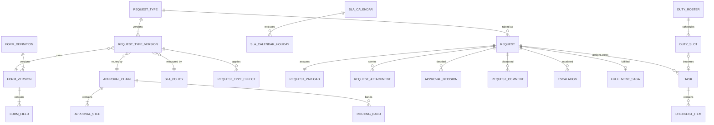
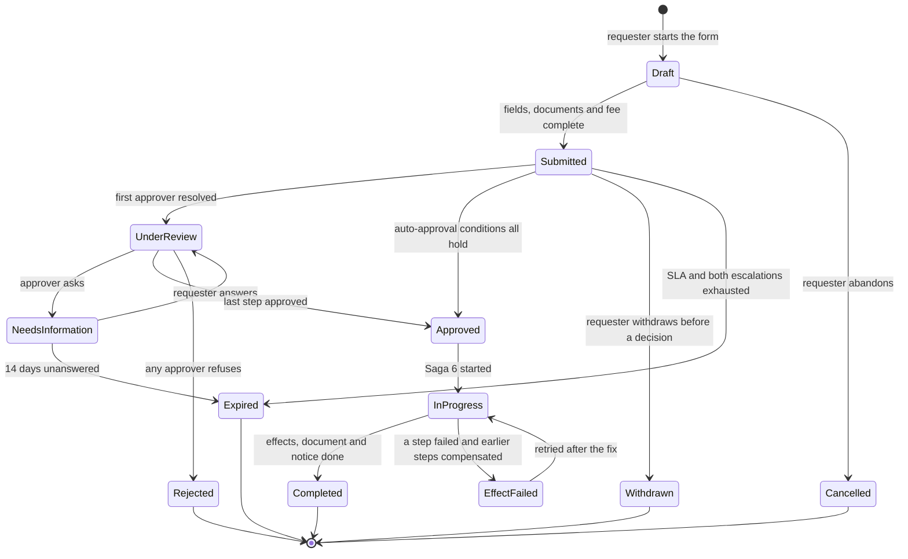

# Requests

> Service sheet, plan document 06, Group C. Names from Appendix L; events from Appendix E; permissions from Appendix B; error codes from Appendix K; settings categories from Appendix G. This sheet adds detail to reference architecture section 8.14 and never contradicts its table 8.0. The AREA code is `RQS`; the error prefix is `REQUESTS_` (Appendix K introduction).

Requests is the one engine behind every form in the school (master brief Section 11). It owns the request type designer, the form builder, approval chains with routing by amount and duration, auto-approval, SLA calendars and escalation, the request lifecycle WF-RQS-01, and the fulfilment saga (Saga 6) that commands the owning service of each effect and compensates when a step fails. It also owns the `Task` aggregate behind personal to-dos, assigned tasks and workflow-generated tasks (Appendix L.5, ADR-0012); Notification owns the delivery of the unified inbox. Requests never decides an effect: it orchestrates it, and the owning service decides (reference architecture Section 10, the allowed cycle).

| Fact | Value (quoted from `05-service-catalog.md` and Appendix L) |
|---|---|
| Canonical name, long name | Requests, Requests, Tasks, and Workflow |
| Tier | 1 |
| AREA code | `RQS` |
| Database | `nibras_requests`, schema `requests`, application role `svc_requests`, migration role `mig_requests` |
| Exchange | `nibras.requests` |
| Images | `nibras/requests-api` |
| Worker | none; Quartz.NET jobs and long-running jobs run in the Api host under `Nibras.BuildingBlocks.Jobs`, as for Attendance (Appendix L lists no requests-worker image) |
| gRPC package | `nibras.requests.v1` in `Nibras.Contracts.Requests/Grpc/requests.proto`, reconciliation methods only (section 6) |
| Build phase (master brief Section 28) | 3 |
| Service level class (master brief Section 31) | Read-heavy |
| Sensitivity (Appendix J) | confidential |
| Synchronous dependency | none (reference architecture table 8.0) |
| Why the boundary exists | Release: request types, forms and approval chains change per school without releasing the services whose effects they orchestrate |

---

## 1. Responsibilities

| Owns | Detail |
|---|---|
| Request types | Versioned definitions designed without code: form, required attachments, who may submit, campus availability, optional fee, SLA policy, assignment rule, approval chain, output document template, notification templates per transition, ordered effect list, auto-approval conditions, duplicate window, public-link switch (REQ-RQS-001) |
| The request catalog | The master brief Section 11.2 catalog seeded as editable templates per tenant (REQ-RQS-011) |
| Form builder | Versioned form definitions with typed fields, bilingual labels, conditional fields, validation and a per-field Appendix J class, used by request types and handed to Admissions, consent forms and surveys as published snapshots (REQ-RQS-002) |
| Approval chains | Sequential, parallel, any-of and all-of steps; routing by amount (BR-RQS-001) and by working-day duration (BR-RQS-002); auto-approval (BR-RQS-004); delegation-aware approver resolution |
| SLA and escalation | SLA policies per type and step, service calendars per campus (BR-RQS-003), reminder at half the SLA, escalation at the SLA and at twice the SLA (BR-RQS-005), the needs-information pause |
| Requests | The lifecycle WF-RQS-01 from draft to completed, with cancel, withdraw and expire; numbering per type; draft autosave; duplicate collapse within five minutes; submission on behalf; comments and internal notes; satisfaction rating; printable summary; calendar-impact preview; public link protected by OTP (REQ-RQS-006, REQ-RQS-009, REQ-RQS-012 to REQ-RQS-017) |
| Effect saga | Saga 6 of `13-workflows-and-sagas.md`: fee, effects in the designer's order, document, notification, completion; compensation in reverse order (BR-RQS-006, REQ-RQS-007) |
| Tasks | The `Task` aggregate: approval steps, personal to-dos, tasks assigned by others, workflow-generated tasks, checklists, due dates, reminders, recurrence; first completion wins (REQ-RQS-018) |
| Duty rosters | Gate, break, bus and invigilation rosters with swap requests (REQ-RQS-019, Tier 2) |
| Request analytics | Volume by type, turnaround, SLA compliance, bottleneck approvers, rejection reasons (REQ-RQS-010) |

## 2. Not responsible for

| Does not own | Owner | Why the line sits there |
|---|---|---|
| What an approved effect does: excused attendance, a regenerated installment plan, a certificate, a substitution, a role grant | The owning service of each effect (document 13 section 4) | Requests sends one command and waits for the outcome; the owner validates and decides |
| The request fee as money | Finance | `PostRequestFee` posts an invoice; Requests stores only the `invoiceId` |
| Rendering the output document or the printable summary | Documents | `GenerateDocument` with the template id from the type |
| Delivering any message, and the unified inbox feed, badges, mark-all-read and snooze | Notification (Appendix L.5, REQ-NOT-015) | Requests publishes the catalogued events and sends `RequestNotification` for messages without a catalogued trigger |
| Users, roles, data scopes and delegations | Identity | Requests keeps an approver copy from Identity's events and resolves approvers from it |
| Students and staff | School | Slim copies for the subject of a request |
| Leave balances, leave records, substitutions | Hr, Scheduling | A leave request's effect is `ApproveLeave` in Hr; the balance is re-verified there (open point 4) |
| Admissions applications, consent forms, surveys | Admissions, Communication | They use a published form snapshot; they own the answers |
| Join-request approval, access reviews, document-expiry follow-up | Identity, School, Hr | Requests turns their events into tasks in the approver's list; the decision stays with the owner |
| Settings storage | Platform (ADR-0009) | Requests reads *Requests → enabled types, SLAs, approval chains, fees* from its settings copy |
| Dashboards and cross-service analytics | Reporting | Requests serves its own request analytics from its database |

---

## 3. Requirements covered

| Range or identifier | What it binds here |
|---|---|
| REQ-RQS-001 to REQ-RQS-020 | Every row of the RQS area in `03-requirements-catalog.md`; REQ-RQS-019 is Tier 2 |
| REQ-NOT-015 | The `Task` side of the unified inbox; delivery is Notification's |
| REQ-FIN-015, REQ-FIN-022, REQ-RQS-014 | Refund, payer change and request fee requests entering Finance through Saga 6 |
| REQ-SEC-016 | Per-user and per-endpoint rate limits, and the OTP-protected public link |
| REQ-PERF-004, REQ-PERF-018, REQ-PERF-019 | Five-command handlers; `xmin`; caching through the building block with the tenant in every key |
| REQ-L10N-007 | Bidirectional text in form labels, answers and the printable summary |
| REQ-MOB-008, REQ-MOB-019 | Approvals never offline and never taken from a notification action |
| REQ-MSG-003, REQ-MSG-004 | Outbox for every publish and command; inbox for every consumer and reply |
| REQ-API-016 | `Idempotency-Key` on request submission |
| REQ-DATA-013 | `requests` list-partitioned by academic year |

---

## 4. Aggregates and entities

**Common columns.** Every table below carries these; the row `(common)` stands for them.

| Field | Type | Null | Notes |
|---|---|---|---|
| `tenant_id` | uuid | no | First column of every key and index; row-level security `tenant_isolation` with `WITH CHECK` |
| `id` | uuid | no | UUID v7 |
| `created_at`, `created_by` | timestamptz, uuid | no, yes | Audit interceptor |
| `updated_at`, `updated_by` | timestamptz, uuid | no, yes | Audit interceptor |
| `deleted_at`, `deleted_by` | timestamptz, uuid | yes | Soft delete behind the `SoftDelete` filter; a submitted request is never soft-deleted, only cancelled, withdrawn or expired |
| `xmin` | xid (system column) | no | Optimistic concurrency token on every aggregate root |
| classification | attribute, not a column | | `[DataClass]` per column group; form answers carry the class of their field (section 4.2) |

Bilingual text is the `LocalizedText` value object from `Nibras.BuildingBlocks.Localization`, stored as `<name>_en` and `<name>_ar`. Money is `Money` (decimal string plus currency on the wire).

### 4.1 `RequestType` with `RequestTypeVersion`

| Field | Type | Null | Notes |
|---|---|---|---|
| (common) | | | |
| `code` | text | no | Unique per tenant; seeded codes follow master brief Section 11.2 |
| `name_en`, `name_ar`, `description_en`, `description_ar` | text | no, no, yes, yes | `LocalizedText` |
| `category` | text enum | no | `parents-students`, `staff`, `administration` |
| `status` | text enum | no | `draft`, `published`, `retired` |
| `current_version` | int | yes | Published version new requests pin |
| `number_prefix` | text | no | For example `LEAVE`; numbering per type (REQ-RQS-012) |
| `public_link_enabled` | boolean | no | REQ-RQS-017 |
| version: `version`, `form_version_id`, `chain_id`, `sla_policy_id`, `fee_amount`, `fee_currency`, `fee_code`, `required_documents`, `submitters`, `campus_ids`, `assignment_rule`, `output_template_id`, `effects`, `notification_templates`, `auto_approval`, `duplicate_window_minutes`, `decisive_field`, `published_at`, `published_by` | int, uuid, uuid, uuid, numeric(18,4), char(3), text, jsonb side table, jsonb side table, uuid[], jsonb, uuid, child rows `request_type_effects`, jsonb, jsonb, smallint, text, timestamptz, uuid | fee, template, auto-approval, decisive field nullable | `request_type_versions`; `submitters` lists role codes with scopes; `decisive_field` names the form field BR-RQS-001 or BR-RQS-002 reads |
| effect rows: `seq`, `effect_code`, `target_service`, `command`, `parameter_map`, `compensation`, `irreversible` | smallint, text, text, text, jsonb, text, boolean | `compensation` nullable | `request_type_effects`; codes from document 13 section 4 |

Invariants: a published version is immutable and a request pins the version it was submitted under; the effect order is fee, effects, document, notification, and a version whose notification precedes an effect is refused (`RequestTypeDesigner_NotificationBeforeEffect_Refused`); an irreversible effect is ordered last within its type; every effect names a compensation or is marked irreversible; a type with a fee names a fee code that exists in *Requests → fees*.

### 4.2 `FormDefinition` with `FormVersion`

| Field | Type | Null | Notes |
|---|---|---|---|
| (common) | | | |
| `code`, `name_en`, `name_ar` | text | no | |
| `purpose` | text enum | no | `request`, `admissions`, `consent`, `survey` |
| `status`, `current_version` | text enum, int | no, yes | |
| version: `version`, `fields`, `published_at` | int, child rows `form_fields`, timestamptz | no | `form_versions` |
| field: `key`, `type`, `label_en`, `label_ar`, `help_en`, `help_ar`, `required`, `options`, `show_when`, `validation`, `data_class`, `order` | text, text enum (`text`, `long-text`, `number`, `money`, `date`, `date-range`, `time`, `choice`, `multi-choice`, `student`, `staff`, `file`, `signature`), text, text, text, text, boolean, jsonb, jsonb, jsonb, text enum (Appendix J level), smallint | help, options, show-when, validation nullable | `form_fields` |

Invariants: field keys are unique within a version; `show_when` refers only to an earlier field; a published version is immutable; a field classified Sensitive makes every answer and attachment under it read-logged (T-RQS-03); a form with a `money` or `date-range` field can be the decisive field of a chain.

### 4.3 `ApprovalChain` with `ApprovalStep` and `RoutingBand`

| Field | Type | Null | Notes |
|---|---|---|---|
| (common) | | | |
| `code`, `name_en`, `name_ar`, `routing` | text, text, text, text enum (`fixed`, `by-amount`, `by-duration`) | no | |
| step: `seq`, `mode`, `approver_kind`, `approver_role_code`, `approver_user_id`, `scope_from_subject`, `escalation_role_code`, `re_escalation_hours` | smallint, text enum (`sequential`, `parallel-all-of`, `parallel-any-of`), text enum (`role-in-scope`, `named-user`, `requester-role-in-scope`), text, uuid, text enum (`campus`, `stage`, `department`, `section`, `homeroom`, `none`), text, numeric(6,2) | user, role, escalation nullable | `approval_steps` |
| band: `lower_inclusive`, `upper_exclusive`, `highest_step_seq`, `currency` | numeric(18,4), numeric(18,4), smallint, char(3) | `upper_exclusive` null means unbounded; `currency` null for duration bands | `routing_bands` |

Invariants: bands cover zero to unbounded with no gap and no overlap, or the save is refused (BR-RQS-001 edge case); a chain whose step resolves to the requester for a given subject skips to the next eligible approver and never lets the requester approve their own request (T-RQS-01); raising the decisive value after start adds steps and keeps given approvals, lowering it never removes one.

### 4.4 `SlaPolicy` and `SlaCalendar`

| Field | Type | Null | Notes |
|---|---|---|---|
| (common) | | | |
| policy: `code`, `target_working_hours`, `reminder_fraction`, `escalation_multiplier`, `needs_info_lapse_days`, `re_escalation_hours` | text, numeric(6,2), numeric(3,2) default 0.5, numeric(3,2) default 2, smallint default 14, numeric(6,2) | no | `sla_policies`; Appendix R: reminder at half, escalation at the SLA, principal at twice |
| calendar: `campus_id`, `time_zone`, `work_days`, `opens_at`, `closes_at` | uuid, text, smallint[], time, time | no | `sla_calendars`, one per campus |
| holiday: `calendar_id`, `date`, `label_en`, `label_ar`, `source` | uuid, date, text, text, text enum (`manual`, `school-import`) | no | `sla_calendar_holidays` |

Invariants: the clock runs per step in working hours of the campus calendar, pauses outside working hours, on holidays and while the request is in `NeedsInformation` (BR-RQS-003); the calendar uses the named time zone, never a fixed offset.

### 4.5 `Request` with `ApprovalDecision`, `RequestComment`, `RequestAttachment`, `Escalation`

| Field | Type | Null | Notes |
|---|---|---|---|
| (common) | | | |
| `academic_year_id` | uuid | no | List-partition key (`10-data-architecture.md` section 5) |
| `type_id`, `type_version` | uuid, int | no | Pinned at submission |
| `reference` | text | yes | `LEAVE-2026-0142`, set at submission from `request_counters` |
| `requester_user_id`, `submitted_by_user_id` | uuid | no | Differ when submitted on behalf (REQ-RQS-013, T-RQS-02) |
| `public_requester_email_hash` | bytea | yes | Public-link requester, no account (REQ-RQS-017) |
| `subject_kind`, `subject_id` | text enum (`student`, `staff`, `none`), uuid | no, yes | |
| `campus_id` | uuid | no | Selects the SLA calendar |
| `status` | `ServiceRequestLifecycleStatus` | no | WF-RQS-01 enum named by document 31 |
| `decisive_amount`, `decisive_currency`, `decisive_working_days` | numeric(18,4), char(3), numeric(6,2) | yes | Inputs of BR-RQS-001 and BR-RQS-002 |
| `current_step_seq`, `step_entered_at`, `sla_due_at`, `sla_paused_at` | smallint, timestamptz | yes | |
| `duplicate_key` | text | yes | Hash of type, subject and requester; `ux_requests_duplicate_open` on `(tenant_id, academic_year_id, duplicate_key)` where open and submitted within five minutes collapses a double submission (REQ-RQS-012) |
| `fee_invoice_id`, `credit_note_id`, `document_id` | uuid | yes | Saga 6 results |
| `satisfaction_rating`, `rating_comment` | smallint, text | yes | 1 to 5 (TC-RQS-006) |
| `submitted_at`, `decided_at`, `completed_at` | timestamptz | yes | |
| payload: `request_id`, `form_version_id`, `answers`, `answers_sensitive_ciphertext` | uuid, uuid, jsonb, bytea | sensitive nullable | `request_payloads` side table, never on the hot table; answers to Sensitive fields are encrypted with the service key |
| attachment: `request_id`, `field_key`, `file_id`, `scan_status`, `data_class` | uuid, text, uuid, text enum (`pending`, `clean`, `rejected`), text | no | `request_attachments` |
| decision: `request_id`, `step_seq`, `decider_user_id`, `acting_for_user_id`, `kind`, `reason`, `conditions_matched`, `decided_at` | uuid, smallint, uuid, uuid, text enum (`approve`, `reject`, `needs-info`, `system-auto-approve`, `override`), text, jsonb, timestamptz | acting-for, reason, conditions nullable | `approval_decisions`; unique per `(request_id, step_seq, decider_user_id)` for all-of steps and per `(request_id, step_seq)` for sequential and any-of steps |
| comment: `request_id`, `author_user_id`, `body`, `internal` | uuid, uuid, text, boolean | no | `request_comments`; internal notes are filtered out of every response to the requester (REQ-RQS-009) |
| escalation: `request_id`, `step_seq`, `breached_at`, `escalated_to_role`, `escalated_to_user_id`, `count`, `resolved_at` | uuid, smallint, timestamptz, text, uuid, smallint, timestamptz | user, resolved nullable | `escalations`; BR-RQS-005 |

Invariants: transitions follow WF-RQS-01 only (`REQUESTS_TRANSITION_NOT_ALLOWED`); a second decision on a decided step returns `REQUESTS_ALREADY_DECIDED` naming the first decider; no decision while an attachment is pending scan (`REQUESTS_ATTACHMENT_SCAN_PENDING`); submission requires every required field and document (`REQUESTS_REQUIRED_FIELD_MISSING`) and the requester's role in the type's submitters (`REQUESTS_TYPE_NOT_AVAILABLE`); a submission on behalf records both identities and notifies the person named; an approver never approves a request they submitted; the SLA clock is paused whenever `status = NeedsInformation`.

### 4.6 `FulfilmentSaga` (Saga 6 state)

Persisted as document 13 states: `SagaId` derived from `RequestId`, `RequestId`, `TypeCode`, `State` (`FulfilmentState` in `Nibras.Requests.Domain.Requests`), `Effects` jsonb ordered list `{stepKey, command, service, status, attempts, outcomeMessageId, lastError}`, `FeeInvoiceId`, `CreditNoteId`, `DocumentId`, `FailedStepKey`, `FailureMessage`, `RequesterUserId`, `Version`, in `saga_instances` with `saga_timeouts` (document 11 section 9).

Invariants: started exactly once per request; one step in flight at a time; compensations run in reverse order, one at a time, each idempotent; a failed compensation moves to `Stuck`, which only an operator leaves.

### 4.7 `Task` with `ChecklistItem`

The table is `request_tasks`, the name document 21 section 3.12 uses.

| Field | Type | Null | Notes |
|---|---|---|---|
| (common) | | | |
| `kind` | text enum | no | `approval`, `personal`, `assigned`, `workflow`, `roster-duty` |
| `title` | text | no | Personal and assigned tasks store the author's text; approval and workflow tasks store a template key and parameters (`title_key`, `title_params`) so they render in the reader's language |
| `assignee_user_id`, `assigned_by_user_id` | uuid | no, yes | |
| `request_id`, `step_seq`, `type_code` | uuid, smallint, text | yes | Approval tasks |
| `source_event`, `source_reference` | text, text | yes | For example `school.student-document.expiring.v1` and the document id; idempotency key of generated tasks |
| `deep_link` | text | yes | Screen route for workflow tasks owned by another service |
| `status` | text enum | no | `open`, `completed`, `cancelled` |
| `due_at`, `reminder_at` | timestamptz | yes | |
| `recurrence_rule` | text | yes | RFC 5545 `RRULE` subset for recurring tasks |
| `completed_at`, `completed_by`, `completion_received_at` | timestamptz, uuid, timestamptz | yes | First completion wins by `completion_received_at` (Appendix M) |
| `sla_breached_at` | timestamptz | yes | Partial index for the breach job |
| checklist: `task_id`, `seq`, `label`, `done`, `done_by`, `done_at` | uuid, smallint, text, boolean, uuid, timestamptz | done fields nullable | `task_checklist_items` |

Invariants: an assignee is always an active user (T-RQS-04); a completed task ignores a second completion silently (REQ-RQS-018); an approval task is completed only by a decision on its step; a recurring task creates its next occurrence when the current one completes or passes its due date, never both.

### 4.8 `DutyRoster` (Tier 2)

| Field | Type | Null | Notes |
|---|---|---|---|
| (common) | | | |
| roster: `kind`, `campus_id`, `period_from`, `period_to`, `status` | text enum (`gate`, `break`, `bus`, `invigilation`), uuid, date, date, text enum (`draft`, `published`) | no | `duty_rosters` |
| slot: `roster_id`, `date`, `starts_at`, `ends_at`, `location_en`, `location_ar`, `staff_id`, `task_id` | uuid, date, time, time, text, text, uuid, uuid | `task_id` nullable | `duty_slots`; each assigned slot is also a `roster-duty` task |
| swap: `slot_a_id`, `slot_b_id`, `request_id` | uuid, uuid, uuid | no | `duty_swaps`; a swap is a request of the seeded type "duty swap" whose effect is applied inside Requests |

Invariants: a staff member holds at most one slot at a time; an approved swap exchanges both slots in one transaction.

### 4.9 Reference copies and counters

`ref_students` (`student_id`, `student_number`, `name_en`, `name_ar`, `section_id`, `campus_id`, `status`), `ref_staff` (`staff_id`, `user_id`, `name_en`, `name_ar`, `department_id`, `campus_ids`, `active`), `ref_approvers` (`user_id`, `roles`, `scope`, `delegate_to`, `delegated_until`, `preferred_language`, `active`), `ref_tenant_state`, `ref_settings`; every copy carries `source_version` and `reconciled_at` (`10-data-architecture.md` section 6). `request_counters` (`type_id`, `year`, `next_number`) is locked `FOR UPDATE` in the submitting transaction, so references are sequential per type and year.



---

## 5. REST API

All paths are under `/api/v1/requests/`. Every endpoint may also return the K.1 codes with the `REQUESTS_` prefix; the Errors column names the service codes and the K.1 codes with a specific meaning. Lists use keyset pagination with a page cap of 100. Guardians and students reach their own requests and tasks through `self` or `own-children` scope on the same endpoints. Approval actions are online-only (REQ-MOB-008) and never taken from a notification action (REQ-MOB-019).

### 5.1 Request types and the designer

| Method | Path | Permission | Request | Response | Errors | Idempotent |
|---|---|---|---|---|---|---|
| GET | `/api/v1/requests/request-types` | `requests.types.view` | filter `category`, `status` | `Page<RequestTypeDto>` | none specific | yes |
| GET | `/api/v1/requests/request-types/available` | `requests.requests.create` | `subjectId` optional | the types this caller may raise for this subject and campus | none specific | yes |
| POST | `/api/v1/requests/request-types` | `requests.types.create` | `CreateRequestTypeRequest` (code, names, category, prefix) | 201 draft `RequestTypeDto` | `REQUESTS_VALIDATION_FAILED` (duplicate code) | by `Idempotency-Key` |
| GET | `/api/v1/requests/request-types/{id}` | `requests.types.view` | none | `RequestTypeDto` with versions | `REQUESTS_NOT_FOUND` | yes |
| PATCH | `/api/v1/requests/request-types/{id}` | `requests.types.edit` | names, category, public-link switch | `RequestTypeDto` | `REQUESTS_CONCURRENCY_CONFLICT` | with `If-Match` |
| PUT | `/api/v1/requests/request-types/{id}/draft-version` | `requests.types.design` | `RequestTypeVersionDraft` (form, chain, SLA, fee, documents, submitters, campuses, assignment, template, effects, notifications, auto-approval, duplicate window) | draft version | `REQUESTS_VALIDATION_FAILED` (notification before effect, effect without compensation, unknown fee code) | with `If-Match` |
| POST | `/api/v1/requests/request-types/{id}/publish-version` | `requests.types.publish-version` | `{}` | published version n; new requests pin it | `REQUESTS_VALIDATION_FAILED` (unpublished form or chain) | by `Idempotency-Key` |
| POST | `/api/v1/requests/request-types/{id}/retire` | `requests.types.edit` | `{ reason }` | retired; open requests continue | none specific | with `If-Match` |
| DELETE | `/api/v1/requests/request-types/{id}` | `requests.types.delete` | draft never published | 204 | `REQUESTS_VALIDATION_FAILED` once a version was published | yes |
| POST | `/api/v1/requests/request-types/seed-catalog` | `requests.types.create` | `{ language }` | 202 job: the Section 11.2 catalog as editable templates (REQ-RQS-011) | none specific | by `Idempotency-Key` |

### 5.2 Forms

| Method | Path | Permission | Request | Response | Errors | Idempotent |
|---|---|---|---|---|---|---|
| GET | `/api/v1/requests/forms` | `requests.forms.view` | filter `purpose` | `Page<FormDto>` | none specific | yes |
| POST | `/api/v1/requests/forms` | `requests.forms.create` | `CreateFormRequest` | 201 draft | `REQUESTS_VALIDATION_FAILED` | by `Idempotency-Key` |
| GET | `/api/v1/requests/forms/{id}` | `requests.forms.view` | none | `FormDto` with the draft and published versions | `REQUESTS_NOT_FOUND` | yes |
| PUT | `/api/v1/requests/forms/{id}/draft` | `requests.forms.edit` | `{ fields[] }` | draft | `REQUESTS_VALIDATION_FAILED` (duplicate key, forward `show_when`) | with `If-Match` |
| POST | `/api/v1/requests/forms/{id}/publish` | `requests.forms.edit` | `{}` | version n published | `REQUESTS_VALIDATION_FAILED` | by `Idempotency-Key` |
| GET | `/api/v1/requests/forms/{id}/versions/{version}` | `requests.forms.view` | none | immutable snapshot: the object Admissions and Communication store (open point 2) | `REQUESTS_NOT_FOUND` | yes |
| POST | `/api/v1/requests/forms/{id}/preview` | `requests.forms.view` | `{ language, sampleAnswers }` | rendered field list with conditional visibility applied | none specific | yes |
| DELETE | `/api/v1/requests/forms/{id}` | `requests.forms.delete` | never-published form | 204 | `REQUESTS_VALIDATION_FAILED` when a type uses it | yes |

### 5.3 Approval chains and SLAs

| Method | Path | Permission | Request | Response | Errors | Idempotent |
|---|---|---|---|---|---|---|
| GET | `/api/v1/requests/approval-chains` | `requests.chains.view` | none | `Page<ApprovalChainDto>` | none specific | yes |
| POST | `/api/v1/requests/approval-chains` | `requests.chains.create` | steps and bands | 201 | `REQUESTS_VALIDATION_FAILED` (gap or overlap in bands) | by `Idempotency-Key` |
| GET | `/api/v1/requests/approval-chains/{id}` | `requests.chains.view` | none | `ApprovalChainDto` | `REQUESTS_NOT_FOUND` | yes |
| PUT | `/api/v1/requests/approval-chains/{id}` | `requests.chains.edit` | steps and bands; applies to requests submitted afterwards | `ApprovalChainDto` | `REQUESTS_VALIDATION_FAILED` | with `If-Match` |
| DELETE | `/api/v1/requests/approval-chains/{id}` | `requests.chains.delete` | unused chain | 204 | `REQUESTS_VALIDATION_FAILED` when a published version uses it | yes |
| POST | `/api/v1/requests/approval-chains/{id}/simulate` | `requests.chains.view` | `{ amount or dates, campusId, subjectId, requesterId }` | the steps and approvers BR-RQS-001 or BR-RQS-002 would build | none specific | yes |
| GET | `/api/v1/requests/sla-policies` | `requests.sla.view` | none | `SlaPolicyDto[]` | none specific | yes |
| PUT | `/api/v1/requests/sla-policies/{code}` | `requests.sla.edit` | targets, reminder fraction, escalation multiplier, lapse days, re-escalation | `SlaPolicyDto` | `REQUESTS_VALIDATION_FAILED` | with `If-Match` |
| GET | `/api/v1/requests/sla-calendars/{campusId}` | `requests.sla.view` | `from`, `to` | calendar with holidays | `REQUESTS_NOT_FOUND` | yes |
| PUT | `/api/v1/requests/sla-calendars/{campusId}` | `requests.sla.edit` | work days, hours, time zone, holidays | calendar; open SLAs recomputed | `REQUESTS_VALIDATION_FAILED` | with `If-Match` |

### 5.4 Requests: submission and the requester side

| Method | Path | Permission | Request | Response | Errors | Idempotent |
|---|---|---|---|---|---|---|
| GET | `/api/v1/requests/requests` | `requests.requests.view` | filter `mine`, `status`, `typeCode`, `subjectId` | `Page<RequestSummaryDto>` keyset on `(submittedAt, id)` | none specific | yes |
| POST | `/api/v1/requests/requests` | `requests.requests.create` | `{ typeCode, subjectId, answers }` | 201 draft `RequestDto` | `REQUESTS_TYPE_NOT_AVAILABLE` | by `Idempotency-Key` |
| PATCH | `/api/v1/requests/requests/{id}` | `requests.requests.create` | draft autosave, merge patch of answers | `RequestDto` | `REQUESTS_TRANSITION_NOT_ALLOWED` after submission | with `If-Match` |
| POST | `/api/v1/requests/requests/{id}/submit` | `requests.requests.create` | `{}` | `Submitted` then `UnderReview` or `Approved` by auto-approval; `requests.request.submitted.v1`; fee invoice when the type has one (TC-RQS-001) | `REQUESTS_REQUIRED_FIELD_MISSING`, `REQUESTS_TYPE_NOT_AVAILABLE`, `REQUESTS_DUPLICATE_OPEN_REQUEST`, `REQUESTS_ATTACHMENT_SCAN_PENDING` | `Idempotency-Key` required; a duplicate within five minutes returns the first request |
| POST | `/api/v1/requests/requests/on-behalf` | `requests.requests.submit-on-behalf` | `{ typeCode, onBehalfOfUserId, subjectId, answers }` | 201 submitted, both identities recorded (REQ-RQS-013) | `REQUESTS_ON_BEHALF_NOT_PERMITTED`, `REQUESTS_REQUIRED_FIELD_MISSING` | `Idempotency-Key` required |
| GET | `/api/v1/requests/requests/{id}` | `requests.requests.view` | none | `RequestDto`; internal notes absent for the requester | `REQUESTS_NOT_FOUND` | yes |
| GET | `/api/v1/requests/requests/{id}/timeline` | `requests.requests.view` | none | transitions, decisions, escalations, effect steps with status and the failing step named (TC-RQS-004) | `REQUESTS_NOT_FOUND` | yes |
| POST | `/api/v1/requests/requests/{id}/answer` | `requests.requests.create` | `{ answers, comment }` | `UnderReview`; SLA clock resumes | `REQUESTS_TRANSITION_NOT_ALLOWED` | `Idempotency-Key` required |
| POST | `/api/v1/requests/requests/{id}/withdraw` | `requests.requests.withdraw` | `{ reason }` | `Withdrawn` (before a decision) | `REQUESTS_TRANSITION_NOT_ALLOWED`, `REQUESTS_ALREADY_DECIDED` | with `If-Match` |
| POST | `/api/v1/requests/requests/{id}/cancel` | `requests.requests.withdraw` | `{}` on a draft | `Cancelled` | `REQUESTS_TRANSITION_NOT_ALLOWED` | with `If-Match` |
| POST | `/api/v1/requests/requests/{id}/rating` | `requests.requests.create` | `{ rating, comment }` | stored (TC-RQS-006) | `REQUESTS_TRANSITION_NOT_ALLOWED` before `Completed` | with `If-Match` |
| GET | `/api/v1/requests/requests/{id}/comments` | `requests.requests.view` | none | comments; internal only for approvers | `REQUESTS_NOT_FOUND` | yes |
| POST | `/api/v1/requests/requests/{id}/comments` | `requests.requests.create` | `{ body, internal }`; `internal` requires `requests.requests.approve` | 201 comment | `REQUESTS_PERMISSION_DENIED` for an internal note without approve | by `Idempotency-Key` |
| POST | `/api/v1/requests/requests/{id}/summary-document` | `requests.requests.view` | `{ language }` | 202 job: printable summary through Documents (REQ-RQS-016) | none specific | by `Idempotency-Key` |
| POST | `/api/v1/requests/calendar-impact` | `requests.requests.create` | `{ typeCode, subjectId, from, to }` | overlapping approved and pending leave of the same department or section (REQ-RQS-015) | none specific | yes |
| POST | `/api/v1/requests/public-requests/{typeCode}/otp` | none: public link enabled for the type, rate-limited per source address at the Gateway and per email | `{ email }` | 202; OTP sent through `RequestNotification` | `REQUESTS_TYPE_NOT_AVAILABLE` | yes, one live OTP per email |
| POST | `/api/v1/requests/public-requests/{typeCode}` | none: the verified OTP is the credential | `{ email, otp, answers }` | 201 submitted, no account created (REQ-RQS-017) | `REQUESTS_VALIDATION_FAILED` (bad or expired OTP), `REQUESTS_REQUIRED_FIELD_MISSING` | `Idempotency-Key` required |

### 5.5 Requests: the approver side

| Method | Path | Permission | Request | Response | Errors | Idempotent |
|---|---|---|---|---|---|---|
| POST | `/api/v1/requests/requests/{id}/approve` | `requests.requests.approve` | `{ reason }` | next step or `Approved`; Saga 6 starts (TC-RQS-002) | `REQUESTS_ALREADY_DECIDED`, `REQUESTS_ATTACHMENT_SCAN_PENDING`, `REQUESTS_PERMISSION_DENIED` for the requester | `Idempotency-Key` required |
| POST | `/api/v1/requests/requests/{id}/reject` | `requests.requests.reject` | `{ reason }` required | `Rejected`; a captured fee is reversed through WF-FIN-02 | `REQUESTS_ALREADY_DECIDED`, `REQUESTS_VALIDATION_FAILED` (no reason) | `Idempotency-Key` required |
| POST | `/api/v1/requests/requests/{id}/request-information` | `requests.requests.approve` | `{ question }` | `NeedsInformation`; SLA paused; `requests.request.needs-info.v1` | `REQUESTS_TRANSITION_NOT_ALLOWED` | `Idempotency-Key` required |
| POST | `/api/v1/requests/approvals/bulk` | `requests.requests.approve` | bulk envelope, `independent` mode, `{ requestId, decision, reason }` per item, at most 500 | per-item results (REQ-RQS-008, TC-RQS-101) | per item | `Idempotency-Key` required |
| POST | `/api/v1/requests/requests/{id}/reassign` | `requests.requests.reassign` | `{ toUserId, reason }` | current step reassigned to an active user | `REQUESTS_APPROVER_UNAVAILABLE`, `REQUESTS_VALIDATION_FAILED` (inactive target, T-RQS-04) | with `If-Match` |
| POST | `/api/v1/requests/requests/{id}/override` | `requests.requests.override` | `{ action: approve-step, reject, skip-step, force-complete, retry-effects, cancel-effects; reason }` | the transition, audited as elevated | `REQUESTS_TRANSITION_NOT_ALLOWED` | `Idempotency-Key` required |
| GET | `/api/v1/requests/requests/board` | `requests.requests.view` | filter `typeCode`, `status`, `campusId` | office board keyset on `(submittedAt, id)` | none specific | yes |
| POST | `/api/v1/requests/requests/export` | `requests.requests.export` | filter, format | 202 job; sensitive answers excluded unless the caller holds the source permission | none specific | by `Idempotency-Key` |
| GET | `/api/v1/requests/analytics` | `requests.requests.view` | `from`, `to`, `typeCode`, `campusId` | volume, turnaround, SLA compliance, bottleneck approvers, rejection reasons (REQ-RQS-010) | none specific | yes |

### 5.6 Tasks and rosters

| Method | Path | Permission | Request | Response | Errors | Idempotent |
|---|---|---|---|---|---|---|
| GET | `/api/v1/requests/tasks` | `requests.tasks.view` | filter `mine`, `kind`, `status`, `dueBefore`; includes delegated work | `Page<TaskDto>` keyset on `(dueAt, id)` | none specific | yes |
| GET | `/api/v1/requests/tasks/counts` | `requests.tasks.view` | none | open approvals and tasks for the badge | none specific | yes |
| POST | `/api/v1/requests/tasks` | `requests.tasks.create` | personal to-do: title, due, reminder, recurrence, checklist | 201 `TaskDto` | `REQUESTS_VALIDATION_FAILED` | by `Idempotency-Key` |
| POST | `/api/v1/requests/tasks/assigned` | `requests.tasks.assign` | `{ assigneeUserId, title, due, checklist }` | 201; `requests.task.assigned.v1` | `REQUESTS_VALIDATION_FAILED` (inactive assignee) | by `Idempotency-Key` |
| GET | `/api/v1/requests/tasks/{id}` | `requests.tasks.view` | none | `TaskDto` | `REQUESTS_NOT_FOUND` | yes |
| PATCH | `/api/v1/requests/tasks/{id}` | `requests.tasks.edit` | title, due, reminder, recurrence | `TaskDto` | `REQUESTS_CONCURRENCY_CONFLICT` | with `If-Match` |
| PUT | `/api/v1/requests/tasks/{id}/checklist` | `requests.tasks.edit` | items | `TaskDto` | none specific | with `If-Match` |
| POST | `/api/v1/requests/tasks/{id}/complete` | `requests.tasks.complete` | `{ occurredAt }` from the device | `TaskDto`; `requests.task.completed.v1` once; a later completion is ignored (TC-RQS-603) | `REQUESTS_TRANSITION_NOT_ALLOWED` for an approval task | `Idempotency-Key` required |
| POST | `/api/v1/requests/tasks/{id}/reassign` | `requests.tasks.assign` | `{ toUserId }` | `TaskDto` | `REQUESTS_VALIDATION_FAILED` (inactive target) | with `If-Match` |
| POST | `/api/v1/requests/tasks/{id}/cancel` | `requests.tasks.edit` | `{ reason }` | `cancelled` | none specific | with `If-Match` |
| GET | `/api/v1/requests/duty-rosters` | `requests.tasks.view` | filter `kind`, `campusId`, `from` | rosters with slots | none specific | yes |
| PUT | `/api/v1/requests/duty-rosters/{id}` | `requests.tasks.assign` | slots and staff | roster; slot tasks created (Tier 2) | `REQUESTS_VALIDATION_FAILED` (overlapping duties) | with `If-Match` |

### 5.7 Jobs

| Method | Path | Permission | Request | Response | Errors | Idempotent |
|---|---|---|---|---|---|---|
| GET | `/api/v1/requests/jobs/{jobId}` | `platform.jobs.view`, or the starter | none | job resource | `REQUESTS_NOT_FOUND` | yes |
| POST | `/api/v1/requests/jobs/{jobId}/cancel` | `platform.jobs.cancel`, or the starter | `{}` | job with `cancelRequested` | `REQUESTS_VALIDATION_FAILED` for a terminal job | yes |

---

## 6. gRPC

**Consumed.** None on a request path; Requests has no synchronous dependency (reference architecture table 8.0). A missing subject copy is written from the next event or from the nightly snapshot, and the effect owner validates the subject when the command arrives. Off the request path: School `ReferenceReconciliation.Checksum` and `ListSnapshotPage` and Identity `Users.Checksum` and `Users.Snapshot` for the nightly reconciliation (30 s, 5 s per page), and Platform `Settings.GetSettings` from the settings client of the building blocks on a cold start (2 s; last value in L1 for 60 s, then the catalog default), as `06-services/platform.md` section 6 records for every service.

**Exposed: `nibras.requests.v1`**, reconciliation and rebuild only, required by `10-data-architecture.md` sections 6 and 7.3; never on a request path.

| Service | Method | Returns | Deadline | Callers | Budget |
|---|---|---|---|---|---|
| `Usage` | `Recount(meter, period_start, period_end)` | requests submitted in the period | 30 s | Platform monthly re-sum | 2 commands |
| `Reconciliation` | `Snapshot(projection_kind, page_token)` | request id, type, status, campus, submitted, decided, completed, SLA breached; never answers | 5 s per page | Reporting rebuild | 1 command per page |

---

## 7. Events published and consumed

### 7.1 Published on `nibras.requests`

| Routing key | Raised by | Partition key | Consumers (Appendix E) |
|---|---|---|---|
| `requests.request.submitted.v1` | `Draft → Submitted` | `requestId` | Notification, Reporting |
| `requests.request.needs-info.v1` | `UnderReview → NeedsInformation` | `requestId` | Notification |
| `requests.request.approved.v1` | `UnderReview → Approved`, including auto-approval | `requestId` | the owning service of the effect (document 11 section 2.2 resolution), Notification, Reporting |
| `requests.request.rejected.v1` | `UnderReview → Rejected` | `requestId` | Notification, Reporting |
| `requests.request.completed.v1` | `InProgress → Completed` | `requestId` | Notification, Reporting |
| `requests.request.sla-breached.v1` | Each step breach and re-escalation (BR-RQS-005) | `requestId` | Notification, Reporting |
| `requests.task.assigned.v1` | Approval step entered; assigned or workflow task created | `userId` | Notification, Reporting |
| `requests.task.completed.v1` | First completion of a task | `userId` | Reporting |
| `requests.usage.recorded.v1` | Monthly requests-submitted meter | `tenantId` | Platform |
| `requests.audit.recorded.v1` | Every transition, decision, override, reassignment, sensitive answer read | `tenantId` | Audit |

Commands sent on `nibras.requests` (document 11 section 2.4), one per Saga 6 step: `PostRequestFee`, `ReverseRequestFee`, `RegenerateInstallments`, `AttachDiscount`, `DetachDiscount`, `RequestRefund`, `WithdrawRefundRequest`, `ChangePayer`, `RevertPayer` to Finance; `ApplyExcusedLeave`, `RecordLateArrival`, `IssueGatePass`, `CancelGatePass`, `UpdateAuthorizedPickups`, `RestorePreviousMarks` to Attendance; `StartWithdrawalClearance`, `CancelWithdrawal`, `ChangeSection`, `UpdateGuardianDetails` to School; `IssueTranscript`, `OpenGradeAppeal`, `ApplyExamAccommodation`, `RemoveExamAccommodation` to Assessment; `AssignSubstitution`, `ReleaseSubstitution`, `ApproveRoomBooking`, `CancelRoomBooking` to Scheduling; `BookMeeting`, `CancelMeeting` to Communication; `GenerateDocument`, `RevokeDocument`, `RequestExport`, `RevokeExport` to Documents; `ConfirmReEnrollment`, `DeclineReEnrollment` to Admissions; `ApproveLeave`, `CancelLeave` to Hr; `ApplyTransportSubscriptionChange`, `RevertTransportSubscription`, `ApproveRequisition`, `CancelRequisition` to Operations; `AuthorizeMedication`, `RevokeMedicationAuthorization` to Wellbeing; `ProposeRoleChange`, `RevertRoleChange` to Identity; `OpenSubjectRequest` to Platform; `RequestNotification` to Notification.

### 7.2 Consumed

| Routing key | Queue | Handler | What it changes |
|---|---|---|---|
| `platform.tenant.provisioning-requested.v1` | `requests.tenant-lifecycle` | `TenantLifecycleConsumer` | Creates tenant rows, the default SLA calendar per campus, and starts the catalog seed job; replies `TenantProvisioned` |
| `platform.tenant.suspended.v1`, `platform.tenant.reactivated.v1`, `platform.tenant.deletion-requested.v1`, `platform.tenant.deleted.v1`, `platform.plan.changed.v1`, `platform.feature-flag.changed.v1`, `platform.terminology.changed.v1`, `platform.custom-field.changed.v1` | `requests.tenant-lifecycle` | `TenantLifecycleConsumer` | Read-only mode, pauses SLA jobs while suspended, flags, labels, custom-field values |
| `platform.settings.changed.v1` | `requests.tenant-lifecycle` | `SettingsChangedConsumer` | `ref_settings` for *Requests* and *General* (work week, time zone); SLA recomputation for open steps |
| `identity.role.changed.v1`, `identity.permissions.changed.v1` | `requests.tenant-lifecycle` | `ApproverRoleConsumer` | `ref_approvers.roles` and `scope`; open steps whose approver lost the role are re-resolved; the Saga 6 role-change outcome is observed in-process (document 11 section 2.5) |
| `reporting.data-quality.issue-detected.v1` | `requests.tenant-lifecycle` | `DataQualityIssueConsumer` | Acts only on Requests entity types, for example a type whose approver role has no holder |
| `identity.user.activated.v1`, `identity.user.deactivated.v1` | `requests.reference-copies` | `UserLifecycleConsumer` | `ref_approvers.active`; a deactivated user's open steps and tasks are reassigned by delegation or escalation (TC-RQS-003) |
| `identity.delegation.started.v1`, `identity.delegation.ended.v1` | `requests.reference-copies` | `DelegationConsumer` | `delegate_to` and `delegated_until`; the delegate sees the delegator's inbox; decisions record `acting_for_user_id` |
| `school.student.enrolled.v1`, `school.student.status-changed.v1` | `requests.reference-copies` | `StudentReferenceConsumer` | `ref_students`; a withdrawn student's open requests are marked for review |
| `school.staff.created.v1`, `school.staff.left.v1` | `requests.reference-copies` | `StaffReferenceConsumer` | `ref_staff`; a leaver's open approvals and tasks are inventoried and reassigned, never orphaned (TC-IDN-052, TC-RQS-003) |
| `identity.join-request.submitted.v1` | `requests.events` | `JoinRequestTaskConsumer` | Workflow task for the approver with a deep link to Identity's decision screen, keyed on the join request |
| `identity.access-review.due.v1` | `requests.events` | `AccessReviewTaskConsumer` | Workflow task per reviewer (WF-SEC-01) |
| `school.student-document.expiring.v1`, `hr.staff-document.expiring.v1` | `requests.events` | `DocumentExpiryTaskConsumer` | Workflow task for the registrar or the HR officer, keyed on the document and expiry date |
| `operations.frontdesk.complaint-received.v1` | `requests.events` | `ComplaintReceivedConsumer` | Opens a request of the seeded complaint type with its SLA from `slaDueAt`, keyed on `complaintId` |
| Saga 6 outcome events of document 13 section 4 (for example `finance.invoice.issued.v1`, `attendance.excuse.approved.v1`, `documents.document.generated.v1`, `hr.leave.approved.v1`) | `requests.saga-outcomes` | `FulfilmentOutcomeConsumer` | Correlated by `correlationId`; advances the saga; a message for no running saga is dropped in one indexed lookup |
| `requests.replies.#` from the thirteen effect owners | `requests.replies` | `FulfilmentReplyConsumer` | `EffectApplied` or `EffectFailed` for steps with no catalogued outcome; compensation replies |
| commands on `requests.commands` | `requests.commands` | `TenantLifecycleCommandHandler` | `DeprovisionTenant`, `DeleteTenantData`, dedicated-database, copy and purge commands, parked-message commands |

---

## 8. Sagas and workflows

| WF or saga | Role | Kind (document 13) | State type | Feature folder | What Requests does |
|---|---|---|---|---|---|
| WF-RQS-01 Service request lifecycle | Owner | Saga 6 from `Approved` onward | `ServiceRequestLifecycleStatus`; Saga 6 `FulfilmentState` | `Application/Features/ServiceRequestLifecycle/`; `Application/Sagas/RequestFulfilmentSaga/` | Draft to completed; reminders at half the SLA, escalation at the SLA and at twice the SLA; `NeedsInformation` pauses the clock and lapses after 14 days |
| Saga 6 Request fulfilment | Orchestrator | Saga | `FulfilmentState` | `Application/Sagas/RequestFulfilmentSaga/` | Fee, effects, document, notification, completion; 15 minutes and 3 retries per step; compensation in reverse order; `Stuck` for an operator |
| WF-FIN-02, WF-FIN-04, WF-FIN-05, WF-SCH-01, WF-ASM-02, WF-WEL-01, WF-WEL-03, WF-HR-01, WF-OPS-01, WF-OPS-03, WF-OPS-04, WF-PRV-01, WF-PRV-02, WF-IDN-05, WF-ADM-02 | Entry point | Effect (document 13 section 1) | owned by each service | `RequestFulfilmentSaga` | Sends the effect command at the state document 13 section 4 names and waits for its outcome |
| WF-IDN-02, WF-IDN-04, WF-IDN-06, WF-SEC-01 | Touched | Single | none here | consumers in section 7.2 | Join-request and access-review tasks; delegation in the inbox; leaver inventory and reassignment |
| Saga 1, 2, 10 | Participant | Saga | none here | `Features/TenantLifecycle/` | Provision, delete tenant data, tier migration steps |



The `Submitted → Approved` edge for auto-approval (BR-RQS-004) and the `NeedsInformation → Expired` lapse are shown because the engine implements them; Appendix R's diagram routes auto-approval through `UnderReview` and has no lapse edge (open point 6).

**Approver resolution.** A step's approver is resolved from `ref_approvers`: `role-in-scope` finds the active holders of the role whose Identity data scope covers the subject (the homeroom teacher of the student's section through `own-homeroom`, the head of the staff member's department through `department`, the principal through `campus`); `named-user` is one user; `requester-role-in-scope` resolves relative to the requester. A holder on delegation is replaced by the delegate (WF-IDN-04). No holder, or only the requester, means `REQUESTS_APPROVER_UNAVAILABLE` and escalation to the step's escalation role.

---

## 9. Local reference copies

| Copy | Source events | Fields kept | Reconciliation | Staleness tolerated |
|---|---|---|---|---|
| `ref_students` | `school.student.enrolled.v1`, `school.student.status-changed.v1` | id, number, names, section, campus, status | Nightly 02:00 band time zone against School `ReferenceReconciliation.Checksum` for `student`; replay from `ListSnapshotPage` | Minutes |
| `ref_staff` | `school.staff.created.v1`, `school.staff.left.v1` | id, user id, names, department, campuses, active | Nightly against School `Checksum` for `staff` | Minutes |
| `ref_approvers` | `identity.user.activated.v1`, `identity.user.deactivated.v1`, `identity.role.changed.v1`, `identity.delegation.started.v1`, `identity.delegation.ended.v1` | user, roles, scope, delegation, language, active | Nightly against Identity `nibras.identity.v1.Users/Checksum` | Seconds for role changes, because an approver who lost a role must not decide |
| `ref_tenant_state`, `ref_settings` | tenant-lifecycle keys | status, flags, the *Requests* and *General* settings | Nightly against Platform | Minutes |

Request-type definitions are Requests' own data, not a copy, despite table 8.0 listing them among Requests' copies.

---

## 10. Background jobs

All run in the Api host under Quartz.NET, per tenant, with the tenant variable set per iteration.

| Job | Schedule | What it does | Publishes | Progress |
|---|---|---|---|---|
| `SlaBreachJob` | Every 5 minutes | Open tasks past `due_at` and not yet flagged (document 21 section 3.12 query 5); escalates once, re-escalates after the configured interval (BR-RQS-005) | `requests.request.sla-breached.v1` | none |
| `SlaReminderJob` | Every 15 minutes | Steps at half their SLA get one reminder to the approver | `RequestNotification` | none |
| `RequestExpiryJob` | Hourly | Requests past twice the SLA with both escalations sent move to `Expired` (TC-RQS-005); `NeedsInformation` past 14 days moves to `Expired` | `requests.audit.recorded.v1`; `RequestNotification` telling the requester why | none |
| `TaskReminderJob` | Every 5 minutes | Tasks at `reminder_at` | `RequestNotification` | none |
| `RecurringTaskJob` | Hourly | Creates the next occurrence of recurring tasks from their `RRULE` | `requests.task.assigned.v1` for assigned occurrences | none |
| `CatalogSeedJob` | On provisioning and on `POST /request-types/seed-catalog` | Creates the Section 11.2 types, forms and default chains in the tenant's languages | `requests.audit.recorded.v1` | "Seeding request types: 41 of 58" |
| `DraftCleanupJob` | Nightly | Soft-deletes drafts untouched for 90 days | none | none |
| `UsageRecordJob` | Monthly, day 1 | Requests submitted last month | `requests.usage.recorded.v1` | none |
| `ReferenceCopyReconciliationJob` | Nightly 02:00 band time zone | Section 9 | `reporting.data-quality.issue-detected.v1` on a mismatch | none |
| `InvariantAuditJob` | Nightly 01:00 band time zone | 1 percent sample of requests and chains reloaded through the domain | a finding | none |
| `SagaRetentionJob` | Nightly | Terminal `saga_instances` older than 13 months soft-deleted and purged 30 days later (document 11 open point 3) | none | none |
| `PartitionMaintenanceJob` | Nightly | Creates the list partition for a new `academic_year_id` seen in the default partition and moves its rows | a finding on an unexpected partition | none |

---

## 11. Permissions, notifications, settings, error codes

### 11.1 Permissions (Appendix B, Requests)

| Permission | Default holders (Appendix I, group G17) | Scope and risk |
|---|---|---|
| `requests.types.view`, `.create`, `.edit`, `.delete`, `.design`, `.publish-version` | Principal, Vice Principal, Registrar (F); Platform Administrator for platform-scoped templates | `all-tenant`; elevated |
| `requests.forms.view`, `.create`, `.edit`, `.delete` | Principal, Vice Principal, Registrar | normal |
| `requests.chains.view`, `.create`, `.edit`, `.delete` | Principal, Vice Principal, Registrar | elevated |
| `requests.requests.view`, `.create`, `.export` | Every role, in `self` or `own-children` for guardians and students; offices in `campus` | `export` normal |
| `requests.requests.submit-on-behalf` | Registrar, Admissions Officer | elevated reason recorded |
| `requests.requests.approve`, `.reject` | Roles marked A or F in G17: School Owner, Academic Coordinator, Head of Department, Accountant, HR Officer, Principal, Vice Principal | scope of the step |
| `requests.requests.reassign` | Principal, Vice Principal, Registrar | elevated |
| `requests.requests.override` | Principal | elevated, reason required |
| `requests.requests.withdraw` | Every requester for their own requests | `self` |
| `requests.tasks.view`, `.create`, `.edit`, `.assign`, `.complete` | Every staff role for their own tasks; managers `assign` in scope | normal |
| `requests.sla.view`, `.edit` | Principal, Registrar | normal |
| `platform.jobs.view`, `platform.jobs.cancel` | as Appendix B | job endpoints |

### 11.2 Notifications (Appendix C rows Requests triggers)

| Appendix C row | Trigger | Recipients | Urgency and default channels |
|---|---|---|---|
| Request submitted, needs information, decided, completed | `requests.request.submitted.v1`, `requests.request.needs-info.v1`, `requests.request.approved.v1`, `requests.request.rejected.v1`, `requests.request.completed.v1` | Requester, approvers | N; push, in-app |
| Request SLA at risk or breached | `requests.request.sla-breached.v1` | Assignee, then manager | N; push, email |
| Task assigned | `requests.task.assigned.v1` | Assignee | N; push, in-app |

The half-SLA reminder, the expiry notice, task reminders, the public-link OTP and the "submitted on your behalf" notice have no Appendix C row and go through `RequestNotification` (open point 5).

### 11.3 Settings (Appendix G, owned by Platform)

| Setting | Category | Default | Used by |
|---|---|---|---|
| Enabled types | Requests | the Section 11.2 catalog, all enabled | `request-types/available` |
| SLAs | Requests | 2 working days per step | `SlaPolicy`, BR-RQS-003, BR-RQS-005 |
| Approval chains | Requests | the seeded chain per type | BR-RQS-001, BR-RQS-002, BR-RQS-004 |
| Fees | Requests | none | `PostRequestFee`, BR-RQS-006 |
| Work week, time zone | General | tenant values | default `SlaCalendar` per campus |
| Export approval rules | Security | as Appendix G | `requests/export` routes bulk exports through WF-PRV-02 |

### 11.4 Error codes (Appendix K.13)

| Code | HTTP | Raised where |
|---|---|---|
| `REQUESTS_TYPE_NOT_AVAILABLE` | 403 | Submission or public link for a type not offered to the role or campus |
| `REQUESTS_REQUIRED_FIELD_MISSING` | 400 | Submission with a required field or document missing |
| `REQUESTS_TRANSITION_NOT_ALLOWED` | 409 | Any action outside WF-RQS-01 |
| `REQUESTS_APPROVER_UNAVAILABLE` | 409 | Step with no resolvable approver and no delegate |
| `REQUESTS_ALREADY_DECIDED` | 409 | Second decision on a decided step; carries the decider and time |
| `REQUESTS_SLA_BREACHED` | 200 | Response flag on a request whose step breached |
| `REQUESTS_ON_BEHALF_NOT_PERMITTED` | 403 | Submission on behalf without the permission |
| `REQUESTS_ATTACHMENT_SCAN_PENDING` | 409 | Decision while an attachment is scanning |
| `REQUESTS_DUPLICATE_OPEN_REQUEST` | 409 | Same subject and type already open beyond the five-minute collapse window |
| `REQUESTS_VALIDATION_FAILED` and the other seven K.1 codes | as K.1 | Problem-details middleware |

---

## 12. Caching and hot queries

The caching map is `21-performance-engineering.md` section 1.12 and the hot queries are its section 3.12; both are binding. This sheet adds:

| Data | Key | Tags | L1 | L2 | Invalidated by | Never cached |
|---|---|---|---|---|---|---|
| SLA calendar per campus with holidays of the current and next year | `nibras:{tenant}:requests:sla-calendar:{campusId}:v1` | `tenant`, `campus` | 5 min | 6 h ± 10% | Calendar write handler evicts by key; `platform.settings.changed.v1` | Nothing |
| Published form version snapshot | `nibras:{tenant}:requests:form:{formId}:{version}:v1` | `tenant` | 5 min | 6 h ± 10% | Immutable; the publish handler evicts only the current pointer | Nothing |

| Query | Handler | Index | Rows demo / load | Pagination | Budget |
|---|---|---|---|---|---|
| Open duplicate for the same subject and type within five minutes | `SubmitRequestHandler` | `ux_requests_duplicate_open (tenant_id, academic_year_id, duplicate_key) WHERE status IN ('Submitted', 'UnderReview', 'NeedsInformation')` | 0 or 1 | none | inside query 3's four commands |
| Overlapping leave for the calendar-impact preview | `CalendarImpactQuery` | `ix_requests_leave_window (tenant_id, type_code, campus_id, window_start, window_end) WHERE status IN ('Submitted', 'UnderReview', 'Approved', 'InProgress', 'Completed')` | 3 / 12 | none, bounded by the window | 2 commands, 15 ms |
| Open steps and tasks of a leaver for reassignment | `StaffReferenceConsumer` | `ix_request_tasks_assignee_open` of document 21 | 5 / 40 | keyset | 2 commands per page |
| Analytics for one period | `RequestAnalyticsQuery` | `ix_requests_type_status` of document 21, read on the replica | aggregates only | none | 3 commands, 80 ms |

Never cached in Requests, restated from document 21: form answers, attachments and decision comments.

---

## 13. Security

The threat table is `12-security-privacy-safety.md` section 2.12, T-RQS-01 to T-RQS-04, with tests TC-SEC-230, TC-SEC-231, TC-SEC-232 and TC-IDN-052.

| Data class (Appendix J) | Held in | Handling |
|---|---|---|
| Confidential: request metadata, decisions, comments, tasks | `requests`, `approval_decisions`, `request_comments`, `request_tasks` | Row-level security; decisions and comments never cached |
| Class of the source field: answers and attachments (a medical excuse is Sensitive, a fee dispute Confidential, a custody document Sensitive) | `request_payloads`, `request_attachments` | Sensitive answers encrypted in `answers_sensitive_ciphertext`; every read of a Sensitive answer or attachment writes `requests.audit.recorded.v1` in the same transaction; approvers who do not need a field see its label and "restricted" (T-RQS-03) |
| Internal: type, form and chain definitions | definition tables | Cacheable with the tenant key |

| Never | What |
|---|---|
| Cached | Form answers, attachments, decision comments (document 21 section 1.12) |
| Logged | Answer values and comment bodies; logs carry request id, type code and field keys only |
| Sent to the requester | Internal notes, the identity of an approver who has not acted, other people's leave details in the calendar-impact preview beyond name and dates |
| Sent to a device cache | Approvals and their answers (REQ-MOB-008); the requester's own drafts may be cached offline and are submitted on reconnect with the duplicate collapse |
| Sent in an event | Answers of any class; events carry identifiers and the effect code only (Appendix E payload rule) |

Controls specific to Requests: the chain validator refuses a step that resolves to the requester; the public link issues a single-use OTP bound to the email hash and the type, rate-limited at the Gateway and per email; an effect command carries only the parameters its owner needs, mapped from the form by the type's `parameter_map`.

---

## 14. Folder and file tree

Follows the Attendance anatomy of `07-solution-structure.md` part 3. Requests has no worker image, so jobs sit in `Api/Jobs/`; it orchestrates Saga 6, so `Application/Sagas/` exists; it exposes reconciliation gRPC, so `Api/Grpc/` exists. Rule classes sit in one `Rules/` folder under the namespace `Nibras.Requests.Domain.Rules` fixed by document 31. Every feature folder holds four files: records, handler, validator, endpoint.

```text
src/Services/Requests/                                                        Requests, Tasks, and Workflow: types, forms, chains, SLAs, requests, effect saga, tasks
├── README.md                                                                 purpose, owned data, API, events, effect table, how to run, runbook links
├── Nibras.Requests.Domain/                                                   aggregates, invariants, rules, domain events; references Nibras.BuildingBlocks.Domain and Nibras.Contracts.Requests only
│   ├── RequestTypes/                                                         aggregate RequestType
│   │   ├── RequestType.cs                                                    code, names, category, status, current version
│   │   ├── RequestTypeVersion.cs                                             immutable once published
│   │   ├── EffectDefinition.cs                                               effect code, target, command, parameter map, compensation
│   │   ├── EffectOrderPolicy.cs                                              fee, effects, document, notification; irreversible last
│   │   └── AutoApprovalConditions.cs                                         band, balance, policy-breach conditions of BR-RQS-004
│   ├── Forms/                                                                aggregate FormDefinition
│   │   ├── FormDefinition.cs                                                 purpose and versions
│   │   ├── FormVersion.cs                                                    immutable published snapshot
│   │   ├── FormField.cs                                                      typed field with bilingual label and data class
│   │   └── ConditionalRule.cs                                                show-when over earlier fields only
│   ├── Chains/                                                               aggregate ApprovalChain
│   │   ├── ApprovalChain.cs                                                  steps and bands
│   │   ├── ApprovalStep.cs                                                   mode, approver kind, scope, escalation
│   │   ├── RoutingBand.cs                                                    lower-inclusive, upper-exclusive band
│   │   └── ApproverResolver.cs                                               role-in-scope resolution with delegation, never the requester
│   ├── Sla/                                                                  aggregates SlaPolicy and SlaCalendar
│   │   ├── SlaPolicy.cs                                                      target, reminder fraction, escalation multiplier, lapse
│   │   ├── SlaCalendar.cs                                                    campus work days, hours, time zone
│   │   ├── CalendarHoliday.cs                                                excluded date
│   │   └── WorkingTimeCalculator.cs                                          working hours between two instants on a calendar
│   ├── Requests/                                                             aggregate Request and the WF-RQS-01 machine
│   │   ├── Request.cs                                                        transitions, decisions, SLA clock, duplicate key
│   │   ├── RequestPayload.cs                                                 answers with the sensitive part encrypted
│   │   ├── RequestAttachment.cs                                              file reference, field, scan status, class
│   │   ├── ApprovalDecision.cs                                               approve, reject, needs-info, system, override
│   │   ├── RequestComment.cs                                                 comment or internal note
│   │   ├── Escalation.cs                                                     breach, target, count, resolution
│   │   ├── ServiceRequestLifecycleStatus.cs                                  WF-RQS-01 state enum named by document 31
│   │   ├── ServiceRequestLifecycleTransitions.cs                             WF-RQS-01 transition table
│   │   ├── FulfilmentState.cs                                                Saga 6 state enum named by document 13
│   │   └── Events/                                                           domain events of the request
│   │       ├── RequestSubmitted.cs                                           becomes requests.request.submitted.v1
│   │       ├── RequestApproved.cs                                            becomes requests.request.approved.v1
│   │       └── SlaBreached.cs                                                becomes requests.request.sla-breached.v1
│   ├── Tasks/                                                                aggregate Task
│   │   ├── TaskItem.cs                                                       the Task aggregate, named TaskItem to avoid System.Threading.Tasks.Task
│   │   ├── ChecklistItem.cs                                                  checklist line
│   │   ├── Recurrence.cs                                                     RRULE subset and next-occurrence computation
│   │   └── Events/                                                           domain events of tasks
│   │       ├── TaskAssigned.cs                                               becomes requests.task.assigned.v1
│   │       └── TaskCompleted.cs                                              becomes requests.task.completed.v1
│   ├── Rosters/                                                              aggregate DutyRoster, Tier 2
│   │   ├── DutyRoster.cs                                                     kind, campus, period
│   │   ├── DutySlot.cs                                                       slot with staff and task
│   │   └── DutySwap.cs                                                       swap applied in one transaction
│   ├── Rules/                                                                one class per BR identifier, namespace Nibras.Requests.Domain.Rules
│   │   ├── AmountRoutingRule.cs                                              BR-RQS-001
│   │   ├── DurationRoutingRule.cs                                            BR-RQS-002
│   │   ├── SlaCalendarRule.cs                                                BR-RQS-003
│   │   ├── AutoApprovalRule.cs                                               BR-RQS-004
│   │   ├── SlaEscalationRule.cs                                              BR-RQS-005
│   │   └── RequestEffectSagaRule.cs                                          BR-RQS-006
│   ├── References/                                                           slim read-only copies rebuilt from events, reconciled nightly
│   │   ├── StudentReference.cs                                               subject of a student request
│   │   ├── StaffReference.cs                                                 subject of a staff request, department, campuses
│   │   ├── ApproverReference.cs                                              roles, scope, delegation, language, active
│   │   ├── TenantStateReference.cs                                           status and flags
│   │   └── RequestsSettings.cs                                               the Appendix G Requests and General values
│   └── Shared/                                                               value objects and errors used by more than one aggregate
│       ├── RequestReference.cs                                               prefix, year, sequence
│       ├── SubjectRef.cs                                                     student, staff or none
│       └── RequestsErrors.cs                                                 one Error per REQUESTS_* code in Nibras.Contracts.Requests
├── Nibras.Requests.Application/                                              use cases, consumers, saga, read models
│   ├── Features/                                                             vertical slices: one folder per use case, four files each
│   │   ├── DesignRequestTypes/                                               /request-types list, available, create, patch, draft version, retire, delete
│   │   │   ├── DesignRequestTypesRequests.cs                                 list, available, create, update, draft version, retire, delete records
│   │   │   ├── DesignRequestTypesHandler.cs                                  effect order policy, fee code check
│   │   │   ├── DesignRequestTypesValidator.cs                                compensation or irreversible per effect
│   │   │   └── DesignRequestTypesEndpoint.cs                                 requests.types.* routes
│   │   ├── PublishRequestTypeVersion/                                        publish a version
│   │   │   ├── PublishRequestTypeVersionCommand.cs                           type id
│   │   │   ├── PublishRequestTypeVersionHandler.cs                           freezes the version, evicts the current pointer
│   │   │   ├── PublishRequestTypeVersionValidator.cs                         form and chain published
│   │   │   └── PublishRequestTypeVersionEndpoint.cs                          POST /request-types/{id}/publish-version
│   │   ├── SeedRequestCatalog/                                               Section 11.2 templates
│   │   │   ├── SeedRequestCatalogCommand.cs                                  language
│   │   │   ├── SeedRequestCatalogHandler.cs                                  starts CatalogSeedJob
│   │   │   ├── SeedRequestCatalogValidator.cs                                one seed job per tenant at a time
│   │   │   └── SeedRequestCatalogEndpoint.cs                                 POST /request-types/seed-catalog
│   │   ├── ManageForms/                                                      /forms list, create, draft, publish, versions, preview, delete
│   │   │   ├── ManageFormsRequests.cs                                        form records
│   │   │   ├── ManageFormsHandler.cs                                         immutable versions, conditional rules
│   │   │   ├── ManageFormsValidator.cs                                       unique keys, backward show-when, data class present
│   │   │   └── ManageFormsEndpoint.cs                                        requests.forms.* routes
│   │   ├── ManageApprovalChains/                                             /approval-chains including simulate
│   │   │   ├── ManageApprovalChainsRequests.cs                               chain records and simulate query
│   │   │   ├── ManageApprovalChainsHandler.cs                                BR-RQS-001 and BR-RQS-002 builders
│   │   │   ├── ManageApprovalChainsValidator.cs                              bands cover zero to unbounded without gap
│   │   │   └── ManageApprovalChainsEndpoint.cs                               requests.chains.* routes
│   │   ├── ManageSla/                                                        /sla-policies and /sla-calendars
│   │   │   ├── ManageSlaRequests.cs                                          policy and calendar records
│   │   │   ├── ManageSlaHandler.cs                                           recomputes open steps after a calendar change
│   │   │   ├── ManageSlaValidator.cs                                         hours and time zone valid
│   │   │   └── ManageSlaEndpoint.cs                                          requests.sla.* routes
│   │   ├── ServiceRequestLifecycle/                                          WF-RQS-01, one sub-folder per transition command (document 31)
│   │   │   ├── DraftRequest/                                                 Draft: create and autosave
│   │   │   │   ├── DraftRequestRequests.cs                                   create and patch records
│   │   │   │   ├── DraftRequestHandler.cs                                    pins nothing until submission
│   │   │   │   ├── DraftRequestValidator.cs                                  type available to the caller
│   │   │   │   └── DraftRequestEndpoint.cs                                   POST /requests, PATCH /requests/{id}
│   │   │   ├── SubmitRequest/                                                Submitted, then UnderReview or auto-Approved
│   │   │   │   ├── SubmitRequestCommand.cs                                   request id, idempotency key
│   │   │   │   ├── SubmitRequestHandler.cs                                   pins version, numbers, builds chain, first task, fee command when due
│   │   │   │   ├── SubmitRequestValidator.cs                                 required fields and documents, duplicate window, scans
│   │   │   │   └── SubmitRequestEndpoint.cs                                  POST /requests/{id}/submit
│   │   │   ├── SubmitOnBehalf/                                               Submitted by a registrar for another person
│   │   │   │   ├── SubmitOnBehalfCommand.cs                                  type, person, subject, answers
│   │   │   │   ├── SubmitOnBehalfHandler.cs                                  records both identities, notifies the person
│   │   │   │   ├── SubmitOnBehalfValidator.cs                                permission and person active
│   │   │   │   └── SubmitOnBehalfEndpoint.cs                                 POST /requests/on-behalf
│   │   │   ├── SubmitPublicRequest/                                          public link with OTP
│   │   │   │   ├── SubmitPublicRequestRequests.cs                            OTP and submit records
│   │   │   │   ├── SubmitPublicRequestHandler.cs                             single-use OTP bound to email hash and type
│   │   │   │   ├── SubmitPublicRequestValidator.cs                           link enabled, OTP valid
│   │   │   │   └── SubmitPublicRequestEndpoint.cs                            /public-requests/{typeCode} routes
│   │   │   ├── DecideRequest/                                                UnderReview to Approved, Rejected or NeedsInformation
│   │   │   │   ├── DecideRequestRequests.cs                                  approve, reject, request-information records
│   │   │   │   ├── DecideRequestHandler.cs                                   first decision wins; last approval starts Saga 6
│   │   │   │   ├── DecideRequestValidator.cs                                 decider holds the step, is not the requester, scans clean
│   │   │   │   └── DecideRequestEndpoint.cs                                  /requests/{id}/approve, reject, request-information
│   │   │   ├── BulkApprove/                                                  bulk decisions from the approvals inbox
│   │   │   │   ├── BulkApproveCommand.cs                                     bulk envelope
│   │   │   │   ├── BulkApproveHandler.cs                                     one transaction per item, independent mode
│   │   │   │   ├── BulkApproveValidator.cs                                   at most 500 items
│   │   │   │   └── BulkApproveEndpoint.cs                                    POST /approvals/bulk
│   │   │   ├── AnswerInformationRequest/                                     NeedsInformation to UnderReview
│   │   │   │   ├── AnswerInformationRequestCommand.cs                        answers and comment
│   │   │   │   ├── AnswerInformationRequestHandler.cs                        resumes the SLA clock
│   │   │   │   ├── AnswerInformationRequestValidator.cs                      requester only
│   │   │   │   └── AnswerInformationRequestEndpoint.cs                       POST /requests/{id}/answer
│   │   │   ├── WithdrawOrCancel/                                             Withdrawn or Cancelled
│   │   │   │   ├── WithdrawOrCancelRequests.cs                               withdraw and cancel records
│   │   │   │   ├── WithdrawOrCancelHandler.cs                                reverses a captured fee through ReverseRequestFee
│   │   │   │   ├── WithdrawOrCancelValidator.cs                              before a decision
│   │   │   │   └── WithdrawOrCancelEndpoint.cs                               /requests/{id}/withdraw, cancel
│   │   │   ├── ReassignRequest/                                              step reassigned
│   │   │   │   ├── ReassignRequestCommand.cs                                 request, target user, reason
│   │   │   │   ├── ReassignRequestHandler.cs                                 moves the task, keeps the SLA clock
│   │   │   │   ├── ReassignRequestValidator.cs                               active target holding the role
│   │   │   │   └── ReassignRequestEndpoint.cs                                POST /requests/{id}/reassign
│   │   │   ├── OverrideRequest/                                              elevated override and effect retry
│   │   │   │   ├── OverrideRequestCommand.cs                                 action and reason
│   │   │   │   ├── OverrideRequestHandler.cs                                 retry resumes Saga 6 from the failing step
│   │   │   │   ├── OverrideRequestValidator.cs                               reason required, action allowed in state
│   │   │   │   └── OverrideRequestEndpoint.cs                                POST /requests/{id}/override
│   │   │   └── RateRequest/                                                  Completed to Completed with a rating
│   │   │       ├── RateRequestCommand.cs                                     rating and comment
│   │   │       ├── RateRequestHandler.cs                                     stored against the type for analytics
│   │   │       ├── RateRequestValidator.cs                                   1 to 5, requester only
│   │   │       └── RateRequestEndpoint.cs                                    POST /requests/{id}/rating
│   │   ├── RequestViews/                                                     list, get, timeline, board, export, summary document
│   │   │   ├── RequestViewsRequests.cs                                       query records
│   │   │   ├── RequestViewsHandler.cs                                        compiled lists; internal notes filtered for the requester
│   │   │   ├── RequestViewsValidator.cs                                      filters and scope
│   │   │   └── RequestViewsEndpoint.cs                                       GET /requests, /requests/{id}, /timeline, /board, POST /export, /summary-document
│   │   ├── RequestComments/                                                  comments and internal notes
│   │   │   ├── RequestCommentsRequests.cs                                    list and add records
│   │   │   ├── RequestCommentsHandler.cs                                     internal requires approve
│   │   │   ├── RequestCommentsValidator.cs                                   body length
│   │   │   └── RequestCommentsEndpoint.cs                                    /requests/{id}/comments
│   │   ├── CalendarImpact/                                                   leave overlap preview
│   │   │   ├── CalendarImpactQuery.cs                                        type, subject, window
│   │   │   ├── CalendarImpactHandler.cs                                      overlapping leave in the same department or section
│   │   │   ├── CalendarImpactValidator.cs                                    window at most 60 days
│   │   │   └── CalendarImpactEndpoint.cs                                     POST /calendar-impact
│   │   ├── RequestAnalytics/                                                 REQ-RQS-010
│   │   │   ├── RequestAnalyticsQuery.cs                                      period, type, campus
│   │   │   ├── RequestAnalyticsHandler.cs                                    aggregates on the replica
│   │   │   ├── RequestAnalyticsValidator.cs                                  period at most one year
│   │   │   └── RequestAnalyticsEndpoint.cs                                   GET /analytics
│   │   ├── ManageTasks/                                                      personal and assigned tasks
│   │   │   ├── ManageTasksRequests.cs                                        list, counts, create, assign, get, patch, checklist, reassign, cancel records
│   │   │   ├── ManageTasksHandler.cs                                         delegated work included in the list
│   │   │   ├── ManageTasksValidator.cs                                       active assignee, RRULE subset
│   │   │   └── ManageTasksEndpoint.cs                                        /tasks routes except complete
│   │   ├── CompleteTask/                                                     first completion wins
│   │   │   ├── CompleteTaskCommand.cs                                        task id, device occurredAt
│   │   │   ├── CompleteTaskHandler.cs                                        conditional update on status open; later completion ignored
│   │   │   ├── CompleteTaskValidator.cs                                      not an approval task
│   │   │   └── CompleteTaskEndpoint.cs                                       POST /tasks/{id}/complete
│   │   ├── DutyRosters/                                                      Tier 2 rosters and swaps
│   │   │   ├── DutyRostersRequests.cs                                        list and save records
│   │   │   ├── DutyRostersHandler.cs                                         slot tasks created; swap effect applied locally
│   │   │   ├── DutyRostersValidator.cs                                       no overlapping duties
│   │   │   └── DutyRostersEndpoint.cs                                        /duty-rosters routes
│   │   ├── TenantLifecycle/                                                  Saga 1, 2, 10 commands every service handles
│   │   │   ├── TenantLifecycleCommands.cs                                    provision, deprovision, delete data, dedicated database, copy, reconcile, purge, parked-message records
│   │   │   ├── TenantLifecycleHandler.cs                                     long commands start a job and acknowledge at once
│   │   │   ├── TenantLifecycleValidator.cs                                   sender allowed for the command
│   │   │   └── TenantLifecycleEndpoint.cs                                    none over HTTP; command route only
│   │   └── Jobs/                                                             job resource and cancel
│   │       ├── JobsRequests.cs                                               get and cancel records
│   │       ├── JobsHandler.cs                                                reads IJobStore
│   │       ├── JobsValidator.cs                                              starter or platform.jobs.view
│   │       └── JobsEndpoint.cs                                               /jobs routes
│   ├── Consumers/                                                            integration event handlers, idempotent through the inbox
│   │   ├── TenantLifecycleConsumer.cs                                        platform tenant, plan, flag, terminology and custom-field keys
│   │   ├── SettingsChangedConsumer.cs                                        platform.settings.changed.v1
│   │   ├── ApproverRoleConsumer.cs                                           identity.role.changed.v1 and identity.permissions.changed.v1
│   │   ├── DataQualityIssueConsumer.cs                                       reporting.data-quality.issue-detected.v1
│   │   ├── UserLifecycleConsumer.cs                                          identity.user.activated.v1 and identity.user.deactivated.v1
│   │   ├── DelegationConsumer.cs                                             identity.delegation.started.v1 and identity.delegation.ended.v1
│   │   ├── StudentReferenceConsumer.cs                                       school.student.enrolled.v1 and school.student.status-changed.v1
│   │   ├── StaffReferenceConsumer.cs                                         school.staff.created.v1 and school.staff.left.v1; leaver reassignment
│   │   ├── JoinRequestTaskConsumer.cs                                        identity.join-request.submitted.v1
│   │   ├── AccessReviewTaskConsumer.cs                                       identity.access-review.due.v1
│   │   ├── DocumentExpiryTaskConsumer.cs                                     school.student-document.expiring.v1 and hr.staff-document.expiring.v1
│   │   └── ComplaintReceivedConsumer.cs                                      operations.frontdesk.complaint-received.v1
│   ├── Sagas/                                                                process managers orchestrated by Requests
│   │   └── RequestFulfilmentSaga/                                            Saga 6, document 13
│   │       ├── RequestFulfilmentSaga.cs                                      step order, timeouts, compensation one at a time
│   │       ├── RequestFulfilmentSagaData.cs                                  persisted state of document 13
│   │       ├── EffectCommandFactory.cs                                       maps the type's parameter map to the owner's command record
│   │       ├── FulfilmentOutcomeConsumer.cs                                  requests.saga-outcomes, correlated by correlationId
│   │       └── FulfilmentReplyConsumer.cs                                    requests.replies: EffectApplied, EffectFailed, compensation replies
│   ├── ReadModels/                                                           AsNoTracking projections and DTOs
│   │   ├── RequestSummaryRow.cs                                              list row
│   │   ├── RequestTimelineEntry.cs                                           transition, decision, escalation, effect step
│   │   ├── TaskRow.cs                                                        inbox row with delegated flag
│   │   ├── AnalyticsRows.cs                                                  volume, turnaround, compliance, bottleneck, reasons
│   │   └── RequestsQueries.cs                                                keyset queries over IRequestsReadContext
│   ├── Caching/                                                              what this service caches and what invalidates it
│   │   └── RequestsCacheKeys.cs                                              keys of document 21 section 1.12 and section 12
│   ├── Abstractions/                                                         ports Infrastructure implements
│   │   ├── IRequestsRepository.cs                                            load and save aggregates
│   │   ├── IRequestsReadContext.cs                                           AsNoTracking sources
│   │   ├── IRequestCounter.cs                                                per-type reference under a row lock
│   │   ├── IOtpService.cs                                                    public-link OTP issue and verify
│   │   └── IFieldEncryptor.cs                                                sensitive answers
│   ├── Permissions/                                                          constants that match Appendix B
│   │   └── RequestsPermissions.cs                                            every requests.* permission, one constant each
│   └── DependencyInjection.cs                                                AddRequestsApplication(): handlers, validators, consumers, saga, cache policies
├── Nibras.Requests.Infrastructure/                                           adapters: PostgreSQL, RabbitMQ, gRPC, reconciliation
│   ├── Persistence/                                                          EF Core 10 against nibras_requests as svc_requests
│   │   ├── RequestsDbContext.cs                                              pooled, Tenant and SoftDelete filters, audit columns, xmin, SET LOCAL app.tenant_id
│   │   ├── CompiledQueries/                                                  EF.CompileAsyncQuery for the hottest reads
│   │   │   ├── MyTasksQuery.cs                                               document 21 section 3.12 query 1
│   │   │   └── MyRequestsQuery.cs                                            query 2
│   │   ├── CompiledModel/                                                    generated compiled model
│   │   ├── Configurations/                                                   one IEntityTypeConfiguration per aggregate, tenant_id first
│   │   │   ├── RequestTypeConfigurations.cs                                  request_types, request_type_versions, request_type_effects
│   │   │   ├── FormConfigurations.cs                                         form_definitions, form_versions, form_fields
│   │   │   ├── ChainConfigurations.cs                                        approval_chains, approval_steps, routing_bands
│   │   │   ├── SlaConfigurations.cs                                          sla_policies, sla_calendars, sla_calendar_holidays
│   │   │   ├── RequestConfigurations.cs                                      requests list-partitioned by academic year, payloads, attachments, decisions, comments, escalations, counters
│   │   │   ├── TaskConfigurations.cs                                         request_tasks, task_checklist_items
│   │   │   ├── RosterConfigurations.cs                                       duty_rosters, duty_slots, duty_swaps
│   │   │   └── ReferenceConfigurations.cs                                    ref_students, ref_staff, ref_approvers, ref_tenant_state, ref_settings
│   │   ├── Migrations/                                                       expand-and-contract migrations, never run at startup
│   │   │   ├── 20261101000000_Initial.cs                                     first schema with row-level security and the default partition
│   │   │   └── RequestsDbContextModelSnapshot.cs                             EF Core model snapshot
│   │   ├── Repositories/                                                     implementations of the Application ports
│   │   │   ├── RequestsRepository.cs                                         aggregate persistence
│   │   │   ├── RequestsReadContext.cs                                        AsNoTracking sets
│   │   │   └── RequestCounter.cs                                             SELECT ... FOR UPDATE on request_counters inside the submit transaction
│   │   ├── RowLevelSecurity/                                                 the second barrier
│   │   │   └── policies.sql                                                  ENABLE and FORCE ROW LEVEL SECURITY plus tenant_isolation per table
│   │   └── Partitioning/                                                     list partitions per academic year
│   │       └── requests_partitions.sql                                       default partition and the move statement of PartitionMaintenanceJob
│   ├── Encryption/                                                           sensitive answers
│   │   └── FieldEncryptor.cs                                                 service key from OpenBao wraps the data key
│   ├── Otp/                                                                  public-link OTP
│   │   └── OtpService.cs                                                     hashed single-use code in redis-state with a 10-minute expiry
│   ├── Messaging/                                                            Wolverine and RabbitMQ topology
│   │   ├── RequestsTopology.cs                                               exchange nibras.requests; queues of document 11 section 2.5
│   │   └── IntegrationEventMapper.cs                                         domain events to Nibras.Contracts.Requests V1 records
│   ├── Grpc/                                                                 exposed reconciliation services
│   │   ├── UsageService.cs                                                   Usage.Recount
│   │   └── ReconciliationService.cs                                          Snapshot for the Reporting rebuild
│   ├── Reconciliation/                                                       nightly reference-copy checks
│   │   └── ReferenceCopyReconciler.cs                                        School and Identity checksums, repair by replay
│   └── DependencyInjection.cs                                                AddRequestsInfrastructure(): DbContext, repositories, topology, gRPC, OTP
├── Nibras.Requests.Api/                                                      HTTP and gRPC host, image nibras/requests-api
│   ├── Program.cs                                                            composition root: ServiceDefaults, Application, Infrastructure, endpoints, gRPC, jobs
│   ├── Endpoints/                                                            endpoint registration by feature group
│   │   ├── DesignerEndpoints.cs                                              request types, forms, chains, SLAs
│   │   ├── RequestEndpoints.cs                                               requests, approvals, comments, analytics, calendar impact
│   │   ├── PublicRequestEndpoints.cs                                         public link routes with their own rate-limit policy
│   │   ├── TaskEndpoints.cs                                                  tasks and rosters
│   │   └── JobEndpoints.cs                                                   jobs
│   ├── Grpc/                                                                 gRPC service registration
│   │   └── RequestsGrpcRegistration.cs                                       maps Usage and Reconciliation with the tenant and deadline interceptors
│   ├── Jobs/                                                                 Quartz.NET jobs, hosted here because Appendix L lists no requests-worker image
│   │   ├── SlaBreachJob.cs                                                   every 5 minutes, BR-RQS-005
│   │   ├── SlaReminderJob.cs                                                 every 15 minutes, half-SLA reminder
│   │   ├── RequestExpiryJob.cs                                               hourly expiry and needs-information lapse
│   │   ├── TaskReminderJob.cs                                                every 5 minutes
│   │   ├── RecurringTaskJob.cs                                               hourly next occurrences
│   │   ├── CatalogSeedJob.cs                                                 Section 11.2 seed with progress
│   │   ├── DraftCleanupJob.cs                                                nightly stale drafts
│   │   ├── UsageRecordJob.cs                                                 monthly requests.usage.recorded.v1
│   │   ├── ReferenceCopyReconciliationJob.cs                                 nightly checksums
│   │   ├── InvariantAuditJob.cs                                              nightly sample
│   │   ├── SagaRetentionJob.cs                                               13-month saga retention
│   │   └── PartitionMaintenanceJob.cs                                        academic-year partitions
│   ├── appsettings.json                                                      non-secret defaults
│   ├── appsettings.Development.json                                          Aspire and compose development values
│   └── Dockerfile                                                            Debian-based aspnet image, non-root, read-only root filesystem, ICU and tzdata, TZ=UTC
└── tests/                                                                    the service's own suites
    ├── Nibras.Requests.UnitTests/                                            domain and handlers, no containers
    │   ├── Domain/                                                           aggregates and invariants of section 4
    │   ├── Rules/                                                            the six BR-RQS test classes, table-driven from Appendix S
    │   ├── Features/                                                         handler tests with fakes
    │   ├── Sagas/                                                            RequestFulfilmentSaga transitions with a fake clock
    │   └── Consumers/                                                        deliver-twice and ordering per consumer
    ├── Nibras.Requests.IntegrationTests/                                     Testcontainers: PostgreSQL, RabbitMQ, Redis
    │   ├── Fixtures/                                                         RequestsWebAppFactory, two seeded tenants, fake effect owners replying on the bus
    │   ├── Endpoints/                                                        every endpoint, asserting data and the Appendix K code
    │   ├── Workflows/                                                        ServiceRequestLifecycleWorkflowTests, one test per Appendix R row
    │   ├── Sagas/                                                            RequestFulfilmentSagaTests including the kill-after-effect test
    │   ├── Persistence/                                                      row-level security, encryption of sensitive answers, counters under concurrency
    │   ├── Messaging/                                                        outbox, inbox, outcome correlation, command idempotency
    │   ├── Jobs/                                                             SLA clocks across Riyadh, Amman and Dubai calendars
    │   └── Perf/                                                             query budgets and EXPLAIN captures written to docs/perf/requests/
    └── Nibras.Requests.ContractTests/                                        API, message and gRPC contracts
        ├── Provider/                                                         Pact provider verification of the OpenAPI document
        ├── Messages/                                                         schema tests for every V1 event and every command record Requests sends
        └── Grpc/                                                             Usage and Reconciliation pacts from Platform and Reporting
```

---

## 15. Test plan

Existing identifiers are reused; new ones are minted from `TC-RQS-601` upward, a range no other document uses.

| Test case | Proves | Level |
|---|---|---|
| TC-RQS-001 to TC-RQS-006 | Every WF-RQS-01 transition in Appendix R: numbered and routed, saga started, mid-chain leaver reassigned, effect refused and compensated, expiry, satisfaction rating | Integration, `ServiceRequestLifecycleWorkflowTests`, `RequestFulfilmentSagaTests` |
| TC-RQS-101 | Approve three pending requests from the home card (Appendix Q) | End-to-end |
| TC-RQS-501 | A parent's early-dismissal request shows its approver and expected decision time (Appendix Q) | End-to-end |
| TC-SEC-230, TC-SEC-231, TC-SEC-232, TC-IDN-052 | T-RQS-01 to T-RQS-04 controls | Security suite |
| TC-SEC-055, TC-SEC-056 | Generated permission-matrix and tenant-isolation suites over every endpoint of section 5 | Generated |
| TC-TST-202, TC-TST-203 | Cache-entry tests and deliver-twice tests for every consumer and reply handler | Generated |
| TC-RQS-601 | Two identical excuse requests 2 minutes apart from one phone yield 1 request (REQ-RQS-012) | Integration |
| TC-RQS-602 | 20 concurrent submissions of one type get 20 consecutive references | Integration |
| TC-RQS-603 | A task completed from two devices offline is completed once by the first `receivedAt` (REQ-RQS-018) | Integration |
| TC-RQS-604 | A 4-day leave with a rule routing above 3 days goes to the vice principal (REQ-RQS-003) | Integration |
| TC-RQS-605 | A 10-minute late-arrival request auto-approves within 1 minute with the rule in the timeline (REQ-RQS-004) | Integration |
| TC-RQS-606 | A 2-business-day SLA submitted Thursday at a Sunday-to-Thursday campus breaches after Monday and publishes `requests.request.sla-breached.v1` once (REQ-RQS-005) | Integration, `Jobs/` |
| TC-RQS-607 | An approved request publishes exactly 1 audit entry and 1 `requests.request.approved.v1` for that transition (REQ-RQS-006) | Integration |
| TC-RQS-608 | An approved certificate whose PDF fails compensates the fee by credit note and names the failing step (REQ-RQS-007, BR-RQS-006) | Integration, `Sagas/` |
| TC-RQS-609 | An internal note is absent from the requester's response (REQ-RQS-009) | Integration |
| TC-RQS-610 | 100 requests of which 92 met SLA report 92 percent compliance (REQ-RQS-010) | Integration |
| TC-RQS-611 | A registrar's submission on behalf names both people and notifies the person (REQ-RQS-013) | Integration |
| TC-RQS-612 | A type needing 2 documents and a 50.00 SAR fee refuses submission with 1 document, and links a 50.00 SAR Finance invoice with 2 (REQ-RQS-014) | Integration |
| TC-RQS-613 | A leave request shows the 2 colleagues already on leave that week (REQ-RQS-015) | Integration |
| TC-RQS-614 | The printable summary shows the form, decisions and timestamps in the tenant language (REQ-RQS-016) | Integration |
| TC-RQS-615 | A former student submits a transcript request through the public link with OTP and no account is created (REQ-RQS-017) | Integration |
| TC-RQS-616 | A roster swap exchanges both slots in one transaction (REQ-RQS-019) | Integration |
| TC-RQS-617 | A form with a conditional field renders it only when its trigger is set, right to left in Arabic (REQ-RQS-002) | Integration |
| TC-RQS-618 | A new tenant lists every Section 11.2 type with a default chain (REQ-RQS-011) | Integration |
| TC-RQS-619 | A chain whose step resolves to the requester never lets the requester approve (T-RQS-01) | Integration |
| TC-RQS-620 | Two approvers approving at once: the first wins, the second receives `REQUESTS_ALREADY_DECIDED` naming the first | Integration |
| TC-RQS-621 | A decision while an attachment scans returns `REQUESTS_ATTACHMENT_SCAN_PENDING` | Integration |
| TC-RQS-622 | A version whose notification precedes an effect is refused at publish (`RequestTypeDesigner_NotificationBeforeEffect_Refused`) | Unit |
| TC-RQS-623 | Every effect command delivered twice is a no-op at the owner, and every compensation run twice is a no-op (document 13 section 2) | Integration, `Messaging/` |
| TC-RQS-624 | Requests Api killed after an effect outcome arrived resumes and sends the document step once (`WorkerKilledAfterEffect_Resumes_NoDuplicateDocument`) | Integration, chaos |
| TC-RQS-625 | A delegate sees the delegator's approvals and the decision records `acting_for_user_id` | Integration |
| TC-RQS-626 | A sensitive answer read writes an audit entry in the same transaction and is encrypted at rest | Integration, `Persistence/` |
| TC-RQS-627 | Every terminal state is reachable from every non-terminal state (document 13 section 5.2) | Unit, generated |

Rule test classes: `AmountRoutingRulesTests`, `DurationRoutingRulesTests`, `SlaCalendarRulesTests`, `AutoApprovalRulesTests`, `SlaEscalationRulesTests`, `RequestEffectSagaRulesTests`, each with every Appendix S example as a theory row. Query budgets are the `TC-PERF-2NN` rows generated from document 21 section 3.12 and section 12 of this sheet.

---

## 16. Scaling, partitioning and risks

| Concern | Design | Trigger to revisit |
|---|---|---|
| Profile | Read-heavy inbox and lists; bursts at the start of the day (absence notes, early dismissals) and at term end (certificates) | p95 read above 200 ms |
| Replicas | 2 minimum, 6 maximum on CPU and request rate; jobs run on one replica by Quartz clustering | Job lag above one interval |
| Partitions | `requests` list by `academic_year_id`; `request_tasks` unpartitioned (open tasks in the low hundreds per tenant) | Open tasks above 10,000 per tenant |
| Saga load | One saga per approved request; steps in flight bounded by the owners' command queues | Saga timeouts above 1 percent per day |

| Risk | Likelihood | Impact | Mitigation | Owner |
|---|---|---|---|---|
| An effect half-applied after a failure | med | high | Saga 6 compensation in reverse order, idempotent commands, `Stuck` to an operator; TC-RQS-004, TC-RQS-608, TC-RQS-623 | Requests lead |
| A requester approves their own request through chain design or delegation | low | high | Resolver excludes the requester; TC-RQS-619 | Security reviewer |
| An approver who lost a role still decides | low | med | Role changes applied within seconds from `identity.role.changed.v1`; decision re-checks the role in the transaction | Requests lead |
| Sensitive answers leak to approvers or logs | med | high | Per-field classification, encryption, read logging, restricted display; TC-RQS-626 | Security reviewer |
| SLA clock wrong across time zones and holidays | med | med | Named time zone, per-campus calendar, property tests of BR-RQS-003 | Requests lead |
| Orphaned approvals when staff leave | med | med | Leaver inventory and reassignment; TC-IDN-052, TC-RQS-003 | Requests lead |

---

## Decisions in force

| Decision | Source | Default if unanswered | Impact if wrong |
|---|---|---|---|
| Requests jobs run in the Api host | Appendix L lists no requests-worker image | As stated | A worker image under an ADR moves `Api/Jobs/` |
| Approvers are resolved by role and Identity data scope from the approver copy, with delegation | Appendix B scopes; WF-IDN-04 | As stated | A separate reporting-line model would be needed in Hr |
| The `Task` aggregate is stored in `request_tasks` and named `TaskItem` in code | Document 21 section 3.12; .NET naming | As stated | None |
| SLA calendars are owned by Requests per campus, seeded from *General → work week* | BR-RQS-003 parameters | As stated; open point 3 for holidays | Holidays entered twice until a School calendar event exists |
| Auto-approval may skip `UnderReview` | BR-RQS-004 | Open point 6 | Appendix R's diagram disagrees until aligned |
| Only catalogued events are published; uncatalogued transitions write `requests.audit.recorded.v1` | Appendix E | Open point 1 | Consumers cannot react to withdrawn, cancelled, expired or effect-failed requests |

## Dependencies on other documents

| This document assumes | Stated in | Checked on |
|---|---|---|
| Names, database, exchange, image | Appendix L | every lint run |
| Event keys, payloads and partition keys | Appendix E | every lint run |
| Permission strings | Appendix B | `/lint-plan` |
| Error codes | Appendix K.13 | `/lint-plan` |
| Rules, test classes, state type and feature folder | `31-business-rules-and-workflows.md` | Group F review |
| WF-RQS-01 states and test rows | Appendix R | Group D review |
| Saga 6 and the effects table | `13-workflows-and-sagas.md` sections 3 and 4 | Group D review |
| Queues, commands and replies | `11-messaging-architecture.md` sections 2.4 and 2.5 | Group C review |
| Reference copies, partitions | `10-data-architecture.md` sections 5 and 6 | Group C review |
| Caching map and hot queries | `21-performance-engineering.md` sections 1.12 and 3.12 | Group C review |
| Threat table | `12-security-privacy-safety.md` section 2.12 | Group D review |

## Open points

| # | Question | Default | Owner | Impact if the default is wrong |
|---|---|---|---|---|
| 1 | REQ-RQS-006 and master brief Section 11.1 say every transition is published as an event, but Appendix E has no event for withdrawn, cancelled, expired, in-progress or effect-failed, and Appendix R WF-IDN-06 names `requests.request.reassigned.v1`, which Appendix E lacks | Those transitions write `requests.audit.recorded.v1` and send `RequestNotification`; propose `requests.request.withdrawn.v1`, `requests.request.expired.v1`, `requests.request.effect-failed.v1` and `requests.request.reassigned.v1` | Architect, Appendix E amendment | REQ-RQS-006's acceptance holds only for the catalogued transitions |
| 2 | REQ-RQS-002 hands forms to Admissions, consent forms and surveys, but no event or synchronous dependency carries a form to them | The web client reads the published snapshot from `GET /forms/{id}/versions/{version}` and the owning service stores it with its own record; propose `requests.form.published.v1` | Architect | Admissions and Communication hold a copy that is not reconciled |
| 3 | BR-RQS-002 and BR-RQS-003 need campus holidays, which School owns and publishes no event for (School sheet open point 2) | Holidays are maintained in `SlaCalendar` and can be imported from School through the web client; replaced by a consumer when `school.calendar-day.changed.v1` exists | Architect | Holidays maintained twice |
| 4 | BR-RQS-004 conditions on a leave balance that Hr owns and publishes no change event for | The balance is a form field filled from Hr through the backends-for-frontends at submission; Hr re-verifies it when `ApproveLeave` runs and an insufficient balance fails the effect and compensates; propose `hr.leave-balance.changed.v1` for a reference copy | Product owner, with Hr | An auto-approved leave can fail at the effect instead of routing to a human |
| 5 | The half-SLA reminder, expiry notice, task reminder, public-link OTP and on-behalf notice have no Appendix C row | Sent through `RequestNotification` with templates in Notification; rows proposed for Appendix C | Product owner | kit-lint R12 cannot check these messages |
| 6 | Appendix R WF-RQS-01 has no `NeedsInformation → Expired` edge though it states the 14-day lapse, and routes auto-approval through `UnderReview` | The engine implements both edges shown in section 8; Appendix R's diagram is aligned in the next revision | Architect | Transition tests and the diagram disagree |
| 7 | Appendix B has no permission for duty rosters (REQ-RQS-019) | Rosters under `requests.tasks.view` and `requests.tasks.assign` | Product owner | A roster editor needs task-assign rights |
| 8 | Reference architecture table 8.0 lists "request-type definitions" among Requests' local copies, but they are Requests' own data | Treated as owned data | Architect | None |

## Review record

| Date | Reviewer | Outcome |
|---|---|---|
| 2026-09-21 | drafted | awaiting Group C review |

## How this document is verified

| Claim | Proof | Where it runs |
|---|---|---|
| Every routing key here exists in Appendix E | kit-lint R07 and `/lint-plan`; publisher contract tests | Lint; pipeline |
| Every permission string exists in Appendix B | `/lint-plan`; `PermissionMatrix.Tests` (TC-SEC-055) | Lint; every pull request |
| Every error code exists in Appendix K | `/lint-plan`; endpoint contract tests (TC-TST-201) | Lint; pipeline |
| Every WF-RQS-01 row in Appendix R has a test | `/lint-plan` compares section 15 with Appendix R | Lint; integration suite |
| Every BR-RQS rule has its named test class and examples | Architecture test on `BR-` comments; `/simulate-year` | Pipeline |
| Every Saga 6 step is idempotent and compensable | TC-RQS-623, TC-RQS-624, `RequestFulfilmentSagaTests` | Integration suite |
| The tree matches the service template anatomy | TC-TST-124 and kit-lint R18 | Architecture tests; lint |
| Budgets hold | `TC-PERF-2NN` rows with evidence under `docs/perf/requests/` | Pipeline |
