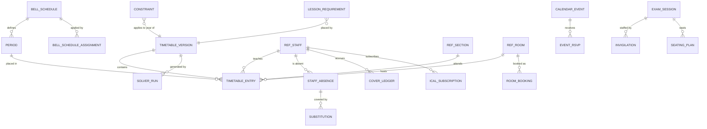

# Scheduling

> Service sheet, plan document 06, Group C. Names from Appendix L; events from Appendix E; permissions from Appendix B; error codes from Appendix K; rules from Appendix S. This sheet adds detail to reference architecture section 8.9 and never contradicts its table 8.0.

Scheduling decides when and where teaching happens. It owns periods and bell schedules (including rotating cycles and special-day schedules such as Ramadan), the constraints a timetable must satisfy, timetable versions with their entries, the OR-Tools CP-SAT solver that generates them, manual refinement with live conflict detection, publication with version history, substitutions and cover fairness, the school calendar with audiences and RSVPs, room bookings, exam sessions with seating and invigilation, and iCal feeds. Its published timetable is the second most-read data in the platform after School's directory: Attendance builds its register from it, Academics its coursework calendar, Operations its room use. The solver runs in its own worker image as a cancellable long-running job with progress, so a CPU-heavy solve never competes with timetable reads.

| Fact | Value (quoted from `05-service-catalog.md` and Appendix L) |
|---|---|
| Canonical name, long name | Scheduling, Scheduling and Calendar |
| Tier | 1 |
| AREA code | `SCD` |
| Database | `nibras_scheduling`, schema `scheduling`, roles `svc_scheduling` and `mig_scheduling` |
| Exchange | `nibras.scheduling` |
| Images | `nibras/scheduling-api`, `nibras/scheduling-worker` |
| Worker | `Scheduling.Worker`: the OR-Tools CP-SAT solve as a cancellable job with progress, bulk lane, one solve per replica, KEDA on queue depth; it also hosts the Quartz.NET scheduled jobs |
| gRPC package | `nibras.scheduling.v1` in `Nibras.Contracts.Scheduling/Grpc/scheduling.proto` |
| Build phase (master brief Section 28) | 2 |
| Service level class (master brief Section 31) | Read-heavy |
| Sensitivity (Appendix J) | internal |
| Why the boundary exists | Scaling: the CP-SAT solve is a CPU-heavy cancellable job scaled by queue depth, while timetable reads are cached and read-heavy |

---

## 1. Responsibilities

| Owns | Detail |
|---|---|
| Periods and bell schedules | Per campus and stage, weekly, two-week and rotating cycles, special-day schedules applied by date range without regenerating the timetable (REQ-SCD-001, REQ-SCD-023) |
| Constraints | Hard and soft, explicitly separate lists (BR-SCD-001): teacher availability and part-time windows (BR-SCD-003), daily and consecutive load (BR-SCD-002), travel time between campuses (BR-SCD-004), room kind, split classes, double periods, subject spread, no-gap rules (REQ-SCD-006) |
| Lesson requirements | The demand the solver places: section, subject, teacher from the teaching-assignment copy, periods per week, double-period and room-kind needs |
| Timetable versions and entries | Draft, what-if copies, skeletons from the rollover, the published version with effective date and history (REQ-SCD-009), locked slots |
| The solver | OR-Tools CP-SAT in `Scheduling.Worker` with a quality score, locked slots honoured, time budget, progress and cancellation (REQ-SCD-007) |
| Manual refinement | Drag and drop with live conflict detection (REQ-SCD-008), publish blocked by conflicts unless overridden with a reason (REQ-SCD-010) |
| Effective dating | Publishing never alters recorded attendance (BR-SCD-006, REQ-SCD-011) |
| Timetable views and feeds | By section, teacher, room; CSV export; iCal feeds per user (REQ-SCD-012, Appendix L.5) |
| Staff absence for cover and substitutions | Absence from `hr.leave.approved.v1` or entered by the timetable officer, ranked suggestions under BR-SCD-005, cover ledger, lesson notes for the substitute, uncovered-period alert (REQ-SCD-013 to REQ-SCD-017) |
| School calendar | Events with audiences, RSVPs, Hijri display over a Gregorian source (REQ-SCD-020, REQ-SCD-021, BR-L10N-003) |
| Room bookings | Requests, approval, holds and buffers (BR-SCD-007, REQ-SCD-019) |
| Exam timetable | Exam sessions, clash-free generation, seating plans and the invigilation roster (REQ-SCD-018, REQ-SCD-024) |

## 2. Not responsible for

| Not owned here | Owner | Why the line sits there |
|---|---|---|
| Campuses, buildings, rooms (their existence, capacity, facilities, turnaround buffer), academic years, terms, holidays and non-teaching days, sections, the subject catalog, staff profiles | School | Reference architecture section 8.5; Scheduling keeps slim copies (section 9) |
| Which teacher teaches which section and subject, subjects per grade with weekly periods | Academics | REQ-ACA-001, REQ-ACA-002; Scheduling copies teaching assignments from `academics.teaching-assignment.changed.v1` |
| Leave requests, balances, approval | Hr | WF-HR-01 is owned by Hr; Scheduling reacts to `hr.leave.approved.v1` |
| Attendance sessions and the register | Attendance | BR-SCD-006: Attendance reacts to the published timetable and never queries Scheduling's tables |
| Exam papers, marks, invigilator assignment as an assessment permission, accommodations | Assessment, Wellbeing | Appendix B `assessment.exams.*`; WF-WEL-01 (open point 6) |
| Parent-teacher meeting slots and bookings | Communication | Communication owns `MeetingSlot` and `Booking`; Scheduling only blocks the staff member's calendar from `communication.meeting.booked.v1` |
| Rendering timetable PDFs | Documents | Open point 5 |
| Sending notifications | Notification | Appendix C rows are triggered by Scheduling's events |
| Facility set-up and maintenance for a booking | Operations | WF-OPS-04 |
| The iCal subscription URL shown in settings | Platform exposes it; Scheduling publishes the feed | Appendix L.5 |
| A student's personal timetable | Bff.Web and Bff.Mobile compose it from the section and group timetables | Scheduling holds no student copy (table 8.0) |

## 3. Requirements covered

| Range or identifier | What it binds here |
|---|---|
| REQ-SCD-001 to REQ-SCD-024 | Every Scheduling row of `03-requirements-catalog.md` |
| REQ-SCH-010 | Bell schedules per campus, realised here (School sheet, open point 3) |
| REQ-MSG-017, REQ-MSG-018, REQ-MSG-019 | `Scheduling.Worker` as a separate image, KEDA on queue depth, progress over SignalR with cancellation and a result record |
| REQ-API-018, REQ-API-019 | Solve answers 202 with a job `Location`; cancellation ends in `cancelled` with a partial summary |
| REQ-DATA-028, REQ-MSG-011 | Per-tenant concurrency of one solve (T-SCD-02) |
| REQ-PERF-015, REQ-PERF-022, REQ-PERF-025 | Compiled timetable-of-the-day queries, 12-hour L2 for the published timetable, pre-peak warm-up |
| REQ-L10N-010, REQ-L10N-011 | Gregorian UTC storage with Hijri display; per-campus holidays and Ramadan schedules by date |
| REQ-INT-001, REQ-INT-014 | iCal feeds in phase 3 of the public surface |
| REQ-SEC-003, REQ-SEC-005 | Object-level scopes `own-sections`, `own-children`; isolation suite |

---

## 4. Aggregates and entities

**Common columns** on every table, stood for by `(common)`: `tenant_id` uuid not null (first in every index, row-level security `tenant_isolation`), `id` uuid v7, `created_at`/`created_by` not null, `updated_at`/`updated_by` null, `deleted_at`/`deleted_by` null (named `SoftDelete` filter), `xmin` concurrency token on every aggregate root. Every time of day is `time` in the campus time zone; every instant is `timestamptz` in UTC; every date is a Gregorian `date` (BR-L10N-003).

### 4.1 `BellSchedule` with `Period` and `BellScheduleAssignment`

| Entity | Field | Type | Null | Notes |
|---|---|---|---|---|
| BellSchedule | (common), `campus_id` | uuid | no | |
| BellSchedule | `stage_ids` | uuid[] | no | Stages it serves |
| BellSchedule | `name_en`, `name_ar` | text | no | |
| BellSchedule | `cycle_kind` | enum | no | weekly, two-week, rotating |
| BellSchedule | `cycle_length_days` | int | no | 5 or 6 for weekly, 10 for two-week, n for rotating |
| BellSchedule | `is_special` | bool | no | Special-day schedule (Ramadan, exam week) |
| BellSchedule | `status` | enum | no | draft, active, retired |
| BellSchedule | `active_from` | date | yes | Set by `activate` |
| Period | (common), `bell_schedule_id` | uuid | no | |
| Period | `sequence`, `code` | int, text | no | |
| Period | `kind` | enum | no | teaching, break, assembly, prayer; a break is ignored by BR-SCD-002, not treated as free |
| Period | `starts_at`, `ends_at` | time | no | |
| Period | `cycle_day` | int | yes | For two-week and rotating cycles; null means every day |
| BellScheduleAssignment | (common), `bell_schedule_id`, `campus_id` | uuid | no | |
| BellScheduleAssignment | `from_date`, `to_date` | date | no | Special schedule applied by date range (REQ-SCD-023) |
| BellScheduleAssignment | `reason_en`, `reason_ar` | text | no | |

Invariants: periods of one schedule and cycle day do not overlap and are ordered by `sequence`; a special schedule has the same count of teaching periods as the base schedule it replaces, so the period sequence of the timetable is unchanged (REQ-SCD-023); two assignments for one campus and stage do not overlap in dates; a schedule referenced by a published version cannot be deleted, only retired.

### 4.2 `Constraint`, `CampusTravelTime`, `LessonRequirement`

| Entity | Field | Type | Null | Notes |
|---|---|---|---|---|
| Constraint | (common), `academic_year_id`, `campus_id` | uuid | no, yes | |
| Constraint | `kind` | enum | no | teacher-unavailable, part-time-window, teacher-max-daily, teacher-max-consecutive, teacher-weekly-load, room-kind-required, room-capacity, split-class, double-period, subject-spread, no-gap, fixed-slot, teacher-preference |
| Constraint | `hardness` | enum | no | hard, soft; the lists are explicit and a soft constraint never becomes hard (BR-SCD-001) |
| Constraint | `weight` | int | yes | Penalty per violation for soft constraints only |
| Constraint | `staff_id`, `section_id`, `subject_id`, `grade_level_id` | uuid | yes | Subject of the constraint |
| Constraint | `parameters` | jsonb, side table `constraint_parameters` | no | Windows, limits, spreads |
| Constraint | `effective_from`, `effective_to` | date | no, yes | Availability per year with effective dates (BR-SCD-003) |
| CampusTravelTime | (common), `from_campus_id`, `to_campus_id`, `minutes` | uuid, int | no | Directional; a missing pair means unreachable within a day (BR-SCD-004) |
| LessonRequirement | (common), `academic_year_id`, `section_id`, `subject_id`, `staff_id` | uuid | no | Seeded from the teaching-assignment copy |
| LessonRequirement | `co_teacher_ids` | uuid[] | no | |
| LessonRequirement | `periods_per_week`, `double_periods` | int | no | Entered here until Academics publishes weekly periods (open point 2) |
| LessonRequirement | `room_kind`, `split_group_code` | text | yes | |

Invariants: `hardness = soft` implies `weight > 0` and `hardness = hard` implies `weight IS NULL`; a part-time window constraint is always hard; `from_campus_id <> to_campus_id`; the sum of `periods_per_week` of one teacher never exceeds the teacher's weekly-load constraint (validated before a solve, not only during it).

### 4.3 `TimetableVersion` with `TimetableEntry`

| Entity | Field | Type | Null | Notes |
|---|---|---|---|---|
| TimetableVersion | (common), `academic_year_id`, `campus_id` | uuid | no | |
| TimetableVersion | `label`, `version_number` | text, int | no | `version_number` increments on publish per campus |
| TimetableVersion | `kind` | enum | no | draft, what-if, skeleton |
| TimetableVersion | `status` | enum `TimetableVersionStatus` | no | Draft, Generating, Generated, Published, Superseded, Archived |
| TimetableVersion | `source_version_id` | uuid | yes | Copy lineage |
| TimetableVersion | `effective_from` | date | yes | Set on publish; never earlier than the day after the last recorded attendance under the old version (BR-SCD-006) |
| TimetableVersion | `quality_score`, `soft_penalty`, `hard_violation_count` | int | yes | Stored so candidates compare after the fact |
| TimetableVersion | `override_reason`, `override_by`, `overridden_constraints` | text, uuid, jsonb | yes | Publish with `override-conflict` |
| TimetableVersion | `published_at`, `published_by` | timestamptz, uuid | yes | |
| TimetableVersion | `rollover_id` | uuid | yes | Idempotency key of `CopyTimetableSkeleton` (Saga 4 step 7) |
| TimetableEntry | (common), `timetable_version_id`, `campus_id`, `section_id`, `subject_id`, `staff_id` | uuid | no | Tenant, version first in every index (`21-performance-engineering.md` section 3.7) |
| TimetableEntry | `co_teacher_ids` | uuid[] | no | |
| TimetableEntry | `room_id` | uuid | yes | |
| TimetableEntry | `day_of_week`, `cycle_week` | int, text | no, yes | `cycle_week` A or B for two-week cycles |
| TimetableEntry | `period_id` | uuid | no | |
| TimetableEntry | `locked` | bool | no | Locked slots are fixed inputs to the solver |
| TimetableEntry | `source` | enum | no | solver, manual, skeleton |

Invariants: a published version is immutable (`SCHEDULING_PUBLISHED_TIMETABLE_IMMUTABLE`) and changes go through a change set that creates a new version; at most one version per campus is `Published` at any effective date; in a publishable version no teacher, room or section holds two entries in one period and cycle week, no room holds more students than its capacity, and no entry falls in a teacher's unavailability (hard constraints, BR-SCD-001) unless the version carries an override naming each broken constraint; every entry's period belongs to the bell schedule active for its campus and stage (`SCHEDULING_PERIOD_OUTSIDE_BELL_SCHEDULE`); locked entries are unchanged by a solve (REQ-SCD-007).

### 4.4 `SolverRun`

| Field | Type | Null | Notes |
|---|---|---|---|
| (common), `timetable_version_id`, `job_id` | uuid | no | One job per run in `IJobStore` |
| `problem_kind` | enum | no | class-timetable, exam-timetable, seating |
| `state` | enum | no | queued, loading, building, solving, persisting, succeeded, failed, cancelled (mirrors the job states of `22-api-conventions-and-error-catalog.md` section 6.2) |
| `time_budget_seconds` | int | no | Default 600, maximum 1,800 |
| `workers` | int | no | CP-SAT search workers, default equal to the replica's CPU request |
| `started_at`, `completed_at` | timestamptz | yes | |
| `solutions_found`, `best_objective`, `best_found_at` | int, bigint, timestamptz | yes | Updated from the solution callback, coalesced to one write per 10 s |
| `best_solution` | side table `solver_run_hints` (`assignments` jsonb) | yes | Written on each improvement; used as the solution hint when a redelivered command restarts the solve |
| `infeasible_core` | jsonb | yes | The smallest conflicting constraint set for `SCHEDULING_SOLVER_INFEASIBLE` |
| `requested_by` | uuid | no | |
| `error_code` | text | yes | `SCHEDULING_SOLVER_INFEASIBLE` or `SCHEDULING_SOLVER_TIMEOUT` |

Invariants: at most one run per tenant is in a non-terminal state (per-tenant concurrency of one, T-SCD-02); a run never writes entries into a version that is not `Generating`; a cancelled run leaves the version `Draft` with its previous entries intact.

### 4.5 `StaffAbsence`, `Substitution`, `CoverLedger`

| Entity | Field | Type | Null | Notes |
|---|---|---|---|---|
| StaffAbsence | (common), `staff_id`, `date` | uuid, date | no | |
| StaffAbsence | `period_ids` | uuid[] | no | Empty means the whole day |
| StaffAbsence | `source` | enum | no | hr-leave, manual |
| StaffAbsence | `leave_id` | uuid | yes | From `hr.leave.approved.v1`; cancelled by `hr.leave.cancelled.v1` |
| Substitution | (common), `date`, `absent_staff_id`, `cover_staff_id` | date, uuid | no | |
| Substitution | `period_ids`, `entry_ids` | uuid[] | no | |
| Substitution | `section_id` | uuid | no | |
| Substitution | `status` | enum `SubstitutionStatus` | no | Proposed, Assigned, Accepted, Released, Uncovered |
| Substitution | `rank_chosen`, `override_reason` | int, text | yes | Picking other than the top suggestion is recorded (BR-SCD-005) |
| Substitution | `lesson_notes`, `note_file_ids` | text, uuid[] | yes | Visible to the substitute before the period (REQ-SCD-016) |
| Substitution | `request_id` | uuid | yes | Saga 6 idempotency key for `AssignSubstitution` |
| Substitution | `assigned_by`, `accepted_at`, `released_at` | uuid, timestamptz | yes | |
| CoverLedger | (common), `staff_id`, `term_id` | uuid | no | |
| CoverLedger | `cover_minutes`, `last_cover_at` | int, timestamptz | no, yes | Updated in the same transaction as the assignment (BR-SCD-005 edge case) |

Invariants: a cover teacher is free in every covered period, qualified, inside daily load and travel time at assignment time (BR-SCD-002, BR-SCD-004, BR-SCD-005); periods already taught by a substitute stay attributed to the substitute when the leave is cancelled (WF-HR-01 compensation); one active substitution per entry and date.

### 4.6 `CalendarEvent`, `RoomBooking`

| Entity | Field | Type | Null | Notes |
|---|---|---|---|---|
| CalendarEvent | (common), `campus_id` | uuid | yes | Null means every campus |
| CalendarEvent | `title_en`, `title_ar`, `description_en`, `description_ar` | text | partly | Description in side table `calendar_event_texts` |
| CalendarEvent | `starts_at`, `ends_at`, `all_day` | timestamptz, bool | no | |
| CalendarEvent | `audience` | jsonb | no | Roles, grade levels, sections, campuses |
| CalendarEvent | `status` | enum | no | draft, published, cancelled |
| CalendarEvent | `rsvp_enabled`, `rsvp_capacity` | bool, int | no, yes | |
| EventRsvp | (common), `calendar_event_id`, `user_id`, `response`, `guests` | uuid, enum, int | no | Unique per event and user |
| RoomBooking | (common), `room_id`, `campus_id` | uuid | no | |
| RoomBooking | `starts_at`, `ends_at` | timestamptz | no | Requested interval |
| RoomBooking | `hold_starts_at`, `hold_ends_at` | timestamptz | no | Extended by the room's turnaround buffer (BR-SCD-007) |
| RoomBooking | `purpose`, `requested_by` | text, uuid | no | |
| RoomBooking | `status` | enum `RoomBookingStatus` | no | Requested, Approved, Rejected, Cancelled, AutoCancelled |
| RoomBooking | `decided_by`, `cancellation_reason`, `cancelled_by_version_id`, `request_id` | uuid, text, uuid, uuid | yes | |

Invariants: an approved booking's hold overlaps no timetabled lesson in the room and no other approved hold; a timetabled lesson always outranks an ad-hoc booking, so publishing a version that collides auto-cancels the booking and names the version (BR-SCD-007); an RSVP beyond `rsvp_capacity` is refused.

### 4.7 `ExamSession`, `Invigilation`, `SeatingPlan`

| Entity | Field | Type | Null | Notes |
|---|---|---|---|---|
| ExamSession | (common), `academic_year_id`, `term_id`, `subject_id` | uuid | no | |
| ExamSession | `grade_level_ids` | uuid[] | no | |
| ExamSession | `starts_at`, `duration_minutes` | timestamptz, int | no | |
| ExamSession | `room_ids` | uuid[] | no | |
| ExamSession | `status` | enum | no | draft, scheduled, published, cancelled |
| ExamSession | `exam_timetable_id` | uuid | yes | Grouping for publish |
| Invigilation | (common), `exam_session_id`, `room_id`, `staff_id` | uuid | no | Counts toward availability, not teaching load (BR-SCD-003 edge case) |
| SeatingPlan | (common), `exam_session_id`, `room_id`, `student_id`, `seat_label` | uuid, text | no | One seat per candidate, no room above capacity (REQ-SCD-018) |

Invariants: no candidate sits two sessions whose times overlap (`SCHEDULING_EXAM_CLASH`); every room of a session has at least one invigilator before publish; seats per room never exceed the room capacity.

### 4.8 `IcalSubscription` and reference copies

| Entity | Field | Type | Null | Notes |
|---|---|---|---|---|
| IcalSubscription | (common), `user_id`, `scope_kind`, `scope_id` | uuid, enum, uuid | no | staff-own, section, calendar |
| IcalSubscription | `token_hash` | bytea | no | SHA-256 of a 256-bit token shown once; never stored or cached in clear (T-SCD-01) |
| IcalSubscription | `rotated_at`, `revoked_at`, `last_used_at` | timestamptz | yes | |
| `ref_staff`, `ref_section`, `ref_term`, `ref_academic_year`, `ref_room`, `ref_calendar_day`, `ref_staff_leave`, `ref_teaching_assignment` | see section 9 | | | `source_version`, `reconciled_at` on each |

Invariants: a revoked subscription answers 404 on the feed; a feed never exposes another user's timetable.



---

## 5. REST API

Base path `/api/v1/scheduling`. Conventions from `22-api-conventions-and-error-catalog.md`: keyset lists, `If-Match` on updates (stale tag 409 `SCHEDULING_CONCURRENCY_CONFLICT`), `Idempotency-Key` on creates and required on job starts, jobs answer 202 with `Location: /api/v1/scheduling/jobs/{jobId}`. The eight Appendix K.1 codes apply with the `SCHEDULING_` prefix.

### 5.1 Periods and bell schedules

| Method | Path | Permission | Request | Response | Errors | Idempotent |
|---|---|---|---|---|---|---|
| GET | `/bell-schedules` | `scheduling.bell-schedules.view` | filter `campusId`, `status` | `BellScheduleDto[]` with periods | none | safe |
| GET | `/bell-schedules/{id}` | `scheduling.bell-schedules.view` | none | `BellScheduleDto` | `SCHEDULING_NOT_FOUND` | safe |
| POST | `/bell-schedules` | `scheduling.bell-schedules.create` | `CreateBellScheduleRequest` | 201 | `SCHEDULING_VALIDATION_FAILED` | `Idempotency-Key` |
| PUT | `/bell-schedules/{id}` | `scheduling.bell-schedules.edit` | `UpdateBellScheduleRequest` | 200 | `SCHEDULING_CONCURRENCY_CONFLICT` | `If-Match` |
| DELETE | `/bell-schedules/{id}` | `scheduling.bell-schedules.delete` | none | 204, or refusal when a published version uses it | `SCHEDULING_VALIDATION_FAILED` | by id |
| POST | `/bell-schedules/{id}/activate` | `scheduling.bell-schedules.activate` | `ActivateBellScheduleRequest` (activeFrom) | 200; evicts `scheduling:bells` | `SCHEDULING_VALIDATION_FAILED` | state check |
| POST | `/bell-schedules/{id}/assignments` | `scheduling.bell-schedules.activate` | `ApplySpecialScheduleRequest` (from, to, reason) | 201; publishes `scheduling.timetable.changed.v1` for the affected dates | `SCHEDULING_VALIDATION_FAILED` (teaching period count differs, overlap) | `Idempotency-Key` |
| DELETE | `/bell-schedule-assignments/{id}` | `scheduling.bell-schedules.activate` | none | 204; changed event for the remaining dates | `SCHEDULING_NOT_FOUND` | by id |
| GET | `/periods` | `scheduling.periods.view` | filter `bellScheduleId` | `PeriodDto[]` | none | safe |
| POST | `/periods` | `scheduling.periods.create` | `CreatePeriodRequest` | 201 | `SCHEDULING_VALIDATION_FAILED` (overlap) | `Idempotency-Key` |
| PUT | `/periods/{id}` | `scheduling.periods.edit` | `UpdatePeriodRequest` | 200 | `SCHEDULING_CONCURRENCY_CONFLICT` | `If-Match` |
| DELETE | `/periods/{id}` | `scheduling.periods.delete` | none | 204 | `SCHEDULING_VALIDATION_FAILED` (used by entries) | by id |

### 5.2 Constraints, travel times, lesson requirements

| Method | Path | Permission | Request | Response | Errors | Idempotent |
|---|---|---|---|---|---|---|
| GET | `/constraints` | `scheduling.constraints.view` | filter `academicYearId`, `staffId`, `kind`, `hardness` | keyset `ConstraintDto` | none | safe |
| POST | `/constraints` | `scheduling.constraints.create` | `CreateConstraintRequest` | 201 | `SCHEDULING_VALIDATION_FAILED` (soft without weight, hard with weight) | `Idempotency-Key` |
| PUT | `/constraints/{id}` | `scheduling.constraints.edit` | `UpdateConstraintRequest` | 200 | `SCHEDULING_CONCURRENCY_CONFLICT` | `If-Match` |
| DELETE | `/constraints/{id}` | `scheduling.constraints.delete` | none | 204 | `SCHEDULING_NOT_FOUND` | by id |
| GET | `/campus-travel-times` | `scheduling.timetable.view` | none | `CampusTravelTimeDto[]` | none | safe |
| PUT | `/campus-travel-times` | `scheduling.timetable.edit` | `SetCampusTravelTimesRequest` (ordered pairs) | 200 | `SCHEDULING_VALIDATION_FAILED` (same campus) | `If-Match` |
| GET | `/lesson-requirements` | `scheduling.timetable.view` | filter `academicYearId`, `sectionId`, `staffId` | keyset `LessonRequirementDto` | none | safe |
| PUT | `/lesson-requirements/{id}` | `scheduling.timetable.edit` | `UpdateLessonRequirementRequest` (periods per week, doubles, room kind) | 200 | `SCHEDULING_VALIDATION_FAILED` (weekly load exceeded) | `If-Match` |

Constraints are their own Appendix B resource, `scheduling.constraints` with view, create, edit and delete, added under ADR-0019, so constraint editing can be delegated without granting timetable editing. Travel times and lesson requirements still have no resource of their own and stay under `scheduling.timetable.*` (open point 1).

### 5.3 Timetable versions, generation, refinement, publication

| Method | Path | Permission | Request | Response | Errors | Idempotent |
|---|---|---|---|---|---|---|
| GET | `/timetable-versions` | `scheduling.timetable.view` | filter `campusId`, `academicYearId`, `status`, `kind` | `TimetableVersionDto[]` with quality score | none | safe |
| GET | `/timetable-versions/{id}` | `scheduling.timetable.view` | none | `TimetableVersionDto` | `SCHEDULING_NOT_FOUND` | safe |
| POST | `/timetable-versions` | `scheduling.timetable.edit` | `CreateTimetableVersionRequest` (campus, year, empty or from version) | 201 draft | `SCHEDULING_VALIDATION_FAILED` | `Idempotency-Key` |
| POST | `/timetable-versions/{id}/copies` | `scheduling.timetable.edit` | `CreateWhatIfCopyRequest` (label) | 201 what-if copy (REQ-SCD-009) | `SCHEDULING_NOT_FOUND` | `Idempotency-Key` |
| DELETE | `/timetable-versions/{id}` | `scheduling.timetable.edit` | none | 204 for draft or what-if only | `SCHEDULING_PUBLISHED_TIMETABLE_IMMUTABLE` | by id |
| GET | `/timetable-versions/{id}/comparison` | `scheduling.timetable.view` | `otherVersionId` | `VersionComparisonDto` (moved entries, score delta) | `SCHEDULING_NOT_FOUND` | safe |
| POST | `/timetable-versions/{id}/generate` | `scheduling.timetable.generate` | `GenerateTimetableRequest` (timeBudgetSeconds, keepLocked) | 202 job; `solve-timetable` command to the worker | `SCHEDULING_SOLVER_RUNNING` with `params.runningJobId` (a solve already running for the tenant), `SCHEDULING_PUBLISHED_TIMETABLE_IMMUTABLE` | `Idempotency-Key` required |
| GET | `/timetable-versions/{id}/infeasibility` | `scheduling.timetable.view` | none | `InfeasibilityDto` (smallest conflicting constraint set) | `SCHEDULING_NOT_FOUND` | safe |
| GET | `/timetable-versions/{id}/entries` | `scheduling.timetable.view` | filter `sectionId`, `staffId`, `roomId`, `dayOfWeek` | `TimetableEntryDto[]` | `SCHEDULING_NOT_FOUND` | safe |
| POST | `/timetable-versions/{id}/entries` | `scheduling.timetable.edit` | `PlaceEntryRequest` | 201 with live conflicts in the body | `SCHEDULING_TIMETABLE_CONFLICT` (hard, when `strict=true`), `SCHEDULING_PERIOD_OUTSIDE_BELL_SCHEDULE`, `SCHEDULING_ROOM_UNSUITABLE`, `SCHEDULING_PUBLISHED_TIMETABLE_IMMUTABLE` | `Idempotency-Key` |
| PUT | `/timetable-entries/{id}` | `scheduling.timetable.edit` | `MoveEntryRequest` (drag and drop target) | 200 with live conflicts (REQ-SCD-008) | as above | `If-Match` |
| DELETE | `/timetable-entries/{id}` | `scheduling.timetable.edit` | none | 204 | `SCHEDULING_PUBLISHED_TIMETABLE_IMMUTABLE` | by id |
| POST | `/timetable-entries/{id}/lock` | `scheduling.timetable.lock-slot` | none | 200 | `SCHEDULING_PUBLISHED_TIMETABLE_IMMUTABLE` | state check |
| POST | `/timetable-entries/{id}/unlock` | `scheduling.timetable.lock-slot` | none | 200 | same | state check |
| GET | `/timetable-versions/{id}/conflicts` | `scheduling.timetable.view` | none | `ConflictDto[]` hard and soft, with the quality score | `SCHEDULING_NOT_FOUND` | safe |
| POST | `/timetable-versions/{id}/publish` | `scheduling.timetable.publish`; with `overrideReason` also `scheduling.timetable.override-conflict` | `PublishTimetableRequest` (effectiveFrom, overrideReason) | 200; publishes `scheduling.timetable.published.v1`; auto-cancels colliding bookings | `SCHEDULING_TIMETABLE_CONFLICT`, `SCHEDULING_VALIDATION_FAILED` (effective date before the earliest allowed, BR-SCD-006, message names the date) | `Idempotency-Key`; state check |
| POST | `/timetable-versions/{id}/change-sets` | `scheduling.timetable.publish` | `PublishChangeSetRequest` (entry moves, effectiveFrom, reason) | 201 new version published as a change; publishes `scheduling.timetable.changed.v1` | `SCHEDULING_TIMETABLE_CONFLICT`, `SCHEDULING_VALIDATION_FAILED` | `Idempotency-Key` |
| GET | `/timetable-versions/{id}/export` | `scheduling.timetable.export` | `format=csv` | streamed CSV | `SCHEDULING_NOT_FOUND` | safe |

### 5.4 Timetable views and iCal

| Method | Path | Permission | Request | Response | Errors | Idempotent |
|---|---|---|---|---|---|---|
| GET | `/timetables/sections/{sectionId}` | `scheduling.timetable.view` (scope `own-sections`, `own-homeroom`, `own-children`, `self`) | `date` or `weekOf` | `DayTimetableDto` with substitutions applied | `SCHEDULING_NOT_FOUND` | safe; compiled; `ETag` |
| GET | `/timetables/staff/{staffId}` | `scheduling.timetable.view` (scope `self` for teachers) | `date` or `weekOf` | `DayTimetableDto` with covers | `SCHEDULING_NOT_FOUND` | safe; compiled; `ETag` |
| GET | `/timetables/rooms/{roomId}` | `scheduling.timetable.view` | `date` or `weekOf` | occupancy with bookings | `SCHEDULING_NOT_FOUND` | safe |
| GET | `/timetables/campuses/{campusId}/today` | `scheduling.timetable.view` | `date` | all entries of the campus day | none | safe; compiled |
| GET | `/ical-subscriptions` | `scheduling.timetable.view` | none | the caller's subscriptions (no token) | none | safe |
| POST | `/ical-subscriptions` | `scheduling.timetable.view` | `CreateIcalSubscriptionRequest` (scope) | 201 with the feed URL, token shown once | `SCHEDULING_PERMISSION_DENIED` (scope not the caller's) | `Idempotency-Key` |
| POST | `/ical-subscriptions/{id}/rotate` | `scheduling.timetable.view` | none | 200 with a new URL, old token dead | `SCHEDULING_NOT_FOUND` | state check |
| DELETE | `/ical-subscriptions/{id}` | `scheduling.timetable.view` | none | 204 | `SCHEDULING_NOT_FOUND` | by id |
| GET | `/ical/{token}.ics` | anonymous: the token is the credential, rate-limited at the Gateway | none | `text/calendar`, next 60 school days | `SCHEDULING_NOT_FOUND` (unknown, rotated or revoked token) | safe; output cache 5 min |

### 5.5 Staff absence and substitutions

| Method | Path | Permission | Request | Response | Errors | Idempotent |
|---|---|---|---|---|---|---|
| GET | `/staff-absences` | `scheduling.substitutions.view` | `date`, `campusId` | `StaffAbsenceDto[]` | none | safe |
| POST | `/staff-absences` | `scheduling.substitutions.create` | `RecordStaffAbsenceRequest` (staffId, date, periodIds) for same-day absence without an Hr leave | 201; suggestions computed | `SCHEDULING_VALIDATION_FAILED` | `Idempotency-Key`; natural key `(staffId, date)` |
| DELETE | `/staff-absences/{id}` | `scheduling.substitutions.edit` | none | 204; open substitutions released | `SCHEDULING_NOT_FOUND` | by id |
| GET | `/substitutions` | `scheduling.substitutions.view` | `date`, `campusId`, `status` | `SubstitutionDto[]` | none | safe |
| GET | `/substitutions/uncovered` | `scheduling.substitutions.view` | `date`, `campusId` | `UncoveredEntryDto[]` (hot query 5) | none | safe |
| GET | `/substitutions/suggestions` | `scheduling.substitutions.view` | `absenceId`, `periodId` | ranked `CoverSuggestionDto[]` with fairness reasons (REQ-SCD-015) | `SCHEDULING_SUBSTITUTE_UNAVAILABLE` (filtered list empty) | safe |
| POST | `/substitutions` | `scheduling.substitutions.assign` | `AssignSubstitutionRequest` (absenceId, periodIds, coverStaffId, overrideReason) | 201; publishes `scheduling.substitution.assigned.v1` and `scheduling.timetable.changed.v1` | `SCHEDULING_SUBSTITUTE_UNAVAILABLE`, `SCHEDULING_TIMETABLE_CONFLICT` (cover breaks BR-SCD-002 or BR-SCD-004) | `Idempotency-Key`; one active cover per entry and date |
| POST | `/substitutions/{id}/accept` | `scheduling.substitutions.accept-cover` | none | 200 | `SCHEDULING_VALIDATION_FAILED` (not the cover teacher) | state check |
| POST | `/substitutions/{id}/release` | `scheduling.substitutions.edit` | `ReleaseSubstitutionRequest` (reason) | 200; `scheduling.timetable.changed.v1` | `SCHEDULING_VALIDATION_FAILED` (period already taught) | state check |
| PUT | `/substitutions/{id}/lesson-notes` | `scheduling.substitutions.edit` | `SetLessonNotesRequest` (text, fileIds) | 200 | `SCHEDULING_CONCURRENCY_CONFLICT` | `If-Match` |
| GET | `/cover-fairness` | `scheduling.substitutions.view` | `termId`, `campusId` | `CoverLedgerDto[]` | none | safe |

### 5.6 Calendar

| Method | Path | Permission | Request | Response | Errors | Idempotent |
|---|---|---|---|---|---|---|
| GET | `/calendar-events` | `scheduling.calendar.view` (audience-filtered) | `campusId`, `yearMonth`, `calendar` (gregorian or hijri) | `CalendarEventDto[]` | none | safe; `ETag` |
| GET | `/calendar-events/{id}` | `scheduling.calendar.view` | none | `CalendarEventDto` | `SCHEDULING_NOT_FOUND` (outside the audience) | safe |
| POST | `/calendar-events` | `scheduling.calendar.create` | `CreateCalendarEventRequest` | 201 draft | `SCHEDULING_VALIDATION_FAILED` | `Idempotency-Key` |
| PUT | `/calendar-events/{id}` | `scheduling.calendar.edit` | `UpdateCalendarEventRequest` | 200 | `SCHEDULING_CONCURRENCY_CONFLICT` | `If-Match` |
| DELETE | `/calendar-events/{id}` | `scheduling.calendar.delete` | none | 204 | `SCHEDULING_NOT_FOUND` | by id |
| POST | `/calendar-events/{id}/publish` | `scheduling.calendar.publish` | none | 200; publishes `scheduling.event.published.v1` | `SCHEDULING_VALIDATION_FAILED` (no audience) | state check |
| PUT | `/calendar-events/{id}/rsvp` | `scheduling.calendar.view` (scope `self`) | `RsvpRequest` (response, guests) | 200 | `SCHEDULING_VALIDATION_FAILED` (capacity reached) | `If-Match`; one per user |
| GET | `/calendar-events/{id}/rsvps` | `scheduling.calendar.edit` | keyset | `RsvpDto` list and counts | `SCHEDULING_NOT_FOUND` | safe |

### 5.7 Room bookings

| Method | Path | Permission | Request | Response | Errors | Idempotent |
|---|---|---|---|---|---|---|
| GET | `/room-bookings` | `scheduling.room-bookings.view` | `roomId`, `from`, `to`, `status` | keyset `RoomBookingDto` | none | safe |
| GET | `/rooms/availability` | `scheduling.room-bookings.view` | `campusId`, `from`, `to`, `kind`, `minCapacity` | free rooms with holds applied (hot query 4) | none | safe |
| POST | `/room-bookings` | `scheduling.room-bookings.create` | `RequestRoomBookingRequest` | 201 `Requested` | `SCHEDULING_TIMETABLE_CONFLICT` (hold overlaps), `SCHEDULING_ROOM_UNSUITABLE` | `Idempotency-Key` |
| PUT | `/room-bookings/{id}` | `scheduling.room-bookings.edit` | `UpdateRoomBookingRequest` | 200 | `SCHEDULING_TIMETABLE_CONFLICT`, `SCHEDULING_CONCURRENCY_CONFLICT` | `If-Match` |
| DELETE | `/room-bookings/{id}` | `scheduling.room-bookings.delete` | none | 204 `Cancelled` | `SCHEDULING_NOT_FOUND` | by id |
| POST | `/room-bookings/{id}/approve` | `scheduling.room-bookings.approve` | none | 200; publishes `scheduling.room-booking.approved.v1` | `SCHEDULING_TIMETABLE_CONFLICT` (re-checked inside the transaction) | state check |
| POST | `/room-bookings/{id}/reject` | `scheduling.room-bookings.approve` | reason | 200 | `SCHEDULING_VALIDATION_FAILED` | state check |

### 5.8 Exam timetable, seating, invigilation

| Method | Path | Permission | Request | Response | Errors | Idempotent |
|---|---|---|---|---|---|---|
| GET | `/exam-sessions` | `scheduling.exam-timetable.view` | `termId`, `gradeLevelId` | `ExamSessionDto[]` | none | safe |
| POST | `/exam-sessions` | `scheduling.exam-timetable.edit` | `CreateExamSessionRequest` | 201 | `SCHEDULING_EXAM_CLASH` | `Idempotency-Key` |
| PUT | `/exam-sessions/{id}` | `scheduling.exam-timetable.edit` | `UpdateExamSessionRequest` | 200 | `SCHEDULING_EXAM_CLASH`, `SCHEDULING_CONCURRENCY_CONFLICT` | `If-Match` |
| DELETE | `/exam-sessions/{id}` | `scheduling.exam-timetable.edit` | none | 204 before publish | `SCHEDULING_VALIDATION_FAILED` (published) | by id |
| POST | `/exam-timetables/generate` | `scheduling.exam-timetable.generate` | `GenerateExamTimetableRequest` (term, grade levels, windows) | 202 job on the worker (`problemKind = exam-timetable`) | `SCHEDULING_SOLVER_RUNNING` (solve running) | `Idempotency-Key` required |
| POST | `/exam-timetables/{id}/publish` | `scheduling.exam-timetable.publish` | none | 200; publishes `scheduling.exam-timetable.published.v1` per session | `SCHEDULING_EXAM_CLASH`, `SCHEDULING_VALIDATION_FAILED` (room without invigilator) | state check |
| POST | `/exam-sessions/{id}/seating-plans` | `scheduling.exam-timetable.generate` | `GenerateSeatingRequest` | 202 job (`problemKind = seating`) | `SCHEDULING_VALIDATION_FAILED` (capacity below candidates) | `Idempotency-Key` required |
| GET | `/exam-sessions/{id}/seating-plans` | `scheduling.exam-timetable.view` | `roomId` | `SeatingPlanDto` (hot query 8) | `SCHEDULING_NOT_FOUND` | safe |
| PUT | `/exam-sessions/{id}/invigilators` | `scheduling.exam-timetable.edit` | `SetInvigilatorsRequest` (room to staff) | 200 | `SCHEDULING_SUBSTITUTE_UNAVAILABLE` (staff not free) | `If-Match` |
| GET | `/exam-sessions/export` | `scheduling.exam-timetable.export` | `termId` | streamed CSV | none | safe |

### 5.9 Jobs

| Method | Path | Permission | Request | Response | Errors | Idempotent |
|---|---|---|---|---|---|---|
| GET | `/jobs/{id}` | the starting permission, or `platform.jobs.view` | none | `Job` resource with `progress` (phase, done, total, best objective in `messageParams`) | `SCHEDULING_NOT_FOUND` | safe |
| POST | `/jobs/{id}/cancel` | the starter, or `platform.jobs.cancel` | none | 202; the solve stops and ends `cancelled` with the best solution kept as a draft if one exists | `SCHEDULING_VALIDATION_FAILED` (terminal) | state check |

---

## 6. gRPC

### 6.1 Exposed: `nibras.scheduling.v1`

`10-data-architecture.md` section 6 has Academics, Attendance and Operations fetch timetable entries on publish and reconcile nightly against Scheduling; these methods serve them. Reference architecture table 8.0 (v9.1, ADR-0019) now lists Scheduling `Timetables` on the Academics and Attendance rows and `Timetables.Checksum` as a job-only call on the Operations row.

| Service | Method | Returns | Deadline | Callers | Budget |
|---|---|---|---|---|---|
| `Timetables` | `GetVersion(timetable_version_id, page_token)` | entries (section, subject, staff, room, day, cycle week, period), 1,000 per page | 5 s per page | Academics, Attendance, Operations | 2 commands per page |
| `Timetables` | `GetCampusDay(campus_id, date)` | the day's entries with substitutions applied and the bell times | 2 s | Attendance | 2 commands, compiled (hot query 3) |
| `Timetables` | `Checksum(kind, as_of)` | `md5` over `(id, updated_at)` for timetable entries of the current version, substitutions or approved room bookings | 30 s | Academics, Attendance, Operations | 1 command |
| `Timetables` | `ListSnapshotPage(kind, page_token)` | slim rows for repair | 5 s per page | same | 1 command per page |

### 6.2 Consumed

| Target | Method | Why | Deadline | Fallback |
|---|---|---|---|---|
| School `StaffDirectory` | `GetStaff`, `ListStaff` | Names for a staff copy created from `school.staff.created.v1`, which carries none | 2 s | Show the employee number; retry on the next read |
| School `StructureDirectory` | `ListRooms`, `ListCalendarDays`, `GetSection` | First load and repair of the room and holiday copies; section names. Day-to-day changes now arrive as `school.room.changed.v1` and `school.calendar-day.changed.v1` (Appendix E, ADR-0019) | 5 s | Keep the last snapshot; flag `reconciled_at` stale |
| School `StudentDirectory` | `ListStudentsBySection` | Exam seating candidates | 5 s | Refuse the seating job with `SCHEDULING_DEPENDENCY_UNAVAILABLE` |
| School `ReferenceReconciliation` | `Checksum`, `ListSnapshotPage` | Nightly reconciliation of staff, section, term, year, room, calendar-day copies | 30 s, 5 s | Retry next night; data-quality issue after two failures |
| Academics reconciliation | `TeachingAssignments/Checksum` (Academics sheet section 6.1) | Nightly reconciliation of the teaching-assignment copy | 30 s | As above |
| Hr | `nibras.hr.v1.Leave/Checksum` (`10-data-architecture.md` section 6) | Nightly reconciliation of the staff-leave copy | 30 s | As above |

---

## 7. Events published and consumed

### 7.1 Published on `nibras.scheduling`

Payload fields are owned by Appendix E, Scheduling section; they are cited, not restated. Consumers are Appendix E's column.

| Routing key | Partition key | Published when, by which handler | Consumers |
|---|---|---|---|
| `scheduling.timetable.published.v1` | `timetableVersionId` | `PublishTimetableHandler`; the rollover skeleton is never published by Saga 4 (Appendix R's side-effect list is corrected in open point 7) | Academics, Attendance, Operations, Notification |
| `scheduling.timetable.changed.v1` | `timetableVersionId` | `PublishChangeSetHandler`, `AssignSubstitutionHandler`, `ReleaseSubstitutionHandler`, special-schedule assignment | Academics, Attendance, Notification, Requests |
| `scheduling.substitution.assigned.v1` | `staffId` | `AssignSubstitutionHandler` and the `AssignSubstitution` effect command | Attendance, Notification, Hr, Requests, Reporting |
| `scheduling.event.published.v1` | `tenantId` | `PublishCalendarEventHandler` | Communication, Notification |
| `scheduling.room-booking.approved.v1` | `roomId` | `ApproveRoomBookingHandler` and the `ApproveRoomBooking` effect command | Operations, Notification, Requests |
| `scheduling.exam-timetable.published.v1` | `tenantId` | `PublishExamTimetableHandler`, one per session | Assessment, Notification |
| `scheduling.usage.recorded.v1` | `tenantId` | Hourly: solver CPU seconds, active iCal subscriptions | Platform |
| `scheduling.audit.recorded.v1` | `tenantId` | Every write and every override, including the broken constraint and reason (BR-SCD-001) | Audit |

Replies sent on `nibras.scheduling`: `school.replies.timetable-skeleton-created.v1` and `school.replies.timetable-version-deleted.v1` with their `Failed` pairs (Saga 4 step 7), and `requests.replies.effect-applied.v1` or `requests.replies.effect-failed.v1` for `ReleaseSubstitution` and `CancelRoomBooking`, which have no catalogued outcome event. Worker job command: `scheduling.commands.solve-timetable.v1`, published by the Api on its own exchange, carrying `jobId`, `timetableVersionId`, `problemKind`, `timeBudgetSeconds`.

### 7.2 Consumed

Queues from `11-messaging-architecture.md` section 2.5 (Scheduling table).

| Routing key | Queue | Handler | What it changes |
|---|---|---|---|
| The doc 11 section 2.3 set | `scheduling.tenant-lifecycle` | `TenantLifecycleConsumer` | Tenant rows, read-only enforcement, settings and terminology cache eviction |
| `school.academic-year.opened.v1` | `scheduling.reference-copies` | `AcademicYearOpenedConsumer` | `ref_academic_year`; snapshots rooms and calendar days for the campus |
| `school.academic-year.closed.v1` | `scheduling.reference-copies` | `AcademicYearClosedConsumer` | Marks the year's versions `Archived`; no further writes |
| `school.term.started.v1` | `scheduling.reference-copies` | `TermStartedConsumer` | `ref_term`; opens a new `CoverLedger` term |
| `school.section.created.v1` | `scheduling.reference-copies` | `SectionCreatedConsumer` | `ref_section`; fetches the name over gRPC |
| `school.section.changed.v1` | `scheduling.reference-copies` | `SectionChangedConsumer` | Updates `ref_section`; evicts section timetable keys |
| `school.staff.created.v1` | `scheduling.reference-copies` | `StaffCreatedConsumer` | `ref_staff` with campuses; fetches names |
| `school.staff.left.v1` | `scheduling.reference-copies` | `StaffLeftConsumer` | `ref_staff.active = false` from `lastWorkingDay`; creates `StaffAbsence` rows for future entries so they show as uncovered until reassigned (WF-IDN-06) |
| `academics.teaching-assignment.changed.v1` | `scheduling.reference-copies` | `TeachingAssignmentChangedConsumer` | `ref_teaching_assignment`; creates or retires `LessonRequirement` rows from `effectiveOn`; flags affected draft versions |
| `hr.leave.approved.v1` | `scheduling.reference-copies` | `LeaveApprovedConsumer` | `ref_staff_leave`; creates `StaffAbsence` per school day in range and computes suggestions (WF-HR-01 `SubstitutionNeeded → SubstituteProposed`, TC-HR-003) |
| `hr.leave.cancelled.v1` | `scheduling.reference-copies` | `LeaveCancelledConsumer` | Releases future substitutions, restores the original timetable; periods already taught stay attributed (TC-HR-006) |
| `communication.meeting.booked.v1` | `scheduling.events` | `MeetingBookedConsumer` | Blocks the staff member's slot so cover suggestions and room availability exclude it |
| `requests.request.approved.v1` | `scheduling.events` | `RequestApprovedConsumer` | "Approved, being applied" badge; the effect runs on the Saga 6 command |
| `scheduling.commands.#` from School and Requests | `scheduling.commands` | one handler per command | `CopyTimetableSkeleton` (keyed on `rolloverId`), `DeleteTimetableVersion`; `AssignSubstitution` (keyed on `requestId`), `ReleaseSubstitution`, `ApproveRoomBooking`, `CancelRoomBooking`; the platform command set of doc 11 section 2.4 |
| `scheduling.commands.solve-timetable.v1` | `scheduling-worker.solve.bulk` (prefetch 1, retries B 2) | `SolveTimetableCommandHandler` in `Scheduling.Worker` | Runs the solve of section 10.1 |

---

## 8. Sagas and workflows

Scheduling owns no workflow in Appendix R (document 31: 8 rules, 0 workflows). Its own state machines are internal and have state enums in Domain: `TimetableVersionStatus`, `SubstitutionStatus`, `RoomBookingStatus` (open point 8 asks whether Appendix R should gain them).

| Workflow | Role | Design and steps here |
|---|---|---|
| WF-HR-01 Staff leave to substitution | Participant (the substitution half) | `SubstitutionNeeded → SubstituteProposed → SubstituteAssigned or Uncovered → TimetablePublished`; TC-HR-003 to TC-HR-006; the effect row "Substitution, period swap, schedule change" of `13-workflows-and-sagas.md` section 4 |
| WF-SCH-02 End of year close and rollover | Participant, Saga 4 step 7 | `CopyTimetableSkeleton` copies the current version's entries onto next year's sections as an unpublished skeleton; compensation `DeleteTimetableVersion` |
| WF-RQS-01 Service request lifecycle | Effect owner | `AssignSubstitution`, `ReleaseSubstitution`, `ApproveRoomBooking`, `CancelRoomBooking` |
| WF-OPS-04 Facility booking approval | Participant | Room bookings approved here; Operations handles set-up |
| WF-WEL-01 Accommodation plan to exam sitting | Participant | Extra time and a separate room are placed in the exam session by the timetable officer from Assessment's accommodation list (open point 6) |
| WF-IDN-06, WF-HR-03 | Participant | A departed or unlicensed teacher's future entries become uncovered |
| WF-SCH-04 Mid-year campus transfer | Unaffected | A student's timetable follows the section; nothing changes in Scheduling |

Every transition of the internal machines runs through the transition pipeline of `13-workflows-and-sagas.md` section 5.1 and writes `scheduling.audit.recorded.v1`.

---

## 9. Local reference copies

All in schema `scheduling`, named `ref_<entity>`, with `tenant_id`, `source_version` and `reconciled_at`; an event is applied only when its `occurredAt` is later than `source_version` (`10-data-architecture.md` section 6 rules). No copy holds a sensitive field.

| Copy | Source events | Fields kept | Reconciliation |
|---|---|---|---|
| `ref_staff` | `school.staff.created.v1`, `school.staff.left.v1` | `staff_id`, `employee_number`, `department_id`, `campus_ids`, `active`, `last_working_day`, `name_en`, `name_ar` (fetched over gRPC) | Nightly against School `ReferenceReconciliation.Checksum(staff)` |
| `ref_section` | `school.section.created.v1`, `school.section.changed.v1` | `section_id`, `grade_level_id`, `campus_id`, `capacity`, `code`, `name_en`, `name_ar` | Nightly against School |
| `ref_term`, `ref_academic_year` | `school.term.started.v1`, `school.academic-year.opened.v1`, `school.academic-year.closed.v1` | ids, dates, status | Nightly against School |
| `ref_room` | `school.room.changed.v1`; `StructureDirectory.ListRooms` on year opening and nightly | `room_id`, `building_id`, `campus_id`, `capacity`, `kind`, `facilities`, `turnaround_minutes` | The change event keeps the copy current within seconds; the nightly snapshot repairs it |
| `ref_calendar_day` | No event exists; `StructureDirectory.ListCalendarDays` nightly | `campus_id`, `date`, `kind` | Nightly snapshot |
| `ref_teaching_assignment` | `academics.teaching-assignment.changed.v1` | `staff_id`, `section_id`, `subject_id`, `effective_on` | Nightly against Academics |
| `ref_staff_leave` | `hr.leave.approved.v1`, `hr.leave.cancelled.v1` | `leave_id`, `staff_id`, `from_date`, `to_date`, `leave_type_code`, `cancelled` | Nightly against Hr `nibras.hr.v1.Leave/Checksum` |

The nightly `ReferenceCopyReconciliationJob` compares checksums, repairs by replaying `ListSnapshotPage`, and publishes `reporting.data-quality.issue-detected.v1` with `ruleCode = reference-copy-mismatch` on an unexplained difference (Appendix E jobs table). A missing copy needed by a handler is fetched once over gRPC and reported as a data-quality issue.

---

## 10. Background jobs

### 10.1 The solver: `SolveTimetableJob` in `Scheduling.Worker`

| Aspect | Design |
|---|---|
| Start | `POST /timetable-versions/{id}/generate` (or `/exam-timetables/generate`, `/exam-sessions/{id}/seating-plans`) validates, creates `SolverRun` and the job in `IJobStore`, sets the version to `Generating`, publishes `scheduling.commands.solve-timetable.v1` through the outbox and answers 202 with the job `Location` |
| Queue | `scheduling-worker.solve.bulk`, bulk lane, prefetch 1, retry profile B 2 (a solve is minutes of CPU), dead letter `.dlq` and `.parking` (`11-messaging-architecture.md` section 2.5) |
| Concurrency | One non-terminal `SolverRun` per tenant, enforced by a partial unique index and by the per-tenant job limit; one solve per replica; a second request answers `SCHEDULING_SOLVER_RUNNING` (409) with `params.runningJobId` |
| Engine | OR-Tools CP-SAT (`Google.OrTools` NuGet, Apache-2.0, licence unverified until `Directory.Packages.props` pins the version and the licence scan confirms it) behind the `ITimetableSolver` port in Application, implemented by `OrToolsTimetableSolver` in Infrastructure |
| Model | One Boolean per (lesson requirement unit, period slot, candidate room); hard constraints of BR-SCD-001 to BR-SCD-004 as model constraints; locked entries as fixed assignments; soft constraints as weighted penalty terms minimised by the objective; the quality score is `100 − normalised penalty` and is stored on the version |
| Phases and progress | `loading` (hot query 7, 5 commands) → `building` (constraints added, `done` = constraints built of `total`) → `solving` (`done` = elapsed seconds, `total` = time budget, `messageParams` = solutions found and best objective, from the solution callback) → `persisting` (`done` = entries written with binary `COPY` into a staging table then one `INSERT ... SELECT`). `IJobProgress.ReportAsync` is coalesced to one update per second and pushed on `/hubs/jobs`, group `tenant:{tenantId}:job:{jobId}` |
| Cancellation | `POST /jobs/{id}/cancel` sets `cancelRequested` in `redis-state` (`state:job:{tenant}:{jobId}`); a one-second timer on the worker reads the flag and stops the search through the solver's stop mechanism (the exact OR-Tools call is checked against the pinned version's documentation before code is written); the run ends `cancelled`, keeps the best solution as a what-if copy if one exists and returns the original version to `Draft` |
| Time budget | Default 600 s, maximum 1,800 s (the CP-SAT `max_time_in_seconds` parameter); `workers` from the replica's CPU request |
| Outcomes | Optimal or feasible within budget: `succeeded`, entries written, version `Generated`, `result.summary` with score and soft violations. Infeasible: `failed` with `SCHEDULING_SOLVER_INFEASIBLE` (422) and the smallest conflicting constraint set, computed by solving with assumption literals on each constraint group and reading the infeasibility core. Budget exhausted without a feasible solution: `failed` with `SCHEDULING_SOLVER_TIMEOUT` (504); with a feasible but unproven solution, `succeeded` with `result.summary.optimal = false` and the best partial offered, as Appendix K prescribes |
| Crash and redelivery | The best solution is persisted in `solver_run_hints` on each improvement (throttled to one write per 10 s); a redelivered command restarts the solve with it as the solution hint, so a killed replica loses at most 10 s of search and never writes entries twice (entries are written only in `persisting`, in one transaction keyed on `solver_run_id`) |
| Resources | Requests 4 CPU and 4 GiB per replica; KEDA scales on the depth of `scheduling-worker.solve.bulk` from 0 to 4 replicas at the load tier |
| Notifications | The job's completion notifies the requester through the job channel and the inbox (`22-api-conventions-and-error-catalog.md` section 6.3) |

### 10.2 Scheduled and triggered jobs

Quartz.NET jobs are hosted in `Scheduling.Worker`, so the Api image carries no scheduler.

| Job | Schedule or trigger | What it does | Publishes | Progress |
|---|---|---|---|---|
| `DailyCoverPlanningJob` | 05:30 on school days, per campus time zone | Materialises today's absences from `ref_staff_leave`, computes ranked suggestions (BR-SCD-005), lists uncovered periods | none | Short |
| `UncoveredPeriodEscalationJob` | Every 5 minutes from 06:00 to the last period on school days | A period starting within 30 minutes with no cover alerts the principal by name (REQ-SCD-017, TC-HR-004) | `RequestNotification` (Appendix C row "Period still uncovered 30 minutes before it starts"), once document 11 lists `nibras.scheduling` as a sender (open point 9) | Short |
| `SkeletonCopyJob` | `CopyTimetableSkeleton` command | Copies entries onto next-year sections, unpublished, then replies `TimetableSkeletonCreated` | reply only | Long: progress per section |
| `SeatingPlanJob` and `ExamTimetableJob` | Their REST starts | Run on the worker as `problemKind` seating or exam-timetable | none until publish | As the solver |
| `ReferenceCopyReconciliationJob` | Nightly, staggered 01:00 to 04:00 tenant time | Checksums and repairs every copy of section 9 | `reporting.data-quality.issue-detected.v1` on mismatch | Long: per copy |
| `RoomAndCalendarSnapshotJob` | Nightly 00:30 tenant time | Replaces `ref_room` and `ref_calendar_day` from School | none | Short |
| `TodayTimetableWarmupJob` | Not a Scheduling job: Platform's pre-peak warm-up calls `GET /timetables/campuses/{id}/today` | Warms `scheduling:today` and teacher keys | none | Platform's |
| `UsageFlushJob` | Hourly | Solver CPU seconds, iCal subscriptions | `scheduling.usage.recorded.v1` | Short |

---

## 11. Permissions, notifications, settings, error codes

**Permissions (Appendix B, Scheduling).** Default holders from Appendix I (G10 "Scheduling and cover": principal and vice principal full; coordinator, head of department, registrar, teachers view; students and parents scoped view).

| Permission | Default holders | Scope |
|---|---|---|
| `scheduling.periods.view`, `.create`, `.edit`, `.delete` | Principal, vice principal (G10) | campus |
| `scheduling.constraints.view`, `.create`, `.edit`, `.delete` | Principal, vice principal (G10); delegable to a timetable officer without timetable editing | campus |
| `scheduling.bell-schedules.view`, `.create`, `.edit`, `.delete`, `scheduling.bell-schedules.activate` | Principal, vice principal | campus |
| `scheduling.timetable.view` | Every staff role with G10 view; students and parents scoped | `own-sections`, `own-children`, `self` |
| `scheduling.timetable.edit`, `scheduling.timetable.generate`, `scheduling.timetable.lock-slot`, `scheduling.timetable.publish`, `scheduling.timetable.export` | Principal, vice principal | campus |
| `scheduling.timetable.override-conflict` | Principal (elevated, reason recorded, T-SCD-03) | campus |
| `scheduling.substitutions.view`, `.create`, `.edit`, `scheduling.substitutions.assign` | Principal, vice principal (Appendix I adds `assign` to the vice principal) | campus |
| `scheduling.substitutions.accept-cover` | Teachers | `self` |
| `scheduling.calendar.view`, `.create`, `.edit`, `.delete`, `scheduling.calendar.publish` | Principal, vice principal; view for every role, audience-filtered | campus |
| `scheduling.room-bookings.view`, `.create`, `.edit`, `.delete`, `scheduling.room-bookings.approve` | Staff create; principal approves | campus |
| `scheduling.exam-timetable.view`, `.edit`, `.export`, `scheduling.exam-timetable.generate`, `scheduling.exam-timetable.publish` | Principal, academic coordinator view | campus, stage |

**Notifications (Appendix C) triggered by Scheduling events.**

| Appendix C row | Trigger | Recipients | Urgency, channels |
|---|---|---|---|
| Timetable published or changed | `scheduling.timetable.published.v1`, `scheduling.timetable.changed.v1` | Affected teachers, students, guardians | N, push |
| Exam timetable published | `scheduling.exam-timetable.published.v1` | Students, guardians | N, push, email |
| Substitution assigned | `scheduling.substitution.assigned.v1` | Substitute teacher | U, push |
| Room booking approved | `scheduling.room-booking.approved.v1` | Requester | N, in-app |
| Period still uncovered 30 minutes before it starts | `UncoveredPeriodEscalationJob` → `RequestNotification` | Principal by name | U, push (REQ-SCD-017, TC-HR-004) |

**Settings (Appendix G) read by Scheduling.**

| Category | Keys | Default | Used by |
|---|---|---|---|
| General | work week, calendars (Hijri display), time zone, numerals | tenant values | BR-SCD-002, BR-L10N-003, iCal time zones |
| Attendance | lock window | tenant value | BR-SCD-006 earliest effective date |
| Scheduling-owned configuration, not Appendix G | default consecutive-period limit, solver time budget (600 s), cover-suggestion count (5), booking buffers come from the room | as stated | Section 4 and section 10 of this sheet |

**Error codes (Appendix K, Scheduling).**

| Code | HTTP | Raised by |
|---|---|---|
| `SCHEDULING_TIMETABLE_CONFLICT` | 409 | Placement, move, publish, cover and booking against a hard constraint |
| `SCHEDULING_SOLVER_INFEASIBLE` | 422 | Solver job error with the conflicting set |
| `SCHEDULING_SOLVER_TIMEOUT` | 504 | Solver job error with the best partial |
| `SCHEDULING_PERIOD_OUTSIDE_BELL_SCHEDULE` | 400 | Placement outside the active bell schedule |
| `SCHEDULING_ROOM_UNSUITABLE` | 409 | Room lacks the required kind or facility |
| `SCHEDULING_SUBSTITUTE_UNAVAILABLE` | 409 | No ranked candidate is free; invigilator not free |
| `SCHEDULING_PUBLISHED_TIMETABLE_IMMUTABLE` | 409 | Direct edit of a published version |
| `SCHEDULING_EXAM_CLASH` | 409 | A candidate with two exams in one slot |
| `SCHEDULING_SOLVER_RUNNING` | 409 | A second solve, seating or exam-timetable start while one is running for the same version; `params.runningJobId` names it |
| `SCHEDULING_BOOKING_OUTSIDE_WINDOW` | 409 | Not raised by Scheduling today: it describes a parent meeting booking, which Communication owns (open point 10) |
| `SCHEDULING_VALIDATION_FAILED`, `SCHEDULING_PERMISSION_DENIED`, `SCHEDULING_TENANT_MISMATCH`, `SCHEDULING_NOT_FOUND`, `SCHEDULING_CONCURRENCY_CONFLICT`, `SCHEDULING_IDEMPOTENCY_REPLAY`, `SCHEDULING_RATE_LIMITED`, `SCHEDULING_DEPENDENCY_UNAVAILABLE` | K.1 | Every endpoint and gRPC method |

---

## 12. Caching and hot queries

The caching map is `21-performance-engineering.md` section 1.7 (section, teacher and room timetables at 5 min L1 and 12 h L2 keyed by version, the campus day, bell schedules, calendar months, the current version id, the iCal output cache) and the hot queries are section 3.7 (eight queries with `ix_timetable_entries_section` to `ix_seating_plans_session_room`). Additions:

| Addition | Detail |
|---|---|
| Solver job progress | Lives in `redis-state` under `state:job:{tenant}:{jobId}` (doc 21 section 2.2), never in the cache |
| Conflict check on drag and drop | Not cached: a move reads the version's entries for the affected teacher, room and section in one query on `ix_timetable_entries_staff`, `_room`, `_section` (3 commands, 20 ms p95), so the planner always sees the database |
| Cover suggestions | Not cached: computed from `ref_staff`, today's entries and `cover_ledger` in 3 commands; BR-SCD-005 requires the next suggestion to reflect the previous acceptance at once |
| Additional hot query 9: open solver run per tenant | `solver_runs` by `(tenant_id) WHERE state NOT IN terminal`, `ux_solver_runs_tenant_active`; 1 row; 1 command |
| Additional hot query 10: iCal feed by token hash | `ical_subscriptions` by `token_hash`, `ux_ical_subscriptions_token_hash WHERE revoked_at IS NULL`; 1 row; 2 commands behind the 5-minute output cache |

---

## 13. Security

The threat table is `12-security-privacy-safety.md` section 2.7 (T-SCD-01 iCal token, T-SCD-02 solver starvation, T-SCD-03 override, T-SCD-04 cover access; tests `TC-SEC-170` to `TC-SEC-173`).

| Data class (Appendix J) | Held here | Handling |
|---|---|---|
| Internal | Timetables, periods, calendar events, room bookings, staff names and campuses in copies | Cacheable with the tenant in the key; in events |
| Internal with location sensitivity | A teacher's weekly whereabouts through the iCal feed | Per-user, revocable, rotating token; the feed shows only the subscriber's own scope (T-SCD-01) |
| Confidential | Exam seating (student ids per seat), substitute lesson notes, RSVP lists | Never in an event; seating read only by exam roles; notes visible to the cover teacher and the absent teacher |

**Never cached, logged or sent to a device:** iCal tokens in clear (only the SHA-256 hash is stored), the solver's working state, draft versions (read from the database), exam seating before publication. A cover teacher gains attendance marking for the covered period only, through Attendance's copy of `scheduling.substitution.assigned.v1`, and never gains marks access (T-SCD-04).

---

## 14. Folder and file tree

Follows the Attendance anatomy of `07-solution-structure.md` part 3, with the worker project that Appendix L lists. The solver's Wolverine handler lives in Application and its OR-Tools adapter in Infrastructure, because a host may not contain a handler (`Hosts_ContainNoHandlersOrRules`, TC-TST-107).

```text
src/Services/Scheduling/                                                 Scheduling and Calendar: bell schedules, constraints, timetables, solver, cover, calendar, bookings, exams
├── README.md                                                            purpose, owned data, API, events, solver runbook link
├── Nibras.Scheduling.Domain/                                            aggregates, invariants, rules; references Nibras.BuildingBlocks.Domain and Nibras.Contracts.Scheduling only
│   ├── BellSchedules/                                                   aggregate BellSchedule
│   │   ├── BellSchedule.cs                                              cycle kind, status, activation
│   │   ├── Period.cs                                                    period with kind and times
│   │   └── BellScheduleAssignment.cs                                    special schedule by date range
│   ├── Constraints/                                                     constraints, travel times, lesson requirements
│   │   ├── Constraint.cs                                                hard or soft with parameters and effective dates
│   │   ├── ConstraintKind.cs                                            the explicit hard and soft lists
│   │   ├── CampusTravelTime.cs                                          directional travel minutes
│   │   └── LessonRequirement.cs                                         section, subject, teacher, periods per week
│   ├── Timetables/                                                      aggregate TimetableVersion
│   │   ├── TimetableVersion.cs                                          aggregate root: publish, change set, immutability
│   │   ├── TimetableVersionStatus.cs                                    state enum
│   │   ├── TimetableVersionTransitions.cs                               transition table
│   │   ├── TimetableEntry.cs                                            one placement
│   │   ├── QualityScore.cs                                              value object from soft penalties
│   │   └── ConflictReport.cs                                            hard and soft conflicts of a version
│   ├── Solving/                                                         solver run state and the model contract
│   │   ├── SolverRun.cs                                                 run state, best objective, core
│   │   ├── SolverProblem.cs                                             solver-independent problem description
│   │   └── SolverOutcome.cs                                             feasible, optimal, infeasible, timeout, cancelled
│   ├── Substitutions/                                                   absence, cover and fairness
│   │   ├── StaffAbsence.cs                                              absence from leave or manual entry
│   │   ├── Substitution.cs                                              cover with notes and rank chosen
│   │   ├── SubstitutionStatus.cs                                        state enum
│   │   ├── SubstitutionTransitions.cs                                   transition table
│   │   └── CoverLedger.cs                                               cover minutes per teacher and term
│   ├── Calendar/                                                        calendar events and RSVPs
│   │   ├── CalendarEvent.cs                                             event with audience
│   │   └── EventRsvp.cs                                                 one response per user
│   ├── RoomBookings/                                                    room booking aggregate
│   │   ├── RoomBooking.cs                                               request, hold, decision
│   │   ├── RoomBookingStatus.cs                                         state enum
│   │   └── RoomBookingTransitions.cs                                    transition table
│   ├── Exams/                                                           exam sessions, seating, invigilation
│   │   ├── ExamSession.cs                                               session with rooms and grades
│   │   ├── Invigilation.cs                                              staff per room
│   │   └── SeatingPlan.cs                                               seat per candidate
│   ├── Feeds/                                                           iCal subscriptions
│   │   └── IcalSubscription.cs                                          hashed token, rotation, revocation
│   ├── Rules/                                                           one class per BR identifier owned here
│   │   ├── TimetableConstraintRule.cs                                   BR-SCD-001 hard versus soft
│   │   ├── ConsecutivePeriodRule.cs                                     BR-SCD-002 consecutive-period limit
│   │   ├── PartTimeAvailabilityRule.cs                                  BR-SCD-003 availability and weekly load
│   │   ├── CampusTravelTimeRule.cs                                      BR-SCD-004 travel time
│   │   ├── CoverFairnessRule.cs                                         BR-SCD-005 cover fairness score
│   │   ├── TimetablePublishEffectiveDateRule.cs                         BR-SCD-006 publishing does not alter recorded attendance
│   │   ├── RoomBookingRule.cs                                           BR-SCD-007 holds and buffers
│   │   └── HijriDisplayRule.cs                                          BR-L10N-003 Hijri display over a Gregorian source
│   ├── References/                                                      slim copies rebuilt from events
│   │   ├── StaffReference.cs                                            staff with campuses and names
│   │   ├── SectionReference.cs                                          section with grade and campus
│   │   ├── TermReference.cs                                             term and academic year
│   │   ├── RoomReference.cs                                             room with capacity, facilities, buffer
│   │   ├── CalendarDayReference.cs                                      holidays and non-teaching days
│   │   ├── TeachingAssignmentReference.cs                               who teaches what
│   │   └── StaffLeaveReference.cs                                       approved leave ranges
│   ├── Events/                                                          domain events mapped to integration events
│   │   ├── TimetablePublished.cs                                        becomes scheduling.timetable.published.v1
│   │   ├── TimetableChanged.cs                                          becomes scheduling.timetable.changed.v1
│   │   ├── SubstitutionAssigned.cs                                      becomes scheduling.substitution.assigned.v1
│   │   ├── CalendarEventPublished.cs                                    becomes scheduling.event.published.v1
│   │   ├── RoomBookingApproved.cs                                       becomes scheduling.room-booking.approved.v1
│   │   └── ExamTimetablePublished.cs                                    becomes scheduling.exam-timetable.published.v1
│   └── Shared/                                                          shared value objects and errors
│       ├── SchedulingErrors.cs                                          one Error per SCHEDULING_* code
│       ├── Slot.cs                                                      day, cycle week, period
│       └── SchoolDate.cs                                                Gregorian date in the campus time zone
├── Nibras.Scheduling.Application/                                       use cases, consumers, solver orchestration, read models
│   ├── Features/                                                        one folder per use case, four files each
│   │   ├── ManageBellSchedules/                                         bell schedules, periods, special assignments
│   │   │   ├── ManageBellSchedulesRequests.cs                           schedule, period, activate, assignment records
│   │   │   ├── ManageBellSchedulesHandler.cs                            evicts bells, publishes changed for special dates
│   │   │   ├── ManageBellSchedulesValidator.cs                          overlap and teaching-period count
│   │   │   └── ManageBellSchedulesEndpoint.cs                           /bell-schedules, /periods, /bell-schedule-assignments routes
│   │   ├── ManageConstraints/                                           constraints, travel times, lesson requirements
│   │   │   ├── ManageConstraintsRequests.cs                             constraint, travel time, requirement records
│   │   │   ├── ManageConstraintsHandler.cs                              stores explicit hard and soft lists
│   │   │   ├── ManageConstraintsValidator.cs                            weight rules, weekly load
│   │   │   └── ManageConstraintsEndpoint.cs                             /constraints, /campus-travel-times, /lesson-requirements routes
│   │   ├── ManageTimetableVersions/                                     versions, copies, comparison, delete
│   │   │   ├── ManageTimetableVersionsRequests.cs                       list, get, create, copy, compare, delete records
│   │   │   ├── ManageTimetableVersionsHandler.cs                        lineage and immutability
│   │   │   ├── ManageTimetableVersionsValidator.cs                      published versions refused
│   │   │   └── ManageTimetableVersionsEndpoint.cs                       /timetable-versions routes
│   │   ├── GenerateTimetable/                                           starts a solve
│   │   │   ├── GenerateTimetableCommand.cs                              version, time budget, keep locked, problem kind
│   │   │   ├── GenerateTimetableHandler.cs                              creates SolverRun and job, publishes the worker command
│   │   │   ├── GenerateTimetableValidator.cs                            one active run per tenant, budget range
│   │   │   └── GenerateTimetableEndpoint.cs                             POST /timetable-versions/{id}/generate and /infeasibility
│   │   ├── EditTimetableEntries/                                        place, move, delete, lock, unlock, conflicts
│   │   │   ├── EditTimetableEntriesRequests.cs                          entry records
│   │   │   ├── EditTimetableEntriesHandler.cs                           applies rules and returns live conflicts
│   │   │   ├── EditTimetableEntriesValidator.cs                         bell schedule and room checks
│   │   │   └── EditTimetableEntriesEndpoint.cs                          /timetable-entries and entries routes
│   │   ├── PublishTimetable/                                            publish and change sets
│   │   │   ├── PublishTimetableCommand.cs                               effective date, override reason, change set
│   │   │   ├── PublishTimetableHandler.cs                               BR-SCD-006, booking auto-cancel, outbox
│   │   │   ├── PublishTimetableValidator.cs                             override permission when conflicts exist
│   │   │   └── PublishTimetableEndpoint.cs                              /publish and /change-sets routes
│   │   ├── ExportTimetable/                                             CSV export
│   │   │   ├── ExportTimetableQuery.cs                                  version and format
│   │   │   ├── ExportTimetableHandler.cs                                IAsyncEnumerable CSV
│   │   │   ├── ExportTimetableValidator.cs                              format whitelist
│   │   │   └── ExportTimetableEndpoint.cs                               GET /timetable-versions/{id}/export
│   │   ├── GetTimetableViews/                                           section, staff, room and campus-day views
│   │   │   ├── GetTimetableViewsQuery.cs                                subject and date
│   │   │   ├── GetTimetableViewsHandler.cs                              compiled queries, cache-aside, substitutions applied
│   │   │   ├── GetTimetableViewsValidator.cs                            data scope
│   │   │   └── GetTimetableViewsEndpoint.cs                             /timetables routes
│   │   ├── ManageIcalFeeds/                                             subscriptions and the feed
│   │   │   ├── ManageIcalFeedsRequests.cs                               create, rotate, revoke, render records
│   │   │   ├── ManageIcalFeedsHandler.cs                                hashes tokens, renders text/calendar
│   │   │   ├── ManageIcalFeedsValidator.cs                              scope belongs to the caller
│   │   │   └── ManageIcalFeedsEndpoint.cs                               /ical-subscriptions and /ical/{token}.ics
│   │   ├── ManageStaffAbsences/                                         manual absences
│   │   │   ├── ManageStaffAbsencesRequests.cs                           list, record, delete records
│   │   │   ├── ManageStaffAbsencesHandler.cs                            creates absence and suggestions
│   │   │   ├── ManageStaffAbsencesValidator.cs                          one per staff and date
│   │   │   └── ManageStaffAbsencesEndpoint.cs                           /staff-absences routes
│   │   ├── AssignSubstitution/                                          suggestions, assign, accept, release, notes, fairness
│   │   │   ├── AssignSubstitutionRequests.cs                            REST records and the Saga 6 command records
│   │   │   ├── AssignSubstitutionHandler.cs                             BR-SCD-005 ranking, ledger update, outbox
│   │   │   ├── AssignSubstitutionValidator.cs                           free, qualified, load, travel
│   │   │   └── AssignSubstitutionEndpoint.cs                            /substitutions and /cover-fairness routes
│   │   ├── ManageCalendar/                                              calendar events and RSVPs
│   │   │   ├── ManageCalendarRequests.cs                                event and RSVP records
│   │   │   ├── ManageCalendarHandler.cs                                 audience filter, publish event
│   │   │   ├── ManageCalendarValidator.cs                               audience and capacity
│   │   │   └── ManageCalendarEndpoint.cs                                /calendar-events routes
│   │   ├── ManageRoomBookings/                                          bookings and availability
│   │   │   ├── ManageRoomBookingsRequests.cs                            REST records and ApproveRoomBooking, CancelRoomBooking commands
│   │   │   ├── ManageRoomBookingsHandler.cs                             BR-SCD-007 holds, approval re-check
│   │   │   ├── ManageRoomBookingsValidator.cs                           interval and room kind
│   │   │   └── ManageRoomBookingsEndpoint.cs                            /room-bookings and /rooms/availability routes
│   │   ├── ManageExamTimetable/                                         sessions, generation, publish, seating, invigilators, export
│   │   │   ├── ManageExamTimetableRequests.cs                           session, generate, publish, seating, invigilator records
│   │   │   ├── ManageExamTimetableHandler.cs                            clash checks, worker jobs, publish events
│   │   │   ├── ManageExamTimetableValidator.cs                          invigilator per room, capacity
│   │   │   └── ManageExamTimetableEndpoint.cs                           /exam-sessions and /exam-timetables routes
│   │   ├── CopyTimetableSkeleton/                                       Saga 4 step 7 and its compensation
│   │   │   ├── CopyTimetableSkeletonCommand.cs                          CopyTimetableSkeleton and DeleteTimetableVersion records
│   │   │   ├── CopyTimetableSkeletonHandler.cs                          keyed on rolloverId, starts SkeletonCopyJob
│   │   │   ├── CopyTimetableSkeletonValidator.cs                        next-year sections exist
│   │   │   └── CopyTimetableSkeletonEndpoint.cs                         none over HTTP; command route only
│   │   └── GetJob/                                                      job resource and cancel
│   │       ├── GetJobRequests.cs                                        get and cancel records
│   │       ├── GetJobHandler.cs                                         reads IJobStore, sets cancelRequested
│   │       ├── GetJobValidator.cs                                       starter or platform permission
│   │       └── GetJobEndpoint.cs                                        /jobs routes
│   ├── Solving/                                                         the long-running solve, run by the worker host
│   │   ├── SolveTimetableCommandHandler.cs                              Wolverine handler for scheduling.commands.solve-timetable.v1
│   │   ├── SolveTimetableJob.cs                                         ILongRunningJob: phases, progress, cancellation, persistence
│   │   ├── SolverProblemLoader.cs                                       hot query 7 into SolverProblem
│   │   ├── SolverResultWriter.cs                                        binary COPY of entries, score, core
│   │   └── ITimetableSolver.cs                                          port implemented with OR-Tools in Infrastructure
│   ├── Consumers/                                                       integration event handlers, idempotent through the inbox
│   │   ├── TenantLifecycleConsumer.cs                                   tenant rows, read-only, cache eviction
│   │   ├── AcademicYearOpenedConsumer.cs                                school.academic-year.opened.v1
│   │   ├── AcademicYearClosedConsumer.cs                                school.academic-year.closed.v1 archives versions
│   │   ├── TermStartedConsumer.cs                                       school.term.started.v1 opens the cover ledger term
│   │   ├── SectionCreatedConsumer.cs                                    school.section.created.v1
│   │   ├── SectionChangedConsumer.cs                                    school.section.changed.v1
│   │   ├── StaffCreatedConsumer.cs                                      school.staff.created.v1
│   │   ├── StaffLeftConsumer.cs                                         school.staff.left.v1 uncovers future entries
│   │   ├── TeachingAssignmentChangedConsumer.cs                         academics.teaching-assignment.changed.v1
│   │   ├── LeaveApprovedConsumer.cs                                     hr.leave.approved.v1 creates absences and suggestions
│   │   ├── LeaveCancelledConsumer.cs                                    hr.leave.cancelled.v1 releases covers
│   │   ├── MeetingBookedConsumer.cs                                     communication.meeting.booked.v1 blocks the slot
│   │   └── RequestApprovedConsumer.cs                                   requests.request.approved.v1 processing badge
│   ├── ReadModels/                                                      DTOs and keyset queries
│   │   ├── DayTimetable.cs                                              view shape per section, staff, room
│   │   ├── CoverSuggestion.cs                                           ranked candidate with reasons
│   │   ├── UncoveredEntry.cs                                            uncovered period row
│   │   └── TimetableQueries.cs                                          query builders
│   ├── Grpc/                                                            read logic behind the Timetables service
│   │   └── TimetableDirectoryQueries.cs                                 version pages, campus day, checksum
│   ├── Caching/                                                         keys and invalidating events
│   │   └── SchedulingCacheKeys.cs                                       matches 21-performance-engineering.md section 1.7
│   ├── Abstractions/                                                    ports
│   │   ├── ISchedulingRepository.cs                                     aggregate persistence
│   │   ├── ISchedulingReadContext.cs                                    AsNoTracking sources
│   │   ├── ISchoolDirectory.cs                                          School gRPC lookups
│   │   └── IReconciliationSources.cs                                    School, Academics and Hr checksum clients
│   ├── Permissions/                                                     constants matching Appendix B
│   │   └── SchedulingPermissions.cs                                     every scheduling.* permission
│   └── DependencyInjection.cs                                           AddSchedulingApplication()
├── Nibras.Scheduling.Infrastructure/                                    adapters: PostgreSQL, RabbitMQ, OR-Tools, gRPC
│   ├── Persistence/                                                     EF Core 10 against nibras_scheduling as svc_scheduling
│   │   ├── SchedulingDbContext.cs                                       pooled, named filters, xmin, SET LOCAL app.tenant_id
│   │   ├── CompiledQueries/                                             the hottest reads
│   │   │   ├── SectionTimetableTodayQuery.cs                            hot query 1
│   │   │   ├── StaffTimetableTodayQuery.cs                              hot query 2
│   │   │   └── CampusTimetableDayQuery.cs                               hot query 3
│   │   ├── CompiledModel/                                               generated compiled model
│   │   ├── Configurations/                                              one configuration per aggregate, tenant_id first
│   │   │   ├── BellScheduleConfigurations.cs                            bell_schedules, periods, bell_schedule_assignments
│   │   │   ├── ConstraintConfigurations.cs                              constraints, constraint_parameters, campus_travel_times, lesson_requirements
│   │   │   ├── TimetableConfigurations.cs                               timetable_versions, timetable_entries with the doc 21 indexes
│   │   │   ├── SolverConfigurations.cs                                  solver_runs, solver_run_hints, partial unique active run
│   │   │   ├── SubstitutionConfigurations.cs                            staff_absences, substitutions, cover_ledger
│   │   │   ├── CalendarConfigurations.cs                                calendar_events, calendar_event_texts, event_rsvps
│   │   │   ├── RoomBookingConfiguration.cs                              room_bookings
│   │   │   ├── ExamConfigurations.cs                                    exam_sessions, invigilations, seating_plans
│   │   │   ├── FeedConfiguration.cs                                     ical_subscriptions
│   │   │   └── ReferenceConfigurations.cs                               every ref_ table
│   │   ├── Migrations/                                                  expand-and-contract
│   │   │   ├── 20260901000000_Initial.cs                                first schema with row-level security
│   │   │   └── SchedulingDbContextModelSnapshot.cs                      model snapshot
│   │   ├── Repositories/                                                port implementations
│   │   │   ├── SchedulingRepository.cs                                  aggregate persistence
│   │   │   └── SchedulingReadContext.cs                                 AsNoTracking sets
│   │   └── RowLevelSecurity/                                            second barrier
│   │       └── policies.sql                                             tenant_isolation per table
│   ├── Solver/                                                          OR-Tools adapter
│   │   ├── OrToolsTimetableSolver.cs                                    CP-SAT model, parameters, callback, stop on cancel
│   │   ├── ModelBuilder.cs                                              variables and constraints from SolverProblem
│   │   └── InfeasibilityCoreExtractor.cs                                assumption literals to the smallest conflicting set
│   ├── Messaging/                                                       topology
│   │   ├── SchedulingTopology.cs                                        exchange nibras.scheduling, Api and worker queues
│   │   └── IntegrationEventMapper.cs                                    domain events to V1 records
│   ├── Grpc/                                                            clients for the one hop
│   │   ├── SchoolDirectoryClient.cs                                     staff, structure, student directory with fallback
│   │   └── ReconciliationClients.cs                                     School, Academics and Hr checksum clients
│   ├── Reconciliation/                                                  nightly copy check
│   │   └── ReferenceCopyReconciler.cs                                   compare, replay, raise a data-quality issue
│   └── DependencyInjection.cs                                           AddSchedulingInfrastructure()
├── Nibras.Scheduling.Api/                                               HTTP and gRPC host, image nibras/scheduling-api
│   ├── Program.cs                                                       composition root; no scheduler, no solver
│   ├── Endpoints/                                                       endpoint registration by group
│   │   ├── BellScheduleEndpoints.cs                                     bell schedules and periods
│   │   ├── TimetableEndpoints.cs                                        constraints, versions, entries, publish, views
│   │   ├── FeedEndpoints.cs                                             iCal
│   │   ├── CoverEndpoints.cs                                            absences and substitutions
│   │   ├── CalendarEndpoints.cs                                         calendar and bookings
│   │   ├── ExamEndpoints.cs                                             exams
│   │   └── JobEndpoints.cs                                              jobs
│   ├── Grpc/                                                            exposed gRPC services
│   │   └── TimetablesService.cs                                         nibras.scheduling.v1 Timetables
│   ├── appsettings.json                                                 non-secret defaults
│   ├── appsettings.Development.json                                     development values
│   └── Dockerfile                                                       Debian aspnet image, non-root, ICU and tzdata
├── Nibras.Scheduling.Worker/                                            image nibras/scheduling-worker: the solver and the scheduled jobs
│   ├── Program.cs                                                       listens on scheduling-worker.solve.bulk only, registers Quartz; maps no endpoint (TC-TST-123)
│   ├── Jobs/                                                            Quartz.NET jobs
│   │   ├── DailyCoverPlanningJob.cs                                     05:30 cover planning
│   │   ├── UncoveredPeriodEscalationJob.cs                              30-minute principal alert
│   │   ├── SkeletonCopyJob.cs                                           rollover skeleton copy with progress
│   │   ├── ReferenceCopyReconciliationJob.cs                            nightly reconciliation
│   │   ├── RoomAndCalendarSnapshotJob.cs                                nightly room and holiday snapshot
│   │   └── UsageFlushJob.cs                                             usage meters
│   ├── appsettings.json                                                 solver defaults: budget, workers
│   └── Dockerfile                                                       Debian runtime with OR-Tools native libraries, non-root
└── tests/                                                               the service's own suites
    ├── Nibras.Scheduling.UnitTests/                                     no containers
    │   ├── Domain/                                                      aggregates and transition tables
    │   ├── Rules/                                                       one test class per rule in section 15
    │   ├── Solving/                                                     model building against small fixed problems
    │   ├── Features/                                                    handler tests with fakes
    │   └── Consumers/                                                   deliver-twice and ordering
    ├── Nibras.Scheduling.IntegrationTests/                              Testcontainers: PostgreSQL, RabbitMQ, Redis
    │   ├── Fixtures/                                                    SchedulingWebAppFactory, two tenants, a 40-section campus
    │   ├── Endpoints/                                                   each endpoint on the real stack
    │   ├── Solver/                                                      solve, cancel, infeasible, timeout, worker kill
    │   ├── Workflows/                                                   WF-HR-01 substitution rows
    │   ├── Grpc/                                                        Timetables service and School client fallback
    │   ├── Persistence/                                                 row-level security, query budgets
    │   ├── Messaging/                                                   outbox and inbox
    │   └── Jobs/                                                        cover planning across three time zones
    └── Nibras.Scheduling.ContractTests/                                 API, message and gRPC contracts
        ├── Provider/                                                    Pact provider verification
        ├── Messages/                                                    schema tests for every V1 record
        └── Grpc/                                                        Timetables pacts from Academics, Attendance, Operations
```

---

## 15. Test plan

Existing identifiers are reused; new ones are minted from `TC-SCD-101` upward (TC-SCD-001 and TC-SCD-801 already exist).

| Test case | Proves | Level |
|---|---|---|
| `TC-SCD-001` (Appendix W) | Drag and drop shows conflicts live (REQ-SCD-008) | End-to-end |
| TC-SCD-801 | Accepting the top suggestion assigns cover, notifies urgently, updates the timetable (Appendix Q) | End-to-end |
| TC-HR-003 to TC-HR-006 | The Scheduling transitions of WF-HR-01: ranked suggestions, uncovered alert, publish before the period, cancellation restores | Integration, `StaffLeaveToSubstitutionWorkflowTests` on the Scheduling side |
| TC-SEC-170 to TC-SEC-173 | T-SCD-01 to T-SCD-04 | Security suite |
| TC-SCD-101 | `TimetableConstraintRulesTests` (BR-SCD-001): every Appendix S example as a theory row | Unit |
| TC-SCD-102 | `ConsecutivePeriodRulesTests` (BR-SCD-002), including the marked-break example | Unit |
| TC-SCD-103 | `PartTimeAvailabilityRulesTests` (BR-SCD-003) | Unit |
| TC-SCD-104 | `CampusTravelTimeRulesTests` (BR-SCD-004), including the directional and missing-pair edge cases | Unit |
| TC-SCD-105 | `CoverFairnessRulesTests` (BR-SCD-005), property-based: ranking is a total order and the tie-break is deterministic | Unit |
| TC-SCD-106 | `TimetablePublishEffectiveDateRulesTests` (BR-SCD-006): earliest allowed date named in the refusal | Unit and integration |
| TC-SCD-107 | `RoomBookingRulesTests` (BR-SCD-007): buffer overlap refused, later publish auto-cancels and names the version | Unit and integration |
| TC-SCD-108 | `HijriDisplayRulesTests` (BR-L10N-003) | Unit |
| TC-SCD-109 | Two-week cycle: week B differs only where defined (REQ-SCD-001) | Integration |
| TC-SCD-110 | A solve of 40 sections and 60 teachers with 3 locked slots leaves them unchanged and stores a score (REQ-SCD-007) | Integration, `Solver/` |
| TC-SCD-111 | A generated timetable has 0 hard violations and lists soft ones (REQ-SCD-002) | Integration |
| TC-SCD-112 | Cancelling a running solve ends `cancelled` within 2 s, keeps the best solution as a what-if copy, leaves the version `Draft` | Integration |
| TC-SCD-113 | Contradictory hard constraints fail with `SCHEDULING_SOLVER_INFEASIBLE` and a core naming them | Integration |
| TC-SCD-114 | A 1-second budget on a large problem fails with `SCHEDULING_SOLVER_TIMEOUT` or succeeds with `optimal = false` and the partial | Integration |
| TC-SCD-115 | Progress reaches the hub at most once per second through every phase, and polling the job returns the same state | Integration |
| TC-SCD-116 | A second solve for the same tenant while one runs is 409 with `runningJobId`; another tenant's solve proceeds (T-SCD-02) | Integration |
| TC-SCD-117 | Killing the worker mid-solve redelivers the command, restarts from the persisted hint, and writes entries once (`WorkerKilledMidSolve_Resumes_NoDuplicates`) | Chaos |
| TC-SCD-118 | Publishing with a room conflict is refused; with the override permission and a reason it publishes and the audit entry carries the reason (REQ-SCD-010) | Integration |
| TC-SCD-119 | A new version published mid-term keeps 30 recorded sessions untouched (REQ-SCD-011) | Integration with Attendance's consumer contract |
| TC-SCD-120 | A Ramadan schedule for 30 days changes period times and not the sequence (REQ-SCD-023) | Integration |
| TC-SCD-121 | The iCal feed shows the next 5 school days; a rotated token returns 404 (REQ-SCD-012, T-SCD-01) | Integration |
| TC-SCD-122 | A timetable change affecting 2 sections is published with only their entry ids (REQ-SCD-022) | Integration |
| TC-SCD-123 | Seating 120 candidates into 3 rooms of 40 with 1 invigilator each (REQ-SCD-018) | Integration |
| TC-SCD-124 | An exam clash is refused with `SCHEDULING_EXAM_CLASH` | Integration |
| TC-SCD-125 | Calendar audience: a grade 7 parent does not see a grade 5 event; an RSVP increments by 1 (REQ-SCD-020) | Integration |
| TC-SCD-126 | Lesson notes visible to the substitute before the period (REQ-SCD-016) | Integration |
| TC-SCD-127 | Permission matrix for every endpoint in section 5 | Generated, `PermissionMatrix.Tests` |
| TC-SCD-128 | Tenant isolation for every endpoint, gRPC method, consumer and the solver command | Generated, `TenantIsolation.Tests` |
| TC-SCD-129 | Deliver-twice for every consumer and command in section 7.2 | Integration |
| TC-SCD-130 | `CopyTimetableSkeleton` delivered twice creates one skeleton; `DeleteTimetableVersion` twice is a no-op | Integration |
| TC-SCD-131 | Every published V1 record matches Appendix E and its partition key | Contract |
| TC-SCD-132 | Query budgets for hot queries 1 to 10 | `QueryBudget.Tests` |
| TC-SCD-133 | Reconciliation repairs a corrupted `ref_staff` row and raises one data-quality issue | Integration |
| TC-SCD-134 | `hr.leave.cancelled.v1` after one covered period restores the rest and keeps the taught period attributed | Integration |

---

## 16. Scaling, partitioning and risks

| Concern | Design | Trigger to revisit |
|---|---|---|
| Api profile | Read-heavy; section and teacher timetables are the two most frequent reads at 07:55, served from cache after warm-up; 2 to 6 replicas on CPU and requests | p95 of the teacher-day read above 80 ms cached |
| Worker profile | CPU-bound; one solve per replica; KEDA from 0 to 4 on queue depth; per-tenant concurrency 1 | Solve queue wait above 10 minutes in August timetabling season |
| Partitioning | None; entries grow per version (about 32,000 per version at a 4-campus group) and old versions archive with the year | A tenant above 200,000 live entries |
| Timetabling season | Most tenants generate in the same weeks before the year starts | Queue wait metric and the calendar-aware scaling of doc 21 section 9 |

| Risk | Likelihood | Impact | Mitigation | Owner |
|---|---|---|---|---|
| The solver cannot find a feasible timetable for real constraints | med | high | Infeasibility core names the conflicting set; soft constraints never block; manual refinement always available; TC-SCD-113 | Scheduling team |
| OR-Tools native libraries or licence differ on the pinned version | low | med | Licence scan and a Linux and Windows solver smoke test on the pinned package before phase 2 | Tech lead |
| Weekly periods per subject are entered twice (Academics and here) | high | med | Open point 2; the requirement rows are seeded from the copy and flagged when Academics changes | Architect |
| Substitution alert is missed because Scheduling cannot send a notification request | med | high | Open point 9; until resolved the uncovered list is on the principal's Today dashboard | Architect |
| A published change reaches Attendance late and the register shows the wrong teacher | low | high | Partition by `timetableVersionId`; Attendance's daily attendance-against-timetable job is the second check | Scheduling and Attendance teams |

---

## Decisions in force

| Decision | Source | Default if unanswered | Impact if wrong |
|---|---|---|---|
| Quartz.NET scheduled jobs run in `Scheduling.Worker`, not the Api | Appendix L lists the worker image; the Api stays free of CPU work | As stated | Jobs move to the Api with no contract change |
| One worker command key for three problem kinds | `11-messaging-architecture.md` section 2.5 declares only `scheduling.commands.solve-timetable.v1` | `problemKind` field in the command | A separate key per kind is a new binding, not a new queue |
| Constraints use `scheduling.constraints.*`; travel times and lesson requirements use `scheduling.timetable.*` | Appendix B (ADR-0019) has `scheduling.constraints` and no resource for the other two | As stated (open point 1) | Travel-time editing cannot be delegated separately from timetable editing |
| A published version is never edited; changes create a version | Appendix K `SCHEDULING_PUBLISHED_TIMETABLE_IMMUTABLE`, BR-SCD-006 | As stated | History would be rewritten |

## Dependencies on other documents

| This document assumes | Stated in | Checked on |
|---|---|---|
| Names, database, images, worker | Appendix L | every lint run |
| Event keys and payloads | Appendix E | every lint run |
| Queues, the worker command and prefetch | `11-messaging-architecture.md` section 2.5 | Group C review |
| Saga 4 step 7 and the effects table | `13-workflows-and-sagas.md` | Group D review |
| Copies and reconciliation | `10-data-architecture.md` section 6 | Group C review |
| Caching and hot queries | `21-performance-engineering.md` sections 1.7 and 3.7 | Group C review |
| Job contract | `22-api-conventions-and-error-catalog.md` section 6 | Group F review |
| Threat table | `12-security-privacy-safety.md` section 2.7 | Group D review |
| School directory methods | `06-services/school.md` section 6.1 | Group C review |

## Open points

| # | Question | Default | Owner | Impact if the default is wrong |
|---|---|---|---|---|
| 1 | Closed by ADR-0019 for constraints: Appendix B now carries `scheduling.constraints` with view, create, edit and delete, and section 5.2 uses it. Travel times and lesson requirements still have no resource, and staff absences still have none | Travel times and lesson requirements stay under `scheduling.timetable.*`, absences under `scheduling.substitutions.*`. No open question owns the remainder; it was not in the defect log and needs its own ADR | Product owner, Appendix B amendment | Travel-time editing cannot be delegated apart from timetable editing |
| 2 | Weekly periods per subject belong to Academics (REQ-ACA-001) but no event carries them; `academics.teaching-assignment.changed.v1` has staff, section, subject and date only | `LessonRequirement.periods_per_week` is entered in Scheduling; propose an optional `periodsPerWeek` field on the Academics event (additive, not breaking) | Architect | Two places to maintain weekly periods |
| 3 | Closed by ADR-0019. Reference architecture table 8.0 (v9.1) gives Scheduling the School staff, structure and student directories and, job only, Academics `TeachingAssignments.Checksum` and Hr `Leave.Checksum`; it adds Scheduling `Timetables` to the Academics and Attendance rows and `Timetables.Checksum`, job only, to the Operations row. Table 8.0 also now defines "job only" and states the one-hop rule once | Section 6 stands as written and matches the table | Closed | None; a reviewer applying table 8.0 literally now allows the seating job and the timetable fetch |
| 4 | Closed by ADR-0019. Appendix K.8 now defines `SCHEDULING_SOLVER_RUNNING` (409), the name this sheet proposed | Sections 5.3, 5.8 and 10.1 raise it with `params.runningJobId`; the `SCHEDULING_CONCURRENCY_CONFLICT` workaround is withdrawn | Closed | None; a client can tell a stale edit from a running solve |
| 5 | Print and PDF of timetables (REQ-SCD-012): `11-messaging-architecture.md` section 2.4 does not list `nibras.scheduling` as a sender of `GenerateDocument` | Browser print stylesheet for print; PDF through Documents once the binding is added | Architect | No server-side PDF until then |
| 6 | Invigilator assignment exists both as `assessment.exams.assign-invigilators` and here | Scheduling places invigilators on sessions under `scheduling.exam-timetable.edit`; Assessment's permission governs paper duties | Product owner | Two screens for one roster |
| 7 | Appendix R WF-SCH-02 lists `scheduling.timetable.published.v1` for the skeleton, while Saga 4 says the skeleton is unpublished | Unpublished; the reply `TimetableSkeletonCreated` is the outcome | Architect, Appendix R correction | Consumers would build registers from a draft |
| 8 | Timetable publication, substitution and room booking are state machines with no WF identifier in Appendix R | Internal state enums with transition tests; propose WF-SCD entries | Architect | Transition tests cannot carry Appendix R TC identifiers |
| 9 | Half closed by ADR-0019. Appendix C now has the row "Period still uncovered 30 minutes before it starts" and Appendix E's job table now lists `UncoveredPeriodEscalationJob` (Scheduling, every 5 minutes from 06:00 to the last period on school days). Still open: `11-messaging-architecture.md` section 2.4 does not list `nibras.scheduling` as a `RequestNotification` sender, and the booking cancellation notice of BR-SCD-007 still has no Appendix C row | Until document 11 gains the sender, the alert is on the principal's Today dashboard and the cancellation notice is in-app. No open question owns either; the change list records the sender as plan-level work outside the brief | Architect, document 11 owner | The 30-minute principal alert of TC-HR-004 is not delivered by push |
| 10 | `SCHEDULING_BOOKING_OUTSIDE_WINDOW` describes a parent meeting booking, which Communication owns | Not raised here; Appendix K amendment moves or renames it | Architect | None |

## Review record

| Date | Reviewer | Outcome |
|---|---|---|
| 2026-09-21 | drafted | awaiting Group C review |

## How this document is verified

| Claim | Proof | Where it runs |
|---|---|---|
| Every routing key exists in Appendix E, or is a command or reply document 11 names | kit-lint R19 checks every back-quoted routing key here against Appendix E and document 11, and R27 checks that every key document 11 uses is in Appendix E or is a command or reply it names; TC-SCD-131 once code exists | Lint; contract suite |
| Every permission and error code is catalogued | `/lint-plan`; TC-SCD-127 | Lint; generated suite |
| Every rule has its test class | `test-strategist` compares section 15 rows TC-SCD-101 to TC-SCD-108 with every Scheduling rule document 31 assigns, one named test class per rule, at the Group C review and on every change to this sheet or to Appendix S; kit-lint R23 fails when document 31 is not what its generator produces from Appendix S today | Review; lint; unit suite |
| The solver is cancellable, reports progress and survives a killed worker | TC-SCD-112, TC-SCD-115, TC-SCD-117 | Integration and chaos suites |
| Publishing never rewrites recorded attendance | TC-SCD-106, TC-SCD-119 | Integration suite |
| The tree matches the anatomy with the worker project | kit-lint R18 fails any entry of the section 14 tree without a purpose comment; `plan-consistency-checker` compares the tree, worker project included, with document 07's service anatomy and Appendix L's worker image at the Group C review and on every change to this sheet or to document 07; once code exists, `EveryServiceHas_TheAnatomy` (`TC-TST-124`) and `Workers_DefineNoEndpoints` (`TC-TST-123`), planned in document 07 under `tests/Architecture.Tests/` and run on every pull request by SL-TST-001, fail the build on a drift | Lint; review; architecture tests |
| Budgets hold | TC-SCD-132 with `EXPLAIN (ANALYZE, BUFFERS)` under `docs/perf/scheduling/` | Pipeline |
