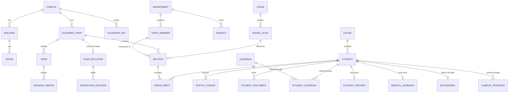
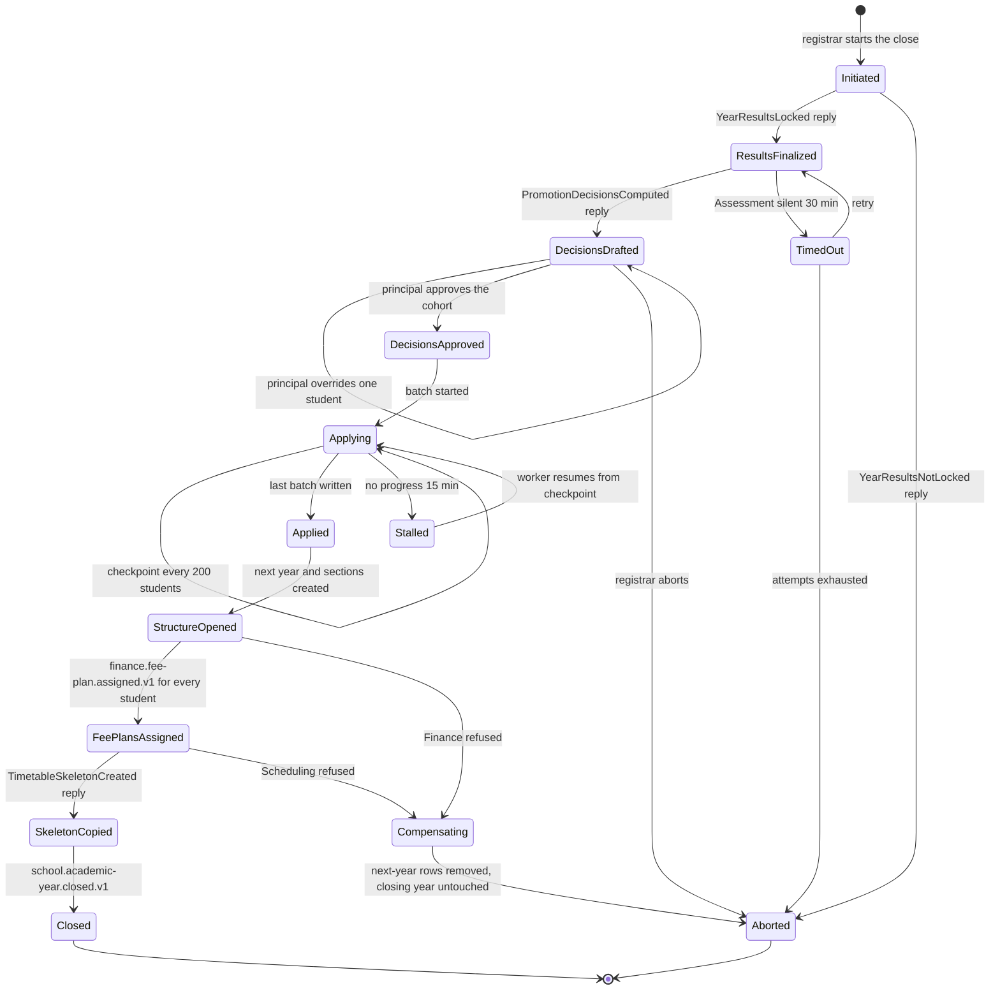
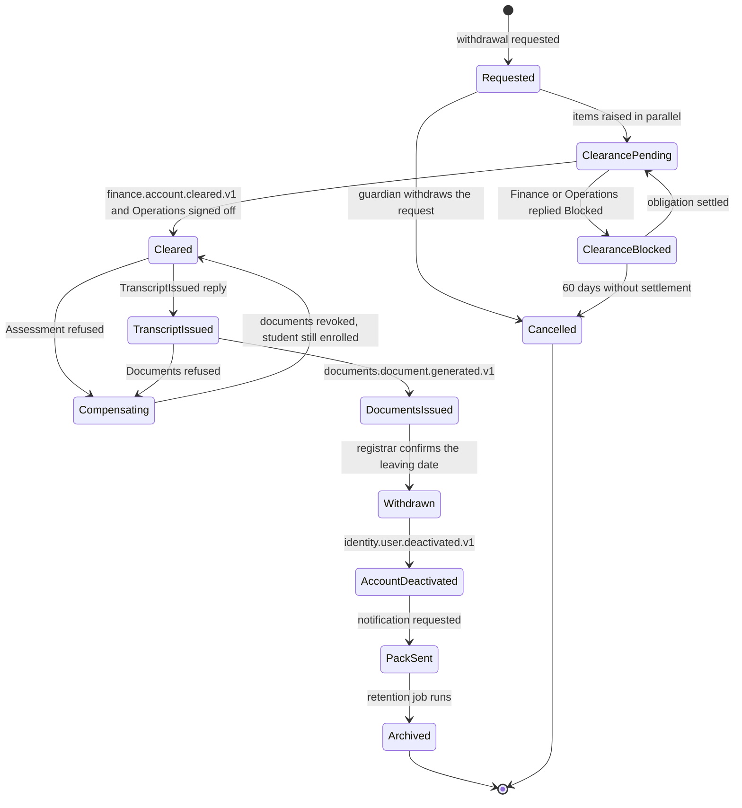

# School

> Service sheet, plan document 06, Group C. Names from Appendix L; events from Appendix E; permissions from Appendix B; error codes from Appendix K; settings categories from Appendix G. This sheet adds detail to reference architecture section 8.5 and never contradicts its table 8.0.

School is the source of truth for the structure of a school and the people in it: campuses, buildings and rooms, academic years, terms and grading periods, stages, grade levels, sections, the subject catalog, departments and houses, students, guardians and the links between them, enrolments and the status timeline, and staff profiles. It is the most-replicated data in the system: every academic service keeps a slim reference copy of School's students, staff and sections, built from the events in section 7 and reconciled nightly through the gRPC directory in section 6. That makes School's event contracts and directory the critical path of the whole build (`17-roadmap.md`, "Dependencies and the critical path": CAP-SCH-02 gates every phase 2 service), which is why this sheet specifies both to the field.

| Fact | Value (quoted from `05-service-catalog.md` and Appendix L) |
|---|---|
| Canonical name, long name | School, School Core (SIS) |
| Tier | 1 |
| AREA code | `SCH` |
| Database | `nibras_school`, schema `school`, application role `svc_school`, migration role `mig_school` |
| Exchange | `nibras.school` |
| Images | `nibras/school-api` |
| Worker | none; Quartz.NET jobs and long-running jobs run in the Api host under `Nibras.BuildingBlocks.Jobs`, as for Attendance (Appendix L lists no school-worker image) |
| gRPC package | `nibras.school.v1` in `Nibras.Contracts.School/Grpc/school.proto` |
| Build phase (master brief Section 28) | 2; the event contracts and the proto are published in week 1 of phase 2 (`17-roadmap.md`) |
| Service level class (master brief Section 31) | Read-heavy |
| Sensitivity (Appendix J) | confidential; custody and medical summary are sensitive |
| Why the boundary exists | Release: the most-replicated data in the system changes at its own cadence, and every other service keeps a slim copy of it rather than a dependency on its release |

**Signature features.** School owns Appendix W feature 20 (balanced class formation) and feeds feature 2 (Student 360 timeline filtered by the viewer's permissions), whose timeline is composed by Bff.Web from School's student record and the other services' answers. Each feature's rung, autonomy, requirements, capabilities, slices, Appendix O step and demo test are in the "Signature feature trace" of `32-product-differentiation-and-demo.md`; this sheet does not copy them.

**Last updated** 2026-09-26 by the round-3 remediation (saga diagrams, platform notes, signature features, risk scale, closed open points)

---

## 1. Responsibilities

| Owns | Detail |
|---|---|
| School profile | Legal details, contacts, logo reference, stamps and signatures used on documents (REQ-SCH-001) |
| Physical structure | Campuses, buildings, rooms with kind, capacity, facilities and turnaround buffer (REQ-SCH-002) |
| Academic calendar skeleton | Academic years (one current per campus), terms, grading periods, non-teaching days and holidays per campus (REQ-SCH-003, REQ-SCH-004) |
| Organisational structure | Stages, grade levels, sections with capacity and homeroom teacher, the subject catalog, departments, houses (REQ-SCH-008) |
| Numbering | Student and staff number formats and the gapless per-year series behind them (REQ-SCH-009) |
| Students | Bilingual profile, identifiers (sensitive, encrypted), photo, media consent flag, documents with expiry, notes with visibility levels, siblings, house, academic history, status timeline (REQ-SCH-012 to REQ-SCH-027, REQ-SCH-034) |
| Guardians and the student-guardian link | Relationship, custody and access rights, restriction flag, contact order, emergency contacts, payer flag (REQ-SCH-013 to REQ-SCH-015) |
| Custody record and medical summary | Sensitive, column-encrypted, every read logged (REQ-SCH-014, REQ-SCH-016) |
| Enrolment and status | Enrolment rows per student and year, the status machine (applicant, enrolled, suspended, withdrawn, transferred, graduated, alumni), section changes, campus transfers, promotion |
| Staff profiles | Employee number, bilingual names, department, campuses, qualifications, workload figure, user link, active or left (REQ-SCH-033) |
| Four workflows | WF-SCH-01 withdrawal with clearance (Saga 5), WF-SCH-02 year-end rollover (Saga 4), WF-SCH-03 year archival and reopen, WF-SCH-04 mid-year campus transfer |
| The directory | The `nibras.school.v1` gRPC service every other service may call once per request, and the checksum and snapshot calls behind every nightly reconciliation |
| Bulk student operations | Promotion, section change, status change, ID card batch, photo upload by file name, balanced class formation (Tier 2), duplicate merge (REQ-SCH-025 to REQ-SCH-027) |
| Alumni | Alumni as a student status plus `AlumniProfile` (Appendix L.5, Tier 3, REQ-SCH-036) |
| Custom-field values | The values stored on School entities; the definitions belong to Platform (Appendix L.5, ADR-0009) |

## 2. Not responsible for

| Not owned here | Owner | Why the line sits there |
|---|---|---|
| Bell schedules, periods, special-day schedules, the timetable | Scheduling | Reference architecture section 8.9 places `BellSchedule` in Scheduling; REQ-SCH-010 is delivered there (open point 3) |
| Subjects per grade with weekly periods, weight, electives, prerequisites; teaching assignments; student groups | Academics | Appendix A8 and REQ-ACA-001, REQ-ACA-002, REQ-ACA-005; School owns only the subject catalog entry |
| Grading schemes, assessment structures, marks, results, promotion eligibility (BR-ASM-012, BR-ASM-013), transcripts | Assessment | Saga 4 asks Assessment to compute decisions; School never applies BR-ASM-012 |
| Report card templates | Assessment | Appendix A2 lists them under setup; Assessment owns `ReportCardTemplate` (Appendix F) |
| Tenant settings, terminology, work week, time zone, currency, custom-field definitions | Platform | Appendix L.5 and Appendix G General; School reads them from `platform.settings.changed.v1` |
| User accounts, sign-in, roles, the account-level guardian access link, join requests | Identity | WF-IDN-01, WF-IDN-02; School stores `user_id` on guardians and staff only as a reference |
| Authorized pickup persons, gate passes | Attendance | Reference architecture section 8.10 places `PickupPerson` in Attendance (open point 6) |
| Allergy alert, clinic, medication, counselling, safeguarding, education plans | Wellbeing | Appendix J.3 and J.4: the allergy alert is read live from Wellbeing and never enters School |
| Applicants before enrolment, offers, seats, waiting lists, re-enrolment campaigns | Admissions | WF-ADM-01 and WF-ADM-02; School receives the enrolment command in Saga 3 |
| Contracts, leave, payroll, staff documents with expiry | Hr | Appendix E jobs table: staff document expiry is `hr.staff-document.expiring.v1` |
| Fee plans, invoices, clearance of balances | Finance | Saga 4 step 6, Saga 5 step 1 |
| Library and asset clearance | Operations | Saga 5 step 2 |
| Rendering certificates, ID cards and PDFs; storing files; imports and exports | Documents | Saga 5 step 4, Saga 9; School stores file references only |
| Student 360 composition and dashboards | Bff.Web over Reporting read models | REQ-DATA-023; School contributes its own timeline entries (REQ-SCH-035) |
| Admissions and retention analytics | Reporting | REQ-ADM-024 |
| Parent change requests and their approval | Requests | WF-RQS-01; School receives `UpdateGuardianDetails` once approved (REQ-SCH-023) |
| The hash-chained audit store | Audit | School emits `school.audit.recorded.v1` through its outbox |

## 3. Requirements covered

| Range or identifier | What it binds here |
|---|---|
| REQ-SCH-001 to REQ-SCH-037 | Every School row of `03-requirements-catalog.md`; REQ-SCH-010 is realised by Scheduling (open point 3), REQ-SCH-026 is Tier 2, REQ-SCH-036 is Tier 3 |
| REQ-PRV-003 | Academic records kept 10 years after leaving, then read-only, then anonymized (section 10, `StudentRetentionJob`) |
| REQ-DATA-011 | Compiled EF Core model, School named as the example |
| REQ-DATA-018, REQ-DATA-019 | Slim copies with no sensitive column; nightly checksum reconciliation served by section 6 |
| REQ-SEC-003, REQ-SEC-005, REQ-SEC-006, REQ-SEC-009 | Object-level authorization with `own-children` and `own-homeroom` scopes; isolation suite; declared permissions; encrypted identifiers, custody and medical summary |
| REQ-PERF-004, REQ-PERF-014, REQ-PERF-015, REQ-PERF-019, REQ-PERF-023 | Query budgets, keyset lists, compiled roster query, tenant-prefixed cache, the never-cached list |
| REQ-L10N-005, REQ-L10N-009, REQ-L10N-013 | Bilingual name parts (BR-L10N-007), Arabic search normalization, E.164 phones and local name order |
| REQ-API-017, REQ-API-018, REQ-API-019, REQ-API-022, REQ-API-024 | Bulk endpoints, 202 jobs with cancellation, gRPC deadlines and tenant metadata |
| REQ-MSG-003, REQ-MSG-004, REQ-MSG-012, REQ-MSG-023 | Outbox, inbox, per-student ordering, worker-kill test for the rollover batch |

---

## 4. Aggregates and entities

**Common columns.** Every table below carries these, and they are not repeated in each field list; the row `(common)` in each table stands for them.

| Field | Type | Null | Notes |
|---|---|---|---|
| `tenant_id` | uuid | no | First column of every index; row-level security policy `tenant_isolation` with `WITH CHECK` (`10-data-architecture.md` section 2.4) |
| `id` | uuid | no | UUID v7 generated by School (the key other services copy) |
| `created_at`, `created_by` | timestamptz, uuid | no | Audit columns from `Nibras.BuildingBlocks.Persistence` |
| `updated_at`, `updated_by` | timestamptz, uuid | yes | Set on every update; `updated_at` also feeds the checksum walk |
| `deleted_at`, `deleted_by` | timestamptz, uuid | yes | Soft delete behind the named `SoftDelete` filter; hard deletion only through the retention jobs |
| `xmin` | xid (system column) | no | Optimistic concurrency token on every aggregate root (REQ-PERF-018) |
| `data_class` | attribute, not a column | | Classification attribute per property (Appendix J), checked by `TC-PRV-051` |

### 4.1 `SchoolProfile` (one per tenant)

| Field | Type | Null | Notes |
|---|---|---|---|
| (common) | | | |
| `legal_name_en`, `legal_name_ar` | text | no | Bilingual value object |
| `registration_number`, `tax_number` | text | yes | Internal |
| `contact_phone` | text | yes | E.164 |
| `contact_email`, `website` | text | yes | |
| `logo_file_id` | uuid | yes | Documents file reference |
| `marks` | child rows `profile_marks` (`kind` stamp or signature, `file_id`, `label_en`, `label_ar`, `signatory_staff_id`) | | Used by certificate templates (REQ-SCH-001) |

Invariants: exactly one live profile row per tenant; a mark whose file scan status is not `clean` is never offered to a template.

### 4.2 `Campus`, `Building`, `Room`

| Entity | Field | Type | Null | Notes |
|---|---|---|---|---|
| Campus | (common), `code` | text | no | Unique per tenant among live rows |
| Campus | `name_en`, `name_ar` | text | no | |
| Campus | `time_zone` | text | no | IANA zone; defaults from the tenant General setting |
| Campus | `address_line`, `city`, `country_code` | text | yes | Internal |
| Campus | `archived_at` | timestamptz | yes | Archive instead of delete when in use |
| Building | (common), `campus_id` | uuid | no | FK to Campus |
| Building | `code`, `name_en`, `name_ar` | text | no | |
| Room | (common), `campus_id`, `building_id` | uuid | no, yes | |
| Room | `code`, `name_en`, `name_ar` | text | no | |
| Room | `kind` | text enum | no | classroom, laboratory, hall, gym, library, office, other |
| Room | `capacity` | int | no | > 0 |
| Room | `facilities` | text[] | no | Facility codes used by `SCHEDULING_ROOM_UNSUITABLE` checks in Scheduling |
| Room | `turnaround_minutes` | int | no | Setup and teardown buffer; BR-SCD-007 treats it as a room property |
| Room | `archived_at` | timestamptz | yes | |

Invariants: a building belongs to exactly one campus; a room's campus equals its building's campus; a campus, building or room referenced by a live section, enrolment or staff campus row cannot be deleted, only archived (REQ-SCH-007); room capacity is a positive integer.

### 4.3 `AcademicYear` with `Term`, `GradingPeriod`, `CalendarDay`

| Entity | Field | Type | Null | Notes |
|---|---|---|---|---|
| AcademicYear | (common), `campus_id` | uuid | no | A year is per campus (REQ-SCH-003) |
| AcademicYear | `label_en`, `label_ar` | text | no | "2026-27" |
| AcademicYear | `starts_on`, `ends_on` | date | no | Gregorian source of truth |
| AcademicYear | `status` | enum `AcademicYearStatus` | no | Planned, Current, Closing, Closed, ArchivePending, Archived, ArchiveFailed, Reopened (WF-SCH-03 states live in `YearArchivalAndReopenStatus`) |
| AcademicYear | `closed_at`, `closed_by`, `archived_at` | timestamptz, uuid | yes | |
| AcademicYear | `archival_due_on` | date | yes | From the retention setting; drives `YearArchivalJob` |
| Term | (common), `academic_year_id` | uuid | no | |
| Term | `sequence`, `name_en`, `name_ar`, `starts_on`, `ends_on` | int, text, date | no | |
| Term | `started_event_published_at` | timestamptz | yes | Guards single publication of `school.term.started.v1` |
| GradingPeriod | (common), `term_id` | uuid | no | Copied by Assessment over gRPC (`10-data-architecture.md` section 6) |
| GradingPeriod | `name_en`, `name_ar`, `starts_on`, `ends_on`, `lock_at` | text, date, timestamptz | no | |
| CalendarDay | (common), `campus_id`, `date` | uuid, date | no | |
| CalendarDay | `kind` | enum | no | holiday, non-teaching, special-event |
| CalendarDay | `label_en`, `label_ar` | text | no | |

Invariants: at most one year per campus has `status = Current` (unique partial index `ux_academic_years_current` on `(tenant_id, campus_id) WHERE status = 'current'` plus the domain check, REQ-SCH-004); `starts_on < ends_on`; terms of one year do not overlap and lie inside the year; grading periods lie inside their term; a year in Closed or Archived refuses every write to it and to its terms, grading periods, sections and enrolments with `SCHOOL_ACADEMIC_YEAR_CLOSED` unless an approved `YearReopening` covers the scope and the window is open (REQ-SCH-005, REQ-SCH-006); setting a new current year demotes the previous one in the same transaction.

### 4.4 `Stage`, `GradeLevel`, `Section`, `Subject`, `Department`, `House`

| Entity | Field | Type | Null | Notes |
|---|---|---|---|---|
| Stage | (common), `code`, `name_en`, `name_ar`, `sequence` | text, int | no | Kindergarten, primary, middle, secondary |
| GradeLevel | (common), `stage_id` | uuid | no | |
| GradeLevel | `code`, `name_en`, `name_ar`, `sequence` | text, int | no | `sequence` orders promotion |
| GradeLevel | `next_grade_level_id` | uuid | yes | Null on the final grade; graduation follows |
| Section | (common), `academic_year_id`, `campus_id`, `grade_level_id` | uuid | no | |
| Section | `code`, `name_en`, `name_ar` | text | no | "4-B" |
| Section | `capacity` | int | no | Published in `school.section.created.v1` |
| Section | `homeroom_staff_id` | uuid | yes | Drives the `own-homeroom` data scope |
| Section | `room_id` | uuid | yes | Home room |
| Section | `rollover_id` | uuid | yes | Stamped by Saga 4 step 5 so compensation can remove it |
| Subject | (common), `code`, `name_en`, `name_ar` | text | no | The catalog entry only |
| Subject | `department_id` | uuid | yes | |
| Department | (common), `code`, `name_en`, `name_ar`, `head_staff_id` | text, uuid | no, yes | Drives the `department` scope |
| House | (common), `code`, `name_en`, `name_ar`, `colour` | text | no | Behavior keeps house points |

Invariants: `(tenant_id, academic_year_id, campus_id, code)` is unique for live sections; the count of active enrolments in a section never exceeds `capacity` except through an enrolment whose `capacity_override_reason` is set (`SCHOOL_SECTION_CAPACITY_EXCEEDED`); reducing capacity below the active count is refused; a grade level, section, subject, department or house in use is archived, never deleted (REQ-SCH-007); the `next_grade_level_id` chain has no cycle.

### 4.5 `Student` (aggregate root) with its child entities

| Entity | Field | Type | Null | Class (Appendix J) | Notes |
|---|---|---|---|---|---|
| Student | (common), `student_number` | text | no | Internal | Unique per tenant; taken from `NumberSeries` (`SCHOOL_STUDENT_NUMBER_IN_USE`) |
| Student | `given_names_en`, `family_name_en`, `given_names_ar`, `father_name_ar`, `grandfather_name_ar`, `family_name_ar`, `preferred_name` | text | partly | Internal | Culturally correct parts; BR-L10N-007 fallback |
| Student | `name_sort`, `search_normalized` | text | no | Internal | Maintained on write for Arabic normalization (REQ-L10N-009) |
| Student | `date_of_birth`, `gender`, `nationality_code`, `place_of_birth` | date, text | no, no, no, yes | Confidential | Never in the directory or any event |
| Student | `photo_file_id` | uuid | yes | Internal | |
| Student | `media_consent` | bool | no | Internal | Consulted at publishing time (REQ-SCH-034) |
| Student | `languages`, `religion`, `previous_school` | text[], text, text | yes | Confidential | Religion only where the tenant requires it |
| Student | `house_id`, `campus_id` | uuid | yes, no | Internal | |
| Student | `status` | enum `StudentStatus` | no | Internal | applicant, enrolled, suspended, withdrawn, transferred, graduated, alumni, never-attended |
| Student | `source_application_id` | uuid | yes | Internal | Idempotency key of Saga 3 step 2: unique `(tenant_id, source_application_id)` |
| Student | `data_quality_flags` | text[] | no | Internal | From `reporting.data-quality.issue-detected.v1` and local checks (REQ-SCH-027) |
| Student | `custom_fields` | side table `student_custom_values` (`field_key`, `value jsonb`) | | per definition | Large `jsonb` kept off the hot table (REQ-DATA-014) |
| StudentIdentifier | `student_id`, `kind` (national-id, passport, residence-permit), `value_encrypted` bytea, `last4` text, `expires_on` date | | | Sensitive | Column-encrypted in the application; `last4` is the only value any list shows |
| StudentAddress | `student_id`, `line1`, `line2`, `city`, `country_code`, `postcode` | text | | Confidential | Never cached |
| StudentDocument | `student_id`, `document_type`, `file_id`, `issued_on`, `expires_on`, `reminder_sent_at` | | | Confidential | Expiry scan source (REQ-SCH-017) |
| StudentNote | `student_id`, `visibility` (teacher, homeroom, leadership, registrar), `body`, `author_id` | | | Confidential | Filtered by role level (REQ-SCH-024) |
| StatusChange | `student_id`, `from_status`, `to_status`, `effective_on`, `reason_code`, `workflow_ref`, `actor_id` | | | Internal | Append-only timeline (REQ-SCH-019) |
| SiblingLink | `student_id`, `sibling_student_id`, `source` (shared-guardian, declared) | | | Internal | Symmetric pair |
| CustodyRecord | `student_id`, `legal_status_encrypted`, `restriction_flag`, `order_text_encrypted`, `order_file_id`, `restricted_guardian_ids` | | | Sensitive | Every read writes an access-log audit entry in the same transaction (Appendix J rule 8) |
| MedicalSummary | `student_id`, `conditions_encrypted`, `medications_held_encrypted`, `blood_group_encrypted`, `emergency_instructions_encrypted`, `has_alert` | | | Sensitive | The allergy alert itself stays in Wellbeing (open point 5) |
| AlumniProfile | `student_id`, `graduation_year`, `contact_opt_in`, `current_institution` | | | Confidential | Tier 3 |

Invariants: `student_number` is unique per tenant among live and soft-deleted rows; a status change happens only through `Student.ChangeStatus(transition, reason)` against the table in `StudentStatusTransitions.cs`, and a PATCH that names `status` is refused with `SCHOOL_VALIDATION_FAILED` and changes 0 rows (REQ-SCH-020); an enrolled student has at least one contactable guardian link (`SCHOOL_GUARDIAN_REQUIRED`); a withdrawn, transferred or graduated student keeps every enrolment, status change and document row (REQ-SCH-022); a student in status `never-attended` has no active enrolment; sensitive fields are never returned by a handler that did not check `school.students.view-sensitive`, `school.custody.view` or `school.medical-summary.view`; `media_consent = false` is the default until a guardian records consent.

### 4.6 `Enrollment`

| Field | Type | Null | Notes |
|---|---|---|---|
| (common), `student_id`, `academic_year_id`, `section_id`, `campus_id`, `grade_level_id` | uuid | no | |
| `status` | enum | no | active, closed |
| `starts_on`, `ends_on` | date | no, yes | `ends_on` set by a section change, campus transfer, withdrawal or year close |
| `return_intent` | enum | yes | confirmed, declined; from `admissions.re-enrollment.*` events, read by Saga 4 step 4 |
| `capacity_override_reason` | text | yes | Set only with an audited override |
| `rollover_id` | uuid | yes | Stamped by Saga 4 so compensation deletes exactly these rows |
| `source_application_id` | uuid | yes | Saga 3 idempotency |

Invariants: a student has at most one active enrolment per academic year (`ux_enrollments_student_year_active`); `(student_id, next academic_year_id)` is unique, which is what makes the resumed rollover batch skip written rows (TC-SCH-015); a section change closes the old row and opens a new one with the same effective date, never an update in place, so attendance and marks keep their historical section (REQ-SCH-031).

### 4.7 `Guardian` and `StudentGuardian`

| Entity | Field | Type | Null | Class | Notes |
|---|---|---|---|---|---|
| Guardian | (common), `given_names_en`, `family_name_en`, `given_names_ar`, `family_name_ar` | text | partly | Internal | |
| Guardian | `preferred_language` | text | no | Internal | |
| Guardian | `mobile_e164`, `email`, `workplace` | text | yes | Confidential | Never cached, never in an event |
| Guardian | `national_id_encrypted`, `sponsor_id_encrypted` | bytea | yes | Sensitive | |
| Guardian | `user_id` | uuid | yes | Internal | Set from `identity.guardian-link.created.v1` or `identity.join-request.approved.v1` |
| Guardian | `search_normalized`, `verified_at` | text, timestamptz | no, yes | Internal | Duplicate-person check (REQ-SCH-037) |
| StudentGuardian | (common), `student_id`, `guardian_id` | uuid | no | Internal | Unique pair among live rows |
| StudentGuardian | `relationship`, `contact_order` | text, int | no | Internal | |
| StudentGuardian | `rights` | flags | no | Internal | view, receive-messages, collect, pays, sign-consent |
| StudentGuardian | `is_payer`, `is_emergency_contact` | bool | no | Internal | |
| StudentGuardian | `restricted` | bool | no | Sensitive (flag only) | Set by the custody record; the text never leaves `CustodyRecord` |
| StudentGuardian | `link_state` | enum | no | Internal | proposed, verified, revoked |

Invariants: a restricted guardian has `rights = none` and is excluded from every roster, directory response and messaging audience (REQ-SCH-014); linking a guardian named in `CustodyRecord.restricted_guardian_ids` is refused (T-SCH-03); contact orders of one student are a gap-free sequence starting at 1 (REQ-SCH-015); unlinking the last contactable guardian of an enrolled student is refused with `SCHOOL_GUARDIAN_REQUIRED`.

### 4.8 `StaffMember`

| Field | Type | Null | Class | Notes |
|---|---|---|---|---|
| (common), `employee_number` | text | no | Internal | Unique per tenant; from `NumberSeries` or from `hr.staff.hired.v1` |
| `given_names_en`, `family_name_en`, `given_names_ar`, `family_name_ar`, `name_sort` | text | no | Internal | |
| `department_id` | uuid | yes | Internal | |
| `campus_ids` | child rows `staff_campuses` | | Internal | Several campuses allowed; Scheduling applies BR-SCD-004 |
| `qualifications` | side table `staff_qualifications` (`kind`, `subject_id`, `awarded_on`) | | Confidential | |
| `weekly_load_target` | int | yes | Internal | Workload figure shown on the profile (REQ-SCH-033) |
| `user_id` | uuid | yes | Internal | |
| `status` | enum | no | Internal | active, left |
| `hired_on`, `last_working_day` | date | no, yes | Internal | |
| `reassign_to_staff_id` | uuid | yes | Internal | Carried by `school.staff.left.v1` |

Invariants: `employee_number` is unique per tenant; a staff member created from `hr.staff.hired.v1` is keyed on the Hr `staffId`, so the consumer is create-if-absent; `status = left` requires `last_working_day`; a left staff member cannot be set as homeroom teacher or department head (validation, `SCHOOL_VALIDATION_FAILED`).

### 4.9 Numbering

| Entity | Field | Type | Null | Notes |
|---|---|---|---|---|
| NumberingFormat | (common), `kind` (student, staff), `pattern`, `reset` (never, yearly), `padding` | text, int | no | `STU-{yy}-{0000}` (REQ-SCH-009) |
| NumberSeries | (common), `kind`, `period_key`, `next_value` | text, text, bigint | no | Incremented with `UPDATE ... RETURNING` inside the enrolment transaction |

Invariants: numbers within one `(kind, period_key)` are gapless and never reused; a format change takes effect from the next period and never renumbers existing students.

### 4.10 Workflow and saga aggregates

| Aggregate | Key fields | State type (document 31) | Invariants |
|---|---|---|---|
| `Withdrawal` (Saga 5 state) | `student_id`, `request_id` (null when started by a registrar), `kind` (withdrawal, transfer-out), `leaving_date`, `items` jsonb per department `{status, blockedReason, amount, itemRef, signedOffBy, signedOffAt}`, `transcript_document_id`, `certificate_document_id`, `escalated_at` | `TransferOrWithdrawalWithClearanceStatus`; saga enum `Nibras.School.Domain.Students.WithdrawalState` | One open withdrawal per student; `Withdrawn` is unreachable before both documents exist; `Cancelled` from `ClearanceBlocked` after 60 days |
| `YearRollover` (Saga 4 state) | `academic_year_id`, `next_academic_year_id`, `grading_period_ids`, `students_total`, `students_applied`, `batch_checkpoint` (last `student_id` by `student_number`), `approved_by`, `approved_at`, `timetable_version_id`, `failed_step`, `failure_message` | `EndOfYearCloseAndRolloverStatus`; saga enum `Nibras.School.Domain.AcademicYears.RolloverState` | One active rollover per academic year; `Closed` is written last and is irreversible |
| `PromotionDecision` | `rollover_id`, `student_id`, `proposed_outcome` (promote, retain, graduate), `reason`, `final_outcome`, `overridden_by`, `override_reason` | part of Saga 4 | An override always carries a reason and an approver (TC-SCH-013) |
| `YearReopening` | `academic_year_id`, `scope` (section ids, grading period ids, record kinds), `window_starts_at`, `window_ends_at`, `requested_by`, `approved_by`, `refused_reason`, `pre_reopen_snapshot_id` | `YearArchivalAndReopenStatus` | Window at most 5 working days; only the named scope becomes writable |
| `YearSnapshot` | `academic_year_id`, `version`, `row_counts` jsonb, `checksums` jsonb, `sealed_at`, `superseded_at` | WF-SCH-03 | The pre-reopen snapshot is kept until the refreshed one verifies |
| `CampusTransfer` | `student_id`, `from_campus_id`, `to_campus_id`, `to_section_id`, `effective_on`, `blocked_reason`, `waiting_position`, `approved_by` | `MidYearCampusTransferStatus` | Target campus in the same tenant (TC-SCH-031); lapses 30 days after approval if not effective |
| `SectionFormation` (Tier 2) | `academic_year_id`, `grade_level_id`, `target_section_ids`, `rules` jsonb (balance keys, keep-together, keep-apart), `proposal` jsonb, `applied_at` | none | Applying writes enrolments only for students with no active enrolment in the target year |
| `StudentMerge` | `survivor_id`, `victim_id`, `field_choices` jsonb, `reason`, `reversal_journal` jsonb | none | Both records in one tenant; guardians of both records re-verified after merge (T-SCH-06) |



---

## 5. REST API

Base path `/api/v1/school`. Conventions from `22-api-conventions-and-error-catalog.md`: keyset lists with `pageSize` default 50 and maximum 200 unless stated, `If-Match` required on every update (a missing tag is 400, a stale tag 409 `SCHOOL_CONCURRENCY_CONFLICT`), `Idempotency-Key` required on every job start and accepted on every create (held 24 hours, replay answers with `SCHOOL_IDEMPOTENCY_REPLAY`). The eight cross-cutting codes of Appendix K.1 apply to every row with the `SCHOOL_` prefix; the Errors column names them only where they carry a rule, and always names the service-specific codes. Jobs answer 202 with `Location: /api/v1/school/jobs/{jobId}`.

### 5.1 Profile and setup

| Method | Path | Permission | Request | Response | Errors | Idempotent |
|---|---|---|---|---|---|---|
| GET | `/profile` | `school.profile.view` | none | `SchoolProfileDto` with `ETag` | `SCHOOL_NOT_FOUND` | safe |
| PUT | `/profile` | `school.profile.edit` | `UpdateSchoolProfileRequest` | 200 `SchoolProfileDto` | `SCHOOL_VALIDATION_FAILED`, `SCHOOL_CONCURRENCY_CONFLICT` | `If-Match` |
| POST | `/profile/marks` | `school.profile.edit` | `AddProfileMarkRequest` (kind, fileId, labels, signatoryStaffId) | 201 `ProfileMarkDto` | `SCHOOL_VALIDATION_FAILED` | `Idempotency-Key` |
| DELETE | `/profile/marks/{id}` | `school.profile.edit` | none | 204 | `SCHOOL_NOT_FOUND` | by id |
| GET | `/setup-checklist` | `school.profile.view` | none | `SetupChecklistDto` (8 steps, state each) | none | safe |
| POST | `/setup-checklist/sample-data` | `school.profile.edit` | `LoadSampleDataRequest` | 202 job | `SCHOOL_VALIDATION_FAILED` (tenant already has students) | `Idempotency-Key` required |
| GET | `/numbering-formats` | `school.numbering.view` | none | `NumberingFormatDto[]` | none | safe |
| PUT | `/numbering-formats/{kind}` | `school.numbering.edit` | `UpdateNumberingFormatRequest` | 200 `NumberingFormatDto` | `SCHOOL_VALIDATION_FAILED`, `SCHOOL_CONCURRENCY_CONFLICT` | `If-Match` |

### 5.2 Campuses, buildings, rooms

| Method | Path | Permission | Request | Response | Errors | Idempotent |
|---|---|---|---|---|---|---|
| GET | `/campuses` | `school.campuses.view` | filter `archived` | `CampusDto[]` | none | safe |
| GET | `/campuses/{id}` | `school.campuses.view` | none | `CampusDto` | `SCHOOL_NOT_FOUND` | safe |
| POST | `/campuses` | `school.campuses.create` | `CreateCampusRequest` | 201 `CampusDto` | `SCHOOL_VALIDATION_FAILED` | `Idempotency-Key` |
| PUT | `/campuses/{id}` | `school.campuses.edit` | `UpdateCampusRequest` | 200 `CampusDto` | `SCHOOL_CONCURRENCY_CONFLICT` | `If-Match` |
| DELETE | `/campuses/{id}` | `school.campuses.delete` | none | 204, or a refusal naming dependants and offering archive | `SCHOOL_CONFIGURATION_IN_USE` | by id |
| POST | `/campuses/{id}/archive` | `school.campuses.edit` | `ArchiveRequest` (reason) | 200 | `SCHOOL_CONCURRENCY_CONFLICT` | state check |
| GET | `/buildings` | `school.campuses.view` | filter `campusId` | `BuildingDto[]` | none | safe |
| POST | `/buildings` | `school.campuses.edit` | `CreateBuildingRequest` | 201 `BuildingDto` | `SCHOOL_VALIDATION_FAILED` | `Idempotency-Key` |
| PUT | `/buildings/{id}` | `school.campuses.edit` | `UpdateBuildingRequest` | 200 | `SCHOOL_CONCURRENCY_CONFLICT` | `If-Match` |
| DELETE | `/buildings/{id}` | `school.campuses.edit` | none | 204 | `SCHOOL_CONFIGURATION_IN_USE` | by id |
| GET | `/rooms` | `school.rooms.view` | filter `campusId`, `buildingId`, `kind`, `minCapacity`, `facility` | keyset `RoomDto` | none | safe |
| GET | `/rooms/{id}` | `school.rooms.view` | none | `RoomDto` | `SCHOOL_NOT_FOUND` | safe |
| POST | `/rooms` | `school.rooms.create` | `CreateRoomRequest` | 201 `RoomDto` | `SCHOOL_VALIDATION_FAILED` | `Idempotency-Key` |
| PUT | `/rooms/{id}` | `school.rooms.edit` | `UpdateRoomRequest` | 200 `RoomDto`; publishes `school.room.changed.v1` | `SCHOOL_CONCURRENCY_CONFLICT` | `If-Match` |
| DELETE | `/rooms/{id}` | `school.rooms.delete` | none | 204 | `SCHOOL_CONFIGURATION_IN_USE` | by id |

### 5.3 Academic years, terms, grading periods, calendar days

| Method | Path | Permission | Request | Response | Errors | Idempotent |
|---|---|---|---|---|---|---|
| GET | `/academic-years` | `school.academic-years.view` | filter `campusId`, `status` | `AcademicYearDto[]` | none | safe |
| GET | `/academic-years/{id}` | `school.academic-years.view` | none | `AcademicYearDto` with terms and grading periods | `SCHOOL_NOT_FOUND` | safe |
| POST | `/academic-years` | `school.academic-years.create` | `CreateAcademicYearRequest` | 201; publishes `school.academic-year.opened.v1` when created as current | `SCHOOL_VALIDATION_FAILED` (overlap) | `Idempotency-Key`; natural key `(campusId, startsOn)` |
| PUT | `/academic-years/{id}` | `school.academic-years.edit` | `UpdateAcademicYearRequest` | 200 | `SCHOOL_ACADEMIC_YEAR_CLOSED`, `SCHOOL_CONCURRENCY_CONFLICT` | `If-Match` |
| POST | `/academic-years/{id}/set-current` | `school.academic-years.edit` | `SetCurrentYearRequest` | 200; previous current year demoted in the same transaction | `SCHOOL_ACADEMIC_YEAR_CLOSED` | state check |
| GET | `/terms` | `school.terms.view` | filter `academicYearId` | `TermDto[]` | none | safe |
| POST | `/terms` | `school.terms.create` | `CreateTermRequest` | 201 `TermDto` | `SCHOOL_ACADEMIC_YEAR_CLOSED`, `SCHOOL_VALIDATION_FAILED` (overlap) | `Idempotency-Key` |
| PUT | `/terms/{id}` | `school.terms.edit` | `UpdateTermRequest` | 200 | `SCHOOL_ACADEMIC_YEAR_CLOSED`, `SCHOOL_CONCURRENCY_CONFLICT` | `If-Match` |
| GET | `/grading-periods` | `school.terms.view` | filter `termId` | `GradingPeriodDto[]` | none | safe |
| POST | `/grading-periods` | `school.terms.create` | `CreateGradingPeriodRequest` | 201 | `SCHOOL_ACADEMIC_YEAR_CLOSED`, `SCHOOL_VALIDATION_FAILED` | `Idempotency-Key` |
| PUT | `/grading-periods/{id}` | `school.terms.edit` | `UpdateGradingPeriodRequest` | 200; evicts the calendar cache key; publishes `school.grading-period.changed.v1` | `SCHOOL_ACADEMIC_YEAR_CLOSED`, `SCHOOL_CONCURRENCY_CONFLICT` | `If-Match` |
| GET | `/calendar-days` | `school.terms.view` | filter `campusId`, `from`, `to` | `CalendarDayDto[]` | none | safe |
| POST | `/calendar-days` | `school.terms.edit` | `CreateCalendarDayRequest` (campus, date, kind, labels) | 201; publishes `school.calendar-day.changed.v1` | `SCHOOL_ACADEMIC_YEAR_CLOSED` | `Idempotency-Key`; natural key `(campusId, date, kind)` |
| DELETE | `/calendar-days/{id}` | `school.terms.edit` | none | 204; publishes `school.calendar-day.changed.v1` | `SCHOOL_ACADEMIC_YEAR_CLOSED` | by id |

### 5.4 Structure: stages, grade levels, sections, subjects, departments, houses

| Method | Path | Permission | Request | Response | Errors | Idempotent |
|---|---|---|---|---|---|---|
| GET | `/stages` | `school.grade-levels.view` | none | `StageDto[]` | none | safe |
| POST | `/stages` | `school.grade-levels.create` | `CreateStageRequest` | 201 | `SCHOOL_VALIDATION_FAILED` | `Idempotency-Key` |
| PUT | `/stages/{id}` | `school.grade-levels.edit` | `UpdateStageRequest` | 200 | `SCHOOL_CONCURRENCY_CONFLICT` | `If-Match` |
| GET | `/grade-levels` | `school.grade-levels.view` | filter `stageId` | `GradeLevelDto[]` | none | safe |
| POST | `/grade-levels` | `school.grade-levels.create` | `CreateGradeLevelRequest` | 201 | `SCHOOL_VALIDATION_FAILED` (cycle in `nextGradeLevelId`) | `Idempotency-Key` |
| PUT | `/grade-levels/{id}` | `school.grade-levels.edit` | `UpdateGradeLevelRequest` | 200; publishes `school.grade-level.changed.v1` | `SCHOOL_CONCURRENCY_CONFLICT` | `If-Match` |
| DELETE | `/grade-levels/{id}` | `school.grade-levels.delete` | none | 204, or refusal naming the sections that use it | `SCHOOL_CONFIGURATION_IN_USE` | by id |
| GET | `/sections` | `school.sections.view` | filter `academicYearId`, `campusId`, `gradeLevelId` | keyset `SectionDto` | none | safe |
| GET | `/sections/{id}` | `school.sections.view` | none | `SectionDto` with active count | `SCHOOL_NOT_FOUND` | safe |
| POST | `/sections` | `school.sections.create` | `CreateSectionRequest` | 201; publishes `school.section.created.v1` | `SCHOOL_ACADEMIC_YEAR_CLOSED`, `SCHOOL_VALIDATION_FAILED` | `Idempotency-Key`; natural key `(academicYearId, campusId, code)` |
| PUT | `/sections/{id}` | `school.sections.edit` | `UpdateSectionRequest` | 200; publishes `school.section.changed.v1` with the changed fields | `SCHOOL_ACADEMIC_YEAR_CLOSED`, `SCHOOL_SECTION_CAPACITY_EXCEEDED` (capacity below active count), `SCHOOL_CONCURRENCY_CONFLICT` | `If-Match` |
| DELETE | `/sections/{id}` | `school.sections.delete` | none | 204 when empty; refusal otherwise | `SCHOOL_CONFIGURATION_IN_USE` | by id |
| GET | `/sections/{id}/roster` | `school.students.view` | none | `RosterEntryDto[]` (id, number, names, photo, status) | `SCHOOL_NOT_FOUND` | safe; compiled query |
| POST | `/section-formations` | `school.sections.balance-formation` | `StartSectionFormationRequest` (year, grade, target sections, rules) | 202 job (Tier 2) | `SCHOOL_VALIDATION_FAILED` | `Idempotency-Key` required |
| GET | `/section-formations/{id}` | `school.sections.balance-formation` | none | `SectionFormationDto` with the proposal | `SCHOOL_NOT_FOUND` | safe |
| PUT | `/section-formations/{id}` | `school.sections.balance-formation` | `AdjustSectionFormationRequest` (drag-and-drop moves) | 200 | `SCHOOL_VALIDATION_FAILED` (keep-apart broken) | `If-Match` |
| POST | `/section-formations/{id}/apply` | `school.sections.balance-formation` | none | 202 job; writes enrolments | `SCHOOL_SECTION_CAPACITY_EXCEEDED` | `Idempotency-Key` required |
| GET | `/subjects` | `school.subjects.view` | filter `departmentId` | `SubjectDto[]` | none | safe |
| POST | `/subjects` | `school.subjects.create` | `CreateSubjectRequest` | 201 | `SCHOOL_VALIDATION_FAILED` | `Idempotency-Key` |
| PUT | `/subjects/{id}` | `school.subjects.edit` | `UpdateSubjectRequest` | 200 | `SCHOOL_CONCURRENCY_CONFLICT` | `If-Match` |
| DELETE | `/subjects/{id}` | `school.subjects.delete` | none | 204 | `SCHOOL_CONFIGURATION_IN_USE` | by id |
| GET | `/departments` | `school.departments.view` | none | `DepartmentDto[]` | none | safe |
| POST | `/departments` | `school.departments.create` | `CreateDepartmentRequest` | 201 | `SCHOOL_VALIDATION_FAILED` | `Idempotency-Key` |
| PUT | `/departments/{id}` | `school.departments.edit` | `UpdateDepartmentRequest` | 200; publishes `school.department.changed.v1` | `SCHOOL_CONCURRENCY_CONFLICT` | `If-Match` |
| DELETE | `/departments/{id}` | `school.departments.delete` | none | 204 | `SCHOOL_CONFIGURATION_IN_USE` | by id |
| GET | `/houses` | `school.houses.view` | none | `HouseDto[]` | none | safe |
| POST | `/houses` | `school.houses.create` | `CreateHouseRequest` | 201 | `SCHOOL_VALIDATION_FAILED` | `Idempotency-Key` |
| PUT | `/houses/{id}` | `school.houses.edit` | `UpdateHouseRequest` | 200 | `SCHOOL_CONCURRENCY_CONFLICT` | `If-Match` |
| DELETE | `/houses/{id}` | `school.houses.delete` | none | 204 | `SCHOOL_CONFIGURATION_IN_USE` | by id |

Departments and houses are their own resources in Appendix B (`school.departments`, `school.houses`, each with view, create, edit and delete), added under ADR-0019. A head of department holds `school.departments.view` and `.edit` in department scope (Appendix I, I.2), which the `school.profile.*` mapping could not express.

### 5.5 Students

| Method | Path | Permission | Request | Response | Errors | Idempotent |
|---|---|---|---|---|---|---|
| GET | `/students` | `school.students.view` | `q` (normalized name or number), `sectionId`, `campusId`, `status`, sort `nameSort,id` | keyset `StudentListItemDto`, page cap 50 | none | safe |
| GET | `/students/{id}` | `school.students.view` | none | `StudentDto` (identifiers masked to `last4`) with guardians and current enrolment | `SCHOOL_NOT_FOUND` (also for out-of-scope, T-SCH-01) | safe; compiled query |
| POST | `/students` | `school.students.create` | `CreateStudentRequest` (profile, guardians, section) | 201; publishes `school.student.enrolled.v1` | `SCHOOL_GUARDIAN_REQUIRED`, `SCHOOL_STUDENT_NUMBER_IN_USE`, `SCHOOL_SECTION_CAPACITY_EXCEEDED`, `SCHOOL_ACADEMIC_YEAR_CLOSED` | `Idempotency-Key` |
| PATCH | `/students/{id}` | `school.students.edit` | `UpdateStudentProfileRequest` (any field except `status`) | 200; publishes `school.student.profile-updated.v1` with field names | `SCHOOL_VALIDATION_FAILED` (a `status` property, REQ-SCH-020), `SCHOOL_CONCURRENCY_CONFLICT` | `If-Match` |
| DELETE | `/students/{id}` | `school.students.delete` | `DeleteStudentRequest` (reason) | 204; only a record with no enrolment history | `SCHOOL_STUDENT_STATUS_TRANSITION_INVALID` | by id |
| GET | `/students/{id}/sensitive` | `school.students.view-sensitive` | none | `StudentSensitiveDto` (unmasked identifiers, address) | `SCHOOL_SENSITIVE_FIELD_ACCESS_DENIED` | safe; access-log audit entry in the same transaction |
| PUT | `/students/{id}/identifiers` | `school.students.view-sensitive` | `UpdateStudentIdentifiersRequest` | 200 | `SCHOOL_SENSITIVE_FIELD_ACCESS_DENIED`, `SCHOOL_CONCURRENCY_CONFLICT` | `If-Match` |
| GET | `/students/{id}/custody` | `school.custody.view` | none | `CustodyDto` | `SCHOOL_SENSITIVE_FIELD_ACCESS_DENIED` | safe; logged read |
| PUT | `/students/{id}/custody` | `school.custody.edit` | `UpdateCustodyRequest` | 200; restricted guardian links lose all rights in the same transaction; publishes `school.guardian.updated.v1` (field names only) | `SCHOOL_SENSITIVE_FIELD_ACCESS_DENIED`, `SCHOOL_CONCURRENCY_CONFLICT` | `If-Match` |
| GET | `/students/{id}/medical-summary` | `school.medical-summary.view` | none | `MedicalSummaryDto` | `SCHOOL_SENSITIVE_FIELD_ACCESS_DENIED` | safe; logged read |
| PUT | `/students/{id}/medical-summary` | `school.medical-summary.edit` | `UpdateMedicalSummaryRequest` | 200; publishes `school.student.profile-updated.v1` with `changedFields = [medicalSummary]` (Appendix C row "Allergy or medical alert updated") | `SCHOOL_SENSITIVE_FIELD_ACCESS_DENIED`, `SCHOOL_CONCURRENCY_CONFLICT` | `If-Match` |
| PUT | `/students/{id}/photo` | `school.students.edit` | `SetPhotoRequest` (fileId) | 200; profile-updated | `SCHOOL_VALIDATION_FAILED` (file not clean) | `If-Match` |
| PUT | `/students/{id}/media-consent` | `school.students.edit` | `SetMediaConsentRequest` (value, consentTextVersion) | 200; profile-updated | `SCHOOL_CONCURRENCY_CONFLICT` | `If-Match` |
| GET | `/students/{id}/status-history` | `school.students.view` | none | `StatusChangeDto[]` and academic history per year | `SCHOOL_NOT_FOUND` | safe |
| POST | `/students/{id}/status-changes` | `school.students.change-status` | `ChangeStudentStatusRequest` (transition, effectiveOn, reasonCode) for suspend, reinstate, graduate-early | 200; publishes `school.student.status-changed.v1` | `SCHOOL_STUDENT_STATUS_TRANSITION_INVALID` | `Idempotency-Key` |
| POST | `/students/{id}/section-changes` | `school.students.edit` | `ChangeSectionRequest` (toSectionId, effectiveOn) | 200; publishes `school.student.section-changed.v1` | `SCHOOL_SECTION_CAPACITY_EXCEEDED`, `SCHOOL_ACADEMIC_YEAR_CLOSED` | `Idempotency-Key` |
| GET | `/students/{id}/documents` | `school.students.view` | none | `StudentDocumentDto[]` | none | safe |
| POST | `/students/{id}/documents` | `school.students.edit` | `AddStudentDocumentRequest` (type, fileId, expiresOn) | 201 | `SCHOOL_VALIDATION_FAILED` | `Idempotency-Key` |
| DELETE | `/student-documents/{id}` | `school.students.edit` | none | 204 | `SCHOOL_NOT_FOUND` | by id |
| GET | `/students/{id}/notes` | `school.students.view` | none | `StudentNoteDto[]` filtered by the caller's visibility level | none | safe |
| POST | `/students/{id}/notes` | `school.students.edit` | `AddStudentNoteRequest` (visibility, body) | 201 | `SCHOOL_VALIDATION_FAILED` (visibility above the author's level) | `Idempotency-Key` |
| GET | `/students/{id}/siblings` | `school.students.view` | none | `SiblingDto[]` | none | safe |
| POST | `/students/{id}/sibling-links` | `school.students.edit` | `LinkSiblingRequest` | 201; publishes `school.sibling.linked.v1` | `SCHOOL_VALIDATION_FAILED` | `Idempotency-Key` |
| DELETE | `/students/{id}/sibling-links/{siblingStudentId}` | `school.students.edit` | none | 204; publishes `school.sibling.unlinked.v1` | `SCHOOL_NOT_FOUND` | by id |
| PUT | `/students/{id}/alumni-profile` | `school.students.edit` | `UpsertAlumniProfileRequest` | 200 (Tier 3) | `SCHOOL_STUDENT_STATUS_TRANSITION_INVALID` (not alumni) | `If-Match` |
| GET | `/students/export` | `school.students.export` | filters and an Internal or Confidential column set | streamed CSV (`IAsyncEnumerable`) | `SCHOOL_SENSITIVE_FIELD_ACCESS_DENIED` (a sensitive column requested: routed to Documents under WF-PRV-02) | safe |
| POST | `/students/bulk-section-changes` | `school.students.edit` | up to 500 items, mode `independent` or `allOrNothing` | 202 job with per-item results | `SCHOOL_SECTION_CAPACITY_EXCEEDED` per item | `Idempotency-Key` required |
| POST | `/students/bulk-status-changes` | `school.students.change-status` | up to 500 items | 202 job | `SCHOOL_STUDENT_STATUS_TRANSITION_INVALID` per item | `Idempotency-Key` required |
| POST | `/students/bulk-promotions` | `school.students.promote` | up to 500 items (outside the rollover, for accelerations and corrections) | 202 job; `school.student.promoted.v1` per student | `SCHOOL_PROMOTION_BLOCKED` per item | `Idempotency-Key` required |
| POST | `/students/id-card-batches` | `school.students.print-id-cards` | `PrintIdCardsRequest` (student ids or section) | 202 job; sends `GenerateDocument` per card | `SCHOOL_VALIDATION_FAILED` | `Idempotency-Key` required |
| POST | `/students/photo-imports` | `school.students.edit` | `ImportPhotosRequest` (archive file id) | 202 job; report lists unmatched files (REQ-SCH-025) | `SCHOOL_VALIDATION_FAILED` | `Idempotency-Key` required |
| GET | `/duplicate-candidates` | `school.students.merge` | filter `kind` (student, guardian) | keyset `DuplicateCandidateDto` (REQ-SCH-037) | none | safe |
| POST | `/student-merges/preview` | `school.students.merge` | `MergePreviewRequest` (survivor, victim) | `MergePreviewDto` with conflicting fields | `SCHOOL_MERGE_CONFLICT`, `SCHOOL_TENANT_MISMATCH` | safe |
| POST | `/student-merges` | `school.students.merge` | `MergeStudentsRequest` (choices, reason) | 200; profile-updated on the survivor, status-changed on the victim | `SCHOOL_MERGE_CONFLICT` | `Idempotency-Key` |

### 5.6 Guardians and links

| Method | Path | Permission | Request | Response | Errors | Idempotent |
|---|---|---|---|---|---|---|
| GET | `/guardians` | `school.guardians.view` | `q`, `studentId` | keyset `GuardianListItemDto` | none | safe |
| GET | `/guardians/{id}` | `school.guardians.view` | none | `GuardianDto` (contacts shown only with the permission and scope) | `SCHOOL_NOT_FOUND` | safe |
| POST | `/guardians` | `school.guardians.create` | `CreateGuardianRequest` | 201 | `SCHOOL_VALIDATION_FAILED` | `Idempotency-Key` |
| PATCH | `/guardians/{id}` | `school.guardians.edit` | `UpdateGuardianRequest` | 200; publishes `school.guardian.updated.v1` | `SCHOOL_CONCURRENCY_CONFLICT` | `If-Match` |
| DELETE | `/guardians/{id}` | `school.guardians.delete` | none | 204 only with no live link | `SCHOOL_GUARDIAN_REQUIRED` | by id |
| GET | `/guardians/{id}/children` | `school.guardians.view` | none | `ChildSummaryDto[]` (scope `own-children` for a parent) | none | safe; compiled query |
| GET | `/students/{id}/guardians` | `school.guardians.view` | none | `StudentGuardianDto[]` in contact order | `SCHOOL_NOT_FOUND` | safe |
| POST | `/students/{id}/guardian-links` | `school.guardians.link` | `LinkGuardianRequest` (guardianId, relationship, rights, contactOrder) | 201; publishes `school.guardian.updated.v1` | `SCHOOL_SENSITIVE_FIELD_ACCESS_DENIED` (restricted guardian, T-SCH-03) | `Idempotency-Key`; natural key the pair |
| PUT | `/guardian-links/{id}` | `school.guardians.edit` | `UpdateGuardianLinkRequest` (rights, contact order, payer flag) | 200; guardian.updated | `SCHOOL_CONCURRENCY_CONFLICT` | `If-Match` |
| DELETE | `/guardian-links/{id}` | `school.guardians.unlink` | `UnlinkGuardianRequest` (reason) | 204; guardian.updated | `SCHOOL_GUARDIAN_REQUIRED` | by id |
| PUT | `/students/{id}/emergency-contacts` | `school.guardians.edit` | `SetEmergencyContactsRequest` (ordered guardian ids) | 200 | `SCHOOL_VALIDATION_FAILED` (gap in order) | `If-Match` |
| GET | `/guardians/export` | `school.guardians.export` | filters, non-sensitive columns | streamed CSV | `SCHOOL_SENSITIVE_FIELD_ACCESS_DENIED` | safe |

### 5.7 Staff

| Method | Path | Permission | Request | Response | Errors | Idempotent |
|---|---|---|---|---|---|---|
| GET | `/staff` | `school.staff.view` | `q`, `campusId`, `departmentId`, `status` | keyset `StaffListItemDto` | none | safe |
| GET | `/staff/{id}` | `school.staff.view` | none | `StaffDto` | `SCHOOL_NOT_FOUND` | safe |
| POST | `/staff` | `school.staff.create` | `CreateStaffRequest` | 201; publishes `school.staff.created.v1` | `SCHOOL_VALIDATION_FAILED` | `Idempotency-Key`; natural key `employeeNumber` |
| PATCH | `/staff/{id}` | `school.staff.edit` | `UpdateStaffRequest` (names, department, campuses, qualifications, load) | 200; publishes `school.staff.changed.v1` | `SCHOOL_CONCURRENCY_CONFLICT` | `If-Match` |
| POST | `/staff/{id}/departure` | `school.staff.edit` | `RecordDepartureRequest` (lastWorkingDay, reassignTo) | 200; publishes `school.staff.left.v1` | `SCHOOL_VALIDATION_FAILED` | `Idempotency-Key` |
| DELETE | `/staff/{id}` | `school.staff.delete` | none | 204 only for a record never linked to a user or section | `SCHOOL_VALIDATION_FAILED` | by id |
| GET | `/staff/export` | `school.staff.export` | filters | streamed CSV | none | safe |

### 5.8 Workflows: withdrawal, campus transfer, rollover, archival and reopen

| Method | Path | Permission | Request | Response | Errors | Idempotent |
|---|---|---|---|---|---|---|
| GET | `/withdrawals` | `school.students.view` | filter `state` | keyset `WithdrawalCardDto` (clearance board) | none | safe |
| GET | `/withdrawals/{id}` | `school.students.view` | none | `WithdrawalDto` with items and documents | `SCHOOL_NOT_FOUND` | safe |
| POST | `/withdrawals` | `school.students.change-status` | `StartWithdrawalRequest` (studentId, kind, requestedLeavingDate) | 202; Saga 5 starts (TC-SCH-001) | `SCHOOL_STUDENT_STATUS_TRANSITION_INVALID` | `Idempotency-Key`; one open withdrawal per student |
| POST | `/withdrawals/{id}/confirm-leaving-date` | `school.students.change-status` | `ConfirmLeavingDateRequest` | 200; `DocumentsIssued → Withdrawn` (TC-SCH-005) | `SCHOOL_STUDENT_STATUS_TRANSITION_INVALID` | state check |
| POST | `/withdrawals/{id}/cancel` | `school.students.change-status` | `CancelWithdrawalRequest` (reason) | 200 | `SCHOOL_STUDENT_STATUS_TRANSITION_INVALID` (already withdrawn) | state check |
| POST | `/withdrawals/{id}/reverse` | `school.students.change-status` | `ReverseWithdrawalRequest` | 200; `Withdrawn → Enrolled` inside the same term | `SCHOOL_STUDENT_STATUS_TRANSITION_INVALID`, `SCHOOL_SECTION_CAPACITY_EXCEEDED` | state check |
| POST | `/campus-transfers` | `school.students.change-status` | `RequestCampusTransferRequest` (studentId, toCampusId, effectiveOn) | 201; seat check runs (TC-SCH-031) | `SCHOOL_CAMPUS_TRANSFER_BLOCKED`, `SCHOOL_TENANT_MISMATCH` | `Idempotency-Key` |
| GET | `/campus-transfers/{id}` | `school.students.view` | none | `CampusTransferDto` | `SCHOOL_NOT_FOUND` | safe |
| POST | `/campus-transfers/{id}/approve` | `school.students.change-status` | `ApproveCampusTransferRequest` | 200 | `SCHOOL_CAMPUS_TRANSFER_BLOCKED` | state check |
| POST | `/campus-transfers/{id}/cancel` | `school.students.change-status` | reason | 200 | `SCHOOL_STUDENT_STATUS_TRANSITION_INVALID` | state check |
| POST | `/rollovers` | `school.academic-years.close-year` | `StartRolloverRequest` (academicYearId) | 202; Saga 4 starts | `SCHOOL_PROMOTION_BLOCKED`, `SCHOOL_ACADEMIC_YEAR_CLOSED` | `Idempotency-Key` required; one active rollover per year |
| GET | `/rollovers/{id}` | `school.academic-years.view` | none | `RolloverDto` (state, progress "Applied 300 of 800", decision summary, last checkpoint) | `SCHOOL_NOT_FOUND` | safe |
| GET | `/rollovers/{id}/decisions` | `school.students.promote` | filter `outcome`, `overridden` | keyset `PromotionDecisionDto` | none | safe |
| POST | `/promotion-decisions/{id}/override` | `school.students.promote` | `OverrideDecisionRequest` (outcome, reason) | 200 (TC-SCH-013) | `SCHOOL_VALIDATION_FAILED` (no reason) | `If-Match` |
| POST | `/rollovers/{id}/approve` | `school.students.promote` | `ApproveCohortRequest` | 202; batch starts | `SCHOOL_PROMOTION_BLOCKED` | state check |
| POST | `/rollovers/{id}/pause` | `school.academic-years.close-year` | none | 200 | `SCHOOL_VALIDATION_FAILED` (not applying) | state check |
| POST | `/rollovers/{id}/resume` | `school.academic-years.close-year` | none | 202 | `SCHOOL_VALIDATION_FAILED` | state check |
| POST | `/rollovers/{id}/abort` | `school.academic-years.close-year` | reason | 202; compensation removes next-year rows | `SCHOOL_ACADEMIC_YEAR_CLOSED` (already closed) | state check |
| POST | `/academic-years/{id}/archive` | `school.academic-years.close-year` | none | 202; snapshot job (TC-SCH-021) | `SCHOOL_VALIDATION_FAILED` (open grade appeals) | `Idempotency-Key` required |
| POST | `/year-reopenings` | `school.academic-years.edit` | `RequestReopenRequest` (yearId, scope, reason, window) | 201 | `SCHOOL_VALIDATION_FAILED` (window over 5 working days) | `Idempotency-Key` |
| POST | `/year-reopenings/{id}/approve` | `school.academic-years.reopen-year` | `ApproveReopenRequest` | 200 (TC-SCH-024) | `SCHOOL_PERMISSION_DENIED` (self-approval) | state check |
| POST | `/year-reopenings/{id}/refuse` | `school.academic-years.reopen-year` | reason | 200 | none | state check |
| POST | `/year-reopenings/{id}/close` | `school.academic-years.reopen-year` | none | 202; snapshot refresh (TC-SCH-025) | none | state check |

### 5.9 Jobs

| Method | Path | Permission | Request | Response | Errors | Idempotent |
|---|---|---|---|---|---|---|
| GET | `/jobs/{id}` | the permission that started the job, or `platform.jobs.view` | none | `Job` resource (`22-api-conventions-and-error-catalog.md` section 6.2) | `SCHOOL_NOT_FOUND` | safe |
| GET | `/jobs/{id}/items` | same | keyset | per-item report | `SCHOOL_NOT_FOUND` | safe |
| POST | `/jobs/{id}/cancel` | the starter, or `platform.jobs.cancel` | none | 202; ends `cancelled` with partial summary | `SCHOOL_VALIDATION_FAILED` (terminal) | state check |

---

## 6. gRPC

### 6.1 Exposed: `nibras.school.v1`

One proto, `Nibras.Contracts.School/Grpc/school.proto`, four services. Every method is idempotent and retried under `22-api-conventions-and-error-catalog.md` section 10.2; every call carries `nibras-tenant-id` and is refused with `SCHOOL_TENANT_MISMATCH` on a mismatch with the service token; a nested call is refused (one hop). Responses never carry a Confidential or Sensitive field of Appendix J except the one method marked, and never a restricted guardian (T-SCH-05).

| Service | Method | Returns | Deadline | Callers (service-token scope) | Budget |
|---|---|---|---|---|---|
| `StudentDirectory` | `GetStudent(student_id)` | `StudentEntry`: id, number, name `LocalizedText`, section id, campus id, grade level id, status, photo file id, media consent, enrolled on | 2 s | Admissions, Academics, Assessment, Attendance, Finance, Behavior, Wellbeing, Operations; Scheduling for exam seating only (Scheduling sheet, open point 3) | 2 commands, compiled |
| `StudentDirectory` | `ListStudents(student_ids ≤ 200)` | `StudentEntry[]` | 2 s | same | 2 commands |
| `StudentDirectory` | `ListStudentsBySection(section_id, page_token)` | `StudentEntry[]`, 200 per page | 5 s | same | 2 commands, compiled roster query |
| `StudentDirectory` | `GetStudentByNumber(student_number)` | `StudentEntry` | 2 s | Admissions (sibling priority, BR-ADM-005) | 2 commands |
| `StudentDirectory` | `FindDuplicateCandidates(normalized_name, date_of_birth, identifier_hmac)` | candidate ids and match kinds only, never field values | 2 s | Admissions (BR-ADM-006, open point 10) | 3 commands |
| `StaffDirectory` | `GetStaff(staff_id)` | `StaffEntry`: id, employee number, name, department id, campus ids, status | 2 s | Admissions, Academics, Scheduling, Hr, Operations, Communication | 2 commands |
| `StaffDirectory` | `ListStaff(staff_ids ≤ 200)`, `ListStaffByCampus(campus_id, page_token)` | `StaffEntry[]` | 2 s, 5 s | same | 2 commands |
| `StructureDirectory` | `GetSection`, `ListSections(academic_year_id, campus_id)` | `SectionEntry`: id, code, name, grade level, campus, capacity, homeroom staff id, year | 2 s, 5 s | every academic service | 2 commands |
| `StructureDirectory` | `ListGradeLevels`, `ListCampuses`, `ListDepartments`, `ListRooms(campus_id)` | slim structure entries | 5 s | Admissions, Hr, Scheduling (`10-data-architecture.md` section 6) | 2 commands |
| `StructureDirectory` | `ListGradingPeriods(term_id)` | id, term, dates, lock at | 2 s | Assessment | 2 commands |
| `StructureDirectory` | `ListCalendarDays(campus_id, from, to)` | date, kind, labels | 2 s | Scheduling, Attendance, for the first load and for repair; the day-to-day change arrives as `school.calendar-day.changed.v1` | 2 commands |
| `StructureDirectory` | `GetSeatUsage(campus_id, grade_level_id, academic_year_id)` | enrolled count, total section capacity | 2 s | Admissions (BR-ADM-003) | 2 commands |
| `GuardianDirectory` | `GetGuardianContact(guardian_id)` | name, preferred language, mobile, email: the one Confidential response | 2 s | Finance only (receipt delivery, `10-data-architecture.md` section 6) | 2 commands; access-logged |
| `ReferenceReconciliation` | `Checksum(entity_kind, as_of)` | `md5` over `(id, updated_at)` for student, section, staff, guardian-link, room, grade-level, grading-period, term, academic-year | 30 s | every service holding a copy | 1 command (query 5 of section 12) |
| `ReferenceReconciliation` | `ListSnapshotPage(entity_kind, page_token)` | slim rows, 1,000 per page | 5 s per page | same | 1 command per page |

`10-data-architecture.md` section 6 writes the checksum calls as `Directory/StudentChecksum`, `Directory/StaffChecksum`, `Directory/SectionChecksum`, `Directory/GuardianChecksum` and `Directory/Rooms`; each maps to `ReferenceReconciliation.Checksum` with the matching `entity_kind`, or to `StructureDirectory.ListRooms` (open point 9).

### 6.2 Consumed

None. School has no synchronous dependency (reference architecture table 8.0: "none. School is the source").

---

## 7. Events published and consumed

### 7.1 Published on `nibras.school`

Payload fields are quoted from Appendix E, School section, and owned there; this table adds the trigger, the publishing handler and the consumers resolved by `11-messaging-architecture.md` section 2.2. Every message carries the Appendix E envelope. No payload carries a Confidential or Sensitive field.

| Routing key | Payload fields (Appendix E) | Partition key | Published when, by which handler | Consumers |
|---|---|---|---|---|
| `school.academic-year.opened.v1` | `academicYearId`, `campusId`, `startsOn`, `endsOn` | `tenantId` | A year becomes current: `CreateAcademicYearHandler`, `SetCurrentYearHandler`, Saga 1 step 4 `OpenFirstAcademicYear`, Saga 4 step 5 | Academics, Assessment, Scheduling, Attendance, Finance; Platform as a Saga 1 outcome |
| `school.academic-year.closed.v1` | `academicYearId`, `closedBy`, `closedAt` | `tenantId` | Saga 4 step 8, last and irreversible | Academics, Assessment, Scheduling, Attendance, Finance, Reporting |
| `school.term.started.v1` | `termId`, `academicYearId`, `startsOn`, `endsOn` | `tenantId` | `TermStartJob` on the term's first day at 00:05 in the campus time zone, once per term | Academics, Assessment, Scheduling, Attendance, Finance |
| `school.section.created.v1` | `sectionId`, `gradeLevelId`, `campusId`, `capacity`, `nameEn`, `nameAr` | `sectionId` | `CreateSectionHandler`, Saga 4 step 5 | Academics, Assessment, Scheduling, Attendance, Admissions, Communication, Behavior, Operations, Wellbeing |
| `school.section.changed.v1` | `sectionId`, changed fields | `sectionId` | `UpdateSectionHandler`; changed fields among `capacity`, `gradeLevelId`, `campusId`, `homeroomStaffId`, `code`, `name`, `archived` | same set |
| `school.grade-level.changed.v1` | `gradeLevelId`, changed fields | `tenantId` | `UpdateGradeLevelHandler` | Admissions |
| `school.grading-period.changed.v1` | `gradingPeriodId`, `termId`, changed fields | `tenantId` | `UpdateGradingPeriodHandler` | Assessment |
| `school.calendar-day.changed.v1` | `campusId`, `date`, `kind`, `change` (added or removed) | `tenantId` | `CreateCalendarDayHandler`, `DeleteCalendarDayHandler` | Scheduling, Attendance, Requests |
| `school.room.changed.v1` | `roomId`, `campusId`, changed fields | `tenantId` | `UpdateRoomHandler`; satisfies the REQ-SCH-002 60-second acceptance | Scheduling |
| `school.department.changed.v1` | `departmentId`, changed fields | `tenantId` | `UpdateDepartmentHandler` | Hr |
| `school.student.enrolled.v1` | `studentId`, `studentNumber`, `sectionId`, `campusId`, `enrolledOn`, `namesEnAr` | `studentId` | `CreateStudentHandler`, `EnrolStudentHandler` (Saga 3 step 2, re-published with the same `studentId` on a duplicate), Saga 9 commit, `ReverseWithdrawalHandler` | Academics, Assessment, Attendance, Finance, Communication, Behavior, Operations, Reporting, Requests, Admissions, Notification |
| `school.student.section-changed.v1` | `studentId`, `fromSectionId`, `toSectionId`, `effectiveOn` | `studentId` | `ChangeSectionHandler`, the `ChangeSection` effect command, bulk section change, campus transfer `Effective` | Academics, Assessment, Attendance, Behavior, Operations, Requests, Notification, Ai |
| `school.student.status-changed.v1` | `studentId`, `fromStatus`, `toStatus`, `effectiveOn`, `reasonCode` | `studentId` | Every `Student.ChangeStatus` transition: status change, withdrawal step 5, rollover for graduates and leavers, `WithdrawEnrolment` compensation (`toStatus = never-attended`), merge victim | Academics, Assessment, Attendance, Finance, Communication, Behavior, Operations, Requests, Wellbeing, Reporting, Ai; Admissions as a Saga 3 outcome |
| `school.student.promoted.v1` | `studentId`, `fromGradeLevelId`, `toGradeLevelId`, `outcome` | `studentId` | Saga 4 step 4 per student, bulk promotion | Academics, Assessment, Finance, Reporting, Admissions |
| `school.student.profile-updated.v1` | `studentId`, changed field names only | `studentId` | `UpdateStudentProfileHandler`, photo, consent, medical summary, merge survivor; never the values | Academics, Assessment, Attendance, Finance, Communication, Behavior, Wellbeing, Reporting, Requests; Notification (Appendix C) |
| `school.student-document.expiring.v1` | `studentId`, `documentType`, `expiresOn` | `studentId` | `DocumentExpiryScanJob`, weekly | Notification, Requests |
| `school.guardian.updated.v1` | `guardianId`, `studentIds`, changed field names | `studentId` | Guardian edit, link, unlink, custody restriction, `UpdateGuardianDetails` effect | Communication, Finance, Notification, Wellbeing, Requests, Reporting |
| `school.sibling.linked.v1` | `studentId`, `siblingStudentId`, `source` | `studentId` | `LinkSiblingHandler`; carries REQ-SCH-018 to Finance for the sibling discount and to Admissions for BR-ADM-005 priority | Finance, Admissions |
| `school.sibling.unlinked.v1` | `studentId`, `siblingStudentId` | `studentId` | `UnlinkSiblingHandler`; ends the sibling discount under BR-FIN-005 | Finance, Admissions |
| `school.staff.created.v1` | `staffId`, `employeeNumber`, `departmentId`, `campusIds`, `namesEnAr` | `staffId` | `CreateStaffHandler`, `StaffHiredConsumer` | Identity, Academics, Scheduling, Hr, Communication, Requests, Notification |
| `school.staff.changed.v1` | `staffId`, changed fields, `namesEnAr` when the name changed | `staffId` | `UpdateStaffHandler` | the `school.staff.created.v1` consumer set |
| `school.staff.left.v1` | `staffId`, `lastWorkingDay`, `reassignTo` | `staffId` | `RecordDepartureHandler` | Identity, Academics, Scheduling, Requests, Hr, Communication, Notification |
| `school.usage.recorded.v1` | `meter`, `quantity`, `unit`, `periodStart`, `periodEnd` (Appendix E cross-cutting) | `tenantId` | Hourly usage flush: active students, active staff | Platform |
| `school.audit.recorded.v1` | `actorId`, `action`, `resourceType`, `resourceId`, `before`, `after`, `reason`, `ipHash` (Appendix E cross-cutting) | `tenantId` | Every write, every workflow transition, every sensitive read (Appendix J rule 8) | Audit |

Every key and every payload field above is catalogued in Appendix E (School) as amended by ADR-0019, which added the names on `school.section.created.v1` and `school.staff.created.v1` and the seven change and sibling keys this sheet proposed. Consumers no longer wait for a nightly snapshot to see a rename: they apply the change event and fall back to section 6.1 only for a field the event does not carry, as `10-data-architecture.md` section 6 rule 4 prescribes.

### 7.2 Consumed

Queues from `11-messaging-architecture.md` section 2.5 (School table). Every handler is idempotent through the inbox on `messageId` and applies the event under its own `tenantId`.

| Routing key | Queue | Handler | What it changes |
|---|---|---|---|
| The section 2.3 set of doc 11 (`platform.tenant.provisioning-requested.v1` to `reporting.data-quality.issue-detected.v1`) and `platform.tenant.provisioned.v1` | `school.tenant-lifecycle` | `TenantLifecycleConsumer` | Creates tenant rows and replies `TenantProvisioned`; enforces read-only on suspension; evicts settings and terminology caches; registers custom-field value columns; attaches data-quality flags to students (REQ-SCH-027) |
| `identity.user.registered.v1` | `school.events` | `UserRegisteredConsumer` | Runs the duplicate-person check against guardians by normalized name and contact (REQ-SCH-037); raises a `DuplicateCandidate`; never links |
| `identity.join-request.approved.v1` | `school.events` | `JoinRequestApprovedConsumer` | Sets `user_id` on the matching guardian or staff record named by `scope` |
| `identity.guardian-link.created.v1` | `school.events` | `GuardianLinkCreatedConsumer` | Sets `Guardian.user_id`, marks the `StudentGuardian` link verified; refuses and raises a data-quality issue if the guardian is restricted |
| `admissions.offer.accepted.v1` | `school.events` | `OfferAcceptedConsumer` | Pre-reserves the next student number for `applicantId` so Saga 3 step 2 is a pure write; no student is created here (the `EnrolStudent` command does it) |
| `admissions.re-enrollment.confirmed.v1` | `school.events` | `ReEnrollmentConfirmedConsumer` | Sets `Enrollment.return_intent = confirmed` on the current enrolment |
| `admissions.re-enrollment.declined.v1` | `school.events` | `ReEnrollmentDeclinedConsumer` | Sets `return_intent = declined`; Saga 4 step 4 withdraws with reason `not-returning` |
| `hr.staff.hired.v1` | `school.events` | `StaffHiredConsumer` | Creates the `StaffMember` keyed on `staffId` if absent, publishes `school.staff.created.v1` (WF-HR-02, TC-HR-015) |
| `documents.import.completed.v1` | `school.events` | `ImportCompletedConsumer` | Seals the import bookkeeping and evicts structure, roster and student cache tags |
| `requests.request.approved.v1` | `school.events` | `RequestApprovedConsumer` | Shows "approved, being applied" on the subject; the effect runs on the Saga 6 command (doc 11 section 2.2) |
| `finance.fee-plan.assigned.v1` | `school.saga-outcomes` | `RolloverSagaOutcomeHandler` | Saga 4 step 6 outcome; counts to `studentsTotal` |
| `finance.account.cleared.v1` | `school.saga-outcomes` | `WithdrawalSagaOutcomeHandler` | Saga 5 step 1 item signed off |
| `documents.document.generated.v1` | `school.saga-outcomes` | `WithdrawalSagaOutcomeHandler`, `IdCardBatchOutcomeHandler` | Saga 5 step 4 certificate id; ID card batch progress |
| `documents.certificate.revoked.v1` | `school.saga-outcomes` | `WithdrawalSagaOutcomeHandler` | Compensation acknowledgement |
| `identity.user.deactivated.v1` | `school.saga-outcomes` | `WithdrawalSagaOutcomeHandler` | Saga 5 step 6 outcome |
| `school.replies.#` from Assessment, Finance, Scheduling, Operations, Identity, Documents | `school.replies` | `YearEndRolloverSaga`, `WithdrawalClearanceSaga` | `YearResultsLocked`, `YearResultsNotLocked`, `PromotionDecisionsComputed`, `FeePlansVoided`, `TimetableSkeletonCreated`, `TimetableVersionDeleted`, `ClearanceSignedOff`, `ClearanceBlocked`, `ClearanceItemCancelled`, `TranscriptIssued`, each with its `Failed` pair |
| `school.commands.#` from Platform, Admissions, Requests, Documents | `school.commands` | one handler per command | `OpenFirstAcademicYear`; `EnrolStudent`, `WithdrawEnrolment`; `StartWithdrawalClearance`, `CancelWithdrawal`, `ChangeSection`, `UpdateGuardianDetails`; `ValidateImportBatch`, `DryRunImportBatch`, `CommitImportBatch`, `RollbackImport`; the platform set (`DeprovisionTenant`, `DeleteTenantData`, `ProvisionDedicatedDatabase`, `DropDedicatedDatabase`, `CopyTenantRows`, `ReconcileTenantCopy`, `PurgeSourceRows`, `ReplayParkedMessages`, `DiscardParkedMessages`) |

Commands School sends, all on `nibras.school`: `ConfirmYearResultsLocked`, `ComputePromotionDecisions`, `IssueTranscript` (Assessment); `AssignNextYearFeePlans`, `VoidFeePlans`, `RaiseClearanceItem`, `CancelClearanceItem` (Finance, Operations); `CopyTimetableSkeleton`, `DeleteTimetableVersion` (Scheduling); `DeactivateStudentAccount` (Identity); `GenerateDocument`, `RevokeDocument` (Documents); `RequestNotification` (Notification).

---

## 8. Sagas and workflows

| Workflow | Role | Design | State type and feature folder (document 31) |
|---|---|---|---|
| WF-SCH-01 Transfer or withdrawal with clearance | Owner, orchestrator | Saga 5 in `13-workflows-and-sagas.md` section 3 | `TransferOrWithdrawalWithClearanceStatus`, `Application/Features/TransferOrWithdrawalWithClearance/`; saga handler `Application/Sagas/WithdrawalClearanceSaga/` |
| WF-SCH-02 End of year close and rollover | Owner, orchestrator | Saga 4 | `EndOfYearCloseAndRolloverStatus`, `Application/Features/EndOfYearCloseAndRollover/`; saga handler `Application/Sagas/YearEndRolloverSaga/` |
| WF-SCH-03 Year archival and reopen | Owner, single-service | Appendix R machine; `school.audit.recorded.v1` per transition | `YearArchivalAndReopenStatus`, `Application/Features/YearArchivalAndReopen/` |
| WF-SCH-04 Mid-year campus transfer | Owner, single-service choreography | Appendix R machine; Finance, Scheduling, Operations and Attendance react to `school.student.section-changed.v1` | `MidYearCampusTransferStatus`, `Application/Features/MidYearCampusTransfer/` |
| WF-ADM-01 Inquiry to enrollment | Participant, Saga 3 step 2 | `EnrolStudent` creates the student and enrolment; `WithdrawEnrolment` compensates to `never-attended` | Admissions owns the state |
| WF-ADM-02 Re-enrollment with fee settlement check | Participant | `return_intent` read by Saga 4 step 4 (`SeatReserved → Enrolled`, TC-ADM-016) | Admissions owns the state |
| WF-PLT-01 Tenant signup to live | Participant, Saga 1 steps 2 and 4 | `OpenFirstAcademicYear` keyed on `(tenantId, startsOn)` | Platform owns the state |
| WF-PLT-03 Suspension, export, and deletion | Participant, Saga 2 step 6, School deleted last | `DeleteTenantData` job | Platform owns the state |
| WF-RQS-01 Service request lifecycle | Effect owner | `StartWithdrawalClearance`, `ChangeSection`, `UpdateGuardianDetails` (doc 13 section 4) | Requests owns the state |
| WF-DATA-01 Legacy import | Target service | Saga 9 steps 2 to 4 for students and guardians | Documents owns the state |
| WF-IDN-02, WF-IDN-03, WF-IDN-06 | Participant | Guardian link verification, duplicate person detection, staff departure | Identity owns the state |
| WF-HR-02 Staff hiring to onboarding | Participant | `hr.staff.hired.v1` creates the staff record | Hr owns the state |

Status changes are a workflow, not a field (REQ-SCH-020): the transition table for `StudentStatus` lives in `Nibras.School.Domain/Students/StudentStatusTransitions.cs` and every transition runs through the transition pipeline (validate state, check permission, apply, audit, outbox) of `13-workflows-and-sagas.md` section 5.1.

School orchestrates two sagas. Their state machines follow, copied from `13-workflows-and-sagas.md` §3 as they stand on 2026-09-26 so each saga can be built from this sheet; the steps, commands, timeouts and compensations stay in document 13, which is binding. A difference between a diagram here and its twin there is a defect in this sheet, and each state is a member of the saga's state enum in `Nibras.School.Domain`.

**Saga 4. Year-end rollover (WF-SCH-02), `RolloverState` in `Nibras.School.Domain.AcademicYears`**



**Saga 5. Withdrawal clearance (WF-SCH-01), `WithdrawalState` in `Nibras.School.Domain.Students`**



WF-SCH-03 and WF-SCH-04 are single-service machines; their diagrams are in Appendix R, which R29 checks, and the tests of every transition are cited in section 15.

---

## 9. Local reference copies

None, by design. School is the source of the most-replicated data; it keeps no copy of another service's data. The two values it holds that originate elsewhere are identifiers, not copies: `user_id` on guardians and staff (from Identity events) and `return_intent` (from Admissions events). Neither is reconciled, because a missing value is recovered by the next event and never drives a decision School must make alone.

What School provides for everyone else's copies: the checksum and snapshot methods of section 6.1, the `ix_students_tenant_id_updated` index that makes the checksum a single index walk that includes soft-deleted rows (so a deletion changes the checksum), and a guarantee that every change to a copied field publishes one of the section 7.1 events, with the nightly snapshot as repair rather than as the carrier.

---

## 10. Background jobs

All jobs run in the Api host (no worker image) through Quartz.NET with the PostgreSQL job store; long jobs implement `ILongRunningJob<TInput>` with `IJobProgress.ReportAsync(done, total)`, a `CancellationToken` checked between units, per-tenant concurrency of one per job type (REQ-DATA-028), and progress on the `/hubs/jobs` channel at most once per second.

| Job | Schedule or trigger | What it does | Publishes | Progress and failure |
|---|---|---|---|---|
| `DocumentExpiryScanJob` | Weekly, Sunday 06:00 in each campus time zone | Finds student documents expiring within the warning window (query 7) | `school.student-document.expiring.v1` once per document and window | Short; retried next run |
| `TermStartJob` | Daily 00:05 in each campus time zone | Publishes term start once for terms starting today | `school.term.started.v1` | Guarded by `started_event_published_at` |
| `RolloverApplyJob` | Saga 4 `DecisionsApproved → Applying` | Writes next-year enrolments and status changes in batches of 200, each student in its own transaction keyed on `(studentId, nextAcademicYearId)`, checkpoint after each batch | `school.student.promoted.v1`, `school.student.status-changed.v1` | Progress "Applied n of N"; pausable and cancellable between batches; a crash resumes from `batch_checkpoint` (TC-SCH-015) |
| `RolloverStallMonitorJob` | Every minute while a rollover is `Applying` | No progress for 15 minutes moves the saga to `Stalled` and alerts the registrar | `RequestNotification` command | Short |
| `RolloverDecisionEscalationJob` | Daily 07:00 campus time | Decisions undrafted 14 days after results are finalised escalate to the principal daily (TC-SCH-551) | `RequestNotification` command | Short |
| `ClearanceEscalationJob` | Daily 07:00 campus time | Items open 10 days escalate to the principal; `ClearanceBlocked` for 60 days cancels the withdrawal | `RequestNotification`, `school.audit.recorded.v1` | Short |
| `YearArchivalJob` | Daily 02:30 tenant time | Moves closed years past `archival_due_on` to `ArchivePending` and runs the snapshot (row counts and checksums per table); three failures alert the platform operator | `school.audit.recorded.v1` | Long: progress per table; retried 3 times |
| `ReopenWindowCloseJob` | Every 15 minutes | Closes reopen windows at their end, refreshes the snapshot, keeps the pre-reopen snapshot until the new one verifies | `school.audit.recorded.v1` | Short |
| `CampusTransferEffectiveJob` | Daily 00:10 campus time | Moves approved transfers to `Effective` on their date (section change), lapses approved transfers 30 days old, reminds weekly on blocked ones for 4 weeks | `school.student.section-changed.v1`, `school.student.status-changed.v1` | Short |
| `BulkStudentOperationJob` | `POST /students/bulk-*` | Section change, status change or promotion for up to 500 items with per-item results | per-item events | Long: progress per item, cancellable, error report |
| `IdCardBatchJob` | `POST /students/id-card-batches` | Sends `GenerateDocument` per student and counts `documents.document.generated.v1` | none of its own | Long: progress by outcomes counted |
| `PhotoImportJob` | `POST /students/photo-imports` | Matches files by student number, sets photos, reports unmatched files | `school.student.profile-updated.v1` per match | Long: progress per file, error report (REQ-SCH-025) |
| `SectionFormationJob` | `POST /section-formations` | Balances gender, ability, behaviour flags and needs with keep-together and keep-apart rules (Tier 2) | none | Long: progress per iteration, cancellable |
| `SampleDataJob` | `POST /setup-checklist/sample-data` | Seeds Appendix H demo data through the normal commands so every event flows | the normal events | Long |
| `StudentRetentionJob` | Monthly, 03:00 tenant time | Records 10 years after leaving: read-only, then anonymize names and destroy identifiers (REQ-PRV-003, Appendix J), skipping legal holds | `school.audit.recorded.v1` | Long: per student, reported to the Data Quality Center |
| `UsageFlushJob` | Hourly | Active student and staff counts | `school.usage.recorded.v1` | Short |

---

## 11. Permissions, notifications, settings, error codes

**Permissions (Appendix B, School).** Default holders from Appendix I.

| Permission | Risk | Default holders (Appendix I) | Scope used |
|---|---|---|---|
| `school.profile.view`, `school.profile.edit` | normal | Principal (G03); view for owner, registrar | all-tenant |
| `school.campuses.view`, `.create`, `.edit`, `.delete` | normal | Principal (G03) | all-tenant |
| `school.rooms.view`, `.create`, `.edit`, `.delete` | normal | Principal (G03); view for timetable officer through G10 | campus |
| `school.academic-years.view`, `.create`, `.edit` | normal | Principal, registrar view | campus |
| `school.academic-years.close-year`, `school.academic-years.reopen-year` | high, four-eyes to grant | Principal (G03) | campus |
| `school.terms.view`, `.create`, `.edit` | normal | Principal (G03) | campus |
| `school.grade-levels.view`, `.create`, `.edit`, `.delete` | normal | Principal (G03) | all-tenant |
| `school.sections.view`, `.create`, `.edit`, `.delete`, `school.sections.balance-formation` | normal | Principal, vice principal | campus, stage |
| `school.subjects.view`, `.create`, `.edit`, `.delete` | normal | Principal, academic coordinator view | all-tenant |
| `school.departments.view`, `.create`, `.edit`, `.delete` | normal | Principal (G03); head of department holds `.view` and `.edit` | all-tenant, department for the head |
| `school.houses.view`, `.create`, `.edit`, `.delete` | normal | Principal (G03) | all-tenant |
| `school.students.view`, `.create`, `.edit`, `.delete`, `.export` | normal to elevated | Registrar, principal (G04); teachers `own-sections`, homeroom `own-homeroom`, parents `own-children`, students `self` | per role |
| `school.students.change-status`, `school.students.promote`, `school.students.print-id-cards` | normal | Registrar, principal | campus |
| `school.students.merge`, `school.students.view-sensitive` | elevated, reason recorded | Registrar (`view-sensitive` only, logged), principal with four-eyes on G05 | campus |
| `school.guardians.view`, `.create`, `.edit`, `.delete`, `.export`, `school.guardians.link` | normal | Registrar (G04) | campus |
| `school.guardians.unlink` | elevated | Registrar | campus |
| `school.custody.view`, `school.custody.edit` | high, every read logged | Principal with four-eyes (G05) | campus |
| `school.medical-summary.view`, `school.medical-summary.edit` | high, every read logged | Nurse, counselor with four-eyes (G05) | campus |
| `school.staff.view`, `.create`, `.edit`, `.delete`, `.export` | normal | Principal, HR officer view | all-tenant |
| `school.numbering.view`, `school.numbering.edit` | elevated | Principal (G03) | all-tenant |

**Notifications (Appendix C) triggered by School events.** School never sends a message itself; Notification consumes the event.

| Appendix C row | Trigger | Recipients | Urgency, channels |
|---|---|---|---|
| Allergy or medical alert updated | `school.student.profile-updated.v1` | Permitted staff of that student | N, in-app |
| Student document expiring | `school.student-document.expiring.v1` (job: document expiry scan) | Guardians, registrar | D, email, in-app |
| Data quality issue detected | `reporting.data-quality.issue-detected.v1` raised on a School copy mismatch by a consumer | Data steward, school administrator | N, in-app |
| Leaving pack, rollover stall and escalation messages | `RequestNotification` command → `notification.notification.requested.v1` | Guardian; registrar; principal | No Appendix C row yet (open point 7) |

**Settings (Appendix G categories) read by School.**

| Category | Keys School reads | Default | Used by |
|---|---|---|---|
| General | languages, default language, numerals, time zone, work week, calendars, terminology overrides | tenant values from Platform | Bilingual names, campus time zone default, Hijri display |
| Academic | promotion rules (passed through to Assessment in Saga 4) | tenant values | Saga 4 step 2 |
| Security | retention periods, export approval rules | master brief Section 32 | `StudentRetentionJob`, export routing |
| Joining | approvers | tenant values | Guardian link verification path |
| School-owned configuration, not Appendix G | numbering formats, document expiry warning window (default 30 days), clearance targets (3 and 10 days) | as stated | section 4.9 and section 10 of this sheet |

**Error codes (Appendix K, School).**

| Code | HTTP | Raised by |
|---|---|---|
| `SCHOOL_ACADEMIC_YEAR_CLOSED` | 409 | Any write into a Closed or Archived year outside a reopen window |
| `SCHOOL_SECTION_CAPACITY_EXCEEDED` | 409 | Enrolment, section change, withdrawal reversal, capacity reduction |
| `SCHOOL_STUDENT_NUMBER_IN_USE` | 409 | Number collision on enrolment; the handler takes the next number and retries once |
| `SCHOOL_STUDENT_STATUS_TRANSITION_INVALID` | 409 | Any status transition not in the table |
| `SCHOOL_GUARDIAN_REQUIRED` | 400 | Enrolment without a contactable guardian; unlinking the last one |
| `SCHOOL_SENSITIVE_FIELD_ACCESS_DENIED` | 403 | Custody, medical or identifier read or export without the permission |
| `SCHOOL_MERGE_CONFLICT` | 409 | Merge with unresolved conflicting fields |
| `SCHOOL_PROMOTION_BLOCKED` | 409 | Rollover or promotion with unpublished results or unsettled clearance |
| `SCHOOL_CAMPUS_TRANSFER_BLOCKED` | 409 | Target campus without a seat or matching stage |
| `SCHOOL_CONFIGURATION_IN_USE` | 409 | Deleting a campus, building, room, grade level, section, subject, department or house that dependants still use (REQ-SCH-007); `params` names the dependants and the response offers archive instead |
| `SCHOOL_VALIDATION_FAILED`, `SCHOOL_PERMISSION_DENIED`, `SCHOOL_TENANT_MISMATCH`, `SCHOOL_NOT_FOUND`, `SCHOOL_CONCURRENCY_CONFLICT`, `SCHOOL_IDEMPOTENCY_REPLAY`, `SCHOOL_RATE_LIMITED`, `SCHOOL_DEPENDENCY_UNAVAILABLE` | K.1 | Every endpoint and gRPC method |

---

## 12. Caching and hot queries

The caching map is `21-performance-engineering.md` section 1.3 (student directory entry, section roster, staff entry, reference structure, calendar, guardian links) and the hot queries with their indexes are section 3.3 (seven queries, `ix_students_search_trgm` to `ix_student_documents_tenant_expiry`). This sheet adds only what those sections lack:

| Addition | Detail |
|---|---|
| gRPC directory responses | Served from the same `school:student:{studentId}:v1`, `school:roster:{sectionId}:v1` and `school:staff:{staffId}:v1` entries as REST, so a directory burst at 07:55 is a cache read; the checksum and snapshot methods are never cached |
| Pickup authorization row in section 1.3 | Belongs to Attendance, not School (open point 6); School does not register that key |
| Current academic year per campus | `nibras:{tenant}:school:current-year:{campusId}:v1`, tags `tenant`, `campus`, L1 5 min, L2 6 h, invalidated by `school.academic-year.opened.v1` and `school.academic-year.closed.v1` |
| Additional hot query 8: rollover resume point | `enrollments` by `(tenant_id, academic_year_id, student_id)` for the next year, `ux_enrollments_student_year_active`; 200 rows per batch; 2 commands per batch plus 3 per student |
| Additional hot query 9: guardian search for duplicate detection | `guardians` trigram on `search_normalized`, `ix_guardians_search_trgm`; 20 rows; 2 commands; 40 ms |

Budgets: every list handler 2 commands, `GetStudentQuery` 4 commands (three projections plus `set_config`), every write handler at most 5 commands including the outbox and audit rows.

---

## 13. Security

The threat table is `12-security-privacy-safety.md` section 2.3 (T-SCH-01 to T-SCH-06, tests `TC-SEC-501`, `TC-SEC-130`, `TC-IDN-015`, `TC-PRV-301`, `TC-PRV-013`, `TC-SEC-131`, `TC-SEC-132`).

| Data class (Appendix J) | Held here | Handling |
|---|---|---|
| Internal | Student name, number, section, photo, consent flag; guardian name, relationship, contact order; staff names | Cacheable with the tenant in the key; in events and the directory |
| Confidential | Date of birth, nationality, address, guardian mobile and email, notes, documents, qualifications | Never in an event or the directory (except `GetGuardianContact` to Finance, logged); per-user cache only, and School chooses not to cache it |
| Sensitive | National identity, passport, residence permit, sponsor identity; custody status, restriction flags, court order text; medical summary | Column-encrypted in the application with the tenant data key; every read writes an audit entry in the same transaction; masked to `last4` in every list |

**Never cached, logged or sent to a device:** identifier values, custody text and court orders, medical summary detail, home address (Appendix J.4). Logs carry identifiers and the correlation id only. The mobile device store receives the slim student entry and guardian names for the user's own scope only; custody, medical and identifier values never reach a device. A restricted guardian is removed from every directory response and roster (REQ-SCH-014).

---

## 14. Folder and file tree

Follows the Attendance anatomy of `07-solution-structure.md` part 3. School has no worker image, so jobs sit in `Api/Jobs/`; it exposes gRPC, so `Api/Grpc/` exists; it orchestrates two sagas, so `Application/Sagas/` exists.

```text
src/Services/School/                                                     School Core (SIS): structure, students, guardians, enrolment, staff, directory
├── README.md                                                            purpose, owned data, API, events, directory contract, how to run, runbook links
├── Nibras.School.Domain/                                                aggregates, invariants, rules, domain events; references Nibras.BuildingBlocks.Domain and Nibras.Contracts.School only
│   ├── Profile/                                                         aggregate SchoolProfile
│   │   ├── SchoolProfile.cs                                             aggregate root with legal details and marks
│   │   └── ProfileMark.cs                                               stamp or signature with its file reference
│   ├── Campuses/                                                        aggregates Campus and Room
│   │   ├── Campus.cs                                                    campus with time zone and archive state
│   │   ├── Building.cs                                                  building inside one campus
│   │   └── Room.cs                                                      room with kind, capacity, facilities and turnaround buffer
│   ├── AcademicYears/                                                   aggregate AcademicYear and the rollover saga state
│   │   ├── AcademicYear.cs                                              one-current-per-campus and closed-year write guard
│   │   ├── Term.cs                                                      term inside the year
│   │   ├── GradingPeriod.cs                                             grading period inside the term
│   │   ├── CalendarDay.cs                                               holiday, non-teaching day or special event per campus
│   │   ├── YearArchivalAndReopenStatus.cs                               WF-SCH-03 state enum
│   │   ├── YearArchivalAndReopenTransitions.cs                          WF-SCH-03 transition table
│   │   ├── YearReopening.cs                                             scoped, time-boxed reopen
│   │   ├── YearSnapshot.cs                                              sealed row counts and checksums
│   │   ├── EndOfYearCloseAndRolloverStatus.cs                           WF-SCH-02 state enum
│   │   ├── RolloverState.cs                                             Saga 4 state enum named by document 13
│   │   ├── YearRollover.cs                                              saga state row with checkpoint
│   │   └── PromotionDecision.cs                                         proposal, override and reason per student
│   ├── Structure/                                                       stages, grade levels, sections, subjects, departments, houses
│   │   ├── Stage.cs                                                     stage ordering grade levels
│   │   ├── GradeLevel.cs                                                grade with next-grade chain
│   │   ├── Section.cs                                                   section with capacity and homeroom teacher
│   │   ├── Subject.cs                                                   subject catalog entry
│   │   ├── Department.cs                                                department with head
│   │   ├── House.cs                                                     house for points and identity
│   │   └── SectionFormation.cs                                          Tier 2 balanced formation proposal
│   ├── Students/                                                        aggregate Student with its children
│   │   ├── Student.cs                                                   aggregate root; ChangeStatus is the only way status moves
│   │   ├── StudentStatus.cs                                             status enum including never-attended
│   │   ├── StudentStatusTransitions.cs                                  allowed status transitions table
│   │   ├── StudentName.cs                                               value object: bilingual culturally ordered name parts
│   │   ├── StudentIdentifier.cs                                         encrypted identifier with last four digits
│   │   ├── StudentAddress.cs                                            confidential address
│   │   ├── StudentDocument.cs                                           document with expiry
│   │   ├── StudentNote.cs                                               note with visibility level
│   │   ├── StatusChange.cs                                              append-only timeline row
│   │   ├── SiblingLink.cs                                               symmetric sibling pair
│   │   ├── CustodyRecord.cs                                             sensitive custody status and restricted guardians
│   │   ├── MedicalSummary.cs                                            sensitive conditions and instructions
│   │   ├── AlumniProfile.cs                                             Tier 3 alumni profile
│   │   ├── Enrollment.cs                                                enrolment row per student and year
│   │   ├── StudentMerge.cs                                              merge with reversal journal
│   │   ├── TransferOrWithdrawalWithClearanceStatus.cs                   WF-SCH-01 state enum
│   │   ├── WithdrawalState.cs                                           Saga 5 state enum named by document 13
│   │   ├── Withdrawal.cs                                                saga state row with clearance items
│   │   ├── MidYearCampusTransferStatus.cs                               WF-SCH-04 state enum
│   │   ├── MidYearCampusTransferTransitions.cs                          WF-SCH-04 transition table
│   │   └── CampusTransfer.cs                                            campus transfer aggregate
│   ├── Guardians/                                                       aggregates Guardian and StudentGuardian
│   │   ├── Guardian.cs                                                  guardian with confidential contacts and user link
│   │   ├── StudentGuardian.cs                                           link with rights, contact order, restriction
│   │   └── GuardianRights.cs                                            flags value object
│   ├── Staff/                                                           aggregate StaffMember
│   │   ├── StaffMember.cs                                               staff profile with campuses and status
│   │   └── StaffQualification.cs                                        qualification row
│   ├── Numbering/                                                       number formats and gapless series
│   │   ├── NumberingFormat.cs                                           pattern, padding and reset
│   │   └── NumberSeries.cs                                              next value per kind and period
│   ├── Rules/                                                           named rule classes, one per BR identifier owned here
│   │   └── BilingualNameRule.cs                                         BR-L10N-007 bilingual names and fallback
│   ├── Events/                                                          domain events; Application maps them to integration events
│   │   ├── AcademicYearOpened.cs                                        becomes school.academic-year.opened.v1
│   │   ├── AcademicYearClosed.cs                                        becomes school.academic-year.closed.v1
│   │   ├── TermStarted.cs                                               becomes school.term.started.v1
│   │   ├── SectionCreated.cs                                            becomes school.section.created.v1
│   │   ├── SectionChanged.cs                                            becomes school.section.changed.v1
│   │   ├── StudentEnrolled.cs                                           becomes school.student.enrolled.v1
│   │   ├── StudentSectionChanged.cs                                     becomes school.student.section-changed.v1
│   │   ├── StudentStatusChanged.cs                                      becomes school.student.status-changed.v1
│   │   ├── StudentPromoted.cs                                           becomes school.student.promoted.v1
│   │   ├── StudentProfileUpdated.cs                                     becomes school.student.profile-updated.v1 with field names only
│   │   ├── StudentDocumentExpiring.cs                                   becomes school.student-document.expiring.v1
│   │   ├── GuardianUpdated.cs                                           becomes school.guardian.updated.v1
│   │   ├── StaffCreated.cs                                              becomes school.staff.created.v1
│   │   └── StaffLeft.cs                                                 becomes school.staff.left.v1
│   └── Shared/                                                          value objects and errors used by several aggregates
│       ├── SchoolErrors.cs                                              one Error per SCHOOL_* code in Nibras.Contracts.School
│       ├── Capacity.cs                                                  positive capacity value object
│       └── DataQualityFlag.cs                                           flag codes shown per record
├── Nibras.School.Application/                                           use cases, consumers, sagas, read models; references Domain and building-block abstractions
│   ├── Features/                                                        vertical slices: one folder per use case, four files each
│   │   ├── ManageSchoolProfile/                                         profile and marks, section 5.1
│   │   │   ├── ManageSchoolProfileRequests.cs                           get, update, add mark, delete mark records
│   │   │   ├── ManageSchoolProfileHandler.cs                            loads, applies, saves with the outbox
│   │   │   ├── ManageSchoolProfileValidator.cs                          field and file-scan validation
│   │   │   └── ManageSchoolProfileEndpoint.cs                           /api/v1/school/profile routes and permissions
│   │   ├── SetupChecklist/                                              wizard checklist and sample data
│   │   │   ├── SetupChecklistRequests.cs                                get checklist, load sample data
│   │   │   ├── SetupChecklistHandler.cs                                 computes the 8 steps, starts SampleDataJob
│   │   │   ├── SetupChecklistValidator.cs                               refuses sample data on a tenant with students
│   │   │   └── SetupChecklistEndpoint.cs                                /setup-checklist routes
│   │   ├── ManageNumberingFormats/                                      student and staff numbering
│   │   │   ├── ManageNumberingFormatsRequests.cs                        list and update records
│   │   │   ├── ManageNumberingFormatsHandler.cs                         applies from the next period
│   │   │   ├── ManageNumberingFormatsValidator.cs                       pattern grammar
│   │   │   └── ManageNumberingFormatsEndpoint.cs                        /numbering-formats routes
│   │   ├── ManageCampuses/                                              campuses and buildings
│   │   │   ├── ManageCampusesRequests.cs                                list, get, create, update, archive, delete records
│   │   │   ├── ManageCampusesHandler.cs                                 in-use check before delete
│   │   │   ├── ManageCampusesValidator.cs                               code uniqueness, time zone
│   │   │   └── ManageCampusesEndpoint.cs                                /campuses and /buildings routes
│   │   ├── ManageRooms/                                                 rooms
│   │   │   ├── ManageRoomsRequests.cs                                   list, get, create, update, delete records
│   │   │   ├── ManageRoomsHandler.cs                                    evicts structure tag
│   │   │   ├── ManageRoomsValidator.cs                                  capacity and facilities
│   │   │   └── ManageRoomsEndpoint.cs                                   /rooms routes
│   │   ├── ManageAcademicYears/                                         years and set-current
│   │   │   ├── ManageAcademicYearsRequests.cs                           list, get, create, update, set-current records
│   │   │   ├── ManageAcademicYearsHandler.cs                            demotes previous current year in one transaction
│   │   │   ├── ManageAcademicYearsValidator.cs                          overlap and date checks
│   │   │   └── ManageAcademicYearsEndpoint.cs                           /academic-years routes
│   │   ├── ManageTerms/                                                 terms, grading periods, calendar days
│   │   │   ├── ManageTermsRequests.cs                                   term, grading period and calendar day records
│   │   │   ├── ManageTermsHandler.cs                                    closed-year guard, calendar cache eviction
│   │   │   ├── ManageTermsValidator.cs                                  nesting inside year and term
│   │   │   └── ManageTermsEndpoint.cs                                   /terms, /grading-periods, /calendar-days routes
│   │   ├── ManageStructure/                                             stages, grade levels, subjects, departments, houses
│   │   │   ├── ManageStructureRequests.cs                               records per structure entity
│   │   │   ├── ManageStructureHandler.cs                                archive-not-delete when in use
│   │   │   ├── ManageStructureValidator.cs                              next-grade cycle check
│   │   │   └── ManageStructureEndpoint.cs                               /stages, /grade-levels, /subjects, /departments, /houses routes
│   │   ├── ManageSections/                                              sections and capacity
│   │   │   ├── ManageSectionsRequests.cs                                list, get, create, update, delete records
│   │   │   ├── ManageSectionsHandler.cs                                 publishes section created and changed
│   │   │   ├── ManageSectionsValidator.cs                               capacity not below active count
│   │   │   └── ManageSectionsEndpoint.cs                                /sections routes
│   │   ├── GetSectionRoster/                                            the roster read
│   │   │   ├── GetSectionRosterQuery.cs                                 section id
│   │   │   ├── GetSectionRosterHandler.cs                               compiled query, cache-aside
│   │   │   ├── GetSectionRosterValidator.cs                             scope check own-sections or own-homeroom
│   │   │   └── GetSectionRosterEndpoint.cs                              GET /sections/{id}/roster
│   │   ├── BalancedSectionFormation/                                    Tier 2 formation
│   │   │   ├── BalancedSectionFormationRequests.cs                      start, get, adjust, apply records
│   │   │   ├── BalancedSectionFormationHandler.cs                       starts and applies SectionFormationJob
│   │   │   ├── BalancedSectionFormationValidator.cs                     keep-apart and capacity checks
│   │   │   └── BalancedSectionFormationEndpoint.cs                      /section-formations routes
│   │   ├── SearchStudents/                                              student list and search
│   │   │   ├── SearchStudentsQuery.cs                                   normalized query, filters, cursor
│   │   │   ├── SearchStudentsHandler.cs                                 trigram then keyset
│   │   │   ├── SearchStudentsValidator.cs                               page size clamp
│   │   │   └── SearchStudentsEndpoint.cs                                GET /students
│   │   ├── GetStudent/                                                  student profile read
│   │   │   ├── GetStudentQuery.cs                                       student id
│   │   │   ├── GetStudentHandler.cs                                     three projections, masked identifiers
│   │   │   ├── GetStudentValidator.cs                                   data scope
│   │   │   └── GetStudentEndpoint.cs                                    GET /students/{id}
│   │   ├── CreateStudent/                                               direct creation with enrolment
│   │   │   ├── CreateStudentCommand.cs                                  profile, guardians, section
│   │   │   ├── CreateStudentHandler.cs                                  number, enrolment, outbox
│   │   │   ├── CreateStudentValidator.cs                                guardian required, capacity
│   │   │   └── CreateStudentEndpoint.cs                                 POST /students
│   │   ├── UpdateStudentProfile/                                        profile edits, photo, consent, documents, notes, siblings, alumni
│   │   │   ├── UpdateStudentProfileRequests.cs                          patch, photo, consent, document, note, sibling, alumni records
│   │   │   ├── UpdateStudentProfileHandler.cs                           publishes profile-updated with field names
│   │   │   ├── UpdateStudentProfileValidator.cs                         refuses a status property
│   │   │   └── UpdateStudentProfileEndpoint.cs                          PATCH /students/{id} and child routes
│   │   ├── DeleteStudent/                                               deletion of a record created in error
│   │   │   ├── DeleteStudentCommand.cs                                  id and reason
│   │   │   ├── DeleteStudentHandler.cs                                  refuses when history exists
│   │   │   ├── DeleteStudentValidator.cs                                reason required
│   │   │   └── DeleteStudentEndpoint.cs                                 DELETE /students/{id}
│   │   ├── ReadSensitiveStudentData/                                    identifiers, custody, medical summary
│   │   │   ├── ReadSensitiveStudentDataRequests.cs                      read and update records per sensitive group
│   │   │   ├── ReadSensitiveStudentDataHandler.cs                       decrypts, writes the access-log audit entry in the same transaction
│   │   │   ├── ReadSensitiveStudentDataValidator.cs                     permission per group
│   │   │   └── ReadSensitiveStudentDataEndpoint.cs                      /sensitive, /identifiers, /custody, /medical-summary
│   │   ├── ChangeStudentStatus/                                         status transitions outside the sagas
│   │   │   ├── ChangeStudentStatusCommand.cs                            transition, date, reason
│   │   │   ├── ChangeStudentStatusHandler.cs                            transition table, audit, outbox
│   │   │   ├── ChangeStudentStatusValidator.cs                          reason code required
│   │   │   └── ChangeStudentStatusEndpoint.cs                           POST /students/{id}/status-changes and GET status-history
│   │   ├── ChangeSection/                                               section change, REST and effect command
│   │   │   ├── ChangeSectionCommand.cs                                  student, target section, effective date, request id
│   │   │   ├── ChangeSectionHandler.cs                                  closes and opens enrolment rows
│   │   │   ├── ChangeSectionValidator.cs                                capacity and year guard
│   │   │   └── ChangeSectionEndpoint.cs                                 POST /students/{id}/section-changes
│   │   ├── BulkStudentOperations/                                       bulk section, status and promotion
│   │   │   ├── BulkStudentOperationsRequests.cs                         three bulk records, 500 items each
│   │   │   ├── BulkStudentOperationsHandler.cs                          starts BulkStudentOperationJob
│   │   │   ├── BulkStudentOperationsValidator.cs                        item count and mode
│   │   │   └── BulkStudentOperationsEndpoint.cs                         /students/bulk-* routes
│   │   ├── PrintIdCards/                                                ID card batch
│   │   │   ├── PrintIdCardsCommand.cs                                   students or section
│   │   │   ├── PrintIdCardsHandler.cs                                   starts IdCardBatchJob
│   │   │   ├── PrintIdCardsValidator.cs                                 at least one student
│   │   │   └── PrintIdCardsEndpoint.cs                                  POST /students/id-card-batches
│   │   ├── ImportStudentPhotos/                                         photo upload by file name
│   │   │   ├── ImportStudentPhotosCommand.cs                            archive file id
│   │   │   ├── ImportStudentPhotosHandler.cs                            starts PhotoImportJob
│   │   │   ├── ImportStudentPhotosValidator.cs                          archive scan status clean
│   │   │   └── ImportStudentPhotosEndpoint.cs                           POST /students/photo-imports
│   │   ├── ExportStudents/                                              streamed exports of students, guardians, staff
│   │   │   ├── ExportStudentsQuery.cs                                   filters and column set
│   │   │   ├── ExportStudentsHandler.cs                                 IAsyncEnumerable CSV
│   │   │   ├── ExportStudentsValidator.cs                               refuses sensitive columns
│   │   │   └── ExportStudentsEndpoint.cs                                /students/export, /guardians/export, /staff/export
│   │   ├── MergeStudents/                                               duplicates and merge
│   │   │   ├── MergeStudentsRequests.cs                                 candidates, preview, merge records
│   │   │   ├── MergeStudentsHandler.cs                                  moves history, journals the reversal
│   │   │   ├── MergeStudentsValidator.cs                                same tenant, reason
│   │   │   └── MergeStudentsEndpoint.cs                                 /duplicate-candidates, /student-merges routes
│   │   ├── ManageGuardians/                                             guardians, links, emergency contacts
│   │   │   ├── ManageGuardiansRequests.cs                               guardian and link records
│   │   │   ├── ManageGuardiansHandler.cs                                publishes guardian.updated
│   │   │   ├── ManageGuardiansValidator.cs                              restricted guardian refused, contact order gap-free
│   │   │   └── ManageGuardiansEndpoint.cs                               /guardians, /guardian-links, emergency contacts routes
│   │   ├── ManageStaff/                                                 staff profiles and departure
│   │   │   ├── ManageStaffRequests.cs                                   list, get, create, update, departure, delete records
│   │   │   ├── ManageStaffHandler.cs                                    publishes staff.created and staff.left
│   │   │   ├── ManageStaffValidator.cs                                  employee number and departure date
│   │   │   └── ManageStaffEndpoint.cs                                   /staff routes
│   │   ├── TransferOrWithdrawalWithClearance/                           WF-SCH-01 transitions
│   │   │   ├── TransferOrWithdrawalWithClearanceRequests.cs             start, confirm, cancel, reverse, board records
│   │   │   ├── TransferOrWithdrawalWithClearanceHandler.cs              starts Saga 5 and drives human transitions
│   │   │   ├── TransferOrWithdrawalWithClearanceValidator.cs            requester and state guards
│   │   │   └── TransferOrWithdrawalWithClearanceEndpoint.cs             /withdrawals routes
│   │   ├── MidYearCampusTransfer/                                       WF-SCH-04 transitions
│   │   │   ├── MidYearCampusTransferRequests.cs                         request, approve, cancel, get records
│   │   │   ├── MidYearCampusTransferHandler.cs                          seat check and stage mapping
│   │   │   ├── MidYearCampusTransferValidator.cs                        same tenant, effective date
│   │   │   └── MidYearCampusTransferEndpoint.cs                         /campus-transfers routes
│   │   ├── EndOfYearCloseAndRollover/                                   WF-SCH-02 human transitions
│   │   │   ├── EndOfYearCloseAndRolloverRequests.cs                     start, decisions, override, approve, pause, resume, abort records
│   │   │   ├── EndOfYearCloseAndRolloverHandler.cs                      drives Saga 4 human steps
│   │   │   ├── EndOfYearCloseAndRolloverValidator.cs                    override reason, one active rollover
│   │   │   └── EndOfYearCloseAndRolloverEndpoint.cs                     /rollovers and /promotion-decisions routes
│   │   ├── YearArchivalAndReopen/                                       WF-SCH-03 transitions
│   │   │   ├── YearArchivalAndReopenRequests.cs                         archive, reopen request, approve, refuse, close records
│   │   │   ├── YearArchivalAndReopenHandler.cs                          snapshot, scoped write window
│   │   │   ├── YearArchivalAndReopenValidator.cs                        five working days, no open appeals
│   │   │   └── YearArchivalAndReopenEndpoint.cs                         /academic-years/{id}/archive and /year-reopenings routes
│   │   ├── EnrolStudent/                                                Saga 3 step 2 command and its compensation
│   │   │   ├── EnrolStudentCommand.cs                                   EnrolStudent and WithdrawEnrolment records from Nibras.Contracts.School
│   │   │   ├── EnrolStudentHandler.cs                                   keyed on (tenantId, applicationId); re-publishes on duplicate
│   │   │   ├── EnrolStudentValidator.cs                                 section capacity and year state
│   │   │   └── EnrolStudentEndpoint.cs                                  none over HTTP; registers the command route only
│   │   ├── UpdateGuardianDetails/                                       Saga 6 effect after parent request approval
│   │   │   ├── UpdateGuardianDetailsCommand.cs                          guardian id, fields, request id
│   │   │   ├── UpdateGuardianDetailsHandler.cs                          stores before-values for compensation
│   │   │   ├── UpdateGuardianDetailsValidator.cs                        field whitelist
│   │   │   └── UpdateGuardianDetailsEndpoint.cs                         none over HTTP; command route only
│   │   ├── ImportBatch/                                                 Saga 9 target-service steps
│   │   │   ├── ImportBatchCommands.cs                                   validate, dry run, commit, rollback records
│   │   │   ├── ImportBatchHandler.cs                                    binary COPY into staging, stamps importId
│   │   │   ├── ImportBatchValidator.cs                                  row rules and duplicates
│   │   │   └── ImportBatchEndpoint.cs                                   none over HTTP; command route only
│   │   ├── OpenFirstAcademicYear/                                       Saga 1 step 4
│   │   │   ├── OpenFirstAcademicYearCommand.cs                          campus and year from the signup form
│   │   │   ├── OpenFirstAcademicYearHandler.cs                          keyed on (tenantId, startsOn)
│   │   │   ├── OpenFirstAcademicYearValidator.cs                        dates valid
│   │   │   └── OpenFirstAcademicYearEndpoint.cs                         none over HTTP; command route only
│   │   └── GetJob/                                                      job resource, items and cancel
│   │       ├── GetJobRequests.cs                                        get, items, cancel records
│   │       ├── GetJobHandler.cs                                         reads IJobStore
│   │       ├── GetJobValidator.cs                                       starter or platform.jobs.view
│   │       └── GetJobEndpoint.cs                                        /jobs routes
│   ├── Consumers/                                                       integration event handlers, idempotent through the inbox
│   │   ├── TenantLifecycleConsumer.cs                                   provisioning, suspension, settings, custom fields, data-quality flags
│   │   ├── UserRegisteredConsumer.cs                                    identity.user.registered.v1 duplicate-person check
│   │   ├── JoinRequestApprovedConsumer.cs                               identity.join-request.approved.v1 sets user links
│   │   ├── GuardianLinkCreatedConsumer.cs                               identity.guardian-link.created.v1 verifies the link
│   │   ├── OfferAcceptedConsumer.cs                                     admissions.offer.accepted.v1 pre-reserves a number
│   │   ├── ReEnrollmentConfirmedConsumer.cs                             admissions.re-enrollment.confirmed.v1 return intent
│   │   ├── ReEnrollmentDeclinedConsumer.cs                              admissions.re-enrollment.declined.v1 return intent
│   │   ├── StaffHiredConsumer.cs                                        hr.staff.hired.v1 creates the staff record
│   │   ├── ImportCompletedConsumer.cs                                   documents.import.completed.v1 seals and evicts
│   │   └── RequestApprovedConsumer.cs                                   requests.request.approved.v1 processing badge
│   ├── Sagas/                                                           process managers orchestrated by School
│   │   ├── YearEndRolloverSaga/                                         Saga 4
│   │   │   ├── YearEndRolloverSaga.cs                                   steps, timeouts, compensation
│   │   │   └── RolloverSagaOutcomeHandler.cs                            finance.fee-plan.assigned.v1 and reply correlation
│   │   └── WithdrawalClearanceSaga/                                     Saga 5
│   │       ├── WithdrawalClearanceSaga.cs                               parallel clearance, documents, status, account, pack
│   │       └── WithdrawalSagaOutcomeHandler.cs                          account cleared, document generated, certificate revoked, user deactivated
│   ├── ReadModels/                                                      DTOs and keyset queries, AsNoTracking with Select
│   │   ├── StudentListItem.cs                                           search row
│   │   ├── StudentProfile.cs                                            profile projection with masked identifiers
│   │   ├── RosterEntry.cs                                               roster row
│   │   ├── StaffListItem.cs                                             staff directory row
│   │   └── StudentQueries.cs                                            keyset query builders, page cap 50
│   ├── Directory/                                                       read logic behind the gRPC services
│   │   ├── DirectoryQueries.cs                                          slim entries for students, staff, sections, structure
│   │   └── ChecksumQueries.cs                                           checksum walk and snapshot pages
│   ├── Caching/                                                         keys, tags and invalidating events
│   │   └── SchoolCacheKeys.cs                                           matches 21-performance-engineering.md section 1.3 and section 12 here
│   ├── Abstractions/                                                    ports Infrastructure implements
│   │   ├── ISchoolRepository.cs                                         aggregate load and save
│   │   ├── ISchoolReadContext.cs                                        AsNoTracking query sources
│   │   └── IFieldEncryptor.cs                                           application-side column encryption port
│   ├── Permissions/                                                     constants matching Appendix B
│   │   └── SchoolPermissions.cs                                         every school.* permission, one constant each
│   └── DependencyInjection.cs                                           AddSchoolApplication(): handlers, validators, consumers, sagas
├── Nibras.School.Infrastructure/                                        adapters: PostgreSQL, RabbitMQ, gRPC service implementation, encryption
│   ├── Persistence/                                                     EF Core 10 against nibras_school as svc_school
│   │   ├── SchoolDbContext.cs                                           pooled, named Tenant and SoftDelete filters, xmin, SET LOCAL app.tenant_id
│   │   ├── CompiledQueries/                                             EF.CompileAsyncQuery for the hottest reads
│   │   │   ├── SectionRosterQuery.cs                                    roster by section
│   │   │   ├── StudentProfileQuery.cs                                   profile projections
│   │   │   ├── GuardianChildrenQuery.cs                                 children of a guardian
│   │   │   └── DirectoryEntryQuery.cs                                   slim student entry for gRPC
│   │   ├── CompiledModel/                                               generated compiled model (REQ-DATA-011)
│   │   ├── Configurations/                                              one configuration per aggregate, tenant_id first in every index
│   │   │   ├── ProfileConfiguration.cs                                  school_profile, profile_marks
│   │   │   ├── CampusConfigurations.cs                                  campuses, buildings, rooms
│   │   │   ├── AcademicYearConfigurations.cs                            academic_years, terms, grading_periods, calendar_days, year_reopenings, year_snapshots
│   │   │   ├── StructureConfigurations.cs                               stages, grade_levels, sections, subjects, departments, houses, section_formations
│   │   │   ├── StudentConfigurations.cs                                 students and every child table, encrypted columns
│   │   │   ├── EnrollmentConfiguration.cs                               enrollments with the partial unique indexes
│   │   │   ├── GuardianConfigurations.cs                                guardians, student_guardians
│   │   │   ├── StaffConfigurations.cs                                   staff_members, staff_campuses, staff_qualifications
│   │   │   ├── NumberingConfigurations.cs                               numbering_formats, number_series
│   │   │   └── WorkflowConfigurations.cs                                withdrawals, year_rollovers, promotion_decisions, campus_transfers, student_merges
│   │   ├── Migrations/                                                  expand-and-contract, bundled by migrate.yml
│   │   │   ├── 20260901000000_Initial.cs                                first schema with row-level security
│   │   │   └── SchoolDbContextModelSnapshot.cs                          EF Core model snapshot
│   │   ├── Repositories/                                                port implementations
│   │   │   ├── SchoolRepository.cs                                      aggregate persistence
│   │   │   └── SchoolReadContext.cs                                     AsNoTracking sets
│   │   └── RowLevelSecurity/                                            the second barrier
│   │       └── policies.sql                                             ENABLE and FORCE ROW LEVEL SECURITY, tenant_isolation per table
│   ├── Encryption/                                                      application-side column encryption
│   │   └── TenantFieldEncryptor.cs                                      tenant data key from the key inventory in document 12 section 9
│   ├── Messaging/                                                       Wolverine and RabbitMQ topology
│   │   ├── SchoolTopology.cs                                            exchange nibras.school, queues of doc 11 section 2.5
│   │   └── IntegrationEventMapper.cs                                    domain events to Nibras.Contracts.School V1 records
│   ├── Grpc/                                                            implementations of the four exposed services
│   │   ├── StudentDirectoryService.cs                                   StudentDirectory methods
│   │   ├── StaffDirectoryService.cs                                     StaffDirectory methods
│   │   ├── StructureDirectoryService.cs                                 StructureDirectory and GuardianDirectory methods
│   │   └── ReferenceReconciliationService.cs                            Checksum and ListSnapshotPage
│   └── DependencyInjection.cs                                           AddSchoolInfrastructure(): DbContext, repositories, topology, encryptor
├── Nibras.School.Api/                                                   HTTP and gRPC host, image nibras/school-api
│   ├── Program.cs                                                       composition root: ServiceDefaults, Application, Infrastructure, endpoints, gRPC, jobs
│   ├── Endpoints/                                                       endpoint registration by feature group
│   │   ├── SetupEndpoints.cs                                            profile, setup checklist, numbering
│   │   ├── StructureEndpoints.cs                                        campuses, rooms, years, terms, structure, sections
│   │   ├── StudentEndpoints.cs                                          students and sensitive groups
│   │   ├── GuardianEndpoints.cs                                         guardians and links
│   │   ├── StaffEndpoints.cs                                            staff
│   │   ├── WorkflowEndpoints.cs                                         withdrawals, campus transfers, rollovers, reopenings
│   │   └── JobEndpoints.cs                                              jobs
│   ├── Grpc/                                                            gRPC service registration
│   │   └── SchoolGrpcRegistration.cs                                    maps the four services with the tenant and deadline interceptors
│   ├── Jobs/                                                            Quartz.NET jobs, hosted here because Appendix L lists no school-worker image
│   │   ├── DocumentExpiryScanJob.cs                                     weekly expiry scan
│   │   ├── TermStartJob.cs                                              daily term start
│   │   ├── RolloverApplyJob.cs                                          Saga 4 batch of 200 with checkpoint
│   │   ├── RolloverStallMonitorJob.cs                                   15-minute stall alert
│   │   ├── RolloverDecisionEscalationJob.cs                             14-day decision escalation
│   │   ├── ClearanceEscalationJob.cs                                    10-day and 60-day clearance rules
│   │   ├── YearArchivalJob.cs                                           snapshot and freeze
│   │   ├── ReopenWindowCloseJob.cs                                      closes reopen windows
│   │   ├── CampusTransferEffectiveJob.cs                                effective dates, lapses, reminders
│   │   ├── BulkStudentOperationJob.cs                                   bulk section, status, promotion
│   │   ├── IdCardBatchJob.cs                                            ID card generation fan-out
│   │   ├── PhotoImportJob.cs                                            photos by file name
│   │   ├── SectionFormationJob.cs                                       Tier 2 balancing
│   │   ├── SampleDataJob.cs                                             demo data through normal commands
│   │   ├── StudentRetentionJob.cs                                       REQ-PRV-003 retention
│   │   └── UsageFlushJob.cs                                             usage meters
│   ├── appsettings.json                                                 non-secret defaults
│   ├── appsettings.Development.json                                     Aspire and compose values
│   └── Dockerfile                                                       Debian aspnet image, non-root, read-only root, ICU and tzdata, TZ=UTC
└── tests/                                                               the service's own suites
    ├── Nibras.School.UnitTests/                                         domain and handlers, no containers
    │   ├── Domain/                                                      aggregate invariants and StudentStatusTransitions table tests
    │   ├── Rules/                                                       BilingualNameRulesTests (BR-L10N-007)
    │   ├── Features/                                                    handler tests with fakes
    │   └── Consumers/                                                   deliver-twice and ordering tests per consumer
    ├── Nibras.School.IntegrationTests/                                  Testcontainers: PostgreSQL, RabbitMQ, Redis
    │   ├── Fixtures/                                                    SchoolWebAppFactory, two seeded tenants
    │   ├── Endpoints/                                                   each endpoint against the real stack
    │   ├── Workflows/                                                   one test per Appendix R row of WF-SCH-01 to WF-SCH-04
    │   ├── Sagas/                                                       YearEndRolloverSagaTests, WithdrawalClearanceSagaTests
    │   ├── Grpc/                                                        directory methods, deadlines, tenant metadata
    │   ├── Persistence/                                                 row-level security, encryption at rest, query budgets
    │   ├── Messaging/                                                   outbox publish, inbox deduplication
    │   └── Jobs/                                                        expiry scan and term start across Riyadh, Amman and Dubai
    └── Nibras.School.ContractTests/                                     API, message and gRPC contracts
        ├── Provider/                                                    Pact provider verification of the OpenAPI document
        ├── Messages/                                                    schema tests for every V1 record, publisher side
        └── Grpc/                                                        the 10 gRPC pacts from the consuming services (document 16)
```

---

## 15. Test plan

Existing identifiers are reused; new ones are minted from `TC-SCH-401` upward, a range no other document uses.

| Test case | Proves | Level |
|---|---|---|
| TC-SCH-001 to TC-SCH-006 | Every WF-SCH-01 transition in Appendix R (clearance raised, blocked with amount, cleared, documents with QR, withdrawn with seat released, archived) | Integration, `TransferOrWithdrawalWithClearanceWorkflowTests` and `WithdrawalClearanceSagaTests` |
| TC-SCH-011 to TC-SCH-016 | Every WF-SCH-02 transition, including the resume at student 301 after a crash | Integration, `YearEndRolloverSagaTests` |
| TC-SCH-021 to TC-SCH-026 | Every WF-SCH-03 transition, including the historical report reproducing the same numbers | Integration, `YearArchivalAndReopenWorkflowTests` |
| TC-SCH-031 to TC-SCH-036 | Every WF-SCH-04 transition | Integration, `MidYearCampusTransferWorkflowTests` |
| TC-SCH-101 | Student 360 timeline filtered by permission (Appendix Q) | End-to-end |
| TC-SCH-201 | Contact a guardian from the student page; restricted guardian not listed (Appendix Q) | End-to-end |
| TC-SEC-501, TC-SEC-130, TC-SEC-131, TC-SEC-132, TC-IDN-015, TC-PRV-301, TC-PRV-013 | T-SCH-01 to T-SCH-06 controls | Security suite |
| TC-PRV-502 | Media consent consulted at publishing time (REQ-SCH-034) | Integration |
| TC-WEL-680 | Medical summary encrypted and every read logged (REQ-SCH-016) | Integration |
| `TC-DATA-642` (document 10) | A corrupted consumer copy is repaired from `ListSnapshotPage` and reported | Nightly |
| `TC-PERF-004` (document 21) | Section change evicts both rosters and the student entry | Integration |
| TC-SCH-401 | `BilingualNameRulesTests`: every Appendix S example of BR-L10N-007 as a theory row | Unit |
| TC-SCH-402 | `StudentStatusTransitions`: every allowed transition succeeds and every other pair returns `SCHOOL_STUDENT_STATUS_TRANSITION_INVALID` | Unit |
| TC-SCH-403 | A PATCH naming `status` returns 400 and 0 rows change (REQ-SCH-020) | Integration |
| TC-SCH-404 | Two current years on one campus are impossible under concurrent `set-current` calls (REQ-SCH-004) | Integration |
| TC-SCH-405 | Deleting a grade level with 3 enrolled sections is refused naming them (REQ-SCH-007) | Integration |
| TC-SCH-406 | Numbering `STU-{yy}-{0000}` yields `STU-26-0001` for the first 2026 student and stays gapless under 20 concurrent enrolments (REQ-SCH-009) | Integration |
| TC-SCH-407 | Section capacity is never exceeded under 20 concurrent enrolments for the last seat | Integration |
| TC-SCH-408 | A restricted guardian is absent from the roster, the directory and `guardians/{id}/children`, and custody text is never returned (REQ-SCH-014) | Integration |
| TC-SCH-409 | Unlinking the last contactable guardian of an enrolled student is refused with `SCHOOL_GUARDIAN_REQUIRED` | Integration |
| TC-SCH-410 | Every sensitive read writes one `school.audit.recorded.v1` in the same transaction, and a failed audit write fails the read | Integration |
| TC-SCH-411 | Notes above the viewer's level are absent (REQ-SCH-024) | Integration |
| TC-SCH-412 | Photo import of 240 files with 3 unmatched updates 237 profiles and reports 3 (REQ-SCH-025) | Integration |
| TC-SCH-413 | Merge of two records keeps every enrolment and status row on the survivor (REQ-SCH-027) | Integration |
| TC-SCH-414 | Balanced formation of 120 students into 4 sections separates both keep-apart pairs and keeps gender within 10 percent (REQ-SCH-026) | Integration |
| TC-SCH-415 | Permission matrix: every endpoint in section 5 allowed for its Appendix I holders and denied for every other role, with no hint of the record in the denial | Generated, `PermissionMatrix.Tests` |
| TC-SCH-416 | Tenant isolation: every endpoint, gRPC method and consumer refuses another tenant's identifiers | Generated, `TenantIsolation.Tests` |
| TC-SCH-417 | gRPC: a call without `nibras-tenant-id` is refused; a mismatch returns `SCHOOL_TENANT_MISMATCH`; a nested call is refused; deadlines 2 s, 5 s and 30 s are declared | Integration |
| TC-SCH-418 | gRPC responses contain no Confidential or Sensitive field except `GetGuardianContact`, which only Finance's token may call | Contract |
| TC-SCH-419 | Every published V1 record matches its Appendix E field list exactly and carries the partition key named there | Contract, publisher side |
| TC-SCH-420 | `EnrolStudent` delivered twice creates one student and re-publishes the same `studentId` | Integration |
| TC-SCH-421 | Deliver-twice for every consumer in section 7.2: the second delivery changes nothing | Integration, one theory row per consumer |
| TC-SCH-422 | `StaffHiredConsumer` then `POST /staff` with the same employee number produces one staff member | Integration |
| TC-SCH-423 | Query budgets: queries 1 to 9 of section 12 within their command counts and p95 on demo data | `QueryBudget.Tests` |
| TC-SCH-424 | Checksum walk over 20,000 students under 200 ms and changed by a soft delete | Integration, scale data |
| TC-SCH-425 | `DocumentExpiryScanJob` publishes once per document per window across three time zones (REQ-SCH-017) | Integration |
| TC-SCH-426 | `TermStartJob` publishes `school.term.started.v1` exactly once per term after a restart at 00:06 | Integration |
| TC-SCH-427 | `StudentRetentionJob` anonymizes at 10 years and 1 day and skips a student under legal hold (REQ-PRV-003) | Integration |
| TC-SCH-428 | Killing the Api during `RolloverApplyJob` loses and duplicates nothing (`WorkerKilledMidBatch_Resumes_NoDuplicates`) | Chaos, integration |
| TC-SCH-429 | Duplicate-person check raises one proposal for a guardian created by admissions who self-registers (REQ-SCH-037) | Integration |

### 15.1 Platform notes

What this service does on each operating system, runtime and device class, and the runner that proves it (Appendix X.2, `33-platform-support-and-dev-environments.md`). School's own suites run where Appendix X.2 puts every service: the Linux runner. The Windows runner covers `BuildingBlocks` and `Localization`, which hold School's name folding, numbering format and culture handling.

| Concern | What School does | Proven by | Runner |
|---|---|---|---|
| Unit, integration, architecture, generated and query-budget suites | Run as Appendix X.2 lists them for every service | This section's tests | `ubuntu-latest` |
| One-command local start | The Api host, its jobs and the `nibras.school.v1` gRPC surface start under `aspire run` or the compose `dev` profile and report ready | The `dev-smoke` job | `ubuntu-latest`, `windows-latest` and `macos-latest` |
| Culture-invariant parsing and formatting | Student numbers (`STU-{yy}-{0000}`), dates of birth and enrolment dates are formatted and parsed with the invariant culture; the tenant's culture is for display only (BR-L10N-006) | `CultureInvarianceRulesTests` under `ar-SA`, `en-US` and `de-DE`; `TC-PLAT-007` (document 33); TC-SCH-406 | `ubuntu-latest`, `windows-latest` |
| Arabic search and collation | Student, guardian and staff search folds hamza, alef and taa marbuta with BR-L10N-001, the same fold in C# and in the database, and sorts per language by the database collation | `TC-L10N-310` (document 24) inside the database image; `TC-L10N-311` (document 32); TC-SCH-401 for bilingual names | `ubuntu-latest` |
| Time zones and calendars | Term start, document expiry and the rollover run in each campus's IANA time zone; calendar days are stored Gregorian | TC-SCH-425 across three time zones; `TC-PLAT-005` and `TC-PLAT-006` (document 33) inside the built image | `ubuntu-latest` |
| Right to left | The class list prints right to left with the photo column on the right; the transfer certificate is rendered by Documents in both directions | `TC-L10N-202` (document 08); `TC-L10N-301` (Documents sheet) | `ubuntu-latest` |
| Mobile without Google services | School has no mobile path of its own: its data reaches phones through Bff.Mobile, and nothing School sends depends on push | The Bff.Mobile sheet; `TC-PLAT-009` (document 33) device pass, which includes one device without Google services | the device pass |

---

## 16. Scaling, partitioning and risks

| Concern | Design | Trigger to revisit |
|---|---|---|
| Profile | Read-heavy; the directory is hit by every academic service, mostly through their copies; the 07:55 burst is served from cache after the Platform warm-up | Cache hit ratio for `reference` below 95 percent |
| Replicas | 2 minimum for availability, HPA on CPU at 60 percent and on gRPC requests per second, up to 6 at the load tier (starting point in master brief Section 34) | p95 of `GetStudent` above 20 ms |
| Partitioning | None: School's tables grow with students (about 4 rows per student per year across enrolments and status changes); no table crosses 10 million rows at the scale tier | A tenant above 50,000 students |
| Nightly reconciliation | About 13 consumers × up to 9 entity kinds call `Checksum` per tenant; consumers stagger by a hash of `tenantId` across 01:00 to 04:00 tenant time | Checksum p95 above 500 ms (query 5 moves to a per-section chunked walk) |
| Rollover | Batch of 200 per checkpoint; one rollover per academic year; runs in the Api host with per-tenant concurrency of one | A rollover above 30 minutes for 2,400 students |

Scored on the scales of `18-risk-register.md` Section 1 (L likelihood, I impact, 1 to 5; Score is L x I); a row at 12 or more names the register risk that carries it.

| Risk | L | I | Score | Mitigation | Owner | In the register |
|---|---|---|---|---|---|---|
| School slips and every phase 2 service waits (critical path) | 3 | 4 | 12 | Contracts and proto in week 1 of phase 2; `SampleDataJob` seeds through the real events so consumers start before School's screens exist | Platform stream lead | RISK-07 |
| An event payload changes and breaks 13 consumers | 2 | 3 | 6 | Publisher contract tests (TC-SCH-419), `buf breaking` on the proto, additive-only changes within V1 | Architect | none |
| Consumers display stale names between a change event and its consumption | 2 | 2 | 4 | `school.staff.changed.v1` and `school.room.changed.v1` (Appendix E, ADR-0019) carry the change within seconds; the gRPC fetch and the nightly snapshot remain the repair path | Architect | RISK-15 |
| Directory outage stops attendance marking | 2 | 4 | 8 | Consumers fall back to their local copy (doc 22 section 10.2); the directory is never on the marking write path | School team | none |
| Sensitive value leaks through a log, cache or event | 2 | 5 | 10 | Classification attribute per property, log scrubber (`TC-PRV-041`), payload contract (`TC-PRV-048`), cache refusal (`TC-PRV-040`) | Security reviewer | none |
| Rollover leaves a half-promoted cohort | 2 | 4 | 8 | One transaction per student, checkpoint, compensation stamped by `RolloverId`, chaos test TC-SCH-428 | School team | none |

---

## Decisions in force

| Decision | Source | Default if unanswered | Impact if wrong |
|---|---|---|---|
| School jobs run in the Api host | Appendix L lists no school-worker image | As stated | A worker image is added under an ADR and `Api/Jobs/` moves to `Nibras.School.Worker` |
| Four gRPC services in one `nibras.school.v1` proto: `StudentDirectory`, `StaffDirectory`, `StructureDirectory` (with `GuardianDirectory`), `ReferenceReconciliation` | `07-solution-structure.md` section 2.3 and `22-api-conventions-and-error-catalog.md` section 10.1 | As stated | Renaming a gRPC service is a `v2` package |
| Departments and houses use `school.departments.*` and `school.houses.*` | Appendix B (ADR-0019) | As stated | A head of department could not maintain their own department |
| The allergy alert is read live from Wellbeing; School's medical summary holds conditions, medications held, blood group and instructions | Appendix J.4 and `21-performance-engineering.md` section 1.3 | As stated (open point 5) | Two places to maintain health data |
| Section change and campus transfer close and reopen enrolment rows, never update them | REQ-SCH-031, BR-SCD-006 | As stated | History would move with the student |

## Dependencies on other documents

| This document assumes | Stated in | Checked on |
|---|---|---|
| Names, database, exchange, image | Appendix L | every lint run |
| Event keys, payloads, partition keys | Appendix E | every lint run |
| Queues, commands and replies | `11-messaging-architecture.md` sections 2.4 and 2.5 | Group C review |
| Saga 4, Saga 5 and the effects table | `13-workflows-and-sagas.md` | Group D review |
| Reference copies held by consumers | `10-data-architecture.md` section 6 | Group C review |
| Caching map and hot queries | `21-performance-engineering.md` sections 1.3 and 3.3 | Group C review |
| Threat table | `12-security-privacy-safety.md` section 2.3 | Group D review |
| State types and feature folders | `31-business-rules-and-workflows.md` | Group F review |
| Critical-path position | `17-roadmap.md`, "Dependencies and the critical path" | Group E review |

## Open points

**Closed by ADR-0019 (brief v9.1).** Four points are answered and leave the table; their numbers stay free so the others keep theirs. Point 2: Appendix E (School) carries `nameEn` and `nameAr` on `school.section.created.v1`, `namesEnAr` on `school.staff.created.v1`, and the change keys this sheet proposed (`school.staff.changed.v1`, `school.room.changed.v1`, `school.grade-level.changed.v1`, `school.grading-period.changed.v1`, `school.calendar-day.changed.v1`, `school.department.changed.v1`, `school.sibling.linked.v1` and `school.sibling.unlinked.v1`), so section 7.1 publishes them and the nightly snapshot is repair only. Point 4: Appendix R now cites only catalogued keys for WF-SCH-01, WF-SCH-03 and WF-SCH-04, with `<service>.audit.recorded.v1` as the only audit form; that Reporting cannot mark reports superseded on a reopen is Reporting's and Appendix E's, not this sheet's. Point 8: Appendix K.4 defines `SCHOOL_CONFIGURATION_IN_USE` (409), raised by every delete in sections 5.2, 5.4 and 5.7. Point 11: Appendix R WF-IDN-02 guards on `school.guardians.link`, the Appendix B name section 5.6 checks. Point 1 keeps only what ADR-0019 left open.

| # | Question | Default | Owner | Impact if the default is wrong | L | I | Score | In the register |
|---|---|---|---|---|---|---|---|---|
| 1 | Buildings, grading periods and calendar days have no Appendix B resource of their own (departments and houses gained theirs under ADR-0019, see above) | Buildings stay under `school.campuses.*`, grading periods and calendar days under `school.terms.*`, as section 5.2 and section 5.3 show. No open question owns this; it was not in the defect log, so it needs its own ADR | Product owner, Appendix B amendment under an ADR | Building or calendar editing cannot be delegated apart from campus and term editing | 2 | 1 | 2 | RISK-43 |
| 3 | REQ-SCH-010 assigns bell schedules to School, while reference architecture section 8.9 and `07-solution-structure.md` place `BellSchedule` in Scheduling | Scheduling owns bell schedules; REQ-SCH-010 is re-assigned to Scheduling in the next revision of document 03 | Architect | None functionally; traceability shows the requirement under the wrong service | 1 | 1 | 1 | none |
| 5 | Where the allergy alert is authored | Wellbeing (Appendix J.4, doc 21 section 1.3); School's `MedicalSummary.has_alert` only mirrors that an alert exists | Product owner with the nurse persona | Nurses maintain health data in two screens | 2 | 2 | 4 | none |
| 6 | `21-performance-engineering.md` section 1.3 caches pickup authorization under `school:pickup`, but `PickupPerson` belongs to Attendance | Attendance owns and caches it; doc 21 row moves to section 1.8 | Architect | None if the row moves; a stale cache owner otherwise | 1 | 1 | 1 | none |
| 7 | No Appendix C row exists for the leaving pack, rollover stall, decision escalation or clearance escalation messages | Sent through the `RequestNotification` command with templates in Notification; rows proposed for Appendix C | Product owner | Messages exist without a catalog row, so kit-lint R12 cannot check them | 2 | 1 | 2 | RISK-43 |
| 9 | `10-data-architecture.md` section 6 names the checksum methods `Directory/<Entity>Checksum` and `Directory/Rooms` | Mapped as stated in section 6.1; doc 10 wording aligned in its next revision | Architect | Two names for one method in the plan | 1 | 1 | 1 | none |
| 10 | BR-ADM-006 matches applicants on national identifier against students, but no identifier may cross a contract | `FindDuplicateCandidates` takes an HMAC of the identifier under a per-tenant matching key held by School and Admissions only (key inventory in document 12 section 9) | Security reviewer | Without the key, identifier matching falls back to name and date of birth only | 2 | 3 | 6 | none |
| 12 | `05-service-catalog.md` diagram 4.1 draws `assessment.grades.locked.v1` into School, but Appendix E does not list School as a consumer and Saga 4 uses the `ConfirmYearResultsLocked` command instead | No binding; the command is the mechanism | Architect | None | 1 | 1 | 1 | none |

> Scored on the scales of `18-risk-register.md` Section 1: L is the likelihood the default is wrong, I the impact if it is, Score is L x I. A point that scores 12 or more names its RISK identifier in document 18; below that, the identifier if one covers it, or `none`. Kit-lint rules R24 and R33 (ADR-0022).

## Review record

| Date | Reviewer | Outcome |
|---|---|---|
| 2026-09-21 | drafted | awaiting Group C review |
| 2026-09-26 | round-3 remediation of the round-2 Group C scorecard | Saga 4 and Saga 5 diagrams added to section 8; platform notes (section 15.1); signature features; risk table on document 18's scale; open points 2, 4, 8 and 11 closed and point 1 narrowed. Awaiting Group C re-review |

## How this document is verified

| Claim | Proof | Where it runs |
|---|---|---|
| Every routing key here exists in Appendix E, or is a command or reply document 11 names | kit-lint R19 checks every back-quoted routing key here against Appendix E and document 11, and R27 checks that every key document 11 uses is in Appendix E or is a command or reply it names | Lint |
| Every event here carries the fields Appendix E quotes for it | `messaging-reviewer` compares the payload fields in section 7 with Appendix E at the Group C review and on every change to this sheet or to Appendix E; TC-SCH-419 once code exists | Review; publisher contract tests |
| Every permission string exists in Appendix B | kit-lint R19 checks every back-quoted permission in a column headed Permission against Appendix B; the `plan-consistency-checker` agent checks permissions named in prose at the Group C review; `PermissionMatrix.Tests` (TC-SCH-415) once code exists | Lint (`/lint-plan`); Group C review; every pull request |
| Every error code exists in Appendix K | kit-lint R19 checks every back-quoted `SCHOOL_` code against Appendix K | Lint (`/lint-plan`) |
| The two saga diagrams of section 8 equal their twins in document 13 §3 | R17 checks each block is a known Mermaid type; the `plan-consistency-checker` agent compares each block line by line with document 13 at the Group C review and on every change to document 13 §3, and a difference is fixed here | Lint; Group C review |
| Every open point and risk row is scored on document 18's scale, and a score of 12 or more names a register risk that exists | kit-lint R33 and R24 | Lint |
| Platform notes name a runner for every claim | The `portability-reviewer` agent reads section 15.1 against Appendix X.2 and document 33 at the Group C review | Group C review |
| The gRPC contract never carries a sensitive field | TC-SCH-418 and `TC-SEC-131` | Contract suite |
| Every test Appendix R gives WF-SCH-01 to WF-SCH-04 is cited in section 15 | kit-lint R32 fails this sheet when section 15 omits any TC identifier Appendix R lists under a workflow document 13 assigns to School | Lint |
| Every Appendix R transition of WF-SCH-01 to WF-SCH-04 has its own test | `test-strategist` compares each transition row of WF-SCH-01 to WF-SCH-04 with the test it names and with section 15 at the Group C review and on every change to this sheet or to Appendix R; the tests themselves run in the integration suites | Review; integration suites |
| Every consumer is idempotent | TC-SCH-420, TC-SCH-421 | Integration suite |
| The tree matches the service template anatomy | kit-lint R18 fails any entry of the section 14 tree without a purpose comment; `plan-consistency-checker` compares the tree with document 07's service anatomy at the Group C review and on every change to this sheet or to document 07; once code exists, `EveryServiceHas_TheAnatomy` (`TC-TST-124`, planned in document 07 under `tests/Architecture.Tests/`, run on every pull request by SL-TST-001) fails the build on a drift | Lint; review; architecture tests |
| Budgets hold | TC-SCH-423, TC-SCH-424 with committed `EXPLAIN (ANALYZE, BUFFERS)` evidence under `docs/perf/school/` | Pipeline |
