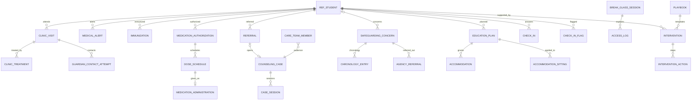
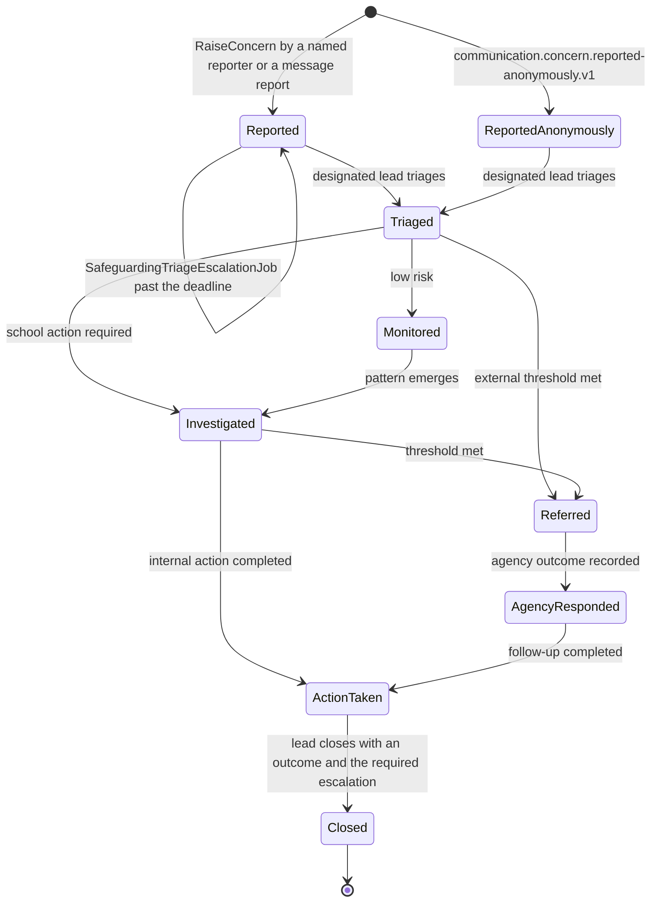

# Wellbeing

Wellbeing holds the most sensitive facts the product knows about a child: clinic visits, medication given at school, counselling cases, safeguarding concerns, individual education plans and their accommodations, interventions, and the daily wellbeing check-in. It is **isolation level S** (Appendix J): its own database `nibras_wellbeing`, its own database role with credentials in its own secret path, its own per-tenant key-encryption key, encrypted columns for every clinical or pastoral field, its own connection pool, and a read log written in the same transaction as every read. Nothing it holds is ever cached, projected, placed on a device or sent in an event; its events carry identifiers and a category code, and Reporting receives counts, never rows. A staff member who is not in a record's audience cannot see it, cannot search for it and cannot learn that it exists, except through break-glass access, which requires a reason, is time-boxed, alerts the principal and the safeguarding lead, and is reviewed afterwards. **Behavior is parent-visible; Wellbeing is not.** A guardian learns that a clinic visit happened, that medication was given, or that a plan needs their consent, and never reads a counselling note or a safeguarding concern.

**Group** C · **Requirement areas covered** WEL, with PRV, SEC, AUD, MOB and PERF rows that bind this service · **Last updated** 2026-09-21 by the planning session

| Fact | Value | Source |
|---|---|---|
| Service (Appendix L) | **Wellbeing**, long name "Student Wellbeing" | Appendix L.1 |
| Tier | 2 | Appendix L.1, `05-service-catalog.md` |
| AREA code | `WEL` | Appendix L.1 |
| Database, schema, roles | `nibras_wellbeing`, schema `wellbeing`, application role `svc_wellbeing` with separate credentials in Wellbeing's own OpenBao path, migration role `mig_wellbeing`, a separate PgBouncer user and pool | Appendix L.1, `10-data-architecture.md` part 1, `21-performance-engineering.md` §5 |
| Encryption | Per-tenant data key wrapped by Wellbeing's own key-encryption key; AES-256-GCM through `EncryptedColumnConverter` | `10-data-architecture.md` parts 1 and 10 |
| Exchange | `nibras.wellbeing` (topic); broker user in Wellbeing's own secret path | Appendix L.1, `11-messaging-architecture.md` §2.5 |
| Images | `nibras/wellbeing-api` | Appendix L.1 |
| Worker | none. Appendix L lists no wellbeing-worker image, so the Quartz.NET jobs run in the Api host | `07-solution-structure.md` part 3 |
| Why the boundary exists | "Security level: isolation level S, with its own database, database role and encryption key, and every read logged." | `05-service-catalog.md` |
| Synchronous dependencies | School (student directory), gRPC, one hop | Reference architecture Section 8, table 8.0 |
| Local copies | "students, guardians, sections" | Reference architecture Section 8, table 8.0 |
| Service level class | Read-heavy (master brief Section 31) | Reference architecture Section 8, table 8.0 |
| Scaling profile | "Read-heavy; never cached, never projected" | `05-service-catalog.md` |
| Build phase | 5 (master brief Section 28) | `05-service-catalog.md` |
| Sensitivity | "isolation level S" | `05-service-catalog.md`, Appendix J.1 |
| First-release merge option | Behavior may be hosted in this deployable; `nibras_behavior` and `nibras_wellbeing` stay separate and Wellbeing stays at level S | Appendix L, `05-service-catalog.md` part 5 |

---

## 1. Responsibilities and non-responsibilities

### Responsibilities

| Owns | Detail |
|---|---|
| Clinic | Visits with symptoms, observations, treatment and outcome; injury and accident reports; guardian notification; the sent-home path of WF-WEL-02 up to the gate (REQ-WEL-003, REQ-WEL-007) |
| Medical alerts | The allergy and medical alert (substance, severity, action) read live by permitted staff on every view, pushed to the student's teachers and cafeteria staff when it changes (REQ-WEL-006); School's medical summary is School's |
| Immunizations and screenings | Vaccinations and screenings per student with the immunization report (REQ-WEL-005) |
| Medication | Guardian authorizations with drug, dose and period; the daily dose schedule; administration signed at the moment it happens; missed doses; superseding corrections (REQ-WEL-004, WF-WEL-03, BR-WEL-004) |
| Counselling | Referrals, confidential cases with session notes and risk levels, closure with an outcome (REQ-WEL-008, REQ-WEL-016) |
| Safeguarding | Named and anonymous concerns, triage, monitoring, investigation, external referral, chronology, closure; never deletable (REQ-WEL-009, WF-WEL-04) |
| Education plans | Special-needs assessments, individual education plans with goals, reviews, guardian consent, and accommodations released as a flag and codes to exams and teaching (REQ-WEL-010, WF-WEL-01) |
| Interventions | Interventions from early-warning flags, attendance thresholds, behavior incidents and check-ins, with an owner, a plan from the school's playbook library, actions, review dates and an outcome (REQ-WEL-011) |
| Daily check-in | The student's one-tap check-in, the concern threshold, the silence pattern, escalation (REQ-WEL-015, WF-WEL-05) |
| Visibility levels | Every record at exactly one of clinic only, named care team, teaching staff summary, guardian visible; widening needs a named permission and a reason (BR-WEL-001) |
| Break-glass | The tenant staff path of emergency access with a reason, a window, the alert and the post-use review (BR-WEL-002, REQ-WEL-013) |
| Read log | One access-log row per read, in the read transaction, shipped to Audit as identifiers only (REQ-WEL-001, REQ-AUD-006, Appendix J rule 8) |
| Counts for Reporting | Open referral and intervention counts per student through the `Counts` gRPC method only (`10-data-architecture.md` part 7.1) |
| Retention | Deletion at leaving plus 7 years by default, the local safeguarding rule, legal holds with an alert to the safeguarding officer, key rotation after a purge (REQ-PRV-006) |

### Not responsible for

| Does not own | Owner instead | Why the line is here |
|---|---|---|
| Behavior incidents, points, consequences and behavior plans | Behavior | Behavior is parent-visible and Wellbeing is not (ADR-0002); Wellbeing hears `behavior.incident.recorded.v1` (category, severity, restricted flag) and never stores the incident |
| The student record, guardians, custody, the medical summary (conditions held, blood group) | School | Wellbeing keeps a slim copy only for students with a record and reads guardian contacts and pickup rights live over gRPC |
| Gate passes and the handover of a sent-home child | Attendance (WF-ATT-02) | The nurse issues the pass through Attendance; a child is released only through Attendance's verification |
| Exam sittings, seating plans and the exam result flag | Assessment and Scheduling | Accommodations reach Assessment through the Requests effect `ApplyExamAccommodation` (`13-workflows-and-sagas.md` section 4) |
| The approval chain of a medication request and of an exam accommodation request | Requests | Requests sends `AuthorizeMedication` and `RevokeMedicationAuthorization`; Wellbeing applies them |
| The early-warning indicator | Reporting | Wellbeing consumes the flag and may open an intervention; it never feeds a Wellbeing value back (T-RPT-04) |
| Message reports and anonymous concern intake | Communication | Wellbeing consumes `communication.message.reported.v1` and `communication.concern.reported-anonymously.v1` and opens the concern |
| The platform operator's break-glass and consented impersonation | Identity (WF-SEC-02, WF-SEC-03, BR-IDN-009) | Wellbeing refuses any operator session and logs the elevation it hears about |
| Delivery of any message, quiet-hour exceptions, lock-screen wording | Notification | Wellbeing's events and commands say what happened, never what is wrong (BR-WEL-003) |
| The audit store and the guardian transparency panel | Audit | Wellbeing ships identifiers-only audit and access entries; Audit shows who read what (REQ-AUD-007) |
| Rendering signed administration records and referral packs | Documents | Documents renders only what Wellbeing sends in a `GenerateDocument` whose owner class is Sensitive (Open point 11) |
| Settings definitions | Platform (ADR-0009) | Wellbeing reads the Appendix G values it needs |

---

## 2. Requirements covered

| Range or identifier | What it binds here |
|---|---|
| REQ-WEL-001 to REQ-WEL-017 | Every WEL row in `03-requirements-catalog.md`, all Tier 2 (Appendix L lists Wellbeing as Tier 2) |
| REQ-PRV-006 | Retention per country law, default leaving plus 7 years, safeguarding never deleted by a routine job while a case is open |
| REQ-AUD-006 | Every read of a wellbeing resource writes an access-log entry |
| REQ-RPT-009 | A flag opens an intervention here (TC-WEL-201) |
| REQ-SEC-003 to REQ-SEC-006, REQ-SEC-009 | Object-level authorization per record and visibility level, generated permission and isolation suites, column encryption |
| REQ-DATA-002, REQ-DATA-003 | `svc_wellbeing` owns no tables and has no `BYPASSRLS` |
| REQ-MOB-007 | The one offline path, the student's own check-in answer, carries a UUID v7 key and replays once (Open point 8) |
| REQ-L10N-005, REQ-L10N-010 | Playbook, category and plan names as `LocalizedText`; deadlines in the campus work week and time zone |

---

## 3. Aggregates and entities

Every table carries the base columns of `10-data-architecture.md` part 4, listed once: `id uuid not null` (UUID v7), `tenant_id uuid not null` (first column of every index, bound by row-level security), `created_at`, `created_by`, `updated_at`, `updated_by`, `deleted_at`, `deleted_by`, and `xmin` as the concurrency token on every aggregate root. **Soft delete is disabled on safeguarding and medication tables**: those rows are never deleted by any user path; only `WellbeingRetentionJob` deletes, per the retention schedule. Every column marked "enc" is `bytea` encrypted with the tenant data key and carries `[DataClass(S)]`; indexes never include an encrypted column (document 21 §3.17). Every record carries `visibility smallint` (`ClinicOnly`, `NamedCareTeam`, `TeachingStaffSummary`, `GuardianVisible`) and, where the level is `NamedCareTeam`, rows in `care_team_members`.

### 3.1 ClinicVisit (aggregate root) with ClinicTreatment and GuardianContactAttempt

**`clinic_visits`**

| Field | Type | Null | Notes |
|---|---|---|---|
| `student_id` | uuid | no | |
| `campus_id` | uuid | no | |
| `kind` | smallint | no | `Illness`, `Injury`, `Accident`, `Screening` |
| `category_code` | text(32) | no | Controlled list; the only clinical field that leaves the service, as a code (BR-WEL-003) |
| `severity` | smallint | no | `Low`, `Medium`, `High` |
| `arrived_at` | timestamptz | no | |
| `referred_by` | uuid | yes | Teacher who sent the student |
| `symptoms` | bytea enc | yes | |
| `observations` | bytea enc | yes | Temperature, pulse and the nurse's notes |
| `accident_report` | bytea enc | yes | Where, how, witnesses, for `Injury` and `Accident` |
| `status` | smallint | no | `ClinicVisitToSentHomeStatus`: `Arrived`, `Assessed`, `Treated`, `ReturnedToClass`, `SendHomeRecommended`, `GuardianContacted`, `CollectionArranged`, `EmergencyEscalated`, `Released` |
| `nurse_id` | uuid | no | |
| `guardian_consent_by` | uuid | yes | Guardian with pickup rights who consented to send home (BR-WEL-004) |
| `collector_pickup_person_id` | uuid | yes | Attendance pickup person named for collection |
| `gate_pass_id` | uuid | yes | Attendance gate pass used for the handover |
| `released_at` | timestamptz | yes | |
| `visibility` | smallint | no | Default `ClinicOnly` |

**`clinic_treatments`**: `visit_id uuid`, `given_at timestamptz`, `protocol_code text(32)` (standing first-aid protocol), `detail bytea enc`, `medication_administration_id uuid null`.

**`guardian_contact_attempts`**: `visit_id uuid`, `guardian_id uuid`, `contact_order smallint`, `attempted_at timestamptz`, `channel smallint`, `outcome smallint` (`Reached`, `NoAnswer`, `Declined`), `escalated_to_order smallint null`.

**Invariants (ClinicVisit)**

1. `Arrived → Assessed` requires `wellbeing.clinic-visits.create` or `.edit` and shows the student's active medical alerts in the same response (TC-WEL-011).
2. A treatment outside the standing first-aid protocol is refused unless it is a medication administration under section 3.3.
3. `SendHomeRecommended → GuardianContacted` requires at least one verified guardian contact from School; a guardian without pickup rights cannot consent to sending the student home (BR-WEL-004 edge case).
4. No guardian reached within 15 minutes escalates to the next contact in the School order, then to the emergency contact (TC-WEL-014).
5. `CollectionArranged → Released` requires a gate pass that Attendance verified for a collector on the authorized list; a failed verification keeps the visit in `CollectionArranged` and the child on site (TC-WEL-015, TC-WEL-016). A child is never released by Wellbeing alone.
6. `wellbeing.clinic-visit.recorded.v1` is published once per visit when the visit ends or the guardian is notified, carrying the category code and `guardianNotified`, never symptoms or treatment.

### 3.2 MedicalAlert (aggregate root), Immunization and Screening

**`medical_alerts`**: `student_id uuid`, `alert_kind smallint` (`Allergy`, `Condition`), `substance bytea enc`, `severity_code text(16)` (for the badge), `action_instruction bytea enc` (what staff must do), `active boolean`, `visibility smallint` (default `TeachingStaffSummary`), `verified_by uuid`, `verified_at timestamptz`. Index `ix_medical_alerts_student`.

**`immunizations`**: `student_id uuid`, `vaccine_code text(32)`, `dose_number smallint`, `given_on date`, `evidence_file_id uuid null` (Documents, Sensitive owner class), `recorded_by uuid`. **`screenings`**: `student_id uuid`, `screening_code text(32)`, `screened_on date`, `result bytea enc`, `follow_up_required boolean`.

**Invariants.** The alert is read live on every view and every read is logged (Appendix J.4); if the read fails, the caller receives `WELLBEING_ALLERGY_ALERT_UNAVAILABLE` and must block the dependent action, never show a remembered value (T-WEL-07). An alert change sends the "alert updated, open to view" message to the student's teachers and cafeteria staff without the substance (REQ-WEL-006).

### 3.3 MedicationAuthorization (aggregate root) with DoseSchedule and MedicationAdministration

**`medication_authorizations`**: `student_id uuid`, `drug bytea enc`, `dose bytea enc`, `dose_amount_hash bytea` (keyed hash so an exact-dose comparison needs no decryption in SQL), `schedule jsonb` (times of day and days, no drug name), `valid_from date`, `valid_until date` (at most one term), `standing_instruction boolean` (adrenaline auto-injector and similar), `evidence_file_id uuid null`, `status smallint` (`MedicationAuthorizationAndAdministrationStatus`: `Requested`, `EvidencePending`, `UnderReview`, `Authorized`, `Refused`, `Expired`), `nurse_approved_by uuid null`, `principal_approved_by uuid null`, `request_id uuid null` (Saga 6), `guardian_id uuid`.

**`dose_schedule`**: `authorization_id uuid`, `due_at timestamptz`, `window_minutes smallint`, `status smallint` (`Scheduled`, `Administered`, `Missed`), `administration_id uuid null`, `missed_reason_code text(32) null`.

**`medication_administrations`**: `authorization_id uuid`, `dose_id uuid null`, `administered_at timestamptz` (server time; cannot be backdated), `dose_given bytea enc`, `administered_by uuid`, `student_identity_confirmed boolean`, `supersedes_id uuid null`, `blocked boolean` (every attempt is recorded, including refused ones), `blocked_code text(64) null`.

**Invariants (Medication)**

1. Administration without an `Authorized` authorization valid today fails with `WELLBEING_MEDICATION_NOT_AUTHORIZED` and is recorded as a blocked attempt (BR-WEL-004, T-WEL-08).
2. A dose that differs from the authorized dose is blocked (BR-WEL-004 example); a dose outside the scheduled window fails with `WELLBEING_MEDICATION_DOSE_WINDOW` unless a nurse override with a reason is recorded.
3. `UnderReview → Authorized` requires two distinct approvers, the nurse and the principal (TC-WEL-022).
4. An authorization never outlives one term; past `valid_until` it moves to `Expired` and further administration is refused (TC-WEL-025).
5. A past administration is never edited; a correction is a superseding row that keeps the original visible (TC-WEL-026).
6. A standing instruction may be administered first and notified immediately after (BR-WEL-004 edge case).

### 3.4 Referral and CounselingCase (aggregate roots) with CaseSession

**`referrals`**: `student_id uuid`, `source smallint` (`Staff`, `Intervention`, `CheckIn`, `EarlyWarning`, `MessageReport`, `SelfReferral`), `category_code text(32)`, `urgency smallint`, `reason bytea enc`, `referred_by uuid null`, `status smallint` (`Open`, `Accepted`, `Declined`), `case_id uuid null`.

**`counseling_cases`**: `student_id uuid`, `counselor_staff_id uuid`, `risk_code text(16)`, `risk_assessment bytea enc`, `next_review_at timestamptz`, `status smallint` (`Open`, `Closed`), `outcome_code text(32) null`, `closed_at timestamptz null`, `visibility smallint` (default `NamedCareTeam`). **`case_sessions`**: `case_id uuid`, `held_at timestamptz`, `notes bytea enc`, `recorded_by uuid`.

**Invariants.** A case note is readable only by the named care team; a teacher, a homeroom teacher and a principal without membership see nothing and receive `WELLBEING_ACCESS_DENIED` (404) (T-WEL-01, TC-WEL-202). A closed case accepts no edit (`WELLBEING_CASE_ALREADY_CLOSED`); a new entry may reference it. Closing records an outcome and clears the linked flag (REQ-WEL-016).

### 3.5 SafeguardingConcern (aggregate root) with ChronologyEntry and AgencyReferral

**`safeguarding_concerns`**

| Field | Type | Null | Notes |
|---|---|---|---|
| `student_id` | uuid | yes | Null until triage links an anonymous concern to a student |
| `campus_id` | uuid | no | |
| `source` | smallint | no | `Named`, `Anonymous`, `MessageReport` |
| `reporter_id` | uuid | yes | Always null for `Anonymous`; no reporter identity is stored anywhere on that path (TC-WEL-032) |
| `external_ref` | uuid | yes | `concernId` of `communication.concern.reported-anonymously.v1` or `messageId` of a message report |
| `category_code` | text(32) | no | |
| `urgency` | smallint | no | `Standard`, `High` |
| `concern_text` | bytea enc | no | |
| `named_staff_ids` | uuid[] | no | Staff named in the concern; refused and alerted if they open it (TC-WEL-036) |
| `status` | smallint | no | `SafeguardingConcernEscalationStatus`: `Reported`, `ReportedAnonymously`, `Triaged`, `Monitored`, `Investigated`, `Referred`, `AgencyResponded`, `ActionTaken`, `Closed` |
| `triage_due_at` | timestamptz | no | 1 hour for `High`, 1 working day otherwise |
| `acknowledged_at` | timestamptz | yes | REQ-WEL-009: acknowledged within one working day |
| `lead_id` | uuid | yes | Designated safeguarding lead handling it |
| `next_review_at` | timestamptz | yes | Every 14 days while `Monitored` |
| `outcome_code` | text(32) | yes | On close, including `unsubstantiated` |

**`chronology_entries`**: `concern_id uuid`, `occurred_at timestamptz`, `entry bytea enc`, `recorded_by uuid`. Append-only. **`agency_referrals`**: `concern_id uuid`, `agency_code text(32)`, `referred_at timestamptz`, `contact bytea enc`, `pack_document_id uuid null`, `response bytea enc null`, `responded_at timestamptz null`.

**Invariants (SafeguardingConcern)**

1. Only designated leads (holders of `wellbeing.safeguarding.view` who are on the tenant's lead list) can open a concern; everyone else receives `WELLBEING_ACCESS_DENIED` and sees nothing (TC-WEL-031).
2. A staff member named in the concern is refused even with the permission, and the attempt alerts the lead (TC-WEL-036, T-WEL-06).
3. No deletion path exists in any role; there is no DELETE endpoint and `svc_wellbeing` holds no `DELETE` grant on these tables outside the retention job's function (TC-WEL-035).
4. Closing requires the escalation step the configured framework demands; otherwise `WELLBEING_CONCERN_ESCALATION_REQUIRED` names the step and its owner.
5. An urgent concern reaches the officer and the principal within 15 minutes (REQ-WEL-009); `wellbeing.safeguarding.concern-raised.v1` goes to the safeguarding officer only, carrying `concernId`, `urgency`, `raisedAt`.
6. An untriaged concern past `triage_due_at` escalates to the principal and the deputy lead (TC-WEL-034).

### 3.6 EducationPlan (aggregate root) with Accommodation

**`education_plans`**: `student_id uuid`, `assessment bytea enc` (need and evidence), `diagnosis bytea enc null`, `goals bytea enc`, `status smallint` (`AccommodationPlanToExamSittingStatus`: `Assessed`, `PlanDrafted`, `ConsentPending`, `PlanAgreed`, `PlanDeclined`, `Published`, `AppliedToSitting`, `Delivered`, `UnderReview`, `Ended`), `consent_guardian_id uuid null`, `consented_at timestamptz null`, `consent_token_hash bytea null`, `review_date date`, `coordinator_id uuid`, `need_to_know_staff_ids uuid[]`, `visibility smallint` (default `NamedCareTeam`).

**`accommodations`**: `plan_id uuid`, `code text(32)` (`extra-time-25`, `separate-room`, `reader`, `scribe`, `rest-breaks` and the tenant's own), `subject_ids uuid[] null`, `active boolean`. The code is the accommodation flag that Appendix J allows outside the plan; the plan's content never is.

**`accommodation_sittings`**: `plan_id uuid`, `exam_session_id uuid`, `request_id uuid`, `status smallint` (`Applied`, `Delivered`, `NotProvided`), `confirmed_at timestamptz null`.

**Invariants.** Consent is requested only from a guardian with parental access who is not restricted (TC-WEL-001). A plan is published to exams and teaching only after consent (TC-WEL-002). A teacher outside `need_to_know_staff_ids` who opens the plan is refused and the attempt audited (TC-WEL-006). Consent is chased at 7 and 14 days.

### 3.7 Intervention (aggregate root) with InterventionAction and Playbook

**`interventions`**: `student_id uuid`, `source smallint` (`EarlyWarningFlag`, `AttendanceThreshold`, `BehaviorIncident`, `CheckIn`, `Manual`), `source_ref uuid null` (flag id when the hand-off link carried it), `category_code text(32)`, `owner_id uuid`, `playbook_code text(32) null`, `plan bytea enc`, `review_date date`, `status smallint` (`Suggested`, `Open`, `UnderReview`, `Closed`, `Withdrawn`), `outcome_code text(32) null`, `closed_at timestamptz null`, `visibility smallint` (default `NamedCareTeam`). Appendix J classes intervention owner, steps, dates and outcome as Confidential; they are still kept here, encrypted where free text, because Wellbeing owns them.

**`intervention_actions`**: `intervention_id uuid`, `step bytea enc`, `owner_id uuid`, `due_on date`, `done_at timestamptz null`. **`playbooks`**: `code text(32)`, `name LocalizedText`, `steps LocalizedText[]`, `default_review_days int`, `active boolean` (the school edits them, REQ-WEL-011).

**Invariants.** A `Suggested` intervention (from a flag, a threshold or an incident) becomes `Open` only when a person with `wellbeing.interventions.open` confirms an owner and a review date; a cleared flag withdraws a still-`Suggested` one. Opening publishes `wellbeing.intervention.opened.v1`; closing records an outcome and publishes `wellbeing.intervention.closed.v1`.

### 3.8 CheckIn and CheckInFlag

**`check_ins`**: `student_id uuid`, `check_in_date date`, `answer_code smallint` (1 to 5), `risk_flag_code text(16) null` (from a fixed answer option that indicates immediate risk), `note bytea enc null` (online only), `device_occurred_at timestamptz null`, `received_at timestamptz`, `client_token uuid`. Unique `(tenant_id, student_id, check_in_date)`.

**`check_in_flags`**: `student_id uuid`, `reason smallint` (`LowAnswer`, `Silence`, `UrgentAnswer`), `raised_at timestamptz`, `status smallint` (`DailyWellbeingCheckInEscalationStatus` subset: `Flagged`, `TeacherNotified`, `CounsellorReferred`, `UrgentEscalated`, `Resolved`), `acknowledged_by uuid null`, `acknowledged_at timestamptz null`, `outcome_code text(32) null`. **`check_in_silence`**: `student_id uuid`, `skipped_on date`; rows kept only for students who skipped, deleted after 14 days.

**Invariants.** An answer below the concern threshold raises one flag the same lesson (TC-WEL-042); an urgent answer pages the counsellor at once (TC-WEL-043); three skips in 14 days raise a silence flag (TC-WEL-044); an offline answer keeps its original timestamp and still raises the flag, with the escalation clock starting at sync (TC-WEL-046). Answers are visible to pastoral staff only; a homeroom teacher sees that a flag exists, not the answer (Open point 7).

### 3.9 Access, visibility and break-glass

**`care_team_members`**: `resource_type text(32)`, `resource_id uuid`, `staff_id uuid`, `added_by uuid`, `reason text(256)`.

**`break_glass_sessions`**: `staff_id uuid`, `resource_type text(32)`, `resource_id uuid`, `reason bytea enc` (retained under the safeguarding period, BR-WEL-002), `started_at timestamptz`, `ends_at timestamptz` (start plus the Security → session timeout window, default 30 minutes), `review_status smallint` (`Pending`, `Justified`, `Unjustified`), `reviewed_by uuid null`.

**`access_log`**: `reader_id uuid`, `reader_role text(48)`, `resource_type text(32)`, `resource_id uuid`, `student_id uuid`, `action smallint` (`Read`, `Search`, `Export`, `Refused`), `via smallint` (`Audience`, `BreakGlass`), `break_glass_id uuid null`, `occurred_at timestamptz`. Written in the read transaction; copied to Audit as `wellbeing.audit.recorded.v1` through the outbox in the same transaction, with identifiers only.

**`ref_students`**, **`ref_sections`**, **`ref_guardian_links`**: section 8.



---

## 4. REST API

Paths follow `22-api-conventions-and-error-catalog.md` §1. Every endpoint also returns the cross-cutting codes of Appendix K.1 with the `WELLBEING_` prefix, **except that a permission or audience failure on a record is always `WELLBEING_ACCESS_DENIED` with 404**, never `WELLBEING_PERMISSION_DENIED`, so that no response confirms a record exists (Appendix K.22 rule 5); `WELLBEING_PERMISSION_DENIED` (403) is used only for actions that reveal nothing, such as creating a new record. **Every response** carries `Cache-Control: no-store, private` and no `ETag`, every read writes an `access_log` row and `wellbeing.audit.recorded.v1` in the same transaction, and a failing log write fails the read (Appendix J rule 8). Every write is audited. Lists use keyset pagination with a page cap of 50. No endpoint is exposed to the public API or to API keys. Guardians reach only the guardian-visible notices, the consent link and their child's medication authorization status.

### 4.1 Clinic and medical alerts (`ClinicEndpoints.cs`)

| Method | Path | Permission | Request | Response | Errors | Idempotent |
|---|---|---|---|---|---|---|
| POST | `/api/v1/wellbeing/clinic-visits` | `wellbeing.clinic-visits.create` | `{ studentId, kind, arrivedAt, referredBy }` | 201 visit in `Arrived` with active alerts | `WELLBEING_ACCESS_DENIED` | Yes, Key required |
| GET | `/api/v1/wellbeing/clinic-visits?date=&status=&campusId=` | `wellbeing.clinic-visits.view` | query, cursor | Today's clinic list: student, status, arrival, severity; no clinical text in the list | none beyond K.1 | Safe; logged |
| GET | `/api/v1/wellbeing/clinic-visits/{id}` | `wellbeing.clinic-visits.view` | none | Visit with decrypted fields for the audience | `WELLBEING_ACCESS_DENIED` | Safe; logged |
| POST | `/api/v1/wellbeing/clinic-visits/{id}/assessment` | `wellbeing.clinic-visits.edit` | `{ symptoms, observations, categoryCode, severity, accidentReport }` | 200 `Assessed` | `WELLBEING_ACCESS_DENIED`, `WELLBEING_CONCURRENCY_CONFLICT` | Yes, state-guarded |
| POST | `/api/v1/wellbeing/clinic-visits/{id}/treatments` | `wellbeing.clinic-visits.edit` | `{ protocolCode, detail }` | 200 `Treated` | `WELLBEING_VALIDATION_FAILED` (outside the protocol) | Yes, Key required |
| POST | `/api/v1/wellbeing/clinic-visits/{id}/return-to-class` | `wellbeing.clinic-visits.edit` | `{ note }` | 200 `ReturnedToClass`; publishes `wellbeing.clinic-visit.recorded.v1` | `WELLBEING_CONCURRENCY_CONFLICT` | Yes, state-guarded |
| POST | `/api/v1/wellbeing/clinic-visits/{id}/send-home` | `wellbeing.clinic-visits.send-home` | `{ reasonCategory }` | 200 `SendHomeRecommended`; guardian contact list read live from School | `WELLBEING_DEPENDENCY_UNAVAILABLE` (School directory down: the nurse phones from the paper list) | Yes, state-guarded |
| POST | `/api/v1/wellbeing/clinic-visits/{id}/guardian-contacts` | `wellbeing.clinic-visits.notify-guardian` | `{ guardianId, channel, outcome, consentToSendHome }` | 200; `GuardianContacted` when reached; publishes `wellbeing.clinic-visit.recorded.v1` with `guardianNotified` | `WELLBEING_VALIDATION_FAILED` (consent from a guardian without pickup rights) | Yes, Key required |
| POST | `/api/v1/wellbeing/clinic-visits/{id}/collection` | `wellbeing.clinic-visits.send-home` | `{ pickupPersonId }` | 200 `CollectionArranged`, publishes `wellbeing.clinic-visit.collection-arranged.v1` with a hand-off link to Attendance's gate-pass issue for this student and collector | `WELLBEING_CONCURRENCY_CONFLICT` | Yes, state-guarded |
| POST | `/api/v1/wellbeing/clinic-visits/{id}/release` | `wellbeing.clinic-visits.send-home` | `{ gatePassId }` recorded after Attendance verified the handover, or set automatically by `DismissalProcessedConsumer` | 200 `Released` | `WELLBEING_VALIDATION_FAILED` (no verified pass) | Yes, state-guarded |
| POST | `/api/v1/wellbeing/clinic-visits/{id}/emergency` | `wellbeing.clinic-visits.send-home` | `{ ambulanceCalledAt }` | 200 `EmergencyEscalated`; guardian and principal notified urgently | none beyond K.1 | Yes, state-guarded |
| GET | `/api/v1/wellbeing/students/{id}/clinic-visits?cursor=` | `wellbeing.clinic-visits.view` | cursor on `(visited_at, id)` | Visits for one student (hot query 3) | `WELLBEING_ACCESS_DENIED` | Safe; logged |
| GET | `/api/v1/wellbeing/students/{id}/medical-alert` | `school.students.view` for a staff member assigned to the student, audience `TeachingStaffSummary` (Open point 3); `wellbeing.clinic-visits.view` for the nurse | none | Badge with substance, severity and action; read live, logged (hot query 1, TC-WEL-203) | `WELLBEING_ALLERGY_ALERT_UNAVAILABLE` (503), `WELLBEING_ACCESS_DENIED` | Safe; logged |
| GET | `/api/v1/wellbeing/sections/{id}/medical-alerts` | as above, for the section's teachers | none | Alerts for a whole register in one call (hot query 2) | `WELLBEING_ALLERGY_ALERT_UNAVAILABLE` | Safe; logged |
| PUT | `/api/v1/wellbeing/students/{id}/medical-alert` | `wellbeing.clinic-visits.edit` | `{ alerts[] (kind, substance, severityCode, actionInstruction, active) }` | 200; teachers and cafeteria staff told "alert updated" with no substance (REQ-WEL-006) | `WELLBEING_CONCURRENCY_CONFLICT` | Yes, Key required |
| POST | `/api/v1/wellbeing/students/{id}/immunizations` | `wellbeing.clinic-visits.create` | `{ vaccineCode, doseNumber, givenOn, evidenceFileId }` | 201 | `WELLBEING_VALIDATION_FAILED` | Yes, Key required |
| GET | `/api/v1/wellbeing/students/{id}/immunizations` | `wellbeing.clinic-visits.view` | none | Doses with dates | `WELLBEING_ACCESS_DENIED` | Safe; logged |
| POST | `/api/v1/wellbeing/students/{id}/screenings` | `wellbeing.clinic-visits.create` | `{ screeningCode, screenedOn, result, followUpRequired }` | 201 | `WELLBEING_VALIDATION_FAILED` | Yes, Key required |
| GET | `/api/v1/wellbeing/reports/immunization?sectionId=&vaccineCode=` | `wellbeing.clinic-visits.view` | query | Doses per student for the nurse; never exported outside WF-PRV-02 | none beyond K.1 | Safe; logged |

### 4.2 Medication (`MedicationEndpoints.cs`)

| Method | Path | Permission | Request | Response | Errors | Idempotent |
|---|---|---|---|---|---|---|
| POST | `/api/v1/wellbeing/medication-authorizations` | `wellbeing.medications.create` | `{ studentId, drug, dose, schedule, validFrom, validUntil, standingInstruction, guardianId }` (a nurse recording a paper authorization; the guardian path arrives as `AuthorizeMedication`) | 201 `Requested` or `EvidencePending` | `WELLBEING_VALIDATION_FAILED` (period beyond one term) | Yes, Key required |
| GET | `/api/v1/wellbeing/medication-authorizations?status=&studentId=` | `wellbeing.medications.view` | query, cursor | Authorizations; the drug decrypted for the nurse only | none beyond K.1 | Safe; logged |
| GET | `/api/v1/wellbeing/medication-authorizations/{id}` | `wellbeing.medications.view` | none | Authorization with doses | `WELLBEING_ACCESS_DENIED` | Safe; logged |
| POST | `/api/v1/wellbeing/medication-authorizations/{id}/evidence` | `wellbeing.medications.create` | `{ evidenceFileId }` | 200 `UnderReview` | `WELLBEING_CONCURRENCY_CONFLICT` | Yes, state-guarded |
| POST | `/api/v1/wellbeing/medication-authorizations/{id}/approve` | `wellbeing.medications.authorize` | `{ role: nurse \| principal }` | 200; `Authorized` after both approvals, schedule generated | `WELLBEING_CONCURRENCY_CONFLICT` (same approver twice) | Yes, per approver |
| POST | `/api/v1/wellbeing/medication-authorizations/{id}/refuse` | `wellbeing.medications.authorize` | `{ reasonCode }` | 200 `Refused` | `WELLBEING_CONCURRENCY_CONFLICT` | Yes, state-guarded |
| GET | `/api/v1/wellbeing/medication-schedule?date=&campusId=` | `wellbeing.medications.view` | query | The day's dose list with windows | none beyond K.1 | Safe; logged |
| POST | `/api/v1/wellbeing/medication-administrations` | `wellbeing.medications.administer` | `{ doseId or authorizationId, doseGiven, studentIdentityConfirmed, overrideReason }` | 201; publishes `wellbeing.medication.administered.v1` | `WELLBEING_MEDICATION_NOT_AUTHORIZED`, `WELLBEING_MEDICATION_DOSE_WINDOW` | Yes, Key required; server time only |
| POST | `/api/v1/wellbeing/medication-administrations/{id}/supersede` | `wellbeing.medications.administer` | `{ correction, reason }` | 201 superseding row; original stays visible | `WELLBEING_VALIDATION_FAILED` | Yes, Key required |
| POST | `/api/v1/wellbeing/medication-doses/{id}/missed` | `wellbeing.medications.administer` | `{ reasonCode }` | 200 `Missed`; guardian told within 15 minutes | `WELLBEING_CONCURRENCY_CONFLICT` | Yes, state-guarded |

### 4.3 Counselling (`CounselingEndpoints.cs`)

| Method | Path | Permission | Request | Response | Errors | Idempotent |
|---|---|---|---|---|---|---|
| POST | `/api/v1/wellbeing/referrals` | `wellbeing.counseling-cases.create` | `{ studentId, categoryCode, urgency, reason }` | 201; publishes `wellbeing.referral.created.v1`; the referrer sees only "referral received" afterwards | `WELLBEING_PERMISSION_DENIED` | Yes, Key required |
| GET | `/api/v1/wellbeing/referrals?status=` | `wellbeing.counseling-cases.view` | query, cursor | Referrals for the counsellor's campus | none beyond K.1 | Safe; logged |
| POST | `/api/v1/wellbeing/referrals/{id}/accept` | `wellbeing.counseling-cases.edit` | `{ counselorStaffId, careTeam[] }` | 201 case opened with the referral reason and referrer (TC-WEL-702) | `WELLBEING_ACCESS_DENIED` | Yes, state-guarded |
| GET | `/api/v1/wellbeing/counseling-cases?counselorId=&status=` | `wellbeing.counseling-cases.view` | cursor on `(next_review_at, id)` | Caseload (hot query 4) | none beyond K.1 | Safe; logged |
| GET | `/api/v1/wellbeing/counseling-cases/{id}` | `wellbeing.counseling-cases.view` (named care team) | none | Case with sessions | `WELLBEING_ACCESS_DENIED` | Safe; logged |
| POST | `/api/v1/wellbeing/counseling-cases/{id}/sessions` | `wellbeing.counseling-cases.edit` | `{ heldAt, notes }` | 201; the note is logged as read from the moment it is saved (TC-WEL-703) | `WELLBEING_CASE_ALREADY_CLOSED` | Yes, Key required |
| PUT | `/api/v1/wellbeing/counseling-cases/{id}/risk` | `wellbeing.counseling-cases.edit` | `{ riskCode, assessment, nextReviewAt }`, `If-Match` | 200 | `WELLBEING_CASE_ALREADY_CLOSED`, `WELLBEING_CONCURRENCY_CONFLICT` | Yes, by `If-Match` |
| POST | `/api/v1/wellbeing/counseling-cases/{id}/close` | `wellbeing.counseling-cases.edit` | `{ outcomeCode }` | 200 `Closed`; linked flag cleared, closure audited (TC-WEL-707) | `WELLBEING_CASE_ALREADY_CLOSED` | Yes, state-guarded |

### 4.4 Safeguarding (`SafeguardingEndpoints.cs`)

| Method | Path | Permission | Request | Response | Errors | Idempotent |
|---|---|---|---|---|---|---|
| POST | `/api/v1/wellbeing/safeguarding/concerns` | `wellbeing.safeguarding.create` | `{ studentId, categoryCode, urgency, concernText, namedStaffIds }` | 201 `Reported` shown to the reporter as "received"; publishes `wellbeing.safeguarding.concern-raised.v1` | `WELLBEING_PERMISSION_DENIED` | Yes, Key required |
| GET | `/api/v1/wellbeing/safeguarding/concerns?status=&urgency=` | `wellbeing.safeguarding.view` (designated leads) | query, cursor | Concerns for the lead's campus | none beyond K.1 | Safe; logged |
| GET | `/api/v1/wellbeing/safeguarding/concerns/{id}` | `wellbeing.safeguarding.view` | none | Concern with chronology; refused for named staff | `WELLBEING_ACCESS_DENIED` | Safe; logged; a refused named-staff attempt alerts the lead |
| POST | `/api/v1/wellbeing/safeguarding/concerns/{id}/triage` | `wellbeing.safeguarding.edit` | `{ studentId (anonymous path), riskCode, next: monitor \| investigate \| refer }` | 200 `Triaged` then the chosen state; acknowledgment recorded | `WELLBEING_CONCURRENCY_CONFLICT` | Yes, state-guarded |
| POST | `/api/v1/wellbeing/safeguarding/concerns/{id}/progress` | `wellbeing.safeguarding.edit` | `{ toState: Investigated \| ActionTaken \| Monitored, note }` | 200 | `WELLBEING_CONCURRENCY_CONFLICT` | Yes, state-guarded |
| POST | `/api/v1/wellbeing/safeguarding/concerns/{id}/chronology` | `wellbeing.safeguarding.edit` | `{ occurredAt, entry }` | 201 append-only entry | none beyond K.1 | Yes, Key required |
| POST | `/api/v1/wellbeing/safeguarding/concerns/{id}/escalate` | `wellbeing.safeguarding.escalate` | `{ agencyCode, contact }` | 200 `Referred`; referral pack generated (TC-WEL-033) | `WELLBEING_CONCURRENCY_CONFLICT` | Yes, state-guarded |
| POST | `/api/v1/wellbeing/safeguarding/concerns/{id}/agency-response` | `wellbeing.safeguarding.edit` | `{ response, respondedAt }` | 200 `AgencyResponded` | `WELLBEING_CONCURRENCY_CONFLICT` | Yes, state-guarded |
| POST | `/api/v1/wellbeing/safeguarding/concerns/{id}/close` | `wellbeing.safeguarding.close` | `{ outcomeCode }` | 200 `Closed`; retained, never deletable | `WELLBEING_CONCERN_ESCALATION_REQUIRED` | Yes, state-guarded |

### 4.5 Education plans and accommodations (`EducationPlanEndpoints.cs`)

| Method | Path | Permission | Request | Response | Errors | Idempotent |
|---|---|---|---|---|---|---|
| POST | `/api/v1/wellbeing/education-plans` | `wellbeing.education-plans.create` | `{ studentId, assessment, coordinatorId, needToKnowStaffIds }` | 201 `Assessed` | `WELLBEING_PERMISSION_DENIED` | Yes, Key required |
| GET | `/api/v1/wellbeing/education-plans?studentId=&status=` | `wellbeing.education-plans.view` | query | Plans for the coordinator | none beyond K.1 | Safe; logged |
| GET | `/api/v1/wellbeing/education-plans/{id}` | `wellbeing.education-plans.view` (need-to-know list) | none | Plan with goals and accommodations | `WELLBEING_ACCESS_DENIED` (outside the list, attempt audited, TC-WEL-006) | Safe; logged |
| PUT | `/api/v1/wellbeing/education-plans/{id}/draft` | `wellbeing.education-plans.edit` | goals, accommodations, review date, `If-Match` | 200 `PlanDrafted` | `WELLBEING_CONCURRENCY_CONFLICT` | Yes, by `If-Match` |
| POST | `/api/v1/wellbeing/education-plans/{id}/request-consent` | `wellbeing.education-plans.edit` | `{ guardianId }` | 200 `ConsentPending`; a consent link sent to the guardian with the accommodation list only | `WELLBEING_VALIDATION_FAILED` (guardian restricted or without parental access) | Yes, state-guarded |
| POST | `/api/v1/wellbeing/consents/{token}` | none from Appendix B: the signed-in guardian presenting the single-use consent token for their own child (Open point 6) | `{ decision: consent \| decline }` | 200 `PlanAgreed` or `PlanDeclined` | `WELLBEING_ACCESS_DENIED` (token not theirs or expired) | Yes, single use |
| POST | `/api/v1/wellbeing/education-plans/{id}/approve` | `wellbeing.education-plans.approve` | `{}` | 200 `Published`; accommodation codes released to the need-to-know list | `WELLBEING_CONCURRENCY_CONFLICT` | Yes, state-guarded |
| POST | `/api/v1/wellbeing/education-plans/{id}/sittings/{examSessionId}/delivered` | `wellbeing.education-plans.apply-accommodation` | `{ provided: true \| false, note }` | 200 `Delivered`, or `NotProvided` with the result flag and appeal request (WF-WEL-01 compensation) | `WELLBEING_PLAN_ACCOMMODATION_NOT_APPLIED` | Yes, per sitting |
| POST | `/api/v1/wellbeing/education-plans/{id}/review` | `wellbeing.education-plans.edit` | `{ decision: revise \| end, note }` | 200 `PlanDrafted` or `Ended` | `WELLBEING_CONCURRENCY_CONFLICT` | Yes, state-guarded |
| GET | `/api/v1/wellbeing/students/{id}/accommodation-flag` | `school.students.view` and membership of the plan's need-to-know list | none | `hasActiveAccommodation` and the codes; never the plan (Appendix J "accommodation flag only") | `WELLBEING_ACCESS_DENIED` | Safe; logged |

### 4.6 Interventions and playbooks (`InterventionEndpoints.cs`)

| Method | Path | Permission | Request | Response | Errors | Idempotent |
|---|---|---|---|---|---|---|
| GET | `/api/v1/wellbeing/interventions?ownerId=&status=` | `wellbeing.interventions.view` | query, cursor | Interventions in the caller's audience | none beyond K.1 | Safe; logged |
| GET | `/api/v1/wellbeing/interventions/suggestions?campusId=` | `wellbeing.interventions.view` | query | `Suggested` interventions from flags, thresholds, incidents and check-ins, with the source | none beyond K.1 | Safe; logged |
| POST | `/api/v1/wellbeing/interventions` | `wellbeing.interventions.open` | `{ studentId, sourceFlagId or suggestionId, ownerId, playbookCode, reviewDate, plan }` | 201 `Open`; publishes `wellbeing.intervention.opened.v1` (TC-WEL-201, TC-WEL-705) | `WELLBEING_ACCESS_DENIED` | Yes, Key required; one open per student and source |
| GET | `/api/v1/wellbeing/interventions/{id}` | `wellbeing.interventions.view` | none | Intervention with actions and reviews | `WELLBEING_ACCESS_DENIED` | Safe; logged |
| POST | `/api/v1/wellbeing/interventions/{id}/actions` | `wellbeing.interventions.edit` | `{ step, ownerId, dueOn }` | 201 | `WELLBEING_CONCURRENCY_CONFLICT` | Yes, Key required |
| POST | `/api/v1/wellbeing/interventions/{id}/reviews` | `wellbeing.interventions.edit` | `{ note, nextReviewDate }` | 200 | `WELLBEING_CONCURRENCY_CONFLICT` | Yes, one per day |
| POST | `/api/v1/wellbeing/interventions/{id}/close` | `wellbeing.interventions.close` | `{ outcomeCode }` | 200 `Closed`; publishes `wellbeing.intervention.closed.v1` | `WELLBEING_CONCURRENCY_CONFLICT` | Yes, state-guarded |
| GET | `/api/v1/wellbeing/playbooks` | `wellbeing.interventions.view` | none | The school's playbook library | none beyond K.1 | Safe |
| PUT | `/api/v1/wellbeing/playbooks/{code}` | `wellbeing.interventions.edit` | `PlaybookModel`, `If-Match` | 200 | `WELLBEING_CONCURRENCY_CONFLICT` | Yes, by `If-Match` |

### 4.7 Daily check-in (`CheckInEndpoints.cs`)

| Method | Path | Permission | Request | Response | Errors | Idempotent |
|---|---|---|---|---|---|---|
| GET | `/api/v1/wellbeing/check-ins/today` | none in Appendix B: the student for self when the stage has check-ins enabled (Open point 7) | none | Whether today's check-in is open and answered; never a previous answer | none beyond K.1 | Safe |
| POST | `/api/v1/wellbeing/check-ins` | as above | `{ answerCode, riskFlagCode, note, clientToken }` | 201; flags evaluated at once | `WELLBEING_VALIDATION_FAILED` (window closed) | Yes, by `clientToken` |
| POST | `/api/v1/wellbeing/check-ins/sync` | as above | queued answers with `occurredAt` and key, no note offline | 200 per-item results; original timestamp kept (TC-WEL-046) | per item as above | Yes, per key |
| GET | `/api/v1/wellbeing/check-ins/flags?sectionId=&status=` | `wellbeing.interventions.view` (homeroom scope for the flag only, counsellor for the answer) | query | Flags; the answer is shown only to pastoral staff | none beyond K.1 | Safe; logged |
| POST | `/api/v1/wellbeing/check-ins/flags/{id}/acknowledge` | `wellbeing.interventions.edit` | `{ conversationOutcome }` | 200 `Resolved` or `TeacherNotified` recorded | `WELLBEING_CONCURRENCY_CONFLICT` | Yes, state-guarded |
| POST | `/api/v1/wellbeing/check-ins/flags/{id}/refer` | `wellbeing.counseling-cases.create` | `{ urgency }` | 201 referral; `CounsellorReferred` | `WELLBEING_CONCURRENCY_CONFLICT` | Yes, state-guarded |

### 4.8 Access: break-glass and visibility (`AccessEndpoints.cs`)

| Method | Path | Permission | Request | Response | Errors | Idempotent |
|---|---|---|---|---|---|---|
| POST | `/api/v1/wellbeing/break-glass` | `wellbeing.break-glass.use` | `{ resourceType, resourceId, reason }` | 201 window of the Security → session timeout value (default 30 minutes); record owner, safeguarding lead and principal alerted at once | `WELLBEING_BREAK_GLASS_REASON_REQUIRED`, `WELLBEING_ACCESS_DENIED` (operator or impersonated session, BR-IDN-009) | Yes, Key required |
| GET | `/api/v1/wellbeing/break-glass/active` | `wellbeing.break-glass.use` | none | The caller's active windows | none beyond K.1 | Safe |
| POST | `/api/v1/wellbeing/break-glass/{id}/review` | `wellbeing.safeguarding.close` (safeguarding lead, not the user who broke glass) | `{ finding: justified \| unjustified, note }` | 200; an unjustified finding raises an access-review task | `WELLBEING_CONCURRENCY_CONFLICT` | Yes, state-guarded |
| PUT | `/api/v1/wellbeing/records/{resourceType}/{id}/visibility` | the record type's `edit` action (`wellbeing.clinic-visits.edit`, `wellbeing.counseling-cases.edit`, `wellbeing.safeguarding.edit`, `wellbeing.education-plans.edit`, `wellbeing.interventions.edit`) | `{ level, careTeam[], reason }` | 200; widening needs a reason and is audited (BR-WEL-001) | `WELLBEING_ACCESS_DENIED`, `WELLBEING_VALIDATION_FAILED` (reason missing) | Yes, by `If-Match` |

**Endpoint count: 79** across 8 endpoint groups. The Saga 6 effects `AuthorizeMedication` and `RevokeMedicationAuthorization` are commands, not endpoints (section 6).

---

## 5. gRPC

| Direction | Contract | Method | Purpose | Deadline | Fallback |
|---|---|---|---|---|---|
| Exposed | `nibras.wellbeing.v1` `Counts` | `GetStudentCounts(student_ids)` | Reporting's rebuild of the three Wellbeing columns of `student_360`; counts only, every call logged | 2 s | Caller keeps its last value |
| Exposed | `nibras.wellbeing.v1` `AllergyAlerts` | `GetStudentAlert`, `GetSectionAlerts` | The live alert read for services that need it on their own screens (document 22 §10.1 names `AllergyAlerts`; the trip and cafeteria screens of Operations) | 2 s | **Refuse**: the caller blocks the dependent action with `WELLBEING_ALLERGY_ALERT_UNAVAILABLE`; never a cached value (document 22 §10.2) |
| Consumed | `nibras.school.v1` `StudentDirectory` | `GetStudent`, guardians with `pickup_allowed` and contact order | First referral creates the student copy (`10-data-architecture.md` part 6); guardian contacts and pickup rights read live for send-home and consent | 2 s | Refuse: a send-home falls back to the nurse's paper contact list; consent is never assumed |
| Consumed | `nibras.school.v1` `Directory` | `StudentChecksum`, `SectionChecksum` | Nightly reconciliation under Wellbeing's own credentials | 30 s | Next night |

Every call carries the metadata of document 22 §10.3. Every exposed method checks the calling service's scope and writes an access-log row naming the calling service and the acting user. Table 8.0 lists no service with Wellbeing as a synchronous dependency; Open point 2 records the two exposed contracts.

---

## 6. Events published and consumed

Payload fields are owned by Appendix E and are not restated. Partition keys are Appendix E's. **Every Wellbeing payload carries identifiers, a category code, a severity or urgency and a timestamp, and nothing else** (BR-WEL-003); the contract test `WellbeingEventPayloadRulesTests` fails the build otherwise.

### 6.1 Published (exchange `nibras.wellbeing`)

| Routing key | Partition key | Raised by | Consumers (Appendix E) |
|---|---|---|---|
| `wellbeing.referral.created.v1` | `studentId` | `CreateReferralHandler`, `ReferFromCheckInFlagHandler` | Notification, Reporting |
| `wellbeing.intervention.opened.v1` | `studentId` | `OpenInterventionHandler` | Reporting, Notification, Attendance |
| `wellbeing.intervention.closed.v1` | `studentId` | `CloseInterventionHandler` | Reporting, Attendance |
| `wellbeing.clinic-visit.recorded.v1` | `studentId` | Clinic handlers on return to class, guardian notification or release, once per visit | Notification |
| `wellbeing.clinic-visit.collection-arranged.v1` | `studentId` | `ArrangeCollectionHandler` on `SendHomeRecommended → CollectionArranged` | Attendance |
| `wellbeing.medication.administered.v1` | `studentId` | `AdministerMedicationHandler` | Notification |
| `wellbeing.safeguarding.concern-raised.v1` | `studentId` | `RaiseConcernHandler`, `AnonymousConcernConsumer`, `MessageReportedConsumer` | Notification (safeguarding officer only) |
| `wellbeing.audit.recorded.v1` | `tenantId` | Every read (from `access_log`), every write and every transition; `before` and `after` carry field and state names only, never values, so no level-S value reaches Audit | Audit |
| `wellbeing.usage.recorded.v1` | `tenantId` | `WellbeingUsageMeterJob`: counts of visits, cases and check-ins, no identifiers | Platform |

Three of these keys drive Attendance (Appendix E, Wellbeing paragraph): the two intervention keys move a student's attendance case to `InterventionOpened` and `InterventionClosed`, and `wellbeing.clinic-visit.collection-arranged.v1` prepares the gate pass. None of them carries a category, a symptom or a reason. `wellbeing.intervention.opened.v1` carries the optional `sourceRuleId`, which is the Attendance threshold rule that led to the intervention or null, and Attendance discards an intervention event whose `sourceRuleId` is null. `wellbeing.intervention.closed.v1` carries `studentId` so its payload matches its partition key.

Wellbeing sends `RequestNotification` (`notification.commands.request-notification.v1`) for the messages Appendix C does not trigger from its events: the missed-dose alert, the consent request, the medical-alert update to teachers and cafeteria staff, the check-in flag to the homeroom teacher, the break-glass alert, and the escalations (Open point 4). Each carries a template code and identifiers, never clinical text; the templates say what happened without saying what is wrong (BR-WEL-003 edge case).

### 6.2 Consumed

Queues are those of `11-messaging-architecture.md` §2.5 for Wellbeing, plus `wellbeing.tenant-lifecycle` of §2.3. Appendix E (v9.1) names Wellbeing in the consumer column of every key below, so document 11's bindings and the catalog now agree and no binding is starred.

| Routing key or command | Queue | Handler | What it changes | Idempotent on |
|---|---|---|---|---|
| `school.student.status-changed.v1` | `wellbeing.reference-copies` | `StudentStatusChangedConsumer` | Updates the copy only for a student with a record; a leaver starts the retention clock | `studentId` plus `effectiveOn` |
| `school.student.profile-updated.v1` | `wellbeing.reference-copies` | `StudentProfileUpdatedConsumer` | Refreshes names and section through `StudentDirectory` for students with a record; ignored otherwise and nothing stored | `studentId` plus `occurredAt` |
| `school.guardian.updated.v1`, `identity.guardian-link.created.v1` | `wellbeing.reference-copies` | `GuardianLinkConsumer` | Guardian relationship and preferred language for students with a record | `guardianId` or `studentId` plus `occurredAt` |
| `school.section.created.v1`, `school.section.changed.v1` | `wellbeing.reference-copies` | `SectionConsumer` | `ref_sections` for scoping the homeroom flag | `sectionId` plus `occurredAt` |
| `communication.message.reported.v1` | `wellbeing.events.urgent` | `MessageReportedConsumer` | Opens a safeguarding concern with `source = MessageReport` and the message reference, no content | `messageId` |
| `communication.concern.reported-anonymously.v1` | `wellbeing.events.urgent` | `AnonymousConcernConsumer` | Opens a concern in `ReportedAnonymously` with no reporter identity (TC-WEL-032); the text is fetched by the lead from Communication under their own permission | `concernId` |
| `identity.break-glass.used.v1` | `wellbeing.events.urgent` | `OperatorBreakGlassConsumer` | Records that an operator was elevated; alerts the safeguarding officer; every request carrying that grant is refused (BR-IDN-009) | `userId` plus `occurredAt` |
| `attendance.threshold.reached.v1` | `wellbeing.events` | `AttendanceThresholdConsumer` | Creates a `Suggested` intervention with the attendance playbook (WF-ATT-01 `ThresholdReached → InterventionOpened`) | `studentId` plus rule and rung |
| `attendance.dismissal.processed.v1` | `wellbeing.events` | `DismissalProcessedConsumer` | Moves a clinic visit in `CollectionArranged` to `Released` when Attendance reports the verified handover of that student, recording the gate-pass id; ignored for any student with no open visit | `gatePassId` |
| `attendance.student.absent.v1` | `wellbeing.events` | `StudentAbsentConsumer` | Adds an absence count to an open intervention or plan that watches attendance; ignored and not stored for any other student | `studentId` plus date |
| `behavior.incident.recorded.v1` | `wellbeing.events` | `BehaviorIncidentConsumer` | For high or critical severity or a restricted incident, creates a `Suggested` intervention for the pastoral lead; stores the incident id only | `incidentId` |
| `reporting.early-warning.flag-raised.v1` | `wellbeing.events` | `EarlyWarningFlagConsumer` | Creates a `Suggested` intervention from the flag with its factor codes as the stated reasons | `studentId` plus `indicatorCode` |
| `reporting.early-warning.flag-cleared.v1` | `wellbeing.events` | `EarlyWarningClearedConsumer` | Withdraws a still-`Suggested` intervention; an opened one is untouched | `studentId` plus `indicatorCode` |
| `requests.request.approved.v1` | `wellbeing.events` | `RequestApprovedConsumer` | For medication and exam-accommodation request types, shows "approved, being applied"; for an accommodation, records `AppliedToSitting` for the plan named in the request | `requestId` |
| `AuthorizeMedication`, `RevokeMedicationAuthorization` | `wellbeing.commands` | `AuthorizeMedicationHandler`, `RevokeMedicationAuthorizationHandler` | Creates or revokes the authorization from Saga 6 (WF-WEL-03 from `Authorized`); replies `EffectApplied`; doses already given stay logged | `(sagaId, stepKey)` |
| `platform.tenant.provisioning-requested.v1` and the §2.3 lifecycle set | `wellbeing.tenant-lifecycle` | `TenantLifecycleConsumers` | Creates the tenant's data key under Wellbeing's key-encryption key, seeds playbooks and categories; read-only mode; permission cache | `tenantId` plus `occurredAt` |
| `DeleteTenantData` and the Saga 1, 2 and 10 commands | `wellbeing.commands` | `Features/TenantLifecycle/` | Deletes the tenant's rows and **destroys the tenant's data key** (Saga 2 step 6) | `(sagaId, stepKey)` |

---

## 7. Sagas and workflows

Wellbeing orchestrates no saga, so `Application/Sagas/` is not generated. It owns five workflows and four rules (document 31 section 1), and takes part in others. State types are fixed by document 31 section 3.

| WF or saga | Role | Kind (document 13) | What Wellbeing implements | State type |
|---|---|---|---|---|
| WF-WEL-01 Accommodation plan to exam sitting | Owner | Single | Transitions in `Features/AccommodationPlanToExamSitting/`; `AppliedToSitting` through Requests' exam-accommodation effect | `AccommodationPlanToExamSittingStatus` in `Domain/EducationPlans/` |
| WF-WEL-02 Clinic visit to sent home | Owner | Single | Transitions in `Features/ClinicVisitToSentHome/`; the pass and the release are Attendance's | `ClinicVisitToSentHomeStatus` in `Domain/Clinic/` |
| WF-WEL-03 Medication authorization and administration | Owner | Effect (from Saga 6 `AuthorizeMedication`) | Transitions in `Features/MedicationAuthorizationAndAdministration/` | `MedicationAuthorizationAndAdministrationStatus` in `Domain/Medication/` |
| WF-WEL-04 Safeguarding concern escalation | Owner | Single | Transitions in `Features/SafeguardingConcernEscalation/` | `SafeguardingConcernEscalationStatus` in `Domain/Safeguarding/` |
| WF-WEL-05 Daily wellbeing check-in escalation | Owner | Single | Transitions in `Features/DailyWellbeingCheckInEscalation/` | `DailyWellbeingCheckInEscalationStatus` in `Domain/CheckIns/` |
| WF-ATT-01 Daily attendance to intervention | Participant | Single | `ThresholdReached → InterventionOpened → InterventionClosed` are Wellbeing's interventions | `InterventionStatus` (local) |
| WF-BEH-01 Incident to intervention | Participant | Single | Suggested intervention from a serious incident | none local |
| Saga 6 Request fulfilment | Participant | Saga | `AuthorizeMedication`, `RevokeMedicationAuthorization` | none local; per-step inbox |
| Sagas 1, 2 and 10 | Participant | Saga | Lifecycle; key destruction on deletion | none local |

| Rule (Appendix S) | Class | Where it is enforced | Test class |
|---|---|---|---|
| BR-WEL-001 Visibility levels | `Nibras.Wellbeing.Domain.Rules.WellbeingVisibilityRule` | Every read handler through `IRecordAudience`; search and Student 360 exclusion | `WellbeingVisibilityRulesTests` |
| BR-WEL-002 Break-glass access | `Nibras.Wellbeing.Domain.Rules.BreakGlassRule` | `StartBreakGlassHandler`, `BreakGlassExpiryJob` | `BreakGlassRulesTests` |
| BR-WEL-003 Events carry no clinical detail | `Nibras.Wellbeing.Domain.Rules.WellbeingEventPayloadRule` | `IntegrationEventMapper` and the contract test | `WellbeingEventPayloadRulesTests` |
| BR-WEL-004 Medication authorization and sending home | `Nibras.Wellbeing.Domain.Rules.MedicationAuthorizationRule` | `AdministerMedicationHandler`, `GuardianContactHandler` | `MedicationAuthorizationRulesTests` |

**WF-WEL-04 as Wellbeing implements it**



Every transition runs through the transition pipeline of `13-workflows-and-sagas.md` §5.1 with one difference: the audit record carries state names and identifiers only. Concurrent transitions resolve first-wins with `WELLBEING_CONCURRENCY_CONFLICT`. **Timeouts** (Appendix R): safeguarding triage 1 hour high and 1 working day otherwise, monitored review every 14 days; guardian not reached 15 minutes, collection wait 60 minutes; missed dose to the guardian within 15 minutes, two missed to the principal; consent chased at 7 and 14 days, arrangements 5 working days before an exam; check-in flag unacknowledged 2 hours, urgent answer to the principal after 30 minutes. Each has the job in section 9.

---

## 8. Local reference copies

| Copy | Table | Kept current by | Fields | Reconciled | Staleness tolerated |
|---|---|---|---|---|---|
| Student | `ref_students` | Created over `StudentDirectory` on the first record for that student, never on enrollment; kept by `school.student.status-changed.v1`, `school.student.profile-updated.v1` | `student_id`, `student_number`, `name_en`, `name_ar`, `section_id`, `campus_id`, `status`, `left_on` | Nightly 02:00 band time against `Directory/StudentChecksum` for the students held, under Wellbeing's credentials | Seconds; the existence of a row is itself level S |
| Section | `ref_sections` | `school.section.created.v1`, `school.section.changed.v1` | `section_id`, `campus_id`, `homeroom_teacher_id`, `head_of_year_id` | Nightly against `Directory/SectionChecksum` | Minutes |
| Guardian link | `ref_guardian_links` | `school.guardian.updated.v1`, `identity.guardian-link.created.v1`, for students with a record | `guardian_id`, `student_id`, `relationship`, `preferred_language`, `contact_order`; contact details and pickup rights are **not** copied and are read live | Nightly against School | Minutes |

`ReferenceCopyReconciliationJob` compares checksums per tenant for the students held and replays on a difference; the finding it raises carries `entityType = wellbeing-reference` and a count, never a student identifier.

---

## 9. Background jobs

Quartz.NET jobs in the Api host (Appendix L lists no wellbeing-worker image), clustered, one tenant per iteration with the tenant variable set and Wellbeing's own credentials. No job reads another service's data, and no job output leaves the service except identifiers-only events and commands.

| Job | Schedule | What it does | Publishes | Progress and failure |
|---|---|---|---|---|
| `SafeguardingTriageEscalationJob` | Every 5 minutes | Untriaged concerns past 1 hour (high) or 1 working day escalate to the principal and deputy lead (TC-WEL-034); unacknowledged past one working day flagged (REQ-WEL-009) | `RequestNotification` | Idempotent per concern and rung |
| `MonitoredConcernReviewJob` | Daily 07:00 campus time zone | Monitored concerns due for their 14-day review remind the lead | `RequestNotification` | Count |
| `GuardianContactEscalationJob` | Every minute | Send-home with no guardian reached in 15 minutes moves to the next contact; collection waiting 60 minutes escalates to the head of year | `RequestNotification` | Per visit |
| `MedicationScheduleJob` | Daily 00:05 campus time zone | Builds the day's `dose_schedule` from authorized periods | none | Count |
| `MissedDoseJob` | Every minute | Doses past their window become `Missed`; nurse at once, guardian within 15 minutes, two missed to the principal | `RequestNotification` | Idempotent per dose |
| `MedicationAuthorizationExpiryJob` | Daily 00:10 campus time zone | `Authorized` past `valid_until` becomes `Expired` (TC-WEL-025) | none | Count |
| `ConsentChaseJob` | Daily 09:00 campus time zone | Consent pending 7 and 14 days re-sends the request | `RequestNotification` | Idempotent per plan and rung |
| `EducationPlanReviewJob` | Daily 07:00 | Published plans whose review date is reached move to `UnderReview` | none | Count |
| `CheckInWindowCloseJob` | At each stage's check-in window end, campus time zone | Records skips for students who did not answer (roster from `StudentDirectory`, stored only for the skippers); three in 14 days raise a silence flag (TC-WEL-044) | `RequestNotification` | Per section |
| `CheckInFlagEscalationJob` | Every 5 minutes | Flags unacknowledged for 2 hours go to the counsellor; urgent answers to the principal after 30 minutes | `RequestNotification` | Idempotent per flag and rung |
| `BreakGlassExpiryJob` | Every minute | Ends windows, raises the post-use review task for the safeguarding lead | none; `wellbeing.audit.recorded.v1` | Per session |
| `WellbeingRetentionJob` | Monthly, only under Wellbeing's credentials | Deletes records at leaving plus 7 years by default, safeguarding per the local rule and never while a case is open, honours legal holds and alerts the safeguarding officer on a held subject, rotates the tenant data key after a purge (REQ-PRV-006, `10-data-architecture.md` part 8) | `wellbeing.audit.recorded.v1` with counts | Reports counts, never identifiers, to the Data Quality Center |
| `ReferenceCopyReconciliationJob` | Nightly 02:00 band time | Section 8 | Finding with a count only | Per tenant |
| `TenantKeyRewrapJob` | Quarterly, and on demand after a key compromise | Re-wraps each tenant data key under the current key-encryption key; rows are never rewritten (`10-data-architecture.md` part 10) | `wellbeing.audit.recorded.v1` | Per tenant |
| `WellbeingUsageMeterJob` | Daily 23:30 band time | Counts only | `wellbeing.usage.recorded.v1` | none |

---

## 10. Permissions, notifications, settings, error codes

### 10.1 Permissions (Appendix B)

Every Wellbeing read is logged and no role template inherits `wellbeing.*` (Appendix I rule 7); each grant is explicit. Appendix I (v9.1) also marks the Nurse's G20 online only, with clinic entry, the medication round and the allergy lookup available only while connected, and lists `ai.*` as a must-not for the Nurse, the Counselor, the Special-Needs Coordinator and the Safeguarding Officer, because the Ai index refuses Sensitive and level-S data. Permission groups now run G01 to G26.

| Permission | Risk | Default holders (Appendix I) | Scope used |
|---|---|---|---|
| `wellbeing.clinic-visits.view`, `.create`, `.edit`, `.notify-guardian`, `.send-home` | high | Nurse (G20 clinic) | campus |
| `wellbeing.medications.view`, `.create`, `.administer` | high | Nurse | campus |
| `wellbeing.medications.authorize` | high | Nurse, Principal (both required per authorization) | campus |
| `wellbeing.counseling-cases.view`, `.create`, `.edit` | high | Counselor (G20 counselling), plus the named care team per case; `create` (referral) for Homeroom Teacher when the tenant allows staff referrals | campus, caseload |
| `wellbeing.safeguarding.view`, `.create`, `.edit`, `.escalate`, `.close` | high | Safeguarding Officer and deputy lead; `create` for every staff member so anyone can raise a concern | campus |
| `wellbeing.education-plans.view`, `.create`, `.edit`, `.approve` | elevated | Special-Needs Coordinator; need-to-know staff for `view` of the flag | campus, need-to-know |
| `wellbeing.education-plans.apply-accommodation` | elevated | Special-Needs Coordinator, exams officer | campus |
| `wellbeing.interventions.view`, `.create`, `.edit`, `.open`, `.close` | elevated | Counselor, Special-Needs Coordinator; Homeroom Teacher for `view` of own-homeroom check-in flags when enabled (Open point 7) | campus, own-homeroom |
| `wellbeing.break-glass.use` | high, four-eyes grant, reason required, principal alerted | Safeguarding Officer, Nurse for clinic emergencies; never Counselor by default (Appendix I) | campus |
| `school.students.view` (School's, used here) | elevated | Staff assigned to the student | Gates the allergy badge and the accommodation flag with the audience check |

### 10.2 Notifications triggered (Appendix C)

| Notification | Trigger | Recipients | Urgency |
|---|---|---|---|
| Clinic visit or medication given | `wellbeing.clinic-visit.recorded.v1`, `wellbeing.medication.administered.v1` | Guardians | U |
| Safeguarding concern raised | `wellbeing.safeguarding.concern-raised.v1` | Safeguarding officer | U |
| Intervention review due | `wellbeing.intervention.opened.v1` plus its review date | Owner | N |

Appendix C deduplicates on the same template, recipient and subject within five minutes (BR-NOT-004); the two urgent rows above are never deduplicated.

The rows Appendix C triggers from other services that concern Wellbeing's work, "Anonymous concern reported" and "Message reported", are Communication's triggers; "Break-glass access used" is Identity's for the operator path, and Wellbeing's tenant path uses `RequestNotification` (Open point 4).

### 10.3 Settings read (Appendix G; defined and edited in Platform)

| Setting (Appendix G) | Type | Default | Inferred from |
|---|---|---|---|
| Security → session timeout | minutes | 30 for the break-glass window | BR-WEL-002 parameter, example |
| Security → retention periods | per data type | leaving plus 7 years; safeguarding per the local rule | Appendix J, REQ-PRV-006 |
| Security → 2FA requirement per role | per role | required for every holder of a `wellbeing.*` high permission | Master brief Section 20 |
| General → time zone, work week, languages | as General | country defaults | Country |
| Notifications → quiet hours default | window | urgent wellbeing messages break quiet hours per Appendix C | Appendix C |

Check-in enablement, thresholds and windows, triage deadlines, first-aid protocols and the safeguarding framework have no Appendix G row (Open point 10); the defaults are the Appendix R values.

### 10.4 Error codes (Appendix K.18, plus K.1 with the `WELLBEING_` prefix)

| Code | HTTP | Raised by |
|---|---|---|
| `WELLBEING_ACCESS_DENIED` | 404 | Every read or write on a record outside the caller's audience or permission, including named staff on a concern |
| `WELLBEING_BREAK_GLASS_REASON_REQUIRED` | 400 | Break-glass without a reason |
| `WELLBEING_BREAK_GLASS_EXPIRED` | 403 | A read after the window closed |
| `WELLBEING_MEDICATION_NOT_AUTHORIZED` | 403 | Administration without a live authorization or with a different dose |
| `WELLBEING_MEDICATION_DOSE_WINDOW` | 409 | A dose outside the authorized window without a nurse override |
| `WELLBEING_ALLERGY_ALERT_UNAVAILABLE` | 503 | The live alert read failed; the caller blocks and escalates |
| `WELLBEING_CONCERN_ESCALATION_REQUIRED` | 409 | Closing a concern without the required escalation step |
| `WELLBEING_CASE_ALREADY_CLOSED` | 409 | An edit to a closed case |
| `WELLBEING_PLAN_ACCOMMODATION_NOT_APPLIED` | 409 | A sitting recorded without an active accommodation |
| `WELLBEING_VALIDATION_FAILED`, `WELLBEING_PERMISSION_DENIED`, `WELLBEING_TENANT_MISMATCH`, `WELLBEING_NOT_FOUND`, `WELLBEING_CONCURRENCY_CONFLICT`, `WELLBEING_IDEMPOTENCY_REPLAY`, `WELLBEING_RATE_LIMITED`, `WELLBEING_DEPENDENCY_UNAVAILABLE` | per K.1 | Shared problem-details middleware; `WELLBEING_NOT_FOUND` and `WELLBEING_PERMISSION_DENIED` are never used where they would reveal a record |

---

## 11. Caching and hot queries

The caching table is `21-performance-engineering.md` §1.17: **Wellbeing caches nothing**, and the hot-query table with its indexes is §3.17; neither is repeated. `Nibras.Wellbeing.Application` has no reference to `Nibras.BuildingBlocks.Caching`, which an architecture test enforces. What this sheet adds, all uncached:

| Addition | Index | Rows | Budget | Why document 21 lacks it |
|---|---|---|---|---|
| Today's clinic list | `ix_clinic_visits_campus_day (tenant_id, campus_id, arrived_at) WHERE status NOT IN (ReturnedToClass, Released)` | under 30 | 3 commands (read, read log, outbox), p95 10 ms | Nurse home screen |
| Day's dose list | `ix_dose_schedule_due (tenant_id, due_at) WHERE status = Scheduled` | under 50 | 3 commands, p95 10 ms | Medication round |
| Concerns for a lead | `ix_safeguarding_concerns_campus_status (tenant_id, campus_id, status, triage_due_at)` | under 20 | 3 commands, p95 10 ms | Lead queue |
| Check-in flags for a section | `ix_check_in_flags_student_open (tenant_id, student_id) WHERE status IN (Flagged, TeacherNotified, UrgentEscalated)` joined to `ref_students` by section | under 5 | 3 commands, p95 10 ms | Homeroom flag view |
| Active break-glass for a user and resource | `ix_break_glass_active (tenant_id, staff_id, resource_type, resource_id, ends_at)` | 1 | 1 command inside every read check | Audience evaluation |

Never cached, anywhere, under any key: every field of every table in this service, the student reference copy, the allergy alert, the counts, and the audience evaluation result.

---

## 12. Security

The threat table is `12-security-privacy-safety.md` §2.17 (T-WEL-01 to T-WEL-08, tests `TC-SEC-280` to `TC-SEC-286`, `TC-SEC-101`, `TC-WEL-035`, `TC-WEL-036`); the break-glass sequence is §3.5; common controls are §2's preamble.

| Data class (Appendix J) | Held here | Handling |
|---|---|---|
| S | Clinic reason, observation, treatment, sent-home decision; medication dose, time, authorization; counselling reason, notes, risk; safeguarding text, reporter, chronology, referral; plan diagnosis, goals, accommodations; check-in answers; the student copy | Column-encrypted, `nibras_wellbeing` only, separate credentials and key-encryption key, never cached, never projected, never logged, never in an event, never on a device, every read logged in the read transaction |
| Sensitive, surfaced | The allergy alert | Read live on every view, logged, never cached; unavailable means block, never guess |
| Confidential | Intervention owner, steps, dates, outcome (Appendix J) | Held here, encrypted where free text, access logged |

| Never | What |
|---|---|
| Cached | Anything this service holds, including counts and the allergy alert |
| Logged | Any field value, a student name next to a wellbeing record type, a break-glass reason; logs carry the correlation id and the record type only |
| Sent to a device | Any wellbeing record; the mobile app has no offline wellbeing screen (Appendix M.1); the one exception is the student's own check-in answer sitting in the outbox until it syncs, write-only and never readable back (Open point 8) |
| In an event or an audit payload | Anything beyond identifiers, a category code, a severity or urgency and a timestamp |
| In search, Student 360 or a report | Any record; Reporting receives counts through `Counts` only; a guardian sees notices, never records |

**Isolation level S in practice.** `svc_wellbeing` is the only role with any grant on `nibras_wellbeing`; its password and the broker user live in Wellbeing's own OpenBao path, and no other service's credentials can reach it (T-WEL-04, TC-SEC-283). Its PgBouncer pool is separate. The per-tenant data key is wrapped by Wellbeing's own key-encryption key, is destroyed when the tenant is deleted and rotated after every retention purge, so a cold backup of purged rows becomes unreadable. Operators and impersonated sessions are refused before the permission check (BR-IDN-009, T-WEL-05). Break-glass needs `wellbeing.break-glass.use` (four-eyes to grant), a reason, lasts the configured window, alerts the record owner, the safeguarding lead and the principal at once, and is reviewed; the entry is never deleted.

---

## 13. Folder and file tree

Document 07 part 3's anatomy, entry for entry; no Worker project (Appendix L lists only `nibras/wellbeing-api`), and no `Caching/` folder because Wellbeing caches nothing (document 07: "no Caching reference").

```text
src/Services/Wellbeing/                                               Student Wellbeing, isolation level S: clinic, medication, counselling, safeguarding, plans, interventions, check-ins
├── README.md                                                         purpose, owned data, the level-S rules, how to run with its own credentials, runbook links
├── Nibras.Wellbeing.Domain/                                          aggregates, invariants, state enums, the four BR-WEL rules; references Nibras.BuildingBlocks.Domain and Nibras.Contracts.Wellbeing only
│   ├── Nibras.Wellbeing.Domain.csproj                                project file
│   ├── Clinic/                                                       aggregate: ClinicVisit (WF-WEL-02) and medical alerts
│   │   ├── ClinicVisit.cs                                            aggregate root; invariants 1 to 6, one method per trigger
│   │   ├── ClinicTreatment.cs                                        protocol treatment row
│   │   ├── GuardianContactAttempt.cs                                 contact order and outcome
│   │   ├── MedicalAlert.cs                                           aggregate root: allergy and condition alerts
│   │   ├── Immunization.cs                                           vaccination dose
│   │   ├── Screening.cs                                              screening result
│   │   ├── ClinicVisitToSentHomeStatus.cs                            WF-WEL-02 state enum named by document 31
│   │   └── ClinicVisitToSentHomeTransitions.cs                       allowed transition table
│   ├── Medication/                                                   aggregate: MedicationAuthorization (WF-WEL-03)
│   │   ├── MedicationAuthorization.cs                                aggregate root; two approvals, one term at most
│   │   ├── DoseSchedule.cs                                           dose with its window
│   │   ├── MedicationAdministration.cs                               signed at the moment, superseded never edited
│   │   ├── MedicationAuthorizationAndAdministrationStatus.cs         WF-WEL-03 state enum named by document 31
│   │   └── MedicationAuthorizationAndAdministrationTransitions.cs    allowed transition table
│   ├── Counseling/                                                   aggregates: Referral and CounselingCase
│   │   ├── Referral.cs                                               source, category, urgency
│   │   ├── CounselingCase.cs                                         aggregate root; closed cases refuse edits
│   │   └── CaseSession.cs                                            encrypted session note
│   ├── Safeguarding/                                                 aggregate: SafeguardingConcern (WF-WEL-04)
│   │   ├── SafeguardingConcern.cs                                    aggregate root; never deletable, named staff refused
│   │   ├── ChronologyEntry.cs                                        append-only entry
│   │   ├── AgencyReferral.cs                                         external referral and response
│   │   ├── SafeguardingConcernEscalationStatus.cs                    WF-WEL-04 state enum named by document 31
│   │   └── SafeguardingConcernEscalationTransitions.cs               allowed transition table
│   ├── EducationPlans/                                               aggregate: EducationPlan (WF-WEL-01)
│   │   ├── EducationPlan.cs                                          aggregate root; consent, need-to-know list
│   │   ├── Accommodation.cs                                          code released outside the plan
│   │   ├── AccommodationSitting.cs                                   applied, delivered, not provided
│   │   ├── AccommodationPlanToExamSittingStatus.cs                   WF-WEL-01 state enum named by document 31
│   │   └── AccommodationPlanToExamSittingTransitions.cs              allowed transition table
│   ├── Interventions/                                                aggregate: Intervention
│   │   ├── Intervention.cs                                           aggregate root; suggested, open, closed, withdrawn
│   │   ├── InterventionAction.cs                                     step with owner and due date
│   │   ├── InterventionStatus.cs                                     local state enum for WF-ATT-01's intervention states
│   │   └── Playbook.cs                                               the school's playbook
│   ├── CheckIns/                                                     daily check-in (WF-WEL-05)
│   │   ├── CheckIn.cs                                                one answer per student per day
│   │   ├── CheckInFlag.cs                                            low answer, silence, urgent
│   │   ├── DailyWellbeingCheckInEscalationStatus.cs                  WF-WEL-05 state enum named by document 31
│   │   └── DailyWellbeingCheckInEscalationTransitions.cs             allowed transition table
│   ├── Access/                                                       audience, break-glass, read log
│   │   ├── VisibilityLevel.cs                                        ClinicOnly, NamedCareTeam, TeachingStaffSummary, GuardianVisible
│   │   ├── CareTeamMember.cs                                         named audience member
│   │   ├── BreakGlassSession.cs                                      reason, window, review
│   │   └── AccessLogEntry.cs                                         one row per read, written in the read transaction
│   ├── Rules/                                                        named rule classes, one per BR-WEL identifier in Appendix S
│   │   ├── WellbeingVisibilityRule.cs                                BR-WEL-001 audience by level, never widened by inheritance
│   │   ├── BreakGlassRule.cs                                         BR-WEL-002 reason, window, alert; WELLBEING_BREAK_GLASS_EXPIRED
│   │   ├── WellbeingEventPayloadRule.cs                              BR-WEL-003 identifiers, category, severity only
│   │   └── MedicationAuthorizationRule.cs                            BR-WEL-004 exact dose, live authorization, consent with pickup rights
│   ├── Events/                                                       domain events mapped to identifiers-only integration events
│   │   ├── ReferralCreated.cs                                        becomes wellbeing.referral.created.v1
│   │   ├── InterventionOpened.cs                                     becomes wellbeing.intervention.opened.v1
│   │   ├── InterventionClosed.cs                                     becomes wellbeing.intervention.closed.v1
│   │   ├── ClinicVisitRecorded.cs                                    becomes wellbeing.clinic-visit.recorded.v1
│   │   ├── ClinicVisitCollectionArranged.cs                          becomes wellbeing.clinic-visit.collection-arranged.v1
│   │   ├── MedicationAdministered.cs                                 becomes wellbeing.medication.administered.v1
│   │   └── SafeguardingConcernRaised.cs                              becomes wellbeing.safeguarding.concern-raised.v1
│   ├── References/                                                   read-only copies for students with a record
│   │   ├── StudentReference.cs                                       names, section, campus, status, left on
│   │   ├── SectionReference.cs                                       campus, homeroom teacher, head of year
│   │   └── GuardianLinkReference.cs                                  relationship, language, contact order; no contact details
│   └── Shared/                                                       errors and value objects
│       ├── WellbeingErrors.cs                                        one Error per WELLBEING_* code in Nibras.Contracts.Wellbeing
│       └── CategoryCode.cs                                           the only clinical value allowed on the bus
├── Nibras.Wellbeing.Application/                                     use cases, consumers; every read writes an access log entry; no Caching reference
│   ├── Nibras.Wellbeing.Application.csproj                           project file; no reference to Nibras.BuildingBlocks.Caching
│   ├── Features/                                                     vertical slices, one folder per use case
│   │   ├── ClinicVisitToSentHome/                                    WF-WEL-02 transitions
│   │   │   ├── OpenClinicVisitCommand.cs                             record: student, kind, arrival, referred by
│   │   │   ├── OpenClinicVisitHandler.cs                             visit opened, alerts shown, read logged
│   │   │   ├── RecordAssessmentHandler.cs                            Assessed with encrypted symptoms
│   │   │   ├── RecordTreatmentHandler.cs                             protocol check
│   │   │   ├── ReturnToClassHandler.cs                               ends the visit, publishes the category event
│   │   │   ├── RecommendSendHomeHandler.cs                           reads guardian contacts live from School
│   │   │   ├── GuardianContactHandler.cs                             attempts, consent with pickup rights, escalation order
│   │   │   ├── ArrangeCollectionHandler.cs                           collector and the Attendance hand-off link
│   │   │   ├── ReleaseHandler.cs                                     verified gate pass required
│   │   │   ├── EscalateEmergencyHandler.cs                           urgent guardian and principal notice
│   │   │   ├── ClinicVisitValidator.cs                               transition inputs
│   │   │   └── ClinicEndpoints.cs                                    /api/v1/wellbeing/clinic-visits routes
│   │   ├── MedicalAlerts/                                            allergy badge, immunizations, screenings
│   │   │   ├── GetMedicalAlertQuery.cs                               record: student or section
│   │   │   ├── GetMedicalAlertHandler.cs                             hot queries 1 and 2, compiled, read logged; refuses on failure
│   │   │   ├── UpdateMedicalAlertHandler.cs                          alert change and the teacher and cafeteria notice
│   │   │   ├── RecordImmunizationHandler.cs                          dose with evidence file
│   │   │   ├── RecordScreeningHandler.cs                             result encrypted
│   │   │   ├── MedicalAlertValidator.cs                              severity code from the list
│   │   │   └── MedicalAlertEndpoints.cs                              /students/{id}/medical-alert, /sections/{id}/medical-alerts, /immunizations, /screenings, /reports/immunization
│   │   ├── MedicationAuthorizationAndAdministration/                 WF-WEL-03 transitions
│   │   │   ├── RequestAuthorizationHandler.cs                        nurse-recorded or command-created authorization
│   │   │   ├── SupplyEvidenceHandler.cs                              EvidencePending to UnderReview
│   │   │   ├── ApproveAuthorizationHandler.cs                        nurse and principal, both required
│   │   │   ├── RefuseAuthorizationHandler.cs                         outside policy
│   │   │   ├── AdministerMedicationCommand.cs                        record: dose, amount, identity confirmed, override
│   │   │   ├── AdministerMedicationHandler.cs                        BR-WEL-004, blocked attempts recorded, event published
│   │   │   ├── SupersedeAdministrationHandler.cs                     correction keeps the original
│   │   │   ├── RecordMissedDoseHandler.cs                            reason required
│   │   │   ├── MedicationValidator.cs                                period within one term
│   │   │   └── MedicationEndpoints.cs                                /medication-authorizations, /medication-schedule, /medication-administrations, /medication-doses
│   │   ├── Counseling/                                               referrals and cases
│   │   │   ├── CreateReferralHandler.cs                              referral and wellbeing.referral.created.v1
│   │   │   ├── AcceptReferralHandler.cs                              case with care team
│   │   │   ├── RecordSessionHandler.cs                               encrypted note, logged as read on save
│   │   │   ├── UpdateRiskHandler.cs                                  risk and next review
│   │   │   ├── CloseCaseHandler.cs                                   outcome, linked flag cleared
│   │   │   ├── CounselingQueries.cs                                  referrals, caseload (hot query 4), one case
│   │   │   ├── CounselingValidator.cs                                closed cases refuse edits
│   │   │   └── CounselingEndpoints.cs                                /referrals and /counseling-cases routes
│   │   ├── SafeguardingConcernEscalation/                            WF-WEL-04 transitions
│   │   │   ├── RaiseConcernHandler.cs                                named concern and the officer-only event
│   │   │   ├── TriageConcernHandler.cs                               risk, acknowledgment, next state
│   │   │   ├── ProgressConcernHandler.cs                             monitored, investigated, action taken
│   │   │   ├── AppendChronologyHandler.cs                            append-only entry
│   │   │   ├── EscalateToAgencyHandler.cs                            referral pack through Documents
│   │   │   ├── RecordAgencyResponseHandler.cs                        agency outcome
│   │   │   ├── CloseConcernHandler.cs                                required escalation check
│   │   │   ├── SafeguardingQueries.cs                                lead queue and one concern; named staff refused and alerted
│   │   │   ├── SafeguardingValidator.cs                              lead membership
│   │   │   └── SafeguardingEndpoints.cs                              /safeguarding/concerns routes
│   │   ├── AccommodationPlanToExamSitting/                           WF-WEL-01 transitions
│   │   │   ├── CreatePlanHandler.cs                                  Assessed with need-to-know list
│   │   │   ├── SaveDraftHandler.cs                                   goals and accommodations
│   │   │   ├── RequestConsentHandler.cs                              single-use consent token to an unrestricted guardian
│   │   │   ├── RecordConsentHandler.cs                               guardian decision through the token
│   │   │   ├── ApprovePlanHandler.cs                                 Published, codes released
│   │   │   ├── RecordSittingDeliveryHandler.cs                       delivered or not provided with the appeal request
│   │   │   ├── ReviewPlanHandler.cs                                  revise or end
│   │   │   ├── GetAccommodationFlagHandler.cs                        codes only, need-to-know check
│   │   │   ├── EducationPlanValidator.cs                             consent guardian eligibility
│   │   │   └── EducationPlanEndpoints.cs                             /education-plans, /consents/{token}, /students/{id}/accommodation-flag
│   │   ├── Interventions/                                            interventions and playbooks
│   │   │   ├── OpenInterventionHandler.cs                            owner, playbook, review date, event
│   │   │   ├── AddActionHandler.cs                                   step with owner
│   │   │   ├── RecordReviewHandler.cs                                next review date
│   │   │   ├── CloseInterventionHandler.cs                           outcome and event
│   │   │   ├── SavePlaybookHandler.cs                                school-edited playbook
│   │   │   ├── InterventionQueries.cs                                list, suggestions, one intervention
│   │   │   ├── InterventionValidator.cs                              one open per student and source
│   │   │   └── InterventionEndpoints.cs                              /interventions and /playbooks routes
│   │   ├── DailyWellbeingCheckInEscalation/                          WF-WEL-05 transitions
│   │   │   ├── SubmitCheckInHandler.cs                               answer, thresholds, urgent path
│   │   │   ├── SyncCheckInsHandler.cs                                offline answers with original timestamps
│   │   │   ├── AcknowledgeFlagHandler.cs                             teacher conversation outcome
│   │   │   ├── ReferFromCheckInFlagHandler.cs                        referral from a flag
│   │   │   ├── CheckInQueries.cs                                     today and flags; answers for pastoral staff only
│   │   │   ├── CheckInValidator.cs                                   window open, stage enabled
│   │   │   └── CheckInEndpoints.cs                                   /check-ins routes
│   │   ├── Access/                                                   break-glass and visibility
│   │   │   ├── StartBreakGlassHandler.cs                             reason required, window, alert
│   │   │   ├── ReviewBreakGlassHandler.cs                            lead review, access-review task on unjustified
│   │   │   ├── ChangeVisibilityHandler.cs                            widening needs a reason, audited
│   │   │   ├── AccessValidator.cs                                    reason length, resource type known
│   │   │   └── AccessEndpoints.cs                                    /break-glass and /records/{type}/{id}/visibility
│   │   ├── RequestEffects/                                           Saga 6 commands
│   │   │   ├── AuthorizeMedicationHandler.cs                         creates the authorization, replies EffectApplied
│   │   │   └── RevokeMedicationAuthorizationHandler.cs               revokes; given doses stay logged
│   │   └── TenantLifecycle/                                          Saga 1, 2 and 10 handlers
│   │       ├── ProvisionTenantHandler.cs                             creates the tenant data key under Wellbeing's key, seeds playbooks
│   │       ├── DeleteTenantDataHandler.cs                            deletes rows and destroys the tenant data key
│   │       └── TierMigrationHandlers.cs                              dedicated database, copy, reconcile, purge replies
│   ├── Consumers/                                                    integration event handlers, idempotent through the inbox
│   │   ├── StudentStatusChangedConsumer.cs                           school.student.status-changed.v1 for students with a record
│   │   ├── StudentProfileUpdatedConsumer.cs                          school.student.profile-updated.v1 for students with a record
│   │   ├── GuardianLinkConsumer.cs                                   school.guardian.updated.v1 and identity.guardian-link.created.v1
│   │   ├── SectionConsumer.cs                                        school.section.created.v1 and changed.v1
│   │   ├── MessageReportedConsumer.cs                                communication.message.reported.v1 opens a concern
│   │   ├── AnonymousConcernConsumer.cs                               communication.concern.reported-anonymously.v1, no reporter stored
│   │   ├── OperatorBreakGlassConsumer.cs                             identity.break-glass.used.v1, operator refused and logged
│   │   ├── AttendanceThresholdConsumer.cs                            attendance.threshold.reached.v1 suggests an intervention
│   │   ├── StudentAbsentConsumer.cs                                  attendance.student.absent.v1 for watched students only
│   │   ├── DismissalProcessedConsumer.cs                             attendance.dismissal.processed.v1 releases a collected visit
│   │   ├── BehaviorIncidentConsumer.cs                               behavior.incident.recorded.v1 for serious or restricted incidents
│   │   ├── EarlyWarningFlagConsumer.cs                               reporting.early-warning.flag-raised.v1 suggests an intervention
│   │   ├── EarlyWarningClearedConsumer.cs                            reporting.early-warning.flag-cleared.v1 withdraws a suggestion
│   │   ├── RequestApprovedConsumer.cs                                requests.request.approved.v1 for medication and accommodation types
│   │   └── TenantLifecycleConsumers.cs                               the lifecycle set of document 11 §2.3
│   ├── Sagas/                                                        where a process manager goes; Wellbeing owns none, so the template does not create this folder here
│   ├── ReadModels/                                                   response shapes, decrypted only after the audience check
│   │   ├── ClinicVisitView.cs                                        visit for the nurse
│   │   ├── MedicalAlertBadge.cs                                      substance, severity, action
│   │   ├── CaseloadRow.cs                                            counsellor's case row
│   │   ├── ConcernView.cs                                            concern for the lead
│   │   ├── AccommodationFlag.cs                                      codes only
│   │   └── WellbeingQueries.cs                                       keyset queries over IWellbeingReadContext, page cap 50
│   ├── Caching/                                                      not generated: Wellbeing caches nothing (document 21 §1.17), and an architecture test forbids the reference
│   ├── Abstractions/                                                 ports
│   │   ├── IWellbeingRepository.cs                                   aggregates
│   │   ├── IWellbeingReadContext.cs                                  AsNoTracking sources
│   │   ├── IRecordAudience.cs                                        evaluates level, care team, need-to-know, break-glass for every read
│   │   ├── IAccessLog.cs                                             writes the read log and the audit outbox row in the read transaction
│   │   ├── IStudentDirectory.cs                                      School over gRPC; refuses rather than guesses
│   │   └── IDocumentRequests.cs                                      referral packs and signed administration records with a Sensitive owner class
│   ├── Permissions/                                                  constants matching Appendix B
│   │   └── WellbeingPermissions.cs                                   wellbeing.break-glass.use, wellbeing.safeguarding.view and every other, one constant each
│   └── DependencyInjection.cs                                        AddWellbeingApplication(): handlers, validators, consumers, the access-log pipeline behaviour
├── Nibras.Wellbeing.Infrastructure/                                  PostgreSQL with per-tenant column keys, own credentials, School directory client
│   ├── Nibras.Wellbeing.Infrastructure.csproj                        project file
│   ├── Persistence/                                                  EF Core 10 against nibras_wellbeing as svc_wellbeing through its own PgBouncer pool
│   │   ├── WellbeingDbContext.cs                                     pooled, Tenant filter, SoftDelete only where allowed, EncryptedColumnConverter, xmin
│   │   ├── CompiledQueries/                                          EF.CompileAsyncQuery for the hottest reads
│   │   │   ├── MedicalAlertQuery.cs                                  hot query 1
│   │   │   └── SectionMedicalAlertsQuery.cs                          hot query 2
│   │   ├── CompiledModel/                                            generated compiled model
│   │   ├── Configurations/                                           one configuration per aggregate; no index on an encrypted column
│   │   │   ├── ClinicConfiguration.cs                                clinic_visits, clinic_treatments, guardian_contact_attempts
│   │   │   ├── MedicalAlertConfiguration.cs                          medical_alerts, immunizations, screenings
│   │   │   ├── MedicationConfiguration.cs                            medication_authorizations, dose_schedule, medication_administrations
│   │   │   ├── CounselingConfiguration.cs                            referrals, counseling_cases, case_sessions
│   │   │   ├── SafeguardingConfiguration.cs                          safeguarding_concerns, chronology_entries, agency_referrals; no delete path
│   │   │   ├── EducationPlanConfiguration.cs                         education_plans, accommodations, accommodation_sittings
│   │   │   ├── InterventionConfiguration.cs                          interventions, intervention_actions, playbooks
│   │   │   ├── CheckInConfiguration.cs                               check_ins, check_in_flags, check_in_silence
│   │   │   ├── AccessConfiguration.cs                                care_team_members, break_glass_sessions, access_log
│   │   │   └── ReferenceConfigurations.cs                            ref_students, ref_sections, ref_guardian_links
│   │   ├── Migrations/                                               expand-and-contract migrations, never at startup
│   │   │   ├── 20260901000000_Initial.cs                             first schema with row-level security
│   │   │   └── WellbeingDbContextModelSnapshot.cs                    EF Core model snapshot
│   │   ├── Repositories/                                             implementations of the ports
│   │   │   ├── WellbeingRepository.cs                                aggregate persistence
│   │   │   └── WellbeingReadContext.cs                               AsNoTracking sets
│   │   ├── RowLevelSecurity/                                         the second barrier
│   │   │   └── policies.sql                                          ENABLE and FORCE ROW LEVEL SECURITY; DELETE revoked on safeguarding and medication tables
│   │   └── AccessLog/                                                the read-log writer
│   │       └── AccessLogWriter.cs                                    same-transaction row plus outbox audit record; failure fails the read
│   ├── Security/                                                     keys and audience
│   │   ├── WellbeingKeyProvider.cs                                   per-tenant data key under Wellbeing's key-encryption key in its own OpenBao path
│   │   ├── RecordAudience.cs                                         level, care team, need-to-know, break-glass evaluation
│   │   └── OperatorSessionGuard.cs                                   refuses operator and impersonated sessions before any check
│   ├── Messaging/                                                    topology with Wellbeing's own broker user
│   │   ├── WellbeingTopology.cs                                      nibras.wellbeing and the queues of document 11 §2.5 with .dlq and .parking
│   │   └── IntegrationEventMapper.cs                                 identifiers-only V1 records through the outbox; BR-WEL-003 enforced here
│   ├── Grpc/                                                         the one synchronous client
│   │   └── SchoolDirectoryClient.cs                                  StudentDirectory with timeout and breaker; no cached fallback
│   ├── Documents/                                                    command adapter
│   │   └── DocumentRequestPublisher.cs                               GenerateDocument with a Sensitive owner class (Open point 11)
│   ├── Reconciliation/                                               nightly check
│   │   └── ReferenceCopyReconciler.cs                                copies of students with a record against School
│   └── DependencyInjection.cs                                        AddWellbeingInfrastructure(): own connection string, key provider, topology, gRPC channel
├── Nibras.Wellbeing.Api/                                             HTTP host, image nibras/wellbeing-api
│   ├── Nibras.Wellbeing.Api.csproj                                   project file
│   ├── Program.cs                                                    composition root; no output cache, no response caching middleware
│   ├── Endpoints/                                                    endpoint registration by group; every response no-store
│   │   ├── ClinicEndpoints.cs                                        /api/v1/wellbeing/clinic-visits
│   │   ├── MedicalAlertEndpoints.cs                                  /api/v1/wellbeing/students/{id}/medical-alert and related
│   │   ├── MedicationEndpoints.cs                                    /api/v1/wellbeing/medication-*
│   │   ├── CounselingEndpoints.cs                                    /api/v1/wellbeing/referrals, /counseling-cases
│   │   ├── SafeguardingEndpoints.cs                                  /api/v1/wellbeing/safeguarding
│   │   ├── EducationPlanEndpoints.cs                                 /api/v1/wellbeing/education-plans, /consents
│   │   ├── InterventionEndpoints.cs                                  /api/v1/wellbeing/interventions, /playbooks
│   │   ├── CheckInEndpoints.cs                                       /api/v1/wellbeing/check-ins
│   │   └── AccessEndpoints.cs                                        /api/v1/wellbeing/break-glass, /records
│   ├── Grpc/                                                         gRPC services this service exposes
│   │   ├── CountsService.cs                                          Counts for Reporting; counts only, logged
│   │   └── AllergyAlertsService.cs                                   live alert; refuses on failure, logged
│   ├── Jobs/                                                         Quartz.NET jobs, hosted here because Appendix L lists no wellbeing-worker image
│   │   ├── SafeguardingTriageEscalationJob.cs                        triage deadlines
│   │   ├── MonitoredConcernReviewJob.cs                              14-day reviews
│   │   ├── GuardianContactEscalationJob.cs                           15-minute contact and 60-minute collection
│   │   ├── MedicationScheduleJob.cs                                  daily dose list
│   │   ├── MissedDoseJob.cs                                          missed doses and alerts
│   │   ├── MedicationAuthorizationExpiryJob.cs                       one-term expiry
│   │   ├── ConsentChaseJob.cs                                        7 and 14 days
│   │   ├── EducationPlanReviewJob.cs                                 plan review dates
│   │   ├── CheckInWindowCloseJob.cs                                  skips and silence flags
│   │   ├── CheckInFlagEscalationJob.cs                               2-hour and 30-minute escalations
│   │   ├── BreakGlassExpiryJob.cs                                    window end and review task
│   │   ├── WellbeingRetentionJob.cs                                  retention with holds and key rotation
│   │   ├── ReferenceCopyReconciliationJob.cs                         nightly copies
│   │   ├── TenantKeyRewrapJob.cs                                     quarterly re-wrap
│   │   └── WellbeingUsageMeterJob.cs                                 daily counts
│   ├── appsettings.json                                              non-secret defaults; the connection string name points at Wellbeing's own secret
│   ├── appsettings.Development.json                                  development values with a separate local role
│   └── Dockerfile                                                    Debian-based aspnet image, non-root, read-only root filesystem
└── tests/                                                            the service's own suites
    ├── Nibras.Wellbeing.UnitTests/                                   domain and handlers, no containers
    │   ├── Nibras.Wellbeing.UnitTests.csproj                         references Domain and Application only
    │   ├── Rules/                                                    one class per BR-WEL rule, table-driven from Appendix S
    │   │   ├── WellbeingVisibilityRulesTests.cs                      BR-WEL-001
    │   │   ├── BreakGlassRulesTests.cs                               BR-WEL-002 at 08:10, 08:40 and 08:41
    │   │   ├── WellbeingEventPayloadRulesTests.cs                    BR-WEL-003 for every V1 record
    │   │   └── MedicationAuthorizationRulesTests.cs                  BR-WEL-004 250 mg allowed, 500 mg blocked, expired blocked
    │   ├── Domain/                                                   one class per aggregate
    │   │   ├── ClinicVisitTests.cs                                   invariants and transitions of WF-WEL-02
    │   │   ├── SafeguardingConcernTests.cs                           no delete, named staff refused, escalation before close
    │   │   ├── EducationPlanTests.cs                                 consent and need-to-know
    │   │   └── CheckInTests.cs                                       thresholds, silence, offline timestamp
    │   └── Consumers/                                                idempotency
    │       └── ConsumerIdempotencyTests.cs                           every consumer delivered twice writes once
    ├── Nibras.Wellbeing.IntegrationTests/                            Testcontainers: PostgreSQL with a separate role, RabbitMQ; no Redis
    │   ├── Nibras.Wellbeing.IntegrationTests.csproj                  references Api and the Testing block
    │   ├── Fixtures/                                                 WellbeingWebAppFactory, two tenants, two key sets
    │   ├── Endpoints/                                                every endpoint; 404 on every audience failure
    │   ├── Isolation/                                                other service roles refused, keys per tenant, no Redis key ever written
    │   ├── Persistence/                                              row-level security, pooled isolation, query budgets with the read log
    │   ├── Messaging/                                                outbox, inbox, payload contract
    │   ├── Workflows/                                                one class per Appendix R workflow
    │   │   ├── AccommodationPlanToExamSittingWorkflowTests.cs        TC-WEL-001 to TC-WEL-006
    │   │   ├── ClinicVisitToSentHomeWorkflowTests.cs                 TC-WEL-011 to TC-WEL-016
    │   │   ├── MedicationAuthorizationAndAdministrationWorkflowTests.cs  TC-WEL-021 to TC-WEL-026
    │   │   ├── SafeguardingConcernEscalationWorkflowTests.cs         TC-WEL-031 to TC-WEL-036
    │   │   └── DailyWellbeingCheckInEscalationWorkflowTests.cs       TC-WEL-041 to TC-WEL-046
    │   └── Perf/                                                     plan captures, committed under docs/perf/wellbeing/
    └── Nibras.Wellbeing.ContractTests/                               API and message contracts
        ├── Nibras.Wellbeing.ContractTests.csproj                     references PactNet and the contracts
        ├── Provider/                                                 Pact provider verification; Counts and AllergyAlerts gRPC
        ├── Consumer/                                                 School directory pact
        └── Messages/                                                 schema tests: identifiers, category, severity, timestamp only
```

---

## 14. Test plan

Existing identifiers are reused; new ones are minted from `TC-WEL-310` upward (310 to 360 reserved), a range no document in the kit uses (checked with a search of `docs/` and `.claude/` on 2026-09-21: existing WEL identifiers are 001 to 006, 011 to 016, 021 to 026, 031 to 036, 041 to 046, 101, 201 to 203, 701 to 707).

| Test case | Level | What it proves |
|---|---|---|
| TC-WEL-001 to TC-WEL-006 | Workflow | WF-WEL-01: consent request to an unrestricted guardian, publication after consent, application to a sitting, delivery, not-provided compensation, need-to-know refusal |
| TC-WEL-011 to TC-WEL-016 | Workflow | WF-WEL-02: assessment with alerts shown, protocol treatment, guardian contacted, 15-minute escalation, release on a verified pass, failed verification keeps the child |
| TC-WEL-021 to TC-WEL-026 | Workflow | WF-WEL-03: evidence pending, two approvals, signed administration, missed dose, expiry, no editing of a past dose |
| TC-WEL-031 to TC-WEL-036 | Workflow, security | WF-WEL-04: leads only, anonymous with no identity stored, external referral, triage escalation, no deletion path, named staff refused and alerted |
| TC-WEL-041 to TC-WEL-046 | Workflow | WF-WEL-05: answer stored for pastoral staff, low answer flag, urgent page, silence flag, 2-hour escalation, offline answer keeps its timestamp |
| TC-WEL-101 | UAT | A counselling entry is shown as existing to a permitted viewer and does not open |
| TC-WEL-201 | UAT | Intervention opened from a flag with owner and review date |
| TC-WEL-202 | UAT | A teacher reading a counselling case is refused and existence is not confirmed |
| TC-WEL-203 | UAT | Allergy alert shown live with substance, severity and action before a trip |
| TC-WEL-701 to TC-WEL-707 | UAT | Counsellor home, referral acceptance, logged session note, absence from search and Student 360, playbook, clinic record refused to the counsellor, closure audited |
| TC-WEL-704 | UAT | Given a counselling case open for a student, when a teacher signs in on another device and searches for that student, then the case appears in none of general search, Student 360 or any report, and a direct request for it returns 404 `WELLBEING_ACCESS_DENIED` with a body identical to a record that does not exist (REQ-WEL-012, BR-WEL-001) |
| TC-WEL-707 | UAT | Given an open counselling case with a linked flag, when the counsellor closes it with an outcome code, then the case reads `Closed`, the flag clears, exactly one closure audit entry is written, and a second close returns `WELLBEING_CASE_ALREADY_CLOSED` (REQ-WEL-016, WF-WEL-04) |
| TC-SEC-101, TC-SEC-280 to TC-SEC-286 | Security | T-WEL-01 to T-WEL-08 |
| TC-WEL-310 | Unit | `WellbeingVisibilityRulesTests`: every BR-WEL-001 example and edge case |
| TC-WEL-311 | Unit | `BreakGlassRulesTests`: BR-WEL-002 window of 30 minutes, 08:41 refused with `WELLBEING_BREAK_GLASS_EXPIRED`, review stored |
| TC-WEL-312 | Unit, contract | `WellbeingEventPayloadRulesTests`: BR-WEL-003 for every published V1 record; a field with clinical content fails the build (REQ-WEL-014) |
| TC-WEL-313 | Unit | `MedicationAuthorizationRulesTests`: BR-WEL-004 250 mg allowed, 500 mg blocked, expired blocked, standing instruction first |
| TC-WEL-314 | Integration | Another service's database role cannot connect to `nibras_wellbeing`; one case-note read writes exactly one access-log entry (REQ-WEL-001) |
| TC-WEL-315 | Integration | After a clinic visit, Redis holds no Wellbeing key, the published events hold no clinical text, and the mobile sync payload holds no Wellbeing record (REQ-WEL-002) |
| TC-WEL-316 | Integration | A failing access-log write fails the read and returns no data (Appendix J rule 8) |
| TC-WEL-317 | Integration | Every audience failure returns 404 `WELLBEING_ACCESS_DENIED` with a body identical to a record that does not exist |
| TC-WEL-318 | Integration | An operator or impersonated session is refused before the permission check (BR-IDN-009, with TC-SEC-284) |
| TC-WEL-319 | Integration | Break-glass without a reason returns `WELLBEING_BREAK_GLASS_REASON_REQUIRED`; with one, the principal and safeguarding lead are alerted at once (REQ-WEL-013) |
| TC-WEL-320 | Integration | An urgent concern raised at 11:00 reaches the officer and the principal by 11:15 and shows the next working day as its acknowledgment deadline (REQ-WEL-009) |
| TC-WEL-321 | Integration | A sent-home visit publishes `wellbeing.clinic-visit.recorded.v1` to the guardian as urgent with no clinical detail (REQ-WEL-003) |
| TC-WEL-322 | Integration | An accident report notifies the guardian within 30 seconds and is visible to the nurse and principal only (REQ-WEL-007) |
| TC-WEL-323 | Integration | Three vaccinations recorded show 3 doses with dates in the immunization report (REQ-WEL-005) |
| TC-WEL-324 | Integration | Allergy alert change notifies the student's teachers and cafeteria staff without the substance (REQ-WEL-006) |
| TC-WEL-325 | Integration | Wellbeing down: the allergy read returns `WELLBEING_ALLERGY_ALERT_UNAVAILABLE` and no caller shows a remembered value (T-WEL-07, with TC-SEC-285) |
| TC-WEL-326 | Integration | An approved extra-time accommodation appears in the seating plan as a code without the plan's content (REQ-WEL-010) |
| TC-WEL-327 | Integration | 3 consecutive low check-ins notify the counsellor once and offer a referral (REQ-WEL-015) |
| TC-WEL-328 | Integration | Closing a case records the outcome, clears the flag and is audited (REQ-WEL-016) |
| TC-WEL-329 | Integration | The officer opens 4 flagged threads and the principal reads 4 access entries naming the officer, the time and the thread (REQ-WEL-017) |
| TC-WEL-330 | Integration | A flag from `reporting.early-warning.flag-raised.v1` becomes a `Suggested` intervention; `flag-cleared.v1` withdraws it if not yet opened |
| TC-WEL-331 | Integration | `AuthorizeMedication` and `RevokeMedicationAuthorization` delivered twice apply once; revocation keeps given doses logged |
| TC-WEL-332 | Integration | `communication.concern.reported-anonymously.v1` opens a concern with no reporter anywhere in the database, logs or events |
| TC-WEL-333 | Integration | `wellbeing.audit.recorded.v1` for a case-note read carries field and state names only, never a value |
| TC-WEL-334 | Integration, job | Retention: a student who left 7 years and 1 day ago is deleted, an open safeguarding case older than the default is kept, a legal hold alerts the officer, the tenant key is rotated (REQ-PRV-006) |
| TC-WEL-335 | Integration | Tenant deletion destroys the tenant data key; a restored backup row is unreadable afterwards |
| TC-WEL-336 | Integration | `PermissionMatrix` twins for every endpoint and every role of Appendix I; no role template grants `wellbeing.*` by inheritance |
| TC-WEL-337 | Integration | `TenantIsolation` attack on every endpoint, consumer, command and gRPC method; row-level security with the filter removed; each tenant's rows unreadable with the other tenant's key |
| TC-WEL-338 | Integration, perf | Query budgets of document 21 §3.17 queries 1 to 5, each with its read-log row, within 3 commands |
| TC-WEL-339 | Integration, perf | The section 11 additions within budget |
| TC-WEL-340 | Integration | Every consumer in section 6.2 delivered twice changes state once; a consumer for a student without a record stores nothing |
| TC-WEL-341 | Architecture | `Nibras.Wellbeing.Application` references no caching block and no type reads an encrypted column outside the read handlers |
| TC-WEL-342 | Contract | Pact provider verification for Bff.Web and Bff.Mobile; `Counts` returns counts only; `AllergyAlerts` refuses rather than falls back |
| TC-WEL-343 | Integration | A missed dose alerts the nurse at once and the guardian within 15 minutes; two missed doses reach the principal |
| TC-WEL-344 | Integration | Medication authorization approved by the same person twice is refused; nurse plus principal authorizes |

---

## 15. Scaling, partitioning and risks

| Concern | Design | Trigger to revisit |
|---|---|---|
| Replicas | 2, HPA on requests per second; the only peak is the allergy read on the 08:00 register, one call per register (document 21 §3.17) | Allergy read p95 above 20 ms at N-01 |
| Pool | Separate PgBouncer user and pool (document 21 §5); sized for 2 replicas | Pool wait above 5 ms |
| Partitions | none; a few rows per student a year (`10-data-architecture.md` part 1) | Any table above 10 million rows |
| Keys | Per-tenant data keys cached in process for 10 minutes under the tenant tag, never in Redis | Key service latency above 50 ms |
| First-release merge | Behavior may share this deployable with its own database and classification (Appendix L) | The merge ADR |

| Risk | Likelihood | Impact | Mitigation | Owner |
|---|---|---|---|---|
| A teacher or principal reads a counselling note | med | critical | Named care team, 404 on every audience failure, no template inherits `wellbeing.*`, TC-WEL-202, TC-SEC-280 | Security owner |
| Clinical detail leaves on the bus or in Audit | low | critical | BR-WEL-003 contract test, identifiers-only audit mapping, TC-WEL-312, TC-WEL-333 | Wellbeing lead |
| A child released on a failed verification after a clinic visit | low | critical | Release only through Attendance's verified pass, TC-WEL-015, TC-WEL-016 | Wellbeing lead with Attendance lead |
| A stale allergy alert shown during an outage | low | critical | Live read, refuse on failure, TC-WEL-325 | Wellbeing lead |
| Break-glass abused | med | critical | Four-eyes grant, reason, window, immediate alert, review, TC-WEL-311, TC-WEL-319 | Safeguarding lead |
| A safeguarding concern lost or deleted | low | critical | No delete path, revoked grants, retention only by the job with holds, TC-WEL-035 | Safeguarding lead |
| A named staff member reads a concern about themselves | med | critical | Named-staff refusal and alert, TC-WEL-036 | Safeguarding lead |
| A compromised sibling credential reads the database | low | critical | Separate role, credentials, pool and key, TC-WEL-314, TC-SEC-283 | Security owner |

---

## Decisions in force

| Decision | Source | Default if unanswered | Impact if wrong |
|---|---|---|---|
| Every audience or permission failure on a record is 404 `WELLBEING_ACCESS_DENIED` | Appendix K.18 and K.22 rule 5 | As stated | A 403 would confirm that a record exists |
| The audit record of a Wellbeing read or write carries identifiers and state or field names only | Appendix J (level S never leaves), Appendix E cross-cutting audit payload | As stated | Values in Audit would create a second level-S store |
| The allergy alert lives in Wellbeing and is read live; School's medical summary holds conditions, medications held, blood group and instructions | `06-services/school.md` decision; Appendix J.4 | As stated | Two places for health data |
| Wellbeing holds student rows only for students with a record, created on the first record over gRPC | `10-data-architecture.md` part 6 | As stated | A full copy would make every student a Wellbeing row |
| Suggested interventions from flags, thresholds and incidents need a person to open them | Master brief Section 25 (assistive, never authoritative); REQ-WEL-011 | As stated | Automatic opening would act on a model's suggestion |
| The sent-home release happens only through Attendance's gate-pass verification | WF-WEL-02 side effects; `06-services/attendance.md` Open point 3 | As stated | A second release path would bypass the pickup rules |
| Jobs run in the Api host | Appendix L lists no wellbeing-worker image | As stated | A worker needs an Appendix L change |
| No `Caching/` folder and no caching reference | Document 07, document 21 §1.17 | As stated | Any cache would be a copy outside `nibras_wellbeing` |

## Dependencies on other documents

| This document assumes | Stated in | Checked on |
|---|---|---|
| Service facts, merge option | Appendix L, `05-service-catalog.md` | every lint run |
| The anatomy and the absence of a caching reference | `07-solution-structure.md` | Group C review |
| Level S handling, keys, retention, reference copy | Appendix J, `10-data-architecture.md` parts 1, 6, 8, 10 | Group C review |
| Routing keys and queues | Appendix E, `11-messaging-architecture.md` §2.3 and §2.5 | every lint run |
| Workflows, rules and state types | Appendix R, Appendix S, `31-business-rules-and-workflows.md` | Group C review |
| Request-type effects | `13-workflows-and-sagas.md` section 4 | Group D review |
| Threat table and break-glass path | `12-security-privacy-safety.md` §2.17, §3.5 | Group D review |
| Hot queries and the separate pool | `21-performance-engineering.md` §1.17, §3.17, §5 | Group C review |
| Gate-pass handover | `06-services/attendance.md` | Group C review |
| Counts consumed by Student 360 | `06-services/reporting.md` | Group C review |

## Open points

| Question | Default | Owner | Impact if the default is wrong |
|---|---|---|---|
| 1. Appendix R names events Appendix E lacks: `wellbeing.accommodation-plan.published.v1`, `wellbeing.medication-authorization.approved.v1`, `wellbeing.medication.missed.v1`, `wellbeing.safeguarding-concern.raised.v1` (Appendix E has `wellbeing.safeguarding.concern-raised.v1`), `wellbeing.check-in.recorded.v1`, `wellbeing.check-in.flagged.v1`, `assessment.exam-accommodation.applied.v1`, `audit.action.recorded.v1` | Section 6.1 publishes only catalogued keys; the other facts go through `RequestNotification` and `wellbeing.audit.recorded.v1` | Appendix E and R owners | Resolved 2026-09-22 (ADR-0019): Appendix R was corrected to this sheet's default. WF-WEL-01, WF-WEL-03 and WF-WEL-05 now record those facts as `wellbeing.audit.recorded.v1`, WF-WEL-04 uses `wellbeing.safeguarding.concern-raised.v1`, the exam arrangement reaches Assessment through the Requests exam-accommodation effect, and the shared audit key is gone: the audit entry is always the publishing service's own `<service>.audit.recorded.v1` |
| 2. Table 8.0 lists no service with a synchronous dependency on Wellbeing, but `10-data-architecture.md` has Reporting call `Counts`, and document 22 names `AllergyAlerts` | Expose both; Reporting's call is job only under the definition Section 8.0 now carries, and Operations reads the allergy alert on the trip and cafeteria screens | Architect | Still open. ADR-0019 scoped its Section 8.0 edit to seven services and its change list records that the Wellbeing `Counts` and `AllergyAlerts` rows still need adding, so the table and this sheet still disagree |
| 3. The allergy badge must reach teachers (BR-WEL-001 "teaching staff summary"), but no `wellbeing.*` permission is held by teachers | `school.students.view` for staff assigned to the student, plus the record's `TeachingStaffSummary` audience, logged on every read | Appendix B owner | A `wellbeing.medical-alerts.view` permission would replace it |
| 4. Appendix C has no row for the missed-dose alert, consent request, medical-alert update, check-in flag, the tenant break-glass alert or the escalations | `RequestNotification` with template codes that say what happened without saying what is wrong | Appendix C owner | Still open. ADR-0019 added thirteen Appendix C rows, none of them Wellbeing's, so catalogued rows would still be the way to move these to event triggers |
| 5. Appendix E routes no Attendance event to Wellbeing, so the gate-pass use that ends WF-WEL-02 is not observable here | `DismissalProcessedConsumer` binds `attendance.dismissal.processed.v1` and moves the visit from `CollectionArranged` to `Released` on the verified handover; the nurse can still record the pass id by hand | Appendix E owner, Attendance lead | Resolved 2026-09-22 (ADR-0019): Appendix E added Wellbeing to the consumers of `attendance.dismissal.processed.v1`, and added `wellbeing.clinic-visit.collection-arranged.v1` with Attendance as its consumer, so the hand-off is observable in both directions with no clinical field |
| 6. Guardians hold no `wellbeing.*` permission, yet WF-WEL-01 needs their consent | A single-use consent token for the signed-in guardian of that child, for that one action | Appendix B owner | A consent request type in Requests would be the alternative |
| 7. Students answering the check-in and homeroom teachers seeing a flag have no Appendix B permission | Students act for `self` when the stage has check-ins enabled; homeroom teachers get `wellbeing.interventions.view` in `own-homeroom` for flags only when the tenant enables check-ins | Appendix B owner | New `wellbeing.check-ins.*` actions would replace both |
| 8. Appendix R marks WF-WEL-05 offline, while Appendix M and REQ-WEL-002 say Wellbeing data never reaches a device | The student's own answer code may wait in the encrypted outbox until sync, write-only and never readable back; no note offline | Privacy officer | Still open. ADR-0019 tightened Appendix M and I around the nurse (clinic entry, medication round and allergy lookup are online only, and M.1 gains "Record a medication administration: No") and left WF-WEL-05 alone as an open decision, so the write-only outbox exception still waits on the privacy officer |
| 9. Document 11 binds `school.guardian.updated.v1`, `identity.guardian-link.created.v1`, `school.section.created.v1` and `school.section.changed.v1` for Wellbeing, which Appendix E's consumer columns do not name | The four keys are bound on `wellbeing.reference-copies` as section 6.2 lists them, with no star | Appendix E owner | Resolved 2026-09-22 (ADR-0019): Appendix E added Wellbeing to the consumers of `school.guardian.updated.v1`, `identity.guardian-link.created.v1` and `school.section.created.v1`, and `school.section.changed.v1` keeps the created key's consumer set |
| 10. Appendix G has no row for check-in thresholds and windows, triage deadlines, first-aid protocols or the safeguarding framework | Appendix R values as defaults, held as Platform settings under `scope = wellbeing` | Appendix G owner | Values hard-coded until then |
| 11. Referral packs and signed administration records are rendered by Documents, which holds Confidential data, not level S | Documents renders them with a Sensitive owner class, per-tenant encryption, no share link, no OCR, and deletes the merge values after render; `documents.commands` must bind `nibras.wellbeing` | Architect, Documents lead | Rendering inside Wellbeing would need its own renderer |
| 12. WF-WEL-02 uses the permission `wellbeing.clinic-visit.record`, which Appendix B does not have | `wellbeing.clinic-visits.create` and `.edit`, as section 5 already uses | Appendix R owner | Resolved 2026-09-22 (ADR-0019): Appendix R WF-WEL-02 `Arrived → Assessed` (TC-WEL-011) now names `wellbeing.clinic-visits.create`, the Appendix B name |
| 13. `identity.break-glass.used.v1` is Identity's key, yet `06-services/identity.md` says both paths publish it | Wellbeing never publishes on `nibras.identity`; its tenant path alerts through `RequestNotification` and records `wellbeing.audit.recorded.v1` | Architect | A `wellbeing` break-glass key in Appendix E would replace the command |
| 14. Knowing that an exam sitting is 5 working days away needs exam sessions, which Wellbeing does not copy | Readiness is checked when the exams officer's accommodation request is approved; no daily readiness job | Assessment lead | Late arrangements would be caught only by the exams officer |

## Review record

| Date | Reviewer | Outcome |
|---|---|---|
| 2026-09-21 | drafted | awaiting Group C review |

## How this document is verified

| Claim | Proof | Where it runs |
|---|---|---|
| Every routing key here exists in Appendix E | `tools/kit-lint` rules R07 and R19, `/lint-plan` over `docs/plan/06-services/` | Lint |
| Every permission and error code exists in Appendices B and K | `/lint-plan` cross-checks; TC-WEL-336 | Lint, pipeline |
| Every Appendix R transition of WF-WEL-01 to WF-WEL-05 and every BR-WEL rule has a test | Section 14 against Appendix R and document 31; `[TestCase]` attributes once code exists | Review, pipeline |
| Level S holds: own database, role, key, pool; no cache; no device; identifiers-only events and audit | TC-WEL-312, TC-WEL-314, TC-WEL-315, TC-WEL-316, TC-WEL-333, TC-WEL-341, TC-SEC-282, TC-SEC-283 | Integration, contract and architecture suites |
| Existence is never confirmed | TC-WEL-317, TC-WEL-202, TC-WEL-704 | Integration and UAT |
| Break-glass behaves | TC-WEL-311, TC-WEL-319, TC-SEC-101, TC-SEC-281 | Unit and security suites |
| The query budgets hold with the read log | TC-WEL-338, TC-WEL-339 | Integration suite |
| Every tree entry has a purpose comment and every Mermaid block declares its type | `tools/kit-lint` rules R17 and R18 | Lint |
