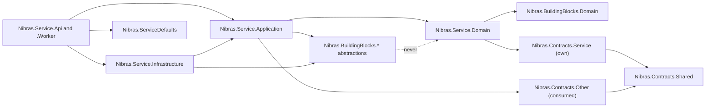

# 07. Solution Structure

> The full repository tree to project level, the building blocks and their public surface, the contracts layout, the service template, the dependency rules with the architecture tests that enforce them, and the naming conventions. Names come from Appendix L; the anatomy comes from reference architecture Sections 1 to 3; the standards come from master brief Section 19.

**Group** B · **Requirement areas covered** PLAT, TST, PERF, DATA, MSG, INF · **Last updated** 2026-09-22 by the planning session

## Purpose

This document lets an engineer who has never seen Nibras open the repository and know, for any file, which project it belongs to, why that project exists, what it may reference, and which test fails if the file is put somewhere else. It is written for the engineer who runs `dotnet new nibrassvc` on the first day of a service and for the reviewer who has to say whether a pull request put its handler in the right folder.

Every tree in this document is a fenced tree with a purpose comment on every entry. The Attendance service is expanded to file level as the worked example; everything else stops at project level, or at folder level where the reference architecture already fixes the shape.

## Scope

| In scope | Out of scope | Where the out-of-scope item lives |
|---|---|---|
| The repository root, `src/`, `tests/`, `deploy/` and `tools/` trees | The Angular workspace below `src/Web/` | `08-web-structure.md` |
| The anatomy of every service, expanded for Attendance | The Flutter project below `src/Mobile/` | `09-mobile-structure.md` |
| Building blocks: the surface a service may use and what each must never contain | The per-service caching tables, hot queries and budgets | `06-services/<service>.md` and `21-performance-engineering.md` |
| Contracts layout and the versioning rule | The message catalog and RabbitMQ topology | `11-messaging-architecture.md` |
| The service template and what it generates | The deployment modes, environments and pipelines in detail | `15-deployment-and-operations.md` |
| Dependency rules and the architecture tests that enforce them | The test strategy as a whole | `16-test-strategy.md` |
| Naming, path-length and case rules | The developer setup per operating system | `33-platform-support-and-dev-environments.md` and `docs/dev-setup/` |

**Counts, quoted from Appendix L.** 20 data-owning services, 16 Tier 1 and 4 Tier 2; with Gateway and the two backends-for-frontends, 23 deployable applications, plus 7 worker images. The 7 worker hosts are `Notification.Worker`, `Documents.Worker`, `Scheduling.Worker`, `Assessment.Worker`, `Finance.Worker`, `Reporting.Projections` and `Ai.Worker`. This document adds no service and no worker; it only places them.

**Derived project count, so a reader can check the trees.** 20 services × 4 layer projects = 80, plus 7 worker projects = 87 service projects; 20 × 3 test projects = 60; 13 building blocks and the 13 building-block test projects part 2.2 requires beside them = 26; 21 contract projects; AppHost, ServiceDefaults, Gateway, Bff.Web and Bff.Mobile = 5, with 3 test projects for the hosts; 4 .NET projects under `tests/` (EndToEnd and Load are Node projects). Total: **206 .NET projects** in `Nibras.sln`.

---

## 1. Repository root

Every top-level file and folder. The root carries the settings that make 206 projects build identically on Windows and Linux; nothing under it is allowed to override `Directory.Build.props` without an ADR.

```
nibras/                                    the mono-repo: one repository for every deliverable (master brief Section 7.1)
├── .github/                               forge configuration; a .woodpecker/ folder with the same stages replaces it if the forge changes
│   ├── workflows/                         pipelines, one file per concern, path-filtered (reference architecture Section 11)
│   │   ├── ci-service.yml                 reusable: builds and tests one service, triggered by a path filter on src/Services/<Service>/**
│   │   ├── ci-web.yml                     Angular workspace: lint, unit, build, bundle budgets, Playwright, axe
│   │   ├── ci-mobile.yml                  Flutter: analyze, test, goldens left-to-right and right-to-left, Android build
│   │   ├── ci-mobile-ios.yml              macOS runner only, path-filtered to src/Mobile/**
│   │   ├── ci-kit.yml                     kit-lint, its own tests, and the service-template smoke test, on ubuntu-latest and windows-latest
│   │   ├── dev-smoke.yml                  the one-command local start, on ubuntu-latest and windows-latest
│   │   ├── license-scan.yml               NuGet, npm and pub scanners plus asset licences, against the allow-list
│   │   ├── security-scan.yml              Trivy, Gitleaks, OWASP ZAP against the preview environment
│   │   ├── migrate.yml                    builds migration bundles per service and runs them as a job before rollout
│   │   ├── release.yml                    semantic version per service, CycloneDX SBOM, cosign signature, changelog
│   │   └── preview-env.yml                creates a preview environment on pull request, destroys it on merge
│   ├── CODEOWNERS                         src/BuildingBlocks and src/Contracts owned by the architect; each service by its team
│   ├── PULL_REQUEST_TEMPLATE.md           the definition of done from master brief Section 26, copied from docs/templates/pr-template.md
│   └── dependabot.yml                     grouped weekly dependency updates; security updates opened immediately
├── .claude/                               Claude Code configuration for this repository
│   ├── agents/                            reviewer and auditor personas that the commands invoke
│   ├── commands/                          the slash commands listed in CLAUDE.md
│   ├── rules/                             path-scoped rules: backend, contracts, tests, deploy, portability, web, mobile, docs-plan, brief
│   ├── skills/                            reusable how-to skills: service-sheet, ef-core-performance, saga-design, caching-table and the rest
│   └── settings.json                      hooks that invoke node with a relative path (kit-lint R16)
├── docs/                                  every document; the only tree written during planning
│   ├── brief/                             the three normative brief files and the appendices A to X
│   ├── plan/                              the plan, documents 00 to 34, as PLAN_SPEC.md defines them
│   ├── project/                           PROJECT_STATE, TRACEABILITY, BACKLOG, OPEN_QUESTIONS, GLOSSARY, DECISIONS/
│   ├── architecture/                      C4 diagrams, context map and threat model exported from documents 04 and 12
│   ├── api/                               the aggregated OpenAPI document and the error code catalog (Appendix K)
│   ├── messages/                          the message catalog and topology (document 11 and Appendix E)
│   ├── runbooks/                          one runbook per alert and per operational procedure
│   ├── user-guides/                       end-user help, en/ and ar/
│   ├── dev-setup/                         windows.md, linux.md, macos.md, troubleshooting.md
│   └── templates/                         fill-in templates: service sheet, ADR, runbook, work slice, caching table and the rest
├── src/                                   all product source, part 2 of this document
├── tests/                                 suites that span services, part 4 of this document
├── deploy/                                compose, helm, opentofu, gitops, secrets, onprem, observability, part 5 of this document
├── tools/                                 kit-lint, service template, seeders, licence scan, restore script, scripts, part 6 of this document
├── .editorconfig                          end_of_line = lf, indentation, C# and TypeScript style, analyzer severities
├── .gitattributes                         * text=auto eol=lf, *.ps1 text eol=crlf, binary patterns for images, fonts and archives
├── .gitignore                             bin, obj, node_modules, .dart_tool, build outputs, local environment files
├── .dockerignore                          keeps docs, tests and tools out of every image build context
├── CLAUDE.md                              the rules the assistant follows in this repository
├── README.md                              what Nibras is, how to run it, where the plan and the runbooks are
├── Directory.Build.props                  net10.0, nullable on, warnings as errors, analyzers, deterministic build, InvariantGlobalization false
├── Directory.Packages.props               central package management: every NuGet version pinned once, for all 206 projects
├── global.json                            the .NET SDK version with rollForward disabled, so every machine and runner builds identically
├── nuget.config                           package sources and RestorePackagesWithLockFile, so restore is reproducible
└── Nibras.sln                             the solution; its solution folders mirror src/, tests/ and tools/
```

`Directory.Build.props` is the one place that sets `TreatWarningsAsErrors`, `Nullable`, `ImplicitUsings`, `InvariantGlobalization=false`, the analyzer package references and `Deterministic`. `Directory.Packages.props` pins every package version; a project file names a package and never a version. `global.json` pins the SDK so that a Windows workstation, a Linux runner and the Debian build image compile the same source to the same binary.

---

## 2. `src/` to project level

### 2.1 Hosts, defaults, and the two front ends

```
src/
├── AppHost/                                     Aspire orchestration, development only (master brief Section 7.7)
│   └── Nibras.AppHost/                          references every Api, Worker, Gateway and BFF project; adds PostgreSQL, PgBouncer, RabbitMQ, redis-cache, redis-state, SeaweedFS, Gotenberg, Mailpit, ClamAV, and Ollama behind the ai profile
├── ServiceDefaults/                             the defaults every executable calls once from Program.cs
│   └── Nibras.ServiceDefaults/                  AddNibrasServiceDefaults(): OpenTelemetry, health, readiness and startup probes, resilience handlers, service discovery, graceful shutdown
├── BuildingBlocks/                              thirteen technical libraries, tree in 2.2, surface in part 7
├── Contracts/                                   twenty-one data-only projects, tree in 2.3, rules in part 8
├── Gateway/                                     the single public entry point
│   ├── Nibras.Gateway/                          YARP routes, token validation, tenant resolution from domain, subdomain or header, per-address and per-tenant rate limits, request size limits, CORS, security headers, aggregated OpenAPI, maintenance mode
│   └── tests/Nibras.Gateway.Tests/              routing, tenant resolution and rate-limit tests
├── Bff.Web/                                     web backend-for-frontend, image nibras/bff-web
│   ├── Nibras.Bff.Web/                          role home payloads, Student 360 composition from Reporting, navigation and permission bootstrap
│   └── tests/Nibras.Bff.Web.Tests/              composition tests against stubbed service clients
├── Bff.Mobile/                                  mobile backend-for-frontend, image nibras/bff-mobile
│   ├── Nibras.Bff.Mobile/                       delta sync endpoints keyed by change token, remote configuration, version policy
│   └── tests/Nibras.Bff.Mobile.Tests/           sync-token, delta and version-policy tests
├── Services/                                    the twenty data-owning services, tree in 2.4
├── Web/                                         the Angular workspace; its tree is document 08
│   ├── apps/                                    school and platform-console applications
│   ├── libs/                                    ui, core, data-access, shared and features libraries, published as @nibras/<lib>
│   └── e2e/                                     Playwright specs for the web workspace
└── Mobile/                                      the Flutter application; its tree is document 09
    ├── flavors/                                 default plus one folder per white-label school
    ├── lib/                                     app, core and features
    ├── test/                                    unit and widget tests
    ├── integration_test/                        device flows
    └── goldens/                                 golden images, left-to-right and right-to-left
```

Gateway and the two backends-for-frontends own no database and publish no events (Appendix L), which is why they have no Domain, Application or Infrastructure project: each is one host project plus one test project. They may reference `Nibras.Contracts.Shared` and the building blocks; they may never reference a service project (rule `Hosts_NeverReference_ServiceProjects` in 10.3).

### 2.2 Building blocks

Thirteen libraries, exactly as reference architecture Section 3 lists them. Each is a technical concern; none knows what a grade, a fee or a pickup person is. Part 7 gives the public surface of each and what it must never contain.

```
src/BuildingBlocks/                              technical libraries only; the architect owns this folder (reference architecture Section 11)
├── Nibras.BuildingBlocks.Domain/                Entity, AggregateRoot, ValueObject, DomainEvent, Result, Error, the clock and id-generator ports
├── Nibras.BuildingBlocks.Application/           the Wolverine pipeline: validation, authorization, tenant, transaction, audit, logging, timing
├── Nibras.BuildingBlocks.Tenancy/               tenant resolution, tenant context, the named Tenant filter, the RLS session variable, cache key prefixing
├── Nibras.BuildingBlocks.Authorization/         permission cache, policy provider, data scope evaluator, permission version check
├── Nibras.BuildingBlocks.Messaging/             outbox and inbox wiring, topology conventions, retry and dead-letter policy, urgent and bulk lanes
├── Nibras.BuildingBlocks.Caching/               the HybridCache wrapper: automatic tenant prefix and tags, key builder, TTL with jitter, event-driven invalidation, circuit breaker, metrics
├── Nibras.BuildingBlocks.Persistence/           pooled base DbContext, named Tenant and SoftDelete filters, audit columns, UUID v7, xmin concurrency, snake_case, keyset pagination, binary COPY, slow-query and command-count interceptors
├── Nibras.BuildingBlocks.Web/                   Problem Details, error codes, URL versioning, idempotency keys, ETag, per-user and per-endpoint rate limiting, pagination envelope, filter and sort grammar
├── Nibras.BuildingBlocks.Observability/         correlation id, tenant enrichment, metric and log-field conventions
├── Nibras.BuildingBlocks.Localization/          culture handling, the bilingual value object, Arabic normalization, Hijri conversion, numerals
├── Nibras.BuildingBlocks.Files/                 IFileStorage, signed URLs, scan status
├── Nibras.BuildingBlocks.Jobs/                  the long-running job contract with progress and cancellation, Quartz.NET registration
└── Nibras.BuildingBlocks.Testing/               builders, Testcontainers fixtures, fake clock, tenant fixtures, query-budget assertions; referenced by test projects only
```

Each block is one project with a `DependencyInjection.cs` exposing a single `AddNibras<Block>()` extension, a `README.md` that repeats its row from part 7, and a test project `tests/Nibras.BuildingBlocks.<Name>.Tests/` beside it. Appendix X runs the building-block tests on both the Linux and the Windows runner, because path composition, culture and line endings live here.

### 2.3 Contracts

One project per publishing service plus `Shared`. Reference architecture Section 10 shows that every one of the twenty data-owning services publishes at least one event, so there are twenty service contract projects. Gateway and the backends-for-frontends publish nothing and have none.

```
src/Contracts/                                   versioned integration events, command messages, gRPC protos and error codes; data only, the architect owns this folder
├── Nibras.Contracts.Shared/                     MessageEnvelope, common identifiers, PartitionKey, SchemaVersion; the only project a contract may reference
├── Nibras.Contracts.Identity/                   identity.user.*, identity.role.changed, identity.permissions.changed, identity.login.new-device, identity.join-request.*, identity.guardian-link.created, identity.delegation.*, identity.break-glass.*, identity.impersonation.started, identity.access-review.due, identity.contact-point.*; identity.proto for the permission, role-risk and API-key lookups
├── Nibras.Contracts.Platform/                   platform.tenant.*, platform.plan.changed, platform.feature-flag.changed, platform.settings.changed, platform.terminology.changed, platform.custom-field.*, platform.limit.*, platform.invoice.*, platform.trial.*, platform.upgrade.*, platform.webhook.*; platform.proto for tenant context, settings and retention holds
├── Nibras.Contracts.School/                     school.student.*, school.guardian.*, school.staff.*, school.section.*, school.academic-year.*, school.term.started, school.grade-level.*, school.grading-period.*, school.calendar-day.*, school.department.*, school.room.*, school.sibling.*, school.student-document.*; school.proto for the directories and their checksums
├── Nibras.Contracts.Admissions/                 admissions.inquiry.created, admissions.application.*, admissions.offer.*, admissions.re-enrollment.*; admissions.proto for Usage.Recount
├── Nibras.Contracts.Academics/                  academics.teaching-assignment.changed, academics.assignment.published, academics.submission.*, academics.lesson-plan.submitted, academics.homework-load.exceeded, academics.syllabus-coverage.*; academics.proto for TeachingAssignments.Checksum and Usage.Recount
├── Nibras.Contracts.Assessment/                 assessment.marks.*, assessment.grades.locked, assessment.report-card.*, assessment.report-cards.*, assessment.grade-change.approved, assessment.exam-paper.*; assessment.proto for Usage.Recount
├── Nibras.Contracts.Scheduling/                 scheduling.timetable.*, scheduling.substitution.assigned, scheduling.event.published, scheduling.room-booking.approved, scheduling.exam-timetable.*; scheduling.proto for Timetables and its checksum
├── Nibras.Contracts.Attendance/                 attendance.attendance.*, attendance.student.absent, attendance.excuse.approved, attendance.threshold.reached, attendance.gate-pass.*, attendance.visitor.*, attendance.emergency.*, attendance.roll-call.completed, attendance.dismissal.processed, attendance.mark-review.*; attendance.proto for Usage.Recount
├── Nibras.Contracts.Finance/                    finance.invoice.*, finance.invoice-run.*, finance.payment.*, finance.refund.processed, finance.account.*, finance.cheque.bounced, finance.credit-note.*, finance.day.closed, finance.deposit.*, finance.fee-plan.*, finance.payer.*, finance.scholarship.*, finance.cash-session.*; finance.proto for Usage.Recount
├── Nibras.Contracts.Communication/              communication.announcement.published, communication.message.*, communication.meeting.booked, communication.acknowledgment.*, communication.concern.*; communication.proto for Usage.Recount
├── Nibras.Contracts.Notification/               notification.notification.*, notification.channel.suppressed; notification.proto for Usage.Recount
├── Nibras.Contracts.Requests/                   requests.request.*, requests.task.assigned; the command messages other services receive from the request saga; requests.proto for Usage.Recount
├── Nibras.Contracts.Documents/                  documents.document.generated, documents.certificate.revoked, documents.import.completed, documents.export.completed, documents.file.scan-failed, documents.sensitive-export.performed; the *.generation-requested commands it receives; documents.proto for Usage.Recount
├── Nibras.Contracts.Behavior/                   behavior.incident.recorded, behavior.points.awarded, behavior.badge.awarded, behavior.consequence.assigned; behavior.proto for Usage.Recount
├── Nibras.Contracts.Reporting/                  reporting.early-warning.*, reporting.data-quality.issue-detected, reporting.projection.rebuild-completed; reporting.proto for Usage.Recount
├── Nibras.Contracts.Audit/                      audit.integrity-check.failed, audit.retention.partition-detached; the audit.recorded envelope every service emits under its own prefix; audit.proto for Usage.Recount
├── Nibras.Contracts.Wellbeing/                  wellbeing.referral.created, wellbeing.intervention.*, wellbeing.clinic-visit.*, wellbeing.medication.administered, wellbeing.safeguarding.concern-raised; identifiers and a category code only, never clinical detail; wellbeing.proto for Usage.Recount
├── Nibras.Contracts.Hr/                         hr.leave.*, hr.leave-balance.*, hr.staff.hired, hr.staff-document.expiring, hr.payroll.inputs-ready, hr.appraisal.*; hr.proto for Leave.Checksum and Usage.Recount
├── Nibras.Contracts.Operations/                 operations.transport.*, operations.library.loan-overdue, operations.facility.ticket-raised, operations.activity.*, operations.frontdesk.*, operations.inventory.*; operations.proto for Usage.Recount
└── Nibras.Contracts.Ai/                         ai.usage.recorded, ai.index.rebuild-completed, ai.suggestion.rejected; ai.proto for Usage.Recount
```

**Why every project carries a proto.** Reference architecture Section 8.0 names six services as synchronous callees — Platform, Identity, School, Scheduling, Academics and Hr — and adds that Platform's metering job calls "every data-owning service's `Usage.Recount`", so all twenty expose at least one gRPC service and all twenty contract projects carry `Grpc/<service>.proto`. Section 8.0's one-hop rule holds for every one of them: no service makes a synchronous call from inside a handler that is itself serving one, which the `GrpcHopRules` architecture test named there enforces. Ai is the exception that proves the boundary: it exposes `ai.proto` for metering but makes no gRPC call itself, reading instead through Bff.Web's three internal REST routes from its jobs.

The inside of one contract project, shown for Attendance and, for the richer proto, for School because School is the most-called directory (reference architecture Section 8.0):

```
src/Contracts/Nibras.Contracts.Attendance/       everything another service may know about Attendance
├── Events/                                      integration events, one folder per major version
│   └── V1/                                      the first published shape; a folder V2/ appears beside it when a breaking change ships
│       ├── AttendanceMarked.cs                  record for attendance.attendance.marked.v1, partition key sectionId
│       ├── StudentAbsent.cs                     record for attendance.student.absent.v1, partition key studentId
│       ├── ExcuseApproved.cs                    record for attendance.excuse.approved.v1
│       ├── ThresholdReached.cs                  record for attendance.threshold.reached.v1
│       ├── AttendanceNotMarked.cs               record for attendance.attendance.not-marked.v1
│       ├── DismissalProcessed.cs                record for attendance.dismissal.processed.v1
│       ├── GatePassIssued.cs                    record for attendance.gate-pass.issued.v1
│       ├── GatePassUsed.cs                      record for attendance.gate-pass.used.v1
│       ├── VisitorCheckedIn.cs                  record for attendance.visitor.checked-in.v1
│       ├── EmergencyBroadcastStarted.cs         record for attendance.emergency.broadcast-started.v1
│       ├── EmergencyAcknowledged.cs             record for attendance.emergency.acknowledged.v1
│       └── RollCallCompleted.cs                 record for attendance.roll-call.completed.v1
├── Commands/                                    command messages this service accepts from the Requests saga channel
│   └── V1/                                      one record per effect the Request Center can trigger
│       ├── ApplyLeaveEffect.cs                  approved leave request becomes excused sessions
│       ├── ApplyEarlyDismissalEffect.cs         approved early dismissal becomes a dismissal record
│       └── ApplyPickupChangeEffect.cs           approved pickup change updates the authorised collectors
├── Grpc/                                        the synchronous surface this service exposes, one hop
│   └── attendance.proto                         package nibras.attendance.v1: Usage.Recount for Platform's metering job (reference architecture Section 8.0)
├── ErrorCodes/                                  the stable codes from Appendix K, defined once here
│   └── AttendanceErrorCodes.cs                  ATTENDANCE_SESSION_LOCKED, ATTENDANCE_DUPLICATE_MARK, ATTENDANCE_PICKUP_PERSON_NOT_AUTHORIZED and the rest
├── RoutingKeys.cs                               the string constants for every key above, so a publisher cannot misspell one
└── README.md                                    the consumers of each event and the retirement date of any superseded version

src/Contracts/Nibras.Contracts.School/           the most-consumed contract in the system
├── Events/V1/                                   student, guardian, staff, section, academic-year and term events
├── Grpc/                                        the synchronous directory that other services may call, one hop
│   └── school.proto                             package nibras.school.v1: StudentDirectory and StaffDirectory lookups, the guardian eligibility check, the reconciliation checksum and snapshot-page calls, and Usage.Recount
├── ErrorCodes/SchoolErrorCodes.cs               SCHOOL_* codes
├── RoutingKeys.cs                               string constants
└── README.md                                    consumers and retirement dates
```

### 2.4 Services

Twenty folders, one shape. Each service has `README.md`, four layer projects, a worker project only where Appendix L lists a worker image, and three test projects under `tests/`. The worker project is named `.Worker` except for Reporting, whose worker image is `nibras/reporting-projections` and whose project is therefore `Nibras.Reporting.Projections`.

```
src/Services/                                              twenty data-owning services (Appendix L); the order is the registry's order
├── Identity/                                              Identity and Access, Tier 1, database nibras_identity, image nibras/identity-api
│   ├── README.md                                          purpose, owned data, API, events, how to run, runbook links
│   ├── Nibras.Identity.Domain/                            User, Role, RoleAssignment, Delegation, Invitation, JoinRequest, Session, ApiKey, AccessReview
│   ├── Nibras.Identity.Application/                       auth, users, roles, permissions, invitations, join-requests, sessions, api-keys, access-reviews, security-policy features
│   ├── Nibras.Identity.Infrastructure/                    OpenIddict, PostgreSQL, permission cache publisher, break-glass CLI host
│   ├── Nibras.Identity.Api/                               token server and REST host
│   └── tests/                                             Nibras.Identity.UnitTests, Nibras.Identity.IntegrationTests, Nibras.Identity.ContractTests
├── Platform/                                              Tenant, Platform, and Integrations, Tier 1, nibras_platform, nibras/platform-api
│   ├── README.md                                          purpose, owned data, API, events, how to run, runbook links
│   ├── Nibras.Platform.Domain/                            Tenant, Domain, Plan, Subscription, FeatureFlag, Branding, UsageRecord, TenantInvoice, SupportTicket, Setting, CustomFieldDefinition, Terminology
│   ├── Nibras.Platform.Application/                       provisioning and deletion sagas, settings, plan quotas, public API keys, webhooks, OneRoster, LTI, developer portal
│   ├── Nibras.Platform.Infrastructure/                    PostgreSQL, tenant connection resolution for the dedicated-database tier, webhook dispatcher
│   ├── Nibras.Platform.Api/                               REST host for the platform console and the tenant settings API
│   └── tests/                                             Nibras.Platform.UnitTests, Nibras.Platform.IntegrationTests, Nibras.Platform.ContractTests
├── School/                                                School Core (SIS), Tier 1, nibras_school, nibras/school-api
│   ├── README.md                                          purpose, owned data, API, events, how to run, runbook links
│   ├── Nibras.School.Domain/                              Campus, Room, AcademicYear, Term, GradeLevel, Section, Subject, Department, House, Student, Guardian, StudentGuardian, Enrollment, StatusChange, StaffMember
│   ├── Nibras.School.Application/                         structure and people features, year-end rollover and withdrawal clearance sagas
│   ├── Nibras.School.Infrastructure/                      PostgreSQL, the directory gRPC service implementation, reconciliation checksum provider
│   ├── Nibras.School.Api/                                 REST host and the nibras.school.v1 gRPC service
│   └── tests/                                             Nibras.School.UnitTests, Nibras.School.IntegrationTests, Nibras.School.ContractTests
├── Admissions/                                            Admissions, Tier 1, nibras_admissions, nibras/admissions-api
│   ├── README.md                                          purpose, owned data, API, events, how to run, runbook links
│   ├── Nibras.Admissions.Domain/                          Inquiry, Application, Assessment, Interview, Offer, WaitingListEntry, ReEnrollmentCampaign
│   ├── Nibras.Admissions.Application/                     pipeline features, offer-accepted-to-enrolled saga, public application form with OTP
│   ├── Nibras.Admissions.Infrastructure/                  PostgreSQL, School directory client, bot protection adapter
│   ├── Nibras.Admissions.Api/                             REST host including the public form endpoints
│   └── tests/                                             Nibras.Admissions.UnitTests, Nibras.Admissions.IntegrationTests, Nibras.Admissions.ContractTests
├── Academics/                                             Academics and Coursework, Tier 1, nibras_academics, nibras/academics-api
│   ├── README.md                                          purpose, owned data, API, events, how to run, runbook links
│   ├── Nibras.Academics.Domain/                           TeachingAssignment, StudentGroup, CurriculumUnit, LessonPlan, Assignment, Rubric, Submission, Resource, Question, Quiz, Attempt
│   ├── Nibras.Academics.Application/                      coursework features, QTI import and export, homework-load rule
│   ├── Nibras.Academics.Infrastructure/                   PostgreSQL, School directory client, Documents file references
│   ├── Nibras.Academics.Api/                              REST host
│   └── tests/                                             Nibras.Academics.UnitTests, Nibras.Academics.IntegrationTests, Nibras.Academics.ContractTests
├── Assessment/                                            Assessment and Reporting, Tier 1, nibras_assessment, nibras/assessment-api and nibras/assessment-worker
│   ├── README.md                                          purpose, owned data, API, events, how to run, runbook links
│   ├── Nibras.Assessment.Domain/                          AssessmentStructure, Mark, GradeScheme (versioned), ModerationRecord, TermResult, ReportCard (versioned), Transcript, GradeChangeRequest
│   ├── Nibras.Assessment.Application/                     mark entry, moderation, locking, report-card batch saga, grade-change features
│   ├── Nibras.Assessment.Infrastructure/                  PostgreSQL with the covering index for the mark grid, School directory client
│   ├── Nibras.Assessment.Api/                             REST host
│   ├── Nibras.Assessment.Worker/                          result calculation and report-card batch orchestration, scaled by queue depth
│   └── tests/                                             Nibras.Assessment.UnitTests, Nibras.Assessment.IntegrationTests, Nibras.Assessment.ContractTests
├── Scheduling/                                            Scheduling and Calendar, Tier 1, nibras_scheduling, nibras/scheduling-api and nibras/scheduling-worker
│   ├── README.md                                          purpose, owned data, API, events, how to run, runbook links
│   ├── Nibras.Scheduling.Domain/                          BellSchedule, Constraint, TimetableVersion, TimetableEntry, Substitution, CalendarEvent, RoomBooking, ExamSession, SeatingPlan
│   ├── Nibras.Scheduling.Application/                     timetable, substitution, calendar, booking and iCal features
│   ├── Nibras.Scheduling.Infrastructure/                  PostgreSQL, OR-Tools solver adapter, School directory client
│   ├── Nibras.Scheduling.Api/                             REST host and iCal feeds
│   ├── Nibras.Scheduling.Worker/                          the OR-Tools solver as a cancellable job with progress
│   └── tests/                                             Nibras.Scheduling.UnitTests, Nibras.Scheduling.IntegrationTests, Nibras.Scheduling.ContractTests
├── Attendance/                                            Attendance and Safety, Tier 1, nibras_attendance, nibras/attendance-api; expanded to file level in part 3
│   ├── README.md                                          purpose, owned data, API, events, how to run, runbook links
│   ├── Nibras.Attendance.Domain/                          AttendanceSession, Excuse, ThresholdRule, PickupPerson, GatePass, Visitor, EmergencyBroadcast
│   ├── Nibras.Attendance.Application/                     marking, excuses, thresholds, safety and offline sync features
│   ├── Nibras.Attendance.Infrastructure/                  PostgreSQL partitioned by tenant and month, School directory client
│   ├── Nibras.Attendance.Api/                             REST host; hosts the Quartz.NET jobs because Appendix L lists no Attendance worker image
│   └── tests/                                             Nibras.Attendance.UnitTests, Nibras.Attendance.IntegrationTests, Nibras.Attendance.ContractTests
├── Finance/                                               Finance, Tier 1, nibras_finance, nibras/finance-api and nibras/finance-worker
│   ├── README.md                                          purpose, owned data, API, events, how to run, runbook links
│   ├── Nibras.Finance.Domain/                             FeeItem, FeeStructure, FeePlan, Invoice, Payment, Refund, CreditNote, Discount, Scholarship, Payer, CashierShift, Series
│   ├── Nibras.Finance.Application/                        invoicing, payments, refunds, discounts, cashier and statement features; daily balance check
│   ├── Nibras.Finance.Infrastructure/                     PostgreSQL with gapless series, payment provider adapters, School directory client
│   ├── Nibras.Finance.Api/                                REST host including idempotent payment callbacks
│   ├── Nibras.Finance.Worker/                             invoice runs, reminder ladder, statements
│   └── tests/                                             Nibras.Finance.UnitTests, Nibras.Finance.IntegrationTests, Nibras.Finance.ContractTests
├── Communication/                                         Communication, Tier 1, nibras_communication, nibras/communication-api
│   ├── README.md                                          purpose, owned data, API, events, how to run, runbook links
│   ├── Nibras.Communication.Domain/                       Announcement, Audience, Acknowledgment, Conversation, Message, MessagingPolicy, MeetingSlot, Booking, Survey
│   ├── Nibras.Communication.Application/                  announcements, messaging, meetings, surveys, acknowledgment features
│   ├── Nibras.Communication.Infrastructure/               PostgreSQL, SignalR hubs with the Redis backplane, Identity policy-check client
│   ├── Nibras.Communication.Api/                          REST host and the SignalR hubs for messaging, notifications, job progress and permission refresh
│   └── tests/                                             Nibras.Communication.UnitTests, Nibras.Communication.IntegrationTests, Nibras.Communication.ContractTests
├── Notification/                                          Notification, Tier 1, nibras_notification, nibras/notification-api and nibras/notification-worker
│   ├── README.md                                          purpose, owned data, API, events, how to run, runbook links
│   ├── Nibras.Notification.Domain/                        Template, Preference, NotificationRequest, Delivery, Digest
│   ├── Nibras.Notification.Application/                   the consumers of Appendix C, preference and quiet-hours resolution, the unified inbox
│   ├── Nibras.Notification.Infrastructure/                PostgreSQL partitioned by month, channel adapters for email, push and SMS
│   ├── Nibras.Notification.Api/                           REST host for preferences, templates and the inbox
│   ├── Nibras.Notification.Worker/                        channel lanes, urgent and bulk, and the digest builder; scaled by queue depth with per-tenant fairness
│   └── tests/                                             Nibras.Notification.UnitTests, Nibras.Notification.IntegrationTests, Nibras.Notification.ContractTests
├── Requests/                                              Requests, Tasks, and Workflow, Tier 1, nibras_requests, nibras/requests-api
│   ├── README.md                                          purpose, owned data, API, events, how to run, runbook links
│   ├── Nibras.Requests.Domain/                            RequestType (versioned), FormDefinition, ApprovalChain, Request, ApprovalDecision, SlaPolicy, EffectDefinition, Task
│   ├── Nibras.Requests.Application/                       request centre, approval engine, SLA and escalation, the request-fulfilment saga that commands owning services
│   ├── Nibras.Requests.Infrastructure/                    PostgreSQL, saga persistence, command dispatch to owning services
│   ├── Nibras.Requests.Api/                               REST host and the request type designer API
│   └── tests/                                             Nibras.Requests.UnitTests, Nibras.Requests.IntegrationTests, Nibras.Requests.ContractTests
├── Documents/                                             Documents, Tier 1, nibras_documents plus object storage, nibras/documents-api and nibras/documents-worker
│   ├── README.md                                          purpose, owned data, API, events, how to run, runbook links
│   ├── Nibras.Documents.Domain/                           StoredFile, DocumentTemplate, GeneratedDocument, Certificate, VerificationToken, ImportJob, ExportJob
│   ├── Nibras.Documents.Application/                      upload, template, generation, certificate, verification, import and export features
│   ├── Nibras.Documents.Infrastructure/                   PostgreSQL, SeaweedFS storage, Gotenberg, ClamAV and OCR adapters, bundled fonts
│   ├── Nibras.Documents.Api/                              REST host and the public QR verification page
│   ├── Nibras.Documents.Worker/                           PDF rendering, imports, exports, virus scan, OCR; importing is a job group here, never a separate worker
│   └── tests/                                             Nibras.Documents.UnitTests, Nibras.Documents.IntegrationTests, Nibras.Documents.ContractTests
├── Behavior/                                              Behavior and Recognition, Tier 1, nibras_behavior, nibras/behavior-api
│   ├── README.md                                          purpose, owned data, API, events, how to run, runbook links
│   ├── Nibras.Behavior.Domain/                            Category, Incident, PointEntry, Award, Badge
│   ├── Nibras.Behavior.Application/                       incidents, points, houses, awards, badges, Open Badges export features
│   ├── Nibras.Behavior.Infrastructure/                    PostgreSQL, School directory client
│   ├── Nibras.Behavior.Api/                               REST host
│   └── tests/                                             Nibras.Behavior.UnitTests, Nibras.Behavior.IntegrationTests, Nibras.Behavior.ContractTests
├── Reporting/                                             Reporting and Analytics, Tier 1, nibras_reporting, nibras/reporting-api and nibras/reporting-projections
│   ├── README.md                                          purpose, owned data, API, events, how to run, runbook links
│   ├── Nibras.Reporting.Domain/                           projection definitions, data-quality rules, early-warning model inputs; owns no source data
│   ├── Nibras.Reporting.Application/                      dashboards, Student 360 read model, report builder, data quality centre, rebuild command
│   ├── Nibras.Reporting.Infrastructure/                   PostgreSQL read models on the replica, ML.NET early-warning models, Dapper for summary tables
│   ├── Nibras.Reporting.Api/                              REST host for dashboards and reports
│   ├── Nibras.Reporting.Projections/                      the projection worker, image nibras/reporting-projections; the one worker not named .Worker (Appendix L)
│   └── tests/                                             Nibras.Reporting.UnitTests, Nibras.Reporting.IntegrationTests, Nibras.Reporting.ContractTests
├── Audit/                                                 Audit, Tier 1, nibras_audit append-only and hash-chained, nibras/audit-api
│   ├── README.md                                          purpose, owned data, API, events, how to run, runbook links
│   ├── Nibras.Audit.Domain/                               AuditEntry, hash chain, integrity check
│   ├── Nibras.Audit.Application/                          the wildcard consumer of <service>.audit.recorded.v1, search, export, integrity verification
│   ├── Nibras.Audit.Infrastructure/                       PostgreSQL partitioned by month, append-only role
│   ├── Nibras.Audit.Api/                                  REST host for search and export
│   └── tests/                                             Nibras.Audit.UnitTests, Nibras.Audit.IntegrationTests, Nibras.Audit.ContractTests
├── Wellbeing/                                             Student Wellbeing, Tier 2, nibras_wellbeing with separate credentials and encrypted columns, nibras/wellbeing-api
│   ├── README.md                                          purpose, owned data, API, events, how to run, runbook links
│   ├── Nibras.Wellbeing.Domain/                           ClinicVisit, MedicationLog, CounselingCase, SafeguardingConcern, EducationPlan, Intervention
│   ├── Nibras.Wellbeing.Application/                      clinic, counselling, safeguarding and intervention features; every read writes an access log entry; no Caching reference
│   ├── Nibras.Wellbeing.Infrastructure/                   PostgreSQL with per-tenant column encryption keys, School directory client
│   ├── Nibras.Wellbeing.Api/                              REST host
│   └── tests/                                             Nibras.Wellbeing.UnitTests, Nibras.Wellbeing.IntegrationTests, Nibras.Wellbeing.ContractTests
├── Hr/                                                    Human Resources, Tier 2, nibras_hr, nibras/hr-api
│   ├── README.md                                          purpose, owned data, API, events, how to run, runbook links
│   ├── Nibras.Hr.Domain/                                  StaffFile, Contract, LeaveRequest, LeaveBalance, PayrollInput, Payslip, Appraisal, Observation, Vacancy
│   ├── Nibras.Hr.Application/                             leave, contracts, appraisal, payroll input, recruitment features
│   ├── Nibras.Hr.Infrastructure/                          PostgreSQL, School directory client
│   ├── Nibras.Hr.Api/                                     REST host
│   └── tests/                                             Nibras.Hr.UnitTests, Nibras.Hr.IntegrationTests, Nibras.Hr.ContractTests
├── Operations/                                            Operations, Tier 2, nibras_operations with a schema per sub-domain, nibras/operations-api
│   ├── README.md                                          purpose, owned data, API, events, how to run, runbook links
│   ├── Nibras.Operations.Domain/                          library, transport, inventory, facilities, frontdesk and activities aggregates, one namespace per schema
│   ├── Nibras.Operations.Application/                     features grouped by sub-domain so a later split is mechanical
│   ├── Nibras.Operations.Infrastructure/                  PostgreSQL with one schema per sub-domain, School directory client
│   ├── Nibras.Operations.Api/                             REST host
│   └── tests/                                             Nibras.Operations.UnitTests, Nibras.Operations.IntegrationTests, Nibras.Operations.ContractTests
└── Ai/                                                    AI Assist, Tier 2, nibras_ai with pgvector, nibras/ai-api and nibras/ai-worker
    ├── README.md                                          purpose, owned data, API, events, how to run, runbook links
    ├── Nibras.Ai.Domain/                                  IndexScope, Embedding, AssistSession, UsageRecord; off by default per tenant
    ├── Nibras.Ai.Application/                             model gateway, retrieval filtered by the caller's data scope, drafting, natural-language query, assistant
    ├── Nibras.Ai.Infrastructure/                          pgvector, Ollama or vLLM adapter behind the model gateway port
    ├── Nibras.Ai.Api/                                     REST host reached only through the backends-for-frontends
    ├── Nibras.Ai.Worker/                                  indexing and embedding jobs
    └── tests/                                             Nibras.Ai.UnitTests, Nibras.Ai.IntegrationTests, Nibras.Ai.ContractTests
```

**The first-release merge option** (Appendix L, ADR-0002) changes nothing in this tree. Merging Assessment into Academics is a build-time choice in which the Academics host references the Assessment Application and Infrastructure projects and serves both route groups; the projects, database names, exchanges and permission namespaces stay as listed, so the later split is a deployment change.

---

## 3. Worked example: Attendance to file level

This follows reference architecture Section 2 folder for folder and fills in the files. `MarkAttendance/` is the worked feature. Attendance has no worker image in Appendix L, so its Quartz.NET jobs are hosted in the Api process; the reference architecture's `Worker/` folder is therefore absent here and present in the seven services that Appendix L gives a worker image.

```
src/Services/Attendance/                                          Attendance and Safety: sessions, excuses, thresholds, pickup, gate passes, visitors, emergencies
├── README.md                                                     purpose, owned data, API, events, how to run, runbook links
├── Nibras.Attendance.Domain/                                     aggregates, invariants, rules, domain events; references Nibras.BuildingBlocks.Domain and Nibras.Contracts.Attendance only
│   ├── Sessions/                                                 aggregate: AttendanceSession, AttendanceRecord, AttendanceCode
│   │   ├── AttendanceSession.cs                                  aggregate root; behaviour and invariants live here, one method per BR-ATT rule it enforces
│   │   ├── AttendanceRecord.cs                                   one student in one session; the entity partitioned by tenant and month
│   │   ├── AttendanceCode.cs                                     value object: present, absent, late, excused, plus the tenant's custom codes from Appendix G settings
│   │   ├── Events/                                               domain events raised by the aggregate; Application maps them to integration events
│   │   │   ├── AttendanceMarked.cs                               raised once per session mark; becomes attendance.attendance.marked.v1
│   │   │   └── StudentMarkedAbsent.cs                            raised per absent record; becomes attendance.student.absent.v1
│   │   └── Rules/                                                named rule classes, one per BR-ATT identifier in Appendix S
│   │       ├── LockWindowRule.cs                                 marking after the cut-off needs edit-after-lock; error ATTENDANCE_SESSION_LOCKED
│   │       ├── DuplicateMarkRule.cs                              an offline replay of the same mark is a success; error ATTENDANCE_DUPLICATE_MARK carries 200
│   │       └── OfflineConflictRule.cs                            two devices, two values: server receivedAt orders them (Appendix M); error ATTENDANCE_OFFLINE_CONFLICT
│   ├── Excuses/                                                  aggregate: Excuse with evidence, window and approval
│   │   ├── Excuse.cs                                             aggregate root: student, dates, code, evidence, decision
│   │   ├── ExcuseEvidence.cs                                     value object: FileReference plus scan status from the Files block
│   │   └── Rules/                                                the excuse rules
│   │       ├── ExcuseWindowRule.cs                               days allowed after the absence; error ATTENDANCE_EXCUSE_WINDOW_PASSED
│   │       └── EvidenceRequiredRule.cs                           excuse types that need a document; error ATTENDANCE_EXCUSE_EVIDENCE_REQUIRED
│   ├── Thresholds/                                               aggregate: ThresholdRule and its evaluation
│   │   ├── ThresholdRule.cs                                      aggregate root: kind, count, window, escalation target
│   │   └── ThresholdEvaluator.cs                                 domain service that decides when attendance.threshold.reached.v1 fires
│   ├── Safety/                                                   aggregates: PickupPerson, GatePass, Visitor, EmergencyBroadcast
│   │   ├── PickupPerson.cs                                       authorised collectors per student with verification state
│   │   ├── GatePass.cs                                           QR or PIN pass: validity window, single use; error ATTENDANCE_GATE_PASS_INVALID
│   │   ├── Visitor.cs                                            check-in, check-out, watch-list hit
│   │   ├── EmergencyBroadcast.cs                                 broadcast, acknowledgements, roll call, reunification
│   │   └── Rules/                                                the safety rules
│   │       ├── PickupAuthorizationRule.cs                        never release a child to an unlisted person; error ATTENDANCE_PICKUP_PERSON_NOT_AUTHORIZED
│   │       └── BroadcastPermissionRule.cs                        broadcast needs the high-risk permission; error ATTENDANCE_BROADCAST_NOT_PERMITTED
│   ├── References/                                               slim read-only copies rebuilt from events, reconciled nightly (reference architecture Section 8)
│   │   ├── StudentReference.cs                                   id, student number, names in both languages, section, status
│   │   ├── SectionReference.cs                                   id, grade level, campus
│   │   ├── StaffReference.cs                                     id, names, who may mark which section today
│   │   └── TimetableOfDay.cs                                     the day's expected sessions per section from scheduling.timetable.published.v1
│   └── Shared/                                                   value objects, errors and domain services used by more than one aggregate
│       ├── AttendanceErrors.cs                                   one Error per ATTENDANCE_* code in Nibras.Contracts.Attendance
│       ├── SchoolDay.cs                                          value object: date in the campus time zone plus period id
│       └── MarkSource.cs                                         value object: teacher, gate, bus, kiosk, offline replay
├── Nibras.Attendance.Application/                                use cases, consumers, read models; references Domain, the building-block abstractions and the contracts it consumes
│   ├── Features/                                                 vertical slices: one folder per use case, four files each
│   │   ├── MarkAttendance/                                       the worked feature: a teacher marks a class
│   │   │   ├── MarkAttendanceCommand.cs                          record: section id, school day, marks, client idempotency token, occurredAt from the device
│   │   │   ├── MarkAttendanceHandler.cs                          loads the session, applies the rules, saves, writes the outbox in the same transaction; budget 3 commands
│   │   │   ├── MarkAttendanceValidator.cs                        FluentValidation: roster membership, code validity, payload size, one mark per student
│   │   │   └── MarkAttendanceEndpoint.cs                         POST /api/v1/attendance/sections/{id}/attendance, permission attendance.student-attendance.mark, 202 Accepted, idempotent by session id plus client token
│   │   ├── EditAfterLock/                                        elevated correction after the cut-off, permission attendance.student-attendance.edit-after-lock
│   │   ├── BulkMarkAttendance/                                   whole-section bulk endpoint with per-item results, permission attendance.student-attendance.bulk-mark
│   │   ├── SubmitExcuse/                                         parent or student submits an excuse with evidence
│   │   ├── ApproveExcuse/                                        approver decision; publishes attendance.excuse.approved.v1
│   │   ├── GetSectionRegister/                                   the register a teacher opens: the hottest read, served by a compiled query
│   │   ├── GetStudentSummary/                                    counts and streaks for the Student 360 card
│   │   ├── ManageThresholds/                                     create, edit, delete threshold rules
│   │   ├── IssueGatePass/                                        issue, verify and revoke gate passes
│   │   ├── VerifyPickupPerson/                                   gate verification of a collector against the authorised list
│   │   ├── CheckInVisitor/                                       front-desk check-in and check-out with the watch-list
│   │   ├── StartEmergencyBroadcast/                              broadcast, acknowledgements, roll call and reunification
│   │   └── SyncOfflineMarks/                                     replays the mobile outbox with the conflict rules of Appendix M
│   ├── Consumers/                                                integration event handlers, each idempotent through the inbox
│   │   ├── StudentEnrolledConsumer.cs                            school.student.enrolled.v1 creates the StudentReference
│   │   ├── StudentSectionChangedConsumer.cs                      school.student.section-changed.v1 moves the reference between sections
│   │   ├── StudentStatusChangedConsumer.cs                       school.student.status-changed.v1 retires the reference
│   │   ├── SectionCreatedConsumer.cs                             school.section.created.v1 creates the SectionReference
│   │   ├── TermStartedConsumer.cs                                school.term.started.v1 opens the term's marking calendar
│   │   ├── TimetablePublishedConsumer.cs                         scheduling.timetable.published.v1 and scheduling.timetable.changed.v1 rebuild TimetableOfDay
│   │   ├── SubstitutionAssignedConsumer.cs                       scheduling.substitution.assigned.v1 changes who may mark the period
│   │   ├── LeaveApprovedConsumer.cs                              hr.leave.approved.v1 and hr.leave.cancelled.v1 pre-fill staff absence
│   │   ├── RequestApprovedConsumer.cs                            requests.request.approved.v1 dispatches the leave, early dismissal and pickup change effects
│   │   └── TransportBoardingRecordedConsumer.cs                  operations.transport.boarding-recorded.v1 pre-fills bus presence
│   ├── Sagas/                                                    where a process manager goes when one spans services; Attendance owns none (master brief Section 7.3 lists the sagas), so the template does not create this folder here
│   ├── ReadModels/                                               query projections and DTOs: AsNoTracking, Select to DTO, keyset paging
│   │   ├── SectionRegisterRow.cs                                 one row of the register grid, pre-filled from gate, bus and approved leave
│   │   ├── StudentAttendanceSummary.cs                           counts, streaks, last absence for one student
│   │   ├── UnmarkedSessionRow.cs                                 the reminder job's read shape
│   │   └── RegisterQueries.cs                                    keyset queries over IAttendanceReadContext, page size capped at 200
│   ├── Caching/                                                  what this service caches and what invalidates it
│   │   └── AttendanceCacheKeys.cs                                keys, tags, TTL policy and invalidating events, matching the caching table in 06-services/attendance.md
│   ├── Abstractions/                                             the ports Infrastructure implements
│   │   ├── IAttendanceRepository.cs                              load and save aggregates
│   │   ├── IAttendanceReadContext.cs                             AsNoTracking IQueryable sources for the read models
│   │   ├── IStudentDirectory.cs                                  School's student directory over gRPC with a cached fallback; the clock port comes from the Domain block
│   │   ├── ITimetableOfDay.cs                                    Scheduling `Timetables`: the campus day and a published version (reference architecture Section 8.0)
│   │   └── ILeaveChecksum.cs                                     Hr `Leave.Checksum`, called job only by the nightly reconciler, never inside a request
│   ├── Permissions/                                              constants that match Appendix B
│   │   └── AttendancePermissions.cs                              attendance.student-attendance.mark, attendance.excuses.approve, attendance.safety.emergency.broadcast and every other permission, one constant each
│   └── DependencyInjection.cs                                    AddAttendanceApplication(): handlers, validators, consumers, cache policies
├── Nibras.Attendance.Infrastructure/                             adapters: PostgreSQL, RabbitMQ, gRPC clients, reconciliation
│   ├── Persistence/                                              EF Core 10 against nibras_attendance as user svc_attendance
│   │   ├── AttendanceDbContext.cs                                pooled, named Tenant and SoftDelete filters, audit columns, xmin concurrency, SET LOCAL app.tenant_id per transaction
│   │   ├── CompiledQueries/                                      EF.CompileAsyncQuery for the hottest reads
│   │   │   ├── SectionRegisterQuery.cs                           the register for one section and day
│   │   │   └── TimetableOfDayQuery.cs                            expected sessions for one teacher today
│   │   ├── CompiledModel/                                        generated compiled model, regenerated by tools/scripts/migrate-bundle.mjs
│   │   ├── Configurations/                                       one IEntityTypeConfiguration per aggregate and reference, tenant_id first in every index
│   │   │   ├── AttendanceSessionConfiguration.cs                 table attendance_sessions
│   │   │   ├── AttendanceRecordConfiguration.cs                  table attendance_records, partitioned by tenant and month, partial index on deleted_at IS NULL
│   │   │   ├── ExcuseConfiguration.cs                            table excuses
│   │   │   ├── ThresholdRuleConfiguration.cs                     table threshold_rules
│   │   │   ├── SafetyConfigurations.cs                           pickup_persons, gate_passes, visitors, emergency_broadcasts
│   │   │   └── ReferenceConfigurations.cs                        student_refs, section_refs, staff_refs, timetable_of_day
│   │   ├── Migrations/                                           expand-and-contract migrations, bundled by migrate.yml, never run at startup
│   │   │   ├── 20260901000000_Initial.cs                         the first schema, with row-level security and the first partitions
│   │   │   └── AttendanceDbContextModelSnapshot.cs               EF Core model snapshot
│   │   ├── Repositories/                                         implementations of the Application ports
│   │   │   ├── AttendanceRepository.cs                           aggregate persistence
│   │   │   └── AttendanceReadContext.cs                          exposes the AsNoTracking sets
│   │   ├── RowLevelSecurity/                                     the second barrier, applied by the Initial migration and by every migration that adds a table
│   │   │   └── policies.sql                                      ENABLE and FORCE ROW LEVEL SECURITY plus the tenant_isolation policy per table (reference architecture Section 14)
│   │   └── Partitioning/                                         monthly partitions for attendance_records and their detach schedule
│   │       └── attendance_records_partitions.sql                 create-ahead and detach statements run by PartitionMaintenanceJob
│   ├── Messaging/                                                Wolverine and RabbitMQ topology for this service
│   │   ├── AttendanceTopology.cs                                 exchange nibras.attendance, queues attendance.<purpose> with .dlq and .parking, partition keys from Appendix E
│   │   └── IntegrationEventMapper.cs                             domain events to Nibras.Contracts.Attendance V1 records, written through the outbox
│   ├── Grpc/                                                     clients for the synchronous queries reference architecture Section 8.0 allows this service
│   │   ├── SchoolDirectoryClient.cs                              IStudentDirectory over nibras.school.v1: timeout, retry with jitter, circuit breaker, cached fallback
│   │   ├── SchedulingTimetableClient.cs                          ITimetableOfDay over nibras.scheduling.v1, same resilience policy and cached fallback
│   │   └── HrLeaveChecksumClient.cs                              ILeaveChecksum over nibras.hr.v1, called from the reconciler job only
│   ├── Reconciliation/                                           nightly checksum of the reference copies against School (master brief Section 19)
│   │   └── ReferenceCopyReconciler.cs                            compares, repairs by replay, raises a data-quality issue on an unexplained difference
│   └── DependencyInjection.cs                                    AddAttendanceInfrastructure(): pooled DbContext, repositories, topology, one gRPC channel per callee in reference architecture Section 8.0
├── Nibras.Attendance.Api/                                        the HTTP host, image nibras/attendance-api
│   ├── Program.cs                                                composition root, no logic: ServiceDefaults, Application, Infrastructure, endpoints, probes
│   ├── Endpoints/                                                endpoint registration by feature group
│   │   ├── SessionEndpoints.cs                                   /api/v1/attendance/sections/{id}/attendance and /api/v1/attendance/sessions
│   │   ├── ExcuseEndpoints.cs                                    /api/v1/attendance/excuses
│   │   ├── ThresholdEndpoints.cs                                 /api/v1/attendance/thresholds
│   │   └── SafetyEndpoints.cs                                    /api/v1/attendance/safety/pickup-persons, gate-passes, visitors, emergency
│   ├── Grpc/                                                     gRPC services this service exposes, implementing nibras.attendance.v1
│   │   └── UsageService.cs                                       Usage.Recount, answered from this service's own data for Platform's metering job; no other service names Attendance as a synchronous dependency (reference architecture Section 8.0)
│   ├── Jobs/                                                     Quartz.NET jobs, hosted here because Appendix L lists no attendance-worker image
│   │   ├── UnmarkedClassReminderJob.cs                           per period cut-off, per campus time zone; publishes attendance.attendance.not-marked.v1
│   │   ├── ThresholdEvaluationJob.cs                             nightly threshold pass; publishes attendance.threshold.reached.v1
│   │   ├── AttendanceAgainstTimetableJob.cs                      the daily orphan check in both directions (master brief Section 19)
│   │   └── PartitionMaintenanceJob.cs                            creates next month's partition and detaches per Appendix J
│   ├── appsettings.json                                          non-secret defaults; every secret arrives from the environment (reference architecture Section 12)
│   ├── appsettings.Development.json                              Aspire and compose development values
│   └── Dockerfile                                                Debian-based aspnet image, non-root, read-only root filesystem, ICU and tzdata present, TZ=UTC
└── tests/                                                        the service's own suites; the cross-service suites are under /tests
    ├── Nibras.Attendance.UnitTests/                              domain and handlers, no containers
    │   ├── Domain/                                               one test class per aggregate and per BR-ATT rule, table-driven from the worked examples in Appendix S
    │   ├── Features/                                             handler tests with fakes for the ports
    │   └── Consumers/                                            idempotency and reference-copy tests
    ├── Nibras.Attendance.IntegrationTests/                       Testcontainers: PostgreSQL, RabbitMQ, Redis
    │   ├── Fixtures/                                             AttendanceWebAppFactory over the Testing block fixtures, two seeded tenants
    │   ├── Endpoints/                                            each endpoint against the real stack, asserting the data and not the status code
    │   ├── Persistence/                                          row-level security, pooled-connection isolation, query budgets with the command counter
    │   ├── Messaging/                                            outbox publish, inbox deduplication, consumer replay
    │   └── Jobs/                                                 the reminder cut-off across Riyadh, Amman and Dubai
    └── Nibras.Attendance.ContractTests/                          API and message contracts
        ├── Provider/                                             Pact provider verification of the OpenAPI document
        └── Messages/                                             schema tests for every V1 record in Nibras.Contracts.Attendance, publisher side
```

Two folders in the reference anatomy are absent from the generated Attendance service and are shown above only so the reader knows where they go: `Sagas/` and `Api/Grpc/`. The template creates them only when `--sagas` or `--grpc` is passed (part 9), because an empty folder is not committed and a placeholder file in it is a lie about the service.

The shape of one feature, so nobody has to open another service to learn it: the `Command` is an immutable record and the only input type; the `Handler` is a Wolverine handler that receives the command through the pipeline in the Application block (validation, authorization, tenant, transaction, audit, logging, timing, in that order); the `Validator` is the FluentValidation class the pipeline runs before the handler; the `Endpoint` is a static method that maps the HTTP request to the command, declares its permission constant, and returns the Problem Details or the result. A read feature has the same four files with a `Query` in place of the `Command`. Nothing else goes in the feature folder.

---

## 4. `tests/`

Suites that span services. Each service's own unit, integration and contract suites live beside it under `src/Services/<Service>/tests/` and are shown in part 3.

```
tests/                                          cross-service suites; every one of them runs in ci-service.yml for the service that changed
├── Architecture.Tests/                         NetArchTest rules for every project in Nibras.sln; the rules are listed in 10.3
│   ├── Rules/                                  one class per rule group: Layers, BuildingBlocks, Contracts, Services, Handlers, Persistence, Hosts
│   ├── Fixtures/                               loads every assembly from the solution, so a new service is covered without editing a test
│   └── Nibras.Architecture.Tests.csproj        references every src project
├── Contracts.Tests/                            Pact and message schema tests
│   ├── Consumers/                              consumer-driven contracts, one folder per consuming service and per publisher it depends on
│   ├── Providers/                              provider verification, one folder per publishing service
│   ├── MessageSchemas/                         a JSON schema per V<n> record, compared against the committed baseline; a changed baseline is a new version
│   ├── pacts/                                  the committed pact files both sides verify
│   └── Nibras.Contracts.Tests.csproj           references every Contracts project and PactNet
├── TenantIsolation.Tests/                      the generated attack suite
│   ├── Generator/                              reads the endpoint and consumer registries and emits one test per entry
│   ├── Generated/                              committed output, regenerated in CI and diffed; a new endpoint with no test fails the build
│   ├── Attacks/                                the attack shapes: foreign identifiers, foreign tenant header, cache key without tenant, pooled-connection reuse
│   └── Nibras.TenantIsolation.Tests.csproj     references the Testing block and every Api project
├── PermissionMatrix.Tests/                     generated from the permission catalog (Appendix B) and the role templates (Appendix I)
│   ├── Generator/                              reads the catalog and emits allowed and denied twins for every role and endpoint
│   ├── Generated/                              committed output; the denied test asserts no hint of the record exists in the response
│   ├── Roles/                                  role fixtures with tokens carrying the permission version
│   └── Nibras.PermissionMatrix.Tests.csproj    references the Testing block and every Api project
├── EndToEnd/                                   Playwright, the workflows of master brief Section 14
│   ├── specs/                                  one folder per workflow, run in four theme and direction combinations
│   ├── pages/                                  page objects shared by the specs
│   ├── fixtures/                               seeded tenants, one user per role, clock control
│   ├── playwright.config.ts                    Chromium, Firefox and WebKit; 360 by 800 and 768 by 1024 projects for mobile web
│   └── package.json                            Node project; runs in ci-web.yml and preview-env.yml
└── Load/                                       k6 scenarios from Appendix N
    ├── scenarios/                              one script per scenario: first-period attendance, mark-entry peak, report-card batch, notification burst
    ├── lib/                                    authentication, tenant selection and checks shared by scenarios
    ├── data/                                   generated identifiers per tenant size
    ├── thresholds/                             the budgets of master brief Section 19 expressed as k6 thresholds
    └── package.json                            Node project; runs against the test environment on a schedule and before a release
```

---

## 5. `deploy/`

Folder level. Document 15 owns the contents of each folder; this document fixes where they are.

```
deploy/                                          everything that runs the product outside a developer machine
├── compose/                                     single-server mode and the developer alternative to Aspire
│   ├── docker-compose.yml                       infrastructure: postgres, pgbouncer, rabbitmq, redis-cache, redis-state, seaweedfs, gotenberg, mailpit, clamav
│   ├── docker-compose.services.yml              every service and worker: 23 applications and 7 workers, images nibras/<service>-<kind>
│   ├── docker-compose.observability.yml         OpenTelemetry collector, metrics, logs, traces and the dashboards
│   ├── profiles/                                dev, single-server and ai profile overlays
│   └── env/                                     one .env.example per profile, keys only, never a value
├── helm/                                        scale mode on Kubernetes
│   ├── charts/                                  one chart per service: deployment, service, hpa, keda scaledobject, pdb, networkpolicy
│   │   ├── _template/                           the chart the service template copies for a new service
│   │   ├── attendance/                          one folder per service, named after the service in lower case, with an api and an optional worker deployment
│   │   └── infrastructure/                      operators and dependencies
│   └── umbrella/                                values-dev.yaml, values-staging.yaml, values-prod.yaml, and one values file per dedicated deployment
├── opentofu/                                    networks, clusters, databases, storage, dns
│   ├── modules/                                 reusable modules
│   └── environments/                            dev, test, staging, prod
├── gitops/                                      Argo CD or Flux applications per environment
│   ├── dev/                                     the development cluster applications
│   ├── test/                                    the permanent test environment
│   ├── staging/                                 the release rehearsal environment
│   └── prod/                                    production, promoted by image tag and never rebuilt
├── secrets/                                     reference architecture Section 12
│   ├── README.md                                the rotation table and who holds the break-glass envelope
│   ├── external-secrets/                        ExternalSecret manifests, one per service, no values
│   └── bootstrap/                               first-run generation scripts; their output is never committed
├── onprem/                                      the Linux virtual machine appliance for Windows hosts (Appendix X)
│   ├── image/                                   the appliance build definition for Hyper-V and VMware
│   ├── upgrade/                                 in-place upgrade scripts exercised in the quarterly drill
│   └── docs/                                    what the school signs about its recovery objectives in single-server mode
└── observability/                               the dashboards and alerts every service ships (reference architecture Section 2)
    ├── dashboards/                              one per service plus platform, cache and queue boards
    └── alerts/                                  one rule file per service; every alert names its runbook under docs/runbooks/
```

`deploy/observability/` is not in the reference architecture's Section 6 tree. It exists because Section 2 says every service ships dashboards and alerts and Section 11 gives no home for them; document 15 is where its contents are specified.

---

## 6. `tools/`

Every entry point is one Node implementation with a `.ps1` and a `.sh` wrapper (ADR-0017). The wrappers are listed as their own entries so the lint can count them.

```
tools/                                           kit and repository tooling; Node 22 or later is the only prerequisite beyond the product stack
├── kit-lint/                                    the document lint, rules R01 to R19 (nineteen rules, counted in kit-lint.mjs)
│   ├── kit-lint.mjs                             the implementation
│   ├── kit-lint.test.mjs                        its own tests, run by ci-kit.yml on both runners
│   ├── hook-post-edit.mjs                       Claude Code hook after an edit, invoked as node with a relative path
│   ├── hook-stop.mjs                            Claude Code hook at session end
│   ├── kit-lint.ps1                             PowerShell wrapper
│   └── kit-lint.sh                              bash wrapper
├── dev-setup/                                   verifies a workstation against docs/dev-setup/
│   ├── verify-setup.mjs                         checks SDK versions, container runtime, ICU, line endings, core.longpaths
│   ├── verify-setup.ps1                         PowerShell wrapper
│   └── verify-setup.sh                          bash wrapper
├── license-scan/                                NuGet, npm and pub scanners with the allow-list
│   ├── run.mjs                                  the implementation; exits non-zero on any licence outside allow.json
│   ├── allow.json                               the allow-list from master brief Section 6
│   ├── run.ps1                                  PowerShell wrapper
│   └── run.sh                                   bash wrapper
├── templates/                                   dotnet new templates
│   └── service/                                 the nibrassvc template, described in part 9
│       ├── .template.config/                    template.json: shortName nibrassvc, symbols Service, Area, Worker, Grpc, Sagas
│       ├── content/                             the source tree with Nibras.__Service__ placeholders, one folder per generated project
│       ├── new-service.mjs                      runs dotnet new, adds the projects to Nibras.sln, registers the host in AppHost, copies the Helm chart and the compose entry
│       ├── template.test.mjs                    generates a sample service into a temporary folder, builds it, runs its tests, deletes it
│       ├── new-service.ps1                      PowerShell wrapper
│       └── new-service.sh                       bash wrapper
├── seed/                                        demo and test data seeders (Appendix H)
│   ├── seed.mjs                                 drives the seeding endpoints of each service in dependency order
│   ├── tiers/                                   small, demo and load data tiers as document 16 defines them
│   ├── seed.ps1                                 PowerShell wrapper
│   └── seed.sh                                  bash wrapper
├── restore-tenant/                              steps 3 to 6 of the single-tenant restore (reference architecture Section 13)
│   ├── restore-tenant.mjs                       export from the scratch instance, reconcile, apply with the outbox suppressed, rebuild projections
│   ├── restore-tenant.ps1                       PowerShell wrapper
│   └── restore-tenant.sh                        bash wrapper
└── scripts/                                     small repository scripts, each with its wrapper pair
    ├── migrate-bundle.mjs                       builds the migration bundle and the compiled model per service for migrate.yml
    ├── migrate-bundle.ps1                       PowerShell wrapper
    ├── migrate-bundle.sh                        bash wrapper
    ├── regenerate-clients.mjs                   regenerates the Angular and Flutter API clients from the aggregated OpenAPI document
    ├── regenerate-clients.ps1                   PowerShell wrapper
    └── regenerate-clients.sh                    bash wrapper
```

---

## 7. Building blocks: public surface and prohibitions

A service may use only what is listed in the **Public surface** column. Everything else in a block is `internal`. The **Must never contain** column is the boundary from master brief Section 19: a block may evaluate policy data the platform owns (which tenant, which permissions, which cache key) and may never evaluate a domain rule (what a grade is worth, when a fee is late, who may collect a child). Rule `BuildingBlocks_NeverReference_AnyDomain` in 10.3 is what keeps the column honest.

| Block | Public surface (types and extension methods a service may use) | Must never contain |
|---|---|---|
| `Nibras.BuildingBlocks.Domain` | `Entity<TId>`, `AggregateRoot<TId>` with `RaiseDomainEvent`, `ValueObject`, `IDomainEvent`, `Result` and `Result<T>`, `Error` with a stable code, `IClock` over `TimeProvider`, `IIdGenerator` for UUID v7 | Any concrete entity, any rule, any reference to EF Core, ASP.NET Core or Wolverine |
| `Nibras.BuildingBlocks.Application` | `ICommand<TResult>`, `IQuery<TResult>`, `IRequirePermission`, `ITransactional`, `IAuditable`, `KeysetRequest` and `KeysetPage<T>`, `AddNibrasPipeline()` which registers the Wolverine middleware in the fixed order validation, authorization, tenant, transaction, audit, logging, timing | A handler, a validator for a business shape, a consumer, any knowledge of which permission a given endpoint needs |
| `Nibras.BuildingBlocks.Tenancy` | `ITenantContext` (current tenant id and isolation tier), `TenantId`, `ITenantConnectionResolver` (shared or dedicated database), `TenantQueryFilter` (applies the named `Tenant` filter), `TenantSessionVariable` (`SET LOCAL app.tenant_id` inside the transaction), `[PlatformScoped]` for the few endpoints without a tenant, `AddNibrasTenancy()` and `UseNibrasTenancy()` | Plan limits or quotas (Platform owns them), any decision about what a tenant may do, any per-session `SET` |
| `Nibras.BuildingBlocks.Authorization` | `IPermissionEvaluator`, `RequirePermission(string)` endpoint extension, `IDataScopeEvaluator`, `PermissionVersion`, `IPermissionCache` keyed by version, `AddNibrasAuthorization()` | The permission catalog itself (Appendix B lives in Identity and in each service's `Permissions/`), role definitions, any object-level rule such as who may collect a child |
| `Nibras.BuildingBlocks.Messaging` | `IIntegrationEventPublisher` (writes to the outbox), `IdempotentConsumer<TMessage>` base (inbox deduplication on message id), `NibrasTopologyConventions` (exchange `nibras.<service>`, queue `<consumer>.<purpose>`, `.dlq`, `.parking`, `.urgent`), `RetryPolicy` and `DeadLetterPolicy`, `[PartitionKey]`, `AddNibrasMessaging(options)` | An event definition (Contracts), a consumer of a business event, any decision about which service owns an effect |
| `Nibras.BuildingBlocks.Caching` | `INibrasCache` with `GetOrCreateAsync`, `RemoveByTagAsync` and `RemoveAsync`, `CacheKey.For(service, entity, id, version)` which prefixes the full tenant UUID v7, `CacheTags` (`tenant:{id}` added automatically), `CachePolicy` (L1 and L2 lifetimes with jitter), `[NeverCache]`, `AddNibrasCaching()` | What to cache (each service's `Caching/` folder decides), any key without a tenant except entries marked `[PlatformScoped]`, any direct `IConnectionMultiplexer` use by a service |
| `Nibras.BuildingBlocks.Persistence` | `NibrasDbContext` base (pooled, named `Tenant` and `SoftDelete` filters, audit columns, xmin concurrency, snake_case), `ITenantEntity`, `ISoftDeletable`, `IAuditedEntity`, `ToKeysetPageAsync()`, `BulkCopyAsync()` over Npgsql binary `COPY`, `CommandCountInterceptor`, `SlowQueryInterceptor`, `AddNibrasDbContext<TContext>()` | An entity, a configuration, a migration, a repository for a business aggregate, a bare `IgnoreQueryFilters()` |
| `Nibras.BuildingBlocks.Web` | `NibrasProblemDetails` and `ToProblem(this Result)`, `ErrorCode`, `MapNibrasApi(version)` for `/api/v<n>/<service>`, `IdempotencyKeyFilter`, `ETagFilter`, `RateLimitPolicies.PerUser` and `.PerEndpoint`, `PaginationEnvelope<T>`, `FilterSortGrammar.Parse()` | An endpoint, the error catalog (each service's contract project), any Gateway concern such as tenant resolution from a domain |
| `Nibras.BuildingBlocks.Observability` | `AddNibrasTelemetry()`, `CorrelationIdMiddleware`, `TenantLogEnricher` (field `nibras.tenant_id`), `NibrasMetrics.Counter(name)` and `.Histogram(name)` enforcing the `nibras_` prefix, `ActivitySources.For(service)` | A dashboard, an alert, a business metric definition, any PII in a log field |
| `Nibras.BuildingBlocks.Localization` | `LocalizedText` value object (en and ar), `ICultureContext`, `ArabicNormalizer.Normalize()`, `HijriConverter` over `UmAlQuraCalendar`, `NumeralFormatter`, `CultureDefaults.Invariant` for everything stored or transmitted, `AddNibrasLocalization()` | Translation strings for a screen (client-side), terminology overrides (Platform owns them), any culture-sensitive parse without an explicit culture |
| `Nibras.BuildingBlocks.Files` | `IFileStorage` with `PutAsync`, `GetSignedUrlAsync` and `DeleteAsync`, `FileReference` value type (tenant-prefixed path), `ScanStatus`, `SignedUrlPolicy`, `AddNibrasFileStorage()` for SeaweedFS | Document templates, PDF rendering, virus scanning itself (Documents owns all three), a file path without a tenant prefix |
| `Nibras.BuildingBlocks.Jobs` | `ILongRunningJob<TInput>`, `IJobProgress` with `ReportAsync(done, total)`, `JobId`, `JobStatus`, `IJobStore` backed by `redis-state`, `AddNibrasJobs()` which registers Quartz.NET with the PostgreSQL job store | A job implementation, a schedule, any business decision about what a job does when it finishes |
| `Nibras.BuildingBlocks.Testing` | `PostgresFixture`, `RabbitMqFixture`, `RedisFixture` (Testcontainers), `TenantFixture` with tenants A and B seeded, `FakeClock`, `EntityBuilder<T>` over Bogus, `QueryBudget.AssertAtMost(n)`, `NibrasWebAppFactory<TProgram>` | Production code; it is referenced by test projects only (rule `TestingBlock_ReferencedOnlyBy_TestProjects`) |

**The Wellbeing exception.** `Nibras.Wellbeing.Application` and `Nibras.Wellbeing.Infrastructure` do not reference `Nibras.BuildingBlocks.Caching` at all, because wellbeing data never enters a cache (master brief Section 20). Rule `Wellbeing_NeverReferences_Caching` enforces it; the `[NeverCache]` attribute is the belt for the other services, and this rule is the braces for the one service where a mistake would matter most.

---

## 8. Contracts layout and versioning rule

**Layout.** `src/Contracts/Nibras.Contracts.<Service>/` holds `Events/V<n>/`, `Commands/V<n>/` where the service accepts saga commands, `Grpc/<service>.proto` for the synchronous surface the service exposes (every data-owning service has one, because Platform's metering job calls `Usage.Recount` on all of them), `ErrorCodes/<Service>ErrorCodes.cs`, `RoutingKeys.cs` and `README.md`. `Nibras.Contracts.Shared` holds `MessageEnvelope` (message id, correlation id, causation id, tenant id, occurred-at, schema version, partition key), the common identifier types, and nothing else.

**What a contract is.** A contract is only data: C# `record` types, enums, and generated proto classes. A contract project references `Nibras.Contracts.Shared` and no other project; no EF Core, no domain type, no service internals (reference architecture Section 3, and `.claude/rules/contracts.md`).

**The versioning rule, quoted from reference architecture Section 3:** "Breaking a contract means publishing `V2` beside `V1`." In practice:

| Change | Version | Reason |
|---|---|---|
| Adding an optional field | same version | Every consumer ignores what it does not read |
| Removing a field, narrowing a type, making an optional field required, changing a meaning | new version `V<n+1>` beside `V<n>` | A consumer built against `V<n>` keeps working until it migrates |
| A new routing key | new key in `RoutingKeys.cs` and a row in Appendix E before any code publishes it | The event catalog is the registry, not the code |
| Retiring `V<n>` | after every consumer has migrated, on the date recorded in `README.md` when `V<n+1>` was added | Retirement dates are recorded at creation, not discovered later |

Every contract change ships a contract test on both sides in the same change, under `tests/Contracts.Tests/` for the schema and the pact, and under the publishing service's `ContractTests` project for the publisher. Generated clients (Angular and Flutter) are regenerated by `tools/scripts/regenerate-clients.mjs` in the same change; a hand-edited generated client is a defect.

---

## 9. The service template

**Invocation.** `node tools/templates/service/new-service.mjs --name Attendance --area ATT`, or the `.ps1` and `.sh` wrappers, which run `dotnet new nibrassvc` with the same arguments and then the post-generation steps. The flags `--worker`, `--grpc` and `--sagas` default to `false`; `--worker` names the project `Nibras.<Service>.Worker`, and the one registered exception is Reporting, whose worker project is `Nibras.Reporting.Projections` because Appendix L names its image `nibras/reporting-projections`.

**What it generates**, into `src/Services/<Service>/`:

```
src/Services/<Service>/                              the generated service, with every folder of the anatomy that the flags ask for
├── README.md                                        the headings from reference architecture Section 2, with the service name, database and exchange filled in
├── Nibras.<Service>.Domain/                         Shared/<Service>Errors.cs wired to the contract project; the first aggregate folder is added by the first slice
├── Nibras.<Service>.Application/                    Features/, Consumers/, ReadModels/, Caching/<Service>CacheKeys.cs, Abstractions/, Permissions/<Service>Permissions.cs, DependencyInjection.cs
├── Nibras.<Service>.Infrastructure/                 Persistence/<Service>DbContext.cs with the named filters, RowLevelSecurity/policies.sql, Messaging/<Service>Topology.cs declaring nibras.<service>, Grpc/, DependencyInjection.cs
├── Nibras.<Service>.Api/                            Program.cs calling ServiceDefaults, Application and Infrastructure; Endpoints/; Jobs/; appsettings; Dockerfile
├── Nibras.<Service>.Worker/                         only with --worker: Program.cs, Dockerfile, Jobs/
└── tests/                                           three projects with the fixtures wired to the Testing block
    ├── Nibras.<Service>.UnitTests/                  Domain/, Features/, Consumers/ folders and the test base class
    ├── Nibras.<Service>.IntegrationTests/           <Service>WebAppFactory, the row-level security test, the pooled-connection isolation test, the startup and readiness test
    └── Nibras.<Service>.ContractTests/              Provider/ and Messages/ with the schema test harness
```

And outside the service folder, in the same run: `src/Contracts/Nibras.Contracts.<Service>/` with `Events/V1/`, `ErrorCodes/<Service>ErrorCodes.cs`, `RoutingKeys.cs` and `README.md`; the projects added to `Nibras.sln` under the matching solution folder; the host registered in `Nibras.AppHost`; `deploy/helm/charts/<service>/` copied from `_template/`; the service entry appended to `deploy/compose/docker-compose.services.yml`; a dashboard and an alert file under `deploy/observability/`. It does not touch `docs/`: the service sheet in `06-services/` is written by `/plan-service` before the template is run, not generated after it.

**What it deliberately does not generate.** No sample feature, no sample aggregate, no sample migration. The template ships the shape, and the first slice ships the first business. A generated service still builds and its three generated tests pass: the architecture rules hold for the new projects, the DbContext migrates an empty schema with row-level security enabled, and the Api starts and reports ready. That is what `tools/templates/service/template.test.mjs` proves in `ci-kit.yml` on both runners, so the template cannot rot between two services.

---

## 10. Dependency rules and the architecture tests that enforce them

### 10.1 The direction of dependencies



The reference architecture's rule, quoted: "Domain depends on nothing. Application depends on Domain and BuildingBlocks abstractions. Infrastructure depends on Application. Api and Worker depend on all and only compose." Two refinements are made explicit here and recorded in the open points: Domain references the Domain building block for its base types and its own contract project for the error-code constants, both of which are dependency-free; and Application may reference `Microsoft.EntityFrameworkCore` for query composition in `ReadModels/`, while the Npgsql provider, configurations and migrations stay in Infrastructure.

### 10.2 The rules as a table

| From | To | Allowed | Note |
|---|---|---|---|
| `Nibras.<S>.Domain` | `Nibras.BuildingBlocks.Domain` | yes | base types, `Result`, `Error`, `IClock`, `IIdGenerator` |
| `Nibras.<S>.Domain` | `Nibras.Contracts.<S>` (own) | yes | error-code constants only |
| `Nibras.<S>.Domain` | any other `Nibras.BuildingBlocks.*` | no | no tenancy, caching, persistence or messaging in the domain |
| `Nibras.<S>.Domain` | `Nibras.<S>.Application`, `.Infrastructure`, `.Api`, `.Worker` | no | dependencies point inward |
| `Nibras.<S>.Domain` | EF Core, ASP.NET Core, Wolverine, Npgsql packages | no | the domain compiles with the base class library and the two references above |
| `Nibras.<S>.Application` | `Nibras.<S>.Domain` | yes | |
| `Nibras.<S>.Application` | `Nibras.BuildingBlocks.*` except `Persistence`, `Testing` | yes | abstractions listed in part 7 |
| `Nibras.<S>.Application` | `Nibras.BuildingBlocks.Persistence` | no | interceptors, base context and `COPY` are Infrastructure concerns |
| `Nibras.<S>.Application` | `Microsoft.EntityFrameworkCore` | yes | `ReadModels/` only, for `AsNoTracking` and async LINQ over `I<S>ReadContext` |
| `Nibras.<S>.Application` | `Npgsql.EntityFrameworkCore.PostgreSQL` | no | the provider lives in Infrastructure |
| `Nibras.<S>.Application` | `Nibras.Contracts.<S>` and every `Nibras.Contracts.<Other>` it consumes | yes | publishes its own, consumes others |
| `Nibras.<S>.Application` | `Nibras.<S>.Infrastructure`, `.Api`, `.Worker` | no | |
| `Nibras.<S>.Infrastructure` | `Nibras.<S>.Application`, `.Domain`, `Nibras.BuildingBlocks.*` except `Testing`, `Nibras.Contracts.*` | yes | adapters implement the ports |
| `Nibras.<S>.Infrastructure` | `Nibras.<S>.Api`, `.Worker` | no | |
| `Nibras.<S>.Api`, `.Worker` | every project of the same service, `Nibras.ServiceDefaults`, `Nibras.BuildingBlocks.*` except `Testing` | yes | composition only; no handler, no rule |
| `Nibras.<S>.Api`, `.Worker` | any project of another service | no | one service never references another |
| any `Nibras.<S>.*` | `Nibras.<Other>.Domain`, `.Application`, `.Infrastructure`, `.Api`, `.Worker` | no | integration is through Contracts, RabbitMQ and one gRPC hop |
| `Nibras.BuildingBlocks.*` | any `Nibras.<S>.Domain` | no | master brief Section 19; the boundary rule |
| `Nibras.BuildingBlocks.*` | any `Nibras.<S>.*` or `Nibras.Contracts.<S>` | no | blocks know no service |
| `Nibras.BuildingBlocks.Messaging` | `Nibras.Contracts.Shared` | yes | the envelope |
| `Nibras.BuildingBlocks.<A>` | `Nibras.BuildingBlocks.<B>` | yes, downward only | `Domain` is the bottom, `Testing` the top; no cycle |
| `Nibras.Contracts.<S>` | `Nibras.Contracts.Shared` | yes | the only allowed reference |
| `Nibras.Contracts.<S>` | anything else | no | data only |
| `Nibras.Gateway`, `Nibras.Bff.Web`, `Nibras.Bff.Mobile` | `Nibras.BuildingBlocks.*`, `Nibras.ServiceDefaults`, `Nibras.Contracts.Shared` | yes | |
| `Nibras.Gateway`, `Nibras.Bff.Web`, `Nibras.Bff.Mobile` | any `Nibras.<S>.*` | no | they call services over HTTP and read Reporting read models |
| `Nibras.ServiceDefaults` | any `Nibras.<S>.*` or `Nibras.Contracts.<S>` | no | |
| any non-test project | `Nibras.BuildingBlocks.Testing` | no | test projects only |
| `Nibras.Wellbeing.Application`, `.Infrastructure` | `Nibras.BuildingBlocks.Caching` | no | wellbeing data never enters a cache |

### 10.3 The architecture tests

All in `tests/Architecture.Tests/Rules/`, written with NetArchTest against every assembly the fixture loads from `Nibras.sln`. Each rule is one test method named as below, carries its `TC-TST-1NN` identifier as the test-case attribute, and runs in every `ci-service.yml`. A new service is covered the moment its projects exist, because the fixture enumerates the solution rather than a list.

| Test case | Rule | What it asserts, in one sentence |
|---|---|---|
| TC-TST-101 | `Domain_DependsOnlyOn_DomainBlockAndOwnContracts` | Every `Nibras.<S>.Domain` assembly references nothing under `Nibras.` except `Nibras.BuildingBlocks.Domain` and `Nibras.Contracts.<S>`. |
| TC-TST-102 | `Domain_HasNoFrameworkReference` | No `Nibras.<S>.Domain` assembly references EF Core, ASP.NET Core, Wolverine or Npgsql. |
| TC-TST-103 | `Application_DoesNotDependOn_Infrastructure` | No type in `Nibras.<S>.Application` depends on a type in `Nibras.<S>.Infrastructure`. |
| TC-TST-104 | `Application_DoesNotDependOn_Hosts` | No type in `Nibras.<S>.Application` depends on `Nibras.<S>.Api` or `Nibras.<S>.Worker`. |
| TC-TST-105 | `Application_DoesNotReference_NpgsqlOrPersistenceBlock` | `Nibras.<S>.Application` references neither the Npgsql provider nor `Nibras.BuildingBlocks.Persistence`, so read models compose queries and Infrastructure executes them. |
| TC-TST-106 | `Infrastructure_DoesNotDependOn_Hosts` | No type in `Nibras.<S>.Infrastructure` depends on `Nibras.<S>.Api` or `Nibras.<S>.Worker`. |
| TC-TST-107 | `Hosts_ContainNoHandlersOrRules` | No type in an `.Api` or `.Worker` assembly implements a Wolverine handler, a consumer or a validator; hosts compose and map. |
| TC-TST-108 | `BuildingBlocks_NeverReference_AnyDomain` | No `Nibras.BuildingBlocks.*` assembly references any assembly whose name ends in `.Domain`, which is the boundary rule of master brief Section 19. |
| TC-TST-109 | `BuildingBlocks_NeverReference_ServicesOrServiceContracts` | No `Nibras.BuildingBlocks.*` assembly references a `Nibras.<S>.*` assembly or a `Nibras.Contracts.<S>` assembly other than `Nibras.Contracts.Shared`. |
| TC-TST-110 | `BuildingBlocks_HaveNoCycles` | The reference graph among the thirteen blocks is acyclic with `Domain` as the sink and `Testing` as the only block nothing else references. |
| TC-TST-111 | `Contracts_ReferenceOnly_ContractsShared` | Every `Nibras.Contracts.<S>` assembly references no `Nibras.` assembly other than `Nibras.Contracts.Shared`. |
| TC-TST-112 | `Contracts_ContainOnlyData` | Every public type in a contract assembly is a record, an enum, a static class of string constants, or a generated proto type. |
| TC-TST-113 | `Services_NeverReference_AnotherService` | No `Nibras.<S>.*` assembly references a `Nibras.<Other>.*` assembly for any other service in Appendix L. |
| `TC-TST-114` (BFF Web sheet) | `Hosts_NeverReference_ServiceProjects` | `Nibras.Gateway`, `Nibras.Bff.Web`, `Nibras.Bff.Mobile` and `Nibras.ServiceDefaults` reference no `Nibras.<S>.*` assembly. |
| TC-TST-115 | `TestingBlock_ReferencedOnlyBy_TestProjects` | Every assembly that references `Nibras.BuildingBlocks.Testing` has a name ending in `Tests`. |
| TC-TST-116 | `Handlers_ResideIn_FeatureFolders` | Every handler, validator and endpoint type lives in a namespace `Nibras.<S>.Application.Features.<Feature>`, and every consumer in `Nibras.<S>.Application.Consumers`. |
| TC-TST-117 | `Endpoints_DeclareAPermissionConstant` | Every endpoint type calls `RequirePermission` with a constant from `Nibras.<S>.Application.Permissions`, or carries `[PlatformScoped]` with a justification attribute argument. |
| TC-TST-118 | `Consumers_DeriveFrom_IdempotentConsumer` | Every type in a `Consumers` namespace derives from `IdempotentConsumer<TMessage>` from the Messaging block. |
| TC-TST-119 | `Entities_ImplementTenantEntity` | Every non-abstract type deriving from `Entity<TId>` implements `ITenantEntity`, except types carrying `[PlatformScoped]`. |
| TC-TST-120 | `NoBareIgnoreQueryFilters` | A source scan over `src/Services/**` finds no `IgnoreQueryFilters()` call without a filter name, outside `Nibras.Platform.*`. |
| TC-TST-121 | `DomainEvents_AreNot_IntegrationEvents` | No type implementing `IDomainEvent` lives in a contract assembly, and no contract record implements `IDomainEvent`. |
| TC-TST-122 | `Wellbeing_NeverReferences_Caching` | `Nibras.Wellbeing.Application` and `Nibras.Wellbeing.Infrastructure` do not reference `Nibras.BuildingBlocks.Caching`. |
| TC-TST-123 | `Workers_DefineNoEndpoints` | No type in a `.Worker` or `.Projections` assembly maps an HTTP endpoint other than the probes from ServiceDefaults. |
| TC-TST-124 | `EveryServiceHas_TheAnatomy` | For every service in Appendix L, the solution contains `.Domain`, `.Application`, `.Infrastructure`, `.Api`, the three test projects, and a `.Worker` or `.Projections` project exactly when Appendix L lists a worker image. |

Twenty-four rules. TC-TST-120 is a source scan and TC-TST-124 is a solution scan rather than a NetArchTest predicate; both live in the same project because they answer the same question, which is whether the repository has the shape this document says it has.

---

## 11. Naming conventions

Quoted from reference architecture Section 7. This document does not restate different values; if the table below and Section 7 of the reference architecture ever differ, the reference architecture wins and this document is the defect.

| Thing | Convention | Example |
|---|---|---|
| Service name | PascalCase singular domain noun | `Attendance` |
| Projects and root namespaces | `Nibras.<Service>.<Layer>` | `Nibras.Attendance.Application` |
| Building blocks and contracts | `Nibras.BuildingBlocks.<Name>`, `Nibras.Contracts.<Service>` | `Nibras.BuildingBlocks.Tenancy` |
| Container image | `nibras/<service>-<kind>` | `nibras/attendance-api`, `nibras/attendance-worker` |
| Database | `nibras_<service>` | `nibras_attendance` |
| Database user | `svc_<service>` | `svc_attendance` |
| Tables and columns | snake_case plural tables | `attendance_records.tenant_id` |
| Exchange | `nibras.<service>` (topic) | `nibras.attendance` |
| Routing key | `<service>.<entity>.<event>.v<n>` | `attendance.student.absent.v1` |
| Queue | `<consumer>.<purpose>` | `notification.absence-alerts` |
| Dead-letter and parking | `<queue>.dlq`, `<queue>.parking` | `notification.absence-alerts.dlq` |
| Urgent lane | suffix `.urgent` | `notification.push.urgent` |
| gRPC package | `nibras.<service>.v<n>` | `nibras.school.v1` |
| REST base path | `/api/v<n>/<service>/<resource>` | `/api/v1/attendance/sessions` |
| Permission | `<service>.<resource>.<action>` | `attendance.student-attendance.mark` |
| Error code | `<SERVICE>_<MEANING>` | `ATTENDANCE_SESSION_LOCKED` |
| Requirement ID | `REQ-<AREA>-<NNN>` | `REQ-ATT-014` |
| Mobile application ID | `<reversed confirmed domain>.nibras`, flavors add a suffix | set when the domain is confirmed |
| Web packages | `@nibras/<lib>` | `@nibras/ui`, `@nibras/core` |
| Metrics and log fields | prefix `nibras_`, field `nibras.tenant_id` | `nibras_attendance_sessions_marked_total` |
| Kubernetes namespace | `nibras-<env>` | `nibras-prod` |
| Cache key | `nibras:{tenant}:{service}:{entity}:{id}:v{n}` | `nibras:7f3a:scheduling:timetable:sec-4b:v2` |
| Cache tag | `<entity>:{id}` plus automatic `tenant:{id}` | `section:4b`, `student:91c2` |
| Redis deployments | `redis-cache` (LFU eviction), `redis-state` (no eviction) | |
| Configuration keys | `Section:Key`, environment variables with `__` | `Seed__AdminPassword` |

One clarification that Appendix L adds to the cache key row: `{tenant}` is the full tenant UUID v7, never a shortened form; the `7f3a` in the example above is an abbreviation for the page, not a permitted key.

**File and folder names that follow from the table.** A feature folder is the use case in PascalCase verb-noun form (`MarkAttendance`, `ApproveExcuse`); its four files are `<Feature>Command.cs` or `<Feature>Query.cs`, `<Feature>Handler.cs`, `<Feature>Validator.cs`, `<Feature>Endpoint.cs`. A consumer is `<EventPastTense>Consumer.cs` after the event it handles. A job is `<Purpose>Job.cs`. A configuration is `<Entity>Configuration.cs`. A contract record is the event name without prefix or version, inside its version folder. A test project is `Nibras.<Service>.<Kind>Tests`. Wrappers are `<tool>.ps1` and `<tool>.sh` beside `<tool>.mjs`.

---

## 12. Path-length and case rules

From Appendix X, enforced and not advised:

| Rule | Enforced by | Why it exists |
|---|---|---|
| No two paths differ only by case | `kit-lint` R13, and the same check in the repository pipeline | Two such files coexist on Linux and destroy each other on Windows and macOS |
| No repository-relative path exceeds 200 characters | `kit-lint` R14 | A Windows checkout fails entirely |
| `* text=auto eol=lf`, `*.ps1 text eol=crlf`, binary patterns for images, fonts and archives | `.gitattributes` | Generated SQL and PDF baselines must be byte-identical on both runners |
| `end_of_line = lf` for source | `.editorconfig` | Same reason |
| `core.longpaths` enabled on Windows clones | the Windows setup script in `docs/dev-setup/windows.md` | Build outputs under `bin/` and `obj/` are not repository-relative and can exceed the old limit |
| Paths composed with `Path.Combine`, never a literal separator | code review and `.claude/rules/portability.md` | A literal `\` breaks the Linux image, a literal `/` breaks nothing until it is concatenated |

**What 200 characters means for this tree.** The longest project prefix in the repository is `src/Services/Communication/tests/Nibras.Communication.IntegrationTests`, which is 70 characters, 71 with the separator that follows it, leaving 129 for the folders and the file name inside the project. The budget this document sets so nobody has to count: at most three folder levels inside a project, folder names of at most 24 characters, file names of at most 50 characters. The worst case under that budget is 71 + 3 × 25 + 50 = 196, inside the limit even when every allowance is spent at once. The trees above stay far below it: the longest path in part 3 is `src/Services/Attendance/Nibras.Attendance.Infrastructure/Persistence/Partitioning/attendance_records_partitions.sql` at 115 characters, with two folder levels inside the project. R14 is the arbiter, and it enforces the same 200 characters that `.claude/rules/portability.md` states; the budget is the habit that keeps R14 quiet.

**Case.** Folder names are PascalCase for projects and namespaces, lower case for `tests/`, `deploy/`, `tools/`, `docs/` and everything under them, and kebab-case for pipeline files, chart folders and tool names. Because R13 forbids case-only collisions, `src/Services/Attendance/tests/` and `tests/` at the root never collide, and a service folder `Hr/` never gets a sibling `HR/`.

---

## Requirements covered

| Requirement ID | What it means here | Acceptance criterion | Test case ID |
|---|---|---|---|
| REQ-DATA-001 | "Each data-owning service has its own database and schema, and no service ever reads another service's database" (03) — here, the tree that makes that structurally true | The `src/Services/` tree has exactly the twenty folders of Appendix L with the worker set Appendix L gives, and no project of one service references a project of another | TC-TST-124 |
| REQ-PLAT-004 | "A school with a Windows host runs Nibras inside a Linux virtual machine appliance on Hyper-V or VMware" (03), the shape ADR-0016 decided | `deploy/onprem/` exists and the appliance build is a pipeline job | TC-PLAT-101 |
| REQ-PLAT-022 | "Every tool entry point ships a `.ps1` and a `.sh` wrapper over one Node implementation, and every hook invokes `node` with a relative path" (03), as ADR-0017 decided | Every entry point under `tools/` has both wrappers | `kit-lint` R15, TC-PLAT-102 |
| REQ-PERF-019 | "All caching goes through `Nibras.BuildingBlocks.Caching` over `HybridCache`" (03), as ADR-0006 decided | No service references StackExchange.Redis directly; Wellbeing references no caching at all | TC-TST-109, TC-TST-122 |
| REQ-TST-001 | "Every requirement has at least one acceptance test case written as Given, When, Then" (03) — here, every structural rule this document states is one named test | Every architecture rule in 10.3 is a test method carrying its `TC-TST-1NN` identifier, as ADR-0014 requires | TC-TST-101 to TC-TST-124 |

TC-PLAT-101 is the appliance build job in `release.yml` and is defined in the table above. TC-PLAT-102 is the wrapper smoke test in `ci-kit.yml`, which runs every tool entry point through both its wrappers, and is defined in document 33 under "How this document is verified". Document 03 and document 20 carry both identifiers against REQ-PLAT-004 and REQ-PLAT-022; they cite them and do not define them.

## Decisions in force

| Decision | Source (ADR or open question) | Default if unanswered | Impact if wrong |
|---|---|---|---|
| Twenty services, seven worker images, and the first-release merge as a build-time choice | ADR-0002 | as decided | The `src/Services/` tree and the template's `--worker` list change |
| Tooling is Node with dual wrappers | ADR-0017 | as decided | The `tools/` tree loses its wrapper entries and Windows developers lose the commands |
| HybridCache through the Caching block only | ADR-0006 | as decided | The Caching block's surface and rule TC-TST-109 change |
| Rollback means the previous image, migrations as bundles | ADR-0010 | as decided | `tools/scripts/migrate-bundle.mjs` and `migrate.yml` change |
| Linux servers, appliance for Windows hosts | ADR-0016 | as decided | `deploy/onprem/` disappears and a Windows Server target appears, which Appendix X excludes |
| Domain references its own contract project for error-code constants | this document; proposed ADR-0019 | in force as written | Error codes would be defined twice, in Domain and in Contracts, and drift |
| Application references `Microsoft.EntityFrameworkCore` for read models, never the Npgsql provider | this document; proposed ADR-0020 | in force as written | Read models move to Infrastructure and every query feature gains a fifth file |
| Attendance jobs run in the Api host because Appendix L lists no attendance-worker image | Appendix L, applied | in force as written | A worker image is added to Appendix L and the jobs move to `Nibras.Attendance.Worker` |
| `deploy/observability/` holds dashboards and alerts | this document, refining reference architecture Section 6 | in force as written | Dashboards move into each Helm chart and document 15 changes its tree |

## Dependencies on other documents

| This document assumes | Stated in | Checked on |
|---|---|---|
| The service names, areas, databases, exchanges and images | Appendix L | 2026-09-20 |
| The anatomy of a service and the building-block list | Reference architecture Sections 2 and 3 | 2026-09-20 |
| Which services expose gRPC, which call which, the one-hop rule and Ai's route through Bff.Web | Reference architecture Section 8.0 (v9.1) | 2026-09-22 |
| The naming table | Reference architecture Section 7 | 2026-09-20 |
| The CI tree and the secrets tree | Reference architecture Sections 11 and 12 | 2026-09-20 |
| The support matrix and hygiene rules | Appendix X | 2026-09-20 |
| The building-block boundary rule and the EF Core rules | Master brief Section 19 | 2026-09-20 |
| The Attendance events, permissions and error codes used in part 3 | Appendices E, B and K | 2026-09-20 |
| The service catalog's tier, database and worker columns agree with part 2 | `05-service-catalog.md` | on every `/lint-plan` run |

## Open points

| Question | Default | Owner | Impact if the default is wrong |
|---|---|---|---|
| May Domain reference its own contract project for error-code constants, as 10.1 states? | Yes; write ADR-0019 recording it as a refinement of "Domain depends on nothing" | Architect | Error codes are declared twice and TC-TST-101 is rewritten to forbid the reference |
| May Application reference `Microsoft.EntityFrameworkCore` for read models? | Yes, provider-free; write ADR-0020 | Architect | Read models and their tests move to Infrastructure |
| Which licence text goes in `LICENSE` at the root? | Proprietary, all rights reserved, until the product owner chooses | Product owner | The file's content changes; nothing in the tree changes |
| Does the forge stay GitHub, keeping `.github/workflows/`? | Yes | Product owner | The folder is renamed `.woodpecker/` with the same eleven stages, as reference architecture Section 11 allows |

## How this document is verified

- **Architecture tests.** The twenty-four rules in 10.3 are test methods in `tests/Architecture.Tests/`, each carrying its `TC-TST-1NN` identifier, run in every `ci-service.yml`. TC-TST-124 in particular fails if `src/Services/` ever disagrees with Appendix L, and TC-TST-108 fails the day a building block reaches into a domain.
- **The kit lint.** `node tools/kit-lint/kit-lint.mjs .` checks that every tree in this document has a purpose comment on every entry (R18), that every `Section` and `Appendix` reference resolves (R01, R02), that no placeholder marker exists (R05), that no two paths in the repository differ only by case (R13), that no path exceeds 200 characters (R14), that every tool under `tools/` ships both wrappers (R15), and that every identifier this document cites exists in the catalog that owns it (R19). The document is finished only when the lint reports nothing against it.
- **The template.** `tools/templates/service/template.test.mjs`, run by `ci-kit.yml` on `ubuntu-latest` and `windows-latest`, generates a sample service with `dotnet new nibrassvc`, builds it with warnings as errors, and runs its three generated tests. If the template and this document drift, that job is where it shows.
- **Cross-document consistency.** `/lint-plan` checks that every service in `05-service-catalog.md` has the folder, worker and contract project this document gives it, and that every routing key named in part 2.3 and part 3 exists in Appendix E.
- **Review.** The architecture-reviewer agent reads parts 7 and 10 against master brief Section 19 and reference architecture Sections 2 and 3, and the portability-reviewer agent reads parts 6 and 12 against Appendix X, before Group B is scored.

## Review record

| Date | Reviewer | Verdict | Blocking items |
|---|---|---|---|
| 2026-09-20 | planning session (self-check against the kit lint) | ready for Group B review | none |
