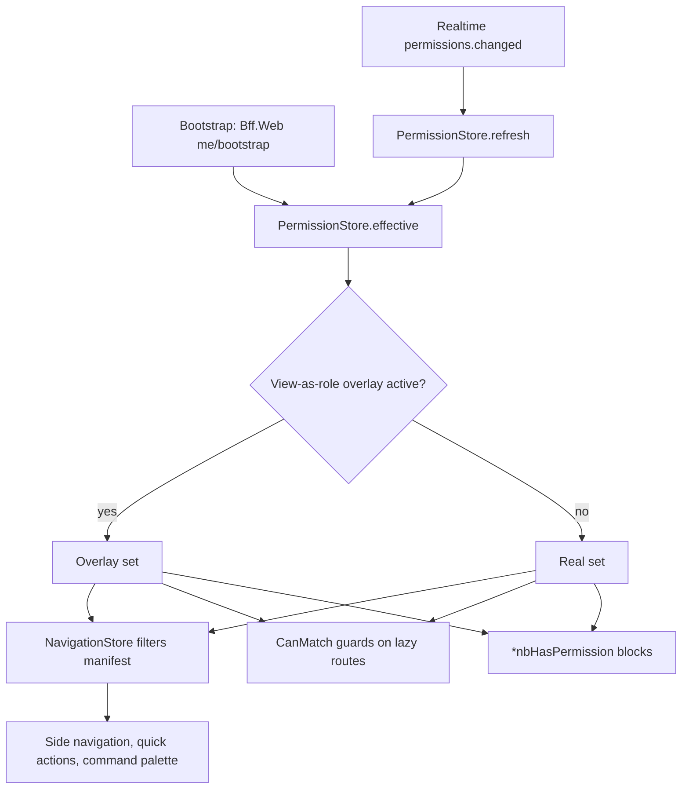

# 08. Web Structure (Angular)

> Part of `docs/plan/`. Group D. Reads: reference architecture Section 4 and Section 7; master brief Sections 4.1, 10.1, 12, 12.1, 16, 19 and 21; Appendices B, D, I, O, Q, U, W and X. Names come from Appendix L. Design tokens, motion patterns, the seven states and the Because panel are specified in `14-design-system-and-ux.md`; this document says where they live and which screen uses them.

One Angular workspace, two applications, one design system, one generated client per service. The School application hosts every tenant workspace as a lazily loaded area; the Platform Console is a separate application with a separate host and build (master brief Section 10.1). Both are standalone-component, signal-based, zoneless applications with strict TypeScript, and every screen is built from `@nibras/ui` components and `@nibras/data-access` generated clients only (`.claude/rules/web.md`).

| Decision in force | Value | Where it is recorded |
|---|---|---|
| Workspace tooling | Angular CLI workspace (`angular.json`), npm workspaces for `libs/*` as `@nibras/<lib>` packages, ESLint for boundaries | This document, Section 1 and Section 4 below |
| Change detection | Zoneless, signals everywhere, `OnPush` on every component as the fallback while zoneless is provisional | Reference architecture Section 16 pins Angular at the latest stable at project start |
| State | `@ngrx/signals` SignalStore per feature; no global NgRx store | Section 3 below |
| Real-time | SignalR client in `libs/core/realtime`, one hub connection per tab, backplane on `redis-state` | Master brief Section 19, *Caching with Redis* |
| Animations | Native CSS with `animate.enter` and `animate.leave`, View Transitions API; `@angular/animations` is not installed | Section 10 below |
| Component selector prefix | `nb-` for `@nibras/ui`, `nb-<feature>-` for feature components | Section 1 below |
| Permission strings | Exactly the strings in Appendix B; the interface reflects them and never enforces them | Section 5 below |

---

## 1. The Angular workspace tree

### 1.1 Applications and libraries, to folder level

```text
src/Web/
├── angular.json                         # workspace definition: two applications, every library, budgets per application (Section 9)
├── package.json                         # single dependency manifest; npm workspaces map libs/* to @nibras/<lib>
├── package-lock.json                    # lock file; CI restores from it and fails on drift
├── tsconfig.base.json                   # strict TypeScript, path aliases @nibras/*, no implicit any, exactOptionalPropertyTypes
├── eslint.config.mjs                    # boundary rules (features never import features), banned imports (@angular/animations), a11y template rules
├── .storybook/                          # Storybook configuration for @nibras/ui: dir toolbar, theme toolbar, density toolbar, axe addon
├── ngsw-config.json                     # Angular service worker: application shell, asset groups, data groups (Section 8)
├── openapi/                             # checked-in OpenAPI documents, one per service and per BFF, pulled by CI (Section 4)
│   ├── attendance.v1.json               # example: the Attendance service contract that data-access/attendance is generated from
│   └── bff-web.v1.json                  # the Bff.Web contract: role home payloads, Student 360, navigation and permission bootstrap
├── apps/
│   ├── school/                          # the tenant application: admin console plus every role workspace, one host per tenant domain
│   │   ├── src/
│   │   │   ├── main.ts                  # bootstrapApplication with zoneless change detection, withViewTransitions, service worker registration
│   │   │   ├── app.config.ts            # providers: router, HTTP interceptors from core, i18n loader, realtime, permission store
│   │   │   ├── app.routes.ts            # top-level routes: auth, verify, workspaces by lazy area, no-access, offline
│   │   │   ├── app.component.ts         # root: renders nb-app-shell with the navigation generated from permissions (Section 5)
│   │   │   ├── workspaces.manifest.ts   # the navigation manifest: every workspace, its entries, the permission each entry requires
│   │   │   └── environments/            # environment files: API base, realtime hub path, feature toggles for local development only
│   │   ├── public/                      # static assets served as-is: manifest.webmanifest, icons per size, fonts (Inter, IBM Plex Sans Arabic)
│   │   ├── i18n/                        # en.json and ar.json for strings owned by the application shell only; features ship their own
│   │   └── project.json                 # per-application build targets, bundle budgets, service worker on for production
│   └── platform-console/                # the SaaS operator console, separate host and build, Nibras brand always (master brief Section 16)
│       ├── src/
│       │   ├── main.ts                  # bootstrap as above; no tenant resolution, operator identity only
│       │   ├── app.config.ts            # providers as above with the console realtime hub and the operator permission set
│       │   ├── app.routes.ts            # top-level routes: today, tenants, plans, flags, health, jobs, failed messages, support, retention
│       │   ├── app.component.ts         # root shell; impersonation banner mounts here so it can never be hidden by a feature
│       │   ├── console.manifest.ts      # navigation manifest for operator entries and their platform.* and audit.* permissions
│       │   └── environments/            # environment files for the console host
│       ├── public/                      # static assets; Nibras brand assets only, never tenant assets
│       ├── i18n/                        # en.json and ar.json for the console shell; Appendix Q script Q.10 step 11 requires full Arabic
│       └── project.json                 # build targets and the console bundle budgets
├── libs/
│   ├── ui/                              # @nibras/ui: the design system (document 14). Tokens, theme, 64 components, motion utilities, Storybook
│   │   ├── tokens/                      # design tokens as CSS custom properties and a JSON export shared with Flutter (document 14 Section 2)
│   │   ├── theme/                       # light and dark themes, per-tenant palette generation from one brand colour, density modes
│   │   ├── motion/                      # animate.enter and animate.leave class sets, view-transition names, reduced-motion media rules
│   │   ├── icons/                       # SVG icon set with a mirror-in-RTL flag per icon (document 14 Section 5)
│   │   ├── components/                  # one folder per component: component, stories, spec, a11y test, README
│   │   ├── directives/                  # nbAutofocus, nbTrapFocus, nbLiveAnnounce, nbLongestString (test helper for Arabic length)
│   │   ├── pipes/                       # nbNumeral (tenant numeral system), nbHijri, nbMoney, nbRelativeTime, nbBidiIsolate
│   │   └── index.ts                     # public surface; anything not exported here is private to the library
│   ├── core/                            # @nibras/core: cross-cutting runtime that every application needs once
│   │   ├── auth/                        # OpenID Connect client, token refresh, sign-in and forced-password-change flows, session list
│   │   ├── tenant/                      # tenant context from the resolved host, tenant settings snapshot, terminology overrides
│   │   ├── permissions/                 # PermissionStore, *nbHasPermission directive, permissionGuard, view-as-role preview (Section 5)
│   │   ├── http/                        # interceptors: bearer token, tenant header, correlation id, ETag and If-Match, Problem Details mapping
│   │   ├── errors/                      # global error handler, Appendix K code to localized message, the error state model
│   │   ├── i18n/                        # translation loader per feature, plural categories, locale and direction switch, missing-key report hook
│   │   ├── rtl/                         # sets dir on the document root, exposes direction as a signal, mirrors icons flagged in @nibras/ui
│   │   ├── realtime/                    # SignalR connection, reconnect with backoff, typed event subscriptions, progress channel for long jobs
│   │   ├── offline/                     # online and offline signal, offline banner state, "as of" timestamps for cached reads
│   │   ├── command-palette/             # Ctrl+K registry: routes, actions and searches register themselves; permission-filtered
│   │   ├── shell/                       # role switcher, child switcher for parents, impersonation banner, what's-new and first-run tours
│   │   └── index.ts                     # public surface
│   ├── data-access/                     # @nibras/data-access: generated clients only, plus the shared query helpers (Section 4)
│   │   ├── generated/                   # never edited by hand; regenerated in CI from openapi/*.json; one folder per service
│   │   │   ├── identity/                # IdentityClient: users, roles, permissions, invitations, join requests, sessions
│   │   │   ├── platform/                # PlatformClient: tenants, plans, flags, branding, settings, custom fields, integrations
│   │   │   ├── school/                  # SchoolClient: profile, campuses, years, sections, students, guardians, staff
│   │   │   ├── admissions/              # AdmissionsClient
│   │   │   ├── academics/               # AcademicsClient
│   │   │   ├── assessment/              # AssessmentClient
│   │   │   ├── scheduling/              # SchedulingClient
│   │   │   ├── attendance/              # AttendanceClient, including the attendance.safety.* resources
│   │   │   ├── finance/                 # FinanceClient
│   │   │   ├── communication/           # CommunicationClient
│   │   │   ├── notification/            # NotificationClient
│   │   │   ├── requests/                # RequestsClient
│   │   │   ├── documents/               # DocumentsClient
│   │   │   ├── behavior/                # BehaviorClient
│   │   │   ├── reporting/               # ReportingClient: dashboards, reports, early warning, data quality
│   │   │   ├── audit/                   # AuditClient
│   │   │   ├── wellbeing/               # WellbeingClient: isolated; only the care feature and Student 360 with permission import it
│   │   │   ├── hr/                      # HrClient
│   │   │   ├── operations/              # OperationsClient
│   │   │   ├── ai/                      # AiClient
│   │   │   └── bff-web/                 # BffWebClient: role homes, Student 360 composition, navigation and permission bootstrap
│   │   ├── query/                       # pagination envelope, filter and sort grammar helpers, cursor handling, ETag cache map
│   │   ├── stores/                      # cross-feature SignalStores that several features read: reference data, terminology, current person
│   │   └── index.ts                     # public surface; exports the clients and the shared stores, never the generated internals
│   ├── shared/                          # @nibras/shared: composite building blocks that need data-access but belong to no feature
│   │   ├── table/                       # server-driven data table: virtual scroll, column chooser, saved views, export action
│   │   ├── filters/                     # filter bar bound to the filter grammar, chips, saved filters per person
│   │   ├── form-kit/                    # typed reactive form helpers, custom-field renderer, bilingual field pair, autosave
│   │   ├── file-upload/                 # upload with type check, size limit, scan-pending state, short-lived download links
│   │   ├── bulk-actions/                # selection model, floating action bar, per-item result sheet for bulk endpoints
│   │   ├── import-wizard/               # template download, upload, dry run, error report, commit, rollback (Appendix U.6)
│   │   ├── student-header/              # the student identity strip used by every screen that shows one student
│   │   ├── because-panel/               # the Because panel composite bound to Reporting's explanation payload (document 14 Section 8)
│   │   ├── explain-number/              # drill from a figure to the records and scheme version behind it (master brief Section 12.1 item 27)
│   │   ├── long-job/                    # progress ring bound to the realtime progress channel, cancel, result download
│   │   └── index.ts                     # public surface
│   └── features/                        # one library per feature area; each has the shape in Section 1.2 and imports only ui, core, data-access, shared
│       ├── admin/                       # school admin console: users, roles and permissions, join requests, settings, audit, jobs, failed messages
│       ├── requests/                    # request center, approvals inbox, request type designer, approval chains, form builder
│       ├── students/                    # student directory, student record, Student 360, guardians, custody, ID cards
│       ├── admissions/                  # inquiries, applications, offers, waiting list, enrollment, re-enrollment campaigns
│       ├── academics/                   # curriculum, teaching assignments, lesson plans, assignments, submissions, quizzes, question bank
│       ├── assessment/                  # mark entry, moderation, approval and lock, report card studio, transcripts, grade changes, exams
│       ├── timetable/                   # timetable editor, generation, substitutions and cover, calendar, room bookings, exam timetable
│       ├── attendance/                  # register, exception-only pre-fill, excuses, thresholds, staff attendance (expanded in Section 1.2)
│       ├── safety/                      # pickup persons, gate passes, visitors, emergency mode and roll call, reunification
│       ├── finance/                     # fee structures, invoices, payments, cashier, refunds, discounts, scholarships, restrictions, reports
│       ├── communication/               # announcements, news, messaging, meetings, surveys, policies and acknowledgment
│       ├── behavior/                    # categories, incidents, points, badges, portfolio
│       ├── wellbeing/                   # clinic, medications, counseling cases, safeguarding, education plans, interventions, break-glass
│       ├── hr/                          # staff files, contracts, leave, payroll inputs, appraisals, vacancies, document expiry
│       ├── operations/                  # library, transport, inventory, facilities, front desk, activities
│       ├── reports/                     # dashboards, report library, early warning, data quality, inspection readiness, explain this number
│       ├── documents/                   # files, templates, certificates, imports, exports, public verification page
│       ├── platform-console/            # operator features: tenants, provisioning wizard, plans, flags, health, support, retention, releases
│       └── workspaces/                  # one entry library per role workspace: the home screen, its manifest slice and its routes
│           ├── teacher/                 # teacher Today, my classes, grading queue, messages, timetable and cover
│           ├── homeroom/                # homeroom Today, excuses, class overview, flags, interventions
│           ├── student/                 # student Today, timetable, coursework, grades, portfolio
│           ├── parent/                  # parent calm screen with child switcher, fees, requests, transparency, preferences
│           ├── registrar/               # registrar Today, funnel, enrollment, transfers, promotion, class formation
│           ├── accountant/              # accountant Today, invoices, payments, day close, collections, statements
│           ├── principal/               # principal and academic leadership Today, approvals, oversight, emergency, moderation
│           ├── hr/                      # HR officer Today, leave, payroll inputs, expiry
│           ├── care/                    # counselor and nurse Today, referrals, cases, clinic, medications, alerts
│           └── front-desk/              # receptionist and security Today, visitors, gate, pickups, enquiries
└── e2e/                                 # Playwright: four theme and direction combinations, axe per screen, the Appendix Q scripts as specs
    ├── fixtures/                        # demo tenant sign-ins per role (Appendix H), tenant reset hook, network-off helper
    ├── screens/                         # one spec per screen in the inventory (Section 7), named by workspace and route
    ├── journeys/                        # the Appendix Q scripts and the Appendix O minutes as end-to-end specs, keyed by TC id
    └── snapshots/                       # committed visual baselines: light-ltr, light-rtl, dark-ltr, dark-rtl per screen
```

### 1.2 One feature library to file level: `libs/features/attendance`

The shape follows reference architecture Section 4: `pages/` are smart, `components/` are presentational, `state/` is a SignalStore, `routes.ts` is lazy-loaded by a workspace, and nothing imports from another feature.

```text
libs/features/attendance/
├── package.json                                     # @nibras/features-attendance; peer dependencies on ui, core, data-access, shared only
├── project.json                                     # lint, test, storybook targets for this library
├── index.ts                                         # exports routes and the components another workspace embeds (RegisterCard, UnmarkedClassesCard)
├── routes.ts                                        # lazy routes: register, excuses, thresholds, staff attendance; each with permissionGuard
├── i18n/
│   ├── en.json                                      # English strings for this feature, keys prefixed attendance.
│   └── ar.json                                      # Arabic strings; the longest-string story renders from here
├── pages/
│   ├── register/
│   │   ├── register.page.ts                         # smart: loads the session for a section and date, wires the store, handles lock window
│   │   ├── register.page.html                       # layout: student header strip, mode toggle (seating or list), exception bar, save
│   │   ├── register.page.scss                       # logical properties only; grid areas for 360, 768 and desktop
│   │   └── register.page.spec.ts                    # unit: pre-fill from gate scan, all-present then exceptions, lock-window refusal shown
│   ├── excuses/
│   │   ├── excuses.page.ts                          # smart: excuse queue for the viewer's scope, approve and reject with reason
│   │   ├── excuses.page.html                        # list with attachment preview through a short-lived link; medical detail never shown
│   │   └── excuses.page.spec.ts                     # unit: approve updates the register and announces in the live region
│   ├── thresholds/
│   │   ├── thresholds.page.ts                       # smart: threshold rules per stage and their escalation targets
│   │   └── thresholds.page.html                     # editable table with dependency hints
│   └── staff-attendance/
│       ├── staff-attendance.page.ts                 # smart: staff register for HR and principal scope
│       └── staff-attendance.page.html               # list view only; no seating chart for staff
├── components/
│   ├── seating-chart/
│   │   ├── seating-chart.component.ts               # presentational: seats as buttons, status cycle on tap, keyboard arrows move focus
│   │   ├── seating-chart.component.html             # grid with aria-grid semantics; status announced per change
│   │   ├── seating-chart.component.scss             # ripple-and-settle via animate.enter on the status chip (document 14 Section 6)
│   │   └── seating-chart.component.stories.ts       # stories: default, pre-filled, all-present, locked, offline, no-permission, in both dirs and themes
│   ├── attendance-list/
│   │   ├── attendance-list.component.ts             # presentational: list mode with virtual scroll for large sections
│   │   ├── attendance-list.component.html           # rows: student header, status segmented control, note affordance
│   │   └── attendance-list.component.stories.ts     # stories per state and combination
│   ├── exception-bar/
│   │   ├── exception-bar.component.ts               # presentational: "N pre-filled from gate scan, M approved leave" with a review action
│   │   └── exception-bar.component.stories.ts       # stories: pre-fill sources, none pre-filled, stale pre-fill
│   ├── lock-window-notice/
│   │   ├── lock-window-notice.component.ts          # presentational: shows the lock time, the edit-after-lock path and who can grant it
│   │   └── lock-window-notice.component.stories.ts  # stories: open, closing soon, locked, locked with edit permission
│   ├── register-card/
│   │   ├── register-card.component.ts               # presentational bento card for the teacher Today: next class to mark, one action
│   │   └── register-card.component.stories.ts       # stories: due now, already marked, nothing today, offline as-of
│   └── unmarked-classes-card/
│       ├── unmarked-classes-card.component.ts       # presentational bento card for the principal Today: unmarked classes with a nudge action
│       └── unmarked-classes-card.component.stories.ts  # stories: none unmarked (the calm state), several, after cut-off
├── state/
│   ├── register.store.ts                            # SignalStore: session, records, pre-fill sources, dirty set, save status, lock state
│   ├── register.store.spec.ts                       # unit: optimistic mark, rollback on ATTENDANCE_SESSION_LOCKED, idempotent resave
│   ├── excuses.store.ts                             # SignalStore: queue, filters, decision in flight
│   └── attendance.realtime.ts                       # subscribes to attendance.* events on the realtime channel and patches the stores
└── testing/
    ├── attendance.fixtures.ts                       # typed fixtures built from the generated models for stories and specs
    └── attendance.harness.ts                        # component harnesses used by the page specs and the e2e screen specs
```

**Boundary rules the tree implies**, enforced by ESLint and checked in `ci-web.yml`:

| Rule | Enforcement |
|---|---|
| `libs/features/*` import only `@nibras/ui`, `@nibras/core`, `@nibras/data-access`, `@nibras/shared` | ESLint import boundary rule on the path alias; a feature importing another feature fails lint |
| `libs/ui` imports nothing from `core`, `data-access`, `shared` or `features` | Same rule; the design system has no knowledge of the API |
| `libs/data-access/generated/**` is never edited by hand | CI regenerates and fails on diff (Section 4) |
| `apps/*` import features only through `routes.ts` and `index.ts` | Same rule; an application never reaches into a feature's `pages/` |
| `@angular/animations` is never imported | ESLint `no-restricted-imports` plus a package manifest check (Section 10) |

---

## 2. Route map per workspace

Every route is lazy-loaded by lazy area. Every route carries a `permissionGuard` with a permission string from Appendix B; the guard is `CanMatch`, so an unpermitted route never downloads its chunk and the person lands on the no-permission state, never on a blank page. Where an area has several screens, the table names the entry route and the sub-routes appear in the screen inventory (Section 7). Data scope (Appendix B) is applied by the server; the guard checks only that the permission is held.

### 2.1 Application shell routes (both applications)

| Workspace | Route | Lazy area | Guard permission | Screen |
|---|---|---|---|---|
| Shell | `/` | none | signed in | Redirects to the person's landing workspace from Appendix I; a person with several roles lands on the last used and can switch |
| Shell | `/auth/sign-in` | `core/auth` | none | Sign-in: username, email or phone; passkey; OpenID Connect buttons |
| Shell | `/auth/change-password` | `core/auth` | signed in | Forced password change on first login (master brief Section 10.2) |
| Shell | `/auth/2fa` | `core/auth` | signed in | Two-factor enrolment and challenge |
| Shell | `/auth/invitation/:token` | `core/auth` | none | Accept invitation, set credentials |
| Shell | `/auth/join` | `core/auth` | none | Join by code or QR, parent self-registration by student code, waiting screen |
| Shell | `/verify/:code` | `features/documents` | none (public) | Public document verification page, bilingual, no login |
| Shell | `/no-access` | `core/permissions` | none | No-permission state with the coordinator or administrator link |
| Shell | `/offline` | `core/offline` | none | Offline page for the service worker when no cached shell route matches |

### 2.2 Platform console (`apps/platform-console`)

| Workspace | Route | Lazy area | Guard permission | Screen |
|---|---|---|---|---|
| Platform console | `/today` | `features/platform-console` | `platform.tenants.view` | Operator Today (Appendix D, platform operator row) |
| Platform console | `/tenants` | `features/platform-console` | `platform.tenants.view` | Tenant list with plan, health score, provisioning state |
| Platform console | `/tenants/new` | `features/platform-console` | `platform.tenants.provision` | Provisioning wizard with the smart-defaults review step |
| Platform console | `/tenants/:tenantId` | `features/platform-console` | `platform.tenants.view` | Tenant detail: plan, limits, flags, usage, branding, suspend and reactivate, export and deletion |
| Platform console | `/plans` | `features/platform-console` | `platform.plans.view` | Plans, limits and subscription changes |
| Platform console | `/feature-flags` | `features/platform-console` | `platform.feature-flags.view` | Flags per tenant with staged rollout |
| Platform console | `/health` | `features/platform-console` | `platform.jobs.view` | Service health, queue depth and alarm board |
| Platform console | `/jobs` | `features/platform-console` | `platform.jobs.view` | Platform job monitor |
| Platform console | `/failed-messages` | `features/platform-console` | `platform.failed-messages.view` | Dead-letter console with replay and discard |
| Platform console | `/support` | `features/platform-console` | `platform.support.view` | Tickets, consent-gated impersonation |
| Platform console | `/announcements` | `features/platform-console` | `platform.announcements.view` | Platform announcements, release notes, maintenance mode |
| Platform console | `/billing` | `features/platform-console` | `platform.subscriptions.view` | School billing records and usage analytics |
| Platform console | `/retention` | `features/platform-console` | `platform.retention.view` | Retention runs, legal holds, deletion certificates |
| Platform console | `/audit-integrity` | `features/platform-console` | `audit.integrity.view` | Hash-chain verification |
| Platform console | `/access-reviews` | `features/admin` | `identity.access-reviews.view` | Access review campaigns for platform staff |
| Platform console | `/templates` | `features/documents` | `documents.templates.view` | Global template library and the template exchange review queue |

### 2.3 School admin console (`apps/school`, `/admin`)

| Workspace | Route | Lazy area | Guard permission | Screen |
|---|---|---|---|---|
| School admin | `/admin` | `features/admin` | `platform.settings.view` | Admin home: setup checklist, usage against plan, data quality summary |
| School admin | `/admin/users` | `features/admin` | `identity.users.view` | User list with saved views, bulk actions; `/admin/users/:userId` detail |
| School admin | `/admin/join` | `features/admin` | `identity.join-requests.view` | Invitations, join codes, join request queue |
| School admin | `/admin/roles` | `features/admin` | `identity.roles.view` | Role templates, clone, comparison, change history |
| School admin | `/admin/roles/:roleId/permissions` | `features/admin` | `identity.roles.view` | Permission matrix with dependency hints and four-eyes grant flow |
| School admin | `/admin/users/:userId/effective` | `features/admin` | `identity.permissions.explain-effective` | Effective-permissions explainer |
| School admin | `/admin/access-reviews` | `features/admin` | `identity.access-reviews.view` | Access review campaigns |
| School admin | `/admin/security` | `features/admin` | `identity.security-policy.view` | Password rules, 2FA per role, session timeout, admin IP allowlist |
| School admin | `/admin/school` | `features/admin` | `school.profile.view` | School profile, campuses, rooms |
| School admin | `/admin/academic` | `features/admin` | `school.academic-years.view` | Years, terms, grade levels, sections, subjects, bell schedules |
| School admin | `/admin/grading` | `features/assessment` | `assessment.schemes.view` | Grading schemes and versions |
| School admin | `/admin/branding` | `features/admin` | `platform.branding.view` | Theme and branding editor with live preview and contrast check |
| School admin | `/admin/settings` | `features/admin` | `platform.settings.view` | Settings, terminology overrides, modules on and off, numerals, calendar |
| School admin | `/admin/custom-fields` | `features/admin` | `platform.custom-fields.view` | Custom field definitions per entity |
| School admin | `/admin/requests/types` | `features/requests` | `requests.types.view` | Request type designer and versions |
| School admin | `/admin/requests/chains` | `features/requests` | `requests.chains.view` | Approval chain designer |
| School admin | `/admin/forms` | `features/requests` | `requests.forms.view` | Form builder |
| School admin | `/admin/templates/notifications` | `features/admin` | `notification.templates.view` | Notification templates with send-test |
| School admin | `/admin/templates/documents` | `features/documents` | `documents.templates.view` | Document templates, numbering preview |
| School admin | `/admin/numbering` | `features/admin` | `school.numbering.view` | Numbering formats |
| School admin | `/admin/integrations` | `features/admin` | `platform.integrations.view` | Integrations, API keys, webhooks with delivery log |
| School admin | `/admin/imports` | `features/documents` | `documents.imports.view` | Import wizard: template, dry run, error report, commit, rollback |
| School admin | `/admin/exports` | `features/documents` | `documents.exports.view` | Export requests, sensitive export approval |
| School admin | `/admin/audit` | `features/admin` | `audit.entries.view` | Audit viewer with before and after values |
| School admin | `/admin/access-log` | `features/admin` | `audit.access-log.view` | Sensitive-record access log |
| School admin | `/admin/jobs` | `features/admin` | `platform.jobs.view` | Background job monitor |
| School admin | `/admin/failed-messages` | `features/admin` | `platform.failed-messages.view` | Failed-message console |
| School admin | `/admin/data-quality` | `features/reports` | `reporting.data-quality.view` | Data quality center with a fix action per finding |
| School admin | `/admin/recycle-bin` | `features/admin` | `platform.recycle-bin.view` | Recycle bin with restore |
| School admin | `/admin/privacy` | `features/admin` | `platform.retention.view` | Privacy dashboard: retention clocks, consent coverage, subject requests |
| School admin | `/admin/configuration` | `features/admin` | `platform.settings.view` | Configuration as code: export, diff, review, restore |

### 2.4 Role workspaces (`apps/school`)

| Workspace | Route | Lazy area | Guard permission | Screen |
|---|---|---|---|---|
| Teacher | `/teacher` | `features/workspaces/teacher` | `academics.teaching-assignments.view` | Teacher Today |
| Teacher | `/teacher/classes` | `features/workspaces/teacher` | `academics.teaching-assignments.view` | My classes |
| Teacher | `/teacher/classes/:sectionId/attendance` | `features/attendance` | `attendance.student-attendance.view` | Register (seating chart or list) |
| Teacher | `/teacher/classes/:sectionId/assignments` | `features/academics` | `academics.assignments.view` | Assignments for a section |
| Teacher | `/teacher/grading` | `features/academics` | `academics.submissions.view` | Grading queue and fast grid |
| Teacher | `/teacher/marks/:assessmentId` | `features/assessment` | `assessment.marks.view` | Mark entry grid |
| Teacher | `/teacher/comments/:cycleId` | `features/assessment` | `assessment.report-cards.view` | Comment bank and drafted comments in review |
| Teacher | `/teacher/messages` | `features/communication` | `communication.messages.view` | Messages |
| Teacher | `/teacher/meetings` | `features/communication` | `communication.meetings.view` | Conference slots |
| Teacher | `/teacher/timetable` | `features/timetable` | `scheduling.timetable.view` | My timetable and cover requests |
| Teacher | `/teacher/lesson-plans` | `features/academics` | `academics.lesson-plans.view` | Lesson plans |
| Teacher | `/teacher/behavior` | `features/behavior` | `behavior.points.view` | Quick note, points, incident capture |
| Homeroom | `/homeroom` | `features/workspaces/homeroom` | `attendance.student-attendance.view` | Homeroom Today |
| Homeroom | `/homeroom/excuses` | `features/attendance` | `attendance.excuses.view` | Excuse review |
| Homeroom | `/homeroom/overview` | `features/reports` | `reporting.dashboards.view` | Class overview per student |
| Homeroom | `/homeroom/students/:studentId` | `features/students` | `school.students.view` | Student 360, homeroom scope |
| Homeroom | `/homeroom/flags` | `features/reports` | `reporting.early-warning.view` | Early-warning flags with Because panel |
| Homeroom | `/homeroom/interventions/:interventionId` | `features/wellbeing` | `wellbeing.interventions.view` | Intervention playbook |
| Student | `/student` | `features/workspaces/student` | `scheduling.timetable.view` | Student Today |
| Student | `/student/timetable` | `features/timetable` | `scheduling.timetable.view` | Timetable |
| Student | `/student/coursework` | `features/academics` | `academics.assignments.view` | Coursework list and `/student/coursework/:assignmentId` |
| Student | `/student/grades` | `features/assessment` | `assessment.marks.view` | Grades and feedback |
| Student | `/student/attendance` | `features/attendance` | `attendance.student-attendance.view` | My attendance |
| Student | `/student/portfolio` | `features/behavior` | `behavior.badges.view` | Badges, house points, portfolio |
| Student | `/student/quizzes/:quizId` | `features/academics` | `academics.quizzes.view` | Quiz player |
| Student | `/student/messages` | `features/communication` | `communication.messages.view` | Messages and announcements |
| Student | `/student/requests` | `features/requests` | `requests.requests.view` | Private requests (counseling appointment) |
| Parent | `/parent` | `features/workspaces/parent` | `school.students.view` | Calm screen, one card per child, child switcher in the shell |
| Parent | `/parent/children/:studentId` | `features/workspaces/parent` | `school.students.view` | Child today |
| Parent | `/parent/children/:studentId/attendance` | `features/attendance` | `attendance.excuses.view` | Attendance and excuse submission |
| Parent | `/parent/children/:studentId/fees` | `features/finance` | `finance.invoices.view` | Fees, pay, receipts |
| Parent | `/parent/children/:studentId/documents` | `features/documents` | `assessment.report-cards.view` | Report cards, certificates, portfolio download |
| Parent | `/parent/children/:studentId/transparency` | `features/students` | `audit.access-transparency.view` | Guardian transparency: who read what, consents, retention clock |
| Parent | `/parent/children/:studentId/consents` | `features/students` | `school.students.view` | Consents including media consent |
| Parent | `/parent/children/:studentId/gate-pass/:passId` | `features/safety` | `attendance.safety.gate-passes.view` | Gate pass with QR and validity window |
| Parent | `/parent/requests` | `features/requests` | `requests.requests.view` | Requests including early dismissal |
| Parent | `/parent/messages` | `features/communication` | `communication.messages.view` | Messages, digest, translation with original |
| Parent | `/parent/meetings` | `features/communication` | `communication.meetings.view` | Book conference slots |
| Parent | `/parent/preferences` | `features/workspaces/parent` | `notification.preferences.view` | Channels, quiet hours, per-child settings |
| Parent | `/parent/re-enrollment` | `features/admissions` | `admissions.re-enrollment.view` | Re-enrollment confirmation and deposit |
| Parent | `/parent/policies` | `features/communication` | `communication.policies.view` | Handbook and policy acknowledgment |
| Registrar | `/registrar` | `features/workspaces/registrar` | `admissions.applications.view` | Registrar Today |
| Registrar | `/registrar/inquiries` | `features/admissions` | `admissions.inquiries.view` | Inquiries and conversion |
| Registrar | `/registrar/applications` | `features/admissions` | `admissions.applications.view` | Pipeline board and `/registrar/applications/:applicationId` |
| Registrar | `/registrar/offers` | `features/admissions` | `admissions.offers.view` | Offers and waiting list |
| Registrar | `/registrar/enrollment` | `features/admissions` | `admissions.enrollment.view` | Enrollment with capacity check |
| Registrar | `/registrar/students` | `features/students` | `school.students.view` | Directory and `/registrar/students/:studentId` record |
| Registrar | `/registrar/students/:studentId/transfer` | `features/documents` | `documents.certificates.view` | Transfer with clearance and certificate |
| Registrar | `/registrar/re-enrollment` | `features/admissions` | `admissions.re-enrollment.view` | Campaign open and close |
| Registrar | `/registrar/promotion` | `features/students` | `school.students.promote` | Promotion and year rollover |
| Registrar | `/registrar/class-formation` | `features/students` | `school.sections.balance-formation` | Balanced class formation |
| Registrar | `/registrar/id-cards` | `features/students` | `school.students.print-id-cards` | ID card batch |
| Accountant | `/accountant` | `features/workspaces/accountant` | `finance.payments.view` | Accountant Today |
| Accountant | `/accountant/invoices` | `features/finance` | `finance.invoices.view` | Invoices, batch run and `/accountant/invoices/:invoiceId` |
| Accountant | `/accountant/payments` | `features/finance` | `finance.payments.view` | Payments, receipts, bounced cheques |
| Accountant | `/accountant/cashier` | `features/finance` | `finance.cashier.view` | Cashier shift and day close |
| Accountant | `/accountant/adjustments` | `features/finance` | `finance.refunds.view` | Refunds, credit notes, write-offs |
| Accountant | `/accountant/structures` | `features/finance` | `finance.structures.view` | Fee items, structures, plans |
| Accountant | `/accountant/scholarships` | `features/finance` | `finance.scholarships.view` | Discounts and scholarships |
| Accountant | `/accountant/collections` | `features/finance` | `finance.reports.view` | Reminder ladder and aging |
| Accountant | `/accountant/restrictions` | `features/finance` | `finance.restrictions.view` | Account restrictions |
| Accountant | `/accountant/statements/:guardianId` | `features/finance` | `finance.reports.view` | Guardian statement |
| Accountant | `/accountant/reports` | `features/finance` | `finance.reports.view` | Finance report library |
| Principal | `/principal` | `features/workspaces/principal` | `reporting.dashboards.view` | Morning brief and Today |
| Principal | `/principal/approvals` | `features/requests` | `requests.requests.view` | Approvals inbox |
| Principal | `/principal/attendance` | `features/attendance` | `attendance.student-attendance.view` | Unmarked classes and nudge |
| Principal | `/principal/cover` | `features/timetable` | `scheduling.substitutions.view` | Staff absence and cover suggestions |
| Principal | `/principal/students/:studentId` | `features/students` | `school.students.view` | Student 360 |
| Principal | `/principal/early-warning` | `features/reports` | `reporting.early-warning.view` | Early-warning list, Because panel, open intervention |
| Principal | `/principal/dashboard` | `features/reports` | `reporting.dashboards.view` | School dashboard with explain this number |
| Principal | `/principal/campuses` | `features/reports` | `reporting.dashboards.view` | Campus comparison for owner and group director |
| Principal | `/principal/assessment` | `features/assessment` | `assessment.marks.view` | Approval, lock, report card batch |
| Principal | `/principal/moderation` | `features/assessment` | `assessment.marks.view` | Moderation queue (coordinator) |
| Principal | `/principal/academics` | `features/academics` | `academics.lesson-plans.view` | Lesson plan review, syllabus coverage (coordinator) |
| Principal | `/principal/timetable` | `features/timetable` | `scheduling.timetable.view` | Timetable editor, generation, what-if |
| Principal | `/principal/workload` | `features/hr` | `academics.teaching-assignments.view` | Workload balance (staff analytics only) |
| Principal | `/principal/incidents` | `features/behavior` | `behavior.incidents.view` | Incidents today |
| Principal | `/principal/emergency` | `features/safety` | `attendance.safety.emergency.view` | Emergency mode: broadcast, roll call, reunification |
| Principal | `/principal/oversight` | `features/admin` | `audit.entries.view` | Sensitive exports, access review queue, break-glass log |
| Principal | `/principal/inspection` | `features/reports` | `reporting.reports.view` | Inspection self-evaluation and evidence folder |
| HR | `/hr` | `features/workspaces/hr` | `hr.leave.view` | HR Today |
| HR | `/hr/staff` | `features/hr` | `hr.staff-files.view` | Staff files and `/hr/staff/:staffId` |
| HR | `/hr/leave` | `features/hr` | `hr.leave.view` | Leave requests with the substitution step |
| HR | `/hr/contracts` | `features/hr` | `hr.contracts.view` | Contracts |
| HR | `/hr/payroll` | `features/hr` | `hr.payroll.view` | Payroll inputs; salary section only with `hr.payroll.view-salary` |
| HR | `/hr/appraisals` | `features/hr` | `hr.appraisals.view` | Appraisals and observations |
| HR | `/hr/vacancies` | `features/hr` | `hr.vacancies.view` | Vacancies and offers |
| HR | `/hr/documents` | `features/hr` | `hr.staff-files.view` | Document expiry report |
| HR | `/hr/onboarding` | `features/hr` | `hr.staff-files.view` | Onboarding and offboarding checklists |
| Counselor and nurse | `/care` | `features/workspaces/care` | `wellbeing.interventions.view` | Care Today |
| Counselor and nurse | `/care/referrals` | `features/wellbeing` | `wellbeing.counseling-cases.view` | Referral triage |
| Counselor and nurse | `/care/cases/:caseId` | `features/wellbeing` | `wellbeing.counseling-cases.view` | Case file and session notes |
| Counselor and nurse | `/care/interventions` | `features/wellbeing` | `wellbeing.interventions.view` | Interventions and playbook library |
| Counselor and nurse | `/care/clinic` | `features/wellbeing` | `wellbeing.clinic-visits.view` | Clinic visits with notify-guardian |
| Counselor and nurse | `/care/medications` | `features/wellbeing` | `wellbeing.medications.view` | Medication schedule and administration |
| Counselor and nurse | `/care/alerts` | `features/wellbeing` | `school.medical-summary.view` | Allergy and medical alerts, always live |
| Counselor and nurse | `/care/plans` | `features/wellbeing` | `wellbeing.education-plans.view` | Education plans and accommodations |
| Counselor and nurse | `/care/safeguarding` | `features/wellbeing` | `wellbeing.safeguarding.view` | Safeguarding queue and escalation |
| Front desk | `/front-desk` | `features/workspaces/front-desk` | `operations.frontdesk.view` | Front desk Today |
| Front desk | `/front-desk/visitors` | `features/safety` | `attendance.safety.visitors.view` | Visitor check-in and check-out |
| Front desk | `/front-desk/gate` | `features/safety` | `attendance.safety.gate-passes.view` | Expected pickups, pass verification |
| Front desk | `/front-desk/pickups/:studentId` | `features/safety` | `attendance.safety.pickup-persons.view` | Authorized pickup persons with photo |
| Front desk | `/front-desk/enquiries` | `features/operations` | `operations.frontdesk.view` | Enquiries and complaints |
| Front desk | `/front-desk/emergency` | `features/safety` | `attendance.safety.emergency.view` | Roll call view during emergency mode |

**Why the academic coordinator has no separate prefix.** Appendix I lands the vice principal, academic coordinator and head of department on the principal Today with different cards first. Their screens live under `/principal/*`, and the menu they see is the subset their permissions allow (Section 5). A separate workspace would duplicate routes without adding a screen.

---

## 3. State plan

### 3.1 One SignalStore per feature, and what goes in it

| Kind | What it is | Lives in | Survives navigation | Example |
|---|---|---|---|---|
| **Server state** | Data whose source of truth is a service: entities, lists, pages, permissions, settings | Feature SignalStore, hydrated from a generated client, keyed by request parameters, carries `ETag` and an "as of" time | Yes, until invalidated by a realtime event, a write, or the ETag cache expiring | `RegisterStore.records`, `UsersStore.page` |
| **UI state** | What the person is doing: selection, dirty fields, open panel, mode toggle, filters, scroll position, wizard step | Same feature SignalStore, in a separate `ui` slice, or a component signal when it is local to one component | Per feature; filters and saved views persist per person through Bff.Web | `RegisterStore.ui.mode`, `TableStore.ui.columns` |
| **Session state** | Who is signed in, tenant, effective permissions, direction, theme, density, active child for parents, view-as-role preview | `@nibras/core` stores: `SessionStore`, `PermissionStore`, `TenantStore`, `ShellStore` | Whole session | `PermissionStore.effective`, `ShellStore.activeChildId` |
| **Reference state** | Terminology, grade levels, sections, subjects, bell schedule, numerals, calendar | `@nibras/data-access/stores`, loaded once per session from Bff.Web bootstrap, refreshed on `platform.*` and `school.*` change events | Whole session | `ReferenceStore.sections` |
| **Transient** | Toasts, live-region announcements, long-job progress | `@nibras/core` `FeedbackStore`, `LongJobStore` | Until dismissed or finished | Report card batch progress |

**Rules.** A store never contains a business rule; it holds what the service returned and what the person did. Optimistic updates are allowed only where master brief Section 16.3 allows them and always roll back on a Problem Details response with the Appendix K code shown in place. Writes go through the generated client with an `Idempotency-Key` from the store, so a resave after a network drop is a no-op. The store exposes the seven states of `14-design-system-and-ux.md` as one `status` signal per query (`loading`, `empty`, `error`, `offline`, `partial`, `processing`, `no-permission`, `ready`), and every page binds that signal to the state components rather than deriving it inline.

### 3.2 The permission store and live refresh

`PermissionStore` in `@nibras/core/permissions` holds the **effective permission set** for the signed-in person in the current tenant: a map of permission string to the scope it was granted with, plus a `permissionVersion`. It is loaded once from `Bff.Web` at bootstrap (`GET /api/v1/bff-web/me/bootstrap`, which returns identity, tenant snapshot, effective permissions and the navigation manifest filter in one call), and it is refreshed without sign-out when the server says so.

```mermaid
sequenceDiagram
    participant Admin as School administrator (web)
    participant Identity as Identity service
    participant RabbitMQ as RabbitMQ nibras.identity
    participant Communication as Communication service (SignalR hub)
    participant Client as Open client (PermissionStore)
    participant BffWeb as Bff.Web

    Admin->>Identity: PUT role assignment (identity.roles.assign-role)
    Identity->>Identity: write, bump permissionVersion for affected users
    Identity->>RabbitMQ: publish identity.permissions.changed.v1 {tenantId, permissionVersion, affectedUserIds or all}
    RabbitMQ->>Communication: consume (queue communication.tenant-lifecycle)
    Communication->>Client: hub message permissions.changed {permissionVersion}
    Client->>Client: compare with held permissionVersion
    Client->>BffWeb: GET /api/v1/bff-web/me/permissions (If-None-Match: held ETag)
    BffWeb->>Identity: read effective permissions (cache invalidated by the same event)
    BffWeb-->>Client: 200 new effective set, ETag
    Client->>Client: replace effective set, recompute navigation, re-evaluate directives and CanMatch guards
    Client->>Client: if the current route is no longer permitted, show the no-permission state in place; never sign out
```

| Step | Detail |
|---|---|
| Event | `identity.permissions.changed.v1` (Appendix E), partition key `tenantId`, payload `permissionVersion` and `affectedUserIds` or `all` |
| Fan-out | Communication owns the SignalR hubs (master brief Section 7.2). `11-messaging-architecture.md` §2.3 and §2.5 own the queue: Communication consumes the event on `communication.tenant-lifecycle`, which carries `identity.role.changed.v1` and `identity.permissions.changed.v1` in order per tenant and drops a `permissionVersion` lower than the one already pushed. It then sends `permissions.changed` to the connections of the affected users in that tenant, or to the tenant group when `all` |
| Client reaction | `PermissionStore.refresh()` fetches the effective set from Bff.Web with `If-None-Match`; a `304` means the event was for a version already held |
| What changes on screen | The navigation manifest is re-filtered, `*nbHasPermission` blocks re-render, and the active route's `CanMatch` guard is re-run against the new set; a lost permission shows the no-permission state on the current screen and removes the menu entry |
| What never happens | No sign-out, no reload, no loss of unsaved form state. Appendix B rule 3 |
| If the hub is down | The store also refreshes on tab focus and when any request returns `403` with the `PERMISSION_DENIED` family code from Appendix K, so a missed event heals within one interaction |
| Security | The store is a mirror for the interface only. Every endpoint enforces its own permission (Appendix B rule 4); the generated permission-matrix suite proves it |

### 3.3 Realtime subscriptions the stores rely on

| Store | Events on the realtime channel | Effect |
|---|---|---|
| `PermissionStore` | `permissions.changed` | Refresh as above |
| `ReferenceStore` | `platform.settings.changed`, `platform.terminology.changed`, `school.section.*`, `scheduling.bell-schedule.activated` | Refetch the affected slice; terminology change re-renders labels without reload |
| `LongJobStore` | `job.progress`, `job.finished`, `job.failed` | Progress ring, result link, error report (master brief Section 12 item 6) |
| Feature stores | Their own service's entity events, for example `attendance.session.*` in `RegisterStore` | Patch in place; a conflicting local dirty record is shown as "changed by someone else" and never silently overwritten |
| `ShellStore` | `platform.impersonation.started`, `platform.impersonation.ended` | Banner on and off; every action during impersonation carries the impersonation header |

---

## 4. Generated client plan

| Rule | Detail |
|---|---|
| One client per service | `libs/data-access/generated/<service>/` is generated from `openapi/<service>.v1.json`, the OpenAPI document that service's `ci-service.yml` publishes as a build artefact (reference architecture Section 11). Twenty service clients plus `bff-web` |
| BFF clients | `bff-web` is the client for screen-shaped reads: role homes, Student 360, bootstrap, navigation, saved views, permission refresh. `bff-mobile` is not generated into the web workspace; it belongs to `09-mobile-structure.md` |
| Generator | `openapi-generator-cli`, `typescript-angular` generator, pinned exact version in `package.json`; licence and version verified in `19-dependency-and-license-inventory.md`. Output: typed models, one injectable service per tag, `HttpContext` tokens for idempotency and ETag handled by the `core/http` interceptors |
| Generated code is read-only | A commit that edits `generated/**` fails `ci-web.yml`; the fix is in the service's OpenAPI or in a wrapper in `shared/` or the feature store |
| Regeneration in CI | `ci-web.yml` step "clients": download the latest OpenAPI artefact per service from the main branch, regenerate all clients, `git diff --exit-code`. A diff means a service changed its contract without the web change that follows; the pull request that changes a contract regenerates and commits the clients in the same change |
| Versioning | URL versioning per master brief Section 19. A `v2` contract generates into `generated/<service>-v2/`; both may coexist while screens migrate, and the older folder is deleted when no import remains |
| Problem Details | Every generated call rejects with a typed `ProblemDetails` carrying the Appendix K error code; `core/errors` maps the code to a localized message and the seven-state model, so a feature never parses an error body |
| Features import only generated clients | ESLint forbids `HttpClient` injection outside `libs/core/http` and `libs/data-access`. A feature that needs an endpoint the client lacks changes the service contract first |
| Mock server for stories and unit tests | Stories and specs use fixtures typed from the generated models (`testing/*.fixtures.ts`), never hand-written JSON, so a contract change breaks the fixture at compile time |

---

## 5. Permission-driven navigation

| Piece | Where | Behaviour |
|---|---|---|
| **Directive** `*nbHasPermission` | `@nibras/core/permissions` | Structural directive: `*nbHasPermission="'assessment.marks.approve'"` renders the block only when the effective set contains the permission. Supports `; any: [...]`, `; all: [...]`, and `; else: noPermissionTemplate`. Re-evaluates on `PermissionStore` change. Used for actions inside a screen; a hidden button is never the security boundary |
| **Guard** `permissionGuard(permission)` | `@nibras/core/permissions` | Functional `CanMatch` guard on every lazy route. Not matched means the chunk is not loaded and the router falls through to `/no-access` with the requested route recorded, so the no-permission state can name what was asked for and offer the coordinator or administrator link (Appendix Q, Q.2 step 12) |
| **Menu generation** | `workspaces.manifest.ts` and `console.manifest.ts` | The manifest is a static list of workspaces, groups and entries, each with `route`, `labelKey`, `icon`, `permission`, and optional `mobileWeb: true`. At bootstrap and on every permission refresh, `NavigationStore` filters the manifest by the effective set; a workspace with no visible entry is dropped, and the landing workspace is the first visible one in Appendix I order unless the person chose another. Quick actions on Today and the command palette register through the same manifest, so all three agree |
| **Role switcher** | `core/shell` | A person with several roles (a teacher who is also a parent, master brief Section 9) holds one effective set; the switcher only changes which workspace is shown first and which quick actions are pinned. Permissions never change with the switch |
| **Child switcher** | `core/shell` | Parents choose the active child; every parent route carries `:studentId`, and the switcher rewrites the current route for the chosen child. Not a permission change: the set already covers all own children |
| **"View as role" preview** | `features/admin`, `core/permissions` | An administrator with `identity.roles.view` picks a role template or a user; the client asks Bff.Web for that role's effective set (`identity.permissions.explain-effective`) and installs it as a **preview overlay** in `PermissionStore`. The navigation, directives and guards render as that role would see them. A persistent banner names the role and offers exit. Data calls still run under the administrator's real token, so the server answers with the administrator's permissions; the preview therefore proves what the menu and screens would show, not what data the role can read, and the banner says exactly that. The overlay is never persisted and is cleared on refresh |
| **Effective-permissions explainer** | `features/admin` | For any user: the effective set with, per permission, the roles and scope that granted it, the narrowest scope rule applied (Appendix B), and the change history entry that last touched it. Master brief Section 10.5 |
| **Dependency hints** | `features/admin` permission matrix | The matrix reads Appendix B rule 1: toggling `edit` grants `view`; toggling a `high` permission opens the four-eyes flow instead of saving |



---

## 6. Design system library contents

`@nibras/ui` ships 64 components in eight groups. The full specification, tokens and Flutter equivalents are in `14-design-system-and-ux.md` Section 7; this list is the inventory the screen table in Section 7 refers to.

| Group | Components (selector `nb-`) |
|---|---|
| **Shell and layout** (8) | `app-shell`, `side-nav`, `top-bar`, `page-header`, `bento-grid`, `card`, `panel` (side drawer), `tabs` |
| **Actions** (6) | `button`, `icon-button`, `split-button`, `menu`, `command-palette`, `action-bar` (floating bulk action bar) |
| **Inputs and forms** (14) | `form-field`, `text-field`, `text-area`, `number-field`, `select`, `combobox`, `date-picker` (Gregorian and Hijri), `time-picker`, `checkbox`, `radio-group`, `switch`, `chip-input`, `file-upload`, `search-field` |
| **Data display** (10) | `data-table` (virtual scroll), `grid` (keyboard-first editable), `list`, `key-value`, `badge`, `chip`, `avatar`, `stat-tile` (count-up KPI), `timeline`, `tooltip` |
| **Feedback and state** (10) | `skeleton`, `empty-state`, `error-state`, `offline-banner`, `processing-indicator`, `progress-ring`, `progress-bar`, `toast`, `dialog`, `undo-sheet` |
| **Navigation** (3) | `breadcrumb`, `stepper`, `pagination` |
| **Domain composites** (8) | `because-panel`, `explain-number`, `seating-chart`, `attendance-mark`, `timetable-grid`, `permission-matrix`, `student-header`, `as-of-badge` (sync and freshness) |
| **Charts** (5) | `bar-chart`, `line-chart`, `heatmap`, `sparkline`, `donut-chart`, all wrapping Apache ECharts with RTL axis and legend mirroring |

**Storybook stories required per component.** A component cannot merge without all of these; `ci-web.yml` runs the Storybook test runner and fails on a missing story id.

| Story | What it shows | Used by |
|---|---|---|
| `Docs` | Purpose, props, accessibility notes, the Flutter equivalent, the token list it consumes | People |
| `Playground` | Every input as a control | People |
| `States` | Every visual state in one matrix: default, hover, focus-visible, active, disabled, loading, error, read-only, selected, and the component-specific ones (for example `seating-chart`: pre-filled, locked, offline) | Four-way snapshot job |
| `Directions` | The `States` matrix rendered with `dir="ltr"` and `dir="rtl"`, with the longest Arabic string from the feature's `ar.json` | Four-way snapshot job, RTL checklist |
| `Themes` | Light and dark, comfortable and compact density, and the three demo tenant palettes | Four-way snapshot job, contrast check |
| `Accessibility` | The axe-core run, keyboard walkthrough (focus order, Escape, no trap), the live-region announcement where the component announces | axe job, manual screen-reader pass |
| `Motion` | Enter, leave and update animations, and the same with `prefers-reduced-motion: reduce` emulated | Motion review |

The snapshot job renders every `States`, `Directions` and `Themes` story in the four combinations light LTR, light RTL, dark LTR, dark RTL (`.claude/skills/rtl-a11y-checklist/SKILL.md`), which for 64 components is the baseline set in `e2e/snapshots/ui/`.

---

## 7. Screen inventory per workspace

Legend. **States**: `7` means all seven states of `14-design-system-and-ux.md` Section 8 are designed (loading, empty, error, offline, partial, processing, no-permission); a shorter list names the ones that apply. **Mobile web**: whether the screen is in the progressive-web-application scope of Section 8 (Appendix X: parent, student, teacher and principal workspaces installable; the consoles available but not optimised). **Journey**: the Appendix U section the screen serves. **TC**: the test case id from Appendix Q or Appendix O where one exists, with the document that defines it in brackets (ADR-0020: Appendix W for a demo test, the service sheet for an Appendix Q test, document 12 for a security test); an id without an owner is defined by this document, and the ones minted here are stated under "Test cases" in "How this document is verified"; `—` where the screen is proven by a service test plan only.

### 7.1 Shell and public

| Workspace | Screen | Route | Components used | States | Permission | Mobile web | Journey | TC |
|---|---|---|---|---|---|---|---|---|
| Shell | Sign-in | `/auth/sign-in` | `card`, `form-field`, `text-field`, `button`, `error-state` | loading, error, offline | none | yes | all | — |
| Shell | Forced password change | `/auth/change-password` | `form-field`, `text-field`, `button`, `progress-bar` (strength) | loading, error | signed in | yes | U.11 | — |
| Shell | Two-factor enrolment | `/auth/2fa` | `stepper`, `text-field`, `button` | loading, error | signed in | yes | U.11 | — |
| Shell | Accept invitation | `/auth/invitation/:token` | `card`, `form-field`, `button`, `error-state` (expired) | loading, error | none | yes | U.6 | — |
| Shell | Join and waiting screen | `/auth/join` | `stepper`, `text-field`, `empty-state` (waiting) | loading, error, processing | none | yes | U.8 | — |
| Shell | No permission | `/no-access` | `empty-state`, `button` | none | none | yes | all | `TC-SEC-201` (document 12) |
| Shell | Offline page | `/offline` | `offline-banner`, `empty-state` | offline | none | yes | all | `TC-MOB-101` (Bff.Mobile sheet) |
| Public | Document verification | `/verify/:code` | `card`, `badge`, `key-value`, `error-state` (revoked) | loading, error | none | yes | U.6 | `TC-DOC-302` (Documents sheet) |

### 7.2 Platform console

| Workspace | Screen | Route | Components used | States | Permission | Mobile web | Journey | TC |
|---|---|---|---|---|---|---|---|---|
| Platform console | Operator Today | `/today` | `bento-grid`, `card`, `stat-tile`, `list`, `sparkline`, `as-of-badge` | 7 | `platform.tenants.view` | no | U.11 | TC-PLT-901 |
| Platform console | Tenant list | `/tenants` | `data-table`, `filters`, `badge`, `search-field` | 7 | `platform.tenants.view` | no | U.11 | — |
| Platform console | Provisioning wizard | `/tenants/new` | `stepper`, `form-field`, `select`, `key-value` (inferred settings), `progress-ring` | 7 | `platform.tenants.provision` | no | U.11 | TC-PLT-902 |
| Platform console | Provisioning progress | `/tenants/:tenantId/provisioning` | `progress-ring`, `timeline`, `error-state` | 7 | `platform.tenants.view` | no | U.11 | TC-PLT-903 |
| Platform console | Tenant detail | `/tenants/:tenantId` | `tabs`, `key-value`, `stat-tile`, `switch` (flags), `dialog` (suspend), `undo-sheet` | 7 | `platform.tenants.view` | no | U.11 | TC-PLT-904 |
| Platform console | Tenant export and deletion | `/tenants/:tenantId/lifecycle` | `stepper`, `dialog`, `badge` (cooling-off), `key-value` | 7 | `platform.tenants.delete` | no | U.11 | TC-PRV-901 |
| Platform console | Plans and subscriptions | `/plans` | `data-table`, `panel`, `form-field`, `number-field` | 7 | `platform.plans.view` | no | U.11 | — |
| Platform console | Feature flags | `/feature-flags` | `data-table`, `switch`, `chip`, `dialog` (rollout) | 7 | `platform.feature-flags.view` | no | U.11 | — |
| Platform console | Service health | `/health` | `bento-grid`, `stat-tile`, `line-chart`, `badge`, `list` | 7 | `platform.jobs.view` | no | U.11 | — |
| Platform console | Job monitor | `/jobs` | `data-table`, `progress-bar`, `menu` (cancel, retry) | 7 | `platform.jobs.view` | no | U.11 | — |
| Platform console | Failed messages | `/failed-messages` | `data-table`, `panel` (payload), `action-bar` (replay, discard), `dialog` | 7 | `platform.failed-messages.view` | no | U.11 | `TC-MSG-901` (Platform sheet) |
| Platform console | Support tickets | `/support` | `list`, `panel`, `text-area`, `badge` (SLA) | 7 | `platform.support.view` | no | U.11 | — |
| Platform console | Impersonation request | `/support/:ticketId/impersonate` | `dialog`, `key-value` (consent state), `badge`, `button` | 7 | `platform.support.impersonate` | no | U.11 | TC-SEC-902 |
| Platform console | Announcements and releases | `/announcements` | `list`, `text-area`, `date-picker`, `chip-input` (tenants), `dialog` (maintenance) | 7 | `platform.announcements.view` | no | U.11 | — |
| Platform console | Billing and usage | `/billing` | `data-table`, `stat-tile`, `bar-chart`, `explain-number` | 7 | `platform.subscriptions.view` | no | U.11 | — |
| Platform console | Retention and legal hold | `/retention` | `data-table`, `dialog` (reason), `badge` (hold), `timeline` | 7 | `platform.retention.view` | no | U.11 | `TC-PRV-902` (document 12) |
| Platform console | Audit integrity | `/audit-integrity` | `stat-tile`, `data-table`, `badge` (chain state), `button` (verify) | 7 | `audit.integrity.view` | no | U.11 | `TC-AUD-901` (Audit sheet) |
| Platform console | Access reviews (platform staff) | `/access-reviews` | `data-table`, `action-bar` (certify, revoke), `progress-bar` | 7 | `identity.access-reviews.view` | no | U.11 | — |
| Platform console | Global template library | `/templates` | `list`, `panel`, `badge` (attribution), `dialog` (review) | 7 | `documents.templates.view` | no | U.11 | `TC-PLT-803` (Appendix W) |

### 7.3 School admin console

| Workspace | Screen | Route | Components used | States | Permission | Mobile web | Journey | TC |
|---|---|---|---|---|---|---|---|---|
| School admin | Admin home | `/admin` | `bento-grid`, `card`, `stepper` (setup checklist), `stat-tile`, `progress-bar` (plan usage) | 7 | `platform.settings.view` | no | U.2 | — |
| School admin | Users | `/admin/users` | `data-table`, `filters`, `action-bar`, `avatar`, `badge` | 7 | `identity.users.view` | no | U.2 | — |
| School admin | User detail | `/admin/users/:userId` | `tabs`, `key-value`, `list` (sessions, devices, login history), `dialog` (merge), `undo-sheet` | 7 | `identity.users.view` | no | U.2 | — |
| School admin | Effective permissions explainer | `/admin/users/:userId/effective` | `data-table`, `chip` (scope), `timeline` (change history), `key-value` | 7 | `identity.permissions.explain-effective` | no | U.2 | — |
| School admin | Invitations and join requests | `/admin/join` | `tabs`, `data-table`, `action-bar` (approve, reject), `dialog` (reason), `chip` (join codes) | 7 | `identity.join-requests.view` | no | U.11 | — |
| School admin | Roles | `/admin/roles` | `list`, `badge` (system, custom), `menu` (clone, compare), `timeline` | 7 | `identity.roles.view` | no | U.2 | — |
| School admin | Permission matrix | `/admin/roles/:roleId/permissions` | `permission-matrix`, `search-field`, `chip` (risk), `dialog` (four-eyes), `select` (scope) | 7 | `identity.roles.view` | no | U.2 | — |
| School admin | View as role | `/admin/roles/:roleId/preview` | `top-bar` banner, `select`, `button` (exit preview) | 7 | `identity.roles.view` | no | U.2 | — |
| School admin | Access reviews | `/admin/access-reviews` | `data-table`, `action-bar`, `progress-bar`, `date-picker` | 7 | `identity.access-reviews.view` | no | U.2 | — |
| School admin | Security policy | `/admin/security` | `form-field`, `switch`, `number-field`, `chip-input` (IP allowlist) | 7 | `identity.security-policy.view` | no | U.2 | — |
| School admin | School profile and campuses | `/admin/school` | `tabs`, `form-field`, `file-upload` (logo, stamps), `data-table` (rooms) | 7 | `school.profile.view` | no | U.1 | — |
| School admin | Academic setup | `/admin/academic` | `tabs`, `data-table`, `date-picker`, `dialog` (close year, reopen year), `stepper` | 7 | `school.academic-years.view` | no | U.2 | — |
| School admin | Grading schemes | `/admin/grading` | `data-table`, `number-field`, `badge` (version), `dialog` (new version) | 7 | `assessment.schemes.view` | no | U.3 | — |
| School admin | Branding editor | `/admin/branding` | `form-field`, `file-upload`, `panel` (live preview), `badge` (contrast pass or fail), `switch` (dark preview) | 7 | `platform.branding.view` | no | U.2 | — |
| School admin | Settings and terminology | `/admin/settings` | `tabs`, `form-field`, `select`, `switch` (modules), `data-table` (terminology pairs) | 7 | `platform.settings.view` | no | U.2 | — |
| School admin | Custom fields | `/admin/custom-fields` | `data-table`, `panel`, `select` (type), `switch` (sensitive) | 7 | `platform.custom-fields.view` | no | U.2 | — |
| School admin | Request type designer | `/admin/requests/types` | `list`, `stepper`, `form-field`, `badge` (version), `dialog` (publish) | 7 | `requests.types.view` | no | U.2 | — |
| School admin | Approval chains | `/admin/requests/chains` | `timeline` (chain), `select` (approver), `number-field` (limits), `chip` | 7 | `requests.chains.view` | no | U.2 | — |
| School admin | Form builder | `/admin/forms` | `list`, `panel`, `select` (field type), `switch` (required), `card` (preview) | 7 | `requests.forms.view` | no | U.2 | — |
| School admin | Notification templates | `/admin/templates/notifications` | `tabs` (channels), `text-area`, `chip` (placeholders), `button` (send test) | 7 | `notification.templates.view` | no | U.2 | — |
| School admin | Document templates | `/admin/templates/documents` | `list`, `panel` (preview), `file-upload`, `badge` | 7 | `documents.templates.view` | no | U.2 | — |
| School admin | Numbering | `/admin/numbering` | `data-table`, `text-field` (pattern), `key-value` (preview) | 7 | `school.numbering.view` | no | U.7 | — |
| School admin | Integrations, API keys, webhooks | `/admin/integrations` | `tabs`, `data-table`, `dialog` (reveal once), `list` (delivery log), `button` (replay) | 7 | `platform.integrations.view` | no | U.11 | `TC-INT-001` (Appendix W) |
| School admin | Imports | `/admin/imports` | `stepper`, `file-upload`, `data-table` (error report), `progress-ring`, `dialog` (rollback) | 7 | `documents.imports.view` | no | U.6 | TC-DATA-301 |
| School admin | Exports | `/admin/exports` | `data-table`, `dialog` (reason, watermark notice), `badge` (approval) | 7 | `documents.exports.view` | no | U.6 | `TC-PRV-301` (Documents sheet) |
| School admin | Audit viewer | `/admin/audit` | `data-table`, `filters`, `panel` (before and after), `dialog` (export reason) | 7 | `audit.entries.view` | no | U.2 | TC-SEC-530 |
| School admin | Access log | `/admin/access-log` | `data-table`, `filters`, `badge` (break-glass) | 7 | `audit.access-log.view` | no | U.2 | TC-SEC-101 |
| School admin | Job monitor | `/admin/jobs` | `data-table`, `progress-bar`, `menu` | 7 | `platform.jobs.view` | no | U.2 | — |
| School admin | Failed messages | `/admin/failed-messages` | `data-table`, `panel`, `action-bar` | 7 | `platform.failed-messages.view` | no | U.11 | — |
| School admin | Data quality center | `/admin/data-quality` | `bento-grid`, `stat-tile`, `list`, `button` (fix), `explain-number` | 7 | `reporting.data-quality.view` | no | U.6 | `TC-RPT-004` (Appendix W) |
| School admin | Recycle bin | `/admin/recycle-bin` | `data-table`, `action-bar` (restore), `dialog` (purge) | 7 | `platform.recycle-bin.view` | no | U.2 | — |
| School admin | Privacy dashboard | `/admin/privacy` | `bento-grid`, `stat-tile`, `data-table` (retention clocks), `list` (subject requests) | 7 | `platform.retention.view` | no | U.2 | `TC-AUD-001` (Appendix W) |
| School admin | Configuration as code | `/admin/configuration` | `tabs`, `data-table` (versions), `panel` (diff), `dialog` (restore) | 7 | `platform.settings.view` | no | U.11 | `TC-PLT-804` (Appendix W) |

### 7.4 Teacher and homeroom

| Workspace | Screen | Route | Components used | States | Permission | Mobile web | Journey | TC |
|---|---|---|---|---|---|---|---|---|
| Teacher | Teacher Today | `/teacher` | `bento-grid`, `card`, `register-card`, `list`, `as-of-badge` | 7 | `academics.teaching-assignments.view` | yes | U.4 | TC-MOB-201 |
| Teacher | My classes | `/teacher/classes` | `list`, `avatar`, `badge`, `sparkline` | 7 | `academics.teaching-assignments.view` | yes | U.4 | — |
| Teacher | Register | `/teacher/classes/:sectionId/attendance` | `student-header`, `seating-chart`, `attendance-list`, `attendance-mark`, `exception-bar`, `lock-window-notice`, `undo-sheet` | 7 | `attendance.student-attendance.view` | yes | U.4 | TC-ATT-201 |
| Teacher | Register, all present then exceptions | same route, mode | as above plus `toast` | 7 | `attendance.student-attendance.mark` | yes | U.4 | TC-ATT-202 |
| Teacher | Assignments | `/teacher/classes/:sectionId/assignments` | `list`, `panel`, `date-picker`, `file-upload`, `dialog` (homework ceiling warning) | 7 | `academics.assignments.view` | yes | U.4 | `TC-ACA-201` (Academics sheet) |
| Teacher | Grading queue and fast grid | `/teacher/grading` | `grid`, `panel` (submission), `chip` (rubric), `toast` | 7 | `academics.submissions.view` | yes | U.4 | `TC-ACA-202` (Academics sheet) |
| Teacher | Mark entry grid | `/teacher/marks/:assessmentId` | `grid`, `badge` (state), `error-state` (out of range inline), `button` (submit for moderation) | 7 | `assessment.marks.view` | yes | U.4 | `TC-ASM-810` (Appendix W) |
| Teacher | Mark entry in Arabic | same route | as above; numerals per tenant, numbers isolated LTR | 7 | `assessment.marks.enter` | yes | U.4 | TC-L10N-201 |
| Teacher | Comment bank and drafts | `/teacher/comments/:cycleId` | `list`, `text-area`, `badge` (draft, reviewed), `because-panel` (sources) | 7 | `assessment.report-cards.view` | no | U.4 | `TC-AI-201` (Ai sheet) |
| Teacher | Messages | `/teacher/messages` | `list`, `text-area`, `badge` (read receipt, quiet hours), `file-upload` | 7 | `communication.messages.view` | yes | U.4 | `TC-COM-201` (Communication sheet) |
| Teacher | Meetings | `/teacher/meetings` | `timetable-grid` (slots), `list`, `dialog` | 7 | `communication.meetings.view` | yes | U.4 | — |
| Teacher | My timetable and cover | `/teacher/timetable` | `timetable-grid`, `card` (cover request), `dialog` (accept, decline with reason) | 7 | `scheduling.timetable.view` | yes | U.4 | — |
| Teacher | Lesson plans | `/teacher/lesson-plans` | `list`, `stepper`, `text-area`, `badge` (review state) | 7 | `academics.lesson-plans.view` | no | U.4 | — |
| Teacher | Behavior quick note | `/teacher/behavior` | `student-header`, `chip` (category), `number-field` (points), `toast` (celebration for badge) | 7 | `behavior.points.view` | yes | U.4 | — |
| Teacher | Another teacher's register (refusal) | `/teacher/classes/:sectionId/attendance` | `empty-state` (no permission with coordinator link) | no-permission | `attendance.student-attendance.view` (own-sections) | yes | U.4 | `TC-SEC-201` (document 12) |
| Homeroom | Homeroom Today | `/homeroom` | `bento-grid`, `card`, `list`, `avatar`, `badge` (birthday) | 7 | `attendance.student-attendance.view` | yes | U.5 | `TC-RPT-201` (Reporting sheet) |
| Homeroom | Excuse review | `/homeroom/excuses` | `list`, `panel`, `file-upload` (view through short-lived link), `dialog` (reject reason) | 7 | `attendance.excuses.view` | yes | U.5 | TC-ATT-206 |
| Homeroom | Class overview | `/homeroom/overview` | `data-table`, `sparkline`, `heatmap`, `explain-number` | 7 | `reporting.dashboards.view` | yes | U.5 | — |
| Homeroom | Student 360 (homeroom scope) | `/homeroom/students/:studentId` | `student-header`, `tabs`, `timeline`, `filters`, `key-value`, `badge` (exists, closed) | 7 | `school.students.view` | yes | U.5 | TC-ATT-205 |
| Homeroom | Early-warning flags | `/homeroom/flags` | `list`, `because-panel`, `button` (open intervention) | 7 | `reporting.early-warning.view` | yes | U.5 | `TC-RPT-202` (Reporting sheet) |
| Homeroom | Intervention playbook | `/homeroom/interventions/:interventionId` | `stepper`, `date-picker`, `select` (owner), `text-area`, `timeline` | 7 | `wellbeing.interventions.view` | yes | U.5 | `TC-WEL-201` (Wellbeing sheet) |
| Homeroom | Class list print | `/homeroom/print` | `data-table` (print layout), `avatar`, `button` (print) | loading, error, no-permission | `school.students.view` | no | U.5 | TC-L10N-202 |
| Homeroom | Counseling case (refusal) | `/homeroom/students/:studentId` | `badge` (exists) with no content, `empty-state` | no-permission | `wellbeing.counseling-cases.view` | yes | U.5 | `TC-WEL-202` (Wellbeing sheet) |

### 7.5 Student and parent

| Workspace | Screen | Route | Components used | States | Permission | Mobile web | Journey | TC |
|---|---|---|---|---|---|---|---|---|
| Student | Student Today | `/student` | `bento-grid`, `card`, `list` (due), `timetable-grid` (today strip), `as-of-badge` | 7 | `scheduling.timetable.view` | yes | U.9 | TC-MOB-601 |
| Student | Timetable | `/student/timetable` | `timetable-grid`, `tabs` (week, day) | 7 | `scheduling.timetable.view` | yes | U.9 | TC-L10N-601 |
| Student | Coursework list | `/student/coursework` | `list`, `badge` (due, late, graded), `filters` | 7 | `academics.assignments.view` | yes | U.9 | — |
| Student | Assignment and submission | `/student/coursework/:assignmentId` | `card`, `file-upload`, `button`, `badge` (state), `error-state` (grading started) | 7 | `academics.assignments.view` | yes | U.9 | TC-ACA-601 |
| Student | Grades and feedback | `/student/grades` | `list`, `key-value` (rubric), `explain-number` (scheme), `line-chart` (trend) | 7 | `assessment.marks.view` | yes | U.9 | `TC-ASM-601` (Assessment sheet) |
| Student | My attendance | `/student/attendance` | `stat-tile`, `heatmap` (calendar), `list` | 7 | `attendance.student-attendance.view` | yes | U.9 | — |
| Student | Badges and portfolio | `/student/portfolio` | `bento-grid`, `card`, `badge`, `avatar`, `button` (export) | 7 | `behavior.badges.view` | yes | U.9 | `TC-BEH-601` (Behavior sheet) |
| Student | Quiz player | `/student/quizzes/:quizId` | `stepper`, `radio-group`, `text-area`, `progress-bar`, `dialog` (submit) | 7 | `academics.quizzes.view` | no | U.9 | — |
| Student | Messages and announcements | `/student/messages` | `list`, `text-area`, `button` (report), `empty-state` (messaging off) | 7 | `communication.messages.view` | yes | U.9 | `TC-COM-601` (Communication sheet) |
| Student | Private request | `/student/requests` | `list`, `stepper`, `select` (type), `badge` (private) | 7 | `requests.requests.view` | yes | U.9 | — |
| Student | Classmate's grades (refusal) | `/student/grades` with another id | `empty-state` (no hint of the record) | no-permission | `assessment.marks.view` (self) | yes | U.9 | TC-SEC-601 |
| Parent | Calm screen | `/parent` | `bento-grid`, `card` (one per child), `empty-state` ("nothing needs your attention"), `as-of-badge` | 7 | `school.students.view` | yes | U.8 | TC-MOB-501 |
| Parent | Child today | `/parent/children/:studentId` | `student-header`, `card`, `list`, `badge`, `stat-tile` | 7 | `school.students.view` | yes | U.8 | `TC-RPT-501` (Reporting sheet) |
| Parent | Attendance and excuse | `/parent/children/:studentId/attendance` | `heatmap`, `list`, `dialog` (submit excuse), `file-upload` | 7 | `attendance.excuses.view` | yes | U.8 | — |
| Parent | Fees and pay | `/parent/children/:studentId/fees` | `stat-tile` (balance), `list` (invoices), `button` (pay), `stepper` (payment), `key-value` (receipt) | 7 | `finance.invoices.view` | yes | U.8 | `TC-FIN-501` (Finance sheet) |
| Parent | Report cards and documents | `/parent/children/:studentId/documents` | `list`, `badge` (QR verified), `button` (download) | 7 | `assessment.report-cards.view` | yes | U.8 | `TC-MOB-502` (Bff.Mobile sheet) |
| Parent | Guardian transparency | `/parent/children/:studentId/transparency` | `timeline` (reads by role and time), `data-table` (consents), `progress-bar` (retention clock), `button` (export) | 7 | `audit.access-transparency.view` | yes | U.8 | TC-PRV-501 |
| Parent | Consents | `/parent/children/:studentId/consents` | `list`, `switch`, `dialog` (withdraw) | 7 | `school.students.view` | yes | U.8 | `TC-PRV-502` (School sheet) |
| Parent | Gate pass | `/parent/children/:studentId/gate-pass/:passId` | `card`, QR image, `badge` (validity window), `as-of-badge` | loading, error, offline | `attendance.safety.gate-passes.view` | yes | U.8 | `TC-ATT-501` (Attendance sheet) |
| Parent | Requests | `/parent/requests` | `list`, `stepper`, `select`, `time-picker`, `badge` (approver, expected decision) | 7 | `requests.requests.view` | yes | U.8 | `TC-RQS-501` (Requests sheet) |
| Parent | Messages and digest | `/parent/messages` | `list`, `text-area`, `chip` (translated, show original), `badge` | 7 | `communication.messages.view` | yes | U.8 | `TC-L10N-501` (Communication sheet) |
| Parent | Meetings | `/parent/meetings` | `timetable-grid` (slots), `dialog` (book) | 7 | `communication.meetings.view` | yes | U.8 | — |
| Parent | Notification preferences | `/parent/preferences` | `form-field`, `switch`, `time-picker` (quiet hours), `tabs` (per child) | 7 | `notification.preferences.view` | yes | U.8 | `TC-NOT-501` (Notification sheet) |
| Parent | Re-enrollment | `/parent/re-enrollment` | `stepper`, `card`, `button` (confirm), `key-value` (deposit) | 7 | `admissions.re-enrollment.view` | yes | U.8 | — |
| Parent | Policy acknowledgment | `/parent/policies` | `list`, `panel` (document), `checkbox`, `button` (sign) | 7 | `communication.policies.view` | yes | U.8 | `TC-COM-002` (Appendix W) |
| Parent | Another family's child (refusal) | `/parent/children/:studentId` with a foreign id | `empty-state` (no hint) | no-permission | `school.students.view` (own-children) | yes | U.8 | `TC-SEC-501` (document 12) |

### 7.6 Registrar and accountant

| Workspace | Screen | Route | Components used | States | Permission | Mobile web | Journey | TC |
|---|---|---|---|---|---|---|---|---|
| Registrar | Registrar Today | `/registrar` | `bento-grid`, `card`, `stat-tile`, `list`, `bar-chart` (per stage) | 7 | `admissions.applications.view` | no | U.6 | TC-ADM-301 |
| Registrar | Inquiries | `/registrar/inquiries` | `data-table`, `filters`, `panel`, `button` (convert) | 7 | `admissions.inquiries.view` | no | U.6 | TC-ADM-302 |
| Registrar | Applications pipeline | `/registrar/applications` | `tabs` (board, table), `card`, `badge` (stage, missing documents), `filters` | 7 | `admissions.applications.view` | no | U.6 | — |
| Registrar | Application detail | `/registrar/applications/:applicationId` | `student-header`, `tabs`, `file-upload` (documents), `stepper` (stage), `timeline` | 7 | `admissions.applications.view` | no | U.6 | `TC-DOC-301` (Documents sheet) |
| Registrar | Offers and waiting list | `/registrar/offers` | `data-table`, `badge` (expiry clock), `dialog` (make, withdraw, extend) | 7 | `admissions.offers.view` | no | U.6 | TC-ADM-303 |
| Registrar | Enrollment | `/registrar/enrollment` | `select` (section), `stat-tile` (seats), `error-state` (full, waiting list offered), `dialog` (override reason) | 7 | `admissions.enrollment.view` | no | U.6 | TC-ADM-304 |
| Registrar | Student directory | `/registrar/students` | `data-table`, `filters`, `action-bar` (export with reason), `avatar` | 7 | `school.students.view` | no | U.6 | `TC-PRV-301` (Documents sheet) |
| Registrar | Student record | `/registrar/students/:studentId` | `student-header`, `tabs`, `form-field`, `key-value`, `badge` (sensitive, logged) | 7 | `school.students.view` | no | U.6 | — |
| Registrar | Transfer and certificate | `/registrar/students/:studentId/transfer` | `stepper` (clearance), `list` (finance, library), `panel` (certificate preview), `badge` (QR) | 7 | `documents.certificates.view` | no | U.6 | `TC-L10N-301` (Documents sheet) |
| Registrar | Re-enrollment campaign | `/registrar/re-enrollment` | `stat-tile`, `progress-bar` (conversion), `data-table`, `dialog` (open, close) | 7 | `admissions.re-enrollment.view` | no | U.6 | — |
| Registrar | Promotion and rollover | `/registrar/promotion` | `stepper`, `data-table`, `badge` (result), `progress-ring` | 7 | `school.students.promote` | no | U.6 | — |
| Registrar | Class formation | `/registrar/class-formation` | `bento-grid` (sections), drag and drop with keyboard move menu, `chip` (keep together, keep apart), `stat-tile` (balance) | 7 | `school.sections.balance-formation` | no | U.3 | `TC-SCH-810` (Appendix W) |
| Registrar | ID cards | `/registrar/id-cards` | `data-table`, `panel` (preview), `progress-ring` | 7 | `school.students.print-id-cards` | no | U.6 | — |
| Registrar | Post a payment (refusal) | `/registrar/students/:studentId` | finance action absent, `empty-state` on direct route | no-permission | `finance.payments.record` | no | U.6 | TC-SEC-301 |
| Accountant | Accountant Today | `/accountant` | `bento-grid`, `card`, `stat-tile`, `list`, `sparkline` | 7 | `finance.payments.view` | no | U.7 | TC-FIN-401 |
| Accountant | Invoices and batch run | `/accountant/invoices` | `data-table`, `stepper` (preview, approve, run), `progress-ring`, `badge` (series) | 7 | `finance.invoices.view` | no | U.7 | TC-FIN-402 |
| Accountant | Invoice detail | `/accountant/invoices/:invoiceId` | `key-value`, `list` (payers, split), `timeline`, `menu` (reverse, credit note) | 7 | `finance.invoices.view` | no | U.7 | — |
| Accountant | Payments and receipts | `/accountant/payments` | `grid`, `select` (method, currency), `error-state` (overpayment, currency mismatch inline), `button` (print receipt) | 7 | `finance.payments.view` | no | U.7 | TC-FIN-403 |
| Accountant | Bounced cheque | `/accountant/payments/:paymentId` | `dialog` (mark bounced), `timeline`, `badge` | 7 | `finance.payments.view` | no | U.7 | TC-FIN-406 |
| Accountant | Cashier day close | `/accountant/cashier` | `stat-tile` (expected, counted, difference), `list` (documents that differ), `error-state` (blocked), `dialog` (close) | 7 | `finance.cashier.view` | no | U.7 | TC-FIN-409 |
| Accountant | Refunds, credit notes, write-offs | `/accountant/adjustments` | `data-table`, `stepper`, `badge` (held for approval), `dialog` | 7 | `finance.refunds.view` | no | U.7 | TC-FIN-407 |
| Accountant | Fee structures and plans | `/accountant/structures` | `tabs`, `data-table`, `number-field`, `select` (tax) | 7 | `finance.structures.view` | no | U.7 | — |
| Accountant | Discounts and scholarships | `/accountant/scholarships` | `data-table`, `dialog` (award, above limit), `badge` | 7 | `finance.scholarships.view` | no | U.7 | — |
| Accountant | Collections and aging | `/accountant/collections` | `bar-chart` (aging buckets), `data-table`, `stepper` (reminder ladder), `explain-number` | 7 | `finance.reports.view` | no | U.7 | TC-FIN-411 |
| Accountant | Restrictions | `/accountant/restrictions` | `data-table`, `dialog` (apply, lift with reason) | 7 | `finance.restrictions.view` | no | U.7 | — |
| Accountant | Guardian statement | `/accountant/statements/:guardianId` | `key-value`, `data-table`, `button` (print), currency side per direction | 7 | `finance.reports.view` | no | U.7 | TC-L10N-401 |
| Accountant | Finance reports | `/accountant/reports` | `list`, `filters`, `data-table`, `button` (export, logged) | 7 | `finance.reports.view` | no | U.7 | — |
| Accountant | Change grade level (refusal) | `/registrar/students/:studentId` | `empty-state` | no-permission | `school.students.change-status` | no | U.7 | TC-SEC-401 |

### 7.7 Principal and academic leadership

| Workspace | Screen | Route | Components used | States | Permission | Mobile web | Journey | TC |
|---|---|---|---|---|---|---|---|---|
| Principal | Morning brief and Today | `/principal` | `bento-grid`, `card`, `stat-tile`, `list`, `unmarked-classes-card`, `as-of-badge` | 7 | `reporting.dashboards.view` | yes | U.2 | `TC-RPT-001` (Appendix W) |
| Principal | Approvals inbox | `/principal/approvals` | `list`, `panel`, `button` (approve, reject), `undo-sheet`, `badge` (SLA) | 7 | `requests.requests.view` | yes | U.2 | `TC-RQS-101` (Requests sheet) |
| Principal | Approvals in Arabic | same route | as above, mirrored | 7 | `requests.requests.approve` | yes | U.2 | TC-L10N-101 |
| Principal | Unmarked attendance | `/principal/attendance` | `list`, `avatar`, `button` (nudge), `empty-state` (all marked) | 7 | `attendance.student-attendance.view` | yes | U.2 | TC-ATT-101 |
| Principal | Staff absence and cover | `/principal/cover` | `list`, `card` (suggested substitute with reasons), `because-panel`, `button` (confirm) | 7 | `scheduling.substitutions.view` | yes | U.2 | — |
| Principal | Student 360 | `/principal/students/:studentId` | `student-header`, `tabs`, `timeline`, `filters`, `explain-number`, `badge` (sensitive entry exists) | 7 | `school.students.view` | yes | U.2 | `TC-SCH-101` (School sheet) |
| Principal | Counseling note (refusal) | `/principal/students/:studentId` | `badge` (exists), no content | no-permission | `wellbeing.counseling-cases.view` | yes | U.2 | `TC-WEL-101` (Wellbeing sheet) |
| Principal | Break-glass | `/principal/students/:studentId/break-glass` | `dialog` (reason required, window shown), `badge` (alert sent), `timeline` | 7 | `wellbeing.break-glass.use` | yes | U.2 | TC-SEC-101 |
| Principal | Early warning | `/principal/early-warning` | `list`, `because-panel`, `dialog` (override with reason), `button` (open intervention) | 7 | `reporting.early-warning.view` | yes | U.2 | `TC-RPT-008` (Appendix W) |
| Principal | School dashboard | `/principal/dashboard` | `bento-grid`, `stat-tile`, `line-chart`, `bar-chart`, `explain-number` | 7 | `reporting.dashboards.view` | yes | U.2 | `TC-RPT-102` (Reporting sheet) |
| Principal | Campus comparison | `/principal/campuses` | `data-table`, `bar-chart`, `explain-number`, `select` (currency display) | 7 | `reporting.dashboards.view` | yes | U.1 | `TC-RPT-007` (Appendix W) |
| Principal | Marks approval and lock | `/principal/assessment` | `data-table`, `badge` (state), `dialog` (lock), `error-state` (post-lock change refused, appeal offered) | 7 | `assessment.marks.view` | no | U.2 | `TC-ASM-101` (Assessment sheet) |
| Principal | Report card batch | `/principal/report-cards` | `stepper`, `progress-ring` (live over realtime), `list` (results), `badge` (QR) | 7 | `assessment.report-cards.view` | no | U.2 | `TC-ASM-810` (Appendix W) |
| Principal | Moderation queue | `/principal/moderation` | `data-table`, `grid`, `heatmap` (distribution), `button` (release) | 7 | `assessment.marks.view` | no | U.3 | — |
| Principal | Lesson plan review and coverage | `/principal/academics` | `list`, `panel`, `heatmap` (syllabus coverage), `button` (approve, return) | 7 | `academics.lesson-plans.view` | no | U.3 | — |
| Principal | Timetable editor | `/principal/timetable` | `timetable-grid` (drag with keyboard alternative), `badge` (conflict live), `panel` (what-if), `dialog` (publish) | 7 | `scheduling.timetable.view` | no | U.3 | `TC-SCD-001` (Appendix W) |
| Principal | Exam timetable | `/principal/timetable/exams` | `timetable-grid`, `data-table` (seating, invigilators), `dialog` (publish) | 7 | `scheduling.exam-timetable.view` | no | U.3 | — |
| Principal | Workload balance | `/principal/workload` | `data-table`, `bar-chart`, `because-panel` (strain factors), `badge` | 7 | `academics.teaching-assignments.view` | no | U.3 | `TC-HR-810` (Appendix W) |
| Principal | Incidents | `/principal/incidents` | `list`, `panel`, `stepper` (consequence), `badge` (restricted) | 7 | `behavior.incidents.view` | yes | U.2 | — |
| Principal | Emergency mode | `/principal/emergency` | `top-bar` (emergency banner), `stat-tile` (accounted, not yet), `list` (by location), `button` (broadcast), `progress-bar` | 7 | `attendance.safety.emergency.view` | yes | U.2 | TC-ATT-102 |
| Principal | Reunification | `/principal/emergency/reunify` | `search-field`, `student-header`, `avatar` (pickup person photo), `button` (verify) | 7 | `attendance.safety.emergency.reunify` | yes | U.2 | `TC-ATT-813` (Appendix W) |
| Principal | Oversight | `/principal/oversight` | `tabs`, `data-table` (sensitive exports, break-glass uses), `list` (access review queue) | 7 | `audit.entries.view` | no | U.2 | — |
| Principal | Inspection readiness | `/principal/inspection` | `stepper` (framework), `progress-bar`, `list` (evidence folder), `button` (export) | 7 | `reporting.reports.view` | no | U.1 | `TC-RPT-005` (Appendix W) |

### 7.8 HR, counselor and nurse, front desk

| Workspace | Screen | Route | Components used | States | Permission | Mobile web | Journey | TC |
|---|---|---|---|---|---|---|---|---|
| HR | HR Today | `/hr` | `bento-grid`, `card`, `stat-tile`, `list` | 7 | `hr.leave.view` | no | Appendix D HR officer row | TC-HR-801 |
| HR | Staff files | `/hr/staff` | `data-table`, `filters`, `avatar`, `badge` (document expiry) | 7 | `hr.staff-files.view` | no | Appendix D HR officer row | — |
| HR | Staff file | `/hr/staff/:staffId` | `tabs`, `key-value`, `file-upload`, `error-state` (licence expired, assignment blocked) | 7 | `hr.staff-files.view` | no | Appendix D HR officer row | TC-HR-804 |
| HR | Salary section (absent without permission) | `/hr/staff/:staffId` | section not rendered; no placeholder | no-permission | `hr.payroll.view-salary` | no | Appendix D HR officer row | TC-SEC-801 |
| HR | Leave | `/hr/leave` | `list`, `panel`, `stepper` (substitution step before approval), `error-state` (exceeds balance, unpaid offered) | 7 | `hr.leave.view` | no | U.2 | TC-HR-802 |
| HR | Substitute suggestion | `/hr/leave/:leaveId/cover` | `list` (ranked), `because-panel` (availability, subject, fairness), `button` (accept) | 7 | `scheduling.substitutions.view` | no | U.2 | `TC-SCD-801` (Scheduling sheet) |
| HR | Contracts | `/hr/contracts` | `data-table`, `form-field`, `dialog` (approve) | 7 | `hr.contracts.view` | no | Appendix D HR officer row | — |
| HR | Payroll inputs | `/hr/payroll` | `grid`, `key-value` (components from contract), `badge` (period locked), `error-state` (adjustment in next period offered) | 7 | `hr.payroll.view` | no | Appendix D HR officer row | TC-HR-805 |
| HR | Appraisals | `/hr/appraisals` | `list`, `stepper`, `text-area`, `date-picker` | 7 | `hr.appraisals.view` | no | U.3 | — |
| HR | Vacancies | `/hr/vacancies` | `data-table`, `panel`, `dialog` (publish, make offer) | 7 | `hr.vacancies.view` | no | Appendix D HR officer row | — |
| HR | Document expiry | `/hr/documents` | `data-table`, `badge` (days left), `button` (request upload) | 7 | `hr.staff-files.view` | no | Appendix D HR officer row | TC-HR-807 |
| HR | Service certificate | `/hr/staff/:staffId/certificates` | `panel` (preview, Hijri and Gregorian), `button` (generate), `badge` (QR) | 7 | `documents.certificates.view` | no | Appendix D HR officer row | `TC-L10N-801` (Hr sheet) |
| HR | Onboarding and offboarding | `/hr/onboarding` | `stepper`, `checkbox`, `list` (reassign classes, tasks) | 7 | `hr.staff-files.view` | no | U.11 | — |
| HR | Student record (refusal) | `/registrar/students/:studentId` | `empty-state` | no-permission | `school.students.view` | no | Appendix D HR officer row | TC-SEC-802 |
| Counselor and nurse | Care Today | `/care` | `bento-grid`, `card`, `list` (visits, medication schedule, follow-ups), `as-of-badge` | 7 | `wellbeing.interventions.view` | no | U.10 | TC-WEL-701 |
| Counselor and nurse | Referrals | `/care/referrals` | `list`, `panel` (referral reason, referrer), `button` (accept) | 7 | `wellbeing.counseling-cases.view` | no | U.10 | TC-WEL-702 |
| Counselor and nurse | Case file | `/care/cases/:caseId` | `student-header`, `timeline`, `text-area` (session note), `badge` (logged), `dialog` (close with outcome) | 7 | `wellbeing.counseling-cases.view` | no | U.10 | `TC-WEL-703` (Audit sheet) |
| Counselor and nurse | Session note in Arabic | same route | as above with mixed-script note | 7 | `wellbeing.counseling-cases.edit` | no | U.10 | TC-L10N-701 |
| Counselor and nurse | Interventions and playbooks | `/care/interventions` | `list`, `stepper`, `select` (owner), `date-picker`, `timeline` | 7 | `wellbeing.interventions.view` | no | U.10 | TC-WEL-705 |
| Counselor and nurse | Clinic visits | `/care/clinic` | `list`, `form-field`, `checkbox` (notify guardian, send home), `toast` | 7 | `wellbeing.clinic-visits.view` | no | U.10 | TC-WEL-706 |
| Counselor and nurse | Medication schedule | `/care/medications` | `timetable-grid` (windows), `list`, `button` (administer), `error-state` (outside window) | 7 | `wellbeing.medications.view` | no | U.10 | — |
| Counselor and nurse | Allergy and medical alerts | `/care/alerts` | `list`, `badge` (severity), `key-value` (substance, action), `error-state` (offline: never cached) | loading, error, offline, no-permission | `school.medical-summary.view` | no | U.10 | `TC-WEL-203` (Wellbeing sheet) |
| Counselor and nurse | Education plans | `/care/plans` | `list`, `stepper`, `chip` (accommodations), `dialog` (approve) | 7 | `wellbeing.education-plans.view` | no | U.10 | — |
| Counselor and nurse | Safeguarding queue | `/care/safeguarding` | `list`, `badge` (concern age, escalation clock), `panel` (chronology), `dialog` (escalate) | 7 | `wellbeing.safeguarding.view` | no | U.10 | — |
| Counselor and nurse | Caseload export (refusal) | `/care/cases` | `dialog` (needs approval and reason; principal notified) | no-permission | `documents.exports.export-sensitive` | no | U.10 | TC-PRV-701 |
| Front desk | Front desk Today | `/front-desk` | `bento-grid`, `card`, `list` (visitors on site, expected pickups, passes to verify) | 7 | `operations.frontdesk.view` | no | Appendix I receptionist row | — |
| Front desk | Visitors | `/front-desk/visitors` | `data-table`, `form-field`, `avatar` (photo), `badge` (watchlist), `button` (check in, check out) | 7 | `attendance.safety.visitors.view` | no | U.2 | — |
| Front desk | Gate and passes | `/front-desk/gate` | `search-field`, `list`, `badge` (valid, expired, revoked), `button` (verify) | 7 | `attendance.safety.gate-passes.view` | no | U.8 | `TC-ATT-811` (Appendix W) |
| Front desk | Pickup persons | `/front-desk/pickups/:studentId` | `student-header`, `list`, `avatar` (photo), `badge` (verified), `error-state` (restricted guardian) | 7 | `attendance.safety.pickup-persons.view` | no | U.8 | — |
| Front desk | Enquiries and complaints | `/front-desk/enquiries` | `list`, `form-field`, `select` (route to), `badge` (SLA) | 7 | `operations.frontdesk.view` | no | Appendix I receptionist row | — |
| Front desk | Emergency roll call | `/front-desk/emergency` | `list` (by location), `stat-tile`, `search-field`, `button` (mark accounted) | 7 | `attendance.safety.emergency.view` | no | U.2 | `TC-ATT-813` (Appendix W) |

**Counts.** 8 shell and public, 19 platform console, 33 school admin, 23 teacher and homeroom, 26 student and parent, 28 registrar and accountant, 23 principal and academic leadership, 31 HR, care and front desk: **191 screen rows**, of which 14 are refusal or same-route variants that the Appendix Q boundary steps require, so **177 distinct screens**. Every row is built from the 64 components of Section 6, the `@nibras/shared` composites of Section 1.1 (`filters` on 12 rows), and the five feature-local presentational components the attendance tree in Section 2 declares: `register-card`, `attendance-list`, `exception-bar`, `lock-window-notice` and `unmarked-classes-card`. None of these is a new primitive: each is a composition of Section 6 components, which is why `14-design-system-and-ux.md` Section 7 inventories the 64 primitives and not the compositions.

---

## 8. Mobile-web and progressive-web-application scope

| Item | Decision |
|---|---|
| Workspaces in scope | Teacher, homeroom, student, parent, principal (Appendix X mobile web row). Every screen marked `yes` in Section 7 is designed and snapshotted at 360 and 768 as well as desktop |
| Workspaces available but not optimised | School admin console, registrar, accountant, HR, care, front desk, platform console. They render at 768 without horizontal scroll (`.claude/rules/web-a11y.md`), and no work goes into 360 layouts for them |
| Installable application | `apps/school` ships `manifest.webmanifest` with the tenant's white-label name, icon and theme colour served by Bff.Web per tenant host; the platform console is not installable |
| Application shell service worker | Angular service worker with `ngsw-config.json`: `app` asset group prefetches the shell (index, runtime, shell chunks, fonts, icons); `assets` group lazy-caches images; data groups cache `bff-web/me/bootstrap` and role home payloads with `freshness` strategy and `maxAge` of 15 minutes, so the last synced Today opens with an "as of" time (`as-of-badge`) when offline |
| Never cached | Anything under `wellbeing`, `school/students/*/medical-summary`, `school/custody`, `communication/messages` under oversight, `audit/*`, and every gate pass verification. Appendix U.10 says the allergy alert is read live and never from a cache; the data group list is the mechanism, and a test asserts those URL patterns are absent from `ngsw-config.json` |
| Offline behaviour on web | Read-only. The `offline-banner` shows on every workspace when `navigator.onLine` is false or a request fails with a network error; write actions are visibly disabled with the banner text, never failing silently (Appendix Q, Q.1 step 11). Queued writes belong to the Flutter application (Appendix M); the web does not queue |
| Update flow | `SwUpdate` checks on navigation and every 30 minutes; a new version shows the "what's new" sheet and reloads on the person's tap, never mid-form |
| Breakpoints | `360` phone (design width; the layout also survives 320 per the accessibility rules), `768` tablet, `1024` desktop, `1440` wide. Tokens `--nb-bp-phone`, `--nb-bp-tablet`, `--nb-bp-desktop`, `--nb-bp-wide`; the `bento-grid` reflows to one column at 360, two at 768, three or four above |
| Touch | Comfortable density forced under 768; targets at least 24 by 24 CSS pixels everywhere and 44 by 44 for primary actions on phone layouts |
| Lighthouse budgets (CI, mid-range phone emulation, slow 4G) | Performance 90 or higher, Accessibility 100, Best practices 95 or higher, installable check passing, for `/teacher`, `/parent`, `/student`, `/principal` and the register route. Below budget fails `ci-web.yml` |
| Low-bandwidth mode | Data-saver profile (master brief Section 12.1 item 44): `NgOptimizedImage` with lower quality presets, no avatar prefetch, digest text first; toggled by the `Save-Data` client hint or the person's preference |

---

## 9. Performance

| Technique | Where | Rule |
|---|---|---|
| Route-level lazy loading | Every workspace and feature route in Section 2 | No feature code in the initial bundle; the initial bundle is shell, core, ui foundations and the bootstrap call |
| Preloading | `core/router` custom preloading strategy | Preload the person's landing workspace and the routes in their quick actions after first paint; never preload on `Save-Data` |
| `@defer` | Below-the-fold bento cards, charts, the Because panel body, timeline pages beyond the first | `@defer (on viewport)` with a `@placeholder` skeleton of the same height, so CLS stays under 0.1 |
| Virtual scroll | `data-table`, `list`, `attendance-list`, `timeline` | Any list that can exceed 50 rows uses CDK virtual scroll with fixed or measured row heights |
| `NgOptimizedImage` | Every avatar, photo, logo | Required by lint; `priority` only on the above-the-fold student header photo |
| Zoneless and signals | Whole workspace | No `zone.js`; `OnPush` on every component; `computed` for derived view state |
| Hashed assets and long cache | Build output, fonts | Content hashing on; fonts self-hosted with `font-display: swap` and `size-adjust` (document 14 Section 2) |
| Optimistic updates | Register, approvals, points, message send | Only where the rollback is a single record and the Appendix K code can be shown in place |
| ETag and `304` | `core/http` | Cacheable reads carry `If-None-Match`; a `304` keeps the store as is and refreshes the "as of" time |
| One or two calls per screen | Bff.Web | Role homes, Student 360, bootstrap and navigation come from Bff.Web as one payload each; a screen that needs more than two calls to render its first state is a BFF change, not a client loop |

**Bundle budgets (Phase 0 proposal; enforced in `angular.json`; raising one requires an ADR).** Sizes are raw bytes after tree-shaking as the Angular build measures them; the Brotli transfer size is roughly a third.

| Application | Budget | Warning | Error |
|---|---|---|---|
| `apps/school` | `initial` | 420 kB | 520 kB |
| `apps/school` | each lazy chunk (`bundle`, per feature route) | 250 kB | 350 kB |
| `apps/school` | `anyComponentStyle` | 8 kB | 12 kB |
| `apps/platform-console` | `initial` | 380 kB | 480 kB |
| `apps/platform-console` | each lazy chunk | 250 kB | 350 kB |
| `apps/platform-console` | `anyComponentStyle` | 8 kB | 12 kB |
| Both | Fonts (Inter and IBM Plex Sans Arabic subsets, woff2) | 260 kB total | 320 kB total |

**Core Web Vitals targets** (master brief Section 19, *Performance budgets*), measured in `ci-web.yml` with Lighthouse on mid-range phone emulation and in production with the web-vitals library reported to OpenTelemetry:

| Metric | Target | Where measured |
|---|---|---|
| Largest Contentful Paint | under 2.5 s | Landing workspace, register, calm screen |
| Interaction to Next Paint | under 200 ms | Attendance mark tap, grid cell edit, approval tap |
| Cumulative Layout Shift | under 0.1 | Every screen in Section 7; skeletons reserve height |
| Teacher marks one class end to end | under 60 seconds including network | Appendix Q `TC-ATT-202`, timed in the e2e suite |

---

## 10. Animations

| Rule | Implementation |
|---|---|
| Native CSS only | Enter and leave through Angular's `animate.enter="nb-enter"` and `animate.leave="nb-leave"` attributes bound to class sets in `@nibras/ui/motion`; keyframes and transitions animate `transform` and `opacity` only. `@angular/animations` is absent from `package.json`, banned by ESLint `no-restricted-imports`, and a `ci-web.yml` step greps the lock file for it |
| Route transitions | `provideRouter(routes, withViewTransitions())`; the View Transitions API cross-fades routes and the shell stays put. Workspaces set `view-transition-name` on the page region only |
| Shared-element transitions | `student-header` and list rows carry `view-transition-name: student-<id>` so a row morphs into its detail page (master brief Section 16.2) |
| Tokens | Durations and easings come from `14-design-system-and-ux.md` Section 2 (`--nb-motion-*`); no literal milliseconds in component styles, enforced by a stylelint rule |
| Reduced motion | `@media (prefers-reduced-motion: reduce)` in `@nibras/ui/motion` sets every `--nb-motion-duration-*` to `0ms` and replaces movement with an opacity fade; `withViewTransitions({ skipInitialTransition: true })` plus a `onViewTransitionCreated` hook that skips the transition when the media query matches. The `Motion` story renders both |
| Never | No animation on a frequent action's critical path (a mark tap settles in 100 ms and never waits), no input blocking, nothing flashing more than three times per second, no animation of `width`, `height`, `top`, `left` or `margin` |
| Patterns | The list, tokens and reduced-motion fallbacks are specified once in `14-design-system-and-ux.md` Section 6 and consumed here |

---

## How this document is verified

| Claim | Proof |
|---|---|
| The tree in Section 1 matches the workspace | `ci-web.yml` runs a structure check that lists `apps/*`, `libs/*` and `libs/features/*` and diffs against the tree in this document; a new library without an entry here fails |
| Boundaries hold | ESLint boundary rules in `eslint.config.mjs`, run on every pull request; a feature-to-feature import or an `@angular/animations` import fails lint |
| Every route in Section 2 has a guard with a real permission | A unit test walks every route configuration and asserts a `permissionGuard` with a string present in Appendix B; the string set is generated from the appendix |
| Permission refresh without sign-out | `TC-SEC-047` (document 12) with `TC-IDN-044`, as an end-to-end spec on web: change a role while a second browser context is open, assert the menu changes within five seconds and the session persists |
| Generated clients are current | `ci-web.yml` regenerates from the published OpenAPI artefacts and fails on diff |
| Every screen in Section 7 exists with its seven states | One Playwright spec per screen row in `e2e/screens/`, each asserting the state components render for loading, empty, error, offline, partial, processing and no-permission fixtures, and taking the four snapshots |
| Accessibility | axe-core in the Storybook test runner for every component and in Playwright for every screen; the manual screen-reader pass per release from Appendix X |
| Mobile web and installability | Lighthouse budgets in `ci-web.yml` on the five routes named in Section 8; a test asserts the never-cached URL patterns are absent from `ngsw-config.json` |
| Bundle budgets and Core Web Vitals | Angular build budgets fail the build; Lighthouse asserts LCP, INP and CLS; `TC-ATT-202` times the sixty-second attendance |
| Appendix Q and O coverage | Every TC id in Section 7 maps to a spec in `e2e/journeys/`; `20-traceability-matrix.md` lists the mapping and `/lint-plan` reports a TC id here with no spec |
| Design system inventory | The Storybook test runner fails on any component in Section 6 missing one of the seven required stories; the contrast and four-way snapshot jobs in `14-design-system-and-ux.md` cover their rendering |

### Test cases

Tests minted by this document. Every other id in Section 7 without an owner in brackets is an Appendix Q or Appendix O step, and its Section 7 row is its definition.

| Test case | What it proves | Covers |
|---|---|---|
| TC-SEC-530 | Given a teacher refused twice on the web (another teacher's class register, then a Wellbeing record of a student they do not support, Appendix O minute 12), when the school admin opens `/admin/audit` filtered to that teacher, then both refusals are listed within 5 seconds with who, what, when and where, and opening either shows its entry in the before-and-after panel | REQ-AUD-002, REQ-AUD-003 |
