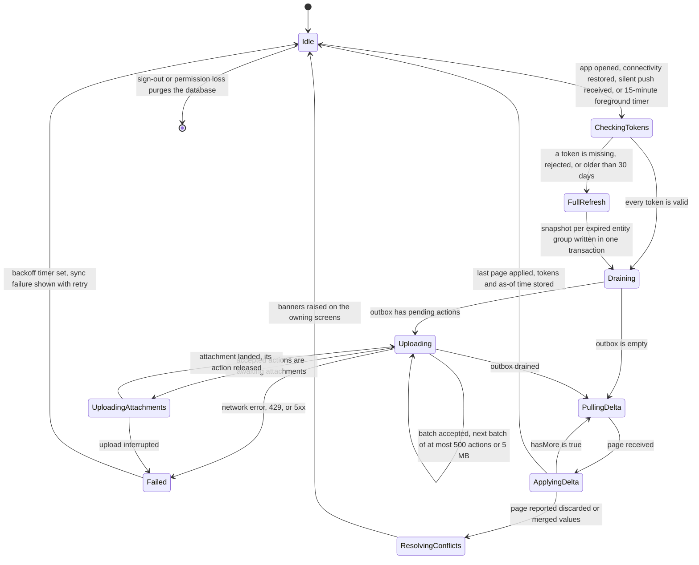

# 09. Mobile Structure (Flutter)

> Part of `docs/plan/`. Group D. Reads: reference architecture Sections 5, 8.2 and 17; master brief Sections 12.1 (items 34, 35 and 44), 16.2, 16.3, 18, 19, 20 and 37; Appendices C, M, U and X. Names come from Appendix L. Screen and capability names are the ones in `08-web-structure.md` §7, so the parity matrix in §10 reads across both documents without translation. Design tokens, motion and the seven states are specified in `14-design-system-and-ux.md`; this document says where they live in the Flutter project and which screen uses them. Device security controls are mapped to MASVS 2 in `12-security-privacy-safety.md` §1.2; this document is the implementation they point at.

One Flutter codebase, four shapes (the shared multi-school application, the white-label school application, the gate and reception kiosk, and the tablet modes), one backend it talks to (Bff.Mobile), one local database (Drift), one outbox. Everything a parent or student can do on the web they can do here (master brief Section 18); everything a teacher does daily they can do here offline; heavy configuration stays on the web and is marked so in §10.

**Cross-references.** `§N` means a section of this document; "Section N" means the master brief unless the reference architecture is named. **Test identifiers.** `TC-MOB-001` to `TC-MOB-005`, `TC-MOB-101`, `TC-MOB-102`, `TC-MOB-201` to `TC-MOB-203`, `TC-MOB-501`, `TC-MOB-502`, `TC-MOB-601` and `TC-MOB-602` are quoted from Appendices O and Q. Identifiers from `TC-MOB-701` upward are minted here and become the mobile test plan in `16-test-strategy.md`.

| Decision in force | Value | Where it is recorded |
|---|---|---|
| State management | Riverpod (`riverpod`, `riverpod_annotation`, code-generated providers), one provider set per feature under `presentation/state/` | Open question 23, default accepted; ADR raised by Group D per `29-adr-index.md` |
| Navigation | `go_router` with typed routes; route paths mirror the web routes in `08-web-structure.md` §2 so one App Link resolves on both | This document §4 |
| HTTP | Dio with interceptors (bearer, tenant, correlation id, ETag, retry) against Bff.Mobile only; generated clients from the aggregated OpenAPI document (`tools/scripts/regenerate-clients.mjs`, `07-solution-structure.md`) | This document §1 |
| Local storage | Drift over SQLite with SQLCipher, key in the platform keystore; one database per signed-in person, purged on sign-out | This document §3 and §7 |
| Push | Firebase Cloud Messaging and the Apple Push Notification service behind Notification's `IPushSender`; runtime detection of Google services; no other Firebase product | Master brief Section 37; this document §4 |
| Maps | `flutter_map` with OpenStreetMap tiles | `.claude/skills/flutter-multi-target/SKILL.md` |
| Crash reporting | GlitchTip through its Sentry-compatible SDK, personal data scrubbed before send | Master brief Section 18 |
| Application identifier | `<reversed confirmed domain>.nibras`; `.kiosk` suffix for the kiosk flavor; a white-label application uses the school's own identifier | `07-solution-structure.md` naming table |
| Flutter major | Latest stable at project start, pinned in `pubspec.yaml`; Impeller rendering on every target | Reference architecture Section 16 |

---

## 1. The Flutter project tree

### 1.1 To folder level

```text
src/Mobile/
├── pubspec.yaml                             # dependencies pinned to exact versions; every entry has a row in 19-dependency-and-license-inventory.md
├── pubspec.lock                             # lock file; ci-mobile.yml restores from it and fails on drift
├── analysis_options.yaml                    # strict lints: no hard-coded strings, no print, prefer const, no business logic in widgets (custom lint)
├── l10n.yaml                                # gen_l10n configuration: arb-dir lib/l10n, template en, nullable-getter off, untranslated-messages file
├── build.yaml                               # code generation targets: drift, riverpod, freezed, json_serializable, go_router typed routes
├── flavors/                                 # build-time configuration per flavor; read with --dart-define-from-file, never branched on in code (§5)
│   ├── dev.json                             # local stack endpoint, verbose logging, demo login helper on; excluded from every store build
│   ├── shared.json                          # the public multi-school application: platform brand, tenant chooser at sign-in
│   ├── kiosk.json                           # gate and reception kiosk: no personal session, device-bound credential, wake lock
│   └── schools/                             # one file per white-label school: name, colours, icon set, bundle identifier, fixed tenant id
│       └── example-school.json             # the template a new school's file is copied from; documented field by field
├── android/                                 # Android host project
│   ├── app/src/main/                        # manifest: App Links intent filters, notification channels, foreground sync service declaration
│   ├── app/src/shared/  app/src/whitelabel/  app/src/kiosk/   # flavor source sets: icons, strings, google-services.json where Google services exist
│   └── app/build.gradle.kts                 # productFlavors matching flavors/, minSdk 26 (Android 8.0), no-Google build variant excludes Firebase
├── ios/                                     # iOS host project
│   ├── Runner/                              # entitlements: Associated Domains for Universal Links, push, background modes (remote-notification)
│   ├── Runner/NotificationService/          # notification service extension: rewrites lock-screen text to the safe template (§7)
│   └── ExportOptions.*.plist                # export options per flavor; the white-label plist points at the school's team identifier
├── windows/  linux/                         # desktop kiosk host projects; full-screen, no window chrome, launcher script for Linux (§5)
├── lib/                                     # all Dart source: flavor entry points, the application shell, core services and the feature folders
│   ├── main_dev.dart  main_shared.dart  main_whitelabel.dart  main_kiosk.dart   # one entry point per flavor; each builds AppConfig and calls bootstrap()
│   ├── app/                                 # application shell: things that exist once
│   │   ├── bootstrap.dart                   # ordered start-up: config, secure storage, Drift open, first frame, then deferred initialisation (§8)
│   │   ├── app.dart                         # MaterialApp.router: theme, locale, direction, text scaling, reduce-motion flag
│   │   ├── router/                          # go_router configuration, typed routes, permission guard, deep-link resolver, mode lock (§4, §6)
│   │   ├── theme/                           # ThemeData built from the shared token JSON exported by @nibras/ui (14-design-system-and-ux.md)
│   │   ├── config/                          # AppConfig, Flavor enum, remote configuration client, version policy (§5, §7)
│   │   └── observability/                   # GlitchTip client with the scrubbing rules, OpenTelemetry-style trace ids on every request
│   ├── l10n/                                # app_en.arb and app_ar.arb; generated AppLocalizations; plural categories per CLDR
│   ├── core/                                # cross-cutting runtime that every feature uses and no feature owns
│   │   ├── network/                         # Dio client, interceptors, generated Bff.Mobile client, Problem Details to Appendix K code mapping
│   │   ├── auth/                            # OpenID Connect sign-in, token refresh with rotation, biometric unlock, session timeout, sign-out purge
│   │   ├── offline/                         # the offline engine (§3): Drift database, outbox, sync engine, delta tokens, conflict presentation
│   │   │   ├── drift/                       # database class, tables, daos, migrations, SQLCipher key loading
│   │   │   ├── outbox/                      # queue writer, batcher, replay with backoff, attachment uploader
│   │   │   ├── sync/                        # sync engine state machine, entity-group registry, delta application, full refresh
│   │   │   └── conflicts/                   # conflict records and the banner model that every feature renders
│   │   ├── notifications/                   # push registration per strategy, channels and categories, actionable handlers, badge count, quiet hours
│   │   ├── permissions/                     # permission set cache with version, hasPermission, refresh on IDENTITY_PERMISSION_VERSION_STALE
│   │   ├── connectivity/                    # online and offline signal, metered-connection signal, low-bandwidth profile (§8)
│   │   ├── device/                          # Google services detection, biometric capability, root and jailbreak advisory, battery optimisation state
│   │   ├── media/                           # camera, document scanner, QR scanner, image compression in an isolate, resumable upload client
│   │   └── design/                          # widgets shared by every feature: seven-state scaffold, as-of badge, pending badge, conflict banner, Because panel
│   ├── features/                            # one folder per feature; each has data/, domain/, presentation/ (§1.2); no feature imports another feature
│   │   ├── home/                            # role-specific home: teacher five-minute mode, parent calm screen, principal morning brief, student Today
│   │   ├── attendance/                      # register, exception-only pre-fill, excuses, unmarked classes; expanded to file level in §1.2
│   │   ├── timetable/                       # my timetable, cover alerts, today's sessions; feeds the home-screen widget
│   │   ├── coursework/                      # assignments, submissions with camera capture, grading queue, feedback
│   │   ├── grades/                          # mark entry (draft offline), grades and feedback for students and guardians
│   │   ├── messages/                        # messaging, announcements, read receipts, report and block
│   │   ├── requests/                        # request centre: submit, track, attach; excuse submission for guardians
│   │   ├── approvals/                       # approvals inbox for principals and approvers; actionable notification target
│   │   ├── fees/                            # fees and pay, invoices, receipts, statements; payment always online (§2)
│   │   ├── children/                        # child switcher, child today, transparency panel, consents, per-child notification preferences
│   │   ├── behavior/                        # quick note, points, incidents, badges and portfolio
│   │   ├── safety/                          # gate pass display and verification, pickup persons, visitors, emergency mode and roll call
│   │   ├── student360/                      # Student 360 read composition from Bff.Mobile; wellbeing entries shown as existence only
│   │   ├── meetings/                        # meeting booking and the conference-day schedule
│   │   ├── documents/                       # report cards and documents: download, local copy, share sheet with the watermark preserved
│   │   ├── profile/                         # my profile, devices and sessions, notification preferences, account deletion request, what's new
│   │   └── modes/                           # the four device modes (§6); each locks the router to its own route set
│   │       ├── gate/                        # scan passes, verify pickup, visitor check-in, watchlist alert
│   │       ├── bus_attendant/               # route list, boarding and alighting attendance, delay broadcast
│   │       ├── nurse/                       # clinic visit entry, medication round, allergy lookup; online only, nothing cached (§6)
│   │       └── kiosk/                       # self check-in, visitor self-registration, idle screen, automatic reset
│   └── widgets_home/                        # home-screen widget payload builders: today's timetable, next due item (Android and iOS widget extensions)
├── test/                                    # unit and widget tests, one folder per feature mirroring lib/features
│   ├── core/                                # offline engine tests: outbox replay, delta token expiry, conflict presentation, batching
│   └── features/                            # widget tests per screen in every one of the seven states
├── integration_test/                        # device and emulator tests: sync end to end against the local stack, mode flows, deep links
├── goldens/                                 # golden baselines: <screen>.<state>.ltr.png and .rtl.png, generated on the Linux runner only
├── test_driver/                             # driver for the device pass checklist (Appendix X: low-end Android 8, Android 14, iPhone SE, iPad, no-Google device)
└── tool/                                    # project scripts: golden update, flavor scaffold for a new school, arb lint; each with .ps1 and .sh wrappers
```

### 1.2 One feature to file level: `lib/features/attendance`

Every feature has the same three layers (`.claude/rules/mobile.md`). `domain/` holds entities, value objects and use cases and imports nothing from Flutter. `data/` holds the repository that reads the Drift cache first and the Bff.Mobile client second, and writes through the outbox. `presentation/` holds Riverpod providers, screens and widgets, and contains no business rule; a rule found in a widget is a review defect.

```text
lib/features/attendance/
├── attendance_routes.dart                          # typed go_router routes: /teacher/classes/:sectionId/attendance, /homeroom/excuses, /principal/attendance
├── attendance_feature.dart                         # feature registration: routes, sync entity groups it owns, outbox action types it handles, deep-link targets
├── domain/                                         # pure Dart: entities, local rule mirrors and use cases; imports no Flutter
│   ├── entities/                                   # the attendance entities the use cases and screens work with
│   │   ├── attendance_session.dart                 # session for a section and date: mode (daily or per period), lock time, records, pre-fill sources
│   │   ├── attendance_record.dart                  # one student's status, source (teacher, gate, bus, kiosk, offline replay), note, version, occurredAt
│   │   ├── attendance_status.dart                  # present, absent, late, excused, early leave; codes from the tenant's attendance settings
│   │   ├── excuse.dart                             # excuse with type, window, evidence requirement, decision
│   │   └── pre_fill_source.dart                    # gate scan, bus boarding, approved leave: what pre-filled a record and when
│   ├── rules/                                      # device-side mirrors of server rules, used to explain an outcome, never to decide it
│   │   ├── lock_window_rule.dart                   # local mirror of BR-ATT-002 for the notice only; the server decides, the device explains
│   │   └── exception_only_rule.dart                # which records are exceptions to confirm (master brief Section 12.1 item 26)
│   └── usecases/                                   # one class per user action, called by the presentation state
│       ├── open_register.dart                      # load the session from cache, merge pre-fill, return the register view model with its "as of" time
│       ├── mark_student.dart                       # write the record locally, enqueue attendance.mark with the held version, mark the row pending
│       ├── mark_all_present_then_exceptions.dart   # one queued action per student with the same batch id, so a partial sync stays consistent
│       ├── submit_excuse.dart                      # enqueue the excuse and its attachment; the action waits for the attachment (§3.8)
│       ├── decide_excuse.dart                      # approve or reject; online only because approval needs the current permission version (Appendix M)
│       └── resolve_conflict.dart                   # applies the one action the banner offers: submit edit-after-lock request, keep server value, choose value
├── data/                                           # the repository implementation and everything it reads and writes: DTOs, Drift, API, outbox
│   ├── dto/                                        # wire shapes for sync pages and queued actions
│   │   ├── attendance_session_dto.dart             # generated from the Bff.Mobile OpenAPI document; never edited by hand
│   │   ├── mark_action_dto.dart                    # outbox payload shape for attendance.mark: sessionId, studentId, status, note, entityVersion, occurredAt
│   │   └── attendance_delta_dto.dart               # delta page for the attendance entity group: upserts, deletes, discarded values, next token
│   ├── local/                                      # Drift tables, the data access object and the delta applier for the attendance entity group
│   │   ├── attendance_tables.dart                  # Drift tables: attendance_sessions, attendance_records, excuses (§3.2)
│   │   ├── attendance_dao.dart                     # queries: register by section and date, pending rows, rows with conflicts, purge older than 14 days
│   │   └── attendance_delta_applier.dart           # applies a delta page inside one transaction; per-student merge, never per session
│   ├── remote/                                     # the network side, over the generated Bff.Mobile client
│   │   └── attendance_api.dart                     # thin wrapper over the generated client: sync page, excuse decision, edit-after-lock request
│   ├── outbox/                                     # the handler that turns this feature's queued actions into requests and outcomes
│   │   └── attendance_outbox_handler.dart          # maps queued action types to requests and maps Appendix K codes to outbox outcomes (§3.7)
│   └── attendance_repository_impl.dart             # cache-first reads, outbox writes, delta subscription; the only class presentation talks to
├── presentation/                                   # Riverpod state, screens and widgets; reaches data only through the use cases and the repository
│   ├── state/                                      # Riverpod notifiers the screens watch
│   │   ├── register_provider.dart                  # Riverpod notifier: session, records, dirty set, pending count, lock state, conflict list
│   │   ├── excuses_provider.dart                   # excuse queue for the viewer's scope and decisions in flight
│   │   └── unmarked_classes_provider.dart          # principal card: unmarked classes at the cut-off, from the cached home payload
│   ├── screens/                                    # one routed screen per file
│   │   ├── register_screen.dart                    # the register: seating or list mode, exception bar, mark all present, save; every one of the seven states
│   │   ├── excuse_review_screen.dart               # homeroom excuse review with attachment preview through a short-lived link; medical detail never shown
│   │   ├── submit_excuse_screen.dart               # guardian excuse form with camera capture; queues offline with a pending badge
│   │   ├── unmarked_attendance_screen.dart         # principal: unmarked classes with a nudge action
│   │   └── my_attendance_screen.dart               # student and guardian read view with the percentage and its denominator explained
│   └── widgets/                                    # feature widgets composed from core/design components
│       ├── seating_chart.dart                      # seats as 48 dp targets, status cycles on tap, ripple-and-settle in 100 ms, semantics label per seat
│       ├── attendance_list.dart                    # list mode with ListView.builder, segmented status control, note affordance
│       ├── exception_bar.dart                      # "N pre-filled from gate scan, M approved leave" with a review action
│       ├── lock_window_notice.dart                 # lock time, the edit-after-lock path, who can grant it
│       ├── pending_row_badge.dart                  # the pending, sending, failed and conflict states per row (§3.7)
│       ├── conflict_banner.dart                    # both values side by side, which was kept and why, the one resolving action (Appendix M banner rule)
│       └── register_card.dart                      # bento card for the teacher five-minute home: next class to mark, one action
└── test/                                           # this feature's unit, widget and golden tests, mirroring the folders above
    ├── domain/mark_student_test.dart               # unit: enqueues with the held version, marks pending, never claims completion
    ├── data/attendance_delta_applier_test.dart     # unit: per-student merge, lock-after rule creates a request, discarded value recorded
    ├── data/attendance_outbox_handler_test.dart    # unit: ATTENDANCE_DUPLICATE_MARK is success, ATTENDANCE_SESSION_LOCKED becomes a request, 5xx retries
    ├── presentation/register_screen_test.dart      # widget: seven states, pending badge, conflict banner, semantics in both languages
    └── goldens/register_screen_golden_test.dart    # goldens: default, pre-filled, locked, offline, conflict; LTR and RTL
```

### 1.3 Layer and boundary rules

| Rule | Enforcement |
|---|---|
| `domain/` imports no Flutter package and no other layer | Custom lint rule in `analysis_options.yaml`; `flutter analyze` fails |
| `presentation/` never calls `core/network` or Drift directly; it goes through the feature repository | Import-boundary lint; a widget importing `drift` or `dio` fails analysis |
| A feature imports only `core/`, `app/config`, `l10n/` and its own folders | Same lint; feature-to-feature import fails |
| Wellbeing data never enters `core/offline`, with the one exception the plan builds until Open Question 29 is decided (§2.2, §3.1) | The Drift schema has no wellbeing table (§3.2); `nurse/` uses a repository with no local layer; `TC-MOB-704` asserts no `wellbeing` table, column or file exists and no outbox row carries a Wellbeing payload; the student's check-in answer code, the exception, is held to one write-only outbox row by `TC-MOB-780` |
| No hard-coded user-facing string | `analysis_options.yaml` bans string literals in widget trees; `tool/arb-lint` fails on a key present in `en` and missing in `ar` |
| Generated clients and Drift code are never hand-edited | `ci-mobile.yml` regenerates and fails on diff |

---

## 2. Feature list per role

Offline values are quoted from Appendix M section M.1; where a feature is not an M.1 row, the value follows the M.1 rule it falls under and names it. Mobile capabilities per role are quoted from the Appendix I role templates. Screen names are the ones in `08-web-structure.md` §7.

### 2.1 Teacher and homeroom teacher

| Feature | Screen | Offline | M.1 row |
|---|---|---|---|
| Five-minute home: next class, attendance to mark, submissions to grade, messages, cover alert (Section 12.1 item 34) | Teacher Today | Yes, last synced with "as of" | View today's timetable |
| Mark attendance, exception-only pre-fill | Register | Yes, queued | Mark attendance for a class |
| Edit after lock (becomes a request) | Register | Yes, queued as a request | Mark attendance; rule for after the lock window in M.3 |
| Publish an assignment | Assignments | Yes, queued | Record-type action; append-only |
| Grade submissions | Grading queue and fast grid | Yes, queued, draft only | Enter marks for a component |
| Enter marks for a component | Mark entry grid | Yes, queued, draft only; submit for moderation is online | Enter marks for a component |
| Read and send messages | Messages | Read last 30 days; send queued | Read messages; Send a message |
| My timetable and cover | My timetable and cover | Yes, from cache | View today's timetable |
| Accept or decline a cover class | My timetable and cover | No | Approve anything |
| Behavior quick note and points | Behavior quick note | Yes, queued | Record a behaviour point or incident |
| Meetings and conference-day schedule | Meetings | Yes, the day's schedule read-only | View today's timetable |
| Homeroom card: absent today, excuses, flags | Homeroom Today | Yes, read | Read messages and announcements (cached read) |
| "Check in with this student" flag from the daily check-in (homeroom, SL-WEL-619) | Homeroom Today | No, read live; the flag only, never the answer | View a wellbeing record |
| Excuse review: approve or reject | Excuse review | No | Approve anything |
| Timeline note on a student | Student 360 (homeroom scope) | Yes, queued | Record a behaviour point or incident (append-only) |
| Early-warning flags with reasons | Early-warning flags | No, read live | Not an M.1 row; served by Reporting, not cached |
| Intervention playbook | Intervention playbook | No | View a wellbeing record |
| Emergency roll call | Emergency mode | Yes, queued, and it says so | Emergency roll call |
| Comment bank and drafts, lesson plans | Web only | Not on mobile | Heavy authoring stays on the web (Section 18) |

### 2.2 Student

| Feature | Screen | Offline | M.1 row |
|---|---|---|---|
| Today: timetable, due list, new feedback | Student Today | Yes, from cache | View today's timetable |
| Submit an assignment with camera capture | Assignment and submission | Yes, queued; attachment uploads on reconnect | Submit a request with an attachment |
| Grades and feedback with the scheme behind the mark | Grades and feedback | Yes, read | Read messages and announcements (cached read) |
| My attendance | My attendance | Yes, read | Cached read |
| Badges and portfolio | Badges and portfolio | Yes, read | Cached read |
| Messages and announcements | Messages and announcements | Read last 30 days; send queued | Read messages; Send a message |
| Private request (counseling appointment) | Private request | Yes, queued | Submit a request |
| Daily wellbeing check-in (REQ-WEL-015, WF-WEL-05, SL-WEL-619, phase 5) | Check-in card on Student Today; `08-web-structure.md` §7 has no screen for it | **Contested.** On the default in force for Open Question 29, what the plan builds: the answer code alone is queued, write-only, never shown back, purged when it lands or on sign-out; no note and no flag offline. On the recommended answer: no, online only, and the card shows "needs a connection" | Not an M.1 row. M.1 "View a wellbeing record" is No, and the device rule of master brief Section 20 says Wellbeing data never reaches a device; the queued answer code contradicts both until the question is decided (RISK-47) |
| Quiz player | Web only; the phone browser on mobile web (§10.3) | Not on mobile | Not an M.1 row. Connectivity is not the reason: payment is also online only and is still an app screen. The reason is the content. A quiz is a set of QTI 3 items imported from question banks (Academics sheet §4.9), with interaction types, media and equations that the web's quiz player renders, and the plan builds one QTI renderer, not a second one in Flutter. Payment is a fixed form that hands off to the gateway, with nothing to render. The exception to master brief Section 18 is stated in §10 |

### 2.3 Parent or guardian

| Feature | Screen | Offline | M.1 row |
|---|---|---|---|
| Calm screen, one card per child (Section 12.1 item 35) | Calm screen | Yes, last synced | View today's timetable (cached home) |
| Child today | Child today | Yes, read | Cached read |
| Attendance and excuse submission | Attendance and excuse | Read yes; excuse queued with attachment | Submit an excuse with an attachment |
| Fees and pay | Fees and pay | Read yes; pay no | Make a payment |
| Report cards and documents | Report cards and documents | Yes, once downloaded | Cached read (Appendix Q `TC-MOB-502`) |
| Guardian transparency | Guardian transparency | No, read live | Access-log data is never cached (Appendix J) |
| Consents and policy acknowledgment | Consents; Policy acknowledgment | Acknowledgment queued | Emergency acknowledgement rule: append-only |
| Gate pass display | Gate pass | Yes, the signed pass shows offline | Issue or verify a gate pass: verify yes, issue no |
| Requests | Requests | Yes, queued | Submit a request |
| Messages and digest | Messages and digest | Read last 30 days; send queued | Read messages; Send a message |
| Meetings | Meetings | Booking no; the booked schedule read | Approve anything (a booking takes a slot) |
| Notification preferences, per child | Notification preferences | Yes, queued | Notification preference change: last `receivedAt` wins |
| Re-enrollment and deposit | Re-enrollment | No | Make a payment |
| Clinic note that the child was seen | Child today (notification detail) | No | View a wellbeing record |

### 2.4 Principal, vice principal, owner and academic leadership

| Feature | Screen | Offline | M.1 row |
|---|---|---|---|
| Morning brief and Today (Section 12.1 item 25) | Morning brief and Today | Yes, last synced brief with "as of" (`TC-MOB-101`) | Cached read |
| Approvals inbox | Approvals inbox | No; Appendix U.2 says queued, Appendix M says approval is never offline; M governs (§3.6) | Approve anything |
| Unmarked attendance and nudge | Unmarked attendance | Read yes; nudge queued | Send a message |
| Staff absence and cover decision | Staff absence and cover | No | Approve anything |
| Student 360 read | Student 360 | No, read live | Sensitive fields are never cached (Appendix J) |
| Break-glass | Break-glass | No | View a wellbeing record |
| Early warning, school dashboard, campus comparison | Early warning; School dashboard; Campus comparison | Last synced figures, read-only | Cached read (Appendix U.1) |
| Incidents | Incidents | Yes, queued | Record a behaviour point or incident |
| Emergency mode: broadcast, roll call, reunification | Emergency mode; Reunification | Roll call and acknowledgements yes, queued; broadcast needs the network | Emergency roll call |
| Moderation queue, lesson-plan review, observation note (coordinator, head of department) | Web, plus observation note on a tablet | Observation note queued | Record-type action; append-only |
| Marks approval and lock, report card batch, timetable editor, workload | Web only | Not on mobile | Heavy configuration stays on the web |

### 2.5 Registrar, admissions officer, accountant, HR officer

| Feature | Screen | Offline | M.1 row |
|---|---|---|---|
| Document checklist and offer follow-up (registrar) | Application detail (read) | No | Not cached; admissions is a web workspace |
| Inquiry capture, tour booking, applicant notes (admissions officer) | Inquiries (capture form) | Yes, queued | Submit a request (append-only) |
| Payment capture and receipt issue (accountant) | Payments and receipts (capture) | No | Make a payment |
| Day-close read (accountant) | Cashier day close (read) | No | Not cached |
| Leave decisions (HR officer) | Leave (decide) | No | Approve anything |
| Document expiry chase (HR officer) | Document expiry (read, nudge) | Read no; nudge queued | Send a message |
| Everything else in these workspaces | Web only | Not on mobile | Heavy configuration stays on the web |

### 2.6 Counselor, nurse, safeguarding officer, special-needs coordinator

| Feature | Screen | Offline | M.1 row |
|---|---|---|---|
| Care Today: visits, medication schedule, follow-ups | Care Today | **No**; nothing from Wellbeing is held on a staff device | View a wellbeing record |
| Record a clinic visit and notify the guardian | Clinic visits (nurse mode) | **No** | Record a clinic visit |
| Medication round | Medication schedule (nurse mode) | **No** | Record a clinic visit |
| Allergy lookup | Allergy and medical alerts | No, read live and never from a cache | View a wellbeing record (Appendix U.10) |
| Referral triage, follow-up log, intervention steps | Referrals; Case file; Interventions | No | View a wellbeing record |
| Concern intake and escalation (safeguarding officer) | Safeguarding queue | No | View a wellbeing record |
| Accommodation check at an exam sitting | Education plans (read) | No | View a wellbeing record |

Appendix M section M.1 says a clinic visit is never recorded offline because wellbeing data is never stored on a device, and master brief Section 20 and `CLAUDE.md` say wellbeing data never reaches a device. This document implements Appendix M and nurse mode is online only (§6). Appendix U.10 and the Appendix I nurse row once described an offline clinic-visit queue; brief v9.1 corrected both to match Appendix M under ADR-0019, so the brief now agrees with itself here.

The rule is not yet whole on the student's side. Appendix R marks WF-WEL-05, the daily check-in, as offline, and the plan builds that: SL-WEL-619 lets the student's answer code wait in the outbox until sync (§2.2). That is the default in force for Open Question 29, which the privacy officer and then the product owner decide; until they do, it contradicts the no-device rule above, and `12-security-privacy-safety.md` records it as threat T-WEL-09 and RISK-47. The recommended answer is an online-only check-in, which removes the outbox row and the exception; nothing else in this document changes either way.

### 2.7 Receptionist and security, transport coordinator, librarian, store keeper, platform administrator, IT support

| Feature | Screen or mode | Offline | M.1 row |
|---|---|---|---|
| Gate pass verification | Gate and passes (gate mode) | Yes: the signed payload verifies offline; the result queues | Issue or verify a gate pass |
| Pickup verification | Pickup persons (gate mode) | Yes, from the cached authorised list with its "as of" time | Verify yes, issue no |
| Visitor check-in and watchlist | Visitors (gate mode) | Check-in queued; watchlist match from the cached list | Record-type action; append-only |
| Emergency roll call at the gate | Emergency roll call | Yes, queued | Emergency roll call |
| Boarding and alighting attendance (bus attendant mode) | Bus attendant mode | Yes, queued | Mark attendance for a class |
| Delay broadcast (transport coordinator) | Bus attendant mode | No | Not a queued action; a broadcast needs the network |
| Subscription change (transport coordinator) | Web only | Not on mobile | Configuration |
| Issue, return, reserve, stocktake scan (librarian) | Operations library screens | Yes, queued (Appendix I) | Record-type action; append-only |
| Receive, issue, count (store keeper) | Operations inventory screens | Yes, queued (Appendix I) | Record-type action; append-only |
| Read-only health, ticket triage, broadcast to operators (platform administrator) | Operator Today (read) | No | No tenant data on mobile (Appendix I) |
| Password reset assist, device enrolment (IT support) | Users (assist) | No | No student data (Appendix I) |

---

## 3. Offline and sync design (Appendix M)

### 3.1 What the device holds

| Entity group | Contents | Retention on device | Sensitivity ceiling (Appendix J) |
|---|---|---|---|
| `home` | The role home payload from Bff.Mobile with its "as of" time | Latest only | Confidential |
| `timetable` | Today plus 14 days of the person's sessions, cover changes, room names | 14 days back, 14 forward | Internal |
| `roster` | Students per section the person teaches or parents: id, display names, photo thumbnail, section, authorised pickup list for guardians of that child | Current term | Confidential |
| `attendance` | Sessions and records for the person's sections, 14 days back | 14 days | Confidential |
| `messages` | Threads and announcements, last 30 days, attachment metadata only | 30 days | Confidential |
| `requests` | The person's requests and their states; approvals inbox listing for approvers (read only) | 30 days | Confidential |
| `behaviour` | Points and incidents the person recorded, badges for own children | 30 days | Confidential |
| `documents` | Downloaded report cards and certificates the person chose to keep, encrypted | Until the person removes them | Confidential |
| `gate_keys` | The tenant's gate-pass verification public keys with validity windows | Until rotated | Public |
| `permissions` | The permission set and its version | Until changed | Internal |
| Never on the device | Anything at Sensitive or level S: custody text, medical detail, counseling, safeguarding, payment instruments, access logs, another family's child | Never | Appendix M: "The device cache holds nothing classified sensitive in Appendix J" |
| Contested: the student's pending check-in answer | On the Open Question 29 default in force only: at most one `outbox_actions` row per school day, holding the level S answer code, with no note, no flag and no earlier answer; no Drift table, no cache and no screen reads it | Until the server accepts it, or sign-out; the row is deleted, not marked accepted | Level S. Contradicts the row above until Open Question 29 is decided; on the recommended online-only answer this row does not exist (RISK-47, `12-security-privacy-safety.md` T-WEL-09) |

### 3.2 Drift schema outline

The database is opened with SQLCipher; the key lives in the platform keystore (§7). Every table carries `tenant_id` because a person can belong to two schools on the platform (master brief Section 15); the sync request carries the tenant and Bff.Mobile rejects a mismatch. The whole database is dropped on sign-out and on permission loss.

```sql
-- lib/core/offline/drift/ : outline of every table. Feature tables are declared in their feature's data/local/.

CREATE TABLE sync_state (
  tenant_id        TEXT    NOT NULL,             -- full tenant UUID v7; the token is only valid for this tenant
  entity_group     TEXT    NOT NULL,             -- home, timetable, roster, attendance, messages, requests, behaviour, documents, gate_keys, permissions
  delta_token      TEXT,                         -- opaque v1.<tenantId>.<entityGroup>.<checkpointLsn>.<hmac> from the last sync; NULL forces a full refresh
  token_issued_at  INTEGER,                      -- epoch ms the server issued the token; older than 30 days means full refresh before any delta is applied
  last_synced_at   INTEGER,                      -- epoch ms of the last completed sync; rendered as the "as of" time on every cached screen
  full_refresh_due INTEGER NOT NULL DEFAULT 0,   -- 1 when the server rejected the token or the 30-day rule fired; cleared after the snapshot lands
  PRIMARY KEY (tenant_id, entity_group)
);

CREATE TABLE outbox_actions (
  idempotency_key      TEXT    PRIMARY KEY,      -- UUID v7 generated on the device when queued; the server's inbox key; never regenerated on retry
  tenant_id            TEXT    NOT NULL,         -- full tenant UUID v7 of the tenant the action belongs to
  action_type          TEXT    NOT NULL,         -- attendance.mark, attendance.excuse.submit, communication.message.send, requests.request.submit, ...; the student check-in answer is the only Wellbeing type, and only on the Open Question 29 default (§3.1)
  batch_id             TEXT,                     -- groups actions that must land together, e.g. mark-all-present for one session
  entity_id            TEXT,                     -- id of the entity acted on; NULL for a create
  entity_version       INTEGER,                  -- the version the device held when the action was queued; the server compares it to detect a conflict
  payload_json         TEXT    NOT NULL,         -- request body, at most 64 KB; attachments are rows in outbox_attachments, never inline
  occurred_at          INTEGER NOT NULL,         -- device clock at the moment of the action, epoch ms; display only; the server orders by receivedAt
  queued_seq           INTEGER NOT NULL,         -- monotonic per device; batches are sent in this order so the server receives them in order
  status               TEXT    NOT NULL,         -- pending, sending, awaiting_attachment, accepted, conflict, rejected
  attempt_count        INTEGER NOT NULL DEFAULT 0, -- attempts so far; backoff is 2^n seconds with jitter, capped at 15 minutes
  next_attempt_at      INTEGER,                  -- earliest epoch ms of the next attempt; NULL means immediately
  last_error_code      TEXT,                     -- Appendix K code from the last failed attempt, e.g. ATTENDANCE_SESSION_LOCKED
  server_response_json TEXT,                     -- the first accepted response, kept so a replay renders the same result (M.2: replay is safe)
  received_at          INTEGER                   -- receivedAt stamped by the server on acceptance; NULL until accepted
);

CREATE TABLE outbox_attachments (
  attachment_id    TEXT    PRIMARY KEY,          -- UUID v7; also the upload session id at Documents
  idempotency_key  TEXT    NOT NULL,             -- the outbox action this attachment belongs to; the action stays pending until every attachment lands
  local_path       TEXT    NOT NULL,             -- path inside the app's private storage of the compressed file (§8)
  content_type     TEXT    NOT NULL,             -- MIME type after compression, e.g. image/jpeg, application/pdf
  size_bytes       INTEGER NOT NULL,             -- size after compression; the sum per action is checked against the 5 MB batch rule
  bytes_uploaded   INTEGER NOT NULL DEFAULT 0,   -- resumable upload progress; the next attempt resumes from here rather than restarting
  upload_url       TEXT,                         -- the resumable session URL issued by Documents; NULL until the session is created
  status           TEXT    NOT NULL,             -- pending, uploading, uploaded, failed
  FOREIGN KEY (idempotency_key) REFERENCES outbox_actions(idempotency_key) ON DELETE CASCADE
);

CREATE TABLE conflicts (
  conflict_id      TEXT    PRIMARY KEY,          -- UUID v7 generated when the server reports a discarded or merged value
  idempotency_key  TEXT,                         -- the outbox action that caused it; NULL when the delta reported a server-side change
  entity_group     TEXT    NOT NULL,             -- which feature renders the banner
  entity_id        TEXT    NOT NULL,             -- the entity, e.g. the attendance record id
  field_name       TEXT    NOT NULL,             -- the field whose value was discarded; the banner names it
  device_value     TEXT    NOT NULL,             -- what the person typed, as displayed
  server_value     TEXT    NOT NULL,             -- what the server kept, as displayed
  rule_applied     TEXT    NOT NULL,             -- the M.3 rule name, e.g. attendance_after_lock, mark_component_approved
  resolving_action TEXT    NOT NULL,             -- the one action offered: submit_edit_after_lock, submit_grade_change, submit_change_request, choose_value, acknowledge
  raised_at        INTEGER NOT NULL,             -- epoch ms when the banner was raised
  resolved_at      INTEGER                       -- epoch ms when the person took the action; NULL while the banner is showing
);

CREATE TABLE attendance_sessions (
  session_id       TEXT    PRIMARY KEY,          -- server id of the AttendanceSession aggregate
  tenant_id        TEXT    NOT NULL,             -- full tenant UUID v7
  section_id       TEXT    NOT NULL,             -- the section the session belongs to
  session_date     TEXT    NOT NULL,             -- ISO date in the tenant's time zone; the register is keyed by section and date
  period_id        TEXT,                         -- NULL in daily mode, the timetable period in per-period mode (BR-ATT-001)
  lock_at          INTEGER NOT NULL,             -- epoch ms when the lock window closes; the notice widget reads it, the server enforces it
  version          INTEGER NOT NULL,             -- aggregate version last seen; sent with every queued action
  synced_at        INTEGER NOT NULL              -- epoch ms this row was last refreshed; drives the "as of" badge
);

CREATE TABLE attendance_records (
  session_id       TEXT    NOT NULL,             -- owning session
  student_id       TEXT    NOT NULL,             -- the student
  status           TEXT    NOT NULL,             -- present, absent, late, excused, early_leave
  source           TEXT    NOT NULL,             -- teacher, gate, bus, kiosk, offline_replay; pre-fill sources render in the exception bar
  note             TEXT,                         -- free-text note; never medical detail
  version          INTEGER NOT NULL,             -- record version last seen from the server
  occurred_at      INTEGER,                      -- device clock when the teacher marked it; NULL for server-sourced rows
  pending_key      TEXT,                         -- idempotency key of the queued action for this row; NULL when nothing is pending
  PRIMARY KEY (session_id, student_id)
);

CREATE TABLE excuses (
  excuse_id        TEXT    PRIMARY KEY,          -- server id, or the idempotency key while pending
  student_id       TEXT    NOT NULL,             -- the student
  excuse_type      TEXT    NOT NULL,             -- type code from the tenant's excuse rules
  date_from        TEXT    NOT NULL,             -- ISO date
  date_to          TEXT    NOT NULL,             -- ISO date
  state            TEXT    NOT NULL,             -- submitted, approved, rejected; pending rows show the pending badge
  evidence_required INTEGER NOT NULL,            -- 1 when ATTENDANCE_EXCUSE_EVIDENCE_REQUIRED applies to the type
  pending_key      TEXT                          -- idempotency key while queued
);

CREATE TABLE timetable_sessions (
  session_id       TEXT    PRIMARY KEY,          -- timetable session id
  tenant_id        TEXT    NOT NULL,             -- full tenant UUID v7
  session_date     TEXT    NOT NULL,             -- ISO date
  starts_at        INTEGER NOT NULL,             -- epoch ms in the tenant's zone
  ends_at          INTEGER NOT NULL,             -- epoch ms
  section_id       TEXT,                         -- NULL for a non-teaching slot
  subject_name_en  TEXT    NOT NULL,             -- bilingual pair; the screen picks by locale, never concatenates
  subject_name_ar  TEXT    NOT NULL,             -- Arabic name
  room_name        TEXT,                         -- room label
  is_cover         INTEGER NOT NULL DEFAULT 0,   -- 1 when this is a substitution assigned to the person; drives the cover alert
  synced_at        INTEGER NOT NULL              -- epoch ms of the refresh
);

CREATE TABLE roster_students (
  student_id       TEXT    NOT NULL,             -- student
  tenant_id        TEXT    NOT NULL,             -- full tenant UUID v7
  section_id       TEXT    NOT NULL,             -- section membership at sync time; ATTENDANCE_STUDENT_NOT_IN_SECTION refreshes it
  display_name_en  TEXT    NOT NULL,             -- English display name
  display_name_ar  TEXT    NOT NULL,             -- Arabic display name
  photo_thumb_path TEXT,                         -- local path of the cached 96 px thumbnail; NULL when media consent withholds it
  seat_index       INTEGER,                      -- seat for the seating chart; NULL for list-only sections
  PRIMARY KEY (tenant_id, section_id, student_id)
);

CREATE TABLE messages (
  message_id       TEXT    PRIMARY KEY,          -- server id, or the idempotency key while pending
  thread_id        TEXT    NOT NULL,             -- thread
  sender_id        TEXT    NOT NULL,             -- person id
  body             TEXT    NOT NULL,             -- message text; policy-locked threads store the neutral notice only (COMMUNICATION_MESSAGE_REPORTED_LOCK)
  sent_at          INTEGER NOT NULL,             -- server receivedAt, or device occurredAt while pending
  read_at          INTEGER,                      -- earliest occurredAt of the read receipt; M.3: earliest wins
  pending_key      TEXT                          -- idempotency key while queued
);

CREATE TABLE gate_pass_keys (
  key_id           TEXT    PRIMARY KEY,          -- key identifier embedded in every signed pass
  tenant_id        TEXT    NOT NULL,             -- full tenant UUID v7
  public_key_pem   TEXT    NOT NULL,             -- Ed25519 public key used to verify a pass offline
  valid_from       INTEGER NOT NULL,             -- epoch ms
  valid_to         INTEGER NOT NULL              -- epoch ms; a pass signed by an expired key fails verification
);

CREATE TABLE verified_passes (
  pass_id          TEXT    PRIMARY KEY,          -- pass identifier from the signed payload; single-use, so a second scan is refused locally
  verified_at      INTEGER NOT NULL,             -- device occurredAt of the verification
  pending_key      TEXT    NOT NULL              -- the queued attendance.gate-pass.verify action; the server reports if another gate used it first
);
```

### 3.3 The outbox record

Quoted from Appendix M section M.2: "Every offline action is queued with a client-generated UUID v7 as its idempotency key, the `occurredAt` from the device clock, and the entity version the device held. The server stamps `receivedAt` on arrival. Ordering uses `receivedAt`, never the device clock."

| Field | Rule |
|---|---|
| `idempotency_key` | Generated once when the action is queued; every retry, every batch and every app restart sends the same key. The server's inbox returns the first response on a replay (`_IDEMPOTENCY_REPLAY`, 200) and the client stores it in `server_response_json` |
| `entity_version` | The version from the cached row at queue time; the owning service compares it to the current version to decide whether a conflict rule applies |
| `occurred_at` | Kept for display ("marked at 08:05") and for the rules in M.3 that say earliest `occurredAt` wins; never used for ordering |
| `queued_seq` | Actions are sent in queue order so that "mark A absent, then correct A to late" arrives in the order it happened on the device |
| `batch_id` | Mark-all-present writes one action per student under one batch; a batch that is cut by the payload limit continues in the next request with the same ids, and the server applies per student, never per session (M.3) |
| `status` | `pending` visible as the pending badge; `sending` while a request is in flight; `awaiting_attachment` until every attachment row is `uploaded`; `accepted` clears the badge; `conflict` raises a banner; `rejected` shows the Appendix K explanation with a retry or a way forward |

### 3.4 Delta token handling

| Rule | Implementation |
|---|---|
| Format | Opaque string `v1.<tenantId>.<entityGroup>.<checkpointLsn>.<hmac>` issued by Bff.Mobile with every sync response; stored per entity group in `sync_state` |
| The client never parses it | The token is sent back verbatim; the device does not read the checkpoint, and a tampered token is rejected by the server's HMAC check |
| 30-day rule | `token_issued_at` older than 30 days sets `full_refresh_due` before any request is made; the entity group is re-fetched as a snapshot, not a delta. Appendix M section M.4: "the application performs a full refresh for that entity group rather than applying a stale delta, and the queued outbox is still sent because its idempotency keys do not expire" |
| Server rejection | A `_VALIDATION_FAILED` on the token parameter (tampered, wrong tenant, or past 30 days by the server's clock) sets `full_refresh_due` and the engine moves to `FullRefresh`; nothing is applied from a rejected delta |
| Paging | A delta response carries `hasMore`; the engine loops until the last page and stores the token from the last page only, so an interrupted pull replays from the previous checkpoint |
| Per group | Each entity group has its own token; a teacher's `attendance` group can be one page while `messages` needs a full refresh, without touching each other |
| Tenant switch | A person in two schools has one `sync_state` row set per tenant; switching tenant switches the token set, never mixes them |

### 3.5 The sync engine

The engine runs in `lib/core/offline/sync/` as one state machine per signed-in person, on a background isolate for parsing and on the main isolate only for the final Drift write and the UI signal.



| Trigger | Where it comes from | Rule |
|---|---|---|
| App opened | `bootstrap.dart` after first frame | Always; iOS never promises background sync (Section 37), so open is the guaranteed moment |
| Connectivity restored | `core/connectivity` | Debounced 3 seconds so a flapping connection does not start five syncs |
| Silent push | `core/notifications` | Content-available push from Notification when a delta for this person exists; iOS may throttle it, which is why it is never the only trigger |
| Foreground timer | `sync/scheduler.dart` | Every 15 minutes while the app is in the foreground; never a background timer on iOS |
| Background (Android only) | WorkManager periodic job, 30 minutes, network-required constraint | Skipped when battery optimisation restricts the app (§4.5); urgent content still arrives by push |
| Manual | Pull-to-refresh on any cached screen | Runs the full loop and reports the outcome in the live region |

### 3.6 Conflict rules, quoted from Appendix M section M.3

The rules are implemented in the owning service; the device implements the presentation column. Each row is quoted verbatim.

| Entity | Rule (Appendix M) | If the rule discards the device value (Appendix M) | Device presentation |
|---|---|---|---|
| Attendance record, before the lock window closes | "Device wins. The teacher in the room is the authority" | "The previous server value is kept in the change history with both values" | Row clears its pending badge; no banner |
| Attendance record, after the lock window closed | "Server wins. The device action becomes a pending edit-after-lock request with the original timestamp" | "The teacher is told, and the request appears in their tasks with one tap to submit" | `conflict_banner` with `submit_edit_after_lock`; the request carries `occurred_at` |
| Attendance, two devices for the same session | "Last `receivedAt` wins per student, not per session, so two teachers marking different halves both succeed" | "Per-student merge means neither loses work" | No banner unless the same student differs, then both values with times (`ATTENDANCE_OFFLINE_CONFLICT`) |
| Mark, draft | "Device wins while the component is unapproved" | "Change history records both" | Pending badge clears |
| Mark, component approved or locked | "Server wins. The device value is offered as a grade-change request" | "The teacher sees a conflict banner showing both values side by side" | `conflict_banner` with `submit_grade_change` |
| Message | "Append-only. Never a conflict" | not applicable | Pending badge clears |
| Excuse or request submission | "Append-only. A duplicate submission within five minutes for the same subject and type is collapsed" | "The user sees one request" | The collapsed duplicate is removed locally and the surviving one shown |
| Behaviour incident | "Append-only" | not applicable | Pending badge clears |
| Behaviour points | "Additive. Two devices awarding points both apply" | not applicable | Pending badge clears |
| Student profile edit from a device | "Server wins on any field the school changed meanwhile; the device change becomes a change request" | "The person is told which fields were kept" | `conflict_banner` per field with `submit_change_request` |
| Emergency acknowledgement or roll call | "Append-only, and the earliest `occurredAt` wins for 'when were you accounted for'" | "Duplicates collapse" | Roll-call count refreshed from the server; no banner |
| Gate pass verification | "Append-only. The pass is single-use, so the first verification to reach the server wins and later ones are reported" | "The second verifier is told the pass was already used, with the time" | Gate mode shows the refusal with the time and logs it as a refusal, never a release |
| Read receipt | "Earliest `occurredAt` wins" | "Silent" | none |
| Notification preference change | "Last `receivedAt` wins" | "Silent" | none |
| Task completion | "First completion wins; a second is ignored" | "Silent" | The task disappears from the list |

**The banner rule, quoted.** "Whenever a rule discards a value a person typed, the application shows it. It names the field, shows both values, says which was kept and why, and offers the one action that resolves it. Silently discarding a teacher's work is the failure this appendix exists to prevent." `conflict_banner` in `core/design` is the only widget allowed to render a conflict, so the rule cannot be half-implemented per feature.

**Approvals.** Appendix M section M.1 says "Approve anything: No. Approval needs the current permission version and the current state." The approvals inbox reads from cache and acts online only, and `TC-MOB-102` (queued approvals apply once on reconnect) is satisfied by the pending state of the *nudge* and *comment* actions on the same screen, not by queued decisions. Appendix U.2 once described approvals that queue offline; brief v9.1 corrected it under ADR-0019, and its principal row now says an approval needs the current state and permissions.

### 3.7 Pending and conflict states on screen

Every feature renders these through `core/design`; the seven states of `14-design-system-and-ux.md` (loading, empty, error, offline, partial, processing, no-permission) come from the same scaffold.

| State | Where it shows | Widget | What the person sees | Exit |
|---|---|---|---|---|
| Pending | On the row or card that created the action, and as a count in the app bar | `pending_row_badge` | "Pending, will send when connected" with the queued time | Accepted on sync |
| Sending | Same place | `pending_row_badge` (animated) | "Sending" | Accepted or failed |
| Awaiting attachment | The submission or excuse card | `pending_row_badge` with progress | "Uploading attachment, 40%" | Attachment lands |
| Sync failure | A banner on every cached screen plus the profile's sync page | `sync_failure_banner` | "3 items have not reached the school. Retry" with the Appendix K explanation when one exists | Retry succeeds or the person opens the list |
| Rejected | The row, with the code's explanation | `pending_row_badge` (error) | The Appendix K text for the code and its way forward, e.g. `ATTENDANCE_STUDENT_NOT_IN_SECTION`: "This student moved section; the roster was refreshed" | The offered action |
| Conflict | The row and a banner at the top of the screen | `conflict_banner` | Field, both values, which was kept, why, one action | The action, or dismiss for silent rules |
| Offline read | Every cached screen | `as_of_badge` | "As of 07:42" next to the title; write actions that are online-only are disabled with the reason, never hidden | Sync completes |
| Not available offline | Screens whose data is never cached (§3.1) | `offline_state` | "This needs a connection" with what will be available and nothing else | Connectivity |

### 3.8 Payload limits and resumable attachment upload

| Rule | Value | Source |
|---|---|---|
| Batch size | At most 5 MB or 500 queued actions per sync request, whichever comes first; the engine continues with the next batch | Appendix M section M.2 |
| Action payload | At most 64 KB per action; a larger body is a design defect caught by `TC-MOB-707` | This document |
| Attachments | Never inline. Each is an `outbox_attachments` row uploaded to Documents through a resumable session; the owning action stays `awaiting_attachment` until every attachment is `uploaded` | Appendix M section M.2 |
| Resumable protocol | `POST` creates the session and returns `upload_url` and the accepted chunk size; `PATCH` sends chunks with `Content-Range`; `HEAD` returns `bytes_uploaded` after an interruption so the next attempt resumes rather than restarts | Documents service sheet in `06-services/documents.md` |
| Compression before upload | Images resized to 1600 px on the longest side at JPEG quality 80 in an isolate; documents scanned to PDF at 150 dpi greyscale; the original is never uploaded from a phone | Master brief Section 19 (mobile) |
| Metered connection | Attachments over 2 MB wait for an unmetered connection unless the person taps "send now"; actions without attachments never wait | Section 12.1 item 44 |
| Scan pending | An uploaded file shows the scan-pending state until Documents reports the scan; a failed scan (`documents.file.scan-failed.v1`) marks the action rejected with the explanation | Appendix C |

### 3.9 Tests every rule owes, from Appendix M section M.5

| Appendix M test | Proves | Identifier |
|---|---|---|
| Deliver the same queued action twice | One result, second returns the first response | `TC-MOB-701` |
| Queue on device A and change on the server, then sync | The rule in M.3 applies and the banner shows | `TC-MOB-702` |
| Queue on two devices for the same session | Per-student merge, no lost work | `TC-MOB-703` |
| Sync after the lock window | A request is created, nothing is overwritten | `TC-MOB-705` |
| Sync with a 45-day-old token | Full refresh, outbox still delivered | `TC-MOB-706` |
| Device clock set two hours fast | Ordering uses `receivedAt`; `occurredAt` is preserved for display only | `TC-MOB-708` |
| Attachment upload interrupted | The action stays pending; retry resumes rather than duplicating | `TC-MOB-709` |
| Airplane mode for a full school day, then reconnect | Everything queued arrives, in order, once; the demo proof is `TC-MOB-001` | `TC-MOB-710` |

---

## 4. Notification and deep-link map

### 4.1 Categories, channels and links

Categories are the five from master brief Section 18. Android notification channels and iOS categories carry the same identifiers so preferences map one to one. Deep-link paths are the web routes from `08-web-structure.md` §2, served as App Links and Universal Links on the tenant host, so the same link opens the app when installed and the web otherwise. Triggers are the Appendix C events.

| Category | Channel id | Appendix C events (examples) | Deep link | Actionable | Lock-screen text |
|---|---|---|---|---|---|
| Urgent | `nibras.urgent` | `attendance.emergency.broadcast-started.v1`, `attendance.student.absent.v1`, `attendance.gate-pass.issued.v1`, `attendance.gate-pass.used.v1`, `wellbeing.clinic-visit.recorded.v1`, `identity.login.new-device.v1`, `scheduling.substitution.assigned.v1` | `/principal/emergency`, `/parent/children/:studentId/attendance`, `/parent/children/:studentId/gate-pass/:passId`, `/parent/children/:studentId`, `/profile/devices`, `/teacher/timetable` | Emergency: **Acknowledge**; absence: **Submit excuse**; substitution: **Accept**, **Decline** | Category text only, no child name for wellbeing; child first name for attendance; breaks quiet hours. `attendance.student.absent.v1` is in this category on the Open Question 27 default in force, "within 30 seconds of the mark" (REQ-ATT-017, master brief Section 31); the question is open with the product owner, and a 30-minute grace window after the register closes would move the row to the Academic channel |
| Academic | `nibras.academic` | `academics.assignment.published.v1`, `academics.submission.graded.v1`, `assessment.report-cards.published.v1`, `scheduling.timetable.changed.v1`, `behavior.points.awarded.v1` | `/student/coursework/:assignmentId`, `/student/grades`, `/parent/children/:studentId/documents`, `/student/timetable`, `/student/portfolio` | none | Title and subject; no mark value on the lock screen |
| Finance | `nibras.finance` | `finance.invoice.issued.v1`, `finance.invoice.overdue.v1`, `finance.payment.received.v1`, `finance.payment.failed.v1` | `/parent/children/:studentId/fees`, `/accountant` (payment received, accountant) | Invoice: **Pay** opens the fees screen; never a one-tap payment from the notification | No amount on the lock screen |
| Requests | `nibras.requests` | `requests.request.submitted.v1`, `requests.request.approved.v1`, `requests.request.rejected.v1`, `requests.request.needs-info.v1`, `requests.task.assigned.v1`, `attendance.excuse.approved.v1` | `/principal/approvals`, `/parent/requests`, `/homeroom/excuses` | Approver: **Open** only; approval is never taken from a notification because it needs the current permission version (Appendix M) | Request type and state; no requester name for a private request |
| Messages | `nibras.messages` | `communication.message.sent.v1`, `communication.announcement.published.v1`, `communication.meeting.booked.v1`, job: digest builder | `/teacher/messages`, `/parent/messages`, `/student/messages`, `/parent/meetings` | Message: **Reply** with inline text (Android direct reply, iOS text input action); the reply is queued through the outbox | Sender display name and "New message"; body hidden until unlock |

| Deep-link rule | Implementation |
|---|---|
| Validation | `app/router/deep_link_resolver.dart` resolves the path to a typed route, checks the permission the route declares against the cached permission set, and checks the tenant in the link against the signed-in tenant; a mismatch lands on the no-permission state, never on the target (`12-security-privacy-safety.md` §1.2 PLATFORM row) |
| Signed out | The link is kept, sign-in runs, then the link is replayed once; a link older than 24 hours is dropped |
| Wrong tenant | A person in two schools is offered the tenant switch, then the link replays |
| Offline | A link to a cached screen opens it with the as-of badge; a link to an online-only screen opens the "needs a connection" state with a retry |
| Payload | A push carries the route and the ids only, never content; the app fetches content after unlock (`BR-WEL-003`: events carry no clinical detail) |
| Badge count | Bff.Mobile returns the unread count per category with every sync; the app sets the launcher badge from that number, never by local increment |
| Quiet hours and per-child settings | Stored in Notification per person; the app edits them on `/parent/preferences` and mirrors urgent-only delivery locally by muting the four non-urgent channels during the window |

### 4.2 App Links and Universal Links

| Platform | Mechanism | Served by | Verification |
|---|---|---|---|
| Android | App Links: `intent-filter` with `autoVerify` for `https://<tenant host>/*`; `/.well-known/assetlinks.json` lists the shared application and every white-label package with its signing certificate digest | Bff.Web per tenant host, generated from Platform's flavor registry | `TC-MOB-711`: `adb shell pm verify-app-links` reports verified on the device pass |
| iOS | Universal Links: Associated Domains entitlement `applinks:<tenant host>`; `/.well-known/apple-app-site-association` lists the team and bundle identifiers per flavor | Same | `TC-MOB-712`: the link opens the app on the iPhone SE device pass |
| Custom scheme | `nibras-<flavor>://auth/callback` for the OpenID Connect redirect only; never for content links, because a custom scheme can be claimed by another app | `core/auth` | `TC-SEC-044` family |
| Host list | A white-label school has its own host; the shared application registers every tenant host from the registry and refreshes the list at release time | Platform flavor registry | Release checklist |

### 4.3 The no-Google-services fallback

Quoted from master brief Section 37: "On a device without Google services, push falls back to the in-app real-time channel while the app is open, plus email and, for urgent messages only, SMS." Quoted from Appendix C: "Device has no Google services: push arrives in-app while the app is open; urgent falls back to SMS and email."

| Concern | Behaviour |
|---|---|
| Detection | `core/device/google_services.dart` checks Play Services availability at runtime; the no-Google build variant links no Firebase artefact at all, and the runtime check covers a Google build on a device that lost Play Services |
| Registration | The device registers with Notification with `pushStrategy: none`; Notification's fallback ladder handles the rest |
| While open | The in-app real-time channel (SignalR through Bff.Mobile) delivers the same payloads and the app raises local notifications from them |
| While closed | Polling on open and on the 15-minute foreground timer; nothing polls in the background |
| Explained once | A "notifications limited on this device" card on the home screen, dismissible, shown once per install and again only if the state changes (`.claude/skills/flutter-multi-target/SKILL.md`) |
| Huawei | A Huawei push adapter is a Tier 2 plug-in behind `IPushSender` (`HuaweiPushSender`, off until enabled, Notification sheet). `34-work-breakdown.md` SL-NOT-002 builds it in phase 1 today, a Move row of ADR-0024 (Proposed) that `04-architecture-overview.md` records; if the product owner moves it out, the trigger below decides when it is built instead of when it is switched on. **Trigger, measured:** devices registered with `has_google_services = false` are more than 10 percent of a tenant's device registrations seen in the last 30 days (`last_seen_at`, Notification's `device_registrations`), or a target country's market share for such devices is above 10 percent, the figure Open Question 17 uses. Past the trigger, the adapter is switched on for that tenant and AppGallery distribution becomes a release gate for the application that tenant's families install, the Nibras app or the school's white-label flavor. Below it, the fallback ladder above serves those devices (master brief Section 37; Open Question 17) |
| Maps and sign-in | `flutter_map` with OpenStreetMap; sign-in never needs a Google account; location for transport degrades to manual stop selection |
| Proof | The device pass on one device without Google services: sign-in, offline attendance sync, in-app channel while open, email fallback, and the explanation shown once (`33-platform-support-and-dev-environments.md` §7) |

### 4.4 iOS silent push and background limits

| Rule | Implementation |
|---|---|
| No promised background sync | The engine syncs on open and on silent push (Section 37). No screen ever says "syncing in the background"; the pending badge says "will send when the app is open and connected" |
| Silent push | `content-available: 1`, sent by Notification only when a delta exists for the person; the handler has under 30 seconds, so it runs `Draining` and `PullingDelta` for one batch and defers the rest to the next open |
| Background App Refresh | Used opportunistically through `BGAppRefreshTask`; treated as a bonus, never as a guarantee |
| Suspended for days | The 30-day token rule and the outbox's non-expiring keys handle a phone closed for weeks (Appendix X.3, `TC-MOB-706`) |
| Notification service extension | Rewrites every lock-screen text to the safe template in §4.1 before display; a payload without a template key is shown as the category name only |

### 4.5 Android battery optimisation

| Rule | Implementation |
|---|---|
| Detection | `core/device/battery_optimisation.dart` reads `isIgnoringBatteryOptimizations` and the manufacturer restricted-background state |
| Explained once | The app explains once why exempting it helps and offers the system settings screen; it never nags (Section 37, Appendix X.3) |
| When restricted | The WorkManager job is skipped, the pending badge text says so, and urgent messages still arrive by push because push does not depend on the job |
| Foreground service | Used only while an attachment upload is in progress after the person taps "send now", with a visible notification; never for routine sync |

---

## 5. Flavors, builds and store ownership

### 5.1 The four flavors

| Flavor | Purpose | Store identity | Tenant | Differs by |
|---|---|---|---|---|
| `dev` | Local against the development stack | none, never in a store | chooser | Endpoint, verbose logging, demo login helper; the helper class is excluded from the build by a Dart-define check so it cannot compile into a store build |
| `shared` | The public multi-school application, published by the platform | `<reversed confirmed domain>.nibras` | chooser at sign-in | Nibras brand from the shared token set |
| `whitelabel` | One school's branded application | The school's own identifier | fixed | Name, icon, colours, bundle identifier, host, push credentials; one JSON file per school |
| `kiosk` | Gate and reception kiosk, desktop or tablet | `<reversed confirmed domain>.nibras.kiosk`; not in a store, direct download from the school's administration console | fixed | No personal session, device-bound credential, wake lock, no sharing |

### 5.2 What a flavor folder holds

```text
flavors/schools/alnoor.json                  # one file per white-label school; copied from example-school.json; no code change to add a school
{
  "flavor": "whitelabel",                    # which entry point and native flavor to build
  "tenantId": "018f...",                     # fixed tenant UUID v7; the tenant chooser is hidden
  "tenantHost": "alnoor.example",            # the tenant's host for App Links, Universal Links and the API base
  "apiBaseUrl": "https://alnoor.example/bff/mobile/v1",   # Bff.Mobile behind the Gateway on the tenant host, under the /bff/mobile/v1/ prefix of 22-api-conventions-and-error-catalog.md
  "appName": {"en": "Al Noor School", "ar": "مدرسة النور"},   # bilingual store and launcher name
  "applicationId": "example.alnoor.school",  # Android application id and iOS bundle identifier, owned by the school
  "brand": {"primary": "#0B5D4B", "onPrimary": "#FFFFFF", "surfaceTint": "#0B5D4B"},   # one brand colour; the palette is generated as on the web
  "icons": "flavors/schools/alnoor/icons/",  # adaptive icon set and splash; generated by the flavor scaffold tool
  "pushStrategy": "fcm",                     # fcm, apns, or none; the no-Google variant builds with none
  "pinnedCertificates": [],                  # optional certificate pins for this host (12-security-privacy-safety.md §1.2 NETWORK)
  "minimumVersionPolicyUrl": "/bff/mobile/v1/config/version"   # the Bff.Mobile version-policy endpoint (§7)
}
```

Android reads the same file to set `applicationId`, the launcher name and the icon per product flavor; iOS reads it into `xcconfig` values per scheme. Brand values are never branched on in code (`.claude/skills/flutter-multi-target/SKILL.md`).

### 5.3 Build commands per target

Commands follow the runner assignments in Appendix X.2 and `33-platform-support-and-dev-environments.md` §7. Windows and Linux desktop builds take no `--flavor` because Flutter desktop has no native flavor concept; the kiosk configuration arrives through `--dart-define-from-file` only.

| Target | Runner | Command (bash) | Command (PowerShell) | Artefact |
|---|---|---|---|---|
| Android, shared | ubuntu | `flutter build appbundle --flavor shared -t lib/main_shared.dart --dart-define-from-file=flavors/shared.json` | same with backtick continuations | App bundle for Google Play |
| Android, white-label | ubuntu | `flutter build apk --flavor whitelabel -t lib/main_whitelabel.dart --dart-define-from-file=flavors/schools/alnoor.json` | same | Signed APK for the school's channel and AppGallery |
| Android, no Google services | ubuntu | `flutter build apk --flavor whitelabel -t lib/main_whitelabel.dart --dart-define-from-file=flavors/schools/alnoor.json --dart-define=PUSH_STRATEGY=none` | same | APK with no Firebase artefact linked |
| iOS, shared | macos, path-filtered to `src/Mobile/**` | `flutter build ipa --flavor shared -t lib/main_shared.dart --dart-define-from-file=flavors/shared.json --export-options-plist=ios/ExportOptions.shared.plist` | not applicable; iOS builds only on macOS | Archive to TestFlight |
| iOS, white-label | macos | `flutter build ipa --flavor whitelabel -t lib/main_whitelabel.dart --dart-define-from-file=flavors/schools/alnoor.json --export-options-plist=ios/ExportOptions.alnoor.plist` | not applicable | Archive under the school's team |
| Windows kiosk | windows | `flutter build windows -t lib/main_kiosk.dart --dart-define-from-file=flavors/kiosk.json` then `dart run msix:create` | same commands in PowerShell | Signed MSIX per flavor |
| Linux kiosk | ubuntu | `flutter build linux -t lib/main_kiosk.dart --dart-define-from-file=flavors/kiosk.json` then `tool/package-linux-kiosk.sh` | `tool/package-linux-kiosk.ps1` over the same Node implementation | Tarball with launcher script and checksum |
| Goldens | ubuntu (authoritative), windows (kiosk), macos (iOS) | `flutter test --tags golden` | same | Baselines under `goldens/` |

The pipeline (`ci-mobile.yml`, `ci-mobile-ios.yml`) refuses to mark a white-label flavor released with one of its Android and iOS artefacts missing (Appendix X.3).

Both iOS rows depend on Open Question 14, which is open with the product owner: whether there is a Mac build host or hosted macOS runner minutes are bought. The default in force is hosted runner minutes, budgeted in master brief Section 30, which is why the iOS jobs are path-filtered to `src/Mobile/**` and run on a `macos` runner rather than on every push. Android, the desktop kiosk and mobile web are unaffected either way. The same question bounds the white-label iOS builds: each school's build runs under that school's own Apple developer account (§5.4), and the runner minutes are the platform's. **Planned capacity per release cycle (one calendar month), under the Open Question 14 default:** `28-capacity-and-cost-model.md` part 5 prices the Apple build line at 40 iOS builds of 25 minutes per flavor per month, 1,000 hosted macOS minutes or 80 USD. This document plans the shared Nibras app plus at most **5 white-label flavors** per cycle: at most **240 iOS builds**, of which **6** are release archives (one per application) and the rest pull-request and golden runs, for **6,000 minutes, 480 USD a month**. A sixth white-label school in the same cycle is a budget change the product owner approves against that line, or waits for the next cycle; a Mac build host (1,000 USD once, the other answer to the question) removes the minute bound and leaves the Apple accounts the schools hold as the only limit. Counting the flavours in a cycle against this figure is a review step at the monthly release, done by the product owner with the release checklist; no pipeline tool counts them.

### 5.4 Store ownership, from master brief Section 37

| Application | Publisher | Owns listing, certificates, push credentials | Platform's role |
|---|---|---|---|
| Shared multi-school application | The platform | The platform | Builds, submits, operates |
| White-label school application | The school, under its own developer accounts | The school | Builds and submits on the school's behalf under a written agreement; holds the credentials in escrow under that agreement |
| Kiosk | Not in a store | The platform signs; the school downloads from its administration console | Builds, signs, publishes the checksum |
| Store review time | Assumed up to three days for iOS and one for Android; anything that must reach phones by a date is submitted a week early | | |

---

## 6. The four modes

A mode is entered from the profile by a person holding the mode's permission, or automatically by the `kiosk` flavor. Entering a mode locks `go_router` to the mode's route set; leaving needs the person's unlock (biometric or PIN) or, for the kiosk flavor, the device credential. Nothing outside the mode is reachable, including the back gesture.

| Mode | Device | Flavor and target | Shows | Hides | Credential | Large-touch rule | Offline behaviour | Permissions (Appendix B) |
|---|---|---|---|---|---|---|---|---|
| Gate and security | Phone or tablet, or the Windows and Linux desktop kiosk build at the gate | `shared` or `whitelabel` on a phone; `kiosk` on desktop | Scan a pass (QR) or enter a PIN, the verification result with the collector's photo and name, the authorised pickup list for that child, visitor check-in with badge print, watchlist alert, emergency roll call at the gate | Every other feature, every student list, any search by name; the previous verification result is cleared after 30 seconds | Personal session on a phone; device-bound credential on the kiosk build | Every target at least 64 by 64 dp; one action per screen; result in colour plus icon plus text | Verification works fully offline from the signed payload and the cached keys (Appendix M: "Verification uses a signed payload that works offline"); the result queues; a pass already used by another gate is reported on sync with the time | `attendance.safety.gate-passes.verify`, `attendance.safety.pickup-persons.verify`, `attendance.safety.visitors.check-in`, `attendance.safety.emergency.run-roll-call` |
| Bus attendant | Android tablet or iPad on the vehicle | `shared` or `whitelabel` | The route list for today, stops in order, the roster per stop with photo thumbnails, board and alight taps, headcount, delay report | Any other student data, grades, contacts beyond the emergency number the route carries | Personal session | 64 by 64 dp targets, high-contrast theme forced, landscape supported | Boarding and alighting queue as attendance marks with source `bus`; the route and roster are cached at the start of the day; delay broadcast needs the network and says so | `attendance.student-attendance.mark`; transport route read is an Operations permission (Tier 2) |
| Nurse | Tablet in the clinic, or the desktop kiosk build's clinic mode | `shared` or `whitelabel` on a tablet; `kiosk` on desktop | Clinic visit entry, medication round with the authorisation window, allergy and medical alert lookup, sent-home action that opens the gate-pass flow | Every other feature; no timeline, no messages | Personal session; refuses to start on a rooted or jailbroken device (`12-security-privacy-safety.md` §1.2 RESILIENCE) | 48 by 48 dp targets, larger type by default | **Online only.** Nothing from Wellbeing is written to Drift or to any file; with no connection the mode shows the "needs a connection" state and the clinic falls back to the paper process the school keeps for outages | `wellbeing.*` per Appendix B; the Student 360 shows existence only outside this mode |
| Kiosk self check-in | Tablet at reception, or the Windows and Linux desktop kiosk build's front-desk mode | `kiosk` | Idle screen with the school brand and time, student self check-in by QR or PIN, visitor self-registration, an "ask the front desk" button | Any name or photo at rest; the previous person's result; system navigation; sharing and screenshots | Device-bound credential issued from the administration console; no personal session; wake lock on | 64 by 64 dp targets; one question per screen; automatic return to the idle screen after 30 seconds | Full function offline with the queued outbox: check-ins queue as attendance marks with source `kiosk`, visitor registrations queue append-only; the idle screen shows a small "as of" indicator only | Device credential scoped to `attendance.student-attendance.mark` (kiosk source) and `attendance.safety.visitors.check-in` |

| Rule shared by every mode | Source |
|---|---|
| No personal data on screen at rest; the result screen clears after 30 seconds and the kiosk returns to idle | `.claude/skills/flutter-multi-target/SKILL.md` |
| Screenshot and screen-recording protection on, share sheet disabled | Master brief Section 18 |
| Every result is icon plus text plus colour, never colour alone | Section 16.3 |
| The mode's outbox actions carry `source` so the register's exception bar can say "pre-filled from gate scan" | Section 12.1 item 26 |
| Desktop kiosk builds start full-screen and recover from a network loss without operator input | `33-platform-support-and-dev-environments.md` §7 |
| Goldens per mode in LTR and RTL on the Linux runner and, for desktop, on the Windows runner with Arabic shaping verified | Appendix X.2 |

---

## 7. On-device security

Master brief Section 18 aligns the application with OWASP MASVS 2; `12-security-privacy-safety.md` §1.2 maps the control groups and their tests. This section is the implementation.

| Control | Implementation | Fallback | Test |
|---|---|---|---|
| Secure storage | Refresh token, Drift key, device credential and pinned-certificate set in `flutter_secure_storage`: Android Keystore with `StrongBox` where present, iOS Keychain with `kSecAttrAccessibleWhenUnlockedThisDeviceOnly`, Windows DPAPI, Linux `libsecret` | A device with no secure enclave still uses the keystore; a device where the keystore is unavailable refuses to sign in and explains why | `TC-SEC-041` (document 12) |
| Access token | In memory only; 15-minute life (`IDENTITY_TOKEN_EXPIRED`); refresh with rotation and reuse detection through `core/auth` | none | `12-security-privacy-safety.md` §3.2 |
| Database encryption | SQLCipher with a 256-bit key generated on first sign-in and stored in secure storage; the key is never derived from a PIN | none | `TC-SEC-041` (document 12) |
| Biometric unlock | `local_auth` gates the local session after the tenant's inactivity timeout; it never replaces the server token | No biometric enrolled: device PIN or pattern through the same API. No device lock at all: the app requires sign-in with password after the timeout and says why. Biometric hardware failure: password | `TC-SEC-043` (document 12) |
| Session timeout | From the tenant security policy through remote configuration; default 15 minutes of inactivity for staff, 30 for guardians; kiosk flavor has no personal session | none | `TC-SEC-043` (document 12) |
| No wellbeing data on the device | No Drift table, no file, no cache entry for Wellbeing; nurse mode holds the current screen's data in memory only and clears it on navigation; the Student 360 shows existence only. One exception is built on the Open Question 29 default in force: the student's pending check-in answer code in the outbox (§3.1), which contradicts this row until the question is decided (RISK-47) | On the recommended online-only answer the exception is removed and the check-in shows "needs a connection" | `TC-MOB-704` asserts the schema, the file store and the outbox; `TC-MOB-780` asserts the exception's limits; `TC-WEL-202` family asserts the refusal |
| Nothing sensitive in logs | GlitchTip scrubbing rules drop names, identifiers, message bodies and every request body; breadcrumbs carry route names and Appendix K codes only; `print` is banned by lint; release builds strip `assert` and debug logging | none | `TC-SEC-046` (document 12) |
| Nothing sensitive on the lock screen | Android: `visibility = private` on every channel with the safe public text; iOS: the notification service extension rewrites to the safe template; content is fetched after unlock (§4.1) | A payload with no template key shows the category name only | `TC-SEC-045` (document 12) |
| Screenshot protection | `FLAG_SECURE` on Android and a secure-field overlay on iOS for the register, Student 360, fees, messages and every mode; the share sheet is disabled on the same screens | none | `TC-SEC-045` (document 12) |
| Root and jailbreak | Advisory banner for a guardian or teacher; gate and nurse modes refuse to start | none | `TC-SEC-046` (document 12) |
| Certificate pinning | Optional per flavor from the flavor file; pins rotate through remote configuration with an overlap window | A pin failure shows a plain "connection not trusted" state; no cleartext fallback | `TC-SEC-044` (document 12) |
| Minimum version enforcement | Bff.Mobile `GET /bff/mobile/v1/config/version` returns `minimumVersion`, `recommendedVersion` and `policy` per tenant (Appendix G, Mobile settings). Below minimum: the app blocks with the upgrade screen and the store link, and the outbox is preserved for after the upgrade. Within one minor of minimum: a nag once per day. The check runs at bootstrap and on every sync | Endpoint unreachable: the last policy is applied; a fresh install with no policy yet proceeds | `TC-MOB-713` |
| Permission version | Every request carries the permission version; `IDENTITY_PERMISSION_VERSION_STALE` refreshes the set and re-locks the router within five seconds (`TC-SEC-047` on mobile) | none | `TC-SEC-047` |
| Sign-out and permission loss | Drops the Drift database, clears secure storage for that person, unregisters the push token (`NOTIFICATION_DEVICE_TOKEN_INVALID` is expected afterwards), keeps nothing but the flavor configuration | none | `TC-MOB-714` |
| Account deletion request | `/profile/account` opens the erasure workflow; the store listings say so | none | `TC-PRV-060` (document 12) |
| No tracking | No advertising or analytics SDK; product analytics covers staff and administrator usage only and is self-hosted (Section 20) | none | Dependency scan in `ci-mobile.yml` against the allow-list in `19-dependency-and-license-inventory.md` |

---

## 8. Performance

Master brief Section 19 sets the budgets: cold start under 3 seconds and 60 frames per second on a mid-range Android device, small install size, low data usage with image compression before upload. Budgets are measured on the device pass and, for cold start and frame timing, in `integration_test/` on the Linux runner's emulator with a mid-range profile.

### 8.1 Cold start budget

| Step | Budget | How |
|---|---|---|
| Engine and first frame of the splash | 700 ms | Impeller; no plugin initialisation before the first frame |
| Read flavor configuration and secure storage | 150 ms | One secure-storage read for the key; no network |
| Open Drift and read the home payload | 300 ms | SQLCipher open plus one indexed query; the home renders from cache |
| First meaningful frame: the role home from cache with its as-of badge | under 1,500 ms cumulative | `const` widgets throughout the shell; the home is a `ListView.builder` |
| Deferred after the first frame | remaining budget to 3,000 ms | Push registration, version policy, remote configuration, sync engine start, image cache warm, GlitchTip; each on a microtask after the first frame, none on the critical path |
| Sign-in cold start (no cache) | under 3,000 ms to the sign-in screen | The sign-in screen has no dependency on Drift |

### 8.2 Techniques

| Technique | Where | Rule |
|---|---|---|
| Render from cache first, refresh in the background | Every cached screen through the feature repository | The screen never waits on the network when a cached row exists; the as-of badge tells the truth |
| Isolates | Delta page parsing over 100 KB, image compression, PDF page rendering, QR decoding, the outbox batcher | `Isolate.run` with data-only messages; never a Drift handle across isolates, the main isolate does the final write |
| Image compression | `core/media/compressor.dart` before any upload | 1600 px longest side, JPEG quality 80; low-bandwidth profile 1024 px and quality 65; EXIF stripped including location |
| Image caching | `cached_network_image` with a 200 MB disk cap and a 7-day lifetime; thumbnails at 96 px for rosters, 384 px for detail | No avatar prefetch on `Save-Data` or metered connections |
| `const` widgets and lazy lists | Lint `prefer_const_constructors` as an error; every list is `ListView.builder` or `SliverList` with `itemExtent` where rows are uniform | A list over 50 rows without a builder fails review |
| Frame budget | 16 ms; `flutter_animate` and implicit animations on `transform` and `opacity` only (Section 16.2); reduce-motion setting respected | `integration_test/frame_timing_test.dart` asserts no jank over 1 percent of frames on the register and the calm screen |
| Install size | Shared APK under 25 MB per ABI with `--split-per-abi`; app bundle delivers per device; fonts subset to Latin and Arabic; no bundled Lottie files over 100 KB | `ci-mobile.yml` fails when the APK grows over the budget |
| Data usage | Delta sync only after the first snapshot; Brotli from the Gateway; ETag on every cacheable read; one Bff.Mobile call per screen | `TC-MOB-715` measures bytes for a school day of teacher use under 2 MB without attachments |
| Low-bandwidth mode (Section 12.1 item 44) | `core/connectivity/low_bandwidth.dart`; on when `Save-Data`, a metered 2G or 3G connection, or the person's preference says so | Compressed thumbnails only, no avatar prefetch, attachments deferred to unmetered unless "send now", text-first notifications (Notification's text-first template variant), digest instead of streams, animations reduced; the mode is visible as a chip on the home |
| Home-screen widgets | `widgets_home/` builds the payload from Drift after each sync; the widget reads a small JSON file, never the database | Today's timetable and next due item only; no names of other students |

---

## 9. Accessibility and RTL

The checklist in `.claude/skills/rtl-a11y-checklist/SKILL.md` applies to every screen; WCAG 2.2 AA is the bar (Section 16.3). Direction comes from the locale on `MaterialApp`, never from a widget's assumption.

| Requirement | Implementation | Proof |
|---|---|---|
| Screen readers | Every control has a `Semantics` label in both languages; icon-only buttons carry `tooltip` and `semanticsLabel`; the seating chart exposes each seat as a button with the student name and status; asynchronous results are announced with `SemanticsService.announce` | Manual TalkBack and VoiceOver pass per release (Appendix X.2); `TC-MOB-716` widget tests assert semantics labels exist for every interactive element |
| Dynamic type | Every screen survives `textScaleFactor` 2.0 without clipping or horizontal scroll; the register switches to list mode above 1.5 automatically | Goldens at 1.0 and 2.0 for the key screens; `TC-MOB-717` |
| RTL | Logical edge insets only (`EdgeInsetsDirectional`, `AlignmentDirectional`, `TextAlign.start`); directional icons mirror through `Directionality`-aware icon data flagged in the shared icon set; charts, steppers and progress read right to left; numerals from the tenant setting; bidi isolation around identifiers, phone numbers and amounts inside Arabic sentences | Lint bans `EdgeInsets.only(left:`, `right:` and `Alignment.centerLeft`; goldens in RTL for every key screen |
| Goldens both directions | `goldens/<screen>.<state>.ltr.png` and `.rtl.png` for: teacher Today, register, calm screen, child today, student Today, approvals inbox, morning brief, messages, gate mode, kiosk idle and result, nurse mode, bus attendant; generated on the Linux runner only so font rendering is stable (`33-platform-support-and-dev-environments.md`) | `flutter test --tags golden` in `ci-mobile.yml` |
| Contrast and colour | Tokens from `14-design-system-and-ux.md`; status never by colour alone (icon plus text); 4.5:1 text and 3:1 interface in light, dark and every white-label palette | `TC-MOB-718` computes contrast for every flavor file's generated palette |
| Touch targets | 48 by 48 dp minimum everywhere; 64 by 64 dp in gate, bus attendant and kiosk modes | Widget tests assert minimum sizes |
| Focus and keyboard | Desktop kiosk builds and tablets with keyboards: focus order follows reading order in both directions, visible focus ring, Escape closes overlays | Windows kiosk golden and a keyboard integration test |
| Reduced motion | `MediaQuery.disableAnimations` and the platform accessibility setting collapse durations to zero and replace movement with a fade | `TC-MOB-719` |
| Longest string | Arabic strings are longer; every widget test renders the longest of the two languages for the key it uses | `tool/arb-lint` reports the longest string per key |
| Plurals and concatenation | ICU plural categories in the arb files; no string built from fragments | `tool/arb-lint` fails on a key with a `{count}` placeholder and no plural form |

---

## 10. Feature parity matrix

Capability names follow `08-web-structure.md` §7. **Web**: the Angular workspace. **Mobile app**: this document; `offline` means the row is in §2 with a yes. **Mobile web**: the progressive web application scope in `08-web-structure.md` §8 (read-only when offline, never queued). **Kiosk**: the `kiosk` flavor and the gate, bus attendant and nurse modes. **Phase**: from master brief Section 28; mobile parity for phase 4 areas lands in phase 4. Values: `full`, `full, offline`, `read`, `capture` (create only), `none`.

### 10.1 Shell, home and identity

| Capability | Web | Mobile app | Mobile web | Kiosk | Phase |
|---|---|---|---|---|---|
| Sign-in, two-factor, forced password change, invitation, join | full | full; passkey through the platform authenticator | full | device credential only | 1 |
| Biometric unlock | none | full | none | none | 1 |
| Role switcher and child switcher | full | full | full | none | 1 |
| Teacher Today (five-minute mode, item 34) | full | full, offline | full | none | 2 |
| Parent calm screen (item 35) | full | full, offline | full | none | 2 |
| Student Today | full | full, offline | full | none | 2 |
| Principal morning brief and Today (item 25) | full | full, offline read | full | none | 2 |
| Homeroom Today | full | full, offline read | full | none | 2 |
| Registrar, accountant, HR, care and front desk Today | full | read (care: online) | available, not optimised | none | 3 to 5 |
| Operator Today (platform console) | full | read, no tenant data | available, not optimised | none | 1 |
| What's new, first-run tour, contextual help | full | full | full | none | 1 |
| Profile, devices and sessions, account deletion request | full | full | full | none | 1 |
| Low-bandwidth mode (item 44) | full | full | full | none | 2 |
| Home-screen widgets and quick actions | none | full | none | none | 2 |

### 10.2 Attendance and safety

| Capability | Web | Mobile app | Mobile web | Kiosk | Phase |
|---|---|---|---|---|---|
| Register, seating and list, exception-only pre-fill (item 26) | full | full, offline | full, online | none | 2 |
| Edit after lock request | full | full, offline (queued as request) | full, online | none | 2 |
| Excuse submission by a guardian with attachment | full | full, offline | full, online | none | 2 |
| Excuse review, approve and reject | full | full, online | full | none | 2 |
| Thresholds configuration | full | none | available, not optimised | none | 2 |
| Staff attendance | full | none | available, not optimised | none | 5 |
| Unmarked attendance and nudge | full | full, nudge offline | full | none | 2 |
| My attendance (student, guardian) | full | full, offline read | full | none | 2 |
| Gate pass request and display | full | full, pass shows offline | full | none | 3 |
| Gate pass verification | full (Gate and passes) | full, offline, gate mode | none | full, offline | 3 |
| Pickup persons management | full | read in gate mode | available, not optimised | verify only | 3 |
| Visitor check-in, badge, watchlist | full | full, gate mode, offline check-in | none | full, offline | 3 |
| Emergency mode: broadcast | full | full, online | full | none | 2 |
| Emergency roll call and acknowledgement | full | full, offline | full, online | roll call at the gate, offline | 2 |
| Reunification with verified pickup | full | full, online | full | gate mode | 3 |
| Kiosk self check-in | none | none | none | full, offline | 5 |
| Bus boarding and alighting attendance | none | full, offline, bus attendant mode | none | none | 5 |

### 10.3 Timetable, coursework and assessment

| Capability | Web | Mobile app | Mobile web | Kiosk | Phase |
|---|---|---|---|---|---|
| My timetable and cover | full | full, offline | full | none | 2 |
| Accept or decline a cover class | full | full, online | full | none | 5 |
| Timetable editor, generation, exam timetable | full | none | available, not optimised | none | 2 |
| Room bookings | full | capture, online | full | none | 2 |
| Calendar export (iCal) | full | full, subscribe from the app | full | none | 2 |
| Assignments: publish | full | full, offline | full, online | none | 2 |
| Assignment and submission with camera capture | full | full, offline, attachment on reconnect | full, online | none | 2 |
| Grading queue and fast grid | full | full, offline draft | full, online | none | 2 |
| Mark entry grid | full | full, offline draft; submit online | full, online | none | 2 |
| Comment bank and AI-drafted comments | full | none | none | none | 2 |
| Lesson plans, syllabus coverage | full | none | available, not optimised | none | 2 |
| Quiz player and question bank | full | none | available, not optimised | none | 2 |
| Moderation, marks approval and lock, report card batch, grade change decision | full | none | available, not optimised | none | 2 |
| Grades and feedback (student, guardian) | full | full, offline read | full | none | 2 |
| Report cards and documents download | full | full, offline once downloaded | full | none | 2 |
| Mastery heatmap and next step (item 42) | full | read | full | none | 2 for the heatmap, 5 for the next step (`17-roadmap.md`, SL-ASM-219) |

The iCal row's phase is the one `17-roadmap.md` builds it in. Open Question 28, whether a read-only public API, the OneRoster export and iCal move from Tier 2 into Tier 1, is open with the product owner; the default in force keeps them Tier 2, iCal in phase 2 and the other two in phase 3 under CAP-INT-01. Moving them earlier changes the phase column of this row and nothing else in this matrix, because the app's capability is the same either way.

### 10.4 Communication, requests and notifications

| Capability | Web | Mobile app | Mobile web | Kiosk | Phase |
|---|---|---|---|---|---|
| Messages: read and send, report and block | full | full, offline (read 30 days, send queued) | full, online | none | 3 |
| Announcements and news | full | full, offline read | full | none | 3 |
| Meetings: booking and conference-day schedule | full | full; booking online, schedule offline | full | none | 3 |
| Surveys | full | full, online | full | none | 3 |
| Policy acknowledgment | full | full, offline (append-only) | full, online | none | 3 |
| Requests: submit and track, attachments | full | full, offline | full, online | none | 3 |
| Approvals inbox | full | full, online; read offline | full | none | 3 |
| Request type designer, approval chains, form builder | full | none | available, not optimised | none | 3 |
| Notification preferences, quiet hours, per child | full | full, offline (last `receivedAt` wins) | full | none | 1 |
| Actionable push (acknowledge, reply, submit excuse, accept cover) | none | full | none | none | 2 |
| Digest (daily, weekly) | full (in-app) | full | full | none | 3 |

### 10.5 Finance, admissions, records and documents

| Capability | Web | Mobile app | Mobile web | Kiosk | Phase |
|---|---|---|---|---|---|
| Fees and pay (guardian) | full | full, pay online | full | none | 3 |
| Guardian statement | full | read | full | none | 3 |
| Invoices, batch run, reminders, cashier day close, adjustments, structures, scholarships, collections, restrictions, finance reports | full | payment capture and receipt issue only (accountant), online | available, not optimised | none | 3 |
| Re-enrollment and deposit | full | full, online | full | none | 4 |
| Inquiries capture, tour booking, applicant notes | full | capture, offline | available, not optimised | none | 4 |
| Applications pipeline, offers, waiting list, enrollment, class formation, ID cards, promotion | full | read (document checklist, offer follow-up) | available, not optimised | none | 4 |
| Student directory and student record (registrar) | full | none | available, not optimised | none | 2 |
| Student 360 (principal, homeroom) | full | full, online read; wellbeing as existence only | full | none | 2 |
| Guardian transparency (item 31) | full | full, online | full | none | 3 |
| Consents | full | full; acknowledgment offline | full | none | 3 |
| Documents: verification page, certificates | full | read; QR scan opens the public page | full | none | 3 |
| Imports, exports, templates, numbering, configuration as code | full | none | available, not optimised | none | 3 |

### 10.6 Behavior, wellbeing, HR, operations, reporting, administration

| Capability | Web | Mobile app | Mobile web | Kiosk | Phase |
|---|---|---|---|---|---|
| Behavior quick note, points, incidents | full | full, offline | full, online | none | 4 |
| Badges and portfolio (student) | full | full, offline read | full | none | 4 |
| School memory export (item 36) | full | read, download | full | none | 3 (`17-roadmap.md`, SL-DOC-410; shown at the phase 4 demo) |
| Care Today, clinic visits, medication schedule, allergy alerts | full | full in nurse mode, online only | available, not optimised | clinic mode on desktop, online only | 5 |
| Referrals, case file, session notes, safeguarding queue, education plans | full | referral triage and intervention steps, online | available, not optimised | none | 5 |
| Break-glass | full | full, online | full | none | 5 |
| Intervention playbook (item 30) | full | full, online | full | none | 4 |
| Daily wellbeing check-in (student) and its homeroom flag (REQ-WEL-015, SL-WEL-619; the pastoral staff's web view of flags is SL-WEL-618) | none: no student route in `08-web-structure.md` §2 | student check-in full, answer queued offline on the Open Question 29 default and online only on the recommended answer (§2.2); homeroom flag online | none | none | 5 |
| Early-warning flags with reasons | full | full, online | full | none | 4 |
| Leave decisions (HR) | full | full, online | available, not optimised | none | 5 |
| Staff files, contracts, payroll inputs, appraisals, vacancies, onboarding | full | document expiry chase only | available, not optimised | none | 5 |
| Workload balance (item 43) | full | none | available, not optimised | none | 5 |
| Library issue, return, reserve, stocktake | full | full, offline (librarian) | available, not optimised | none | 5 |
| Transport routes, delay broadcast, subscription change | full | delay broadcast online; routes in bus attendant mode | available, not optimised | none | 5 |
| Inventory receive, issue, count | full | full, offline (store keeper) | available, not optimised | none | 5 |
| Facilities tickets, front desk enquiries and complaints | full | capture, online | available, not optimised | none | 5 |
| Campus digital twin (item 33) | full | none | available, not optimised | none | 5 |
| School dashboard, campus comparison, early warning, explain this number (item 27) | full | read, last synced figures; explain drill online | full | none | 4 |
| Report library, inspection readiness, data quality center | full | none | available, not optimised | none | 4 |
| School admin console: users, roles, permission matrix, settings, branding, integrations, audit, jobs, failed messages, privacy dashboard, recycle bin | full | none | available, not optimised | none | 1 to 3 |
| Platform console: tenants, plans, flags, health, support, retention, releases | full | read-only health and ticket triage | available, not optimised | none | 1 |
| Because panel (item 28) on automated actions | full | full on the screens that carry the action | full | none | 2 |

**Reading the matrix.** Master brief Section 18 requires that parents and students can do everything on mobile, and every capability a parent or student has on the web is `full` on the mobile app with one stated exception, the quiz player in §10.3. The exception's reason is the one §2.2 gives, and it is not connectivity: payment is online only too and is still an app screen. A quiz is QTI 3 content whose interaction types, media and equations only the web's one QTI player renders, while payment is a fixed form with nothing to render. The student takes the quiz in the phone browser, which is why its `mobile web` value is `available, not optimised` and no student is locked out on a phone. The only parent rows that are online-only are payment, re-enrollment, transparency and the clinic note, each because Appendix M or Appendix J forbids the cache. The one student row whose offline value is contested is the daily check-in in §10.6: it is a mobile capability with no web route, and whether its answer may wait offline is Open Question 29. Every teacher daily task (Appendix U.4 day rows) is `full, offline`. Every other `none` on the mobile app is heavy configuration or authoring, and each has a `mobile web` value of `available, not optimised` for the same reason.

---

## Open points

| Question | Default | Owner | Impact if the default is wrong | L | I | Score | In the register |
|---|---|---|---|---|---|---|---|
| Open question 14: is there a Mac build host, or are hosted macOS runner minutes bought? | Hosted runner minutes, budgeted in master brief Section 30; the iOS jobs are path-filtered to `src/Mobile/**` (§5.3), which plans the shared app plus at most 5 white-label flavors, 240 iOS builds, per monthly cycle | Product owner | No iOS artefact for the shared application or any white-label flavor; the white-label gate in §5.3 holds every flavor at Android, and iPhone parents and teachers wait. Android, the desktop kiosk and mobile web are unaffected | 3 | 4 | 12 | RISK-04 |
| Open question 17: what share of parents use devices without Google services? | Low, but not zero; the fallback in §4.3 (in-app channel while open, email, SMS for urgent messages only); the Huawei push adapter stays Tier 2 and is switched on for a tenant past the measured trigger of §4.3: more than 10 percent of its devices seen in 30 days without Google services | Product owner | Those parents receive routine notifications only while the app is open; the Huawei adapter behind `IPushSender` moves into a release gate, and urgent SMS volume grows | 2 | 3 | 6 | RISK-30 |
| Open question 12: are the Nibras name and a domain cleared for the stores, so that `<reversed confirmed domain>.nibras` can be fixed? | Nibras, with the name in one configuration value; the identifier is chosen once, before the first store submission of the shared application (§5.1) | Product owner | An application identifier cannot change after a store listing: a late rename publishes a new application and every installed user reinstalls | 3 | 3 | 9 | RISK-27 |
| Open question 23: Riverpod or flutter_bloc, with the record Group D raises (`29-adr-index.md` Section 3) not yet written | Riverpod, as the decision table above states; `TC-MOB-721` asserts it | Architect | The `presentation/state/` folder of every feature changes shape; the domain and data layers, the outbox and the sync engine do not | 1 | 2 | 2 | none |
| Open question 28: do a read-only public API, the OneRoster export and iCal move from Tier 2 into Tier 1? | They stay Tier 2; iCal in phase 2, the other two in phase 3 under CAP-INT-01 (§10.3) | Product owner | The phase column of the iCal row in §10.3 changes and nothing else in this document, because the app's capability is the same either way | 3 | 1 | 3 | RISK-42 |
| How long do store reviews take? | Up to three days for iOS and one for Android, with anything date-bound submitted a week early (§5.4) | Mobile engineer | A rejection or a slow review makes a term-start or fee-deadline release miss its date on one store while it ships on the other | 2 | 2 | 4 | none |
| Open question 27: does a parent receive an absence alert within 30 seconds of the mark, or 30 minutes after the register closes? | Within 30 seconds, as REQ-ATT-017 and master brief Section 31 require: `attendance.student.absent.v1` sits in the Urgent channel `nibras.urgent` of §4.1 and breaks quiet hours | Product owner | A 30-minute grace window after the register closes moves the absence row from the Urgent to the Academic channel in §4.1, so it no longer breaks quiet hours, and the lock-screen text and the **Submit excuse** action arrive later; the register, the outbox and the offline marks of §3 do not change | 3 | 3 | 9 | RISK-41 |
| Open question 29: may a student's level S check-in answer wait in the device's encrypted outbox until the next sync, or must the check-in be online only? | What the plan builds (WF-WEL-05, SL-WEL-619): the answer code alone waits as one write-only `outbox_actions` row, never shown back and purged when it lands or on sign-out (§2.2, §3.1, §7). This contradicts the rule that Wellbeing data never reaches a device (master brief Section 20, Appendix M.1, REQ-MOB-009) until the privacy officer and then the product owner decide; the recommended answer is online only | Privacy officer, then the product owner | A lost, shared or compromised phone holds a child's wellbeing answer. Choosing online only removes the §3.1 exception, the Wellbeing action type in `outbox_actions` and the queued path of §2.2; the check-in card shows "needs a connection" offline, and `TC-MOB-780` then asserts that no outbox row is written | 4 | 5 | 20 | RISK-47 |

> L and I are the likelihood that the default is wrong and the impact if it is, on the 1 to 5 scales of `18-risk-register.md` Section 1. Score is L x I. A point that scores 12 or more names its RISK identifier in document 18 (ADR-0022).

**Closed.** The two places where this document once followed Appendix M against Appendix U and Appendix I, the clinic visit (§2.6) and offline principal approvals (§3.6), are no longer open: brief v9.1 aligned Appendix U and the Appendix I nurse row with Appendix M under ADR-0019, so a clinic visit and an approval decision are online only everywhere in the brief.

---

## Review record

| Date | Reviewer | Outcome |
|---|---|---|
| 2026-09-26 | Round-5 scorecard, remediation round 6 | Portability items closed. The quiz exception's reason is now the QTI 3 renderer, which holds against the online-only payment screens (§2.2, §10). The Huawei adapter has a measured trigger: more than 10 percent of a tenant's devices seen in 30 days without Google services, or a target-country share above 10 percent, as Open Question 17 uses (§4.3). White-label iOS builds are bounded per monthly cycle at the shared app plus 5 flavors, 240 builds and 6,000 minutes, against the Apple build line of `28-capacity-and-cost-model.md` (§5.3). The §10 phase cells of items 36 and 42 now follow `17-roadmap.md`. Awaiting the round 6 score |

---

## How this document is verified

| Claim | Proof |
|---|---|
| The tree in §1 matches the project | `ci-mobile.yml` runs a structure check that lists `lib/app`, `lib/core/*`, `lib/features/*` and `lib/features/modes/*` and diffs against §1.1; a feature folder without `data/`, `domain/` and `presentation/` fails |
| Layer boundaries hold | The custom lint rules in §1.3 run in `flutter analyze` on every pull request; `domain/` importing Flutter, a widget importing `drift` or `dio`, or a feature importing another feature fails |
| No wellbeing data on the device, except the contested check-in answer | `TC-MOB-704`: the Drift schema, the application file store and the outbox contain no wellbeing table, column, file or payload after a nurse-mode session and a synced check-in; the schema in §3.2 is generated from the same tables the test inspects. `TC-MOB-780`: the one exception of the Open Question 29 default holds the answer code only, is never read back and is purged on landing and on sign-out, and on the online-only answer no outbox row is written at all |
| The Appendix M rules are implemented | The eight tests in §3.9 (`TC-MOB-701` to `TC-MOB-703`, `TC-MOB-705`, `TC-MOB-706` and `TC-MOB-708` to `TC-MOB-710`) map one to one to Appendix M section M.5, and `TC-MOB-704` and `TC-MOB-707` below cover the M.1 and M.2 limits; the owning-service side of each rule is tested in `06-services/attendance.md` and the other service sheets; `TC-MOB-001`, `TC-MOB-102`, `TC-MOB-202`, `TC-MOB-203` and `TC-MOB-602` from Appendices O and Q are the device-pass proofs |
| Pending and conflict states are visible | Widget tests for every screen in §2 render the pending, sending, awaiting-attachment, rejected and conflict states through `core/design`; a screen rendering a conflict without `conflict_banner` fails review, and the golden set includes the conflict state for the register |
| Delta tokens and the 30-day rule | `TC-MOB-706` replays a 45-day-old token and asserts a full refresh plus outbox delivery; the iOS release gate replays a 30-day-old token on the iPhone SE (`33-platform-support-and-dev-environments.md` §7) |
| Payload limits and resumable upload | `TC-MOB-707` asserts batching at 500 actions and at 5 MB; `TC-MOB-709` interrupts an upload and asserts resumption from `bytes_uploaded` |
| Notifications and deep links | `TC-MOB-711` and `TC-MOB-712` verify App Links and Universal Links on the device pass; `TC-SEC-045` asserts the lock-screen template and the permission check on every deep link; the no-Google device pass in `33-platform-support-and-dev-environments.md` §7 proves the fallback |
| Flavors and builds | `ci-mobile.yml` and `ci-mobile-ios.yml` build every command in §5.3; the release gate refuses a white-label flavor missing an Android or iOS artefact; `TC-MOB-720` asserts the demo login helper class is absent from every non-dev build |
| Modes | Integration tests per mode in `integration_test/modes/`: route lock, 30-second idle reset, 64 dp targets, offline verification of a signed pass, refusal on a rooted device for gate and nurse; goldens per mode in LTR and RTL, Windows kiosk goldens with Arabic shaping |
| Security controls | The `TC-SEC-041` to `TC-SEC-047` rows in `12-security-privacy-safety.md` §1.2, plus `TC-MOB-713` (version policy) and `TC-MOB-714` (sign-out purge); the mobile scope of the penetration test |
| Performance budgets | `integration_test/cold_start_test.dart` and `frame_timing_test.dart` on the emulator profile in `ci-mobile.yml`; the device pass records cold start on the low-end Android 8; `TC-MOB-715` measures data usage; the APK size budget fails the pipeline |
| Accessibility and RTL | `TC-MOB-716` to `TC-MOB-719`; goldens in both directions; the manual TalkBack and VoiceOver pass per release (Appendix X.2) |
| Parity matrix agrees with the web inventory | Review step: `plan-consistency-checker` checks that every capability in §10 names a screen present in `08-web-structure.md` §7 or is marked web `none`, and that every mobile-web value agrees with the mobile-web column there, at the Group D review and on every change to 08 §7 or 09 §10; `ux-reviewer` confirms the parity levels. `20-traceability-matrix.md` carries the platform column per requirement |
| Clinic visits and approval decisions stay online only | Review step: `plan-consistency-checker` compares §2.6 and §3.6 with Appendix M section M.1, Appendix U.2, Appendix U.10 and the Appendix I nurse row at the Group D review and on every change to any of them; brief v9.1 (ADR-0019) made the four agree, so any new difference is a defect |
| Open question 23 | Riverpod is the decision in force; the ADR recorded by Group D per `29-adr-index.md` closes the question, and `TC-MOB-721` asserts no `flutter_bloc` dependency in `pubspec.lock` |

### Test cases

This document defines the mobile tests below and the §3.9 set (`TC-MOB-701` to `TC-MOB-710` less `TC-MOB-704` and `TC-MOB-707`, which are here), plus `TC-MOB-713` and `TC-MOB-714` in §7. `TC-MOB-102`, `TC-MOB-202`, `TC-MOB-203` and `TC-MOB-602` are the Appendix Q device-pass scripts; Appendix Q quotes them and this document gives each its one meaning. The `TC-SEC-*` and `TC-PRV-*` cases are defined in `12-security-privacy-safety.md` §1.2.

| Test case | What it proves | Covers |
|---|---|---|
| TC-MOB-102 | Given a principal who queued actions from the approvals inbox in airplane mode (Appendix Q.1 steps 11 and 12), when the network is restored, then each queued action applies exactly once and the pending-approval count on the device equals the server's; under Appendix M.1 the queued actions are nudges and comments, because an approval decision is acted online only (§3.6) | REQ-MOB-008, REQ-MOB-010 |
| TC-MOB-202 | Given a teacher who marked a class of 25 in airplane mode with 2 absent and 1 late (Appendix Q.2 step 4), when the network is restored, then the queue count reaches 0, each mark is stored exactly once, and the register holds 25 records with no duplicate | REQ-MOB-007, REQ-MOB-010 |
| TC-MOB-203 | Given a homeroom teacher in airplane mode, when they add a note to a student's timeline, then the note shows at once with the offline badge, and after reconnect it is stored once on the server and the badge clears | REQ-MOB-007, REQ-MOB-015 |
| TC-MOB-602 | Given a student whose timetable and due list were synced, when they open both in airplane mode and submit an assignment, then both screens render from the local copy and the submission shows as pending with a visible badge, never as submitted, until the server confirms it | REQ-MOB-015 |
| TC-MOB-704 | Given a nurse-mode session that opened 3 wellbeing records, followed by a student check-in answered offline and then synced, when the session ends and the sync completes, then the Drift schema holds 0 wellbeing tables or columns, the application file store holds 0 wellbeing files, and `outbox_actions` and `outbox_attachments` hold 0 rows whose action type or payload is Wellbeing's, inspected against the same tables that generate the schema in §3.2; a fixture that leaves an accepted check-in row in the outbox fails the test | REQ-MOB-009 |
| TC-MOB-780 | Given a student on the Open Question 29 default who answers the daily check-in in airplane mode, when the outbox is inspected, then it holds exactly 1 Wellbeing row, carrying the answer code, the client key and `occurred_at` and no note, flag or earlier answer, and no screen, provider or query in the app returns it; when the network returns, then the server accepts it with the original timestamp and the row is deleted, and a second answer queued and followed by sign-out leaves 0 rows. Given the online-only answer instead, when the student opens the check-in in airplane mode, then the card shows "needs a connection" and 0 outbox rows are written | REQ-WEL-015, REQ-MOB-009 |
| TC-MOB-707 | Given 1,200 queued actions of 1 KB each, when the engine syncs, then it sends three requests of 500, 500 and 200 actions; given 100 actions of 60 KB each, then no request exceeds 5 MB and the remainder follows in the next batch; and a feature whose action body exceeds 64 KB fails the test (§3.8) | REQ-MOB-013 |
| TC-MOB-711 | Given the App Links `intent-filter` with `autoVerify` and the tenant host's `assetlinks.json`, when the Android device pass runs `adb shell pm verify-app-links`, then the host reports verified for the shared application and every white-label package, and a tenant link opens the app on its target screen | REQ-MOB-018 |
| TC-MOB-712 | Given the Associated Domains entitlement `applinks:<tenant host>` and the host's `apple-app-site-association`, when a tenant link is tapped on the iPhone SE device pass, then the app opens on its target screen rather than in Safari, for every flavor's bundle identifier | REQ-MOB-018 |
| TC-MOB-716 | Given the key screens rendered in English and in Arabic, when widget tests read the semantics tree, then every control has a non-empty `Semantics` label in the active language, every icon-only button carries `tooltip` and `semanticsLabel`, and each seat in the seating chart is a button named with the student and the status | REQ-UX-013 |
| TC-MOB-717 | Given the key screens at `textScaleFactor` 1.0 and 2.0, when the goldens and overflow checks run, then no text clips and no screen scrolls horizontally, and the register at 1.6 renders in list mode | REQ-MOB-032, REQ-UX-013 |
| TC-MOB-718 | Given every flavor file's generated palette in light and dark, when contrast is computed, then every text pair is at least 4.5:1 and every interface pair at least 3:1, and a flavor below either fails the build | REQ-UX-002, REQ-UX-013 |
| TC-MOB-719 | Given `MediaQuery.disableAnimations` true or the platform reduce-motion setting on, when each animated screen is pumped, then every animation duration is 0 and movement is replaced by a fade | REQ-UX-009 |
| TC-MOB-720 | Given the `staging`, `production` and every white-label flavor built in release mode, when the build output and its symbol table are inspected, then the demo login helper class and its sign-in shortcut are absent, and only the `dev` flavor contains them | REQ-MOB-001, REQ-MOB-031 |
| TC-MOB-721 | Given the resolved `pubspec.lock` of every flavor, when the dependency check runs, then it contains 0 `flutter_bloc` entries and the providers come from `riverpod`, which closes open question 23 | none |
