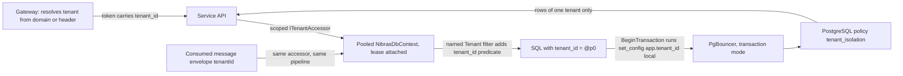

# 10. Data Architecture

> Plan document for the Nibras platform. Group C. It refines the reference architecture; it does not re-derive it. Where this document and the reference architecture disagree, an ADR records the deviation.

**Group** C · **Requirement areas covered** DATA, PRV (retention rows), PERF (partitioning and pooling as they touch data) · **Last updated** 2026-09-20 by the platform plan

## Purpose

This document lets an engineer create a service database that is correct on day one: the database and role it runs under, the tenancy barrier that every table gets, which tables are partitioned and when their partitions are detached, which reference data the service is allowed to copy and how that copy is kept honest, how Reporting's projections are built and rebuilt, which retention job owns every row in Appendix J, and how one tenant is restored without touching the others. The readers are the engineer writing a migration, the reviewer checking it, and the operator running the restore drill.

## Scope

| In scope | Out of scope | Where the out-of-scope item lives |
|---|---|---|
| Database per service, roles, encryption keys, partitioned tables | Per-service entity models and their ER diagrams | `06-services/<service>.md` |
| Tenancy: `tenant_id`, EF Core filters, pooled context, row-level security, the pooled-connection test | Caching map, hot queries, indexes per query, pool sizing | `21-performance-engineering.md` |
| Isolation tiers and tier migration | Deployment of PostgreSQL, PgBouncer, replicas, backup infrastructure | `15-deployment-and-operations.md` |
| Partitioning plan and detach schedule | Load-test scenarios that prove the numbers | `16-test-strategy.md`, Appendix N |
| Reference-data replication map and the reconciliation job | The messaging topology those events travel over | `11-messaging-architecture.md` |
| Reporting projections: checkpoints, rebuild, freshness, replica routing | Dashboard and report definitions | Appendix D, `06-services/reporting.md` |
| Retention schedule with a job per row | Consent model, data subject rights, the compliance map | `12-security-privacy-safety.md`, `27-compliance-and-legal.md` |
| Backup and single-tenant restore ordering | The restore runbook itself | `docs/runbooks/` and `15-deployment-and-operations.md` |
| Data classification handling per class | Threat model and permission matrix | `12-security-privacy-safety.md` |
| Key, concurrency, naming, audit and soft-delete conventions | API conventions | `22-api-conventions-and-error-catalog.md` |

## Content

### 1. Database per service

Master brief Section 7 sets the rule: one database per data-owning service, foreign keys only inside a service, and no service ever reads another service's database. Appendix L names the databases. The table below adds what a migration author needs and what the reference architecture left implicit: the role, the highest Appendix J class the database holds, the default transaction isolation, the encryption key scope, and the tables that are partitioned from day one.

Every service runs under two PostgreSQL roles. `svc_<service>` is the application role: it owns no tables, holds `SELECT, INSERT, UPDATE, DELETE` on the service schema, has `NOBYPASSRLS`, and cannot change a policy. `mig_<service>` is the migration role: it owns the tables and runs the migration bundle as a deployment job, never from application startup (master brief Section 19). `FORCE ROW LEVEL SECURITY` means the owner is bound by the policy too, which matters only if a migration reads rows, and a migration that reads rows is reviewed as a data migration rather than a schema change.

| Service | Database | Application role | Highest class held (Appendix J) | Default transaction isolation | Column-encryption key scope | Partitioned tables |
|---|---|---|---|---|---|---|
| Identity | `nibras_identity` | `svc_identity` | Sensitive (credentials, second-factor secrets, tokens, API keys) | Read committed | Per deployment, service key wraps a data key | `login_events` by month |
| Platform | `nibras_platform` | `svc_platform` | Confidential | Read committed | Per deployment (webhook signing secrets, provider keys) | `usage_records` by month |
| School | `nibras_school` | `svc_school` | Sensitive (identity numbers, custody, medical summary) | Read committed; `REPEATABLE READ` for the year-end rollover saga step that snapshots enrollments | Per tenant, wrapped by the service key (Appendix J rule 7) | none; School is wide, not deep |
| Admissions | `nibras_admissions` | `svc_admissions` | Confidential | Read committed | none | none |
| Academics | `nibras_academics` | `svc_academics` | Confidential (submissions) | Read committed | none | `submissions` by academic year (list partition on `academic_year_id`) |
| Assessment | `nibras_assessment` | `svc_assessment` | Confidential | Read committed; `SERIALIZABLE` for the grade-lock transaction so that a late mark cannot slip under a lock | none | `marks` by academic year |
| Scheduling | `nibras_scheduling` | `svc_scheduling` | Internal | Read committed | none | none |
| Attendance | `nibras_attendance` | `svc_attendance` | Sensitive (medical excuse detail), Confidential (gate-pass material, visitor identity references) | Read committed | Per deployment | `attendance_records`, `attendance_sessions`, `gate_passes`, `emergency_acknowledgments` by month |
| Finance | `nibras_finance` | `svc_finance` | Sensitive (gateway references, payer bank details) | Read committed; gapless numbers allocated under a row lock on the series row inside the posting transaction (BR-FIN-013; `06-services/finance.md` section 4.19) | Per deployment | `payments` by month; `invoices` by academic year |
| Communication | `nibras_communication` | `svc_communication` | Sensitive when flagged (message bodies) | Read committed | Per tenant for flagged bodies | `messages` by month |
| Notification | `nibras_notification` | `svc_notification` | Confidential | Read committed | none | `notification_requests`, `deliveries` by month |
| Requests | `nibras_requests` | `svc_requests` | Confidential | Read committed | none | `requests` by academic year |
| Documents | `nibras_documents` | `svc_documents` | Confidential; file bytes carry the owner's class in object storage | Read committed | Object storage is encrypted at rest; per-tenant key for a sensitive owner's file | `import_rows` (staging) by import job, dropped on completion |
| Behavior | `nibras_behavior` | `svc_behavior` | Confidential, restricted narrative | Read committed | none | `point_entries` by academic year |
| Reporting | `nibras_reporting` | `svc_reporting` | Confidential; excludes level S by design | Read committed | none | Every fact table by month (`attendance_daily_facts`, `mark_facts`, `finance_balance_facts`, `engagement_facts`) |
| Audit | `nibras_audit` | `svc_audit` | Sensitive (before and after values of sensitive changes) | Read committed | Per deployment; values encrypted when the source field is sensitive | `audit_entries`, `login_history`, `access_log_entries` by month |
| Wellbeing | `nibras_wellbeing` | `svc_wellbeing` | **Level S** | Read committed | **Per tenant, separate key-encryption key**, separate credentials, separate PgBouncer pool | none |
| Hr | `nibras_hr` | `svc_hr` | Sensitive (salary, bank accounts, payslip lines) | Read committed | Per deployment | `payslip_lines` by payroll period |
| Operations | `nibras_operations` | `svc_operations` | Confidential; schema per sub-domain (`library`, `transport`, `inventory`, `facilities`, `frontdesk`, `activities`) | Read committed | Visitor and driver identity references per deployment | `transport.vehicle_locations` by day; `transport.boarding_events` by month |
| Ai | `nibras_ai` | `svc_ai` | Inherits the class of each indexed source; never level S | Read committed | none; the index holds embeddings tagged with tenant and data scope, never the source text of a sensitive field | `ai_index.embedding_chunk` by tenant hash (8 partitions) |

Every database also holds the messaging tables from `11-messaging-architecture.md`: `outbox_messages` (partitioned by day), `inbox_messages` (partitioned by month) and, where the service orchestrates a saga, `saga_instances`. Gateway, Bff.Web and Bff.Mobile own no database.

**Schemas inside a database.** One schema per service, named after the service (`attendance`), owned by `mig_<service>`. Operations is the exception with one schema per sub-domain so that a later split is a `pg_dump --schema` rather than a rewrite (reference architecture Section 8). The `public` schema holds nothing.

**Extensions.** `pg_stat_statements` everywhere; `pg_trgm` and `unaccent` where Arabic search normalization runs (School, Communication, Documents, Hr); `pgvector` in `nibras_ai` only; `pgcrypto` nowhere, because column encryption happens in the application through the tenancy building block, so that the database never sees the key.

### 2. Tenancy

Master brief Section 7.4 sets the three barriers: `tenant_id` on every row, EF Core global filters, and PostgreSQL row-level security as a second barrier. This section makes each one concrete.

#### 2.1 `tenant_id` on every row

Every table in every service schema carries `tenant_id uuid NOT NULL`, first in every composite index, with the single exception of Platform's own registry tables (`tenants`, `plans`, `regions`) which are platform-scoped by definition and live in a `platform_registry` schema with no policy. A table without `tenant_id` fails the architecture test `PersistenceConventions.EveryEntityHasTenantId`, and a migration that creates one fails the migration lint in the pipeline.

The `tenant_id` is the tenant's UUID v7 exactly as Appendix L defines it: full, never shortened. It arrives in the token, in gRPC metadata and in every message envelope, and the tenancy building block resolves it once per request or per consumed message into `ITenantContext`.

#### 2.2 EF Core named filters

`Nibras.BuildingBlocks.Persistence` configures two named query filters on every entity, exactly as master brief Section 19 requires:

| Filter | Predicate | Who may disable it | Audit |
|---|---|---|---|
| `Tenant` | `e.TenantId == tenantAccessor.TenantId` | Platform-level code holding `platform.tenants.manage`, and the retention and reconciliation jobs, which iterate tenants one at a time and set the accessor per iteration rather than disabling the filter | An audit entry `<service>.audit.recorded.v1` with `action = tenant-filter-bypassed` and the reason, written in the same transaction |
| `SoftDelete` | `e.DeletedAt == null` | Any handler that reads the recycle bin under `platform.recycle-bin.view`, and the purge job | Not audited on read; the purge is audited |

A bare `IgnoreQueryFilters()` is forbidden; the analyzer rule `NBR0001` fails the build on it. Disabling a filter is `IgnoreQueryFilters(["SoftDelete"])` with a comment naming the reason, and the code reviewer treats a missing comment as a defect. On .NET 8 the fallback in master brief Section 19 applies and the bypass becomes stricter, not looser.

#### 2.3 Pooled context and the per-lease tenant accessor

Contexts are registered with `AddDbContextPool`. A pooled context is reused across requests, so the tenant is never a field set in the constructor. The pattern the building block enforces:

```csharp
// Nibras.BuildingBlocks.Persistence — the base context every service derives from
public abstract class NibrasDbContext(DbContextOptions options) : DbContext(options)
{
    // Resolved per lease, never cached: the accessor is scoped, the context is pooled.
    private ITenantAccessor _tenant = NullTenantAccessor.Instance;

    // Called by the pooling factory when the context is leased to a scope.
    internal void AttachLease(ITenantAccessor tenant) => _tenant = tenant;

    // Called when the context is returned to the pool.
    public override void ResetState() { _tenant = NullTenantAccessor.Instance; base.ResetState(); }

    protected override void OnModelCreating(ModelBuilder b)
    {
        foreach (var et in b.Model.GetEntityTypes().Where(t => typeof(ITenantOwned).IsAssignableFrom(t.ClrType)))
        {
            b.Entity(et.ClrType).HasQueryFilter("Tenant",     (ITenantOwned e) => e.TenantId == _tenant.TenantId);
            b.Entity(et.ClrType).HasQueryFilter("SoftDelete", (ITenantOwned e) => e.DeletedAt == null);
        }
    }
}
```

The lease is attached by a `IDbContextFactory` decorator in the building block, so a service never calls `AttachLease` itself. A context leased with `NullTenantAccessor` throws on the first query, which is how a background job that forgot to set the tenant fails loudly in a test rather than quietly returning nothing.

#### 2.4 Row-level security policy template

The reference architecture Section 14 contract, applied to every table by the migration generator in `Nibras.BuildingBlocks.Persistence`:

```sql
-- Generated for every table in every service schema. <table> is the snake_case plural table name.
ALTER TABLE <table> ENABLE ROW LEVEL SECURITY;   -- the policy applies to svc_<service>
ALTER TABLE <table> FORCE ROW LEVEL SECURITY;    -- and to the owner mig_<service> as well

CREATE POLICY tenant_isolation ON <table>
  USING (tenant_id = current_setting('app.tenant_id')::uuid)         -- plain equality, index-friendly
  WITH CHECK (tenant_id = current_setting('app.tenant_id')::uuid);   -- an insert or update for another tenant is refused, not silently dropped
```

The `WITH CHECK` clause is the addition to the reference architecture's template: without it, an insert carrying the wrong `tenant_id` succeeds and becomes invisible, which is worse than failing. `current_setting('app.tenant_id')` with no default raises an error when the variable is unset, so a connection that never set the tenant cannot read anything, which is the behaviour we want.

**Setting the variable.** PgBouncer runs in transaction pooling mode (master brief Section 19), so the variable is set with `SET LOCAL` inside every transaction and never per session. The building block's transaction pipeline behaviour does this on `BeginTransaction`:

```csharp
// Nibras.BuildingBlocks.Persistence.TenantTransactionBehavior — runs for every command and every consumed message
await using var tx = await db.Database.BeginTransactionAsync(ct);
await db.Database.ExecuteSqlRawAsync("SELECT set_config('app.tenant_id', {0}, true)", tenant.TenantId.ToString(), ct); // true = local to this transaction
// ... handler runs here, including any ExecuteUpdateAsync ...
await tx.CommitAsync(ct);
```

`set_config(..., true)` is `SET LOCAL` in function form so that the value can be a parameter. Read-only handlers still open a transaction for this reason; the cost is one round trip, and it is the price of the second barrier. A handler that opens no transaction gets no variable, and PostgreSQL refuses every row, so the failure mode is loud.

Platform-scoped operations (tenant provisioning, the registry) run as `svc_platform` against tables without a policy. Cross-tenant jobs (retention, reconciliation, usage metering) never bypass the policy; they loop over tenants and set the variable per iteration, which also keeps their memory bounded.

#### 2.5 The pooled-connection test

This is the test that makes the design trustworthy rather than intended, required by both master brief Section 19 and reference architecture Section 14. It lives in `TenantIsolation.Tests` and runs against real PostgreSQL and real PgBouncer through Testcontainers.

```
### TC-DATA-643 A pooled connection cannot read the previous tenant's rows

**Covers:** master brief Section 7.4, master brief Section 19, reference architecture Section 14
**Level:** integration
**Platform:** any
**Automated:** yes, `TenantIsolation.Tests.PooledConnection_CannotReadPreviousTenant`

**Given** PgBouncer in transaction mode with a pool size of 1 in front of `nibras_attendance`, tenant A holding 25 attendance records and tenant B holding 0,
**When** a request for tenant A reads the records and returns its connection to the pool, and a request for tenant B then reads on what must be the same server connection,
**Then** tenant B receives 0 rows and tenant A's earlier read returned 25,
**And** a third request that opens no transaction and issues the same query receives an error rather than rows, because `app.tenant_id` is unset,
**And** an insert issued for tenant B carrying tenant A's identifier fails with a row-level security violation rather than succeeding invisibly.
```

Two companion tests share the fixture: `TC-DATA-644` proves that `ExecuteUpdateAsync` inside the pipeline transaction touches only the current tenant's rows, and `TC-DATA-645` proves that a consumed message with `tenantId` for tenant B cannot write into tenant A even when the handler is given tenant A's identifiers in the payload. The generated `TenantIsolation.Tests` suite in Appendix V extends the same idea to every endpoint and every consumer.

#### 2.6 Request path through the three barriers



### 3. Isolation tiers and tier migration

Reference architecture Section 14 defines the model, quoted here because this is the document a reader opens for tenancy:

> **Three tiers, one codebase.**
>
> | Tier | What it is | Who gets it | How the code differs |
> |---|---|---|---|
> | Shared | Every tenant in the same database per service, isolated by `tenant_id`, EF Core filters and row-level security | default | no difference |
> | Dedicated database | One tenant's own database per service, same schema | a plan option, or a regulator's requirement | Platform resolves a different connection string; nothing else changes |
> | Dedicated deployment | The whole umbrella chart in its own namespace or cluster | on-premises and private cloud | a different values file |
>
> The code is identical in all three because tenancy is enforced in the same building block regardless. That is the property that makes the tiers commercially useful rather than three products.

**What the plan adds.**

| Concern | Shared | Dedicated database | Dedicated deployment |
|---|---|---|---|
| Connection string resolution | One per service, from configuration | Platform holds `tenant_connection_overrides (tenant_id, service, connection_secret_ref)`; the tenancy building block resolves it per lease through `ITenantConnectionResolver`, cached under tag `tenant:{id}` with a 60 s L1 and invalidated by `platform.tenant.reactivated.v1` after a migration | Configuration only; the override table is empty |
| Row-level security | Enforced | Still enforced, still tested; a dedicated database is a blast-radius choice, not a reason to remove a barrier | Same |
| Partitioning | By month or year as in Section 5 below | Same layout, so the detach jobs are identical | Same |
| Backups | Per service database, all tenants together | Per service database, one tenant; single-tenant restore becomes a plain restore | Per deployment |
| Read replica for Reporting | Shared replica | Shared replica by default; a dedicated replica is a plan option | Per deployment |
| Encryption keys | Per tenant for Wellbeing and School's sensitive columns; per deployment elsewhere | Same, and the tenant can be handed its key at export (Appendix J rule 7) | Same |

**Tier migration, shared to dedicated**, follows the five steps in reference architecture Section 14. The delta in step 3 is captured with a PostgreSQL logical-replication publication using a row filter on `tenant_id` (PostgreSQL 16 or later, reference architecture Section 16), created per service for the duration of the move and dropped afterwards. The read-only window in step 3 uses the same mechanism as suspension (BR-PLT-002): Platform publishes `platform.tenant.suspended.v1` with `reason = tier-migration`, every service refuses writes for that tenant, and `platform.tenant.reactivated.v1` reopens it after the connection override is switched. The reconciliation report in step 4 is the same checksum comparison the nightly reference-copy job uses (Section 6), run once per service against the old and new databases. Old rows stay for the 30-day cooling-off (master brief Section 32) under a `retention_holds` row of kind `tier-migration`, then the shared-database purge job removes them by `tenant_id`, per partition where the table is partitioned.

The reverse direction runs the same steps with the databases swapped. `TC-DATA-010` moves the demo tenant shared to dedicated and back during the load tier's steady background traffic and asserts zero lost writes, zero cross-tenant rows, and a read-only window under 5 minutes.

### 4. Conventions on every table

Master brief Section 19 states them; this is the physical form the persistence building block generates, so that every service is identical.

```sql
-- Base columns present on every tenant-owned table. Generated by Nibras.BuildingBlocks.Persistence.
CREATE TABLE attendance.attendance_records (
    id            uuid        NOT NULL DEFAULT uuidv7(),  -- UUID v7, generated by the owning service; time-ordered so index inserts stay local
    tenant_id     uuid        NOT NULL,                   -- the tenant; first column of every composite index; bound by the row-level security policy
    -- ... domain columns ...
    created_at    timestamptz NOT NULL,                   -- UTC, from the injected clock, never from now()
    created_by    uuid        NULL,                       -- user id, or null when a job or a consumer wrote the row
    updated_at    timestamptz NOT NULL,                   -- UTC, set by the audit interceptor on every SaveChanges
    updated_by    uuid        NULL,                       -- user id or null, same rule as created_by
    deleted_at    timestamptz NULL,                       -- soft delete marker; null means live; the SoftDelete filter reads this
    deleted_by    uuid        NULL,                       -- who soft-deleted the row, for the recycle bin
    PRIMARY KEY (tenant_id, id)                           -- tenant first, so the primary key is also the tenant-scoped lookup index
);
-- xmin is the optimistic concurrency token: EF Core maps it as a shadow property [Timestamp] and issues UPDATE ... WHERE xmin = @original.
-- Every partial index on a soft-deleted table is created WHERE deleted_at IS NULL, so deleted rows cost nothing on the hot path.
```

| Convention | Rule | Enforced by |
|---|---|---|
| Keys | UUID v7 from the owning service through the injected `IIdGenerator`; the database default `uuidv7()` exists only for `COPY` staging and is never relied on by domain code | Analyzer `NBR0002` forbids `Guid.NewGuid()` outside tests |
| Concurrency | PostgreSQL `xmin` mapped as the concurrency token on every aggregate root; a conflict returns Problem Details with `Retry-After` absent and error code `<SERVICE>_CONCURRENCY_CONFLICT` from Appendix K, and the client re-reads with `If-Match` | `PersistenceConventions.EveryAggregateHasXminToken` |
| Naming | `snake_case` tables and columns, plural tables, singular columns, foreign keys `fk_<table>_<column>`, indexes `ix_<table>_<columns>`, partial indexes suffixed `_live` | `EFCore.NamingConventions` plus the migration lint |
| Audit columns | `created_at/by`, `updated_at/by` set by the audit interceptor from the injected clock and `ICurrentUser`; a consumer sets `by` to null and the audit entry records the message id instead | `AuditColumnsInterceptor` |
| Soft delete | `deleted_at/by`; hard delete only by a retention job or a recycle-bin purge under `platform.recycle-bin.purge`; both audited | `SoftDeleteInterceptor` converts `Remove` into an update |
| Foreign keys | Only inside a service schema; a reference to another service's entity is a plain `uuid` column named `<entity>_id` with no constraint, backed by the reference copy in Section 6 | Migration lint fails a foreign key across schemas or databases |
| Money | `numeric(18,4)` plus `currency char(3)`; never `float` | `PersistenceConventions.MoneyIsDecimalWithCurrency` |
| Time | `timestamptz` in UTC; `date` for calendar days in the campus time zone with the time zone stored beside it where it matters (lock windows, BR-ATT-002) | Analyzer forbids `DateTime.Now` |
| Bilingual text | `name_en text`, `name_ar text` as a value object, with a normalized `name_ar_search` column for Arabic search normalization where the entity is searchable | `24-localization-and-calendars.md` |
| Classification | Every entity configuration carries `[DataClass(...)]` per column group from Appendix J; the migration lint refuses a column without one (Appendix J rule 1) | `PersistenceConventions.EveryColumnIsClassified` |
| Large text and `jsonb` | In side tables, never on hot tables (master brief Section 19) | Review |
| Expand and contract | Migrations are forward-only and safe under rolling deployment: add, backfill, switch, drop in separate releases | ADR-0010 and the migration review checklist |

### 5. Partitioning plan

Master brief Section 19 names the tables to partition by month; master brief Section 32 says partitions and retention are one mechanism. Master brief Section 34 adds that attendance and audit are partitioned monthly from day one rather than retrofitted. Every partitioned table has `tenant_id` first in its primary key and in every index, and the partition key is included in the primary key as PostgreSQL requires.

| Table | Service | Partition strategy | Why this key | Detach schedule (Appendix J and master brief Section 32) | After detach |
|---|---|---|---|---|---|
| `attendance_records` | Attendance | Range by month on `session_date` | The 08:00 peak writes into one hot partition; reads are by date range | Month older than 7 years, on the first Sunday of each month | Detached partition is exported to cold storage as Parquet, checksummed, then dropped |
| `attendance_sessions` | Attendance | Range by month on `session_date` | Same access pattern as records | 7 years | Same |
| `gate_passes`, `emergency_acknowledgments` | Attendance | Range by month on `created_at` | "Until leaving plus 1 year with the attendance partitions" for gate passes; 7 years for roll call | Gate passes: rows of students who left more than a year ago are deleted from the partition by the leaver job; the partition itself detaches at 7 years | Same |
| `medical_excuse_details` | Attendance | Range by month on `created_at` (side table, encrypted) | Keeps sensitive detail off the hot record row | 7 years | Cold storage copy is encrypted with the same key; the key is destroyed when the last partition it covers is purged |
| `notification_requests`, `deliveries` | Notification | Range by month on `created_at` | Highest message volume in the system | Month older than 90 days, weekly | Dropped, no cold copy; Appendix J says delete |
| `messages` | Communication | Range by month on `sent_at` | 2-year retention | Month older than 2 years, monthly | Dropped, except rows carrying a safeguarding flag, which the detach job first moves to `messages_held` under the wellbeing rule |
| `audit_entries`, `login_history`, `access_log_entries` | Audit | Range by month on `occurred_at` | Append-only, hash-chained per tenant; a detached month keeps its chain segment intact | Month older than 7 years, monthly; publishes `audit.retention.partition-detached.v1` with the partition name, row count and destination | Detached to cold storage with the chain anchor of the last entry recorded in `audit_chain_anchors`, so integrity verification can still walk across the boundary |
| `payments` | Finance | Range by month on `received_at` | Day-close reconciliation reads one month | Never detached inside 10 years; after 10 years the month is archived read-only, not dropped | Archive database, read-only role |
| `invoices`, `requests`, `marks`, `submissions`, `point_entries` | Finance, Requests, Assessment, Academics, Behavior | List by `academic_year_id` | A year closes as a unit (WF-SCH-02) and archives as a unit (WF-SCH-03) | Academic-record rule: 10 years after the student left, applied per row by the leaver job; the year partition itself is archived read-only when every student in it has passed the clock | Archive database |
| `outbox_messages` | every service | Range by day on `created_at` | Dispatched rows are dead weight within minutes | Day older than 7 days, daily | Dropped |
| `inbox_messages` | every service | Range by month on `received_at` | Deduplication window is bounded | Month older than 35 days, weekly (matches the backup window, so a restored message cannot be replayed twice) | Dropped |
| Reporting fact tables | Reporting | Range by month on the fact date | Dashboards read the current month and term | Facts follow the source's retention; a rebuild recreates only what the source still holds | Dropped |
| `transport.vehicle_locations` | Operations | Range by day on `recorded_at` | 90-day retention, high write rate | Day older than 90 days, daily | Dropped |
| `transport.boarding_events` | Operations | Range by month on `boarded_at` | Subscription end plus 2 years | Monthly | Dropped |
| `usage_records` | Platform | Range by month on `period_start` | Billing reads one period | 13 months, monthly, aggregated first into `usage_monthly` | Dropped |
| `payslip_lines` | Hr | List by `payroll_period_id` | Payroll runs as a period | 10 years after leaving, per row by the leaver job | Archive database |
| `ai_index.embedding_chunk` | Ai | Hash by `tenant_id`, 8 partitions, one HNSW index per partition | Spreads vector index maintenance; a tenant rebuild touches one partition. The table, its columns and its four indexes are `25-ai-and-assist-ladder.md` §4.1; this row adds only the partitioning | Rebuilt on `ai.index.rebuild-completed.v1`; rows of a deleted tenant are dropped with the tenant | Dropped |

**Partition management.** A Quartz job `PartitionMaintenanceJob` in every service creates the next three monthly partitions on the first of each month and detaches by the schedule above with `ALTER TABLE ... DETACH PARTITION CONCURRENTLY`. Detach runs only after the job has confirmed no legal hold references the partition's tenant and period (`retention_holds` table, Appendix J rule 4); a held partition is skipped and reported to the Data Quality Center. Every detach writes an audit entry and a `reporting.data-quality.issue-detected.v1` only if the expected partition was not found. The 24-hour soak in Appendix N asserts that retention jobs detach the expected partitions and nothing else.

**Why month and not tenant.** Master brief Section 7 allows "time or tenant partitioning". Time partitioning is chosen because retention is by time, the hot partition is the current month for every tenant, and a tenant restore filters on `tenant_id` inside a partition efficiently through the `(tenant_id, ...)` index. Sub-partitioning by tenant hash is kept as the option for the five oversized tenants in Appendix N's scale tier and decided by that test, not in advance.

### 6. Reference-data replication map

Master brief Section 7.3: a service that needs another service's data keeps a slim read-only copy updated by events. Reference architecture Section 8, table 8.0, lists which copies each service keeps. This map names the source event from Appendix E for every copy, the fields the copy keeps, and the reconciliation that keeps it honest. A copy is never the source of a decision the owning service should make.

**Rules for every copy.**

1. The copy holds identifiers, names, the parent identifiers needed for scoping, and a status. It never holds a field classified Sensitive or level S in Appendix J (Appendix J.3: "Name, section and student number only, as a reference copy reconciled nightly").
2. The copy table is named `ref_<entity>` in the consumer's schema, carries `tenant_id`, `source_version` (the `occurredAt` of the last applied event) and `reconciled_at`.
3. A consumer applies an event only if its `occurredAt` is later than `source_version`, so a replayed or reordered event cannot regress a copy.
4. A copy that is missing when a handler needs it is fetched over gRPC from the owner (maximum one hop), written, and reported as a data-quality issue, because a missing copy means a missed event.
5. The nightly `ReferenceCopyReconciliationJob` in every consumer computes, per tenant, a checksum over `(id, source_version)` of its copy and calls the owner's gRPC `Checksum` method for the same set; a mismatch replays from the owner's `Snapshot` method and raises `reporting.data-quality.issue-detected.v1` with `ruleCode = reference-copy-mismatch` (Appendix E, jobs table). Master brief Section 19, *Data integrity and reconciliation*, is the requirement.

| Consumer service | Copied entity (`ref_` table) | Source events (Appendix E) | Fields kept | Reconciliation job and owner method |
|---|---|---|---|---|
| Identity | Tenant status | `platform.tenant.provisioned.v1`, `platform.tenant.suspended.v1`, `platform.tenant.reactivated.v1`, `platform.tenant.deletion-requested.v1`, `platform.tenant.deleted.v1` | `tenant_id`, `status`, `read_only_from`, `cooling_off_ends_at` | Nightly against Platform `nibras.platform.v1.Tenants/Checksum` |
| Identity | Staff directory | `school.staff.created.v1`, `school.staff.left.v1`, `hr.staff.hired.v1` | `staff_id`, `employee_number`, `department_id`, `campus_ids`, `last_working_day` | Nightly against School `nibras.school.v1.Directory/StaffChecksum` |
| Platform | Usage counters | `<service>.usage.recorded.v1` from every service | `meter`, `quantity`, `unit`, `period_start`, `period_end`, `source_service` | Monthly re-sum against each service's `Usage/Recount` gRPC method; BR-PLT-005 |
| Every service | Tenant state | `platform.tenant.suspended.v1`, `platform.tenant.reactivated.v1`, `platform.tenant.deleted.v1`, `platform.plan.changed.v1`, `platform.feature-flag.changed.v1` | `tenant_id`, `status`, `read_only_from`, `plan_code`, `limits`, `flags` (as `jsonb`) | Nightly against Platform; the copy is what lets a service enforce read-only mode (BR-PLT-002) without a synchronous call |
| Every service holding a user copy | User | `identity.user.activated.v1`, `identity.user.deactivated.v1` | `user_id`, `roles`, `scope`, `preferred_language`, `active` | Nightly against Identity `nibras.identity.v1.Users/Checksum` |
| Admissions | Section | `school.section.created.v1`, `school.section.changed.v1` | `section_id`, `grade_level_id`, `campus_id`, `capacity` | Nightly against School `Directory/SectionChecksum` |
| Admissions | Grade level, fee plan name | No change event exists in Appendix E; seeded by gRPC snapshot from School and Finance at provisioning and on `platform.tenant.reactivated.v1` | `grade_level_id`, `name_en`, `name_ar`, `stage_id`; `fee_plan_code`, `name_en`, `name_ar` | Nightly snapshot replaces the copy; see open point 1 |
| Academics | Student | `school.student.enrolled.v1`, `school.student.section-changed.v1`, `school.student.status-changed.v1`, `school.student.promoted.v1`, `school.student.profile-updated.v1` | `student_id`, `student_number`, `name_en`, `name_ar`, `section_id`, `campus_id`, `grade_level_id`, `status`, `enrolled_on` | Nightly against School `Directory/StudentChecksum` |
| Academics | Section, term, academic year | `school.section.created.v1`, `school.section.changed.v1`, `school.term.started.v1`, `school.academic-year.opened.v1`, `school.academic-year.closed.v1` | `section_id`, `grade_level_id`, `campus_id`, `capacity`; `term_id`, `starts_on`, `ends_on`; `academic_year_id`, `status` | Nightly against School |
| Academics | Staff | `school.staff.created.v1`, `school.staff.left.v1` | `staff_id`, `employee_number`, `department_id`, `campus_ids`, `active` | Nightly against School |
| Academics | Timetable | `scheduling.timetable.published.v1`, `scheduling.timetable.changed.v1` | `timetable_version_id`, `effective_from`, and the entries fetched over gRPC `nibras.scheduling.v1.Timetables/GetVersion` on publish | Nightly against Scheduling `Timetables/Checksum` |
| Assessment | Student, section, staff, term, academic year | Same events as Academics, plus `academics.teaching-assignment.changed.v1` for who teaches which section and subject | As Academics, plus `teaching_assignment (staff_id, section_id, subject_id, effective_on)` | Nightly against School and Academics |
| Assessment | Grading period | No change event exists in Appendix E; fetched over gRPC from School when `school.term.started.v1` arrives, because grading periods belong to a term | `grading_period_id`, `term_id`, `starts_on`, `ends_on`, `lock_at` | Nightly against School; see open point 1 |
| Scheduling | Staff, section, term | `school.staff.created.v1`, `school.staff.left.v1`, `school.section.created.v1`, `school.section.changed.v1`, `school.term.started.v1`, `academics.teaching-assignment.changed.v1` | As above | Nightly against School and Academics |
| Scheduling | Room | No change event exists in Appendix E; rooms are fetched over gRPC `Directory/Rooms` when a timetable version is created | `room_id`, `building_id`, `campus_id`, `capacity`, `kind` | Nightly against School; see open point 1 |
| Scheduling | Staff leave | `hr.leave.approved.v1`, `hr.leave.cancelled.v1` | `leave_id`, `staff_id`, `from_date`, `to_date`, `leave_type_code`, `cancelled` | Nightly against Hr `nibras.hr.v1.Leave/Checksum` |
| Attendance | Student | `school.student.enrolled.v1`, `school.student.section-changed.v1`, `school.student.status-changed.v1`, `school.student.profile-updated.v1` | `student_id`, `student_number`, `name_en`, `name_ar`, `section_id`, `campus_id`, `status`, `photo_file_id` | Nightly against School |
| Attendance | Section, term | `school.section.created.v1`, `school.section.changed.v1`, `school.term.started.v1` | As above | Nightly against School |
| Attendance | Timetable of the day, including the teacher per entry | `scheduling.timetable.published.v1`, `scheduling.timetable.changed.v1`, `scheduling.substitution.assigned.v1`; entries fetched over gRPC on publish | `timetable_version_id`, `entry_id`, `section_id`, `period_id`, `staff_id`, `room_id`, `day_of_week`, `effective_from` | Nightly against Scheduling; the daily attendance-against-timetable job in master brief Section 19 is the second check |
| Attendance | Approved leave and transport boarding | `hr.leave.approved.v1`, `hr.leave.cancelled.v1`, `operations.transport.boarding-recorded.v1` | Leave as Scheduling; boarding `student_id`, `route_id`, `direction`, `at` (kept 7 days, feeds gate pre-fill) | Nightly against Hr; boarding is not reconciled, it expires |
| Finance | Student | `school.student.enrolled.v1`, `school.student.status-changed.v1`, `school.student.promoted.v1`, `school.student.profile-updated.v1`, `admissions.offer.accepted.v1`, `admissions.re-enrollment.confirmed.v1`, `admissions.re-enrollment.declined.v1` | `student_id`, `student_number`, `name_en`, `name_ar`, `section_id`, `grade_level_id`, `campus_id`, `status`, `fee_plan_code` | Nightly against School |
| Finance | Guardian and payer link | `school.guardian.updated.v1`, `identity.guardian-link.created.v1` | `guardian_id`, `student_ids`, `name_en`, `name_ar`, `preferred_language`, `contact_order`, `rights` (`pays` flag only); contact details are fetched live for a receipt, never copied | Nightly against School `Directory/GuardianChecksum` |
| Communication | Student, staff, guardian link, section | `school.student.enrolled.v1`, `school.student.status-changed.v1`, `school.student.profile-updated.v1`, `school.guardian.updated.v1`, `identity.guardian-link.created.v1`, `school.staff.created.v1`, `school.staff.left.v1`, `school.section.created.v1`, `school.section.changed.v1` | Names, section, campus, status, relationship, `preferred_language`; no contact details | Nightly against School |
| Notification | User channel preference, quiet hours, language | Owned by Notification (Appendix F: Preference); the seed comes from `identity.user.activated.v1` `preferredLanguage` | `user_id`, `channel`, `enabled`, `quiet_from`, `quiet_to`, `language`, `digest_cadence` | Not a copy; no reconciliation |
| Requests | Student, staff, approver | `school.student.enrolled.v1`, `school.student.status-changed.v1`, `school.staff.created.v1`, `school.staff.left.v1`, `identity.user.activated.v1`, `identity.user.deactivated.v1`, `identity.role.changed.v1`, `identity.delegation.started.v1`, `identity.delegation.ended.v1` | Names and section for subjects; `user_id`, `roles`, `scope`, `delegate_to`, `delegated_until` for approvers | Nightly against School and Identity |
| Documents | Tenant branding, template definitions | `platform.tenant.provisioned.v1`, `platform.settings.changed.v1` with `scope = branding`; templates are owned by Documents | `tenant_id`, `logo_file_id`, `colors`, `school_name_en`, `school_name_ar`, `footer_text` | Nightly against Platform `Settings/BrandingChecksum` |
| Behavior | Student, section, user | `school.student.enrolled.v1`, `school.student.section-changed.v1`, `school.student.status-changed.v1`, `school.student.profile-updated.v1`, `school.section.created.v1`, `school.section.changed.v1`, `identity.user.activated.v1`, `identity.user.deactivated.v1` | Names, section, campus, house, status; users as above | Nightly against School and Identity |
| Reporting | Projections of everything it consumes | Section 7 of this document | Per projection | Rebuild from source snapshots, Section 7 |
| Wellbeing | Student, guardian link, section | `school.student.status-changed.v1`, `school.student.profile-updated.v1` (both address "every service holding a student copy"), `school.guardian.updated.v1`, `identity.guardian-link.created.v1`, `school.section.created.v1`, `school.section.changed.v1` | Names, section, campus, status, guardian relationship and `preferred_language`; the initial copy for a new student is fetched over gRPC on first referral rather than on enrollment, so Wellbeing holds rows only for students it has a record for | Nightly against School, through the separate Wellbeing credentials |
| Hr | Staff | `school.staff.created.v1`, `school.staff.left.v1`, `scheduling.substitution.assigned.v1` (cover counts) | `staff_id`, `employee_number`, `department_id`, `campus_ids`, `last_working_day` | Nightly against School |
| Hr | Campus, department | No change event exists in Appendix E; fetched over gRPC at provisioning and on each `school.staff.created.v1` whose `departmentId` is unknown | `campus_id`, `name_en`, `name_ar`; `department_id`, `name_en`, `name_ar` | Nightly snapshot; see open point 1 |
| Operations | Student, staff, section | `school.student.enrolled.v1`, `school.student.section-changed.v1`, `school.student.status-changed.v1`, `school.section.created.v1`, `school.section.changed.v1`, `identity.user.activated.v1`, `identity.user.deactivated.v1` | Names, section, campus, status; staff as users with roles | Nightly against School and Identity |
| Operations | Timetable and room bookings | `scheduling.timetable.published.v1`, `scheduling.room-booking.approved.v1` | `timetable_version_id`, `effective_from`; `booking_id`, `room_id`, `from`, `to` | Nightly against Scheduling |
| Ai | `ai_index.embedding_chunk`, chunks with tenant, permission and scope tags | Indexing reads through the backends-for-frontends only (reference architecture Section 8); `school.student.status-changed.v1` removes a leaver's chunks | The column list is `25-ai-and-assist-ladder.md` §4.1: `tenant_id`, `source_service`, `source_entity`, `source_id`, `source_version`, `data_class`, `required_permission`, `scope_campus_id`, `scope_section_ids`, `scope_student_ids`, `embedding` | Rebuilt per tenant, reported by `ai.index.rebuild-completed.v1` |

**The Student subject across services.** School owns the student; every other service holds a slim copy keyed by the same `student_id`, with the fields above and nothing sensitive. Wellbeing's copy exists only for students with a wellbeing record, and Reporting holds a projection rather than a copy.

```mermaid
erDiagram
    SCHOOL_STUDENT ||--o{ SCHOOL_ENROLLMENT : "has"
    SCHOOL_STUDENT ||--o{ SCHOOL_STUDENT_GUARDIAN : "linked through"
    SCHOOL_GUARDIAN ||--o{ SCHOOL_STUDENT_GUARDIAN : "linked through"
    SCHOOL_SECTION ||--o{ SCHOOL_ENROLLMENT : "receives"
    SCHOOL_STUDENT ||--o| ACADEMICS_REF_STUDENT : "school.student.enrolled.v1"
    SCHOOL_STUDENT ||--o| ASSESSMENT_REF_STUDENT : "school.student.enrolled.v1"
    SCHOOL_STUDENT ||--o| ATTENDANCE_REF_STUDENT : "school.student.enrolled.v1"
    SCHOOL_STUDENT ||--o| FINANCE_REF_STUDENT : "school.student.enrolled.v1"
    SCHOOL_STUDENT ||--o| COMMUNICATION_REF_STUDENT : "school.student.enrolled.v1"
    SCHOOL_STUDENT ||--o| BEHAVIOR_REF_STUDENT : "school.student.enrolled.v1"
    SCHOOL_STUDENT ||--o| OPERATIONS_REF_STUDENT : "school.student.enrolled.v1"
    SCHOOL_STUDENT ||--o| REQUESTS_REF_STUDENT : "school.student.enrolled.v1"
    SCHOOL_STUDENT ||--o| WELLBEING_REF_STUDENT : "gRPC on first referral"
    SCHOOL_STUDENT ||--o| REPORTING_STUDENT_PROJECTION : "school.student.*.v1"
    SCHOOL_GUARDIAN ||--o| FINANCE_REF_GUARDIAN : "school.guardian.updated.v1"
    SCHOOL_GUARDIAN ||--o| COMMUNICATION_REF_GUARDIAN : "school.guardian.updated.v1"
    SCHOOL_STUDENT {
        uuid id PK
        uuid tenant_id PK
        text student_number
        text name_en
        text name_ar
        text status
        bytea national_id_encrypted "sensitive, never copied"
    }
    ACADEMICS_REF_STUDENT {
        uuid student_id PK
        uuid tenant_id PK
        text name_en
        text name_ar
        uuid section_id
        text status
        timestamptz source_version
        timestamptz reconciled_at
    }
    ATTENDANCE_REF_STUDENT {
        uuid student_id PK
        uuid tenant_id PK
        text name_en
        text name_ar
        uuid section_id
        uuid photo_file_id
        text status
        timestamptz source_version
    }
    FINANCE_REF_STUDENT {
        uuid student_id PK
        uuid tenant_id PK
        text name_en
        text name_ar
        uuid grade_level_id
        text fee_plan_code
        text status
        timestamptz source_version
    }
    WELLBEING_REF_STUDENT {
        uuid student_id PK
        uuid tenant_id PK
        text name_en
        text name_ar
        uuid section_id
        text status
        timestamptz source_version
    }
```



### 7. Reporting projections

Reference architecture Section 8: Reporting owns no source data; projections are rebuildable from events or from service snapshots and include a rebuild command. Master brief Section 31 sets the freshness target: **Reporting read models within 60 seconds of the event**.

#### 7.1 Projection catalog

| Projection | Source events | Partition key on the queue | Read by | Rebuild source |
|---|---|---|---|---|
| `student_360` | `school.student.*`, `school.guardian.updated.v1`, `attendance.student.absent.v1`, `attendance.excuse.approved.v1`, `attendance.threshold.reached.v1`, `academics.submission.received.v1`, `academics.submission.graded.v1`, `assessment.marks.approved.v1`, `assessment.report-cards.published.v1`, `behavior.incident.recorded.v1`, `behavior.points.awarded.v1`, `behavior.badge.awarded.v1`, `finance.invoice.issued.v1`, `finance.payment.received.v1`, `finance.account.restricted.v1`, `finance.account.cleared.v1`, `wellbeing.referral.created.v1`, `wellbeing.intervention.opened.v1`, `wellbeing.intervention.closed.v1` (existence only, counts, never rows) | `studentId` | Student 360 page through Bff.Web and Bff.Mobile | Snapshots from School, Attendance, Academics, Assessment, Behavior, Finance; Wellbeing supplies counts through its `Counts` gRPC method only |
| `attendance_daily_facts` | `attendance.attendance.marked.v1`, `attendance.student.absent.v1`, `attendance.excuse.approved.v1`, `attendance.dismissal.processed.v1` | `sectionId` | Principal dashboard, attendance reports, early-warning inputs | Attendance `Snapshot` by date range |
| `mark_facts` | `assessment.marks.entered.v1`, `assessment.marks.approved.v1`, `assessment.grades.locked.v1`, `academics.submission.graded.v1` | `componentId` | Grade distribution, moderation dashboard | Assessment `Snapshot` by grading period |
| `finance_balance_facts` | `finance.fee-plan.assigned.v1`, `finance.invoice.issued.v1`, `finance.payment.received.v1`, `finance.refund.processed.v1`, `finance.credit-note.issued.v1`, `finance.invoice.overdue.v1`, `finance.day.closed.v1` | `invoiceId` | Collection dashboard, aging report; balance figures only (Appendix J.3) | Finance `Snapshot` by series |
| `admissions_funnel` | `admissions.inquiry.created.v1`, `admissions.application.submitted.v1`, `admissions.application.stage-changed.v1`, `admissions.offer.made.v1`, `admissions.offer.expired.v1`, `admissions.re-enrollment.confirmed.v1`, `admissions.re-enrollment.declined.v1` | `applicationId` | Admissions dashboard | Admissions `Snapshot` |
| `engagement_facts` | `communication.announcement.published.v1`, `communication.acknowledgment.recorded.v1`, `communication.message.sent.v1`, `notification.notification.delivered.v1`, `notification.notification.failed.v1`, `notification.channel.suppressed.v1`, `requests.request.*`, `requests.task.*` | `tenantId` | Engagement and service-desk dashboards | Communication, Notification and Requests `Snapshot` |
| `staffing_facts` | `academics.lesson-plan.submitted.v1`, `assessment.marks.overdue.v1`, `attendance.attendance.not-marked.v1`, `scheduling.substitution.assigned.v1`, `hr.appraisal.completed.v1` | `staffId` | Head-of-year and HR dashboards; headcount and absence aggregates only (Appendix J.3) | Academics, Scheduling and Hr `Snapshot` |
| `operations_facts` | `operations.*`, `attendance.visitor.checked-in.v1`, `attendance.emergency.*`, `attendance.roll-call.completed.v1`, `documents.import.completed.v1`, `documents.export.completed.v1` | `campusId` | Operations and safety dashboards | Operations, Attendance, Documents `Snapshot` |
| `early_warning_inputs` | The attendance, mark, behavior, engagement and finance facts above, joined per student | `studentId` | The ML.NET early-warning model, which publishes `reporting.early-warning.flag-raised.v1` and `reporting.early-warning.flag-cleared.v1` | Derived from the other projections; rebuild is a recompute |
| `data_quality_findings` | `reporting.data-quality.issue-detected.v1` from every reconciliation job, plus Reporting's own rules | `tenantId` | Data Quality Center | Recompute |
| `platform_health` | `platform.*`, `identity.user.registered.v1`, `ai.usage.recorded.v1`, `ai.suggestion.rejected.v1`, `audit.integrity-check.failed.v1` | `tenantId` | Platform console | Platform `Snapshot` |

Every projection is a plain table in `nibras_reporting` with `tenant_id` first, no foreign keys, and the same row-level security policy as every other table. Level S never enters: Wellbeing's events carry identifiers and category codes only, and the projection stores counts per student per category, never a row per event.

#### 7.2 Checkpoint storage

```sql
-- One row per projection per tenant. Written in the same transaction as the projection rows it covers.
CREATE TABLE reporting.projection_checkpoints (
    tenant_id            uuid        NOT NULL,  -- the tenant this checkpoint belongs to; a rebuild is per tenant
    projection           text        NOT NULL,  -- projection name from the catalog above, for example student_360
    last_message_id      uuid        NOT NULL,  -- messageId of the last applied event (UUID v7, so it also orders in time)
    last_occurred_at     timestamptz NOT NULL,  -- occurredAt of that event; freshness is now() minus this value
    applied_count        bigint      NOT NULL,  -- events applied since the last rebuild, for the dashboard and the alert
    rebuild_started_at   timestamptz NULL,      -- set while a rebuild runs; reads carry a "rebuilding" flag until it clears
    rebuild_from         uuid        NULL,      -- checkpoint the rebuild started from, reported in reporting.projection.rebuild-completed.v1
    updated_at           timestamptz NOT NULL,  -- when this row last changed
    PRIMARY KEY (tenant_id, projection)         -- tenant first, as everywhere
);
```

The projection handler applies the event and updates the checkpoint in one transaction, with the inbox row from `11-messaging-architecture.md`, so a crash between the two is impossible. Because events for one partition key arrive in order but different keys interleave, the checkpoint records the last applied message rather than a high-water mark; a rebuild does not need a gap-free sequence, it needs a snapshot.

#### 7.3 Rebuild command

`nibras-reporting rebuild --projection <name|all> --tenant <id|all> [--from-checkpoint] [--dry-run]`, shipped as a console command in `nibras/reporting-projections` and exposed on the platform console under `platform.jobs.retry`. It runs as a long-running job with progress (master brief Section 8, item 10), and it:

1. Marks `rebuild_started_at` so that the read side flags the projection as rebuilding, and the BFF shows the honest "processing" state master brief Section 7.3 requires.
2. Pauses the projection's consumer queue for that tenant by parking incoming events in `reporting.rebuild_buffer` keyed by tenant and projection.
3. Pulls a snapshot from each source service's `Snapshot` gRPC method, streamed with `IAsyncEnumerable`, and writes it with binary `COPY` into a staging table.
4. Swaps the staging rows in with `ExecuteDeleteAsync` on the old rows and `INSERT ... SELECT` from staging in one transaction per tenant and projection.
5. Replays the buffered events whose `occurredAt` is later than the snapshot's `takenAt`, then clears `rebuild_started_at` and publishes `reporting.projection.rebuild-completed.v1` with `projection`, `fromCheckpoint`, `toCheckpoint` and `duration`.

`--from-checkpoint` skips the snapshot and replays only from the retained outbox partitions of the source (7 days), which is the fast path after a short outage. `--dry-run` reports the row counts the snapshot would produce and the difference from what is held, which is the first step of the single-tenant restore in Section 9.

#### 7.4 Freshness, read replica and lag awareness

| Concern | Design |
|---|---|
| Freshness target | 60 s from `occurredAt` to visibility (master brief Section 31). Measured as `nibras_reporting_projection_lag_seconds{projection,tenant}` = `now() - last_occurred_at` on the checkpoint, sampled every 10 s |
| Alert | Warning at 60 s for 5 minutes on any projection; page at 300 s. The queue-depth alert in `11-messaging-architecture.md` fires first in practice |
| Read replica | `nibras_reporting` has a streaming replica in the scale mode (master brief Section 34). The Reporting API and both backends-for-frontends read through a second connection string `Reporting:ReadReplica`; writes and the rebuild go to the primary |
| Lag awareness | The replica connection wrapper reads `pg_last_wal_replay_lsn()` and compares it with the primary's `pg_current_wal_lsn()` sampled every 5 s into `redis-state`. When replay lag exceeds 30 s, reads route to the primary and `nibras_reporting_replica_lag_seconds` raises the alert; when the replica is unreachable the circuit breaker opens and reads route to the primary for 60 s before retrying |
| Read-your-writes | A dashboard opened immediately after an action the user just took carries the `messageId` returned by the write in an `Nibras-Expect-Message` header; the BFF checks the checkpoint's `last_message_id` on the replica and, if the projection has not caught up, reads the primary once. This is what stops a teacher marking attendance and then seeing yesterday's number |
| Single-server mode | No replica; both connection strings point at the one instance and the lag metric reports zero |

### 8. Retention schedule with a job per row

Master brief Section 32 sets the clocks and says every row is enforced by a scheduled job, not by a policy document. Appendix J rule 3 says the same. The schedule below quotes both and names the job. Every job runs per tenant, sets the tenant variable per iteration, honours legal holds in `retention_holds` (Appendix J rule 4), writes an audit entry, and reports its counts to the Data Quality Center. Where a tenant's country or contract overrides the default, the job reads the tenant's schedule from Platform settings (Appendix G) and the difference is recorded on the tenant.

| Data (master brief Section 32) | Default retention | Then | Job | Service | Schedule | Mechanism |
|---|---|---|---|---|---|---|
| Student academic record (enrollment, results, transcripts) | 10 years after leaving | Archive read-only, then anonymize | `LeaverRetentionJob` | School, with Academics, Assessment, Requests, Finance for their year partitions | Monthly | `ExecuteUpdateAsync` replaces names, identifiers and free text with tokens; the row stays for aggregates; sensitive identifier columns are set to null and the per-tenant key is unaffected because other rows still use it |
| Student national identity, passport, residence permit | 10 years after leaving | Destroy the identifier before archiving | Same job, first step | School | Monthly | Column set to null before the archive copy is taken |
| Custody status and court orders | Until leaving plus 3 years | Delete | `LeaverRetentionJob` | School | Monthly | `ExecuteDeleteAsync` on the custody side table; the uploaded order is deleted from object storage by Documents through `documents.certificate.revoked.v1`-style tombstoning of the file (a file whose owning record is gone is deleted by the nightly orphan scan in Documents) |
| Attendance records | 7 years | Delete by partition | `PartitionMaintenanceJob` | Attendance | Monthly | Detach and drop, Section 5 |
| Behavior incidents | Until leaving plus 3 years | Anonymize | `LeaverRetentionJob` | Behavior | Monthly | Narrative, witnesses and rationale set to null; category, date and points stay |
| Wellbeing records (clinic, counseling, safeguarding, plans) | Per country law; default until leaving plus 7 years | Delete; safeguarding follows the local safeguarding rule | `WellbeingRetentionJob` | Wellbeing | Monthly, and only under Wellbeing's own credentials | `ExecuteDeleteAsync` per case; a legal hold on a wellbeing subject alerts the safeguarding officer; the per-tenant data key is rotated after a purge so that cold-storage copies of purged rows become unreadable |
| Intervention | Until leaving plus 3 years | Delete | `WellbeingRetentionJob` | Wellbeing | Monthly | `ExecuteDeleteAsync` |
| Financial documents (invoices, payments, credit notes) | 10 years | Archive read-only | `FinanceArchiveJob` | Finance | Yearly, after year close | Year partition moved to the archive database under a read-only role; posted documents are immutable (BR-FIN-014) so nothing is rewritten |
| Payment gateway references, IBANs | 10 years; full card data is never stored | Delete | `FinanceArchiveJob` | Finance | Yearly | Sensitive side table rows deleted before the archive copy |
| Staff contract, salary, payslips, documents | 10 years after leaving | Delete | `StaffLeaverRetentionJob` | Hr, School | Monthly | Salary and bank rows deleted; contract dates anonymized |
| Messages and announcements | 2 years | Delete; safeguarding-flagged content follows the wellbeing rule | `PartitionMaintenanceJob` | Communication | Monthly | Detach and drop; flagged rows moved first to `messages_held` |
| Notification delivery log | 90 days | Delete | `PartitionMaintenanceJob` | Notification | Weekly | Detach and drop |
| Audit entries | 7 years | Detach partition to cold storage | `PartitionMaintenanceJob` | Audit | Monthly | Detach, export, record the chain anchor, publish `audit.retention.partition-detached.v1` |
| Login history | 7 years with the audit partitions | Detach | Same | Audit | Monthly | Same |
| Visitor records | 2 years | Delete | `VisitorRetentionJob` | Attendance | Monthly | `ExecuteDeleteAsync`; the encrypted identity reference goes with the row |
| Gate passes | Until leaving plus 1 year | Delete rows; partition detaches at 7 years | `LeaverRetentionJob` | Attendance | Monthly | `ExecuteDeleteAsync` inside the partition |
| Vehicle location | 90 days | Delete | `PartitionMaintenanceJob` | Operations | Daily | Detach and drop the day partition |
| Transport subscription and boarding | Until the subscription ends plus 2 years | Delete | `SubscriptionRetentionJob` | Operations | Monthly | `ExecuteDeleteAsync`; boarding partitions detach monthly once every subscription in them has passed the clock |
| Library loans | Until leaving plus 2 years | Delete | `LeaverRetentionJob` | Operations | Monthly | `ExecuteDeleteAsync` |
| Activity, trip, kindergarten daily sheet | Until leaving plus 3 years | Delete | `LeaverRetentionJob` | Operations, Academics | Monthly | `ExecuteDeleteAsync` |
| Consent record | Life of the record plus 7 years | Delete | `LeaverRetentionJob` | School | Monthly | After the academic record itself is anonymized |
| Credentials and second factors | Until replaced; last 5 password hashes kept | Delete | `CredentialHistoryJob` | Identity | Daily | `ExecuteDeleteAsync` beyond the fifth entry |
| Tokens, invitations, signed URLs | Their own lifetime | Expire | `TokenSweepJob` | Identity, Documents | Hourly | `ExecuteDeleteAsync WHERE expires_at < now()`; Redis entries expire on their own |
| API keys | Until revoked plus 1 year of usage history | Delete | `ApiKeyRetentionJob` | Platform | Monthly | `ExecuteDeleteAsync` |
| Application logs | 30 days | Delete | Log store retention policy | Observability stack | Daily | Not a database job; recorded here so the row exists |
| Metrics | 13 months downsampled | Delete | Metrics store retention | Observability stack | Daily | Same |
| Traces | 7 days | Delete | Trace store retention | Observability stack | Daily | Same |
| Backups | 35 days point-in-time plus 12 monthly | Expire | pgBackRest expiry | Operations runbook | Daily | A hold pins the backup set by label |
| Deleted tenant | 30-day cooling-off, export available throughout (BR-PLT-003, BR-PLT-006) | Purge, then a certificate of deletion | `TenantPurgeJob`, driven by the tenant deletion saga (WF-PLT-03) | Platform orchestrates; every service executes on `platform.tenant.deleted.v1` | Daily check; purge once | Every service runs `ExecuteDeleteAsync` by `tenant_id` per partition, Documents deletes the tenant prefix in object storage, caches are invalidated by tag `tenant:{id}`, the per-tenant keys are destroyed last, and each service reports its counts back so Platform can issue the certificate |
| Outbox and inbox | 7 days and 35 days | Drop | `PartitionMaintenanceJob` | every service | Daily, weekly | Detach and drop |

**What the guardian sees.** Appendix J rule 6: the retention column is the source for the guardian transparency panel (master brief Section 12.1 item 31). The panel reads the tenant's effective schedule from Platform, not this document, so a per-country override changes what families are told without a release.

**Deletion and backups.** Deletion is immediate in the live system and backup copies age out within 35 days except where a hold pins them (master brief Section 32). The product says exactly that and never more.

### 9. Backup and single-tenant restore

Reference architecture Section 13 is the design, quoted here so that the ordering that follows has its context:

> | Asset | Method | Frequency | Retention |
> |---|---|---|---|
> | Each PostgreSQL database | pgBackRest, full weekly, incremental daily, continuous write-ahead log archiving to object storage | continuous | 35 days point-in-time plus 12 monthly fulls |
> | Object storage (documents, media) | SeaweedFS replication across volumes, plus a nightly copy to a separate bucket with versioning | nightly | 35 days |
> | RabbitMQ | definitions export (exchanges, queues, bindings, policies) | on change and daily | 35 days |
> | `redis-state` | append-only file snapshot | hourly | 7 days |
> | `redis-cache` | not backed up, by design | n/a | n/a |
> | Kubernetes and Helm state | Git, through GitOps | on change | history |
> | Secrets | OpenBao's own snapshot, encrypted, stored separately from the database backups | daily | 35 days |
>
> All backups are encrypted, and the encryption key is **not** stored in the same system as the backup.
>
> **Restoring one tenant without touching the others.** This is the hard case, and it is a procedure rather than a button:
>
> 1. Freeze the tenant: Platform sets it read-only and the Gateway returns a maintenance response for it, so no new writes race the restore.
> 2. Restore the affected databases to a **scratch instance** at the chosen point in time.
> 3. Export that tenant's rows from each affected service's scratch database, ordered by dependency, filtered on `tenant_id`.
> 4. Reconcile: compare row counts and checksums against what the live system holds, and produce a difference report for the school to approve.
> 5. Apply into the live databases inside a transaction per service, with the outbox suppressed so that restoring history does not re-fire notifications to parents.
> 6. Rebuild derived state: replay Reporting projections for that tenant, and invalidate every cache entry tagged with it.
> 7. Unfreeze, and write the audit entry that records who restored what, to when, and who approved it.
>
> Steps 3 to 6 are scripted in `tools/restore-tenant/`, and the script is exercised in the quarterly drill, not written during the incident.

#### 9.1 Per-service ordering for step 3 and step 5

The order follows the reference-copy dependencies in Section 6: a service is restored after every service whose data it copies, so that a reconciliation run at the end finds the copies consistent with their sources rather than one restore ahead of another. Audit is never overwritten and Reporting is never restored; both are handled separately.

| Order | Service | Restored after | Why here | Special handling |
|---|---|---|---|---|
| 1 | Platform | nothing | Tenant registry, settings, custom-field definitions, branding, plan and flags are what every other service's tenant-state copy reflects | Restore only the tenant's rows in tenant-scoped tables; the registry row itself is not restored, it is edited (the tenant exists and is frozen) |
| 2 | Identity | Platform | Users, roles and guardian links are referenced by every service's `created_by` and by Requests' approver copies | Credential rows are restored as they were; every active session for the tenant is revoked and the permission version is bumped so that caches refresh |
| 3 | School | Identity | The source of students, guardians, staff, sections, terms and years, copied everywhere | Sensitive columns come back under the same per-tenant key; the key is never part of the database backup (reference architecture Section 12) |
| 4 | Hr | School | Staff files and leave, copied by Scheduling and Attendance | |
| 5 | Scheduling | School, Hr | Timetable versions copied by Academics, Attendance, Operations | |
| 6 | Academics | School, Scheduling | Teaching assignments copied by Assessment and Scheduling; submissions referenced by Assessment | Restoring Academics before Scheduling would leave `academics.teaching-assignment.changed.v1` copies in Scheduling newer than their source; the reconciliation at the end would repair it, but ordering avoids the repair |
| 7 | Admissions | School | Offers referenced by Finance and Documents | |
| 8 | Assessment | School, Academics, Admissions | Marks, report cards, transcripts referenced by Documents | `SERIALIZABLE` is not needed during restore because the tenant is frozen |
| 9 | Attendance | School, Scheduling, Hr | Records restored into the right month partitions by `session_date` | The restore script targets partitions explicitly; a row for a detached month is refused and reported |
| 10 | Finance | School, Admissions, Operations charges arrive later and are re-reconciled | Invoices, payments, series counters | The gapless series counter is restored with its documents; the day-close reconciliation in master brief Section 19 runs before unfreeze and must balance |
| 11 | Behavior | School | | |
| 12 | Operations | School, Scheduling, Finance | | Sub-domain schemas restored together |
| 13 | Requests | School, Identity, and every owning service above | Saga instances reference effects in other services; restoring Requests last among the business services means an in-flight saga sees its effects already present | In-flight sagas at the restore point are listed in the difference report and re-driven or cancelled by an operator, never resumed blindly |
| 14 | Communication | School, Identity | Messages restored into month partitions; SignalR presence is not restored | Flagged bodies come back under the per-tenant key |
| 15 | Notification | Identity | Requests and deliveries within the 90-day window | Nothing is re-sent: the outbox is suppressed and the delivery rows are restored as history |
| 16 | Documents | every service whose subjects it renders | Metadata rows plus object storage | Object storage is restored from the versioned bucket to the same point in time, then the nightly orphan scan reconciles metadata against objects in both directions |
| 17 | Wellbeing | School | Under Wellbeing's own credentials and its own per-tenant key; the restore is a separate approval step and its own audit entry, and the safeguarding officer is notified | Level S never passes through the shared scratch instance: Wellbeing gets its own scratch instance |
| 18 | Ai | every indexed source | Not restored; the index is rebuilt for the tenant after unfreeze and reports `ai.index.rebuild-completed.v1` | |
| 19 | Audit | nothing, and never overwritten | The audit log is append-only and hash-chained (master brief Section 21); entries that exist stay. Entries present in the backup but missing live (the failure that caused the restore may have lost them) are appended from the scratch copy with a chain anchor entry recording the splice | The restore itself writes the step 7 audit entry |
| 20 | Reporting | every source | Not restored; rebuilt with `nibras-reporting rebuild --projection all --tenant <id>` (step 6) | The rebuild's `--dry-run` doubles as the reconciliation report for the projections |

**Outbox suppression in step 5.** The restore script writes with `COPY` directly under `mig_<service>`, so no application code runs and no outbox row is produced. Inbox rows are restored too, so that a message delivered after the restore point and still retained on a queue is recognised as already processed and skipped. Messages the tenant's services published between the restore point and the freeze have already been consumed elsewhere and cannot be unpublished; the difference report lists them by `messageId` from the scratch outbox so the school understands what downstream services already know, which is master brief Section 7.3's honesty rule applied to a restore.

**Caches in step 6.** Every entry tagged `tenant:{id}` is removed through the caching building block's tag invalidation, `redis-state` entries for the tenant's rate limits and idempotency keys are cleared, and the permission version is bumped so that every open client refreshes.

**Drill.** `TC-DATA-020` is the quarterly drill from WF-INF-03: restore the demo tenant to a point 2 hours earlier on the load tier while the other 49 tenants keep working, and assert that no other tenant's p95 moves by more than 10 percent, that the reconciliation report matches the expected difference exactly, that no notification was sent during the restore, and that the audit entry from step 7 exists.

### 10. Data classification handling per class

Appendix J defines five levels. This table is what each level means for every place data can go, so that a reviewer can check a pull request against one row.

| Level (Appendix J) | Stored | Cached (`HybridCache`) | Logged or in an exception | In an event payload | In a Reporting projection | Exported | On a device (Appendix M) | Access logged |
|---|---|---|---|---|---|---|---|---|
| Public | Plain | Yes, shared key allowed | Yes | Yes | Yes | Yes | Yes | No |
| Internal | Plain, row-level security | Yes, tenant in the key | Identifiers yes, values only in debug builds | Yes | Yes | Yes, with `platform.retention.view` or the entity's export permission | Yes, in the Drift cache | No |
| Confidential | Plain, row-level security | Only under a per-user key with a lifetime of at most 60 s | Identifiers only; the `NoPiiLogging` analyzer forbids the value | Identifiers and the few fields Appendix E lists; never a whole entity | Yes; an aggregate below 10 students keeps the source class (Appendix J rule 2) | With the entity's export permission, watermarked, and audited on export | Yes, encrypted at rest by the operating system keystore, purged on sign-out | On export; on every read for the restricted behavior narrative |
| Sensitive | Column-encrypted with the tenant data key wrapped by the service key; side table, never on the hot row | Never, under any key (Appendix J.4) | Never; the log enricher redacts any property marked `[DataClass(Sensitive)]` | Never (Appendix E payload rules) | Never; a masked form (last 4 digits) may appear where Appendix J says "masked" | Only through WF-PRV-02 sensitive export approval, with reason, watermark, `documents.sensitive-export.performed.v1`, and the principal notified | Never | Every read, in the same transaction as the read (Appendix J rule 8) |
| **S** (Wellbeing) | Column-encrypted, `nibras_wellbeing` only, separate credentials, separate key-encryption key | Never | Never | Never; identifiers and a category code only | Never a row; counts only through Wellbeing's `Counts` method | Only through the wellbeing export part of a tenant export, separately encrypted (BR-PLT-006) | Never; the mobile application has no wellbeing screen offline (Appendix M) | Every read, plus a break-glass alert to the principal |

**Copies inherit the class.** A projection, an export, a report and a mobile cache inherit the level of the source field (Appendix J rule 2). The `[DataClass]` attribute travels into the generated OpenAPI schema and the message contracts as a vendor extension so that the BFFs, the web client and the mobile client can enforce the device and caching rules from the same source.

**Encryption in practice.** The tenancy building block's `EncryptedColumnConverter` encrypts with AES-256-GCM using a per-tenant data key fetched from the key service, wrapped by the service's key-encryption key in OpenBao (reference architecture Section 12). The data key is cached in process for 10 minutes under the tenant tag; rotation re-wraps the data key and never rewrites rows. A tenant export hands the tenant its data key through the export manifest (Appendix J rule 7), which is what makes the export usable and the certificate of deletion meaningful.

### 11. Risks this document carries

`18-risk-register.md` owns the register, the scoring scale and the identifiers; this table is the data-architecture view of it and adds no identifier of its own. Likelihood and impact use the 1 to 5 scale of that document's part 1. A row whose "In the register" cell names no identifier is proposed to the register at the Group E review by the owner named.

| Risk | L | I | Mitigation in this document | Owner role | In the register |
|---|---|---|---|---|---|
| A pooled connection under PgBouncer transaction mode serves one tenant's rows to another, and row-level security does not catch it | 3 | 5 | Three barriers in Section 2: the named `Tenant` filter, `SET LOCAL` inside every transaction, and `FORCE ROW LEVEL SECURITY` with `WITH CHECK` on the `svc_` role; proved by `TC-DATA-643` to `TC-DATA-645` through PgBouncer | Architect | RISK-14 |
| The single-tenant restore of Section 9 misses the 15-minute recovery point or the 4-hour recovery time at scale, and the drill is the first place it shows | 2 | 5 | The ordering and freeze rules of Section 9, the audit splice with a chain anchor, and the quarterly drill `TC-DATA-020` scripted in `tools/restore-tenant/` with its timings recorded | Platform engineering | RISK-34 |
| A reference copy from Section 6 diverges from its owner and nobody sees it, so a decision is made on a stale name or status | 3 | 3 | Rule 3 (an event older than `source_version` is discarded), rule 4 (a missing copy is a data-quality issue), and the nightly `ReferenceCopyReconciliationJob` checksum with self-repair, `TC-DATA-006` | Architect | RISK-15 |
| A hot partition at a 20,000-student tenant makes the current attendance month the bottleneck before general availability | 3 | 3 | Open point 2 keeps hash sub-partitions as a named option decided by the N-01 scale run rather than guessed now; the pruning rule and the per-partition autovacuum settings in `21-performance-engineering.md` Section 4 keep the current month planned well | Architect | none yet; Data architect proposes it at the Group E review |
| A retention job detaches or drops a partition that a legal hold covers, and the evidence is gone | 2 | 5 | The `retention_holds` check before every detach (Section 5, Appendix J rule 4), a skipped partition reported to the Data Quality Center, the checksum before the drop, and `TC-DATA-014` with `TC-PRV-902` for the hold cases | Data architect | none yet; Data architect proposes it at the Group E review |

## Brief sources covered

The requirements catalog is written in parallel; this table cites the brief directly and will be joined to requirement identifiers by `20-traceability-matrix.md`.

| Source | What it means here | Acceptance criterion | Test case ID |
|---|---|---|---|
| Master brief Section 7.4; reference architecture Section 14 | Three barriers on every table; `SET LOCAL` under PgBouncer | A pooled connection cannot read the previous tenant | `TC-DATA-643`, `TC-DATA-644`, `TC-DATA-645` |
| Master brief Section 19, DbContext and model | Pooled context with per-lease accessor; named filters | A context leased without a tenant throws on first query; `IgnoreQueryFilters()` fails the build | `TC-DATA-640` |
| Master brief Section 19, PostgreSQL | Partition by month; `tenant_id` first; partial indexes | Every partitioned table has next-three-months partitions and a detach job | `TC-DATA-641` |
| Master brief Section 19, Data integrity and reconciliation | Nightly reference-copy reconciliation | A deliberately corrupted copy is repaired and reported within one run | `TC-DATA-642` |
| Master brief Section 7.3; reference architecture Section 8, table 8.0 | Slim read-only copies from events only | No copy holds a Sensitive or level S column, asserted by the classification test | `TC-DATA-007` |
| Reference architecture Section 14, tier migration | Shared to dedicated and back without data loss | Zero lost writes, zero cross-tenant rows, read-only window under 5 minutes | `TC-DATA-010` |
| Master brief Section 31; reference architecture Section 8 | Projections fresh within 60 s, rebuildable | Rebuild reproduces the same row counts as the live projection; lag metric under 60 s at load | `TC-DATA-011`, `TC-DATA-012` |
| Master brief Section 19, read replica | Replica-lag awareness | Reads fall back to the primary when lag exceeds 30 s | `TC-DATA-013` |
| Master brief Section 32; Appendix J.5 rule 3 | A job per retention row, honouring legal holds | Every row in Section 8 has a job that runs in the soak and detaches only the expected partitions | `TC-DATA-014`, `TC-PRV-902` |
| Reference architecture Section 13; WF-INF-03 | Single-tenant restore without touching others | Quarterly drill passes with the ordering in Section 9 | `TC-DATA-020` |
| Appendix J.1 to J.5 | Handling per class | Classification test forbids a Sensitive value in cache, log, event or projection | `TC-DATA-007`, `TC-PRV-301` |
| Master brief Section 19, Conventions | UUID v7, `xmin`, snake_case, audit columns, soft delete | Persistence convention tests pass for every service model | `TC-DATA-008` |
| BR-PLT-002, BR-PLT-003, BR-PLT-006 | Tenant state copy, cooling-off purge, export completeness | Read-only enforced from the copy; purge blocked by a hold; export manifest lists 20 services | `TC-PRV-901`, `TC-PRV-902` |
| BR-FIN-014 | Posted documents immutable through archive | Archive role is read-only | `TC-DATA-015` |
| Appendix M | Nothing sensitive on a device | Mobile cache schema has no column classified above Confidential | `TC-DATA-016` |

## Decisions in force

| Decision | Source | Default if unanswered | Impact if wrong |
|---|---|---|---|
| Time partitioning by month, not tenant partitioning | This document, Section 5; master brief Section 7 allows either | Month | Oversized tenants may need hash sub-partitions; decided by the scale tier in Appendix N |
| `WITH CHECK` added to the row-level security policy | This document, Section 2.4 | Added | Without it a mis-tenanted insert succeeds invisibly |
| Two roles per service: `svc_` application, `mig_` owner | This document, Section 1 | Two roles | With one role, `FORCE ROW LEVEL SECURITY` is the only thing between a bug and every tenant |
| Column encryption in the application, not `pgcrypto` | This document, Section 1; Appendix J rule 7 | Application | The database would hold the key |
| Copies missing a change event are refreshed by nightly snapshot | Open point 1 | Snapshot | A rename of a grade level or room is visible in the consumer only after the nightly job, up to 24 hours |
| Audit is spliced, never overwritten, on restore | This document, Section 9.1 | Splice with a chain anchor | Overwriting would break the hash chain and the guardian transparency panel |
| Reporting is rebuilt, never restored | This document, Section 9.1 | Rebuild | Restoring a projection could disagree with its restored sources |
| Messaging library behind the building block | ADR-0004 | Wolverine | The outbox, inbox and saga tables in `11-messaging-architecture.md` are the contract regardless |
| Runtime | ADR-0001 | .NET 10 | Named filters fall back per master brief Section 19 |

## Dependencies on other documents

| This document assumes | Stated in | Checked on |
|---|---|---|
| Service names, databases, roles | Appendix L | Every lint run |
| Events and their partition keys | Appendix E | Every lint run; `11-messaging-architecture.md` |
| Field classes and retention | Appendix J; master brief Section 32 | Group C review |
| Outbox, inbox and saga table shapes | `11-messaging-architecture.md` | Group C review |
| Caching map, hot queries, pool sizing | `21-performance-engineering.md` | Group C review |
| Backup infrastructure and the restore runbook | `15-deployment-and-operations.md` | Group E review |
| Permission names used for bypass and purge | Appendix B | Group D review |

## Open points

| Question | Default | Owner | Impact if the default is wrong |
|---|---|---|---|
| 1. Grade levels, grading periods, rooms, campuses, departments and fee-plan names have no change event in Appendix E, yet Admissions, Assessment, Scheduling and Hr copy them. Add `school.grade-level.changed`, `school.room.changed`, `school.department.changed`, `school.grading-period.changed` and `finance.fee-plan.changed` events to Appendix E, or keep the nightly snapshot? | Nightly snapshot plus a gRPC fetch on first use; no new events until Appendix E is amended | Architect | A rename shows in the consumer up to 24 hours late; adding the events is a catalog change and five small consumers |
| 2. Should the five oversized tenants in the scale tier get hash sub-partitions on attendance? | No; decided by the N-01 scale run | Architect | A hot partition at 20,000 students may need the split before general availability |
| 3. Archive database location: same cluster under a read-only role, or a separate cheaper instance? | Same cluster, separate tablespace, read-only role | Architect, with the cost model in `28-capacity-and-cost-model.md` | Storage cost per 1,000 students after year five |
| 4. Retention overrides per country (open question 19 in `docs/project/OPEN_QUESTIONS.md`) | Master brief Section 32 defaults | Product owner | The guardian panel states a clock that a regulator disagrees with |

## Review record

| Date | Reviewer | Verdict | Blocking items |
|---|---|---|---|
| 2026-09-20 | Group C review pending | Draft | none recorded yet |

## How this document is verified

| Claim | Proof | Where it runs |
|---|---|---|
| Every table has `tenant_id`, the policy, the audit columns, the soft-delete columns and a classification | `PersistenceConventions` architecture tests over every service model, plus the migration lint that parses generated SQL for the policy template | Every pull request |
| A pooled connection cannot read the previous tenant | `TC-DATA-643` to `TC-DATA-645` in `TenantIsolation.Tests` against PostgreSQL and PgBouncer through Testcontainers | Every pull request touching persistence; nightly for all services |
| Copies never hold a sensitive field | `TC-DATA-007`: the classification attribute of every `ref_` column is at most Confidential | Every pull request |
| Reconciliation repairs and reports | `TC-DATA-642`: corrupt a copy, run the job, assert the repair and the `reporting.data-quality.issue-detected.v1` message | Nightly |
| Partitions are created ahead and detached on schedule | `TC-DATA-641` with a fake clock advanced across a month boundary and across the retention boundary; the 24-hour soak asserts detachment of expected partitions only | Nightly, weekly soak |
| Projections are fresh and rebuildable | `TC-DATA-011` measures `nibras_reporting_projection_lag_seconds` under the N-01 load; `TC-DATA-012` rebuilds and compares row counts and checksums | Nightly |
| Replica lag routing | `TC-DATA-013` pauses replay on the replica and asserts primary routing and the alert | Nightly |
| Every retention row has a job | `TC-DATA-014` enumerates Section 8, asserts a registered Quartz job per row, and runs each with a fake clock against seeded rows on both sides of the boundary; legal hold cases from `TC-PRV-902` | Nightly |
| Single-tenant restore | `TC-DATA-020`, the quarterly drill from WF-INF-03, with the ordering in Section 9 scripted in `tools/restore-tenant/` and its timings recorded in `docs/runbooks/` | Quarterly |
| Tier migration | `TC-DATA-010` on the load tier | Before each general-availability release |
| This document agrees with the catalogs | `tools/kit-lint` for section and appendix references, event names and Mermaid types; `/lint-plan` for consistency with `05-service-catalog.md`, the service sheets and `11-messaging-architecture.md` | Every change under `docs/` |

### Test cases

The brief-sources table above defines `TC-DATA-640` (a context leased without a tenant throws), `TC-DATA-641` (partitions created ahead and detached on schedule), `TC-DATA-642` (reference-copy reconciliation) and `TC-DATA-020`; `TC-DATA-643` to `TC-DATA-006` are the WF-DATA-01 transitions of Appendix R. This document also defines:

| Test case | What it proves | Covers |
|---|---|---|
| TC-DATA-014 | Given every row of the Section 8 retention schedule and a fake clock, when the retention jobs run against seeded rows on both sides of each boundary, then each row has a registered Quartz job, only the partitions past their retention are detached, and a partition covered by a legal hold is skipped and reported to the Data Quality Center | REQ-PRV-002, REQ-PRV-012 |
| TC-DATA-644 | Given a pool of one connection that served tenant A, when tenant B's command runs `ExecuteUpdateAsync` inside the pipeline transaction, then only tenant B's rows change and tenant A's row count and checksum are unchanged | REQ-DATA-004 |
| TC-DATA-645 | Given a consumed message whose envelope carries tenant B and whose payload names tenant A's identifiers, when the handler runs, then nothing is written to tenant A and the message is rejected to the dead-letter queue with the tenant mismatch recorded | REQ-DATA-005 |
| TC-DATA-302 | Given a 10,000-row import from the Excel template whose dry run reported 12 row errors, when the 12 rows are fixed and the import is committed, then the commit completes in under 5 minutes with a summary of created and updated records | REQ-DOC-011, WF-DATA-01 |
| TC-DATA-303 | Given a committed import, when its dry run is re-read and the import is rolled back inside the window, then the dry run wrote nothing, a checksum of the affected tables equals the pre-import checksum excluding reported conflicts, and the rollback is audited | REQ-DOC-012, WF-DATA-01 |
