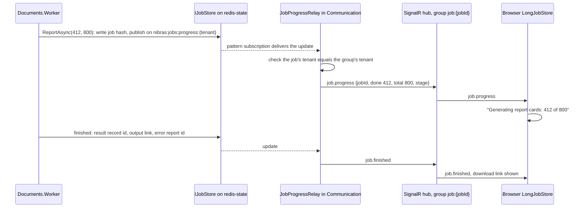

# 11. Messaging Architecture

> Plan document for the Nibras platform. Group C. It refines master brief Section 8 and reference architecture Section 3 and Section 10; it does not re-derive them. Appendix E stays the event catalog, and this document never redefines a routing key. Where this document and the reference architecture disagree, an ADR records the deviation.

**Group** C · **Requirement areas covered** MSG, plus the messaging rows of PERF, INF and TST · **Last updated** 2026-09-20 by the platform plan

## Purpose

This document lets an engineer declare a queue, publish an event, consume one, or orchestrate a saga step without asking how the broker is laid out. It fixes the exchange and queue names, the lanes, the envelope headers on the wire, the retry schedule, the parking-lot console, the per-tenant fairness limits, the ordering mechanism, the seven worker hosts with their KEDA rules, the outbox and inbox tables, the saga tables, progress reporting, the metrics and alerts, the worker-kill chaos test and the contract tests. The readers are the engineer writing a consumer, the reviewer checking a topology change, and the operator reading the failed-message console at 07:55 on a school morning.

## Scope

| In scope | Out of scope | Where the out-of-scope item lives |
|---|---|---|
| Exchanges, queues, bindings, lanes, policies, RabbitMQ users per service | The events themselves: names, payloads, consumers, partition keys | Appendix E |
| Consumer queue tables for all 20 data-owning services | The three to five defining events per service and the dependency matrix | `05-service-catalog.md` |
| Command and reply catalog for the ten sagas | The saga steps, compensations, state diagrams and tests | `13-workflows-and-sagas.md` |
| Envelope on the wire, versioning and retirement | Contract projects and their folder layout | `07-solution-structure.md` |
| Retry, dead-letter and parking-lot policy, the console | Permission names for the console | Appendix B |
| Tenant fairness limits and bulk throttling | Plan quotas and the three rate-limit layers | Master brief Section 19; `12-security-privacy-safety.md` |
| Ordering per partition key | Reference-copy `source_version` rule that tolerates reordering | `10-data-architecture.md` section 6 |
| Worker hosts and KEDA scaling, calendar-aware windows | Helm charts, cluster sizing, the RabbitMQ deployment per mode | `15-deployment-and-operations.md`, master brief Section 34 |
| Outbox, inbox and saga tables, the dispatcher | Partition detach schedule for those tables | `10-data-architecture.md` section 5 |
| Progress reporting over SignalR | The SignalR hubs and backplane | `06-services/communication.md` |
| Messaging metrics, traces, alerts | Dashboards and the on-call rota | `15-deployment-and-operations.md` |
| Worker-kill chaos test, PactNet contract tests | The full test strategy and coverage matrix | `16-test-strategy.md`, Appendix V |

## Content

### 1. Topology

Master brief Section 8 item 2 fixes the shape: one topic exchange per service, routing keys `<service>.<entity>.<event>.v<n>`, one queue per consumer per purpose, quorum queues. Appendix L names the twenty exchanges. This section adds what a declaration needs: the auxiliary exchanges, the queue naming rule, the arguments on every queue, the lanes, the per-service broker user and how the topology is declared and backed up.

#### 1.1 Exchanges

| Exchange | Type | Declared by | Purpose |
|---|---|---|---|
| `nibras.<service>` | `topic`, durable | the publishing service at startup | Every event and every command the service accepts. Exactly one per data-owning service, twenty in total (Appendix L). Gateway, Bff.Web and Bff.Mobile own none |
| `nibras.<service>.unrouted` | `fanout`, durable; the `alternate-exchange` of `nibras.<service>` | the publishing service | Catches a message that matched no binding. Bound to `<service>.unrouted`, capped at 10,000 messages with `x-overflow: drop-head`. Non-empty for an hour means a consumer forgot to bind, which is a topology defect, not a lost message |
| `nibras.<consumer>.retry` | `direct`, durable | the consuming service | Returns a message from a wait queue to the queue it came from; one binding per consumer queue, routing key equal to the queue name |
| `nibras.<consumer>.dlx` | `direct`, durable | the consuming service | Dead-letter exchange for every queue the consumer owns; routing key equal to the queue name, bound to `<queue>.dlq` |
| `nibras.<consumer>.<purpose>.hash` | `x-consistent-hash`, durable, `hash-header: x-partition-key` | the consuming service | Spreads an ordered stream across shard queues by the envelope `partitionKey`. Exists only for the sharded queues named in section 2 |
| `nibras.notification.lanes` | `headers`, durable | Notification | Routes Notification's own `notification.notification.requested.v1` and its channel commands into the urgent, standard and bulk worker queues by the `x-nibras-lane` header, because a routing key is fixed by Appendix E and cannot carry the lane |

The consistent-hash exchange needs the `rabbitmq_consistent_hash_exchange` plug-in, which ships with RabbitMQ 4 (reference architecture Section 16) and is enabled in all three deployment modes, including the developer container, so that ordering behaviour is identical on a laptop.

#### 1.2 Queue naming and arguments

Queue names are `<consumer>.<purpose>[.<lane>]`, lower case, hyphens inside a segment.

| Segment | Value | Rule |
|---|---|---|
| `<consumer>` | The lower-case service name for queues consumed by the Api host (`attendance`), or the worker image name without its `nibras/` prefix for queues consumed by a worker host (`notification-worker`, `documents-worker`, `scheduling-worker`, `assessment-worker`, `finance-worker`, `reporting-projections`, `ai-worker`) | A service without a worker image in Appendix L runs every consumer in its Api host. A service with one keeps the reference-copy, saga and command consumers in the Api host and gives the job queues to the worker, so that the two scale on different signals |
| `<purpose>` | What the queue is for: `reference-copies`, `commands`, `replies`, `render`, `projections` | One queue per purpose, never one queue per event, and never one queue per publisher |
| `<lane>` | absent for the standard lane, `.urgent`, `.bulk` | Section 1.3 |
| `.<n>` | shard index `0` to `N-1` after the lane | Only on sharded queues; the hash exchange owns the bindings |
| `.dlq`, `.parking`, `.wait.<ttl>` | suffixes on the auxiliary queues of section 4 | Never consumed by a handler; read by the console and the retry loop only |

Every consumer queue is declared with the same arguments, so that a reviewer checks a declaration by diffing it against this table.

| Argument | Value | Why |
|---|---|---|
| `x-queue-type` | `quorum` | Master brief Section 8 item 2; survives a node loss in the scale mode and stays enabled in single-server mode (master brief Section 34) |
| `x-dead-letter-exchange` | `nibras.<consumer>.dlx` | Every queue dead-letters to its own `.dlq` |
| `x-dead-letter-routing-key` | the queue name | The `.dlq` is bound with the queue name, so one direct exchange serves every queue of the consumer |
| `x-dead-letter-strategy` | `at-least-once` | A dead-lettered message is confirmed by the `.dlq` before it leaves the source queue, so dead-lettering itself cannot lose a message |
| `x-delivery-limit` | `3` | A message redelivered three times because the consumer crashed before acknowledging is a poison message and goes to `.dlq`; ordinary retries never redeliver, they re-publish through the wait queues (section 4), so the counter only ever counts crashes |
| `x-max-length` | urgent `50,000`, standard `500,000`, bulk `2,000,000` | A bound on the broker's memory and disk; the outbox is the buffer, not the broker |
| `x-overflow` | `reject-publish` | An overflowing queue refuses the publish, the dispatcher's confirm fails, the outbox row stays undispatched and the alert fires; nothing is dropped |
| `x-single-active-consumer` | `true` on every ordered queue, including each shard of a sharded one | One consumer at a time per queue, so the partition key is honoured; section 6 explains how the shards of one queue are spread over replicas |
| Durable, not exclusive, not auto-delete | always | A queue outlives its consumers; a redeploy never loses a binding |

`x-message-ttl` is never set on a consumer queue: an old message is still a fact that happened, and dropping it silently is the failure Appendix E's payload rules exist to prevent. Only the `.wait.<ttl>` queues carry a TTL, and only so that they hand the message back.

#### 1.3 Lanes

Master brief Section 8 item 4: separate queues and workers for urgent and bulk traffic so that a bulk job can never delay an urgent message. A lane is a property of the consumer queue and of the consumer host that reads it, never of the exchange.

| Lane | Suffix | Carries | Consumer host | Prefetch | Service level (master brief Section 31) |
|---|---|---|---|---|---|
| Urgent | `.urgent` | Emergency broadcast and roll call, absence alerts, gate passes and dismissal, one-time codes and invitations, new-device logins, break-glass use, safeguarding concerns, clinic and medication events, reported messages, vehicle delays, permission changes, scan failures, integrity failures | Dedicated replicas that read urgent queues and nothing else | 8 | Urgent notifications dispatched within 30 s of the event |
| Standard | none | Everything that is not urgent and not a batch: reference-copy updates, saga commands and replies, request effects, ordinary notifications | The Api host, or the worker's standard replicas | 16 | Bulk within 15 minutes; queue depth back to baseline within 10 minutes of a burst |
| Bulk | `.bulk` | Report-card renders, invoice runs, statements, imports, exports, OCR, timetable solves, digests, audience fan-out of announcements, projection rebuilds, embedding jobs | Worker replicas scaled by KEDA (section 7) | 2 to 4 for heavy jobs, 64 for projections | Bulk within 15 minutes |

Who decides the lane: for an event another service publishes, the consumer decides by which queue it binds the routing key to, using the urgency column of Appendix C where the consumer is Notification and the tables in section 2 everywhere else. For Notification's own `notification.notification.requested.v1`, whose routing key is fixed, the publisher sets `x-nibras-lane` from the payload `urgency` and the headers exchange routes it. An announcement marked urgent (Appendix C) therefore reaches Notification on the standard lane as `communication.announcement.published.v1` and leaves Notification's Api host on the urgent lane as a requested notification; the hop costs one handler and keeps the routing key honest.

Urgent replicas never read a standard or bulk queue, and a bulk replica never reads an urgent one. That is enforced in the Helm values of each worker (queue list per deployment) and by the architecture test `MessagingConventions.UrgentHostsBindOnlyUrgentQueues` over the worker's registration code.

#### 1.4 One broker user per service

Reference architecture Section 12 rotates one RabbitMQ user per service every 90 days with permissions limited to that service's exchange and queues. The permission regular expressions, on the single virtual host `nibras`:

| Permission | Pattern for service `<service>` | What it allows |
|---|---|---|
| configure | `^nibras\.<service>(-[a-z]+)?(\..*)?$|^<service>(-[a-z]+)?\..*$` | Declaring its own exchanges, including its `.retry`, `.dlx`, `.unrouted`, `.lanes` and `.hash` exchanges, the worker's `nibras.<service>-<kind>.*` auxiliary exchanges, and its own queues including the worker's |
| write | `^nibras\.<service>(-[a-z]+)?(\..*)?$|^<service>(-[a-z]+)?\..*$` | Publishing to its own exchanges, and to its own queues through the default exchange, which is how a message enters a wait queue or is replayed from the parking lot |
| read | `^nibras\..*$|^<service>(-[a-z]+)?\..*$` | Binding its queues to any service's exchange, and consuming its own queues only |

A service can therefore publish only under its own prefix, which is what makes the `<service>.` segment of a routing key trustworthy: a message on `nibras.attendance` with key `attendance.student.absent.v1` was published by Attendance, or the broker refused it. Wellbeing's user is created and rotated by the same runbook but held in Wellbeing's own OpenBao path, beside its separate database credentials (`10-data-architecture.md` section 1). The platform operator's console uses a separate `nibras-console` user with read on `^.*\.(parking|dlq|unrouted)$` and write on the same, and nothing else, so that replaying a message is the only thing the console can do to a queue.

Connections are AMQPS only, in every mode (master brief Section 20).

#### 1.5 Declaration, policies and backup

| Concern | Rule |
|---|---|
| Who declares | `Nibras.BuildingBlocks.Messaging` declares every exchange, queue and binding of the service at host startup from the consumer registrations in `Nibras.<Service>.Infrastructure/Messaging/`, idempotently; a queue whose arguments differ from the declaration fails startup with the difference named, never a silent re-declare |
| Policies | The Helm chart for RabbitMQ applies two policies: `nibras-quorum-limits` (`x-delivery-limit`, `x-max-length`, `x-overflow` per lane by name pattern) and `nibras-dead-letter` (`x-dead-letter-strategy`). Queue type and single-active-consumer are declaration-time arguments and are never set by policy |
| Backup | Definitions export on change and daily, kept 35 days (reference architecture Section 13). Messages in flight are not backed up; the outbox is the durable copy until the broker confirms |
| Recovery | Re-importing definitions recreates every queue empty; the dispatcher then re-publishes every outbox row without `dispatched_at`, which is why the 15-minute recovery point objective in reference architecture Section 13 holds for messages that were published but not yet consumed only as far as the source outbox partitions reach (7 days) |
| Topology lint | `/lint-plan` extracts every queue name from this document and checks the naming rule; once code exists, `MessagingConventions.EveryQueueMatchesDocument11` in `tests/Architecture.Tests` compares the declared queues against the tables in section 2 |

#### 1.6 The topology for Attendance, Notification, Documents and Reporting

One exchange per publisher, one queue per consumer per purpose, a lane per queue, and shards where order matters. Every queue in the diagram has a `.dlq` and a `.parking`; only Notification's urgent dispatch queue shows them, to keep the diagram readable. Reporting.Projections is drawn with two of its eight shards.

```mermaid
flowchart LR
    subgraph ATT["Attendance"]
        ATT_API["Attendance Api"]
        ATT_OUT[("outbox_messages in nibras_attendance")]
        ATT_REF["attendance.reference-copies"]
        ATT_CMD["attendance.commands"]
    end
    subgraph X["Exchanges, one topic exchange per publisher"]
        X_SCH{{"nibras.school"}}
        X_ATT{{"nibras.attendance"}}
        X_ASM{{"nibras.assessment"}}
        X_NOT{{"nibras.notification"}}
        X_DOC{{"nibras.documents"}}
        X_LANES{{"nibras.notification.lanes (headers)"}}
        X_HASH{{"nibras.reporting-projections.projections.hash (x-consistent-hash)"}}
        X_DLX{{"nibras.notification-worker.dlx"}}
    end
    subgraph NOT["Notification"]
        NOT_URG["notification.events.urgent"]
        NOT_STD["notification.events"]
        NOT_API["Notification Api"]
        NW_DU["notification-worker.dispatch.urgent"]
        NW_DB["notification-worker.dispatch.bulk"]
        NW_DU_DLQ["notification-worker.dispatch.urgent.dlq"]
        NW_DU_PARK["notification-worker.dispatch.urgent.parking"]
        NW_U["Notification.Worker, urgent replicas"]
        NW_B["Notification.Worker, bulk replicas"]
    end
    subgraph DOC["Documents"]
        DOC_API["Documents Api"]
        DOC_SUBJ["documents.subjects"]
        DW_RENDER["documents-worker.render.bulk"]
        DW_SCAN["documents-worker.scan"]
        DW_IMPORT["documents-worker.import.bulk"]
        DOC_W["Documents.Worker"]
    end
    subgraph RPT["Reporting"]
        RP_Q0["reporting-projections.projections.0"]
        RP_Q7["reporting-projections.projections.7"]
        RP_W["Reporting.Projections"]
        RP_DB[("nibras_reporting")]
    end
    ATT_API -->|"writes in the same transaction"| ATT_OUT
    ATT_OUT -->|"dispatcher publishes with confirms"| X_ATT
    X_SCH -->|"school.student.*.v1, school.section.*.v1, school.term.started.v1"| ATT_REF
    ATT_REF --> ATT_API
    ATT_CMD -->|"attendance.commands.#"| ATT_API
    X_ATT -->|"attendance.student.absent.v1, attendance.emergency.broadcast-started.v1, attendance.gate-pass.*.v1"| NOT_URG
    X_ATT -->|"attendance.excuse.approved.v1, attendance.attendance.not-marked.v1"| NOT_STD
    NOT_URG --> NOT_API
    NOT_STD --> NOT_API
    NOT_API -->|"notification.notification.requested.v1 with x-nibras-lane"| X_NOT
    X_NOT -->|"exchange binding"| X_LANES
    X_LANES -->|"x-nibras-lane = urgent"| NW_DU
    X_LANES -->|"x-nibras-lane = bulk"| NW_DB
    NW_DU --> NW_U
    NW_DB --> NW_B
    NW_DU -->|"delivery limit reached"| X_DLX
    X_DLX --> NW_DU_DLQ
    NW_U -->|"retries exhausted, x-nibras-attempt = 4"| NW_DU_PARK
    X_ASM -->|"assessment.report-cards.generation-requested.v1"| DW_RENDER
    X_DOC -->|"documents.document.generation-requested.v1"| DW_RENDER
    X_DOC -->|"documents.commands.scan-file.v1"| DW_SCAN
    X_DOC -->|"documents.commands.commit-import-batch.v1"| DW_IMPORT
    X_ASM -->|"assessment.grades.locked.v1, assessment.grade-change.approved.v1"| DOC_SUBJ
    DOC_SUBJ --> DOC_API
    DW_RENDER --> DOC_W
    DW_SCAN --> DOC_W
    DW_IMPORT --> DOC_W
    DOC_W -->|"documents.document.generated.v1"| X_DOC
    X_ATT -->|"attendance.attendance.marked.v1, attendance.student.absent.v1"| X_HASH
    X_SCH -->|"school.student.*.v1"| X_HASH
    X_NOT -->|"notification.notification.delivered.v1, failed.v1"| X_HASH
    X_HASH -->|"hash of x-partition-key"| RP_Q0
    X_HASH -->|"hash of x-partition-key"| RP_Q7
    RP_Q0 --> RP_W
    RP_Q7 --> RP_W
    RP_W -->|"projection rows and checkpoint in one transaction"| RP_DB
```



What the diagram shows that a table cannot: an urgent absence alert and a bulk report-card render never share a queue, a host or a dead-letter path; Reporting sees the same `attendance.student.absent.v1` as Notification but through a hash exchange, because a projection needs order per student and an alert does not; and a message reaches the parking lot by two different roads, the broker's delivery limit for a crash loop and the consumer's own retry exhaustion for a handler failure.

### 2. The message catalog

Appendix E is the catalog. It owns every routing key, every payload, every consumer list and every partition key, and this document never adds, renames or reinterprets one. What this section adds is the other half of a binding: for each of the twenty services, which queues it declares, which Appendix E keys each queue binds, on which lane, with which prefetch, retry profile and dead-letter target. It also catalogues the saga commands and replies, which doc 13 assigns to this document because they are private to the sagas and never appear in Appendix E.

#### 2.1 The envelope on the wire

Appendix E defines the envelope once, in `Nibras.Contracts.Shared`. Quoted, not restated:

| Field | Type | Meaning |
|---|---|---|
| `messageId` | uuid v7 | Unique per publication. The inbox key for idempotent consumers |
| `correlationId` | uuid v7 | Constant for the whole user-visible operation, from the Gateway onward |
| `causationId` | uuid v7 | The `messageId` that caused this one. Builds the chain |
| `tenantId` | uuid v7 | Always present, except on platform-scoped events, which say so |
| `userId` | uuid v7 or null | Null when a job or a consumer caused it |
| `occurredAt` | timestamptz | When the fact became true, in UTC, not when it was published |
| `schemaVersion` | int | Matches the `v<n>` in the routing key |
| `partitionKey` | string or null | Set when order matters for one subject. See below |
| `traceparent` | string | W3C trace context, so one trace spans gateway, gRPC and queues |

How each field travels in an AMQP 0-9-1 message, so that the broker, the consistent-hash exchange, the console and a consumer can all read it without deserialising the body:

| Envelope field | AMQP location | Set by | Read by |
|---|---|---|---|
| `messageId` | `message-id` property | the outbox row's `id` | the inbox, the console, the chaos test's duplicate check |
| `correlationId` | `correlation-id` property | the Gateway, then copied onward | logs (`nibras.correlation_id`), the process monitor |
| `causationId` | header `x-nibras-causation-id` | the building block, from the message being handled | the console's "caused by" link |
| `tenantId` | header `x-nibras-tenant-id` | the building block, from `ITenantContext` | the tenant-fairness gate (section 5) before the body is read, and the tenant transaction behaviour of `10-data-architecture.md` section 2.4 |
| `userId` | header `x-nibras-user-id`, absent when null | the building block | audit columns (`10-data-architecture.md` section 4) |
| `occurredAt` | `timestamp` property (seconds) and header `x-nibras-occurred-at` (ISO 8601, microseconds) | the domain event | reference copies (`source_version`), projections, the lag metric |
| `schemaVersion` | header `x-nibras-schema-version` and the `v<n>` of the routing key | the contract type | the consumer's version dispatch (section 3) |
| `partitionKey` | header `x-partition-key`, absent when null | the contract type's declared key from Appendix E | the consistent-hash exchange (`hash-header: x-partition-key`), the ordered-queue retry rule (section 4.3) |
| `traceparent` | header `traceparent`, plus `tracestate` when present | OpenTelemetry propagation | the consumer's span (section 11) |

The body is the Appendix E payload as UTF-8 JSON with `content-type: application/json`, `delivery-mode: 2` (persistent) and the `type` property set to the contract name (`Nibras.Contracts.Attendance.Events.V1.StudentAbsent`). Operational headers that are not part of the envelope and never reach a handler: `x-nibras-attempt` (section 4), `x-nibras-lane` and `x-nibras-channel` (Notification only, section 1.1), `x-nibras-deferred` (section 5), `x-nibras-parked-behind` (section 4.3), `x-nibras-replayed-by` and `x-nibras-replay-reason` (section 4.5).

#### 2.2 How to read the consumer tables

| Column | Meaning |
|---|---|
| Queue | The declared name under section 1.2. `.dlq`, `.parking` and `.wait.<ttl>` exist beside every queue and are not repeated |
| Bound routing keys | Keys copied from Appendix E, each bound on the exchange named by its first segment (`school.student.enrolled.v1` on `nibras.school`). Bindings are explicit keys; the topology diagram in section 1.6 abbreviates with wildcards, and a wildcard appears in a table only where it is the real binding. A key marked with an asterisk is a binding that `10-data-architecture.md` section 6 or `13-workflows-and-sagas.md` requires and that Appendix E's consumer column does not yet name; section 2.6 lists them |
| Lane | urgent, standard or bulk (section 1.3) |
| Partition key | From Appendix E per key. "Ordered" means the queue honours it (section 6); otherwise the key is carried and logged but the handler does not depend on order |
| Prefetch | Per consumer channel. Section 1.3 sets 8 urgent, 16 standard, 2 to 4 for heavy bulk jobs and 64 for projections; this section adds 32 for light bulk handlers that only fan out or record, and 1 for the solver |
| Retries | The retry profile of section 4.1: **U** urgent, **S** standard, **B** bulk, **C** command, **O** ordered. The number is the retries after the first attempt |
| Dead letter | Always `<queue>.dlq` through `nibras.<consumer>.dlx` for a crash loop, and `<queue>.parking` for exhausted retries (section 4). The column says "standard" when that pair is all there is and names anything more |

**Group consumers in Appendix E, resolved once.** Appendix E names some consumers as a group. This document resolves each group as follows and uses the same set everywhere; a service that later starts keeping one of these copies adds the binding and changes this table in the same pull request.

| Appendix E wording | Resolved to | Source of the resolution |
|---|---|---|
| every service | the twenty data-owning services of Appendix L, except the publisher of the key | Appendix L |
| every service holding a user copy | Requests, Behavior, Operations; Notification for `identity.user.activated.v1` only, where it seeds preferences | `10-data-architecture.md` section 6 |
| every academic service | Academics, Assessment, Scheduling, Attendance, Finance, the same set that consumes `school.term.started.v1`; Reporting also takes `school.academic-year.closed.v1` by name | Appendix E, `school.term.started.v1` row |
| the same set (`school.section.changed.v1`) | Academics, Assessment, Scheduling, Attendance, Admissions | Appendix E, `school.section.created.v1` row |
| every service holding a student copy | Academics, Assessment, Attendance, Finance, Communication, Behavior, Operations, Requests, Wellbeing, Reporting (projection), and Ai by name | `10-data-architecture.md` section 6 |
| services holding a copy (`school.student.profile-updated.v1`) | Academics, Assessment, Attendance, Finance, Communication, Behavior, Wellbeing, Reporting | `10-data-architecture.md` section 6 |
| the owning service (`platform.custom-field.changed.v1`, `reporting.data-quality.issue-detected.v1`) | every data-owning service; the handler ignores an `entityType` it does not own | Appendix L.5: custom-field values live with the owning service |
| the owning service of the effect (`requests.request.approved.v1`) | the owners of a request-type effect in `13-workflows-and-sagas.md` section 4: Identity, Platform, School, Admissions, Assessment, Scheduling, Attendance, Finance, Communication, Documents, Wellbeing, Hr, Operations | doc 13 section 4 |
| the requesting service (`documents.document.generated.v1`) | the services that send `GenerateDocument` or publish a generation request: Platform, Admissions, School, Assessment, Finance, Requests | doc 13 sagas 2, 3, 5, 6, 7, 8 |
| the target service (`documents.import.completed.v1`) | School, Hr, Finance | doc 13 saga 9 |
| Web, Mobile (`platform.terminology.changed.v1`) | no queue: Communication's hub pushes the change to connected clients from `communication.tenant-lifecycle` | `05-service-catalog.md`, Communication row |
| Notification workers, Documents workers | the worker queues of those services in section 2.5 | Appendix L worker hosts |

**Effect owners and `requests.request.approved.v1`.** An effect owner consumes the approval event only to show "approved, being applied" beside the subject; the effect itself runs on the Saga 6 command of section 2.4. Both handlers are idempotent on `requestId`, so either can arrive first.

#### 2.3 Queues every service declares

Every one of the twenty services declares these in its Api host, in addition to its own table in section 2.5.

| Queue | Bound routing keys | Lane | Partition key | Prefetch | Retries | Dead letter |
|---|---|---|---|---|---|---|
| `<service>.tenant-lifecycle` | `platform.tenant.provisioning-requested.v1`, `platform.tenant.suspended.v1`, `platform.tenant.reactivated.v1`, `platform.tenant.deletion-requested.v1`, `platform.tenant.deleted.v1`, `platform.plan.changed.v1`, `platform.feature-flag.changed.v1`, `platform.settings.changed.v1`, `platform.terminology.changed.v1`, `platform.custom-field.changed.v1`, `identity.role.changed.v1`, `identity.permissions.changed.v1`, `reporting.data-quality.issue-detected.v1`. A service never binds its own keys: Platform's queue carries only the last three, Identity's omits the two `identity.` keys, Reporting's omits the last | standard | `tenantId`, ordered by single active consumer | 16 | O 3 | standard |
| `<service>.commands` | `<service>.commands.#` on `nibras.platform` (tenant lifecycle, tier migration and the parking-lot commands of section 4.5) and on each orchestrator exchange named in the service's own table | standard | `sagaId` | 16 | C 3 | standard |

`platform.tenant.provisioning-requested.v1` is at once a catalogued event and the fan-out of Saga 1 step 2 (doc 13); each service's handler creates its tenant rows if absent and replies `TenantProvisioned`. A long command such as `CopyTenantRows` or `DeleteTenantData` is accepted by its handler, which starts a job under `Nibras.BuildingBlocks.Jobs` and acknowledges at once, so a six-hour copy never holds a command-queue slot; the reply is sent when the job finishes.

#### 2.4 Commands and replies

Section 1.4 lets a service publish only on its own exchange. Commands and replies therefore travel on the **sender's** exchange, and the routing key names the **receiver**:

| Message | Routing key | Published on | Bound into | Contract location |
|---|---|---|---|---|
| Command | `<target>.commands.<command-kebab>.v<n>`, for example `school.commands.enrol-student.v1` | `nibras.<sender>` | `<target>.commands`, which binds `<target>.commands.#` on each sender's exchange | `Nibras.Contracts.<Target>/Commands/V1/` (doc 13 section 2) |
| Reply | `<orchestrator>.replies.<reply-kebab>.v<n>`, for example `platform.replies.tenant-provisioned.v1` | `nibras.<replier>` | `<orchestrator>.replies`, which binds `<orchestrator>.replies.#` on each replier's exchange | `Nibras.Contracts.<Orchestrator>/Replies/V1/` |
| Worker job | `<service>.commands.<job-kebab>.v<n>`, for example `documents.commands.scan-file.v1` | `nibras.<service>`, by its own Api host | the worker queue that binds that exact key | `Nibras.Contracts.<Service>/Commands/V1/`, internal to the service |

The exchange a command arrives on names its sender, which is what the handler checks against the orchestrators allowed for that command; the `<target>.` segment only routes it. A service's Api `commands` queue never binds `<service>.commands.#` on its own exchange, so its own worker jobs never land there. Every command and reply carries the Appendix E envelope with `partitionKey = sagaId`, plus `sagaId` and `stepKey` in the body (doc 13 section 2). Every reply exists as a pair, `<Step>Completed` and `<Step>Failed`; the failed form carries an Appendix K error code and the target's message verbatim as `lastError`. Where doc 13 names a catalogued Appendix E event as a step's outcome, no reply is sent and the orchestrator binds that event in its `saga-outcomes` queue.

**Notification requests from other services.** Doc 13 and the Appendix E jobs table show sagas and the Academics reminder job sending `notification.notification.requested.v1`. Under section 1.4 only Notification may publish that key, so the sender publishes the `RequestNotification` command (`notification.commands.request-notification.v1` on its own exchange) and Notification's Api publishes the catalogued event on `nibras.notification` with the lane header. The event stays Notification's own, and the lane is set in one place.

The command catalog, by target. A compensation command is acknowledged by the reply named in the last column, or by the catalogued event doc 13 names.

| Target | Command | Sent on | Saga and step (doc 13) | Outcome |
|---|---|---|---|---|
| every data-owning service | `DeprovisionTenant` | `nibras.platform` | 1, compensation of step 2 | reply `TenantDeprovisioned` |
| every data-owning service except Audit | `DeleteTenantData` | `nibras.platform` | 2, step 6 | reply `TenantDataDeleted` with `rowCount` per table |
| every data-owning service | `ProvisionDedicatedDatabase`, `DropDedicatedDatabase` | `nibras.platform` | 10, step 1 and its compensation | reply `DedicatedDatabaseReady`, `DedicatedDatabaseDropped` |
| every data-owning service | `CopyTenantRows` (`phase` initial, delta or final), `ReconcileTenantCopy`, `PurgeSourceRows` | `nibras.platform` | 10, steps 2, 3, 5, 8 | reply `TenantRowsCopied`, `TenantCopyReconciled`, `SourceRowsPurged` |
| every data-owning service | `ReplayParkedMessages`, `DiscardParkedMessages` | `nibras.platform` | none; the console of section 4.5 | reply `ParkedMessagesReplayed`, `ParkedMessagesDiscarded` |
| Identity | `InviteTenantOwner`, `RevokeInvitation` | `nibras.platform` | 1, step 3 | `identity.user.invited.v1`; reply `InvitationRevoked` |
| Identity | `RevokeTenantAccess` | `nibras.platform` | 2, step 5 | reply `TenantAccessRevoked` |
| Identity | `ProvisionGuardianAccess`, `RevokeGuardianAccess` | `nibras.admissions` | 3, step 4 | `identity.guardian-link.created.v1`, `identity.user.invited.v1`; `identity.user.deactivated.v1` |
| Identity | `DeactivateStudentAccount` | `nibras.school` | 5, step 6 | `identity.user.deactivated.v1` |
| Identity | `ProposeRoleChange`, `RevertRoleChange` | `nibras.requests` | 6 | `identity.role.changed.v1`, `identity.permissions.changed.v1` |
| Platform | `OpenSubjectRequest` | `nibras.requests` | 6 | reply `EffectApplied` when WF-PRV-01 starts |
| School | `OpenFirstAcademicYear` | `nibras.platform` | 1, step 4 | `school.academic-year.opened.v1` |
| School | `EnrolStudent`, `WithdrawEnrolment` | `nibras.admissions` | 3, step 2 | `school.student.enrolled.v1`; `school.student.status-changed.v1` |
| School | `StartWithdrawalClearance`, `CancelWithdrawal`, `ChangeSection`, `UpdateGuardianDetails` | `nibras.requests` | 6 | `school.student.status-changed.v1`, `school.student.section-changed.v1`, `school.guardian.updated.v1` or `school.student.profile-updated.v1` |
| School, Hr, Finance | `ValidateImportBatch`, `DryRunImportBatch`, `CommitImportBatch`, `RollbackImport` | `nibras.documents` | 9, steps 2 to 4 | reply `ImportBatchValidated`, `ImportBatchPreviewed`, `ImportBatchCommitted`, `ImportRolledBack` |
| Admissions | `ConfirmReEnrollment`, `DeclineReEnrollment` | `nibras.requests` | 6 | `admissions.re-enrollment.confirmed.v1`, `admissions.re-enrollment.declined.v1` |
| Assessment | `ConfirmYearResultsLocked`, `ComputePromotionDecisions` | `nibras.school` | 4, steps 1 and 2 | reply `YearResultsLocked` or `YearResultsNotLocked`; reply `PromotionDecisionsComputed` |
| Assessment | `IssueTranscript` | `nibras.school`, `nibras.requests` | 5, step 3; 6 | reply `TranscriptIssued` |
| Assessment | `OpenGradeAppeal`, `ApplyExamAccommodation`, `RemoveExamAccommodation` | `nibras.requests` | 6 | `assessment.grade-change.approved.v1` when an appeal ends in a change; reply `EffectApplied` |
| Scheduling | `CopyTimetableSkeleton`, `DeleteTimetableVersion` | `nibras.school` | 4, step 7 | reply `TimetableSkeletonCreated`, `TimetableVersionDeleted` |
| Scheduling | `AssignSubstitution`, `ReleaseSubstitution`, `ApproveRoomBooking`, `CancelRoomBooking` | `nibras.requests` | 6 | `scheduling.substitution.assigned.v1`, `scheduling.timetable.changed.v1`, `scheduling.room-booking.approved.v1` |
| Attendance | `ApplyExcusedLeave`, `RecordLateArrival`, `IssueGatePass`, `CancelGatePass`, `UpdateAuthorizedPickups`, `RestorePreviousMarks` | `nibras.requests` | 6 | `attendance.excuse.approved.v1`, `attendance.attendance.marked.v1`, `attendance.gate-pass.issued.v1`; reply `EffectApplied` |
| Finance | `AssignFeePlan`, `VoidFeePlan` | `nibras.admissions` | 3, step 3 | `finance.fee-plan.assigned.v1`; `finance.credit-note.issued.v1` or reply `FeePlanVoided` |
| Finance | `AssignNextYearFeePlans`, `VoidFeePlans` | `nibras.school` | 4, step 6 | `finance.fee-plan.assigned.v1`; reply `FeePlansVoided` |
| Finance, Operations | `RaiseClearanceItem`, `CancelClearanceItem` | `nibras.school` | 5, steps 1 and 2 | `finance.account.cleared.v1`, reply `ClearanceSignedOff` or `ClearanceBlocked`; reply `ClearanceItemCancelled` |
| Finance | `PostRequestFee`, `ReverseRequestFee`, `RegenerateInstallments`, `AttachDiscount`, `DetachDiscount`, `RequestRefund`, `WithdrawRefundRequest`, `ChangePayer`, `RevertPayer` | `nibras.requests` | 6 | `finance.invoice.issued.v1`, `finance.credit-note.issued.v1`, `finance.fee-plan.assigned.v1`, `finance.refund.processed.v1`; reply `EffectApplied` |
| Communication | `BookMeeting`, `CancelMeeting` | `nibras.requests` | 6 | `communication.meeting.booked.v1`, `communication.meeting.changed.v1` |
| Documents | `ApplyTenantBranding`, `DeleteTenantBranding`, `ExportTenant`, `DeleteTenantFiles` | `nibras.platform` | 1, step 5; 2, steps 2 and 7 | reply `TenantBrandingApplied`; `documents.export.completed.v1`; reply `TenantFilesDeleted` |
| Documents | `GenerateDocument`, `RevokeDocument` | `nibras.platform`, `nibras.admissions`, `nibras.school`, `nibras.assessment`, `nibras.finance`, `nibras.requests` | 2, 3, 5, 6, 8 | `documents.document.generated.v1`; `documents.certificate.revoked.v1` |
| Documents | `RequestExport`, `RevokeExport` | `nibras.requests` | 6 | `documents.export.completed.v1`; reply `ExportRevoked` |
| Reporting | `InitialiseProjections` | `nibras.platform` | 1, step 6 | `reporting.projection.rebuild-completed.v1` |
| Audit | `DetachTenantAuditPartition` | `nibras.platform` | 2, step 8 | `audit.retention.partition-detached.v1` |
| Notification | `RequestNotification` | `nibras.platform`, `nibras.admissions`, `nibras.school`, `nibras.finance`, `nibras.requests`, `nibras.academics` | 1, 2, 3, 5, 6, 8; the assignment due reminder job | `notification.notification.requested.v1`, then `notification.notification.delivered.v1` |
| Wellbeing | `AuthorizeMedication`, `RevokeMedicationAuthorization` | `nibras.requests` | 6 | reply `EffectApplied` |
| Hr | `ApproveLeave`, `CancelLeave` | `nibras.requests` | 6 | `hr.leave.approved.v1`, `hr.leave.cancelled.v1` |
| Operations | `ApplyTransportSubscriptionChange`, `RevertTransportSubscription`, `ApproveRequisition`, `CancelRequisition` | `nibras.requests` | 6 | `operations.transport.subscription-changed.v1`; reply `EffectApplied` |

**Effect replies.** Every effect command above answers the Requests saga with exactly one reply on `nibras.<target>`: `EffectApplied` (`requests.replies.effect-applied.v1`) when the change took effect, or `EffectFailed` (`requests.replies.effect-failed.v1`) carrying the Appendix K code when the aggregate refused it. This is the `<Step>Failed` rule of Section 8 applied to effects, named here so that no service invents its own failure reply.

Saga 7 sends no command: `assessment.report-cards.generation-requested.v1` is the command, as doc 13 records. Saga 8's per-invoice render is `GenerateDocument` published by `Finance.Worker` on `nibras.finance`, which the Finance broker user may do because the worker shares the service's user.

#### 2.5 Consumer queues per service

One table per data-owning service, in Appendix L order. The two common queues of section 2.3 are not repeated; where a service's `commands` queue binds more than `nibras.platform`, the row says so. The worker queues of the seven worker hosts sit in the owning service's table, after its Api queues.

**Identity** (Api host only)

| Queue | Bound routing keys | Lane | Partition key | Prefetch | Retries | Dead letter |
|---|---|---|---|---|---|---|
| `identity.tenant-lifecycle` | the section 2.3 set without the two `identity.` keys, plus `platform.tenant.provisioned.v1` | standard | `tenantId`, ordered | 16 | O 3 | standard |
| `identity.reference-copies` | `school.staff.created.v1`, `school.staff.left.v1`, `hr.staff.hired.v1` | standard | `staffId` | 16 | S 4 | standard |
| `identity.events` | `admissions.offer.accepted.v1`, `academics.teaching-assignment.changed.v1`, `requests.request.approved.v1` | standard | `applicationId`, `staffId`, `requestId` | 16 | S 4 | standard |
| `identity.commands` | also on `nibras.admissions`, `nibras.school`, `nibras.requests` | standard | `sagaId` | 16 | C 3 | standard |

**Platform** (Api host only)

| Queue | Bound routing keys | Lane | Partition key | Prefetch | Retries | Dead letter |
|---|---|---|---|---|---|---|
| `platform.tenant-lifecycle` | `identity.role.changed.v1`, `identity.permissions.changed.v1`, `reporting.data-quality.issue-detected.v1` | standard | `tenantId`, ordered | 16 | O 3 | standard |
| `platform.usage` | `*.usage.recorded.v1` bound on all twenty exchanges; this is the cross-cutting event of Appendix E and includes `ai.usage.recorded.v1` | bulk | `tenantId` | 32 | B 5 | standard; usage is additive, so a parked message is replayed into the same period and never lost |
| `platform.events` | `notification.notification.delivered.v1`, `notification.notification.failed.v1`, `audit.integrity-check.failed.v1`, `ai.index.rebuild-completed.v1`, `requests.request.approved.v1` | standard | `userId`, `tenantId`, `requestId` | 16 | S 4 | standard |
| `platform.saga-outcomes` | `identity.user.invited.v1`\*, `school.academic-year.opened.v1`\*, `reporting.projection.rebuild-completed.v1`, `documents.export.completed.v1`\*, `documents.document.generated.v1`, `audit.retention.partition-detached.v1` | standard | per key; the handler correlates by `correlationId` | 16 | S 4 | standard |
| `platform.replies` | `platform.replies.#` on the nineteen other exchanges | standard | `sagaId` | 16 | C 3 | standard |
| `platform.commands` | also on `nibras.requests` (`OpenSubjectRequest`) | standard | `sagaId` | 16 | C 3 | standard |

**School** (Api host only)

| Queue | Bound routing keys | Lane | Partition key | Prefetch | Retries | Dead letter |
|---|---|---|---|---|---|---|
| `school.tenant-lifecycle` | the section 2.3 set, plus `platform.tenant.provisioned.v1` | standard | `tenantId`, ordered | 16 | O 3 | standard |
| `school.events` | `identity.user.registered.v1`, `identity.join-request.approved.v1`, `identity.guardian-link.created.v1`, `admissions.offer.accepted.v1`, `admissions.re-enrollment.confirmed.v1`, `admissions.re-enrollment.declined.v1`, `hr.staff.hired.v1`, `documents.import.completed.v1`, `requests.request.approved.v1` | standard | `userId`, `studentId`, `applicationId`, `staffId`, `jobId`, `requestId` | 16 | S 4 | standard |
| `school.saga-outcomes` | `finance.fee-plan.assigned.v1`\*, `finance.account.cleared.v1`\*, `documents.document.generated.v1`, `documents.certificate.revoked.v1`\*, `identity.user.deactivated.v1`\* | standard | per key | 16 | S 4 | standard |
| `school.replies` | `school.replies.#` on `nibras.assessment`, `nibras.finance`, `nibras.scheduling`, `nibras.operations`, `nibras.identity`, `nibras.documents` | standard | `sagaId` | 16 | C 3 | standard |
| `school.commands` | also on `nibras.admissions`, `nibras.requests`, `nibras.documents` | standard | `sagaId` | 16 | C 3 | standard |

**Admissions** (Api host only)

| Queue | Bound routing keys | Lane | Partition key | Prefetch | Retries | Dead letter |
|---|---|---|---|---|---|---|
| `admissions.reference-copies` | `school.section.created.v1`, `school.section.changed.v1` | standard | `sectionId` | 16 | S 4 | standard |
| `admissions.events` | `finance.payment.received.v1`, `finance.invoice.overdue.v1`, `requests.request.approved.v1` | standard | `invoiceId`, `requestId` | 16 | S 4 | standard |
| `admissions.saga-outcomes` | `school.student.enrolled.v1`\*, `school.student.status-changed.v1`\*, `finance.fee-plan.assigned.v1`\*, `finance.credit-note.issued.v1`\*, `identity.guardian-link.created.v1`\*, `identity.user.invited.v1`\*, `identity.user.deactivated.v1`\*, `documents.document.generated.v1`, `documents.certificate.revoked.v1`\* | standard | per key | 16 | S 4 | standard |
| `admissions.replies` | `admissions.replies.#` on `nibras.school`, `nibras.finance`, `nibras.identity`, `nibras.documents` | standard | `sagaId` | 16 | C 3 | standard |
| `admissions.commands` | also on `nibras.requests` | standard | `sagaId` | 16 | C 3 | standard |

**Academics** (Api host only)

| Queue | Bound routing keys | Lane | Partition key | Prefetch | Retries | Dead letter |
|---|---|---|---|---|---|---|
| `academics.reference-copies` | `school.academic-year.opened.v1`, `school.academic-year.closed.v1`, `school.term.started.v1`, `school.section.created.v1`, `school.section.changed.v1`, `school.student.enrolled.v1`, `school.student.section-changed.v1`, `school.student.status-changed.v1`, `school.student.promoted.v1`, `school.student.profile-updated.v1`, `school.staff.created.v1`, `school.staff.left.v1`, `scheduling.timetable.published.v1`, `scheduling.timetable.changed.v1` | standard | `tenantId`, `sectionId`, `studentId`, `staffId`, `timetableVersionId` | 16 | S 4 | standard |
| `academics.events` | `assessment.grades.locked.v1` | standard | `gradingPeriodId` | 16 | S 4 | standard |

**Assessment** (Api host and `Assessment.Worker`)

| Queue | Bound routing keys | Lane | Partition key | Prefetch | Retries | Dead letter |
|---|---|---|---|---|---|---|
| `assessment.reference-copies` | `school.academic-year.opened.v1`, `school.academic-year.closed.v1`, `school.term.started.v1`, `school.section.created.v1`, `school.section.changed.v1`, `school.student.enrolled.v1`, `school.student.section-changed.v1`, `school.student.status-changed.v1`, `school.student.promoted.v1`, `school.student.profile-updated.v1`, `academics.teaching-assignment.changed.v1`, `finance.account.restricted.v1`, `finance.account.cleared.v1` | standard | `tenantId`, `sectionId`, `studentId`, `staffId` | 16 | S 4 | standard |
| `assessment.events` | `academics.submission.graded.v1`, `scheduling.exam-timetable.published.v1`, `requests.request.approved.v1` | standard | `assignmentId`, `tenantId`, `requestId` | 16 | S 4 | standard |
| `assessment.commands` | also on `nibras.school`, `nibras.requests` | standard | `sagaId` | 16 | C 3 | standard |
| `assessment-worker.results.bulk` | `assessment.commands.compute-results.v1` on `nibras.assessment`, published by the Api when a batch starts (doc 13 saga 7 step 2) or when `ComputePromotionDecisions` arrives | bulk | `tenantId` | 4 | B 5 | standard |
| `assessment-worker.report-cards.bulk` | `documents.document.generated.v1` | bulk | `subjectId` | 32 | B 5 | standard; the batch orchestration of doc 13 saga 7 counts these, so a parked outcome shows as "stalled" in the batch, never as done |

**Scheduling** (Api host and `Scheduling.Worker`)

| Queue | Bound routing keys | Lane | Partition key | Prefetch | Retries | Dead letter |
|---|---|---|---|---|---|---|
| `scheduling.reference-copies` | `school.academic-year.opened.v1`, `school.academic-year.closed.v1`, `school.term.started.v1`, `school.section.created.v1`, `school.section.changed.v1`, `school.staff.created.v1`, `school.staff.left.v1`, `academics.teaching-assignment.changed.v1`, `hr.leave.approved.v1`, `hr.leave.cancelled.v1` | standard | `tenantId`, `sectionId`, `staffId` | 16 | S 4 | standard |
| `scheduling.events` | `communication.meeting.booked.v1`, `requests.request.approved.v1` | standard | `staffId`, `requestId` | 16 | S 4 | standard |
| `scheduling.commands` | also on `nibras.school`, `nibras.requests` | standard | `sagaId` | 16 | C 3 | standard |
| `scheduling-worker.solve.bulk` | `scheduling.commands.solve-timetable.v1` on `nibras.scheduling` | bulk | `tenantId` | 1 | B 2; a solve is minutes of CPU, so it is retried twice, not five times | standard |

**Attendance** (Api host only)

| Queue | Bound routing keys | Lane | Partition key | Prefetch | Retries | Dead letter |
|---|---|---|---|---|---|---|
| `attendance.reference-copies` | `school.academic-year.opened.v1`, `school.academic-year.closed.v1`, `school.term.started.v1`, `school.section.created.v1`, `school.section.changed.v1`, `school.student.enrolled.v1`, `school.student.section-changed.v1`, `school.student.status-changed.v1`, `school.student.profile-updated.v1`, `scheduling.timetable.published.v1`, `scheduling.timetable.changed.v1`, `scheduling.substitution.assigned.v1`, `hr.leave.approved.v1`, `hr.leave.cancelled.v1` | standard | `tenantId`, `sectionId`, `studentId`, `timetableVersionId`, `staffId` | 16 | S 4 | standard |
| `attendance.events` | `operations.transport.boarding-recorded.v1`, `requests.request.approved.v1` | standard | `studentId`, `requestId` | 16 | S 4 | standard |
| `attendance.commands` | also on `nibras.requests` | standard | `sagaId` | 16 | C 3 | standard |

**Finance** (Api host and `Finance.Worker`)

| Queue | Bound routing keys | Lane | Partition key | Prefetch | Retries | Dead letter |
|---|---|---|---|---|---|---|
| `finance.reference-copies` | `school.academic-year.opened.v1`, `school.academic-year.closed.v1`, `school.term.started.v1`, `school.student.enrolled.v1`, `school.student.status-changed.v1`, `school.student.promoted.v1`, `school.student.profile-updated.v1`, `school.guardian.updated.v1`, `identity.guardian-link.created.v1`, `admissions.offer.accepted.v1`, `admissions.re-enrollment.confirmed.v1`, `admissions.re-enrollment.declined.v1` | standard | `tenantId`, `studentId`, `applicationId` | 16 | S 4 | standard |
| `finance.events` | `admissions.offer.made.v1`, `hr.payroll.inputs-ready.v1`, `operations.transport.subscription-changed.v1`, `operations.library.loan-overdue.v1`, `operations.activity.enrollment-confirmed.v1`, `documents.import.completed.v1`, `requests.request.approved.v1` | standard | `applicationId`, `tenantId`, `studentId`, `jobId`, `requestId` | 16 | S 4 | standard |
| `finance.saga-outcomes.bulk` | `documents.document.generated.v1` | bulk | `subjectId` | 32 | B 5 | standard |
| `finance.commands` | also on `nibras.admissions`, `nibras.school`, `nibras.requests`, `nibras.documents` | standard | `sagaId` | 16 | C 3 | standard |
| `finance-worker.invoice-runs.bulk` | `finance.commands.run-invoice-batch.v1` on `nibras.finance`, one message per slice of 200 students of a run (doc 13 saga 8 step 2) | bulk | `tenantId` | 2 | B 5 | standard |
| `finance-worker.reminders.bulk` | `finance.commands.run-reminder-ladder.v1`, published per tenant by the daily Quartz job | bulk | `tenantId` | 4 | B 5 | standard |
| `finance-worker.statements.bulk` | `finance.commands.generate-statements.v1` | bulk | `tenantId` | 2 | B 5 | standard |

**Communication** (Api host only)

| Queue | Bound routing keys | Lane | Partition key | Prefetch | Retries | Dead letter |
|---|---|---|---|---|---|---|
| `communication.reference-copies` | `school.student.enrolled.v1`, `school.student.status-changed.v1`, `school.student.profile-updated.v1`, `school.guardian.updated.v1`, `identity.guardian-link.created.v1`, `school.staff.created.v1`\*, `school.staff.left.v1`\*, `school.section.created.v1`\*, `school.section.changed.v1`\* | standard | `studentId`, `staffId`, `sectionId` | 16 | S 4 | standard |
| `communication.events` | `assessment.report-cards.published.v1`, `scheduling.event.published.v1`, `requests.request.approved.v1` | standard | `gradingPeriodId`, `tenantId`, `requestId` | 16 | S 4 | standard |
| `communication.events.urgent` | `attendance.emergency.broadcast-started.v1` | urgent | `campusId` | 8 | U 3 | standard |
| `communication.commands` | also on `nibras.requests` | standard | `sagaId` | 16 | C 3 | standard |

The live permission refresh of `08-web-structure.md` rides on `communication.tenant-lifecycle`, which carries `identity.role.changed.v1` and `identity.permissions.changed.v1` in order per tenant; a `permissionVersion` lower than the one already pushed is dropped.

**Notification** (Api host and `Notification.Worker`)

Inbound events are split by the urgency column of Appendix C, which section 1.3 makes the rule for Notification. Where the traffic list in section 1.3 and Appendix C differ for an inbound key (dismissal, vehicle delays, scan failures are **N** in Appendix C), Appendix C decides the inbound queue; the outbound urgency of the resulting notification is still set per recipient from the payload and the template.

| Queue | Bound routing keys | Lane | Partition key | Prefetch | Retries | Dead letter |
|---|---|---|---|---|---|---|
| `notification.tenant-lifecycle` | the section 2.3 set, plus `platform.tenant.provisioned.v1`; Notification owns no reference copy, so its `reporting.data-quality.issue-detected.v1` handler only raises the notification to the data owner | standard | `tenantId`, ordered | 16 | O 3 | standard |
| `notification.reference-copies` | `identity.user.activated.v1`, `school.guardian.updated.v1`, `identity.guardian-link.created.v1` | standard | `userId`, `studentId` | 16 | S 4 | standard |
| `notification.events.urgent` | `attendance.emergency.broadcast-started.v1`, `attendance.roll-call.completed.v1`, `attendance.student.absent.v1`, `attendance.gate-pass.issued.v1`, `attendance.gate-pass.used.v1`, `attendance.visitor.checked-in.v1`, `wellbeing.clinic-visit.recorded.v1`, `wellbeing.medication.administered.v1`, `wellbeing.safeguarding.concern-raised.v1`, `communication.concern.reported-anonymously.v1`, `communication.message.reported.v1`, `scheduling.substitution.assigned.v1`, `identity.user.invited.v1`, `identity.login.new-device.v1`, `identity.break-glass.used.v1`, `audit.integrity-check.failed.v1`, `notification.notification.failed.v1` | urgent | `campusId`, `studentId`, `staffId`, `userId`, `threadId`, `tenantId` | 8 | U 3 | standard; never replayed without a human decision (section 4.5) |
| `notification.events` | `platform.limit.approaching.v1`, `platform.trial.ending.v1`, `platform.invoice.due.v1`, `platform.webhook.delivery-failed.v1`, `identity.user.registered.v1`, `identity.join-request.submitted.v1`, `identity.join-request.approved.v1`, `identity.delegation.started.v1`, `identity.delegation.ended.v1`, `identity.access-review.due.v1`, `school.student-document.expiring.v1`, `admissions.inquiry.created.v1`, `admissions.application.submitted.v1`, `admissions.application.stage-changed.v1`, `admissions.offer.made.v1`, `admissions.offer.expired.v1`, `admissions.re-enrollment.declined.v1`, `academics.assignment.published.v1`, `academics.submission.graded.v1`, `academics.lesson-plan.submitted.v1`, `academics.homework-load.exceeded.v1`, `academics.syllabus-coverage.behind.v1`, `assessment.marks.approved.v1`, `assessment.marks.overdue.v1`, `assessment.marks.awaiting-approval.v1`, `assessment.report-cards.published.v1`, `assessment.grade-change.approved.v1`, `scheduling.timetable.published.v1`, `scheduling.timetable.changed.v1`, `scheduling.event.published.v1`, `scheduling.room-booking.approved.v1`, `scheduling.exam-timetable.published.v1`, `attendance.excuse.approved.v1`, `attendance.threshold.reached.v1`, `attendance.attendance.not-marked.v1`, `attendance.dismissal.processed.v1`, `finance.payment.received.v1`, `finance.payment.failed.v1`, `finance.cheque.bounced.v1`, `finance.refund.processed.v1`, `finance.account.restricted.v1`, `finance.account.cleared.v1`, `communication.announcement.published.v1`, `communication.acknowledgment.overdue.v1`, `communication.meeting.booked.v1`, `communication.meeting.changed.v1`, `requests.request.submitted.v1`, `requests.request.needs-info.v1`, `requests.request.approved.v1`, `requests.request.rejected.v1`, `requests.request.completed.v1`, `requests.request.sla-breached.v1`, `requests.task.assigned.v1`, `documents.certificate.revoked.v1`, `documents.import.completed.v1`, `documents.export.completed.v1`, `documents.sensitive-export.performed.v1`, `documents.file.scan-failed.v1`, `behavior.incident.recorded.v1`, `behavior.points.awarded.v1`, `behavior.badge.awarded.v1`, `behavior.consequence.assigned.v1`, `reporting.early-warning.flag-raised.v1`, `reporting.early-warning.flag-cleared.v1`, `wellbeing.referral.created.v1`, `wellbeing.intervention.opened.v1`, `hr.staff.hired.v1`, `hr.leave.approved.v1`, `hr.leave.cancelled.v1`, `hr.leave-balance.low.v1`, `hr.staff-document.expiring.v1`, `hr.payroll.inputs-ready.v1`, `hr.appraisal.completed.v1`, `operations.transport.boarding-recorded.v1`, `operations.transport.vehicle-delayed.v1`, `operations.transport.subscription-changed.v1`, `operations.library.loan-overdue.v1`, `operations.facility.ticket-raised.v1`, `operations.inventory.stock-low.v1`, `operations.frontdesk.complaint-received.v1`, `operations.activity.enrollment-confirmed.v1` | standard | per key, Appendix E | 16 | S 4 | standard |
| `notification.events.bulk` | `finance.invoice.issued.v1`, `finance.invoice.overdue.v1`, `documents.document.generated.v1` | bulk | `invoiceId`, `subjectId` | 32 | B 5 | standard |
| `notification.commands` | also on `nibras.admissions`, `nibras.school`, `nibras.finance`, `nibras.requests`, `nibras.academics` (`RequestNotification`) | standard | `sagaId`, or `userId` for a job's request | 16 | C 3 | standard |
| `notification-worker.dispatch.urgent` | `notification.notification.requested.v1`, through `nibras.notification.lanes` where `x-nibras-lane = urgent` and `x-nibras-channel = dispatch` | urgent | `userId` | 8 | U 3 | standard |
| `notification-worker.dispatch` | as above with `x-nibras-lane = standard` | standard | `userId` | 16 | S 4 | standard |
| `notification-worker.dispatch.bulk` | as above with `x-nibras-lane = bulk` | bulk | `userId` | 32 | B 5 | standard |
| `notification-worker.push.urgent`, `notification-worker.email.urgent`, `notification-worker.sms.urgent` | `notification.commands.send-push.v1`, `notification.commands.send-email.v1`, `notification.commands.send-sms.v1` respectively, through `nibras.notification.lanes` on `x-nibras-lane = urgent` and the matching `x-nibras-channel` | urgent | `userId` | 8 | U 3 | standard |
| `notification-worker.push`, `notification-worker.email`, `notification-worker.sms` | the same three keys on `x-nibras-lane = standard` | standard | `userId` | 16 | S 4 | standard |
| `notification-worker.push.bulk`, `notification-worker.email.bulk`, `notification-worker.sms.bulk` | the same three keys on `x-nibras-lane = bulk` | bulk | `userId` | 32 | B 5 | standard |
| `notification-worker.digests.bulk` | `notification.commands.build-digest.v1`, through `nibras.notification.lanes` on `x-nibras-channel = digest` | bulk | `userId` | 4 | B 5 | standard |

`nibras.notification` is bound to `nibras.notification.lanes` with the two keys `notification.notification.requested.v1` and `notification.commands.#`, and the headers bindings use `x-match: all`. The dispatch stage resolves recipients, preferences and quiet hours, writes the delivery rows and publishes one channel command per recipient and channel on the same lane; the channel stage talks to the provider. A slow SMS provider therefore backs up only the SMS queues of its lane, and the Appendix C fallback (push fails, then email, then SMS for urgent) is a new channel command, not a retry.

**Requests** (Api host only)

| Queue | Bound routing keys | Lane | Partition key | Prefetch | Retries | Dead letter |
|---|---|---|---|---|---|---|
| `requests.reference-copies` | `identity.user.activated.v1`, `identity.user.deactivated.v1`, `identity.delegation.started.v1`, `identity.delegation.ended.v1`, `school.student.enrolled.v1`\*, `school.student.status-changed.v1`, `school.staff.created.v1`\*, `school.staff.left.v1` | standard | `userId`, `studentId`, `staffId` | 16 | S 4 | standard |
| `requests.events` | `identity.join-request.submitted.v1`, `identity.access-review.due.v1`, `school.student-document.expiring.v1`, `hr.staff-document.expiring.v1`, `operations.frontdesk.complaint-received.v1` | standard | `userId`, `tenantId`, `studentId`, `staffId`, `campusId` | 16 | S 4 | standard |
| `requests.saga-outcomes` | the Saga 6 outcome events of doc 13 section 4: `attendance.excuse.approved.v1`\*, `attendance.attendance.marked.v1`\*, `attendance.gate-pass.issued.v1`\*, `school.student.section-changed.v1`\*, `school.student.profile-updated.v1`\*, `school.guardian.updated.v1`\*, `assessment.grade-change.approved.v1`\*, `scheduling.substitution.assigned.v1`\*, `scheduling.timetable.changed.v1`\*, `scheduling.room-booking.approved.v1`\*, `finance.invoice.issued.v1`\*, `finance.credit-note.issued.v1`\*, `finance.fee-plan.assigned.v1`\*, `finance.refund.processed.v1`\*, `communication.meeting.booked.v1`\*, `communication.meeting.changed.v1`\*, `admissions.re-enrollment.confirmed.v1`\*, `admissions.re-enrollment.declined.v1`\*, `hr.leave.approved.v1`\*, `hr.leave.cancelled.v1`\*, `operations.transport.subscription-changed.v1`\*, `documents.document.generated.v1`, `documents.certificate.revoked.v1`\*, `documents.export.completed.v1`\* | standard | per key; the handler correlates by `correlationId` and drops a message that belongs to no running saga in one indexed lookup | 32 | S 4 | standard |
| `requests.replies` | `requests.replies.#` on `nibras.identity`, `nibras.platform`, `nibras.school`, `nibras.admissions`, `nibras.assessment`, `nibras.scheduling`, `nibras.attendance`, `nibras.finance`, `nibras.communication`, `nibras.documents`, `nibras.wellbeing`, `nibras.hr`, `nibras.operations` | standard | `sagaId` | 16 | C 3 | standard |

The status change and the role change that close some Saga 6 types (`school.student.status-changed.v1`, `identity.role.changed.v1`) already reach Requests through `requests.reference-copies` and `requests.tenant-lifecycle`; the saga handler subscribes in-process to those handlers rather than binding the key a second time.

**Documents** (Api host and `Documents.Worker`)

| Queue | Bound routing keys | Lane | Partition key | Prefetch | Retries | Dead letter |
|---|---|---|---|---|---|---|
| `documents.tenant-lifecycle` | the section 2.3 set, plus `platform.tenant.provisioned.v1`\* for the branding copy | standard | `tenantId`, ordered | 16 | O 3 | standard |
| `documents.reference-copies` | `finance.account.restricted.v1`, `finance.account.cleared.v1` | standard | `studentId` | 16 | S 4 | standard |
| `documents.subjects` | `admissions.application.submitted.v1`, `admissions.offer.made.v1`, `admissions.offer.accepted.v1`, `assessment.grades.locked.v1`, `assessment.grade-change.approved.v1`, `finance.invoice-run.requested.v1`, `finance.refund.processed.v1`, `finance.credit-note.issued.v1`, `behavior.badge.awarded.v1`, `requests.request.approved.v1` | standard | `applicationId`, `gradingPeriodId`, `studentId`, `tenantId`, `invoiceId`, `requestId` | 16 | S 4 | standard |
| `documents.subjects.bulk` | `finance.invoice.issued.v1` | bulk | `invoiceId` | 32 | B 5 | standard |
| `documents.replies` | `documents.replies.#` on `nibras.school`, `nibras.hr`, `nibras.finance` | standard | `sagaId` | 16 | C 3 | standard |
| `documents.commands` | also on `nibras.admissions`, `nibras.school`, `nibras.assessment`, `nibras.finance`, `nibras.requests` | standard | `sagaId` | 16 | C 3 | standard |
| `documents-worker.render.bulk` | `assessment.report-cards.generation-requested.v1`, `documents.document.generation-requested.v1` | bulk | `studentId`, `subjectId` | 2 | B 5 | standard |
| `documents-worker.scan` | `documents.commands.scan-file.v1` on `nibras.documents` | standard | `fileId` | 4 | S 4 | standard; a file whose scan parks stays quarantined, never released |
| `documents-worker.import.bulk` | `documents.commands.parse-import-file.v1`, `documents.commands.commit-import-batch.v1` on `nibras.documents` | bulk | `jobId` | 2 | B 5 | standard |
| `documents-worker.export.bulk` | `documents.commands.run-export.v1` on `nibras.documents` | bulk | `jobId` | 2 | B 5 | standard |
| `documents-worker.ocr.bulk` | `documents.commands.run-ocr.v1` on `nibras.documents` | bulk | `fileId` | 2 | B 5 | standard |

`documents.subjects` registers each subject a document may later be rendered for and records restrictions and supersessions; it never renders. Rendering starts only from `GenerateDocument` or a generation-requested event, so `finance.invoice.issued.v1` and Saga 8's `GenerateDocument` for the same invoice cannot produce two PDFs. The worker job keys (`scan-file`, `parse-import-file`, `commit-import-batch`, `run-export`, `run-ocr`) are published by the Documents Api on its own exchange; the import worker drives Saga 9 by publishing `ValidateImportBatch`, `DryRunImportBatch` and `CommitImportBatch` to the target service.

**Behavior** (Api host only)

| Queue | Bound routing keys | Lane | Partition key | Prefetch | Retries | Dead letter |
|---|---|---|---|---|---|---|
| `behavior.reference-copies` | `school.student.enrolled.v1`, `school.student.section-changed.v1`, `school.student.status-changed.v1`, `school.student.profile-updated.v1`, `school.section.created.v1`\*, `school.section.changed.v1`\*, `identity.user.activated.v1`, `identity.user.deactivated.v1` | standard | `studentId`, `sectionId`, `userId` | 16 | S 4 | standard |

**Reporting** (Api host and `Reporting.Projections`)

| Queue | Bound routing keys | Lane | Partition key | Prefetch | Retries | Dead letter |
|---|---|---|---|---|---|---|
| `reporting.tenant-lifecycle` | the section 2.3 set without `reporting.data-quality.issue-detected.v1`, plus `platform.tenant.provisioned.v1` | standard | `tenantId`, ordered | 16 | O 3 | standard |
| `reporting-projections.projections.0` to `reporting-projections.projections.7` | every key in the table below, bound on its source exchange to `nibras.reporting-projections.projections.hash`, which binds each shard with weight `1` | bulk lane host, ordered | `partitionKey` of each event, hashed; ordered per key | 64 | O 3 | standard; a parked message blocks its key (section 4.3) |

The keys Reporting binds, from Appendix E's Reporting consumer entries, grouped by publisher:

| Publisher | Keys |
|---|---|
| Platform | `platform.tenant.provisioned.v1`, `platform.custom-field.changed.v1` |
| Identity | `identity.user.registered.v1` |
| School | `school.academic-year.closed.v1`, `school.student.*.v1` (the one wildcard binding: the student projection needs every student event, and it resolves "every service holding a student copy" and "services holding a copy" for Reporting) |
| Admissions | `admissions.inquiry.created.v1`, `admissions.application.submitted.v1`, `admissions.application.stage-changed.v1`, `admissions.offer.expired.v1`, `admissions.re-enrollment.confirmed.v1`, `admissions.re-enrollment.declined.v1` |
| Academics | `academics.assignment.published.v1`, `academics.submission.received.v1`, `academics.submission.graded.v1`, `academics.lesson-plan.submitted.v1`, `academics.homework-load.exceeded.v1`, `academics.syllabus-coverage.behind.v1` |
| Assessment | `assessment.marks.entered.v1`, `assessment.marks.approved.v1`, `assessment.grades.locked.v1`, `assessment.report-cards.published.v1` |
| Attendance | `attendance.attendance.marked.v1`, `attendance.student.absent.v1`, `attendance.excuse.approved.v1`, `attendance.threshold.reached.v1`, `attendance.dismissal.processed.v1`, `attendance.visitor.checked-in.v1`, `attendance.emergency.broadcast-started.v1`, `attendance.emergency.acknowledged.v1`, `attendance.roll-call.completed.v1` |
| Finance | `finance.fee-plan.assigned.v1`, `finance.invoice-run.requested.v1`, `finance.invoice.issued.v1`, `finance.payment.received.v1`, `finance.cheque.bounced.v1`, `finance.refund.processed.v1`, `finance.credit-note.issued.v1`, `finance.invoice.overdue.v1`, `finance.day.closed.v1` |
| Communication | `communication.announcement.published.v1`, `communication.acknowledgment.recorded.v1`, `communication.message.sent.v1` |
| Notification | `notification.notification.delivered.v1`, `notification.notification.failed.v1`, `notification.channel.suppressed.v1` |
| Requests | `requests.request.submitted.v1`, `requests.request.approved.v1`, `requests.request.rejected.v1`, `requests.request.completed.v1`, `requests.request.sla-breached.v1`, `requests.task.assigned.v1`, `requests.task.completed.v1` |
| Documents | `documents.certificate.revoked.v1`, `documents.import.completed.v1` |
| Behavior | `behavior.incident.recorded.v1`, `behavior.points.awarded.v1`, `behavior.badge.awarded.v1`, `behavior.consequence.assigned.v1` |
| Wellbeing | `wellbeing.referral.created.v1`, `wellbeing.intervention.opened.v1`, `wellbeing.intervention.closed.v1` |
| Hr | `hr.appraisal.completed.v1` |
| Operations | `operations.transport.boarding-recorded.v1`, `operations.library.loan-recorded.v1`, `operations.facility.ticket-raised.v1`, `operations.facility.ticket-closed.v1` |
| Ai | `ai.index.rebuild-completed.v1`, `ai.suggestion.rejected.v1` |

The Wellbeing keys carry identifiers and category codes only (Appendix E, Wellbeing preamble); the projection counts them and never joins them to a name outside the Wellbeing screens, which is `10-data-architecture.md`'s level S rule applied to Reporting. The projections host is a bulk-lane host by scaling but every shard is ordered, so its prefetch is 64 and its handler concurrency per shard is 1.

**Audit** (Api host only)

| Queue | Bound routing keys | Lane | Partition key | Prefetch | Retries | Dead letter |
|---|---|---|---|---|---|---|
| `audit.entries.0` to `audit.entries.3` | `*.audit.recorded.v1` on all twenty exchanges, the cross-cutting event of Appendix E, through `nibras.audit.entries.hash` | standard | `tenantId`, hashed; ordered per tenant, so one tenant's hash chain is appended by one consumer at a time | 64 | O 3 | standard; a parked entry blocks its tenant's chain and pages, because a gap in the chain is an integrity failure |
| `audit.events` | `identity.user.invited.v1`, `identity.login.new-device.v1`, `identity.break-glass.used.v1`, `assessment.grade-change.approved.v1`, `attendance.gate-pass.used.v1`, `finance.day.closed.v1`, `communication.message.reported.v1`, `documents.export.completed.v1`, `documents.sensitive-export.performed.v1`, `documents.file.scan-failed.v1` | standard | `userId`, `studentId`, `campusId`, `threadId`, `jobId`, `fileId` | 16 | S 4 | standard |

`platform.tenant.deleted.v1`, which Appendix E lists for "every service, Audit", arrives on `audit.tenant-lifecycle` like everyone else's.

**Wellbeing** (Api host only; its broker user and credentials live in Wellbeing's own OpenBao path, section 1.4)

| Queue | Bound routing keys | Lane | Partition key | Prefetch | Retries | Dead letter |
|---|---|---|---|---|---|---|
| `wellbeing.reference-copies` | `school.student.status-changed.v1`, `school.student.profile-updated.v1`, `school.guardian.updated.v1`\*, `identity.guardian-link.created.v1`\*, `school.section.created.v1`\*, `school.section.changed.v1`\* | standard | `studentId`, `sectionId` | 16 | S 4 | standard |
| `wellbeing.events.urgent` | `communication.message.reported.v1`, `communication.concern.reported-anonymously.v1`, `identity.break-glass.used.v1` | urgent | `threadId`, `campusId`, `userId` | 8 | U 3 | standard |
| `wellbeing.events` | `attendance.student.absent.v1`, `attendance.threshold.reached.v1`, `behavior.incident.recorded.v1`, `reporting.early-warning.flag-raised.v1`, `reporting.early-warning.flag-cleared.v1`, `requests.request.approved.v1` | standard | `studentId`, `requestId` | 16 | S 4 | standard |
| `wellbeing.commands` | also on `nibras.requests` | standard | `sagaId` | 16 | C 3 | standard |

**Hr** (Api host only)

| Queue | Bound routing keys | Lane | Partition key | Prefetch | Retries | Dead letter |
|---|---|---|---|---|---|---|
| `hr.reference-copies` | `school.staff.created.v1`, `school.staff.left.v1`, `scheduling.substitution.assigned.v1` | standard | `staffId` | 16 | S 4 | standard |
| `hr.events` | `documents.import.completed.v1`, `requests.request.approved.v1` | standard | `jobId`, `requestId` | 16 | S 4 | standard |
| `hr.commands` | also on `nibras.requests`, `nibras.documents` | standard | `sagaId` | 16 | C 3 | standard |

**Operations** (Api host only)

| Queue | Bound routing keys | Lane | Partition key | Prefetch | Retries | Dead letter |
|---|---|---|---|---|---|---|
| `operations.reference-copies` | `school.student.enrolled.v1`, `school.student.section-changed.v1`, `school.student.status-changed.v1`, `school.section.created.v1`\*, `school.section.changed.v1`\*, `identity.user.activated.v1`, `identity.user.deactivated.v1`, `scheduling.timetable.published.v1`, `scheduling.room-booking.approved.v1` | standard | `studentId`, `sectionId`, `userId`, `timetableVersionId`, `roomId` | 16 | S 4 | standard |
| `operations.events` | `finance.payment.received.v1`, `requests.request.approved.v1` | standard | `invoiceId`, `requestId` | 16 | S 4 | standard |
| `operations.commands` | also on `nibras.school`, `nibras.requests` | standard | `sagaId` | 16 | C 3 | standard |

**Ai** (Api host and `Ai.Worker`)

| Queue | Bound routing keys | Lane | Partition key | Prefetch | Retries | Dead letter |
|---|---|---|---|---|---|---|
| `ai.events` | `school.student.status-changed.v1` (a leaver's chunks are purged) | standard | `studentId` | 16 | S 4 | standard |
| `ai-worker.embeddings.bulk` | `ai.commands.index-source.v1`, `ai.commands.rebuild-index.v1` on `nibras.ai` | bulk | `tenantId` | 4 | B 5 | standard |
| `ai-worker.drafts` | `ai.commands.draft.v1` on `nibras.ai` | standard | `userId` | 2 | S 4 | standard |

`platform.feature-flag.changed.v1` and `platform.tenant.deletion-requested.v1`, the two keys `05-service-catalog.md` names for Ai, arrive on `ai.tenant-lifecycle`. Doc 05 also says Ai consumes "the change events of indexed sources"; Appendix E names no Ai consumer on those keys, so indexing stays on the backends-for-frontends read path that `10-data-architecture.md` section 6 describes, and section 2.6 records the gap.

#### 2.6 Bindings beyond Appendix E's consumer columns

Every key marked with an asterisk above is required by another plan document and is not yet named in Appendix E's consumer column. The binding is declared, because the plan cannot work without it, and the catalog change goes to the product owner as one brief amendment (open point 1). Until it is accepted, kit-lint does not see these bindings, because rule R07 reads only the reference architecture's service sheets.

| Key | Consumers added here | Required by |
|---|---|---|
| `school.section.created.v1`, `school.section.changed.v1` | Communication, Behavior, Operations, Wellbeing | `10-data-architecture.md` section 6 reference copies |
| `school.staff.created.v1` | Communication, Requests | same |
| `school.staff.left.v1` | Communication | same |
| `school.student.enrolled.v1` | Requests; Admissions as a saga outcome | same; doc 13 saga 3 |
| `school.guardian.updated.v1`, `identity.guardian-link.created.v1` | Wellbeing | `10-data-architecture.md` section 6 |
| `platform.tenant.provisioned.v1` | Documents | `10-data-architecture.md` section 6, branding copy |
| `identity.user.invited.v1`, `school.academic-year.opened.v1`, `documents.export.completed.v1` | Platform | doc 13 sagas 1 and 2 outcomes |
| `finance.fee-plan.assigned.v1`, `finance.credit-note.issued.v1`, `identity.guardian-link.created.v1`, `identity.user.invited.v1`, `identity.user.deactivated.v1`, `school.student.status-changed.v1`, `documents.certificate.revoked.v1` | Admissions | doc 13 saga 3 outcomes and compensations |
| `finance.fee-plan.assigned.v1`, `finance.account.cleared.v1`, `documents.certificate.revoked.v1`, `identity.user.deactivated.v1` | School | doc 13 sagas 4 and 5 |
| the 23 starred keys of `requests.saga-outcomes` | Requests | doc 13 section 4 |
| the change events of indexed sources | Ai, not bound | `05-service-catalog.md` Ai row; resolved by reading through the backends-for-frontends |

### 3. Versioning and retirement

Appendix E sets the rule: "A breaking change publishes `v2` alongside `v1`; both flow until the last consumer moves, and `v1` is retired two minor releases later, tracked in `docs/messages/`." This section says what breaking means and how the two versions flow without a consumer handling the same fact twice.

**What is breaking.**

| Change | Breaking | Why |
|---|---|---|
| Add an optional payload field | no | Consumers deserialise with `System.Text.Json` and ignore unknown members; an absent optional field is its default. Appendix E says so |
| Add a required field, or make an optional one required | yes | A consumer on the old contract cannot supply or rely on it |
| Remove or rename a field, change a type or a unit | yes | Silent misreads are worse than failures |
| Change what a field means (`amount` from gross to net) | yes | The shape is unchanged and every consumer is wrong; this is the change reviewers look for hardest |
| Change the partition key | yes | Ordering and sharding depend on it (section 6); a new key is a new version even if the payload is identical |
| Add a value to an enumeration the consumer switches on | yes, unless the contract documents an `Unknown` fallback | A consumer that throws on an unknown value parks every new message |

**How two versions flow.**

| Step | Rule |
|---|---|
| Publish both | One domain event is mapped to two outbox rows in the same transaction, one per contract version, with their own `messageId` values and the same `correlationId` and `causationId`. The mapping lives in `Nibras.<Service>.Infrastructure/Messaging/Mappers/`, one mapper per version |
| One version per queue | A queue binds exactly one version of a key. Binding `v1` and `v2` of the same key into one queue is refused by the architecture test `MessagingConventions.NoQueueBindsTwoVersionsOfOneKey`, because it would apply one fact twice |
| Consumer moves | The consumer changes its binding from `v1` to `v2` in one release. It keeps its `v1` handler until its `.parking` and `.dlq` hold no `v1` message, so that a parked `v1` can still be replayed (the drain rule) |
| Last consumer gone | The publisher's pipeline reads the broker definitions export: when no queue binds the `v1` key, the `v1` mapper is marked `[Obsolete]` and removed two minor releases later, as Appendix E requires |
| Contract tests | PactNet message pacts (section 12) are verified against both versions while both flow; a provider build that removes `v1` fails while any consumer pact still names it |
| Record | `docs/messages/<routing-key-without-version>.md` records each version, the date it started and the date it retired, and the consumers on each; `/audit-messaging` checks it against the definitions export |

**Commands and replies** version the same way, with one simplification: both ends are known. The orchestrator sends `v2` of a command only after every target has deployed a `v2` handler, which the release checklist in `15-deployment-and-operations.md` confirms from the definitions export. A saga records in `saga_instances` the version of each command it sent, so a reply to an in-flight `v1` command is still accepted after the orchestrator moves to `v2`.

**Saga state** carries a `data_version` (section 9). A saga started under one shape of `data` is completed under that shape; a migration of saga data runs only on sagas in a terminal state.

### 4. Retry, dead letters and the parking lot

Master brief Section 8 item 3: "bounded retries with exponential backoff, then a dead-letter exchange and a parking-lot queue per consumer, with an admin screen to inspect, replay, or discard failed messages." Section 1.2 already fixed the broker half (`x-delivery-limit` 3 into `.dlq`). This section fixes the consumer half.

#### 4.1 Retry profiles

| Profile | Used by | Delays before each retry | Retries | Time from first failure to parking | Where the message waits |
|---|---|---|---|---|---|
| **U** urgent | every `.urgent` queue | 1 s, 5 s, 15 s | 3 | about 21 s | `<queue>.wait.1s`, `.wait.5s`, `.wait.15s` |
| **S** standard | reference copies, events, standard worker queues | 5 s, 30 s, 2 min, 10 min | 4 | about 13 min | `.wait.5s`, `.wait.30s`, `.wait.2m`, `.wait.10m` |
| **B** bulk | every `.bulk` queue | 30 s, 2 min, 10 min, 30 min, 60 min | 5 | about 1 h 43 min | `.wait.30s`, `.wait.2m`, `.wait.10m`, `.wait.30m`, `.wait.60m` |
| **C** command | `commands` and `replies` queues | 2 s, 10 s, 30 s | 3 | about 42 s | `.wait.2s`, `.wait.10s`, `.wait.30s` |
| **O** ordered | `tenant-lifecycle`, projection shards, audit shards | 1 s, 5 s, 15 s, in place | 3 | about 21 s, then the key is blocked | none: the handler retries in process so that nothing overtakes the message |

Profile C fits inside the shortest saga step timeout in doc 13 (60 s), so the saga's own timeout and retry (section 9) sit on top of a transport retry that has already finished. The urgent profile spends at most 21 s of the 30 s budget in master brief Section 31, which is why it stops at three retries; an urgent message that needs a fourth has already missed its service level and a human is better placed than a timer. A queue that needs a different profile states it in its section 2.5 row, as `scheduling-worker.solve.bulk` does.

A wait queue is a quorum queue declared with `x-message-ttl` equal to its delay, `x-dead-letter-exchange: nibras.<consumer>.retry`, `x-dead-letter-routing-key: <queue>`, `x-dead-letter-strategy: at-least-once` and `x-overflow: reject-publish`, and no consumer. When the TTL expires the broker returns the message through the retry exchange to the tail of the queue it came from. There is no jitter inside one wait queue; instead a **consumer circuit breaker** stops a retry storm: when more than 50% of a queue's handler runs fail within 30 s (minimum 20 runs), the consumer cancels its subscription for 30 s, then resumes with a prefetch of 1 until five runs succeed. The pause is logged and counted (`nibras_messaging_consumer_paused_total`).

#### 4.2 What happens to a failure

| Failure | Examples | Outcome | Counts as an attempt |
|---|---|---|---|
| Transient | database timeout, serialisation failure `40001`, deadlock `40P01`, gRPC `Unavailable` from the one permitted hop, provider HTTP 429 or 503, Redis unavailable | retry on the queue's profile, then park | yes |
| Permanent | body does not deserialise, `schemaVersion` with no handler, contract validation failure, tenant unknown to this service | park at once, no retry: another attempt cannot succeed | yes, recorded as 1 |
| Business refusal | the aggregate refuses the command (`PLATFORM_TENANT_SUSPENDED`, `SCHOOL_SECTION_CAPACITY_EXCEEDED` from Appendix K) | acknowledge and send the `<Step>Failed` reply, or for an event, record the refusal and publish nothing; this is an outcome, not a messaging failure | no |
| Crash | process killed, out of memory, node lost before the acknowledgement | the broker redelivers; after `x-delivery-limit` 3 the message goes to `.dlq` | counted by the broker, not the header |
| Deferred by the fairness gate | the tenant already holds its share of the queue (section 5) | re-published to the queue's first wait queue with `x-nibras-deferred: true` | no |
| Duplicate | the inbox already holds `(consumer, messageId)` | acknowledged, handler not run, `nibras_messaging_duplicates_total` incremented | no |

#### 4.3 The mechanics of a retry and of parking

1. The first delivery carries no `x-nibras-attempt`; the consumer treats it as attempt 1.
2. On a transient failure the consumer publishes a copy of the message, byte for byte, to `<queue>.wait.<delay>` through the default exchange with `x-nibras-attempt` incremented, waits for the publisher confirm, then acknowledges the original. A crash between the two leaves both copies; the inbox discards the second (section 8).
3. When the attempt number would exceed the profile's retries, the copy goes to `<queue>.parking` instead, with these headers added: `x-nibras-failure-kind` (transient or permanent), `x-nibras-last-error` (exception type and message, truncated to 2 KB, never a payload value), `x-nibras-first-failed-at`, `x-nibras-parked-at`, and `x-nibras-host-version` (the image tag that failed). This is the road into the parking lot drawn in section 1.6 with `x-nibras-attempt = 4`.
4. **On an ordered queue** nothing may overtake a failed message, so the handler retries in process on profile O. When those retries are spent, it parks the message as above **and blocks its key**: a row `(tenant_id, queue, partition_key, blocking_message_id, blocked_at)` is written to `blocked_partition_keys` in the consumer's database. Every later message on that queue with the same `tenantId` and `partitionKey` is parked straight away with `x-nibras-parked-behind: <blocking messageId>`. Replaying the blocking message (section 4.5) replays the key's parked messages in their original order and deletes the row. Other keys on the shard keep flowing.
5. A `.parking` queue is a quorum queue with no TTL, no delivery limit and no dead-letter exchange, `x-max-length` 100,000 and `x-overflow: reject-publish`. It is never consumed by a handler. A parked message stays until an operator replays or discards it; section 11 alerts long before the cap.

`.dlq` and `.parking` differ in cause, not in treatment: `.dlq` holds crash loops (the handler never finished), `.parking` holds handled failures (the handler finished and said no). The console shows both in one list with the cause as a column, and both replay the same way. The difference matters for the fix: a `.dlq` message usually needs a new image, which is why the console shows `x-nibras-host-version` beside the running version and warns when they are equal.

#### 4.4 When a message parks

| Situation | Parks after | Queue |
|---|---|---|
| Urgent handler keeps failing | 3 retries, about 21 s | `<queue>.parking` |
| Standard handler keeps failing | 4 retries, about 13 min | `<queue>.parking` |
| Bulk job keeps failing | 5 retries, about 1 h 43 min | `<queue>.parking` |
| Saga command or reply keeps failing | 3 retries, about 42 s; the saga then times out and retries the step itself (section 9) | `<queue>.parking` |
| Ordered handler keeps failing | 3 in-process retries; the key is blocked | `<queue>.parking` |
| A later message on a blocked key | at once | `<queue>.parking`, `x-nibras-parked-behind` set |
| Permanent failure | at once | `<queue>.parking` |
| Handler crashed three times | on the fourth delivery | `<queue>.dlq` |

Nothing is ever replayed automatically, on any queue. `.claude/rules/messaging.md` requires that only for queues that reach a parent; this plan applies it everywhere, because a timer that replays a parked message is a retry profile with no bound, and the profiles above are already the bounded retry.

#### 4.5 The replay console

The console is the platform console's **Failed messages** screen (`/failed-messages`) and the school admin's read-only view (`/admin/failed-messages`, filtered to the admin's tenant), both specified in `08-web-structure.md`. Appendix B gives the permissions: `platform.failed-messages.view`, and the elevated `platform.failed-messages.replay` and `platform.failed-messages.discard`.

| Concern | Rule |
|---|---|
| Listing | Platform reads every `.parking` and `.dlq` queue through the management API as the `nibras-console` user of section 1.4, 50 messages at a time with `ackmode: ack_requeue_true`, so reading never removes a message. It shows service, queue, cause, tenant, routing key, `messageId`, `correlationId`, first and last failure times, attempts, `x-nibras-last-error`, the failing and running image versions, and the payload. Appendix E's payload rules make the payload safe to show; nothing sensitive is in it |
| Filtering | By service, queue, tenant, routing key, cause, age, `correlationId`, and "blocking a key". The default sort puts urgent queues and blocking messages first, which is what the operator at 07:55 needs |
| Replay | The operator selects messages or a filter (at most 10,000 per action), types a reason of at least 10 characters, and confirms. Platform writes `platform.audit.recorded.v1` with action `failed-message.replay-requested`, then sends `ReplayParkedMessages` (section 2.4) to the owning service with the queue name, the selected `messageId` values or the filter, the operator and the reason |
| Execution | The owning service's host, under its own broker user, drains up to 500 messages per command from the parking queue, re-publishes the selected ones to the source queue through the default exchange with `x-nibras-attempt` reset to 1, `x-nibras-replayed-by` and `x-nibras-replay-reason`, requeues the rest in their original order, and throttles to 200 messages per second so a replay cannot re-flood a lane. It records `<service>.audit.recorded.v1` per batch and replies `ParkedMessagesReplayed` with the counts |
| Blocked keys | Replaying a blocking message replays everything parked behind it, in order, as one action; the operator cannot replay a message that is parked behind another one alone, because that would break the order the block exists to protect |
| Messages that reach a parent | For every `notification-worker` queue, every `notification.events` queue, `notification.commands`, and any queue whose handler sends `RequestNotification`, the dialog also shows the number of distinct recipients and the age of each message. Messages older than their relevance window (2 hours for urgent, 72 hours otherwise) are preselected for discard, and the operator must tick "I understand these will reach parents now" before replay is enabled. A stale absence alert delivered at 16:00 frightens a family for nothing |
| Discard | Same flow with `DiscardParkedMessages`. The owning service removes the messages and records `<service>.audit.recorded.v1` with `messageId`, routing key, cause and a SHA-256 of the body; the body itself is not kept, because the source service still holds the fact that caused it |
| Replay idempotency | A replayed message whose `messageId` the inbox already holds is acknowledged without effect, so replaying a message that was in fact processed before it parked is harmless |

### 5. Tenant fairness

Master brief Section 8 item 5: one large school's bulk job must not starve other tenants. A quorum queue is first in, first out, so without a design a 3,000-student school that publishes 3,000 report-card renders at 09:00 puts a 40-student school's 40 renders behind all of them. Four mechanisms, each named where it runs.

| Mechanism | Where it runs | What it bounds |
|---|---|---|
| **Admission window** | The producer of a bulk job: the saga or job that would otherwise publish every item at once | How many items of one job for one tenant can be in the broker at the same time. The producer publishes the first window, then one new item for each outcome that comes back (`documents.document.generated.v1`, a reply, a delivery). A small tenant's job therefore waits behind at most one window per active tenant, not behind a whole job |
| **Per-tenant concurrency gate** | Every consumer, in `Nibras.BuildingBlocks.Messaging` (`TenantConcurrencyGate`), reading `x-nibras-tenant-id` before the body | How many handlers of one queue run at once for one tenant on one replica. A message over the limit is deferred (section 4.2), not held in memory |
| **Send-rate buckets** | `Notification.Worker` channel stage | Messages per minute per tenant per channel, in a token bucket in `redis-state` keyed `nibras:{tenant}:notification:send-rate:{channel}:v1` |
| **Off-peak placement** | The Quartz jobs that start bulk work | Digests, the reminder ladder and statements start after 10:00 in each tenant's time zone, outside the morning peak of master brief Section 34 |

**The numbers**, the starting values that phase 6 load tests replace (master brief Section 34 says the same of capacity):

| Work | Admission window per tenant | Gate per tenant per replica | Other bound |
|---|---|---|---|
| Report-card renders (saga 7) | 100 renders in flight per batch | 1 of prefetch 2 on `documents-worker.render.bulk` | one batch per grading period per tenant at a time (doc 13) |
| Invoice run (saga 8) | 2 slices of 200 students in flight per run | 1 of prefetch 2 on `finance-worker.invoice-runs.bulk` | `GenerateDocument` per invoice shares the render window of 100 |
| Imports (saga 9) | 1 batch of 500 rows in flight per import | 1 of prefetch 2 | 2 imports running per tenant |
| Exports | 1 export running per tenant | 1 of prefetch 2 | `platform.plan.changed.v1` `limits` may lower it |
| Timetable solve | 1 solve per tenant | prefetch 1 | the solver's own time limit |
| AI indexing | 1 rebuild per tenant | 2 of prefetch 4 | off by default per tenant (`05-service-catalog.md`) |
| Notification bulk dispatch | 2,000 requested notifications in flight per tenant, released on delivered or failed | 8 of prefetch 32 | send-rate buckets: push 6,000, email 3,000, SMS 600 per tenant per minute |
| Notification standard dispatch | none | 8 of prefetch 16 | same buckets |
| Notification urgent dispatch | none: urgent is never windowed | 4 of prefetch 8 | urgent ignores the send-rate buckets but not a hard provider limit; Appendix C: urgent still sends when SMS credits are exhausted |
| Projections and audit shards | none | not applied: ordered queues process one message at a time per shard | tenants hash across 8 or 4 shards |
| Every other standard queue | none | 8 of prefetch 16 | none |

Two consequences are deliberate. First, the gate is per replica, so a tenant's cluster-wide share grows with replicas; that is fair because KEDA adds replicas for everyone's backlog, not one tenant's. Second, a deferred message goes back to the tail, so the big tenant's own job is slowed rather than stopped; a message deferred 20 times is processed on the next delivery regardless, which puts a ceiling on how long any tenant waits. The proof is `TenantFairnessTests` in section 12.

### 6. Ordering

Master brief Section 8 item 6 and Appendix E: where `partitionKey` is set, the consumer queue binds through a consistent-hash exchange or runs as a single active consumer. Appendix E sets a key on every event, but order is honoured only where a consumer needs it; everywhere else the key is carried and the handler tolerates reordering, as the reference-copy rule of `10-data-architecture.md` section 6 (apply only if `occurredAt` is later than `source_version`) already requires.

#### 6.1 Which queues are ordered

| Queue | Mechanism | Key | Why order matters |
|---|---|---|---|
| `<service>.tenant-lifecycle` (all twenty) | single active consumer | `tenantId` | `suspended` then `reactivated` applied in reverse leaves a paying school read-only |
| `reporting-projections.projections.0` to `.7` | consistent hash, single active consumer per shard | `partitionKey` of each event | A projection applies deltas; `10-data-architecture.md` section 7.2 records the last applied message per projection |
| `audit.entries.0` to `.3` | consistent hash, single active consumer per shard | `tenantId` | The per-tenant hash chain is appended by one writer |
| every other queue | none | carried, not honoured | Handlers are commutative, compare `occurredAt` or a version, or are keyed by an identifier the saga owns |

#### 6.2 The guarantee, end to end

For an ordered queue: **messages that share a publisher, a tenant and a partition key are handled in the order the publisher committed them.** Each link of the chain holds its part:

| Link | How it keeps order |
|---|---|
| Outbox insert | Each row takes a `sequence` from an identity column and records its transaction id (section 8). Writes to one aggregate are serialised by the `xmin` concurrency token (`10-data-architecture.md` section 4), so for one aggregate the sequence order is the commit order |
| Dispatcher | Reads only rows whose transaction id is below the oldest transaction still running (`pg_snapshot_xmin(pg_current_snapshot())`), so a row with a lower sequence can never become visible after a higher one was published. It publishes in `sequence` order from a single leader per service, and stops publishing later rows of a key in the batch when an earlier row of that key is not confirmed |
| Broker | A queue is first in, first out. The consistent-hash exchange sends one key to one shard for as long as the shard count is unchanged |
| Consumer | Single active consumer per queue or shard, handler concurrency 1, prefetch only as a buffer |
| Failure | In-process retries, then park and block the key (section 4.3) |

**Spreading shards over replicas.** Every replica of `Reporting.Projections` subscribes to all eight shard queues; single active consumer lets only one of them receive from each shard. The building block's `ShardBalancer` counts live replicas from the consumer count the broker reports for shard 0, and a replica that is active on more than `ceil(8 / replicas)` shards cancels and re-registers its surplus subscriptions after 30 s, which hands those shards to a waiting replica. A scale-out therefore rebalances within about a minute, and a killed replica's shards fail over immediately to the next registered consumer.

**Changing the shard count** moves keys between shards and breaks order in flight, so it is not an online operation: the projection consumer is paused, the shards drain, the hash bindings are replaced, and consumption resumes. It is planned with the rebuild command of `10-data-architecture.md` section 7.3 available as the fallback.

#### 6.3 What is not guaranteed

| Case | Why | What the handler does |
|---|---|---|
| Two partition keys | Different keys interleave by design | Nothing; each key is ordered on its own |
| Two publishers about one subject (School's `school.student.section-changed.v1` and Attendance's `attendance.student.absent.v1` for one student) | They are different outboxes on different exchanges | Compares `occurredAt`; the projection keeps the later fact |
| `v1` and `v2` of one key | They are different routing keys (section 3) | Binds only one |
| A replayed message that was not blocking a key | It re-enters at the tail | Compares `occurredAt` against its checkpoint or `source_version` and skips an older fact |
| An unordered queue | No mechanism by design | Idempotent, commutative or version-checked, proven by the deliver-twice and shuffle tests of section 12 |

### 7. Worker hosts and scaling

`05-service-catalog.md` section 2 owns the worker table: "Appendix L names seven worker hosts. Each runs inside its owning service, shares its database and contracts, and deploys as a separate image so that KEDA can scale it on queue depth independently of the API." The seven are `Notification.Worker`, `Documents.Worker`, `Scheduling.Worker`, `Assessment.Worker`, `Finance.Worker`, `Reporting.Projections` and `Ai.Worker`, with the job groups doc 05 lists. This section adds only the scaling rule for each: the queues KEDA watches, the target depth per replica, the replica bounds and the cooldown. The `ScaledObject` lives in `deploy/helm/charts/<service>/` (`15-deployment-and-operations.md` section 1).

| Worker (image) | Deployment | Queues watched | Target depth per replica | Min | Max | Cooldown | Graceful shutdown |
|---|---|---|---|---|---|---|---|
| `Notification.Worker` (`nibras/notification-worker`) | `notification-worker-urgent` | `notification-worker.dispatch.urgent`, `.push.urgent`, `.email.urgent`, `.sms.urgent` | 20 messages | 2 | 20 | 600 s | 30 s |
| `Notification.Worker` (`nibras/notification-worker`) | `notification-worker-bulk`, which also reads the standard lane | `notification-worker.dispatch`, `.dispatch.bulk`, the six standard and bulk channel queues, `.digests.bulk` | 500 messages | 2 | 20 | 300 s | 60 s |
| `Documents.Worker` (`nibras/documents-worker`) | `documents-worker` | `documents-worker.render.bulk` (20), `.scan` (10), `.import.bulk` (5), `.export.bulk` (2), `.ocr.bulk` (10) | per queue, in brackets; KEDA takes the largest demand | 1 | 12 | 300 s | 120 s |
| `Scheduling.Worker` (`nibras/scheduling-worker`) | `scheduling-worker` | `scheduling-worker.solve.bulk` | 1 solve, activation at 1 | 0 | 4 | 900 s | 600 s; a solve checkpoints its best solution and is requeued |
| `Assessment.Worker` (`nibras/assessment-worker`) | `assessment-worker` | `assessment-worker.results.bulk` (5), `.report-cards.bulk` (200) | per queue, in brackets | 1 | 8 | 600 s | 120 s |
| `Finance.Worker` (`nibras/finance-worker`) | `finance-worker` | `finance-worker.invoice-runs.bulk` (4), `.reminders.bulk` (10), `.statements.bulk` (4) | per queue, in brackets | 1 | 6 | 300 s | 120 s |
| `Reporting.Projections` (`nibras/reporting-projections`) | `reporting-projections` | the eight shards; Prometheus triggers on `sum(rabbitmq_detailed_queue_messages_ready)` over the shards (target 2,000) and on `max(nibras_reporting_projection_lag_seconds)` (target 30 s) | as stated | 2 | 8 | 600 s | 60 s |
| `Ai.Worker` (`nibras/ai-worker`) | `ai-worker` | `ai-worker.embeddings.bulk` (50), `.drafts` (2), activation at 1 | per queue, in brackets | 0 | 4 | 900 s | 120 s |

Why these numbers. Notification's 2 to 20 per deployment is master brief Section 34's starting point, applied separately to the urgent and the bulk deployment so that a digest run can never take an urgent replica. Reporting stops at 8 because each shard has one active consumer (section 6); a ninth replica would only wait. The solver and Ai scale from zero because both are idle most of the day and a cold start of seconds is nothing against a solve of minutes; every other worker keeps one warm replica so that the first job of the morning does not pay a cold start. Cooldowns are long on the urgent and ordered hosts because scaling down in the middle of a morning wave costs more than the idle replicas.

**Trigger mechanics.** The RabbitMQ scaler reads queue lengths over the management API with the `nibras-keda` user, which has monitoring rights and nothing else, in `QueueLength` mode; `pollingInterval` is 5 s for the urgent deployment and 15 s for the rest. Two Prometheus triggers serve `Reporting.Projections`, because doc 05 scales it on consumer lag, not depth alone.

**Calendar-aware windows.** `15-deployment-and-operations.md` section 11 owns the time-zone bands and the KEDA cron trigger per band. For the workers, the band trigger raises `notification-worker-urgent` to 6 replicas for each band's peak window, and nothing else; the bulk workers need no pre-scaling because off-peak placement (section 5) keeps their work out of the morning.

**Graceful shutdown** (master brief Section 8 item 8). On `SIGTERM` a worker cancels its consumers so that no new delivery arrives, lets in-flight handlers finish within the grace period in the table, acknowledges them, and closes. A long job that cannot finish in time checkpoints through `Nibras.BuildingBlocks.Jobs`, and its message is left unacknowledged so that the broker redelivers it to another replica, which resumes from the checkpoint. That redelivery increments the quorum queue's delivery count, which is why graceful shutdown must finish or checkpoint well inside the grace period: three unclean shutdowns of the same job would send it to `.dlq`. The Api hosts follow the same rule with a 30 s grace period.

### 8. Outbox and inbox

`10-data-architecture.md` already fixes where these tables live and how long they stay: every database holds `outbox_messages`, partitioned by day on `created_at` and dropped after 7 days, and `inbox_messages`, partitioned by month on `received_at` and dropped after 35 days, both maintained by `PartitionMaintenanceJob` (doc 10 sections 1 and 5). Both carry `tenant_id` and the row-level security policy of doc 10 section 2.4, and every write happens inside the `TenantTransactionBehavior` transaction of the same section. This section fixes their shape, which the decisions table of doc 10 names as this document's contract regardless of the library behind the building block.

#### 8.1 Tables

```sql
-- Outbox: one row per message to publish, written in the same transaction as the state change that caused it.
CREATE SEQUENCE <schema>.outbox_messages_sequence;  -- dispatch order for the whole service; a sequence rather than an identity column so that PostgreSQL 16 accepts it on a partitioned table

CREATE TABLE <schema>.outbox_messages (
    tenant_id          uuid        NOT NULL,                                                   -- envelope tenantId; for a platform-scoped event, the subject tenant; bound by the row-level security policy
    id                 uuid        NOT NULL,                                                   -- envelope messageId, UUID v7 from IIdGenerator; published as the AMQP message-id
    created_at         timestamptz NOT NULL,                                                   -- UTC from the injected clock; the partition key (range by day)
    sequence           bigint      NOT NULL DEFAULT nextval('<schema>.outbox_messages_sequence'), -- insert order; the dispatcher publishes in this order (section 6.2)
    transaction_id     xid8        NOT NULL DEFAULT pg_current_xact_id(),                      -- inserting transaction; the dispatcher reads only rows below the oldest running transaction
    exchange           text        NOT NULL,                                                   -- always nibras.<this service>; checked on insert against the service name
    routing_key        text        NOT NULL,                                                   -- an Appendix E key, or a command, reply or worker-job key from section 2.4
    message_type       text        NOT NULL,                                                   -- contract type name, published as the AMQP type property
    schema_version     integer     NOT NULL,                                                   -- envelope schemaVersion; equals the v<n> of routing_key
    partition_key      text        NULL,                                                       -- envelope partitionKey; published as x-partition-key; null when Appendix E sets none
    correlation_id     uuid        NOT NULL,                                                   -- envelope correlationId, constant from the Gateway onward
    causation_id       uuid        NULL,                                                       -- envelope causationId; null only for the first message of an operation
    user_id            uuid        NULL,                                                       -- envelope userId; null when a job or a consumer caused the message
    occurred_at        timestamptz NOT NULL,                                                   -- envelope occurredAt: when the fact became true, not when it is published
    traceparent        text        NULL,                                                       -- W3C trace context captured when the row was written, so the trace spans the dispatch
    lane               text        NULL,                                                       -- x-nibras-lane for Notification's lanes exchange only; null everywhere else
    channel            text        NULL,                                                       -- x-nibras-channel for Notification's lanes exchange only; null everywhere else
    body               bytea       NOT NULL,                                                   -- the Appendix E payload, UTF-8 JSON; bytea because the table never queries inside it
    dispatched_at      timestamptz NULL,                                                       -- set when the broker confirmed the publish; null means still to publish
    dispatch_attempts  integer     NOT NULL DEFAULT 0,                                         -- publishes tried and not confirmed; drives the OutboxLag alert and the dispatch log
    last_error         text        NULL,                                                       -- the last negative confirm or timeout, for the operator
    PRIMARY KEY (tenant_id, created_at, id)                                                    -- tenant first as everywhere; created_at because a partitioned table's key must contain the partition column
) PARTITION BY RANGE (created_at);

CREATE INDEX ix_outbox_messages_pending ON <schema>.outbox_messages (tenant_id, sequence)
    WHERE dispatched_at IS NULL;                                                              -- the dispatcher's only access path; tiny, because rows leave it within a second

-- Inbox: one row per message a consumer has handled, written in the same transaction as the handler's effects.
CREATE TABLE <schema>.inbox_messages (
    tenant_id     uuid        NOT NULL,  -- envelope tenantId of the handled message; bound by the row-level security policy
    consumer      text        NOT NULL,  -- the queue name, so that two queues of one service may each handle the same message once
    message_id    uuid        NOT NULL,  -- envelope messageId; the deduplication key
    received_at   timestamptz NOT NULL,  -- UTC from the injected clock when the handler started; the partition key (range by month)
    routing_key   text        NOT NULL,  -- for the console and for the retirement check of section 3
    handled_at    timestamptz NOT NULL,  -- UTC when the handler finished, just before commit; handled_at minus the envelope occurredAt feeds the lag metric
    PRIMARY KEY (tenant_id, consumer, message_id, received_at)  -- tenant first; received_at because a partitioned table's key must contain the partition column
) PARTITION BY RANGE (received_at);
```

**Why the inbox check takes a lock.** Because the primary key must include `received_at`, a duplicate that arrives in the next month's partition would not collide. The inbox step therefore runs, inside the handler's transaction and before the handler: `pg_advisory_xact_lock(hashtextextended(consumer || ':' || message_id::text, 0))`, then a lookup on `(tenant_id, consumer, message_id)` with `received_at` limited to the last 35 days (pruned to at most two partitions), then the insert. Two concurrent deliveries of one message serialise on the lock, and the second sees the first's row. The handler is still written to be idempotent on its own natural key, as `.claude/rules/messaging.md` requires: the inbox is the first barrier, not the only one.

**Why the messaging tables have no audit or soft-delete columns.** Doc 10 section 4 puts `created_by`, `updated_*` and `deleted_*` on every tenant-owned table. The outbox and inbox are infrastructure rows that are never edited by a person, never soft-deleted and dropped whole by partition, so they carry `tenant_id`, UUID v7 identifiers, UTC timestamps and the row-level security policy, and nothing else. `saga_instances` (section 9) is a domain-shaped table and carries the full set. Open point 4 asks doc 10 to record the exemption.

#### 8.2 Writing to the outbox

| Path | How the row is written |
|---|---|
| Tracked aggregate | The aggregate raises a domain event; the building block's `OutboxSaveChangesInterceptor` maps it through the service's mapper (section 3) and adds the outbox row to the same `SaveChangesAsync`, so the state change and the row commit together. The same interceptor adds `pg_notify('nibras_outbox', tenant_id::text)`, which PostgreSQL delivers only on commit |
| Explicit publish | A handler calls `IIntegrationEventPublisher.Enqueue(...)` (`07-solution-structure.md`), which adds the row to the current context; it is written by the handler's `SaveChangesAsync` in the same transaction |
| `ExecuteUpdateAsync` or `ExecuteDeleteAsync` | See below |
| Binary `COPY` restore | Writes no row, deliberately: `10-data-architecture.md` section 9 suppresses the outbox during a single-tenant restore |

**The `ExecuteUpdateAsync` caveat.** `ExecuteUpdateAsync` and `ExecuteDeleteAsync` send one SQL statement straight to the database. They bypass the change tracker, so no aggregate method runs, no domain event is raised, and the interceptor has nothing to map: the state changes and no message is published. The master brief makes these the fast path for bulk changes, so the rule is explicit: **a handler that changes published state with `ExecuteUpdateAsync` or `ExecuteDeleteAsync` writes its outbox rows itself, in the same transaction.** It reads the affected identifiers first under the same predicate, applies the bulk statement restricted to those identifiers, enqueues one event per identifier through `IIntegrationEventPublisher`, and calls `SaveChangesAsync` before the `TenantTransactionBehavior` commits:

```csharp
// Finance reminder ladder step: mark invoices overdue in bulk and publish finance.invoice.overdue.v1 for each.
// TenantTransactionBehavior has already opened the transaction and set app.tenant_id (10-data-architecture.md section 2.4).
var due = await db.Invoices.AsNoTracking()
    .Where(i => i.Status == InvoiceStatus.Issued && i.DueDate < today)
    .Select(i => new { i.Id, i.DueDate, i.AmountOutstanding, i.LadderStep })
    .ToListAsync(ct);                                                   // the identifiers the bulk update will touch

var ids = due.Select(d => d.Id).ToList();
await db.Invoices.Where(i => ids.Contains(i.Id))
    .ExecuteUpdateAsync(s => s.SetProperty(i => i.Status, InvoiceStatus.Overdue), ct); // bypasses the change tracker

foreach (var d in due)                                                   // so the events are enqueued explicitly
    publisher.Enqueue(new InvoiceOverdue(d.Id, (today.DayNumber - d.DueDate.DayNumber), d.AmountOutstanding, d.LadderStep + 1));

await db.SaveChangesAsync(ct);                                           // writes the outbox rows in the same transaction
```

The architecture test `MessagingConventions.BulkUpdateOnPublishingAggregateEnqueuesExplicitly` fails any handler that calls `ExecuteUpdateAsync` or `ExecuteDeleteAsync` on an aggregate type that declares integration events unless the same handler also references `IIntegrationEventPublisher`.

#### 8.3 The dispatcher

| Concern | Rule |
|---|---|
| Where it runs | In every host of the service that writes outbox rows (Api and worker). One leader per service: the host that holds `pg_try_advisory_lock` on the key `nibras.outbox.<service>` on a dedicated session connection straight to PostgreSQL, because PgBouncer's transaction pooling (master brief Section 19) cannot hold a session lock or a `LISTEN`. Standbys retry every 5 s, so a killed leader is replaced within about 5 s |
| Tenancy | The dispatcher does not bypass row-level security, as doc 10 section 2.4 requires of every cross-tenant job. It works tenant by tenant, setting `app.tenant_id` with `set_config(..., true)` per tenant inside one short transaction per round |
| Wake-up | `LISTEN nibras_outbox` on the session connection: a commit that wrote outbox rows wakes the leader within milliseconds with the tenant to read |
| Polling interval | 1 s over the hot set (tenants woken or with pending rows in the last 60 s), and a full sweep every 10 s over every tenant in the service's tenant-state reference copy (`10-data-architecture.md` section 6), which catches a notification lost while the leader reconnected |
| Batch size | Up to 500 rows per tenant per round and 2,000 per round in total, tenants taken round-robin so that one tenant's burst cannot delay another's dispatch |
| Query | `SELECT ... FROM outbox_messages WHERE dispatched_at IS NULL AND transaction_id < pg_snapshot_xmin(pg_current_snapshot()) ORDER BY sequence LIMIT 500` through the partial index |
| Publisher confirms | One channel per leader in confirm mode (master brief Section 8 item 8). The batch is published pipelined, then the leader waits for all confirms, at most 10 s. `mandatory` is not set, because the alternate exchange of section 1.1 catches an unroutable message |
| Marking | Confirmed rows are marked with one `ExecuteUpdateAsync` setting `dispatched_at` by `id`. The dispatcher is infrastructure, not a domain handler, and marking a row publishes nothing, so the caveat above does not apply |
| Negative confirm or timeout | `dispatch_attempts` incremented and `last_error` set; the row is retried next round; later rows with the same `partition_key` in the batch are held back so that order is kept (section 6.2). A queue refusing publishes (`x-overflow: reject-publish`, section 1.2) shows up here first |
| Duplicates | A crash after the broker confirmed and before `dispatched_at` was written publishes the row again. That is the at-least-once in master brief Section 8 item 1, and the inbox absorbs it |
| Detach safety | `PartitionMaintenanceJob` never drops an outbox partition that still holds a row with `dispatched_at IS NULL`; it skips the partition and raises `OutboxUndispatchedNearDetach` (section 11) |
| Throughput | One leader publishing pipelined batches of 500 with confirms sustains several thousand messages per second, above Notification's peak in Appendix N. Open point 5 holds the partitioned-leader design if phase 6 load tests say otherwise |

**The library.** ADR-0004 (proposed) puts Wolverine behind `Nibras.BuildingBlocks.Messaging` for the mediator, the RabbitMQ transport and sagas. The tables above and this dispatcher are the building block's own; Wolverine's durable envelope storage is not enabled, so there is one outbox, not two. Open point 2 records the alternative of mapping Wolverine's message store onto these tables.

### 9. Saga persistence

`13-workflows-and-sagas.md` owns the ten saga designs: steps, commands, outcomes, timeouts, compensations, state diagrams and the persisted fields per saga. This section adds only where that state is stored, how timeouts are scheduled and fired, and how compensation is dispatched. Doc 13 section 2 already fixes the rule that matters most: saga state is a row in the orchestrator's own database, written in the same transaction as the outbox, with `xmin` concurrency.

```sql
-- One row per saga instance, in the orchestrator's database (Platform, School, Admissions, Assessment, Finance, Requests, Documents).
CREATE TABLE <schema>.saga_instances (
    id              uuid        NOT NULL,  -- sagaId, UUID v7; for Saga 1 it equals the tenant id (doc 13)
    tenant_id       uuid        NOT NULL,  -- the tenant the saga acts for; bound by the row-level security policy
    saga_type       text        NOT NULL,  -- the saga name, for example TenantProvisioning; selects the handler
    state           text        NOT NULL,  -- the state enum value from Nibras.<Service>.Domain, stored by name
    data            jsonb       NOT NULL,  -- the persisted fields doc 13 lists for this saga, including Steps and CompensationJournal
    data_version    integer     NOT NULL,  -- shape of data; a saga finishes under the shape it started with (section 3)
    command_versions jsonb      NOT NULL,  -- contract version sent per step, so a reply to an older command version is still accepted
    correlation_id  uuid        NOT NULL,  -- from the operation that started the saga; shown in the process monitor
    deadline_at     timestamptz NULL,      -- saga-level deadline from doc 13 (for example start plus 10 minutes for Saga 1); null when none
    completed_at    timestamptz NULL,      -- set on entering a terminal state
    created_at      timestamptz NOT NULL,  -- UTC, audit column of 10-data-architecture.md section 4
    created_by      uuid        NULL,      -- the user who started the saga, or null when a consumer did
    updated_at      timestamptz NOT NULL,  -- UTC, on every transition
    updated_by      uuid        NULL,      -- the operator for a manual action, otherwise null
    deleted_at      timestamptz NULL,      -- soft delete, used only by the retention job of open point 3
    deleted_by      uuid        NULL,      -- who or which job removed it
    PRIMARY KEY (tenant_id, id)            -- tenant first; xmin is the concurrency token, so two replies for one step never both apply
);
CREATE INDEX ix_saga_instances_open ON <schema>.saga_instances (tenant_id, saga_type, deadline_at)
    WHERE completed_at IS NULL;          -- the process monitor and the deadline check read only open sagas

-- One row per scheduled saga timeout, written in the same transaction as the command it guards.
CREATE TABLE <schema>.saga_timeouts (
    tenant_id     uuid        NOT NULL,  -- same tenant as the saga; bound by the row-level security policy
    id            uuid        NOT NULL,  -- UUID v7 of the timeout
    saga_id       uuid        NOT NULL,  -- the saga_instances row it belongs to
    step_key      text        NOT NULL,  -- the doc 13 step, for example 2:identity or 3, suffixed :compensate for a compensation
    attempt       integer     NOT NULL,  -- which attempt of the step this timeout guards, 1 to the step's retry count
    kind          text        NOT NULL,  -- step (moves the saga to TimedOut) or escalation (a human wait: escalate, never time out)
    due_at        timestamptz NOT NULL,  -- when it fires, UTC
    fired_at      timestamptz NULL,      -- set when the timeout message was written to the outbox
    cancelled_at  timestamptz NULL,      -- set in the same transaction as the reply or event that completed the step
    created_at    timestamptz NOT NULL,  -- UTC from the injected clock
    PRIMARY KEY (tenant_id, id)          -- tenant first
);
CREATE INDEX ix_saga_timeouts_due ON <schema>.saga_timeouts (tenant_id, due_at)
    WHERE fired_at IS NULL AND cancelled_at IS NULL;  -- the timeout job's only access path
```

**Timeout scheduling.** When a saga sends a command, the same transaction writes the command's outbox row, the step's entry in `data`, and a `saga_timeouts` row with `due_at` from the doc 13 timeout column. The `SagaTimeoutJob`, a Quartz job in the orchestrator's Api host that runs every 5 s on the dispatcher's leader, reads due rows tenant by tenant under row-level security and, for each, writes a `SagaStepTimedOut` message to its own outbox (`<orchestrator>.replies.saga-step-timed-out.v1` on its own exchange, which the `replies` queue binds on its own exchange for this one key) and sets `fired_at`, in one transaction. The saga handler then moves the saga to `TimedOut` and either sends the next attempt with a new timeout or enters `Compensating`, as doc 13 section 2 says. A reply that completes the step sets `cancelled_at` in its own transaction; if the timeout already fired, whichever message the handler sees second finds the step terminal and is ignored. The same job compares `deadline_at` with the clock and raises the `saga.stuck` audit event and operator notification of doc 13 section 2 without stopping retries.

Timeouts live in the database rather than in broker TTLs because a TTL cannot be cancelled, cannot be listed in the process monitor, and is lost when definitions are re-imported (section 1.5); a database row is visible, cancellable and restored with the saga it belongs to.

**Compensation dispatch.** On entering `Compensating`, the handler reads the completed steps from `data` in reverse order and dispatches **one** compensation at a time: it writes the compensation command, its `saga_timeouts` row (`step_key` suffixed `:compensate`) and a `CompensationJournal` entry in one transaction. The acknowledgement (the reply or the catalogued event doc 13 names) closes the journal entry and dispatches the next, in the same transaction. A fan-out step is compensated as one journal entry sent to every acknowledged target in parallel and closed when all have answered, which is how Saga 1 sends `DeprovisionTenant`. A compensation that fails its retries moves the saga to `Stuck`, which only an operator leaves (doc 13). Every compensation command carries the original `stepKey` with `:compensate`, so the target's inbox and its idempotency key make a repeated compensation harmless, as the deliver-twice tests of doc 13 prove.

### 10. Progress reporting

Master brief Section 8 item 10: long jobs report progress over SignalR ("Generating report cards: 412 of 800"), can be cancelled, and leave a result record with downloadable output and an error report. `07-solution-structure.md` fixes the job contract (`ILongRunningJob<TInput>`, `IJobProgress.ReportAsync(done, total)`, `IJobStore` on `redis-state`), `05-service-catalog.md` gives Communication the SignalR hubs, and `08-web-structure.md` fixes the client events `job.progress`, `job.finished` and `job.failed` consumed by `LongJobStore`. What remains is the path between a worker and the hub.



| Concern | Rule |
|---|---|
| Why not RabbitMQ | Progress is ephemeral and frequent, has no Appendix E event, and must not fill every service's outbox with rows nobody needs after a minute. The durable facts (the result record, the catalogued completion events such as `documents.document.generated.v1` and `documents.import.completed.v1`) still travel through the outbox |
| Channel | Redis pub/sub on `redis-state`, channel `nibras:jobs:progress:{tenant}` with the full tenant UUID (Appendix L.2); the job hash is `nibras:{tenant}:{service}:job:{jobId}:v1`, kept 24 hours for a reconnecting client |
| Rate | At most one update per job per second, or per whole percent, whichever is rarer; `job.finished` and `job.failed` are always sent |
| Joining a group | The client subscribes through the hub with the `jobId`; the relay adds the connection to `job:{jobId}` only when the job's tenant equals the connection's tenant and the user started the job or holds `platform.jobs.view` (Appendix B) |
| Reconnect | The client reads the job's current state from the owning service's REST endpoint and resubscribes; a missed update is never replayed, the next one supersedes it |
| Cancellation | `POST /api/v1/<service>/jobs/{jobId}/cancel` on the owning service sets the cancel flag in the job row and in `IJobStore`. The worker checks the flag between items and at least every 2 s; the admission window of section 5 stops releasing items; queued items of a cancelled job are acknowledged and skipped. The job ends with `job.failed` and status `Cancelled`, and its result record keeps what was done |
| Result record | Written by the owning service in its own database when the job ends: counts, output file, error report file, who started it, and the correlation id; the link is what `job.finished` carries |
| Tenant scope | A relay failure loses progress display only; the job, its result and its events are unaffected |

### 11. Observability

Master brief Section 8 item 11: trace context through message headers, the RabbitMQ Prometheus plugin, alerts on queue depth, consumer count and dead-letter growth. `15-deployment-and-operations.md` section 5 owns the observability standard and the alert catalogue; this section names what messaging emits and which alerts read it.

#### 11.1 Traces

| Hop | Span | Context |
|---|---|---|
| Request that writes the outbox | the request span | its `traceparent` is stored on the outbox row |
| Dispatcher publish | `publish <exchange>`, kind producer, parented on the stored context | writes `traceparent` and `tracestate` headers (W3C), and `messaging.system = rabbitmq`, `messaging.destination.name`, `messaging.rabbitmq.destination.routing_key`, `messaging.message.id`, `messaging.message.conversation_id` (the `correlationId`) |
| Consumer | `process <queue>`, kind consumer, parented on the header context | adds `nibras.tenant_id`, `nibras.attempt`, the outcome of section 4.2 |
| Retry, parking, replay | events on the consumer span | a replayed message starts a new span linked to the original context, so the replay shows as a new operation that points back |
| Saga step | the command's publish span is a child of the saga handler's span | one trace follows a saga across services |

Logs carry `nibras.tenant_id`, `nibras.correlation_id` and `nibras.message_id` on every line written inside a handler.

#### 11.2 Metrics

Broker metrics come from the `rabbitmq_prometheus` plug-in's per-object endpoint (`/metrics/detailed` with the `queue_coarse_metrics` and `queue_consumer_count` families): `rabbitmq_detailed_queue_messages_ready`, `rabbitmq_detailed_queue_messages_unacked`, `rabbitmq_detailed_queue_consumers`. The building block emits the rest, all prefixed `nibras_` (Appendix L). The tenant is never a metric label, because twenty services times thousands of tenants is a cardinality the monitoring stack cannot hold; tenant detail lives in logs and exemplars.

| Metric | Type | Labels | Meaning |
|---|---|---|---|
| `nibras_outbox_pending_messages` | gauge | `service` | Rows with `dispatched_at IS NULL` |
| `nibras_outbox_oldest_pending_seconds` | gauge | `service` | Age of the oldest undispatched row; the `OutboxLag` signal |
| `nibras_outbox_dispatched_total` | counter | `service`, `exchange` | Rows confirmed by the broker |
| `nibras_outbox_publish_failures_total` | counter | `service`, `reason` | Negative confirms and timeouts |
| `nibras_messaging_consumed_total` | counter | `queue`, `outcome` | Outcomes: handled, duplicate, deferred, retried, parked, refused |
| `nibras_messaging_handler_duration_seconds` | histogram | `queue` | Handler time inside the transaction |
| `nibras_messaging_end_to_end_seconds` | histogram | `queue`, `lane` | Handled time minus `occurredAt`; the urgent 30 s service level is read from this |
| `nibras_messaging_delivery_age_max_seconds` | gauge | `queue` | Largest age at delivery over the last minute; the "oldest message" signal doc 15 alerts on, without peeking a queue |
| `nibras_messaging_retries_total` | counter | `queue`, `attempt` | Copies sent to wait queues |
| `nibras_messaging_parked_total` | counter | `queue`, `failure_kind` | Messages sent to `.parking` |
| `nibras_messaging_duplicates_total` | counter | `queue` | Inbox hits |
| `nibras_messaging_deferred_total` | counter | `queue` | Fairness deferrals |
| `nibras_messaging_consumer_paused_total` | counter | `queue` | Circuit-breaker pauses (section 4.1) |
| `nibras_messaging_blocked_keys` | gauge | `queue` | Rows in `blocked_partition_keys` |
| `nibras_saga_open` | gauge | `saga`, `state` | Open sagas per state |
| `nibras_saga_timeouts_total` | counter | `saga`, `step` | Step timeouts fired |
| `nibras_reporting_projection_lag_seconds` | gauge | `projection` | Named in doc 15; now minus the checkpoint's `last_occurred_at` (`10-data-architecture.md` section 7.2) |
| `nibras_<service>_job_duration_seconds` | histogram | `job_type` | Named in doc 15 for the worker images |

#### 11.3 Alerts

The alerts doc 15 already defines on these signals, cited rather than restated: `NotificationLaneBacklog` (urgent), `DeadLetterGrowth`, `ConsumerGone`, `OutboxLag`, `ReportingProjectionLagCritical`, `NotificationBulkLaneBacklog`, `WorkerQueueNotDraining` and `ReportingProjectionLag`. For those, this document fixes only what they read: "dead letters" means the `.dlq` and `.parking` queues together, "saga queue" means every `commands` and `replies` queue of section 2, and "a queue with a bound consumer group" excludes the two scale-from-zero workers while their queues are empty.

Alerts this document needs and doc 15 does not yet carry, proposed for its catalogue in the same review:

| Alert | Condition | Severity (master brief Section 31) | Why |
|---|---|---|---|
| `UrgentMessageParked` | any increase of `.parking` or `.dlq` on an `.urgent` queue | Sev2, page | A parked urgent message is an absence alert or an emergency that did not go out |
| `UrgentEndToEndSlow` | p95 of `nibras_messaging_end_to_end_seconds{lane="urgent"}` over 30 s for 5 min | Sev2, page | The master brief Section 31 target, measured where it is promised |
| `PartitionKeyBlocked` | `nibras_messaging_blocked_keys` above 0 for 15 min; for `audit.entries` at once | Sev3, ticket; Sev2 for audit | A blocked key stops one subject's projection; a blocked audit tenant is a chain gap |
| `ParkingLotFilling` | any `.parking` above 50,000 messages | Sev2, page | Half the cap of section 4.3; at the cap the consumer can no longer park |
| `OutboxUndispatchedNearDetach` | any outbox row undispatched for 6 days | Sev1, page | The partition holding it is dropped at 7 days (`10-data-architecture.md` section 5) |
| `UnroutedMessages` | any `<service>.unrouted` queue non-empty for 1 h | Sev3, ticket | Section 1.1: a consumer forgot to bind |
| `ConsumerCircuitOpen` | more than 3 circuit-breaker pauses on one queue in 15 min | Sev3, ticket | A dependency is failing; retries are being held back |

### 12. Testing

Master brief Section 8 item 12: consumer tests with Testcontainers, contract tests for message schemas, and a chaos test that kills a worker mid-batch and proves nothing is lost or duplicated. `16-test-strategy.md` owns the strategy and the coverage matrix; these are the messaging suites it schedules. Every integration suite runs RabbitMQ 4 with the consistent-hash plug-in and PostgreSQL in Testcontainers, on Windows and Linux runners.

| Suite | What it proves | Class and location |
|---|---|---|
| **Worker-kill chaos** | A batch of 800 items is published; after 300 are acknowledged one worker replica is killed with `SIGKILL` (the container, not a cancellation token); the batch completes on the survivor. Assertions: exactly 800 effect rows, exactly one outbox row per expected outcome event, no message in any `.dlq` or `.parking`, and every redelivered message counted in `nibras_messaging_duplicates_total` rather than applied twice | `<SagaName>SagaTests.WorkerKilledMidBatch_Resumes_NoDuplicates` for sagas 7, 8 and 9 (doc 13); `MessagingChaosTests` in each worker service's `IntegrationTests/Messaging/` |
| Dispatcher leader killed | The leader is killed between publish and confirm; the standby takes the lock within 10 s; every row is published, some twice, and every consumer applies each once | `MessagingChaosTests.DispatcherLeaderKilled_StandbyResumes_NoLoss` |
| Broker node lost | In the three-node scale topology a node is stopped mid-batch; quorum queues keep serving; nothing is lost | `MessagingChaosTests.BrokerNodeLost_QuorumQueuesContinue`, in the phase 6 chaos drill |
| **Deliver twice** | Every handler receives the same message twice with one `messageId` (inbox path) and twice with two `messageId` values (natural-key path, as a dual-version publish or a replay would produce); the effect happens once either way | `IdempotentConsumerTestBase<THandler, TMessage>`, one derived class per handler; `MessagingConventions.EveryHandlerHasDeliverTwiceTest` fails a handler without one |
| **Ordering** | 10,000 events over 200 keys through the 8 projection shards, with a replica killed and another added mid-run, arrive in commit order per key | `OrderingTests.SameKey_ProcessedInCommitOrder_AcrossRebalance` |
| Ordering, blocked key | A poisoned message blocks its key; the other keys on the shard keep flowing; replaying it releases the key in order | `OrderingTests.FailedMessage_BlocksKey_OthersFlow` |
| Ordering, outbox horizon | Two transactions insert rows for one key and commit in the reverse order of their sequence; the dispatcher still publishes in sequence order | `OutboxDispatcherTests.ConcurrentTransactions_PublishedInSequenceOrder` |
| Unordered queues | Messages delivered in a shuffled order leave the same final state | `ReferenceCopyTests.ShuffledDelivery_SameFinalState` per consuming service |
| Retry and parking | Transient failures follow the queue's profile and park; permanent failures park at once; three crashes land in `.dlq` | `RetryPolicyTests` in `Nibras.BuildingBlocks.Messaging.Tests` |
| Replay console | Replay resets the attempt, records the reason and the audit event; a message parked behind another cannot be replayed alone; a parent-facing replay needs the extra confirmation | `ParkingLotReplayTests`; the screen's UI test is TC-MSG-901 in `08-web-structure.md` |
| Lanes | With 100,000 digest messages queued on the bulk lane, an absence alert is dispatched within 30 s | `LaneIsolationTests.BulkBacklog_UrgentStillWithin30Seconds` |
| Tenant fairness | Tenant A publishes 3,000 report-card renders; tenant B publishes 40 one second later; B's batch completes within 2 minutes while A's is still running | `TenantFairnessTests.LargeTenantBatch_SmallTenantNotStarved` |
| Outbox | A rolled-back transaction leaves no outbox row; a bulk update without explicit enqueue fails the architecture test | `OutboxTests`, `MessagingConventions.BulkUpdateOnPublishingAggregateEnqueuesExplicitly` |
| Topology | Declared queues, arguments and bindings equal the section 2 tables | `MessagingConventions.EveryQueueMatchesDocument11` (section 1.5) |
| **PactNet contracts** | Each consumer's contract suite records, per consumed key, the message it expects (routing key, envelope headers, payload fields and types) as a PactNet message pact; the provider's suite verifies every pact against its real mapper from domain event to contract. Commands and replies are covered the same way between orchestrator and target. A provider change that breaks a pact fails the provider's pipeline, which is how section 3's rule "breaking means a new version" is enforced before a merge | `Nibras.<Consumer>.ContractTests/Messaging/` and `Nibras.<Provider>.ContractTests/Messaging/` (`07-solution-structure.md`); pact files are pipeline artifacts under `contracts/pacts/` |

## Decisions in force

| Decision | Source | Default if unanswered | Impact if wrong |
|---|---|---|---|
| Commands and replies travel on the sender's exchange with the receiver in the routing key | Section 1.4 broker permissions; doc 13 section 2 | As stated | If commands went on the target's exchange, every orchestrator would need write rights on other services' exchanges and the "the prefix names the publisher" guarantee of section 1.4 would be lost |
| Other services ask for a notification with `RequestNotification`; only Notification publishes `notification.notification.requested.v1` | Section 1.4; Appendix E's Notification row | As stated | Without it, the key would appear on twenty exchanges and the lane would be set in twenty places |
| Notification's inbound lane follows Appendix C's urgency column where it differs from the traffic list in section 1.3 | Section 1.3's own rule | As stated | Dismissal, vehicle-delay and scan-failure events would take urgent capacity that Appendix C does not give them |
| Group consumers in Appendix E are resolved as in section 2.2 | Appendix E, `10-data-architecture.md` section 6, doc 13 | As stated | A service that keeps a copy without the binding misses events until the nightly reconciliation repairs it |
| Nothing is replayed automatically, on any queue | `.claude/rules/messaging.md`, extended to every queue | As stated | An automatic replay is an unbounded retry profile |
| The outbox, inbox and saga tables and the dispatcher belong to `Nibras.BuildingBlocks.Messaging`; Wolverine's durable storage is off | ADR-0004 (proposed); `10-data-architecture.md` decisions | As stated | A second outbox would publish twice |
| The dispatcher and the saga timeout job loop over tenants under row-level security | `10-data-architecture.md` section 2.4 | As stated | Bypassing the policy would make the dispatcher the one component that can read every tenant's rows |
| Retry profiles U, S, B, C, O with the delays of section 4.1 | Master brief Section 8 item 3; Section 31 service levels | As stated | Longer profiles delay parking and the operator's view; shorter ones park recoverable messages |
| Fairness windows, gates and send rates of section 5 are starting values | Master brief Section 34, capacity starting points | Replaced by phase 6 load-test evidence | Too tight slows large tenants; too loose lets them starve small ones |
| Eight projection shards and four audit shards | Section 6; `05-service-catalog.md` Reporting row | As stated | Changing the count is the planned operation of section 6.2 |
| Progress travels over `redis-state` pub/sub and Communication's relay, not RabbitMQ | Master brief Section 8 item 10; doc 07 job contract | As stated | Progress on RabbitMQ would need catalogued events and would fill outboxes with ephemeral rows |
| Saga timeouts are database rows, not broker TTLs | Section 9 | As stated | TTL timeouts cannot be cancelled or listed and are lost on a definitions re-import |
| The permission regular expressions of section 1.4 admit the worker's `nibras.<service>-<kind>.*` auxiliary exchanges | Section 1.2 consumer naming | As stated | Without it a worker could not declare its own dead-letter, retry and hash exchanges |

## Dependencies on other documents

| This document assumes | Stated in | Checked on |
|---|---|---|
| Service names, exchanges, images, worker hosts, metric prefix | Appendix L | every lint run |
| Every routing key, payload, consumer list and partition key | Appendix E | every lint run; `/audit-messaging` |
| Urgency per notification | Appendix C | review of Group C |
| Console permissions `platform.failed-messages.*`, `platform.jobs.view` | Appendix B | review of Group C |
| Error codes named in replies | Appendix K | review of Group C |
| Outbox, inbox and saga tables exist in every database; partitioning, retention, row-level security, tenant transaction behaviour, reference-copy rules, projection checkpoints | `10-data-architecture.md` sections 1, 2, 5, 6, 7 | review of Group C |
| The ten saga designs, their steps, outcomes and timeouts, and the request-type effects | `13-workflows-and-sagas.md` | review of Group D |
| The worker table and the job groups per worker | `05-service-catalog.md` section 2 | review of Group B |
| Contract projects, `IIntegrationEventPublisher`, the job contract and the test projects | `07-solution-structure.md` | review of Group B |
| The failed-messages screens and the real-time client events | `08-web-structure.md` | review of Group B |
| The alert catalogue, the time-zone bands and the KEDA cron triggers, and the alerts proposed in section 11.3 | `15-deployment-and-operations.md` sections 5 and 11 | review of Group E |
| The coverage matrix entries for the suites of section 12 | `16-test-strategy.md`, Appendix V | review of Group E |

## Open points

| Question | Default | Owner | Impact if the default is wrong |
|---|---|---|---|
| 1. Should Appendix E's consumer columns gain the bindings of section 2.6 (reference copies from doc 10, saga outcomes from doc 13)? | Yes: the bindings are declared now, and one brief amendment with an ADR and a version bump on all three briefs adds the consumers to Appendix E | Product owner, through the architect | If the amendment is refused, each starred binding needs another source: a reply beside the event for saga outcomes, and a gRPC snapshot for the reference copies |
| 2. Map Wolverine's durable message store onto these tables instead of owning the dispatcher? | No: the building block owns the dispatcher and Wolverine's durable storage is off | Tech lead, with ADR-0004 | If mapped instead, section 8.3 is replaced by Wolverine's agent and the tables keep their shape; the tests of section 12 do not change |
| 3. How long are terminal `saga_instances` rows kept? | 13 months, then soft-deleted by a `SagaRetentionJob` and purged 30 days later; `Deleted` and `Sealed` sagas follow the Appendix J period of the record they concern | Data architect, in `10-data-architecture.md` section 8 | A longer period costs only storage; a shorter one loses the process monitor's history for the year-end rollover |
| 4. Record in doc 10 section 4 that the outbox and inbox carry no audit or soft-delete columns | Exempt, as section 8.1 explains | Data architect | If refused, the two tables gain six unused columns and the persistence generator needs no exception |
| 5. Is one dispatcher leader per service enough for Notification at peak? | Yes, until phase 6 load tests measure `nibras_outbox_oldest_pending_seconds` above 5 s at the Appendix N peak | Performance engineer | If not, dispatch is split into N leases by hash of `partition_key`, each with its own advisory lock; per-key order is kept because a key maps to one lease |
| 6. Should section 1.3's list of urgent traffic be aligned with Appendix C for dismissal, vehicle delays and scan failures? | Appendix C decides the inbound lane (section 2.5, Notification) | Product owner | If those three become urgent in Appendix C, three keys move from `notification.events` to `notification.events.urgent`; nothing else changes |
| 7. Does Ai consume the change events of indexed sources, as `05-service-catalog.md` says? | No: Appendix E names no such binding, and indexing reads through the backends-for-frontends | Product owner, with `25-ai-and-assist-ladder.md` | If yes, Ai gains an `ai.index-sources.bulk` queue and Appendix E gains the consumers |

## Review record

| Date | Reviewer | Outcome |
|---|---|---|
| 2026-09-20 | drafted, sections 1.1 to 1.6 | continued |
| 2026-09-21 | drafted, sections 2 to 12 and the closing sections | awaiting Group C review |

## How this document is verified

| Claim | Proof | Where it runs |
|---|---|---|
| Every Appendix E consumer entry has a binding in section 2.5, and every key in this document exists in Appendix E except the command, reply and worker-job keys of section 2.4 | `/lint-plan` cross-check of section 2.5 against the Appendix E tables; `/audit-messaging` | Lint, Group C review |
| Every queue name follows section 1.2 | `/lint-plan` extracts queue names; `MessagingConventions.EveryQueueMatchesDocument11` once code exists | Lint; `tests/Architecture.Tests` |
| No routing key is invented or redefined | `tools/kit-lint` rule R07 for the service sheets; `/lint-plan` extends it to `docs/plan/` | Lint |
| Every worker named is one of the seven in Appendix L | `tools/kit-lint` image-name check (`05-service-catalog.md`) | Lint |
| Every fenced SQL column has a comment and every Mermaid block has a known type | `tools/kit-lint` rule R17 and the plan-document review checklist | Lint, review |
| Nothing is lost or duplicated when a worker dies | The worker-kill chaos suite of section 12 | Service integration suites; the phase 6 chaos drill |
| Every handler is idempotent | The deliver-twice suite and its architecture test | Service integration suites; `tests/Architecture.Tests` |
| Order holds per partition key on the ordered queues | The ordering suite | `Reporting.Projections` and Audit integration suites |
| An urgent message is never delayed by bulk work | `LaneIsolationTests`; `UrgentEndToEndSlow` in production | Integration suite; alerting |
| One tenant cannot starve another | `TenantFairnessTests`; Appendix N load scenarios in phase 6 | Integration suite; `tests/load/` |
| Every message contract change is caught before merge | PactNet provider verification | Each provider's pipeline |
