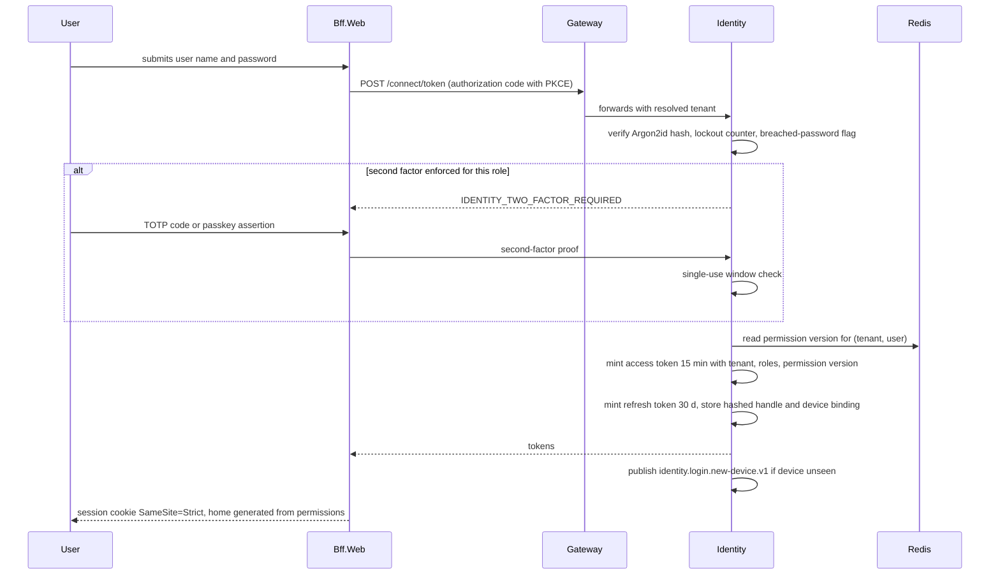
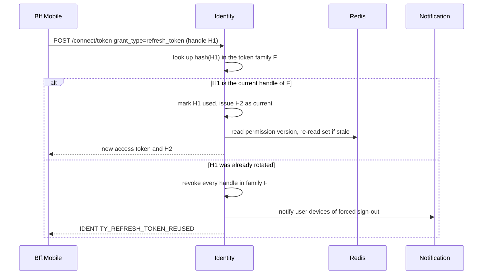
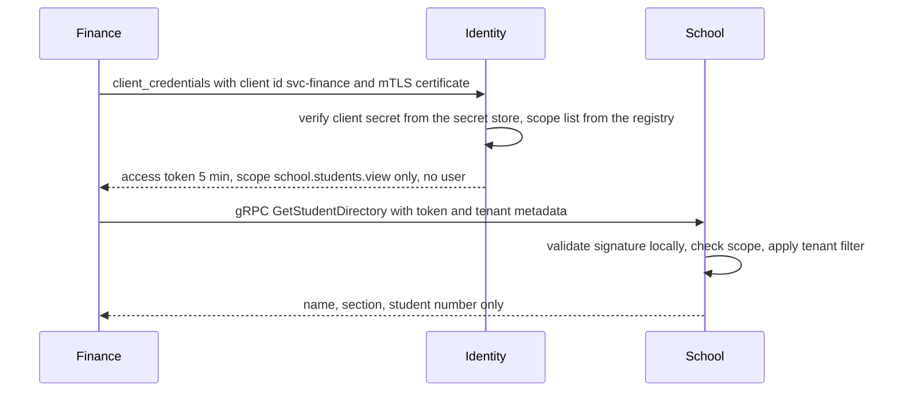
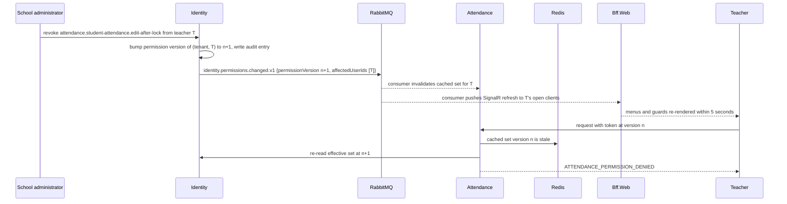
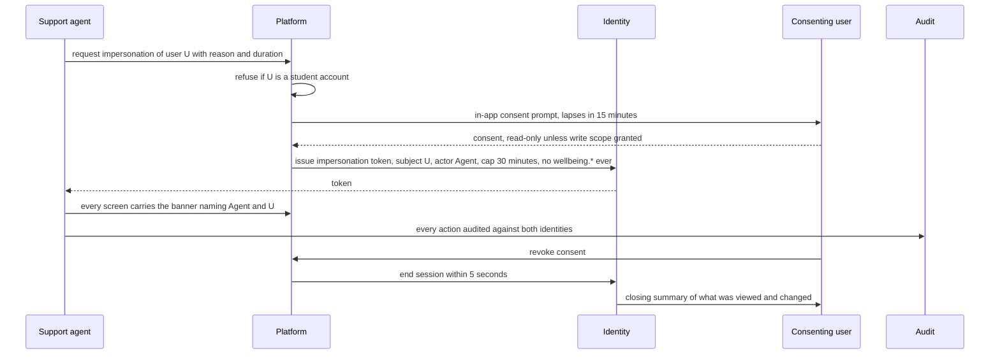

# 12. Security, Privacy, and Child Safety

> Plan document 12 of `docs/plan/PLAN_SPEC.md`. Group D. Sources: master brief Sections 9, 10, 20, 32, 33 and 38; reference architecture Sections 12 and 14; Appendices B, I, J, K, R and S. Names come from Appendix L. Every control in this document names the test that proves it; a control without a test is a wish, and the lint in the closing section treats it as a defect.

**Who this is for.** The engineer implementing an endpoint, the reviewer running `security-auditor` and `privacy-auditor`, the penetration tester scoping the engagement, and the data protection officer completing the impact assessment. The subject of most of this data is a child who did not choose to be in the system; when a control and a convenience conflict, the control wins.

**Cross-references.** `§N` means a section of this document; "Section N" always means the master brief unless the reference architecture is named.

**Test identifiers.** `TC-SEC-001` to `TC-SEC-026`, `TC-SEC-101` to `TC-SEC-904`, `TC-PRV-001` to `TC-PRV-016` and `TC-PRV-301` to `TC-PRV-902` are quoted from Appendices Q and R. Identifiers from `TC-SEC-031` upward and `TC-PRV-020` upward are minted here and become the security and privacy test plan that `16-test-strategy.md` schedules.

---

## 1. Standards and scope

| Standard | Scope | Level | Where the controls live | Proof |
|---|---|---|---|---|
| OWASP ASVS 5.0 | Every REST and gRPC surface, Gateway, both backends-for-frontends, the Angular workspaces | Level 2 | §3, §4, §9 and §11 of this document; the service sheets in `06-services/` | The generated suites in §4 plus the annual penetration test in §12 |
| OWASP MASVS 2 | The Flutter application and its device modes (master brief Section 18) | MASVS-L2 plus MASVS-R advisories | `09-mobile-structure.md` and §6 of this document (device rules) | Mobile pipeline checks and the mobile scope of the penetration test |
| OWASP API Security Top 10 | Public API, webhooks, personal access tokens (master brief Section 35) | Minimum checklist | `23-integrations-and-public-api.md`; §2 rows tagged API | Tenant-isolation attack suite and the API scope of the penetration test |
| OWASP Top 10 | Web workspaces and the backends-for-frontends | Minimum checklist | `08-web-structure.md`; §2 rows for Gateway and the backends-for-frontends | ZAP in `security-scan.yml` against the preview environment |

### 1.1 ASVS 5.0 Level 2 chapter checklist

| ASVS chapter | What Level 2 asks | Where it is implemented | Test |
|---|---|---|---|
| V1 Encoding and sanitization | Output encoding, injection resistance, safe deserialization | Angular default escaping; EF Core parameterization; System.Text.Json with no polymorphic type handling | `TC-SEC-050` (injection corpus against every endpoint) |
| V2 Validation and business logic | Schema validation, business-rule enforcement server-side, anti-automation | FluentValidation on every command; rules from Appendix S as domain invariants; per-tenant rate limits at Gateway | `TC-SEC-051`, the rule tests named in Appendix S |
| V3 Web frontend security | Cookies, CSP, clickjacking, CORS | Gateway security headers; `SameSite=Strict` session cookie for web; CSP with nonces; CORS allow-list per tenant domain | `TC-SEC-052` |
| V4 API and web service | Content types, HTTP verbs, GraphQL not used, WebSocket auth | Gateway request size limits; SignalR token on connect and revalidation on permission version | `TC-SEC-053` |
| V5 File handling | Upload validation, storage outside web root, safe download | Documents service: allow-list, ClamAV, object storage, signed URL of 5 minutes, `Content-Disposition: attachment` | §2.13 rows, `TC-SEC-240` to `TC-SEC-247` |
| V6 Authentication | Password policy, breached-password check, second factor, lockout | Identity with OpenIddict; TOTP and passkeys; offline breached-password list; lockout per Appendix G security policy | §3.1, `TC-SEC-031` to `TC-SEC-035` |
| V7 Session management | Short access tokens, rotating refresh tokens, revocation | Access token 15 minutes, refresh 30 days with rotation and reuse detection (Appendix J token row) | §3.2, `TC-SEC-036` to `TC-SEC-038` |
| V8 Authorization | Object-level, function-level, field-level, data scopes | Appendix B permissions declared per endpoint; BR-IDN-002 evaluation order; row-level security | §4, the generated permission-matrix suite `TC-SEC-055` |
| V9 Self-contained tokens | Signed JWT, algorithm pinning, small claims | OpenIddict signing key with overlap rotation; claims are user, tenant, roles, permission version only (master brief Section 7.5) | `TC-SEC-039` |
| V10 OAuth and OIDC | Authorization code with PKCE, client credentials for services | Identity is the only issuer; Google and Microsoft as upstream providers; service-to-service by client credentials | §3.3, `TC-SEC-040` |
| V11 Cryptography | Approved algorithms, key management, envelope encryption | Argon2id for passwords; AES-256-GCM column encryption with per-tenant data keys wrapped in OpenBao (reference architecture Section 12) | §9, `TC-SEC-370` to `TC-SEC-374` |
| V12 Secure communication | TLS everywhere including internal | TLS to PostgreSQL, RabbitMQ and Redis; mutual TLS between services on the scale mode | `TC-SEC-375` |
| V13 Configuration | Secrets outside code, dependency hygiene, unnecessary features off | `deploy/secrets/`, no secret in image or log; Gitleaks in every build | §9, §11 |
| V14 Data protection | Classification, caching rules, logs free of personal data | Appendix J levels; §6 per-class rules | `TC-PRV-040` to `TC-PRV-052` |
| V15 Secure coding and architecture | Threat model, dependency pinning, architecture tests | This document; lock files; architecture tests in `07-solution-structure.md` | the closing section lint |
| V16 Security logging and error handling | Audit of security events, no stack traces to clients, Problem Details | Audit service hash chain; Appendix K codes; `AUDIT_WRITE_FAILED` fails the action | `TC-SEC-270` to `TC-SEC-275` |
| V17 WebRTC | Not used | No real-time media in scope | Not applicable, recorded here so the auditor does not search for it |

### 1.2 MASVS 2 control groups

| MASVS group | Control | Where | Test |
|---|---|---|---|
| STORAGE | Tokens in platform secure storage; Drift database encrypted with a key from the keystore; no level-S data on the device ever | `09-mobile-structure.md` offline design | `TC-SEC-041` |
| CRYPTO | Platform keystore only; no home-grown cryptography | Flutter secure storage plugin pinned in `19-dependency-and-license-inventory.md` | `TC-SEC-042` |
| AUTH | Biometric unlock gates the local session, never replaces the server token; session timeout from the tenant security policy | Identity token rules apply unchanged | `TC-SEC-043` |
| NETWORK | TLS only; optional certificate pinning per flavor; no cleartext fallback | Bff.Mobile is the only endpoint the app talks to | `TC-SEC-044` |
| PLATFORM | Screenshot protection on sensitive screens; no sensitive data in lock-screen previews; deep links validated against the permission set | Notification templates per BR-WEL-003; Flutter route guards | `TC-SEC-045` |
| CODE | Obfuscation on release builds; no debug logging of personal data | Mobile pipeline `ci-mobile.yml` | `TC-SEC-046` |
| RESILIENCE | Root and jailbreak advisory, not a block, because a guardian on a rooted phone still has a right to see their child | Advisory banner, gate and nurse modes refuse on a rooted device | `TC-SEC-046` |
| PRIVACY | In-app account deletion request; no third-party tracking SDKs; privacy labels accurate | Master brief Section 18 store compliance | `TC-PRV-060` |

### 1.3 API Security Top 10 mapping

| Risk | Control | Test |
|---|---|---|
| Broken object-level authorization | Every handler loads the aggregate through the tenant filter and the data-scope predicate; identifiers are UUID v7 and never sequential | Tenant-isolation attack suite `TC-SEC-056` |
| Broken authentication | Identity is the only issuer; every service validates locally against the published keys; no API key without scopes and expiry | `TC-SEC-039`, `TC-SEC-040` |
| Broken object property-level authorization | Response models are per role; field-level protection for Appendix J sensitive groups; no entity is ever returned whole | `TC-SEC-057` (response shape snapshot per role) |
| Unrestricted resource consumption | Gateway rate limits per tenant and user; per-key quota on the public API; job concurrency per tenant | `TC-SEC-058` |
| Broken function-level authorization | Permission declared on every endpoint or the build fails (Appendix B rule 4) | `TC-SEC-055` |
| Unrestricted access to sensitive business flows | Marks lock, invoice posting, refunds and exports go through workflows with four-eyes | `TC-ASM-013`, `TC-FIN-014`, `TC-PRV-014` |
| Server-side request forgery | Webhook endpoints and LTI launch URLs are validated against a deny-list of private ranges and resolved once | `TC-SEC-124` |
| Security misconfiguration | Security headers snapshot; no default credentials except the seeded administrator under §8 | `TC-SEC-052`, `TC-SEC-360` |
| Improper inventory management | Aggregated OpenAPI at Gateway is the inventory; an undocumented route fails the build | `TC-SEC-054` |
| Unsafe consumption of APIs | Provider adapters validate every response schema; webhook receivers verify signature and timestamp | `TC-SEC-125` |

---

## 2. Threat model per service

Each table follows `docs/templates/threat-model.md`. Likelihood and impact are `low`, `med`, `high`; anything exposing a child's location, custody, health or wellbeing record is `critical` impact regardless of likelihood. The category column uses STRIDE: Spoofing, Tampering, Repudiation, Information disclosure, Denial of service, Elevation of privilege.

Common entry points are listed once: REST through Gateway and the backends-for-frontends, gRPC from a sibling service, a RabbitMQ consumer, a scheduled job, an upload, a webhook. Common controls that every service inherits and that the tables below do not repeat: the tenant filter plus row-level security (reference architecture Section 14), the permission declared per endpoint, the inbox for idempotent consumers, the outbox for publishing, the audit event per write, TLS everywhere.

### 2.1 Identity

| ID | Entry point | Category | Threat | Likelihood | Impact | Control | Test |
|---|---|---|---|---|---|---|---|
| T-IDN-01 | `POST /connect/token` | Spoofing | Credential stuffing against parent accounts | high | high | Lockout after the policy threshold, per-address and per-account rate limits, breached-password check at set time, new-device alert | `TC-SEC-110` |
| T-IDN-02 | `POST /connect/token` | Spoofing | Second factor bypass by replaying a TOTP code | med | high | Codes are single-use per window; passkeys preferred for staff; 2FA enforced per role from the security policy | `TC-SEC-111` |
| T-IDN-03 | Refresh endpoint | Spoofing | Stolen refresh token used from a second device | med | high | Rotation on every use; reuse of a rotated token revokes the whole family and raises `IDENTITY_REFRESH_TOKEN_REUSED` | `TC-SEC-037` |
| T-IDN-04 | Role editor | Elevation of privilege | An administrator grants themselves a high-risk permission | med | high | BR-IDN-004 four-eyes; self-approval refused with `IDENTITY_SELF_APPROVAL_REFUSED` | `TC-IDN-043` |
| T-IDN-05 | Invitation link | Spoofing | Stolen invitation used by a third party | med | med | Single use, 7-day expiry, bound to the tenant, contact channel proven in the same session | `TC-IDN-001`, `TC-IDN-006` |
| T-IDN-06 | Join-request approval | Elevation of privilege | Approver from tenant A approves a request in tenant B | low | critical | Tenant check runs before the permission check; attempt audited | `TC-IDN-005` |
| T-IDN-07 | Permission cache | Tampering | Stale cached permission set honoured after a revocation | med | high | BR-IDN-008 version per subject; `identity.permissions.changed.v1` invalidates within 5 seconds | `TC-SEC-038`, `TC-IDN-044` |
| T-IDN-08 | Break-glass CLI | Repudiation | Recovery command used without a trace | low | high | Command requires server access and an incident reference, writes an audit entry, raises a Sev1 (reference architecture Section 12) | `TC-SEC-112` |

### 2.2 Platform

| ID | Entry point | Category | Threat | Likelihood | Impact | Control | Test |
|---|---|---|---|---|---|---|---|
| T-PLT-01 | Support console | Elevation of privilege | Operator impersonates a user without consent | med | high | `platform.support.impersonate` needs recorded consent, banner, 30-minute cap, refused for student accounts (WF-SEC-03, BR-IDN-009) | `TC-SEC-022`, `TC-SEC-902` |
| T-PLT-02 | Tenant deletion | Tampering | Operator purges a tenant early or while a hold exists | low | critical | Cooling-off under BR-PLT-003; legal hold blocks the purge and notifies both parties | `TC-PLT-025`, `TC-PRV-902` |
| T-PLT-03 | Integrations console | Information disclosure | API key revealed twice or copied by a second administrator | med | high | `platform.api-keys.reveal-once` is high risk; the key hash only is stored (Appendix J) | `TC-SEC-120` |
| T-PLT-04 | Webhook delivery | Tampering | Forged webhook accepted by a school's receiver | med | med | HMAC signature over timestamp and body, five-minute replay window, challenge on registration (master brief Section 35) | `TC-SEC-121` |
| T-PLT-05 | Webhook endpoint registration | Spoofing | Endpoint URL pointing at an internal address (server-side request forgery) | med | high | Deny private and link-local ranges; resolve once and pin the address for the delivery | `TC-SEC-124` |
| T-PLT-06 | Feature flags and settings | Tampering | A setting change silently widens a security policy | low | high | Security-group settings from Appendix G are `elevated`; change history in the audit viewer; `reset-to-default` needs a reason | `TC-SEC-122` |
| T-PLT-07 | Usage metering consumer | Denial of service | A tenant floods usage events to hide overage or exhaust the queue | low | med | Per-tenant fairness on the queue; BR-PLT-005 reconciliation job fails on disagreement | `TC-SEC-123` |
| T-PLT-08 | Provider adapters | Information disclosure | A provider response injected into tenant data | low | med | Every adapter validates the response schema; provider keys per tenant behind the adapter | `TC-SEC-125` |

### 2.3 School

| ID | Entry point | Category | Threat | Likelihood | Impact | Control | Test |
|---|---|---|---|---|---|---|---|
| T-SCH-01 | `GET /students/{id}` | Information disclosure | A parent reaches another family's child by editing the identifier | high | critical | Data scope `own-children` in the query; refused with `SCHOOL_NOT_FOUND` so existence is not confirmed | `TC-SEC-501` |
| T-SCH-02 | Custody and medical summary | Information disclosure | Staff without the permission read custody text or medical detail | med | critical | `school.custody.view` and `school.medical-summary.view` are high risk; every read logged in the same transaction (Appendix J rule 8) | `TC-SEC-130` |
| T-SCH-03 | Guardian link | Elevation of privilege | A guardian restricted by a court order is linked to a child | low | critical | `school.guardians.link` checks the custody record; WF-IDN-02 refuses and surfaces the safeguarding note | `TC-IDN-015` |
| T-SCH-04 | Student export | Information disclosure | Bulk export of identity numbers by an insider | med | high | `school.students.export` routes through WF-PRV-02 when the column set is sensitive or bulk | `TC-PRV-301`, `TC-PRV-013` |
| T-SCH-05 | gRPC directory | Information disclosure | A sibling service asks for a field it may not hold | low | high | The directory contract returns name, section, number only; sensitive groups are never in a contract | `TC-SEC-131` |
| T-SCH-06 | Student merge | Tampering | Merge used to move a child into a different family's view | low | critical | `school.students.merge` is elevated with a reason; both records' guardians re-verified after merge | `TC-SEC-132` |

### 2.4 Admissions

| ID | Entry point | Category | Threat | Likelihood | Impact | Control | Test |
|---|---|---|---|---|---|---|---|
| T-ADM-01 | Public inquiry form | Denial of service | Bot floods inquiries and exhausts notification quota | high | med | Gateway rate limit for anonymous routes; proof-of-work or CAPTCHA behind a tenant setting | `TC-SEC-140` |
| T-ADM-02 | Application documents | Tampering | Malicious upload attached to an application | med | med | Documents service upload pipeline (§2.13) | `TC-SEC-240` |
| T-ADM-03 | Offer acceptance | Spoofing | Offer link reused to create a second student and guardian account | low | med | Offer token single use; `admissions.offers.make` records the acceptor; WF-ADM-01 | `TC-SEC-141` |
| T-ADM-04 | Waiting list | Tampering | Reordering to favour an applicant without trace | med | med | `admissions.waiting-list.reorder` is elevated with a reason and an audit before-and-after | `TC-SEC-142` |
| T-ADM-05 | Capacity override | Elevation of privilege | Officer overrides capacity to enrol beyond plan | low | low | `admissions.capacity.override-capacity` is elevated and reported on the principal dashboard | `TC-SEC-143` |

### 2.5 Academics

| ID | Entry point | Category | Threat | Likelihood | Impact | Control | Test |
|---|---|---|---|---|---|---|---|
| T-ACA-01 | Submission download | Information disclosure | A student downloads a classmate's submission | med | med | `academics.submissions.view` scoped `self` for students; signed URL bound to the caller | `TC-SEC-150` |
| T-ACA-02 | Quiz results | Tampering | A student edits a submitted quiz answer after the deadline | med | med | Submission is immutable after submit; `accept-late` is a teacher action with audit | `TC-SEC-151` |
| T-ACA-03 | QTI import | Tampering | Crafted QTI package with external entities or scripts | low | med | XML parsing with external entities disabled; content sanitized before render | `TC-SEC-152` |
| T-ACA-04 | Lesson plan review | Repudiation | Approver denies having approved a plan | low | low | `academics.lesson-plans.approve` writes the approver to the audit chain | `TC-SEC-153` |
| T-ACA-05 | Resources | Information disclosure | A resource shared to a section leaks to the whole tenant | med | low | Resource audience is a scope predicate, not a flag on the client | `TC-SEC-154` |

### 2.6 Assessment

| ID | Entry point | Category | Threat | Likelihood | Impact | Control | Test |
|---|---|---|---|---|---|---|---|
| T-ASM-01 | Mark entry | Tampering | Grade changed after lock without a grade-change request | med | high | `assessment.marks.change-after-lock` is high risk; BR-ASM-014 creates a new version; WF-ASM-02 needs a different approver | `TC-ASM-013`, `TC-SEC-160` |
| T-ASM-02 | Mark entry | Tampering | Teacher enters marks for a section they do not teach | med | med | `own-sections` scope on `assessment.marks.enter`; refused with `ASSESSMENT_PERMISSION_DENIED` | `TC-SEC-201` |
| T-ASM-03 | Report card PDF | Information disclosure | Signed URL for one child's report card shared and reused | med | high | Signed URL 5 minutes, bound to the requesting user, watermarked | `TC-SEC-161` |
| T-ASM-04 | Result calculation worker | Tampering | A replayed `assessment.marks.entered` event double-applies a mark | low | med | Inbox idempotency per message identifier; result calculation is deterministic from stored marks | `TC-SEC-162` |
| T-ASM-05 | Transcript verification page | Information disclosure | Verification code enumerated to read transcripts | low | med | Code is 128 bits, rate limited, and the page shows only the issuing school and validity | `TC-SEC-163` |
| T-ASM-06 | Exam paper store | Information disclosure | Paper read before the sitting by a non-invigilator | med | med | `assessment.exams.approve-paper` is elevated; paper files are level confidential with per-user access logged before the sitting date | `TC-SEC-164` |

### 2.7 Scheduling

| ID | Entry point | Category | Threat | Likelihood | Impact | Control | Test |
|---|---|---|---|---|---|---|---|
| T-SCD-01 | iCal feed | Information disclosure | Feed token shared and used to track a staff member's whereabouts | med | med | Per-user feed token, revocable, shows the user's own timetable only; rotation from the profile | `TC-SEC-170` |
| T-SCD-02 | Solver worker | Denial of service | One tenant's oversized timetable run starves the others | med | med | Per-tenant job concurrency of one solver run; KEDA scaling; time budget per run | `TC-SEC-171` |
| T-SCD-03 | Timetable publish | Tampering | Conflict override used to hide a double-booking | low | low | `scheduling.timetable.override-conflict` is elevated with reason | `TC-SEC-172` |
| T-SCD-04 | Substitution | Elevation of privilege | Cover teacher gains access to the covered section's marks | med | med | Cover grants attendance marking for the period only; marks stay with the assigned teacher | `TC-SEC-173` |

### 2.8 Attendance

| ID | Entry point | Category | Threat | Likelihood | Impact | Control | Test |
|---|---|---|---|---|---|---|---|
| T-ATT-01 | Gate pass verify | Spoofing | A gate pass QR replayed by a second collector | med | critical | One-time code, hashed at rest, validity window, collector photo shown to the officer (WF-ATT-02) | `TC-ATT-015` |
| T-ATT-02 | Pickup persons | Elevation of privilege | Guardian without pickup rights adds themselves as a collector | med | critical | `attendance.safety.pickup-persons.create` checks custody rights from School; `verify` needed before first use | `TC-SEC-180` |
| T-ATT-03 | Mark after lock | Tampering | Attendance edited after the lock window to erase absences | med | med | BR-ATT-002; `edit-after-lock` is elevated with reason; BR-ATT-010 for offline marks | `TC-SEC-181` |
| T-ATT-04 | Emergency broadcast | Denial of service | False emergency broadcast by a compromised account | low | high | `attendance.safety.emergency.broadcast` is high risk, needs 2FA step-up, is limited to campus scope | `TC-SEC-182` |
| T-ATT-05 | Visitor watchlist | Information disclosure | Watchlist read by front-desk staff without the permission | med | high | `manage-watchlist` is high risk; matches are shown as a hold instruction, never the reason | `TC-SEC-183` |
| T-ATT-06 | Offline mobile queue | Tampering | Device clock changed to backdate an offline mark | med | med | Server timestamps the arrival; Appendix M conflict rules; a mark outside the lock window is rejected | `TC-SEC-184` |

### 2.9 Finance

| ID | Entry point | Category | Threat | Likelihood | Impact | Control | Test |
|---|---|---|---|---|---|---|---|
| T-FIN-01 | Payment recording | Tampering | Cashier records a payment then reverses it and keeps the cash | med | high | Posted documents are immutable (BR-FIN-014); reversal is a credit note in its own gapless series; day close reconciles | `TC-FIN-011`, `TC-SEC-190` |
| T-FIN-02 | Refund approval | Elevation of privilege | Accountant approves their own refund | med | high | `finance.refunds.approve` is high risk; WF-FIN-02 requires a different approver | `TC-FIN-014` |
| T-FIN-03 | Payment gateway callback | Spoofing | Forged callback marks an invoice paid | med | high | Callback signature verified with the provider adapter; amount and reference re-read from the provider before allocation | `TC-SEC-191` |
| T-FIN-04 | Invoice batch run | Denial of service | A runaway batch creates duplicate invoices | low | med | Batch is idempotent on plan, student and period; BR-FIN-013 gapless numbering under concurrency | `TC-SEC-192` |
| T-FIN-05 | Payer bank details | Information disclosure | IBAN or gateway reference read outside the refund flow | med | high | Sensitive class, column-encrypted, never cached, every read logged (Appendix J) | `TC-SEC-193` |
| T-FIN-06 | Parent invoice view | Information disclosure | Parent reads another payer's invoice by identifier | high | high | `own-children` scope on `finance.invoices.view`; per-payer cache key | `TC-SEC-194` |
| T-FIN-07 | Write-off | Elevation of privilege | Write-off used to clear a relative's balance | low | high | `finance.write-offs.approve` is high risk with four-eyes; reported to the owner dashboard | `TC-SEC-195` |
| T-FIN-08 | Statement export | Information disclosure | Bulk statement export by an insider | med | high | `finance.reports.export` routes bulk through WF-PRV-02 with watermark | `TC-PRV-013` |

### 2.10 Communication

| ID | Entry point | Category | Threat | Likelihood | Impact | Control | Test |
|---|---|---|---|---|---|---|---|
| T-COM-01 | Message send | Spoofing | Adult contacts a student outside the messaging policy | med | critical | Policy check with Identity over gRPC before send; `COMMUNICATION_RECIPIENT_NOT_ALLOWED`; student-to-student off by default | `TC-SEC-210` |
| T-COM-02 | Oversight read | Repudiation | Safeguarding officer reads threads without a reason | low | high | `communication.messages.oversee-messages` is high risk; `COMMUNICATION_OVERSIGHT_REASON_REQUIRED`; every read logged | `TC-SEC-211` |
| T-COM-03 | Attachment | Tampering | Malicious attachment delivered to a parent | med | med | Documents pipeline scan before the message is releasable; `COMMUNICATION_ATTACHMENT_REJECTED` | `TC-SEC-240` |
| T-COM-04 | Report and block | Denial of service | A reported thread is edited before review | low | high | Reported thread locks with `COMMUNICATION_MESSAGE_REPORTED_LOCK`; bodies flagged follow the wellbeing retention rule | `TC-SEC-212` |
| T-COM-05 | Announcement audience | Information disclosure | Audience filter widened to the whole tenant by mistake | med | low | Audience is resolved server-side and previewed with a count; `COMMUNICATION_AUDIENCE_EMPTY` on the other extreme | `TC-SEC-213` |

### 2.11 Notification

| ID | Entry point | Category | Threat | Likelihood | Impact | Control | Test |
|---|---|---|---|---|---|---|---|
| T-NOT-01 | Push preview | Information disclosure | Lock-screen preview shows a clinic reason or a mark | med | critical | Templates carry no sensitive body (BR-WEL-003); preview text is a neutral category | `TC-SEC-220` |
| T-NOT-02 | Delivery log | Information disclosure | Recipient contact details exposed to operators through the log | low | med | Log stores a recipient reference, never the body or the address in clear (Appendix J) | `TC-SEC-221` |
| T-NOT-03 | Channel provider keys | Information disclosure | SMS provider key leaked in a worker log | low | high | Keys read from the secret store at startup; log scrubber denies known key shapes | `TC-SEC-222` |
| T-NOT-04 | Resend | Denial of service | Resend used to spam a guardian | low | low | `notification.delivery-log.resend` is rate limited per recipient and audited | `TC-SEC-223` |

### 2.12 Requests

| ID | Entry point | Category | Threat | Likelihood | Impact | Control | Test |
|---|---|---|---|---|---|---|---|
| T-RQS-01 | Approval chain design | Elevation of privilege | A chain designed so the requester approves their own request | med | med | Chain validation rejects a step whose approver resolves to the requester; `requests.requests.override` is elevated | `TC-SEC-230` |
| T-RQS-02 | Submit on behalf | Spoofing | Staff submits a request in a guardian's name without consent | low | med | `submit-on-behalf` records both identities; the guardian is notified and can withdraw | `TC-SEC-231` |
| T-RQS-03 | Request attachments | Information disclosure | Attachment to a medical excuse readable by approvers who do not need it | med | high | Attachment inherits the request's field class; medical excuse detail is sensitive and read-logged | `TC-SEC-232` |
| T-RQS-04 | Reassign | Tampering | Task reassigned to a leaver so it disappears | low | low | Reassignment target must be active; WF-IDN-06 inventories open items | `TC-IDN-052` |

### 2.13 Documents

| ID | Entry point | Category | Threat | Likelihood | Impact | Control | Test |
|---|---|---|---|---|---|---|---|
| T-DOC-01 | Upload | Tampering | Executable or polyglot file uploaded and served | high | high | Extension and magic-number allow-list, size limit, ClamAV in `Documents.Worker`, stored outside the web root, `DOCUMENTS_VIRUS_DETECTED` | `TC-SEC-240` |
| T-DOC-02 | Download | Information disclosure | Signed URL reused after expiry or by another user | high | high | 5-minute signed URL, bound to user and tenant, single content disposition; `DOCUMENTS_SIGNED_URL_EXPIRED` | `TC-SEC-241` |
| T-DOC-03 | Share link | Information disclosure | `share-link` used to publish a confidential file | med | high | `documents.files.share-link` is elevated; links carry the owner's class and are refused for sensitive owners | `TC-SEC-242` |
| T-DOC-04 | Sensitive export | Information disclosure | Mass export by an insider | med | high | `documents.exports.export-sensitive` is high risk; WF-PRV-02 with approver, watermark, single download, principal notified | `TC-PRV-014`, `TC-PRV-015` |
| T-DOC-05 | Import commit | Tampering | Import used to overwrite guardians for many students | med | high | Dry run required inside 24 hours (WF-DATA-01); rollback window; `documents.imports.commit` elevated | `TC-DATA-004`, `TC-DATA-006` |
| T-DOC-06 | Template placeholders | Information disclosure | A template merges a field the generating user may not see | med | high | Merge resolves fields through the caller's permission set; unresolved or forbidden placeholders fail with `DOCUMENTS_TEMPLATE_PLACEHOLDER_UNRESOLVED` | `TC-SEC-243` |
| T-DOC-07 | PDF renderer | Denial of service | Crafted HTML template causes runaway rendering | low | med | Renderer sandboxed, time and memory budget per job, no network from the renderer | `TC-SEC-244` |
| T-DOC-08 | Certificate verification page | Tampering | Revoked certificate still verifies | low | med | Verification reads live state; `DOCUMENTS_CERTIFICATE_REVOKED` | `TC-SEC-245` |

### 2.14 Behavior

| ID | Entry point | Category | Threat | Likelihood | Impact | Control | Test |
|---|---|---|---|---|---|---|---|
| T-BEH-01 | Incident narrative | Information disclosure | Narrative and witnesses read by staff without the restricted permission | med | high | `behavior.incidents.view-restricted` is elevated and every use logged (Appendix J) | `TC-SEC-250` |
| T-BEH-02 | Parent view | Information disclosure | Parent sees an incident naming another child | med | critical | Guardian projection strips other students' identifiers; `own-children` scope | `TC-SEC-251` |
| T-BEH-03 | Points | Tampering | Points revoked to punish without a record | low | low | `behavior.points.revoke` records the reason; WF-BEH-01 dismissal path | `TC-BEH-005` |
| T-BEH-04 | Open Badges export | Information disclosure | Badge assertion leaks the student's identity outside the tenant | low | med | `export-open-badge` uses a hashed recipient identifier and the student's consent flag | `TC-SEC-252` |

### 2.15 Reporting

| ID | Entry point | Category | Threat | Likelihood | Impact | Control | Test |
|---|---|---|---|---|---|---|---|
| T-RPT-01 | Report builder | Information disclosure | A custom report joins fields outside the author's scope | high | high | Projections carry scope tags; the query planner applies the author's scope before aggregation; aggregates under 10 students are suppressed (Appendix J rule 2) | `TC-SEC-260` |
| T-RPT-02 | Projections | Information disclosure | A level-S row reaches a projection | low | critical | Reporting consumes counts only from Wellbeing (BR-WEL-003); contract test on payloads | `TC-SEC-261` |
| T-RPT-03 | Scheduled report share | Information disclosure | Scheduled report emailed to a leaver | med | med | `reporting.reports.schedule` re-evaluates recipient permissions at each run | `TC-SEC-262` |
| T-RPT-04 | Early-warning explain | Information disclosure | Contributing factors reveal a wellbeing referral | low | critical | Factors are drawn from the permitted projections only; wellbeing appears as existence never as detail | `TC-SEC-263` |
| T-RPT-05 | Rebuild | Denial of service | Rebuild of one tenant's projections starves others | low | med | `reporting.projections.rebuild` is elevated and queued per tenant with fairness | `TC-SEC-264` |

### 2.16 Audit

| ID | Entry point | Category | Threat | Likelihood | Impact | Control | Test |
|---|---|---|---|---|---|---|---|
| T-AUD-01 | Entries table | Tampering | An insider with database access edits or deletes an entry | low | high | Append-only role for `svc_audit`, hash chain, nightly `audit.integrity-check.failed.v1`, `AUDIT_IMMUTABLE_RECORD` | `TC-SEC-270` |
| T-AUD-02 | Audit consumer | Repudiation | A write completes while its audit event is lost | med | high | Outbox on the producer; `AUDIT_WRITE_FAILED` fails a sensitive read in the same transaction (Appendix J rule 8) | `TC-SEC-271` |
| T-AUD-03 | Export | Information disclosure | Audit export used to harvest before-and-after values | low | high | `audit.entries.export` is high risk with reason and four-eyes; reported to the principal | `TC-SEC-904` |
| T-AUD-04 | Access log | Information disclosure | Access log read to learn who is under safeguarding review | low | critical | `audit.access-log.view` is high risk; wellbeing subjects are shown by existence with the record type only | `TC-SEC-272` |
| T-AUD-05 | Cold partitions | Tampering | Detached partition altered in cold storage | low | med | Partition hash recorded on detach; `audit.retention.partition-detached.v1` carries the hash; restore re-verifies | `TC-SEC-273` |

### 2.17 Wellbeing

| ID | Entry point | Category | Threat | Likelihood | Impact | Control | Test |
|---|---|---|---|---|---|---|---|
| T-WEL-01 | Any read | Information disclosure | A principal or teacher reads a counseling note through Student 360 or search | med | critical | Isolation level S: no template inherits `wellbeing.*` (Appendix I rule 7); excluded from search and Student 360; `WELLBEING_ACCESS_DENIED` returns 404 | `TC-SEC-280` |
| T-WEL-02 | Break-glass | Repudiation | Break-glass used without a reason or beyond the window | med | critical | `wellbeing.break-glass.use` needs a reason, alerts the record owner and safeguarding lead, expires (BR-WEL-002); `WELLBEING_BREAK_GLASS_EXPIRED` | `TC-SEC-101`, `TC-SEC-281` |
| T-WEL-03 | Event bus | Information disclosure | Clinical detail leaves in an event payload | low | critical | BR-WEL-003 payload contract test; events carry identifiers, category, severity only | `TC-SEC-282` |
| T-WEL-04 | Database | Information disclosure | A compromised sibling service credential reads wellbeing tables | low | critical | Separate database `nibras_wellbeing`, separate `svc_wellbeing` user, per-tenant column keys | `TC-SEC-283` |
| T-WEL-05 | Impersonation | Elevation of privilege | Platform operator reaches wellbeing through an impersonated session | low | critical | Impersonation can never carry `wellbeing.*` (BR-IDN-009); refused before the permission check | `TC-SEC-284` |
| T-WEL-06 | Safeguarding concern | Tampering | A staff member named in a concern opens or deletes it | med | critical | WF-WEL-04: named staff refused and alerted; no deletion path exists in any role | `TC-WEL-035`, `TC-WEL-036` |
| T-WEL-07 | Allergy alert | Denial of service | Cached or stale allergy shown when Wellbeing is down | low | critical | Read live on every view, never cached; `WELLBEING_ALLERGY_ALERT_UNAVAILABLE` blocks the dependent action | `TC-SEC-285` |
| T-WEL-08 | Medication | Tampering | Dose administered outside the guardian authorization | med | critical | BR-WEL-004; `WELLBEING_MEDICATION_NOT_AUTHORIZED`; every attempt including blocked ones recorded | `TC-SEC-286` |

### 2.18 Hr

| ID | Entry point | Category | Threat | Likelihood | Impact | Control | Test |
|---|---|---|---|---|---|---|---|
| T-HR-01 | Payroll | Information disclosure | Salary read by a principal or HR officer without `view-salary` | med | high | `hr.payroll.view-salary` is high risk, section absent from the interface, every read logged | `TC-SEC-801`, `TC-SEC-290` |
| T-HR-02 | Staff file export | Information disclosure | Bulk export of bank accounts | low | high | Sensitive columns are excluded from `hr.staff-files.export` unless routed through WF-PRV-02 | `TC-SEC-291` |
| T-HR-03 | Contract approval | Elevation of privilege | Self-approval of a contract change | low | high | `hr.contracts.approve` is high risk; approver must differ from the subject and the drafter | `TC-SEC-292` |
| T-HR-04 | Leave balance | Tampering | Balance adjusted to hide unauthorized absence | low | low | `hr.leave.adjust-balance` is elevated with reason | `TC-SEC-293` |

### 2.19 Operations

| ID | Entry point | Category | Threat | Likelihood | Impact | Control | Test |
|---|---|---|---|---|---|---|---|
| T-OPS-01 | Vehicle telemetry | Information disclosure | Vehicle location used to infer a child's location | med | critical | Location is tracked for vehicles never children (master brief Section 20); parents see the bus, not the child; 90-day retention | `TC-SEC-310` |
| T-OPS-02 | Boarding attendant mode | Spoofing | Attendant device used after the attendant left | med | high | Device enrolment bound to the account; WF-IDN-06 revokes devices; offline queue refuses writes after revocation on reconnect | `TC-IDN-051`, `TC-SEC-311` |
| T-OPS-03 | Activity medical flag | Information disclosure | Medical flag copied into the trip roster export | low | critical | Flag is read live and never copied (Appendix J); export omits it | `TC-SEC-312` |
| T-OPS-04 | Library fines waiver | Tampering | Fines waived for relatives | low | low | `operations.library.waive-fine` is elevated with reason | `TC-SEC-313` |
| T-OPS-05 | Visitor photo | Information disclosure | Visitor photos retained beyond 2 years | low | med | Retention job on visitor records; identity reference encrypted | `TC-PRV-046` |

### 2.20 Ai

| ID | Entry point | Category | Threat | Likelihood | Impact | Control | Test |
|---|---|---|---|---|---|---|---|
| T-AI-01 | Assistant prompt | Tampering | Prompt injection through a retrieved document or message body | high | high | Retrieved content is data never instructions; tool calls limited to the caller's permissions; `AI_PROMPT_INJECTION_BLOCKED` logs and notifies | `TC-SEC-320` |
| T-AI-02 | Retrieval | Information disclosure | Natural-language query reaches rows outside the caller's scope | med | high | Every embedding carries tenant, scope and source version; filter before rank; `AI_SCOPE_VIOLATION_BLOCKED` | `TC-SEC-321` |
| T-AI-03 | Indexing | Information disclosure | Level-S content indexed | low | critical | Ai never consumes Wellbeing events with detail (BR-WEL-003) and refuses level-S context with `AI_SENSITIVE_CONTEXT_REFUSED` | `TC-SEC-322` |
| T-AI-04 | Provider adapter | Information disclosure | Student data sent to an external provider without tenant consent | low | high | Rung 4 off by default; `ai.configuration.set-provider` is elevated; consent recorded per tenant | `TC-SEC-323` |
| T-AI-05 | Drafting | Tampering | A draft auto-published to a family | low | high | `AI_OUTPUT_REQUIRES_REVIEW`; autonomy 4 never over a grade, payment or family message (master brief Section 25) | `TC-SEC-324` |
| T-AI-06 | Withdrawn student | Information disclosure | Embeddings survive after withdrawal | med | high | `school.student.status-changed.v1` to withdrawn purges the index | `TC-SEC-325` |

### 2.21 Gateway and the backends-for-frontends

Not data owners, but they are the first hop for every threat above.

| ID | Entry point | Category | Threat | Likelihood | Impact | Control | Test |
|---|---|---|---|---|---|---|---|
| T-GW-01 | Tenant resolution | Spoofing | Header-based tenant override from a browser client | med | critical | Tenant header accepted only from the mobile client credential; web resolves from the domain; the token's tenant must match or `_TENANT_MISMATCH` | `TC-SEC-330` |
| T-GW-02 | Token validation | Spoofing | Token signed with a retired key accepted | low | high | Keys published with an overlap window and retired after the last token expires | `TC-SEC-039` |
| T-GW-03 | Rate limiting | Denial of service | One tenant exhausts the platform | med | med | Per-tenant and per-user limits in Redis; `_RATE_LIMITED` with `Retry-After` | `TC-SEC-058` |
| T-GW-04 | Bff.Web aggregation | Information disclosure | The backend composes a screen with fields the user may not see | med | high | The backend forwards the caller's token; it holds no permissions of its own and stores nothing | `TC-SEC-331` |
| T-GW-05 | Maintenance mode | Denial of service | Maintenance flag flipped without authorization | low | med | `platform.settings.edit` plus operator role; audited | `TC-SEC-122` |

### 2.22 Abuse cases from master brief Section 20

| ID | Abuse case | Attacker | Path | Control | Test |
|---|---|---|---|---|---|
| A-01 | Cross-tenant access | A logged-in user in tenant A | Swap the tenant header, a tenant-bound identifier, or a cached token | Gateway tenant match, tenant filter, row-level security, full tenant UUID in cache keys | `TC-SEC-056`, `TC-SEC-330` |
| A-02 | Parent reads another family's child by changing an identifier | A logged-in parent | Edit the student identifier in the address bar or the API call | `own-children` scope in the query, 404 with no hint | `TC-SEC-501` |
| A-03 | Privilege escalation through the role editor | A school administrator | Grant a high-risk permission to their own account or clone a template and add it | BR-IDN-004 four-eyes, self-approval refused, no wildcard grants | `TC-IDN-043`, `TC-SEC-340` |
| A-04 | Stolen invitation or gate-pass link | Anyone holding the link | Open the link from another device or after use | Single use, expiry, tenant binding, collector photo for gate passes | `TC-IDN-006`, `TC-ATT-015` |
| A-05 | Mass export by an insider | Registrar, accountant, counselor | Export a list with identity numbers or a caseload | WF-PRV-02 approval, watermark, single download, principal notified | `TC-PRV-301`, `TC-PRV-701` |
| A-06 | Grade tampering | Teacher or head of department | Change a mark after lock, or replay a mark event | `change-after-lock` high risk, new version, idempotent consumer | `TC-ASM-013`, `TC-SEC-162` |
| A-07 | Payment tampering | Cashier | Reverse a posted payment, forge a gateway callback, self-approve a refund | Immutable posted documents, callback verification, four-eyes | `TC-SEC-190`, `TC-SEC-191`, `TC-FIN-014` |
| A-08 | Malicious file upload | Any uploader | Upload a polyglot or infected file, or a template with scripts | Allow-list, ClamAV, storage outside the web root, sandboxed renderer | `TC-SEC-240`, `TC-SEC-244` |
| A-09 | Forged or replayed messages on RabbitMQ | A compromised service credential | Publish to another service's exchange or replay a consumed message | RabbitMQ user per service limited to its exchange; inbox idempotency; envelope carries producer identity | `TC-SEC-341`, `TC-SEC-162` |
| A-10 | Prompt injection against the assistant | Any author of indexed content | Place instructions in a message body, a document, or a custom field | Content as data, tool calls bound to the caller, injection detection | `TC-SEC-320` |
| A-11 | Takeover of an administrator account | External attacker | Credential stuffing, second-factor fatigue, session theft | Lockout, passkeys enforced for administrators, refresh reuse detection, new-device alert, IP allowlist for admin routes | `TC-SEC-110`, `TC-SEC-111`, `TC-SEC-037` |
| A-12 | Insider reads a safeguarding record | Principal or teacher | Student 360, search, Reporting, the Ai assistant, impersonation | Isolation level S at every one of those five doors | `TC-SEC-280`, `TC-SEC-261`, `TC-SEC-322`, `TC-SEC-284` |

---

## 3. Authentication flows

Every diagram names services from Appendix L. Access tokens live 15 minutes, refresh tokens 30 days with rotation (Appendix J token row). Token claims are user, tenant, roles and permission version only (master brief Section 7.5).

### 3.1 Sign-in with second factor and permission version



Tests: `TC-SEC-031` password and lockout, `TC-SEC-032` TOTP single use, `TC-SEC-033` passkey, `TC-SEC-034` tenant list withheld until credentials verified (BR-IDN-007), `TC-SEC-035` new-device alert.

### 3.2 Token refresh with rotation and reuse detection



Tests: `TC-SEC-036` rotation issues a new handle, `TC-SEC-037` reuse revokes the family, `TC-SEC-038` refresh carries the current permission version.

### 3.3 Service-to-service client credentials



Rules: no service trusts a caller because it is inside the network (master brief Section 7.5); one synchronous hop only; a service token carries no user and therefore no data scope wider than the contract allows. Test: `TC-SEC-040` a service token with a scope it was not registered for is refused by the callee.

### 3.4 Permission change propagation with no sign-out



Tests: `TC-IDN-044` open sessions see the change without re-login, `TC-SEC-038` a token at an older version is authorized against the newer set (BR-IDN-008), the Appendix I rule 5 contract of 5 seconds on web and mobile is `TC-SEC-047`.

### 3.5 Break-glass path

Two distinct paths share the name. WF-SEC-02 is the platform operator's incident access. BR-WEL-002 is a tenant staff member's emergency access to a wellbeing record. The diagram shows the wellbeing path, which is the one that touches a child.

```mermaid
sequenceDiagram
    participant Nurse
    participant WEL as Wellbeing
    participant AUD as Audit
    participant NOT as Notification
    Nurse->>WEL: open restricted record with break-glass and reason
    WEL->>WEL: check wellbeing.break-glass.use, reason not empty
    alt reason empty
        WEL-->>Nurse: WELLBEING_BREAK_GLASS_REASON_REQUIRED
    end
    WEL->>AUD: access entry with reason, in the same transaction as the read
    WEL->>NOT: identity.break-glass.used.v1 to record owner, safeguarding lead, principal
    WEL-->>Nurse: record, window of 30 minutes
    Nurse->>WEL: read after the window
    WEL-->>Nurse: WELLBEING_BREAK_GLASS_EXPIRED
    Note over WEL,AUD: post-use review task raised; the entry is never deleted
```

Tests: `TC-SEC-101`, `TC-SEC-281`; for the operator path `TC-SEC-011` to `TC-SEC-016`; the CLI recovery command for a locked-out super administrator is `TC-SEC-112`.

### 3.6 Consented impersonation with banner



Tests: `TC-SEC-021` to `TC-SEC-026`, `TC-SEC-902`, `TC-SEC-903`, and `TC-SEC-284` for the wellbeing exclusion.

---

## 4. Authorization

### 4.1 The permission model, quoted from Appendix B

| Element | Rule from Appendix B |
|---|---|
| Naming | `<service>.<resource>.<action>`; the service segment is a real service from Appendix L. Old `students.*`, `safety.*`, `admin.*` forms are defects |
| Standard actions | `view`, `create`, `edit`, `delete`, `export` on every resource unless stated otherwise |
| Special actions | Listed per resource; these carry the risk |
| Risk levels | `normal` routine; `elevated` needs a reason and appears in the audit viewer's default filter; `high` needs four-eyes to grant, is time-limited by default, and is reviewed in every access-review campaign |
| Data scopes | In narrowing order: `all-tenant`, `campus`, `stage`, `department`, `own-sections`, `own-homeroom`, `own-children`, `self`. Exactly one scope per grant; the evaluator takes the narrowest applicable scope when a user holds a permission through several roles |
| Dependency | `edit` requires `view`; `approve` requires `view`; `delete` requires `edit`; resolved transitively and checked for cycles at startup (BR-IDN-001) |
| Four-eyes | A `high` grant needs a second approver who is neither the requester nor the subject; expires after the configured window (BR-IDN-004, WF-IDN-05) |
| Live application | A role change publishes `identity.permissions.changed.v1`; caches invalidate within seconds; nobody signs out (BR-IDN-008) |
| Server-side only | The interface reflects; every endpoint declares its permission; the generated suite proves each role can do exactly what the catalog says |
| Sensitive reads logged | `school.custody`, `school.medical-summary`, every `wellbeing.*`, `audit.access-log`, and `communication.messages` under oversight write an access entry on read |
| No wildcard grants | No "all permissions" permission; the super administrator holds an explicit, reviewable set |

### 4.2 Evaluation order for data scopes

Quoted from BR-IDN-002 and applied identically in every service; a service that reorders it is a defect.

| Stage | Question | Denial result | Where it runs |
|---|---|---|---|
| 1 Tenant | Does the token's tenant equal the resolved tenant and the row's `tenant_id`? | `_TENANT_MISMATCH` 403, session signed out of the wrong context | Gateway, then the tenancy building block in the service |
| 2 Campus | Is the row's campus inside the user's campus assignment? | No rows, or `_PERMISSION_DENIED` on a direct fetch | Query predicate in the application layer |
| 3 Role data scope | Does the narrowest scope of the permission include the row (`own-sections`, `own-children`, and so on)? | No rows, or `_PERMISSION_DENIED`; Wellbeing answers `_NOT_FOUND` | Query predicate in the application layer |
| 4 Row-level security | `tenant_id = current_setting('app.tenant_id')` | Zero rows even if stages 2 and 3 have a bug | PostgreSQL policy, `SET LOCAL` inside every transaction |

Scopes on one role union; scopes across stages intersect; an empty scope means no rows, never all rows. Tests: `DataScopeEvaluationRulesTests` from Appendix S, `TC-SEC-055` for the matrix, `TC-SEC-056` for the isolation attack suite, and `TC-SEC-059` for the pooled-connection proof from reference architecture Section 14 (a connection returned to PgBouncer cannot read the previous tenant's rows).

### 4.3 The generated permission-matrix suite

| Aspect | How |
|---|---|
| Inputs | Appendix B (every permission, risk, scopes, dependencies) parsed from its tables; Appendix I (twenty-three templates, the groups G01 to G24, the `F V A S — 4` matrix); the aggregated OpenAPI from Gateway, where every operation carries an `x-nibras-permission` extension |
| Generator | `tools/permission-matrix-gen` emits one xUnit class per service into `tests/<Service>.Authorization.Generated/`; regenerated in `ci-service.yml` before the integration stage so drift fails the build, never a human |
| Per role and endpoint, allowed | A request as that role with a seeded in-scope object succeeds with the documented status |
| Per role and endpoint, forbidden | The same request as a role without the permission returns `<SERVICE>_PERMISSION_DENIED` (Wellbeing: `WELLBEING_ACCESS_DENIED` with 404) and writes no row |
| Scope | For `S` cells, the request against an out-of-scope object of the same tenant returns no rows or `_PERMISSION_DENIED` and never the object |
| Dependency | A role holding an action without its dependency cannot be saved (`TC-SEC-055` sub-case) |
| Four-eyes | Every `4` cell and every `high` permission: a single-actor grant leaves the grant pending and confers nothing |
| Must-not-hold | Every entry in the Appendix I "Must not hold" column: the template's effective set does not contain it, and a clone that adds it fails without four-eyes |
| Catalog integrity | An endpoint declaring a permission absent from Appendix B fails the build; a permission in Appendix B with no endpoint and no job is reported as a warning |
| Size | Twenty-three templates times roughly 600 operations; runs in the Test environment at size (reference architecture Section 15) and as a sampled subset per pull request |

Identifier: `TC-SEC-055`. Response-shape snapshot per role, proving field-level protection: `TC-SEC-057`.

### 4.4 The tenant-isolation attack suite

| Aspect | How |
|---|---|
| Enumeration | Endpoints from the aggregated OpenAPI; gRPC methods from the `Nibras.Contracts.<Service>` assemblies; consumers from the inbox registrations of each service; jobs from the scheduler registry; signed-URL and share-link routes from Documents |
| Fixture | Two seeded tenants A and B with structurally identical data (Appendix H demo tenants), a logged-in user per template in each |
| Identifier swap, REST | For every path and body parameter that is an identifier, substitute tenant B's identifier while authenticated in tenant A; expect 404 or `_TENANT_MISMATCH`, never 200 and never a validation error that leaks a field |
| Header swap | Send tenant B's identifier in the tenant header with tenant A's token; expect `_TENANT_MISMATCH` |
| Token swap | Present tenant B's token on tenant A's domain; expect refusal at Gateway |
| Consumer swap | Publish an event whose envelope tenant differs from the payload identifiers; the consumer must reject and dead-letter, never write |
| Cache swap | Read a cache key with tenant B's full UUID from tenant A's context; assert the key namespace differs and no entry is shared |
| Signed URL swap | Use a signed URL minted for tenant A's user from tenant B's session; expect `DOCUMENTS_SIGNED_URL_EXPIRED` or 403 |
| Pool swap | Run a tenant A transaction, return the connection, run tenant B; assert zero rows of A (reference architecture Section 14) |
| Family swap | A parent in tenant A with two children tries every `own-children` endpoint with a third child of the same tenant; expect 404 |
| Reporting | Every reporting endpoint filtered to tenant A must return zero rows tagged B; a projection rebuild for B must not touch A |
| Output | Count of endpoints and consumers attacked, which is the evidence line in the Appendix V phase gate |

Identifier: `TC-SEC-056`. The count is published in the pipeline summary and in `30-plan-scorecard.md`.

---

## 5. Default role matrix

The twenty-three built-in templates, their purpose, default scope, landing dashboard, mobile capabilities, what each holds and must never hold, the permission groups G01 to G24, and the role-by-group matrix are defined in **Appendix I** and are not restated here. This document adds only what the matrix means for the tests and the reviewer.

| Appendix I element | What this document does with it |
|---|---|
| I.2 "Must not hold" column | Every entry becomes a negative test in `TC-SEC-055` |
| I.3 groups with `high` inside | Every such group is in scope for the annual access review (WF-SEC-01) and the four-eyes suite |
| I.4 cells marked `4` | Generated four-eyes tests; a self-grant is refused even when the actor holds both permissions |
| I.4 cells marked `S` | Generated scope tests against an out-of-scope object |
| I.5 rule 5, 5-second propagation | `TC-SEC-047` on web and on mobile |
| I.5 rule 7, isolation level S opt-in only | `TC-SEC-280`: no template's effective set contains `wellbeing.*` unless granted explicitly |
| I.5 rule 1, locked and clonable | `TC-SEC-340`: a clone records its parent and release; editing a system template in place is refused |

---

## 6. Data classification handling

### 6.1 The five levels, quoted from Appendix J

| Level | Meaning | Storage | Cache | Access log |
|---|---|---|---|---|
| Public | Safe outside the tenant | Plain | Cacheable, shared key allowed | no |
| Internal | Safe for any signed-in member of the tenant | Plain | Cacheable with the tenant in the key | no |
| Confidential | Limited to roles with the permission and the scope | Plain, protected by row-level security | Per-user key, short lifetime only | On export only |
| Sensitive | Special-category data about a child or an employee | Column-encrypted at rest | Never | Every read |
| S, isolation level | Wellbeing: clinic, counseling, safeguarding, plans | Column-encrypted, separate database `nibras_wellbeing`, separate credentials | Never, never projected | Every read, plus an alert on break-glass |

The field-level table (Appendix J.2), the owning-service table (J.3) and the never-cached list (J.4) are normative and are not copied here; a new column arrives with its row there in the same pull request as its migration (J.5 rule 1).

### 6.2 Per-class handling rules

| Handling | Public | Internal | Confidential | Sensitive | S |
|---|---|---|---|---|---|
| Redis and `HybridCache` | Shared key | `nibras:{tenant}:…` key | Per-user key, 60 seconds or less | Never | Never |
| Application log | May appear | Identifiers only | Identifiers only, never values | Never, not even the identifier of the record in a message body; a correlation id instead | Never |
| Exception message | May appear | Identifiers only | Never | Never | Never |
| Export | Free | Free within the tenant | Logged; bulk routes through WF-PRV-02 | Always WF-PRV-02, watermark, reason, principal notified | Only the tenant deletion archive and WF-PRV-01, with the safeguarding officer named |
| Mobile device store (Drift) | Yes | Yes, encrypted at rest | Yes for the user's own scope, encrypted, purged on sign-out and on permission loss | Never | Never |
| Ai index | Yes | Yes with tenant tag | Yes with tenant, scope and source version tags | Never | Never, refused with `AI_SENSITIVE_CONTEXT_REFUSED` |
| Reporting projection | Yes | Yes | Yes, scope-tagged, aggregates under 10 suppressed | Balance and count figures only | Counts only |
| Event payload | Yes | Yes | Identifiers and the few fields needed | Never (Appendix E payload rule) | Never (BR-WEL-003) |
| URL and query string | Yes | Identifiers only | Identifiers only | Never | Never |
| Notification body and push preview | Yes | Yes | Neutral wording, no values | Never | Never |
| Backup | Encrypted at rest | Encrypted | Encrypted | Encrypted with the tenant data key | Encrypted with the tenant data key, restorable only with the Wellbeing service key |

Tests: `TC-PRV-040` cache rules per level (an architecture test reads the classification attribute and refuses a cache registration for Sensitive or S), `TC-PRV-041` log scrubber corpus, `TC-PRV-042` export routing by class, `TC-PRV-043` device store purge on permission loss, `TC-PRV-044` Ai index refuses Sensitive and S, `TC-PRV-045` projection contract per class, `TC-PRV-046` visitor and vehicle retention jobs, `TC-PRV-047` notification templates carry no sensitive value, `TC-PRV-048` event payload contract, `TC-PRV-049` no personal data in URLs, `TC-PRV-050` aggregate suppression under 10, `TC-PRV-051` classification attribute present on every entity or the migration fails, `TC-PRV-052` backup encryption key per tenant.

---

## 7. Child-safety controls

From master brief Section 20, each with the owning service and the proof.

| Control | Owning service | Implementation | Test |
|---|---|---|---|
| Messaging policy per school: who may message whom, during which hours | Communication, policy read from Platform settings | Policy evaluated server-side on every send with an Identity check; `COMMUNICATION_RECIPIENT_NOT_ALLOWED`, `COMMUNICATION_QUIET_HOURS` | `TC-SEC-210`, `TC-PRV-020` |
| Student-to-student messaging off by default | Communication | Tenant setting defaults to off; Student template must not hold `communication.messages.create` to other students while the default holds (Appendix I) | `TC-PRV-021` |
| No public profiles, no student search by outsiders | School, Gateway | No anonymous route returns a student; directory search requires `school.students.view` in scope | `TC-PRV-022` |
| Report and block in every conversation | Communication | Report locks the thread (`COMMUNICATION_MESSAGE_REPORTED_LOCK`), routes to the safeguarding queue, block is honoured by the policy | `TC-SEC-212`, `TC-PRV-023` |
| Attachment scanning | Documents | ClamAV verdict before a message or post is releasable | `TC-SEC-240` |
| Optional, transparent keyword flagging | Communication, alert through Notification | Tenant setting, disclosed in the privacy notice; a flag reaches the safeguarding officer within 15 minutes (master brief Section 38) | `TC-PRV-024` |
| Safeguarding officer role whose oversight is itself logged | Identity, Audit | `communication.messages.oversee-messages` and `wellbeing.safeguarding.*` are high risk; every read writes an access entry visible to the principal | `TC-SEC-211`, `TC-PRV-025` |
| Photo and media consent enforced at publishing time | Communication and Behavior publish; School owns the flag | Tagging a student without consent blocks publishing; withdrawal propagates to galleries, news, badges, exports in flight | `TC-PRV-502`, `TC-PRV-026` |
| Location tracked for vehicles, never for children | Operations | No child position field exists; parents see the vehicle | `TC-SEC-310` |
| AI never profiles a child in ways a guardian or the school cannot see and challenge | Ai, Reporting | Every early-warning flag carries its factors and an override; guardian transparency panel lists the flag | `TC-PRV-027` |
| Guardian custody restrictions on viewing, messaging, pickup | School (custody), Communication, Attendance | Custody record consulted on link, on message policy, on pickup authorization | `TC-IDN-015`, `TC-SEC-180`, `TC-PRV-028` |
| Impersonation never targets a student account | Platform | Refused outright with no prompt | `TC-SEC-022` |
| Flagged content never deleted by a routine retention job while a case is open | Communication, Wellbeing, Platform retention | Retention job skips rows under a safeguarding flag or a legal hold and reports the skip | `TC-PRV-029` |
| Anonymous safeguarding report stores no reporter identity | Wellbeing | WF-WEL-04 | `TC-WEL-032` |
| Guardian transparency panel: who read the child's sensitive records and when, consents, retention clocks | Bff.Web and Bff.Mobile composing from Audit and Platform | Master brief Section 12.1 item 31; the Appendix J retention column is the source | `TC-PRV-501`, `TC-PRV-702` |

---

## 8. Seeded administrator safeguards

From master brief Section 10.2; every item is mandatory and has a test.

| # | Safeguard | Implementation | Test |
|---|---|---|---|
| 1 | One super administrator seeded on first start from `Seed:AdminUsername` and `Seed:AdminPassword` | Identity seeder runs once inside the provisioning saga step for the platform tenant | `TC-SEC-360` |
| 2 | Password change forced on first login; the default can never be set again for that account | Password history of 5 plus an explicit deny of the documented default for that account | `TC-SEC-361`, `TC-PLT-006` |
| 3 | In Production, all admin functions blocked until the password is changed and 2FA enrolled; console warning while any account still uses a seeded password | Gateway policy for platform routes checks the `seeded-credential` flag; Platform console banner | `TC-SEC-362` |
| 4 | Seeder is idempotent: never recreates, never resets an existing password | Second start with the same configuration is a no-op | `TC-SEC-363` |
| 5 | Seeder refuses to start when the configured password equals the documented default and the environment is not Development | Startup validation fails the host; the documented default lives in the brief and demo configuration only; the secret scan allows it under `docs/` and fails on it anywhere else | `TC-SEC-364`, Gitleaks rule in `security-scan.yml` |
| 6 | Only a salted hash stored; the password never in logs, client code, test output or API responses | Argon2id; log scrubber; the test asserts on captured output | `TC-SEC-365` |
| 7 | Lockout and rate limiting apply like any other account | No exemption in the lockout policy | `TC-SEC-366` |
| 8 | Documented break-glass recovery command, CLI with server access, for a locked-out super administrator | `nibras-identity recover-super-admin --incident <ref>`; writes an audit entry and raises a Sev1 (reference architecture Section 12); runbook `docs/ops/runbooks/super-admin-recovery.md` | `TC-SEC-112` |
| 9 | The last super administrator cannot be deleted, deactivated or stripped of the role | BR-IDN-005 in the same transaction; `IDENTITY_LAST_SUPER_ADMIN` | `LastSuperAdminRulesTests`, `TC-SEC-367` |
| 10 | A new tenant never receives a shared password; its first administrator joins through a single-use invitation | WF-PLT-01 owner invitation | `TC-PLT-003`, `TC-IDN-001` |

---

## 9. Secrets and key inventory

Quoted from reference architecture Section 12, with the runbook that rotates each one. Runbooks live in `docs/ops/runbooks/` following `docs/templates/runbook.md`, and each is executed in a game day within ninety days of being written (master brief Section 24).

| Secret | Scope | Store | Rotation | Runbook | Test |
|---|---|---|---|---|---|
| Database password | per service, user `svc_<service>` | OpenBao at scale, Docker secrets on a single server | 90 days, rolling restart | `rotate-database-password.md` | `TC-SEC-370` rotation with zero failed requests |
| RabbitMQ user | per service, limited to its exchange and queues | as above | 90 days | `rotate-rabbitmq-user.md` | `TC-SEC-371` |
| Redis ACL user | per service, restricted to its key prefix | as above | 90 days | `rotate-redis-acl.md` | `TC-SEC-372` |
| OpenIddict signing key | platform | as above | 180 days with overlap; old key published until every token minted with it expired | `rotate-token-signing-key.md` | `TC-SEC-039` |
| OpenIddict encryption key | platform | as above | 180 days, same overlap | `rotate-token-encryption-key.md` | `TC-SEC-373` |
| Column encryption data keys | per tenant for Wellbeing, per deployment elsewhere; wrapped by a key-encryption key in OpenBao | envelope encryption | yearly, or immediately on suspicion; rotating the key-encryption key re-wraps without rewriting rows | `rotate-column-encryption-keys.md` | `TC-SEC-374` |
| Webhook signing secret | per endpoint | Platform database, encrypted | on demand with overlap; the school rotates from the console | `rotate-webhook-secret.md` | `TC-SEC-121` |
| Provider keys (SMS, payment, push, AI) | per tenant or per deployment | as above, behind an adapter | per provider policy | `rotate-provider-key.md` | `TC-SEC-222` |
| Break-glass super-administrator recovery | platform | offline, sealed, two-person | on use; use raises a Sev1 and an audit entry | `super-admin-recovery.md` | `TC-SEC-112` |
| TLS certificates, internal and edge | per deployment | cert-manager at scale, files on a single server | 90 days automatic | `renew-tls-certificates.md` | `TC-SEC-375` |
| Service client credentials | per service | OpenBao | 90 days | `rotate-service-client-secret.md` | `TC-SEC-040` |

Rules quoted: no secret in the repository, an image, a log or a client bundle; read at startup and on a refresh signal; rotation rehearsed at least once before launch; a compromised secret is rotated first and investigated second. Tests `TC-SEC-376` Gitleaks on every build, `TC-SEC-377` image scan for embedded secrets, `TC-SEC-378` the Angular and Flutter bundles contain no key shape.

---

## 10. Privacy operations

### 10.1 Consent model

| Element | Rule | Owner | Test |
|---|---|---|---|
| Consent texts are versioned | A consent record stores the text version, decision, actor and timestamp (Appendix J consent row); a new version re-asks | Platform holds texts; School holds the student's decisions | `TC-PRV-061` |
| Consent categories | Photo and media; data sharing with a named sub-processor; external AI provider (rung 4); optional keyword flagging disclosure; medication authorization (BR-WEL-004) | School, Platform, Ai, Communication, Wellbeing | `TC-PRV-062` |
| Who may consent | A guardian with parental access and no custody restriction; a student above the tenant's configured age for their own account settings | School custody record | `TC-PRV-028` |
| Withdrawal propagates | Within one minute to cached projections, galleries, search indexes, notification bodies, exports still in Ready state | Every holder of the flag consumes `school.student.profile-updated.v1` naming the consent field | `TC-PRV-026`, `TC-PRV-502` |
| Privacy notices inside the product | Arabic and English, per tenant, per country plug-in; shown at first sign-in and on change | Platform | `TC-PRV-063` |
| No advertising, no sale, no behavioural tracking of students | Product analytics is self-hosted and covers staff and administrator usage only; the mobile application ships no third-party tracking SDK | Platform, mobile pipeline | `TC-PRV-060`, `TC-PRV-064` |

### 10.2 Data subject rights workflows

| Right | Workflow | Service level (master brief Section 38) | Test |
|---|---|---|---|
| Access, copy of data | WF-PRV-01 | Acknowledged within 5 working days, answered within 30 calendar days, through the export workflow never a manual extract | `TC-PRV-001` to `TC-PRV-005` |
| Correction | The owning service's edit with audit before-and-after; a guardian raises it as a request type in WF-RQS-01 | Handled as a service request with its SLA | `TC-PRV-065` |
| Erasure | WF-PRV-01 deletion branch; retention rules applied, safeguarding records retained with the reason stated | 30 calendar days | `TC-PRV-006` |
| Export of a whole tenant | WF-PLT-03 export rung, completeness under BR-PLT-006 | Archive downloadable for 30 days | `TC-PLT-023` |
| Deletion of a whole tenant | WF-PLT-03 with the cooling-off under BR-PLT-003 and a certificate of deletion | 30-day cooling-off | `TC-PLT-026`, `TC-PRV-901` |
| Objection to a sub-processor | Disable the feature that uses it (master brief Section 33) | Immediate | `TC-PRV-066` |
| In-app account deletion request (store compliance) | Opens WF-PRV-01 from the mobile profile | As access | `TC-PRV-060` |
| Guardian link removal | `school.guardians.unlink` (elevated) with WF-IDN-02 reversal | Immediate, propagated by `identity.permissions.changed.v1` | `TC-PRV-067` |

### 10.3 Retention enforcement

Every row of master brief Section 32 and Appendix J.2 maps to a job. Job names and schedules are owned by `10-data-architecture.md` Section 8; this table quotes them; a retention period with no job is a defect the privacy auditor looks for first.

| Data | Job | Owner | Mechanism | Reports to | Test |
|---|---|---|---|---|---|
| Attendance, notifications, messages, audit | `PartitionMaintenanceJob` monthly | Each owning service's worker or job host | Detach the month partition; audit partitions go to cold storage with a hash | Data Quality Center; `audit.retention.partition-detached.v1` | `TC-PRV-068` |
| Student academic record | `LeaverRetentionJob` monthly | School, Assessment | Archive read-only at leaving; anonymize at 10 years | Data Quality Center | `TC-PRV-069` |
| Wellbeing records | `WellbeingRetentionJob` monthly | Wellbeing | Delete at leaving plus 7 years or the local safeguarding rule; skip open cases and holds | Safeguarding officer summary | `TC-PRV-029`, `TC-PRV-070` |
| Behavior incidents | `LeaverRetentionJob` monthly | Behavior | Anonymize at leaving plus 3 years | Data Quality Center | `TC-PRV-071` |
| Financial documents | `FinanceArchiveJob` yearly | Finance | Archive read-only at 10 years, never delete a posted document | Data Quality Center | `TC-PRV-072` |
| Notification delivery log, logs, traces, metrics | Platform retention settings drive the observability stack | Platform | 90 days, 30 days, 7 days, 13 months | Platform console | `TC-PRV-073` |
| Backups | Backup expiry | Platform operations | 35 days point-in-time plus 12 monthly; a hold pins the set | Restore drill WF-INF-03 | `TC-PRV-074` |
| Deleted tenant | WF-PLT-03 | Platform | Purge after 30 days, certificate issued | Certificate | `TC-PLT-026` |
| Identity numbers | `LeaverRetentionJob`, first step, before archiving | School | Destroy the identifier before archiving | Data Quality Center | `TC-PRV-075` |
| Ai embeddings | Event-driven purge | Ai | Withdrawal purges; re-index on change | Ai usage log | `TC-SEC-325` |

### 10.4 Legal hold

| Rule | Implementation | Test |
|---|---|---|
| A hold names who set it, when, and which subject or case; it is itself an audit entry | `platform.retention.place-legal-hold` is high risk; hold record in Platform; `platform.audit.recorded.v1` | `TC-PRV-902`, `TC-PRV-076` |
| A hold suspends every retention job for the subject across services | Retention jobs consult the hold list before each partition detach or row action and report skips | `TC-PRV-077` |
| A Wellbeing hold alerts the safeguarding officer; a tenant hold notifies both parties | Notification on hold placement | `TC-PRV-902` |
| A hold pins the relevant backup set | Backup expiry consults the hold list | `TC-PRV-074` |
| Requests from law enforcement are answered by a named person against a written process, never by an engineer with database access, and are recorded | Runbook `law-enforcement-request.md`; the answer is produced through WF-PRV-01 tooling with the DPO as the data subject proxy | `TC-PRV-078` |

### 10.5 Sub-processor list template

Published per deployment (master brief Section 33). Each entry sits behind an adapter so a school can refuse it by disabling the feature.

| Column | Content |
|---|---|
| Processor | Legal name and country of establishment |
| Purpose | The feature that uses it (SMS delivery, payment gateway, push notification, email relay, external AI provider) |
| Data processed | Field groups by Appendix J class; never Sensitive or S unless the school has consented per category |
| Region | Where processing happens; must match the tenant's pinned region (master brief Section 34) or be disclosed |
| Adapter | The `Nibras.BuildingBlocks` adapter name, so disabling is a configuration change |
| Consent required | Yes for rung 4 AI and for any processor receiving Sensitive data |
| Contract basis | Data processing agreement reference and date |
| Last reviewed | Date and reviewer |

Test: `TC-PRV-066` disabling the feature stops every call to the adapter within one minute; `TC-PRV-079` the published list equals the set of adapters enabled for that deployment.

### 10.6 Data protection impact assessment template outline

A school completes and exports it from the Platform console (master brief Section 20).

| Section | Content pre-filled by the product | Content the school completes |
|---|---|---|
| 1 Processing description | Services in use, the Appendix J inventory filtered to enabled modules, data flows from `11-messaging-architecture.md` | Purpose in the school's words, lawful basis per country |
| 2 Necessity and proportionality | Retention schedule from §10.3, minimization rules, consent categories | Justification for optional modules enabled |
| 3 Data subjects | Students, guardians, staff, applicants, visitors | Age ranges, special categories present |
| 4 Risks | The abuse cases of §2.22 with their controls and tests | School-specific risks (shared devices, local law) |
| 5 Measures | ASVS level, encryption, isolation level S, audit chain, access reviews, penetration test date | Organisational measures: training, named DPO, safeguarding lead |
| 6 Sub-processors | The list from §10.5 for this deployment | Objections and disabled features |
| 7 Data subject rights | The workflows of §10.2 with their service levels | Contact channel for requests |
| 8 Residual risk and sign-off | Residual risk table from each service threat model | Signatures, review date |

Test: `TC-PRV-080` the exported assessment reflects the modules and sub-processors actually enabled on the day of export.

---

## 11. Supply chain and infrastructure controls

| Control | Rule | Where | Test |
|---|---|---|---|
| Pinned dependencies | Lock files for NuGet, npm and pub; exact versions in `19-dependency-and-license-inventory.md` | Every build | `TC-SEC-380` restore fails without the lock file |
| SBOM | CycloneDX per image, published with the image | `release.yml` | `TC-SEC-381` SBOM present and matches the lock file |
| Image signing | cosign signature per image; SLSA build level 2 at launch | `release.yml` | `TC-SEC-382` |
| Admission control | The cluster refuses an unsigned image or one with a critical vulnerability | Kubernetes admission policy in `deploy/` | `TC-SEC-383` unsigned image rejected in the Test environment |
| Vulnerability and licence scans | Trivy on dependencies and containers, licence scan against the allow-list, every build; critical fixes within 48 hours | `ci-service.yml`, `security-scan.yml`, `license-scan.yml` | `TC-SEC-384` build fails on critical |
| Automated update pull requests | Grouped weekly, security updates immediately | Dependency bot | `TC-SEC-385` |
| Secret scanning | Gitleaks on every push; the seeded default allowed under `docs/` only | `security-scan.yml` | `TC-SEC-376` |
| Non-root containers, read-only file systems | Every image runs as a non-root user with a read-only root and a writable `/tmp` only | Dockerfiles from the service template | `TC-SEC-386` pod security policy denies root |
| Network policies | Default deny; each service may reach its own database, RabbitMQ, Redis, and the gRPC peers in its one-hop list | `deploy/` network policies generated from the sync-deps column of reference architecture Section 8 | `TC-SEC-387` a service cannot open a socket to another service's database |
| Database user per service | `svc_<service>` owns only its database; Audit's user is append-only; Wellbeing's user is separate with its own credentials | Migrations create the role | `TC-SEC-283`, `TC-SEC-388` |
| RabbitMQ user per service | Permissions limited to the service's exchange and its queues | Bootstrap script | `TC-SEC-341` |
| Redis ACL per service | Key prefix restriction | Bootstrap script | `TC-SEC-372` |
| Encryption in transit | TLS to PostgreSQL, RabbitMQ, Redis, object storage; mutual TLS between services at scale | Helm values | `TC-SEC-375` |
| Encrypted backups | Backups encrypted with the tenant data key set; restore drill quarterly | WF-INF-03 | `TC-PRV-052`, `TC-INF-023` |
| Staging anonymization | Names, contacts, identifiers and free text replaced; media never copied; fails closed if a table has no rule | Staging pipeline (reference architecture Section 15) | `TC-PRV-081` |
| Promotion without rebuild | An image is built once and promoted by tag | `release.yml` | `TC-SEC-389` digest identical across environments |
| Security headers and CSP | Snapshot test of headers on every route class | Gateway | `TC-SEC-052` |
| `security.txt` | Published at the platform domain and every tenant domain | Gateway static route | `TC-SEC-390` |

---

## 12. Penetration test scope and vulnerability disclosure

### 12.1 Penetration test

| Item | Scope |
|---|---|
| When | Independent test before general availability; re-test annually and after any change to Identity, Gateway, Documents or Wellbeing that the security-auditor rates high |
| Environment | Staging with anonymized data (reference architecture Section 15), two demo tenants, one user per Appendix I template |
| In scope | Gateway, Bff.Web, Bff.Mobile, every REST surface in the aggregated OpenAPI, the public API and webhooks, the Flutter application on Android and iOS including gate, nurse, bus-attendant and kiosk modes, the OpenIddict flows in §3, file upload and download, RabbitMQ management, the Platform and School consoles |
| Explicit targets | The twelve abuse cases of §2.22; every row of impact `critical` in §2; the seeded administrator safeguards; isolation level S from all five doors |
| Out of scope | Production tenants, denial of service against shared infrastructure, social engineering of school staff |
| Deliverables | Findings in the `security-auditor` output format with a regression test identifier per finding; an isolation coverage table; a retest report |
| Exit criteria | No critical or high finding open; every medium has an owner and a date in `18-risk-register.md` |

Test identifier for the engagement itself: `TC-SEC-391` the retest confirms every critical and high finding closed.

### 12.2 Vulnerability disclosure process

| Step | Rule |
|---|---|
| Intake | `security.txt` names the contact, a PGP key, the policy URL and the preferred language (Arabic or English); a form in the developer portal accepts reports without an account |
| Acknowledgement | Within 2 working days |
| Triage | Severity by the `security-auditor` scale; anything crossing a tenant boundary or touching a child's location, custody, health or wellbeing record is critical |
| Fix service level | Critical 48 hours, high 7 days, medium 30 days, low next release |
| Safe harbour | Good-faith research within the published scope is not pursued; testing against production tenants or real children's data is outside the safe harbour |
| Disclosure | Coordinated; the reporter is credited on request; a fixed issue appears in the release notes in both languages |
| Tenant notification | A confirmed vulnerability that exposed tenant data triggers the incident process and the tenant notification in master brief Section 23 |

Tests: `TC-SEC-390` `security.txt` served, `TC-SEC-392` a report submitted through the portal creates a tracked ticket and an acknowledgement inside 2 working days.

---

## How this document is verified

| Claim | Proof | Where it runs |
|---|---|---|
| Every endpoint declares a permission from Appendix B and every role can do exactly what Appendix I says | Generated permission-matrix suite `TC-SEC-055`, regenerated each build from Appendices B and I and the aggregated OpenAPI | `ci-service.yml`, at size in the Test environment |
| No endpoint, consumer, job, cache key, signed URL or pooled connection crosses a tenant | Tenant-isolation attack suite `TC-SEC-056` with the count of surfaces attacked published as the Appendix V gate evidence | `ci-service.yml` and the Test environment |
| Every threat of impact high or critical in §2 maps to a test, and every test identifier here exists in a service test plan or in Appendix R | `tools/threat-model-lint`: parses every STRIDE and abuse table in this document, fails on a high or critical row whose test cell is empty or names an identifier absent from `20-traceability-matrix.md`, and fails on a permission string absent from Appendix B | `ci-kit.yml`, alongside `kit-lint` |
| Every retention row has a job | `privacy-auditor` check on §10.3 against the scheduled job registry of each service | Plan review and each release |
| Every field is classified and handled per class | Architecture test on the classification attribute `TC-PRV-051`; cache, log, export and index rules `TC-PRV-040` to `TC-PRV-052` | Service integration |
| The seeded administrator safeguards hold | `TC-SEC-360` to `TC-SEC-367` and the Gitleaks rule for the documented default | Identity integration and `security-scan.yml` |
| Rotation works | Each runbook in §9 executed in a game day within ninety days of being written, and once before launch | Operations calendar |
| The authentication flows behave as drawn | `TC-SEC-031` to `TC-SEC-047` | Identity integration |
| The standards are met | The annual independent penetration test in §12 with retest `TC-SEC-391`; ZAP against every preview environment | Before general availability, then yearly |
| Names and references are canonical | `kit-lint` (section and appendix references, Mermaid types, no open items) and the `security-auditor` and `privacy-auditor` reviews on every change to this document | `ci-kit.yml` and pull-request review |
