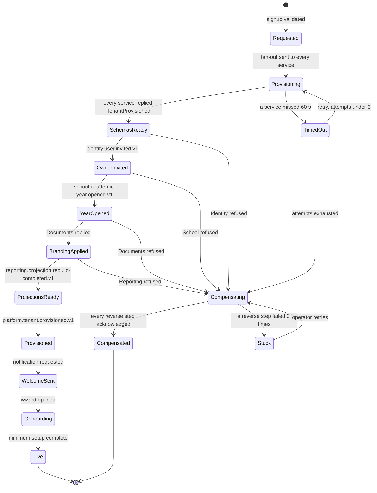
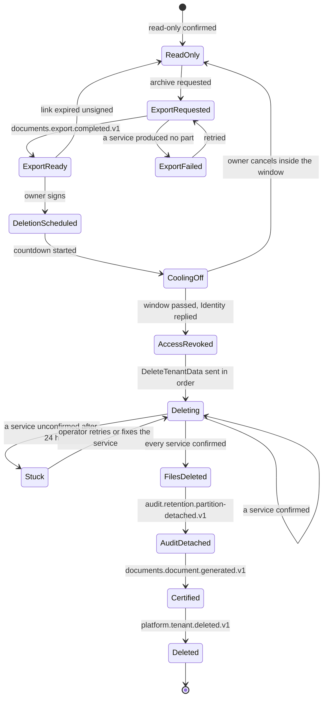
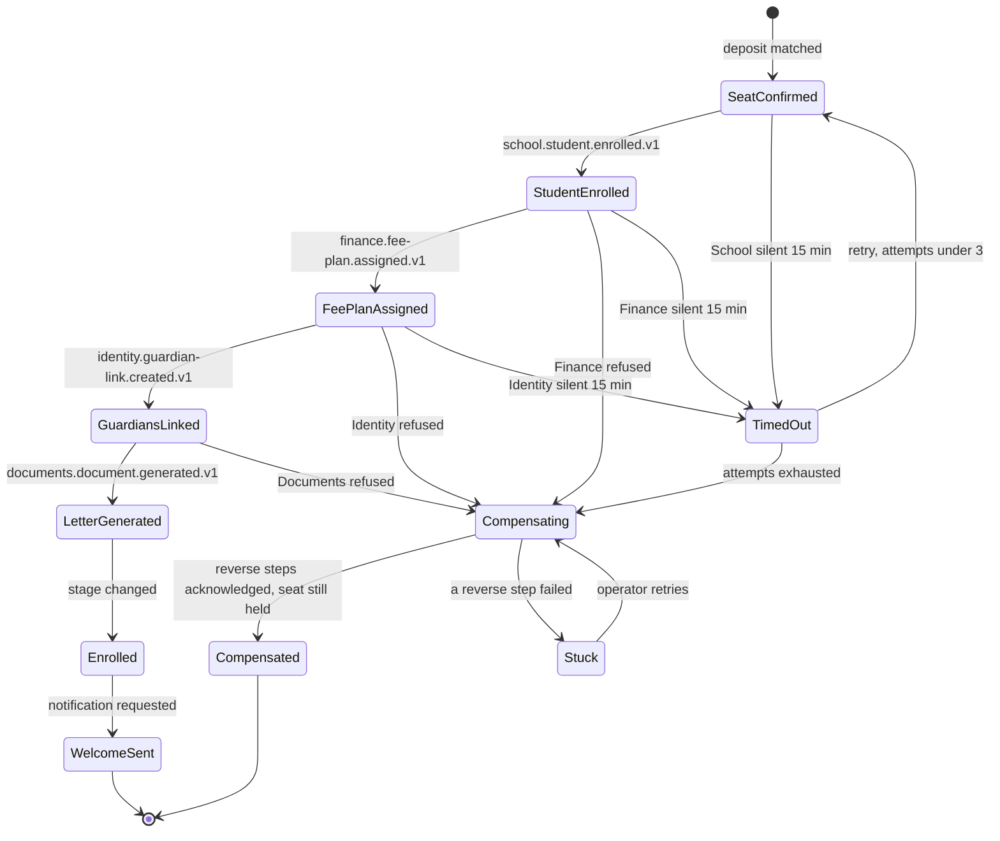
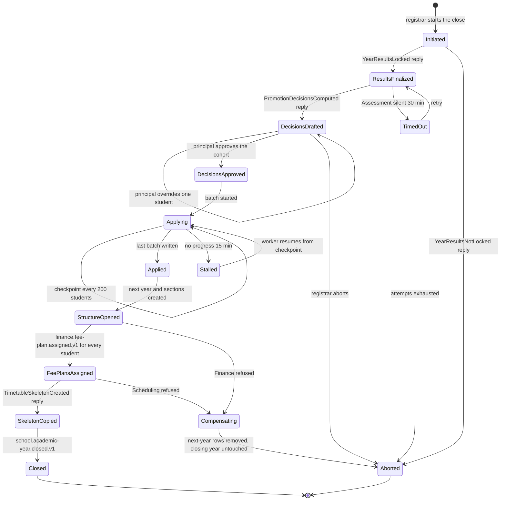
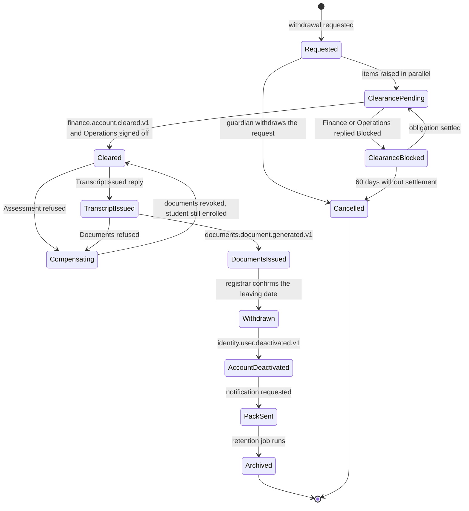
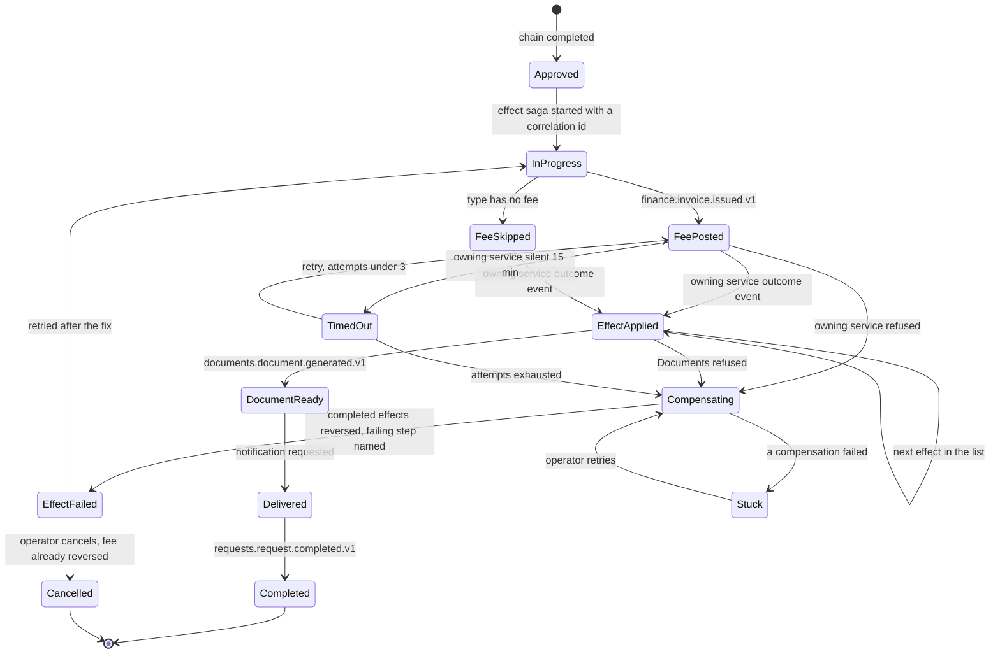
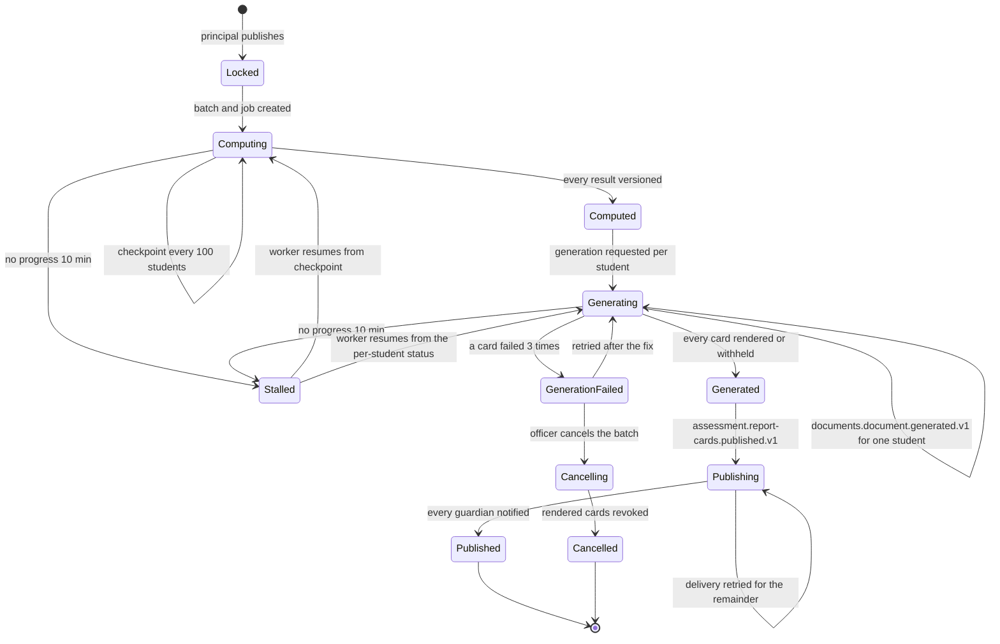
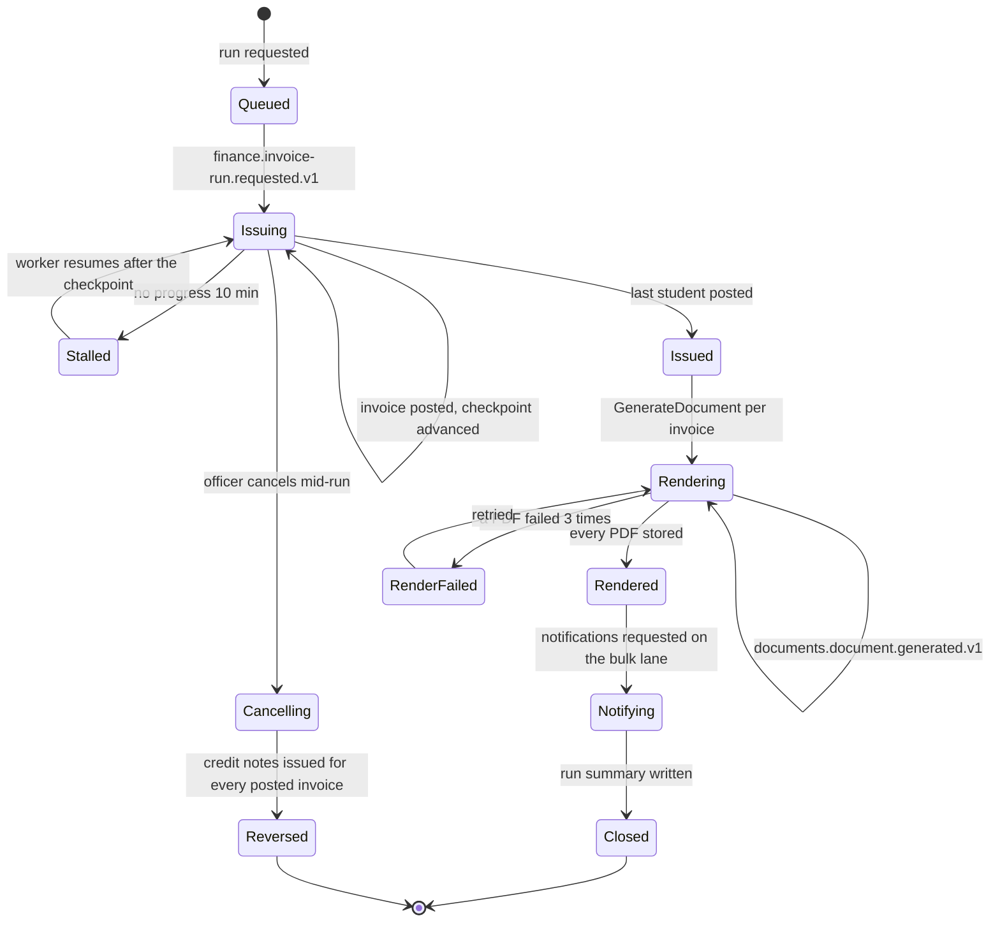
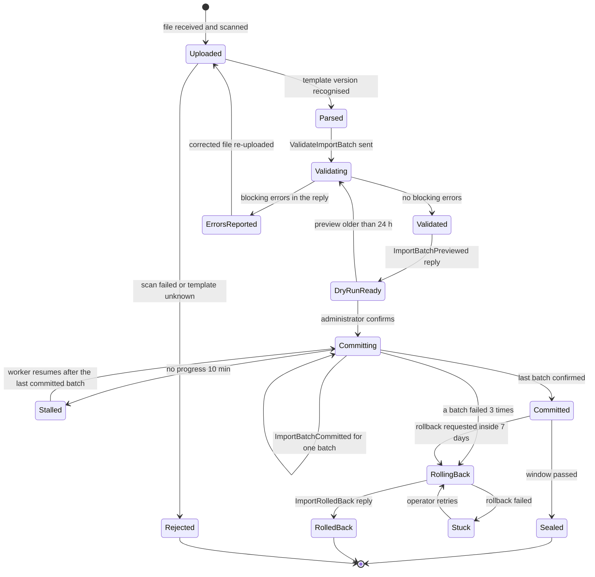
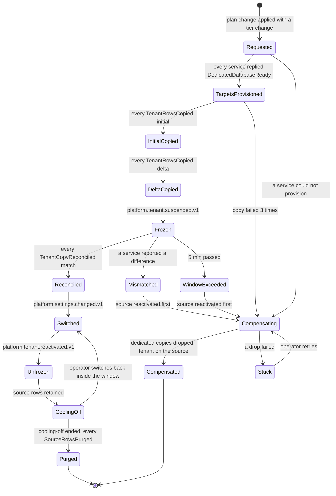

# 13. Workflows and Sagas

> Every workflow in Appendix R assigned to its owning service, with the saga designs and compensations for every process that crosses a service boundary. This document refines and assigns; it does not restate Appendix R, which stays the normative catalog of states, guards and test tables.

**Group** D · **Requirement areas covered** every AREA in Appendix R, plus `MSG` and `TST` · **Last updated** 2026-09-26 by M. Nasser

## Purpose

An engineer opening this document must be able to answer three questions without asking anyone: which service owns a workflow's state, which workflows are sagas and what happens to the half that already ran when a saga fails, and which test proves each transition. The product owner uses it to see which phase of master brief Section 28 delivers each process.

## Scope

| In scope | Out of scope | Where the out-of-scope item lives |
|---|---|---|
| Assignment of all 52 workflows to services, kinds and phases | The states, guards and test tables per workflow | Appendix R |
| Ten saga designs with steps, compensation, timeouts, persisted state, idempotency, monitor view and tests | The business rules a saga step applies | Appendix S and `31-business-rules-and-workflows.md` |
| Request-type effects as command messages | The request type designer and approval chains | Appendix R WF-RQS-01, master brief Section 11 |
| Audit, test and enum conventions for every transition | The RabbitMQ topology, queues and the command catalog | `11-messaging-architecture.md` |
| | Which slice builds which workflow | `34-work-breakdown.md` |

## Content

### 1. Workflow assignment

**Kinds.** Every workflow is one of three kinds.

| Kind | Meaning | What crosses the boundary |
|---|---|---|
| **Single** | One service owns the state machine; other services react to its events through their own idempotent consumers (choreography) | Integration events only |
| **Saga** | The owning service persists a saga state, sends commands to other services, waits for their outcome events or replies, and compensates on failure (orchestration, master brief Section 7.3) | Commands out, outcome events or replies back |
| **Effect** | The workflow is entered from the Requests engine: WF-RQS-01 runs the approval chain and its fulfilment saga sends one command to the owning service, which then drives the rest of its own machine | One effect command and one outcome |

**Phase.** The phase from master brief Section 28 in which the owning service, and therefore the workflow's state machine, is built. A saga step whose target service arrives in a later phase is registered as *skipped by tier configuration*, the same mechanism the first-release merge option in Appendix L uses, so every saga is complete at every phase and gains steps as services are deployed.

| WF | Name | Owning service | Other services touched | Kind | Phase |
|---|---|---|---|---|---|
| WF-IDN-01 | Invitation or join-code joining | Identity | Notification, Audit | Single | 1 |
| WF-IDN-02 | Parent self-registration and child linking | Identity | School, Requests, Notification | Single | 1 |
| WF-IDN-03 | Duplicate account merge | Identity | every service holding a user copy, Notification | Single | 1 |
| WF-IDN-04 | Delegation during absence | Identity | Requests, Notification | Single | 1 |
| WF-IDN-05 | Role change with four-eyes approval | Identity | every service (permission version), Communication | Effect | 1 |
| WF-IDN-06 | Offboarding and access revocation | Identity | School, Academics, Scheduling, Requests, Hr | Single | 1 |
| WF-SEC-01 | Access review campaign | Identity | Requests, Documents, Notification | Single | 1 |
| WF-SEC-02 | Break-glass access | Identity | Notification, Audit, Wellbeing | Single | 1 |
| WF-SEC-03 | Consented impersonation | Identity | Platform, Audit, Notification | Single | 1 |
| WF-PLT-01 | Tenant signup to live | Platform | every data-owning service, Gateway | **Saga 1** | 1 |
| WF-PLT-02 | Trial conversion and plan change | Platform | every service (flags, limits), Finance, Notification | Single, starts **Saga 10** when the isolation tier changes | 1 |
| WF-PLT-03 | Suspension, export, and deletion | Platform | every data-owning service, Documents, Identity, Audit | **Saga 2** | 1 |
| WF-SCH-01 | Transfer or withdrawal with clearance | School | Finance, Operations, Assessment, Documents, Identity, Notification | **Saga 5**, entered as an effect | 2 |
| WF-SCH-02 | End of year close and rollover | School | Assessment, Finance, Scheduling, Reporting | **Saga 4** | 2 |
| WF-SCH-03 | Year archival and reopen | School | Reporting, Audit | Single | 2 |
| WF-SCH-04 | Mid-year campus transfer | School | Finance, Scheduling, Operations, Attendance | Single | 2 |
| WF-ADM-01 | Inquiry to enrollment | Admissions | School, Identity, Finance, Documents, Notification | **Saga 3** for the last transition | 4 |
| WF-ADM-02 | Re-enrollment with fee settlement check | Admissions | Finance, School, Notification | Single | 4 |
| WF-ACA-01 | Assignment lifecycle | Academics | Notification, Reporting, Assessment | Single | 2 |
| WF-ASM-01 | Exam to report card | Assessment | Documents, Finance (restrictions), Communication, Notification | **Saga 7** from Locked onward | 2 |
| WF-ASM-02 | Grade appeal and post-lock change | Assessment | Requests, Documents, Audit, Notification | Effect | 2 |
| WF-ASM-03 | Exam paper setting, review, and printing | Assessment | Documents, Audit, Notification | Single | 2 |
| WF-ATT-01 | Daily attendance to intervention | Attendance | Notification, Wellbeing, Reporting | Single | 2 |
| WF-ATT-02 | Early dismissal and gate pickup | Attendance | Requests, Notification, Audit | Effect | 2 |
| WF-FIN-01 | Fee plan to collection and escalation | Finance | Documents, Notification, Admissions, Assessment | **Saga 8** for the invoice run | 3 |
| WF-FIN-02 | Invoice reversal, credit note, and refund | Finance | Documents, Notification, Audit | Effect | 3 |
| WF-FIN-03 | Cheque receipt and bounce | Finance | Documents, Notification | Single | 3 |
| WF-FIN-04 | Scholarship award | Finance | Documents, Notification | Effect | 3 |
| WF-FIN-05 | Payer change to sponsor | Finance | Documents, Notification | Effect | 3 |
| WF-FIN-06 | Cashier day close | Finance | Documents, Reporting, Audit | Single | 3 |
| WF-RQS-01 | Service request lifecycle | Requests | the owning service of each effect, Finance, Documents, Notification | **Saga 6** from Approved onward | 3 |
| WF-BEH-01 | Incident to intervention | Behavior | Wellbeing, Notification, Reporting | Single | 4 |
| WF-WEL-01 | Accommodation plan to exam sitting | Wellbeing | Assessment, Scheduling, Notification | Single | 5 |
| WF-WEL-02 | Clinic visit to sent home | Wellbeing | Attendance (gate pass), Notification | Single | 5 |
| WF-WEL-03 | Medication authorization and administration | Wellbeing | Requests, Documents, Notification | Effect | 5 |
| WF-WEL-04 | Safeguarding concern escalation | Wellbeing | Communication (anonymous path), Notification, Audit | Single | 5 |
| WF-WEL-05 | Daily wellbeing check-in escalation | Wellbeing | Notification, Reporting | Single | 5 |
| WF-HR-01 | Staff leave to substitution | Hr | Requests, Scheduling, Academics, Attendance, Identity, Notification | Effect | 5 |
| WF-HR-02 | Staff hiring to onboarding | Hr | School, Identity, Academics, Documents, Notification | Single | 5 |
| WF-HR-03 | Teaching licence expiry compliance | Hr | Academics, Scheduling, Notification | Single | 5 |
| WF-HR-04 | Payroll input cycle | Hr | Finance, Documents, Notification | Single | 5 |
| WF-OPS-01 | Purchase requisition to asset | Operations | Requests, Finance, Documents, Notification | Effect | 5 |
| WF-OPS-02 | Library lending and fines | Operations | Finance, Notification | Single | 5 |
| WF-OPS-03 | Transport subscription change | Operations | Requests, Finance, Notification | Effect | 5 |
| WF-OPS-04 | Facility booking approval | Operations | Requests, Scheduling, Notification | Effect | 5 |
| WF-OPS-05 | Safety incident and drill logging | Operations | Documents, Notification | Single | 5 |
| WF-PRV-01 | Data subject access request | Platform | every data-owning service, Documents, Notification | Single, fan-out query | 3 |
| WF-PRV-02 | Sensitive export approval | Documents | Requests, Audit, Notification | Effect | 3 |
| WF-DATA-01 | Legacy import with dry run and rollback | Documents | the target service of each sheet | **Saga 9** | 3 |
| WF-INF-01 | On-premises upgrade with rollback | Platform | every service (migrations), Notification | Single | 6 |
| WF-INF-02 | Release rollout with canary and rollback | Platform | every service (deployment), Notification | Single | 1 |
| WF-INF-03 | Restore and failover drill | Platform | every service database, Documents, Notification | Single | 6 |

**Counts, quoted from Appendix R.** Fifty-two workflows. Of these, 9 carry a saga and one further saga, tier migration, has no workflow identifier because Appendix R catalogs business processes and tier migration is an operating procedure from reference architecture Section 14; it is entered from WF-PLT-02 and designed as Saga 10 below. Thirteen workflows are entered as request-type effects. WF-PRV-01 is a fan-out query rather than a saga: it writes nothing in the queried services, so it needs retries and a completeness check but no compensation.

**Why the saga list is exactly these ten.** Master brief Section 7.3 names six: enrollment, withdrawal clearance, year-end rollover, tenant provisioning, tenant deletion and request fulfilment. The reference architecture adds the report-card batch (Section 9, diagram 9.3), the invoice run (sheet 8.11's worker), the legacy import (sheet 8.15's job group) and tier migration (Section 14). Every other multi-service workflow in the table above is choreographed: the owning service publishes a catalogued event and the other service reacts, and the reaction has a defined retry but no compensating command back. Where Appendix R describes "the finance step is retried" (WF-SCH-04) or "the identity step is retried" (WF-HR-02), that is an outbox retry of an event consumer, not a saga.

### 2. Saga conventions that apply to every design below

| Convention | Rule | Where it is enforced |
|---|---|---|
| Orchestrator | The owning service in Appendix R. Its saga handler lives in `Nibras.<Service>.Application/Sagas/<Name>Saga/`, its state enum in `Nibras.<Service>.Domain` | Architecture test in `tests/Architecture.Tests` |
| State persistence | Saga state is a row in the orchestrator's own database, written in the same transaction as the outbox (saga-design skill rule 5), with `xmin` concurrency | `Nibras.BuildingBlocks.Messaging` saga persistence |
| Commands | A command is a message type in `Nibras.Contracts.<TargetService>/Commands/V1/`, sent to the target service's command queue on its own exchange. Every command carries `sagaId`, `stepKey`, `tenantId`, `correlationId` and `causationId` from the Appendix E envelope | `11-messaging-architecture.md` catalogs every command and reply |
| Outcomes | The expected outcome is the catalogued Appendix E event where one exists. Where the target service publishes no catalogued event for that step, it sends a **saga reply** (`<Step>Completed` or `<Step>Failed`) to the orchestrator's reply queue; replies are private to the saga and are catalogued beside the command in `11-messaging-architecture.md` | Contract tests |
| Notifying a person | A saga never publishes `notification.notification.requested.v1`: that key is Notification's own (Appendix E; `11-messaging-architecture.md` §1.4 lets a service publish only on its own exchange). A step that must reach a person sends the `RequestNotification` command (`notification.commands.request-notification.v1`) on the orchestrator's exchange, and Notification's Api publishes the catalogued event with the lane header | `11-messaging-architecture.md` §2.4, command catalog |
| Idempotency | Every command handler is idempotent on `(sagaId, stepKey)` through the inbox table; every reply is ignored when the step is already terminal; every compensation is idempotent too and is tested by running it twice | Deliver-twice tests per step |
| Timeouts | Every waiting step has a timeout. Timing out moves the saga to `TimedOut`, which retries the step up to the configured attempts and then enters `Compensating`. A human wait state has an escalation instead | Timeout test per saga |
| Compensation | Runs in reverse order, one command per completed step. Compensation is a correction, never a deletion of a posted fact (BR-FIN-014 for money, Appendix J retention for records). A step with no compensation is ordered last | Compensation tests per saga |
| Terminal states | `Completed`, `Compensated`, `Cancelled` and, for the two irreversible sagas, `Deleted` and `Sealed`. `Stuck` is not terminal: it is the operator-visible state for a compensation that itself failed, and it is left only by an operator action | State-machine test |
| Operator visibility | Every non-terminal saga older than its deadline and every `Stuck` saga raises `<service>.audit.recorded.v1` with action `saga.stuck` and a Notification to the platform operator group. The process monitor in section 5 lists them first | Alert rule in `15-deployment-and-operations.md` |
| Chaos test | For every saga with a batch step, the integration suite kills the worker mid-batch and proves nothing is lost or duplicated (master brief Section 8, item 12) | `<Name>SagaTests.WorkerKilledMidBatch_Resumes_NoDuplicates` |

### 3. Saga designs

#### Saga 1. Tenant provisioning (WF-PLT-01)

**Orchestrator** Platform · **Started by** the `Validated → Provisioning` transition of WF-PLT-01 · **State enum** `Nibras.Platform.Domain.Tenants.TenantProvisioningState` · **Handler** `Nibras.Platform.Application/Sagas/TenantProvisioningSaga/`

| # | Step | Command sent | Service | Expected outcome | Timeout | Compensation |
|---|---|---|---|---|---|---|
| 1 | Pin region and create the tenant record in `Requested` (BR-PLT-004) | none, local | Platform | row written, `platform.audit.recorded.v1` | none | Delete the tenant row; nothing else exists yet |
| 2 | Fan out schema and tenant-row creation to every data-owning service, all-of | `ProvisionTenant` | all 19 other data-owning services, in parallel | `platform.tenant.provisioning-requested.v1` is the fan-out message; each service replies `TenantProvisioned` | 60 s, 3 retries per service | `DeprovisionTenant` to every service that acknowledged: the tenant's rows and, on the dedicated tier, its database are dropped |
| 3 | Invite the tenant owner (ADR-0003: the seeded administrator is platform-only) | `InviteTenantOwner` | Identity | `identity.user.invited.v1` | 60 s, 3 retries | `RevokeInvitation`; the invitation token is dead before any welcome message is sent |
| 4 | Open the first campus and academic year from the signup form | `OpenFirstAcademicYear` | School | `school.academic-year.opened.v1` | 60 s, 3 retries | Covered by step 2's `DeprovisionTenant` |
| 5 | Copy branding and the global template library into the tenant | `ApplyTenantBranding` | Documents | reply `TenantBrandingApplied` | 60 s, 3 retries | `DeleteTenantBranding` |
| 6 | Build the tenant's empty projections | `InitialiseProjections` | Reporting | `reporting.projection.rebuild-completed.v1` | 120 s, 3 retries | Covered by step 2 |
| 7 | Publish the tenant routing entry (domain or subdomain) that Gateway reads, and the per-tenant rate-limit bucket | none, local | Platform | `platform.tenant.provisioned.v1` | none | Remove the routing entry; Gateway answers `PLATFORM_PROVISIONING_IN_PROGRESS` again |
| 8 | Send the welcome pack to the owner | `RequestNotification` | Notification | `notification.notification.delivered.v1` | none, fire and forget | None. Ordered last because it cannot be unsent |

Steps 2 to 6 run under a 10-minute saga deadline (Appendix R); exceeding it alerts the platform operator without stopping retries.

**Persisted state.**

| Field | Type | Purpose |
|---|---|---|
| `SagaId` | uuid v7, equals `TenantId` | One provisioning per tenant, ever; a second signup for the same tenant is refused |
| `State` | `TenantProvisioningState` | The enum above |
| `CorrelationId` | uuid v7 | From the signup request onward; shown in the monitor |
| `Steps` | jsonb map `service → {status, attempts, sentAt, ackedAt, lastError}` | One entry per fan-out target and per ordered step; `lastError` is the target's message verbatim, as Appendix R requires |
| `PlanCode`, `RegionCode`, `Locale`, `CountryCode`, `SchoolType` | strings | The payload of `platform.tenant.provisioning-requested.v1` |
| `OwnerInvitationId`, `AcademicYearId`, `CampusId` | uuid v7 | Identifiers returned by steps 3 and 4, needed by compensation |
| `DeadlineAt` | timestamptz | Start plus 10 minutes |
| `CompensationJournal` | jsonb list | Reverse steps issued, with their acknowledgements |
| `Version` | `xmin` | Concurrency; two replies for one step never both apply |

**Idempotency per step.** Step 2: each service's `ProvisionTenant` handler is create-if-absent on `tenant_id` and re-replies `TenantProvisioned` on a duplicate, so a retried fan-out is harmless. Step 3: Identity keys the invitation on `(tenantId, ownerEmail)` and returns the existing invitation. Step 4: School keys the year on `(tenantId, startsOn)`. Step 5: Documents overwrites branding by `tenantId`. Step 6: a rebuild of empty projections is naturally idempotent. Step 7: the routing entry is an upsert. Step 8: Notification deduplicates on `notificationId`, which the saga derives from `SagaId` (BR-NOT-004).

**Process monitor.** Row per saga: tenant name, plan, state, elapsed against the 10-minute deadline, a 19-cell service grid coloured by status with the verbatim last error on hover, and the actions `Retry step`, `Compensate now` and `Abandon`, mapped to `platform.jobs.retry`, `platform.jobs.cancel` and `platform.tenants.delete` from Appendix B. The signup page polls the same state and shows "Creating your school: 14 of 19 services ready".

**Tests.** Class `TenantProvisioningSagaTests` in `Nibras.Platform.IntegrationTests/Sagas/`. `TC-PLT-005` (Appendix R) proves the transition in general; `TC-PLT-780` to `TC-PLT-782`, defined here, each fail one step and assert what that step's position adds: which reverse commands run, in which order, and what the journal and the tenant row hold afterwards.

| Scenario | Expected outcome | Test case |
|---|---|---|
| Happy path, all 19 services acknowledge | Owner invited, year opened, `platform.tenant.provisioned.v1` published once | `TC-PLT-003` (Appendix R) |
| One service times out after three retries | Saga halts, no later step attempted, operator alerted with the service named | `TC-PLT-004` (Appendix R) |
| Any step fails and every reverse step succeeds (the Appendix R `Failed → Compensated` transition) | No schema, queue or user left behind | `TC-PLT-005` (Appendix R) |
| Step 3 fails | Fan-out deprovisioned, no invitation exists, no welcome sent | TC-PLT-780 |
| Step 4 fails | Invitation revoked, schemas dropped, tenant row in `Compensated` | TC-PLT-781 |
| Step 5 or 6 fails | Steps 2 to 4 reversed in order, journal complete | TC-PLT-782 |
| Deadline passed while retrying | Alert raised, retries continue, state visible as `TimedOut` | TC-PLT-550 |
| `TenantProvisioned` reply delivered twice | Second reply ignored, step count unchanged | `ProvisionTenantReply_DeliveredTwice_Ignored` |
| Compensation runs twice | Second run is a no-op on every service | `Compensation_RunTwice_NoSecondEffect` |
| Platform Api killed after 9 of 19 replies | On restart the saga resumes from persisted `Steps`; no service provisions twice | `WorkerKilledMidFanOut_Resumes_NoDuplicates` |

#### Saga 2. Tenant deletion (WF-PLT-03)

**Orchestrator** Platform · **Started by** the `ReadOnly → ExportRequested` transition of WF-PLT-03, or the end of the read-only period after an expired trial (WF-PLT-02) · **State enum** `Nibras.Platform.Domain.Tenants.TenantDeletionState` · **Handler** `Nibras.Platform.Application/Sagas/TenantDeletionSaga/` · **Rules applied** BR-PLT-003, BR-PLT-006

This saga has two halves. Everything up to the end of the cooling-off period is reversible by reactivation. From `Deleting` onward nothing is reversible, so the second half never compensates: it retries every service until it confirms and withholds the certificate until then (BR-PLT-003, third example).

| # | Step | Command sent | Service | Expected outcome | Timeout | Compensation |
|---|---|---|---|---|---|---|
| 1 | Confirm read-only mode across services (BR-PLT-002) | none; `platform.tenant.suspended.v1` with `readOnlyFrom` | Platform | every service's consumer refuses writes with `PLATFORM_TENANT_SUSPENDED` | none | `platform.tenant.reactivated.v1` |
| 2 | Build the full export with a manifest (BR-PLT-006) | `ExportTenant` | Documents | `documents.export.completed.v1` with `rowCount` per service in the manifest | 24 h, then alert; retried until complete | None needed: an export changes nothing. An incomplete export blocks the saga, it never proceeds from a partial archive |
| 3 | Owner signs the deletion confirmation | none, human | Platform | `platform.tenant.deletion-requested.v1` with `coolingOffEndsAt` | Download link 30 days; unsigned after that the saga returns to `ReadOnly` | Cancellation inside the window returns to `ReadOnly` |
| 4 | Cooling-off timer (Security → retention periods; Appendix R default 30 days, ADR-0019) with a daily reminder from `DeletionCoolingOffReminderJob` | `RequestNotification` daily | Notification | reminders delivered | ends at `coolingOffEndsAt` | Cancellation by the owner at any moment inside the window |
| 5 | Revoke every session and sign-in for the tenant | `RevokeTenantAccess` | Identity | reply `TenantAccessRevoked` | 5 min, 3 retries | None from here on. The saga only moves forward |
| 6 | Delete tenant data in every data-owning service except Audit, in dependency order: Reporting and Ai first, School last | `DeleteTenantData` | 18 services | reply `TenantDataDeleted` with `rowCount` per table; Wellbeing additionally destroys the tenant's encryption key | 30 min per service, unlimited retries with backoff; `Stuck` after 24 h | None |
| 7 | Delete files and generated documents, keep the export archive until its link expires | `DeleteTenantFiles` | Documents | reply `TenantFilesDeleted` | 60 min | None |
| 8 | Detach the tenant's audit partition to cold storage under master brief Section 32 | `DetachTenantAuditPartition` | Audit | `audit.retention.partition-detached.v1` | 30 min | None; the audit trail of the deletion itself is retained |
| 9 | Issue the certificate naming each service, its row counts, the completion time and the date the last backup copy expires | `GenerateDocument` (deletion certificate template) | Documents | `documents.document.generated.v1` | 10 min | None |
| 10 | Announce the deletion and remove the routing entry | none, local | Platform | `platform.tenant.deleted.v1` with `certificateId` | none | None |

**Persisted state.** `SagaId` (equals `TenantId`), `State`, `CorrelationId`, `ExportJobId`, `ManifestChecksum`, `SignedBy`, `SignedAt`, `CoolingOffEndsAt`, `Services` jsonb map `service → {status, attempts, rowCounts, confirmedAt, lastError}`, `CertificateId`, `LastBackupExpiresOn`, `Version`.

**Idempotency per step.** Step 2: the export job is keyed on `(tenantId, sagaId)` and re-running it replaces the archive. Step 5: revoking revoked sessions is a no-op. Step 6: `DeleteTenantData` deletes where `tenant_id` matches; a second delivery finds zero rows and replies with the stored counts from the first run, which each service keeps in its own `tenant_deletions` table so the certificate counts stay stable. Step 8: detaching an already detached partition replies with the earlier result. Step 9: the certificate is keyed on `sagaId`.

**Process monitor.** The same grid as Saga 1 with the row counts per service filled in as they confirm, the cooling-off countdown, the owner who signed, and a single action `Retry service` for `Stuck`. There is no `Abandon` after `AccessRevoked`: the only way out is forward, and the monitor says so in words.

**Tests.** Class `TenantDeletionSagaTests`.

| Scenario | Expected outcome | Test case |
|---|---|---|
| Owner cancels on the last day of cooling-off | Nothing deleted, tenant back in `ReadOnly`, sessions untouched | `TC-PLT-025` (Appendix R) |
| Export fails for one service | No manifest, no signature possible, service named | TC-PLT-551 |
| Full path | Certificate lists every service with counts, `platform.tenant.deleted.v1` once | `TC-PLT-026` (Appendix R) |
| Step 6: one service never confirms | Saga in `Stuck` after 24 h, certificate withheld, operator alerted | `DeleteTenantData_ServiceSilent_Stuck_NoCertificate` |
| Step 8 fails | Retried; certificate withheld until the partition is detached | `DetachAuditPartition_Fails_Retried` |
| `DeleteTenantData` delivered twice | Second delivery replies the stored counts, deletes nothing further | `DeleteTenantData_DeliveredTwice_StableCounts` |
| Platform Api killed during step 6 | Resume continues with the unconfirmed services only | `WorkerKilledMidDeletion_Resumes_NoDoubleCount` |
| Export requested while suspended | Completes (BR-PLT-006, second example) | TC-PLT-552 |

#### Saga 3. Enrolment from an accepted offer (WF-ADM-01, `DepositPaid → Enrolled`)

**Orchestrator** Admissions · **Started by** the deposit matched to the application (`admissions.offer.accepted.v1` is published at the same moment for services that only need to know) · **State enum** `Nibras.Admissions.Domain.Applications.EnrolmentSagaState` · **Handler** `Nibras.Admissions.Application/Sagas/EnrolmentSaga/` · **Rules applied** BR-ADM-003 (seat), BR-FIN-001 (installments)

Appendix R fixes the failure outcome: the application returns to `DepositPaid`, the seat is **held rather than released**, and the officer sees the failed step by name. The seat hold belongs to Admissions, so compensation of the School step withdraws the enrolment record without touching the hold.

| # | Step | Command sent | Service | Expected outcome | Timeout | Compensation |
|---|---|---|---|---|---|---|
| 1 | Confirm the seat hold against section capacity (BR-ADM-003) | none, local | Admissions | hold row written | none | Release is a separate human decision, never a compensation |
| 2 | Create the student and the enrolment in the offered section | `EnrolStudent` | School | `school.student.enrolled.v1` | 15 min, 3 retries | `WithdrawEnrolment(reason = enrolment-saga-compensation)` → `school.student.status-changed.v1`; the student record stays, marked never-attended |
| 3 | Assign the fee plan from the offer | `AssignFeePlan` | Finance | `finance.fee-plan.assigned.v1` | 15 min, 3 retries | `VoidFeePlan(reason = enrolment-cancelled)`; any installment already issued is reversed by credit note (`finance.credit-note.issued.v1`), never deleted (BR-FIN-014) |
| 4 | Invite the guardians and link them to the student | `ProvisionGuardianAccess` | Identity | `identity.guardian-link.created.v1` per guardian, `identity.user.invited.v1` for new accounts | 15 min, 3 retries | `RevokeGuardianAccess`: links removed, new accounts deactivated (`identity.user.deactivated.v1`), never deleted |
| 5 | Render the enrolment letter with its QR verification code | `GenerateDocument` | Documents | `documents.document.generated.v1` | 15 min, 3 retries | `RevokeDocument` → `documents.certificate.revoked.v1` |
| 6 | Mark the application `Enrolled` | none, local | Admissions | `admissions.application.stage-changed.v1` | none | Return to `DepositPaid` |
| 7 | Send the welcome pack | `RequestNotification` | Notification | `notification.notification.delivered.v1` | none | None; last |

`TimedOut --> SeatConfirmed` in the diagram stands for "retry the step that timed out"; the persisted `CurrentStep` decides which command is re-sent.

**Persisted state.** `SagaId`, `ApplicationId`, `OfferId`, `TenantId`, `State`, `CurrentStep`, `Attempts`, `StudentId` (from step 2), `FeePlanCode`, `GuardianUserIds` (from step 4), `DocumentId` (from step 5), `FailedStep`, `FailureMessage`, `DeadlineAt` (start plus 24 hours), `CompensationJournal`, `Version`.

**Idempotency per step.** Step 2: School keys the student on `(tenantId, applicationId)` and re-publishes `school.student.enrolled.v1` with the same `studentId` on a duplicate. Step 3: Finance keys the plan on `(studentId, academicYearId)`. Step 4: Identity keys links on `(guardianUserId, studentId)`. Step 5: Documents keys the job on `(templateId, subjectId, sagaId)`. Step 7: `notificationId` derived from `sagaId`.

**Process monitor.** In the Admissions officer's view of the application: a step strip "Student, Fees, Guardians, Letter, Welcome" with the failed step named and its message, and a `Retry` action mapped to `requests.requests.override` is not used here; the retry is the officer's own `admissions` permission on the application. In the platform console the same saga appears under its correlation identifier for the operator.

**Tests.** Class `EnrolmentSagaTests`.

| Scenario | Expected outcome | Test case |
|---|---|---|
| Happy path | Student, guardian accounts and fee plan created together; welcome sent once | `TC-ADM-005` (Appendix R) |
| Step 4 (Identity) fails | Fee plan voided, enrolment withdrawn, seat still held, officer sees "Guardians" as the failed step, no welcome sent | `TC-ADM-006` (Appendix R) |
| Step 2 fails | Nothing else attempted; application in `DepositPaid` | `EnrolStudent_Fails_NothingElseSent` |
| Step 3 fails | Enrolment withdrawn; no fee plan; no invitations | `AssignFeePlan_Fails_EnrolmentWithdrawn` |
| Step 5 fails | Steps 4, 3, 2 reversed; accounts deactivated not deleted | `GenerateLetter_Fails_AccountsDeactivatedNotDeleted` |
| Finance silent for 45 minutes | Three retries then compensation; timeline visible | `AssignFeePlan_Timeout_Compensates` |
| Outcome event delivered twice | Step advances once | `OutcomeEvent_DeliveredTwice_SingleAdvance` |
| Admissions Api killed after step 3 | On restart step 4 is sent once, not twice | `WorkerKilledAfterStep3_Resumes_NoDuplicateInvite` |

#### Saga 4. Year-end rollover (WF-SCH-02)

**Orchestrator** School · **Started by** the registrar's `Initiated` transition · **State enum** `Nibras.School.Domain.AcademicYears.RolloverState` · **Handler** `Nibras.School.Application/Sagas/YearEndRolloverSaga/` · **Rules applied** BR-ASM-012 and BR-ASM-013 by Assessment, BR-FIN-001 by Finance

School keeps no local copy of grading periods (reference architecture Section 8, table 8.0), so it asks Assessment to confirm the lock and to compute the promotion decisions rather than computing them itself; Assessment owns BR-ASM-012 and nothing else may apply it.

| # | Step | Command sent | Service | Expected outcome | Timeout | Compensation |
|---|---|---|---|---|---|---|
| 1 | Confirm every grading period of the year is locked | `ConfirmYearResultsLocked` | Assessment | reply `YearResultsLocked` with `gradingPeriodIds`, or `YearResultsNotLocked` naming the sections | 5 min | None; a `NotLocked` reply moves the saga to `Aborted` with the list |
| 2 | Compute promote, retain or graduate per student | `ComputePromotionDecisions` | Assessment | reply `PromotionDecisionsComputed` with one outcome and reason per student | 30 min | None; decisions are a proposal held in School until approved |
| 3 | Principal approves the cohort, overriding individuals with a reason | none, human | School | `school.audit.recorded.v1` per override | 14 days after step 2, then escalation to the principal daily | Aborting here discards the drafts |
| 4 | Write next-year enrolments and status changes in batches of 200 with a checkpoint | none, local batch (School.Api background job under `Nibras.BuildingBlocks.Jobs`) | School | `school.student.promoted.v1` per student, `school.student.status-changed.v1` for graduates and leavers | Batch stalled 15 min → alert | Delete every enrolment row stamped with this `RolloverId`; the closing year is untouched |
| 5 | Open the next year's structure: year, terms, sections copied from the current structure | none, local | School | `school.academic-year.opened.v1`, `school.section.created.v1` per section | none | Delete the structure rows stamped with `RolloverId` |
| 6 | Assign next-year fee plans | `AssignNextYearFeePlans` | Finance | `finance.fee-plan.assigned.v1` per student | 30 min, 3 retries | `VoidFeePlans(rolloverId)`; nothing has been invoiced yet, so no credit notes are needed |
| 7 | Copy the timetable skeleton, unpublished | `CopyTimetableSkeleton` | Scheduling | reply `TimetableSkeletonCreated` with `timetableVersionId` | 30 min, 3 retries | `DeleteTimetableVersion(timetableVersionId)` |
| 8 | Close the year | none, local | School | `school.academic-year.closed.v1` | none | None; irreversible and therefore last. Reopening is WF-SCH-03 |

**Persisted state.** `SagaId` (`RolloverId`), `AcademicYearId`, `NextAcademicYearId`, `TenantId`, `State`, `GradingPeriodIds`, `Decisions` jsonb `studentId → {outcome, reason, overriddenBy}`, `ApprovedBy`, `ApprovedAt`, `BatchCheckpoint` (last `studentId` written, ordered by `studentNumber`), `StudentsTotal`, `StudentsApplied`, `TimetableVersionId`, `FailedStep`, `FailureMessage`, `Version`.

**Idempotency per step.** Step 4 is the one that matters: each student's next-year enrolment is written in its own transaction keyed on `(studentId, nextAcademicYearId)` with `RolloverId` stamped on the row; a resumed batch skips rows that exist (TC-SCH-015). Steps 6 and 7 are keyed on `RolloverId` in their services. Step 1 and 2 replies are ignored once the saga has left the waiting state.

**Process monitor.** Progress bar "Applied 300 of 800 students", the decision summary (promoted, retained, graduated, overridden), the last checkpoint, and `Pause`, `Resume` and `Abort` actions for the registrar; the operator's console shows the same saga with the Finance and Scheduling step status.

**Tests.** Class `YearEndRolloverSagaTests`.

| Scenario | Expected outcome | Test case |
|---|---|---|
| Every section locked, decisions approved | Students enrolled next year, graduates given alumni status | `TC-SCH-014` (Appendix R) |
| One section unlocked | Saga aborted, late entry refused, sections listed | TC-SCH-550 |
| Principal overrides a retention | Override stored with reason and approver | `TC-SCH-013` (Appendix R) |
| Worker crashes after 300 of 800 | Resume continues at 301, no duplicate enrolment | `TC-SCH-015` (Appendix R) |
| Fee structures exist for the new year | Skeleton timetable and fee plans created, not published | `TC-SCH-016` (Appendix R) |
| Step 6 fails | Next-year enrolments and structure removed; closing year untouched; `Aborted` | `AssignNextYearFeePlans_Fails_NextYearRowsRemoved` |
| Step 7 fails | Fee plans voided, structure removed | `CopyTimetableSkeleton_Fails_FeePlansVoided` |
| Assessment silent on step 2 | Retried, then `Aborted` with the registrar told | `ComputeDecisions_Timeout_Aborted` |
| Decisions undrafted for 14 days | Principal escalated daily | TC-SCH-551 |

#### Saga 5. Withdrawal clearance (WF-SCH-01)

**Orchestrator** School · **Started by** the effect command `StartWithdrawalClearance` from the Requests fulfilment saga (request type *withdrawal or transfer out*, master brief Section 11), or a registrar directly · **State enum** `Nibras.School.Domain.Students.WithdrawalState` · **Handler** `Nibras.School.Application/Sagas/WithdrawalClearanceSaga/`

Clearance is parallel and all-of: Finance and Operations each hold an item, and either may block. The student is not withdrawn until the leaving documents exist (Appendix R compensation note), which is why document generation precedes the status change.

| # | Step | Command sent | Service | Expected outcome | Timeout | Compensation |
|---|---|---|---|---|---|---|
| 1 | Raise the finance clearance item | `RaiseClearanceItem` | Finance | `finance.account.cleared.v1`, or reply `ClearanceBlocked` with the exact amount | 3 working days target, 10 days escalation to the principal, 60 days in `ClearanceBlocked` → `Cancelled` | `CancelClearanceItem` |
| 2 | Raise the library and assets clearance item, in parallel with step 1 | `RaiseClearanceItem` | Operations | reply `ClearanceSignedOff`, or `ClearanceBlocked` with the item | same as step 1 | `CancelClearanceItem` |
| 3 | Issue the transcript from locked results | `IssueTranscript` | Assessment | reply `TranscriptIssued` with `documentId` (Assessment is the requester of the Documents render) | 15 min, 3 retries | `RevokeDocument` → `documents.certificate.revoked.v1` |
| 4 | Render the transfer certificate with its QR code | `GenerateDocument` | Documents | `documents.document.generated.v1` | 15 min, 3 retries | `RevokeDocument` → `documents.certificate.revoked.v1` |
| 5 | Change the status to withdrawn on the leaving date and release the seat | none, local | School | `school.student.status-changed.v1` (`toStatus = Withdrawn`) | none | Reversal inside the same term is a new transition `Withdrawn → Enrolled` that reissues the section placement; it is not a compensation |
| 6 | Deactivate the student account; guardians keep access to other children | `DeactivateStudentAccount` | Identity | `identity.user.deactivated.v1` | 15 min | Reinstatement is a separately audited Identity action |
| 7 | Send the leaving pack to the guardian | `RequestNotification` | Notification | delivered | none | None; last |
| 8 | Archive the record under the retention policy | none, local job | School | `school.audit.recorded.v1` | after the retention delay | None |

**Persisted state.** `SagaId`, `StudentId`, `RequestId` (null when started by a registrar), `TenantId`, `State`, `Items` jsonb `service → {status, blockedReason, amount, itemRef, signedOffBy, signedOffAt}`, `TranscriptDocumentId`, `CertificateDocumentId`, `LeavingDate`, `EscalatedAt`, `Version`.

**Idempotency per step.** Steps 1 and 2 key the clearance item on `(studentId, sagaId)`; a duplicate command returns the existing item. Steps 3 and 4 key the document on `(templateId, studentId, sagaId)`. Step 5 is a state check on the aggregate. Step 6 deactivating a deactivated account is a no-op. Step 7 dedups on `notificationId`.

**Process monitor.** The registrar's clearance board: one card per department with status, blocker text and age against the 3-day target, the escalation flag at 10 days, and the documents once issued. The operator's console shows the saga under its correlation identifier with the same fields.

**Tests.** Class `WithdrawalClearanceSagaTests`.

| Scenario | Expected outcome | Test case |
|---|---|---|
| Items raised for finance, library and assets | Both commands sent, both items visible | `TC-SCH-001` (Appendix R) |
| Outstanding balance | `ClearanceBlocked` with the exact amount shown | `TC-SCH-002` (Appendix R) |
| All departments sign off | Leaving documents queued | `TC-SCH-003` (Appendix R) |
| Transcript data complete | Documents carry a QR code | `TC-SCH-004` (Appendix R) |
| Registrar confirms the leaving date | Access revoked, seat released, history retained | `TC-SCH-005` (Appendix R) |
| Retention applied | Record read-only and out of active rosters | `TC-SCH-006` (Appendix R) |
| Step 4 fails | Transcript revoked, student still enrolled, timetable still valid | `GenerateCertificate_Fails_StudentStaysEnrolled` |
| Step 6 fails | Retried; withdrawal stands; operator alerted at 3 attempts | `DeactivateAccount_Fails_WithdrawalStands` |
| Blocked for 60 days | `Cancelled`, must be raised again | `ClearanceBlocked_60Days_Cancelled` |
| Clearance reply delivered twice | Item status unchanged on the second | `ClearanceReply_DeliveredTwice_Ignored` |
| School Api killed between steps 3 and 4 | Resume sends step 4 once | `WorkerKilledAfterTranscript_Resumes_NoDuplicateCertificate` |

#### Saga 6. Request fulfilment (WF-RQS-01, `Approved → Completed`)

**Orchestrator** Requests · **Started by** the `UnderReview → Approved` transition, which publishes `requests.request.approved.v1` with `effect` and `subjectId` · **State enum** `Nibras.Requests.Domain.Requests.FulfilmentState` · **Handler** `Nibras.Requests.Application/Sagas/RequestFulfilmentSaga/` · **Rule applied** BR-RQS-006

The saga is generic: the request type carries an ordered effect list, and each entry is a row from the effect table in section 4. Requests never decides an effect; it orchestrates it and the owning service decides (reference architecture Section 10, the allowed cycle). The standard step order is fee, effect, document, notification, because the last two cannot be reversed cheaply and the notification cannot be reversed at all.

| # | Step | Command sent | Service | Expected outcome | Timeout | Compensation |
|---|---|---|---|---|---|---|
| 1 | Post the request fee, when the type has one (Requests → fees) | `PostRequestFee` | Finance | `finance.invoice.issued.v1` | 15 min, 3 retries | `ReverseRequestFee` → `finance.credit-note.issued.v1` (BR-FIN-014, never a deletion) |
| 2..n | The effect commands from section 4, in the type's order | per section 4 | the owning service | per section 4 | 15 min, 3 retries each | per section 4, reverse order |
| n+1 | Render the output document, when the type names a template | `GenerateDocument` | Documents | `documents.document.generated.v1` | 15 min, 3 retries | `RevokeDocument` → `documents.certificate.revoked.v1` |
| n+2 | Deliver the document and the completion notice | `RequestNotification` | Notification | delivered | none | None; last |
| n+3 | Mark completed and open the satisfaction rating | none, local | Requests | `requests.request.completed.v1` | none | None |

**Persisted state.** `SagaId`, `RequestId`, `TypeCode`, `TenantId`, `State`, `Effects` jsonb ordered list `{stepKey, command, service, status, attempts, outcomeMessageId, lastError}`, `FeeInvoiceId`, `CreditNoteId`, `DocumentId`, `FailedStepKey`, `FailureMessage`, `RequesterUserId`, `Version`.

**Idempotency per step.** Every effect command carries `requestId` and the owning service keys the effect on it (BR-RQS-006, third example: a doubled delivery posts no second fee). The fee is keyed on `(requestId, feeCode)`. The document on `(templateId, requestId)`. The notification on `notificationId` derived from `requestId`. Compensation commands carry the same `requestId` and are no-ops when the effect was never applied.

**Concurrency.** A second decision on a decided request returns `REQUESTS_ALREADY_DECIDED` with the decider's name; the saga is started exactly once per request because `SagaId` is derived from `RequestId`.

**Process monitor.** In the request itself: the effect list with a status per row and the failing step named for the requester in plain words (Appendix R, TC-RQS-004). In the platform console: every `EffectFailed` and `Stuck` request with `Retry` and `Cancel` mapped to `platform.jobs.retry` and `platform.jobs.cancel`; the failed-message console (`platform.failed-messages.replay`) shows the dead-lettered command when a target service rejected it as a poison message.

**Tests.** Class `RequestFulfilmentSagaTests`; the effect-specific rows are the transition tests of the target workflow.

| Scenario | Expected outcome | Test case |
|---|---|---|
| Chain completed | Saga started with a correlation identifier | `TC-RQS-002` (Appendix R) |
| Target service refuses the effect | Earlier steps compensated, failing step named to the requester | `TC-RQS-004` (Appendix R) |
| Transfer-certificate type: certificate fails after 3 retries | Fee reversed by credit note, status unchanged, request shows "effects failed" | `RequestEffectSagaRulesTests` (BR-RQS-006, first example) |
| Same request retried after the fix | Fee posts once, certificate once, status changes once | `RequestEffectSagaRulesTests` (second example) |
| Effect message delivered twice | No second fee | `RequestEffectSagaRulesTests` (third example) |
| Step 1 fails | No effect attempted, request in `EffectFailed` | `PostFee_Fails_NoEffectSent` |
| Document step fails | Effects reversed in reverse order, fee reversed | `GenerateDocument_Fails_EffectsReversedInOrder` |
| Owning service silent 45 minutes | Compensation after 3 attempts | `Effect_Timeout_Compensates` |
| Requests Api killed after the effect outcome arrived | Resume sends the document step once | `WorkerKilledAfterEffect_Resumes_NoDuplicateDocument` |

#### Saga 7. Report-card batch (WF-ASM-01, `Locked → Published`)

**Orchestrator** Assessment, running in `Assessment.Worker` · **Started by** the principal's publish action after `Approved → Locked` · **State enum** `Nibras.Assessment.Domain.ReportCards.ReportCardBatchState` · **Handler** `Nibras.Assessment.Application/Sagas/ReportCardBatchSaga/` · **Rules applied** BR-ASM-001 to BR-ASM-013 when results are computed, BR-FIN-016 when a restricted account withholds a card

This is the sequence in reference architecture Section 9, diagram 9.3, written as a saga. The batch is a long-running job under `Nibras.BuildingBlocks.Jobs` with progress over SignalR; each student is one saga step instance keyed on `(batchId, studentId)`.

| # | Step | Command sent | Service | Expected outcome | Timeout | Compensation |
|---|---|---|---|---|---|---|
| 1 | Verify the lock for every section in scope, create the batch and the job record | none, local | Assessment | `assessment.audit.recorded.v1` | none | Delete the batch row |
| 2 | Compute the year or term result per student, in batches of 100, checkpointed | none, local | Assessment.Worker | result rows versioned per student | no progress 10 min → alert | Results are versions; a cancelled batch leaves them unpublished |
| 3 | Withhold cards for accounts under a restriction that names report cards (`finance.account.restricted.v1` local copy) | none, local | Assessment | withheld list on the batch | none | Released automatically when `finance.account.cleared.v1` arrives |
| 4 | Render one card per student on the bulk lane | `assessment.report-cards.generation-requested.v1` per student (the event is the command, as diagram 9.3 shows) | Documents.Worker | `documents.document.generated.v1` per student with `verificationCode` | 5 min per card, 3 retries; batch no progress 10 min → alert | `RevokeDocument` per generated card → `documents.certificate.revoked.v1`, only if the batch is cancelled before publish |
| 5 | Publish to guardians | none, local | Assessment | `assessment.report-cards.published.v1` (Communication, Notification, Reporting) | none | None. A partial publish keeps what was delivered and retries the rest; a corrected card is a new version, the old one marked superseded, never unpublished |

**Persisted state.** `SagaId` (`BatchId`), `GradingPeriodId`, `SectionIds`, `TenantId`, `State`, `TemplateId`, `Languages`, `StudentsTotal`, `Students` jsonb `studentId → {computed, documentId, verificationCode, withheld, attempts, lastError}`, `ComputeCheckpoint`, `PublishedVersionNumber`, `JobId`, `Version`.

**Idempotency per step.** Step 2 writes a result version keyed on `(studentId, gradingPeriodId, batchId)`. Step 4: Documents keys the render on `(batchId, studentId, templateId, language)` and re-publishes `documents.document.generated.v1` with the existing `documentId` on a duplicate request, so a resumed batch never renders a card twice (TC-ASM-006). Step 5: `assessment.report-cards.published.v1` carries `versionNumber`; consumers dedupe on `(batchId, versionNumber)`.

**Process monitor.** The assessment officer sees "Generating report cards: 412 of 800" with the withheld count and the failed students listed by name with the renderer's message; actions `Retry failed`, `Cancel batch`. The operator's console shows queue depth on the bulk lane, per-tenant fairness (one large school's batch does not starve another, master brief Section 8 item 5), and the same batch row.

**Tests.** Class `ReportCardBatchSagaTests`.

| Scenario | Expected outcome | Test case |
|---|---|---|
| 800 cards in one batch | All rendered inside the batch budget with progress shown | `TC-ASM-005` (Appendix R) |
| Worker crashes after 500 cards | Resume produces the remaining 300 with no duplicates | `TC-ASM-006` (Appendix R) |
| Principal approval recorded | Further edits refused, grade change workflow offered | `TC-ASM-004` (Appendix R) |
| One card fails 3 times | Batch in `GenerationFailed`, the other 799 rendered, officer told | `RenderCard_FailsThrice_BatchHalts` |
| Restricted account | Card withheld, released on `finance.account.cleared.v1` | `RestrictedAccount_CardWithheld_ReleasedOnClear` |
| No progress 10 minutes | Alert raised, resume from per-student status | `Batch_Stalled_AlertAndResume` |
| Publish fails after 300 notifications | 300 stay delivered, the rest retried, no duplicate delivery | `Publish_PartialFailure_RemainderRetried` |
| `documents.document.generated.v1` delivered twice | Student status unchanged, count unchanged | `GeneratedEvent_DeliveredTwice_SingleCount` |

#### Saga 8. Invoice run (WF-FIN-01, `InvoiceRunQueued → Issued`)

**Orchestrator** Finance, running in `Finance.Worker` · **Started by** the finance officer requesting a period run · **State enum** `Nibras.Finance.Domain.InvoiceRuns.InvoiceRunState` · **Handler** `Nibras.Finance.Application/Sagas/InvoiceRunSaga/` · **Rules applied** BR-FIN-001 to BR-FIN-006, BR-FIN-011, BR-FIN-012, BR-FIN-013, BR-FIN-014, BR-FIN-019

The money steps are local and immutable once posted (BR-FIN-014). The cross-service steps are the PDF and the notification, neither of which changes a balance, so the saga's compensation story is short and the idempotency story is the whole design.

| # | Step | Command sent | Service | Expected outcome | Timeout | Compensation |
|---|---|---|---|---|---|---|
| 1 | Create the run with `expectedCount` from the fee plans in scope | none, local | Finance | `finance.invoice-run.requested.v1` (Documents, Reporting) | none | Delete the run row while nothing is issued |
| 2 | Per student: compute installments and discounts, allocate the gapless number and post the invoice in one transaction, checkpoint per student | none, local batch | Finance.Worker | `finance.invoice.issued.v1` per invoice | no progress 10 min → alert | An issued invoice is never deleted. Cancelling a run after issuing reverses each issued invoice by credit note (`finance.credit-note.issued.v1`) through WF-FIN-02 |
| 3 | Render the invoice PDF | `GenerateDocument` per invoice | Documents.Worker | `documents.document.generated.v1` | 5 min per document, 3 retries | None needed: the PDF is a rendering of a posted document and is simply regenerated |
| 4 | Notify the payer on the bulk lane, honouring quiet hours (BR-NOT-001) | `RequestNotification` | Notification | delivered or deferred, never dropped | none | None; last |
| 5 | Close the run with the issued count and total | none, local | Finance | `finance.audit.recorded.v1` | none | None |

**Persisted state.** `SagaId` (`RunId`), `TenantId`, `PeriodId`, `Scope`, `State`, `ExpectedCount`, `IssuedCount`, `Checkpoint` (last `studentId` posted, ordered by `studentNumber`), `Invoices` jsonb `invoiceId → {studentId, number, documentId, notified}`, `TotalAmount`, `Currency`, `RequestedBy`, `Version`.

**Idempotency per step.** Step 2: the invoice is keyed on `(studentId, periodId)` with a unique index, and the gapless number is allocated inside the same transaction as the insert (BR-FIN-013), so a crashed worker that had allocated a number but not committed leaves no gap because the allocation rolled back with it. A repeated run for the same period finds every key present and issues nothing (TC-FIN-002). Step 3: Documents keys the render on `(invoiceId, templateId)`. Step 4: `notificationId` derived from `invoiceId`.

**Process monitor.** "Issuing invoices: 3,240 of 5,000" with the running total, the last number allocated, and `Pause`, `Resume` and `Cancel` for the finance officer; the cashier day-close report (WF-FIN-06) lists any run that ended in `Reversed`.

**Tests.** Class `InvoiceRunSagaTests`.

| Scenario | Expected outcome | Test case |
|---|---|---|
| 5,000 students in one run | All invoices numbered in sequence with no gap, inside the batch budget | `TC-FIN-001` (Appendix R) |
| Run repeated for the same period | No duplicate invoice | `TC-FIN-002` (Appendix R) |
| Finance.Worker killed after 3,240 invoices | Resume posts the remaining 1,760, sequence unbroken | `WorkerKilledMidRun_Resumes_NoGapNoDuplicate` |
| Killed between number allocation and commit | The number is not lost: the transaction rolled back with it | `KilledBeforeCommit_NoGap` |
| Step 3 fails for one invoice | Invoice stays issued, PDF retried, run continues | `RenderInvoice_Fails_InvoiceStandsPdfRetried` |
| Officer cancels after 1,000 issued | 1,000 credit notes, invoices untouched, run in `Reversed` | `CancelMidRun_CreditNotesNotDeletes` |
| No progress 10 minutes | Alert, resume from checkpoint | `Run_Stalled_AlertAndResume` |
| Quiet hours at notification time | Deferred, not dropped | TC-FIN-550 |

#### Saga 9. Legacy import (WF-DATA-01)

**Orchestrator** Documents, running in `Documents.Worker` (importing is a job group inside it, Appendix L) · **Started by** the upload of a legacy sheet · **State enum** `Nibras.Documents.Domain.Imports.ImportState` · **Handler** `Nibras.Documents.Application/Sagas/LegacyImportSaga/`

Documents owns the file, the parse, the error report and the rollback window; the target service owns validation, the dry run and the write, because only it knows its rules. The saga therefore sends every data step to the target service and keeps the batch bookkeeping.

| # | Step | Command sent | Service | Expected outcome | Timeout | Compensation |
|---|---|---|---|---|---|---|
| 1 | Receive, virus-scan and parse the file against a known template version | none, local | Documents.Worker | parsed rows stored; `documents.file.scan-failed.v1` on a bad file | 10 min | Delete the upload |
| 2 | Validate rules, duplicates and references | `ValidateImportBatch` | the target service (School for students, Hr for staff, Finance for balances) | reply `ImportBatchValidated` with row-level errors | 10 min per 10,000 rows, 3 retries | None; nothing written |
| 3 | Produce the dry-run preview | `DryRunImportBatch` | the target service | reply `ImportBatchPreviewed` with inserts, updates and skips per entity | 10 min per 10,000 rows | None; the preview expires after 24 h and is regenerated |
| 4 | Commit in batches of 500 rows, each stamped with `importId` and its before-values stored | `CommitImportBatch(batchNo)` | the target service | reply `ImportBatchCommitted`; the service's own domain events flow (for example `school.student.enrolled.v1`) | 10 min no progress → alert, 3 retries per batch | `RollbackImport(importId)`: created rows deleted, updated rows restored from before-values; rows a user touched after the import are reported as conflicts and left alone; reply `ImportRolledBack` |
| 5 | Publish the outcome and the error report | none, local | Documents | `documents.import.completed.v1` with `succeeded`, `failed`, `errorReportId`; `documents.document.generated.v1` for the report | none | On rollback, a second `documents.import.completed.v1` with `succeeded = 0` and the rollback report |
| 6 | Hold the rollback window, then seal | none, timer | Documents | `documents.audit.recorded.v1` | 7 days | None; after sealing, corrections are ordinary edits |

**Persisted state.** `SagaId` (`ImportId`), `TenantId`, `TargetService`, `EntityType`, `TemplateVersion`, `FileId`, `State`, `RowCount`, `Batches` jsonb `batchNo → {status, attempts, committedAt, lastError}`, `PreviewGeneratedAt`, `Preview` (counts), `ConfirmedBy`, `ConfirmedAt`, `RollbackWindowEndsAt`, `ErrorReportId`, `Conflicts` (rows left alone on rollback), `Version`.

**Idempotency per step.** Step 4 is the one that matters: the target service keys every written row on `(importId, rowNumber)` in an `import_rows` table and treats a repeated `CommitImportBatch(batchNo)` as already done, replying with the stored result; a resumed worker starts after the last batch whose reply is persisted (TC-DATA-005 shape). Steps 2 and 3 are pure reads. Rollback is keyed on `importId` and is a no-op once `ImportRolledBack` is stored.

**Process monitor.** The administrator's import screen: "Committing batch 14 of 20", the dry-run counts, the rollback countdown after commit, the conflict list, and `Roll back` while the window is open. The operator's console shows stalled imports and the target service's error verbatim.

**Tests.** Class `LegacyImportSagaTests`.

| Scenario | Expected outcome | Test case |
|---|---|---|
| Known template | Columns mapped, unknown columns reported | `TC-DATA-001` (Appendix R) |
| Required field empty | Row-level error report, nothing written | `TC-DATA-002` (Appendix R) |
| 10,000 rows | Preview inside the budget | `TC-DATA-003` (Appendix R) |
| Dry run under 24 h old | Batched commit starts with an import identifier | `TC-DATA-004` (Appendix R) |
| A batch fails mid-import | Import reversed as a unit, no partial data | `TC-DATA-005` (Appendix R) |
| Rollback inside the window | Created rows removed, updated rows restored, conflicts reported | `TC-DATA-006` (Appendix R) |
| Documents.Worker killed after batch 7 of 20 | Resume commits 8 to 20 once; row count exact | `WorkerKilledMidCommit_Resumes_ExactRowCount` |
| Target service silent on step 3 | Retried, then administrator told | `DryRun_Timeout_Reported` |
| `CommitImportBatch` delivered twice | Second delivery replies the stored result, writes nothing | `CommitBatch_DeliveredTwice_NoDuplicateRows` |
| Rollback runs twice | Second run finds nothing to restore | `Rollback_RunTwice_NoOp` |

#### Saga 10. Tier migration (reference architecture Section 14; entered from WF-PLT-02)

**Orchestrator** Platform · **Started by** the `Approved → Applied` transition of WF-PLT-02 when the target plan's isolation tier differs from the current one · **State enum** `Nibras.Platform.Domain.Tenants.TierMigrationState` · **Handler** `Nibras.Platform.Application/Sagas/TierMigrationSaga/` · **Rules applied** BR-PLT-002 during the read-only window, BR-PLT-003 for the cooling-off before purge, BR-PLT-004 for the region of the new databases

The five steps in reference architecture Section 14 become saga steps. Every step before the switch is reversible by dropping the dedicated copies; the switch itself is reversible by switching back; only the purge of the source rows is not, so it waits for the cooling-off period and goes last, and nothing purges early: no operator action shortens the cooling-off period. The reverse direction, dedicated to shared, runs the same saga with source and target swapped.

**The read-only window is under 5 minutes**, the number `10-data-architecture.md` owns: REQ-DATA-027 promises "a read-only window under 5 minutes", and `TC-DATA-010` (document 10) moves the demo tenant shared to dedicated and back under the load tier's steady traffic and asserts "zero lost writes, zero cross-tenant rows, and a read-only window under 5 minutes". Step 4's budget below is that number, not a separate one.

| # | Step | Command sent | Service | Expected outcome | Timeout | Compensation |
|---|---|---|---|---|---|---|
| 1 | Provision the empty dedicated database and run migrations, in the tenant's pinned region | `ProvisionDedicatedDatabase` | every data-owning service | reply `DedicatedDatabaseReady` | 10 min, 3 retries | `DropDedicatedDatabase` |
| 2 | Initial copy of the tenant's rows with `COPY` while the tenant keeps working | `CopyTenantRows(phase = initial)` | every data-owning service | reply `TenantRowsCopied` with `rowCount` and `changeFeedCheckpoint` | 6 h, then alert | `DropDedicatedDatabase` |
| 3 | Delta copy from the change feed | `CopyTenantRows(phase = delta)` | every data-owning service | reply `TenantRowsCopied` | 60 min | `DropDedicatedDatabase` |
| 4 | Set the tenant read-only for the final window | none; `platform.tenant.suspended.v1` with `reason = tier-migration` | Platform | every service refuses writes with `PLATFORM_TENANT_SUSPENDED` | window budget 5 min (REQ-DATA-027, `TC-DATA-010`) | `platform.tenant.reactivated.v1` |
| 5 | Final delta and reconciliation report | `CopyTenantRows(phase = final)` then `ReconcileTenantCopy` | every data-owning service | reply `TenantCopyReconciled` with `match` and the report | 10 min | On any mismatch: reactivate on the source, drop the copies |
| 6 | Switch the connection-string resolution and invalidate the tenant's caches | none, local; `platform.settings.changed.v1` with `scope = isolation` | Platform, consumed by every service | every service's tenant connection resolver reloads | none | Switch back; the source is untouched |
| 7 | Unfreeze | none; `platform.tenant.reactivated.v1` | Platform | writes accepted on the target | none | None needed |
| 8 | Keep the source rows for the cooling-off period, then purge | `PurgeSourceRows` | every data-owning service | reply `SourceRowsPurged` | starts only when the cooling-off period has ended; never earlier | None; irreversible and last. Until then, switching back is step 6 in reverse |

**Persisted state.** `SagaId`, `TenantId`, `FromTier`, `ToTier`, `RegionCode`, `State`, `Services` jsonb `service → {status, rowCountSource, rowCountTarget, checkpoint, reconciled, attempts, lastError}`, `FrozenAt`, `WindowBudgetMinutes`, `SwitchedAt`, `CoolingOffEndsAt`, `PlanChangeId`, `Version`.

**Idempotency per step.** Step 1: provisioning an existing database returns `DedicatedDatabaseReady`. Steps 2, 3 and 5: each copy phase is keyed on `(tenantId, phase)` and resumes from the persisted change-feed checkpoint. Step 6 is an upsert of the connection entry. Step 8 purges where `tenant_id` matches and replies the stored count on a repeat.

**Process monitor.** A per-service grid with source and target row counts, the reconciliation result, the freeze timer against its 5-minute budget, the cooling-off countdown, and one action, `Switch back`, available through the cooling-off period. There is no early purge: the purge runs when the countdown ends, and the monitor says so in words. The tenant owner sees only the announced maintenance window.

**Tests.** Class `TierMigrationSagaTests`. Appendix R and Appendix Q carry no test case identifier for this procedure. The end-to-end proof is `TC-DATA-010`, which document 10 defines; the scenarios below are defined here, once, as `TC-DATA-780` to `TC-DATA-788`.

| Scenario | Expected outcome | Test case |
|---|---|---|
| Shared to dedicated and back on the load tier under steady traffic | Zero lost writes, zero cross-tenant rows, read-only window under 5 minutes | `TC-DATA-010` (document 10) |
| Shared to dedicated, 20 services, no writes during the window | Reconciliation matches, switch inside 5 minutes, tenant unfrozen, source retained | TC-DATA-780 |
| Step 1 fails for one service | No copy started, empty databases dropped, tenant untouched | TC-DATA-781 |
| Step 2 exceeds 6 hours | Alert, copy continues; operator may abort to `Compensated` | TC-DATA-782 |
| Step 5 reports a mismatch | Source reactivated first, then copies dropped; tenant never lost writes | TC-DATA-783 |
| Window exceeded before reconciliation (5 minutes on the fake clock) | Same as mismatch: source reactivated first, copies dropped, `WindowExceeded` then `Compensated` | TC-DATA-784 |
| Switch back inside cooling-off | Connection returned to the source, delta from the target replayed by the reverse saga | TC-DATA-785 |
| Cooling-off not yet ended | No `PurgeSourceRows` is sent and no operator action can send one; on the fake clock one minute past the end, every service purges and the saga reaches `Purged` | TC-DATA-786 |
| Platform Api killed during step 3 | Resume continues from each service's checkpoint, no double copy | TC-DATA-787 |
| `CopyTenantRows` delivered twice | Second delivery resumes from the checkpoint and copies nothing twice | TC-DATA-788 |
| Pooled connection after the switch | A connection returned to the pool cannot read the previous tenant's rows (the row-level security test in reference architecture Section 14) | `TC-SEC-059` (document 12) |

### 4. Request-type effects

Master brief Section 11 names five effects executed automatically on approval; Appendix A section A4 and the request catalog in Section 11 imply the rest. Each row is one step of Saga 6. Where the owning service has no catalogued Appendix E event for the outcome, it sends the saga reply `EffectApplied` or `EffectFailed`, and `11-messaging-architecture.md` catalogs the reply beside the command. The compensation column is what Saga 6 sends when a later step fails.

| Request type (Section 11) | Command message | Owning service | Outcome | Compensation |
|---|---|---|---|---|
| Absence or leave (student) | `ApplyExcusedLeave(studentId, dates, code, requestId)` | Attendance | `attendance.excuse.approved.v1`; marks set under BR-ATT-003, including past the lock window | `RestorePreviousMarks(requestId)`: marks restored from history, never set to present (BR-ATT-003 edge case) → `attendance.attendance.marked.v1` |
| Late arrival | `RecordLateArrival(studentId, date, minutes, requestId)` | Attendance | `attendance.attendance.marked.v1` (BR-ATT-004) | `RestorePreviousMarks(requestId)` |
| Early dismissal, one-time gate pass | `IssueGatePass(studentId, collectorId, window, requestId)` | Attendance | `attendance.gate-pass.issued.v1`; WF-ATT-02 continues from `PassIssued` | `CancelGatePass(gatePassId)`; a used pass cannot be cancelled and is ordered last in that type |
| Change of authorized pickup persons | `UpdateAuthorizedPickups(studentId, persons, requestId)` | Attendance | reply `EffectApplied`; `attendance.audit.recorded.v1` with before and after | `UpdateAuthorizedPickups` with the before-values |
| Certificates, transcript, report card copy, fee statement, official letter | `GenerateDocument(templateId, subjectId, language, requestId)` | Documents (Assessment for a transcript, through `IssueTranscript`) | `documents.document.generated.v1` with `verificationCode` | `RevokeDocument` → `documents.certificate.revoked.v1`; the QR check answers "revoked" |
| Transfer certificate | `StartWithdrawalClearance(studentId, requestId)` | School | Saga 5 starts; outcome `school.student.status-changed.v1` when it completes | `CancelWithdrawal(requestId)` while Saga 5 is before `Withdrawn` |
| Section change | `ChangeSection(studentId, toSectionId, effectiveOn, requestId)` | School | `school.student.section-changed.v1`; attendance record split under BR-ATT-009 | `ChangeSection` back with the same effective date |
| Grade review or appeal; grade change after lock | `OpenGradeAppeal(studentId, componentId, requestId)` | Assessment | WF-ASM-02 starts; `assessment.grade-change.approved.v1` when a change is approved | None once WF-ASM-02 has opened; the appeal has its own `Upheld` and `ChangeRejected` ends |
| Exam accommodation | `ApplyExamAccommodation(studentId, planId, examSessionId, requestId)` | Assessment | reply `EffectApplied`; WF-WEL-01 `Published → AppliedToSitting` | `RemoveExamAccommodation` before the sitting |
| Installment plan; payment extension | `RegenerateInstallments(studentId, planCode, schedule, requestId)` | Finance | `finance.fee-plan.assigned.v1`; unposted installments regenerated under BR-FIN-001 | Unposted installments regenerated to the previous schedule; posted invoices corrected by credit note under BR-FIN-014 → `finance.credit-note.issued.v1` |
| Discount, sibling discount, scholarship | `AttachDiscount(studentId, discountCode, period, requestId)` | Finance | `finance.fee-plan.assigned.v1` for the recalculated plan (BR-FIN-004 to BR-FIN-006); WF-FIN-04 from `Awarded` | `DetachDiscount`; future installments only, past invoices untouched |
| Refund | `RequestRefund(payerId, amount, requestId)` | Finance | `finance.refund.processed.v1`; WF-FIN-02 from `RefundRequested` | None once paid; before payment, `WithdrawRefundRequest` |
| Payer change to sponsor | `ChangePayer(studentId, sponsorId, coverage, effectiveFrom, requestId)` | Finance | reply `EffectApplied`; WF-FIN-05 from `SponsorVerified` | `RevertPayer` for unissued invoices; issued ones through WF-FIN-02 |
| Transport subscribe, cancel, change | `ApplyTransportSubscriptionChange(studentId, routeId, stopId, effectiveFrom, requestId)` | Operations | `operations.transport.subscription-changed.v1`; driver notified through Notification | `RevertTransportSubscription(requestId)`: the old stop stays active (WF-OPS-03 `Scheduled` rollback) |
| Medication administration authorization | `AuthorizeMedication(studentId, authorizationId, period, requestId)` | Wellbeing | reply `EffectApplied`; WF-WEL-03 from `Authorized` | `RevokeMedicationAuthorization`; doses already administered stay logged (BR-WEL-004) |
| Update address, phone or guardian details | `UpdateGuardianDetails(guardianId, fields, requestId)` | School | `school.guardian.updated.v1` or `school.student.profile-updated.v1` | Re-apply the before-values |
| Meeting with a teacher, counsellor or principal | `BookMeeting(staffId, guardianId, studentId, slot, requestId)` | Communication | `communication.meeting.booked.v1` | `CancelMeeting` → `communication.meeting.changed.v1` |
| Re-enrollment | `ConfirmReEnrollment(studentId, academicYearId, requestId)` | Admissions | `admissions.re-enrollment.confirmed.v1`; WF-ADM-02 from `Confirmed` | `DeclineReEnrollment` → `admissions.re-enrollment.declined.v1` |
| Staff leave (all leave types) | `ApproveLeave(leaveId, requestId)` | Hr | `hr.leave.approved.v1`; WF-HR-01 from `Approved`, substitution follows in Scheduling | `CancelLeave` → `hr.leave.cancelled.v1`; substitutions released, periods already taught stay attributed |
| Substitution, period swap, schedule change | `AssignSubstitution(absentStaffId, coverStaffId, date, periodIds, requestId)` | Scheduling | `scheduling.substitution.assigned.v1`, `scheduling.timetable.changed.v1` | `ReleaseSubstitution` → `scheduling.timetable.changed.v1` |
| Room or facility booking | `ApproveRoomBooking(bookingId, requestId)` | Scheduling (Operations for setup, WF-OPS-04) | `scheduling.room-booking.approved.v1` | `CancelRoomBooking` |
| Purchase requisition, budget approval | `ApproveRequisition(requisitionId, requestId)` | Operations | reply `EffectApplied`; WF-OPS-01 from `Approved` | `CancelRequisition` before `Ordered`; the budget commitment is released |
| Access or role request, temporary elevation | `ProposeRoleChange(userId, roleCode, scope, requestId)` | Identity | `identity.role.changed.v1` and `identity.permissions.changed.v1`; WF-IDN-05 applies four-eyes for high-risk grants (BR-IDN-004) | `RevertRoleChange` to the previous permission set |
| Data export | `RequestExport(entityType, columns, filters, purpose, requestId)` | Documents | `documents.export.completed.v1`; WF-PRV-02 decides whether a second approval is needed | `RevokeExport`: the link dies even if the file exists |
| Data deletion (subject request) | `OpenSubjectRequest(subjectId, kind = deletion, requestId)` | Platform | WF-PRV-01 starts | None; WF-PRV-01 has its own `Refused` end |
| Complaint, suggestion, lost and found, uniform or book order, locker, technical support | none: the request itself is the record and Requests owns the `Task` (ADR-0012) | Requests | `requests.task.assigned.v1`, `requests.task.completed.v1` | None needed |

**Ordering inside one type.** Fee, then the effects in the order the designer lists them, then the document, then the notification. The designer cannot place a notification before an effect; the type designer refuses to save such an order, which is the test `RequestTypeDesigner_NotificationBeforeEffect_Refused` in `Nibras.Requests.UnitTests`.

### 5. Cross-cutting conventions

**5.1 Every transition publishes an audit event.** Every workflow and saga transition, human or timer or saga driven, runs through the transition pipeline in `Nibras.BuildingBlocks.Application`: validate current state, check the permission, apply, write the audit entry, publish through the outbox, all in one transaction. The audit entry is the cross-cutting event `<service>.audit.recorded.v1` from Appendix E with `resourceType` set to the aggregate, `before` and `after` set to the state names, `reason` set to the trigger, and `actorId` null with the `causationId` chain intact when a saga or a timer moved it. Audit ingests it into the hash-chained store. A transition with no audit event is a defect the architecture test catches: every `Transition` method on an aggregate must be reached only through the pipeline behaviour, and `tests/Architecture.Tests` asserts no endpoint or consumer calls an aggregate's transition method directly.

**5.2 The state-transition test convention.** One integration test per row of the Appendix R test tables, in `Nibras.<Service>.IntegrationTests/Workflows/<WorkflowName>WorkflowTests.cs`, method named `<From>_<Trigger>_<To>` after the Section 24 `Method_State_Expected` standard, annotated with the test case identifier from the row (ADR-0014) so the coverage matrix in `20-traceability-matrix.md` is generated, not typed. Beyond the catalog rows, every workflow adds one test per failure and compensation path, and every saga adds the timeout test and the worker-kill test from the tables above (master brief Section 24, coverage matrix row for workflows). Tests run against real PostgreSQL, RabbitMQ and Redis through Testcontainers with the fake clock from `Nibras.BuildingBlocks.Testing`; no test sleeps to reach a timeout.

| Convention | Value |
|---|---|
| Location | `tests/Nibras.<Service>.IntegrationTests/Workflows/` for workflows, `.../Sagas/` for sagas |
| Class | `<WorkflowName>WorkflowTests`, `<SagaName>SagaTests` |
| Method | `<From>_<Trigger>_<To>`; failure paths `<Step>_Fails_<Outcome>`; chaos `WorkerKilled<Where>_Resumes_<Property>` |
| Attribute | `[TestCase("TC-<AREA>-<NNN>")]` where an Appendix R or Appendix Q identifier exists |
| Concurrency row | Every workflow has one test where two actors transition at once and the second receives the stable error code from Appendix K naming the first decider |
| Terminal reachability | Every workflow has one generated test that proves each terminal state is reachable from every non-terminal state, directly or through cancellation (`.claude/rules/rules-and-workflows.md`) |

**5.3 A workflow's states are an enum in the owning service's Domain project.** The state type is `Nibras.<Service>.Domain/<Aggregate>/<Name>State.cs`, the transition table is `Nibras.<Service>.Domain/<Aggregate>/<Name>Transitions.cs`, and the aggregate exposes one method per trigger that validates the current state against the table. Boolean flags standing in for state are refused by an architecture test that fails any aggregate property named `Is<State>` or `Has<State>` when a `<Name>State` enum exists on the same aggregate. Saga state enums follow the same rule in the orchestrator's Domain project, with the saga handler in `Application/Sagas/`. The enum name per workflow is fixed in `31-business-rules-and-workflows.md`, section 2.

## Decisions in force

| Decision | Source | Default if unanswered | Impact if wrong |
|---|---|---|---|
| Exactly ten sagas; every other cross-service workflow is choreographed | Master brief Section 7.3 plus the reference architecture sheets that name a saga | As stated | A choreographed process that later needs compensation becomes a saga by adding a handler; its events do not change |
| Commands are message types in `Nibras.Contracts.<Service>/Commands/V1/`, replies are private to the saga and catalogued in document 11 | Reference architecture Section 3 and Section 10 | As stated | If commands were routed as public events, every service would see every other service's commands and the event catalog would double |
| Tier migration is a saga without a workflow identifier | Reference architecture Section 14 has the procedure; Appendix R has no entry | As stated, entered from WF-PLT-02 | If a WF identifier is wanted, the proposed WF-PLT-04 is added to Appendix R under a version bump and this saga is renamed; nothing else moves |
| `Stuck` is operator-only and non-terminal | Saga-design skill rule 6 | As stated | A self-resolving `Stuck` would hide failed compensations |
| The tenant-deletion cooling-off default is the Appendix R value of 30 days, configurable under Security → retention periods | Appendix R WF-PLT-03 (ADR-0019); BR-PLT-003 parameter; master brief Section 32 | 30 days | A longer default delays deletion; a shorter one shortens the owner's recovery window |
| A saga step whose target service is not yet deployed is skipped by tier configuration | Appendix L merge option | As stated | Without it, no saga could be complete before phase 5 |

## Dependencies on other documents

| This document assumes | Stated in | Checked on |
|---|---|---|
| The service names, exchanges and permission namespaces | Appendix L | every lint run |
| The event routing keys and payloads used as outcomes | Appendix E | every lint run |
| The states, guards and test tables per workflow | Appendix R | review of Group D |
| The command and reply catalog, queues, lanes and retry policy | `11-messaging-architecture.md` | review of Group C |
| The state enum, aggregate and handler folder per workflow | `31-business-rules-and-workflows.md` | review of Group F |
| The process monitor screens | `08-web-structure.md` (platform console) | review of Group D |
| The alert rules for stuck sagas | `15-deployment-and-operations.md` | review of Group E |
| The tier-migration read-only window (under 5 minutes) and its end-to-end test `TC-DATA-010` | `10-data-architecture.md` (REQ-DATA-027 in `03-requirements-catalog.md`) | review of Group C; kit-lint R20 on every lint run |

## Open points

| Question | Default | Owner | Impact if the default is wrong | L | I | Score | In the register |
|---|---|---|---|---|---|---|---|
| Does the first release run the merged 14-service tree of Appendix L? | No: 20 services as catalogued | Product owner, master brief Section 27 | With the merge, the Assessment steps of Sagas 4 and 5 become in-process calls inside Academics; the saga shape does not change | 3 | 2 | 6 | RISK-06, RISK-33 |
| Property-based test library for the arithmetic rules | FsCheck 3.4.0, licence BSD-3-Clause, verified and pinned by `19-dependency-and-license-inventory.md` §3; the ADR that a Section 6.2 addition needs is that document's open point 7 | Tech lead | Another library with the same generators; no rule text changes | 1 | 1 | 1 | none |
| Open question 27: does a parent receive an absence alert within 30 seconds of the mark, or 30 minutes after the register closes? WF-ATT-01, owned by Attendance in section 1, is the workflow it changes | Within 30 seconds, as REQ-ATT-017 and master brief Section 31 require; WF-ATT-01 stays a single-owner workflow with no saga either way | Product owner | A 30-minute grace window adds one timed transition to WF-ATT-01 (the alert waits for the register to close), changes `TC-ATT-003` (Appendix R) and moves the notification from the urgent lane; the owner, the kind and the phase in section 1 do not change | 3 | 3 | 9 | RISK-41 |
| Open question 29: may a student's level S check-in answer wait in the device's encrypted outbox until sync, or must the check-in be online only? WF-WEL-05, owned by Wellbeing in section 1, is the workflow it changes | What the plan builds: WF-WEL-05 is offline in Appendix R and SL-WEL-619 queues the answer code on the phone until sync, write-only. This contradicts the rule that Wellbeing data never reaches a device (master brief Section 20, Appendix M.1) until the privacy officer and then the product owner decide; the recommended answer is online only | Privacy officer, then the product owner | On the online-only answer WF-WEL-05 loses its offline entry: an answer is recorded only with a connection, the `Prompted → Answered` transition never carries a device timestamp, and the Wellbeing test of an offline answer keeping its timestamp is withdrawn; the owner, the kind and the phase in section 1 do not change | 4 | 5 | 20 | RISK-47 |

## Review record

| Date | Reviewer | Outcome |
|---|---|---|
| 2026-09-20 | drafted | awaiting Group D review |
| 2026-09-26 | Group D scorecard, rounds 1 and 2 | Blocked. Round 2 found Saga 10's 15-minute window against `TC-DATA-010`'s 5 minutes, Saga 10's scenarios without test identifiers, one identifier for three Saga 1 failure scenarios, `Purge now` against the cooling-off rule, and Open Question 27 missing from the open points |
| 2026-09-26 | Round 3 remediation | Saga 10 quotes document 10's 5-minute window and has no early purge; `TC-DATA-780` to `TC-DATA-788` and `TC-PLT-780` to `TC-PLT-782` defined; Open Questions 27 and 29 added to the open points; awaiting the round 3 score |

## How this document is verified

| Claim | Proof | Where it runs |
|---|---|---|
| Every WF identifier in Appendix R appears once in the assignment table with an owner from Appendix L | Kit-lint R25: every Appendix R workflow has a row in section 1 and no workflow has two. The owner in each row is compared with Appendix L by the `plan-consistency-checker` agent at the Group D review and on every change to this document | Lint (`/lint-plan`); Group D review |
| Every routing key in this document exists in Appendix E | Kit-lint R19: every backticked routing key here is in Appendix E, or is a key, command or reply that `11-messaging-architecture.md` defines | Lint (`/lint-plan`) |
| Every Mermaid block is a `stateDiagram-v2` with a terminal state and every transition labelled | Kit-lint R17 (every block opens with a known diagram type) and R29 (every `stateDiagram-v2` block here and in Appendix R has a `--> [*]` exit and a label on every transition). That no block here uses another diagram type is checked by the `plan-consistency-checker` agent at the Group D review | Lint (`/lint-plan`); Group D review |
| Every saga has a compensation or an explicit "last, irreversible" for every step | Review step: the `architecture-reviewer` agent walks every step table in section 3 against the saga-design skill checklist at the Group D review and on every change to section 3 | Group D review; each change to section 3 |
| Saga 10's read-only window is the number document 10 owns | Review step: the `plan-consistency-checker` agent compares the 5-minute budget of Saga 10 step 4, its state diagram and `TC-DATA-780` and `TC-DATA-784` with REQ-DATA-027 and `TC-DATA-010` in `10-data-architecture.md`, on every change to either document; in the product, `TC-DATA-010` on the load tier fails a window of 5 minutes or more | Review; load tier before each general-availability release |
| Every saga scenario that names a test case uses one defined once | Kit-lint R20: `TC-PLT-780` to `TC-PLT-782` and `TC-DATA-780` to `TC-DATA-788` are defined here and nowhere else, and every cited identifier resolves to one definition | Lint (`/lint-plan`) |
| Every saga step is idempotent | The deliver-twice test per step in `<SagaName>SagaTests` | Service integration suites, phase of the owning service |
| A killed worker loses and duplicates nothing | The `WorkerKilled*` test per saga (master brief Section 8, item 12) | Service integration suites and the phase 6 chaos drill |
| Every transition writes an audit event through the outbox | Architecture test that no transition bypasses the pipeline; Audit integration test that every `<service>.audit.recorded.v1` lands in the chain | `tests/Architecture.Tests`, Audit integration suite |
| One transition test per Appendix R row | In the plan, kit-lint R32: the owning service sheet's Test plan cites every transition test of each workflow it owns, and R08: every Appendix R workflow carries test case identifiers. In code, the product build adds to the traceability check of SL-TST-005 a comparison of the `[TestCase]` traits with the Appendix R transition identifiers, over the per-transition workflow test kit of SL-TST-004 | Lint (`/lint-plan`); `ci-service.yml` from SL-TST-005 |
| Every state enum lives in Domain | Architecture test on `*State` types | `tests/Architecture.Tests` |
