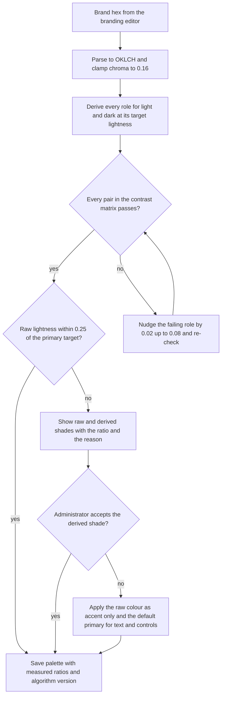

# 14. Design System and UX

> Part of `docs/plan/`. Group D. Reads: master brief Sections 4.1, 12.1, 16, 17 and 21; Appendices D, L, O, U, W and X; `.claude/skills/rtl-a11y-checklist/SKILL.md`, `.claude/skills/because-panel-pattern/SKILL.md`, `.claude/rules/web-a11y.md` and `.claude/rules/mobile.md`. The component inventory and the screen inventory are owned by `08-web-structure.md` (its Section 6 and Section 7) and are quoted here, never redefined. `§N` means a section of this document; "Section N" means the master brief. Names come from Appendix L.

One design system, two renderers. `@nibras/ui` (Angular, selector prefix `nb-`) and the Flutter package `nibras_ui` (widget prefix `Nb`) consume the same token file, ship the same 64 components, design the same seven states, and are proven by the same four-way rendering: light LTR, light RTL, dark LTR, dark RTL. Master brief Section 16 asks for the design system before feature screens; this document is what "before" has to contain.

| Decision in force | Value | Where it is recorded |
|---|---|---|
| Token source of truth | One JSON file, `libs/ui/tokens/nibras.tokens.json`, in the W3C Design Tokens Community Group format; CSS custom properties for Angular and Dart constants for Flutter are generated from it in CI and never edited by hand | §2 |
| Colour model | OKLCH for every derivation, sRGB hex for every output; the tenant supplies one hex value and receives a full light and dark palette | §2.1, §3 |
| Fonts | Inter for Latin, IBM Plex Sans Arabic for Arabic, self-hosted subsets split by `unicode-range`, weights 400, 500 and 600 only | §2.2 |
| Themes and density | Light, dark and follow-system; comfortable and compact density; compact never below the 768 breakpoint | §2, §4 |
| Product name | One server configuration value, `Platform:ProductName`, and one client token, `brand.name`, in the token file; never a literal in a template or a string file | §1.4 |
| Motion | Four durations, three easings, one stagger step; reduced motion zeroes every duration and keeps an opacity fade | §2.6, §6 |
| Accessibility bar | WCAG 2.2 AA on web and, through Flutter semantics, on mobile; screen readers exactly as Appendix X lists them | §11 |
| Living inventory | Storybook for `@nibras/ui`, Widgetbook for `nibras_ui`, seven required stories per component, a parity check that fails CI when either side lacks a component in §7 | §12 |

---

## 1. Brand application

### 1.1 The guiding-light motif

Section 16.0 defines the brand as a lamp that guides: the product makes the state of the school clear and shows each person what to do next. The motif is applied sparingly and in the same places on every surface, so that it means something when it appears.

| Where the motif appears | Form | Rule |
|---|---|---|
| Application icon and favicon | The lamp mark alone, single colour on the primary or the school's primary | Mark only; no wordmark at icon sizes |
| Sign-in and join screens | Bilingual lockup above the form | The one place the full lockup is always shown inside a tenant, because the school's brand has not yet been resolved for an anonymous visitor on a shared domain |
| The calm empty state | A soft, static lamp illustration behind "nothing needs your attention" (Section 12.1 item 35) | The illustration is the brand promise made visible: silence is a designed state. It never animates beyond the animated-empty-state pattern in §6 |
| Loading skeletons | None | Skeletons are neutral shapes; the motif on a loading state would decorate, not explain |
| First-run tours and "what's new" | The mark as the tour's avatar | Replaced by the school's mark under white-label |
| Print and PDF | Footer attribution line only, where §1.3 allows it | Never a watermark across a child's document |
| Platform Console | Mark and Latin wordmark in the top bar | Always Nibras; §1.3 |

### 1.2 The bilingual lockup

| Variant | Contents | Used for |
|---|---|---|
| Bilingual horizontal | Mark, Latin wordmark "Nibras", Arabic wordmark "نبراس" | Sign-in, marketing site header, documentation header, system emails from the platform |
| Bilingual stacked | Mark above both wordmarks | Splash screen of the shared mobile application, app-store listing art |
| Latin only | Mark and "Nibras" | Platform Console top bar, English-only system emails |
| Arabic only | Mark and "نبراس" | Arabic-only system emails, Arabic print footers |
| Mark only | The lamp | Icons, favicons, avatars, tour cards |

Lockup rules that the RTL checklist would otherwise catch one screen at a time: the mark never mirrors (§5); the bilingual horizontal lockup ships as two assets, one with the Latin wordmark at inline-start and one with the Arabic wordmark at inline-start, selected by the document direction, so that the leading wordmark is the one in the person's language; the two wordmarks share a baseline and a cap height set in the artwork, not by CSS. The artwork is original SVG (Section 16.0) held in `libs/ui/icons/brand/` and mirrored into the Flutter package's assets by the same generator that mirrors the tokens.

### 1.3 White-label rules

Section 16.0 sets the rule; this table applies it surface by surface. "School brand" means the tenant's name, logo, primary colour and the palette §3 derives from it.

| Surface | Brand shown | "Powered by Nibras" line |
|---|---|---|
| Tenant workspaces in `apps/school`, every role | School brand | Shown in the shell footer and on the sign-in screen when the tenant's plan does not include removal; hidden when it does (Platform holds the plan flag) |
| White-label mobile flavour (Section 18) | School brand: icon, splash, name, theme colour | Same plan rule, on the about screen and the sign-in screen only |
| Shared multi-school mobile application | Nibras | Not needed; the brand is already Nibras |
| Platform Console | Nibras, always | Not needed |
| Marketing site, documentation, developer portal | Nibras, always | Not needed |
| System emails sent by the platform (trial, invoice, maintenance, security) | Nibras | Not needed |
| Notification templates sent by a school (Appendix C) | School brand; the school's sender name | Footer line under the same plan rule |
| Generated documents: report cards, certificates, receipts, statements | School brand, school stamp and signature | Footer attribution under the same plan rule; the QR verification page carries the school brand and the verification wording |
| Public document verification page (`/verify/:code`) | School brand | Footer attribution under the same plan rule |
| Impersonation banner (`08-web-structure.md` Section 1.1) | Nibras wording, never restyled by the tenant theme | Not applicable; the banner is a platform control and stays visible under any tenant palette |
| Emergency banner (Section 12.1 item 32) | Tenant palette for the top bar is replaced by the fixed danger role | Not applicable |
| Maintenance mode and platform announcements | Nibras wording inside the school's shell | Not applicable |

What is never re-branded, in one list: the Platform Console; platform system emails; the shared mobile application; the impersonation banner; the emergency banner's colour; the licence and legal notices; the release notes' "what changed" wording (Section 12.1 item 40); and the four fixed status colours in §2.1, because a school whose danger colour is its brand colour would lose the meaning of red.

### 1.4 The one-configuration-value rule for the name

Section 16.0 says the name has not been cleared and must be changeable in one place.

| Layer | The single place | What reads it | What is forbidden |
|---|---|---|---|
| Server | `Platform:ProductName` (and `Platform:ProductNameArabic`) in Platform's configuration, exposed on the bootstrap payload of Bff.Web and Bff.Mobile | Email templates, PDF footers, the manifest, the "Powered by" line, the Platform Console title | A literal product name in a template, a resource file or a log message |
| Web | `brand.name.latin` and `brand.name.arabic` in `nibras.tokens.json`, overridden at runtime by the bootstrap value | `nb-app-shell`, sign-in, tours, "what's new" | A literal in any `i18n/*.json`; the missing-key report treats the literal as a defect |
| Mobile | The same two token constants generated into `nibras_ui`, overridden by remote configuration from Bff.Mobile | Splash, about, notifications | A literal in `.arb` files or in the flavour manifests beyond the flavour's own display name |
| Documentation and marketing | A site-wide variable in the documentation generator | Every page | Hand-typed name in a page body |

Technical identifiers are exempt and stay as Appendix L fixes them: `Nibras.sln`, `Nibras.<Service>.<Layer>`, `@nibras/<lib>`, `nibras_<service>`, `nibras.<service>`, `nibras/<service>-<kind>`, the `nb-` and `Nb` prefixes. A lint step in `ci-web.yml` and `ci-mobile.yml` fails on the display string "Nibras" or "نبراس" in a template, a string file or a notification template outside the token file and the brand asset folder.

---

## 2. Design tokens

Naming: `--nb-<category>-<role>[-<modifier>]` on the web, `NbTokens.<category>.<role>` in Dart. Every token below exists in the JSON file with a `$type`, a `$value` and a `$description`; the generators fail on a token that any of the three lacks. Tokens are the only place a colour, a size, a duration or an easing may be written; a literal in a component style fails stylelint on the web and the analyzer rule in `nibras_ui` on mobile (`08-web-structure.md` Section 10).

| Token file | Purpose |
|---|---|
| `nibras.tokens.json` | Every token, both themes, both densities, in one file so that a diff review sees a change once |
| `brand.json` | The product name pair, the taglines and the lockup asset names from §1; the one file Section 16.0 asks for |
| `tenant-theme.schema.json` | The schema of the computed per-tenant palette that §3 produces and Platform stores |
| Generated: `tokens.css`, `tokens.dark.css`, `tokens.compact.css` | Custom properties on `:root`, `[data-theme="dark"]` and `[data-density="compact"]` |
| Generated: `nibras_tokens.dart` | Constants, a `NbThemeData` factory and a `NbVisualDensity` mapping |

### 2.1 Colour roles

Colour is expressed as roles, not hex values, because the school supplies the primary. Every role names its OKLCH derivation from the tenant's primary hue `h` and clamped chroma `c` (§3 step 2), and the fixed values that do not derive from the brand. Lightness `L` is OKLCH lightness on the 0 to 1 scale; a value such as "L .48" means the role keeps the tenant's hue and chroma and is re-targeted to that lightness, then gamut-mapped by reducing chroma until it is inside sRGB.

| Role token | Light theme | Dark theme | Minimum contrast it must reach | Against |
|---|---|---|---|---|
| `--nb-color-primary` | L .48, `h`, `c` | L .78, `h`, `c` | 4.5:1 | `surface`, `surface-1` |
| `--nb-color-on-primary` | White or ink `on-surface`, whichever reaches the ratio first (white wins ties) | L .22, `h`, `c` | 4.5:1 | `primary` |
| `--nb-color-primary-hover` | `primary` L −.05 | `primary` L +.04 | 4.5:1 | `surface` |
| `--nb-color-primary-active` | `primary` L −.10 | `primary` L +.08 | 4.5:1 | `surface` |
| `--nb-color-primary-container` | L .93, `h`, `c` × .35 | L .34, `h`, `c` × .60 | 3:1 as a component; text on it uses `on-primary-container` | `surface` |
| `--nb-color-on-primary-container` | L .25, `h`, `c` | L .90, `h`, `c` × .35 | 4.5:1 | `primary-container` |
| `--nb-color-accent` | Fixed warm light: L .86, hue 80, chroma .10 | Fixed: L .80, hue 80, chroma .10 | 3:1 as a component | `surface` |
| `--nb-color-on-accent` | Ink `on-surface` | Ink L .20 | 4.5:1 | `accent` |
| `--nb-color-surface` | L .995, `h`, chroma .005 | L .17, `h`, chroma .010 | Reference surface | |
| `--nb-color-surface-1` | L .975, chroma .006 | L .20, chroma .010 | | |
| `--nb-color-surface-2` | L .955, chroma .008 | L .24, chroma .011 | | |
| `--nb-color-surface-3` | L .93, chroma .010 | L .28, chroma .012 | | |
| `--nb-color-on-surface` | L .20, `h`, chroma .02 | L .93, `h`, chroma .01 | 4.5:1 | every surface level |
| `--nb-color-on-surface-muted` | L .46, chroma .02 | L .70, chroma .015 | 4.5:1 | every surface level |
| `--nb-color-outline` | L .80, chroma .02 | L .38, chroma .02 | Decorative only: dividers, table rules; never the sole boundary of a control | |
| `--nb-color-outline-strong` | L .60, chroma .02 | L .55, chroma .02 | 3:1 | every surface level (input borders, checkbox boxes, chip outlines) |
| `--nb-color-success` | Fixed: L .50, hue 150, chroma .13 | Fixed: L .78, hue 150, chroma .13 | 4.5:1 as text, 3:1 as icon | `surface` |
| `--nb-color-warning` | Fixed: L .55, hue 75, chroma .13 | Fixed: L .78, hue 75, chroma .13 | 4.5:1 as text | `surface` |
| `--nb-color-danger` | Fixed: L .50, hue 25, chroma .13 | Fixed: L .78, hue 25, chroma .13 | 4.5:1 as text | `surface` |
| `--nb-color-info` | Fixed: L .50, hue 245, chroma .13 | Fixed: L .78, hue 245, chroma .13 | 4.5:1 as text | `surface` |
| `--nb-color-<status>-container` and `-on-container` | L .94 with chroma × .35; text at L .25 | L .30 with chroma × .60; text at L .90 | 4.5:1 | each other |
| `--nb-color-focus` | `primary` if it reaches 3:1 against both `surface` and `surface-3`, else the fixed info role at L .48 | `primary` (dark) if it reaches 3:1, else info at L .78 | 3:1 | the surface the focused element sits on and the element's own fill |
| `--nb-color-link` | `primary` | `primary` | 4.5:1 and distinguishable from body text by underline, never colour alone | `surface` |
| `--nb-color-scrim` | Ink at 40 percent alpha | Black at 60 percent alpha | | |
| `--nb-color-disabled` and `-on-disabled` | `surface-3` and `on-surface-muted` at 60 percent alpha | `surface-3` and `on-surface-muted` at 60 percent alpha | Exempt (WCAG 1.4.3 inactive components), but never used for read-only values that carry information; those use `on-surface-muted` at full alpha | |
| `--nb-color-chart-1` to `-6` | Series 1 is `primary`; 2 to 6 rotate hue by +150, +210, +60, +270 and +120 at L .55, chroma .12 | Same hues at L .75 | 3:1 | `surface`; and each series carries a marker shape and a line dash, so colour is never the only difference (WCAG 1.4.1) |

Status colours are fixed rather than derived so that success, warning and danger mean the same thing in every school and stay distinguishable for colour-blind readers; every status is also carried by an icon and a word (`badge`, `chip`, `toast`), never by colour alone. The four status hues were chosen so that the pairs success and danger, and warning and info, remain distinct under deuteranopia and protanopia simulation, which the contrast job runs (`How this document is verified`).

Worked values for the Nibras default primary `#1F5FA8` (hue 254.6, chroma .133), computed by the algorithm in §3 and checked with the WCAG relative-luminance formula:

| Role | Light | Ratio | Dark | Ratio |
|---|---|---|---|---|
| `primary` | `#1D5DA6` | 6.63:1 on white, 6.52:1 on `surface` | `#84BBFF` | 9.58:1 on `surface` |
| `on-primary` | white | 6.63:1 | `#001A3A` | 8.71:1 |
| `primary-container` and `on-primary-container` | `#DAEAFE` and `#002147` | 13.13:1 | `#173860` with `#F2F2F2` text | 10.59:1 |
| `surface` and `on-surface` | `#FDFDFE` and `#10171F` | 17.74:1 | `#0C1014` and `#E3E8EF` | 15.51:1 |
| `surface-3` and `on-surface-muted` | `#E3E8EF` and `#515963` | 5.76:1 | `#25292F` and `#989FA8` | 5.47:1 |
| `outline-strong` | `#78818C` | 3.94:1 on white, 3.21:1 on `surface-3` | `#6A727D` | 3.95:1 on `surface`, 3.01:1 on `surface-3` |
| `success`, `warning`, `danger`, `info` | `#137738`, `#986600`, `#A03F3C`, `#0568A4` | 5.64, 4.96, 6.42, 5.96:1 on white | `#76CF8A`, `#E8AA4E`, `#FF958E`, `#71BFFF` | 10.06, 9.36, 9.04, 9.64:1 on the dark `surface` `#0C1014` |
| `accent` | `#F4CA84` with ink text | 11.29:1 | | |

### 2.2 Type scale

Two families, one scale. Inter carries Latin, IBM Plex Sans Arabic carries Arabic, and the same line may carry both, so the families are declared once with `unicode-range` and the browser picks per glyph. Arabic glyphs sit visually smaller than Latin at the same size and need more vertical room for ascenders, descenders and diacritics, so the scale carries an Arabic multiplier rather than a second scale.

| Setting | Value | Why |
|---|---|---|
| `--nb-font-latin` | `"Inter", system-ui, sans-serif` with `unicode-range` U+0000 to U+024F, U+2000 to U+206F, U+20A0 to U+20CF | Latin, punctuation, currency signs |
| `--nb-font-arabic` | `"IBM Plex Sans Arabic", "Noto Sans Arabic", sans-serif` with `unicode-range` U+0600 to U+06FF, U+0750 to U+077F, U+08A0 to U+08FF, U+FB50 to U+FDFF, U+FE70 to U+FEFF | Arabic, Arabic supplement and extended, presentation forms |
| Font stack on `body` | `var(--nb-font-latin), var(--nb-font-arabic)` under `:lang(en)`; the reverse order under `:lang(ar)` so that shared glyphs (digits, punctuation) come from the language's own face | Mixed-language screens look intentional (Section 16.1) |
| Weights shipped | 400, 500, 600 in each family, woff2, subsetted; 700 is not shipped and `font-weight: bold` maps to 600 | Fits the 260 kB font budget in `08-web-structure.md` Section 9 |
| `--nb-type-scale-ar` | 1.0625 | Arabic size multiplier; sizes round to the nearest 1/16 rem |
| `--nb-type-leading-ar` | +0.15 | Added to every Latin line-height under `:lang(ar)` |
| Letter spacing | 0 under `:lang(ar)` always; Latin display and headline −0.01em | Arabic is never tracked; it breaks the connected script |
| Numerals | `font-variant-numeric: tabular-nums` on `grid`, `data-table`, `stat-tile`, `key-value` money and marks; Arabic-Indic digits come from IBM Plex Sans Arabic through the `nbNumeral` pipe when the tenant setting says so | Columns of marks and money align in both numeral systems |
| Metric overrides | `size-adjust`, `ascent-override`, `descent-override` and `line-gap-override` on the system fallback faces, computed once from the font metrics and checked in next to the `@font-face` rules | No layout shift when the web font arrives (`font-display: swap`), CLS under 0.1 |
| Minimum size | 1rem body on phone layouts; nothing below 0.75rem anywhere | Readable on the phones people own (Section 12.1 item 44) |

| Role token | Latin size | Latin line-height | Arabic size | Arabic line-height | Weight | Used by |
|---|---|---|---|---|---|---|
| `--nb-type-display` | 2.25rem | 1.15 | 2.375rem | 1.30 | 600 | `stat-tile` hero number, count-up |
| `--nb-type-headline` | 1.75rem | 1.20 | 1.875rem | 1.35 | 600 | `page-header` title |
| `--nb-type-title` | 1.25rem | 1.30 | 1.3125rem | 1.45 | 600 | `card` title, `dialog` title, `panel` header |
| `--nb-type-body-lg` | 1.125rem | 1.50 | 1.1875rem | 1.65 | 400 | Parent calm screen, reading text on phone |
| `--nb-type-body` | 1rem | 1.50 | 1.0625rem | 1.65 | 400 | Default |
| `--nb-type-body-sm` | 0.875rem | 1.45 | 0.9375rem | 1.60 | 400 | Table cells, list secondary lines |
| `--nb-type-label` | 0.8125rem | 1.40 | 0.875rem | 1.50 | 500 | `button`, `chip`, `badge`, form labels, tabs |
| `--nb-type-caption` | 0.75rem | 1.35 | 0.8125rem | 1.50 | 400 | `as-of-badge`, helper text, timestamps |
| `--nb-type-numeric` | inherits | inherits | inherits | inherits | 500, tabular | Marks, money, counts inside any role |

### 2.3 Spacing

Base unit 4px, expressed in rem so that it scales with the person's text size (WCAG 1.4.4).

| Token | Value | Typical use |
|---|---|---|
| `--nb-space-1` | 0.25rem | Icon to label gap inside a chip |
| `--nb-space-2` | 0.5rem | Inside a compact control; between chips |
| `--nb-space-3` | 0.75rem | Between a label and its field |
| `--nb-space-4` | 1rem | Card padding on phone; list row padding |
| `--nb-space-6` | 1.5rem | Card padding on desktop; between form sections |
| `--nb-space-8` | 2rem | Between bento cards; page gutter on tablet |
| `--nb-space-12` | 3rem | Page gutter on desktop; between page sections |
| `--nb-space-16` | 4rem | Above the calm empty state |
| `--nb-control-height` | 2.5rem comfortable, 2rem compact | Every input, button and select |
| `--nb-row-height` | 3rem comfortable, 2.25rem compact | `data-table`, `list`, `grid` rows |
| `--nb-target-min` | 1.5rem (24 CSS pixels) | The floor for any interactive element in any density (WCAG 2.5.8) |
| `--nb-target-primary-phone` | 2.75rem (44 CSS pixels) | Primary actions on phone layouts (`08-web-structure.md` Section 8) |

Breakpoint tokens `--nb-bp-phone`, `--nb-bp-tablet`, `--nb-bp-desktop` and `--nb-bp-wide` are owned by `08-web-structure.md` Section 8 and are quoted, not redefined, in the token file.

### 2.4 Radius

| Token | Value | Used by |
|---|---|---|
| `--nb-radius-sm` | 6px | `text-field`, `select`, `chip`, `badge`, `checkbox` |
| `--nb-radius-md` | 10px | `button`, `card` inside a list, `menu`, `tooltip` |
| `--nb-radius-lg` | 16px | `card` in a `bento-grid`, `panel`, `dialog`, `undo-sheet` |
| `--nb-radius-xl` | 24px | The hero card of a Today screen, the calm empty state |
| `--nb-radius-full` | 9999px | `avatar`, pill buttons, `progress-bar` track, `switch` |

### 2.5 Elevation

Depth is soft (Section 16.1): a surface step plus a low-alpha shadow in light, a surface step plus a one-pixel low-alpha outline in dark, because shadows disappear on dark surfaces.

| Token | Light | Dark | Used by |
|---|---|---|---|
| `--nb-elevation-0` | `surface`, no shadow | `surface`, no outline | Page background |
| `--nb-elevation-1` | `surface-1`, `0 1px 2px` ink at 6 percent | `surface-1`, outline `on-surface` at 6 percent | `card` at rest, `list` container |
| `--nb-elevation-2` | `surface-1`, `0 2px 8px` at 8 percent | `surface-2`, outline at 8 percent | `card` hover, `menu`, `tooltip`, `combobox` list |
| `--nb-elevation-3` | `surface-2`, `0 8px 24px` at 12 percent | `surface-3`, outline at 10 percent | `panel`, `dialog`, `undo-sheet`, `command-palette` |
| `--nb-elevation-4` | `surface-2`, `0 16px 40px` at 16 percent | `surface-3`, outline at 12 percent | The lifted card while dragging in `timetable-grid` and class formation |

Shadows have no horizontal offset, so elevation needs no RTL variant. Z-order tokens: `--nb-z-sticky` 20 (`top-bar`, sticky table headers), `--nb-z-panel` 30, `--nb-z-dialog` 40, `--nb-z-toast` 50, `--nb-z-emergency` 60 (the emergency banner), `--nb-z-impersonation` 70 (the impersonation banner mounts in the root shell and sits above everything, `08-web-structure.md` Section 1.1).

### 2.6 Motion tokens

From Section 16.2: about 100 ms for feedback, 200 ms for small transitions, 300 to 400 ms for page and panel transitions; one standard curve, one for entering, one for leaving.

| Token | Value | Meaning |
|---|---|---|
| `--nb-motion-duration-feedback` | 100ms | A tap acknowledged: ripple, press, switch |
| `--nb-motion-duration-short` | 200ms | Hover, chip select, tooltip, menu open |
| `--nb-motion-duration-medium` | 300ms | Panel, dialog, list row enter and leave |
| `--nb-motion-duration-long` | 400ms | Route transition, shared element, skeleton morph |
| `--nb-motion-ease-standard` | `cubic-bezier(0.2, 0, 0, 1)` | Anything that moves and stays on screen |
| `--nb-motion-ease-enter` | `cubic-bezier(0, 0, 0.2, 1)` | Decelerate into place |
| `--nb-motion-ease-leave` | `cubic-bezier(0.4, 0, 1, 1)` | Accelerate out |
| `--nb-motion-stagger` | 40ms | Delay step between staggered children |
| `--nb-motion-stagger-max` | 240ms | The delight budget: no stagger sequence exceeds six steps |

Under `@media (prefers-reduced-motion: reduce)` and under Flutter's `MediaQuery.disableAnimations`, every duration token becomes `0ms`, the stagger becomes `0ms`, and every pattern in §6 falls back to the fade or the instant state named there (`08-web-structure.md` Section 10).

---

## 3. The per-school theming algorithm

Section 16.1: per-school theming from a single brand colour, with automatic generation of accessible tints and an automatic contrast check. The algorithm runs in the branding editor (`/admin/branding`, `08-web-structure.md` Section 7.3) as the administrator types, and again on the server in Platform when the theme is saved, so the stored palette is the server's computation and the preview cannot disagree with it.

| Step | What happens | Rule |
|---|---|---|
| 1 Parse | The hex value from the editor becomes OKLCH `L`, `C`, `H` | Rejects anything that is not six hex digits with `PLATFORM_VALIDATION_FAILED`, naming the `primaryColour` field in the Problem Details `errors` member (Appendix K cross-cutting code) |
| 2 Clamp chroma | `c = min(C, 0.16)` | Keeps a neon brand printable and keeps the derived tints inside sRGB with little gamut mapping |
| 3 Derive | Every role in §2.1 is computed for light and dark from `H` and `c` at the role's target `L`; each is gamut-mapped by stepping chroma down by 0.002 until inside sRGB | The school's hue survives in every tint; only lightness and chroma move |
| 4 Choose `on-primary` | White is tested first, then `on-surface` ink; the first to reach 4.5:1 wins | For a light-theme primary at L .48, white always passes; the test exists for the nudged cases in step 6 |
| 5 Check | Every pair in the contrast matrix below is measured with the WCAG 2.2 relative-luminance formula | Thresholds: 4.5:1 for text under 24px (or under 18.66px bold), 3:1 for large text, 3:1 for interface components and focus indicators (criteria 1.4.3 and 1.4.11) |
| 6 Nudge | A failing pair moves the derived role's `L` in steps of 0.02, up to 0.08, away from the surface it fails against, and re-runs step 5 | Bounded so that the result still reads as the same colour |
| 7 Distance check | Compare the tenant's raw `L` with the light-theme primary target (.48); if the distance exceeds 0.25, the editor states that the brand colour cannot carry text and shows the derived shade next to the raw one | A brand yellow at L .84 becomes an olive at L .48; the school must see that before saving |
| 8 Fallback | If the administrator declines the derived shade, the raw colour is applied as **accent only**: logo backdrop, bento hero stripe, chart series 1 with labels, the lamp illustration; every interactive and text role uses the Nibras default primary | The school keeps its colour where contrast is not required and never gets an unreadable button |
| 9 Store | The computed palette, both themes, the chosen `on-primary`, every measured ratio, the algorithm version and the fallback flag are stored by Platform as the tenant theme document (`tenant-theme.schema.json`) | Served on the bootstrap payload, cached with the tenant settings snapshot, invalidated by the branding-changed event |
| 10 Apply | Web: custom properties set on `:root` per tenant host; the manifest `theme_color`; Flutter branded flavour: baked at build and refreshed from remote configuration | No component ever reads the tenant hex; it reads roles |

**The contrast matrix the check runs.** Each row is a pair; the contrast job in `How this document is verified` fails on any row below threshold for any of the stored tenant palettes and the three demo palettes.

| Foreground | Background | Threshold | Criterion |
|---|---|---|---|
| `on-surface`, `on-surface-muted`, `link` | `surface`, `surface-1`, `surface-2`, `surface-3` | 4.5:1 | 1.4.3 |
| `on-primary` | `primary`, `primary-hover`, `primary-active` | 4.5:1 | 1.4.3 |
| `on-primary-container` | `primary-container` | 4.5:1 | 1.4.3 |
| `on-<status>-container` | `<status>-container` | 4.5:1 | 1.4.3 |
| `<status>` as text | `surface`, `surface-1` | 4.5:1 | 1.4.3 |
| `primary`, `<status>` as icon or border | `surface`, `surface-3` | 3:1 | 1.4.11 |
| `outline-strong` | `surface`, `surface-3` | 3:1 | 1.4.11 |
| `focus` | `surface`, `surface-3`, `primary` (a focused primary button) | 3:1 | 1.4.11 |
| `chart-1` to `chart-6` | `surface` | 3:1 | 1.4.11 |
| `on-accent` | `accent` | 4.5:1 | 1.4.3 |

**Worked results** for three brands, from the same computation as the table in §2.1. The three demo tenant palettes that the `Themes` story renders (`08-web-structure.md` Section 6) are the first three rows; the fourth is the fallback case.

| Brand | Raw colour | Raw ratio on white | Derived light primary | Ratio | Derived dark primary | Ratio on dark surface | Outcome |
|---|---|---|---|---|---|---|---|
| Nibras default | `#1F5FA8` | 6.44:1 | `#1D5DA6` | 6.63:1 | `#84BBFF` | 9.58:1 | Applied as is |
| Navy school | `#1F3A5F` (L .35) | 11.48:1 | `#425F87` | 6.53:1 | `#9ABAE6` | 9.57:1 | Applied; the raw navy is retained as `on-primary-container` territory, the interactive primary is the lighter derived shade so hover and active states have room |
| Teal school | `#0E8A7B` (L .57) | 4.25:1 | `#026D61` | 6.25:1 | `#65CCBB` | 9.90:1 | Applied; the raw teal alone would fail 4.5:1 for body-size text on white |
| Yellow school | `#F5C400` (L .84) | 1.64:1 | `#735A00` | 6.58:1 | `#DEB20A` | 9.56:1 | Distance .36 exceeds .25: the editor shows both shades; on decline, the yellow becomes accent only and controls use the default primary |

---

## 4. Comfortable and compact density

| Aspect | Comfortable (default) | Compact | Rule |
|---|---|---|---|
| Control height | 2.5rem | 2rem | Never below `--nb-target-min` |
| Row height | 3rem | 2.25rem | `grid` cells keep a 24 by 24 CSS pixel tap area in compact (2.5.8) |
| Card padding | `--nb-space-6` desktop, `--nb-space-4` phone | `--nb-space-4` | |
| Gap between bento cards | `--nb-space-8` | `--nb-space-6` | |
| Type scale | Unchanged | Unchanged | Density never shrinks text; a smaller screen is not a reason to make words smaller |
| Icon size | 24px | 20px inside rows, 24px in buttons | |
| Where compact is available | Every desktop and tablet layout at 768 and above | Not available under 768 (`08-web-structure.md` Section 8 forces comfortable) | Touch first on phones |
| Default per workspace | Comfortable everywhere | Compact suggested once, not forced, on the mark entry grid, the data-table screens of the admin console, registrar, accountant and HR, and the timetable editor | The suggestion is a dismissible hint, shown once per person |
| Persistence | `ShellStore.density` per person through Bff.Web (`08-web-structure.md` Section 3.1) | Same | Follows the person across devices |
| Flutter | `NbVisualDensity.comfortable` maps to `VisualDensity.standard` | `NbVisualDensity.compact` maps to `VisualDensity.compact` on tablet and desktop kiosk targets only | Phones always comfortable |
| Rendering | `[data-density="compact"]` on the document root switches the `--nb-control-height`, `--nb-row-height` and card padding tokens | Same tokens | Components never branch on density in code; they read tokens |

---

## 5. RTL mirroring rules

Direction comes from `dir` on the document root, set by `@nibras/core/rtl` from the person's language, and from `Directionality` in Flutter. No component reads or assumes a direction; every layout property is logical (`.claude/rules/web-a11y.md`). This section decides the cases where "mirror everything" is wrong.

### 5.1 Icons

Every icon in `libs/ui/icons/` carries a `mirror` flag in its manifest; the `nb-icon` component and `NbIcon` apply `scaleX(-1)` under RTL only when the flag is true. The flag is decided once per icon here, not per screen.

| Mirrors in RTL (`mirror: true`) | Does not mirror (`mirror: false`) |
|---|---|
| back, forward, next, previous, chevron-start, chevron-end, first-page, last-page | logo and lamp mark, any brand or partner mark |
| indent, outdent, list-nested | play, pause, stop, fast-forward, rewind (media controls) |
| send, reply, reply-all, forward-message | clock, history, timer, calendar |
| undo, redo | checkmark, close, add, remove |
| external-link, open-in-new, login, logout | search, filter, refresh, sync (rotational) |
| trend-up, trend-down (the arrow's tail is on the reading start) | download, upload, expand, collapse (vertical) |
| drag-handle with direction, move-to-start, move-to-end | phone, camera, microphone, attachment, QR code |
| help-pointer, tour-arrow | warning, error, info, success, lock, shield |
| breadcrumb separator, stepper connector arrow | sort-ascending, sort-descending, numbers and digits |
| text-align-start, text-align-end | text-bold, text-italic, quote |

### 5.2 Layout, charts, steppers and gestures

| Element | RTL behaviour | Why |
|---|---|---|
| `side-nav`, `top-bar`, `panel` | Navigation at inline-start, panel opens from inline-end; all through logical properties | Reading order |
| `breadcrumb`, `stepper`, `pagination`, `tabs` | Flow from inline-start; connectors and arrows mirror | The checklist requires steppers to read right to left in Arabic |
| `progress-bar` | Fills from inline-start | A bar that fills from the left in Arabic reads as emptying |
| `progress-ring`, `donut-chart`, `switch` knob travel, `avatar` | Not mirrored | Rotation and circles carry no reading direction; the switch travels toward inline-end in both, which is what platform switches do |
| `bar-chart`, `line-chart`, `sparkline` | Category and time axes run from inline-start; the value axis sits at inline-end; legend at inline-start; tooltips anchor logically | A time series that runs left to right in Arabic puts "now" at the wrong end |
| `heatmap` (attendance calendar, syllabus coverage, mastery) | Column order mirrors (days, weeks, standards); row order does not | Rows are categories read top to bottom in both |
| `timetable-grid` | Day columns mirror; period rows do not; the current-time line is unaffected | Days are read in reading order, periods are vertical |
| `seating-chart` | **Not mirrored**; a "board" marker shows which edge is the front of the room | It is a map of physical space; mirroring would put the child on the wrong side of the room |
| `permission-matrix`, `data-table`, `grid` | Column order mirrors; the first column (the row's name) is at inline-start; numeric columns align to inline-end but the digits themselves are isolated LTR | Numbers keep their own direction inside an Arabic table (checklist) |
| `key-value` | Key at inline-start, value at inline-end | |
| Swipe actions on list rows (mobile) | The "leading" action lives at inline-start and the "trailing" at inline-end; a swipe toward inline-end reveals the leading action | Flutter `Dismissible` directions are logical when the widget is wrapped by `NbSwipeRow` |
| Swipe to go back (mobile) | Follows the platform: iOS mirrors the edge automatically, Android uses the system back gesture | Never re-implemented |
| Drag and drop (timetable, class formation) | Logical; a keyboard alternative moves by menu ("move to Monday period 3") in both directions (2.5.7) | |
| Keyboard arrows in `grid` and `seating-chart` | Arrow keys move **visually** (ArrowRight moves to the cell on the right in both directions); Home and End move **logically** to row start and row end | Matches what people expect from spreadsheets in Arabic |
| Text alignment | `text-align: start` everywhere; free-text inputs and message bubbles use `dir="auto"` | A parent typing an English sentence in an Arabic interface gets a left-aligned LTR bubble |
| Identifiers, phone numbers, money, file names, emails, codes | Wrapped by the `nbBidiIsolate` pipe (web) and `NbBidi` (mobile), which emit `unicode-bidi: isolate` spans; never localized numerals for identifiers | Section 17 and the checklist |
| Numerals | `nbNumeral` and `NbNumeral` render Western or Arabic-Indic digits from the tenant setting for quantities, marks and money; identifiers, version numbers and routing keys never localize | Section 17 |
| Date pickers | Hijri and Gregorian grids read from inline-start; the week starts on the tenant's first day of week | Section 17 |
| Elevation shadows | No horizontal offset, so nothing to mirror | §2.5 |
| The lockup | Two assets, chosen by direction; the mark itself never flips | §1.2 |
| PDF and print | The same rules through the document templates; numeric columns and money keep LTR isolation inside Arabic paragraphs | Section 17 |

---

## 6. Motion patterns

Every pattern names the token it uses and its reduced-motion fallback. Patterns are added here first and in feature code second; a new animation that does not appear in this table is a defect in the design review.

| Pattern | Where | Tokens | Web mechanism | Flutter mechanism | Reduced-motion fallback |
|---|---|---|---|---|---|
| Skeleton morphs into content | Every state transition from loading to ready | `long`, `ease-standard` | `skeleton` shares the layout box with the content; the content enters with `animate.enter="nb-enter-fade-up"` (opacity 0 to 1, translateY 8px to 0) | `AnimatedSwitcher` with `NbFadeUp` | Instant swap, no translate, 0 ms |
| Staggered card entrance | `bento-grid` on Today screens, the first page of a `list` | `medium`, `stagger`, `stagger-max` | `animate.enter` on each card with `--nb-stagger-index` setting `animation-delay`; capped at six | `flutter_animate` `.fadeIn().slideY()` with `interval` | All cards appear at once with a 0 ms fade |
| Number count-up | `stat-tile` on first render and on a value change | `long`, `ease-standard` | Signal-driven counter writing the text, tabular figures so the width is stable | `TweenAnimationBuilder<num>` | The final number, immediately; the live region announces the value once |
| Chart draw and smooth update | `bar-chart`, `line-chart`, `sparkline`, `heatmap`, `donut-chart` | `long` for draw, `medium` for update, `ease-standard` | ECharts `animationDuration` bound to the tokens, `animationEasing` mapped to the standard curve | `fl_chart` implicit animation bound to the same durations | ECharts `animation: false`; the chart renders complete |
| Attendance tap: ripple and settle | `attendance-mark`, `seating-chart` seat | `feedback` for the ripple, `short` for the settle | A pseudo-element scales from 0 to 1 in opacity, the status chip cross-fades; the mark is committed to the store before the animation starts | `InkResponse` plus `AnimatedSwitcher` on the chip; light haptic | No ripple; the chip changes instantly; the live region announces the status |
| Drag and drop with a lifted card and live conflict highlight | `timetable-grid`, class formation | `short` to lift, `elevation-4`, `feedback` for the conflict pulse | CDK drag preview with `transform` only; the conflict cell's outline animates once to `danger` | `LongPressDraggable` with `Hero`-style lift | Lift shows as a static elevation change; conflicts show the outline without pulsing |
| Progress ring for long jobs | `progress-ring`, `long-job` composite | `medium`, `ease-standard` | Stroke dash offset transition on each realtime progress event | `CircularProgressIndicator` with `AnimatedBuilder` | The ring jumps to the new value; percentage text is the source of truth |
| Toast and snackbar slide-in | `toast`, `undo-sheet` | `medium`, `ease-enter` in, `ease-leave` out | `animate.enter="nb-slide-in-block-end"` and `animate.leave="nb-slide-out-block-end"`; the toast never steals focus | `SnackBar` with `NbSlideTransition` | Fade only |
| Badge earned or checklist completed celebration | `toast` variant on `/teacher/behavior` and `/student/portfolio`; the setup checklist on `/admin` | `long`, capped by the delight budget | A one-shot particle burst drawn with `transform` and `opacity` on a canvas the size of the toast, once per badge event, never on a route the person visits repeatedly for work | `flutter_animate` `.shake().scale()` on the badge, once | A static highlighted badge and the same wording |
| Animated empty state | `empty-state` with the lamp illustration | `long`, `ease-standard` | A single slow glow on the lamp (opacity 0.7 to 1, 4 s loop, two loops then still) | `AnimatedOpacity` two loops | Static illustration |
| Route transition | Every navigation | `long`, `ease-standard` | View Transitions API through `withViewTransitions`; the shell stays put, only the page region cross-fades (`08-web-structure.md` Section 10) | `PageTransitionsTheme` fade-through | `skipInitialTransition` and the `onViewTransitionCreated` hook skip the transition |
| Shared element from row to detail | `student-header`, list rows to detail pages | `long`, `ease-standard` | `view-transition-name: student-<id>` on the row and the header | `Hero` with the same tag | Cross-fade without movement |
| Panel and dialog | `panel`, `dialog`, `command-palette` | `medium`, `ease-enter` and `ease-leave` | Panel translates from inline-end; dialog scales 0.96 to 1 with the scrim fading | `showModalBottomSheet` on phone, `Dialog` on tablet, both with `NbFade` | Fade only |
| Focus ring | Every interactive element | `feedback` | `outline` colour and offset transition | `FocusNode` listener toggling the ring | No transition; the ring appears instantly |
| Pull to refresh and swipe actions (mobile only) | Lists on Today screens, message lists | `short` | Not on web | `RefreshIndicator`, `NbSwipeRow` | The indicator shows without the stretch |

**Rules that apply to every row.** Only `transform` and `opacity` animate; `width`, `height`, `top`, `left`, `margin` and colour transitions longer than `feedback` are banned by stylelint. Nothing animates on the critical path of a frequent action: the register mark is written to the store before the ripple starts, the approval leaves the list before the row's leave animation finishes. No input is blocked while something animates. Nothing flashes more than three times per second (2.3.1). Sixty frames per second on the mid-range Android device in Appendix X is the mobile acceptance bar.

**The delight budget.** A screen earns at most one delight moment: a count-up, a stagger or a celebration, never two on the same render. A celebration fires at most once per triggering event and never on a screen the person opens for routine work more than once a day. The total entrance time of any screen is bounded by `--nb-motion-duration-long` plus `--nb-motion-stagger-max`, 640 ms, after which everything is still. A motion review that finds a second delight moment on a screen removes the newer one.

---

## 7. Component inventory and Flutter equivalents

The inventory is quoted from `08-web-structure.md` Section 6: 64 components in eight groups. This table adds the Flutter widget in `nibras_ui`, the Widgetbook use case that shows it, and the parity decision. "Web only" means the mobile parity matrix that `09-mobile-structure.md` owns lists the feature as web only, and Widgetbook carries no use case; "read-only on mobile" means the widget renders but does not edit. The mobile-only widgets that follow the table are the other direction: they exist because the offline model of `09-mobile-structure.md` §3.7 has states the web has no cause to render.

| Group | Web component (`nb-`) | Flutter widget (`Nb`) | Built on | Parity |
|---|---|---|---|---|
| Shell and layout | `app-shell` | `NbAppShell` | `Scaffold`, `NavigationRail` at 768 and above, `NavigationBar` below | Full |
| Shell and layout | `side-nav` | `NbSideNav` | `NavigationRail` | Tablet and desktop kiosk only; phones use the bottom bar |
| Shell and layout | `top-bar` | `NbTopBar` | `SliverAppBar` | Full, including the impersonation and emergency banners |
| Shell and layout | `page-header` | `NbPageHeader` | `SliverPersistentHeader` | Full |
| Shell and layout | `bento-grid` | `NbBentoGrid` | `SliverGrid` with a span map; one column on phone, two on tablet | Full |
| Shell and layout | `card` | `NbCard` | `Material` plus `InkWell` | Full |
| Shell and layout | `panel` | `NbPanel` | `showModalBottomSheet` on phone, end drawer on tablet | Full |
| Shell and layout | `tabs` | `NbTabs` | `TabBar` with `Directionality` aware scrolling | Full |
| Actions | `button` | `NbButton` | `FilledButton`, `OutlinedButton`, `TextButton` variants | Full |
| Actions | `icon-button` | `NbIconButton` | `IconButton` with a required `semanticLabel` | Full |
| Actions | `split-button` | `NbSplitButton` | `Row` of `NbButton` and `NbMenu` | Full |
| Actions | `menu` | `NbMenu` | `MenuAnchor` | Full |
| Actions | `command-palette` | none | | Web only; mobile has search on the Today screen |
| Actions | `action-bar` | `NbActionBar` | `BottomAppBar` shown while a selection exists | Full |
| Inputs and forms | `form-field` | `NbFormField` | `FormField` with label, helper and error slots | Full |
| Inputs and forms | `text-field` | `NbTextField` | `TextField` with `textDirection` auto | Full |
| Inputs and forms | `text-area` | `NbTextArea` | `TextField` multiline | Full |
| Inputs and forms | `number-field` | `NbNumberField` | `TextField` with a numeral-aware formatter | Full |
| Inputs and forms | `select` | `NbSelect` | `DropdownMenu` on tablet, bottom sheet list on phone | Full |
| Inputs and forms | `combobox` | `NbCombobox` | `Autocomplete` | Full |
| Inputs and forms | `date-picker` | `NbDatePicker` | Custom calendar with Gregorian and Hijri grids | Full |
| Inputs and forms | `time-picker` | `NbTimePicker` | `showTimePicker` themed | Full |
| Inputs and forms | `checkbox` | `NbCheckbox` | `Checkbox` | Full |
| Inputs and forms | `radio-group` | `NbRadioGroup` | `RadioListTile` group | Full |
| Inputs and forms | `switch` | `NbSwitch` | `Switch.adaptive` | Full |
| Inputs and forms | `chip-input` | `NbChipInput` | `Wrap` of `InputChip` with a `TextField` | Full |
| Inputs and forms | `file-upload` | `NbFileUpload` | `image_picker` and the document scanner | Full; mobile adds camera capture |
| Inputs and forms | `search-field` | `NbSearchField` | `SearchBar` | Full |
| Data display | `data-table` | `NbDataTable` | `ListView` of `NbListRow` on phone, `DataTable` on tablet | Read-only on mobile; bulk actions are web only |
| Data display | `grid` | `NbQuickGrid` | Custom `GridView` with a numeric keypad | The quick-grade subset only (Section 12.1 item 34); full keyboard grid is web only |
| Data display | `list` | `NbList` | `ListView.builder` with `NbListRow` | Full |
| Data display | `key-value` | `NbKeyValue` | `Table` with logical alignment | Full |
| Data display | `badge` | `NbBadge` | `Container` with `Semantics` label | Full |
| Data display | `chip` | `NbChip` | `FilterChip`, `ChoiceChip` | Full |
| Data display | `avatar` | `NbAvatar` | `CircleAvatar` with cached image | Full |
| Data display | `stat-tile` | `NbStatTile` | `TweenAnimationBuilder` count-up | Full |
| Data display | `timeline` | `NbTimeline` | `ListView` with a leading rail | Full |
| Data display | `tooltip` | `NbTooltip` | `Tooltip` on long press | Full |
| Feedback and state | `skeleton` | `NbSkeleton` | `Shimmer`-free static blocks with an opacity pulse | Full |
| Feedback and state | `empty-state` | `NbEmptyState` | `Column` with illustration slot | Full |
| Feedback and state | `error-state` | `NbErrorState` | `Column` with the Appendix K code mapped to wording and a way forward | Full |
| Feedback and state | `offline-banner` | `NbOfflineBanner` | `MaterialBanner` bound to the sync state | Full; mobile adds the queued count |
| Feedback and state | `processing-indicator` | `NbProcessingIndicator` | Inline `LinearProgressIndicator` with wording | Full |
| Feedback and state | `progress-ring` | `NbProgressRing` | `CircularProgressIndicator` | Full |
| Feedback and state | `progress-bar` | `NbProgressBar` | `LinearProgressIndicator` | Full |
| Feedback and state | `toast` | `NbToast` | `SnackBar` | Full |
| Feedback and state | `dialog` | `NbDialog` | `AlertDialog` on tablet, sheet on phone | Full |
| Feedback and state | `undo-sheet` | `NbUndoSheet` | `SnackBar` with action and a countdown | Full |
| Navigation | `breadcrumb` | none | | Web only; mobile uses the back stack |
| Navigation | `stepper` | `NbStepper` | Custom horizontal on tablet, vertical on phone | Full |
| Navigation | `pagination` | none | | Web only; mobile lists scroll with cursors |
| Domain composites | `because-panel` | `NbBecausePanel` | See §8.2 | Full |
| Domain composites | `explain-number` | `NbExplainNumber` | Bottom sheet with the records list | Full |
| Domain composites | `seating-chart` | `NbSeatingChart` | `GridView` of `NbSeat` with `Semantics` grid | Full; offline through the outbox |
| Domain composites | `attendance-mark` | `NbAttendanceMark` | Segmented control with haptic | Full |
| Domain composites | `timetable-grid` | `NbTimetableGrid` | `TwoDimensionalScrollView` | Read-only on mobile; editing is web only |
| Domain composites | `permission-matrix` | none | | Web only |
| Domain composites | `student-header` | `NbStudentHeader` | `Hero` tagged row | Full |
| Domain composites | `as-of-badge` | `NbAsOfBadge` | `NbBadge` bound to the sync state | Full; mobile adds pending-count |
| Charts | `bar-chart` | `NbBarChart` | `fl_chart` | Full, with the RTL axis rule from §5.2 |
| Charts | `line-chart` | `NbLineChart` | `fl_chart` | Full |
| Charts | `heatmap` | `NbHeatmap` | Custom `CustomPainter` | Full |
| Charts | `sparkline` | `NbSparkline` | `fl_chart` minimal line | Full |
| Charts | `donut-chart` | `NbDonutChart` | `fl_chart` pie | Full |

Sixty-four rows; five have no Flutter widget (`command-palette`, `breadcrumb`, `pagination`, `permission-matrix` and, as an editor, `grid`), and every one of those is a desktop interaction that the mobile parity matrix records as web only with the reason. The feature composites in `libs/shared/` (`table`, `filters`, `form-kit`, `import-wizard`, `long-job` and the rest, `08-web-structure.md` Section 1.1) are compositions of these 64 and are not separately inventoried, and so are the feature-local presentational components the `08-web-structure.md` Section 7 count names.

**Mobile-only widgets.** Three widgets live in the Flutter `core/design` package and have no `nb-` counterpart, because the web client has no offline outbox and therefore no state for them to render. `09-mobile-structure.md` §3.7 owns their behaviour and wording; this table is the inventory entry so that the parity check has a rule for them rather than a difference.

| Group | Web component (`nb-`) | Flutter widget (file in `core/design`) | Built on | Parity |
|---|---|---|---|---|
| Feedback and state | none | `conflict_banner.dart` | `MaterialBanner` showing both values, which was kept and why, and the one resolving action (Appendix M banner rule) | Mobile only; the only widget allowed to render a conflict (`09-mobile-structure.md` §3.6) |
| Feedback and state | none | `pending_row_badge.dart` | `NbBadge` bound to the outbox row state: pending, sending, awaiting attachment, rejected | Mobile only; the web has no queued action to badge |
| Feedback and state | none | `sync_failure_banner.dart` | `MaterialBanner` with the undelivered count, the Appendix K explanation where one exists, and a retry | Mobile only; `offline-banner` covers the web case |

Sixty-seven inventory rows in total: the 64 above plus these three.

---

## 8. The seven states and the Because panel

### 8.1 The seven states every screen designs

Section 16.3 lists them. Every page binds one `status` signal per query to these components (`08-web-structure.md` Section 3.1); the eighth value, `ready`, is the content itself. A screen row in the screen inventory marked `7` ships all seven as fixtures and snapshots.

| State | When | Component | What the person sees | What the person can do | Announced | Flutter |
|---|---|---|---|---|---|---|
| Loading | First request in flight, or a refresh with no cached data | `skeleton` | Neutral blocks in the layout of the content, same height, no motif | Nothing yet; navigation stays available | `aria-busy="true"` on the region; no live announcement | `NbSkeleton` |
| Empty | The request succeeded and there is nothing | `empty-state` | The calm wording from §10, the lamp illustration on a Today screen, a plain line inside a list or card | The one action that would create the first item, when the person may perform it | The region's heading; no live announcement | `NbEmptyState` |
| Error | A Problem Details response or an unexpected failure | `error-state` | The Appendix K code mapped to plain wording, what to do next, a retry where a retry can help, and a reference id for support | Retry, go back, or the path the error names (for example the lock-window edit path) | Live region `assertive` once | `NbErrorState` |
| Offline | `navigator.onLine` false or a network error; on mobile the sync state | `offline-banner` plus the last cached content with `as-of-badge` | The banner at the top of the workspace, the cached content, an "as of" time; write actions visibly disabled on the web | Read; on mobile, queue the writes Appendix M allows | Live region `polite` when the state changes | `NbOfflineBanner`, `NbAsOfBadge` |
| Partial | Some of a composed screen loaded (Bff.Web composition, a Student 360 tab denied or failed) | The loaded regions render; each failed region shows a small `error-state` or a `badge` "exists, no access" | The screen is usable; nothing pretends to be complete | Retry the failed region; request access where the badge says so | The failed region's heading carries the state | Same widgets per region |
| Processing | A write accepted for eventual consistency: a batch, an import, a saga in flight | `processing-indicator`, `progress-ring` for long jobs, `badge` on the row | "Processing" wording with the realtime progress where there is one, and the time the item was accepted | Continue working; cancel where the job allows; open the result when it is ready | Live region `polite` on completion only | `NbProcessingIndicator`, `NbProgressRing` |
| No permission | The route guard or a `403` from the server | `empty-state` no-permission variant on `/no-access` or in place | "You do not have access to this" with the coordinator or administrator link; never a hint that a specific record exists (Appendix Q boundary steps) | Follow the link; go back | The heading | `NbEmptyState.noPermission` |

The refusal rows in the screen inventory (`08-web-structure.md` Section 7) are this state applied to a real boundary: a classmate's grades, another family's child, a counseling note. They render the same component with the same wording so that a refusal never leaks by looking different.

### 8.2 The Because panel as a component spec

`.claude/skills/because-panel-pattern/SKILL.md` is the contract; this is the component that implements it. It is `because-panel` in `@nibras/ui` and `NbBecausePanel` in `nibras_ui`; the composite in `libs/shared/because-panel/` binds it to Reporting's explanation payload (`08-web-structure.md` Section 1.1) and appears on early-warning flags, cover suggestions, workload strain, comment drafts and every other automated decision.

| Aspect | Specification |
|---|---|
| Anatomy, in order | Verdict line (title role, plain language, never a number); meta line (when, by which rule or model, the rung from Appendix W); "Because" heading; reasons list, three to five, each a fact with a link to the record; the absence-of-data reason when one applies, rendered in the same list; "This would clear if" counterfactual; actions: the primary act (open intervention, confirm cover), the override "Not a concern" which requires a reason, and "Who can see this" |
| Inputs | `verdict`, `verdictAr`, `ruleId`, `rung`, `evaluatedAt`, `reasons[]` each with `text`, `textAr`, `weight` (rung 2 only), `link`, `absent` flag; `counterfactual`; `override` (existing override with who, when, reason); `permissions` for which actions to show |
| Rung differences (Appendix W rung table) | Rung 1 shows the rule identifier and the inputs; rung 2 shows the factors with their relative weight as a labelled bar, never a bare score; rung 3 shows the sources and states that a person must review; the panel refuses to render a payload whose rung is 2 or above with no factors |
| Override dialog | `dialog` titled "Why is this not a concern?", a `text-area` (required, minimum 10 characters), three common reasons as `chip` choices that fill the field, cancel and confirm; on confirm the panel shows the override inline to the next viewer with who and when, and the flag leaves the active list immediately |
| States | Loading (skeleton of the same anatomy), ready, error (the reasons could not be loaded: the verdict still shows, the actions are disabled, the error names why), no permission for the override (the button is absent, not disabled), overridden (the override block leads) |
| Accessibility | `<section>` with `aria-labelledby` the verdict; reasons as an ordered list; each link's accessible name includes the reason ("Missed 4 of the last 10 mathematics lessons, view attendance"); the override dialog traps focus, returns focus to the override button on close, and its error is associated with the field; the weight bar carries the percentage as text |
| Bilingual and RTL | Reasons come from Reporting in both languages as data, never generated on the client; numbers inside Arabic reasons are bidi-isolated; the weight bar fills from inline-start; the actions row keeps the primary action at inline-start |
| Tokens | `card` surface at elevation 1; the verdict uses the status colour of the flag's severity as an icon plus a word, never as the only signal; motion limited to the skeleton morph |
| Density | Compact reduces list row padding only |
| Mobile | `NbBecausePanel` renders the same anatomy in a bottom sheet from the flag row; the override dialog is a full-height sheet on phone |
| Tests | Storybook `States` covers every state above; `Accessibility` covers the dialog focus path; the four-way snapshots; the Appendix O minute 5 step and `TC-RPT-008` prove the flow end to end |

---

## 9. Key screen descriptions

Seventeen screens across every workspace, quoted by name and route from `08-web-structure.md` Section 7 with the components that inventory lists. Each table gives the layout regions, the question and the action of every card, and what changes in light, dark, LTR and RTL. "Bento" means `bento-grid` with `card` children; a card's row reads "question → action". The phone layout is the same cards in the same order in one column unless the row says otherwise.

### 9.1 Teacher Today (`/teacher`)

| Aspect | Description |
|---|---|
| Regions, desktop | `top-bar` with role switcher; `page-header` with the date in both calendars and `as-of-badge`; bento of three columns: `register-card` spanning two columns as the hero; next class; grading queue; messages; cover alert; meetings today |
| Regions, phone | One column: cover alert first when one exists (it changes the day), then `register-card`, next class, grading, messages |
| Cards | Register: "Which class needs marking now?" → mark 4B. Next class: "Where am I next?" → open the lesson plan. Grading: "How many submissions wait?" → open the fast grid. Messages: "Who wrote to me?" → reply. Cover: "Am I covering today?" → accept or decline. Meetings: "Who am I meeting?" → open the slot |
| Light | `surface` page, cards at elevation 1, the hero card at `radius-xl` with a `primary-container` header strip |
| Dark | Cards at `surface-1`, hero strip at the dark `primary-container`; the count-up numbers use `on-surface`, never `primary`, so they stay readable |
| LTR | Hero at the left of the grid; card actions at the right of each card footer |
| RTL | Hero at the right; actions at the left; the "next class" time and room code are bidi-isolated; the date line reads Hijri then Gregorian when the tenant sets Hijri as display |
| States of note | Empty is the calm state: "Nothing needs your attention before first period"; offline shows yesterday's Today with the as-of time and the register card disabled with the banner wording |

### 9.2 Register (`/teacher/classes/:sectionId/attendance`)

| Aspect | Description |
|---|---|
| Regions, desktop | `student-header` strip for the section (name, period, room); `exception-bar` under it; mode toggle (seating or list) at the header's inline-end; `seating-chart` or `attendance-list` filling the page; a sticky footer with the save button and `lock-window-notice` |
| Regions, phone | List mode by default; the seating chart is offered at 768 and above; the footer is a bottom bar with the save button at 44 pixels |
| Cards | The exception bar: "Who is already accounted for?" → review the pre-filled. Each seat or row: "Is this child here?" → tap to cycle present, absent, late, excused. Footer: "Is the register done?" → save |
| Light | Seat status chips use `<status>-container` with the status word; the pre-filled seats carry a dotted `outline-strong` border and a "from gate" caption |
| Dark | Chips on `surface-2`; the dotted pre-fill border uses `on-surface-muted`; the ripple keeps `primary` at 20 percent alpha |
| LTR | Seating chart is a physical map; the board marker sits at the top; list rows have the name at the left and the segmented control at the right |
| RTL | The seating chart does not mirror (§5.2); the board marker stays; list rows have the name at the right and the control at the left; the count "24 of 27 marked" isolates the digits |
| States of note | Locked shows the `lock-window-notice` with the lock time, the edit-after-lock path and who can grant it; offline on the web disables save with the banner wording; the Flutter register queues (Appendix M) |

### 9.3 Mark entry grid (`/teacher/marks/:assessmentId`)

| Aspect | Description |
|---|---|
| Regions | `page-header` with the assessment name, scheme version `badge` and the state badge; `grid` filling the page, first column frozen for the student name; a right-hand (inline-end) `panel` for the selected cell's rubric; footer with "submit for moderation" |
| Cards | The grid: "What did each student score?" → type. The panel: "What does this mark mean?" → read the scheme. Footer: "Ready for moderation?" → submit |
| Light | Out-of-range cells show `danger-container` with the inline message under the cell; edited unsaved cells show a `primary` inline-start border |
| Dark | Same roles in their dark values; the frozen column uses `surface-1` so it reads as a fixed rail |
| LTR | Frozen name column at the left; numeric columns aligned right; Tab moves right, Enter moves down |
| RTL | Frozen column at the right; numeric columns aligned to inline-end (the left) with LTR-isolated digits in the tenant's numeral system; ArrowRight still moves visually right; Home and End go to the row's logical ends |
| States of note | Compact density suggested once; a paste from a spreadsheet validates every cell and lists the failures in the panel; no permission (`assessment.marks.enter` missing) renders the grid read-only with the state named in the header, never a blank grid |

### 9.4 Early-warning flags (`/homeroom/flags`)

| Aspect | Description |
|---|---|
| Regions | `page-header` with the count; a `list` of flags at inline-start (one third); the `because-panel` for the selected flag at inline-end (two thirds); on phone the list only, and the panel opens as a sheet |
| Cards | Each flag row: "Who changed this week, and why?" → open the panel. The panel: as §8.2 → start intervention or override with a reason |
| Light | Severity as icon plus word on `warning-container` or `danger-container`; the panel at elevation 1 |
| Dark | Containers in their dark values; the weight bars use `primary` on `surface-3` |
| LTR | List left, panel right; the weight bar fills from the left |
| RTL | List right, panel left; the weight bar fills from the right; the counterfactual sentence keeps its numbers isolated |
| States of note | Empty: "No flags for your homeroom this week", the calm state with the lamp; partial when Reporting's explanation is slower than the list: rows show, the panel shows its skeleton |

### 9.5 Parent calm screen (`/parent`)

| Aspect | Description |
|---|---|
| Regions | `top-bar` with the child switcher; one `card` per child in a single column at every width (Section 12.1 item 35 is a phone screen first); each card: the child's `avatar` and name, one status line, up to three items that need the parent, and one primary action; `as-of-badge` at the page end |
| Cards | Per child: "Does anything need me today?" → the one action (submit an excuse, pay, acknowledge) or the calm empty line "Nothing needs your attention today" with no button at all |
| Light | Body-lg type; cards at `radius-xl`; the calm line in `on-surface-muted` with the lamp illustration when every child is calm |
| Dark | Cards on `surface-1`; the lamp illustration uses the dark `accent` at reduced opacity |
| LTR | Avatar at the left of the card header; the action at the right of the footer |
| RTL | Avatar at the right; the action at the left; money amounts ("450.00 AED") are isolated and use the tenant numerals; the child's name in Arabic leads, Latin name as the secondary line |
| States of note | Offline shows the last synced cards with the as-of time and disables the pay action; urgent items break through as a `danger-container` line at the top of the child's card, never as a modal |

### 9.6 Guardian transparency (`/parent/children/:studentId/transparency`)

| Aspect | Description |
|---|---|
| Regions | `student-header`; three stacked regions: the `timeline` of reads (which role, when, what category, never the content), the `data-table` of consents with `switch` controls, and the retention clock `progress-bar` with the date the record leaves; an export button in the header |
| Cards | Timeline: "Who looked at my child's sensitive records?" → open the entry. Consents: "What have I agreed to?" → change it. Clock: "How long is this kept?" → request the export |
| Light | Timeline rail in `outline`, entries at elevation 0; break-glass reads carry a `warning` icon plus the word |
| Dark | Rail in the dark `outline`; the retention bar keeps `primary` on `surface-3` |
| LTR | Rail at the left; times right-aligned |
| RTL | Rail at the right; the timeline reads right to left with the newest at the top in both; timestamps isolated |
| States of note | Empty: "Nobody has read these records this term", which is the reassuring state and gets the calm wording; the export goes to processing with a progress ring and a toast when ready (Appendix O minute 11) |

### 9.7 Student Today (`/student`)

| Aspect | Description |
|---|---|
| Regions | Bento: today's `timetable-grid` strip spanning the full width, due-soon `list`, new feedback, announcements; `as-of-badge` |
| Cards | Timetable: "Where am I now and next?" → open the class. Due: "What must I hand in?" → submit. Feedback: "What did I get back?" → read. Announcements: "What did the school say?" → read |
| Light | The current period highlighted with `primary-container`; due items past their date use `danger` icon plus "late" |
| Dark | Highlight in the dark container; the timetable strip uses `surface-2` cells |
| LTR | Periods run left to right along the strip |
| RTL | Periods run right to left; the current-time marker is placed logically; period numbers isolated |
| States of note | Offline: the strip and the due list from cache with the as-of time; submissions queue on mobile only |

### 9.8 Morning brief and Today, principal (`/principal`)

| Aspect | Description |
|---|---|
| Regions | `page-header` with the brief sentence (Section 12.1 item 25) as body-lg text; bento of four columns on wide: approvals (hero, two columns), `unmarked-classes-card`, staff absence and cover, incidents today, at-risk students, visitors on site, collections yesterday; `as-of-badge` |
| Cards | Approvals: "What waits on me?" → clear them one tap each. Unmarked: "Which classes have no register?" → nudge. Cover: "Who is absent and who covers?" → confirm. Incidents: "What happened today?" → open. At-risk: "Who is slipping?" → open the Because panel. Visitors: "Who is on site?" → open the front desk list. Collections: "What came in overnight?" → explain this number |
| Light | The brief sentence sits on an `accent` strip at `radius-xl` (the warm light of the brand); KPI tiles count up once |
| Dark | The accent strip at its dark value with ink text; tiles on `surface-1` |
| LTR | Hero at the left; tile numbers left-aligned with their labels above |
| RTL | Hero at the right; numbers use the tenant numerals; money isolated; the brief sentence in Arabic with names isolated |
| States of note | The calm state is real: "Every class is marked and nothing waits on you" replaces the hero; partial when one card's service is slow, that card shows its skeleton while the others count up |

### 9.9 Approvals inbox (`/principal/approvals`)

| Aspect | Description |
|---|---|
| Regions | `list` of requests at inline-start with SLA `badge`; the selected request in a `panel` at inline-end with the summary, the approval chain step, the attachments through short-lived links, approve and reject buttons; `undo-sheet` after approve |
| Cards | Each row: "What is asked and by when?" → open. Panel: "Do I approve?" → approve, or reject with a reason |
| Light | SLA at risk as `warning` icon plus "due in 2 h"; the approve button is `primary`, reject is outlined |
| Dark | The same; the panel at `surface-3` with the low-alpha outline |
| LTR | List left, panel right; approve at the right of the action row |
| RTL | List right, panel left; approve at the left of the action row (the inline-start position); amounts isolated |
| States of note | Approve is optimistic with the undo sheet for eight seconds; a rejected Problem Details rolls the row back with the Appendix K wording in place; on phone the panel is a full sheet (Appendix O minute 1 runs this on a phone) |

### 9.10 Emergency mode (`/principal/emergency`)

| Aspect | Description |
|---|---|
| Regions | The `top-bar` replaced by the fixed emergency banner (danger role, not the tenant colour); `stat-tile` pair "accounted" and "not yet"; the `list` by location; a broadcast button; the acknowledgement `progress-bar`; reunification link |
| Cards | Tiles: "How many children are accounted for?" → open the not-yet list. Locations: "Where is each group?" → mark a location complete. Broadcast: "Has everyone heard?" → send again to the unacknowledged |
| Light | Danger banner with white text (contrast checked as a fixed pair); tiles use display type; nothing else on the screen is coloured |
| Dark | The same banner; tiles on `surface-1`; the not-yet number in `on-surface`, never in red, because it must stay readable under stress |
| LTR | Tiles left to right: accounted then not yet |
| RTL | Tiles right to left in the same order; the location list keeps room codes isolated |
| States of note | Offline is a first-class state here: the Flutter roll call works with no network (Appendix U.2) and the web shows the last acknowledged state with the as-of time; no animation beyond the progress bar; the count-up is disabled on this screen by the delight budget |

### 9.11 Applications pipeline (`/registrar/applications`)

| Aspect | Description |
|---|---|
| Regions | `page-header` with the funnel counts; `tabs` for board and table; the board is a horizontal row of stage columns of `card` applicants with `badge` for missing documents; `filters` bar above |
| Cards | Each applicant card: "What is missing to move this child forward?" → open the application. Column header: "How many sit in this stage and for how long?" → sort by time in stage |
| Light | Stage columns on `surface-1`; missing-document badges in `warning-container` with the count |
| Dark | Columns on `surface-2`; cards on `surface-3` |
| LTR | Stages run left to right from inquiry to enrolled |
| RTL | Stages run right to left from inquiry to enrolled; the drag between columns is logical and the keyboard "move to stage" menu lists stages in the same order |
| States of note | Empty: "No applications yet this campaign" with the one action to convert an inquiry; not optimised for phone (`08-web-structure.md` Section 8) but renders at 768 with two visible columns and horizontal scroll inside the board only |

### 9.12 Cashier day close (`/accountant/cashier`)

| Aspect | Description |
|---|---|
| Regions | Three `stat-tile` values in a row: expected, counted, difference; a `number-field` per method for the counted amounts; the `list` of documents that differ; the close button in the footer, blocked until the difference is zero or a reason is recorded |
| Cards | Tiles: "Does the drawer balance?" → enter the counts. List: "Which documents make the difference?" → open each. Footer: "Can I close the day?" → close |
| Light | The difference tile turns `success-container` at zero and `danger-container` otherwise, always with the word "balanced" or "short by" |
| Dark | Same roles; the numeric fields use tabular figures on `surface-2` |
| LTR | Currency code after the amount; fields right-aligned |
| RTL | Amounts isolated LTR inside the Arabic labels; the currency side follows the tenant's money format (Section 17); fields aligned to inline-end |
| States of note | Error: the close refused with the exact documents named (Appendix U.7); processing while the close posts; no permission hides the close button and states it in the footer |

### 9.13 Care Today (`/care`)

| Aspect | Description |
|---|---|
| Regions | Bento: visits today, medication schedule (a `list` in time order with windows), follow-ups due, referrals waiting; `as-of-badge`; the allergy alert link in the header, which always loads live |
| Cards | Visits: "Who is coming to the clinic?" → record a visit. Medications: "What is due in the next window?" → administer. Follow-ups: "Which cases need me today?" → open. Referrals: "Who was referred?" → triage |
| Light | Medication windows as `info-container` blocks with the time range; an overdue window as `danger` icon plus "overdue" |
| Dark | Containers in dark values; the schedule list on `surface-1` |
| LTR | Times at the left of each medication row |
| RTL | Times at the right, isolated; the student name follows |
| States of note | Offline: the schedule from the day's cache; the allergy alert card shows the offline `error-state` "Alerts are read live and are not available offline" and never a cached value (Appendix U.10, `08-web-structure.md` Section 8) |

### 9.14 Gate and passes (`/front-desk/gate`)

| Aspect | Description |
|---|---|
| Regions | `search-field` at the top with a scan button; the `list` of expected pickups for the next hour with `avatar` photo of the authorised person; a result card after a scan with a large `badge` valid, expired or revoked and the verify button |
| Cards | Search: "Who is this pass for?" → scan or type the code. Result: "May this person collect this child?" → verify or refuse |
| Light | Valid in `success-container`, expired in `warning-container`, revoked in `danger-container`, each with the word and an icon at display size for reading across a desk |
| Dark | The kiosk runs dark by default at the gate; the result badge keeps 4.5:1 with its container in the dark values |
| LTR | Photo at the left of each row |
| RTL | Photo at the right; the pass code isolated |
| States of note | Offline: verification is never cached; the screen shows the offline error state with the manual procedure wording; processing while the verification posts and the guardian is notified |

### 9.15 Branding editor (`/admin/branding`)

| Aspect | Description |
|---|---|
| Regions | Form at inline-start: name pair, logo upload, primary colour field with a swatch; the live `panel` preview at inline-end showing a miniature Teacher Today in light and dark with a `switch` to toggle, and the contrast `badge` per checked pair; save in the footer |
| Cards | Form: "What does our school look like?" → type a colour. Preview: "Will it be readable?" → read the ratios. Footer: "Apply it?" → save |
| Light | The preview renders the derived palette, not the raw hex; the badge list shows each pair from §3 with pass or fail and the measured ratio |
| Dark | The editor itself follows the person's theme; the preview toggles independently |
| LTR | Form left, preview right |
| RTL | Form right, preview left; the preview itself renders in the tenant's default language direction, with a second toggle for the other direction |
| States of note | The fallback state (§3 step 8) is a designed state: the raw and derived swatches side by side with "Your colour is used as an accent because it cannot carry text: 1.64:1 on white" and the two choices |

### 9.16 Operator Today (`/today`)

| Aspect | Description |
|---|---|
| Regions | Nibras brand in the `top-bar`; bento: provisioning in progress (hero with a `progress-ring` per tenant), failing services, queue alarms, tickets at risk, trials ending; `sparkline` per tile; `as-of-badge` |
| Cards | Provisioning: "Which schools are being set up?" → open the saga. Services: "What is unhealthy?" → open health. Queues: "What is backing up?" → open failed messages. Tickets: "Who is waiting on us?" → open. Trials: "Who decides this week?" → open the tenant |
| Light | Always the Nibras palette; alarm tiles use `danger` icon plus the count |
| Dark | Operators run dark; the same roles |
| LTR | Hero left |
| RTL | Full Arabic console (Appendix Q script Q.10 step 11, quoted by `08-web-structure.md` Section 1.1); tenant names in their own script, isolated |
| States of note | Empty is the good day: "Nothing is failing and nothing is waiting"; processing on the provisioning tiles is the normal state and uses the ring, not a spinner |

### 9.17 Sign-in (`/auth/sign-in`)

| Aspect | Description |
|---|---|
| Regions | Centred `card` at `radius-xl`: the bilingual lockup or the school's lockup when the host resolved a tenant; identifier field (username, email or phone); password with a show toggle; passkey button; OpenID Connect buttons; language switch at the card's footer; "Powered by" line under §1.3 |
| Cards | The card: "How do I get in?" → sign in with what you have |
| Light | `surface` page, the card at elevation 2, the primary button in the tenant primary |
| Dark | Card on `surface-2` |
| LTR | Labels above fields; the passkey button before the password field on devices that report platform authenticator support |
| RTL | The same order; the identifier field uses `dir="auto"` so an email address types LTR inside the Arabic form; the phone field keeps the country code at inline-start |
| States of note | Error: the Appendix K code mapped to wording that never says which of identifier or password was wrong; offline: the offline page; no CAPTCHA and no cognitive test (WCAG 3.3.8), paste allowed in the password field |

---

## 10. Microcopy principles and the bilingual voice

Section 16.3: clear, human microcopy in both languages, written by someone fluent, never machine-literal. Section 4.1: calm, one question and one action.

| Principle | Rule | Example that follows it | Example that breaks it |
|---|---|---|---|
| Lead with the outcome | The first words say what happened or what is needed | "Register saved." | "Success! The operation completed." |
| One sentence, one action | An error names one next step; a success names none unless the next step is natural | "This register locked at {lockTime}. Ask the principal to reopen it." | "An error occurred. Please try again later or contact support." |
| Name the thing, not the system | Talk about the class, the child, the invoice; never about the request, the server or the record | "4B is marked." | "Attendance records have been persisted." |
| Silence is designed | Empty states on Today screens say that nothing needs the person, as a positive | "Nothing needs your attention today." | "No items found." |
| Never blame | Errors describe the state, not the person | "That code has expired. Ask the school for a new one." | "You entered an invalid code." |
| Never a bare number | A number is always accompanied by its unit and its meaning; a score never appears without its reasons (§8.2) | "Missed 4 of the last 10 lessons" | "0.82" |
| Placeholders, never concatenation | Every variable is a named placeholder in an ICU message; plural forms are categories (Arabic has six) | `{count, plural, =0 {No classes to mark} one {One class to mark} other {# classes to mark}}` with the six Arabic categories | `"You have " + count + " classes"` |
| Names and numbers are isolated | Person names, codes, money and times are wrapped for bidirectional isolation | "أُبلغ ولي أمر ليلى" with the name isolated | A name that flips the sentence direction |
| Numerals follow the tenant | Quantities and money use the tenant numeral system; identifiers never do | "٢٤ حاضر" or "24 حاضر" by setting | A receipt number in Arabic-Indic digits |
| Both languages are written, not translated | Arabic copy is authored in Arabic with the same meaning, not word for word; the translation workflow carries a context note per key (Section 17) | "لا شيء يحتاج إلى انتباهك اليوم" | "لا توجد عناصر تحتاج إلى الاهتمام" |
| Gender-neutral address in Arabic | Prefer constructions that read the same for any reader: verbal nouns, passive forms, "يمكنك" without a written diacritic | "يمكنك إعادة المحاولة" | "أنتِ" or "أنتَ" forced by the sentence |
| Length is tested at the Arabic string | Every component's `Directions` story renders the longest Arabic string from the feature's `ar.json` | A button that fits "تمت الموافقة على العذر" | A button sized for "Approved" |
| Formality | English uses contractions where natural and never exclamation marks; Arabic is Modern Standard, warm, without dialect and without exclamation marks | "You're offline." | "Oops! Something went wrong!" |

**Six paired examples**, two per state. Placeholders are ICU names; numerals inside them render through the numeral pipe.

| State | Where | English | Arabic |
|---|---|---|---|
| Empty | Parent calm screen, a child with nothing due | Nothing needs your attention today. | لا شيء يحتاج إلى انتباهك اليوم. |
| Empty | Principal Today, unmarked classes card | Every class is marked. Nothing to chase. | تم تسجيل حضور جميع الفصول. لا شيء يستدعي المتابعة. |
| Error | Register after the lock window | This register locked at {lockTime}. Ask the principal to reopen it, or add a note for the record. | أُقفل هذا السجل في {lockTime}. اطلب من المدير إعادة فتحه، أو أضف ملاحظة إلى السجل. |
| Error | Any write while offline on the web | You're offline. This will be available again when you're back online. Nothing you were reading has been lost. | أنت غير متصل بالإنترنت. سيتاح هذا الإجراء عند عودة الاتصال. لم يُفقد شيء مما كنت تقرؤه. |
| Success | Excuse approved by the homeroom teacher | Excuse approved. {studentName}'s record is updated and {guardianName} has been told. | تمت الموافقة على العذر. حُدِّث سجل {studentName} وأُبلغ {guardianName}. |
| Success | Payment recorded at the counter | Payment received. Receipt {receiptNumber} is ready to print. | تم استلام الدفعة. الإيصال {receiptNumber} جاهز للطباعة. |

---

## 11. Accessibility requirements

Master brief Section 21: WCAG 2.2 AA on web, verified by axe-core in CI; on mobile, WCAG 2.2 AA through Flutter semantics plus the Android and iOS guidelines, verified by semantics tests and a manual pass per release with TalkBack and VoiceOver. Appendix X names the browsers (Chrome, Edge, Firefox, Safari, last two major versions; Samsung Internet current) and the screen readers (NVDA and Narrator on Windows, VoiceOver on macOS and iOS, TalkBack on Android). Criterion numbers below are WCAG 2.2.

| Criterion | Requirement in this product | How the design system delivers it | Proof |
|---|---|---|---|
| 1.1.1 Non-text content | Every icon-only control has a text name; decorative icons are hidden | `icon-button` requires `label`; `nb-icon` is `aria-hidden` unless given a name; `NbIconButton` requires `semanticLabel` | axe rule `button-name`; analyzer rule in `nibras_ui` |
| 1.3.1 Info and relationships | Tables, lists, headings and form groups are real semantics | `data-table` renders `<table>`, `grid` renders ARIA grid, `radio-group` a fieldset with legend, `key-value` a description list | axe; Storybook `Accessibility` story |
| 1.3.2 Meaningful sequence | DOM order equals reading order in both directions | Logical properties only; no `order` tricks; RTL mirrors by direction, not by re-ordering DOM | Four-way snapshots plus the keyboard walkthrough |
| 1.4.1 Use of colour | Status is never colour alone | `badge`, `chip`, `toast`, chart series carry an icon or a shape and a word | Design review; `States` story |
| 1.4.3 Contrast (minimum) | 4.5:1 text, 3:1 large text | The matrix in §3 for every tenant palette and both themes | Contrast job in CI |
| 1.4.4 Resize text | 200 percent text zoom with no loss | Every size in rem; layouts reflow; nothing has a fixed pixel height that clips text | Playwright at 200 percent zoom on every screen |
| 1.4.10 Reflow | 320 CSS pixel width with no horizontal page scroll | Breakpoints from `08-web-structure.md` Section 8; only the board and the timetable scroll inside themselves | Playwright at 320 |
| 1.4.11 Non-text contrast | 3:1 for control boundaries, focus rings, chart marks | `outline-strong`, `focus`, `chart-n` in the matrix | Contrast job |
| 1.4.12 Text spacing | Survives increased line height, paragraph, letter and word spacing | No fixed-height text containers; `min-height` only | Playwright with the text-spacing bookmarklet styles injected |
| 1.4.13 Content on hover or focus | Tooltips dismissible, hoverable, persistent | `tooltip` closes on Escape, stays while hovered, no timeout | `Accessibility` story |
| 2.1.1, 2.1.2 Keyboard, no trap | Everything operable; Escape closes every overlay | `nbTrapFocus` in `dialog`, `panel`, `command-palette` returns focus on close; the keyboard "move to" menus for every drag | Keyboard walkthrough in the `Accessibility` story |
| 2.1.4 Character key shortcuts | Single-key shortcuts only when a component has focus, and remappable | Command palette on Ctrl+K only; grid shortcuts scoped to the grid | Unit test on the shortcut registry |
| 2.2.1 Timing adjustable | Session timeout warned with the option to extend | The timeout dialog appears two minutes before expiry with extend and sign out | Identity integration test |
| 2.3.1 Three flashes | Nothing flashes more than three times per second | Motion rules in §6 | Motion review |
| 2.4.3 Focus order | Follows reading order in both directions | DOM order plus `dir`; dialogs move focus to their heading and back on close | Keyboard walkthrough |
| 2.4.6 Headings and labels | Every page has one `h1` in `page-header`; every region has a heading | `page-header` and `card` enforce heading levels by input | axe `page-has-heading-one`, `heading-order` |
| 2.4.7 Focus visible | A visible ring on every interactive element in every theme and palette | `--nb-focus-ring` 2px solid `--nb-color-focus`, offset 2px, never removed | `States` matrix focus-visible column |
| 2.4.11 Focus not obscured (minimum) | A focused element is never fully hidden by a sticky bar or banner | `scroll-padding-block` equals the sticky heights; the toast never covers focus | Playwright scroll test on the register and the grid |
| 2.5.3 Label in name | The visible label is in the accessible name | Components derive the name from the label input | axe `label-content-name-mismatch` |
| 2.5.7 Dragging movements | Every drag has a single-pointer or keyboard alternative | Timetable, class formation and seating carry a "move to" menu | Playwright drag alternative test |
| 2.5.8 Target size (minimum) | 24 by 24 CSS pixels everywhere; 44 on phone primary actions | `--nb-target-min`, `--nb-target-primary-phone` | axe `target-size`; Flutter `meetsGuideline(androidTapTargetGuideline)` |
| 3.1.1, 3.1.2 Language of page and parts | `lang` on the root and on every element in the other script | `nbBidiIsolate` sets `lang` for isolated Latin inside Arabic and the reverse; `Semantics` locale on mobile | axe `html-has-lang`, `valid-lang` |
| 3.2.2 On input | Changing a control never submits or navigates by itself | Autosave is announced, never navigates; the mode toggle changes the view, not the route | `Accessibility` story |
| 3.2.6 Consistent help | The help affordance sits in the same place on every screen | The `top-bar` help entry and the contextual help slot in `page-header` | Screen snapshots |
| 3.3.1, 3.3.3 Error identification and suggestion | Errors named in text, associated with the field, with the fix | `form-field` renders `aria-describedby` to its error; Appendix K wording includes the way forward | axe; `States` error column |
| 3.3.2 Labels or instructions | Every field labelled; placeholders are never the label | `form-field` requires `label` | Analyzer and lint rules |
| 3.3.7 Redundant entry | A wizard never asks twice for what it already knows | Import wizard, provisioning wizard and payment stepper carry values forward | Playwright journey specs |
| 3.3.8 Accessible authentication (minimum) | No cognitive test at sign-in; paste allowed; passkeys offered | Sign-in in §9.17 | `TC-SEC` sign-in family in `12-security-privacy-safety.md` |
| 4.1.2 Name, role, value | Custom components expose their role and state | ARIA on every custom component; Flutter `Semantics` with `toggled`, `selected`, `value` | axe; semantics tests |
| 4.1.3 Status messages | Asynchronous results announced without focus movement | `nbLiveAnnounce` with one `polite` and one `assertive` region in `app-shell`; `SemanticsService.announce` on mobile | `Accessibility` story announces |
| 4.1.1 Parsing | Removed in WCAG 2.2; no work item | | |

**Screen readers per platform**, as Appendix X lists them and nothing beyond.

| Platform | Screen reader | Browser or renderer | What the manual pass covers |
|---|---|---|---|
| Windows | NVDA, Narrator | Chrome, Edge, Firefox | The Appendix Q scripts for the principal, teacher and admin workspaces; the register, the grid and the approvals inbox in both languages |
| macOS | VoiceOver | Safari, Chrome | The parent and student workspaces in both languages |
| iOS | VoiceOver | The Flutter application and Safari for mobile web | The teacher five-minute mode, the parent calm screen, the gate pass |
| Android | TalkBack | The Flutter application and Chrome for mobile web | The same three, plus the bus attendant and gate modes on a tablet |

**Mobile specifics** (`.claude/rules/mobile.md`): dynamic text size honoured on every screen with no clipped text at the largest system size; every `Nb` widget exposes `Semantics`; the reduce-motion setting drives `MediaQuery.disableAnimations`; screenshot protection on sensitive screens never removes the accessibility tree.

---

## 12. Storybook and Widgetbook as the living inventory

The inventory is the two catalogues, not this document; a component that is not in both catalogues with every required story does not exist. `08-web-structure.md` Section 6 defines the seven Storybook stories; the table repeats them so that the Widgetbook use case for each is defined next to it.

| Required story | Storybook (`@nibras/ui`) | Widgetbook (`nibras_ui`) | CI check |
|---|---|---|---|
| `Docs` | Purpose, props, accessibility notes, the Flutter equivalent, the token list consumed | Use case `docs` with the same text from a shared Markdown file in the component folder | The parity script fails when the two read different files |
| `Playground` | Every input as a control | Knobs for every constructor parameter | Presence |
| `States` | The state matrix from `08-web-structure.md` Section 6 | Use case per state, laid out as a matrix in one golden | Four-way snapshot job (web), goldens LTR and RTL (mobile) |
| `Directions` | The matrix under `dir="ltr"` and `dir="rtl"` with the longest Arabic string | `Directionality` LTR and RTL with the longest `.arb` string | Snapshots and goldens |
| `Themes` | Light and dark, comfortable and compact, the three demo palettes | `NbThemeData.light` and `.dark`, both densities, the three demo palettes | Snapshots, goldens, contrast job |
| `Accessibility` | axe-core run, keyboard walkthrough, live-region announcement | `SemanticsTester` assertions, `meetsGuideline` for tap targets, text contrast and labelled tap targets | axe job (web), widget tests (mobile) |
| `Motion` | Enter, leave and update, and the same under reduced motion | The same with `disableAnimations` true and false, recorded as two goldens at the end state | Motion review; the reduced-motion golden must equal the end-state golden |

| Living-inventory rule | Enforcement |
|---|---|
| The component list in §7 equals the Storybook index equals the Widgetbook index, minus the five web-only rows and plus the three mobile-only widgets | `tools/design-parity` compares the three lists in `ci-web.yml` and `ci-mobile.yml` and fails on any difference |
| Tokens are consumed, never copied | The generators emit `tokens.css` and `nibras_tokens.dart` from the one JSON file; a literal colour, size, duration or easing fails stylelint and the Dart analyzer rule |
| A new component starts with its seven stories | The component generator scaffolds all seven and the `Docs` file; a pull request that removes a story fails the Storybook test runner |
| The Arabic length story uses real strings | `nbLongestString` reads the feature's `ar.json`; the Widgetbook equivalent reads the `.arb` | The story fails to build when the key set is empty |
| Storybook is published per pull request | The preview deployment serves Storybook at `/storybook` and Widgetbook as a web build at `/widgetbook` for design review | `ci-web.yml` and `ci-mobile.yml` preview steps |
| Folder placement | Web: `libs/ui/components/<name>/` holds the component, its stories, spec, accessibility test and README (`08-web-structure.md` Section 1.1); mobile: the `nibras_ui` package and its Widgetbook application, placed where `09-mobile-structure.md` puts them | Structure checks in both pipelines |

---

## How this document is verified

| Claim | Proof | Where it runs |
|---|---|---|
| Every component renders correctly in light LTR, light RTL, dark LTR and dark RTL | The four-way snapshot job renders every `States`, `Directions` and `Themes` story into `e2e/snapshots/ui/` and every screen row of `08-web-structure.md` Section 7 into `e2e/snapshots/`; a pixel difference above the threshold fails; `TC-UX-001` (Appendix W item 23) is the screen-level gate | `ci-web.yml` on Chromium, Firefox and WebKit (Appendix X) |
| No accessibility violation in any component or screen | axe-core in the Storybook test runner for the `Accessibility` story of every component and in Playwright for every screen, in both directions; zero violations at the WCAG 2.2 AA tag set; `TC-UX-010` | `ci-web.yml` |
| Every colour pair passes its threshold in every theme and palette | The contrast job computes the §3 matrix for the Nibras default, the three demo palettes and every stored tenant palette in the preview environment, with the WCAG relative-luminance formula, and runs the deuteranopia and protanopia distinctness check on the status pairs; a failing pair fails the build; `TC-UX-011` | `ci-web.yml`; the same computation in Platform is covered by a unit test on the theming algorithm with the four worked brands in §3 as fixtures |
| The theming algorithm behaves as §3 states | Unit tests on the Platform implementation and the editor implementation with identical fixtures: the nudge bound, the distance check, the fallback flag and the stored ratios; `TC-PLT` branding family in the Platform service sheet | `ci-service.yml`, `ci-web.yml` |
| Screen readers can complete the key journeys | The manual screen-reader pass per release from Appendix X: NVDA and Narrator, VoiceOver on macOS and iOS, TalkBack on Android, over the journeys in §11, recorded as a checklist with the release; a failed journey blocks the release | Release checklist |
| Mobile matches the web in tokens, states, directions and themes | Golden tests in `nibras_ui` for every widget's `States`, `Directions` and `Themes` use cases in LTR and RTL on the Linux runner, Windows kiosk goldens and iOS goldens per Appendix X; `TC-UX-012` | `ci-mobile.yml` |
| Motion honours reduced motion and the delight budget | The `Motion` story renders both settings; the reduced-motion golden must equal the end state; stylelint forbids animated properties other than `transform` and `opacity` and forbids literal durations; a motion review item in the pull-request template asks for the pattern row in §6 | `ci-web.yml`, `ci-mobile.yml`, review |
| The product name lives in one place | The lint step from §1.4 greps templates, string files and notification templates for the display name outside the token file and the brand assets | `ci-web.yml`, `ci-mobile.yml`, `ci-service.yml` |
| The inventory is alive | `tools/design-parity` compares §7 (the 64 components, the five web-only rows and the three mobile-only widgets), the Storybook index and the Widgetbook index; the Storybook test runner fails on a missing story id | `ci-web.yml`, `ci-mobile.yml` |
| References and names are canonical | `kit-lint` on section and appendix references, Mermaid types and open items; component and screen names are checked against `08-web-structure.md` by the parity script | `ci-kit.yml` |

### Test cases

| Test case | What it proves | Covers |
|---|---|---|
| TC-UX-010 | Given the `Accessibility` story of each of the 64 components in §7 and every screen row of `08-web-structure.md` Section 7, rendered with `dir="ltr"` and with `dir="rtl"`, when axe-core runs at the WCAG 2.2 AA tag set in `ci-web.yml`, then it reports 0 violations, and a fixture `icon-button` with no `label` fails the job on `button-name` | REQ-UX-013 |
| TC-UX-011 | Given the Nibras default, the three demo palettes and every stored tenant palette, each in light and dark, when the contrast job computes the §3 matrix with the WCAG relative-luminance formula, then every text pair reaches 4.5:1, every large-text and non-text pair (control boundary, focus ring, chart mark) reaches 3:1, and the status pairs stay distinct under deuteranopia and protanopia; a fixture palette with one pair at 4.4:1 fails the build naming that pair | REQ-UX-002, REQ-UX-013 |
| TC-UX-012 | Given every `nibras_ui` widget's `States`, `Directions` and `Themes` use cases built from the same token JSON as `@nibras/ui`, when `ci-mobile.yml` renders them as goldens in LTR and RTL on the Linux runner, then each golden matches its accepted baseline, a changed primary colour in the token file changes both the web snapshot and the golden, and a widget with no RTL golden fails the job naming the widget | REQ-UX-001, REQ-UX-003, REQ-TST-014 |
