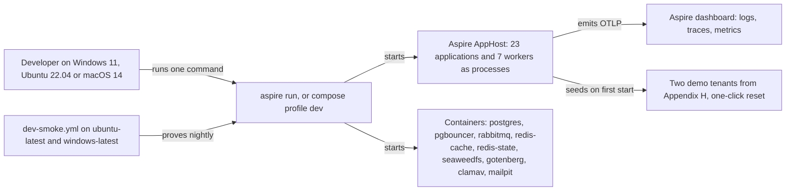
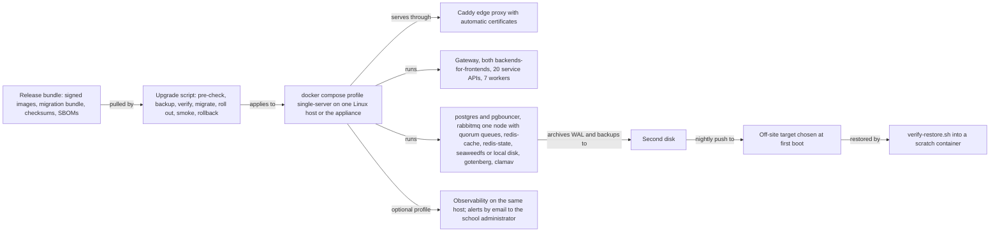
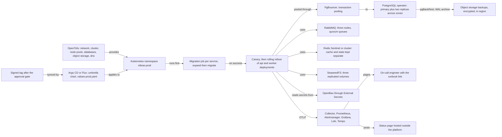
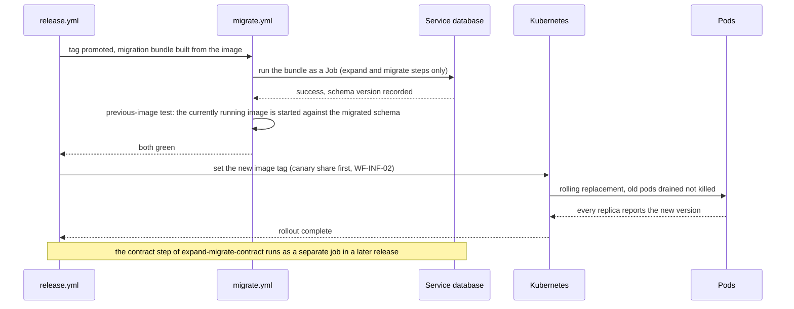
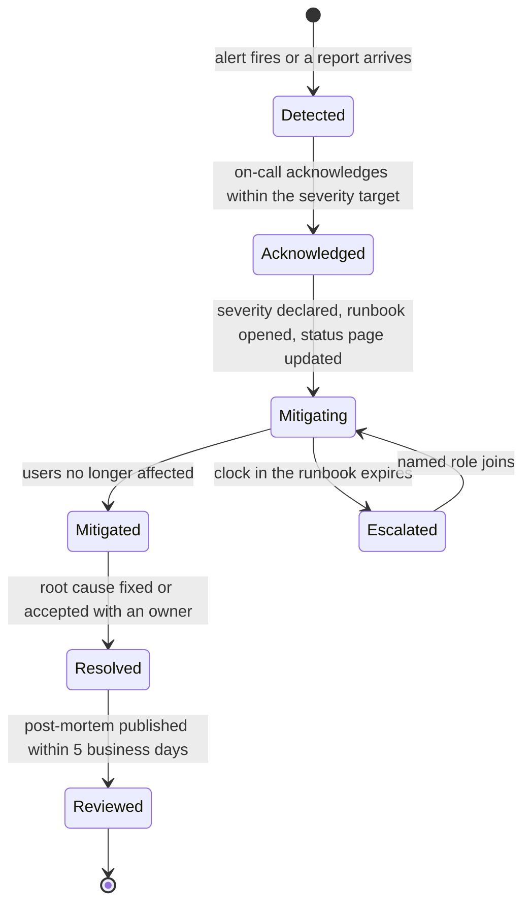

# 15. Deployment and Operations

> Plan document for the Nibras platform. Group E. It refines reference architecture Sections 6, 11, 12, 13, 15, 16 and 17 and master brief Sections 7.6, 7.7, 23, 31 and 34; it does not re-derive them. Where this document and a brief disagree, the brief wins and this document is the defect, unless an ADR records the deviation.

**Group** E · **Requirement areas covered** INF, with PERF where scaling touches capacity and SEC where secrets touch operations · **Last updated** 2026-09-20 by the platform plan

## Purpose

This document lets a platform engineer stand the product up in any of the three deployment modes, ship a release through the pipeline without a maintenance window, know which alert will wake them and which runbook to open, and rehearse the restore and failover they hope never to run. The readers are the platform engineer building `deploy/`, the release manager approving a promotion, the on-call engineer at 03:00, and the reviewer checking that every alert has a runbook before it is enabled (`.claude/rules/deploy.md`).

## Scope

| In scope | Out of scope | Where the out-of-scope item lives |
|---|---|---|
| The `deploy/` tree to file level for compose and folder level elsewhere | The repository tree around it | `07-solution-structure.md`, part 5 |
| The three deployment modes with one diagram each | The C4 container view and the runtime topology | `04-architecture-overview.md`, parts 2, 4 and 5 |
| Environments, promotion path and approval gate | The developer setup per operating system and the runner matrix | `33-platform-support-and-dev-environments.md`, parts 3 and 4 |
| Pipelines: stages, ordering, promotion, supply chain | Test types and quality gates as such | `16-test-strategy.md` |
| Observability standard and the alert catalog | Per-service caching maps and hot queries | `21-performance-engineering.md` |
| Service levels and the error-budget policy | Support tiers per plan | Master brief Section 39; `27-compliance-and-legal.md` |
| Backup, single-tenant restore and disaster recovery as operations | The per-service restore ordering and the retention jobs | `10-data-architecture.md`, Sections 8 and 9 |
| The on-premises appliance lifecycle | The appliance's place in the platform matrix | `33-platform-support-and-dev-environments.md`, part 8 |
| Secrets and rotation as operations | The secrets and key inventory and the threat model | `12-security-privacy-safety.md` |
| The runbook list and the template every runbook follows | The runbooks themselves | `docs/runbooks/`, written from `docs/templates/runbook.md` before each alert is enabled |
| Calendar-aware scaling and the warm-up job as operations | The cache entries the warm-up loads and their lifetimes | `21-performance-engineering.md` |
| Incident process, post-mortem outline, status page rules | Sizing numbers, thresholds and cost | `28-capacity-and-cost-model.md` |

## Content

### 1. The `deploy/` tree

Document 07 fixes where each folder is; this document fixes what is inside. `compose/` is shown to file level because single-server mode is the one an on-premises school runs without a platform engineer, so every file in it must be explainable. `helm/`, `opentofu/`, `gitops/`, `onprem/`, `secrets/` and `observability/` are shown to folder level, with the file kinds each folder holds named in its comment.

```text
deploy/                                              # everything that runs the product outside a developer machine (document 07, part 5)
├── README.md                                        # which folder serves which deployment mode, and the one command per mode
├── compose/                                         # single-server mode, and the developer alternative to `aspire run`
│   ├── docker-compose.yml                           # infrastructure only: postgres, pgbouncer, rabbitmq, redis-cache, redis-state, seaweedfs, gotenberg, mailpit, clamav
│   ├── docker-compose.services.yml                  # every application: 23 applications and 7 workers, images nibras/<service>-<kind>, immutable tags, never latest
│   ├── docker-compose.observability.yml             # otel-collector, prometheus, alertmanager, grafana, loki, tempo; optional in single-server mode, always in dev
│   ├── docker-compose.edge.yml                      # caddy edge proxy with automatic certificates; single-server profile only
│   ├── docker-compose.backup.yml                    # pgbackrest sidecar and the off-site push job; single-server profile only
│   ├── profiles/                                    # one overlay per profile; a profile changes values, never the service list
│   │   ├── dev.yml                                  # published ports, mailpit, seeded demo tenants, no TLS, hot reload volumes
│   │   ├── single-server.yml                        # one host: cpu and memory limits per container, restart policies, backup volume, edge proxy on
│   │   └── ai.yml                                   # ollama and the Ai worker; only on a host with the rung 3 hardware (master brief Section 25)
│   ├── env/                                         # keys only, never a value; the compose files reference these names
│   │   ├── dev.env.example                          # every variable the dev profile reads, with a comment per key
│   │   ├── single-server.env.example                # every variable the single-server profile reads; values come from Docker secrets
│   │   └── ai.env.example                           # model names, context sizes and the hardware flags
│   ├── secrets/                                     # Docker secret definitions for single-server mode; names only, files are generated at first run
│   │   └── secrets.yml                              # one `file:` secret per row of the rotation table in part 9, referenced by the services file
│   ├── pgbouncer/                                   # pooling configuration shared by both profiles
│   │   ├── pgbouncer.ini                            # transaction pooling, one pool per service database, the pool sizes from document 28
│   │   └── userlist.txt.example                     # the `svc_<service>` and `mig_<service>` role names, no passwords
│   ├── rabbitmq/                                    # broker definitions for one node
│   │   ├── rabbitmq.conf                            # quorum queues on, memory high watermark, prometheus plugin enabled
│   │   └── definitions.json                         # exchanges, queues, bindings and policies from `11-messaging-architecture.md`, exported daily in production
│   ├── redis/                                       # the two roles, never one instance
│   │   ├── redis-cache.conf                         # maxmemory, allkeys-lfu, no persistence, ACL users per service
│   │   └── redis-state.conf                         # noeviction, append-only file, ACL users per service
│   ├── postgres/                                    # database initialisation
│   │   ├── init/                                    # one script per service database: create database, `svc_` and `mig_` roles, extensions
│   │   └── postgresql.conf                          # connection limit, shared buffers, WAL archiving to pgbackrest
│   ├── backup/                                      # pgbackrest for the single host
│   │   ├── pgbackrest.conf                          # full weekly, incremental daily, continuous WAL archive to the second disk and the off-site target
│   │   └── verify-restore.sh                        # restores the newest backup into a scratch container and checks row counts; run by the upgrade script and the quarterly drill
│   ├── healthcheck.sh                               # waits for the readiness endpoint of every service; used by `dev-smoke.yml` and the appliance first boot
│   └── README.md                                    # the one command per profile, on PowerShell 7 and bash
├── helm/                                            # scale mode on Kubernetes 1.29 or later (reference architecture Section 16)
│   ├── charts/                                      # one chart per service: deployment, service, hpa, keda scaledobject, pdb, networkpolicy, servicemonitor, prometheusrule
│   │   ├── _template/                               # the chart the service template copies for a new service; probes, requests and limits are not optional in it
│   │   ├── gateway/                                 # one folder per application, lower case, named after Appendix L; api deployment plus an optional worker deployment
│   │   └── infrastructure/                          # operators and dependencies: postgres operator, rabbitmq operator, redis sentinel, seaweedfs, keda, external-secrets, gotenberg, clamav
│   └── umbrella/                                    # the whole platform as one release: values-dev.yaml, values-test.yaml, values-staging.yaml, values-prod.yaml, values-<dedicated>.yaml
├── opentofu/                                        # networks, clusters, databases, storage, dns; Terraform is not permitted (`.claude/rules/deploy.md`)
│   ├── modules/                                     # reusable modules: network, cluster, node-pool, postgres, object-storage, dns, status-page-dns
│   └── environments/                                # dev, test, staging, prod; one state per environment, one region per deployment (master brief Section 34)
├── gitops/                                          # Argo CD or Flux applications per environment; the cluster pulls, nobody pushes
│   ├── dev/                                         # the development cluster applications, auto-sync
│   ├── test/                                        # the permanent test environment, auto-sync from the main branch
│   ├── staging/                                     # the release rehearsal environment, auto-sync from release candidates
│   └── prod/                                        # production, synced from a signed tag after the approval gate in part 3; never rebuilt
├── secrets/                                         # reference architecture Section 12, as operations
│   ├── README.md                                    # the rotation table from part 9, the runbook per row, and who holds the break-glass envelope
│   ├── external-secrets/                            # ExternalSecret manifests, one per service, keys only, pointing at OpenBao paths
│   └── bootstrap/                                   # first-run generation scripts for a new environment or appliance; their output is never committed
├── onprem/                                          # the Linux virtual machine appliance for Windows hosts (Appendix X; ADR-0016)
│   ├── image/                                       # the appliance build definition: base image, container engine, the compose bundle, pinned signed images, first-boot wizard
│   ├── bundle/                                      # the offline upgrade bundle format: images as archives, checksums, SBOMs, the migration bundle, release notes
│   ├── upgrade/                                     # pre-upgrade check, backup-before-upgrade, rollout, smoke checks, rollback; exercised in the quarterly drill
│   ├── firstboot/                                   # host name, certificate, backup target, administrator bootstrap; runs once
│   └── docs/                                        # what the school signs about its recovery objectives in single-server mode, in both languages
└── observability/                                   # the dashboards and alerts every service ships (reference architecture Section 2; document 07)
    ├── dashboards/                                  # Grafana JSON, one per service plus platform, cache, queue, database, release and cost boards
    ├── alerts/                                      # one Prometheus rule file per service; every rule carries a `runbook` annotation naming a file under docs/runbooks/
    ├── collector/                                   # OpenTelemetry collector pipelines: sampling, redaction, tenant-label guardrails, exporters
    └── slo/                                         # one SLO definition per service class from master brief Section 31, from which burn-rate rules are generated
```

**Rules the tree enforces.** Images are `nibras/<service>-<kind>` with an immutable version tag; `latest` never appears in a compose file, a chart or a manifest. No value of any secret appears anywhere under `deploy/`; the `env/` and `secrets/` folders carry names only. Every workload in `helm/charts/_template/` declares liveness, readiness and startup probes on distinct endpoints, resource requests and limits, a `PodDisruptionBudget` and a `NetworkPolicy`, and a new chart cannot remove them because the umbrella chart's schema rejects a values file without them.

---

### 2. The three deployment modes

Master brief Section 7.7 defines the modes and Section 34 fixes the high-availability posture of each. Document 04 draws the container view per mode; the diagrams here show the operational path instead: what starts it, what watches it, what backs it up, and how a release reaches it. The code is identical in all three; what differs is the values file, and `.claude/rules/deploy.md` requires all three to keep working at all times.

| Mode | Started by | Release reaches it by | Watched by | Backed up by | Recovery posture | Sized in |
|---|---|---|---|---|---|---|
| Developer | `aspire run`, or `docker compose --profile dev up` | The developer's branch | Aspire dashboard, or the compose observability file | Nothing; the demo tenant resets in one click | None; it is a laptop | Document 28, part 2 |
| Single server | `docker compose --profile single-server up` on one Linux host, or the appliance on Hyper-V or VMware | A versioned bundle pulled by the upgrade script (WF-INF-01) | The optional observability profile on the same host; alerts go to the school's administrator by email | pgBackRest to a second disk and an off-site target; `verify-restore.sh` after every backup | Restore from backup; the school signs `deploy/onprem/docs/` acknowledging it | Document 28, part 2 |
| Scale | OpenTofu for infrastructure, Argo CD or Flux for the umbrella chart | A signed tag promoted through test and staging, then a canary (WF-INF-02) | Prometheus, Alertmanager, Grafana, Loki, Tempo in the cluster; on-call paging | pgBackRest to object storage, SeaweedFS versioned copy, OpenBao snapshot, RabbitMQ definitions | Zone loss survivable; region loss is the disaster-recovery event in part 7 | Document 28, part 2 |

#### 2.1 Developer



The developer mode is proven by `dev-smoke.yml` on both runners (part 4), which is what makes "one command starts everything" a tested claim rather than a README sentence.

#### 2.2 Single server



One machine has no high availability; the recovery plan is restore from backup and the school is told so in writing (master brief Section 34). Because every alert in part 5 still fires on a single server, the school's administrator receives the same product-terms alert text the on-call engineer would, with the runbook link.

#### 2.3 Scale



The scale mode is the SaaS deployment and the dedicated-deployment tier of reference architecture Section 14: a dedicated deployment is the same umbrella chart with its own values file in its own namespace or cluster, and nothing else changes.

---

### 3. Environments, promotion path and approval gate

The following table is quoted from reference architecture Section 15.

> | Environment | Data | Created by | Lives for | Purpose |
> |---|---|---|---|---|
> | Development | seeded demo tenants | the developer | a session | `aspire run` or the compose dev profile |
> | Preview | seeded demo tenants | pipeline, per pull request | until merge | Reviewers click instead of imagining |
> | Test | demo plus generated load data | pipeline | permanent | Where the generated isolation and permission suites run at size |
> | Staging | production-like, anonymized nightly | pipeline | permanent | Rehearsal for release, restore drills, performance baselines |
> | Production | live | pipeline with approval | permanent | The real thing |
>
> **Anonymization** for staging replaces names, contact details, national identifiers and free text with generated equivalents in both scripts, re-keys payment references, and **does not copy uploaded media at all**. It runs as a job in the staging pipeline, and the job fails closed: if any table is not covered by a rule, nothing is copied.

**Promotion path.** One image, built once on merge, promoted by tag. Nothing is rebuilt for a later environment because a rebuilt artefact is a different artefact (reference architecture Section 11).

```mermaid
flowchart LR
    PR["Pull request"] -->|preview-env.yml creates| PREVIEW["Preview: seeded demo, destroyed on merge"]
    PREVIEW -->|ci-service.yml green, review approved, merged| MAIN["main: image built once, signed, SBOM attached"]
    MAIN -->|gitops/test auto-sync| TEST["Test: generated suites at size, nightly k6 load tier"]
    TEST -->|release.yml tags a release candidate| STAGING["Staging: anonymized data, restore drill, performance baseline"]
    STAGING -->|approval gate| GATE{"Release go or no-go"}
    GATE -->|go: tag signed, gitops/prod synced| PROD["Production: canary, then rolling (WF-INF-02)"]
    GATE -->|no-go| MAIN
    PROD -->|error budget breached| ROLLBACK["Redeploy the previous image; schema never rolled back (ADR-0010)"]
```



**Approval gate.** Master brief Section 29 fixes who decides: the quality engineer proposes release go or no-go, the product owner decides, and the record is the release notes plus the gate evidence. The gate is a required review on the `gitops/prod/` change, and the evidence it demands is listed once so that nobody argues about it at 17:00 on a Thursday.

| Evidence the gate requires | Produced by | Blocks promotion when |
|---|---|---|
| `ci-service.yml` green for every service in the release, `ci-web.yml`, `ci-mobile.yml`, `ci-kit.yml` | The workflows in part 4 | Any red job, including a licence or secret-scan finding |
| Nightly k6 load tier green for the last run before the candidate was cut | `tests/load/`, Appendix N | Any threshold failed and no ADR accepts the change |
| Migration bundle applied on staging and the previous-image test passed | `migrate.yml` (ADR-0010) | The previous image cannot run against the migrated schema |
| Staging restore drill within the release window, timed | Part 7, `TC-DATA-020` | No timed single-tenant restore since the previous release (`.claude/rules/deploy.md`) |
| Error budget of every service in the release above the freeze line | Part 6 | A service is frozen and the change is not an exemption in part 6 |
| Every new alert in the release has a runbook file | `deploy/observability/alerts/`, `docs/runbooks/` | A rule's `runbook` annotation names a file that does not exist |
| Release notes generated from commits and reviewed | `release.yml` | Notes missing for a service with a contract change |
| Planned maintenance, if any, posted 5 business days ahead | Part 12 | A migration with a scheduled window (ADR-0010) has no status page notice |

---

### 4. Pipelines

The workflows tree is quoted from reference architecture Section 11; the runner per job is in document 33, part 4, and is not repeated here.

> ```
> .github/workflows/                 # or .woodpecker/ with the same stages
> ├── ci-service.yml                 # reusable: one service, triggered by path filter
> ├── ci-web.yml                     # Angular workspace: lint, unit, build, budgets, Playwright, axe
> ├── ci-mobile.yml                  # Flutter: analyze, test, goldens LTR and RTL, Android build
> ├── ci-mobile-ios.yml              # macOS runner only, path-filtered to src/Mobile/**
> ├── ci-kit.yml                     # kit-lint and its own tests, on ubuntu-latest and windows-latest
> ├── dev-smoke.yml                  # one-command local start, on ubuntu-latest and windows-latest
> ├── license-scan.yml               # NuGet, npm, pub, plus asset licences
> ├── security-scan.yml              # Trivy, Gitleaks, OWASP ZAP against the preview environment
> ├── migrate.yml                    # builds migration bundles, runs them as a job before rollout
> ├── release.yml                    # semantic version per service, SBOM, cosign signature, changelog
> └── preview-env.yml                # create on pull request, destroy on merge
> ```

#### 4.1 The stages of `ci-service.yml`, in order

Reference architecture Section 11 lists the stages; this table adds the tool and what fails the build, which is what an engineer reading a red job needs. The stage order is fixed: cheap and deterministic first, so that a formatting error costs seconds and not the Testcontainers start-up.

| # | Stage | Tool | What fails the build |
|---|---|---|---|
| 1 | Restore | `dotnet restore --locked-mode` against `Directory.Packages.props` | A lock file drift, or a package not in the central version file |
| 2 | Build | `dotnet build -warnaserror` | Any compiler or analyzer warning, including the portability analyzers from `.claude/rules/portability.md` |
| 3 | Unit tests | xUnit | A failing test, or coverage under the threshold in `16-test-strategy.md` |
| 4 | Architecture tests | NetArchTest | A dependency rule from document 07 broken: a layer reaching upward, a service referencing another service's project, `IgnoreQueryFilters()` in application code |
| 5 | Format check | `dotnet format --verify-no-changes` | Any unformatted file |
| 6 | Integration tests | xUnit with Testcontainers for PostgreSQL, RabbitMQ and Redis | A failing test; a container that does not start within the timeout is a failure, not a skip |
| 7 | Contract tests | PactNet for consumer-driven contracts; OpenAPI diff against the published contract | A breaking change to an endpoint or a message shape without a new version |
| 8 | Generated permission and tenant-isolation suites | The generators in document 12, parts 4.3 and 4.4 | Any endpoint reachable without its declared permission; any row readable across tenants, including through a pooled connection (`TC-DATA-001`) |
| 9 | Query-budget assertions | The command-counting interceptor from master brief Section 19 | More than five database commands on a budgeted request, or an N+1 detected |
| 10 | Licence scan | `license-scan.yml` called as a job, against `tools/license-scan/allow.json` | A dependency whose licence is not on the allow-list, or is unverified |
| 11 | Dependency and container vulnerability scan | Trivy on the lock files and the built image | A critical or high finding without an accepted exception recorded in `RISKS.md` with an owner and a date |
| 12 | Secret scan | Gitleaks over the diff and the image layers | Any secret-shaped string, no exceptions |
| 13 | Publish the image | `docker buildx` to the registry, tag equal to the semantic version plus the commit | A push failure, or the image being tagged `latest` |
| 14 | Culture, calendar and time zone test inside the built image | The image-level test from document 33, part 5 | `ar-SA`, `UmAlQuraCalendar`, `Asia/Riyadh`, `Asia/Amman` or `Asia/Dubai` not resolving; `DOTNET_SYSTEM_GLOBALIZATION_INVARIANT` true; a non-root or read-only-root check failing |
| 15 | Publish the SBOM | CycloneDX generated from the build and attached to the image | A missing or incomplete SBOM |
| 16 | Sign the image | cosign, keyless or with the release key in OpenBao | A signature failure; the admission controller would refuse the image anyway |

Stage 14 is inserted between publish and SBOM because it runs against the artefact that will ship, not against a build on the runner; document 33 explains why testing it anywhere else tests a different artefact. Every one of `ci-web.yml`, `ci-mobile.yml` and `ci-kit.yml` also fails on the kit lint, the accessibility check and the performance budget checks, which is the rule in `.claude/rules/deploy.md`; those stages are listed in document 33, part 4.

**Path filters.** A change inside one service builds one service. A change under `src/BuildingBlocks/` or `src/Contracts/` builds everything that depends on it, which is why those two directories have the architect as owner (master brief Section 29).

#### 4.2 Migration, then rollout

Reference architecture Section 11 fixes the order and ADR-0010 fixes the rule that rollback is redeploying the previous image, never the schema.



A migration bundle that fails leaves the previous image running unchanged, because the schema it expanded is still one the previous image can use. A migration that needs downtime is an ADR with a scheduled window and a status page notice five business days ahead (part 12).

#### 4.3 Promotion by tag, SBOM and signing

| Practice | How it is done | Proven by |
|---|---|---|
| Built once, promoted by tag | The image digest built on merge is the digest that reaches production; `release.yml` re-tags, never rebuilds | `TC-INF-101`: the digest in `gitops/prod/` equals the digest signed on merge |
| SBOM | CycloneDX per image, attached as an OCI referrer, kept for the life of the image | `TC-INF-102`: every image in the registry has an SBOM referrer; the security scan reads it |
| Signature | cosign; the admission controller refuses an unsigned image or one signed by an unknown key | `TC-INF-103`: an unsigned image is rejected in the test environment |
| Supply chain level | SLSA build level 2 at launch (reference architecture Section 11) | The provenance attestation attached with the SBOM |
| Dependency updates | Renovate, grouped weekly pull requests; security updates opened immediately with a 48-hour service level for critical | The Renovate configuration and the security-scan job |

#### 4.4 `dev-smoke` on two runners and iOS on macOS

| Workflow | Runners | Why | What it proves |
|---|---|---|---|
| `dev-smoke.yml` | `ubuntu-latest` and `windows-latest`, one Podman configuration and one Docker Engine configuration | Appendix X.2: the one-command start must work where developers actually work | Every service reports ready through `deploy/compose/healthcheck.sh`; the Podman network naming edge case from Appendix X.3 stays caught |
| `ci-mobile-ios.yml` | `macos` only, path-filtered to `src/Mobile/**` | An iOS build cannot be produced on Linux or Windows (reference architecture Section 17); the macOS minutes are the Apple build capacity line in master brief Section 30 and open question 14 | iOS goldens, archive and TestFlight upload; the release gate requires both the Android and the iOS artefact before a flavour is marked released |

---

### 5. Observability standard

Master brief Section 7.6 requires OpenTelemetry in every service, one correlation id from the gateway through gRPC and RabbitMQ to the last consumer, a service map, per-service SLO dashboards, centralized logs and alerts. This part fixes what every service emits so that one dashboard template serves twenty services.

#### 5.1 Golden signals per service class

The classes are those of master brief Section 31. Each service emits the four golden signals under the `nibras_` prefix; the class decides which signal is the SLO indicator and which are supporting.

| Service class | Latency indicator | Traffic | Errors | Saturation | SLO indicator |
|---|---|---|---|---|---|
| Gateway, Identity, Platform | `nibras_gateway_request_duration_seconds` at the edge; `nibras_identity_token_validation_duration_seconds` | requests per second by route class | 5xx ratio; token validation failures; rate-limit rejections by reason | CPU, connection count, rate-limit buckets | p95 token validation under 150 ms; availability 99.9% |
| Read-heavy: School, Scheduling, Academics, Reporting | `nibras_<service>_request_duration_seconds{source="cache"\|"database"}` | requests per second; cache hits and misses | 5xx ratio; validation failures by error code | PgBouncer pool wait, replica lag, cache hit ratio | p95 under 250 ms from the database and under 80 ms from cache; Reporting freshness under 60 s |
| Write-heavy: Attendance, Assessment, Finance | `nibras_<service>_write_duration_seconds` by command | writes per second; batch sizes | 5xx ratio; 409 conflicts counted separately; day-close imbalance | PgBouncer pool wait, outbox lag, lock waits | p95 write under 500 ms; outbox published within 60 s |
| Notification | `nibras_notification_dispatch_delay_seconds` by lane (urgent, bulk, digest) | messages per lane per second | provider error rate by channel; bounces | lane depth and oldest message age; provider circuit state | urgent dispatched within 30 s; bulk within 15 min |
| Workers: the seven worker images | `nibras_<service>_job_duration_seconds` by job type | jobs started and completed | jobs failed by reason; dead letters | queue depth, oldest message age, consumer count, memory | queue depth returns to baseline within 10 minutes of a burst |
| Backends-for-frontends: Bff.Web, Bff.Mobile | `nibras_bff_compose_duration_seconds` by screen | screen loads per second | upstream failures by service | upstream circuit states | composed home p95 under 250 ms (Appendix N, N-05) |

#### 5.2 Metric naming

The prefix is `nibras_` (Appendix L). The full shape is `nibras_<service>_<subject>_<unit>` with Prometheus unit suffixes, and a fixed label set.

| Rule | Example | Rejected example and why |
|---|---|---|
| Prefix, service, subject, unit | `nibras_attendance_mark_batch_duration_seconds` | `attendance_latency` (no prefix, no unit) |
| Counters end in `_total` | `nibras_notification_dispatched_total{lane="urgent",channel="push"}` | `nibras_notification_dispatched` (a counter without `_total`) |
| Gauges name the thing measured | `nibras_notification_lane_oldest_message_age_seconds{lane="urgent"}` | `nibras_notification_backlog` (ambiguous: depth or age?) |
| Histograms for every duration, with the budget buckets | buckets at 0.05, 0.08, 0.15, 0.25, 0.5, 1, 2, 5 seconds so that the Section 19 budgets fall on bucket boundaries | Default buckets, which put 250 ms between two buckets and make the p95 a guess |
| Fixed labels on every metric | `service`, `instance`, `env`, `version` | `pod_name` as a free label on a business metric |
| Business labels are enumerations | `lane`, `channel`, `job_type`, `error_code`, `tenant_tier` | `student_id`, `user_id`, `path` with identifiers in it |
| Tenant label only where part 5.5 allows | `nibras_attendance_mark_batch_duration_seconds{tenant_id="018f…"}` on the fairness allow-list | `tenant_id` on any other metric |

Metrics that other documents already name are the same metrics here: `nibras_reporting_projection_lag_seconds` (document 10), and the cache metrics from master brief Section 19: `nibras_cache_hit_ratio{role="cache",kind="reference"}`, `nibras_cache_evictions_total`, `nibras_cache_memory_bytes{role}`.

#### 5.3 Log schema

Logs are structured JSON, one event per line, through OpenTelemetry to Loki. The field set is fixed so that a query written for one service works for all twenty.

| Field | Type | Always present | Content |
|---|---|---|---|
| `timestamp` | RFC 3339, UTC | yes | Containers run with `TZ=UTC` (master brief Section 19) |
| `level` | enum | yes | `Trace`, `Debug`, `Information`, `Warning`, `Error`, `Critical` |
| `message` | string | yes | A template rendered without sensitive values |
| `nibras.service` | string | yes | The Appendix L service name in lower case |
| `nibras.version` | string | yes | The image tag |
| `nibras.env` | string | yes | `dev`, `preview`, `test`, `staging`, `prod`, `onprem` |
| `nibras.tenant_id` | UUID v7 | when a tenant is resolved | The full identifier, never truncated (Appendix L) |
| `nibras.user_id` | UUID v7 | when a user is resolved | The identifier only; never the name or email |
| `nibras.correlation_id` | string | yes | Set by the Gateway, carried through gRPC metadata and RabbitMQ headers to the last consumer |
| `trace_id`, `span_id` | hex | when a trace is active | OpenTelemetry context, so a log line links to its trace |
| `nibras.message_id` | UUID | in consumers | The inbox message being handled |
| `nibras.job_id` | UUID | in workers | The long-running job |
| `nibras.error_code` | string | on errors | An Appendix K code, so error rates can be grouped by meaning |
| `exception` | object | on errors | Type, message, stack; never the request body |

**Never logged.** Anything Appendix J classes as Sensitive or level S, passwords, tokens, payment details, message bodies, request bodies, and free text typed by a user. The collector pipeline in `deploy/observability/collector/` redacts the known field names as a second line of defence, and `TC-DATA-007` extends to log output: a Sensitive value found in a log line during the generated suites fails the build.

#### 5.4 Trace sampling

| Environment | Head sampling at the Gateway | Tail decision in the collector | Retention |
|---|---|---|---|
| Development, preview | 100% | keep all | the session |
| Test | 100% | keep all; k6 runs are analysed from traces | 7 days |
| Staging | 20% | keep every trace with an error, a status of 5xx, or a duration over the class budget | 7 days |
| Production | 5% baseline, raised to 25% for a named tenant by a runbook for one hour | keep every trace with an error, 5xx, over-budget duration, or a `Sev` incident tag | 7 days (master brief Section 32) |
| Single server | 5% | keep errors and over-budget | 7 days on the host |

Context propagates through gRPC metadata and through RabbitMQ message headers, so a consumer's span is a child of the publisher's span even when the message waited in a queue for a minute; the queue wait is a span of its own named `queue.wait`, which is what makes the Notification dispatch delay visible per message.

#### 5.5 Tenant-label cardinality guardrails

A `tenant_id` label on every metric multiplies every series by 500 tenants and takes Prometheus down at the moment a fairness question matters most. The rules:

| Guardrail | Rule | Enforced by |
|---|---|---|
| Allow-list | `tenant_id` is permitted only on the fairness metrics: `nibras_<service>_request_duration_seconds` for the N-06 surfaces, `nibras_notification_lane_depth{tenant_id}`, `nibras_<service>_worker_concurrency{tenant_id}`, `nibras_platform_warmup_completed_timestamp_seconds{tenant_id}` | The collector drops the label from any other metric and counts the drops in `nibras_otel_tenant_label_dropped_total` |
| Series cap | The allow-listed metrics carry `tenant_id` only for tenants above 800 students or on the watch-list set by a runbook; every other tenant is aggregated under `tenant_id="other"` | The collector's attribute processor reads the watch-list from a ConfigMap written by the `raise-tenant-sampling` runbook |
| Per-service series budget | 20,000 active series per service replica; a service over budget fails the `MetricsCardinality` alert and the offending metric is dropped at the collector until fixed | Prometheus `scrape_samples_scraped` per target, alert `MetricsCardinalityHigh` |
| Logs and traces carry the tenant, metrics mostly do not | Per-tenant questions are answered by Loki and Tempo, which index `nibras.tenant_id`, not by metrics | The log schema in part 5.3 |
| Tier as the cheap dimension | `tenant_tier` in `{small, medium, group, oversized}` is a label on every request metric, which answers most fairness questions with four series | The tenant-state copy in every service supplies the tier |

#### 5.6 Dashboards as code

| Artefact | Where | Rule |
|---|---|---|
| One dashboard per service | `deploy/observability/dashboards/<service>.json` | Generated from one template with the service class; the four golden signals, the SLO panel with the budget line, the error-budget burn, the queue panel for services with a worker |
| Platform boards | `platform.json`, `cache.json`, `queue.json`, `database.json`, `release.json`, `cost.json` | Cross-service: PgBouncer pools, replica lag, RabbitMQ lanes and dead letters, Redis per role, release version per service, the FinOps view from document 28 |
| SLO definitions | `deploy/observability/slo/<class>.yaml` | The Section 31 targets as data; burn-rate alert rules are generated from them so that the alert and the dashboard cannot disagree |
| Provisioning | Grafana provisioning from the folder; no dashboard is edited in the Grafana UI | A dashboard edited by hand is overwritten on the next sync, which is the point |
| Review | A dashboard change is a pull request with a screenshot | `TC-INF-104`: every service dashboard has the SLO panel and the runbook link panel |
| Single server | The same JSON, provisioned by the optional observability profile | One artefact for every mode |

#### 5.7 Alert catalog

Every alert is named in PascalCase, fires on the condition stated, carries a severity from master brief Section 31 and a page-or-ticket routing, and names its runbook under `docs/runbooks/`. Per `.claude/rules/deploy.md`, the runbook file exists before the alert is enabled; part 10 lists them. Conditions use the metrics of part 5.2; "for" is the Prometheus hold duration.

| # | Alert | Condition | Severity | Route | Runbook |
|---|---|---|---|---|---|
| 1 | `ServiceUnavailable` | Ready replicas of any API deployment equal 0 for 2 min, or the Gateway returns 503 for a tenant for 2 min | Sev1 | page | `service-unavailable.md` |
| 2 | `TenantIsolationViolation` | `nibras_security_cross_tenant_detected_total` increases by 1: a cache key audit, a row-level security bypass, or a generated-suite canary in production | Sev1 | page | `tenant-isolation-violation.md` |
| 3 | `WalArchiveLagBreachesRpo` | pgBackRest WAL archive lag over 15 min for 15 min (recovery point objective at risk) | Sev1 | page | `wal-archive-lag.md` |
| 4 | `AuditChainBroken` | The nightly hash-chain verification of Audit reports a break | Sev1 | page | `audit-chain-broken.md` |
| 5 | `RabbitMqQuorumLost` | Fewer than 2 of 3 nodes running for 1 min in scale mode | Sev1 | page | `rabbitmq-quorum-lost.md` |
| 6 | `BreakGlassUsed` | The break-glass super-administrator path is used (reference architecture Section 12) | Sev1 | page | `break-glass-used.md` |
| 7 | `GatewayErrorRateHigh` | 5xx ratio at the Gateway over 1% for 5 min | Sev2 | page | `gateway-error-rate-high.md` |
| 8 | `ErrorBudgetBurnFast` | Burn rate over 14.4 times the monthly budget on both the 1 h and 5 min windows, per service | Sev2 | page | `error-budget-burn-fast.md` |
| 9 | `AttendancePeakLatency` | `nibras_attendance_mark_batch_duration_seconds` p95 over 500 ms for 5 min inside any tenant band's peak window | Sev2 | page | `attendance-peak-latency.md` |
| 10 | `NotificationLaneBacklog` | Oldest message on the urgent lane older than 10 min | Sev2 | page | `notification-lane-backlog.md` |
| 11 | `NotificationProviderFailing` | Provider error rate over 20% on any channel for 5 min, or a channel circuit open for 10 min | Sev2 | page | `notification-provider-failing.md` |
| 12 | `DeadLetterGrowth` | Dead-letter messages on any queue increase by more than 50 in 15 min, or any dead letter on a saga queue | Sev2 | page | `dead-letter-growth.md` |
| 13 | `ConsumerGone` | A queue with a bound consumer group has 0 consumers for 2 min | Sev2 | page | `consumer-gone.md` |
| 14 | `OutboxLag` | Oldest unpublished outbox row older than 60 s for 5 min in any service | Sev2 | page | `outbox-lag.md` |
| 15 | `PgBouncerPoolSaturated` | Clients waiting for a server connection over 0 for 2 min, or pool use over 90% for 5 min | Sev2 | page | `pgbouncer-pool-saturated.md` |
| 16 | `RedisStateMemoryHigh` | `redis-state` memory over 80% of `maxmemory` (it is `noeviction`: locks and idempotency keys would start failing) | Sev2 | page | `redis-state-memory-high.md` |
| 17 | `RedisUnavailable` | The Redis circuit breaker open in any service for 2 min; the product is degrading to database reads | Sev2 | page | `redis-unavailable.md` |
| 18 | `PostgresDiskCritical` | Data volume over 90% on any instance | Sev2 | page | `postgres-disk.md` |
| 19 | `BackupFailed` | A scheduled pgBackRest full or incremental did not complete, or `verify-restore.sh` failed | Sev2 | page | `backup-failed.md` |
| 20 | `ObjectStorageReplicationDegraded` | Any SeaweedFS volume below 3 replicas for 10 min, or the nightly versioned copy missed | Sev2 | page | `object-storage-replication-degraded.md` |
| 21 | `RabbitMqNodeDown` | 1 of 3 nodes down for 5 min, or a memory or disk alarm raised | Sev2 | page | `rabbitmq-node-down.md` |
| 22 | `ReportCardBatchSlow` | A report-card batch running longer than 10 min, or no progress update for 30 s (Appendix N, N-02) | Sev2 | page | `report-card-batch-slow.md` |
| 23 | `InvoiceSeriesAnomaly` | A gap or duplicate detected in an invoice number series, or the day-close reconciliation does not balance (Appendix N, N-03) | Sev2 | page | `invoice-series-anomaly.md` |
| 24 | `ReportingProjectionLagCritical` | `nibras_reporting_projection_lag_seconds` over 15 min for 5 min | Sev2 | page | `reporting-projection-lag.md` |
| 25 | `WarmUpJobMissed` | `nibras_platform_warmup_completed_timestamp_seconds{tenant_id}` older than first period minus 10 min for any tenant on a school day | Sev2 | page | `warm-up-job-missed.md` |
| 26 | `CalendarScaleUpMissed` | Attendance or Gateway ready replicas below the band's peak minimum at first period minus 15 min | Sev2 | page | `calendar-scale-up-missed.md` |
| 27 | `SafeguardingFlagUnacknowledged` | A safeguarding flag not acknowledged 15 min after it was raised (master brief Section 38) | Sev2 | page | `safeguarding-flag-unacknowledged.md` |
| 28 | `MobileSyncRejections` | `POST /bff-mobile/sync/batch` rejecting over 1% of batches for 5 min; sync must queue, never shed (Appendix N, N-08) | Sev2 | page | `mobile-sync-rejections.md` |
| 29 | `SigningKeyOverlapEnding` | The previous OpenIddict signing key retires in under 7 days while tokens minted with it are still valid | Sev2 | page | `signing-key-overlap-ending.md` |
| 30 | `PdfRenderFailures` | Gotenberg render failures over 5% for 10 min, or a PDF snapshot mismatch in production canaries | Sev2 | page | `pdf-render-failures.md` |
| 31 | `HostDiskCritical` (single server) | Any host volume over 90%, including the backup disk | Sev2 | page, or email to the school administrator on an appliance | `host-disk.md` |
| 32 | `ApplianceBackupStale` | No verified backup on an appliance in 48 h | Sev2 | email to the school administrator and a ticket | `appliance-backup-stale.md` |
| 33 | `ErrorBudgetBurnSlow` | Burn rate over 6 times on the 6 h and 30 min windows, or over 1 time on the 3 d window | Sev3 | ticket | `error-budget-burn-slow.md` |
| 34 | `ApiLatencyBudgetBreach` | p95 over the class budget (150, 250, 80 or 500 ms) for 15 min outside a declared peak window | Sev3 | ticket | `api-latency-budget-breach.md` |
| 35 | `QueryBudgetRegression` | `nibras_<service>_db_commands_per_request` p95 over 5 on a budgeted endpoint for 30 min | Sev3 | ticket | `query-budget-regression.md` |
| 36 | `NotificationBulkLaneBacklog` | Oldest message on the bulk lane older than 15 min | Sev3 | ticket | `notification-lane-backlog.md` |
| 37 | `WorkerQueueNotDraining` | Queue depth not back to baseline 10 min after a burst ended (master brief Section 31) | Sev3 | ticket | `worker-queue-not-draining.md` |
| 38 | `ReportingProjectionLag` | `nibras_reporting_projection_lag_seconds` over 60 s for 5 min | Sev3 | ticket | `reporting-projection-lag.md` |
| 39 | `CacheHitRatioLow` | `nibras_cache_hit_ratio{kind="reference"}` under 95% for 15 min, or falling by 10 points in 5 min | Sev3 | ticket | `cache-hit-ratio-low.md` |
| 40 | `PostgresReplicaLag` | Replica lag over 30 s for 5 min; Reporting reads are already falling back to the primary (document 10) | Sev3 | ticket | `postgres-replica-lag.md` |
| 41 | `PostgresDiskHigh` | Data volume over 80% | Sev3 | ticket | `postgres-disk.md` |
| 42 | `PartitionMissing` | A partitioned table has no partition for a month starting within 14 days | Sev3 | ticket | `partition-missing.md` |
| 43 | `BackupVerificationOverdue` | No timed single-tenant restore recorded since the previous release | Sev3 | ticket | `backup-verification-overdue.md` |
| 44 | `CertificateExpiringSoon` | Any TLS certificate, including the appliance's, expiring in under 14 days | Sev3 | ticket | `certificate-expiring-soon.md` |
| 45 | `SecretRotationOverdue` | A secret past its interval in the part 9 table | Sev3 | ticket | `secret-rotation-overdue.md` |
| 46 | `ImageAdmissionRejected` | The admission controller rejected an unsigned or unknown-key image | Sev3 | ticket | `image-admission-rejected.md` |
| 47 | `ClamAvSignaturesStale` | Virus signatures older than 48 h | Sev3 | ticket | `clamav-signatures-stale.md` |
| 48 | `WebhookDeliveryFailing` | An endpoint failing for 1 h after retries (`platform.webhook.delivery-failed.v1`) | Sev3 | ticket | `webhook-delivery-failing.md` |
| 49 | `ScheduledJobMisfired` | A Quartz job misfired or overran its window, including retention and reconciliation jobs | Sev3 | ticket | `scheduled-job-misfired.md` |
| 50 | `MetricsCardinalityHigh` | Active series for a service replica over the 20,000 budget | Sev3 | ticket | `metrics-cardinality-high.md` |
| 51 | `StatusPageHeartbeatMissing` | The status page's heartbeat from the platform missing for 10 min (the page is outside the platform and must know when to show "unknown") | Sev3 | ticket | `status-page-heartbeat-missing.md` |
| 52 | `AnonymizationJobFailed` | The staging anonymization job failed closed (a table not covered by a rule) | Sev3 | ticket | `anonymization-job-failed.md` |
| 53 | `AiDegradedToRungOne` | The Ai worker unavailable for 30 min; features have degraded to rung 1 (master brief Section 25) | Sev4 | ticket | `ai-degraded-to-rung-one.md` |
| 54 | `RedisCacheEvictionsHigh` | `nibras_cache_evictions_total` rate over 1% of sets for 30 min | Sev4 | ticket | `redis-cache-evictions-high.md` |

Fifty-four alerts. The number is deliberately a catalog and not an aspiration: each one exists because a threshold in the briefs or in Appendix N names the condition, and a condition nobody would act on at 03:00 is a dashboard panel, not an alert (master brief Section 23: actionable alerts only). Where two rows share a runbook, the runbook has one diagnosis tree with both entry conditions.

---

### 6. Service levels and the error-budget policy

The following is quoted from master brief Section 31.

> | Service class | Availability | Latency | Freshness |
> |---|---|---|---|
> | Gateway, Identity, Platform | 99.9% | p95 under 150 ms at the edge for token validation | not applicable |
> | Read-heavy services (School, Scheduling, Academics, Reporting) | 99.9% | p95 under 250 ms from the database, under 80 ms from cache | Reporting read models within 60 seconds of the event |
> | Write-heavy services (Attendance, Assessment, Finance) | 99.9% | p95 under 500 ms for writes | not applicable |
> | Notification | 99.9% | urgent messages dispatched within 30 seconds of the event; bulk within 15 minutes | not applicable |
> | Workers | no availability target | queue depth returns to baseline within 10 minutes of a burst | not applicable |
>
> **Error budget.** 99.9% monthly allows about 43 minutes. Spending half of it in a month freezes non-essential change for that service until the following month, and the freeze is lifted by the architect, not by the calendar.

**How the budget is measured.** Availability per service is the ratio of good requests to all requests at the Gateway, where "good" means not a 5xx and within the class latency budget; a slow success spends budget, which is what makes the latency column enforceable. Notification's budget is measured on dispatch delay per lane. The SLO definitions in `deploy/observability/slo/` compute the budget and the burn-rate alerts (`ErrorBudgetBurnFast`, `ErrorBudgetBurnSlow`) from the same numbers the dashboard shows.

**Error-budget policy.**

| Budget remaining in the month | State | What may ship to that service | Who lifts it |
|---|---|---|---|
| Over 50% | Normal | Everything through the normal gate | not applicable |
| 50% or less | Frozen | Security fixes, incident mitigations, rollbacks, and changes whose stated purpose is to recover the budget; each other change needs a written exemption | The architect, in writing in `PROJECT_STATE.md`, never the calendar |
| 0% | Exhausted | Only mitigations and rollbacks; a post-mortem is opened for the month even without a single Sev1 or Sev2 | The architect, after the post-mortem actions are assigned |

A release that regresses a target fails the pipeline (master brief Section 31): the nightly k6 tier compares its p95 with the budget, and a regression blocks the release candidate until the code is fixed or an ADR records the accepted change with the name of who accepted it (Appendix N, N.3).

---

### 7. Backup, single-tenant restore and disaster recovery

The backup table, the seven-step single-tenant restore and its per-service ordering are in `10-data-architecture.md`, Section 9, quoted there from reference architecture Section 13 and extended with the restore order per service, the outbox suppression, the Audit splice and the Reporting rebuild. This document does not restate them. What this document adds is the operations around them: where the backups land per mode, the disaster-recovery procedure, the drill schedule, and what a drill records.

**Where backups land, per mode.**

| Asset | Single server | Scale | Encryption key |
|---|---|---|---|
| PostgreSQL, pgBackRest full weekly, incremental daily, continuous WAL | Second disk, pushed nightly to the off-site target chosen at first boot | Object storage bucket in region, separate from the SeaweedFS data bucket | Held in OpenBao (scale) or in the appliance's sealed key file kept outside the appliance (single server); never beside the backup |
| Object storage, nightly versioned copy | Second disk, then off-site | A separate bucket with versioning, in region | as above |
| RabbitMQ definitions | Second disk, on change and daily | Git, on change; object storage daily | not applicable, no payloads |
| `redis-state` append-only snapshot, hourly | Second disk | Object storage, 7 days | as above |
| OpenBao snapshot, daily | not applicable, Docker secrets on a single server are on the second disk under the host key | Object storage, encrypted, separate from the database backups | The unseal keys, held two-person |
| Kubernetes and Helm state | not applicable | Git through GitOps | not applicable |

**Disaster recovery**, quoted from reference architecture Section 13:

> A region loss is declared by the architect or the product owner. Recovery is: restore the newest full plus write-ahead logs into the standby region, restore object storage from the off-region copy, re-import RabbitMQ definitions, point DNS, and accept that in-flight messages between the last write-ahead log segment and the failure are lost, which is what the 15-minute recovery point objective means in practice. Drills run quarterly, with the result recorded in `docs/runbooks/` including how long each step actually took.

Two clarifications this plan adds. First, master brief Section 34 pins a tenant to a region and keeps its backups in region; the "off-region copy" is therefore a copy inside the same residency boundary, held by a different provider zone or account, and never a copy in another country. Second, the standby region is cold: it is provisioned by the same OpenTofu environment with the cluster scaled to zero, which is what keeps the cost line in document 28 honest. The procedure is `fail-over-region.md` in part 10, and it is WF-INF-03 run with the real-event flag.

**Drill schedule.**

| Drill | Cadence | Scope | Environment | Test | Owner |
|---|---|---|---|---|---|
| Timed single-tenant restore | Once per release, at least | Restore the demo tenant to a point 2 hours earlier while other tenants keep working | Staging | `TC-DATA-020` on the load tier | Platform engineer |
| Single-tenant restore under load | Quarterly | As above on the load tier with 49 busy tenants; p95 of the others must not move by more than 10% | Test, load tier | `TC-DATA-020` | Platform engineer |
| Regional failover | Quarterly | WF-INF-03 with the drill flag: restore into the isolated standby, verify, report, never switch traffic | Isolated standby | `TC-INF-021` to `TC-INF-024`, `TC-INF-026` | Platform engineer with the architect |
| Real-event path rehearsal | Yearly | WF-INF-03 with the real-event flag against staging, traffic switched and switched back | Staging | `TC-INF-025` | Architect |
| Appliance upgrade and restore | Quarterly | Part 8: install the previous release on real Hyper-V, upgrade, restore from the appliance's own backup | A physical Hyper-V host | `TC-INF-001` to `TC-INF-006` | Platform engineer |
| Backup verification | After every backup | `verify-restore.sh` restores the newest backup into a scratch container and checks row counts | Every mode | `BackupFailed` alert on failure | Automated |

**What a drill records.** Every drill produces one record under `docs/runbooks/drills/<date>-<drill>.md`, and WF-INF-03 publishes the same numbers in its report document. A drill without a record did not happen.

| Field | Content |
|---|---|
| Date, drill type, environment, tier | From the schedule above |
| Participants and roles | Who ran it, who observed, who approved the difference report |
| Backup label and restore point | The pgBackRest label and the point-in-time chosen |
| Measured time per step | Freeze, scratch restore, export, reconcile, apply, rebuild, unfreeze; and for failover: restore, verify, DNS, first successful request |
| Recovery time and recovery point achieved | Compared with 4 hours and 15 minutes (master brief Section 21) |
| Difference report result | Matched the expected difference exactly, or the rows that did not |
| Side effects checked | No notification sent during the restore; the audit entry from step 7 exists; no other tenant's p95 moved by more than 10% |
| Findings and actions | Each with an owner and a date; a finding that repeats across two drills becomes a risk in `18-risk-register.md` |
| Sign-off | The architect for a failover drill; the platform engineer for a restore drill |

---

### 8. The on-premises appliance

Appendix X and ADR-0016: all product images are Linux, and a school with a Windows host runs them inside a Linux virtual machine appliance built from `deploy/onprem/`. Document 33, part 8, places the appliance in the platform matrix; this part is the operational lifecycle. WF-INF-01 is the upgrade state machine and its tests are `TC-INF-001` to `TC-INF-006`.

| Stage | What happens | Where it lives | Evidence |
|---|---|---|---|
| Build | `release.yml` builds the appliance in a nested-virtualisation job from `deploy/onprem/image/`: a minimal Debian guest, the container engine, the compose bundle with the single-server profile, every image of the release pinned by digest and signed, pgBackRest, the backup volume, the first-boot wizard and the upgrade script | `deploy/onprem/image/` | A Hyper-V image (`.vhdx`) and a VMware image (`.ova`) per release, each with a checksum file and the SBOM of every image inside |
| Contents | Operating system, container engine, `deploy/compose/` with the single-server and edge files, `deploy/onprem/upgrade/`, `deploy/onprem/firstboot/`, the observability profile off by default, the health page, the signed release manifest | The image | `TC-INF-105`: the manifest lists every image digest and the digests match what runs after first boot |
| First boot | Host name, certificate (automatic where the host has a public name, a school-provided certificate otherwise), backup target, the administrator bootstrap from master brief Section 10 | `deploy/onprem/firstboot/` | The first-boot log and the health page showing every service ready |
| Offline bundle | An upgrade is a versioned bundle: images as archives, the migration bundle, checksums, SBOMs, release notes in both languages, and the supported upgrade path (from which versions) | `deploy/onprem/bundle/` | `TC-INF-106`: a bundle applies with no network access |
| Pre-upgrade check | The script refuses to start unless every check passes | `deploy/onprem/upgrade/precheck.sh` | The check report, kept with the upgrade log |
| Backup before upgrade | A full pgBackRest backup and an object-storage copy are taken and `verify-restore.sh` proves them before any image changes | `deploy/onprem/upgrade/` | `TC-INF-003`: the upgrade proceeds only after verification |
| Upgrade | Maintenance banner, migration bundle as a job, roll out the new images, smoke checks within 10 minutes, banner cleared | `deploy/onprem/upgrade/` | `TC-INF-005` |
| Rollback | Automatic on a failed migration or a failed smoke check, or when the window is exceeded by 30 minutes: the previous images and the verified backup are restored together, never one without the other (WF-INF-01) | `deploy/onprem/upgrade/rollback.sh` | `TC-INF-004`, `TC-INF-006` |
| Drill | Quarterly, on a real Hyper-V host: install the previous release, upgrade to the current one, restore from the appliance's own backup, record the timings in a drill record (part 7) | A physical host | Appendix X.2, "Quarterly drill on Hyper-V" |

**Pre-upgrade check items.**

| Check | Passes when | Why it is here |
|---|---|---|
| Version path | The running version is on the bundle's supported upgrade path | A skipped major needs an intermediate bundle |
| Irreversible migration | The bundle contains no migration marked irreversible | WF-INF-01 refuses at pre-check rather than entering a state it cannot leave |
| Disk | Free space on the data disk and the backup disk exceeds twice the database size plus the bundle size | A full disk mid-migration is the failure that cannot be rolled back |
| Backup age and verification | The newest verified backup is under 24 hours old, or a fresh one is taken now | An unverified backup is not a backup |
| Image signatures | Every image in the bundle verifies with cosign against the release key | The appliance never runs an unsigned image |
| Health | Every service ready, no dead letters, outbox empty | Upgrading a sick system hides which change broke it |
| Window | The agreed maintenance window has begun and has at least 90 minutes left | The 30-minute overrun rule needs room |
| Certificates | The host certificate is valid for at least 30 days | An upgrade is a bad time to discover an expired certificate |

**Images.** Hyper-V generation 2 with secure boot off for the Linux guest, and VMware as an OVA with the same disk layout: system disk, data disk, backup disk. Sizing per school size comes from document 28, part 2, and the first-boot wizard refuses a host below the small-school minimum.

---

### 9. Secrets and rotation

The following table is quoted from reference architecture Section 12, with one column added: the runbook that performs the rotation.

| Secret | Scope | Store | Rotation | Notes | Runbook |
|---|---|---|---|---|---|
| Database password | per service, user `svc_<service>` | OpenBao at scale, Docker secrets on a single server | 90 days | Rotation is a rolling restart, never an outage | `rotate-secret.md`, section "database" |
| RabbitMQ user | per service | as above | 90 days | Permissions limited to that service's exchange and queues | `rotate-secret.md`, section "rabbitmq" |
| Redis ACL user | per service | as above | 90 days | Restricted to that service's key prefix | `rotate-secret.md`, section "redis" |
| OpenIddict signing key | platform | as above | 180 days, with an overlap window | Old key stays published for validation until every token minted with it has expired | `rotate-signing-key.md` |
| OpenIddict encryption key | platform | as above | 180 days | Same overlap rule | `rotate-signing-key.md`, section "encryption" |
| Column encryption data keys | per tenant for Wellbeing, per deployment elsewhere | wrapped by a key-encryption key held in OpenBao | yearly, or immediately on suspicion | Envelope encryption: rotating the key-encryption key does not rewrite the data | `rotate-column-keys.md` |
| Webhook signing secret | per endpoint | Platform database, encrypted | on demand, with an overlap window | The school can rotate it from the console | `rotate-secret.md`, section "webhook"; normally self-service |
| Provider keys (SMS, payment, push, AI) | per tenant or per deployment | as above | per provider policy | Each sits behind an adapter, so rotation touches one place | `rotate-provider-key.md` |
| Break-glass super-administrator recovery | platform | offline, sealed, two-person | on use | Using it raises a Sev1 and writes an audit entry | `break-glass-used.md` |

> **Rules.** No secret is ever in the repository, in an image, in a log, or in a client bundle. A secret is read at startup and on a refresh signal, never baked in. Rotation is a routine exercise with a runbook, performed at least once before launch so that nobody discovers at 2am that it does not work. A compromised secret is rotated first and investigated second.

**Operations this plan adds.**

| Practice | How |
|---|---|
| Rotation is scheduled, not remembered | `SecretRotationOverdue` fires 7 days before each interval ends; the rotation calendar is generated from `deploy/secrets/README.md` |
| Rolling restart, never an outage | External Secrets writes the new value; the deployment's checksum annotation changes; pods roll one at a time behind the `PodDisruptionBudget`. On a single server, the upgrade script's `rotate` verb restarts one container at a time |
| Two valid values during a rotation | Database and broker users are rotated by creating the new credential, rolling the consumers, then dropping the old one; a service is never restarted into a credential that does not yet exist |
| Rehearsed before launch | Every runbook in this part runs once on staging before the first paying customer; the drill record from part 7 applies |
| Break-glass envelope | Held by two named people; `deploy/secrets/README.md` names them by role; opening it is a Sev1 by definition |
| Compromise | `rotate-secret.md` starts with the compromise path: rotate, then revoke sessions for the affected scope, then investigate; the audit entry names the secret by name and never by value |

---

### 10. Runbook list

One runbook per alert in part 5.7, plus the operational procedures. Every runbook is written from `docs/templates/runbook.md` and follows `.claude/skills/runbook/SKILL.md`: product terms first, three checks maximum before the first decision, every mitigation marked reversible or not with its blast radius, a "never do this" list, escalation on a clock, and what should have caught it. The template's section headings, which every runbook carries in this order, are:

1. Title line: service, severity, threshold
2. `## What this means` (product terms; silent or visible)
3. `## Who is affected`
4. `## First checks` (at most three, PowerShell and bash forms, healthy output beside each)
5. `## Diagnosis` (a `flowchart TD` decision tree)
6. `## Mitigations` (cause, action, command, reversible, blast radius)
7. `## Never do this`
8. `## Escalation` (after, to whom, hand over)
9. `## After the incident` (the monitoring gap, the test that would have caught it)

A runbook exists at `docs/runbooks/<name>.md` before its alert is enabled; `TC-INF-107` walks every `runbook` annotation in `deploy/observability/alerts/` and fails when the file is missing or lacks any of the nine headings. The template header says `docs/ops/runbooks/`; documents 07 and 10 and reference architecture Section 13 say `docs/runbooks/`, and this plan uses `docs/runbooks/` (open point 3).

#### 10.1 Alert runbooks

| Runbook file | Alerts it serves | Severity | Notes for the writer |
|---|---|---|---|
| `service-unavailable.md` | `ServiceUnavailable` | Sev1 | First check is the readiness endpoint, not the liveness one; they differ by design |
| `tenant-isolation-violation.md` | `TenantIsolationViolation` | Sev1 | Always an incident review even when a test caught it (master brief Section 31); freeze the tenant pair first |
| `wal-archive-lag.md` | `WalArchiveLagBreachesRpo` | Sev1 | The recovery point objective is being spent; check object storage credentials before pgBackRest |
| `audit-chain-broken.md` | `AuditChainBroken` | Sev1 | Never repair the chain by hand; the splice procedure in document 10 is the only way |
| `rabbitmq-quorum-lost.md` | `RabbitMqQuorumLost` | Sev1 | Publishers are blocked by design; never force a quorum on one node |
| `break-glass-used.md` | `BreakGlassUsed` | Sev1 | Confirm with both envelope holders before anything else |
| `gateway-error-rate-high.md` | `GatewayErrorRateHigh` | Sev2 | Diagnose by upstream, then by tenant tier |
| `error-budget-burn-fast.md` | `ErrorBudgetBurnFast` | Sev2 | Rollback of the newest release is the first mitigation to consider |
| `attendance-peak-latency.md` | `AttendancePeakLatency` | Sev2 | Check the warm-up and the band scale-up before the database |
| `notification-lane-backlog.md` | `NotificationLaneBacklog`, `NotificationBulkLaneBacklog` | Sev2, Sev3 | The worked example in `.claude/skills/runbook/SKILL.md`; never replay dead letters for notifications |
| `notification-provider-failing.md` | `NotificationProviderFailing` | Sev2 | Fail over the channel, never disable urgent |
| `dead-letter-growth.md` | `DeadLetterGrowth` | Sev2 | Read the reason header first; replay is a procedure (`replay-dead-letters.md`), not a reflex |
| `consumer-gone.md` | `ConsumerGone` | Sev2 | A crash loop on a config secret is the usual cause |
| `outbox-lag.md` | `OutboxLag` | Sev2 | Broker reachability, then the publisher's lock |
| `pgbouncer-pool-saturated.md` | `PgBouncerPoolSaturated` | Sev2 | Never raise `max_connections` on PostgreSQL as the first move; find the long transaction |
| `redis-state-memory-high.md` | `RedisStateMemoryHigh` | Sev2 | Identify the key prefix growing; never switch `redis-state` to an eviction policy |
| `redis-unavailable.md` | `RedisUnavailable` | Sev2 | The product is degrading correctly; the risk is the stampede on recovery, so warm by band |
| `postgres-disk.md` | `PostgresDiskCritical`, `PostgresDiskHigh` | Sev2, Sev3 | Detach the oldest eligible partition only through the retention job |
| `backup-failed.md` | `BackupFailed` | Sev2 | Re-run, then verify; the alert clears only on a verified backup |
| `object-storage-replication-degraded.md` | `ObjectStorageReplicationDegraded` | Sev2 | Volume server health, then disk |
| `rabbitmq-node-down.md` | `RabbitMqNodeDown` | Sev2 | Two nodes still serve; the danger is losing the second |
| `report-card-batch-slow.md` | `ReportCardBatchSlow` | Sev2 | Check the Documents worker before the Assessment worker; PDFs are the usual bottleneck |
| `invoice-series-anomaly.md` | `InvoiceSeriesAnomaly` | Sev2 | Freeze the series, never renumber; Finance owner decides |
| `reporting-projection-lag.md` | `ReportingProjectionLagCritical`, `ReportingProjectionLag` | Sev2, Sev3 | Rebuild is a procedure (`rebuild-projection.md`); check replica lag first |
| `warm-up-job-missed.md` | `WarmUpJobMissed` | Sev2 | Run `warm-caches-manually.md` for the band, then find why the job missed |
| `calendar-scale-up-missed.md` | `CalendarScaleUpMissed` | Sev2 | Raise the band's minimum replicas by hand; check the KEDA cron trigger's time zone |
| `safeguarding-flag-unacknowledged.md` | `SafeguardingFlagUnacknowledged` | Sev2 | Page the safeguarding officer and the principal; this is a people problem before a system problem |
| `mobile-sync-rejections.md` | `MobileSyncRejections` | Sev2 | Sync must queue; a 429 from the Gateway on the sync route is the usual misconfiguration |
| `signing-key-overlap-ending.md` | `SigningKeyOverlapEnding` | Sev2 | Extend the overlap; never remove the old key while tokens are live |
| `pdf-render-failures.md` | `PdfRenderFailures` | Sev2 | Fonts and Gotenberg memory; compare a snapshot in both languages |
| `host-disk.md` | `HostDiskCritical` | Sev2 | Single server only; logs and old images first, never the backup disk |
| `appliance-backup-stale.md` | `ApplianceBackupStale` | Sev2 | Off-site target credentials and the second disk |
| `error-budget-burn-slow.md` | `ErrorBudgetBurnSlow` | Sev3 | Opens the freeze conversation in part 6 |
| `api-latency-budget-breach.md` | `ApiLatencyBudgetBreach` | Sev3 | Cache ratio, then query budget, then pool wait |
| `query-budget-regression.md` | `QueryBudgetRegression` | Sev3 | Find the release that introduced it; the interceptor names the endpoint |
| `worker-queue-not-draining.md` | `WorkerQueueNotDraining` | Sev3 | KEDA maximum reached, or one tenant's concurrency cap is holding the lane |
| `cache-hit-ratio-low.md` | `CacheHitRatioLow` | Sev3 | Evictions, a changed key version, or a warm-up miss |
| `postgres-replica-lag.md` | `PostgresReplicaLag` | Sev3 | Reporting is already on the primary; the risk is primary load |
| `partition-missing.md` | `PartitionMissing` | Sev3 | Run the partition job by hand; then why the Quartz job misfired |
| `backup-verification-overdue.md` | `BackupVerificationOverdue` | Sev3 | Schedule the timed restore; it is a release gate item |
| `certificate-expiring-soon.md` | `CertificateExpiringSoon` | Sev3 | Automatic renewal failed; check the challenge path |
| `secret-rotation-overdue.md` | `SecretRotationOverdue` | Sev3 | Points to the rotation procedure for the secret named |
| `image-admission-rejected.md` | `ImageAdmissionRejected` | Sev3 | Never bypass admission; re-sign through the pipeline |
| `clamav-signatures-stale.md` | `ClamAvSignaturesStale` | Sev3 | Uploads still scan against old signatures; the mirror is the usual cause |
| `webhook-delivery-failing.md` | `WebhookDeliveryFailing` | Sev3 | The school's endpoint; tell the school's administrator from the console |
| `scheduled-job-misfired.md` | `ScheduledJobMisfired` | Sev3 | Quartz cluster state; a retention job misfire is reported to the retention owner |
| `metrics-cardinality-high.md` | `MetricsCardinalityHigh` | Sev3 | Find the label; the collector has already dropped the metric |
| `status-page-heartbeat-missing.md` | `StatusPageHeartbeatMissing` | Sev3 | The page shows "unknown"; post a manual note if the platform is fine |
| `anonymization-job-failed.md` | `AnonymizationJobFailed` | Sev3 | Add the rule for the uncovered table; never bypass the fail-closed behaviour |
| `ai-degraded-to-rung-one.md` | `AiDegradedToRungOne` | Sev4 | Nothing is broken for users; features are degraded honestly |
| `redis-cache-evictions-high.md` | `RedisCacheEvictionsHigh` | Sev4 | Memory sizing from document 28, or a value size limit breached |

Fifty-one alert runbooks serving fifty-four alerts (three files serve two alerts each).

#### 10.2 Procedure runbooks

The procedures follow the same nine headings; "What this means" states the trigger instead of the alert, and "Never do this" is still the most valuable section. Each row names what goes under the headings that differ most from an alert runbook.

| Runbook file | Trigger | What this means | First checks | Mitigations, in order | Never do this | Escalation |
|---|---|---|---|---|---|---|
| `rotate-secret.md` | Schedule, `SecretRotationOverdue`, or a compromise | A credential for one service is being replaced; users notice nothing if it works | The secret's consumers are all healthy; OpenBao or the Docker secret store is writable; the previous rotation's record exists | Create the new credential; write it to the store; roll consumers one at a time; verify each; drop the old credential; record it | Never drop the old credential before the last consumer has rolled; never rotate two services' credentials at once during a peak window; never paste a value into a ticket | After 30 minutes stuck, to the platform engineer on call, with which consumers still hold the old value |
| `rotate-signing-key.md` | 180-day schedule, or compromise | Tokens will be signed by a new key while the old key still validates | Overlap window configured; JWKS endpoint serving both keys; token lifetime known | Publish the new key; switch signing; wait the longest token lifetime; retire the old key | Never retire the old key early; never rotate signing and encryption keys in one step | Identity owner after 1 hour |
| `rotate-column-keys.md` | Yearly, or suspicion | Envelope keys are re-wrapped; data is not rewritten unless a data key is suspected | Key-encryption key version; per-tenant key list for Wellbeing; the Wellbeing safeguarding officer informed for a tenant key | Rotate the key-encryption key; re-wrap data keys; on suspicion of a data key, re-encrypt that tenant's columns in a job with progress | Never rotate a Wellbeing tenant key without its own audit entry; never run the re-encrypt job during that tenant's school day | Architect after any re-encrypt job failure |
| `rotate-provider-key.md` | Provider policy, or compromise | One adapter's credential changes; the fallback channel covers the gap | Adapter health; fallback channel healthy; the provider console accessible | Load the new key beside the old; switch the adapter; verify a test message; remove the old | Never disable the adapter to rotate; never test with a real guardian's number | Notification owner after 30 minutes |
| `restore-tenant.md` | A school's request approved by the product owner, or a Sev1 | One tenant is frozen and restored to a point in time; other tenants must not notice | The restore point is inside 35 days; the tenant is frozen; `tools/restore-tenant/` is at the release's version | The seven steps and the per-service order in document 10, Section 9; the difference report approved in writing by the school before step 5 | Never restore without the freeze; never restore Reporting; never let the outbox fire; never restore Wellbeing through the shared scratch instance | After the recovery time objective is at risk, to the architect; the school's administrator is told at every step |
| `fail-over-region.md` | Region loss declared by the architect or the product owner (WF-INF-03, real-event flag) | The whole deployment moves to the standby; up to 15 minutes of writes are lost and the school is told | Standby cluster scaled from zero and healthy; newest full plus WAL restorable; DNS credentials at hand; status page updated | Restore databases; restore object storage from the in-residency copy; re-import RabbitMQ definitions; verify; point DNS; notify tenants; keep the old region isolated | Never switch DNS before verification; never run both regions writable; never fail over for a zone loss | The product owner is informed immediately; every tenant owner is notified at traffic switch |
| `replay-dead-letters.md` | `DeadLetterGrowth` diagnosed as transient, or a fixed consumer released | Messages that failed are re-delivered once, in order, to a consumer that now handles them | The reason header on a sample; the consumer version now running; the inbox will deduplicate | Replay a sample of 10; watch the inbox and the consumer; replay the rest by tenant; park what fails again | Never replay notifications (duplicates cannot be taken back); never replay saga messages without the Requests owner; never replay across a contract version change | Service owner after the second failure of the same message |
| `migrate-tenant-tier.md` | A plan change or a regulator's requirement (reference architecture Section 14) | One tenant moves between shared and dedicated with a read-only window under 5 minutes | Target databases provisioned and migrated; change feed healthy; the school agreed the window | Copy with `COPY`; re-copy the delta; freeze; final delta; switch the connection string; invalidate caches; reconcile; unfreeze; keep old rows for the cooling-off period | Never delete the source rows before the cooling-off period; never move Wellbeing without its own key handling | Architect if the read-only window would exceed 5 minutes |
| `upgrade-appliance.md` | A school's scheduled window (WF-INF-01) | The school's own installation moves to a new release with its own backup and its own rollback | The pre-upgrade check report; the verified backup; the window | Run `deploy/onprem/upgrade/`; watch the smoke checks; clear the banner; or let the automatic rollback finish | Never skip the pre-check; never roll back images without the backup or the backup without the images; never continue after the window plus 30 minutes | The platform engineer on call, then the architect, with the upgrade log |
| `warm-caches-manually.md` | `WarmUpJobMissed`, `RedisUnavailable` recovery, or a release inside a peak window | Caches for a band of tenants are loaded by hand before first period | Redis healthy; the band's tenant list; time to first period | Call the warm endpoints per tenant in the band, largest tenants first, with the stampede guard on; verify `nibras_cache_hit_ratio` rising | Never flush to warm; never warm every band at once at 05:00; never bypass the single-flight guard | Platform engineer if first period is under 10 minutes away for any tenant not yet warm |
| `rebuild-projection.md` | `ReportingProjectionLagCritical`, a restore, or a projection change | One or all projections for one tenant are rebuilt from the sources; dashboards show "rebuilding" | Source services healthy; the checkpoint; `--dry-run` row counts | `nibras-reporting rebuild --projection <name> --tenant <id>`; `--from-checkpoint` for a short outage; verify row counts and checksums; clear the tenant's cache | Never rebuild every tenant at once during school hours; never restore a projection from backup (document 10) | Reporting owner after a second failed rebuild |

Eight procedure runbooks, plus `raise-tenant-sampling.md` (part 5.4) and `drills/` records (part 7). Sixty runbook files in total under `docs/runbooks/`: fifty-one alert runbooks, eight procedures, and the sampling procedure.

---

### 11. Calendar-aware scaling and the warm-up job

Master brief Section 12.1, item 39, and Section 34 fix the requirement: warm-up and scale-up run on each tenant's own school calendar and time zone, before first period, and scale down after dismissal. Master brief Section 19 names what the warm-up loads: tenant settings, permissions of active staff, and the day's timetable. Document 21 owns the cache entries and their lifetimes; this part owns the operation.

| Element | Design | Owner |
|---|---|---|
| Time-zone bands | Tenants are grouped by time zone and earliest first period into bands (for example Riyadh 07:00, Amman 07:30, Dubai 07:30). A band's peak window is from its earliest first period minus 30 minutes to its latest first period plus 20 minutes; its day ends at the latest dismissal plus 30 minutes. Bands are recomputed nightly from each tenant's Scheduling calendar copy and published as a ConfigMap and, on a single server, a file | Platform |
| Scale-up | A KEDA cron trigger per band, with the band's time zone, raises the minimum replicas of Gateway, Bff.Mobile, Attendance, Identity and the Notification worker for the peak window; HPA takes over above the minimum. Outside every band's day the minimums fall to the night values in document 28 | Platform engineer, `deploy/helm/charts/<service>/` |
| Warm-up job | A Quartz job in Platform, `PrePeakWarmUp`, runs every 5 minutes, and for each tenant whose first period on a school day is 30 minutes away calls the internal warm endpoints: Platform (settings, branding, flags, terminology, plan limits), Identity (effective permissions of staff with a lesson today), Scheduling (today's published timetable per section, teacher and room), Attendance (each teacher's entries for today and its timetable reference copy), and School (section rosters and the reference structure). The authoritative list, its order and its cost per tenant are in `21-performance-engineering.md` Section 9. Largest tenants in a band go first; each call is guarded by the single-flight stampede protection from master brief Section 19 | Platform, with warm endpoints in Identity, Scheduling, Attendance and School |
| Non-school days | The job reads the tenant's calendar: holidays, weekends per country, and exam days with a different bell schedule. No warm-up and no scale-up on a day with no first period | Platform |
| Evidence | `nibras_platform_warmup_completed_timestamp_seconds{tenant_id}` for the allow-listed tenants and `tenant_tier` for the rest; `nibras_cache_hit_ratio` at first period; `WarmUpJobMissed` and `CalendarScaleUpMissed` in part 5.7 | Observability |
| Proof | Appendix N, N-11: after a flush at minute 3 and a rolling replacement at minute 5, p95 recovers under 250 ms within 3 minutes with no stampede; N-01 across four time-zone waves shows each band warm at its own first period | `tests/load/` |
| Manual path | `warm-caches-manually.md` in part 10 | On call |

Cost consequence: the peak minimums apply for roughly 4 hours per band per school day rather than 24 hours; document 28 prices the difference and it is the reason calendar-aware scaling is a cost line and not only a latency line.

---

### 12. Incident process

**Severities**, quoted from master brief Section 31:

> | Severity | Meaning | Response target | Who |
> |---|---|---|---|
> | Sev1 | Data loss, cross-tenant exposure, or a whole tenant down | Acknowledge 15 minutes, mitigate 4 hours | On-call plus architect; the product owner informed immediately |
> | Sev2 | A core workflow broken for many users, no workaround | Acknowledge 30 minutes, mitigate 1 business day | On-call |
> | Sev3 | Degraded or a workaround exists | Next business day | Service owner |
> | Sev4 | Cosmetic or a single-user issue | Backlog | Service owner |
>
> A cross-tenant exposure is always Sev1 and always triggers an incident review, even when the exposure was caught by a test rather than by a person.

On-call begins at the first paying customer; until then alerts route to the team channel during working hours and the status page carries an honest support window (master brief Section 29).

**Roles.**

| Role | Who | Responsibility during the incident |
|---|---|---|
| Incident commander | The on-call engineer who acknowledged, until handed over | Declares the severity, runs the runbook, decides mitigations, owns the timeline |
| Communications lead | The second on-call, or the product owner for Sev1 | Status page, tenant notification, the internal channel; the commander never writes the status page while mitigating |
| Scribe | Anyone joining third | Timeline with timestamps in UTC and the tenant's local time; every command and its result |
| Service owner | From the code-ownership table (master brief Section 29) | Joins for Sev1 and Sev2 in their service; owns the post-mortem actions |
| Architect | Named | Joins every Sev1; decides freeze lifts and rollback of a contract change |
| Product owner | Named | Informed immediately on Sev1; decides customer communication beyond the status page; approves a tenant restore |
| Safeguarding officer | The tenant's | Joins any incident touching Wellbeing or a safeguarding flag |

**Lifecycle.**



**Communication.**

| Audience | Sev1 | Sev2 | Sev3 and Sev4 | Channel |
|---|---|---|---|---|
| Internal | Incident channel opened at acknowledgement; updates every 30 min | Channel opened; updates every 60 min | Ticket | The team's incident channel, one thread per incident |
| Status page | Posted within 30 min of acknowledgement, updated every 60 min, resolution note within 24 h | Posted within 60 min, updated every 2 h | Only when user-visible degradation lasts over 4 h | The public status page, hosted outside the platform |
| Affected tenants | In-app banner for affected workspaces plus email to tenant administrators within 60 min; a written account within 5 business days for data loss or exposure | In-app banner when a workflow is unavailable | none | Notification through the urgent lane; the banner from Platform |
| Product owner | Immediately | At acknowledgement | Weekly summary | Direct |
| Regulator or data-protection contact | Per `27-compliance-and-legal.md` for a personal-data breach | as above | none | The named person in document 27 |

**Post-mortem outline.** Blameless, written by the service owner, reviewed by the architect, published under `docs/runbooks/incidents/<date>-<slug>.md` within 5 business days for Sev1 and Sev2. Headings, in order:

| Heading | Content |
|---|---|
| Summary | Two sentences: what users experienced and for how long |
| Impact | Tenants, users, workflows, duration, error budget spent, data lost or exposed (with the written account to the tenant) |
| Timeline | From the scribe: detection, acknowledgement, each decision, mitigation, resolution, in UTC |
| Detection | What fired, what should have fired, time from first symptom to alert |
| Root cause and contributing factors | The mechanism, not the person; the change that introduced it and the review that missed it |
| What went well | The runbook steps that worked, the fallback that held |
| What was lucky | The things that would have made it worse and did not happen |
| Actions | Each with an owner and a date: the missing monitor, the missing test, the runbook edit, the risk-register entry |
| Error budget decision | Whether the service is frozen (part 6) and who lifts it |

**Status page rules.** The page is public, reports per-service state, publishes incident notes, and is hosted outside the platform so that it survives an outage of the platform (master brief Section 31). This plan adds:

| Rule | Why |
|---|---|
| Per-service state comes from the platform's heartbeat; a missing heartbeat shows "unknown", never "operational" | An outage must not look like health |
| No tenant is ever named on the page | Every school shares it; a named school is a privacy breach |
| Planned maintenance is posted 5 business days ahead with the window in each affected time zone, and tenant administrators are notified through the platform (master brief Section 23) | A school schedules around it |
| Each school's support tier is shown after sign-in and on the page (master brief Section 39) | Everyone knows what response they are owed |
| A post-mortem summary is linked from the incident note for Sev1 | Trust is built by saying what happened |
| The page is updated by the communications lead, never by the incident commander | The person mitigating must not be the person writing |

---

## Brief sources covered

| Source | What it means here | Acceptance criterion | Test case ID |
|---|---|---|---|
| Master brief Section 7.7; reference architecture Section 6 | Three modes, one tree | Each mode starts from the documented command and passes `healthcheck.sh` | `TC-INF-108` (compose profiles), `dev-smoke.yml` (developer), `TC-INF-021` (scale, through the drill) |
| Reference architecture Section 11 | Stages, ordering, promotion by tag, supply chain | Every stage in part 4.1 present and failing on its condition; digest equality across environments | `TC-INF-101`, `TC-INF-102`, `TC-INF-103` |
| Reference architecture Section 11; ADR-0010 | Migration then rollout; previous image runs | The previous-image test passes before every rollout | `migrate.yml`, `TC-INF-011` to `TC-INF-016` |
| Reference architecture Section 15; master brief Section 34 | Environments and the approval gate | A production sync without the gate evidence is refused | `TC-INF-109` |
| Master brief Section 7.6 | OpenTelemetry, correlation id end to end | One correlation id from the Gateway to the last consumer in a trace of the absence alert flow | `TC-INF-110` |
| Appendix L | `nibras_` prefix, `nibras.tenant_id` | Metric and log conventions asserted by a test over the emitted names | `TC-INF-111` |
| Master brief Section 31 | Service levels, error budget, severities | SLO definitions match the quoted table; burn-rate alerts generated from them | `TC-INF-112` |
| Master brief Section 23; `.claude/rules/deploy.md` | Runbook per alert | Every alert annotation resolves to a file with the nine headings | `TC-INF-107` |
| Reference architecture Section 13; master brief Section 21 | Backups, restore, disaster recovery, drills | Quarterly drills recorded with measured recovery time and point | `TC-DATA-020`, `TC-INF-021` to `TC-INF-026` |
| Reference architecture Section 12 | Secrets and rotation | Every rotation runbook run once on staging before launch | `TC-INF-113` |
| Appendix X; ADR-0016; WF-INF-01 | Appliance build, upgrade, rollback, drill | Quarterly Hyper-V drill recorded | `TC-INF-001` to `TC-INF-006`, `TC-INF-105`, `TC-INF-106` |
| Master brief Section 12.1 item 39; Section 34 | Calendar-aware scaling and warm-up | Each band warm at its own first period; N-11 recovery thresholds | Appendix N, N-01 and N-11 |
| Master brief Section 19, container rules | Non-root, read-only root, `TZ=UTC`, globalization on | Asserted inside the built image | Stage 14 of `ci-service.yml` |
| Master brief Section 38 | Safeguarding acknowledgement within 15 minutes | Alert and runbook exist | `SafeguardingFlagUnacknowledged` |

## Decisions in force

| Decision | Source | Default if unanswered | Impact if wrong |
|---|---|---|---|
| Rollback is redeploying the previous image; the schema is never rolled back | ADR-0010 | In force | Every migration must leave the previous image able to run, which is why `migrate.yml` runs the previous-image test |
| Windows hosts run the Linux appliance; no native Windows Server target | ADR-0016 | In force | `deploy/onprem/` disappears and Appendix X changes |
| Kit tooling runs on both Windows and Linux | ADR-0017 | In force | `ci-kit.yml` and `dev-smoke.yml` lose the Windows runner |
| Terraform is not permitted; OpenTofu is the infrastructure tool | `.claude/rules/deploy.md`; master brief Section 6 | In force | A BSL-licensed dependency enters the inventory |
| `deploy/observability/` holds dashboards and alerts outside the charts | Document 07, part 5 | In force | Dashboards move into each chart and part 1 changes |
| Runbooks live under `docs/runbooks/` | Documents 07 and 10; reference architecture Section 13 | `docs/runbooks/` | The template header path is corrected (open point 3) |
| The standby region is cold, provisioned by the same OpenTofu environment scaled to zero | This document, part 7 | Cold standby | A warm standby doubles the compute line in document 28 |
| The "off-region copy" stays inside the residency boundary | This document, part 7; master brief Section 34 | In residency | Cross-border backup would break the residency promise |
| Stage 14, the in-image culture test, sits between publish and SBOM | This document, part 4.1; document 33, part 5 | In force | Testing on the runner tests a different artefact |
| Fifty-four alerts, each with a runbook file before it is enabled | This document, parts 5.7 and 10 | In force | An alert without a runbook is disabled by `TC-INF-107` until the file exists |
| Forge stays GitHub with `.github/workflows/` | Document 07, open point | GitHub | The folder becomes `.woodpecker/` with the same stages |

## Dependencies on other documents

| This document assumes | Stated in | Checked on |
|---|---|---|
| Service names, images, databases, metric prefix | Appendix L | Every lint run |
| The `deploy/` and `docs/runbooks/` locations | `07-solution-structure.md` | Group E review |
| The container view per mode and the technology list | `04-architecture-overview.md` | Group E review |
| Backup table, restore steps, per-service ordering, retention jobs | `10-data-architecture.md` | Group E review |
| Queue topology, lanes, dead-letter policy, tenant fairness | `11-messaging-architecture.md` | Group E review |
| Secrets and key inventory, break-glass path, generated suites | `12-security-privacy-safety.md` | Group E review |
| Runner matrix, culture checklist, appliance in the platform matrix | `33-platform-support-and-dev-environments.md` | Group F review |
| Sizing, thresholds, cost of peak minimums and the cold standby | `28-capacity-and-cost-model.md` | Group F review |
| Cache entries the warm-up loads, and their lifetimes | `21-performance-engineering.md` | Group C review |
| Test case identifiers `TC-INF-101` and above | `16-test-strategy.md`, which registers them | Group E review |

## Open points

| Question | Default | Owner | Impact if the default is wrong |
|---|---|---|---|
| 1. Hosting provider and region (open question 15 in `docs/project/OPEN_QUESTIONS.md`): does the provider offer a managed PostgreSQL operator and object storage with versioning, or does `helm/charts/infrastructure/` run them in-cluster? | In-cluster operators, so that the umbrella chart is portable | Product owner | The database line in document 28 and the operator skills the team needs |
| 2. Mac build host or hosted macOS minutes (open question 14)? | Hosted minutes | Product owner | `ci-mobile-ios.yml` cannot run; iOS lags Android |
| 3. The runbook template header says `docs/ops/runbooks/`; documents 07 and 10 say `docs/runbooks/`. Correct the template? | `docs/runbooks/`; the template header is edited in the next kit release | Architect | Two folders of runbooks, and `TC-INF-107` looks in the wrong one |
| 4. Which paging tool receives Alertmanager routes once on-call begins? | Alertmanager to the team channel until the first paying customer (master brief Section 29); a paging tool chosen with the first customer | Product owner | Sev1 acknowledgement targets cannot be met without paging |
| 5. Should the status page heartbeat be per region once a second region exists? | One heartbeat per deployment, which is per region by master brief Section 34 | Architect | A region outage shows as "unknown" for every region |

## Review record

| Date | Reviewer | Verdict | Blocking items |
|---|---|---|---|
| 2026-09-20 | Group E review pending | Draft | none recorded yet |

## How this document is verified

| Claim | Proof | Where it runs |
|---|---|---|
| The `deploy/` tree matches document 07 and every entry has a purpose | `tools/kit-lint` rule R18; `/lint-plan` compares the folder set with document 07, part 5 | Every change under `docs/` |
| All three modes start and report ready | `dev-smoke.yml` on both runners for the developer mode; `TC-INF-108` starts the single-server profile in CI and runs `healthcheck.sh`; the scale mode is exercised by the preview and test environments on every pull request | Every pull request; nightly |
| Every `ci-service.yml` stage fails on its condition | `TC-INF-114`: a deliberate violation per stage (a warning, an unformatted file, an N+1, a secret string, an unsigned image) is committed on a throwaway branch in the test environment and each is seen to fail | Once per release of the pipeline |
| Built once, promoted by tag, signed, with an SBOM | `TC-INF-101` to `TC-INF-103` | Every release |
| Migration then rollout, previous image runs | `migrate.yml` and `TC-INF-011` to `TC-INF-016` | Before every rollout |
| The approval gate cannot be bypassed | `TC-INF-109`: a `gitops/prod/` change without the required review and evidence is refused by the forge's branch protection | Every release |
| Correlation id end to end | `TC-INF-110`: the absence-alert trace from reference architecture Section 9 has one correlation id from the Gateway span to the Notification worker span | Nightly |
| Metric and log conventions | `TC-INF-111`: an integration test scrapes every service's metrics endpoint and asserts the `nibras_` prefix, the fixed labels and the absence of `tenant_id` outside the allow-list; the log schema test asserts the fixed fields and the redaction of Sensitive values (`TC-DATA-007` extended) | Every pull request |
| Cardinality guardrails | `MetricsCardinalityHigh` in the test environment during the N-06 run; the collector's drop counter stays at zero for allow-listed metrics | Nightly |
| Service levels and burn-rate alerts agree with master brief Section 31 | `TC-INF-112`: the SLO definitions are parsed and compared with the quoted table; the generated rules are diffed against `deploy/observability/alerts/` | Every change under `deploy/observability/` |
| Every alert has a runbook with the nine headings | `TC-INF-107` | Every change under `deploy/observability/alerts/` or `docs/runbooks/` |
| Backups restore, single tenant, timed | `TC-DATA-020` once per release and quarterly under load; `verify-restore.sh` after every backup | Per release; quarterly; daily |
| Failover works and the objectives are measured | `TC-INF-021` to `TC-INF-026` in the quarterly drill and the yearly real-event rehearsal, with a drill record | Quarterly; yearly |
| Appliance builds, upgrades, rolls back, restores | `TC-INF-001` to `TC-INF-006`, `TC-INF-105`, `TC-INF-106`; the quarterly Hyper-V drill record | Per release; quarterly |
| Rotation works before launch | `TC-INF-113`: every rotation runbook executed on staging with the drill record | Before the first paying customer; then per interval |
| Calendar-aware scaling and warm-up | Appendix N, N-01 across four waves and N-11; `WarmUpJobMissed` and `CalendarScaleUpMissed` silent on the load tier for a full school week | Nightly; weekly |
| Incident process is followed | Every Sev1 and Sev2 has a post-mortem file with the nine headings within 5 business days, checked by `/lint-plan` over `docs/runbooks/incidents/` | Monthly review |
| This document agrees with the catalogs and the briefs | `tools/kit-lint` for section and appendix references and Mermaid types; `/lint-plan` for consistency with documents 04, 07, 10, 11, 28 and 33 | Every change under `docs/` |
