# 16. Test Strategy

> Group E. The coverage matrix is **quoted from Appendix V** and the load scenarios are **quoted from Appendix N**; both are normative. This document adds what the plan owes on top of them: the pyramid per layer with its tool, runner and gate; the `tests/` tree; naming and fixtures; the two interceptors that turn a query budget into a failing test; the generated suites with their sizes and inputs; the contract, business-rule, workflow, interface, document and non-functional suites; the test data tiers and staging anonymization; the quality gates per phase; the flaky-test policy; acceptance; coverage enforcement; and the platform cases allocated by document 33. Requirement area: `TST`.

**Group** E · **Requirement areas covered** `TST`, with `PLAT` cases by reference · **Last updated** 2026-09-22 by the plan-scorecard remediation

**Rule for reading.** Where a value here and a value in Appendix V, Appendix N or Appendix X disagree, the appendix wins and this document is the defect. The mechanism of the generated permission-matrix and tenant-isolation suites is described in document 12, parts 4.3 and 4.4; this document cites it and adds only sizes, inputs and where the suites run. Every claim in this document ends in a test case identifier, a pipeline stage, or a drill on a calendar, because master brief Section 19 says proof, not belief.

---

## 1. The pyramid per layer

Master brief Section 24 fixes the shape: many fast unit tests on domain and application logic, integration tests per service against real infrastructure through Testcontainers, contract tests for every API and message, and a small number of end-to-end tests. The table assigns a tool, a runner and a gate to each layer. Runners are the ones in Appendix X.2; a layer that runs on Windows as well as Linux says so, and the reason is always one of path composition, culture or line endings.

| Layer | Test type | Tool | Runs where | Gate |
|---|---|---|---|---|
| `<Service>.Domain` | Unit: table-driven rule tests from Appendix S, property-based tests for arithmetic, aggregate invariants from Appendix F | xUnit, Shouldly or AwesomeAssertions, `EntityBuilder<T>` over Bogus, FsCheck (part 6) | `ci-service.yml` unit stage on the Linux runner; `BuildingBlocks`, `Documents` and `Localization` also on the Windows runner | 90 percent line coverage per project; mutation score 80 percent on the rule-heavy classes in part 6 |
| `<Service>.Application` | Unit through the mediator pipeline with the ports faked at the boundary; the handler itself is never mocked | xUnit, NSubstitute for ports only, `FakeClock`, fake identifier generator | Unit stage | 80 percent line coverage per project |
| `<Service>.Infrastructure` | Integration against the real PostgreSQL, RabbitMQ, Redis and Valkey at the versions `19-dependency-and-license-inventory.md` §7 pins (PostgreSQL 18.6, RabbitMQ 4.3.6, Redis 8.10.2, Valkey 9.1.2; reference architecture Section 16 sets the majors, Valkey 9.1 since brief v9.1): EF Core mappings, named query filters, outbox and inbox, the caching wrapper, the reference-copy consumers | Testcontainers through `Nibras.BuildingBlocks.Testing` | Integration stage, Linux; `BuildingBlocks` and `Documents` also Windows | Deliver-twice, tenant-key isolation and Redis-down tests green; every hot query inside its budget |
| `<Service>.Api` and `.Worker` | Endpoint and consumer integration through `NibrasWebAppFactory<TProgram>`; Problem Details and pagination contract; query-budget assertion per handler | xUnit, the command-counting interceptor (part 3.4) | Integration stage | Zero handlers over budget without an ADR attribute |
| Generated suites | Permission matrix, tenant isolation, response shape per role | `tools/permission-matrix-gen`, `TenantIsolation.Tests/Generator` (document 12) | Sampled per pull request; full at size nightly in the Test environment | One isolation failure blocks the release |
| `src/Contracts` | Consumer-driven contracts for gRPC and backend-for-frontend REST; message schema baselines per `v<n>` record | PactNet, JSON schema baselines | `Contracts.Tests`, on every change to `src/Contracts/**` and to a consumer or provider | Provider verification green before merge; a changed baseline is a new version |
| Architecture | Layer, building-block and shape rules | NetArchTest and two source scans, the twenty-four rules in document 07 | Every `ci-service.yml` | All green; a new project is covered the moment it exists |
| Workflows and sagas | One test per transition, failure and compensation row in Appendix R; sagas add timeout, mid-flight failure and worker-kill | Testcontainers, `FakeClock`, container stop and restart | Integration stage | 312 transition rows, each with its identifier present in the suite |
| Web, Angular | Unit, a story per state, end-to-end, accessibility, visual snapshots, bundle budgets | Vitest, Storybook, Playwright, axe-core, the Angular build budgets | `ci-web.yml`: Chromium, Firefox, WebKit | axe clean, zero snapshot difference, budgets met |
| Mobile, Flutter | Widget, golden in both directions, integration on emulators, the device pass | `flutter test`, `integration_test`, five physical devices | `ci-mobile.yml` on Linux for goldens; Windows for kiosk goldens; macOS for iOS artefacts and goldens | Goldens accepted only from the Linux run (TC-PLAT-016); device pass recorded per release |
| Documents | PDF snapshots in English and Arabic with a shaping check | Documents integration tests against the Gotenberg container with bundled fonts | Linux and Windows | Zero difference against committed baselines; baselines byte-identical on both runners (TC-PLAT-003) |
| Non-functional | Load, soak, chaos, restore drills, performance baselines, micro-benchmarks | k6, container fault injection, BenchmarkDotNet, the restore runbooks | Nightly on the load tier, weekly on the scale tier, quarterly drills | k6 thresholds fail the run; regression over 10 percent fails the comparison |
| Platform | Culture inside the built image, path and line-ending checks, device behaviour | Per Appendix X.2, cases TC-PLAT-001 to TC-PLAT-017 (part 16) | The matching runner or device | Every case green on its named runner |
| Acceptance | Role scripts and the golden-path demo | Appendix Q and Appendix O on the demo tier | Before every release | One named person per role signs; every refusal step refused |

**Where each stage sits in the service pipeline.** The order is the one in reference architecture Section 11; the diagram shows which suite each stage runs so that a reader can tell where a failure will surface.

```mermaid
flowchart LR
    A["Restore and build<br/>warnings as errors"] --> B["Unit tests<br/>domain, application<br/>coverage 90 / 80"]
    B --> C["Architecture tests<br/>24 NetArchTest rules"]
    C --> D["Format check"]
    D --> E["Integration tests<br/>Testcontainers<br/>workflows, cache, outbox"]
    E --> F["Contract tests<br/>PactNet, schema baselines"]
    F --> G["Generated suites<br/>permission matrix<br/>tenant isolation"]
    G --> H["Query-budget assertions<br/>command-counting interceptor"]
    H --> I["Licence, vulnerability,<br/>container and secret scans"]
    I --> J["Publish image, SBOM,<br/>signature"]
    J --> K["Nightly: k6 load tier,<br/>full generated suites,<br/>chaos"]
    K --> L["Weekly: scale tier,<br/>24-hour soak"]
```



---

## 2. The coverage matrix, quoted from Appendix V

The following table is quoted verbatim from Appendix V.3. Nothing is done on the strength of a reading; every artefact has one named proof.

| Artefact | Proof | Level | Where it runs | Gate |
|---|---|---|---|---|
| Requirement | At least one `TC-` in the format above | integration or end-to-end | service or end-to-end suite | No requirement ships without one |
| Business rule | Table-driven unit test built from the rule's worked examples | unit | service unit tests | Every `Given` in Appendix S becomes a row |
| Business rule, arithmetic | Property-based test over the rule's domain | unit | service unit tests | Money, dates and weighted averages |
| Business rule, rule-heavy domain | Mutation score at least 80% on that class | unit | mutation job | Grading, fees, promotion, permissions |
| Workflow | One test per transition, per failure, per compensation | integration | Testcontainers | Appendix R's test tables are the list |
| Saga | Plus a timeout test and a mid-flight failure test | integration | Testcontainers | Every saga in the reference architecture |
| Endpoint, authorization | Generated from Appendix B: every role can do exactly what the catalog says and nothing more | integration | `PermissionMatrix.Tests` | Generated, so it cannot fall behind |
| Endpoint, tenancy | Generated: every endpoint and consumer attacked with another tenant's identifiers | integration | `TenantIsolation.Tests` | One failure blocks the release |
| Endpoint, contract | Problem Details shape, pagination envelope, error code from Appendix K | contract | service tests | |
| Endpoint, performance | Query budget assertion through the command-counting interceptor | integration | service tests | Over 10 commands needs an ADR |
| Event | Schema contract test both sides | contract | `Contracts.Tests` with PactNet | |
| Event, idempotency | Deliver twice, assert one effect | integration | Testcontainers | Every consumer |
| Event, ordering | Out-of-order delivery for one partition key, assert the final state | integration | Testcontainers | Only where a partition key is set |
| Cache entry | Invalidation driven by the real event; tenant-key isolation; behaviour with Redis down | integration | Testcontainers | Every entry in a service's caching table |
| Hot query | `EXPLAIN (ANALYZE, BUFFERS)` evidence committed under `docs/perf/`, plus the budget assertion | integration | Testcontainers at demo scale | Before a service is declared done |
| Web screen | Playwright happy path, axe-core, snapshots in light, dark, left-to-right, right-to-left, a story per state | end-to-end | web pipeline | All seven states: loading, empty, error, offline, processing, no permission, populated |
| Mobile screen | Widget test, golden in both directions, offline sync test where it applies | unit and integration | mobile pipeline | |
| Generated document | Snapshot in English and Arabic against committed baselines | integration | Documents tests | Shaping, not just text |
| Migration | SQL linter, plus the previous image running against the new schema | integration | pipeline | Expand and contract |
| Signature feature | Its row in Appendix O, run on the demo tenant | end-to-end | release gate | Sixty seconds or it is not signature |
| Platform-specific behaviour | The case runs on that runner or device, per Appendix X | varies | per the matrix | Path, culture, line ending, device |
| Runbook | Executed in a game day within ninety days of being written | manual | operations calendar | An unexercised runbook is fiction |
| Plan document | Scorecard at 4 or better on every axis, clean `kit-lint` | review | `/score-plan`, `/lint-plan` | Per group |

The test case format is the one in Appendix V.2 and the `test-case-writing` skill: `Covers`, `Level`, `Platform`, `Automated` with the test name, then Given, When, Then with concrete numbers. Every automated test carries its identifier as an xUnit trait, a Playwright annotation or a Flutter tag, and `20-traceability-matrix.md` is generated from those traits rather than maintained by hand.

---

## 3. What the plan adds

### 3.1 The `tests/` tree

Reference architecture Section 1 fixes six entries under `tests/`; document 07 part 4 expands them to folder level. This tree repeats both, then adds the folders this document needs, and shows one service's own test projects to file level for Attendance as the worked example. Every service has the same three projects under `src/Services/<Service>/tests/`.

```text
tests/                                            cross-service suites; each runs in ci-service.yml for the service that changed, in full nightly
├── Architecture.Tests/                           NetArchTest rules for every project in Nibras.sln; the twenty-four rules are listed in document 07
│   ├── Rules/                                    one class per rule group: Layers, BuildingBlocks, Contracts, Services, Handlers, Persistence, Hosts
│   ├── Fixtures/                                 loads every assembly from the solution, so a new service is covered without editing a test
│   └── Nibras.Architecture.Tests.csproj          references every src project
├── Contracts.Tests/                              Pact and message schema tests, part 5 of this document
│   ├── Consumers/                                consumer-driven contracts, one folder per consuming service and per provider it depends on
│   ├── Providers/                                provider verification, one folder per publishing service
│   ├── MessageSchemas/                           a JSON schema per v<n> record, compared against the committed baseline; a changed baseline is a new version
│   ├── pacts/                                    the committed pact files both sides verify; no broker is needed while pacts live in the repository
│   ├── EndpointContracts/                        plan addition: Problem Details, pagination envelope and error-code contract per operation, generated from the aggregated OpenAPI and Appendix K (TC-TST-201)
│   │   ├── Generator/                            emits one class per service from the OpenAPI document and Appendix K
│   │   └── Generated/                            committed output, diffed in CI
│   ├── Retirement/                               the test that a retired message version has zero registered consumers (TC-TST-206)
│   └── Nibras.Contracts.Tests.csproj             references every Contracts project, every Api project for the endpoint contracts, and PactNet
├── TenantIsolation.Tests/                        the generated attack suite, mechanism in document 12 part 4.4
│   ├── Generator/                                reads the endpoint, gRPC, consumer, job, cache-key and signed-URL registries and emits one test per entry
│   ├── Generated/                                committed output, regenerated in CI and diffed; a new surface with no test fails the build
│   ├── Attacks/                                  the attack shapes: foreign identifier, foreign tenant header, foreign token, consumer envelope, cache key, signed URL, pooled connection, family
│   └── Nibras.TenantIsolation.Tests.csproj       references the Testing block and every Api project
├── PermissionMatrix.Tests/                       generated from Appendix B and Appendix I, mechanism in document 12 part 4.3
│   ├── Generator/                                reads the catalog and the aggregated OpenAPI and emits allowed and denied twins for every role and operation
│   ├── Generated/                                committed output; the denied test asserts no hint of the record exists in the response
│   ├── Roles/                                    one fixture per Appendix I template, tokens carrying the permission version
│   ├── Shapes/                                   response-shape snapshots per role and operation (TC-SEC-057)
│   └── Nibras.PermissionMatrix.Tests.csproj      references the Testing block and every Api project
├── Benchmarks/                                   BenchmarkDotNet micro-benchmarks for the hot rules named in document 21 Section 7; run nightly, not per commit
│   ├── Grading/                                  weighted average, drop-lowest and GPA over a 40-student section, against the committed baseline
│   ├── Fees/                                     payment allocation across 12 open installments and late-fee accrual over a school year
│   ├── Permissions/                              effective-permission evaluation for a user holding three roles with overlapping scopes
│   ├── baselines/                                committed results per benchmark; a regression beyond 10 percent fails the nightly job
│   └── Nibras.Benchmarks.csproj                  references the Domain projects of Assessment, Finance and Identity only
├── EndToEnd/                                     Playwright, the workflows of master brief Section 14, part 8 of this document
│   ├── specs/                                    one folder per workflow; each spec runs in the four theme and direction combinations
│   ├── pages/                                    page objects shared by the specs
│   ├── fixtures/                                 seeded tenants, one user per Appendix I template, clock control through the test-only clock endpoint
│   ├── a11y/                                     the axe-core runner and the per-screen state list it iterates
│   ├── snapshots/                                committed visual baselines, Chromium only, named screen.state.theme.direction.width.png
│   ├── playwright.config.ts                      Chromium, Firefox and WebKit; 360 by 800, 768 by 1024 and 1440 by 900 projects
│   └── package.json                              Node project; runs in ci-web.yml and preview-env.yml
└── Load/                                         k6 scenarios from Appendix N, part 10 of this document
    ├── scenarios/                                one script per scenario, n-01-attendance-peak.js to n-11-cold-cache-restart.js
    ├── chaos/                                    the fault-injection steps that run beside a scenario: worker kill, Redis down, RabbitMQ partition, PostgreSQL failover
    ├── lib/                                      authentication, tenant selection, idempotency keys and checks shared by scenarios
    ├── data/                                     generated identifiers per tenant size, keyed by tier and seed
    ├── thresholds/                               the budgets of master brief Section 19 expressed as k6 thresholds, one file imported by every scenario
    ├── baselines/                                rolling p50, p95 and p99 per endpoint per tier, keyed by commit and seed, for the 10 percent gate
    └── package.json                              Node project; runs against the performance environment nightly and before a release
```

The service-level projects, to file level for Attendance. Every other service follows the same shape with its own rule and workflow names.

```text
src/Services/Attendance/tests/
├── Nibras.Attendance.UnitTests/                  domain and application; no container, no network, no clock but FakeClock
│   ├── Rules/                                    one class per Appendix S rule, named exactly as the rule's Tests line
│   │   ├── LockWindowRulesTests.cs               BR-ATT rows for the lock window: every Given a Theory row, boundary at exactly 24 hours
│   │   ├── AttendancePercentageRulesTests.cs     BR-ATT-008 table rows plus the FsCheck property that the percentage stays within 0 and 100
│   │   └── ExcuseWindowRulesTests.cs             the 3-working-day window under the tenant's work week, Riyadh, Amman and Dubai
│   ├── Aggregates/                               invariants of AttendanceSession and AttendanceRecord from Appendix F
│   │   └── AttendanceSessionTests.cs             Mark_AfterLock_Refuses, Mark_TwiceSameStudent_KeepsLatestReceivedAt
│   ├── Handlers/                                 application handlers with ports faked at the boundary
│   │   └── MarkAttendanceHandlerTests.cs         Handle_BatchOfTwentyFive_PublishesOneMarkedEvent
│   ├── Builders/                                 EntityBuilder<T> specialisations for sessions, records, excuses
│   └── Nibras.Attendance.UnitTests.csproj        references Domain and Application only; rule TestingBlock_ReferencedOnlyBy_TestProjects applies
├── Nibras.Attendance.IntegrationTests/           Testcontainers: PostgreSQL, RabbitMQ, Redis; also Valkey when NIBRAS_CACHE_IMAGE says so
│   ├── Endpoints/                                one class per resource, budget assertion in every test
│   │   └── MarkAttendanceEndpointTests.cs        the worked example in part 3.4
│   ├── Workflows/                                one class per Appendix R workflow owned by Attendance
│   │   ├── WF-ATT-01/                            daily attendance to intervention
│   │   │   └── DailyAttendanceTransitionTests.cs six transition rows, TC-ATT-001 to TC-ATT-006, plus the compensation path
│   │   └── WF-ATT-02/                            early dismissal and gate pickup
│   ├── Consumers/                                deliver-twice and ordering tests per inbox registration
│   ├── Cache/                                    invalidation by the real event, tenant-key isolation, Redis-down, for every caching-table entry
│   ├── Offline/                                  the eight Appendix M.5 tests for the attendance conflict rules
│   ├── Perf/                                     EXPLAIN (ANALYZE, BUFFERS) capture for the hot queries; output committed under docs/perf/attendance/
│   └── Nibras.Attendance.IntegrationTests.csproj references Api and the Testing block
└── Nibras.Attendance.ContractTests/              this service's side of every pact it consumes or provides
    ├── Consumer/                                 School directory gRPC consumer pact
    ├── Provider/                                 verification of the pacts Bff.Web and Bff.Mobile hold against attendance-api
    └── Nibras.Attendance.ContractTests.csproj    references PactNet and the Contracts project
```

### 3.2 Naming: `Method_State_Expected`

Master brief Section 24 fixes the unit-test name shape. The table extends it to every suite so that a failing test name states the behaviour without opening the file.

| Suite | Class | Method or title | Example |
|---|---|---|---|
| Rule test | The `Tests` line of the Appendix S rule, verbatim | `Method_State_Expected` | `LateFeeAccrualRulesTests.Evaluate_TwoStartedMonthsAfterGrace_AccruesSixtySar` |
| Aggregate test | `<Aggregate>Tests` | `Method_State_Expected` | `AttendanceSessionTests.Mark_AfterLockWindow_ThrowsSessionLocked` |
| Handler test | `<Handler>Tests` | `Handle_State_Expected` | `MarkAttendanceHandlerTests.Handle_BatchOfTwentyFive_PublishesOneMarkedEvent` |
| Endpoint test | `<Resource>EndpointTests` | `<Verb><Path>_State_Expected` | `MarkAttendanceEndpointTests.PostMarks_AfterLock_Returns409WithSessionLocked` |
| Workflow transition | `<Workflow>TransitionTests` | `<From>To<To>_Guard_Expected` | `DailyAttendanceTransitionTests.OpenToMarked_TeacherHoldsAssignment_SavesRegister` |
| Saga | `<Saga>SagaTests` | `<Step>_Failure_Compensation` | `ReportCardBatchSagaTests.Render_WorkerKilledMidBatch_ResumesWithoutDuplicates` |
| Consumer | `<Event>ConsumerTests` | `Consume_State_Expected` | `StudentEnrolledConsumerTests.Consume_DeliveredTwice_WritesOneReferenceRow` |
| Cache | `<Entry>CacheTests` | `Read_State_Expected` | `TimetableCacheTests.Read_AfterTimetablePublished_ReturnsNewVersion` |
| Generated | Generator-owned; `<Service>Authorization`, `<Service>Isolation` | `<Role>_<Operation>_Allowed` and `_Denied` | `AttendanceAuthorization.Teacher_PostSectionAttendance_Allowed` |
| Playwright | `<workflow>.spec.ts` under its workflow folder | `persona does the thing` | `daily-attendance.spec.ts: "teacher confirms four exceptions in five-minute mode"` |
| Flutter widget | `<screen>_test.dart` | `testWidgets('<Screen> <state> <expected>')` | `register_screen_test.dart: 'Register offline shows pending badge'` |
| Flutter golden | `<screen>_golden_test.dart` | file `<screen>.<state>.<ltr or rtl>.png` | `register.populated.rtl.png` |
| k6 | `n-<NN>-<name>.js` | scenario name from Appendix N | `n-06-noisy-neighbor.js` |

Rules that apply to every suite: one behaviour per test; arrange, act, assert in that order and nothing else; data from builders and seeded generators, never shared mutable fixtures; the clock and identifier generator injected; no test sleeps; domain tests touch no infrastructure; any rule that handles text runs with Arabic and English data; every assertion pins the culture explicitly. The test case identifier is attached as `[TestCase("TC-ATT-014")]` (an xUnit trait defined in the Testing block), `test.info().annotations` in Playwright and `tags:` in Flutter, and the trait is what the traceability generator reads.

### 3.3 Fixtures

All in `Nibras.BuildingBlocks.Testing`, which document 07 names as production code referenced only by test projects. The public surface is fixed here so that every service's tests read the same.

| Fixture | What it provides | Rules |
|---|---|---|
| `PostgresFixture` | One PostgreSQL container per xUnit collection at the version document 19 §7 pins (18.6), a database per test class, migrations applied from the service's migration bundle, row-level security policies on | Reset between tests by truncating in dependency order, never by recreating the container; the pool is the real PgBouncer image in transaction mode so that TC-PLAT-015 runs in every service, not only in the isolation suite |
| `RabbitMqFixture` | One RabbitMQ 4 container with the service's exchange and quorum queues declared from the same topology code production uses | A test publishes through the real outbox and observes through a test consumer; no direct channel publishes in a handler test |
| `RedisFixture` | One Redis container, or Valkey when `NIBRAS_CACHE_IMAGE=valkey`, both at the versions document 19 §7 pins (Redis 8.10.2, Valkey 9.1.2); both run nightly | `Stop()` and `Start()` exposed so that a test can take the cache away mid-request for the Redis-down cases |
| `TenantFixture` | Tenants A and B seeded from the Appendix H demo shapes with structurally identical data, one signed-in user per Appendix I template in each, tokens carrying the current permission version | Tenant B exists in every integration test, even when the test is not about isolation, so that a leaked row has somewhere to leak from |
| `FakeClock` | `IClock` pinned to a fixed UTC instant; `Advance(TimeSpan)`, `SetTimeZone("Asia/Riyadh")`; the calendar seams (term boundary, lock window, rollover, Ramadan timings) are named constants | A test that reads `DateTime.UtcNow` or `DateTime.Now` fails the architecture rule in document 07; the analyzer forbids both outside the clock implementation |
| `FakeIdGenerator` | Sequential UUID v7 values so that identifiers are stable across runs and readable in assertions | |
| `EntityBuilder<T>` | Bogus-backed builders with a fixed seed per test class, locales `en` and `ar`, realistic Arabic and English names, split-custody and sponsored-payer shapes from Appendix H | The seed is the test class name hashed, so a failure reproduces; a builder without a seed does not compile |
| `UseCultureAttribute` | Runs the decorated test under `ar-SA`, `en-US` and `de-DE` in turn, restoring the thread culture afterwards | Required on every money, date and numeral rule test (TC-PLAT-007) |
| `NibrasWebAppFactory<TProgram>` | The service host with the three containers wired, the test-only clock endpoint enabled, the command-counting interceptor registered, and `As(user)` on the client | The factory refuses to start if `ASPNETCORE_ENVIRONMENT` is not `Test`, which is how demo credentials and the clock endpoint stay out of every other build |
| `QueryBudget` | The scope and assertions in part 3.4 | |
| `ContainerFaults` | `KillWorker(name)`, `PartitionRabbit(node)`, `FailoverPostgres()` over the Testcontainers network for the chaos cases in part 10 | Used by saga tests and by the nightly chaos job through the same code |

### 3.4 The command-counting and slow-query interceptors

Master brief Section 19 requires both. They are one `DbCommandInterceptor` each, registered by `AddNibrasPersistence()`.

| Interceptor | Where it lives | What it does | Threshold |
|---|---|---|---|
| Command counting | `Nibras.BuildingBlocks.Testing`, registered only by `NibrasWebAppFactory` | Counts every `ReaderExecuting`, `NonQueryExecuting` and `ScalarExecuting` call in an `AsyncLocal` scope opened by `QueryBudget.Begin()`, records the SQL and elapsed time of each, and exposes `AssertAtMost(int)` and `AssertNoCommandSlowerThan(TimeSpan)` | 5 for a typical request; a handler above 10 needs an ADR named in a `[QueryBudgetException("ADR-NNNN")]` attribute, and the test still asserts the ADR's number |
| Slow query | `Nibras.BuildingBlocks.Persistence`, always on | Logs any command above the threshold with the tenant, the handler name and the correlation identifier, exports `nibras_db_slow_command_total` and a histogram | 50 ms warning and 200 ms error on demo-scale data in tests; production thresholds are set per environment in document 15 |

The worked example, with the budget and the slow-command assertion in the same test. It asserts the data, not only the status code, because `202 Accepted` with the wrong number of records passes a status assertion.

```csharp
public sealed class MarkAttendanceEndpointTests(AttendanceApiFixture api) : IClassFixture<AttendanceApiFixture>
{
    [Fact, TestCase("TC-ATT-001"), UseCulture("ar-SA")]
    public async Task PostMarks_BatchOfTwentyFive_WritesOneSessionWithinBudget()
    {
        // Arrange
        api.Clock.Set(2026, 03, 02, 08, 05, "Asia/Riyadh");
        var section = await api.Tenants.A.SectionWithStudents(25);
        var teacher  = api.Tenants.A.UserFor(RoleTemplate.Teacher, teaching: section);
        using var budget = api.QueryBudget.Begin();               // counts every DbCommand from here

        // Act
        var response = await api.Client.As(teacher)
            .PostAsJsonAsync($"/api/v1/sections/{section.Id}/attendance", Marks.AllPresent(section));

        // Assert
        response.StatusCode.ShouldBe(HttpStatusCode.Accepted);
        var session = await api.Db.A.AttendanceSessions
            .Include(s => s.Records)
            .SingleAsync(s => s.SectionId == section.Id && s.Date == new DateOnly(2026, 03, 02));
        session.Records.Count.ShouldBe(25);
        session.Records.ShouldAllBe(r => r.Status == AttendanceStatus.Present);
        (await api.Outbox.A.Published<AttendanceMarkedV1>()).Count.ShouldBe(1);

        budget.AssertAtMost(commands: 5);                          // master brief Section 19: five or fewer
        budget.AssertNoCommandSlowerThan(TimeSpan.FromMilliseconds(200));
    }
}
```

The budget table below is the default per handler shape. A service sheet may tighten a budget; it may loosen one only with the ADR attribute.

| Handler shape | Commands allowed | Why |
|---|---|---|
| Single-aggregate read, projected to a DTO | 1 | One `SELECT` with a projection |
| List with keyset pagination | 1 or 2 | The page, plus at most one count where the screen shows a total |
| Command on one aggregate with outbox | 3 | Load, save, outbox insert in one transaction |
| Batch command such as a mark batch of 25 | 5 | Load session, bulk insert records through `ExecuteUpdateAsync` or batched save, outbox, permission version check, tenant setting read |
| Dashboard card from a read model | 1 per card, 5 per composed home | The backends-for-frontends compose; each card is one projection read |
| Anything above 10 | ADR required | The attribute names it and the test asserts the number |

---

## 4. The generated suites

Document 12 parts 4.3 and 4.4 describe the generators, the inputs and the attack shapes, and are not restated. This part adds the approximate sizes, how they were derived, and the cadence at which each size runs. Sizes are estimates from the catalogs as they stand; the pipeline summary publishes the measured count, and the Appendix V.4 gate uses the measured count.

| Suite | Identifier | Generation inputs | Approximate size and derivation | Cadence |
|---|---|---|---|---|
| Permission matrix | `TC-SEC-055` (document 12) | Appendix B tables; Appendix I's templates, the twenty-six permission groups G01 to G26 (Appendix I v9.1) and the `F V A S — 4` matrix; the aggregated OpenAPI with `x-nibras-permission` per operation | About 600 operations times 23 templates gives about 13,800 allowed-or-denied tests; plus about 1,200 scope tests for `S` cells, about 150 four-eyes tests for `4` cells and high-risk permissions, and one must-not-hold test per template: **about 15,000 tests** | Per pull request: every operation once allowed and once denied, about 1,200 tests, sampled by the generator with the changed service's operations always included. Nightly: the full set at size in the Test environment |
| Response shape per role | `TC-SEC-057` | The OpenAPI response schemas, the field-level rules in Appendix B, the templates | One snapshot per operation and template with a field-level rule, about 600 classes | Nightly, and per pull request for the changed service |
| Tenant isolation | `TC-SEC-056` (Gateway sheet) | The aggregated OpenAPI (about 600 operations, about 1,300 identifier parameters); gRPC methods from `Nibras.Contracts.<Service>` (about 30); inbox registrations (159 events in Appendix E, about 400 consumer registrations); the scheduler registry (about 60 jobs); the caching tables of the service sheets (about 140 entries); Documents signed-URL and share-link routes (about 10); the 20 databases for the pool swap; the family swap for every `own-children` endpoint | About 1,300 identifier swaps, 600 header swaps, 600 token swaps, 400 consumer envelope swaps, 140 cache-key swaps, 10 signed-URL swaps, 20 pool swaps, about 40 family swaps: **about 3,100 attacks** | Per pull request: every attack for the changed service. Nightly: the full set. The count of surfaces attacked is the evidence line in the Appendix V.4 gate |
| Endpoint contract, plan addition | `TC-TST-201` | The aggregated OpenAPI and Appendix K | One test per operation asserting the Problem Details shape for every documented error code, the pagination envelope on every list, and that the error code exists in Appendix K: **about 600 tests** | Per pull request for the changed service |
| Cache entry, plan addition | `TC-TST-202` | The caching table of each service sheet, the event catalog | Three tests per entry: invalidation by the real event, tenant-key isolation, Redis-down fallback: **about 420 tests** | Per pull request for the changed service |
| Consumer idempotency and ordering, plan addition | `TC-TST-203` | Inbox registrations and the partition keys in Appendix E | Deliver-twice for every consumer registration (about 400) and out-of-order delivery for every keyed consumer (about 250): **about 650 tests** | Per pull request for the changed service |
| Migration compatibility, plan addition | `TC-TST-204` | The previous released image tag per service and the new migration bundle | One test per service: the previous image starts against the new schema and passes its readiness check and its smoke read and write: **20 tests** | Per pull request that touches `Migrations/` |

Rules that apply to all of them: the generated output is committed and diffed, so a reviewer sees new tests appear with a new endpoint and their absence fails the build; a generated test is never edited by hand, the generator is; and a generator that emits zero tests for a service fails, because a service with no surfaces does not exist.

---

## 5. Contract tests

### 5.1 PactNet roles per service

Pacts are consumer-driven. The consumer writes the pact; the provider verifies it in its own pipeline. Pact files are committed under `tests/Contracts.Tests/pacts/`, which is why no broker is deployed: the repository is the broker, and a provider change that breaks a committed pact fails the provider's build before merge. The roles follow the synchronous dependency column of document 05.

| Service | Consumer of | Provider to | Pact files |
|---|---|---|---|
| School | none | Admissions, Academics, Assessment, Scheduling, Attendance, Finance, Behavior, Wellbeing, Hr, Operations over `nibras.school.v1` gRPC; Bff.Web and Bff.Mobile over REST | 10 gRPC pacts verified by School; 2 REST pacts |
| Identity | none | Communication (permission check for a message policy) over gRPC; Bff.Web and Bff.Mobile over REST | 1 gRPC pact; 2 REST pacts |
| Platform | none | Bff.Web and Bff.Mobile over REST | 2 REST pacts |
| Admissions, Academics, Assessment, Scheduling, Attendance, Finance, Behavior, Wellbeing, Hr, Operations | School directory | Bff.Web and Bff.Mobile over REST | 1 gRPC consumer pact each; 2 REST provider pacts each |
| Communication | Identity | Bff.Web and Bff.Mobile | 1 gRPC consumer pact; 2 REST provider pacts |
| Notification, Requests, Documents, Reporting, Audit, Ai | none | Bff.Web and Bff.Mobile over REST | 2 REST provider pacts each |
| Bff.Web, Bff.Mobile | every service's REST surface they compose | the Angular workspace and the Flutter application through the generated clients | 20 consumer pacts each; the generated client is built from the same OpenAPI, so the web and mobile side needs no separate pact |
| Gateway | none | none; routing, tenant resolution and rate limits are tested in `tests/Nibras.Gateway.Tests/` | none |

In total: 11 gRPC pacts, 40 backend-for-frontend REST pacts. A pact is named `<consumer>-<provider>.json` and a provider's pipeline verifies every file whose provider it is. A consumer may start work against a published contract before the provider is finished, which is the contract-first rule in `PLAN_SPEC.md`.

### 5.2 Message schema tests

Events are not pacts; they are records with a JSON schema. Each `v<n>` record in `Nibras.Contracts.<Service>` has a schema generated from the record type and committed under `MessageSchemas/`.

| Test | Proves | Identifier |
|---|---|---|
| Generated schema equals the committed baseline for every record | The record did not change shape silently | `TC-TST-205` |
| A change that adds an optional field or widens an enum is compatible and updates the baseline in place | Additive change stays on the same version | `TC-TST-205` sub-case |
| A change that removes a field, renames one, changes a type or narrows an enum fails unless the record is a new `v<n+1>` | Breaking change is a new version, never an edit | `TC-TST-205` sub-case |
| Every record carries the envelope fields (`tenantId`, `occurredAt`, `correlationId`, `partitionKey` where Appendix E sets one) | Consumers can rely on the envelope | `TC-TST-205` sub-case |
| Every publisher-side record has at least one consumer-side deserialization test with a sample payload committed by the publisher | Both sides agree on the bytes | `Contracts.Tests/Consumers` |

### 5.3 Retirement

| Rule | Detail |
|---|---|
| When a version may retire | `v<n>` retires only when `v<n+1>` has been published for at least 90 days and no consumer registration for `v<n>` exists in any service's inbox registry for two consecutive releases |
| How | Mark the version deprecated in the message catalog in document 11; remove the queue binding in the topology code; delete the schema baseline; delete the record type. Four separate pull requests, in that order |
| Test | `TC-TST-206`: for every version marked deprecated, the inbox registries of every service contain zero consumers, and the topology declares zero bindings; a deprecated version with a consumer fails the build |
| Dead letters | A retired version still parked in a dead-letter queue is replayed or discarded before the binding is removed; the failed-message runbook owns this step |

---

## 6. Business rule tests

### 6.1 Table-driven from Appendix S

Appendix S holds 95 rules in eleven areas. Every rule names its test class on its `Tests` line, and `kit-lint` rule R09 fails a rule with fewer than three worked examples or no class name. The plan turns every `Given` into a `[Theory]` row and every edge case into a further row.

| Area | Rules | Test classes | Rows from worked examples (minimum) | Text rules that run with Arabic and English data |
|---|---|---|---|---|
| ASM grading and assessment | 14 | 14 | 42 | Comment and rubric text rules |
| ATT attendance | 11 | 11 | 33 | Excuse reason text |
| FIN finance | 19 | 19 | 57 | Amounts in words (Arabic and English) |
| SCD timetable and scheduling | 7 | 7 | 21 | none |
| ADM admissions | 6 | 6 | 18 | Applicant name matching |
| IDN identity and permissions | 9 | 9 | 27 | Display name and search |
| NOT notifications | 6 | 6 | 18 | Template rendering in both languages |
| RQS requests and workflow | 6 | 6 | 18 | Form labels |
| WEL wellbeing | 4 | 4 | 12 | Note text never indexed |
| PLT tenancy and platform | 6 | 6 | 18 | Terminology overrides |
| L10N localization | 7 | 7 | 21 | All seven |
| **Total** | **95** | **95** | **285** | |

Rules for the rows: the row carries the numbers from the appendix verbatim, so a reviewer can match test to rule by eye; boundary rows are added for every threshold (exactly at, one below, one above, zero, empty), following the `test-case-writing` skill; the clock, culture and time zone are pinned in every row; the class is in `<Service>.UnitTests/Rules/` and references only the Domain project.

### 6.2 Property-based tests for arithmetic

Appendix V requires a property-based test for money, dates and weighted averages. The candidate libraries, with the licence position rule 5 of `PLAN_SPEC.md` demands: verified from the source of the exact version by document 19, and marked unverified here until then.

| Library | Licence | Position |
|---|---|---|
| FsCheck with `FsCheck.Xunit` | BSD-3-Clause, verified at 3.4.0 by `19-dependency-and-license-inventory.md` §3 | Default, as document 13 already names it; mature shrinking, C# API adequate |
| CsCheck | MIT, unverified: not pinned, so document 19 carries no row for it | Named alternative; C#-first API, same generators can be written in a day |
| Hedgehog for .NET | BSD-3-Clause, unverified: not pinned, so document 19 carries no row for it | Named alternative; integrated shrinking; F#-first |

Document 19 §3 pins FsCheck 3.4.0 and `FsCheck.Xunit` 3.4.0 with the licence read from each nuspec of that version. Master brief Section 6.2's Testing list names no property-based library, so the choice itself is recorded by ADR (document 19, open point 7). The rule text and the table-driven rows do not change with the library. The arithmetic rules and the property each must hold:

| Rule | Property | Domain generated |
|---|---|---|
| BR-ASM-001 weighted category average | Result lies between the minimum and maximum component mark; equal weights give the arithmetic mean | 1 to 12 components, marks 0 to 100 with 2 decimals, weights summing to 100 |
| BR-ASM-002 empty category re-weight | Re-weighted weights sum to 100 and every non-empty category keeps its ratio to the others | Any subset of categories empty |
| BR-ASM-006 late joiner partial-term re-weighting | Same two invariants as BR-ASM-002 over the joined-after date | Join date anywhere in the term |
| BR-ASM-008 rounding at a configurable number of decimals | Idempotent: rounding twice equals rounding once; result differs from input by less than half a unit at the configured scale | 0 to 4 decimals, any decimal in range |
| BR-ASM-009 letter grade boundaries | Monotone: a higher mark never yields a lower letter; every mark maps to exactly one letter | Scheme with 2 to 12 bands |
| BR-ASM-010 GPA scale conversion | Monotone and bounded by the target scale | 4.0, 5.0 and 100-point scales |
| BR-ATT-008 attendance percentage denominator | Between 0 and 100; excused sessions never lower the percentage below the same record with them absent | 0 to 400 sessions with any mix |
| BR-FIN-001 fee plan installment generation | Installments sum to the plan total to the currency scale; no installment is negative; the count equals the plan's | SAR, AED, JOD; 1 to 12 installments |
| BR-FIN-004 discount stacking order | Net is never negative and never exceeds gross; applying the same stack twice equals once | 0 to 5 discounts, percentage and fixed |
| BR-FIN-005 sibling discount eligibility | Eligibility is symmetric across the sibling set ordering | 1 to 6 siblings across grades |
| BR-FIN-007 late fee accrual and cap | Accrued fee never exceeds the cap; is monotone in elapsed periods; is zero inside the grace period | Rates 0 to 5 percent, caps 0 to 20 percent, dates across a year |
| BR-FIN-008 payment allocation order | Allocations sum to the payment; no allocation exceeds its target's outstanding amount; order respects the configured sequence | 1 to 20 open documents |
| BR-FIN-010 refund from credit versus from payment | Credit plus refund never exceeds the amount paid | Any payment and credit history |
| BR-FIN-011 rounding per currency | Idempotent; sum of rounded lines differs from rounded sum by at most one minor unit, allocated per the rule | SAR (2), AED (2), JOD (3) decimals |
| BR-FIN-012 tax inclusive versus exclusive per item | Inclusive and exclusive computation of the same net agree on tax to the currency scale | Rates 0 to 20 percent |
| BR-FIN-018 proration on a plan change | Old plan charged plus new plan charged equals the day-weighted combination to the currency scale | Change date anywhere in the period |
| BR-FIN-019 split payers by percentage | Shares sum to the invoice total exactly; the remainder unit goes to the payer the rule names | 2 to 4 payers, percentages summing to 100 |

Every property runs under `UseCulture` with the three cultures, because the defect these tests exist to catch is a decimal separator swapped between a Windows developer and a Linux server (TC-PLAT-007).

### 6.3 Mutation testing with Stryker.NET

Master brief Section 24 names the rule-heavy domains. Stryker.NET (Apache-2.0, verified in document 04 at the family level; exact version in document 19) runs with `thresholds { high: 90, low: 80, break: 80 }` per project, on a weekly schedule and on every pull request that touches one of the folders below. The report per class is the gate evidence in Appendix V.4.

| Domain | Project and folder | Classes under the 80 percent target | Why here |
|---|---|---|---|
| Grading | `Nibras.Assessment.Domain/Grading/` | Weighted average, re-weighting, rounding, letter bands, GPA, scheme versioning | A survived mutant here is a wrong report card |
| Fees | `Nibras.Finance.Domain/Fees/`, `/Allocation/`, `/LateFees/`, `/Discounts/`, `/Tax/`, `/Proration/`, `/SplitPayers/` | The seventeen arithmetic rules and the gapless number series | A survived mutant here is wrong money |
| Promotion | `Nibras.School.Domain/Promotion/` | Promotion eligibility, retention, conditional promotion, the year-close invariants | Irreversible at year close |
| Permissions | `Nibras.Identity.Domain/Permissions/` and `Nibras.BuildingBlocks.Authorization/` | Effective-permission evaluation, the BR-IDN evaluation order, data-scope evaluation, four-eyes, must-not-hold | A survived mutant here is a permission granted |
| Attendance thresholds and lock window | `Nibras.Attendance.Domain/Rules/` | Lock window, threshold, percentage denominator | Feeds the early-warning flag |
| Offline conflict rules | `Nibras.Attendance.Domain/Sync/`, `Nibras.Assessment.Domain/Sync/` | Every rule in Appendix M.3 | A survived mutant is a silently discarded mark |

Mutation testing is not run on Infrastructure, Api or generated code; the score there is meaningless and the run time is not.

---

## 7. Workflow tests

Appendix R holds 52 workflows with 312 transition rows, each already carrying a test case identifier. Document 13 assigns each workflow to its service and designs the sagas. This document fixes the test shapes.

| Test shape | Count | Where | How |
|---|---|---|---|
| One test per transition row | 312, one per `TC-` in the Appendix R tables | `<Service>.IntegrationTests/Workflows/<WF>/` | Drive the state machine through the real endpoint or consumer, assert the resulting state and the side effect the row names (event published, notification requested, record changed) |
| One test per failure path | One per guard that can refuse, at least one per workflow | Same class | The guard refuses, the state is unchanged, and the Appendix K error code is returned; asserted by re-reading the aggregate |
| One test per compensation path | One per `Compensation` paragraph in Appendix R | Same class | Cause the failure the paragraph describes and assert the compensating action and the correction notice where one is named |
| Saga timeout | One per saga in document 13 | `<Service>.IntegrationTests/Sagas/` | `FakeClock.Advance` past the saga's timeout with the outcome event withheld; assert the compensation ran and the saga state is `Compensated` |
| Saga mid-flight failure | One per saga | Same | Fail the second step's command; assert the first step is compensated and the saga records both |
| Worker kill | One per saga that runs in a worker: report-card batch, invoice run, import, notification fan-out, projection rebuild, solver run | Same, through `ContainerFaults.KillWorker` | Kill the worker container after the first batch commits; restart it; assert exactly-once through the inbox and outbox: zero duplicate documents, zero duplicate invoice numbers, zero lost rows, and progress resumes from the checkpoint |
| Deliver twice | One per consumer registration, generated (`TC-TST-203`) | Consumers folder | Redeliver the same envelope; one effect |
| Out of order | One per keyed consumer, generated (`TC-TST-203`) | Consumers folder | Deliver the later event first; the final state equals in-order delivery |
| Calendar seams | One per seam per workflow that crosses it | Workflow class | Term boundary, year rollover, mark lock, Ramadan bell schedule, a holiday on an exam day, all driven by `FakeClock` under the tenant's calendar |

The worker-kill tests double as the chaos cases in part 10 at scale; the shape is identical, the tier differs.

---

## 8. Interface tests

### 8.1 Web: Playwright, axe-core, snapshots, Storybook

| Dimension | Values | Rule |
|---|---|---|
| Browsers | Chromium, Firefox, WebKit, per Appendix X.2 | Chromium on every pull request; all three nightly |
| Viewports | 360 by 800 (phone), 768 by 1024 (tablet), 1440 by 900 (desktop) | Phone and desktop on every pull request; all three nightly |
| Themes | Light, dark | Both, always |
| Directions | Left-to-right with `en`, right-to-left with `ar` | Both, always; the Arabic run uses Arabic-Indic numerals where the demo tenant's setting says so |
| Full matrix | 3 browsers times 3 viewports times 2 themes times 2 directions gives 36 combinations per spec | Nightly. Per pull request: Chromium at phone and desktop in the four theme and direction combinations, 8 runs per spec |
| Visual snapshots | Chromium only, because glyph rendering differs per engine; captured at phone and desktop widths in the four theme and direction combinations: 8 baselines per screen state | Zero pixel difference with anti-aliasing tolerance only; a baseline changes only in a pull request that shows before and after images and carries the `ux-reviewer` and, for the right-to-left pair, the `rtl-localization-reviewer` approval |
| axe-core | Every screen in every state in both directions, WCAG 2.2 AA rule set | Any violation fails; the manual pass per release with NVDA, Narrator, VoiceOver and TalkBack is recorded in the release notes |
| Storybook | One story per state for every screen component: loading, empty, error, offline, processing, no permission, populated | A screen with fewer than seven stories fails a lint in `ci-web.yml` (`TC-TST-207`); the stories are the input to the snapshot run, so the snapshots and the design review look at the same pixels |
| Web vitals | LCP under 2.5 s, INP under 200 ms, CLS under 0.1 on the phone project with CPU throttling of 4 times | Measured by Playwright on the five heaviest routes per workspace; a miss fails the run |
| Clock | Every spec pins the clock through the test-only clock endpoint | A spec that depends on today's date is a scheduled failure |

The end-to-end specs are few and named: one per workflow in master brief Section 14, one per Appendix O minute, and one per Appendix Q step that a browser can perform. Everything else is a component story or an integration test.

### 8.2 Mobile: Flutter widget, goldens, integration, the device pass

| Test | Scope | Runner | Rule |
|---|---|---|---|
| Widget tests | Every screen in every state, both directions | Linux | One test per state; the semantics tree is asserted for TalkBack and VoiceOver labels |
| Golden tests | Every key screen from document 09, `ltr` and `rtl`, light and dark, phone and tablet | Linux is the only authoritative runner; Windows produces the kiosk goldens; macOS produces the iOS goldens | A golden regenerated elsewhere is refused (TC-PLAT-016); fonts are bundled so goldens are stable |
| Integration tests | The eight Appendix M.5 offline tests, sign-in with second factor, the sync storm shape of Appendix N at unit scale, deep links, push handling | Android emulator API 26 and API 34 in `ci-mobile.yml` | Airplane mode is toggled through the emulator console, not simulated in code |
| Kiosk goldens | Gate, front desk and clinic modes | Windows runner | Part of the Windows kiosk MSIX gate in document 33 |
| Device pass | Low-end Android 8, Android 14, iPhone SE, iPad, one device without Google services, per Appendix X.2 | Manual, per release | Three Arabic screens on each device (TC-PLAT-009), the battery-restriction explanation (TC-PLAT-011), the 30-day token replay on the iPhone SE (TC-PLAT-010), cold start under 3 s and 60 frames per second on the low-end Android device; recorded in the release notes with the build number |

### 8.3 Mobile web and the progressive web application

The parent, student, teacher and principal workspaces installable as a progressive web application are covered by the Playwright phone project with the service worker enabled, plus one offline spec per workspace that loads the shell with the network disabled and asserts the offline state, per the seven-state rule.

---

## 9. Bilingual PDF baselines

Master brief Section 19 says a PDF snapshot test in both languages is the only way Arabic shaping regressions get caught before a parent sees them. The mechanism:

| Item | Rule |
|---|---|
| Templates covered | Every document template the Documents service owns: report card, transcript, certificate, transfer certificate, invoice, receipt with amount in words, statement, class list, service certificate, gate pass, and every template a service sheet adds |
| Render | Through the real Gotenberg container with Inter, IBM Plex Sans Arabic and the Noto Naskh fallback bundled, on demo data with fixed identifiers and the clock pinned |
| Compare | Each page rasterised at 100 dots per inch and compared pixel for pixel against `Baselines/<template>/<en or ar>/<page>.png`; zero difference passes |
| Shaping check | Beyond the pixels, the text layer is extracted and three canaries per Arabic document are asserted: a word with the lam-alef ligature, a word with initial, medial and final forms of the same letter, and a mixed line with an English term and Arabic-Indic digits in logical order. A renderer that falls back to unshaped glyphs fails the canary before the pixel diff runs |
| Runners | Linux and Windows for `Documents`, with baselines byte-identical between the two runs (TC-PLAT-003); `.gitattributes` marks baselines binary |
| Baseline change | Only in a pull request that shows both images, carries the `rtl-localization-reviewer` approval, and names the template change that caused it |
| Identifier | `TC-TST-208` for the suite; each template also carries its own `TC-DOC-` or `TC-L10N-` case from Appendix Q where one exists |

---

## 10. Non-functional tests

### 10.1 Load scenarios, quoted from Appendix N

The eleven scenarios, their tiers and cadence are quoted from Appendix N.1; the thresholds below are the headline line of each Appendix N.2 sheet, and the sheet is normative for the rest. Every scenario is a k6 script under `tests/Load/scenarios/` that imports the shared thresholds file, and a k6 threshold failure exits non-zero, so nobody decides whether the numbers look acceptable.

| Scenario | Headline threshold, quoted from Appendix N | demo | load | scale |
|---|---|---|---|---|
| N-01 attendance peak | One teacher marks one class in under 60 seconds end to end; mark batch p95 under 500 ms; 5 or fewer commands per batch | smoke | gate | gate |
| N-02 report card batch | 800 report cards in under 10 minutes; zero duplicate documents on a deliberate worker restart | smoke | gate | gate |
| N-03 invoice run | 5,000 invoices in under 6 minutes; gapless numbering; day close balances to 0.00 SAR | smoke | gate | gate |
| N-04 bulk import | 10,000 rows validated and committed in under 5 minutes; rollback proven by checksum | smoke | gate | gate |
| N-05 principal dashboard | Composed home p95 under 250 ms; cache hit ratio at or above 95 percent | smoke | gate | gate |
| N-06 noisy neighbor | The quiet tenant's p95 never rises more than 10 percent above its solo baseline; zero cross-tenant cache keys | — | gate | gate |
| N-07 24-hour soak | No memory growth above 10 percent; p95 at hour 24 within 10 percent of hour 1 | — | gate | weekly |
| N-08 mobile sync storm | Every queued operation applied exactly once; conflicts surfaced, never silently resolved | smoke | gate | gate |
| N-09 emergency fan-out | p95 push within 30 s; zero duplicate deliveries; a failing provider does not delay other channels | smoke | gate | gate |
| N-10 admissions surge | Seat capacity never oversubscribed; under 0.5 percent false-positive rate limiting | smoke | gate | — |
| N-11 cold-cache restart | No stampede: one origin request per cold key; with Redis fully down the product keeps serving at p95 under 1,000 ms | — | gate | gate |

What the plan adds: each scenario is written to the `k6-scenario` skill, with a large and a small tenant in the same run, arrival-rate executors shaped like the school day, the back end measured alongside the front (queue depth, consumer lag, commands per request, cache hit ratio, exported from the same metrics the dashboards use), and ramp reported separately from steady state. Every run records tier, seed and commit. A failed nightly blocks merges to the release branch until the code is fixed or an ADR records the accepted change.

### 10.2 Soak

N-07 is the soak. It runs nightly on the load tier and weekly on the scale tier, with the diurnal profile and the 2-hour recovery tail from Appendix N. The plan adds the leak detectors that make a 24-hour run useful: heap and working-set per container sampled every minute; connection-pool wait time; RabbitMQ queue depth per lane; dead-letter count; Redis memory and eviction count; the reconciliation and retention job outcomes. Each has a threshold in the scenario, so the soak fails on a leak, not on a human reading a graph.

### 10.3 Chaos

Master brief Section 19 requires resilience tests that stop a service or a worker during a workflow, and a resilience test that proves graceful degradation when Redis is unavailable. Each experiment runs beside a load scenario on the load tier nightly, using `tests/Load/chaos/` and the same `ContainerFaults` code the saga tests use.

| Experiment | Injection | Runs beside | Expected behaviour | Asserted by | Identifier |
|---|---|---|---|---|---|
| Worker kill | Kill `Assessment.Worker` mid report-card batch, `Finance.Worker` mid invoice run, `Documents.Worker` mid import, `Notification.Worker` mid fan-out, `Reporting.Projections` mid rebuild, `Scheduling.Worker` mid solve | N-02, N-03, N-04, N-09 | Progress resumes from the checkpoint; zero duplicates; zero lost rows; a cancelled solve leaves the previous timetable version intact | Post-run counts: documents per student, invoice numbers per series, rows per import, deliveries per recipient | `TC-TST-209` |
| Redis-cache down | Stop `redis-cache` for 5 minutes during the N-01 first wave | N-01, N-11 | Circuit breaker opens within 10 s; services fall back to L1 and the database; error rate stays under 1 percent; p95 under 1,000 ms; on restart, one origin request per cold key | k6 thresholds plus the command-count metric per cold key | `TC-TST-210` |
| Redis-state down | Stop `redis-state` for 2 minutes during N-08 | N-08 | Idempotency stays exact because exactly-once rests on the inbox and database constraints; rate limits fail closed at the Gateway per-tenant layer and open at the per-user layer; live updates over SignalR degrade to polling; jobs needing a lock pause and resume | Post-run exactly-once count; a documented rate-limit behaviour test | `TC-TST-211` |
| RabbitMQ partition | Partition one node of the three-node quorum cluster from the others for 3 minutes during N-09 | N-09, N-07 | No message loss: publishers keep writing to the outbox, the relay resumes, consumers reconnect; dead letters under 0.01 percent; per-tenant lanes keep their fairness | Outbox drained to zero; delivered count equals published count; the N-06 fairness thresholds | `TC-TST-212` |
| PostgreSQL failover | Promote the synchronous replica of one service database and re-point PgBouncer during N-01 | N-01 | Writes fail for under 60 s and are retried by the resilience pipeline; zero committed writes lost; after reconnect, the pooled-connection tenant test still passes | Write-error window measured; the TC-PLAT-015 pool swap re-run after failover | `TC-TST-213` |
| Gotenberg down | Stop the renderer for 5 minutes during N-02 | N-02 | PDF jobs queue with visible progress; nothing is marked generated; the batch completes after restart within the 10-minute budget plus the outage | Job states and the batch timing | `TC-TST-214` |
| Provider failure | SMS provider returns 500 for every call during N-09 | N-09 | Other channels are not delayed; the failure is logged per recipient; the fallback ladder in Appendix C applies | The N-09 thresholds | covered by N-09 |

Tooling is deliberately plain: container stop, start and network disconnect through the container runtime API on the compose-based load tier, and pod deletion and network policy on the Kubernetes scale tier. Chaos Mesh is a candidate for Phase 6 if a richer fault set is needed; its licence is verified by document 19 before it is adopted.

### 10.4 Restore drills

Appendix X.2 puts the restore and disaster-recovery drill on a quarterly cadence, recorded. Reference architecture Section 13 defines the procedures; master brief Section 21 sets the targets: recovery point 15 minutes or better, recovery time 4 hours or better.

| Drill | What is restored | Measured | Identifier |
|---|---|---|---|
| Platform point-in-time | Every service database to a chosen minute, object storage to the matching manifest | Recovery point achieved, elapsed time per step, who ran it | `TC-TST-215` |
| Single-tenant restore | One tenant's rows from every service into a running cluster without touching other tenants, per reference architecture Section 14 | Elapsed time; zero rows of any other tenant changed, proven by checksum | `TC-TST-216` |
| Wellbeing key restore | The isolation level S database and its encryption key from the key store backup | A restored record decrypts; a record restored without the key does not | `TC-TST-217` |
| Appliance restore | The on-premises appliance from its backup archive onto a fresh Hyper-V host, per document 33 part 8 | Elapsed time; the smoke script passes | `TC-TST-218` |

The drill record carries the date, the elapsed time per step, the measured recovery point and time against the targets, and the name of the person who ran it, which is what Appendix V.6 requires before "it restores" may be written.

### 10.5 Performance baselines and the 10 percent gate

| Rule | Detail |
|---|---|
| What is recorded | For every k6 run: p50, p95 and p99 per endpoint and per scenario, commands per request, cache hit ratio, queue depth, keyed by tier, seed and commit, under `tests/Load/baselines/` |
| The baseline | The median of the last five green nightly runs on the same tier |
| The gate | Any p95 more than 10 percent above baseline fails the comparison job, which blocks the release branch as Appendix N.3 says; a threshold in the script fails the run itself, and a threshold is never raised without an ADR |
| Micro-benchmarks | BenchmarkDotNet on grade calculation, fee allocation and permission evaluation, run on the same runner class nightly; the same 10 percent rule against the last five runs, with the run refused on a runner of a different class |
| Refreshing a baseline | Only through an ADR when a budget in master brief Section 19 changes; the comparison job reads the ADR number from the baseline file's header |
| Identifier | `TC-TST-219` for the comparison job itself |

### 10.6 Bundle and startup budgets

Master brief Section 19 says the initial bundle budget is set in Phase 0 and enforced by the Angular build. These are the Phase 0 values; changing one needs an ADR.

| Budget | Value | Enforced by |
|---|---|---|
| Web bundles per application: initial, each lazy chunk, component styles, fonts | Quoted from `08-web-structure.md`, which owns them. `apps/school` initial: warning 420 kB, error 520 kB; `apps/platform-console` initial: warning 380 kB, error 480 kB; each lazy chunk: warning 250 kB, error 350 kB; any component style: warning 8 kB, error 12 kB. All raw bytes after tree-shaking, which is what the Angular build measures | `angular.json` budgets in `ci-web.yml` |
| Web vitals on the phone project | LCP under 2.5 s, INP under 200 ms, CLS under 0.1 | Playwright, part 8.1 |
| Mobile application size, Android app bundle download size | Error at 40 MB | `ci-mobile.yml` size check |
| Mobile cold start | Under 3 s on the low-end Android 8 device | Integration test on the emulator with a warning, the device pass with the gate |
| Mobile frame rate | 60 frames per second on the register and timetable screens | The device pass |
| Service container image | Error at 250 MB per image | `ci-service.yml` after publish |
| Service cold start to ready | Under 5 s with the compiled model | Readiness timing in the migration compatibility test (`TC-TST-204`) |

---

## 11. Test data tiers and staging anonymization

### 11.1 The tiers, quoted from Appendix V

| Tier | Size | Used by |
|---|---|---|
| Demo | 2 tenants, 600 students, 60 staff, one prior year, current year mid-term | Unit, integration, end-to-end, the demo script |
| Load | 50 tenants, 50,000 students | The load scenarios in Appendix N, the generated suites at size |
| Scale | 500 tenants, 500,000 students | The scale targets in master brief Section 21, run before general availability |

Appendix N.1 adds the shape of the load and scale tiers (60 percent single-campus under 800 students, 30 percent between 800 and 3,000, 10 percent groups; SAR, AED and JOD; five deliberately oversized tenants of 20,000 students at scale) and Appendix H fixes the content of the demo tier. Neither is restated.

### 11.2 What the plan adds

| Item | Rule |
|---|---|
| Builders | `tools/seed/` holds one seeder per service using the same `EntityBuilder<T>` classes as the tests; the demo seed value is fixed and committed; load and scale reuse the builders with a different seed and volume, so a rule proven at demo scale meets the same shapes at size |
| Reset | One command resets the demo tier to the seed in under 2 minutes; the end-to-end and acceptance runs reset before every run |
| Tenants A and B | The two Appendix H tenants are structurally identical on purpose: the same sections, the same student counts, different names; that is what makes an isolation failure visible as a wrong name rather than a missing row |
| Demo credentials | The login helper and the known demo passwords exist only when the environment is `Test` or `Demo`; a release build that contains them fails the Gitleaks rule and the seeded administrator safeguards in document 12 |
| Load-tier partitions | Twelve months of attendance partitions and three time zones, so the retention job and the pre-peak warm-up have something real to act on |
| Where each tier lives | Demo: every developer machine and every pull request. Load: the performance environment, rebuilt nightly. Scale: production-shaped infrastructure, rebuilt weekly, per Appendix N.3 |

### 11.3 Staging anonymization

Staging is the environment the penetration test uses (document 12 part 12.1), and reference architecture Section 15 says it carries anonymized data. The anonymization job runs inside the backup restore pipeline and refuses to publish a staging database that fails its own assertions.

| Data | Treatment |
|---|---|
| Names of students, guardians, staff, applicants | Replaced by Bogus names in the same script (Arabic stays Arabic, English stays English) with a per-tenant seed, so relationships and sibling groups survive |
| National identifiers, passport numbers, dates of birth | Replaced with valid-format synthetic values; dates of birth shifted by a random number of days within the same grade-level band |
| Contact details | Rewritten to a sink domain and a reserved number range that Mailpit and the SMS adapter refuse to send beyond |
| Wellbeing rows | Dropped, not masked; staging holds synthetic Wellbeing data from the demo seed instead |
| Payment references, bank details, salary | Replaced with synthetic values of the same shape |
| Photos and uploaded files | Replaced with placeholders of the same type and size |
| Free text in messages, notes, comments | Replaced with generated text of the same length and script |
| Audit entries | Kept, with the personal fields masked, because the audit viewer must still have a history to show |
| Assertions | Zero rows in any table match a production name, identifier, phone or email from the source manifest; zero Wellbeing rows of production origin; the row counts per table are within 1 percent of the source. `TC-TST-220` |

---

## 12. Quality gates per phase

### 12.1 The gates, quoted from Appendix V

| Gate | Evidence |
|---|---|
| All tests green | Pipeline run identifier and the summary |
| Coverage thresholds met | 90% domain, 80% application, per service |
| Mutation score met on rule-heavy classes | Report per class |
| Zero high or critical vulnerabilities | Scanner output, or an accepted risk with an owner and a date |
| Licence scan clean | Inventory diff and the allow-list |
| Accessibility clean | axe-core output plus the manual pass note |
| Performance budgets met | Baseline comparison, no regression over 10% |
| Tenant isolation suite green | Count of endpoints and consumers attacked |
| Traceability updated | No requirement without a test case |
| Documentation and project memory updated | `PROJECT_STATE.md` and `TRACEABILITY.md` diffs |
| Demo script passes | The Appendix O run, with the date and who ran it |

### 12.2 What each gate means at each phase

The phases are those of master brief Section 28. A gate applies from the phase in which its subject first exists; before that it is recorded as not applicable, never as passed.

| Gate | Phase 1 Foundation | Phase 2 School year loop | Phase 3 Money and paperwork | Phase 4 Growth | Phase 5 Extended | Phase 6 Hardening |
|---|---|---|---|---|---|---|
| All tests green | Every suite for the 6 services | Plus 6 services, web and mobile suites | Plus 4 | Plus 3 | Plus 4 | All |
| Coverage 90 / 80 | Building blocks and the 6 services | Every service so far | Same | Same | Same | Same |
| Mutation 80 percent | Permissions | Plus grading, attendance rules, offline rules | Plus fees | Plus promotion | Same | Same |
| Vulnerabilities | Zero high or critical | Same | Same | Same | Same | Plus penetration-test findings closed or accepted with an owner |
| Licence scan | Clean | Clean | Clean | Clean | Clean | Clean, with document 19 re-verified |
| Accessibility | axe on the design system and the console | axe plus the manual pass on the teacher, parent and principal workspaces | Plus accountant and registrar | Plus dashboards | Plus Tier 2 workspaces | Full manual pass and the conformance statement |
| Performance | Demo-tier smoke for N-01, N-05, N-11 | Load-tier gate for N-01, N-02, N-05, N-08, N-11 | Plus N-03, N-04, N-09, and N-06 nightly from phase 3 as `18-risk-register.md` RISK-19 requires | Plus N-10, N-07 nightly | Same | Scale tier for every scenario; N-07 weekly; chaos nightly |
| Tenant isolation | Every surface of the 6 services | Every surface so far | Same | Same | Same | Same, plus the penetration-test isolation table |
| Traceability | Every requirement of the phase has a test case | Same | Same | Same | Same | Same |
| Documentation | Runbooks for the 6 services; restore drill run once | Same, quarterly drill | Same | Same | Same | Every runbook exercised within ninety days |
| Demo script | Provisioning and sign-in | Appendix O acts one and two | Act three | The full script with one-click reset | The full script | The full script, in Arabic, on the appliance as well |
| Acceptance | Appendix Q.10 platform administrator | Q.1, Q.2, Q.3, Q.6, Q.7 | Q.4, Q.5 | Q.4 admissions steps | Q.8, Q.9 | Every script, signed by a named person per role |

---

## 13. The flaky-test policy

Master brief Section 24: a flaky test is quarantined with an owner and a 48-hour deadline, never re-run until it passes. The plan makes that mechanical.

| Rule | Detail |
|---|---|
| No retries | The pipeline runs every suite with zero automatic retries; a test that fails and passes on the same commit is a flake by definition, and the pipeline reports it as such rather than as green |
| Quarantine | `[Quarantined(owner: "name", until: "2026-10-01", issue: "NIB-123")]`, a trait in the Testing block, with the same shape as a Playwright annotation and a Flutter tag. A quarantined test still runs and reports, but its result is excluded from the gate |
| Expiry | When `until` passes, the attribute itself fails the build (`TC-TST-221`); nobody extends a quarantine by editing the date without a new issue |
| Budget | More than 5 quarantined tests across the repository blocks the release branch; the weekly report lists them with owner and age |
| Root causes and the fix | Time: pin `FakeClock`. Culture: `UseCulture`. Ordering: an explicit `ORDER BY` and an ordered assertion. Shared state: a database per class, a fresh container per collection. Container startup: readiness wait in the fixture, never a sleep. Port collision: random ports from the container runtime. Animation timing in Playwright: `reducedMotion` in the test profile and `expect.toHaveScreenshot` with animations disabled. Goldens: fonts bundled, one authoritative runner |
| Evidence | The fix pull request links the issue and removes the attribute in the same change |

---

## 14. Acceptance

| Instrument | What it is | Who signs | When | Evidence |
|---|---|---|---|---|
| Appendix Q | Ten role scripts, 118 steps, each with a test case identifier; every script has an Arabic step, an offline step where the role leaves a desk, and a refusal step | One named person per role, from the school side; a sign-off by the build team is not acceptance | On the demo tier before every release, and per phase as part 12.2 says | Recorded screen and time per step; a failed step captures the correlation identifier that maps to an Appendix K code |
| Appendix O | The fifteen-minute demo, fifteen test cases, two steps in Arabic, one offline, one permission boundary | The quality engineer runs it; the product owner signs the release | Before every release; acts per phase as master brief Section 28 says | The run date, who ran it, and the end-to-end suite summary |
| Automation | Every Appendix Q step a browser or a device can perform is also a Playwright or Flutter test with the same identifier; the refusal steps are also rows in the generated permission suite | | Every pull request for the automated form | The trait in the test |
| Signature features | Every Appendix W signature feature has its Appendix O row, run against the demo tenant; sixty seconds or it is not signature | Demo director review | Per release | The timing in the end-to-end run |

A refusal step that succeeds instead of refusing is a security defect, not a test failure, and goes to the security auditor the same day.

---

## 15. Coverage thresholds and their enforcement

| Layer | Threshold | Measured how | Enforced where |
|---|---|---|---|
| `<Service>.Domain` | 90 percent line and 85 percent branch | coverlet collector per test project, merged by ReportGenerator | `Directory.Build.props` under `tests/` sets the threshold; the unit stage of `ci-service.yml` fails below it |
| `<Service>.Application` | 80 percent line | Same | Same |
| `Nibras.BuildingBlocks.*` | 90 percent line | Same, on both runners | `ci-service.yml` for the building blocks |
| `<Service>.Infrastructure`, `.Api`, `.Worker` | Reported, not gated | Same | The integration suites are the gate for these layers, and a line-coverage number on glue code buys nothing |
| Angular `libs/**` | 80 percent statements | Vitest coverage | `ci-web.yml` |
| Flutter `lib/features/**/domain` and `data` | 80 percent lines | `flutter test --coverage` with an lcov threshold check | `ci-mobile.yml` |
| Exclusions | Migrations, generated clients, `Program.cs`, generated test projects | `[ExcludeFromCodeCoverage]` is permitted only in Infrastructure and Api; an architecture rule forbids it in Domain and Application | `Architecture.Tests` |

Coverage is a floor, not a target. A rule class at 100 percent line coverage with a 60 percent mutation score is not done; part 6.3 is the gate that matters there.

---

## 16. The platform cases allocated by document 33

Document 33 part 9 maps every Appendix X.3 edge case to a `TC-PLAT-` identifier, a runner and an owning document, and is where each of these tests is defined. This part cites them and places each case in a suite so that the identifier resolves to a runnable test, and document 20 carries the same identifiers in its Platform column.

| Identifier | Edge case | Suite that holds it | Level | Runner |
|---|---|---|---|---|
| `TC-PLAT-001` (document 33) | Two files differing only by case | `kit-lint` R13 in `ci-kit.yml`, and the repository pipeline check | pipeline | Linux, Windows |
| `TC-PLAT-002` (document 33) | A path longer than 200 characters | `kit-lint` R14 | pipeline | Linux, Windows |
| `TC-PLAT-003` (document 33) | CRLF inside generated SQL or a PDF baseline | Byte-for-byte comparison of generated artefacts between the two `ci-service.yml` runs; `.gitattributes` | pipeline | Linux, Windows |
| `TC-PLAT-004` (document 33) | An Alpine image without ICU | The culture test inside the built image, checks G1 to G5 of document 33 | integration, inside the image | Linux |
| `TC-PLAT-005` (document 33) | A tzdata update mid-year | The culture test asserts Riyadh, Amman and Dubai offsets; tzdata pinned per release | integration, inside the image | Linux |
| `TC-PLAT-006` (document 33) | An ICU update mid-year | The culture test asserts known Hijri and Gregorian pairs; ICU pinned per release | integration, inside the image | Linux |
| `TC-PLAT-007` (document 33) | Culture-sensitive parsing of a decimal | The money rule tests under `ar-SA`, `en-US` and `de-DE` through `UseCulture` in `BuildingBlocks` and `Finance.UnitTests`; the analyzer G10 | unit | Linux, Windows |
| `TC-PLAT-008` (document 33) | Arabic digits in an Excel file produced on Windows | `Documents.IntegrationTests/Imports/` with a committed file containing Arabic-Indic digits | integration | Linux, Windows |
| `TC-PLAT-009` (document 33) | Font shaping differs between emulator and device | Goldens on Linux; the device pass checks three Arabic screens per device | golden and manual | Linux, device |
| `TC-PLAT-010` (document 33) | iOS suspends the app for days | Mobile sync test replaying a 30-day-old delta token; confirmed on the iPhone SE in the device pass | unit and manual | Linux, device |
| `TC-PLAT-011` (document 33) | Android battery optimisation kills the sync worker | Widget test that the restriction is explained exactly once; device pass confirms an urgent push still arrives | widget and manual | Linux, device |
| `TC-PLAT-012` (document 33) | A device clock is wrong by hours | `Attendance.IntegrationTests/Offline/` submits `occurredAt` hours off and asserts ordering by `receivedAt` | integration | Linux |
| `TC-PLAT-013` (document 33) | Podman names its network differently from Docker | `dev-smoke.yml` runs one Podman and one Docker Engine configuration | pipeline | Linux, Windows |
| `TC-PLAT-014` (document 33) | A white-label flavour builds on Linux but its iOS twin does not | The white-label release gate in document 33 part 7 refuses a flavour with one artefact missing | pipeline | Linux, macOS |
| `TC-PLAT-015` (document 33) | A pooled connection under transaction pooling sees another tenant's rows | The pool swap attack in `TenantIsolation.Tests/Attacks/`, and `PostgresFixture` runs every service's integration suite through PgBouncer in transaction mode | integration | Linux |
| `TC-PLAT-016` (document 33) | A Flutter golden regenerated on macOS or Windows | `ci-mobile.yml` on Linux is the only place goldens are accepted; a pull request changing a golden without a Linux run attached is refused | pipeline | Linux |
| `TC-PLAT-017` (document 33) | A kit archive built with `Compress-Archive` | The packaging step uses `tar -a -c -f`; a test extracts on Linux and compares the file count | pipeline | Linux, Windows |

---

## 17. Identifiers allocated by this document

Document 07 allocated `TC-TST-101` to `TC-TST-124` to the architecture rules. This document allocates the following; document 20 carries them.

| Identifier | Suite | Part |
|---|---|---|
| TC-TST-201 | Endpoint contract suite generated from the aggregated OpenAPI and Appendix K | 4 |
| TC-TST-202 | Cache-entry suite generated from the service caching tables | 4 |
| TC-TST-203 | Consumer deliver-twice and out-of-order suite generated from inbox registrations | 4, 7 |
| TC-TST-204 | Migration compatibility: the previous image against the new schema, per service | 4, 10.6 |
| TC-TST-205 | Message schema baselines per `v<n>` record | 5.2 |
| TC-TST-206 | Retired message versions have zero consumers and zero bindings | 5.3 |
| TC-TST-207 | Every screen component has a story per state | 8.1 |
| TC-TST-208 | Bilingual PDF baselines with the shaping canaries | 9 |
| TC-TST-209 | Chaos: worker kill mid-batch, exactly once | 10.3 |
| TC-TST-210 | Chaos: `redis-cache` down, graceful degradation and no stampede on return | 10.3 |
| TC-TST-211 | Chaos: `redis-state` down, exactly-once survives | 10.3 |
| TC-TST-212 | Chaos: RabbitMQ partition, no message loss | 10.3 |
| TC-TST-213 | Chaos: PostgreSQL failover, no lost writes, tenant filter intact | 10.3 |
| TC-TST-214 | Chaos: renderer down, PDF jobs queue and complete | 10.3 |
| TC-TST-215 | Restore drill: platform point-in-time | 10.4 |
| TC-TST-216 | Restore drill: single tenant | 10.4 |
| TC-TST-217 | Restore drill: Wellbeing key | 10.4 |
| TC-TST-218 | Restore drill: appliance | 10.4 |
| TC-TST-219 | Performance baseline comparison, the 10 percent gate | 10.5 |
| TC-TST-220 | Staging anonymization assertions | 11.3 |
| TC-TST-221 | Quarantine expiry fails the build | 13 |

---

## 18. The test-case registry

Every test case is defined in exactly one document and cited everywhere else (ADR-0020). The list of all of them, with the document that defines each, what it proves and who cites it, is **`16-annex-test-case-registry.md`**, generated by `node tools/plan-build/gen-tc-registry.mjs`. Kit-lint rule R20 runs the same ownership code, so a second definition or a citation with no definition fails the lint before it reaches review.

| Rule | Consequence for whoever writes a test |
|---|---|
| A test is defined where a table cell holds its identifier alone, in the first column or a column headed as a test, or where a heading opens with it | Write the test once, in the table of the document that owns it |
| Owner by precedence: Appendix R, Appendix W, the service sheet of the area, the area's cross-cutting plan document, then any other | A service sheet that relies on a workflow transition test writes "`TC-ATT-003` (Appendix R)", not a second definition |
| Same identifier, different test | The lower-precedence document renumbers; the registry and R20 show the collision the moment it is written |
| Derived acceptance tests | `TC-<AREA>-(950 + requirement number)` belong to their requirement in document 03 (document 20 Section 2) and are never minted in another document |

The first run of R20 found 206 identifiers defined in more than one document and 163 cited with no definition. They were resolved by making restatements explicit citations, by renumbering the few that meant a different test, and by adding definitions where a document relied on a test nobody had written down; the registry now holds 1,566 tests defined once and 334 derived acceptance tests.

## Decisions in force

| Decision | Where |
|---|---|
| Pacts are committed to the repository; no broker | Part 5.1 |
| FsCheck is the default property-based library, decided with the version pin in document 19 | Part 6.2 |
| Zero automatic retries in every pipeline | Part 13 |
| Goldens and visual snapshots have one authoritative runner each | Parts 8.1, 8.2 |
| Chaos tooling is container stop, start and partition, with Chaos Mesh as a Phase 6 candidate | Part 10.3 |
| Bundle and image budgets as the Phase 0 values | Part 10.6 |

## Dependencies on other documents

| Document | What this document takes from it |
|---|---|
| 07 | The `tests/` tree at folder level, the Testing block surface, the twenty-four architecture rules |
| 12 | The generated suite mechanisms, the penetration-test scope, the seeded administrator safeguards |
| 13 | The saga list and the compensation designs the saga tests drive |
| 15 | Environments, the production slow-query thresholds, the migration and rollout order |
| 19 | Exact versions and verified licences for every test library named here |
| 20 | The traceability matrix generated from the test traits |
| 21 | The hot queries and their budgets per service |
| 33 | The `TC-PLAT-` cases and the runner matrix |

---

## How this document is verified

| Claim | Proof | Where it runs |
|---|---|---|
| Every test case is defined once and every cited test exists | Kit-lint rule R20; the registry annex is regenerated from the same code |
| The quoted tables match Appendix V and Appendix N word for word | `/lint-plan` diffs the quoted sections against the appendices; a difference is a defect in this document | `ci-kit.yml` |
| Every artefact class in the coverage matrix has a suite named in this document | The `test-strategist` agent's `## Suites` table on review; a row of Appendix V.3 with no part of this document naming its suite is a gap | Plan review |
| Every `TC-TST-` and `TC-PLAT-` identifier here resolves | Document 20 carries each in its Test case or Platform column; `/lint-plan` refuses an identifier present here and absent there | `ci-kit.yml` |
| The interceptors fail a test that exceeds its budget | A deliberate N+1 handler in the Testing block's own tests fails `AssertAtMost(5)` with the offending SQL in the message; a deliberate 300 ms `pg_sleep` fails `AssertNoCommandSlowerThan` | `tests/Nibras.BuildingBlocks.Testing.Tests/` on both runners |
| The generated suites are the size this document estimates | The pipeline summary publishes the measured counts; a count below half the estimate for any suite is a review finding, because it means a registry the generator reads is empty | Nightly |
| Every Appendix S rule has its class and every Appendix R row has its test | `kit-lint` R08 and R09 on the appendices; the trait scan that generates document 20 | `ci-kit.yml`, `ci-service.yml` |
| The thresholds in the load scenarios are the Section 19 budgets | One shared thresholds file under `tests/Load/thresholds/` imported by every scenario, with a test that its numbers equal the table in document 21 | `tests/Load` self-test |
| The chaos and restore cases run on the cadence stated | The nightly and weekly pipeline schedules and the quarterly drill records with dates and names | Operations calendar |
| Flaky tests cannot hide | Zero retries in every pipeline configuration, checked by a `ci-kit.yml` rule that greps the workflow files for a retry setting; `TC-TST-221` | `ci-kit.yml` |
| Coverage thresholds are enforced, not reported | The threshold properties in `tests/Directory.Build.props` and a deliberate under-covered sample project in the Testing block's tests that fails the stage | `ci-service.yml` |
| Every Section and Appendix reference resolves, no placeholder exists, every Mermaid block and tree is well formed | `kit-lint` rules R01, R02, R05, R17 and R18 | `ci-kit.yml` |
