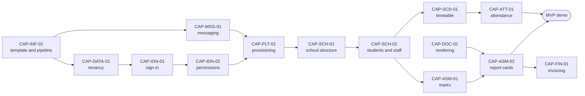

# 17. Roadmap

## Purpose

This document turns the seven phases of master brief Section 28 into **capabilities**: things a named person can do end to end, each one to three weeks, each one demonstrable. `34-work-breakdown.md` then splits every capability into slices of one to three days. Together they answer the question "what does the team build on Monday".

The durations below are ranges for a small, experienced team, per Section 28 and the team shape in Section 29. They are estimates with their uncertainty stated, not commitments. A date is only ever derived from a range and a start, and it stays a range.

## Scope

| In scope | Owned elsewhere |
|---|---|
| Phases, their goals, exit criteria and demos | The phase definitions themselves: master brief Section 28 |
| Every capability with its identifier, services, workflows and requirement scope | Slices within a capability: document 34 |
| Scope of each phase by requirement identifier, computed from document 03 | The requirements themselves: document 03 |
| Parallel streams, dependencies and the critical path | Estimates per slice: document 34 |

## Content

### 1. Phases at a glance

| Phase | Goal | Services | Range | Capabilities | Workflows | Service requirements | Demo at the end |
|---|---|---|---|---|---|---|---|
| **0 Plan** | The documents in `docs/plan/`, approved group by group | none | 3 to 5 weeks | none | none | none | The plan, scored at 4 or better on every axis |
| **1 Foundation** | Everything every later service stands on | Gateway, Bff.Web, Identity, Platform, Notification, Audit, and the Documents rendering pipeline | 14 to 22 weeks | 19 | 14 | 153 plus the cross-cutting obligations | A tenant is provisioned live, its administrator signs in with a second factor, a notification arrives, the audit entry is visible |
| **2 School year loop** | A class is taught, attended, graded and reported, in both languages, on web and phone | School, Scheduling, Attendance, Academics, Assessment, Bff.Mobile | 14 to 21 weeks | 19 | 10 | 177 | Acts one and two of Appendix O. **The MVP cut line** |
| **3 Money and paperwork** | A fee is invoiced, chased and paid; a request is approved and takes effect; a certificate verifies | Finance, Requests, Communication, Documents | 11 to 17 weeks | 14 | 9 | 103 | Act three of Appendix O |
| **4 Growth** | An applicant becomes a student; dashboards answer Appendix D; mobile reaches parity | Admissions, Behavior, Reporting | 7 to 11 weeks | 9 | 3 | 61 | The full Appendix O script on a fresh tenant with one-click reset |
| **5 Extended** | Wellbeing, human resources, operations and assistance, each to the definition of done | Wellbeing, Hr, Operations, Ai | 9 to 14 weeks | 12 | 14 | 67 | A clinic visit, a substitution from leave, a library loan, and a reviewed draft comment |
| **6 Hardening and launch** | Evidence that every gate in Section 24 holds at scale | all | 6 to 8 weeks | 6 | 2 | the phase 6 obligations below | Restore drill, penetration-test close-out, and the scale-tier load run, each with its record |

The capability and workflow columns are counted from the Section 4 tables: 79 capabilities, and 52 distinct `WF-` identifiers, which is every workflow in `31-business-rules-and-workflows.md`. A workflow is counted once, in the phase of the capability that builds it, which is why WF-INF-01 and WF-INF-03 count in phase 6 and not in phase 1 with the rest of Platform's.

The service requirement counts are computed from `03-requirements-catalog.md` by the owning service's build phase in `05-service-catalog.md` and by the phase column of `20-traceability-matrix.md` where a requirement is scheduled away from its service's phase. They add to 561. The remaining 299 requirements are cross-cutting and are covered in Section 3.

**Total from start of phase 1 to launch: 61 to 93 weeks** for the team in master brief Section 29. The honest reading is "about eighteen months, plus or minus four": the low end needs eight engineers building from the first week, the high end is five. The biggest lever on it is the MVP cut line in Section 5, not working faster.

**How the ranges are computed.** Every range above is derived from the slices in `34-work-breakdown.md` by `tools/plan-build/schedule-34.mjs`, not estimated separately:

| Input | Value | Why |
|---|---|---|
| Effort | The phase's slice-days in document 34 | One to three days per slice, one engineer |
| Builders | 5 to 8 | Master brief Section 29: two to four backend, one to two web, one mobile, one quality engineer |
| Overhead | × 1.3 | Review, integration and the demonstration that closes each capability |
| Calendar weeks | slice-days × 1.3 ÷ (builders × 5) | Eight builders give the low end, five the high end |
| Dependency floor | The longest chain of slice-to-slice dependencies in the phase, × 1.3 ÷ 5 | No headcount shortens it. It is 4 to 7 weeks in every phase, under the effort figure, so capacity, not sequencing, sets the pace. Dependencies stated as contracts are not in the chain, so it is a lower bound |
| Calendar floor | Phase 6: 6 to 8 weeks | The external penetration test, its retest window and an isolated restore drill take calendar time whatever the effort |

These replace the ranges of master brief Section 28, which were set before any slice existed and put phase 1 at 8 to 10 weeks against 423 slice-days. The brief is corrected to match under ADR-0019. A team outside Section 29's shape changes the builders input and nothing else; the ranges are recomputed, never adjusted by hand.

### 2. Scope of each phase by requirement identifier

Computed from document 03. A requirement belongs to the phase in which its owning service is built.

| Phase | Area | Count | Identifiers |
|---|---|---|---|
| 1 | IDN | 47 | REQ-IDN-001 to 047 |
| 1 | PLT | 39 | REQ-PLT-001 to 039 |
| 1 | NOT | 19 | REQ-NOT-001 to 019 |
| 1 | INT | 14 | REQ-INT-001 to 013, REQ-INT-017 |
| 1 | GW | 9 | REQ-GW-001 to 009 |
| 1 | AUD | 9 | REQ-AUD-001 to 009 |
| 1 | PRV | 7 | REQ-PRV-002, 010, 012, 014, 017, 018, 021 |
| 1 | BFF | 4 | REQ-BFF-001 to 003, REQ-BFF-006 |
| 1 | MOB, DATA, MSG, PERF | 5 | REQ-MOB-039, 041; REQ-DATA-027; REQ-MSG-024; REQ-PERF-025 |
| 2 | ATT | 38 | REQ-ATT-001 to 038 |
| 2 | SCH | 37 | REQ-SCH-001 to 037 |
| 2 | ASM | 36 | REQ-ASM-001 to 036 |
| 2 | ACA | 30 | REQ-ACA-001 to 030 |
| 2 | SCD | 24 | REQ-SCD-001 to 024 |
| 2 | BFF | 5 | REQ-BFF-004, 005, 007 to 009 |
| 2 | MOB, PRV, PERF | 7 | REQ-MOB-017, 020, 029, 034; REQ-PRV-003, 004; REQ-PERF-024 |
| 3 | FIN | 43 | REQ-FIN-001 to 043 |
| 3 | RQS | 20 | REQ-RQS-001 to 020 |
| 3 | COM | 17 | REQ-COM-001 to 017 |
| 3 | DOC | 17 | REQ-DOC-001 to 017 |
| 3 | PRV, PLAT, TST | 4 | REQ-PRV-007, 008; REQ-PLAT-020; REQ-TST-015 |
| 3 | INT | 2 | REQ-INT-014, REQ-INT-015 |
| 4 | ADM | 26 | REQ-ADM-001 to 026 |
| 4 | RPT | 18 | REQ-RPT-001 to 018 |
| 4 | BEH | 11 | REQ-BEH-001 to 011 |
| 4 | DATA, PRV | 5 | REQ-DATA-023 to 026; REQ-PRV-005 |
| 4 | INT | 1 | REQ-INT-016, counted once in the phase where it starts; LTI 1.3 in phase 4 and QTI 3, Open Badges 3.0 and CASE in phase 5, as document 20's phase column says |
| 5 | AI | 19 | REQ-AI-001 to 019 |
| 5 | OPS | 18 | REQ-OPS-001 to 018 |
| 5 | WEL | 17 | REQ-WEL-001 to 017 |
| 5 | HR | 12 | REQ-HR-001 to 012 |
| 5 | PRV | 1 | REQ-PRV-006 |

### 3. Cross-cutting requirements: established once, binding from then on

299 requirements belong to no single service. Each is **established** in the phase that builds its mechanism, and from that phase on it is part of the definition of done for every slice, in every service. A cross-cutting requirement is never "done" in the sense of finished; it is done when its mechanism exists and a gate enforces it.

| Area | Count | Established in | By which capability | Enforced from then on by |
|---|---|---|---|---|
| SEC | 20 | 1 | CAP-DATA-01, CAP-IDN-01, CAP-IDN-02 | The generated permission and tenant-isolation suites on every build |
| DATA | 23 | 1 | CAP-DATA-01 | Architecture tests and the pooled-connection isolation test |
| MSG | 23 | 1 | CAP-MSG-01 | Contract tests and the deliver-twice test per consumer |
| PERF | 29 | 1 | CAP-PERF-01 | Query budgets in integration tests; the baseline gate |
| API | 27 | 1 | CAP-INF-01 | Spectral rules and breaking-change detection in the pipeline |
| TST | 24 | 1 | CAP-INF-01 | The quality gates in Appendix V |
| L10N | 16 | 1 | CAP-UX-01 | The missing-translation report and the three-culture test |
| UX | 17 | 1 | CAP-UX-01 | Four-way snapshots and axe-core |
| WEB | 11 | 1 | CAP-BFF-01 | Bundle budgets and the web pipeline |
| PLAT | 22 | 1 | CAP-INF-02 | The dev-smoke job on two runners and the lint rules |
| PRV | 10 | 1 | CAP-AUD-01, CAP-PRV-01 | The privacy auditor and the retention jobs |
| INT | 2 | 3 | CAP-INT-01 | Contract tests on the public API |
| MOB | 38 | 2 | CAP-MOB-01 | Goldens in both directions and the offline sync tests |
| INF | 37 | 1 and 6 | CAP-INF-01, CAP-INF-03 in phase 1; CAP-INF-04, CAP-INF-05 in phase 6 | Pipeline stages from phase 1; drills and the appliance from phase 6 |

Phase 1 therefore carries far more than its 156 service requirements. That is why it is the largest phase by effort, 423 slice-days, and why its range of 14 to 22 weeks is the widest. A larger team helps less here than anywhere, because the building blocks come first and everything waits on them.

### 4. Capabilities

Identifiers are `CAP-<AREA>-<NN>` with area codes from Appendix L. Each is named as the sentence a person would say when it works. Workflows are from Appendix R; rule ownership is in document 31.

#### Phase 1: Foundation

| Capability | What a person can do | Services | Workflows | Weeks |
|---|---|---|---|---|
| CAP-INF-01 | An engineer creates a service from the template, and it passes the whole pipeline on the first commit | BuildingBlocks, tools | none | 2 to 3 |
| CAP-INF-02 | A developer on Windows or Linux starts the whole stack with one command | AppHost, deploy/compose | none | 1 |
| CAP-DATA-01 | Tenant A can never read tenant B's data, and a test proves it on every build | BuildingBlocks | none | 2 |
| CAP-MSG-01 | An event survives a worker crash and is processed exactly once | BuildingBlocks | none | 2 |
| CAP-PERF-01 | A handler that exceeds its query budget fails its test; cached reads are tenant-safe | BuildingBlocks | none | 1 to 2 |
| CAP-GW-01 | Every request enters through one front door that knows the tenant and limits abuse | Gateway | none | 1 |
| CAP-IDN-01 | A person signs in with a second factor, and the seeded administrator is safe | Identity | none | 2 |
| CAP-IDN-02 | An administrator decides who can do what, and the change applies without anyone signing out | Identity | WF-IDN-05 | 2 to 3 |
| CAP-IDN-03 | Staff, parents and students join the school | Identity | WF-IDN-01, WF-IDN-02, WF-IDN-03 | 2 |
| CAP-IDN-04 | Access is governed over time: delegation, offboarding, reviews, break-glass, consented impersonation | Identity | WF-IDN-04, WF-IDN-06, WF-SEC-01, WF-SEC-02, WF-SEC-03 | 2 to 3 |
| CAP-PLT-01 | A platform operator provisions a school in minutes, with sensible defaults already set | Platform | WF-PLT-01 | 2 to 3 |
| CAP-PLT-02 | A school's plan, limits, flags, settings and lifecycle are managed without a developer | Platform | WF-PLT-02, WF-PLT-03 | 2 |
| CAP-NOT-01 | A person receives the right message on the right channel, at the right time, in their language | Notification | none | 2 |
| CAP-AUD-01 | Every sensitive action is traceable, and the trail cannot be quietly edited | Audit | none | 1 to 2 |
| CAP-DOC-01 | A document renders correctly in Arabic and English, every time | Documents (rendering only) | none | 1 to 2 |
| CAP-UX-01 | The design system exists in both languages, both directions, both themes, on web and mobile | Web, Mobile | none | 3 |
| CAP-BFF-01 | The platform console and the school console know who you are and show only what you may do | Bff.Web, Web | none | 2 |
| CAP-PRV-01 | A data subject request can be answered from the services that exist | Platform, Audit | WF-PRV-01 | 1 |
| CAP-INF-03 | A release rolls out by canary, migrates safely, and rolls back by redeploying the previous image | tools, deploy | WF-INF-02 | 1 to 2 |

**Exit criteria.** Every capability above demonstrated to someone who did not build it; the generated tenant-isolation and permission suites green; the pipeline enforcing licence scan, secret scan, budgets and snapshots; `dev-smoke` green on Windows and Linux; Appendix V gates met for the six services built.

#### Phase 2: The school year loop (the MVP cut line)

| Capability | What a person can do | Services | Workflows | Weeks |
|---|---|---|---|---|
| CAP-SCH-01 | A school sets up its campuses, years, terms, grades, sections, subjects and houses | School | none | 2 |
| CAP-SCH-02 | Students, guardians and staff are on record, bilingual, with custody and access rights | School | none | 2 to 3 |
| CAP-SCH-03 | A student changes section, campus, or leaves, and every service follows | School | WF-SCH-01, WF-SCH-04 | 2 |
| CAP-SCH-04 | The year closes, students are promoted, and the structure rolls forward | School | WF-SCH-02, WF-SCH-03 | 2 |
| CAP-SCD-01 | A coordinator builds, refines and publishes the timetable | Scheduling | none | 3 |
| CAP-SCD-02 | When a teacher is absent, fair cover is arranged in minutes | Scheduling | none | 1 to 2 |
| CAP-SCD-03 | The calendar, events and room bookings are managed, and staff subscribe by iCal | Scheduling | none | 1 to 2 |
| CAP-ATT-01 | A teacher takes attendance for a class in under a minute, on a phone, offline | Attendance | WF-ATT-01 (marking) | 2 to 3 |
| CAP-ATT-02 | Absences are excused, thresholds escalate, and an intervention opens | Attendance | WF-ATT-01 (escalation) | 2 |
| CAP-ATT-03 | Children leave safely: pickup persons, gate passes, early dismissal, visitors | Attendance | WF-ATT-02 | 2 |
| CAP-ATT-04 | In an emergency, every person is accounted for and reunified | Attendance | none | 1 to 2 |
| CAP-ACA-01 | Teachers plan lessons and set work, and nobody overloads a class | Academics | WF-ACA-01 | 2 |
| CAP-ACA-02 | Students submit work and receive feedback | Academics | WF-ACA-01 | 2 |
| CAP-ASM-01 | Marks are entered at keyboard speed, moderated and locked | Assessment | none | 2 to 3 |
| CAP-ASM-02 | Report cards are generated in a batch, published, and verified by QR | Assessment, Documents | WF-ASM-01 | 2 to 3 |
| CAP-ASM-03 | A grade can be appealed and changed after lock, with a new report-card version | Assessment | WF-ASM-02 | 1 |
| CAP-ASM-04 | Exams are scheduled, seated and invigilated, and papers are set and reviewed securely | Assessment | WF-ASM-03 | 2 |
| CAP-MOB-01 | The teacher app works offline and resolves conflicts visibly | Bff.Mobile, Mobile | none | 3 |
| CAP-MOB-02 | A parent follows every child on one calm screen | Bff.Mobile, Mobile | none | 2 |

**Exit criteria.** A class is taught, attended, graded and reported end to end in both languages on web and phone; acts one and two of Appendix O pass; the 08:00 attendance-peak scenario from Appendix N passes at the load tier.

#### Phase 3: Money and paperwork

| Capability | What a person can do | Services | Workflows | Weeks |
|---|---|---|---|---|
| CAP-FIN-01 | An accountant structures fees and runs invoices in bulk, with gapless numbering and tax | Finance | WF-FIN-01 (invoicing) | 3 |
| CAP-FIN-02 | Payments are recorded, allocated and receipted, online or at the cashier | Finance | WF-FIN-01 (collection) | 2 |
| CAP-FIN-03 | Overdue fees are chased fairly, and restrictions apply only by explicit policy | Finance | WF-FIN-01 (escalation) | 1 to 2 |
| CAP-FIN-04 | Mistakes are corrected by reversal: credit notes, refunds, bounced cheques | Finance | WF-FIN-02, WF-FIN-03 | 2 |
| CAP-FIN-05 | Scholarships, discounts and sponsors are handled without spreadsheets | Finance | WF-FIN-04, WF-FIN-05 | 1 to 2 |
| CAP-FIN-06 | The cashier closes the day balanced, and the books export cleanly | Finance | WF-FIN-06 | 1 to 2 |
| CAP-RQS-01 | Anyone submits a request that is routed, approved on a phone, and takes effect automatically | Requests | WF-RQS-01 | 3 |
| CAP-RQS-02 | Everyone has one inbox of tasks, approvals and mentions | Requests, Notification | none | 1 |
| CAP-COM-01 | The school announces, and it knows who acknowledged | Communication | none | 1 to 2 |
| CAP-COM-02 | Parents and staff message safely within the school's policy, and concerns reach the right person | Communication | none | 2 |
| CAP-COM-03 | Parents book meetings, including whole conference days | Communication | none | 1 |
| CAP-DOC-02 | Certificates and letters are issued, verified by QR, and revocable | Documents | none | 1 to 2 |
| CAP-DOC-03 | A school moves in with its own data in a day, with a dry run and a rollback | Documents | WF-DATA-01, WF-PRV-02 | 2 to 3 |
| CAP-INT-01 | Other systems connect: public API, webhooks, iCal | Platform | none | 2 |

**Exit criteria.** Act three of Appendix O passes; the 5,000-invoice and 10,000-row import scenarios from Appendix N pass at the load tier; the finance daily balance job reconciles on the demo data.

#### Phase 4: Growth

| Capability | What a person can do | Services | Workflows | Weeks |
|---|---|---|---|---|
| CAP-ADM-01 | An inquiry becomes an enrolled student without anyone retyping anything | Admissions | WF-ADM-01 | 3 |
| CAP-ADM-02 | Families re-enrol, and outstanding balances are settled first | Admissions | WF-ADM-02 | 1 to 2 |
| CAP-BEH-01 | Behaviour is recorded, recognised and followed up | Behavior | WF-BEH-01 | 2 |
| CAP-RPT-01 | Every role opens a dashboard that answers its questions, and any number can be explained | Reporting, Bff.Web | none | 3 |
| CAP-RPT-02 | Reports are built, scheduled and exported without a developer | Reporting | none | 2 |
| CAP-RPT-03 | Early warning leads to a plan with an owner, and data-quality problems surface themselves | Reporting | none | 2 |
| CAP-MOB-03 | The mobile app reaches the parity matrix in document 09 | Bff.Mobile, Mobile | none | 2 to 3 |
| CAP-ACA-03 | Nursery and kindergarten families receive the daily sheet | Academics | none | 1 to 2 |
| CAP-INT-02 | A teacher launches a registered external learning tool from a section, and the tool reads only the roster its privacy setting allows | Platform | none | 1 |

**Exit criteria.** The full Appendix O script passes on a freshly provisioned tenant with one-click reset; the principal-dashboard scenario from Appendix N passes; an LTI 1.3 launch with deep linking and names and roles passes on the demo tenant.

#### Phase 5: Extended

| Capability | What a person can do | Services | Workflows | Weeks |
|---|---|---|---|---|
| CAP-WEL-01 | The nurse cares for a child and the family is told, without clinical detail leaving the service | Wellbeing | WF-WEL-02, WF-WEL-03 | 2 |
| CAP-WEL-02 | A safeguarding concern reaches the officer and is handled to an outcome | Wellbeing | WF-WEL-04, WF-WEL-05 | 2 |
| CAP-WEL-03 | A special-needs plan reaches the classroom and the exam room | Wellbeing | WF-WEL-01 | 2 |
| CAP-HR-01 | Staff are hired onto file, and licence expiry is caught in time | Hr | WF-HR-02, WF-HR-03 | 2 |
| CAP-HR-02 | Approved leave arranges its own cover | Hr, Scheduling | WF-HR-01 | 1 |
| CAP-HR-03 | Payroll inputs are prepared and exported | Hr | WF-HR-04 | 1 to 2 |
| CAP-OPS-01 | The library lends and the store issues, with fines and stock checks | Operations | WF-OPS-01, WF-OPS-02 | 2 |
| CAP-OPS-02 | Transport routes, boarding and delays reach parents | Operations | WF-OPS-03 | 2 |
| CAP-OPS-03 | Facilities, front desk, complaints and drills are managed | Operations | WF-OPS-04, WF-OPS-05 | 2 |
| CAP-AI-01 | A teacher gets a reviewed draft, a translation or an answer, and the school can switch it all off | Ai | none | 3 |
| CAP-AI-02 | Every automated decision explains itself and can be overridden | Ai, Reporting | none | 1 |
| CAP-INT-03 | A school exchanges question banks, curriculum standards and badge credentials with other systems through the 1EdTech formats | Academics, Behavior | none | 1 to 2 |

**Exit criteria.** Each Tier 2 module meets the definition of done in master brief Section 26; the product is fully usable with every assist rung above 1 switched off; the standards checklist of REQ-INT-016 passes a QTI 3 round trip, an Open Badges 3.0 credential verified by an independent verifier, and a CASE import.

CAP-INT-02 and CAP-INT-03 carry the REQ-INT-016 standards work that the Platform service sheet and the requirement itself time to phases 4 and 5. `34-work-breakdown.md` lists SL-INT-411 under CAP-INT-02 and SL-INT-600 to SL-INT-602 under CAP-INT-03; moving them there from CAP-ACA-03 and CAP-AI-01 changed no days, services or dependencies, so the phase ranges in Section 1 are unaffected.

#### Phase 6: Hardening and launch

| Capability | What a person can do | Services | Workflows | Weeks |
|---|---|---|---|---|
| CAP-INF-04 | The platform survives failure, and a school can be restored alone | all | WF-INF-03 | 2 |
| CAP-INF-05 | An on-premises school upgrades safely on a Windows host through the appliance | deploy/onprem | WF-INF-01 | 2 |
| CAP-SEC-01 | An independent penetration test finds nothing left open | all | none | 2 to 3 |
| CAP-PERF-02 | The scale targets of master brief Section 21 hold at the scale tier | all | none | 2 |
| CAP-UX-02 | Accessibility is confirmed by a manual pass and a published conformance statement | Web, Mobile | none | 1 |
| CAP-INF-06 | A school is supported: runbooks exercised, status page live, support tiers staffed | Platform, deploy | none | 1 to 2 |

**Exit criteria.** Every gate in master brief Section 24 green with evidence; penetration-test findings closed or accepted with an owner and a date; one quarterly restore drill recorded with elapsed times.

Three workflows owned by Platform are scheduled by capability rather than by their service's phase: WF-INF-02 in phase 1 because releases start then, and WF-INF-01 and WF-INF-03 in phase 6 because they need a running product to drill against. Document 31 lists each workflow at its owning service's phase; this section is authoritative for timing.

### 5. The MVP cut line

The first paying school needs **phases 1 and 2 complete**, plus from phase 3 only what term one uses: **CAP-RQS-01** limited to the attendance and document request types, **CAP-COM-01** and **CAP-COM-02**, and **CAP-DOC-02**. That is **42 capabilities, 954 slice-days, and 33 to 50 weeks from the start of phase 1**, computed the same way as Section 1. At the middle of the team range that is about ten months to the first paying school.

| In the MVP | Not in the MVP, and why |
|---|---|
| Sign-in, roles, joining, provisioning, notifications, audit | |
| School structure, students, guardians, staff, transfers, year close | |
| Timetable, cover, calendar | |
| Attendance, excuses, dismissal, emergency mode | |
| Coursework, marks, report cards, exams | |
| Teacher and parent mobile, offline | |
| Announcements, messaging, certificates, two request types | |
| | Finance: a school on its existing billing system for the first term is common, and fees are the highest-risk module to rush |
| | Admissions: runs once a year; the first customer arrives already enrolled |
| | Behavior, Reporting dashboards: valuable, not blocking a school day |
| | Wellbeing, Hr, Operations, Ai: Tier 2 |

A school that needs Finance in term one is a phase 3 customer, and saying so in the first meeting is cheaper than saying it in month nine.

### 6. Parallel streams

With the team in master brief Section 29, work runs in four streams. A stream is a set of people, not a service.

| Stream | Phase 1 | Phase 2 | Phase 3 | Phase 4 | Phase 5 |
|---|---|---|---|---|---|
| Platform backend | CAP-INF-01, CAP-DATA-01, CAP-MSG-01, CAP-PERF-01, CAP-GW-01 | CAP-SCH-01 to 04 | CAP-RQS-01, 02 | CAP-RPT-01 to 03 | CAP-AI-01, 02 |
| Domain backend | CAP-IDN-01 to 04, CAP-PLT-01, 02, CAP-AUD-01, CAP-PRV-01 | CAP-SCD-01 to 03, CAP-ATT-01 to 04, CAP-ACA-01, 02, CAP-ASM-01 to 04 | CAP-FIN-01 to 06, CAP-COM-01 to 03, CAP-DOC-02, 03, CAP-INT-01 | CAP-ADM-01, 02, CAP-BEH-01, CAP-INT-02 | CAP-WEL-01 to 03, CAP-HR-01 to 03, CAP-OPS-01 to 03, CAP-INT-03 |
| Web | CAP-UX-01, CAP-BFF-01 | screens for every phase 2 capability | screens for every phase 3 capability | screens and dashboards | screens |
| Mobile and delivery | CAP-INF-02, CAP-INF-03, CAP-NOT-01, CAP-DOC-01 | CAP-MOB-01, 02 | mobile screens for phase 3 | CAP-MOB-03, CAP-ACA-03 | mobile screens |

Web and mobile start each capability as soon as its API contract is published, not when its backend is finished. That contract-first rule is what makes four streams possible without four times the waiting.

### 7. Dependencies and the critical path

**The critical path** runs template, tenancy, sign-in, permissions, provisioning, school structure, students, then splits into timetable to attendance and marks to report cards. Everything in phase 2 waits for CAP-SCH-02, because every academic service keeps a reference copy of School's students. That makes CAP-SCH-02 the single most important capability to finish on time, and it is why School is built by the platform stream, which has just finished the building blocks and knows them best.

| Dependency | Why | Mitigation |
|---|---|---|
| Every phase 2 service waits for School's student events | Reference copies are built from `school.student.enrolled.v1` and friends | Publish School's event contracts in week 1 of phase 2 and seed the demo data through them, so consumers start before School's screens exist |
| Report cards need the rendering pipeline | Arabic shaping is the hardest part of document generation | CAP-DOC-01 is built in phase 1 deliberately, a phase early |
| Finance needs report-card restriction hooks and Admissions needs Finance | `finance.account.restricted.v1` is consumed by Assessment; `finance.payment.received.v1` by Admissions | Contracts published in phase 2; consumers tolerate the producer's absence |
| Hr leave needs Scheduling substitutions | `hr.leave.approved.v1` drives cover | Scheduling's cover consumer is built in phase 2 against the contract, before Hr exists |
| iOS release needs Apple build capacity | Open Question 14 | Settled before phase 2; Android and mobile web ship independently |

## Decisions in force

| Decision | Record |
|---|---|
| Phases and the MVP cut line | Master brief Section 28 |
| Phase ranges derived from document 34's slice-days, not estimated | This document, Section 1; brief Section 28 corrected under ADR-0019 |
| Capabilities and slices, split by use case never by layer | ADR-0018 |
| Contract-first dependencies between streams | ADR-0018, `docs/plan/PLAN_SPEC.md` |
| Workflow timing is by capability, overriding the service phase where stated | This document, Section 4 |

## Dependencies on other documents

| Document | What this one takes |
|---|---|
| `03-requirements-catalog.md` | Every requirement identifier and its owning service |
| `05-service-catalog.md` | The build phase per service |
| `31-business-rules-and-workflows.md` | Workflow ownership |
| `34-work-breakdown.md` | The slices inside every capability |
| Appendix N, Appendix O | The load scenarios and demo acts that close each phase |

## Open points

| Point | Default | Owner |
|---|---|---|
| Whether a read-only public API, OneRoster export and iCal move to Tier 1, per document 02 | Stays in phase 3 as CAP-INT-01, where document 34 builds it, except iCal which is already in phase 2 through CAP-SCD-03. This is the current default, not a decision | Product owner, Open Question 28, then an ADR |
| Whether Finance is needed by the first customer in term one | No; it is outside the MVP | Product owner, Open Question 25 |
| Team size and shape | Master brief Section 29, five to eight builders. A different team changes the builders input of `schedule-34.mjs` and the ranges are recomputed | Product owner, Open Question 24 |

## Review record

| Date | Reviewer | Result |
|---|---|---|
| 2026-09-21 | Plan build | Written from Section 28 and computed from documents 03, 05 and 31 |
| 2026-09-22 | Scorecard remediation, theme 2 | Ranges re-derived from document 34: phase 1 from 8 to 10 to 14 to 22 weeks, total from 58 to 74 to 61 to 93 weeks, MVP from about 38 capabilities and 30 to 36 weeks to 42 and 33 to 50 |
| 2026-09-22 | Scorecard remediation, theme 4 | CAP-INT-02 (phase 4) and CAP-INT-03 (phase 5) added for the REQ-INT-016 standards work; capability and workflow columns in Section 1 recounted from the Section 4 tables (phase 1 workflows 16 to 14, phase 6 "0 new" to 2); the Section 2 INT rows split across phases 1, 3 and 4 to match document 20's phase column, which moves the phase totals to 153, 103 and 61 with 561 unchanged |

## How this document is verified

| Claim | Proof |
|---|---|
| Every service requirement is in exactly one phase | The Section 2 table is computed from document 03 by service phase; its counts add to 561, and with the 299 cross-cutting requirements to the 860 in document 03 |
| Every workflow has a capability | kit-lint R25 fails when a `WF-` heading of Appendix R, the catalog document 31 is generated from, appears in no `CAP-` row of Section 4; kit-lint R19 fails when a Section 4 row cites a `WF-` identifier Appendix R does not define |
| Every capability is broken into slices | kit-lint R25 fails when a `CAP-` row here has no `SL-` row under its `#### CAP-` heading in document 34. CAP-INT-02 holds SL-INT-411 and CAP-INT-03 holds SL-INT-600 to SL-INT-602 |
| Every requirement reaches a slice | Document 34 and document 20 together; a requirement with no slice is scope nobody will build |
| The ranges match the work | kit-lint R23 runs `tools/plan-build/schedule-34.mjs --check`, which recomputes the ranges from the slices in document 34 and fails when a Section 1 phase row, the launch total or the MVP line differs from what it computes |
| The ranges stay honest | Re-computed at the end of each phase from the slices actually delivered and the team actually present, and recorded in the review record |
