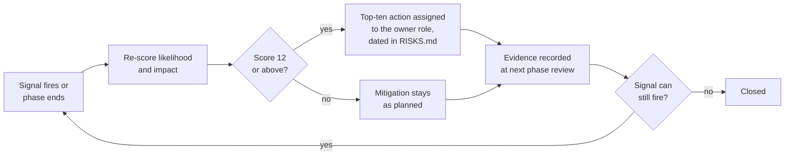

# 18. Risk Register

> Group E. Seeded from master brief Section 40 and `docs/project/RISKS.md`, then extended to the risks the plan documents have surfaced since. Every risk has a stable identifier, a likelihood, an impact, a score, a mitigation that is already in the plan or has an owner to put it there, an early-warning signal someone can watch for, an owner role from master brief Section 29, the phase at which it is next reviewed, and a status. A risk with no owner is not being managed; a risk with no signal will be noticed only when it lands.

**Group** E · **Requirement areas covered** none directly; risks reference the documents that own them · **Last updated** 2026-09-25 by the ADR-0022 open-points remediation (RISK-44 to RISK-53 added, RISK-40 closed)

**Rule for reading.** `docs/project/RISKS.md` is the live register that the end-of-phase review updates; this document is the plan's baseline at Phase 0 approval and the place where the scoring method, the heat map and the top-ten actions live. When the two disagree on a status, `RISKS.md` is current and this document is updated at the next phase review. On approval of Group E, `RISKS.md` adopts the `RISK-NN` identifiers below; its twelve seed rows map one to one in part 2.

---

## 1. Scoring method

| Likelihood | Score | Meaning within the delivery window of master brief Section 28 |
|---|---|---|
| Rare | 1 | Would surprise the team |
| Unlikely | 2 | Has happened on comparable projects; not expected here |
| Possible | 3 | As likely to happen as not |
| Likely | 4 | Expected unless the mitigation works |
| Almost certain | 5 | Already happening or structurally unavoidable |

| Impact | Score | Meaning |
|---|---|---|
| Minor | 1 | Absorbed inside a slice; no phase date moves |
| Moderate | 2 | A capability slips inside its phase |
| Major | 3 | A phase exit criterion slips by weeks, or a customer promise is qualified |
| Severe | 4 | A phase slips by more than a month, a customer is lost, or money is wrong for a school |
| Critical | 5 | Children's data is exposed, a tenant boundary breaks, or the product cannot launch as planned |

**Score** is likelihood times impact, 1 to 25. The master brief's words map as Low 2, Medium 3, High 4 for likelihood and Medium 3, High 4, Severe 5 for impact, so the twelve seed risks keep their relative order. **Status** is one of Open (mitigation planned, not yet evidenced), Mitigating (mitigation in progress with evidence), Accepted (the product owner and architect have signed the residual, per master brief Section 29), Closed (the signal can no longer fire). Everything is Open at Phase 0 because nothing has been built.

**Review cadence.** Every risk is reviewed at the end of the phase named in its row and at every phase after it until Closed. A risk whose signal fires between reviews is re-scored the same week at the decision review in master brief Section 29.

---

## 2. The seed risks and their identifiers

The twelve risks in master brief Section 40 and `RISKS.md` keep their substance and gain an identifier so that a plan document can cite one.

| Seed # | Identifier here | Risk |
|---|---|---|
| 1 | RISK-26 | A dependency changes licence mid-project |
| 2 | RISK-10 | The timetable solver produces schedules a school will not accept |
| 3 | RISK-08 | Arabic PDF shaping regresses unnoticed |
| 4 | RISK-09 | Offline sync produces conflicts nobody can explain |
| 5 | RISK-33 | Twenty services overwhelm a small operations team |
| 6 | RISK-27 | The product name is not cleared for trademark or the app stores |
| 7 | RISK-11 | A .NET 10 library the plan depends on is not ready |
| 8 | RISK-12 | Wolverine proves unsuitable for the messaging load |
| 9 | RISK-28 | Data residency multiplies infrastructure cost per region |
| 10 | RISK-20 | The penetration test finds a tenancy defect late |
| 11 | RISK-04 | No Apple build capacity when iOS is due |
| 12 | RISK-05 | Translation quality in Arabic undermines credibility |

---

## 3. The register

Fifty-three risks in five categories: fifty-two open and one Closed (RISK-40). Columns are the same in every table. RISK-44 to RISK-53 came from the open points that plan documents scored at 12 or more under ADR-0022 and that no earlier row covered; the Source of each is named in its mitigation.

### 3.1 Delivery

| Id | Risk | L | I | Score | Mitigation | Early-warning signal | Owner role | Review phase | Status |
|---|---|---|---|---|---|---|---|---|---|
| RISK-01 | One product owner is the approval bottleneck for six plan groups (A to F in `PLAN_SPEC.md`) and every scope, brief and go or no-go decision in master brief Section 29 | 4 | 4 | 16 | Group reviews scheduled before the group is written, with a fixed review window of five working days; the weekly decision review clears open questions in batches; the architect holds delegated authority for architecture and technology decisions so only scope and brief changes wait on the product owner; a written approval note is the only form of approval, which removes the re-confirmation loop | A group waits more than five working days for review; more than six open questions carry the same owner past two weekly reviews | Product owner | Phase 0, then every phase | Open |
| RISK-02 | Scope creep from the breadth of Appendix A: Tier 2 and Tier 3 features pulled into Tier 1 slices because a first customer asks | 4 | 4 | 16 | Every slice names its requirement identifier and tier; a slice whose requirement is Tier 2 cannot enter a Tier 1 phase without an ADR that names the customer and what leaves to make room; the MVP cut line in master brief Section 28 is repeated in every phase demo; `/lint-plan` refuses a slice that maps to no requirement | A pull request touches a service the phase does not list; the work breakdown for a phase grows by more than 10 percent after approval; a demo shows a feature outside the phase | Product owner | Phase 1, then every phase | Open |
| RISK-03 | The work breakdown (document 34) reveals scope the roadmap did not plan, and the phase ranges in master brief Section 28 stretch | 4 | 3 | 12 | Document 34 is written before Group F is approved and before Phase 1 starts, so the surprise arrives on paper; slices above three days are split rather than estimated; the roadmap carries ranges, not dates, and the range widens visibly when slices are added; the first two capabilities of Phase 1 are broken down to the day as a calibration sample; since document 34 was written, the phase ranges are derived from its slice-days by `tools/plan-build/schedule-34.mjs` rather than estimated, so added slices widen the range automatically | Sum of slice ranges for a phase exceeds the top of its Section 28 range; a capability has more than fifteen slices; a slice named after a layer or a table appears | Architect | Phase 0, Phase 1 | Occurred and treated: the signal fired when document 34 put phase 1 at 423 slice-days against 8 to 10 weeks; document 17 Section 1 re-derived every range (phase 1 now 14 to 22 weeks, launch 61 to 93 weeks). Stays open for phases 2 to 6 |
| RISK-04 | No Apple build capacity when iOS is due (seed 11) | 3 | 4 | 12 | Open question 14 and a budget line for hosted macOS runner minutes settled before Phase 2; `ci-mobile-ios.yml` is path-filtered so cost is bounded; Android and mobile web ship independently of iOS; the white-label release gate refuses a flavour with a missing iOS artefact so a lag is visible, not silent | Open question 14 still open at the Phase 1 exit review; the macOS job has not run green for two weeks; a flavour ships on Android alone | Product owner | Phase 1 | Open |
| RISK-05 | Translation quality in Arabic undermines credibility (seed 12) | 3 | 4 | 12 | A fluent reviewer owns the Arabic string set; the terminology glossary is versioned and tenant terminology overrides sit on top of it; the missing-translation report fails the build; every Appendix Q script has an Arabic step signed by a school-side person; the `rtl-localization-reviewer` approves every snapshot and PDF baseline change | The missing-translation count is above zero on the release branch; an Arabic acceptance step fails or is skipped for time; a school reports a term as wrong | Product owner | Phase 2, then every phase | Open |
| RISK-06 | The team is smaller than the shape in master brief Section 29 and Phase 1 cannot be shortened by adding people later | 3 | 3 | 9 | Open question 24 settled before Group E approval; Phase 1 is sequenced so Identity and Platform finish first and everything else stacks behind them; the merge option in Appendix L (14 services) is the named fallback for a smaller team | Fewer than two backend engineers at Phase 1 start; Phase 1 velocity below the calibration sample after four weeks | Product owner | Phase 0, Phase 1 | Open |
| RISK-07 | The critical path slips at its two joins: Identity and Platform block the rest of Phase 1, and School blocks every Phase 2 service because they all keep reference copies of its data | 3 | 4 | 12 | Contract-first slices: the service template ships in week one of Phase 1 and the PDF pipeline is built in Phase 1, a phase early, as `17-roadmap.md` Section 7 and master brief Section 28 require; the School directory gRPC contract and the `school.*` events are published in week 1 of Phase 2, where document 17 Section 7 places them, and the demo data is seeded through them so consumers start before School's screens exist | Identity or Platform is not demonstrable by the Phase 1 exit review; the School directory contract is not published in week 1 of Phase 2; a Phase 2 service starts with a stubbed directory | Architect | Phase 1, Phase 2 | Open |
| RISK-41 | Open question 27, the absence-alert timing, is still open when Phase 2 builds attendance: 30 seconds after the mark or 30 minutes after the register closes changes WF-ATT-01, `TC-ATT-003`, the notification lane and the SMS volume behind RISK-30 | 3 | 3 | 9 | The plan states the current default, within 30 seconds, as REQ-ATT-017 and master brief Section 31 require, and names the question wherever it appears rather than deciding it; the timing is one configured delay on one workflow transition, so the change is a value, not a design; the question carries the product owner as owner and is on the weekly decision-review agenda; the alert-timing decision is a Phase 1 exit item so that CAP-ATT-02 is built once | Open question 27 is still open at the Phase 1 exit review; a slice for CAP-ATT-01 or CAP-ATT-02 starts with the timing unstated; a pilot school asks for a grace window after the first term | Product owner | Phase 1, Phase 2 | Open |
| RISK-42 | Open question 28, whether a read-only public API, the OneRoster export and iCal move from Tier 2 into Tier 1, is decided after the MVP is cut: CAP-INT-01 and its OneRoster slices then move from phase 3 into the MVP and phases 1 and 2 grow | 3 | 3 | 9 | The current default is stated in `17-roadmap.md` Section 4 and its open points: iCal already ships in phase 2 through CAP-SCD-03, and the public API and OneRoster stay in phase 3 as CAP-INT-01, where document 34 builds them; Appendix W row 24 stays Tier 2 until the product owner decides; the API keys and webhooks those surfaces need are built in phase 1 (SL-INT-001 to SL-INT-003), so a yes moves screens and contracts, not foundations; document 02's finding that six of ten competitors publish an API is the evidence the decision needs | A prospect makes the public API or a rostering export a term-one condition; open question 28 is still open at the Phase 2 exit; Appendix W row 24 is quoted as Tier 1 in a sales conversation | Product owner | Phase 0, Phase 2 | Open |
| RISK-43 | The appendix defects found in review reach the plan: brief v9.1 corrected the three brief files under ADR-0019, but a plan document that still quotes a pre-v9.1 name, count or version is now wrong, and nothing fails when it is | 3 | 3 | 9 | ADR-0019 landed the corrections in `docs/brief/` and `docs/project/KIT_V9_1_CHANGES.md` lists every one with its source, so each plan document can be swept against a list rather than against memory; the plan-group remediation passes are that sweep; Appendix L stays the single registry of names and identifier formats, so a drifted name is a lint finding under `kit-lint` rules R01, R02, R05 and R17; counts are computed or quoted from the owning document, never restated | A plan document cites a brief version other than v9.1; a name in a plan document is absent from Appendix L; a count in one document disagrees with the document that owns it | Architect | Phase 0, Phase 1 | Mitigating |
| RISK-44 | A Proposed decision record that the plan and the first slices already build on (the runtime in ADR-0001, the service count in ADR-0002, the messaging library in ADR-0004, the identity server in ADR-0008) is rejected or amended at the weekly decision review after Phase 1 has started, and the building blocks and service sheets it shaped are reworked | 3 | 4 | 12 | Source: `29-adr-index.md` open point 1. The weekly decision review takes the Proposed records in dependency order before Group F approval, those Phase 1 builds on first; every record names two alternatives and a revisit trigger, and the ones that carry an open-question default have a written reversal path (the .NET 8 fallback list in master brief Section 19, Rebus or a thin RabbitMQ layer under open question 6, the alternative named in ADR-0008, the 14-service merge option in Appendix L); every such choice sits behind a building-block interface, so a reversal changes one block rather than every service; a Phase 1 slice that depends on a record still Proposed names it | A record is still Proposed when the first Phase 1 slice that depends on it starts; the decision review returns a record with changes; the product owner questions a record's premise at a group review | Architect | Phase 0, Phase 1 | Open |

### 3.2 Technical

| Id | Risk | L | I | Score | Mitigation | Early-warning signal | Owner role | Review phase | Status |
|---|---|---|---|---|---|---|---|---|---|
| RISK-08 | Arabic PDF shaping regresses unnoticed (seed 3) | 3 | 4 | 12 | Fonts bundled with the renderer and the Gotenberg image; bilingual snapshot baselines with three shaping canaries per document, `TC-TST-208`; baselines byte-identical on both runners, TC-PLAT-003; ICU pinned per release | A baseline changes in a pull request without a template change; a canary fails; a device-pass screenshot shows a disconnected letter | Quality engineer | Phase 1, then every phase | Open |
| RISK-09 | Offline sync produces conflicts nobody can explain (seed 4) | 4 | 4 | 16 | Per-entity conflict rules in Appendix M.3 with a test per rule in Appendix M.5; visible pending state on every queued item; the banner rule that shows both values and which was kept; the N-08 sync storm asserts conflicts are surfaced and never silently resolved; ordering by `receivedAt`, never the device clock, TC-PLAT-012 | Any sync path resolves a conflict without a banner; a support ticket says "the register looks different on my phone"; the N-08 conflict count and the banner count differ | Mobile engineer | Phase 2, then every phase | Open |
| RISK-10 | The timetable solver produces schedules a school will not accept (seed 2) | 3 | 4 | 12 | The constraint set is reviewed with a real school in Phase 2; manual refinement with live conflict detection is always available and is the Appendix O minute 6 proof; the quality score is shown beside every solve; the solver is a cancellable worker job that never blocks the published timetable | A pilot school edits more than 20 percent of solver output by hand; a solve exceeds its time box on the demo tenant; the coordinator persona journey in Appendix U cannot be completed without the solver | Architect | Phase 2 | Open |
| RISK-11 | A .NET 10 library the plan depends on is not ready (seed 7) | 2 | 3 | 6 | The fallback list in master brief Section 19 names a replacement per dependency, including the .NET 8 path; document 19 verifies exact versions from the source; every external dependency sits behind an interface in a building block | A pinned package has no stable release for the runtime by Phase 1 start; a building block's test suite runs only on a preview package | Architect | Phase 0, Phase 1 | Open |
| RISK-12 | Wolverine proves unsuitable for the messaging load (seed 8) | 2 | 4 | 8 | Messaging isolated in `Nibras.BuildingBlocks.Messaging`; Rebus and a thin layer over the RabbitMQ client are the named alternatives in open question 6 and ADR-0004; contract tests and message schemas are independent of the library; N-06 and N-09 measure the library under the per-tenant fairness and fan-out shapes in Phase 3 | Consumer lag or per-tenant lane depth fails N-06 for two consecutive nightlies with no application cause; the outbox relay cannot hold the N-09 fan-out rate | Architect | Phase 1, Phase 3 | Open |
| RISK-13 | Cache-invalidation bugs at the morning peak: a stale permission, timetable or setting is served to thousands of users inside the 08:00 window | 3 | 4 | 12 | Event-driven invalidation by tag with TTL as the safety net; broadcast invalidation for permissions, flags and branding; the generated cache-entry suite `TC-TST-202` proves invalidation by the real event for every caching-table entry; the pre-peak warm-up job; N-11 proves cold-cache behaviour; L1 lifetimes are short for mutable data | The cache hit ratio dashboard shows a jump above 99 percent for a mutable entry, which means invalidation stopped; a support ticket at 08:05 about yesterday's timetable; a permission change takes longer than the permission-version propagation budget | Architect | Phase 2, Phase 6 | Open |
| RISK-14 | PgBouncer in transaction mode leaks a tenant across pooled connections, or breaks prepared statements, under row-level security | 3 | 5 | 15 | `SET LOCAL` inside every transaction, never per session; the pool swap attack in the tenant-isolation suite and `PostgresFixture` running every service's integration suite through PgBouncer in transaction mode, TC-PLAT-015; prepared-statement compatibility verified for the pinned PgBouncer and Npgsql versions in document 19; pool sizes from load tests, not guesses; the pool swap re-run after the PostgreSQL failover chaos case `TC-TST-213` | Any integration test passes without PgBouncer and fails with it; a prepared-statement error in the slow-query log; the pool swap test is skipped in any service | Architect | Phase 1, then every phase | Open |
| RISK-15 | Reference-copy drift: a service's local copy of School data diverges from School and the divergence is never seen | 3 | 3 | 9 | Nightly checksum reconciliation over gRPC per master brief Section 19 with self-repair by replay and a data-quality issue raised; deliver-twice and out-of-order tests on every reference-copy consumer, `TC-TST-203`; N-07 asserts zero unexplained reconciliation differences after 24 hours | The reconciliation job reports any unexplained difference; a report shows a student in a section School says they left; a consumer's dead-letter count rises for a `school.*` event | Architect | Phase 2, Phase 6 | Open |
| RISK-16 | ICU or tzdata drift: a base-image update moves a Hijri date by a day or a bell schedule by an hour | 3 | 3 | 9 | ICU and tzdata pinned per release and bumped deliberately; the culture test inside the built image asserts known Hijri and Gregorian pairs and the Riyadh, Amman and Dubai offsets, TC-PLAT-004 to TC-PLAT-006; Debian-based images by default | A base-image bump changes the ICU or tzdata version in the SBOM diff; a culture test fails on a dependency-update pull request; a school in one country reports a wrong Hijri date | Platform engineering | Phase 1, then every release | Open |
| RISK-17 | On-premises appliance upgrades fail on customer Hyper-V or VMware hosts that the team cannot see | 3 | 4 | 12 | The appliance is a Linux virtual machine built from `deploy/onprem/` with a nested-virtualisation build job and a quarterly drill on Hyper-V; migrations run as jobs before rollout and rollback is redeploy of the previous image; the appliance restore drill `TC-TST-218`; a support bundle export the customer can send | The quarterly drill fails or is skipped; an appliance customer is more than one release behind; a migration bundle needs manual steps in its runbook | Platform engineering | Phase 2 if open question 16 says Windows hosts are early, otherwise Phase 6 | Open |
| RISK-18 | The generated suites become slow enough that engineers route around them: about 15,000 permission tests and 3,100 attacks per full run | 3 | 3 | 9 | The per-pull-request sample (every operation once allowed, once denied; every attack for the changed service) with the full set nightly; suites run in parallel per service; the generated output is committed so a skipped generator is a visible diff; the pipeline summary publishes the measured count and the Appendix V gate uses it | The per-pull-request stage exceeds 15 minutes; a pull request disables the generator step; the nightly full run is red for three days and nobody owns it | Quality engineer | Phase 1, Phase 3 | Open |
| RISK-19 | Per-tenant fairness fails: a large tenant's batch, import or emergency fan-out degrades a small tenant | 3 | 4 | 12 | Per-tenant lanes and worker concurrency caps in document 11; the three-layer rate limit in master brief Section 19; N-06 with the 10 percent fairness threshold and N-09 run nightly from Phase 3; KEDA scaling on queue depth | The quiet tenant's p95 in N-06 rises above 10 percent of its solo baseline; lane depth for any tenant above 100; a school reports slowness at the time another school's term close ran | Architect | Phase 3, Phase 6 | Open |
| RISK-38 | The Ai service puts a generated draft, translation or answer in front of a teacher, guardian or student as fact: wrong, biased, or built from data the requester may not see, and the school cannot show where it came from | 3 | 4 | 12 | The assist ladder in `25-ai-and-assist-ladder.md`: every AI feature has a non-AI path and the product is fully usable with every rung above 1 off, which is the Phase 5 exit criterion in `17-roadmap.md`; no rung 3 output reaches a person outside the school without a named reviewer, and the review is recorded with the text; the Because panel shows the sources behind every number and every draft (CAP-AI-02); Wellbeing rows never reach Ai (RISK-24, Appendix J); usage is logged with token counts and never with text; the whole feature set is switchable off per tenant | A rung 3 draft is stored without a recorded reviewer; the Because panel is empty for any shown suggestion; an AI response cites a record the requester has no permission to read; a school asks to switch AI off and a screen breaks | Architect | Phase 5, Phase 6 | Open |
| RISK-39 | The AI hardware in the unavoidable-cost list is never funded, so every rung 3 feature runs permanently at rung 1 or 2 and the assist ladder cannot be demonstrated | 3 | 2 | 6 | `19-dependency-and-license-inventory.md` §10 lists AI hardware as an unavoidable cost and `28-capacity-and-cost-model.md` part 5 prices it per deployment mode, so the decision is costed before it is promised; rung 3 is off by default and every feature degrades to its non-AI path, which is what the Phase 5 exit criterion tests; Ollama and vLLM are both allowed, so the choice is not a single vendor | The Phase 5 demo runs with rung 3 off because no machine exists; the GPU line is absent from the monthly FinOps review after the Phase 4 exit | Product owner | Phase 4, Phase 5 | Open |
| RISK-45 | Report cards and promotion proposals ship without attendance and conduct data: no event from Attendance or Behavior reaches Assessment and reference architecture table 8.0 allows no gRPC to them, so every card renders those sections "not available" and every promotion proposal under BR-ASM-012 and BR-ASM-013 needs a manual attendance check | 4 | 3 | 12 | Source: `06-services/assessment.md` open point 3. An ADR before the phase 2 report-card slices chooses one path, a per-student term summary event from Attendance (and later Behavior) consumed by Assessment, or a read of the Reporting `student_360` model at card generation, and Appendix E gains the routing key; the report-card template keeps the sections so only the data source changes; the Appendix O and Appendix Q report-card steps assert the attendance figure is present | The phase 2 demo report card shows "not available" for attendance; a Saga 7 slice starts with no attendance source named; a pilot school asks for the absence count on the card | Architect | Phase 2 | Open |
| RISK-46 | Message translation between Arabic and English is a Tier 1 requirement (REQ-COM-011, `TC-L10N-501`) with no provider: no machine-translation service is in the approved stack, and document 25 places translation at rung 3, off by default and on hardware that may not exist (RISK-39), so the Tier 1 promise and its end-to-end test cannot pass | 4 | 3 | 12 | Source: `06-services/communication.md` open point 6. The product owner decides before Communication's phase whether REQ-COM-011 stays Tier 1; if it does, an ADR names the provider path (the Ai rung 3 translator with its golden set in document 25, or a licence-compatible external adapter with its data-processing terms) and the licence review clears it; until then the bilingual-messaging claim is "original with a notice", which is what the translation-outage path of SL-COM-416 already shows | `TC-L10N-501` is marked not applicable at a phase exit; SL-COM-416 starts with no provider named; a demo shows the "translation unavailable" notice | Product owner | Phase 2 | Open |

### 3.3 Security and privacy

| Id | Risk | L | I | Score | Mitigation | Early-warning signal | Owner role | Review phase | Status |
|---|---|---|---|---|---|---|---|---|---|
| RISK-20 | The penetration test finds a tenancy defect late (seed 10) | 2 | 5 | 10 | The tenant-isolation suite `TC-SEC-056` on every build from Phase 1, attacking every endpoint, gRPC method, consumer, job, cache key, signed URL and pooled connection; the count of surfaces attacked is a phase gate; a late finding is treated as a gap in the generator and fixed there; tenants A and B in every integration test | The attacked-surface count falls below the operation count in the aggregated OpenAPI; a new surface type appears (a new route kind, a new job registry) without a generator change; the isolation coverage table in the penetration-test scope has an empty row | Architect | Phase 1, then every phase; Phase 6 with the test | Open |
| RISK-21 | Late penetration-test findings: critical or high findings arrive in Phase 6 with six to eight weeks to close them, and general availability waits | 3 | 4 | 12 | OWASP ZAP against every preview environment from Phase 1; the twelve abuse cases in document 12 tested from the phase in which their surface exists; the `security-auditor` review on every change to Identity, Gateway, Documents and Wellbeing; a scoped early penetration test on Identity and Gateway at the end of Phase 1 as a rehearsal; exit criteria in document 12 part 12.1 with `TC-SEC-391` for the retest | ZAP reports a high finding that survives two releases; the Phase 1 rehearsal finds more than three mediums; the penetration-test engagement is not booked by the Phase 5 exit | Architect | Phase 1, Phase 5, Phase 6 | Open |
| RISK-22 | Key rotation is never exercised, so the first real rotation of a signing key, a database credential or the Wellbeing encryption key fails in production | 3 | 4 | 12 | Each rotation runbook in document 12 part 9 is executed in a game day within ninety days of being written and once before launch, per the Appendix V runbook rule; the Wellbeing key restore drill `TC-TST-217`; token signing keys rotate on a schedule in Phase 1 so rotation is routine before there is a customer; every rotation is a pipeline job, never a manual sequence | A rotation runbook passes its ninety-day mark without a game-day record; a key's age exceeds its policy in the secrets inventory; the rotation job has never run in an environment above Test | Platform engineering | Phase 1, Phase 6 | Open |
| RISK-23 | Regulatory change in a target country: an amendment to the Saudi, Emirati or Jordanian data-protection law or an e-invoicing mandate lands mid-delivery | 3 | 3 | 9 | Country behaviour sits behind regional plug-in interfaces per open question 9; the compliance map in master brief Section 33 and document 27 name what is assumed per country; retention periods are configuration per open question 19; the sub-processor list is per deployment; a quarterly regulatory watch is an item on the decision review agenda | A regulator publishes a consultation on retention, residency or consent for minors; a customer's procurement questionnaire asks for a control the compliance map does not list; an e-invoicing schema version changes | Product owner | Phase 3, then every phase | Open |
| RISK-24 | Wellbeing data leaks through a projection, a log line, an export, a search index or a cache, despite isolation level S | 2 | 5 | 10 | Wellbeing rows are never cached, never projected and never indexed by design; the classification attribute and the architecture test `TC-PRV-051`; the cache, log, export and index rules `TC-PRV-040` to `TC-PRV-052`; staging drops Wellbeing rows rather than masking them, `TC-TST-220`; every read is logged and shown in the guardian transparency panel | A Wellbeing entity appears in any projection, index or cache key audit; a log line carries a Wellbeing identifier with content; the transparency panel shows a read by a role that should not hold it | Architect | Phase 5, Phase 6 | Open |
| RISK-25 | Demo credentials, the demo login helper or a seeded administrator default reach a production build | 2 | 5 | 10 | The helper compiles only when the environment is `Test` or `Demo`; `NibrasWebAppFactory` refuses any other environment; the Gitleaks rule for the documented default; the seeded administrator safeguards `TC-SEC-360` to `TC-SEC-367`; the release pipeline scans the image for the helper's assembly | A release-candidate image contains the helper assembly; a demo password appears in any environment's secret store; a production sign-in succeeds with a demo account | Platform engineering | Phase 1, then every release | Open |
| RISK-47 | The default for the Wellbeing daily check-in (WF-WEL-05) lets a student's level S answer code wait in the mobile app's encrypted outbox until sync, which contradicts the rule that Wellbeing data never reaches a device (Appendix M.1, REQ-WEL-002, master brief Section 20), so a lost, shared or compromised phone holds a child's wellbeing answer and the rule is broken by design until the privacy officer decides | 4 | 5 | 20 | Source: `06-services/wellbeing.md` open point 8. The privacy officer decides the point before any WF-WEL-05 slice starts, with the product owner holding the risk; the default that keeps the rule is an online-only check-in (no answer taken without a connection, the offline path of REQ-MOB-007 withdrawn for this workflow); if the exception is kept, it is an ADR with a DPIA entry, the outbox item is write-only, encrypted under a device key, never readable back and purged on sync or sign-out, and an architecture test on the mobile outbox refuses any other Wellbeing payload | The open point is still open at the Phase 4 exit review; a WF-WEL-05 slice starts with the offline path in scope; the mobile outbox schema carries a Wellbeing type other than the check-in answer code; a device-pass or MASVS finding shows a queued answer readable on the device | Product owner | Phase 4, Phase 5 | Open |
| RISK-48 | Referral packs and signed medication administration records are rendered by Documents, a Confidential-class service, so level S merge values leave `nibras_wellbeing` for the length of a render and can persist in Documents' queue, temporary files, logs or stored output, against the rule that Wellbeing data never leaves its service | 3 | 5 | 15 | Source: `06-services/wellbeing.md` open point 11. An ADR with the privacy officer decides the render path; if Documents renders, the render runs under a Sensitive owner class with per-tenant encryption, no share link, no OCR, no search index, merge values deleted after render and never logged, and a contract test proves no merge value survives in Documents' tables, logs or temporary storage; the alternative is a renderer inside Wellbeing's own deployable; the leak paths RISK-24 guards stay covered by `TC-PRV-040` to `TC-PRV-052` | `documents.commands` is bound for `nibras.wellbeing` before the ADR exists; a Documents log line or table row carries a Wellbeing merge value; a rendered referral pack is reachable through a share link or search | Architect | Phase 5 | Open |
| RISK-49 | The custom report builder reveals one child's mark, absence count or behaviour figure to a staff author: suppressing groups under 10 students does not stop two overlapping reports from being subtracted, and a join can reach fields outside the author's scope (threat T-RPT-01, residual high) | 3 | 4 | 12 | Source: `12-security-privacy-safety.md` open point 2. Projections carry scope tags and the query planner applies the author's scope before aggregation (`TC-SEC-260`); groups under 10 are suppressed (Appendix J rule 2, `TC-PRV-050`); complementary suppression is added so a suppressed cell cannot be derived from its row and column totals, with a per-author check that refuses a report whose filter differs from a recent one by fewer than 10 students; every custom report run is audited with its filter so a differencing pattern can be found after the fact | One author runs several reports in a day whose filters differ by one or two students; a suppressed cell can be recomputed from the totals beside it in any generated report test; a principal or guardian reports a figure that should have been suppressed | Architect | Phase 3, Phase 6 | Open |
| RISK-50 | Guardian accounts, which are offered but not required to use a second factor, are taken over by slow credential stuffing spread across many addresses, and the attacker reads a child's records and acts as the guardian in every workflow the account holds (threat T-IDN-01, residual high) | 3 | 4 | 12 | Source: `12-security-privacy-safety.md` open point 1. Lockout, per-address and per-account rate limits, the breached-password check when a password is set and the new-device alert (`TC-SEC-110`, `TC-SEC-031`, `TC-SEC-035`); passkeys and TOTP offered to every guardian and promoted at sign-in; a tenant can enforce a second factor for the guardian role through the Appendix G security policy; a second factor required for the guardian actions that change who may collect a child or who is contacted; the breached-password check repeated at sign-in, not only when the password is set | Failed guardian sign-ins rise across many accounts from many addresses while per-account lockouts stay low; new-device alerts for guardians rise without a matching support-ticket pattern; a guardian reports a sign-in or a change they did not make | Product owner | Phase 1, Phase 6 | Open |
| RISK-51 | A campus-scoped webhook endpoint receives other campuses' events whose payload carries no `campusId`, because the default filters only on the payload field instead of resolving the subject's campus as `23-integrations-and-public-api.md` §4.9 describes, so a third-party integrator authorised for one campus of a school group receives children's data from the others | 3 | 4 | 12 | Source: `06-services/platform.md` open point 5. Either resolve the subject's campus through a slim reference copy added to reference architecture Section 8.0 under an ADR, or refuse campus-scoped subscriptions to any routing key whose payload lacks `campusId` (fail closed rather than deliver to all); a generated test per eligible routing key asserts that a campus-scoped endpoint never receives another campus's subject; the tenant-isolation suite gains a campus-scope attack for webhooks | An eligible routing key in document 23 §4.9 has no `campusId` in its Appendix E payload and no resolver; a campus-scoped endpoint's delivery log shows a subject from another campus; an integrator or school reports receiving another campus's students | Architect | Phase 3, Phase 4 | Open |

### 3.4 Commercial

| Id | Risk | L | I | Score | Mitigation | Early-warning signal | Owner role | Review phase | Status |
|---|---|---|---|---|---|---|---|---|---|
| RISK-26 | A dependency changes licence mid-project (seed 1) | 3 | 4 | 12 | Pinned versions with a lock file; the licence scan in every pipeline against the allow-list in document 19; every external dependency behind an interface; the master brief Section 6 exception list; Valkey kept as a drop-in for Redis with the integration suite run against both nightly; FluentAssertions v8 and later already excluded | A dependency's licence field changes in the inventory diff; a maintainer announces a relicensing; a package moves to a source-available licence in its release notes | Architect | Every phase | Open |
| RISK-27 | The product name is not cleared for trademark, domain or the app stores in the target countries (seed 6) | 3 | 3 | 9 | The name lives in one configuration value and one token file; open question 12 has an owner; the mobile application identifier is chosen so that a rename does not break installed applications; the white-label flavour mechanism is the same mechanism a rename would use | Open question 12 still open at the Phase 1 exit; a store listing is refused; a trademark search returns a conflict in Saudi Arabia, the United Arab Emirates or Jordan | Product owner | Phase 0, Phase 1 | Open |
| RISK-28 | Data residency multiplies infrastructure cost per region (seed 9) | 3 | 3 | 9 | A region is a whole deployment and a tenant is pinned to one at provisioning; cost per region is modelled in document 28 before a region is promised; open question 15 keeps one region until a customer requires another; the single-server mode is the low-cost regional entry | A sales conversation promises a region not in document 28; a second region is provisioned with fewer than ten tenants; the per-1,000-student cost in a region exceeds twice the primary region | Product owner | Phase 3, Phase 6 | Open |
| RISK-29 | White-label store ownership dispute: a school claims the developer account, the listing or the reviews of its branded application, or a school's account lapses and the application vanishes | 3 | 3 | 9 | Master brief Section 37 fixes who owns each account; the contract names the account owner, the renewal owner and what happens on termination; the white-label flavour builds from the same code so a listing can be re-published under the platform account; the release gate in document 33 part 7 records both artefacts per flavour | A school asks for the developer account credentials; a school's developer membership lapses within 60 days; a listing is removed by a store | Product owner | Phase 4, Phase 6 | Open |
| RISK-30 | SMS cost overruns: emergency broadcasts, reminder ladders and one-time codes send more messages than the plan budgeted, per country rates | 3 | 3 | 9 | SMS is optional and behind an adapter with email and push as the default per open question 22; the Platform service enforces plan quotas for SMS credits with `platform.limit.approaching.v1` before the limit; urgent messages use push first and SMS only where no push token exists, per N-09; per-tenant SMS spend on the operator console; the reminder ladder prefers in-app and email | A tenant's SMS spend exceeds its credit projection by 20 percent in a month; one-time codes account for more than half of SMS volume; a broadcast is sent on SMS to recipients with a live push token | Product owner | Phase 3, then every phase | Open |
| RISK-31 | A competitor matches a signature feature, or a school chooses an incumbent on brand: document 02 found PowerSchool markets a full Middle East and Africa edition available in Arabic with right-to-left orientation and Saudi Arabian and Emirati references | 3 | 4 | 12 | The sixty-second proofs in Appendix O for the features document 02 found undocumented by PowerSchool: five-minute attendance, explain this number, smart defaults, guardian transparency and emergency mode (Appendix W features 26, 27, 29, 31 and 32); the sales claim is "bilingual data, not a translated interface", demonstrated by TC-L10N-202, TC-L10N-401 and TC-L10N-801 in the phase demo; the differentiation re-check before general availability in document 02 | A competitor's regional page adds one of the five features; a lost deal cites PowerSchool by name; the document 02 re-check moves a "Nibras leads" cell to parity | Product owner | Phase 2, Phase 4, Phase 6 | Open |
| RISK-32 | The first paying customer needs a module outside the MVP cut line (Admissions, Behavior, Wellbeing, Hr, Operations or Ai) in term one | 3 | 3 | 9 | The cut line in master brief Section 28 is stated in the sales conversation before contract; a customer that needs a Phase 4 or 5 module is a Phase 4 or 5 customer, said early; the merge option lets Behavior ship inside Wellbeing if that is the one asked for; the request catalog covers many ad hoc needs without a module | A prospect's requirements list contains a Tier 2 module as a term-one condition; a slice for a Phase 4 service appears in a Phase 2 capability | Product owner | Phase 2, Phase 3 | Open |
| RISK-40 | k6 is AGPL-3.0 and has no entry in `tools/license-scan/allow.json`, so the first load-test job fails the licence scan and every load gate in documents 15, 16 and 17 waits on a one-line change nobody owns | 1 | 3 | 3 | Master brief Section 6.4 gained the k6 row in brief v9.1 under ADR-0019, so the policy question is settled and only the scanner entry and its ADR remain; `19-dependency-and-license-inventory.md` open point 1 carries it with the architect and the licence auditor named; the four-field rule makes the entry reviewable; the same path is already proven for Redis, Grafana, Loki, Tempo, ClamAV, Ansible and Renovate | The licence scan fails on k6 in any pipeline; a load gate is marked not applicable for a phase in which its subject exists; the Phase 1 exit review has no k6 run | Architect | Phase 1, Phase 2 | Closed: `tools/license-scan/allow.json` carries the k6 entry with its four fields since the fix 4 remediation, and `19-dependency-and-license-inventory.md` open point 1 is closed (re-scored there at 1 x 3); the scan can no longer fail on k6, so the signal cannot fire. Re-scored 1 x 3 here to match |
| RISK-52 | The active-student count that bills a tenant is defined twice and the two definitions disagree: master brief Section 36 and REQ-PLT-009 count students enrolled on the billing date, prorated by day from a mid-month enrollment, while Appendix S BR-FIN-017 counts any student enrolled at least one day of the month with no proration; Finance's `ActiveStudentCountJob` builds BR-FIN-017 and `TC-PLT-103` asserts REQ-PLT-009, so a school is invoiced on a figure other than the one its contract states | 4 | 4 | 16 | Source: `06-services/finance.md` open point 3 and `03-requirements-catalog.md` open points (also `01-questions-and-assumptions.md` question 8). REQ-PLT-009 is the default in force because master brief Section 36 outranks Appendix S and puts the definition in the contract; the product owner confirms it with the architect, and an ADR with a brief version bump corrects BR-FIN-017 and its examples and moves BR-FIN-018 to Platform, before either Finance's `ActiveStudentCountJob` or Platform's billing slice is built; one rule class computes the count and the other service consumes `finance.usage.recorded.v1` without recomputing; BR-PLT-005's nightly reconciliation of the Finance figure against the Platform meter blocks invoicing on any disagreement, so a wrong figure cannot reach an invoice silently | The Finance open point is still open at the Group B approval; `TC-PLT-103` and `ActiveStudentCountRulesTests` both pass on the same data with different counts; the first reconciliation between `finance.usage.recorded.v1` and the Platform meter reports a difference for a tenant with a mid-month joiner; a school queries its student count on a subscription invoice | Product owner | Phase 0, Phase 1 | Open |
| RISK-53 | Open question 9 puts each country's e-invoicing plug-in in phase 5, while `34-work-breakdown.md` SL-FIN-444 has a Saudi or Jordanian school submitting invoices through its ZATCA or JoFotara plug-in when Finance ships in phase 3, and a VAT-registered school must clear or report every invoice from its first one, so the first Finance customers in those countries cannot run fees in Nibras, or keep a second system for tax invoices, until their plug-in exists | 4 | 3 | 12 | Source: `23-integrations-and-public-api.md` open point 7 and `06-services/finance.md` open point 12. Open question 9 is settled for e-invoicing separately from the other plug-in kinds before phase 3 starts, naming who builds the ZATCA and JoFotara plug-ins (the team inside SL-FIN-444, or a certified partner against document 23 §8.3) and putting them in the phase 3 slice list; the country and VAT status of the first customers are asked in the sales conversation and recorded against open question 3, and the plug-in for a VAT-registered first customer's country moves ahead of phase 5; the posting path already queues submissions during an authority outage, so a late plug-in is switched on without re-posting; `27-compliance-and-legal.md` §9 pins the specification version per plug-in; until the plug-in exists Finance runs with the accounting export and the contract says so | Phase 3 starts with no slice or partner named for the ZATCA or JoFotara plug-in; `TC-FIN-620` runs only against a fake provider at the Phase 3 exit; a signed or near-signed first customer is VAT-registered in Saudi Arabia or Jordan; open question 9 is still open at the Phase 2 exit | Product owner | Phase 2, Phase 3 | Open |

### 3.5 Operational and people

| Id | Risk | L | I | Score | Mitigation | Early-warning signal | Owner role | Review phase | Status |
|---|---|---|---|---|---|---|---|---|---|
| RISK-33 | Twenty data-owning services, 23 deployable applications and 7 worker images overwhelm a small operations team (seed 5) | 4 | 4 | 16 | One service template, one pipeline, one dashboard set and one alert catalog; the merge option in Appendix L for a 14-service first release; self-healing operations (KEDA scaling, circuit breakers, replay from the failed-message console); every alert has a runbook and every runbook is exercised within ninety days; the single-server mode for small deployments | Mean time to acknowledge an alert exceeds the service level in master brief Section 31; more than two runbooks pass ninety days unexercised; the on-call rota has one name; a release takes more than one working day to roll out across services | Architect | Phase 1, Phase 6 | Open |
| RISK-34 | Restore drills reveal that the recovery point of 15 minutes or the recovery time of 4 hours in master brief Section 21 cannot be met at scale | 2 | 5 | 10 | The drill schedule in `15-deployment-and-operations.md` part 7, each drill measured and recorded: the timed single-tenant restore once per release from Phase 1 and quarterly under load from Phase 2 (`TC-TST-215`, `TC-TST-216`), the Wellbeing key restore once Wellbeing exists in Phase 5 (`TC-TST-217`), and the regional-failover and appliance drills in Phase 6, where `17-roadmap.md` builds CAP-INF-04 and CAP-INF-05 (`TC-TST-218`); point-in-time recovery designed in from the first service; single-tenant restore proven by checksum; the drill record is a phase gate | A drill exceeds either target; a drill is skipped in a quarter; backup size growth outpaces the restore bandwidth in the capacity model | Platform engineering | Phase 1, then quarterly; Phase 6 with CAP-INF-04 | Open |
| RISK-35 | Key-person dependency: one mobile engineer owns Flutter, offline sync, the device pass and every white-label flavour | 3 | 4 | 12 | The mobile structure in document 09 and the Appendix M rules are written down before code; the offline rules live in the owning services' domains and are tested there, not only on the device; a backend engineer pairs on the sync contract in Phase 2; the device pass is a checklist any engineer can run; goldens and integration tests carry the knowledge | Mobile pull requests have a single reviewer for a month; the device pass is postponed for lack of the one person; mobile parity in Phase 4 slips while web does not | Product owner | Phase 2, Phase 4 | Open |
| RISK-36 | On-call begins at the first paying customer, before the team is staffed for it, and the honest support window in master brief Section 29 becomes an excuse | 3 | 3 | 9 | The support tiers and hours in master brief Section 39 and open question 20 settled before the first contract; alerts route to the team channel in working hours until then and the status page says so; self-healing operations reduce pages; a support runbook per common ticket | The first contract is signed before open question 20 closes; a page outside the support window goes unacknowledged for more than an hour; the same person is on call two weeks running | Product owner | Phase 2, Phase 3 | Open |
| RISK-37 | Runbooks are written to pass a gate and never executed, so the first incident is the first test | 3 | 3 | 9 | The Appendix V rule that a runbook is executed in a game day within ninety days of being written; the operations calendar carries the game days; each rotation, restore, failed-message replay and appliance upgrade runbook has a drill identifier in this plan; the game-day record is phase-gate evidence | A runbook has no game-day record at ninety days; an incident postmortem notes a runbook step that did not work; a runbook references a command that no longer exists | Platform engineering | Phase 1, then every phase | Open |

---

## 4. Heat map

Likelihood down, impact across; each cell lists the open risks whose current scores place them there. A Closed risk leaves the map and the band counts: RISK-40 (1 x 3) is the only one. Cells scoring 12 or above are the top-ten pool in part 5.

| Likelihood \ Impact | 1 Minor | 2 Moderate | 3 Major | 4 Severe | 5 Critical |
|---|---|---|---|---|---|
| **5 Almost certain** | — | — | — | — | — |
| **4 Likely** | — | — | RISK-03, RISK-45, RISK-46, RISK-53 | RISK-01, RISK-02, RISK-09, RISK-33, RISK-52 | RISK-47 |
| **3 Possible** | — | RISK-39 | RISK-06, RISK-15, RISK-16, RISK-18, RISK-23, RISK-27, RISK-28, RISK-29, RISK-30, RISK-32, RISK-36, RISK-37, RISK-41, RISK-42, RISK-43 | RISK-04, RISK-05, RISK-07, RISK-08, RISK-10, RISK-13, RISK-17, RISK-19, RISK-21, RISK-22, RISK-26, RISK-31, RISK-35, RISK-38, RISK-44, RISK-49, RISK-50, RISK-51 | RISK-14, RISK-48 |
| **2 Unlikely** | — | — | RISK-11 | RISK-12 | RISK-20, RISK-24, RISK-25, RISK-34 |
| **1 Rare** | — | — | — | — | — |

| Score band | Count | Handling |
|---|---|---|
| 15 to 25 | 8 (RISK-47 at 20; RISK-01, RISK-02, RISK-09, RISK-33 and RISK-52 at 16; RISK-14 and RISK-48 at 15) | Top-ten action with a date; reviewed at every phase and at every weekly decision review while the signal is live |
| 12 to 14 | 22 | Top-ten pool; reviewed at every phase |
| 8 to 11 | 20 | Reviewed at the named phase; escalated on signal |
| 1 to 7 | 2 (RISK-11, RISK-39) | Reviewed at the named phase |

Fifty-two open risks in all; the four bands add to 52.

---

## 5. Top ten by score, with the one action that most reduces each

Open risks are ranked by score. Ties at any score are ordered by impact, then by how early the risk can land, read as the first phase named in its Review phase column ("Every phase" counts as Phase 0), then by identifier. The rule is mechanical so that `plan-consistency-checker` can recompute the ten from part 3.

| Rank | Id | Score | Risk | The one action | Owner role | By |
|---|---|---|---|---|---|---|
| 1 | RISK-47 | 20 | The Wellbeing check-in answer waits in the device outbox | Have the privacy officer decide `06-services/wellbeing.md` open point 8, with the online-only check-in as the default, and withdraw the offline path of REQ-MOB-007 for WF-WEL-05 until an ADR and a DPIA entry say otherwise | Product owner | Before the first WF-WEL-05 slice, Phase 4 exit at the latest |
| 2 | RISK-01 | 16 | Single product owner as approval bottleneck | Delegate architecture, technology and dependency decisions to the architect in writing, and fix a five-working-day review window per group in `PROJECT_STATE.md` | Product owner | Group E approval |
| 3 | RISK-52 | 16 | The active-student billing count is defined twice | Confirm REQ-PLT-009 as the definition and land the ADR, with its brief version bump, that corrects BR-FIN-017 and moves BR-FIN-018 to Platform | Product owner | Group B approval, before any metering slice |
| 4 | RISK-02 | 16 | Scope creep from Appendix A breadth | Make the tier check part of `/lint-plan` for document 34: a slice whose requirement tier is above the phase's tier fails without an ADR | Architect | Before document 34 is written |
| 5 | RISK-33 | 16 | Twenty services overwhelm operations | Decide the merge option (open question 7) with a named split date, and require a runbook per alert before a service is declared done in Phase 1 | Architect | Phase 1 exit |
| 6 | RISK-09 | 16 | Offline sync conflicts nobody can explain | Ship the eight Appendix M.5 tests and the banner rule in the same Phase 2 capability as the first offline register, and make N-08's "zero silent resolutions" a Phase 2 gate | Mobile engineer | Phase 2 exit |
| 7 | RISK-14 | 15 | PgBouncer transaction pooling leaks a tenant or breaks prepared statements | Run every service's integration suite through PgBouncer in transaction mode from the service template's first commit, so TC-PLAT-015 is never a separate test someone can skip | Architect | Phase 1, first capability |
| 8 | RISK-48 | 15 | Documents renders level S Wellbeing merge values | Decide the referral-pack render path by ADR with the privacy officer before `documents.commands` is bound for `nibras.wellbeing`, with the no-residue contract test as its acceptance | Architect | Phase 5, before the first referral-pack slice |
| 9 | RISK-26 | 12 | A dependency changes licence mid-project | Make the licence scan against `allow.json` a required check on every dependency-update pull request from the first pipeline, so a licence change in the inventory diff fails that pull request rather than a release | Architect | Phase 1, first pipeline |
| 10 | RISK-44 | 12 | A Proposed ADR the plan builds on is rejected after Phase 1 starts | Put the Proposed records on the weekly decision review in dependency order, those Phase 1 builds on first, and close them before Group F approval | Architect | Group F approval |

Risks scoring 12 that fall outside the ten (RISK-03, RISK-04, RISK-05, RISK-07, RISK-08, RISK-10, RISK-13, RISK-17, RISK-19, RISK-21, RISK-22, RISK-31, RISK-35, RISK-38, RISK-45, RISK-46, RISK-49, RISK-50, RISK-51, RISK-53) keep their mitigations, their review phase and, for RISK-04, RISK-07, RISK-13, RISK-21 and RISK-31, the actions they carried when they were in the ten; each moves into the ten the moment its signal fires. RISK-03 is on that list because its signal has already fired and been treated, not because it is dormant: it stays at 12 for phases 2 to 6, where the same signal can fire again.

---

## 6. Risks by owner role

So that a person can read their own list. Open risks only; the architect also held RISK-40, now Closed.

| Owner role | Count | Identifiers |
|---|---|---|
| Product owner | 22 | RISK-01, RISK-02, RISK-04, RISK-05, RISK-06, RISK-23, RISK-27, RISK-28, RISK-29, RISK-30, RISK-31, RISK-32, RISK-35, RISK-36, RISK-39, RISK-41, RISK-42, RISK-46, RISK-47, RISK-50, RISK-52, RISK-53 |
| Architect | 21 | RISK-03, RISK-07, RISK-10, RISK-11, RISK-12, RISK-13, RISK-14, RISK-15, RISK-19, RISK-20, RISK-21, RISK-24, RISK-26, RISK-33, RISK-38, RISK-43, RISK-44, RISK-45, RISK-48, RISK-49, RISK-51 |
| Quality engineer | 2 | RISK-08, RISK-18 |
| Mobile engineer | 1 | RISK-09 |
| Platform engineering | 6 | RISK-16, RISK-17, RISK-22, RISK-25, RISK-34, RISK-37 |

The product owner holds twenty-two of the fifty-two open risks, three of them in the top ten, which is itself the evidence for RISK-01; the delegation in part 5 rank 2 is what shortens that list.

---

## Decisions in force

| Decision | Where |
|---|---|
| Scores are likelihood times impact on a 1 to 5 scale; 12 and above is the top-ten pool | Part 1 |
| `RISKS.md` is the live register; this document is the Phase 0 baseline and adopts the `RISK-NN` identifiers into `RISKS.md` on Group E approval | Rule for reading |
| Every risk has a signal; a risk without one is not accepted into the register | Part 3 |
| Accepting a security finding without a fix needs the product owner and architect together, per master brief Section 29 | Part 1, status Accepted |

## Dependencies on other documents

| Document | What this document takes from it |
|---|---|
| 01 and 03 | Open question 8 and the requirements-catalog open point on the active-student count behind RISK-52 |
| 02 | The PowerSchool regional-edition finding behind RISK-31 |
| 06-services | The service-sheet open points behind RISK-45 (Assessment), RISK-46 (Communication), RISK-47 and RISK-48 (Wellbeing), RISK-51 (Platform), RISK-52 and RISK-53 (Finance) |
| 11 | Per-tenant lanes and concurrency caps behind RISK-19 |
| 12 | The generated suites, the penetration-test scope, the key inventory and the seeded administrator safeguards behind RISK-20 to RISK-25; open points 1 and 2 and threats T-IDN-01 and T-RPT-01 behind RISK-49 and RISK-50 |
| 23 | Open point 7 on the e-invoicing plug-ins behind RISK-53, and the webhook campus rule (§4.9) behind RISK-51 |
| 29 | Open point 1 on the Proposed decision records behind RISK-44 |
| 15 | The drill schedule behind RISK-34, and the alert catalog in which the signals are watched |
| 16 | The test identifiers cited as mitigations |
| 17 and 34 | The phase ranges, capabilities and slices behind RISK-02, RISK-03, RISK-07, RISK-34 and RISK-42 |
| 19 | Verified licences behind RISK-11, RISK-14, RISK-26 and RISK-40 |
| 25 | The assist ladder and the rung 3 hardware behind RISK-38 and RISK-39 |
| 28 | The cost per region behind RISK-28 |
| 33 | The `TC-PLAT-` cases and the appliance path behind RISK-16 and RISK-17 |

## Open points

| Question | Default | Owner | Impact if the default is wrong | L | I | Score | In the register |
|---|---|---|---|---|---|---|---|
| 1. The product owner holds twenty-two of the fifty-two open risks and three of the top ten | The delegation in part 5 rank 2 moves architecture, technology and dependency decisions to the architect, and the weekly decision review clears the rest in batches | Product owner | Top-ten actions wait on one person and their dates slip together | 3 | 4 | 12 | RISK-01 |
| 2. The privacy officer, who decides RISK-47 and RISK-48, is not one of the five owner roles of master brief Section 29 | The product owner holds RISK-47 and the architect holds RISK-48, and each row names the privacy officer as the one who decides | Product owner | The two Wellbeing decisions have no one who can be chased for them at a phase review | 2 | 5 | 10 | RISK-47, RISK-48 |
| 3. RISK-44 to RISK-53 were scored by the editors of their source documents under ADR-0022 and have not been through a Group E review | The scores stand as written until the next Group E review re-scores them with the rest of part 3 | Architect | The top ten and the heat map move; at worst RISK-26 and RISK-44 leave the ten for RISK-04 and RISK-07 | 3 | 2 | 6 | none |
| 4. The top-ten tie-break reads "how early the risk can land" as the first phase in the Review phase column | Keep the mechanical reading so the ten can be recomputed; the review may override a rank and records why | Architect | A risk that lands early but is reviewed late ranks below one that is the other way round | 2 | 2 | 4 | none |
| 5. `RISKS.md` adopts the `RISK-NN` identifiers and RISK-44 to RISK-53 on Group E approval | As stated in the rule for reading | Product owner | Two registers with different identifiers for the same risk | 2 | 2 | 4 | none |

---

## How this document is verified

| Claim | Proof | Where it runs |
|---|---|---|
| Every seed risk in master brief Section 40 and `RISKS.md` has an identifier here | Part 2 maps all twelve; `plan-consistency-checker` compares the part 2 seed table row by row with the master brief Section 40 table and `RISKS.md`, and confirms each identifier it names has a row in part 3 | Group E review; every change to this document, master brief Section 40 or `RISKS.md` |
| Every risk has a likelihood, an impact, a score equal to their product, a mitigation, a signal, an owner role from master brief Section 29, a review phase and a status | kit-lint R24 fails on a register row whose single-digit likelihood or impact lies outside 1 to 5, or whose score is not L times I. That L and I are digits at all, that every one of the ten cells is filled, the owner is one of the five roles and the status one of the four values is checked by `plan-consistency-checker` | R24 on every kit-lint run (`ci-kit.yml`); the rest at the Group E review and on every change to part 3 |
| The heat map and the top ten agree with the register | `plan-consistency-checker` recomputes the heat-map cells, the score-band counts and the top-ten ranking (ties by impact, then by how early the risk can land) from the part 3 rows and compares them with parts 4 and 5; kit-lint R24 checks only the scores they are built from | Group E review; every change to part 3 |
| Every test identifier cited as a mitigation exists | kit-lint R20 fails on a `TC-` identifier named in part 3 that no document defines, or that more than one document defines | `ci-kit.yml` |
| Every open question cited exists with an owner | The numbers match `docs/project/OPEN_QUESTIONS.md`; a cited question that is closed moves the risk to re-scoring at the next review | Plan review |
| The signals are watched | Each signal that names a metric or a count has a dashboard panel or an alert in document 15; the `plan-consistency-checker` lists any signal with neither | Plan review at each phase |
| The register is reviewed | `RISKS.md` carries a review date per risk after each phase; a risk whose review phase has passed without a date is a finding in `PROJECT_STATE.md` | End of every phase |
| Every Section and Appendix reference resolves and no placeholder exists | `kit-lint` rules R01, R02, R05 and R17 | `ci-kit.yml` |
