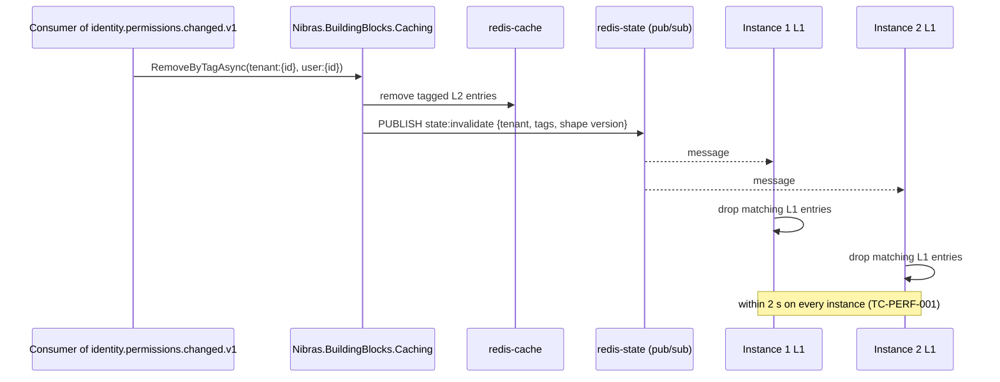

# 21. Performance Engineering

> Plan document for the Nibras platform. Group C. It refines master brief Section 19 and the reference architecture; it does not re-derive them. Where this document and the reference architecture disagree, an ADR records the deviation.

**Group** C · **Requirement areas covered** PERF, with DATA where partitioning and pooling touch a query · **Last updated** 2026-09-20 by the platform plan

## Purpose

This document lets an engineer make a service fast on the first pull request and lets a reviewer prove it stayed fast on every one after. It names, for each of the 20 data-owning services in Appendix L, what is cached and what evicts it, which queries carry the load and which index each one reads, how many database commands and how many milliseconds each handler may spend, and which k6 scenario in Appendix N proves each budget at size. It also fixes the Redis deployment, the PgBouncer contract that keeps row-level security honest under pooling, the Reporting replica rules, the pre-peak warm-up job and the integrity jobs that make eventual consistency checkable. The readers are the engineer writing a handler or a migration, the `performance-reviewer` agent, and the operator sizing a pool or reading a hit-ratio alert.

## Scope

| In scope | Out of scope | Where the out-of-scope item lives |
|---|---|---|
| Caching map per service: entries, keys, tags, lifetimes, invalidating events, never-cached items | Field-level cacheability decisions | Appendix J, which this document quotes |
| Redis deployment: roles, ACL users, TLS, topology per mode, sizing, Valkey fallback, breaker, metrics | Redis container images, Helm values, Sentinel manifests | `15-deployment-and-operations.md` |
| Hot queries per service with index DDL, expected rows, pagination, command and latency budgets | Entity models and ER diagrams | `06-services/<service>.md` |
| Partitioning as it affects query plans; PgBouncer pool sizing and the prepared-statement rule | Partition schedule, detach job, tenancy barriers, the pooled-connection test | `10-data-architecture.md`, Sections 2 and 5, cited here |
| Reporting replica routing and lag awareness as read-path rules | Projection catalog, checkpoint table, rebuild command | `10-data-architecture.md`, Section 7, cited here |
| Budgets from master brief Section 19, their enforcement, the Appendix N scenario to budget map | k6 script structure, test data tiers, the nightly pipeline | `16-test-strategy.md`, Appendix N |
| Pre-peak warm-up job, calendar-aware scaling inputs | KEDA and autoscaler manifests | `15-deployment-and-operations.md` |
| Web and mobile budgets and the CI gates that enforce them | Bundle layout, lazy-route map, Drift schema | `08-web-structure.md`, `09-mobile-structure.md` |
| Data integrity jobs from master brief Section 19 as scheduled jobs with cost | The Data Quality Center screens | `06-services/reporting.md` |

## Content

### 1. Caching map per service

**Building block.** Every entry below goes through `Nibras.BuildingBlocks.Caching`, which wraps `HybridCache` with Redis as L2, prefixes every key and tag with the full tenant UUID v7 from `ITenantContext`, applies jitter to every lifetime, and refuses a value above the payload limit. A direct `IConnectionMultiplexer` reference outside the building block fails the architecture test `CachingConventions.NoDirectRedisOutsideBuildingBlock`. Cacheability per field is settled in Appendix J and repeated here only as the "never cached" column.

**Conventions that apply to every row.**

| Rule | Value | Why |
|---|---|---|
| Key format | `nibras:{tenant}:{service}:{entity}:{id}:v{n}` with `{tenant}` the full UUID v7 (Appendix L) | A truncated tenant collides across tenants |
| Tag format | `tenant:{id}`, `user:{id}`, `student:{id}`, `section:{id}`, `staff:{id}`, `timetable:{version}`, `campus:{id}` | Bulk invalidation by subject; `tenant:{id}` lets a tenant suspension or tier migration empty one tenant's cache in one call |
| Jitter | Every L2 lifetime is `value ± 10%`, every L1 lifetime `value ± 20%` | Identical lifetimes expire together at 07:59 |
| L1 shorter than L2 | Always | An instance-local entry cannot be evicted by an event that reached another instance |
| Platform-scoped entries | Key `nibras:platform:{service}:{entity}:{id}:v{n}`, allowed only in Platform, Identity, Notification, Documents and the backends-for-frontends, listed explicitly below | The only entries without a tenant segment |
| Negative caching | 10 s L1, 30 s L2, same key with suffix `:absent` | A missing key hit repeatedly is a database read repeatedly |
| Shape version | `v{n}` bumped in the same pull request that changes the DTO | A rolling deployment never reads a stale shape |
| Serialization | System.Text.Json source generation; values above 64 KB are Brotli-compressed; values above 512 KB are refused and logged | Bounded values, bounded memory |
| Per-user entries for Confidential data | L2 at most 60 s (Appendix J level Confidential) and the key carries `{userId}` | The permission that allowed the read is part of the cache identity |

Lifetimes below are the master brief Section 19 table applied per entry. Where Section 19 names an event in short form (for example `permissions.changed`), the routing key here is the Appendix E form.

#### 1.1 Identity

| Data | Key | Tags | L1 | L2 | Invalidated by | Never cached |
|---|---|---|---|---|---|---|
| Effective permission set for one user, keyed by permission version | `nibras:{tenant}:identity:permissions:{userId}:{permissionVersion}:v1` | `tenant`, `user`, `role` | 60 s | 30 min ± 10% | `identity.permissions.changed.v1`, `identity.role.changed.v1`, `identity.user.deactivated.v1`, `identity.delegation.started.v1`, `identity.delegation.ended.v1`, plus the pub/sub broadcast in Section 2.6 for L1 | Credential material, second-factor secrets |
| Permission version per tenant | `nibras:{tenant}:identity:permission-version:current:v1` | `tenant` | 15 s | 5 min ± 10% | `identity.permissions.changed.v1`, `identity.role.changed.v1` | Nothing; one integer |
| Role definition with its permission list | `nibras:{tenant}:identity:role:{roleCode}:v1` | `tenant`, `role` | 60 s | 30 min ± 10% | `identity.role.changed.v1` | Nothing |
| Tenant status copy (active, suspended, read-only from) | `nibras:{tenant}:identity:tenant-status:current:v1` | `tenant` | 30 s | 10 min ± 10% | `platform.tenant.suspended.v1`, `platform.tenant.reactivated.v1`, `platform.tenant.deletion-requested.v1`, `platform.tenant.deleted.v1` | Nothing |
| Signing key set for token validation (platform-scoped) | `nibras:platform:identity:jwks:current:v1` | none | 5 min | 1 h ± 10% | Key rotation handler evicts by key; every service refreshes on an unknown `kid` | Private key material |
| Security policy for the tenant (lockout, password rules, session limits) | `nibras:{tenant}:identity:security-policy:current:v1` | `tenant` | 60 s | 1 h ± 10% | `platform.settings.changed.v1` with `scope = security` | Nothing |

**Never cached in Identity:** password hashes, second-factor secrets, recovery codes, API key material, refresh token contents (Appendix J). Refresh token handles live in `redis-state` under the token lifetime as the expiry, which is a store and not a cache.

#### 1.2 Platform

| Data | Key | Tags | L1 | L2 | Invalidated by | Never cached |
|---|---|---|---|---|---|---|
| Tenant resolved from host name (platform-scoped) | `nibras:platform:platform:tenant-by-host:{host}:v1` | none | 60 s | 1 h ± 10% | Domain handlers evict on add, verify, remove; `platform.tenant.deleted.v1` | Nothing |
| Tenant settings for one scope | `nibras:{tenant}:platform:settings:{scope}:v1` | `tenant` | 60 s | 1 h ± 10% | `platform.settings.changed.v1` (payload `scope`, `keys`) | Provider secrets, webhook signing secrets |
| Branding (logo file id, colours, names in both languages) | `nibras:{tenant}:platform:branding:current:v1` | `tenant` | 60 s | 1 h ± 10% | `platform.settings.changed.v1` with `scope = branding` | Nothing |
| Feature flags for the tenant | `nibras:{tenant}:platform:feature-flags:all:v1` | `tenant` | 60 s | 1 h ± 10% | `platform.feature-flag.changed.v1` | Nothing |
| Plan and limits | `nibras:{tenant}:platform:plan:current:v1` | `tenant` | 60 s | 1 h ± 10% | `platform.plan.changed.v1` | Tenant invoice lines |
| Terminology overrides | `nibras:{tenant}:platform:terminology:{locale}:v1` | `tenant` | 60 s | 1 h ± 10% | `platform.terminology.changed.v1` | Nothing |
| Custom-field definitions per entity type | `nibras:{tenant}:platform:custom-fields:{entityType}:v1` | `tenant` | 5 min | 6 h ± 10% | `platform.custom-field.changed.v1` | Nothing; values live in the owning service |
| Usage counter snapshot per meter for the current period | `nibras:{tenant}:platform:usage:{meter}:{periodStart}:v1` | `tenant` | 15 s | 60 s ± 10% | `<service>.usage.recorded.v1` consumer evicts the meter it updated | Nothing; a quota decision that must be exact reads the counter in `redis-state` |

**Never cached in Platform:** provider credentials, webhook signing secrets, tenant invoice payment references. Plan quota counters that gate a request are `redis-state` counters (Section 2.2), not cache entries.

#### 1.3 School

| Data | Key | Tags | L1 | L2 | Invalidated by | Never cached |
|---|---|---|---|---|---|---|
| Slim student directory entry (names, number, section, photo file id, status, consent flag) | `nibras:{tenant}:school:student:{studentId}:v1` | `tenant`, `student`, `section` | 30 s | 15 min ± 10% | `school.student.enrolled.v1`, `school.student.section-changed.v1`, `school.student.status-changed.v1`, `school.student.promoted.v1`, `school.student.profile-updated.v1` | Date of birth, nationality, identity numbers, address, custody, medical summary |
| Section roster (student ids and display names, ordered) | `nibras:{tenant}:school:roster:{sectionId}:v1` | `tenant`, `section` | 30 s | 15 min ± 10% | `school.student.enrolled.v1`, `school.student.section-changed.v1`, `school.student.status-changed.v1`, `school.section.changed.v1` | Nothing beyond the slim entry |
| Slim staff directory entry | `nibras:{tenant}:school:staff:{staffId}:v1` | `tenant`, `staff` | 30 s | 15 min ± 10% | `school.staff.created.v1`, `school.staff.left.v1`, `hr.staff.hired.v1` | Contract, salary, identity documents |
| Reference structure: campuses, grade levels, stages, sections, subjects, departments, houses for one academic year | `nibras:{tenant}:school:structure:{academicYearId}:v1` | `tenant` | 5 min | 6 h ± 10% | `school.section.created.v1`, `school.section.changed.v1`, `school.academic-year.opened.v1`, `school.academic-year.closed.v1`; the grade-level, subject, department and room write handlers evict tag `tenant` directly through the building block because no change event exists for them (`10-data-architecture.md`, open point 1) | Nothing |
| Terms and grading periods for the year | `nibras:{tenant}:school:calendar:{academicYearId}:v1` | `tenant` | 5 min | 6 h ± 10% | `school.term.started.v1`, `school.academic-year.opened.v1`; the grading-period write handler evicts the key directly | Nothing |
| Guardian links for one student (guardian id, relationship, contact order, rights flags) | `nibras:{tenant}:school:guardians:{studentId}:v1` | `tenant`, `student` | 30 s | 15 min ± 10% | `school.guardian.updated.v1`, `identity.guardian-link.created.v1` | Mobile number, email, workplace, identity numbers, custody text |
| Pickup authorization for one student (person, photo file id, validity window) | `nibras:{tenant}:school:pickup:{studentId}:v1` | `tenant`, `student` | 15 s | 60 s ± 10% | `requests.request.approved.v1` with `effect = pickup-change`; the revoke handler evicts the key | PIN hash (compared in the database on use, Appendix J) |

**Never cached in School:** national identity, passport and residence permit numbers, custody status text and court orders, medical summary detail, home address (Appendix J). The allergy alert is read live from Wellbeing on every view and never enters this service.

#### 1.4 Admissions

| Data | Key | Tags | L1 | L2 | Invalidated by | Never cached |
|---|---|---|---|---|---|---|
| Public application form definition per grade level and campaign | `nibras:{tenant}:admissions:form:{campaignId}:{gradeLevelId}:v1` | `tenant` | 5 min | 6 h ± 10% | Form publish handler evicts tag `tenant`; `platform.custom-field.changed.v1` with `entityType = application` | Nothing |
| Seat availability per grade level and campus | `nibras:{tenant}:admissions:seats:{campusId}:{gradeLevelId}:v1` | `tenant` | 5 s | 30 s ± 10% | `admissions.offer.made.v1`, `admissions.offer.accepted.v1`, `admissions.offer.expired.v1`, `school.section.changed.v1` | Nothing; the seat count that decides an offer is read from the database under a row lock, the cached count only paints the public page |
| Application stage counts for the funnel header | `nibras:{tenant}:admissions:funnel:{campaignId}:v1` | `tenant` | 15 s | 60 s ± 10% | `admissions.application.submitted.v1`, `admissions.application.stage-changed.v1` | Nothing |
| Section and grade-level reference copy | `nibras:{tenant}:admissions:ref-section:{sectionId}:v1` | `tenant`, `section` | 5 min | 6 h ± 10% | `school.section.created.v1`, `school.section.changed.v1`; nightly snapshot replaces the grade-level copy | Nothing |

**Never cached in Admissions:** applicant identity document numbers and uploaded documents, deposit payment references, interview notes (Confidential, per-user only and not worth a 60 s entry).

#### 1.5 Academics

| Data | Key | Tags | L1 | L2 | Invalidated by | Never cached |
|---|---|---|---|---|---|---|
| Teaching assignments for one staff member (sections and subjects) | `nibras:{tenant}:academics:teaching:{staffId}:v1` | `tenant`, `staff` | 5 min | 6 h ± 10% | `academics.teaching-assignment.changed.v1`, `school.staff.left.v1` | Nothing |
| Curriculum units and outcomes for one subject and grade level | `nibras:{tenant}:academics:curriculum:{subjectId}:{gradeLevelId}:v1` | `tenant` | 5 min | 6 h ± 10% | Curriculum publish handler evicts by key | Nothing |
| Upcoming assignments for one section (next 14 days, ids, titles, due dates) | `nibras:{tenant}:academics:upcoming:{sectionId}:v1` | `tenant`, `section` | 30 s | 5 min ± 10% | `academics.assignment.published.v1`, `academics.homework-load.exceeded.v1` | Submission content |
| Homework load per section per day | `nibras:{tenant}:academics:load:{sectionId}:{date}:v1` | `tenant`, `section` | 30 s | 5 min ± 10% | `academics.assignment.published.v1` | Nothing |
| Student, section, staff and timetable reference copies | `nibras:{tenant}:academics:ref-student:{studentId}:v1` and the same pattern for `ref-section`, `ref-staff`, `ref-timetable` | `tenant`, `student`, `section`, `staff`, `timetable` | 30 s | 15 min ± 10% | `school.student.enrolled.v1`, `school.student.section-changed.v1`, `school.student.status-changed.v1`, `school.section.changed.v1`, `school.staff.left.v1`, `scheduling.timetable.published.v1`, `scheduling.timetable.changed.v1` | Nothing |

**Never cached in Academics:** submission files and feedback text (Confidential and large), quiz answer keys before the quiz closes, attempt contents in progress.

#### 1.6 Assessment

| Data | Key | Tags | L1 | L2 | Invalidated by | Never cached |
|---|---|---|---|---|---|---|
| Assessment structure for one section and grading period (components, weights) | `nibras:{tenant}:assessment:structure:{sectionId}:{gradingPeriodId}:v1` | `tenant`, `section` | 5 min | 6 h ± 10% | Structure publish handler evicts tag `section`; `assessment.grades.locked.v1` | Nothing |
| Grade scheme version (bands, rounding, weights) | `nibras:{tenant}:assessment:scheme:{schemeId}:{version}:v1` | `tenant` | 5 min | 6 h ± 10% | Immutable once published; a new version is a new key; the draft handler evicts the `:draft` suffix key | Nothing |
| Published term result for one student and period | `nibras:{tenant}:assessment:result:{studentId}:{gradingPeriodId}:v1` | `tenant`, `student` | 60 s | 15 min ± 10% | `assessment.grades.locked.v1`, `assessment.grade-change.approved.v1`, `assessment.report-cards.published.v1` | Marks not yet approved |
| Report card batch progress | `nibras:{tenant}:assessment:batch:{batchId}:v1` | `tenant` | 2 s | 10 s ± 10% | Worker writes progress to `redis-state` job progress (Section 2.2); this entry is the read-side copy evicted on `assessment.report-cards.published.v1` | Nothing |
| Marks-entry status per section for the overdue and awaiting-approval views | `nibras:{tenant}:assessment:mark-status:{sectionId}:v1` | `tenant`, `section` | 15 s | 60 s ± 10% | `assessment.marks.entered.v1`, `assessment.marks.approved.v1`, `assessment.marks.overdue.v1`, `assessment.marks.awaiting-approval.v1` | The marks themselves |
| Student, section, staff, grading-period reference copies | `nibras:{tenant}:assessment:ref-student:{studentId}:v1` and the same pattern for `ref-section`, `ref-staff` | `tenant`, `student`, `section`, `staff` | 30 s | 15 min ± 10% | `school.student.enrolled.v1`, `school.student.section-changed.v1`, `school.student.status-changed.v1`, `school.student.promoted.v1`, `academics.teaching-assignment.changed.v1`, `school.term.started.v1` | Nothing |

**Never cached in Assessment:** marks while they are being entered (master brief Section 19: the grid reads one covering index and writes back in batches through `ExecuteUpdateAsync`; drafts are not cached, published results are), moderation notes, grade-change request rationale. A mark is Confidential in Appendix J and may sit in a per-user key for 60 s; this document chooses not to cache it at all because the covering index in Section 3.6 meets the budget without one.

#### 1.7 Scheduling

| Data | Key | Tags | L1 | L2 | Invalidated by | Never cached |
|---|---|---|---|---|---|---|
| Published timetable for one section | `nibras:{tenant}:scheduling:timetable-section:{sectionId}:{timetableVersionId}:v2` | `tenant`, `section`, `timetable` | 5 min | 12 h ± 10% | `scheduling.timetable.published.v1`, `scheduling.timetable.changed.v1`, `scheduling.substitution.assigned.v1` | Teacher personal notes |
| Published timetable for one teacher | `nibras:{tenant}:scheduling:timetable-staff:{staffId}:{timetableVersionId}:v2` | `tenant`, `staff`, `timetable` | 5 min | 12 h ± 10% | Same three events, plus `hr.leave.approved.v1`, `hr.leave.cancelled.v1` | Nothing |
| Published timetable for one room | `nibras:{tenant}:scheduling:timetable-room:{roomId}:{timetableVersionId}:v2` | `tenant`, `timetable` | 5 min | 12 h ± 10% | Same three events, plus `scheduling.room-booking.approved.v1` | Nothing |
| Timetable of the day per campus (every entry, teacher and room, one date) | `nibras:{tenant}:scheduling:today:{campusId}:{date}:v1` | `tenant`, `campus`, `timetable` | 5 min | 12 h ± 10% | `scheduling.timetable.published.v1`, `scheduling.timetable.changed.v1`, `scheduling.substitution.assigned.v1`; a key for a past date is never written | Nothing |
| Bell schedule and periods per campus | `nibras:{tenant}:scheduling:bells:{campusId}:v1` | `tenant`, `campus` | 5 min | 6 h ± 10% | Bell schedule publish handler evicts tag `campus`; `scheduling.timetable.published.v1` | Nothing |
| Calendar events for a month and audience | `nibras:{tenant}:scheduling:calendar:{campusId}:{yearMonth}:{audience}:v1` | `tenant`, `campus` | 60 s | 30 min ± 10% | `scheduling.event.published.v1`, `scheduling.exam-timetable.published.v1` | Nothing |
| Current published timetable version id per campus | `nibras:{tenant}:scheduling:current-version:{campusId}:v1` | `tenant`, `campus` | 30 s | 12 h ± 10% | `scheduling.timetable.published.v1` | Nothing |
| iCal feed rendering per subscription token | `nibras:{tenant}:scheduling:ical:{tokenHash}:v1` | `tenant`, `timetable` | none | 5 min ± 10% (output cache) | `scheduling.timetable.published.v1`, `scheduling.timetable.changed.v1` | The token itself |

**Never cached in Scheduling:** the solver's working state (it belongs to the running job), draft timetable versions (the planner sees their own edits immediately, from the database).

#### 1.8 Attendance

| Data | Key | Tags | L1 | L2 | Invalidated by | Never cached |
|---|---|---|---|---|---|---|
| Sessions of the day for one teacher (session ids, section, period, marked state) | `nibras:{tenant}:attendance:today:{staffId}:{date}:v1` | `tenant`, `staff` | 15 s | 60 s ± 10% | `attendance.attendance.marked.v1`, `scheduling.timetable.changed.v1`, `scheduling.substitution.assigned.v1` | Nothing |
| Register for one session (student rows with status and minutes late) | `nibras:{tenant}:attendance:register:{sessionId}:v1` | `tenant`, `section` | 15 s | 60 s ± 10% | `attendance.attendance.marked.v1`, `attendance.excuse.approved.v1` | Excuse reason, medical excuse detail, marked-by name beyond an id |
| Attendance codes and threshold rules for the tenant | `nibras:{tenant}:attendance:rules:current:v1` | `tenant` | 5 min | 6 h ± 10% | Rule and code write handlers evict tag `tenant`; `platform.settings.changed.v1` with `scope = attendance` | Nothing |
| Student attendance summary for the term (counts by code) | `nibras:{tenant}:attendance:summary:{studentId}:{termId}:v1` | `tenant`, `student` | 30 s | 15 min ± 10% | `attendance.student.absent.v1`, `attendance.excuse.approved.v1`, `attendance.threshold.reached.v1`, `attendance.attendance.marked.v1` | Excuse detail |
| Timetable of the day reference copy per campus (entries with teacher) | `nibras:{tenant}:attendance:ref-timetable:{campusId}:{date}:v1` | `tenant`, `campus`, `timetable` | 5 min | 12 h ± 10% | `scheduling.timetable.published.v1`, `scheduling.timetable.changed.v1`, `scheduling.substitution.assigned.v1` | Nothing |
| Student and section reference copies | `nibras:{tenant}:attendance:ref-student:{studentId}:v1`, `nibras:{tenant}:attendance:ref-section:{sectionId}:v1` | `tenant`, `student`, `section` | 30 s | 15 min ± 10% | `school.student.enrolled.v1`, `school.student.section-changed.v1`, `school.student.status-changed.v1`, `school.student.profile-updated.v1`, `school.section.changed.v1` | Nothing |
| Emergency broadcast acknowledgement counts | `nibras:{tenant}:attendance:broadcast-acks:{broadcastId}:v1` | `tenant`, `campus` | 2 s | 5 s ± 10% | `attendance.emergency.acknowledged.v1`, `attendance.roll-call.completed.v1` | Names of the unaccounted, which the live view reads from the database |
| Approved leave of staff for the day (who is absent, for the substitution prompt) | `nibras:{tenant}:attendance:staff-leave:{campusId}:{date}:v1` | `tenant`, `campus` | 60 s | 6 h ± 10% | `hr.leave.approved.v1`, `hr.leave.cancelled.v1` | Leave type detail beyond the code |

**Never cached in Attendance:** medical excuse detail (Sensitive), gate-pass QR or PIN material (compared as a hash in the database on use; the pass validity window may be cached for 60 s under the School pickup entry), visitor identity references, the unaccounted names in a roll call. A gate pass lookup by code goes to the index in Section 3.8, not to Redis, so a revoked pass is refused immediately.

#### 1.9 Finance

| Data | Key | Tags | L1 | L2 | Invalidated by | Never cached |
|---|---|---|---|---|---|---|
| Fee structures, fee items and fee plans for the academic year | `nibras:{tenant}:finance:fee-plans:{academicYearId}:v1` | `tenant` | 5 min | 6 h ± 10% | Fee plan publish handler evicts tag `tenant`; `finance.fee-plan.assigned.v1` does not evict (assignment changes a student, not the plan) | Nothing |
| Discount and scholarship definitions | `nibras:{tenant}:finance:discounts:current:v1` | `tenant` | 5 min | 6 h ± 10% | Discount write handlers evict the key; `requests.request.approved.v1` with `effect = discount` | Sponsor identity, approval chain names |
| Invoice header for one payer's list (number, series, totals, status, due date) | `nibras:{tenant}:finance:invoice-list:{payerId}:{userId}:v1` | `tenant`, `user` | 5 s | 60 s ± 10% | `finance.invoice.issued.v1`, `finance.payment.received.v1`, `finance.refund.processed.v1`, `finance.credit-note.issued.v1`, `finance.invoice.overdue.v1` | Payment references, IBANs, card data |
| Student balance figure | `nibras:{tenant}:finance:balance:{studentId}:v1` | `tenant`, `student` | 5 s | none | `finance.payment.received.v1`, `finance.invoice.issued.v1`, `finance.refund.processed.v1`, `finance.credit-note.issued.v1` | Everything else; master brief Section 19 allows at most a few seconds of L1 for balances and no Redis copy |
| Series next-number preview (display only) | `nibras:{tenant}:finance:series-preview:{seriesId}:v1` | `tenant` | 5 s | 30 s ± 10% | `finance.invoice.issued.v1` | Nothing; allocation itself runs under the series row lock described in `06-services/finance.md` section 4.19 |
| Student, guardian and payer reference copies | `nibras:{tenant}:finance:ref-student:{studentId}:v1`, `nibras:{tenant}:finance:ref-payer:{payerId}:v1` | `tenant`, `student` | 30 s | 15 min ± 10% | `school.student.enrolled.v1`, `school.student.status-changed.v1`, `school.student.promoted.v1`, `school.guardian.updated.v1`, `identity.guardian-link.created.v1`, `admissions.offer.accepted.v1` | Contact details, which are fetched live from School |

**Never cached in Finance:** gateway references, card scheme and last four digits, payer IBANs, cashier shift declared totals before day close, any amount that decides whether a payment is accepted (Appendix J). Financial balances are read from the database with at most 5 s of L1.

#### 1.10 Communication

| Data | Key | Tags | L1 | L2 | Invalidated by | Never cached |
|---|---|---|---|---|---|---|
| Announcement list for one audience (ids, titles, acknowledgment requirement, expiry) | `nibras:{tenant}:communication:announcements:{audienceHash}:v1` | `tenant` | 30 s | 15 min ± 10% | `communication.announcement.published.v1`, `communication.acknowledgment.overdue.v1` | Bodies flagged for safeguarding |
| Announcement body (Internal, unflagged) | `nibras:{tenant}:communication:announcement:{announcementId}:v1` | `tenant` | 60 s | 6 h ± 10% | `communication.announcement.published.v1`, the edit and withdraw handlers evict by key | A body carrying a safeguarding flag (Appendix J) |
| Messaging policy (who may message whom, hours, oversight) | `nibras:{tenant}:communication:policy:current:v1` | `tenant` | 60 s | 1 h ± 10% | Policy write handler evicts the key; `identity.permissions.changed.v1`, `identity.role.changed.v1` | Nothing |
| Unread and unacknowledged counters per user | `nibras:{tenant}:communication:counters:{userId}:v1` | `tenant`, `user` | 5 s | 60 s ± 10% | `communication.message.sent.v1`, `communication.acknowledgment.recorded.v1`, `communication.announcement.published.v1` | Nothing |
| Meeting slots for one staff member and day | `nibras:{tenant}:communication:slots:{staffId}:{date}:v1` | `tenant`, `staff` | 5 s | 60 s ± 10% | `communication.meeting.booked.v1`, `communication.meeting.changed.v1` | Guardian contact details |
| Student, staff, guardian, section reference copies | `nibras:{tenant}:communication:ref-student:{studentId}:v1` and the same pattern for `ref-staff`, `ref-guardian`, `ref-section` | `tenant`, `student`, `staff`, `section` | 30 s | 15 min ± 10% | `school.student.enrolled.v1`, `school.student.status-changed.v1`, `school.student.profile-updated.v1`, `school.guardian.updated.v1`, `identity.guardian-link.created.v1`, `school.staff.created.v1`, `school.staff.left.v1` | Nothing |

**Never cached in Communication:** message bodies and attachments (Confidential, oversight-logged), any body or announcement flagged for safeguarding, survey responses. Thread lists and message pages read the keyset indexes in Section 3.10 and SignalR delivers new messages, so the conversation screen needs no cache to meet its budget.

#### 1.11 Notification

| Data | Key | Tags | L1 | L2 | Invalidated by | Never cached |
|---|---|---|---|---|---|---|
| Template by code and language (subject, body, channels, urgency class) | `nibras:{tenant}:notification:template:{templateCode}:{language}:v1` | `tenant` | 5 min | 6 h ± 10% | Template publish handler evicts tag `tenant`; `platform.terminology.changed.v1` | Nothing |
| Channel preferences, quiet hours and language for one user | `nibras:{tenant}:notification:preference:{userId}:v1` | `tenant`, `user` | 60 s | 15 min ± 10% | Preference write handler evicts by key; `identity.user.activated.v1`, `identity.user.deactivated.v1`, `notification.channel.suppressed.v1` | Push tokens, phone numbers (read from the delivery row, not the cache) |
| Unread inbox count per user | `nibras:{tenant}:notification:unread:{userId}:v1` | `tenant`, `user` | 5 s | 60 s ± 10% | `notification.notification.delivered.v1`, the mark-read handler evicts by key | Nothing |
| Digest schedule per tenant (when digests are built, per role) | `nibras:{tenant}:notification:digest-schedule:current:v1` | `tenant` | 60 s | 1 h ± 10% | `platform.settings.changed.v1` with `scope = notifications` | Nothing |
| Provider health per channel (platform-scoped, from the breaker) | `nibras:platform:notification:provider:{channel}:v1` | none | 5 s | 30 s ± 10% | Breaker state change writes it | Provider credentials |

**Never cached in Notification:** message bodies rendered for a recipient (the delivery row is the record), push tokens and phone numbers, delivery logs (Internal, 90 days, read from the partition). Per-tenant fairness counters and lane depths live in `redis-state`.

#### 1.12 Requests

| Data | Key | Tags | L1 | L2 | Invalidated by | Never cached |
|---|---|---|---|---|---|---|
| Request type definition, form and approval chain, by type code and version | `nibras:{tenant}:requests:type:{typeCode}:{version}:v1` | `tenant` | 5 min | 6 h ± 10% | Immutable once published; publish handler evicts the `:current` pointer key | Nothing |
| Current published version pointer per type | `nibras:{tenant}:requests:type-current:{typeCode}:v1` | `tenant` | 60 s | 6 h ± 10% | Publish handler evicts by key | Nothing |
| Pending approval count and task count per user (inbox badge) | `nibras:{tenant}:requests:inbox-count:{userId}:v1` | `tenant`, `user` | 5 s | 60 s ± 10% | `requests.request.submitted.v1`, `requests.request.approved.v1`, `requests.request.rejected.v1`, `requests.task.assigned.v1`, `requests.task.completed.v1`, `identity.delegation.started.v1`, `identity.delegation.ended.v1` | Nothing |
| SLA policy per type | `nibras:{tenant}:requests:sla:{typeCode}:v1` | `tenant` | 5 min | 6 h ± 10% | SLA write handler evicts by key | Nothing |
| Approver resolution inputs: staff, roles, delegations reference copy | `nibras:{tenant}:requests:ref-approver:{userId}:v1` | `tenant`, `user` | 30 s | 15 min ± 10% | `identity.user.activated.v1`, `identity.user.deactivated.v1`, `identity.role.changed.v1`, `identity.delegation.started.v1`, `identity.delegation.ended.v1`, `school.staff.left.v1` | Nothing |

**Never cached in Requests:** request form payloads (they may carry custody, medical or financial fields entered by a guardian; the request row is read from the database under the viewer's permission), approval decision comments.

#### 1.13 Documents

| Data | Key | Tags | L1 | L2 | Invalidated by | Never cached |
|---|---|---|---|---|---|---|
| Document template definition (layout, fields, languages) | `nibras:{tenant}:documents:template:{templateId}:{version}:v1` | `tenant` | 5 min | 6 h ± 10% | Immutable per version; publish handler evicts the `:current` pointer | Nothing |
| Tenant branding copy for rendering | `nibras:{tenant}:documents:branding:current:v1` | `tenant` | 60 s | 1 h ± 10% | `platform.settings.changed.v1` with `scope = branding`, `platform.tenant.provisioned.v1` | Nothing |
| File metadata (name, type, size, owner class, scan verdict) | `nibras:{tenant}:documents:file-meta:{fileId}:v1` | `tenant` | 30 s | 15 min ± 10% | `documents.file.scan-failed.v1`, delete handler evicts by key | File bytes, signed URLs |
| Public QR verification result | `nibras:public:documents:verify:{codeHash}:v1` (platform-scoped output cache, no tenant in the URL) | none | none | 5 min ± 10% (output cache) | `documents.certificate.revoked.v1` evicts by code hash | Anything beyond the public verification fields |
| Job progress for imports and exports (read-side copy) | `nibras:{tenant}:documents:job:{jobId}:v1` | `tenant` | 2 s | 10 s ± 10% | `documents.import.completed.v1`, `documents.export.completed.v1`; progress itself is in `redis-state` | Row-level error content |

**Never cached in Documents:** file bytes (object storage, signed URL of 5 minutes per Appendix J), import staging rows, sensitive-export watermark keys, generated documents whose owner is Sensitive.

#### 1.14 Behavior

| Data | Key | Tags | L1 | L2 | Invalidated by | Never cached |
|---|---|---|---|---|---|---|
| Category catalog (codes, points, severity, consequences) | `nibras:{tenant}:behavior:categories:current:v1` | `tenant` | 5 min | 6 h ± 10% | Category write handler evicts by key | Nothing |
| House and section point totals for the term (leaderboard) | `nibras:{tenant}:behavior:leaderboard:{termId}:{scope}:v1` | `tenant` | 30 s | 5 min ± 10% | `behavior.points.awarded.v1` | Nothing; aggregates of 10 or more students (Appendix J rule 2) |
| Badge catalog and Open Badges assertion template | `nibras:{tenant}:behavior:badges:current:v1` | `tenant` | 5 min | 6 h ± 10% | Badge write handler evicts by key | Nothing |
| Student recognition summary (badges, points, awards) | `nibras:{tenant}:behavior:recognition:{studentId}:v1` | `tenant`, `student` | 30 s | 15 min ± 10% | `behavior.points.awarded.v1`, `behavior.badge.awarded.v1` | Incident narrative, sanction rationale |
| Student and section reference copies | `nibras:{tenant}:behavior:ref-student:{studentId}:v1`, `nibras:{tenant}:behavior:ref-section:{sectionId}:v1` | `tenant`, `student`, `section` | 30 s | 15 min ± 10% | `school.student.enrolled.v1`, `school.student.section-changed.v1`, `school.student.status-changed.v1`, `school.section.changed.v1` | Nothing |

**Never cached in Behavior:** incident narrative, witnesses, sanction rationale (Confidential, restricted; every read under `behavior.incidents.view-restricted` is logged), incident lists for a student (Confidential, read from the keyset index).

#### 1.15 Reporting

| Data | Key | Tags | L1 | L2 | Invalidated by | Never cached |
|---|---|---|---|---|---|---|
| Principal "Today" card set per campus and date | `nibras:{tenant}:reporting:today:{campusId}:{date}:{userId}:v1` | `tenant`, `campus`, `user` | 15 s | 60 s ± 10% | Time to live is the mechanism here (master brief Section 19 dashboard row); targeted tags `campus` are evicted by the projection handler for `attendance.attendance.marked.v1`, `attendance.attendance.not-marked.v1`, `attendance.visitor.checked-in.v1`, `behavior.incident.recorded.v1`, `requests.request.submitted.v1` | Wellbeing counts are included as counts only |
| Student 360 header and timeline page (per viewer, because the viewer's permissions shape it) | `nibras:{tenant}:reporting:student-360:{studentId}:{userId}:v1` | `tenant`, `student`, `user` | 15 s | 60 s ± 10% | The `student_360` projection handler evicts tag `student` on every event it applies (`10-data-architecture.md` Section 7 lists them) | Level S rows, which never enter Reporting; identity numbers |
| Dashboard definitions and report-builder saved reports | `nibras:{tenant}:reporting:definitions:{userId}:v1` | `tenant`, `user` | 60 s | 1 h ± 10% | Definition write handler evicts by key; `identity.permissions.changed.v1` | Nothing |
| Early-warning at-risk list per campus | `nibras:{tenant}:reporting:at-risk:{campusId}:{userId}:v1` | `tenant`, `campus`, `user` | 15 s | 60 s ± 10% | `reporting.early-warning.flag-raised.v1`, `reporting.early-warning.flag-cleared.v1` | The factors text when the viewer lacks the permission to see factors |
| Projection freshness per tenant (lag seconds per projection) | `nibras:{tenant}:reporting:freshness:all:v1` | `tenant` | 5 s | 10 s ± 10% | Written by the checkpoint sampler every 10 s; `reporting.projection.rebuild-completed.v1` | Nothing |
| Data Quality Center finding counts | `nibras:{tenant}:reporting:dq-counts:current:v1` | `tenant` | 30 s | 5 min ± 10% | `reporting.data-quality.issue-detected.v1` | Nothing |

**Never cached in Reporting:** any row derived from Wellbeing (only counts exist, and they are inside the Student 360 entry above), report-builder result sets (streamed from the replica, never materialized), export files.

#### 1.16 Audit

Audit caches nothing. Every read of the audit log is itself evidence: Appendix J classifies before-and-after values as never cached, master brief Section 21 makes the records append-only, and a search result served from a cache could omit an entry appended a second earlier, which is exactly the entry an investigator is looking for. The only Redis use in Audit is the `redis-state` idempotency key on `<service>.audit.recorded.v1` consumption. Reads meet their budget through the partitioned indexes in Section 3.16 and keyset pagination.

| Data | Key | Tags | L1 | L2 | Invalidated by | Never cached |
|---|---|---|---|---|---|---|
| none | none | none | none | none | none | Every audit entry, login event, access-log entry, before and after values (Appendix J) |

#### 1.17 Wellbeing

Wellbeing caches nothing. Every field it owns is at isolation level S in Appendix J: "never cached, never projected", a separate blast radius by design. A cache is a copy outside `nibras_wellbeing`, and the whole point of the separate database, credentials and encryption key is that no such copy exists. Every read is logged in the same transaction as the read (Appendix J rule 8), which a cache hit would silently skip. The allergy alert that other screens display is read live from Wellbeing on every view, never cached, and every read is logged. Wellbeing meets its budgets with small, indexed, per-student reads (Section 3.17); it has no peak and no fan-out.

| Data | Key | Tags | L1 | L2 | Invalidated by | Never cached |
|---|---|---|---|---|---|---|
| none | none | none | none | none | none | Clinic visits, medication logs, counseling cases, safeguarding concerns, education plans, interventions, the student reference copy held by Wellbeing (it exists only for students with a record, and its existence is itself level S) |

#### 1.18 Hr

| Data | Key | Tags | L1 | L2 | Invalidated by | Never cached |
|---|---|---|---|---|---|---|
| Staff profile (title, grade, department, campuses, start date) | `nibras:{tenant}:hr:staff-profile:{staffId}:v1` | `tenant`, `staff` | 30 s | 15 min ± 10% | `hr.staff.hired.v1`, `school.staff.created.v1`, `school.staff.left.v1`, profile write handler evicts by key | Salary, allowances, bank account, identity documents |
| Leave types and policies | `nibras:{tenant}:hr:leave-policy:current:v1` | `tenant` | 5 min | 6 h ± 10% | Policy write handler evicts by key | Nothing |
| Leave balance per staff member and type | `nibras:{tenant}:hr:leave-balance:{staffId}:v1` | `tenant`, `staff` | 15 s | 5 min ± 10% | `hr.leave.approved.v1`, `hr.leave.cancelled.v1`, `hr.leave-balance.low.v1` | Nothing |
| Campus and department reference copy | `nibras:{tenant}:hr:ref-structure:current:v1` | `tenant` | 5 min | 6 h ± 10% | `school.staff.created.v1` with an unknown `departmentId` triggers a refetch; nightly snapshot replaces the copy (no change event exists; `10-data-architecture.md` open point 1) | Nothing |
| Document expiry summary per staff member (types and dates only) | `nibras:{tenant}:hr:doc-expiry:{staffId}:v1` | `tenant`, `staff` | 60 s | 1 h ± 10% | `hr.staff-document.expiring.v1`, document upload handler evicts by key | Document contents and numbers |

**Never cached in Hr:** salary, allowances, bank accounts, payslip lines (Sensitive; `hr.payroll.view-salary` is high risk and every read is logged), contract documents, appraisal narrative.

#### 1.19 Operations

| Data | Key | Tags | L1 | L2 | Invalidated by | Never cached |
|---|---|---|---|---|---|---|
| Route roster for the day (route, stops, seats, student ids and names) | `nibras:{tenant}:operations:route-roster:{routeId}:{date}:v1` | `tenant` | 60 s | 6 h ± 10% | `operations.transport.subscription-changed.v1`, `school.student.status-changed.v1` | Home address and pickup geolocation |
| Vehicle location per route (last known) | `nibras:{tenant}:operations:vehicle:{routeId}:v1` | `tenant` | 5 s | 30 s ± 10% | Location ingest handler writes through; `operations.transport.vehicle-delayed.v1` | Nothing; vehicle location is Internal and never tied to a child (Appendix J) |
| Library catalogue search result page (Arabic-normalized query hash) | `nibras:{tenant}:operations:catalogue:{queryHash}:{page}:v1` | `tenant` | 60 s | 30 min ± 10% | Catalogue write handlers evict tag `tenant` | Borrower identity |
| Facility ticket counts per campus and status | `nibras:{tenant}:operations:tickets:{campusId}:v1` | `tenant`, `campus` | 15 s | 60 s ± 10% | `operations.facility.ticket-raised.v1`, `operations.facility.ticket-closed.v1` | Nothing |
| Activity catalogue and capacity per term | `nibras:{tenant}:operations:activities:{termId}:v1` | `tenant` | 60 s | 30 min ± 10% | `operations.activity.enrollment-confirmed.v1`, activity publish handler evicts by key | Medical flags carried for a trip, read live from Wellbeing |
| Student, staff, section, timetable reference copies | `nibras:{tenant}:operations:ref-student:{studentId}:v1` and the same pattern for `ref-staff`, `ref-section`, `ref-timetable` | `tenant`, `student`, `staff`, `section`, `timetable` | 30 s | 15 min ± 10% | `school.student.enrolled.v1`, `school.student.section-changed.v1`, `school.student.status-changed.v1`, `school.section.changed.v1`, `identity.user.activated.v1`, `identity.user.deactivated.v1`, `scheduling.timetable.published.v1`, `scheduling.room-booking.approved.v1` | Nothing |

**Never cached in Operations:** visitor and driver identity references, kindergarten daily sheets, boarding events per child beyond the roster, inventory cost prices (Confidential, per-user only).

#### 1.20 Ai

| Data | Key | Tags | L1 | L2 | Invalidated by | Never cached |
|---|---|---|---|---|---|---|
| Tenant AI configuration (enabled features, rung per feature, model, quota) | `nibras:{tenant}:ai:config:current:v1` | `tenant` | 60 s | 1 h ± 10% | `platform.feature-flag.changed.v1`, `platform.plan.changed.v1`, `platform.settings.changed.v1` with `scope = ai` | Provider keys |
| Retrieval result for one query hash and data scope | `nibras:{tenant}:ai:retrieval:{scopeHash}:{queryHash}:v1` | `tenant`, `user` | 15 s | 5 min ± 10% | `ai.index.rebuild-completed.v1`, `identity.permissions.changed.v1`, `school.student.status-changed.v1` | Chunks whose source is Sensitive or level S (they are never indexed, so they cannot appear) |
| Prompt templates per feature and language | `nibras:{tenant}:ai:prompt:{featureCode}:{language}:v1` | `tenant` | 5 min | 6 h ± 10% | Template publish handler evicts by key | Nothing |
| Usage per feature for the current period (quota display) | `nibras:{tenant}:ai:usage:{featureCode}:{periodStart}:v1` | `tenant` | 15 s | 60 s ± 10% | `ai.usage.recorded.v1` | Nothing; the quota gate reads `redis-state` |

**Never cached in Ai:** model responses that contain student data (a draft is shown once and stored only if the user saves it in the owning service), embeddings of anything above Confidential (never indexed), conversation transcripts.

#### 1.21 Gateway, Bff.Web and Bff.Mobile

These own no database (Appendix L) and keep no caching table of their own; they read the owning services' entries through the same building block, plus the entries below.

| Owner | Data | Key | Tags | L1 | L2 | Invalidated by | Never cached |
|---|---|---|---|---|---|---|---|
| Gateway | Tenant resolution by host (a read of the Platform entry) | `nibras:platform:platform:tenant-by-host:{host}:v1` | none | 60 s | 1 h ± 10% | As Platform | Nothing |
| Gateway | Rate-limit counters | `redis-state` prefix `state:ratelimit:` (Section 2.2), not a cache entry | none | none | window length | Expire with the window | Nothing |
| Bff.Web, Bff.Mobile | Role home payload per user | `nibras:{tenant}:bff:home:{role}:{userId}:v1` | `tenant`, `user` | 15 s | 60 s ± 10% | Time to live, plus tag `user` evicted by `requests.task.assigned.v1`, `notification.notification.delivered.v1`, `attendance.attendance.not-marked.v1` | Wellbeing content beyond counts |
| Bff.Web, Bff.Mobile | Navigation and permission bootstrap per user | `nibras:{tenant}:bff:bootstrap:{userId}:{permissionVersion}:v1` | `tenant`, `user` | 60 s | 30 min ± 10% | `identity.permissions.changed.v1`, `identity.role.changed.v1`, `platform.feature-flag.changed.v1`, `platform.terminology.changed.v1` | Nothing |
| Bff.Mobile | Remote configuration and version policy (platform-scoped) | `nibras:platform:bff:mobile-config:{flavor}:v1` | none | 60 s | 1 h ± 10% | Release handler evicts by key | Nothing |
| Bff.Mobile | Delta sync change token per user | `redis-state` prefix `state:sync:` keyed by user and device; a store, not a cache | none | none | 30 days | Device unregister | Nothing |

#### 1.22 Degraded mode, for every service

| Redis unavailable | Behaviour |
|---|---|
| Reads | `HybridCache` serves L1 where present; a miss reads the database through the same handler with stampede protection still in process, so one instance issues one query per cold key |
| Writes | Handlers write to the database as usual; the L2 write is skipped while the breaker is open and the tag eviction is recorded in an in-process list replayed when the breaker closes |
| Warm-up job | Skips L2 and logs `cache-unavailable`; the job is idempotent and re-runs on the next schedule |
| Output cache for public endpoints | Falls back to no output caching; the Gateway rate limit on public routes tightens to the "degraded" profile in `15-deployment-and-operations.md` |
| User-visible effect | Slower, never broken: p95 for reads rises toward the database budget of 250 ms; Appendix N scenario N-11 asserts p95 under 1,000 ms with Redis fully down |
| `redis-state` unavailable | Different: rate limits fail open for authenticated users and closed for anonymous public routes; idempotency falls back to the database inbox and the `Idempotency-Key` unique index; distributed locks fall back to PostgreSQL advisory locks, which were the correctness mechanism all along (master brief Section 19) |

#### 1.23 Invalidation tests

One test per entry family, generated from the caching tables by the `Caching.Tests` suite: seed the entry, publish the event through the real consumer, assert the next read misses and the value re-read from the database is the new one.

| Entry family | Event published | Expected | Test case ID |
|---|---|---|---|
| Identity permissions | `identity.permissions.changed.v1` | Next read misses; L1 on a second instance is evicted within 2 s by the broadcast | `TC-PERF-001` |
| Identity permissions, deactivated user | `identity.user.deactivated.v1` | The user's next request is refused within 2 s on every instance | `TC-PERF-002` |
| Platform settings, flags, plan, terminology, branding | `platform.settings.changed.v1`, `platform.feature-flag.changed.v1`, `platform.plan.changed.v1`, `platform.terminology.changed.v1` | Next read of the named scope misses; other scopes still hit | `TC-PERF-003` |
| School student, roster, guardians | `school.student.section-changed.v1`, `school.guardian.updated.v1` | Old and new section rosters both miss; the student entry misses | `TC-PERF-004` |
| Scheduling timetables, today, current version | `scheduling.timetable.published.v1`, `scheduling.timetable.changed.v1`, `scheduling.substitution.assigned.v1` | Section, teacher, room and today entries for the affected version miss; entries for other campuses still hit | `TC-PERF-005` |
| Attendance today, register, summary | `attendance.attendance.marked.v1`, `attendance.excuse.approved.v1` | Register and summary miss; the teacher's today entry misses | `TC-PERF-006` |
| Finance invoice list and balance | `finance.payment.received.v1` | Payer list misses; the balance L1 expires within 5 s and no L2 entry ever exists | `TC-PERF-007` |
| Assessment result and mark status | `assessment.grades.locked.v1`, `assessment.marks.entered.v1` | Result entry misses; no mark value is found under any key during entry (key audit) | `TC-PERF-008` |
| Notification template and preference | template publish, `notification.channel.suppressed.v1` | Next render uses the new template; a suppressed channel is skipped on the next delivery | `TC-PERF-009` |
| Requests type pointer and inbox count | type publish, `requests.task.assigned.v1` | New version served; badge count changes within 5 s | `TC-PERF-010` |
| Documents verification result | `documents.certificate.revoked.v1` | The public verification page shows revoked on the next request | `TC-PERF-011` |
| Reporting Student 360 and today cards | `behavior.incident.recorded.v1`, `attendance.attendance.marked.v1` | Student entry misses; today card set for the campus misses | `TC-PERF-012` |
| Communication announcements, counters, slots | `communication.announcement.published.v1`, `communication.meeting.booked.v1` | Audience list misses; the slot entry for the day misses | `TC-PERF-013` |
| Hr, Operations, Behavior, Academics, Admissions, Ai reference and summary entries | The events in their tables | Next read misses | `TC-PERF-014` |
| Tenant isolation of keys | Any entry written for tenant A | A read for tenant B with the same `{id}` misses; a key audit finds no key without a tenant segment except the platform-scoped list | `TC-PERF-015` |
| Never-cached audit | Full run of the demo seed through every screen | No key contains a value tagged with a classification above Confidential; Audit and Wellbeing write zero cache keys | `TC-PERF-016` |
| Degraded mode | Redis container stopped mid-run | Every read succeeds from the database; p95 under 1,000 ms; no exception reaches the client | `TC-PERF-017` |
| Stampede protection | 500 concurrent cold reads of one key | Exactly one database command for that key per instance | `TC-PERF-018` |
| Jitter | 10,000 entries written with the same nominal lifetime | Expiry timestamps spread across at least 80 percent of the jitter window | `TC-PERF-019` |
| Shape version | DTO change without a version bump | The `Caching.Tests` shape test fails the build | `TC-PERF-020` |

### 2. Redis deployment design

Master brief Section 19 fixes the shape: Redis 8 under AGPLv3 as an unmodified standalone server, only the MIT StackExchange.Redis client linked, two logical deployments, Valkey as the drop-in fallback. Master brief Section 34 fixes the topology per deployment mode. This section makes both operable.

#### 2.1 The two roles

| Role | `redis-cache` | `redis-state` |
|---|---|---|
| Purpose | `HybridCache` L2 for every entry in Section 1; output cache for public endpoints | SignalR backplane, rate limits, idempotency keys, one-time codes and short-lived tokens, long-job progress, presence, short distributed locks, mobile sync tokens |
| `maxmemory-policy` | `allkeys-lfu` | `noeviction` |
| Persistence | none (`save ""`, `appendonly no`) | `appendonly yes`, `appendfsync everysec`, RDB snapshot hourly |
| Loss tolerance | Total: every key is rebuildable from the database | None while running: a lost rate-limit window is tolerable, a lost idempotency key is not, so the store is durable and the correctness fallbacks in Section 1.22 exist for the outage case |
| `maxmemory` | Sized in Section 2.4; eviction expected and measured | Sized so that eviction never happens; a write refused with `OOM` is a page |
| Key prefix | `nibras:` | `state:` |
| Client `ConnectionMultiplexer` | One per process, `Nibras.BuildingBlocks.Caching` | One per process, `Nibras.BuildingBlocks.Web` and `Nibras.BuildingBlocks.Messaging` |
| Why separate | A cache flood under `allkeys-lfu` would evict a lock or an idempotency key; a durable, non-evicting cache would fill and refuse writes | |

Every other Redis use has its own prefix under `state:` so that an ACL can be narrower than the role.

#### 2.2 Key prefixes in `redis-state`

| Prefix | Owner | Content | Expiry |
|---|---|---|---|
| `state:ratelimit:{tenant}:{layer}:{subject}:{window}` | Gateway (`layer = edge`), every service (`layer = service`), Platform (`layer = quota`) | Sliding-window counters for the three rate-limit layers in master brief Section 19 | Window length plus 10 s |
| `state:idem:{tenant}:{service}:{key}` | Every service | `Idempotency-Key` result envelope (status, body hash, first response) | 24 h |
| `state:otp:{tenant}:{purpose}:{subjectHash}` | Identity, Admissions (public form) | One-time codes, hashed, with attempt counter | Purpose lifetime, at most 10 min |
| `state:token:{tenant}:{kind}:{handleHash}` | Identity | Refresh token handle, device binding, permission version (Appendix J: Redis only, token lifetime as expiry) | Token lifetime |
| `state:revoked:{tenant}:{userId}` | Identity writes, Gateway reads | Revoked-subject mark written on deactivation, force sign-out, offboarding revocation and tenant access revocation; the Gateway refuses a token whose subject carries it (WF-IDN-06, `TC-IDN-056`) | The 15-minute access-token lifetime, which is the longest a stale token can live (`06-services/identity.md`, Decisions in force and open point 13); the Gateway caches a read for 5 s in L1 (`06-services/gateway.md` §12) |
| `state:job:{tenant}:{jobId}` | Assessment, Documents, Scheduling, Finance, Reporting workers | Progress record for long-running jobs (percent, step, message, cancel flag) | 7 days after completion |
| `state:presence:{tenant}:{userId}` | Communication | Online presence, last seen | 90 s, refreshed by heartbeat |
| `state:signalr:*` | Communication hubs | StackExchange.Redis backplane channels | Managed by the backplane |
| `state:lock:{tenant}:{resource}` | Every service | Short distributed lock, `SET NX PX`, at most 30 s | 30 s; never a correctness guarantee (master brief Section 19) |
| `state:sync:{tenant}:{userId}:{deviceId}` | Bff.Mobile | Delta sync change token | 30 days |
| `state:fairness:{tenant}:{lane}` | Notification workers | Per-tenant in-flight count and lane depth for the fairness controls proven by Appendix N scenario N-06 | 5 min, refreshed |
| `state:warmup:{tenant}:{date}` | Platform warm-up job | Completion marker per tenant per day (Section 9) | 36 h |
| `state:invalidate` (pub/sub channel) | `Nibras.BuildingBlocks.Caching` | L1 invalidation broadcast (Section 2.6) | not stored |

#### 2.3 ACL users and TLS

One ACL user per deployable, restricted to its key prefixes and commands. The pattern places the service name in the third segment of a cache key, which is what makes a per-service key pattern possible without a per-service database number.

| ACL user | Instance | Key patterns | Channels | Command categories |
|---|---|---|---|---|
| `svc_<service>` (one per Appendix L service) | `redis-cache` | `~nibras:*:<service>:*`, `~nibras:*:<service>:*:absent` | `&state:invalidate` | `+@read +@write +@keyspace +@pubsub -@dangerous -@admin` |
| `svc_platform`, `svc_identity`, `svc_notification`, `svc_documents` | `redis-cache` | Above plus `~nibras:platform:<service>:*` and, for Documents, `~nibras:public:documents:*` | same | same |
| `svc_bff_web`, `svc_bff_mobile` | `redis-cache` | `~nibras:*:bff:*`, `~nibras:platform:bff:*`, plus read-only `~nibras:*:identity:permissions:*`, `~nibras:*:platform:*`, `~nibras:*:reporting:*` | `&state:invalidate` | `+@read +@write` on own prefix; `+@read` only on the others through a second ACL user `ro_bff` |
| `svc_gateway` | `redis-cache`, `redis-state` | Read-only `~nibras:platform:platform:tenant-by-host:*`, `~nibras:platform:identity:jwks:*` (the key set of Section 1.1) and `~nibras:*:platform:*` (maintenance state and the security settings the edge reads, `06-services/gateway.md` §12); `~state:ratelimit:*:edge:*`; read-only `~state:revoked:*` (Section 2.2) | none | `+@read` on cache; `+@read +@write` on its rate-limit prefix; `+@read` only on `state:revoked:`, because Identity is the sole writer |
| `svc_<service>` on state | `redis-state` | `~state:ratelimit:*:service:*`, `~state:idem:*:<service>:*`, `~state:lock:*`, `~state:job:*` (workers only) | none | `+@read +@write +@keyspace -@dangerous -@admin` |
| `svc_identity` on state | `redis-state` | Above plus `~state:otp:*`, `~state:token:*` | none | same |
| `svc_communication` on state | `redis-state` | Above plus `~state:presence:*`, `~state:signalr:*` | `&state:signalr:*` | same plus `+@pubsub` |
| `svc_notification` on state | `redis-state` | Above plus `~state:fairness:*` | none | same |
| `svc_platform` on state | `redis-state` | Above plus `~state:ratelimit:*:quota:*`, `~state:warmup:*` | `&state:invalidate` (publish) | same plus `+@pubsub` |
| `ops_exporter` | both | `~*` read-only | none | `+@read +info +client|list -@dangerous` |
| `ops_admin` | both | `~*` | `&*` | `+@all`, password from the secret store, break-glass only, every login logged |

Blocked on every user: `FLUSHALL`, `FLUSHDB`, `KEYS`, `CONFIG`, `DEBUG`, `SHUTDOWN`, `MONITOR`, `SAVE`, `BGSAVE` (the `@dangerous` category plus `@admin`). The key audit in `TC-PERF-015` runs `SCAN` under `ops_exporter`, never `KEYS`. Passwords are per user, rotated on the schedule in reference architecture Section 12 and injected as secrets; the rotation runbook adds the new password with `ACL SETUSER ... >new` before removing the old one, so no restart is needed.

TLS is on for every connection in single-server and scale modes: `tls-port 6379`, `port 0`, certificates from the platform's internal issuer, `ssl=true` in every connection string, client certificate optional. In developer mode the container listens on plain `port 6379` and the compose profile says so; the integration suite runs with TLS on, so a client that only works without TLS never passes CI.

#### 2.4 Topology and memory sizing per deployment mode

| Mode | `redis-cache` | `redis-state` | Client failover |
|---|---|---|---|
| Developer | One container of each role, no TLS, 256 MB each | | none |
| Single server | Two containers, TLS, on the same host, separate volumes for `redis-state` AOF | | none; restart is the recovery, cache rebuilds itself, state replays from AOF |
| Scale | Sentinel: 1 primary, 2 replicas, 3 sentinels per role, `min-replicas-to-write 1` for `redis-state`; cluster mode instead when a single `redis-cache` primary exceeds 24 GB or 100,000 operations per second, decided by the N-07 scale run | | StackExchange.Redis with `serviceName` for Sentinel; reconnect within 5 s; the breaker in Section 2.7 covers the failover window |

Memory sizing starts from the entry inventory in Section 1 and the tier sizes in Appendix N. Every value is an estimate replaced by the N-07 soak measurement; the `maxmemory` setting is 75 percent of the container limit.

| Instance | Driver | demo | load (50 tenants, 50,000 students) | scale (500 tenants, 500,000 students) |
|---|---|---|---|---|
| `redis-cache` permissions and bootstrap | active users × 2 KB × 2 entries | 1 MB | 20,000 users × 4 KB = 80 MB | 200,000 users × 4 KB = 800 MB |
| `redis-cache` timetables | sections + staff + rooms per version × 8 KB, current version only | 1 MB | 6,000 keys × 8 KB = 48 MB | 60,000 keys × 8 KB = 480 MB |
| `redis-cache` directory entries and rosters | students × 0.5 KB + sections × 4 KB, warm fraction 60 percent | 1 MB | 15 MB + 8 MB | 150 MB + 80 MB |
| `redis-cache` dashboards and home payloads | concurrent users × 6 KB, 60 s lifetime | 1 MB | 20,000 × 6 KB = 120 MB | 20,000 × 6 KB = 120 MB (bounded by concurrency, not tenants) |
| `redis-cache` settings, templates, reference data | tenants × 200 KB | 1 MB | 10 MB | 100 MB |
| `redis-cache` output cache, negative entries, everything else | 20 percent headroom | 1 MB | 60 MB | 400 MB |
| **`redis-cache` `maxmemory`** | | **256 MB** | **512 MB** (container 768 MB) | **3 GB** (container 4 GB); cluster when measured above 24 GB |
| `redis-state` rate limits | active subjects × windows × 100 B | 1 MB | 20,000 × 3 × 3 windows × 100 B = 18 MB | 180 MB |
| `redis-state` idempotency | writes per day × 1 KB, 24 h | 2 MB | 2,000,000 × 1 KB = 2 GB at the busiest day (invoice runs, imports, sync storms) | 6 GB |
| `redis-state` tokens, OTP, presence, sync tokens | users × 300 B | 1 MB | 6 MB | 60 MB |
| `redis-state` jobs, locks, fairness, SignalR | bounded by concurrency | 1 MB | 50 MB | 200 MB |
| **`redis-state` `maxmemory`** | | **256 MB** | **3 GB** (container 4 GB) | **8 GB** (container 12 GB) |

The idempotency store is the largest `redis-state` consumer. If N-07 at scale measures above the 8 GB line, the idempotency lifetime drops to 12 h for services whose retries never span a night (Attendance, Communication) before any hardware is added, recorded as an ADR.

#### 2.5 Valkey fallback and the dual-run suite

| Concern | Rule |
|---|---|
| Image | `valkey/valkey` pinned in reference architecture Section 16 alongside `redis`; the compose and Helm values expose one variable `cache.engine` with values `redis` or `valkey` and nothing else changes |
| Client | StackExchange.Redis unchanged; the RESP3 protocol, ACL syntax, `SET NX PX`, pub/sub and `SCAN` behave identically on both |
| Dual-run suite | The `Caching.Tests`, `RateLimiting.Tests`, `Idempotency.Tests` and SignalR backplane tests run in a CI matrix of `[redis, valkey]` nightly; a pull request touching `Nibras.BuildingBlocks.Caching`, `.Web` or `.Messaging` runs both on the pull request |
| Feature fence | Any command or module absent from Valkey fails the build: no Redis Stack modules, no `JSON.*`, no `FT.*`, no `CF.*`; an analyzer over the building blocks lists the allowed command set |
| Switch drill | Once per release, the staging environment is switched to Valkey for the N-11 cold-cache run and back, with the timings recorded in `docs/perf/valkey-drill.md` |
| Reversal | Changing the image variable and restarting is the whole reversal; `redis-state` AOF files are not interchangeable between engines, so the switch drains idempotency and tokens by letting them expire over 24 h before the swap, which is why the drill runs in staging first |

#### 2.6 L1 invalidation broadcast

`HybridCache` removes L2 entries by tag; it cannot reach the L1 of another instance. For the entries master brief Section 19 names (permissions, feature flags, branding, terminology, settings), the building block publishes the evicted tags on the `state:invalidate` channel after the L2 removal, and every subscriber drops matching L1 entries. Every other entry relies on its short L1 lifetime. FusionCache with its Redis backplane replaces this behind the same interface if the built-in `HybridCache` proves insufficient, which the N-11 run decides.



#### 2.7 Circuit breaker and degradation

| Setting | Value | Why |
|---|---|---|
| Library | Polly through `Microsoft.Extensions.Resilience`, one pipeline per multiplexer in the building block | One place to tune |
| Timeout per operation | 50 ms for `redis-cache` reads, 100 ms for writes, 250 ms for `redis-state` | A cache slower than the database is not a cache; the cached-read budget is 80 ms end to end |
| Break | 50 percent failure rate over a 10 s sampling window with at least 20 calls | Tolerates a single timeout, opens on a real outage |
| Open duration | 30 s, then half-open with 1 probe | Covers a Sentinel failover without hammering the new primary |
| While open | L1 only, database on miss, L2 writes skipped, evictions queued in process and replayed on close; `nibras_cache_circuit_state{instance}` = 1 | Section 1.22 |
| Stampede under open breaker | `HybridCache` in-process coalescing still applies, so one instance issues one database query per cold key; across N instances at most N | N-11 threshold "a single origin request per key" is per instance by design and the scenario counts per instance |
| Proof | `TC-PERF-017` stops the container; N-11 at load and scale | |

#### 2.8 Metrics, dashboards and alerts

Exported by `redis_exporter` per instance and by the building block per service, all with the `nibras_` prefix from Appendix L.

| Metric | Source | Alert |
|---|---|---|
| `nibras_cache_hit_ratio{service,entity_class}` where class is `reference`, `settings`, `permissions`, `dashboard`, `other` | Building block, 1-minute window | **Falling hit ratio:** below 95 percent for `reference`, `settings` or `permissions` for 15 minutes during school hours (per tenant time zone, 06:30 to 15:00) is a warning; below 85 percent for 5 minutes is a page; a drop of 20 points within 10 minutes at any hour is a warning, because that is what a stale shape version or a broken warm-up looks like |
| `nibras_cache_operation_duration_seconds{service,op}` | Building block histogram | p99 above 20 ms for 10 minutes is a warning |
| `nibras_cache_circuit_state{service,instance}` | Building block | Any instance at 1 for 60 s is a page |
| `redis_memory_used_bytes / redis_memory_max_bytes` | Exporter | `redis-cache` above 90 percent is a warning (eviction is normal below that); `redis-state` above 70 percent is a warning and above 85 percent a page |
| `redis_evicted_keys_total` | Exporter | Any eviction on `redis-state` is a page; on `redis-cache` a rate above 5 percent of writes for 30 minutes is a warning (the cache is undersized) |
| `redis_commands_duration_seconds` p99 | Exporter | Above 5 ms for 10 minutes is a warning |
| `redis_connected_clients` | Exporter | Above 80 percent of `maxclients` is a warning; a step increase of 50 percent in 5 minutes is a warning (a pool leak) |
| `redis_rejected_connections_total` | Exporter | Any is a page |
| `nibras_cache_key_without_tenant_total` | Key audit job, hourly `SCAN` sample of 10,000 keys under `ops_exporter` | Any key outside the platform-scoped list is a page and a security incident (master brief Section 20) |
| `nibras_cache_value_size_bytes` | Building block histogram | p99 above 256 KB is a warning; a refused value above 512 KB is logged with the key pattern |
| `nibras_warmup_duration_seconds{tenant}`, `nibras_warmup_entries_total` | Warm-up job (Section 9) | Duration above 120 s or zero entries for a tenant with a school day is a warning before first period |

The dashboard has one row per instance (memory, hit ratio, latency, evictions, clients) and one row per service (hit ratio by class, operation latency, breaker state), both filterable by tenant where the metric carries it.


### 3. Hot queries per service, with indexes

**How to read the tables.** Each row follows `docs/templates/hot-queries.md`. *Rows* are rows returned at the demo tier (600 students, 2 tenants, Appendix H) and at the load tier (a 1,000-student tenant among 50; the oversized 20,000-student tenants in the scale tier are the *Growth* case and are covered per service). *Commands* is the database command budget the command-counting interceptor asserts for the whole handler, including the `set_config` round trip from `10-data-architecture.md` Section 2. *p95* is the single-command budget on demo-scale data; a handler's end-to-end budget is the master brief Section 19 line for its class (80 ms cached, 250 ms database read, 500 ms write). *Compiled* marks queries built with `EF.CompileAsyncQuery` and kept under `Infrastructure/Persistence/CompiledQueries/` (reference architecture Section 2). Every read handler is `AsNoTracking()` with a `Select` projection; every list that grows uses keyset pagination with a server-side page cap of 100 unless stated; every index starts with `tenant_id` and is partial on `deleted_at IS NULL` where the table soft-deletes. `EXPLAIN (ANALYZE, BUFFERS)` output for every query lives under `docs/perf/<service>/<query>.md` and is a condition of the service being declared done (Section 12).

**Test case identifiers.** Budget tests are `TC-PERF-1NN` for services 1 to 10 and `TC-PERF-2NN` for services 11 to 20, one per handler row, generated from these tables by the `QueryBudget.Tests` suite in every service: it runs the handler on the seeded demo data, asserts the command count and the measured p95 over 50 iterations, and fails when either exceeds the budget.

#### 3.1 Identity

| # | Query | Handler | Shape and index | Rows demo / load | Pagination | Commands | p95 | Compiled |
|---|---|---|---|---|---|---|---|---|
| 1 | Effective permissions for one user at the current permission version | `GetEffectivePermissionsQuery` | `role_assignments` by `(tenant_id, user_id)` within validity, joined to `role_permissions`; the delegation row union; `ix_role_assignments_tenant_user_valid` | 5 / 8 | none | 2 | 20 ms | yes |
| 2 | User by normalized email or phone for sign-in | `AuthenticateHandler` | `users` by `(tenant_id, normalized_email)` then `credentials` by `user_id`; `ux_users_tenant_email` | 1 / 1 | none | 3 | 15 ms | yes |
| 3 | Active sessions for one user | `ListSessionsQuery` | `sessions` by `(tenant_id, user_id, created_at desc)` where not revoked; `ix_sessions_tenant_user_active` | 3 / 5 | keyset on `(created_at, id)` | 2 | 15 ms | no |
| 4 | Pending join requests for an approver's scope | `ListJoinRequestsQuery` | `join_requests` by `(tenant_id, status, submitted_at)`; `ix_join_requests_tenant_status` | 5 / 40 | keyset on `(submitted_at, id)` | 2 | 25 ms | no |
| 5 | Delegations active for a user now | `ResolveDelegationsQuery` | `delegations` by `(tenant_id, to_user_id)` where window contains now; `ix_delegations_tenant_to_window` | 0 / 2 | none | 1 | 10 ms | yes |
| 6 | Access review campaign items for one reviewer | `ListAccessReviewItemsQuery` | `access_review_items` by `(tenant_id, reviewer_id, campaign_id, status)`; `ix_access_review_items_reviewer` | 20 / 200 | keyset on `(id)` | 2 | 30 ms | no |

```sql
-- Identity: indexes for the hot queries above; shipped in the same migration as the first query that reads them.
CREATE INDEX ix_role_assignments_tenant_user_valid ON identity.role_assignments (tenant_id, user_id, valid_from, valid_to) INCLUDE (role_code, scope) WHERE deleted_at IS NULL;  -- query 1: one range scan returns the roles and scope without heap access
CREATE UNIQUE INDEX ux_users_tenant_email ON identity.users (tenant_id, normalized_email) WHERE deleted_at IS NULL;                                                            -- query 2: sign-in lookup and the uniqueness rule in one index
CREATE UNIQUE INDEX ux_users_tenant_phone ON identity.users (tenant_id, normalized_phone) WHERE deleted_at IS NULL AND normalized_phone IS NOT NULL;                          -- query 2: phone sign-in, partial so users without a phone cost nothing
CREATE INDEX ix_sessions_tenant_user_active ON identity.sessions (tenant_id, user_id, created_at DESC, id) WHERE revoked_at IS NULL;                                        -- query 3: keyset order baked into the index; revoked sessions excluded
CREATE INDEX ix_join_requests_tenant_status ON identity.join_requests (tenant_id, status, submitted_at, id) WHERE deleted_at IS NULL;                                       -- query 4: approver queue in submission order
CREATE INDEX ix_delegations_tenant_to_window ON identity.delegations (tenant_id, to_user_id, starts_at, ends_at) WHERE deleted_at IS NULL;                                  -- query 5: window check on the delegate
CREATE INDEX ix_access_review_items_reviewer ON identity.access_review_items (tenant_id, reviewer_id, campaign_id, status, id);                                             -- query 6: one reviewer's open items
```

Growth: `role_assignments` grows with staff and guardian counts, about 3 rows per user; at 20,000 students one tenant holds about 120,000 rows and query 1 still reads under 10 index entries. `sessions` is pruned by the retention job (`10-data-architecture.md` Section 8) so the partial index stays small.

#### 3.2 Platform

| # | Query | Handler | Shape and index | Rows demo / load | Pagination | Commands | p95 | Compiled |
|---|---|---|---|---|---|---|---|---|
| 1 | Tenant by host name (platform-scoped, no policy) | `ResolveTenantByHostQuery` | `platform_registry.domains` by `(host)`; `ux_domains_host` | 1 / 1 | none | 1 | 5 ms | yes |
| 2 | Settings for one scope | `GetSettingsQuery` | `settings` by `(tenant_id, scope)`; `ix_settings_tenant_scope` | 40 / 60 | none, bounded by the settings catalog in Appendix G | 2 | 10 ms | yes |
| 3 | Feature flags, plan and limits for the tenant | `GetTenantContextQuery` | `feature_flags` by `(tenant_id)`; `subscriptions` by `(tenant_id, status)`; `plans` by `code` | 30 / 30 | none | 4 | 15 ms | yes |
| 4 | Usage for one meter and period | `GetUsageQuery` | `usage_records` partition by month, `(tenant_id, meter, period_start)`; `ix_usage_records_tenant_meter_period` | 30 / 30 | none | 2 | 20 ms | no |
| 5 | Tenants approaching a plan limit (job) | `PlanLimitCheckJob` | `usage_monthly` joined to `plans` where `used / allowed >= 0.8`; loops tenants, one command per tenant | 0 / 5 per tenant | none | 2 per tenant | 30 ms | no |

```sql
-- Platform: registry tables have no tenant_id (10-data-architecture.md Section 2); every other table follows the tenant-first rule.
CREATE UNIQUE INDEX ux_domains_host ON platform_registry.domains (host) WHERE verified_at IS NOT NULL AND deleted_at IS NULL;                          -- query 1: only verified hosts resolve
CREATE INDEX ix_settings_tenant_scope ON platform.settings (tenant_id, scope, key) INCLUDE (value) WHERE deleted_at IS NULL;                          -- query 2: covering, one scope per scan
CREATE INDEX ix_feature_flags_tenant ON platform.feature_flags (tenant_id, flag) INCLUDE (enabled, rollout_percent);                                 -- query 3: covering
CREATE INDEX ix_subscriptions_tenant_status ON platform.subscriptions (tenant_id, status) INCLUDE (plan_code, valid_to) WHERE deleted_at IS NULL;    -- query 3: current subscription
CREATE INDEX ix_usage_records_tenant_meter_period ON platform.usage_records (tenant_id, meter, period_start) INCLUDE (quantity);                     -- query 4: on every monthly partition
CREATE INDEX ix_usage_monthly_tenant_period ON platform.usage_monthly (tenant_id, period_start, meter) INCLUDE (quantity);                           -- query 5: the aggregated table the job reads
```

Growth: `usage_records` is the only table that grows without bound; it is partitioned by month and aggregated into `usage_monthly` before detach (`10-data-architecture.md` Section 5), so query 4 reads one partition.

#### 3.3 School

| # | Query | Handler | Shape and index | Rows demo / load | Pagination | Commands | p95 | Compiled |
|---|---|---|---|---|---|---|---|---|
| 1 | Student search by name (Arabic and Latin, normalized), number or section | `SearchStudentsQuery` | `students` by `(tenant_id)` with trigram on `search_normalized`, filtered by `campus_id` scope; `ix_students_search_trgm` | 20 / 20 of 600 / 1,000 | keyset on `(name_sort, id)`, page cap 50 | 2 | 40 ms | no |
| 2 | Section roster with active enrollments | `GetSectionRosterQuery` | `enrollments` by `(tenant_id, section_id, status)` joined to `students`; `ix_enrollments_tenant_section_active` | 25 / 25 | none, bounded by section capacity | 2 | 15 ms | yes |
| 3 | Student profile with guardians and current enrollment | `GetStudentQuery` | `students` by primary key; `student_guardians` by `(tenant_id, student_id)`; `enrollments` current; three projections | 1 + 2 + 1 / same | none | 4 | 15 ms | yes |
| 4 | Staff directory by department and campus | `ListStaffQuery` | `staff_members` by `(tenant_id, campus_id, department_id, name_sort)`; `ix_staff_tenant_campus_dept` | 60 / 100 | keyset on `(name_sort, id)` | 2 | 20 ms | no |
| 5 | Directory checksum for one tenant (gRPC, nightly, called by every consumer) | `StudentChecksumHandler` | `students` by `(tenant_id)` ordered by `id`, aggregate `md5(string_agg(id || updated_at))`; `ix_students_tenant_id_updated` | 1 of 600 / 1,000 (20,000 at scale) | none | 1 | 80 ms (200 ms at scale, job budget) | no |
| 6 | Guardians with sibling links for the parent portal | `GetGuardianChildrenQuery` | `student_guardians` by `(tenant_id, guardian_id)` joined to `students`; `ix_student_guardians_tenant_guardian` | 2 / 2 | none | 2 | 10 ms | yes |
| 7 | Students whose documents expire within 30 days (job) | `DocumentExpiryScanJob` | `student_documents` by `(tenant_id, expires_on)`; `ix_student_documents_tenant_expiry` | 5 / 20 per tenant | keyset on `(expires_on, id)` | 2 per tenant | 30 ms | no |

```sql
-- School: the trigram index serves Arabic search normalization (docs/plan/24-localization-and-calendars.md); search_normalized is maintained by the application on write.
CREATE INDEX ix_students_search_trgm ON school.students USING gin (search_normalized gin_trgm_ops) WHERE deleted_at IS NULL;                                  -- query 1: trigram similarity and ILIKE on the normalized name and number
CREATE INDEX ix_students_tenant_name ON school.students (tenant_id, campus_id, name_sort, id) WHERE deleted_at IS NULL;                                       -- query 1: keyset order after the trigram filter
CREATE INDEX ix_enrollments_tenant_section_active ON school.enrollments (tenant_id, section_id, student_id) WHERE status = 'active' AND deleted_at IS NULL;  -- query 2: roster in one range scan
CREATE INDEX ix_student_guardians_tenant_student ON school.student_guardians (tenant_id, student_id) INCLUDE (guardian_id, relationship, contact_order);     -- query 3: guardians of a student, covering
CREATE INDEX ix_student_guardians_tenant_guardian ON school.student_guardians (tenant_id, guardian_id) INCLUDE (student_id);                                  -- query 6: children of a guardian
CREATE INDEX ix_staff_tenant_campus_dept ON school.staff_members (tenant_id, campus_id, department_id, name_sort, id) WHERE deleted_at IS NULL;              -- query 4: directory listing order
CREATE INDEX ix_students_tenant_id_updated ON school.students (tenant_id, id) INCLUDE (updated_at);                                                            -- query 5: checksum walk without heap access; includes soft-deleted rows so a deletion changes the checksum
CREATE INDEX ix_student_documents_tenant_expiry ON school.student_documents (tenant_id, expires_on, id) WHERE deleted_at IS NULL;                            -- query 7: expiry scan by date
```

Growth: the checksum in query 5 is linear in students; at the scale tier's 20,000-student tenants it reads 20,000 index entries in about 200 ms, inside the job budget. If the N-07 scale run measures above 500 ms, the checksum moves to a per-section chunked walk with the same contract.

#### 3.4 Admissions

| # | Query | Handler | Shape and index | Rows demo / load | Pagination | Commands | p95 | Compiled |
|---|---|---|---|---|---|---|---|---|
| 1 | Applications by stage for a campaign, admissions board view | `ListApplicationsByStageQuery` | `applications` by `(tenant_id, campaign_id, stage, submitted_at)`; `ix_applications_tenant_campaign_stage` | 40 / 300 | keyset on `(submitted_at, id)` | 2 | 30 ms | no |
| 2 | Applicant search by name or reference | `SearchApplicantsQuery` | trigram on `search_normalized`; `ix_applications_search_trgm` | 20 / 20 | keyset on `(name_sort, id)` | 2 | 40 ms | no |
| 3 | Waiting list for a grade level and campus in rank order | `GetWaitingListQuery` | `waiting_list_entries` by `(tenant_id, campus_id, grade_level_id, rank)`; `ix_waiting_list_rank` | 10 / 60 | keyset on `(rank, id)` | 2 | 15 ms | no |
| 4 | Seat availability for an offer decision (row lock) | `MakeOfferHandler` | `seat_capacity` by `(tenant_id, campus_id, grade_level_id)` `FOR UPDATE`, then count of open offers; `ux_seat_capacity` | 1 / 1 | none | 4 | 20 ms | no |
| 5 | Offers expiring within 48 h (job) | `OfferExpiryJob` | `offers` by `(tenant_id, status, expires_at)`; `ix_offers_tenant_open_expiry` | 5 / 30 per tenant | keyset on `(expires_at, id)` | 2 per tenant | 20 ms | no |

```sql
-- Admissions: seasonal peak; the board view and the seat lock are the two paths the N-10 scenario exercises.
CREATE INDEX ix_applications_tenant_campaign_stage ON admissions.applications (tenant_id, campaign_id, stage, submitted_at, id) WHERE deleted_at IS NULL;        -- query 1: board columns in one index
CREATE INDEX ix_applications_search_trgm ON admissions.applications USING gin (search_normalized gin_trgm_ops) WHERE deleted_at IS NULL;                      -- query 2: applicant search
CREATE INDEX ix_waiting_list_rank ON admissions.waiting_list_entries (tenant_id, campus_id, grade_level_id, rank, id) WHERE status = 'waiting';               -- query 3: rank order, only waiting rows
CREATE UNIQUE INDEX ux_seat_capacity ON admissions.seat_capacity (tenant_id, campus_id, grade_level_id);                                                      -- query 4: the row the offer handler locks
CREATE INDEX ix_offers_tenant_open ON admissions.offers (tenant_id, campus_id, grade_level_id) WHERE status = 'open';                                          -- query 4: count of open offers against capacity
CREATE INDEX ix_offers_tenant_open_expiry ON admissions.offers (tenant_id, expires_at, id) WHERE status = 'open';                                             -- query 5: expiry job
```

Growth: applications per campaign grow with intake, not with enrolment; a 20,000-student group receives about 4,000 applications a season and the board view still pages through one index.

#### 3.5 Academics

| # | Query | Handler | Shape and index | Rows demo / load | Pagination | Commands | p95 | Compiled |
|---|---|---|---|---|---|---|---|---|
| 1 | Teaching assignments for a staff member (their sections and subjects) | `GetTeachingAssignmentsQuery` | `teaching_assignments` by `(tenant_id, staff_id, academic_year_id)`; `ix_teaching_assignments_staff` | 6 / 8 | none | 2 | 10 ms | yes |
| 2 | Assignments for a section due in a window (teacher and student views) | `ListSectionAssignmentsQuery` | `assignments` by `(tenant_id, section_id, due_at)`; `ix_assignments_tenant_section_due` | 15 / 30 | keyset on `(due_at, id)` | 2 | 15 ms | yes |
| 3 | Submissions for one assignment, grading grid | `GetSubmissionGridQuery` | `submissions` list partition by academic year, `(tenant_id, assignment_id, student_id)` INCLUDE status, mark; `ix_submissions_tenant_assignment` | 25 / 25 | none, bounded by roster | 3 | 15 ms | yes |
| 4 | A student's upcoming and overdue work across subjects | `GetStudentWorkQuery` | `assignments` by `(tenant_id, section_id, due_at)` for the student's section left-joined to `submissions` by `(tenant_id, student_id, assignment_id)`; `ix_submissions_tenant_student` | 12 / 20 | keyset on `(due_at, id)` | 2 | 25 ms | yes |
| 5 | Homework minutes assigned to a section on a date (load ceiling rule) | `CheckHomeworkLoadHandler` | `assignments` by `(tenant_id, section_id, due_at)` sum of `estimated_minutes` for one day | 1 / 1 | none | 2 | 10 ms | yes |
| 6 | Lesson plans for a week by department (head of department review) | `ListLessonPlansQuery` | `lesson_plans` by `(tenant_id, department_id, week_of, status)`; `ix_lesson_plans_dept_week` | 20 / 60 | keyset on `(staff_id, id)` | 2 | 20 ms | no |
| 7 | Quiz attempt in progress for a student (autosave) | `SaveAttemptAnswerHandler` | `attempts` by `(tenant_id, quiz_id, student_id)` where open; `ExecuteUpdateAsync` on the answer `jsonb`; `ux_attempts_open` | 1 / 1 | none | 3 | 15 ms | no |

```sql
-- Academics: submissions are list-partitioned by academic_year_id (10-data-architecture.md Section 5); every index below is created on the partitioned parent and inherited.
CREATE INDEX ix_teaching_assignments_staff ON academics.teaching_assignments (tenant_id, staff_id, academic_year_id) INCLUDE (section_id, subject_id) WHERE deleted_at IS NULL;  -- query 1: covering
CREATE INDEX ix_assignments_tenant_section_due ON academics.assignments (tenant_id, section_id, due_at, id) INCLUDE (title_en, title_ar, estimated_minutes) WHERE deleted_at IS NULL AND published_at IS NOT NULL;  -- queries 2, 4, 5: published only, covering the list columns
CREATE INDEX ix_submissions_tenant_assignment ON academics.submissions (tenant_id, assignment_id, student_id) INCLUDE (status, mark, submitted_at) WHERE deleted_at IS NULL;  -- query 3: grading grid without heap access
CREATE INDEX ix_submissions_tenant_student ON academics.submissions (tenant_id, student_id, assignment_id) INCLUDE (status) WHERE deleted_at IS NULL;                          -- query 4: the student's side of the join
CREATE INDEX ix_lesson_plans_dept_week ON academics.lesson_plans (tenant_id, department_id, week_of, status, staff_id, id) WHERE deleted_at IS NULL;                        -- query 6: review queue
CREATE UNIQUE INDEX ux_attempts_open ON academics.attempts (tenant_id, quiz_id, student_id) WHERE submitted_at IS NULL;                                                       -- query 7: one open attempt per student per quiz, and the autosave target
```

Growth: submissions grow with assignments × roster; a 20,000-student tenant adds about 1.5 million submissions a year into one list partition, and queries 3 and 4 still touch one assignment or one student. The evening submission peak (reference architecture Section 8) is a write peak served by `ux_attempts_open` and EF Core batching.

#### 3.6 Assessment

| # | Query | Handler | Shape and index | Rows demo / load | Pagination | Commands | p95 | Compiled |
|---|---|---|---|---|---|---|---|---|
| 1 | Mark-entry grid for one section and component | `GetMarkGridQuery` | `marks` list partition by academic year, covering `(tenant_id, section_id, component_id)` INCLUDE student, raw score, state (master brief Section 19); `ix_marks_grid` | 25 / 25 | none, bounded by roster | 2 | 10 ms | yes |
| 2 | Batch mark write from the grid (keyboard speed) | `EnterMarksHandler` | `ExecuteUpdateAsync` per changed row set on `(tenant_id, section_id, component_id, student_id)` with `xmin` check; `ux_marks_cell` | 25 / 25 | none | 3 | 20 ms | no |
| 3 | Term result for one student and grading period | `GetStudentTermResultQuery` | `term_results` by `(tenant_id, student_id, grading_period_id)`; `ix_term_results_student_period` | 8 / 10 | none | 2 | 10 ms | yes |
| 4 | Result calculation input for a section (worker) | `CalculateSectionResultsJob` | `marks` by `(tenant_id, section_id)` for a grading period, all components, streamed; `ix_marks_grid` | 300 / 300 (25 students × 12 components) | streamed | 3 per section | 40 ms | no |
| 5 | Report card batch status and per-student progress | `GetBatchStatusQuery` | `report_card_batches` by primary key; `report_cards` by `(tenant_id, batch_id, status)` count; `ix_report_cards_batch_status` | 1 + 4 / 1 + 4 | none | 3 | 15 ms | no |
| 6 | Marks overdue against the entry deadline (job) | `MarksOverdueCheckJob` | `components` by `(tenant_id, entry_due_at)` left-joined to a count of marks in state `entered`; `ix_components_tenant_due` | 5 / 40 per tenant | keyset on `(entry_due_at, id)` | 2 per tenant | 40 ms | no |
| 7 | Moderation queue for a head of department | `ListModerationQueueQuery` | `components` by `(tenant_id, department_id, state)` where awaiting approval; `ix_components_tenant_dept_state` | 5 / 30 | keyset on `(submitted_for_approval_at, id)` | 2 | 20 ms | no |
| 8 | Transcript: every locked result for one student across years | `GetTranscriptQuery` | `term_results` by `(tenant_id, student_id)` across list partitions, locked only; `ix_term_results_student_period` | 40 / 60 | none, bounded by years × periods | 2 | 25 ms | no |

```sql
-- Assessment: marks are list-partitioned by academic_year_id. The grid index is the covering index master brief Section 19 names; the grid never depends on a cache.
CREATE INDEX ix_marks_grid ON assessment.marks (tenant_id, section_id, component_id) INCLUDE (student_id, raw_score, state, scheme_version, updated_at) WHERE deleted_at IS NULL;  -- queries 1, 4: the whole grid from one index range
CREATE UNIQUE INDEX ux_marks_cell ON assessment.marks (tenant_id, section_id, component_id, student_id) WHERE deleted_at IS NULL;                                                   -- query 2: one mark per cell; the ExecuteUpdate target
CREATE INDEX ix_term_results_student_period ON assessment.term_results (tenant_id, student_id, grading_period_id) INCLUDE (subject_id, final_mark, grade_code, scheme_version, locked_at);  -- queries 3, 8: covering; scheme_version keeps results reproducible
CREATE INDEX ix_report_cards_batch_status ON assessment.report_cards (tenant_id, batch_id, status) INCLUDE (student_id);                                                              -- query 5: progress counts by status
CREATE INDEX ix_components_tenant_due ON assessment.components (tenant_id, entry_due_at, id) WHERE state IN ('open', 'entered') AND deleted_at IS NULL;                              -- query 6: only components that can still be overdue
CREATE INDEX ix_components_tenant_dept_state ON assessment.components (tenant_id, department_id, state, submitted_for_approval_at, id) WHERE deleted_at IS NULL;                     -- query 7: moderation queue
```

Growth: a 2,400-student school holds about 350,000 marks a year; a 20,000-student group about 3 million, in one list partition per year. Query 1 reads one section-component range of 25 entries regardless. The N-02 scenario asserts that query 2 stays under 500 ms end to end while the 800-card batch runs, which is what the `ix_marks_grid` INCLUDE list and the absence of any cache are for.

#### 3.7 Scheduling

| # | Query | Handler | Shape and index | Rows demo / load | Pagination | Commands | p95 | Compiled |
|---|---|---|---|---|---|---|---|---|
| 1 | Timetable of the day for a section | `GetSectionTimetableTodayQuery` | `timetable_entries` by `(tenant_id, timetable_version_id, section_id, day_of_week)`; the current published version id from the cache; `ix_timetable_entries_section` | 8 / 8 | none | 2 | 10 ms | yes |
| 2 | Timetable of the day for a teacher, with substitutions applied | `GetStaffTimetableTodayQuery` | `timetable_entries` by `(tenant_id, timetable_version_id, staff_id, day_of_week)` union `substitutions` by `(tenant_id, cover_staff_id, date)`; `ix_timetable_entries_staff`, `ix_substitutions_cover_date` | 6 / 7 | none | 3 | 15 ms | yes |
| 3 | Timetable of the day for a whole campus (Attendance's reference copy fetch on publish, and the warm-up job) | `GetCampusTimetableDayQuery` | `timetable_entries` by `(tenant_id, timetable_version_id, campus_id, day_of_week)`; `ix_timetable_entries_campus_day` | 240 / 400 (2,000 at a 4-campus group) | streamed | 2 | 40 ms | yes |
| 4 | Room availability for a booking window | `CheckRoomAvailabilityHandler` | `timetable_entries` by `(tenant_id, timetable_version_id, room_id, day_of_week, period_id)` plus `room_bookings` overlap on `(tenant_id, room_id, starts_at, ends_at)`; `ix_timetable_entries_room`, `ix_room_bookings_room_window` | 0 to 2 / same | none | 3 | 15 ms | no |
| 5 | Substitutions needed today: absent staff with entries and no cover | `ListUncoveredEntriesQuery` | `ref_staff_leave` by `(tenant_id, date range)` joined to `timetable_entries` by staff and day, anti-joined to `substitutions`; `ix_ref_staff_leave_tenant_dates` | 3 / 10 | none | 3 | 30 ms | no |
| 6 | Calendar events for a month and audience | `ListCalendarEventsQuery` | `calendar_events` by `(tenant_id, campus_id, starts_at)` filtered by audience `jsonb`; `ix_calendar_events_campus_start` | 15 / 40 | keyset on `(starts_at, id)` | 2 | 20 ms | no |
| 7 | Solver input: constraints, assignments, rooms, bell schedule for one campus (worker) | `LoadSolverInputHandler` | Four bounded reads by `(tenant_id, campus_id, academic_year_id)`, streamed into the OR-Tools model | 2,000 / 4,000 | streamed | 5 | 100 ms (job budget) | no |
| 8 | Exam session seating for an invigilator | `GetSeatingPlanQuery` | `seating_plans` by `(tenant_id, exam_session_id, room_id)`; `ix_seating_plans_session_room` | 30 / 30 | none | 2 | 10 ms | no |

```sql
-- Scheduling: entries belong to a version; only the published version is read on hot paths, so version id leads after tenant_id and the draft versions never bloat the hot range.
CREATE INDEX ix_timetable_entries_section ON scheduling.timetable_entries (tenant_id, timetable_version_id, section_id, day_of_week, period_id) INCLUDE (subject_id, staff_id, room_id);  -- query 1: covering, one section-day range
CREATE INDEX ix_timetable_entries_staff ON scheduling.timetable_entries (tenant_id, timetable_version_id, staff_id, day_of_week, period_id) INCLUDE (section_id, subject_id, room_id);    -- query 2: the teacher's day
CREATE INDEX ix_timetable_entries_campus_day ON scheduling.timetable_entries (tenant_id, timetable_version_id, campus_id, day_of_week) INCLUDE (section_id, staff_id, room_id, period_id, subject_id);  -- query 3: the whole campus day, streamed
CREATE INDEX ix_timetable_entries_room ON scheduling.timetable_entries (tenant_id, timetable_version_id, room_id, day_of_week, period_id);                                                -- query 4: room occupancy
CREATE INDEX ix_substitutions_cover_date ON scheduling.substitutions (tenant_id, cover_staff_id, date) INCLUDE (period_ids, section_id);                                                   -- query 2: cover entries for the day
CREATE INDEX ix_substitutions_absent_date ON scheduling.substitutions (tenant_id, absent_staff_id, date);                                                                                    -- query 5: anti-join on the absent teacher
CREATE INDEX ix_ref_staff_leave_tenant_dates ON scheduling.ref_staff_leave (tenant_id, from_date, to_date) INCLUDE (staff_id) WHERE cancelled = false;                                     -- query 5: who is on leave in a date range
CREATE INDEX ix_room_bookings_room_window ON scheduling.room_bookings (tenant_id, room_id, starts_at, ends_at) WHERE status = 'approved' AND deleted_at IS NULL;                          -- query 4: overlap check on approved bookings only
CREATE INDEX ix_calendar_events_campus_start ON scheduling.calendar_events (tenant_id, campus_id, starts_at, id) WHERE deleted_at IS NULL AND published_at IS NOT NULL;                  -- query 6: month view
CREATE INDEX ix_seating_plans_session_room ON scheduling.seating_plans (tenant_id, exam_session_id, room_id) INCLUDE (student_id, seat_label);                                              -- query 8: seating sheet
```

Growth: a version holds about 40 entries per section per week; a 4-campus group with 800 sections holds 32,000 entries per version, and old versions are archived with the year. Queries 1 and 2 are the two most frequent reads in the platform at 07:55 and are served from the Section 1.7 cache after the warm-up; the indexes exist for the miss and for N-11.

#### 3.8 Attendance

| # | Query | Handler | Shape and index | Rows demo / load | Pagination | Commands | p95 | Compiled |
|---|---|---|---|---|---|---|---|---|
| 1 | Sessions of the day for one teacher, with marked state | `GetTeacherSessionsTodayQuery` | `attendance_sessions` month partition of today, `(tenant_id, staff_id, session_date, period_id)` INCLUDE section, marked state; the Section 1.8 `today` entry serves it after the warm-up; `ix_attendance_sessions_staff_date` | 6 / 7 | none, bounded by periods in a day | 2 | 10 ms | yes |
| 2 | Register for one session: roster rows with status, minutes late, excuse flag | `GetRegisterQuery` | `attendance_records` by `(tenant_id, session_date, session_id)` covering the status columns, merged in memory with the Section 1.8 roster copy; `ux_attendance_records_session_student` | 25 / 25 | none, bounded by roster | 2 | 10 ms | yes |
| 3 | Mark a batch of 25 for one session (the N-01 write) | `MarkAttendanceHandler` | Session row `UPDATE ... WHERE xmin = @v` sets the marked state; one multi-row `INSERT ... ON CONFLICT (tenant_id, session_date, session_id, student_id) DO UPDATE` for the 25 records; one `ExecuteUpdateAsync` on `term_counters` for the students whose status changed; one outbox insert batching `attendance.attendance.marked.v1` and every `attendance.student.absent.v1`; `ux_attendance_records_session_student`, `ux_term_counters_student_term` | 25 written / 25 written | none | 5 | 20 ms | no |
| 4 | One student's attendance for a date range (guardian "today" view, term history of exceptions) | `GetStudentAttendanceQuery` | `attendance_records` by `(tenant_id, student_id, session_date desc)` across the month partitions the range covers, exceptions only for the term view; `ix_attendance_records_student_date` | today 7 / 7; term exceptions 12 / 20 | keyset on `(session_date, id)` for the term view | 2 | 15 ms | yes |
| 5 | Sessions not marked by the cutoff for a campus (job that raises `attendance.attendance.not-marked.v1`; principal card source) | `NotMarkedCheckJob` | `attendance_sessions` today's partition by `(tenant_id, session_date, campus_id, starts_at)` where not marked; `ix_attendance_sessions_unmarked` | 3 / 15 per tenant | none, bounded by periods × sections | 2 per tenant | 15 ms | no |
| 6 | Threshold evaluation after an absence | `EvaluateThresholdHandler` | `term_counters` by `(tenant_id, student_id, term_id)`, one row, against the cached rules in Section 1.8; never a count over `attendance_records`; `ux_term_counters_student_term` | 1 / 1 | none | 2 | 5 ms | yes |
| 7 | Gate pass validation at the gate by scanned code | `ValidateGatePassHandler` | `gate_passes` by `(tenant_id, code_hash)` with `created_at >= current_date - 1` so that at most two month partitions are probed, then `ExecuteUpdateAsync` marking it used and the outbox row for `attendance.gate-pass.used.v1`; `ix_gate_passes_code` | 1 / 1 | none | 4 | 10 ms | yes |
| 8 | Roll-call view: who has not acknowledged an emergency broadcast | `GetRollCallStatusQuery` | Broadcast by primary key; `emergency_acknowledgments` by `(tenant_id, broadcast_id, status)` in the broadcast's month partition, unaccounted first; `ix_emergency_acks_broadcast_status` | 30 / 200 of 3,200 | keyset on `(name_sort, id)`, page cap 100 | 3 | 20 ms | no |

```sql
-- Attendance: attendance_records, attendance_sessions, gate_passes and emergency_acknowledgments are range-partitioned by month (10-data-architecture.md Section 5). Indexes are created on the parent and inherited, unique indexes carry the partition key, and every hot query passes the partition key so that its plan shows pruning.
CREATE INDEX ix_attendance_sessions_staff_date ON attendance.attendance_sessions (tenant_id, staff_id, session_date, period_id) INCLUDE (section_id, marked_at, marked_by) WHERE deleted_at IS NULL;                  -- query 1: the teacher's day in one range
CREATE UNIQUE INDEX ux_attendance_records_session_student ON attendance.attendance_records (tenant_id, session_date, session_id, student_id) INCLUDE (status_code, minutes_late, excuse_id);               -- queries 2, 3: the register read and the ON CONFLICT target, partition key included as PostgreSQL requires
CREATE INDEX ix_attendance_records_student_date ON attendance.attendance_records (tenant_id, student_id, session_date DESC, id) INCLUDE (status_code, period_id, excuse_id);                                  -- query 4: one student's range, newest first
CREATE INDEX ix_attendance_sessions_unmarked ON attendance.attendance_sessions (tenant_id, session_date, campus_id, starts_at) INCLUDE (staff_id, section_id) WHERE marked_at IS NULL AND deleted_at IS NULL; -- query 5: shrinks to nothing as the morning is marked
CREATE UNIQUE INDEX ux_term_counters_student_term ON attendance.term_counters (tenant_id, student_id, term_id) INCLUDE (absent_count, late_count, excused_count);                                             -- queries 3, 6: the counter row updated in the mark transaction and read by the threshold rule
CREATE INDEX ix_gate_passes_code ON attendance.gate_passes (tenant_id, code_hash, created_at) INCLUDE (student_id, valid_from, valid_to) WHERE revoked_at IS NULL AND used_at IS NULL;                        -- query 7: live passes only; a revoked pass leaves the index and is refused at once
CREATE INDEX ix_emergency_acks_broadcast_status ON attendance.emergency_acknowledgments (tenant_id, broadcast_id, status, name_sort, id) INCLUDE (recipient_kind, acknowledged_at);                          -- query 8: unaccounted list in keyset order
```

`term_counters` is the one table added for performance rather than for the domain. Master brief Section 19 forbids aggregating transactional tables on demand, and the threshold rule runs on every absence at 08:00, so the counter is maintained in the same transaction as the mark and reconciled nightly against `attendance_records` by the attendance invariant job in Section 11.

Growth: a 1,000-student tenant writes about 7,000 records a school day, a 20,000-student tenant about 140,000, and the whole scale tier about 3.5 million a day and 75 million a month into one partition. Queries 1, 2, 3 and 6 touch one partition and one index range whatever the size; query 4 touches at most four monthly partitions for a term view. The 08:00 write peak is served by append-mostly UUID v7 keys and by the absence of any read-before-write on records. Whether the five 20,000-student tenants need hash sub-partitions is `10-data-architecture.md` open point 2, settled by the N-01 scale run.

#### 3.9 Finance

| # | Query | Handler | Shape and index | Rows demo / load | Pagination | Commands | p95 | Compiled |
|---|---|---|---|---|---|---|---|---|
| 1 | Invoice list for one payer (parent portal, cashier lookup) | `ListPayerInvoicesQuery` | `invoices` list partitions of the current and previous academic year, `(tenant_id, payer_id, issued_at desc, id)` covering number, totals, balance, status, due date; `ix_invoices_payer_issued` | 6 / 12 | keyset on `(issued_at, id)` | 2 | 15 ms | yes |
| 2 | Invoice detail with lines and allocations | `GetInvoiceQuery` | Invoice by `(tenant_id, academic_year_id, id)`; `invoice_lines` by `(tenant_id, invoice_id)`; `payment_allocations` by `(tenant_id, invoice_id)`; three projections, never a double collection `Include`; `ix_invoice_lines_invoice`, `ix_payment_allocations_invoice` | 1 + 6 + 2 / same | none | 4 | 15 ms | yes |
| 3 | Student balance figure | `GetStudentBalanceQuery` | `account_balances` by `(tenant_id, student_id)`, one row maintained in every posting transaction; at most 5 s of L1 (Section 1.9); `ux_account_balances_student` | 1 / 1 | none | 2 | 5 ms | yes |
| 4 | Invoice run chunk: allocate numbers and post 100 invoices (worker, N-03) | `InvoiceRunChunkHandler` | `UPDATE series SET next_number = next_number + 100 ... RETURNING` at read committed; the row lock serialises allocators of one series (`06-services/finance.md` section 4.19) (`10-data-architecture.md` Section 1); invoices and lines inserted by EF Core batching; `account_balances` by `ExecuteUpdateAsync`; one outbox insert for the 100 `finance.invoice.issued.v1`; `ux_series_campus_code` | 100 written / 100 written | chunked by 100 | 5 per chunk | 40 ms | no |
| 5 | Record a payment and allocate it (gateway callback or cashier) | `RecordPaymentHandler` | `INSERT ... ON CONFLICT DO NOTHING` on `payment_callbacks` by `(tenant_id, provider, gateway_reference_hash)` as the idempotency gate; open invoices of the payer by `ix_invoices_payer_open_due`; payment and allocations inserted in one batch; invoice balances and `account_balances` by `ExecuteUpdateAsync`; outbox | 1 + 3 / 1 + 5 | none | 6 | 25 ms | no |
| 6 | Invoices due or overdue for the reminder ladder (job) | `ReminderLadderJob` | `invoices` by `(tenant_id, due_date, id)` where status is issued or partially paid; `ix_invoices_open_due` | 20 / 150 per tenant | keyset on `(due_date, id)`, page 500 | 2 per page | 25 ms | no |
| 7 | Day-close balance per series (master brief Section 19, "Finance daily balance") | `CloseDayHandler` | Sums over `postings` by `(tenant_id, posted_on, series_id)`, `payments` in the day's month partition, `credit_notes` and `write_offs` by day; one row per series; `ix_postings_day_series`, `ix_payments_received_series` | 3 / 3 | none | 5 | 40 ms | no |
| 8 | Payments taken in a cashier shift | `GetCashierShiftQuery` | `payments` by `(tenant_id, cashier_shift_id)` in the current month partition, covering amount, method, received time; `ix_payments_shift` | 30 / 80 | none, bounded by a shift | 2 | 15 ms | no |

```sql
-- Finance: invoices are list-partitioned by academic_year_id and payments range-partitioned by month on received_at (10-data-architecture.md Section 5). Money columns are numeric(18,4) plus currency char(3), the convention of 10-data-architecture.md Section 4, which owns it; no index is built on an expression over money.
CREATE INDEX ix_invoices_payer_issued ON finance.invoices (tenant_id, payer_id, issued_at DESC, id) INCLUDE (number, series_id, total, balance, status, due_date) WHERE deleted_at IS NULL;                   -- query 1: payer list without heap access
CREATE INDEX ix_invoice_lines_invoice ON finance.invoice_lines (tenant_id, invoice_id, line_no) INCLUDE (fee_item_id, description_en, description_ar, amount, discount_amount, tax_amount);              -- query 2: lines in print order
CREATE INDEX ix_payment_allocations_invoice ON finance.payment_allocations (tenant_id, invoice_id) INCLUDE (payment_id, amount, allocated_at);                                                         -- query 2: allocations of one invoice
CREATE UNIQUE INDEX ux_account_balances_student ON finance.account_balances (tenant_id, student_id) INCLUDE (balance, currency, updated_at);                                                           -- query 3: the balance row, one per student
CREATE UNIQUE INDEX ux_series_campus_code ON finance.series (tenant_id, campus_id, code) INCLUDE (next_number, status, currency);                                                                       -- query 4: the row the row-locked allocation updates; the shape is 06-services/finance.md section 4.19, which owns the series
CREATE INDEX ix_invoices_payer_open_due ON finance.invoices (tenant_id, payer_id, due_date, id) INCLUDE (balance) WHERE status IN ('issued', 'partially-paid') AND deleted_at IS NULL;                 -- query 5: oldest-first allocation across the payer's open invoices
CREATE UNIQUE INDEX ux_payment_callbacks_reference ON finance.payment_callbacks (tenant_id, provider, gateway_reference_hash);                                                                          -- query 5: a replayed callback is a conflict, never a second payment
CREATE INDEX ix_invoices_open_due ON finance.invoices (tenant_id, due_date, id) INCLUDE (payer_id, balance, reminder_step) WHERE status IN ('issued', 'partially-paid') AND deleted_at IS NULL;        -- query 6: reminder ladder scan
CREATE INDEX ix_postings_day_series ON finance.postings (tenant_id, posted_on, series_id) INCLUDE (kind, amount);                                                                                       -- query 7: one day's postings per series
CREATE INDEX ix_payments_received_series ON finance.payments (tenant_id, received_at, series_id) INCLUDE (amount, status);                                                                              -- query 7: payments of the day inside the month partition
CREATE INDEX ix_payments_shift ON finance.payments (tenant_id, cashier_shift_id) INCLUDE (amount, method, received_at) WHERE cashier_shift_id IS NOT NULL;                                             -- query 8: shift tally; online payments carry no shift and cost nothing here
```

Query 5 is the one handler in this section above the typical five commands. It stays under the ten that would need an ADR, and each of its six commands is single-row or single-payer. Query 4 needs no serialization retry: the row lock makes a concurrent chunk for the same series wait rather than fail, and a gap cannot appear because numbers are allocated and invoices inserted in the same transaction, which is what N-03 asserts after the run.

Growth: a 1,000-student tenant issues about 12,000 invoices a year and a 20,000-student group about 240,000, in one list partition per year; queries 1 and 5 touch one payer. `payments` reach about 1 million rows a month across the scale tier; queries 7 and 8 touch one day inside one month partition.

#### 3.10 Communication

| # | Query | Handler | Shape and index | Rows demo / load | Pagination | Commands | p95 | Compiled |
|---|---|---|---|---|---|---|---|---|
| 1 | Conversation list for one user, most recent first, with unread counts | `ListConversationsQuery` | `conversation_participants` by `(tenant_id, user_id, last_message_at desc)` covering unread count and muted flag, joined to `conversations` titles; `ix_conversation_participants_user_recent` | 10 / 30 | keyset on `(last_message_at, conversation_id)`, page cap 50 | 2 | 15 ms | yes |
| 2 | Message page in one conversation | `ListMessagesQuery` | `messages` month partitions newest first, `(tenant_id, conversation_id, sent_at desc, id)`; `ix_messages_conversation_sent` | 30 / 30 | keyset on `(sent_at, id)`, page cap 50 | 2 | 15 ms | yes |
| 3 | Send a message | `SendMessageHandler` | Policy check against the Section 1.10 entry; message insert; `ExecuteUpdateAsync` on the conversation's `last_message_at` and every other participant's unread count; outbox for `communication.message.sent.v1` | 1 written / 1 written | none | 4 | 20 ms | no |
| 4 | Announcements for one user with acknowledgment state | `ListMyAnnouncementsQuery` | `announcement_recipients` (audience resolved once at publish) by `(tenant_id, user_id, published_at desc)` covering acknowledgment state; titles from the Section 1.10 list entry; `ix_announcement_recipients_user` | 10 / 25 | keyset on `(published_at, announcement_id)` | 2 | 15 ms | yes |
| 5 | Recipients who have not acknowledged one announcement (sender view, overdue job) | `ListUnacknowledgedQuery` | `announcement_recipients` by `(tenant_id, announcement_id)` where not acknowledged; `ix_announcement_recipients_pending` | 20 / 300 | keyset on `(user_id)` | 2 | 20 ms | no |
| 6 | Meeting slots of one staff member for a day, with bookings | `GetMeetingSlotsQuery` | `meeting_slots` by `(tenant_id, staff_id, starts_at)` for one day, booking state included; `ix_meeting_slots_staff_start` | 8 / 12 | none, bounded by a day | 2 | 10 ms | no |

```sql
-- Communication: messages are range-partitioned by month on sent_at; the conversation list is served from the participant table so that it never scans messages.
CREATE INDEX ix_conversation_participants_user_recent ON communication.conversation_participants (tenant_id, user_id, last_message_at DESC, conversation_id) INCLUDE (unread_count, muted) WHERE left_at IS NULL;  -- query 1: the inbox in one range
CREATE INDEX ix_messages_conversation_sent ON communication.messages (tenant_id, conversation_id, sent_at DESC, id) INCLUDE (sender_user_id, safeguarding_flag) WHERE deleted_at IS NULL;                        -- query 2: page newest first; the body stays in the heap and is read for the page only
CREATE INDEX ix_announcement_recipients_user ON communication.announcement_recipients (tenant_id, user_id, published_at DESC, announcement_id) INCLUDE (acknowledged_at, requires_acknowledgment);               -- query 4: the user's feed
CREATE INDEX ix_announcement_recipients_pending ON communication.announcement_recipients (tenant_id, announcement_id, user_id) WHERE requires_acknowledgment AND acknowledged_at IS NULL;                        -- query 5: shrinks as people acknowledge
CREATE INDEX ix_meeting_slots_staff_start ON communication.meeting_slots (tenant_id, staff_id, starts_at) INCLUDE (ends_at, booked_by_guardian_id, status) WHERE deleted_at IS NULL;                          -- query 6: a teacher's day of slots
```

Growth: messages grow with guardians × staff × school days; a 20,000-student group writes about 2 million messages a year, and query 2 reads one conversation's last page in one or two monthly partitions. `announcement_recipients` holds one row per recipient per announcement, about 1,500 rows for a school-wide announcement at a 1,000-student tenant; query 5 reads only unacknowledged rows through its partial index.

#### 3.11 Notification

| # | Query | Handler | Shape and index | Rows demo / load | Pagination | Commands | p95 | Compiled |
|---|---|---|---|---|---|---|---|---|
| 1 | Turn a business event into a notification request and its deliveries | `NotificationRequestedConsumer` (one per consumed event family, Appendix C) | Inbox insert as the deduplication gate; recipients' preferences and quiet hours from the Section 1.11 entry; one `notification_requests` insert and one batched insert of one `deliveries` row per recipient and channel; one outbox insert of the lane messages; the inbox table's unique key from `11-messaging-architecture.md`, `ix_notification_requests_source` | 1 + 2 / 1 + 4 | none | 4 | 15 ms | no |
| 2 | Deliver one message on a channel and record the outcome | `DeliverHandler` (email, push and SMS workers, urgent and bulk lanes) | Delivery by `(tenant_id, created_at, id)` from the lane message; template from Section 1.11; after the provider call one `ExecuteUpdateAsync` on status, attempt count and provider id, and the outbox row for `notification.notification.delivered.v1` or `notification.notification.failed.v1`; primary key | 1 / 1 | none | 4 | 10 ms | yes |
| 3 | Deliveries due for retry (job) | `RetryDueDeliveriesJob` | `deliveries` in the current and previous month partition by `(tenant_id, next_attempt_at)` where retrying; each page republished to its lane with the per-tenant fairness cap from Section 2.2; `ix_deliveries_retry_due` | 0 / 40 per tenant | keyset on `(next_attempt_at, id)`, page 200 | 2 per page | 15 ms | no |
| 4 | In-app inbox page for one user | `ListInboxQuery` | `deliveries` channel `in_app` by `(tenant_id, recipient_user_id, created_at desc)` bounded to the 90-day retention, so at most four partitions; `ix_deliveries_inbox` | 20 / 20 | keyset on `(created_at, id)`, page cap 50 | 2 | 15 ms | yes |
| 5 | Unread in-app count for one user (badge) | `GetUnreadCountQuery` | Count over the partial index of unread in-app rows; the Section 1.11 entry serves it for 60 s; `ix_deliveries_unread` | 1 / 1 (counting 3 / 12 rows) | none | 2 | 5 ms | yes |
| 6 | Digest build for users whose digest is due (job) | `DigestBuilderJob` | `deliveries` held for digest by `(tenant_id, recipient_user_id, created_at)` inside the digest window; grouped in memory per user; one batched insert of the digest deliveries and one `ExecuteUpdateAsync` marking the held rows as digested; `ix_deliveries_digest_held` | 30 / 600 per tenant | keyset on `(recipient_user_id, id)`, page 1,000 | 4 per page | 30 ms | no |
| 7 | Emergency fan-out: 3,200 recipients across four channels in one request (N-09) | `EmergencyFanOutHandler` | Request insert; binary `COPY` of the delivery rows and of the outbox rows into staging, then one `INSERT ... SELECT` each into the current month partition and the outbox; urgent lane only, quiet hours and digests bypassed | 200 / 12,800 written | none | 6 | 40 ms (the `COPY` at the load tier) | no |
| 8 | Delivery status summary for one request (sender view, acknowledgement tracking) | `GetDeliveryStatusQuery` | Counts by channel and status over `deliveries` by `(tenant_id, request_id)` in the request's month partition; `ix_deliveries_request_status` | 8 / 8 (over 12,800 rows) | none | 2 | 25 ms | no |

```sql
-- Notification: notification_requests and deliveries are range-partitioned by month on created_at and detached after 90 days (10-data-architecture.md Section 5); every query below names a created_at bound so that the plan prunes to the partitions inside retention.
CREATE INDEX ix_deliveries_retry_due ON notification.deliveries (tenant_id, next_attempt_at, id) INCLUDE (channel, lane) WHERE status = 'retrying';                                                                   -- query 3: only rows waiting for a retry
CREATE INDEX ix_deliveries_inbox ON notification.deliveries (tenant_id, recipient_user_id, created_at DESC, id) INCLUDE (template_code, read_at, urgency) WHERE channel = 'in_app';                                    -- query 4: one user's in-app feed
CREATE INDEX ix_deliveries_unread ON notification.deliveries (tenant_id, recipient_user_id) WHERE channel = 'in_app' AND read_at IS NULL;                                                                             -- query 5: tiny, only unread rows
CREATE INDEX ix_deliveries_digest_held ON notification.deliveries (tenant_id, recipient_user_id, created_at, id) WHERE status = 'held-for-digest';                                                                    -- query 6: rows waiting for the next digest
CREATE INDEX ix_deliveries_request_status ON notification.deliveries (tenant_id, request_id, channel, status);                                                                                                        -- query 8: counts from the index alone
CREATE INDEX ix_notification_requests_source ON notification.notification_requests (tenant_id, source_message_id, created_at);                                                                                        -- query 1: support lookup from an event's messageId to what was sent
```

Query 7 is above five commands because staging and merging is the cheapest correct way to write 12,800 rows; the `COPY` replaces 12,800 inserts and the budget still sits under ten. Query 2 has no index of its own: the lane message carries the delivery's `(created_at, id)`, so the lookup is a primary-key probe in one partition.

Growth: Notification is the highest-volume writer (reference architecture Section 8). At the load tier a school day produces about 60,000 deliveries per 1,000-student tenant (absences, homework, announcements, reminders, each on two channels), about 3 million a day across the tier, 30 million at scale; the retention of 90 days bounds the table at four monthly partitions. The read indexes are partial, so the bulk of sent email and push rows costs index space only in `ix_deliveries_request_status`.

#### 3.12 Requests

| # | Query | Handler | Shape and index | Rows demo / load | Pagination | Commands | p95 | Compiled |
|---|---|---|---|---|---|---|---|---|
| 1 | Approval and task inbox for one user, including delegated work | `ListMyTasksQuery` | `request_tasks` by `(tenant_id, assignee_user_id, status, due_at)` for the user and for every delegator from the Section 1.12 approver copy, one `= ANY(@assignees)` predicate; `ix_request_tasks_assignee_open` | 8 / 40 | keyset on `(due_at, id)` | 2 | 20 ms | yes |
| 2 | My submitted requests (guardian, staff) | `ListMyRequestsQuery` | `requests` list partitions of the current and previous academic year by `(tenant_id, requester_user_id, submitted_at desc)`; `ix_requests_requester` | 5 / 10 | keyset on `(submitted_at, id)` | 2 | 15 ms | yes |
| 3 | Submit a request | `SubmitRequestHandler` | Type version and chain from Section 1.12; request insert; first-step task insert; outbox for `requests.request.submitted.v1` and `requests.task.assigned.v1` | 2 written / 2 written | none | 4 | 20 ms | no |
| 4 | Decide one approval step | `DecideApprovalHandler` | Task by primary key with `xmin`; decision insert; next task insert or request status update by `ExecuteUpdateAsync`; outbox | 3 written / 3 written | none | 5 | 25 ms | no |
| 5 | Tasks breaching their SLA (job that raises `requests.request.sla-breached.v1`) | `SlaBreachJob` | `request_tasks` by `(tenant_id, due_at)` where open and not yet flagged; `ix_request_tasks_open_due` | 2 / 20 per tenant | keyset on `(due_at, id)` | 2 per tenant | 15 ms | no |
| 6 | Request board for an office by type and status (registrar, finance office) | `ListRequestsByTypeQuery` | `requests` by `(tenant_id, type_code, status, submitted_at)`; `ix_requests_type_status` | 20 / 120 | keyset on `(submitted_at, id)` | 2 | 20 ms | no |

```sql
-- Requests: requests are list-partitioned by academic_year_id; request_tasks are small and unpartitioned because a closed task is archived with its request.
CREATE INDEX ix_request_tasks_assignee_open ON requests.request_tasks (tenant_id, assignee_user_id, due_at, id) INCLUDE (request_id, step_no, type_code) WHERE status = 'open';                                 -- query 1: open work per assignee in due order
CREATE INDEX ix_requests_requester ON requests.requests (tenant_id, requester_user_id, submitted_at DESC, id) INCLUDE (type_code, status, reference) WHERE deleted_at IS NULL;                              -- query 2: my requests
CREATE INDEX ix_request_tasks_open_due ON requests.request_tasks (tenant_id, due_at, id) WHERE status = 'open' AND sla_breached_at IS NULL;                                                                    -- query 5: only open, not yet flagged
CREATE INDEX ix_requests_type_status ON requests.requests (tenant_id, type_code, status, submitted_at, id) INCLUDE (requester_user_id, reference) WHERE deleted_at IS NULL;                                -- query 6: office board
```

Growth: about 4 requests per student a year (absence notes, pickup changes, certificates, payment plans); a 20,000-student group files about 80,000 a year into one list partition. Open tasks stay in the low hundreds per tenant, which is why the inbox index is partial on `status = 'open'`.

#### 3.13 Documents

| # | Query | Handler | Shape and index | Rows demo / load | Pagination | Commands | p95 | Compiled |
|---|---|---|---|---|---|---|---|---|
| 1 | File metadata by id (before issuing a signed URL) | `GetFileMetadataQuery` | `stored_files` by primary key, scan verdict and owner class; Section 1.13 entry first | 1 / 1 | none | 2 | 5 ms | yes |
| 2 | Public QR verification of a certificate | `VerifyCertificateQuery` | Tenant from the host (Gateway, Section 1.21); `verification_tokens` by `(tenant_id, code_hash)` joined to `certificates` public fields; output cache 5 min (Section 1.13); `ux_verification_tokens_code` | 1 / 1 | none | 2 | 5 ms | yes |
| 3 | Generated documents for one owner (a student's certificates and report cards) | `ListOwnerDocumentsQuery` | `generated_documents` by `(tenant_id, owner_type, owner_id, generated_at desc)`; `ix_generated_documents_owner` | 6 / 12 | keyset on `(generated_at, id)` | 2 | 15 ms | no |
| 4 | Import validation pass over the staging rows (worker, N-04) | `ValidateImportJob` | Binary `COPY` into the job's `import_rows` partition; five set-based `UPDATE ... SET error_code` statements, one per rule family (required, format, reference, duplicate, business rule); one status update | 600 / 10,000 | streamed in, set-based checks | 8 per job | 40 ms per statement at 600 rows; 150 ms at 10,000, under the 200 ms ceiling | no |
| 5 | Import error report page | `ListImportErrorsQuery` | `import_rows` by `(tenant_id, import_job_id, row_number)` where an error is set; `ix_import_rows_errors` | 0 / 300 | keyset on `(row_number)` | 2 | 15 ms | no |
| 6 | Pending generation requests for the PDF worker's tenant-fair pick | `PickGenerationBatchHandler` | `generation_requests` by `(tenant_id, status, requested_at)` `FOR UPDATE SKIP LOCKED LIMIT 20`; `ix_generation_requests_pending` | 20 / 20 | batch of 20 | 3 | 10 ms | no |

```sql
-- Documents: import_rows are list-partitioned by import_job_id and the partition is dropped when the job completes (10-data-architecture.md Section 1), so validation statements never touch another job's rows.
CREATE UNIQUE INDEX ux_verification_tokens_code ON documents.verification_tokens (tenant_id, code_hash) INCLUDE (certificate_id, revoked_at);                                                                -- query 2: the public probe
CREATE INDEX ix_generated_documents_owner ON documents.generated_documents (tenant_id, owner_type, owner_id, generated_at DESC, id) INCLUDE (kind, file_id, language) WHERE deleted_at IS NULL;              -- query 3: owner's documents
CREATE INDEX ix_import_rows_errors ON documents.import_rows (tenant_id, import_job_id, row_number) INCLUDE (error_code, error_column) WHERE error_code IS NOT NULL;                                           -- query 5: only failing rows
CREATE INDEX ix_generation_requests_pending ON documents.generation_requests (tenant_id, requested_at, id) WHERE status = 'pending';                                                                            -- query 6: the worker's queue per tenant
```

Growth: the import partition holds at most one job's rows, and N-04 proves 10,000 rows validated in under 2 minutes of dry run with memory bounded by streaming. Generated documents grow by about 6 per student a year; the owner index keeps query 3 at one student's range.

#### 3.14 Behavior

| # | Query | Handler | Shape and index | Rows demo / load | Pagination | Commands | p95 | Compiled |
|---|---|---|---|---|---|---|---|---|
| 1 | Record an incident with its students | `RecordIncidentHandler` | Incident insert; `incident_students` batched insert; outbox for `behavior.incident.recorded.v1` and the audit record | 1 + 2 written / same | none | 4 | 15 ms | no |
| 2 | Incidents for one student (restricted view, every read logged) | `ListStudentIncidentsQuery` | `incident_students` by `(tenant_id, student_id, occurred_at desc)` joined to `incidents`; one outbox insert for the read's audit record under `behavior.incidents.view-restricted`; `ix_incident_students_student` | 3 / 8 | keyset on `(occurred_at, incident_id)` | 3 | 15 ms | no |
| 3 | Award points to a whole section at once | `AwardPointsHandler` | `point_entries` batched insert of 25 rows into the year's list partition; `ExecuteUpdateAsync` on `term_point_totals` for the students and their houses; outbox for `behavior.points.awarded.v1` | 25 written / 25 written | none | 4 | 20 ms | no |
| 4 | House or section leaderboard for the term | `GetLeaderboardQuery` | `term_point_totals` by `(tenant_id, term_id, scope_kind, points desc)`; Section 1.14 entry first; `ix_term_point_totals_board` | 6 / 40 | none, bounded by houses or sections | 2 | 10 ms | yes |
| 5 | Student recognition summary (points, badges) | `GetRecognitionSummaryQuery` | `term_point_totals` one row for the student; `badge_awards` by `(tenant_id, student_id)`; `ix_badge_awards_student` | 1 + 4 / 1 + 6 | none | 3 | 10 ms | yes |
| 6 | Open incidents for a pastoral lead by campus | `ListOpenIncidentsQuery` | `incidents` by `(tenant_id, campus_id, status, occurred_at)` where open; `ix_incidents_campus_open` | 10 / 40 | keyset on `(occurred_at, id)` | 2 | 20 ms | no |

```sql
-- Behavior: point_entries are list-partitioned by academic_year_id; term_point_totals is the summary maintained in the award transaction so that no leaderboard ever sums point_entries on demand.
CREATE INDEX ix_incident_students_student ON behavior.incident_students (tenant_id, student_id, occurred_at DESC, incident_id) INCLUDE (role_in_incident);                                                   -- query 2: one student's incidents
CREATE UNIQUE INDEX ux_term_point_totals_subject ON behavior.term_point_totals (tenant_id, term_id, scope_kind, subject_id) INCLUDE (points);                                                                -- queries 3, 5: the row each award updates
CREATE INDEX ix_term_point_totals_board ON behavior.term_point_totals (tenant_id, term_id, scope_kind, points DESC) INCLUDE (subject_id);                                                                       -- query 4: leaderboard order
CREATE INDEX ix_badge_awards_student ON behavior.badge_awards (tenant_id, student_id, awarded_at DESC) INCLUDE (badge_code) WHERE deleted_at IS NULL;                                                         -- query 5: badges of a student
CREATE INDEX ix_incidents_campus_open ON behavior.incidents (tenant_id, campus_id, occurred_at, id) INCLUDE (severity, category_code) WHERE status IN ('open', 'investigating') AND deleted_at IS NULL;         -- query 6: open caseload
```

Growth: point entries are the volume table, about 150 per student a year; a 20,000-student group writes 3 million a year into one list partition, and no hot query reads `point_entries` at all. Incidents stay in the tens per student over a school career.

#### 3.15 Reporting

Every read below runs on the `Reporting:ReadReplica` connection unless the row says otherwise (Section 6), and every table is a projection or a summary maintained by one (`10-data-architecture.md` Section 7). None of them aggregates a transactional table, because Reporting holds none (master brief Section 19).

| # | Query | Handler | Shape and index | Rows demo / load | Pagination | Commands | p95 | Compiled |
|---|---|---|---|---|---|---|---|---|
| 1 | Principal "Today" card set for a campus (N-05) | `GetTodayCardsQuery` | `today_campus_counters` one row by `(tenant_id, campus_id, date)` for every counter card; `attendance_daily_facts` top 5 unmarked sections; `early_warning_flags` top 5 at-risk; the Section 1.15 entry first; `ux_today_campus_counters`, `ix_attendance_daily_facts_unmarked`, `ix_early_warning_flags_campus_score` | 1 + 5 + 5 / same | none, top 5 per list card | 4 | 15 ms | yes |
| 2 | Student 360 header and first timeline page | `GetStudent360Query` | `student_360` one row by `(tenant_id, student_id)`; `student_timeline` by `(tenant_id, student_id, occurred_at desc)`; Wellbeing counts are columns of the header row, never rows; `ux_student_360_student`, `ix_student_timeline_student` | 1 + 20 / 1 + 20 | keyset on `(occurred_at, id)` for the timeline | 3 | 15 ms | yes |
| 3 | Attendance report for a section over a date range | `AttendanceSectionReportQuery` | `attendance_daily_facts` month partitions by `(tenant_id, section_id, fact_date)`, aggregated per student in SQL (Dapper); `ix_attendance_daily_facts_section_date` | 25 (from 500 facts) / 25 (from 500) | none, bounded by roster | 2 | 30 ms | no |
| 4 | Collection dashboard: aging buckets per campus | `GetAgingSummaryQuery` | `finance_aging_summary` by `(tenant_id, campus_id, as_of_date)`, maintained by the `finance_balance_facts` projection handler; `ux_finance_aging_summary` | 5 / 5 | none | 2 | 10 ms | yes |
| 5 | Early-warning at-risk list for a campus | `ListAtRiskQuery` | `early_warning_flags` by `(tenant_id, campus_id, score desc)` where not cleared; factors column projected only for a viewer with the factors permission; `ix_early_warning_flags_campus_score` | 10 / 40 | keyset on `(score, student_id)` | 2 | 15 ms | yes |
| 6 | Report builder preview of a saved report | `PreviewSavedReportQuery` | Generated SQL over the fact tables only, from an allow-listed set of dimensions and measures, `LIMIT 500`; `SET LOCAL statement_timeout = '2s'` in the same transaction; results above 500 rows run as an export job streamed through Documents | up to 500 / up to 500 | first 500 rows, then export | 3 | 60 ms | no |
| 7 | Apply one event to `attendance_daily_facts` (projection handler; the pattern for every projection) | `AttendanceDailyFactsProjection` | Inbox insert; `INSERT ... ON CONFLICT (tenant_id, fact_date, section_id, student_id) DO UPDATE`; checkpoint update in the same transaction; runs on the primary | 1 written / 1 written | none | 4 | 10 ms | no |
| 8 | Data Quality Center findings list | `ListDataQualityFindingsQuery` | `data_quality_findings` by `(tenant_id, status, detected_at desc)`; `ix_data_quality_findings_status` | 5 / 30 | keyset on `(detected_at, id)` | 2 | 15 ms | no |

```sql
-- Reporting: fact tables are range-partitioned by month on the fact date (10-data-architecture.md Section 5); summaries are small unpartitioned tables. Every table has tenant_id first and the same row-level security policy as any other service.
CREATE UNIQUE INDEX ux_today_campus_counters ON reporting.today_campus_counters (tenant_id, campus_id, counter_date) INCLUDE (unmarked_sessions, staff_absent, incidents_today, visitors_on_site, approvals_pending, overdue_grading);  -- query 1: every counter card from one row
CREATE INDEX ix_attendance_daily_facts_unmarked ON reporting.attendance_daily_facts (tenant_id, fact_date, campus_id, section_id) WHERE unmarked_sessions > 0;                                                     -- query 1: unmarked sections card
CREATE UNIQUE INDEX ux_attendance_daily_facts_cell ON reporting.attendance_daily_facts (tenant_id, fact_date, section_id, student_id) INCLUDE (present, absent, late, excused);                                   -- query 7: the upsert target, partition key included
CREATE INDEX ix_attendance_daily_facts_section_date ON reporting.attendance_daily_facts (tenant_id, section_id, fact_date) INCLUDE (student_id, present, absent, late, excused);                                  -- query 3: a section over a date range
CREATE UNIQUE INDEX ux_student_360_student ON reporting.student_360 (tenant_id, student_id);                                                                                                                     -- query 2: the header row
CREATE INDEX ix_student_timeline_student ON reporting.student_timeline (tenant_id, student_id, occurred_at DESC, id) INCLUDE (kind, summary_en, summary_ar, source_service);                                      -- query 2: timeline page
CREATE UNIQUE INDEX ux_finance_aging_summary ON reporting.finance_aging_summary (tenant_id, campus_id, as_of_date, bucket) INCLUDE (amount, invoice_count);                                                      -- query 4: five buckets per campus
CREATE INDEX ix_early_warning_flags_campus_score ON reporting.early_warning_flags (tenant_id, campus_id, score DESC, student_id) INCLUDE (raised_at, factor_codes) WHERE cleared_at IS NULL;                     -- queries 1, 5: open flags in score order
CREATE INDEX ix_data_quality_findings_status ON reporting.data_quality_findings (tenant_id, status, detected_at DESC, id) INCLUDE (rule_code, source_service, severity);                                          -- query 8: findings queue
```

Query 1 is the N-05 path: four commands for the whole card set, under the scenario's five per card, and a cache hit after the first principal of the campus opens it. Query 6 is the only handler in Reporting whose SQL is not written by hand; the allow-list and the 500-row cap are what keep it inside the 200 ms single-command ceiling, and anything larger is an export with its own progress.

Growth: `attendance_daily_facts` holds one row per student per school day, about 200 rows a year per student; a 20,000-student group adds 4 million a year and the scale tier 100 million, in monthly partitions that the queries prune to. `student_timeline` grows at about 300 rows per student a year; query 2 reads the first page only.

#### 3.16 Audit

| # | Query | Handler | Shape and index | Rows demo / load | Pagination | Commands | p95 | Compiled |
|---|---|---|---|---|---|---|---|---|
| 1 | Append a batch of audit records to the tenant's hash chain | `AuditRecordedConsumer` (batches up to 50 messages of one tenant) | Inbox insert; chain head by `(tenant_id)` `FOR UPDATE`; batched insert of the entries into the month partition with `previous_hash`; chain head update | 50 written / 50 written | batch of 50 | 5 per batch | 15 ms | no |
| 2 | Search by subject record (who touched this student, this invoice) | `SearchAuditBySubjectQuery` | `audit_entries` by `(tenant_id, subject_type, subject_id, occurred_at desc)` inside a required date range (default 90 days, so at most four partitions); the search itself is recorded as an access-log entry; `ix_audit_entries_subject` | 20 / 50 | keyset on `(occurred_at, id)`, page cap 100 | 3 | 30 ms | no |
| 3 | Search by actor (what did this user do) | `SearchAuditByActorQuery` | `audit_entries` by `(tenant_id, actor_user_id, occurred_at desc)` inside a required date range; recorded as an access-log entry; `ix_audit_entries_actor` | 20 / 100 | keyset on `(occurred_at, id)`, page cap 100 | 3 | 30 ms | no |
| 4 | Login history for one user | `ListLoginHistoryQuery` | `login_history` by `(tenant_id, user_id, occurred_at desc)`; `ix_login_history_user` | 20 / 20 | keyset on `(occurred_at, id)` | 2 | 15 ms | no |
| 5 | Access log for one sensitive record (guardian transparency panel) | `ListRecordAccessQuery` | `access_log_entries` by `(tenant_id, subject_type, subject_id, occurred_at desc)`; `ix_access_log_entries_subject` | 5 / 20 | keyset on `(occurred_at, id)` | 2 | 15 ms | no |
| 6 | Integrity verification walk for one tenant and month (job that raises `audit.integrity-check.failed.v1`) | `IntegrityVerificationJob` | `audit_entries` of one month partition by `(tenant_id, chain_seq)`, streamed in chunks of 5,000, hash recomputed in the worker; `ux_audit_entries_chain` | 2,000 / 40,000 per tenant-month | streamed, keyset on `chain_seq` | 2 per chunk | 40 ms per chunk | no |

```sql
-- Audit: audit_entries, login_history and access_log_entries are range-partitioned by month on occurred_at; the table is append-only (UPDATE and DELETE are revoked from svc_audit), so no index is partial on deleted_at.
CREATE UNIQUE INDEX ux_audit_entries_chain ON audit.audit_entries (tenant_id, chain_seq, occurred_at) INCLUDE (entry_hash, previous_hash);                                                                        -- query 6: chain order; query 1 relies on it for uniqueness of the sequence within a partition
CREATE INDEX ix_audit_entries_subject ON audit.audit_entries (tenant_id, subject_type, subject_id, occurred_at DESC, id) INCLUDE (actor_user_id, action, service);                                               -- query 2: by record
CREATE INDEX ix_audit_entries_actor ON audit.audit_entries (tenant_id, actor_user_id, occurred_at DESC, id) INCLUDE (subject_type, subject_id, action, service);                                                -- query 3: by actor
CREATE INDEX ix_login_history_user ON audit.login_history (tenant_id, user_id, occurred_at DESC, id) INCLUDE (outcome, device_label, ip_prefix);                                                                  -- query 4: one user's sign-ins
CREATE INDEX ix_access_log_entries_subject ON audit.access_log_entries (tenant_id, subject_type, subject_id, occurred_at DESC, id) INCLUDE (reader_user_id, reader_role, purpose);                               -- query 5: who read this record
```

The chain head row serializes appends per tenant, which is why the consumer batches: one lock per 50 records, not one per record. Two tenants never contend.

Growth: audit is the second-largest writer after Notification, at about 40,000 entries per 1,000-student tenant per month and 20 million a month at the scale tier, kept for 7 years. Every query requires a date range, so none reads more than the partitions in that range; query 6 verifies one month per run and the month boundary through `audit_chain_anchors` (`10-data-architecture.md` Section 5).

#### 3.17 Wellbeing

Every read below writes its read-log row and the outbox row for the audit record in the same transaction (Appendix J, level S), which is why a single read costs three commands. The pool is separate (Section 5).

| # | Query | Handler | Shape and index | Rows demo / load | Pagination | Commands | p95 | Compiled |
|---|---|---|---|---|---|---|---|---|
| 1 | Allergy and medical alert for one student (read live by every screen that shows the badge, over gRPC) | `GetMedicalAlertQuery` | `medical_alerts` by `(tenant_id, student_id)` where active; read-log insert; `ix_medical_alerts_student` | 1 / 1 | none | 3 | 5 ms | yes |
| 2 | Alerts for a whole register (25 students, one call) | `GetSectionMedicalAlertsQuery` | `medical_alerts` by `(tenant_id, student_id) = ANY(@ids)` where active; one batched read-log insert; `ix_medical_alerts_student` | 1 / 2 | none | 3 | 10 ms | yes |
| 3 | Clinic visits for one student | `ListClinicVisitsQuery` | `clinic_visits` by `(tenant_id, student_id, visited_at desc)`; columns decrypted in the application; read log; `ix_clinic_visits_student` | 2 / 5 | keyset on `(visited_at, id)` | 3 | 10 ms | no |
| 4 | Counselor caseload | `ListCaseloadQuery` | `counseling_cases` by `(tenant_id, counselor_staff_id, next_review_at)` where open; read log; `ix_counseling_cases_counselor_open` | 10 / 30 | keyset on `(next_review_at, id)` | 3 | 15 ms | no |
| 5 | Counts per category for the Student 360 header (gRPC `Counts`) | `GetWellbeingCountsQuery` | Count of open interventions and referrals by `(tenant_id, student_id, category_code)`; read log; `ix_interventions_student_open` | 3 / 3 | none | 3 | 10 ms | no |

```sql
-- Wellbeing: small tables, no partitions, per-tenant column encryption; indexes hold identifiers, dates and codes only, never an encrypted column.
CREATE INDEX ix_medical_alerts_student ON wellbeing.medical_alerts (tenant_id, student_id) INCLUDE (severity_code, alert_kind) WHERE active AND deleted_at IS NULL;                                               -- queries 1, 2: the badge lookup
CREATE INDEX ix_clinic_visits_student ON wellbeing.clinic_visits (tenant_id, student_id, visited_at DESC, id) WHERE deleted_at IS NULL;                                                                           -- query 3: a student's visits
CREATE INDEX ix_counseling_cases_counselor_open ON wellbeing.counseling_cases (tenant_id, counselor_staff_id, next_review_at, id) INCLUDE (student_id, risk_code) WHERE status = 'open' AND deleted_at IS NULL;  -- query 4: caseload
CREATE INDEX ix_interventions_student_open ON wellbeing.interventions (tenant_id, student_id, category_code) WHERE closed_at IS NULL AND deleted_at IS NULL;                                                       -- query 5: counts from the index
```

Growth: Wellbeing is small by nature, a few rows per student a year; the load that matters is query 2 at 08:00, one call per register, and its cost is bounded by the roster. It is compiled because it sits on the attendance peak path.

#### 3.18 Hr

| # | Query | Handler | Shape and index | Rows demo / load | Pagination | Commands | p95 | Compiled |
|---|---|---|---|---|---|---|---|---|
| 1 | Leave balance for one staff member | `GetLeaveBalanceQuery` | `leave_balances` by `(tenant_id, staff_id, leave_year)`; Section 1.18 entry first; `ux_leave_balances_staff_year` | 4 / 6 | none | 2 | 5 ms | yes |
| 2 | Submit a leave request with overlap check | `SubmitLeaveRequestHandler` | Overlap probe on `leave_requests` by `(tenant_id, staff_id, from_date)`; insert; outbox; `ix_leave_requests_staff_dates` | 0 to 1 read, 1 written / same | none | 4 | 15 ms | no |
| 3 | Staff on approved leave for a date (substitution planning, Attendance and Scheduling copies on rebuild) | `ListStaffOnLeaveQuery` | `leave_requests` by `(tenant_id, from_date, to_date)` where approved; `ix_leave_requests_approved_dates` | 3 / 10 | none, bounded by staff | 2 | 10 ms | no |
| 4 | Payroll inputs for a period (worker, publishes `hr.payroll.inputs-ready.v1`) | `PreparePayrollInputsJob` | Staff files, leave taken and allowances for the period, three streamed reads by `(tenant_id, payroll_period_id)` and `(tenant_id, from_date)` | 60 / 100 per tenant | streamed | 4 per tenant | 40 ms | no |
| 5 | Payslip for one staff member and period (every read logged) | `GetPayslipQuery` | `payslip_lines` list partition by `(tenant_id, payroll_period_id, staff_id)`; outbox row for the audit record under `hr.payroll.view-salary`; `ix_payslip_lines_period_staff` | 12 / 20 | none | 3 | 10 ms | no |
| 6 | Staff documents expiring within 60 days (job that raises `hr.staff-document.expiring.v1`) | `StaffDocumentExpiryJob` | `staff_documents` by `(tenant_id, expires_on)`; `ix_staff_documents_expiry` | 3 / 10 per tenant | keyset on `(expires_on, id)` | 2 per tenant | 10 ms | no |

```sql
-- Hr: payslip_lines are list-partitioned by payroll_period_id; salary columns are encrypted in the application and never indexed.
CREATE UNIQUE INDEX ux_leave_balances_staff_year ON hr.leave_balances (tenant_id, staff_id, leave_year, leave_type_code) INCLUDE (entitled_days, taken_days, pending_days);                                   -- query 1: covering
CREATE INDEX ix_leave_requests_staff_dates ON hr.leave_requests (tenant_id, staff_id, from_date, to_date) WHERE status IN ('pending', 'approved') AND deleted_at IS NULL;                                        -- query 2: overlap probe
CREATE INDEX ix_leave_requests_approved_dates ON hr.leave_requests (tenant_id, from_date, to_date) INCLUDE (staff_id, leave_type_code) WHERE status = 'approved' AND deleted_at IS NULL;                           -- query 3: who is away on a date
CREATE INDEX ix_payslip_lines_period_staff ON hr.payslip_lines (tenant_id, payroll_period_id, staff_id) WHERE deleted_at IS NULL;                                                                                 -- query 5: one payslip
CREATE INDEX ix_staff_documents_expiry ON hr.staff_documents (tenant_id, expires_on, id) INCLUDE (staff_id, document_type_code) WHERE deleted_at IS NULL;                                                         -- query 6: expiry scan
```

Growth: Hr scales with staff, about one tenth of students; a 20,000-student group has about 1,800 staff and 22,000 payslip lines a month. No Hr query is on a morning peak path except query 3, which Scheduling and Attendance already hold as copies.

#### 3.19 Operations

| # | Query | Handler | Shape and index | Rows demo / load | Pagination | Commands | p95 | Compiled |
|---|---|---|---|---|---|---|---|---|
| 1 | Route roster for today (driver and escort app) | `GetRouteRosterQuery` | `transport.route_subscriptions` by `(tenant_id, route_id)` active on the date, joined to the student copy; Section 1.19 entry first; `ix_route_subscriptions_route_active` | 40 / 45 | none, bounded by seats | 2 | 15 ms | yes |
| 2 | Vehicle location ingest (every 10 s per vehicle) | `RecordVehicleLocationHandler` | Insert into the day partition of `transport.vehicle_locations`; the Section 1.19 entry is written through | 1 written / 1 written | none | 2 | 5 ms | no |
| 3 | Boarding or alighting event | `RecordBoardingHandler` | Insert into `transport.boarding_events`; outbox for `operations.transport.boarding-recorded.v1` | 1 written / 1 written | none | 3 | 10 ms | no |
| 4 | Library catalogue search (Arabic and Latin, normalized) | `SearchCatalogueQuery` | Trigram on `library.catalogue_items.search_normalized`; Section 1.19 entry for repeated queries; `ix_catalogue_items_search_trgm` | 20 / 20 | keyset on `(title_sort, id)`, page cap 50 | 2 | 40 ms | no |
| 5 | Loans overdue (job that raises `operations.library.loan-overdue.v1`) | `LoanOverdueJob` | `library.loans` by `(tenant_id, due_on)` where not returned; `ix_loans_open_due` | 5 / 30 per tenant | keyset on `(due_on, id)` | 2 per tenant | 10 ms | no |
| 6 | Facility ticket queue for a campus | `ListFacilityTicketsQuery` | `facilities.tickets` by `(tenant_id, campus_id, status, priority, raised_at)` where open; `ix_tickets_campus_open` | 15 / 40 | keyset on `(raised_at, id)` | 2 | 15 ms | no |
| 7 | Stock items at or below their reorder level (job that raises `operations.inventory.stock-low.v1`) | `StockLowCheckJob` | `inventory.stock_levels` partial on `quantity_on_hand <= reorder_level`; `ix_stock_levels_low` | 2 / 10 per tenant | none | 2 per tenant | 10 ms | no |

```sql
-- Operations: one schema per sub-domain (10-data-architecture.md Section 1); transport.vehicle_locations is range-partitioned by day and transport.boarding_events by month.
CREATE INDEX ix_route_subscriptions_route_active ON transport.route_subscriptions (tenant_id, route_id, valid_from, valid_to) INCLUDE (student_id, stop_id, direction) WHERE deleted_at IS NULL;                    -- query 1: roster of one route
CREATE INDEX ix_vehicle_locations_route_time ON transport.vehicle_locations (tenant_id, route_id, recorded_at DESC);                                                                                                 -- query 2: last known position on a cache miss
CREATE INDEX ix_boarding_events_route_day ON transport.boarding_events (tenant_id, route_id, boarded_at) INCLUDE (student_id, kind);                                                                                 -- query 3: the day's boarding list for the escort
CREATE INDEX ix_catalogue_items_search_trgm ON library.catalogue_items USING gin (search_normalized gin_trgm_ops) WHERE deleted_at IS NULL;                                                                         -- query 4: trigram search
CREATE INDEX ix_catalogue_items_title ON library.catalogue_items (tenant_id, title_sort, id) WHERE deleted_at IS NULL;                                                                                               -- query 4: keyset order after the trigram filter
CREATE INDEX ix_loans_open_due ON library.loans (tenant_id, due_on, id) INCLUDE (borrower_id, item_id) WHERE returned_at IS NULL;                                                                                    -- query 5: open loans only
CREATE INDEX ix_tickets_campus_open ON facilities.tickets (tenant_id, campus_id, priority, raised_at, id) WHERE status IN ('open', 'assigned') AND deleted_at IS NULL;                                                -- query 6: open queue
CREATE INDEX ix_stock_levels_low ON inventory.stock_levels (tenant_id, item_id) INCLUDE (quantity_on_hand, reorder_level) WHERE quantity_on_hand <= reorder_level;                                                  -- query 7: only items that need ordering
```

Growth: vehicle locations are the volume table, one row every 10 seconds while a route runs, about 2,500 rows per vehicle per school day; 90-day retention by daily partition keeps it bounded. The trigram index on the catalogue is shared by every tenant, like School's, and the `tenant_id` equality is applied as a filter by the row-level security policy and the named filter; the EXPLAIN evidence records the plan at the load tier so that a regression to a sequential scan is caught.

#### 3.20 Ai

| # | Query | Handler | Shape and index | Rows demo / load | Pagination | Commands | p95 | Compiled |
|---|---|---|---|---|---|---|---|---|
| 1 | Retrieval: top 8 chunks for a question within the caller's data scope | `RetrieveChunksQuery` | `ai_index.embedding_chunk` hash partition of the tenant, HNSW on `embedding vector_cosine_ops`, filtered by `tenant_id`, `required_permission` and `scope_campus_id` with `scope_section_ids` and `scope_student_ids` containment, iterative scan; `SET LOCAL hnsw.ef_search = 64`; `ix_chunk_vector` after `ix_chunk_scope`, `ix_chunk_sections`, `ix_chunk_students` | 8 / 8 | top k, none | 3 | 40 ms | no |
| 2 | Tenant AI configuration (cache miss path) | `GetAiConfigQuery` | `ai_settings` one row by `(tenant_id)`; Section 1.20 entry first | 1 / 1 | none | 2 | 5 ms | yes |
| 3 | Record usage for a completed call and update the period counter | `RecordUsageHandler` | `usage_events` insert; `ExecuteUpdateAsync` on `usage_period_totals`; outbox for `ai.usage.recorded.v1` | 1 written / 1 written | none | 4 | 10 ms | no |
| 4 | Re-index one source record after it changed | `IndexSourceChangedConsumer` | Inbox insert; `ExecuteDeleteAsync` by `(tenant_id, source_service, source_entity, source_id)`, the unique key of `25-ai-and-assist-ladder.md` §4.1; batched insert of the new chunks | 4 written / 4 written | none | 4 | 20 ms | no |

**The chunk table and its four indexes are not defined here.** `ai_index.embedding_chunk`, its columns and `ix_chunk_scope`, `ix_chunk_sections`, `ix_chunk_students` and `ix_chunk_vector` are `25-ai-and-assist-ladder.md` §4.1, which owns the index design; the partitioning is `10-data-architecture.md` Section 5. Queries 1 and 4 above are read against those names. Only the index this document adds for query 3 is written out:

```sql
-- Ai: the chunk table is hash-partitioned by tenant_id into 8 partitions (10-data-architecture.md Section 5), with one HNSW index per partition. ix_chunk_vector cannot lead with tenant_id; tenant isolation comes from the partition, ix_chunk_scope, the named filter and the row-level security policy, recorded as the one exception to the tenant-first rule in Decisions in force. HNSW build parameters for ix_chunk_vector: m = 16, ef_construction = 64.
CREATE UNIQUE INDEX ux_usage_period_totals ON ai.usage_period_totals (tenant_id, feature_code, period_start) INCLUDE (tokens_in, tokens_out, calls);                                                           -- query 3: the row each call updates
```

Growth: chunks grow with indexed documents and records, never with Sensitive or level S sources; a 20,000-student group holds about 2 million chunks spread over the partition it hashes to. When a tenant's share of a partition makes the iterative scan read more than 10 times k candidates at the N-07 scale run, the planner falls back to `ix_chunk_scope` with an exact distance sort, which is correct at any size and slower only for the oversized tenants.

#### 3.21 Hot-query totals

| Services | Hot queries | Compiled | Above 5 commands (all under 10, no ADR needed) |
|---|---|---|---|
| 3.1 to 3.7 | 46 | 19 | none |
| 3.8 to 3.20 | 84 | 29 | Finance query 5 (6), Notification query 7 (6), Documents query 4 (8 per job) |
| **Total** | **130** | **48** | 3 |

No handler in this document needs a `[QueryBudgetException]` ADR. A pull request that adds a hot path adds its row here in the same change, and the `QueryBudget` generator refuses a handler whose asserted budget differs from its row.

### 4. Partitioning

The plan is `10-data-architecture.md` Section 5: which tables, which key, the detach schedule, the `PartitionMaintenanceJob`, and the legal-hold check before a detach. It is not repeated here. This section adds the two things that plan leaves to performance engineering: the rule that keeps queries pruning, and how a detach is tested and what it costs.

**The pruning rule.** Every hot query on a partitioned table carries the partition key as a predicate: `session_date` in Attendance, `created_at` in Notification, `occurred_at` in Audit, `academic_year_id` in the list-partitioned tables. With pooled connections and parameters, PostgreSQL prunes at execution time rather than at plan time, and the `EXPLAIN (ANALYZE, BUFFERS)` evidence under `docs/perf/` must show `Subplans Removed` greater than zero or a single partition scanned. The capture in each service's `Perf/` test folder fails when a plan for a partitioned table touches more partitions than the query's range needs. No partitioned table has a `DEFAULT` partition: a row outside every range is refused loudly, and a default partition would also forbid `DETACH PARTITION CONCURRENTLY`.

**Planning cost of many partitions.** At the 7-year retention, `attendance_records` holds 84 monthly partitions and `audit_entries` the same. Planning time is part of the single-command budget, so the evidence records it; the budget is under 2 ms of planning for any hot query at 84 partitions, measured on the load tier with the full partition set generated.

**How a detach is tested.**

| Test | What it does | Pass condition | Where it runs | ID |
|---|---|---|---|---|
| Schedule and hold correctness | Owned by `10-data-architecture.md`: fake clock across a month boundary and a retention boundary, legal hold present and absent | As stated there | Nightly | `TC-DATA-641` (document 10) |
| Detach under traffic | On the load tier, `DETACH PARTITION CONCURRENTLY` of the oldest `attendance_records` month while a 10-minute N-01-shaped wave runs against the same database | No client waits on a lock for more than 1 s (`log_lock_waits` with `deadlock_timeout = 1s`, parsed from the log); p95 of the wave within 10 percent of its baseline; zero errors; the detached table's row count and checksum equal the pre-detach values | Weekly on the load tier | `TC-PERF-021` |
| Plans after detach | Re-runs the hot-query captures of the service whose table was detached | Every plan still prunes; planning time still under 2 ms | Same run | `TC-PERF-022` |
| Interrupted detach | Kills the job between the two transactions of the concurrent detach | The next run finds the partition in the `DETACH PENDING` state and completes it with `ALTER TABLE ... DETACH PARTITION ... FINALIZE`; nothing is detached twice and nothing is dropped before the export checksum matches | Nightly on the demo tier | `TC-PERF-023` |

**What a detach costs.** Figures are estimates for the scale tier, replaced by the `TC-PERF-021` measurement recorded in `docs/perf/partition-detach.md`.

| Step | Cost | Why it is acceptable |
|---|---|---|
| `DETACH PARTITION CONCURRENTLY` | Metadata only, two short transactions; it waits for every transaction that can see the parent to finish, bounded by the 15 s `idle_in_transaction_session_timeout` and the role's `statement_timeout` in Section 5 | Scheduled on the first Sunday of the month at 02:00 in the deployment's time zone, outside every band's school day (`15-deployment-and-operations.md` part 11) |
| Export to cold storage as Parquet | A sequential read of the partition: about 7 GB of heap for a 75-million-row attendance month at scale, about 10 minutes at a throttled 15 MB/s, writing about 0.6 GB compressed | Throttled so that the primary's I/O budget for the night stays under 20 percent; runs against the detached table, so no live query shares its buffers except through the operating system cache |
| Checksum and drop | One aggregate over the detached table, then `DROP TABLE`, which frees space at once with no vacuum | The drop runs only after the checksum of the export equals the checksum of the table |
| Creating partitions ahead | Three months ahead, empty tables with inherited indexes; milliseconds | Never on the peak path |
| Autovacuum on the hot partition | The current month of `attendance_records`, `deliveries` and `audit_entries` receive per-table settings: `autovacuum_vacuum_scale_factor = 0.02`, `autovacuum_analyze_scale_factor = 0.01` | Keeps statistics fresh through the month as the partition grows from empty, which is what keeps the planner choosing the covering indexes in Section 3 |

### 5. Connection pooling

`10-data-architecture.md` Sections 2.3 to 2.5 own the tenancy mechanics: the pooled context with the per-lease tenant accessor, the `set_config('app.tenant_id', ..., true)` call at every transaction start, the row-level security policy and the pooled-connection test `TC-DATA-001` to `TC-DATA-003`. This section fixes the pooler settings, the starting sizes, the prepared-statement rule and the rules that keep transaction pooling honest.

**Mode.** PgBouncer in transaction pooling mode in front of every database (master brief Section 19), one pool per `(database, svc_<service>)` pair. Wellbeing has its own PgBouncer user and pool with separate credentials, never shared with any other service (`10-data-architecture.md` Section 1). Reporting has two entries: `nibras_reporting` to the primary and `nibras_reporting_ro` to the replica (Section 6).

**Starting sizes.** Master brief Section 34 gives the starting point, roughly 4 server connections per service replica, "to be replaced by phase 6 load-test evidence". The table applies it to the replica counts in that section and in `15-deployment-and-operations.md`; `28-capacity-and-cost-model.md` replaces these numbers with the N-01, N-06 and N-07 measurements.

| Service | API replicas at peak | Worker replicas at peak | `default_pool_size` | `reserve_pool_size` | `max_db_connections` |
|---|---|---|---|---|---|
| Identity | 3 | 0 | 12 | 4 | 20 |
| Platform | 2 | 1 | 12 | 4 | 20 |
| School | 3 | 0 | 12 | 4 | 20 |
| Admissions | 2 | 0 | 8 | 4 | 16 (N-10 surge) |
| Academics | 2 | 1 | 12 | 4 | 20 |
| Assessment | 2 | 2 | 16 | 4 | 24 (N-02 batch beside mark entry) |
| Scheduling | 2 | 1 | 12 | 4 | 16 |
| Attendance | 4 (2 off peak) | 1 | 20 | 8 | 32 |
| Finance | 2 | 2 | 16 | 4 | 24 (N-03) |
| Communication | 2 | 0 | 8 | 4 | 16 |
| Notification | 2 | 2 to 20 (KEDA) | 40 | 8 | 48; the workers hold a connection for about 10 ms per delivery, so 48 serves 20 workers without queueing at N-09 |
| Requests | 2 | 1 | 12 | 4 | 16 |
| Documents | 2 | 2 | 16 | 4 | 24 (N-04 import) |
| Behavior | 2 | 0 | 8 | 4 | 12 |
| Reporting, primary | 2 projections plus the API fallback | 0 | 16 | 8 | 24; sized to absorb replica traffic when lag routes reads to the primary |
| Reporting, replica | 2 | 0 | 16 | 4 | 24 |
| Audit | 2 | 0 | 8 | 4 | 12 |
| Wellbeing | 2 | 0 | 8 | 2 | 10 |
| Hr | 2 | 1 | 8 | 4 | 12 |
| Operations | 2 | 1 | 12 | 4 | 16 |
| Ai | 2 | 1 | 8 | 4 | 12 |

The sum of `max_db_connections` is 432; PostgreSQL `max_connections` is 500 on a scale-mode primary, leaving room for the migration jobs, the exporter and a break-glass session. In single-server mode every value is halved and `max_connections` is 250. Client side, each replica's Npgsql connection string carries `Maximum Pool Size=20`, `Connection Idle Lifetime=60` and `No Reset On Close=true`; the last removes a pointless `DISCARD ALL` round trip that PgBouncer in transaction mode would run as its own transaction.

**Timeouts, so that one slow transaction cannot hold a pool.**

| Setting | Value | Where |
|---|---|---|
| `query_wait_timeout` | 5 s; the client receives an error mapped to a retryable `503` rather than hanging | PgBouncer |
| `idle_transaction_timeout` | 10 s | PgBouncer |
| `idle_in_transaction_session_timeout` | 15 s | PostgreSQL, per `svc_` role |
| `statement_timeout` | 5 s for every `svc_` role; workers raise it per transaction with `SET LOCAL statement_timeout` up to 60 s for a named job step | PostgreSQL role default and the job step |
| `server_idle_timeout` | 60 s | PgBouncer |

**The prepared-statement rule.** SQL-level `PREPARE` and `EXECUTE` are forbidden everywhere, because a statement prepared on one server connection does not exist on the next. Protocol-level preparation is off in the first release: Npgsql `Max Auto Prepare=0` and PgBouncer `max_prepared_statements = 0`. EF Core compiled queries are unaffected, because `EF.CompileAsyncQuery` compiles the LINQ expression in the client and does not prepare on the server. The compatibility test `TC-PERF-024` runs the whole `QueryBudget` suite nightly through the PgBouncer version pinned in document 19 with `Max Auto Prepare=20` and `max_prepared_statements = 200`, and records the measured gain; switching it on in production is an ADR that quotes that measurement, never a configuration change on its own.

**Session state is forbidden.** Transaction pooling means a session belongs to nobody. The `PersistenceConventions` architecture test scans raw SQL in every service and the building blocks, and fails on:

| Forbidden | Allowed instead |
|---|---|
| `SET` without `LOCAL`, and `set_config(..., false)` | `SET LOCAL` and `set_config(..., true)` inside the transaction |
| `pg_advisory_lock` (session scope) | `pg_advisory_xact_lock`, released at commit |
| `LISTEN` and `NOTIFY` for application signalling | RabbitMQ, or the Redis channel in Section 2.6 |
| Temporary tables that outlive a transaction | `CREATE TEMP TABLE ... ON COMMIT DROP` |
| Cursors `WITH HOLD` | Keyset chunks, each its own statement |

**The `SET LOCAL app.tenant_id` contract, restated as a budget.** Every transaction begins with the one `set_config` command; it is counted in every Commands figure in Section 3, including read handlers, which open a transaction for this reason. A handler that opens no transaction gets no variable and PostgreSQL refuses every row, so the failure is loud (`10-data-architecture.md` Section 2.4).

**The pooled-connection isolation test.** `TC-DATA-643` to `TC-DATA-645` (document 10) prove the contract with a pool of one. This document adds two variants at production settings:

| Test | Setup | Pass condition | ID |
|---|---|---|---|
| Interleaved tenants at pool size 2 | PgBouncer with the table's settings but `default_pool_size = 2`, 50 tenants, 2,000 interleaved requests with random delays, reads and `ExecuteUpdateAsync` writes | Zero rows of another tenant in any response; a probe at the start of each transaction reads `current_setting('app.tenant_id', true)` as empty before the handler's `set_config` | `TC-PERF-025` |
| Interrupted transaction | A request killed after `set_config` and before commit, then the next request on the same server connection | The next transaction sees no tenant until it sets its own; PgBouncer has rolled the aborted transaction back | `TC-PERF-026` |

Both run in `TenantIsolation.Tests` on every pull request that touches `Nibras.BuildingBlocks.Persistence` or the PgBouncer configuration, and nightly for every service.

### 6. Reporting read replica and lag awareness

`10-data-architecture.md` Section 7.4 owns the mechanism: the `Reporting:ReadReplica` connection string, the replay-lag sampling into `redis-state`, the 30 s routing threshold, the read-your-writes header and the alert. This section fixes which reads go where and what the replica costs.

| Reader | Replica or primary | Why |
|---|---|---|
| Section 3.15 queries 1 to 6 and 8, the Bff.Web and Bff.Mobile dashboard and Student 360 calls | Replica, primary when lag exceeds 30 s or the replica breaker is open | Read-only, freshness target 60 s (master brief Section 31) |
| Projection handlers (query 7) and the rebuild command | Primary only | Writes |
| A dashboard read that carries `Nibras-Expect-Message` whose `messageId` the replica's checkpoint has not reached | Primary, once | Read-your-writes |
| Exports and the report builder beyond 500 rows | Replica, in keyset chunks of 5,000 rows, each its own statement | No long snapshot is held on the replica |
| Data Quality Center acknowledgments | Primary | Writes |

| Setting | Value | Cost and reason |
|---|---|---|
| `hot_standby_feedback` | `on` | Prevents replica queries from being cancelled by vacuum on the primary; the cost is that the primary keeps dead rows as long as the longest replica statement, which the 2 s preview timeout and the 5,000-row export chunks bound to seconds |
| `max_standby_streaming_delay` | 30 s | Matches the routing threshold, so a replay pause that would breach freshness is also the one that routes reads away |
| Routing hysteresis | Back to the replica only after lag stays under 20 s for 10 s | Stops flapping at the threshold |
| Payload freshness | Every Reporting response carries `asOf`, the checkpoint's `last_occurred_at`; clients show "as of" when it is older than 60 s | The honest state master brief Section 7.3 requires |
| Capacity when routed to the primary | The primary's Reporting pool in Section 5 is sized for the whole N-05 read load | A lagging replica must not become an outage |

`TC-DATA-013` pauses replay and asserts the routing and the alert. This document adds `TC-PERF-027`: N-05 at the load tier with replay paused for 60 s from minute 5, asserting the composed home p95 stays under 250 ms on the primary, the routing returns to the replica within 30 s of resumed replay, and no response carries an `asOf` older than its lag at the time.

### 7. Budgets and how they are enforced

Master brief Section 19, *Performance budgets*, quoted:

> | Budget | Target |
> |---|---|
> | API read, served from cache | p95 under 80 ms at the service |
> | API read, from the database | p95 under 250 ms |
> | API write | p95 under 500 ms |
> | Database commands per request | 5 or fewer for a typical request; any handler above 10 needs an ADR |
> | Single SQL command | p95 under 50 ms on demo-scale data; none above 200 ms without an ADR |
> | Cache hit ratio for reference data, settings, and permissions | 95% or higher during school hours |
> | Web: Largest Contentful Paint, Interaction to Next Paint, Cumulative Layout Shift | under 2.5 s, under 200 ms, under 0.1 on a mid-range phone |
> | Web initial bundle per application | budget set in Phase 0 and enforced by the Angular build |
> | Mobile cold start and frame rate | under 3 s, 60 frames per second on a mid-range Android device |
> | Teacher marks attendance for one class, end to end | under 60 seconds including network |
>
> A change that breaks a budget fails the pipeline. Raising a budget requires an ADR.

**Enforcement per budget.**

| Budget | Enforced by | When it fails the pipeline |
|---|---|---|
| Commands per request | The command-counting interceptor (`16-test-strategy.md` part 3.4) in every endpoint and consumer integration test; the `QueryBudget` assertion per handler row in Section 3 | Any handler above its Section 3 row; any handler above 10 without `[QueryBudgetException("ADR-NNNN")]` naming an accepted ADR |
| Single SQL command | The slow-query interceptor in `Nibras.BuildingBlocks.Persistence`, always on: a warning log at 50 ms and an error at 200 ms with the tenant, the handler name and the correlation identifier, never the parameter values; `nibras_db_slow_command_total` and a duration histogram; the integration tests call `AssertNoCommandSlowerThan(50 ms)` on demo data | A test command above 50 ms at the demo tier; any command above 200 ms in a load run |
| API read cached, read from database, write | k6 thresholds in `tests/Load/thresholds/`, imported by every scenario; the per-handler p95 over 50 iterations in `QueryBudget` | The scenario exits non-zero; the handler test fails |
| Cache hit ratio | `nibras_cache_hit_ratio` (Section 2.8) asserted by N-05 and N-11 at 95 percent; the alert in production | The scenario threshold |
| Web and mobile | Section 10 | The web and mobile CI jobs |
| Teacher marks one class in 60 seconds | `TC-ATT-202` in the end-to-end suite and N-01 | Either run |

**Committed baselines and the 10 percent gate.** `16-test-strategy.md` part 10.5 owns the mechanism for k6 runs: the baseline is the median of the last five green nightly runs on the same tier, stored under `tests/Load/baselines/`, and any p95 more than 10 percent above it fails the comparison job (`TC-TST-219`). This document adds the same rule at handler level: the `QueryBudget` run on the demo tier writes each handler's command count and measured p95 to `docs/perf/<service>/baseline.json`, committed. A pull request whose run shows a command count higher than the committed count fails, whatever the Section 3 budget allows, unless the same pull request changes the Section 3 row and the baseline together, which puts the increase in front of a reviewer. A p95 more than 10 percent above the committed value on the same runner class fails the same way. Refreshing a baseline downward is automatic on merge; upward only with the Section 3 change.

**`pg_stat_statements` in every environment.** A nightly job on the load tier exports the top 20 statements per database by total time and by mean time into `docs/perf/<service>/top-statements.md`, and any statement in the top 20 that does not map to a Section 3 row or a documented job is reported to the service owner as a missing hot query.

**BenchmarkDotNet micro-benchmarks.** Master brief Section 19 names three rule-heavy hot paths. They live in `tests/Benchmarks/Nibras.Benchmarks.csproj`, run nightly on one runner class, and follow the 10 percent rule of `16-test-strategy.md` part 10.5. The ceilings below are the targets at first measurement; the committed baseline then governs.

| Benchmark | Input | Mean ceiling | Allocation ceiling | Correctness check in the same run |
|---|---|---|---|---|
| `GradeCalculationBenchmarks.TermResultsForSection` | 25 students × 12 components, weighted, rounding and bands from one scheme version | 200 µs per section | 64 KB | The output equals the stored fixture for that scheme version, byte for byte (master brief Section 19, "Historical reproducibility") |
| `GradeCalculationBenchmarks.ReportCardBatchCalculation` | 800 students, the N-02 shape | 8 ms | 2 MB | Same fixture comparison |
| `FeeAllocationBenchmarks.AllocatePayment` | One payment across 12 open invoices with sequential discount stacking, `decimal` throughout | 20 µs | 4 KB | Allocations sum to the payment amount exactly; no `double` in the path (analyzer) |
| `FeeAllocationBenchmarks.InvoiceRunChunk` | 100 invoices with 6 lines each, three currencies | 2 ms | 512 KB | Totals per currency equal the fixture |
| `PermissionEvaluationBenchmarks.HasPermission` | One permission with a section scope against an effective set of 400 permissions and 3 scopes | 200 ns | 0 bytes | The generated permission matrix sample of 1,000 cases agrees |
| `PermissionEvaluationBenchmarks.BuildEffectiveSet` | 5 role assignments, 2 delegations, 400 permissions | 50 µs | 32 KB | Equals the fixture set |

### 8. Load scenarios

The names and tiers are Appendix N's; the thresholds are its sheets. This table says which Section 19 budget each scenario proves and which Section 3 rows it loads.

| Scenario (Appendix N) | Tier gates | Section 19 budget it proves | Hot queries it loads |
|---|---|---|---|
| N-01 Morning attendance peak across time zones | load, scale | API write p95 under 500 ms; API read from cache under 80 ms and from the database under 250 ms; 5 or fewer commands per mark batch; the 60-second class | 3.7 queries 1 and 2; 3.8 queries 1 to 6; 3.11 queries 1 and 2; 3.17 query 2 |
| N-02 Eight hundred report cards | load, scale | API write p95 under 500 ms for concurrent mark entry; single-command ceiling under a batch | 3.6 queries 1, 2, 4 and 5; 3.13 query 6 |
| N-03 Five-thousand-invoice run | load, scale | API write p95 under 500 ms for payments; API read under 250 ms for invoices; correctness of gapless numbering and the day close | 3.9 queries 1 to 7 |
| N-04 Ten-thousand-row import | load | Single-command ceiling of 200 ms under bulk validation; other tenants within 10 percent | 3.13 queries 4 and 5; 3.3 query 5 after commit |
| N-05 Principal dashboard at first light | load, scale | API read under 250 ms composed; cache hit ratio at or above 95 percent; 5 or fewer commands per card; mobile cold start | 3.15 queries 1, 2 and 5 |
| N-06 Noisy large tenant beside a quiet small one | load, scale | Every latency budget, for the quiet tenant, within 10 percent of its solo baseline | Everything N-01 to N-04 loads, plus the pools in Section 5 |
| N-07 Twenty-four-hour soak | load nightly, scale weekly | p95 at hour 24 within 10 percent of hour 1; no pool exhaustion; the integrity jobs in Section 11 report zero unexplained differences | Every row in Section 3, plus the partition maintenance of Section 4 |
| N-08 Mobile sync storm after an outage | load, scale | API write p95 under 500 ms under a burst; idempotency cost bounded | 3.8 query 3 through the sync batch; `redis-state` idempotency (Section 2.4) |
| N-09 Emergency broadcast fan-out | load, scale | Acknowledgement view lag under 5 s; command ceiling for the fan-out | 3.8 query 8; 3.11 queries 1, 2 and 7 |
| N-10 Admissions and parent-portal surge | load | API write p95 under 500 ms on the public form; rate limits without false positives | 3.4 queries 1 and 4; 3.9 query 5 |
| N-11 Cold-cache restart under load | load, scale | API read under 250 ms within 3 minutes of a flush; a single origin request per key; p95 under 1,000 ms with Redis down | 3.1 query 1, 3.2 query 3, 3.7 queries 1 to 3, the warm-up of Section 9 |

### 9. Pre-peak warm-up and calendar-aware scaling

Master brief Section 34, *Calendar-aware scaling*: "Warm-up and scale-up run on each tenant's own school calendar and time zone, before first period, and scale down after dismissal." Master brief Section 19 names what the warm-up loads: tenant settings, permissions of active staff, and the day's timetable. `15-deployment-and-operations.md` part 11 owns the operation (time-zone bands, KEDA cron triggers, the `PrePeakWarmUp` Quartz job in Platform, the alerts). This section owns what is loaded, in which order, and what it costs.

| Order | Entry (Section 1) | Warm handler | Entries per 1,000-student tenant | Database commands per tenant | Redis bytes per tenant |
|---|---|---|---|---|---|
| 1 | Platform settings, branding, flags, terminology, plan (1.2) | `WarmTenantContextHandler` | 12 | 4 (Section 3.2 queries 2 and 3) | 60 KB |
| 2 | Permission version and effective permissions of every staff member with a lesson today (1.1) | `WarmStaffPermissionsHandler`: one query for the staff list from the timetable copy, one set-based permission read for all of them | 70 | 3 | 280 KB |
| 3 | Current timetable version and today's timetable per section, teacher, room and campus (1.7) | `WarmTimetableDayHandler`: Section 3.7 query 3 once per campus, fanned out to keys in memory | 140 | 2 per campus | 1.1 MB |
| 4 | Attendance teacher "today" entries and the timetable reference copy (1.8) | `WarmAttendanceDayHandler` | 70 | 2 per campus | 200 KB |
| 5 | Section rosters and the School reference structure (1.3) | `WarmStructureHandler` | 45 | 3 | 250 KB |

Row 4 and row 5 extend the list in `15-deployment-and-operations.md` part 11, which names Platform, Identity and Scheduling; the dependency is recorded below. Each warm call is idempotent, guarded by the in-process stampede protection, and records `state:warmup:{tenant}:{date}` (Section 2.2) so that a re-run after a failure skips completed tenants.

**Cost.** Per 1,000-student single-campus tenant: about 15 database commands, 340 cache writes, 1.9 MB of `redis-cache`, and 2 to 3 seconds of elapsed time. Per scale-tier band of about 125 tenants, including the 20,000-student groups: about 3,000 commands and 450 MB of writes spread across the 30 minutes before the band's earliest first period, with the largest tenants first; at 10 tenants in parallel the band completes in under 4 minutes. Against a 07:55 peak of tens of thousands of commands per minute, the warm-up is a rounding error, and it is what makes the N-11 recovery threshold reachable.

**Scale-up inputs.** The band's peak window from `15-deployment-and-operations.md` part 11 raises the minimum replicas of Gateway, Bff.Mobile, Attendance, Identity and the Notification worker to the peak column of Section 5, and PgBouncer pools are sized for that peak all day, because a pool is cheap and a resize is a restart. Scale-down after the band's latest dismissal plus 30 minutes returns Attendance to 2 replicas (master brief Section 34). Evidence is the first-period hit ratio per band (`nibras_cache_hit_ratio` at or above 95 percent in the five minutes after first period) and `nibras_warmup_duration_seconds` from Section 2.8.

### 10. Web and mobile budgets

The budgets are master brief Section 19's. The structures that meet them live in `08-web-structure.md` (bundle budgets, Core Web Vitals targets, lazy routes) and `09-mobile-structure.md` Section 8 (cold start breakdown, isolates, install size, data usage). This section adds the server side of those budgets, because a client meets its budget only if the backend-for-frontend lets it.

| Budget | Client measure (owned elsewhere) | Server-side rule (owned here) | Gate |
|---|---|---|---|
| Largest Contentful Paint under 2.5 s | Lighthouse on mid-range phone emulation in `ci-web.yml` | The first screen of every workspace needs at most two Bff.Web calls; each composed payload is under 32 KB after Brotli, measured by a contract test on the OpenAPI example | The payload-size contract test in `Contracts.Tests` fails over 32 KB |
| Interaction to Next Paint under 200 ms | Playwright on the register, grid cell edit and approval tap | The write behind each is an optimistic update over a handler with a p95 under 500 ms; the client never waits on the write to repaint | `QueryBudget` rows 3.6 query 2, 3.8 query 3, 3.12 query 4 |
| Cumulative Layout Shift under 0.1 | Skeletons reserve height (`08-web-structure.md`) | List endpoints return a count or a `hasMore` flag with the first page so that a skeleton can size itself | Endpoint contract tests |
| Web initial bundle | `angular.json` budgets per application | Not a server concern | `ci-web.yml` |
| Mobile cold start under 3 s | `integration_test/` on a mid-range emulator profile | The role home comes from Drift first; the refresh is one Bff.Mobile call whose payload is under 24 KB after Brotli | Bff.Mobile contract test |
| 60 frames per second | `frame_timing_test.dart` | Delta pages are at most 500 changes and 256 KB so that parsing in an isolate stays under one frame of main-thread work for the final write | Bff.Mobile sync contract test |
| Teacher marks a class in 60 seconds | `TC-ATT-202` | Section 3.8 queries 1 to 3 at their budgets, and the Section 9 warm-up before first period | N-01 |
| Low data usage | `TC-MOB-715`, a school day under 2 MB | `ETag` and `304` on every cacheable read; Brotli at the Gateway; sparse payloads | `TC-MOB-715` |

### 11. Data integrity jobs

Master brief Section 19, *Data integrity and reconciliation*: "Eventual consistency is honest only when something checks it." Each job below runs on a schedule, reports to the Data Quality Center through `reporting.data-quality.issue-detected.v1`, and raises an alert on a difference it cannot explain. Costs are per 1,000-student tenant at the load tier and for the whole scale tier; each job loops over tenants and sets the tenant variable per iteration (`10-data-architecture.md` Section 2.4), which also bounds its memory.

| Job | Owner and host | Schedule | What it compares | Cost per tenant (load) | Cost at scale | On a difference |
|---|---|---|---|---|---|---|
| Aggregate invariant audit | Every data-owning service's worker, `InvariantAuditJob` | Nightly 01:00 in the band's time zone | A 1 percent sample of aggregates per type, reloaded through the domain and checked against the invariants Appendix F states; plus the performance summaries this document adds (`term_counters`, `account_balances`, `term_point_totals`, `today_campus_counters`) recomputed from their source rows | About 20 commands, under 5 s | Under 40 minutes of worker time across all services, staggered by band | The summary row is recomputed in place; the finding names the aggregate and the invariant |
| Reference-copy reconciliation | Every service holding a School copy (Section 1 lists them), `ReferenceCopyReconciliationJob` | Nightly 02:00 in the band's time zone | Checksum of the local copy against School's `StudentChecksumHandler` (Section 3.3 query 5) and the staff and section equivalents over gRPC | 3 gRPC calls of about 80 ms on School and 3 local checksum queries | About 4,500 checksum calls on School across 500 tenants and 9 consumers, at 4 in parallel under 25 minutes of School database time | Replay from the source through the snapshot method, then a finding |
| Finance daily balance | Finance, `CloseDayHandler` (Section 3.9 query 7) | At each tenant's day close, triggered by the cashier or at 23:00 | Sum of postings against invoices minus payments minus credits minus write-offs, per series | 5 commands | 2,500 commands per night across the tier | The day close is blocked and the finding names the documents involved (`finance.day.closed.v1` is not published) |
| Attendance against timetable | Attendance, `AttendanceTimetableReconciliationJob` | Daily at the band's latest dismissal plus 60 minutes | The day's expected sessions from the timetable reference copy against `attendance_sessions`, in both directions, one local anti-join | 2 commands, about 40 ms over one day's partition range | 1,000 commands, under a minute of database time | Orphaned sessions and missing sessions listed per section and period; the principal's card shows them the next morning |
| Historical reproducibility | Assessment worker, `ReproducibilityCheckJob`; Finance worker for invoice totals | Weekly, Sunday 03:00 | A 1 percent sample of locked term results and posted invoices of closed years, recomputed with the stored scheme or fee-plan version, compared to the stored figure | About 50 recomputations, 10 commands, under 10 s of CPU | About 25,000 recomputations weekly, under 20 minutes of worker time | Any difference is a defect, raised as a Sev3 finding with the scheme version and both numbers |
| Partition expectation check | Every service with a partitioned table, inside `PartitionMaintenanceJob` | Monthly, with the detach | Expected partitions exist three months ahead, and the detached ones are the scheduled ones and no others | 1 catalog query | Negligible | A finding, per `10-data-architecture.md` Section 5 |

N-07 runs every job above inside its 24 hours and asserts zero unexplained differences, which is how the cost figures here are replaced by measurements.

### 12. Evidence before a service is declared done

Master brief Section 19 requires `EXPLAIN (ANALYZE, BUFFERS)` evidence for the top queries of a service before that service is declared done. For every row of the service's table in Section 3:

| Evidence | Location | Content |
|---|---|---|
| Plan capture | `docs/perf/<service>/<query>.md`, written by the `Perf/` test folder of the service's integration tests | The SQL as EF Core generates it, the plan with `ANALYZE, BUFFERS`, the index used, rows read, shared buffers hit and read, planning and execution time, on the demo tier and on a load-tier copy of the largest tenant's rows |
| Budget result | `docs/perf/<service>/baseline.json` | Command count and p95 per handler from the `QueryBudget` run |
| Verdict | The same file as the plan | Pass when the plan uses the named index, prunes where the table is partitioned, reads under 1,000 buffers on demo data, and the p95 is inside the row's budget |
| Growth note | The same file | The measured load-tier figures against the Growth paragraph of Section 3 |

A service whose evidence is missing for any row is not done, whatever its functional tests say; `/verify-performance` checks the folder against the Section 3 table.

### 13. Risks this document carries

`18-risk-register.md` owns the register, the scoring scale and the identifiers; this table is the performance view of it and adds no identifier of its own. Likelihood and impact use the 1 to 5 scale of that document's part 1. A row whose "In the register" cell names no identifier is proposed to the register at the Group E review by the owner named.

| Risk | L | I | Mitigation in this document | Owner role | In the register |
|---|---|---|---|---|---|
| A stale permission, timetable or setting is served to thousands of users inside the 08:00 window because an invalidation stopped working | 3 | 4 | Invalidation by event and tag with a bounded time to live as the safety net in every Section 1 row, the broadcast channel of Section 2.6, the generated cache-entry suite `TC-PERF-001` to `TC-PERF-020` of Section 1.23, and the pre-peak warm-up of Section 9 | Architect | RISK-13 |
| Redis is unavailable or a cold key stampedes at the peak, and the database takes the whole read load | 2 | 4 | The degraded-mode rules of Section 1.22 (L1 first, one query per cold key through `HybridCache` stampede protection, writes unaffected), the breaker of Section 2.7, the durable `redis-state` role with `noeviction`, and N-11 asserting p95 under 1,000 ms with Redis fully down | Architect | RISK-13 |
| The PgBouncer pools saturate at the peak, or transaction mode breaks under row-level security and prepared statements | 3 | 4 | The pool sizes and timeouts of Section 5 taken from load evidence rather than guessed, prepared statements off in the first release, the `PgBouncerPoolSaturated` alert, and `TC-PERF-025`, `TC-PERF-026` with `TC-DATA-001` to `TC-DATA-003` running every integration suite through PgBouncer | Architect | RISK-14 |
| A budget in Section 7 is broken quietly: command counts and p95 drift upward one merge at a time until the 08:00 peak misses it | 3 | 3 | The exact command-count gate and the 10 percent p95 gate on `docs/perf/<service>/baseline.json`, the always-on slow-query interceptor, the `EXPLAIN (ANALYZE, BUFFERS)` evidence rule of Section 12 that blocks a service from being declared done, and the nightly k6 baseline comparison `TC-TST-219` | Performance engineer | none yet; Performance engineer proposes it at the Group E review |
| Calendar-aware scaling and the pre-peak warm-up of Section 9 are tuned on demo data and do not match a real school calendar, so the peak arrives unwarmed | 3 | 3 | The warm-up job is idempotent and marked per tenant per day in `state:warmup:` (Section 2.2), skips L2 when Redis is down, and is driven by the time-zone bands and KEDA cron triggers of `15-deployment-and-operations.md` part 11 rather than by a fixed clock; N-11 measures the cold-cache case as the floor | Performance engineer | none yet; Performance engineer proposes it at the Group E review |

## Decisions in force

| Decision | Source | Default if unanswered | Impact if wrong |
|---|---|---|---|
| Summary tables maintained in the writing transaction (`term_counters`, `account_balances`, `term_point_totals`, `usage_period_totals`) instead of aggregates over transactional rows | Master brief Section 19, "never aggregate transactional tables on demand"; Section 3 of this document | As stated, reconciled nightly by Section 11 | Threshold, balance and leaderboard reads would grow with history and miss the 08:00 budget |
| The Ai HNSW index `ix_chunk_vector` (`25-ai-and-assist-ladder.md` §4.1) is the one index that does not lead with `tenant_id` | Section 3.20; master brief Section 19 tenant-first rule | Hash partition by tenant, `ix_chunk_scope`, named filter and row-level security as the isolation | If a later pgvector release supports a leading filter column efficiently, the index is rebuilt with `tenant_id` first and this exception disappears |
| Protocol-level prepared statements off in the first release | Section 5; master brief Section 19 "verify prepared-statement compatibility" | Off | A few percent of CPU on the hottest queries; `TC-PERF-024` measures it and an ADR can switch it on |
| Pool sizes from master brief Section 34's 4 per replica | Section 5 | The table in Section 5 | Pool waits at the peak (`PgBouncerPoolSaturated`) or idle server connections; replaced by `28-capacity-and-cost-model.md` from load evidence |
| Report builder preview capped at 500 rows; larger results are exports | Section 3.15 query 6 | 500 rows | A higher cap risks the 200 ms ceiling on generated SQL |
| Handler-level baselines in `docs/perf/<service>/baseline.json` with an exact command-count gate | Section 7 | Exact count, 10 percent on p95 | A looser count gate would let an N+1 in by one command at a time |
| Warm-up covers Attendance and School reference entries beyond the three the brief names | Section 9 | Included | Without them the first register of the day is a cold read at the peak |
| No `DEFAULT` partition on any partitioned table | Section 4 | None | A default partition would forbid concurrent detach and hide rows outside every range |

## Dependencies on other documents

| This document assumes | Stated in | Checked on |
|---|---|---|
| Service names, databases, roles, metric prefix | Appendix L | every lint run |
| Event routing keys used as invalidating events and job outputs | Appendix E | every lint run |
| Field classes, never-cached rules, retention | Appendix J | Group C review |
| Partition plan, tenancy mechanics, pooled-connection test, replica mechanism | `10-data-architecture.md` Sections 2, 5 and 7 | Group C review |
| Lanes, fairness caps, inbox and outbox tables | `11-messaging-architecture.md` | Group C review |
| Time-zone bands, KEDA triggers, the `PrePeakWarmUp` job and the alerts; the job's warm list gains the Attendance and School entries of Section 9 | `15-deployment-and-operations.md` part 11 | Group E review |
| Command-counting and slow-query interceptors, k6 layout, baselines and the 10 percent gate; the test tree gains `tests/Benchmarks/` for Section 7 | `16-test-strategy.md` parts 3.4 and 10.5 | Group E review |
| Bundle budgets and Core Web Vitals measurement | `08-web-structure.md` | Group D review |
| Mobile cold start, isolates, install size and data usage | `09-mobile-structure.md` Section 8 | Group D review |
| Pinned versions of PgBouncer, Npgsql and pgvector | document 19 | Group E review |
| Replacement of the Section 5 pool sizes and the Section 9 and 11 cost estimates by measurements | `28-capacity-and-cost-model.md` | After the first N-07 scale run |

## Open points

| Question | Default | Owner | Impact if the default is wrong | L | I | Score | In the register |
|---|---|---|---|---|---|---|---|
| `08-web-structure.md` sets the `apps/school` initial bundle at 420 kB warning and 520 kB error in raw bytes; `16-test-strategy.md` part 10.6 sets 400 kB and 500 kB compressed. Which is enforced? | The `08-web-structure.md` raw-byte values, because they are what `angular.json` measures; part 10.6 is aligned in the next Group E revision | Tech lead | A compressed 500 kB budget is about three times looser than the raw one; the wrong one lets the initial bundle triple | 2 | 2 | 4 | none |
| Should the five 20,000-student tenants get hash sub-partitions on attendance? | Owned by `10-data-architecture.md` open point 2; no sub-partitions until the N-01 scale run says otherwise | Architect | Query 3.8 #3 contends on one partition's indexes at 20,000 students | 2 | 3 | 6 | none |
| Is protocol-level preparation worth switching on? | Off until `TC-PERF-024` shows a gain above 5 percent CPU on the Attendance and Identity hot paths | Tech lead | A few percent of database CPU at the peak | 2 | 1 | 2 | RISK-14 |
| Report builder cap: 500 rows or more for small tenants? | 500 for every tenant | Product owner | A principal waits for an export where a preview would have done | 3 | 1 | 3 | none |

## Review record

| Date | Reviewer | Outcome |
|---|---|---|
| 2026-09-20 | drafted | awaiting Group C review |

## How this document is verified

| Claim | Proof | Where it runs |
|---|---|---|
| Every hot query meets its plan before its service is declared done | `EXPLAIN (ANALYZE, BUFFERS)` evidence under `docs/perf/<service>/` for every Section 3 row, with the verdict rules of Section 12; `/verify-performance` compares the folder with the Section 3 tables | The service's `Perf/` integration tests; phase gate of the owning service |
| Every handler stays within its command and latency budget | The command-counting interceptor and `QueryBudget` assertion in every endpoint and consumer integration test; the slow-query interceptor always on | Every pull request, per service |
| Budgets do not drift upward | The handler baseline in `docs/perf/<service>/baseline.json` with the exact command-count gate and the 10 percent p95 gate; the k6 baseline comparison `TC-TST-219` | Every pull request and every nightly run |
| The platform meets the budgets at size | The eleven Appendix N k6 scenarios on the tiers Section 8 lists, with thresholds imported from `tests/Load/thresholds/` | Nightly on the load tier, weekly on the scale tier, before every general-availability release |
| Pooling cannot leak a tenant | `TC-DATA-643` to `TC-DATA-645` (document 10), `TC-PERF-025`, `TC-PERF-026` in `TenantIsolation.Tests` against PostgreSQL and PgBouncer | Every pull request touching persistence; nightly for all services |
| Partition detach is safe under traffic and plans keep pruning | `TC-PERF-021` to `TC-PERF-023` | Weekly on the load tier; nightly on the demo tier for the interrupted case |
| The replica routing holds the budget | `TC-DATA-013`, `TC-PERF-027` | Nightly |
| Rule-heavy paths stay fast | The BenchmarkDotNet suite in Section 7 with the 10 percent rule | Nightly, one runner class |
| Caches invalidate, isolate and degrade as designed | `TC-PERF-001` to `TC-PERF-020` (Section 1.23) | Every pull request touching caching; nightly with the Valkey matrix |
| This document agrees with the catalogs | kit-lint R01, R02 and R05 for section and appendix references and forbidden markers, R19 for routing keys (in Appendix E or document 11), R30 for a comment on every column of a `CREATE TABLE`, and R31 for database and image names against Appendix L; `plan-consistency-checker` with `performance-reviewer` checks the other names (projects, exchanges, cache keys) against Appendix L | kit-lint on every change under `docs/`; the name check at the Group C review and on every change to this document |

### Test cases

This document defines the partition-detach and pooling tests below, whose setup and pass conditions are spelled out in the detach table of Section 4 and the pooled-connection table of Section 5; `TC-DATA-641` and `TC-DATA-001` to `TC-DATA-003` are cited from their owners.

| Test case | What it proves | Covers |
|---|---|---|
| TC-PERF-021 | Given a 10-minute N-01-shaped wave on the load tier, when `DETACH PARTITION CONCURRENTLY` detaches the oldest `attendance_records` month, then no client waits on a lock for more than 1 s, the wave's p95 stays within 10 percent of its baseline with zero errors, and the detached table's row count and checksum equal the pre-detach values | REQ-PRV-004, REQ-DATA-013 |
| TC-PERF-022 | Given the table detached by `TC-PERF-021`, when the hot-query captures of its service are re-run in the same run, then every plan still prunes partitions and planning time stays under 2 ms | REQ-DATA-013 |
| TC-PERF-023 | Given a detach job killed between the two transactions of the concurrent detach, when the job runs again, then it finds the partition in `DETACH PENDING`, completes it with `DETACH PARTITION ... FINALIZE`, detaches nothing twice and drops nothing before the export checksum matches | REQ-PRV-004 |
| TC-PERF-024 | Given the whole `QueryBudget` suite run nightly through the pinned PgBouncer with `Max Auto Prepare=20` and `max_prepared_statements = 200`, when it completes, then every query returns the same result as with preparation off, no prepared-statement error occurs under transaction pooling, and the measured CPU gain is recorded for the ADR | REQ-DATA-017 |
| TC-PERF-025 | Given PgBouncer at `default_pool_size = 2` and 50 tenants, when 2,000 interleaved reads and `ExecuteUpdateAsync` writes run with random delays, then zero rows of another tenant appear in any response and each transaction reads `app.tenant_id` as empty before its own `set_config` | REQ-DATA-004, REQ-DATA-017 |
| TC-PERF-026 | Given a request killed after `set_config` and before commit, when the next request runs on the same server connection, then its transaction sees no tenant until it sets its own and PgBouncer has rolled the aborted transaction back | REQ-DATA-004, REQ-DATA-017 |
