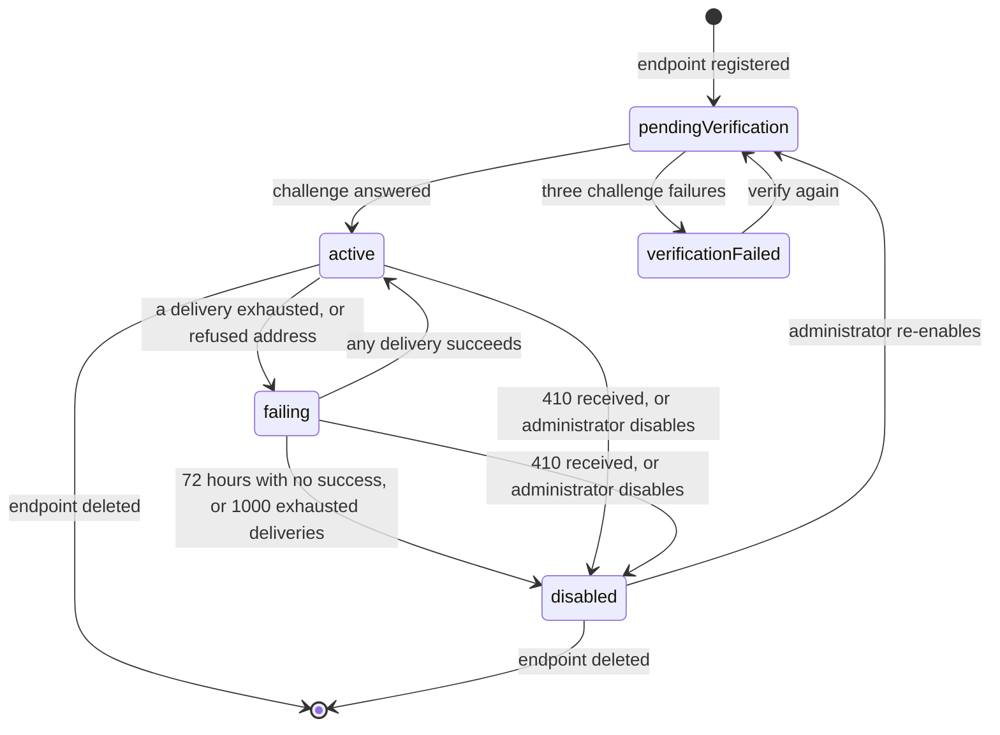
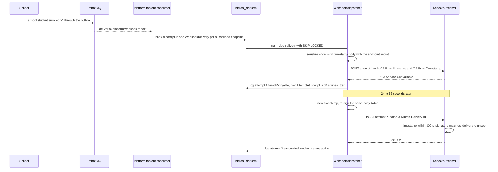

# 23. Integrations and Public API

> Plan document for the Nibras platform. Group F. It refines master brief Section 35 (credentials, versioning, the webhook contract, standards by phase, enterprise identity), the regional plug-in line of Section 17, the Integrations ownership row of Appendix L.5 and the `platform.integrations` and `platform.api-keys` rows of Appendix B; it does not re-derive them. Wire conventions (URL shape, Problem Details, pagination, rate-limit layers, idempotency, header formats) are owned by `22-api-conventions-and-error-catalog.md` and are cited, not restated. Where this document and the brief disagree, an ADR records the deviation.

**Group** F · **Requirement areas covered** INT (all of it), IDN (the credential and enterprise-identity parts), PLT (the Integrations capability), API (only the deprecation timeline) · **Last updated** 2026-09-21 by the platform plan

## Purpose

This document lets an engineer build the parts of Nibras that face another system, and lets an integrator build against them without a call to the vendor: which credentials exist and who owns them, what a scope is and how revocation reaches every service within seconds, what the developer portal and the sandbox tenant contain, the webhook contract down to the exact bytes that are signed, how a public API version is retired, which education standards arrive in which phase and what each one deliberately leaves out, how SAML 2.0 and SCIM fit Identity as adapters, and the plug-in kit that lets a partner build a regional integration against a stable interface. The readers are the Platform and Identity engineers, the partner writing a plug-in, and the school's IT lead reading the developer portal.

## Scope

| In scope | Out of scope | Where the out-of-scope item lives |
|---|---|---|
| Which endpoints are public, per tier | URL shape, verbs, JSON rules, pagination, filter grammar | `22-api-conventions-and-error-catalog.md` §1 to §3 |
| Tenant API keys and personal access tokens: ownership, scopes, expiry, quotas, revocation | Token issuance, refresh, client credentials, signing-key rotation | `12-security-privacy-safety.md` §3 and §9 |
| Per-key rate limit values and the daily call quota | The three rate-limit layers and the 429 contract | `22-api-conventions-and-error-catalog.md` §9 |
| Developer portal contents and the sandbox tenant | Scalar hosting, OpenAPI generation, Spectral rules | `22-api-conventions-and-error-catalog.md` §11 |
| The outgoing webhook contract, delivery log, subscriptions | The internal RabbitMQ topology, inbox and outbox | `11-messaging-architecture.md` |
| Deprecation timeline and developer-portal listing | `Deprecation`, `Sunset` and `Link` header syntax on the wire | `22-api-conventions-and-error-catalog.md` §1.5 and §12.5 |
| Standards by phase: iCal, OneRoster 1.2, LTI 1.3, QTI 3, Open Badges 3.0, CASE | The domain models those standards map onto | `06-services/scheduling.md`, `academics.md`, `behavior.md`, `school.md` |
| SAML 2.0 and SCIM as Tier 2 protocol adapters | OpenID Connect with Google and Microsoft (phase 1) | `12-security-privacy-safety.md` §3.1 |
| The plug-in kit: six interfaces, certification, sample | Each country's implementation (ZATCA, JoFotara, a local gateway) | The plug-in's own repository, certified against §8.3 |
| Threats against keys and webhooks, abuse cases | | `12-security-privacy-safety.md` §1.3 and §2.2 (T-PLT-03 to T-PLT-05) |

---

## Content

### 1. The public API surface

The public API is not a second API. It is the same `/api/v{n}/<service>/` endpoints the first-party clients use (`22-api-conventions-and-error-catalog.md` §1.1), reached through the Gateway on the tenant's domain with an API key or a personal access token instead of a session token. What makes an endpoint public is a flag on the endpoint, not a separate code path.

| Aspect | Rule |
|---|---|
| Marker | An endpoint is public when its OpenAPI operation carries `x-nibras-tier` and the tag `public`; the Gateway refuses an API-key or token call to any operation without the tag with `GATEWAY_PERMISSION_DENIED` |
| Never public | Every `/bff/` route; every `wellbeing.*` endpoint; every operation declaring a permission of risk `high` in Appendix B; every endpoint returning a field classified Sensitive in Appendix J; every Platform tenant-lifecycle and plan endpoint; every Identity endpoint except the caller's own personal access tokens |
| Tier in force | Tier 2, for the whole public set. Appendix W feature 24 ("Open by default: API, webhooks, iCal, standards") is Tier 2, and master brief Section 13 lists no public surface in Tier 1. Tier is a product-scope decision; it says nothing about **when** a part is built, which §6 and `17-roadmap.md` own |
| The read-only set proposed for Tier 1 (open question 28, undecided) | Read-only (`GET`) operations on: `school.students`, `school.guardians` (contact fields only), `school.staff`, `school.sections`, `school.subjects`, `school.grade-levels`, `school.terms`, `school.academic-years`, `school.campuses`, `scheduling.timetable`, `scheduling.calendar`, `attendance.student-attendance`, `academics.assignments`, `assessment.report-cards` (published only), `finance.invoices`, `finance.payments`; plus the OneRoster 1.2 export (§6.2) and iCal feeds (§6.1). This is the set `02-competitive-gap-analysis.md` asks to move; until the product owner decides, none of it has moved |
| Tier 2 public set | The set above, plus writes on the same resources where Appendix B has a `normal` or `elevated` action, webhooks (§4), LTI 1.3 (§6.3), QTI 3 (§6.4), Open Badges 3.0 (§6.5), CASE (§6.6) |
| Tier is not phase | Webhooks are a Tier 2 feature built early: `34-work-breakdown.md` builds the keys and the webhook machinery in phase 1 (SL-INT-001 to SL-INT-003) and opens subscriptions to schools in phase 3 under CAP-INT-01 (SL-INT-406). A Tier 2 label never means "after everything in Tier 1 ships" for a part another part depends on |
| Response models | The same per-role response model as the first-party client for the role the key acts as (§2.3); a sensitive field is absent, never null (`22-api-conventions-and-error-catalog.md` §1.4) |
| Documentation | Only public operations appear in the developer portal's reference (§3); the full aggregated document stays behind first-party sign-in |
| Export stays available | Read access through the public API continues while a tenant is read-only for non-payment, as master brief Section 36 promises; keys keep their read scopes and lose write scopes on `platform.tenant.suspended.v1` |

---

### 2. API keys and personal access tokens

Master brief Section 35 names two credential kinds. Both are bearer secrets, both carry explicit scopes, an expiry, a rate limit, a quota and a last-used timestamp, and both are revoked through the permission version.

#### 2.1 The two kinds side by side

| Property | Tenant API key | Personal access token |
|---|---|---|
| Belongs to | The tenant; survives the departure of the administrator who created it | One user; dies with the user's deactivation (`identity.user.deactivated.v1`) |
| Typical use | A school's BI tool, a ministry export job, a partner system, a OneRoster sync | A teacher's script, an IT lead's one-off report, a local automation |
| Created by | An administrator holding `platform.api-keys.create` in the Integrations console | The user themself, holding `identity.api-keys.create` |
| Secret revealed | Once, and only to a holder of `platform.api-keys.reveal-once` (high risk, four-eyes to grant per Appendix B) | Once, to the user who created it |
| Acts as | A **key principal** with its own permission set and one data scope (`all-tenant` or `campus`) | The user, narrowed: effective permissions are the intersection of the token's scopes and the user's current effective permissions; data scope is the user's |
| Scopes | Any public permission (§1) of risk `normal` or `elevated`; never `high` | Any public permission the user holds at creation; a later loss of the permission removes it from the effective set without editing the token |
| Default expiry | 90 days | 30 days |
| Maximum expiry | 365 days; no key without an expiry (`12-security-privacy-safety.md` §1.3) | 90 days |
| Rate limit (layer 2) | Per plan: 60, 300 or 1,000 requests per minute (`22-api-conventions-and-error-catalog.md` §9.1); an administrator may set a lower value per key | 60 per minute, fixed; a token is a person's tool, not an integration |
| Daily quota (layer 3) | Tenant-wide API call quota per plan (§2.5), with an optional lower per-key cap | Counts against the same tenant quota, capped at 5,000 calls per day per token |
| Maximum active | Per plan: 10, 25 or 50 per tenant (§2.5) | 5 per user |
| Management permission | `platform.api-keys.view`, `.create`, `.delete` | `identity.api-keys.view`, `.create`, `.delete` for the user's own; an administrator with `identity.api-keys.delete` may revoke anyone's |
| Audit | Every create, reveal, scope change, revoke and first use after 30 idle days is an audit entry through `platform.audit.recorded.v1` | Same, through `identity.audit.recorded.v1` |

#### 2.2 Where each part lives

| Part | Owner | Why |
|---|---|---|
| The credential record for both kinds: prefix, key id, salted hash, scopes, expiry, state, permission version, last-used | Identity, the `ApiKey` aggregate of Appendix F with a `kind` of `tenantKey` or `personalToken`, in `nibras_identity` | Identity is the only issuer (`12-security-privacy-safety.md` §1.3), the credential store is classified in Identity's database (`10-data-architecture.md`), and revocation must ride the permission version Identity already owns |
| The Integrations console, the policy for tenant keys (allowed scopes, plan limits, per-key caps), the developer portal, webhooks, OneRoster, LTI | Platform, as the Integrations capability (Appendix L.5, ADR-0012) | Platform owns plans and quotas; the console is where a school manages every integration in one place |
| The call path between them | Platform's console command calls Identity's gRPC `ApiKeyAdministration` (one hop, `22-api-conventions-and-error-catalog.md` §10.4) with Platform's client-credentials scope; Identity refuses the call from any other service | Keeps the secret material in one database and the policy in the service that owns plans |

#### 2.3 Credential format and validation

| Aspect | Rule |
|---|---|
| Format | `nbk_live_<keyId>_<secret>` for tenant keys, `nbp_live_<keyId>_<secret>` for personal tokens, `nbk_test_` and `nbp_test_` in the sandbox (§3.2). `keyId` is 16 characters of Crockford base32; `secret` is 32 random bytes as base64url (43 characters) |
| Why a prefix | Gitleaks, GitHub secret scanning and the bundle check `TC-SEC-378` recognise the shape; a support engineer can tell kind and environment from the first nine characters without seeing the secret |
| Storage | `HMAC-SHA256(pepper, secret)` where the pepper is a per-deployment secret in the secret store; the plain secret is never stored, logged or cached (`21-performance-engineering.md`, "never cached in Identity") |
| Presentation | `Authorization: Bearer <credential>` plus `X-Nibras-Tenant-Id` (`22-api-conventions-and-error-catalog.md` §1.5); a credential in a query string is refused with `GATEWAY_VALIDATION_FAILED` and the key is flagged for rotation |
| Validation | The Gateway exchanges the credential at Identity for an internal access token of 5 minutes carrying `principal_type` (`apiKey` or `personalToken`), `key_id`, `tenant_id`, `perm_ver` and the effective scope list; downstream services validate that token like any other (`12-security-privacy-safety.md` §3.3). The exchange result is held in the Gateway's L1 memory for at most 60 seconds, keyed by `key_id` and `perm_ver` |
| Last used | Identity records `lastUsedAt` and the source address hash at most once per minute per key, off the request path through its outbox |
| Constant time | The hash comparison is constant-time; an unknown `keyId` runs the same comparison against a dummy hash so timing does not reveal which key ids exist |

#### 2.4 Scopes

A scope is a permission name from Appendix B, nothing else. There is no second vocabulary of API scopes to drift from the permission catalog.

| Rule | Detail |
|---|---|
| Grammar | `<service>.<resource>.<action>`, exactly as in Appendix B; the console offers only public permissions (§1) |
| Read-only until the write set ships | Keys carry `view` and `export` actions only; a write scope is refused with `PLATFORM_VALIDATION_FAILED` and `params.reason = "writeScopeNotInTier"` until the write set of §1 ships with webhooks and the delivery log (decision row "The first keys a school gets are read-only") |
| Never grantable | Any `high` action, any `wellbeing.*` permission, `identity.*` except `identity.api-keys.view` on a personal token and the SCIM scope set of §7.2 on a tenant key, `platform.api-keys.*`, `platform.integrations.*`, `audit.*` |
| Data scope | Tenant keys: `all-tenant` or `campus` with a campus id; personal tokens inherit the user's scopes per Appendix B's narrowing rule |
| Endpoint check | The endpoint's declared `x-nibras-permission` must be in the credential's effective scope list; the same authorization handler as a session token runs, so a key cannot reach anything a person with those permissions could not |
| Explaining a refusal | `identity.permissions.explain-effective` on a key id returns which scope, data scope or tier rule refused the last call, for the Because panel on the console |

#### 2.5 Quotas and metering

| Plan | Per-key rate limit (requests per minute) | Tenant API calls per day | Webhook deliveries per day | Active tenant keys |
|---|---|---|---|---|
| small | 60 | 10,000 | 10,000 | 10 |
| standard | 300 | 100,000 | 100,000 | 25 |
| scale | 1,000 | 1,000,000 | 1,000,000 | 50 |

| Aspect | Rule |
|---|---|
| Metering | Each service's `Nibras.BuildingBlocks.Web` counts calls authenticated by a key or token and publishes `<service>.usage.recorded.v1` with meter `api-calls` in one-minute batches; Platform aggregates per tenant and per key |
| Enforcement | Daily counters in `redis-state` checked by the plan-limits cache; a breach is 402 `PLATFORM_PLAN_LIMIT_REACHED` with `params.meter = "api-calls"` and `params.resetsAt` at midnight in the tenant time zone; never 429 (`22-api-conventions-and-error-catalog.md` §9.1) |
| Warning | `platform.limit.approaching.v1` at 80 percent of the daily quota, once per day |
| Values | Starting values, revised with the load runs; open point 3 of `22-api-conventions-and-error-catalog.md` |

#### 2.6 Revocation through the permission version

| Trigger | What happens | Propagation |
|---|---|---|
| Administrator revokes a key or a user revokes a token | Identity sets `state = revoked`, increments the key principal's permission version, writes the audit entry and publishes `identity.permissions.changed.v1` with the key id in `affectedUserIds` | The Gateway evicts its exchange cache entry on the event; any internal token already minted carries the old `perm_ver` and is refused by the service authorization check (`12-security-privacy-safety.md` §3.4); the 5-second contract of Appendix I rule 5 applies |
| A user loses a permission or a role | The user's permission version bumps as today; the personal token's effective set is recomputed from the new version on the next exchange | Same event, no token edit needed |
| A user is deactivated | Every personal token of the user is revoked in the same transaction | `identity.user.deactivated.v1` plus `identity.permissions.changed.v1` |
| Expiry passes | The exchange refuses with `IDENTITY_VALIDATION_FAILED` and `params.reason = "credentialExpired"`; no event is needed because the check is on every exchange | Immediate |
| Tenant suspended | Write scopes stop working, read scopes continue (§1) | `platform.tenant.suspended.v1` |
| Key found in a public place | Secret scanning partner alert or a support report; the on-call revokes through the console, the runbook `rotate-api-key.md` issues a replacement with the same scopes | Same as revocation |
| Expiry reminder | A daily Platform job raises an inbox notification to the key's creator and to holders of `platform.api-keys.view` at 14 days and 3 days before expiry | Through Notification, category requests |

---

### 3. Developer portal and sandbox tenant

#### 3.1 Portal contents

The portal is a section of the Platform web workspace at `/developers` on the platform domain, readable without signing in for the public pages, with the interactive parts behind sign-in.

| Page | Contents | Source of truth | Sign-in |
|---|---|---|---|
| Getting started | Create a sandbox, create a key, make the first call to `/api/v1/school/students`, receive the first webhook; in English and Arabic | Written in the portal repository, reviewed with each release | no |
| API reference | Scalar over the aggregated document filtered to operations tagged `public` (§1) | Generated at build (`22-api-conventions-and-error-catalog.md` §11.1) | no for reading, yes for "try it" against the sandbox |
| Conventions | A reader's version of pagination, filters, errors, idempotency and rate limits | Links to the generated sections of `22-api-conventions-and-error-catalog.md` | no |
| Error catalog | Every public code with its status, meaning, client action and parent-safe flag, in both languages | `docs/api/error-codes.json` generated from Appendix K | no |
| Webhook catalog | Every subscribable routing key with its payload schema, partition key and example (§4.9) | Generated from Appendix E and the eligibility table | no |
| Signature verification | The canonical string, test vectors (§4.4), receiver samples in C#, TypeScript, Python and PHP | This document | no |
| Changelog and deprecations | Every public change by release; every deprecated version with its `Sunset` date and replacement (§5) | Release pipeline, `oasdiff` output | no |
| Standards | OneRoster, iCal, LTI, QTI, Open Badges and CASE pages with the in-scope and out-of-scope lists of §6 | This document | no |
| Plug-in kit | The six interfaces, the certification checklist, the sample adapter (§8) | `Nibras.Plugins.Abstractions` package documentation | no |
| Status | Current incidents and uptime for the public API and webhook delivery | The status page of `15-deployment-and-operations.md` | no |
| My keys and tokens | List, create, reveal once, revoke, last used | Identity through Platform | yes |
| My webhook endpoints | Endpoints, subscriptions, delivery log, replay, rotate secret | Platform | yes |

#### 3.2 The sandbox tenant

| Aspect | Rule |
|---|---|
| What it is | A real tenant on the shared Production cluster, provisioned by the same saga as a customer tenant, flagged `isSandbox`, on the `small` plan limits with rate limits halved |
| Who gets one | Any school administrator from the portal, one per school; any registered partner, one per partner organisation; created in under a minute because provisioning is the ordinary saga |
| Data | The seeded demo data set of Appendix O (one campus, three grade levels, about 120 synthetic students with bilingual names, a published timetable, a term of attendance and marks, a fee plan and invoices); every person is synthetic; no real child's data may be imported, and the import endpoints are disabled |
| Credentials | `nbk_test_` and `nbp_test_` keys only; a `test` key is refused on a non-sandbox tenant and a `live` key on a sandbox, both with `GATEWAY_TENANT_MISMATCH` |
| Webhooks | Delivered for real to the partner's endpoint; a "send test event" button emits any subscribable routing key with a synthetic payload |
| Providers | Payment, SMS, e-mail and push are wired to the fake adapters of the plug-in kit (§8.4), so a sandbox never charges a card or texts a phone |
| Reset | `POST /api/v1/platform/sandbox/reset` restores the seed data in place, keeping keys and endpoints; available at most once per hour |
| Lifetime | Deleted after 90 days without an API call, with notices at 60 and 83 days; deletion is the ordinary tenant deletion saga without the cooling-off period |
| Isolation | The same tenant filter and row-level security as any tenant; a sandbox is never a shortcut around tenancy |

---

### 4. The webhook contract

Master brief Section 35 fixes the shape: a signed POST carrying the standard envelope, a five-minute replay window, five attempts with backoff and jitter, a delivery log the school can inspect and replay, a verification challenge, secret rotation with overlap. This section fixes every value. Webhooks are Tier 2 (§1) and owned by Platform (Appendix L.5).

#### 4.1 How an event becomes a delivery

| Step | Component | Detail |
|---|---|---|
| 1 | Owning service | Publishes the integration event to `nibras.<service>` through its outbox, exactly as for internal consumers (`11-messaging-architecture.md`) |
| 2 | Platform fan-out consumer | One queue, `platform.webhook-fanout`, bound to every routing key in the subscribable catalog (§4.9); the inbox deduplicates on `messageId` |
| 3 | Platform fan-out consumer | Finds the active endpoints of the event's tenant subscribed to that routing key, checks that the endpoint's owner still holds the mapped permission, and writes one `WebhookDelivery` row per endpoint in the same transaction as the inbox record |
| 4 | Webhook dispatcher | A hosted background dispatcher inside `nibras/platform-api` claims due deliveries with `FOR UPDATE SKIP LOCKED`, signs and sends them, and records each attempt; open point 4 covers moving it to its own image |
| 5 | Dispatcher | Schedules the next attempt, or marks the delivery finished, and applies the endpoint state rules (§4.7) |

#### 4.2 Endpoint registration and the verification challenge

| Aspect | Rule |
|---|---|
| Register | `POST /api/v1/platform/webhook-endpoints` with `url`, `description` (`LocalizedText`), `eventTypes` (a list of routing keys from §4.9), optional `campusId` filter; permission `platform.integrations.create` |
| URL rules | `https` only, a public DNS name (no IP literal), port 443 or 8443, at most 2,048 characters, no credentials in the URL, no personal data in the query string (the privacy rule behind Spectral rule `nibras-no-query-pii` in `22-api-conventions-and-error-catalog.md` §11.3) |
| Server-side request forgery guard | The name is resolved at registration and on each attempt; private, loopback, link-local, carrier-grade NAT and cluster ranges are refused; the resolved address is pinned for the attempt so a DNS rebind cannot redirect it (T-PLT-05, `TC-SEC-124`) |
| Secret | Generated by Platform as `whsec_` plus 32 random bytes in base64url; revealed once in the response and in the console; stored encrypted in `nibras_platform` (`12-security-privacy-safety.md` §9) |
| State after registration | `pendingVerification`; no event is delivered until the challenge passes |
| Challenge request | A POST to the URL, signed like any delivery (§4.4), with header `X-Nibras-Delivery-Type: challenge` and body `{ "type": "challenge", "endpointId": "<uuid>", "challenge": "<43 base64url characters>" }` |
| Expected answer | Status 2xx within 10 seconds, `Content-Type: application/json`, body `{ "challenge": "<the same value>" }`; any other answer is a failure |
| Attempts | Three, at 0, 1 minute and 5 minutes; three failures set the endpoint to `verificationFailed` and the console shows the last response |
| Challenge again when | The URL changes, the endpoint is re-enabled after `disabled`, or an administrator presses "verify again" |

#### 4.3 The delivery request

| Header | Value | Constant across retries |
|---|---|---|
| `Content-Type` | `application/json; charset=utf-8` | yes |
| `User-Agent` | `Nibras-Webhooks/1.0` | yes |
| `X-Nibras-Delivery-Id` | UUID v7, one per (event, endpoint); the receiver's deduplication key | yes, and on a replay |
| `X-Nibras-Delivery-Type` | `event`, `challenge` or `test` | yes |
| `X-Nibras-Event` | The routing key, for example `school.student.enrolled.v1` | yes |
| `X-Nibras-Endpoint-Id` | The endpoint UUID | yes |
| `X-Nibras-Attempt` | `1` to `5` | no |
| `X-Nibras-Replay` | `true` on a manual replay, absent otherwise | not applicable |
| `X-Nibras-Timestamp` | Unix seconds at the moment of this attempt, as a decimal string with no sign and no leading zeros | no, each attempt is re-signed |
| `X-Nibras-Signature` | `sha256=<64 lower-case hex characters>`; during a rotation overlap two values separated by a comma, new first (§4.8) | no |
| `traceparent` | W3C trace context of the originating operation | yes |

Body: the Appendix E envelope with the payload under `data`. Nothing is added that the Appendix E payload does not carry, so a webhook can never leak a field an internal consumer does not see.

```json
{
  "id": "018f9a10-7c3e-7b21-9d4a-2f1e0c9b8a70",
  "type": "school.student.enrolled.v1",
  "tenantId": "018f0000-0000-7000-8000-000000000001",
  "occurredAt": "2026-09-21T05:40:00.000Z",
  "correlationId": "018f9a10-7c3d-7a10-8b2c-3d4e5f6a7b8c",
  "schemaVersion": 1,
  "partitionKey": "018f6a1e-5c2b-7d3e-9a4f-1b2c3d4e5f60",
  "data": {
    "studentId": "018f6a1e-5c2b-7d3e-9a4f-1b2c3d4e5f60",
    "studentNumber": "2026-0418",
    "sectionId": "018f6b22-1a0c-7c4d-8e2f-9a8b7c6d5e4f",
    "campusId": "018f6b00-0000-7000-8000-00000000000a",
    "enrolledOn": "2026-09-21",
    "namesEnAr": { "ar": "محمد أحمد الزهراني", "en": "Mohammed Ahmed Alzahrani" }
  }
}
```

| Body rule | Detail |
|---|---|
| `id` | The `messageId` of the integration event; the same event delivered to two endpoints has the same `id` and different delivery ids |
| Omitted envelope fields | `causationId`, `userId` and `traceparent` are not in the body; the trace travels in the header, and the acting user is not an integrator's business |
| Size | At most 256 KiB; Appendix E payloads carry identifiers, so a larger body is a catalog defect |
| Serialization | The dispatcher serializes once, signs those exact bytes and sends those exact bytes; nothing re-serializes between signing and sending |

#### 4.4 Signature: the exact canonical string

| Element | Definition |
|---|---|
| Key | The bytes obtained by base64url-decoding the part of the endpoint secret after the `whsec_` prefix (32 bytes) |
| Canonical string | The UTF-8 bytes of the `X-Nibras-Timestamp` value, then one full stop (byte `0x2E`), then the raw request body bytes exactly as received, with no trimming, no re-encoding and no newline added |
| Algorithm | HMAC-SHA256 over the canonical string with the key |
| Encoding | Lower-case hexadecimal, 64 characters, prefixed `sha256=` |
| Receiver check, in order | 1. Parse `X-Nibras-Timestamp` as an integer; refuse if the absolute difference from the receiver's clock exceeds 300 seconds. 2. Build the canonical string from the raw body before any JSON parsing. 3. Compute the HMAC with each current secret. 4. Compare with each `sha256=` value in the header in constant time; accept if any matches. 5. Deduplicate on `X-Nibras-Delivery-Id`, kept for at least 24 hours |
| Why the timestamp is signed | A captured request replayed after five minutes fails step 1, and an edited timestamp fails step 4 |
| Clock | The dispatcher uses the injected clock synchronised by NTP; the receiver is advised to allow the same 300 seconds in both directions |

Test vector, published in the portal and asserted by `TC-INT-012`:

| Input | Value |
|---|---|
| Secret | `whsec_Jm2m6Q1xk8N0y9Pz3v7wR5tYb4cLd2eF6gH8iJ0kL1M` |
| `X-Nibras-Timestamp` | `1789969203` (2026-09-21T05:40:03Z) |
| Body | `{"id":"018f9a10-7c3e-7b21-9d4a-2f1e0c9b8a70","type":"school.student.enrolled.v1"}` |
| Canonical string | `1789969203.{"id":"018f9a10-7c3e-7b21-9d4a-2f1e0c9b8a70","type":"school.student.enrolled.v1"}` |
| `X-Nibras-Signature` | `sha256=4129c42eaa21142dda4ea8675fdf674789f4cfb0bd9b5898c4bb14fa652eb682` |
| New secret during an overlap | `whsec_q9Zr4Tx2Wc7Vb1Nm8Lk3Jh6Gf5Ds0Ap9Oi2Uy4Et7Rw` signs the same input as `844d4a1bb51da09aedeffec8e6ecc4942f6d8a2fd88517a1eaf5beb6297f0557`, so the overlap header is `sha256=844d4a1bb51da09aedeffec8e6ecc4942f6d8a2fd88517a1eaf5beb6297f0557,sha256=4129c42eaa21142dda4ea8675fdf674789f4cfb0bd9b5898c4bb14fa652eb682` |

#### 4.5 Outcomes and the retry schedule

| Response | Outcome | Retried |
|---|---|---|
| 2xx within 10 seconds | `succeeded` | no |
| Connection refused, DNS failure, TLS failure, reset | `connectionError` | yes |
| No complete response in 10 seconds (connect timeout 5 seconds) | `timedOut` | yes |
| 408, 425, 429, 500, 502, 503, 504 | `failedRetryable` | yes; on 429 or 503 with `Retry-After`, the next delay is the larger of the schedule and `Retry-After`, capped at 60 minutes |
| 410 | `gone` | no; the endpoint is disabled at once (§4.7) |
| Any other 3xx or 4xx | `failedPermanent` | no; redirects are never followed |
| Resolved to a refused address range | `refusedAddress` | no; the endpoint moves to `failing` and a security audit entry is written |

| Attempt | Nominal delay after the previous attempt | With jitter (uniform factor 0.8 to 1.2) | Cumulative, nominal |
|---|---|---|---|
| 1 | immediate | immediate | 0 |
| 2 | 30 seconds | 24 to 36 seconds | 30 seconds |
| 3 | 2 minutes | 96 to 144 seconds | 2.5 minutes |
| 4 | 10 minutes | 8 to 12 minutes | 12.5 minutes |
| 5 | 60 minutes | 48 to 72 minutes | 72.5 minutes |

Five attempts in total, as the brief requires. Jitter is drawn per delivery, so a receiver that recovers does not get a synchronised burst of every queued delivery at once. After attempt 5 fails the delivery is `exhausted`.

**Ordering.** Deliveries to one endpoint for the same `partitionKey` are sent in `occurredAt` order with one in flight; a later delivery for that key waits until the earlier one succeeds or is exhausted. Deliveries for different keys run in parallel, at most 10 in flight per endpoint. Where Appendix E sets no partition key, no order is promised and the receiver orders by `occurredAt` if it cares.

#### 4.6 The delivery log

One row per attempt in the Platform table `webhook_delivery_attempts`, partitioned by month, retained 30 days (the retention row in `10-data-architecture.md`).

| Field | Type | Meaning |
|---|---|---|
| `deliveryId` | uuid v7 | The `X-Nibras-Delivery-Id` |
| `attemptNumber` | int | 1 to 5; a replay starts a new series with `replayOf` set |
| `endpointId` | uuid v7 | The endpoint |
| `eventId` | uuid v7 | The event `messageId` |
| `eventType` | text | The routing key |
| `occurredAt` | timestamptz | From the envelope |
| `attemptedAt` | timestamptz | When this attempt was sent |
| `signedTimestamp` | bigint | The `X-Nibras-Timestamp` value |
| `secretIds` | uuid[] | Which secrets signed it; never the secret, never the signature |
| `resolvedAddress` | inet | The pinned address the attempt went to |
| `requestBodySha256` | text | Hash of the body sent; the body itself is kept alongside for replay for the same 30 days |
| `responseStatus` | int or null | Null when no response arrived |
| `responseHeaders` | jsonb | `Content-Type`, `Retry-After`, `Date` only |
| `responseBodyExcerpt` | text | First 4 KiB, UTF-8, for the school to diagnose its receiver |
| `durationMs` | int | Time to the last response byte |
| `outcome` | text | `succeeded`, `connectionError`, `timedOut`, `failedRetryable`, `failedPermanent`, `gone`, `refusedAddress`, `exhausted`, `skipped` |
| `errorDetail` | text | Framework error text for a connection or TLS failure; never a secret |
| `nextAttemptAt` | timestamptz or null | When the next attempt is due |
| `replayOf` | uuid or null | The attempt series this replay repeats |
| `triggeredBy` | uuid or null | The user who pressed replay or test; null for the dispatcher |
| `correlationId` | uuid v7 | Of the originating operation, so support can follow the trace |

The console shows the log per endpoint with filters by outcome and event type, as a keyset list (`22-api-conventions-and-error-catalog.md` §2.1). Replaying one delivery, or every `exhausted` and `skipped` delivery since a chosen time, needs `platform.integrations.replay-webhook` (elevated, reason recorded); a replay keeps the delivery id so a receiver that already processed it deduplicates.

#### 4.7 Endpoint states, failure and disable rules



| Rule | Detail |
|---|---|
| Entering `failing` | Platform publishes `platform.webhook.delivery-failed.v1` with `endpointId`, `attempts` and `lastStatus`; Notification tells holders of `platform.integrations.view` in-app and by e-mail, at most once per endpoint per 24 hours |
| While `failing` | New deliveries are still attempted on the full schedule, so a receiver that recovers catches up without a replay |
| Entering `disabled` | Pending deliveries are marked `skipped` and kept 30 days for replay; a second notification states the reason and the replay path; no further delivery is attempted |
| Re-enabling | `platform.integrations.edit`; the challenge runs again; the console offers "replay skipped deliveries since" as a separate elevated action |
| Quota | Deliveries count against the plan's daily webhook quota (§2.5); over quota they are `skipped` with reason `quota` and replayable after the reset |
| Tenant read-only | Deliveries continue while a tenant is read-only for non-payment (the export promise of master brief Section 36); they stop when the tenant deletion saga starts |

#### 4.8 Secret rotation with an overlap window

| Step | Detail |
|---|---|
| Start | `POST /api/v1/platform/webhook-endpoints/{id}/rotate-secret` with `overlapHours`; permission `platform.integrations.rotate-secret` (elevated, reason recorded) |
| Overlap | Default 24 hours, minimum 1, maximum 168; the new secret is revealed once in the response |
| During overlap | Every attempt carries two signatures, new first; a receiver configured with either secret accepts |
| End of overlap | The old secret is destroyed; an audit entry records the end |
| Emergency | `overlapHours: 0` destroys the old secret at once; used when the secret leaked, as the runbook `rotate-webhook-secret.md` states (`12-security-privacy-safety.md` §9) |
| Concurrency | One rotation in progress per endpoint; a second request during overlap is `PLATFORM_CONCURRENCY_CONFLICT` |

#### 4.9 Subscription model against Appendix E

A subscription names routing keys exactly as Appendix E lists them, including the version. There is no webhook-only event name and no wildcard that could silently pick up a new event.

| Rule | Detail |
|---|---|
| What can be subscribed | Only routing keys in the eligibility table below; the table is generated into `docs/api/webhook-events.json`, and `TC-INT-016` fails when a key in it is absent from Appendix E |
| Permission per event | Each eligible routing key maps to the Appendix B `view` permission of its resource; an endpoint may subscribe only when its creator holds that permission with `all-tenant` scope, or campus scope matching the endpoint's `campusId` |
| Campus filter | An endpoint with `campusId` receives only events whose payload carries that `campusId`, or whose subject resolves to it through Platform's slim reference copy; events with no campus dimension go to every subscribed endpoint |
| Versions | An endpoint subscribes to one version of a key. When `v2` of an event publishes, subscribed endpoints stay on `v1` and the portal shows the migration; Platform's fan-out consumer counts as a consumer of `v1` under the Appendix E retirement rule, so `v1` keeps flowing until the last endpoint moves or the 12-month window of §5 ends |
| Payload | Identifiers and the few fields Appendix E lists; the receiver calls the public API for anything more, under a key's scopes |
| Adding an event | A new row in Appendix E does not make it subscribable; the eligibility table changes deliberately in this document, after a review of its Appendix J classification |

| Service | Eligible routing keys | Permission required |
|---|---|---|
| School | `school.academic-year.opened.v1`, `school.academic-year.closed.v1` | `school.academic-years.view` |
| School | `school.term.started.v1` | `school.terms.view` |
| School | `school.section.created.v1`, `school.section.changed.v1` | `school.sections.view` |
| School | `school.student.enrolled.v1`, `school.student.section-changed.v1`, `school.student.status-changed.v1`, `school.student.promoted.v1`, `school.student.profile-updated.v1` | `school.students.view` |
| School | `school.guardian.updated.v1` | `school.guardians.view` |
| School | `school.staff.created.v1`, `school.staff.left.v1` | `school.staff.view` |
| Admissions | `admissions.application.submitted.v1`, `admissions.application.stage-changed.v1` | `admissions.applications.view` |
| Admissions | `admissions.offer.accepted.v1` | `admissions.offers.view` |
| Admissions | `admissions.re-enrollment.confirmed.v1`, `admissions.re-enrollment.declined.v1` | `admissions.re-enrollment.view` |
| Academics | `academics.teaching-assignment.changed.v1` | `academics.teaching-assignments.view` |
| Academics | `academics.assignment.published.v1` | `academics.assignments.view` |
| Academics | `academics.submission.received.v1`, `academics.submission.graded.v1` | `academics.submissions.view` |
| Assessment | `assessment.grades.locked.v1` | `assessment.marks.view` |
| Assessment | `assessment.report-cards.published.v1` | `assessment.report-cards.view` |
| Scheduling | `scheduling.timetable.published.v1`, `scheduling.timetable.changed.v1` | `scheduling.timetable.view` |
| Scheduling | `scheduling.substitution.assigned.v1` | `scheduling.substitutions.view` |
| Scheduling | `scheduling.event.published.v1` | `scheduling.calendar.view` |
| Scheduling | `scheduling.exam-timetable.published.v1` | `scheduling.exam-timetable.view` |
| Attendance | `attendance.attendance.marked.v1`, `attendance.student.absent.v1` | `attendance.student-attendance.view` |
| Attendance | `attendance.excuse.approved.v1` | `attendance.excuses.view` |
| Finance | `finance.invoice.issued.v1`, `finance.invoice.overdue.v1` | `finance.invoices.view` |
| Finance | `finance.payment.received.v1` | `finance.payments.view` |
| Finance | `finance.refund.processed.v1` | `finance.refunds.view` |
| Finance | `finance.credit-note.issued.v1` | `finance.credit-notes.view` |
| Communication | `communication.announcement.published.v1` | `communication.announcements.view` |
| Requests | `requests.request.submitted.v1`, `requests.request.approved.v1`, `requests.request.rejected.v1`, `requests.request.completed.v1` | `requests.requests.view` |
| Documents | `documents.document.generated.v1`, `documents.certificate.revoked.v1` | `documents.certificates.view` |
| Behavior | `behavior.points.awarded.v1` | `behavior.points.view` |
| Behavior | `behavior.badge.awarded.v1` | `behavior.badges.view` |
| Hr | `hr.staff.hired.v1` | `hr.staff-files.view` |
| Hr | `hr.leave.approved.v1`, `hr.leave.cancelled.v1` | `hr.leave.view` |
| Operations | `operations.library.loan-recorded.v1` | `operations.library.view` |
| Operations | `operations.facility.ticket-raised.v1`, `operations.facility.ticket-closed.v1` | `operations.facilities.view` |
| Operations | `operations.activity.enrollment-confirmed.v1` | `operations.activities.view` |
| Platform | `platform.terminology.changed.v1` | `platform.terminology.view` |

| Never subscribable | Examples | Reason |
|---|---|---|
| Every Wellbeing event | `wellbeing.referral.created.v1`, `wellbeing.safeguarding.concern-raised.v1` | Wellbeing data never leaves its service (master brief Section 20) |
| Security and identity events | `identity.login.new-device.v1`, `identity.break-glass.used.v1`, `identity.permissions.changed.v1` | Attack surface and personal security data |
| Child location and physical safety | `attendance.gate-pass.used.v1`, `attendance.visitor.checked-in.v1`, `attendance.emergency.broadcast-started.v1`, `attendance.dismissal.processed.v1`, `operations.transport.boarding-recorded.v1` | Where a child is, in real time, is never sent to a third party |
| Discipline and profiling | `behavior.incident.recorded.v1`, `behavior.consequence.assigned.v1`, `reporting.early-warning.flag-raised.v1` | Sensitive per Appendix J; profiling of children |
| Anonymous and private channels | `communication.concern.reported-anonymously.v1`, `communication.message.reported.v1`, `communication.message.sent.v1` | Anonymity and message privacy |
| Internal mechanics | `<service>.usage.recorded.v1`, `<service>.audit.recorded.v1`, every `notification.*` key, `documents.document.generation-requested.v1`, `documents.sensitive-export.performed.v1`, every `platform.tenant.*` key | Not facts an integrator can act on, or platform-scoped |

#### 4.10 A delivery with one retry



---

### 5. Deprecation policy

Master brief Section 35 sets the rule: a version is supported for **12 months** after its successor ships, deprecated responses carry `Deprecation` and `Sunset` headers, and the portal lists the removal date. The header set and where it appears are fixed in `22-api-conventions-and-error-catalog.md` §1.5 and §12.5; the values are `Deprecation: @<unix seconds of the deprecation date>`, `Sunset: <HTTP-date of removal>` and `Link: <portal deprecation page for the service and version>; rel="deprecation"`. This section owns the timeline.

| When | Action | Who is told |
|---|---|---|
| T, the successor `/api/v{n+1}/<service>/` is generally available | Every response on `v{n}` carries the three headers; OpenAPI marks the operations `deprecated: true` with `x-nibras-deprecated-sunset` (Spectral rule `nibras-deprecated-has-sunset`); the changelog lists every difference with a migration note | Portal changelog; e-mail to the creators of every key and token that called `v{n}` in the last 30 days |
| T plus 6 months | Reminder with the caller's own call counts on `v{n}` per key | Same, plus an inbox notification to holders of `platform.integrations.view` |
| T plus 9 months | Console banner on the Integrations page for tenants still calling `v{n}`; weekly digest | Same |
| T plus 11 months | Final notice with the exact removal date | Same |
| T plus 12 months | `v{n}` routes are removed from the Gateway; a call returns 404 `GATEWAY_NOT_FOUND` with `params.reason = "versionRetired"` and `params.successor` | Changelog entry |
| First-party clients | A version is never removed while a supported mobile build still calls it (master brief Section 37); if one does at T plus 12 months, removal waits and an ADR records the new date | Release manager |
| Webhook event versions | The same 12 months, counted from the date the successor routing key becomes subscribable (§4.9) | Endpoint owners |
| Standards profiles | A OneRoster, LTI or QTI version follows the standard body's own retirement, plus the same 12 months | Portal standards page |

What is never a deprecation: an additive change inside a major (`22-api-conventions-and-error-catalog.md` §11.4), a new optional field, a new enum value on output, a new subscribable event. What is always a new major: anything `oasdiff` classifies as breaking.

---

### 6. Standards by phase

Phases are the delivery phases of `17-roadmap.md` §2 and the slices of `34-work-breakdown.md`, which own them; this table quotes them rather than restating master brief Section 35's wording. Two of them read one phase earlier than Section 35: iCal feeds ship with Scheduling in phase 2 and OneRoster with CAP-INT-01 in phase 3, which is where open question 28's recorded default puts them. The question itself, whether the read-only public API, OneRoster and iCal move from Tier 2 into Tier 1, is the product owner's and is not settled here. Compatibility is engineering; conformance certification is a commercial decision whose fees sit in Section 30, and no page of the portal claims certification before a certificate exists.

| Standard | Phase | Roadmap capability | Owner (Appendix L.5) | Direction | Tier |
|---|---|---|---|---|---|
| iCal (RFC 5545) | 2 for the feeds; 3 for the public subscription URL and revocation | CAP-SCD-03, then CAP-INT-01 (`34-work-breakdown.md` SL-INT-405) | Scheduling publishes; Platform exposes the subscription URL | out | 2 (open question 28) |
| OneRoster 1.2 | 3 | CAP-INT-01 (`34-work-breakdown.md` SL-INT-407 to SL-INT-410) | Platform | out (provider) | 2 (open question 28) |
| LTI 1.3 as platform | 4 | CAP-INT-02 (`34-work-breakdown.md` SL-INT-411) | Platform | both (launch out, scores in) | 2 |
| QTI 3 | 5 | CAP-INT-03 (`34-work-breakdown.md` SL-INT-600) | Academics | in and out | 2 |
| Open Badges 3.0 | 5 | CAP-INT-03 (`34-work-breakdown.md` SL-INT-602) | Behavior | out (issuer) | 2 |
| CASE 1.0 | 5 | CAP-INT-03 (`34-work-breakdown.md` SL-INT-601) | Academics (curriculum mapping) | in (consumer) | 2 |

#### 6.1 iCal feeds

| In scope | Out of scope |
|---|---|
| Read-only RFC 5545 feeds: a person's timetable, the school calendar, the exam timetable, a student's assignment due dates | CalDAV, write-back from a calendar client, free/busy |
| One unguessable feed URL per person per feed (32 random bytes, no personal data in the URL), created and revoked by the person, revoked on deactivation or a permission change that removes the underlying `view` | Invitations and replies (iTIP, iMIP), attendee lists |
| `VTIMEZONE` for the campus time zone and `TZID` on every `DTSTART`; UTC `DTSTAMP`; `UID` stable per event; `SEQUENCE` bumped on change so clients update rather than duplicate | Hijri dates inside the feed; the calendar client renders its own calendar system |
| `SUMMARY` and `DESCRIPTION` in the person's language with the tenant's terminology applied (`24-localization-and-calendars.md` §1.6) | Wellbeing appointments, counselling sessions, any Sensitive item |
| `Cache-Control: private, max-age=900`; a feed covers the current term plus 30 days back | Attachments, alarms set by the school |

#### 6.2 OneRoster 1.2

| In scope | Out of scope |
|---|---|
| Rostering service, provider role, read-only REST: `orgs`, `schools`, `academicSessions`, `terms`, `courses`, `classes`, `users`, `students`, `teachers`, `enrollments`, with the OneRoster filter, sort and pagination parameters mapped onto the conventions of `22-api-conventions-and-error-catalog.md` §2 and §3 | Consumer role; any `PUT` or `DELETE` from a OneRoster client |
| Bulk CSV export (the OneRoster CSV binding, zipped, with `manifest.csv`) as a long-running job (`22-api-conventions-and-error-catalog.md` §6) | `demographics` (birth date, sex, ethnicity): never exported, because a roster consumer does not need them |
| OAuth 2.0 client credentials as OneRoster 1.2 requires: the client id is a tenant key id, the secret is the key secret, and Identity issues the bearer token with the key's scopes | Resources service, Gradebook service write-back |
| `sourcedId` equal to the Nibras UUID v7; `status` and `dateLastModified` for delta sync | Line items and results (Gradebook read) until a customer asks; planned as a Tier 2 addition |
| Names in the language the key requests through `Accept-Language`, with the fallback of BR-L10N-007 | Guardian contact details beyond the OneRoster `users` fields for `parent` and `guardian` roles |

#### 6.3 LTI 1.3 in the platform role

| In scope | Out of scope |
|---|---|
| Nibras as the LTI platform launching external tools from a class or an assignment: OpenID Connect third-party initiated login, signed `id_token` from Nibras keys published on a JWKS endpoint | Nibras as an LTI tool inside another platform |
| Deep Linking 2.0 so a teacher picks content inside the tool and it lands as a resource or assignment in Academics | LTI 1.1 and 1.2, which are retired by the standard body |
| Names and Role Provisioning Services 2.0 for the class roster, limited to the fields the tool registration permits | Proctoring Services, Submission Review, Caliper analytics |
| Assignment and Grade Services 2.0: the tool posts scores that land as marks awaiting teacher approval, never directly published | A tool reading marks it did not post |
| Tool registration by an administrator (`platform.integrations.create`) with the tool's launch URL validated against the same address guard as webhooks (`TC-SEC-124`) | Dynamic registration without an administrator |
| Per-tool privacy setting: anonymous, name only, name and e-mail; default anonymous for student launches | Passing a student's national identifier to any tool |

#### 6.4 QTI 3

| In scope | Out of scope |
|---|---|
| Import and export of items and tests into the Academics question bank as QTI 3 content packages | Portable Custom Interactions |
| Interactions: choice, multiple response, text entry, extended text, inline choice, match, order, hot text | Adaptive items and adaptive test sections |
| Response processing with the standard templates `match_correct` and `map_response`; other templates imported as manually marked | Custom response-processing logic |
| Bilingual item bodies with `xml:lang` and `dir` preserved, including Arabic math notation in MathML | QTI results reporting export |
| An import report per item: imported, imported with loss (and what was lost), refused | QTI 2.x import; a conversion path is a separate decision |

#### 6.5 Open Badges 3.0

| In scope | Out of scope |
|---|---|
| Behavior as issuer: a badge award produces an Open Badges 3.0 credential (a W3C Verifiable Credential with an `OpenBadgeCredential` type) for the student, signed with a per-tenant key held in the secret store | Acting as a wallet or backpack for badges from elsewhere |
| Hosted achievement definitions with bilingual name and criteria | Comprehensive Learner Record 2.0 |
| A public verification page reached by QR, reusing the Documents verification pattern | Endorsements |
| Revocation through a status list when the award is withdrawn | Badges for staff (Hr), until asked |
| The guardian decides whether a credential is shareable outside the school (master brief Section 20) | Automatic publication to any third-party platform |

#### 6.6 CASE 1.0

| In scope | Out of scope |
|---|---|
| Consumer role: import `CFDocument`, `CFItem` and `CFAssociation` from a CASE provider URL into Academics outcomes for curriculum mapping | Provider role: publishing a school's framework |
| Re-import that updates by `identifier` and reports changes before applying them | Editing an imported framework in place; a school forks it into a local copy |
| Bilingual titles where the provider supplies `language` variants | `CFRubric` |

---

### 7. SAML 2.0 and SCIM as Tier 2 protocol adapters

Master brief Section 35: OpenID Connect with Google and Microsoft is phase 1; SAML 2.0 and SCIM provisioning are Tier 2, and adding them is a protocol adapter, not a redesign. The design choice that makes this true is that Identity's external-login pipeline and its user-provisioning commands are protocol-neutral from phase 1 (`12-security-privacy-safety.md` §3.1).

#### 7.1 SAML 2.0

| Aspect | Rule |
|---|---|
| Role | Service provider, one per tenant, metadata at `/api/v1/identity/saml/metadata` on the tenant domain |
| Flows | Service-provider-initiated with HTTP-Redirect request and HTTP-POST response; identity-provider-initiated accepted only when the tenant enables it |
| Adapter | A SAML handler in `Nibras.Identity.Infrastructure` turns a validated assertion into the same `ExternalLoginResult` that the OpenID Connect handler produces; everything after that (account linking by the domain rules of Appendix G Security, second factor, permission version, session) is unchanged |
| Validation | Signed assertion required; `NotBefore` and `NotOnOrAfter` with 2 minutes of skew; `Audience` equals the tenant's entity id; `InResponseTo` checked for service-provider-initiated flows; one-time assertion id cache in `redis-state` for the assertion lifetime |
| Library | An open-source SAML library with a licence on the allow-list, chosen and pinned in `19-dependency-and-license-inventory.md`; the choice is made when the Tier 2 slice starts |
| Out of scope | Single logout across the identity provider, encrypted assertions with keys the school rotates by hand, SAML for the platform console |

#### 7.2 SCIM 2.0

| Aspect | Rule |
|---|---|
| Role | SCIM service provider (RFC 7643 and RFC 7644) at `/api/v1/identity/scim/v2/` with `Users`, `Groups`, `ServiceProviderConfig`, `Schemas` and `ResourceTypes`; these paths are exempt from the kebab-case and plural Spectral rules through `x-nibras-standard: scim` because the standard fixes them |
| Credential | A tenant API key whose scopes are the SCIM set: `identity.users.view`, `identity.users.create`, `identity.users.edit`, `identity.users.suspend`, `identity.roles.view`, `identity.roles.assign-role`; this is the one exception to the `identity.*` rule of §2.4 |
| Users | Create maps to invite-and-activate for staff; `active: false` maps to suspend; `DELETE` maps to deactivate, never to a hard delete (retention per Appendix J) |
| Groups | A SCIM group maps to one Nibras role through a mapping table the administrator maintains; SCIM never creates roles and never assigns a role that holds a `high` permission, because those need four-eyes approval (Appendix B) |
| Scope of provisioning | Staff only; students and guardians are owned by School and Admissions workflows, not by a directory |
| Out of scope | SCIM client role (pushing Nibras users to another directory), bulk operations, `/Me` |

---

### 8. The plug-in kit

Master brief Section 17 requires regional plug-ins with interfaces in Tier 1 and implementations per country; Appendix W feature 38 is the kit that lets a partner build one. The kit is a NuGet package, `Nibras.Plugins.Abstractions`, plus `Nibras.Plugins.Testing` (the conformance suite) and a sample.

#### 8.1 Rules every plug-in follows

| Rule | Detail |
|---|---|
| Loading | A plug-in is a NuGet package referenced by the owning service's host at build time and registered through `services.AddNibrasPlugin<T>()`; there is no runtime assembly loading. Which implementation a tenant uses is a setting in the Integrations group of Appendix G |
| Context | Every method receives a `PluginContext` (tenant id, country code, the tenant's plug-in configuration, `TimeProvider`, logger, correlation id) and a `CancellationToken` |
| Result | Every method returns `PluginResult<T>`: a value, or a failure with a stable `code`, a `retryable` flag and a developer hint; the owning service maps failures to its own Appendix K codes (for example `FINANCE_...` or `NOTIFICATION_...`) |
| Secrets | Read from the configuration object the host passes in, which the host loads from the secret store; a plug-in never reads environment variables or files for secrets |
| Network | Only to the hosts the plug-in declares in `Describe()`; the host's egress policy enforces the list |
| State | No static mutable state; a plug-in instance may serve several tenants |
| Culture | Every parse and format names its culture (BR-L10N-006) |
| Owning service | `IEInvoicingProvider` and `IPaymentGateway` in Finance; `IMinistryExport` in Reporting; `ISmsSender` and `IPushSender` in Notification; `IDeviceAdapter` in Attendance and Operations |

#### 8.2 The six interfaces

```csharp
// Finance: ZATCA in Saudi Arabia, JoFotara in Jordan, the UAE programme when it is live
public interface IEInvoicingProvider
{
    PluginDescriptor Describe();                                                  // country, document types, clearance or reporting model, declared hosts
    Task<PluginResult<ValidationReport>> ValidateConfigurationAsync(PluginContext context, CancellationToken ct);
    Task<PluginResult<OnboardingResult>> OnboardAsync(PluginContext context, OnboardingRequest request, CancellationToken ct);           // device or client registration with the authority
    Task<PluginResult<EInvoiceSubmission>> SubmitInvoiceAsync(PluginContext context, EInvoiceDocument invoice, CancellationToken ct);    // clearance or reporting; idempotent on invoice id
    Task<PluginResult<EInvoiceSubmission>> SubmitCreditNoteAsync(PluginContext context, EInvoiceDocument creditNote, CancellationToken ct);
    Task<PluginResult<EInvoiceSubmission>> GetSubmissionStatusAsync(PluginContext context, string providerReference, CancellationToken ct);
    Task<PluginResult<QrPayload>> BuildQrPayloadAsync(PluginContext context, EInvoiceDocument document, CancellationToken ct);           // printed on the receipt by Documents
    Task<PluginResult<HealthReport>> CheckHealthAsync(PluginContext context, CancellationToken ct);
}

// Reporting: ministry and regulatory reports per country
public interface IMinistryExport
{
    PluginDescriptor Describe();
    Task<PluginResult<IReadOnlyList<MinistryReportDefinition>>> ListReportsAsync(PluginContext context, CancellationToken ct);         // code, bilingual name, period type, required dataset
    Task<PluginResult<ValidationReport>> ValidateAsync(PluginContext context, string reportCode, ExportDataset dataset, CancellationToken ct);
    Task<PluginResult<ExportArtifact>> ProduceAsync(PluginContext context, string reportCode, ExportDataset dataset, Stream output, CancellationToken ct);
    Task<PluginResult<SubmissionReceipt>> SubmitAsync(PluginContext context, ExportArtifact artifact, CancellationToken ct);            // only when Describe() declares online submission
    Task<PluginResult<SubmissionReceipt>> GetSubmissionStatusAsync(PluginContext context, string submissionReference, CancellationToken ct);
}

// Finance: hosted fields or redirect only; card data never touches Nibras (master brief Section 36)
public interface IPaymentGateway
{
    PluginDescriptor Describe();                                                  // methods, currencies, refunds, partial refunds, settlement report support
    Task<PluginResult<PaymentSession>> CreatePaymentSessionAsync(PluginContext context, PaymentSessionRequest request, CancellationToken ct);   // carries the idempotency key
    Task<PluginResult<VerifiedCallback>> VerifyCallbackAsync(PluginContext context, RawCallback callback, CancellationToken ct);              // signature check, parse, never trust unverified
    Task<PluginResult<PaymentStatus>> GetPaymentStatusAsync(PluginContext context, string gatewayReference, CancellationToken ct);
    Task<PluginResult<RefundResult>> RefundAsync(PluginContext context, RefundRequest request, CancellationToken ct);
    Task<PluginResult<IReadOnlyList<SettlementLine>>> ListSettlementsAsync(PluginContext context, DateOnly from, DateOnly to, CancellationToken ct); // daily reconciliation
    Task<PluginResult<HealthReport>> CheckHealthAsync(PluginContext context, CancellationToken ct);
}

// Notification: local SMS providers per country
public interface ISmsSender
{
    PluginDescriptor Describe();                                                  // countries, sender-id rules, Unicode support, maximum parts
    Task<PluginResult<SmsSendResult>> SendAsync(PluginContext context, SmsMessage message, CancellationToken ct);                        // E.164 recipient, body, sender id; returns provider id, parts, cost units
    Task<PluginResult<SmsDeliveryReport>> ParseDeliveryReportAsync(PluginContext context, RawCallback callback, CancellationToken ct);
    Task<PluginResult<SmsBalance>> GetBalanceAsync(PluginContext context, CancellationToken ct);
    Task<PluginResult<ValidationReport>> ValidateSenderIdAsync(PluginContext context, string senderId, CancellationToken ct);
    Task<PluginResult<HealthReport>> CheckHealthAsync(PluginContext context, CancellationToken ct);
}

// Notification: FCM and APNs in Tier 1, Huawei as a Tier 2 adapter (master brief Section 37)
public interface IPushSender
{
    PluginDescriptor Describe();                                                  // platform, payload limits, collapse and priority support
    Task<PluginResult<IReadOnlyList<PushTokenResult>>> SendAsync(PluginContext context, PushMessage message, IReadOnlyList<DeviceToken> tokens, CancellationToken ct); // per-token outcome, including tokenInvalid
    Task<PluginResult<ValidationReport>> ValidateCredentialsAsync(PluginContext context, CancellationToken ct);
    Task<PluginResult<HealthReport>> CheckHealthAsync(PluginContext context, CancellationToken ct);
}

// Attendance and Operations: attendance terminals, gate readers, vehicle trackers
public interface IDeviceAdapter
{
    PluginDescriptor Describe();                                                  // device kinds: attendanceTerminal, gateReader, vehicleTracker; push or poll
    Task<PluginResult<DevicePairing>> PairAsync(PluginContext context, DevicePairingRequest request, CancellationToken ct);
    Task<PluginResult<DeviceReadingBatch>> PollAsync(PluginContext context, string deviceId, string? cursor, CancellationToken ct);      // readings after the cursor, UTC timestamps
    Task<PluginResult<DeviceReadingBatch>> ParsePushAsync(PluginContext context, RawCallback callback, CancellationToken ct);           // for devices that push
    Task<PluginResult<RosterSyncResult>> SyncRosterAsync(PluginContext context, string deviceId, DeviceRoster roster, CancellationToken ct); // card or credential ids only
    Task<PluginResult<HealthReport>> CheckHealthAsync(PluginContext context, CancellationToken ct);
}
```

| Interface | Nibras keeps | The plug-in never |
|---|---|---|
| `IEInvoicingProvider` | Invoice numbering, totals, tax calculation, the posted document | Recomputes a total or changes a posted document |
| `IMinistryExport` | The dataset, built from Reporting projections and passed in | Queries a Nibras database or calls a Nibras API |
| `IPaymentGateway` | Allocation, receipts, idempotency, reconciliation reports | Stores a card number; the session is hosted fields or a redirect |
| `ISmsSender` | Templates, plural selection (BR-L10N-005), quiet hours, credits | Chooses content or recipients |
| `IPushSender` | Device registry, per-child settings, lock-screen redaction | Sees a Sensitive field; payloads are redacted before the call |
| `IDeviceAdapter` | Turning a reading into a mark with an idempotency key of device id plus reading id; the roster | Receives or stores a biometric template; templates stay on the device. A vehicle tracker reading feeds Tier 3 live tracking, the GPS provider contract recommended in `02-competitive-gap-analysis.md` |

#### 8.3 Certification checklist

A plug-in is listed in the portal and selectable by a tenant only after every row passes. Certification is per plug-in version.

| # | Check | Evidence |
|---|---|---|
| 1 | The conformance suite in `Nibras.Plugins.Testing` for the interface passes, including idempotent resubmission, cancellation within 2 seconds, timeouts, and correct `retryable` classification | Suite report attached to the release |
| 2 | Every dependency has a licence on the allow-list of master brief Section 6 | `node tools/license-scan/run.mjs` output and an SBOM |
| 3 | Runs on Windows and Linux, and inside the service image with ICU and tzdata (`33-platform-support-and-dev-environments.md` checks G1 to G4) | CI matrix on both operating systems |
| 4 | All tests pass under `ar-SA`, `en-US` and `de-DE` (`UseCultureAttribute`, `16-test-strategy.md`) | Test report |
| 5 | Declared hosts only; no call to an undeclared host | Egress test with a deny-all proxy |
| 6 | No secret, personal data or Sensitive field in logs, exceptions or `PluginResult` hints | Log capture test with seeded secrets and names |
| 7 | Data minimisation reviewed against Appendix J: every field sent to the provider is listed with its reason | Review record |
| 8 | Latency: p95 of each method against the provider sandbox is recorded; the owning service's budget still holds with the plug-in in the path | Load run output |
| 9 | A fake mode that returns deterministic results without network, used by the sandbox tenant and by the owning service's tests | Fake registered and exercised |
| 10 | Bilingual display strings for every configuration field and failure code | Missing-translation report (`24-localization-and-calendars.md` §1.4) |
| 11 | Semantic version with a declared range of `Nibras.Plugins.Abstractions` it supports | Package metadata |
| 12 | Signed package, published to the platform's feed, with a threat review for payment and e-invoicing plug-ins | Signature and review record |

#### 8.4 The sample

```text
samples/plugins/
├── Nibras.Plugins.Sample.Sms/               # a complete ISmsSender against an HTTP provider, the reference a partner copies
│   ├── SampleSmsSender.cs                   # the interface implementation, one method per section of the provider's API
│   ├── SampleSmsOptions.cs                  # configuration bound from PluginContext, validated in ValidateSenderIdAsync
│   ├── FakeSmsSender.cs                     # deterministic fake mode for the sandbox tenant and tests
│   └── ServiceCollectionExtensions.cs       # AddNibrasPlugin registration
├── Nibras.Plugins.Sample.Sms.Tests/         # the conformance suite wired to the sample, plus the three-culture run
│   ├── ConformanceTests.cs                  # inherits the ISmsSender suite from Nibras.Plugins.Testing
│   └── ProviderContractTests.cs             # recorded provider responses replayed through WireMock.Net
└── README.md                                # how to copy, rename, certify and publish, in English and Arabic
```

The fake implementations of all six interfaces ship in `Nibras.Plugins.Testing` and back the sandbox tenant (§3.2), so a partner and a school can exercise payments, SMS and push end to end without a provider account.

---

## Decisions in force

| Decision | Source | Default if unanswered | Impact if wrong |
|---|---|---|---|
| The public API is the same endpoints with a `public` tag, not a separate surface | This document §1 | Same endpoints | A second surface doubles every contract test and drifts from the first-party one |
| Credential material for both kinds lives in Identity; Platform owns the console, policy and quotas for tenant keys | This document §2.2; Appendix L.5; Appendix F | As stated | Moving hashes to Platform makes revocation a cross-service race with the permission version |
| A scope is an Appendix B permission name; no second vocabulary | This document §2.4 | Permission names | A separate scope list drifts from the catalog and the generated permission suite cannot test it |
| The first keys a school gets are read-only; writes wait for webhooks and the delivery log | This document §2.4; open point 1 (open question 28) | Read-only | Write keys before webhooks and the delivery log leave schools with no audit of integrator writes |
| Revocation rides `identity.permissions.changed.v1` and the permission version | This document §2.6; master brief Section 35 | As stated | A separate revocation channel adds a second cache to invalidate |
| Webhook signature is HMAC-SHA256 over `timestamp.body`, 300-second window | This document §4.4; master brief Section 35 | As stated | A different canonical string breaks every receiver sample |
| Five attempts at 0, 30 s, 2 min, 10 min, 60 min with a 0.8 to 1.2 jitter factor | This document §4.5 | As stated | A shorter ladder disables endpoints during an ordinary maintenance window; longer delays a school's sync by hours |
| Subscriptions name exact routing keys from an eligibility allow-list | This document §4.9 | Allow-list | Wildcards silently deliver new events, including ones later classified Sensitive |
| Deprecated versions live 12 months, never less while a supported mobile build calls them | This document §5; master brief Sections 35 and 37 | As stated | A school's integration or a family's phone breaks on a date it was not told about |
| Plug-ins are build-time packages selected per tenant by setting | This document §8.1 | Build-time | Runtime assembly loading opens a supply-chain path around the licence scan and the image scan |
| SCIM provisions staff only and never assigns high-risk roles | This document §7.2 | As stated | A directory sync bypasses four-eyes approval |

## Dependencies on other documents

| This document assumes | Stated in | Checked on |
|---|---|---|
| Service names, ownership of Integrations, iCal, Open Badges and QTI | Appendix L.1 and L.5 | Every lint run |
| The permission rows for `platform.integrations`, `platform.api-keys`, `identity.api-keys`, `identity.users`, `identity.roles` | Appendix B | Every lint run |
| Every routing key in the eligibility table and its payload | Appendix E | Every lint run; the `webhook-events.json` check once generated |
| URL shape, Problem Details, pagination, idempotency, rate-limit layers, deprecation header set | `22-api-conventions-and-error-catalog.md` | Group F review |
| Token issuance, token exchange, permission version, key and secret rotation, address guard | `12-security-privacy-safety.md` §1.3, §2.2, §3, §9 | Group F review |
| Retention of delivery logs and API key history | `10-data-architecture.md` | Group C review |
| RabbitMQ bindings for the fan-out queue | `11-messaging-architecture.md` | Group C review |
| Terminology overrides and bilingual text in feeds and payloads | `24-localization-and-calendars.md` | Group F review |
| The recommendation to split feature 24 | `02-competitive-gap-analysis.md` "Recommendations for the roadmap" | Product owner decision |
| Culture test, image checks G1 to G6 | `33-platform-support-and-dev-environments.md` | Group F review |

## Open points

| Question | Default | Owner | Impact if the default is wrong | L | I | Score | In the register |
|---|---|---|---|---|---|---|---|
| 1. Open question 28: `02-competitive-gap-analysis.md` recommends moving a read-only public API, the OneRoster export and iCal feeds into Tier 1, leaving webhooks, LTI, QTI, Open Badges and the full developer portal at Tier 2. It changes Appendix W feature 24 and the phase scope of master brief Section 28, so it awaits an ADR | The recorded default of open question 28: they stay where the roadmap builds them, iCal in phase 2 and the public API and OneRoster in phase 3 under CAP-INT-01, as Tier 2 features; keys read-only. Nothing in §1 or §6 assumes the move, so approving it changes the tier label and the phase, not the design | Product owner, as an ADR | A school leaving an incumbent asks for the API at evaluation, before Tier 2 exists; if the move is approved late, phases 2 and 3 are re-cut rather than redesigned | 3 | 3 | 9 | RISK-42 |
| 2. Credential material in Identity and key policy in Platform, where Appendix L.5 names Platform as owner of public API keys and Appendix F lists `ApiKey` under Identity | As §2.2, recorded by ADR alongside ADR-0012 | Architect | If Platform must hold the hashes, the Gateway exchange needs a second path and revocation a second event | 2 | 2 | 4 | none |
| 3. Quota values in §2.5 and the webhook daily quota | As stated, revised with the load runs | Architect, with the product owner for plan tiers | Too low turns a nightly OneRoster sync into a 402; too high leaves the commercial model with no teeth | 3 | 2 | 6 | none |
| 4. The webhook dispatcher runs inside `nibras/platform-api`; a separate worker image would need an Appendix L change | Inside the API host, with its own concurrency limit and health check | Architect | A burst of deliveries competes with console requests for the same pods | 2 | 2 | 4 | RISK-19 |
| 5. Webhook quota breach skips deliveries rather than delaying them | Skip and allow replay after reset | Product owner | Delaying keeps order but grows the queue without bound on a misconfigured integration | 2 | 2 | 4 | none |
| 6. Open question 18: do any target customers require SAML 2.0 or SCIM? §7 builds both as Tier 2 protocol adapters | The recorded default: no; OpenID Connect with Google and Microsoft covers phase 1, and the external-login pipeline is protocol-neutral from phase 1, so an adapter is not a redesign | Product owner | A school group that signs its staff in only through its own SAML directory cannot go live until the Tier 2 slice is pulled into an earlier phase | 2 | 3 | 6 | RISK-02 |
| 7. Open question 9: which regional plug-ins come first? §8 ships the interfaces in Tier 1 and leaves each country's implementation to the plug-in's own repository. For e-invoicing the question is still open, not settled | The recorded default of open question 9 stays in force: interfaces in Tier 1, implementations per country in phase 5. `34-work-breakdown.md` SL-FIN-444 has a Saudi or Jordanian school submitting invoices through its e-invoicing plug-in in phase 3, so the default and the slice disagree until the question is decided. **Who builds the first plug-in:** the Finance owner's team, for the country of the first VAT-registered customer recorded against open question 3 (ZATCA for Saudi Arabia, JoFotara for Jordan), as the conditional phase 3 slices that follow SL-FIN-444 in `34-work-breakdown.md`: SL-FIN-448 to SL-FIN-450 for ZATCA (9 slice-days) and SL-FIN-451 and SL-FIN-452 for JoFotara (5 slice-days), counted in the phase 3 range of `17-roadmap.md`, unless a certified partner builds it against §8.3 first; the other country's plug-in stays at phase 5. **Decision point:** the Phase 2 exit review, where the product owner decides open question 9 for e-invoicing and the plug-in joins the phase 3 slice list or SL-FIN-444 ships with the accounting export only (RISK-53's signal: the question still open at the Phase 2 exit). Until then Finance runs with the accounting export and the queued submission path of SL-FIN-444 | Product owner decides at the Phase 2 exit review; the Finance owner builds the first plug-in | A Saudi or Jordanian school that runs its fees on Nibras from phase 3 cannot submit its tax invoices from it and keeps a second system for e-invoicing until phase 5, which qualifies the Finance promise at its launch | 4 | 3 | 12 | RISK-53 |

> L and I are the likelihood that the default is wrong and the impact if it is, on the 1 to 5 scales of `18-risk-register.md` Section 1. Score is L x I. A point that scores 12 or more names its RISK identifier in document 18; below that, the identifier if one covers it, or `none`. Kit-lint rules R24 and R33 check all of it (ADR-0022).

## Review record

| Date | Reviewer | Verdict | Blocking items |
|---|---|---|---|
| 2026-09-22 | Group F review, round 1 (independent adversarial scorecard) | Blocked: the group scored below 4 on Completeness, Consistency, Feasibility, Risk honesty, Testability and Distinctiveness | Webhooks stated as Tier 2 while phase 1 builds them, and the OneRoster phase disagreeing with the roadmap (Consistency) |
| 2026-09-26 | Group F review, round 2 | Blocked: the group scored below 4 on Completeness, Consistency, Risk honesty and Testability | The round 1 items were closed (§1 "Tier is not phase"; §6 OneRoster in phase 3). New: this document was labelled Group D (Consistency), and open point 7 named nobody to build the first e-invoicing plug-in that SL-FIN-444 needs in phase 3 (Feasibility, not blocking) |
| 2026-09-26 | Round 3 remediation | Amended; awaiting the round 3 score | Relabelled Group F with every dependency check at the Group F review; open point 7 names the builder of the first e-invoicing plug-in and the Phase 2 exit review as the point where open question 9 is decided for e-invoicing, with the default kept in force until then |
| 2026-09-26 | Group F review, round 3 | Blocked: the group scored below 4 on Completeness, because document 31 listed no transition-test ids per workflow | None of the group's blocking gaps was in this document; the first e-invoicing plug-in that open point 7 hands to SL-FIN-444 had no estimate (Feasibility, not blocking), and this record stopped at "awaiting the round 3 score" |
| 2026-09-26 | Group F review, round 4 | Blocked: the group scored below 4 on Consistency, because SL-ACA-207 in document 34 built `LaunchLtiTool` in phase 2 against the default of document 17 | None in this document; the plug-in estimate and this record were unchanged (not blocking) |
| 2026-09-26 | Round-4 scorecard, Group F, then remediation round 5 | Amended; awaiting the round 5 score | Open point 7 names the conditional phase 3 slices that estimate the first plug-in, SL-FIN-448 to SL-FIN-450 for ZATCA and SL-FIN-451 and SL-FIN-452 for JoFotara in document 34; the round 3 and round 4 verdicts recorded above |

## How this document is verified

| Claim | Proof | Where it runs |
|---|---|---|
| Only tagged operations accept keys and tokens | `TC-INT-660` (Gateway sheet): a generated test calls every operation with a tenant key holding every public scope and asserts `GATEWAY_PERMISSION_DENIED` on every untagged one and on every `wellbeing.*` path | Every pull request touching the Gateway or an OpenAPI document |
| Scopes, data scope and the intersection rule for personal tokens | `TC-INT-003`: a token scoped to `school.students.view` for a teacher returns only own-section students; after the teacher loses the permission the next call is refused; `TC-INT-004`: a read-only key refuses a write scope at creation | Every pull request in Identity and Platform |
| Revocation reaches every service within 5 seconds | `TC-INT-005`: revoke a key under load, assert the first refused request lands within 5 seconds on three services; extends `TC-SEC-047` | Nightly |
| Secrets are revealed once and never stored in clear | `TC-SEC-120`; `TC-INT-006`: a database and log scan after key creation finds no secret | Every pull request in Identity |
| Quotas return 402, rate limits 429 | `TC-API-061`, `TC-API-062` of `22-api-conventions-and-error-catalog.md`, plus `TC-INT-007` for the daily API-call meter | Every pull request in `BuildingBlocks`; nightly |
| The webhook challenge, signature, replay window and deduplication | `TC-INT-010` challenge; `TC-INT-011` a delivery with a timestamp 301 seconds old is refused by the reference receiver; `TC-INT-012` the test vector of §4.4 in C#, TypeScript, Python and PHP samples; `TC-SEC-121` | Every pull request in Platform; the sample receivers in the portal build |
| The retry schedule, jitter bounds and outcome classification | `TC-INT-013`: a receiver fake returns 503, 429 with `Retry-After`, 410 and a timeout; the dispatcher's attempts, delays and outcomes match §4.5 with an injected clock | Every pull request in Platform |
| Endpoint states and disable rules | `TC-INT-014`: one test per transition of the §4.7 state diagram | Every pull request in Platform |
| Secret rotation has no outage | `TC-INT-015`: rotate during continuous delivery, both signatures present during overlap, no failed verification at a receiver holding either secret | Nightly; rehearsed in the `rotate-webhook-secret.md` game day |
| Only eligible events are subscribable and every one exists in Appendix E | `TC-INT-016` in the product pipeline, built with the webhook subscriptions of SL-INT-002 and SL-INT-406: it refuses a subscription outside the §4.9 table and fails when a key in `webhook-events.json` is absent from Appendix E. kit-lint R19 fails on a routing key this document cites that is in neither Appendix E nor document 11; `messaging-reviewer` confirms the eligibility table against Appendix E | `TC-INT-016` on every pull request touching the webhook dispatcher; kit-lint on every change under `docs/`; the eligibility review at the Group F review and on every change to Appendix E or this document |
| Server-side request forgery guard | `TC-SEC-124` for webhook URLs and LTI launch URLs, including a DNS rebind | Every pull request in Platform |
| Deprecation headers and removal | `TC-INT-020`: a deprecated fixture version returns the three headers; after the sunset date in an injected clock it returns `GATEWAY_NOT_FOUND` with `params.successor` | Every pull request touching the Gateway |
| Standards | `TC-INT-030` iCal feed validates against RFC 5545 and updates by `SEQUENCE`; `TC-INT-031` OneRoster 1.2 responses validate against the published schemas and CSV binding; `TC-INT-032` an LTI 1.3 launch and a score post with the standard body's reference tool; `TC-INT-033` QTI 3 round trip of each in-scope interaction; `TC-INT-034` an Open Badges 3.0 credential verifies with an independent verifier; `TC-INT-035` CASE import and re-import | Nightly from the phase that ships each standard |
| SAML and SCIM adapters | `TC-INT-040` a SAML assertion with a replayed id is refused; `TC-INT-041` SCIM create, suspend and group mapping, and refusal to assign a high-risk role | From the Tier 2 slice that ships them |
| The plug-in kit | `TC-INT-002`: the sample plug-in passes the conformance suite on Windows and Linux under three cultures; every fake implementation backs a sandbox end-to-end run | Every pull request touching `Nibras.Plugins.*` |
| This document agrees with the catalogs | kit-lint R01, R02 and R17 for section and appendix references and Mermaid types, R19 for routing keys, error codes and permissions in Permission columns, and R31 for database and image names against Appendix L; `plan-consistency-checker` compares the rest, project and exchange names included, with `05-service-catalog.md`, `12-security-privacy-safety.md`, `22-api-conventions-and-error-catalog.md` and `24-localization-and-calendars.md` | kit-lint on every change under `docs/`; the comparison at the Group F review and on every change to any of those documents |

### Test cases

This document defines the integration tests below; `TC-INT-660`, the refusal of keys and tokens on untagged operations, is defined in the Gateway service sheet; `TC-INT-001` and `TC-INT-002` are Appendix W's demo proofs; and the `TC-SEC-*` and `TC-API-*` cases are defined in the documents that own them.

| Test case | What it proves | Covers |
|---|---|---|
| TC-INT-003 | Given a personal access token scoped to `school.students.view` for a teacher of one section, when it lists students, then only that section's students come back, and after the teacher loses the permission the next call is refused | REQ-INT-004, REQ-INT-005 |
| TC-INT-004 | Given a tenant key created read-only, when a write scope is requested for it at creation, then creation is refused and no key or secret is issued | REQ-INT-002 |
| TC-INT-005 | Given a tenant key in use under load, when an administrator revokes it, then the first refused request lands within 5 seconds on each of three services | REQ-INT-005 |
| TC-INT-006 | Given a tenant key just created, when the database and the log store are scanned, then the secret appears in neither, and the key list shows only the prefix and the last-used time | REQ-INT-003 |
| TC-INT-007 | Given a small-plan tenant that has made 10,000 API calls today, when call 10,001 arrives, then it is refused with 402 `PLATFORM_PLAN_LIMIT_REACHED`, `params.meter = "api-calls"` and never 429, and `platform.limit.approaching.v1` was published once, at call 8,000 | REQ-INT-002 |
| TC-INT-010 | Given a new endpoint in `pendingVerification`, when it echoes the challenge within 10 seconds it becomes `active`, and when it fails the three attempts at 0, 1 and 5 minutes it becomes `verificationFailed` and receives no event | REQ-INT-012 |
| TC-INT-011 | Given a delivery whose `X-Nibras-Timestamp` is 301 seconds old, when the reference receiver checks it, then it is refused before the signature is computed, and the same delivery at 300 seconds is accepted | REQ-INT-009 |
| TC-INT-012 | Given the test vector of §4.4, when the C#, TypeScript, Python and PHP samples sign it, then each produces exactly the published `sha256=` value, and during an overlap the header carries both values, new first | REQ-INT-008, REQ-INT-013 |
| TC-INT-013 | Given a receiver fake answering 503, 429 with `Retry-After`, 410 and a timeout, when the dispatcher runs under an injected clock, then the attempts, the delays (within the 0.8 to 1.2 jitter band) and the outcomes match §4.5, with at most five attempts and a 410 disabling the endpoint at once | REQ-INT-010, REQ-INT-011 |
| TC-INT-014 | Given an endpoint in each state of the §4.7 diagram, when each trigger fires, then the endpoint reaches the diagram's target state, for example `failing` to `disabled` after 72 hours with no success, with one test per transition | REQ-INT-010 |
| TC-INT-015 | Given continuous deliveries and a rotation with a 24-hour overlap, when the secret rotates, then every attempt in the overlap carries two signatures, new first, and a receiver holding either secret records zero failed verifications | REQ-INT-013 |
| TC-INT-016 | Given the eligibility table of §4.9, when an endpoint subscribes to a routing key outside it, then the subscription is refused, and every key in `webhook-events.json` exists in Appendix E | REQ-INT-001 |
| TC-INT-030 | Given a staff calendar feed, when it is validated against RFC 5545 and one event then changes, then the feed validates and the changed event carries a higher `SEQUENCE` | REQ-INT-014, REQ-SCD-012 |
| TC-INT-031 | Given a tenant with 400 students in 20 sections, when the OneRoster 1.2 export runs, then the REST responses and the CSV binding validate against the published schemas | REQ-INT-015 |
| TC-INT-032 | Given a tool registered by an administrator, when the standard body's reference tool performs an LTI 1.3 launch and posts a score, then the launch succeeds and the score lands on the right student | REQ-INT-016 |
| TC-INT-033 | Given one item of each in-scope QTI 3 interaction, when it is exported and imported again, then the round trip yields an identical item | REQ-INT-016, REQ-ACA-026 |
| TC-INT-034 | Given an awarded badge, when its Open Badges 3.0 credential is checked by an independent verifier, then it verifies | REQ-INT-016, REQ-BEH-006 |
| TC-INT-035 | Given a CASE framework imported once, when the same framework is imported again, then no outcome is duplicated and changed items are updated in place | REQ-INT-016, REQ-ACA-007 |
| TC-INT-040 | Given a SAML assertion already accepted once, when the same assertion id is presented again, then sign-in is refused | REQ-IDN-010 |
| TC-INT-041 | Given a SCIM client, when it creates a user, suspends a user and maps a group, then all three take effect, and a request that would assign a high-risk role is refused | REQ-IDN-010 |
