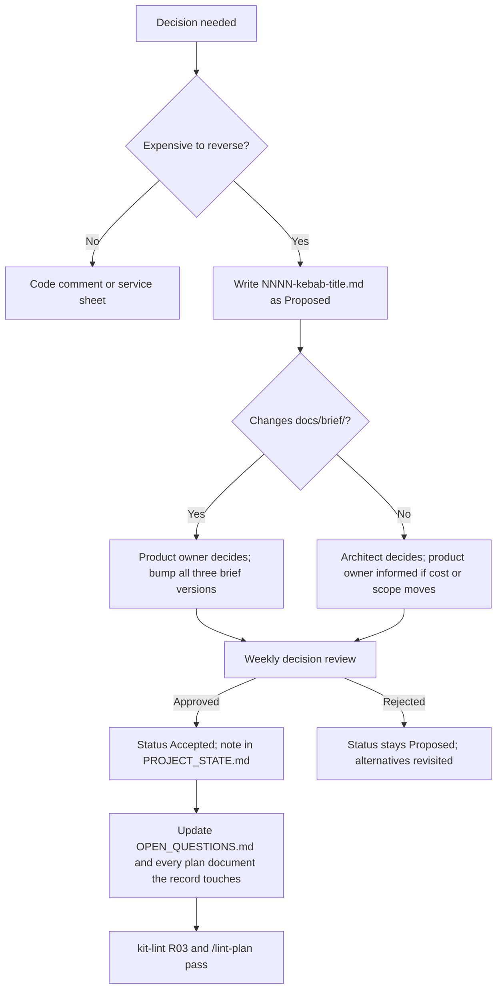

# 29. Architecture Decision Record Index

> Group F. Every decision record in `docs/project/DECISIONS/`, what each one settles, the open question it closes or the brief section it changes, and the decisions the remaining groups are expected to raise. The records themselves are the source; this index is the map.

`0000-adr-template.md` is the template and is not a decision. Every record from 0001 to 0026 except 0019 is **Proposed, awaiting product owner confirmation**, because the weekly decision review in master brief Section 29 has not yet met; 0019 and 0027 are **Accepted**, because the product owner approved each directly (0019 on 2026-09-22, 0027 on 2026-09-26, when the product owner also approved the plan). A record moves to Accepted when that review approves it and the note is written in `docs/project/PROJECT_STATE.md`. Requirement areas use the codes in Appendix L; where a record cites a `REQ-PLAT-` identifier it is the cross-cutting platform-support area, not the Platform service (`PLT`).

---

## 1. The records

| ADR | Title | Status | Decision in one sentence | Closes or changes | Requirement area |
|---|---|---|---|---|---|
| 0001 | Target .NET 10 (LTS) instead of .NET 8 | Proposed | The product targets .NET 10 because .NET 8 loses security patches on 10 November 2026, inside the roadmap, and code stays free of anything that blocks a one-step retarget | Open question 1 once confirmed; keeps the fallback list in master brief Section 19 as the written reversal path | `INF`, every service |
| 0002 | Fix the service catalog at twenty services, with Assessment and Behavior separate | Proposed | The catalog is twenty data-owning services plus Gateway and two backends-for-frontends, defined only in Appendix L, with a 14-service merge option that needs its own ADR naming the split date | Open question 7 (default); replaces the "about 12" estimate in master brief Section 7 | `PLAT` (REQ-PLAT-001), `ASM`, `BEH` |
| 0003 | The seeded administrator is the platform super administrator only | Proposed | One seeded account exists at platform scope; no tenant ever receives a seeded account, and the seeder refuses the documented default password outside Development | Settles master brief Section 27 decision 9; removes the per-tenant option from Section 10 | `IDN` (REQ-IDN-001), `SEC` |
| 0004 | Use Wolverine for the mediator, transport, outbox and sagas | Proposed | Wolverine covers mediator, RabbitMQ transport, outbox, inbox and saga persistence under MIT, hidden behind `Nibras.BuildingBlocks.Messaging` | Open question 6 (default); confirms the choice in master brief Section 8 | `MSG` (REQ-MSG-001) |
| 0005 | Run Redis as unmodified standalone infrastructure under AGPL, with Valkey as a drop-in fallback | Proposed | Redis runs unmodified under its AGPLv3 option with only the MIT client linked, Valkey is tested as a fallback, and every standalone AGPL or GPL tool is listed in master brief Section 6 and in `tools/license-scan/allow.json` | Changes master brief Section 6 (the standalone-tool list); no open question | `PERF` (REQ-PERF-001), `INF` |
| 0006 | All caching goes through HybridCache behind Nibras.BuildingBlocks.Caching | Proposed | Every service caches through one building block that adds the tenant to every key and tag, with a test that tenant A cannot read tenant B | Confirms master brief Section 19 caching rules; names FusionCache as the .NET 8 fallback | `PERF` (REQ-PERF-002), `SEC` |
| 0007 | Generate PDFs with Gotenberg, from HTML | Proposed | Documents renders HTML to PDF through a Gotenberg container with Inter, IBM Plex Sans Arabic and a Noto Naskh fallback bundled, proven by a bilingual snapshot test | Confirms master brief Section 19 font rules; excludes QuestPDF and iText under Section 6 | `DOC` (REQ-DOC-001), `L10N` |
| 0008 | Use ASP.NET Core Identity with OpenIddict rather than Keycloak | Proposed | Identity hosts the token server in-process with OpenIddict so join, delegation and access-review flows live next to the user model; Keycloak stays the enterprise alternative | Open question 13 (default); opens open question 18 on SAML and SCIM | `IDN` (REQ-IDN-002) |
| 0009 | Platform owns settings, terminology and custom-field definitions; services own the values | Proposed | Platform owns the definitions and publishes their change events; each service stores the values on its own entities and keeps a local copy of the definitions it needs | Settles the v8 ownership question; corrects Appendix B namespaces and Appendix F entity placement | `PLT` (REQ-PLT-002) |
| 0010 | Rollback means redeploying the previous image; the schema is never rolled back | Proposed | Rollback is redeploying the previous application image, made safe by expand-and-contract migrations and a pipeline test that runs the previous image against the new schema | Settles the v8 rollback question; reconciles master brief Section 19 and Section 23 | `INF` (REQ-INF-001), `DATA` |
| 0011 | A school group is one tenant with several campuses | Proposed | A group is one tenant, group reporting is campus aggregation inside it, and cross-tenant consolidation is a Tier 3 opt-in built on exports | Settles the v8 tenancy question; reconciles master brief Section 9 with the Tier 2 description | `DATA` (REQ-DATA-001), `SEC` |
| 0012 | The public API, webhooks and standards belong to the Platform service; Requests owns tasks | Proposed | Platform gains the Integrations capability (keys, webhooks, developer portal, OneRoster, LTI); Requests owns the Task aggregate; Notification owns inbox delivery | Settles the v8 ownership question; gives an owner to master brief Section 12 and Section 35 promises | `INT` (REQ-INT-001), `PLT`, `RQS` |
| 0013 | Split the appendices into one file per appendix | Proposed | The appendices live in `docs/brief/02-appendices/` as one file per letter with an index, and references keep the form "Appendix X" | No open question; changes the shape of the brief set, not its content | `PLAT` (REQ-PLAT-002) |
| 0014 | Every requirement, rule and workflow is proven by an identified test case | Proposed | `TC-<AREA>-<NNN>` with Given, When, Then and a Covers line is the unit of proof; Appendix V is the coverage matrix and the traceability matrix refuses an empty test cell | Defines the contract in master brief Section 24; adds Appendix V | `TST` (REQ-TST-001) |
| 0015 | Every intelligent feature declares an assist rung and an autonomy level, and explains itself | Proposed | Each feature carries an assist rung (1 to 4) and an autonomy level (1 to 4), the product is complete at rung 1, autonomy 4 is never allowed over a grade, a payment or a family message, and every automated decision shows a Because panel | Shapes master brief Section 25; adds Appendix W; bounds open question 5 to the Ai service's phase | `AI` (REQ-AI-001), `UX` |
| 0016 | Servers are Linux only; a Windows host is served by a virtual machine appliance | Proposed | All images are Linux; a Windows host runs a Linux virtual machine appliance for Hyper-V or VMware built from `deploy/onprem/`, and native Windows Server hosting is stated as unsupported | Open question 16 (default); confirms master brief Section 34 and Appendix X | `PLAT` (REQ-PLAT-003), `INF` |
| 0017 | Kit tooling is one Node implementation with PowerShell and bash wrappers | Proposed | Every tool is one Node script with `.ps1` and `.sh` wrappers, hooks invoke `node` by relative path, and the kit lint runs on a Windows and a Linux runner | No open question; corrects the v8 bash-only tooling | `PLAT` (REQ-PLAT-004) |
| 0018 | Work is broken down into slices of one to three days | Proposed | Phase, capability (`CAP-<AREA>-<NN>`) and slice (`SL-<AREA>-<NNN>`) are the only three levels; slices split by use case, estimate in day ranges, and every requirement must be reachable from a slice | No open question; refines master brief Section 26 and Section 28; adds document 34 to `docs/plan/PLAN_SPEC.md` | `PLAT` (REQ-PLAT-005), `TST` |
| 0019 | The brief is corrected to v9.1 from the defects the plan found | Accepted | Every logged brief defect applied with the service sheets' names; all three briefs bumped to v9.1; cooling-off 30 days, invitations 14 days with a day-7 reminder, deduplication 5 minutes, feature 39 moved to engineering capabilities; full list in `docs/project/KIT_V9_1_CHANGES.md` | Settles four conflicting values (cooling-off, invitation expiry, deduplication window, feature 39); closes the brief defects logged in `tools/plan-build/parts/brief-findings.md`; records Open Questions 27 and 28 | All areas; `PLT` (REQ-PLT-007), `ATT` (REQ-ATT-017), `INT` (REQ-INT-016) |
| 0020 | Every test case is defined in exactly one document | Proposed | One definition per `TC-` identifier, cited everywhere else with its owner named; owner by precedence (Appendix R, W, the area's sheet, the area's document); kit-lint R20 enforces it and `16-annex-test-case-registry.md` is generated from the same code; Appendix W's twelve colliding demo tests move to the 810 range; brief v9.2 | No open question; refines ADR-0014; closes scorecard theme 5 | `TST` (REQ-TST-001, REQ-TST-009, REQ-TST-025) |
| 0021 | Every verification claim names a check that runs | Proposed | A "How this document is verified" row names a kit-lint rule that checks the claim as its code is written, a review step naming who compares what and when, or a product artefact built by a named slice at a path in document 07; kit-lint gains R21 to R32 and R18 becomes an error for plan trees; brief v9.3 | No open question; closes scorecard theme 6; labels the one unlabelled Appendix R transition (WF-FIN-04) | `TST` (REQ-TST-025) |
| 0022 | Every open point is scored, and the serious ones are register risks | Proposed | Every plan document and service sheet has an Open points table whose rows carry a likelihood and an impact on the scales of document 18, their product, and the register risks that cover them; a point scoring 12 or more names a RISK in document 18; kit-lint R33 and R24 enforce it | No open question; closes scorecard theme 7; adds the four columns to the plan-document and service-sheet templates and gives document 12's threat tables an owner and a register link | `TST` (REQ-TST-025) |
| 0023 | Every signature feature runs its own demo test in the release gate | Proposed | Each of the 43 signature features is shown by an Appendix O minute or reserve step whose Test cell runs the feature's Appendix W demo test; the demo gate runs every step whose phase has shipped; kit-lint R34 enforces it; brief v9.4 | No open question; closes scorecard theme 8 | `TST` (REQ-TST-022) |
| 0024 | Some Tier 2 requirements are built before Tier 1 is complete | Proposed | Every Tier 2 or Tier 3 requirement that a phase 1 to 4 slice builds is listed in the record with the reason it is built early, and `17-roadmap.md` carries the same list in its table "Requirements built ahead of their tier"; a Tier 2 requirement in a Tier 1 phase with no row there is a defect | No open question; records the plan's departure from master brief Section 13 ("Tier 1 must be complete and polished before Tier 2 begins") and answers the tier check of RISK-02 in `18-risk-register.md` (a Tier 2 slice enters a Tier 1 phase only with a record) | `TST` (REQ-TST-025), and every area with a row in the list |
| 0025 | Master brief Section 28's ranges are re-derived after remediation round 5 | Proposed | The brief quotes the ranges `schedule-34.mjs` produces from document 34 as it stands: phase 3 11 to 18 weeks, phase 4 7 to 12, launch 61 to 95; brief v9.5 | No open question; follows the round-5 slices SL-ACA-405 and SL-FIN-448 to SL-FIN-452, and depends on Open Questions 3 and 9 for the conditional e-invoicing slices: 3 for the country of a VAT-registered first customer, 9 for whether e-invoicing plug-ins are built in phase 3 at all | `TST` (REQ-TST-025) |
| 0026 | Appendix N uses the backend-for-frontend route prefix of document 22 | Proposed | N-05 exercises `GET /bff/mobile/v1/home/principal` and N-08 `POST /bff/mobile/v1/sync/batch`, the prefix documents 08, 09, 22 and both BFF sheets use; brief v9.6 | No open question; closes the round-5 finding and the Bff.Mobile sheet's open point 1 | `BFF` (REQ-BFF-008) |
| 0027 | A tenant is billed on students enrolled, prorated by day, as master brief Section 36 states | Accepted | The billable active-student count is the Section 36 definition, computed by Platform: BR-FIN-017 is rewritten to it and owned by Platform, BR-PLT-005's active-student meter is that count, and BR-FIN-018 (now Platform's) applies a downgrade at the next renewal; brief v9.7 | Closes Open Question 30 with the recommended answer and closes RISK-52; changes Appendix S (BR-FIN-017, BR-FIN-018, BR-PLT-005) | `PLT` (REQ-PLT-009) |

**Counts, quoted.** Twenty-seven records: twenty-five Proposed (0001 to 0018 and 0020 to 0026), two Accepted (0019 and 0027). One closes an open question outright because it is Accepted (0027, Open Question 30). Five carry the default for an open question (0001, 0002, 0004, 0008, 0016). Six carry the default for a v8 question and appear in the table of `docs/project/OPEN_QUESTIONS.md` headed "Proposed in v9: default in force until the product owner accepts the record" (0002, 0003, 0009, 0010, 0011, 0012): each default is in force, and the question is settled only when the product owner accepts the record; 0002 does both. Eight change or refine a brief section with no open question behind them (0005, 0006, 0007, 0013, 0014, 0015, 0017, 0018). Seven correct the brief from what plan review found and bump it to v9.1, v9.2, v9.3, v9.4, v9.5, v9.6 and v9.7 (0019, 0020, 0021, 0023, 0025, 0026, 0027). Two set a plan rule with no open question and no brief version bump (0022, 0024); 0024 records where the plan departs from the tier order of master brief Section 13. The brief stands at v9.7.

### Which open questions have a record, and which do not

| Open question | Record | Why there is no record |
|---|---|---|
| 1 .NET version | ADR-0001 | |
| 6 Messaging library | ADR-0004 | |
| 7 Merged services | ADR-0002 | |
| 13 Identity server | ADR-0008 | |
| 16 Windows hosts | ADR-0016 | |
| 5 AI hardware | Bounded by ADR-0015 | The answer moves a phase, not an architecture |
| 18 SAML and SCIM | Opened by ADR-0008 | Answering it may need a superseding record |
| 2, 3, 4, 8, 9, 10, 11, 12, 14, 15, 17, 19, 20, 21, 22, 24, 25, 26 | none | Product owner decisions: commercial, market, scope and delivery. A default only the product owner can overturn needs an answer in `OPEN_QUESTIONS.md`, not an architecture record. When an answer changes the brief, the change itself gets a record under the rule below |
| 23 Mobile state | none yet | Raised by Group D; see the table of decisions to come |
| 27 Absence-alert timing | none | A product owner decision on one configured delay of WF-ATT-01; the default in force is within 30 seconds (REQ-ATT-017), and if the answer changes Appendix R the brief change gets a record under the rule below. RISK-41 |
| 28 Tier of the read-only public API, OneRoster and iCal | none yet | Decided by the product owner as a record, because a yes changes Appendix W row 24 and the phase scope (`23-integrations-and-public-api.md` open point 1). RISK-42; in the table of decisions to come |
| 29 Wellbeing check-in answer on the device | none yet | Decided by the privacy officer, then the product owner. The default in force is the device outbox the plan builds (SL-WEL-619), which contradicts the rule that Wellbeing data never reaches a device until the question is decided; online-only is recommended. Keeping the outbox needs a record with a DPIA entry. RISK-47; in the table of decisions to come |
| 30 Which count bills a tenant | ADR-0027, Accepted | Decided by the product owner on 2026-09-26 with the recommended answer: master brief Section 36 and REQ-PLT-009 (students enrolled on the billing date, prorated by day), computed by Platform; BR-FIN-017 was rewritten to it with brief v9.7. The question is settled and RISK-52 is Closed |
| 31 Kindergarten daily-sheet permission | none yet | Decided by the product owner, and made as a record because the answer amends Appendix B (a daily-sheet resource with view, create and edit) and Appendix C (a daily-sheet row) with a version bump of the three briefs. The default in force is yes, as the Academics sheet open point 1 proposes; until the amendment lands the daily sheet names no permission string and its folder is not deployed, and if it has not landed by phase 2, SL-ACA-209 and SL-ACA-400 to SL-ACA-404 move to phase 5. No RISK, because the score is 9; in the table of decisions to come |

---

## 2. The process

Sourced from `docs/templates/adr.md`, `.claude/skills/adr/SKILL.md` and master brief Section 29. A record captures **why**; the code already says what.

### When a record is needed

| Decision kind | Record needed | Example in this index |
|---|---|---|
| A service boundary | Yes | ADR-0002, ADR-0012 |
| A published contract (event, endpoint, message shape) | Yes | ADR-0009 (the `platform.*.changed` events) |
| A dependency that reaches every service | Yes | ADR-0004, ADR-0005, ADR-0006, ADR-0007 |
| A data model that will hold production data | Yes | ADR-0011 |
| A security or privacy control | Yes | ADR-0003 |
| A deviation from the reference architecture | Yes | Any Group C or D document that departs from `docs/brief/03-reference-architecture.md` |
| Raising a performance budget | Yes, decided by the architect | None yet; expected from Group C |
| A change to anything under `docs/brief/` | Yes, plus a version bump | ADR-0013, ADR-0014, ADR-0015 |
| Merging services for a first release | Yes, naming the expected split date | Required by Appendix L if open question 7 is answered "merge" |
| A migration that cannot be made backward compatible | Yes, plus a maintenance window | ADR-0010 names the rule |
| Anything else | No; a code comment or a line in the service sheet | |

### Who proposes, who decides, who records

Quoted from the decision-rights table in master brief Section 29.

| Decision | Proposes | Decides | Records |
|---|---|---|---|
| Architecture, technology, boundaries | Architect | Architect, with the product owner informed when cost or scope moves | ADR in `docs/project/DECISIONS/` |
| Anything that changes `docs/brief/` | Anyone | Product owner | ADR plus a version bump on the brief |
| Raising a performance budget | Engineer | Architect | ADR |
| Adding a dependency | Engineer | Architect, after the licence auditor | `19-dependency-and-license-inventory.md`; an ADR only when it reaches every service |
| Accepting a security finding without a fix | Engineer | Product owner and architect together | `docs/project/RISKS.md`, not an ADR |

A record is Proposed when written and Accepted when the weekly decision review approves it. The approval is a written note in `docs/project/PROJECT_STATE.md`; a verbal yes is the signal to write that note.

### The version-bump rule for brief changes

| Rule | Enforced by |
|---|---|
| The three brief files (`01-master-brief.md`, `02-appendices/`, `03-reference-architecture.md`) carry the same version in their title | `kit-lint` rule R03 fails on drift |
| A change to any brief file bumps all three together and cites the record that caused it | The decision-rights table above; `/change-request` and `/decide` refuse to edit a brief file without an ADR number |
| The plan never contradicts the brief silently; a plan document that departs from it records an ADR and the brief is updated in the same session | Rule 4 in `docs/plan/PLAN_SPEC.md`; `plan-consistency-checker` compares each plan document with the brief sections it cites at its group review, and kit-lint R22 fails on a cited ADR that has no record |
| An accepted record is never edited; a new record supersedes it and the old one is marked "Superseded by ADR-NNNN" | Review of the DECISIONS folder; `/retro` stops when a correction contradicts an accepted record, because that is a superseding decision and not a retro item |

### Shape of a record

| Section | Rule |
|---|---|
| Title | Names the decision as a claim, not the topic: `0009-platform-owns-settings`, never `0009-settings` |
| File | `docs/project/DECISIONS/NNNN-kebab-title.md`, four digits, next free number |
| Status, Date, Deciders, Requirement IDs | All present; the requirement identifiers use Appendix L area codes |
| Context | The forces, what the brief says, and what changed to make this a decision rather than a default |
| Decision | Actionable without a follow-up question |
| Alternatives considered | At least two, each with its cost and why it lost; if there was one option, what forced it |
| Consequences | What got easier and what got harder; a record listing only benefits is advocacy |
| Revisit when | A concrete trigger, such as a tenant exceeding 20,000 students |
| Downstream changes made | The documents changed and the open questions closed or opened, in the same session |

---

## 3. Decisions the plan will need next

Every group from C to F has now been written, so this is the list of decisions still to be recorded, refreshed at the round 3 remediation (2026-09-26). Each has a default in force so nothing blocks; the record is written when the decision is taken, and the number is the next free one at that time. Rows the groups settled in a plan document without needing a record are listed after the table with where they were settled; rows raised by Group F's open points and by the open questions document 34 builds on were added.

| Decision | Raised by | Why it needs a record | Default until decided | Open question or brief section |
|---|---|---|---|---|
| The Flutter major pinned at Phase 0 | Group D (document 09) | Desktop kiosk targets and Impeller rendering depend on it | Latest stable at project start | Reference architecture Section 16 |
| Riverpod or flutter_bloc | Group D (document 09) | Fixes the state folder of every mobile feature | Riverpod | Open question 23 |
| Partition boundaries per service beyond attendance and audit | Group C (document 10 and each sheet) | A data model that holds production data; partitions are hard to change after the first year | Attendance and audit monthly from day one per master brief Section 34; others unpartitioned until a query budget says otherwise | Master brief Section 19 |
| Whether any service departs from the reference architecture's folder anatomy | Group C (every service sheet) | A deviation from the reference architecture always needs a record | None; the anatomy in reference architecture Section 2 as written | Reference architecture Section 2 |
| Any performance budget raised above the numbers in master brief Section 21 | Group C (document 21) | Raising a budget is an architect decision recorded as an ADR | The budgets as written | Master brief Section 21 |
| The 14-service merge for a first release, if open question 7 is answered "merge" | Group C, decided before Group E | Appendix L requires a record naming the expected split date | Twenty services, separate | Open question 7 |
| SAML 2.0 and SCIM adapters in Phase 1, if open question 18 is answered "yes" | Group D (document 12) | May supersede ADR-0008 for an SSO-heavy customer | Tier 2 protocol adapters on OpenIddict | Open question 18 |
| GitHub Actions or Forgejo with Woodpecker as the pipeline host | Group E (document 15, which records the forge as an open point of document 07) | The workflow files in reference architecture Section 11 are written once for one host | GitHub Actions free tier, with `.woodpecker/` as the named alternative | Master brief Section 6 |
| Argo CD or Flux for GitOps | Group E (document 15) | The `deploy/gitops/` tree is written for one | Argo CD | Reference architecture Section 6 |
| The hosting provider and first region | Group E (document 15 and 28) | Fixes the OpenTofu modules and the residency promise | One region, chosen with the first customer | Open question 15 |
| Hosted macOS runner minutes or a Mac build host | Group E (document 15), costed in document 28 | Fixes the runner label for `ci-mobile-ios.yml` and the signing key custody | Hosted runner minutes | Open question 14 |
| The appliance's phase: 2 or 6 | Group E (document 17) | Moves the nested-virtualisation job and the quarterly drill | Phase 6 | Open question 16 and open question 2 |
| The first payment gateway adapter | Group F (document 23 and 26), built in Phase 3 | A published integration contract and a reconciliation format | Manual and bank transfer only; one adapter chosen with the first customer | Open question 21 |
| The first SMS provider adapter | Group F (document 23), built with Notification | A published channel adapter and a per-message cost line | None; email and push only | Open question 22 |
| The Huawei push adapter's tier | Group F (document 33), Group D (document 09) | Moves a Tier 2 plug-in into a release gate | Tier 2, built when the device share justifies it | Open question 17 |
| The local model server for rung 3 | Group F (document 25) | A dependency behind the `ai` compose profile with hardware consequences | Off by default; the product is complete at rung 1 | Open question 5 |
| Retention configuration per country, if it departs from master brief Section 32 | Group F (document 27) | A data-lifecycle rule that holds production data | The defaults in Section 32 | Open question 19 |
| Certification purchase (SOC 2, 1EdTech) | Group F (document 27 and 28) | Budget and timeline, both material | Compatibility only | Open question 26 |
| Jitsi Meet or LiveKit for online classes | Group C (Academics sheet, open point 4) | An embedded dependency with a licence row and an operations cost | Jitsi Meet embed, the lighter option to operate; both are in `19-dependency-and-license-inventory.md` | Master brief Section 6 |
| `_INTERNAL_ERROR` (500) as the ninth cross-cutting suffix of Appendix K.1 | Group F (`22-api-conventions-and-error-catalog.md` open point 1) | A change to `docs/brief/` needs a record and a version bump | Emitted by the middleware now; Appendix K.1 amended with the next brief version | Appendix K.1 |
| Credential material in Identity and key policy in Platform | Group F (`23-integrations-and-public-api.md` open point 2) | Splits an ownership that Appendix L.5 gives Platform and Appendix F places under Identity | As document 23 §2.2, recorded alongside ADR-0012 | Appendix L.5, Appendix F |
| A separate worker image for the webhook dispatcher | Group F (`23-integrations-and-public-api.md` open point 4) | A new image name is an Appendix L change | Inside `nibras/platform-api`, with its own concurrency limit and health check | Appendix L |
| The autonomy column moved into Appendix W | Group F (`25-ai-and-assist-ladder.md` open point 1) | A change to `docs/brief/` needs a record and a version bump | Kept in document 25 §2 until the next brief version | Appendix W |
| The open-weight model pinned for Arabic drafting | Group F (`25-ai-and-assist-ladder.md` open point 2) | A dependency behind the `ai` profile that every drafting feature uses | The best scorer on the golden sets of document 25 §6 among licence-compatible models at the Ai phase | Open question 5; master brief Section 25 |
| Retention of coursework submissions in Appendix J | Group F (`28-capacity-and-cost-model.md` open point 3) | A data-lifecycle rule that holds production data, and a change to `docs/brief/` | Until leaving plus 3 years | Appendix J; master brief Section 32 |
| The three edge cases `TC-PLAT-015` to `TC-PLAT-017` added to Appendix X.3, and the `macos-latest` runner added to the dev-smoke row of Appendix X.2 | Group F (`33-platform-support-and-dev-environments.md` open point 4) | A change to `docs/brief/` needs a record and a version bump | Allocated, tested and run in document 33 meanwhile | Appendix X |
| A read-only public API, the OneRoster export and iCal moved into Tier 1 | Group F (`23-integrations-and-public-api.md` open point 1; also document 22 open point 4 and document 32 open point 2) | Changes Appendix W row 24 and the phase scope of master brief Section 28 | They stay Tier 2 where the roadmap builds them: iCal in phase 2, the public API and OneRoster in phase 3. RISK-42 | Open question 28 |
| The Wellbeing check-in answer waiting in the device outbox | `06-services/wellbeing.md` open point 8; built on by `34-work-breakdown.md` SL-WEL-619 | Keeping the outbox departs from master brief Section 20 and Appendix M.1 and needs a record with a DPIA entry | The device outbox the plan builds (SL-WEL-619), which contradicts the no-device rule until the privacy officer and the product owner decide; online-only is the recommended answer. RISK-47 | Open question 29 |
| A kindergarten daily-sheet resource in Appendix B and a daily-sheet row in Appendix C | `06-services/academics.md` open point 1; built on by `34-work-breakdown.md` SL-ACA-209 and SL-ACA-400 to SL-ACA-404 | A change to `docs/brief/` needs a record and a version bump of the three briefs | Yes, as the Academics sheet proposes; until the amendment lands the daily sheet names no permission string and its folder is not deployed, and if it has not landed by phase 2 those slices move to phase 5 and reserve step R-08 (`TC-ACA-810`) cannot run | Open question 31 |

**Settled since this list was first written, with no record needed.**

| Decision | Settled in | Why no record |
|---|---|---|
| Exact library versions with verified licences | `19-dependency-and-license-inventory.md` | The decision-rights table makes the inventory the record for a dependency; none of the pinned versions changes an architecture |
| The Angular major pinned at Phase 0 | `19-dependency-and-license-inventory.md` pins `@angular/core` 22.1.7 | The default, latest stable, was taken |
| Redis Sentinel or Redis cluster for the scale mode | `21-performance-engineering.md` §2.4: Sentinel, with cluster mode past a stated size | The default was taken, and the switch point is written where the sizing lives |
| Deprecation window for the public API | `23-integrations-and-public-api.md` §5: 12 months after the successor ships | Master brief Section 35 sets it; the plan quotes the brief and changes nothing |

**Recorded since this list was refreshed.** The count that bills a tenant (Open Question 30, raised by `06-services/finance.md` open point 3 and built on by `34-work-breakdown.md` SL-PLT-010) left the table above when the product owner Accepted ADR-0027 on 2026-09-26 (brief v9.7).

**What is deliberately not on this list.** Anything the brief already fixes: YARP as the gateway, PostgreSQL, RabbitMQ, Drift for offline storage, `go_router`, Gotenberg. Those have a record already or are stated in master brief Section 6 with their licence and their rejected alternative, and a plan document that reopens one of them is the defect.

---

## Open points

| Question | Default | Owner | Impact if the default is wrong | L | I | Score | In the register |
|---|---|---|---|---|---|---|---|
| Does the weekly decision review confirm the twenty-five Proposed records (0001 to 0018, 0020 to 0026) as written? It has not met, so only 0019 and 0027, which the product owner approved directly, are Accepted | The plan and the first slices build on every Proposed record as written; each record names its alternatives and a revisit trigger | Product owner | A record rejected or amended after Phase 1 slices depend on it reworks what it shaped: the runtime (0001), the service count (0002), the messaging block (0004) or the identity server (0008), each moving a phase by more than a month; until the review meets, every record also waits on one approver | 3 | 4 | 12 | RISK-01, RISK-44 |
| Is open question 23 (Riverpod or flutter_bloc) recorded before Phase 2 builds the first mobile feature? Section 1 shows it with no record yet | Riverpod, the decision in force in `09-mobile-structure.md`, recorded under the next free number when Group D's decision is written | Architect | The question stays open in two documents while `TC-MOB-721` already asserts the answer; a reversal is confined to the mobile state folders | 2 | 1 | 2 | none |
| Do the defaults in Section 3 hold until each decision is recorded? | Each row's "Default until decided" stands, and the owning document scores the row as its own open point where it is still open (for example open question 14 in `33-platform-support-and-dev-environments.md`) | Architect | A default overturned late moves the work its row names; the cost is carried by the owning document's open point, not here | 3 | 2 | 6 | none |

> L and I are the likelihood that the default is wrong and the impact if it is, on the 1 to 5 scales of `18-risk-register.md` Section 1. Score is L x I. A point that scores 12 or more names its RISK identifier in document 18 (ADR-0022).

---

## Review record

| Date | Reviewer | Verdict | Blocking items |
|---|---|---|---|
| 2026-09-22 | Group F review, round 1 (independent adversarial scorecard) | Blocked: the group scored below 4 on Completeness, Consistency, Feasibility, Risk honesty, Testability and Distinctiveness | The index held only 18 Proposed records and none of the records Group F's open points call for; no Open points and no Review record section (Completeness, Risk honesty) |
| 2026-09-26 | Group F review, round 2 | Blocked: the group scored below 4 on Completeness, Consistency, Risk honesty and Testability | Open points were added and 0019 to 0023 indexed. Still open: the Proposed count said twenty-two in one place and twenty-one in another, both omitting 0023 (Consistency); §3 still said "Groups C to F are expected to raise these", kept rows already settled and lacked the Group F candidates; no Review record (Completeness) |
| 2026-09-26 | Round 3 remediation | Amended; awaiting the round 3 score | One count everywhere: twenty-four records, twenty-three Proposed (0001 to 0018, 0020 to 0024), 0019 Accepted; ADR-0024 indexed; open questions 27 to 30 added to the question table with their defaults in force; §3 refreshed with the Group F candidates and the settled rows moved to their own table; this record added |
| 2026-09-26 | Group F review, round 3 | Blocked: the group scored below 4 on Completeness, because document 31 listed no transition-test ids per workflow | None of the group's blocking gaps was in this document; this record stopped at "awaiting the round 3 score" (Completeness, not blocking) |
| 2026-09-26 | Group F review, round 4 | Blocked: the group scored below 4 on Consistency, because SL-ACA-207 in document 34 built `LaunchLtiTool` in phase 2 against the default of document 17 | None in this document; this record still recorded no round-3 verdict (Completeness, not blocking) |
| 2026-09-26 | Round-4 scorecard, Group F, then remediation round 5 | Amended; awaiting the round 5 score | The round 3 and round 4 verdicts recorded above. ADR-0024 stays Proposed; its REQ-ACA-030 row now records the launch as already moved to phase 4 (SL-ACA-405), which changes no entry of this index |
| 2026-09-26 | Remediation round 5, brief v9.5 | Amended | ADR-0025 indexed; counts now twenty-five records, twenty-four Proposed (0001 to 0018, 0020 to 0025), 0019 Accepted; the brief stands at v9.5 |
| 2026-09-26 | Round-5 scorecard, remediation round 6 | Amended; awaiting the round 6 score | Group F was approved with minor gaps. Open question 31 (the Appendix B and C daily-sheet amendment, made under a record) added to the question table of §1 and to the decisions to come of §3; ADR-0025's row, and the record itself, tie the conditional e-invoicing slices to open questions 3 and 9, as document 34 does; ADR-0026 (brief v9.6, the backend-for-frontend route prefix in Appendix N) indexed, so the counts are now twenty-six records, twenty-five Proposed (0001 to 0018, 0020 to 0026), 0019 Accepted, and the brief stands at v9.6 |
| 2026-09-26 | Open Question 30 decided (ADR-0027) | Amended | ADR-0027 indexed as Accepted; counts now twenty-seven records, twenty-five Proposed (0001 to 0018, 0020 to 0026), two Accepted (0019 and 0027); the question table shows Open Question 30 decided by ADR-0027 and the billing count left the decisions to come; the brief stands at v9.7 |

## How this document is verified

| Claim | Proof |
|---|---|
| Every file in `docs/project/DECISIONS/` from 0001 upward has one row in the table, with the same title and status as the file | kit-lint R22 fails when a record (the 0000 template aside) has no row or two rows, a row has a record the folder lacks, a row's cell count differs from the table's columns, or a row's Status does not start with the record's Status line. Titles are not in R22: `plan-consistency-checker` compares each title with the record's heading at every group review and whenever a record is added |
| Every record's "Closes or changes" column agrees with the "Proposed in v9" and "Settled in v9.1" tables and the open-question rows in `docs/project/OPEN_QUESTIONS.md` | kit-lint R22 fails on an ADR number cited in `OPEN_QUESTIONS.md`, or anywhere under `docs/`, that has no record, and with the row check above every record is in this index. That the column agrees with those two tables and the open-question rows is checked by `plan-consistency-checker` at every group review and on every change to either file |
| Every requirement area in the table is a code from Appendix L | `plan-consistency-checker` compares every code in the Requirement area column with Appendix L at every group review and whenever a record is added; kit-lint R19 fails on a `REQ-` identifier cited here that document 03 does not define |
| Every record follows the template: two alternatives, consequences with what got harder, a revisit trigger | `/review-architecture` reads the folder against `.claude/skills/adr/SKILL.md`; a record missing a section is returned to Proposed with a note |
| The three brief files carry one version and every brief change has a record | `kit-lint` rule R03 |
| The Mermaid block opens with a known diagram type | `kit-lint` rule R17 |
| The "decisions the plan will need next" table stays true | Each group's `/score-plan` run checks that a decision listed for that group was either recorded or explicitly deferred with a reason in `docs/project/PROJECT_STATE.md`; `/retro` after each review adds any decision the product owner raised that this table did not anticipate |
