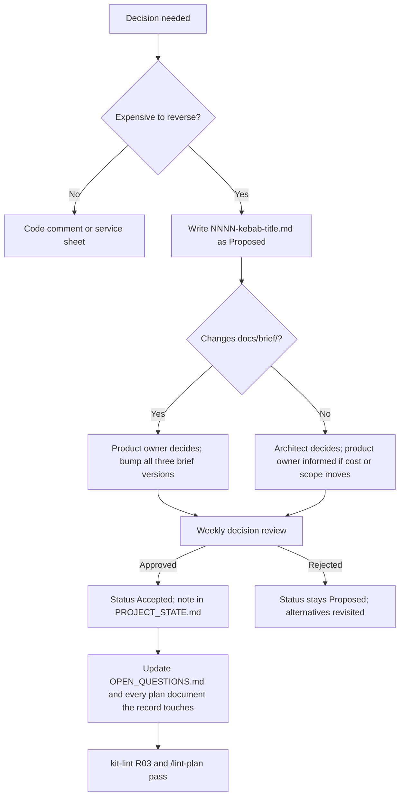

# 29. Architecture Decision Record Index

> Group F. Every decision record in `docs/project/DECISIONS/`, what each one settles, the open question it closes or the brief section it changes, and the decisions the remaining groups are expected to raise. The records themselves are the source; this index is the map.

`0000-adr-template.md` is the template and is not a decision. Every record from 0001 to 0018 is **Proposed, awaiting product owner confirmation**; 0019 is **Accepted**, because the product owner approved it directly, because the weekly decision review in master brief Section 29 has not yet met. A record moves to Accepted when that review approves it and the note is written in `docs/project/PROJECT_STATE.md`. Requirement areas use the codes in Appendix L; where a record cites a `REQ-PLAT-` identifier it is the cross-cutting platform-support area, not the Platform service (`PLT`).

---

## 1. The records

| ADR | Title | Status | Decision in one sentence | Closes or changes | Requirement area |
|---|---|---|---|---|---|
| 0001 | Target .NET 10 (LTS) instead of .NET 8 | Proposed | The product targets .NET 10 because .NET 8 loses security patches on 10 November 2026, inside the roadmap, and code stays free of anything that blocks a one-step retarget | Open question 1 once confirmed; keeps the fallback list in master brief Section 19 as the written reversal path | `INF`, every service |
| 0002 | Fix the service catalog at twenty services, with Assessment and Behavior separate | Proposed | The catalog is twenty data-owning services plus Gateway and two backends-for-frontends, defined only in Appendix L, with a 14-service merge option that needs its own ADR naming the split date | Open question 7 (default); replaces the "about 12" estimate in master brief Section 7 | `PLAT` (REQ-PLAT-001), `ASM`, `BEH` |
| 0003 | The seeded administrator is the platform super administrator only | Proposed | One seeded account exists at platform scope; no tenant ever receives a seeded account, and the seeder refuses the documented default password outside Development | Settles master brief Section 27 decision 9; removes the per-tenant option from Section 10 | `IDN` (REQ-IDN-001), `SEC` |
| 0004 | Use Wolverine for the mediator, transport, outbox and sagas | Proposed | Wolverine covers mediator, RabbitMQ transport, outbox, inbox and saga persistence under MIT, hidden behind `Nibras.BuildingBlocks.Messaging` | Open question 6 (default); confirms the choice in master brief Section 8 | `MSG` (REQ-MSG-001) |
| 0005 | Run Redis as unmodified standalone infrastructure under AGPL, with Valkey as a drop-in fallback | Proposed | Redis runs unmodified under its AGPLv3 option with only the MIT client linked, Valkey is tested as a fallback, and every standalone AGPL or GPL tool is listed in master brief Section 6 and in `tools/license-scan/allow.json` | Changes master brief Section 6 (the standalone-tool list); no open question | `PERF` (REQ-PERF-001), `INF` |
| 0006 | All caching goes through HybridCache behind Nibras.BuildingBlocks.Caching | Proposed | Every service caches through one building block that adds the tenant to every key and tag, with a test that tenant A cannot read tenant B | Confirms master brief Section 19 caching rules; names FusionCache as the .NET 8 fallback | `PERF` (REQ-PERF-002), `SEC` |
| 0007 | Generate PDFs with Gotenberg, from HTML | Proposed | Documents renders HTML to PDF through a Gotenberg container with Inter, IBM Plex Sans Arabic and a Noto Naskh fallback bundled, proven by a bilingual snapshot test | Confirms master brief Section 19 font rules; excludes QuestPDF and iText under Section 6 | `DOC` (REQ-DOC-001), `L10N` |
| 0008 | Use ASP.NET Core Identity with OpenIddict rather than Keycloak | Proposed | Identity hosts the token server in-process with OpenIddict so join, delegation and access-review flows live next to the user model; Keycloak stays the enterprise alternative | Open question 13 (default); opens open question 18 on SAML and SCIM | `IDN` (REQ-IDN-002) |
| 0009 | Platform owns settings, terminology and custom-field definitions; services own the values | Proposed | Platform owns the definitions and publishes their change events; each service stores the values on its own entities and keeps a local copy of the definitions it needs | Settles the v8 ownership question; corrects Appendix B namespaces and Appendix F entity placement | `PLT` (REQ-PLT-002) |
| 0010 | Rollback means redeploying the previous image; the schema is never rolled back | Proposed | Rollback is redeploying the previous application image, made safe by expand-and-contract migrations and a pipeline test that runs the previous image against the new schema | Settles the v8 rollback question; reconciles master brief Section 19 and Section 23 | `INF` (REQ-INF-001), `DATA` |
| 0011 | A school group is one tenant with several campuses | Proposed | A group is one tenant, group reporting is campus aggregation inside it, and cross-tenant consolidation is a Tier 3 opt-in built on exports | Settles the v8 tenancy question; reconciles master brief Section 9 with the Tier 2 description | `DATA` (REQ-DATA-001), `SEC` |
| 0012 | The public API, webhooks and standards belong to the Platform service; Requests owns tasks | Proposed | Platform gains the Integrations capability (keys, webhooks, developer portal, OneRoster, LTI); Requests owns the Task aggregate; Notification owns inbox delivery | Settles the v8 ownership question; gives an owner to master brief Section 12 and Section 35 promises | `INT` (REQ-INT-001), `PLT`, `RQS` |
| 0013 | Split the appendices into one file per appendix | Proposed | The appendices live in `docs/brief/02-appendices/` as one file per letter with an index, and references keep the form "Appendix X" | No open question; changes the shape of the brief set, not its content | `PLAT` (REQ-PLAT-002) |
| 0014 | Every requirement, rule and workflow is proven by an identified test case | Proposed | `TC-<AREA>-<NNN>` with Given, When, Then and a Covers line is the unit of proof; Appendix V is the coverage matrix and the traceability matrix refuses an empty test cell | Defines the contract in master brief Section 24; adds Appendix V | `TST` (REQ-TST-001) |
| 0015 | Every intelligent feature declares an assist rung and an autonomy level, and explains itself | Proposed | Each feature carries an assist rung (1 to 4) and an autonomy level (1 to 4), the product is complete at rung 1, autonomy 4 is never allowed over a grade, a payment or a family message, and every automated decision shows a Because panel | Shapes master brief Section 25; adds Appendix W; bounds open question 5 to the Ai service's phase | `AI` (REQ-AI-001), `UX` |
| 0016 | Servers are Linux only; a Windows host is served by a virtual machine appliance | Proposed | All images are Linux; a Windows host runs a Linux virtual machine appliance for Hyper-V or VMware built from `deploy/onprem/`, and native Windows Server hosting is stated as unsupported | Open question 16 (default); confirms master brief Section 34 and Appendix X | `PLAT` (REQ-PLAT-003), `INF` |
| 0017 | Kit tooling is one Node implementation with PowerShell and bash wrappers | Proposed | Every tool is one Node script with `.ps1` and `.sh` wrappers, hooks invoke `node` by relative path, and the kit lint runs on a Windows and a Linux runner | No open question; corrects the v8 bash-only tooling | `PLAT` (REQ-PLAT-004) |
| 0018 | Work is broken down into slices of one to three days | Proposed | Phase, capability (`CAP-<AREA>-<NN>`) and slice (`SL-<AREA>-<NNN>`) are the only three levels; slices split by use case, estimate in day ranges, and every requirement must be reachable from a slice | No open question; refines master brief Section 26 and Section 28; adds document 34 to `docs/plan/PLAN_SPEC.md` | `PLAT` (REQ-PLAT-005), `TST` |
| 0019 | The brief is corrected to v9.1 from the defects the plan found | Accepted | Every logged brief defect applied with the service sheets' names; all three briefs bumped to v9.1; cooling-off 30 days, invitations 14 days with a day-7 reminder, deduplication 5 minutes, feature 39 moved to engineering capabilities; full list in `docs/project/KIT_V9_1_CHANGES.md` |

**Counts, quoted.** Nineteen records: eighteen Proposed, one Accepted (0019). Five carry the default for an open question (0001, 0002, 0004, 0008, 0016). Six settle a v8 question and appear in the settled table of `docs/project/OPEN_QUESTIONS.md` (0002, 0003, 0009, 0010, 0011, 0012); 0002 does both. Eight change or refine a brief section with no open question behind them (0005, 0006, 0007, 0013, 0014, 0015, 0017, 0018).

### Which open questions have a record, and which do not

| Open question | Record | Why there is no record |
|---|---|---|
| 1 .NET version | ADR-0001 | |
| 6 Messaging library | ADR-0004 | |
| 7 Merged services | ADR-0002 | |
| 13 Identity server | ADR-0008 | |
| 16 Windows hosts | ADR-0016 | |
| 5 AI hardware | Bounded by ADR-0015 | The answer moves a phase, not an architecture |
| 18 SAML and SCIM | Opened by ADR-0008 | Answering it may need a superseding record |
| 2, 3, 4, 8, 9, 10, 11, 12, 14, 15, 17, 19, 20, 21, 22, 24, 25, 26 | none | Product owner decisions: commercial, market, scope and delivery. A default only the product owner can overturn needs an answer in `OPEN_QUESTIONS.md`, not an architecture record. When an answer changes the brief, the change itself gets a record under the rule below |
| 23 Mobile state | none yet | Raised by Group D; see the table of decisions to come |

---

## 2. The process

Sourced from `docs/templates/adr.md`, `.claude/skills/adr/SKILL.md` and master brief Section 29. A record captures **why**; the code already says what.

### When a record is needed

| Decision kind | Record needed | Example in this index |
|---|---|---|
| A service boundary | Yes | ADR-0002, ADR-0012 |
| A published contract (event, endpoint, message shape) | Yes | ADR-0009 (the `platform.*.changed` events) |
| A dependency that reaches every service | Yes | ADR-0004, ADR-0005, ADR-0006, ADR-0007 |
| A data model that will hold production data | Yes | ADR-0011 |
| A security or privacy control | Yes | ADR-0003 |
| A deviation from the reference architecture | Yes | Any Group C or D document that departs from `docs/brief/03-reference-architecture.md` |
| Raising a performance budget | Yes, decided by the architect | None yet; expected from Group C |
| A change to anything under `docs/brief/` | Yes, plus a version bump | ADR-0013, ADR-0014, ADR-0015 |
| Merging services for a first release | Yes, naming the expected split date | Required by Appendix L if open question 7 is answered "merge" |
| A migration that cannot be made backward compatible | Yes, plus a maintenance window | ADR-0010 names the rule |
| Anything else | No; a code comment or a line in the service sheet | |

### Who proposes, who decides, who records

Quoted from the decision-rights table in master brief Section 29.

| Decision | Proposes | Decides | Records |
|---|---|---|---|
| Architecture, technology, boundaries | Architect | Architect, with the product owner informed when cost or scope moves | ADR in `docs/project/DECISIONS/` |
| Anything that changes `docs/brief/` | Anyone | Product owner | ADR plus a version bump on the brief |
| Raising a performance budget | Engineer | Architect | ADR |
| Adding a dependency | Engineer | Architect, after the licence auditor | `19-dependency-and-license-inventory.md`; an ADR only when it reaches every service |
| Accepting a security finding without a fix | Engineer | Product owner and architect together | `docs/project/RISKS.md`, not an ADR |

A record is Proposed when written and Accepted when the weekly decision review approves it. The approval is a written note in `docs/project/PROJECT_STATE.md`; a verbal yes is the signal to write that note.

### The version-bump rule for brief changes

| Rule | Enforced by |
|---|---|
| The three brief files (`01-master-brief.md`, `02-appendices/`, `03-reference-architecture.md`) carry the same version in their title | `kit-lint` rule R03 fails on drift |
| A change to any brief file bumps all three together and cites the record that caused it | The decision-rights table above; `/change-request` and `/decide` refuse to edit a brief file without an ADR number |
| The plan never contradicts the brief silently; a plan document that departs from it records an ADR and the brief is updated in the same session | `/lint-plan`, and rule 4 in `docs/plan/PLAN_SPEC.md` |
| An accepted record is never edited; a new record supersedes it and the old one is marked "Superseded by ADR-NNNN" | Review of the DECISIONS folder; `/retro` stops when a correction contradicts an accepted record, because that is a superseding decision and not a retro item |

### Shape of a record

| Section | Rule |
|---|---|
| Title | Names the decision as a claim, not the topic: `0009-platform-owns-settings`, never `0009-settings` |
| File | `docs/project/DECISIONS/NNNN-kebab-title.md`, four digits, next free number |
| Status, Date, Deciders, Requirement IDs | All present; the requirement identifiers use Appendix L area codes |
| Context | The forces, what the brief says, and what changed to make this a decision rather than a default |
| Decision | Actionable without a follow-up question |
| Alternatives considered | At least two, each with its cost and why it lost; if there was one option, what forced it |
| Consequences | What got easier and what got harder; a record listing only benefits is advocacy |
| Revisit when | A concrete trigger, such as a tenant exceeding 20,000 students |
| Downstream changes made | The documents changed and the open questions closed or opened, in the same session |

---

## 3. Decisions the plan will need next

Groups C to F are expected to raise these. Each has a default so nothing blocks; the record is written when the group reaches the decision, and the number is the next free one at that time.

| Decision | Raised by | Why it needs a record | Default until decided | Open question or brief section |
|---|---|---|---|---|
| Exact library versions with verified licences for every NuGet, npm and pub dependency | Group E (document 19), refined by every Group C service sheet | Adding a dependency is an architect decision after the licence auditor; the inventory is the record for most, an ADR for any that reaches every service | The majors in reference architecture Section 16; exact versions pinned in `Directory.Packages.props`, `package.json` and `pubspec.yaml` at Phase 0 | Master brief Section 6 |
| The Angular major pinned at Phase 0, and whether it ships `animate.enter`, `animate.leave` and View Transitions | Group D (document 08), confirmed in Group E | A major with architectural consequences per reference architecture Section 16; the motion design in document 14 depends on the answer | Latest stable at project start; if the motion primitives are absent, CSS classes toggled by signals | Master brief Section 3 |
| The Flutter major pinned at Phase 0 | Group D (document 09) | Desktop kiosk targets and Impeller rendering depend on it | Latest stable at project start | Reference architecture Section 16 |
| Riverpod or flutter_bloc | Group D (document 09) | Fixes the state folder of every mobile feature | Riverpod | Open question 23 |
| Partition boundaries per service beyond attendance and audit | Group C (document 10 and each sheet) | A data model that holds production data; partitions are hard to change after the first year | Attendance and audit monthly from day one per master brief Section 34; others unpartitioned until a query budget says otherwise | Master brief Section 19 |
| Redis Sentinel or Redis cluster for the scale mode | Group C (document 21) | Changes the Helm chart and the client configuration for every service | Sentinel, with the two roles `redis-cache` and `redis-state` kept separate | Master brief Section 34 |
| Whether any service departs from the reference architecture's folder anatomy | Group C (every service sheet) | A deviation from the reference architecture always needs a record | None; the anatomy in reference architecture Section 2 as written | Reference architecture Section 2 |
| Any performance budget raised above the numbers in master brief Section 21 | Group C (document 21) | Raising a budget is an architect decision recorded as an ADR | The budgets as written | Master brief Section 21 |
| The 14-service merge for a first release, if open question 7 is answered "merge" | Group C, decided before Group E | Appendix L requires a record naming the expected split date | Twenty services, separate | Open question 7 |
| SAML 2.0 and SCIM adapters in Phase 1, if open question 18 is answered "yes" | Group D (document 12) | May supersede ADR-0008 for an SSO-heavy customer | Tier 2 protocol adapters on OpenIddict | Open question 18 |
| GitHub Actions or Forgejo with Woodpecker as the pipeline host | Group E (document 15) | The workflow files in reference architecture Section 11 are written once for one host | GitHub Actions free tier, with `.woodpecker/` as the named alternative | Master brief Section 6 |
| Argo CD or Flux for GitOps | Group E (document 15) | The `deploy/gitops/` tree is written for one | Argo CD | Reference architecture Section 6 |
| The hosting provider and first region | Group E (document 15 and 28) | Fixes the OpenTofu modules and the residency promise | One region, chosen with the first customer | Open question 15 |
| Hosted macOS runner minutes or a Mac build host | Group E (document 15), costed in document 28 | Fixes the runner label for `ci-mobile-ios.yml` and the signing key custody | Hosted runner minutes | Open question 14 |
| The appliance's phase: 2 or 6 | Group E (document 17) | Moves the nested-virtualisation job and the quarterly drill | Phase 6 | Open question 16 and open question 2 |
| The first payment gateway adapter | Group F (document 23 and 26), built in Phase 3 | A published integration contract and a reconciliation format | Manual and bank transfer only; one adapter chosen with the first customer | Open question 21 |
| The first SMS provider adapter | Group F (document 23), built with Notification | A published channel adapter and a per-message cost line | None; email and push only | Open question 22 |
| The Huawei push adapter's tier | Group F (document 33), Group D (document 09) | Moves a Tier 2 plug-in into a release gate | Tier 2, built when the device share justifies it | Open question 17 |
| The local model server for rung 3 | Group F (document 25) | A dependency behind the `ai` compose profile with hardware consequences | Off by default; the product is complete at rung 1 | Open question 5 |
| Deprecation window for the public API | Group F (document 23) | A published contract with integrators on the other side | Named in document 23 when written; the API versioning rules in master brief Section 35 bound it | Master brief Section 35 |
| Retention configuration per country, if it departs from master brief Section 32 | Group F (document 27) | A data-lifecycle rule that holds production data | The defaults in Section 32 | Open question 19 |
| Certification purchase (SOC 2, 1EdTech) | Group F (document 27 and 28) | Budget and timeline, both material | Compatibility only | Open question 26 |
| Jitsi Meet or LiveKit for online classes | Group C (Academics sheet) | An embedded dependency with a licence row and an operations cost | Jitsi Meet embed, the lighter option to operate | Master brief Section 6 |

**What is deliberately not on this list.** Anything the brief already fixes: YARP as the gateway, PostgreSQL, RabbitMQ, Drift for offline storage, `go_router`, Gotenberg. Those have a record already or are stated in master brief Section 6 with their licence and their rejected alternative, and a plan document that reopens one of them is the defect.

---

## How this document is verified

| Claim | Proof |
|---|---|
| Every file in `docs/project/DECISIONS/` from 0001 to 0019 has one row in the table, with the same title and status as the file | `/lint-plan` lists the folder and compares titles and status lines to this index; a record without a row, or a row without a record, is a defect in this document |
| Every record's "Closes or changes" column agrees with the settled table and the open-question rows in `docs/project/OPEN_QUESTIONS.md` | `/lint-plan` cross-checks ADR numbers cited in `OPEN_QUESTIONS.md` against this index |
| Every requirement area in the table is a code from Appendix L | `kit-lint` cannot check area codes in this document directly; `/lint-plan` checks `REQ-` identifiers against the registry and the traceability matrix in document 20 lists every one |
| Every record follows the template: two alternatives, consequences with what got harder, a revisit trigger | `/review-architecture` reads the folder against `.claude/skills/adr/SKILL.md`; a record missing a section is returned to Proposed with a note |
| The three brief files carry one version and every brief change has a record | `kit-lint` rule R03 |
| The Mermaid block opens with a known diagram type | `kit-lint` rule R17 |
| The "decisions the plan will need next" table stays true | Each group's `/score-plan` run checks that a decision listed for that group was either recorded or explicitly deferred with a reason in `docs/project/PROJECT_STATE.md`; `/retro` after each review adds any decision the product owner raised that this table did not anticipate |
