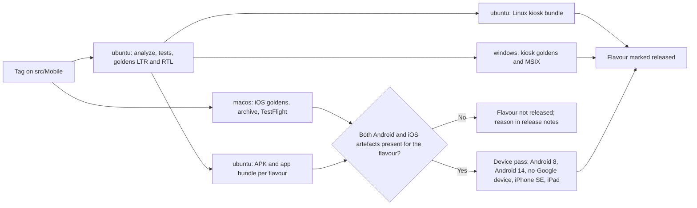

# 33. Platform Support and Development Environments

> Group F. The support and test matrix is **quoted from Appendix X**, which is normative; this document adds what the plan owes on top of it: the developer setup per operating system with its verification command, the pipeline runner matrix, the container globalization checklist, the repository hygiene rules with their enforcers, the mobile targets with their artefacts and release gates, the appliance path for Windows hosts, and the edge cases mapped to the tests that catch them. Requirement area: `PLAT`.

**Rule for reading.** Where a value here and a value in Appendix X disagree, Appendix X wins and this document is the defect. Nothing in the quoted sections is restated with different numbers; the plan only adds.

---

## 1. Supported surfaces, quoted from Appendix X

The following table is quoted verbatim from Appendix X.1.

| Surface | Supported | Explicitly not supported |
|---|---|---|
| Developer workstation | Windows 11 with PowerShell 7 or Git Bash; Ubuntu 22.04 and later; macOS 14 and later | Windows PowerShell 5.1 as the only shell; 32-bit hosts |
| Container runtime for developers | Docker Engine under WSL2, Podman, Docker Engine on Linux, Podman or Colima on macOS | Docker Desktop is not required and is not assumed; it is paid for larger companies |
| Server | Linux: Debian, Ubuntu, and the Red Hat family, x86-64 and arm64 | Windows Server. Redis and several dependencies have no supported Windows server builds |
| On-premises on a Windows host | A Linux virtual machine appliance on Hyper-V or VMware, built from `deploy/onprem/` | Native installation on Windows Server |
| Browsers | Chrome, Edge, Firefox, Safari, last two major versions; Samsung Internet current | Internet Explorer; any browser without CSS logical properties |
| Screen readers | NVDA and Narrator on Windows, VoiceOver on macOS and iOS, TalkBack on Android | none claimed beyond these |
| Mobile application | Android 8.0 and later, with and without Google services; iOS 15 and later | Android 7 and below; iOS 14 and below |
| Mobile web | Parent, student, teacher and principal workspaces, installable as a progressive web application | The full administration console on a phone; it is available but not optimised |
| Desktop kiosk | Flutter Windows and Linux builds for gate, front desk and clinic modes | macOS kiosk, until a customer needs it |
| Tablets | Android tablets and iPad for kiosk, bus attendant and nurse modes | none excluded |

## 2. Test matrix, quoted from Appendix X

The following table is quoted verbatim from Appendix X.2. It is the contract the runner matrix in part 4 of this document implements.

| Test | Linux runner | Windows runner | macOS runner | Device or manual |
|---|---|---|---|---|
| Backend unit tests | every service | `BuildingBlocks`, `Documents`, `Localization` | none | none |
| Backend integration tests with Testcontainers | every service | `BuildingBlocks`, `Documents` | none | none |
| Culture, calendar and time zone inside the built image | yes: `ar-SA`, Um Al Qura, Riyadh, Amman, Dubai | none | none | none |
| Architecture tests | yes | none | none | none |
| Generated permission and tenant-isolation suites | yes | none | none | none |
| Query budget assertions | yes | none | none | none |
| Web unit and lint | yes | none | none | none |
| Web end-to-end, Playwright, four theme and direction combinations | Chromium, Firefox, WebKit | none | none | none |
| Accessibility, axe-core | yes | none | none | Manual screen-reader pass per release |
| Web bundle budgets | yes | none | none | none |
| Mobile analyze, unit and widget tests | yes | none | none | none |
| Mobile golden tests, left-to-right and right-to-left | yes | Windows desktop kiosk goldens | iOS goldens | none |
| Mobile build artefacts | Android APK and app bundle | Windows kiosk MSIX | iOS archive and TestFlight | none |
| Mobile on real devices | none | none | none | Low-end Android 8, Android 14, iPhone SE, iPad, one device without Google services |
| Generated PDF snapshots in both languages | yes | none | none | none |
| Load and soak, k6 | yes | none | none | none |
| Kit lint and its own tests | yes | yes | none | none |
| One-command local start, `dev-smoke` | yes | yes | none | none |
| Appliance build and upgrade | nested virtualisation job | none | none | Quarterly drill on Hyper-V |
| Restore and disaster-recovery drill | yes | none | none | Quarterly, recorded |

Appendix X explains why Windows appears at all (path composition, culture-sensitive parsing and line endings live in `BuildingBlocks`, `Documents` and `Localization`) and why macOS appears at all (an iOS build cannot be produced anywhere else). Those two reasons justify every non-Linux runner minute Appendix X names. The runner matrix below adds one it does not: a `macos-latest` runner in the `dev-smoke` job, beside `ubuntu-latest` and `windows-latest`, because Appendix X.1 supports macOS 14 as a developer workstation and a supported setup guide that no runner exercises is a claim, not a check. The addition is proposed for the dev-smoke row of Appendix X.2 at the next brief version bump (open point 4); until then Appendix X.2 as quoted above is unchanged and this document is the only place the extra runner is stated.

---

## 3. Developer setup per operating system

Summarised from `docs/dev-setup/windows.md`, `linux.md`, `macos.md` and `troubleshooting.md`. The guides are the instructions; this table is the comparison. One thing is the same everywhere: `core.autocrlf false`, because `.gitattributes` owns line endings and a second converter produces files that differ between machines.

| Step | Windows 11 | Ubuntu 22.04 or later, Red Hat family | macOS 14 or later |
|---|---|---|---|
| Shell | PowerShell 7 or Git Bash; Windows PowerShell 5.1 lacks pipeline chain operators and is not the documented shell | bash | zsh or bash |
| Toolchain | `winget` for PowerShell 7, Git, Node 22 LTS, .NET 10 SDK, Podman Desktop; Android Studio and Flutter only for mobile work; `dotnet workload install aspire` | `apt` for `dotnet-sdk-10.0`, NodeSource for Node 22, `docker.io` or Podman; `snap install flutter --classic` only for mobile work; `dotnet workload install aspire` | Homebrew for `dotnet-sdk`, `node`, `podman` (or Docker, licence permitting), `flutter`; `dotnet workload install aspire`; Xcode in full from the App Store for iOS archives |
| Git configuration | `core.autocrlf false`, `core.longpaths true` | `core.autocrlf false` | `core.autocrlf false`; the file system is case-insensitive, so lint rule R13 is what protects the Linux runner from a case-only collision committed here |
| Container runtime | Podman Desktop with `DOCKER_HOST=npipe:////./pipe/podman-machine-default` and `TESTCONTAINERS_RYUK_DISABLED=true`, set at user scope; or Docker Engine inside WSL2 with the socket exposed to the host | Docker Engine with the user in the `docker` group, or Podman with `podman.socket` enabled and `DOCKER_HOST` pointed at it | `podman machine init --cpus 4 --memory 8192 --disk-size 60`, `DOCKER_HOST` exported from `podman machine inspect`, `TESTCONTAINERS_RYUK_DISABLED=true` |
| Operating-system specific | Defender exclusions for `src`, `dotnet.exe` and `node.exe`, in an elevated shell | `fs.inotify.max_user_watches=524288`, because Angular and Flutter watch large trees | `xcode-select --install` and `xcodebuild -license accept` for iOS |
| What cannot be done here | Build the iOS application; run production images natively; host on-premises on Windows Server (ADR-0016) | Build the iOS application | Nothing in the product; goldens are generated on the Linux runner and are authoritative, so they are never regenerated here |
| **Verification command** | `tools\dev-setup\verify-setup.ps1` | `tools/dev-setup/verify-setup.sh` | `tools/dev-setup/verify-setup.sh` |
| Start everything | `cd src/AppHost` then `aspire run`, or `docker compose -f deploy/compose/docker-compose.yml --profile dev up` | same | same |

Both wrappers call the one implementation, `tools/dev-setup/verify-setup.mjs`, with the repository root as its argument (ADR-0017). `/verify-setup` runs the same script and explains any failure.

### What `verify-setup` checks

One line per check; a required failure exits non-zero and points at the guide for the operating system it detected.

| Check | Required | Operating systems | What a failure means |
|---|---|---|---|
| Node 22 or later | yes | all | The kit tooling and the Angular build cannot run |
| .NET SDK 10 or later | yes | all | The service template cannot build (ADR-0001) |
| Aspire workload installed | no | all | `aspire run` is unavailable; compose still works |
| Git present | yes | all | |
| `core.autocrlf` is `false` or `input` | yes | all | Line endings will be converted twice and files will show as modified with no change |
| `core.longpaths` is `true` | no | Windows only | A deep path could fail a checkout; lint rule R14 should make this unnecessary |
| A container runtime responds (`docker version` or `podman version`) | yes | all | Testcontainers cannot start, so no integration test can run |
| `DOCKER_HOST` is set | no | Windows only | Podman on Windows will not be found by Testcontainers |
| Flutter present | no | all | Only mobile work is affected |
| Xcode command line tools present | no | macOS only | Only iOS archives are affected |
| Kit lint runs and is clean | yes | all | The kit has consistency errors; run `tools/kit-lint/kit-lint.mjs` directly to see them |
| Licence scan runs | yes | all | `tools/license-scan/run.mjs` reported a disallowed licence or a malformed allow-list entry |

---

## 4. Continuous integration runner matrix

The workflow files are those in reference architecture Section 11. The runner per job follows Appendix X.2 exactly; a job appears on a second operating system only where Appendix X names a reason.

| Workflow | Job | ubuntu | windows | macos | Trigger | Why this runner set |
|---|---|---|---|---|---|---|
| `ci-service.yml` | Restore, build with warnings as errors, unit tests, architecture tests, format check | every service | `BuildingBlocks`, `Documents`, `Localization` only | none | Path filter per service; `src/BuildingBlocks/**` and `src/Contracts/**` build everything | Path composition, culture parsing and line endings live in those three projects |
| `ci-service.yml` | Integration tests with Testcontainers, contract tests, generated permission and tenant-isolation suites, query-budget assertions | every service | `BuildingBlocks`, `Documents` only | none | same | Windows integration runs prove the Podman and Docker Engine configurations in the developer setup table above |
| `ci-service.yml` | Culture, calendar and time zone test inside the built image | yes | none | none | On every image build | The image is Linux; testing it anywhere else tests a different artefact |
| `ci-service.yml` | Licence scan, dependency and container vulnerability scan, secret scan, image publish, SBOM, cosign signature | yes | none | none | same | One artefact, built once, promoted by tag |
| `ci-web.yml` | Lint, unit, build, bundle budgets, Playwright on Chromium, Firefox and WebKit in light, dark, left-to-right and right-to-left, axe-core | yes | none | none | `src/Web/**` | WebKit on Linux covers the Safari engine; a device pass covers real Safari |
| `ci-mobile.yml` | `flutter analyze`, unit and widget tests, goldens left-to-right and right-to-left, Android APK and app bundle | yes | Windows kiosk goldens and MSIX | none | `src/Mobile/**` | Goldens generated on the Linux runner are authoritative; Windows adds only the kiosk build and its goldens |
| `ci-mobile.yml` | Linux desktop kiosk build and goldens | yes | none | none | `src/Mobile/**` | The Linux kiosk target builds where it runs |
| `ci-mobile-ios.yml` | iOS goldens, archive, TestFlight upload | none | none | yes | `src/Mobile/**` only, never on every commit | The only job that needs macOS; its cost is the Apple build capacity line in master brief Section 30 and open question 14 |
| `ci-kit.yml` | `kit-lint` and its own tests | yes | yes | none | `docs/**`, `tools/**`, `.claude/**` | ADR-0017: the tooling must work on both |
| `dev-smoke.yml` | One-command local start, one Podman configuration and one Docker Engine configuration, then the health endpoint of every service; on macOS, the setup check and the builds of `TC-PLAT-800` | yes (`ubuntu-latest`) | yes (`windows-latest`) | yes (`macos-latest`) | Nightly and on `deploy/compose/**`, `docs/dev-setup/**`, `tools/dev-setup/**` | Proves the setup guides of all three developer operating systems rather than remembering them; catches the Podman network naming edge case. The macOS leg is the plan's addition to Appendix X.2 (part 2) |
| `license-scan.yml` | NuGet, npm, pub and asset licences against `tools/license-scan/allow.json` | yes | none | none | Every pull request | |
| `security-scan.yml` | Trivy, Gitleaks, OWASP ZAP against the preview environment | yes | none | none | Every pull request with a preview | |
| `migrate.yml` | Build the migration bundle, run it as a job, then the previous-image test (ADR-0010) | yes | none | none | Before every rollout | |
| `release.yml` | Semantic version per service, SBOM, signature, changelog, appliance build in a nested-virtualisation job | yes | none | none | Tag | The appliance is a Linux artefact; the quarterly Hyper-V drill is the manual counterpart |
| `preview-env.yml` | Create on pull request, destroy on merge | yes | none | none | Pull request open and merge | |

**Generated artefacts are compared across runners.** Where a job runs on both ubuntu and windows, the pipeline compares generated SQL migration bundles and PDF baselines byte for byte between the two, which is the check that catches a carriage return inside a generated artefact.

---

## 5. Container globalization checklist

Quoted rules from master brief Section 19, turned into the checks an image must pass before it is published. Every row is a step in `ci-service.yml`; a failure blocks the image.

| # | Check | Rule it enforces | How it is proven |
|---|---|---|---|
| G1 | `DOTNET_SYSTEM_GLOBALIZATION_INVARIANT` is unset or `false` in the image | Globalization stays on | A test inside the built image reads the variable and fails if it is `true` or `1` |
| G2 | `CultureInfo.GetCultureInfo("ar-SA")` resolves and is not the invariant culture | Globalization stays on | The culture test inside the built image |
| G3 | `UmAlQuraCalendar` is available and converts a known Gregorian date to the expected Hijri date | ICU present and pinned | The culture test asserts known Hijri and Gregorian pairs |
| G4 | `Asia/Riyadh`, `Asia/Amman` and `Asia/Dubai` resolve and return the expected offsets for a date in each half of the year | tzdata present and pinned | The culture test asserts the three offsets |
| G5 | The base image is the Debian-based `aspnet` image, or, if Alpine, `icu-libs` and `tzdata` are installed and SkiaSharp's native assets are present | Base image rule | A Dockerfile lint rule per service plus G1 to G4 running against that image |
| G6 | The ICU and tzdata package versions inside the image equal the versions pinned for the release | Pinned per release, bumped deliberately | The culture test prints both versions and compares to the release manifest |
| G7 | Inter, IBM Plex Sans Arabic and a Noto Naskh fallback are present in the Documents image and the Gotenberg container | Fonts ship with the renderer | The bilingual PDF snapshot test; a missing font changes the baseline |
| G8 | The container runs as a non-root user with a read-only root filesystem, a `tmpfs` for temporary files, and `TZ=UTC` | Non-root, read-only, UTC | The Helm chart and compose file set them; a test inside the image asserts the user id, the read-only mount and the process time zone |
| G9 | No `Path` string in the service contains a literal separator | Paths composed with `Path.Combine` | An architecture test scanning for literal `\` or `/` inside path strings, plus `/audit-portability` |
| G10 | Every parse and format call names a culture; invariant for stored or transmitted values | Explicit culture everywhere | An analyzer rule that fails the build on culture-less `Parse`, `TryParse` and `ToString` overloads of numeric and date types, plus the money and date rule tests under three cultures |

Checks G1 to G4 and G6 are one test class that runs **inside** the built image, not on the runner: the runner has ICU and tzdata regardless, and only the image can prove the image.

---

## 6. Repository hygiene rules and their enforcers

Quoted from Appendix X.4, with the exact rule or configuration file that enforces each.

| Rule | Enforced by | Where the enforcer lives | What breaks without it |
|---|---|---|---|
| `* text=auto eol=lf`, `*.ps1 text eol=crlf`, binary patterns for images, fonts and archives | `.gitattributes` | Repository root | Migration checksums and PDF baselines drift between a Windows commit and a Linux runner |
| `end_of_line = lf` for source | `.editorconfig` | Repository root | Editors on Windows write carriage returns into source |
| No two paths differing only by case | `kit-lint` rule R13 | `tools/kit-lint/kit-lint.mjs`, and the same check in `ci-kit.yml` | A Windows or macOS commit breaks the Linux checkout, or the reverse |
| No repository-relative path over 200 characters | `kit-lint` rule R14 | same | A Windows checkout fails entirely |
| Every tool entry point ships a `.ps1` and a `.sh` wrapper over one Node implementation | `kit-lint` rule R15 | same, and ADR-0017 | Half the instructions are wrong for half the readers |
| Every hook invokes `node` with a relative path | `kit-lint` rule R16 | same | A hook does nothing on Windows |
| `core.longpaths` enabled on Windows clones | `verify-setup` (advisory) and the setup guide | `tools/dev-setup/verify-setup.mjs`, `docs/dev-setup/windows.md` | A deep path fails a checkout on one machine only |
| `core.autocrlf` is `false` on every clone | `verify-setup` (required) | `tools/dev-setup/verify-setup.mjs` | Files show as modified with no change; two converters fight |
| Paths composed with `Path.Combine`, never a literal separator | The portability rule and an architecture test (G9) | `.claude/rules/portability.md`, `tests/Architecture/` in each service | A path that works on Windows fails in the Linux image |
| Parsing and formatting always specify a culture | The portability rule, the analyzer (G10), and the money and date rule tests under three cultures | `.claude/rules/portability.md`, `Directory.Build.props` analyzer configuration, `BuildingBlocks` tests | `1,5` and `1.5` swap meaning between a developer and a server |
| No Alpine base image without `icu-libs` and `tzdata`; `InvariantGlobalization` never enabled | The portability rule and checks G1 to G5 | `.claude/rules/portability.md`, `ci-service.yml` | Arabic collation silently falls back to invariant |
| Mobile code never assumes Google services, a specific biometric, granted storage permission or a screen wider than 360 logical pixels | The portability rule and the mobile rule | `.claude/rules/portability.md`, `.claude/rules/mobile.md`, the no-Google flavour build and the 360-pixel layout test | A device without Google services or a small phone gets a broken screen |
| Every Mermaid block opens with a known type; no unresolved placeholder anywhere | `kit-lint` rules R17 and R05 | `tools/kit-lint/kit-lint.mjs` | A diagram fails to render; a placeholder ships as a decision |

---

## 7. Mobile targets, artefacts and release gates

The Flutter project in reference architecture Section 5 builds every target from one codebase and one set of flavours (`default` plus one per white-label school). The artefact per target and the gate each must pass before a flavour is marked released.

| Target | Minimum version | Build runner | Artefact | Distribution | Release gate |
|---|---|---|---|---|---|
| Android with Google services | Android 8.0 | ubuntu | APK and app bundle per flavour | Google Play; a signed APK channel for a white-label school that distributes internally | Goldens in both directions pass; device pass on a low-end Android 8 and an Android 14; push received through Firebase Cloud Messaging on the device pass |
| Android without Google services | Android 8.0 | ubuntu | The same APK, built with the no-Google flavour flag so no Google dependency is linked | AppGallery where it matters; the signed APK channel | Before the device pass, `TC-NOT-610` (Notification sheet) proves in the pipeline that a device without Google services receives push in-app while open and that urgent messages fall back to SMS and email, and `TC-MOB-988` (the derived acceptance test of REQ-MOB-038, document 20) proves the supported-device set includes devices without Google services. The device pass on one device without Google services then proves: sign-in, offline attendance sync, the in-app real-time channel while open, and email fallback; the app explains the missing push once and never crashes on a missing service (master brief Section 37) |
| iOS | iOS 15 | macos, path-filtered | Archive (`.ipa`) per flavour, uploaded to TestFlight | App Store; a white-label app under the school's own developer account with the platform building and submitting under a written agreement | iOS goldens pass; device pass on an iPhone SE; a 30-day-old sync token replays successfully (Appendix X.3); signing identity verified against the developer account that owns the flavour |
| Android tablets and iPad | As above | As above | The same Android and iOS artefacts; tablet layouts are the same build | As above | Layout tests at 768 and 1024 logical pixels pass; device pass on an iPad for the kiosk, bus attendant and nurse modes |
| Desktop kiosk, Windows | Windows 11 | windows | MSIX per flavour | Direct download from the tenant's administration console, signed | Windows kiosk goldens pass with Arabic shaping verified; gate, front desk and clinic modes start full-screen and recover from a network loss without operator input |
| Desktop kiosk, Linux | Ubuntu 22.04 or later | ubuntu | Linux desktop bundle per flavour, packaged as a tarball with a launcher script | Direct download from the tenant's administration console, with a checksum | Linux kiosk goldens pass with Arabic shaping verified; the same three modes as Windows |
| Mobile web | Last two majors of Chrome, Edge, Firefox, Safari; Samsung Internet current | ubuntu | The Angular workspace's parent, student, teacher and principal builds, installable as a progressive web application | Served by the platform | Playwright at 360 by 800 and 768 by 1024 with the mobile performance budgets; axe-core clean; the manual screen-reader pass per release |

**The white-label gate.** A flavour is released only when **both** its Android and its iOS artefact exist for the same version (Appendix X.3: a flavour that builds on Linux but not on macOS ships Android and silently lags iOS). The release pipeline refuses to mark a flavour released with one artefact missing, and the reason is written to the release notes.

**Minimum supported version per tenant.** Configured in Platform; below it the app blocks with an upgrade screen, within one minor version it nags but allows. A server change that breaks an older app is forbidden by the API versioning rules in master brief Section 35, so the gate on the server side is the contract test suite, not a mobile test.

---

## 8. The on-premises appliance for Windows hosts

ADR-0016: all product images are Linux, and a school with a Windows host runs them inside a Linux virtual machine appliance. Native Windows Server hosting is not supported and the sales material says so. Whether the appliance is Phase 2 or Phase 6 work is open question 16 (and open question 2); the default is Phase 6.

| Step | What happens | Artefact or evidence |
|---|---|---|
| Build | `release.yml` builds the appliance from `deploy/onprem/` in a nested-virtualisation job: a minimal Linux guest carrying the single-server compose bundle, the pinned images, a backup volume, and the upgrade script | A Hyper-V image and a VMware image per release, with checksums and the SBOM of every image inside |
| Install | The school's administrator imports the image into Hyper-V or VMware, assigns the sizing from `28-capacity-and-cost-model.md`, and runs the first-boot wizard, which sets the host name, the certificate and the backup target | The first-boot log and the health page showing every service green |
| Run | The single-server topology from master brief Section 34: one PostgreSQL with local backups to a second disk and off-site, one RabbitMQ node with quorum queues, `redis-cache` and `redis-state` as separate containers, local disk storage | The same health and observability endpoints as the SaaS deployment; the school is told in writing that restore from backup is the recovery plan |
| Upgrade | The upgrade script runs a pre-upgrade check (disk, backup age, image signatures), takes a backup, pulls the new images, runs the migration bundle as a job, rolls out, and keeps the previous images for rollback | The upgrade log; rollback is redeploying the previous images (ADR-0010) |
| Rollback | Redeploy the previous images; the schema is never rolled back | The previous-image test that runs in `migrate.yml` before any release ships |
| Drill | Once a quarter, on real Hyper-V: install the previous release, upgrade to the current one, restore from the appliance's own backup, and record the timings | The drill record in the runbook, per Appendix X.2 |

What the appliance deliberately does not do: run on Windows Server natively, share a database with anything on the host, or accept an image that is not signed. What it does share with every other deployment mode: the images, the migration bundles and the health endpoints, which is why one release pipeline serves all three modes.

---

## 9. Cross-platform edge cases and the test that catches each

Quoted from Appendix X.3 and mapped to a named test with a `TC-PLAT-` identifier, the runner it runs on, and the plan document that owns the behaviour. The identifiers are allocated here and reused by document 16 and document 20.

| Edge case | What goes wrong | Test that catches it | Identifier | Runner | Owning document |
|---|---|---|---|---|---|
| Two files differing only by case | A Windows commit breaks the Linux checkout, or the reverse | `kit-lint` R13 in `ci-kit.yml`, and the same check in the repository pipeline | TC-PLAT-001 | ubuntu, windows | 33 |
| A path longer than 200 characters | A Windows checkout fails entirely | `kit-lint` R14 | TC-PLAT-002 | ubuntu, windows | 33 |
| CRLF inside generated SQL or a PDF baseline | Migration checksums and snapshot comparisons drift | `.gitattributes`, plus the byte-for-byte comparison of generated artefacts between the ubuntu and windows runs of `ci-service.yml` | TC-PLAT-003 | ubuntu, windows | 15 |
| An Alpine image without ICU | Arabic collation and the Um Al Qura calendar silently fall back to invariant | Checks G1 to G5 inside the built image | TC-PLAT-004 | ubuntu, inside the image | 33, 24 |
| A tzdata update mid-year | Bell schedules and cut-off times shift for a region | tzdata pinned per release (G6); the culture test asserts the expected offsets for Riyadh, Amman and Dubai (G4) | TC-PLAT-005 | ubuntu, inside the image | 24, 06 Scheduling |
| An ICU update mid-year | Hijri conversions move by a day | ICU pinned per release (G6); the culture test asserts known Hijri and Gregorian pairs (G3) | TC-PLAT-006 | ubuntu, inside the image | 24 |
| Culture-sensitive parsing of a decimal | `1,5` and `1.5` swap meaning between a Windows developer and a Linux server | The analyzer (G10) at build time; the money rule tests run under `ar-SA`, `en-US` and `de-DE` in `BuildingBlocks` on both runners | TC-PLAT-007 | ubuntu, windows | 24, 06 Finance |
| Arabic digits in an Excel file produced on Windows | Import reads them as text and rejects the row | An import test in `Documents` with a file containing Arabic-Indic digits, asserting the numerals are normalised before validation | TC-PLAT-008 | ubuntu, windows | 26, 06 Documents |
| Font shaping differs between emulator and device | Arabic ligatures render correctly in tests and badly on a phone | Fonts bundled with the application; goldens generated on the Linux runner; the device pass per release checks three Arabic screens on each device | TC-PLAT-009 | ubuntu, device | 09, 14 |
| iOS suspends the app for days | Offline queue grows and the sync token expires | A sync test that replays a 30-day-old token and asserts success; sync on open and on silent push | TC-PLAT-010 | ubuntu (unit), device (iPhone SE) | 09 |
| Android battery optimisation kills the sync worker | A parent stops receiving anything and does not know why | A widget test that the restriction is detected and explained exactly once; the device pass confirms an urgent message still arrives by push with the restriction on | TC-PLAT-011 | ubuntu, device (low-end Android 8) | 09, 06 Notification |
| A device clock is wrong by hours | Offline attendance arrives with a wrong timestamp | An Attendance integration test that submits an offline record with `occurredAt` hours off and asserts the server stamps `receivedAt` and orders by it per Appendix M | TC-PLAT-012 | ubuntu | 06 Attendance, 09 |
| Podman names its network differently from Docker | Testcontainers cannot reach the database | `dev-smoke.yml` runs one Podman configuration and one Docker Engine configuration; the documented `DOCKER_HOST` settings in `docs/dev-setup/` | TC-PLAT-013 | ubuntu, windows | 33 |
| A white-label flavour builds on Linux but its iOS twin does not | Android ships and iOS silently lags a version | The white-label release gate in part 7 of this document refuses a flavour with one artefact missing | TC-PLAT-014 | ubuntu, macos | 15, 09 |

Three further cases the plan adds, because they surfaced while writing the setup guides and have no row in Appendix X yet. They are proposed for Appendix X at the next brief version bump.

| Edge case | What goes wrong | Test that catches it | Identifier | Runner | Owning document |
|---|---|---|---|---|---|
| A pooled connection under transaction pooling sees another tenant's rows | `SET` instead of `SET LOCAL` leaks the tenant across pooled connections | The row-level security and pooling interaction test named in reference architecture Section 14 | TC-PLAT-015 | ubuntu | 21, 10 |
| A Flutter golden regenerated on macOS or Windows | Font rendering differs by operating system, and the golden now fails on the authoritative runner | `ci-mobile.yml` on ubuntu is the only place goldens are accepted; a pull request that changes a golden without an ubuntu run attached is refused | TC-PLAT-016 | ubuntu | 09, 16 |
| A kit archive built with `Compress-Archive` | Backslash separators break extraction on Linux | The packaging step uses `tar -a -c -f`, and a test extracts the archive on ubuntu and compares the file count | TC-PLAT-017 | ubuntu, windows | 33 |

---

## Open points

| Question | Default | Owner | Impact if the default is wrong | L | I | Score | In the register |
|---|---|---|---|---|---|---|---|
| Open question 14: is there a Mac build host, or are hosted macOS runner minutes bought? Pending with the product owner | Hosted runner minutes, budgeted in master brief Section 30; `ci-mobile-ios.yml` is path-filtered to `src/Mobile/**` (part 4) | Product owner | No iOS artefact, iOS goldens or iPhone SE device pass; the white-label gate of part 7 refuses every flavour, so each school's application ships on Android and waits on iOS. Android, the kiosks and mobile web are unaffected | 3 | 4 | 12 | RISK-04 |
| Open questions 16 and 2: are there Windows hosts among the first on-premises customers, and is the appliance Phase 2 or Phase 6 work? | Phase 6, with the appliance path of part 8 as designed (ADR-0016) | Product owner | The nested-virtualisation build in `release.yml`, the quarterly Hyper-V drill and the appliance runbook move into Phase 2, which grows by that work | 3 | 3 | 9 | RISK-17 |
| Can the `macos-latest` leg of `dev-smoke.yml` start the containers? Hosted Apple-silicon runners do not offer nested virtualisation, so a Podman machine or Colima may not start there | `TC-PLAT-800` asserts what the hosted runner can prove (the setup check, the builds, the kit tooling) and reports the container-runtime check as unavailable on that runner rather than passing it; the one-command start with containers is proved on ubuntu and windows, and the mobile engineer's Mac runs it at each phase demo until open question 14 settles; if it settles on a Mac build host that can run a Podman machine or Colima, the container check moves there (as `15-deployment-and-operations.md` open point 6 and RISK-04 say) | Platform engineering | A container step that works on Linux and Windows but not on a Mac is found by a developer rather than by the job, and costs that developer a day | 3 | 1 | 3 | none |
| Are the plan's additions to Appendix X accepted at the next brief version bump: the three edge cases part 9 adds (`TC-PLAT-015` to `TC-PLAT-017`) and the `macos-latest` runner in the dev-smoke row of Appendix X.2? | Allocated, tested and run here meanwhile; proposed for Appendix X.2 and X.3 at the next bump | Architect | Appendix X and this document list different edge cases and a different dev-smoke runner set until the bump; the tests themselves do not change | 2 | 1 | 2 | none |

> L and I are the likelihood that the default is wrong and the impact if it is, on the 1 to 5 scales of `18-risk-register.md` Section 1. Score is L x I. A point that scores 12 or more names its RISK identifier in document 18 (ADR-0022).

---

## Review record

| Date | Reviewer | Verdict | Blocking items |
|---|---|---|---|
| 2026-09-22 | Group F review, round 1 (independent adversarial scorecard) | Blocked: the group scored below 4 on Completeness, Consistency, Feasibility, Risk honesty, Testability and Distinctiveness | No Open points and no Review record section (Completeness, Risk honesty); the macOS developer setup had no runner and the iOS pipeline depended on open question 14 with no register link (Portability, not blocking) |
| 2026-09-26 | Group F review, round 2 | Blocked: the group scored below 4 on Completeness, Consistency, Risk honesty and Testability | Open points were added and open question 14 carries RISK-04. Still open: no Review record (Completeness); macOS "verified by the mobile engineer's machine" with no runner and no identifier, and the no-Google release gate citing no test although `TC-NOT-610` exists (Portability, not blocking) |
| 2026-09-26 | Round 3 remediation | Amended; awaiting the round 3 score | A `macos-latest` runner joins `dev-smoke.yml` beside `ubuntu-latest` and `windows-latest`, proved by the new `TC-PLAT-800` and proposed for Appendix X.2; the no-Google gate of part 7 cites `TC-NOT-610` (Notification sheet) and `TC-MOB-988`; this record added |
| 2026-09-26 | Group F review, round 3 | Blocked: the group scored below 4 on Completeness, because document 31 listed no transition-test ids per workflow | None of the group's blocking gaps was in this document; the no-Google row of part 7 lost a cell separator, so its release gate rendered under Distribution (Portability, not blocking) |
| 2026-09-26 | Group F review, round 4 | Blocked: the group scored below 4 on Consistency, because SL-ACA-207 in document 34 built `LaunchLtiTool` in phase 2 against the default of document 17 | None in this document; the part 7 cell separator still missing (Portability, not blocking) |
| 2026-09-26 | Round-4 scorecard, Group F, then remediation round 5 | Amended; awaiting the round 5 score | The cell separator of the no-Google row restored, so the row has the six cells of its header; open point 3 says, as `15-deployment-and-operations.md` open point 6 and RISK-04 do, that the mobile engineer's Mac runs the container start until open question 14 settles and a Mac build host takes it only if it settles on one; the round 3 and round 4 verdicts recorded above |

## How this document is verified

| Claim | Proof |
|---|---|
| The quoted tables match Appendix X word for word | `plan-consistency-checker` with `portability-reviewer` compares the quoted sections word for word with `docs/brief/02-appendices/appendix-x-platform-support.md` at the Group F review and on every change to Appendix X or this document; any difference is a defect in this document, never in the appendix |
| The setup guides work on each operating system | The `dev-smoke` job (`dev-smoke.yml`, path in document 07, built by SL-PLAT-005) runs on three runners, `ubuntu-latest`, `windows-latest` and `macos-latest`, nightly and on every change to `deploy/compose/**`, `docs/dev-setup/**` or `tools/dev-setup/**`: on ubuntu and windows the one-command start from a clean checkout, once with Podman and once with Docker Engine (`TC-PLAT-013`); on macOS `TC-PLAT-800`, defined below, within the limit open point 3 states |
| The verification command does what part 3 of this document says | `tools/dev-setup/verify-setup.mjs` is the single source (in the kit today; path in document 07 part 6). The product build adds its run to `ci-kit.yml` (path in document 07) on both runners, with the required checks expected to pass, alongside the Node tool wrappers SL-PLAT-001 builds. That the check list in part 3 matches the script is a review step: `portability-reviewer` compares them on every change to `verify-setup.mjs` or part 3 |
| Every image passes the globalization checklist | The culture test inside the built image (G1 to G4, G6), the Dockerfile lint (G5), the PDF snapshot test (G7), the container assertions (G8), the architecture test (G9) and the analyzer (G10), all steps of `ci-service.yml` |
| Every hygiene rule is enforced, not advised | `kit-lint` rules R13, R14, R15, R16, R17 and R05 on both runners in `ci-kit.yml`; `.gitattributes` and `.editorconfig` at the repository root; `verify-setup` for the two Git settings |
| Every mobile target has its artefact and its gate | The release pipeline refuses a flavour without both Android and iOS artefacts; the device pass per release is recorded against the five devices in Appendix X.2 with the three Arabic screens checked on each |
| The appliance path works on real Windows hosts | The nested-virtualisation build in `release.yml` and the quarterly drill on Hyper-V, recorded in the runbook |
| Every edge case has a test | kit-lint R20 fails on a `TC-PLAT-` identifier listed here that no document defines, or that more than one document defines; that every edge case in part 9 carries an identifier is checked by `test-strategist` at the Group F review and on every change to part 9 |
| Every Section and Appendix reference resolves, and no placeholder exists | `kit-lint` rules R01, R02 and R05 |

### Test cases

Tests this document defines beyond the edge cases of part 9. Document 03, document 07 and document 20 cite them. TC-PLAT-800 is the macOS leg of `dev-smoke.yml`, built with the job by SL-PLAT-005. TC-PLAT-102 is a product pipeline test: it runs in `ci-kit.yml` (path in document 07) and SL-PLAT-001, which builds the Node tool wrappers, builds it. kit-lint R15 checks only that both wrappers exist beside each entry point and R16 that each hook invokes `node` with a relative path; that both wrappers exit and print the same is proved by this test alone.

| Test case | What it proves | Covers |
|---|---|---|
| TC-PLAT-800 | Given a clean checkout on the `macos-latest` runner of `dev-smoke.yml` with the toolchain the macOS column of part 3 installs, when `tools/dev-setup/verify-setup.sh` runs and the job then builds `Nibras.sln`, the Angular workspace and the Flutter project and runs the kit lint, then every required check of part 3 other than the container runtime passes, the builds and the lint exit 0, the container-runtime check is reported as unavailable on the hosted runner rather than passed, and a failing required check fails the job naming the macOS guide | REQ-PLAT-001 |
| TC-PLAT-102 | Given every tool entry point under `tools/`, each with a `.ps1` and a `.sh` wrapper over one Node implementation, and every hook in `.claude/settings.json`, when `ci-kit.yml` runs each entry point through its `.ps1` wrapper on the windows runner and its `.sh` wrapper on the ubuntu runner, then on both of the 2 runners each wrapper exits with the same code and prints the same output, and every hook invokes `node` with a relative path, so an entry point with one wrapper missing, a second implementation, or an absolute hook path fails the job | REQ-PLAT-022 |
