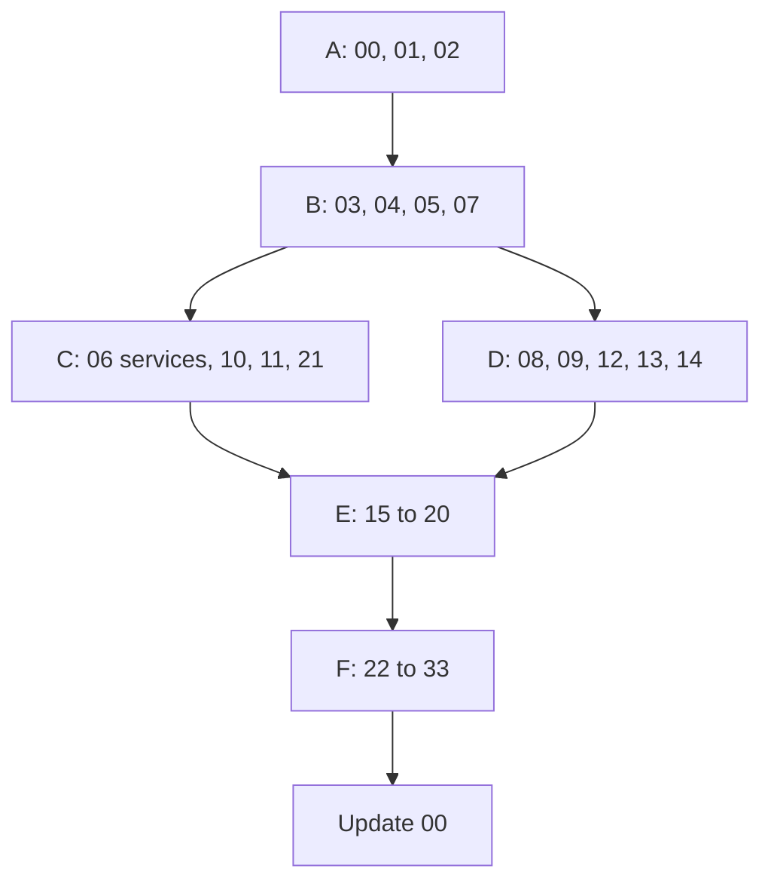

# Nibras Plan Specification (v9)

This file defines what "the plan" is. `/plan-platform` produces it. The plan is a set of documents under `docs/plan/`, written to disk, reviewed group by group, and approved before any implementation code exists.

**Quality bar.** A senior engineer who has never seen this project must be able to open `docs/plan/`, understand every service and every folder, and start building the right thing. Every document uses tables, trees and Mermaid diagrams where they are clearer than prose. Every requirement has an identifier. Every open point has an owner and a default, recorded in `docs/project/OPEN_QUESTIONS.md`.

**What the plan starts from.** The three brief files are v9 and already carry the registry (Appendix L), the workflow catalog (Appendix R), the business rules (Appendix S), the event catalog (Appendix E), the coverage matrix (Appendix V) and the platform matrix (Appendix X). The plan refines and assigns; it does not re-derive.

---

## Required documents

| # | File | Must contain |
|---|---|---|
| 00 | `00-executive-summary.md` | What is being built, for whom, the deployment modes, the service count from Appendix L, the phase roadmap on one page, the top risks, and the decisions needed from the product owner |
| 01 | `01-questions-and-assumptions.md` | Clarifying questions, the default for each, and the impact if the default is wrong. Answers to master brief Section 27 |
| 02 | `02-competitive-gap-analysis.md` | Completed from Appendix P, with every claim sourced and dated, and a recommendation per gap |
| 03 | `03-requirements-catalog.md` | Every requirement from the three brief files with an identifier, tier, owning service, and acceptance criteria. Area codes from Appendix L |
| 04 | `04-architecture-overview.md` | C4 context and container diagrams, bounded-context map, runtime topology, deployment modes, technology list with verified licences, key decisions with alternatives |
| 05 | **`05-service-catalog.md`** | One table of all services from Appendix L: tier, purpose, why the boundary exists, database, executables, publishes, consumes, synchronous dependencies, scaling profile, sensitivity, build phase. Then the event dependency matrix and a cycle check |
| 06 | **`06-services/<service>.md`** | The service specification sheet. See below |
| 07 | **`07-solution-structure.md`** | The full repository tree to project level with a purpose per folder; building blocks and their public surface; contracts layout; the service template; dependency rules and the architecture tests that enforce them; naming conventions |
| 08 | **`08-web-structure.md`** | The Angular workspace tree, route map per workspace, state plan, generated client plan, permission-driven navigation, design system library contents, screen inventory with the components each screen uses, and the mobile-web and progressive-web-app scope |
| 09 | **`09-mobile-structure.md`** | The Flutter project tree, feature list per role, the offline and sync design implementing Appendix M, notification and deep-link map, flavors, desktop kiosk targets, and the parity matrix for web and mobile |
| 10 | `10-data-architecture.md` | Database per service, tenancy and row-level security design, partitioning, reference-data replication map, reporting projections, retention from Appendix J, backup and single-tenant restore |
| 11 | `11-messaging-architecture.md` | RabbitMQ topology diagram, the message catalog completed from Appendix E with partition keys, envelope, versioning, retry and dead-letter policy, tenant fairness, ordering, worker hosts and scaling rules |
| 12 | `12-security-privacy-safety.md` | Threat model per service, abuse cases and controls, authentication and authorization flows, the permission matrix from Appendices B and I, data classification from Appendix J, child-safety controls, seeded administrator safeguards, secrets and key inventory with rotation |
| 13 | `13-workflows-and-sagas.md` | Every workflow in Appendix R assigned to its service, with saga designs and compensations |
| 14 | `14-design-system-and-ux.md` | Brand application, tokens, type scale, colour system, motion tokens and patterns, component inventory, key screens per workspace in light, dark, left-to-right and right-to-left |
| 15 | `15-deployment-and-operations.md` | The `deploy/` tree, the three deployment modes with diagrams, environments, pipelines, observability, service levels, backup and disaster recovery, the on-premises appliance, runbook list, capacity and cost model |
| 16 | `16-test-strategy.md` | Test types per layer, the generated suites, the coverage matrix from Appendix V, quality gates, coverage thresholds, test data tiers, the load scenarios from Appendix N |
| 17 | `17-roadmap.md` | Phases from master brief Section 28 with goals, scope by requirement identifier, services touched, exit criteria, the demo at the end of each phase, dependencies, and a critical-path diagram. Each phase is broken into **capabilities**, and each capability into **slices** in `34-work-breakdown.md`. A phase with no slices is a wish |
| 18 | `18-risk-register.md` | Risks with likelihood, impact, mitigation and owner, seeded from master brief Section 40 |
| 19 | `19-dependency-and-license-inventory.md` | Every dependency with exact version, licence, verification source, linked or standalone, plus the unavoidable-cost list and the scanner allow-list |
| 20 | `20-traceability-matrix.md` | Requirement to service, workflow, rule, plan document, phase, test case and platform. **No requirement unmapped, no empty test cell** |
| 21 | **`21-performance-engineering.md`** | The caching map per service, Redis deployment design, top queries per service with indexes, partitioning plan, pooling design, the row-level security and pooling interaction, budgets, load-test scenarios, and the pre-peak warm-up job |
| 22 | `22-api-conventions-and-error-catalog.md` | REST and gRPC conventions, pagination envelope, filter and sort grammar, long-running operation contract, bulk endpoints, and the error catalog completed from Appendix K |
| 23 | `23-integrations-and-public-api.md` | Public API, key and token lifecycle, webhook contract, standards per phase, plug-in kit, developer portal, deprecation policy |
| 24 | `24-localization-and-calendars.md` | Translation workflow and ownership, bilingual data model, Arabic search normalization, numerals, Hijri handling, terminology overrides, and the culture rules that keep Windows and Linux identical |
| 25 | `25-ai-and-assist-ladder.md` | The four rungs, per-feature rung assignment from Appendix W, indexing and permission filtering, guardrails, evaluation harness, hardware, and the fallback for each rung |
| 26 | `26-migration-and-onboarding-toolkit.md` | Mapping templates, staging area, validation and reconciliation, dry run and rollback, adapters for common formats, and the go-live checklist |
| 27 | `27-compliance-and-legal.md` | The compliance map from master brief Section 33, retention schedule, consent model, sub-processors, the data protection impact assessment template, and the accessibility conformance statement |
| 28 | `28-capacity-and-cost-model.md` | Sizing per deployment mode, cost per 1,000 students, scaling thresholds, and the load-test evidence behind them |
| 29 | `29-adr-index.md` | Every decision record with status, the decision it settles, and the open question it closes |
| 30 | `30-plan-scorecard.md` | The rubric and the score per group, with evidence |
| 31 | `31-business-rules-and-workflows.md` | Appendix R and Appendix S assigned to services, with the test class per rule and the transition tests per workflow |
| 32 | `32-product-differentiation-and-demo.md` | The completed differentiation matrix from Appendix P and the demo script from Appendix O, with each sixty-second proof verified |
| 33 | `33-platform-support-and-dev-environments.md` | The support and test matrix from Appendix X, the developer setup per operating system, the container globalization rules, and the repository hygiene rules |
| 34 | **`34-work-breakdown.md`** | **The buildable task list.** Every phase decomposed into capabilities, every capability into **slices** of one to three days, each slice with an identifier, its requirement and rule and workflow identifiers, its definition of done, its dependencies, and its estimate. This is the document an engineer picks work from on a Monday morning. See the rules below |

### How work is broken down: phases, capabilities, slices

The roadmap says what a phase achieves. The work breakdown says what someone does on Monday. Without the second, a phase is an intention.

**Three levels, and no more.** More levels than this become an estimating exercise rather than a plan.

| Level | What it is | Size | Identifier |
|---|---|---|---|
| **Phase** | A business outcome, from master brief Section 28 | 6 to 20 weeks | Phase 0 to 6 |
| **Capability** | Something a named person can do end to end, and that can be demonstrated | 1 to 3 weeks | `CAP-<AREA>-<NN>` |
| **Slice** | One use case, built through every layer it touches | **1 to 3 days, one pull request** | `SL-<AREA>-<NNN>` |

**The rule that matters: split by use case, never by layer.** "Build the attendance domain" is not a slice. "A teacher marks a class present" is. A slice that cannot be demonstrated when it is finished has been split the wrong way, and the usual symptom is a slice whose name is a layer, a table, or a technology.

**A slice is only done when all of this is true**, which is the definition of done from master brief Section 26 applied to one use case:

- Domain and application logic, with unit tests built from the rules in Appendix S
- Persistence, migration, tenant filter, row-level security policy
- API endpoint declaring its permission, with validation, error codes from Appendix K, and OpenAPI
- Events published through the outbox; consumers idempotent through the inbox
- Integration tests including tenant isolation, the permission matrix, and the query budget
- The screen or mobile surface, if the slice includes one, in English and Arabic with right-to-left
- Every state present: loading, empty, error, offline, processing, no permission
- Traceability updated: the requirement, rule, workflow and test case identifiers all point at each other

**Estimates are day ranges, not points.** One to three days, or split it. A slice estimated above three days is two slices that have not been separated yet. Do not convert ranges into a total and call it a date; the roadmap owns dates, and it owns them as ranges too.

**Dependencies are contract-first.** A slice that consumes an API or an event may start as soon as that contract is published, not when the producing slice is finished. State the dependency as the contract, not as the other slice, or half the plan serialises for no reason.

**Every slice names its requirement, rule and workflow identifiers.** A slice that maps to nothing is scope nobody asked for. A requirement with no slice is scope nobody will build. `/lint-plan` checks both directions once `34-work-breakdown.md` exists.

**Worked example**, the shape every capability should take:

```
Phase 2 · CAP-ATT-01 "A teacher takes attendance for a class"   ~2 weeks
  SL-ATT-001  Attendance session and record aggregates, with the lock-window rule   2d
              REQ-ATT-001..004 · BR-ATT-001,002,004 · WF-ATT-01 · TC-ATT-001..006
  SL-ATT-002  Persistence, migration, tenant filter, row-level security policy      1d
  SL-ATT-003  Mark-attendance endpoint with permission, validation, error codes     2d
              depends on: the contract in SL-ATT-001
  SL-ATT-004  Outbox publish of attendance.student.absent.v1, with the ordering key 1d
  SL-ATT-005  Register screen: seating chart, mark all present, flag exceptions     3d
              depends on: the OpenAPI contract from SL-ATT-003
  SL-ATT-006  Mobile register with offline queue and the conflict rules             3d
              BR-ATT-009 · Appendix M
  SL-ATT-007  Unmarked-class reminder job and its escalation                        2d
  Demo: a teacher marks 4B in under sixty seconds, on a phone, offline, in Arabic
```

Seven slices, about thirteen days, one demonstrable capability. That is the granularity this document exists to produce.

### What a service document must contain

Responsibilities and explicit non-responsibilities; aggregates and entities with fields and invariants and a Mermaid entity-relationship diagram; the full REST API table (method, path, permission, request, response, error codes, idempotency); gRPC contracts exposed and consumed; events published and consumed with payload schemas and partition keys; sagas with state diagrams and compensations; local reference copies and how they stay current; background jobs and long-running jobs with progress; permissions from Appendix B; notifications triggered from Appendix C; settings from Appendix G; error codes from Appendix K; **the complete folder and file tree of the service**; the test plan keyed by test case identifiers; the caching table; hot queries with indexes and query budgets; scaling, partitioning and risks; and a closing **How this document is verified** section.

---

## Groups and review order

| Group | Documents | Stops for review |
|---|---|---|
| A | 00, 01, 02 | Understanding, questions, and the competitive picture |
| B | 03, 04, 05, 07 | Requirements, architecture, service catalog, repository structure |
| C | 06 (all services), 10, 11, 21 | Every service sheet, data, messaging, performance |
| D | 08, 09, 12, 13, 14 | Web, mobile, security, workflows, design |
| E | 15 to 20 | Operations, testing, roadmap, risk, dependencies, traceability. The roadmap here sets phases and capabilities; document 34 in Group F turns them into slices |
| F | 22 to 33, **34**, then update 00 | Conventions, integrations, localization, assist ladder, migration, compliance, capacity, decisions, scorecard, rules, differentiation, platform support, and **the work breakdown that turns every phase into slices an engineer can pick up** |

---

## Rules for writing the plan

1. **Read what the task needs, not everything.** `docs/brief/READING_MAP.md` says which sections each document requires. Read those completely before writing.
2. **Structures are trees, not descriptions.** Where this specification says "tree", produce a fenced directory tree with a purpose comment per entry, to file level for one example feature and to folder level for the rest.
3. **Services are specified, not listed.** A service document is complete only when someone could implement the service from it without asking what it owns, what it exposes, what it publishes, and where each file goes.
4. **Start from the reference architecture.** Keep it where it is right, improve it where it is weak, and record every deviation as an ADR.
5. **Verify licences of exact versions from the source**, not from memory. Mark anything unverified as unverified.
6. **Every document ends with "How this document is verified"**, naming the test, lint, review or drill that proves its claims.
7. **Keep the catalogs consistent.** The service catalog, the service sheets, the message catalog and the dependency matrix are one fact expressed four times. A change in one means checking the others, and `/lint-plan` will find it if you forget.
8. Write only under `docs/`. No source code, project files or configuration during planning.
9. Be honest about uncertainty, effort and risk. A plan that hides a problem is a bad plan.
10. After each group: run `/lint-plan`, run `/score-plan`, then update `PROJECT_STATE.md` and `OPEN_QUESTIONS.md`, and stop for review.

---

## The scorecard

A group is approved at **4 or better on every axis**. `/score-plan` produces it and `30-plan-scorecard.md` records it.

| Axis | 0 | 3 | 5 |
|---|---|---|---|
| **Completeness** | Sections missing | Everything present, some thin | Every required element, at the required depth |
| **Consistency** | Contradicts other documents | Minor drift | Lint clean, catalogs agree |
| **Feasibility** | Cannot be built as described | Buildable with unknowns | Buildable, with the unknowns named and owned |
| **Risk honesty** | Problems hidden or absent | Risks listed | Risks listed with likelihood, impact, owner and mitigation |
| **Testability** | No way to prove it | Tests implied | Every claim maps to a test case identifier |
| **Distinctiveness** | Generic | Some differentiation | Every signature feature has a moment, a rung and a sixty-second proof |
| **Portability** | Assumes one operating system or device | Mostly portable | Every platform-specific behaviour named with the runner that proves it |

---

## Document dependencies



Group C and Group D can be written in either order once Group B is approved, because both depend on the service catalog and the repository structure and not on each other.
