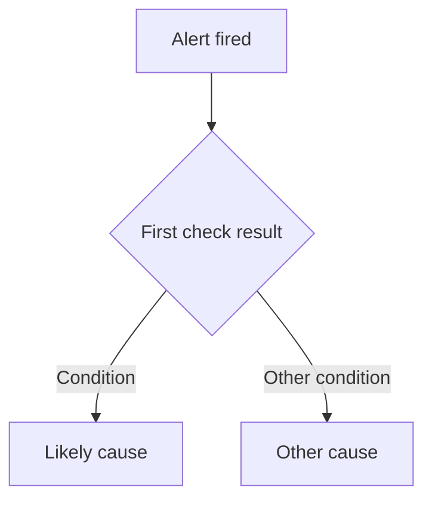

# Runbook: `<ALERT_NAME>`

> Copy to `docs/ops/runbooks/<alert-name>.md`. The reader is on call at 03:00, did not build this service, and has three minutes of patience.

**Service** `<Service>` · **Severity** `<page | ticket>` · **Threshold** `<condition that fires it>`

## What this means

In product terms, not metric terms: `<what a parent, teacher, or administrator is experiencing right now>`

Silent or visible: `<silent | visible>`

## Who is affected

| Who | What they experience | How many |
|---|---|---|

## First checks

| # | Check | PowerShell | bash | Healthy output |
|---|---|---|---|---|
| 1 | `<check>` | `<command>` | `<command>` | `<expected>` |
| 2 | `<check>` | `<command>` | `<command>` | `<expected>` |
| 3 | `<check>` | `<command>` | `<command>` | `<expected>` |

## Diagnosis

## Mitigations

| Cause | Action | Command | Reversible | Blast radius |
|---|---|---|---|---|

## Never do this

- `<action>` — `<why it makes things worse>`

## Escalation

| After | To whom | Hand over |
|---|---|---|

## After the incident

| Follow-up | Owner |
|---|---|
| The monitoring gap this exposed | `<who>` |
| The test that would have caught it | `<who>` |