# Saga: `<Name>`

> Copy into the owning service sheet or `docs/plan/13-workflows-and-sagas.md`. A saga is finished when the half that already happened has a defined outcome.

**Orchestrator** `<Service>` · **Started by** `<event or command>` · **Requirement IDs** `<REQ-AREA-NNN>`

## States

```mermaid
stateDiagram-v2
    [*] --> <FirstStep>
    <FirstStep> --> <SecondStep>: <success>
    <FirstStep> --> Compensating: <failure>
    Compensating --> Cancelled
    <SecondStep> --> Completed
    Completed --> [*]
    Cancelled --> [*]
```

## Steps

| # | Step | Forward message | Compensation | Idempotency key | Timeout | Reversible |
|---|---|---|---|---|---|---|
| 1 | `<step>` | `<service>.<entity>.<command>` | `<compensating action>` | `<key>` | `<duration>` | `<yes or no>` |

Steps that cannot be reversed are ordered last. List them here explicitly: `<steps>`

## Timeouts and terminal states

| State | Timeout | Then | Who is told |
|---|---|---|---|

Every terminal state is reachable from every state. Terminal states: `<list>`

## Failure visibility

| Failure | Operator-visible signal | Runbook |
|---|---|---|

## Tests

| Scenario | Expected outcome | Test case ID |
|---|---|---|
| Step `<n>` fails | `<what is rolled back, what was never sent>` | `TC-<AREA>-<NNN>` |
| The same message arrives twice | No duplicate effect | `TC-<AREA>-<NNN>` |
| Compensation runs twice | No duplicate effect | `TC-<AREA>-<NNN>` |